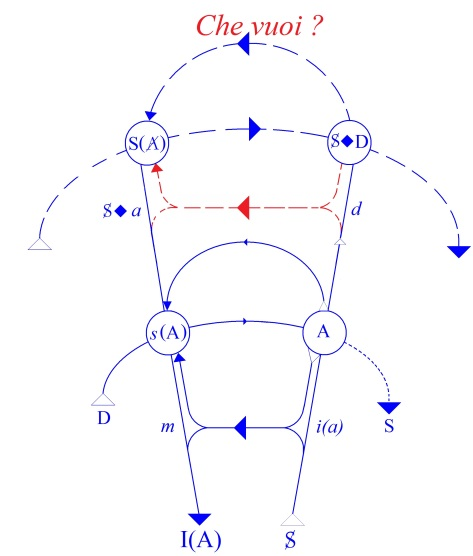
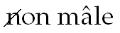
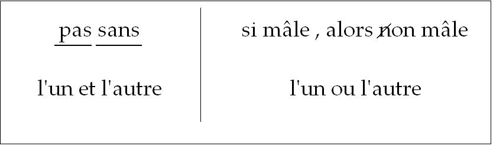
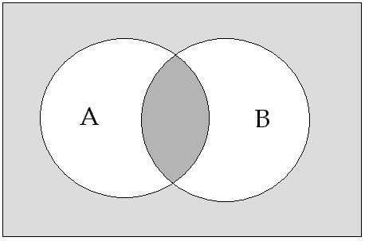
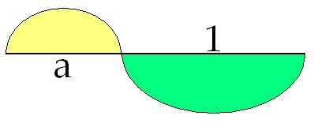

# Leçon 16 | 12 Avril 1967

  

    <label><input type="checkbox" data-lacan-toggle="original" checked> 原文</label>
    <label><input type="checkbox" data-lacan-toggle="notes" checked> 注释</label>
    <label><input type="checkbox" data-lacan-toggle="commentary" checked> 个人解读评论</label>
  

  <form class="lacan-tool-search" role="search">
    <input class="lacan-tool-search-input" type="search" placeholder="搜索全文" aria-label="搜索全文">
    <button class="lacan-tool-button" type="submit" title="搜索">搜索</button>
  </form>
  <button class="lacan-tool-button lacan-back-to-top" type="button" title="回到页面最上方" aria-label="回到页面最上方">↑</button>

<section class="parallel-paragraph" data-paragraph-ids="s14-16-0001">

s14-16-0001

原文 · s14-16-0001

*Non licet omnibus adire…* Puisque personne ne finit : …*Corinthum*.

[无对应译文]

</section>

<section class="parallel-paragraph" data-paragraph-ids="s14-16-0002">

s14-16-0002

原文 · s14-16-0002

J’ai prononcé à la latine le premier mot, pour vous suggérer cette traduction que « *ce n’est pas l’omnibus pour aller à Corinthe* ». \[Rires\]

[无对应译文]

</section>

<section class="parallel-paragraph" data-paragraph-ids="s14-16-0003">

s14-16-0003

原文 · s14-16-0003

L’adage qui nous a été transmis en latin d’une formule grecque, signifie plus - je pense - que la remarque qu’à Corinthe les prostituées étaient chères ! Elles étaient chères, parce qu’elles vous initiaient à quelque cho­se. Ainsi, dirai-je qu’il ne suffit pas de payer le prix. C’est plutôt ce que voulait dire la formule grecque.

[无对应译文]

</section>

<section class="parallel-paragraph" data-paragraph-ids="s14-16-0004">

s14-16-0004

原文 · s14-16-0004

Il n’est pas ouvert à tous, non plus, de devenir *psychanalyste*. Ainsi en est-il, depuis des siècles, pour ce qui est d’être géomètre : « *Que seul entre ici -* vous savez la suite - *celui qui est géomètre.* »

[无对应译文]

</section>

<section class="parallel-paragraph" data-paragraph-ids="s14-16-0005">

s14-16-0005

原文 · s14-16-0005

Cette exigence était inscrite au fron­ton de l’école philosophique la plus célèbre de l’Antiquité et elle indique bien ce dont il s’agit : l’introduction à *un certain mode de pensée*, que nous pouvons préciser, d’un pas de plus : à savoir qu’il s’agit de catégories (au pluriel).

[无对应译文]

</section>

<section class="parallel-paragraph" data-paragraph-ids="s14-16-0006">

s14-16-0006

原文 · s14-16-0006

*Catégories* veut dire, comme vous le savez, en grec, l’équivalent du mot « *prédicaments* » en latin : ce qui est le plus radicalement prédicable pour définir un champ. Voilà ce qui emporte avec soi un registre spécifié de démonstration.

[无对应译文]

</section>

<section class="parallel-paragraph" data-paragraph-ids="s14-16-0007">

s14-16-0007

原文 · s14-16-0007

C’est pour cela qu’on a entendu, dans la suite de l’exigence platonicienne, se manifester de façon réitérée la prétention de démontrer « *more geometrico *», ce qui témoigne combien le dit mode de démonstration représentait un idéal.

[无对应译文]

</section>

<section class="parallel-paragraph" data-paragraph-ids="s14-16-0008">

s14-16-0008

原文 · s14-16-0008

On sait - *on souhaite que vous sachiez*, je vous l’in­dique autant que je peux, c’est-à-dire dans les limites du champ qui m’est, à moi, réservé - que la *méta-mathématique* qui vient maintenant…

[无对应译文]

</section>

<section class="parallel-paragraph" data-paragraph-ids="s14-16-0009">

s14-16-0009

原文 · s14-16-0009

> sur l’éventail des réfections catégorielles qui ont scandé historiquement les concepts du géométrique …que cette *méta-mathématique* - dis-je - vient à radicaliser plus encore le statut du *démontrable.*

[无对应译文]

</section>

<section class="parallel-paragraph" data-paragraph-ids="s14-16-0010">

s14-16-0010

原文 · s14-16-0010

Comme vous le savez, de plus en plus la géométrie s’éloigne des intuitions qui la fondent, spatiales par exem­ple, pour s’attacher à n’être plus qu’une forme spécifiable, et d’ailleurs diversement étagée, de démonstration. Au point qu’au terme, la *méta-mathématique* ne s’occupe plus que de l’ordre de cet étagement, dans l’espoir d’en arriver, pour la démonstration, aux exigences les plus radicales.

[无对应译文]

</section>

<section class="parallel-paragraph" data-paragraph-ids="s14-16-0011">

s14-16-0011

原文 · s14-16-0011

*Supposons* une science qui ne peut commencer que par ce qui est, dans les réfections, ainsi évoquées, d’un cer­tain champ, leur point terminal. Inutile pour une telle scien­ce d’y balbutier un arpentage - d’abord - où s’ordonnerait une première familiarité au mesurable, voire la transmission des formules les plus grosses d’avenir, émergeant singulièrement sous l’aspect du secret de calculs.

[无对应译文]

</section>

<section class="parallel-paragraph" data-paragraph-ids="s14-16-0012">

s14-16-0012

原文 · s14-16-0012

Je veux dire : *inutile* pour elle - *à tout le moins trompeur et vain* - de s’arrêter à l’étape babylonienne de la géométrie.

[无对应译文]

</section>

<section class="parallel-paragraph" data-paragraph-ids="s14-16-0013">

s14-16-0013

原文 · s14-16-0013

Ceci parce que *tout étalon de mesure* que vous rencontrez au départ, *y emporte la souillure d’un mirage impossible à dissiper*.

[无对应译文]

</section>

<section class="parallel-paragraph" data-paragraph-ids="s14-16-0014">

s14-16-0014

原文 · s14-16-0014

### C’est ce que nous avons pointé d’abord dans notre en­seignement, en dénonçant - sans le nommer encore de son terme, tel que nous l’avons épinglé comme l’*imaginaire -* les trom­peries du narcissisme, quand nous avons établi la fonction du *stade du miroir.*

[无对应译文]

</section>

<section class="parallel-paragraph" data-paragraph-ids="s14-16-0015">

s14-16-0015

原文 · s14-16-0015

De rencontrer un tel obstacle, ce fut le lot de beaucoup de sciences, en effet. C’est même là que se situe le privilège de la géométrie.

[无对应译文]

</section>

<section class="parallel-paragraph" data-paragraph-ids="s14-16-0016">

s14-16-0016

原文 · s14-16-0016

Ici bien sûr, s’offre à nous, presque d’emblée, la pureté de *la notion de grandeur*. Qu’elle ne soit pas « *ce qu’un vain peuple pense* [^66] » n’a pas ici à nous retenir. Pour la science que nous supposons, c’est une tout autre tablature : ce n’est pas seulement que *l’étalon* *de mesure* y soit inopérant, c’est que la conception même de l’unité y boîte, tant qu’on n’a pas réalisé la sorte d’égalité où s’institue son élément, c’est-­à-dire l’hétérogénéité qui s’y cache.

[无对应译文]

</section>

<section class="parallel-paragraph" data-paragraph-ids="s14-16-0017">

s14-16-0017

原文 · s14-16-0017

Qu’on se rappelle *l’équation de la valeur*, aux pre­miers pas du *Capital*… de MARX pour ceux qui l’ignoreraient \[Rires\] on ne sait jamais, il y a peut–être des distraits …dans son esprit patent à cette équation, c’est *la proportion* qui résulte des prix de deux marchandises : tant de tant égale tant de tant, *rapport inverse du prix à la quantité obtenue de marchandise*.

[无对应译文]

</section>

<section class="parallel-paragraph" data-paragraph-ids="s14-16-0018">

s14-16-0018

原文 · s14-16-0018

Or, il ne s’agit point du patent, mais de ce qu’elle recèle, de ce que l’équation retient en elle, qui est la différence de nature des valeurs ainsi conjointes et la nécessité de cette différence. Ce ne peut être en effet la proportion, le degré d’urgence par exemple, de deux *valeurs d’usage* qui fonde le prix, non plus de celle *- et pour cause -* de deux *valeurs d’échange*. Dans *l’équation des valeurs*, l’une intervient com­me *valeur d’usage* et l’autre comme *valeur d’échange*. On sait qu’on voit se reproduire un piège semblable, quand il s’agit de la valeur du travail.

[无对应译文]

</section>

<section class="parallel-paragraph" data-paragraph-ids="s14-16-0019">

s14-16-0019

原文 · s14-16-0019

L’important c’est qu’il soit démontré dans *cette œuvre critique* \[*Le capital*, *critique de l’économie politique* (sous–titre)\] comme elle s’intitule elle-même, …que cons­titue *Le Capital,* qu’à méconnaître ces pièges toute démonstra­tion reste stérile ou se dévoie.

[无对应译文]

</section>

<section class="parallel-paragraph" data-paragraph-ids="s14-16-0020">

s14-16-0020

原文 · s14-16-0020

### La contribution du marxisme à la science - ce n’est certes pas moi qui ai fait ce travail - c’est de révéler ce « *latent *» comme nécessaire au départ - au départ-même j’entends - de l’économie politique.

[无对应译文]

</section>

<section class="parallel-paragraph" data-paragraph-ids="s14-16-0021">

s14-16-0021

原文 · s14-16-0021

C’est la même chose pour la psychanalyse, et cette sorte de latent, c’est ce que j’appelle - ce que j’appelle quant à moi - c’est ce que j’appelle : la STRUCTURE. Mes réserves étant prises du côté de tout effort de noyer cette notion…

[无对应译文]

</section>

<section class="parallel-paragraph" data-paragraph-ids="s14-16-0022">

s14-16-0022

原文 · s14-16-0022

> à serrer, des départs nécessaires dans un certain champ qui ne peut se définir autrement que le champ critique …de noyer ceci dans quelque chose que j’identifie mal sous le nom vague de « *structuralisme* ».

[无对应译文]

</section>

<section class="parallel-paragraph" data-paragraph-ids="s14-16-0023">

s14-16-0023

原文 · s14-16-0023

Il ne faut pas croire que ce « *latent* » manque dans *la géométrie*, bien sûr ! Mais l’histoire prouve que c’est à sa fin : maintenant qu’on peut se contenter de s’en apercevoir, parce que les préjugés sur la notion de la grandeur, qui proviennent de son maniement dans le *réel*, n’ont pas fait tort *par hasard* à son progrès logique. Encore n’est-ce que maintenant qu’on peut le savoir, en cons­tatant que la géométrie qui s’est faite n’a plus aucun besoin de la mesure, de la métrique, ni même de l’espace dit *réel.*

[无对应译文]

</section>

<section class="parallel-paragraph" data-paragraph-ids="s14-16-0024">

s14-16-0024

原文 · s14-16-0024

Il n’en va pas ainsi, je vous l’ai dit, pour d’autres sciences, et la question est : « *Pourquoi en est-il qui ne sauraient démarrer sans avoir élaboré ces faits ?* ».

[无对应译文]

</section>

<section class="parallel-paragraph" data-paragraph-ids="s14-16-0025">

s14-16-0025

原文 · s14-16-0025

Je dis, ces *faits -* qu’on peut dire *derniers*, comme étant de structure - peut-être en pouvons-nous poser dès maintenant la question comme perti­nente, si nous savons *la rendre homologue* à ces faits. À la vérité, nous y sommes prêts puisque cette struc­ture, nous l’avons notée autant que pratiquée, à la rencontrer dans notre expérience psychanalytique, et que *nos remarques*…

[无对应译文]

</section>

<section class="parallel-paragraph" data-paragraph-ids="s14-16-0026">

s14-16-0026

原文 · s14-16-0026

> si nous les introduisons de quelque vue, d’ailleurs trivia­les : j’enfonce là des portes ouvertes sur l’ordre des scien­ces …*nos remarques* ne sont pas sans viser à de tels résul­tats qu’il faille bien que cet ordre - *je dis : l’or­dre des sciences* - s’en accommode.

[无对应译文]

</section>

<section class="parallel-paragraph" data-paragraph-ids="s14-16-0027">

s14-16-0027

原文 · s14-16-0027

La structure enseignai-je - depuis que j’enseigne, non depuis que *j’écris,* depuis que *j’enseigne -* la structure, c’est que le sujet soit un fait de langage, soit un fait *du* langage. Le sujet ainsi désigné est ce à quoi est généralement attribuée la fonction de la parole.

[无对应译文]

</section>

<section class="parallel-paragraph" data-paragraph-ids="s14-16-0028">

s14-16-0028

原文 · s14-16-0028

Il se distingue d’introduire un mode d’être qui est son énergie propre - j’entends : *au sens aristotélicien* du terme ἐνέργεια \[energeia\] - ce mode est *l’acte où il se tait*. *Tacere* n’est pas *silere* [^67] et pourtant ils se recouvrent à une frontière obs­cure.

[无对应译文]

</section>

<section class="parallel-paragraph" data-paragraph-ids="s14-16-0029">

s14-16-0029

原文 · s14-16-0029

Écrire, comme on l’a fait, qu’il est vain de chercher dans mes *Écrits* quelque allusion au silence, est une sottise.

[无对应译文]

</section>

<section class="parallel-paragraph" data-paragraph-ids="s14-16-0030">

s14-16-0030

原文 · s14-16-0030

Quand j’ai inscrit la formule de la pulsion - au haut à droi­te du graphe - comme S *barré poinçon de* D (la demande) S◊D, c’est quand la demande se tait, que la pulsion commence.

[无对应译文]

</section>

<section class="parallel-paragraph" data-paragraph-ids="s14-16-0031">

s14-16-0031

原文 · s14-16-0031

[无对应译文]

</section>

<section class="parallel-paragraph" data-paragraph-ids="s14-16-0032">

s14-16-0032

原文 · s14-16-0032

Mais si je n’ai point parlé du silence, c’est que *justement* *sileo* n’est pas *taceo*. L’acte de *se taire* ne libère pas le sujet du langage.

[无对应译文]

</section>

<section class="parallel-paragraph" data-paragraph-ids="s14-16-0033">

s14-16-0033

原文 · s14-16-0033

Même si l’essence du sujet, dans cet acte, culmine - s’il agit l’ombre de sa liberté - ce « *se* *taire *» reste lourd d’une énigme qui a fait lourd si longtemps la présence du monde animal. Nous n’en avons plus trace que dans la phobie, mais souvenons-nous que, longtemps, on y put loger des dieux.

[无对应译文]

</section>

<section class="parallel-paragraph" data-paragraph-ids="s14-16-0034">

s14-16-0034

原文 · s14-16-0034

*Le silence éternel* de quoi que ce soit - de tout ce que vous savez [^68] - ne nous effraie plus qu’à moitié, en raison de l’apparence que donne la science à la conscience commune, de se poser comme un savoir qui refuse de dépendre du langa­ge, sans que pour autant cette prétendue conscience soit frappée de cette corrélation : qu’elle refuse *du même coup­* de dépendre du sujet.

[无对应译文]

</section>

<section class="parallel-paragraph" data-paragraph-ids="s14-16-0035">

s14-16-0035

原文 · s14-16-0035

Ce qui a lieu en vérité, ça n’est pas que la science se passe du sujet, c’est qu’elle le « vide » du langage - j’en­tends : l’expulse - c’est qu’elle se crée ses formules d’un langage *vidé du sujet.* Elle part d’une interdiction sur *l’ef­fet de sujet* du langage.

[无对应译文]

</section>

<section class="parallel-paragraph" data-paragraph-ids="s14-16-0036">

s14-16-0036

原文 · s14-16-0036

Ceci n’a qu’un résultat, c’est de dé­montrer - en effet - que le sujet n’est qu’un effet, et du lan­gage, mais c’est un effet de vide.

[无对应译文]

</section>

<section class="parallel-paragraph" data-paragraph-ids="s14-16-0037">

s14-16-0037

原文 · s14-16-0037

Dès lors, le vide le cerne au plus strict de son essen­ce, c’est-à-dire : le fait apparaître comme pure structure de langage, et c’est là le sens de la découverte de l’inconscient. L’inconscient c’est un moment où parle, à la place du sujet, du pur langage : une phrase dont la question est toujours de savoir qui la dit.

[无对应译文]

</section>

<section class="parallel-paragraph" data-paragraph-ids="s14-16-0038">

s14-16-0038

原文 · s14-16-0038

*L’inconscient, son statut* - qu’on peut bien dire scien­tifique*, puisqu’il s’origine du fait de la science - c’est que le sujet…,* *c’est que c’est le sujet qui, rejeté du symboli­que reparaît dans le réel,* y présentifiant…

[无对应译文]

</section>

<section class="parallel-paragraph" data-paragraph-ids="s14-16-0039">

s14-16-0039

原文 · s14-16-0039

> ce qui est main­tenant *fait* dans l’histoire de la science, j’entends dire : accompli …*y présentifiant son seul support : le langage lui-même*. C’est le sens de l’apparition dans la science, de la nouvelle linguistique.

[无对应译文]

</section>

<section class="parallel-paragraph" data-paragraph-ids="s14-16-0040">

s14-16-0040

原文 · s14-16-0040

De quoi parle le langage lui-même quand il est ainsi désarrimé du sujet, mais par cela le représentant dans son vide structural radicalisé ? Ceci nous le savons : en gros il parle… il parle du *sexe*. D’une parole, dont ce que je vais aborder : *l’acte se­xuel* - pour l’interroger - dont *l’acte sexuel* représente le silence.

[无对应译文]

</section>

<section class="parallel-paragraph" data-paragraph-ids="s14-16-0041">

s14-16-0041

原文 · s14-16-0041

C’est-à-dire - vous allez le voir combien nécessaire­ment - d’une parole tenace, obstinée - ce silence, et pour cause - à le forcer.

[无对应译文]

</section>

<section class="parallel-paragraph" data-paragraph-ids="s14-16-0042">

s14-16-0042

原文 · s14-16-0042

Je prendrais le temps, quand même… Je prendrais le temps de dissiper ici, d’une façon que je ne crois pas inutile, le premier préjugé à se présenter, il n’est pas neuf, bien sûr, mais l’éclairer d’un jour nouveau a toujours sa portée.

[无对应译文]

</section>

<section class="parallel-paragraph" data-paragraph-ids="s14-16-0043">

s14-16-0043

原文 · s14-16-0043

Le premier *préjugé* à se présenter *dans le contexte psychologisant*…

[无对应译文]

</section>

<section class="parallel-paragraph" data-paragraph-ids="s14-16-0044">

s14-16-0044

原文 · s14-16-0044

> la différence est là constituée par référence à l’énonciation que nous ve­nons d’en faire - la seule vraie - de l’inconscient …pourrait se formuler de la chute, dans notre énoncé, d’un indice essen­tiel à la structure.

[无对应译文]

</section>

<section class="parallel-paragraph" data-paragraph-ids="s14-16-0045">

s14-16-0045

原文 · s14-16-0045

*Au nom <u>du</u> sexe*, comme je l’ai dit, *parle­rait-il cet inconscient* ! Ici, la tête frivole - et Dieu sait qu’elle abonde ! - avale ce « *du* » : *l’inconscient parle sexe, il brame, il râle, il roucoule, il miaule* ! Ce n’est pas de l’ordre de tous *les bruits vocaux* de *la parole* : c’est une « *aspiration sexuelle* »… Tel est le sens, en effet, que suppose au meil­leur cas, l’usage qui est fait du terme d’*instinct de vie*, dans la rumination psychanalytique. Tout usage erroné du discours sur le sujet a pour ef­fet de le ravaler, ce discours même, au niveau de ce qu’il fantasme à la place du sujet : ce discours psychanalytique dont je parle est lui-même râle.

[无对应译文]

</section>

<section class="parallel-paragraph" data-paragraph-ids="s14-16-0046">

s14-16-0046

原文 · s14-16-0046

Il râle à appeler la figure d’un Éros qui serait puissance unitive et encore : dans un impact universel. Tenir pour de la même essence ce qui retient ensem­ble les cellules d’un organisme - j’entends de la même es­sence ! - et la force supposée pousser l’individu ainsi composé, à copuler avec un autre, est proprement du domaine du *délire*, en un temps pour lequel *la méiose* - je pense - se distingue suf­fisamment de *la mitose*, au moins au microscope ! \[Rires\] Je veux dire pour tout ce que supposent les phases anatomiques du mé­tabolisme qu’elles représentent.

[无对应译文]

</section>

<section class="parallel-paragraph" data-paragraph-ids="s14-16-0047">

s14-16-0047

原文 · s14-16-0047

L’idée d’ Ἔρως \[Éros\] comme d’une âme aux fins contraires de celles de Θάνατος \[Thanatos\] et agissant par le sexe, c’est un discours de « *midinette au printemps* » comme s’exprimait autrefois le regretté Julien BENDA, bien oublié de nos jours mais enfin qui a représenté, un temps, cette sorte de bretteur qui résul­te d’une *intelligentsia* devenue inutile. \[Rires\]

[无对应译文]

</section>

<section class="parallel-paragraph" data-paragraph-ids="s14-16-0048">

s14-16-0048

原文 · s14-16-0048

S’il fallait quelque chose pour replacer les égarés dans l’axe de « *l’inconscient structuré comme un langage* », ne suffit-il pas de l’évidence fournie par ces objets qu’on n’avait jamais encore spécifiés comme nous pouvons le faire :

[无对应译文]

</section>

<section class="parallel-paragraph" data-paragraph-ids="s14-16-0049">

s14-16-0049

原文 · s14-16-0049

- le *phallus*,

[无对应译文]

</section>

<section class="parallel-paragraph" data-paragraph-ids="s14-16-0050">

s14-16-0050

原文 · s14-16-0050

- les différents *objets partiels* ?

[无对应译文]

</section>

<section class="parallel-paragraph" data-paragraph-ids="s14-16-0051">

s14-16-0051

原文 · s14-16-0051

Nous reviendrons sur ce qui résulte de leur immixtion dans notre pensée, sur le tour qu’ont pris les fumées de tel­le ou telle vague philosophie contemporaine, plus ou moins qualifiée d’*existentialisme.* Pour nous, ces *objets* témoignent que l’inconscient ne parle pas la sexualité, non plus qu’il ne la chante, mais qu’à produire ces *objets* il se trouve juste­ment - *ce que j’ai dit* - en parler, puisque c’est d’être à la sexualité dans un rapport de *métaphore* et de *métonymie* que ces objets se constituent.

[无对应译文]

</section>

<section class="parallel-paragraph" data-paragraph-ids="s14-16-0052">

s14-16-0052

原文 · s14-16-0052

Si fortes, si simples que soient ces vérités, il faut croire qu’elles engendrent une bien grande aversion, puisque c’est à éviter qu’elles restent au centre, qu’elles ne puis­sent être désormais plus le pivot de toute articulation du sujet, que s’engendre cette sorte de liberté falote, à la­quelle j’ai déjà fait allusion plus d’une fois dans ces der­nières phrases et que caractérise le manque de sérieux.

[无对应译文]

</section>

<section class="parallel-paragraph" data-paragraph-ids="s14-16-0053">

s14-16-0053

原文 · s14-16-0053

Que dire de ce que dit de l’acte sexuel, l’incons­cient ?

[无对应译文]

</section>

<section class="parallel-paragraph" data-paragraph-ids="s14-16-0054">

s14-16-0054

原文 · s14-16-0054

Je pourrais dire, si je voulais faire ici du BARBEY D’AUREVILLY : « *Quel est*… »

[无对应译文]

</section>

<section class="parallel-paragraph" data-paragraph-ids="s14-16-0055">

s14-16-0055

原文 · s14-16-0055

> un jour, imagina-t-il de faire dire à un de ces prêtres démoniaques qu’il excellait à feindre … « *Quel est le secret de l’Église ?* » « *Le secret de l’Église*…

[无对应译文]

</section>

<section class="parallel-paragraph" data-paragraph-ids="s14-16-0056">

s14-16-0056

原文 · s14-16-0056

> vous le savez, bien fait pour effrayer de vieilles dames provinciales …*C’est qu’il n’y a pas de Purgatoire* ».\[Rires\]

[无对应译文]

</section>

<section class="parallel-paragraph" data-paragraph-ids="s14-16-0057">

s14-16-0057

原文 · s14-16-0057

Ainsi m’amuserais-je à vous dire ce qui, peut-être, vous ferait quand même un certain effet, et après tout ce n’est pas pour rien que je scande ce que je vais dire de cette étape : « *Le secret de la psychanalyse, le grand secret de la psychanalyse, c’est qu’il n’y a pas d’acte sexuel.* »

[无对应译文]

</section>

<section class="parallel-paragraph" data-paragraph-ids="s14-16-0058">

s14-16-0058

原文 · s14-16-0058

Ceci serait soutenable et illustrable, à vous rappeler ce que j’ai appelé *l’acte,* à savoir ce redoublement d’un effet moteur aussi simple que « *je marche* », qui fait simplement qu’à *se dire* seulement d’un certain accent, il se trouve *répété* et, de ce redoublement, prend la fonction signi­fiante qui le fait pouvoir s’insérer dans une certaine chaîne pour *y inscrire le sujet*.

[无对应译文]

</section>

<section class="parallel-paragraph" data-paragraph-ids="s14-16-0059">

s14-16-0059

原文 · s14-16-0059

Y-a-t-il dans l’acte sexuel ce quelque chose où - *selon la même forme -* le sujet s’inscrirait comme sexué, ins­taurant du même acte *sa conjonction au sujet du sexe qu’on appelle opposé* ?

[无对应译文]

</section>

<section class="parallel-paragraph" data-paragraph-ids="s14-16-0060">

s14-16-0060

原文 · s14-16-0060

Il est bien clair que tout dans l’expérience psycha­nalytique parle là contre : *que rien n’est de cet acte, qui ne témoigne que ne saurait s’en instituer qu’un discours où compte ce tiers, que j’ai tout à l’heure suffisamment annoncé par la présence du phallus et des objets partiels*, et dont il nous faut maintenant articuler la fonction, d’une façon telle qu’elle nous démontre quel rôle elle joue, cette fonction, dans cet acte.

[无对应译文]

</section>

<section class="parallel-paragraph" data-paragraph-ids="s14-16-0061">

s14-16-0061

原文 · s14-16-0061

Fonction toujours glissante, fonction de substitution, qui équivaut presque à une sorte de jonglage et qui, en aucun cas ne nous permet de poser dans l’acte - j’entends : l’acte sexuel - l’homme et la femme opposés en quelque essen­ce éternelle.

[无对应译文]

</section>

<section class="parallel-paragraph" data-paragraph-ids="s14-16-0062">

s14-16-0062

原文 · s14-16-0062

Et pourtant, j’effacerai ce que j’ai dit du « *grand secret* » comme étant *qu’il n’y a pas d’acte sexuel*, justement en ceci :

[无对应译文]

</section>

<section class="parallel-paragraph" data-paragraph-ids="s14-16-0063">

s14-16-0063

原文 · s14-16-0063

- que ce n’est pas un grand secret !

[无对应译文]

</section>

<section class="parallel-paragraph" data-paragraph-ids="s14-16-0064">

s14-16-0064

原文 · s14-16-0064

- que c’est patent !

[无对应译文]

</section>

<section class="parallel-paragraph" data-paragraph-ids="s14-16-0065">

s14-16-0065

原文 · s14-16-0065

- que l’inconscient ne cesse de le crier à tue-tête

[无对应译文]

</section>

<section class="parallel-paragraph" data-paragraph-ids="s14-16-0066">

s14-16-0066

原文 · s14-16-0066

- et que c’est bien pour cela que *les psychanalystes* disent :

[无对应译文]

</section>

<section class="parallel-paragraph" data-paragraph-ids="s14-16-0067">

s14-16-0067

原文 · s14-16-0067

« *Fermons­-lui la bouche, quand il dit cela, parce que si nous le répé­tons avec lui, on ne viendra plus nous trouver !* » \[Rires\]

[无对应译文]

</section>

<section class="parallel-paragraph" data-paragraph-ids="s14-16-0068">

s14-16-0068

原文 · s14-16-0068

À quoi bon, s’il n’y a pas d’acte sexuel ?

[无对应译文]

</section>

<section class="parallel-paragraph" data-paragraph-ids="s14-16-0069">

s14-16-0069

原文 · s14-16-0069

Alors on met l’accent sur le fait qu’il y a de la sexualité. En effet, c’est bien parce qu’il y a de la sexualité qu’il n’y a pas d’acte sexuel ! Mais *l’inconscient* veut peut­–être dire qu’on le manque ! En tout cas, ça a bien l’air !… Seulement, pour que ceci prenne sa portée, il faut bien accentuer d’abord que l’inconscient le *dit.*

[无对应译文]

</section>

<section class="parallel-paragraph" data-paragraph-ids="s14-16-0070">

s14-16-0070

原文 · s14-16-0070

Vous vous rappelez l’anecdote du curé qui prêche, hein ? Il a prêché sur le péché. Qu’est-ce qu’il a dit ? *Il était contre*… \[Rires\]

[无对应译文]

</section>

<section class="parallel-paragraph" data-paragraph-ids="s14-16-0071">

s14-16-0071

原文 · s14-16-0071

Eh bien, l’inconscient - *qui prêche lui aussi à sa façon sur le sujet de l’acte sexuel -* eh bien : *il est pas pour* !

[无对应译文]

</section>

<section class="parallel-paragraph" data-paragraph-ids="s14-16-0072">

s14-16-0072

原文 · s14-16-0072

C’est de là d’abord, pour concevoir ce dont il s’agit quand il s’agit de l’inconscient, qu’il convient de partir.

[无对应译文]

</section>

<section class="parallel-paragraph" data-paragraph-ids="s14-16-0073">

s14-16-0073

原文 · s14-16-0073

La différence de l’inconscient avec le curé mérite quand même d’être relevée à ce niveau : c’est que le curé dit que le péché est le péché, au lieu que, peut-être, l’inconscient c’est lui qui fait de la sexualité un péché. Il y a une petite différence. Là-dessus, la question va être de savoir comment se propose à nous ceci : que le sujet a à se mesurer avec la dif­ficulté d’être un sujet sexué.

[无对应译文]

</section>

<section class="parallel-paragraph" data-paragraph-ids="s14-16-0074">

s14-16-0074

原文 · s14-16-0074

C’est ce pourquoi j’ai introduit dans mes derniers propos logistiques cette référence…

[无对应译文]

</section>

<section class="parallel-paragraph" data-paragraph-ids="s14-16-0075">

s14-16-0075

原文 · s14-16-0075

> dont je pense que j’ai suffisamment souligné ce qu’elle vise : d’établir le statut de *l’objet petit(a)* …celle qui s’appelle *le Nombre d’or,* en tant qu’il donne proprement, sous une forme aisément maniable, son statut à ce qui est en question, à savoir : l’incommensu­rable.

[无对应译文]

</section>

<section class="parallel-paragraph" data-paragraph-ids="s14-16-0076">

s14-16-0076

原文 · s14-16-0076

Nous partons de l’idée *- pour l’introduire -* que dans l’acte sexuel il n’est aucunement question que ce *petit(a),* où nous indiquons ce quelque chose qui est en quelque sorte *la substance du sujet*…

[无对应译文]

</section>

<section class="parallel-paragraph" data-paragraph-ids="s14-16-0077">

s14-16-0077

原文 · s14-16-0077

> si vous entendez cette *substance* au sens où ARISTOTE la désigne dans l’οὐσία \[ousia\], à savoir - *ce qu’on oublie* - c’est que ce qui la spécifie est justement ceci qu’elle ne saurait d’aucune façon être attribuée à aucun su­jet, le sujet étant entendu comme l’ὑποχείμενον \[upokeimenon\] *…*cet *objet petit(a),* en tant qu’il nous sert de module pour interroger celui qui en est supporté, n’a pas à chercher son complément à la dyade : ce qui lui *manque* pour faire deux, ce qui serait bien désirable.

[无对应译文]

</section>

<section class="parallel-paragraph" data-paragraph-ids="s14-16-0078">

s14-16-0078

原文 · s14-16-0078

C’est que la solution de ce rapport, grâce à quoi peut s’établir le *deux*, tient tout entière dans ce qui va se passer de la référence du *petit(a)* - *le Nombre d’or* - au « 1 » en tant qu’il engendre ce manque, qui s’inscrit ici d’un simple effet de report et, du même coup de différence : sous une forme : 1-*a* qui, au calcul…

[无对应译文]

</section>

<section class="parallel-paragraph" data-paragraph-ids="s14-16-0079">

s14-16-0079

原文 · s14-16-0079

> un fort simple calcul que j’ai déjà assez inscrit sur ce tableau pour vous prier de le retrouver vous-mêmes …se formule par a *au* *carré* : 1-*a* = *a*2 .

[无对应译文]

</section>

<section class="parallel-paragraph" data-paragraph-ids="s14-16-0080">

s14-16-0080

原文 · s14-16-0080

Je ne le rappelle ici, que pour mettre, à l’orée de ce que je veux introduire, ce qui essentiel à articuler pour vous, comme je l’ai dit tout à l’heure, d’abord, au dé­part de notre science, à savoir ce qui introduit nécessaire­ment, quoique paradoxalement, à ce nœud sexuel, où se dérobe et nous fuit l’acte qui fait pour l’instant notre *interrogation.*

[无对应译文]

</section>

<section class="parallel-paragraph" data-paragraph-ids="s14-16-0081">

s14-16-0081

原文 · s14-16-0081

Le lien de ce *petit(a)* en tant :

[无对应译文]

</section>

<section class="parallel-paragraph" data-paragraph-ids="s14-16-0082">

s14-16-0082

原文 · s14-16-0082

- qu’ici vous le voyez, il *représente*, *darstellt,* supporte et présentifie d’abord le sujet lui-même,

[无对应译文]

</section>

<section class="parallel-paragraph" data-paragraph-ids="s14-16-0083">

s14-16-0083

原文 · s14-16-0083

- que c’est là le même qui va apparaître dans l’échange, dont nous allons maintenant montrer la formule, comme pouvant servir de cet objet que nous touchons dans la dialectique de la cure, sous le nom de l’objet partiel, …le rapport donc de ces deux faces de la fonction *petit(a)* avec cet *indice*, cette *forme de l’objet* qui est au principe de *la castration*.

[无对应译文]

</section>

<section class="parallel-paragraph" data-paragraph-ids="s14-16-0084">

s14-16-0084

原文 · s14-16-0084

Je ne clorai pas ce cycle aujourd’hui, c’est pour­quoi je veux l’introduire par deux formules répondant à une sor­te de problème que nous posons *a priori* : quelle valeur fau­drait-il donner à cet *objet petit(a)*…

[无对应译文]

</section>

<section class="parallel-paragraph" data-paragraph-ids="s14-16-0085">

s14-16-0085

原文 · s14-16-0085

> s’il est bien là comme devant représenter dans la *dyade sexuelle*, la différence …pour qu’il produise deux résultats entre lesquels est suspen­due aujourd’hui notre question ?

[无对应译文]

</section>

<section class="parallel-paragraph" data-paragraph-ids="s14-16-0086">

s14-16-0086

原文 · s14-16-0086

Question qui ne saurait être abordée que par la voie où je vous mène en tant qu’elle est la voie logique, j’entends : la voie de la logique. La *dyade* et ses suspens, c’est ce que, depuis l’origine, si l’on sait en suivre la trace, élabore la logique elle-même.

[无对应译文]

</section>

<section class="parallel-paragraph" data-paragraph-ids="s14-16-0087">

s14-16-0087

原文 · s14-16-0087

Je ne suis pas fait pour vous retracer ici *l’Histoire de la logique*, mais qu’il me suffise ici d’évoquer, à l’aurore, que l’*Organon* aristotélicien est bien autre chose qu’un simple formalisme, si vous savez le sonder. Au premier point de la logique du prédicat, s’édifie l’opposition entre les *contraires* et les *contradictoires.* Nous avons fait, vous le savez, bien des progrès depuis, mais ça n’est pas une raison pour ne pas nous intéresser à ce qui fait l’intérêt et le sta­tut de leur entrée dans l’Histoire.

[无对应译文]

</section>

<section class="parallel-paragraph" data-paragraph-ids="s14-16-0088">

s14-16-0088

原文 · s14-16-0088

Ce n’est d’ailleurs pas - je le dis aussi entre pa­renthèses, pour ceux qui ouvrent quelquefois les bouquins de logique - pour nous interdire - quand nous reprenons à la trace ce qu’a énoncé ARISTOTE, en *même temps*, même pas en marge - d’introduire ce dont par exemple LUKASIEWICZ[^69] l’a complété depuis.

[无对应译文]

</section>

<section class="parallel-paragraph" data-paragraph-ids="s14-16-0089">

s14-16-0089

原文 · s14-16-0089

Je dis cela parce que dans le livre - d’ailleurs excel­lent - des KNEALE[^70], j’ai été frappé d’une protestation, comme ça, qui s’élevait au tournant d’une page, parce que pour dire ce que dit ARISTOTE, M. LUKASIEWICZ, par exemple, vient à distinguer ce qui tient au *principe de contradiction* du *principe d’identité* et du *principe de bivalence* ! Voilà !

[无对应译文]

</section>

<section class="parallel-paragraph" data-paragraph-ids="s14-16-0090">

s14-16-0090

原文 · s14-16-0090

- Le *principe d’identité*, c’est qu’A est A. Vous savez que ce n’est pas clair que A soit A. Heureusement, ARISTOTE ne le dit pas, mais qu’on le fasse remarquer a tout de même un intérêt !

[无对应译文]

</section>

<section class="parallel-paragraph" data-paragraph-ids="s14-16-0091">

s14-16-0091

原文 · s14-16-0091

- Deuxièmement : qu’une chose puisse être à la fois, *en même temps* être A et non A, c’est encore tout autre chose !

[无对应译文]

</section>

<section class="parallel-paragraph" data-paragraph-ids="s14-16-0092">

s14-16-0092

原文 · s14-16-0092

- Quant au *principe de bivalence*, à savoir qu’une chose doit être vraie ou être fausse, c’est encore une troisième chose !

[无对应译文]

</section>

<section class="parallel-paragraph" data-paragraph-ids="s14-16-0093">

s14-16-0093

原文 · s14-16-0093

Je trouve que :

[无对应译文]

</section>

<section class="parallel-paragraph" data-paragraph-ids="s14-16-0094">

s14-16-0094

原文 · s14-16-0094

- de le faire remarquer éclaire plutôt ARISTOTE,

[无对应译文]

</section>

<section class="parallel-paragraph" data-paragraph-ids="s14-16-0095">

s14-16-0095

原文 · s14-16-0095

- que de faire remarquer qu’ARISTOTE *n’a jamais sû­rement pensé* à toutes ces gentillesses, n’a rien à faire avec la question !

[无对应译文]

</section>

<section class="parallel-paragraph" data-paragraph-ids="s14-16-0096">

s14-16-0096

原文 · s14-16-0096

Car c’est précisément ce qui permet de donner son intérêt à ce dont je repars maintenant : à cette grossière affaire des *contraires*.

[无对应译文]

</section>

<section class="parallel-paragraph" data-paragraph-ids="s14-16-0097">

s14-16-0097

原文 · s14-16-0097

D’abord, en tant que pour nous…

[无对应译文]

</section>

<section class="parallel-paragraph" data-paragraph-ids="s14-16-0098">

s14-16-0098

原文 · s14-16-0098

> je veux dire pour ce qui n’est pas dans ARISTOTE mais ce qui est déjà indiqué dans mon enseignement passé …nous le désignerons par le « *pas sans *». Ça nous servira plus tard. Ne vous inquié­tez pas ! Laissez-moi un petit peu vous *conduire*…

[无对应译文]

</section>

<section class="parallel-paragraph" data-paragraph-ids="s14-16-0099">

s14-16-0099

原文 · s14-16-0099

*Les contraires -* c’est ça qui soulève toute la ques­tion logique de savoir si oui ou non, la *proposition particulière* implique l’existence – ça a toujours énormément choqué. Dans ARISTOTE, elle l’implique incontestablement : c’est même là-dessus que tient sa logique.

[无对应译文]

</section>

<section class="parallel-paragraph" data-paragraph-ids="s14-16-0100">

s14-16-0100

原文 · s14-16-0100

C’est curieux que la *proposi­tion universelle* ne l’implique pas !

[无对应译文]

</section>

<section class="parallel-paragraph" data-paragraph-ids="s14-16-0101">

s14-16-0101

原文 · s14-16-0101

Je peux dire : « *Tout centaure a six membres* ».

[无对应译文]

</section>

<section class="parallel-paragraph" data-paragraph-ids="s14-16-0102">

s14-16-0102

原文 · s14-16-0102

C’est absolument *vrai*, simplement *il n’y a pas de centaures*. C’est une *proposition universelle*.

[无对应译文]

</section>

<section class="parallel-paragraph" data-paragraph-ids="s14-16-0103">

s14-16-0103

原文 · s14-16-0103

Mais si je dis, dans ARISTOTE : « *Il y a des centaures qui en ont perdu un.* » Ça implique que les centaures existent, pour ARISTOTE.

[无对应译文]

</section>

<section class="parallel-paragraph" data-paragraph-ids="s14-16-0104">

s14-16-0104

原文 · s14-16-0104

J’essaie de reconstruire une logique qui soit un peu moins boiteuse, du côté du centaure. \[Rires\] Mais ceci ne nous intéresse pas, pour l’instant. Simplement « *Il n’y a pas de mâle sans femelle.* » Ceci est de l’ordre du *réel*. Ça n’a rien à faire avec *la logique*, tout au moins de nos jours. *Et puis il y a le contradictoire,* qui veut dire ceci : si quelque chose est mâle, alors ça n’est pas *non-mâle.*

[无对应译文]

</section>

<section class="parallel-paragraph" data-paragraph-ids="s14-16-0105">

s14-16-0105

原文 · s14-16-0105

\[Lacan écrit au tableau « Si mâle alors non mâle », puis barre le « n » de non mâle\]

[无对应译文]

</section>

<section class="parallel-paragraph" data-paragraph-ids="s14-16-0106">

s14-16-0106

原文 · s14-16-0106

> 

[无对应译文]

</section>

<section class="parallel-paragraph" data-paragraph-ids="s14-16-0107">

s14-16-0107

原文 · s14-16-0107

Il s’agit de trouver notre chemin dans ces deux formules distinctes. La seconde est de l’ordre *symbolique*, elle est une convention *symbolique*, qui a un nom, justement : *le tiers exclu.* Ceci doit suffisamment nous faire sentir que ce n’est pas de ce côté-là que nous allons pouvoir nous arranger, puisque, au départ, nous avons suffisamment accentué la fonction d’une différence, comme étant essentielle au statut de la dyade sexuelle. Si elle peut être fondée - j’entends : subjective­ment - nous aurons besoin de ce tiers.

[无对应译文]

</section>

<section class="parallel-paragraph" data-paragraph-ids="s14-16-0108">

s14-16-0108

原文 · s14-16-0108

Essayons, n’essayons pas… ne faisons pas la vaine grimace de prétendre tenter ce que nous avons introduit déjà, à savoir le statut logique du contraire. Du contraire en tant qu’*ici* « *l’un <u>et</u> l’autre* » s’oppose au « *l’un <u>ou</u> l’autre* » de *là* .

[无对应译文]

</section>

<section class="parallel-paragraph" data-paragraph-ids="s14-16-0109">

s14-16-0109

原文 · s14-16-0109

[无对应译文]

</section>

<section class="parallel-paragraph" data-paragraph-ids="s14-16-0110">

s14-16-0110

原文 · s14-16-0110

Ce « *l’un et l’autre* », c’est l’intersection, j’entends l’intersection logique : *mâle et femelle*. Si nous voulons inscrire ce « *l’un et l’autre* » sous la forme de l’intersection de l’algèbre de BOOLE, ceci veut dire : cette petite lunule de recouvrement spatial \[en gris\] :

[无对应译文]

</section>

<section class="parallel-paragraph" data-paragraph-ids="s14-16-0111">

s14-16-0111

原文 · s14-16-0111

[无对应译文]

</section>

<section class="parallel-paragraph" data-paragraph-ids="s14-16-0112">

s14-16-0112

原文 · s14-16-0112

dont je suis absolument consterné de devoir, une fois de plus, vous présenter la figure, car, bien entendu, vous voyez bien qu’elle ne vous satisfait à aucun degré. Ce que vous voudriez, c’est qu’il y en ait un qui soit mâle et l’autre femelle, et que de temps en temps, ils se marchent sur les pieds !

[无对应译文]

</section>

<section class="parallel-paragraph" data-paragraph-ids="s14-16-0113">

s14-16-0113

原文 · s14-16-0113

Ce n’est pas de ça qu’il s’agit. Il s’agit d’une multiplication logique. L’importance de vous rappeler cette figure boo­léenne, c’est de vous rappeler, à la différence d’ici, qui est ce lieu très important du jeu de « *pile ou face* »…

[无对应译文]

</section>

<section class="parallel-paragraph" data-paragraph-ids="s14-16-0114">

s14-16-0114

原文 · s14-16-0114

> à quoi j’essayé de former ceux qui me suivaient les premières années, au moins pendant un trimestre, histoire de leur faire entendre ce que c’était que le signifiant …à l’opposé du jeu de « *pile ou face* »…

[无对应译文]

</section>

<section class="parallel-paragraph" data-paragraph-ids="s14-16-0115">

s14-16-0115

原文 · s14-16-0115

> qui s’inscrit tout uniment en *une succession de + ou de –* *…*le rapport de *l’un et l’autre* s’inscrit sous la forme *d’une multiplication*, j’entends d’une *multiplication logique*, d’une *multiplication booléenne*.

[无对应译文]

</section>

<section class="parallel-paragraph" data-paragraph-ids="s14-16-0116">

s14-16-0116

原文 · s14-16-0116

Quelle valeur - puisque c’est de cela qu’il s’agit - ­pouvons-nous supposer à l’élément de différence, pour que le résultat soit, tout net, la dyade ? Mais bien sûr, c’est vraiment à la portée de tout le monde de le savoir. Vous avez tous au moins gardé ceci de teinture des mathématiques qu’on vous enseignées, si stupidement pour peu que vous ayez plus de 30 ans, puis si vous avez 20 ans vous avez peut-être eu des chances d’en entendre parler d’une façon un peu différente, qu’importe !

[无对应译文]

</section>

<section class="parallel-paragraph" data-paragraph-ids="s14-16-0117">

s14-16-0117

原文 · s14-16-0117

Vous êtes tous sur le même pied, concernant la formule *(a + b) . (a – b)*. Voilà la différence :

[无对应译文]

</section>

<section class="parallel-paragraph" data-paragraph-ids="s14-16-0118">

s14-16-0118

原文 · s14-16-0118

- *il y en a un qui l’a en plus,*

[无对应译文]

</section>

<section class="parallel-paragraph" data-paragraph-ids="s14-16-0119">

s14-16-0119

原文 · s14-16-0119

- *l’autre qui l’a en moins.*

[无对应译文]

</section>

<section class="parallel-paragraph" data-paragraph-ids="s14-16-0120">

s14-16-0120

原文 · s14-16-0120

Si vous les multipliez, ça fait *a2 - b2*. Qu’est-ce qu’il faut pour que *a2- b2* soit tout net égal à 2, à la dyade ?

[无对应译文]

</section>

<section class="parallel-paragraph" data-paragraph-ids="s14-16-0121">

s14-16-0121

原文 · s14-16-0121

C’est très facile, *il suffit d’égaler* ce qui est écrit ici :

[无对应译文]

</section>

<section class="parallel-paragraph" data-paragraph-ids="s14-16-0122">

s14-16-0122

原文 · s14-16-0122

### *b à racine de moins un, b =* = *i*, c’est-à-dire à une fonction numérique qu’on ap­pelle *nombre imaginaire* et qui intervient maintenant dans tous les calculs, de la façon la plus courante, pour fonder ce qu’on appelle - extension des nombres réels - les *nombres com­plexes.*

[无对应译文]

</section>

<section class="parallel-paragraph" data-paragraph-ids="s14-16-0123">

s14-16-0123

原文 · s14-16-0123

### *a* - s’il s’agit de le spécifier de deux façons opposées, avec *plus* quelque chose, et avec *moins* quelque chose, et qu’il en résulte 2 - il suffit de l’égaler à 1.

[无对应译文]

</section>

<section class="parallel-paragraph" data-paragraph-ids="s14-16-0124">

s14-16-0124

原文 · s14-16-0124

C’est ainsi que, d’habitude, on écrit, d’une façon abrégée, d’ailleurs beau­coup plus commode, cette fonction dite imaginaire du .

[无对应译文]

</section>

<section class="parallel-paragraph" data-paragraph-ids="s14-16-0125">

s14-16-0125

原文 · s14-16-0125

Ne croyez pas que ça ne doive nous servir à rien du tout, ce que je vous explique là ! Je l’introduis ici, à l’orée de ce que j’ai à vous indiquer, parce que cela nous servira dans la suite et que ceci est le cœur d’un rapprochement, qui s’offre à nous comme autre possibilité, à savoir : si nous nous demandons à l’avance ce qu’il convient d’obtenir. Ce qui a peut–être aussi pour nous son intérêt !

[无对应译文]

</section>

<section class="parallel-paragraph" data-paragraph-ids="s14-16-0126">

s14-16-0126

原文 · s14-16-0126

Car il est très in­téressant aussi de savoir pourquoi, pourquoi dans l’incons­cient - concernant l’acte sexuel - eh bien justement, ce qui serre, ce qui marque *la différence* - au premier rang de quoi est le sujet lui-même - eh bien, non seulement nous sommes bien forcés de dire que ça reste à la fin, mais il est *exigé*, pour que ce soit un acte sexuel, que ça reste à la fin !

[无对应译文]

</section>

<section class="parallel-paragraph" data-paragraph-ids="s14-16-0127">

s14-16-0127

原文 · s14-16-0127

Autrement dit, que : *(a + b)(a – b)= a* !

[无对应译文]

</section>

<section class="parallel-paragraph" data-paragraph-ids="s14-16-0128">

s14-16-0128

原文 · s14-16-0128

Pour que ceci égale *a*, quand *a*, bien sûr, naturel­lement ce n’est pas ce *a* d’ici  \[*(a+b)(a–b)=* 2\] dont je parle, le *a* d’ici, nous allons le faire - comme tout à l’heu­re, quand il s’agissait *d’obtenir 2* - nous allons le faire égal à 1.

[无对应译文]

</section>

<section class="parallel-paragraph" data-paragraph-ids="s14-16-0129">

s14-16-0129

原文 · s14-16-0129

Il est bien entendu que c’est (1+i)(1–i) qui est égal à 2.

[无对应译文]

</section>

<section class="parallel-paragraph" data-paragraph-ids="s14-16-0130">

s14-16-0130

原文 · s14-16-0130

[无对应译文]

</section>

<section class="parallel-paragraph" data-paragraph-ids="s14-16-0131">

s14-16-0131

原文 · s14-16-0131

(1+a)(1- a) donne *a*, à condition que *a* soit égal à ce *Nombre d’or* - c’est le cas de le redire - dont je me sers pour introduire pour vous la fonction de *l’objet petit(a).*Vérifiez : quand *petit(a)* est égal au *Nombre d’or*, le produit de (1+a) (1-a = a. \[1+a=1/a ; 1–a = a2 ; (1+a) (1–a)= (1/a)a2 =a\]

[无对应译文]

</section>

<section class="parallel-paragraph" data-paragraph-ids="s14-16-0132">

s14-16-0132

原文 · s14-16-0132

C’est ici que je suspends pour un temps - le temps de la leçon que j’ai à finir - ce dont j’ai voulu, pour vous, pro­poser *la grille logique*.

[无对应译文]

</section>

<section class="parallel-paragraph" data-paragraph-ids="s14-16-0133">

s14-16-0133

原文 · s14-16-0133

Venons maintenant à considérer ce dont il s’agit, con­cernant l’acte sexuel. Ce qui va nous servir à nous en occuper, est ce qui justifie le fait que tout à l’heure j’ai introduit la formu­le de MARX. MARX nous dit, quelque part dans les *Manifestes philosophiques,* que l’objet de l’homme n’est rien d’autre que *son essence–même* prise comme objet, que l’objet aussi auquel un sujet se rapporte \- par essence et nécessairement - n’est rien d’autre que l’essence propre de ce sujet non objectivé.

[无对应译文]

</section>

<section class="parallel-paragraph" data-paragraph-ids="s14-16-0134">

s14-16-0134

原文 · s14-16-0134

Des gens, parmi lesquels j’ai quelques–unes des per­sonnes qui m’écoutent, ont bien montré le côté, je dirais primaire, de cette approximation marxiste. Il serait curieux que nous soyons très en avance sur cette formulation. Cet objet dont il s’agit, cette essence propre du su­jet, mais objectivé, est–ce que ce n’est pas nous qui pouvons lui donner sa véritable substance ?

[无对应译文]

</section>

<section class="parallel-paragraph" data-paragraph-ids="s14-16-0135">

s14-16-0135

原文 · s14-16-0135

Partons de ceci où nous avons dès longtemps pris appui : qu’il y a un rapport entre ce qu’énonce la psychanaly­se sur le sujet de la loi fondamentale du sexe et *l’interdiction de l’inceste*, pour autant que pour nous elle est un autre reflet, et déjà combien suffisant, de la présence de l’élément *tiers* dans tout acte sexuel, en tant qu’il exige présence et fondation du sujet. Aucun acte sexuel \- c’est là l’entrée dans le monde de la psychanalyse - qui ne porte la trace de ce qu’on appelle improprement, la scène traumatique, autrement dit un rapport référentiel fondamental au couple des parents.

[无对应译文]

</section>

<section class="parallel-paragraph" data-paragraph-ids="s14-16-0136">

s14-16-0136

原文 · s14-16-0136

Comment se présentent les choses à l’autre bout ? Vous le savez – LÉVI-STRAUSS : « *Structures élémentaires de la parenté »  *- *l’ordre d’échange* sur lequel s’institue *l’ordre de la parenté*, c’est la femme qui en fait les frais : *ce sont les femmes qu’on échange*.

[无对应译文]

</section>

<section class="parallel-paragraph" data-paragraph-ids="s14-16-0137">

s14-16-0137

原文 · s14-16-0137

Quelle qu’elle soit - patriarcale, matriarcale, peu importe ! - ce que la logique de l’inscription impose à l’ethno­logue, c’est de voir comment voyagent les femmes entre les li­gnées. Il semble que, de l’un à l’autre, il y ait là quelque *béance*.

[无对应译文]

</section>

<section class="parallel-paragraph" data-paragraph-ids="s14-16-0138">

s14-16-0138

原文 · s14-16-0138

Eh bien, c’est ce que nous allons essayer, aujourd’hui d’indiquer comment cette béance, pour nous, s’articule, au­trement dit, comment, dans notre champ elle se comble.

[无对应译文]

</section>

<section class="parallel-paragraph" data-paragraph-ids="s14-16-0139">

s14-16-0139

原文 · s14-16-0139

Nous avons tout à l’heure marqué que l’origine du *dé­masquage*, de la *démystification* économique, est à voir dans la conjonction de deux valeurs de nature différente. C’est bien ici ce à quoi nous avons affaire. Et toute la question est celle-ci, pour le psychanalyste : de s’apercevoir que ce qui, de l’acte sexuel, fait problème, n’est pas *social,* puisque c’est là que se constitue le principe du social, à savoir dans la loi d’un échange.

[无对应译文]

</section>

<section class="parallel-paragraph" data-paragraph-ids="s14-16-0140">

s14-16-0140

原文 · s14-16-0140

L’échange des femmes ou… *non, ceci ne nous regarde pas encore*. Car si nous nous apercevons que le problème est de l’ordre de la valeur, je dirai que déjà tout commence à s’é­clairer suffisamment de lui donner son nom.

[无对应译文]

</section>

<section class="parallel-paragraph" data-paragraph-ids="s14-16-0141">

s14-16-0141

原文 · s14-16-0141

Au principe de ce qui redouble - de ce qui dédouble en sa structure - *la va­leur* au niveau de l’inconscient, il y a ce *quelque chose* qui tient la place de *la valeur d’échange*, *en tant que de sa faus­se identification à la valeur d’usage*, résulte la fondation de *l’objet-marchandise*.

[无对应译文]

</section>

<section class="parallel-paragraph" data-paragraph-ids="s14-16-0142">

s14-16-0142

原文 · s14-16-0142

Et même on peut dire plus : qu’il faut le capitalisme pour que cette chose, qui l’antécède de beaucoup, soit révélée.

[无对应译文]

</section>

<section class="parallel-paragraph" data-paragraph-ids="s14-16-0143">

s14-16-0143

原文 · s14-16-0143

De même, il faut le statut du sujet, tel que le forge la science, de ce sujet réduit à sa fonction d’intervalle, pour que nous nous apercevions que ce dont il s’agit, de l’é­galisation de deux valeurs différentes, se tient ici entre *valeur* *d’usage -* et pourquoi pas ?

[无对应译文]

</section>

<section class="parallel-paragraph" data-paragraph-ids="s14-16-0144">

s14-16-0144

原文 · s14-16-0144

Nous verrons ça tout à l’heure - et *valeur de jouissance.* Je souligne : *valeur de jouissance* joue là le rôle de la *valeur d’échange*.

[无对应译文]

</section>

<section class="parallel-paragraph" data-paragraph-ids="s14-16-0145">

s14-16-0145

原文 · s14-16-0145

Vous devez bien sentir tout de suite que ça a vraiment quelque chose qui concerne le cœur même de l’enseignement analytique, cette fonction de *valeur de jouissance*, que peut-être c’est là ce qui va nous permettre de formuler d’une façon complètement différente, ce qu’il en est de la castra­tion.

[无对应译文]

</section>

<section class="parallel-paragraph" data-paragraph-ids="s14-16-0146">

s14-16-0146

原文 · s14-16-0146

Car enfin, si quelque chose est accentué, dans la notion même, si confuse soit-elle encore, dans la théorie, de matura­tion pulsionnelle, c’est bien quand même ceci : *qu’il n’y a d’acte sexuel* - j’entends au sens où je viens d’articuler sa nécessité - *qui* *ne comporte* - chose étrange - *la castration*. Qu’appelle-t-on *la castration* ? Ça n’est tout de même pas…

[无对应译文]

</section>

<section class="parallel-paragraph" data-paragraph-ids="s14-16-0147">

s14-16-0147

原文 · s14-16-0147

> comme dans les formules si agréablement avancées par le « *Petit Hans* » …qu’on *dévisse le pe­tit robinet* ! Il faut bien qu’il reste à sa place.

[无对应译文]

</section>

<section class="parallel-paragraph" data-paragraph-ids="s14-16-0148">

s14-16-0148

原文 · s14-16-0148

*Ce qui est en cause*, c’est ce qui s’étale partout d’ailleurs dans la théorie analytique, *c’est qu’il ne saurait prendre sa jouis­sance en lui-même*.

[无对应译文]

</section>

<section class="parallel-paragraph" data-paragraph-ids="s14-16-0149">

s14-16-0149

原文 · s14-16-0149

Je suis à la fin de ma leçon d’aujourd’hui, de sorte que là, n’en doutez pas, j’abrège. J’y reviendrai la prochaine fois.

[无对应译文]

</section>

<section class="parallel-paragraph" data-paragraph-ids="s14-16-0150">

s14-16-0150

原文 · s14-16-0150

Mais c’est pour accentuer simplement ceci, d’où je vou­drais partir, c’est à savoir ce que cette équation des deux *valeurs*, dites *d’usage* et *d’échange,* a d’essentiel en notre matière.

[无对应译文]

</section>

<section class="parallel-paragraph" data-paragraph-ids="s14-16-0151">

s14-16-0151

原文 · s14-16-0151

### Supposez l’homme réduit à ce qu’il faut bien dire - on ne l’a jamais encore réduit institutionnellement - à la fonction qu’a l’étalon dans les animaux domestiques. Autre­ment dit servons-nous de *l’anglais* où comme vous le savez, on dit *a she-goat* pour dire *une chèvre*, ce qui veut dire *un elle-bouc.*

[无对应译文]

</section>

<section class="parallel-paragraph" data-paragraph-ids="s14-16-0152">

s14-16-0152

原文 · s14-16-0152

Eh bien, appelons l’homme comme il convient : un *he-man*. C’est tout à fait concevable, instrumentalement. En fait, s’il y a quelque chose qui donne une idée claire de la valeur d’usage, c’est de ce qu’on fait quand on fait venir un taureau pour un certain nombre de saillies. Et il est bien *singulier* que personne n’ait imaginé d’inscrire *les structures élémentaires de la parenté* dans cette circulation du tout-puissant *phallus* !

[无对应译文]

</section>

<section class="parallel-paragraph" data-paragraph-ids="s14-16-0153">

s14-16-0153

原文 · s14-16-0153

Chose curieuse : c’est nous qui découvrons que cette valeur phallique, c’est la femme qui la représente ! Si *la jouissance* - j’entends : la jouissance pénien­ne - porte la marque dite de *la castration*, il semble *que ce soit pour que* - d’une façon que nous appellerons avec BENTHAM : « *fictive* » - *ce soit la femme qui devienne ce dont on jouit*. Prétention singulière, qui nous ouvre toutes les ambiguïtés propres au mot de « *jouissance* » pour autant que dans les termes du développement juridique qu’il comporte à partir de ce moment, il implique : possession.

[无对应译文]

</section>

<section class="parallel-paragraph" data-paragraph-ids="s14-16-0154">

s14-16-0154

原文 · s14-16-0154

Autrement dit que voici quelque chose de retourné : ça n’est plus le sexe de notre taureau - valeur d’usage - qui va servir à cette sorte de circulation où s’instaure l’ordre sexuel, c’est la femme, en tant qu’elle est devenue à cette occasion, elle-même le lieu de transfert de cette valeur soustraite au niveau de la valeur d’usage, sous la forme de *l’objet de jouissance. C’est très curieux !*

[无对应译文]

</section>

<section class="parallel-paragraph" data-paragraph-ids="s14-16-0155">

s14-16-0155

原文 · s14-16-0155

C’est très curieux, parce que ça nous entraîne : si j’ai introduit tout à l’heure, pour vous, le *he-man,* me voilà… et d’ailleurs, d’une façon très con­forme au génie de la langue anglaise, qui appelle la femme *woman* et Dieu sait si la littérature a fait des gorges chaudes sur ce *wo* qui n’indique rien de bon \[Rires\] - je l’appellerai: *she-man,* ou encore en langue française, de ce mot - qui va prêter, à partir du moment où je l’introduis à quelque gorges chaudes et je suppose à énormément de malentendus : *L, apos­trophe, homme-elle.*J’introduis ici *l’homme-elle !* \[Rires\] Je vous la pré­sente, je la tiens par le petit doigt, elle nous servira beaucoup. \[Rires\]

[无对应译文]

</section>

<section class="parallel-paragraph" data-paragraph-ids="s14-16-0156">

s14-16-0156

原文 · s14-16-0156

Toute la littérature analytique est là pour témoigner que tout ce qui s’est articulé de la place de la femme dans l’acte sexuel, n’est que *pour autant que la femme joue la fonc­tion d’homme-elle*. Que les femmes ici présentes ne sourcillent pas, car à la vérité, c’est précisément pour réserver, où elle est, la place de cette *Femme* (grand F), dont nous parlons depuis le début, que je fais cette remarque.

[无对应译文]

</section>

<section class="parallel-paragraph" data-paragraph-ids="s14-16-0157">

s14-16-0157

原文 · s14-16-0157

Peut–être que tout ce qui nous est indiqué, concernant la sexualité féminine…

[无对应译文]

</section>

<section class="parallel-paragraph" data-paragraph-ids="s14-16-0158">

s14-16-0158

原文 · s14-16-0158

> où d’ailleurs, conformément à l’expé­rience éternelle, joue un rôle si éminent *la mascarade* *…*à sa­voir la façon dont elle use d’un équivalent de l’objet phalli­que, ce qui la fait depuis toujours la porteuse de bijoux –

[无对应译文]

</section>

<section class="parallel-paragraph" data-paragraph-ids="s14-16-0159">

s14-16-0159

原文 · s14-16-0159

« *Les bijoux indiscrets* », dit DIDEROT quelque part, nous allons peut-être savoir les faire enfin parler.

[无对应译文]

</section>

<section class="parallel-paragraph" data-paragraph-ids="s14-16-0160">

s14-16-0160

原文 · s14-16-0160

Il est très singulier que, de la soustraction quelque part d’une jouissance qui n’est choisie que pour son caractère bien maniable, si j’ose désigner ainsi la jouissance pénien­ne, nous voyions s’introduire ici, avec ce que MARX et nous-­mêmes appelons « *le fétiche* » à savoir cette *valeur d’usage*, extraite, figée - un trou quelque part - le seul point d’inser­tion nécessaire à toute l’idéologie sexuelle.

[无对应译文]

</section>

<section class="parallel-paragraph" data-paragraph-ids="s14-16-0161">

s14-16-0161

原文 · s14-16-0161

Cette *soustraction de jouissance* quelque part, voilà le pivot.

[无对应译文]

</section>

<section class="parallel-paragraph" data-paragraph-ids="s14-16-0162">

s14-16-0162

原文 · s14-16-0162

Mais ne croyez pas que la femme…

[无对应译文]

</section>

<section class="parallel-paragraph" data-paragraph-ids="s14-16-0163">

s14-16-0163

原文 · s14-16-0163

> là où elle est l’aliénation de la théorie analytique et celle de FREUD lui-même qui, de cette théorie, est le père assez grand pour s’être aperçu de cette aliénation dans la question qu’il répétait : « *Que veut la femme ?* » …ne croyez pas que la femme, sur ce sujet, *s’en porte plus mal* !

[无对应译文]

</section>

<section class="parallel-paragraph" data-paragraph-ids="s14-16-0164">

s14-16-0164

原文 · s14-16-0164

Je veux dire que sa jouissance elle, elle reste en disposer d’une façon qui échappe totale­ment à cette prise *idéologique*.

[无对应译文]

</section>

<section class="parallel-paragraph" data-paragraph-ids="s14-16-0165">

s14-16-0165

原文 · s14-16-0165

Pour faire *l’homme-elle,* elle ne manque jamais de res­sources et c’est en ceci que même la revendication féministe ne comporte rien de spécialement original, c’est toujours la même *mascarade* qui continue, *au goût du jour* tout simplement.

[无对应译文]

</section>

<section class="parallel-paragraph" data-paragraph-ids="s14-16-0166">

s14-16-0166

原文 · s14-16-0166

Là où elle reste inexpugnable, inexpugnable comme femme, c’est en dehors du système dit de l’acte sexuel.

[无对应译文]

</section>

<section class="parallel-paragraph" data-paragraph-ids="s14-16-0167">

s14-16-0167

原文 · s14-16-0167

C’est à partir de là que nous devons jauger de la dif­ficulté de ce dont il s’agit, concernant l’acte, quant au sta­tut respectif des sexes originels, l’homme et la femme, dans ce qu’institue l’acte sexuel, pour autant que c’est un sujet qui pourrait s’y fonder, les voici portés au maximum de leur disjonction, par le point où je vous ai menés aujourd’hui.

[无对应译文]

</section>

<section class="parallel-paragraph" data-paragraph-ids="s14-16-0168">

s14-16-0168

原文 · s14-16-0168

Car si je vous ai parlé d’«* homme-elle* », l’« *homme-il* » lui : *dispa­ru* ! Hein ! Il n’y en a plus ! Puisqu’il est précisément com­me tel, extrait de la valeur d’usage. Bien sûr, ça ne l’empêche pas de circuler *réellement.* L’homme, comme valeur pénienne, ça circule très bien.

[无对应译文]

</section>

<section class="parallel-paragraph" data-paragraph-ids="s14-16-0169">

s14-16-0169

原文 · s14-16-0169

Mais c’est clandestin ! Quelle que soit *la valeur*, certainement *es­sentielle*, que cela joue dans l’ascension sociale. \[Rires\]

[无对应译文]

</section>

<section class="parallel-paragraph" data-paragraph-ids="s14-16-0170">

s14-16-0170

原文 · s14-16-0170

Par la main gauche, généralement !

[无对应译文]

</section>

<section class="parallel-paragraph" data-paragraph-ids="s14-16-0171">

s14-16-0171

原文 · s14-16-0171

Je dirai plus, nous ne devons pas omettre ceci : que si l’« *homme-il* » n’est pas reconnu dans le statut de l’acte sexuel au sens où il est, dans la société, fondateur, il existe une « *société protectrice de l’homme-il* ». C’est même ce que l’on appelle l’homosexualité masculine.

[无对应译文]

</section>

<section class="parallel-paragraph" data-paragraph-ids="s14-16-0172">

s14-16-0172

原文 · s14-16-0172

C’est sur ce point, en quel­que sorte marginal et humoristiquement épinglé, que je m’arrê­terai aujourd’hui, simplement parce que l’heure met un terme à ce que j’avais pour vous préparé.

[无对应译文]

</section>

<section class="note-block original-notes">

## Notes

[^66]:
    ###  Épicure (341-270 avant JC) : [*Lettre à Ménécée*](http://pedagogie.ac-toulouse.fr/philosophie/textes/epicuremenecee.htm) : « *Pense d'abord que le dieu est un être immortel et bienheureux, comme l'indique la notion commune de divinité, et ne lui attribue*

    ###  *jamais aucun caractère opposé à son immortalité et à sa béatitude. Crois au contraire à tout ce qui peut lui conserver cette béatitude et cette immortalité. Les dieux existent, nous en avons*

    ###  *une connaissance évidente. Mais leur nature n'est pas ce qu'un vain peuple pense.* » Cf. aussi Voltaire : *Œdipe*, IV, 1 : « *Nos prêtres ne sont pas ce qu'un vain peuple pense : notre* 

    ###  *crédulité fait toute leur science.* » 

[^67]: Silere : ne rien dire, être en silence. *Muta silet virgo. Tacere*, se taire lorsqu'on devrait parler. « *Sileteque et tacete atque animum aduortite* », Plaute : Pœnulus, prologue.

[^68]: Cf. Pascal : « *Le silence éternel de ces espaces infinis m'effraie.* »

[^69]: Jan Lukasiewicz : *Du principe de contradiction chez Aristote*, éd. Éclat, 2000.

[^70]:
    ##  William Kneale, Martha Kneale : « *The development of logic* », Oxford, Clarendon press, 1986 (1962). Cf. aussi Claude Imbert : « *Pour une histoire de la logique.* 

    ##  *Un héritage platonicien* » Paris, Puf, 1999.

</section>
