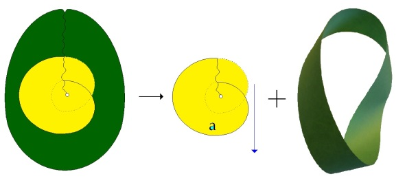
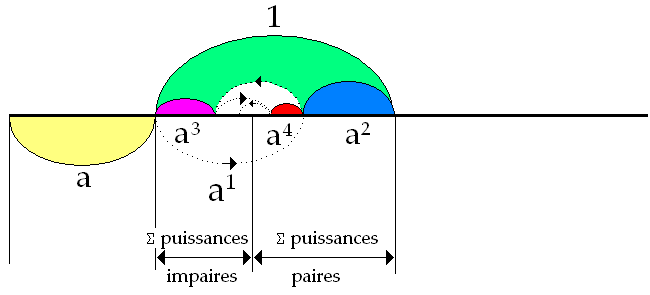

# Leçon 17 | 19 Avril 1967

  

    <label><input type="checkbox" data-lacan-toggle="original" checked> 原文</label>
    <label><input type="checkbox" data-lacan-toggle="notes" checked> 注释</label>
    <label><input type="checkbox" data-lacan-toggle="commentary" checked> 个人解读评论</label>
  

  <form class="lacan-tool-search" role="search">
    <input class="lacan-tool-search-input" type="search" placeholder="搜索全文" aria-label="搜索全文">
    <button class="lacan-tool-button" type="submit" title="搜索">搜索</button>
  </form>
  <button class="lacan-tool-button lacan-back-to-top" type="button" title="回到页面最上方" aria-label="回到页面最上方">↑</button>

<section class="parallel-paragraph" data-paragraph-ids="s14-17-0001">

s14-17-0001

原文 · s14-17-0001

*Je vous ai apporté un certain nombre d’énoncés la dernière fois. J’en ai formulé de tels que par exemple* « *Il n’y a pas d’acte sexuel* ».

[无对应译文]

</section>

<section class="parallel-paragraph" data-paragraph-ids="s14-17-0002">

s14-17-0002

原文 · s14-17-0002

Je pense que la nouvelle en court à tra­vers la ville… Mais enfin, je ne l’ai pas donnée comme une vérité absolue… j’ai dit que c’est ce qui était à proprement parler articulé dans le discours de l’inconscient.

[无对应译文]

</section>

<section class="parallel-paragraph" data-paragraph-ids="s14-17-0003">

s14-17-0003

原文 · s14-17-0003

Ceci dit, j’ai encadré cette formule et quelques au­tres dans une sorte de rappel - je dois dire assez dense - de ce qui en donne *le sens* et *les prémisses* aussi bien.

[无对应译文]

</section>

<section class="parallel-paragraph" data-paragraph-ids="s14-17-0004">

s14-17-0004

原文 · s14-17-0004

Ce cours était une sorte d’étape marquée de points de rassemblement, qui pourra peut-être servir au titre *d’introduction* écrite à quel­que chose donc, que je poursuis - que je veux poursuivre au­jourd’hui - je dirais sous une forme peut-être plus accessible, en tout cas conçue comme une marche facile, une première façon de débrouiller les articulations dans lesquelles je vais m’avancer, qui sont toujours celles que j’ai présentifiées pour vous depuis deux ou trois de mes cours, à savoir, cette articulation tierce entre :

[无对应译文]

</section>

<section class="parallel-paragraph" data-paragraph-ids="s14-17-0005">

s14-17-0005

原文 · s14-17-0005

- le *(a)*,

[无对应译文]

</section>

<section class="parallel-paragraph" data-paragraph-ids="s14-17-0006">

s14-17-0006

原文 · s14-17-0006

- une *valeur* 1, qui n’est là que pour donner son sens à la *valeur (a),* étant donné que celle-ci est un nombre, à proprement parler le *Nombre d’or,*

[无对应译文]

</section>

<section class="parallel-paragraph" data-paragraph-ids="s14-17-0007">

s14-17-0007

原文 · s14-17-0007

- et une deuxième *valeur* 1.

[无对应译文]

</section>

<section class="parallel-paragraph" data-paragraph-ids="s14-17-0008">

s14-17-0008

原文 · s14-17-0008

Bien sûr, je pourrais une fois de plus les *réarti­culer* d’une façon que je pourrais dire être *[apodictique](http://www.cnrtl.fr/definition/apodictique), en montrer la nécessité*.

[无对应译文]

</section>

<section class="parallel-paragraph" data-paragraph-ids="s14-17-0009">

s14-17-0009

原文 · s14-17-0009

Je procéderai autrement, pensant plutôt commencer par exemplifier l’usage que je vais en faire, quitte à reprendre les choses par la suite de la façon nécessitée, dont je vais donc m’écarter. Je vais le faire sous *un mode* qu’on peut appeler [*éristique*](http://www.cnrtl.fr/definition/%C3%A9ristique). Ceci donc, en pensant à ceux qui ne savent pas de quoi il s’agit.

[无对应译文]

</section>

<section class="parallel-paragraph" data-paragraph-ids="s14-17-0010">

s14-17-0010

原文 · s14-17-0010

Il s’agit de psychanalyse. Il n’est pas néces­saire de savoir ce dont il s’agit dans la psychanalyse pour *ti­rer profit* de mon discours. Encore faut-il, ce discours, l’avoir un certain temps pratiqué. Je dois supposer que ce n’est pas là le cas pour tout le monde, spécialement parmi ceux qui ne sont pas psychanalystes.

[无对应译文]

</section>

<section class="parallel-paragraph" data-paragraph-ids="s14-17-0011">

s14-17-0011

原文 · s14-17-0011

Si j’ai ce souci de ceux qu’il convient d’introduire à ce que j’ai appelé mon discours, ce n’est bien entendu pas sans penser aux psychanalystes, mais c’est aussi que, jusqu’à un certain point, il m’est nécessaire de m’adresser à ceux que je viens d’abord de définir…

[无对应译文]

</section>

<section class="parallel-paragraph" data-paragraph-ids="s14-17-0012">

s14-17-0012

原文 · s14-17-0012

> et que je me suis trouvé un jour épingler comme étant « *le nombre* » …il m’est nécessaire de m’adresser à eux pour que mon discours revienne, en quelque sor­te d’un point de *réflexion*, aux oreilles des psychanalystes.

[无对应译文]

</section>

<section class="parallel-paragraph" data-paragraph-ids="s14-17-0013">

s14-17-0013

原文 · s14-17-0013

Il est en effet frappant - et *interne* à ce dont il s’agit - que le psychanalyste *n’entre pas de plein vol dans ce discours*, précisément dans la mesure où ce discours inté­resse sa pratique et qu’il est démontrable… la suite même de mon discours et de mon discours d’aujourd’hui, mettra le point sur ce pourquoi il est concevable que le psychanalyste trou­ve dans son *statut* même, j’entends dans ce qui l’institue com­me psychanalyste, ce quelque chose qui fasse *résistance,* *spé­cialement* au point que j’ai introduit, inauguré dans *mon dernier discours*.

[无对应译文]

</section>

<section class="parallel-paragraph" data-paragraph-ids="s14-17-0014">

s14-17-0014

原文 · s14-17-0014

Pour dire le mot : l’introduction de *la valeur de jouissance* fait question, à la racine même d’un discours, de tout discours, qui puisse s’intituler *discours de la vérité.* Au moins pour autant – comprenez-moi - que ce discours entre­rait en compétition avec le *discours de l’inconscient*, *si ce discours de l’inconscient est bien*, comme je vous l’ai dit la dernière fois, *réellement articulé par cette valeur de jouis­sance*.

[无对应译文]

</section>

<section class="parallel-paragraph" data-paragraph-ids="s14-17-0015">

s14-17-0015

原文 · s14-17-0015

Il est singulier de voir comment *le psychanalys­te* a toujours une petite retouche à faire à ce discours compé­titif.

[无对应译文]

</section>

<section class="parallel-paragraph" data-paragraph-ids="s14-17-0016">

s14-17-0016

原文 · s14-17-0016

C’est juste là où son énoncé éventuel est bien dans le vrai, qu’il trouve toujours à reprendre. Et il suffit d’avoir un peu d’expérience pour savoir que cette contestation est tou­jours *strictement corrélative* - quand on peut la mesurer - à cette sorte de *gloutonnerie* qui est liée en quelque sorte à l’institution psychanalytique, et qui est celle constituée par l’idée de se faire reconnaître sur le plan du savoir.

[无对应译文]

</section>

<section class="parallel-paragraph" data-paragraph-ids="s14-17-0017">

s14-17-0017

原文 · s14-17-0017

*La valeur de jouissance*, ai-je dit, est au principe de l’économie de l’inconscient. L’inconscient, ai-je dit encore \- en soulignant l’ar­ticle *<u>du</u>* - parle *<u>du</u>* sexe. Non pas « *parle sexe* » mais « *parle <u>du</u> sexe* ».Ce que l’inconscient nous désigne sont *les voies d’un savoir*. Il ne faut pas, pour les suivre, vouloir savoir avant d’avoir cheminé.

[无对应译文]

</section>

<section class="parallel-paragraph" data-paragraph-ids="s14-17-0018">

s14-17-0018

原文 · s14-17-0018

*L’inconscient parle du sexe*. Peut-on dire qu’il *dit* le sexe ? Autrement dit : *dit-il la vérité* ?

[无对应译文]

</section>

<section class="parallel-paragraph" data-paragraph-ids="s14-17-0019">

s14-17-0019

原文 · s14-17-0019

Dire qu’il *parle* est quelque chose qui laisse *en suspens* *ce qu’il dit.*

[无对应译文]

</section>

<section class="parallel-paragraph" data-paragraph-ids="s14-17-0020">

s14-17-0020

原文 · s14-17-0020

On peut parler pour ne rien dire, c’est même courant, ce n’est pas le cas de l’inconscient.

[无对应译文]

</section>

<section class="parallel-paragraph" data-paragraph-ids="s14-17-0021">

s14-17-0021

原文 · s14-17-0021

On peut dire des choses sans parler, ce n’est pas le cas de l’inconscient non plus.

[无对应译文]

</section>

<section class="parallel-paragraph" data-paragraph-ids="s14-17-0022">

s14-17-0022

原文 · s14-17-0022

C’est même le relief, bien en­tendu inaperçu comme beaucoup d’autres traits qui dépendent de ce que j’ai articulé en ce point de départ : que *l’incons­cient « ça parle »*. Si on avait un petit peu d’oreille, on en dé­duirait que *c’est obligé de parler pour dire quelque chose* !

[无对应译文]

</section>

<section class="parallel-paragraph" data-paragraph-ids="s14-17-0023">

s14-17-0023

原文 · s14-17-0023

Je n’ai encore *jamais vu* que personne ne l’ait dégagé, quoi­que dans mon *Discours de Rome* c’est dit au moins sous une di­zaine de formes, dont une m’a été récemment représentée au cours d’entretiens avec des jeunes fort sympathiques, très ac­crochés par une partie au moins de mon discours, à propos de ma *fameuse formule*, qui a eu fortune…

[无对应译文]

</section>

<section class="parallel-paragraph" data-paragraph-ids="s14-17-0024">

s14-17-0024

原文 · s14-17-0024

> d’autant plus, bien sûr, que c’est *une formule* : méfiance, toujours à vouloir ramas­ser tout dans *une formule* …quand j’ai dit : « *Quand l’analysé vous parle à vous analyste, il parle de lui, et quand il parlera de lui à vous… tout ira bien.* »

[无对应译文]

</section>

<section class="parallel-paragraph" data-paragraph-ids="s14-17-0025">

s14-17-0025

原文 · s14-17-0025

Des formules qui ont, comme celle-là, le bonheur d’être recueillies, doivent être replacées dans leur contexte, faute d’engendrer des confusions.

[无对应译文]

</section>

<section class="parallel-paragraph" data-paragraph-ids="s14-17-0026">

s14-17-0026

原文 · s14-17-0026

Est-ce que l’inconscient donc, *dit la vérité* sur le sexe ? Je n’ai pas dit ceci, dont FREUD - souvenez–vous - a déjà soulevé la question. Ceci, bien sûr, convient-il d’être préci­sé : c’était *à propos d’un rêve*, du rêve d’une de ses patien­tes, manifestement fait - ce rêve - pour *le mener en bateau,* lui FREUD, *lui faire prendre des vessies pour des lanternes*.

[无对应译文]

</section>

<section class="parallel-paragraph" data-paragraph-ids="s14-17-0027">

s14-17-0027

原文 · s14-17-0027

La génération des disciples d’alors était assez fraîche pour qu’il fallût lui expliquer cela comme un scandale.

[无对应译文]

</section>

<section class="parallel-paragraph" data-paragraph-ids="s14-17-0028">

s14-17-0028

原文 · s14-17-0028

À la vérité, on s’en tire aisément : *le rêve est la voie royale de l’incons­cient*… *mais il n’est pas*, en lui-même, *l’inconscient*.

[无对应译文]

</section>

<section class="parallel-paragraph" data-paragraph-ids="s14-17-0029">

s14-17-0029

原文 · s14-17-0029

Poser la question au niveau de l’inconscient est une autre paire de manches, que j’ai déjà retournées - je veux dire : les dites manches - comme je le fais toujours : très vite, et ne laissant pas place à l’ambiguïté, quand…

[无对应译文]

</section>

<section class="parallel-paragraph" data-paragraph-ids="s14-17-0030">

s14-17-0030

原文 · s14-17-0030

> dans mon texte qui s’appelle *La chose freudienne,* écrit en l956 pour le centenaire de FREUD …j’ai fait surgir cette entité qui dit : « *Moi la vérité, je parle.* » \[*Écrits* p.409\]

[无对应译文]

</section>

<section class="parallel-paragraph" data-paragraph-ids="s14-17-0031">

s14-17-0031

原文 · s14-17-0031

*La vérité parle*. *Puisqu’elle est la vérité, elle n’a pas besoin de dire la vérité*. Nous entendons *la vérité*, et ce qu’elle dit ne s’en­tend que pour qui sait l’articuler. Ce qu’elle dit où ? *Dans le symptôme*, c’est-à-dire *dans quelque chose qui cloche*.

[无对应译文]

</section>

<section class="parallel-paragraph" data-paragraph-ids="s14-17-0032">

s14-17-0032

原文 · s14-17-0032

Tel est le rapport de l’inconscient, en tant qu’il parle, avec *la vérité*.

[无对应译文]

</section>

<section class="parallel-paragraph" data-paragraph-ids="s14-17-0033">

s14-17-0033

原文 · s14-17-0033

Il n’en reste pas moins qu’il y a une question que j’ai ouvert… ouverte l’année dernière, à mon premier cours, paru… quand je dis « l’année dernière », je ne dis pas novembre dernier : le novembre d’avant …celui qui a été publié dans les *Cahiers pour la psychanalyse*, sous le titre de *la Vérité et la Science*[^71].

[无对应译文]

</section>

<section class="parallel-paragraph" data-paragraph-ids="s14-17-0034">

s14-17-0034

原文 · s14-17-0034

La question y reste ouverte de savoir pourquoi, l’énoncé de LÉNINE qui introduit ce cahier, pourquoi « *la théorie vaincra parce qu’elle est vraie*.[^72] » Ce que j’ai dit tout à l’heure du psychanalyste, par exemple, ne donne pas tout de suite à cet énoncé une sanction qui convainque.

[无对应译文]

</section>

<section class="parallel-paragraph" data-paragraph-ids="s14-17-0035">

s14-17-0035

原文 · s14-17-0035

MARX lui-même là-dessus - comme tant d’autres - lais­se passer quelque chose qui ne manque pas de faire énigme.

[无对应译文]

</section>

<section class="parallel-paragraph" data-paragraph-ids="s14-17-0036">

s14-17-0036

原文 · s14-17-0036

Comme bien d’autres avant lui, en effet - à commencer par DESCARTES - il procédait, quant à la vérité selon *une singuliè­re stratégie*, qu’il énonce quelque part dans ces mots piquants : « *L’avantage de ma dialectique est que je dis les choses peu à peu, et comme ils croient* - au pluriel, « *ils* » ! - *ue je suis au bout, se hâtant de me réfuter, ils ne font qu’étaler leur âne­rie* »[^73].

[无对应译文]

</section>

<section class="parallel-paragraph" data-paragraph-ids="s14-17-0037">

s14-17-0037

原文 · s14-17-0037

*Il peut paraître singulier* que quelqu’un dont procède cette idée que « *la théorie vaincra parce qu’elle est vraie* » s’exprime *ainsi.*

[无对应译文]

</section>

<section class="parallel-paragraph" data-paragraph-ids="s14-17-0038">

s14-17-0038

原文 · s14-17-0038

*Politique de la vérité et*, pour tout dire, *son com­plément dans l’idée* qu’en somme, seul ce que j’ai appelé tout à l’heure *le nombre*

[无对应译文]

</section>

<section class="parallel-paragraph" data-paragraph-ids="s14-17-0039">

s14-17-0039

原文 · s14-17-0039

> à savoir ce qui est réduit à n’être que *le nombre*, à savoir que ce qu’on appelle dans le contexte marxiste
>
> « *la conscience de classe* » , en tant qu’elle est *la classe du nombre* …*ne saurait se tromper !*

[无对应译文]

</section>

<section class="parallel-paragraph" data-paragraph-ids="s14-17-0040">

s14-17-0040

原文 · s14-17-0040

Singulier prin­cipe pourtant sur lequel tous ceux qui méritent d’avoir pour­suivi dans sa voie la vérité marxiste, n’ont jamais varié. Pourquoi la conscience de classe serait–elle aussi sûre dans son orientation…

[无对应译文]

</section>

<section class="parallel-paragraph" data-paragraph-ids="s14-17-0041">

s14-17-0041

原文 · s14-17-0041

> j’entends : alors même qu’elle ne sait rien ou sait fort peu …de la théorie, quand *la conscien­ce de classe* fonctionne… *à entendre les théoriciens, même au niveau non éduqué* …si proprement elle est *réduite à* ceux qui appartiennent au niveau défini dans l’occasion par le terme de « *la classe exclue des profits capitalistes* » ?

[无对应译文]

</section>

<section class="parallel-paragraph" data-paragraph-ids="s14-17-0042">

s14-17-0042

原文 · s14-17-0042

### Peut-être la question concernant *la force de la véri­té* est-elle à chercher dans ce champ où nous sommes introduits,

[无对应译文]

</section>

<section class="parallel-paragraph" data-paragraph-ids="s14-17-0043">

s14-17-0043

原文 · s14-17-0043

### qui est celui - métaphorique - que nous pouvons - je le répè­te : par métaphore - appeler le *marché de la vérité*.

[无对应译文]

</section>

<section class="parallel-paragraph" data-paragraph-ids="s14-17-0044">

s14-17-0044

原文 · s14-17-0044

Si, comme - de la dernière fois - vous pouvez l’entrevoir, le ressort de ce marché est *la valeur de jouissance*, *quelque chose* s’échange en effet, qui n’est pas la vérité en elle-même. Autrement dit, le lien de « *qui parle* » à « *la vérité* » n’est pas le même selon le point où il soutient *sa jouis­sance*. C’est bien toute la difficulté de *la position du psy­chanalyste* : qu’est-ce qu’il fait, de quoi jouit-il à la place qu’il occupe ? C’est l’horizon de la question, que je n’ai fait encore qu’introduire, la marquant dans son point de fêlure, sous le terme du *désir du psychanalyste*.

[无对应译文]

</section>

<section class="parallel-paragraph" data-paragraph-ids="s14-17-0045">

s14-17-0045

原文 · s14-17-0045

*La vérité* donc, dans cet échange qui se transmet par une parole dont l’horizon nous est donné par *l’expérience ana­lytique* *n’est pas en elle-même l’objet d’échange*. Comme il se voit dans la pratique. Ceux *des psychanalystes* qui sont là en témoignent par leur pratique. Bien sûr *ils ne sont pas là pour rien*, ils sont là pour : ce qui de *la vérité* peut tomber de cette table, voire ce qu’ils pourront en faire en truquant un petit peu.

[无对应译文]

</section>

<section class="parallel-paragraph" data-paragraph-ids="s14-17-0046">

s14-17-0046

原文 · s14-17-0046

Telle est la nécessité où les oblige le fait d’un statut entravé concernant *la valeur de jouissance* attachée à leur *position de psychanalyste*. J’en ai eu, je peux dire « confirmation », je l’aurai assurément renouvelée. Je vais prendre un exemple. Quelqu’un qui n’est pas psychanalyste - M. DELEUZE pour le nommer - *présente* un livre de Sacher MASOCH : « *Présenta­tion de Sacher Masoch ».* Il écrit sur le masochisme incontesta­blement le meilleur texte qui ait jamais été écrit !

[无对应译文]

</section>

<section class="parallel-paragraph" data-paragraph-ids="s14-17-0047">

s14-17-0047

原文 · s14-17-0047

J’entends : le meilleur texte, comparé à tout ce qui a été écrit sur ce thème dans la psychanalyse.

[无对应译文]

</section>

<section class="parallel-paragraph" data-paragraph-ids="s14-17-0048">

s14-17-0048

原文 · s14-17-0048

*Bien sûr a-t-il lu ces textes*, il n’invente pas son sujet. Il part d’abord de Sacher MASOCH… qui a tout de même son petit mot à dire quand il s’agit du masochisme ! Je sais bien qu’on a un petit peu *tranché* sur son nom, et que maintenant on dit « *maso* ». Mais enfin, il dépend de nous de marquer *la différence entre* « *maso* » et « *masochiste* », même « *masochien* » ou MASOCH tout court.

[无对应译文]

</section>

<section class="parallel-paragraph" data-paragraph-ids="s14-17-0049">

s14-17-0049

原文 · s14-17-0049

Quoi qu’il en soit, ce texte sur lequel nous reviendrons sûre­ment, car littéralement je puis dire…

[无对应译文]

</section>

<section class="parallel-paragraph" data-paragraph-ids="s14-17-0050">

s14-17-0050

原文 · s14-17-0050

> comme sur un sujet sur le­quel je ne suis pas resté muet, puisque j’ai écrit *Kant avec Sade,* mais où il n’y a littéralement vraiment qu’un aperçu, nommément sur ceci, que le *sadisme* et le *masochisme* sont deux voies strictement distinctes, même si bien sûr, on doit, tou­tes les deux, les repérer dans la structure …*que tout sadiste n’est pas automatiquement maso, ni tout maso un sadiste qui s’ignore. Il ne s’agit pas d’un gant qu’on retourne*.

[无对应译文]

</section>

<section class="parallel-paragraph" data-paragraph-ids="s14-17-0051">

s14-17-0051

原文 · s14-17-0051

Bref, il se peut que M. DELEUZE - *j’en jurerai d’autant plus qu’il me cite abondamment -* ait fait profit de ces textes.

[无对应译文]

</section>

<section class="parallel-paragraph" data-paragraph-ids="s14-17-0052">

s14-17-0052

原文 · s14-17-0052

Mais n’est-il pas frappant que ce texte vraiment anticipe sur tout ce que je vais avoir effectivement maintenant à en dire, dans la voie que nous avons ouverte cette année. Alors qu’il n’est *pas un seul des textes analytiques* qui ne soit entière­ment à reprendre et à refaire dans cette nouvelle perspective. J’ai pris soin de me faire confirmer par l’auteur que je cite - lui-même - qu’il n’a aucune expérience de la psychanalyse.

[无对应译文]

</section>

<section class="parallel-paragraph" data-paragraph-ids="s14-17-0053">

s14-17-0053

原文 · s14-17-0053

Tels sont les points que je désire marquer ici à leur date, parce qu’après tout, avec le temps ils peuvent changer, les points qui prennent valeur exemplaire et méri­tent d’être retenus, ne serait-ce que pour exiger de moi que j’en rende pleinement compte, je veux dire dans le détail.

[无对应译文]

</section>

<section class="parallel-paragraph" data-paragraph-ids="s14-17-0054">

s14-17-0054

原文 · s14-17-0054

Là-dessus, il reste à entrer dans l’articulation de cette structure, dont le trait - très simple - qui est au ta­bleau, donne la base et le fondement, et dont déjà vous n’êtes pas sans avoir de ma bouche, quelque *éclaircissement* sur la façon dont ça va servir. Néanmoins je répète, le *petit(a)* ici, c’est ce que déjà, à propos de l’objet ainsi désigné, j’ai pu vous faire sentir comme étant en quelque sorte ce qu’on pourrait appeler « *la monture* », *la monture du sujet*.

[无对应译文]

</section>

<section class="parallel-paragraph" data-paragraph-ids="s14-17-0055">

s14-17-0055

原文 · s14-17-0055

Métaphore qui implique que *le sujet est le bijou*, et *la monture* ce qui le supporte, ce qui le soutient, le cadre.

[无对应译文]

</section>

<section class="parallel-paragraph" data-paragraph-ids="s14-17-0056">

s14-17-0056

原文 · s14-17-0056

*Déjà, je le rappelle pourtant,* *l’objet petit(a) nous l’avons défini et imagé comme ce qui fait chute dans la structure, au niveau de l’acte le plus fondamental de l’existence du sujet, puisque c’est l’acte d’où le sujet comme tel s’engendre, à savoir la répétition. Le fait du signifiant, signifiant qu’il répète, voilà ce qui engendre le sujet et quelque chose en tombe.*

[无对应译文]

</section>

<section class="parallel-paragraph" data-paragraph-ids="s14-17-0057">

s14-17-0057

原文 · s14-17-0057

Rappelez-vous comment la coupure de *la double bou­cle* - devenue objet mental qui s’appelle *le plan projectif –* découpe ces deux éléments qui sont respectivement :

[无对应译文]

</section>

<section class="parallel-paragraph" data-paragraph-ids="s14-17-0058">

s14-17-0058

原文 · s14-17-0058

[无对应译文]

</section>

<section class="parallel-paragraph" data-paragraph-ids="s14-17-0059">

s14-17-0059

原文 · s14-17-0059

- *la ban­de de Mœbius* qui pour nous fait figure du support du *sujet* \[*structure « mœbienne »*\],

[无对应译文]

</section>

<section class="parallel-paragraph" data-paragraph-ids="s14-17-0060">

s14-17-0060

原文 · s14-17-0060

- *la rondelle* \[*(a)*\] qui obligatoirement en *reste* \[*structure « sphérique »*\], qui est *inéli­minable de la topologie du plan projectif*.

[无对应译文]

</section>

<section class="parallel-paragraph" data-paragraph-ids="s14-17-0061">

s14-17-0061

原文 · s14-17-0061

Ici *cet objet petit(a)* est supporté d’une référence *numérique* pour figurer *ce qu’il a d’incommensurable*, d’incommensurable *à ce dont il s’agit* dans son *fonctionnement de sujet*, quand ce *fonctionnement* s’opère au niveau de l’incons­cient, *et qui n’est rien d’autre que le sexe*, tout simplement. \[*a au lieu du rapport sexuel qui n’existe pas*\]

[无对应译文]

</section>

<section class="parallel-paragraph" data-paragraph-ids="s14-17-0062">

s14-17-0062

原文 · s14-17-0062

Bien sûr, ce *Nombre d’or* n’est-il là que comme un support choisi d’avoir ceci de privilégié…

[无对应译文]

</section>

<section class="parallel-paragraph" data-paragraph-ids="s14-17-0063">

s14-17-0063

原文 · s14-17-0063

> qui nous le fait retenir, mais simplement comme *fonction symbolique* …d’avoir ceci de privilégié…

[无对应译文]

</section>

<section class="parallel-paragraph" data-paragraph-ids="s14-17-0064">

s14-17-0064

原文 · s14-17-0064

> que je vous ai déjà indiqué comme j’ai pu, faute de pouvoir vous en donner - ce serait vraiment nous en­traîner - la théorie mathématique la plus moderne et la plus stricte …d’être si je puis dire l’incommensurable qui resser­re le moins vite les intervalles dans lesquels il peut se lo­caliser.

[无对应译文]

</section>

<section class="parallel-paragraph" data-paragraph-ids="s14-17-0065">

s14-17-0065

原文 · s14-17-0065

Autrement dit, celui qui, pour parvenir à une cer­taine *limite* d’approximation, demande de toutes les formes…

[无对应译文]

</section>

<section class="parallel-paragraph" data-paragraph-ids="s14-17-0066">

s14-17-0066

原文 · s14-17-0066

> elles sont *multiples* et, je pense, presque *infinies* …de l’in­commensurable, d’être celui qui demande le plus d’opérations.

[无对应译文]

</section>

<section class="parallel-paragraph" data-paragraph-ids="s14-17-0067">

s14-17-0067

原文 · s14-17-0067

[无对应译文]

</section>

<section class="parallel-paragraph" data-paragraph-ids="s14-17-0068">

s14-17-0068

原文 · s14-17-0068

Je vous rappelle en ce point ce dont il s’agit c’est à savoir que *si le petit(a) est ici reporté sur le 1*, permettant de marquer de *a2* *sa différence* *1–a* d’avec le 1. Ceci tenant à sa propriété propre de *petit(a)* : qu’il soit tel que *1 + a* soit égal à *1 / a*, d’où il est facile de déduire que *1 – a = a2*, faites une petite multiplication \[par *a*\] et vous le verrez tout de suite.

[无对应译文]

</section>

<section class="parallel-paragraph" data-paragraph-ids="s14-17-0069">

s14-17-0069

原文 · s14-17-0069

Le *a2*, ensuite sera reporté sur ce *a* qui est ici dans le *1* - ici, par exemple… - et engendrera un *a3*, lequel *a3* sera reporté sur le *a2*, pour qu’il sorte, au ni­veau de la différence, un *a4*, lequel sera reporté ainsi pour qu’il apparaisse ici un *a5*.

[无对应译文]

</section>

<section class="parallel-paragraph" data-paragraph-ids="s14-17-0070">

s14-17-0070

原文 · s14-17-0070

Vous voyez que *de chaque côté s’étalent*, l’une après l’autre :

[无对应译文]

</section>

<section class="parallel-paragraph" data-paragraph-ids="s14-17-0071">

s14-17-0071

原文 · s14-17-0071

- toutes *les puissances paires* de *a* d’un côté,

[无对应译文]

</section>

<section class="parallel-paragraph" data-paragraph-ids="s14-17-0072">

s14-17-0072

原文 · s14-17-0072

- et *les puissances impaires* de l’autre.

[无对应译文]

</section>

<section class="parallel-paragraph" data-paragraph-ids="s14-17-0073">

s14-17-0073

原文 · s14-17-0073

Les choses étant telles qu’à les continuer à l’*infini*, car il n’y aura jamais d’arrêt ni de terme à ces opérations, leur limite n’en sera pas moins :

[无对应译文]

</section>

<section class="parallel-paragraph" data-paragraph-ids="s14-17-0074">

s14-17-0074

原文 · s14-17-0074

- *a*, pour *la somme des puissances paires,a2 + a4 + a6 +… = a*

[无对应译文]

</section>

<section class="parallel-paragraph" data-paragraph-ids="s14-17-0075">

s14-17-0075

原文 · s14-17-0075

- *a2*, à savoir la première différence (*1 – a = a2 *), pour *la somme des puissances impaires*, *a3 + a5 + a7+… = a2*

[无对应译文]

</section>

<section class="parallel-paragraph" data-paragraph-ids="s14-17-0076">

s14-17-0076

原文 · s14-17-0076

C’est donc ici que viendra s’inscrire, à la fin de l’opération, ce qui dans la première opération était ici marqué comme la différence. Ici, au *a*, le *a2* va venir à la fin s’ajouter, réalisant dans sa somme, ici, le *1*, constitué par la *complémentation* du *a* par ce *a2*. Ce qui ici s’est constitué par *l’addition de tous les restes*, étant égal au *a* premier, d’où nous sommes partis.

[无对应译文]

</section>

<section class="parallel-paragraph" data-paragraph-ids="s14-17-0077">

s14-17-0077

原文 · s14-17-0077

Je pense que le caractère suggestif de cette *opéra­tion* ne vous échappe pas, d’autant plus *qu’il y a beau temps* - il y a au moins un mois ou un mois et demi - que je vous ai fait remarquer comment il pouvait supporter, *faire image pour l’opération de ce qui se réalise dans la voie de la pulsion sexuelle sous le nom de sublimation*.

[无对应译文]

</section>

<section class="parallel-paragraph" data-paragraph-ids="s14-17-0078">

s14-17-0078

原文 · s14-17-0078

[无对应译文]

</section>

<section class="parallel-paragraph" data-paragraph-ids="s14-17-0079">

s14-17-0079

原文 · s14-17-0079

Je n’y reviendrai pas aujourd’hui car il faut que j’avance. Simplement, à l’indiquer ainsi, vous donner la vi­sée de ce que nous allons avoir à faire en nous servant de ce support : comme vous le verrez et comme déjà vous pouvez le pressentir, il ne saurait nous suffire.

[无对应译文]

</section>

<section class="parallel-paragraph" data-paragraph-ids="s14-17-0080">

s14-17-0080

原文 · s14-17-0080

Tout nous indique - la réussite même, si *sublime* c’est le cas de le dire, de ce qu’il nous présente - que si les choses en étaient ainsi : que *la sublimation* nous fasse atteindre à cet 1 *parfait* \[*sic*\],lui-même placé à l’horizon du sexe, il me semble que *depuis le temps* qu’on en parle de cet 1, ça devrait se savoir.

[无对应译文]

</section>

<section class="parallel-paragraph" data-paragraph-ids="s14-17-0081">

s14-17-0081

原文 · s14-17-0081

Il doit rester, entre ces *deux séries des puissances paires et impaires* du *magique petit(a),* quelque chose comme une béance, un intervalle. Tout, en tout cas dans l’expérience, l’indique.

[无对应译文]

</section>

<section class="parallel-paragraph" data-paragraph-ids="s14-17-0082">

s14-17-0082

原文 · s14-17-0082

Néanmoins il n’est pas mauvais de voir qu’avec le support le plus favorable à telles articulations traditionnel­les, nous voyions pourtant déjà la nécessité d’une complexité qui est celle dont, en tout cas, nous devons partir.

[无对应译文]

</section>

<section class="parallel-paragraph" data-paragraph-ids="s14-17-0083">

s14-17-0083

原文 · s14-17-0083

N’oublions pas que si *le premier* 1, celui sur le­quel je viens de projeter la succession des opérations, est là, il *n’est là que pour figurer le problème* *à quoi*, précisé­ment, en tant que tel, *le sujet a à être confronté*, si ce su­jet est le sujet qui s’articule dans l’inconscient, *à savoir : le sexe*. *Ce* 1 *du milieu*, des trois éléments de mon petit mètre de poche, *ce* 1 *du milieu,* *c’est le lieu de la sexualité*. Restons-en là ! Nous sommes à la porte.

[无对应译文]

</section>

<section class="parallel-paragraph" data-paragraph-ids="s14-17-0084">

s14-17-0084

原文 · s14-17-0084

La sexualité, hein ! c’est un genre, une moire, une flaque, une « marée noire » comme on dit depuis quelque temps.

[无对应译文]

</section>

<section class="parallel-paragraph" data-paragraph-ids="s14-17-0085">

s14-17-0085

原文 · s14-17-0085

Mettez le doigt dedans, vous le portez au bout du nez là vous sentez de quoi il s’agit. Ça tient du sexe quand on dit « sexualité ». Pour que ce soit du sexe, il faudrait pouvoir ar­ticuler quelque chose d’un petit peu plus ferme.

[无对应译文]

</section>

<section class="parallel-paragraph" data-paragraph-ids="s14-17-0086">

s14-17-0086

原文 · s14-17-0086

Je ne sais pas, là, à quel point d’une bifurcation, où m’engager. Parce que c’est un point d’extrême *litige*.

[无对应译文]

</section>

<section class="parallel-paragraph" data-paragraph-ids="s14-17-0087">

s14-17-0087

原文 · s14-17-0087

Est-­ce qu’il faut qu’ici je vous donne tout de suite l’idée de *ce que ça pourrait être, si ça marchait, la subjectivation du sexe* ?

[无对应译文]

</section>

<section class="parallel-paragraph" data-paragraph-ids="s14-17-0088">

s14-17-0088

原文 · s14-17-0088

Évidemment, vous pouvez y rêver. Vous ne faites même que ça, parce que *c’est ce qui fait le texte de vos rêves* !

[无对应译文]

</section>

<section class="parallel-paragraph" data-paragraph-ids="s14-17-0089">

s14-17-0089

原文 · s14-17-0089

Mais ce n’est pas de ça qu’il s’agit. Qu’est-ce que ça pour­rait être, si ça était ?… si ça était…

[无对应译文]

</section>

<section class="parallel-paragraph" data-paragraph-ids="s14-17-0090">

s14-17-0090

原文 · s14-17-0090

> et si on donne un sens à ce que je suis en train de développer devant vous …un signifiant, dans l’occasion ce qu’on appelle…

[无对应译文]

</section>

<section class="parallel-paragraph" data-paragraph-ids="s14-17-0091">

s14-17-0091

原文 · s14-17-0091

> et vous allez voir tout de suite comme on va être embarrassé, car si je dis « *mâle* » ou « *femelle* », quand même, hein ?… c’est bien ani­mal ça ! alors, je veux bien… …« *masculin* » ou « *féminin* ».

[无对应译文]

</section>

<section class="parallel-paragraph" data-paragraph-ids="s14-17-0092">

s14-17-0092

原文 · s14-17-0092

Là s’avère tout de suite que FREUD, le premier qui s’est avancé dans cette voie de l’inconscient, là-dessus est abso­lument sans ambages : il n’y a pas le moindre moyen…

[无对应译文]

</section>

<section class="parallel-paragraph" data-paragraph-ids="s14-17-0093">

s14-17-0093

原文 · s14-17-0093

> Je dis : *ce n’est pas que je dise à vous qui êtes là devant moi «* *à quelle dose êtes-vous masculin et à quelle dose féminin ?* »,
>
> *ce n’est pas de cela qu’il s’agit*, il ne s’agit pas non plus de la biologie, ni de l’organe de WOLFF et de MÜLLER …il est impossible de donner un sens, j’entends *un sens analytique,* aux termes « *masculin* » et « *féminin* ».

[无对应译文]

</section>

<section class="parallel-paragraph" data-paragraph-ids="s14-17-0094">

s14-17-0094

原文 · s14-17-0094

Si *un signifiant*, pourtant, *est ce qui représente un sujet pour un autre signifiant*, ça devrait être là le terrain élu. Car vous voyez comme les choses seraient *bien*, seraient *pures*, si nous pouvions mettre quelque subjectivation, j’en­tends *pure* et *valable*, sous le terme *mâle.* Nous aurions ce qui convient. À savoir qu’un sujet se manifestant comme *mâle* serait représenté comme tel, j’entends comme sujet, auprès de quoi ? - d’un signifiant désignant le terme *femelle* et dont il n’y aurait *aucun besoin* qu’il détermine le moindre sujet ! La réciproque étant vraie.

[无对应译文]

</section>

<section class="parallel-paragraph" data-paragraph-ids="s14-17-0095">

s14-17-0095

原文 · s14-17-0095

Je souligne que si nous interrogeons le sexe quant à sa subjectivation possible, nous ne faisons pas là preuve d’aucune exigence manifestement exorbitante d’intersubjectivité. Il se pourrait que ça tienne comme ça.

[无对应译文]

</section>

<section class="parallel-paragraph" data-paragraph-ids="s14-17-0096">

s14-17-0096

原文 · s14-17-0096

Ça serait même non seu­lement ce qui serait *souhaitable*, mais ce qui, tout à fait clairement…

[无对应译文]

</section>

<section class="parallel-paragraph" data-paragraph-ids="s14-17-0097">

s14-17-0097

原文 · s14-17-0097

> si vous interrogez ce que j’ai appelé tout à l’heure *la conscience de classe*,
>
> la classe de tous ceux qui croient que l’homme et la femme, ça existe …ça ne pourrait pas être autre chose que ça.

[无对应译文]

</section>

<section class="parallel-paragraph" data-paragraph-ids="s14-17-0098">

s14-17-0098

原文 · s14-17-0098

Et comme ça, ça serait très bien, si c’était. Je veux dire que le principe de ce qu’on appelle comiquement - je dois dire que là le comique est irrésisti­ble - « *la relation sexuelle* », si je pouvais faire…

[无对应译文]

</section>

<section class="parallel-paragraph" data-paragraph-ids="s14-17-0099">

s14-17-0099

原文 · s14-17-0099

> dans une assemblée comme ça, qui me devient familière, une assemblée où je peux faire *entendre*, juste comme il convient « *qu’il n’y a pas d’acte sexuel* », ce qui veut dire : il n’y a pas d’acte à un certain niveau et justement c’est bien pour ça que nous avons à chercher comment il se constitue …si je pouvais faire que le terme de « *relation sexuelle* »  prenne dans chacune de vos têtes exactement la *connotation bouffonne* qu’elle méri­te, cette locution, j’aurais gagné quelque chose !

[无对应译文]

</section>

<section class="parallel-paragraph" data-paragraph-ids="s14-17-0100">

s14-17-0100

原文 · s14-17-0100

Si *la relation sexuelle* existait, c’est cela qu’elle voudrait dire : c’est que le sujet de chaque sexe peut toucher *quel­que chose* dans l’autre, au niveau du signifiant. J’entends que ceci ne comporterait chez l’autre, ni conscience, ni même in­conscient, simplement l’*accord*. Ce rapport du signifiant au signifiant, quand il se trouve, est assurément ce qui nous émerveille dans un certain nombre de petits points saisis­sants… des tropismes, chez l’animal.

[无对应译文]

</section>

<section class="parallel-paragraph" data-paragraph-ids="s14-17-0101">

s14-17-0101

原文 · s14-17-0101

Nous en sommes loin quand il s’agit de l’homme. Et peut-être aussi bien, d’ailleurs, chez l’animal, où les choses ne se passent que par l’intermédiaire de *certains repères de phanères*, qui certai­nement doivent prêter à quelques *ratés* !

[无对应译文]

</section>

<section class="parallel-paragraph" data-paragraph-ids="s14-17-0102">

s14-17-0102

原文 · s14-17-0102

Quoi qu’il en soit, la vertu de ce que j’ai articulé ainsi n’est pas toute décevante. Je veux dire que ces signi­fiants, faits pour que l’un *présente* et *représente* à l’autre, à l’état pur le sexe opposé, mais *ils existent* au niveau cellulaire !

[无对应译文]

</section>

<section class="parallel-paragraph" data-paragraph-ids="s14-17-0103">

s14-17-0103

原文 · s14-17-0103

On appelle ça *le chromosome sexuel* ! Il serait surprenant que nous puissions un jour, avec quelque chance de certitude, établir que *l’origine du langage*, à savoir ce qui se passe *avant qu’il engendre le sujet,* ait quelque rapport avec ces jeux de la matière qui nous livrent les aspects que nous trouvons dans la conjonc­tion des cellules sexuelles.

[无对应译文]

</section>

<section class="parallel-paragraph" data-paragraph-ids="s14-17-0104">

s14-17-0104

原文 · s14-17-0104

Nous n’en sommes pas là et nous avons autre chose à faire !

[无对应译文]

</section>

<section class="parallel-paragraph" data-paragraph-ids="s14-17-0105">

s14-17-0105

原文 · s14-17-0105

Simplement, ne nous étonnons pas qu’à la distance où nous sommes, de ce niveau, où se ma­nifesterait, en somme, quelque chose qui n’est pas du tout fait pour ne pas nous séduire, à ce niveau où ce pourrait dé­signer quelque chose que j’appellerai « *transcendance de la matière* »…

[无对应译文]

</section>

<section class="parallel-paragraph" data-paragraph-ids="s14-17-0106">

s14-17-0106

原文 · s14-17-0106

> croyez-moi : ce n’est pas moi qui ai inventé ça, c’est déjà apparu à quelques autres personnes …seulement, si je le désigne ce point d’extrême…

[无对应译文]

</section>

<section class="parallel-paragraph" data-paragraph-ids="s14-17-0107">

s14-17-0107

原文 · s14-17-0107

> tout en soulignant ex­pressément qu’il est tout à fait irrésolu, que le pont n’est pas fait …c’est simplement pour vous marquer que - *par contre* - dans l’ordre de ce qu’on appelle plus ou moins proprement la pensée, on a pendant tout le cours des siècles - au moins de ceux qui nous sont connus - jamais rien fait d’autre que de parler comme si ce point était résolu !

[无对应译文]

</section>

<section class="parallel-paragraph" data-paragraph-ids="s14-17-0108">

s14-17-0108

原文 · s14-17-0108

Pendant des siècles, la connaissance, sous une forme plus ou moins masquée, plus ou moins figurée, plus ou moins en contrebande, n’a jamais fait que parodier ce qu’il en serait si l’acte sexuel exis­tait, au point qui nous permit de définir ce qu’il en est, com­me disent les Hindous, de [*Purusha*](http://fr.wikipedia.org/wiki/Purusha) et de [*Prâkriti*](http://fr.wikipedia.org/wiki/Prakriti), d’*animus* et d’*anima*, et de toute la lyre !

[无对应译文]

</section>

<section class="parallel-paragraph" data-paragraph-ids="s14-17-0109">

s14-17-0109

原文 · s14-17-0109

Ce qui est exigé de nous, c’est de faire un travail plus sérieux. Travail nécessité simplement par ceci : c’est qu’entre ce jeu des *significations primordiales*, telles qu’el­les seraient inscriptibles en termes - je le souligne - impli­quant quelque sujet, eh bien, nous en sommes séparés par toute l’épaisseur de quelque chose que vous appellerez comme vous voudrez, « *la chair* », ou « *le corps* », à condition d’y inclure ce qu’y apporte de spécifique *notre condition de mammifère*.

[无对应译文]

</section>

<section class="parallel-paragraph" data-paragraph-ids="s14-17-0110">

s14-17-0110

原文 · s14-17-0110

À sa­voir une condition tout à fait spécifiée et nullement néces­saire, comme l’abondance de tout un règne nous le prouve, je parle du règne animal, rien n’implique la forme que prend pour nous la subjectivation de la fonction sexuelle, rien n’implique que ce qui vient y jouer à titre symbolique, y soit nécessairement lié. Il suffit de réfléchir à ce que ça peut être chez un insecte, et aussi bien d’ailleurs, les ima­ges qui peuvent en dépendre, ne nous privons-nous pas d’en user pour faire apparaître, dans le fantasme, tel ou tel trait singulier de nos rapports au sexe.

[无对应译文]

</section>

<section class="parallel-paragraph" data-paragraph-ids="s14-17-0111">

s14-17-0111

原文 · s14-17-0111

Eh bien voilà, j’ai pris une des deux voies qui s’offraient à moi tout à l’heure. Je ne suis pas sûr que j’aie eu raison.

[无对应译文]

</section>

<section class="parallel-paragraph" data-paragraph-ids="s14-17-0112">

s14-17-0112

原文 · s14-17-0112

Il faut maintenant que je reprenne l’autre. L’au­tre est pour vous désigner pourquoi le 1 vient ici à droite du *(a)* dans ce point que j’ai désigné comme représentant - ici localement -par un signifiant, le fait du sexe.

[无对应译文]

</section>

<section class="parallel-paragraph" data-paragraph-ids="s14-17-0113">

s14-17-0113

原文 · s14-17-0113

Il y a là une surprenante convergence entre ce dont il s’agit vraiment, c’est-à-dire ce que je suis en train de vous dire, *et ce que j’appellerai d’autre part le point ma­jeur de l’abjection psychanalytique*. Je dois dire que vous devez uniquement à Jacques-Alain MILLER - qui a fait de mes *Écrits* un *index raisonné -* de n’avoir pas eu *l’index alphabétique* dont je m’étais - je dois dire - un tant soit peu mis à jubiler en l’imaginant com­mencer par le mot « *abjection* » \[sourire\]. Il n’en a rien été. Ce n’est pas une raison pour que ce mot ne prenne pas sa place.

[无对应译文]

</section>

<section class="parallel-paragraph" data-paragraph-ids="s14-17-0114">

s14-17-0114

原文 · s14-17-0114

L’1 que je mets là, par pure référence *mathématique*, je veux dire qu’il figure simplement ceci : que pour par­ler d’incommensurable il faut que j’aie une unité de mesure et il n’y a pas d’unité de mesure qui ne soit mieux symbolisée que par le 1. Le sujet, sous la forme de son support le *petit(a),* se mesure – *se mesure* – au sexe. Entendez ça comme on dirait *qu’il se mesure au boisseau ou à la pinte*. C’est cela le 1, *l’unité sexe,* rien de plus.­ Eh bien, ce n’est pas rien que ce 1.

[无对应译文]

</section>

<section class="parallel-paragraph" data-paragraph-ids="s14-17-0115">

s14-17-0115

原文 · s14-17-0115

Il s’agit de savoir jusqu’à quel point converge, comme je l’ai dit tout à l’heure, avec ce *Un* qui règne au fondement mental - jusqu’à ce jour - *des psychanalystes*, sous la forme de *la vertu unitive*, qui serait au principe de tout ce qu’ils déroulent de *discours sur la sexualité*.

[无对应译文]

</section>

<section class="parallel-paragraph" data-paragraph-ids="s14-17-0116">

s14-17-0116

原文 · s14-17-0116

Il ne suffit pas de la vanité de la formule que le sexe « unisse », il faut encore que l’ima­ge primordiale leur en soit donnée par la fusion dont béné­ficierait le jouisseur de la « *jouissade* ».\[Rires\] Le petit *baby* dans le sein de sa mère, où nul jusqu’à ce jour n’a pu nous témoi­gner qu’il soit dans une position plus commode que n’est la mère elle-même à le porter et où s’exemplifierait *ce que vous avez entendu encore ici, l’année dernière, dans le discours de* M. Conrad STEIN, *que nous n’avons plus revu d’ailleurs depuis, je le regrette,* comme nécessaire à la pensée du psychanalys­te, comme représentant de ce *Paradis perdu de la fusion du moi et du non moi*, qui - je le répète : à les entendre, les psy­chanalystes - serait le « *corner stone », la pierre angulaire* sans laquelle rien ne saurait être pensé de l’économie de *la libido*.

[无对应译文]

</section>

<section class="parallel-paragraph" data-paragraph-ids="s14-17-0117">

s14-17-0117

原文 · s14-17-0117

Car c’est de cela qu’il s’agit !Je pense qu’il y a là une véritable *pierre de tou­che*, que *je me permets de le signaler à qui que ce soit qui entende me suivre,* c’est que toute personne qui reste de quelque façon attachée à *ce* schéma du « *narcissisme primaire* », peut bien se mettre à la boutonnière tous les *œillets lacaniens* qu’elle voudra, ladite personne n’a absolument rien à faire, de près ni de loin, avec ce que j’enseigne. Je ne dis pas que cette question du *narcissisme primaire* dans l’économie de la théorie, ne soit pas quelque chose qui pose question et mérite un jour d’être accentué.

[无对应译文]

</section>

<section class="parallel-paragraph" data-paragraph-ids="s14-17-0118">

s14-17-0118

原文 · s14-17-0118

Je commence aujourd’hui précisément, à faire remarquer que si *la valeur de jouissance* prend origine dans le manque marqué par le complexe de castration…

[无对应译文]

</section>

<section class="parallel-paragraph" data-paragraph-ids="s14-17-0119">

s14-17-0119

原文 · s14-17-0119

> autrement dit l’interdit de l’auto-érotisme portant sur un organe précis, qui ne joue là rôle et fonction que d’introduire cet élément d’unité à l’inauguration d’un statut d’échange, d’où dépend tout ce qui va être ensuite économie, chez l’être parlant dont il s’agit dans le sexe …il est clair que l’important est de voir *la réversion* qui en résulte.

[无对应译文]

</section>

<section class="parallel-paragraph" data-paragraph-ids="s14-17-0120">

s14-17-0120

原文 · s14-17-0120

À savoir : que c’est pour autant que *le phallus désigne ce quelque chose de porté à la valeur par ce moins que constitue le complexe de castration*, ce *quelque chose* qui fait précisément la distance du *petit(a)* à l’*unité* du sexe. C’est à partir de là, comme toute l’expérience nous l’enseigne, que *l’être qui va venir être porté à la fonction de parte­naire* dans cette épreuve, où le sujet est mis, de l’acte se­xuel : la femme pour imager mon discours, va prendre, elle, sa valeur d’*objet de jouissance.*

[无对应译文]

</section>

<section class="parallel-paragraph" data-paragraph-ids="s14-17-0121">

s14-17-0121

原文 · s14-17-0121

*Mais en même temps et du même coup, regardez ce qui s’est passé* : *il ne s’agit plus de* « *il jouit* », *mais de* « *il jouit de*… ».

[无对应译文]

</section>

<section class="parallel-paragraph" data-paragraph-ids="s14-17-0122">

s14-17-0122

原文 · s14-17-0122

*La jouissance est passée du subjectif à l’objectif*, au point de glisser au sens de *possession* dans la fonction typique, telle que nous avons à la considérer comme déductible de l’in­cidence du complexe de castration, et - ceci je l’ai déjà amené la dernière fois - elle est constituée par ce virage qui fait que le partenaire sexuel est un objet phallique.

[无对应译文]

</section>

<section class="parallel-paragraph" data-paragraph-ids="s14-17-0123">

s14-17-0123

原文 · s14-17-0123

Au point que je ne mets ici en relief, dans le sens de « *l’homme* » à la « *femme* » - *les deux entre guillemets* - que pour autant que c’est là que l’opération est, si je puis dire, *la plus scandaleuse*. Car elle est articulable bien sûr, tout autant, dans l’autre sens, à ceci près que *la femme* n’a pas à faire le même sacrifice, puisqu’il est déjà porté à son compte au départ.

[无对应译文]

</section>

<section class="parallel-paragraph" data-paragraph-ids="s14-17-0124">

s14-17-0124

原文 · s14-17-0124

En d’autres termes, je souligne la position de ce que j’appellerai la *fiction mâle,* qui pourrait à peu près ainsi s’exprimer : « *on est c’qui y a* »*…*

[无对应译文]

</section>

<section class="parallel-paragraph" data-paragraph-ids="s14-17-0125">

s14-17-0125

原文 · s14-17-0125

> il n’y a rien de plus content qu’un type qui n’a jamais vu plus loin que le bout de son nez
>
> et qui vous exprime la formule, comme ça, provocante : « *en avoir ou pas* » …« *on est c’qui y a* »… « *c’qui y a* » : *ce que vous savez*.

[无对应译文]

</section>

<section class="parallel-paragraph" data-paragraph-ids="s14-17-0126">

s14-17-0126

原文 · s14-17-0126

Et puis « *On a ce qui est* ». Les deux choses se tiennent. « *ce qui est* », c’est *l’objet de désir* : c’est *la femme*.

[无对应译文]

</section>

<section class="parallel-paragraph" data-paragraph-ids="s14-17-0127">

s14-17-0127

原文 · s14-17-0127

Cette *fiction* - simplette je dois dire - est sérieuse­ment en voie de révision.

[无对应译文]

</section>

<section class="parallel-paragraph" data-paragraph-ids="s14-17-0128">

s14-17-0128

原文 · s14-17-0128

Depuis quelque temps on s’est aper­çu que c’est un tout petit peu plus compliqué.

[无对应译文]

</section>

<section class="parallel-paragraph" data-paragraph-ids="s14-17-0129">

s14-17-0129

原文 · s14-17-0129

Mais encore que dans un rapport dénommé *Direction de la cure, les principes de son pouvoir...* j’ai cru devoir le réarticuler avec soin, on ne semble pas avoir très bien vu ce que comporte ce que j’oppose­rai à *cette fiction mâle* comme étant, pour reprendre un de mes mots de la dernière fois, la valeur *homme-elle :* « *on n’est pas ce qu’on a* ».

[无对应译文]

</section>

<section class="parallel-paragraph" data-paragraph-ids="s14-17-0130">

s14-17-0130

原文 · s14-17-0130

Ce n’est pas tout à fait la même phra­se, faites attention, hein : « *On est c’qui y a* » mais « *on n’est pas ce qu’on a* ».

[无对应译文]

</section>

<section class="parallel-paragraph" data-paragraph-ids="s14-17-0131">

s14-17-0131

原文 · s14-17-0131

### En d’autres termes, c’est pour autant que l’homme a l’organe phallique, qu’il ne l’est pas.

[无对应译文]

</section>

<section class="parallel-paragraph" data-paragraph-ids="s14-17-0132">

s14-17-0132

原文 · s14-17-0132

Ce qui impli­que que de l’autre côté, on peut et même « *on n’est pas ce qu’on a* » : ce qu’on n’a pas.

[无对应译文]

</section>

<section class="parallel-paragraph" data-paragraph-ids="s14-17-0133">

s14-17-0133

原文 · s14-17-0133

### C’est-à-dire, c’est précisément en tant qu’*elle n’a pas le phallus que la femme peut en prendre la va­leur*.

[无对应译文]

</section>

<section class="parallel-paragraph" data-paragraph-ids="s14-17-0134">

s14-17-0134

原文 · s14-17-0134

Tels sont les points qu’il est extrêmement nécessai­re d’articuler au départ de toute induction de *ce que dit l’in­conscient sur le sexe*, parce que ceci est proprement ce que nous avons appris à lire dans son discours !

[无对应译文]

</section>

<section class="parallel-paragraph" data-paragraph-ids="s14-17-0135">

s14-17-0135

原文 · s14-17-0135

Seulement, là où je parle de complexe de castration, avec bien sûr tout ce qu’il comporte de litigieux, car le moins qu’on puisse dire c’est qu’il peut prêter un tant soit peu à erreur sur la person­ne, et spécialement du côté mâle, concernant ce que nous décrit si bien la *Genèse*, à savoir : *la femme* conçue comme *ce quelque chose dont le corps de l’homme a été privé*. On appelle ça, dans ce chapitre que vous connaissez bien : « *une côte* ». C’est par pudeur… Ce qu’il convient de voir, c’est qu’en tout cas, là où je parle du *complexe de castration* comme originel dans la fonction économique de *la jouissance*, *le psychanalys­te* se gargarise du terme de « *libido objectale* ». L’important, c’est de voir que s’il y a quelque chose qui mérite ce nom, c’est précisément le report de cette fonction négativée qui est fondée dans le *complexe de castration *: *la valeur de jouissance* interdite au point précis, au point d’organe constitué par *le phallus*, c’est elle qui est reportée comme « *libido objectale* ».

[无对应译文]

</section>

<section class="parallel-paragraph" data-paragraph-ids="s14-17-0136">

s14-17-0136

原文 · s14-17-0136

Contrairement à ce qu’on dit, à savoir que la *libido* dite « *narcissique* » serait le réservoir d’où a à s’extraire ce qui sera « *libido objectale* ». Ça peut vous paraître une subtilité. « *Parce qu’après tout* - me direz-vous - *si, quant au narcissisme,* *il y a la libido qui se porte sur le corps propre, eh bien - encore que vous précisiez les choses - c’est d’une partie de cette libido qu’il s’agit* \- me diriez-vous. Dans ce que j’énonce présentement, il n’en est rien !

[无对应译文]

</section>

<section class="parallel-paragraph" data-paragraph-ids="s14-17-0137">

s14-17-0137

原文 · s14-17-0137

Très précisément en ceci : c’est que pour dire qu’une chose est *extraite* de l’autre, il faudrait supposer qu’elle en est purement et simplement sépa­rée par la voie de ce qu’on appelle une coupure, mais pas seulement par une coupure, par quelque chose qui joue ensui­te *la fonction d’un bord.* Or c’est précisément ce qui est discutable…

[无对应译文]

</section>

<section class="parallel-paragraph" data-paragraph-ids="s14-17-0138">

s14-17-0138

原文 · s14-17-0138

> et non seulement ce qui est discutable, mais ce qui est d’ores et déjà tranchable …c’est qu’il n’y a pas *homomorphisme*, il n’y a pas *structure* telle que « *le lambeau phallique* » si l’on peut di­re soit *saisissable* à la façon d’*une partie de l’investisse­ment narcissique*.

[无对应译文]

</section>

<section class="parallel-paragraph" data-paragraph-ids="s14-17-0139">

s14-17-0139

原文 · s14-17-0139

C’est qu’il ne constitue pas ce *bord*, ce qu’il faut que nous maintenions entre ce qui permet au *narcis­sisme* de construire cette *fausse assimilation* de l’un à l’au­tre, qui est doctrine dans *les théories traditionnelles de l’amour*. *Les théories traditionnelles* *de l’amour* laissent en effet *l’objet du Bien* dans les limites du *narcissisme*, mais le rapport dont il s’agit vraiment \- *l’écono­mie de* *la jouissance* - est distinct.

[无对应译文]

</section>

<section class="parallel-paragraph" data-paragraph-ids="s14-17-0140">

s14-17-0140

原文 · s14-17-0140

La *libido objectale* en tant qu’elle introduit quelque chose qui, si je puis dire, nous laisse à désirer la note exacte de *l’acte* qui se prétend *sexuel*, est d’une nature - c’est le cas de le dire - à propre­ment parler tranchée, distincte.

[无对应译文]

</section>

<section class="parallel-paragraph" data-paragraph-ids="s14-17-0141">

s14-17-0141

原文 · s14-17-0141

C’est ici que *gît le point vif*, autour duquel il est essentiel de ne pas fléchir. Car, comme vous le verrez dans la suite, c’est seulement autour de ce point que peuvent prendre leur place juste, spécialement tout ce qui se passe dans le champ de l’acte analytique, qu’il s’agisse du rapport analysé-analyste ou des effets de régres­sion.

[无对应译文]

</section>

<section class="parallel-paragraph" data-paragraph-ids="s14-17-0142">

s14-17-0142

原文 · s14-17-0142

Je m’excuse de laisser en *suspens* : la loi de mon discours ne me permet pas de le trancher au point de chute qui toujours me conviendrait.

[无对应译文]

</section>

<section class="parallel-paragraph" data-paragraph-ids="s14-17-0143">

s14-17-0143

原文 · s14-17-0143

L’heure nous interrompt ici, au­jourd’hui. Je poursuivrai la prochaine fois.

[无对应译文]

</section>

<section class="note-block original-notes">

## Notes

[^71]: *Cahiers pour l’analyse* No 1, éd. S.e.r., 1966, « *La science et la vérité* », leçon d’ouverture (01-12-1965) du séminaire 1965-66 : « *L’objet de la*

    *psychanalyse* », pp. 1-31.

[^72]: Lénine : *Les trois sources et les trois parties constitutives du marxisme*.

    « La doctrine de Marx est toute-puissante, parce qu'elle est juste. Elle est harmonieuse et complète ; elle donne aux hommes une conception

    cohérente du monde, inconciliable avec toute superstition, avec toute réaction, avec toute défense de l'oppression bourgeoise. Elle est le

    successeur légitime de tout ce que l'humanité a créé de meilleur au XIXème siècle : la philosophie allemande, l'économie politique anglaise et

    le socialisme français. C'est à ces trois sources, à ces trois parties constitutives du marxisme, que nous nous arrêterons brièvement. »

[^73]: Cf. lettre de Marx à Engels du 26-6-1867 « *L'avantage de ma dialectique est que je dis les choses peu à peu, et comme ils croient que je suis au bout, se hâtant*

    *de me réfuter, ils ne font rien qu'étaler leur âne­rie* ». (L. Althusser, É. Balibar : Lire le capital (I), p.30. Petite coll. Maspero 1971).

</section>
