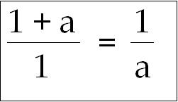
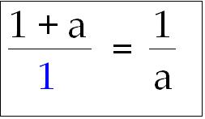
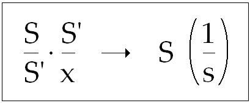
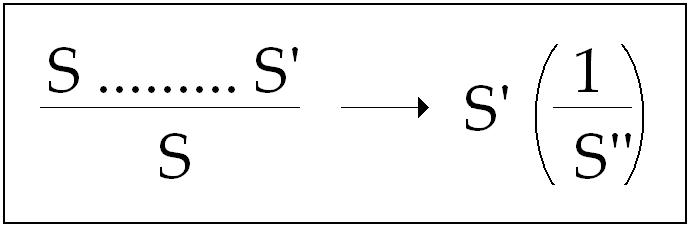
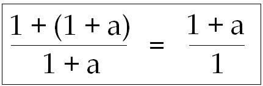
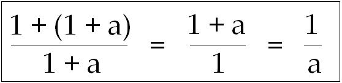
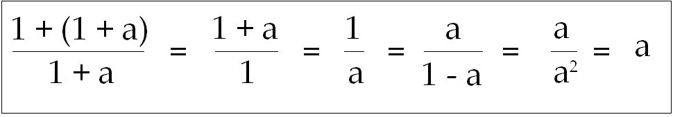
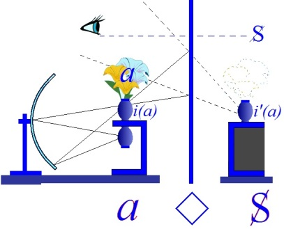
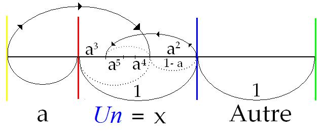
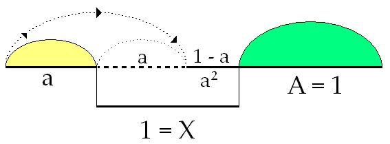

# Leçon 18 | 26 Avril 1967

  

    <label><input type="checkbox" data-lacan-toggle="original" checked> 原文</label>
    <label><input type="checkbox" data-lacan-toggle="notes" checked> 注释</label>
    <label><input type="checkbox" data-lacan-toggle="commentary" checked> 个人解读评论</label>
  

  <form class="lacan-tool-search" role="search">
    <input class="lacan-tool-search-input" type="search" placeholder="搜索全文" aria-label="搜索全文">
    <button class="lacan-tool-button" type="submit" title="搜索">搜索</button>
  </form>
  <button class="lacan-tool-button lacan-back-to-top" type="button" title="回到页面最上方" aria-label="回到页面最上方">↑</button>

<section class="parallel-paragraph" data-paragraph-ids="s14-18-0001">

s14-18-0001

原文 · s14-18-0001

[无对应译文]

</section>

<section class="parallel-paragraph" data-paragraph-ids="s14-18-0002">

s14-18-0002

原文 · s14-18-0002

Ce dessin est *imparfait*, mais ne perdons pas de temps. Il est imparfait en ce sens qu’il n’est pas fini, que la même lon­gueur qui définit le champ *petit(a)* \[dans le 1 de L’Un\] devrait être reproduite ici \[dans le 1 de L’Autre\].

[无对应译文]

</section>

<section class="parallel-paragraph" data-paragraph-ids="s14-18-0003">

s14-18-0003

原文 · s14-18-0003

Je vous ai déjà suffisam­ment indiqué que *ces deux segments*, nommément celui-ci \[1 de L’Un\], et ce­lui qui n’est point terminé \[1 de L’Autre\], sont, si vous voulez, qualifiables de l’*Un*, et de l’*Autre *: l’*Autre* *au sens* où je l’entends ordinairement le lieu de l’Autre, A, le lieu où s’articule *la chaîne signifiante* et ce qu’elle supporte de *vérité*. Ce sont-là les termes de *la dyade essentielle* où a à se forger la trame de *la subjectivation du sexe*. C’est-à-dire ce dont nous sommes en train de parler depuis *un mois et demi*.

[无对应译文]

</section>

<section class="parallel-paragraph" data-paragraph-ids="s14-18-0004">

s14-18-0004

原文 · s14-18-0004

« *Essentielle* » : pour ceux qui ont l’oreille formée aux termes heideggeriens - qui, comme vous le verrez, ne sont pas, par référen­ce, privilégiés - néanmoins, pour eux je veux dire : non pas *dyade essentielle* au sens de *ce qui est*, mais au sens de ce qui - il faut bien le dire en allemand - de ce qui « *west* », comme s’ex­prime HEIDEGGER, d’ailleurs *d’une façon déjà forcée* au regard de la langue allemande.

[无对应译文]

</section>

<section class="parallel-paragraph" data-paragraph-ids="s14-18-0005">

s14-18-0005

原文 · s14-18-0005

Disons : de ce qui opère en tant que *Sprache,* soit la connotation laissée à HEIDEGGER, du terme de langage.

[无对应译文]

</section>

<section class="parallel-paragraph" data-paragraph-ids="s14-18-0006">

s14-18-0006

原文 · s14-18-0006

Il ne s’agit là de rien d’autre que de *l’économie de l’incons­cient*, voire de ce qu’on appelle communément le *processus primaire.*

[无对应译文]

</section>

<section class="parallel-paragraph" data-paragraph-ids="s14-18-0007">

s14-18-0007

原文 · s14-18-0007

N’oublions pas que pour ces termes… ceux que je viens d’avancer comme ceux de *la dyade*, de la dyade dont nous partons, de *l’Un* et de *l’Autre...*

[无对应译文]

</section>

<section class="parallel-paragraph" data-paragraph-ids="s14-18-0008">

s14-18-0008

原文 · s14-18-0008

- *l’Un* tel que je l’ai précisément *articu­lé* *la dernière fois* et que je vais d’ailleurs reprendre,

[无对应译文]

</section>

<section class="parallel-paragraph" data-paragraph-ids="s14-18-0009">

s14-18-0009

原文 · s14-18-0009

- *l’Autre* dans l’usage que j’en fais depuis toujours …n’oublions pas, dis-je, que nous avons à partir de leur effet.

[无对应译文]

</section>

<section class="parallel-paragraph" data-paragraph-ids="s14-18-0010">

s14-18-0010

原文 · s14-18-0010

Leur effet a ceci de dérisoire qu’il prête à la grossière métaphore que ce soit *lui*, l’enfant. *La subjectivation du sexe n’enfante rien,* *si ce n’est le malheur.* Mais ce qu’elle a produit déjà, ce qui nous est donné de façon univoque dans l’expérience psychanalytique, c’est là ce déchet dont nous partons comme du point d’appui nécessaire pour reconstruire toute la logique de cette dyade.

[无对应译文]

</section>

<section class="parallel-paragraph" data-paragraph-ids="s14-18-0011">

s14-18-0011

原文 · s14-18-0011

Ceci, en nous laissant guider par ce dont cet objet est la cause - vous le savez, à proprement parler - est la cause, à savoir : *le fantasme*.

[无对应译文]

</section>

<section class="parallel-paragraph" data-paragraph-ids="s14-18-0012">

s14-18-0012

原文 · s14-18-0012

La logique - s’il est vrai que je puis poser comme sa thè­se initiale ce que je fais : *qu’il n’y a pas de métalangage -* c’est ceci la logique : qu’on peut extraire du langage nommément les lieux et les points où, si l’on peut dire, le langage parle de lui-même.

[无对应译文]

</section>

<section class="parallel-paragraph" data-paragraph-ids="s14-18-0013">

s14-18-0013

原文 · s14-18-0013

Et c’est bien ainsi qu’elle s’épanouit de nos jours. Quand je dis « *s’épanouit de nos jours* », c’est parce que c’est évident : vous n’avez qu’à ouvrir un livre de logique pour vous apercevoir que ça n’a pas la prétention d’être autre chose.

[无对应译文]

</section>

<section class="parallel-paragraph" data-paragraph-ids="s14-18-0014">

s14-18-0014

原文 · s14-18-0014

Rien d’*ontique* en tous cas, à peine d’*ontologique*. Là-dessus, tout de même, reportez-vous - puisque je vais vous laisser quin­ze jours de battement - à la lecture du *Sophiste -* j’entends : du dialogue de PLATON - pour savoir combien cette formule, je dis : concernant la logique, est exacte, et que son départ ne date donc pas d’aujourd’hui, ni d’hier.

[无对应译文]

</section>

<section class="parallel-paragraph" data-paragraph-ids="s14-18-0015">

s14-18-0015

原文 · s14-18-0015

Vous comprendrez que c’est en fait de ce dialogue, *Le Sophiste,* que part Martin - je dis : Martin HEIDEGGER – pour sa restauration de la question de l’Être. Et après tout ce ne sera pas une discipline moins salubre pour vous que de lire… puisque mon manque d’information a fait que, ne l’ayant reçu que récemment par un *service de presse*, ce n’est que d’aujour­d’hui que je peux vous conseiller de lire l’*Introduction à la Métaphysique* [^74], dans l’excellente traduction qu’en a donnée Gilbert KAHN.

[无对应译文]

</section>

<section class="parallel-paragraph" data-paragraph-ids="s14-18-0016">

s14-18-0016

原文 · s14-18-0016

Je dis « *excellente* », parce qu’à la vérité il n’a pas cherché l’impossible et que, pour tous les mots dont il est impos­sible de donner un équivalent, sinon un équivoque, il a tran­quillement forgé ou reforgé des mots français, comme il a pu, quitte à ce qu’un lexique, à la fin, nous donne son exacte ré­férence allemande. Mais tout ceci n’est que parenthèse.

[无对应译文]

</section>

<section class="parallel-paragraph" data-paragraph-ids="s14-18-0017">

s14-18-0017

原文 · s14-18-0017

Cette lecture… facile, ce qui, *peut-être*, peut être con­testé des autres textes de HEIDEGGER, mais je vous l’assure - celle-là - extraordinairement facile, même d’une note *très net­tement tranchante* de facilité : il est impossible de rendre plus transparente la façon dont il entend que se repose à notre détour historique, la question de l’Être.

[无对应译文]

</section>

<section class="parallel-paragraph" data-paragraph-ids="s14-18-0018">

s14-18-0018

原文 · s14-18-0018

Ce n’est point certes que je pense *qu’il s’agisse là d’autre chose que* d’une lecture d’exercice et, comme je disais à l’instant, *de salubrité*.

[无对应译文]

</section>

<section class="parallel-paragraph" data-paragraph-ids="s14-18-0019">

s14-18-0019

原文 · s14-18-0019

Cela nettoie bien des choses, mais cela ne s’en fourvoie pas moins de donner la seule consigne d’un retour à PARMÉNIDE et à HÉRACLITE, si génialement qu’il les situe, au niveau précisément de *ce méta–discours* dont je parle comme *immanent au langage*.

[无对应译文]

</section>

<section class="parallel-paragraph" data-paragraph-ids="s14-18-0020">

s14-18-0020

原文 · s14-18-0020

Ça n’est pas un métalangage. *Le métadiscours immanent au langag*e et que j’appelle la logi­que, voilà bien sûr, qui mérite d’être rafraîchi à une telle lecture.

[无对应译文]

</section>

<section class="parallel-paragraph" data-paragraph-ids="s14-18-0021">

s14-18-0021

原文 · s14-18-0021

Certes, je ne fais usage - vous pouvez le remarquer - d’aucune façon du procédé *étymologisant*, dont HEIDEGGER fait *re­vivre* admirablement les formules dites *présocratiques*. C’est qu’aussi bien, la direction que j’entends indiquer diffère, diffère de la sienne précisément en ceci qui est irréversible et qu’indique *Le Sophiste...*

[无对应译文]

</section>

<section class="parallel-paragraph" data-paragraph-ids="s14-18-0022">

s14-18-0022

原文 · s14-18-0022

*lecture, elle aussi, extraordinaire­ment facile et qui ne manque pas aussi de faire sa référence à PARMÉNIDE* …précisément pour marquer combien il a été loin et vif contre cette défense que [PARMÉNIDE](http://remacle.org/bloodwolf/philosophes/parmenide/natura.htm) exprime en ces deux vers : Οὐ γὰρ μήποτε τοῦτο δαμῇ εἶναι μὴ ἐόντα˙

[无对应译文]

</section>

<section class="parallel-paragraph" data-paragraph-ids="s14-18-0023">

s14-18-0023

原文 · s14-18-0023

ἀλλὰ σὺ τῆσδʹ ἀφʹ ὁδοῦ διζήσιος εἶργε νόημα˙ \[VII, 1 et 2 \]

[无对应译文]

</section>

<section class="parallel-paragraph" data-paragraph-ids="s14-18-0024">

s14-18-0024

原文 · s14-18-0024

« *Non, jamais tu ne plieras de force les non-êtres à être.*

[无对应译文]

</section>

<section class="parallel-paragraph" data-paragraph-ids="s14-18-0025">

s14-18-0025

原文 · s14-18-0025

*De cette route de recherche écarte plutôt ta pensée.* »

[无对应译文]

</section>

<section class="parallel-paragraph" data-paragraph-ids="s14-18-0026">

s14-18-0026

原文 · s14-18-0026

C’est précisément la route ouverte - ouverte dès *Le Sophiste -* qui s’impose à nous, à proprement parler : *à nous les analystes,* pour seulement que nous sachions *à quoi nous avons affaire*.Si j’avais réussi à faire un *psychanalyste lettré*, j’au­rais gagné la partie.

[无对应译文]

</section>

<section class="parallel-paragraph" data-paragraph-ids="s14-18-0027">

s14-18-0027

原文 · s14-18-0027

C’est-à-dire qu’à partir de ce moment-là, la personne qui ne serait pas *psychanalyste* deviendrait, de par là–même, une *illettrée*.

[无对应译文]

</section>

<section class="parallel-paragraph" data-paragraph-ids="s14-18-0028">

s14-18-0028

原文 · s14-18-0028

Que les nombreux lettrés qui peu­plent cette salle se rassurent, ils ont encore leur petit reste ! Il faut que les psychanalystes arrivent à concevoir la nature de ce qu’ils manient comme : *cette « scorie de l’Être », cette « pierre rejetée », qui devient « la pierre d’angle » et qui est proprement ce que je désigne par l’objet(a)*, et que c’est *un produit* - je dis *produit -* de l’opération du langage, au sens où le terme *produit* est nécessité dans notre discours par la levée, depuis ARISTOTE, de la dimension de l’ἔργον \[ergon\] exactement : du travail.

[无对应译文]

</section>

<section class="parallel-paragraph" data-paragraph-ids="s14-18-0029">

s14-18-0029

原文 · s14-18-0029

Il s’agit de *repenser la logique* à partir de ce *petit(a).* Puisque ce *petit(a)*, si *je l’ai dénommé* je ne l’ai pas *inventé* : que c’est proprement ce qui est *tombé* dans la main des analystes, à partir de l’expérience qu’ils ont franchie dans ce qui est de *la chose sexuel­le*, tous savent ce que je veux dire, et en plus, qu’ils ne parlent que de ça.

[无对应译文]

</section>

<section class="parallel-paragraph" data-paragraph-ids="s14-18-0030">

s14-18-0030

原文 · s14-18-0030

Ce *petit(a)*, depuis l’analyse, c’est vous-mêmes - je dis : cha­cun d’entre vous - dans votre noyau essentiel.

[无对应译文]

</section>

<section class="parallel-paragraph" data-paragraph-ids="s14-18-0031">

s14-18-0031

原文 · s14-18-0031

Ça vous remet sur vos pieds - comme on dit - ça vous remet sur vos pieds du délire de *la sphère céleste, du sujet de la connaissance*.

[无对应译文]

</section>

<section class="parallel-paragraph" data-paragraph-ids="s14-18-0032">

s14-18-0032

原文 · s14-18-0032

Ceci étant dit, *ça explique* - c’est la seule explica­tion valable - *pourquoi*, comme chacun peut le voir, *on part dans l’analyse de l’enfant.*

[无对应译文]

</section>

<section class="parallel-paragraph" data-paragraph-ids="s14-18-0033">

s14-18-0033

原文 · s14-18-0033

C’est pour des raisons à propre­ment parler *métaphoriques *: *parce que le petit(a) est l’enfant mé­taphorique de l’1 et de l’Autre, pour autant* *qu’il est né comme <u>déchet</u> de la répétition inaugurale, laquelle, pour être répétition, exige ce rapport de l’1 à l’Autre, répétition d’où naît le sujet.*

[无对应译文]

</section>

<section class="parallel-paragraph" data-paragraph-ids="s14-18-0034">

s14-18-0034

原文 · s14-18-0034

La vraie raison de la référence à l’enfant dans la psy­chanalyse n’est donc en aucun cas la graine de « G’I », la fleur promise à devenir l’heureux salaud qui parait à M. Eric ERIKSON[^75] le suffisant motif de ses *cogitations* et de ses peines, mais seulement, cette *essence* problématique : *l’objet(a)*, dont les exer­cices nous stupéfient, bien sûr pas n’importe où : dans les fantasmes, et très suffisamment mise à exécution de l’enfant.

[无对应译文]

</section>

<section class="parallel-paragraph" data-paragraph-ids="s14-18-0035">

s14-18-0035

原文 · s14-18-0035

Que ce soit à leur niveau qu’on en voie les jeux et les voies les mieux frayées : il faut pour ça recueillir des confidences qui ne sont pas à la portée des psychologues de l’enfant. Bref, c’est ce qui fait que le mot « *âme* » a, dans le moindre des ébats sexuels de l’enfant, dans sa « perversion » comme on dit, la seule, l’unique et la seule digne présence qu’il faille accorder à ce mot : le mot « *âme* ».

[无对应译文]

</section>

<section class="parallel-paragraph" data-paragraph-ids="s14-18-0036">

s14-18-0036

原文 · s14-18-0036

Alors, je l’ai dit la dernière fois : l’1 c’est simple­ment dans cette logique, l’entrée en jeu de l’opération de la mesure, de la valeur à donner à *petit(a)* dans cette opération de langage qui va être, en somme - quoi d’autre se propose à nous ? - tentative de réintégrer ce *petit(a)* - dans quoi ? - dans cet « *univers de langage* », dont j’ai déjà posé au départ de cette an­née - quoi ? - qu’il n’existe pas !

[无对应译文]

</section>

<section class="parallel-paragraph" data-paragraph-ids="s14-18-0037">

s14-18-0037

原文 · s14-18-0037

Il n’existe pas, pourquoi ? Précisément à cause de son existence à lui, *l’objet petit(a)*, comme effet.

[无对应译文]

</section>

<section class="parallel-paragraph" data-paragraph-ids="s14-18-0038">

s14-18-0038

原文 · s14-18-0038

Donc, opération contradictoire et désespérée, dont heu­reusement la seule existence de l’*arithmétique*, fut-elle élé­mentaire, nous assure que l’entreprise est féconde. Car même au niveau de l’arithmétique, on s’est aperçu - *récemment il faut le dire* - que *l’univers du discours n’existe pas*. Alors, comment les choses se présentent-elles au départ de cette tentative ?

[无对应译文]

</section>

<section class="parallel-paragraph" data-paragraph-ids="s14-18-0039">

s14-18-0039

原文 · s14-18-0039

[无对应译文]

</section>

<section class="parallel-paragraph" data-paragraph-ids="s14-18-0040">

s14-18-0040

原文 · s14-18-0040

*Que veut dire d’écrire*, puisqu’il nous faut ce 1 et que nous nous en contenterons pour la mesure de *l’objet petit(a),* ceci : *1+a = 1/a* ?

[无对应译文]

</section>

<section class="parallel-paragraph" data-paragraph-ids="s14-18-0041">

s14-18-0041

原文 · s14-18-0041

Vous soupçonnez bien que dès que commencera ma théorie à être l’objet d’une interrogation sérieuse de la part des logi­ciens, il y aura beaucoup à dire sur l’introduction ici des trois signes, qui se figurent comme *plus*, *égale*, et aussi bien *la barre entre le* 1 *et petit(a)* : (+), (=), (–).

[无对应译文]

</section>

<section class="parallel-paragraph" data-paragraph-ids="s14-18-0042">

s14-18-0042

原文 · s14-18-0042

Ce sont là *épreuves* auxquelles il faut bien *provisoire­ment*, pour que mon cours ne s’étire pas indéfiniment, que vous vous fiiez à ce que je les aie faites pour mon compte, n’en laissant apparaître ici que *les pointes*, au niveau où elles peuvent vous être utiles.

[无对应译文]

</section>

<section class="parallel-paragraph" data-paragraph-ids="s14-18-0043">

s14-18-0043

原文 · s14-18-0043

Il faut remarquer cependant que si… parce que ça vient tout seul et parce que vraiment c’est plus commode… nous avons encore assez de chemin à parcourir …j’inscris ici tout sim­plement *la formule* qui se trouve recouvrir *ce que j’ai appelé le plus grand incommensurable ou encore le Nombre d’Or,* qui désigne à très proprement parler ceci : que de deux grandeurs, le rapport de la plus grande à la plus petite - du 1 au *a* en l’occasion - est le même que celui de leur somme à la plus gran­de, que si j’opère ainsi, ça n’est certes pas pour faire pas­ser - trop vite d’ailleurs - des hypothèses dont il serait tout à fait fâcheux que vous les preniez pour décisives, je veux di­re que vous y croyiez trop à ce paradigme, qui simplement entend faire *fonctionner*, un temps, pour vous, *l’objet petit(a)*, comme *incommensurable* à ce dont il s’agit : sa référence au sexe.

[无对应译文]

</section>

<section class="parallel-paragraph" data-paragraph-ids="s14-18-0044">

s14-18-0044

原文 · s14-18-0044

C’est à ce titre que le 1 - ce sexe et son énigme - est char­gé de les recouvrir. Mais rien n’indique au reste dans la formule que nous puissions tout de suite y faire en­trer la notion mathématique de proportion. Tant que nous ne l’avons pas écrit expressément, ce qu’implique cette écriture telle qu’elle est là, pour quelqu’un qui la lit au niveau de son usuel­le mathématique, à savoir que c’est :

[无对应译文]

</section>

<section class="parallel-paragraph" data-paragraph-ids="s14-18-0045">

s14-18-0045

原文 · s14-18-0045

[无对应译文]

</section>

<section class="parallel-paragraph" data-paragraph-ids="s14-18-0046">

s14-18-0046

原文 · s14-18-0046

Tant que cet 1 \[en bleu\] n’est pas inscrit, la formule peut être considérée comme beaucoup moins serrée. Elle n’indi­que rien d’autre que ceci : que c’est du rapprochement du 1 au *petit(a)*, que nous entendons voir surgir quelque chose. Quoi ?

[无对应译文]

</section>

<section class="parallel-paragraph" data-paragraph-ids="s14-18-0047">

s14-18-0047

原文 · s14-18-0047

Pourquoi pas, à l’occasion, *que le* 1 *représente* *le* *petit(a)*.\[Forme Sant/Sé\] Je n’emploie guère les symbolisations au hasard.

[无对应译文]

</section>

<section class="parallel-paragraph" data-paragraph-ids="s14-18-0048">

s14-18-0048

原文 · s14-18-0048

Et si ceux qui ici peuvent se souvenir de celles - symbolisations - que j’ai données à la métaphore[^76]

[无对应译文]

</section>

<section class="parallel-paragraph" data-paragraph-ids="s14-18-0049">

s14-18-0049

原文 · s14-18-0049

[无对应译文]

</section>

<section class="parallel-paragraph" data-paragraph-ids="s14-18-0050">

s14-18-0050

原文 · s14-18-0050

ils se rappelleront qu’après tout, quand j’écris la suite des signifiants, avec l’indication que dans ses dessous cette chaîne comporte un signifiant subs­titué, et que c’est de cette *substitution* que résulte que le nouveau signifiant substitué au grand S, appelons-le S’ - de ce qu’il recèle le signifiant auquel il se substitue, prend va­leur de ce quelque chose - que j’ai déjà nommé ainsi, prend valeur de l’origine d’une nouvelle dimension signifiée qui n’appartenait ni à l’un ni à l’autre des deux signi­fiants en cause :

[无对应译文]

</section>

<section class="parallel-paragraph" data-paragraph-ids="s14-18-0051">

s14-18-0051

原文 · s14-18-0051

[无对应译文]

</section>

<section class="parallel-paragraph" data-paragraph-ids="s14-18-0052">

s14-18-0052

原文 · s14-18-0052

Est-ce qu’il n’apparaît pas que *quelque chose d’analogue*… qui ne serait proprement ici que le surgissement de *la dimen­sion de la mesure ou de la proportion*, comme signification ori­ginelle …*est impliquée* dans ce moment d’intervalle qui, après avoir écrit *1+a =1/a*, le complète de l’ l qui en était absent, quoique immanent, et qui, du fait d’être distingué dans ce se­cond temps, prend figure de la fonction ici du signifiant *sexe* en tant que refoulé.

[无对应译文]

</section>

<section class="parallel-paragraph" data-paragraph-ids="s14-18-0053">

s14-18-0053

原文 · s14-18-0053

C’est dans la mesure où le rapport au l énigmatique, pris dans sa pure conjonction : *1 + a*, peut dans notre symbolisme impliquer une fonction du l comme *représentant* l’*énigme du sexe* en tant que refoulé, et que cette *énigme du sexe* va se présenter à nous comme pouvant réaliser la substitu­tion, la métaphore, recouvrant de sa proportion le *petit(a)* lui-même. Qu’est-ce à dire ?

[无对应译文]

</section>

<section class="parallel-paragraph" data-paragraph-ids="s14-18-0054">

s14-18-0054

原文 · s14-18-0054

Le l, allez-vous m’opposer, n’est point refoulé, comme ici, où me tenant à une formule approximative, j’ai fait *une chaîne de signifiants* et dont il conviendrait qu’effectivement aucun ne reproduise ce signifiant refoulé - *c’est bien pourquoi il faut que le refoulé je le distingue -* ici ce l de la pre­mière ligne, va-t-il là contre l’articulation que j’essaie de vous en donner ?

[无对应译文]

</section>

<section class="parallel-paragraph" data-paragraph-ids="s14-18-0055">

s14-18-0055

原文 · s14-18-0055

Sûrement point, en ceci, c’est que comme vous le savez… et vous avez pris la peine de vous exercer un tout petit peu à ce que je vous ai montré de ce qu’il est de l’usage qu’il convient de faire du *petit(a)* par rapport au l, c’est-à-dire ayant marqué sa *différence* et opéré sa soustrac­tion d’avec le l, de remarquer, comme je vous l’ai dit que : le *1 – a* n’est égal à rien d’autre qu’à un a2 (ou *a* au carré), *1 – a = a2*, auquel succède… pour peu que vous reployiez ce *a2* sur le *a*, ici amené dans la première opération, auquel succède un *a3*, le­quel se reproduit ici sur l’*a2*, par le même mode d’opération, pour obtenir ici un *a4*.

[无对应译文]

</section>

<section class="parallel-paragraph" data-paragraph-ids="s14-18-0056">

s14-18-0056

原文 · s14-18-0056

Toutes les *puissances paires* \[a2 + a4 + a6 +...\] d’un côté, à la rencontre des *puissances impaires* de l’autre \[a3 + a5 + a7 +...\] qui s’étageront ici, et leur tout réalisant cette somme, ce chiffre du 1. \[a2 + a4 + a6 + … + a2n = a ; a3 + a5 + a7 + … + a2n+1 = a2 ; a + a2= l\]

[无对应译文]

</section>

<section class="parallel-paragraph" data-paragraph-ids="s14-18-0057">

s14-18-0057

原文 · s14-18-0057

Ce que nous avons donc en haut de cette proportion, n’est rien d’au­tre que : *a+(a2+a3+a4+…)* et *ainsi de suite*.

[无对应译文]

</section>

<section class="parallel-paragraph" data-paragraph-ids="s14-18-0058">

s14-18-0058

原文 · s14-18-0058

Ce qui commence à partir de *a2* jusqu’à l’infini, étant strictement égal au grand l. Il en résulte donc que vous avez là une figure assez bon­ne de ce que j’ai appelé dans *la chaîne signifiante* l’effet *mé­tonymique*, et que j’ai depuis longtemps et d’ores et déjà il­lustré du *glissement* dans cette *chaîne* de la figure *petit(a).*

[无对应译文]

</section>

<section class="parallel-paragraph" data-paragraph-ids="s14-18-0059">

s14-18-0059

原文 · s14-18-0059

Ce n’est pas tout. Si la mesure, qui est ainsi donnée dans ce *jeu d*’*écriture*, car il ne s’agit de rien d’autre, est exacte, il en découle très immédiatement qu’il nous suffit de faire passer ce bloc total du *1 + a* à la fonction du l auquel il s’impose comme substitution, pour obtenir ceci :

[无对应译文]

</section>

<section class="parallel-paragraph" data-paragraph-ids="s14-18-0060">

s14-18-0060

原文 · s14-18-0060

[无对应译文]

</section>

<section class="parallel-paragraph" data-paragraph-ids="s14-18-0061">

s14-18-0061

原文 · s14-18-0061

que je peux très bien m’offrir le luxe - histoire de continuer à vous amuser, je veux dire - le dernier 1 de ne pas l’écrire, re­produisant à son niveau la manœuvre de tout à l’heure, qui me permettrait d’écrire à la suite *1 / a* :

[无对应译文]

</section>

<section class="parallel-paragraph" data-paragraph-ids="s14-18-0062">

s14-18-0062

原文 · s14-18-0062

[无对应译文]

</section>

<section class="parallel-paragraph" data-paragraph-ids="s14-18-0063">

s14-18-0063

原文 · s14-18-0063

lequel, si vous continuez à procéder dans la même voie, se poursuit de la formule : *a / (1– a)*, lequel *(1– a)* étant égal à *a2*, n’est rien d’autre que *a /a2 *, c’est-à-dire *a*.

[无对应译文]

</section>

<section class="parallel-paragraph" data-paragraph-ids="s14-18-0064">

s14-18-0064

原文 · s14-18-0064

[无对应译文]

</section>

<section class="parallel-paragraph" data-paragraph-ids="s14-18-0065">

s14-18-0065

原文 · s14-18-0065

L’identification finale, en quelque sorte, sanction­ne qu’à travers ces détours, ces détours qui ne sont pas rien puisque c’est là que nous pouvons apprendre à faire jouer exac­tement \[que\] les rapports de *petit(a)* au sexe nous ramènent purement et simplement à cette identité du *petit(a).*

[无对应译文]

</section>

<section class="parallel-paragraph" data-paragraph-ids="s14-18-0066">

s14-18-0066

原文 · s14-18-0066

Pour ceux à qui ceci reste un peu encore difficile, n’omettez pas que ce *petit(a)* c’est quelque chose de tout à fait existant !

[无对应译文]

</section>

<section class="parallel-paragraph" data-paragraph-ids="s14-18-0067">

s14-18-0067

原文 · s14-18-0067

Je ne l’ai pas fait *jusqu’à présent*, mais je peux vous en écrire la valeur, tout le monde la connaît, n’est–ce pas ?

[无对应译文]

</section>

<section class="parallel-paragraph" data-paragraph-ids="s14-18-0068">

s14-18-0068

原文 · s14-18-0068

C’est (*–*1)/2. Et, si vous vou­lez l’écrire en chiffres, si mon souvenir est bon, c’est quel­que chose dans ce genre-là : 2,236068… \[Lacan rectifiera en début de séance suivante : la valeur de (*–*1)/2 est 1,618 033 988… En fait le Nombre d’Or est égal à (+1)/2 = 1,618 033 988. \]

[无对应译文]

</section>

<section class="parallel-paragraph" data-paragraph-ids="s14-18-0069">

s14-18-0069

原文 · s14-18-0069

Bref, je ne vous réponds pas de ce chiffre, c’est un souvenir… De mon temps on savait un certain nombre de chiffres par cœur. Quand j’avais 15 ans, je savais par cœur les six premières pages de ma table de lo­garithmes. Je vous expliquerai une autre fois à quoi ça sert, mais il est bien certain que ce ne serait pas une des moins bonnes méthodes de sélection pour les candidats à la fonction de psychanalyste. Nous n’en sommes point encore là…J’ai tellement de peine à faire entrer la moindre chose sur ce su­jet délicat, que je n’ai même pas *suggéré* jusqu’à présent, de prendre ce critère. Il vaudrait largement tous ceux qui sont en usage à présent !

[无对应译文]

</section>

<section class="parallel-paragraph" data-paragraph-ids="s14-18-0070">

s14-18-0070

原文 · s14-18-0070

Nous reprendrons donc, dans cette formule, ces temps pour désigner à proprement parler ici dans le *1+a*, *le point de ces formulations qui désigne le mieux ce que nous pouvons appeler le sujet sexuel.* Si le l désigne, en son temps premier d’énigme, la fonc­tion signifiante du sexe, c’est à partir du moment où le *1 + a* arrive au dénominateur de l’égalité telle que nous la voyons ici se développer :

[无对应译文]

</section>

<section class="parallel-paragraph" data-paragraph-ids="s14-18-0071">

s14-18-0071

原文 · s14-18-0071

[无对应译文]

</section>

<section class="parallel-paragraph" data-paragraph-ids="s14-18-0072">

s14-18-0072

原文 · s14-18-0072

toujours la même, que *surgit* comme vous pouvez le voir, quoique je ne l’aie pas écrit imprudemment, au niveau supérieur, ce fameux 2 de la dyade qu’on ne saurait écrire sous la forme d’un 2 sans avoir averti que cela nécessi­te quelques remarques supplémentaires concernant dans cette oc­casion ce qu’on appelle l’associativité de l’addition. Autre­ment dit, que je détache le second l ici en tant qu’il est dans cette parenthèse, pour le grouper dans une même parenthèse avec l’autre l qui le précède, mais qui a une fonction différente.

[无对应译文]

</section>

<section class="parallel-paragraph" data-paragraph-ids="s14-18-0073">

s14-18-0073

原文 · s14-18-0073

Or, il n’est pas difficile de remarquer dans ces trois termes : ce l, ce l, et ce *petit(a),* les *trois intervalles* qui sont ici en cause, à savoir ceux qui mettent le *petit(a)* *en problème* au regard des deux autres l. Qu’est-ce que tout ceci peut vouloir dire ? Pour confronter le *petit(a)* avec l’unité - ce qui est seule­ment instituer la fonction de la mesure - eh bien, cette unité, il faut commencer par l’écrire.

[无对应译文]

</section>

<section class="parallel-paragraph" data-paragraph-ids="s14-18-0074">

s14-18-0074

原文 · s14-18-0074

C’est cette fonction que depuis longtemps j’ai introduite sous le terme du *trait unaire*. *Unaire* ai-je dit, car il arrive que ma voix baisse.

[无对应译文]

</section>

<section class="parallel-paragraph" data-paragraph-ids="s14-18-0075">

s14-18-0075

原文 · s14-18-0075

Alors, où l’écrit-on, ce *trait unaire* essentiel à opérer pour la me­sure de *l’objet petit(a)* au regard du sexe ? Eh bien, sûrement pas sur le dos de *l’objet petit(a)*, puisque aucun *objet petit(a)* n’a de dos. C’est précisément à ceci que sert - je pense que vous le savez depuis toujours - ce que j’ai appelé « *le lieu de l’Autre* », en tant qu’il est précisément ici représenté, comme *appelé* par toute cette démarche logique.

[无对应译文]

</section>

<section class="parallel-paragraph" data-paragraph-ids="s14-18-0076">

s14-18-0076

原文 · s14-18-0076

C’est-à-dire « *le lieu de l’Autre* », d’abord en tant que, comme tel, il *introduit le redoublement du champ de l’1,* c’est-à-dire… encore que *nous avons là rien d’autre, à proprement parler, que la figuration de ce que j’ai articulé comme la répétition originelle* …comme ce qui fait que l’*Un* premier - cet *Un si* cher aux philosophes et qui pourtant, à leurs *manipulations* oppose quelque difficulté - que *cet Un ne surgit* qu’en quelque sorte *rétroactif* à partir du moment où s’introduit *comme signifiant une répétition*.

[无对应译文]

</section>

<section class="parallel-paragraph" data-paragraph-ids="s14-18-0077">

s14-18-0077

原文 · s14-18-0077

Ce *trait unaire* …

[无对应译文]

</section>

<section class="parallel-paragraph" data-paragraph-ids="s14-18-0078">

s14-18-0078

原文 · s14-18-0078

> il me souvient des cris désespérés d’un de mes auditeurs des plus subtils, quand je l’ai simplement *ramassé* dans un texte de FREUD, l’*einziger Zug* où il avait passé inaperçu pour cet interlocuteur qui aurait bien aimé en *faire la trouvaille lui-même* …ne croyez pas pourtant qu’il n’existe que là, FREUD n’a pas découvert le *trait unaire*.

[无对应译文]

</section>

<section class="parallel-paragraph" data-paragraph-ids="s14-18-0079">

s14-18-0079

原文 · s14-18-0079

Et si vous voulez, simplement, entre autres - bien sûr, naturellement, je vais parler tout à l’heure des grecs - mais simplement pour rester dans l’actualité, ouvrir le dernier numéro de l’excellente revue qui s’appelle *Arts Asiatiques,* vous y verrez la tra­duction d’un très joli petit traité de la peinture par un pein­tre - dont, heureusement j’ai le bonheur d’avoir de petits *kakémonos* [^77] - qui s’appelle SHITAO[^78] et qui - ce *trait unaire* - en fait, ma foi, grand état : *il ne parle que de ça, oui, il ne parle que de ça pendant un petit nombre de pages*.

[无对应译文]

</section>

<section class="parallel-paragraph" data-paragraph-ids="s14-18-0080">

s14-18-0080

原文 · s14-18-0080

Cela s’appelle en chinois - et pas seulement pour les peintres, car les philosophes en parlent beaucoup - *yi* qui veut dire *Un*, et *sua* qui veut dire *trait.* C’est le *trait unaire*. Il a beaucoup fonctionné, je vous l’assure, avant qu’ici je vous en rebatte les oreilles.

[无对应译文]

</section>

<section class="parallel-paragraph" data-paragraph-ids="s14-18-0081">

s14-18-0081

原文 · s14-18-0081

Mais l’important donc, aussi, c’est de reconnaître ici dans cette fonction essentielle… qui nécessite comme s’opposant, comme en miroir *le champ de l’Autre* à *ce champ de l’* l énigmatique …à proprement parler ce qui est figuré depuis longtemps dans mon graphe par la connotation : *signifiant du grand A barré *: S(A).

[无对应译文]

</section>

<section class="parallel-paragraph" data-paragraph-ids="s14-18-0082">

s14-18-0082

原文 · s14-18-0082

Ce qui permet aussi, dans cet article que j’ai intitulé *Remarque*[^79]*…* et qui donne la formule de ce qu’on appelle, dans la psychanalyse et dans les textes freudiens, l’une des formes de *l’identification* : *identification à l’Idéal du moi*, dont j’ai placé *le trait* précisément dans l’Autre, comme indiquant au ni­veau de l’Autre cette référence en miroir, d’où part précisé­ment pour le sujet la veine de tout ce qui est identification.

[无对应译文]

</section>

<section class="parallel-paragraph" data-paragraph-ids="s14-18-0083">

s14-18-0083

原文 · s14-18-0083

[无对应译文]

</section>

<section class="parallel-paragraph" data-paragraph-ids="s14-18-0084">

s14-18-0084

原文 · s14-18-0084

C’est-à-dire ce qui est spécialement - dans le champ dont nous parlons aujourd’hui : de la dyade - à distinguer comme se situant, et se situant comme distinct des deux autres fonctions qui sont respective­ment celle de *la répétition* - *l’identification* nous la mettons au milieu - et enfin *la  relation* - je vous ai dit la dernière fois *ce qu’il fallait en penser* concernant quoi que ce soit qui puisse s’autoriser de la dyade sexuelle. Je l’ai qualifiée de « *bouffonne* » cette *relation*, dont on parle comme de quelque chose qui aurait la moindre consistance quand il s’agit de sexe.

[无对应译文]

</section>

<section class="parallel-paragraph" data-paragraph-ids="s14-18-0085">

s14-18-0085

原文 · s14-18-0085

Je voudrais simplement ici, vous faire une remarque. Au temps même - juste après celui du *Sophiste -* où ARISTOTE inter­vient, où il fonde d’une façon dont il est juste de dire… quelque soit la dissolution que nous avons su dans la suite opérer des opérations de la logique …dont il est juste de dire que ses *Catégories* gardent un caractère inébranlable. Je vous ai déjà *vivement incités* à reprendre ce *petit traité*.

[无对应译文]

</section>

<section class="parallel-paragraph" data-paragraph-ids="s14-18-0086">

s14-18-0086

原文 · s14-18-0086

Il est purement admirable pour tout ce qui concerne cet exercice qui peut vous permettre de donner un sens au terme de sujet. L’énu­mération des catégories[^80]… je ne vais pas vous la refaire, celle de lieu, de temps, de quantité, de comment, de pourquoi… …n’est-il pas frappant qu’après une énumération qui reste si exhaustive, on remarque que précisément, ARISTOTE n’a pas introduit dans les catégories cette sorte de relation qu’on pourrait écrire… mais essayez un peu, vous m’en direz des nou­velles …la relation sexuelle ?

[无对应译文]

</section>

<section class="parallel-paragraph" data-paragraph-ids="s14-18-0087">

s14-18-0087

原文 · s14-18-0087

Tous les logiciens ont l’habitude d’exemplifier les dif­férents types de relations qu’ils distinguent comme *transitives*, *intransitives*, *réfléchies*, à les illustrer par exemple des termes de parenté : si Untel, *si A est le père de B*, *B est le fils de A*, et ainsi de suite.

[无对应译文]

</section>

<section class="parallel-paragraph" data-paragraph-ids="s14-18-0088">

s14-18-0088

原文 · s14-18-0088

Il est assez curieux, au moins aussi curieux que l’absence dans les *catégories* aristotélicien­nes de la *relation sexuelle*, que jamais personne ne se risque à dire que si A est l’homme de B, B est la femme de A.

[无对应译文]

</section>

<section class="parallel-paragraph" data-paragraph-ids="s14-18-0089">

s14-18-0089

原文 · s14-18-0089

Cette relation pourtant, bien sûr, fait partie de notre question concernant ce dont il s’agit, à savoir cette question du statut, qui puisse fonder ces termes, qui sont à proprement parler ceux que je viens d’avancer sous la forme d’*homme* et de *femme*.

[无对应译文]

</section>

<section class="parallel-paragraph" data-paragraph-ids="s14-18-0090">

s14-18-0090

原文 · s14-18-0090

Pour ce faire, il est tout à fait vain de projeter - pour employer un terme dont les psychanalystes usent à tort et à tra­vers – de projeter l’1 qui vient marquer le champ de l’Autre, dans ce que je vais maintenant appeler x, pour bien marquer que cet 1 n’était rien d’autre, jusqu’à présent qu’une *dénomination.*

[无对应译文]

</section>

<section class="parallel-paragraph" data-paragraph-ids="s14-18-0091">

s14-18-0091

原文 · s14-18-0091

[无对应译文]

</section>

<section class="parallel-paragraph" data-paragraph-ids="s14-18-0092">

s14-18-0092

原文 · s14-18-0092

Qu’il faille dénommer de l’1 du *trait unaire* ce qu’il est là entre le *petit(a)* et le *grand Autre*, c’est ce qu’on ne peut que par abus considérer comme - ce champ x - l’unifiant, le faisant unitif bien plus ! Bien sûr, ce n’est pas d’hier que ce glissement s’est opé­ré, et ce n’est pas le privilège des *psychanalystes *! la confu­sion d’un *Être* - quel *Être* ? - *Suprême* avec le *Un* comme tel, c’est ce qui s’incarne d’une façon éminente par exemple sous la plume d’un PLOTIN. Chacun sait cela.

[无对应译文]

</section>

<section class="parallel-paragraph" data-paragraph-ids="s14-18-0093">

s14-18-0093

原文 · s14-18-0093

La prévalence de cette fonction médiane - qui n’est pas rien, puisqu’elle opère - je l’ai appelée celle, fondamentale, de l’*Idéal du moi*, en tant qu’en dépend toute une cascade d’*identifications secondaires*, nommément celle du *moi idéal,* le­quel est noyau du *moi.*

[无对应译文]

</section>

<section class="parallel-paragraph" data-paragraph-ids="s14-18-0094">

s14-18-0094

原文 · s14-18-0094

Tout ceci a été exposé et reste inscrit à sa place et en son temps, et à soi seul fait bien surgir la question de quel motif la multiplicité de ces identifications est nécessitée.

[无对应译文]

</section>

<section class="parallel-paragraph" data-paragraph-ids="s14-18-0095">

s14-18-0095

原文 · s14-18-0095

Il est clair qu’il suffit de se reporter au pe­tit *schéma optique* que j’en ai donné qui - lui - n’est qu’une métaphore, alors que ceci n’a rien de métaphorique, puisque ce sont les métaphores qui précisément sont opérantes dans la struc­ture !

[无对应译文]

</section>

<section class="parallel-paragraph" data-paragraph-ids="s14-18-0096">

s14-18-0096

原文 · s14-18-0096

[无对应译文]

</section>

<section class="parallel-paragraph" data-paragraph-ids="s14-18-0097">

s14-18-0097

原文 · s14-18-0097

Bref, que le lien de l’*Un* à l’*Autre* par *identification*, et surtout s’il prend cette forme réversible qui fait de l’*Un* *l’Être suprême,* est à proprement parler typique de *l’erreur philosophique*. Bien sûr, si je vous ai dit de lire *Le Sophiste* de PLATON, c’est qu’on *est loin* *d’y tomber dans cet Un*, et que PLOTIN est ici la meilleure référence pour en faire l’épreuve.

[无对应译文]

</section>

<section class="parallel-paragraph" data-paragraph-ids="s14-18-0098">

s14-18-0098

原文 · s14-18-0098

Je ne voudrais y opposer que les mystiques, pour autant que ce sont ceux que nous pouvons définir comme s’étant avancés, à leurs dépens, de *petit(a)* vers cet Être qui - lui - n’a rien fait que de s’annoncer comme imprononçable, imprononçable quant à son nom, par rien d’autre que par ces lettres énigmatiques qui reproduisent - *le sait-on ?* - la forme générale du  « *Je suis...* - non pas *celui qui suis* ni *celui qui est* mais - ...*ce que je suis* ». C’est-à-dire cherchez toujours !

[无对应译文]

</section>

<section class="parallel-paragraph" data-paragraph-ids="s14-18-0099">

s14-18-0099

原文 · s14-18-0099

Vous ne voyez là rien qui spécifie tellement… encore qu’il mérite d’être spécifié à un autre niveau pour la référence qu’on en fait au père …le Dieu des Juifs, car à la vérité le *Tao* s’énonce, comme vous le savez, de notre temps où le Zen court les rues, vous avez bien dû récolter dans un coin que « *Le Tao qui peut se nommer n’est pas le vrai Tao* ». Enfin, nous ne sommes pas là pour nous gargariser avec ces vieilles plaisante­ries. Quand je parle des mystiques, je parle simplement des trous qu’ils rencontrent.

[无对应译文]

</section>

<section class="parallel-paragraph" data-paragraph-ids="s14-18-0100">

s14-18-0100

原文 · s14-18-0100

Je parle de *La Nuit obscure* [^81] par exemple, qui prouve que, quant à ce qu’il peut y avoir d’unitif dans les rapports de la créature à quoi que ce soit, il peut toujours - même avec les méthodes les plus subtiles et les plus rigou­reuses - s’y rencontrer un os.

[无对应译文]

</section>

<section class="parallel-paragraph" data-paragraph-ids="s14-18-0101">

s14-18-0101

原文 · s14-18-0101

Les mystiques, pour tout dire - c’est, je dois dire aussi, le seul point par où ils m’intéres­sent. Je ne suis pas en train de vous faire de l’acte sexuel, je pense que vous vous en apercevez suffisamment, une « théo­rie » entre guillemets « mystique » - les mystiques, on en par­le pour signaler qu’ils sont moins bêtes que les philosophes, de même que les malades sont moins bêtes que les psychanalystes.

[无对应译文]

</section>

<section class="parallel-paragraph" data-paragraph-ids="s14-18-0102">

s14-18-0102

原文 · s14-18-0102

Ceci tient uniquement à ceci : c’est que c’est une des alternatives, renouvelée, de ce que j’ai déjà plusieurs fois donné comme *formule de l’aliénation* : « *La bourse ou la vie ?* », «* La liber­té ou la mort ?* », « *La bêtise ou la canaillerie ?* », par exemple. Il n’y a pas le choix !

[无对应译文]

</section>

<section class="parallel-paragraph" data-paragraph-ids="s14-18-0103">

s14-18-0103

原文 · s14-18-0103

Quand la question « *La bêtise ou la canaillerie  ?* » se pose, au moins au niveau des *philosophes* ou des *psychanalystes*, c’est toujours *la bêtise* qui *l’emporte*, il n’y a aucun moyen de choisir la canaillerie.

[无对应译文]

</section>

<section class="parallel-paragraph" data-paragraph-ids="s14-18-0104">

s14-18-0104

原文 · s14-18-0104

[无对应译文]

</section>

<section class="parallel-paragraph" data-paragraph-ids="s14-18-0105">

s14-18-0105

原文 · s14-18-0105

Bref, pour prendre ce champ qui est entre le *petit(a)* et le *grand A*, vous voyez que j’ai dessiné deux lignes :

[无对应译文]

</section>

<section class="parallel-paragraph" data-paragraph-ids="s14-18-0106">

s14-18-0106

原文 · s14-18-0106

- l’une, faite d’un *pointillé* puis d’un *trait plein*, faite simplement pour marquer que le *petit(a)* s’égale dans sa première partie à ce qu’est le *petit(a)* externe, et qu’il y a ce reste du *a*2.

[无对应译文]

</section>

<section class="parallel-paragraph" data-paragraph-ids="s14-18-0107">

s14-18-0107

原文 · s14-18-0107

- Mais j’ai fait une seconde ligne, une seconde ligne qui pourrait bien être la seule, pour nous marquer que ce point, ce champ, est à considérer - je dis pour nous, analystes - comme étant dans son ensemble quelque chose d’au moins suspect de participer de *la fonction du trou*.

[无对应译文]

</section>

<section class="parallel-paragraph" data-paragraph-ids="s14-18-0108">

s14-18-0108

原文 · s14-18-0108

Et je ne peux faire - ne serait-ce que par reconnaissan­ce pour la contribution que M. GREEN a bien voulu apporter il y a je crois, deux séances, à mon travail - qu’introduire ici - pourquoi pas ? - la référence qu’il a bien voulu y adjoindre. C’est celle qu’il a introduite, je dois dire - ne vous laissez pas emporter - très remarquablement, sous la forme de ce chau­dron, de ce chaudron de l’*Es*, qu’il a été extraire là où d’ail­leurs suffisamment d’entre nous le connaissent, *du côté de la* 3léme *ou* 32ème *Nouvelle conférences* de FREUD.

[无对应译文]

</section>

<section class="parallel-paragraph" data-paragraph-ids="s14-18-0109">

s14-18-0109

原文 · s14-18-0109

Le chaudron, dans une certaine image qu’on peut s’en faire, ça s’exprime, quel­que chose comme ceci : « *ça bout là-dedans* ».

[无对应译文]

</section>

<section class="parallel-paragraph" data-paragraph-ids="s14-18-0110">

s14-18-0110

原文 · s14-18-0110

À la vérité, dans le texte de FREUD c’est bien de cela qu’il s’agit. Avec quelle ironie, FREUD pouvait laisser passer de telles images, c’est quelque chose, bien sûr, qu’il faudrait étudier. Ça n’est pas à notre portée tout de suite. Il faudrait auparavant, se livrer \- enfin... - à une solide opération de *décrassage*, comme je l’ai fait souvent remarquer, de ce qui recouvre le texte : la marée noire… N’en disons pas trop là-dessus, si ce n’est après tout ceci : qu’*une des choses les plus essentielles à distinguer* - je voudrais que vous en reteniez la formule - *c’est la différence qu’il y a entre la pourriture et la merde.* Faute d’en faire une distinction exacte, on ne s’aperçoit pas, par exemple, que ce que FREUD désigne c’est *ce quelque chose qu’il y a de pourri dans la jouissan­ce*.

[无对应译文]

</section>

<section class="parallel-paragraph" data-paragraph-ids="s14-18-0111">

s14-18-0111

原文 · s14-18-0111

Et ce n’est pas moi qui invente ce terme : \[...\] se promène déjà dans la littérature courtoise, ce sont les termes poétiques dont usent les romans de *La Table Ronde*, et nous les voyons repris - nous trouvons notre bien où il est - sous la plume de *ce vieux réactionnaire* de T.S. ELIOT, dans le titre : *The Waste Land* [^82]. Lisez le *Waste* *Land,* c’est encore une très bonne lecture, et je dois dire *fort amusante*, si moins claire que celle de HEIDEGGER ! Il sait très bien de quoi il parle !

[无对应译文]

</section>

<section class="parallel-paragraph" data-paragraph-ids="s14-18-0112">

s14-18-0112

原文 · s14-18-0112

*Il ne s’agit de rien d’autre, d’un bout à l’autre, que de la relation sexuel­le !* Une des choses les plus utiles, serait, évidemment, de décanter ce champ de *la pourriture*, du *coaltar merdeux* - je dis : à proprement parler, vu la fonction privilégiée que joue dans cette opération *l’objet anal -* dont la théorie psychanalytique actuelle la *recouvre*.

[无对应译文]

</section>

<section class="parallel-paragraph" data-paragraph-ids="s14-18-0113">

s14-18-0113

原文 · s14-18-0113

Donc, à la place de ce que j’avais défini comme le *Es* de la grammaire - vous verrez après de quelle grammaire il s’agit - M. GREEN m’a rappelé qu’il ne fallait pas que j’oublie l’exis­tence du chaudron. Chaudron, en tant qu’il fait « *boulou, boulou, boulou, pschitt*… ».

[无对应译文]

</section>

<section class="parallel-paragraph" data-paragraph-ids="s14-18-0114">

s14-18-0114

原文 · s14-18-0114

La question est essentielle et à la vérité je lui rends tout à fait cet hommage, qu’il a pris une voie très mienne, à tout de suite faire fonctionner ce qu’il a appe­lé modestement l’association d’idée, et qui était la référence au *Witz*, pour nous rappeler l’autre usage que FREUD fait du chau­dron, à savoir qu’à propos de ce fameux chaudron qu’on nous re­proche d’avoir rendu percé, le sujet exemplaire répond communé­ment que :

[无对应译文]

</section>

<section class="parallel-paragraph" data-paragraph-ids="s14-18-0115">

s14-18-0115

原文 · s14-18-0115

- *premièrement*, il ne l’a pas emprunté,

[无对应译文]

</section>

<section class="parallel-paragraph" data-paragraph-ids="s14-18-0116">

s14-18-0116

原文 · s14-18-0116

- *deuxièmement*, que percé il l’était déjà,

[无对应译文]

</section>

<section class="parallel-paragraph" data-paragraph-ids="s14-18-0117">

s14-18-0117

原文 · s14-18-0117

- et *troisièmement*, qu’il l’a rendu in­tact.

[无对应译文]

</section>

<section class="parallel-paragraph" data-paragraph-ids="s14-18-0118">

s14-18-0118

原文 · s14-18-0118

Formule qui, assurément a toute sa valeur d’ironie et de *Witz*, mais qui est ici particulièrement exemplaire quand il s’agit de la fonction des analystes, parce que l’usage que font les analystes de cette place, dont j’accorde volontiers qu’il faut la représenter par quelque chose comme un chaudron, à condition précisément, de savoir que c’est un chaudron troué, qu’il est par conséquent tout à fait vain de l’emprunter pour y faire des confitures, et qu’aussi bien nous ne l’empruntons pas.

[无对应译文]

</section>

<section class="parallel-paragraph" data-paragraph-ids="s14-18-0119">

s14-18-0119

原文 · s14-18-0119

Toute la technique analytique, comme on a tort de ne pas le remar­quer, consiste précisément à *laisser vide* cette place du chau­dron. Que je sache, on ne fait pas l’amour dans le cabinet ana­lytique ! C’est précisément parce que cette place et ce qu’on a à y mesurer, on y opère de ce qui est là, à droite et à gauche, du *petit(a)* et du *grand A*, que nous pouvons peut-être en dire quelque chose.

[无对应译文]

</section>

<section class="parallel-paragraph" data-paragraph-ids="s14-18-0120">

s14-18-0120

原文 · s14-18-0120

[无对应译文]

</section>

<section class="parallel-paragraph" data-paragraph-ids="s14-18-0121">

s14-18-0121

原文 · s14-18-0121

Donc, je dirai que ces trois amusantes références à l’em­barras du débiteur du chaudron, ne font que recouvrir, de la part des analystes, un triple refus de reconnaître ce qui est justement en jeu :

[无对应译文]

</section>

<section class="parallel-paragraph" data-paragraph-ids="s14-18-0122">

s14-18-0122

原文 · s14-18-0122

- *Primo*, que ce chaudron ils ne l’ont pas emprunté : ils nient ce « *ne… pas…* » et s’imaginent qu’*effective­ment* ils l’ont emprunté.

[无对应译文]

</section>

<section class="parallel-paragraph" data-paragraph-ids="s14-18-0123">

s14-18-0123

原文 · s14-18-0123

- *Secundo*, il semble qu’ils veuillent oublier, tant qu’ils le peuvent faire que - comme ils le savent pourtant fort bien - ce chaudron est percé et que promettre de le rendre intact est quelque chose de tout à fait aventuré.

[无对应译文]

</section>

<section class="parallel-paragraph" data-paragraph-ids="s14-18-0124">

s14-18-0124

原文 · s14-18-0124

- C’est seulement à partir de là qu’on pourra se rendre compte de ce dont il s’agit au niveau de phénomènes qui sont ces phénomènes de vérité, que j’ai tenté d’épingler dans la formule : « *Moi la vérité, je parle.* »

[无对应译文]

</section>

<section class="parallel-paragraph" data-paragraph-ids="s14-18-0125">

s14-18-0125

原文 · s14-18-0125

Ceci est vrai, quoi que les psychanalystes en pensent. Même s’ils veulent penser quelque chose qui ne les force pas à se boucher les oreilles aux *paroles de la vérité*. Ici, que nous apprend l’élément-même de la théorie psy­chanalytique, sinon qu’accéder à l’acte sexuel c’est accéder à une jouissance *coupable,* même et surtout si elle est innocente !

[无对应译文]

</section>

<section class="parallel-paragraph" data-paragraph-ids="s14-18-0126">

s14-18-0126

原文 · s14-18-0126

La jouissance pleine, celle du roi de Thèbes et du sauveur du peuple, de celui qui relève le sceptre tombé on ne sait comment, est sans descendance - pourquoi ? - On l’a oublié. Bref, cette jouissance qui recouvre – quoi ? – la pourriture, celle qui explo­se enfin dans la peste. Oui, le roi ŒDIPE a *réalisé l’acte sexuel*, le roi a régné.

[无对应译文]

</section>

<section class="parallel-paragraph" data-paragraph-ids="s14-18-0127">

s14-18-0127

原文 · s14-18-0127

Rassurez-vous d’ailleurs, c’est un mythe. C’est un mythe, comme presque tous les autres mythes de la mythologie grecque, *il y a d’autres façons de réaliser l’acte sexuel* : elles trouvent en général leur sanction aux en­fers. Celle d’ŒDIPE est la plus « *humaine* », comme nous disons aujourd’hui, c’est-à-dire d’un *terme* dont il n’y a pas tout à fait l’équivalent en grec, où pourtant se trouve l’armoire à linge de l’humanisme.

[无对应译文]

</section>

<section class="parallel-paragraph" data-paragraph-ids="s14-18-0128">

s14-18-0128

原文 · s14-18-0128

Quel océan de jouissance féminine - *je vous le demande* - n’a-t-l pas fallu pour que le navire d’ŒDIPE flotte sans cou­ler, jusqu’à ce que la peste montre enfin de quoi était faite la mer de son bonheur ? Cette dernière phrase peut vous paraître *énigmatique*.

[无对应译文]

</section>

<section class="parallel-paragraph" data-paragraph-ids="s14-18-0129">

s14-18-0129

原文 · s14-18-0129

C’est qu’il y a en effet ici à respecter le ca­ractère d’énigme que doit garder proprement un certain *savoir*, qui est celui qui concerne l’*empan* que j’ai marqué ici par le *trou*.

[无对应译文]

</section>

<section class="parallel-paragraph" data-paragraph-ids="s14-18-0130">

s14-18-0130

原文 · s14-18-0130

Aussi bien n’y a-t-il pas d’entrée possible dans ce champ, sans le franchissement de l’énigme. C’est, vous le savez, ce que désigne *le mythe d’Œdipe*. Sans la notion que ce savoir - que ne figure que l’énigme, qu’elle soit ou non raisonnée - que ce savoir, dis-je, est intolérable à *la vérité* - car la SPHINGE c’est ce qui se présente chaque fois que *la vérité* est en cause - *la vérité se jette dans l’abîme quand Œdipe tranche l’énigme*. Ce qui veut dire qu’il montre là - proprement - la sor­te de supériorité, d’ὕβρις \[ubris\] comme il disait, que *la vérité* ne peut pas supporter. Qu’est–ce que cela veut dire ?

[无对应译文]

</section>

<section class="parallel-paragraph" data-paragraph-ids="s14-18-0131">

s14-18-0131

原文 · s14-18-0131

- Cela veut dire la jouissance en tant qu’elle est au principe de *la vérité*.

[无对应译文]

</section>

<section class="parallel-paragraph" data-paragraph-ids="s14-18-0132">

s14-18-0132

原文 · s14-18-0132

- Cela veut dire ce qui s’articule au lieu de l’Autre, pour que la jouissance - dont il s’agit de savoir là où elle est - se pose comme ques­tionnant au nom de *la vérité*.

[无对应译文]

</section>

<section class="parallel-paragraph" data-paragraph-ids="s14-18-0133">

s14-18-0133

原文 · s14-18-0133

Et il faut bien qu’elle soit *en ce lieu* pour questionner - je veux dire : au lieu de l’Autre - car on ne questionne pas d’ailleurs.

[无对应译文]

</section>

<section class="parallel-paragraph" data-paragraph-ids="s14-18-0134">

s14-18-0134

原文 · s14-18-0134

Et ceci vous indique que *ce lieu* que j’ai introduit comme *le lieu où s’inscrit le discours de la vérité* n’est cer­tes pas - quoi qu’ait pu entendre tel ou tel - cette *sorte de lieu* que les STOÏCIENS appelaient *incorporel*. J’aurai à *dire* ce qu’il en est, à savoir précisément : qu’*il est le corps*. Ce n’est pas là que j’ai encore à m’avancer aujourd’hui, quoi qu’il en soit. ŒDIPE en savait un bout sur ce qui lui était posé comme question, et dont la forme devrait bien, à notre tour, retenir notre perspicacité.

[无对应译文]

</section>

<section class="parallel-paragraph" data-paragraph-ids="s14-18-0135">

s14-18-0135

原文 · s14-18-0135

La figure simplette de *la réponse* ne nous trompe-t-elle pas depuis des siècles avec : ses quatre pattes, ses deux jambes, et puis *le bâton du croulant* qui s’ajoute à la fin ? Est-ce qu’il n’y a pas dans ces chiffres *quelque chose d’autre* dont nous trouverons mieux la formule, à suivre ce que va nous indiquer *la fonction de* *l’objet petit(a) *?

[无对应译文]

</section>

<section class="parallel-paragraph" data-paragraph-ids="s14-18-0136">

s14-18-0136

原文 · s14-18-0136

*Le savoir* est donc nécessaire à l’institution de *l’acte sexuel*. Et c’est ce que dit *le mythe d’Œdipe*.

[无对应译文]

</section>

<section class="parallel-paragraph" data-paragraph-ids="s14-18-0137">

s14-18-0137

原文 · s14-18-0137

Jugez un peu, dès lors, de ce qu’il a fallu que déploie comme puissance de dissimulation JOCASTE, puisque sur les chemins de la *rencon­tre*, de la τύχη \[tukhé\], qui est celle qu’on n’a qu’une fois dans sa vie, de la seule qui puisse le mener au bonheur, puisque ŒDIPE a pu ne pas savoir plus tôt la vérité.

[无对应译文]

</section>

<section class="parallel-paragraph" data-paragraph-ids="s14-18-0138">

s14-18-0138

原文 · s14-18-0138

Car enfin toutes ces années que durera son bonheur, *qu’il fasse l’amour le soir au lit ou pendant le jour*, jamais, jamais, ŒDIPE n’a-t-il eu ja­mais à évoquer cette bizarre échauffourée qui s’est produite au carrefour avec ce vieillard qui y a succombé ?

[无对应译文]

</section>

<section class="parallel-paragraph" data-paragraph-ids="s14-18-0139">

s14-18-0139

原文 · s14-18-0139

Et en plus, le serviteur qui en a survécu, et qui, quand il a vu ŒDIPE monter sur le trône, *a foutu le camp* !

[无对应译文]

</section>

<section class="parallel-paragraph" data-paragraph-ids="s14-18-0140">

s14-18-0140

原文 · s14-18-0140

Voyons, voyons… Est-ce que toute cette histoire, cette fuite de tous les souvenirs, enfin cette impossibilité de les rencontrer, n’est pas tout de même faite pour nous évoquer quelque chose ? Et d’ailleurs si SOPHOCLE nous met bien entendu toute l’histoire du serviteur, pour nous éviter de penser au fait que JOCASTE, au moins, n’a pas pu *ne pas savoir*, il n’a pas pu éviter quand même \- je l’ai apporté là pour vous - empêcher de faire JOCASTE crier au moment qu’elle lui dit de suspendre :

[无对应译文]

</section>

<section class="parallel-paragraph" data-paragraph-ids="s14-18-0141">

s14-18-0141

原文 · s14-18-0141

- « *Pour ton bien, je te donne le plus sage conseil.* »

[无对应译文]

</section>

<section class="parallel-paragraph" data-paragraph-ids="s14-18-0142">

s14-18-0142

原文 · s14-18-0142

- « *Je commence à en avoir assez !* » répond ŒDIPE.

[无对应译文]

</section>

<section class="parallel-paragraph" data-paragraph-ids="s14-18-0143">

s14-18-0143

原文 · s14-18-0143

- « *Infortuné, puisses-tu ne jamais connaître qui tu es !* »

[无对应译文]

</section>

<section class="parallel-paragraph" data-paragraph-ids="s14-18-0144">

s14-18-0144

原文 · s14-18-0144

Elle le sait, elle le sait bien sûr déjà. Et c’est pour cela qu’elle se tue, pour avoir causé la perte de son fils. Mais qu’est JOCASTE ?

[无对应译文]

</section>

<section class="parallel-paragraph" data-paragraph-ids="s14-18-0145">

s14-18-0145

原文 · s14-18-0145

Eh bien, pourquoi pas le mensonge incarné dans ce qui est de l’acte sexuel ? Même si personne jusqu’ici n’a su le voir ni le dire, c’est un lieu où l’*on n’accède qu’à avoir écarté la vérité de la jouissance. La vérité* ne peut *s’y faire entendre*, car si elle s’y fait entendre tout se dérobe et le désert se fait. C’est un lieu peuplé pourtant, d’habitude - *comme vous le savez* - le désert !

[无对应译文]

</section>

<section class="parallel-paragraph" data-paragraph-ids="s14-18-0146">

s14-18-0146

原文 · s14-18-0146

[无对应译文]

</section>

<section class="parallel-paragraph" data-paragraph-ids="s14-18-0147">

s14-18-0147

原文 · s14-18-0147

À savoir ce champ x où ne pénètrent que *nos mensurations*. Il y a normalement un monde fou : les *masochistes*, les *ermites*, les *diables*, les *fantômes*, les *empuses* et les *larves* [^83]. Il suffit simplement qu’on commence à y prêcher, nommément le *prêchi-prêcha psychanalytique*, pour que tout ce monde foute le camp ! C’est de cela qu’il s’agit. D’où en parler ?

[无对应译文]

</section>

<section class="parallel-paragraph" data-paragraph-ids="s14-18-0148">

s14-18-0148

原文 · s14-18-0148

Eh bien d’où tous, ma foi, y font rentrer *la jouissance*. Car *la jouis­sance* - vous ai-je dit - elle n’est pas là ! Là est *la valeur de jouissance*.

[无对应译文]

</section>

<section class="parallel-paragraph" data-paragraph-ids="s14-18-0149">

s14-18-0149

原文 · s14-18-0149

Mais ceci dans FREUD est fort bien dit, précisé­ment par le mythe, quand il révèle le sens dernier du mythe de l’œdipe : *jouissance coupable, jouissance pourrie*, sans doute. Mais encore ce n’est rien dire si l’on n’introduit *la fonction de la valeur de jouissance,* c’est-à-dire de *ce qui la transforme en quelque chose d’un autre ordre*.

[无对应译文]

</section>

<section class="parallel-paragraph" data-paragraph-ids="s14-18-0150">

s14-18-0150

原文 · s14-18-0150

Le Maître, du mythe que lui – FREUD - forge, quelle est sa jouissance ? Il jouit, dit-on, de *toutes les femmes*. Et qu’est-­ce à dire ?

[无对应译文]

</section>

<section class="parallel-paragraph" data-paragraph-ids="s14-18-0151">

s14-18-0151

原文 · s14-18-0151

N’y a-t-il pas là *quelque énigme* ? Ces *deux ver­sants du sens du mot « jouir »* que je vous ai dits la dernière fois, versants *subjectif* et *objectif* :

[无对应译文]

</section>

<section class="parallel-paragraph" data-paragraph-ids="s14-18-0152">

s14-18-0152

原文 · s14-18-0152

- est-il *celui qui jouit* par essence ? Mais alors, tous les objets sont là, en quelque sor­te, fuyant hors du champ.

[无对应译文]

</section>

<section class="parallel-paragraph" data-paragraph-ids="s14-18-0153">

s14-18-0153

原文 · s14-18-0153

- Ou dans *ce dont il jouit*, ce qui im­porte est-il la jouissance de l’objet, à savoir de la femme ?

[无对应译文]

</section>

<section class="parallel-paragraph" data-paragraph-ids="s14-18-0154">

s14-18-0154

原文 · s14-18-0154

Ceci n’est pas dit, se dérobe pour la simple raison : que c’est là *mythe*, qu’il s’agit de désigner en ce point, en ce champ où la fonction originelle d’*une jouissance absolue* qui - le my­the le dit assez - ne fonctionne que lorsqu’elle est jouissance tuée, ou si vous voulez, jouissance aseptique. Ou encore, pour prendre à mon compte un mot qu’à lire M. DAUZAT ou M. LE BIDOIS[^84] j’ai appris que les canadiens emploient, ils se servent du mot *can*, qui comme vous le savez, est un *jerrycan* par exemple, et ils emploient le mot *canné.*

[无对应译文]

</section>

<section class="parallel-paragraph" data-paragraph-ids="s14-18-0155">

s14-18-0155

原文 · s14-18-0155

Voilà du bon franglais, une fois de plus ! Une jouissance « *cannée* », voilà ce que FREUD dans le my­the…dans le mythe du père originel et de son meurtre …nous dé­signe comme étant la fonction originelle sans laquelle nous ne pouvons même pas nous avancer à concevoir ce qui va maintenant être notre problème.

[无对应译文]

</section>

<section class="parallel-paragraph" data-paragraph-ids="s14-18-0156">

s14-18-0156

原文 · s14-18-0156

À savoir ce qui joue dans les opérations grâce à quoi s’échangent, s’économisent et se reversent les fonctions de *la jouissance* telles que nous avons à nous y af­fronter dans l’expérience psychanalytique.

[无对应译文]

</section>

<section class="parallel-paragraph" data-paragraph-ids="s14-18-0157">

s14-18-0157

原文 · s14-18-0157

C’est après ce que je vous ai donc avancé aujourd’hui, que je pense boucler - encore que préparatoire - ce à quoi nous nous avancerons à partir du l0 Mai.

[无对应译文]

</section>

<section class="note-block original-notes">

## Notes

[^74]: Martin Heidegger : *Introduction à la Métaphysique*, Paris, Gallimard, 1958.

[^75]: Eric Erikson : Insight and Responsibility : Lectures on the Ethical Implications of Psychoanalytic, W. W. Norton &

    Company, 1995, (1964).

[^76]: Écrits : *D’une question préalable*…p.577.

[^77]: Kakemono 掛物 : littéralement « chose pendue » se présente sous la forme d'un rouleau, supporté par une fine baguette de bois semi-cylindrique à son

    extrémité supérieure et lesté par une baguette de bois cylindrique de diamètre supérieur, à son extrémité inférieure, que l'on accroche au mur.

[^78]:
    #  Shitao : Les propos sur la peinture du moine Citrouille-Amère, Plon, 2007.

[^79]: Écrits p.647 ou t.2 p.124.

[^80]: Aristote : [Les catégories (Organon I)](http://remacle.org/bloodwolf/philosophes/Aristote/tablecategories.htm).

[^81]: Saint Jean de la Croix : *La nuit obscure*, Seuil, 1984. Cf. aussi Hegel : « *L’homme est cette nuit, ce néant vide* \[...\] *C'est cette nuit qu'on découvre lorsqu'on regarde*

    *un homme dans ses yeux* \[...\] *on plonge son regard dans une nuit qui devient effroyable, c'est la nuit du monde qui s'avance ici à la rencontre de chacun* » 

    *Philosophie de l’esprit*, PUF, 1982.

[^82]: T. S. Eliot : The Waste Land and Other Poems, Penguin Books, 2003. La terre vaine et autres poèmes, Seuil 1976.

[^83]: Empuses : mythologie, Spectre dont Hécate inspirait la vision.

    Larves : Esprit malfaisant qui, sous forme de spectre hideux, revient sur la terre pour tourmenter les vivants.

[^84]: Albert Dauzat : Le génie de la langue française, Payot. G. et R. Le Bidois : Syntaxe du français moderne…, éd. A. Picard, 1967.

</section>
