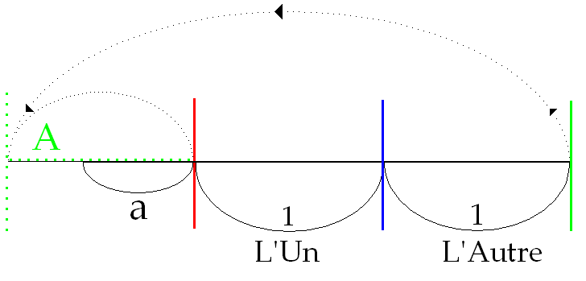

# Leçon 21 | 31 Mai 1967

  

    <label><input type="checkbox" data-lacan-toggle="original" checked> 原文</label>
    <label><input type="checkbox" data-lacan-toggle="notes" checked> 注释</label>
    <label><input type="checkbox" data-lacan-toggle="commentary" checked> 个人解读评论</label>
  

  <form class="lacan-tool-search" role="search">
    <input class="lacan-tool-search-input" type="search" placeholder="搜索全文" aria-label="搜索全文">
    <button class="lacan-tool-button" type="submit" title="搜索">搜索</button>
  </form>
  <button class="lacan-tool-button lacan-back-to-top" type="button" title="回到页面最上方" aria-label="回到页面最上方">↑</button>

<section class="parallel-paragraph" data-paragraph-ids="s14-21-0001">

s14-21-0001

原文 · s14-21-0001

Pour ceux qui se trouvent, par exemple, revenir aujour­d’hui après avoir suivi un temps mon enseignement, il faut que je signale ce que j’ai pu, ces toutes dernières fois, y introduire d’articulations nouvelles.

[无对应译文]

</section>

<section class="parallel-paragraph" data-paragraph-ids="s14-21-0002">

s14-21-0002

原文 · s14-21-0002

L’une, importante, qui date de notre *antépénultième* rencontre, est assurément d’avoir désigné, expressément dirais-je…

[无对应译文]

</section>

<section class="parallel-paragraph" data-paragraph-ids="s14-21-0003">

s14-21-0003

原文 · s14-21-0003

> puisque aussi bien la chose n’était pas, à ceux qui m’enten­dent, inaccessible …expressément *le lieu de l’Autre*…

[无对应译文]

</section>

<section class="parallel-paragraph" data-paragraph-ids="s14-21-0004">

s14-21-0004

原文 · s14-21-0004

> ou ce que jusqu’ici, je veux dire depuis le début de mon enseigne­ment, j’ai articulé comme tel …désigné *le lieu de l’Autre dans le corps*.

[无对应译文]

</section>

<section class="parallel-paragraph" data-paragraph-ids="s14-21-0005">

s14-21-0005

原文 · s14-21-0005

Le corps lui-même est - d’origine - ce lieu de l’Autre, en tant que c’est là que - d’origine - s’inscrit la marque en tant que signifiant.

[无对应译文]

</section>

<section class="parallel-paragraph" data-paragraph-ids="s14-21-0006">

s14-21-0006

原文 · s14-21-0006

Il était nécessaire que je le rappelle aujourd’hui, au moment où nous allons faire le pas qui suit, dans cette *logi­que du fantasme*, qui se trouve - vous le verrez confirmé à mesure de notre avance - qui se trouve pouvoir s’accommoder *d’une cer­taine laxité logique*.

[无对应译文]

</section>

<section class="parallel-paragraph" data-paragraph-ids="s14-21-0007">

s14-21-0007

原文 · s14-21-0007

En tant que *logique du fantasme*, elle suppose *cette dimension* dite *de fantaisie*, sous l’espèce où l’exactitude n’y est pas exigée au départ.

[无对应译文]

</section>

<section class="parallel-paragraph" data-paragraph-ids="s14-21-0008">

s14-21-0008

原文 · s14-21-0008

Aussi bien, ce que nous pourrons trouver de plus rigoureux dans l’exercice d’une articulation qui mérite ce titre de logique, inclut-il en soi-même le progrès d’une *approximation*. Je veux dire *un mode d’approximation* qui comporte en lui-même, non seulement une croissance, mais une croissance autant que possible la meil­leure, la plus rapide qui soit, vers le calcul d’une valeur exacte.

[无对应译文]

</section>

<section class="parallel-paragraph" data-paragraph-ids="s14-21-0009">

s14-21-0009

原文 · s14-21-0009

Et c’est en ceci que… en nous référant à un algorithme d’une très grande généralité, qui n’est rien d’autre que celui le plus propre à assurer le rapport d’un *incommensurable* idéal, le plus simple qui soit, le plus espacé aussi, à resserrer ce qu’il constitue d’irrationnel par son progrès lui-même.

[无对应译文]

</section>

<section class="parallel-paragraph" data-paragraph-ids="s14-21-0010">

s14-21-0010

原文 · s14-21-0010

Je veux dire que cette incommensurabilité de ce *(a)*…

[无对应译文]

</section>

<section class="parallel-paragraph" data-paragraph-ids="s14-21-0011">

s14-21-0011

原文 · s14-21-0011

> que je ne fi­gure que pour la lisibilité de mon texte, *paramètre du Nombre d’or*, car ceux qui « *savent* », savent que cette sorte
>
> de nombre, constitué par le progrès même de son *approximation*, est toute une famille de nombres et, si l’on peut dire *...peut partir de n’importe où*, de n’importe quel exercice de rapport, à cette seule condition que *l’incommensurable* exige que *l’approxi­mation* n’ait pas de terme, tout en étant pourtant parfaitement reconnaissable à chaque instant comme rigoureuse.

[无对应译文]

</section>

<section class="parallel-paragraph" data-paragraph-ids="s14-21-0012">

s14-21-0012

原文 · s14-21-0012

C’est de ceci donc qu’il s’agit : de saisir que ce à quoi nous sommes confrontés sous la forme du *fantasme*, re­flète *une nécessité*.

[无对应译文]

</section>

<section class="parallel-paragraph" data-paragraph-ids="s14-21-0013">

s14-21-0013

原文 · s14-21-0013

En d’autres termes, le problème qui pour un HEGEL pouvait se contenir dans cette limite simple que constitue *la certitude incluse dans la conscience de soi­-même*… \[un message extérieur est transmis par les haut-parleurs\]

[无对应译文]

</section>

<section class="parallel-paragraph" data-paragraph-ids="s14-21-0014">

s14-21-0014

原文 · s14-21-0014

- *cette certitude de soi-même*, dont HEGEL peut se permet­tre…

[无对应译文]

</section>

<section class="parallel-paragraph" data-paragraph-ids="s14-21-0015">

s14-21-0015

原文 · s14-21-0015

> peut se permettre étant données certaines *conditions* que j’évoquerai tout à l’heure, qui sont *conditions d’Histoire* …de mettre en question le rapport avec une *vérité*,

[无对应译文]

</section>

<section class="parallel-paragraph" data-paragraph-ids="s14-21-0016">

s14-21-0016

原文 · s14-21-0016

- *cette certitu­de* dans HEGEL, et c’est là en quoi il conclut tout un pro­cès par où la philosophie est exploration du savoir, s’il peut se permettre d’y introduire le τήλος \[télos\], *la fin*, *le but d’un sa­voir absolu*, c’est pour autant qu’au niveau de la certitude, il se trouve pouvoir indiquer qu’elle ne contient pas en elle-même sa *vérité*. \[autre message des haut-parleurs\]

[无对应译文]

</section>

<section class="parallel-paragraph" data-paragraph-ids="s14-21-0017">

s14-21-0017

原文 · s14-21-0017

C’est en ceci que nous nous trouvons, non pas pouvoir simplement reprendre la formule hégelienne, mais la compliquer : la vérité à laquelle nous avons affaire tient en cet acte par où la fondation de la conscience de soi–même, par où la certitude subjective, est affrontée à quelque chose qui - de nature - lui est radicalement étranger et qui est proprement ceci que… *Est-ce qu’on ne pourrait pas faire quelque chose pour que cette interruption cesse ?* \[Une longue pause est nécessaire pour faire cesser cette perturbation\]

[无对应译文]

</section>

<section class="parallel-paragraph" data-paragraph-ids="s14-21-0018">

s14-21-0018

原文 · s14-21-0018

Ce qu’il s’agit donc d’introduire aujourd’hui, et d’autant plus rapidement que notre temps aura été écourté, c’est ceci : l’ex­périence psychanalytique introduit ceci que *la vérité de l’acte sexuel* fait question dans l’expérience. Bien sûr, l’importance de cette découverte ne prend son relief qu’à partir d’une position du terme *acte sexuel* comme tel. Je veux dire…

[无对应译文]

</section>

<section class="parallel-paragraph" data-paragraph-ids="s14-21-0019">

s14-21-0019

原文 · s14-21-0019

> pour des oreilles déjà suffisamment formées à la notion de *la prévalence du si­gnifiant dans toute constitution subjective* …d’apercevoir la différence qu’il y a entre :

[无对应译文]

</section>

<section class="parallel-paragraph" data-paragraph-ids="s14-21-0020">

s14-21-0020

原文 · s14-21-0020

- une référence vague à la sexualité qu’on peut à peine dire comme fonction, comme dimension pro­pre à une certaine forme de la vie, celle nommément la plus profondément nouée à la mort, je veux dire entremêlée, en­trecroisée à la mort.

[无对应译文]

</section>

<section class="parallel-paragraph" data-paragraph-ids="s14-21-0021">

s14-21-0021

原文 · s14-21-0021

- Ce n’est pas tout dire, à partir du moment où nous savons que l’inconscient c’est le discours de l’Autre, à partir de ce moment il est clair que tout ce qui fait intervenir l’ordre de la sexualité dans l’inconscient, n’y pénètre qu’autour de la mise en question de *l’acte sexuel*.

[无对应译文]

</section>

<section class="parallel-paragraph" data-paragraph-ids="s14-21-0022">

s14-21-0022

原文 · s14-21-0022

*L’acte sexuel est-il possible ?* Y-a-t-il ce *nœud*, définissable comme un acte, où le sujet se fonde comme sexué, c’est-à-dire *mâle ou femelle* l’étant en soi, ou s’il ne l’est pas, procédant dans cet acte à quelque chose qui puisse - fût-ce à son ter­me - aboutir à l’essence pure du « mâle » ou du « femelle » ? Je veux dire : au démêlement, à la répartition, sous une forme polaire, de ce qui est mâle et de ce qui est femelle, pré­cisément dans *la conjonction* qui les réunit *dans quelque chose*…

[无对应译文]

</section>

<section class="parallel-paragraph" data-paragraph-ids="s14-21-0023">

s14-21-0023

原文 · s14-21-0023

> dont ce n’est pas ici, à cette heure, ni la pre­mière fois que j’introduits le terme …*dans quelque chose* que je nomme comme étant *la jouissance,* j’entends comme dès longtemps introduite et nommément dans mon séminai­re sur *L*’*Éthique* \[1959-60\].Il est en effet exigible que ce terme de *jouissance* soit proféré et proprement comme *distinct du plaisir*, comme en constituant *l’au-delà*.

[无对应译文]

</section>

<section class="parallel-paragraph" data-paragraph-ids="s14-21-0024">

s14-21-0024

原文 · s14-21-0024

Ce qui dans la théorie psychanalytique l’indique est une série de termes convergents, au premier rang desquels est celui de la *libido*, qui en représente une certaine arti­culation, dont il nous faudra désigner, au bout de ces entre­tiens de cette année, désigner en quoi son emploi peut être assez glissant pour non pas soutenir, mais faire se dérober les articulations essentielles que nous allons tenter d’intro­duire aujourd’hui. *La jouissance*, c’est-à-dire *ce quelque chose* qui a un certain rapport au sujet, en tant que dans cet affrontement au *trou* laissé dans un certain registre d’acte *questionnnable*, celui de l’acte sexuel, il est - ce sujet - suspendu par une sé­rie de modes ou d’états qui sont d’insatisfaction.

[无对应译文]

</section>

<section class="parallel-paragraph" data-paragraph-ids="s14-21-0025">

s14-21-0025

原文 · s14-21-0025

Voilà qui à soi seul justifie l’introduction du terme de *jouissance,* qui aussi bien est ce qui à tout instant - *et nommément dans le symptôme -* se propose à nous comme indiscernable de ce registre de la satisfaction, puisque à tout instant pour nous le pro­blème est de savoir comment un *nœud* \[*le symptôme*\], qui ne se soutient que de malaise et de souffrance, est justement ce par quoi se manifes­te l’instance de la satisfaction suspendue, proprement : *ce où le sujet se tient en tant qu’il tend vers cette satisfaction*.

[无对应译文]

</section>

<section class="parallel-paragraph" data-paragraph-ids="s14-21-0026">

s14-21-0026

原文 · s14-21-0026

Ici la loi du *principe du plaisir*, à savoir de la moin­dre tension, ne fait qu’indiquer la nécessité des détours du chemin par où le sujet se soutient dans la voie de sa recherche - recherche de *jouissance - mais ne nous en donne pas la fin*, qui est cette fin propre.

[无对应译文]

</section>

<section class="parallel-paragraph" data-paragraph-ids="s14-21-0027">

s14-21-0027

原文 · s14-21-0027

Fin pourtant entièrement mas­quée pour nous, dans sa forme dernière, pour autant qu’on peut aussi bien dire que son achèvement, son achèvement est si questionnable qu’on peut

[无对应译文]

</section>

<section class="parallel-paragraph" data-paragraph-ids="s14-21-0028">

s14-21-0028

原文 · s14-21-0028

- aussi bien partir de ce fondement : « *qu’il n’y a pas d’acte sexuel* »,

[无对应译文]

</section>

<section class="parallel-paragraph" data-paragraph-ids="s14-21-0029">

s14-21-0029

原文 · s14-21-0029

- aussi bien que de celui-ci : « *qu’il n’y a que l’acte sexuel* » qui motive toute cette articulation.

[无对应译文]

</section>

<section class="parallel-paragraph" data-paragraph-ids="s14-21-0030">

s14-21-0030

原文 · s14-21-0030

C’est en ceci que j’ai tenu à apporter la référence, dont chacun sait que je me suis servi depuis longtemps, la référence à HEGEL, pour autant que ce procès…

[无对应译文]

</section>

<section class="parallel-paragraph" data-paragraph-ids="s14-21-0031">

s14-21-0031

原文 · s14-21-0031

> *ce procès de la dialectique des différents niveaux de la certitude de soi-même, de la Phénoménologie de L’esprit comme il a dit* …se suspend à un mouvement qu’il appelle « *dialectique* » et qui assurément dans sa perspective, peut être tenu pour être seu­lement dialectique d’un rapport qu’il articule de la présen­ce de cette conscience, pour autant que sa vérité lui échappe, dans ce qui constitue le jeu du rapport *d’une conscience de soi-même* à *une autre conscience de soi-même :* dans le rapport de *l’intersubjectivité*. Or il est clair, il est dès longtemps démontré, ne se­rait-ce que par *la révélation de cette béance sociale*, en tant qu’elle ne nous permet pas de résumer à l’affrontement « *d’une conscience à une conscience* » ce qui se présente comme « *lutte* », nommément « *du maître et de l’esclave* ».

[无对应译文]

</section>

<section class="parallel-paragraph" data-paragraph-ids="s14-21-0032">

s14-21-0032

原文 · s14-21-0032

Ce n’est même pas à nous de faire la critique de ce que laisse ouvert *la genèse hégelienne*, ceci a été fait par d’autres… et nommément par un autre, par MARX pour le nommer …­et maintient la question *de son issue et de ses modes* en suspens.

[无对应译文]

</section>

<section class="parallel-paragraph" data-paragraph-ids="s14-21-0033">

s14-21-0033

原文 · s14-21-0033

Ce par quoi FREUD arrive et reprend les choses - en un point *analogique* seulement de la position hégelienne - s’ins­crit, s’inscrit déjà suffisamment dans ce terme, dans ce terme de *jouissance,* pour autant que HEGEL l’introduit. Le départ, nous dit-il, est dans « *la lutte à mort du maître et de l’esclave* », après quoi s’instaure le fait que *celui qui n’a pas voulu risquer, risquer l’enjeu de la mort*, *celui-là tombe* *à l’égard de l’autre dans un état de dépendance*, qui pour autant n’est pas sans contenir tout l’avenir de la dialectique en question.

[无对应译文]

</section>

<section class="parallel-paragraph" data-paragraph-ids="s14-21-0034">

s14-21-0034

原文 · s14-21-0034

Le terme de *jouissance* y intervient : *la jouissance* - après le terme de cette « *lutte à mort de pur prestige* » nous est-­il dit ! - va être le privilège du maître, et que pour l’esclave la voie tracée dès lors sera celle du travail. Regardons les choses de plus près et cette *jouissance* dont il s’agit, voyons dans le texte de HEGEL…

[无对应译文]

</section>

<section class="parallel-paragraph" data-paragraph-ids="s14-21-0035">

s14-21-0035

原文 · s14-21-0035

> qu’après tout je ne puis pas ici produire et encore moins avec l’abré­viation à laquelle nous sommes contraints aujourd’hui …de quoi le maître jouit-il ?

[无对应译文]

</section>

<section class="parallel-paragraph" data-paragraph-ids="s14-21-0036">

s14-21-0036

原文 · s14-21-0036

La chose dans HEGEL est très suffisamment aperçue : le rapport instauré par l’articulation du *travail* de l’escla­ve fait que, si peut-être, le maître *jouit*, ce n’est *point­ absolument*. À la limite et à forcer un peu les choses - *ce qui est à nos dépens vous allez le voir* - nous dirions qu’il ne jouit que de son *loisir,* ce qui veut dire de la disposi­tion de son corps .

[无对应译文]

</section>

<section class="parallel-paragraph" data-paragraph-ids="s14-21-0037">

s14-21-0037

原文 · s14-21-0037

En fait il est bien loin d’en être ainsi - nous le ré-indiquerons tout à l’heure - mais admettons que de tout ce dont il a à jouir comme *choses*, *il est séparé* par celui-là qui est chargé de les *mettre à sa merci*, à savoir de l’esclave, dont on peut dire dès lors…

[无对应译文]

</section>

<section class="parallel-paragraph" data-paragraph-ids="s14-21-0038">

s14-21-0038

原文 · s14-21-0038

> et je n’ai point à *le défendre*, je veux dire : ce point vif, puisque déjà dans HEGEL, il est suffi­samment indiqué …qu’il y a pour l’esclave une certaine *jouis­sance de la chose*, en tant que non seulement il l’apporte au maître, mais à la transformer pour la lui rendre recevable.

[无对应译文]

</section>

<section class="parallel-paragraph" data-paragraph-ids="s14-21-0039">

s14-21-0039

原文 · s14-21-0039

Après ce rappel il convient que je m’interroge avec vous, que je vous fasse vous interroger sur ce que - dans un tel registre - implique le mot *jouissance.* Rien assurément n’est plus instructif, toujours, que la référence à ce qu’on appelle *le lexique*, pour autant qu’il s’attache à des buts aussi précaires que l’articulation des significations.

[无对应译文]

</section>

<section class="parallel-paragraph" data-paragraph-ids="s14-21-0040">

s14-21-0040

原文 · s14-21-0040

« *Les termes inclus dans chaque article*… » lit-on quelque part dans la note de la préface de ce magnifique travail qui s’appelle le *Grand Robert*… « *Les termes inclus dans chaque article constituent au­tant de renvois, de chaînons, qui devront aboutir aux moyens d’expression de la pensée.* »

[无对应译文]

</section>

<section class="parallel-paragraph" data-paragraph-ids="s14-21-0041">

s14-21-0041

原文 · s14-21-0041

« *L’astérisque*… car en effet vous pourrez constater que dans chacun de ces articles qui remplissent très bien leur programme …« *L’astérisque renvoie aux articles qui développent longuement une idée suggérée d’un seul mot.* »

[无对应译文]

</section>

<section class="parallel-paragraph" data-paragraph-ids="s14-21-0042">

s14-21-0042

原文 · s14-21-0042

Moyennant quoi l’article « *jouissance* » commence par le mot *plaisir* marqué d’un astérisque. Ceci n’est qu’un exemple, mais le mot, sans doute ce n’est point par hasard qu’il nous présente ces paradoxes.

[无对应译文]

</section>

<section class="parallel-paragraph" data-paragraph-ids="s14-21-0043">

s14-21-0043

原文 · s14-21-0043

Bien sûr « *jouissance* » n’a pas été abordé la première fois par le *Robert,* vous pouvez également étudier ce mot dans le *Littré* : vous y verrez que ce qui est son emploi, son emploi le plus légitime, varie :

[无对应译文]

</section>

<section class="parallel-paragraph" data-paragraph-ids="s14-21-0044">

s14-21-0044

原文 · s14-21-0044

- du versant qu’indique *l’étymologie*, qui le rattache à *la joie*,

[无对应译文]

</section>

<section class="parallel-paragraph" data-paragraph-ids="s14-21-0045">

s14-21-0045

原文 · s14-21-0045

- à celui de *la possession* et ce dont on dispose au dernier terme : la jouissance d’un titre.

[无对应译文]

</section>

<section class="parallel-paragraph" data-paragraph-ids="s14-21-0046">

s14-21-0046

原文 · s14-21-0046

La jouissance d’un titre, que ce titre signifie quelque titre juridique ou quelque papier représentant une va­leur de Bourse, avoir la jouissance de quelque chose, des dividendes par exemple, c’est pouvoir le céder. Le signe de la possession, c’est de pouvoir s’en démettre. « *Jouir de…* » est autre chose que « *jouir* », et assurément rien plus que ces glissements de sens, en tant qu’ils sont cernés dans cette appréhension que j’ai appelée tout à l’heure « lexicale », dans son exercice dans le dictionnaire, ne nous montre à quel point la référence à la pensée est bien ce qu’il y a de plus impropre, pour dési­gner la fonction - radicale, j’entends - de tel ou tel signi­fiant.

[无对应译文]

</section>

<section class="parallel-paragraph" data-paragraph-ids="s14-21-0047">

s14-21-0047

原文 · s14-21-0047

Ce n’est pas la pensée qui donne du signifiant l’effective et dernière référence. C’est de l’instauration qui résulte des effets de l’introduction d’un signifiant *dans le réel*. C’est pour autant que j’articule d’une nouvelle façon ce rapport du mot « *jouissance* » à ce qui est pour nous - dans l’analyse - en exercice, que le mot « *jouissance* » trouve et peut conserver sa dernière valeur.

[无对应译文]

</section>

<section class="parallel-paragraph" data-paragraph-ids="s14-21-0048">

s14-21-0048

原文 · s14-21-0048

Et ceci, j’entends aujourd’hui vous en faire sentir la portée en son point le plus radical.

[无对应译文]

</section>

<section class="parallel-paragraph" data-paragraph-ids="s14-21-0049">

s14-21-0049

原文 · s14-21-0049

Le maître jouit de quelque chose, que ce soit de lui-même - il est son maître, comme on dit - ou aussi bien de l’es­clave.

[无对应译文]

</section>

<section class="parallel-paragraph" data-paragraph-ids="s14-21-0050">

s14-21-0050

原文 · s14-21-0050

Mais de quoi jouit-il dans l’esclave ? Précisément : de son corps ! Comme on le lit dans l’Écriture, le maître dit : « *Va !* » et il va.

[无对应译文]

</section>

<section class="parallel-paragraph" data-paragraph-ids="s14-21-0051">

s14-21-0051

原文 · s14-21-0051

Comme je me suis permis - je ne sais plus si je l’ai écrit ou si seulement je l’ai énoncé :

[无对应译文]

</section>

<section class="parallel-paragraph" data-paragraph-ids="s14-21-0052">

s14-21-0052

原文 · s14-21-0052

- si le maître dit : « *Jouis !* »,

[无对应译文]

</section>

<section class="parallel-paragraph" data-paragraph-ids="s14-21-0053">

s14-21-0053

原文 · s14-21-0053

- l’autre ne peut répondre que ce : « *J’ouis* », j’entends, « *J, apostrophe *» \[Rires\] sur lequel je me suis amusé.

[无对应译文]

</section>

<section class="parallel-paragraph" data-paragraph-ids="s14-21-0054">

s14-21-0054

原文 · s14-21-0054

Je ne m’amuse en général pas au hasard, ceci veut dire quelque chose…

[无对应译文]

</section>

<section class="parallel-paragraph" data-paragraph-ids="s14-21-0055">

s14-21-0055

原文 · s14-21-0055

> ç’aurait pu aussi bien *être relevé* par quelqu’un de ceux qui m’écoutent,
>
> jJe regrette trop souvent de ne *recueillir rien de plus* que ce qui me force à le faire moi-même. …la question est celle-ci : *ce dont on jouit*…

[无对应译文]

</section>

<section class="parallel-paragraph" data-paragraph-ids="s14-21-0056">

s14-21-0056

原文 · s14-21-0056

> s’il y a cette jouissance qui s’inaugure dans le « *je* » du sujet en tant qu’il possède …*ce dont on jouit cela jouit-il ?*

[无对应译文]

</section>

<section class="parallel-paragraph" data-paragraph-ids="s14-21-0057">

s14-21-0057

原文 · s14-21-0057

Il semble pourtant que ce soit ça la véritable question. Car aussi bien, *il est clair que la jouissance n’est nullement ce qui caractérise le maître*.

[无对应译文]

</section>

<section class="parallel-paragraph" data-paragraph-ids="s14-21-0058">

s14-21-0058

原文 · s14-21-0058

Le maître…

[无对应译文]

</section>

<section class="parallel-paragraph" data-paragraph-ids="s14-21-0059">

s14-21-0059

原文 · s14-21-0059

> *en tant qu’il est ce­lui-là, dans la Cité, qui ne saurait d’aucune façon être n’im­porte qui, mais qui est marqué de sa fonction de maître* …il a bien autre chose à faire qu’à s’abandonner à la jouissance. Et la maîtrise de son corps, car il ne s’agit pas seulement du loisir, est quelque chose qui ne se mène que par les plus rudes disciplines. À toutes les époques de civilisation, celui-­là qui est maître n’a nullement le temps de se laisser aller, et fût-ce dans ses loisirs !

[无对应译文]

</section>

<section class="parallel-paragraph" data-paragraph-ids="s14-21-0060">

s14-21-0060

原文 · s14-21-0060

Les types sont à distinguer, mais après tout le type du « *maître antique* » n’est pas d’un ordre tellement purement idéal que nous n’en ayons les repères. Il est suffisamment inscrit, je dirais *dans les marques du premier discours philosophi­que* \[Platon, Aristote...\], pour qu’on puisse dire que HEGEL nous en donne un témoi­gnage suffisant.

[无对应译文]

</section>

<section class="parallel-paragraph" data-paragraph-ids="s14-21-0061">

s14-21-0061

原文 · s14-21-0061

La question est justement celle-ci : est-ce que…

[无对应译文]

</section>

<section class="parallel-paragraph" data-paragraph-ids="s14-21-0062">

s14-21-0062

原文 · s14-21-0062

> *ce qui après tout n’est que juste et conforme au premier enjeu de la par­tie* …celui qui - à en croire HEGEL ­- n’a pu dès le départ tenir le risque éventuel de la perte de la vie, ce qui est bien en effet la voie la plus sûre pour perdre la jouissance, celui qui a assez tenu à la jouissance pour se soumettre et pour aliéner son corps, et pourquoi donc la jouissance ne lui resterait­-elle pas en main ?

[无对应译文]

</section>

<section class="parallel-paragraph" data-paragraph-ids="s14-21-0063">

s14-21-0063

原文 · s14-21-0063

Nous avons mille témoignages de ceci…

[无对应译文]

</section>

<section class="parallel-paragraph" data-paragraph-ids="s14-21-0064">

s14-21-0064

原文 · s14-21-0064

> *qu’une courte vue, on ne sait quel fantasme, qui veut que tout soit toujours du même côté, que le bouquet complet soit dans une seule main* …nous avons mille témoignages que ce qui caractérise la position de *celui dont le corps est remis à la merci d’un autre, c’est à partir de là* *que s’ouvre ce qui peut s’appeler la pure jouis­sance.*

[无对应译文]

</section>

<section class="parallel-paragraph" data-paragraph-ids="s14-21-0065">

s14-21-0065

原文 · s14-21-0065

Et aussi bien à entrevoir, à suivre les indices qui nous en donnent tout au moins le recoupement, peut-être certaines questions s’effaceraient-elles sur le sens de certaines posi­tions paradoxales et nommément la *masochiste*. Mais après tout il vaut mieux quelque fois que les portes les plus immédiate­ment ouvertes ne soient pas franchies, parce qu’il ne suffit pas qu’elles soient faciles à franchir pour que ce soient les vraies.

[无对应译文]

</section>

<section class="parallel-paragraph" data-paragraph-ids="s14-21-0066">

s14-21-0066

原文 · s14-21-0066

Je ne dis pas que ce soit là le ressort du masochisme. Bien loin de là ! Parce que, assurément, ce qu’il faut dire c’est que, s’il est pensable que la condition de l’esclave soit la seule qui donne accès à la jouissance, dans la mesure où précisément nous pouvons le formuler, comme sujet nous n’en saurons jamais rien.

[无对应译文]

</section>

<section class="parallel-paragraph" data-paragraph-ids="s14-21-0067">

s14-21-0067

原文 · s14-21-0067

Or *le masochiste n’est pas un esclave*. Il est au contrai­re, comme je vous le dirai tout à l’heure, un petit malin, quelqu’un de très fort : le masochiste sait qu’il est dans la jouissance. C’est précisément à son propos - à son terme, à votre usage, pour ce qu’il est d’entendre sur lui ce dont il s’agit - que tout ce discours progresse. Et pour le faire pro­gresser, il convenait de montrer que dans HEGEL il y a plus d’un défaut.

[无对应译文]

</section>

<section class="parallel-paragraph" data-paragraph-ids="s14-21-0068">

s14-21-0068

原文 · s14-21-0068

Le premier bien sûr, étant celui qui me permettait, devant ceux qui m’entendent, de le produire, à savoir que dès avant que je l’avance et que j’en parle, avec *le stade du miroir* nous avons marqué qu’en aucun cas cette sorte d’agressivité qui est d’instance et de présence, dans « *la lutte à mort de pur prestige* », n’était rien d’autre qu’un leurre et dès lors, dès lors rendait caduque toute référence à elle com­me articulation première.

[无对应译文]

</section>

<section class="parallel-paragraph" data-paragraph-ids="s14-21-0069">

s14-21-0069

原文 · s14-21-0069

Je ne fais que repointer au passage les problèmes que pose - que pose et laisse béants - la déduction hégelienne concernant la société des maîtres : comment s’entendent-ils entre eux ? Et puis, mon Dieu, la simple référence à ce qu’il en est, à savoir :

[无对应译文]

</section>

<section class="parallel-paragraph" data-paragraph-ids="s14-21-0070">

s14-21-0070

原文 · s14-21-0070

- que l’esclave, pour qu’on en fasse un esclave, il n’est pas mort !

[无对应译文]

</section>

<section class="parallel-paragraph" data-paragraph-ids="s14-21-0071">

s14-21-0071

原文 · s14-21-0071

- Que le résultat de « *la lutte à mort* » est quelque chose qui n’a pas mis la mort en jeu.

[无对应译文]

</section>

<section class="parallel-paragraph" data-paragraph-ids="s14-21-0072">

s14-21-0072

原文 · s14-21-0072

- Que *le maître n’a que le droit de le tuer, mais que* précisément, et c’est pour cela qu’il s’appelle *Servus* : *le maître, servat, le sauve*.

[无对应译文]

</section>

<section class="parallel-paragraph" data-paragraph-ids="s14-21-0073">

s14-21-0073

原文 · s14-21-0073

- Et que c’est à partir de là que se pose la vérita­ble question : *qu’est-ce* que le maître sauve dans l’esclave ?

[无对应译文]

</section>

<section class="parallel-paragraph" data-paragraph-ids="s14-21-0074">

s14-21-0074

原文 · s14-21-0074

Nous sommes ramenés à la question de la loi primordiale, de ce qui institue la règle du jeu, à savoir : celui qui sera vaincu, on pourra le tuer, et si on ne le tue pas ce sera à quel prix ? *À quel prix ?* C’est bien là que nous rentrons dans le registre de la signifiance, ce dont il s’agit dans *la position du maître* est ceci : *des conséquences - toujours - de l’intro­duction du sujet dans le réel*.

[无对应译文]

</section>

<section class="parallel-paragraph" data-paragraph-ids="s14-21-0075">

s14-21-0075

原文 · s14-21-0075

Pour mesurer ce qu’il en est concernant ses effets sur la jouissance, il convient de poser, au niveau de ce terme, un certain nombre de principes. À savoir que si nous avons introduit *la jouissance*, c’est sous le mode - logique - de ce qu’ARISTOTE appelle une οὐσία \[ousia\], une *substance*, c’est-à-dire *quelque chose*, très précisément *qui ne peut être*… c’est ainsi qu’il s’exprime dans son livre des *Catégories...qui ne peut être* ni attribué à un sujet, ni mis dans aucun sujet. C’est *quelque chose* qui n’est pas susceptible de « *plus ou de moins* », qui ne s’introduit dans aucun comparatif, dans aucun signe « *plus petit ou plus grand* », voire « *plus petit ou égal* ».

[无对应译文]

</section>

<section class="parallel-paragraph" data-paragraph-ids="s14-21-0076">

s14-21-0076

原文 · s14-21-0076

*La jouissance* est ce quelque chose dans quoi marque ses traits et ses limites *le principe du plaisir*. Mais c’est quel­que chose de substantiel et qui précisément est important à produire, à produire sous la forme que je vais articuler au nom d’un nouveau principe :

[无对应译文]

</section>

<section class="parallel-paragraph" data-paragraph-ids="s14-21-0077">

s14-21-0077

原文 · s14-21-0077

> « *Il n’y a de jouissance <u>que</u> du corps.* »

[无对应译文]

</section>

<section class="parallel-paragraph" data-paragraph-ids="s14-21-0078">

s14-21-0078

原文 · s14-21-0078

Permettez-moi de dire que je considère que le maintien de ce principe, son affirmation comme étant absolument essentielle, me parait d’une plus grande *portée éthique* que celle du *matérialisme*. J’entends que cette formule a exactement la portée, le relief, que l’affirmation « *qu’il* *n’y a que la matière *» introduit dans le champ de la connaissance. Car après tout vous n’avez qu’à voir avec l’évolution de la science que cette matière en fin de compte se confond si bien avec le jeu des éléments dans lesquels on la résout, qu’il devient à la limite presque indiscernable de savoir ce qui devant vous joue, si ce sont ces éléments de cette στοιχεία \[stoikeia\], ces éléments si­gnifiants derniers, ou ceux de l’atome. À savoir ce qu’ils ont en eux-mêmes de quasiment indiscernable avec le progrès de votre esprit, le jeu de votre recherche, mais ce qu’il en est au dernier terme *d’une structure* que vous ne savez plus d’aucune façon rapporter à ce que vous avez comme expérience commune de la matière.

[无对应译文]

</section>

<section class="parallel-paragraph" data-paragraph-ids="s14-21-0079">

s14-21-0079

原文 · s14-21-0079

Mais dire « *Il n’y a de jouissance <u>que</u> du corps* » et nommément *que ceci vous refuse les jouissances éternelles*, c’est bien là *ce qui est en jeu* dans ce que j’ai appelé *valeur éthique du matérialisme*, à savoir qui consiste à prendre ce qui se passe dans votre vie de tous les jours au sérieux, et s’il y a question de jouissance, de la regarder en face et de ne pas la repousser dans des lendemains qui chantent… « *Il n’y a de jouissance <u>que</u> du corps* » : Ceci répond très précisément à l’exigence de vérité qu’il y a dans le freudis­me.

[无对应译文]

</section>

<section class="parallel-paragraph" data-paragraph-ids="s14-21-0080">

s14-21-0080

原文 · s14-21-0080

Nous voici donc laissant entièrement à son errance la question de savoir si ce dont il s’agit c’est de *l’être* ou de *ne l’être pas*, s’il s’agit d’être *homme* ou d’être *femme*, dans un acte qui serait *l’acte sexuel*. Et si ceci est ce qui domine tout ce suspens de *la jouissance*, c’est également ceci que nous avons à prendre éthiquement au sérieux. Ce à propos de quoi s’élève ce quelque chose que nous pourrions appeler notre *droit de regard*.

[无对应译文]

</section>

<section class="parallel-paragraph" data-paragraph-ids="s14-21-0081">

s14-21-0081

原文 · s14-21-0081

ŒDIPE n’est pas un philosophe. C’est le modèle de ce dont il s’agit quant au rapport de ce qu’il en est d’un savoir, et le savoir dont il fait preuve, au moins nous est-il indiqué dans la forme de l’*énigme* que c’est un savoir concernant ce qu’il en est du corps.

[无对应译文]

</section>

<section class="parallel-paragraph" data-paragraph-ids="s14-21-0082">

s14-21-0082

原文 · s14-21-0082

Par ceci il rompt le pouvoir d’une jouissance féroce, celle de la SPHYNGE, dont il est bien étran­ge qu’elle nous soit offerte sous la forme d’une figure vague­ment féminine, disons mi-bestiale, mi-féminine.

[无对应译文]

</section>

<section class="parallel-paragraph" data-paragraph-ids="s14-21-0083">

s14-21-0083

原文 · s14-21-0083

[无对应译文]

</section>

<section class="parallel-paragraph" data-paragraph-ids="s14-21-0084">

s14-21-0084

原文 · s14-21-0084

Ce à quoi il accède après cela - ce qui ne le rend pas, vous le savez, plus triomphant pour cela - c’est assurément une *jouissance*.

[无对应译文]

</section>

<section class="parallel-paragraph" data-paragraph-ids="s14-21-0085">

s14-21-0085

原文 · s14-21-0085

Au moment qu’il y entre, il est déjà dans le piège. Je veux dire que cette *jouissance*, c’est celle-là qui le marque d’ores et déjà, et d’avance, du signe de la *culpabilité*.

[无对应译文]

</section>

<section class="parallel-paragraph" data-paragraph-ids="s14-21-0086">

s14-21-0086

原文 · s14-21-0086

ŒDIPE ne savait pas ce dont il jouissait. J’ai posé la question de savoir si JOCASTE, elle, le savait.

[无对应译文]

</section>

<section class="parallel-paragraph" data-paragraph-ids="s14-21-0087">

s14-21-0087

原文 · s14-21-0087

Et même, pour­quoi pas : JOCASTE jouissait-elle de laisser ŒDIPE l’ignorer ?

[无对应译文]

</section>

<section class="parallel-paragraph" data-paragraph-ids="s14-21-0088">

s14-21-0088

原文 · s14-21-0088

Disons : quelle part de la jouissance de JOCASTE répond-elle à ce qu’elle laissât ŒDIPE l’ignorer ?

[无对应译文]

</section>

<section class="parallel-paragraph" data-paragraph-ids="s14-21-0089">

s14-21-0089

原文 · s14-21-0089

C’est à ce niveau, grâce à FREUD, que se posent désormais les questions sérieuses concernant ce qu’il en est de *la véri­té*.

[无对应译文]

</section>

<section class="parallel-paragraph" data-paragraph-ids="s14-21-0090">

s14-21-0090

原文 · s14-21-0090

Or l’introduction que j’ai déjà faite de *la fonction d’aliénation*, en tant qu’elle est cohérente avec la genèse du sujet comme déterminé par le véhicule de la signifiance, nous permet de dire que quant à ce qui nous intéresse et qui est premièrement posé - à savoir qu’« *Il n’y a de jouissance <u>que</u> du corps* » - c’est que *l’effet de l’introduction du sujet, lui-même effet de la signifiance, est proprement de mettre le corps* *et la jouissance dans ce rapport que j’ai défini par la fonction d’aliénation.*

[无对应译文]

</section>

<section class="parallel-paragraph" data-paragraph-ids="s14-21-0091">

s14-21-0091

原文 · s14-21-0091

Je veux dire que, comme je viens pendant une demi-heure de l’articuler devant vous, *le sujet, en tant qu’il se fonde dans cette marque* *du corps qui le privilégie, qui fait que c’est la marque*, *la marque subjective, qui désormais domine tout ce dont il va s’agir pour ce corps *: qu’il aille là et puis là et pas ailleurs, et *qu’il soit libre ou non de le faire, voilà sans doute ce qui distingue le maître*, parce que le maî­tre est un sujet­.

[无对应译文]

</section>

<section class="parallel-paragraph" data-paragraph-ids="s14-21-0092">

s14-21-0092

原文 · s14-21-0092

*La jouissance est, dans ce fondement premier de la sub­jectivation du corps, ce qui tombe dans la dépendance de cette subjectivation, et pour tout dire, s’efface.*

[无对应译文]

</section>

<section class="parallel-paragraph" data-paragraph-ids="s14-21-0093">

s14-21-0093

原文 · s14-21-0093

À l’origine, la position du maître - et c’est cela que HEGEL entrevoit - est justement renonciation à la jouissance, possibilité de tout engager sur cette disposition ou non au corps. Et non seule­ment du sien, mais aussi de celui de l’Autre.

[无对应译文]

</section>

<section class="parallel-paragraph" data-paragraph-ids="s14-21-0094">

s14-21-0094

原文 · s14-21-0094

*<u>L’Autre c’est l’ensemble des corps</u>, à partir du moment où le jeu de « la lutte sociale », simplement introduit que les rapports des corps sont dès lors dominés par ce quelque chose qui, aussi bien, s’appelle la loi. Loi* qu’on peut dire *liée à l’avènement du maître*, mais bien seulement si on l’entend : *l’avènement du maître absolu*, c’est-à-dire *la sanction de la mort comme devenue légale*.

[无对应译文]

</section>

<section class="parallel-paragraph" data-paragraph-ids="s14-21-0095">

s14-21-0095

原文 · s14-21-0095

Ceci dès lors, nous permet d’entrevoir que si l’introduction du sujet comme effet de signifiant, gît dans cette séparation du corps et de la jouissance, dans la division mise entre les termes qui ne subsistent que l’un de l’autre, c’est là pour nous, que doit se poser la question, la ques­tion de savoir *comment la jouissance est maniable à partir du sujet.*

[无对应译文]

</section>

<section class="parallel-paragraph" data-paragraph-ids="s14-21-0096">

s14-21-0096

原文 · s14-21-0096

Eh bien, la réponse… la réponse est donnée par ce que l’analyse découvre comme *approximation* de ce rapport à *la jouissance* : sans doute dans le champ de *l’acte sexuel*, ce qu’elle découvre, c’est l’introduction de ce que j’ai appelé *valeur de jouissance,* c’est-à-dire : annulation de *la jouissance* comme telle la plus immédiatement intéressée dans la con­jonction sexuelle, ce qu’elle appelle *la castration.*

[无对应译文]

</section>

<section class="parallel-paragraph" data-paragraph-ids="s14-21-0097">

s14-21-0097

原文 · s14-21-0097

Ceci ne résout rien.

[无对应译文]

</section>

<section class="parallel-paragraph" data-paragraph-ids="s14-21-0098">

s14-21-0098

原文 · s14-21-0098

Bien sûr, ceci nous explique com­ment il se fait que la forme légale la plus simple et la plus claire de l’acte sexuel, en tant qu’il est institué dans une formation *régulière* qui s’appelle le mariage, d’abord ne soit - à l’origine - que le privilège du maître.

[无对应译文]

</section>

<section class="parallel-paragraph" data-paragraph-ids="s14-21-0099">

s14-21-0099

原文 · s14-21-0099

Pas simplement bien sûr, *du maître en tant qu’opposé à l’esclave*, mais - comme vous le savez si vous savez un peu d’histoire, et d’histoire romaine nommément - même *opposé à la plèbe*. N’a pas accès à l’institution du mariage qui veut, sinon le maître.

[无对应译文]

</section>

<section class="parallel-paragraph" data-paragraph-ids="s14-21-0100">

s14-21-0100

原文 · s14-21-0100

Mais, aussi bien, chacun sait…

[无对应译文]

</section>

<section class="parallel-paragraph" data-paragraph-ids="s14-21-0101">

s14-21-0101

原文 · s14-21-0101

> chacun sait - mon Dieu - par l’expérience, pour ce que ce mariage,
>
> qui a été mis dès lors à la portée de tous, traîne encore après lui de déchire­ments …chacun sait que cela ne va pas tout seul !

[无对应译文]

</section>

<section class="parallel-paragraph" data-paragraph-ids="s14-21-0102">

s14-21-0102

原文 · s14-21-0102

Et si vous ouvrez TITE LIVE, vous verrez qu’il est une époque, pas telle­ment tard dans *la République*, où les Dames…

[无对应译文]

</section>

<section class="parallel-paragraph" data-paragraph-ids="s14-21-0103">

s14-21-0103

原文 · s14-21-0103

> les dames romai­nes, celles qui étaient vraiment marquées du vrai [*connubium*](http://remacle.org/bloodwolf/institutions/connubium.htm) *…*ont empoisonné pendant toute une génération, avec une ampleur et une persévérance qui n’a pas été sans laisser quelques tra­ces dans la mémoire et que TITE LIVE inscrit, ont empoisonné leurs maris : ce n’était pas sans raison.

[无对应译文]

</section>

<section class="parallel-paragraph" data-paragraph-ids="s14-21-0104">

s14-21-0104

原文 · s14-21-0104

Il faut croire que l’institution du mariage, quand elle fonctionne au niveau de véritables maîtres, doit emporter avec elle quelques inconvé­nients, qui ne sont pas probablement uniquement liés à *la jouissance* \[Rires\], puisque c’est plutôt le caractère accentué du trou mis à ce niveau, à savoir du fait que la jouissance n’a rien à faire avec le choix conjugal, que ces menus incidents résultaient.

[无对应译文]

</section>

<section class="parallel-paragraph" data-paragraph-ids="s14-21-0105">

s14-21-0105

原文 · s14-21-0105

Quand nous parlons de l’acte sexuel au niveau où il nous intéresse, nous analystes, c’est précisément pour autant que *la jouissance* est en cause. Comme je vous l’ai rappelé la dernière fois, Dieu n’a pas dédaigné d’y veiller. Il suffit que la femme entre dans le jeu d’être cet objet que nous désigne si bien le mythe biblique, d’être cet objet phallique, pour que l’homme soit comblé.

[无对应译文]

</section>

<section class="parallel-paragraph" data-paragraph-ids="s14-21-0106">

s14-21-0106

原文 · s14-21-0106

Ce qui veut dire exactement : parfaitement *floué*, à savoir ne rencontrant que son complément corporel.

[无对应译文]

</section>

<section class="parallel-paragraph" data-paragraph-ids="s14-21-0107">

s14-21-0107

原文 · s14-21-0107

La découverte de l’analyse est précisément de s’aperce­voir que c’est uniquement dans la mesure où l’homme ne serait pas floué au point de ne retrouver que sa propre chair - rien d’étonnant que dès lors il n’y ait là *qu’une seule chair*, puisque c’est la sienne ! - c’est justement dans la mesure où cette opération de *flouage* ne se produit pas - à savoir où la castration est produite - qu’il y a, oui ou non, chance qu’il y ait *un acte sexuel*. Mais alors qu’est-ce que veut dire ce qu’il en est de *la jouissance*, puisque la caractéristique d’un *acte sexuel* qui serait fondé, serait précisément dans le fait de *ce manque à la jouissance*, quelque part ?

[无对应译文]

</section>

<section class="parallel-paragraph" data-paragraph-ids="s14-21-0108">

s14-21-0108

原文 · s14-21-0108

Cette interrogation sur *ce qu’il en est de la jouissance en fonction tierce*, c’est très précisément ce qui nous est donné dans une autre *approche*, *une approche* *qui s’appelle*…

[无对应译文]

</section>

<section class="parallel-paragraph" data-paragraph-ids="s14-21-0109">

s14-21-0109

原文 · s14-21-0109

> *exactement à l’inverse de ce pas, de ce franchissement, qui est fait dans le sens de l’acte sexuel* *…qui s’appelle*…

[无对应译文]

</section>

<section class="parallel-paragraph" data-paragraph-ids="s14-21-0110">

s14-21-0110

原文 · s14-21-0110

> *et justement, et uniquement à cause que c’est dans un sens inverse, concernant une certaine progression, progression lo­gique* …*qui s’appelle*, à cause de cela : *la régression.*

[无对应译文]

</section>

<section class="parallel-paragraph" data-paragraph-ids="s14-21-0111">

s14-21-0111

原文 · s14-21-0111

Et c’est ici que notre algorithme… que notre algori­thme en tant qu’il confronte le *petit(a)* avec le 1, soit vers l’intérieur comme je l’ai déjà dessiné, à savoir : *petit(a)* se rabattant sur le 1, donnant ici la différence 1*– a* qui est en même temps *a2*.

[无对应译文]

</section>

<section class="parallel-paragraph" data-paragraph-ids="s14-21-0112">

s14-21-0112

原文 · s14-21-0112

[无对应译文]

</section>

<section class="parallel-paragraph" data-paragraph-ids="s14-21-0113">

s14-21-0113

原文 · s14-21-0113

Il y a aussi une autre façon de traiter la question, c’est celle qui nous est suggérée par la fonction de l’Autre, à savoir que ce 1 qui est ici :

[无对应译文]

</section>

<section class="parallel-paragraph" data-paragraph-ids="s14-21-0114">

s14-21-0114

原文 · s14-21-0114

[无对应译文]

</section>

<section class="parallel-paragraph" data-paragraph-ids="s14-21-0115">

s14-21-0115

原文 · s14-21-0115

vient s’inscrire ici en *(a)*, que c’est le *petit(a)* ici - sans se rabat­tre, à savoir laissant entre lui et le grand A le grand in­tervalle du *Un -* qui est en cause. Vous ne pouvez que voir que ce fait privilégié : que le 1*/a* soit justement égal au 1*+a* et que c’est ça qui fait la valeur de cet algorithme : c’est justement par là que nous est donné le lieu, la topologie, de ce qu’il en est con­cernant la jouissance.

[无对应译文]

</section>

<section class="parallel-paragraph" data-paragraph-ids="s14-21-0116">

s14-21-0116

原文 · s14-21-0116

Dans le cas de l’esclave : l’esclave est privé de son corps, comment savoir ce qu’il en est de sa jouissance ?

[无对应译文]

</section>

<section class="parallel-paragraph" data-paragraph-ids="s14-21-0117">

s14-21-0117

原文 · s14-21-0117

Comment le savoir, sinon précisément dans ce qui, de son corps, a glissé hors de la maîtrise subjective ?

[无对应译文]

</section>

<section class="parallel-paragraph" data-paragraph-ids="s14-21-0118">

s14-21-0118

原文 · s14-21-0118

Tout ce qu’il en est de l’esclave, pour autant que son corps va et vient au caprice du maître, laisse néanmoins préservés *ces objets* qui nous sont donnés comme surgis, précisément, de la dialectique signifian­te :

[无对应译文]

</section>

<section class="parallel-paragraph" data-paragraph-ids="s14-21-0119">

s14-21-0119

原文 · s14-21-0119

- *ces objets* qui en sont l’enjeu, mais aussi la forgerie,

[无对应译文]

</section>

<section class="parallel-paragraph" data-paragraph-ids="s14-21-0120">

s14-21-0120

原文 · s14-21-0120

- *ces objets* pris aux frontières,

[无对应译文]

</section>

<section class="parallel-paragraph" data-paragraph-ids="s14-21-0121">

s14-21-0121

原文 · s14-21-0121

- *ces objets* qui fonctionnent au niveau des *bords* du corps,

[无对应译文]

</section>

<section class="parallel-paragraph" data-paragraph-ids="s14-21-0122">

s14-21-0122

原文 · s14-21-0122

- *ces objets* que nous connaissons bien *dans la dialectique de la névrose*,

[无对应译文]

</section>

<section class="parallel-paragraph" data-paragraph-ids="s14-21-0123">

s14-21-0123

原文 · s14-21-0123

- *ces objets* sur lesquels nous aurons à revenir encore et maintes fois, pour bien définir ce qui fait leur prix et leur valeur, leur qualité d’exception.

[无对应译文]

</section>

<section class="parallel-paragraph" data-paragraph-ids="s14-21-0124">

s14-21-0124

原文 · s14-21-0124

Je n’ai pas besoin de les rappeler pour ce qui en est de *l’oral* et de ce qu’on appelle aussi *l’anal*, mais *ces autres aussi, supérieurs,* moins connus, au registre plus intime, qui par rapport à la deman­de, est constitué comme le désir, *et qui s’appellent « le regard » et « la voix »*.

[无对应译文]

</section>

<section class="parallel-paragraph" data-paragraph-ids="s14-21-0125">

s14-21-0125

原文 · s14-21-0125

*Ces objets*, pour autant qu’eux *ne sauraient d’aucune façon être pris par la domination* - quelle qu’elle soit - *du signifiant*, fût-elle entièrement constituée au rang de domination sociale, *ces objets qui de leur nature y échappent*.

[无对应译文]

</section>

<section class="parallel-paragraph" data-paragraph-ids="s14-21-0126">

s14-21-0126

原文 · s14-21-0126

Qu’est-ce à dire, puisque pour l’esclave, il n’y a du côté de l’Autre qu’une jouissance supposée…

[无对应译文]

</section>

<section class="parallel-paragraph" data-paragraph-ids="s14-21-0127">

s14-21-0127

原文 · s14-21-0127

> HEGEL est trompé en ceci que c’est *pour l’esclave* qu’il y a la jouissance du maître …mais *la question* qui vaut, je vous l’ai posée tout à l’heure :

[无对应译文]

</section>

<section class="parallel-paragraph" data-paragraph-ids="s14-21-0128">

s14-21-0128

原文 · s14-21-0128

> « *Ce dont on jouit, jouit–il ?* »

[无对应译文]

</section>

<section class="parallel-paragraph" data-paragraph-ids="s14-21-0129">

s14-21-0129

原文 · s14-21-0129

Et s’il est vrai que *quelque chose du réel de la jouissance ne peut subsister qu’au niveau de l’es­clave*, ce sera bien alors dans cette place, pour lui, laissée en marge du champ de son corps, que constituent les objets dont je viens de rappeler la liste. C’est là, c’est à cette place que doit se poser la question de la jouissance. Rien ne peut retirer à l’esclave la fonction :

[无对应译文]

</section>

<section class="parallel-paragraph" data-paragraph-ids="s14-21-0130">

s14-21-0130

原文 · s14-21-0130

- ni de *son regard*,

[无对应译文]

</section>

<section class="parallel-paragraph" data-paragraph-ids="s14-21-0131">

s14-21-0131

原文 · s14-21-0131

- ni de *sa voix*,

[无对应译文]

</section>

<section class="parallel-paragraph" data-paragraph-ids="s14-21-0132">

s14-21-0132

原文 · s14-21-0132

- ni celle aussi *de ce qu’il est dans sa fonction de nourrice, puisque si fréquemment c’est dans cette fonction que l’Antiquité nous le montre*,

[无对应译文]

</section>

<section class="parallel-paragraph" data-paragraph-ids="s14-21-0133">

s14-21-0133

原文 · s14-21-0133

- ni même non plus dans *sa fonction d’objet déjeté*, d’objet de mépris.

[无对应译文]

</section>

<section class="parallel-paragraph" data-paragraph-ids="s14-21-0134">

s14-21-0134

原文 · s14-21-0134

À ce niveau, se pose la question de la jouissance. C’est une question, et comme vous le voyez c’est même une question scientifique.

[无对应译文]

</section>

<section class="parallel-paragraph" data-paragraph-ids="s14-21-0135">

s14-21-0135

原文 · s14-21-0135

Or, le pervers… le pervers, eh bien, c’est cela qu’il est : la perversion est à la recherche de ce point de perspec­tive, pour autant qu’il peut faire surgir l’accent de *la jouissance*. Mais il le recherche d’une façon expérimentale.

[无对应译文]

</section>

<section class="parallel-paragraph" data-paragraph-ids="s14-21-0136">

s14-21-0136

原文 · s14-21-0136

*La per­version*, tout en ayant le rapport le plus intime à *la jouissance*, est comme la pensée de la science : *cosa mentale.* C’est une opération du sujet en tant qu’il a parfaitement repéré ce moment de disjonction par quoi le sujet déchire le corps de la jouissance, mais qui sait que la jouissance n’a pas seulement été, dans ce processus, *jouissance aliénée*, qu’il y a aussi ceci : qu’il reste quelque part une chance qu’il y ait quel­que chose qui en ait réchappé. Je veux dire que tout le corps n’a pas été pris dans *le processus d’aliénation*.

[无对应译文]

</section>

<section class="parallel-paragraph" data-paragraph-ids="s14-21-0137">

s14-21-0137

原文 · s14-21-0137

C’est de ce point, du lieu de *petit(a)* que le pervers interroge - interroge ! - ce qu’il en est de la fonction de *la jouissance*.

[无对应译文]

</section>

<section class="parallel-paragraph" data-paragraph-ids="s14-21-0138">

s14-21-0138

原文 · s14-21-0138

À ne jamais se saisir que d’une façon partielle, et si je puis dire dans *la perspective* - je ne dirai pas du pervers… car vraiment on peut dire que les psychanalystes n’y compren­nent rien…N’y en a-t-il pas un récemment, qui posait cette sorte d’équation, à ce propos qu’il ne saurait à la fois - le pervers - être sujet et jouissance, et que dans toute la mesu­re où il était jouissance il n’était plus sujet !

[无对应译文]

</section>

<section class="parallel-paragraph" data-paragraph-ids="s14-21-0139">

s14-21-0139

原文 · s14-21-0139

Le pervers reste sujet dans tout le temps de l’exercice de ce qu’il pose comme question à *la jouissance*. *La jouissance* qu’il vise c’est celle de l’Autre, en tant que *<u>lui</u>* en est peut-être le seul reste, mais il le pose par une activité de sujet.

[无对应译文]

</section>

<section class="parallel-paragraph" data-paragraph-ids="s14-21-0140">

s14-21-0140

原文 · s14-21-0140

Ce que ceci nous permet de remonter, ne peut se faire qu’à une seule condition : c’est que nous nous apercevions que *ces termes, sado-masochisme par exemple*, comme on les noue, *n’ont de sens que si nous les considérons comme des recherches sur la voie de ce que c’est que l’acte sexuel*.

[无对应译文]

</section>

<section class="parallel-paragraph" data-paragraph-ids="s14-21-0141">

s14-21-0141

原文 · s14-21-0141

Des rapports que nous appelons *sadiques* entre telle ou telle vague unité du corps social n’ont d’intérêt qu’en ceci : qu’elles figurent quelque chose qui intéresse les rapports de *l’homme* et de *la femme*.

[无对应译文]

</section>

<section class="parallel-paragraph" data-paragraph-ids="s14-21-0142">

s14-21-0142

原文 · s14-21-0142

Comme je vous le dirai la prochaine fois - puisque cette fois-ci, ma foi, j’aurai été écourté - vous verrez qu’à oublier ce rapport fondamental, on laisse échapper tout moyen de sai­sir ce qu’il en est dans le sadisme et dans le masochisme. Ceci ne voulant pas dire non plus qu’en aucune façon ces deux termes figurent des rapports comparables à ceux du « mâle » et du « femelle ».

[无对应译文]

</section>

<section class="parallel-paragraph" data-paragraph-ids="s14-21-0143">

s14-21-0143

原文 · s14-21-0143

Un personnage d’une - je dois dire - incroyable naïveté, écrit quelque part cette vérité, que « *le masochisme n’a rien de spécifiquement féminin* », mais les raisons qu’il en don­ne vont au niveau de formuler qu’assurément, *si le masochisme était féminin, ça voudrait dire* *qu’il n’est pas une perversion, puisqu’il serait naturel à la femme d’être masochiste*.

[无对应译文]

</section>

<section class="parallel-paragraph" data-paragraph-ids="s14-21-0144">

s14-21-0144

原文 · s14-21-0144

Donc, à partir de là on voit bien que, naturellement, les femmes ne peu­vent être qualifiées de masochistes, puisque, étant une perver­sion, ça ne saurait être quelque chose de naturel ! Voilà le genre de raisonnement dans quoi on s’embourbe.

[无对应译文]

</section>

<section class="parallel-paragraph" data-paragraph-ids="s14-21-0145">

s14-21-0145

原文 · s14-21-0145

Non pas, certes, sans une certaine intuition, je veux dire la première, à savoir qu’une femme n’est pas naturellement masochiste.

[无对应译文]

</section>

<section class="parallel-paragraph" data-paragraph-ids="s14-21-0146">

s14-21-0146

原文 · s14-21-0146

Elle n’est pas naturellement masochiste, et pour cau­se ! C’est parce que si elle était, en effet, masochiste, ça voudrait dire qu’elle est capable de remplir le rôle que le masochiste donne à une femme. Ce qui, bien entendu, donne un tout autre sens, dans ce cas, à ce que serait le masochisme féminin.

[无对应译文]

</section>

<section class="parallel-paragraph" data-paragraph-ids="s14-21-0147">

s14-21-0147

原文 · s14-21-0147

Elle n’a justement, la femme, aucune vocation pour remplir ce rôle. C’est ce qui fait la valeur de *l’entreprise masochiste*.

[无对应译文]

</section>

<section class="parallel-paragraph" data-paragraph-ids="s14-21-0148">

s14-21-0148

原文 · s14-21-0148

C’est pourquoi vous me permettrez de terminer aujourd’hui sur ce point, en vous promettant…

[无对应译文]

</section>

<section class="parallel-paragraph" data-paragraph-ids="s14-21-0149">

s14-21-0149

原文 · s14-21-0149

> comme point d’arrivée, comme pointe de ce qui est mis en question par cette introduction de la perversion …en vous promettant de vous indiquer comme pointe, que nous mettrons enfin, j’espère, quelque ordre, tout au moins un peu plus de clarté, concernant ce dont il s’agit, quand il s’agit du masochisme.

[无对应译文]

</section>

