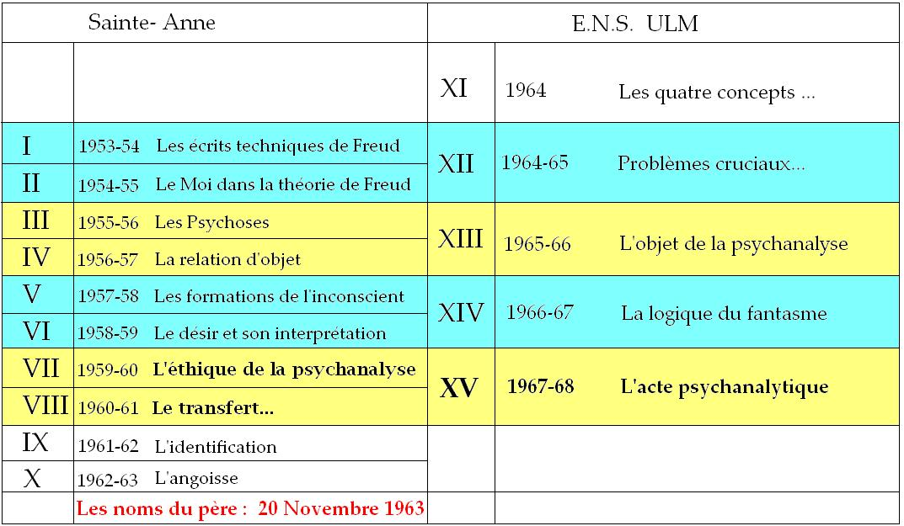
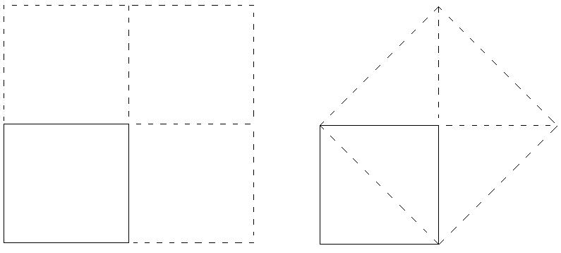
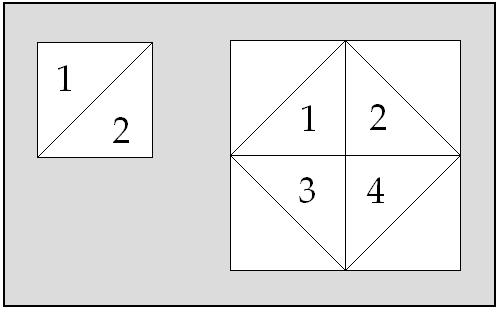

# Leçon 03 | 29 Novembre 1967

  

    <label><input type="checkbox" data-lacan-toggle="original" checked> 原文</label>
    <label><input type="checkbox" data-lacan-toggle="notes" checked> 注释</label>
    <label><input type="checkbox" data-lacan-toggle="commentary" checked> 个人解读评论</label>
  

  <form class="lacan-tool-search" role="search">
    <input class="lacan-tool-search-input" type="search" placeholder="搜索全文" aria-label="搜索全文">
    <button class="lacan-tool-button" type="submit" title="搜索">搜索</button>
  </form>
  <button class="lacan-tool-button lacan-back-to-top" type="button" title="回到页面最上方" aria-label="回到页面最上方">↑</button>

<section class="parallel-paragraph" data-paragraph-ids="s15-03-0001">

s15-03-0001

原文 · s15-03-0001

Au début d’un article sur *le contre-transfert* publié en 1960, un bon psychanalyste auquel nous ferons une certaine place aujourd’hui - le Dr D.W. WINNICOTT [^17] - écrit que le mot de « *contre-transfert* » doit être rapporté à son usage original et à ce propos, pour l’opposer, fait état du mot « *self* ».

[无对应译文]

</section>

<section class="parallel-paragraph" data-paragraph-ids="s15-03-0002">

s15-03-0002

原文 · s15-03-0002

« *Un mot comme self,* dit-il - là, il faut que j’use de l’anglais - *naturally knows more than we do : en sait naturellement plus que nous pouvons faire, ou, que nous ne faisons*. *C’est un mot qui uses us and can command us : nous prend en charge, peut nous commander* », si je puis dire[^18].

[无对应译文]

</section>

<section class="parallel-paragraph" data-paragraph-ids="s15-03-0003">

s15-03-0003

原文 · s15-03-0003

C’est une remarque - mon Dieu - qui a bien son intérêt à voir sous une plume qui ne se distingue pas par une référence spéciale au langage, comme vous allez le voir. Le trait m’a paru *piquant* et le sera encore plus de ce que j’aurai à évoquer devant vous aujourd’hui de *cet* *auteur.*

[无对应译文]

</section>

<section class="parallel-paragraph" data-paragraph-ids="s15-03-0004">

s15-03-0004

原文 · s15-03-0004

Mais aussi bien, pour vous, prend-il son prix de ce que - que vous le soupçonniez ou pas - vous voilà intégrés dans un discours qu’évidemment beaucoup d’entre vous ne peuvent voir dans son ensemble. J’entends que ce que j’avance cette année n’a son effet que de ce qui a précédé et ce n’est pas pour autant que de l’aborder maintenant - si tel est le cas de certains d’entre vous - vous soumet moins à son effet, curieusement, en raison de ceci, c’est qu’en somme ce discours, vous trouverez peut-être *qu’un peu j’insiste dans ce sens,* ne vous est pas directement adressé puisqu’il est *adressé* - à qui ? - mon Dieu, je le répète chaque fois : à des psychanalystes et dans des conditions telles qu’il faut bien dire qu’il leur est adressé à partir d’une certaine *atopie*, *atopie* qui serait la mienne propre, et donc qui a à dire ses raisons.

[无对应译文]

</section>

<section class="parallel-paragraph" data-paragraph-ids="s15-03-0005">

s15-03-0005

原文 · s15-03-0005

C’est précisément ces raisons qui vont se trouver ici - *j’entends aujourd’hui* - un peu plus accentuées. Il y a *une rhétorique*, si je puis dire, de *l’objet de la psychanalyse* dont je prétends qu’elle est liée à un certain mode de l’enseignement de la psychanalyse qui est celui des sociétés existantes. Cette relation peut ne pas paraître immédiate - et en effet, pourquoi le serait-elle ? - pourvu qu’au prix d’une certaine investigation on puisse en sentir la nécessité.

[无对应译文]

</section>

<section class="parallel-paragraph" data-paragraph-ids="s15-03-0006">

s15-03-0006

原文 · s15-03-0006

Pour partir de là, à savoir d’un exemple de ce que j’appellerais un savoir normatif sur ce qu’est une conduite utile, avec tout ce que cela peut comporter d’extension sur « *le bien général* », sur « *le bien particulier* », je vais prendre un échantillon *qui vaudra ce qu’il vaudra*, mais qui vaudra du fait qu’il est typique, relevant de la plume d’un auteur bien connu.

[无对应译文]

</section>

<section class="parallel-paragraph" data-paragraph-ids="s15-03-0007">

s15-03-0007

原文 · s15-03-0007

Simplement pour si peu que vous soyez initiés à ce qu’il en est de la méthode analytique en tant que simplement savoir en gros de quoi il s’agit : *de parler* pendant des semaines et des mois à raison de plusieurs séances par semaine, et *de parler* d’une certaine façon, particulièrement dénouée, dans des conditions qui précisément s’abstraient de toute visée concernant cette référence à la norme, à l’utile, précisément peut-être nous pourrons y revenir, mais assurément d’ailleurs à s’en libérer de façon telle que le circuit avant d’y revenir soit le plus ample qu’il se puisse.

[无对应译文]

</section>

<section class="parallel-paragraph" data-paragraph-ids="s15-03-0008">

s15-03-0008

原文 · s15-03-0008

Je crois que les références que j’ai choisies, prises là où elles se trouvent, à savoir en tête d’un article, très expressément sous la plume d’un auteur qui l’a publié en l’année 1955[^19], ont mis en question le concept de caractère génital.

[无对应译文]

</section>

<section class="parallel-paragraph" data-paragraph-ids="s15-03-0009">

s15-03-0009

原文 · s15-03-0009

Voici à peu près d’où il part pour effectivement apporter une critique sur laquelle je n’ai pas à m’étendre aujourd’hui.

[无对应译文]

</section>

<section class="parallel-paragraph" data-paragraph-ids="s15-03-0010">

s15-03-0010

原文 · s15-03-0010

C’est du style qu’il s’agit, c’est un morceau du classique M. FENICHEL, d’autant que - de l’aveu de l’auteur, je veux dire : l’auteur le précisant bien, FENICHEL fait partie de la base de cet enseignement de la psychanalyse dans les instituts : « *Un caractère normal génital est un concept idéal* – dit-il lui-même – *cependant il est certain que l’achèvement de la primauté génitale comporte une avance décisive dans la formation du caractère. Le fait d’être capable d’obtenir pleine satisfaction par l’orgasme génital rend la régulation de la sexualité – régulation physiologique – possible et ceci met un terme au damming-up, c’est-à-dire la barrière, l’endiguement des énergies instinctuelles avec leurs effets malheureux sur le comportement de la personne. Il fait aussi quelque chose pour le plein développement du love,* *de l’amour (et de la haine) – ajoute-t-on entre parenthèses – c’est-à-dire le surmontement de l’ambivalence. En outre, la capacité de décharger de grandes quantités d’excitation signifie la fin des reaction-formations, des formations réactionnelles et un accroissement de la capacité de sublimer. Le complexe d’Œdipe et les sentiments inconscients de culpabilité de source infantile peuvent maintenant être réellement dépassés quant aux émotions.Elles ne sont plus gardées en réserve mais peuvent être mises en valeur par l’ego, elles forment une part harmonieuse de la personnalité totale. Il n’y a plus aucune nécessité de se garder des impulsions prégénitales encore impératives dans l’inconscient, leur inclusion dans la totale personnalité* - je m’exprime comme le texte – \[...\] *sous la forme de traits ou de poussées de la sublimation, devient possible. Cependant, dans les caractères névrotiques, les impulsions prégénitales retiennent leurs caractères sexuels et troublent les relations rationnelles avec les objets - c’est comme ça chez les neurotics - cependant que, dans le caractère normal, elles servent comme partiels les buts de pré-plaisir, ou de plaisir préliminaire, sous la primauté de la zone génitale, mais pour autant qu’elles viennent dans une plus grande proportion, elles sont sublimées et subordonnées à l’ego et à the reasonableness, la raisonnabilité…* »

[无对应译文]

</section>

<section class="parallel-paragraph" data-paragraph-ids="s15-03-0011">

s15-03-0011

原文 · s15-03-0011

Je crois qu’on ne peut pas traduire autrement[^20]. Je ne sais pas ce que vous inspire un tableau si enchanteur et s’il vous paraît alléchant. Je ne crois pas que quiconque, analyste ou pas, pour peu qu’il ait un peu d’expérience des autres et de soi-même, puisse un instant prendre au sérieux cette étrange berquinade. La chose est, à proprement parler, fausse, tout à fait contraire à la réalité et à ce qu’enseigne l’expérience.

[无对应译文]

</section>

<section class="parallel-paragraph" data-paragraph-ids="s15-03-0012">

s15-03-0012

原文 · s15-03-0012

Je me suis livré aussi dans mon texte - dans un texte que j’évoquai l’autre jour, celui de *La direction de la cure -* évidemment à quelque dérision de ce qui avait pu en être amené *dans un autre contexte et sous une forme littérairement plus vulgaire*.

[无对应译文]

</section>

<section class="parallel-paragraph" data-paragraph-ids="s15-03-0013">

s15-03-0013

原文 · s15-03-0013

Le ton dont on pouvait parler à une certaine date - justement celle de ce texte vers 1958 - de *la primauté de la relation d’objet* *et des perfections qu’elle atteignait*, les effusions de joie interne qui ressortaient d’être parvenu à cet état sommet, sont à proprement parler ridicules, et à la vérité ne valent même pas la peine d’être ici reprises sous quelque plume qu’elles aient été émises alors.

[无对应译文]

</section>

<section class="parallel-paragraph" data-paragraph-ids="s15-03-0014">

s15-03-0014

原文 · s15-03-0014

La singularité est de se demander comment *de telles énonciations* peuvent garder, je ne dirais pas l’aspect du sérieux, en fait elles ne l’ont pour personne, mais paraître, je dirais *répondre à une certaine nécessité* concernant…

[无对应译文]

</section>

<section class="parallel-paragraph" data-paragraph-ids="s15-03-0015">

s15-03-0015

原文 · s15-03-0015

> *comme on le disait, je dois dire au début de ce qui est ici énoncé* …une sorte de *point idéal* qui aurait au moins cette vertu de représenter, sous une forme négative, l’absence donc de tous les inconvénients qui seraient apportés, qui seraient l’ordinaire des autres états. On n’en voit pas, à l’idée, d’autre raison.

[无对应译文]

</section>

<section class="parallel-paragraph" data-paragraph-ids="s15-03-0016">

s15-03-0016

原文 · s15-03-0016

Ceci est naturellement à relever pour autant que nous pouvons saisir le mécanisme en son essence, à savoir nous rendre compte dans quelle mesure le psychanalyste est en quelque sorte appelé, que dis-je, voire *contraint*, à des fins qu’on appelle abusivement didactiques, de tenir un discours qui, en somme - on pourrait dire - n’a *rien à faire avec* les problèmes que lui propose, et de la façon la plus aiguë, la plus quotidienne, *son expérience*.

[无对应译文]

</section>

<section class="parallel-paragraph" data-paragraph-ids="s15-03-0017">

s15-03-0017

原文 · s15-03-0017

La chose, à la vérité, a une certaine portée, pour autant qu’elle permettrait d’apercevoir que, par exemple, le discours, dans la mesure - et ce n’est rien en dire - où il s’orne d’un certain nombre de clichés, ne s’en trouve pas moins, jusqu’à un certain point, inopérant à les réduire - je dis : lesdits clichés - dans le contexte psychanalytique et encore bien plus quant à ce qui est de l’organisation de l’enseignement.

[无对应译文]

</section>

<section class="parallel-paragraph" data-paragraph-ids="s15-03-0018">

s15-03-0018

原文 · s15-03-0018

Bien sûr, personne ne croit plus à un certain nombre de choses, ni non plus n’est bien à l’aise dans un certain style classique, mais au fond, sur beaucoup de points, beaucoup de plans d’application, il n’en reste pas moins que cela ne change rien.

[无对应译文]

</section>

<section class="parallel-paragraph" data-paragraph-ids="s15-03-0019">

s15-03-0019

原文 · s15-03-0019

Je veux dire qu’aussi bien peut-on voir simplement mon discours repris…

[无对应译文]

</section>

<section class="parallel-paragraph" data-paragraph-ids="s15-03-0020">

s15-03-0020

原文 · s15-03-0020

> je veux dire dans certaines de ses formes, telles de ses phrases, ses énoncés, voire ses tournures …repris *dans un contexte qui*, quant à son fond, *ne change guère*.

[无对应译文]

</section>

<section class="parallel-paragraph" data-paragraph-ids="s15-03-0021">

s15-03-0021

原文 · s15-03-0021

J’avais demandé, il y a assez longtemps à une personne qu’on a pu voir pendant d’autres temps plus récents, ici, fréquenter assidûment ce que j’essayais d’ordonner, j’avais demandé :

[无对应译文]

</section>

<section class="parallel-paragraph" data-paragraph-ids="s15-03-0022">

s15-03-0022

原文 · s15-03-0022

- « *Après tout, vu vos positions générales, qu’est-ce que vous pouvez trouver d’avantageux à suivre mes conférences ?* »

[无对应译文]

</section>

<section class="parallel-paragraph" data-paragraph-ids="s15-03-0023">

s15-03-0023

原文 · s15-03-0023

Mon Dieu ! Le sourire de quelqu’un qui s’entend, je veux dire : qui sait bien ce qu’il veut dire.

[无对应译文]

</section>

<section class="parallel-paragraph" data-paragraph-ids="s15-03-0024">

s15-03-0024

原文 · s15-03-0024

- « *Personne -* me répondit-il *- ne parle de la psychanalyse comme cela.* »

[无对应译文]

</section>

<section class="parallel-paragraph" data-paragraph-ids="s15-03-0025">

s15-03-0025

原文 · s15-03-0025

Grâce à quoi, bien sûr, cela lui donna matière et choix à adjoindre à son discours un certain nombre d’ornements, de fleurettes, mais ce qui ne l’empêcha pas, à l’occasion, de rapporter radicalement…

[无对应译文]

</section>

<section class="parallel-paragraph" data-paragraph-ids="s15-03-0026">

s15-03-0026

原文 · s15-03-0026

> à la tendance supposée par lui constitutive d’une certaine inertie psychique …de rapporter radicalement le statut, l’ordination de la séance analytique en elle-même, j’entends dans sa nature, dans sa finalité aussi, à un retour qui se produirait par une sorte de penchant, de glissement tout ce qu’il y a de plus naturel vers cette fusion, ou quelque chose qui fût essentiellement de sa nature, cette prétendue fusion supposée à l’origine entre l’enfant et le corps maternel.

[无对应译文]

</section>

<section class="parallel-paragraph" data-paragraph-ids="s15-03-0027">

s15-03-0027

原文 · s15-03-0027

Et c’est à l’intérieur de *cette sorte de figure, de schème fondamental*, que se produirait – quoi ? – mon fameux « *ça parle* » .

[无对应译文]

</section>

<section class="parallel-paragraph" data-paragraph-ids="s15-03-0028">

s15-03-0028

原文 · s15-03-0028

Vous voyez bien l’usage qu’on peut faire d’un discours, à le reprendre sectionné de son contexte.

[无对应译文]

</section>

<section class="parallel-paragraph" data-paragraph-ids="s15-03-0029">

s15-03-0029

原文 · s15-03-0029

Dieu sait qu’à dire « *ça parle* » à propos de l’inconscient, *je n’ai strictement jamais voulu parler du discours de l’analysé*, comme on dit de façon impropre - il vaudrait mieux dire *l’analysant*, nous reviendrons là-dessus dans la suite.

[无对应译文]

</section>

<section class="parallel-paragraph" data-paragraph-ids="s15-03-0030">

s15-03-0030

原文 · s15-03-0030

Mais assurément, qui même, sauf à vouloir abuser de mon discours, peut supposer qu’il y ait quoi que ce soit dans l’application de la règle qui relève en soi du « *ça parle* », qui le suggère, qui l’appelle en aucune façon ?

[无对应译文]

</section>

<section class="parallel-paragraph" data-paragraph-ids="s15-03-0031">

s15-03-0031

原文 · s15-03-0031

Du moins voyez-vous, aurais-je eu ce privilège d’avoir renouvelé après FREUD, après BREUER, le miracle de la grossesse nerveuse[^21], si cette façon d’évoquer la *concavité* du ventre maternel pour représenter ce qui se passe à l’intérieur du cabinet de l’analyste est bien en effet ce qui se trouve justifié.

[无对应译文]

</section>

<section class="parallel-paragraph" data-paragraph-ids="s15-03-0032">

s15-03-0032

原文 · s15-03-0032

À un autre niveau, ce miracle, je l’aurais renouvelé, mais *sur les psychanalystes* ! Est-ce à dire *que j’analyse les analystes ?*

[无对应译文]

</section>

<section class="parallel-paragraph" data-paragraph-ids="s15-03-0033">

s15-03-0033

原文 · s15-03-0033

Parce que, après tout on pourrait dire cela, c’est même tentant, toujours des petits malins pour trouver des formules élégantes comme cela, qui résument la situation. Dieu merci, j’ai mis une barrière à l’avance aussi de ce côté-là, en écrivant je crois quelque part - je ne sais pas si c’est encore paru - à propos d’un rappel…

[无对应译文]

</section>

<section class="parallel-paragraph" data-paragraph-ids="s15-03-0034">

s15-03-0034

原文 · s15-03-0034

> il s’agissait d’un petit compte rendu que j’ai fait de mon séminaire de l’année dernière \[1966-67:*La logique du fantasme*\] …d’un rappel de ces deux formules :

[无对应译文]

</section>

<section class="parallel-paragraph" data-paragraph-ids="s15-03-0035">

s15-03-0035

原文 · s15-03-0035

- *qu’il n’y a pas*, dans mon langage, *d’Autre de l’Autre*, *l’Autre* dans ce cas, étant écrit avec un grand A,

[无对应译文]

</section>

<section class="parallel-paragraph" data-paragraph-ids="s15-03-0036">

s15-03-0036

原文 · s15-03-0036

- *qu’il n’y a pas*, pour répondre à un vieux *murmure* de mon séminaire de Sainte-Anne, *hélas, je suis bien au regret de le dire,* *de vrai sur le vrai* [^22].

[无对应译文]

</section>

<section class="parallel-paragraph" data-paragraph-ids="s15-03-0037">

s15-03-0037

原文 · s15-03-0037

De même, n’y a-t-il nullement à considérer la dimension du « *transfert du transfert* », ceci veut dire d’aucune réduction transférentielle possible, d’aucune reprise analytique du statut du transfert lui-même.

[无对应译文]

</section>

<section class="parallel-paragraph" data-paragraph-ids="s15-03-0038">

s15-03-0038

原文 · s15-03-0038

Je suis toujours un peu embarrassé, vu le nombre de ceux qui occupent cette salle cette année, quand j’avance de pareilles formules, parce qu’il peut y en avoir certains qui n’ont aucune espèce d’idée de ce qu’est le transfert, après tout, c’est même le cas le plus courant, surtout s’ils en ont déjà entendu parler, vous allez le voir dans la suite de ce que j’ai à dire aujourd’hui comment il convient de l’envisager.

[无对应译文]

</section>

<section class="parallel-paragraph" data-paragraph-ids="s15-03-0039">

s15-03-0039

原文 · s15-03-0039

Tout de même, ici pointons - je l’ai déjà avancé la dernière fois - que l’essence de cette position du concept du transfert est ce que ce concept permet à l’analyste. C’est même ainsi que certains analystes - ai-je avancé la dernière fois - et mon Dieu combien vainement, se croient en devoir de justifier *le concept du transfert* - *au nom de quoi mon Dieu ?* - de quelque chose qui leur paraît à eux–mêmes bien menacé, bien fragile, à savoir au nom d’une sorte de supériorité dans la possibilité d’objectiver, d’objectivation, ou de qualité d’objectivité éminente qui serait ce qu’aurait acquis l’analyste et qui lui permettrait, dans une situation apparemment présente, d’être en droit de la référer à d’autres situations qui l’expliquent et qu’elle ne fait que reproduire avec donc cet accent d’illusoire ou d’illusion que ceci comporte.

[无对应译文]

</section>

<section class="parallel-paragraph" data-paragraph-ids="s15-03-0040">

s15-03-0040

原文 · s15-03-0040

J’ai déjà dit que cette question qui paraît s’imposer, qui paraît même comporter une certaine dimension de rigueur chez celui qui en avance en quelque sorte l’interrogation, la critique, est purement superflue et vaine, pour la simple raison que le transfert, sa manipulation comme telle, la dimension du transfert, c’est la première phase strictement cohérente à ce que je suis en train d’essayer de produire cette année devant vous, sous le nom d’acte psychanalytique.

[无对应译文]

</section>

<section class="parallel-paragraph" data-paragraph-ids="s15-03-0041">

s15-03-0041

原文 · s15-03-0041

*Hors de ce que j’ai appelé manipulation du transfert, il n’y a pas d’acte analytique*.

[无对应译文]

</section>

<section class="parallel-paragraph" data-paragraph-ids="s15-03-0042">

s15-03-0042

原文 · s15-03-0042

Ce qu’il s’agit de comprendre, ce n’est pas la légitimation du transfert dans une référence qui en fonderait l’objectivité, c’est de s’apercevoir qu’il n’y a pas d’*acte analytique* sans cette référence. Et bien sûr l’énoncer ainsi n’est pas dissiper toute objection mais c’est justement parce que l’énoncer ainsi n’est pas, à proprement parler, désigner ce qui fait l’essence du transfert, c’est pour cela que nous avons à y avancer plus loin.

[无对应译文]

</section>

<section class="parallel-paragraph" data-paragraph-ids="s15-03-0043">

s15-03-0043

原文 · s15-03-0043

Que nous soyons forcés de le faire, que je sois nécessité à le faire devant vous, au moins suggère que cet *acte analytique*, c’est précisément ce qui serait - si ce que j’avance est juste - le moins élucidé par le psychanalyste lui-même, bien plus : que ce fût ce qui fut plus ou moins complètement éludé.

[无对应译文]

</section>

<section class="parallel-paragraph" data-paragraph-ids="s15-03-0044">

s15-03-0044

原文 · s15-03-0044

Et pourquoi pas, pourquoi ne pas - en tout cas - s’interroger pour savoir si la situation n’est pas ainsi *parce que* cet acte il ne peut que l’être, éludé ? Après tout, pourquoi pas ? Pourquoi pas jusqu’à FREUD et son interrogation de la *Psychopathologie de la vie quotidienne* ? Ce que nous appelons maintenant, ce qui est courant, ce qui est à la portée de nos modestes entendements, sous le nom d’acte symptomatique, d’acte manqué, qui eût songé, et même qui songe encore à leur donner le sens plein du mot acte ?

[无对应译文]

</section>

<section class="parallel-paragraph" data-paragraph-ids="s15-03-0045">

s15-03-0045

原文 · s15-03-0045

Malgré tout, l’idée de *ratage* dont FREUD expressément dit que ce n’est qu’un abri derrière lequel se dissimule ce qui est à proprement parler *des actes*, cela ne fait rien, on continue à les penser en fonction de ratages symptomatiques, sans chercher à donner un sens plus plein au terme d’acte.

[无对应译文]

</section>

<section class="parallel-paragraph" data-paragraph-ids="s15-03-0046">

s15-03-0046

原文 · s15-03-0046

Pourquoi donc n’en serait-il pas de même de ce qu’il en est de l’acte psychanalytique ? Assurément ce qui peut nous éclairer c’est si nous pouvons, nous, en dire quelque chose qui aille plus loin. En tous les cas, il se pourrait bien qu’il ne puisse être qu’élidé si par exemple *- ce qui arrive quand il s’agit d’acte -* c’est qu’il soit en particulier tout à fait *insupportable*.

[无对应译文]

</section>

<section class="parallel-paragraph" data-paragraph-ids="s15-03-0047">

s15-03-0047

原文 · s15-03-0047

Insupportable quant à quoi ? Il ne s’agit pas de quelque chose d’insupportable subjectivement, tout au moins je ne le suggère pas, pourquoi pas insupportable comme il convient aux actes en général, insupportable en quelqu’une de ses *conséquences* ?

[无对应译文]

</section>

<section class="parallel-paragraph" data-paragraph-ids="s15-03-0048">

s15-03-0048

原文 · s15-03-0048

J’approche, vous le voyez, par petites touches, je ne peux pas dire ces choses en termes tout de suite *affichés* si l’on peut dire, non pas du tout qu’à l’occasion je ne le pratique, mais parce que, ici, en cette matière qui est délicate, *ce qu’il s’agit d’éviter avant tout, c’est le malentendu*.

[无对应译文]

</section>

<section class="parallel-paragraph" data-paragraph-ids="s15-03-0049">

s15-03-0049

原文 · s15-03-0049

Cette conséquence de l’acte analytique, me direz-vous, elle devrait être bien connue, elle devrait être bien connue par l’analyse didactique, seulement moi je suis en train de parler de l’acte du psychanalyste. Dans la psychanalyse didactique, le sujet qui, comme il s’exprime, s’y soumet, l’acte psychanalytique, là, n’est pas sa part. Ce n’est pas pour autant qu’il ne pourrait avoir soupçon de ce qui résulte pour l’analyste de ce qui se passe dans la psychanalyse didactique.

[无对应译文]

</section>

<section class="parallel-paragraph" data-paragraph-ids="s15-03-0050">

s15-03-0050

原文 · s15-03-0050

Seulement voilà, les choses jusqu’à présent sont telles que tout est fait pour que lui soit dérobé - mais d’une façon tout à fait radicale - ce qu’il en est de la fin de la psychanalyse didactique du côté du psychanalyste. Ce masquage qui est foncièrement lié à ce que j’appelai tout à l’heure l’organisation des *sociétés psychanalytiques*, cela pourrait être en somme une pudeur subtile, une façon délicate de laisser chaque chose à sa place, suprême raffinement de politesse extrême-orientale… Il n’en est rien. Je veux dire que ce n’est pas tout à fait sous cet angle que les choses doivent être considérées, mais plutôt sur ce qui en rejaillit *sur la psychanalyse didactique elle-même*. C’est à savoir qu’en raison même de cette relation, cette séparation que je viens d’articuler, il en résulte que le même *black-out* existe sur ce qu’il en est de *la fin de la psychanalyse didactique*.

[无对应译文]

</section>

<section class="parallel-paragraph" data-paragraph-ids="s15-03-0051">

s15-03-0051

原文 · s15-03-0051

On a quand même écrit un certain nombre de choses insatisfaisantes, incomplètes, sur *la psychanalyse didactique*.

[无对应译文]

</section>

<section class="parallel-paragraph" data-paragraph-ids="s15-03-0052">

s15-03-0052

原文 · s15-03-0052

On a écrit aussi des choses bien instructives par leurs défauts sur la terminaison de l’analyse, mais on n’a strictement jamais encore réussi à formuler, je veux dire noir sur blanc, je ne dis pas : *quoi que ce soit* de valable, *quoi* *que ce soit*, oui ou non – mais *rien, sur ce qui peut être la fin, dans tous les sens du mot, de la psychanalyse didactique*. Je laisse ici seulement ouvert le point de savoir s’il y a un rapport. Il y a le rapport le plus étroit entre ce fait, et le fait que rien n’a jamais non plus été articulé sur ce qu’il en est de *l’acte psychanalytique*.

[无对应译文]

</section>

<section class="parallel-paragraph" data-paragraph-ids="s15-03-0053">

s15-03-0053

原文 · s15-03-0053

Je le répète, si *l’acte psychanalytique* est très précisément ce à quoi le psychanalyste semble opposer la plus forcenée méconnaissance, ceci est lié non pas tant à une sorte d’incompatibilité subjective…

[无对应译文]

</section>

<section class="parallel-paragraph" data-paragraph-ids="s15-03-0054">

s15-03-0054

原文 · s15-03-0054

> le côté *subjectivement intenable de la position de l’analyste*, ce qui assurément peut être suggéré : Freud n’y a pas manqué …mais bien plus, dis-je, à ce qui, une fois la perspective de l’acte acceptée, en résulterait quant à l’estimation que peut faire l’analyste de ce qu’il recueille, quant à lui, dans les suites de l’analyse, dans l’ordre à proprement parler du savoir.

[无对应译文]

</section>

<section class="parallel-paragraph" data-paragraph-ids="s15-03-0055">

s15-03-0055

原文 · s15-03-0055

Puisque après tout j’ai ici un public où semble-t-il - quoique *depuis deux ou trois fois* je ne repère plus bien - où il y a une certaine proportion de philosophes, j’espère qu’on ne m’en voudra pas trop…

[无对应译文]

</section>

<section class="parallel-paragraph" data-paragraph-ids="s15-03-0056">

s15-03-0056

原文 · s15-03-0056

> je suis arrivé, même à Sainte-Anne, à obtenir une tolérance qui aille aussi loin : il m’est arrivé de parler tout un trimestre, et même un peu plus, du *Banquet* de PLATON, justement à propos du transfert \[*séminaire* 1960-61 : *Le transfert*...\] …eh bien aujourd’hui, je demanderai au moins à quelques-uns si cela peut les intéresser, d’ouvrir un dialogue qui s’appelle le *Ménon* [^23]. Il est arrivé autrefois qu’à l’origine d’un groupe où j’ai eu quelque part, mon cher ami Alexandre KOYRÉ[^24] avait bien voulu nous faire l’honneur et la générosité de venir nous parler du *Ménon.* Cela n’a pas fait long feu, mes collègues psychologues : « *Cela a été bon pour cette année* - *m’ont-ils dit à la fin de cette année qui était notre 2ém - fini maintenant !*

[无对应译文]

</section>

<section class="parallel-paragraph" data-paragraph-ids="s15-03-0057">

s15-03-0057

原文 · s15-03-0057

*Mais non, mais non, mais non,* \[!\] *nous sommes entre gens sérieux, ce n’est pas de cette eau-là* \[*sic*\] *que nous nous chauffons* » .

[无对应译文]

</section>

<section class="parallel-paragraph" data-paragraph-ids="s15-03-0058">

s15-03-0058

原文 · s15-03-0058

Je vous assure, mon Dieu, que vous n’aurez rien à perdre à le pratiquer un tout petit peu, le rouvrir. J’ai trouvé, histoire de retenir votre attention, au paragraphe 85 d selon la numérotation d’Henri ESTIENNE, reportons-nous-y :

[无对应译文]

</section>

<section class="parallel-paragraph" data-paragraph-ids="s15-03-0059">

s15-03-0059

原文 · s15-03-0059

- Οὐκοῦν οὐδενὸς διδάξαντος ἀλλ’ ἐρωτήσαντος ἐπιστήσεται, ἀναλαβὼν αὐτὸς ἐξ αὑτοῦ τὴν ἐπιστήμην

[无对应译文]

</section>

<section class="parallel-paragraph" data-paragraph-ids="s15-03-0060">

s15-03-0060

原文 · s15-03-0060

*Il saura donc sans avoir eu de maître grâce à de simples interrogations, ayant retrouvé de lui-même en lui sa science.*

[无对应译文]

</section>

<section class="parallel-paragraph" data-paragraph-ids="s15-03-0061">

s15-03-0061

原文 · s15-03-0061

et la réplique suivante :

[无对应译文]

</section>

<section class="parallel-paragraph" data-paragraph-ids="s15-03-0062">

s15-03-0062

原文 · s15-03-0062

- Τὸ δὲ ἀναλαμβάνειν αὐτὸν ἐν αὑτῷ ἐπιστήμην οὐκ ἀναμιμνῄσκεσθαί ἐστιν \[...\]

[无对应译文]

</section>

<section class="parallel-paragraph" data-paragraph-ids="s15-03-0063">

s15-03-0063

原文 · s15-03-0063

Ἆρ’ οὖν οὐ τὴν ἐπιστήμην, ἣν νῦν οὗτος ἔχει, ἤτοι ἔλαβέν ποτε ἢ ἀεὶ εἶχεν

[无对应译文]

</section>

<section class="parallel-paragraph" data-paragraph-ids="s15-03-0064">

s15-03-0064

原文 · s15-03-0064

*Mais retrouver de soi-même en soi sa science, n’est-ce pas précisément se ressouvenir ?* \[...\]

[无对应译文]

</section>

<section class="parallel-paragraph" data-paragraph-ids="s15-03-0065">

s15-03-0065

原文 · s15-03-0065

*Cette science, qu’il a maintenant, ne faut-il pas ou bien qu’il l’ait reçue à un certain moment ou bien qu’il l’ait toujours eue ?*

[无对应译文]

</section>

<section class="parallel-paragraph" data-paragraph-ids="s15-03-0066">

s15-03-0066

原文 · s15-03-0066

Tout de même, pour des analystes, poser la question en ces termes : est-ce qu’on n’a pas le sentiment qu’il y a là quelque chose dont il n’est pas bien surnaturellement que cela s’applique - je veux dire, *de la façon dont c’est dit dans ce texte,* mais enfin, que c’est fait pour nous rappeler *quelque chose* ? En fait c’est un dialogue sur la vertu.

[无对应译文]

</section>

<section class="parallel-paragraph" data-paragraph-ids="s15-03-0067">

s15-03-0067

原文 · s15-03-0067

Appeler cela « *vertu* » ce n’est *pas plus mal* qu’autre chose : pour beaucoup ce mot, et les mots qui y ressemblent, ont résonné diversement depuis à travers les siècles. Il est certain que le mot « *vertu* » a maintenant une résonance qui n’est pas tout à fait celle de l’ἀρετή \[arétè\] dont il s’agit dans le *Ménon*, puisque aussi bien l’ἀρετή irait plutôt du côté de « *la recherche du bien* », au sens du *bien profitable et utile* comme on dit, ce qui est fait pour nous faire apercevoir que nous aussi *nous avons fait,* *après un tour, un retour là*.

[无对应译文]

</section>

<section class="parallel-paragraph" data-paragraph-ids="s15-03-0068">

s15-03-0068

原文 · s15-03-0068

On est frappé de saisir que ce n’est pas tout à fait sans rapport avec ce qui, après ce long détour, est parvenu à se formuler dans le discours d’un BENTHAM[^25]. J’ai déjà fait référence à *l’utilitarisme* au temps déjà passé, lointain même, où j’ai pris en charge, énoncé, pendant une année quelque chose qui s’appelait *L’éthique de la psychanalyse*. C’était, si mon souvenir est bon, l’année 1958-59, à moins que ce ne soit pas tout à fait cela \[en fait le séminaire 1959–60\], puis l’année suivante ce fut *Le transfert*.

[无对应译文]

</section>

<section class="parallel-paragraph" data-paragraph-ids="s15-03-0069">

s15-03-0069

原文 · s15-03-0069

[无对应译文]

</section>

<section class="parallel-paragraph" data-paragraph-ids="s15-03-0070">

s15-03-0070

原文 · s15-03-0070

Comme depuis quatre ans que je parle ici, une certaine correspondance pourrait se faire de chacune de ces années avec deux - *et dans l’ordre des années* - de ce que fut mon enseignement précédent, nous arriverions donc au niveau de cette année *quatrième* à quelque chose qui répond à la *septième* et à la *huitième* année de mon séminaire précédent, faisant écho en quelque sorte à l’année sur *l’éthique*, ce qui se lit bien dans mon énoncé même de *l’acte psychanalytique*, et de ce que cet *acte* *psychanalytique* soit quelque chose de tout à fait lié essentiellement au fonctionnement du *transfert*.

[无对应译文]

</section>

<section class="parallel-paragraph" data-paragraph-ids="s15-03-0071">

s15-03-0071

原文 · s15-03-0071

Voilà qui permettra, à certains tout au moins, de s’y retrouver dans une certaine marche qui est la mienne.

[无对应译文]

</section>

<section class="parallel-paragraph" data-paragraph-ids="s15-03-0072">

s15-03-0072

原文 · s15-03-0072

Donc il s’agit de l’ἀρετή \[arétè\] et d’une ἀρετή qui, au départ, pose sa question dans un registre qui n’est pas du tout pour désorienter un analyste puisque aussi bien, ce dont il s’agit, c’est un premier modèle donné de ce que veut dire ce mot dans le texte socratique, de la bonne administration politique - c’est-à-dire de *la cité -* quant à ce qui est de l’homme.

[无对应译文]

</section>

<section class="parallel-paragraph" data-paragraph-ids="s15-03-0073">

s15-03-0073

原文 · s15-03-0073

Il est curieux que dès le premier temps apparaisse la référence à la femme, disant que - mon Dieu - la vertu de la femme c’est la bonne ordonnance de la maison \[[71e](http://remacle.org/bloodwolf/philosophes/platon/cousin/menon.htm)\]. Moyennant quoi les voilà tous les deux du même pas sur le même plan, il n’y a pas de différence essentielle et en effet si c’est comme cela qu’on le prend, *pourquoi pas* ?

[无对应译文]

</section>

<section class="parallel-paragraph" data-paragraph-ids="s15-03-0074">

s15-03-0074

原文 · s15-03-0074

Je ne rappelle ceci que parce que, parmi les mille richesses qui vous seront suggestives de ce texte, si vous voulez bien le lire de bout en bout, vous pourrez toucher là du doigt que la caractéristique *d’une certaine morale*, proprement *la morale traditionnelle*, a toujours été d’*éluder*, mais c’est fait admirablement en l’espèce, d’*escamoter* au départ des premières répliques, de sorte qu’on n’a plus à en parler, de ne même pas poser la question justement tellement intéressante pour nous, analystes, en tant que nous sommes analystes, bien sûrs de savoir : *s’il n’y a pas un point où la morale de l’homme et de la femme pourrait* *peut-être se distinguer, au moment où l’on se trouve ensemble dans un lit, ou séparément.*

[无对应译文]

</section>

<section class="parallel-paragraph" data-paragraph-ids="s15-03-0075">

s15-03-0075

原文 · s15-03-0075

Mais ceci est promptement éludé quant à ce qui est d’une vertu que nous pouvons déjà situer sur un terrain plus public, plus environnemental. Et de ce fait, les questions qui se posent peuvent procéder d’une façon qui est celle dont SOCRATE procède et qui vient vite à poser la question de savoir comment on peut jamais arriver à connaître par définition ce qu’on ne connaît pas, puisque la première condition de savoir, de connaître, est de savoir de quoi on parle.

[无对应译文]

</section>

<section class="parallel-paragraph" data-paragraph-ids="s15-03-0076">

s15-03-0076

原文 · s15-03-0076

Si l’on ne sait pas de quoi on parle…

[无对应译文]

</section>

<section class="parallel-paragraph" data-paragraph-ids="s15-03-0077">

s15-03-0077

原文 · s15-03-0077

> comme il s’avère après un prompt échange de répliques avec son partenaire qui est le MÉNON en question …surgit ce que vous connaissez et ce qui vient dans les deux phrases ou les trois que je vous ai lues tout à l’heure, à savoir *la théorie de la réminiscence*. Vous savez de quoi il s’agit, mais je vais le reprendre et peut-être un peu plus l’étendre et le développer, montrer ce que cela veut dire, *ce que cela peut vouloir dire pour nous*, ce en quoi cela *mérite* d’être, par nous, relevé.

[无对应译文]

</section>

<section class="parallel-paragraph" data-paragraph-ids="s15-03-0078">

s15-03-0078

原文 · s15-03-0078

Qu’on dise, qu’on exprime que *l’âme*…

[无对应译文]

</section>

<section class="parallel-paragraph" data-paragraph-ids="s15-03-0079">

s15-03-0079

原文 · s15-03-0079

> comme on s’exprime : c’est le langage dont on use en tout cas dans ce dialogue …ne fait rien - quand elle est enseignée - que de se ressouvenir, ceci comporte, mais dans ce texte comme dans le notre, l’idée d’une étendue sans fin ou plutôt d’une durée sans limites quant à ce qu’il en est de cette âme.

[无对应译文]

</section>

<section class="parallel-paragraph" data-paragraph-ids="s15-03-0080">

s15-03-0080

原文 · s15-03-0080

C’est un peu ce que nous aussi sortons quand nous nous trouvons à bout d’arguments auxquels faire référence…

[无对应译文]

</section>

<section class="parallel-paragraph" data-paragraph-ids="s15-03-0081">

s15-03-0081

原文 · s15-03-0081

> puisqu’on ne voit pas très bien comment cela peut se passer dans *l’ontogenèse*
>
> pour que des choses, toujours les mêmes et si typiques, se reproduisent …*à faire appel à* *la phylogenèse :* *on ne voit pas beaucoup de différence*.

[无对应译文]

</section>

<section class="parallel-paragraph" data-paragraph-ids="s15-03-0082">

s15-03-0082

原文 · s15-03-0082

*Puis quoi encore ? Où est-ce qu’on va la chercher cette âme ?* Pour démontrer qu’il n’est que *ressouvenir* quant à tout ce qu’elle peut apprendre, on fait le geste, significatif à son époque, qui est celui de SOCRATE : « *Vois, Ménon, je vais te montrer, tu vois, tu as là ton esclave, il n’a jamais rien appris bien entendu chez toi : un esclave complètement crétin*… »

[无对应译文]

</section>

<section class="parallel-paragraph" data-paragraph-ids="s15-03-0083">

s15-03-0083

原文 · s15-03-0083

On l’interroge, et avec certaines façons en effet de l’interroger on arrive à lui faire sortir des choses, mon Dieu, assez sensées, qui ne vont pas très loin dans le domaine de la mathématique. Il s’agit de ce qui arrive ou de ce qu’il faut faire pour faire une surface double de celle dont on est parti, s’il s’agit d’un carré. L’esclave répondra comme cela, *tout à trac*, qu’il suffit que le côté soit deux fois plus long.

[无对应译文]

</section>

<section class="parallel-paragraph" data-paragraph-ids="s15-03-0084">

s15-03-0084

原文 · s15-03-0084

Il est vite aisé de lui faire sentir qu’avec un côté deux fois plus long, la surface sera quatre fois plus grande.

[无对应译文]

</section>

<section class="parallel-paragraph" data-paragraph-ids="s15-03-0085">

s15-03-0085

原文 · s15-03-0085

Moyennant quoi, en procédant de même par interrogation, nous trouverons vite la bonne façon d’opérer qui est d’opérer par la diagonale, de prendre un carré dont le côté est la diagonale du précédent.

[无对应译文]

</section>

<section class="parallel-paragraph" data-paragraph-ids="s15-03-0086">

s15-03-0086

原文 · s15-03-0086

Tout ce que nous savons de toutes ces amusettes, *récréations des plus primitives qui ne vont même pas aussi loin que déjà à cette époque on avait pu aller quant au caractère rationnel de la* √2 , c’est que nous avons pris un sujet « *hors-classe* », un esclave, un sujet qui ne compte pas.

[无对应译文]

</section>

<section class="parallel-paragraph" data-paragraph-ids="s15-03-0087">

s15-03-0087

原文 · s15-03-0087

[无对应译文]

</section>

<section class="parallel-paragraph" data-paragraph-ids="s15-03-0088">

s15-03-0088

原文 · s15-03-0088

Il y a quelque chose de plus ingénieux et de meilleur qui vient ensuite quant à ce qu’il s’agit de soulever, c’est à savoir si la vertu est une science. Tout bien pris, c’est certainement la meilleure partie, le meilleur morceau du dialogue.

[无对应译文]

</section>

<section class="parallel-paragraph" data-paragraph-ids="s15-03-0089">

s15-03-0089

原文 · s15-03-0089

Il n’y a pas de *science de la vertu*, ce qui se démontre aisément par l’expérience, se démontrant que ceux qui font profession de l’enseigner sont des *maîtres fort critiquables* - il s’agit des sophistes - et que, quant à ceux qui pourraient l’enseigner, c’est-à-dire ceux qui sont eux-mêmes vertueux…

[无对应译文]

</section>

<section class="parallel-paragraph" data-paragraph-ids="s15-03-0090">

s15-03-0090

原文 · s15-03-0090

> j’entends vertueux au sens où le mot vertu est employé dans ce texte, à savoir *la vertu du citoyen et celle du bon politique* …il est très manifeste que - ceci est développé par plus d’un exemple - ils ne savent même pas la transmettre à leurs enfants, ils font apprendre autre chose à leurs enfants. De sorte que nous en arrivons à la fin à ceci, que la vertu est bien plus près de l’opinion vraie, comme on s’exprime, que de la science. Or, l’opinion vraie comment nous vient-elle ? Du ciel !

[无对应译文]

</section>

<section class="parallel-paragraph" data-paragraph-ids="s15-03-0091">

s15-03-0091

原文 · s15-03-0091

Voilà la troisième caractéristique de quelque chose qui a ceci de commun, c’est que donc ce à quoi nous nous référons, à savoir ce qui peut apprendre…

[无对应译文]

</section>

<section class="parallel-paragraph" data-paragraph-ids="s15-03-0092">

s15-03-0092

原文 · s15-03-0092

> vous sentez combien c’est près - je suis prudent - de la notation que je fais sous le terme de sujet …ce qui peut apprendre, c’est un sujet qui déjà a ce premier caractère d’être universel. Tous les sujets, là-dessus, sont au même point de départ, leur extension est d’une nature telle que cela leur suppose un *passé infini* et donc probablement un *avenir* qui ne l’est pas moins, encore que la question ne soit pas tranchée dans ce dialogue sur ce qu’il en est *de la survie*.

[无对应译文]

</section>

<section class="parallel-paragraph" data-paragraph-ids="s15-03-0093">

s15-03-0093

原文 · s15-03-0093

Nous n’en sommes pas à partager le mythe d’[*Er l’Arménien*](http://remacle.org/bloodwolf/textes/er.htm) mais assurément, que l’âme ait depuis toujours et d’une façon à proprement parler immémoriale, emmagasiné ce qui l’a formée, au point de la rendre capable de savoir, voilà ce qui ici, non seulement n’est pas contesté, mais est au principe de l’idée de la réminiscence.

[无对应译文]

</section>

<section class="parallel-paragraph" data-paragraph-ids="s15-03-0094">

s15-03-0094

原文 · s15-03-0094

Que ce sujet soit « *hors classe* » voilà un autre terme, qu’il soit absolu, au sens où il n’est pas - c’est exprimé dans le texte - comme la science, marqué…

[无对应译文]

</section>

<section class="parallel-paragraph" data-paragraph-ids="s15-03-0095">

s15-03-0095

原文 · s15-03-0095

> de ce qu’on y appelle d’un terme qui fait écho vraiment à tout ce qu’ici nous pouvons dire …qui n’y est pas marqué de concaténation, d’*articulation logique* du même style que notre science, que cette opinion vraie ait ce quelque chose qui fasse qu’elle soit bien plus de l’ordre de *la poésie*, ποίησις \[poïesis\], voilà à quoi nous sommes amenés par l’interrogation socratique.

[无对应译文]

</section>

<section class="parallel-paragraph" data-paragraph-ids="s15-03-0096">

s15-03-0096

原文 · s15-03-0096

Si j’ai mis autant de soin à ce rappel, c’est pour que vous notiez ce que peut signifier…

[无对应译文]

</section>

<section class="parallel-paragraph" data-paragraph-ids="s15-03-0097">

s15-03-0097

原文 · s15-03-0097

> à ce point archaïque mais resté présent de l’interrogation sur le savoir …ce que peut signifier ceci, qui n’a pas été isolé avant que je ne le fasse, proprement à propos du transfert : la fonction qu’a, non pas même dans l’articulation, dans les présupposés de toute question sur le savoir, ce que j’appelle le *sujet supposé savoir*.

[无对应译文]

</section>

<section class="parallel-paragraph" data-paragraph-ids="s15-03-0098">

s15-03-0098

原文 · s15-03-0098

Les questions sont posées à partir de ceci : qu’il y a quelque part cette fonction …

[无对应译文]

</section>

<section class="parallel-paragraph" data-paragraph-ids="s15-03-0099">

s15-03-0099

原文 · s15-03-0099

> appelez–la comme vous voudrez, ici elle apparaît sous toutes ses faces évidentes, d’être mythique …*qu’il y a quelque part, quelque chose qui joue fonction de sujet supposé savoir*. J’ai déjà ici mis en avant ceci comme un point d’interrogation à propos de telle ou telle avancée, percée, poussée, d’un certain secteur de notre science.

[无对应译文]

</section>

<section class="parallel-paragraph" data-paragraph-ids="s15-03-0100">

s15-03-0100

原文 · s15-03-0100

Est-ce que la question ne se pose pas, d’où était, de comment nous pouvons concevoir avant que *telle ou telle,* par exemple, *dimension nouvelle* dans *la conception mathématique de l’infini* : est–ce qu’avant d’être forgées *ces dimensions,* nous pouvons les concevoir comme ayant été, *quelque part*, *sues* ? Est-ce que nous pouvons déjà les rapporter comme de toujours ?

[无对应译文]

</section>

<section class="parallel-paragraph" data-paragraph-ids="s15-03-0101">

s15-03-0101

原文 · s15-03-0101

C’est là la question. Il ne s’agit pas de savoir si l’âme existait avant de s’incarner, mais simplement de savoir si cette dimension du sujet, en tant que support du savoir, est quelque chose qui doit être en quelque sorte pré-établi aux questions sur le savoir.

[无对应译文]

</section>

<section class="parallel-paragraph" data-paragraph-ids="s15-03-0102">

s15-03-0102

原文 · s15-03-0102

Remarquez, quand SOCRATE interroge l’esclave, qu’est-ce qu’il fait ? Il apporte…

[无对应译文]

</section>

<section class="parallel-paragraph" data-paragraph-ids="s15-03-0103">

s15-03-0103

原文 · s15-03-0103

> même s’il ne le fait pas au tableau, comme c’est un dessin très simple …on peut dire qu’il apporte le dessin de ce carré *d’ailleurs*, de la façon dont il raisonne, à savoir sous les modes premiers d’une *géométrie métrique*, à savoir par décomposition en triangles et comptage de triangles d’égales surfaces.

[无对应译文]

</section>

<section class="parallel-paragraph" data-paragraph-ids="s15-03-0104">

s15-03-0104

原文 · s15-03-0104

[无对应译文]

</section>

<section class="parallel-paragraph" data-paragraph-ids="s15-03-0105">

s15-03-0105

原文 · s15-03-0105

Moyennant quoi il est aisé de manifester que le carré construit sur la diagonale comprendra juste le nombre de petits triangles qu’il faut par rapport au premier nombre et que, si le premier nombre était de quatre triangles \[[Ménon, 85a](http://remacle.org/bloodwolf/philosophes/platon/cousin/menon.htm)\], il y en aura huit en procédant de cette façon. Tout de même, il s’agit bien d’un dessin.

[无对应译文]

</section>

<section class="parallel-paragraph" data-paragraph-ids="s15-03-0106">

s15-03-0106

原文 · s15-03-0106

Et interrogeant l’esclave, la question…

[无对应译文]

</section>

<section class="parallel-paragraph" data-paragraph-ids="s15-03-0107">

s15-03-0107

原文 · s15-03-0107

> ce n’est pas nous qui l’inventons, il a été remarqué depuis bien longtemps que ce procédé n’a rien de bien démonstratif pour autant que, bien loin que SOCRATE puisse tirer argument du fait que l’esclave n’a jamais fait
>
> de géométrie et qu’on ne lui a pas donné de leçons, rien que la façon d’organiser le dessin de la part de SOCRATE, c’est déjà donner à l’esclave, comme il est fort sensible, une leçon de géométrie …mais la question n’est pas là, pour nous elle est, si je puis dire, à considérer dans ces termes : SOCRATE *apporte un dessin*.

[无对应译文]

</section>

<section class="parallel-paragraph" data-paragraph-ids="s15-03-0108">

s15-03-0108

原文 · s15-03-0108

Si nous disons que dans l’esprit de son partenaire, *il y a déjà* tout ce qui répond à ce que SOCRATE apporte, cela peut vouloir dire deux choses que j’exprimerai ainsi : ou bien c’est un dessin - je ne dirais pas doublure - c’est un dessin, ou pour employer un terme moderne, ce qui répond à ce qu’on appelle une fonction : à savoir la possibilité de l’application du dessin de SOCRATE sur le sien ou inversement.

[无对应译文]

</section>

<section class="parallel-paragraph" data-paragraph-ids="s15-03-0109">

s15-03-0109

原文 · s15-03-0109

Il n’est pas, bien entendu, du tout nécessaire qu’il s’agisse de carrés corrects *ni dans un cas ni dans l’autre*.

[无对应译文]

</section>

<section class="parallel-paragraph" data-paragraph-ids="s15-03-0110">

s15-03-0110

原文 · s15-03-0110

Disons que dans un cas ce soit un carré selon une projection de [MERCATOR](http://fr.wikipedia.org/wiki/Projection_de_Mercator), c’est-à-dire un carré « *carré *», et dans l’autre cas quelque chose de diversement tordu.

[无对应译文]

</section>

<section class="parallel-paragraph" data-paragraph-ids="s15-03-0111">

s15-03-0111

原文 · s15-03-0111

Il n’en restera pas moins que la correspondance point par point, voilà ce qui donne à la relation de ce qu’apporte SOCRATE, à ce par quoi lui répond son interlocuteur, une valeur très particulière qui est celle du *décryptage*.

[无对应译文]

</section>

<section class="parallel-paragraph" data-paragraph-ids="s15-03-0112">

s15-03-0112

原文 · s15-03-0112

Ceci nous intéresse, nous autres analystes, puisque d’une certaine façon c’est cela que veut dire *notre analyse du transfert*.

[无对应译文]

</section>

<section class="parallel-paragraph" data-paragraph-ids="s15-03-0113">

s15-03-0113

原文 · s15-03-0113

Dans la dimension interprétative, c’est dans la mesure où notre interprétation lit d’une autre façon une chaîne…

[无对应译文]

</section>

<section class="parallel-paragraph" data-paragraph-ids="s15-03-0114">

s15-03-0114

原文 · s15-03-0114

> qui est pourtant une chaîne et déjà une chaîne d’articulation signifiante …qu’elle fonctionne.

[无对应译文]

</section>

<section class="parallel-paragraph" data-paragraph-ids="s15-03-0115">

s15-03-0115

原文 · s15-03-0115

Puis il y a l’autre imagination possible : au lieu de nous apercevoir qu’il y a là deux dessins qui ne sont pas, du premier abord, le décalque l’un de l’autre, nous pouvons supposer une autre métaphore, à savoir qu’il n’y a rien qui se voit, j’entends du côté de l’esclave, mais qu’à la façon dont on pourrait dans certains cas dire : « *Ici, c’est un dessin, vous ne voyez rien, mais il faut l’exposer au feu...*

[无对应译文]

</section>

<section class="parallel-paragraph" data-paragraph-ids="s15-03-0116">

s15-03-0116

原文 · s15-03-0116

*vous savez qu’il y a des encres qu’on appelle sympathiques...le dessin apparaît.* » Il y a alors *fonction* - comme on dit quand il s’agit d’une plaque sensible - *de révélation* [^26].

[无对应译文]

</section>

<section class="parallel-paragraph" data-paragraph-ids="s15-03-0117">

s15-03-0117

原文 · s15-03-0117

Est-ce que c’est *entre ces deux termes* que se fait le suspens de ce dont il s’agit pour nous dans l’analyse, d’une retraduction…

[无对应译文]

</section>

<section class="parallel-paragraph" data-paragraph-ids="s15-03-0118">

s15-03-0118

原文 · s15-03-0118

> *je dis « re... », parce que dans ce cas, déjà, la première inscription signifiante est déjà la traduction de quelque chose* …est-ce que l’organisation signifiante de l’inconscient structuré comme un langage, est ce sur quoi notre interprétation vient s’appliquer ? Ou est-ce qu’au contraire notre interprétation, en quelque sorte, est une opération d’un tout autre ordre : celle qui révèle un dessin jusque-là caché ?

[无对应译文]

</section>

<section class="parallel-paragraph" data-paragraph-ids="s15-03-0119">

s15-03-0119

原文 · s15-03-0119

Ce n’est évidemment pas cela, ni l’un ni l’autre…

[无对应译文]

</section>

<section class="parallel-paragraph" data-paragraph-ids="s15-03-0120">

s15-03-0120

原文 · s15-03-0120

> malgré ce que, peut-être, cette opposition pu suggérer de première réponse à certains …que j’enseigne. Il s’agit de ceci qui rend la tâche pour nous beaucoup plus difficile : c’est à savoir qu’en effet, les choses ont à faire avec l’opération du signifiant, ce qui rend éminemment possible *la première référence*, *le premier modèle* à donner de ce qu’est *un décryptage*.

[无对应译文]

</section>

<section class="parallel-paragraph" data-paragraph-ids="s15-03-0121">

s15-03-0121

原文 · s15-03-0121

Seulement voilà, le sujet, disons l’analysant, n’est pas ce quelque chose à plat suggéré par l’image du dessin, il est lui-même à l’intérieur : le sujet comme tel, est déjà déterminé et inscrit dans le monde comme causé par un certain effet de signifiant.

[无对应译文]

</section>

<section class="parallel-paragraph" data-paragraph-ids="s15-03-0122">

s15-03-0122

原文 · s15-03-0122

Ce qui en résulte, c’est ceci : c’est qu’il ne s’en faut pas de beaucoup que ce soit réductible à l’une des situations précédentes, il ne s’en faut que de ceci : que le savoir en certains points - qui peuvent bien sûr être toujours méconnus - fait faille.

[无对应译文]

</section>

<section class="parallel-paragraph" data-paragraph-ids="s15-03-0123">

s15-03-0123

原文 · s15-03-0123

Et ce sont précisément ces points qui pour nous font question sous le nom de *vérité*.

[无对应译文]

</section>

<section class="parallel-paragraph" data-paragraph-ids="s15-03-0124">

s15-03-0124

原文 · s15-03-0124

Le sujet est déterminé, dans cette référence, d’une façon qui le rend inapte - ce que démontre notre expérience - à restaurer ce qui s’est inscrit, de par *l’effet signifiant*, de sa relation au monde, à le rendre en certains points inadéquat à se fermer, à se compléter d’une façon qui soit, quant à son statut à lui de sujet, *satisfaisante*, et ce sont les points qui le concernent en tant qu’il a à se poser comme sujet sexué.

[无对应译文]

</section>

<section class="parallel-paragraph" data-paragraph-ids="s15-03-0125">

s15-03-0125

原文 · s15-03-0125

Devant cette situation, ne voyez-vous pas ce qui résulte de *ce qui va s’établir si le transfert s’installe comme il s’installe en effet* ?

[无对应译文]

</section>

<section class="parallel-paragraph" data-paragraph-ids="s15-03-0126">

s15-03-0126

原文 · s15-03-0126

Parce que c’est là mouvement de toujours, vraiment mouvement institué de *l’inhérence traditionnelle*, *le transfert s’installe* *en fonction du sujet supposé savoir, exactement de la même façon qui fut toujours inhérente à toute interrogation sur le savoir*.

[无对应译文]

</section>

<section class="parallel-paragraph" data-paragraph-ids="s15-03-0127">

s15-03-0127

原文 · s15-03-0127

Je dirais même plus, que du fait qu’il entre en analyse, il fait référence à un *sujet supposé savoir* mieux que les autres.

[无对应译文]

</section>

<section class="parallel-paragraph" data-paragraph-ids="s15-03-0128">

s15-03-0128

原文 · s15-03-0128

Cela ne veut pas dire d’ailleurs - *contrairement à ce qu’on croit* - qu’il l’identifie à son analyste, mais c’est bien là le nerf de ce que je veux aujourd’hui devant vous désigner, c’est immanent : au départ même du mouvement de la recherche analytique, il y a ce *sujet supposé savoir,* et comme je le disais à l’instant, *supposé savoir mieux encore*.

[无对应译文]

</section>

<section class="parallel-paragraph" data-paragraph-ids="s15-03-0129">

s15-03-0129

原文 · s15-03-0129

De sorte que l’analyste se soumet à la règle du jeu et que je peux poser la question de savoir, quand il répond la façon dont il devrait répondre s’il s’agissait de l’esclave de SOCRATE et qu’on dise à l’esclave de moufter à son gré, ce qu’on ne fait pas bien sûr au niveau de l’expérience ménonienne.

[无对应译文]

</section>

<section class="parallel-paragraph" data-paragraph-ids="s15-03-0130">

s15-03-0130

原文 · s15-03-0130

La question de l’intervention de l’analyste se pose en effet dans le suspens de ce que j’ai dit tout à l’heure :

[无对应译文]

</section>

<section class="parallel-paragraph" data-paragraph-ids="s15-03-0131">

s15-03-0131

原文 · s15-03-0131

- les deux cartes qui se correspondent *point par point*,

[无对应译文]

</section>

<section class="parallel-paragraph" data-paragraph-ids="s15-03-0132">

s15-03-0132

原文 · s15-03-0132

- ou au contraire, une carte que - grâce à telle ou telle manipulation - *on révèle dans sa nature de carte*.

[无对应译文]

</section>

<section class="parallel-paragraph" data-paragraph-ids="s15-03-0133">

s15-03-0133

原文 · s15-03-0133

C’est bien ainsi que tout est conçu, de par - en quelque sorte - les données mises à l’origine du jeu.

[无对应译文]

</section>

<section class="parallel-paragraph" data-paragraph-ids="s15-03-0134">

s15-03-0134

原文 · s15-03-0134

L’anamnèse est faite en tant que ce dont on se souvient, ce n’est pas tellement des choses, que de la constitution de l’amnésie, ou *le retour du refoulé*, ce qui est exactement la même chose, c’est-à-dire la façon dont les jetons se distribuent à chaque instant sur les cases du jeu, je veux dire sur les cases où il y a à parier.

[无对应译文]

</section>

<section class="parallel-paragraph" data-paragraph-ids="s15-03-0135">

s15-03-0135

原文 · s15-03-0135

De même, les effets de l’interprétation sont reçus au niveau de quoi ? De la stimulation qu’elle apporte dans l’inventivité du sujet, je veux dire de cette poésie dont j’ai parlé tout à l’heure. Or que veut dire l’analyse du transfert ?

[无对应译文]

</section>

<section class="parallel-paragraph" data-paragraph-ids="s15-03-0136">

s15-03-0136

原文 · s15-03-0136

Si elle veut dire quelque chose, elle ne peut être que ceci : l’élimination de ce *sujet supposé savoir*.

[无对应译文]

</section>

<section class="parallel-paragraph" data-paragraph-ids="s15-03-0137">

s15-03-0137

原文 · s15-03-0137

*Il n’y a pas* pour l’analyse, il n’y a pas bien moins encore pour l’analyste, *nulle part* - et là est la nouveauté - *de* *sujet supposé savoir*.

[无对应译文]

</section>

<section class="parallel-paragraph" data-paragraph-ids="s15-03-0138">

s15-03-0138

原文 · s15-03-0138

Il n’y a que ce qui résiste à l’opération du *savoir faisant le sujet*, à savoir ce *résidu* qu’on peut appeler la *vérité*.

[无对应译文]

</section>

<section class="parallel-paragraph" data-paragraph-ids="s15-03-0139">

s15-03-0139

原文 · s15-03-0139

Mais justement, c’est là que peut surgir la question de Ponce PILATE[^27] : *Qu’est-ce que la vérité ?*

[无对应译文]

</section>

<section class="parallel-paragraph" data-paragraph-ids="s15-03-0140">

s15-03-0140

原文 · s15-03-0140

« *Qu’est-ce que la vérité ?* » est proprement la question que je pose. Et pour introduire ce qu’il en est de *l’acte* proprement *psychanalytique*, ce qui constitue *l’acte psychanalytique* comme tel, c’est très singulièrement :

[无对应译文]

</section>

<section class="parallel-paragraph" data-paragraph-ids="s15-03-0141">

s15-03-0141

原文 · s15-03-0141

- cette feinte par où l’analyste oublie que dans son expérience de psychanalysant, il a pu *voir se réduire* à ce qu’elle est, cette fonction du *sujet supposé savoir*, d’où à chaque instant toutes ces ambiguïtés qui transfèrent ailleurs, par exemple vers la fonction de *l’adaptation à la réalité,* la question de ce qu’il en est de la *vérité*,

<!-- -->

[无对应译文]

</section>

<section class="parallel-paragraph" data-paragraph-ids="s15-03-0142">

s15-03-0142

原文 · s15-03-0142

- et de feindre aussi que la position du *sujet supposé savoir* soit tenable, parce que c’est là le seul accès à une vérité dont ce sujet va être rejeté pour être réduit à sa fonction de cause d’un procès en impasse.

[无对应译文]

</section>

<section class="parallel-paragraph" data-paragraph-ids="s15-03-0143">

s15-03-0143

原文 · s15-03-0143

*L’acte psychanalytique* essentiel du psychanalyste comporte *ce quelque chose* que je ne nomme pas, que j’ai ébauché sous le titre de *feinte* et qui devient grave si ceci devient *oubli* : *de feindre d’oublier* que son acte est d’être cause de ce procès.

[无对应译文]

</section>

<section class="parallel-paragraph" data-paragraph-ids="s15-03-0144">

s15-03-0144

原文 · s15-03-0144

Qu’il s’agisse là d’un acte, ceci s’accentue d’une distinction qui est ici essentielle à faire.

[无对应译文]

</section>

<section class="parallel-paragraph" data-paragraph-ids="s15-03-0145">

s15-03-0145

原文 · s15-03-0145

L’analyste, bien sûr n’est pas sans besoin, je dirais même de se justifier à lui-même quant à ce qui se fait dans l’analyse.

[无对应译文]

</section>

<section class="parallel-paragraph" data-paragraph-ids="s15-03-0146">

s15-03-0146

原文 · s15-03-0146

Il se fait quelque chose et c’est bien de cette différence du faire à un acte, qu’il s’agit. Ce au banc de quoi l’on attelle, l’on met *le psychanalysant*, c’est au banc d’un faire. Lui, fait quelque chose - appelez-le comme vous voudrez, poésie ou manège - il fait, et il est bien clair que justement, une part de l’indication de la technique analytique consiste dans un certain laisser-faire. Mais, est-ce là suffisant pour caractériser la position de l’analyste quand ce laisser-faire comporte jusqu’à un certain point la maintenue intacte en lui de ce *sujet supposé savoir*, pour autant que de ce sujet il connaît d’expérience la déchéance et l’exclusion et ce qui en résulte du côté du psychanalyste ?

[无对应译文]

</section>

<section class="parallel-paragraph" data-paragraph-ids="s15-03-0147">

s15-03-0147

原文 · s15-03-0147

Ce qui en résulte, je ne l’avance pas aussitôt aujourd’hui, puisque ce sera précisément ce que nous devons dans la suite articuler plus avant, mais je terminerai en indiquant l’analogie qui se rencontre du fait que, pour avancer ce nouveau biais d’interrogation sur l’acte, je dois m’adresser à ces tiers que vous constituez, de ce registre que j’ai déjà introduit *sous la fonction du nombre : le nombre* n’est pas la multitude, car il n’en faut pas beaucoup pour introduire *la dimension du nombre*.

[无对应译文]

</section>

<section class="parallel-paragraph" data-paragraph-ids="s15-03-0148">

s15-03-0148

原文 · s15-03-0148

Si c’est dans une telle référence que j’introduis la question de savoir ce qu’il peut en être du statut du psychanalyste en tant que son acte le met dans un *porte à faux* radical au regard de ces préalables, c’est pour vous rappeler que c’est une dimension commune de l’acte : de ne pas comporter dans son instant, la présence du sujet.

[无对应译文]

</section>

<section class="parallel-paragraph" data-paragraph-ids="s15-03-0149">

s15-03-0149

原文 · s15-03-0149

*Le passage de l’acte*, c’est ce au-delà de quoi *le sujet* retrouvera sa présence en tant que renouvelée, mais rien d’autre.

[无对应译文]

</section>

<section class="parallel-paragraph" data-paragraph-ids="s15-03-0150">

s15-03-0150

原文 · s15-03-0150

Je vous donnerai la prochaine fois, puisque le temps m’a manqué cette fois-ci, ce qui en est l’illustration, le « WINNICOTT » par lequel j’ai introduit à propos de ce mot de *self,* l’exemple d’une sorte de touche juste, au regard d’un certain effet du signifiant, ce « WINNICOTT » nous donnera l’illustration de ce qu’il en advient de l’analyste à mesure même de *l’intérêt qu’il prend à son objet*.

[无对应译文]

</section>

<section class="parallel-paragraph" data-paragraph-ids="s15-03-0151">

s15-03-0151

原文 · s15-03-0151

Justement dans la mesure où c’est quelqu’un - dans la technique - qui se distingue comme éminent pour avoir choisi un objet, pour lui privilégié, il nous fera toucher que celui qu’il qualifie à peu près de cette psychose latente qui existe en certains cas, c’est toute la technique analytique en elle-même qu’il va se trouver très singulièrement désavouer.

[无对应译文]

</section>

<section class="parallel-paragraph" data-paragraph-ids="s15-03-0152">

s15-03-0152

原文 · s15-03-0152

Or ceci n’est point *un cas particulier* mais *un cas exemplaire*.

[无对应译文]

</section>

<section class="parallel-paragraph" data-paragraph-ids="s15-03-0153">

s15-03-0153

原文 · s15-03-0153

Si la position de l’analyste ne se détermine de rien que d’un acte, elle ne peut pour lui s’enregistrer d’effet, que de fruit d’acte, et pour employer ce mot « fruit », j’ai rappelé la dernière fois son écho de fruition. Ce que l’analyste enregistre de majeur comme expérience ne saurait dépasser ce tournant que je viens d’indiquer, de sa propre présence.

[无对应译文]

</section>

<section class="parallel-paragraph" data-paragraph-ids="s15-03-0154">

s15-03-0154

原文 · s15-03-0154

Quels seraient les moyens pour que puisse être recueilli ce qui, par le procès déchaîné de *l’acte analytique*, est enregistrable de savoir ? C’est là ce qui pose la question de ce qu’il en est de l’enseignement analytique.

[无对应译文]

</section>

<section class="parallel-paragraph" data-paragraph-ids="s15-03-0155">

s15-03-0155

原文 · s15-03-0155

Dans toute la mesure où *l’acte psychanalytique* est méconnu, dans cette même mesure s’enregistrent les effets négatifs quant aux progrès de ce que l’analyse peut totaliser de savoir…

[无对应译文]

</section>

<section class="parallel-paragraph" data-paragraph-ids="s15-03-0156">

s15-03-0156

原文 · s15-03-0156

> que nous avons constatés, que nous pouvons toucher du doigt, qui se manifestent et s’expriment
>
> dans maints autres passages et dans toute l’ampleur de la production de la littérature analytique …déficits au regard de ce qui peut être totalisé, de ce qu’elle pourra emmagasiner de savoir.

[无对应译文]

</section>

<section class="note-block original-notes">

## Notes

[^17]: D. W. Winnicott : « *Counter-transference* », Brit. J. med. Psychol., XXXIII, 1960. Trad. dans : *De la pédiatrie à la psychanalyse*, Paris, Payot, 1980, p.229.

[^18]: P.229, op.cit. : «  *Je suis d'avis qu'il serait temps de revenir à une utilisation du terme contre-transfert qui corresponde à son emploi original. Nous pouvons certes employer*

    *les mots à notre guise, surtout des mots artificiels tels que contre-transfert, ce qui n'est pas le cas pour un terme comme self qui, de par sa nature, dépasse notre connaissance,*

    *peut nous utiliser et être notre maître. Nous pouvons, par contre, asservir le terme contre-transfert ; en parcourant les écrits scien­tifiques, j'ai tout lieu de penser qu'il est en danger*

    *de perdre son vrai sens.* »

[^19]: O. Fenichel : *The psychoanalytic theory of neurosis*, New York, *Norton and Co*, 1945, p.496. *La théorie psychanalytique des névroses*, T. II, Paris, PUF 1953, p. 595.

[^20]: Lacan propose là sa propre traduction de l’article de Fenichel. L’édition française sus citée traduit ainsi ce passage :

    « *Un caractère « génital » normal est un concept idéal. Pourtant il est certain que parvenir à la primauté génitale constitue un progrès décisif dans la formation du caractère. La possibilité d’obtenir une satisfaction totale par l’orgasme permet une régulation physiologique de la sexualité et met fin au refoulement des énergies instinctuelles et à ses effets néfastes sur la conduite. Elle permet aussi l’épanouissement de l’amour (et de la haine), c’est-à-dire permet de surmonter l’ambivalence. De plus l’excitation peut se résoudre en grande partie, les formations réactionnelles cessent donc de se former et la capacité de sublimation augmente. Le complexe d’Œdipe et les sentiments inconscients de culpabilité infantile sont vraiment liquidés. Les émotions loin d’être refoulées sont utilisées par le Moi, elles forment une portion harmonieuse de la personnalité. Les pulsions prégénitales, toujours vivaces, n’ont plus à être refoulées. Elles peuvent s’intégrer à une personnalité totale sous la forme de traits de sublimation. Chez les caractères névrotiques, les pulsions prégénitales restent sexualisées ; elles troublent la relation rationnelle avec les objets. Chez le normal elles servent en partie aux plaisirs préliminaires mais restent dominées par la génitalité. Elles sont presque entièrement sublimées et intégrées à un Moi raisonnable.*»

[^21]: Dans La vie et l’œuvre de Sigmund Freud (vol. I, Paris, PUF, 1958) E. Jones rapporte les propos de Freud concernant l’interruption par Breuer

    du traitement d’Anna O., de son vrai nom Bertha Pappenheim qui, selon les Études sur l’hystérie (S. Freud et J. Breuer, Paris, PUF, 1967, p.24)

    prend fin le 7 juin 1882. Anna O. aurait manifesté un accouchement hystérique après que Breuer lui ait annoncé sa décision de mettre un terme

    au traitement. La confirmation de ce récit se trouverait dans une lettre adressée par Freud à Martha Bernays le 31 octobre 1883.

    Il faut être Breuer pour que cela arrive, écrit-il ensuite à Martha le 11 novembre 1883.

[^22]: Ce « *murmure de Sainte-Anne* », il y est fait allusion dans « *La science et la vérité* » (in *Écrits*, p. 867). Lacan y rappelle la façon dont fut reçu son discours de « *La Chose freudienne* » (*Écrits,* p. 401-436 ou séance du 1er Déc.1966 du séminaire *L’objet*…) et notamment le malentendu qui se fit jour dans son auditoire d’alors, lorsqu’il prêta sa voix à supporter ces mots intolérables : « *Moi, la vérité, je parle*… » (p. 409). Intitulé « *La chose parle d’elle-même* » (où l’on pourra reconnaître le fameux « *ça parle* » évoqué ici plus haut), ce discours ne sera pas reçu pour ce qu’il était : une prosopopée. Lacan mesure l’ampleur du malentendu aux propos touchants d’un auditeur : « *Pourquoi*, colporta quelqu’un, et ce thème court encore, *pourquoi ne dit-il pas le vrai sur le vrai ?* » (p. 867).

[^23]: [Platon : *Ménon*](http://remacle.org/bloodwolf/philosophes/platon/cousin/menon.htm), Belles Lettres, 1985. Ou Platon : *Œuvres complètes*, Gallimard, 1950, Pléiade, p.513. Ou Platon : *Œuvres complètes,* Flammarion, 2011.

[^24]: Dans la première séance (17 Nov.) du séminaire 1954-55 : *Le moi dans la théorie de Freud*... Lacan commente le *Ménon* en se référant à la conférence faite

    la veille par Alexandre Koyré au groupe intitulé « *Les conférences extraordinaires du mardi* ».

[^25]: Jeremy Bentham : *Principes de législation et d’économie politique* [(*An introduction to the Principles of Morals and Legislation,* 1823](http://gallica.bnf.fr/ark:/12148/bpt6k93974k.capture)), Paris, 1848.

[^26]: En photographie (*argentique*) le révélateur est le produit chimique qui fait apparaître l’image - latente jusque-là - sur la surface sensible qui a été exposée.

[^27]: C’est lors du procès de Jésus que Ponce Pilate, décontenancé par les réponses de son prisonnier, (se) pose cette question. Cf. Jean, **18**, 37 :

    \- Pilate lui dit alors : « Tu es donc roi ?»

    \- Jésus lui répondit : « C’est toi qui dit que je suis roi. Je suis né et je suis venu dans le monde pour rendre témoignage à la vérité.

    Quiconque est de la vérité écoute ma voix.»

    \- Pilate lui dit : « Qu’est-ce que la vérité ? »

</section>
