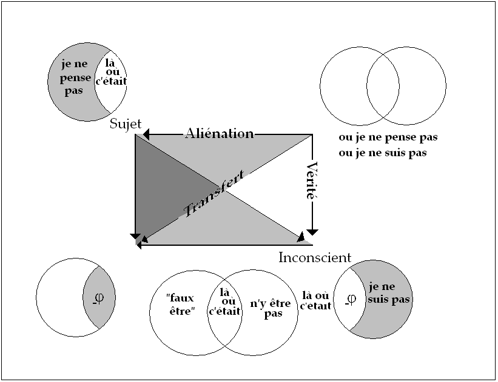
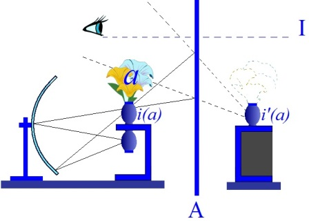
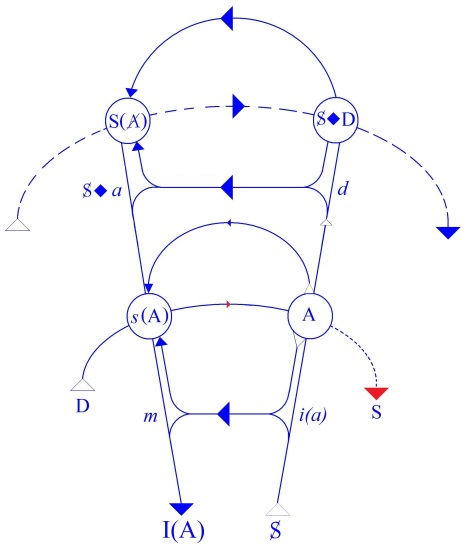

# Leçon 05 | 10 Janvier 1968

  <label><input type="checkbox" data-lacan-toggle="original" checked> 原文</label>
  <label><input type="checkbox" data-lacan-toggle="notes" checked> 注释</label>
  <label><input type="checkbox" data-lacan-toggle="commentary" checked> 个人解读评论</label>

<section class="parallel-paragraph" data-paragraph-ids="s15-05-0001">

s15-05-0001

[无对应译文]

原文 · s15-05-0001

Je vous présente mes vœux pour *la nouvelle année*, comme on dit. Pourquoi nouvelle ?

</section>

<section class="parallel-paragraph" data-paragraph-ids="s15-05-0002">

s15-05-0002

[无对应译文]

原文 · s15-05-0002

Elle est comme la lune, pourtant quand elle a fini, elle recommence, et ce point de finition et de recommencement on pourrait le placer n’importe où, peut-être à la différence de la lune qui a été faite…

</section>

<section class="parallel-paragraph" data-paragraph-ids="s15-05-0003">

s15-05-0003

[无对应译文]

原文 · s15-05-0003

> comme chacun sait et comme une locution familière le rappelle …à l’intention de *pas n’importe qui*.

</section>

<section class="parallel-paragraph" data-paragraph-ids="s15-05-0004">

s15-05-0004

[无对应译文]

原文 · s15-05-0004

Là, il y a un moment où la lune disparaît, raison pour la déclarer nouvelle après. Mais pour l’année et pour beaucoup d’autres choses, généralement pour ce qu’on appelle le *réel*, elle n’a pas de commencement assignable.

</section>

<section class="parallel-paragraph" data-paragraph-ids="s15-05-0005">

s15-05-0005

[无对应译文]

原文 · s15-05-0005

Pourtant, il faut qu’elle en ait un, à partir du moment où elle a été dénommée « *année* », en raison du repérage signifiant de ce qu’on se trouve, pour une part de ce *réel,* définir comme cycle.

</section>

<section class="parallel-paragraph" data-paragraph-ids="s15-05-0006">

s15-05-0006

[无对应译文]

原文 · s15-05-0006

C’est un cycle pas tout à fait exact, comme tous les cycles dans le *réel*, mais à partir du moment où on l’a saisi comme cycle, il y a un signifiant qui ne colle pas tout à fait avec le *réel* : on le corrige en parlant par exemple de « *grande année* »[^35] à propos d’une petite chose qui varie d’année en année jusqu’à faire un cycle 28 000 ans. Ça se dit, bref : on recycle.

</section>

<section class="parallel-paragraph" data-paragraph-ids="s15-05-0007">

s15-05-0007

[无对应译文]

原文 · s15-05-0007

Et alors, le commencement de l’année, par exemple, où le placer ? C’est là qu’est l’acte.

</section>

<section class="parallel-paragraph" data-paragraph-ids="s15-05-0008">

s15-05-0008

[无对应译文]

原文 · s15-05-0008

C’est tout au moins une des façons d’aborder ce qu’il en est de l’acte, structure dont, si vous cherchez bien, vous vous apercevrez qu’on a - somme toute - peu parlé. La nouvelle année donc, me donne l’occasion de l’aborder par ce bout.

</section>

<section class="parallel-paragraph" data-paragraph-ids="s15-05-0009">

s15-05-0009

[无对应译文]

原文 · s15-05-0009

Un acte c’est lié à la détermination du commencement et tout à fait spécialement là où il y a besoin d’en faire un, précisément parce qu’il n’y en a pas. C’est pour cela qu’en somme ça a un certain sens ce que j’ai fait au début de vous présenter mes vœux de bonne année, ça entre dans le champ de l’acte.

</section>

<section class="parallel-paragraph" data-paragraph-ids="s15-05-0010">

s15-05-0010

[无对应译文]

原文 · s15-05-0010

Bien sûr c’est un petit acte comme ça, un très laïc résidu d’acte, mais n’oubliez pas que si nous nous faisons ces petits *salamalecs*, d’ailleurs toujours plus ou moins en voie de désuétude mais qui subsistent, c’est justement ce qu’il y a de remarquable, c’est en écho à des choses dont on parle comme si elles étaient passées, à savoir des actes cérémoniels qui, dans un cadre par exemple qu’on peut appeler l’Empire, consistaient à ce que ce jour-là - *tout ce qu’on vous raconte !* - l’Empereur, par exemple, manipulait de ses propres mains une charrue.

</section>

<section class="parallel-paragraph" data-paragraph-ids="s15-05-0011">

s15-05-0011

[无对应译文]

原文 · s15-05-0011

C’était un acte précisément ordonné à marquer un commencement pour autant qu’il était essentiel à un certain ordre d’empire que cette fondation, renouvelée au début de chaque année, fût marquée. Nous voyons là la dimension de ce qu’on appelle l’acte traditionnel, celui qui se fonde dans une certaine nécessité de transférer quelque chose qui est considéré comme essentiel dans l’ordre du signifiant. Qu’il faille le transférer suppose apparemment que ça ne se transfère pas tout seul, que commencement est donc bien effectivement renouvellement.

</section>

<section class="parallel-paragraph" data-paragraph-ids="s15-05-0012">

s15-05-0012

[无对应译文]

原文 · s15-05-0012

Ce qui ouvre la porte, même pas par la voie d’une opposition, à ceci *qu’il est concevable que l’acte constitue*… *si l’on peut s’exprimer de cette façon, sans guillemets* …*un vrai commencement*, qu’il y ait, pour tout dire, un acte qui soit créateur et que ce soit là le commencement. Or, il suffit d’évoquer cet horizon de tout fonctionnement de l’acte pour s’apercevoir que c’est bien évidemment là que réside sa vraie structure, ce qui est tout à fait apparent, évident, et ce qui montre la fécondité, d’ailleurs, du mythe de *la Création*.

</section>

<section class="parallel-paragraph" data-paragraph-ids="s15-05-0013">

s15-05-0013

[无对应译文]

原文 · s15-05-0013

Il est un peu surprenant qu’il ne soit pas venu…

</section>

<section class="parallel-paragraph" data-paragraph-ids="s15-05-0014">

s15-05-0014

[无对应译文]

原文 · s15-05-0014

> d’une façon maintenant qui soit courante, admise dans la conscience commune …qu’il y a une relation certaine entre la cassure qui s’est produite dans l’évolution de la science au début du XVIIème siècle et la réalisation, l’avènement de la portée véritable de ce mythe de *la Création* qui aura donc mis seize siècles à parvenir à sa véritable incidence, à ce qu’on peut, à travers cette époque, appeler *la conscience chrétienne*. Je ne saurais trop revenir sur cette remarque qui, comme je le souligne à chaque fois, n’est pas de moi mais d’Alexandre KOYRÉ[^36].

</section>

<section class="parallel-paragraph" data-paragraph-ids="s15-05-0015">

s15-05-0015

[无对应译文]

原文 · s15-05-0015

« *Au commencement était l’action* » dit GOETHE[^37] un peu plus tard. On croit que c’est là contradiction à la formule *joannique* : « *Au commencement était le Verbe* »[^38]. C’est ce qui nécessite qu’on y regarde d’un peu plus près. Si vous vous introduisez dans la question par la voie que je viens d’essayer de vous ouvrir sous *une espèce familière*, il est tout à fait clair qu’il n’y a pas, entre ces deux formules, la moindre opposition : « *Au commencement était l’action* » parce que sans acte, il ne saurait tout simplement être question de *commencement*. *L’action est bien au commencement parce qu’il ne saurait y avoir de commencement sans action*.

</section>

<section class="parallel-paragraph" data-paragraph-ids="s15-05-0016">

s15-05-0016

[无对应译文]

原文 · s15-05-0016

Si nous nous apercevons, par quelque biais, *de ce qui n’est ou n’a jamais été mis ici tout à fait en avant* comme c’est nécessaire :

</section>

<section class="parallel-paragraph" data-paragraph-ids="s15-05-0017">

s15-05-0017

[无对应译文]

原文 · s15-05-0017

- qu’il n’y a point d’action qui ne se présente avec une pointe signifiante, d’abord et avant tout,

<!-- -->

</section>

<section class="parallel-paragraph" data-paragraph-ids="s15-05-0018">

s15-05-0018

[无对应译文]

原文 · s15-05-0018

- que c’est ce qui caractérise l’acte : *sa pointe signifiante*, et que son efficience d’acte, qui n’a rien à faire avec l’efficacité d’un *faire*, est quelque chose qui *attient*[^39] à cette *pointe signifiante*, on peut commencer à parler d’acte, simplement sans perdre de vue qu’il est assez curieux que ce soit un psychanalyste qui puisse pour la première fois mettre sur ce terme d’acte, cet accent.

</section>

<section class="parallel-paragraph" data-paragraph-ids="s15-05-0019">

s15-05-0019

[无对应译文]

原文 · s15-05-0019

Plus exactement, ce qui en constitue le trait étrange donc problématique est double :

</section>

<section class="parallel-paragraph" data-paragraph-ids="s15-05-0020">

s15-05-0020

[无对应译文]

原文 · s15-05-0020

- d’une part, que ce soit dans le champ analytique - à savoir à propos de *l’acte manqué* - qu’il soit apparu justement qu’*un acte* qui se présente lui-même comme *manqué*, soit *un acte* et uniquement de ceci qu’il soit *signifiant*, ensuite, qu’*un psychanalyste* très précisément préside - limitons-nous à ce terme pour l’instant - à une opération dite « *psychanalyse* » qui, dans son principe, commande la suspension de tout acte.

</section>

<section class="parallel-paragraph" data-paragraph-ids="s15-05-0021">

s15-05-0021

[无对应译文]

原文 · s15-05-0021

Vous sentez que, quand nous allons maintenant nous engager dans cette voie d’interroger, d’une façon plus précise, plus insistante que nous n’avons pu le faire dans les séances introductives du dernier trimestre, ce qu’il en est de *l’acte psychanalytique*, je veux tout de même…

</section>

<section class="parallel-paragraph" data-paragraph-ids="s15-05-0022">

s15-05-0022

[无对应译文]

原文 · s15-05-0022

> un peu plus que je n’ai pu le faire dans ces premiers mois …pointer qu’à notre horizon nous avons ce qu’il peut en être de tout acte, de cet acte dont j’ai montré tout à l’heure le caractère inaugural et dont, si l’on peut dire, le type est véhiculé pour nous à travers cette méditation vacillante qui se poursuit autour de la politique, par l’acte dit du « *Rubicon* » par exemple. Derrière lui, d’autres se profilent :

</section>

<section class="parallel-paragraph" data-paragraph-ids="s15-05-0023">

s15-05-0023

[无对应译文]

原文 · s15-05-0023

« *Nuit du* 4 *août* », « *Jeu de Paume* », « *Journées d’octobre* ».

</section>

<section class="parallel-paragraph" data-paragraph-ids="s15-05-0024">

s15-05-0024

[无对应译文]

原文 · s15-05-0024

Où est ici le sens de l’acte ? Certes, nous touchons, nous sentons que le point où se suspend d’abord l’interrogation, c’est *le sens stratégique* de tel ou tel franchissement. Dieu merci, ce n’est pas pour rien que j’évoquais d’abord le Rubicon.

</section>

<section class="parallel-paragraph" data-paragraph-ids="s15-05-0025">

s15-05-0025

[无对应译文]

原文 · s15-05-0025

C’est un exemple assez simple et tout marqué des dimensions du sacré. Franchir le Rubicon n’avait pas, pour CÉSAR, une signification militaire décisive, mais par contre le franchir c’était entrer sur la terre-mère, la terre de la République, celle qu’aborder c’était violer [^40]. C’était là quelque chose de franchi, dans le sens de ces actes révolutionnaires que je me trouve, bien sûr pas sans intention, avoir profilés là derrière.

</section>

<section class="parallel-paragraph" data-paragraph-ids="s15-05-0026">

s15-05-0026

[无对应译文]

原文 · s15-05-0026

L’acte est-il au moment où LÉNINE donne tel ordre, ou au moment où les signifiants qui ont été lâchés sur le monde, donnent à tel succès précis dans la stratégie, son sens de commencement déjà tracé : quelque chose où la conséquence d’une certaine stratégie pourra venir prendre sa place d’y prendre sa valeur de signe ?

</section>

<section class="parallel-paragraph" data-paragraph-ids="s15-05-0027">

s15-05-0027

[无对应译文]

原文 · s15-05-0027

Après tout la question vaut bien d’être posée ici à un certain départ, car dans la façon dont je vais m’avancer aujourd’hui sur ce terrain de l’acte, il y a aussi un certain franchissement à évoquer cette dimension de l’acte révolutionnaire et à l’épingler de ceci de différent de toute efficacité de guerre et qui s’appelle susciter un nouveau désir.

</section>

<section class="parallel-paragraph" data-paragraph-ids="s15-05-0028">

s15-05-0028

[无对应译文]

原文 · s15-05-0028

> « *Un coup de ton doigt sur le tambour décharge tous les sons et commence la nouvelle harmonie.*
>
> *Un pas de toi, c’est la levée des nouveaux hommes et leur « en-marche ».*
>
> *Ta tête se détourne : le nouvel amour !*
>
> *Ta tête se retourne, - le nouvel amour !* »

</section>

<section class="parallel-paragraph" data-paragraph-ids="s15-05-0029">

s15-05-0029

[无对应译文]

原文 · s15-05-0029

Je pense qu’aucun de vous n’est sans entendre ce texte de RIMBAUD que je n’achève pas et qui s’appelle « *À une Raison* »[^41].

</section>

<section class="parallel-paragraph" data-paragraph-ids="s15-05-0030">

s15-05-0030

[无对应译文]

原文 · s15-05-0030

C’est la formule de l’acte. *L’acte de poser l’inconscien*t peut-il être conçu autrement ? Et spécialement à partir du moment :

</section>

<section class="parallel-paragraph" data-paragraph-ids="s15-05-0031">

s15-05-0031

[无对应译文]

原文 · s15-05-0031

- où je rappelle que *l’inconscient est structure de langage*,

</section>

<section class="parallel-paragraph" data-paragraph-ids="s15-05-0032">

s15-05-0032

[无对应译文]

原文 · s15-05-0032

- où, l’ayant rappelé sans en enregistrer d’ébranlement bien profond chez ceux que cela intéresse, je reprends et parle de son *effet de rupture* sur le *cogito*.

</section>

<section class="parallel-paragraph" data-paragraph-ids="s15-05-0033">

s15-05-0033

[无对应译文]

原文 · s15-05-0033

Ici je reprends, je souligne : il se trouve que dans un certain champ je puis formuler « *je pense* », ça en a tous les caractères :

</section>

<section class="parallel-paragraph" data-paragraph-ids="s15-05-0034">

s15-05-0034

[无对应译文]

原文 · s15-05-0034

- ce que j’ai rêvé cette nuit,

</section>

<section class="parallel-paragraph" data-paragraph-ids="s15-05-0035">

s15-05-0035

[无对应译文]

原文 · s15-05-0035

- ce que j’ai raté ce matin, voire hier, par quelque trébuchement incertain,

</section>

<section class="parallel-paragraph" data-paragraph-ids="s15-05-0036">

s15-05-0036

[无对应译文]

原文 · s15-05-0036

- ce que j’ai touché sans le vouloir en faisant ce qu’on appelle *un mot d’esprit*, parfois sans *le faire exprès*.

</section>

<section class="parallel-paragraph" data-paragraph-ids="s15-05-0037">

s15-05-0037

[无对应译文]

原文 · s15-05-0037

Est-ce que dans ce « *je pense* », j’y suis ?

</section>

<section class="parallel-paragraph" data-paragraph-ids="s15-05-0038">

s15-05-0038

[无对应译文]

原文 · s15-05-0038

Il est tout à fait certain que la révélation du « *je pense* » de l’inconscient implique…

</section>

<section class="parallel-paragraph" data-paragraph-ids="s15-05-0039">

s15-05-0039

[无对应译文]

原文 · s15-05-0039

> tout le monde sait cela, *qu’on ait fait de la psychanalyse ou pas*, il suffit d’ouvrir un bouquin et de voir de quoi il s’agit …*quelque chose* qui, au niveau de ce que le *cogito* de DESCARTES nous fait toucher de l’implication du « *donc je suis* », cette dimension que j’appellerai de *désamorçage*, qui fait que là où le plus sûrement « *je pense* », à m’en apercevoir, *j’y étais*, mais exactement comme on dit - *vous savez que j’ai déjà usé de cet exemple, l’expérience m’apprend qu’il n’est pas vain de se répéter –* c’est au même sens, selon l’exemple extrait des remarques du linguiste GUILLAUME[^42], que cet emploi très spécifique de l’imparfait en français qui fait toute l’ambiguïté de l’expression : « *Un instant plus tard, la bombe éclatait. *»

</section>

<section class="parallel-paragraph" data-paragraph-ids="s15-05-0040">

s15-05-0040

[无对应译文]

原文 · s15-05-0040

*Ce qui veut dire que, justement, elle n’éclate pas*.

</section>

<section class="parallel-paragraph" data-paragraph-ids="s15-05-0041">

s15-05-0041

[无对应译文]

原文 · s15-05-0041

Permettez-moi de la rajouter, de la plaquer, cette nuance sur le *Wo Es war* allemand qui ne la comporte pas et d’y ajouter de ce fait l’utilisation renouvelée que l’on peut donner du « *Wo Es war soll Ich werden* »[^43] :

</section>

<section class="parallel-paragraph" data-paragraph-ids="s15-05-0042">

s15-05-0042

[无对应译文]

原文 · s15-05-0042

- « *là où c’était* » : où ce n’est plus *<u>que là</u>*, parce que je sais que je l’ai pensé,

</section>

<section class="parallel-paragraph" data-paragraph-ids="s15-05-0043">

s15-05-0043

[无对应译文]

原文 · s15-05-0043

- « *soll Ich werden* »: « *ici...* - le *Ich*, il y a longtemps que je l’ai souligné, ne peut que se traduire par *le sujet - ...le sujet doit advenir »*.

</section>

<section class="parallel-paragraph" data-paragraph-ids="s15-05-0044">

s15-05-0044

[无对应译文]

原文 · s15-05-0044

Seulement, le peut-il ? Voilà la question. « *Là où c’était* », traduisons « *je dois devenir* », continuez : « *psychanalyste* ». Seulement, du fait de la question que j’ai posée à propos de ce *Ich* traduit par *le sujet*, comment le psychanalyste va-t-il pouvoir trouver sa place dans cette conjoncture ?

</section>

<section class="parallel-paragraph" data-paragraph-ids="s15-05-0045">

s15-05-0045

[无对应译文]

原文 · s15-05-0045

C’est cette conjoncture que l’année dernière j’ai expressément articulée au titre de la *Logique du fantasme* par *la conjonction disjonctive,* d’une disjonction très spéciale qui est celle que depuis déjà plus de trois ans j’ai ici introduite, en y faisant novation du terme d’aliénation[^44], c’est à savoir celle qui propose ce choix singulier dont j’ai articulé les conséquences, que ce soit un choix forcé et forcément perdant :

</section>

<section class="parallel-paragraph" data-paragraph-ids="s15-05-0046">

s15-05-0046

[无对应译文]

原文 · s15-05-0046

- « *La bourse ou la vie ! *»

</section>

<section class="parallel-paragraph" data-paragraph-ids="s15-05-0047">

s15-05-0047

[无对应译文]

原文 · s15-05-0047

- « *La liberté ou la mort ! *»*   *

</section>

<section class="parallel-paragraph" data-paragraph-ids="s15-05-0048">

s15-05-0048

[无对应译文]

原文 · s15-05-0048

Le dernier que nous introduisons ici et que je ramène pour y montrer son rapport à l’acte psychanalytique :

</section>

<section class="parallel-paragraph" data-paragraph-ids="s15-05-0049">

s15-05-0049

[无对应译文]

原文 · s15-05-0049

- « *Ou je ne pense pas, ou je ne suis pas.* »

</section>

<section class="parallel-paragraph" data-paragraph-ids="s15-05-0050">

s15-05-0050

[无对应译文]

原文 · s15-05-0050

Si vous y ajoutez - comme je l’ai fait tout à l’heure au *soll Ich werden -* le terme qui est bien *ce qui est en question* dans *l’acte psychanalytique,* le terme « *psychanalyste* », il suffit de faire marcher cette petite machine : évidemment qu’il n’y a pas à hésiter, si à choisir d’un côté, *je ne suis pas psychanalyste*, il en résulte que *je ne pense pas…* Bien sûr, ceci n’est pas d’un intérêt seulement humoristique, cela doit bien nous conduire quelque part, et particulièrement à nous demander ce qu’il en est non seulement de notre expérience de l’année dernière, mais de ce que j’appellerai cette supposition de départ qui est constituée par ce : « *Ou je ne pense pas, ou je ne suis pas.* »

</section>

<section class="parallel-paragraph" data-paragraph-ids="s15-05-0051">

s15-05-0051

[无对应译文]

原文 · s15-05-0051

Comment se fait-il qu’elle se soit non seulement avérée efficace mais nécessaire à ce que j’ai appelé l’année dernière *une logique du fantasme*, à savoir une logique telle qu’elle conserve en elle la possibilité de rendre compte de ce qu’il en est *du fantasme et de sa relation à l’inconscient* ? Pour être là comme *inconscient*, il ne faut pas encore que je le pense comme *pensée*. Ce qu’il en est de mon *inconscient*, *là où je le pense, c’est pour ne plus être chez moi*, si je puis dire.

</section>

<section class="parallel-paragraph" data-paragraph-ids="s15-05-0052">

s15-05-0052

[无对应译文]

原文 · s15-05-0052

Je n’y suis plus, exactement : je n’y suis plus, en termes de langage, de la même façon que quand je fais répondre par qui répond à la porte : « *Monsieur n’y est pas* », c’est un « *je n’y suis pas* » en tant qu’il se dit, et c’est bien cela qui fait son importance, c’est bien cela en particulier qui fait que comme psychanalyste je ne peux pas le prononcer : vous voyez l’effet que ça ferait sur la clientèle.

# C’est aussi cela qui me coince dans la position du « *Je ne pense pas* », tout au moins si ce que j’avance ici comme logique est capable d’être suivi dans son vrai fil. « *Je ne pense pas* » pour être, pour être là où…

</section>

<section class="parallel-paragraph" data-paragraph-ids="s15-05-0053">

s15-05-0053

[无对应译文]

原文 · s15-05-0053

> ayant dessiné en dessous les deux cercles et leur intersection …j’ai marqué... avec tous les guillemets de la prudence et pour vous dire qu’il ne faut pas trop que vous vous alarmiez ...ce « *faux être* ».

</section>

<section class="parallel-paragraph" data-paragraph-ids="s15-05-0054">

s15-05-0054

[无对应译文]

原文 · s15-05-0054

</section>

<section class="parallel-paragraph" data-paragraph-ids="s15-05-0055">

s15-05-0055

[无对应译文]

原文 · s15-05-0055

C’est notre *être à tous*. On n’est jamais si solide dans son *être* que pour autant qu’on ne pense pas, chacun sait cela.

</section>

<section class="parallel-paragraph" data-paragraph-ids="s15-05-0056">

s15-05-0056

[无对应译文]

原文 · s15-05-0056

Seulement, quand même, je voudrais bien marquer la distinction de ce que j’avance aujourd’hui.

</section>

<section class="parallel-paragraph" data-paragraph-ids="s15-05-0057">

s15-05-0057

[无对应译文]

原文 · s15-05-0057

*Il y a là deux faussetés distinctes*. Chacun sait que, quand je suis entré dans la psychanalyse avec *une balayette* qui s’appelait *le stade du miroir*[^45], j’ai commencé par repérer…

</section>

<section class="parallel-paragraph" data-paragraph-ids="s15-05-0058">

s15-05-0058

[无对应译文]

原文 · s15-05-0058

> parce que après tout c’était dans FREUD - c’est dit, répété, seriné - j’ai pris *le stade du miroir* pour faire là un portemanteau, c’est même beaucoup plus accentué tout de suite que je n’ai jamais pu le faire au cours d’énonciations qui ménageaient les sensibilités …qu’il n’y a pas d’amour qui ne relève de cette dimension narcissique, que si l’on sait lire FREUD, ce qui s’oppose au narcissisme, ce qui s’appelle libido objectale… ce qui concerne ce qui est là \[voir schéma\] au coin en bas à gauche, *l’objet(a)*, car c’est ça la libido objectale …ça n’a rien à faire avec l’amour puisque l’amour c’est le narcissisme et que les deux s’opposent : la libido narcissique et la libido objectale.

</section>

<section class="parallel-paragraph" data-paragraph-ids="s15-05-0059">

s15-05-0059

[无对应译文]

原文 · s15-05-0059

Donc quand je parle du « *faux être* », il ne s’agit pas de ce qui vient en effet se loger là en quelque sorte par-dessus, comme les moules sur la coque du navire, il ne s’agit pas de l’être bouffi de *l’imaginaire*. Il s’agit de *quelque chose en dessous* qui lui donne sa place. Il s’agit du « *Je ne pense pas* » dans sa nécessité *structurante*, en tant qu’inscrite à cette place de départ sans laquelle nous n’aurions su, l’année dernière, articuler la moindre chose de ce qu’il en est de *La logique du fantasme*.

</section>

<section class="parallel-paragraph" data-paragraph-ids="s15-05-0060">

s15-05-0060

[无对应译文]

原文 · s15-05-0060

Naturellement que c’est *une place commode* ce « *Je ne pense pas* ». Il n’y a pas que l’être bouffi dont je parlais à l’instant qui y trouve sa place, tout y vient : *le préjugé médical* dans l’ensemble, et *le préjugé psychologique ou psychologisant*, pas moins.

</section>

<section class="parallel-paragraph" data-paragraph-ids="s15-05-0061">

s15-05-0061

[无对应译文]

原文 · s15-05-0061

Dans l’ensemble observez ceci qu’en tout cas à ce « *je ne pense pas* » est particulièrement sujet le *psychanalyste*, car s’il est habité par tout ce que je viens d’énoncer, d’épingler, comme préjugés en les qualifiant de leur origine, il a en plus des autres, par exemple sur les médecins, l’avantage si je puis dire, que *quand le préjugé médical l’occupe* - et Dieu sait s’il l’occupe bien, par exemple, pour prendre celui-là tout seul - justement, *il n’y pense pas*. Les médecins, encore, ça les tracasse. Pas le *psychanalyste* !

</section>

<section class="parallel-paragraph" data-paragraph-ids="s15-05-0062">

s15-05-0062

[无对应译文]

原文 · s15-05-0062

*Il le prend comme ça* justement, probablement dans la mesure où il a cette dimension quand même *que ce n’est qu’un préjugé*, mais puisqu’il s’agit de *ne pas penser*, il est d’autant plus à l’aise avec lui. Est-ce que, sauf exception, vous avez vu par exemple un psychanalyste qui se soit interrogé sur ce que c’est que PASTEUR, par exemple, dans l’aventure médicale ?

</section>

<section class="parallel-paragraph" data-paragraph-ids="s15-05-0063">

s15-05-0063

[无对应译文]

原文 · s15-05-0063

Cela aurait dû certainement attirer déjà l’attention de quelqu’un. Je ne dis pas que ce n’est pas encore arrivé, mais ça ne se sait pas. Ce n’est pas *un sujet très* *à la mode*, PASTEUR, mais ç’aurait pu retenir justement *un psychanalyste*. Ça ne s’est jamais vu. On verra si ça change !

</section>

<section class="parallel-paragraph" data-paragraph-ids="s15-05-0064">

s15-05-0064

[无对应译文]

原文 · s15-05-0064

En tous les cas, il faudrait ici proposer ce petit exercice : qu’est-ce que c’est que ce point initial ? Il vaut quand même bien de se poser la question si, comme nous l’avons entrevu au départ - c’est l’axe aujourd’hui de notre progrès - *l’acte* en soi est toujours en rapport avec *un commencement*. Ce commencement logique…

</section>

<section class="parallel-paragraph" data-paragraph-ids="s15-05-0065">

s15-05-0065

[无对应译文]

原文 · s15-05-0065

> c’est à dessein que je n’en ai pas posé la question l’année dernière, parce qu’à la vérité, comme plus d’un point de cette logique du fantasme, nous aurions dû le laisser en suspens …épinglons-le d’ἀρχή \[arché\] , puisque c’est ainsi que nous sommes entrés aujourd’hui par le commencement.

</section>

<section class="parallel-paragraph" data-paragraph-ids="s15-05-0066">

s15-05-0066

[无对应译文]

原文 · s15-05-0066

C’est une ἀρχή, *un initium, un commencement*, mais en quel sens ?

</section>

<section class="parallel-paragraph" data-paragraph-ids="s15-05-0067">

s15-05-0067

[无对应译文]

原文 · s15-05-0067

Est-ce au sens du *zéro* sur un petit appareil de mesure, un mètre, par exemple, tout simplement ?

</section>

<section class="parallel-paragraph" data-paragraph-ids="s15-05-0068">

s15-05-0068

[无对应译文]

原文 · s15-05-0068

Ce n’est pas un mauvais point de départ de se poser cette question parce que déjà il semble, il se voit même tout de suite, que poser la question ainsi c’est exclure que ce soit un commencement au sens du non marqué. Nous touchons même du doigt que du seul fait qu’il nous faille interroger ce point d’ἀρχή de savoir s’il est le zéro, c’est qu’en tout cas il est déjà marqué et qu’après tout ça va même assez bien car, de l’effet de la marque, il paraît très satisfaisant de voir découler le : « *Ou je ne pense pas ou je ne suis pas* ».

</section>

<section class="parallel-paragraph" data-paragraph-ids="s15-05-0069">

s15-05-0069

[无对应译文]

原文 · s15-05-0069

Ou je ne suis pas cette marque, ou je ne suis rien que cette marque, c’est-à-dire que je ne pense pas.

</section>

<section class="parallel-paragraph" data-paragraph-ids="s15-05-0070">

s15-05-0070

[无对应译文]

原文 · s15-05-0070

Pour le psychanalyste par exemple, ça s’appliquerait très bien : il a le label ou bien il ne l’est pas.

</section>

<section class="parallel-paragraph" data-paragraph-ids="s15-05-0071">

s15-05-0071

[无对应译文]

原文 · s15-05-0071

Seulement il ne faut pas s’y tromper : comme je viens tout de suite de le marquer, au niveau de la marque, nous ne voyons que le résultat justement nécessaire de l’aliénation, à savoir qu’il n’y a pas le choix entre *la marque* et *l’être*, de sorte que si ça doit se marquer quelque part, c’est justement dans le bout en haut à gauche \[voir schéma\] du « *je ne pense pas* ».

</section>

<section class="parallel-paragraph" data-paragraph-ids="s15-05-0072">

s15-05-0072

[无对应译文]

原文 · s15-05-0072

L’effet aliénatoire est déjà fait, et nous ne sommes pas surpris de trouver là, sous sa forme d’origine, l’effet de la marque, ce qui est suffisamment indiqué dans cette déduction du narcissisme que j’ai faite dans un schéma dont j’espère qu’au moins une partie d’entre vous le connaissent, celui tel qu’il met en rapport – dans leur dépendance – le *moi idéal* et l’*idéal du moi*.

</section>

<section class="parallel-paragraph" data-paragraph-ids="s15-05-0073">

s15-05-0073

[无对应译文]

原文 · s15-05-0073

</section>

<section class="parallel-paragraph" data-paragraph-ids="s15-05-0074">

s15-05-0074

[无对应译文]

原文 · s15-05-0074

Donc, il reste en suspens de savoir de quelle nature est le point de départ logique en tant qu’il tient encore dans la conjonction d’avant la disjonction, le « *je ne pense pas* » et le « *je ne suis pas* ».

</section>

<section class="parallel-paragraph" data-paragraph-ids="s15-05-0075">

s15-05-0075

[无对应译文]

原文 · s15-05-0075

Assurément, l’année dernière, c’est là ce vers quoi…

</section>

<section class="parallel-paragraph" data-paragraph-ids="s15-05-0076">

s15-05-0076

[无对应译文]

原文 · s15-05-0076

> puisque c’était notre départ et, si je puis dire, l’acte initial de notre déduction logique …nous ne pouvions pas revenir si nous n’avions eu ce qui constitue l’ouverture, la béance toujours nécessaire à retrouver dans tout exposé du champ analytique qui nous a fait, après avoir édifié ces temps de *La logique du fantasme*, passer le dernier trimestre autour d’un acte sexuel précisément défini de ceci qu’il constitue une aporie.

</section>

<section class="parallel-paragraph" data-paragraph-ids="s15-05-0077">

s15-05-0077

[无对应译文]

原文 · s15-05-0077

Reprenons donc, à partir de *l’acte psychanalytique*, cette *interrogation* de ce qu’il en est de *l’initium de la logique*, de *la logique du fantasme*, qu’il me fallait ici commencer de rappeler. C’est pourquoi j’ai inscrit au tableau aujourd’hui cette phrase : « *ou je ne pense pas ou je ne suis pas* » que j’ai articulée l’année dernière sous les termes de :

</section>

<section class="parallel-paragraph" data-paragraph-ids="s15-05-0078">

s15-05-0078

[无对应译文]

原文 · s15-05-0078

- *l’opération aliénation,*

</section>

<section class="parallel-paragraph" data-paragraph-ids="s15-05-0079">

s15-05-0079

[无对应译文]

原文 · s15-05-0079

- *l’opération vérité,*

</section>

<section class="parallel-paragraph" data-paragraph-ids="s15-05-0080">

s15-05-0080

[无对应译文]

原文 · s15-05-0080

- *l’opération transfert,* pour en faire les trois termes de ce qu’on peut appeler un *groupe de Klein* [^46], à condition bien sûr de s’apercevoir qu’à les nommer ainsi nous n’en voyons pas le retour, ce qui constitue pour chacun :

</section>

<section class="parallel-paragraph" data-paragraph-ids="s15-05-0081">

s15-05-0081

[无对应译文]

原文 · s15-05-0081

- *l’opération retour*.

</section>

<section class="parallel-paragraph" data-paragraph-ids="s15-05-0082">

s15-05-0082

[无对应译文]

原文 · s15-05-0082

Ici, tels qu’ils sont inscrits avec ces indications vectorielles, ce n’est, si je puis dire, que la moitié d’un *groupe de Klein*.

</section>

<section class="parallel-paragraph" data-paragraph-ids="s15-05-0083">

s15-05-0083

[无对应译文]

原文 · s15-05-0083

Reprenons l’acte au point sensible où nous le voyons dans l’institution analytique et repartons du commencement, en tant qu’aujourd’hui ceci veut dire de ce que l’acte institue le commencement.

</section>

<section class="parallel-paragraph" data-paragraph-ids="s15-05-0084">

s15-05-0084

[无对应译文]

原文 · s15-05-0084

Commencer une psychanalyse, oui ou non, est-ce un acte ? Assurément oui. Seulement, *qui est-ce* qui le fait cet acte ?

</section>

<section class="parallel-paragraph" data-paragraph-ids="s15-05-0085">

s15-05-0085

[无对应译文]

原文 · s15-05-0085

Nous avons tout à l’heure fait remarquer ce qu’il implique chez celui qui s’engage dans la psychanalyse, ce qu’il implique justement de démission de l’acte. Il devient très difficile dans ce sens d’attribuer la structure de l’acte à celui qui s’engage dans une *psychanalyse*. Une *psychanalyse* c’est une tâche, et même certains disent « *c’est un métier* ». Ce n’est pas moi qui l’ai dit, c’est des gens, quand même qui s’y connaissent : il faut leur apprendre leur métier, à ces gens qui ont ou non à suivre la règle de quelque façon que vous les définissiez. Dans ce coin-là, on ne dit pas leur métier de « *psychanalysant* », ils vont le dire maintenant puisque le mot court, c’est pourtant ça que ça veut dire.

</section>

<section class="parallel-paragraph" data-paragraph-ids="s15-05-0086">

s15-05-0086

[无对应译文]

原文 · s15-05-0086

Alors, il est clair que s’il y a acte, il faut probablement le chercher ailleurs. Nous n’avons pas beaucoup quand même à nous forcer pour nous demander, pour dire que s’il n’est pas du côté du psychanalysant, il est du côté du psychanalyste, ça ne fait aucun doute. Seulement, ça devient une des difficultés, parce que après ce que nous venons de dire, l’acte de *poser l’inconscient*, est-ce qu’il faut le reposer à chaque fois ? Est-ce vraiment possible, surtout si nous pensons qu’après ce que nous venons de dire, le reposer à chaque fois ce serait nous donner à chaque fois une nouvelle occasion de ne pas penser ?

</section>

<section class="parallel-paragraph" data-paragraph-ids="s15-05-0087">

s15-05-0087

[无对应译文]

原文 · s15-05-0087

Il doit y avoir autre chose, *un rapport de la tâche à l’acte* qui n’est peut-être pas saisi encore et qui - peut-être - ne peut pas l’être.

</section>

<section class="parallel-paragraph" data-paragraph-ids="s15-05-0088">

s15-05-0088

[无对应译文]

原文 · s15-05-0088

Il faut peut-être prendre un détour. On voit tout de suite où il nous est fourni, ce détour, à un autre commencement, à ce moment de commencement où l’on devient psychanalyste. Il faut bien que nous tenions compte de ceci, qui est là dans les données que - à en croire ce qu’on dit, il faut bien s’y fier en ce domaine - commencer d’être psychanalyste, tout le monde le sait, ça commence à la fin d’une psychanalyse. Il n’y a qu’à prendre ça comme ça nous est donné si nous voulons saisir quelque chose. Il faut partir de là, de ce point qui est dans la psychanalyse reçu de tous.

</section>

<section class="parallel-paragraph" data-paragraph-ids="s15-05-0089">

s15-05-0089

[无对应译文]

原文 · s15-05-0089

Alors, partons des choses comme elles se présentent.

</section>

<section class="parallel-paragraph" data-paragraph-ids="s15-05-0090">

s15-05-0090

[无对应译文]

原文 · s15-05-0090

On est arrivé à la fin *une fois*, et c’est de là qu’il faut déduire le rapport que cela a avec le commencement de toutes les fois.

</section>

<section class="parallel-paragraph" data-paragraph-ids="s15-05-0091">

s15-05-0091

[无对应译文]

原文 · s15-05-0091

On est arrivé à la fin de sa psychanalyse *une fois*, et cet acte si difficile à saisir au commencement de chacune des *psychanalyses* que nous garantissons, ça doit avoir un rapport avec cette fin, *une fois*.

</section>

<section class="parallel-paragraph" data-paragraph-ids="s15-05-0092">

s15-05-0092

[无对应译文]

原文 · s15-05-0092

Alors là, il faut quand même que serve à quelque chose ce que j’ai avancé l’année dernière, à savoir la façon dont se formule dans cette logique *la fin de la psychanalyse*. *La fin de la psychanalyse*, ça suppose une certaine réalisation de l’opération vérité, à savoir que si en effet ça doit constituer cette sorte de parcours qui, du sujet installé dans son « *faux être* » lui fait réaliser quelque chose d’une pensée qui comporte le « *je ne suis pas* », ça n’est pas sans retrouver comme il convient, *sous une forme croisée, inversée, sa place plus vraie* sous la forme du « *là où c’était* » au niveau de « *je ne suis pas* » qui se retrouve dans cet *objet(a)*…

</section>

<section class="parallel-paragraph" data-paragraph-ids="s15-05-0093">

s15-05-0093

[无对应译文]

原文 · s15-05-0093

> dont nous avons beaucoup fait, me semble-t-il, pour vous donner le sens et la pratique …et d’autre part, ce manque qui subsiste au niveau du sujet naturel, du sujet de la connaissance, du « *faux être* » du sujet, ce manque qui de toujours se définit comme essence de l’homme et qui s’appelle le désir, mais qui, à la fin d’une analyse, se traduit de cette chose, non seulement formulée mais incarnée, qui s’appelle la castration : c’est ce que nous avons l’habitude d’étiqueter sous la lettre du « - J ».

</section>

<section class="parallel-paragraph" data-paragraph-ids="s15-05-0094">

s15-05-0094

[无对应译文]

原文 · s15-05-0094

L’inversion de ce rapport de gauche à droite qui fait correspondre le « *je ne pense pas* » du sujet aliéné au « *là où c’était* » de l’inconscient en découverte, le « *là où c’était* » du désir chez le sujet au « *je ne suis pas* » de la pensée inconsciente, ceci se retournant est proprement ce qui supporte l’identification du *(a)* comme cause du désir, et du « - J » comme la place d’où s’inscrit la béance propre à l’acte sexuel.

</section>

<section class="parallel-paragraph" data-paragraph-ids="s15-05-0095">

s15-05-0095

[无对应译文]

原文 · s15-05-0095

C’est précisément là que nous devons un instant nous suspendre. Vous le voyez, vous le touchez du doigt, il y a deux « *wo Es war* », deux « *là où c’était* » et qui correspondent d’ailleurs à la distance qui scinde dans la théorie, l’inconscient du Ça.

</section>

<section class="parallel-paragraph" data-paragraph-ids="s15-05-0096">

s15-05-0096

[无对应译文]

原文 · s15-05-0096

</section>

<section class="parallel-paragraph" data-paragraph-ids="s15-05-0097">

s15-05-0097

[无对应译文]

原文 · s15-05-0097

Il y a le « *là où c’était* », ici \[schéma en haut à gauche\] inscrit au niveau du sujet, et…

</section>

<section class="parallel-paragraph" data-paragraph-ids="s15-05-0098">

s15-05-0098

[无对应译文]

原文 · s15-05-0098

> je l’ai dit déjà, je le répète pour que vous ne le laissiez pas passer …où il reste attaché à ce sujet comme manque.

</section>

<section class="parallel-paragraph" data-paragraph-ids="s15-05-0099">

s15-05-0099

[无对应译文]

原文 · s15-05-0099

Il y a l’autre « *là où c’était* » qui a une place opposée, c’est celui du coin de droite en bas, du lieu de l’inconscient, qui reste attaché au « *je ne suis pas* » de l’inconscient comme objet, objet de la perte.

</section>

<section class="parallel-paragraph" data-paragraph-ids="s15-05-0100">

s15-05-0100

[无对应译文]

原文 · s15-05-0100

L’objet perdu initial de toute la genèse analytique, celui que FREUD martèle dans tous les temps de sa naissance de l’inconscient, il est là, cet objet perdu cause du désir. Nous aurons à le voir comme au principe de l’acte. Mais ceci n’est qu’une annonce, je ne le justifie pas immédiatement. Il nous faut un bout de chemin avant d’en être sûr, car il nous faut nous arrêter là un temps. Il ne vaut en général de s’arrêter un temps *que pour s’apercevoir du temps que l’on a passé sans le savoir*.

</section>

<section class="parallel-paragraph" data-paragraph-ids="s15-05-0101">

s15-05-0101

[无对应译文]

原文 · s15-05-0101

Dirons-nous... Dirons-nous - d’ailleurs pour nous reprendre - justement : « *passé* » ? Nous avons dit l’avoir *passé*, il vaudrait mieux dire *passant* et si vous me permettez de jouer avec les mots, c’est ça que je veux dire, *pas sans le savoir*, c’est-à-dire, avec le savoir on l’a passé, mais justement…

</section>

<section class="parallel-paragraph" data-paragraph-ids="s15-05-0102">

s15-05-0102

[无对应译文]

原文 · s15-05-0102

> c’est parce que je vous exposais le résultat de mes petits schémas de l’année dernière,
>
> supposés sus par vous si tant est qu’il n’y ait pas là quelque abus …c’est avec ce savoir que je l’ai passé - ce temps - trop vite, c’est-à-dire *dans la hâte* qui, comme vous le savez, laisse justement échapper *la vérité*. Cela nous permet de vivre, d’ailleurs.

</section>

<section class="parallel-paragraph" data-paragraph-ids="s15-05-0103">

s15-05-0103

[无对应译文]

原文 · s15-05-0103

*La vérité*, c’est que le manque d’en haut à gauche \[schéma\] c’est la perte d’en bas à droite, mais que la perte, elle, est la cause d’autre chose. Nous l’appellerons « *la cause de soi* », à condition, bien sûr, que vous ne vous trompiez pas.

</section>

<section class="parallel-paragraph" data-paragraph-ids="s15-05-0104">

s15-05-0104

[无对应译文]

原文 · s15-05-0104

« *Dieu est cause de soi* », nous dit SPINOZA[^47]. Croyait–il si bien dire ? Pourquoi pas, après tout. C’était quelqu’un de très fort.

</section>

<section class="parallel-paragraph" data-paragraph-ids="s15-05-0105">

s15-05-0105

[无对应译文]

原文 · s15-05-0105

Il est bien certain que le fait qu’il ait conféré à Dieu d’être « *cause de soi* », a dissipé par là toute l’ambiguïté du *cogito* qui pourrait bien avoir une prétention semblable, au moins dans l’esprit de certains.

</section>

<section class="parallel-paragraph" data-paragraph-ids="s15-05-0106">

s15-05-0106

[无对应译文]

原文 · s15-05-0106

S’il y a quelque chose que nous rappelle l’expérience analytique, c’est que si ce mot de « *cause de soi* » veut dire quelque chose, c’est précisément de nous indiquer que le *soi*, ou ce qu’on appelle tel, autrement dit *le sujet*, il faut bien que tout le monde en convienne, puisque même là, en tel champ anglo-saxon…

</section>

<section class="parallel-paragraph" data-paragraph-ids="s15-05-0107">

s15-05-0107

[无对应译文]

原文 · s15-05-0107

> où vraiment l’on peut dire qu’on ne comprend rien à rien à ces questions …le mot *self* a dû sortir, qui ne s’adapte nulle part dans la théorie psychanalytique, rien n’y correspond, le sujet dépend de cette cause qui le fait divisé et qui s’appelle *l’objet(a)*.

</section>

<section class="parallel-paragraph" data-paragraph-ids="s15-05-0108">

s15-05-0108

[无对应译文]

原文 · s15-05-0108

Voilà qui signe ce qu’il est si important de signer :

</section>

<section class="parallel-paragraph" data-paragraph-ids="s15-05-0109">

s15-05-0109

[无对应译文]

原文 · s15-05-0109

- que le sujet n’est pas « *cause de soi* »,

</section>

<section class="parallel-paragraph" data-paragraph-ids="s15-05-0110">

s15-05-0110

[无对应译文]

原文 · s15-05-0110

- qu’il est « *conséquence de la perte* » et qu’il faudrait qu’il se mette dans la conséquence de la perte, celle qui constitue *l’objet(a)*, pour savoir ce qui lui manque.

</section>

<section class="parallel-paragraph" data-paragraph-ids="s15-05-0111">

s15-05-0111

[无对应译文]

原文 · s15-05-0111

Voilà en quoi je dis que nous allions trop vite dans l’énonciation, telle que je l’ai faite, de ces deux pointes de l’oblique de gauche à droite et de haut en bas, des deux termes écartelés de la division première. La chose est supposée sue dans l’énoncé que « *là où c’était* » est *manque* à partir du sujet, elle ne l’est véritablement que si le sujet se fait *perte* \[en bas à droite\].

</section>

<section class="parallel-paragraph" data-paragraph-ids="s15-05-0112">

s15-05-0112

[无对应译文]

原文 · s15-05-0112

Or, c’est ce qu’il ne peut penser qu’à se faire *être *: « *Je pense* - dit-il - *donc je suis* ». Il se rejette invinciblement dans *l’être*, de ce faux acte qui s’appelle le *cogito* \[en haut à gauche\]. *L’acte du cogito, c’est l’erreur sur l’être*, comme nous le voyons ainsi dans l’aliénation définitive qui en résulte, *du* *corps qui est rejeté dans l’étendue*. Le rejet du corps hors de la pensée, c’est la grande *Verwerfung* de DESCARTES, elle est signée de son effet qu’il reparaît dans *le réel*, c’est-à-dire dans *l’impossible* : il est impossible qu’une machine soit corps. C’est pourquoi le savoir le prouve toujours plus en le mettant *en pièces détachées*.

</section>

<section class="parallel-paragraph" data-paragraph-ids="s15-05-0113">

s15-05-0113

[无对应译文]

原文 · s15-05-0113

Dans cette aventure nous y sommes, je n’ai pas besoin - je pense - de faire des allusions. Mais laissons-là pour aujourd’hui notre DESCARTES pour revenir à la suite et à la ponctuation qu’il faut donner aujourd’hui à notre avance.

</section>

<section class="parallel-paragraph" data-paragraph-ids="s15-05-0114">

s15-05-0114

[无对应译文]

原文 · s15-05-0114

*Le sujet de l’acte analytique*, nous savons qu’il ne peut savoir rien de ce qui s’apprend dans l’expérience analytique, sinon de ce qu’y opère *ce qu’on appelle le transfert. Le transfert*, je l’ai restauré dans sa fonction complète à le rapporter au *sujet supposé savoir*.

</section>

<section class="parallel-paragraph" data-paragraph-ids="s15-05-0115">

s15-05-0115

[无对应译文]

原文 · s15-05-0115

Le terme de l’analyse consiste dans *la chute du sujet supposé savoir* et sa réduction à l’avènement de cet *objet(a)* comme cause de la division du sujet qui vient à sa place.

</section>

<section class="parallel-paragraph" data-paragraph-ids="s15-05-0116">

s15-05-0116

[无对应译文]

原文 · s15-05-0116

Celui qui fantasmatiquement avec le psychanalysant joue la partie au regard du *sujet supposé savoir*, à savoir l’analyste, c’est celui-là, l’analyste, qui vient au terme de l’analyse à supporter de n’être plus rien que ce *reste*, ce *reste de la chose sue* qui s’appelle *l’objet(a)*. C’est là ce autour de quoi doit porter notre question.

</section>

<section class="parallel-paragraph" data-paragraph-ids="s15-05-0117">

s15-05-0117

[无对应译文]

原文 · s15-05-0117

L’analysant venu à la fin de l’analyse, dans l’acte, s’il en est un, qui le porte à devenir le psychanalyste, ne nous faut-il pas croire qu’il ne l’opère, ce passage, que dans l’acte qui remet à sa place le *sujet supposé savoir* ? Nous voyons maintenant cette place où elle est, parce qu’elle peut être occupée, mais qu’elle n’est occupée qu’au temps où ce *sujet supposé savoir* s’est réduit à ce terme, que celui qui l’a jusque-là garanti par son acte, à savoir le psychanalyste, lui, le psychanalyste l’est devenu ce résidu, cet *objet(a)*.

</section>

<section class="parallel-paragraph" data-paragraph-ids="s15-05-0118">

s15-05-0118

[无对应译文]

原文 · s15-05-0118

Celui qui, à la fin d’une analyse dite « *didactique » relève*, si je puis dire, *le gant de cet acte*, nous ne pouvons pas omettre que c’est sachant ce que son analyste est devenu dans l’accomplissement de cet acte, à savoir ce résidu, ce déchet, cette chose rejetée.

</section>

<section class="parallel-paragraph" data-paragraph-ids="s15-05-0119">

s15-05-0119

[无对应译文]

原文 · s15-05-0119

À restaurer le *sujet supposé savoir*, à reprendre le flambeau de l’analyste lui-même, il ne se peut pas qu’il n’installe, fût-ce à ne pas le toucher, le *(a)* au niveau du *sujet supposé savoir*, de ce *sujet supposé savoir* qu’il ne peut que reprendre comme condition de tout acte analytique. Lui sait, à ce moment que j’ai appelé « *dans la passe* », lui sait que là est le *désêtre* qui par lui - le psychanalysant - a frappé l’être de l’analyste.

</section>

<section class="parallel-paragraph" data-paragraph-ids="s15-05-0120">

s15-05-0120

[无对应译文]

原文 · s15-05-0120

J’ai dit « *sans le toucher* », que c’est comme cela qu’il s’engage car ce *désêtre*, institué au point du *sujet supposé savoir*, lui, le sujet dans la passe, au moment de l’acte analytique, il n’en sait rien, justement parce qu’il est devenu *la vérité de ce savoir* et, si je puis dire, qu’une *vérité* qui est atteinte « *pas sans le savoir* », comme je le disais tout à l’heure, eh bien, c’est incurable : on est cette *vérité*.

</section>

<section class="parallel-paragraph" data-paragraph-ids="s15-05-0121">

s15-05-0121

[无对应译文]

原文 · s15-05-0121

L’acte analytique au départ fonctionne, si je puis dire, avec *sujet supposé savoir* faussé, car le *sujet supposé savoir*, s’il s’avère maintenant - ce qui était bien simple à voir tout de suite - que c’est lui qui est à l’ἀρχή \[arché\] de *la logique analytique*, si celui qui devient analyste pouvait être guéri de *la vérité* qu’il est devenu, il saurait marquer ce qui est arrivé de changement au niveau du *sujet supposé savoir*. C’est ce que dans notre graphe[^48] nous avons marqué du signifiant S(A).

</section>

<section class="parallel-paragraph" data-paragraph-ids="s15-05-0122">

s15-05-0122

[无对应译文]

原文 · s15-05-0122

</section>

<section class="parallel-paragraph" data-paragraph-ids="s15-05-0123">

s15-05-0123

[无对应译文]

原文 · s15-05-0123

Il faudrait s’apercevoir que le *sujet supposé savoir* est réduit à la fin de l’analyse au même « *n’y pas être* » qui est celui qui est caractéristique de l’inconscient lui-même, et que cette découverte fait partie de la même *opération vérité*.

</section>

<section class="parallel-paragraph" data-paragraph-ids="s15-05-0124">

s15-05-0124

[无对应译文]

原文 · s15-05-0124

Je le répète, la mise en question du *sujet supposé savoir*, la subversion de ce qu’implique, je dirais, tout fonctionnement du *savoir* et que maintes fois j’ai déjà devant vous interrogé sous cette forme :

</section>

<section class="parallel-paragraph" data-paragraph-ids="s15-05-0125">

s15-05-0125

[无对应译文]

原文 · s15-05-0125

- « *Alors ce savoir, qu’il soit celui du nombre transfini de Cantor ou du désir de l’analyste, où était-il avant qu’on sache ?* »

</section>

<section class="parallel-paragraph" data-paragraph-ids="s15-05-0126">

s15-05-0126

[无对应译文]

原文 · s15-05-0126

De là seulement peut-être, peut-on procéder à une résurgence de l’être dont la condition est de s’apercevoir que si son origine et sa ré-interpellation…

</section>

<section class="parallel-paragraph" data-paragraph-ids="s15-05-0127">

s15-05-0127

[无对应译文]

原文 · s15-05-0127

> celle qui pourrait se faire du signifiant de l’Autre enfin évanoui vers ce qui le remplace, puisque aussi bien c’est de son champ, *du champ de l’Autre* que ceci a été arraché, à savoir cet objet qui s’appelle *l’objet(a)* …ce serait aussi s’apercevoir que l’être tel qu’il peut surgir de quelque acte que ce soit, est *être sans essence*, comme sont *sans essence tous les objets(a)*, c’est ce qui les caractérise : *objets sans essence* qui sont ou non dans l’acte à ré-évoquer à partir de cette sorte de sujet qui, nous le verrons, est le sujet de *l’acte*, de tout *acte* dirai-je, en tant que, comme le *sujet supposé savoir*, au bout de l’expérience analytique, c’est un sujet qui, dans *l’acte*, n’y est pas.

</section>

<section class="note-block original-notes">

## Notes

[^35]: Pour les astronomes anciens « *La grande année »* (28 000 ans) représentait le temps qu’il faut aux constellations pour reprendre leur position d’origine.

    Cf. Yeats : Un songe, livre IV.

[^36]: Cf. A. Koyré : *Du monde clos à l’univers infini*, Paris, Gallimard, 1973, pp. 64-65 .

[^37]: Goethe : *Faust*, Paris, Aubier, 1976, pp. 40-41 : *Im Anfang war die Tat !* - C’est la phrase sur laquelle Freud conclut « *Totem et tabou* ».

[^38]: Nouveau Testament, Jean, **1**, 1.

[^39]: Attenir : verbe intransitif, attenir à… : être situé immédiatement à côté de…, jouxter.

[^40]: Le Rubicon (aujourd’hui Fiumicino) était la frontière entre la Gaule cisalpine (plaine du Pô) et l’Italie. Il était interdit à tout général romain

    de le franchir en armes sans ordres du Sénat.

[^41]: Arthur Rimbaud (1854-1891) : *Illuminations*, « *À une Raison* » :

    > *Un coup de ton doigt sur le tambour décharge tous les sons et commence la nouvelle harmonie.  
    > Un pas de toi, c'est la levée des nouveaux hommes et leur en-marche.  
    > Ta tête se détourne : le nouvel amour !  
    > Ta tête se retourne, - le nouvel amour !  
    > « Change nos lots, crible les fléaux, à commencer par le temps » te chantent ces enfants.*
    >
    > *« Elève n'importe où la substance de nos fortunes et de nos vœux » on t'en prie.  
    > Arrivée de toujours, qui t'en iras partout.*

[^42]: Gustave Guillaume : « *Temps et Verbe* », Paris, Lib. Honoré Champion Éd., 1970, 2000, pp. 68-69, et « *Langage et Science du Langage* », Paris, Lib. A.-G.

    Nizet, 1973, pp. 215-216. À noter que la phrase sur laquelle Guillaume prend appui est : « *Un instant après le train déraillait* ». Il est également question

    de cet usage de l’imparfait dans les *Écrits*, op. cit., p.678.

[^43]: Sigmund Freud, G.W., XV, p.86. [*Nouvelles conférences d’introduction à la psychanalyse*](http://classiques.uqac.ca/classiques/freud_sigmund/nouvelles_conferences/Nouv_conf_psychalyse.pdf), Paris, Gallimard, 1984, p.110.

[^44]: Cf. Séminaires : *Les fondements de la psychanalyse*, séance du 27 mai 1964 pp. 192-193, et *La logique du fantasme*, séance du 11 janvier 1967.

[^45]: Lacan fait ici allusion à sa communication interrompue, au congrès de Marienbad, le 3 août 1936.

[^46]: Lacan utilise déjà ce « modèle » mathématique le 14 décembre 1966, dans le séminaire *La logique du fantasme.* À noter la parution en novembre 1966,

    dans *Les Temps Modernes,* n° 246, *Problèmes du structuralisme*, d’un article de Marc Barbut, intitulé : « *Sur le sens du mot structure en mathématiques* ».

[^47]: Spinoza : *Éthique, Œuvres complètes*, Paris, Gallimard, 1954 La Pléiade - réédité dans une traduction nouvelle de Bernard Pautrat, Paris, Seuil, 1988.

[^48]: Cf. *Écrits* : « *Subversion du sujet et dialectique du désir* », p. 817.

</section>
