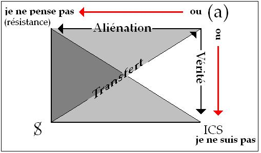
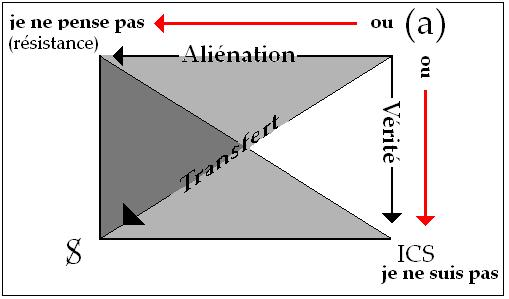

# Leçon 07 | 24 Janvier 1968

  <label><input type="checkbox" data-lacan-toggle="original" checked> 原文</label>
  <label><input type="checkbox" data-lacan-toggle="notes" checked> 注释</label>
  <label><input type="checkbox" data-lacan-toggle="commentary" checked> 个人解读评论</label>

<section class="parallel-paragraph" data-paragraph-ids="s15-07-0001">

s15-07-0001

[无对应译文]

原文 · s15-07-0001

Il va y avoir aujourd’hui quelque chose d’un peu modifié dans notre pacte. Bien sûr, il est entendu que selon la bonne loi d’une prestation d’échange, vous me donnez votre présence pour quelque chose que vous attendez, qui est supposé sortir *d’un certain fonds* et vous avoir été, jusqu’à un certain point - il s’agit de savoir lequel - destiné. Bref, vous attendez un cours.

</section>

<section class="parallel-paragraph" data-paragraph-ids="s15-07-0002">

s15-07-0002

[无对应译文]

原文 · s15-07-0002

À plusieurs reprises - cela m’arrive de temps en temps - je reprends cette question de savoir à qui je m’adresse, d’où ça part : vous savez combien je prends soin d’insister sur ceci. Je ne saurais perdre un seul instant le repère originel qui est que ce discours, fait sur la psychanalyse, s’adresse à des psychanalystes. Qu’il y ait tant de monde qui ne le soit pas, qui se trouve là rassemblé pour entendre quelque chose, *ceci à soi tout seul* demande un certain nombre d’explications.

</section>

<section class="parallel-paragraph" data-paragraph-ids="s15-07-0003">

s15-07-0003

[无对应译文]

原文 · s15-07-0003

On aurait tort à ce propos de se contenter des explications historiques, à savoir de la rencontre, ou des rencontres, ou des effets de poussée dans une foule, qui fait que je me suis trouvé à portée d’être entendu ailleurs que là où je le faisais originellement : ça ne suffit évidemment pas à expliquer les choses.

</section>

<section class="parallel-paragraph" data-paragraph-ids="s15-07-0004">

s15-07-0004

[无对应译文]

原文 · s15-07-0004

C’est bien là que l’on pourrait comparer les références de l’histoire - car après tout c’est ce qu’on appelle en général l’histoire, cette bousculade - et de la structure. Il y a évidemment des raisons de structure. Que je parle cette année de l’acte, que je pose la question sur l’acte, que je sois arrivé au point de ce que j’ai dit la dernière fois qui m’a semblé - à quelques petits échantillons - une preuve que j’ai eue qu’au moins certains se sont aperçus de l’importance de ce qui avait été formulé la dernière fois, pour autant que ça marque un point qui justifie, permet de rassembler, au moins en un point-nœud, ce qui avait commencé, depuis le début de notre année, à être par moi articulé et qui, bien sûr au départ, avait pu laisser une impression floue, surtout si on part de l’idée que ce qui est dit d’abord c’est forcément les principes - dans beaucoup de cas on est forcé de procéder autrement, même quand on a une référence structurale et même surtout quand on l’a, puisqu’il est de sa nature de ne pas pouvoir être donnée d’abord, il faut la conquérir, sans ça on ne voit pas pourquoi, par exemple, le schéma de type *groupe de Klein*…

</section>

<section class="parallel-paragraph" data-paragraph-ids="s15-07-0005">

s15-07-0005

[无对应译文]

原文 · s15-07-0005

> sur lequel pour l’instant j’essaie d’articuler ce qu’il en est de *l’acte* dans la perspective qui ouvre *l’acte psychanalytique* …on ne voit pas pourquoi je n’aurais pas commencé par là il y a une quinzaine d’années.

</section>

<section class="parallel-paragraph" data-paragraph-ids="s15-07-0006">

s15-07-0006

[无对应译文]

原文 · s15-07-0006

Aujourd’hui donc il va y avoir une espèce de point d’arrêt dont l’occasion n’est ici que *prétexte*, encore que ça ne veuille pas dire pour autant que ce soit latéral. Dans les cartes d’invitation du séminaire de cette année sur *L’acte psychanalytique*, il est prévu que le 31 Janvier, le 28 Février, le 27 Mars et le 29 Mai, on y entrera sur invitation, ce qui veut dire que j’avais prévu un certain nombre de rencontres plus réduites, quelque chose qui aurait permis un entretien.

</section>

<section class="parallel-paragraph" data-paragraph-ids="s15-07-0007">

s15-07-0007

[无对应译文]

原文 · s15-07-0007

Ceci en somme, a été prévu pour donner un minimum de ce quelque chose qui m’a toujours été, et est pour tout le monde assez difficile à manier : la règle des *séminaires fermés*, avec tout ce que ça comporte de complications dans le triage, le mode de choix - je ne suis pas sûr que les gens qui se manifestent pour désirer y être présents soient forcément les plus qualifiés.

</section>

<section class="parallel-paragraph" data-paragraph-ids="s15-07-0008">

s15-07-0008

[无对应译文]

原文 · s15-07-0008

Il s’établit toujours dans les choses de cet ordre une sorte de concurrence : l’endroit où on n’a pas envie d’aller, on commence à le désirer à partir du moment où le petit copain y va . Tout cela ne rend pas la tâche plus facile pour celui dont le principe est plutôt de *faire accueil* que le contraire, mais c’est pour tâcher d’établir un milieu d’échanges qui soit d’un rapport interne un peu différent.

</section>

<section class="parallel-paragraph" data-paragraph-ids="s15-07-0009">

s15-07-0009

[无对应译文]

原文 · s15-07-0009

Voilà comment je pense résoudre les choses. Quelque chose d’étranger à la série fait que ce 31 \[Janvier\] je n’y serai pas.

</section>

<section class="parallel-paragraph" data-paragraph-ids="s15-07-0010">

s15-07-0010

[无对应译文]

原文 · s15-07-0010

Ce n’est pas une raison pour qu’il n’y ait pas de *séminaire fermé*. Il était convenu que les membres de l’*École* dite *Freudienne* *de Paris* dont chacun sait que je m’occupe…

</section>

<section class="parallel-paragraph" data-paragraph-ids="s15-07-0011">

s15-07-0011

[无对应译文]

原文 · s15-07-0011

> et tout ce qu’il y a de plus légitimement puisque aussi bien ce sont des psychanalystes …que ce soit ceux-là - dans la mesure où ils en manifesteront le désir - qui viendront ici le 31 janvier.

</section>

<section class="parallel-paragraph" data-paragraph-ids="s15-07-0012">

s15-07-0012

[无对应译文]

原文 · s15-07-0012

Je n’ai même pas encore demandé - je le lui demande maintenant - au Dr MELMAN qu’il soit là en somme pour ordonner cette rencontre. J’avais posé le principe que seuls les membres de l’École qui se seraient ici manifestés d’une façon suffisamment régulière pour savoir ce que j’ai énoncé jusque-là viendraient à cette réunion.

</section>

<section class="parallel-paragraph" data-paragraph-ids="s15-07-0013">

s15-07-0013

[无对应译文]

原文 · s15-07-0013

Vous allez voir combien c’est justifié puisque je vais donner à cette réunion l’objet suivant… l’idée d’ailleurs n’est pas uniquement mienne, loin de là, je dirai même qu’elle m’a été donnée par le Dr MELMAN qui, à l’intérieur de l’enseignement de l’École, m’avait proposé récemment qu’en cours même de ce séminaire particulièrement important, puisque *tout de même* on voit mal à quel point on peut toucher à un point plus central pour les psychanalystes que celui de *l’acte psychanalytique* lui-même, à condition bien entendu que ce mot ait un sens…

</section>

<section class="parallel-paragraph" data-paragraph-ids="s15-07-0014">

s15-07-0014

[无对应译文]

原文 · s15-07-0014

> c’est ce que j’espère, qu’il s’est suffisamment dessiné jusqu’à présent dans votre vue …c’est qu’à tout le moins ce sens, je lui ai donné une forme, qu’on peut l’articuler suivant un certain nombre de questions et savoir si on peut y répondre et si elles sont même des questions.

</section>

<section class="parallel-paragraph" data-paragraph-ids="s15-07-0015">

s15-07-0015

[无对应译文]

原文 · s15-07-0015

C’est précisément ce qui est ouvert, c’est quand même comme cela que le problème se pose. Je lui ai donné son articulation de départ, moyennant quoi on peut voir se manifester à son intérieur certains blancs, en d’autres points *des cases déjà remplies* ou même surabondamment remplies, ou même tout à fait débordantes, déséquilibrées, faute d’avoir tenu compte des autres. C’est précisément l’intérêt de l’introduction de ce qu’on appelle structure. Il est assez curieux que nous en soyons encore…

</section>

<section class="parallel-paragraph" data-paragraph-ids="s15-07-0016">

s15-07-0016

[无对应译文]

原文 · s15-07-0016

> et je suis bien forcé de le dire puisqu’il y en a certaines manifestations récentes …au niveau des psychanalystes, à même considérer qu’il puisse y avoir une *question* au niveau *du principe de la structure*.

</section>

<section class="parallel-paragraph" data-paragraph-ids="s15-07-0017">

s15-07-0017

[无对应译文]

原文 · s15-07-0017

Il y a des choses que je n’ai vraiment pas eu le temps de regarder et qu’il n’est même pas sûr que je regarderai de près mais dont, bien sûr, j’ai des échos. On voit de ces personnes pourvues d’une autorité psychanalytique, d’un certain poids, des « praticiens honorables » comme on dit, qui se trouvent manifester très singulièrement le point où en sont les choses.

</section>

<section class="parallel-paragraph" data-paragraph-ids="s15-07-0018">

s15-07-0018

[无对应译文]

原文 · s15-07-0018

Par exemple, il y a tout un milieu où c’était - chacun sait - interdit même de venir se mettre à portée de la mauvaise parole.

</section>

<section class="parallel-paragraph" data-paragraph-ids="s15-07-0019">

s15-07-0019

[无对应译文]

原文 · s15-07-0019

Et puis il y a eu un temps, un temps fabuleux - mais il faut dire que les choses vont très lentement dans ce milieu très particulier - vous vous rendez compte : 1960 ! Il y a des gens ici qui à ce moment-là avaient 14 ans, le *Congrès de Bonneval*, c’est immémorial, c’est poussiéreux, incroyable ! Il faut dire qu’on a mis à peu près six ans à en sortir les *Actes*… Il y a des gens qui, pour discuter ce que j’enseigne, ont trouvé ça formidable : *reprendre les choses au Congrès de Bonneval* [^59].

</section>

<section class="parallel-paragraph" data-paragraph-ids="s15-07-0020">

s15-07-0020

[无对应译文]

原文 · s15-07-0020

Moi, je remercie beaucoup une personne de mon École d’avoir fait une revue qui en quelque sorte et bien manifestement n’est pas la mienne, puisque c’est la sienne, et qui permet cet effet de dépotoir. On ne saurait pas déverser ça « ailleurs », parce que « ailleurs » ce n’est pas la place, dans une certaine *Revue* qu’on appelle - je ne sais pourquoi - *française de psychanalyse*, il n’est pas question qu’on discute ce que j’enseigne, et ça se comprend, puisqu’on n’y parle pas de psychanalyse !

</section>

<section class="parallel-paragraph" data-paragraph-ids="s15-07-0021">

s15-07-0021

[无对应译文]

原文 · s15-07-0021

Mais alors à cet endroit - le vide-poches d’à côté - là on peut se déverser, et pour discuter ce que je dis du signifiant, avec tout ce que je vous raconte à vous depuis quatre ans, qui a largement débordé la question, si on veut savoir si au principe il s’agit du signifiant ou pas, on remonte au *Congrès de Bonneval* qui était une espèce de tunnel où les nègres se battent sans savoir qui porte les coups et où il y a eu des élucubrations toutes les plus farfelues, les plus fantastiques.

</section>

<section class="parallel-paragraph" data-paragraph-ids="s15-07-0022">

s15-07-0022

[无对应译文]

原文 · s15-07-0022

Il y avait là un nommé LEFEBVRE, des gens absolument incroyables ! Je dois dire qu’il y avait aussi des gens sympathiques : il y avait notre cher MERLEAU-PONTY qui est intervenu à cette occasion. Mais à ce moment-là tout le monde était complètement à côté de la plaque ! Il s’agissait simplement que *pour la première fois* il soit discuté publiquement de ce qu’à ce moment-là j’enseignais depuis sept ans à Sainte-Anne pour un petit cercle.

</section>

<section class="parallel-paragraph" data-paragraph-ids="s15-07-0023">

s15-07-0023

[无对应译文]

原文 · s15-07-0023

C’est comme ça que les choses se produisent, et c’est ce qui rend sensible que dans tout discours il y a des effets d’acte parce que, s’il n’y avait que la dimension du discours, normalement ça devrait se répandre plus vite. Justement, c’est ça que j’essaie de mettre en relief : que, bien sûr, ce discours qui est le mien ait incontestablement cette dimension d’acte et surtout au moment où je suis en train de parler de l’acte, c’est ce qui saute aux yeux.

</section>

<section class="parallel-paragraph" data-paragraph-ids="s15-07-0024">

s15-07-0024

[无对应译文]

原文 · s15-07-0024

Et je dirai que, si l’on y regarde de près, c’est la seule raison de la présence de la plupart des personnes qui sont ici, car on voit mal autrement, en particulier au niveau d’un public jeune, ce qu’il pourrait venir chercher ici.

</section>

<section class="parallel-paragraph" data-paragraph-ids="s15-07-0025">

s15-07-0025

[无对应译文]

原文 · s15-07-0025

Nous ne sommes pas sur le plan des prestations de service universitaires : je ne peux rien vous apporter en échange de votre présence. Ce qui vous amuse, c’est que vous sentez que, justement, il se passe quelque chose.

</section>

<section class="parallel-paragraph" data-paragraph-ids="s15-07-0026">

s15-07-0026

[无对应译文]

原文 · s15-07-0026

On n’est pas d’accord : c’est déjà un petit commencement pour la dimension de l’acte.

</section>

<section class="parallel-paragraph" data-paragraph-ids="s15-07-0027">

s15-07-0027

[无对应译文]

原文 · s15-07-0027

Il est vraiment fabuleux - naturellement, ça, je ne l’ai que par *ouï-dire -* mais enfin, on m’affirme que ce genre d’auteurs dont je parlais tout à l’heure sont de ces gens qui vous font objection à cette *structure* qui – paraît-il - nous laisserait \- nous qui sommes des personnes - si mal à l’aise : *l’être de la personne* serait quelque chose qui en pâtirait. Je crains que nous ne soyons là dans quelque chose qui mérite tout à fait analyse et regard. Ce qu’il en est de *l’être de la personne* du psychanalyste, c’est justement quelque chose qui ne peut s’apercevoir réellement qu’à son repérage dans la structure.

</section>

<section class="parallel-paragraph" data-paragraph-ids="s15-07-0028">

s15-07-0028

[无对应译文]

原文 · s15-07-0028

</section>

<section class="parallel-paragraph" data-paragraph-ids="s15-07-0029">

s15-07-0029

[无对应译文]

原文 · s15-07-0029

Cette espèce de petit tétraèdre sur lequel nous sommes partis ces derniers temps, il faut quand même que quelque chose soit bien sensible, c’est la multiplicité des traductions auxquelles il se prête. Ici le « *je ne pense pas* », ce n’est pas une place réservée au psychanalyste. Le psychanalyste révèle sa nécessité, c’est tout à fait autre chose. Il la révèle en ceci : qu’il soit si manifestement nécessaire à quelqu’un qui ne s’occupe que des pensées, de ne pas penser. Que dire des autres !

</section>

<section class="parallel-paragraph" data-paragraph-ids="s15-07-0030">

s15-07-0030

[无对应译文]

原文 · s15-07-0030

C’est en cela qu’il est instructif, ce point de départ, et qu’en somme c’est une chose qui rend tout à fait clair ceci : c’est que ce point en haut et à gauche, « *je ne pense pas* », est celui du choix forcé, le choix forcé de l’*aliénation*.

</section>

<section class="parallel-paragraph" data-paragraph-ids="s15-07-0031">

s15-07-0031

[无对应译文]

原文 · s15-07-0031

C’est un petit perfectionnement donné à la notion d’aliénation telle qu’elle a été découverte avant nous, telle qu’elle a été pointée *au niveau de la production*, c’est-à-dire *au niveau de l’exploitation sociale*.

</section>

<section class="parallel-paragraph" data-paragraph-ids="s15-07-0032">

s15-07-0032

[无对应译文]

原文 · s15-07-0032

*Ce « je ne pense pas », c’est ce qui nous permet de donner son sens à ce mot véritablement manipulé d’une façon* qui était jusqu’à présent, je dois dire *assez abjecte*, en ce sens que ça réduisait *la position du psychanalysant, du patient,* à une attitude que je qualifierais de « *dépréciée* » si *le psychanalysant* - qu’on appelle « *le patient* » à tort ou à raison, dans certains « *vocabulaires* » -résistait.

</section>

<section class="parallel-paragraph" data-paragraph-ids="s15-07-0033">

s15-07-0033

[无对应译文]

原文 · s15-07-0033

Vous voyez à quoi cela ramène l’analyse : à quelque chose qu’elle n’est bien évidemment pas et que personne n’a songé à en faire, à savoir une opération de colletage, d’extraction du lapin hors de son terrier. Il « résiste ». Ce qui résiste, ce n’est bien évidemment pas le sujet dans l’analyse, ce qui résiste, c’est évidemment le discours et très justement dans la mesure du choix dont il s’agit. S’il renonce à la position du « *je ne pense pas* », je viens de vous le dire, il est quand même tiré vers le pôle où il n’y a que le choix opposé qui est celui du « *je ne suis pas* ». Or, le « *je ne suis pas* » étant à proprement parler inarticulable, il est certain que ce qui se présente d’abord dans la résistance, c’est que le discours ne saurait aller à être quelque chose. Quoi ?

</section>

<section class="parallel-paragraph" data-paragraph-ids="s15-07-0034">

s15-07-0034

[无对应译文]

原文 · s15-07-0034

Les personnes qui nous parlent de *l’être de la personne* pour en faire objection à la structure, on aimerait vraiment leur demander d’articuler ce qu’il en est - pour elles, ces personnes - de ce qu’elles appellent à l’occasion *l’être*.

</section>

<section class="parallel-paragraph" data-paragraph-ids="s15-07-0035">

s15-07-0035

[无对应译文]

原文 · s15-07-0035

Je ne sais pas très bien où elles le placent, je parle : pour elles-mêmes. Il y a certaines façons de placer de *l’être de la personne* chez les autres qui est une opération de *bibelotage* assez commode.

</section>

<section class="parallel-paragraph" data-paragraph-ids="s15-07-0036">

s15-07-0036

[无对应译文]

原文 · s15-07-0036

En somme, nous allons tout de même essayer de dire en quoi cet acte, d’une structure assez exceptionnelle qu’est *l’acte psychanalytique* - ce qu’il s’agit du moins d’amorcer, de suggérer, de pointer cette année - c’est en quoi, peut-être, il peut présider à un certain renouvellement de ce qui quand même toujours reste le point d’orientation de notre boussole, ce en quoi il peut renouveler la fonction de *l’acte éclairé*. Il peut y avoir quelque renouvellement.

</section>

<section class="parallel-paragraph" data-paragraph-ids="s15-07-0037">

s15-07-0037

[无对应译文]

原文 · s15-07-0037

Si j’emploie le terme « *éclairé* », vous pensez bien que ce n’est pas sans y voir l’écho de l’*Aufklärung*, mais c’est aussi dire que si notre boussole cherche toujours vers le même nord - et là, je l’endosse, ce nord, si je puis dire - ça peut, peut-être, se poser pour nous dans des termes un peu autrement structurés.

</section>

<section class="parallel-paragraph" data-paragraph-ids="s15-07-0038">

s15-07-0038

[无对应译文]

原文 · s15-07-0038

La dernière fois donc, aux deux pôles que j’ai définis et articulés de la position du psychanalyste…

</section>

<section class="parallel-paragraph" data-paragraph-ids="s15-07-0039">

s15-07-0039

[无对应译文]

原文 · s15-07-0039

> pour autant donc que je ne lui refuse pas du tout le droit - lui aussi - à la résistance :
>
> je ne vois pas pourquoi le psychanalyste en serait destitué …pour ce psychanalyste, en tant *qu’il instaure l’acte psychanalytique*, c’est-à-dire qu’il donne sa garantie au *transfert*, c’est-à-dire au *sujet supposé savoir*, alors que tout *son avantage*, le seul qu’il ait sur le sujet psychanalysant, c’est de savoir d’expérience ce qu’il en est du *sujet supposé savoir*, c’est-à-dire de ce que pour lui, et pour autant qu’il est supposé avoir traversé l’expérience psychanalytique d’une façon dont le moins qu’on puisse dire, sans rentrer plus loin dans les débats doctrinaux, est qu’elle doit être une façon, disons un peu plus poussée que celle des cures : *il doit savoir ce qu’il en est du sujet supposé savoir.*

</section>

<section class="parallel-paragraph" data-paragraph-ids="s15-07-0040">

s15-07-0040

[无对应译文]

原文 · s15-07-0040

À savoir que pour lui… et je vous ai expliqué la dernière fois \[voir schéma\] pourquoi c’est ici que vient le *sujet supposé savoir* …pour lui qui sait ce qu’il en est de *l’acte psychanalytique*, le tracé, le vecteur, l’opération de *l’acte psychanalytique* doit, ce sujet… on a déjà vu comment ce S venait là en bas à gauche …le réduire à la fonction de *l’objet(a).*

</section>

<section class="parallel-paragraph" data-paragraph-ids="s15-07-0041">

s15-07-0041

[无对应译文]

原文 · s15-07-0041

</section>

<section class="parallel-paragraph" data-paragraph-ids="s15-07-0042">

s15-07-0042

[无对应译文]

原文 · s15-07-0042

C’est ce que dans une analyse, celui qui l’a fondée, cette analyse, dans un acte, à savoir son propre psychanalyste, est devenu.

</section>

<section class="parallel-paragraph" data-paragraph-ids="s15-07-0043">

s15-07-0043

[无对应译文]

原文 · s15-07-0043

Il l’est devenu précisément en ceci qu’au terme, il s’est conjoint avec ce qu’il n’était pas d’abord - je parle dans la subjectivité du psychanalysant - il n’était pas d’abord, au départ, le *sujet supposé savoir.* C’est en ceci qu’au terme de l’analyse il le devient, je dirai *par hypothèse*, car dans l’analyse on est là pour savoir quelque chose.

</section>

<section class="parallel-paragraph" data-paragraph-ids="s15-07-0044">

s15-07-0044

[无对应译文]

原文 · s15-07-0044

C’est au moment où il le devient, qu’également il se revêt *pour le psychanalysant* de la fonction qu’occupe dans la dynamique… pour lui psychanalysant, comme sujet … *l’objet(a),* cet objet particulier qu’est le *(a)*, je veux dire en ce sens qu’il offre une certaine diversité…

</section>

<section class="parallel-paragraph" data-paragraph-ids="s15-07-0045">

s15-07-0045

[无对应译文]

原文 · s15-07-0045

> qui n’est d’ailleurs pas très ample puisque nous pouvons la faire quadrupler avec quelque chose de vide au centre …en tant que cet *objet(a)* est absolument décisif pour tout ce dont il s’agit concernant *la structure de l’inconscient*.

</section>

<section class="parallel-paragraph" data-paragraph-ids="s15-07-0046">

s15-07-0046

[无对应译文]

原文 · s15-07-0046

Permettez-moi ici un instant de revenir à ce qui tout à l’heure était mon interrogation…

</section>

<section class="parallel-paragraph" data-paragraph-ids="s15-07-0047">

s15-07-0047

[无对应译文]

原文 · s15-07-0047

> concernant ceux qui sont encore là, au bord, à *tâtonner*, à *hésiter* …sur ce qu’il y a ou non de recevable dans une théorie qui déjà s’est suffisamment développée pour qu’il ne soit plus question d’en discuter le principe mais seulement de savoir si, sur tel ou tel point, son articulation est correcte ou rectifiable.

</section>

<section class="parallel-paragraph" data-paragraph-ids="s15-07-0048">

s15-07-0048

[无对应译文]

原文 · s15-07-0048

Est-ce qu’à n’importe qui de ceux qui sont ici…

</section>

<section class="parallel-paragraph" data-paragraph-ids="s15-07-0049">

s15-07-0049

[无对应译文]

原文 · s15-07-0049

> je dirai même ceux, s’il y en a, qui arriveraient pour la première fois …est-ce que ne tranche pas…

</section>

<section class="parallel-paragraph" data-paragraph-ids="s15-07-0050">

s15-07-0050

[无对应译文]

原文 · s15-07-0050

> ça ne veut pas dire, bien sûr, que ça aurait pu se dire aussi simplement avant …est-ce que ne tranche pas purement et simplement la question de ceci : *oui ou non* l’analyse veut-elle dire…

</section>

<section class="parallel-paragraph" data-paragraph-ids="s15-07-0051">

s15-07-0051

[无对应译文]

原文 · s15-07-0051

> et il me semble difficile qu’on puisse, *à la façon dont je vais le dire*, ne pas voir aussitôt ce dont il s’agit … *oui ou non* l’analyse veut-elle dire que dans ce que vous voudrez : un « *être* » comme ils disent, ou un devenir, ou n’importe quoi, quelque chose qui est de l’ordre du vivant, il y ait - quels qu’ils soient - des événements qui emportent des conséquences ?

</section>

<section class="parallel-paragraph" data-paragraph-ids="s15-07-0052">

s15-07-0052

[无对应译文]

原文 · s15-07-0052

C’est là le terme « conséquences » qui a son accent. Y a-t-il conséquences concevables hors d’une séquence signifiante ?

</section>

<section class="parallel-paragraph" data-paragraph-ids="s15-07-0053">

s15-07-0053

[无对应译文]

原文 · s15-07-0053

Le seul fait que quelque chose se soit passé, subsiste dans l’inconscient d’une façon que l’on peut retrouver à condition d’en attraper un bout qui permette de reconstituer une séquence.

</section>

<section class="parallel-paragraph" data-paragraph-ids="s15-07-0054">

s15-07-0054

[无对应译文]

原文 · s15-07-0054

Est-ce qu’il y a une seule chose qui puisse arriver à un animal dont il soit même imaginable que ça s’inscrive dans cet ordre ?

</section>

<section class="parallel-paragraph" data-paragraph-ids="s15-07-0055">

s15-07-0055

[无对应译文]

原文 · s15-07-0055

Est-ce que tout ce qui s’est articulé dans l’analyse depuis le début n’est pas de l’ordre de cette articulation biographique *en tant qu’elle se réfère à quelque chose d’articulable en termes signifiants*, que cette dimension est impossible à en extraire, à en expulser ?

</section>

<section class="parallel-paragraph" data-paragraph-ids="s15-07-0056">

s15-07-0056

[无对应译文]

原文 · s15-07-0056

À partir du moment où on l’a vue, on ne peut plus la réduire à aucune notion de *plasticité* ou de *réactivité* ou de *stimulus-réponse biologique*, qui de toute façon ne seront pas de l’ordre de ce qui se conserve dans une séquence, rien de ce qui peut s’opérer de fixation, de transfixion, d’interruption, voire d’appareillage autour d’un appareil, de ce qui ne sera enfin qu’un appareil, nommément nerveux, n’est à soi tout seul capable de répondre à cette fonction de conséquence.

</section>

<section class="parallel-paragraph" data-paragraph-ids="s15-07-0057">

s15-07-0057

[无对应译文]

原文 · s15-07-0057

La structure, sa stabilité, le maintien de la ligne sur laquelle elle s’inscrit, implique une autre dimension qui est proprement celle de la structure. Ceci est un rappel et *qui ne vient pas ici au point où j’en suis parvenu*, au moment où donc je me suis interrompu pour faire ce rappel.

</section>

<section class="parallel-paragraph" data-paragraph-ids="s15-07-0058">

s15-07-0058

[无对应译文]

原文 · s15-07-0058

Nous voici donc en ce point S qui situe ce qu’il en est spécifiquement de l’acte psychanalytique, pour autant que c’est autour de lui qu’est suspendue ce que j’appelle « *la résistance du psychanalyste* ». « *La résistance du psychanalyste* » dans cette structuration se manifeste en ceci, qui est tout à fait constituant de la relation analytique : c’est qu’il se refuse à l’acte.

</section>

<section class="parallel-paragraph" data-paragraph-ids="s15-07-0059">

s15-07-0059

[无对应译文]

原文 · s15-07-0059

C’est en effet tout à fait originel pour le statut de ce qu’il en est de la fonction analytique, tout analyste le sait et finalement même ça finit par se savoir, même pour ceux qui n’ont pas approché de son champ. L’analyste est celui qui entoure toute une zone qui serait appelée - elle est fréquemment appelée par, disons : *le patient* - à l’intervention en tant qu’acte :

</section>

<section class="parallel-paragraph" data-paragraph-ids="s15-07-0060">

s15-07-0060

[无对应译文]

原文 · s15-07-0060

- non seulement pour autant qu’il puisse y être appelé de temps en temps à prendre parti, comme on dit, à être du côté de son patient par rapport à un proche ou à qui que ce soit d’autre,

</section>

<section class="parallel-paragraph" data-paragraph-ids="s15-07-0061">

s15-07-0061

[无对应译文]

原文 · s15-07-0061

- mais même et simplement à faire cet ordre d’acte qui en est bel et bien un, qui consiste à intervenir par une approbation ou le contraire : conseiller, c’est très précisément ce que la structure de la psychanalyse laisse en blanc, si l’on peut dire.

</section>

<section class="parallel-paragraph" data-paragraph-ids="s15-07-0062">

s15-07-0062

[无对应译文]

原文 · s15-07-0062

</section>

<section class="parallel-paragraph" data-paragraph-ids="s15-07-0063">

s15-07-0063

[无对应译文]

原文 · s15-07-0063

Et c’est très précisément pour cela que j’ai mis sur la même diagonale…

</section>

<section class="parallel-paragraph" data-paragraph-ids="s15-07-0064">

s15-07-0064

[无对应译文]

原文 · s15-07-0064

> Je dis cela pour faire image car bien entendu ce qui se passe sur cette ligne - *la diagonale* - n’a pas plus droit à s’appeler « *diagonale* » que ce qui se passe sur les autres. Il suffit de faire tourner le tétraèdre pour en faire des lignes horizontales ou verticales mais, pour des raisons d’imagination, c’est plus commode à représenter ainsi. Il ne faut pas s’y laisser prendre, il n’y a rien de plus *diagonal* dans *le transfert* que dans *l’aliénation* ni non plus dans ce que j’appelle *l’opération vérité*, c’est bien parce que l’acte reste en blanc, si je puis dire …donc c’est ainsi que cette ligne - *la diagonale* - peut être occupée dans l’autre direction par le transfert, c’est-à-dire, au cours du « *faire* » psychanalysant, par la marche vers ce qui est l’horizon, le mirage, le point d’arrivée, point d’arrivée, bien sûr, auquel j’ai déjà assez défini le rendez-vous en tant qu’il est défini par le *sujet supposé savoir* (flèche vers le S).

</section>

<section class="parallel-paragraph" data-paragraph-ids="s15-07-0065">

s15-07-0065

[无对应译文]

原文 · s15-07-0065

*Le psychanalysant* au départ prend son bâton, charge sa besace pour *aller à la rencontre du rendez-vous avec le* *sujet supposé savoir*. C’est ce que seule peut permettre cette soigneuse interdiction que s’impose, du côté de l’acte, l’analyste. Autrement, s’il ne se l’imposait pas, il serait purement et simplement un trompeur puisque lui sait en principe ce qu’il en est de l’advenir dans l’analyse du *sujet supposé savoir*.

</section>

<section class="parallel-paragraph" data-paragraph-ids="s15-07-0066">

s15-07-0066

[无对应译文]

原文 · s15-07-0066

C’est parce que l’analyse est - appelons-la comme vous voudrez - cette *expérience originelle*, ou cet *artefact*, ou ce *quelque chose* qui, dans l’histoire, n’apparaîtra peut-être à partir d’un certain moment que comme une espèce d’épisode, une façon très licite de cas extrêmement particuliers d’une pratique qui s’est trouvée par hasard ouvrir un mode complètement différent des rapports d’acte entre les êtres humains, ce ne sera pas pour autant son privilège.

</section>

<section class="parallel-paragraph" data-paragraph-ids="s15-07-0067">

s15-07-0067

[无对应译文]

原文 · s15-07-0067

Je crois vous avoir donné suffisamment d’indications la dernière fois de ceci qu’au cours de l’histoire, le rapport du sujet à l’acte, ça se modifie, que ça n’est même pas ce qui traîne encore dans *les manuels de morale ou de sociologie* qui peut bien vous donner une idée de ce qu’il en est effectivement des rapports d’acte à notre époque, que par exemple ça n’est évidemment pas seulement de devoir vous souvenir de HEGEL, de la façon dont vous en parlent les professeurs, que vous pouvez vraiment mesurer l’importance de ce qu’il en est de ce qu’il représente comme virage au regard de l’acte.

</section>

<section class="parallel-paragraph" data-paragraph-ids="s15-07-0068">

s15-07-0068

[无对应译文]

原文 · s15-07-0068

Or je ne sais pas ce que je dois faire à ce tournant. Conseiller une lecture, c’est toujours si dangereux… parce que, bien sûr, tout dépend du point où on a été auparavant plus ou moins décrassé. Enfin quand même, il me paraît difficile de ne pas l’avoir été assez pour pouvoir par exemple situer un tout petit livre, je veux dire par là pour donner un sens à ce que je viens d’énoncer, une portée. Il est paru un petit livre de quelqu’un que je crois avoir vu à ce séminaire en son temps, qui me l’a envoyé *à ce titre*, qui s’appelle *Le discours de la guerre* d’André GLUCKSMANN[^60] *dont je regrette de n’avoir pas eu le temps de retrouver dans mes fiches ce qu’il avait pu me communiquer de ses qualités.*

</section>

<section class="parallel-paragraph" data-paragraph-ids="s15-07-0069">

s15-07-0069

[无对应译文]

原文 · s15-07-0069

C’est un livre, par exemple, qui peut-être peut vous donner la dimension, sur un certain plan, dans un certain champ, de ce qui peut surgir de quelque chose qui est assez exemplaire et assez complet pour autant que du rapport de la guerre, bien sûr, c’est quelque chose dont tout le monde parle *à tort et à travers* mais de l’influence du *discours de la guerre* sur la guerre, influence qui n’est pas rien du tout, comme vous le verrez à la lecture de ce livre.

</section>

<section class="parallel-paragraph" data-paragraph-ids="s15-07-0070">

s15-07-0070

[无对应译文]

原文 · s15-07-0070

À savoir celle qui répond à *une certaine façon de prendre* : le discours de HEGEL en tant qu’il est *discours de la guerre* mais où l’on voit bien combien il a ses limites du côté du technicien, du côté du militaire, et puis, à côté, le discours d’un militaire.

</section>

<section class="parallel-paragraph" data-paragraph-ids="s15-07-0071">

s15-07-0071

[无对应译文]

原文 · s15-07-0071

On aurait tort de mépriser le militaire à partir du moment où il sait tenir un discours, ça arrive rarement, mais quand ça arrive, il est quand même tout à fait frappant qu’il soit plutôt plus efficace que *le discours du psychanalyste* !

</section>

<section class="parallel-paragraph" data-paragraph-ids="s15-07-0072">

s15-07-0072

[无对应译文]

原文 · s15-07-0072

Le discours de CLAUSEWITZ, *pour autant qu’il nous est rappelé en conjonction avec celui de* HEGEL *et pour y apporter sa contrepartie,* pourra donner - *je parle naturellement de ceux qui ici ont une oreille sensible -* pourra leur donner quelque idée de ce que, peut–être, dans cette ligne, mon discours pourrait apporter d’un rapport qui permettrait de croire qu’à notre époque il y a un discours recevable en dehors du *discours de la guerre*, qui pourrait peut–être aussi rendre compte d’un certain écart, précisément celui entre HEGEL et CLAUSEWITZ, *au niveau du discours de la guerre*. Bien sûr que CLAUSEWITZ ne connaissait pas *l’objet(a).*

</section>

<section class="parallel-paragraph" data-paragraph-ids="s15-07-0073">

s15-07-0073

[无对应译文]

原文 · s15-07-0073

Mais si par hasard c’était *l’objet(a)* qui permettait de voir un petit peu plus clair dans quelque chose que CLAUSEWITZ introduit comme la dissymétrie foncière de deux parties dans la guerre, à savoir ce qu’il y a d’absolument hétérogène, et *cette dissymétrie se trouve dominer toute la partie entre l’offensive et la défensive*, alors que, comme vous savez, CLAUSEWITZ n’était pas précisément quelqu’un à barguigner[^61] sur les nécessités de l’offensive, c’est une simple petite indication.

</section>

<section class="parallel-paragraph" data-paragraph-ids="s15-07-0074">

s15-07-0074

[无对应译文]

原文 · s15-07-0074

Je comble, en quelque sorte hâtivement, un certain nombre - comment dirais-je ? - de manques dans le fond, sur ce que j’articule à propos de ce que l’acte analytique nous permet en somme d’instaurer ou de restituer concernant ce qui fait les coordonnées de l’acte, de ce que nous essayons de frayer cette année. Vous voyez donc que les pentes sont plusieurs.

</section>

<section class="parallel-paragraph" data-paragraph-ids="s15-07-0075">

s15-07-0075

[无对应译文]

原文 · s15-07-0075

D’abord quelque chose qui doit rester, en quelque sorte, acquis pour notre repérage au niveau minimum.

</section>

<section class="parallel-paragraph" data-paragraph-ids="s15-07-0076">

s15-07-0076

[无对应译文]

原文 · s15-07-0076

C’est à savoir ce qui, dans une structure logique instituée par quelque chose de tout à fait privilégié : la psychanalyse, en tant qu’elle constitue *la conjonction d’un acte et d’un faire*, *cette structure logique*, si nous ne la constituons pas avec si je puis dire :

</section>

<section class="parallel-paragraph" data-paragraph-ids="s15-07-0077">

s15-07-0077

[无对应译文]

原文 · s15-07-0077

- *ces parties* qui sont dans l’opération, *vivides*,

</section>

<section class="parallel-paragraph" data-paragraph-ids="s15-07-0078">

s15-07-0078

[无对应译文]

原文 · s15-07-0078

- et puis *celles qui sont laissées à l’état mort*, …nous ne pouvons absolument pas nous repérer dans l’opération analytique.

</section>

<section class="parallel-paragraph" data-paragraph-ids="s15-07-0079">

s15-07-0079

[无对应译文]

原文 · s15-07-0079

C’est donc quelque chose de primordial et quelque chose de non seulement important pour la pratique elle-même dont il s’agit, mais aussi pour expliquer les paradoxes de ce qui se produit dans ses entours, à savoir comment elle peut prêter, et tout spécialement de la part de ceux qui y sont engagés, à *un certain nombre de méconnaissances électives*, celles qui répondent à *ce que j’appelle « ces parties mortes » ou mises en suspens pour l’opération même dont il s’agit*. Ça fait déjà deux versants.

</section>

<section class="parallel-paragraph" data-paragraph-ids="s15-07-0080">

s15-07-0080

[无对应译文]

原文 · s15-07-0080

Le troisième, qui n’est certes pas moins passionnant, c’est quelque chose sur quoi, à la fin de mon discours de la dernière fois, pointait je ne sais quelle indication trop facile, trop tentante à traduire rapidement, celle dont il m’est revenu un écho…

</section>

<section class="parallel-paragraph" data-paragraph-ids="s15-07-0081">

s15-07-0081

[无对应译文]

原文 · s15-07-0081

> je dois dire, auquel je ne saurais souscrire, mais qui est bien amusant …il m’est revenu par une de ces nombreuses voix dont à cet endroit je dispose, quelqu’un…

</section>

<section class="parallel-paragraph" data-paragraph-ids="s15-07-0082">

s15-07-0082

[无对应译文]

原文 · s15-07-0082

> je ne sais absolument pas qui, je ne sais même plus qui me l’a répété …a dit : « *Aujourd’hui, décidément, c’est le séminaire Che Guevara.* »

</section>

<section class="parallel-paragraph" data-paragraph-ids="s15-07-0083">

s15-07-0083

[无对应译文]

原文 · s15-07-0083

Tout ça parce qu’à propos du *sujet supposé savoir*, du S en bas à gauche, j’avais dit que ce qui est peut-être…

</section>

<section class="parallel-paragraph" data-paragraph-ids="s15-07-0084">

s15-07-0084

[无对应译文]

原文 · s15-07-0084

> au moins ce modèle en pose-t-il pour nous la question …la fin - je l’entendais au sens de la terminaison, la bascule, la culbute - normale en soi, de ce qu’il en est de l’acte, pour autant qu’après tout, si cette psychanalyse nous révèle quelque chose - et ceci au départ - c’est qu’il n’est pas un acte dont quiconque puisse se dire entièrement maître.

</section>

<section class="parallel-paragraph" data-paragraph-ids="s15-07-0085">

s15-07-0085

[无对应译文]

原文 · s15-07-0085

Il n’est pas de nature à nous arracher à toutes nos assises, à tout ce que nous avons - dans le fond - recueilli de notre expérience, de ce que nous savons de l’histoire et de mille autres choses encore, que *l’acte*… tout acte et pas seulement *l’acte psychanalytique* …*promet à celui qui en prend l’initiative cette fin que je désigne dans l’objet(a)*, ce n’est pas quand même quelque chose à propos de quoi les tympans vont sortir de leur de leur orbite \[sic\], non ?

</section>

<section class="parallel-paragraph" data-paragraph-ids="s15-07-0086">

s15-07-0086

[无对应译文]

原文 · s15-07-0086

Ça ne vaut pas la peine pour ça de croire que c’est « *le séminaire Che Guevara.* ». Il y en a eu d’autres avant. Et puis après tout, ce n’est peut-être pas non plus tellement ça que je veux dire, ni ça qui est important. Nous ne sommes pas en train de donner un coup de brosse au tragique pour le faire briller. Il s’agit peut-être d’autre chose.

</section>

<section class="parallel-paragraph" data-paragraph-ids="s15-07-0087">

s15-07-0087

[无对应译文]

原文 · s15-07-0087

Il s’agit en tout cas de quelque chose qui est évidemment beaucoup plus à notre portée, si nous le ramenons à ce que j’ai dit, qu’il nous faut connaître de la structure logique de l’acte pour concevoir que vraiment ce qui se passe dans ce champ limité qui est celui de *la psychanalyse*, c’est justement là qu’il puisse se formuler des questions à l’intérieur de ceux qui sont de mon École et présumer quand même pouvoir – ce que j’énonce – le mettre à sa place tout au long d’une construction dont ils ont pu suivre la nécessité dans ses différentes étapes.

</section>

<section class="parallel-paragraph" data-paragraph-ids="s15-07-0088">

s15-07-0088

[无对应译文]

原文 · s15-07-0088

Qu’ils m’apportent *par l’intermédiaire* donc du Dr MELMAN et ceci pas plus tard que mercredi prochain, quelque chose comme un témoignage, un témoignage qu’eux sont capables de pousser un petit peu plus loin les tournants, les choses qui virent, les gonds, les portes, la façon de se servir de cet appareil pour autant qu’il les concerne.

</section>

<section class="parallel-paragraph" data-paragraph-ids="s15-07-0089">

s15-07-0089

[无对应译文]

原文 · s15-07-0089

Je veux dire que ce que j’attends de la réunion…

</section>

<section class="parallel-paragraph" data-paragraph-ids="s15-07-0090">

s15-07-0090

[无对应译文]

原文 · s15-07-0090

> où, je m’en excuse, la plupart de ceux qui sont ici se trouveront, en somme, exclus d’avance …c’est un certain nombre de questions qui me prouvent qu’au moins jusqu’au point où je suis allé cette année concernant ce qu’il s’agit de l’acte, on peut *s’interroger* sur quelque chose, ou tout au moins proposer une *traduction* et, à cette *traduction*, éventuellement une *objection*, à savoir : « *Si vous traduisez ainsi, voilà ce que ça annonce* », ou : « *C’est en contradiction avec tel ou tel point de notre expérience* ». Bref, me montrer que, tout au moins jusqu’à un certain point, je suis entendu.

</section>

<section class="parallel-paragraph" data-paragraph-ids="s15-07-0091">

s15-07-0091

[无对应译文]

原文 · s15-07-0091

C’est ce qui servira alors au séminaire fermé suivant, celui du 28 Février, pour autant que seuls y seront, bien sûr, convoqués ceux qui de mon École auront fait partie de cette première réunion car, s’ils ne sont pas capables - c’est aussi un acte - de se déranger, c’est surtout « *un acte de ne pas se déranger* », ça se voit.

</section>

<section class="parallel-paragraph" data-paragraph-ids="s15-07-0092">

s15-07-0092

[无对应译文]

原文 · s15-07-0092

Il arrive par exemple, qu’on puisse se demander – et je demande – pourquoi tel ou tel psychanalyste, fort averti de ce que j’enseigne, ne soit précisément pas cette année à ce que j’énonce sur l’acte. On me dira : « *Il y a des gens qui prennent des notes.* »

</section>

<section class="parallel-paragraph" data-paragraph-ids="s15-07-0093">

s15-07-0093

[无对应译文]

原文 · s15-07-0093

Il n’y en a pas beaucoup. En passant, je fais remarquer que prendre des notes vaut mieux que de fumer et même que de fumer, après tout, n’est pas tellement un bon signe pour ce qui est d’écouter ce que je raconte. Je ne crois pas que ça doive s’entendre à travers la fumée.

</section>

<section class="parallel-paragraph" data-paragraph-ids="s15-07-0094">

s15-07-0094

[无对应译文]

原文 · s15-07-0094

Il me semble que justement, comme j’ai fait tout à l’heure allusion au fait que ce qui me paraît motiver au moins une partie de cette assistance qui m’honore de sa présence, c’est justement le côté frayage de ce qui se passe devant vous, je ne trouve même pas que, de la part d’analystes, par exemple, ne pas être ici présents au moment où je parle de *l’acte*…

</section>

<section class="parallel-paragraph" data-paragraph-ids="s15-07-0095">

s15-07-0095

[无对应译文]

原文 · s15-07-0095

> c’est-à-dire que ce n’est pas n’importe quel discours, même si on doit leur passer des notes fidèles et averties …il y a là quelque chose *d’assez enseignant, d’assez significatif* et qui pourrait bien se gîter là où j’ai inscrit le terme « *résistance* ».

</section>

<section class="parallel-paragraph" data-paragraph-ids="s15-07-0096">

s15-07-0096

[无对应译文]

原文 · s15-07-0096

Puisque enfin aujourd’hui, je comptais moi vous mettre dans l’embarras, c’est–à–dire demander qu’une personne, ou deux ou trois, me posent aujourd’hui une ou deux questions, ou en faire même une espèce de mode d’entrée au séminaire fermé de la fin du mois de Février.

</section>

<section class="parallel-paragraph" data-paragraph-ids="s15-07-0097">

s15-07-0097

[无对应译文]

原文 · s15-07-0097

Ce ne serait pas mal, hein ?

</section>

<section class="parallel-paragraph" data-paragraph-ids="s15-07-0098">

s15-07-0098

[无对应译文]

原文 · s15-07-0098

Seulement je sais aussi l’effet de gel qui résulte d’abord de ce grand nombre, ensuite, du fait que ça n’arrive pas souvent maintenant qu’à la fin de mes discours je demande des interventions. Je propose quand même qu’il soit à peu près établi ceci, à quelques exceptions près, que pour ce qui est du réglage de l’entrée du séminaire du 28 Février, ce soit très précisément ceux - c’est un mode de choix comme un autre - qui m’auront envoyé une question rédigée qui me paraîtra être dans le droit fil de ce que j’essaie de vous apporter de ce qui est en cours, qui se trouvent tout bonnement recevoir la petite carte d’invitation.

</section>

<section class="parallel-paragraph" data-paragraph-ids="s15-07-0099">

s15-07-0099

[无对应译文]

原文 · s15-07-0099

Celles que j’ai ici seront remises à MELMAN pour les gens de l’École qui sont ici et qui entreront avec, la prochaine fois. Ceux qui sont de mon École ou qui s’y rattachent directement à quelque titre, sont priés de prendre cette carte pour être ici le 31 Janvier, d’une façon telle que j’en recueille quelque chose qui me permette de préparer le séminaire fermé du 28 Février.

</section>

<section class="parallel-paragraph" data-paragraph-ids="s15-07-0100">

s15-07-0100

[无对应译文]

原文 · s15-07-0100

Il me restera à épingler par-ci par-là quelque chose qui nous avance un peu…

</section>

<section class="parallel-paragraph" data-paragraph-ids="s15-07-0101">

s15-07-0101

[无对应译文]

原文 · s15-07-0101

> même si aujourd’hui ce n’est pas de l’ordre *ex cathedra* que j’adopte d’habitude, hélas …c’est ceci : il faut tout de même remarquer que si *cette* *béance* toujours restée *entre l’acte et le faire*, car c’est de ça qu’il s’agit, c’est là qu’est le point vif autour de quoi on se casse la tête depuis un certain *nombre très réduit de siècles*…

</section>

<section class="parallel-paragraph" data-paragraph-ids="s15-07-0102">

s15-07-0102

[无对应译文]

原文 · s15-07-0102

> je n’ai jamais fait *le calcul du peu d’arrière-grands-pères qu’il nous faudrait pour être tout de suite à l’époque de César*, vous ne vous rendez pas compte à quel point *vous êtes complètement impliqués dans des choses que seuls les manuels d’histoire vous font croire être du passé* …si on se casse la tête - voyez HEGEL - sur la différence du *maître* et de *l’esclave* et si vous pouvez donner à ça tout le sens élastique que vous voulez, si vous y regardez de bien près, il ne s’agit de rien d’autre que de la différence entre *l’acte* et *le faire* auquel nous essayons de donner, bien sûr, un autre corps un peu moins simple que le sujet que suppose l’acte.

</section>

<section class="parallel-paragraph" data-paragraph-ids="s15-07-0103">

s15-07-0103

[无对应译文]

原文 · s15-07-0103

Ce n’est pas du tout forcément et uniquement - c’est cela jusqu’à présent qui a troublé - le sujet qui commande.

</section>

<section class="parallel-paragraph" data-paragraph-ids="s15-07-0104">

s15-07-0104

[无对应译文]

原文 · s15-07-0104

M. Pierre JANET a fait *toute une psychologie rien qu’autour de ça*. Ça ne veut pas dire du tout qu’il était mal orienté, au contraire, ça vient bien dans la ligne. Simplement, c’est rudimentaire et ça ne permet pas de comprendre grand-chose parce que…

</section>

<section class="parallel-paragraph" data-paragraph-ids="s15-07-0105">

s15-07-0105

[无对应译文]

原文 · s15-07-0105

> en dehors du fait même de ce qui est représenté sur les bas-reliefs égyptiens, à savoir *qu’il y a un pilote*,
>
> ou aussi bien d’ailleurs *qu’il y a un chef d’orchestre à Pleyel* ou ailleurs, et qu’il y a ceux qui « *font* » …ça n’explique pas grand-chose quand il faut le faire passer *à une échelle un peu plus vaste*, là il y a vraiment :

</section>

<section class="parallel-paragraph" data-paragraph-ids="s15-07-0106">

s15-07-0106

[无对应译文]

原文 · s15-07-0106

- *des maîtres*, c’est-à-dire pas tellement ceux qui « *se les roulent* » comme on croit mais *ceux qui ont affaire avec l’acte*,

</section>

<section class="parallel-paragraph" data-paragraph-ids="s15-07-0107">

s15-07-0107

[无对应译文]

原文 · s15-07-0107

- et *ceux qui ont affaire avec le* « *faire* ».

</section>

<section class="parallel-paragraph" data-paragraph-ids="s15-07-0108">

s15-07-0108

[无对应译文]

原文 · s15-07-0108

Alors il y a un « *faire* ». C’est là qu’on peut commencer de comprendre comment ce « *faire* » peut peut-être…

</section>

<section class="parallel-paragraph" data-paragraph-ids="s15-07-0109">

s15-07-0109

[无对应译文]

原文 · s15-07-0109

> malgré son caractère en fin de compte *futile* et, disons-le bien, *en partie ridicule* - je parle de *la psychanalyse* …comment ce « *faire* » a peut-être plus de chance qu’un autre de nous permettre l’accès à la fonction, parce que, regardez-le bien ce « *faire* », dans un trait que je voudrais souligner, je n’ai pas besoin de dire que c’est un « *faire de pure parole* » puisque déjà c’est quelque chose que je me tue à rappeler depuis toujours, pour expliquer la *Fonction du champ de la parole et du langage*.

</section>

<section class="parallel-paragraph" data-paragraph-ids="s15-07-0110">

s15-07-0110

[无对应译文]

原文 · s15-07-0110

Mais ce qu’on n’aperçoit pas, c’est que c’est justement parce que c’est un « *faire de pure parole* » qu’il se rapproche de *l’acte* par rapport à ce qui est du « *faire* » commun. Et puis que, dans la technique, dans cette chose qui n’a l’air de rien, qui est toute simple comme ça, cette fameuse association libre, on pourrait aussi bien la traduire par le signifiant « *en acte* », si nous regardons les choses de bien près, à savoir que ce qui est vraiment le sens de la règle fondamentale, c’est justement…

</section>

<section class="parallel-paragraph" data-paragraph-ids="s15-07-0111">

s15-07-0111

[无对应译文]

原文 · s15-07-0111

> *jusqu’à un point aussi avancé qu’on peut, c’est la consigne* …que le sujet s’en absente. Alors ce signifiant, c’est *la tâche*, c’est *le faire* du sujet que de le laisser à son jeu.

</section>

<section class="parallel-paragraph" data-paragraph-ids="s15-07-0112">

s15-07-0112

[无对应译文]

原文 · s15-07-0112

Le « *en acte* », ici bien sûr est entre guillemets, ce n’est pas *l’acte du signifiant*.

</section>

<section class="parallel-paragraph" data-paragraph-ids="s15-07-0113">

s15-07-0113

[无对应译文]

原文 · s15-07-0113

Le signifiant « *en acte* » a cette connotation, cette évocation du signifiant qu’on pourrait appeler dans un certain registre « *en puissance* », à savoir justement…

</section>

<section class="parallel-paragraph" data-paragraph-ids="s15-07-0114">

s15-07-0114

[无对应译文]

原文 · s15-07-0114

> ce que notre docteur de tout à l’heure voudrait bien qu’il fût toujours rappelé …qu’entre ceux qui mettent l’accent sur la structure, il y en a tellement là qui est prêt à sortir, à bouillonner dans la personne, l’« être » est tellement surabondant que d’essayer de nous prendre dans ces rails précis, dans cette logique, qui d’ailleurs n’est pas du tout une logique sur laquelle il peut mettre d’aucune façon et d’aucun droit le signe du vide…, ce n’est pas si facile de la faire, cette logique, vous en voyez assez ici le poids et la peine.

</section>

<section class="parallel-paragraph" data-paragraph-ids="s15-07-0115">

s15-07-0115

[无对应译文]

原文 · s15-07-0115

Disons - pour rassurer - après tout la nôtre, tenant de je ne sais pas quoi, qu’un psychanalyste soulève des termes comme « *la personne* » est quelque chose - à mes oreilles tout au moins - de tellement exorbitant… Mais enfin ça n’apparaîtra peut-être avec évidence à tout le monde que dans un petit temps encore. Mais s’il veut se rassurer, qu’il observe que cette logique, celle par exemple à laquelle je m’efforce et que je suis en train d’essayer devant vous de construire, je la définirai un peu comme ceci…

</section>

<section class="parallel-paragraph" data-paragraph-ids="s15-07-0116">

s15-07-0116

[无对应译文]

原文 · s15-07-0116

> s’il a la moindre éducation - mais qui sait ? - il y a tellement longtemps que je ne l’ai plus vu, celui-là, je ne sais pas …*une logique* qui resterait au plus proche *de la grammaire*.

</section>

<section class="parallel-paragraph" data-paragraph-ids="s15-07-0117">

s15-07-0117

[无对应译文]

原文 · s15-07-0117

Ça vous en fout un coup, ça, j’espère ! Alors ARISTOTE, tout tranquillement. Eh bien oui, pourquoi pas !

</section>

<section class="parallel-paragraph" data-paragraph-ids="s15-07-0118">

s15-07-0118

[无对应译文]

原文 · s15-07-0118

Simplement, il faut essayer de faire mieux.

</section>

<section class="parallel-paragraph" data-paragraph-ids="s15-07-0119">

s15-07-0119

[无对应译文]

原文 · s15-07-0119

Je vous prierai d’observer que si cette logique, d’ARISTOTE précisément, est restée pendant de longs siècles et jusqu’au nôtre increvable, c’est précisément en raison de ces objections qu’on lui fait d’avoir été, dit-on, une logique qui ne se serait pas aperçue qu’elle faisait de la grammaire.

</section>

<section class="parallel-paragraph" data-paragraph-ids="s15-07-0120">

s15-07-0120

[无对应译文]

原文 · s15-07-0120

J’admire énormément, moi, les professeurs d’Université qui savent qu’ARISTOTE « *ne s’apercevait pas* » de quelque chose !

</section>

<section class="parallel-paragraph" data-paragraph-ids="s15-07-0121">

s15-07-0121

[无对应译文]

原文 · s15-07-0121

C’était le plus grand naturaliste qui ait jamais existé : vous pouvez encore relire son *Histoire des Animaux*, ça tient le coup, ce qui est fabuleux quand même !

</section>

<section class="parallel-paragraph" data-paragraph-ids="s15-07-0122">

s15-07-0122

[无对应译文]

原文 · s15-07-0122

C’est peut-être le plus grand pas qu’on ait jamais fait dans la biologie. On ne peut pas dire qu’on n’en ait pas fait depuis dans la logique aussi, mais enfin que la logique qu’il a faite - justement à partir de la grammaire - soit encore celle autour de laquelle nous pouvons nous casser la tête, même après y avoir adjoint des choses très astucieuses je dois dire : les quantificateurs par exemple, qui n’ont qu’un inconvénient, c’est que c’est tout à fait vraiment intraduisible dans le langage.

</section>

<section class="parallel-paragraph" data-paragraph-ids="s15-07-0123">

s15-07-0123

[无对应译文]

原文 · s15-07-0123

Je ne vous dis pas que ça ne pose pas une question, par exemple que ça ne remette pas au jour la question sur laquelle j’ai pris une espèce de parti dogmatique, une espèce d’étiquette, de banderole, de mot d’ordre : « *Il n’y a pas de métalangage.* »

</section>

<section class="parallel-paragraph" data-paragraph-ids="s15-07-0124">

s15-07-0124

[无对应译文]

原文 · s15-07-0124

Vous pensez bien que ça me tracasse, moi aussi, s’il y en a un peut-être. Mais enfin partons de l’idée qu’*il n’y en a pas*, ça ne sera pas une mauvaise chose, ça nous évitera en tout cas de croire à tort qu’il y en a un.

</section>

<section class="parallel-paragraph" data-paragraph-ids="s15-07-0125">

s15-07-0125

[无对应译文]

原文 · s15-07-0125

Pas sûr que *quelque chose* qui ne puisse pas *se traduire dans le langage* ne souffre pas d’une carence tout à fait efficiente.

</section>

<section class="parallel-paragraph" data-paragraph-ids="s15-07-0126">

s15-07-0126

[无对应译文]

原文 · s15-07-0126

Quoi qu’il en soit, la suite de nos propos nous ramènera peut-être à cette question des quantificateurs car, en effet, il va évidemment s’agir de vous poser certaines *questions*, et les *questions* vont concerner ce qu’il en est de ce qui doit se passer dans le coin du S, du « *sujet supposé savoir »* rayé de la carte.

</section>

<section class="parallel-paragraph" data-paragraph-ids="s15-07-0127">

s15-07-0127

[无对应译文]

原文 · s15-07-0127

Ce que nous aurons à élucubrer sur la disponibilité du signifiant en cette place peut-être va nous amener à ce joint de la grammaire et de la logique qui est - je le remarque seulement à ce propos et pour le rappeler à la mémoire - très précisément le joint sur lequel nous naviguons depuis toujours, cette logique que quelqu’un de notre entourage d’alors appelait avec sympathie : *tentative d’une logique élastique*. Je ne suis pas tout à fait d’accord sur ce terme, l’élasticité n’étant pas à proprement parler ce qu’on peut souhaiter de meilleur pour un étalon de mesure. Mais le joint entre la logique et la grammaire, voilà aussi quelque chose qui peut-être pourra nous permettre quelque pas de plus.

</section>

<section class="parallel-paragraph" data-paragraph-ids="s15-07-0128">

s15-07-0128

[无对应译文]

原文 · s15-07-0128

En tous les cas, ce que je voudrais dire en terminant, c’est que je ne saurais trop convoquer les psychanalystes à méditer sur la spécialité de la position qui se trouve être la leur : de devoir occuper un coin qui est autre que celui-là même où pourtant ils sont requis, même s’ils y sont interdits d’agir, si l’on peut dire. C’est tout de même du point de *l’acte* qu’ils ont à centrer leur méditation sur leur fonction, et ce n’est pas pour rien qu’il est si difficile de l’obtenir.

</section>

<section class="parallel-paragraph" data-paragraph-ids="s15-07-0129">

s15-07-0129

[无对应译文]

原文 · s15-07-0129

Il y a dans la position du psychanalyste et par fonction…

</section>

<section class="parallel-paragraph" data-paragraph-ids="s15-07-0130">

s15-07-0130

[无对应译文]

原文 · s15-07-0130

> et je pense que ce schéma le rend suffisamment sensible pour qu’on n’y voie nulle offense …quelque chose du tapis. Nous chercherons à déchiffrer, comme on dit quelque part, l’image dans le tapis[^62]… ou dans *les* \[*tapis*\], *comme vous voudrez* …il y a une certaine façon pour le psychanalyste de se centrer, de savourer, si l’on peut dire, quelque chose qui se consomme dans cette position de tapis.

</section>

<section class="parallel-paragraph" data-paragraph-ids="s15-07-0131">

s15-07-0131

[无对应译文]

原文 · s15-07-0131

Ils l’appellent comme ils peuvent ce dont il s’agit :

</section>

<section class="parallel-paragraph" data-paragraph-ids="s15-07-0132">

s15-07-0132

[无对应译文]

原文 · s15-07-0132

- ils appellent ça l’écoute,

</section>

<section class="parallel-paragraph" data-paragraph-ids="s15-07-0133">

s15-07-0133

[无对应译文]

原文 · s15-07-0133

- ils appellent ça la clinique,

</section>

<section class="parallel-paragraph" data-paragraph-ids="s15-07-0134">

s15-07-0134

[无对应译文]

原文 · s15-07-0134

- ils appellent ça de tous les mots opaques qu’on peut trouver à cette occasion.

</section>

<section class="parallel-paragraph" data-paragraph-ids="s15-07-0135">

s15-07-0135

[无对应译文]

原文 · s15-07-0135

Car je me demande ce qui peut d’aucune façon permettre de mettre l’accent sur ce qu’a de tout à fait spécifique la saveur d’une expérience. Ce n’est certainement pas en tout cas accessible à aucune manipulation logique, une certaine façon en tout cas au nom de cette - je n’ose pas dire : *jouissance solitaire* - *délectation morose simplement*, au nom de ceci, se permettre de dire par exemple : que, mon Dieu, toutes les théories se valent, que surtout il ne faut être attaché à aucune, qu’on traduise les choses en termes d’instinct, en termes de comportement, en termes de genèse du gentil babil ou en termes de topologie lacanienne, tout ça... nous devons nous trouver à une position équidistante de cette sorte de discussion, tout ça au nom de cette jouissance hypocondriaque, de ce côté centré, *péristaltique* et *antipéristaltique* à la fois, autour de quelque chose d’intestinal à l’expérience psychanalytique.

</section>

<section class="parallel-paragraph" data-paragraph-ids="s15-07-0136">

s15-07-0136

[无对应译文]

原文 · s15-07-0136

C’est bien à ça qu’effectivement - *et bien des fois*, en quelque sorte d’une façon imagée qui s’étale sur une tribune - j’ai affaire.

</section>

<section class="parallel-paragraph" data-paragraph-ids="s15-07-0137">

s15-07-0137

[无对应译文]

原文 · s15-07-0137

Assurément, ce n’est pas là forcément le point le plus facile à remporter par l’effet d’une dialectique, mais c’est là le point essentiel et celui autour duquel se joue - tout est là - ce que CLAUSEWITZ met de dissymétrique entre l’offensive et la défensive.

</section>

<section class="note-block original-notes">

## Notes

[^59]: *Actes du Congrès de Bonneval* dans la revue *L'inconscient*, n° IV, Paris, Desclée de Brouwer, 1966. L'intervention de Lacan est reprise dans les *Écrits*,

    sous le titre « *Position de l'inconscient* », pp. 829-850.

[^60]: André Glucksmann : *Le discours de la guerre*, Paris, Éditions de l'Herne, 1967 ; Grasset, 1979.

[^61]: Barguigner : hésiter, ne pas arriver à se décider, mettre du temps à agir.

[^62]: Lacan fait ici probablement allusion à la nouvelle d'Henry James, intitulée *L'image dans le tapis* (Paris, Éd. Pierre Horay, 1992 et Paris, Seuil, coll. Points,

    1984\) - traduction de *The Figure in the carpet*.

</section>
