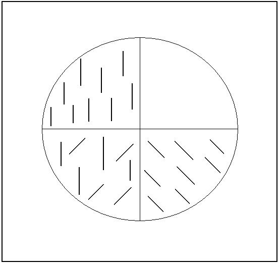
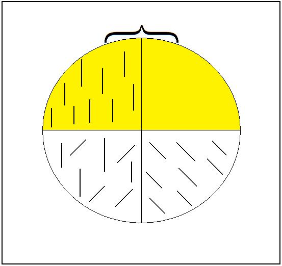
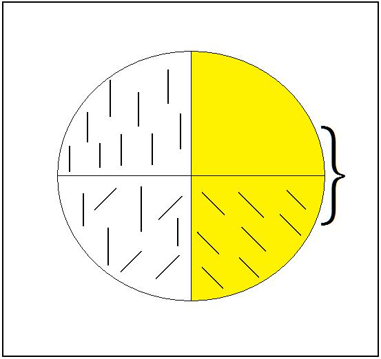
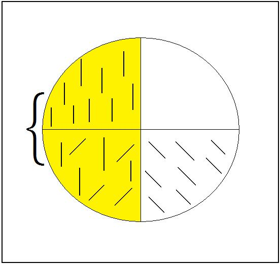
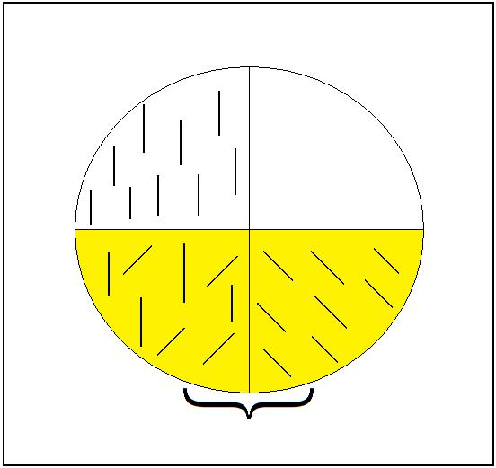
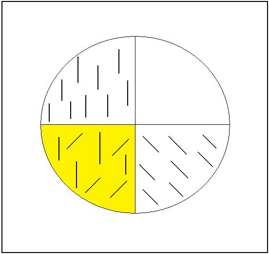
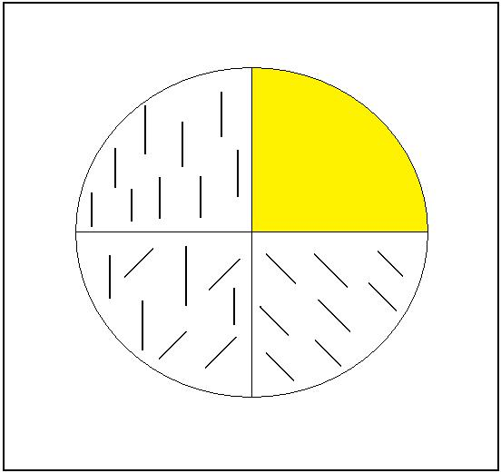

# Leçon 09 | 07 Février 1968

  <label><input type="checkbox" data-lacan-toggle="original" checked> 原文</label>
  <label><input type="checkbox" data-lacan-toggle="notes" checked> 注释</label>
  <label><input type="checkbox" data-lacan-toggle="commentary" checked> 个人解读评论</label>

<section class="parallel-paragraph" data-paragraph-ids="s15-09-0001">

s15-09-0001

[无对应译文]

原文 · s15-09-0001

Je reprends donc, après quinze jours, cette suite que j’avance devant vous cette année concernant *l’acte psychanalytique*, en parallèle à un certain nombre de propositions, pour employer le terme propre, qui sont celles que j’ai faites dans un cercle composé de psychanalystes.

</section>

<section class="parallel-paragraph" data-paragraph-ids="s15-09-0002">

s15-09-0002

[无对应译文]

原文 · s15-09-0002

Les réponses à ces propositions…

</section>

<section class="parallel-paragraph" data-paragraph-ids="s15-09-0003">

s15-09-0003

[无对应译文]

原文 · s15-09-0003

> d’ailleurs qui ne se limitent pas à celles qui se sont intitulées comme telles, qui sont suivies d’un certain nombre d’autres productions, disons, puisqu’il va paraître en fin de ce mois une revue qui sera la revue de l’École[^63] …tout ceci a pour résultat un certain nombre de réponses ou de manifestations qui ne sont certes pas, en aucun cas, sans intérêt pour ceux à qui ici je m’adresse.

</section>

<section class="parallel-paragraph" data-paragraph-ids="s15-09-0004">

s15-09-0004

[无对应译文]

原文 · s15-09-0004

Il est clair que certaines de ces réponses, certaines de ces réactions, de se produire au point le plus vif où mes propositions sont conséquentes avec ce que je produis devant vous sur *l’acte psychanalytique*, sont assurément pleines de sens pour définir, par une épreuve qu’on peut bien appeler cruciale, ce qu’il en est du statut du psychanalyste.

</section>

<section class="parallel-paragraph" data-paragraph-ids="s15-09-0005">

s15-09-0005

[无对应译文]

原文 · s15-09-0005

En effet, la dernière fois je vous ai laissés sur *l’indication d’une référence logique*. Il est bien sûr qu’au point où nous en sommes...

</section>

<section class="parallel-paragraph" data-paragraph-ids="s15-09-0006">

s15-09-0006

[无对应译文]

原文 · s15-09-0006

> qui est celui où l’acte définit par son tranchant ce qu’il en est du passage où s’instaure, où s’institue le psychanalyste …il est tout à fait clair que nous ne pouvons que repasser par le mode d’épreuve que constitue pour nous une interrogation logique. Sera-t-elle, pour prendre la référence inaugurale d’ARISTOTE, au moment où - comme je l’évoquais - il fait les pas décisifs d’où s’instaure comme telle la catégorie logique dans son espèce formelle ?

</section>

<section class="parallel-paragraph" data-paragraph-ids="s15-09-0007">

s15-09-0007

[无对应译文]

原文 · s15-09-0007

S’agit-il d’une démarche d’intention démonstrative ou dialectique ? La question, vous allez le voir, est *seconde*. Elle est *seconde*, pourquoi ? Parce que ce dont il s’agit s’instaure du discours lui-même, à savoir que tout ce que nous pouvons formuler concernant le psychanalysant et le psychanalyste va tourner…

</section>

<section class="parallel-paragraph" data-paragraph-ids="s15-09-0008">

s15-09-0008

[无对应译文]

原文 · s15-09-0008

> et je pense ne pas vous surprendre en l’énonçant comme je vais le faire,
>
> je l’ai assez préparé pour que la chose vous paraisse maintenant déjà dite …autour de ceci : *le psychanalysant*, en situation *dans le discours*, comment contester qu’il soit à la place du sujet ?

</section>

<section class="parallel-paragraph" data-paragraph-ids="s15-09-0009">

s15-09-0009

[无对应译文]

原文 · s15-09-0009

De quelque référence que nous nous armions pour *le situer*, et naturellement au premier plan la référence *linguistique*, il est essentiellement « *celui qui parle* » et « *sur qui s’éprouvent* » les effets de la parole. Que veut dire ce « *sur qui s’éprouvent* » ?

</section>

<section class="parallel-paragraph" data-paragraph-ids="s15-09-0010">

s15-09-0010

[无对应译文]

原文 · s15-09-0010

La formule est exprès ambigüe. Je veux dire que son discours, tel qu’il est réglé, tel qu’il est institué par la règle analytique, est fait pour être l’épreuve de ce en quoi, comme sujet, il est d’ores et déjà constitué des effets de la parole.

</section>

<section class="parallel-paragraph" data-paragraph-ids="s15-09-0011">

s15-09-0011

[无对应译文]

原文 · s15-09-0011

Et pourtant, il est vrai aussi de dire que ce discours lui–même, tel qu’il va se poursuivre, se soutenir comme tâche, trouve sa sanction, son bilan, son résultat, en tant qu’*effet de discours* et avant tout de ce discours propre lui-même, quelle que doive être l’insertion qu’y prend l’analyste par son interprétation.

</section>

<section class="parallel-paragraph" data-paragraph-ids="s15-09-0012">

s15-09-0012

[无对应译文]

原文 · s15-09-0012

Inversement, nous devons nous apercevoir que la question toujours actuelle, voire quelquefois brûlante, si elle se porte sur le psychanalyste, disons pour aller prudemment, pour aller au minimum, que c’est pour autant que le terme *psychanalyste* est mis en position de qualification : qui, quoi, peut être dit - prédicat - *psychanalyste* ?

</section>

<section class="parallel-paragraph" data-paragraph-ids="s15-09-0013">

s15-09-0013

[无对应译文]

原文 · s15-09-0013

Assurément, si même cette entrée en matière pouvait paraître aller un peu vite, ce sera, si vous voulez, par un retour avec lequel il se justifiera. C’est ainsi que, à aller au vif, j’annonce sous quel panonceau, sous quelle rubrique j’entends mettre mon discours d’aujourd’hui. Vous pouvez me faire confiance, ce n’est pas sans avoir à ce propos repris terre, si je puis dire, avec ce qu’il en est d’éclairant dans l’histoire même de la logique, dans la façon dont en quelque sorte, en notre temps, bascule d’une telle sorte le maniement de ce qui se désigne de ce terme comme logique, d’une façon qui vraiment nous rend, je ne dirai pas toujours plus difficile, mais nous rend nous-mêmes toujours plus déroutés devant le départ d’ARISTOTE.

</section>

<section class="parallel-paragraph" data-paragraph-ids="s15-09-0014">

s15-09-0014

[无对应译文]

原文 · s15-09-0014

Il faut se reporter à son texte, et nommément dans l’*Organon* [^64], je veux dire au niveau des *Catégories* par exemple, ou des *Premiers analytiques*, ou du premier livre des *Topiques*, pour nous apercevoir à quel point est proche de notre problématique la thématique du sujet tel qu’il l’énonce. Car assurément, dès ce premier énoncé, rien déjà de plus sensible ne nous éclairait sur ce qui, au niveau de ce sujet, est de sa nature - ce qui se dérobe par excellence - rien qui, au départ même de la logique, n’est plus fermement affirmé comme se distinguant de ce qu’on a traduit - assurément fort insuffisamment - comme « *substance »* : l’οὐσἰα \[ousia\].

</section>

<section class="parallel-paragraph" data-paragraph-ids="s15-09-0015">

s15-09-0015

[无对应译文]

原文 · s15-09-0015

Le traduire par la *« substance »* montre bien comme au cours des temps c’est d’un glissement abusif de *la fonction du sujet* dans ces premiers pas aristotéliciens qu’il s’agit, pour que le terme de *substance* qui vient là faire équivoque avec ce que le sujet comporte de supposition, ait été si aisément avancé.

</section>

<section class="parallel-paragraph" data-paragraph-ids="s15-09-0016">

s15-09-0016

[无对应译文]

原文 · s15-09-0016

Rien dans l’οὐσἰα \[ousia\], dans *ce qui est* - c’est-à-dire pour ARISTOTE - *l’individuel,* n’est de nature à pouvoir être

</section>

<section class="parallel-paragraph" data-paragraph-ids="s15-09-0017">

s15-09-0017

[无对应译文]

原文 · s15-09-0017

- ni situé dans le sujet,

</section>

<section class="parallel-paragraph" data-paragraph-ids="s15-09-0018">

s15-09-0018

[无对应译文]

原文 · s15-09-0018

- ni affirmé, c’est-à-dire ni attribué au sujet.

</section>

<section class="parallel-paragraph" data-paragraph-ids="s15-09-0019">

s15-09-0019

[无对应译文]

原文 · s15-09-0019

Et quoi d’autre est plus de nature à tout de suite nous *faire sauter à pieds joints* dans ce qui est la formule dont j’ai cru pouvoir dans toute sa rigueur témoigner de ce point vraiment clé, vraiment central de l’histoire de la logique, celui où, de s’être épaissi d’une ambiguïté croissante, le sujet en retrouve, dans les pas de *la logique moderne*, cette autre face, d’une sorte de tournant qui en fait *basculer* si on peut dire, la perspective, celle qui dans la logique mathématique, tend à le réduire à la variable d’une fonction, c’est-à-dire à quelque chose qui va entrer ensuite dans toute *la dialectique du quantificateur*, qui n’a pour autre effet que de le rendre désormais irrécupérable sous le mode où il se manifeste dans la proposition.

</section>

<section class="parallel-paragraph" data-paragraph-ids="s15-09-0020">

s15-09-0020

[无对应译文]

原文 · s15-09-0020

Le terme « *tournant* » me semble assez bien être fixé dans la formule que j’ai cru devoir en donner en disant que *le sujet* c’est très précisément *ce qu’un signifiant représente pour un autre signifiant*. Cette formule a l’avantage de rouvrir ce qui est éludé dans la proposition de la logique mathématique, à savoir la question de ce qu’il y a d’*initial*, d’initiant à poser *un signifiant* quelconque, à l’introduire *comme représentant le sujet*, car c’est là - et dès ARISTOTE - ce qu’il en est d’essentiel et ce qui seul permet de situer à sa juste place la différence

</section>

<section class="parallel-paragraph" data-paragraph-ids="s15-09-0021">

s15-09-0021

[无对应译文]

原文 · s15-09-0021

- de cette *première bipartition*, celle qui différencie *l’universel du particulier*

</section>

<section class="parallel-paragraph" data-paragraph-ids="s15-09-0022">

s15-09-0022

[无对应译文]

原文 · s15-09-0022

- de cette *seconde bipartition*, celle qui *affirme* ou qui *nie*.

</section>

<section class="parallel-paragraph" data-paragraph-ids="s15-09-0023">

s15-09-0023

[无对应译文]

原文 · s15-09-0023

L’une et l’autre - comme vous le savez - se recroisant pour donner la *quadripartition* [^65] : de *l’affirmative universelle*, de *l’universelle négative*, de *la particulière négative* et *affirmative* tour à tour. Les deux *bipartitions* n’ont absolument pas *d’équivalence*.

</section>

<section class="parallel-paragraph" data-paragraph-ids="s15-09-0024">

s15-09-0024

[无对应译文]

原文 · s15-09-0024

*L’introduction du sujet* - *en tant que c’est à son niveau que se situe la bipartition de l’universel et du particulier* - qu’est-ce qu’elle signifie ?

</section>

<section class="parallel-paragraph" data-paragraph-ids="s15-09-0025">

s15-09-0025

[无对应译文]

原文 · s15-09-0025

Qu’est-ce que cela veut dire pour prendre les choses comme quelqu’un qui s’est trouvé - comme fut PEIRCE[^66], Charles Sanders - dans ce point historique, dans ce niveau de joint de la logique traditionnelle à la logique mathématique et qui fait qu’en quelque sorte, nous trouvons sous sa plume ce moment d’oscillation où se dessine le tournant qui ouvre un nouveau chemin. Nul plus que lui…

</section>

<section class="parallel-paragraph" data-paragraph-ids="s15-09-0026">

s15-09-0026

[无对应译文]

原文 · s15-09-0026

> et j’ai déjà produit son témoignage au moment où j’ai eu à parler en 1960 sur le thème de *L’identification*[^67] …n’a mieux souligné, ni avec plus d’élégance, quelle est l’essence de cette fondation d’où sort *la distinction de l’universel* *et du particulier et le lien de l’universel au terme du sujet*.

</section>

<section class="parallel-paragraph" data-paragraph-ids="s15-09-0027">

s15-09-0027

[无对应译文]

原文 · s15-09-0027

Il l’a fait au moyen d’un petit tracé exemplaire que connaissent bien ceux qui déjà quelque temps m’ont suivi mais qu’aussi bien il n’est pas sans intérêt de répéter. Bien sûr, il se donne la facilité de donner comme support du sujet ce qu’il en est vraiment de lui, à savoir rien, dans l’occasion *le trait*. Nul de ces traits, que nous allons prendre pour exemplifier ce qu’il en est de la fonction relation du sujet au prédicat, qui ne soit déjà spécifié par le prédicat autour duquel nous allons faire tourner les énoncés de notre proposition, à savoir :

</section>

<section class="parallel-paragraph" data-paragraph-ids="s15-09-0028">

s15-09-0028

[无对应译文]

原文 · s15-09-0028

</section>

<section class="parallel-paragraph" data-paragraph-ids="s15-09-0029">

s15-09-0029

[无对应译文]

原文 · s15-09-0029

- *le prédicat vertical* \[en haut à gauche\]

</section>

<section class="parallel-paragraph" data-paragraph-ids="s15-09-0030">

s15-09-0030

[无对应译文]

原文 · s15-09-0030

- *ici* \[en bas à gauche\], *nous allons mettre des traits qui répondent au prédicat, ce sont des traits verticaux, et d’autres qui ne le sont pas*.

</section>

<section class="parallel-paragraph" data-paragraph-ids="s15-09-0031">

s15-09-0031

[无对应译文]

原文 · s15-09-0031

- *ici* \[en bas à droite\], *aucun ne l’est*.

</section>

<section class="parallel-paragraph" data-paragraph-ids="s15-09-0032">

s15-09-0032

[无对应译文]

原文 · s15-09-0032

- *ici* \[en haut à droite\], *il n’y a pas de traits*.

</section>

<section class="parallel-paragraph" data-paragraph-ids="s15-09-0033">

s15-09-0033

[无对应译文]

原文 · s15-09-0033

*C’est là qu’est le sujet, parce qu’il n’y a pas de traits*. Partout ailleurs, les traits sont marqués par *la présence* ou *l’absence* du prédicat. Mais, pour faire bien saisir en quoi c’est le *« pas de trait »* qui est essentiel, il y a plusieurs méthodes, ne serait-ce que d’instaurer l’énoncé de *l’affirmative universelle* par exemple comme ceci : « *Pas de trait qui ne soit vertical. *».

</section>

<section class="parallel-paragraph" data-paragraph-ids="s15-09-0034">

s15-09-0034

[无对应译文]

原文 · s15-09-0034

Et vous verrez :

</section>

<section class="parallel-paragraph" data-paragraph-ids="s15-09-0035">

s15-09-0035

[无对应译文]

原文 · s15-09-0035

- *que ce sera à faire fonctionner le pas sur le vertical, ou à le retirer, qui vous permettra de faire la bipartition affirmative et négative,*

</section>

<section class="parallel-paragraph" data-paragraph-ids="s15-09-0036">

s15-09-0036

[无对应译文]

原文 · s15-09-0036

- mais que c’est à supprimer le *pas* devant le *trait,* à laisser *le trait* qui est ou non *vertical,* que vous rentrez dans *le particulier*, c’est-à-dire le moment où le sujet est entièrement soumis à la variation du *vertical* ou du *pas vertical* : *il y en a qui le sont, il y en a qui ne le sont pas*.

</section>

<section class="parallel-paragraph" data-paragraph-ids="s15-09-0037">

s15-09-0037

[无对应译文]

原文 · s15-09-0037

Mais le statut de *l’universalité* ne s’instaure qu’ici par exemple \[accolade en haut\] :

</section>

<section class="parallel-paragraph" data-paragraph-ids="s15-09-0038">

s15-09-0038

[无对应译文]

原文 · s15-09-0038

</section>

<section class="parallel-paragraph" data-paragraph-ids="s15-09-0039">

s15-09-0039

[无对应译文]

原文 · s15-09-0039

par la réunion des deux cases, à savoir celle où il n’y a que des traits verticaux et celle aussi bien où il n’y a pas de trait, *car l’énoncé de l’universel qui dit « Tous les traits sont verticaux » ne se sustente,* et légitimement, *que de ces deux cases et de leur réunion.*

</section>

<section class="parallel-paragraph" data-paragraph-ids="s15-09-0040">

s15-09-0040

[无对应译文]

原文 · s15-09-0040

Il est aussi vrai - il est plus essentiellement vrai - au niveau de la case vide que : « *il n’y a de traits que verticaux* » veut dire que là où il n’y a pas de verticaux, il n’y a « *pas de traits* ». Telle est la définition recevable du sujet en tant que, sous toute énonciation prédicative, il est *essentiellement* ce *quelque chose* qui n’est que *représenté par un signifiant pour un autre signifiant*.

</section>

<section class="parallel-paragraph" data-paragraph-ids="s15-09-0041">

s15-09-0041

[无对应译文]

原文 · s15-09-0041

Je ne ferai que vite mentionner, parce que nous ne pouvons pas passer tout notre discours à nous appesantir sur ce que, du schéma de PEIRCE, nous pouvons tirer. Il est clair que *c’est* de même *de la réunion de ces deux cases* \[accolade à droite\] que l’énoncé « *aucun trait n’est vertical* » prend son support. C’est bien pourquoi il est nécessaire que je l’accentue.

</section>

<section class="parallel-paragraph" data-paragraph-ids="s15-09-0042">

s15-09-0042

[无对应译文]

原文 · s15-09-0042

</section>

<section class="parallel-paragraph" data-paragraph-ids="s15-09-0043">

s15-09-0043

[无对应译文]

原文 · s15-09-0043

En quoi se démontre, ce qu’on sait déjà, bien sûr, si on lit le texte d’ARISTOTE d’une façon convenable :

</section>

<section class="parallel-paragraph" data-paragraph-ids="s15-09-0044">

s15-09-0044

[无对应译文]

原文 · s15-09-0044

- que *l’affirmative universelle* et *la négative universelle* ne se contredisent nullement, qu’elles sont toutes deux également *recevables*, à la condition que nous soyons dans cette case en haut et à droite,

</section>

<section class="parallel-paragraph" data-paragraph-ids="s15-09-0045">

s15-09-0045

[无对应译文]

原文 · s15-09-0045

- et qu’il est aussi vrai - au niveau de cette case - d’énoncer « *tous les traits sont verticaux* » ou « *aucun trait n’est vertical* », les deux choses sont vraies ensemble, ce que curieusement ARISTOTE méconnaît.

</section>

<section class="parallel-paragraph" data-paragraph-ids="s15-09-0046">

s15-09-0046

[无对应译文]

原文 · s15-09-0046

Aux autres points de la division cruciale, vous avez l’instauration des *particulières*.

</section>

<section class="parallel-paragraph" data-paragraph-ids="s15-09-0047">

s15-09-0047

[无对应译文]

原文 · s15-09-0047

Il y a dans ces deux cases \[accolade à gauche\] *des traits verticaux* :

</section>

<section class="parallel-paragraph" data-paragraph-ids="s15-09-0048">

s15-09-0048

[无对应译文]

原文 · s15-09-0048

</section>

<section class="parallel-paragraph" data-paragraph-ids="s15-09-0049">

s15-09-0049

[无对应译文]

原文 · s15-09-0049

Et à la jonction des deux cases inférieures \[accolade en bas\] il y a - *et rien de plus* - des traits qui ne le sont pas :

</section>

<section class="parallel-paragraph" data-paragraph-ids="s15-09-0050">

s15-09-0050

[无对应译文]

原文 · s15-09-0050

</section>

<section class="parallel-paragraph" data-paragraph-ids="s15-09-0051">

s15-09-0051

[无对应译文]

原文 · s15-09-0051

Vous voyez donc :

</section>

<section class="parallel-paragraph" data-paragraph-ids="s15-09-0052">

s15-09-0052

[无对应译文]

原文 · s15-09-0052

- qu’au niveau du fondement *universel*, les choses se situent d’une façon qui, si je puis dire, comporte une exclusion, celle précisément de cette diversité \[case en bas à gauche\].

</section>

<section class="parallel-paragraph" data-paragraph-ids="s15-09-0053">

s15-09-0053

[无对应译文]

原文 · s15-09-0053

- Et de même, au niveau de la différenciation *particulière*, il y a une exclusion, celle de la case qui est en haut et à droite. C’est ce qui donne l’illusion que *la particulière* est une affirmation d’existence.

</section>

<section class="parallel-paragraph" data-paragraph-ids="s15-09-0054">

s15-09-0054

[无对应译文]

原文 · s15-09-0054

 

</section>

<section class="parallel-paragraph" data-paragraph-ids="s15-09-0055">

s15-09-0055

[无对应译文]

原文 · s15-09-0055

Il suffit de parler au niveau de *quelque* - *quelque homme,* par exemple, *a la couleur jaune -* pour impliquer de ce que ce fait s’énonce sous la forme particulière, qu’il y aurait de ce fait, si j’ose m’exprimer ainsi, du fait de cette énonciation, *affirmation* aussi de l’existence du *particulier*.

</section>

<section class="parallel-paragraph" data-paragraph-ids="s15-09-0056">

s15-09-0056

[无对应译文]

原文 · s15-09-0056

C’est bien là autour de quoi ont tourné d’innombrables débats sur le sujet du statut logique de *la proposition particulière*, et c’est ce qui assurément en fait le dérisoire, car il ne suffit absolument pas qu’une proposition s’énonce au niveau du *particulier* pour impliquer d’aucune façon l’existence du *sujet*, sinon au nom d’une ordonnance signifiante, c’est-à-dire comme effet de discours.

</section>

<section class="parallel-paragraph" data-paragraph-ids="s15-09-0057">

s15-09-0057

[无对应译文]

原文 · s15-09-0057

L’intérêt de *la psychanalyse* est qu’elle *apporte à ces problèmes de logique*, comme jamais n’a pu l’être fait jusqu’à présent...

</section>

<section class="parallel-paragraph" data-paragraph-ids="s15-09-0058">

s15-09-0058

[无对应译文]

原文 · s15-09-0058

> ce qui en somme était au principe de toutes les ambiguïtés qui se sont développées dans l’histoire de la logique : *d’impliquer dans le sujet une* οὐσἰα \[ousia\], *un être* …*que le sujet puisse fonctionner comme n’étant pas.*

</section>

<section class="parallel-paragraph" data-paragraph-ids="s15-09-0059">

s15-09-0059

[无对应译文]

原文 · s15-09-0059

C’est proprement - je l’ai articulé, j’y insiste depuis le début de cette année et déjà durant toute l’année dernière - ce qui nous apporte l’ouverture éclairante grâce à quoi pourrait se rouvrir un examen du développement de *la logique*.

</section>

<section class="parallel-paragraph" data-paragraph-ids="s15-09-0060">

s15-09-0060

[无对应译文]

原文 · s15-09-0060

La tâche est encore ouverte - et qui sait, peut-être à l’énoncer ainsi provoquerai-je une vocation - qui nous montrerait ce que signifient vraiment tellement de détours, je dirais tellement d’*embarras*…

</section>

<section class="parallel-paragraph" data-paragraph-ids="s15-09-0061">

s15-09-0061

[无对应译文]

原文 · s15-09-0061

> quelquefois si singuliers et si paradoxaux à se manifester au cours de l’histoire …qui ont marqué les débats logiques à travers les âges et qui rendent si incompréhensible :

</section>

<section class="parallel-paragraph" data-paragraph-ids="s15-09-0062">

s15-09-0062

[无对应译文]

原文 · s15-09-0062

- vu d’un certain temps… du moins du nôtre, le temps que parfois ils ont pris,

</section>

<section class="parallel-paragraph" data-paragraph-ids="s15-09-0063">

s15-09-0063

[无对应译文]

原文 · s15-09-0063

- et ce qui nous paraît pendant longtemps avoir constitué des *stagnations*, voire *des passions autour de ces stagnations*, dont nous sentons mal la portée tant que nous ne voyons pas ce qui était derrière vraiment en jeu.

</section>

<section class="parallel-paragraph" data-paragraph-ids="s15-09-0064">

s15-09-0064

[无对应译文]

原文 · s15-09-0064

À savoir rien de moins que le statut de désir, dont le lien, pour être secret - avec la politique par exemple – est tout à fait sensible dans, par exemple, le tournant qu’a constitué l’instauration dans une philosophie, la philosophie anglaise nommément, d’un certain nominalisme : *impossible de comprendre la cohérence de cette logique avec une politique* *sans s’apercevoir de ce que la logique elle-même implique de statut du sujet et de référence à l’effectivité du désir dans les rapports politiques.*

</section>

<section class="parallel-paragraph" data-paragraph-ids="s15-09-0065">

s15-09-0065

[无对应译文]

原文 · s15-09-0065

Pour nous, ce *statut du sujet* est illustré de questions dont j’ai marqué encore que tout ceci se passe dans un milieu très limité, voire très court et marqué de discussions dont la prégnance, dont le caractère brûlant participe, je dirais, de ces anciennes sous-jacences - ce dont, à cette occasion, nous prenons exemple, ce que nous pouvons articuler - c’est pour cela que ça peut, comme vous allez le voir, n’être pas sans incidence sur un domaine beaucoup plus vaste, pour autant que ce n’est assurément pas que dans la pratique qui tourne autour de *la fonction du désir* - pour autant que l’analyse l’a découverte – que la question s’en joue.

</section>

<section class="parallel-paragraph" data-paragraph-ids="s15-09-0066">

s15-09-0066

[无对应译文]

原文 · s15-09-0066

Voici donc le psychanalysant et le psychanalyste placés par nous dans ces positions distinctes qu’ils ont respectivement.

</section>

<section class="parallel-paragraph" data-paragraph-ids="s15-09-0067">

s15-09-0067

[无对应译文]

原文 · s15-09-0067

Quel va être le statut d’un sujet qui se définit par ce discours dont je vous ai dit la dernière fois qu’il est institué par la règle, spécialement en ceci que le sujet est prié d’y abdiquer, que c’est là la visée de la règle et qu’à la limite, se vouant à la dérive du langage, il irait, comme je le disais tout à l’heure, à tenter, par une sorte d’expérience médiate de son pur effet, à en rejoindre les effets déjà établis ?

</section>

<section class="parallel-paragraph" data-paragraph-ids="s15-09-0068">

s15-09-0068

[无对应译文]

原文 · s15-09-0068

Un tel sujet, *un sujet défini comme effet de discours* - à ce point qu’il fasse l’épreuve de s’y perdre pour s’y retrouver - un tel sujet dont l’exercice est en quelque sorte de se mettre à l’épreuve de sa propre démission, qu’en pouvons-nous dire, à *quoi* s’applique un prédicat ? Autrement dit, pouvons-nous énoncer quelque chose qui soit de la rubrique de *l’universel* ?

</section>

<section class="parallel-paragraph" data-paragraph-ids="s15-09-0069">

s15-09-0069

[无对应译文]

原文 · s15-09-0069

Si *l’universel* ne nous montrait déjà dans sa structure qu’il trouve son ressort, son fondement dans le sujet en tant qu’il peut n’être *représenté que par son absence*, c’est-à-dire en tant qu’il n’est jamais que *représenté*, nous serions assurément en droit de poser la question si *quoi que ce soit peut s’énoncer de l’ordre par exemple de* :

</section>

<section class="parallel-paragraph" data-paragraph-ids="s15-09-0070">

s15-09-0070

[无对应译文]

原文 · s15-09-0070

> « *Tout psychanalysant résiste*. »

</section>

<section class="parallel-paragraph" data-paragraph-ids="s15-09-0071">

s15-09-0071

[无对应译文]

原文 · s15-09-0071

Je ne vais pourtant pas jusqu’à trancher encore si quoi que ce soit d’universel peut être posé du psychanalysant.

</section>

<section class="parallel-paragraph" data-paragraph-ids="s15-09-0072">

s15-09-0072

[无对应译文]

原文 · s15-09-0072

Nous ne l’écartons pas malgré l’apparence, car *à poser le psychanalysant comme ce sujet* qui choisit de se faire, si l’on peut dire, plus aliéné qu’un autre, de se vouer à ceci que seuls les détours d’un discours non choisi, à savoir de ce quelque chose qui s’oppose le plus à ce qui est là, sur le schéma, au départ, à savoir que c’est, bien sûr, *sur un choix*, mais un choix masqué, éludé parce que antérieur…

</section>

<section class="parallel-paragraph" data-paragraph-ids="s15-09-0073">

s15-09-0073

[无对应译文]

原文 · s15-09-0073

> on a choisi de *représenter le sujet par le trait*, par *ce trait* qui ne se voit plus de ce qu’il soit désormais qualifié …rien de plus opposé en apparence à ce dans quoi se constitue le psychanalysant, qui est tout de même d’un certain choix, ce choix que j’ai appelé tout à l’heure « *abdication* » : *le choix de s’éprouver aux effets de langage*.

</section>

<section class="parallel-paragraph" data-paragraph-ids="s15-09-0074">

s15-09-0074

[无对应译文]

原文 · s15-09-0074

Et c’est bien là où nous allons nous retrouver. En effet si nous suivons le fil, la trame que nous suggère *l’usage du syllogisme*, ce à quoi bien sûr, nous devons arriver, c’est quelque chose qui - ce *sujet -* va le conjoindre à ce qui s’est ici avancé comme prédicat : *le psychanalyste*. *S’il existe un psychanalyste*...

</section>

<section class="parallel-paragraph" data-paragraph-ids="s15-09-0075">

s15-09-0075

[无对应译文]

原文 · s15-09-0075

mais hélas, c’est ce qui nous manque pour supporter cette articulation logique …*tout est assuré* : *il peut y en avoir des tas d’autres*. Mais pour l’instant, la question pour nous est de savoir *comment le psychanalysant peut passer au psychanalyste*, comment il se fait que, de la façon la plus fondée, cette qualification ne se supporte que de la tâche achevée du psychanalysant.

</section>

<section class="parallel-paragraph" data-paragraph-ids="s15-09-0076">

s15-09-0076

[无对应译文]

原文 · s15-09-0076

Nous voyons bien ici s’ouvrir cette autre dimension, qui est celle que j’ai déjà essayé de profiler devant vous, de la conjonction de *l’acte* et de *la tâche* : comment les deux se conjoignent-elles ? Nous nous trouvons ici devant une autre forme de ce qui a fait problème et qui a fini par s’articuler *au Moyen Âge* - ce n’est pas là pour rien - *inventio medii*, ce dont parle ARISTOTE de ce pas admirablement allègre qui est celui des *Premiers Analytiques*, à savoir de la première figure du *moyen terme*, de ce *moyen terme* dont il nous explique qu’à être situé comme prédicat, il nous permettra de conjoindre d’une façon rationnelle *ce sujet évanouissant* à quelque chose qui soit un prédicat : par le *moyen terme*, cette conjonction est possible.

</section>

<section class="parallel-paragraph" data-paragraph-ids="s15-09-0077">

s15-09-0077

[无对应译文]

原文 · s15-09-0077

Où est le mystère ? Comment se fait-il qu’il paraisse que quelque chose existe qui est un *moyen terme* et, dans la première figure, qui apparaisse comme prédicat de la mineure, où nous attend le sujet comme sujet de la mineure et qui va nous permettre de raccrocher le prédicat qui est en question. Est-il, oui ou non, attribuable au sujet ?

</section>

<section class="parallel-paragraph" data-paragraph-ids="s15-09-0078">

s15-09-0078

[无对应译文]

原文 · s15-09-0078

Cette chose qui avec le recul des temps a passé par des couleurs diverses, qui a paru au détour du XVIème siècle un exercice, en fin de compte - il n’est pas douteux qu’on le voit sous la plume des auteurs - un exercice purement futile, nous lui redonnons corps de nous apercevoir de ce dont il s’agit.

</section>

<section class="parallel-paragraph" data-paragraph-ids="s15-09-0079">

s15-09-0079

[无对应译文]

原文 · s15-09-0079

Il s’agit de ce que j’ai appelé *l’objet(a),* qui, lui, est ici pour nous le véritable moyen terme qui se propose assurément comme d’un plus incomparable sérieux d’être l’*effet du discours du psychanalysant* et d’être, d’autre part…

</section>

<section class="parallel-paragraph" data-paragraph-ids="s15-09-0080">

s15-09-0080

[无对应译文]

原文 · s15-09-0080

> comme je l’ai énoncé dans le nouveau graphe qui est celui
>
> dont vous me voyez ici depuis deux ans devant vous faire usage …comme non pas ce que devient le psychanalyste, mais :

</section>

<section class="parallel-paragraph" data-paragraph-ids="s15-09-0081">

s15-09-0081

[无对应译文]

原文 · s15-09-0081

- comme ce qu’il est au départ impliqué par toute l’opération,

</section>

<section class="parallel-paragraph" data-paragraph-ids="s15-09-0082">

s15-09-0082

[无对应译文]

原文 · s15-09-0082

- comme ce qui doit être le solde de l’opération psychanalysante,

</section>

<section class="parallel-paragraph" data-paragraph-ids="s15-09-0083">

s15-09-0083

[无对应译文]

原文 · s15-09-0083

- comme ce qui libère ce qu’il en est d’une vérité fondamentale à la fin de la psychanalyse.

</section>

<section class="parallel-paragraph" data-paragraph-ids="s15-09-0084">

s15-09-0084

[无对应译文]

原文 · s15-09-0084

C’est à savoir l’inégalité du sujet à toute *subjectivation possible de sa réalité sexuelle* et l’exigence que, pour que cette vérité apparaisse, le psychanalyste soit déjà *la représentation* de ce qui masque, obture, bouche, cette *vérité* qui s’appelle *l’objet(a)*.

</section>

<section class="parallel-paragraph" data-paragraph-ids="s15-09-0085">

s15-09-0085

[无对应译文]

原文 · s15-09-0085

Observez bien en effet *que l’essentiel de ce qu’ici j’articule* - et j’y reviendrai abondamment - *n’est pas qu’au terme de la psychanalyse*, comme certains - je l’ai vu à des questions qui ont été posées - se l’imaginent, *le psychanalyste devienne pour l’autre* *l’objet(a)*.

</section>

<section class="parallel-paragraph" data-paragraph-ids="s15-09-0086">

s15-09-0086

[无对应译文]

原文 · s15-09-0086

Ce « *pour l’autre* » ici prend singulièrement la valeur d’un « *pour soi* », pour autant justement que, comme sujet, il n’y en a pas d’autre que cet autre à qui est laissé tout le discours. Ça n’est ni *pour l’autre*, ni dans un *pour soi,* qui n’existe pas au niveau du psychanalyste, que réside ce *(a)*, c’est bien d’un *en soi* du psychanalyste.

</section>

<section class="parallel-paragraph" data-paragraph-ids="s15-09-0087">

s15-09-0087

[无对应译文]

原文 · s15-09-0087

C’est en tant que - comme les psychanalystes le clament eux-mêmes, d’ailleurs il suffit d’ouvrir la littérature pour en avoir à tout instant le témoignage -

</section>

<section class="parallel-paragraph" data-paragraph-ids="s15-09-0088">

s15-09-0088

[无对应译文]

原文 · s15-09-0088

- ils sont réellement *ce sein* de l’« *Ô ma mère Intelligence* » de MALLARMÉ[^68],

</section>

<section class="parallel-paragraph" data-paragraph-ids="s15-09-0089">

s15-09-0089

[无对应译文]

原文 · s15-09-0089

- qu’ils sont eux-mêmes *ce déchet* présidant à l’opération de la tâche,

</section>

<section class="parallel-paragraph" data-paragraph-ids="s15-09-0090">

s15-09-0090

[无对应译文]

原文 · s15-09-0090

- qu’ils sont *le regard*,

</section>

<section class="parallel-paragraph" data-paragraph-ids="s15-09-0091">

s15-09-0091

[无对应译文]

原文 · s15-09-0091

- qu’ils sont *la voix*, ...c’est en tant qu’ils sont en soi le support de *cet objet(a)* que toute l’opération est possible.

</section>

<section class="parallel-paragraph" data-paragraph-ids="s15-09-0092">

s15-09-0092

[无对应译文]

原文 · s15-09-0092

Il ne leur en échappe qu’une chose, c’est à quel point *ce n’est pas métaphorique*.

</section>

<section class="parallel-paragraph" data-paragraph-ids="s15-09-0093">

s15-09-0093

[无对应译文]

原文 · s15-09-0093

Alors maintenant tâchons un peu de reprendre ce qu’il en est du psychanalysant.

</section>

<section class="parallel-paragraph" data-paragraph-ids="s15-09-0094">

s15-09-0094

[无对应译文]

原文 · s15-09-0094

Ce psychanalysant qui s’engage dans cette tâche *singulière*, cette tâche que j’ai qualifiée d’être supportée de son *abdication*, est-ce que nous n’allons pas sentir ici qu’en tout cas il y a quelque chose d’éclairant ?

</section>

<section class="parallel-paragraph" data-paragraph-ids="s15-09-0095">

s15-09-0095

[无对应译文]

原文 · s15-09-0095

S’il ne peut être pris sous la fonction d’*universel*, ou s’il le peut : nous ne le savons pas.

</section>

<section class="parallel-paragraph" data-paragraph-ids="s15-09-0096">

s15-09-0096

[无对应译文]

原文 · s15-09-0096

Il y a peut-être une autre chose qui va nous frapper, c’est que nous l’avons posé comme sujet, non sans intention, cela veut dire que le sens de ce mot « *le psychanalysant* », quand nous l’articulons au niveau du sujet, en tant que c’est lui qui se joue de toutes ces couleurs prises, telles celles de la murène sur le plat du riche Romain, celui-là ne peut être mis en usage qu’à changer de sens comme attribut.

</section>

<section class="parallel-paragraph" data-paragraph-ids="s15-09-0097">

s15-09-0097

[无对应译文]

原文 · s15-09-0097

La preuve, c’est que quand on s’en sert comme attribut, on s’en sert aussi sottement que du terme « *psychanalysé* ».

</section>

<section class="parallel-paragraph" data-paragraph-ids="s15-09-0098">

s15-09-0098

[无对应译文]

原文 · s15-09-0098

On ne dit pas ceux-ci ou ceux-là, ou tous ceux-ci, ou tous ceux-là sont *psychanalysants.*

</section>

<section class="parallel-paragraph" data-paragraph-ids="s15-09-0099">

s15-09-0099

[无对应译文]

原文 · s15-09-0099

Je n’ai pas employé, vous le remarquez, de terme singulier. Ce serait encore plus révoltant.

</section>

<section class="parallel-paragraph" data-paragraph-ids="s15-09-0100">

s15-09-0100

[无对应译文]

原文 · s15-09-0100

Mais nous laissons le singulier de côté, en éprouvant à ce tournant la même répugnance que celle qui fait que ARISTOTE n’emploie pas les termes singuliers dans sa syllogistique. Si vous ne sentez pas tout de suite ce que je vise à propos de cette mise à l’épreuve sensible de l’usage du terme « *psychanalysant* » comme sujet ou comme attribut, je vais vous le faire sentir.

</section>

<section class="parallel-paragraph" data-paragraph-ids="s15-09-0101">

s15-09-0101

[无对应译文]

原文 · s15-09-0101

Employez le terme de « travailleur » tel qu’il se situe dans la perspective de : « *Travailleurs de tous les pays unissez-vous !* » à savoir au niveau de l’idéologie qui relève et met l’accent *sur leur aliénation essentielle, sur l’exploitation constituante qui les pose comme travailleurs*, et faites l’opposition avec l’usage du même terme dans la bouche paternaliste, celle qui qualifie une population de travailleuse : « *Ils sont travailleurs de nature dans ce coin-là*… », ce sont des attributs, des *bons travailleurs.*

</section>

<section class="parallel-paragraph" data-paragraph-ids="s15-09-0102">

s15-09-0102

[无对应译文]

原文 · s15-09-0102

Cet exemple, cette distinction est celle qui peut-être va vous introduire à quelque chose qui nous fera peut-être poser la question de savoir qu’après tout, pourquoi dans cette opération si singulière qui est celle où, comme je vous l’ai dit, se supporte le sujet de *l’acte psychanalytique*, et sur le principe de ceci que l’acte d’où s’instaure la psychanalyse ne part pas d’ailleurs, est-ce que ceci n’est peut-être pas fait pour nous faire nous apercevoir qu’il y a là aussi une espèce d’aliénation ?

</section>

<section class="parallel-paragraph" data-paragraph-ids="s15-09-0103">

s15-09-0103

[无对应译文]

原文 · s15-09-0103

Et après tout, vous n’allez pas en être surpris puisqu’elle était déjà présente dans mon premier schéma, que c’est de l’aliénation nécessaire, et où il est impossible de choisir entre le « *ou je ne pense pas ou je ne suis pas* », que j’ai fait dériver toute la première formulation de ce qu’il en est de *l’acte psychanalytique*.

</section>

<section class="parallel-paragraph" data-paragraph-ids="s15-09-0104">

s15-09-0104

[无对应译文]

原文 · s15-09-0104

Mais alors, peut-être comme ça, latéralement, à proposer une façon que j’ai comme ça, heuristique, de vous introduire, pourriez-vous vous demander - je me pose la question parce que la réponse est déjà là, bien sûr - qu’est-ce qu’elle *produit*, cette *tâche psychanalysante* ?

</section>

<section class="parallel-paragraph" data-paragraph-ids="s15-09-0105">

s15-09-0105

[无对应译文]

原文 · s15-09-0105

Nous avons déjà pour nous guider *l’objet(a)* car si, au terme de la psychanalyse terminée, cet *objet(a)* qui est là sans doute de toujours, au niveau de ce qui est notre *question*, à savoir *l’acte psychanalytique*, ce n’est quand même qu’au terme de l’opération qu’il va réapparaître dans le *réel*, d’une autre source, à savoir comme de par le psychanalysant rejeté : mais c’est là que fonctionne notre moyen terme, que nous le trouvons obéré d’un tout autre accent.

</section>

<section class="parallel-paragraph" data-paragraph-ids="s15-09-0106">

s15-09-0106

[无对应译文]

原文 · s15-09-0106

Ce *(a)* dont il s’agit, nous l’avons dit : c’est le psychanalyste, ce n’est pas parce qu’il est là depuis le début que, à la fin, *du point de vue de la tâche cette fois psychanalysante*, ce n’est pas lui qui est produit, je veux dire qu’on peut se poser la question de savoir quelle est la *qualification du psychanalyste*.

</section>

<section class="parallel-paragraph" data-paragraph-ids="s15-09-0107">

s15-09-0107

[无对应译文]

原文 · s15-09-0107

Il y a en tout cas une chose certaine, c’est qu’il n’y a pas de psychanalyste sans psychanalysant, et je dirai plus : ce quelque chose qui est si singulier à être entré dans le champ de notre monde, à savoir qu’il y ait un certain nombre de gens, dont nous ne sommes pas si sûrs que ça de pouvoir instaurer leur statut comme sujet, ce sont quand même des gens qui *travaillent à cette psychanalyse*.

</section>

<section class="parallel-paragraph" data-paragraph-ids="s15-09-0108">

s15-09-0108

[无对应译文]

原文 · s15-09-0108

Le terme de *travail* n’en a jamais été un seul instant *exclu* : dès l’origine de la psychanalyse, le *Durcharbeiten,* le *working-through*, c’est bien là la caractéristique à laquelle il faut bien nous référer pour en admettre l’aridité, la sécheresse, le détour, voire parfois l’incertitude de ses bords.

</section>

<section class="parallel-paragraph" data-paragraph-ids="s15-09-0109">

s15-09-0109

[无对应译文]

原文 · s15-09-0109

Mais si nous nous plaçons à ce niveau d’une *omnitude* où tous les sujets alors franchement s’affirment dans leur universalité de ne plus être et d’être la case de droite en haut, à en fonder l’universel, ce que nous voyons, c’est qu’assurément il y a quelque chose qui en est le produit, et même proprement la production.

</section>

<section class="parallel-paragraph" data-paragraph-ids="s15-09-0110">

s15-09-0110

[无对应译文]

原文 · s15-09-0110

Déjà ici je peux épingler ce qu’il en est de ce *genus*, de cette espèce : *le psychanalyste*, à le définir comme production.

</section>

<section class="parallel-paragraph" data-paragraph-ids="s15-09-0111">

s15-09-0111

[无对应译文]

原文 · s15-09-0111

S’il n’y avait pas de psychanalysant, dirais-je, à la façon de *je ne sais quel classique humour* que je renverse… « *S’il n’y avait pas de Polonais, il n’y aurait pas de Pologne.* »[^69] …*s’il n’y avait pas de psychanalysant, il n’y aurait pas de psychanalyste*.

</section>

<section class="parallel-paragraph" data-paragraph-ids="s15-09-0112">

s15-09-0112

[无对应译文]

原文 · s15-09-0112

Et *le psychanalyste* se définit, *à ce niveau de la production*, de ceci :

</section>

<section class="parallel-paragraph" data-paragraph-ids="s15-09-0113">

s15-09-0113

[无对应译文]

原文 · s15-09-0113

- d’être cette sorte de sujet qui peut aborder les conséquences du discours d’une façon si pure qu’il puisse en isoler le plan dans ses rapports avec celui dont, par son *acte*, il instaure *la tâche* et le programme de cette tâche et, pendant tout le soutien de cette tâche, n’y voit proprement que ces rapports qui sont ceux que je désigne quand je manie toute cette algèbre : le S, le *(a),* voire le A et le *i(a)…*

</section>

<section class="parallel-paragraph" data-paragraph-ids="s15-09-0114">

s15-09-0114

[无对应译文]

原文 · s15-09-0114

- d’être celui qui est capable de se tenir à ce niveau, c’est-à-dire de ne voir que le point où en est le sujet dans cette tâche dont la fin est quand *tombe*, quand *choit*, au dernier terme ce qui est *l’objet (a)*,

</section>

<section class="parallel-paragraph" data-paragraph-ids="s15-09-0115">

s15-09-0115

[无对应译文]

原文 · s15-09-0115

- d’être celui qui est de cette espèce, et ceci veut dire celui qui est capable, dans la relation avec quelqu’un qui est là en position de cure, de ne point se laisser affecter par tout ce qu’il en est de ce par quoi communique tout être humain dans toute fonction avec son semblable.

</section>

<section class="parallel-paragraph" data-paragraph-ids="s15-09-0116">

s15-09-0116

[无对应译文]

原文 · s15-09-0116

Et ceci a un nom, qui n’est pas simplement comme depuis toujours je le dénonce, à savoir le narcissisme jusqu’à son terme extrême qui s’appelle l’amour. Il n’y a pas *que narcissisme* ni heureusement *qu’amour* entre les êtres humains, pour appeler ça comme on l’appelle, il y a ce quelque chose que quelqu’un qui savait parler de l’amour a heureusement distingué : il y a *le goût*, il y a *l’estime*. *Le goût* c’est d’un versant, et *l’estime* c’est peut-être pas du même mais ça se conjoint admirablement.

</section>

<section class="parallel-paragraph" data-paragraph-ids="s15-09-0117">

s15-09-0117

[无对应译文]

原文 · s15-09-0117

Il y a fondamentalement ce quelque chose qui s’appelle le « *tu me plais* » et qui est fait essentiellement de ce dosage, de ce qui fait que, dans *une proportion exacte et irremplaçable*, de celle que vous pouvez mettre dans la case de gauche en bas :

</section>

<section class="parallel-paragraph" data-paragraph-ids="s15-09-0118">

s15-09-0118

[无对应译文]

原文 · s15-09-0118

</section>

<section class="parallel-paragraph" data-paragraph-ids="s15-09-0119">

s15-09-0119

[无对应译文]

原文 · s15-09-0119

…la relation, le support que prend le sujet du *(a),* de cet *i(a)* qui fonde la relation narcissique, résonne, est pour vous exactement ce qu’il faut, pour que ça vous plaise. C’est ce qui fait que, dans les rapports entre êtres humains, il y a rencontre.

</section>

<section class="parallel-paragraph" data-paragraph-ids="s15-09-0120">

s15-09-0120

[无对应译文]

原文 · s15-09-0120

C’est très précisément de ceci, qui est l’os et la chair de tout ce qui s’est jamais articulé de l’ordre de ce que de nos jours on essaie de *mathématiser d’une façon bouffonne* sous le nom de relations humaines, c’est cela dont précisément se distingue l’analyste en ne recourant jamais, dans sa relation - *à l’intérieur de la psychanalyse* - à cet inexprimable, à ce terme qui donne seul le support à la réalité de l’autre, qui est le « *tu me plais* » ou « *tu me déplais* ».

</section>

<section class="parallel-paragraph" data-paragraph-ids="s15-09-0121">

s15-09-0121

[无对应译文]

原文 · s15-09-0121

L’extraction, l’absence de cette dimension, et justement du fait qu’il y ait *un être* - *être de psychanalyste* - qui puisse faire tourner, d’être lui-même en position de *(a),* tout ce dont il s’agit dans le sort du *sujet psychanalysant*, à savoir son rapport, à lui, à *la vérité*, de le faire tourner purement et simplement autour de ces termes d’une algèbre qui ne concerne en rien une foule de dimensions existantes et plus que recevables, une foule de données, une foule d’éléments substantiels dans *ce qui est là en jeu*, en place et respirant sur le divan : voilà ce qui est la production tout à fait comparable à celle de telle ou telle machine qui circule dans notre monde scientifique et qui est à proprement parler la production du psychanalysant.

</section>

<section class="parallel-paragraph" data-paragraph-ids="s15-09-0122">

s15-09-0122

[无对应译文]

原文 · s15-09-0122

Voilà quelque chose d’original !

</section>

<section class="parallel-paragraph" data-paragraph-ids="s15-09-0123">

s15-09-0123

[无对应译文]

原文 · s15-09-0123

Voilà tout de même quelque chose qui est assez sensible !

</section>

<section class="parallel-paragraph" data-paragraph-ids="s15-09-0124">

s15-09-0124

[无对应译文]

原文 · s15-09-0124

Voilà quelque chose qui n’est pas tellement nouveau, encore que ce soit articulé d’une façon qui peut vous paraître frappante car, qu’est-ce que cela veut dire si l’on demande au psychanalyste de ne pas faire jouer dans l’analyse ce qu’on appelle « *contre transfert* » ? Je défie qu’on lui donne un autre sens que ceci : que n’y a place ni le *tu me plais* ni le *tu me déplais*, après les avoir définis comme je viens de le faire.

</section>

<section class="parallel-paragraph" data-paragraph-ids="s15-09-0125">

s15-09-0125

[无对应译文]

原文 · s15-09-0125

Mais alors, nous voici au pied de la question : qu’est-ce qu’il en est, après vous avoir à ce point, si je puis dire, transformé *l’objet(a)* en *une production à la chaîne* du psychanalyste - ce produit *(a) -* comme une AUSTIN, que peut vouloir dire *l’acte psychanalytique* si en effet, *l’acte psychanalytique* c’est tout de même le psychanalyste qui le commet ?

</section>

<section class="parallel-paragraph" data-paragraph-ids="s15-09-0126">

s15-09-0126

[无对应译文]

原文 · s15-09-0126

Ceci évidemment veut dire que le psychanalyste n’est « *pas tout* » *objet(a) *: *il « opère » en tant qu’objet(a).* Mais l’acte dont il s’agit, je pense que je l’ai déjà assez fortement articulé jusqu’à présent pour pouvoir sans commentaire le reprendre, c’est l’acte qui consiste à autoriser la tâche psychanalysante, avec ce que ceci comporte de *foi faite au sujet supposé savoir.*

</section>

<section class="parallel-paragraph" data-paragraph-ids="s15-09-0127">

s15-09-0127

[无对应译文]

原文 · s15-09-0127

La chose était bien simple tant que je n’avais pas dénoncé que cette foi est intenable et que *le psychanalyste* est le premier et jusqu’ici le seul à pouvoir le mesurer - ce n’est pas encore fait - grâce à ce que j’enseigne.

</section>

<section class="parallel-paragraph" data-paragraph-ids="s15-09-0128">

s15-09-0128

[无对应译文]

原文 · s15-09-0128

Il faut bien qu’il sache que :

</section>

<section class="parallel-paragraph" data-paragraph-ids="s15-09-0129">

s15-09-0129

[无对应译文]

原文 · s15-09-0129

- premièrement le *sujet supposé savoir* c’est justement ce sur quoi il se reposait, à savoir *le transfert* considéré comme un don du ciel,

</section>

<section class="parallel-paragraph" data-paragraph-ids="s15-09-0130">

s15-09-0130

[无对应译文]

原文 · s15-09-0130

- mais qu’aussi, à partir du moment où il s’avère que le transfert c’est le *sujet supposé savoir*, lui - *le psychanalyste* - est le seul à pouvoir mettre en question ceci, c’est que si cette supposition en effet est bien utile pour s’engager dans la tâche psychanalytique, à savoir qu’il y en a un - appelez-le comme vous voudrez : *l’omniscient*, *l’Autre* - qui sait déjà tout ça : tout ce qui va se passer - bien sûr pas l’analyste - mais il y en a un, on peut y aller… L’analyste lui, ne sait pas s’il y a un *sujet supposé savoir*, et sait même que tout ce dont il s’agit dans la psychanalyse, de par l’existence de l’inconscient, consiste précisément à rayer de la carte cette fonction du *sujet supposé savoir*.

</section>

<section class="parallel-paragraph" data-paragraph-ids="s15-09-0131">

s15-09-0131

[无对应译文]

原文 · s15-09-0131

C’est donc un *acte de foi* singulier que ceci qui s’affirme de faire foi précisément à ce qui est mis en question, puisqu’à simplement engager *le psychanalysant* dans sa tâche, on profère cet *acte de foi*, c’est-à-dire qu’on le sauve.

</section>

<section class="parallel-paragraph" data-paragraph-ids="s15-09-0132">

s15-09-0132

[无对应译文]

原文 · s15-09-0132

Est-ce que vous ne voyez pas là quelque chose qui vient recouvrir singulièrement une certaine querelle, de ces choses qui ont un peu perdu de leur relief au point que maintenant tout le monde s’en fout… Au dernier centenaire de LUTHER, paraît-il, il y a eu une carte postale du Pape : « *Bon souvenir de Rome* ».

</section>

<section class="parallel-paragraph" data-paragraph-ids="s15-09-0133">

s15-09-0133

[无对应译文]

原文 · s15-09-0133

Est–ce que c’est la foi ou les œuvres qui sauvent ? Vous voyez peut-être là un schéma où les deux choses se conjoignent : de *l’œuvre psychanalysante* à *la foi psychanalytique*, quelque chose se noue qui peut-être peut vous permettre d’éclairer rétrospectivement la valabilité et l’ordre dissymétrique où se posaient ces deux formules du salut par l’une ou par l’autre.

</section>

<section class="parallel-paragraph" data-paragraph-ids="s15-09-0134">

s15-09-0134

[无对应译文]

原文 · s15-09-0134

Mais il vous paraîtra sans doute plus intéressant, du moins je l’espère, de voir, à la fin de ce discours, pointer quelque chose dont je dois dire que pour moi-même c’est une surprise de la trouver.

</section>

<section class="parallel-paragraph" data-paragraph-ids="s15-09-0135">

s15-09-0135

[无对应译文]

原文 · s15-09-0135

S’il est vrai que dans le champ de *l’acte psychanalytique*, ce que produit le psychanalysant c’est le psychanalyste, et si vous réfléchissez à cette petite référence que j’ai prise en passant autour de *l’essence*, de *la* *conscience universelle du travailleur*, à proprement parler en tant que sujet de l’exploitation de l’homme par l’homme, est-ce que, à focaliser toute l’attention concernant l’exploitation économique sur l’aliénation du produit du travail,

</section>

<section class="parallel-paragraph" data-paragraph-ids="s15-09-0136">

s15-09-0136

[无对应译文]

原文 · s15-09-0136

- ce n’est pas là masquer quelque chose dans l’aliénation constituant *une exploitation économique*,

<!-- -->

</section>

<section class="parallel-paragraph" data-paragraph-ids="s15-09-0137">

s15-09-0137

[无对应译文]

原文 · s15-09-0137

- ce n’est pas là masquer une face, et peut-être pas sans motivation, la face qui en serait la plus cruelle, et à laquelle peut-être un certain nombre de faits de la politique donnent vraisemblance ?

</section>

<section class="parallel-paragraph" data-paragraph-ids="s15-09-0138">

s15-09-0138

[无对应译文]

原文 · s15-09-0138

Pourquoi ne nous poserions-nous pas la question si, à un certain degré de l’organisation de la production, précisément il n’apparaîtrait pas que le produit du travailleur, sous certaines faces, n’est pas justement la forme singulière, la figure que prend de nos jours le capitaliste ? Je veux dire qu’à suivre ce fil et à voir dès lors la fonction de *la foi capitaliste*, prenez quelques petites références dans ce que je vous indique sur le sujet de *l’acte psychanalytique* et conservez cela en marge dans votre tête, dans les propos par où je vais poursuivre mon discours.

</section>

<section class="parallel-paragraph" data-paragraph-ids="s15-09-0139">

s15-09-0139

[无对应译文]

原文 · s15-09-0139

Je vais poursuivre dans quinze jours… au nom même de vacances qu’on donne aux marmots dans les lycées, je me les donne à moi-même, et je vous donne rendez-vous dans quinze jours.

</section>

<section class="note-block original-notes">

## Notes

[^63]: Premier numéro de la revue *Scilicet* (Paris, Seuil, 1968).

[^64]: Aristote : *Organon*, Paris, Vrin, nouvelle édition de 1966 à 1987 (trad. Tricot). \[[Catégories](http://remacle.org/bloodwolf/philosophes/Aristote/tablecategories.htm), [Premiers analytiques](http://remacle.org/bloodwolf/philosophes/Aristote/tableanal1.htm), [Derniers analytiques](http://remacle.org/bloodwolf/philosophes/Aristote/analyt2.htm), [Topiques](http://remacle.org/bloodwolf/philosophes/Aristote/tabletopiques.htm).\]

[^65]: Aristote forme ainsi quatre familles de propositions :

    *les affirmatives universelles*, notées A (tous les hommes sont mortels),

    *les négatives universelles*, notées E (il n’existe pas d’homme non mortels),

    *les affirmatives particulières*, notées I (quelques hommes sont peintres),

    *les négatives particulières*, notées O (quelques hommes ne sont pas peintres).

    Un moyen mnémotechnique pour se souvenir des lettres A, E, I, O : **AffIrmo , nEgO** (j’affirme et je nie) du carré logique médiéval.

[^66]: Charles Sanders Peirce : *Collected Papers of Ch. S. Peirce*, vol. II : *Elements of logic*, Book III, chap. I : « *The aristotelician syllogystic* », Cambridge, Massachussets,

    Harvard University Press, 1960, pp.273-283. Charles Sanders Peirce : *Œuvres philosophiques*, *Œuvres II*, *Œuvres III, Les conférence de Cambridge,* Cerf, 2003.

[^67]: Cf. séminaire 1961-62 : « *L'identification »*, séances des 17-01, 7-03 et 23-05-1962.

[^68]: Il s'agit en fait du vers d'un poème de Paul Valéry : « *Poésie* », *Charmes*, Paris, Coll. Poésies-Gallimard, 1958, p.56. Ce vers est déjà cité dans

    le séminaire 1966-67 : *La logique du fantasme*, séance du 16-11-1966.

    > Par la surprise saisie,  
    > Une bouche qui buvait  
    > Au sein de la Poésie  
    > En sépare son duvet :  
    > - O ma mère Intelligence,  
    > De qui la douceur coulait,  
    > Quelle est cette négligence  
    > Qui laisse tarir son lait ! …

[^69]: « *S'il n'y avait pas de Pologne, il n'y aurait pas de Polonais* », dernière réplique de Ubu Roi, d'Alfred Jarry, *Œuvres Complètes*, I, Paris, Gallimard, Pléiade, 1983.

    Lacan cite également cette phrase dans les séminaires : « *Les formations de l'inconscient* » : séance du 27-11, « *L’identification* » : séance du 30-05,

    et dans « *Kant avec Sade* », in *Écrits*, op. cit., p.767.

</section>
