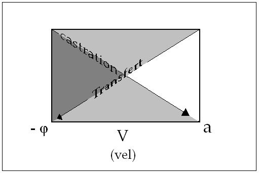

# Leçon 10 | 21 Février 1968

  <label><input type="checkbox" data-lacan-toggle="original" checked> 原文</label>
  <label><input type="checkbox" data-lacan-toggle="notes" checked> 注释</label>
  <label><input type="checkbox" data-lacan-toggle="commentary" checked> 个人解读评论</label>

<section class="parallel-paragraph" data-paragraph-ids="s15-10-0001">

s15-10-0001

[无对应译文]

原文 · s15-10-0001

Il va paraître ces jours-ci une petite revue[^70] que je n’ai pas charge de vous présenter. Vous la trouverez dans la nature \- *de Saint Germain des Prés* - dans quelques jours. Vous y verrez un certain nombre de traits qui lui seront particuliers, au premier rang desquels le fait qu’à part les miens, pour des raisons que j’explique, les articles n’y sont pas signés.

</section>

<section class="parallel-paragraph" data-paragraph-ids="s15-10-0002">

s15-10-0002

[无对应译文]

原文 · s15-10-0002

Le fait a étonné et fait quelque bruit, naturellement, principalement là où il aurait dû être saisi presque immédiatement, je veux dire auprès de ceux qui, jusqu’ici, ont été seuls à avoir l’information que c’est ainsi que les articles paraîtraient, je veux dire non seulement des psychanalystes mais même mieux encore, des personnes qui sont membres de mon école et qui à ce titre devraient peut-être avoir l’oreille un peu dressée à ce qui se dit ici.

</section>

<section class="parallel-paragraph" data-paragraph-ids="s15-10-0003">

s15-10-0003

[无对应译文]

原文 · s15-10-0003

Enfin, j’espère qu’après ce qui vient dans l’ordre de ce que je vous enseigne, à savoir ce que je vais dire aujourd’hui, l’explication, *le ressort de ce principe* admis, que les articles n’y seront pas signés, vous paraîtra peut-être mieux, puisqu’il semble qu’il se rencontre peu de gens capables de faire le petit pas d’avance, encore qu’il soit déjà indiqué, si l’on peut dire, par toute la marche qui précède.

</section>

<section class="parallel-paragraph" data-paragraph-ids="s15-10-0004">

s15-10-0004

[无对应译文]

原文 · s15-10-0004

La chose piquante est évidemment que, dans ce petit bulletin d’information, encore qu’il ait été expressément précisé que ces articles non signés, cela ne voulait pas dire qu’on ne connaîtrait pas les auteurs puisqu’il était expressément dit que lesdits auteurs apparaîtraient sous forme d’une liste en fin de chaque année, le terme d’« *articles non signés* » a été aussitôt, par certaines oreilles - oreilles *dans le genre conque marine* d’où il sort des choses - singulièrement entendu : que c’était la fonction de l’anonymat. Je vous passe tout ce qui a pu sortir à ce propos. Car bien sûr, si j’ai fait communication à certains de la chose uniquement à titre en quelque sorte *instructif*, à savoir comment une chose peut être transformée en une autre, il n’y a évidemment de pire surdité que quand on ne veut pas entendre la première fois.

</section>

<section class="parallel-paragraph" data-paragraph-ids="s15-10-0005">

s15-10-0005

[无对应译文]

原文 · s15-10-0005

Il y en a d’autres qui ont été plus loin et qui, dans des correspondances abondantes, personnelles, m’ont fait entendre à quel point cet usage de l’anonymat représentait une façon d’utiliser ses collaborateurs comme des employés.

</section>

<section class="parallel-paragraph" data-paragraph-ids="s15-10-0006">

s15-10-0006

[无对应译文]

原文 · s15-10-0006

Cela se fait, paraît-il, dans certaines revues qui ne sont d’ailleurs pas plus mal faites ni plus mal placées pour cela.

</section>

<section class="parallel-paragraph" data-paragraph-ids="s15-10-0007">

s15-10-0007

[无对应译文]

原文 · s15-10-0007

Mais enfin, du dehors, c’est comme ça qu’on se permet de qualifier le fait que, par exemple dans des revues de critique où il n’est pas d’usage que *le critique* mette son nom, ils ne sont, paraît-il, que des employés de la direction.

</section>

<section class="parallel-paragraph" data-paragraph-ids="s15-10-0008">

s15-10-0008

[无对应译文]

原文 · s15-10-0008

À ce titre, qui sait jusqu’où va la notion d’employé ! Enfin, comme on dit, j’en ai entendu tout ce qu’on peut entendre, comme chaque fois que j’ai à obtenir une réponse au niveau d’une innovation dans quelque chose qui est extrêmement important et justement qui est ce qui commence à venir en avant aujourd’hui, à la suite de

</section>

<section class="parallel-paragraph" data-paragraph-ids="s15-10-0009">

s15-10-0009

[无对应译文]

原文 · s15-10-0009

*L’acte psychanalytique*, à savoir ce qui, de cet acte, résulte comme position du sujet dit psychanalyste, précisément en tant que doit lui être affecté ce prédicat, à savoir la consécration de psychanalyste.

</section>

<section class="parallel-paragraph" data-paragraph-ids="s15-10-0010">

s15-10-0010

[无对应译文]

原文 · s15-10-0010

Ceci…

</section>

<section class="parallel-paragraph" data-paragraph-ids="s15-10-0011">

s15-10-0011

[无对应译文]

原文 · s15-10-0011

> si les conséquences que nous en voyons par exemple dans le cas que je viens de vous citer,
>
> sous forme d’une sorte de rabougrissement très évident des facultés de compréhension …si ceci se trouvait en quelque sorte démontré comme inclus dans les prémisses…

</section>

<section class="parallel-paragraph" data-paragraph-ids="s15-10-0012">

s15-10-0012

[无对应译文]

原文 · s15-10-0012

> comme proprement la conséquence de ce qui résulte de l’inscription de l’acte
>
> dans ce que j’ai appelé la consécration sous une forme prédicative …ceci certainement nous soulagerait beaucoup nous-mêmes quant à la compréhension de ce singulier effet que j’ai appelé de rabougrissement, sans vouloir bien sûr pousser plus loin ce qu’on peut en dire au niveau des intéressés eux–mêmes.

</section>

<section class="parallel-paragraph" data-paragraph-ids="s15-10-0013">

s15-10-0013

[无对应译文]

原文 · s15-10-0013

On emploie à l’occasion par exemple le terme « *puéril* » comme si à la vérité ce fût tout à fait à l’enfant qu’on dût se référer quand il s’agit de ces effets. Bien sûr, il arrive, comme on l’a démontré dans de très bons endroits, que les enfants tombent dans la débilité mentale du fait de l’action des adultes. Ce n’est tout de même pas à *une explication comme celle-là* que nous devons nous référer dans le cas en cause, à savoir celui des psychanalystes.

</section>

<section class="parallel-paragraph" data-paragraph-ids="s15-10-0014">

s15-10-0014

[无对应译文]

原文 · s15-10-0014

Alors reprenons ce qu’il en est de *l’acte psychanalytique* et posons bien que, aujourd’hui, nous allons essayer d’avancer dans ce sens qui est celui de *l’acte psychanalytique*. N’oublions pas les premiers pas que nous avons faits autour de son explication, à savoir qu’il est essentiellement comme s’inscrivant dans *un effet de langage*. Assurément à cette occasion nous avons pu nous apercevoir ou tout au moins rappeler qu’il en est ainsi pour tout acte, mais bien sûr ce n’est pas là ce qui le spécifie.

</section>

<section class="parallel-paragraph" data-paragraph-ids="s15-10-0015">

s15-10-0015

[无对应译文]

原文 · s15-10-0015

Nous avons développé ce qu’il en est, comment s’ordonne l’effet de langage en question : *il est, si l’on peut dire, à deux étages*.

</section>

<section class="parallel-paragraph" data-paragraph-ids="s15-10-0016">

s15-10-0016

[无对应译文]

原文 · s15-10-0016

Il suppose la psychanalyse précisément elle-même comme *effet de langage*. Il n’est, en d’autres termes, définissable qu’au minimum à inclure l’acte psychanalytique comme étant défini par l’accomplissement de la psychanalyse elle-même.

</section>

<section class="parallel-paragraph" data-paragraph-ids="s15-10-0017">

s15-10-0017

[无对应译文]

原文 · s15-10-0017

Et nous avons montré ici…

</section>

<section class="parallel-paragraph" data-paragraph-ids="s15-10-0018">

s15-10-0018

[无对应译文]

原文 · s15-10-0018

> il nous faut une fois de plus, si l’on peut dire, redoubler la division …c’est à savoir que cette psychanalyse, précisément, ne saurait *s’instaurer* sans un acte, sans l’acte de celui qui, si je puis dire, en autorise la possibilité, sans l’acte du psychanalyste et qu’à l’intérieur de *cet acte qu’est la psychanalyse*, *la tâche psychanalysante* s’inscrit à l’intérieur de cet acte. Et déjà vous voyez apparaître en quelque sorte cette première *structure d’enveloppement*.

</section>

<section class="parallel-paragraph" data-paragraph-ids="s15-10-0019">

s15-10-0019

[无对应译文]

原文 · s15-10-0019

Mais ce dont il s’agit…

</section>

<section class="parallel-paragraph" data-paragraph-ids="s15-10-0020">

s15-10-0020

[无对应译文]

原文 · s15-10-0020

> et c’est ce sur quoi, et d’ailleurs, ce n’est pas la première fois que j’insiste : cette distinction au sein même de l’acte …c’est de l’acte par quoi un sujet donne à cet acte singulier sa conséquence la plus étrange, à savoir qu’il soit lui-même celui qu’il institue, autrement dit qu’il se pose comme psychanalyste.

</section>

<section class="parallel-paragraph" data-paragraph-ids="s15-10-0021">

s15-10-0021

[无对应译文]

原文 · s15-10-0021

Or ceci ne se passe pas sans devoir *retenir* à beaucoup de prix *notre attention* puisque précisément ce dont il s’agit, c’est que cette position il la prenne, que cet acte en somme il le répète, sachant fort bien ce qu’il en est de la suite de cet acte, qu’il se fasse le tenant de ce dont il connaît l’aboutissant, à savoir : *qu’à se mettre à la place qui est celle de l’analyste, il en viendra* *en fin à être, sous la forme du (a), cet objet rejeté, cet objet où se spécifie tout le mouvement de la psychanalyse, à savoir celui qui vient à la fin* *à venir à la place du psychanalyste, pour autant qu’ici le sujet décisivement se sépare, se reconnaît pour être causé par l’objet en question.*

</section>

<section class="parallel-paragraph" data-paragraph-ids="s15-10-0022">

s15-10-0022

[无对应译文]

原文 · s15-10-0022

Causé en quoi ? Causé dans sa division de sujet, pour autant qu’à la fin de la psychanalyse il reste marqué de cette béance qui est la sienne et qui se définit dans la psychanalyse par le terme de castration. Voilà tout au moins *le schéma* :

</section>

<section class="parallel-paragraph" data-paragraph-ids="s15-10-0023">

s15-10-0023

[无对应译文]

原文 · s15-10-0023

</section>

<section class="parallel-paragraph" data-paragraph-ids="s15-10-0024">

s15-10-0024

[无对应译文]

原文 · s15-10-0024

mais bien sûr commenté, pas simplement résumé comme je le fais pour l’instant, que j’ai donné de ce qu’il en est du résultat, de l’effet de la psychanalyse. Et je vous l’ai marqué au tableau comme représenté dans ce qui se passe au terme du double mouvement de la psychanalyse, marqué dans cette ligne par *le transfert* et dans celle–ci très précisément par ce qui s’appelle *la castration*, et qui arrive, à la fin, dans cette disjonction par V : le *vel* du -ϕ et du *(a)*, qui est ici, et qui vient à la place où \- au terme de l’analyse - vient *le psychanalyste* par l’opération du psychanalysant, opération donc qu’il a autorisée en quelque sorte sachant quel est son terme, et opération dont il s’institue lui-même, vous ai-je dit, être l’aboutissant, malgré, si l’on peut dire, le savoir qu’il a de ce qu’il en est de ce terme.

</section>

<section class="parallel-paragraph" data-paragraph-ids="s15-10-0025">

s15-10-0025

[无对应译文]

原文 · s15-10-0025

Ici, l’ouverture reste, si l’on peut dire, béante, de comment peut s’opérer - comment allons-nous l’appeler ? - ce « *saut* », ou encore, comme je l’ai fait dans un texte à proprement parler de *proposition*[^71] d’explorer ce qu’il en est de ce « *saut* », ce que j’ai appelé plus simplement *la passe*. Jusqu’à ce que nous y ayons vu de plus près, il n’y a rien de plus à en dire sinon qu’il est très précisément - ce saut bien sûr - ce saut… *beaucoup de choses sont faites, on peut dire qu’en somme tout est fait*, dans *l’ordination de la psychanalyse* pour dissimuler que c’est un « *saut* ».

</section>

<section class="parallel-paragraph" data-paragraph-ids="s15-10-0026">

s15-10-0026

[无对应译文]

原文 · s15-10-0026

On fera tout - à l’occasion, on en fera même un saut - à la condition que, sur ce qu’il y a à franchir, il y ait une espèce de couverture tendue qui ne fasse pas voir que c’est un « *saut* ». C’est encore le meilleur cas.

</section>

<section class="parallel-paragraph" data-paragraph-ids="s15-10-0027">

s15-10-0027

[无对应译文]

原文 · s15-10-0027

C’est tout de même mieux que de mettre une *petite passerelle* bien commode qui alors n’en fait plus un « *saut* » du tout.

</section>

<section class="parallel-paragraph" data-paragraph-ids="s15-10-0028">

s15-10-0028

[无对应译文]

原文 · s15-10-0028

Mais tant que la chose n’aura pas effectivement été interrogée, mise en question, dans l’analyse…

</section>

<section class="parallel-paragraph" data-paragraph-ids="s15-10-0029">

s15-10-0029

[无对应译文]

原文 · s15-10-0029

> et pourquoi aller plus longtemps pour dire que ma thèse est très précisément que toute l’ordination,
>
> ai-je dit tout à l’heure, de ce qui se fait, de ce qui existe dans la psychanalyse, est faite pour que cette exploration, cette interrogation n’ait pas lieu …tant qu’effectivement elle n’aura pas eu lieu, nous ne pouvons pas en dire quoi que ce soit de plus que ce qui ne se dit nulle part parce que, à la vérité, il nous est impossible d’en parler tout seul.

</section>

<section class="parallel-paragraph" data-paragraph-ids="s15-10-0030">

s15-10-0030

[无对应译文]

原文 · s15-10-0030

Par contre, il est fort aisé de désigner un certain nombre de points, un certain nombre de choses comme étant, selon toute apparence, les conséquences du fait que ce « *saut* » est mis entre parenthèses. Interrogez par exemple ce qu’il en est des effets, si l’on peut dire, de la consécration, je ne dirai pas officielle mais officiale, de la consécration comme office, …de ce qu’est un sujet avant et après ce « *saut* » présumé accompli.

</section>

<section class="parallel-paragraph" data-paragraph-ids="s15-10-0031">

s15-10-0031

[无对应译文]

原文 · s15-10-0031

Voilà aussi bien quelque chose qui, après tout, vaut question, par exemple, et qui vaut de rendre la question plus pressante.

</section>

<section class="parallel-paragraph" data-paragraph-ids="s15-10-0032">

s15-10-0032

[无对应译文]

原文 · s15-10-0032

Je veux dire qui ne vaut pas seulement question, mais qui est prélude à réponse, *insistance* - si l’on peut dire - *de la question*.

</section>

<section class="parallel-paragraph" data-paragraph-ids="s15-10-0033">

s15-10-0033

[无对应译文]

原文 · s15-10-0033

Si bien sûr il s’avère par exemple qu’à mesure même de la durée de ce que j’ai appelé « *la consécration dans l’office* », *quelque chose* vient à s’opacifier de fondamental concernant ce qu’il en est effectivement des *présupposés nécessaires* de *l’acte psychanalytique*.

</section>

<section class="parallel-paragraph" data-paragraph-ids="s15-10-0034">

s15-10-0034

[无对应译文]

原文 · s15-10-0034

À savoir ce sur quoi j’ai terminé la dernière fois, en le désignant d’être à sa façon ce que nous appelons un « *acte de foi* ».

</section>

<section class="parallel-paragraph" data-paragraph-ids="s15-10-0035">

s15-10-0035

[无对应译文]

原文 · s15-10-0035

*Acte de foi*, ai-je dit, *dans le sujet supposé savoir* et précisément *d’un sujet* qui vient d’apprendre ce qu’il en est du *sujet supposé savoir*, au moins dans une opération exemplaire qui est celle de la psychanalyse. À savoir que loin que d’aucune façon puisse s’asseoir la psychanalyse comme il s’en est fait jusqu’ici de tout ce qui est énoncé d’une science, je veux dire ce moment où, d’une science, l’acquis passe au stade enseignable, autrement dit professoral, tout ce qui d’une science est énoncé ne met jamais en question ce qu’il en était avant que le savoir surgisse : qui le savait ?

</section>

<section class="parallel-paragraph" data-paragraph-ids="s15-10-0036">

s15-10-0036

[无对应译文]

原文 · s15-10-0036

*La chose n’est même venue*, je dois dire, *à l’idée de personne, parce que ça va tellement de soi qu’il y avait, avant, ce* *sujet supposé savoir*.

</section>

<section class="parallel-paragraph" data-paragraph-ids="s15-10-0037">

s15-10-0037

[无对应译文]

原文 · s15-10-0037

L’énoncé de la science, en principe la plus athéiste, est tellement sur ce point fermement *théiste* - car est–ce autre chose que ce *sujet supposé savoir* ? - qu’à la vérité je ne connais rien de sérieux qui ait été avancé dans ce registre *avant* que la psychanalyse elle-même nous pose la question.

</section>

<section class="parallel-paragraph" data-paragraph-ids="s15-10-0038">

s15-10-0038

[无对应译文]

原文 · s15-10-0038

À savoir proprement ceci - qui est intenable - que le *sujet supposé savoir* préexiste à son opération, quand cette opération consiste précisément en *la répartition* entre ces deux partenaires de ce dont il s’agit quant à ce qui s’y opère, à savoir ce que je vous ai appris à articuler, à isoler dans *La logique du fantasme*, ces deux termes qui sont le S et le *(a)*, pour autant qu’au terme idéal de la psychanalyse, psychanalyse que j’appellerai « *finie* » s’entend…

</section>

<section class="parallel-paragraph" data-paragraph-ids="s15-10-0039">

s15-10-0039

[无对应译文]

原文 · s15-10-0039

> et sachez bien qu’ici je laisse entre parenthèses l’accent que ce terme peut recevoir dans son usage en *mathématiques*, à savoir au niveau de *la théorie des ensembles*, de ce pas qui se fait du niveau où il s’agit d’un ensemble fini à celui où l’on peut traiter par des moyens éprouvés, inaugurés au niveau des ensembles finis, un ensemble qui ne l’est pas, mais pour l’instant tenons-nous en à la psychanalyse finie …disons qu’à la fin :

</section>

<section class="parallel-paragraph" data-paragraph-ids="s15-10-0040">

s15-10-0040

[无对应译文]

原文 · s15-10-0040

- *le psychanalysant*, nous n’allons pas dire qu’il est tout sujet puisque précisément il n’est *pas tout,* d’être divisé. Ce qui ne veut même pas dire que nous puissions dire pour autant qu’il est deux, mais qu’il est seulement sujet et qu’il n’est pas, ce sujet divisé, qu’il n’est *pas sans*…

</section>

<section class="parallel-paragraph" data-paragraph-ids="s15-10-0041">

s15-10-0041

[无对应译文]

原文 · s15-10-0041

> selon la formule à l’usage de laquelle j’ai rompu ces quelques-uns qui m’entendent, au temps où je faisais le séminaire sur *L’angoisse* \[1962-63\]
>
> …qu’il n’est *pas sans* cet objet enfin rejeté à la place préparée par la présence du psychanalyste pour qu’il se situe dans cette relation de cause de *sa division de sujet*.

</section>

<section class="parallel-paragraph" data-paragraph-ids="s15-10-0042">

s15-10-0042

[无对应译文]

原文 · s15-10-0042

- Et que d’autre part, *l’analyste*, lui, nous ne dirons pas plus qu’il est tout objet, qu’il n’est pourtant au terme seulement que cet objet rejeté, que c’est bien là que gît ce je ne sais quel mystère que recèle en somme ce que connaissent bien tous les praticiens, à savoir ce qui s’établit enfin, au niveau de la relation humaine comme

</section>

<section class="parallel-paragraph" data-paragraph-ids="s15-10-0043">

s15-10-0043

[无对应译文]

原文 · s15-10-0043

> on s’exprime, après le terme, entre celui qui a suivi le chemin de la psychanalyse et *celui qui s’y est fait son guide*.

</section>

<section class="parallel-paragraph" data-paragraph-ids="s15-10-0044">

s15-10-0044

[无对应译文]

原文 · s15-10-0044

La question de savoir comment quelqu’un peut être reconnu autrement que par les propres chemins dont il est assuré…

</section>

<section class="parallel-paragraph" data-paragraph-ids="s15-10-0045">

s15-10-0045

[无对应译文]

原文 · s15-10-0045

> c’est-à-dire reconnu, autrement que par lui-même, être qualifié pour cette opération …est une question, après tout, qui n’est pas spéciale à la psychanalyse. Elle se résout habituellement, comme dans la psychanalyse, par *l’élection* ou par *une certaine forme de choix*, de toute façon.

</section>

<section class="parallel-paragraph" data-paragraph-ids="s15-10-0046">

s15-10-0046

[无对应译文]

原文 · s15-10-0046

Vu du point de perspective que nous essayons d’établir, élection ou choix, tout cela se résume être dans le fond à peu près du même ordre, du moment que ça suppose toujours intact, non mis en question, le *sujet supposé savoir*. Dans les formes d’élection que les aristocrates déclarent être les plus stupides, à savoir les *élections démocratiques*, on ne voit pas pourquoi elles seraient plus stupides que les autres, simplement *ça suppose que « la base »* comme on dit, le votant, l’élément, *en sait un bout*.

</section>

<section class="parallel-paragraph" data-paragraph-ids="s15-10-0047">

s15-10-0047

[无对应译文]

原文 · s15-10-0047

Ça ne peut pas reposer sur autre chose. C’est à son niveau qu’on met le *sujet supposé savoir*. Vous voyez que tant que le *sujet supposé savoir* est là, les choses sont toujours très simples, surtout à partir du moment où on le met en question, parce que si on le met en question, celui qu’on maintient pourtant dans un certain nombre d’opérations, ça devient beaucoup moins important de savoir *où on le met*, et on ne voit pas, en effet, pourquoi on ne le mettrait pas au niveau de tout le monde.

</section>

<section class="parallel-paragraph" data-paragraph-ids="s15-10-0048">

s15-10-0048

[无对应译文]

原文 · s15-10-0048

C’est bien pour cela que l’Église, elle, est depuis longtemps l’institution la plus démocratique, à savoir : tout se passe par élection, c’est que, elle, elle a le *Saint-Esprit*. Le *Saint-Esprit* est une notion infiniment *moins bête* que celle du *sujet supposé savoir*.

</section>

<section class="parallel-paragraph" data-paragraph-ids="s15-10-0049">

s15-10-0049

[无对应译文]

原文 · s15-10-0049

Il n’y a qu’une différence, à ce niveau, à faire valoir en faveur du *sujet supposé savoir*, c’est que le *sujet supposé savoir*, dans l’ensemble, on ne s’aperçoit pas qu’il est toujours là, de sorte qu’on n’est pas fautif à le maintenir.

</section>

<section class="parallel-paragraph" data-paragraph-ids="s15-10-0050">

s15-10-0050

[无对应译文]

原文 · s15-10-0050

C’est à partir du moment où il peut être mis en question qu’on peut soulever des catégories que je viens, histoire de vous chatouiller l’oreille, de sortir sous *le terme* - qui bien sûr ne peut aucunement être suffisant - *de la* *bêtise.*

</section>

<section class="parallel-paragraph" data-paragraph-ids="s15-10-0051">

s15-10-0051

[无对应译文]

原文 · s15-10-0051

Ce n’est pas parce qu’on s’obstine *qu’on est bête*, c’est quelquefois parce qu’on ne sait pas quoi faire.

</section>

<section class="parallel-paragraph" data-paragraph-ids="s15-10-0052">

s15-10-0052

[无对应译文]

原文 · s15-10-0052

Pour ce qu’il en est du *Saint–Esprit*, je vous fais remarquer que c’est une fonction beaucoup plus élaborée, dont je ne ferai pas aujourd’hui la théorie, mais dont il est tout de même possible, *pour quiconque a un peu réfléchi - enfin essayé -* sur ce qu’il en est de *la fonction de la trinité chrétienne*, de trouver des équivalents tout à fait précis quant aux fonctions que la psychanalyse permet d’élaborer, et tout à fait spécialement celles que j’ai mises en valeur dans un certain de mes articles,

</section>

<section class="parallel-paragraph" data-paragraph-ids="s15-10-0053">

s15-10-0053

[无对应译文]

原文 · s15-10-0053

> celui sur les *Questions préalables à tout traitement possible des psychoses* \[*Écrits*, p.531\] …sous le terme du Φ, seulement précisément le Φ *n’est pas une position très tenable* sinon dans les catégories de la psychose.

</section>

<section class="parallel-paragraph" data-paragraph-ids="s15-10-0054">

s15-10-0054

[无对应译文]

原文 · s15-10-0054

Laissons *pointer* en quelque sorte, ce détour qui a bien son intérêt et revenons au transfert pour, une fois de plus, mais c’est ici aujourd’hui très nécessaire, articuler combien, puisque je l’ai introduit comme constituant de l’acte psychanalytique, \[cet acte analytique\] il est essentiel à la configuration comme telle du transfert. Bien sûr, si on n’introduit pas le *sujet supposé savoir*, *le transfert* se maintient dans toute son opacité. Mais, à partir du moment où *la notion du sujet supposé savoir comme fondamentale*, et la *fracture,* si je puis dire, qu’il subit dans la psychanalyse, sont mises au jour, *le transfert* s’éclaire singulièrement.

</section>

<section class="parallel-paragraph" data-paragraph-ids="s15-10-0055">

s15-10-0055

[无对应译文]

原文 · s15-10-0055

Ce qui bien sûr, alors, prend toute sa valeur de faire un regard en arrière et de nous apercevoir comment, par exemple, chaque fois qu’il s’agit du transfert, les auteurs, les bons, les honnêtes…

</section>

<section class="parallel-paragraph" data-paragraph-ids="s15-10-0056">

s15-10-0056

[无对应译文]

原文 · s15-10-0056

> et je dois dire qu’il y en a beaucoup de cet ordre, ils font bien tout ce qu’ils peuvent …évoqueront que la notion, la distance prise qui a permis l’instauration du transfert dans notre théorie, ne remonte à rien de moins qu’à ce moment précis où, comme vous le savez, *au sortir d’une séance triomphante d’hypnose d’une patiente*, elle lui jette - nous dit FREUD - ses bras autour de son cou[^72]. Qu’est-ce que c’est que ça ?

</section>

<section class="parallel-paragraph" data-paragraph-ids="s15-10-0057">

s15-10-0057

[无对应译文]

原文 · s15-10-0057

Bien sûr on s’arrête, on s’émerveille, c’est à savoir que FREUD ne s’est pas ému pour autant : « *Elle me prend pour un autre.* »

</section>

<section class="parallel-paragraph" data-paragraph-ids="s15-10-0058">

s15-10-0058

[无对应译文]

原文 · s15-10-0058

Traduit-on la façon dont d’ailleurs FREUD s’exprime : « *Je ne suis pas « unwiderstehlich », irrésistible à ce point, il y a quelque chose d’autre.* ». On s’émerveille, comme s’il y avait là, je veux dire à ce niveau-là, à s’émerveiller : *Ce n’est peut-être pas tellement que* FREUD - *comme il s’exprime dans son humour propre* - *ne se soit pas cru l’objet qui est en question,* *Ce n’est pas qu’on se croie ou qu’on ne se croie pas l’objet*, c’est que quand il s’agit de ça, *à savoir de l’amour*, on se croit dans le coup.

</section>

<section class="parallel-paragraph" data-paragraph-ids="s15-10-0059">

s15-10-0059

[无对应译文]

原文 · s15-10-0059

En d’autres termes, *on a cette sorte de complaisance qui*, si peu que ce soit, vous englue dans cette mélasse qu’on appelle l’amour.

</section>

<section class="parallel-paragraph" data-paragraph-ids="s15-10-0060">

s15-10-0060

[无对应译文]

原文 · s15-10-0060

Car enfin, pour l’instant, on fait comme ça toutes espèces d’*opérations*, d’*arabesques* autour de ce qu’il faut penser du transfert.

</section>

<section class="parallel-paragraph" data-paragraph-ids="s15-10-0061">

s15-10-0061

[无对应译文]

原文 · s15-10-0061

Nous en voyons faire preuve de courage et dire : « *Mais comment donc, le transfert, ne rejetons pas tout du côté de l’analysé* - comme on s’exprime - *nous y sommes aussi pour quelque chose.*»

</section>

<section class="parallel-paragraph" data-paragraph-ids="s15-10-0062">

s15-10-0062

[无对应译文]

原文 · s15-10-0062

Et en effet ! Et comment que nous y sommes pour quelque chose ! Et que la situation analytique y est pour un bout !

</section>

<section class="parallel-paragraph" data-paragraph-ids="s15-10-0063">

s15-10-0063

[无对应译文]

原文 · s15-10-0063

À partir de là, autre excès : *c’est la situation analytique qui détermine tout, hors de la situation analytique, il n’y a pas de transfert.*

</section>

<section class="parallel-paragraph" data-paragraph-ids="s15-10-0064">

s15-10-0064

[无对应译文]

原文 · s15-10-0064

Enfin vous connaissez là toute la variété, la gamme, la ronde qui se fait, où chacun rivalise de montrer un peu plus de liberté d’esprit que les autres.

</section>

<section class="parallel-paragraph" data-paragraph-ids="s15-10-0065">

s15-10-0065

[无对应译文]

原文 · s15-10-0065

Et puis il y a des choses très étranges aussi, une personne qui - lors d’un dernier congrès où il s’agissait de choses qu’on a mises en question lors de la réunion fermée ici - voulait savoir à quel moment, à propos de l’acte psychanalytique, j’allais raccorder tout cela au *passage à l’acte* et à l’*acting out *: bien sûr que je vais le faire ! À la vérité, la personne[^73] qui a le mieux articulé cette question est quelqu’un qui - comme ça, par exception - se souvient de ce que j’ai pu déjà articuler là-dessus un certain 23 Janvier 1963 \[séminaire 1962-63 : « *L’angoisse* »\].

</section>

<section class="parallel-paragraph" data-paragraph-ids="s15-10-0066">

s15-10-0066

[无对应译文]

原文 · s15-10-0066

L’auteur[^74], dont je commençais d’introduire tout à l’heure la personnalité, est un auteur qui, à propos de l’*acting out*…

</section>

<section class="parallel-paragraph" data-paragraph-ids="s15-10-0067">

s15-10-0067

[无对应译文]

原文 · s15-10-0067

> personne ne lui demandait à proprement parler de faire sur ce sujet une petite leçon sur le transfert …fait une leçon sur le transfert, selon ce type d’article qui maintenant se répand de plus en plus : on articule sur le transfert des choses qui ne se concevraient même pas si *le discours de Lacan* n’existait pas.

</section>

<section class="parallel-paragraph" data-paragraph-ids="s15-10-0068">

s15-10-0068

[无对应译文]

原文 · s15-10-0068

D’ailleurs on le consacre \[l’article\] à démontrer que, par exemple, telle formulation que LACAN dans son rapport *Fonction et champ de la parole et du langage* \[*Écrits*, p.237\] a avancée, à savoir que *l’inconscient*, par exemple, c’est quelque chose qui manque au discours et qu’il faudra en quelque sorte suppléer, compléter dans l’histoire, que l’histoire se rétablisse dans sa complétude pour que - *etc., etc.,* - se lève *le symptôme*, et naturellement on ricane :

</section>

<section class="parallel-paragraph" data-paragraph-ids="s15-10-0069">

s15-10-0069

[无对应译文]

原文 · s15-10-0069

- « *Ce serait si beau si c’était comme ça, chacun sait qu’une hystérique, ce n’est pas parce qu’elle se souvient que tout s’arrange.* »

</section>

<section class="parallel-paragraph" data-paragraph-ids="s15-10-0070">

s15-10-0070

[无对应译文]

原文 · s15-10-0070

Ça dépend des cas, d’ailleurs, mais qu’importe ! On poursuit pour montrer à quel point est plus complexe ce dont il s’agit dans le discours analytique, et qu’il faut y distinguer ceci qui n’est pas simplement - dit-on ou croit-on s’armer contre moi - *structure de l’énoncé*, mais qu’il y a aussi de savoir *à quoi ça sert*, à savoir si on dit ou non la vérité et que, quelquefois, mentir c’est à proprement parler la façon dont le sujet annonce la vérité de son désir parce que, justement, il n’y a pas d’autre biais que de l’annoncer du mensonge.

</section>

<section class="parallel-paragraph" data-paragraph-ids="s15-10-0071">

s15-10-0071

[无对应译文]

原文 · s15-10-0071

Cette chose, qui a été écrite il n’y a pas très longtemps, vous le voyez, consiste très précisément à ne dire très strictement que des choses que j’ai articulées de la façon la plus expresse. Si j’ai tout à l’heure annoncé ce séminaire du 23 Janvier 1963, c’est que c’est très exactement ce que j’ai dit de la fonction d’un certain type d’énoncés de l’inconscient, pour autant que l’énonciation qui s’y implique est proprement celle du mensonge, à savoir le point que FREUD lui-même a pointé du doigt dans le cas de l’homosexualité féminine[^75].

</section>

<section class="parallel-paragraph" data-paragraph-ids="s15-10-0072">

s15-10-0072

[无对应译文]

原文 · s15-10-0072

Et que c’est ainsi précisément que le désir s’exprime et se situe, et que ce qui est avancé à ce propos comme étant le registre où joue dans son originalité l’interprétation analytique…

</section>

<section class="parallel-paragraph" data-paragraph-ids="s15-10-0073">

s15-10-0073

[无对应译文]

原文 · s15-10-0073

- à savoir justement ce qui fait que d’aucune façon n’est posable dans une espèce d’antériorité qui aurait pu être sue, ce qui est révélé par l’intervention proprement interprétative,

</section>

<section class="parallel-paragraph" data-paragraph-ids="s15-10-0074">

s15-10-0074

[无对应译文]

原文 · s15-10-0074

- à savoir ce qui fait du transfert bien autre chose qu’objet déjà là, déjà en quelque sorte inscrit dans tout ce qu’il va produire, pure et simple répétition de quelque chose qui déjà de l’antérieur ne ferait qu’attendre de s’y exprimer au lieu d’être produit de son effet rétroactif.

</section>

<section class="parallel-paragraph" data-paragraph-ids="s15-10-0075">

s15-10-0075

[无对应译文]

原文 · s15-10-0075

Bref tout ce que j’ai dit là depuis trois ans et dont, bien entendu, il ne faut pas croire que ça ne fait pas quand même son petit chemin, comme ça, par *imbibition*, de découvrir dans un second temps, en ne se souvenant que de ce que j’ai dit par exemple dix ans avant et en faisant de la seconde partie objection à la première.

</section>

<section class="parallel-paragraph" data-paragraph-ids="s15-10-0076">

s15-10-0076

[无对应译文]

原文 · s15-10-0076

Bref, on s’arme *à l’occasion* - *et aisément, et ce n’est que trop fréquent* - contre ce que j’énonce, de ce que j’ai pu énoncer *après un certain étagement édifié et parcouru*, de ce que je construis pour vous permettre de vous repérer dans l’expérience analytique.

</section>

<section class="parallel-paragraph" data-paragraph-ids="s15-10-0077">

s15-10-0077

[无对应译文]

原文 · s15-10-0077

Et *on fait objection* de ce que j’ai dit à telle date ultérieure - comme si on l’inventait soi–même - à ce que j’ai dit d’abord…

</section>

<section class="parallel-paragraph" data-paragraph-ids="s15-10-0078">

s15-10-0078

[无对应译文]

原文 · s15-10-0078

> et qui, bien entendu, peut être pris comme partiel, surtout si on l’isole du contexte …mais qui d’ailleurs…

</section>

<section class="parallel-paragraph" data-paragraph-ids="s15-10-0079">

s15-10-0079

[无对应译文]

原文 · s15-10-0079

> au reste pour ce qu’il en est de l’effet de certaines interprétations purement complémentaires,
>
> si l’on peut dire, de tel morceau d’histoire au niveau de l’hystérique …a été effectivement précisé par moi comme fort limité et ne correspondant absolument pas, dès l’époque même où je l’ai articulé, à *cette notion en quelque sorte trop objectivante de l’histoire* qui consisterait à prendre la fonction de l’histoire autrement que comme histoire constituée à partir des préoccupations présentes, c’est-à-dire comme toute espèce d’histoire existante.

</section>

<section class="parallel-paragraph" data-paragraph-ids="s15-10-0080">

s15-10-0080

[无对应译文]

原文 · s15-10-0080

Et très précisément j’ai mis, dans mon discours qui est qualifié « *Discours de Rome* », là–dessus avec assez d’*insistance*, les pieds dans le plat, à savoir qu’aucune espèce de fonction de l’histoire ne s’articule, ne se comprend, sans *l’histoire de l’histoire*, à savoir à partir de quoi l’historien construit.

</section>

<section class="parallel-paragraph" data-paragraph-ids="s15-10-0081">

s15-10-0081

[无对应译文]

原文 · s15-10-0081

Je ne fais, je dois dire, cette remarque… *à propos d’un énoncé qui se présente comme une pauvreté* …que simplement pour désigner ce quelque chose qui n’est après tout pas sans un certain rapport avec ce que j’appelai tout à l’heure la structure de ce qui se passe à propos du pas qui est à faire, de celui que j’essaie de faire franchir *aux psychanalystes*, à savoir ce qui résulte de la mise en question du *sujet supposé savoir*.

</section>

<section class="parallel-paragraph" data-paragraph-ids="s15-10-0082">

s15-10-0082

[无对应译文]

原文 · s15-10-0082

Ce qui en résulte, cela veut dire le mode d’exercice de la question, la formulation d’une logique qui rende maniable quelque chose à partir de la révision nécessaire au niveau de ce préalable, de ce présupposé, de ce préétabli, d’un *sujet supposé savoir* qui ne peut plus être le même, au moins dans un certain champ, celui où ce dont il s’agit c’est de savoir *comment nous pouvons manier le savoir, là, dans un point précis du champ, où il s’agit* non du savoir mais *de quelque chose qui pour nous s’appelle la vérité.*

</section>

<section class="parallel-paragraph" data-paragraph-ids="s15-10-0083">

s15-10-0083

[无对应译文]

原文 · s15-10-0083

Obtenir cette sorte de réponse, là précisément où ma question ne peut être ressentie que pour être la plus gênante parce que précisément toute *l’ordination analytique* est construite très précisément pour masquer cette question sur la fonction à réviser du *sujet supposé savoir*, ce mode très précis de réponse qui consiste, pour n’importe qui sait simplement lire, de façon purement fictive, à décomposer deux temps de mon discours pour n’en faire qu’une opposition de l’un à l’autre…

</section>

<section class="parallel-paragraph" data-paragraph-ids="s15-10-0084">

s15-10-0084

[无对应译文]

原文 · s15-10-0084

> ce qui d’ailleurs est tout à fait impossible à trouver dans la plupart des cas et qui ne résulte que *de la fiction* qui ferait *que l’auteur qui s’exprime aurait découvert lui-même la seconde partie* tandis que je me serais tenu et limité à la première …a ce quelque chose d’assez dérisoire qui somme toute n’est pas sans tenir à ce que l’on peut dire…

</section>

<section class="parallel-paragraph" data-paragraph-ids="s15-10-0085">

s15-10-0085

[无对应译文]

原文 · s15-10-0085

> là aussi, car il faut reconnaître où les choses s’insèrent dans leur réalité …à ce qu’il en est du fond même de la question.

</section>

<section class="parallel-paragraph" data-paragraph-ids="s15-10-0086">

s15-10-0086

[无对应译文]

原文 · s15-10-0086

Car tout à l’heure, qu’ai-je fait quand j’ai parlé du *transfert* pour le ramener à sa simple, *sa misérable origine* ? Si j’ai parlé à ce propos, si mal des termes *de l’amour*, n’est-ce pas parce que ce qui est l’os de *la mise en question que constitue en soi le transfert* :

</section>

<section class="parallel-paragraph" data-paragraph-ids="s15-10-0087">

s15-10-0087

[无对应译文]

原文 · s15-10-0087

- ce n’est *ni qu’il est l’amour* comme certains le disent,

</section>

<section class="parallel-paragraph" data-paragraph-ids="s15-10-0088">

s15-10-0088

[无对应译文]

原文 · s15-10-0088

- *ni qu’il ne l’est pas* comme d’autres l’avanceront volontiers,

</section>

<section class="parallel-paragraph" data-paragraph-ids="s15-10-0089">

s15-10-0089

[无对应译文]

原文 · s15-10-0089

- c’est qu’il met l’amour, si je puis dire, sur la sellette, et précisément de cette façon dérisoire, celle qui nous permet déjà de voir là, dans ce geste de *l’hystérique à la sortie de la capture hypnotique*, de voir ce dont il s’agit, dans ce qui est bien là, au fond, atteint, mais là d’emblée, c’est justement ce par quoi je définis ce qu’il en est de cette chose combien plus riche et instructive, et à la vérité : nouvelle au monde, qui s’appelle la psychanalyse.

</section>

<section class="parallel-paragraph" data-paragraph-ids="s15-10-0090">

s15-10-0090

[无对应译文]

原文 · s15-10-0090

Elle atteint le but tout de suite, l’hystérique : FREUD dont elle suce la pomme, c’est *l’objet(a)*. Chacun sait que c’est là ce qu’il faut à une hystérique, surtout au sortir de l’hypnose où les choses sont en quelque sorte, si l’on peut dire, déblayées.

</section>

<section class="parallel-paragraph" data-paragraph-ids="s15-10-0091">

s15-10-0091

[无对应译文]

原文 · s15-10-0091

Bien sûr, FREUD, et c’est bien là le problème qui se pose à son propos : d’où a-t-il pu mettre en suspens de cette façon radicale ce qu’il en est de l’amour ? Nous pouvons peut-être nous en douter, justement, à repérer ce qu’il en est strictement de *l’opération analytique*.

</section>

<section class="parallel-paragraph" data-paragraph-ids="s15-10-0092">

s15-10-0092

[无对应译文]

原文 · s15-10-0092

Mais la question n’est pas là. De le mettre en suspens lui a permis d’instaurer, de ce court-circuit originel, en effet, qu’il a su étendre jusqu’à lui donner cette place démesurée de toute l’opération analytique dans laquelle se découvre quoi ?

</section>

<section class="parallel-paragraph" data-paragraph-ids="s15-10-0093">

s15-10-0093

[无对应译文]

原文 · s15-10-0093

Tout le drame humain du désir, et à la fin : quoi ? Avec seulement, ce qui n’est pas rien, tout cet immense acquis, tout ce champ nouveau ouvert sur ce qu’il en est de la subjectivation, à la fin : quoi ?

</section>

<section class="parallel-paragraph" data-paragraph-ids="s15-10-0094">

s15-10-0094

[无对应译文]

原文 · s15-10-0094

Mais le même résultat qui était atteint dans ce court instant, à savoir :

</section>

<section class="parallel-paragraph" data-paragraph-ids="s15-10-0095">

s15-10-0095

[无对应译文]

原文 · s15-10-0095

- d’un côté le S, symbolisé par ce moment de l’émergence, ce moment foudroyant de l’entre-deux mondes d’un réveil du sommeil hypnotique,

</section>

<section class="parallel-paragraph" data-paragraph-ids="s15-10-0096">

s15-10-0096

[无对应译文]

原文 · s15-10-0096

- et le *(a)* soudain serré dans les bras de l’hystérique.

</section>

<section class="parallel-paragraph" data-paragraph-ids="s15-10-0097">

s15-10-0097

[无对应译文]

原文 · s15-10-0097

Si le *(a)* lui convient tellement bien, c’est justement parce qu’il est ce dont il s’agit au cœur de tous les habillements de l’amour qui s’y prend, c’est que… je l’ai déjà, il me semble, suffisamment articulé jusqu’à l’illustrer à l’occasion …c’est autour de cet *objet(a)* que s’installent, que s’instaurent, tous les revêtements narcissiques où se supporte l’amour.

</section>

<section class="parallel-paragraph" data-paragraph-ids="s15-10-0098">

s15-10-0098

[无对应译文]

原文 · s15-10-0098

L’hystérique, elle, c’est bien là ce qu’il lui faut, je veux dire ce qui nécessite ce « *je veux* et *je ne veux pas* » qui provient à la fois de la spécificité de cet objet et de son insoutenable nudité, de sorte qu’il est assez amusant, incidemment, de penser…

</section>

<section class="parallel-paragraph" data-paragraph-ids="s15-10-0099">

s15-10-0099

[无对应译文]

原文 · s15-10-0099

> ça nous aidera de le penser parce que ça mettra un certain nombre de choses à leur place …en faisant toute la construction de la psychanalyse, ce FREUD qui jusqu’à la fin de sa vie s’est demandé :

</section>

<section class="parallel-paragraph" data-paragraph-ids="s15-10-0100">

s15-10-0100

[无对应译文]

原文 · s15-10-0100

> « *Que veut une femme ?* » sans trouver la réponse, eh bien justement ça, ce qu’il a fait :

</section>

<section class="parallel-paragraph" data-paragraph-ids="s15-10-0101">

s15-10-0101

[无对应译文]

原文 · s15-10-0101

> « *un psychanalyste *! »

</section>

<section class="parallel-paragraph" data-paragraph-ids="s15-10-0102">

s15-10-0102

[无对应译文]

原文 · s15-10-0102

Au niveau de *l’hystérique* en tout cas, c’est parfaitement *vrai*. Ce que devient le psychanalyste au terme de la psychanalyse, s’il est vrai qu’il se réduise à cet *objet(a)*, c’est exactement ce que veut *l’hystérique*. On comprend pourquoi, *dans la psychanalyse*, l’hystérique guérit de tout sauf de son hystérie ! Ceci, bien sûr, n’est qu’une remarque latérale et dans laquelle vous auriez tort de voir plus de portée que ce sur quoi elle s’inscrit exactement.

</section>

<section class="parallel-paragraph" data-paragraph-ids="s15-10-0103">

s15-10-0103

[无对应译文]

原文 · s15-10-0103

Mais ce qu’il faut voir et ce que, pour rendre sensible à un certain nombre de ceux qui n’écoutent ces choses ici que de façon récente, j’arriverai bien à dire : *mais n’y-a-t-il pas là quelque chose dans cette expulsion de l’objet(a), qui nous évoque* en quelque sorte…

</section>

<section class="parallel-paragraph" data-paragraph-ids="s15-10-0104">

s15-10-0104

[无对应译文]

原文 · s15-10-0104

> puisque la « télé » nous le montre, c’est un petit penchant qu’on prendrait assez volontiers …de trouver des analogies entre ce sur quoi nous opérons et je ne sais quoi qui se trouverait à des niveaux beaucoup plus abyssaux dans la biologie, de ce que, parce qu’il plaît aux biologistes d’exprimer *en termes de messages les termes chromosomiques*, quelqu’un peut en venir…

</section>

<section class="parallel-paragraph" data-paragraph-ids="s15-10-0105">

s15-10-0105

[无对应译文]

原文 · s15-10-0105

> *comme je l’ai entendu récemment, car quand il y a certaines conneries à dire, on peut dire qu’on ne le manque jamais !* …à faire cette découverte : on pourrait, en somme, dire après ça que « *le langage est structuré comme l’inconscient* ».

</section>

<section class="parallel-paragraph" data-paragraph-ids="s15-10-0106">

s15-10-0106

[无对应译文]

原文 · s15-10-0106

Ça ferait plaisir, ça ! Des gens qui croyaient qu’il fallait aller du connu à l’inconnu. Mais là, allons-y ! Allons de l’inconnu au connu. C’est-à-dire que ça se fait aussi beaucoup, ça s’appelle l’occultisme. C’est ce que FREUD appelle le goût pour le *mystische Element*. C’est très précisément la réflexion qu’il s’est faite quand l’hystérique lui a foutu ses bras autour du cou.

</section>

<section class="parallel-paragraph" data-paragraph-ids="s15-10-0107">

s15-10-0107

[无对应译文]

原文 · s15-10-0107

Il parle très précisément à ce moment, du *mystische Element* [^76]. Tout le sens de ce qu’a fait FREUD consiste précisément à s’avancer d’une façon telle qu’on procède contre le *mystische Element* et non pas en en partant.

</section>

<section class="parallel-paragraph" data-paragraph-ids="s15-10-0108">

s15-10-0108

[无对应译文]

原文 · s15-10-0108

Et si FREUD proteste contre la protestation - car c’est exactement cela qu’il fait - qui s’élève autour de lui le jour où il dit qu’un rêve est menteur, il répète à ce moment-là : si ces gens sont révoltés de la façon dont l’inconscient peut être menteur, c’est parce qu’il n’y a rien à faire, quoi que j’aie dit sur le rêve, ils continueront de vouloir y maintenir le *mystische Element,* à savoir que l’inconscient ne peut pas mentir.

</section>

<section class="parallel-paragraph" data-paragraph-ids="s15-10-0109">

s15-10-0109

[无对应译文]

原文 · s15-10-0109

Alors que ça ne nous empêche pas quand même de prendre notre *petite métaphore*, si cet *objet(a)* qu’à la fin de l’analyse il s’agit d’expulser, qui vient prendre la place de l’analyste, ça ne ressemble pas à quelque chose : l’expulsion des globules polaires dans la méiose, autrement dit, dans ce dont se débarrassent les cellules sexuelles dans leur maturation.

</section>

<section class="parallel-paragraph" data-paragraph-ids="s15-10-0110">

s15-10-0110

[无对应译文]

原文 · s15-10-0110

Ce serait élégant, ça ! En somme ce serait de ça qu’il s’agirait, grâce à quoi cette comparaison se poursuit : qu’est-ce que devient là la castration ?

</section>

<section class="parallel-paragraph" data-paragraph-ids="s15-10-0111">

s15-10-0111

[无对应译文]

原文 · s15-10-0111

Mais la castration c’est justement ça, c’est le résultat, c’est la cellule réduite, en quelque sorte. À partir de là, la subjectivation est faite qui va leur permettre d’être, comme on dit, comme Dieu les a faits : mâle et femelle. La castration, ce serait vraiment la préparation de la conjonction de leurs jouissances.

</section>

<section class="parallel-paragraph" data-paragraph-ids="s15-10-0112">

s15-10-0112

[无对应译文]

原文 · s15-10-0112

De temps en temps, comme ça, en marge de la psychanalyse, naturellement ça ne comporte *aucun sérieux* mais enfin il y en a qui rêvent comme ça, et ça, ça a compté, on a dit ça.

</section>

<section class="parallel-paragraph" data-paragraph-ids="s15-10-0113">

s15-10-0113

[无对应译文]

原文 · s15-10-0113

Il n’y a qu’un petit malheur, c’est que nous sommes *au niveau de la subjectivation* de cette fonction de l’homme et de la femme et qu’*au niveau de la subjectivation*, c’est en tant qu’*objet(a)* - cet *objet(a)* expulsé - que va se présenter dans le *réel* celui qui est appelé à être le partenaire sexuel. C’est là que gît la différence entre l’union des gamètes et ce qu’il en est de la réalisation subjective de l’homme et de la femme. Naturellement, on peut voir à ce niveau se précipiter toutes les folles du monde.

</section>

<section class="parallel-paragraph" data-paragraph-ids="s15-10-0114">

s15-10-0114

[无对应译文]

原文 · s15-10-0114

Enfin, Dieu merci, il n’y en a pas trop dans notre champ, de celles qui vont chercher leurs références concernant je ne sais quels prétendus obstacles de la sexualité féminine dans la crainte, une crainte de la pénétration, qu’elle ne soit née au niveau de l’effraction que le spermatozoïde fait dans la capsule de l’ovule.

</section>

<section class="parallel-paragraph" data-paragraph-ids="s15-10-0115">

s15-10-0115

[无对应译文]

原文 · s15-10-0115

Vous voyez que ce n’est pas moi qui pour la première fois agite devant vous…

</section>

<section class="parallel-paragraph" data-paragraph-ids="s15-10-0116">

s15-10-0116

[无对应译文]

原文 · s15-10-0116

> mais pour qu’on s’en distingue, pour qu’on marque bien à ce propos les différences …des fantasmes prétendument biologiques. Quand je dis que c’est dans *l’objet(a)* que sera ensuite retrouvé toujours et nécessairement le partenaire sexuel, là nous voyons surgir l’antique vérité inscrite au coin de *la Genèse*, le fait que le *partenaire*, et Dieu sait que ça ne l’engage à rien, figurait dans *le mythe* comme étant *la côte d’Adam*, donc le *(a)*.

</section>

<section class="parallel-paragraph" data-paragraph-ids="s15-10-0117">

s15-10-0117

[无对应译文]

原文 · s15-10-0117

C’est bien pour ça que ça va si mal depuis ce temps-là, concernant ce qu’il en est de cette perfection qui s’imaginerait comme étant la conjonction de deux jouissances, et qu’à la vérité, bien sûr, c’est de cette première et simple reconnaissance que ressort la nécessité du *médium*, de l’intermédiaire des défilés constitués par le fantasme, à savoir de cette infinie complexité, cette richesse du désir, avec tous ces penchants, toutes ces régions, toute cette carte qui peut se dessiner, tous ces effets au niveau de ces pentes que nous appelons *névrotiques, psychotiques* ou *perverses*, et qui s’insèrent précisément dans cette distance à jamais établie entre les deux jouissances.

</section>

<section class="parallel-paragraph" data-paragraph-ids="s15-10-0118">

s15-10-0118

[无对应译文]

原文 · s15-10-0118

C’est ainsi qu’il est étrange qu’au niveau de l’Église, où ils ne sont pas tellement cons quand même, ils doivent bien s’apercevoir que là, FREUD dit la même chose que ce qu’ils sont présumés savoir être la vérité, depuis le temps qu’ils enseignent qu’il y a quelque chose qui cloche du côté du sexe. Sans ça, à quoi bon ce réseau technique abrutissant ?

</section>

<section class="parallel-paragraph" data-paragraph-ids="s15-10-0119">

s15-10-0119

[无对应译文]

原文 · s15-10-0119

Eh bien, pas du tout, leur préférence dans ce coin-là va nettement à JUNG dont il est clair que sa position est exactement opposée, à savoir que nous rentrons dans la sphère de la gnose, à savoir de l’obligatoire complémentaire du *yin* et du *yang,* de tous les signes que vous voyez tourner l’un autour de l’autre comme si pour toujours ils étaient là pour se conjoindre, *animus* et *anima,* l’essence complète du mâle et du femelle.

</section>

<section class="parallel-paragraph" data-paragraph-ids="s15-10-0120">

s15-10-0120

[无对应译文]

原文 · s15-10-0120

Vous me croyez si vous voulez, les ecclésiastiques préfèrent ça ! J’ouvre la question de savoir si ce n’est pas justement pour ça : si on était dans *le vrai* comme eux, où irait leur magistère ? Ce n’est pas pour l’instant - je ne me livre pas à des excès vains de langage - simplement pour le plaisir de me promener d’une façon incommode dans le champ de ce qu’on appelle l’*aggiornamento* parce que, bien sûr *ce sont des remarques* qu’au point où nous en sommes maintenant *je peux aller faire jusqu’au* Saint-Office. J’y suis allé il n’y a pas longtemps, je vous assure que ce que je leur ai dit les a beaucoup intéressés.

</section>

<section class="parallel-paragraph" data-paragraph-ids="s15-10-0121">

s15-10-0121

[无对应译文]

原文 · s15-10-0121

Je n’ai pas absolument poussé la question jusqu’à leur dire : « *Est-ce que c’est parce que c’est la vérité que ça ne vous plaît pas ?*

</section>

<section class="parallel-paragraph" data-paragraph-ids="s15-10-0122">

s15-10-0122

[无对应译文]

原文 · s15-10-0122

*La vérité que vous savez être la vérité.* »

</section>

<section class="parallel-paragraph" data-paragraph-ids="s15-10-0123">

s15-10-0123

[无对应译文]

原文 · s15-10-0123

Je leur ai laissé le temps de s’y faire. Si je vous en parle ici, c’est pourquoi ? C’est pour vous dire que ce qui est si gênant

</section>

<section class="parallel-paragraph" data-paragraph-ids="s15-10-0124">

s15-10-0124

[无对应译文]

原文 · s15-10-0124

Peut-être au niveau du pouvoir, dans certains côtés où on a quand même un petit peu plus de bouteille que chez nous, ça peut être quelque chose aussi peut-être du même ordre que ce qui peut se passer au niveau de cette espèce de principauté bizarre, de Monaco, de la vérité qui s’appelle *Association Psychanalytique Internationale*. Il peut y avoir des effets du même ordre.

</section>

<section class="parallel-paragraph" data-paragraph-ids="s15-10-0125">

s15-10-0125

[无对应译文]

原文 · s15-10-0125

Ce n’est pas toujours si commode de savoir bien exactement ce qu’on fait, d’autant plus qu’en fin de compte, peut-être pouvons-nous mettre les points sur les « i » sur un certain nombre de choses, à savoir que l’aventure analytique, si loin qu’elle ait permis d’articuler les choses, très précisément ce qui s’appelle l’inconscient, le désir humain est peut-être d’apporter quelque chose qui redonne son regain à ce qui a commencé dans une certaine pente de crétinisation qui est celle qui s’est accompagnée de l’idée de progrès obligatoire à la traîne de la science.

</section>

<section class="parallel-paragraph" data-paragraph-ids="s15-10-0126">

s15-10-0126

[无对应译文]

原文 · s15-10-0126

Ce regain de vérité, il faudra voir où il se situe, je veux dire si c’est ainsi que se définit l’expérience analytique d’instaurer ces défilés, d’instaurer cette formidable production qui s’installe où ? Mais dans une béance qui n’est pas du tout constituée par la castration elle-même, dont la castration, bien sûr, est le signe, et je dirai enfin le tempérament le plus juste, la solution la plus élégante. Mais il n’en reste pas moins quoi ? Mais que nous savons très bien que la jouissance, elle, reste en dehors. Nous ne savons pas un mot de plus concernant ce qu’il en est de la jouissance féminine.

</section>

<section class="parallel-paragraph" data-paragraph-ids="s15-10-0127">

s15-10-0127

[无对应译文]

原文 · s15-10-0127

Ce n’est pas une question qui date d’hier pourtant : il y avait déjà un certain JUPITER, par exemple, *sujet supposé savoir*, *il ne savait pas ça*. Il a demandé à TIRÉSIAS. Chose formidable, TIRÉSIAS en savait un bout de plus ! Il n’a eu qu’un tort, c’est de le dire. Il y a, comme vous le savez, perdu la vue. Vous voyez que ces choses sont inscrites depuis longtemps dans la réalité, dans les marges d’une certaine *tradition humaine*. Mais enfin, il conviendrait peut-être aussi de nous apercevoir pour bien comprendre, et d’ailleurs ce qui rend légitime notre intrusion de la logique dans ce dont il s’agit concernant l’acte psychanalytique, c’est aussi bien ce qu’il y a à englober notre bulle.

</section>

<section class="parallel-paragraph" data-paragraph-ids="s15-10-0128">

s15-10-0128

[无对应译文]

原文 · s15-10-0128

Ce n’est certes pas la réduire à rien que de la qualifier de bulle, si c’est là où se situe tout ce qui se passe de sensé, d’intelligible, et aussi d’insensé même, mais enfin il conviendrait de savoir où se situent les choses, par exemple pour ce qu’il en est de *la jouissance féminine*. Là, il est bien clair que c’est complètement *laissé hors du champ*.

</section>

<section class="parallel-paragraph" data-paragraph-ids="s15-10-0129">

s15-10-0129

[无对应译文]

原文 · s15-10-0129

Pourquoi est-ce que je parle d’abord de *la jouissance féminine* ? Mais c’est peut-être pour déjà préciser quelque chose, que le *sujet supposé savoir* dont il s’agit, et Dieu sait qu’il ne faudrait pas s’y tromper, certains pourraient croire, parce que tout se produit comme confusion, que nous saurions, quelque part du côté du *sujet supposé savoir*, comment on va à la jouissance.

</section>

<section class="parallel-paragraph" data-paragraph-ids="s15-10-0130">

s15-10-0130

[无对应译文]

原文 · s15-10-0130

J’en appelle à tous les psychanalystes, enfin, ceux qui tout de même savent de quoi on parle, et ce qu’on peut viser et atteindre. On déblaye le terrain devant la porte, mais pour la porte, je crois que nous sommes très peu compétents.

</section>

<section class="parallel-paragraph" data-paragraph-ids="s15-10-0131">

s15-10-0131

[无对应译文]

原文 · s15-10-0131

Après une très bonne analyse, disons qu’une femme peut prendre son pied. Tout de même, s’il y a un *petit avantage* de gagné, c’est très précisément dans la mesure et pour le cas où, juste avant, elle se serait prise pour le Φ de tout à l’heure car, bien sûr, radicalement frigide. Mais il n’y a pas que ça.

</section>

<section class="parallel-paragraph" data-paragraph-ids="s15-10-0132">

s15-10-0132

[无对应译文]

原文 · s15-10-0132

Est-ce que vous apercevez aussi ceci, c’est que FREUD a bien remarqué quand il s’agit de *la libido* telle qu’il la définit…

</section>

<section class="parallel-paragraph" data-paragraph-ids="s15-10-0133">

s15-10-0133

[无对应译文]

原文 · s15-10-0133

> c’est-à-dire justement du champ tel qu’il s’agit dans l’analyse, la libido désir …il n’y en aurait que de masculine, dit-il, de *libido*. Cela devrait nous *mettre la puce à l’oreille* et nous montrer précisément ce que j’ai déjà accentué, que ce dont il s’agit, c’est le rapport de *subjectivation* concernant la chose du sexe, mais pour autant que cette *subjectivation* aboutit au rapport logiquement défini par S◊*a*, ici tout le monde est égal.

</section>

<section class="parallel-paragraph" data-paragraph-ids="s15-10-0134">

s15-10-0134

[无对应译文]

原文 · s15-10-0134

Quant à *la libido*, on peut bien *la qualifier* comme on veut, de *masculine* ou de *féminine*. Il est bien clair que ce qui laisse à penser que c’est plutôt *masculine* qu’elle est, c’est que, du côté de la jouissance, pour ce qui est de l’homme, c’est encore reculer beaucoup plus loin, parce que la jouissance féminine, nous l’avons encore là, de temps en temps, à la portée de ce que vous savez, mais pour la jouissance masculine, pour ce qu’il en est tout au moins de l’expérience analytique, chose étrange, jamais personne ne semble s’être aperçu qu’elle est réduite très précisément au mythe d’Œdipe.

</section>

<section class="parallel-paragraph" data-paragraph-ids="s15-10-0135">

s15-10-0135

[无对应译文]

原文 · s15-10-0135

Seulement voilà, depuis le temps que je me tue à dire que *l’inconscient est structuré comme un langage*, personne ne s’est encore aperçu que le mythe originel, celui de *Totem et Tabou*[^77], l’Œdipe pour tout dire, c’est peut-être un drame originel, sans doute, seulement c’est un drame aphasique. Le père jouit de toutes les femmes : telle est l’essence du mythe d’Œdipe, je veux dire sous la plume de FREUD. Puis il y en a à qui ça ne va pas : on le bousille et on le mange. *Ça n’a rien à faire avec aucun drame*.

</section>

<section class="parallel-paragraph" data-paragraph-ids="s15-10-0136">

s15-10-0136

[无对应译文]

原文 · s15-10-0136

Si les psychanalystes étaient plus sérieux, au lieu de passer leur temps à trifouiller dans *Agamemnon* ou dans *Œdipe* pour en tirer je ne sais quoi, toujours *la même chose*, ils auraient commencé par faire *cette remarque* que ce qu’il y a à expliquer, c’est justement que ce soit passé dans une tragédie, mais qu’il y a une chose beaucoup plus importante à expliquer encore, c’est pourquoi jamais les psychanalystes n’ont formulé expressément que l’Œdipe n’est qu’un mythe grâce à quoi en quelque sorte ils mettent en place les limites de leur opération. Et il est tellement important de le dire !

</section>

<section class="parallel-paragraph" data-paragraph-ids="s15-10-0137">

s15-10-0137

[无对应译文]

原文 · s15-10-0137

C’est cela qui permet de mettre à sa place ce qu’il en est dans le traitement psychanalytique, à l’intérieur de ce cadre mythique destiné à contenir dans un dehors, déjà, à l’intérieur de quoi va pouvoir se mettre la division réalisée d’où je suis parti, à savoir qu’au terme de *l’acte analytique*, il y a sur la scène…

</section>

<section class="parallel-paragraph" data-paragraph-ids="s15-10-0138">

s15-10-0138

[无对应译文]

原文 · s15-10-0138

> *cette scène qui est structurante, mais seulement à ce niveau* …le *(a)* à ce point extrême où nous savons qu’il est au terme de la destinée du héros dans la tragédie, il n’est plus que ça, et que *tout ce qui est de l’ordre du sujet est au niveau de ce quelque chose qui a ce caractère divisé qu’il y a entre le spectateur et le chœur*.

</section>

<section class="parallel-paragraph" data-paragraph-ids="s15-10-0139">

s15-10-0139

[无对应译文]

原文 · s15-10-0139

Ce n’est pas une raison, et c’est là ce qui est à regarder de près, parce que cet Œdipe est venu un jour sur la scène pour qu’on ne voie pas que son rôle économique dans la psychanalyse est ailleurs, à savoir cette mise en suspens des pôles ennemis de la jouissance, de la jouissance mâle et de la jouissance de la femme. Assurément, dans cette *étrange division* déjà que *nous constatons*, qui à mon sens n’a jamais été mise vraiment en relief, de la différence :

</section>

<section class="parallel-paragraph" data-paragraph-ids="s15-10-0140">

s15-10-0140

[无对应译文]

原文 · s15-10-0140

- de la fonction du mythe d’Œdipe, c’est-à-dire de celui du père de la horde primordiale qui n’a aucun droit à être appelé de l’Œdipe, comme vous le voyez,

</section>

<section class="parallel-paragraph" data-paragraph-ids="s15-10-0141">

s15-10-0141

[无对应译文]

原文 · s15-10-0141

- et de l’usage figuré, au niveau de la scène dont il s’agit, quand FREUD le reconnaît, le transpose et le fait jouer, qu’il s’agisse de la scène sophocléenne ou de celle de SHAKESPEARE, …*là est précisément ce qui nous permet de faire la distance de « ce qui s’opère réellement dans la psychanalyse » avec « ce qui ne s’y opère pas »*.

</section>

<section class="parallel-paragraph" data-paragraph-ids="s15-10-0142">

s15-10-0142

[无对应译文]

原文 · s15-10-0142

Pour être complet, au passage, et avant de continuer, j’ajouterai que vous remarquerez qu’il y a dans le texte de FREUD un troisième terme, celui de *Moïse et le monothéisme*[^78], que FREUD n’hésite pas…

</section>

<section class="parallel-paragraph" data-paragraph-ids="s15-10-0143">

s15-10-0143

[无对应译文]

原文 · s15-10-0143

> pas plus dans ce troisième cas que dans les deux premiers qui ne se ressemblent en rien …à prétendre y faire fonctionner toujours de la même façon le père et son meurtre.

</section>

<section class="parallel-paragraph" data-paragraph-ids="s15-10-0144">

s15-10-0144

[无对应译文]

原文 · s15-10-0144

Est-ce que cela ne devrait pas commencer à éveiller chez vous de petites suggestions, rien que déjà d’amener de pareilles questions, spécialement sur cette tellement évidente tripartition de la fonction résumée comme œdipienne dans la théorie freudienne, et que pas le plus petit commencement d’élaboration au niveau véritable de ce dont il s’agit n’ait encore été fait, et nommément d’ailleurs pas par moi, mais ça vous savez pourquoi.

</section>

<section class="parallel-paragraph" data-paragraph-ids="s15-10-0145">

s15-10-0145

[无对应译文]

原文 · s15-10-0145

C’est ce que je vous avais préparé sur le séminaire sur *Les Noms du père*[^79], tout ayant démontré à ce moment-là que si je commençais à rentrer dans ce champ… disons qu’ils m’ont paru un peu fragiles pour qu’on entre là-dedans, je parle de ceux que ça intéresse et qui ont bien assez de leur champ psychanalytique que voici défini comme n’étant nullement quelque chose qui d’aucune façon peut prétendre à reprendre la scène, ni la tragédie, ni le circuit œdipien.

</section>

<section class="parallel-paragraph" data-paragraph-ids="s15-10-0146">

s15-10-0146

[无对应译文]

原文 · s15-10-0146

Qu’est-ce que nous faisons dans l’analyse ? Nous nous apercevons des ratés, des différences, des différences par rapport \- à quoi ? - à quelque chose que nous ne connaissons en rien :

</section>

<section class="parallel-paragraph" data-paragraph-ids="s15-10-0147">

s15-10-0147

[无对应译文]

原文 · s15-10-0147

- par rapport à un mythe,

</section>

<section class="parallel-paragraph" data-paragraph-ids="s15-10-0148">

s15-10-0148

[无对应译文]

原文 · s15-10-0148

- par rapport simplement à quelque chose qui nous permet de mettre en ordre nos observations.

</section>

<section class="parallel-paragraph" data-paragraph-ids="s15-10-0149">

s15-10-0149

[无对应译文]

原文 · s15-10-0149

Nous n’allons pas dire : nous sommes en train, dans la psychanalyse de faire, quoi que ce soit : de maturer le prétendu prégénital, bien au contraire, puisque c’est par la régression que nous nous avançons dans ces champs de la prématuration.

</section>

<section class="parallel-paragraph" data-paragraph-ids="s15-10-0150">

s15-10-0150

[无对应译文]

原文 · s15-10-0150

C’est précisément…

</section>

<section class="parallel-paragraph" data-paragraph-ids="s15-10-0151">

s15-10-0151

[无对应译文]

原文 · s15-10-0151

> comme il saute aux yeux et comme n’importe qui de pas absolument englué par les choses auxquelles il faut bien que nous en venions …ce qui a été vu par des femmes précisément…

</section>

<section class="parallel-paragraph" data-paragraph-ids="s15-10-0152">

s15-10-0152

[无对应译文]

原文 · s15-10-0152

> qui sont assurément dans la psychanalyse ce qu’il y a eu *de plus efficace* et, dans certains cas, *de moins bête* …par des femmes, par Mélanie KLEIN. Qu’est-ce que nous faisons ? De quoi est-ce que nous nous apercevons ?

</section>

<section class="parallel-paragraph" data-paragraph-ids="s15-10-0153">

s15-10-0153

[无对应译文]

原文 · s15-10-0153

Que c’est précisément aux niveaux prégénitaux que nous avons à reconnaître la fonction de l’Œdipe. C’est en cela que consiste essentiellement *la psychanalyse*. Par conséquent, il n’y a aucune expérience œdipienne dans la psychanalyse. L’Œdipe est le cadre dans lequel nous pouvons régler *le jeu* - je dis « *le jeu* » *intentionnellement*. Il s’agit de savoir - c’est pour ça que j’essaie ici d’introduire quelque logique - à quel jeu on joue. Il n’est pas d’usage de commencer à jouer au poker et de dire tout d’un coup : « *Ah pardon ! Je jouais à la manille depuis cinq minutes.* » Ça ne se fait pas, en mathématiques tout au moins.

</section>

<section class="parallel-paragraph" data-paragraph-ids="s15-10-0154">

s15-10-0154

[无对应译文]

原文 · s15-10-0154

C’est bien pour ça que j’essaie de temps en temps d’y prendre quelques références.

</section>

<section class="parallel-paragraph" data-paragraph-ids="s15-10-0155">

s15-10-0155

[无对应译文]

原文 · s15-10-0155

Je ne vais pas vous tenir plus longtemps aujourd’hui, d’autant que je sens qu’à cet endroit, rien ne nous presse.

</section>

<section class="parallel-paragraph" data-paragraph-ids="s15-10-0156">

s15-10-0156

[无对应译文]

原文 · s15-10-0156

Je ne vois pas plutôt pourquoi je ferais la coupure ici ou là, je le fais selon le temps.

</section>

<section class="parallel-paragraph" data-paragraph-ids="s15-10-0157">

s15-10-0157

[无对应译文]

原文 · s15-10-0157

Je n’ai pas abordé la question dans les termes exprès où je vais les poser, en termes de logique.

</section>

<section class="parallel-paragraph" data-paragraph-ids="s15-10-0158">

s15-10-0158

[无对应译文]

原文 · s15-10-0158

Pourquoi en termes de logique ? Parce que dans toute la science - je vous en donne cette nouvelle définition - la logique se définit comme ce quelque chose qui proprement *a pour fin de résorber le problème du sujet supposé savoir en elle*, en elle seulement, au moins dans la logique moderne, dans celle de laquelle nous allons partir la prochaine fois quand il s’agira précisément de poser la question logique, à savoir de ces figures littérales qui sont celles grâce auxquelles nous pouvons progresser dans ces problèmes, de figurer en termes littéraux, en termes d’algèbre logique, comment se pose la question de savoir en termes de quantification ce que veut dire : « *Il existe un psychanalyste.* »

</section>

<section class="parallel-paragraph" data-paragraph-ids="s15-10-0159">

s15-10-0159

[无对应译文]

原文 · s15-10-0159

Nous pourrons faire un progrès là où jusqu’à présent on n’a jamais su que faire quelque chose de si obscur, de si absurde comme entérinement d’une qualification, que tout ce qui s’est déjà fait ailleurs et que j’évoquais tout à l’heure, et qui ici justement, de suivre une expérience si particulièrement grave concernant le *sujet supposé savoir*, prend un aspect, un accent, une forme, une valeur de rechute qui en précipite si dangereusement les conséquences. Ces conséquences, nous pourrons les figurer d’une façon implacable et, en quelque sorte, tangible à seulement les faire supporter par ces traits, ces figures, ces compositions de la logique moderne, je parle de celles qui introduisent ce à quoi j’ai déjà fait un mot d’annonce, j’en ai sorti le mot, juste avant une certaine interruption de notre séminaire : les quantificateurs.

</section>

<section class="parallel-paragraph" data-paragraph-ids="s15-10-0160">

s15-10-0160

[无对应译文]

原文 · s15-10-0160

Si cela nous rendra service ? Sachez que ce sera précisément en fonction de ce que j’ai avancé tout à l’heure, d’une définition qui certes n’a pas été donnée, jamais, par aucun logicien, puisque aussi bien cette dimension, justement parce qu’ils sont logiciens, elle est pour eux à jamais résorbée, escamotée. Ils ne s’aperçoivent pas - chacun son point noir - que la fonction de la logique, c’est très précisément ceci que soit dûment résorbée, escamotée, la question du *sujet supposé savoir*. En logique, cela ne se pose pas.

</section>

<section class="parallel-paragraph" data-paragraph-ids="s15-10-0161">

s15-10-0161

[无对应译文]

原文 · s15-10-0161

Cela ne fait aucune espèce de doute qu’avant la naissance de la logique moderne, il n’y avait très certainement personne qui en avait la moindre idée et, à l’intérieur de la logique…

</section>

<section class="parallel-paragraph" data-paragraph-ids="s15-10-0162">

s15-10-0162

[无对应译文]

原文 · s15-10-0162

> ce n’est pas aujourd’hui qu’il faut le démontrer, mais ce serait aisé, et en tout cas j’en propose le problème, la trace et l’indication, ce pourrait être l’objet d’un travail fort élégant, plus élégant que je ne saurais le faire moi-même,
>
> de la part d’un logicien …ce qui fonde, ce qui légitime, ce qui motive l’existence de la logique, c’est ce point infime que de définir le champ où n’est rien le *sujet supposé savoir*. C’est précisément parce qu’il n’est rien là, et qu’ailleurs il est *fallace*, que nous qui sommes entre les deux, à prendre appui sur la logique d’une part, sur notre expérience de l’autre, nous pourrons au moins introduire une question dont il n’est pas sûr…

</section>

<section class="parallel-paragraph" data-paragraph-ids="s15-10-0163">

s15-10-0163

[无对应译文]

原文 · s15-10-0163

> « *Le pire* - comme dit CLAUDEL[^80] - *n’est pas toujours sûr.* » …qu’elle soit à jamais sans effet chez les *psychanalystes*.

</section>

<section class="note-block original-notes">

## Notes

[^70]: *Scilicet* n°1, Paris, Seuil, 1968.

[^71]: J. Lacan : *Proposition du 9 octobre 1967 sur le psychanalyste de l'École*, in *Scilicet* n°1.

[^72]: Cf. séance du 22-11-1967. Cf. S. Freud : [*Sigmund Freud présenté par lui-même*](http://www.archive.org/details/Freud_1928_Gesammelte_Schriften_XI_Vermischte_Schriften_k), Paris, Gallimard, 1984, p.47.

[^73]: Il s'agit d'Irène Roublef qui a évoqué cette question de l*'« acting-out »* lors de la séance fermée du 31-01-1968.

[^74]: Il s’agit d’Olivier Flournoy, cf. la séance du 22-11-1967.

[^75]: S. Freud : « *Sur la genèse d'un cas d'homosexualité féminine* », in *Névrose, psychose et perversion*, Paris, PUF, 1978, p.264.

[^76]: S. Freud : *Sigmund Freud présenté par lui-même*, op. cit., p.47.

[^77]: S. Freud : [*Totem et tabou*](http://classiques.uqac.ca/classiques/freud_sigmund/totem_tabou/totem_et_tabou.pdf), Paris, Gallimard, 1993.

[^78]: S. Freud : [*Moïse et le monothéisme*](http://classiques.uqac.ca/classiques/freud_sigmund/moise_et_le_monotheisme/moise_et_le_monotheisme.pdf), Paris, Gallimard, 1967.

[^79]: Ce séminaire interrompu - Lacan évincé de Sainte-Anne… - n’a pas été repris et se limite à sa 1ère séance du 20-11-1963.

[^80]: « *Le pire n'est pas toujours sûr* » : sous-titre du « *Soulier de satin* » : Paul Claudel, *Théâtre* II , Paris, Gallimard, Pléiade, 1956, p.647.

</section>
