# Leçon 13 | 13 Mars 1968

  

    <label><input type="checkbox" data-lacan-toggle="original" checked> 原文</label>
    <label><input type="checkbox" data-lacan-toggle="notes" checked> 注释</label>
    <label><input type="checkbox" data-lacan-toggle="commentary" checked> 个人解读评论</label>
  

  <form class="lacan-tool-search" role="search">
    <input class="lacan-tool-search-input" type="search" placeholder="搜索全文" aria-label="搜索全文">
    <button class="lacan-tool-button" type="submit" title="搜索">搜索</button>
  </form>
  <button class="lacan-tool-button lacan-back-to-top" type="button" title="回到页面最上方" aria-label="回到页面最上方">↑</button>

<section class="parallel-paragraph" data-paragraph-ids="s15-13-0001">

s15-13-0001

原文 · s15-13-0001

Qu’est-ce que c’est qu’être psychanalyste ?

[无对应译文]

</section>

<section class="parallel-paragraph" data-paragraph-ids="s15-13-0002">

s15-13-0002

原文 · s15-13-0002

C’est vers cette visée que s’achemine ce que cette année j’essaie de vous dire sous ce titre de *L’acte psychanalytique.*

[无对应译文]

</section>

<section class="parallel-paragraph" data-paragraph-ids="s15-13-0003">

s15-13-0003

原文 · s15-13-0003

Il est étrange que dans certains parmi les messages qui me sont envoyés…

[无对应译文]

</section>

<section class="parallel-paragraph" data-paragraph-ids="s15-13-0004">

s15-13-0004

原文 · s15-13-0004

> et dont, puisque je l’ai demandé, je remercie ceux qui ont bien voulu en faire la démarche …il est étrange que pointe parfois ceci : que je ferais ici quelque chose qui serait proche de quelque réflexion philosophique. Peut-être, tout de même, certaine séance comme celle de la dernière fois, bien sûr, si elle n’a pas manqué d’avoir prise sur ceux d’entre vous qui suivent le mieux mon discours, vous avertit pourtant assez qu’il s’agit d’autre chose.

[无对应译文]

</section>

<section class="parallel-paragraph" data-paragraph-ids="s15-13-0005">

s15-13-0005

原文 · s15-13-0005

L’expérience…

[无对应译文]

</section>

<section class="parallel-paragraph" data-paragraph-ids="s15-13-0006">

s15-13-0006

原文 · s15-13-0006

> une expérience, c’est toujours quelque chose dont on a récemment des échos …prouve que l’état d’âme qui est produit dans certain ordre d’études dites philosophiques, s’accommode mal de toute articulation précise qui soit celle de cette science qu’on appelle *la logique*.

[无对应译文]

</section>

<section class="parallel-paragraph" data-paragraph-ids="s15-13-0007">

s15-13-0007

原文 · s15-13-0007

J’en ai même, dans cet écho, épinglé et retenu cette appréciation humoristique, qu’une telle tentative de faire rentrer à proprement parler ce qui s’est édifié comme logique dans les cours, dans ce qui est imposé pour le *cursus* ou le *gradus* philosophique, serait quelque chose qui s’apparenterait à cette ambition de technocrate dont c’est le dernier mot d’ordre de toutes les résistances auriculaires que d’en accuser ceux qui, dans l’ensemble, essaient d’apporter ce discours plus précis dont le mien ferait partie au titre du structuralisme et qui, *en somme*, se distingue de cette caractéristique commune de prendre pour objet proprement ce qui se constitue non pas au titre de ce qui fait d’ordinaire l’objet d’une science…

[无对应译文]

</section>

<section class="parallel-paragraph" data-paragraph-ids="s15-13-0008">

s15-13-0008

原文 · s15-13-0008

> c’est-à-dire quelque chose à quoi on est une bonne fois à suffisante distance
>
> pour l’isoler dans le réel comme constituant une espèce spéciale …mais de s’occuper proprement de ce qui est constitué comme *effet du langage*.

[无对应译文]

</section>

<section class="parallel-paragraph" data-paragraph-ids="s15-13-0009">

s15-13-0009

原文 · s15-13-0009

Prendre pour objet *l’effet de langage*, voici bien en effet ce qui peut être considéré comme le facteur commun du structuralisme et que, assurément, à ce propos la pensée trouve son biais, sa pente, son mode d’échapper, sous la forme d’une rêverie, de ce quelque chose qui - précisément autour de là - s’efforce à prendre corps, à y restituer quoi ?

[无对应译文]

</section>

<section class="parallel-paragraph" data-paragraph-ids="s15-13-0010">

s15-13-0010

原文 · s15-13-0010

Des thèmes anciens qui à divers titres se sont toujours trouvés foisonner autour de tout *discours* en tant qu’il est proprement l’arête de la philosophie, c’est-à-dire de se tenir en pointe de ce qui, dans l’usage du discours, a de certains effets où précisément se situe ce par quoi ce discours arrive immanquablement à cette sorte de médiocrité, d’inopérance qui fait que la seule chose qui est laissée dehors, qui est éliminée, c’est proprement justement cet effet.

[无对应译文]

</section>

<section class="parallel-paragraph" data-paragraph-ids="s15-13-0011">

s15-13-0011

原文 · s15-13-0011

Or, il est difficile de ne pas s’apercevoir que *la psychanalyse* offre à une telle réflexion un terrain privilégié.

[无对应译文]

</section>

<section class="parallel-paragraph" data-paragraph-ids="s15-13-0012">

s15-13-0012

原文 · s15-13-0012

Qu’est-ce, en effet, que *la psychanalyse* ?

[无对应译文]

</section>

<section class="parallel-paragraph" data-paragraph-ids="s15-13-0013">

s15-13-0013

原文 · s15-13-0013

Il m’est arrivé incidemment dans un article, celui que l’on trouve dans mes *Écrits* sous le titre « *Variantes de la cure-type* », d’écrire ceci que j’ai pris soin de ré-extraire ce matin, qu’à s’interroger sur ce qui est de *la psychanalyse*…

[无对应译文]

</section>

<section class="parallel-paragraph" data-paragraph-ids="s15-13-0014">

s15-13-0014

原文 · s15-13-0014

> *puisque justement il s’agissait de montrer comment peuvent se définir, s’instituer ces variantes, ce qui présuppose qu’il y aurait quelque chose de « type », et c’était bien précisément pour corriger une certaine façon d’associer le mot « type » à celui de l’efficience de la psychanalyse que j’écrivais cet article* …donc je disais incidemment :

[无对应译文]

</section>

<section class="parallel-paragraph" data-paragraph-ids="s15-13-0015">

s15-13-0015

原文 · s15-13-0015

- « *Ce critère rarement énoncé d’être pris pour tautologique –* c’était bien avant… il y a plus de dix ans *– nous l’écrivons : une psychanalyse, type ou non, est la cure qu’on attend d’un psychanalyste*» \[p.329\].

[无对应译文]

</section>

<section class="parallel-paragraph" data-paragraph-ids="s15-13-0016">

s15-13-0016

原文 · s15-13-0016

« …*Rarement énoncé*… » parce que, à la vérité, en effet on recule devant quelque chose qui ne serait pas seulement, *comme je l’écris,* *tautologique*, mais ou bien *serait*, ou bien *évoquerait*, ce je ne sais quoi d’inconnu, d’opaque, d’irréductible qui consiste précisément dans *la qualification du psychanalyste*.

[无对应译文]

</section>

<section class="parallel-paragraph" data-paragraph-ids="s15-13-0017">

s15-13-0017

原文 · s15-13-0017

Observez pourtant que c’est bien en effet ce qu’il en est quand vous voulez vérifier si quelqu’un - à juste titre - prétend avoir traversé une psychanalyse :

[无对应译文]

</section>

<section class="parallel-paragraph" data-paragraph-ids="s15-13-0018">

s15-13-0018

原文 · s15-13-0018

- à qui s’est-il adressé ?

[无对应译文]

</section>

<section class="parallel-paragraph" data-paragraph-ids="s15-13-0019">

s15-13-0019

原文 · s15-13-0019

- Le quelqu’un est-il ou non psychanalyste ?

[无对应译文]

</section>

<section class="parallel-paragraph" data-paragraph-ids="s15-13-0020">

s15-13-0020

原文 · s15-13-0020

Voilà qui va trancher dans la question. Si pour quelque raison…

[无对应译文]

</section>

<section class="parallel-paragraph" data-paragraph-ids="s15-13-0021">

s15-13-0021

原文 · s15-13-0021

> et les raisons sont justement ce qui est ici à ouvrir avec un grand point d’interrogation …le personnage n’est point qualifié pour *se dire* *psychanalyste*, un scepticisme au moins s’engendrera sur le fait de savoir si c’est bien ou non d’une *psychanalyse*, dans l’expérience dont le sujet s’autorise, qu’il s’agit.

[无对应译文]

</section>

<section class="parallel-paragraph" data-paragraph-ids="s15-13-0022">

s15-13-0022

原文 · s15-13-0022

En effet, il n’y a pas d’autre critère. Mais c’est justement ce critère qu’il s’agirait de définir, en particulier quand il s’agit de distinguer une psychanalyse de ce quelque chose de plus vaste et qui reste avec des limites incertaines, qu’on appelle « *une psychothérapie* ». Cassons ce mot « *psychothérapie* » : nous le verrons se définir de quelque chose qui est « *psycho* », *psychologique, c’est-à-dire une matière dont* le moins que l’on puisse dire est que *sa définition est toujours sujette à quelque contestation*.

[无对应译文]

</section>

<section class="parallel-paragraph" data-paragraph-ids="s15-13-0023">

s15-13-0023

原文 · s15-13-0023

Je veux dire que rien n’est moins évident que ce qu’on a voulu appeler *L’unité de la psychologie* [^99] puisqu’aussi bien elle ne trouve son statut qu’à une série de références dont certaines croient pouvoir s’assurer de lui être les plus étrangères, à savoir ce qu’on lui oppose par exemple comme étant l’*organique* ou, au contraire, de l’institution d’une série de limitations sévères qui sont aussi bien celles qui rendront dans la pratique ce qui aura été obtenu, par exemple, dans telles conditions *expérimentales*, dans tel cadre de laboratoire, comme plus ou moins insuffisant, voire inapplicable quand il s’agit de ce quelque chose, lui, alors d’encore plus confus qu’on appellera « *thérapie* ».

[无对应译文]

</section>

<section class="parallel-paragraph" data-paragraph-ids="s15-13-0024">

s15-13-0024

原文 · s15-13-0024

« *Thérapie* », chacun sait la diversité des modes et des résonances que ceci évoque. Le centre en est donné par le terme « suggestion », c’est tout au moins celui de tout ce qui se réfère à l’action : l’action d’un être à l’autre s’exerçant par des voies qui, certes, ne peuvent prétendre avoir reçu leur pleine définition.

[无对应译文]

</section>

<section class="parallel-paragraph" data-paragraph-ids="s15-13-0025">

s15-13-0025

原文 · s15-13-0025

À l’horizon, à la limite de telles pratiques, nous aurons la notion générale de ce qu’on appelle dans l’ensemble et de ce qu’on a assez bien situé comme « *techniques du corps »*. J’entends par là ce qui, dans maintes civilisations, se manifeste comme ce qui ici se propage sous la forme erratique de ce qu’on épingle volontiers à notre époque de techniques indiennes, ou encore de ce qu’on appelle les diverses formes de yoga.

[无对应译文]

</section>

<section class="parallel-paragraph" data-paragraph-ids="s15-13-0026">

s15-13-0026

原文 · s15-13-0026

À l’autre extrême, *l’aide samaritaine*, celle qui, confuse, se perd dans des champs, dans des avenues qui sont celles de l’élévation d’âme, voire…

[无对应译文]

</section>

<section class="parallel-paragraph" data-paragraph-ids="s15-13-0027">

s15-13-0027

原文 · s15-13-0027

> il est étrange de le voir repris dans l’annonce de ce qui se produirait *au terme* de l’exercice *de la psychanalyse* …*cette effusion singulière qui s’appellerait l’exercice de quelque bonté.*

[无对应译文]

</section>

<section class="parallel-paragraph" data-paragraph-ids="s15-13-0028">

s15-13-0028

原文 · s15-13-0028

*La psychanalyse*, partons donc de ce qui est pour l’instant seulement notre point ferme : qu’*elle se pratique avec un psychanalyste*.

[无对应译文]

</section>

<section class="parallel-paragraph" data-paragraph-ids="s15-13-0029">

s15-13-0029

原文 · s15-13-0029

Il faut entendre ici « *avec* » au sens instrumental, ou tout au moins je vous propose de l’entendre ainsi.

[无对应译文]

</section>

<section class="parallel-paragraph" data-paragraph-ids="s15-13-0030">

s15-13-0030

原文 · s15-13-0030

Comment se fait-il qu’il existe quelque chose qui ne puisse ainsi se situer que « *avec* » un psychanalyste ?

[无对应译文]

</section>

<section class="parallel-paragraph" data-paragraph-ids="s15-13-0031">

s15-13-0031

原文 · s15-13-0031

Comme ARISTOTE dit : non pas qu’il faille dire - nous assure-t-il - « *l’âme pense* » mais « *l’homme pense avec son âme* [^100] », indiquant expressément que c’est le sens qu’il convient de donner au mot « *avec* », à savoir le même *sens instrumental*.

[无对应译文]

</section>

<section class="parallel-paragraph" data-paragraph-ids="s15-13-0032">

s15-13-0032

原文 · s15-13-0032

Chose étrange, j’ai fait quelque part allusion à cette référence aristotélicienne, les choses semblent avoir plutôt porté confusion chez le lecteur, faute sans doute de reconnaître la référence aristotélicienne.

[无对应译文]

</section>

<section class="parallel-paragraph" data-paragraph-ids="s15-13-0033">

s15-13-0033

原文 · s15-13-0033

C’est « *avec* » un psychanalyste que la psychanalyse pénètre dans ce quelque chose dont il s’agit. *Si l’inconscient existe* et *si nous le définissons* comme il semble, au moins après la longue marche que nous faisons depuis des années dans ce champ, aller au *champ de l’inconscient* c’est proprement se trouver au niveau de ce qui se peut le mieux définir comme *effet de langage*, en ce sens où pour la première fois s’articule *que cet effet peut s’isoler* en quelque sorte *du sujet, qu’il y a du savoir* pour autant que c’est là ce qui constitue l’effet type du langage, *du savoir incarné, sans que le sujet qui tient le discours en soit conscient* au sens où ici être conscient de son savoir, c’est être co-dimensionnel à ce que le savoir comporte, c’est être complice de ce savoir.

[无对应译文]

</section>

<section class="parallel-paragraph" data-paragraph-ids="s15-13-0034">

s15-13-0034

原文 · s15-13-0034

Assurément, il y a là ouverture à quelque chose par quoi se trouve à nous proposé l’effet de langage comme objet, d’une façon qui est distincte parce qu’elle l’exclut de cette dialectique telle qu’elle s’est édifiée au terme de l’interrogation traditionnellement philosophique et qui est celle qui nous ferait chemin d’une *réduction* possible, exhaustive et totale, de ce qui est du sujet en tant que c’est celui qui énonce cette vérité qui prétendrait sur le discours donner le dernier terme, en ces *formules* :

[无对应译文]

</section>

<section class="parallel-paragraph" data-paragraph-ids="s15-13-0035">

s15-13-0035

原文 · s15-13-0035

- *que « l’en-soi » serait de nature destiné à se réduire à un « pour-soi »,*

[无对应译文]

</section>

<section class="parallel-paragraph" data-paragraph-ids="s15-13-0036">

s15-13-0036

原文 · s15-13-0036

- *qu’un « pour-soi » envelopperait au terme d’un savoir absolu, tout ce qu’il en est de « l’en-soi ».*

[无对应译文]

</section>

<section class="parallel-paragraph" data-paragraph-ids="s15-13-0037">

s15-13-0037

原文 · s15-13-0037

Qu’il en soit différemment, de cela même que *la psychanalyse* nous apprend que *le sujet*, de par ce *qui est l’effet même du signifiant*, *ne s’institue que comme divisé et d’une façon irréductible*, *voilà ce qui sollicite de nous l’étude de ce qu’il en est du sujet comme effet de langage*, et de savoir comment ceci est accessible et le rôle qu’y joue *le psychanalyste*, voilà qui est assurément essentiel à fonder.

[无对应译文]

</section>

<section class="parallel-paragraph" data-paragraph-ids="s15-13-0038">

s15-13-0038

原文 · s15-13-0038

En effet, si ce qu’il en est du savoir laisse toujours *un résidu*, *un résidu* en quelque sorte constituant de son statut, la première question qui se pose n’est-elle pas à propos du partenaire, de celui qui est là, je ne dis pas « *aide* » mais « *instrument* » pour que quelque chose s’opère, qui est la tâche psychanalysante ?

[无对应译文]

</section>

<section class="parallel-paragraph" data-paragraph-ids="s15-13-0039">

s15-13-0039

原文 · s15-13-0039

Au terme de quoi le sujet - disons - est averti de cette division constitutive, après quoi, pour lui, quelque chose s’ouvre qui ne peut s’appeler autrement ni différemment que « *passage à l’acte* » : *passage à l’acte* disons *éclairé*. C’est justement de ceci : de savoir *qu’en tout acte*, il y a *quelque chose* qui comme sujet lui échappe, qui y viendra faire *incidence*, et qu’au terme de cet acte, la réalisation est pour l’instant pour le moins *voilée* de ce qu’il a de l’acte à accomplir comme étant sa propre réalisation.

[无对应译文]

</section>

<section class="parallel-paragraph" data-paragraph-ids="s15-13-0040">

s15-13-0040

原文 · s15-13-0040

Ceci, qui est le terme de la tâche psychanalysante, laisse complètement à part ce qu’il en est du psychanalyste dans cette tâche ayant été accomplie. Il semblerait, dans une espèce d’interrogation naïve, que nous puissions dire qu’à écarter la pleine et simple réalisation du « *pour-soi »* dans cette tâche prise comme *ascèse*, son terme pourrait être conçu comme un *savoir* qui au moins serait réalisé pour l’autre, à savoir pour celui qui se trouve être le partenaire de l’opération, ceci d’en avoir institué le cadre et autorisé la marche.

[无对应译文]

</section>

<section class="parallel-paragraph" data-paragraph-ids="s15-13-0041">

s15-13-0041

原文 · s15-13-0041

En est-il ainsi ? Il est vrai qu’à présider, si je puis dire, à cette tâche, le psychanalyste en apprend beaucoup. Est-ce à dire que d’aucune façon, *ce soit lui dans l’opération qui puisse en quelque sorte se targuer d’être l’authentique sujet d’une connaissance réalisée* ?

[无对应译文]

</section>

<section class="parallel-paragraph" data-paragraph-ids="s15-13-0042">

s15-13-0042

原文 · s15-13-0042

Voilà à quoi objecte précisément ceci : que la psychanalyse s’inscrit en faux contre toute exhaustion de la connaissance, et ceci au niveau du sujet lui-même, en tant qu’il est mis en jeu dans la tâche psychanalytique.

[无对应译文]

</section>

<section class="parallel-paragraph" data-paragraph-ids="s15-13-0043">

s15-13-0043

原文 · s15-13-0043

Ce n’est point - *dans la psychanalyse* - d’un Γνῶθι σεαυτόν \[gnôthi séauton : connais-toi toi-même\] qu’il s’agit mais précisément de la saisie de la limite de ce γνῶθι σεαυτόν parce que cette limite est proprement de la nature de la logique elle-même et qu’il est inscrit dans *l’effet de langage* qu’il laisse toujours hors de lui…

[无对应译文]

</section>

<section class="parallel-paragraph" data-paragraph-ids="s15-13-0044">

s15-13-0044

原文 · s15-13-0044

> et par conséquent en tant qu’il permet au sujet de se constituer comme tel …cette part exclue qui fait que le sujet, de sa nature :

[无对应译文]

</section>

<section class="parallel-paragraph" data-paragraph-ids="s15-13-0045">

s15-13-0045

原文 · s15-13-0045

- ou bien ne se reconnaît qu’à oublier ce qui premièrement l’a déterminé à cette opération de reconnaissance,

[无对应译文]

</section>

<section class="parallel-paragraph" data-paragraph-ids="s15-13-0046">

s15-13-0046

原文 · s15-13-0046

- ou bien, même à se saisir dans cette détermination, la dénie, je veux dire ne la voit surgir dans une essentielle *Verneinung* qu’à la méconnaître.

[无对应译文]

</section>

<section class="parallel-paragraph" data-paragraph-ids="s15-13-0047">

s15-13-0047

原文 · s15-13-0047

Autrement dit, nous nous trouvons au schéma basal des deux formes, nommément *l’hystérique* et celle de *l’obsessionnel*, d’où part l’expérience analytique…

[无对应译文]

</section>

<section class="parallel-paragraph" data-paragraph-ids="s15-13-0048">

s15-13-0048

原文 · s15-13-0048

> qui ne sont là qu’*exemple*, *illustration*, *épanouissement*, et ceci dans la mesure
>
> où *la névrose* est essentiellement faite de la référence *du désir à la demande* …en face du schème logique même qui est celui que je vous ai produit la dernière fois, en vous montrant l’arête de ce qui est la quantification, celle qui lie l’abord élaboré que nous pouvons donner du sujet et du prédicat, ceci qui s’inscrirait sous la forme du signifiant refoulé , en tant qu’il est représentant du sujet auprès d’un autre signifiant SA, ce signifiant ayant le coefficient A en tant que c’est celui où le sujet a aussi bien à se *reconnaître* qu’à se *méconnaître*, où il s’inscrit comme fixant le sujet quelque part au champ de l’Autre. La formule est celle ci :

[无对应译文]

</section>

<section class="parallel-paragraph" data-paragraph-ids="s15-13-0049">

s15-13-0049

原文 · s15-13-0049

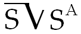

[无对应译文]

</section>

<section class="parallel-paragraph" data-paragraph-ids="s15-13-0050">

s15-13-0050

原文 · s15-13-0050

pour tout sujet en tant qu’il est de sa nature divisé. Exactement selon la même façon que nous pouvons formuler que  « *tout homme est sage* » nous avons *le choix disjonctif* entre *le* « *pas homme* » et *le* « *être sage* » :

[无对应译文]

</section>

<section class="parallel-paragraph" data-paragraph-ids="s15-13-0051">

s15-13-0051

原文 · s15-13-0051

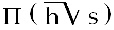

[无对应译文]

</section>

<section class="parallel-paragraph" data-paragraph-ids="s15-13-0052">

s15-13-0052

原文 · s15-13-0052

Nous avons fondamentalement ceci : c’est que - comme la *première expérience analytique* nous l’apprend - *l’hystérique*, dans sa dernière articulation, dans sa nature essentielle, c’est bien *authentiquement* - si authentique veut dire « *ne trouver qu’en soi sa propre loi* » - qu’elle se soutient dans une affirmation signifiante qui pour nous, fait théâtre, fait comédie, et à la vérité c’est pour nous qu’elle se présente ainsi.

[无对应译文]

</section>

<section class="parallel-paragraph" data-paragraph-ids="s15-13-0053">

s15-13-0053

原文 · s15-13-0053

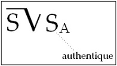

[无对应译文]

</section>

<section class="parallel-paragraph" data-paragraph-ids="s15-13-0054">

s15-13-0054

原文 · s15-13-0054

Nul ne saurait saisir ce qu’il en est de *la vraie structure de l’hystérique* s’il ne prend pas, au contraire, pour être le statut le plus ferme et le plus autonome du sujet, celui qui s’exprime dans ce signifiant, à condition que le premier, celui qui le détermine, reste non seulement dans *l’oubli*, mais dans *l’ignorance* *qu’il est oublié*.

[无对应译文]

</section>

<section class="parallel-paragraph" data-paragraph-ids="s15-13-0055">

s15-13-0055

原文 · s15-13-0055

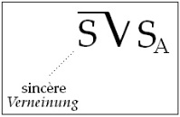

[无对应译文]

</section>

<section class="parallel-paragraph" data-paragraph-ids="s15-13-0056">

s15-13-0056

原文 · s15-13-0056

Alors que c’est tout à fait sincèrement qu’au niveau de *la structure dite « obsessionnelle »*, le sujet sort le signifiant dont il s’agit, en tant qu’il est sa vérité, mais le pourvoit de la *Verneinung* fondamentale par quoi il s’annonce comme n’étant pas cela que justement il articule, qu’il avoue, qu’il formule, par conséquent ne s’institue au niveau du prédicat maintenu de sa prétention à être autre chose, ne se formule que comme dans une *méconnaissance* en quelque sorte indiquée par la dénégation même dont il l’appuie, par la forme dénégatoire dont cette méconnaissance s’accompagne.

[无对应译文]

</section>

<section class="parallel-paragraph" data-paragraph-ids="s15-13-0057">

s15-13-0057

原文 · s15-13-0057

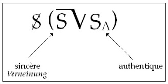

[无对应译文]

</section>

<section class="parallel-paragraph" data-paragraph-ids="s15-13-0058">

s15-13-0058

原文 · s15-13-0058

*C’est donc d’une homologie, d’un parallélisme* de ce qui vient à s’inscrire dans l’écriture où de plus en plus s’institue ce qui s’impose du progrès même que force dans le discours l’enrichissement que lui donne d’avoir à s’égaler à ce qui nous vient des *variétés*, des *variations conceptuelles* que nous impose le progrès de la mathématique, *c’est de l’homologie des formes d’inscription*.

[无对应译文]

</section>

<section class="parallel-paragraph" data-paragraph-ids="s15-13-0059">

s15-13-0059

原文 · s15-13-0059

Je fais ici allusion, par exemple, au *Begriffsschrift* d’un FREGE[^101], en tant qu’écriture du concept et pour autant que nous essayons, cette écriture, avec FREGE, de commencer d’y inscrire les formes prédicatives qui, pas seulement historiquement mais pour le fait qu’à travers l’histoire elles tiennent, se sont inscrites dans ce qu’on appelle *logique et prédicat*, *logique du premier degré*, c’est-à-dire qui n’apporte aucune quantification au niveau du prédicat.

[无对应译文]

</section>

<section class="parallel-paragraph" data-paragraph-ids="s15-13-0060">

s15-13-0060

原文 · s15-13-0060

Disons, pour reprendre notre exemple, que l’usage que j’ai fait la dernière fois de l’*universelle affirmative* tout à fait humoristique : « *Tout homme est sage* », la façon dont, dans son *Begriffsschrift,* FREGE l’inscrira, ce sera sous une forme :

[无对应译文]

</section>

<section class="parallel-paragraph" data-paragraph-ids="s15-13-0061">

s15-13-0061

原文 · s15-13-0061

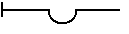

[无对应译文]

</section>

<section class="parallel-paragraph" data-paragraph-ids="s15-13-0062">

s15-13-0062

原文 · s15-13-0062

- qui pose dans les traits horizontaux le contenu simplement propositionnel, c’est-à-dire la façon dont les signifiants sont ensemble accolés, sans que rien pour autant n’en soit à exiger, que la correction syntaxique.

[无对应译文]

</section>

<section class="parallel-paragraph" data-paragraph-ids="s15-13-0063">

s15-13-0063

原文 · s15-13-0063

- Par la barre qu’il met à gauche, il marque ce qu’on appelle *l’implication, la présence du jugement* : c’est à partir de l’inscription de cette barre que *ce qui est contenu de la proposition est affirmé ou passe au stade qu’on appelle assertorique*.

[无对应译文]

</section>

<section class="parallel-paragraph" data-paragraph-ids="s15-13-0064">

s15-13-0064

原文 · s15-13-0064

C’est ce qu’on traduit par « *il est vrai, assurément* ». « *Il est vrai* » pour nous, au niveau où il s’agit d’*une logique*…

[无对应译文]

</section>

<section class="parallel-paragraph" data-paragraph-ids="s15-13-0065">

s15-13-0065

原文 · s15-13-0065

> qui ne mérite aucunement d’être nommée techniquement logique primaire car le terme est déjà employé au niveau des constructions logiques, elle désigne précisément ce qui ne jouera qu’à combiner les valeurs de vérité, c’est bien pour cela que ce qui pourrait bien s’appeler logique primaire, si le terme n’était pas déjà employé, nous l’appellerons *sublogique*, ce qui ne veut pas dire logique inférieure mais logique en tant que constituant du sujet …ce « *il est vrai* », c’est bien pour nous au niveau où nous allons placer autre chose que cette *position assertorique*, c’est bien en effet ici pour nous que la vérité fait question.

[无对应译文]

</section>

<section class="parallel-paragraph" data-paragraph-ids="s15-13-0066">

s15-13-0066

原文 · s15-13-0066

Ce petit creux, cette concavité, cet en creux en quelque sorte…

[无对应译文]

</section>

<section class="parallel-paragraph" data-paragraph-ids="s15-13-0067">

s15-13-0067

原文 · s15-13-0067

[无对应译文]

</section>

<section class="parallel-paragraph" data-paragraph-ids="s15-13-0068">

s15-13-0068

原文 · s15-13-0068

qu’ici FREGE réserve pour y indiquer ce que nous allons voir, ce en quoi il lui paraît indispensable *pour assurer à son Begriffsschrift un statut correct* , c’est là que va venir quelque chose qui joue dans la proposition ici inscrite au titre de contenu : « *Tout homme est sage* » que nous allons inscrire ainsi par exemple : en mettant « *sage* » comme étant la fonction[^102], ici l’homme, comme ce qu’il appelle, dans la fonction, l’argument.

[无对应译文]

</section>

<section class="parallel-paragraph" data-paragraph-ids="s15-13-0069">

s15-13-0069

原文 · s15-13-0069

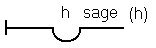

[无对应译文]

</section>

<section class="parallel-paragraph" data-paragraph-ids="s15-13-0070">

s15-13-0070

原文 · s15-13-0070

Pour tout son maniement ultérieur de cette *Begriffsschrift, écriture du concept*, il n’est pour lui d’autre moyen correct de procéder qu’à inscrire ici, dans le creux et sous une forme expressément indicative de la fonction dont il s’agit, ce même *h* de l’*homme* en question, indiquant par là que « *pour tout h *», la formule « *l’homme est sage* » est *vraie*.

[无对应译文]

</section>

<section class="parallel-paragraph" data-paragraph-ids="s15-13-0071">

s15-13-0071

原文 · s15-13-0071

La nécessité d’un pareil procédé, je n’ai point ici à vous la développer parce qu’elle impose d’en donner toute la suite, c’est-à-dire la richesse et la complication. Qu’il vous suffise de savoir ici que dans le lien que nous ferions d’une pareille proposition avec une autre qui serait en quelque sorte sa condition, chose qui dans le *Begriffsschrift* s’inscrit ainsi :

[无对应译文]

</section>

<section class="parallel-paragraph" data-paragraph-ids="s15-13-0072">

s15-13-0072

原文 · s15-13-0072

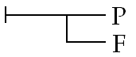

[无对应译文]

</section>

<section class="parallel-paragraph" data-paragraph-ids="s15-13-0073">

s15-13-0073

原文 · s15-13-0073

C’est à savoir qu’une *proposition* F a un certain rapport avec une *proposition* P et que ce rapport est une fois défini… je le dis pour ceux pour qui ces mots ont un sens …selon le modèle de ce qu’on appelle l’implication philonienne[^103], à savoir que : si ceci est vrai, ceci ne saurait être faux. Autrement dit que pour donner un ordre, une cohérence à un discours, il n’y a qu’à exclure et seulement à exclure ceci que le faux puisse être conditionné par le vrai.

[无对应译文]

</section>

<section class="parallel-paragraph" data-paragraph-ids="s15-13-0074">

s15-13-0074

原文 · s15-13-0074

Toutes les autres combinaisons, y compris que « *le faux détermine le vrai* », sont admises. Je vous indique simplement ceci en marge, que, à inscrire les choses de cette façon, nous avons l’avantage de pouvoir distinguer deux formes d’implication différentes :

[无对应译文]

</section>

<section class="parallel-paragraph" data-paragraph-ids="s15-13-0075">

s15-13-0075

原文 · s15-13-0075

- selon que ce sera au niveau de cette partie de la *Begriffsschrift :*

[无对应译文]

</section>

<section class="parallel-paragraph" data-paragraph-ids="s15-13-0076">

s15-13-0076

原文 · s15-13-0076

> 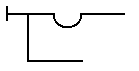 c’est-à-dire au niveau où la proposition se pose comme assertorique, que viendra se conjoindre l’incidence conditionnelle, ou au contraire ici au niveau de la proposition elle-même.

[无对应译文]

</section>

<section class="parallel-paragraph" data-paragraph-ids="s15-13-0077">

s15-13-0077

原文 · s15-13-0077

> 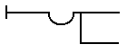

[无对应译文]

</section>

<section class="parallel-paragraph" data-paragraph-ids="s15-13-0078">

s15-13-0078

原文 · s15-13-0078

C’est-à-dire que ce n’est pas la même chose de dire que si quelque chose est vrai, nous énonçons que l’homme est sage, ou que si une autre chose est vraie, il est vrai que tout homme est sage. Il y a un monde entre les deux choses.

[无对应译文]

</section>

<section class="parallel-paragraph" data-paragraph-ids="s15-13-0079">

s15-13-0079

原文 · s15-13-0079

Ceci d’ailleurs n’est qu’à vous indiquer en marge, et pour vous montrer à quoi répond la nécessité de ce creux, de ceci que quelque part mérite d’être isolé le terme qui logiquement…

[无对应译文]

</section>

<section class="parallel-paragraph" data-paragraph-ids="s15-13-0080">

s15-13-0080

原文 · s15-13-0080

> au point d’avancement suffisant de la logique où nous sommes …donne corps au terme « *tout* » comme étant le principe, la base à partir de laquelle, par la seule opération de négation diversifiée, pourront se formuler toutes les propositions premières qui sont définies, apportées, par ARISTOTE, à savoir que par exemple :

[无对应译文]

</section>

<section class="parallel-paragraph" data-paragraph-ids="s15-13-0081">

s15-13-0081

原文 · s15-13-0081

- c’est à mettre ici, sous la forme de ce trait vertical, la négation, qu’« *il sera pour tout homme vrai que l’homme n’est pas sage* », c’est-à-dire que nous incarnerons *l’universelle négative,*

[无对应译文]

</section>

<section class="parallel-paragraph" data-paragraph-ids="s15-13-0082">

s15-13-0082

原文 · s15-13-0082

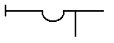

[无对应译文]

</section>

<section class="parallel-paragraph" data-paragraph-ids="s15-13-0083">

s15-13-0083

原文 · s15-13-0083

- au contraire, à dire ainsi, nous disons qu’« *il n’est pas vrai que pour tout homme…* nous puissions énoncer que… *l’homme n’est pas sage* ». Nous obtiendrons par ces *deux négations* la manifestation de *la particulière affirmative* car s’il n’est pas vrai que pour tout homme il soit vrai de dire que l’homme n’est pas sage, c’est dire qu’il y en a un petit, par là, perdu, qui l’est.

[无对应译文]

</section>

<section class="parallel-paragraph" data-paragraph-ids="s15-13-0084">

s15-13-0084

原文 · s15-13-0084

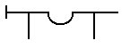

[无对应译文]

</section>

<section class="parallel-paragraph" data-paragraph-ids="s15-13-0085">

s15-13-0085

原文 · s15-13-0085

- inversement, si nous enlevons cette négation et que nous laissons celle-ci, nous disons : *qu’« il n’est pas vrai que pour tout homme l’homme soit sage », c’est-à-dire qu’il y en a qui ne le sont pas, particulière négative.*

[无对应译文]

</section>

<section class="parallel-paragraph" data-paragraph-ids="s15-13-0086">

s15-13-0086

原文 · s15-13-0086

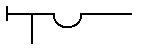

[无对应译文]

</section>

<section class="parallel-paragraph" data-paragraph-ids="s15-13-0087">

s15-13-0087

原文 · s15-13-0087

À articuler ainsi les choses, vous y sentez quelque artifice, c’est à savoir que le fait qu’à ce niveau vous sentiez comme artifice par exemple l’apparition de la dernière proposition *particulière* dite *négative*.

[无对应译文]

</section>

<section class="parallel-paragraph" data-paragraph-ids="s15-13-0088">

s15-13-0088

原文 · s15-13-0088

Ceci met en valeur :

[无对应译文]

</section>

<section class="parallel-paragraph" data-paragraph-ids="s15-13-0089">

s15-13-0089

原文 · s15-13-0089

- que, dans la logique originelle, celle d’ARISTOTE, quelque chose nous est masqué, précisément d’impliquer ces sujets comme collection, quels qu’ils soient, qu’il s’agisse de la saisir en extension ou en compréhension,

[无对应译文]

</section>

<section class="parallel-paragraph" data-paragraph-ids="s15-13-0090">

s15-13-0090

原文 · s15-13-0090

- que ce qui est de la nature du sujet n’est point à chercher dans quelque chose qui serait ontologique, le sujet fonctionnant en quelque sorte lui–même comme une sorte de *prédicat premier*, ce qu’il n’est pas.

[无对应译文]

</section>

<section class="parallel-paragraph" data-paragraph-ids="s15-13-0091">

s15-13-0091

原文 · s15-13-0091

Ce qui est l’essence du sujet tel qu’il apparaît dans le fonctionnement logique part tout entier de la première écriture, celle qui pose le sujet comme de sa nature s’affirmant comme :  *pour tout homme,* la formule *l’homme est sage* est vraie.

[无对应译文]

</section>

<section class="parallel-paragraph" data-paragraph-ids="s15-13-0092">

s15-13-0092

原文 · s15-13-0092

C’est à partir de là, selon - en quelque sorte - une déduction inverse de celle que j’ai mise en valeur devant vous la dernière fois, que l’existence vient au jour et nommément la seule qui nous importe, celle que supporte l’affirmative particulière : « *Il y a homme qui est sage* », elle se suspend, et par l’intermédiaire d’une *double négation,* à l’affirmation de *l’universelle*.

[无对应译文]

</section>

<section class="parallel-paragraph" data-paragraph-ids="s15-13-0093">

s15-13-0093

原文 · s15-13-0093

De même que la dernière fois, vous présentant *la même chose* - car il s’agit toujours des quantificateurs - c’était par la double négation appliquée à l’*existence* que je vous montrais que la fonction ; Fx pouvait se traduire, s’inverser : , il n’existe pas de x qui rende la fonction Fx fausse.

[无对应译文]

</section>

<section class="parallel-paragraph" data-paragraph-ids="s15-13-0094">

s15-13-0094

原文 · s15-13-0094

Cette présence de *la double négation* est ce qui, pour nous, fait problème puisque, à la vérité, le joint ne s’en fait que d’une façon énigmatique avec ce qu’il en est de la fonction du « *tout* », encore bien sûr que la nuance linguistique, que la fonction opposée du πᾶν \[pan\] ou du πᾶντές \[pantès\] en grec s’oppose à la fonction de l’ὅλος \[holos\] comme l’*omnis* s’oppose au *totus*.

[无对应译文]

</section>

<section class="parallel-paragraph" data-paragraph-ids="s15-13-0095">

s15-13-0095

原文 · s15-13-0095

Ça n’est pourtant pas pour rien qu’ARISTOTE lui-même, sur ce qu’il en est de l’affirmative universelle, la dit posée καθ᾽ ὅλον \[kath’holon\][^104], quant au total, et que *l’ambiguïté* en français reste entière, en raison de la confusion des deux signifiants entre ce qui a foncièrement quelque rapport, à savoir cette fonction du « *tout* ».

[无对应译文]

</section>

<section class="parallel-paragraph" data-paragraph-ids="s15-13-0096">

s15-13-0096

原文 · s15-13-0096

Il est clair que le sujet…

[无对应译文]

</section>

<section class="parallel-paragraph" data-paragraph-ids="s15-13-0097">

s15-13-0097

原文 · s15-13-0097

> si nous arrivons avec le perfectionnement de la logique,
>
> à le réduire à ce « *pas… qui ne…* » dont je faisais état la dernière fois …que ce sujet pourtant, dans sa prétention si l’on peut dire native, se pose comme étant de sa nature capable d’appréhender quelque chose comme « *tout* », et ce qui fait son statut et aussi son mirage, c’est *qu’il puisse se penser comme sujet de la connaissance*, à savoir comme support éventuel à lui seul de *quelque chose* qui est « *tout* ».

[无对应译文]

</section>

<section class="parallel-paragraph" data-paragraph-ids="s15-13-0098">

s15-13-0098

原文 · s15-13-0098

Or c’est là que je veux vous mener, à cette indication, par ce discours que je fais aujourd’hui le plus court que je peux…

[无对应译文]

</section>

<section class="parallel-paragraph" data-paragraph-ids="s15-13-0099">

s15-13-0099

原文 · s15-13-0099

> comme je le fais toujours, après en avoir très sérieusement pour vous préparé les degrés,
>
> suivant l’attention de l’assemblée ou mon état propre …je suis bien forcé, comme dans tout discours articulé…

[无对应译文]

</section>

<section class="parallel-paragraph" data-paragraph-ids="s15-13-0100">

s15-13-0100

原文 · s15-13-0100

> et plus spécialement quand il s’agit du discours sur le discours, de l’opération logique …de prendre *un chemin de traverse* au moment où il s’impose, c’est à savoir que, à la façon dont je vous ai déjà indiqué que s’institue la première division du sujet dans la fonction répétitive, ce dont il s’agit est essentiellement ceci : c’est que le sujet \[S\] ne s’institue que représenté par un signifiant pour un autre signifiant, S1→ S2, et que c’est entre les deux, au niveau de la répétition primitive, que s’opère cette perte (S1→ S2) → (*a*↓), cette fonction de l’objet perdu, autour de quoi précisément tourne la première tentative opératoire du signifiant, celle qui s’institue dans la répétition fondamentale.

[无对应译文]

</section>

<section class="parallel-paragraph" data-paragraph-ids="s15-13-0101">

s15-13-0101

原文 · s15-13-0101

C’est ce qui vient ici occuper la place qui est donnée dans l’institution de *l’universelle affirmative* à ce facteur dit « *argument* » dans l’énoncé de FREGE, ce pour quoi la fonction prédicative est toujours recevable et en tout cas la fonction du « *tout* » trouve son assise, son point tournant originel et, si je puis dire, le principe même dont s’institue son illusion, dans le repérage de l’objet perdu, dans la fonction intermédiaire de *l’objet(a)*, entre :

[无对应译文]

</section>

<section class="parallel-paragraph" data-paragraph-ids="s15-13-0102">

s15-13-0102

原文 · s15-13-0102

- le signifiant originel en tant qu’il est signifiant refoulé,

[无对应译文]

</section>

<section class="parallel-paragraph" data-paragraph-ids="s15-13-0103">

s15-13-0103

原文 · s15-13-0103

- et le signifiant qui le représente dans la substitution qu’instaure la répétition elle-même *première*.

[无对应译文]

</section>

<section class="parallel-paragraph" data-paragraph-ids="s15-13-0104">

s15-13-0104

原文 · s15-13-0104

Ceci nous est illustré dans la psychanalyse elle-même, et par quelque chose de capital, en ceci qu’elle incarne en quelque sorte de la façon la plus vive ce qu’il en est de la fonction du « *tout* » dans l’économie, je ne dirai pas « *inconsciente* », dans *l’économie du savoir analytique*, précisément en tant que ce savoir essaie de totaliser sa propre expérience.

[无对应译文]

</section>

<section class="parallel-paragraph" data-paragraph-ids="s15-13-0105">

s15-13-0105

原文 · s15-13-0105

C’est le biais même, la pente, le piège, où tombe La pensée analytique elle-même quand, faute de pouvoir se saisir dans son opération essentiellement diviseuse à son terme, au regard du sujet, elle instaure comme première l’idée d’une *fusion idéale* qu’elle projette comme originelle et qui joue autour de cette *universelle affirmative* qui est justement celle qu’elle serait faite pour problématiser et qui s’exprime à peu près ainsi :

[无对应译文]

</section>

<section class="parallel-paragraph" data-paragraph-ids="s15-13-0106">

s15-13-0106

原文 · s15-13-0106

- pas d’inconscient sans la mère,

<!-- -->

[无对应译文]

</section>

<section class="parallel-paragraph" data-paragraph-ids="s15-13-0107">

s15-13-0107

原文 · s15-13-0107

- pas d’économie, pas de dynamique affective sans ceci qui serait en quelque sorte à l’origine : que l’homme connaît le « *tout* » parce qu’il a été dans une fusion originelle à la mère.

[无对应译文]

</section>

<section class="parallel-paragraph" data-paragraph-ids="s15-13-0108">

s15-13-0108

原文 · s15-13-0108

Ce mythe en quelque sorte parasite, car il n’est pas freudien, il a été introduit sous un biais énigmatique, celui du *traumatisme de la naissance*, vous le savez, par Otto RANK[^105]. Faire entrer la naissance sous le biais du traumatisme, c’est lui donner fonction signifiante, la chose donc en elle-même n’était pas faite pour apporter une viciation foncière à l’exercice d’une pensée qui, en tant que pensée analytique, ne peut que laisser intact ceci dont il s’agit, à savoir que, sur le plan dernier où vient achopper l’articulation identificatrice, la béance reste ouverte entre l’homme et la femme et que par conséquent, dans la constitution même du sujet, nous ne pouvons d’aucune façon introduire, disons, l’existence au monde de la complémentation mâle et femelle.

[无对应译文]

</section>

<section class="parallel-paragraph" data-paragraph-ids="s15-13-0109">

s15-13-0109

原文 · s15-13-0109

Or à quoi aura servi l’introduction par Otto RANK de cette référence à *la naissance* par ce biais du *traumatisme* ?

[无对应译文]

</section>

<section class="parallel-paragraph" data-paragraph-ids="s15-13-0110">

s15-13-0110

原文 · s15-13-0110

À ce que la chose soit profondément viciée dans la suite de la pensée analytique, en ceci qu’il est dit qu’à tout le moins ce « *tout* », cette fusion qui fait que pour le sujet il y a eu possibilité primitive, et donc possible à reconquérir, d’une union avec ce qui fait le « *tout* », c’est le rapport de la mère à l’enfant, de l’enfant à la mère au stade utérin, au stade d’avant la naissance, et ici nous touchons du doigt où est *le biais* et *l’erreur*.

[无对应译文]

</section>

<section class="parallel-paragraph" data-paragraph-ids="s15-13-0111">

s15-13-0111

原文 · s15-13-0111

Mais cette erreur sera exemplaire parce que c’est elle qui nous révèle où prend son origine cette fonction du « *tout* » dans le sujet en tant qu’il choit sous le biais de la fatalité inconsciente, c’est-à-dire :

[无对应译文]

</section>

<section class="parallel-paragraph" data-paragraph-ids="s15-13-0112">

s15-13-0112

原文 · s15-13-0112

- ou qu’il ne se reconnaît authentiquement qu’à s’oublier,

[无对应译文]

</section>

<section class="parallel-paragraph" data-paragraph-ids="s15-13-0113">

s15-13-0113

原文 · s15-13-0113

- ou qu’il ne se reconnaît sincèrement qu’à se méconnaître[^106].

[无对应译文]

</section>

<section class="parallel-paragraph" data-paragraph-ids="s15-13-0114">

s15-13-0114

原文 · s15-13-0114

Et voici en effet très simplement où est le ressort : à partir du moment où nous prenons les choses au niveau de la fonction du langage, pas de demande qui ne s’adresse à la mère.Ceci, nous pouvons le voir se manifester dans le développement de l’enfant en tant qu’il est d’abord *infans* et que c’est dans le champ de la mère qu’il aura à articuler d’abord sa demande.

[无对应译文]

</section>

<section class="parallel-paragraph" data-paragraph-ids="s15-13-0115">

s15-13-0115

原文 · s15-13-0115

Qu’est-ce que nous voyons apparaître *au niveau de cette demande* ?

[无对应译文]

</section>

<section class="parallel-paragraph" data-paragraph-ids="s15-13-0116">

s15-13-0116

原文 · s15-13-0116

C’est ce dont il s’agit uniquement et que l’analyse nous désigne : c’est la fonction du sein.

[无对应译文]

</section>

<section class="parallel-paragraph" data-paragraph-ids="s15-13-0117">

s15-13-0117

原文 · s15-13-0117

Tout ce que l’analyse fait tourner, *comme s’il s’agissait là d’un procès de la connaissance,* c’est le fait que la réalité de la mère ne soit d’abord abordée, désignée que par la fonction de ce qu’on appelle *l’objet partiel*.

[无对应译文]

</section>

<section class="parallel-paragraph" data-paragraph-ids="s15-13-0118">

s15-13-0118

原文 · s15-13-0118

Mais cet *objet partiel*, je veux bien qu’on l’appelle en effet ainsi, à ceci près que nous devons nous apercevoir que c’est lui qui est au principe de l’imagination du « *tout* », que si quelque chose est conçu comme totalité de l’enfant à la mère, c’est dans la mesure où, au sein de *la demande*, c’est-à-dire dans la béance entre ce qui ne s’articule pas et ce qui s’articule enfin comme demande, l’objet autour de quoi surgit la première demande, c’est le seul objet qui apporte au petit être nouveau-né *ce complément, cette perte irréductible* qui en est le seul support, à savoir ce sein, si singulièrement ici placé pour cette utilisation qui est logique dans sa nature, *l’objet(a)*, et de ce que FREGE appellerait *la variable*, j’entends dans l’instauration d’une fonction quelconque Fx, que si une variable est quantifiée, elle passe à *un autre statut* d’être quantifiée comme *universelle*.

[无对应译文]

</section>

<section class="parallel-paragraph" data-paragraph-ids="s15-13-0119">

s15-13-0119

原文 · s15-13-0119

Cela veut dire non pas simplement n’importe laquelle mais que foncièrement dans sa consistance, c’est une constante et que c’est pour cela que pour l’enfant, qui commence d’articuler avec sa demande ce qui fera le statut de son désir, si un objet a cette faveur de pouvoir un instant remplir cette fonction constante, c’est le sein.

[无对应译文]

</section>

<section class="parallel-paragraph" data-paragraph-ids="s15-13-0120">

s15-13-0120

原文 · s15-13-0120

Et aussi bien il est étrange que ne soit pas apparu tout aussitôt, à spéculer sur les termes biologiques, qui sont ceux vers quoi aspire à se référer *la psychanalyse*, c’est qu’on ne s’aperçoive pas de cette chose qui semble être dite comme allant de soi que tout enfant a une mère, et où on souligne même comme pour nous mettre sur la voie qu’assurément pour le père, nous sommes dans l’ordre de la foi.

[无对应译文]

</section>

<section class="parallel-paragraph" data-paragraph-ids="s15-13-0121">

s15-13-0121

原文 · s15-13-0121

Mais serait-il si sûr qu’il ait une mère si, au lieu d’être un humain c’est-à-dire un mammifère, il était un insecte ?

[无对应译文]

</section>

<section class="parallel-paragraph" data-paragraph-ids="s15-13-0122">

s15-13-0122

原文 · s15-13-0122

Quels sont les rapports d’un insecte avec sa mère ?

[无对应译文]

</section>

<section class="parallel-paragraph" data-paragraph-ids="s15-13-0123">

s15-13-0123

原文 · s15-13-0123

Si nous nous permettons perpétuellement de jouer - et ceci est présentifié dans les psychanalyses - entre la référence de la conception et celle de la naissance, nous voyons la distance qu’il y a entre les deux et que le fait que la mère soit la mère ne tient pas, si ce n’est par une nécessité purement organique : je veux dire que jusqu’à présent, il n’y a qu’elle pour pondre dans son propre utérus ses propres œufs, mais après tout, puisqu’on fait de l’insémination artificielle maintenant, on fera peut-être aussi de l’insertion ovulaire.

[无对应译文]

</section>

<section class="parallel-paragraph" data-paragraph-ids="s15-13-0124">

s15-13-0124

原文 · s15-13-0124

La mère, ce n’est pas, au niveau où nous le prenons dans l’expérience analytique, ce quelque chose qui se réfère aux termes sexuels. Nous parlons toujours du rapport dit sexuel, parlons aussi du sexuel dit « rapport ». Le sexuel dit « rapport » est complètement masqué par ceci que les êtres humains dont nous pouvons dire que s’ils n’avaient pas le langage, comment même sauraient-ils qu’ils sont mortels ?

[无对应译文]

</section>

<section class="parallel-paragraph" data-paragraph-ids="s15-13-0125">

s15-13-0125

原文 · s15-13-0125

Nous dirons aussi bien que s’ils n’étaient pas mammifères, ils ne s’imagineraient pas qu’ils sont nés, car le surgissement de l’être en tant que nous opérons dans ce savoir construit et qui aussi bien devient pervertissant pour toute la dialectique opératoire de l’analyse que nous faisons tourner autour de la naissance, est–ce que c’est autre chose que ceci qui, au niveau de PLATON, se présentait avec une allure que je trouve quant à moi plus sensée, voyez le mythe d’ER[^107]?

[无对应译文]

</section>

<section class="parallel-paragraph" data-paragraph-ids="s15-13-0126">

s15-13-0126

原文 · s15-13-0126

Qu’est-ce que c’est que cette errance des âmes une fois qu’elles sont parties des corps ?

[无对应译文]

</section>

<section class="parallel-paragraph" data-paragraph-ids="s15-13-0127">

s15-13-0127

原文 · s15-13-0127

Elles sont là dans *un hyperespace* avant d’entrer se reloger quelque part, selon leur goût ou le hasard, que nous importe.

[无对应译文]

</section>

<section class="parallel-paragraph" data-paragraph-ids="s15-13-0128">

s15-13-0128

原文 · s15-13-0128

Qu’est-ce que c’est sinon quelque chose qui a beaucoup plus de sens pour nous analystes… Qu’est-ce que c’est que *cette âme errante* si ce n’est précisément ce dont je parle : *le résidu de la division du sujet* ?

[无对应译文]

</section>

<section class="parallel-paragraph" data-paragraph-ids="s15-13-0129">

s15-13-0129

原文 · s15-13-0129

Cette *métempsychose* me paraît logiquement moins fautive que celle qui fait l’avant de tout ce qui se passe dans *la dynamique psychanalysante* du séjour dans le ventre de la mère. Si nous l’imaginions, ce séjour, comme il est après tout au début de la lignée mammalienne, à savoir le séjour dans une poche marsupiale, ça nous frapperait moins.

[无对应译文]

</section>

<section class="parallel-paragraph" data-paragraph-ids="s15-13-0130">

s15-13-0130

原文 · s15-13-0130

Ce qui nous fait illusion, c’est la fonction du placenta.

[无对应译文]

</section>

<section class="parallel-paragraph" data-paragraph-ids="s15-13-0131">

s15-13-0131

原文 · s15-13-0131

Eh bien, la fonction du placenta, c’est quelque chose qui n’existe pas au niveau des premiers mammifères.

[无对应译文]

</section>

<section class="parallel-paragraph" data-paragraph-ids="s15-13-0132">

s15-13-0132

原文 · s15-13-0132

Le placenta semble bien devoir se situer au niveau justement de cet objet plaqué, de ce quelque chose qui, à un niveau de l’évolution biologique…

[无对应译文]

</section>

<section class="parallel-paragraph" data-paragraph-ids="s15-13-0133">

s15-13-0133

原文 · s15-13-0133

> nous n’avons pas à considérer si c’est un perfectionnement ou pas …se présente comme cette appartenance au niveau de l’autre qu’est le sein plaqué sur la poitrine, et c’est ce sein autour de quoi tourne ce dont il s’agit au niveau d’une apparition exemplaire de *l’objet(a)*.

[无对应译文]

</section>

<section class="parallel-paragraph" data-paragraph-ids="s15-13-0134">

s15-13-0134

原文 · s15-13-0134

Que *l’objet(a)* soit l’indicatif autour de quoi se forge la fonction du *tout* en tant qu’elle est mythique, en tant qu’elle est précisément ce à quoi s’oppose, ce que contredit, toute la recherche du statut du sujet telle qu’elle s’institue dans l’expérience de *la psychanalyse*, voilà qui est à repérer et qui seul peut donner sa fonction de pivot, de point tournant à cet *objet(a)* dont d’autres formes se déduisent mais toujours, en effet, à cette référence que *c’est l’objet(a) qui est au principe du mirage du « tout ».*

[无对应译文]

</section>

<section class="parallel-paragraph" data-paragraph-ids="s15-13-0135">

s15-13-0135

原文 · s15-13-0135

Essayez, avant que je vous revoie la prochaine fois, et que j’essaie pour vous de le faire vivre autour de ces autres supports qui sont déchet, qui sont *regard*, qui sont *voix*, vous verrez qu’à saisir le rapport de ce *(a),* en tant que justement c’est lui qui nous permet de destituer de sa fonction la relation au terme « *tout* », c’est à l’intérieur de cette interrogation que je pourrai reprendre ce qu’il en est d’un acte.

[无对应译文]

</section>

<section class="parallel-paragraph" data-paragraph-ids="s15-13-0136">

s15-13-0136

原文 · s15-13-0136

Je n’en ai rien dit jusqu’à présent mais, bien sûr, cet acte implique fonction, statut et qualification.

[无对应译文]

</section>

<section class="parallel-paragraph" data-paragraph-ids="s15-13-0137">

s15-13-0137

原文 · s15-13-0137

Si le psychanalyste n’est pas celui qui situe son statut autour de ce quelque chose que nous pouvons interroger, à savoir un sujet, est-il d’aucune façon épinglable, qualifiable du terme *(a)* ?

[无对应译文]

</section>

<section class="parallel-paragraph" data-paragraph-ids="s15-13-0138">

s15-13-0138

原文 · s15-13-0138

Le *(a)* peut-il être un prédicat ?

[无对应译文]

</section>

<section class="parallel-paragraph" data-paragraph-ids="s15-13-0139">

s15-13-0139

原文 · s15-13-0139

C’est la question sur laquelle je vous laisse aujourd’hui et dont déjà je vous désigne quelle en est la réponse : elle ne peut aucunement s’instituer d’une façon prédicative, et très précisément pour ceci : *que sur le (a) lui-même ne peut aucunement porter la négation.*

[无对应译文]

</section>

<section class="note-block original-notes">

## Notes

[^99]: D. Lagache : *L'unité de la psychologie*, Paris, PUF, 1949.

[^100]: [Aristote : *De l’âme*](http://remacle.org/bloodwolf/philosophes/Aristote/table.htm#AME) : I, 4, 408b, 14/15, texte établi par A. Jannone, traduction et notes par E. Barbotin, Paris, « Les Belles Lettres », 1966.

    Voici la traduction qui nous est donnée : « *Mieux vaudrait sans doute ne pas dire que l’âme a pitié, apprend ou pense, mais plutôt l’homme par son âme* ».

[^101]: Gottlob Frege : *Begriffsschrift, eine der arithmetischen nachgebildete Formelsprache des reinen Denkens*, Halle, 1879, repris dans *Begriffsschrift und andere Aufsätze*,

    Hidelsheim, Éd. I. Angelleli, 1964.

    G. Frege : Les fondements de l'arithmétique, Paris, Seuil, 1969, trad. et introduction de Claude Imbert.

    G. Frege : Écrits logiques et philosophiques, Paris, Seuil, 1971, trad. et introduction de Claude Imbert ; Points Seuil, 1994.

    Correspondance Gottlob Frege-Bertrand Russel, supplément au n° 5 de la revue L'Unebévue, Paris, EPEL, nov. 1994, trad., notes et introduction

    de Catherine Webern.

[^102]: La fonction est évidemment : « *est sage* ». Cf. Écrits logiques et philosophiques « *Fonction et concept* », p.91, Paris, Seuil, 1971.

[^103]: Référence à Philon le Mégarique (IVème s. av. J.C.), qui définissait l’implication entre deux propositions à la manière exactement de « l’implication

    matérielle » de la logique moderne. C’est sur l’enseignement des Mégariques que se fonde la logique des Stoïciens. Cf. Claude Imbert : Pour une

    histoire de la logique, PUF 1999.

[^104]: Le grec est « *kata holou eipôn aretès peri ho ti estin* », mot à mot : « *ayant en vue la totalité dire au sujet d'*aretès *quoi est ».* Sur l'expression *ho ti estin*,

    voir la [note 17](http://plato-dialogues.org/fr/tetra_3/meno/t70a-73c.htm#note17) sur 71b3-4 et la note 18 sur 74c5-6. La formulation utilisée ici introduit une autre expression, qui fera fortune chez Aristote, « *kata holou* ». C'est la seule utilisation de cette expression dans tous les dialogues. On trouve les formes légèrement différentes, avec *kata* et l'accusatif *holon* au lieu du génitif *holou* employé ici, en *République*, III, 392d9 (où Socrate dit que, pour mieux faire comprendre sa critique des poètes, il ne va pas traiter le problème *kata holon*, « selon la totalité », c'est-à-dire « en général », mais en « prenant une partie », c'est-à-dire, sur des exemples) ; en *Parménide*, 138e6-7 (*kata holon*) et 144e9 (*kata to holon*), dans les discussions de Parménide sur l'un en rapport avec les concepts de tout et de parties ; et en *Timée*, 40a7 (où il est question de l'univers créé de manière à être « *kosmon... kath' holon* », c'est-à-dire, « ordonné dans sa totalité ») et 55e7 ( pour parler d'un des triangles élémentaires qui est « plus stable *kata merè kai kath' holon* », c'est-à-dire « selon la partie et selon le tout »). Mais dans aucun de ces autres emplois, l'expression n'a la connotation quasi « technique » qu'elle a ici, anticipant le sens qu'elle prendra chez Aristote, sous la forme agrégée en un seul mot, *katholou*, qui deviendra pour lui le terme de choix pour désigner l'« universel » par opposition au particulier (note reprise de Bernard Suzanne, *Ménon*, 77a5-80d1)

[^105]: Otto Rank : *Le traumatisme de la naissance* (1924), Paris, Payot, 1968. (trad. S. Jankélévitch).

[^106]: Cf. même séance, supra : hystériques et obsessionnels.

[^107]: *Le mythe d'[Er le Pamphylien](http://remacle.org/bloodwolf/philosophes/platon/er.htm)*, cf. Platon : *La République*, Livre X, 614b-621d, Paris, coll. La Pléiade vol.1, Gallimard, 1971, p. 1231 (trad. Léon Robin).

</section>
