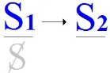
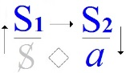
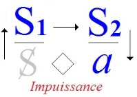

# Leçon 01 | 13 Novembre 1968

  

    <label><input type="checkbox" data-lacan-toggle="original" checked> 原文</label>
    <label><input type="checkbox" data-lacan-toggle="notes" checked> 注释</label>
    <label><input type="checkbox" data-lacan-toggle="commentary" checked> 个人解读评论</label>
  

  <form class="lacan-tool-search" role="search">
    <input class="lacan-tool-search-input" type="search" placeholder="搜索全文" aria-label="搜索全文">
    <button class="lacan-tool-button" type="submit" title="搜索">搜索</button>
  </form>
  <button class="lacan-tool-button lacan-back-to-top" type="button" title="回到页面最上方" aria-label="回到页面最上方">↑</button>

<section class="parallel-paragraph" data-paragraph-ids="s16-01-0001">

s16-01-0001

原文 · s16-01-0001

*L’essence de la théorie psychanalytique est un discours sans parole*

[无对应译文]

</section>

<section class="parallel-paragraph" data-paragraph-ids="s16-01-0002">

s16-01-0002

原文 · s16-01-0002

Nous nous retrouvons cette année pour un séminaire dont j’ai choisi le titre *D’un Autre à l’autre,* pour indiquer ce que seront les grands repères autour de quoi doit, à proprement parler, tourner mon discours. C’est en ceci que ce discours, au point du temps où nous sommes, est crucial : il l’est pour autant qu’il définit ce qu’il en est de ce discours qui s’appelle le *discours psychanalytique*, dont l’introduction, dont l’entrée en jeu dans ce temps emporte tant de conséquences.

[无对应译文]

</section>

<section class="parallel-paragraph" data-paragraph-ids="s16-01-0003">

s16-01-0003

原文 · s16-01-0003

Une étiquette a été mise sur ce procès du discours. « *Le structuralisme* » a-t-on dit, mot qui d’ailleurs n’a pas nécessité de la part du publiciste qui soudain - il y a, mon Dieu, un nombre pas tellement grand de mois - l’a poussé pour englober *un certain nombre*, dont le travail depuis longtemps avait tracé quelques avenues de ce discours.

[无对应译文]

</section>

<section class="parallel-paragraph" data-paragraph-ids="s16-01-0004">

s16-01-0004

原文 · s16-01-0004

Je viens de parler d’*un publiciste*, chacun sait les jeux de mots que je me suis permis autour de la « *poubellication* ».

[无对应译文]

</section>

<section class="parallel-paragraph" data-paragraph-ids="s16-01-0005">

s16-01-0005

原文 · s16-01-0005

Nous voilà donc *un certain nombre*, de par la grâce de qui c’est l’office, réunis dans la même poubelle. On pourrait avoir plus désagréable compagnie. À la vérité, ceux avec qui je m’y trouve conjoint n’étant que des gens pour le travail desquels j’ai la plus grande estime, je ne saurais, de toute façon, m’en trouver mal. Surtout que pour ce qui est de la poubelle, en ce temps dominé par le génie de Samuel BECKETT, nous en connaissons un bout \[Cf. Beckett : *« Fin de partie »*\].

[无对应译文]

</section>

<section class="parallel-paragraph" data-paragraph-ids="s16-01-0006">

s16-01-0006

原文 · s16-01-0006

Pour moi personnellement, après avoir habité pendant aujourd’hui presque trente ans - *en trois sections de* 15*, de* 10 *et de* 5 *ans* - dans trois *Sociétés psychanalytiques*, j’en connais un bout sur ce qu’il en est de cohabiter avec les ordures ménagères !

[无对应译文]

</section>

<section class="parallel-paragraph" data-paragraph-ids="s16-01-0007">

s16-01-0007

原文 · s16-01-0007

Pour ce qui est du *structuralisme*, à la vérité on comprend le malaise qui peut se produire chez certains du maniement que l’on prétendrait de l’extérieur infliger à notre commun habitat, et aussi bien que l’on puisse avoir l’envie d’en sortir un peu pour se dérouiller les jambes. Il n’en reste pas moins que depuis que cette *impatience* semble - selon toute apparence - prendre certains, je m’avise qu’en cette corbeille je ne me trouve après tout pas si mal.

[无对应译文]

</section>

<section class="parallel-paragraph" data-paragraph-ids="s16-01-0008">

s16-01-0008

原文 · s16-01-0008

### Puisque, aussi bien, à mes yeux, il ne me semble pas - *ce structuralisme* - pouvoir être identifié à autre chose qu’à ce que j’appellerai tout simplement « *le sérieux* », et à aucun degré - quoi qu’il en soit - à quelque chose qui ressemble à rien de ce que l’on peut appeler une philosophie, si par ce mot l’on désigne une vision du monde, ou même quelque façon d’assurer

[无对应译文]

</section>

<section class="parallel-paragraph" data-paragraph-ids="s16-01-0009">

s16-01-0009

原文 · s16-01-0009

### à droite et à gauche, les positions d’une pensée.

[无对应译文]

</section>

<section class="parallel-paragraph" data-paragraph-ids="s16-01-0010">

s16-01-0010

原文 · s16-01-0010

Qu’il suffise, pour réfuter le premier cas…

[无对应译文]

</section>

<section class="parallel-paragraph" data-paragraph-ids="s16-01-0011">

s16-01-0011

原文 · s16-01-0011

> s’il est vrai que - psychanalyste - je ne pouvais me prétendre d’aucune façon
>
> introduire ce qui s’intitule ridiculement une *anthropologie psychanalytique* …il suffirait de rappeler, à l’entrée même de ce domaine, *des vérités constituantes qu’apporte dans ce champ la psychanalyse*.

[无对应译文]

</section>

<section class="parallel-paragraph" data-paragraph-ids="s16-01-0012">

s16-01-0012

原文 · s16-01-0012

C’est à savoir qu’il n’y a pas d’union de l’homme et de la femme sans que la castration :

[无对应译文]

</section>

<section class="parallel-paragraph" data-paragraph-ids="s16-01-0013">

s16-01-0013

原文 · s16-01-0013

- ne détermine, au titre du fantasme, précisément, la réalité du partenaire chez qui elle est impossible,

[无对应译文]

</section>

<section class="parallel-paragraph" data-paragraph-ids="s16-01-0014">

s16-01-0014

原文 · s16-01-0014

- sans qu’elle se joue - la castration - dans cette sorte de recel qui la pose comme vérité chez le partenaire à qui elle est *réellement*, *sauf excès accidentel*, *épargnée*.

[无对应译文]

</section>

<section class="parallel-paragraph" data-paragraph-ids="s16-01-0015">

s16-01-0015

原文 · s16-01-0015

Insistons bien que, répandant cette formule de la *Genèse* que « *Dieu les créa* - il y a aussi *<u>le</u>* créa - *homme et femme* », c’est le cas de le dire : « *Dieu sait pourquoi !* »

[无对应译文]

</section>

<section class="parallel-paragraph" data-paragraph-ids="s16-01-0016">

s16-01-0016

原文 · s16-01-0016

- chez l’un, *l’impossible de son effectuation* - à la castration - *vient à se poser comme déterminant de sa réalité*,

[无对应译文]

</section>

<section class="parallel-paragraph" data-paragraph-ids="s16-01-0017">

s16-01-0017

原文 · s16-01-0017

- chez l’autre, le pire dont elle le menace comme possible n’a pas besoin d’arriver pour être vrai,

[无对应译文]

</section>

<section class="parallel-paragraph" data-paragraph-ids="s16-01-0018">

s16-01-0018

原文 · s16-01-0018

> au sens où ce terme ne comporte pas de recours.

[无对应译文]

</section>

<section class="parallel-paragraph" data-paragraph-ids="s16-01-0019">

s16-01-0019

原文 · s16-01-0019

Ce seul rappel, semble-t-il, implique :

[无对应译文]

</section>

<section class="parallel-paragraph" data-paragraph-ids="s16-01-0020">

s16-01-0020

原文 · s16-01-0020

- qu’au moins au sein du champ qui apparemment est le nôtre, nulle *harmonie*, de quelque façon que nous ayons à la désigner, n’est d’aucune façon de mise,

<!-- -->

[无对应译文]

</section>

<section class="parallel-paragraph" data-paragraph-ids="s16-01-0021">

s16-01-0021

原文 · s16-01-0021

- qu’assurément quelque propos s’impose à nous qui est celui justement du discours qui convient.

[无对应译文]

</section>

<section class="parallel-paragraph" data-paragraph-ids="s16-01-0022">

s16-01-0022

原文 · s16-01-0022

Pour le mener, aurons-nous à nous poser - en quelque sorte - la question qui est celle d’où est partie toute la philosophie, c’est qu’au regard de tant de savoirs, non sans valeur et efficace : qu’est-ce qui peut distinguer ce discours de soi-même assuré, qui se fondant sur un critère que la pensée prendrait dans sa propre mesure, mériterait de s’intituler επιστήμη \[épistèmé\], la science ?

[无对应译文]

</section>

<section class="parallel-paragraph" data-paragraph-ids="s16-01-0023">

s16-01-0023

原文 · s16-01-0023

Nous sommes portés…

[无对应译文]

</section>

<section class="parallel-paragraph" data-paragraph-ids="s16-01-0024">

s16-01-0024

原文 · s16-01-0024

> ne serait-ce que d’abord par ce défi que je viens de désigner comme celui porté par *la vérité* au *réel* …à plus de prudence dans cette démarche de mise en accord de la pensée avec elle-même : *une règle de pensée qui a à s’assurer* *de la non-pensée comme de ce qui peut être sa cause*, voilà ce à quoi nous sommes confrontés avec la notion de l’inconscient.

[无对应译文]

</section>

<section class="parallel-paragraph" data-paragraph-ids="s16-01-0025">

s16-01-0025

原文 · s16-01-0025

*Ce n’est qu’à mesure de « l’hors de sens » des propos*, et non pas - comme on s’imagine et comme toute la phénoménologie le suppose - du *sens*, *que je suis comme pensée*. *Ma pensée n’est pas réglable* - que l’on ajoute ou non « hélas ! » - *à mon gré, elle est réglée.*

[无对应译文]

</section>

<section class="parallel-paragraph" data-paragraph-ids="s16-01-0026">

s16-01-0026

原文 · s16-01-0026

Dans mon acte, je ne vise pas à *l’exprimer* mais à la *causer*. Mais il ne s’agit pas de l’*acte* : dans le *discours*, je n’ai pas à suivre sa règle, mais à trouver sa cause. *Dans l’entresens* - entendez-le pour si *obscène* que vous pouvez l’imaginer - *est l’être de la pensée.*

[无对应译文]

</section>

<section class="parallel-paragraph" data-paragraph-ids="s16-01-0027">

s16-01-0027

原文 · s16-01-0027

*Ce* qui est à passer par ma pensée, la cause, elle laisse passer purement et simplement ce qui a été comme être, et ceci du fait que, déjà et toujours, là où elle est passée, elle est passée produisant toujours *des effets de pensée*. « *Il pleut* » est événement de la pensée chaque fois qu’il est énoncé, et le sujet en est d’abord ce « *il* » - ce « *hile* » dirai-je - qu’il constitue dans un certain nombre de *significations*.

[无对应译文]

</section>

<section class="parallel-paragraph" data-paragraph-ids="s16-01-0028">

s16-01-0028

原文 · s16-01-0028

Et c’est pourquoi cet « *il* » se retrouve à l’aise dans toute la suite car à « *il pleut* » vous pouvez donner :

[无对应译文]

</section>

<section class="parallel-paragraph" data-paragraph-ids="s16-01-0029">

s16-01-0029

原文 · s16-01-0029

- « *il pleut... des vérités premières* »,

[无对应译文]

</section>

<section class="parallel-paragraph" data-paragraph-ids="s16-01-0030">

s16-01-0030

原文 · s16-01-0030

- « *il pleut... il y a de l’abus !* ».

[无对应译文]

</section>

<section class="parallel-paragraph" data-paragraph-ids="s16-01-0031">

s16-01-0031

原文 · s16-01-0031

Surtout à confondre la pluie - le *météore* - avec *pluvia*, l’*aqua pluvia*, la pluie, l’eau qu’on en recueille.

[无对应译文]

</section>

<section class="parallel-paragraph" data-paragraph-ids="s16-01-0032">

s16-01-0032

原文 · s16-01-0032

Le météore est propice à la métaphore - et pourquoi ? - parce que déjà il est fait de signifiants. « *Il pleut* ».

[无对应译文]

</section>

<section class="parallel-paragraph" data-paragraph-ids="s16-01-0033">

s16-01-0033

原文 · s16-01-0033

L’être de la pensée est *la cause* d’une pensée en tant que « *hors de sens »*. Il était déjà - et toujours - *être d’une pensée*, avant.

[无对应译文]

</section>

<section class="parallel-paragraph" data-paragraph-ids="s16-01-0034">

s16-01-0034

原文 · s16-01-0034

Or, la pratique de cette *structure* repousse toute promotion d’aucune infaillibilité. Elle ne s’aide précisément que de la faille ou plutôt de son procès même - *car il y a un procès de la faille -* et c’est le procès *dont la pratique de la structure s’aide*, mais elle ne saurait s’en aider qu’à la suivre. Ce qui n’est d’aucune façon la dépasser, sinon *à permettre sa saisie dans la conséquence qui s’en fige*, au temps, au point même où la reproduction du procès s’arrête, c’est dire que *c’est son temps d’arrêt qui en marque le résultat*.

[无对应译文]

</section>

<section class="parallel-paragraph" data-paragraph-ids="s16-01-0035">

s16-01-0035

原文 · s16-01-0035

Et c’est ce qui explique - disons-le ici d’une touche discrète en passant - que tout art est défectueux, que c’est du recueil de ce qui, au point où sa défaillance, d’être accomplie se creuse, c’est de ce recueil qu’il prend sa force.

[无对应译文]

</section>

<section class="parallel-paragraph" data-paragraph-ids="s16-01-0036">

s16-01-0036

原文 · s16-01-0036

Et c’est pourquoi la musique et l’architecture sont les arts suprêmes…

[无对应译文]

</section>

<section class="parallel-paragraph" data-paragraph-ids="s16-01-0037">

s16-01-0037

原文 · s16-01-0037

> j’entends « suprêmes » techniquement, comme *maximum* dans le banal …produisant la relation du *nombre harmonique* avec *le temps* et avec *l’espace*, sous l’angle précisément de leur *incompatibilité*.

[无对应译文]

</section>

<section class="parallel-paragraph" data-paragraph-ids="s16-01-0038">

s16-01-0038

原文 · s16-01-0038

*Car le nombre harmonique n’est* - maintenant on le sait bien - que passoire, à ne retenir ni l’un ni l’autre : *ni ce temps, ni cet espace*.

[无对应译文]

</section>

<section class="parallel-paragraph" data-paragraph-ids="s16-01-0039">

s16-01-0039

原文 · s16-01-0039

Voilà ce dont *le structuralisme* est *la prise au sérieux*. Il est la prise au sérieux de ceci : du savoir comme cause, cause dans la pensée, et le plus habituellement, il faut bien le dire, d’une *visée délirante*.

[无对应译文]

</section>

<section class="parallel-paragraph" data-paragraph-ids="s16-01-0040">

s16-01-0040

原文 · s16-01-0040

Ne vous effrayez pas, ce sont propos d’entrée, rappels de certitudes, non pas de vérités. Et je voudrais, avant d’introduire aujourd’hui les *schémas* d’où j’entends partir, marquer que si *quelque chose* d’ores et déjà doit vous en rester au creux de la main, c’est ce que j’ai pris soin d’écrire tout à l’heure au tableau sur *l’essence de la théorie* : *L’essence de la théorie psychanalytique est un discours sans parole*

[无对应译文]

</section>

<section class="parallel-paragraph" data-paragraph-ids="s16-01-0041">

s16-01-0041

原文 · s16-01-0041

*L’essence de la théorie psychanalytique est la fonction du discours* et très précisément en ceci…

[无对应译文]

</section>

<section class="parallel-paragraph" data-paragraph-ids="s16-01-0042">

s16-01-0042

原文 · s16-01-0042

> qui pourra vous sembler nouveau, à tout le moins paradoxal …que je le dirai *« sans parole »*. Il s’agit de *l’essence de la théorie* puisque c’est ceci qui *est en jeu* : qu’en est-il de la théorie *dans le champ psychanalytique* ?

[无对应译文]

</section>

<section class="parallel-paragraph" data-paragraph-ids="s16-01-0043">

s16-01-0043

原文 · s16-01-0043

*Autour de ceci, j’entends bruire autour de moi d’étranges échos. Le malentendu ne manque pas*, et sous prétexte qu’à poser tout un champ de la pensée comme manipulation, je semble mettre en cause des principes traditionnels, j’entends et ceci est traduit…

[无对应译文]

</section>

<section class="parallel-paragraph" data-paragraph-ids="s16-01-0044">

s16-01-0044

原文 · s16-01-0044

> étonnamment, pour être dans des lieux ou dans des têtes qui me sont proches …par *je ne sais quoi* qui s’appellera « *de l’impossibilité théorique* », voire - n’ai-je pas trouvé cela au détour de quelques lignes ? - que ce qu’un jour j’ai énoncé dans un contexte qui disait bien ce que cela voulait dire : qu’« *il n’y a pas d’univers de discours* »… « *Alors à quoi bon nous fatiguer… *» semble-t-on en conclure.

[无对应译文]

</section>

<section class="parallel-paragraph" data-paragraph-ids="s16-01-0045">

s16-01-0045

原文 · s16-01-0045

Sans doute importe-t-il moins à mes yeux de corriger mon dire, car il ne prête à aucune ambiguïté, et on ne voit pas ce en quoi le fait *que l’on puisse énoncer* - précisément de ce qu’on l’ait énoncé - *qu’il n’y a point de clôture du discours*, entraine que le discours est pour autant - bien loin de là - ni impossible, ni même seulement dévalorisé.

[无对应译文]

</section>

<section class="parallel-paragraph" data-paragraph-ids="s16-01-0046">

s16-01-0046

原文 · s16-01-0046

C’est précisément à partir de là que de ce discours vous avez la charge, et spécialement celle de le bien conduire, tenant compte de ce que veut dire cet énoncé *qu’il n’y a pas d’univers du discours*.

[无对应译文]

</section>

<section class="parallel-paragraph" data-paragraph-ids="s16-01-0047">

s16-01-0047

原文 · s16-01-0047

Il n’y a certes donc à cet égard rien de ma part à corriger.

[无对应译文]

</section>

<section class="parallel-paragraph" data-paragraph-ids="s16-01-0048">

s16-01-0048

原文 · s16-01-0048

Simplement à y revenir pour faire les pas suivants : de ce qui du discours déjà avancé s’induit de *conséquences*, mais aussi peut-être à revenir sur ce qui peut faire qu’étant attaché autant que peut l’être un analyste aux conditions de ce discours, il peut à tout instant montrer ainsi sa défaillance.

[无对应译文]

</section>

<section class="parallel-paragraph" data-paragraph-ids="s16-01-0049">

s16-01-0049

原文 · s16-01-0049

Il fut un temps…

[无对应译文]

</section>

<section class="parallel-paragraph" data-paragraph-ids="s16-01-0050">

s16-01-0050

原文 · s16-01-0050

> permettez-moi, avant d’entrer dans ce domaine, un peu de musique …*où j’avais pris l’exemple du pot*, non sans qu’on en fit un tel scandale que j’ai laissé *ce pot*, si je puis dire, en marge de mes *Écrits.*

[无对应译文]

</section>

<section class="parallel-paragraph" data-paragraph-ids="s16-01-0051">

s16-01-0051

原文 · s16-01-0051

Il s’agissait de ceci, dont le pot est en quelque sorte l’image sensible, qu’il *<u>est</u>* cette signification, par lui-même modelée.

[无对应译文]

</section>

<section class="parallel-paragraph" data-paragraph-ids="s16-01-0052">

s16-01-0052

原文 · s16-01-0052

Grâce à quoi, manifestant l’apparence d’une forme et d’un contenu, il permet d’introduire dans la pensée que c’est le contenu qui est la signification, comme si la pensée manifestait là ce besoin de s’imaginer comme ayant autre chose à « *contenir* ». Car c’est ce que le terme de « *contenir* » désigne quand il se pointe à propos d’un acte intempestif.

[无对应译文]

</section>

<section class="parallel-paragraph" data-paragraph-ids="s16-01-0053">

s16-01-0053

原文 · s16-01-0053

Le pot, je l’ai appelé « de moutarde » pour faire remarquer que loin d’en contenir forcément, c’est précisément d’être vide qu’il prend sa valeur de pot de moutarde, à savoir que c’est parce que le mot « *moutarde* » est écrit dessus. Mais « *moutarde* » qui veut dire que *moult lui tarde* à ce pot, *d’atteindre à sa vie éternell*e de pot qui commence au moment où il sera - ce pot - troué. Car c’est sous cet aspect, à travers les âges, que nous le recueillons dans les fouilles, à savoir à chercher dans les tombes ce qui nous témoignera de l’état d’une civilisation.

[无对应译文]

</section>

<section class="parallel-paragraph" data-paragraph-ids="s16-01-0054">

s16-01-0054

原文 · s16-01-0054

Le pot est troué, dit-on, en hommage au défunt et pour que le vivant ne puisse pas s’en servir. Bien sûr, c’est une raison.

[无对应译文]

</section>

<section class="parallel-paragraph" data-paragraph-ids="s16-01-0055">

s16-01-0055

原文 · s16-01-0055

Mais il y en a peut-être une autre qui est celle-ci : c’est que c’est ce *trou* qu’il est fait pour produire, *pour que ce trou se produise*, illustrant le mythe des DANAÏDES. C’est dans cet état \[troué\] que ce pot…

[无对应译文]

</section>

<section class="parallel-paragraph" data-paragraph-ids="s16-01-0056">

s16-01-0056

原文 · s16-01-0056

> quand nous l’avons ainsi de son lieu de sépulture ressuscité …vient trôner sur l’étagère du collectionneur, et dans ce moment de gloire il en est de lui ce qu’il en est aussi pour Dieu : c’est dans cette gloire qu’il révèle précisément sa nature.

[无对应译文]

</section>

<section class="parallel-paragraph" data-paragraph-ids="s16-01-0057">

s16-01-0057

原文 · s16-01-0057

La *structure du pot* - je ne dis pas sa matière - apparaît là ce qu’elle est, à savoir : corrélative de la fonction du *tube* et du *tambour*.

[无对应译文]

</section>

<section class="parallel-paragraph" data-paragraph-ids="s16-01-0058">

s16-01-0058

原文 · s16-01-0058

Et si nous allons chercher dans la nature les préformes, nous verrons que *cornes* ou *conques*, c’est encore là, après que la vie ait été extraite, qu’il a à montrer ce qui est son essence, à savoir *la capacité sonore*.

[无对应译文]

</section>

<section class="parallel-paragraph" data-paragraph-ids="s16-01-0059">

s16-01-0059

原文 · s16-01-0059

Des civilisations entières ne sont plus représentées pour nous que par *ces petits pots qui ont la forme d’une tête* ou bien encore de quelque animal couvert lui-même de tant de signes pour nous dès lors impénétrables, faute de documents corrélatifs.

[无对应译文]

</section>

<section class="parallel-paragraph" data-paragraph-ids="s16-01-0060">

s16-01-0060

原文 · s16-01-0060

*Et ici nous sentons que la signification, l’image est bien à l’extérieur, que ce qui est à l’intérieur laissé à être est précisément ce qui gît dans la tombe où nous le trouvons, à savoir  des matières précieuses : les parfums, l’or, l’encens et la myrrhe*, comme on dit.

[无对应译文]

</section>

<section class="parallel-paragraph" data-paragraph-ids="s16-01-0061">

s16-01-0061

原文 · s16-01-0061

Le pot explique la signification de ce qui est là au titre de quoi ?

[无对应译文]

</section>

<section class="parallel-paragraph" data-paragraph-ids="s16-01-0062">

s16-01-0062

原文 · s16-01-0062

Au titre *d’une valeur d’usage*, disons plutôt *d’une valeur d’échange* avec un autre monde et une autre dignité, *d’une valeur d’hommage*.

[无对应译文]

</section>

<section class="parallel-paragraph" data-paragraph-ids="s16-01-0063">

s16-01-0063

原文 · s16-01-0063

Que ce soit dans des pots que nous retrouvions les *Manuscrits de la Mer Morte*, voilà qui est fait pour nous faire sentir que *ce n’est pas le signifié qui est à l’intérieur, c’est très précisément le signifiant*, et que c’est à lui que nous allons avoir affaire quand il s’agit de ce qui nous importe, à savoir le rapport du *discours* et de *la parole* dans l’efficience analytique.

[无对应译文]

</section>

<section class="parallel-paragraph" data-paragraph-ids="s16-01-0064">

s16-01-0064

原文 · s16-01-0064

Ici, je demande qu’on me permette un court-circuit au moment d’introduire ce qui, je pense, va vous imager l’unité de la fonction théorique dans cette démarche proprement ou improprement appelée « *structuraliste* ».

[无对应译文]

</section>

<section class="parallel-paragraph" data-paragraph-ids="s16-01-0065">

s16-01-0065

原文 · s16-01-0065

Je ferai appel à MARX dont j’ai eu beaucoup de peine, importuné que j’en suis depuis longtemps, à ne pas - plus tôt - introduire le propos dans un champ où il est pourtant parfaitement à sa place. Je vais aujourd’hui introduire à propos de *l’objet(a)* la place où nous avons à situer sa fonction essentielle.

[无对应译文]

</section>

<section class="parallel-paragraph" data-paragraph-ids="s16-01-0066">

s16-01-0066

原文 · s16-01-0066

Puisqu’il le faut, c’est d’une portée homologique que je procéderai, et rappellerai d’abord ce qui, par *des travaux récents*… jusqu’ici justement - et jusqu’au désaveu de l’auteur …*désignés comme structuralistes,* a été parfaitement mis en évidence, et pas très loin d’ici, dans un commentaire de MARX.

[无对应译文]

</section>

<section class="parallel-paragraph" data-paragraph-ids="s16-01-0067">

s16-01-0067

原文 · s16-01-0067

La question est posée, par l’auteur[^1] que je viens d’évoquer, de ce qui est l’objet du *Capital*.

[无对应译文]

</section>

<section class="parallel-paragraph" data-paragraph-ids="s16-01-0068">

s16-01-0068

原文 · s16-01-0068

Nous allons voir ce que, parallèlement, l’investigation psychanalytique permet d’énoncer sur ce point.

[无对应译文]

</section>

<section class="parallel-paragraph" data-paragraph-ids="s16-01-0069">

s16-01-0069

原文 · s16-01-0069

MARX part de la fonction du marché. Sa nouveauté est la place dont il y situe le travail. Ce n’est pas que le travail soit nouveau qui lui permet sa découverte, c’est qu’il soit *acheté*, c’est qu’il y ait un *marché du travail*.

[无对应译文]

</section>

<section class="parallel-paragraph" data-paragraph-ids="s16-01-0070">

s16-01-0070

原文 · s16-01-0070

C’est cela qui lui permet de démontrer ce qu’il y a dans son discours d’inaugural, et qui s’appelle *la plus-value*.

[无对应译文]

</section>

<section class="parallel-paragraph" data-paragraph-ids="s16-01-0071">

s16-01-0071

原文 · s16-01-0071

Il se trouve que cette démarche suggère *l’acte révolutionnaire* que l’on sait, ou plutôt que l’on sait fort mal, car il n’est pas sûr que la prise du pouvoir ait résolu ce que j’appellerai la subversion du sujet - capitaliste - qui est attendue de cet acte.

[无对应译文]

</section>

<section class="parallel-paragraph" data-paragraph-ids="s16-01-0072">

s16-01-0072

原文 · s16-01-0072

Mais pour l’instant, peu nous importe. Il n’est pas sûr que des marxistes n’aient pas eu, de fait à en recueillir bien des conséquences peu fastes. L’important, c’est ce que MARX désigne et ce que veut dire sa démarche.

[无对应译文]

</section>

<section class="parallel-paragraph" data-paragraph-ids="s16-01-0073">

s16-01-0073

原文 · s16-01-0073

Que ses commentateurs soient structuralistes ou pas, ils semblent bien pourtant, avoir démontré que lui l’est, structuraliste.

[无对应译文]

</section>

<section class="parallel-paragraph" data-paragraph-ids="s16-01-0074">

s16-01-0074

原文 · s16-01-0074

Car c’est proprement d’être au point - lui, comme être de pensée - d’être au point que détermine la prédominance du marché du travail, que se dégage comme cause de sa pensée cette fonction…

[无对应译文]

</section>

<section class="parallel-paragraph" data-paragraph-ids="s16-01-0075">

s16-01-0075

原文 · s16-01-0075

> obscure, il faut bien le dire, si cette obscurité se reconnaît à la confusion des commentaires …qui est celle de la *plus-value.*

[无对应译文]

</section>

<section class="parallel-paragraph" data-paragraph-ids="s16-01-0076">

s16-01-0076

原文 · s16-01-0076

*L’identité du discours avec ses conditions*, voilà qui, j’espère, va trouver éclairage de ce que je vais dire de la démarche analytique.

[无对应译文]

</section>

<section class="parallel-paragraph" data-paragraph-ids="s16-01-0077">

s16-01-0077

原文 · s16-01-0077

Pas plus que le travail n’était nouveau dans la production de la marchandise, pas plus *la renonciation à la jouissance*… dont je n’ai pas ici plus à définir la relation au travail …n’est nouvelle, puisque dès l’abord, et bien contrairement à ce que dit, ou semble dire HEGEL, c’est elle qui *constitue* le maître qui entend bien en faire le principe de son pouvoir.

[无对应译文]

</section>

<section class="parallel-paragraph" data-paragraph-ids="s16-01-0078">

s16-01-0078

原文 · s16-01-0078

Ce qui est nouveau, c’est qu’il y ait un discours qui l’articule - cette renonciation - et qui y fait apparaître - car c’est là l’essence du discours analytique - ce que j’appellerai la fonction du *plus-de-jouir.* Cette fonction apparaît par le fait du discours parce que ce qu’elle démontre, c’est *dans la renonciation à la jouissance, un effet du discours lui-même*.

[无对应译文]

</section>

<section class="parallel-paragraph" data-paragraph-ids="s16-01-0079">

s16-01-0079

原文 · s16-01-0079

Pour marquer les choses, il faut supposer qu’au champ de l’Autre, il y ait ce marché, si vous voulez bien, qui totalise *les mérites*, *les valeurs*, l’organisation *des* *choix*, *des préférences*, qui implique *une structure ordinale, voire cardinale*.

[无对应译文]

</section>

<section class="parallel-paragraph" data-paragraph-ids="s16-01-0080">

s16-01-0080

原文 · s16-01-0080

Le discours détient les moyens de jouir en tant qu’il implique le sujet. Il n’y aurait aucune *raison de sujet*… au sens où l’on peut dire *raison d’État* …s’il n’y avait au marché de l’Autre un corrélatif, c’est qu’un *plus-de-jouir* s’établisse qui est *capté par certains*.

[无对应译文]

</section>

<section class="parallel-paragraph" data-paragraph-ids="s16-01-0081">

s16-01-0081

原文 · s16-01-0081

II faut un discours assez poussé pour démontrer comment le *plus-de-jouir tient à l’énonciation*, donc est produit par le discours, pour qu’il apparaisse comme effet.

[无对应译文]

</section>

<section class="parallel-paragraph" data-paragraph-ids="s16-01-0082">

s16-01-0082

原文 · s16-01-0082

Mais aussi bien ce n’est pas là chose tellement nouvelle à vos oreilles si vous m’avez lu, car c’est l’objet de mon écrit

[无对应译文]

</section>

<section class="parallel-paragraph" data-paragraph-ids="s16-01-0083">

s16-01-0083

原文 · s16-01-0083

*« Kant avec Sade »* [^2] où est faite la démonstration de la totale réduction de ce *plus-de-jouir* à l’acte d’appliquer sur le sujet ce qu’est le terme *(a)* du fantasme, par quoi le sujet peut être posé comme *cause-de-soi* dans le désir.

[无对应译文]

</section>

<section class="parallel-paragraph" data-paragraph-ids="s16-01-0084">

s16-01-0084

原文 · s16-01-0084

J’élaborerai ceci dans les temps qui viendront par un retour sur ce « *pari de Pascal »* qui illustre si bien le rapport de *la renonciation à la jouissance* à cet élément de pari où la vie dans sa totalité elle-même se réduit à un élément de *valeur*.

[无对应译文]

</section>

<section class="parallel-paragraph" data-paragraph-ids="s16-01-0085">

s16-01-0085

原文 · s16-01-0085

Étrange façon d’inaugurer le marché de la jouissance - de *l’inaugurer* dis-je bien - dans le champ du discours.

[无对应译文]

</section>

<section class="parallel-paragraph" data-paragraph-ids="s16-01-0086">

s16-01-0086

原文 · s16-01-0086

Mais après tout, n’est-ce pas là une simple transition avec ce que nous avons vu dans l’histoire s’inscrire tout à l’heure dans cette fonction des biens voués aux morts ? Aussi bien n’est-ce pas là pour nous ce qui est maintenant en question.

[无对应译文]

</section>

<section class="parallel-paragraph" data-paragraph-ids="s16-01-0087">

s16-01-0087

原文 · s16-01-0087

Nous avons affaire à la théorie en tant qu’elle s’allège précisément de *l’introduction de cette fonction* qui est celle du *plus-de-jouir.* Autour du *plus-de-jouir* se joue *la production* d’un objet essentiel dont il s’agit maintenant de définir la fonction, c’est *l’objet(a).*

[无对应译文]

</section>

<section class="parallel-paragraph" data-paragraph-ids="s16-01-0088">

s16-01-0088

原文 · s16-01-0088

La grossièreté des échos qu’a reçu l’introduction de ce terme est et reste pour moi la garantie qu’il est bien en effet de l’ordre d’efficace que je lui confère. Autrement dit, le passage est connu, repéré et célèbre où un MARX[^3] savourait, dans les temps qu’il mettait au développement de sa théorie, l’occasion de voir nager ce qui était l’incarnation vivante de la méconnaissance.

[无对应译文]

</section>

<section class="parallel-paragraph" data-paragraph-ids="s16-01-0089">

s16-01-0089

原文 · s16-01-0089

J’ai énoncé « *Le signifiant est ce qui représente un sujet pour un autre signifiant* », ceci comme toute définition correcte, c’est-à-dire *exigible*. Il est *exigible* qu’une définition soit correcte et qu’un enseignement soit rigoureux. Il est tout à fait intolérable…

[无对应译文]

</section>

<section class="parallel-paragraph" data-paragraph-ids="s16-01-0090">

s16-01-0090

原文 · s16-01-0090

> au moment où la psychanalyse est appelée à donner à quelque chose - ne croyez pas que j’ai l’intention de l’élider - à la crise que traverse le rapport de l’étudiant à l’Université …il est impensable qu’on réponde par l’énoncé : « *qu’il y a des choses que l’on ne saurait d’aucune façon définir en un savoir* ».

[无对应译文]

</section>

<section class="parallel-paragraph" data-paragraph-ids="s16-01-0091">

s16-01-0091

原文 · s16-01-0091

Si *la psychanalyse* ne peut s’énoncer comme un savoir et s’enseigner comme telle, elle n’a strictement *que faire,* là où il ne s’agit pas d’autre chose. Si le marché des savoirs est très proprement ébranlé par le fait que la science lui apporte cette *unité de valeur* qui permet de sonder ce qu’il en est de son échange, jusqu’à ses fonctions les plus radicales, ce n’est certes pas pour qu’ici ce qui peut en articuler quelque chose - à savoir *la psychanalyse -* ait à se présenter par sa propre démission.

[无对应译文]

</section>

<section class="parallel-paragraph" data-paragraph-ids="s16-01-0092">

s16-01-0092

原文 · s16-01-0092

Tous les termes qui peuvent être employés à ce propos…

[无对应译文]

</section>

<section class="parallel-paragraph" data-paragraph-ids="s16-01-0093">

s16-01-0093

原文 · s16-01-0093

> qu’ils soient ceux de « *non conceptualisation* », ou toute autre évocation de je ne sais quelle « *impossibilité »* …ne peuvent désigner en tout cas que l’incapacité de ceux qui les promeuvent. Ce n’est pas pour la raison que ce n’est dans nulle *intervention* particulière autre que celle dite « *interprétation* » que peut résider la stratégie avec *la vérité* qui est l’essence de la thérapeutique, qu’en ce point assurément toutes sortes de fonctions particulières, de jeux heureux, dans l’ordre de la variable peuvent trouver leur opportunité… Mais ils n’ont de sens qu’à se situer au point précis où la théorie leur donne leur poids.

[无对应译文]

</section>

<section class="parallel-paragraph" data-paragraph-ids="s16-01-0094">

s16-01-0094

原文 · s16-01-0094

Voici ici, bel et bien, ce dont il s’agit.

[无对应译文]

</section>

<section class="parallel-paragraph" data-paragraph-ids="s16-01-0095">

s16-01-0095

原文 · s16-01-0095

C’est dans le discours sur la fonction de *la renonciation à la jouissance* que s’introduit le terme de *l’objet(a)*.

[无对应译文]

</section>

<section class="parallel-paragraph" data-paragraph-ids="s16-01-0096">

s16-01-0096

原文 · s16-01-0096

Le *plus-de-jouir* comme fonction de cette renonciation sous l’effet du discours, voilà qui donne sa place à *l’objet(a)*.

[无对应译文]

</section>

<section class="parallel-paragraph" data-paragraph-ids="s16-01-0097">

s16-01-0097

原文 · s16-01-0097

Tel le marché, c’est à savoir à ce qu’il définit quelque objet du travail humain comme marchandise, tel chaque objet porte en lui-même quelque chose de *la plus-value,* ainsi le *plus de jouir* est-il ce qui permet l’isolement de la fonction de *l’objet(a)*.

[无对应译文]

</section>

<section class="parallel-paragraph" data-paragraph-ids="s16-01-0098">

s16-01-0098

原文 · s16-01-0098

Que faisons-nous dans l’analyse, sinon d’instaurer par la règle un discours tel que le sujet y suspende quoi ?

[无对应译文]

</section>

<section class="parallel-paragraph" data-paragraph-ids="s16-01-0099">

s16-01-0099

原文 · s16-01-0099

Ce qui précisément est *sa fonction de sujet*, c’est-à-dire qu’il y soit dispensé de *soutenir son discours* d’un « *je dis *», car c’est autre chose de parler que de poser : « *je dis ce que je viens d’énoncer* ».

[无对应译文]

</section>

<section class="parallel-paragraph" data-paragraph-ids="s16-01-0100">

s16-01-0100

原文 · s16-01-0100

Le sujet de l’énoncé dit « *je dis* », dit « *je pose* » comme ici je fais dans mon enseignement. J’articule cette parole.

[无对应译文]

</section>

<section class="parallel-paragraph" data-paragraph-ids="s16-01-0101">

s16-01-0101

原文 · s16-01-0101

Ce n’est pas de la poésie. Je dis ce qui est ici écrit et je peux même le répéter - ce qui est essentiel - sous la forme où, le répétant pour varier, j’ajoute que je l’ai écrit.

[无对应译文]

</section>

<section class="parallel-paragraph" data-paragraph-ids="s16-01-0102">

s16-01-0102

原文 · s16-01-0102

Voici ce sujet dispensé de soutenir ce qu’il énonce. Est-ce donc par là qu’il va arriver à cette pureté de la parole, *cette parole pleine* dont j’ai parlé *dans un temps d’évangélisation* - il faut bien le dire - car le discours qu’on appelle *Discours de Rome,* à qui était-il adressé d’autre qu’*aux oreilles les plus fermées* à l’entendre. Je ne qualifierai pas ce qui faisait ces oreilles pourvues de ces qualités opaques, ce serait là porter une appréciation qui ne saurait être d’aucune façon qu’offensante.

[无对应译文]

</section>

<section class="parallel-paragraph" data-paragraph-ids="s16-01-0103">

s16-01-0103

原文 · s16-01-0103

Mais observez ceci, c’est que parlant de *La Chose freudienne* [^4], il m’est arrivé de me lancer dans *quelque chose* que moi-même j’ai appelé une *prosopopée* [^5]. Il s’agit de *La Vérité* qui énonce : « *Je suis donc pour vous l’énigme, celle qui se dérobe aussitôt apparue, hommes qui tant vous entendez à me dissimuler* *sous les oripeaux de vos convenances. Je n’en admets pas moins que votre embarras soit sincère.* »

[无对应译文]

</section>

<section class="parallel-paragraph" data-paragraph-ids="s16-01-0104">

s16-01-0104

原文 · s16-01-0104

Je note que le terme « *embarras* » a été pointé pour sa fonction ailleurs.

[无对应译文]

</section>

<section class="parallel-paragraph" data-paragraph-ids="s16-01-0105">

s16-01-0105

原文 · s16-01-0105

> « *Car même quand vous vous faites mes hérauts, vous ne valez pas plus à porter mes couleurs que ces habits qui sont les vôtres et pareils*
>
> *à vous-même, fantômes que vous êtes. Où vais-je donc passer en vous, où étais-je avant ce passage ? Peut-être un jour vous le dirai-je.* »

[无对应译文]

</section>

<section class="parallel-paragraph" data-paragraph-ids="s16-01-0106">

s16-01-0106

原文 · s16-01-0106

Il s’agit là du *discours*.

[无对应译文]

</section>

<section class="parallel-paragraph" data-paragraph-ids="s16-01-0107">

s16-01-0107

原文 · s16-01-0107

> « *Mais pour que vous me trouviez où je suis, je vais vous apprendre à quel signe me reconnaître.*
>
> *Hommes, écoutez, je vous en donne le secret. Moi la vérité, je parle.* »

[无对应译文]

</section>

<section class="parallel-paragraph" data-paragraph-ids="s16-01-0108">

s16-01-0108

原文 · s16-01-0108

Je n’ai point écrit « *je dis* ». Ce qui *parle* assurément, s’il venait - comme je l’ai écrit ironiquement aussi - l’analyse, bien entendu, serait close. Mais c’est justement :

[无对应译文]

</section>

<section class="parallel-paragraph" data-paragraph-ids="s16-01-0109">

s16-01-0109

原文 · s16-01-0109

- ou ce qui n’arrive pas,

[无对应译文]

</section>

<section class="parallel-paragraph" data-paragraph-ids="s16-01-0110">

s16-01-0110

原文 · s16-01-0110

- ou ce qui, quand cela arrive, mérite d’être ponctué d’une façon différente.

[无对应译文]

</section>

<section class="parallel-paragraph" data-paragraph-ids="s16-01-0111">

s16-01-0111

原文 · s16-01-0111

Et pour cela, il faut reprendre ce qu’il en est de *ce sujet* qui est ici mis en question par un procédé d’*artifice*, auquel il a été demandé en effet, de n’être pas celui qui soutient tout ce qui est avancé. Ne pas croire pourtant qu’il se dissipe, car le psychanalyste est très précisément là *pour le représenter*, je veux dire *pour le maintenir* tout le temps qu’il ne peut pas, en effet, se retrouver quant à la cause de son discours.

[无对应译文]

</section>

<section class="parallel-paragraph" data-paragraph-ids="s16-01-0112">

s16-01-0112

原文 · s16-01-0112

Et c’est ainsi qu’il s’agit, maintenant, de se rapporter aux formules fondamentales, à savoir celle qui définit *le signifiant* comme étant *ce qui représente un sujet pour un autre signifiant*. Qu’est-ce que ceci veut dire ? Je suis surpris que jamais personne n’ait à ce propos encore remarqué qu’il en résulte, comme corollaire, « *qu’un signifiant ne saurait se représenter lui-même* ».

[无对应译文]

</section>

<section class="parallel-paragraph" data-paragraph-ids="s16-01-0113">

s16-01-0113

原文 · s16-01-0113

Bien sûr, ceci n’est pas nouveau non plus car dans ce que j’ai articulé autour de la répétition, c’est bien de cela qu’il s’agit. Mais là, nous avons à nous arrêter un instant pour bien le saisir sur le vif.

[无对应译文]

</section>

<section class="parallel-paragraph" data-paragraph-ids="s16-01-0114">

s16-01-0114

原文 · s16-01-0114

Qu’est-ce que cela peut vouloir dire ici, au détour de cette phrase, que ce « *lui-même* » du signifiant ? Observez bien que, quand je parle du signifiant, je parle de quelque chose d’opaque. Quand je dis qu’il faut définir *le signifiant* comme « *ce qui représente un sujet pour un autre signifiant* », cela veut dire que personne n’en saura rien sauf l’*autre signifiant*, et l’autre signifiant ça n’a pas de tête, c’est un signifiant. *Le sujet est là étouffé, effacé, aussitôt en même temps qu’apparu*.

[无对应译文]

</section>

<section class="parallel-paragraph" data-paragraph-ids="s16-01-0115">

s16-01-0115

原文 · s16-01-0115

Il s’agit justement de voir pourquoi *quelque chose* de *ce sujet*…

[无对应译文]

</section>

<section class="parallel-paragraph" data-paragraph-ids="s16-01-0116">

s16-01-0116

原文 · s16-01-0116

> qui disparaît d’être surgissant, produit par un signifiant pour aussitôt s’éteindre dans un autre …comment quelque part ce *quelque chose* peut se constituer et qui peut à la limite se faire prendre à la fin pour un *Selbst­Bewusstsein* \[conscience de soi\], pour quelque chose qui se satisfait d’être *identique à soi-même*.

[无对应译文]

</section>

<section class="parallel-paragraph" data-paragraph-ids="s16-01-0117">

s16-01-0117

原文 · s16-01-0117

### Or, très précisément ce que ceci veut dire, c’est que *le signifiant*…

[无对应译文]

</section>

<section class="parallel-paragraph" data-paragraph-ids="s16-01-0118">

s16-01-0118

原文 · s16-01-0118

### sous quelque forme que ce soit qu’il se *produise*, dans sa présence de sujet bien entendu

[无对应译文]

</section>

<section class="parallel-paragraph" data-paragraph-ids="s16-01-0119">

s16-01-0119

原文 · s16-01-0119

…*ne saurait se rejoindre dans son représentant de signifiant sans que se produise cette perte dans l’identité qui s’appelle à proprement parler l’objet(a).*

[无对应译文]

</section>

<section class="parallel-paragraph" data-paragraph-ids="s16-01-0120">

s16-01-0120

原文 · s16-01-0120

*C’est ce que désigne la théorie de Freud concernant la répétition*. Moyennant quoi :

[无对应译文]

</section>

<section class="parallel-paragraph" data-paragraph-ids="s16-01-0121">

s16-01-0121

原文 · s16-01-0121

- rien n’est identifiable de *ce quelque chose qui est le recours à la jouissance* auquel, par la vertu du signe, *quelque chose d’autre vient à sa place*, c’est-à-dire *le trait qui la marque,*

[无对应译文]

</section>

<section class="parallel-paragraph" data-paragraph-ids="s16-01-0122">

s16-01-0122

原文 · s16-01-0122

- *rien ne peut là se produire sans qu’un objet n’y soit perdu*.

[无对应译文]

</section>

<section class="parallel-paragraph" data-paragraph-ids="s16-01-0123">

s16-01-0123

原文 · s16-01-0123

Un sujet c’est *ce qui peut être représenté par un signifiant pour un autre signifiant*, mais est-ce que ce n’est pas là quelque chose de calqué sur le fait que, *valeur d’échange*…

[无对应译文]

</section>

<section class="parallel-paragraph" data-paragraph-ids="s16-01-0124">

s16-01-0124

原文 · s16-01-0124

> le sujet dont il s’agit, dans ce que MARX déchiffre, à savoir la réalité économique …le sujet de *la valeur d’échange* est représenté auprès - *de quoi ?* - de *la valeur d’usage*. Et c’est déjà *dans cette faille* que se produit, que choit, ce qui s’appelle la *plus-value*. Ne compte plus à notre niveau que cette *perte.*

[无对应译文]

</section>

<section class="parallel-paragraph" data-paragraph-ids="s16-01-0125">

s16-01-0125

原文 · s16-01-0125

*Non identique désormais à lui-même, le sujet, certes ne jouit plus mais quelque chose est perdu qui s’appelle le « plus de jouir ».*

[无对应译文]

</section>

<section class="parallel-paragraph" data-paragraph-ids="s16-01-0126">

s16-01-0126

原文 · s16-01-0126

Il est strictement corrélatif à l’entrée en jeu de ce qui dès lors détermine tout ce qu’il en est de *la pensée.*

[无对应译文]

</section>

<section class="parallel-paragraph" data-paragraph-ids="s16-01-0127">

s16-01-0127

原文 · s16-01-0127

Et dans *le symptôme* de quoi s’agit-il d’autre, à savoir du plus ou moins aisé de la démarche *autour de ce quelque chose* \[le plus de jouir\] que le sujet est bien incapable de nommer…

[无对应译文]

</section>

<section class="parallel-paragraph" data-paragraph-ids="s16-01-0128">

s16-01-0128

原文 · s16-01-0128

- mais sans *le tour* de quoi il ne saurait même, à quoi que ce soit, procéder,

[无对应译文]

</section>

<section class="parallel-paragraph" data-paragraph-ids="s16-01-0129">

s16-01-0129

原文 · s16-01-0129

- qui n’a pas seulement affaire aux relations avec ses semblables mais à sa relation la plus profonde,

[无对应译文]

</section>

<section class="parallel-paragraph" data-paragraph-ids="s16-01-0130">

s16-01-0130

原文 · s16-01-0130

> à sa relation qu’on appelle vitale,

[无对应译文]

</section>

<section class="parallel-paragraph" data-paragraph-ids="s16-01-0131">

s16-01-0131

原文 · s16-01-0131

- et pour lequel les références, *les configurations économiques sont autrement plus propices que* celles, lointaines en l’occasion, quoique bien sûr non tout à fait impropres, qui sont celles qui s’offraient à FREUD, *celles de la thermodynamique*.

[无对应译文]

</section>

<section class="parallel-paragraph" data-paragraph-ids="s16-01-0132">

s16-01-0132

原文 · s16-01-0132

Voici donc le moyen, l’élément qui peut nous permettre d’avancer dans ce dont il s’agit concernant *le discours analytique*.

[无对应译文]

</section>

<section class="parallel-paragraph" data-paragraph-ids="s16-01-0133">

s16-01-0133

原文 · s16-01-0133

Si nous avons posé théoriquement *a priori*…

[无对应译文]

</section>

<section class="parallel-paragraph" data-paragraph-ids="s16-01-0134">

s16-01-0134

原文 · s16-01-0134

> et sans aucun doute, sans avoir eu besoin d’une longue [*récursion*](http://www.cnrtl.fr/definition/r%C3%A9cursion) pour constituer ces prémisses …s’il s’agit dans la définition du sujet, comme causé par le rapport intersignifiant, de quelque chose qui en quelque sorte nous interdit à jamais de le saisir, voici aussi l’occasion d’apercevoir ce qui lui donne cette unité…

[无对应译文]

</section>

<section class="parallel-paragraph" data-paragraph-ids="s16-01-0135">

s16-01-0135

原文 · s16-01-0135

> disons-la provisoirement *préconsciente*, non pas *inconsciente* …celle qui a permis jusqu’à présent de soutenir le sujet dans sa prétendue *suffisance*.

[无对应译文]

</section>

<section class="parallel-paragraph" data-paragraph-ids="s16-01-0136">

s16-01-0136

原文 · s16-01-0136

### Loin qu’il soit *suffisant *: *c’est autour de la formule* S ◊ *a* - c’est à savoir c’est autour de l’être de l’*(a*), - *c’est autour du* *plus* *de jouir,*

[无对应译文]

</section>

<section class="parallel-paragraph" data-paragraph-ids="s16-01-0137">

s16-01-0137

原文 · s16-01-0137

que se constitue le rapport qui nous permet, jusqu’à un certain point, de voir se faire *cette soudure, cette précipitation,* *ce gel* qui fait que nous pouvons unifier un sujet comme sujet de tout un discours.

[无对应译文]

</section>

<section class="parallel-paragraph" data-paragraph-ids="s16-01-0138">

s16-01-0138

原文 · s16-01-0138

Je ferai au tableau quelque chose qui figure d’une certaine façon ce dont il s’agit en l’occasion.

[无对应译文]

</section>

<section class="parallel-paragraph" data-paragraph-ids="s16-01-0139">

s16-01-0139

原文 · s16-01-0139

Voici ce qui se passe du rapport d’un signifiant S1 à un autre signifiant S2 :

[无对应译文]

</section>

<section class="parallel-paragraph" data-paragraph-ids="s16-01-0140">

s16-01-0140

原文 · s16-01-0140

[无对应译文]

</section>

<section class="parallel-paragraph" data-paragraph-ids="s16-01-0141">

s16-01-0141

原文 · s16-01-0141

À savoir que le sujet S - représenté ici par S1 - jamais ne saura se saisir dès lors qu’*un signifiant quelconque* dans la chaîne peut être mis en rapport avec ce qui n’est pourtant qu’un *a*.

[无对应译文]

</section>

<section class="parallel-paragraph" data-paragraph-ids="s16-01-0142">

s16-01-0142

原文 · s16-01-0142

[无对应译文]

</section>

<section class="parallel-paragraph" data-paragraph-ids="s16-01-0143">

s16-01-0143

原文 · s16-01-0143

*À savoir ce qui se fabrique dans ce rapport au plus de jouir, dans ce quelque chose qui se trouve, par ouverture du jeu de l’organisme,* *pouvoir prendre figure de ces entités évanouissantes, dont j’ai déjà donné la liste, qui vont du <u>sein</u> à <u>la déjection</u> et de <u>la voix</u> au <u>regard</u> :* *ces (a) c’est la fabrication du discours de la renonciation à la jouissance.*

[无对应译文]

</section>

<section class="parallel-paragraph" data-paragraph-ids="s16-01-0144">

s16-01-0144

原文 · s16-01-0144

Le ressort de cette fabrication est ceci : c’est qu’autour d’eux peut se produire le *plus* *de jouir.*

[无对应译文]

</section>

<section class="parallel-paragraph" data-paragraph-ids="s16-01-0145">

s16-01-0145

原文 · s16-01-0145

Qu’assurément si déjà, à propos du *pari de Pascal,* je vous ai dit que… n’y aurait-il même qu’une vie à parier, à gagner au-delà de la mort …cela *vaudrait* bien que nous travaillions dans celle-ci assez pour savoir comment nous conduire dans l’autre.

[无对应译文]

</section>

<section class="parallel-paragraph" data-paragraph-ids="s16-01-0146">

s16-01-0146

原文 · s16-01-0146

### Dans cet échange de travail *- dans le pari -* avec un *plus* *de jouir,* avec *quelque chose* dont nous saurions qu’il en vaut la peine,

[无对应译文]

</section>

<section class="parallel-paragraph" data-paragraph-ids="s16-01-0147">

s16-01-0147

原文 · s16-01-0147

### se trouve le ressort de ceci : c’est qu’au fond même de *l’idée que Pascal manie*…

[无对应译文]

</section>

<section class="parallel-paragraph" data-paragraph-ids="s16-01-0148">

s16-01-0148

原文 · s16-01-0148

> *semble-t-il, avec l’extraordinaire aveuglement de celui qui est lui-même au début d’une période de déchaînement* …*et celle de la fonction du marché sont corrélatives*.

[无对应译文]

</section>

<section class="parallel-paragraph" data-paragraph-ids="s16-01-0149">

s16-01-0149

原文 · s16-01-0149

S’il a introduit *le discours scientifique*, n’oublions pas qu’il est aussi celui qui voulait… aux moments, même les plus extrêmes de sa retraite et de sa conversion *…*inaugurer à Paris une *Compagnie des Omnibus Parisiens*. Ce PASCAL ne sait pas ce qu’il dit quand il parle d’une vie heureuse, nous en avons là l’incarnation : quoi d’autre sous le terme d’« *heureux »* est saisissable sinon précisément cette fonction qui s’incarne dans le *plus* *de jouir* ?

[无对应译文]

</section>

<section class="parallel-paragraph" data-paragraph-ids="s16-01-0150">

s16-01-0150

原文 · s16-01-0150

Et aussi bien nous n’avons pas besoin de parier sur l’au-delà pour savoir ce qu’il en vaut *là où le plus de jouir se dévoile* *sous une forme nue, ça a un nom, ça s’appelle la perversion*. Et c’est bien pour cela qu’« *à sainte femme fils pervers* ».

[无对应译文]

</section>

<section class="parallel-paragraph" data-paragraph-ids="s16-01-0151">

s16-01-0151

原文 · s16-01-0151

Nul besoin de l’« *au-delà* » pour voir ce qui se passe dans la transmission de *l’une à l’autre* d’un jeu du *discours essentiel*.

[无对应译文]

</section>

<section class="parallel-paragraph" data-paragraph-ids="s16-01-0152">

s16-01-0152

原文 · s16-01-0152

Voici donc ouverte la figure, le schéma de ce qui permet de concevoir comment *c’est autour du fantasme*…

[无对应译文]

</section>

<section class="parallel-paragraph" data-paragraph-ids="s16-01-0153">

s16-01-0153

原文 · s16-01-0153

> à savoir du rapport de *la réitération du signifiant* S \[S1 → S2\] qui représente le sujet par rapport à lui-même …*que se joue ce qu’il en est de la production du (a)*.

[无对应译文]

</section>

<section class="parallel-paragraph" data-paragraph-ids="s16-01-0154">

s16-01-0154

原文 · s16-01-0154

[无对应译文]

</section>

<section class="parallel-paragraph" data-paragraph-ids="s16-01-0155">

s16-01-0155

原文 · s16-01-0155

Mais inversement, de ce fait leur rapport *prend consistance*.

[无对应译文]

</section>

<section class="parallel-paragraph" data-paragraph-ids="s16-01-0156">

s16-01-0156

原文 · s16-01-0156

Et c’est de ce qu’il se produit *quelque chose, qui n’est plus ni sujet ni objet*, mais qui s’appelle *fantasme* \[S ◊ *a*\], que dès lors les autres signifiants peuvent - *s’enchaînant, s’articulant* \[S1 → S2\] *et du même coup ici, se gelant dans l’effet de signification -* introduire *cet effet* *de métonymie* qui fait que ce sujet quel qu’il soit…

[无对应译文]

</section>

<section class="parallel-paragraph" data-paragraph-ids="s16-01-0157">

s16-01-0157

原文 · s16-01-0157

- qu’il soit - *dans la phrase « On bat un enfant *» - qu’il soit au niveau du « *un enfant* »,

[无对应译文]

</section>

<section class="parallel-paragraph" data-paragraph-ids="s16-01-0158">

s16-01-0158

原文 · s16-01-0158

- au niveau du « *bat* »,

[无对应译文]

</section>

<section class="parallel-paragraph" data-paragraph-ids="s16-01-0159">

s16-01-0159

原文 · s16-01-0159

- au niveau du « *on* » …quelque chose d’équivalent soude ce sujet et le fait cet être solidaire dont dans le discours nous avons la faiblesse de donner l’image comme une *image omnivalente*, *comme s’il pouvait y avoir un sujet de tous les signifiants*.

[无对应译文]

</section>

<section class="parallel-paragraph" data-paragraph-ids="s16-01-0160">

s16-01-0160

原文 · s16-01-0160

*Si quelque chose, de par la règle analytique, peut être relâché dans cette chaîne* assez pour que s’en produisent des *effets révélateurs*, quel sens, quel accent devons-nous lui donner pour que ceci prenne une portée ?

[无对应译文]

</section>

<section class="parallel-paragraph" data-paragraph-ids="s16-01-0161">

s16-01-0161

原文 · s16-01-0161

L’idéal sans doute c’est ce « *Je parle* » mythique qui fera, dans l’expérience analytique *effet, image, d’apparition de la vérité*.

[无对应译文]

</section>

<section class="parallel-paragraph" data-paragraph-ids="s16-01-0162">

s16-01-0162

原文 · s16-01-0162

C’est ici justement qu’il s’agit de comprendre que cette *vérité* émise est là *suspendue*, prise entre deux registres qui sont ceux dont précisément j’ai posé les deux bornes dans les deux termes \[A→ *a*\] qui figurent au titre de mon séminaire cette année.

[无对应译文]

</section>

<section class="parallel-paragraph" data-paragraph-ids="s16-01-0163">

s16-01-0163

原文 · s16-01-0163

Car cet « *ou* *bien...* » fait référence *au champ où le discours du sujet prendrait consistance*, c’est-à-dire *au champ de l’Autre*, qui est celui que j’ai défini pour *ce lieu où tout discours au moins se pose pour pouvoir s’offrir à ce qui est ou non sa réfutation*.

[无对应译文]

</section>

<section class="parallel-paragraph" data-paragraph-ids="s16-01-0164">

s16-01-0164

原文 · s16-01-0164

Qu’il puisse se démontrer, et sous la forme *la plus simple*…

[无对应译文]

</section>

<section class="parallel-paragraph" data-paragraph-ids="s16-01-0165">

s16-01-0165

原文 · s16-01-0165

> vous m’excuserez de n’avoir pas le temps de le faire aujourd’hui …que le problème est totalement déplacé de savoir s’il est ou non *un Dieu qui garantisse*, comme pour DESCARTES, *le champ de la vérité* : *il nous suffit qu’il puisse se démontrer qu’au champ de l’Autre il n’y a pas de possibilité d’entière consistance du discours*, et ceci j’espère pouvoir la prochaine fois vous l’articuler précisément en fonction de l’existence du sujet.

[无对应译文]

</section>

<section class="parallel-paragraph" data-paragraph-ids="s16-01-0166">

s16-01-0166

原文 · s16-01-0166

Je l’ai déjà une fois écrit très rapidement au tableau. C’est une démonstration très aisée à trouver au premier chapitre de ce qu’on appelle « *la théorie des ensembles* », mais encore faut-il… au moins pour une part des oreilles qui sont ici …montrer en quoi il est pertinent d’introduire dans l’élucidation de la fonction d’un discours comme celui qui est le nôtre, à nous analystes, quelque fonction extraite d’une logique, dont ce serait tout à fait un tort que de croire que c’est une façon de l’exclure dans l’amphithéâtre voisin que de l’appeler *logique mathématique*.

[无对应译文]

</section>

<section class="parallel-paragraph" data-paragraph-ids="s16-01-0167">

s16-01-0167

原文 · s16-01-0167

Si nulle part dans l’Autre ne peut être assurée d’aucune façon *la consistance* de ce qui s’appelle *vérité*, où donc est-elle sinon à ce qu’en réponde cette fonction du *a *?

[无对应译文]

</section>

<section class="parallel-paragraph" data-paragraph-ids="s16-01-0168">

s16-01-0168

原文 · s16-01-0168

Aussi bien n’ai-je pas déjà à quelque autre occasion émis ce qu’il en est du cri de *la vérité* ?

[无对应译文]

</section>

<section class="parallel-paragraph" data-paragraph-ids="s16-01-0169">

s16-01-0169

原文 · s16-01-0169

« *Moi la vérité* - ai-je écrit - *je parle. ...//... et je suis pure articulation émise pour votre embarras. *»

[无对应译文]

</section>

<section class="parallel-paragraph" data-paragraph-ids="s16-01-0170">

s16-01-0170

原文 · s16-01-0170

C’est là *- pour nous émouvoir -* ce que peut dire *la vérité*. Mais ce que dit *celui qui est souffrance d’être cette vérité*, celui-là doit savoir que *son cri* n’est que *cri muet*, *cri dans le vide*, cri que déjà dans un temps j’ai illustré de la gravure célèbre de MÜNCH[^6].

[无对应译文]

</section>

<section class="parallel-paragraph" data-paragraph-ids="s16-01-0171">

s16-01-0171

原文 · s16-01-0171

[无对应译文]

</section>

<section class="parallel-paragraph" data-paragraph-ids="s16-01-0172">

s16-01-0172

原文 · s16-01-0172

Parce qu’à ce niveau rien d’autre ne peut lui répondre chez l’Autre, que ce qui fait sa consistance et sa foi naïve de ce qu’il est comme « *moi* », c’est à savoir ce qui en est le véritable support,  à savoir sa fabrication comme *objet(a)*.

[无对应译文]

</section>

<section class="parallel-paragraph" data-paragraph-ids="s16-01-0173">

s16-01-0173

原文 · s16-01-0173

En face de lui \[comme *(a)* \], il n’y a rien que celui-là \[A\], que *l’un en plus* parmi tant d’autres, et qui ne peut d’aucune façon répondre à ce cri de *la vérité* sinon qu’il est très précisément son équivalent, la non jouissance, la misère, la détresse et la solitude : c’est la contrepartie de ce *a*, de ce *plus de jouir* qui, du sujet en tant que « *moi* », fait la cohérence.

[无对应译文]

</section>

<section class="parallel-paragraph" data-paragraph-ids="s16-01-0174">

s16-01-0174

原文 · s16-01-0174

### Il n’y a rien d’autre, à moins que…

[无对应译文]

</section>

<section class="parallel-paragraph" data-paragraph-ids="s16-01-0175">

s16-01-0175

原文 · s16-01-0175

> pour aujourd’hui, vouloir vous quitter sur quelque chose qui fasse sourire un peu plus …que je reprenne les paroles, dans l’*Ecclésiaste*, d’un vieux roi qui ne voyait pas de contradiction entre être le roi de la sagesse et posséder un *harem*, qui vous dit :

[无对应译文]

</section>

<section class="parallel-paragraph" data-paragraph-ids="s16-01-0176">

s16-01-0176

原文 · s16-01-0176

« *Tout est vanité, sans doute, jouis de la femme que tu aimes, c’est-à-dire fais anneau de ce creux, de ce vide qui est au centre de ton être.*

[无对应译文]

</section>

<section class="parallel-paragraph" data-paragraph-ids="s16-01-0177">

s16-01-0177

原文 · s16-01-0177

*Il n’y a pas de prochain si ce n’est ce creux même qui est en toi, c’est le vide de toi-même.* »

[无对应译文]

</section>

<section class="parallel-paragraph" data-paragraph-ids="s16-01-0178">

s16-01-0178

原文 · s16-01-0178

Mais dans ce rapport assurément seulement garanti par la figure qui permit à FREUD sans doute de se tenir à travers tout ce chemin périlleux et de nous permettre d’éclaircir des rapports qui, sans ce mythe, n’auraient pas été autrement supportables, la Loi divine qui laisse dans son entière primitivité cette jouissance entre l’homme et la femme dont il faut dire : « *Donne-lui ce que tu n’as pas, puisque ce qui peut t’unir à elle, c’est seulement sa jouissance.* »

[无对应译文]

</section>

<section class="parallel-paragraph" data-paragraph-ids="s16-01-0179">

s16-01-0179

原文 · s16-01-0179

C’est là-dessus… qu’à la façon d’une simple, d’une totale, d’une religieuse, *énigme*, de celle qui n’est approchée que dans la Kabbale …je vous donnerai aujourd’hui *quitus*.

[无对应译文]

</section>

<section class="note-block original-notes">

## Notes

[^1]: Cf. Louis Althusser : «  *Lire Le capital* » (tomes 1 et 2), 1965, Petite collection Maspero, et « *Pour Marx* », 1965, Maspero.

[^2]: Kant avec Sade, Écrits, Seuil, 1966, p.765 ou Points Seuil , t.2 , p.243.

[^3]: Cf. la lettre de Marx à Engels du 26-06-1867 « *L'avantage de ma dialectique est que je dis les choses peu à peu, et comme ils croient que je suis au bout,*

    *se hâtant de me réfuter, ils ne font rien qu'étaler leur âne­rie* ». (L. Althusser et *alii* : Lire le capital (I), p.30. Petite coll. Maspero n°30, 1971.

[^4]: « *La Chose freudienne* », in *Écrits*, op. cit., pp.408-9, ou t.1 p.406.

[^5]: Prosopopée : figure par laquelle l’orateur ou l'écrivain fait parler et agir un être inanimé, une personne absente ou morte. (TLF)

[^6]: Edward Münch (1863-1944). « Le Cri » date de 1893. Cf. Séminaire Problèmes…(1964-65), séance du 17-03-1965.

</section>
