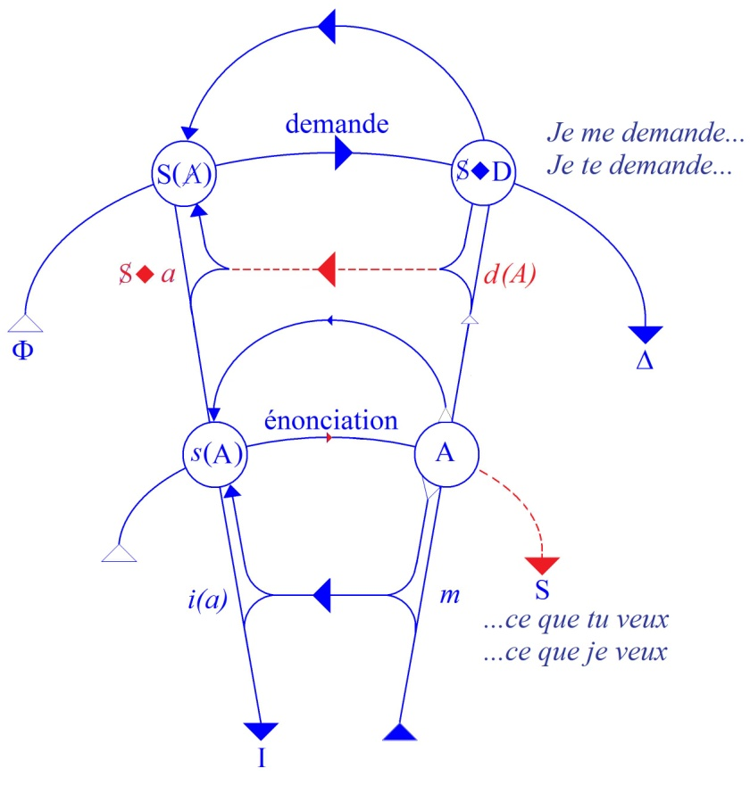
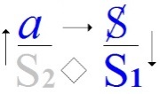

# Leçon 05 | 11 Décembre 1968

  <label><input type="checkbox" data-lacan-toggle="original" checked> 原文</label>
  <label><input type="checkbox" data-lacan-toggle="notes" checked> 注释</label>
  <label><input type="checkbox" data-lacan-toggle="commentary" checked> 个人解读评论</label>

<section class="parallel-paragraph" data-paragraph-ids="s16-05-0001">

s16-05-0001

[无对应译文]

原文 · s16-05-0001

Je note quelquefois, à part moi, des petites « *adresses* » à votre intention. Alors là, au moment de brasser ces papiers, j’en retrouve une qui va me fournir mon entrée :

</section>

<section class="parallel-paragraph" data-paragraph-ids="s16-05-0002">

s16-05-0002

[无对应译文]

原文 · s16-05-0002

> «* Qu’il est regrettable…* écrivais-je, je ne sais plus quand

</section>

<section class="parallel-paragraph" data-paragraph-ids="s16-05-0003">

s16-05-0003

[无对应译文]

原文 · s16-05-0003

> …*que Dieu serve à écarter par ce que nous appellerons la proscription de son Nom.* »

</section>

<section class="parallel-paragraph" data-paragraph-ids="s16-05-0004">

s16-05-0004

[无对应译文]

原文 · s16-05-0004

Ça a pris forme d’un interdit précisément sans doute là où on pourrait savoir le mieux ce qu’il en est de la fonction de ce terme « Dieu » à savoir chez les Juifs. Vous savez que chez eux il a un nom imprononçable. Eh bien :

</section>

<section class="parallel-paragraph" data-paragraph-ids="s16-05-0005">

s16-05-0005

[无对应译文]

原文 · s16-05-0005

> « *Cette proscription, justement, sert à écarter…*

</section>

<section class="parallel-paragraph" data-paragraph-ids="s16-05-0006">

s16-05-0006

[无对应译文]

原文 · s16-05-0006

Commençais-je à dire

</section>

<section class="parallel-paragraph" data-paragraph-ids="s16-05-0007">

s16-05-0007

[无对应译文]

原文 · s16-05-0007

> …*un certain nombre de références absolument essentielles au maintien du* « *je* » *dans une lumière suffisante, suffisante pour qu’on ne puisse pas le jeter…* il y a « *je* » là-dedans

</section>

<section class="parallel-paragraph" data-paragraph-ids="s16-05-0008">

s16-05-0008

[无对应译文]

原文 · s16-05-0008

> …*le jeter aux chiens, c’est-à-dire aux professeurs.* »

</section>

<section class="parallel-paragraph" data-paragraph-ids="s16-05-0009">

s16-05-0009

[无对应译文]

原文 · s16-05-0009

Ce dont je suis parti pour, en somme, la dernière fois, vous l’avez entendu, sinon vu, presque malgré moi, pousser d’abord et en avant cette référence « *je* ». Par l’intermédiaire du Dieu en question j’ai traduit ce qui fut proféré un jour sous la forme : אֶהְיֶה אֲשֶׁר אֶהְיֶה \[Eyè acher eyè\] par « *Je suis ce que je est* ».

</section>

<section class="parallel-paragraph" data-paragraph-ids="s16-05-0010">

s16-05-0010

[无对应译文]

原文 · s16-05-0010

Je vous ai dit alors avoir été moi-même un peu débordé par l’avance de cette énonciation que j’ai justifiée comme traduction, ou crois avoir justifiée. Puis j’ai dit qu’après tout, là, *le Sinaï* m’avait émergé, malgré moi, du sol entre les jambes.

</section>

<section class="parallel-paragraph" data-paragraph-ids="s16-05-0011">

s16-05-0011

[无对应译文]

原文 · s16-05-0011

Cette fois-ci, je n’ai pas reçu de petit papier comme la dernière fois. Je l’attendais pourtant, que quelqu’un me fasse remarquer que ces paroles sont sorties du « *buisson ardent* ». Vous voyez ce que ça aurait fait si je vous avais dit que le « *buisson ardent* » m’était sorti entre les jambes ? C’est bien en cela que la phrase se donne des ordres à elle-même, rétroactivement. C’est bien parce que je voulais la définir entre les jambes que j’ai mis d’abord *le Sinaï* à la place du « *buisson ardent* ».

</section>

<section class="parallel-paragraph" data-paragraph-ids="s16-05-0012">

s16-05-0012

[无对应译文]

原文 · s16-05-0012

D’autant plus qu’après tout, sur *le Sinaï*, c’est des suites de la chose dont il s’agit.

</section>

<section class="parallel-paragraph" data-paragraph-ids="s16-05-0013">

s16-05-0013

[无对应译文]

原文 · s16-05-0013

C’est-à­-dire que, comme je l’ai déjà fait remarquer dans le séminaire sur *L’Éthique *\[1959-60\]: celui qui s’est annoncé - à mon dire tout au moins - comme « *Je suis ce que « je » est* », celui-là…

</section>

<section class="parallel-paragraph" data-paragraph-ids="s16-05-0014">

s16-05-0014

[无对应译文]

原文 · s16-05-0014

> sous la forme de ce qui depuis se transmet dans l’impératif de la liste des « *Dix Commandements* » dits de Dieu …n’a fait - je l’ai expliqué il y a bien longtemps - qu’énoncer les lois du « *je parle* ».

</section>

<section class="parallel-paragraph" data-paragraph-ids="s16-05-0015">

s16-05-0015

[无对应译文]

原文 · s16-05-0015

S’il est vrai, comme je l’énonce, que *la vérité parle* « *je* » il paraît bien aller de soi que :

</section>

<section class="parallel-paragraph" data-paragraph-ids="s16-05-0016">

s16-05-0016

[无对应译文]

原文 · s16-05-0016

- « *Tu n’adoreras que celui qui a dit : Je suis ce que « je » est* » et que tu n’adoreras *que lui seul*,

<!-- -->

</section>

<section class="parallel-paragraph" data-paragraph-ids="s16-05-0017">

s16-05-0017

[无对应译文]

原文 · s16-05-0017

- par la même conséquence : « *Tu aimeras* - *comme il se dit aussi* - *ton prochain comme toi-même* », « *toi-même* » n’étant rien d’autre que ce à quoi il est dit, dans ces *commandements* mêmes, ce à quoi on s’adresse comme à un « *Tu* » et même à un « *Tu es* », dont j’ai souligné *depuis longtemps* l’ambiguïté vraiment magique dans la langue française.

</section>

<section class="parallel-paragraph" data-paragraph-ids="s16-05-0018">

s16-05-0018

[无对应译文]

原文 · s16-05-0018

Ce commandement dont le prélude sous-jacent est ce « *Tu es* » qui vous institue comme « *je* », c’est aussi la même pente offerte à ce « *tu-ant* » qu’il y a dans toute invocation, et l’on sait qu’il n’y a pas loin de l’ordre à ce qu’on y réponde : tout HEGEL est construit pour montrer ce qui s’édifie là-dessus.

</section>

<section class="parallel-paragraph" data-paragraph-ids="s16-05-0019">

s16-05-0019

[无对应译文]

原文 · s16-05-0019

On pourrait les prendre un par un, en passant, bien sûr par celui sur le mensonge, puis ensuite sur cet interdit de « *convoiter la femme, le bœuf ni l’âne de ton voisin* » qui est toujours *celui qui te tue*. On voit mal ce qu’on pourrait convoiter d’autre !

</section>

<section class="parallel-paragraph" data-paragraph-ids="s16-05-0020">

s16-05-0020

[无对应译文]

原文 · s16-05-0020

La cause du désir étant précisément bien là.

</section>

<section class="parallel-paragraph" data-paragraph-ids="s16-05-0021">

s16-05-0021

[无对应译文]

原文 · s16-05-0021

Il est à remarquer qu’assurément, par une solidarité qui participe de l’évidence, il n’y a pas de parole, à proprement parler, que là où la clôture de tel commandement la préserve. Ce qui explique bien pourquoi ces commandements, depuis que le monde est monde, personne très exactement ne les observe, et que c’est pour cela que *la parole* - au sens où *la vérité parle* « *je* » - *reste profondément cachée et n’émerge qu’à montrer un petit bout de pointe de nez, de temps en temps, dans les interstices du discours*.

</section>

<section class="parallel-paragraph" data-paragraph-ids="s16-05-0022">

s16-05-0022

[无对应译文]

原文 · s16-05-0022

Il convient donc…

</section>

<section class="parallel-paragraph" data-paragraph-ids="s16-05-0023">

s16-05-0023

[无对应译文]

原文 · s16-05-0023

> il convient pour autant qu’il existe une technique qui fait confiance à ce discours pour y retrouver quelque chose, un chemin, une « *voie* » comme on dit qui se présume n’être pas sans rapport avec - *comme on s’exprime mais méfions* -*nous toujours des envers du discours* - « *la vérité* » et « *la vie* » \[cf. Évangile Jean : 14, 6\] …il convient peut-être d’interroger de plus près ce qui dans ce discours se fonde comme pouvant amorcer, nous donner un pont vers ce terme radical, inaccessible, qu’avec quelque audace le dernier des philosophes - HEGEL - crut pouvoir réduire à sa dialectique.

</section>

<section class="parallel-paragraph" data-paragraph-ids="s16-05-0024">

s16-05-0024

[无对应译文]

原文 · s16-05-0024

Pour nous, dans un abord qui est celui que j’ai commencé de frayer, c’est devant l’Autre - comme permettant de cerner une défaillance logique, comme lieu d’un défaut d’origine porté dans la parole en tant qu’elle pourrait répondre, c’est là qu’apparaît le « *je* » comme premièrement *assujetti*, comme *a-sujet* ai-je écrit quelque part pour désigner *ce sujet*, en tant que dans le discours il ne se produit jamais que divisé.

</section>

<section class="parallel-paragraph" data-paragraph-ids="s16-05-0025">

s16-05-0025

[无对应译文]

原文 · s16-05-0025

*Que l’animal qui parle ne puisse s’étreindre au partenaire qu’à s’assujettir d’abord*, c’est parce qu’il a été toujours déjà parlant, qu’en l’approche même de cette étreinte *il n’y peut formuler le « Tu es » qu’à s’y tuer, qu’il autrifie le partenaire, qu’il en fait le lieu du signifiant.*

</section>

<section class="parallel-paragraph" data-paragraph-ids="s16-05-0026">

s16-05-0026

[无对应译文]

原文 · s16-05-0026

Ici on me permettra de revenir un instant sur ce « «*je» est* » de la dernière fois, puisque aussi bien, et d’une tête pas mal faite, j’ai vu revenir *l’objection* qu’à le traduire ainsi je rouvrais la porte, disons au moins *à une référence d’être*. Que ce « *est* » fut, au moins par une oreille, entendu comme un appel à *l’être*, à *l’être* si selon la terminologie de la tradition il est *suspendu* à ce que j’énoncerai comme - de par quelque ordre de nature, au sens le plus original - subsistant dans cette nature.

</section>

<section class="parallel-paragraph" data-paragraph-ids="s16-05-0027">

s16-05-0027

[无对应译文]

原文 · s16-05-0027

La tradition édifie cet être suprême pour y répondre de tous les « *étant* ». Tout change, tout tourne autour de celui qui prend la place du pivot de l’univers, ce X grâce à quoi il y a un *Univers*.

</section>

<section class="parallel-paragraph" data-paragraph-ids="s16-05-0028">

s16-05-0028

[无对应译文]

原文 · s16-05-0028

Rien n’est plus éloigné de l’intention de cette traduction que ce que j’ai formulé, que pour le faire entendre je peux reprendre dans « *je suis ce qu’est le Je* ». Disons qu’ici le « *est* » se lit mieux et que nous revenons à proprement énoncer dans le « *je* » ce qui donne le fond proprement de la vérité en tant qu’elle parle seulement.

</section>

<section class="parallel-paragraph" data-paragraph-ids="s16-05-0029">

s16-05-0029

[无对应译文]

原文 · s16-05-0029

Ces commandements qui la soutiennent - l’ai-je assez dit tout à l’heure - sont proprement l’anti-physique, et pourtant, *pas moyen - sans s’y référer - de* ce qu’on appelle *« dire la vérité »*. Essayez donc ! En aucun cas !

</section>

<section class="parallel-paragraph" data-paragraph-ids="s16-05-0030">

s16-05-0030

[无对应译文]

原文 · s16-05-0030

C’est un point idéal, c’est bien le cas de le dire. Personne ne sait même ce que ça veut dire.

</section>

<section class="parallel-paragraph" data-paragraph-ids="s16-05-0031">

s16-05-0031

[无对应译文]

原文 · s16-05-0031

Dès qu’on tient un discours, ce qui surgit ce sont *les lois de la logique*, à savoir une cohérence fine, liée à la nature de ce qui s’appelle articulation signifiante. C’est ce qui fait qu’un discours est soutenable ou non, de par la structure de cette chose qui s’appelle *le signe*, et qui a affaire avec ce qu’on appelle communément *la lettre* pour l’opposer à l’esprit.

</section>

<section class="parallel-paragraph" data-paragraph-ids="s16-05-0032">

s16-05-0032

[无对应译文]

原文 · s16-05-0032

Les lois de cette articulation, voilà ce qui d’abord domine le discours.

</section>

<section class="parallel-paragraph" data-paragraph-ids="s16-05-0033">

s16-05-0033

[无对应译文]

原文 · s16-05-0033

Ce que j’ai commencé d’énoncer dans mon exposé cette année c’est ce *champ de l’Autre* pour l’éprouver comme concevable au titre de champ d’inscription de ce qui s’articule ainsi dans le discours. Ce *champ de l’Autre*, ce n’est pas d’abord lui donner aucune incarnation, c’est à partir de sa structure que pourra se définir la possibilité du « *Tu* » qui va nous atteindre et faire appel à quelque chose - troisième temps - qui aura à se dire « *je* ».

</section>

<section class="parallel-paragraph" data-paragraph-ids="s16-05-0034">

s16-05-0034

[无对应译文]

原文 · s16-05-0034

Il est clair que ce qui va se montrer c’est ce que nous attendons, c’est ce que nous savons bien, que ce « *je* » est *imprononçable, toujours imprononçable* en toute vérité. C’est bien pour cela que tout le monde sait à quel point il est encombrant et que, comme le rappellent *les lois de la parole* elle-même auxquelles je me référais tout à l’heure, il est préférable de ne jamais dire « *je jure* ».

</section>

<section class="parallel-paragraph" data-paragraph-ids="s16-05-0035">

s16-05-0035

[无对应译文]

原文 · s16-05-0035

Alors, avant de préjuger ce qu’il en est de l’Autre, laissons ouverte la question. Que ce soit simplement la *page blanche*, même à cet état il nous fera assez de difficultés, puisque c’est ce que j’ai démontré au tableau la dernière fois, c’est qu’à supposer que vous ayez inscrit sur cette *page blanche* - à condition qu’elle soit page, c’est-à-dire finie - *la totalité des signifiants*…

</section>

<section class="parallel-paragraph" data-paragraph-ids="s16-05-0036">

s16-05-0036

[无对应译文]

原文 · s16-05-0036

> ce qui est, après tout, concevable puisque vous pouvez choisir un niveau où il se réduit aux phonèmes …il est démontrable qu’à la seule condition de croire que vous pouvez y rassembler quoi que ce soit dont vous pourriez énoncer ce jugement - *c’est le sujet, le terme nécessité par ce rassemblement* - ce choix sera forcément à situer hors de cette totalité.

</section>

<section class="parallel-paragraph" data-paragraph-ids="s16-05-0037">

s16-05-0037

[无对应译文]

原文 · s16-05-0037

*C’est hors de la page blanche que le* S2, *celui qui intervient quand j’énonce* : *le signifiant c’est ce qui représente un sujet pour un autre signifiant,* cet autre signifiant, *le* S2*, sera hors page*.

</section>

<section class="parallel-paragraph" data-paragraph-ids="s16-05-0038">

s16-05-0038

[无对应译文]

原文 · s16-05-0038

Il faut partir de *ce phénomène* démontrable comme *interne à toute énonciation* comme telle, pour savoir tout ce que nous pourrons avoir à dire par la suite, de quoi que ce soit qui s’énonce, et c’est pourquoi il vaut encore de s’y attarder un instant.

</section>

<section class="parallel-paragraph" data-paragraph-ids="s16-05-0039">

s16-05-0039

[无对应译文]

原文 · s16-05-0039

Prenons l’énonciation la plus simple : dire que quelqu’un annonce qu’il pleut, ne se juge, ne peut se juger pleinement qu’à s’attarder à ce qu’il y a d’émergence dans le fait qu’il soit dit qu’il y a du « *pleut* ».

</section>

<section class="parallel-paragraph" data-paragraph-ids="s16-05-0040">

s16-05-0040

[无对应译文]

原文 · s16-05-0040

C’est ça l’événement du discours par lequel celui même qui le dit, se pose comme secondaire. *L’événement consiste en un dit*, celui sans doute dont le « *il* » marque la place. Mais il faut se méfier. *Le sujet grammatical*…

</section>

<section class="parallel-paragraph" data-paragraph-ids="s16-05-0041">

s16-05-0041

[无对应译文]

原文 · s16-05-0041

> qui d’ailleurs, peut présenter selon les langues des morphologies distinctes, qui n’est pas nécessairement isolé …*le sujet grammatical* ici a un rapport avec ce que j’ai appelé tout à l’heure « *l’hors champ* », plus ou moins individualisé comme je viens de le rappeler, c’est-à-dire aussi bien, par exemple, réduit à une désinence, « *pleut* ». Le « t », ce petit « t »…

</section>

<section class="parallel-paragraph" data-paragraph-ids="s16-05-0042">

s16-05-0042

[无对应译文]

原文 · s16-05-0042

> d’ailleurs, que vous retrouverez baladeur dans toutes sortes de coins du français …lui-même, *pourquoi nous revient-il se loger là où il n’a que faire ?* Dans un « *orne-t-il* » par exemple ? C’est-à-dire là où il n’était pas du tout dans la conjugaison. *Ce sujet grammatical donc*, si difficile à bien cerner, *n’est que la place où quelque chose vient à se représenter*.

</section>

<section class="parallel-paragraph" data-paragraph-ids="s16-05-0043">

s16-05-0043

[无对应译文]

原文 · s16-05-0043

Revenons sur ce S1 en tant que c’est lui qui représente ce quelque chose, et rappelons que quand la dernière fois nous avons voulu extraire du champ de l’Autre comme il s’imposait, ce S2, puisqu’il n’y pouvait tenir, pour rassembler les Sα, Sβ, Sγ où nous prétendions saisir le sujet, c’est en tant, justement, que dans le champ de l’Autre nous avions défini ces trois S par une certaine fonction, appelons-là « R » définie par ailleurs, à savoir que X n’était pas élément de X et que ce R(X) c’est ce qui transformait tous ces éléments - signifiants dans l’occasion - en quelque chose qui restait - puisque ouvert - *indéterminé*, qui prenait pour tout dire, fonction de *variable*.

</section>

<section class="parallel-paragraph" data-paragraph-ids="s16-05-0044">

s16-05-0044

[无对应译文]

原文 · s16-05-0044

C’est en tant que nous avons spécifié *ce à quoi doit répondre cette variable*, à savoir *une proposition* qui n’est pas n’importe laquelle, qui n’est pas par exemple : *que la variable doit être bonne, ou n’importe quoi d’autre, ou rouge, ou bleue* , *mais qu’elle doit être sujet*, que surgit la nécessité de ce signifiant comme Autre, qu’il ne saurait d’aucune façon s’inscrire dans le champ de l’Autre.

</section>

<section class="parallel-paragraph" data-paragraph-ids="s16-05-0045">

s16-05-0045

[无对应译文]

原文 · s16-05-0045

Ce signifiant est proprement - sous sa forme la plus originelle - ce qui définit la fonction dite du *savoir*.

</section>

<section class="parallel-paragraph" data-paragraph-ids="s16-05-0046">

s16-05-0046

[无对应译文]

原文 · s16-05-0046

J’aurai bien sûr à y revenir, car cette place est…

</section>

<section class="parallel-paragraph" data-paragraph-ids="s16-05-0047">

s16-05-0047

[无对应译文]

原文 · s16-05-0047

> même par rapport à ce qui a été jusqu’ici énoncé quant aux fonctions logiques …peut-être encore pas assez accentuée, *qu’essayer de qualifier le sujet comme tel nous met hors-l’Autre*.

</section>

<section class="parallel-paragraph" data-paragraph-ids="s16-05-0048">

s16-05-0048

[无对应译文]

原文 · s16-05-0048

Ce «* nous met *» est peut-être une forme de « *noumen »* qui « *nous mènera »* plus loin que nous ne pensons.

</section>

<section class="parallel-paragraph" data-paragraph-ids="s16-05-0049">

s16-05-0049

[无对应译文]

原文 · s16-05-0049

Qu’il me suffise ici d’interroger s’il n’est pas vrai que les difficultés que nous apportent, dans une réduction logique, les énoncés classiques - je veux dire aristotéliciens - de *l’universelle* et de *la particulière propositions*, ne tiennent pas, c’est qu’on ne s’aperçoit pas que c’est là, *hors du champ, du champ de l’Autre*, que doivent être placés le « *tous* » et le « *quelque* », et que nous aurions moins d’embarras à nous apercevoir que les difficultés qu’engendre la réduction de ces propositions classiques au champ des quantificateurs tiennent à ceci : c’est que plutôt que dire que tous les hommes sont bons \- ou mauvais, peu importe - la juste formule serait d’énoncer : *« les hommes - ou quoi que ce soit d’autre, quoi que ce soit que vous pouvez habiller d’une lettre, en logique - sont <u>tous</u> bons, ou sont <u>quelques</u> bons ».*

</section>

<section class="parallel-paragraph" data-paragraph-ids="s16-05-0050">

s16-05-0050

[无对应译文]

原文 · s16-05-0050

Bref, qu’à mettre hors du champ la fonction syntaxique de *l’universel* et du *particulier*, vous verriez moins de difficultés à les réduire ensuite au champ mathématique. Car le champ mathématique consiste justement à opérer *désespérément* pour que le champ de l’Autre tienne comme tel. C’est la meilleure façon d’éprouver qu’*il ne tient pas*.

</section>

<section class="parallel-paragraph" data-paragraph-ids="s16-05-0051">

s16-05-0051

[无对应译文]

原文 · s16-05-0051

Mais de l’éprouver en envoyant s’articuler tous les étages, car c’est à des niveaux bien divers qu’*il ne tient pas*.

</section>

<section class="parallel-paragraph" data-paragraph-ids="s16-05-0052">

s16-05-0052

[无对应译文]

原文 · s16-05-0052

L’important est de voir ceci, c’est que : *c’est en tant que ce champ de l’Autre n’est -* comme on dit techniquement - «* pas consistant *»*, que l’énonciation prend la tournure de la demande, ceci avant que quoi que ce soit, qui charnellement puisse répondre, soit même venu s’y loger.*

</section>

<section class="parallel-paragraph" data-paragraph-ids="s16-05-0053">

s16-05-0053

[无对应译文]

原文 · s16-05-0053

L’intérêt d’aller aussi loin qu’il est possible dans l’interrogation de ce champ de l’Autre comme tel, c’est d’y noter que c’est à une série de niveaux différents que sa faille se perçoit.

</section>

<section class="parallel-paragraph" data-paragraph-ids="s16-05-0054">

s16-05-0054

[无对应译文]

原文 · s16-05-0054

Ce n’est pas la même chose, et pour en faire l’épreuve c’est là que les mathématiques nous apportent un champ d’expérience exemplaire, c’est qu’elles peuvent se permettre de limiter ce champ à des fonctions bien définies, l’arithmétique par exemple.

</section>

<section class="parallel-paragraph" data-paragraph-ids="s16-05-0055">

s16-05-0055

[无对应译文]

原文 · s16-05-0055

Peu importe encore, pour l’instant, ce qu’en fait elle manifeste, cette recherche arithmétique.

</section>

<section class="parallel-paragraph" data-paragraph-ids="s16-05-0056">

s16-05-0056

[无对应译文]

原文 · s16-05-0056

Vous en avez entendu assez pour savoir que dans ces champs,et choisis parmi les plus simples, la surprise est grande quand nous découvrons qu’il manque, par exemple : *la complétude* [^18], à savoir que l’on ne puisse dire que quoi que ce soit qui s’y énonce doive être ou bien démontré ou bien démontré que non.

</section>

<section class="parallel-paragraph" data-paragraph-ids="s16-05-0057">

s16-05-0057

[无对应译文]

原文 · s16-05-0057

Mais plus encore : que dans tel champ - et parmi les plus simples - il peut être mis en question que :

</section>

<section class="parallel-paragraph" data-paragraph-ids="s16-05-0058">

s16-05-0058

[无对应译文]

原文 · s16-05-0058

- quelque chose, quelque énoncé y soit démontrable,

</section>

<section class="parallel-paragraph" data-paragraph-ids="s16-05-0059">

s16-05-0059

[无对应译文]

原文 · s16-05-0059

- qu’un autre niveau se dessine d’une démonstration possible qu’un énoncé n’y soit pas démontrable.

</section>

<section class="parallel-paragraph" data-paragraph-ids="s16-05-0060">

s16-05-0060

[无对应译文]

原文 · s16-05-0060

Mais qu’il devient très singulier et très étrange qu’en certains cas ce « *pas démontrable* « lui-même échappe pour quelque chose qui s’énonce dans le même champ. C’est-à-dire que, ne pouvant même pas être affirmé qu’il n’est *pas démontrable*, une dimension distincte s’ouvre, qui s’appelle le « *non décidable »*.

</section>

<section class="parallel-paragraph" data-paragraph-ids="s16-05-0061">

s16-05-0061

[无对应译文]

原文 · s16-05-0061

Ces échelles - non pas d’incertitude mais de défaut dans la texture logique - sont-ce elles-mêmes qui peuvent nous permettre d’appréhender que le sujet comme tel pourrait en quelque sorte y trouver son appui, son statut, la référence pour tout dire, qui au niveau de l’énonciation, se satisfasse comme adhésion à cette faille même ?

</section>

<section class="parallel-paragraph" data-paragraph-ids="s16-05-0062">

s16-05-0062

[无对应译文]

原文 · s16-05-0062

Est-ce qu’il ne vous semble pas que, comme peut-être…

</section>

<section class="parallel-paragraph" data-paragraph-ids="s16-05-0063">

s16-05-0063

[无对应译文]

原文 · s16-05-0063

> à condition qu’un auditoire aussi nombreux y mette quelque complaisance …comme peut-être nous pourrons le faire sentir dans quelque construction, quitte…

</section>

<section class="parallel-paragraph" data-paragraph-ids="s16-05-0064">

s16-05-0064

[无对应译文]

原文 · s16-05-0064

> comme je l’ai fait déjà à propos de ce champ de l’Autre …à l’abréger, il puisse être en quelque sorte rendu nécessaire *dans un énoncé de discours*, *qu’il ne saurait même y avoir de signifiant*, comme semble-t-il on peut le faire, car à aborder ce champ de l’extérieur de la logique, rien ne nous empêche semble-t-il, de forger le signifiant dont se connote ce qui, dans l’articulation signifiante même, fait défaut.

</section>

<section class="parallel-paragraph" data-paragraph-ids="s16-05-0065">

s16-05-0065

[无对应译文]

原文 · s16-05-0065

S’il pouvait… ce qu’ici je laisse encore en marge …s’articuler ce quelque chose - *et c’est ce qui a été fait* - qui démontre *que ne peut pas se situer ce signifiant dont un sujet*, au dernier terme, *se satisfasse pour s’y identifier comme identique au défaut même du discours*, si vous me permettez ici cette formule abrégée.

</section>

<section class="parallel-paragraph" data-paragraph-ids="s16-05-0066">

s16-05-0066

[无对应译文]

原文 · s16-05-0066

Est-ce que tous ceux qui sont ici et qui sont analystes ne se rendent pas compte que c’est faute de toute exploration de cet ordre que *la notion de la castration*…

</section>

<section class="parallel-paragraph" data-paragraph-ids="s16-05-0067">

s16-05-0067

[无对应译文]

原文 · s16-05-0067

> qui est bien ce que j’espère vous avez senti au passage être l’analogue de ce que j’énonce …que *la notion de la castration* reste si floue, si incertaine et se trouve maniée avec l’épaisseur et la brutalité que l’on sait ?

</section>

<section class="parallel-paragraph" data-paragraph-ids="s16-05-0068">

s16-05-0068

[无对应译文]

原文 · s16-05-0068

À vrai dire, dans la pratique, elle n’est pas maniée du tout, on lui substitue tout simplement *ce que l’autre ne peut pas donner* : on parle de « *frustration »* là où il s’agit de bien autre chose. À l’occasion, c’est par la voie de la « *privation »* qu’on en approche, mais vous le voyez, cette « *privation »* est justement ce qui participe de ce défaut inhérent au sujet qu’il s’agit d’approcher.

</section>

<section class="parallel-paragraph" data-paragraph-ids="s16-05-0069">

s16-05-0069

[无对应译文]

原文 · s16-05-0069

Bref, je ne ferai, pour quitter ce dont aujourd’hui je ne fais que tracer le pourtour…

</section>

<section class="parallel-paragraph" data-paragraph-ids="s16-05-0070">

s16-05-0070

[无对应译文]

原文 · s16-05-0070

> sans pouvoir même prévoir ce que d’ici la fin de l’année j’arriverai à vous faire supporter …que simplement en passant j’indique que si quelque chose a pu être énoncé dans le champ logique, vous pouvez, tous ceux tout au moins qui ici ont quelque notion des derniers théorèmes avancés dans le développement de la logique, ceux-là savent que c’est très précisément :

</section>

<section class="parallel-paragraph" data-paragraph-ids="s16-05-0071">

s16-05-0071

[无对应译文]

原文 · s16-05-0071

- en tant que ce S - à propos de tel *système*, *système arithmétique* par exemple - joue proprement sa fonction,

<!-- -->

</section>

<section class="parallel-paragraph" data-paragraph-ids="s16-05-0072">

s16-05-0072

[无对应译文]

原文 · s16-05-0072

- en tant que *c’est du dehors* qu’il compte tout ce qui peut se *théorématiser* à l’intérieur d’un grand A bien défini,

<!-- -->

</section>

<section class="parallel-paragraph" data-paragraph-ids="s16-05-0073">

s16-05-0073

[无对应译文]

原文 · s16-05-0073

- que c’est en tant, en d’autres termes, que cet « il compte », un homme de génie qui s’appelle GÖDEL a eu l’idée de s’apercevoir que c’était à prendre *à la lettre*, qu’à condition de donner à chacun des énoncés des théorèmes - comme situables dans un certain champ - leur nombre dit *nombre de Gödel,* que *quelque chose* pouvait être approché de plus sûr qui n’avait jamais été formulé concernant ces fonctions auxquelles je n’ai pu faire qu’allusion dans ce que je viens préalablement d’énoncer, quand elles s’appellent « *la* *complétude »* ou *« la* *décidabilité ».*

</section>

<section class="parallel-paragraph" data-paragraph-ids="s16-05-0074">

s16-05-0074

[无对应译文]

原文 · s16-05-0074

Il est clair que tout diffère d’un temps passé où pouvait s’énoncer :

</section>

<section class="parallel-paragraph" data-paragraph-ids="s16-05-0075">

s16-05-0075

[无对应译文]

原文 · s16-05-0075

- qu’après tout *les mathématiques* n’étaient que *tautologies*,

</section>

<section class="parallel-paragraph" data-paragraph-ids="s16-05-0076">

s16-05-0076

[无对应译文]

原文 · s16-05-0076

- que le discours humain peut rester, car c’est un champ qui - dans ce dire - aurait tenu celui de la tautologie,

</section>

<section class="parallel-paragraph" data-paragraph-ids="s16-05-0077">

s16-05-0077

[无对应译文]

原文 · s16-05-0077

- qu’il y a quelque part un A qui reste un grand A identique à lui-même.

</section>

<section class="parallel-paragraph" data-paragraph-ids="s16-05-0078">

s16-05-0078

[无对应译文]

原文 · s16-05-0078

Que tout diffère à partir du temps où ceci est réfuté, réfuté de la façon la plus sûre.

</section>

<section class="parallel-paragraph" data-paragraph-ids="s16-05-0079">

s16-05-0079

[无对应译文]

原文 · s16-05-0079

Que c’est un pas, que c’est un acquis et qu’à quiconque se trouve confronté dans l’expérience, dans une expérience…

</section>

<section class="parallel-paragraph" data-paragraph-ids="s16-05-0080">

s16-05-0080

[无对应译文]

原文 · s16-05-0080

> qui nous paraît comme une aporie transcendante au regard d’une histoire naturelle …comme est l’*expérience analytique*, nous ne voyons pas l’intérêt à aller prendre appui dans le champ de ces structures.

</section>

<section class="parallel-paragraph" data-paragraph-ids="s16-05-0081">

s16-05-0081

[无对应译文]

原文 · s16-05-0081

De *ces structures*, comme je l’ai dit, en tant qu’elles sont *structures logiques* pour situer, pour mettre à leur place ce X à quoi nous avons affaire dans le champ d’une tout autre énonciation, celle que *l’expérience freudienne* permet et qu’aussi bien elle dirige.

</section>

<section class="parallel-paragraph" data-paragraph-ids="s16-05-0082">

s16-05-0082

[无对应译文]

原文 · s16-05-0082

C’est donc d’abord en tant que l’Autre *n’est pas consistant* que l’énonciation prend la tournure de *la demande* et c’est ce qui donne sa portée à ce qui, dans le grand graphe complet, celui que j’ai dessiné ici :

</section>

<section class="parallel-paragraph" data-paragraph-ids="s16-05-0083">

s16-05-0083

[无对应译文]

原文 · s16-05-0083

</section>

<section class="parallel-paragraph" data-paragraph-ids="s16-05-0084">

s16-05-0084

[无对应译文]

原文 · s16-05-0084

Ici s’inscrit sous la forme S ◊ D, S *poinçon de* D. Il ne s’agit que de ceci - qui s’énonce d’une façon qui n’est pas énoncée - en ceci qui distingue tout énoncé : c’est qu’*il y est soustrait ce* « *je dis que* » qui est la forme où le « *je* » est limité.

</section>

<section class="parallel-paragraph" data-paragraph-ids="s16-05-0085">

s16-05-0085

[无对应译文]

原文 · s16-05-0085

Le « *je* » de la grammaire peut s’isoler hors de tout risque essentiel, peut se soustraire de l’énonciation et de ce fait : la réduit à l’énoncé, si *ce* « *je dis que* » *de n’être pas soustrait*, laisse intégral que du seul fait de la structure de l’Autre, toute énonciation - quelle qu’elle soit - se fait demande, demande de ce qui lui manque à cet Autre.

</section>

<section class="parallel-paragraph" data-paragraph-ids="s16-05-0086">

s16-05-0086

[无对应译文]

原文 · s16-05-0086

Au niveau de ce S ◊ D, la question double c’est :

</section>

<section class="parallel-paragraph" data-paragraph-ids="s16-05-0087">

s16-05-0087

[无对应译文]

原文 · s16-05-0087

- « *je me demande ce que tu désires* »,

</section>

<section class="parallel-paragraph" data-paragraph-ids="s16-05-0088">

s16-05-0088

[无对应译文]

原文 · s16-05-0088

- et son double qui est précisément la question que nous pointons aujourd’hui, à savoir : « *je te demande -* non qui je suis, mais plus loin encore - *ce qu’est «Je»* ».

</section>

<section class="parallel-paragraph" data-paragraph-ids="s16-05-0089">

s16-05-0089

[无对应译文]

原文 · s16-05-0089

Ici s’installe le nœud même, qui est celui que j’ai formulé en proférant que *le désir de l’homme c’est le désir de l’Autre*, c’est-à-dire que, si je puis dire, si vous prenez les vecteurs tels qu’ils se définissent sur ce graphe, à savoir venant ici du départ de *la chaîne signi­fiante pure*, pour ici - du carrefour désigné par S ◊ D - avoir ce retour qui complète *la rétroaction* ici marquée, c’est bel et bien en ce point dit *d(A),* désir de l’Autre, que convergent ces deux éléments que j’ai articulés sous la forme « *je me demande ce que tu désires* ».

</section>

<section class="parallel-paragraph" data-paragraph-ids="s16-05-0090">

s16-05-0090

[无对应译文]

原文 · s16-05-0090

C’est la question qui se branche au niveau même de l’institution du A : «  *ce que tu désires* », c’est-à-dire ce qui te manque lié à ce que je te suis assujetti. Et d’autre part « *je te demande ce qu’est «Je»* », le statut du « *Je* » comme tel, en tant que c’est ici qu’il s’instaure, je le marque en rouge.

</section>

<section class="parallel-paragraph" data-paragraph-ids="s16-05-0091">

s16-05-0091

[无对应译文]

原文 · s16-05-0091

Ce statut du « *tu* » est constitué d’une convergence, une convergence qui se fait, que toute *énonciation* en tant que telle, l’*énonciation* indifférente de l’analyse, puisque c’est ainsi que la règle la pose en principe, si elle tourne à la demande, c’est qu’il est radicalement de sa fonction même d’énonciation d’être demande, concernant le « *tu* » et le « *je* ».

</section>

<section class="parallel-paragraph" data-paragraph-ids="s16-05-0092">

s16-05-0092

[无对应译文]

原文 · s16-05-0092

Quant au « *tu* », c’est demande convergente, interrogation suscitée par le manque lui-même en tant qu’il est au cœur du champ de l’Autre, structuré de pure logique. C’est précisément ce qui va donner valeur et portée à ce qui se dessine, tout autant vectorisé de l’autre côté du graphe, c’est à savoir que *la division du sujet* y est rendue sensible comme essentielle à ce qui se pose comme « *je* ».

</section>

<section class="parallel-paragraph" data-paragraph-ids="s16-05-0093">

s16-05-0093

[无对应译文]

原文 · s16-05-0093

À la demande de « *qui est je* », la structure même répond par ce *refus signifiant de* A, tel que je l’ai inscrit dans le fonctionnement de ce graphe, de même ce qui est ici le « *tu* », l’institue d’une convergence entre la demande la plus radicale, celle qui nous est faite à nous analystes, la seule qui soutienne au dernier terme le discours du sujet.

</section>

<section class="parallel-paragraph" data-paragraph-ids="s16-05-0094">

s16-05-0094

[无对应译文]

原文 · s16-05-0094

« *Je viens ici pour te demander*... » : au premier temps c’est bien de « *qui je suis* » qu’il s’agit, si c’est au niveau du « *qui est je* » qu’il est répondu, c’est bien sûr que c’est la nécessité logique qui donne là ce recul. Convergence donc, de cette demande et ici quelque chose d’une promesse, ce quelque chose qui en S2 est l’espoir du *rassemblement* de ce « *je* ».

</section>

<section class="parallel-paragraph" data-paragraph-ids="s16-05-0095">

s16-05-0095

[无对应译文]

原文 · s16-05-0095

C’est bien ce que, dans le transfert j’ai appelé du terme « *le sujet supposé savoir* », c’est-à-dire cette prime conjonction, S1 lié à S2, en tant que - comme je l’ai rappelé la dernière fois - dans la paire ordonnée, c’est lui, c’est cette conjonction, c’est ce nœud, qui fonde ce qui est savoir.

</section>

<section class="parallel-paragraph" data-paragraph-ids="s16-05-0096">

s16-05-0096

[无对应译文]

原文 · s16-05-0096

Qu’est-ce donc à dire ? Si le « *je* » n’est sensible que dans ces deux pôles, eux divergents :

</section>

<section class="parallel-paragraph" data-paragraph-ids="s16-05-0097">

s16-05-0097

[无对应译文]

原文 · s16-05-0097

- qui l’un s’appelle ce que ici j’articule comme le *« non »*, *le refus*, qui donne forme au manque de la réponse,

</section>

<section class="parallel-paragraph" data-paragraph-ids="s16-05-0098">

s16-05-0098

[无对应译文]

原文 · s16-05-0098

- et ce quelque chose d’autre qui est là articulé comme petit *s* de grand A. \[*s*(A)\]

</section>

<section class="parallel-paragraph" data-paragraph-ids="s16-05-0099">

s16-05-0099

[无对应译文]

原文 · s16-05-0099

Cette signification quelle est-elle ? Car n’est-il pas sensible que tout ce discours…

</section>

<section class="parallel-paragraph" data-paragraph-ids="s16-05-0100">

s16-05-0100

[无对应译文]

原文 · s16-05-0100

> que je file pour donner l’armature au « *je* » de l’interrogation dont s’institue cette expérience …n’est-il pas sensible *que je le poursuis en ne laissant en-dehors* - au moins jusqu’à ce point où nous arrivons ici - *aucune signification* ?

</section>

<section class="parallel-paragraph" data-paragraph-ids="s16-05-0101">

s16-05-0101

[无对应译文]

原文 · s16-05-0101

Qu’est-ce à dire ? Qu’après vous avoir, de longues années, formés à fonder sur *la différenciation d’origine linguistique* :

</section>

<section class="parallel-paragraph" data-paragraph-ids="s16-05-0102">

s16-05-0102

[无对应译文]

原文 · s16-05-0102

- du *signifiant* comme matériel,

</section>

<section class="parallel-paragraph" data-paragraph-ids="s16-05-0103">

s16-05-0103

[无对应译文]

原文 · s16-05-0103

- du *signifié* comme son effet, …je laisse ici soupçonner, apparaître, que quelque *mirage* repose au principe de ce champ défini comme *linguistique* ?

</section>

<section class="parallel-paragraph" data-paragraph-ids="s16-05-0104">

s16-05-0104

[无对应译文]

原文 · s16-05-0104

La sorte d’étonnante passion avec laquelle le linguiste articule que ce qu’il tend à saisir dans la langue c’est « *pure forme »*, non « *contenu* » ?

</section>

<section class="parallel-paragraph" data-paragraph-ids="s16-05-0105">

s16-05-0105

[无对应译文]

原文 · s16-05-0105

Je vais ici vous ramener à ce point, qu’en ma première conférence, disons j’ai d’abord *produit* devant vous, et non sans intention, sous la forme du « *pot* ». Rien… que ceux qui prennent des notes le sachent …n’est sans préméditation dans ce qu’on pourrait, d’un premier champ, appeler mes digressions.

</section>

<section class="parallel-paragraph" data-paragraph-ids="s16-05-0106">

s16-05-0106

[无对应译文]

原文 · s16-05-0106

Si je suis revenu digressivement - apparemment - sur le « *pot de moutarde* », ce n’est certes pas sans raison.

</section>

<section class="parallel-paragraph" data-paragraph-ids="s16-05-0107">

s16-05-0107

[无对应译文]

原文 · s16-05-0107

Et vous pouvez vous souvenir que *j’ai fait place* à ce qui, dans les formes premières de son apparition à ce pot, est hautement à signaler, c’est qu’il n’y manque jamais à sa surface, les marques du signifiant lui-même.

</section>

<section class="parallel-paragraph" data-paragraph-ids="s16-05-0108">

s16-05-0108

[无对应译文]

原文 · s16-05-0108

Est-ce qu’ici ne *s’introduit pas* ceci où le « *je* » se formule ?

</section>

<section class="parallel-paragraph" data-paragraph-ids="s16-05-0109">

s16-05-0109

[无对应译文]

原文 · s16-05-0109

C’est que ce qui soutient toute création humaine, celle dont nulle image n’a jamais paru meilleure que l’opération du potier, c’est très précisément de faire ce quelque chose, ustensile, qui nous figure par ses propriétés, qui nous figure cette image que le langage dont il est fait - car où il n’y a pas de langage il n’y a pas non plus d’ouvrier - que ce langage est un « *contenu »*.

</section>

<section class="parallel-paragraph" data-paragraph-ids="s16-05-0110">

s16-05-0110

[无对应译文]

原文 · s16-05-0110

Il suffit un instant de penser que la référence même de cette opposition philosophiquement traditionnelle de *« forme »* et *« contenu »*, c’est cette fabrication même qui est là pour l’introduire.

</section>

<section class="parallel-paragraph" data-paragraph-ids="s16-05-0111">

s16-05-0111

[无对应译文]

原文 · s16-05-0111

Ce n’est pas pour rien que j’ai, dans ma première introduction de ce pot, signalé *que là où on le livre à l’accompagnement du mort dans la sépulture on y met cette addition qui proprement le troue*. C’est bien en effet, que ce qui est son principe spirituel, son origine de langage, c’est qu’il y a quelque part un *trou* par où tout s’enfuit. Quand il rejoint à leur place ceux qui sont passés *au-delà*, le pot lui aussi retrouve sa véritable origine, à savoir *le trou* qu’il était fait pour masquer *dans le langage*.

</section>

<section class="parallel-paragraph" data-paragraph-ids="s16-05-0112">

s16-05-0112

[无对应译文]

原文 · s16-05-0112

Aucune signification qui ne fuit au regard de ce que contient une coupe, et il est bien singulier que j’ai fait cette trouvaille… qui n’était certes pas faite au moment où je vous ai énoncé cette fonction du pot …allant chercher - mon Dieu - là où je me réfère d’habitude, à savoir dans le BLOCH et VON WARTBURG, ce qu’il peut en être du pot, j’ai eu, si je puis dire, la bonne surprise de voir que ce terme…

</section>

<section class="parallel-paragraph" data-paragraph-ids="s16-05-0113">

s16-05-0113

[无对应译文]

原文 · s16-05-0113

> comme en témoignent, paraît-il, le bas-allemand et le néerlandais avec lesquels nous l’avons en commun …est un terme pré-celtique. C’est donc qu’il nous vient de loin : du néolithique, pas moins.

</section>

<section class="parallel-paragraph" data-paragraph-ids="s16-05-0114">

s16-05-0114

[无对应译文]

原文 · s16-05-0114

Mais il y a mieux. C’est que pour avoir cette idée - au moins lui donner une petite base - nous nous fondons sur ces pots qu’on trouve d’avant l’invasion romaine, ou plus exactement comme représentant ce qui était institué avant elle, à savoir les pots qu’on déterre, paraît-il, dans la région de Trèves. BLOCH et Von WARTBURG s’expriment ainsi :

</section>

<section class="parallel-paragraph" data-paragraph-ids="s16-05-0115">

s16-05-0115

[无对应译文]

原文 · s16-05-0115

> « *Nous y voyons inscrit le mot Potus.* »

</section>

<section class="parallel-paragraph" data-paragraph-ids="s16-05-0116">

s16-05-0116

[无对应译文]

原文 · s16-05-0116

C’en est assez, pour eux, pour désigner l’origine très antique, puisqu’il s’agit d’un usage, qu’ils indiquent que « *Potus* », à titre *hypochoristique* - comme on s’exprime - peut désigner les fabricants. Qu’importe ! La seule chose qui pour moi importe, c’est que quand le pot apparaît, il est toujours marqué sur sa surface, d’un signifiant qu’il supporte.

</section>

<section class="parallel-paragraph" data-paragraph-ids="s16-05-0117">

s16-05-0117

[无对应译文]

原文 · s16-05-0117

Le pot ici nous donne cette fonction distincte de celle du sujet, pour autant que dans la relation au signifiant le sujet n’est pas un préalable mais une anticipation : il est *supposé* \[*sub-posé : sub jectum*\], ὑποχείμενον \[upokeimenon\].

</section>

<section class="parallel-paragraph" data-paragraph-ids="s16-05-0118">

s16-05-0118

[无对应译文]

原文 · s16-05-0118

C’est son *essence*, c’est sa définition logique : *supposé*, presque induit - certainement même… *Il n’est pas le support*.

</section>

<section class="parallel-paragraph" data-paragraph-ids="s16-05-0119">

s16-05-0119

[无对应译文]

原文 · s16-05-0119

Par contre, c’est légitimement que nous pouvons au signifiant donner un support fabriqué et même, dirai-je, *ustensile*.

</section>

<section class="parallel-paragraph" data-paragraph-ids="s16-05-0120">

s16-05-0120

[无对应译文]

原文 · s16-05-0120

L’origine de l’« *ustensile* » en tant qu’il distingue le champ de la fabrication humaine est même proprement là.

</section>

<section class="parallel-paragraph" data-paragraph-ids="s16-05-0121">

s16-05-0121

[无对应译文]

原文 · s16-05-0121

La signification comme *produite*, voilà ce qui sert - et comme leurre - à nous voiler ce qu’il en est de *l’essence du langage*, en tant que par son essence, proprement il ne signifie *rien*.

</section>

<section class="parallel-paragraph" data-paragraph-ids="s16-05-0122">

s16-05-0122

[无对应译文]

原文 · s16-05-0122

Ce qui le prouve c’est que *« le dire » dans sa fonction essentielle n’est pas opération de signification* et c’est bien ainsi que nous-mêmes *analystes* l’entendons. Ce que nous cherchons c’est ce qui - non pas d’Autre mais hors de l’Autre comme tel - suspend ce qui de l’Autre s’articule : le S2 comme hors du champ.

</section>

<section class="parallel-paragraph" data-paragraph-ids="s16-05-0123">

s16-05-0123

[无对应译文]

原文 · s16-05-0123

</section>

<section class="parallel-paragraph" data-paragraph-ids="s16-05-0124">

s16-05-0124

[无对应译文]

原文 · s16-05-0124

Là est la question de savoir quel en est le sujet, et si ce sujet ne peut d’aucune façon être saisi par le discours, là aussi est la juste articulation de ce qui peut s’y substituer.

</section>

<section class="parallel-paragraph" data-paragraph-ids="s16-05-0125">

s16-05-0125

[无对应译文]

原文 · s16-05-0125

Le sens de ce qu’il en est de la *castration* s’équilibre avec celui de la *jouissance*. Mais il ne suffit pas d’apercevoir cette relation comme assurément dans ce qui s’est manifesté dans un temps qui nous est proche, de quelque chose où en même temps ce cri, besoin de vérité, est appel à la jouissance.

</section>

<section class="parallel-paragraph" data-paragraph-ids="s16-05-0126">

s16-05-0126

[无对应译文]

原文 · s16-05-0126

Il ne suffit assurément pas *d’aspirer à la jouissance sans entraves*, s’il est patent que la jouissance ne peut s’articuler pour tout être… lui-même inclus dans le langage et l’ustensile …ne peut s’articuler que dans ce registre de *reste* inhérent à l’1 et à l’Autre que j’ai défini comme le *plus de jouir*.

</section>

<section class="parallel-paragraph" data-paragraph-ids="s16-05-0127">

s16-05-0127

[无对应译文]

原文 · s16-05-0127

C’est ici que le 8 Janvier nous reprendrons notre discours.

</section>

<section class="note-block original-notes">

## Notes

[^18]: [Les théorèmes](http://www.bibmath.net/dico/index.php3?action=affiche&quoi=./t/thmgodel.html) d'[incomplétude](http://membres.lycos.fr/godel/theoreme_plus_pres.html) de [Gödel](http://encyclopedie.snyke.com/articles/theoreme_d_incompletude_de_godel.html) : en 1931, dans un article intitulé « *Über formal unentscheidbare Sâtze der Principia Mathematica und verwandter*

    *Systeme* » (« *Sur les propositions formellement indécidables des [Principia Mathematica](http://fr.wikipedia.org/wiki/Principia_Mathematica) et des systèmes apparentés* ») Gödel a démontré qu'il était impossible

    de prouver la consistance de certaines théories formelles (dont l'arithmétique) en utilisant ces théories, contrairement à ce que semblait croire [Hilbert](http://fr.wikipedia.org/wiki/Probl%C3%A8mes_de_Hilbert).

    Ce premier résultat, très inattendu pour l'époque s'est accompagné d'un deuxième, plus célèbre, le théorème d'incomplétude qui énonce que la plupart

    des théories formelles (dont l'arithmétique), si elles sont consistantes, sont incomplètes, c'est à dire qu'il existe des résultats effectivement vrais

    qui ne peuvent pas être prouvés dans cette théorie.

</section>
