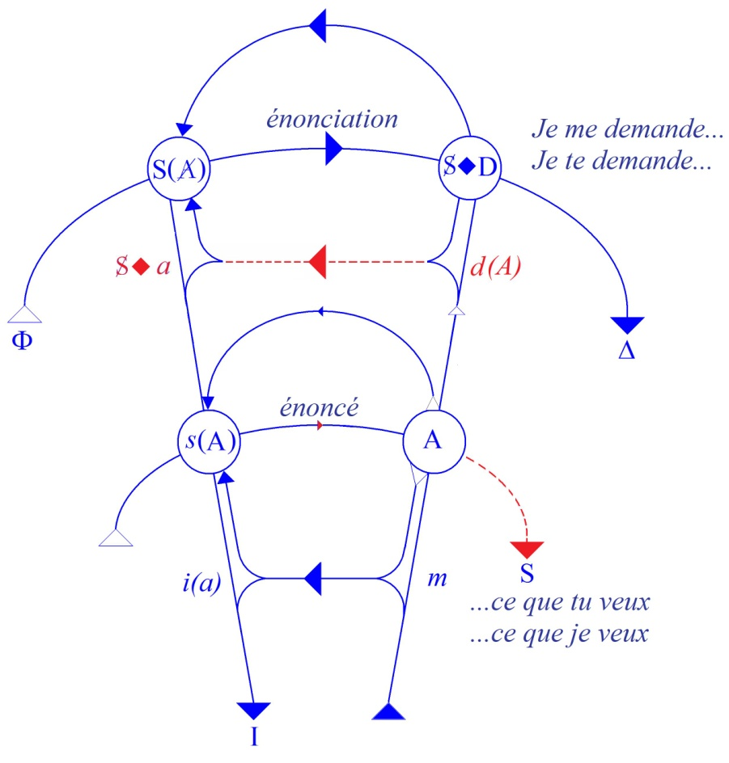
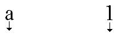
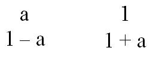
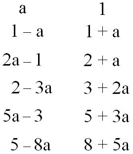
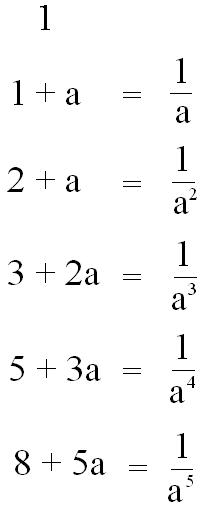
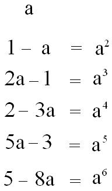
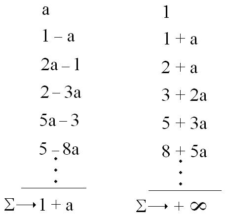
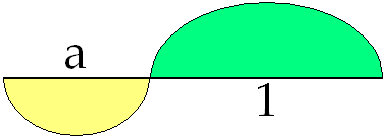
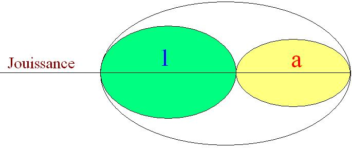

# Leçon 08 | 22 Janvier 1969

  

    <label><input type="checkbox" data-lacan-toggle="original" checked> 原文</label>
    <label><input type="checkbox" data-lacan-toggle="notes" checked> 注释</label>
    <label><input type="checkbox" data-lacan-toggle="commentary" checked> 个人解读评论</label>
  

  <form class="lacan-tool-search" role="search">
    <input class="lacan-tool-search-input" type="search" placeholder="搜索全文" aria-label="搜索全文">
    <button class="lacan-tool-button" type="submit" title="搜索">搜索</button>
  </form>
  <button class="lacan-tool-button lacan-back-to-top" type="button" title="回到页面最上方" aria-label="回到页面最上方">↑</button>

<section class="parallel-paragraph" data-paragraph-ids="s16-08-0001">

s16-08-0001

原文 · s16-08-0001

Le plus difficile à penser, c’est le 1. Qu’on s’y efforce, ça ne date pas d’hier. L’abord moderne est scripturaire.

[无对应译文]

</section>

<section class="parallel-paragraph" data-paragraph-ids="s16-08-0002">

s16-08-0002

原文 · s16-08-0002

C’est un jour ce que j’ai extrait, à l’étonnement, je m’en souviens, d’un de mes auditeurs qui s’en émerveillait : « *Ah ! Comment est-ce que vous avez pu accrocher ça, Einziger Zug ?* », ce que j’ai traduit d’une façon qui reste *le trait unaire*.

[无对应译文]

</section>

<section class="parallel-paragraph" data-paragraph-ids="s16-08-0003">

s16-08-0003

原文 · s16-08-0003

C’est en effet le terme dont FREUD épingle une des formes de ce qu’il appelle *identification*.

[无对应译文]

</section>

<section class="parallel-paragraph" data-paragraph-ids="s16-08-0004">

s16-08-0004

原文 · s16-08-0004

J’ai montré à cette date…

[无对应译文]

</section>

<section class="parallel-paragraph" data-paragraph-ids="s16-08-0005">

s16-08-0005

原文 · s16-08-0005

> d’une façon suffisamment développée pour que je n’aie pas à y revenir aujourd’hui mais seulement à le rappeler …qu’en ce *trait* réside l’essentiel de l’effet de ce qui…

[无对应译文]

</section>

<section class="parallel-paragraph" data-paragraph-ids="s16-08-0006">

s16-08-0006

原文 · s16-08-0006

> pour nous analystes, à savoir dans le champ où nous avons affaire au sujet …s’appelle *la répétition*.

[无对应译文]

</section>

<section class="parallel-paragraph" data-paragraph-ids="s16-08-0007">

s16-08-0007

原文 · s16-08-0007

Ceci, que je n’ai point inventé mais qui est dit dans FREUD, pour peu seulement qu’on fasse à ce qu’il dit attention, ceci est lié d’une façon qu’on peut dire déterminante à une conséquence qu’il désigne comme *l’objet perdu*.

[无对应译文]

</section>

<section class="parallel-paragraph" data-paragraph-ids="s16-08-0008">

s16-08-0008

原文 · s16-08-0008

Essentiellement - pour résumer - c’est dans le fait que la jouissance est visée dans un effort de retrouvailles, et qu’elle ne saurait l’être qu’à être reconnue par l’effet de *la marque*, que *cette marque même y introduit la flétrissure* d’où résulte cette perte, mécanisme fondamental et essentiel à confronter à ce qui était déjà apparu dans une recherche qui somme toute, se poursuivait sur la même voie, concernant toute essence et qui aboutissait à l’*Idée* : la préexistence de toute forme, et du même coup à faire appel à cette chose peu facile à penser - c’est là PLATON - c’est la *réminiscence*.

[无对应译文]

</section>

<section class="parallel-paragraph" data-paragraph-ids="s16-08-0009">

s16-08-0009

原文 · s16-08-0009

Ces points étant rappelés, nous en sommes au *pari de Pascal*. Son rapport à *la répétition* - je pense - n’est pas tout à fait inaperçu de beaucoup d’entre ceux qui sont ici. Pourquoi je passe maintenant par le *pari de Pascal* ? Ce n’est certes pas pour faire le bel esprit, ni du rappel philosophique, ni de la philosophie, de l’histoire de la philosophie.

[无对应译文]

</section>

<section class="parallel-paragraph" data-paragraph-ids="s16-08-0010">

s16-08-0010

原文 · s16-08-0010

Ce qui se passe au niveau du jansénisme, pour rappeler le contexte pascalien, c’est une affaire qui nous intéresse, en ceci précisément que l’historien - comme en bien d’autres choses - est bien incapable de s’y retrouver. Lisez un petit « *Que-Sais-je ?* », je m’excuse auprès de son auteur d’avoir oublié jusqu’à son nom[^30], mais j’ai lu le texte de bout en bout, et bien sûr pas pour me renseigner sur le jansénisme…

[无对应译文]

</section>

<section class="parallel-paragraph" data-paragraph-ids="s16-08-0011">

s16-08-0011

原文 · s16-08-0011

> je n’en dirai pas plus d’ailleurs sur ce qu’il en est de mon rapport à lui, ce serait une bien trop belle occasion
>
> pour vous de vous précipiter dans des déterminations *historiques* ou *biographiques* de mes intérêts …quoi qu’il en soit, il y a un bout de temps, il se trouve que j’ai pu en avoir l’appréhension en dehors de cette sorte de fantôme qui en reste…

[无对应译文]

</section>

<section class="parallel-paragraph" data-paragraph-ids="s16-08-0012">

s16-08-0012

原文 · s16-08-0012

> à savoir que c’étaient des gens qu’on appelle « *rigoristes* », autrement dit qui vous empêchaient de vivre à votre gré. C’est tout ce qu’il en reste en effet, par un de ces surprenants effets d’ensablement dont il ne faut pas méconnaître que c’est aussi une dimension de l’histoire …mais en lisant donc ce petit livre, je me suis donné le témoignage sur ce qu’on peut en dire, simplement à prendre les choses justement comme l’indique le titre de la collection, au niveau du « *Que-Sais-je ?* ».

[无对应译文]

</section>

<section class="parallel-paragraph" data-paragraph-ids="s16-08-0013">

s16-08-0013

原文 · s16-08-0013

Il sait beaucoup de choses, l’auteur. Il repart des origines - si tant est qu’il y en ait - de la question qui s’y soulève.

[无对应译文]

</section>

<section class="parallel-paragraph" data-paragraph-ids="s16-08-0014">

s16-08-0014

原文 · s16-08-0014

Il aboutit au point où la chose se noie dans la secousse de la Révolution française, et il avoue tout gentiment à la fin, qu’en fin de compte le jansénisme, on voit vraiment pas, à tout prendre, ce que ça a voulu dire, ce qui est tout de même, pour un travail de recension historique, une conclusion assez *curieuse mais exemplaire*.

[无对应译文]

</section>

<section class="parallel-paragraph" data-paragraph-ids="s16-08-0015">

s16-08-0015

原文 · s16-08-0015

Une chose apparaît dans cette histoire, c’est qu’à la prendre à son niveau d’enregistrement historique, ça commence comme une affaire de théologiens. Et d’ailleurs c’est bien vrai, JANSENIUS se trouve être d’eux le plus représentatif, disons même le plus digne de les représenter, ne serait-ce qu’en ceci qui est exemplaire, c’est qu’il apparaît que tout ce qui s’agite à l’époque autour du débat, de la contradiction et des condamnations qui lui font cortège, la question *fondamentale*, celle qu’il n’y a presque aucun des participants au débat qui ne l’agite, c’est : « *Et d’abord vous ne l’avez pas lu !* ».

[无对应译文]

</section>

<section class="parallel-paragraph" data-paragraph-ids="s16-08-0016">

s16-08-0016

原文 · s16-08-0016

Et il semble bien en effet que la très très grande majorité de ceux qui alors se passionnent, non seulement ne l’ont pas lu mais même ne l’ont pas ouvert. Certains pourtant - deux ou trois chefs de file, le Grand ARNAUD... - devaient l’avoir lu.

[无对应译文]

</section>

<section class="parallel-paragraph" data-paragraph-ids="s16-08-0017">

s16-08-0017

原文 · s16-08-0017

D’ailleurs qu’avait-on besoin de le lire ?

[无对应译文]

</section>

<section class="parallel-paragraph" data-paragraph-ids="s16-08-0018">

s16-08-0018

原文 · s16-08-0018

On avait lu bien d’autres choses et, elles, *fondamentales*, et en particulier avant…

[无对应译文]

</section>

<section class="parallel-paragraph" data-paragraph-ids="s16-08-0019">

s16-08-0019

原文 · s16-08-0019

> bien avant que paraisse cet ouvrage paru posthume, comme vous le savez peut–être, qui s’appelle l’*Augustinus* [^31],
>
> de celui que je viens de nommer, l’évêque JANSEN …il y avait eu la pensée de Saint AUGUSTIN dont on ne peut nier qu’elle soit au fondement du christianisme et que pour tout dire, la question est là patente dès qu’il s’agit du christianisme précisément.

[无对应译文]

</section>

<section class="parallel-paragraph" data-paragraph-ids="s16-08-0020">

s16-08-0020

原文 · s16-08-0020

La mesure dans laquelle le christianisme nous intéresse, j’entends au niveau de la théorie, se mesure précisément au rôle donné à *la Grâce*. Qui ne voit pas que *la Grâce* a le plus étroit rapport avec ce que moi, partant de fonctions théoriques qui n’ont certes rien à faire avec les effusions du cœur, je désigne comme *d*(A), *désir de l’Autre*, *désir de l’Homme*, ai-je dit en un temps où pour me faire entendre, il fallait bien que je risque certains mots improbables comme « *l’Homme* » par exemple.

[无对应译文]

</section>

<section class="parallel-paragraph" data-paragraph-ids="s16-08-0021">

s16-08-0021

原文 · s16-08-0021

J’aurais pu me contenter de dire : « *Le désir tel qu’il vous concerne, ce désir se joue dans ce champ de l’Autre tel qu’il s’articule comme le lieu de la parole.* »

[无对应译文]

</section>

<section class="parallel-paragraph" data-paragraph-ids="s16-08-0022">

s16-08-0022

原文 · s16-08-0022

[无对应译文]

</section>

<section class="parallel-paragraph" data-paragraph-ids="s16-08-0023">

s16-08-0023

原文 · s16-08-0023

Qui ne voit aussi ce qu’implique, si ce qui s’énonce ainsi est correct, cette relation orientée par le vecteur partant du S ◊ D sur le graphe vers ce désir, désir de l’Autre \[*d*(A)\] pour l’interroger dans un : « *Je me demande ce que tu veux.* », qui s’équilibre aussi bien d’un : « *Je te demande ce que je veux.* ».

[无对应译文]

</section>

<section class="parallel-paragraph" data-paragraph-ids="s16-08-0024">

s16-08-0024

原文 · s16-08-0024

Ce qu’il y a qui s’incline dans toute manifestation du désir vers un « *Que Ta Volonté soit faite* » mérite d’être posé d’abord, dans toute appréciation - ce n’est pas forcément le privilège des spirituels - sur ce qu’il en est de la nature de la prière.

[无对应译文]

</section>

<section class="parallel-paragraph" data-paragraph-ids="s16-08-0025">

s16-08-0025

原文 · s16-08-0025

Son emmêlement inextricable avec les fonctions du désir pourrait en être éclairé. Ce tutoiement, ai-je dit, n’a pas un départ simple, puisqu’*au niveau du sujet la question reste entière de savoir qui parle*. Il n’en est pas moins essentiel de s’apercevoir que ce tutoiement s’adresse à un Autre sans figure. Nul besoin qu’il en ait la moindre pour qu’il lui soit adressé, si nous savons distinguer ce champ de l’Autre du rapport au semblable. Or c’est précisément ce qu’articule sa définition dans ma théorie.

[无对应译文]

</section>

<section class="parallel-paragraph" data-paragraph-ids="s16-08-0026">

s16-08-0026

原文 · s16-08-0026

Le rapport, le nœud, le lien qu’il y a entre des disputes sur la Grâce dont il semble que les *responsables de droit*, à savoir l’Église, à l’époque dont nous parlons, n’aient pu autrement se tirer qu’à interdire de façon réitérée pendant deux siècles qu’on articule quoi que ce soit, ni pour, ni contre, dans ce débat…

[无对应译文]

</section>

<section class="parallel-paragraph" data-paragraph-ids="s16-08-0027">

s16-08-0027

原文 · s16-08-0027

> interdiction bien sûr qui n’a fait que faire rebondir la lutte et multiplier les ouvrages aussi bien que les libelles …est quelque chose dont ce qui nous importe, c’est que cette frénésie que certains diraient *purement intellectuelle* est étroitement solidaire d’un mouvement dont il n’est pas question de contester les incidences de ferveur ni à l’occasion non plus les effets proprement - comme ceci a été épinglé à l’époque - convulsionnaires.

[无对应译文]

</section>

<section class="parallel-paragraph" data-paragraph-ids="s16-08-0028">

s16-08-0028

原文 · s16-08-0028

Quelle que soit la façon dont nous pouvons jauger, comme psychopathologues, ce qui se passait sur le tombeau d’un certain diacre PÂRIS, et de là, quand à l’entrée du cimetière les portes furent fermées, si bien qu’on put écrire dessus :

[无对应译文]

</section>

<section class="parallel-paragraph" data-paragraph-ids="s16-08-0029">

s16-08-0029

原文 · s16-08-0029

> « *De par le Roi défense à Dieu de faire miracle en ce lieu* » …les dites convulsions qui se sont poursuivies ailleurs.

[无对应译文]

</section>

<section class="parallel-paragraph" data-paragraph-ids="s16-08-0030">

s16-08-0030

原文 · s16-08-0030

Il semble que, ne serait-ce qu’à épingler les choses dans cette ultime conséquence, nous pouvons voir que ce champ est tout de même de celui qui nous appartient et qu’après tout, à le prendre d’une façon qui ne soit pas tout à fait au ras du sol, à savoir : « *faut-il les interner ou pas ?* » nous sommes quand même en droit d’essayer d’articuler quelque chose, et pourquoi pas au point le plus libre, le plus lucide, le plus joueur, *le pari* précisément *de Pascal*.

[无对应译文]

</section>

<section class="parallel-paragraph" data-paragraph-ids="s16-08-0031">

s16-08-0031

原文 · s16-08-0031

Le *Nom du Père…* je vais l’annoncer comme ça au départ parce que ce sera peut-être la meilleure façon de vous faire décoller de l’effort de fascination qui se dégage de ces embrouilles …le *Nom du Père…*

[无对应译文]

</section>

<section class="parallel-paragraph" data-paragraph-ids="s16-08-0032">

s16-08-0032

原文 · s16-08-0032

> dont j’insiste pour dire que ce n’est pas par hasard que je n’ai pas pu en parler …le *Nom du Père* prend ici une forme singulière que je vous prie de bien repérer au niveau du *pari*.

[无对应译文]

</section>

<section class="parallel-paragraph" data-paragraph-ids="s16-08-0033">

s16-08-0033

原文 · s16-08-0033

Cela vous changera peut-être des chipotages auxquels se consacrent habituellement les auteurs sur le sujet de savoir *si ça vaut la peine de parier*. *Ce qui vaut la peine*, c’est de considérer comment il se formule sous la plume de PASCAL.

[无对应译文]

</section>

<section class="parallel-paragraph" data-paragraph-ids="s16-08-0034">

s16-08-0034

原文 · s16-08-0034

Je dirai que cette forme singulière, dans l’énoncé qui vient en tête sur le petit papier, cette forme singulière c’est ce que j’appellerai *le réel absolu*, et *le réel absolu* sur ce petit papier, est ce qui s’énonce comme « *croix ou pile* ».

[无对应译文]

</section>

<section class="parallel-paragraph" data-paragraph-ids="s16-08-0035">

s16-08-0035

原文 · s16-08-0035

« *Croix ou pile* » ça n’agite pas la croix, ôtez-vous ça de la tête, « *croix ou pile* » c’était la façon à l’époque de dire ce que nous appelons maintenant « *pile ou face* ». Je voudrais qu’il vous vienne à l’idée que s’il est concevable que nous arrivions, en quelque point, au dernier terme d’une science quelconque *au sens moderne*, à savoir par l’opération de ce qu’on appelle une mesure, ce ne peut être très précisément qu’au point où ce qu’il y a à dire c’est :

[无对应译文]

</section>

<section class="parallel-paragraph" data-paragraph-ids="s16-08-0036">

s16-08-0036

原文 · s16-08-0036

### « *croix ou pile* »,

[无对应译文]

</section>

<section class="parallel-paragraph" data-paragraph-ids="s16-08-0037">

s16-08-0037

原文 · s16-08-0037

### « *c’est ça ou c’est pas ça* ».

[无对应译文]

</section>

<section class="parallel-paragraph" data-paragraph-ids="s16-08-0038">

s16-08-0038

原文 · s16-08-0038

« *Ça est ce que ça est là* » car jusque là rien ne nous affirme que nous ne faisons pas que *mesurer nos propres mesures*.

[无对应译文]

</section>

<section class="parallel-paragraph" data-paragraph-ids="s16-08-0039">

s16-08-0039

原文 · s16-08-0039

Il faut que ça arrive à un point - « *croix ou pile* » - où ce n’est que du *réel* en tant que butée qu’il s’agit.

[无对应译文]

</section>

<section class="parallel-paragraph" data-paragraph-ids="s16-08-0040">

s16-08-0040

原文 · s16-08-0040

Le pari de PASCAL contient à son départ quelque chose qui se réfère à ce point pôle : *le réel absolu*. Et ceci d’autant plus que ce dont il s’agit, c’est précisément quelque chose qui est défini : que nous ne pouvons savoir « *ni s’il est, ni ce qu’il est* ».

[无对应译文]

</section>

<section class="parallel-paragraph" data-paragraph-ids="s16-08-0041">

s16-08-0041

原文 · s16-08-0041

C’est expressément ce que PASCAL articule quant à ce dont il s’agit, qui bien sûr, au niveau du *pari*, si la question se pose de son acte, peut bien en effet être traduit par la question de l’existence ou non du *partenaire*.

[无对应译文]

</section>

<section class="parallel-paragraph" data-paragraph-ids="s16-08-0042">

s16-08-0042

原文 · s16-08-0042

Mais il n’y a pas que le *partenaire*, il y a *l’enjeu*, et c’est là l’intérêt du *pari de Pascal*. *L’enjeu*…

[无对应译文]

</section>

<section class="parallel-paragraph" data-paragraph-ids="s16-08-0043">

s16-08-0043

原文 · s16-08-0043

> le fait qu’il puisse poser en ces termes la question de notre mesure au regard de ce *réel* … *l’enjeu* suppose un pas franchi qui, quoi qu’en disent les amateurs de fouinage historique, à savoir que déjà

[无对应译文]

</section>

<section class="parallel-paragraph" data-paragraph-ids="s16-08-0044">

s16-08-0044

原文 · s16-08-0044

Raymond SEBOND[^32], et déjà le Père SIRMOND[^33], et déjà Pierre CHARRON[^34] avaient agité quelque chose de l’ordre de ce risque. Ceux-là méconnaissent que si PASCAL peut avancer d’une façon dont ce n’est point par hasard qu’elle a été ressentie si profondément dans le champ du « où ça pense », c’est qu’il avait profondément modifié l’abord de ce qu’il en est du « *je dis *», j’entends du « *je* » du joueur et ceci en procédant à - si je puis dire - *quelque chose* qui pourrait s’appeler *un exorcisme*, ceci le jour où il découvrit *la règle des partis*.

[无对应译文]

</section>

<section class="parallel-paragraph" data-paragraph-ids="s16-08-0045">

s16-08-0045

原文 · s16-08-0045

Les *résistances* qu’il rencontre après avoir posé ce problème « *de la façon dont il est juste de répartir les enjeux quand, pour une raison quelconque, obligé ou de consentement mutuel, on interrompt en cours une partie dont la règle est déjà donnée.* », *le pivot* de ce qui lui permet d’y trancher d’une façon aussi *féconde* :

[无对应译文]

</section>

<section class="parallel-paragraph" data-paragraph-ids="s16-08-0046">

s16-08-0046

原文 · s16-08-0046

- que c’est par là qu’il articule le fondement de ce qu’on appelle le triangle mathématique, assurément bien sûr déjà découvert par quelque TARTAGLIA[^35], mais il n’est pas forcé d’en être informé,

[无对应译文]

</section>

<section class="parallel-paragraph" data-paragraph-ids="s16-08-0047">

s16-08-0047

原文 · s16-08-0047

- aussi bien d’ailleurs, il en tire d’autres suites, puisque c’est par là qu’il rejoint, reprend et donne un re-départ à ce qui, dans *les lois de maximum et de minimum* au niveau d’ARCHIMÈDE, prélude à ce qui va naître du *calcul intégral*.

[无对应译文]

</section>

<section class="parallel-paragraph" data-paragraph-ids="s16-08-0048">

s16-08-0048

原文 · s16-08-0048

Tout ceci repose sur cette simple remarque, pour trancher de ce dont il s’agit : *c’est que l’essence du jeu, dans ce qu’il comporte* *de logifiable parce qu’il est réglé, tient en ceci que ce qui y est misé est au départ perdu.*

[无对应译文]

</section>

<section class="parallel-paragraph" data-paragraph-ids="s16-08-0049">

s16-08-0049

原文 · s16-08-0049

Là où la question de l’appât du gain déforme, réfracte, d’une façon qui ne permet point aux théoriciens de n’être pas, dans leurs articulations, infléchis, cette *purification initiale* permet d’énoncer d’une façon correcte ce qu’il est juste d’opérer pour faire à tout moment le partage de ce qui est là au centre comme enjeu, comme perdu.

[无对应译文]

</section>

<section class="parallel-paragraph" data-paragraph-ids="s16-08-0050">

s16-08-0050

原文 · s16-08-0050

La question pour nous analystes, nous intéresse parce qu’elle nous permet d’y accrocher ce qui est la motivation essentielle du surgissement d’un mode semblable d’enchaînement.

[无对应译文]

</section>

<section class="parallel-paragraph" data-paragraph-ids="s16-08-0051">

s16-08-0051

原文 · s16-08-0051

S’il est une activité dont le départ soit fondé dans l’assomption de la perte, c’est bien parce que ce dont il s’agit dans l’abord même de toute *règle* - c’est-à-dire d’une *concaténation signifiante - c’est d’un effet de perte*, c’est très précisément ce sur quoi je m’efforce dès le départ de « *mettre les points sur les i* », parce que bien sûr notre *expérience* - comme on dit : dans l’analyse - à tout instant nous confronte à cet *effet de perte,* et que si l’on ne saisit pas ce dont il s’agit, *on le met au compte*, sous le nom de « *blessure narcissique* », *d’un dommage imaginaire*.

[无对应译文]

</section>

<section class="parallel-paragraph" data-paragraph-ids="s16-08-0052">

s16-08-0052

原文 · s16-08-0052

C’est bien en quoi l’expérience innocente témoigne que cet *effet de perte* est rencontré à chaque pas.

[无对应译文]

</section>

<section class="parallel-paragraph" data-paragraph-ids="s16-08-0053">

s16-08-0053

原文 · s16-08-0053

Elle en témoigne de façon *innocente* c’est-à-dire de la façon la plus nocive, en le rapportant à ce schéma d’une « *blessure narcissique* » c’est-à-dire d’un rapport au *semblable* qui, dans l’occasion, n’a absolument rien à faire.

[无对应译文]

</section>

<section class="parallel-paragraph" data-paragraph-ids="s16-08-0054">

s16-08-0054

原文 · s16-08-0054

Ce n’est pas parce que *quelque parcelle* qui ferait partie du corps en est détachée que la blessure en question fonctionne, et tout essai de réparation, quel qu’il soit, est condamné à en prolonger l’aberration. Ce dont il s’agit - la blessure - se tient ailleurs, dans un effet qu’au départ, pour le rappeler, j’ai distingué de l’*Imaginaire* comme *Symbolique* : il est dans la béance qui se produit ou qui s’aggrave…

[无对应译文]

</section>

<section class="parallel-paragraph" data-paragraph-ids="s16-08-0055">

s16-08-0055

原文 · s16-08-0055

> car nous ne pouvons sonder ce qui de cette béance était déjà là dans l’organisme …de la béance entre le corps et sa jouissance, pour autant que donc, ai-je dit, ce qui la détermine ou qui l’aggrave… et seule nous importe cette aggravation …c’est *l’incidence du signifiant, l’incidence même de la marque, l’incidence de ce* que j’ai appelé tout à l’heure le *trait unaire*, qui lui donne donc sa consistance.

[无对应译文]

</section>

<section class="parallel-paragraph" data-paragraph-ids="s16-08-0056">

s16-08-0056

原文 · s16-08-0056

Alors ce dont il s’agit se dessine à mesurer *l’effet de cette perte, de cet objet perdu* en tant que nous le désignons par *(a)*, à ce *lieu* sans lequel il ne saurait se produire, à ce lieu encore non connu, non mesuré qui s’appelle l’Autre.

[无对应译文]

</section>

<section class="parallel-paragraph" data-paragraph-ids="s16-08-0057">

s16-08-0057

原文 · s16-08-0057

Est-ce à dire qu’il faille d’abord prendre cette *mesure* dont il suffit de l’expérience - voire de la passion - du jeu, pour voir quel est son rapport avec la façon dont nous fonctionnons comme désir ?

[无对应译文]

</section>

<section class="parallel-paragraph" data-paragraph-ids="s16-08-0058">

s16-08-0058

原文 · s16-08-0058

Qu’en va-t-il être de cette proportion qu’il nous faut maintenant mesurer ?

[无对应译文]

</section>

<section class="parallel-paragraph" data-paragraph-ids="s16-08-0059">

s16-08-0059

原文 · s16-08-0059

Eh bien il y a quelque chose de très étrange, c’est que *cette proportion, cette mesure elle est déjà là dans les chiffres*, je veux dire *dans les signes écrits* avec quoi l’on articule l’idée même de la mesure. Nous ne savons rien, en ce point, *de la nature de la perte*.

[无对应译文]

</section>

<section class="parallel-paragraph" data-paragraph-ids="s16-08-0060">

s16-08-0060

原文 · s16-08-0060

Je peux faire comme si nous ne lui donnions jamais aucun particulier support : nous donnons des points, je ne dirai pas où nous pouvons écoper… où nous attrapons des copeaux, *mais aucun besoin de le savoir*.

[无对应译文]

</section>

<section class="parallel-paragraph" data-paragraph-ids="s16-08-0061">

s16-08-0061

原文 · s16-08-0061

Je l’ai dit :

[无对应译文]

</section>

<section class="parallel-paragraph" data-paragraph-ids="s16-08-0062">

s16-08-0062

原文 · s16-08-0062

- d’un côté nous ne savons que *la fonction de la perte* \[*a*\]

[无对应译文]

</section>

<section class="parallel-paragraph" data-paragraph-ids="s16-08-0063">

s16-08-0063

原文 · s16-08-0063

- et de l’autre, nous ne savons assurément pas ce qu’il en est de l’1 puisqu’il n’est que *le trait unaire*.

[无对应译文]

</section>

<section class="parallel-paragraph" data-paragraph-ids="s16-08-0064">

s16-08-0064

原文 · s16-08-0064

Ce « *ne sait* » *n’est que tout ce qu’il nous plaît d’en retenir*.

[无对应译文]

</section>

<section class="parallel-paragraph" data-paragraph-ids="s16-08-0065">

s16-08-0065

原文 · s16-08-0065

Et néanmoins il nous suffira d’écrire ceci : 1/*a*, où s’inscrit la proportion, à savoir que le rapport de ce 1 déterminant, à l’*effet de perte*, est égal…

[无对应译文]

</section>

<section class="parallel-paragraph" data-paragraph-ids="s16-08-0066">

s16-08-0066

原文 · s16-08-0066

> et doit l’être, comme il semble bien *s’il s’agit de perte* …à quelque chose où se conjoint d’un « *et* » additif ce 1 et le signe écrit de cette perte \[*a*\] :

[无对应译文]

</section>

<section class="parallel-paragraph" data-paragraph-ids="s16-08-0067">

s16-08-0067

原文 · s16-08-0067

> <u>1</u> = 1 + *a*
>
> *a*

[无对应译文]

</section>

<section class="parallel-paragraph" data-paragraph-ids="s16-08-0068">

s16-08-0068

原文 · s16-08-0068

Car tel est bien en effet l’inscription d’où résulte ce qu’il en est d’une certaine *proportion* dont l’harmonie, s’il faut l’évoquer, ne tient assurément pas à des effets esthétiques. Simplement je vous demande, pour le mesurer vous-mêmes, de vous laisser d’abord guider par l’examen de ce qu’il en est *de sa nature mathématique*. Les « *harmonies* » dont il s’agit ne sont point faites de bonheur, d’une *heureuse rencontre* [^36].

[无对应译文]

</section>

<section class="parallel-paragraph" data-paragraph-ids="s16-08-0069">

s16-08-0069

原文 · s16-08-0069

Comme je pense que le rapprochement de la série qui résulte de la fonction récurrente qui s’engendre de cette égalité, comme je pense vous montrer qu’on en retrouve la note caractéristique, celle de *(a)*, dans une toute autre *série* engendrée d’un autre départ, mais qui nous intéresse autant comme vous le verrez, c’est celle qui - *à prendre les choses* d’un autre bout - …s’engendrerait de ce que nous avons appelé « *Spaltung »* ou « *division originelle du sujet* », en d’autres termes des efforts pour faire se rejoindre deux unités disjointes.

[无对应译文]

</section>

<section class="parallel-paragraph" data-paragraph-ids="s16-08-0070">

s16-08-0070

原文 · s16-08-0070

C’est là un champ qu’il convient de parcourir pas à pas.

[无对应译文]

</section>

<section class="parallel-paragraph" data-paragraph-ids="s16-08-0071">

s16-08-0071

原文 · s16-08-0071

Il est nécessaire pour le faire, d’inscrire d’une façon qui soit claire, ce qu’il peut en être de la dite *série*. Nous l’inscrivons sous la forme suivante : nous mettons ici le *a*, ici le 1, une direction. Cette direction n’existe - je le souligne au passage - que du fait de notre départ :

[无对应译文]

</section>

<section class="parallel-paragraph" data-paragraph-ids="s16-08-0072">

s16-08-0072

原文 · s16-08-0072

[无对应译文]

</section>

<section class="parallel-paragraph" data-paragraph-ids="s16-08-0073">

s16-08-0073

原文 · s16-08-0073

Après le *a* nous mettons : 1 – *a*, après le 1 : 1 + *a.*

[无对应译文]

</section>

<section class="parallel-paragraph" data-paragraph-ids="s16-08-0074">

s16-08-0074

原文 · s16-08-0074

[无对应译文]

</section>

<section class="parallel-paragraph" data-paragraph-ids="s16-08-0075">

s16-08-0075

原文 · s16-08-0075

La série s’engendre[^37] d’additionner les deux termes pour en produire le terme suivant. Nous avons donc ici :

[无对应译文]

</section>

<section class="parallel-paragraph" data-paragraph-ids="s16-08-0076">

s16-08-0076

原文 · s16-08-0076

[无对应译文]

</section>

<section class="parallel-paragraph" data-paragraph-ids="s16-08-0077">

s16-08-0077

原文 · s16-08-0077

D’où vous pouvez voir qu’il n’est pas sans présenter quelques rapports avec la liste opposée. Je passe, je passe parce qu’il vous est facile de contrôler ceci, que la suite de ces valeurs représente une proportion qui se conserve, à savoir : que 1 + *a* est à 1 comme 2 + *a* est à 1 + *a*.

[无对应译文]

</section>

<section class="parallel-paragraph" data-paragraph-ids="s16-08-0078">

s16-08-0078

原文 · s16-08-0078

C’est très exactement ce qui est écrit dans la formule initiale. Ceci peut aussi bien s’écrire : 1, 1/*a*, 1/*a*2, 1/*a*3, 1/*a*4… nombre qui - comme *a* - est plus petit que 1, ira toujours croissant.

[无对应译文]

</section>

<section class="parallel-paragraph" data-paragraph-ids="s16-08-0079">

s16-08-0079

原文 · s16-08-0079

[无对应译文]

</section>

<section class="parallel-paragraph" data-paragraph-ids="s16-08-0080">

s16-08-0080

原文 · s16-08-0080

Ici par contre on écrit : *a*2, *a*3, *a*4, *a*5, *a*6… *nombre qui* - je le répète - comme *a* est plus petit que 1, *ira toujours décroissant* :

[无对应译文]

</section>

<section class="parallel-paragraph" data-paragraph-ids="s16-08-0081">

s16-08-0081

原文 · s16-08-0081

[无对应译文]

</section>

<section class="parallel-paragraph" data-paragraph-ids="s16-08-0082">

s16-08-0082

原文 · s16-08-0082

Ne quittons pas notre PASCAL car sur le petit papier ce qu’il opère c’est une articulation, donc il n’y a nul besoin qu’elle soit destinée à quelque autre pour que les répliques n’y aient pas une valeur non pas persuasive mais logiquement constructive.

[无对应译文]

</section>

<section class="parallel-paragraph" data-paragraph-ids="s16-08-0083">

s16-08-0083

原文 · s16-08-0083

On s’est fort bien aperçu de nos jours, que pour *certains problèmes* il y a une façon où compte – pour les résoudre – le nombre des coups, à savoir au bout de combien de coups une partie conquiert le dernier mot.

[无对应译文]

</section>

<section class="parallel-paragraph" data-paragraph-ids="s16-08-0084">

s16-08-0084

原文 · s16-08-0084

Si elle le conquiert du fait *de ce qu’on pourrait appeler*, mais purement rétrospectivement, *une faute au niveau de l’autre parti*, il est clair que l’épreuve consistera à proposer à l’autre parti une réponse plus chanceuse.

[无对应译文]

</section>

<section class="parallel-paragraph" data-paragraph-ids="s16-08-0085">

s16-08-0085

原文 · s16-08-0085

Mais que si le résultat est le même, nous pouvons mettre au compte d’une articulation logique - j’entends : « reçue », il suffit de le définir au départ - au titre *d’une démonstration*, ce qui s’articulerait ainsi :

[无对应译文]

</section>

<section class="parallel-paragraph" data-paragraph-ids="s16-08-0086">

s16-08-0086

原文 · s16-08-0086

[无对应译文]

</section>

<section class="parallel-paragraph" data-paragraph-ids="s16-08-0087">

s16-08-0087

原文 · s16-08-0087

Il est fâcheux qu’on l’oublie à une époque, la nôtre, qui a su fort bien codifier les lois de cette fonction du « *oui* ou *non* », oui ou non *réfutable*, et s’apercevoir qu’il ouvre plus de champ que le pur et simple *démontrable*.

[无对应译文]

</section>

<section class="parallel-paragraph" data-paragraph-ids="s16-08-0088">

s16-08-0088

原文 · s16-08-0088

C’est ainsi - je l’ai fait remarquer, je l’ai déjà annoncé, amorcé la dernière fois - que le procès de PASCAL, celui qui lui fait d’abord sonder au regard d’un pur « *croix ou pile* » le rationnel de l’engagement d’une mise de quelque chose dans la vie qui est justement ce qui n’est pas défini, contre quelque chose dans ce qui est au moins une infinité de vies qu’on qualifie \- sans non plus préciser ce qu’elles veulent dire - *d’indéfiniment heureuses*.

[无对应译文]

</section>

<section class="parallel-paragraph" data-paragraph-ids="s16-08-0089">

s16-08-0089

原文 · s16-08-0089

Mais peut-être vaut-il que - si nous venons après lui - nous réinterrogions ces *signes*, nous voyions s’ils ne sont pas capables de livrer quelque chose qui nécessairement préciserait le sens. C’est bien ce que nous sommes en train d’opérer au niveau de ces signes et de nous apercevoir que si nous nous emparons du *a* nous n’en savons toujours pas la valeur, mais seulement ce qu’il engendre comme série dans son rapport avec le 1. Nous voyons une série, rien de plus.

[无对应译文]

</section>

<section class="parallel-paragraph" data-paragraph-ids="s16-08-0090">

s16-08-0090

原文 · s16-08-0090

Et l’on pourrait même dire que la question de ce qu’il en est du *a* et du 1 comme tels, comme termes apposés d’une façon quelconque, même mathématiquement, n’a pas de sens. Ce ne sont pas comme quand il s’agit de définir les nombres entiers et ce qu’on peut faire avec eux des éléments neutres. Ce 1 n’a rien à faire avec le 1 de la multiplication : il faut *des actions supplémentaires* pour les faire servir, et le *a* non plus.

[无对应译文]

</section>

<section class="parallel-paragraph" data-paragraph-ids="s16-08-0091">

s16-08-0091

原文 · s16-08-0091

Le *a* comme le 1 sont là partout, partout où il y a le rapport 1/*a* c’est-à-dire dans toute la série. C’est justement là l’intérêt d’en partir, parce que la seule raison qui nécessite que nous en partions, c’est que c’est à partir d’eux que nous écrivons.

[无对应译文]

</section>

<section class="parallel-paragraph" data-paragraph-ids="s16-08-0092">

s16-08-0092

原文 · s16-08-0092

Dans un *réel* quelconque qui parait pouvoir correspondre à cette échelle, ils n’ont de place nulle part. Seulement cette échelle, sans eux nous ne pouvons pas l’écrire. C’est en partant d’elle, de cette échelle, que je peux me permettre d’imager, à partir d’une autre écriture, la plus simple également, nous restons, semble-t-il, dans nos limites, dans celles du *trait unaire*, à ceci près que nous allons le prolonger indéfiniment, essayer tout au moins de le prolonger indéfiniment.

[无对应译文]

</section>

<section class="parallel-paragraph" data-paragraph-ids="s16-08-0093">

s16-08-0093

原文 · s16-08-0093

Voilà le *a*, voilà le 1 :

[无对应译文]

</section>

<section class="parallel-paragraph" data-paragraph-ids="s16-08-0094">

s16-08-0094

原文 · s16-08-0094

[无对应译文]

</section>

<section class="parallel-paragraph" data-paragraph-ids="s16-08-0095">

s16-08-0095

原文 · s16-08-0095

*Nous ne sommes pas forcés de les mesurer pour qu’ils soient correctement inscrits*. Là aussi, je pense que vous me pardonnerez d’abréger et de dire ceci : nous projetons ce *a* sur ce champ \[champ de l’Autre\] [^38] considéré dans sa fonction de 1.

[无对应译文]

</section>

<section class="parallel-paragraph" data-paragraph-ids="s16-08-0096">

s16-08-0096

原文 · s16-08-0096

[无对应译文]

</section>

<section class="parallel-paragraph" data-paragraph-ids="s16-08-0097">

s16-08-0097

原文 · s16-08-0097

Ce que nous venons d’écrire \[1–a = a2\] nous indique que :

[无对应译文]

</section>

<section class="parallel-paragraph" data-paragraph-ids="s16-08-0098">

s16-08-0098

原文 · s16-08-0098

- ce qui sera ici, sera *a*2 .

[无对应译文]

</section>

<section class="parallel-paragraph" data-paragraph-ids="s16-08-0099">

s16-08-0099

原文 · s16-08-0099

- Le rabattement ici de l’*a*2 nous mettra ici un *a*3.

[无对应译文]

</section>

<section class="parallel-paragraph" data-paragraph-ids="s16-08-0100">

s16-08-0100

原文 · s16-08-0100

- Le rabattement de l’*a*3 nous mettra ici un *a*4.

[无对应译文]

</section>

<section class="parallel-paragraph" data-paragraph-ids="s16-08-0101">

s16-08-0101

原文 · s16-08-0101

Vous suivez j’espère ! Voyez donc que vont s’additionner par des opérations qui vont dans un certain sens toutes les puissances paires de *a* : *a*2, *a*4, *a*6… et qu’ici vont se reproduire la suite des puissances impaires *a*3, *a*5, *a*7… Il est très facile de s’apercevoir qu’ainsi, nous retrouverons au point de jonction convergente de ces puissances les unes paires, les autres impaires :

[无对应译文]

</section>

<section class="parallel-paragraph" data-paragraph-ids="s16-08-0102">

s16-08-0102

原文 · s16-08-0102

- la mesure de *a* comme total pour toutes *les puissances paires*, *a* lui-même étant bien entendu exclu,

[无对应译文]

</section>

<section class="parallel-paragraph" data-paragraph-ids="s16-08-0103">

s16-08-0103

原文 · s16-08-0103

- la mesure *a2* comme somme des *puissances totales impaires* de *a*,

[无对应译文]

</section>

<section class="parallel-paragraph" data-paragraph-ids="s16-08-0104">

s16-08-0104

原文 · s16-08-0104

- *a2* et *a* faisant au total 1.

[无对应译文]

</section>

<section class="parallel-paragraph" data-paragraph-ids="s16-08-0105">

s16-08-0105

原文 · s16-08-0105

[无对应译文]

</section>

<section class="parallel-paragraph" data-paragraph-ids="s16-08-0106">

s16-08-0106

原文 · s16-08-0106

C’est-à-dire que c’est par l’opération même de l’*addition* séparée des *puissances paires* d’une part et des *puissances impaires* que nous trouvons effectivement la mesure de ce *champ de l’Autre* comme 1, c’est-à-dire *autre chose* que sa pure et simple *inscription* comme *trait unaire*.

[无对应译文]

</section>

<section class="parallel-paragraph" data-paragraph-ids="s16-08-0107">

s16-08-0107

原文 · s16-08-0107

Je n’ai obtenu ce résultat qu’à prendre isolément ce qui est le fondement proportionnel du *a*.

[无对应译文]

</section>

<section class="parallel-paragraph" data-paragraph-ids="s16-08-0108">

s16-08-0108

原文 · s16-08-0108

Mais si je prends son développement dans le sens de la croissance, vous voyez facilement qu’à simplement additionner ces puissances déjà croissantes, si je vous disais ce que ça fait, au moment où nous pouvons additionner le 1/*a* puissance quelque chose jusqu’à ce qu’ait surgi le *a*100, il est très facile de faire un calcul, si vous disposez d’une page, et ça ne dure pas plus de dix minutes, non pas sur ce qu’est 1/*a*100 mais *l’addition de toute la série* - il y a des formules très connues et très faciles - on s’aperçoit que c’est *deux milliards de milliards de milliards* (2 000 000 000 000 000 000 000 000 000 : 2 x 1027).

[无对应译文]

</section>

<section class="parallel-paragraph" data-paragraph-ids="s16-08-0109">

s16-08-0109

原文 · s16-08-0109

Je veux dire qu’*en effet* dans un sens nous trouvons quoi ? Rien de plus épatant qu’une série incluant une croissance qu’on appelle *infinie* des entiers, mais qui est tout de même en fin de compte de l’ordre de ce qu’on appelle *dénombrable*.

[无对应译文]

</section>

<section class="parallel-paragraph" data-paragraph-ids="s16-08-0110">

s16-08-0110

原文 · s16-08-0110

*Une série* ainsi constituée, qui s’appelle *une progression géométrique*, autrement dit exponentielle, reste dans le *dénombrable*.

[无对应译文]

</section>

<section class="parallel-paragraph" data-paragraph-ids="s16-08-0111">

s16-08-0111

原文 · s16-08-0111

Quand je vous ai fait remarquer que ce n’est que *de façon scripturaire* que nous importe *le point où* *gisent* le 1 et le *a*, ce n’est pas pour en négliger maintenant l’incidence et dire que c’est à partir de quelques points que nous voyons une différence.

[无对应译文]

</section>

<section class="parallel-paragraph" data-paragraph-ids="s16-08-0112">

s16-08-0112

原文 · s16-08-0112

L’infini décroissant est le même dans sa génération. Seulement il *aboutit*. Au lieu d’aboutir à l’« *infini* », puisque sur l’infini nous en savons tout de même un petit bout de plus et que cet infini des nombres entiers, nous avons appris à le réduire à sa *valeur propre et distincte*.

[无对应译文]

</section>

<section class="parallel-paragraph" data-paragraph-ids="s16-08-0113">

s16-08-0113

原文 · s16-08-0113

Seulement de l’autre côté, comme je vous l’ai montré ici, en commençant par là, parce que ça avait son intérêt, vous aurez *une limite, limite dont la série peut approcher d’aussi près que possible*, d’une façon moindre à toute grandeur choisie, *si petite soit-elle,* à savoir très précisément 1 + *a*.

[无对应译文]

</section>

<section class="parallel-paragraph" data-paragraph-ids="s16-08-0114">

s16-08-0114

原文 · s16-08-0114

Le départ de PASCAL dans ses notes qui écrit simplement « *rien infini* » est en effet bien le point où gît à la fois sa sûreté de touche et le point vraiment fonctionnel d’où toute la suite se détermine.

[无对应译文]

</section>

<section class="parallel-paragraph" data-paragraph-ids="s16-08-0115">

s16-08-0115

原文 · s16-08-0115

Car ce qu’il appelle « *rien* »… comme d’ailleurs il l’indique de la façon la plus expresse dans d’autres de ses notations …c’est simplement qu’à partir d’un point - au reste, je vous l’ai dit : quelconque - nous obtenons :

[无对应译文]

</section>

<section class="parallel-paragraph" data-paragraph-ids="s16-08-0116">

s16-08-0116

原文 · s16-08-0116

- dans un sens - *le sens décroissant* - *une limite*, mais ça n’est pas parce que ça a une limite que c’est moins infini.

[无对应译文]

</section>

<section class="parallel-paragraph" data-paragraph-ids="s16-08-0117">

s16-08-0117

原文 · s16-08-0117

- d’autre part ce que d’un autre côté nous obtenons, à savoir une croissance qui elle, n’en a pas de limite, ça ne spécifie pas cette direction comme plus spécifiquement infinie.

[无对应译文]

</section>

<section class="parallel-paragraph" data-paragraph-ids="s16-08-0118">

s16-08-0118

原文 · s16-08-0118

Aussi bien quand PASCAL écrit « *rien* », n’est-ce pas au hasard : lui-même soupçonne bien que « *rien* », *ça n’est pas rien*, que c’est *quelque chose* qui peut être mis en balance, et tout spécialement au niveau où nous avons à le mettre dans le pari.

[无对应译文]

</section>

<section class="parallel-paragraph" data-paragraph-ids="s16-08-0119">

s16-08-0119

原文 · s16-08-0119

Mais voilà-t-il pas qu’apparaît quelque chose, quelque chose dont il faut qu’on s’aperçoive, c’est qu’*en fin de compte*, si au champ de l’Autre s’énonce une révélation qui nous promet « *l’infinité de vies infiniment heureuses* » je le répète : je m’en tiens à leur énoncé numérique, et pendant un temps PASCAL s’y tient aussi puisqu’il commence à pondérer :

[无对应译文]

</section>

<section class="parallel-paragraph" data-paragraph-ids="s16-08-0120">

s16-08-0120

原文 · s16-08-0120

- *Une vie contre deux vies*, ça vaudrait-il déjà la peine ?

<!-- -->

[无对应译文]

</section>

<section class="parallel-paragraph" data-paragraph-ids="s16-08-0121">

s16-08-0121

原文 · s16-08-0121

- Mais oui, mais oui, dit-il !

[无对应译文]

</section>

<section class="parallel-paragraph" data-paragraph-ids="s16-08-0122">

s16-08-0122

原文 · s16-08-0122

- *Contre trois vies *?

[无对应译文]

</section>

<section class="parallel-paragraph" data-paragraph-ids="s16-08-0123">

s16-08-0123

原文 · s16-08-0123

- Encore plus !

[无对应译文]

</section>

<section class="parallel-paragraph" data-paragraph-ids="s16-08-0124">

s16-08-0124

原文 · s16-08-0124

Et naturellement plus il y en a, mieux ça vaut !

[无对应译文]

</section>

<section class="parallel-paragraph" data-paragraph-ids="s16-08-0125">

s16-08-0125

原文 · s16-08-0125

Seulement, nous nous apercevons de cette chose *importante*, c’est que, dans tous les cas où nous choisissons, même quand c’est « *rien* » que nous perdons, nous sommes privés d’un demi-infini.

[无对应译文]

</section>

<section class="parallel-paragraph" data-paragraph-ids="s16-08-0126">

s16-08-0126

原文 · s16-08-0126

Ceci répond au champ de l’Autre et à la façon dont nous pouvons justement le mesurer comme 1 au moyen de *la perte*.

[无对应译文]

</section>

<section class="parallel-paragraph" data-paragraph-ids="s16-08-0127">

s16-08-0127

原文 · s16-08-0127

Pour ce qui en est de la genèse de cet Autre, s’il est vrai que nous pouvons le distinguer de *quelque chose* qui est le 1 avant le 1, à savoir *la jouissance*, vous voyez qu’à avoir affermi le 1 + *a*, en avoir fait avec des soins infinis l’*addition*, c’est bien de *a* dans son rapport à 1…

[无对应译文]

</section>

<section class="parallel-paragraph" data-paragraph-ids="s16-08-0128">

s16-08-0128

原文 · s16-08-0128

> à savoir de ce manque que nous avons reçu de l’Autre
>
> par rapport à ce que nous pourrions édifier comme *champ complété de l’Autre* …c’est de là, du *a*, et d’une façon analogique que nous pouvons espérer prendre la mesure de ce qu’il en est de l’1*de la jouissance* au regard précisément de cette somme supposée réalisée.

[无对应译文]

</section>

<section class="parallel-paragraph" data-paragraph-ids="s16-08-0129">

s16-08-0129

原文 · s16-08-0129

[无对应译文]

</section>

<section class="parallel-paragraph" data-paragraph-ids="s16-08-0130">

s16-08-0130

原文 · s16-08-0130

Nous connaissons ça, nous le retrouvons, nous analystes. La forme la plus caractéristique, la plus subtile que nous ayons donnée de la fonction « *cause du désir* », c’est ce qui s’appelle « *la jouissance masochiste* ». C’est une jouissance analogique, c’est-à-dire qu’au niveau du *plus de jouir,* le sujet y prend de façon qualifiée cette position de *perte*, de *déchet*, qui est représentée par *a*, et que l’Autre, tout son effort est de le constituer comme champ seulement articulé sous le mode de cette loi, de ce contrat sur lequel notre ami DELEUZE a mis si heureusement l’accent pour suppléer à l’*imbécillité frémissante* qui règne dans le champ de la psychanalyse !

[无对应译文]

</section>

<section class="parallel-paragraph" data-paragraph-ids="s16-08-0131">

s16-08-0131

原文 · s16-08-0131

C’est de façon analogique et en jouant sur la *proportion* que se *dérobe* ce qui s’approche de *la jouissance* par la voie du *plus de jouir.*

[无对应译文]

</section>

<section class="parallel-paragraph" data-paragraph-ids="s16-08-0132">

s16-08-0132

原文 · s16-08-0132

C’est par ce point au moins qu’à accrocher les choses par la voie de départ que nous avons prise, nous voyons ici que nous trouvons une entrée dont se motive l’expérience.

[无对应译文]

</section>

<section class="parallel-paragraph" data-paragraph-ids="s16-08-0133">

s16-08-0133

原文 · s16-08-0133

La question sans doute n’est pas sans intérêt au regard de la façon dont fonctionne chez PASCAL une certaine *renonciation*. Mais n’allez pas trop vite. Traiter ceux qui se sont débattus sans le savoir avec cette logique, d’universellement masochistes, c’est cet ordre de *court­-circuitage* où se désigne ce que j’ai appelé dans ce champ la *canaillerie* qui tourne en *sottise*.

[无对应译文]

</section>

<section class="parallel-paragraph" data-paragraph-ids="s16-08-0134">

s16-08-0134

原文 · s16-08-0134

Je n’ai pu vous amener aujourd’hui qu’à un abord qui est celui-ci : la proportion déjà inscrite dans la seule entrée dans un champ par la seule voie scripturaire. Il nous faut, bien entendu, la contrôler de par ailleurs.

[无对应译文]

</section>

<section class="parallel-paragraph" data-paragraph-ids="s16-08-0135">

s16-08-0135

原文 · s16-08-0135

Si ce *a* ai-­je dit…

[无对应译文]

</section>

<section class="parallel-paragraph" data-paragraph-ids="s16-08-0136">

s16-08-0136

原文 · s16-08-0136

> et ceci même en est - je l’ai souligné - l’image, l’illustration et rien de plus …est ce qui conditionne la distinction du « *Je* » comme soutenant ce champ de l’Autre et pouvant se totaliser comme *champ du savoir*, ce qu’il importe de savoir précisément, c’est qu’à se totaliser ainsi, il n’atteindra jamais au champ de sa suffisance qui s’articule dans le thème hégelien du *Selbstbewusstsein*.

[无对应译文]

</section>

<section class="parallel-paragraph" data-paragraph-ids="s16-08-0137">

s16-08-0137

原文 · s16-08-0137

Car justement, dans cette mesure et à mesure même de sa perfection, reste entièrement exclu le « *Je* » de la *jouissance*.

[无对应译文]

</section>

<section class="parallel-paragraph" data-paragraph-ids="s16-08-0138">

s16-08-0138

原文 · s16-08-0138

Ce qui importe pour nous, c’est de confirmer non pas seulement qu’aucune *addition* de l’1 à l’***a***utre ne nous totaliserait sous la forme d’un chiffre quelconque, d’un 2 *additionné*, ce « *Je* » *divisé* enfin rejoint à lui-même.

[无对应译文]

</section>

<section class="parallel-paragraph" data-paragraph-ids="s16-08-0139">

s16-08-0139

原文 · s16-08-0139

*Ce qu’il y a de plus piquant*, à ce détour, c’est de s’apercevoir, comme je vous le montrerai la prochaine fois…

[无对应译文]

</section>

<section class="parallel-paragraph" data-paragraph-ids="s16-08-0140">

s16-08-0140

原文 · s16-08-0140

> car ce champ, vous le voyez, loin d’être interminable, est seulement long et il me faut le temps pour vous l’articuler …quiconque d’ici là…

[无对应译文]

</section>

<section class="parallel-paragraph" data-paragraph-ids="s16-08-0141">

s16-08-0141

原文 · s16-08-0141

> et je dois dire que j’espère qu’il y en a un bon nombre qui n’auront pas besoin de le faire …s’informera de ce que c’est qu’une série de FIBONACCI sera évidemment mieux préparé que les autres, à ce que je ferai pour les autres.

[无对应译文]

</section>

<section class="parallel-paragraph" data-paragraph-ids="s16-08-0142">

s16-08-0142

原文 · s16-08-0142

C’est-à-dire leur expliquer, à savoir - et c’est très important - qu’une série constituée par l’addition justement de 1 à 1, puis de ce dernier 1 à ce qui le précède pour constituer le 3ème terme, soit : 2, puis 1 + 1 = 2, 1 et 2 = 3, *puis* 2 *et* 3 = 5 : 1 1 2 3 5 8 13*…* Vous pouvez remarquer en passant que ces chiffres sont déjà ici inscrits et que ce n’est pas sans raison, seulement le rapport de chacun de ces chiffres à l’autre n’est quand même pas le rapport (*a*).

[无对应译文]

</section>

<section class="parallel-paragraph" data-paragraph-ids="s16-08-0143">

s16-08-0143

原文 · s16-08-0143

Je partirai de ce fait la prochaine fois : qu’à mesure qu’ils croissent, c’est-à-dire pour toute *série de Fibonacci*…

[无对应译文]

</section>

<section class="parallel-paragraph" data-paragraph-ids="s16-08-0144">

s16-08-0144

原文 · s16-08-0144

> *toutes les séries de Fibonacci sont homologues*, vous pouvez partir de n’importe quel chiffre et le faire croître de n’importe quel chiffre, si vous observez simplement la loi de l’addition, c’est une *série de Fibonacci* et c’est la même …et quelle qu’elle soit, que vous la fassiez croître, vous obtiendrez entre ces chiffres ces proportions qui sont celles inscrites, à savoir le rapport de 1 à *a*.

[无对应译文]

</section>

<section class="parallel-paragraph" data-paragraph-ids="s16-08-0145">

s16-08-0145

原文 · s16-08-0145

Et vous vous apercevrez que c’est du *a* tel qu’il était par rapport à 1 que *le chiffre a bondi d’un terme à l’autre*. En d’autres termes, que vous partiez de la division du sujet, ou que vous partiez du *a*, vous vous apercevez qu’ils sont réciproques.

[无对应译文]

</section>

<section class="parallel-paragraph" data-paragraph-ids="s16-08-0146">

s16-08-0146

原文 · s16-08-0146

Je voulais vous laisser ici, sur cette approche que j’appelle de pure consistance logique.

[无对应译文]

</section>

<section class="parallel-paragraph" data-paragraph-ids="s16-08-0147">

s16-08-0147

原文 · s16-08-0147

Ceci nous permettra de situer mieux ce qu’il en est d’un certain nombre d’activités humaines.

[无对应译文]

</section>

<section class="parallel-paragraph" data-paragraph-ids="s16-08-0148">

s16-08-0148

原文 · s16-08-0148

Que les mystiques aient tenté par leur voie ce rapport de la jouissance à l’1, ce n’est pas un champ que j’aborderai ici pour la première fois puisque déjà, dans les premières années, les temps obscurs de mon séminaire, je vous avais produit, à ceux qui étaient là - trois ou quatre - Angelus SILESIUS. Angelus SILESIUS est le contemporain de PASCAL.

[无对应译文]

</section>

<section class="parallel-paragraph" data-paragraph-ids="s16-08-0149">

s16-08-0149

原文 · s16-08-0149

Essayez d’expliquer ce que veulent dire ses vers, sans avoir ses distiques. *Le Pèlerin Chérubinique,* je vous le recommande, vous pouvez aller l’acheter chez Aubier, il n’est pas épuisé !

[无对应译文]

</section>

<section class="parallel-paragraph" data-paragraph-ids="s16-08-0150">

s16-08-0150

原文 · s16-08-0150

Ce qu’il en est, certes ne concerne pas directement la voie qui est la nôtre. Mais si vous voyez la place qu’y tient le « *Je* », le *Ich,* vous verrez qu’elle se rapporte à la question qui est ici notre véritable visée et que je répète à ce terme d’aujourd’hui : « est-ce que j’existe ? »

[无对应译文]

</section>

<section class="parallel-paragraph" data-paragraph-ids="s16-08-0151">

s16-08-0151

原文 · s16-08-0151

Vous voyez comme une apostrophe ça suffit à tout fausser.

[无对应译文]

</section>

<section class="parallel-paragraph" data-paragraph-ids="s16-08-0152">

s16-08-0152

原文 · s16-08-0152

Si je dis, « j’existe », ça y est, vous y croyez, vous croyez que c’est de moi que je parle, uniquement à cause d’une apostrophe.

[无对应译文]

</section>

<section class="parallel-paragraph" data-paragraph-ids="s16-08-0153">

s16-08-0153

原文 · s16-08-0153

« *Est-ce qu’il existe ?* » en parlant du « *je* », cette fois. Mais ce « *il* », pouah !

[无对应译文]

</section>

<section class="parallel-paragraph" data-paragraph-ids="s16-08-0154">

s16-08-0154

原文 · s16-08-0154

Troisième personne, nous avons dit que c’était un objet. Voilà que nous faisons du « *je* » un objet.

[无对应译文]

</section>

<section class="parallel-paragraph" data-paragraph-ids="s16-08-0155">

s16-08-0155

原文 · s16-08-0155

Simplement qu’on omette la troisième personne, ça sert aussi à dire « *il* *pleut ».*

[无对应译文]

</section>

<section class="parallel-paragraph" data-paragraph-ids="s16-08-0156">

s16-08-0156

原文 · s16-08-0156

On ne parle pas d’une troisième personne, on ne dit pas « *il* » pleut : ce n’est pas le copain qui pleut, « *il pleut* ».

[无对应译文]

</section>

<section class="parallel-paragraph" data-paragraph-ids="s16-08-0157">

s16-08-0157

原文 · s16-08-0157

C’est en ce sens que j’emploie le « *il existe* » : est-ce qu’il existe du « *je* » ?

[无对应译文]

</section>

<section class="note-block original-notes">

## Notes

[^30]:
    #  Louis Cognet : « Le Jansénisme », Coll. « Que-Sais-je ? », 1961, PUF. 

[^31]: L'[Augustinus](http://www.romancatholicism.org/jansenism/augustinus-jansen.htm) est un ouvrage théologique écrit par [Cornelius Jansen](http://fr.wikipedia.org/wiki/Cornelius_Jansen), également connu sous son nom latin de *Jansenius*. L'ouvrage, dont le titre complet

    est « *Augustinus seu doctrina Sancti Augustini de humanæ naturæ sanitate, ægritudine, medicinā adversùs Pelagianos et Massilienses* » est publié en 1640 à Louvain,

    deux après la mort de Jansen. Il est rédigé en latin et divisé en trois volumes : le 1er traite du pélagianisme, le 2nd de la Chute et le 3ème de la Grâce.

    Il alimente les controverses théologiques qui agitent la France et une partie de l'Europe sous le nom de « *Jansénisme* ».

[^32]: Raymond Sebond, Médecin, théologien et philosophe catalan écrivant en latin, né à Barcelone à la fin du XIVème et mort à Toulouse en 1436.

[^33]: Père Sirmond, Jésuite né en 1559, mort en 1651, historien érudit et théologien.

[^34]: Pierre Charron, (1541-1603), théologien et philosophe, auteur d’un « *Traité de la Sagesse* » (1601)où il défendait la tolérance religieuse.

[^35]: Niccolò Fontana dit [Tartaglia](http://fr.wikipedia.org/wiki/Niccolo_Fontana_Tartaglia) (« Le Bègue »), né à Brescia en 1499 et décédé à Venise en 1557, est un mathématicien italien.

[^36]: Cf. Séminaire : *Les Fondements*…, séance du 19-02-1964, sur la rencontre : τύχη \[tukhé\] (bonne ou mauvaise fortune) et l’αύτόματον \[automaton\]

    chez Aristote, et la distinction ευτυχία \[eutukhia\] - δυστυχία \[dustukhia\]. Dustukhia : *rencontre malheureuse du réel*, et l’eutukhia : *rencontre heureuse*.

[^37]: La série s'engendre, à droite : en additionnant le second terme au premier, à gauche : en soustrayant le second terme au premier.

[^38]: Cf. Séminaire 1966-67 : « *Logique du fantasme* », séance du 08-03-1967.

</section>
