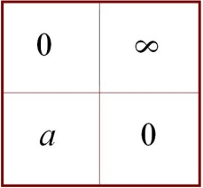
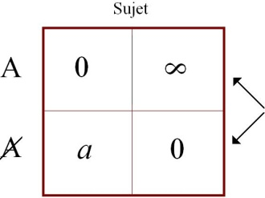
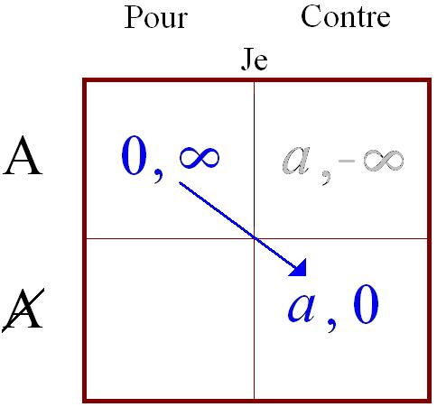
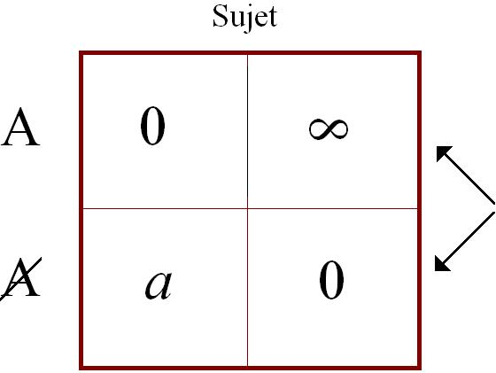
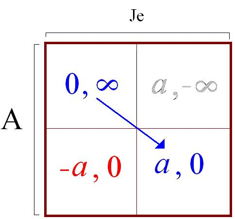
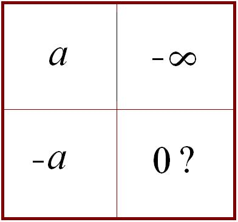
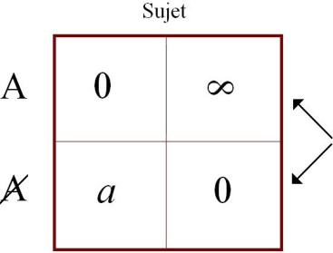
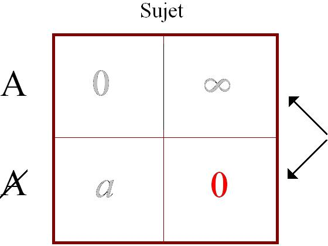
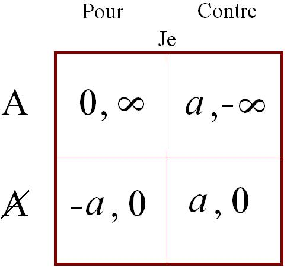
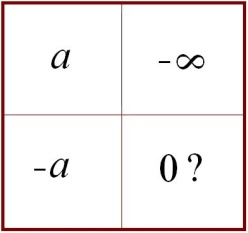

# Leçon 10 | 05 Février 1969

  

    <label><input type="checkbox" data-lacan-toggle="original" checked> 原文</label>
    <label><input type="checkbox" data-lacan-toggle="notes" checked> 注释</label>
    <label><input type="checkbox" data-lacan-toggle="commentary" checked> 个人解读评论</label>
  

  <form class="lacan-tool-search" role="search">
    <input class="lacan-tool-search-input" type="search" placeholder="搜索全文" aria-label="搜索全文">
    <button class="lacan-tool-button" type="submit" title="搜索">搜索</button>
  </form>
  <button class="lacan-tool-button lacan-back-to-top" type="button" title="回到页面最上方" aria-label="回到页面最上方">↑</button>

<section class="parallel-paragraph" data-paragraph-ids="s16-10-0001">

s16-10-0001

原文 · s16-10-0001

Je vais repartir d’où je vous ai laissés *la dernière fois*. J’ai dit beaucoup de choses la dernière fois, et en particulier j’ai réussi à toucher certains par l’évidence mathématique que je crois avoir réussi à donner de la genèse… par la seule vertu du 1 en tant que marque …de ce qu’il en est du *a*.

[无对应译文]

</section>

<section class="parallel-paragraph" data-paragraph-ids="s16-10-0002">

s16-10-0002

原文 · s16-10-0002

Ceci repose sur ce *factum*, cette fabrication qui résulte de l’usage le plus simple de ce 1 en tant qu’une fois répété il foisonne, puisque déjà il n’est posé que pour *tenter* la répétition, pour retrouver la jouissance, en tant qu’elle a déjà fui.

[无对应译文]

</section>

<section class="parallel-paragraph" data-paragraph-ids="s16-10-0003">

s16-10-0003

原文 · s16-10-0003

*Le premier* 1*, pour retrouver ce qui n’était pas marqué d’origine, déjà l’altère*, puisqu’à l’origine il n’était pas marqué.

[无对应译文]

</section>

<section class="parallel-paragraph" data-paragraph-ids="s16-10-0004">

s16-10-0004

原文 · s16-10-0004

Il se pose donc déjà dans la fondation d’une différence qu’il ne constitue pas en tant que telle mais en tant qu’il la produit.

[无对应译文]

</section>

<section class="parallel-paragraph" data-paragraph-ids="s16-10-0005">

s16-10-0005

原文 · s16-10-0005

C’est ce point originel qui fait de *la répétition* la clé d’un processus dont, une fois ouvert, la question se pose de savoir s’il peut ou non trouver son terme.

[无对应译文]

</section>

<section class="parallel-paragraph" data-paragraph-ids="s16-10-0006">

s16-10-0006

原文 · s16-10-0006

Vous voyez que nous sommes tout de suite portés sur la question qui n’est terminale qu’à la prendre dans une seule carrière, celle de FREUD en tant que sujet d’une part, il fut aussi un homme d’action, disons un homme qui a *inauguré* une voie.

[无对应译文]

</section>

<section class="parallel-paragraph" data-paragraph-ids="s16-10-0007">

s16-10-0007

原文 · s16-10-0007

Il l’a *inaugurée* comment ? C’est ce qu’il conviendra peut-être, à un détour de ce que je vous dirai aujourd’hui, de rappeler.

[无对应译文]

</section>

<section class="parallel-paragraph" data-paragraph-ids="s16-10-0008">

s16-10-0008

原文 · s16-10-0008

*Mais toute carrière d’homme engage <u>quelque chose</u> qui a dans la mort sa limite*, et c’est seulement de ce point de vue que nous pouvons, du chemin tracé par FREUD, trouver le terme dans la question qu’il pose, de *la fin d’analyse*, *terminable* ou *interminable*, ce qui ne fait que marquer le temps de la question que je rouvre en disant : est-ce que ce qui s’engage pour le sujet du fait de *la répétition comme origine* est lui-même un processus qui a sa limite ou pas ?

[无对应译文]

</section>

<section class="parallel-paragraph" data-paragraph-ids="s16-10-0009">

s16-10-0009

原文 · s16-10-0009

C’est ce que j’ai laissé ouvert, suspendu, mais pourtant avancé en démontrant au tableau la dernière fois de la façon la plus claire ce que j’ai pu exprimer comme la division, *la bipartition de deux infinis*, marquant que c’est cela dont il est au fond question dans *le pari de* PASCAL. L’infini sur quoi il s’appuie est l’infinité du *nombre*. Or, à prendre cette infinité, si je puis dire en *l’accélérant* encore par l’institution de la *série de Fibonacci* dont il est facile de montrer :

[无对应译文]

</section>

<section class="parallel-paragraph" data-paragraph-ids="s16-10-0010">

s16-10-0010

原文 · s16-10-0010

- qu’elle est *exponentielle*, que les nombres qu’elle engendre croissent non pas *arithmétiquement* mais *géométriquement*

[无对应译文]

</section>

<section class="parallel-paragraph" data-paragraph-ids="s16-10-0011">

s16-10-0011

原文 · s16-10-0011

- que c’est celle-là même qui engendre, et justement dans la mesure où nous nous éloignons de son origine, cette proportion qui s’articule dans le *a* : à mesure que ces nombres croissent, c’est d’une façon serrée, *d’une façon constante*, *que le a intervient là sous sa forme inverse* et d’autant plus frappante qu’elle noue le 1 au *a*, que c’est le 1/*a*, que cette *proportion* d’un *nombre* à l’autre s’achève dans la constante, de plus en plus rigoureuse à mesure que les nombres croissent, de ce 1/*a*.

[无对应译文]

</section>

<section class="parallel-paragraph" data-paragraph-ids="s16-10-0012">

s16-10-0012

原文 · s16-10-0012

### J’ai écrit aussi - à la prendre à son origine - *la série* qui résulte de prendre les choses *dans l’autre sens.*

[无对应译文]

</section>

<section class="parallel-paragraph" data-paragraph-ids="s16-10-0013">

s16-10-0013

原文 · s16-10-0013

Et là, par le fait que le *a* est moindre que 1, vous voyez que le processus s’achève non seulement sur une *proportion* mais sur une limite et que, quoi que vous additionniez de ce qui se produit…

[无对应译文]

</section>

<section class="parallel-paragraph" data-paragraph-ids="s16-10-0014">

s16-10-0014

原文 · s16-10-0014

> à l’inverse, à procéder par soustraction, de façon telle que soit toujours vrai que, dans cette chaîne,
>
> à reprendre la chose dans l’ascendance, chaque terme soit la somme des deux précédents …vous n’en trouvez pas moins la fonction de *a* en tant que cette fois elle atteint une limite : qu’aussi nombreux que vous additionniez ces termes, vous ne dépasserez pas le 1+*a*, ce qui semble indiquer qu’à prendre les choses dans ce sens, ce qu’engendre *la répétition* a son terme.

[无对应译文]

</section>

<section class="parallel-paragraph" data-paragraph-ids="s16-10-0015">

s16-10-0015

原文 · s16-10-0015

C’est ici qu’intervient *le tableau bien connu* par lequel ceux, en somme, qui manquent ce qu’il en est dans le *pari de Pascal* :

[无对应译文]

</section>

<section class="parallel-paragraph" data-paragraph-ids="s16-10-0016">

s16-10-0016

原文 · s16-10-0016

- inscrivent ce dont il s’agit *dans les termes de la théorie des jeux*, à savoir *dans une matrice construite de la distinction des cas*,

[无对应译文]

</section>

<section class="parallel-paragraph" data-paragraph-ids="s16-10-0017">

s16-10-0017

原文 · s16-10-0017

- formulent ce dont il s’agit : « *si Dieu existe* »,

[无对应译文]

</section>

<section class="parallel-paragraph" data-paragraph-ids="s16-10-0018">

s16-10-0018

原文 · s16-10-0018

- *et inscrivent pour 0 ce qui résulte de l’observation de ces commandements confondus ici avec la renonciation à quelque chose*.

[无对应译文]

</section>

<section class="parallel-paragraph" data-paragraph-ids="s16-10-0019">

s16-10-0019

原文 · s16-10-0019

Que nous l’appelions *plaisir* ou de quelque autre façon, il n’en reste pas moins que là, à apprécier d’un *primesaut* dont nous verrons l’étonnant, c’est d’un 0 qu’ils inscrivent ce qui est laissé dans cette vie aux croyants, moyennant quoi une vie future se cote du terme de l’*infini*, d’une infinité de vies promises infiniment heureuses.

[无对应译文]

</section>

<section class="parallel-paragraph" data-paragraph-ids="s16-10-0020">

s16-10-0020

原文 · s16-10-0020

Dans d’autres termes, à supposer que Dieu n’existe pas, le sujet - nous l’inscrivons *a* - est présumé…

[无对应译文]

</section>

<section class="parallel-paragraph" data-paragraph-ids="s16-10-0021">

s16-10-0021

原文 · s16-10-0021

> du « *jeu* » toujours pris *- c’est le cas de le dire -* au pied de la lettre …connaître le bonheur limité et d’ailleurs problématique qui lui est offert en cette vie.

[无对应译文]

</section>

<section class="parallel-paragraph" data-paragraph-ids="s16-10-0022">

s16-10-0022

原文 · s16-10-0022

Ce que - dit-on - il n’est pas infondé à choisir si, Dieu n’existant pas, il semble clair qu’il n’y a de l’autre vie rien à attendre.

[无对应译文]

</section>

<section class="parallel-paragraph" data-paragraph-ids="s16-10-0023">

s16-10-0023

原文 · s16-10-0023

[无对应译文]

</section>

<section class="parallel-paragraph" data-paragraph-ids="s16-10-0024">

s16-10-0024

原文 · s16-10-0024

Ce que je fais ici remarquer, c’est le caractère fragile de cette sorte d’inscription, pour autant qu’à suivre *la théorie des jeux*, les conjonctures ne sauraient se déterminer que du recroisement du jeu de *deux adversaires*, c’est-à-dire que c’est dans cette posture que devrait être le sujet, alors que l’Autre, énigmatique, celui dont il s’agit en somme qu’il tienne ou non le pari, devrait se trouver à cette place : « *Dieu existe ou n’existe pas* ».

[无对应译文]

</section>

<section class="parallel-paragraph" data-paragraph-ids="s16-10-0025">

s16-10-0025

原文 · s16-10-0025

[无对应译文]

</section>

<section class="parallel-paragraph" data-paragraph-ids="s16-10-0026">

s16-10-0026

原文 · s16-10-0026

Mais Dieu n’est pas dans le coup. En tout cas, rien ne nous permet de l’affirmer. C’est de ce fait que résulte paradoxalement que c’est en face de lui, sur la table si je puis dire, qu’est non pas l’homme mais le sujet défini par ce pari.

[无对应译文]

</section>

<section class="parallel-paragraph" data-paragraph-ids="s16-10-0027">

s16-10-0027

原文 · s16-10-0027

*L’enjeu se confond avec l’existence du partenaire*, et c’est pourquoi doivent être *réinterprétés les signes* qui s’écrivent sur ce tableau.

[无对应译文]

</section>

<section class="parallel-paragraph" data-paragraph-ids="s16-10-0028">

s16-10-0028

原文 · s16-10-0028

Le choix se fait au niveau du « *Dieu existe ou n’existe pas* ». C’est de là que part la formulation du pari et, pris de là \- de là seulement - il est clair que s’il n’y a pas à hésiter, à savoir que ce qu’on risque de gagner à parier que « *Dieu existe* » n’a rien de comparable à ce qu’on gagnera sûrement. Encore cette certitude peut-elle être facilement mise en question, car qu’est-ce qu’on *gagnera* : le *(a)* n’est précisément pas défini ?

[无对应译文]

</section>

<section class="parallel-paragraph" data-paragraph-ids="s16-10-0029">

s16-10-0029

原文 · s16-10-0029

[无对应译文]

</section>

<section class="parallel-paragraph" data-paragraph-ids="s16-10-0030">

s16-10-0030

原文 · s16-10-0030

C’est ici que j’ai ouvert la question…

[无对应译文]

</section>

<section class="parallel-paragraph" data-paragraph-ids="s16-10-0031">

s16-10-0031

原文 · s16-10-0031

> non pas au niveau d’une formule qui a pourtant l’intérêt de prendre à sa *source la question de l’intervention du signifiant* …de ce qu’il en est dans un acte de choix quelconque. C’est là que j’ai fait remarquer l’insuffisance d’un tableau incomplet de ne pas mettre en valeur qu’à prendre les choses à un second étage…

[无对应译文]

</section>

<section class="parallel-paragraph" data-paragraph-ids="s16-10-0032">

s16-10-0032

原文 · s16-10-0032

> celui, peut-être, qui restitue la juste position de ce que comporte la matrice telle qu’on en use dans *la théorie des jeux* …c’est ici que doit se placer ce que je distingue du *sujet*, *du sujet purement identique à l’inscription des enjeux,* comme de celui qui peut envisager les cas où Dieu même existant, il parie contre, c’est-à-dire choisit le *a* à ses dépens. \[A (*a*, –∞)\]

[无对应译文]

</section>

<section class="parallel-paragraph" data-paragraph-ids="s16-10-0033">

s16-10-0033

原文 · s16-10-0033

C’est-à-dire sachant ce que comporte ce choix, à savoir qu’il perd positivement l’infini, l’infinité de vies heureuses qui lui est offerte et que pour que assurément se reproduise dans les deux cases ici marquées ce qui d’abord occupait la première matrice :

[无对应译文]

</section>

<section class="parallel-paragraph" data-paragraph-ids="s16-10-0034">

s16-10-0034

原文 · s16-10-0034

 → 

[无对应译文]

</section>

<section class="parallel-paragraph" data-paragraph-ids="s16-10-0035">

s16-10-0035

原文 · s16-10-0035

Il reste encore cette quatrième à remplir, à savoir qu’il est supposable que, même Dieu n’existant pas, le *a* comme tenant la place que vous lui voyez occuper dans la première case, peut être abandonné cette fois-ci d’une façon expresse, et de ce fait apparaître en *négatif*, être soustraction de *a*, avec ce que comporte ce que nous écrivons ici sans plus de commentaires et dont vous voyez que, tout 0 qu’il paraisse aller de soi, il n’en constitue pas moins un problème.

[无对应译文]

</section>

<section class="parallel-paragraph" data-paragraph-ids="s16-10-0036">

s16-10-0036

原文 · s16-10-0036

[无对应译文]

</section>

<section class="parallel-paragraph" data-paragraph-ids="s16-10-0037">

s16-10-0037

原文 · s16-10-0037

En effet, extrayons maintenant pour l’isoler dans une matrice nouvelle simplement ceci qu’ajoute notre deuxième composition, à savoir : *a,–*∞*, – a,0*.

[无对应译文]

</section>

<section class="parallel-paragraph" data-paragraph-ids="s16-10-0038">

s16-10-0038

原文 · s16-10-0038

[无对应译文]

</section>

<section class="parallel-paragraph" data-paragraph-ids="s16-10-0039">

s16-10-0039

原文 · s16-10-0039

Pour être honnête, je marque expressément ceci que je viens d’indiquer au passage dans ce discours même que ce 0 ici prend valeur de question. En effet, s’il a pu se faire que les 0 soient ainsi posés dans la première matrice :

[无对应译文]

</section>

<section class="parallel-paragraph" data-paragraph-ids="s16-10-0040">

s16-10-0040

原文 · s16-10-0040

[无对应译文]

</section>

<section class="parallel-paragraph" data-paragraph-ids="s16-10-0041">

s16-10-0041

原文 · s16-10-0041

c’est là quelque chose qui mérite de retenir notre attention, car qu’ai-je dit tout à l’heure sinon qu’à la vérité ne compte dans cette position du joueur, du sujet qui seul existe, n’entre en balance que l’*infini* et le fini du *a*.

[无对应译文]

</section>

<section class="parallel-paragraph" data-paragraph-ids="s16-10-0042">

s16-10-0042

原文 · s16-10-0042

Qu’est-ce que ces 0 désignent, sinon qu’à mettre quelque *enjeu* sur la table…

[无对应译文]

</section>

<section class="parallel-paragraph" data-paragraph-ids="s16-10-0043">

s16-10-0043

原文 · s16-10-0043

> comme PASCAL l’a souligné en introduisant la théorie des partis …rien de juste ne saurait s’énoncer d’un jeu sinon à partir de ceci, sinon qu’ayant un commencement et un terme fixés dans sa règle, ce qui est mis sur la table, ce qu’on appelle *la mise, est d’origine perdu*.

[无对应译文]

</section>

<section class="parallel-paragraph" data-paragraph-ids="s16-10-0044">

s16-10-0044

原文 · s16-10-0044

Le jeu n’existe qu’à partir de ceci que c’est sur la table, si on peut dire dans une masse commune, qu’est impliqué ce qu’est le jeu, et c’est donc de constitution que le jeu ne peut produire ici que le 0. Ce 0 ne fait qu’indiquer que vous jouez.

[无对应译文]

</section>

<section class="parallel-paragraph" data-paragraph-ids="s16-10-0045">

s16-10-0045

原文 · s16-10-0045

Sans ce 0, pas de jeu. Assurément, on pourrait dire la même chose de l’autre 0, à savoir celui-ci :

[无对应译文]

</section>

<section class="parallel-paragraph" data-paragraph-ids="s16-10-0046">

s16-10-0046

原文 · s16-10-0046

[无对应译文]

</section>

<section class="parallel-paragraph" data-paragraph-ids="s16-10-0047">

s16-10-0047

原文 · s16-10-0047

qu’*il représente la perte à quoi l’autre joueur se résigne, de mettre en jeu cet infini*. Mais comme précisément c’est de l’existence de l’autre joueur qu’il s’agit, c’est ici, dans la première matrice, que ce 0 en tant que *signe de la perte* devient *problématique*.

[无对应译文]

</section>

<section class="parallel-paragraph" data-paragraph-ids="s16-10-0048">

s16-10-0048

原文 · s16-10-0048

Après tout, comme rien ne nous force à précipiter aucun mouvement, car c’est justement dans ces précipitations que les erreurs se produisent, nous pouvons bien nous abstenir de motiver ce 0 d’une façon symétrique de ce qu’il en est de l’autre.

[无对应译文]

</section>

<section class="parallel-paragraph" data-paragraph-ids="s16-10-0049">

s16-10-0049

原文 · s16-10-0049

Car nous avons ceci qui apparaît assez dans la discussion que les philosophes ont faite du montage de PASCAL…

[无对应译文]

</section>

<section class="parallel-paragraph" data-paragraph-ids="s16-10-0050">

s16-10-0050

原文 · s16-10-0050

> C’est à savoir qu’il apparaît bien en effet que ce 0 représente non pas la perte constitutive de la mise mais,
>
> au moins au niveau du dialogue entre PASCAL et MÉRÉ qui n’est pas pour rien dans la façon
>
> dont PASCAL écrit et dont du même coup il nous fourvoie - ce n’est jamais, bien sûr, sans notre collaboration …dans ce qu’il en est de l’intérêt du montage même, à savoir que ce qui domine, c’est qu’en effet ce 0 peut être l’inscription d’un des choix qui s’offrent, qui est de ne pas s’asseoir à cette table.

[无对应译文]

</section>

<section class="parallel-paragraph" data-paragraph-ids="s16-10-0051">

s16-10-0051

原文 · s16-10-0051

C’est ce que fait celui - qui dans ce dialogue pas seulement idéal mais effectif - celui à qui est adressé le schéma du pari.

[无对应译文]

</section>

<section class="parallel-paragraph" data-paragraph-ids="s16-10-0052">

s16-10-0052

原文 · s16-10-0052

Ce 0 veut non pas dire la perte constituante de la mise, mais inscrit au tableau le « *pas de mise* », c’est-à-dire celui qui ne s’assoit pas à la table de jeu. C’est à partir de là que nous avons à interroger ce qui se produit au niveau de *la seconde matrice* pour voir comment, à son niveau, peut se répartir ce qu’il en est du jeu.

[无对应译文]

</section>

<section class="parallel-paragraph" data-paragraph-ids="s16-10-0053">

s16-10-0053

原文 · s16-10-0053

En effet, j’ai indiqué déjà la dernière fois les figures qui peuvent nous être données dans le texte de notre pratique, et à la vérité j’ai pu l’indiquer aussi rapidement que je l’ai fait de ce que déjà un certain graphe en avait été construit avec ce que j’ai rappelé tout à l’heure au début de mon articulation, à savoir non pas l’hypothèse, mais l’inscriptible et dès lors le tangible, qui fait que le *a* peut bien n’être lui-même que l’effet de l’entrée de la vie de l’homme dans le jeu, ce dont PASCAL nous avertit en ces termes sans doute pas expressément formulés, je veux dire dans ceux mêmes que je vais énoncer : « *Vous êtes engagés* », nous dit-il, et c’est vrai !

[无对应译文]

</section>

<section class="parallel-paragraph" data-paragraph-ids="s16-10-0054">

s16-10-0054

原文 · s16-10-0054

Il ne lui semble pas nécessaire…

[无对应译文]

</section>

<section class="parallel-paragraph" data-paragraph-ids="s16-10-0055">

s16-10-0055

原文 · s16-10-0055

> parce qu’il se fonde sur la parole, parole qui bien sûr pour lui est celle de l’Église …il est singulier qu’il n’en distingue pas ce qui…

[无对应译文]

</section>

<section class="parallel-paragraph" data-paragraph-ids="s16-10-0056">

s16-10-0056

原文 · s16-10-0056

> c’est là le point aveugle de siècles qui n’étaient pas pour autant d’obscurantisme …pourtant lui fournit beaucoup : c’est assurément dans ce fait du caractère inéliminable, durant des siècles de pensée, de l’Écriture Sainte, que *l’écriture plus radicale qui est celle qui pour nous y apparaît en filigrane n’est pas réellement distinguée*.

[无对应译文]

</section>

<section class="parallel-paragraph" data-paragraph-ids="s16-10-0057">

s16-10-0057

原文 · s16-10-0057

Mais si de cette écriture, je vais chercher la trame dans la logique mathématique, ceci laisse *homologue* ma position par rapport à la sienne, à ceci près que pour nous, il n’est plus évitable de poser la question : si l’enjeu même n’est pas comme tel essentiellement dépendant de cette fonction de l’écriture.

[无对应译文]

</section>

<section class="parallel-paragraph" data-paragraph-ids="s16-10-0058">

s16-10-0058

原文 · s16-10-0058

Observons encore une différence, qui est celle que j’ai mise en exergue du premier temps de mon énoncé cette année et qui pourrait se dire, puisque ce n’en est pas la formule exacte, simplement : « *ce que je préfère, c’est un discours sans parole* », ce qui ne veut dire rien d’autre que *ce discours que supporte l’écriture*.

[无对应译文]

</section>

<section class="parallel-paragraph" data-paragraph-ids="s16-10-0059">

s16-10-0059

原文 · s16-10-0059

Ici un petit temps pour mesurer la portée, la ligne, le caractère absolument solidaire de ce que j’énonce en ce point cette année, avec tout ce que j’ai commencé d’annoncer sous la triplice *du Symbolique, de l’Imaginaire et du Réel*. Observez bien… et c’est ici qu’il convient d’insister …la différence qu’il y a entre le discours quel qu’il soit - philosophique - et ce à quoi nous introduit ce rien d’autre qui se distingue de partir de *la répétition*. Le discours philosophique - quel qu’il soit - finit toujours par se déprendre de ce qu’il agite pourtant comme appareil dans un matériel de langage.

[无对应译文]

</section>

<section class="parallel-paragraph" data-paragraph-ids="s16-10-0060">

s16-10-0060

原文 · s16-10-0060

Toute la tradition philosophique bute sur la réfutation par KANT de l’argument ontologique. Au nom de quoi ?

[无对应译文]

</section>

<section class="parallel-paragraph" data-paragraph-ids="s16-10-0061">

s16-10-0061

原文 · s16-10-0061

De ceci que les formes de la *Raison pure*, l’analytique transcendentale, tombent sous le coup d’une suspicion d’*imaginaire*, et c’est aussi bien ce qui fait la seule objection - elle est philosophique - au pari de PASCAL.

[无对应译文]

</section>

<section class="parallel-paragraph" data-paragraph-ids="s16-10-0062">

s16-10-0062

原文 · s16-10-0062

« *Ce Dieu dont vous pouvez concevoir l’existence comme nécessaire* - dit KANT - *il n’en reste pas moins que vous ne le concevez que dans les cadres d’une pensée qui ne s’appuie que sur le suspens préalable dont relève l’esthétique* - qualifiée pour cette occasion de - *transcendentale.* »

[无对应译文]

</section>

<section class="parallel-paragraph" data-paragraph-ids="s16-10-0063">

s16-10-0063

原文 · s16-10-0063

Ceci ne veut rien dire d’autre que : « *Vous ne pouvez rien énoncer* - mais énoncer comme paroles - *que dans le temps et dans l’espace dont, par convention philosophique,* *nous mettons en suspens l’existence en tant qu’elle serait radicale.* »

[无对应译文]

</section>

<section class="parallel-paragraph" data-paragraph-ids="s16-10-0064">

s16-10-0064

原文 · s16-10-0064

Seulement il y a un malheur, et c’est ce qui fait l’intérêt du *pari de Pascal*…

[无对应译文]

</section>

<section class="parallel-paragraph" data-paragraph-ids="s16-10-0065">

s16-10-0065

原文 · s16-10-0065

> *c’est pour cela que je me permets*, quoiqu’on puisse penser d’un recours à la vieillerie, *d’y trouver un point tournant exemplaire* …c’est qu’en aucun cas *le Dieu de Pascal* n’est à mettre en question sur le plan de l’*imaginaire*, parce que ce *n’est pas le Dieu des philosophes*. Ce n’est même pas le Dieu d’aucun savoir. « *Nous ne savons* - écrit PASCAL - *ni ce qu’il est, bien sûr, ni même s’il est*. »

[无对应译文]

</section>

<section class="parallel-paragraph" data-paragraph-ids="s16-10-0066">

s16-10-0066

原文 · s16-10-0066

C’est bien pour ça qu’il n’est d’aucune façon à mettre en suspens de par aucune philosophie, puisque ce n’est pas la philosophie qui le fonde. Or ce dont il s’agit et ce que veut dire en particulier mon discours… quand je reprends celui de FREUD …c’est très précisément qu’à me fonder sur ce que ce discours a ouvert, il se distingue essentiellement du *discours philosophique* en ceci qu’il ne décolle pas de ce en quoi nous sommes *pris et engagés* comme dit PASCAL, mais que bien plutôt que de se servir d’un discours en fin de compte pour fixer au monde sa loi, à l’histoire ses normes ou inversement, il se mette à cette place où d’abord le sujet pensant s’aperçoit qu’il ne peut se reconnaître que comme *effet du langage*.

[无对应译文]

</section>

<section class="parallel-paragraph" data-paragraph-ids="s16-10-0067">

s16-10-0067

原文 · s16-10-0067

Autrement dit qu’avant d’être pensant…

[无对应译文]

</section>

<section class="parallel-paragraph" data-paragraph-ids="s16-10-0068">

s16-10-0068

原文 · s16-10-0068

> pour aller vite, pour épingler même au plus court ce que je suis en train de dire …dès qu’on monte la table de jeu, et Dieu sait si déjà elle est montée, il est d’abord le *a*.

[无对应译文]

</section>

<section class="parallel-paragraph" data-paragraph-ids="s16-10-0069">

s16-10-0069

原文 · s16-10-0069

Et c’est après que la question se pose d’y raccorder ceci *qu’il pense*. Mais il n’a pas eu besoin de *penser* pour être fixé comme *a*. C’est déjà fait, contrairement à ce qu’on peut imaginer, précisément en raison de *la lamentable carence*, de la futilité de plus en plus éclatante de toute la philosophie, à savoir *qu’on peut renverser la table de jeu*. Je peux renverser celle-ci, bien sûr, et foutre en l’air les tables à Vincennes et ailleurs, mais cela n’empêche pas que la vraie table, *la table de jeu* est toujours là.

[无对应译文]

</section>

<section class="parallel-paragraph" data-paragraph-ids="s16-10-0070">

s16-10-0070

原文 · s16-10-0070

Il ne s’agit pas de la table universitaire ! La table autour de laquelle *le patron se réunit, où que ce soit, avec les élèves dans un joli* *petit intérieur*, que cet intérieur soit le sien, bien *chaleureux* et *pépère*, ou celui dont on l’encadre dans les garderies-modèles !

[无对应译文]

</section>

<section class="parallel-paragraph" data-paragraph-ids="s16-10-0071">

s16-10-0071

原文 · s16-10-0071

C’est précisément là qu’est la question. C’est pour ça que je me suis permis, dans un griffonnage dont je ne sais si vous le verrez paraître ou pas - ce n’est pas du tout un griffonnage, j’y ai passé du temps avant-hier - enfin je ne sais pas si vous le verrez paraître, parce qu’il ne paraîtra qu’à un seul endroit, ou il ne paraîtra pas, et je m’intéresse au fait de savoir s’il paraîtra ou ne paraîtra pas !

[无对应译文]

</section>

<section class="parallel-paragraph" data-paragraph-ids="s16-10-0072">

s16-10-0072

原文 · s16-10-0072

Bref j’ai été jusqu’à cette exorbitance délirante…

[无对应译文]

</section>

<section class="parallel-paragraph" data-paragraph-ids="s16-10-0073">

s16-10-0073

原文 · s16-10-0073

> car depuis un petit temps je délire à part moi, *ces choses-là sortent toujours un jour*, sous une forme ou sous une autre …j’aimerais qu’on s’aperçoive - c’est mon délire ? …ou pas ! - qu’il n’est plus possible de jouer le rôle qui convient à la transmission du savoir…

[无对应译文]

</section>

<section class="parallel-paragraph" data-paragraph-ids="s16-10-0074">

s16-10-0074

原文 · s16-10-0074

> qui *n’est pas* la transmission d’une valeur, encore que maintenant cela s’inscrive sur des registres «* unité de valeur *» …mais de saisir ce qu’on peut appeler un *effet de formation*.

[无对应译文]

</section>

<section class="parallel-paragraph" data-paragraph-ids="s16-10-0075">

s16-10-0075

原文 · s16-10-0075

C’est pour cela que - quel qu’il soit - quiconque dans l’avenir…

[无对应译文]

</section>

<section class="parallel-paragraph" data-paragraph-ids="s16-10-0076">

s16-10-0076

原文 · s16-10-0076

> justement parce qu’il est arrivé quelque chose à cette valeur du savoir …voudra occuper une place d’aucune façon afférente à cet endroit de formation…

[无对应译文]

</section>

<section class="parallel-paragraph" data-paragraph-ids="s16-10-0077">

s16-10-0077

原文 · s16-10-0077

> même si c’est les mathématiques, la biochimie ou n’importe quoi d’autre …fera bien d’être psychanalyste, si c’est ainsi qu’il faut définir quelqu’un pour qui existe cette question de la dépendance du sujet par rapport au discours qui le tient, et non pas qu’il tient.

[无对应译文]

</section>

<section class="parallel-paragraph" data-paragraph-ids="s16-10-0078">

s16-10-0078

原文 · s16-10-0078

Alors il vaut bien de dire, puisque comme vous le voyez je viens d’éviter quelque chose…

[无对应译文]

</section>

<section class="parallel-paragraph" data-paragraph-ids="s16-10-0079">

s16-10-0079

原文 · s16-10-0079

> en raison du fait que vous êtes tous les produits de l’école, c’est-à-dire d’un enseignement philosophique …que je sais que je ne peux pas aborder d’une façon abrupte ce qu’il en est du changement qui s’inscrit au niveau de la seconde matrice :

[无对应译文]

</section>

<section class="parallel-paragraph" data-paragraph-ids="s16-10-0080">

s16-10-0080

原文 · s16-10-0080

[无对应译文]

</section>

<section class="parallel-paragraph" data-paragraph-ids="s16-10-0081">

s16-10-0081

原文 · s16-10-0081

À savoir poser la question de ce que ça veut dire que là ce ne soit pas « *a ou* 0 »…

[无对应译文]

</section>

<section class="parallel-paragraph" data-paragraph-ids="s16-10-0082">

s16-10-0082

原文 · s16-10-0082

> car ça n’a jamais été *a ou* 0, comme je viens de vous l’indiquer et comme PASCAL le dit,
>
> mais comme ce ne sont jamais que des philosophes qui l’ont lu, tout le monde est resté sourd …il a dit : *a c’est* 0, ce qui veut dire *a* c’est la mise. C’était pourtant bien précisé dès la théorie des parties.

[无对应译文]

</section>

<section class="parallel-paragraph" data-paragraph-ids="s16-10-0083">

s16-10-0083

原文 · s16-10-0083

Non, hein, ça ne fait rien, ils sont restés sourds, et « 0*, c’est* 0 *au regard de l’infini* »  Foutaises !

[无对应译文]

</section>

<section class="parallel-paragraph" data-paragraph-ids="s16-10-0084">

s16-10-0084

原文 · s16-10-0084

Qu’est-ce qui change qu’il y ait maintenant non pas, comme on l’a dit vainement, d’une façon imaginaire *a ou* 0, mais : *a ou bien - a.*

[无对应译文]

</section>

<section class="parallel-paragraph" data-paragraph-ids="s16-10-0085">

s16-10-0085

原文 · s16-10-0085

Et si *- a* veut dire *effectivement* ce que ça a l’air de dire, à savoir qu’on l’inverse, qu’est–ce que ça peut bien être que ce truc-là ?

[无对应译文]

</section>

<section class="parallel-paragraph" data-paragraph-ids="s16-10-0086">

s16-10-0086

原文 · s16-10-0086

Et puis aussi que dans un cas…

[无对应译文]

</section>

<section class="parallel-paragraph" data-paragraph-ids="s16-10-0087">

s16-10-0087

原文 · s16-10-0087

> quoi qu’il arrive, fût-ce aux dépens de quelque chose qui, pour s’inscrire, paraît devoir être coûteux …qu’est-ce que c’est aussi, là, que *cette corrélation*, *cette équivalence* qui, peut-être, nous permet de mettre ailleurs, de nous apercevoir qu’ici basculent nos *signes de conjonction*. En tout cas voilà deux liaisons qui me paraissent digne d’être interrogées. Vous voyez qu’elles ne sont pas tout à fait classées comme celles d’avant.

[无对应译文]

</section>

<section class="parallel-paragraph" data-paragraph-ids="s16-10-0088">

s16-10-0088

原文 · s16-10-0088

Là, je regrette de n’en être pas plus loin que ce que j’ai déjà, mais trop vite, articulé dans les dernières minutes de la dernière fois, c’est à savoir que j’ai rappelé que, pour partir de la figure qui ici s’indique dans le griffonnage de PASCAL :

[无对应译文]

</section>

<section class="parallel-paragraph" data-paragraph-ids="s16-10-0089">

s16-10-0089

原文 · s16-10-0089

[无对应译文]

</section>

<section class="parallel-paragraph" data-paragraph-ids="s16-10-0090">

s16-10-0090

原文 · s16-10-0090

la première liaison, cette horizontale du petit *a* au -∞ nous disons, c’est *l’enfer*. Je l’ai claironné à des gens qui déjà un petit peu se dirigeaient vers la sortie. Mais, dans l’ensemble, je vous ai fait remarquer que l’enfer ça nous connaît, c’est la vie de tous les jours. Chose curieuse : on le *sait*, on le *dit*, *on ne dit même que ça*. Mais ça se limite au discours, et à quelques *symptômes* bien entendu.

[无对应译文]

</section>

<section class="parallel-paragraph" data-paragraph-ids="s16-10-0091">

s16-10-0091

原文 · s16-10-0091

Dieu merci :

[无对应译文]

</section>

<section class="parallel-paragraph" data-paragraph-ids="s16-10-0092">

s16-10-0092

原文 · s16-10-0092

- s’il n’y avait pas les *symptômes*, on ne s’en apercevrait pas !

[无对应译文]

</section>

<section class="parallel-paragraph" data-paragraph-ids="s16-10-0093">

s16-10-0093

原文 · s16-10-0093

- Si les *symptômes névrotiques* n’existaient pas, il n’y aurait pas eu FREUD !

[无对应译文]

</section>

<section class="parallel-paragraph" data-paragraph-ids="s16-10-0094">

s16-10-0094

原文 · s16-10-0094

- Si *les hystériques* n’avaient pas déjà frayé la question, aucune chance que même *la vérité* pointe le bout de l’oreille !

[无对应译文]

</section>

<section class="parallel-paragraph" data-paragraph-ids="s16-10-0095">

s16-10-0095

原文 · s16-10-0095

Alors là, il faut faire une petite « station ». Quelqu’un, que je remercie…

[无对应译文]

</section>

<section class="parallel-paragraph" data-paragraph-ids="s16-10-0096">

s16-10-0096

原文 · s16-10-0096

> parce qu’il faut toujours remercier les personnes par où vous arrivent les cadeaux …m’a, pour des raisons externes, rappelé l’existence du chapitre de BERGLER qui s’appelle « *Le surmoi sous-estimé* », c’est dans la fameuse *Névrose de base* qui explique tout.

[无对应译文]

</section>

<section class="parallel-paragraph" data-paragraph-ids="s16-10-0097">

s16-10-0097

原文 · s16-10-0097

Vous n’allez pas me dire que moi j’explique tout. Je n’explique rien, justement. C’est même ce qui vous intéresse !

[无对应译文]

</section>

<section class="parallel-paragraph" data-paragraph-ids="s16-10-0098">

s16-10-0098

原文 · s16-10-0098

J’essaie à divers niveaux - pas seulement ici - de faire qu’il y ait des psychanalystes qui ne soient pas *imbéciles*.

[无对应译文]

</section>

<section class="parallel-paragraph" data-paragraph-ids="s16-10-0099">

s16-10-0099

原文 · s16-10-0099

Mon opération ici est une opération de rabattage, non pour attirer dans un trou d’école, mais pour essayer de donner l’équivalent de ce que *devraient avoir les psychanalystes* à des gens qui n’ont aucun moyen de l’avoir.

[无对应译文]

</section>

<section class="parallel-paragraph" data-paragraph-ids="s16-10-0100">

s16-10-0100

原文 · s16-10-0100

C’est une entreprise désespérée, mais l’expérience prouve que l’autre aussi, celle de *l’apprendre* aux psychanalystes eux-mêmes, semble vouée à l’échec, comme je l’ai déjà écrit. « *Imbéciles* » : comme sujets s’entend, parce que pour se démerder dans leur pratique, ils sont plutôt futés ! Et c’est une conséquence précisément de ce que je suis en train d’énoncer ici.

[无对应译文]

</section>

<section class="parallel-paragraph" data-paragraph-ids="s16-10-0101">

s16-10-0101

原文 · s16-10-0101

C’est conforme à la théorie. C’est ce qui prouve non seulement qu’il n’y a aucun besoin d’être philosophe, mais que c’est beaucoup mieux de ne pas l’être. Seulement ça a une conséquence : c’est qu’*on ne comprend rien*.

[无对应译文]

</section>

<section class="parallel-paragraph" data-paragraph-ids="s16-10-0102">

s16-10-0102

原文 · s16-10-0102

D’où ce que je passe aussi mon temps à énoncer : qu’il vaut beaucoup mieux ne pas comprendre.

[无对应译文]

</section>

<section class="parallel-paragraph" data-paragraph-ids="s16-10-0103">

s16-10-0103

原文 · s16-10-0103

Seulement l’ennui, c’est qu’ils comprennent de toutes petites choses, alors ça pullule.

[无对应译文]

</section>

<section class="parallel-paragraph" data-paragraph-ids="s16-10-0104">

s16-10-0104

原文 · s16-10-0104

Par exemple « *Le surmoi sous-estimé* », c’est un chapitre *génial*, d’abord parce qu’il rassemble toutes les façons dont le *surmoi* a été articulé dans FREUD. Comme il n’est pas philosophe, il ne voit absolument pas qu’elles tiennent toutes ensemble. D’ailleurs il est charmant, et il avoue le truc. C’est ce qu’il y a de bien dans les psychanalystes, ils avouent tout !

[无对应译文]

</section>

<section class="parallel-paragraph" data-paragraph-ids="s16-10-0105">

s16-10-0105

原文 · s16-10-0105

Il avoue qu’il a écrit à un monsieur, c’est dans une note, M. H.H. HEART, qui faisait des extraits de FREUD.

[无对应译文]

</section>

<section class="parallel-paragraph" data-paragraph-ids="s16-10-0106">

s16-10-0106

原文 · s16-10-0106

Alors il lui a écrit : « *Envoyez-moi quelques citations sur le Surmoi* ». Après tout, ça peut se faire, ça !

[无对应译文]

</section>

<section class="parallel-paragraph" data-paragraph-ids="s16-10-0107">

s16-10-0107

原文 · s16-10-0107

C’est d’ailleurs conforme également à la théorie. On peut prendre les choses comme ça, avec une paire de ciseaux, si l’écriture a tant d’importance, partout où il y a *surmoi* : *Criss Criss* \[*Sic*\], on coupe ! On fait une liste de quinze citations.

[无对应译文]

</section>

<section class="parallel-paragraph" data-paragraph-ids="s16-10-0108">

s16-10-0108

原文 · s16-10-0108

Et je dois dire que là j’humorise. Mais il me tend la perche, parce que bien sûr que BERGLER a lu FREUD, enfin j’aime à l’imaginer ! Mais tout de même il avoue que pour écrire ce chapitre, il a écrit à H.H. HEART pour lui donner des citations sur le *surmoi*. Le résultat, c’est qu’il peut évidemment bien marquer…

[无对应译文]

</section>

<section class="parallel-paragraph" data-paragraph-ids="s16-10-0109">

s16-10-0109

原文 · s16-10-0109

> exactement du même niveau où sont toutes les revues de psychanalyse existantes, sauf la mienne, bien entendu ! …à quel point c’est incohérent.

[无对应译文]

</section>

<section class="parallel-paragraph" data-paragraph-ids="s16-10-0110">

s16-10-0110

原文 · s16-10-0110

Ça commence par le censeur au niveau des rêves. On croit que c’est un innocent, le censeur, comme si ça n’était rien que d’avoir justement la paire de ciseaux avec laquelle on fait ensuite la théorie.

[无对应译文]

</section>

<section class="parallel-paragraph" data-paragraph-ids="s16-10-0111">

s16-10-0111

原文 · s16-10-0111

- Et après ça, ça devient quelque chose qui vous titille.

[无对应译文]

</section>

<section class="parallel-paragraph" data-paragraph-ids="s16-10-0112">

s16-10-0112

原文 · s16-10-0112

- Et puis après ça devient le grand méchant loup.

[无对应译文]

</section>

<section class="parallel-paragraph" data-paragraph-ids="s16-10-0113">

s16-10-0113

原文 · s16-10-0113

- Et puis après ça, il n’y en a plus.

[无对应译文]

</section>

<section class="parallel-paragraph" data-paragraph-ids="s16-10-0114">

s16-10-0114

原文 · s16-10-0114

- Et après ça, on évoque ÉROS, THANATOS et tout le barda ! Et il va falloir que THANATOS se loge là-dedans.

[无对应译文]

</section>

<section class="parallel-paragraph" data-paragraph-ids="s16-10-0115">

s16-10-0115

原文 · s16-10-0115

Et puis alors, ce *surmoi*, je m’en arrange, avec lui : je te fais des courbettes et des chatouilles. Ah ! Cher petit *surmoi* !

[无对应译文]

</section>

<section class="parallel-paragraph" data-paragraph-ids="s16-10-0116">

s16-10-0116

原文 · s16-10-0116

Bon. Grâce à cette présentation, bien sûr, on obtient quelque chose, il faut bien le dire, d’assez risible. Il faut vraiment qu’on soit à notre époque pour que personne ne rit. Personne ne rit, même un professeur de philosophie. Il faut dire qu’ils en sont *à un point*, à notre génération ! Même *un professeur de philosophie* peut lire ce truc sans rire. On les a matés !

[无对应译文]

</section>

<section class="parallel-paragraph" data-paragraph-ids="s16-10-0117">

s16-10-0117

原文 · s16-10-0117

Il y avait quand même un temps où il y avait des gens qui n’étaient pas spécialement intelligents, un type qui s’appelait Charles BLONDEL, il poussait des hurlements à propos de FREUD. Au moins, c’était quelque chose !

[无对应译文]

</section>

<section class="parallel-paragraph" data-paragraph-ids="s16-10-0118">

s16-10-0118

原文 · s16-10-0118

Maintenant, même les personnes les moins faites pour imaginer ce dont il s’agit dans une psychanalyse lisent des trucs absolument aussi *étourdissants* sans râler. Non ! Tout est possible. Tout est admis. Nous sommes…

[无对应译文]

</section>

<section class="parallel-paragraph" data-paragraph-ids="s16-10-0119">

s16-10-0119

原文 · s16-10-0119

> d’ailleurs les choses dessinent toujours leurs linéaments ailleurs que dans le réel avant d’y descendre …dans le régime vraiment de la *ségrégation intellectuelle*.

[无对应译文]

</section>

<section class="parallel-paragraph" data-paragraph-ids="s16-10-0120">

s16-10-0120

原文 · s16-10-0120

Eh bien ce type, il s’est aperçu d’un tas de choses. Quand une chose est là, sous son nez, il la comprend.

[无对应译文]

</section>

<section class="parallel-paragraph" data-paragraph-ids="s16-10-0121">

s16-10-0121

原文 · s16-10-0121

Et je dirai que c’est ce qu’il y a de triste parce qu’il la comprend au niveau de son nez, qui ne peut pas bien sûr être absolument comme ça, il est forcément pointu. Alors il voit une toute petite chose. Il s’aperçoit que ce qu’on lui explique, comme ça, au niveau des citations de FREUD comme étant le *surmoi*, il s’aperçoit :

[无对应译文]

</section>

<section class="parallel-paragraph" data-paragraph-ids="s16-10-0122">

s16-10-0122

原文 · s16-10-0122

> « *Mais ça doit avoir un rapport avec ce qu’il voit tout le temps*. »

[无对应译文]

</section>

<section class="parallel-paragraph" data-paragraph-ids="s16-10-0123">

s16-10-0123

原文 · s16-10-0123

Alors il commence par s’apercevoir…

[无对应译文]

</section>

<section class="parallel-paragraph" data-paragraph-ids="s16-10-0124">

s16-10-0124

原文 · s16-10-0124

> mais comme ça d’une façon intuitive, au niveau de la sensibilité …que ce qu’on appelle la *Durcharbeitung,* l’élaboration comme on a traduit en français ça… on passe son temps à s’apercevoir que c’est intraduisible …*Durcharbeitung,* ce n’est pas élaboration, on n’y peut rien. Comme il n’y a pas en français de mot pour dire « *travail à travers* » : forage, on traduit élaboration. Chacun sait qu’en France on élabore : c’est plutôt dans le genre fumées.

[无对应译文]

</section>

<section class="parallel-paragraph" data-paragraph-ids="s16-10-0125">

s16-10-0125

原文 · s16-10-0125

L’élaboration analytique, ce n’est pas du tout comme ça. Ceux qui sont sur un divan s’aperçoivent que ça consiste à revenir tout le temps *sur le même truc*, à tous les tournants on est ramené *sur le même truc*, et il faut que ça dure pour arriver justement à ce que je vous ai expliqué, *à la limite, à la terminaison*, quand on va dans le bon sens naturellement, où *on rencontre la limite*.

[无对应译文]

</section>

<section class="parallel-paragraph" data-paragraph-ids="s16-10-0126">

s16-10-0126

原文 · s16-10-0126

Il dit « *ça, c’est un effet de surmoi* », c’est-à-dire qu’il se rend compte que cette espèce de grand méchant machin…

[无对应译文]

</section>

<section class="parallel-paragraph" data-paragraph-ids="s16-10-0127">

s16-10-0127

原文 · s16-10-0127

> qui pourtant est extrait soi-disant du *complexe d’Œdipe*,
>
> ou encore de la *mère dévorante*, ou de n’importe laquelle de ces balançoires …il s’aperçoit que ça a un rapport avec ce côté épuisant, tannant, nécessaire, répété surtout, par quoi on arrive à quelque chose qui en effet, quelquefois, a un bout.

[无对应译文]

</section>

<section class="parallel-paragraph" data-paragraph-ids="s16-10-0128">

s16-10-0128

原文 · s16-10-0128

Comment est-ce qu’il ne voit pas que cela n’a rien de commun avec cette espèce de figure d’un scénario où le *surmoi* est, comme on dit, une instance - ce qui ne serait rien - mais où on le fait vivre comme *une personne*.

[无对应译文]

</section>

<section class="parallel-paragraph" data-paragraph-ids="s16-10-0129">

s16-10-0129

原文 · s16-10-0129

Parce que, comme on n’a pas bien compris ce que c’était qu’une *instance*, on lui donne vraiment son idée, au *surmoi*.

[无对应译文]

</section>

<section class="parallel-paragraph" data-paragraph-ids="s16-10-0130">

s16-10-0130

原文 · s16-10-0130

Il faut que tout cela se passe non pas sur *l’autre scène*…

[无对应译文]

</section>

<section class="parallel-paragraph" data-paragraph-ids="s16-10-0131">

s16-10-0131

原文 · s16-10-0131

> celle dont parlait FREUD, celle qui fonctionne dans les rêves …mais sur une espèce de *petite saynète* là, où ce qu’on appelle l’enseignement analytique vous fait jouer des *marionnettes *: le *surmoi* c’est *le Commissaire* et il vient taper sur la tête de *Guignol* qui est le *moi*. Comment, rien que de voir ce *rapprochement*… qu’il sent tellement bien au point de vue clinique …avec l’élaboration, la *Durcharbeitung,* cela ne lui suggère pas que le *surmoi*, ça pourrait peut-être être trouvé sans quelque chose qui ne nécessiterait pas, comme ça, qu’on multiplie dans la personnalité les *instances*.

[无对应译文]

</section>

<section class="parallel-paragraph" data-paragraph-ids="s16-10-0132">

s16-10-0132

原文 · s16-10-0132

Et puis alors c’est qu’à tout instant il lâche le morceau, il avoue le truc, c’est-à-dire : *qu’on a bien repéré*, dit-il, *que ça avait* *un rapport avec l’idéal du moi*. Mais il faut avouer qu’on n’y comprend absolument rien. Personne n’a encore fait le collage.

[无对应译文]

</section>

<section class="parallel-paragraph" data-paragraph-ids="s16-10-0133">

s16-10-0133

原文 · s16-10-0133

Tout de même, pour que ces discours soient autre chose que les mémoires du psychanalyste…

[无对应译文]

</section>

<section class="parallel-paragraph" data-paragraph-ids="s16-10-0134">

s16-10-0134

原文 · s16-10-0134

> à savoir évoquer le cas d’une jeune femme chez qui, à ce propos, on voyait bien que c’était *le sentiment de culpabilité* qui l’a fait entrer dans la psychanalyse, espérons que c’est le même qui l’en a fait sortir ! …on peut peut–être quand même s’apercevoir :

[无对应译文]

</section>

<section class="parallel-paragraph" data-paragraph-ids="s16-10-0135">

s16-10-0135

原文 · s16-10-0135

- que par exemple, cette espèce de petite manœuvre d’une mesure qui est précisément *la mesure de ce qui ne peut pas être mesuré* parce que c’est la mise de départ

[无对应译文]

</section>

<section class="parallel-paragraph" data-paragraph-ids="s16-10-0136">

s16-10-0136

原文 · s16-10-0136

- que ça peut en effet dans certains cas se figurer avec la plus grande précision et l’écrire au tableau,

[无对应译文]

</section>

<section class="parallel-paragraph" data-paragraph-ids="s16-10-0137">

s16-10-0137

原文 · s16-10-0137

- que c’est dans la manière d’une certaine façon de balancer régulière qu’on arrive à remplir ce *quelque chose* qui peut dans certains cas se figurer comme le 1 …on peut tout de même voir qu’il y a intérêt à articuler d’une façon qui soit vraiment précise quelque chose qui permette de concevoir que ça n’est pas en effet du tout un abus de termes que de rapprocher, même au nom d’une intuition minime comme ça, l’*élaboration*, la *Durcharbeitung* dans le traitement, avec *le surmoi*.

[无对应译文]

</section>

<section class="parallel-paragraph" data-paragraph-ids="s16-10-0138">

s16-10-0138

原文 · s16-10-0138

Alors il faut choisir. Il ne faut pas nous dire que le *surmoi* est *le grand méchant loup* et cogiter pour voir si ce n’est pas dans l’*identification* avec je ne sais quelle personne que ce *surmoi sévère* est né. Ce n’est pas comme ça qu’il faut poser les questions.

[无对应译文]

</section>

<section class="parallel-paragraph" data-paragraph-ids="s16-10-0139">

s16-10-0139

原文 · s16-10-0139

C’est comme les gens qui vous disent que *si Untel est religieux, c’est parce que son grand-père l’était*. Ça ne me suffit pas, à moi, parce que même si on a un grand-père religieux, on peut peut–être aussi s’apercevoir que c’est une connerie, n’est-ce pas ?

[无对应译文]

</section>

<section class="parallel-paragraph" data-paragraph-ids="s16-10-0140">

s16-10-0140

原文 · s16-10-0140

*L’identification*, il faudrait tout de même distinguer sa direction par rapport à d’autres choses. Il faudrait savoir si *l’identification* dans l’analyse, c’est la visée ou si c’est l’obstacle. Mais ça peut peut-être bien être le moyen par où on engage les gens justement sans doute pour la faire, mais pour que du même fait elle se défasse, et que c’est dans le fait que *ça se défasse*, justement parce qu’on la fait, que peut apparaître *quelque chose d’autre*, que nous appellerons *le trou* dans l’occasion.

[无对应译文]

</section>

<section class="parallel-paragraph" data-paragraph-ids="s16-10-0141">

s16-10-0141

原文 · s16-10-0141

Je vais vous laisser là aujourd’hui. J’ai essayé, à la fin de ce discours, de vous montrer que c’est un discours directement intéressant pour l’aération de notre pratique. Je veux dire par là qu’à se servir de ce qui n’était certes pas des expériences odoratives, ce n’était pas au pifomètre que FREUD s’avançait, on peut en effet y voir, dans le développement d’une fonction à travers sa pensée, les arêtes qui permettent de lui donner sa cohérence. Mais cette cohérence, il est indispensable que - si on veut avancer autrement qu’avec des historiettes - on la rassemble et qu’on lui donne sa consistance et sa solidité.

[无对应译文]

</section>

<section class="parallel-paragraph" data-paragraph-ids="s16-10-0142">

s16-10-0142

原文 · s16-10-0142

Cela permettrait peut-être de voir tout à fait d’autres faits que des faits simplement analogiques.

[无对应译文]

</section>

<section class="parallel-paragraph" data-paragraph-ids="s16-10-0143">

s16-10-0143

原文 · s16-10-0143

Ce que je dis n’ôte rien à la portée du détail, comme justement BERGLER y insiste.

[无对应译文]

</section>

<section class="parallel-paragraph" data-paragraph-ids="s16-10-0144">

s16-10-0144

原文 · s16-10-0144

Mais lisez ce chapitre pour voir que même ceci, qui est pertinent, bien orienté…

[无对应译文]

</section>

<section class="parallel-paragraph" data-paragraph-ids="s16-10-0145">

s16-10-0145

原文 · s16-10-0145

> mais orienté à la façon des particules de la limaille de fer quand vous tapez dans un champ magnétisé …déjà : aucune espèce de motivation véritable de la puissance et de l’importance du détail, et pourquoi en effet il n’y a que les détails - c’est bien vrai - qui nous intéressent. Encore faudrait-il savoir dans chaque cas ce qui est intéressant.

[无对应译文]

</section>

<section class="parallel-paragraph" data-paragraph-ids="s16-10-0146">

s16-10-0146

原文 · s16-10-0146

Parce que, si on ne le sait pas, on rapproche des détails disparates au nom d’une pure et simple ressemblance, alors que ce n’est pas cela qui est important.

[无对应译文]

</section>

<section class="parallel-paragraph" data-paragraph-ids="s16-10-0147">

s16-10-0147

原文 · s16-10-0147

Nous reprendrons la prochaine fois au niveau de la troisième figure.

[无对应译文]

</section>

