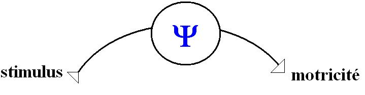
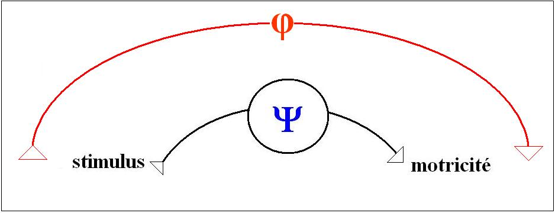
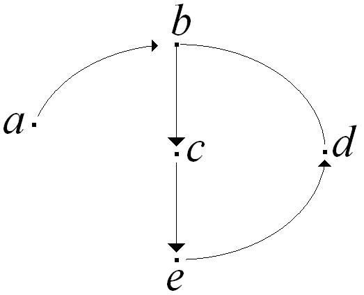
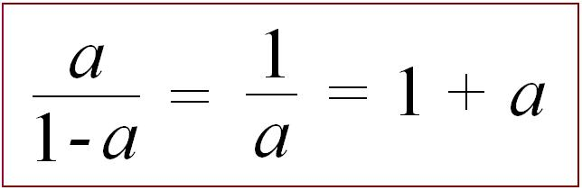
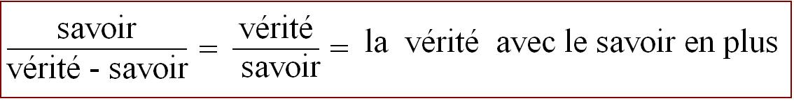
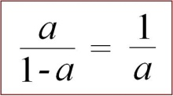

# Leçon 12 | 26 Février 1969

  

    <label><input type="checkbox" data-lacan-toggle="original" checked> 原文</label>
    <label><input type="checkbox" data-lacan-toggle="notes" checked> 注释</label>
    <label><input type="checkbox" data-lacan-toggle="commentary" checked> 个人解读评论</label>
  

  <form class="lacan-tool-search" role="search">
    <input class="lacan-tool-search-input" type="search" placeholder="搜索全文" aria-label="搜索全文">
    <button class="lacan-tool-button" type="submit" title="搜索">搜索</button>
  </form>
  <button class="lacan-tool-button lacan-back-to-top" type="button" title="回到页面最上方" aria-label="回到页面最上方">↑</button>

<section class="parallel-paragraph" data-paragraph-ids="s16-12-0001">

s16-12-0001

原文 · s16-12-0001

Vous avez eu la bonté de me suivre jusqu’à présent dans les chemins étroits et dont je pense que,pour certains d’entre vous, le fil peut paraître poser la question de son origine et de son sens, qu’en d’autres termes il se peut bien que vous ne sachiez plus très bien où nous en sommes. C’est pourquoi le temps m’a paru opportun - et non d’une façon contingente - de poser *la question de mon titre* par exemple, *D’un Autre à l’autre,* sous lequel figure mon discours de cette année.

[无对应译文]

</section>

<section class="parallel-paragraph" data-paragraph-ids="s16-12-0002">

s16-12-0002

原文 · s16-12-0002

C’est bien en effet concevable que ce n’est pas *à l’entrée* - en manière de préface, voire en manière de programme - que quelque chose peut être élucidé de ce qui est *une fin*. Il faut au moins avoir fait un bout de chemin pour que ce soit de la rétroaction que le départ s’éclaire, ceci pas seulement pour vous mais, après tout, pour moi-même puisque pour moi, dans cette opération de *forage,* si l’on peut dire…

[无对应译文]

</section>

<section class="parallel-paragraph" data-paragraph-ids="s16-12-0003">

s16-12-0003

原文 · s16-12-0003

> qui est bien ce qui vous intéresse, qui vous retient,
>
> ce qui fait qu’au moins un certain nombre d’entre vous sont ici, sinon tous …il me faut – un certain temps - prendre le repère de ce qui en constituait les étapes dans le passé.

[无对应译文]

</section>

<section class="parallel-paragraph" data-paragraph-ids="s16-12-0004">

s16-12-0004

原文 · s16-12-0004

C’est ainsi qu’il m’est arrivé de reprendre le texte - qui sait, peut-­être aux fins d’une publication - de ce que j’ai énoncé il y a maintenant 10 ans, je veux dire au séminaire de 1959-60 - ça fait une paye - sous le titre *L’éthique de la psychanalyse.*

[无对应译文]

</section>

<section class="parallel-paragraph" data-paragraph-ids="s16-12-0005">

s16-12-0005

原文 · s16-12-0005

Il m’a donné quelques satisfactions d’ordre intime, de celles dont, si en effet je mets au jour quelque chose qui s’efforcera de reproduire aussi fidèlement que possible le tracé de ce que j’ai fait alors, ce qui, bien entendu, ne saurait aller sans tous les effets rétroactifs de ce que j’ai pu énoncer depuis, et nommément ici, ce qui est donc une opération délicate et la seule grâce à quoi je ne saurais m’en tenir à l’excellent résumé qui avait été fait, deux ans plus tard, par quelqu’un de mes auditeurs, nommément SAFOUAN. Les raisons pour lesquelles je ne l’ai pas publié alors, ce résumé, j’aurai à les dire, mais ce sera plutôt l’objet d’une préface à ce qui en sortira.

[无对应译文]

</section>

<section class="parallel-paragraph" data-paragraph-ids="s16-12-0006">

s16-12-0006

原文 · s16-12-0006

Ma satisfaction… à l’occasion, que vous pourrez partager si vous me faites foi sur le fidèle du tracé que j’essaierai d’en produire …est due à ceci : que non seulement rien ne me force à réviser ce que j’ai avancé alors, mais qu’après tout je peux y loger, comme dans une sorte de coupelle ce que de plus rigoureux, disons de ce projet, j’arrive à énoncer aujourd’hui.

[无对应译文]

</section>

<section class="parallel-paragraph" data-paragraph-ids="s16-12-0007">

s16-12-0007

原文 · s16-12-0007

En effet, ce dont j’ai cru devoir partir lors de cette mise en question qui n’avait jamais été faite de ce que comporte sur le plan éthique, c’est un terme nouveau, ce que dans un premier essai, amorce de rédaction que j’ai essayé d’en faire, de ce qu’apporte de nouveau ce que j’énonce de la façon qui me semble la plus *rigoureuse* : l’événement FREUD.

[无对应译文]

</section>

<section class="parallel-paragraph" data-paragraph-ids="s16-12-0008">

s16-12-0008

原文 · s16-12-0008

J’ai maintenant, à la date où nous sommes, la *satisfaction* de voir par exemple, pour ce qu’il en est de la fonction d’un auteur comme FREUD, je dirai qu’une *société* très large d’esprit se trouve en mesure de mesurer son originalité et à son propos, comme l’a fait par exemple samedi dernier, dans une sorte de mauvais lieu qu’on appelle la *Société de Philosophie,* Michel FOUCAULT : «* Qu’est-ce qu’un auteur ?* [^49] » posait-il la question, et ceci l’amenait à mettre en valeur un certain nombre de termes qui méritent d’être énoncés à propos d’une telle *question*.

[无对应译文]

</section>

<section class="parallel-paragraph" data-paragraph-ids="s16-12-0009">

s16-12-0009

原文 · s16-12-0009

### Qu’est-ce qu’un auteur ?

[无对应译文]

</section>

<section class="parallel-paragraph" data-paragraph-ids="s16-12-0010">

s16-12-0010

原文 · s16-12-0010

### Quelle est la fonction du nom d’un auteur ?

[无对应译文]

</section>

<section class="parallel-paragraph" data-paragraph-ids="s16-12-0011">

s16-12-0011

原文 · s16-12-0011

C’était vraiment, au niveau d’une interrogation *sémantique* à proprement parler qu’il trouvait moyen de mettre en valeur l’originalité de cette fonction et sa situation étroitement interne au discours, ce qui comporte, bien entendu, une mise en question à l’occasion, un effet de scission, de déchirure dans ce qu’il en est pour tout le monde, enfin pour ce qu’on appelle «  *la société des esprits* » ou « *la République des Lettres* », de ce rapport au discours.

[无对应译文]

</section>

<section class="parallel-paragraph" data-paragraph-ids="s16-12-0012">

s16-12-0012

原文 · s16-12-0012

Et que FREUD, à cet égard, joua un rôle capital, que d’ailleurs l’auteur en question, Michel FOUCAULT, a non seulement *accentué* mais à proprement parler *mis en pointe* de toute son articulation. Pour tout dire… « *La fonction du retour à…* » il a mis trois points après …dans la petite annonce qu’il avait faite de son projet de l’interrogation «* Qu’est-ce qu’un auteur ?* », « *Le retour à…* » se trouvait au terme, et je dois dire que de ce seul fait je me suis considéré comme y étant convoqué : il n’y a personne après tout de nos jours qui, plus que moi, ait donné poids au « *Le retour à…* » à propos du retour à FREUD.

[无对应译文]

</section>

<section class="parallel-paragraph" data-paragraph-ids="s16-12-0013">

s16-12-0013

原文 · s16-12-0013

Il l’a au reste fort bien mis en valeur et montré sa parfaite information du sens tout spécial, du point clé que constitue *ce retour à* FREUD par rapport à tout ce qu’il en est actuellement de ce *glissement*, de ce *décalage*, de cette profonde *révision* de la fonction de l’auteur, de l’auteur littéraire spécialement, et de ce qui donne en somme ce cercle qu’une fonction critique…

[无对应译文]

</section>

<section class="parallel-paragraph" data-paragraph-ids="s16-12-0014">

s16-12-0014

原文 · s16-12-0014

> dont, après tout, il n’y a pas lieu de nous étonner qu’elle ne soit pas de nos jours tout aussi bien à la traîne,
>
> tout aussi bien en retard - par rapport à ce qui se fait - que dans les autres temps …qu’une fonction critique a cru pouvoir épingler de ce terme bizarre, qu’assurément aucun de ceux qui en sont les éléments de pointe n’assume, mais dont nous nous trouvons affectés comme d’une bizarre étiquette qu’on nous aurait collée dans le dos sans notre aveu : « *structuralisme* ».

[无对应译文]

</section>

<section class="parallel-paragraph" data-paragraph-ids="s16-12-0015">

s16-12-0015

原文 · s16-12-0015

Donc, il y a dix ans, commençant d’introduire la question…

[无对应译文]

</section>

<section class="parallel-paragraph" data-paragraph-ids="s16-12-0016">

s16-12-0016

原文 · s16-12-0016

> je vous l’ai dit : qui n’avait jamais été même élevée, ce qui est bien singulier …éthique de la psychanalyse : assurément peut-être le plus étrange est cette remarque dont j’ai cru devoir l’illustrer…

[无对应译文]

</section>

<section class="parallel-paragraph" data-paragraph-ids="s16-12-0017">

s16-12-0017

原文 · s16-12-0017

> non pas certes immédiatement, mais même je ne sais pas si j’ai tellement appuyé, à ce moment-là, la chose :
>
> j’avais un auditoire de psychanalystes, je croyais pouvoir en quelque sorte m’adresser directement à ce qu’il faut bien appeler d’un nom, quand il s’agit de morale, de *conscience*, ajoutez *morale* …je n’ai point trop fait remarquer alors que *l’éthique du psychanalyste* telle qu’elle est constituée par une déontologie ne donnait même pas l’ébauche, l’amorce, le plus petit trait de commencement, de *l’éthique de la psychanalyse*.

[无对应译文]

</section>

<section class="parallel-paragraph" data-paragraph-ids="s16-12-0018">

s16-12-0018

原文 · s16-12-0018

Par contre, ce que j’ai annoncé d’entrée de jeu, c’est que, de par *l’événement* FREUD, ce qui est mis au jour, c’est que le point-clé, le centre de l’éthique n’est rien d’autre que ce que j’ai appuyé alors du terme dernier de ces trois références, catégories d’où j’ai fait partir mon discours entier, à savoir *le Symbolique, l’Imaginaire et le Réel*.

[无对应译文]

</section>

<section class="parallel-paragraph" data-paragraph-ids="s16-12-0019">

s16-12-0019

原文 · s16-12-0019

Comme vous le savez c’est dans le *Réel* que je désignais le point pivot de ce qu’il en est de *l’éthique de la psychanalyse*.

[无对应译文]

</section>

<section class="parallel-paragraph" data-paragraph-ids="s16-12-0020">

s16-12-0020

原文 · s16-12-0020

Je suppose, bien sûr, que ce *Réel* est soumis à la très sévère interposition - si je puis m’exprimer ainsi - du fonctionnement conjoint du *Symbolique* et de *l’Imaginaire*, et que c’est pour autant que le *Réel*, si l’on peut dire, n’est *pas facile d’accès* qu’il est pour nous la référence autour de quoi doit tourner la révision du problème de *l’éthique*.

[无对应译文]

</section>

<section class="parallel-paragraph" data-paragraph-ids="s16-12-0021">

s16-12-0021

原文 · s16-12-0021

Ce n’est en effet pas par hasard que, pour pouvoir le brancher, je suis parti alors du rappel d’un ouvrage qui, pour être resté un tant soit peu dans l’ombre, et - curieuse fortune - n’avoir ressurgi que par l’opération de ces gens que nous pouvons considérer comme n’être pas les mieux axés quant à ce qui est de notre interrogation, à savoir ceux qu’on peut appeler les *néo–positivistes…*

[无对应译文]

</section>

<section class="parallel-paragraph" data-paragraph-ids="s16-12-0022">

s16-12-0022

原文 · s16-12-0022

> ou encore ceux qui croient devoir interroger le langage sous l’angle de ceci dont j’ai en son temps fait remarquer combien futile doit être la destinée, d’interroger ceci qu’ils expriment d’une façon exemplaire, à savoir la question mise sur le *meaning of meanings,* sur ce qu’il en est du sens de ce que les choses aient une signification :
>
> il est bien certain que c’est là la voie toute opposée à ce qui nous intéresse …mais ce n’est aussi - bien sûr - pas par hasard que ce soit eux, et nommément OSGOOD qui ait sorti ou ressorti, édité plutôt cette oeuvre de Jeremy BENTHAM qui s’appelle « *Theory of fictions »* [^50].

[无对应译文]

</section>

<section class="parallel-paragraph" data-paragraph-ids="s16-12-0023">

s16-12-0023

原文 · s16-12-0023

C’est tout simplement l’œuvre la plus importante dans la perspective qu’on appelle *utilitariste*, et comme vous le savez au début du XIXème siècle on a tenté d’apporter la solution au problème fort actuel à cette époque, et pour cause : en quelque sorte *idéologique*, celui dit du *partage des biens* : *Theory of fictions,* c’est déjà à ce niveau et avec une lucidité exceptionnelle, la mise en question de ce qu’il en est de toutes les institutions humaines. Et à proprement parler, on ne saurait rien faire, à prendre les choses sous l’angle sociologique, qui isole mieux ce qu’il en est comme tel de cette catégorie du *symbolique* qui se trouve être précisément celle réactualisée, mais d’une toute autre manière, par l’événement FREUD et ce qui s’en est suivi.

[无对应译文]

</section>

<section class="parallel-paragraph" data-paragraph-ids="s16-12-0024">

s16-12-0024

原文 · s16-12-0024

Il suffit d’entendre le terme « *fictions »* comme ne représentant, n’affectant de sa domination ce qu’elle regarde, d’aucun caractère propre d’illusoire ou de trompeur. La façon dont le terme « *fictions* » est avancé ne fait rien d’autre que recouvrir ce que, d’une façon aphoristique, j’ai promu en soulignant ceci : que la vérité - pour autant que son lieu ne saurait être que celui où se produit la parole - que la vérité par essence…

[无对应译文]

</section>

<section class="parallel-paragraph" data-paragraph-ids="s16-12-0025">

s16-12-0025

原文 · s16-12-0025

> si l’on peut s’exprimer ainsi, pardonnez-moi ce *par essence*, c’est pour me faire entendre,
>
> n’y mettez pas tout l’accent philosophique que ce terme comporte …*la vérité* - de soi, disons - *a structure de fiction*.

[无对应译文]

</section>

<section class="parallel-paragraph" data-paragraph-ids="s16-12-0026">

s16-12-0026

原文 · s16-12-0026

C’est là le départ *essentiel* et qui, en quelque sorte, permet de poser la question de ce qu’il en est de l’éthique d’une façon qui peut aussi bien s’accommoder de toutes les diversités de la culture. À savoir dès le moment que nous pouvons nous les mettre dans les *brackets*, dans les *parenthèses* de ce terme de la « *structure de fiction * », ce qui suppose, bien sûr, un état atteint, une position acquise au regard de ce caractère en tant qu’il affecte toute articulation fondatrice du discours dans ce qu’on peut appeler en gros *les rapports sociaux*.

[无对应译文]

</section>

<section class="parallel-paragraph" data-paragraph-ids="s16-12-0027">

s16-12-0027

原文 · s16-12-0027

C’est à partir de ce point, qui ne peut bien sûr être atteint qu’à partir d’une certaine limite…

[无对应译文]

</section>

<section class="parallel-paragraph" data-paragraph-ids="s16-12-0028">

s16-12-0028

原文 · s16-12-0028

> disons une fois de plus pour évoquer notre PASCAL, tout d’un coup, au détour je m’en souviens :
>
> qui donc a osé avant lui noter simplement comme de quelque chose qui devait faire partie du discours qu’il a laissé inachevé, celui assez légitimement, assez ambigument aussi, récolté sous le termes de *Pensées,* la formule
>
> « *vérité en-deça des Pyrénées, erreur au-delà* » …c’est à partir de certains degrés de *relativisme*, et de *relativisme* du type le plus radical au regard non pas seulement des mœurs et des institutions mais de la vérité elle-même, que peut commencer de se poser le problème de l’éthique.

[无对应译文]

</section>

<section class="parallel-paragraph" data-paragraph-ids="s16-12-0029">

s16-12-0029

原文 · s16-12-0029

Et c’est en cela que *l’événement* FREUD se montre si *exemplaire*, en ceci…

[无对应译文]

</section>

<section class="parallel-paragraph" data-paragraph-ids="s16-12-0030">

s16-12-0030

原文 · s16-12-0030

> comme je l’ai souligné et avec quelque appui, avec quelque accent dans ce qui a été le premier trimestre
>
> de cette articulation de *L’éthique de la psychanalyse* [^51] …à savoir le changement radical qui résulte d’un événement qui n’est rien d’autre - nous allons le voir - que sa découverte, à savoir la fonction de l’inconscient, que c’est corrélativement…

[无对应译文]

</section>

<section class="parallel-paragraph" data-paragraph-ids="s16-12-0031">

s16-12-0031

原文 · s16-12-0031

> nous allons voir tout à l’heure pourquoi, d’une façon qui, je pense, vous frappera assez par son élégance …qu’il a fait fonctionner d’une façon radicalement différente de tout ce qui avait été fait jusque là, *le principe* dit *du plaisir*.

[无对应译文]

</section>

<section class="parallel-paragraph" data-paragraph-ids="s16-12-0032">

s16-12-0032

原文 · s16-12-0032

En bref, je pense qu’il y en a assez d’entre vous, après tout, qui se sont trouvés - de quelque façon que ce soit - *perméables* ou *traversés* disons par mon discours, pour que je n’ai besoin de rappeler que de la façon la plus brève ce qu’il en est essentiellement de ce *principe*. Le *principe du plaisir* est essentiellement caractérisé d’abord par ce fait paradoxal que son plus sûr résultat, c’est non pas - encore que ce soit écrit sous cette forme dans le texte de FREUD - *l’hallucination*, disons *la possibilité de l’hallucination*, mais disons que *l’hallucination, dans le texte de Freud, est sa possibilité spécifique*.

[无对应译文]

</section>

<section class="parallel-paragraph" data-paragraph-ids="s16-12-0033">

s16-12-0033

原文 · s16-12-0033

Quoi, en effet, nous montre tout l’appareil que FREUD construit pour rendre compte des *effets de l’inconscient* ? Vous le savez, ceci se trouve *chapitre VII* de la *Traumdeutung,* quand il s’agit de l’éclaircissement des processus du rêve, des *Traum-Vorgänge*.

[无对应译文]

</section>

<section class="parallel-paragraph" data-paragraph-ids="s16-12-0034">

s16-12-0034

原文 · s16-12-0034

Mais nous avons eu la chance, le bonheur, de voir retomber en notre possession et sous notre examen ce qui en est en quelque sorte le soubassement dans une certaine *Entwurf,* dans une certaine *Esquisse* qui correspond à ces années où, corrélativement à la découverte qu’il faisait, guidé par ces admirables théoriciennes qu’étaient *les hystériques* - que *sont* *les hystériques* ! - guidé par elles, il faisait son expérience de ce qu’il en est de l’économie inconsciente.

[无对应译文]

</section>

<section class="parallel-paragraph" data-paragraph-ids="s16-12-0035">

s16-12-0035

原文 · s16-12-0035

Corrélativement il écrivait à FLIESS cette *Entwurf,* projet vraiment très élaboré, infiniment plus riche et plus construit que ce qu’il a cru pouvoir en résumer. Car il est sûr qu’il ne pouvait pas lui-même ne pas en garder référence dans ce chapitre de la *Traumdeutung,* et que ce qu’il construit à ce moment-là, sous les termes de l’appareil Ψ, en tant que c’est lui qui règle dans l’organisme la fonction de ce qu’il appelle *principe du plaisir*.

[无对应译文]

</section>

<section class="parallel-paragraph" data-paragraph-ids="s16-12-0036">

s16-12-0036

原文 · s16-12-0036

Disons qu’à grossièrement le schématiser, nous pourrons le mettre au cœur de quelque chose qui n’est pas simplement un relais dans l’organisme mais un véritable cercle clos qui a ses lois propres et qui, pour s’insérer dans le cycle classiquement défini par la physiologie générale de l’organisme, de « *l’arc stimulus-motricité* »…

[无对应译文]

</section>

<section class="parallel-paragraph" data-paragraph-ids="s16-12-0037">

s16-12-0037

原文 · s16-12-0037

> *pour ne pas dire « réponse », qui est un abus de terme parce que réponse a un sens*
>
> *qui doit avoir pour nous une structure bien plus complexe où quelque chose s’interpose dans la fonction* …se définit très précisément non pas simplement d’être l’effet d’empêchement survenu sur l’arc basal, mais à proprement parler d’y faire obstacle, c’est-à­-dire de constituer un système dit Ψ, autonome, à l’intérieur duquel l’économie est telle que ce n’est certainement pas l’adaptation, l’adéquation de la réponse motrice qui, comme vous le savez, est loin d’être toujours suffisamment adaptée : nous la supposons libre, mais tout ce qui peut se passer au niveau du fait qu’un être vivant animal, en tant qu’il se définit par le fait d’être doué d’une motricité qui lui permet d’échapper aux *stimuli trop intenses*, aux *stimuli ravageants* qui peuvent menacer son intégrité… Il est clair que ce dont il s’agit au niveau de ce qu’articule FREUD, c’est que quelque chose est logé comme tel dans certains de ces êtres vivants, et non pas n’importe lesquels.

[无对应译文]

</section>

<section class="parallel-paragraph" data-paragraph-ids="s16-12-0038">

s16-12-0038

原文 · s16-12-0038

[无对应译文]

</section>

<section class="parallel-paragraph" data-paragraph-ids="s16-12-0039">

s16-12-0039

原文 · s16-12-0039

Et non pas certes qu’il puisse dire que le même appareil puisse être défini simplement de ce que l’être en question soit un vertébré supérieur ou quelque chose seulement de pourvu d’un système nerveux : c’est de ce qui se passe à proprement parler au niveau de l’économie humaine qu’il s’agit, et c’est à ce niveau…

[无对应译文]

</section>

<section class="parallel-paragraph" data-paragraph-ids="s16-12-0040">

s16-12-0040

原文 · s16-12-0040

> même si de temps en temps il risque la possibilité d’interpréter ce qui se passe au niveau d’autres êtres voisins en référence à ce qui se passe chez *l’être humain défini*, d’une façon nécessaire par seulement les conséquences et le texte du discours de FREUD, *comme l’être parlant* …c’est à ce niveau que se produit cette régulation homéostasique qui est définie par le retour à une identité de perception.

[无对应译文]

</section>

<section class="parallel-paragraph" data-paragraph-ids="s16-12-0041">

s16-12-0041

原文 · s16-12-0041

À savoir que, dans sa recherche - au sens le plus large du mot - à savoir dans les détours qu’opère ce système pour *maintenir son homéostase* propre, ce à quoi son fonctionnement aboutit comme constituant sa spécificité est ceci :

[无对应译文]

</section>

<section class="parallel-paragraph" data-paragraph-ids="s16-12-0042">

s16-12-0042

原文 · s16-12-0042

- que ce qui sera retrouvé de la perception identique… pour autant que ce qui la règle, c’est *la répétition* …ce qui sera retrouvé ne porte en soi aucun critère de la réalité,

[无对应译文]

</section>

<section class="parallel-paragraph" data-paragraph-ids="s16-12-0043">

s16-12-0043

原文 · s16-12-0043

- que ces critères, il ne peut en être affecté, en quelque sorte, que du dehors et par la pure conjonction d’un *petit signe*, de ce *quelque chose* de *qualificatif* qu’un appareil spécialisé distingue déjà des deux précédents que vous voyez inscrits dans ce schéma :

[无对应译文]

</section>

<section class="parallel-paragraph" data-paragraph-ids="s16-12-0044">

s16-12-0044

原文 · s16-12-0044

[无对应译文]

</section>

<section class="parallel-paragraph" data-paragraph-ids="s16-12-0045">

s16-12-0045

原文 · s16-12-0045

À savoir le cercle réflexe en tant que constituant le système ϕ, le cercle central qui, lui, définit une aire close et constituant le type propre d’équilibre, à savoir le système Ψ.

[无对应译文]

</section>

<section class="parallel-paragraph" data-paragraph-ids="s16-12-0046">

s16-12-0046

原文 · s16-12-0046

C’est de l’afférence de quelque chose dont il distingue étroitement la fonction au regard de l’énergétique qui peut être appliquée à chacun de ces deux systèmes, et que lui n’intervient qu’en fonction de signes qualifiés par des périodes spécifiques et qui sont ceux afférents à chacun des organes sensoriels et qui viennent affecter éventuellement certains des perceptats qui sont introduits dans ce système d’une *Wahrnehmungzeichen,* d’un signe qu’il s’agit bien là de quelque chose qui est d’une perception recevable au regard de la réalité.

[无对应译文]

</section>

<section class="parallel-paragraph" data-paragraph-ids="s16-12-0047">

s16-12-0047

原文 · s16-12-0047

### Qu’est-ce à dire ?

[无对应译文]

</section>

<section class="parallel-paragraph" data-paragraph-ids="s16-12-0048">

s16-12-0048

原文 · s16-12-0048

### Certainement pas que nous approuvions cet emploi du terme « *hallucination »* qui pour nous

[无对应译文]

</section>

<section class="parallel-paragraph" data-paragraph-ids="s16-12-0049">

s16-12-0049

原文 · s16-12-0049

### a des connotations cliniques. Pour FREUD aussi, certes, mais sans doute voulait-il accentuer tout particulièrement

[无对应译文]

</section>

<section class="parallel-paragraph" data-paragraph-ids="s16-12-0050">

s16-12-0050

原文 · s16-12-0050

### *le paradoxe du fonctionnement* de ce système en tant qu’articulé sur le *principe du plaisir*.

[无对应译文]

</section>

<section class="parallel-paragraph" data-paragraph-ids="s16-12-0051">

s16-12-0051

原文 · s16-12-0051

L’*hallucination* nécessite de tout autres coordonnées. Mais aussi bien nous avons *dans le texte de* FREUD *lui-même* ce qui en fait la référence majeure. Il suffit qu’il se *réfère* pour l’exemplifier à *la fonction du rêve* pour nous remettre sur nos pattes : c’est essentiellement de la possibilité du rêve qu’il s’agit.

[无对应译文]

</section>

<section class="parallel-paragraph" data-paragraph-ids="s16-12-0052">

s16-12-0052

原文 · s16-12-0052

Pour tout dire, nous nous trouvons devant cette aventure que, pour motiver *ce qu’il en est du fonctionnement de l’appareil régulateur*, de *ce qu’il en est de l’inconscient* en tant que - nous allons le rappeler tout à l’heure et sous le mode qui convient *–* il gouverne une économie absolument essentielle et radicale qui nous permet d’apprécier non seulement *tous nos comportements mais aussi bien nos pensées* : *voici que le monde*…

[无对应译文]

</section>

<section class="parallel-paragraph" data-paragraph-ids="s16-12-0053">

s16-12-0053

原文 · s16-12-0053

> *tout à l’envers de ce qui traditionnellement est l’appui des philosophes quand il s’agit d’aborder ce qu’il en est du bien de l’homme* …*voici que le monde tout entier est suspendu au rêve du monde*.

[无对应译文]

</section>

<section class="parallel-paragraph" data-paragraph-ids="s16-12-0054">

s16-12-0054

原文 · s16-12-0054

### C’est dire que ce pas, *l’événement* FREUD…

[无对应译文]

</section>

<section class="parallel-paragraph" data-paragraph-ids="s16-12-0055">

s16-12-0055

原文 · s16-12-0055

> qui consiste en rien d’autre que proprement un arrêt supposé de ce qui, *dans la perspective traditionnelle*,
>
> était considéré comme le fondement englobant toutes les réflexions, à savoir de ce monde la rotation,
>
> la rotation céleste si manifestement désignée dans le texte d’ARISTOTE comme constituant le point référentiel
>
> où tout bien concevable doit s’accrocher …la mise en question donc radicale de tout effet de *représentation*, d’*aucune connivence* de ce qu’il en est *du représenté* comme tel, non point dans un sujet…

[无对应译文]

</section>

<section class="parallel-paragraph" data-paragraph-ids="s16-12-0056">

s16-12-0056

原文 · s16-12-0056

> ne le disons point trop tôt car si dans ARISTOTE ce terme ὑποχείμενον \[upokeimenon\]
>
> est avancé exactement à propos de *la logique* il n’est nulle part isolé comme tel …il a fallu longtemps, et tout le progrès de la tradition philosophique, pour que la connaissance s’organise au dernier terme, au terme kantien, *d’une relation* « *­sujet et quelque chose* » *qui reste entièrement suspendu* - *c’est là le sens de l’idéalisme* - *à ce qui apparaît,* *au* ϕαινόμενον \[phainomenon\] laissant exclu le νουμενον \[noumenon\] c’est-à-dire ce qu’il y a derrière.

[无对应译文]

</section>

<section class="parallel-paragraph" data-paragraph-ids="s16-12-0057">

s16-12-0057

原文 · s16-12-0057

Encore cette représentation est-elle confortable. Ce qu’il y a à souligner dans l’essence de l’idéalisme :

[无对应译文]

</section>

<section class="parallel-paragraph" data-paragraph-ids="s16-12-0058">

s16-12-0058

原文 · s16-12-0058

- c’est qu’après tout, l’être pensant n’a affaire qu’à sa propre mesure, \[Cf. Protagoras : « *L’homme est la mesure de toute chose.* »\]

[无对应译文]

</section>

<section class="parallel-paragraph" data-paragraph-ids="s16-12-0059">

s16-12-0059

原文 · s16-12-0059

- qu’il pose comme point terme le point référentiel dont il est pour lui question,

[无对应译文]

</section>

<section class="parallel-paragraph" data-paragraph-ids="s16-12-0060">

s16-12-0060

原文 · s16-12-0060

- or c’est de cette mesure qu’il croit pouvoir énoncer, d’une façon *a priori* au moins, les lois fondamentales .

[无对应译文]

</section>

<section class="parallel-paragraph" data-paragraph-ids="s16-12-0061">

s16-12-0061

原文 · s16-12-0061

C’est à proprement parler en ceci que *la position freudienne diffère* :

[无对应译文]

</section>

<section class="parallel-paragraph" data-paragraph-ids="s16-12-0062">

s16-12-0062

原文 · s16-12-0062

- que rien n’est plus tenable de ce qu’il en est de *la représentation*,

[无对应译文]

</section>

<section class="parallel-paragraph" data-paragraph-ids="s16-12-0063">

s16-12-0063

原文 · s16-12-0063

- que ce qui s’articule en un point profondément motivant pour une conduite…

[无对应译文]

</section>

<section class="parallel-paragraph" data-paragraph-ids="s16-12-0064">

s16-12-0064

原文 · s16-12-0064

> *et ceci tout à fait en passant hors du circuit de tout sujet en quoi prétendait s’unifier la représentation* …a une structure, a une *structure qui est de trame et de réseau*,

[无对应译文]

</section>

<section class="parallel-paragraph" data-paragraph-ids="s16-12-0065">

s16-12-0065

原文 · s16-12-0065

Et ceci est le sens véritable de *ces petits schémas* que lui permet de construire la récente découverte de l’articulation neuronique.

[无对应译文]

</section>

<section class="parallel-paragraph" data-paragraph-ids="s16-12-0066">

s16-12-0066

原文 · s16-12-0066

Il suffit de se rapporter à cette *Esquisse*, à cette *Entwurf* pour s’apercevoir de l’importance décisive dans l’articulation de ce dont il s’agit, *de ces treillis, de cette trame*.

[无对应译文]

</section>

<section class="parallel-paragraph" data-paragraph-ids="s16-12-0067">

s16-12-0067

原文 · s16-12-0067

Et comme bien sûr il y a longtemps qu’il ne nous est plus possible, comme déjà FREUD en avait sans aucun doute le soupçon, d’identifier à ces cheminements, à ces « *transferts d’énergie* » que nous pouvons avoir repérés par ailleurs, par d’autres moyens physiques à ces déplacements qui se font « *le long de la trame neuronique* », que ce n’est d’aucune façon sous ce mode… qui s’avère à l’expérience être tout à fait distinct …que nous pouvons trouver l’usage approprié de ces *schémas* que je viens de qualifier de *réseau*, *de treillis*.

[无对应译文]

</section>

<section class="parallel-paragraph" data-paragraph-ids="s16-12-0068">

s16-12-0068

原文 · s16-12-0068

Nous voyons bien que ce à quoi *ces schémas* ont servi à FREUD, c’est en quelque sorte à supporter, à matérialiser sous une forme intuitive, rien de plus, que ce dont il s’agissait, et qui d’ailleurs s’étale sur les mêmes *schémas,* qu’*à chacun de ces croisements ce soit un mot qui soit inscrit*, à savoir :

[无对应译文]

</section>

<section class="parallel-paragraph" data-paragraph-ids="s16-12-0069">

s16-12-0069

原文 · s16-12-0069

- *le mot* qui désigne tel souvenir,

[无对应译文]

</section>

<section class="parallel-paragraph" data-paragraph-ids="s16-12-0070">

s16-12-0070

原文 · s16-12-0070

- *tel mot articulé* en réponse,

[无对应译文]

</section>

<section class="parallel-paragraph" data-paragraph-ids="s16-12-0071">

s16-12-0071

原文 · s16-12-0071

- *tel mot* *frappant, marquant, engrammatisant* si je puis dire *le symptôme*, et ce dont il s’agit dans ces petits *schémas,* auxquels je vous prie de vous reporter.

[无对应译文]

</section>

<section class="parallel-paragraph" data-paragraph-ids="s16-12-0072">

s16-12-0072

原文 · s16-12-0072

Achetez « *Naissance de la psychanalyse »…*

[无对应译文]

</section>

<section class="parallel-paragraph" data-paragraph-ids="s16-12-0073">

s16-12-0073

原文 · s16-12-0073

> comme a été traduit le recueil de lettres à FLIESS auquel était jointe cette *Entwurf* …et vous verrez bien qu’en effet ce dont FREUD a trouvé un support aisé…

[无对应译文]

</section>

<section class="parallel-paragraph" data-paragraph-ids="s16-12-0074">

s16-12-0074

原文 · s16-12-0074

> dans ce qui était alors à la portée de sa main du fait que de cela aussi on venait de faire la découverte …à savoir l’articulation neuronique, ce n’était rien d’autre que l’articulation sous la forme la plus élémentaire des signifiants et des relations qui peuvent se fixer à la façon dont de nos jours un même schéma qui aurait la même forme…

[无对应译文]

</section>

<section class="parallel-paragraph" data-paragraph-ids="s16-12-0075">

s16-12-0075

原文 · s16-12-0075

> achetez le dernier petit bouquin venu, ou plutôt achetez *Théorie axiomatique des ensembles* par M. KRIVINE[^52] …vous y verrez exactement les schémas de FREUD, à ceci près que ce dont il s’agit, ce sont des petits schémas orientés à peu près ainsi :

[无对应译文]

</section>

<section class="parallel-paragraph" data-paragraph-ids="s16-12-0076">

s16-12-0076

原文 · s16-12-0076

[无对应译文]

</section>

<section class="parallel-paragraph" data-paragraph-ids="s16-12-0077">

s16-12-0077

原文 · s16-12-0077

et qui sont nécessaires pour nous faire comprendre ce qu’il en est de *la théorie des ensembles*.

[无对应译文]

</section>

<section class="parallel-paragraph" data-paragraph-ids="s16-12-0078">

s16-12-0078

原文 · s16-12-0078

Ceci veut dire que tout point, dans la mesure où il est relié par une flèche à un autre, est considéré, dans *la théorie des ensembles,* comme *élément de l’autre ensemble*, et vous verrez qu’il ne s’agit de rien de moins que ce qui est nécessaire pour donner une articulation correcte à ce qu’il y a de plus formel pour donner son fondement à la théorie mathématique.

[无对应译文]

</section>

<section class="parallel-paragraph" data-paragraph-ids="s16-12-0079">

s16-12-0079

原文 · s16-12-0079

Et déjà là vous verrez…

[无对应译文]

</section>

<section class="parallel-paragraph" data-paragraph-ids="s16-12-0080">

s16-12-0080

原文 · s16-12-0080

> à simplement lire les premières lignes, à savoir ce que comporte chaque pas axiomatique franchi …les véritables nécessités prises sous l’angle formel dans ce qu’il en est de l’articulation signifiante, prise à son niveau le plus radical qui est ceci notamment de particulièrement exemplaire : *que la notion qui s’y définit d’une partie concernant ses éléments* \- *éléments* qui sont toujours des « *ensembles »* - *la façon dont on dit qu’un de ces éléments est contenu dans un autre*, repose sur des définitions formelles qui sont telles qu’elles se distinguent, qu’elles ne peuvent pas être identifiées avec ce que veut dire intuitivement le terme « *être contenu dans* » car à supposer que *je fasse* *un schéma* un peu plus compliqué que celui-là et que j’écrive sur le tableau comme note : « *identification de chacun de ces termes ensemblistes* » il ne suffit pas du tout que l’un d’entre eux soit écrit c’est-à-dire constitue en apparence une partie de l’univers que j’institue ici, pour qu’il y puisse d’aucune façon être dit « *être contenu dans* » aucun des autres termes, à savoir en être élément.

[无对应译文]

</section>

<section class="parallel-paragraph" data-paragraph-ids="s16-12-0081">

s16-12-0081

原文 · s16-12-0081

En d’autres termes : *ce qui est articulé d’une configuration de signifiants ne signifie aucunement que la configuration entière,* *que l’univers ainsi constitué, puisse être totalisé*.

[无对应译文]

</section>

<section class="parallel-paragraph" data-paragraph-ids="s16-12-0082">

s16-12-0082

原文 · s16-12-0082

Bien au contraire :

[无对应译文]

</section>

<section class="parallel-paragraph" data-paragraph-ids="s16-12-0083">

s16-12-0083

原文 · s16-12-0083

- il laisse hors de son champ, et comme ne pouvant être situé comme une de ses parties, mais seulement articulé comme élément dans une référence à d’autres des *ensembles* ainsi articulés,

[无对应译文]

</section>

<section class="parallel-paragraph" data-paragraph-ids="s16-12-0084">

s16-12-0084

原文 · s16-12-0084

- il laisse la possibilité d’une non coïncidence entre le fait qu’intuitivement nous pourrions dire qu’il est partie de cet univers et le fait que formellement nous pouvons l’y articuler.

[无对应译文]

</section>

<section class="parallel-paragraph" data-paragraph-ids="s16-12-0085">

s16-12-0085

原文 · s16-12-0085

C’est bien là un principe tout à fait essentiel et qui est celui par où la logique mathématique peut essentiellement nous instruire, je veux dire nous permettre de mettre en leur juste place ce qu’il en est pour nous de certaines questions, vous allez voir lesquelles. Cette *structure logique minimale* telle qu’elle se définit par les mécanismes de l’inconscient, je l’ai depuis longtemps résumée sous les termes de *la différence* et de *la répétition*.

[无对应译文]

</section>

<section class="parallel-paragraph" data-paragraph-ids="s16-12-0086">

s16-12-0086

原文 · s16-12-0086

Rien d’autre ne fonde *la fonction du signifiant* :

[无对应译文]

</section>

<section class="parallel-paragraph" data-paragraph-ids="s16-12-0087">

s16-12-0087

原文 · s16-12-0087

- que d’être *différence absolue* : ce n’est que par ce par quoi les autres diffèrent de lui que *le signifiant* se soutient,

[无对应译文]

</section>

<section class="parallel-paragraph" data-paragraph-ids="s16-12-0088">

s16-12-0088

原文 · s16-12-0088

- que d’autre part ces signifiants soient et fonctionnent dans *une articulation répétitive*, c’est là d’autre part ce qu’il en est de l’autre caractéristique.

[无对应译文]

</section>

<section class="parallel-paragraph" data-paragraph-ids="s16-12-0089">

s16-12-0089

原文 · s16-12-0089

Qu’une première logique soit instituable du fait :

[无对应译文]

</section>

<section class="parallel-paragraph" data-paragraph-ids="s16-12-0090">

s16-12-0090

原文 · s16-12-0090

- d’une part de ce qui - *de cet épinglage signifiant lui-même* - résulte, non pas de fixer mais au contraire de glisser, que ce qui fixe est référence de l’épinglage signifiant, soit de par cet épinglage même destiné à glisser, c’est là la fonction fondamentale du *déplacement*…

[无对应译文]

</section>

<section class="parallel-paragraph" data-paragraph-ids="s16-12-0091">

s16-12-0091

原文 · s16-12-0091

- que d’autre part il soit de la nature du signifiant en tant qu’épinglage de permettre *la substitution* d’un signifiant à un autre, avec certains effets attendus qui sont effets de sens, c’est là l’autre dimension.

[无对应译文]

</section>

<section class="parallel-paragraph" data-paragraph-ids="s16-12-0092">

s16-12-0092

原文 · s16-12-0092

Mais l’important est ceci…

[无对应译文]

</section>

<section class="parallel-paragraph" data-paragraph-ids="s16-12-0093">

s16-12-0093

原文 · s16-12-0093

> et qu’il convient ici d’accentuer pour nous permettre de saisir ce qu’il en est vraiment des fonctions qui sont les nôtres, j’entends des *fonctions psychanalytiques* …si au niveau de la possibilité de rêve… à savoir de ce *principe du plaisir* par quoi essentiellement et au départ la fonction du principe de réalité est constituée comme précaire, non certes annulée pour autant mais essentiellement suspendue à la précarité radicale à quoi la soumet le *principe du plaisir* …ce qu’il faut saisir, c’est ceci : que ce que nous voyons dans le rêve… puisqu’au départ c’est là que se fait pour l’essentiel l’abord de cette *fonction du signifiant*, de cette structure logique minimale dont je réarticulais à l’instant les termes, il faut pousser jusqu’au bout ce qu’il en est de la perspective freudienne …*si* - comme tout l’indique dans notre façon de traiter le rêve *- ce dont il s’agit, c’est de phrases*… laissons pour l’instant la nature de leur syntaxe : elles en ont une - élémentaire - au moins au niveau des deux mécanismes que je viens de rappeler de la *condensation* et du *déplacement* …ce qu’il faut voir, *c’est que la façon dont il nous apparaît hallucinatoire*… avec l’accent que FREUD donne à ce terme à ce niveau …*qu’est-ce à dire si ce n’est que le rêve est déjà en lui–même interprétation* - sauvage, certes - mais *interprétation*.

[无对应译文]

</section>

<section class="parallel-paragraph" data-paragraph-ids="s16-12-0094">

s16-12-0094

原文 · s16-12-0094

C’est au reste là que se saisit que cette *interprétation*, qui est à prendre comme… *FREUD l’écrit lui-même très tranquillement,si je l’ai souligné, ce n’est certes pas moi qui l’ai découvert ni inventé dans le texte* …si le rêve se présente *comme un rébus*, qu’est-ce à dire si ce n’est qu’à chacun de ces termes articulés qui sont signifiants d’un point diachronique de son progrès où s’institue son articulation, le rêve, de par sa fonction, et sa fonction de plaisir, donc cette traduction imagée qui elle-même ne subsiste que d’être articulable en un signifiant, qu’est-ce que nous faisons alors en *substituant* à cette *interprétation sauvage* notre *interprétation raisonnée* ?

[无对应译文]

</section>

<section class="parallel-paragraph" data-paragraph-ids="s16-12-0095">

s16-12-0095

原文 · s16-12-0095

Il suffit là-dessus d’invoquer la pratique de chacun, mais pour les autres, qu’ils relisent à cette lumière les rêves cités dans la *Traumdeutung* pour s’apercevoir que ce dont il s’agit, c’est, dans cette *interprétation raisonnée*, de rien d’autre que *d’une phrase reconstituée, apercevoir le point de faille, qui est celui où*, en tant que *phrase*, et non pas du tout en tant que *sens,* *elle laisse voir ce qui cloche, et ce qui cloche c’est le désir*.

[无对应译文]

</section>

<section class="parallel-paragraph" data-paragraph-ids="s16-12-0096">

s16-12-0096

原文 · s16-12-0096

Prenez le rêve, chose vraiment exemplaire et en quelque sorte, sortie par FREUD au début même du chapitre où il interroge les processus du rêve, les *Traum-Vorgänge* et où il tente d’en donner ce qu’il appelle la psychologie.

[无对应译文]

</section>

<section class="parallel-paragraph" data-paragraph-ids="s16-12-0097">

s16-12-0097

原文 · s16-12-0097

Vous y lirez le rêve *des alten Mannes*, *du viel homme* que sa fatigue a forcé d’abandonner dans la chambre voisine le corps de son fils mort à la garde d’un autre vieillard.

[无对应译文]

</section>

<section class="parallel-paragraph" data-paragraph-ids="s16-12-0098">

s16-12-0098

原文 · s16-12-0098

Ce dont il rêve, c’est de ce fils debout, vivant, qui vient auprès de son lit, qui le saisit par le bras et *d’une voix pleine de reproche* : « *Vater, siehst du denn nicht daß ich verbrenne ?* » : « *Père, ne vois-tu pas que je brûle ?* »

[无对应译文]

</section>

<section class="parallel-paragraph" data-paragraph-ids="s16-12-0099">

s16-12-0099

原文 · s16-12-0099

Quoi de plus émouvant, quoi de plus pathétique que ce qui se produit, à savoir que le père se réveille et, passant dans la chambre voisine, voit qu’effectivement la *chandelle* s’est renversée qui a mis le feu aux draps et déjà mord sur le cadavre cependant que le veilleur s’est endormi ?

[无对应译文]

</section>

<section class="parallel-paragraph" data-paragraph-ids="s16-12-0100">

s16-12-0100

原文 · s16-12-0100

Et FREUD nous dit qu’assurément…

[无对应译文]

</section>

<section class="parallel-paragraph" data-paragraph-ids="s16-12-0101">

s16-12-0101

原文 · s16-12-0101

> à part ceci que le rêve n’était là que pour prolonger le sommeil
>
> au regard des premiers signes de ce qui était perçu d’une réalité horrible …*est-ce que nous ne saisissons pas plus loin :* *que c’est précisément de considérer que la réalité recouvre ce rêve qui prouve que le père dort toujours*.

[无对应译文]

</section>

<section class="parallel-paragraph" data-paragraph-ids="s16-12-0102">

s16-12-0102

原文 · s16-12-0102

Parce que :

[无对应译文]

</section>

<section class="parallel-paragraph" data-paragraph-ids="s16-12-0103">

s16-12-0103

原文 · s16-12-0103

- comment ne pas entendre l’accent qu’il y a dans cette parole quand FREUD nous dit par ailleurs : « *qu’il n’est nulle parole dans le rêve qui ne soit recueillie quelque part dans le texte de paroles effectivement prononcées* »,

[无对应译文]

</section>

<section class="parallel-paragraph" data-paragraph-ids="s16-12-0104">

s16-12-0104

原文 · s16-12-0104

- comment ne pas voir : que c’est un désir qui le brûle cet enfant, mais au champ de l’Autre, au champ de celui auquel il s’adresse, au père dans l’occasion,

<!-- -->

[无对应译文]

</section>

<section class="parallel-paragraph" data-paragraph-ids="s16-12-0105">

s16-12-0105

原文 · s16-12-0105

- que c’est à *quelque faille* de ce dont - au nom de ceci qu’il est un être désirant - de *quelque faille* dont il a fait preuve au regard de cet objet chéri qu’était son enfant, c’est de cela qu’il s’agit,

[无对应译文]

</section>

<section class="parallel-paragraph" data-paragraph-ids="s16-12-0106">

s16-12-0106

原文 · s16-12-0106

- que c’est de cela que, nous dit FREUD - ce n’est pas analysé mais combien suffisamment indiqué - c’est de cela que la réalité même le protège, dans sa coïncidence,

[无对应译文]

</section>

<section class="parallel-paragraph" data-paragraph-ids="s16-12-0107">

s16-12-0107

原文 · s16-12-0107

- que *l’interprétation du rêve*, ce n’est en tout cas pas - et FREUD en est d’accord - ce qui l’a, dans la réalité, causé.

[无对应译文]

</section>

<section class="parallel-paragraph" data-paragraph-ids="s16-12-0108">

s16-12-0108

原文 · s16-12-0108

Donc, quand nous interprétons un rêve, ce qui nous guide :

[无对应译文]

</section>

<section class="parallel-paragraph" data-paragraph-ids="s16-12-0109">

s16-12-0109

原文 · s16-12-0109

- ce n’est certes pas « *qu’est-ce que ça veut dire ?* »,

[无对应译文]

</section>

<section class="parallel-paragraph" data-paragraph-ids="s16-12-0110">

s16-12-0110

原文 · s16-12-0110

- et non pas non plus « *qu’est-ce qu’il veut pour dire cela ?* »,

[无对应译文]

</section>

<section class="parallel-paragraph" data-paragraph-ids="s16-12-0111">

s16-12-0111

原文 · s16-12-0111

- mais « *qu’est-ce qu’à dire ça, ça veut  ?* »

[无对应译文]

</section>

<section class="parallel-paragraph" data-paragraph-ids="s16-12-0112">

s16-12-0112

原文 · s16-12-0112

Ça ne sait pas ce que ça veut, en apparence.

[无对应译文]

</section>

<section class="parallel-paragraph" data-paragraph-ids="s16-12-0113">

s16-12-0113

原文 · s16-12-0113

C’est bien là qu’est la question et que nos formules, en tant qu’elles instaurent ce rapport premier, en quelque sorte lié à la fonction la plus simple du nombre, en tant qu’il s’engendre de ce quelque chose le plus élémentaire qui a un nom en mathématiques et qui s’appelle un *sous-groupe* où interviennent des additions, ce que j’ai appelé la *série de Fibonacci*…

[无对应译文]

</section>

<section class="parallel-paragraph" data-paragraph-ids="s16-12-0114">

s16-12-0114

原文 · s16-12-0114

> simplement la réunion des deux termes précédents pour constituer le troisième : 1,1,2,3,5… …que c’est de là même - je vous l’ai dit - que s’engendre ce quelque chose qui n’est pas de l’ordre de ce qu’on appelle *la mathématique*, *le rationnel*, à savoir *ce trait unaire*, mais quelque chose qui à l’origine introduit *cette première* - la plus originelle de toutes - *proportion* que nous avons désignée et qui se désigne en mathématiques où elle est parfaitement connue simplement par cette proportion :

[无对应译文]

</section>

<section class="parallel-paragraph" data-paragraph-ids="s16-12-0115">

s16-12-0115

原文 · s16-12-0115

[无对应译文]

</section>

<section class="parallel-paragraph" data-paragraph-ids="s16-12-0116">

s16-12-0116

原文 · s16-12-0116

Écrivez maintenant ceci à la place de *a* : « *savoir* ». Nous ne savons pas encore ce que c’est puisque *c’est là-dessus que nous nous interrogeons.* Si 1 est le champ de l’Autre et le champ de « *la vérité*  », la vérité en tant qu’elle ne se sait pas, nous écrivons :

[无对应译文]

</section>

<section class="parallel-paragraph" data-paragraph-ids="s16-12-0117">

s16-12-0117

原文 · s16-12-0117

[无对应译文]

</section>

<section class="parallel-paragraph" data-paragraph-ids="s16-12-0118">

s16-12-0118

原文 · s16-12-0118

Tâchons de savoir ce que veulent dire ces rapports. Ceci veut dire que le *savoir* sur l’inconscient, à savoir qu’il y a un *savoir* qui dit : « *il y a quelque part une vérité qui ne se sait pas* » et c’est celle qui s’articule au niveau de l’inconscient, c’est là que nous devons trouver la vérité sur le savoir.

[无对应译文]

</section>

<section class="parallel-paragraph" data-paragraph-ids="s16-12-0119">

s16-12-0119

原文 · s16-12-0119

Est-ce que notre rapport, celui que nous avons fait tout à l’heure, entre le rêve…

[无对应译文]

</section>

<section class="parallel-paragraph" data-paragraph-ids="s16-12-0120">

s16-12-0120

原文 · s16-12-0120

> *je l’isole de l’ensemble des formations de l’inconscient, ce n’est pas dire que je pourrais aussi l’étendre, mais je l’isole pour la clarté* …ce rêve dont c’est à tort dont nous pouvons à son propos nous poser la question de « *qu’est-ce que ça veut dire ?* », car ce n’est pas là l’important, c’est : « *où est la faille de ce qui se dit ?* » Parce que c’est cela qui nous importe.

[无对应译文]

</section>

<section class="parallel-paragraph" data-paragraph-ids="s16-12-0121">

s16-12-0121

原文 · s16-12-0121

Mais c’est à un niveau où ce qui se dit est distinct de ce que ça présente comme *voulant dire quelque chose*.

[无对应译文]

</section>

<section class="parallel-paragraph" data-paragraph-ids="s16-12-0122">

s16-12-0122

原文 · s16-12-0122

Et pourtant *cela dit quelque chose sans savoir ce que cela dit* puisque nous sommes forcés de l’aider par notre *interprétation raisonnée*.

[无对应译文]

</section>

<section class="parallel-paragraph" data-paragraph-ids="s16-12-0123">

s16-12-0123

原文 · s16-12-0123

Savoir que le rêve est possible, cela est à savoir, et c’est qu’il en soit ainsi, c’est-à-dire que l’*inconscient* ait été découvert, que nous indique la « *proportion* *singulière* » qui est celle que nous pouvons écrire à l’aide du terme *a* en tant qu’effet originel de l’inscription même, pour peu que nous lui donnions seulement cette petite poussée de pouvoir se renouveler en *conjoignant* *répétition* et *différence* en cette opération minimale qu’est l’addition. C’est là que, pour autant que dans ce registre s’écrit :

[无对应译文]

</section>

<section class="parallel-paragraph" data-paragraph-ids="s16-12-0124">

s16-12-0124

原文 · s16-12-0124

[无对应译文]

</section>

<section class="parallel-paragraph" data-paragraph-ids="s16-12-0125">

s16-12-0125

原文 · s16-12-0125

nous pouvons voir que ce *savoir* sur *la vérité diminuée du savoir*, c’est là où nous avons à prendre non seulement *vérité*, c’est-à-dire parole qui s’affirme, *vérité* sur ce qu’il en est de la fonction du savoir, mais même à l’occasion pouvoir les confronter sur la même ligne et, pour tout dire, interroger sur ce qu’il en est de cette jonction qui fait que nous puissions écrire : *vérité + savoir*.

[无对应译文]

</section>

<section class="parallel-paragraph" data-paragraph-ids="s16-12-0126">

s16-12-0126

原文 · s16-12-0126

Or je ne puis faire - puisque le temps me presse - que rappeler l’analogie *économique* qu’ici j’ai introduite sur ce qu’il en est de *la vérité* comme *travail*, analogie combien sensible à ceci qui est de *notre expérience *: c’est qu’*en un discours* - au moins celui analytique - *le travail de la vérité est plutôt évident parce que pénible* : frayer sans se précipiter à droite ou à gauche dans *je ne sais quelle identification intuitive* qui court-circuite en quelque sorte le sens de ce dont il s’agit dans les références les moins pertinentes, celle du besoin par exemple. Et par contre, *c’est à la fonction du prix que j’homologuais le savoir*. Or *le prix*, ça ne s’établit certainement pas au hasard, *non plus qu’aucun effet de l’échange*. Mais ce qu’il y a de certain, c’est que *le prix* en lui-même ne constitue pas un travail, et c’est bien là le point important : c’est que le savoir non plus, quoi qu’on en dise.

[无对应译文]

</section>

<section class="parallel-paragraph" data-paragraph-ids="s16-12-0127">

s16-12-0127

原文 · s16-12-0127

C’est une invention de pédagogues, que « *le savoir, ça s’acquiert à la sueur de son front* », nous dira-t-on bientôt, comme si elle était forcément corrélative de l’huile de nos veilles. Avec un bon éclairage électrique, on s’en dispense !

[无对应译文]

</section>

<section class="parallel-paragraph" data-paragraph-ids="s16-12-0128">

s16-12-0128

原文 · s16-12-0128

Mais je vous interroge : est-ce que vous avez jamais *rien*…

[无对应译文]

</section>

<section class="parallel-paragraph" data-paragraph-ids="s16-12-0129">

s16-12-0129

原文 · s16-12-0129

> je ne dis pas « *appris* », parce qu’*apprendre*, c’est une chose terrible, il faut passer à travers
>
> toute la connerie de ceux qui vous expliquent les choses, et ça c’est pénible à soulever …mais est-ce que *savoir* quelque chose, ça n’est pas toujours quelque chose qui *se produit en un éclair* ? \[Cf. Zen\]

[无对应译文]

</section>

<section class="parallel-paragraph" data-paragraph-ids="s16-12-0130">

s16-12-0130

原文 · s16-12-0130

Tout ce qu’on dit du soi-disant « *apprentissage »*, d’avoir quelque chose à faire avec les mains, avec le fait aussi bien de savoir se tenir à cheval ou sur des skis, ça n’a rien à faire avec ce qui est un savoir. Il y a un moment où vous vous dépêtrez avec des choses qu’on vous présente, qui sont des signifiants, et de la façon dont on vous les présente, ça ne veut rien dire.

[无对应译文]

</section>

<section class="parallel-paragraph" data-paragraph-ids="s16-12-0131">

s16-12-0131

原文 · s16-12-0131

Et puis tout d’un coup, ça veut dire quelque chose, et ceci depuis l’origine.

[无对应译文]

</section>

<section class="parallel-paragraph" data-paragraph-ids="s16-12-0132">

s16-12-0132

原文 · s16-12-0132

Il est sensible, à la façon dont un enfant manie son premier alphabet, que ce n’est d’aucun apprentissage qu’il s’agit mais de quelque chose qui est ce collapsus qui unit une grande lettre majuscule avec la forme de l’animal dont l’initiale est censée répondre à la lettre majuscule en question. L’enfant fait la conjonction ou ne la fait pas. Dans la majorité des cas, c’est-à-dire dans ceux où il n’est pas entouré d’une trop grande attention pédagogique, il la fait. *Et le savoir, c’est ça*.

[无对应译文]

</section>

<section class="parallel-paragraph" data-paragraph-ids="s16-12-0133">

s16-12-0133

原文 · s16-12-0133

Et chaque fois que se produit un savoir, bien sûr, il n’est pas inutile qu’un sujet ait passé par cette étape pour comprendre ce qui se passera d’effet de savoir au niveau des petits schémas…

[无对应译文]

</section>

<section class="parallel-paragraph" data-paragraph-ids="s16-12-0134">

s16-12-0134

原文 · s16-12-0134

> que j’ai un scrupule de ne pas vous avoir fait complètement bien sentir tout à l’heure, mais le temps me pressait … de la théorie des ensembles. Nous y reviendrons s’il le faut.

[无对应译文]

</section>

<section class="parallel-paragraph" data-paragraph-ids="s16-12-0135">

s16-12-0135

原文 · s16-12-0135

Qu’est-ce que *savoir* ?

[无对应译文]

</section>

<section class="parallel-paragraph" data-paragraph-ids="s16-12-0136">

s16-12-0136

原文 · s16-12-0136

Si nous devons - poussant les choses plus loin - interroger ce qu’il en est de cette analogie fondamentale, celle qui fait que le savoir ici reste encore parfaitement opaque puisqu’il s’agit au numérateur de la première relation d’un savoir singulier qui est ceci qu’il y a *vérité*, et parfaitement articulée, à quoi il défaille en tant que *savoir* et que, en raison de cette relation, c’est de cette relation même que nous attendons *la vérité* sur ce qu’il en est du *savoir*.

[无对应译文]

</section>

<section class="parallel-paragraph" data-paragraph-ids="s16-12-0137">

s16-12-0137

原文 · s16-12-0137

Il est clair que je ne vous laisse pas là au niveau d’une pure et simple *énigme* et que le fait que je l’ai introduit par ce terme *a,* vous désigne que c’est effectivement dans l’articulation que j’ai déjà, me semble-t-il, assez cernée de *l’objet(a)* que doit tenir toute manipulation possible de la fonction du savoir.

[无对应译文]

</section>

<section class="parallel-paragraph" data-paragraph-ids="s16-12-0138">

s16-12-0138

原文 · s16-12-0138

Aurai-je besoin ici, au moment de terminer, d’avoir l’audace \[de dire\] qu’il nous faudra donner un sens plausible à ce qui s’écrirait d’une conjonction croisée du type de ce dont on se sert en arithmétique :

[无对应译文]

</section>

<section class="parallel-paragraph" data-paragraph-ids="s16-12-0139">

s16-12-0139

原文 · s16-12-0139

- de ce savoir concernant l’inconscient,

[无对应译文]

</section>

<section class="parallel-paragraph" data-paragraph-ids="s16-12-0140">

s16-12-0140

原文 · s16-12-0140

- à ce savoir interrogé en tant que fonction radicale, en tant qu’en somme il constitue cet objet même vers quoi tend tout désir en tant qu’il se produit au niveau de l’articulation.

[无对应译文]

</section>

<section class="parallel-paragraph" data-paragraph-ids="s16-12-0141">

s16-12-0141

原文 · s16-12-0141

Comment le savoir est lui–même - en tant que savoir perdu - à l’origine de ce qui apparaît de désir dans toute articulation possible du discours, c’est ce que nous aurons à considérer dans les entretiens qui suivront.

[无对应译文]

</section>

<section class="note-block original-notes">

## Notes

[^49]: Michel Foucault : « *Qu'est-ce qu'un auteur ?* », in « *Dits et Écrits I *», Gallimard 2001, Coll. Quarto, pp. 819-837.

    Cf. « [*Intervention sur l’exposé de Michel Foucault* ](http://www.ecole-lacanienne.net/pictures/mynews/5634CFB898FE7EB394D5476585323802/1969-02-22.pdf)» in « *Pas tout Lacan* », Bibliothèque de l’[E.L.P](http://www.ecole-lacanienne.net/fr/p/lacan/m/nouvelles/paris-7/stenotypies-version-j-l-seminaire-xv-l-acte-psychanalytique-1967-1968-84)., référencé 1969-02-22.

[^50]:
    #  [Jeremy Bentham](http://classiques.uqac.ca/classiques/bentham_jeremy/bentham_jeremy.html) : « Théorie des fictions », Paris, éd. Association Freudienne, 1996. 

[^51]: Cf. Séminaire 1959-60 : « *L'éthique de la psychanalyse* », séances des 18-11, 25-11, 02-12, 09-12, 16-12, 23-12-1959.

[^52]:
    #  Jean-Louis Krivine : « Théorie axiomatique des ensembles », PUF 1969 (ou Vuibert 1998).

    #

</section>
