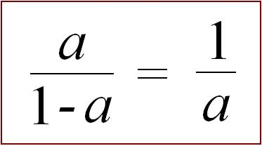
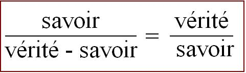

# Leçon 13 | 05 Mars 1969

  

    <label><input type="checkbox" data-lacan-toggle="original" checked> 原文</label>
    <label><input type="checkbox" data-lacan-toggle="notes" checked> 注释</label>
    <label><input type="checkbox" data-lacan-toggle="commentary" checked> 个人解读评论</label>
  

  <form class="lacan-tool-search" role="search">
    <input class="lacan-tool-search-input" type="search" placeholder="搜索全文" aria-label="搜索全文">
    <button class="lacan-tool-button" type="submit" title="搜索">搜索</button>
  </form>
  <button class="lacan-tool-button lacan-back-to-top" type="button" title="回到页面最上方" aria-label="回到页面最上方">↑</button>

<section class="parallel-paragraph" data-paragraph-ids="s16-13-0001">

s16-13-0001

原文 · s16-13-0001

### Je vous ai laissés la dernière fois sur une formule équilibrée selon la *proportion* - appelons-la *harmonique* - que j’ai développée devant vous sous ce terme, que :

[无对应译文]

</section>

<section class="parallel-paragraph" data-paragraph-ids="s16-13-0002">

s16-13-0002

原文 · s16-13-0002

[无对应译文]

</section>

<section class="parallel-paragraph" data-paragraph-ids="s16-13-0003">

s16-13-0003

原文 · s16-13-0003

Ce que j’ai pu traduire aisément, en raison des dictions antérieures, par ceci…

[无对应译文]

</section>

<section class="parallel-paragraph" data-paragraph-ids="s16-13-0004">

s16-13-0004

原文 · s16-13-0004

> qui porte en soi un certain degré d’évidence apparente et de nature à satisfaire d’une formule
>
> *a priori* ce qui est le plus communément reconnu de ce qu’il en est de la conquête analytique …qui est ceci : que nous savons que quelque part, en cette part que nous appelons *inconscient,* une *vérité* s’énonce qui a cette propriété que nous n’en pouvons rien savoir. Ceci - j’entends ce fait même - c’est là ce qui constitue un savoir. J’écrivais donc *savoir* sur la fonction de *vérité moins savoir*, c’est cela qui doit nous donner *la vérité* sur *le savoir*.

[无对应译文]

</section>

<section class="parallel-paragraph" data-paragraph-ids="s16-13-0005">

s16-13-0005

原文 · s16-13-0005

 

[无对应译文]

</section>

<section class="parallel-paragraph" data-paragraph-ids="s16-13-0006">

s16-13-0006

原文 · s16-13-0006

Là-dessus, pour faire annonce d’un épisode menu de mes rencontres, il m’est arrivé cette semaine d’entendre une formule…

[无对应译文]

</section>

<section class="parallel-paragraph" data-paragraph-ids="s16-13-0007">

s16-13-0007

原文 · s16-13-0007

> *je m’excuse auprès de son auteur si je la déforme un peu* …il s’agissait d’une formule aux prémisses d’une recherche dans la ligne de mon enseignement, qui était de situer la fonction de la psychanalyse non pas à tout prix comme science mais comme indication épistémologique, puisque la recherche est à l’ordre du jour, sur la fonction de la science. La formule est ceci :

[无对应译文]

</section>

<section class="parallel-paragraph" data-paragraph-ids="s16-13-0008">

s16-13-0008

原文 · s16-13-0008

> « *La psychanalyse serait, dans les sciences, quelque chose qu’on pourrait formuler comme une science sans savoir.* »

[无对应译文]

</section>

<section class="parallel-paragraph" data-paragraph-ids="s16-13-0009">

s16-13-0009

原文 · s16-13-0009

Mon interlocuteur allait jusque là, et sans doute porté par ce qu’il en est d’un certain mouvement actuel, pour autant qu’à un niveau qui est bien aussi d’*expérience*, *la mise en question* se pose de ce qu’il en est d’une sorte de relativité qu’on accuserait d’être mode de domination sociale au niveau de la transmission du savoir.

[无对应译文]

</section>

<section class="parallel-paragraph" data-paragraph-ids="s16-13-0010">

s16-13-0010

原文 · s16-13-0010

J’ai vivement repris mon interlocuteur au nom précisément de ceci qu’il est faux de dire que *rien de l’expérience psychanalytique*, dans *un enseignement* ne pourrait s’articuler à proprement parler, se doctriner comme savoir, et de ce fait, puisqu’il s’agit de ce qui est mis en cause présentement, être énoncé d’une façon magistrale dans les termes qui sont ceux précisément sous lesquels je l’énonce ce savoir, ici.

[无对应译文]

</section>

<section class="parallel-paragraph" data-paragraph-ids="s16-13-0011">

s16-13-0011

原文 · s16-13-0011

Et pourtant, sous un certain angle, d’une certaine façon, c’est la vérité ce qu’avançait mon interlocuteur. C’est la vérité au niveau de ce *savoir analytique* : qu’il n’en est pas un - de savoir, par rapport à ce qu’il a l’air d’être, à ce pourquoi on le prendrait si - sous prétexte qu’il a énoncé le rapport originel, radical, de la fonction du savoir à la sexualité – on se précipitait trop vite - *c’est un pléonasme…* - à en déduire que c’est un savoir du sexuel.

[无对应译文]

</section>

<section class="parallel-paragraph" data-paragraph-ids="s16-13-0012">

s16-13-0012

原文 · s16-13-0012

Qui est-ce qui a appris dans la psychanalyse à savoir bien traiter sa femme ?

[无对应译文]

</section>

<section class="parallel-paragraph" data-paragraph-ids="s16-13-0013">

s16-13-0013

原文 · s16-13-0013

Parce qu’enfin ça compte, une femme ! Il y a une certaine façon de l’attraper par le bon bout, ça se tient en mains d’une certaine façon, à laquelle elle ne s’y trompe pas, elle ! Elle est capable de vous dire : « *Vous ne me tenez pas comme on tient une femme* ».

[无对应译文]

</section>

<section class="parallel-paragraph" data-paragraph-ids="s16-13-0014">

s16-13-0014

原文 · s16-13-0014

Que les voies dans une analyse puissent être éclaircies qui l’empêchaient - cet homme à qui cette femme s’adressait dans ce que je viens de dire - de le bien faire, on aime à croire que ça se produit à *la fin d’une analyse*. Et pour ce qui est *de la technique*, si vous me permettez de m’exprimer ainsi, le résultat est livré à son savoir naturel, *à l’adresse*…

[无对应译文]

</section>

<section class="parallel-paragraph" data-paragraph-ids="s16-13-0015">

s16-13-0015

原文 · s16-13-0015

> si vous me permettez d’employer ce mot, avec toute l’ambiguïté qu’à l’ordinaire des ressources du langage
>
> il possède en français la faculté épinglée de ce nom et aussi le sens d’« *à qui ça s’adresse* » …*à l’adresse* supposée donnée au bout d’un déblayage.

[无对应译文]

</section>

<section class="parallel-paragraph" data-paragraph-ids="s16-13-0016">

s16-13-0016

原文 · s16-13-0016

Il est clair qu’il n’y a rien de commun entre l’opération analytique et quoi que ce soit qui relève de ce registre que j’ai appelé à l’instant « *technique* », dont on sait l’ampleur quand on repère - *comme l’a fait* MAUSS[^53] *par exemple incidemment* - ce domaine…

[无对应译文]

</section>

<section class="parallel-paragraph" data-paragraph-ids="s16-13-0017">

s16-13-0017

原文 · s16-13-0017

> parlant des caractéristiques dans la culture de cette fonction très étendue, pour laquelle ce n’est pas sans raison
>
> que dans la nôtre - de civilisation - elle soit non pas à proprement parler éludée, mais refoulée dans les coins …cette fonction qu’il appelle « *les techniques du corps* ».

[无对应译文]

</section>

<section class="parallel-paragraph" data-paragraph-ids="s16-13-0018">

s16-13-0018

原文 · s16-13-0018

Je n’ai ici que de faire allusion à la dimension des techniques proprement érotiques…

[无对应译文]

</section>

<section class="parallel-paragraph" data-paragraph-ids="s16-13-0019">

s16-13-0019

原文 · s16-13-0019

> pour autant qu’elles sont mises en avant dans telle culture
>
> qu’on ne saurait d’aucune façon qualifier de primitive, la culture hindoue par exemple …pour faire sentir que rien de ce qui s’énonce dans ce qui, pour vous, ne peut en aucun cas vous parvenir qu’au titre des amusettes, de la pornographie, dans la lecture d’un livre comme le *Kama­ Soutra* par exemple.

[无对应译文]

</section>

<section class="parallel-paragraph" data-paragraph-ids="s16-13-0020">

s16-13-0020

原文 · s16-13-0020

Et pourtant dans une autre dimension où ce texte peut être entendu, il peut aussi bien prendre une portée qui…

[无对应译文]

</section>

<section class="parallel-paragraph" data-paragraph-ids="s16-13-0021">

s16-13-0021

原文 · s16-13-0021

> au regard des confusions complètes qui sont faites sur ce mot, celui que je vais employer …sera repérée, non sans justesse mais approximative, comme métaphysique.

[无对应译文]

</section>

<section class="parallel-paragraph" data-paragraph-ids="s16-13-0022">

s16-13-0022

原文 · s16-13-0022

Le biais donc par lequel est abordé dans la psychanalyse ce qu’il en est du savoir sexuel, c’est pour cela qu’il prend son poids de la façon dont je l’écris…

[无对应译文]

</section>

<section class="parallel-paragraph" data-paragraph-ids="s16-13-0023">

s16-13-0023

原文 · s16-13-0023

> là encore, une fois de plus, ce dont il s’agit, c’est d’un recours à l’évidence du départ,
>
> et ceci, c’est bien celui de ce que d’interdit à proprement parler peut passer sur ce savoir, le savoir sexuel …le biais par où - je ne dirai pas *nous y rentrons* - mais *nous y sommes confrontés*, c’est ceci de *nouveau*, en ce sens que ce biais n’avait jamais été pris, c’est de l’aborder par ce point où cet interdit pèse, et c’est pourquoi les premiers énoncés de FREUD à l’endroit de l’inconscient mettent l’accent sur la fonction de la censure comme telle.

[无对应译文]

</section>

<section class="parallel-paragraph" data-paragraph-ids="s16-13-0024">

s16-13-0024

原文 · s16-13-0024

Cet interdit s’exerce comme affectant un certain « là », cet endroit-là, où ça parle, où ça avoue, où ça avoue que c’est préoccupé par la question de ce savoir…

[无对应译文]

</section>

<section class="parallel-paragraph" data-paragraph-ids="s16-13-0025">

s16-13-0025

原文 · s16-13-0025

> et admirez là au passage, une fois de plus la richesse du langage : est-ce que ce « *préoccupé* » pour traduire la *Besetzung, le Besetz freudien* ne vaut pas mieux que cet *investissement* ou cet *investi* dont les traductions nous rebattent les oreilles ? …il est pré-occupé, occupé à l’avance par ce *quelque chose* dont la position dès lors va devenir plus ambiguë.

[无对应译文]

</section>

<section class="parallel-paragraph" data-paragraph-ids="s16-13-0026">

s16-13-0026

原文 · s16-13-0026

Que peut vouloir dire…

[无对应译文]

</section>

<section class="parallel-paragraph" data-paragraph-ids="s16-13-0027">

s16-13-0027

原文 · s16-13-0027

> et c’est bien là ce qui nécessite qu’on y revienne toujours, sur cette fonction de l’inconscient …que peut vouloir dire ce savoir dont la marque à un certain niveau qui s’articule de vérité se définit en ceci que *c’est ce qu’on sait le moins, ce savoir qui vous préoccupe * ? Et c’est ce qui permet peut-être d’énoncer, pour éclaircir les choses, qu’on pourrait dire, d’un certain point de vue, que dans notre culture, notre civilisation…

[无对应译文]

</section>

<section class="parallel-paragraph" data-paragraph-ids="s16-13-0028">

s16-13-0028

原文 · s16-13-0028

> dans notre sauce, à cette « *poêle à frire* » ou en tout cas c’est bien le seul terme qui justifie votre rassemblement ici …on pourrait aller à soutenir que la psychanalyse a cette fonction d’entretenir cette sorte d’hypnose qui fait qu’après tout, c’est bien vrai, hein, le sexuel chez nous est maintenu dans une torpeur sans précédent.

[无对应译文]

</section>

<section class="parallel-paragraph" data-paragraph-ids="s16-13-0029">

s16-13-0029

原文 · s16-13-0029

Tout ça n’est point une raison pour que la psychanalyse puisse servir d’aucune façon à contester - puisque c’est de cela qu’il s’agit - le bien ­fondé de la transmission d’un savoir quelconque, même pas du sien. Car après tout

[无对应译文]

</section>

<section class="parallel-paragraph" data-paragraph-ids="s16-13-0030">

s16-13-0030

原文 · s16-13-0030

- elle a découvert quelque chose - quelque mythique qu’en soit la formule - elle a découvert ce qu’on appelle, dans d’autres registres, *des moyens de production* - de quoi ? - *d’une satisfaction*.

[无对应译文]

</section>

<section class="parallel-paragraph" data-paragraph-ids="s16-13-0031">

s16-13-0031

原文 · s16-13-0031

- Elle a découvert qu’il y avait *quelque chose d’articulable et d’articulé*, quelque chose que j’ai épinglé, que j’ai dénoncé comme étant des montages, et ne pouvant littéralement pas se concevoir autrement, qu’elle appelle *les pulsions*.

[无对应译文]

</section>

<section class="parallel-paragraph" data-paragraph-ids="s16-13-0032">

s16-13-0032

原文 · s16-13-0032

Et ça n’a de sens - ce qui veut dire qu’elle ne les présente comme telles - que pour autant qu’à l’occasion c’est satisfaisant, et que, quand on les voit fonctionner, ça implique que ça porte avec soi sa satisfaction.

[无对应译文]

</section>

<section class="parallel-paragraph" data-paragraph-ids="s16-13-0033">

s16-13-0033

原文 · s16-13-0033

Quand, sous le biais d’une articulation théorique, elle dénonce dans un comportement le fonctionnement de la pulsion orale, de la pulsion anale, de l’autre encore, scoptophilique ou de la pulsion sadomasochiste, c’est bien pour dire que quelque chose s’en satisfait dont il va de soi qu’on ne peut le désigner autrement que comme « *ce qui est dessous* », *un sujet*, un ὑποχείμενον \[upokeimenon\], quelque division qui doive nécessairement en résulter pour lui, au nom de ceci qu’il n’est là que le sujet d’un instrument en fonctionnement, d’un όργανον \[organon\], le terme ici étant employé *moins dans son accent anatomique* : *prolongement, appendice naturel plus ou moins animé d’un corps,* *que proprement dans son sens originel* qui est celui où ARISTOTE, au regard de la logique l’emploie : d’*appareil*, d’*instrument*.

[无对应译文]

</section>

<section class="parallel-paragraph" data-paragraph-ids="s16-13-0034">

s16-13-0034

原文 · s16-13-0034

Bien sûr, le domaine n’est plus limitrophe et c’est bien de ce fait que quelques organes, d’ailleurs diversement ambigus, malaisés à saisir, du corps - *puisqu’il est trop évident que certains n’en sont que les déchets -* se trouvent placés en cette fonction de *support instrumental*. Alors une question s’ouvre : comment pouvons-nous définir cette satisfaction ?

[无对应译文]

</section>

<section class="parallel-paragraph" data-paragraph-ids="s16-13-0035">

s16-13-0035

原文 · s16-13-0035

Il faut bien croire qu’il doit y avoir là tout de même *quelque chose qui cloche* puisque ce à quoi nous nous employons, à l’endroit de *ces montages*, c’est de *les démonter*. Est-ce à dire que le pur et simple démontage implique en soi, comme tel, de premier plan, qu’il soit curatif ? S’il en était ainsi, il semble que ça irait un peu plus vite, et peut-être même qu’il y a une paye qu’on aurait fait le tour de la question !

[无对应译文]

</section>

<section class="parallel-paragraph" data-paragraph-ids="s16-13-0036">

s16-13-0036

原文 · s16-13-0036

Si nous mettons en avant la fonction de la *fixation* comme essentielle, c’est bien que l’affaire n’est pas si aisée que cela et que ce qu’il nous faut retenir dans le champ psychanalytique, c’est peut-être en effet que quelque chose l’inscrit comme son horizon, et que ça c’est le sexuel, et que c’est en fonction de cet horizon, en tant que maintenu comme tel, que *les pulsions* s’insèrent dans leur fonction d’appareil.

[无对应译文]

</section>

<section class="parallel-paragraph" data-paragraph-ids="s16-13-0037">

s16-13-0037

原文 · s16-13-0037

Vous voyez donc *avec quelle prudence* ici j’apporte *mes assertions* :

[无对应译文]

</section>

<section class="parallel-paragraph" data-paragraph-ids="s16-13-0038">

s16-13-0038

原文 · s16-13-0038

- j’ai parlé d’horizon,

[无对应译文]

</section>

<section class="parallel-paragraph" data-paragraph-ids="s16-13-0039">

s16-13-0039

原文 · s16-13-0039

- j’ai parlé de champ,

[无对应译文]

</section>

<section class="parallel-paragraph" data-paragraph-ids="s16-13-0040">

s16-13-0040

原文 · s16-13-0040

- je n’ai pas parlé d’*acte sexuel*, puisque aussi bien, pour ceux qui étaient déjà ici il y a deux ans[^54] j’ai posé, à la question de l’acte, assurément d’autres prémisses que celles de tenir pour donné qu’il y a un acte sexuel, et *ils se souviendront* que j’ai conclu, à prendre pour visée la question de l’acte sexuel, que nous pouvons énoncer qu’à prendre acte dans l’accent structural où seul il subsiste : « *il n’y a pas d’acte sexuel* ». Nous y reviendrons.

[无对应译文]

</section>

<section class="parallel-paragraph" data-paragraph-ids="s16-13-0041">

s16-13-0041

原文 · s16-13-0041

Et aussi bien vous vous doutez que *c’est bien pour y revenir d’un autre biais*, celui de cette année, *celui qui va* *D’un Autre à l’autre* …que nous nous retrouvons dans ce chemin où il mérite pourtant d’être rappelé ce que nous avons conclu d’un autre abord.

[无对应译文]

</section>

<section class="parallel-paragraph" data-paragraph-ids="s16-13-0042">

s16-13-0042

原文 · s16-13-0042

Ce qui s’interroge de la satisfaction comme essentielle à la pulsion, là aussi nous sommes forcés de le laisser en suspens, ne serait-ce que pour choisir notre chemin pour arriver à le définir.

[无对应译文]

</section>

<section class="parallel-paragraph" data-paragraph-ids="s16-13-0043">

s16-13-0043

原文 · s16-13-0043

Pour l’instant, nous pouvons faire le saut du vif qui se trouve quelque part au niveau du signe égal de l’équation ici écrite :

[无对应译文]

</section>

<section class="parallel-paragraph" data-paragraph-ids="s16-13-0044">

s16-13-0044

原文 · s16-13-0044

 

[无对应译文]

</section>

<section class="parallel-paragraph" data-paragraph-ids="s16-13-0045">

s16-13-0045

原文 · s16-13-0045

C’est bien là ce qui est le centre de notre interrogation d’aujourd’hui : à quelle satisfaction peut répondre le *savoir* lui-même ?

[无对应译文]

</section>

<section class="parallel-paragraph" data-paragraph-ids="s16-13-0046">

s16-13-0046

原文 · s16-13-0046

*Savoir* que ce n’est pas en vain qu’en somme ici je le produis comme approchable notionnellement, comme le savoir qui serait identique à ce champ tel que je viens de le cerner, qui serait le « *savoir y faire* » dans ce champ. Est-ce même suffisant ?

[无对应译文]

</section>

<section class="parallel-paragraph" data-paragraph-ids="s16-13-0047">

s16-13-0047

原文 · s16-13-0047

Ce « *savoir y faire* » est un peu trop proche encore du *savoir-faire*, sur lequel il a pu y avoir tout à l’heure un malentendu que j’ai favorisé d’ailleurs, histoire de vous attraper là où il faut, au ventre. C’est plutôt « *savoir y être* ».

[无对应译文]

</section>

<section class="parallel-paragraph" data-paragraph-ids="s16-13-0048">

s16-13-0048

原文 · s16-13-0048

Et ceci nous ramène au biais qui fait ici notre question, ceci nous ramène toujours aux bases - comme il convient - de notre enjeu, c’est que ce que la découverte freudienne avance, c’est qu’« *on peut y être sans savoir qu’on y est* », et qu’à se croire le plus sûr de se garder de cet « *y être* » qu’à se croire être ailleurs, dans un autre savoir, on y est en plein.

[无对应译文]

</section>

<section class="parallel-paragraph" data-paragraph-ids="s16-13-0049">

s16-13-0049

原文 · s16-13-0049

C’est ça qu’elle dit, *la psychanalyse*, on y est sans le savoir, on y est dans tous les champs du savoir.

[无对应译文]

</section>

<section class="parallel-paragraph" data-paragraph-ids="s16-13-0050">

s16-13-0050

原文 · s16-13-0050

Et c’est pour ça que c’est par ce biais que *la psychanalyse* se trouve intéresser la mise en question du savoir.

[无对应译文]

</section>

<section class="parallel-paragraph" data-paragraph-ids="s16-13-0051">

s16-13-0051

原文 · s16-13-0051

Ce n’est nulle part d’aucune vérité et nommément pas d’aucune ontologie : où qu’on soit, où qu’on fonctionne, par la fonction du *savoir*, on est dans l’*horizon du sexuel*.

[无对应译文]

</section>

<section class="parallel-paragraph" data-paragraph-ids="s16-13-0052">

s16-13-0052

原文 · s16-13-0052

Avouez que ça vaut quand même la peine qu’on aille y regarder de plus près : on y est sans le savoir.

[无对应译文]

</section>

<section class="parallel-paragraph" data-paragraph-ids="s16-13-0053">

s16-13-0053

原文 · s16-13-0053

Est-ce qu’on y perd ? Ça ne semble pas faire de doute, puisque c’est de là qu’on part. On y est couillonné jusqu’à la garde.

[无对应译文]

</section>

<section class="parallel-paragraph" data-paragraph-ids="s16-13-0054">

s16-13-0054

原文 · s16-13-0054

*La duperie de la conscience*, c’est ceci : qu’elle sert à quoi elle ne pense pas servir. J’ai dit *duperie*, pas *tromperie*. La psychanalyse ne s’interroge pas sur *la vérité* de la chose. De nulle part nous ne sortirons d’elle des discours sur « *le voile de Maya* [^55] » ou sur « *l’illusion fondamentale du Will* [^56] ». Duperie implique quelque chose, mais ici moins court à résoudre qu’ailleurs.

[无对应译文]

</section>

<section class="parallel-paragraph" data-paragraph-ids="s16-13-0055">

s16-13-0055

原文 · s16-13-0055

Une dupe, c’est quelqu’un que quelqu’un d’autre exploite. Qui exploite ici ?

[无对应译文]

</section>

<section class="parallel-paragraph" data-paragraph-ids="s16-13-0056">

s16-13-0056

原文 · s16-13-0056

L’accent étant mis sur *la duperie*, quand même *la question fuse*…

[无对应译文]

</section>

<section class="parallel-paragraph" data-paragraph-ids="s16-13-0057">

s16-13-0057

原文 · s16-13-0057

> et c’est ce qui fait que dans une zone qui est celle des suites de la théorie marxiste, on frétille un peu …est-ce que cette sacrée psychanalyse ne pourrait pas donner là, c’est le terme que j’ai entendu avancer comme ça, surgir dans ces paroles. Je préfère - je vous l’ai dit - « *un discours sans paroles* », mais quand je vais voir les gens c’est pour qu’on parle, alors ils parlent, ils parlent plus que moi, et alors ils disent quelque chose comme ça :

[无对应译文]

</section>

<section class="parallel-paragraph" data-paragraph-ids="s16-13-0058">

s16-13-0058

原文 · s16-13-0058

« *Après tout, la psychanalyse pourrait bien être une caution de plus pour la théorie de l’exploitation sociale.* »

[无对应译文]

</section>

<section class="parallel-paragraph" data-paragraph-ids="s16-13-0059">

s16-13-0059

原文 · s16-13-0059

Ils n’ont pas tort : l’exploiteur, simplement, est ici moins facile à saisir. Le mode de la révolution aussi.

[无对应译文]

</section>

<section class="parallel-paragraph" data-paragraph-ids="s16-13-0060">

s16-13-0060

原文 · s16-13-0060

C’est *une duperie qui ne profite à personne*, au moins en apparence. Alors est-ce que le savoir de l’expérience analytique, c’est seulement le savoir comme servant à n’être pas dupe à ce qu’il en est de la musique ?

[无对应译文]

</section>

<section class="parallel-paragraph" data-paragraph-ids="s16-13-0061">

s16-13-0061

原文 · s16-13-0061

Mais à quoi bon, si ça ne s’accompagne pas d’un *savoir en sortir* ou même, plus précisément, d’un *savoir introïtif*, d’un *savoir entrer* dans ce qui est en question concernant cet éclair qui peut en résulter sur l’échec nécessaire de quelque chose qui n’est

[无对应译文]

</section>

<section class="parallel-paragraph" data-paragraph-ids="s16-13-0062">

s16-13-0062

原文 · s16-13-0062

Peut-être pas le privilège de *l’acte sexuel*. C’est cette question par rapport à laquelle la *psychanalyse*, en fait, est restée sur le seuil.

[无对应译文]

</section>

<section class="parallel-paragraph" data-paragraph-ids="s16-13-0063">

s16-13-0063

原文 · s16-13-0063

Pourquoi est-elle restée sur le seuil ? Qu’elle reste sur le seuil dans sa pratique, c’est ce qui ne peut être justifié que d’une façon *théorique,* c’est à quoi nous nous efforçons.

[无对应译文]

</section>

<section class="parallel-paragraph" data-paragraph-ids="s16-13-0064">

s16-13-0064

原文 · s16-13-0064

Mais qu’elle y soit restée aussi sur le plan théorique, je dirai que c’est son problème, laissons-la s’en tirer toute seule.

[无对应译文]

</section>

<section class="parallel-paragraph" data-paragraph-ids="s16-13-0065">

s16-13-0065

原文 · s16-13-0065

Ça ne nous empêche pas - tous tant que nous sommes ici, en tant que nous sommes dans « *la poêle à frire* » - d’essayer de faire, nous aussi, comme les autres, d’aller plus loin.

[无对应译文]

</section>

<section class="parallel-paragraph" data-paragraph-ids="s16-13-0066">

s16-13-0066

原文 · s16-13-0066

Il est certain qu’ici, justement, nous nous trouvons *au carrefour* où, tout à l’inverse de ce que j’énonçais tout à l’heure, nous avons peut-être à recueillir des leçons de l’expérience d’autres dimensions, au regard *d’un certain texte* dont il s’avère avec le temps qu’il n’est *pas si différent du nôtre*, puisque la fonction du signe et même du signifiant y a tout son prix, c’est à savoir de la critique marxiste. Il suffirait peut-être d’un petit peu moins de *progressisme* d’un côté et de l’autre pour qu’on arrive à des conjonctions, j’entends théoriques, fructueuses.

[无对应译文]

</section>

<section class="parallel-paragraph" data-paragraph-ids="s16-13-0067">

s16-13-0067

原文 · s16-13-0067

Là-dessus, chacun sait que j’apporte quelque chose qui est aussi un όργανον \[organon\], justement celui qui pourrait servir à passer cette frontière et que certains épinglent comme la logique du signifiant. C’est vrai, je suis arrivé là-dessus à faire quelques énoncés, et qui se sont trouvés vivement stimuler des esprits, lesquels rien ne préparait, venant de *la psychanalyse*, mais qui s’en sont trouvés stimulés, venant d’ailleurs.

[无对应译文]

</section>

<section class="parallel-paragraph" data-paragraph-ids="s16-13-0068">

s16-13-0068

原文 · s16-13-0068

D’« *ailleurs* » qu’il n’est pas si simple de préciser puisqu’il ne s’agit pas seulement de l’*allégeance politique* mais aussi bien d’un certain nombre de modes, où dans le temps présent, c’est-à-dire bien après que j’aie commencé d’énoncer la dite *logique*, il se produit toutes sortes de questions :

[无对应译文]

</section>

<section class="parallel-paragraph" data-paragraph-ids="s16-13-0069">

s16-13-0069

原文 · s16-13-0069

- sur le maniement de ce signifiant,

[无对应译文]

</section>

<section class="parallel-paragraph" data-paragraph-ids="s16-13-0070">

s16-13-0070

原文 · s16-13-0070

- sur ce que c’est qu’un discours,

[无对应译文]

</section>

<section class="parallel-paragraph" data-paragraph-ids="s16-13-0071">

s16-13-0071

原文 · s16-13-0071

- sur ce que c’est qu’un roman,

[无对应译文]

</section>

<section class="parallel-paragraph" data-paragraph-ids="s16-13-0072">

s16-13-0072

原文 · s16-13-0072

- sur ce que c’est même que le bon usage de la formalisation en mathématiques.

[无对应译文]

</section>

<section class="parallel-paragraph" data-paragraph-ids="s16-13-0073">

s16-13-0073

原文 · s16-13-0073

Alors on est - *là comme ailleurs* - un peu pressé. La hâte a sa fonction, je l’ai déjà énoncé en logique. Encore ne l’ai-je énoncé que pour montrer *les pièges mentaux*, j’irai jusqu’à les qualifier ainsi, dans lesquels elle précipite. \[Cf. *Écrits* : *Le temps logique*… p.197\]

[无对应译文]

</section>

<section class="parallel-paragraph" data-paragraph-ids="s16-13-0074">

s16-13-0074

原文 · s16-13-0074

On finira bien…

[无对应译文]

</section>

<section class="parallel-paragraph" data-paragraph-ids="s16-13-0075">

s16-13-0075

原文 · s16-13-0075

> à vouloir accentuer combien ce que j’énonce comme *logique du signifiant* reste en marge - en quelque sorte - de ce qu’une certaine frénésie, *adhésion à la formalisation pure*, permettrait d’en écarter comme, dit-on, *métaphysique* …on finira bien par faire qu’on s’apercevra que, même *dans le domaine du pur exercice mathématique, l’usage de la formalisation n’épuise rien* mais laisse en marge quelque chose à propos de quoi vaut toujours la question de ce qu’il en est du *désir de savoir*.

[无对应译文]

</section>

<section class="parallel-paragraph" data-paragraph-ids="s16-13-0076">

s16-13-0076

原文 · s16-13-0076

### Et, qui sait, *quelqu’un autour de moi l’a suggéré il y a quelques jours,* il y aura peut-être, malgré moi, un jour en *mathématiques* quelque chose qui s’appellera « *le théorème de Lacan* » ! Ce n’est certainement pas que je l’aurai cherché, car j’ai d’autres chats à fouetter, mais c’est justement comme ça que les choses arrivent. À force de vouloir considérer comme clos - et c’est bien là

[无对应译文]

</section>

<section class="parallel-paragraph" data-paragraph-ids="s16-13-0077">

s16-13-0077

原文 · s16-13-0077

### une caractéristique de quelque chose qui normalement doit déboucher ailleurs - un discours non achevé, on produit des effets de déchet, comme cela. Ce « *théorème* », on peut encore en laisser l’énoncé dans un obscur de l’avenir.

[无对应译文]

</section>

<section class="parallel-paragraph" data-paragraph-ids="s16-13-0078">

s16-13-0078

原文 · s16-13-0078

Pour l’instant, revenons au savoir et repartons de ce qui ici s’énonce.

[无对应译文]

</section>

<section class="parallel-paragraph" data-paragraph-ids="s16-13-0079">

s16-13-0079

原文 · s16-13-0079

Ce n’est pas la même chose d’énoncer une formule en commençant par un bout ou par l’autre : « *Le savoir* - *peut-on dire, inversement de notre expérience* - *c’est ce qui manque à la vérité.* »

[无对应译文]

</section>

<section class="parallel-paragraph" data-paragraph-ids="s16-13-0080">

s16-13-0080

原文 · s16-13-0080

C’est pour ça que la vérité… ce qui évidemment met *en porte-à-faux* le débat *d’une certaine* - et seulement de celle-là - *logique,* *de la logique de Frege* pour autant qu’elle part sur les béquilles de deux valeurs - aussi bien notables - 1 ou 0, *vérité* ou *erreur*.

[无对应译文]

</section>

<section class="parallel-paragraph" data-paragraph-ids="s16-13-0081">

s16-13-0081

原文 · s16-13-0081

Regardez bien quelle peine il a à trouver une proposition qu’il puisse qualifier de véridique, il faut qu’il aille invoquer le nombre de satellites qu’a Jupiter ou telle autre planète.

[无对应译文]

</section>

<section class="parallel-paragraph" data-paragraph-ids="s16-13-0082">

s16-13-0082

原文 · s16-13-0082

Autrement dit quelque chose de bien rond et de tout à fait isolable, sans se rendre compte que ce n’est que recourir au plus vieux « *prestige »* [^57] de ce par quoi d’abord le *réel* est apparu comme « *ce qui revient toujours à la même place* ».

[无对应译文]

</section>

<section class="parallel-paragraph" data-paragraph-ids="s16-13-0083">

s16-13-0083

原文 · s16-13-0083

Du fait qu’il ne puisse pas avancer autre chose que le recours à ces entités astronomiques, que bien sûr il n’est même pas question qu’un mathématicien énonce comme *formule* portant inhérente en soi la vérité « 2 *et* 2 *font* 4 », car ce n’est pas vrai, si par hasard dans chacun des 2 il y en avait un qui était le même, *ils ne feraient que* 3, il n’y a pas beaucoup d’autres formules qui puissent être énoncées comme vérité.

[无对应译文]

</section>

<section class="parallel-paragraph" data-paragraph-ids="s16-13-0084">

s16-13-0084

原文 · s16-13-0084

Que la vérité soit désir de savoir et rien d’autre n’est évidemment fait *que pour nous faire mettre en question précisément ceci : s’il y en avait une - vérité - avant* ? Chacun sait que c’est là le sens du *laisser-être heideggerien*. Est-ce qu’il y a quelque chose à *laisser-être* ?

[无对应译文]

</section>

<section class="parallel-paragraph" data-paragraph-ids="s16-13-0085">

s16-13-0085

原文 · s16-13-0085

C’est en ce sens que *la psychanalyse* apporte quelque chose.

[无对应译文]

</section>

<section class="parallel-paragraph" data-paragraph-ids="s16-13-0086">

s16-13-0086

原文 · s16-13-0086

Elle est pour dire qu’il y a quelque chose, en effet, qu’on pourrait *laisser-être*.

[无对应译文]

</section>

<section class="parallel-paragraph" data-paragraph-ids="s16-13-0087">

s16-13-0087

原文 · s16-13-0087

Seulement elle y intervient. Et elle y intervient d’une façon qui nous intéresse, au-delà du seuil derrière lequel elle reste, pour autant qu’elle nous fait nous interroger sur ce qu’il en est du désir de savoir.

[无对应译文]

</section>

<section class="parallel-paragraph" data-paragraph-ids="s16-13-0088">

s16-13-0088

原文 · s16-13-0088

C’est pourquoi nous revenons à la pulsion. Elle est sans doute mythologique, comme FREUD lui-même l’a écrit.

[无对应译文]

</section>

<section class="parallel-paragraph" data-paragraph-ids="s16-13-0089">

s16-13-0089

原文 · s16-13-0089

Mais ce qui ne l’est pas, c’est la supposition qu’un sujet en est satisfait.

[无对应译文]

</section>

<section class="parallel-paragraph" data-paragraph-ids="s16-13-0090">

s16-13-0090

原文 · s16-13-0090

Or ce n’est pas pensable sans l’implication, déjà dans la pulsion, d’un certain savoir, de son caractère de « *tenant lieu sexuel* ».

[无对应译文]

</section>

<section class="parallel-paragraph" data-paragraph-ids="s16-13-0091">

s16-13-0091

原文 · s16-13-0091

Seulement voilà : qu’est-ce que ça veut dire que ce n’est pas pensable ?

[无对应译文]

</section>

<section class="parallel-paragraph" data-paragraph-ids="s16-13-0092">

s16-13-0092

原文 · s16-13-0092

Parce que les choses peuvent aller aussi loin que d’interroger l’effet de pensée comme suspect. Nous ne savons peut-être absolument rien de ce que ça veut dire « *tenir lieu du sexuel* ». L’idée de sexuel même, peut être un effet du passage de ce qui est au cœur de la pulsion, à savoir *l’objet(a)*. Comme vous le savez, ça s’est fait il y a longtemps.

[无对应译文]

</section>

<section class="parallel-paragraph" data-paragraph-ids="s16-13-0093">

s16-13-0093

原文 · s16-13-0093

Elle lui passe la pomme fatale, la chère Ève ! C’est quand même un mythe aussi. C’est à partir de là qu’il la voit comme *femme*.

[无对应译文]

</section>

<section class="parallel-paragraph" data-paragraph-ids="s16-13-0094">

s16-13-0094

原文 · s16-13-0094

Il s’aperçoit de tous les trucs que je vous ai dits tout à l’heure. Avant, il ne s’était pas aperçu qu’elle était quelque chose d’extrait du côté de son gril costal. Il avait trouvé ça - comme ça - gentil, bien agréable : on était au Paradis !

[无对应译文]

</section>

<section class="parallel-paragraph" data-paragraph-ids="s16-13-0095">

s16-13-0095

原文 · s16-13-0095

C’est probablement à ce moment-là - et à lire le texte ça ne fait aucun doute - que non seulement il découvre qu’elle est *la femme*, mais qu’il commence à penser, le cher petit ! C’est pour ça que dire le « *ça n’est pas pensable* », que la pulsion déjà comporte, implique un certain savoir, ça ne nous mène pas loin… Et la preuve d’ailleurs, c’est que c’est le joint, ici, de l’idéalisme. Il y a un nommé SIMMEL[^58] qui a parlé en son temps, de la sublimation, avant FREUD. C’était pour partir de la fonction des valeurs. Et alors, lui, explique très bien comment l’objet féminin vient prendre, à l’intérieur de ça, une valeur *privilégiée*. C’est un choix comme un autre.

[无对应译文]

</section>

<section class="parallel-paragraph" data-paragraph-ids="s16-13-0096">

s16-13-0096

原文 · s16-13-0096

Il y a *les valeurs*, on pense dans *les valeurs*, et puis on pense selon *les valeurs*, et puis on édifie *des valeurs*.

[无对应译文]

</section>

<section class="parallel-paragraph" data-paragraph-ids="s16-13-0097">

s16-13-0097

原文 · s16-13-0097

Si je vous ai dit que la psychanalyse et FREUD ne se préoccupent pas de « *l’illusion ni du voile de Maya* », c’est justement que l’un et l’autre - *la pratique et la théorie* - *sont réalistes*. *La jouissance* c’est ce qui ne s’aperçoit qu’à en voir la constance dans les énoncés de FREUD. Mais c’est aussi ce qui s’aperçoit à l’expérience, j’entends *psychanalytique*.

[无对应译文]

</section>

<section class="parallel-paragraph" data-paragraph-ids="s16-13-0098">

s16-13-0098

原文 · s16-13-0098

*La jouissance* est ici un absolu, *c’est le réel*, et tel que je l’ai défini *comme* « *ce qui revient toujours à la même place* ».

[无对应译文]

</section>

<section class="parallel-paragraph" data-paragraph-ids="s16-13-0099">

s16-13-0099

原文 · s16-13-0099

Et si on le sait, c’est à cause de *la femme*. Cette jouissance comme telle est telle qu’à l’origine seule *l’hystérique* la met en ordre logiquement. C’est elle en effet qui la pose comme un absolu, c’est en ceci qu’elle dévoile la structure logique de la fonction de *la jouissance*. Car si elle la pose ainsi - *en quoi elle est juste théoricienne* - c’est à ses dépens. C’est justement parce qu’elle la pose comme un absolu qu’elle est rejetée, à ne pouvoir y répondre que sous l’angle d’un désir insatisfait par rapport à elle-même.

[无对应译文]

</section>

<section class="parallel-paragraph" data-paragraph-ids="s16-13-0100">

s16-13-0100

原文 · s16-13-0100

Cette position dans le dévoilement logique, part d’une expérience dont la corrélation est parfaitement sensible à tous les niveaux de l’expérience analytique. Je veux dire que c’est toujours d’un *au-delà de la jouissance* comme un absolu que toutes les déterminations articulées de ce qu’il en est du désir trouvent logiquement leur juste place, c’est ce qui arrive à un degré de cohérence dans *l’énoncé qui réfute toute caducité liée au hasard de l’origine*.

[无对应译文]

</section>

<section class="parallel-paragraph" data-paragraph-ids="s16-13-0101">

s16-13-0101

原文 · s16-13-0101

Ce n’est pas parce que *les hystériques* ont été là au début, par un accident historique, que toute l’affaire a pu prendre sa place, c’est parce qu’elles étaient au juste point où l’incidence d’une parole pouvait mettre en évidence ce creux qui est la conséquence du fait que *la jouissance* joue ici fonction d’être hors des limites du *jeu*, c’est parce que - comme le dit FREUD - l’énigme est là de savoir « *Que veut une femme ?* »… ce qui est une façon tout à fait *déplacée* d’épingler ce qu’il en est, dans l’occasion, de sa place …que prend valeur ce qu’il en est de savoir *ce que veut l’homme*.

[无对应译文]

</section>

<section class="parallel-paragraph" data-paragraph-ids="s16-13-0102">

s16-13-0102

原文 · s16-13-0102

Que toute la théorie de l’analyse, dit-on quelquefois, se développe dans une filière androcentrique, ce n’est certes pas la faute des hommes, *comme on le croit*. Ce n’est pas parce qu’ils dominent - en particulier - c’est parce qu’ils ont perdu les pédales et qu’*à partir de ce moment-là il n’y a plus que les femmes, et spécialement les femmes hystériques, qui y comprennent quelque chose*.

[无对应译文]

</section>

<section class="parallel-paragraph" data-paragraph-ids="s16-13-0103">

s16-13-0103

原文 · s16-13-0103

1 *- a : Vérité - Savoir*. *Dans l’énoncé de l’inconscient tel que je viens de l’écrire*, s’il porte la marque du *a* au niveau où *manque le savoir*, c’est dans la mesure où on ne sait rien de cet *absolu*, et que c’est même ce qui le constitue comme *absolu*, c’est *qu’il n’est pas lié dans l’énoncé*, mais que *ce qu’on affirme*… et c’est cela *l’énonciation* dans sa part inconsciente …*c’est que c’est cela qui est le désir en tant que manque du* 1. *Or cela ne garantit pas que ce soit* *cela qui est le désir en tant que manque du* 1.

[无对应译文]

</section>

<section class="parallel-paragraph" data-paragraph-ids="s16-13-0104">

s16-13-0104

原文 · s16-13-0104

Ça ne garantit pas que ce soit *la vérité*, *le manque du* 1. Rien ne garantit que ce ne soit pas le mensonge, et c’est même pourquoi *dans l’Entwurf, dans l’Esquisse pour une psychologie*, FREUD désigne ce qu’il en est de la concaténation inconsciente comme prenant toujours son départ dans un προτον ψευδος \[proton pseudos\][^59]*, ce qui ne peut se traduire* correctement, quand on sait lire, que par le « *mensonge souverain* ». Si ça s’applique à *l’hystérique*, ça n’est que dans la mesure où elle prend la place de l’homme.

[无对应译文]

</section>

<section class="parallel-paragraph" data-paragraph-ids="s16-13-0105">

s16-13-0105

原文 · s16-13-0105

Ce dont il s’agit, c’est de la fonction de ce *Un* en tant qu’il domine tout ce qu’il en est du champ qu’à juste titre on épingle comme métaphysique :

[无对应译文]

</section>

<section class="parallel-paragraph" data-paragraph-ids="s16-13-0106">

s16-13-0106

原文 · s16-13-0106

- c’est lui qui est mis en cause, bien plus que l’être, par l’intrusion de la psychanalyse,

[无对应译文]

</section>

<section class="parallel-paragraph" data-paragraph-ids="s16-13-0107">

s16-13-0107

原文 · s16-13-0107

- c’est lui qui nous force à déplacer l’accent du *signe* au *signifiant*.

[无对应译文]

</section>

<section class="parallel-paragraph" data-paragraph-ids="s16-13-0108">

s16-13-0108

原文 · s16-13-0108

S’il y avait un champ concevable où fonctionne *l’union sexuelle*, il ne s’agirait - *là où ça a l’air d’aller, chez l’animal* - que du *signe*.

[无对应译文]

</section>

<section class="parallel-paragraph" data-paragraph-ids="s16-13-0109">

s16-13-0109

原文 · s16-13-0109

« *Fais-moi cygne* » comme disait LÉDA à l’un d’entre eux ! Après ça, tout va bien. On s’est passé chacun une moitié du dessert, on est *conjoint*, ça fait *Un*. Seulement, si l’analyse introduit quelque chose, c’est justement que ce *Un* ne colle pas, et c’est pour ça qu’elle introduit quelque chose de nouveau, à la lumière de quoi d’ailleurs, même ces exploits de l’érotisme auxquels je faisais allusion tout à l’heure, en tant qu’elle s’engage, seulement peuvent prendre leur sens.

[无对应译文]

</section>

<section class="parallel-paragraph" data-paragraph-ids="s16-13-0110">

s16-13-0110

原文 · s16-13-0110

Car si l’union sexuelle comportait, en même temps que sa fin, la satisfaction, il n’y aurait aucun procès subjectif à attendre d’aucune *expérience*. Entendez non pas de *celles qui, dans l’analyse, donnent les configurations du désir*, mais de celles qui, *bien au-delà,* dans ce terrain déjà exploré, déjà pratiqué, sont considérées comme les voies d’une ascèse où *quelque chose* de l’ordre de l’*être* peut venir à se réaliser. *La jouissance*…

[无对应译文]

</section>

<section class="parallel-paragraph" data-paragraph-ids="s16-13-0111">

s16-13-0111

原文 · s16-13-0111

> *cette jouissance qui n’est ici mise en valeur que de l’exclusion en quelque sorte de quelque chose qui représente la nature féminine* …est-ce que nous ne savons pas que la nature, pour *pourvoir dans ses mille et dix mille espèces aux nécessités de la conjonction*, ne semble pas avoir toujours besoin d’y recourir ? Il y a bien d’autres appareils que « *les appareils à tumescence* » qui sont en fonction au niveau de tels *arthropodes* ou *arachnidés*. Ce qu’il en est de *la jouissance* n’est ici en aucune façon réductible à un naturalisme. Ce qu’il y a de naturaliste dans la psychanalyse, c’est simplement ce *nativisme* des appareils qui s’appellent « *les pulsions* », et ce *nativisme* est conditionné de ceci que *l’homme naît dans un bain de signifiants*.

[无对应译文]

</section>

<section class="parallel-paragraph" data-paragraph-ids="s16-13-0112">

s16-13-0112

原文 · s16-13-0112

Il n’y a aucune raison de lui donner quelque suite que ce soit dans le sens du naturisme. La question que nous allons ouvrir et qui sera l’objet de notre prochain entretien sera – je pense – éclairée par ces prémisses que j’ai avancées aujourd’hui.

[无对应译文]

</section>

<section class="parallel-paragraph" data-paragraph-ids="s16-13-0113">

s16-13-0113

原文 · s16-13-0113

Comment peut-il se faire… c’est de là qu’il faut prendre *la question, non pas de la sublimation*…

[无对应译文]

</section>

<section class="parallel-paragraph" data-paragraph-ids="s16-13-0114">

s16-13-0114

原文 · s16-13-0114

> qui est le point où FREUD lui-même a marqué ce que j’ai appelé tout à l’heure « *l’arrêt de l’analyse* » sur un seuil …*de la sublimation* il ne nous a dit que deux choses : que ça avait un certain rapport *am Objekt…*

[无对应译文]

</section>

<section class="parallel-paragraph" data-paragraph-ids="s16-13-0115">

s16-13-0115

原文 · s16-13-0115

> *am, an, vous* connaissez déjà l’*an sich,* ce n’est pas du tout pareil que le « en » français, quand on traduit
>
> l’*an sich* par l’« *en soi *», ce n’est pas ça du tout, c’est bien pour ça que mon « *en-Je* » quand il s’agit du *(a)*, fait aussi ambiguïté, j’aimerais l’appeler « *a-je* », en y mettant une apostrophe, l’« *a-je* »,
>
> et vous verriez tout de suite ainsi où nous glissons, c’est là le bon usage des langues en exercice …mais pour reprendre ce dont il s’agit, quand FREUD articule la sublimation, il nous souligne que *si elle a rapport avec l’objet*, c’est par l’intermédiaire de quelque chose qu’il exploite au niveau où il l’introduit et qu’il appelle *l’idéalisation*, mais que dans son essence elle est *mit dem Trieb : avec la pulsion*.

[无对应译文]

</section>

<section class="parallel-paragraph" data-paragraph-ids="s16-13-0116">

s16-13-0116

原文 · s16-13-0116

Ceci est dans l’*Einführung zur Narzissmus*, mais pour vous reporter aux autres textes, il y en a un certain nombre, je pense que je n’ai pas besoin de vous les énumérer, depuis les *Trois essais sur la Sexualité* jusqu’à la *Massenpsychologie* : toujours l’accent est mis sur ceci qu’à l’inverse de l’interférence censurante qui caractérise la *Verdrängung…*

[无对应译文]

</section>

<section class="parallel-paragraph" data-paragraph-ids="s16-13-0117">

s16-13-0117

原文 · s16-13-0117

> et pour tout dire du principe qui fait obstacle à l’émergence du travail …*la sublimation est* - à proprement parler et en tant que telle - *mode de satisfaction de la pulsion*. Elle est, avec la pulsion \- une pulsion qu’il qualifie de *zielgehemmt -* détournée – *traduit-on* - de son *but*. J’ai essayé déjà d’articuler ce qu’il en est de ce *but*, et que peut-être il faudrait dissocier au niveau du *but* ce qui est le chemin de ce qui est à proprement parler *la cible* pour y voir plus clair. Mais quel besoin de telles *arguties* après ce qu’aujourd’hui j’ai produit devant vous ?

[无对应译文]

</section>

<section class="parallel-paragraph" data-paragraph-ids="s16-13-0118">

s16-13-0118

原文 · s16-13-0118

Comment ne pas voir qu’il n’est rien de plus aisé que de voir la pulsion se satisfaire hors de son but sexuel ?

[无对应译文]

</section>

<section class="parallel-paragraph" data-paragraph-ids="s16-13-0119">

s16-13-0119

原文 · s16-13-0119

De quelque façon qu’il soit défini, il est hors du champ de ce qui est d’essence défini comme *l’appareil de la pulsion*.

[无对应译文]

</section>

<section class="parallel-paragraph" data-paragraph-ids="s16-13-0120">

s16-13-0120

原文 · s16-13-0120

Pour tout dire, pour conclure je ne vous prierai que d’une chose : de voir ce qu’il en est abouti partout où, non pas *l’instinct*, que nous aurions bien de la peine à partir d’aujourd’hui à situer quelque part, mais *une structure sociale s’organise autour de la fonction sexuelle.* On peut s’étonner qu’aucun de ceux qui se sont appliqués à nous montrer les sociétés d’abeilles ou de fourmis n’aient pas mis l’accent sur ceci - alors qu’ils s’occupent de toutes autres choses : de leurs groupes, de leurs communications, de leurs ébats, de leur merveilleuse petite intelligence - de voir *qu’une fourmilière comme une ruche* *est entièrement centrée autour de la réalisation de ce qu’il en est du rapport sexuel*.

[无对应译文]

</section>

<section class="parallel-paragraph" data-paragraph-ids="s16-13-0121">

s16-13-0121

原文 · s16-13-0121

C’est très précisément dans cette mesure que *ces sociétés* diffèrent des nôtres, qu’elles *prennent la forme d’une fixité où s’avère* *la non présence du signifiant*. C’est bien pour ça que PLATON, qui croyait à l’éternité de tous les rapports *idéiques*, fait une πολιτεία \[Politeia\] idéale où tous les enfants sont en commun. À partir de ce moment­-là vous êtes sûr de ce dont il s’agit : il s’agit à proprement parler de centrer la société sur ce qu’il en est de la production sexuelle.

[无对应译文]

</section>

<section class="parallel-paragraph" data-paragraph-ids="s16-13-0122">

s16-13-0122

原文 · s16-13-0122

L’horizon de PLATON, tout idéaliste que vous l’imaginiez, n’était rien d’autre…

[无对应译文]

</section>

<section class="parallel-paragraph" data-paragraph-ids="s16-13-0123">

s16-13-0123

原文 · s16-13-0123

> à part bien sûr une suite de *conséquences logiques,* qu’il n’est pas question qu’elles portent leurs fruits …que d’annuler dans la société tous les effets de ses *Dialogues*.

[无对应译文]

</section>

<section class="parallel-paragraph" data-paragraph-ids="s16-13-0124">

s16-13-0124

原文 · s16-13-0124

Je vous laisse là-dessus pour aujourd’hui, et je vous donne rendez-­vous la prochaine fois sur le sujet de *la sublimation*.

[无对应译文]

</section>

<section class="note-block original-notes">

## Notes

[^53]:
    #  Marcel Mauss : « [Les techniques du corps](http://classiques.uqac.ca/classiques/mauss_marcel/socio_et_anthropo/6_Techniques_corps/techniques_corps.pdf) », in « Sociologie et anthropologie », PUF, Coll. Quadrige, 2004, pp. 363-383.

[^54]: Cf. Séminaire 1966-67 : « *L’acte psychanalytique* ».

[^55]: Le voile de l’illusion qui recouvre les yeux des mortels. Référence à la philosophie : Zhuang Zi et *le rêve du papillon*, Platon et le mythe de *la caverne*,

    Descartes et *le démon trompeur*, Schopenhauer et *le voile de Maya*…

[^56]: Référence à la psychologie, Cf. Daniel Wegner (Harvard) : « *The Illusion of Conscious Will* », The M.I.T Press, 2002.

[^57]: Prestige : illusion produite par magie ou par un sortilège, enchantement, charme, toute illusion en général.

[^58]: Georg Simmel : « *La tragédie de la culture et autres essais* », Rivages, 1988.

[^59]: Cf. le « *proton-pseudos* hystérique » : « *Esquisse d'une psychologie scientifique* », Freud, 1895.

</section>
