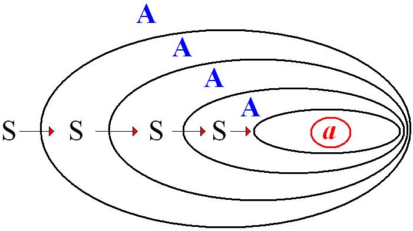
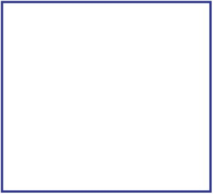
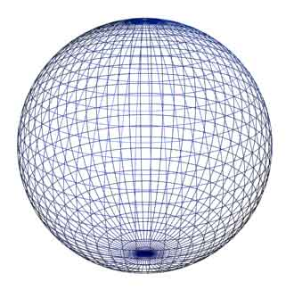
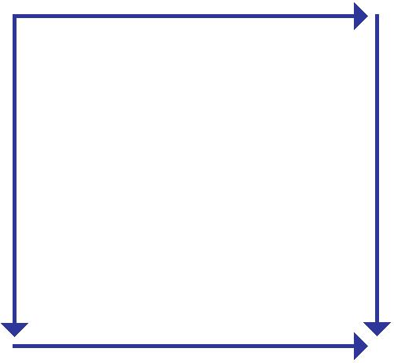
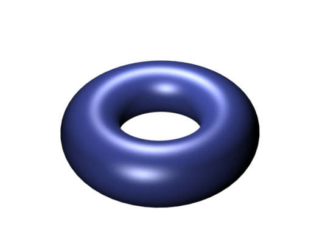
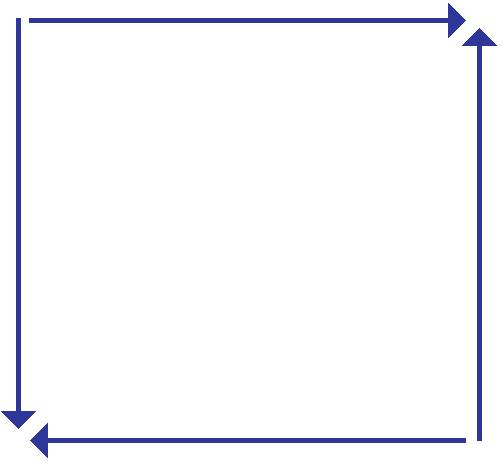
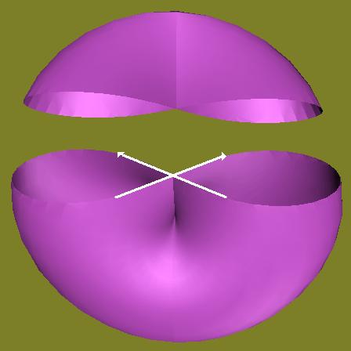
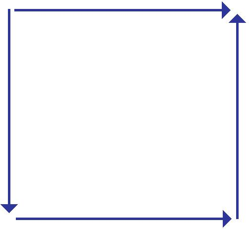
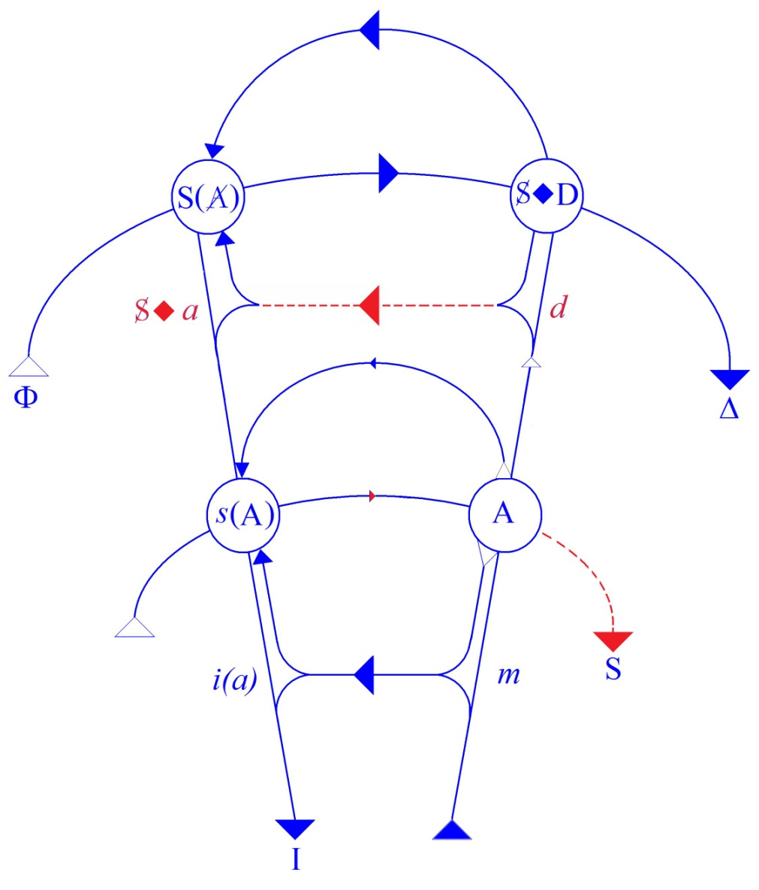

# Leçon 16 | 26 Mars 1969

  <label><input type="checkbox" data-lacan-toggle="original" checked> 原文</label>
  <label><input type="checkbox" data-lacan-toggle="notes" checked> 注释</label>
  <label><input type="checkbox" data-lacan-toggle="commentary" checked> 个人解读评论</label>

<section class="parallel-paragraph" data-paragraph-ids="s16-16-0001">

s16-16-0001

[无对应译文]

原文 · s16-16-0001

Je vais avancer aujourd’hui des vérités premières, puisque aussi bien il apparaît qu’il n’est pas inutile de retoucher ce sol.

</section>

<section class="parallel-paragraph" data-paragraph-ids="s16-16-0002">

s16-16-0002

[无对应译文]

原文 · s16-16-0002

D’autre part, il semble aussi bien difficile d’organiser ces champs de travail complémentaires qui nous permettraient de nous mettre en accord, d’accorder nos violons avec tout ce qui de contemporain se produit, qui est profondément intéressé par ce que peut avancer - au point où nous en sommes - un certain pas de la psychanalyse.

</section>

<section class="parallel-paragraph" data-paragraph-ids="s16-16-0003">

s16-16-0003

[无对应译文]

原文 · s16-16-0003

À l’avant-dernière de nos rencontres, j’ai laissé les choses au point où *la sublimation devait être interrogée dans son rapport* *avec le rôle qu’y joue, en somme, l’objet(a)*. C’est ce propos qui m’a montré qu’il était nécessaire, qu’il n’était en tout cas certainement pas inutile que je revienne sur ce qui distingue cette fonction, et que j’y revienne *au niveau de l’expérience* dont elle est issue, de l’expérience psychanalytique telle qu’elle s’est prorogée depuis FREUD.

</section>

<section class="parallel-paragraph" data-paragraph-ids="s16-16-0004">

s16-16-0004

[无对应译文]

原文 · s16-16-0004

À cette occasion, j’ai été amené à retourner aux textes de FREUD pour autant qu’ils ont instauré progressivement ce qu’on appelle la *seconde topique* qui - assurément - est un échelon indispensable à comprendre tout ce que j’ai pu avancer moi-même, je dirai de trouvailles, en ce point précis où FREUD en est resté à *la recherche*. J’ai déjà mis l’accent sur ce que ce mot veut dire dans ma parole, *circare*, *tourner en rond autour d’un point central* tant que quelque chose n’est pas résolu.

</section>

<section class="parallel-paragraph" data-paragraph-ids="s16-16-0005">

s16-16-0005

[无对应译文]

原文 · s16-16-0005

Aujourd’hui, j’essaierai de marquer la distance où la psychanalyse jusqu’à mon enseignement est restée, un point vif qui est assurément ce que de toutes parts l’expérience qui la précède a formulé, ce qui s’est ébauché dans certains dires, ce qui n’a pas été absolument purifié, résolu, mis au point. Et nous dirons - tout au moins maintenant - que nous pouvons édifier d’autres pas, mais non qui le corrigent, c’est à savoir cette fonction de *l’objet(a)*.

</section>

<section class="parallel-paragraph" data-paragraph-ids="s16-16-0006">

s16-16-0006

[无对应译文]

原文 · s16-16-0006

Qu’il nous intéresse au niveau de *la sublimation*, c’est bien certainement comme avec cette sorte de prudence presque *pataude* avec laquelle FREUD l’a avancé, *l’œuvre d’art*…

</section>

<section class="parallel-paragraph" data-paragraph-ids="s16-16-0007">

s16-16-0007

[无对应译文]

原文 · s16-16-0007

> pour appeler par son nom ce qui aujourd’hui centre, fait la visée, de ce que nous énonçons sur *la sublimation* …*l’œuvre d’art* ne se présente pas autrement au niveau où FREUD la saisit… s’oblige lui-même à ne pouvoir la saisir autrement …que *comme une valeur commerciale*.

</section>

<section class="parallel-paragraph" data-paragraph-ids="s16-16-0008">

s16-16-0008

[无对应译文]

原文 · s16-16-0008

C’est quelque chose de *prix* peut-être, sans doute d’un *prix* à part, mais dès lors qu’elle est sur le marché pas tellement distinguable de tout autre *prix*. L’accent qui est à mettre, c’est que ce *prix*, elle le reçoit d’un rapport privilégié de valeur à ce que dans mon discours j’isole et je distingue comme *la jouissance*, la jouissance étant ce terme qui ne s’institue que de son évacuation du champ de l’Autre et par là même de la position du champ de l’Autre comme *lieu de la parole* comme telle.

</section>

<section class="parallel-paragraph" data-paragraph-ids="s16-16-0009">

s16-16-0009

[无对应译文]

原文 · s16-16-0009

Ce qui fait de *l’objet(a)* ce *quelque chose* qui peut fonctionner comme *équivalent de la jouissance*, c’est une structure topologique.

</section>

<section class="parallel-paragraph" data-paragraph-ids="s16-16-0010">

s16-16-0010

[无对应译文]

原文 · s16-16-0010

C’est très précisément dans la mesure où seulement à prendre la fonction par où le sujet n’est plus fondé, n’est plus introduit que comme *effet de signifiant* et à nous rapporter au schéma que j’ai cent fois répété devant vous depuis le début de l’année :

</section>

<section class="parallel-paragraph" data-paragraph-ids="s16-16-0011">

s16-16-0011

[无对应译文]

原文 · s16-16-0011

</section>

<section class="parallel-paragraph" data-paragraph-ids="s16-16-0012">

s16-16-0012

[无对应译文]

原文 · s16-16-0012

…du S signifiant comme représentant du sujet pour un signifiant qui de sa nature est autre, ce qui fait que *ce qui le représente* ne peut se poser que comme *d’avant* cet *autre*, ce qui nécessite la répétition du rapport de ce S à ce A comme lieu des signifiants *autres*, dans un rapport qui laisse intact le lieu qui n’est point à prendre comme une partie mais…

</section>

<section class="parallel-paragraph" data-paragraph-ids="s16-16-0013">

s16-16-0013

[无对应译文]

原文 · s16-16-0013

> conformément à tout ce qui s’énoncede la fonction de l’ensemble …comme laissant l’élément lui-même en *puissance d’ensemble*, égaler ce résidu quoique distinct sous la fonction du *a*, au poids de l’Autre dans son ensemble.

</section>

<section class="parallel-paragraph" data-paragraph-ids="s16-16-0014">

s16-16-0014

[无对应译文]

原文 · s16-16-0014

C’est en tant qu’il est ici une place que nous pouvons désigner du terme conjoignant l’*intime* à la radicale *extériorité*, c’est en tant que *l’objet(a)* est « *extime* » et purement dans le rapport instauré de l’institution du sujet comme effet de signifiant, comme par lui-même déterminant dans le champ de l’Autre cette structure dont il nous est facile de voir la parenté, les variations dans ce qui s’organise de toute *structure de bord* en tant qu’elle a le choix, si l’on peut dire, de se réunir :

</section>

<section class="parallel-paragraph" data-paragraph-ids="s16-16-0015">

s16-16-0015

[无对应译文]

原文 · s16-16-0015

- soit sous la forme de *la sphère*, en tant que le bord ainsi dessiné se réunit en un point là plus problématique, quoique apparemment la plus simple des structures topologiques,

</section>

<section class="parallel-paragraph" data-paragraph-ids="s16-16-0016">

s16-16-0016

[无对应译文]

原文 · s16-16-0016

 

</section>

<section class="parallel-paragraph" data-paragraph-ids="s16-16-0017">

s16-16-0017

[无对应译文]

原文 · s16-16-0017

- soit que nous poursuivons sous cette forme, de ce que produit *le tore*, conjoindre les deux bords opposés se correspondant point par point dans une double ligne vectorielle :

</section>

<section class="parallel-paragraph" data-paragraph-ids="s16-16-0018">

s16-16-0018

[无对应译文]

原文 · s16-16-0018

</section>

<section class="parallel-paragraph" data-paragraph-ids="s16-16-0019">

s16-16-0019

[无对应译文]

原文 · s16-16-0019

- soit qu’à l’opposé nous ayons la structure - je ne fais ici que la rappeler - *du crosscap*,

</section>

<section class="parallel-paragraph" data-paragraph-ids="s16-16-0020">

s16-16-0020

[无对应译文]

原文 · s16-16-0020

 

</section>

<section class="parallel-paragraph" data-paragraph-ids="s16-16-0021">

s16-16-0021

[无对应译文]

原文 · s16-16-0021

- soit que nous ayons *par combinaison des deux* différentes possibilités la structure dite de *la bouteille de Klein*.

</section>

<section class="parallel-paragraph" data-paragraph-ids="s16-16-0022">

s16-16-0022

[无对应译文]

原文 · s16-16-0022

 

</section>

<section class="parallel-paragraph" data-paragraph-ids="s16-16-0023">

s16-16-0023

[无对应译文]

原文 · s16-16-0023

Or il est facile de s’apercevoir que de ces quatre structures topologiques, *les objets(a)*…

</section>

<section class="parallel-paragraph" data-paragraph-ids="s16-16-0024">

s16-16-0024

[无对应译文]

原文 · s16-16-0024

> tels qu’ils fonctionnent effectivement dans les rapports engendrés du sujet à l’Autre dans le *réel* …*reflètent un par un* - il y en a quatre aussi - *ces quatre structures*.

</section>

<section class="parallel-paragraph" data-paragraph-ids="s16-16-0025">

s16-16-0025

[无对应译文]

原文 · s16-16-0025

Mais c’est là quelque chose, pour l’indiquer tout de suite, où je ne reviendrai que plus tard, et à d’abord réanimer pour vous la fonction concrète, la fonction que dans la clinique joue *l’objet(a)*. *L’objet(a)*, avant d’être possiblement, par les méthodes élaborant sa production sous la forme que tout à l’heure nous avons qualifiée de commerciale, est à des niveaux précisément exemplifiés par la *clinique*, en posture de fonctionner *comme lieu de capture de la jouissance*.

</section>

<section class="parallel-paragraph" data-paragraph-ids="s16-16-0026">

s16-16-0026

[无对应译文]

原文 · s16-16-0026

Et ici je ferai un saut, j’irai vite et droit en un certain vif du sujet auquel peut-être mon premier propos, en venant aujourd’hui ici à vous, donnait plus de *détour* : très vite, dans les énoncés théoriques - je parle de ceux de FREUD - le rapport entre *la névrose* et *la perversion* s’est vu produit.

</section>

<section class="parallel-paragraph" data-paragraph-ids="s16-16-0027">

s16-16-0027

[无对应译文]

原文 · s16-16-0027

Comment cela a-t-il en quelque sorte *forcé l’attention* de FREUD ?

</section>

<section class="parallel-paragraph" data-paragraph-ids="s16-16-0028">

s16-16-0028

[无对应译文]

原文 · s16-16-0028

FREUD s’introduisait dans ce champ au niveau de patients névrotiques, sujets à toutes sortes de troubles et qui par leurs récits tendaient plutôt à l’amener sur le champ d’une expérience traumatique comme il lui est apparu tout d’abord, *si assurément le problème était de ce qui dans cette expérience*, l’accueillait en quelque sorte chez le sujet apparemment traumatisé.

</section>

<section class="parallel-paragraph" data-paragraph-ids="s16-16-0029">

s16-16-0029

[无对应译文]

原文 · s16-16-0029

La question ainsi s’introduisit du *fantasme* qui est bien en effet ce qui est le nœud de tout ce dont il s’agit concernant une économie pour laquelle FREUD a produit le mot de « *libido* ».

</section>

<section class="parallel-paragraph" data-paragraph-ids="s16-16-0030">

s16-16-0030

[无对应译文]

原文 · s16-16-0030

Mais encore devons-nous entièrement nous fier au fait que ces *fantasmes* nous permettraient, en quelque sorte, de reclasser, de remanier du dehors - à savoir d’une expérience non issue des pervers - ce qui d’abord à la même époque…

</section>

<section class="parallel-paragraph" data-paragraph-ids="s16-16-0031">

s16-16-0031

[无对应译文]

原文 · s16-16-0031

> ai-je besoin de rappeler seulement les noms de KRAFFT-­EBING et de HAVELOCK ELLIS …présentait d’une façon descriptive ce champ dit « *des perversions sexuelles* ».

</section>

<section class="parallel-paragraph" data-paragraph-ids="s16-16-0032">

s16-16-0032

[无对应译文]

原文 · s16-16-0032

On sait *la difficulté* que très vite après ce premier abord…

</section>

<section class="parallel-paragraph" data-paragraph-ids="s16-16-0033">

s16-16-0033

[无对应译文]

原文 · s16-16-0033

> après tout déjà d’un ordre topologique puisqu’il s’agissait de névrose …de trouver en quelque sorte - puisqu’on disait *l’envers -* je ne sais quoi qui déjà se présentait comme l’annonce de ces surfaces qui tant nous intéressent, de *ce qui survient quand une coupure les tranche*.

</section>

<section class="parallel-paragraph" data-paragraph-ids="s16-16-0034">

s16-16-0034

[无对应译文]

原文 · s16-16-0034

Mais bien vite, la chose a paru n’être aucunement résolue, simplifiée de ce qui de toute façon à se présenter peut-être un peu vite comme une fonction étagée : la névrose assurément - au regard de la perversion - se présentant comme - à tout le moins *la refoulant* pour une part - comme une défense contre la perversion.

</section>

<section class="parallel-paragraph" data-paragraph-ids="s16-16-0035">

s16-16-0035

[无对应译文]

原文 · s16-16-0035

Mais n’est-il pas clair - ne l’a-t-il pas été tout de suite - que *nulle résolution* ne saurait être trouvée de la seule mise en évidence dans le texte de la névrose, d’un *désir pervers* ? Si cela fait partie de *l’épelage*, du *déchiffrage* de ce texte, il n’en reste pas moins qu’en aucun cas ce n’est sur ce plan que le névrosé dans la cure trouve *sa satisfaction*, si bien qu’à aborder la perversion elle-même, il est bien vite apparu qu’elle ne présentait - au regard de la structure - pas moins de problèmes, et de défenses à l’occasion, que la névrose.

</section>

<section class="parallel-paragraph" data-paragraph-ids="s16-16-0036">

s16-16-0036

[无对应译文]

原文 · s16-16-0036

Tout ceci ressortit à des références techniques dont il semble après tout, à y regarder d’un peu de distance, que leurs impasses ne relèvent peut-être que d’une relative *duperie* subie par la théorie, du terrain même où, soit chez *le névrosé*, soit chez *le pervers*, il y a à coller.

</section>

<section class="parallel-paragraph" data-paragraph-ids="s16-16-0037">

s16-16-0037

[无对应译文]

原文 · s16-16-0037

Si nous prenons les choses du niveau où nous a permis de l’articuler le retour à cette terre ferme : que rien ne se passe dans l’analyse qui ne doive être référé au *statut du langage et à la fonction de la parole*, nous obtenons ce que j’ai fait une certaine année sous le titre « *Les Formations de l’Inconscient »* [^63].

</section>

<section class="parallel-paragraph" data-paragraph-ids="s16-16-0038">

s16-16-0038

[无对应译文]

原文 · s16-16-0038

Ce n’est pas pour rien que je suis parti de ce qui - en apparence - de *ces formations* est le plus distant de ce qui nous intéresse dans la clinique, à savoir *le mot d’esprit*. C’est à partir du *mot d’esprit* que j’ai construit *ce graphe* qui aussi bien, pour n’avoir pas encore à tous montré ses évidences, n’en reste pas moins fondamental *en l’occasion*. Comme chacun sait et peut le voir :

</section>

<section class="parallel-paragraph" data-paragraph-ids="s16-16-0039">

s16-16-0039

[无对应译文]

原文 · s16-16-0039

</section>

<section class="parallel-paragraph" data-paragraph-ids="s16-16-0040">

s16-16-0040

[无对应译文]

原文 · s16-16-0040

Il est fait du *réseau de trois chaînes* dont deux se trouvent déjà marquées sinon élucidées de certaines formules dont certaines ont pu être abondamment commentées, puisque le S ◊ D est ce qui marque comme fondamental *la dépendance* du sujet par rapport à ce qui, sous le nom de *demande*, a été fortement distancié de ce qu’il en est du *besoin*.

</section>

<section class="parallel-paragraph" data-paragraph-ids="s16-16-0041">

s16-16-0041

[无对应译文]

原文 · s16-16-0041

La forme-même signifiante - *les défilés du signifiant*, comme je me suis exprimé - la *spécifiant*, la *distinguant* et ne permettant d’aucune façon d’en réduire l’effet aux simples termes d’*un appétit physiologique*, ce qui bien entendu est d’ores et déjà exigé \- mais éclairé par ce medium - est d’ores et déjà exigé du seul fait que ces besoins, au niveau de notre expérience, ne nous intéressent que pour autant qu’ils viennent en position d’équivalent d’une demande sexuelle.

</section>

<section class="parallel-paragraph" data-paragraph-ids="s16-16-0042">

s16-16-0042

[无对应译文]

原文 · s16-16-0042

Les autres jonctions…

</section>

<section class="parallel-paragraph" data-paragraph-ids="s16-16-0043">

s16-16-0043

[无对应译文]

原文 · s16-16-0043

> *signifié* *en tant qu’issu du* A *posé comme le* *trésor des signifiants* \[*s*(A)\] …ne constituent au point où nous en sommes *qu’un simple rappel*.

</section>

<section class="parallel-paragraph" data-paragraph-ids="s16-16-0044">

s16-16-0044

[无对应译文]

原文 · s16-16-0044

Ce que je veux ici avancer, puisque aussi bien je ne l’ai jamais vu distingué par personne, c’est que… encore qu’il s’agisse dans ces trois chaînes de chaînes qui ne sont supposables, instaurables, fixables que pour autant :

</section>

<section class="parallel-paragraph" data-paragraph-ids="s16-16-0045">

s16-16-0045

[无对应译文]

原文 · s16-16-0045

- qu’il y a du signifiant dans le monde,

</section>

<section class="parallel-paragraph" data-paragraph-ids="s16-16-0046">

s16-16-0046

[无对应译文]

原文 · s16-16-0046

- que le discours existe,

</section>

<section class="parallel-paragraph" data-paragraph-ids="s16-16-0047">

s16-16-0047

[无对应译文]

原文 · s16-16-0047

- qu’un certain type d’être y est pris qui s’appelle homme, ou être parlant,

</section>

<section class="parallel-paragraph" data-paragraph-ids="s16-16-0048">

s16-16-0048

[无对应译文]

原文 · s16-16-0048

- qu’ici, à partir de l’existence de la concaténation possible comme constituant l’essence même de ces signifiants, ce que nous avons là et ce que le complément de ce graphe démontre c’est ceci …c’est que si cette fonction - *symbolique* ici - de la possibilité de retour court, qui se fait de l’*énoncé* du plus simple discours…

</section>

<section class="parallel-paragraph" data-paragraph-ids="s16-16-0049">

s16-16-0049

[无对应译文]

原文 · s16-16-0049

> de celui fondamental au niveau de quoi nous pouvons affirmer qu’il n’y a pas de métalangage …que rien de tout ce qui est *symbolique* ne saurait s’édifier que du discours normal, ceci nous pouvons le spécifier de la catégorie que je distingue comme le *symbolique* et nous apercevoir que *ce dont il s’agit dans la chaîne supérieure,* *c’est très précisément de ses effets dans le réel*, aussi bien le sujet qui est son premier et majeur effet n’apparaît-il qu’au niveau de cette chaîne seconde.

</section>

<section class="parallel-paragraph" data-paragraph-ids="s16-16-0050">

s16-16-0050

[无对应译文]

原文 · s16-16-0050

S’il reste ici quelque chose qui assurément, quoique toujours agité et particulièrement dans mon discours de cette année, n’a pas pris - puisque c’est là l’objet de ce qu’à partir de là j’avance - sa pleine instance, c’est ce qu’il en est de ceci : du signifiant comme tel, par quoi apparaît l’incomplétude foncière de ce qui *- <u>constitué</u> -* se produit comme *lieu de l’Autre,* ou plus exactement *ce qui en ce lieu trace la voie d’un certain type de leurre tout à fait fondamental.*

</section>

<section class="parallel-paragraph" data-paragraph-ids="s16-16-0051">

s16-16-0051

[无对应译文]

原文 · s16-16-0051

*Le lieu de l’Autre comme évacué de la jouissance n’est pas seulement place nette, rond brûlé,* de ce qu’il est non pas seulement - cet Autre - cette place ouverte au jeu des rôles, mais *quelque chose* de soi-même structuré de l’*incidence signifiante*, ceci est très précisément ce qui y introduit *ce manque, cette barre, cette béance, ce trou* qui peut se distinguer du titre de *l’objet(a)*.

</section>

<section class="parallel-paragraph" data-paragraph-ids="s16-16-0052">

s16-16-0052

[无对应译文]

原文 · s16-16-0052

Or c’est ce que j’entends ici vous faire sentir par des exemples pris au niveau de l’expérience qui est celle où recourt FREUD lui-même quand il s’agit d’articuler ce qu’il en est de la pulsion.

</section>

<section class="parallel-paragraph" data-paragraph-ids="s16-16-0053">

s16-16-0053

[无对应译文]

原文 · s16-16-0053

N’est-il pas étrange qu’après avoir mis dans l’expérience tant d’accent sur la *pulsion orale*, sur la *pulsion anale*…

</section>

<section class="parallel-paragraph" data-paragraph-ids="s16-16-0054">

s16-16-0054

[无对应译文]

原文 · s16-16-0054

> prétendues ébauches dites *prégénitales* de quelque chose qui viendrait à maturité en comblant

</section>

<section class="parallel-paragraph" data-paragraph-ids="s16-16-0055">

s16-16-0055

[无对应译文]

原文 · s16-16-0055

- *je ne sais quel mythe de complétude préfiguré par l’oral*,

</section>

<section class="parallel-paragraph" data-paragraph-ids="s16-16-0056">

s16-16-0056

[无对应译文]

原文 · s16-16-0056

- *je ne sais quel mythe de don, d’émission de cadeau,* *préfiguré par l’anal* …que FREUD aille - tout au loin, en apparence, de ces deux pulsions fondamentales *- à articuler ce qu’il en est du montage* *de la source, de la poussée, de l’objet, de la fin, du Ziel, à l’aide des pulsions scoptophilique et sadomasochiste*.

</section>

<section class="parallel-paragraph" data-paragraph-ids="s16-16-0057">

s16-16-0057

[无对应译文]

原文 · s16-16-0057

Ce que je voudrais avancer *tout à trac*, c’est que la fonction du pervers, celle qu’il remplit, loin d’être, comme on l’a dit longtemps - comme *on n’ose plus* le dire depuis quelque temps et principalement *à cause de ce que j’en ai énoncé -* d’être fondée sur quelque mépris de l’autre ou comme on dit : du partenaire, est quelque chose qui est à jauger d’une façon autrement riche, et que pour faire sentir, au moins au niveau d’un auditoire tel que celui que j’ai devant moi : hétérogène, j’articulerai, de dire :

</section>

<section class="parallel-paragraph" data-paragraph-ids="s16-16-0058">

s16-16-0058

[无对应译文]

原文 · s16-16-0058

- que *le pervers est celui qui se consacre à boucher ce trou dans l’Autre*,

</section>

<section class="parallel-paragraph" data-paragraph-ids="s16-16-0059">

s16-16-0059

[无对应译文]

原文 · s16-16-0059

- que jusqu’à un certain point, pour mettre ici les couleurs qui donnent aux choses leur relief, je dirai qu’il est du côté de ce que « *l’Autre existe* »,

</section>

<section class="parallel-paragraph" data-paragraph-ids="s16-16-0060">

s16-16-0060

[无对应译文]

原文 · s16-16-0060

- que *c’est un défenseur de la foi*.

</section>

<section class="parallel-paragraph" data-paragraph-ids="s16-16-0061">

s16-16-0061

[无对应译文]

原文 · s16-16-0061

Aussi bien, à regarder d’un peu près les observations, on verra, à cette lumière qui fait du pervers *un singulier auxiliaire de Dieu*, s’éclairer des bizarreries qui sont avancées sous des plumes que je qualifierai d’innocentes.

</section>

<section class="parallel-paragraph" data-paragraph-ids="s16-16-0062">

s16-16-0062

[无对应译文]

原文 · s16-16-0062

Dans un traité de psychiatrie, ma foi fort bien fait au regard des observations qu’il collationne, nous pouvons voir qu’un exhibitionniste ne se manifeste pas dans ses ébats seulement devant les petites filles, il lui arrive aussi de le faire devant un tabernacle. Ce n’est certes pas seulement sur des détails semblables que quelque chose peut s’éclairer, mais seulement d’abord d’avoir pu repérer - ce qui fut fait, et ici déjà dès longtemps - la fonction isolable dans tout ce qu’il en est du champ de la vision - à partir du moment où ces problèmes se posent au niveau de l’œuvre d’art - ce qu’il en est de *la fonction du regard*.

</section>

<section class="parallel-paragraph" data-paragraph-ids="s16-16-0063">

s16-16-0063

[无对应译文]

原文 · s16-16-0063

Par définition ce n’est pas facile à *dire* ce que c’est qu’un regard.

</section>

<section class="parallel-paragraph" data-paragraph-ids="s16-16-0064">

s16-16-0064

[无对应译文]

原文 · s16-16-0064

C’est même une question qui peut très bien soutenir une existence et la ravager.

</section>

<section class="parallel-paragraph" data-paragraph-ids="s16-16-0065">

s16-16-0065

[无对应译文]

原文 · s16-16-0065

J’ai pu voir en un temps une jeune femme pour qui c’est proprement cette question conjointe à une structure que je n’ai pas ici plus à indiquer, qui s’est trouvée aller jusqu’à entraîner une hémorragie rétinienne dont les séquelles furent durables.

</section>

<section class="parallel-paragraph" data-paragraph-ids="s16-16-0066">

s16-16-0066

[无对应译文]

原文 · s16-16-0066

Qu’est-ce qui empêche de *s’apercevoir qu’avant de s’interroger sur ce qu’il en est des effets d’une exhibition*…

</section>

<section class="parallel-paragraph" data-paragraph-ids="s16-16-0067">

s16-16-0067

[无对应译文]

原文 · s16-16-0067

> à savoir si ça fait peur ou pas au témoin qui paraît la provoquer, à savoir si c’est bien dans l’intention de l’*exhibitionniste* de provoquer cette pudeur, *cet effroi*, cet *écho*, ce *quelque chose* de farouche ou de consentant …qui ne voit pas d’abord que l’essentiel de cette face…

</section>

<section class="parallel-paragraph" data-paragraph-ids="s16-16-0068">

s16-16-0068

[无对应译文]

原文 · s16-16-0068

> que vous qualifierez comme vous voulez, active ou passive, je vous en laisse le choix …de la pulsion scoptophilique - en apparence elle est passive *puisqu’elle donne à voir* - c’est à proprement parler et avant tout, de faire apparaître au champ de l’Autre *le regard* ?

</section>

<section class="parallel-paragraph" data-paragraph-ids="s16-16-0069">

s16-16-0069

[无对应译文]

原文 · s16-16-0069

Et pourquoi, sinon pour y évoquer *ce rapport topologique* de ce qu’il en est *de la fuite, de l’insaisissable du regard dans son rapport* *avec la limite imposée à la jouissance* par la fonction du *principe du plaisir*. *C’est à la jouissance de l’Autre que l’exhibitionniste veille.*

</section>

<section class="parallel-paragraph" data-paragraph-ids="s16-16-0070">

s16-16-0070

[无对应译文]

原文 · s16-16-0070

Il semble qu’ici, ce qui fait mirage, illusion, et donne, suggère cette pensée qu’il y a mépris du partenaire, c’est l’oubli de ceci : qu’au-delà du support particulier de l’Autre que donne ce partenaire, il y a cette fonction fondamentale qui est pourtant là toujours bien présente chaque fois que la parole fonctionne, celui dans lequel tout partenaire n’est qu’inclus, à savoir du *lieu de la parole*, du point de référence où la parole se pose comme vraie.

</section>

<section class="parallel-paragraph" data-paragraph-ids="s16-16-0071">

s16-16-0071

[无对应译文]

原文 · s16-16-0071

C’est au niveau de ce champ, du champ de l’Autre en tant que *déserté par la jouissance*, que l’acte *exhibitionniste* se pose pour y faire surgir le regard. C’est en cela qu’on voit qu’il n’est pas symétrique de ce qu’il en est du *voyeur*, car ce qui importe au voyeur, et très souvent de ce qu’ait été en quelque sorte profané à son niveau tout ce qui peut être vu, c’est justement d’interroger dans l’Autre ce qui ne peut se voir, ce qui au niveau d’un corps grêle, d’un profil de petite fille, est l’objet du désir du voyeur, c’est très précisément ce qui ne peut s’y voir qu’à ce qu’elle le supporte de l’insaisissable même, d’une ligne où il manque, c’est-à-dire *le phallus*.

</section>

<section class="parallel-paragraph" data-paragraph-ids="s16-16-0072">

s16-16-0072

[无对应译文]

原文 · s16-16-0072

Que le petit garçon se soit vu maltraité assez pour que rien de ce qui - pour lui - peut s’accrocher à ce niveau de mystère ne paraisse retenir l’attention d’un œil indifférent, voilà ce qui d’autant plus la projette, cette chose en lui négligée, à la restituer dans l’Autre, à en supplémenter le champ de l’Autre, *à l’insu même de ce qui en est le support*.

</section>

<section class="parallel-paragraph" data-paragraph-ids="s16-16-0073">

s16-16-0073

[无对应译文]

原文 · s16-16-0073

Ici, de cet insu la jouissance pour l’Autre - *c’est-à-dire la fin même de la perversion* - se trouve en quelque sorte échapper, mais c’est aussi bien ce qui démontre d’abord :

</section>

<section class="parallel-paragraph" data-paragraph-ids="s16-16-0074">

s16-16-0074

[无对应译文]

原文 · s16-16-0074

- que *l’une* - *pulsion* -*n’est pas simplement le retour de l’autre*,

</section>

<section class="parallel-paragraph" data-paragraph-ids="s16-16-0075">

s16-16-0075

[无对应译文]

原文 · s16-16-0075

- qu’elles sont dissymétriques et que ce qui est essentiel dans cette fonction est celle d’un *supplément*, de quelque chose qui au niveau de l’Autre interroge *ce qui manque à l’Autre* comme tel, *et qui y pare*.

</section>

<section class="parallel-paragraph" data-paragraph-ids="s16-16-0076">

s16-16-0076

[无对应译文]

原文 · s16-16-0076

C’est bien en cela que certaines analyses, et toujours en effet les plus innocentes, sont exemplaires. Il m’est impossible…

</section>

<section class="parallel-paragraph" data-paragraph-ids="s16-16-0077">

s16-16-0077

[无对应译文]

原文 · s16-16-0077

> *après avoir* - comme je l’ai fait la dernière fois - *jeté le doute de quelque manque de sérieux sur une certaine philosophie* …de ne pas me souvenir aussi de l’extraordinaire pointe de ce qui est saisi dans l’analyse de *la fonction du voyeur* [^64].

</section>

<section class="parallel-paragraph" data-paragraph-ids="s16-16-0078">

s16-16-0078

[无对应译文]

原文 · s16-16-0078

Celui qui, au moment où il regarde par *le trou de la serrure*, qui est véritablement ce qui ne peut pas se voir, rien assurément ne peut le faire choir de plus haut que celui d’être surpris dans la capture où il est de cette fente, dont ce n’est pas pour rien qu’une fente elle-même, on l’appelle « *un regard* », voire « *un jour* ».

</section>

<section class="parallel-paragraph" data-paragraph-ids="s16-16-0079">

s16-16-0079

[无对应译文]

原文 · s16-16-0079

Le retour est ce dont il s’agit, à savoir sa réduction à la position humiliée, voire ridicule qui n’est pas du tout liée à ceci qu’il est justement au-delà de la fente, mais de ce qu’il puisse être saisi par un autre dans une posture qui ne déchoit que du point de vue du narcissisme de la position debout, de celle de celui qui ne voit rien tellement il est bien sûr de lui. Voilà ce qui… *à une page que vous retrouverez aisément de* *L’Être et le Néant* …a quelque chose en effet d’impérissable, *quel que soit le côté partial de ce qui en est déduit quant au statut de l’existence*.

</section>

<section class="parallel-paragraph" data-paragraph-ids="s16-16-0080">

s16-16-0080

[无对应译文]

原文 · s16-16-0080

Mais le pas suivant n’a pas moins d’intérêt. Quel est donc *l’objet(a)* dans la pulsion *sado-masochiste* ?

</section>

<section class="parallel-paragraph" data-paragraph-ids="s16-16-0081">

s16-16-0081

[无对应译文]

原文 · s16-16-0081

Est-ce qu’il ne vous semble pas qu’à mettre en relief l’interdit propre à la jouissance, c’est cela qui doit nous permettre aussi de remettre à sa place ce dont on croit faire la clé de ce qu’il en est du *sado-masochisme*, quand on parle du jeu avec la douleur, pour aussitôt se rétracter et dire qu’après tout, ce n’est amusant que si la douleur ne va pas trop loin ?

</section>

<section class="parallel-paragraph" data-paragraph-ids="s16-16-0082">

s16-16-0082

[无对应译文]

原文 · s16-16-0082

Cette sorte d’aveuglement, de leurre, de faux effroi, de chatouillage de la question reflétant en quelque sorte après tout le niveau où reste tout ce qui peut se pratiquer dans le genre, est–ce que ceci ne risque pas, n’est pas en fait le masque essentiel grâce à quoi *échappe* ce qu’il en est de la perversion *sado-masochiste* ? Vous le verrez tout à l’heure… si tout ceci peut vous paraître point trop osé, voire spéculation très peu propice à une *Einfühlung,* et pour cause …en majorité, tous tant que vous êtes *- quoi que vous puissiez en croire* - ce qu’il en est de la perversion, de la vraie perversion, ça vous échappe. Ce n’est pas parce que vous rêvez de la perversion que vous êtes pervers.

</section>

<section class="parallel-paragraph" data-paragraph-ids="s16-16-0083">

s16-16-0083

[无对应译文]

原文 · s16-16-0083

Cela peut servir à tout autre chose de rêver de la perversion, et principalement quand on est névrosé, à soutenir le désir, ce dont - quand on est névrosé - on a bien besoin !

</section>

<section class="parallel-paragraph" data-paragraph-ids="s16-16-0084">

s16-16-0084

[无对应译文]

原文 · s16-16-0084

Mais ça ne permet pas du tout de croire qu’on comprend les pervers.

</section>

<section class="parallel-paragraph" data-paragraph-ids="s16-16-0085">

s16-16-0085

[无对应译文]

原文 · s16-16-0085

Il suffit d’avoir pratiqué un *exhibitionniste* pour bien s’apercevoir qu’on ne comprend rien à ce qui, en apparence, je ne dirai pas le fait jouir, puisqu’il ne jouit pas, mais il jouit quand même, et à cette seule condition de faire le pas que je viens de dire, à savoir que la jouissance dont il s’agit, c’est celle de l’Autre. Naturellement, il y a une béance.

</section>

<section class="parallel-paragraph" data-paragraph-ids="s16-16-0086">

s16-16-0086

[无对应译文]

原文 · s16-16-0086

Vous n’êtes pas des « *Croisés* », vous ! Vous ne vous consacrez pas à ce que l’Autre, c’est-à-dire je ne sais quoi d’aveugle et peut-être de mort, jouisse. Mais lui, *l’exhibitionniste*, ça l’intéresse. C’est comme ça ! *C’est un défenseur de la foi*.

</section>

<section class="parallel-paragraph" data-paragraph-ids="s16-16-0087">

s16-16-0087

[无对应译文]

原文 · s16-16-0087

C’est pour ça que pour rattraper… je me suis laissé aller à parler de *Croisés*, *croire* à l’Autre, la *croix*, les mots français s’enchaînant comme ça, chaque langue a ses échos et ses rencontres… « *croa-croa* », comme disait aussi Jacques PRÉVERT …les croisades, ça a existé, c’était aussi pour la vie d’un Dieu mort.

</section>

<section class="parallel-paragraph" data-paragraph-ids="s16-16-0088">

s16-16-0088

[无对应译文]

原文 · s16-16-0088

Ça signifiait bien quelque chose de tout aussi *intéressant* que de savoir ce qui, depuis 1945, fait le jeu entre communisme et gaullisme. Ça a eu d’énormes effets. Pendant que les chevaliers se croisaient, l’amour pouvait devenir civilisé là où ils avaient vidé les lieux, cependant que, quand ils étaient ailleurs, ils rencontraient la civilisation, c’est-à-dire ce qu’ils allaient chercher, *un haut degré de perversion*, et que du même coup ils flanquaient tout par terre. Byzance ne s’en est point relevée, des croisades.

</section>

<section class="parallel-paragraph" data-paragraph-ids="s16-16-0089">

s16-16-0089

[无对应译文]

原文 · s16-16-0089

Il faut faire attention à ces jeux parce que ça peut encore arriver, même maintenant, au nom d’autres *croisades*.

</section>

<section class="parallel-paragraph" data-paragraph-ids="s16-16-0090">

s16-16-0090

[无对应译文]

原文 · s16-16-0090

Mais revenons à nos *sado-masochistes* qui sont justement toujours séparés, à savoir que, puisque je l’ai dit tout à l’heure :

</section>

<section class="parallel-paragraph" data-paragraph-ids="s16-16-0091">

s16-16-0091

[无对应译文]

原文 · s16-16-0091

- il y en a un au niveau de *la pulsion scoptophilique* qui réussit ce qu’il a à faire, à savoir *la jouissance de l’Autre*,

</section>

<section class="parallel-paragraph" data-paragraph-ids="s16-16-0092">

s16-16-0092

[无对应译文]

原文 · s16-16-0092

- et un autre qui n’est là que pour boucher le trou avec son propre regard, sans faire que l’autre y voie même, sur ce qu’il est, un petit peu plus.

</section>

<section class="parallel-paragraph" data-paragraph-ids="s16-16-0093">

s16-16-0093

[无对应译文]

原文 · s16-16-0093

C’est à peu près le même cas dans les rapports entre *le sadique* et *le masochiste*, *à cette seule condition qu’on s’aperçoive où est l’objet(a).*

</section>

<section class="parallel-paragraph" data-paragraph-ids="s16-16-0094">

s16-16-0094

[无对应译文]

原文 · s16-16-0094

### Il est étrange que…

</section>

<section class="parallel-paragraph" data-paragraph-ids="s16-16-0095">

s16-16-0095

[无对应译文]

原文 · s16-16-0095

> vivant à une époque en somme où nous avons très bien ressuscité toutes les pratiques de « *la question* », de « *la question* » au temps où ça jouait un rôle dans les mœurs judiciaires à un niveau élevé, maintenant qu’on a laissé ça à des opérateurs qui font ça au nom de je ne sais quelle folie dans le genre « *intérêt de la patrie* » ou « *de la troupe* » …il est curieux…

</section>

<section class="parallel-paragraph" data-paragraph-ids="s16-16-0096">

s16-16-0096

[无对应译文]

原文 · s16-16-0096

> après avoir vu aussi quelques petits *jeux de scène* [^65] avec lesquels, après la guerre où il s’est passé pas mal de choses,
>
> la dernière dans ce genre, on prolongeait un peu le plaisir *sur les planches* en nous en montrant des simulacres …il est étrange qu’on ne s’aperçoive pas de la fonction essentielle que joue à ce niveau d’abord *la parole* : l’aveu.

</section>

<section class="parallel-paragraph" data-paragraph-ids="s16-16-0097">

s16-16-0097

[无对应译文]

原文 · s16-16-0097

Malgré tout, les jeux sadiques ce n’est pas simplement intéressant *dans les rêves des névrosés*, on peut tout de même voir là où ça se produit, il a beau y avoir des raisons - nous savons très bien ce qu’il faut penser des *raisons* - les raisons sont secondaires auprès de ce qui se passe dans la pratique.

</section>

<section class="parallel-paragraph" data-paragraph-ids="s16-16-0098">

s16-16-0098

[无对应译文]

原文 · s16-16-0098

Si effectivement c’est toujours autour de quelque chose où il s’agit de *peler* un sujet - de quoi ? - de ce qui le constitue dans sa fidélité, à savoir sa parole, on pourrait peut-être se dire que ça a quelque chose à faire dans la question. C’est une approche.

</section>

<section class="parallel-paragraph" data-paragraph-ids="s16-16-0099">

s16-16-0099

[无对应译文]

原文 · s16-16-0099

Je vous le dis tout de suite, ce n’est pas *la parole* qui est là *l’objet(a)*, mais c’est pour vous mettre sur la voie.

</section>

<section class="parallel-paragraph" data-paragraph-ids="s16-16-0100">

s16-16-0100

[无对应译文]

原文 · s16-16-0100

C’est très favorable à malentendu d’aborder la question sous ce biais, vous allez le voir tout de suite, c’est à savoir qu’il va y avoir justement ce que je repousse, à savoir une symétrie, à savoir que *le masochiste floride*… le beau, le vrai : Sacher MASOCH lui-même …il est certain *qu’il organise toute chose de façon à n’avoir plus la parole.*

</section>

<section class="parallel-paragraph" data-paragraph-ids="s16-16-0101">

s16-16-0101

[无对应译文]

原文 · s16-16-0101

En quoi est-ce que ça peut tellement l’intéresser ? Éclairons notre lanterne : Ce dont il s’agit, c’est de *la voix*.

</section>

<section class="parallel-paragraph" data-paragraph-ids="s16-16-0102">

s16-16-0102

[无对应译文]

原文 · s16-16-0102

Que le masochiste fasse de *la voix de l’Autre* à soi tout seul ce à quoi il va donner le garant, d’y répondre comme un chien, cela est l’essentiel de la chose et s’éclaire de ceci que ce qu’il va chercher, c’est justement *un type d’Autre*, qui sur ce point de *la voix*, peut être « *mis en question* ».

</section>

<section class="parallel-paragraph" data-paragraph-ids="s16-16-0103">

s16-16-0103

[无对应译文]

原文 · s16-16-0103

La chère mère, comme l’illustre DELEUZE[^66], à la voix froide et parcourue de tous les courants de l’arbitraire, est là quelque chose, qu’avec la voix…

</section>

<section class="parallel-paragraph" data-paragraph-ids="s16-16-0104">

s16-16-0104

[无对应译文]

原文 · s16-16-0104

> cette voix que peut-être il n’a que trop entendue ailleurs, du côté de son père …vient en quelque sorte *compléter* et là aussi *boucher* le trou.

</section>

<section class="parallel-paragraph" data-paragraph-ids="s16-16-0105">

s16-16-0105

[无对应译文]

原文 · s16-16-0105

Seulement il y a quelque chose dans la voix qui est plus spécifié *topologiquement*, à savoir que nulle part le sujet n’est plus intéressé à l’autre que par cet *objet(a)* là.

</section>

<section class="parallel-paragraph" data-paragraph-ids="s16-16-0106">

s16-16-0106

[无对应译文]

原文 · s16-16-0106

Et c’est bien pour ça que la comparaison topologique, celle qui s’illustre ici du trou dans une sphère, qui n’en est pas une puisque précisément c’est dans ce trou qu’elle se replie elle-même, un examen un peu attentif de ce qui se passe au niveau de structures organiques, très nommément de l’appareil du « *vestibule* » ou des « *canaux semi-circulaires* », nous porte à ces formes radicales dont déjà je vous donnais il y a quinze jours l’aperçu avec le recours à un type d’animal des plus primitifs.

</section>

<section class="parallel-paragraph" data-paragraph-ids="s16-16-0107">

s16-16-0107

[无对应译文]

原文 · s16-16-0107

Ajoutons à celui que j’ai nommé \[la daphnie\], le crustacé dit « *Palémon* » joli nom plein d’échos mythiques.

</section>

<section class="parallel-paragraph" data-paragraph-ids="s16-16-0108">

s16-16-0108

[无对应译文]

原文 · s16-16-0108

Mais qu’il ne nous distraie pas de ceci : que l’animal, quand à chacune de ses *mues* il est dépouillé de tout l’extérieur de ses appareils, s’oblige - et pour cause, parce que sans cela il ne saurait d’aucune façon se mouvoir - à se retaper, dans le creux ouvert à son niveau animal à l’extérieur, dans le creux de ce qui n’en est pas moins bel et bien une oreille, quelques petits grains de sable, histoire que ça le chatouille là-dedans.

</section>

<section class="parallel-paragraph" data-paragraph-ids="s16-16-0109">

s16-16-0109

[无对应译文]

原文 · s16-16-0109

Il est strictement impossible de concevoir ce qu’il en est de la fonction du *surmoi* si l’on ne comprend pas… ça n’est pas tout mais c’est un des ressorts …l’essentiel de ce qu’il en est de *la fonction de l’objet(a) réalisée par la voix* en tant que support de l’articulation signifiante, par la voix pure en tant qu’au lieu de l’Autre, elle est, oui ou non, instaurée d’une façon *perverse* ou pas.

</section>

<section class="parallel-paragraph" data-paragraph-ids="s16-16-0110">

s16-16-0110

[无对应译文]

原文 · s16-16-0110

Si l’on peut parler d’un certain *masochisme moral*, ce ne peut être fondé que sur cette pointe de *l’incidence de la voix de l’Autre* non pas dans l’oreille du sujet mais *au niveau de l’Autre* qu’il instaure comme étant *complété de la voix*, et à la façon dont tout à l’heure jouit *l’exhibitionniste.C’est* *dans ce supplément de l’Autre*…

</section>

<section class="parallel-paragraph" data-paragraph-ids="s16-16-0111">

s16-16-0111

[无对应译文]

原文 · s16-16-0111

> et non sans que soit possible une certaine dérision qui apparaît dans les marges du fonctionnement masochiste …c’est au niveau de l’Autre et de la remise à lui de la voix, *que l’axe de fonctionnement, l’axe de gravité du masochiste joue*.

</section>

<section class="parallel-paragraph" data-paragraph-ids="s16-16-0112">

s16-16-0112

[无对应译文]

原文 · s16-16-0112

Disons-le, il suffit d’avoir vécu à notre époque pour saisir, pour savoir qu’*il y a une jouissance dans cette remise à l’Autre*…

</section>

<section class="parallel-paragraph" data-paragraph-ids="s16-16-0113">

s16-16-0113

[无对应译文]

原文 · s16-16-0113

> et d’autant plus qu’il est moins valorisable, qu’il a moins d’autorité …*dans cette remise à l’Autre de la fonction de la voix*. D’une certaine façon, ce mode *de dérobement, de vol de la jouissance* peut être, de toutes celles perverses imaginables, la seule qui soit jamais pleinement réussie.

</section>

<section class="parallel-paragraph" data-paragraph-ids="s16-16-0114">

s16-16-0114

[无对应译文]

原文 · s16-16-0114

Il n’en est certainement pas de même au niveau où le sadique essaie à sa façon, lui aussi, et inverse, de compléter l’Autre, en lui ôtant la parole, certes, et en lui imposant sa voix. En général, ça rate. Qu’il suffise à cet égard de se référer à l’œuvre de SADE où il est vraiment impossible d’éliminer cette dimension de la voix, de la parole, de la discussion, du débat.

</section>

<section class="parallel-paragraph" data-paragraph-ids="s16-16-0115">

s16-16-0115

[无对应译文]

原文 · s16-16-0115

Après tout, on nous raconte tous les excès les plus extraordinaires exercés à l’endroit de victimes dont on ne peut être en tous cas surpris que d’une chose, c’est de leur incroyable survie. Mais il n’y a pas un seul de ces excès qui ne soit en quelque sorte non seulement commenté mais en quelque sorte fomenté d’un ordre dont le plus étonnant est qu’aussi bien il ne provoque aucune révolte mais dont après tout aussi nous avons pu voir par des exemples historiques que c’est comme ça que ça peut se passer.

</section>

<section class="parallel-paragraph" data-paragraph-ids="s16-16-0116">

s16-16-0116

[无对应译文]

原文 · s16-16-0116

On n’a jamais vu apparemment dans ces troupeaux qui se sont trouvés poussés vers les fours crématoires quelqu’un tout d’un coup se mettre simplement à mordre le poignet d’un gardien. Le jeu de la voix trouve ici son plein registre, il n’y a qu’une seule chose, c’est que la jouissance ici, exactement comme dans le cas du voyeur, échappe.

</section>

<section class="parallel-paragraph" data-paragraph-ids="s16-16-0117">

s16-16-0117

[无对应译文]

原文 · s16-16-0117

Sa place est masquée par cette domination étonnante de *l’objet(a),* mais *la jouissance*, elle, n’est nulle part.

</section>

<section class="parallel-paragraph" data-paragraph-ids="s16-16-0118">

s16-16-0118

[无对应译文]

原文 · s16-16-0118

Il est tout à fait clair que *le sadique* ici n’est que *l’instrument* de quelque chose qui s’appelle « *supplément donné à l’Autre* », mais dont dans ce cas l’Autre ne veut pas. Il ne veut pas, mais il y obéit quand même. Telle est la structure de ces pulsions, pour autant qu’elles révèlent qu’un trou topologique à soi seul peut fixer toute une conduite subjective et met un relatif éminent dans tout ce qui peut être forgé autour de prétendues *Einfühlung*.

</section>

<section class="parallel-paragraph" data-paragraph-ids="s16-16-0119">

s16-16-0119

[无对应译文]

原文 · s16-16-0119

### Puisque l’heure s’est avancée et qu’aussi bien ceci a été subtil à produire pour que j’y aie mis tout ce temps,

</section>

<section class="parallel-paragraph" data-paragraph-ids="s16-16-0120">

s16-16-0120

[无对应译文]

原文 · s16-16-0120

### j’annonce pourtant que le problème du *névrosé* est celui-ci. Vous vous référerez à l’article que j’ai fait sous le titre

</section>

<section class="parallel-paragraph" data-paragraph-ids="s16-16-0121">

s16-16-0121

[无对应译文]

原文 · s16-16-0121

### *Remarque sur un discours de Daniel Lagache.* Il est indispensable pour nous retrouver dans ceci d’égaré qu’a tout ce qui s’est dit

</section>

<section class="parallel-paragraph" data-paragraph-ids="s16-16-0122">

s16-16-0122

[无对应译文]

原文 · s16-16-0122

### au niveau du texte freudien concernant l’identification, le flottement, la contradiction nette qu’il y a, à travers ses ouvrages,

</section>

<section class="parallel-paragraph" data-paragraph-ids="s16-16-0123">

s16-16-0123

[无对应译文]

原文 · s16-16-0123

### à travers ses énoncés, sur ce qu’il en est de ce qu’il appelle *réservoir de la libido* qui,

</section>

<section class="parallel-paragraph" data-paragraph-ids="s16-16-0124">

s16-16-0124

[无对应译文]

原文 · s16-16-0124

- tantôt est produit comme l’*Ich,* à savoir le *narcissisme,*

</section>

<section class="parallel-paragraph" data-paragraph-ids="s16-16-0125">

s16-16-0125

[无对应译文]

原文 · s16-16-0125

- tantôt au contraire comme *Ça*, l’*ego* étant évidemment inséparable du narcissisme et se trouvant en position problématique, c’est à savoir :

</section>

<section class="parallel-paragraph" data-paragraph-ids="s16-16-0126">

s16-16-0126

[无对应译文]

原文 · s16-16-0126

- est-ce au titre de l’objet qu’il offre… convoitise du *Ça,* il faut bien le dire …que l’*ego* vient à s’introduire comme *instance efficace* où rejaillirait à son tour l’intérêt porté sur *les objets* ?

</section>

<section class="parallel-paragraph" data-paragraph-ids="s16-16-0127">

s16-16-0127

[无对应译文]

原文 · s16-16-0127

- Est-ce au contraire, de l’objet fomenté au niveau du *Ça,* que l’*ego* se trouverait se *valoriser secondairement*, comme semblable, aussi bien que des objets ?

</section>

<section class="parallel-paragraph" data-paragraph-ids="s16-16-0128">

s16-16-0128

[无对应译文]

原文 · s16-16-0128

Ceci nous introduit à poser d’une façon radicale, à reposer toute la question de ce qu’il en est de l’identification.

</section>

<section class="parallel-paragraph" data-paragraph-ids="s16-16-0129">

s16-16-0129

[无对应译文]

原文 · s16-16-0129

Ce n’est que pour autant que le névrosé se veut être l’*Un* dans le champ de l’Autre, ce n’est que pour autant que l’idéalisation joue un rôle logique primordial, qu’il se trouve à partir de là confronté avec les problèmes narcissiques.

</section>

<section class="parallel-paragraph" data-paragraph-ids="s16-16-0130">

s16-16-0130

[无对应译文]

原文 · s16-16-0130

Mais faire seulement cette remarque : que je vous suggère du même coup de nous demander si nous ne subissons pas, avec FREUD dans l’imagination du « *narcissisme primaire* », un effet *après coup*, imagé, voire indiciblement faussé, nous en rajoutons un tout petit peu, juste ce qu’il faut. À savoir que c’est dans la mesure où « *le narcissisme secondaire* »… sous sa forme caractérisée de *capture imaginaire* …est le niveau où se présente pour lui d’une façon dont *le problème est tout à fait différent* de ce qu’il en est d’avec le pervers, c’est ce que j’essaierai de vous faire sentir la prochaine fois.

</section>

<section class="parallel-paragraph" data-paragraph-ids="s16-16-0131">

s16-16-0131

[无对应译文]

原文 · s16-16-0131

C’est dans cette mesure que nous croyons pouvoir penser qu’il y a eu quelque part cette relation non pas de supplément, mais de complément à l’*Un*, et que nous investissons la pulsion orale, qu’il présente pourtant très apparemment à une seule condition : qu’on se dessille de la fascination du névrosé, qui présente très apparemment le même caractère d’être centré autour d’un objet tiers qui se dérobe, aussi *insaisissable* en son genre que *le regard* ou *la voix* et ce fameux *sein*, dont à l’aide de jeux de mots, on fait le *giron maternel*.

</section>

<section class="parallel-paragraph" data-paragraph-ids="s16-16-0132">

s16-16-0132

[无对应译文]

原文 · s16-16-0132

Derrière le sein…

</section>

<section class="parallel-paragraph" data-paragraph-ids="s16-16-0133">

s16-16-0133

[无对应译文]

原文 · s16-16-0133

> et tout aussi plaqué que lui sur le mur qui sépare l’enfant de la femme …le placenta est là pour nous rappeler que loin que l’enfant dans le corps de la mère - et avec lui - fasse un seul corps, il n’y est même pas enfermé dans ses enveloppes, il n’y est point un œuf normal, il est brisé, rompu dans cette enveloppe par cet élément de placage par lequel aussi bien, nous le savons maintenant, peuvent lier et jouer *tous les conflits*, qui ressortissent à la place de *byzantinisme*, au *mélange des sangs* et à l’incompatibilité de tel groupe avec tel autre.

</section>

<section class="parallel-paragraph" data-paragraph-ids="s16-16-0134">

s16-16-0134

[无对应译文]

原文 · s16-16-0134

Cette fonction d’un objet tiers que j’ai appelé « *plaque* », « *pendeloque* » encore dirai-je…

</section>

<section class="parallel-paragraph" data-paragraph-ids="s16-16-0135">

s16-16-0135

[无对应译文]

原文 · s16-16-0135

> car nous le reverrons sous ses formes éminentes dans tout ce qui de la culture s’édifie …*la chose accrochée au mur et qui leurre* : est-ce que ce n’est pas ce qui apparaît effectivement dans l’expérience du névrosé ?

</section>

<section class="parallel-paragraph" data-paragraph-ids="s16-16-0136">

s16-16-0136

[无对应译文]

原文 · s16-16-0136

Je veux dire qu’à la convertir, qu’à la combler du mythe d’une unité primitive, d’un paradis perdu, soi-disant achevé du « *trauma de la naissance* », nous ne tombons pas dans ce qui est justement en jeu dans l’affaire du névrosé.

</section>

<section class="parallel-paragraph" data-paragraph-ids="s16-16-0137">

s16-16-0137

[无对应译文]

原文 · s16-16-0137

Ce dont il s’agit pour lui…

</section>

<section class="parallel-paragraph" data-paragraph-ids="s16-16-0138">

s16-16-0138

[无对应译文]

原文 · s16-16-0138

> nous le verrons, je l’articulerai en détail et déjà vous pouvez en trouver les premières lignes dessinées d’une façon parfaitement claire dans cet article …c’est de *l’impossibilité de faire rentrer sur le plan imaginaire cet objet petit(a) en conjonction avec l’image narcissique*.

</section>

<section class="parallel-paragraph" data-paragraph-ids="s16-16-0139">

s16-16-0139

[无对应译文]

原文 · s16-16-0139

Nulle représentation ne supporte la présence de ce qui s’appelle le *représentant de la représentation*.

</section>

<section class="parallel-paragraph" data-paragraph-ids="s16-16-0140">

s16-16-0140

[无对应译文]

原文 · s16-16-0140

On ne voit que trop ici la distance marquée par ce terme. Il n’y a de l’un à l’autre, du *représentant* à *la représentation,* aucune équivalence.

</section>

<section class="parallel-paragraph" data-paragraph-ids="s16-16-0141">

s16-16-0141

[无对应译文]

原文 · s16-16-0141

</section>

<section class="parallel-paragraph" data-paragraph-ids="s16-16-0142">

s16-16-0142

[无对应译文]

原文 · s16-16-0142

C’est ce qui me permet d’amorcer, d’indiquer le point où tout ceci sera réordonné, la troisième ligne du *graphe*, celle qui croise les deux autres, c’est à proprement parler, ce qui d’une concaténation symbolique se rapporte à l’*imaginaire* où elle trouve son lest.

</section>

<section class="parallel-paragraph" data-paragraph-ids="s16-16-0143">

s16-16-0143

[无对应译文]

原文 · s16-16-0143

C’est sur cette ligne que dans le graphe complet vous rencontrez :

</section>

<section class="parallel-paragraph" data-paragraph-ids="s16-16-0144">

s16-16-0144

[无对应译文]

原文 · s16-16-0144

- le *moi*, \[*m*\]

</section>

<section class="parallel-paragraph" data-paragraph-ids="s16-16-0145">

s16-16-0145

[无对应译文]

原文 · s16-16-0145

- le *désir*, \[*d*\]

</section>

<section class="parallel-paragraph" data-paragraph-ids="s16-16-0146">

s16-16-0146

[无对应译文]

原文 · s16-16-0146

- le *fantasme*, \[S ◊ *a*\]

</section>

<section class="parallel-paragraph" data-paragraph-ids="s16-16-0147">

s16-16-0147

[无对应译文]

原文 · s16-16-0147

- et enfin *l’image spéculaire* \[*i(a)*\] avant que sa pointe - sa pointe qui n’est ici, à gauche en bas, saisissable que comme d’un effet rétroactif - sa pointe ne consiste qu’en illusion rétroactive également d’un narcissisme primaire.

</section>

<section class="parallel-paragraph" data-paragraph-ids="s16-16-0148">

s16-16-0148

[无对应译文]

原文 · s16-16-0148

C’est autour de cela que sera recentré le problème du névrosé, la manifestation aussi du fait que, en tant que névrosé, il est précisément voué à *l’échec de la sublimation*.

</section>

<section class="parallel-paragraph" data-paragraph-ids="s16-16-0149">

s16-16-0149

[无对应译文]

原文 · s16-16-0149

Donc, si notre formule de *S barré poinçon de petit(a)*: S ◊ *a,* en tant que *formule du fantasme*, est à mettre en avant au niveau de la sublimation, ce n’est très précisément pas avant qu’une critique soit portée sur toute une série d’implications latérales qui ont été données de façon injustifiée en raison du fait que *l’expérience* - qui n’aurait pourtant pas pu avoir lieu autrement - que *l’expérience des incidences du signifiant sur le sujet* ait été faite au niveau des névrosés.

</section>

<section class="note-block original-notes">

## Notes

[^63]: Séminaire 1957-58 : « *Les formations de l'inconscient…* », Seuil, 1998.

[^64]: Sur Sartre et « *L’Être et le néant* », cf. séminaire « *Les fondements*… » séance du 13-05-1964.

[^65]: Autre référence à Sartre : « *Morts sans sépultures* », pièce en deux actes présentée pour la première fois à Paris le 08 Nov. 1946.

[^66]: Gilles Deleuze : « *Présentation de Sacher Masoch* », Éditions de Minuit (1967), 2007.

</section>
