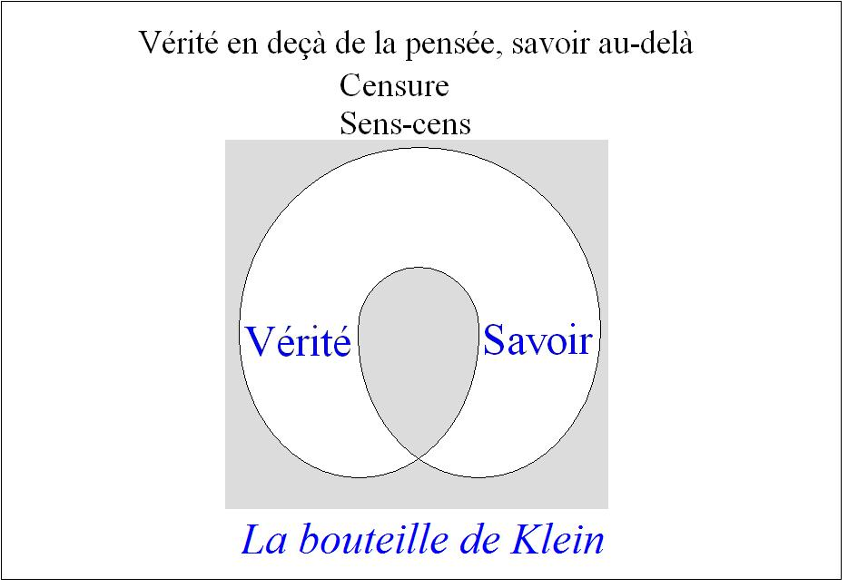
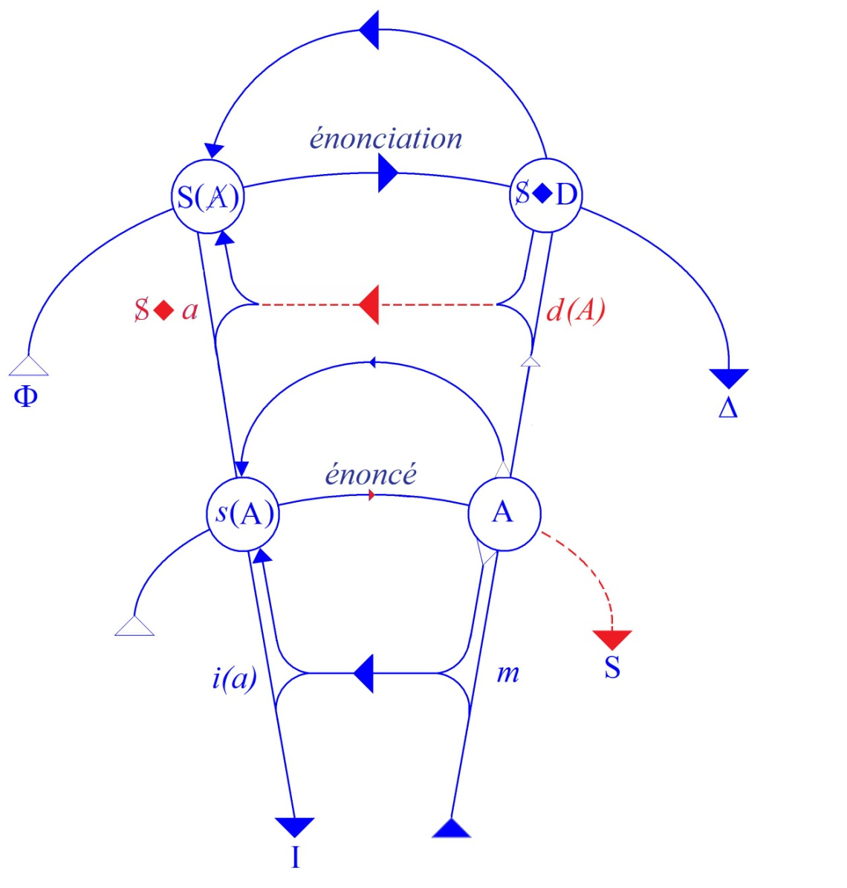
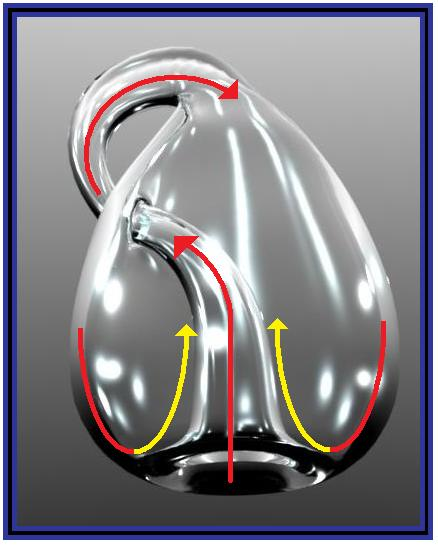

# Leçon 17 | 23 Avril 1969

  <label><input type="checkbox" data-lacan-toggle="original" checked> 原文</label>
  <label><input type="checkbox" data-lacan-toggle="notes" checked> 注释</label>
  <label><input type="checkbox" data-lacan-toggle="commentary" checked> 个人解读评论</label>

<section class="parallel-paragraph" data-paragraph-ids="s16-17-0001">

s16-17-0001

[无对应译文]

原文 · s16-17-0001

</section>

<section class="parallel-paragraph" data-paragraph-ids="s16-17-0002">

s16-17-0002

[无对应译文]

原文 · s16-17-0002

Le temps des vacances a coupé notre propos. Comme vous le voyez, moi aussi j’ai pris mon temps pour le reprendre.

</section>

<section class="parallel-paragraph" data-paragraph-ids="s16-17-0003">

s16-17-0003

[无对应译文]

原文 · s16-17-0003

Je vous ai laissés *sur le sujet de la sublimation* *une fois ouvert*, que nous aurons à renchaîner à quelques pointages sur ce qu’il en est - du point de vue de la structure - sur ce qu’il en est de la perversion.

</section>

<section class="parallel-paragraph" data-paragraph-ids="s16-17-0004">

s16-17-0004

[无对应译文]

原文 · s16-17-0004

À quoi j’ai apporté cette précision, qu’il nous fallait la définir, d’une façon que mes schèmes - mes notions si vous voulez à la rigueur - rendent très simple et très accessible, c’est à savoir : est-ce que le sujet, dans la perversion, prend soin lui-même de suppléer à cette faille de l’Autre ?

</section>

<section class="parallel-paragraph" data-paragraph-ids="s16-17-0005">

s16-17-0005

[无对应译文]

原文 · s16-17-0005

Ce qui est une notion d’un accès « *pas de premier plan* », *qui nécessite une certaine élaboration de l’expérience psychanalytique*.

</section>

<section class="parallel-paragraph" data-paragraph-ids="s16-17-0006">

s16-17-0006

[无对应译文]

原文 · s16-17-0006

C’est donc uniquement pour ceux qui sont familiers de mes termes que cette *formule* peut prendre valeur de *pas*.

</section>

<section class="parallel-paragraph" data-paragraph-ids="s16-17-0007">

s16-17-0007

[无对应译文]

原文 · s16-17-0007

C’est là certainement l’inconvénient de ce qui n’est pas le privilège de mon enseignement, de ce qui est le facteur commun de toute science à partir du moment où elle a commencé de se construire.

</section>

<section class="parallel-paragraph" data-paragraph-ids="s16-17-0008">

s16-17-0008

[无对应译文]

原文 · s16-17-0008

Ce n’est pas pour autant, bien sûr, que cela suffise à authentifier comme scientifique ce à quoi mon *enseignement* s’efforce de parer, de parer à quelque chose qui, au nom d’une prétendue référence à *la clinique*, laisse toujours le compte-rendu de cette expérience à ce qu’on peut bien appeler une fonction réduite à je ne sais quel « *flair* », qui ne saurait bien entendu s’exercer si déjà ne lui étaient donnés les points d’une orientation qui, elle, a été le fruit d’une construction - et fort savante - celle de FREUD, mais enfin dont il s’agit de savoir s’il suffit de s’y loger, puis à partir de là, de se laisser guider sur ce qu’on prend pour être *appréhension* plus ou moins vécue de *la clinique*, mais qui n’est tout simplement que place à ce que s’y re-glissent les plus noirs préjugés.

</section>

<section class="parallel-paragraph" data-paragraph-ids="s16-17-0009">

s16-17-0009

[无对应译文]

原文 · s16-17-0009

On prend cela pour du *sens*. C’est à ce sens que je crois que devrait être appliquée une exigence censitaire, à savoir que ceux qui s’en targuent aient à faire preuve par ailleurs de suffisantes garanties.

</section>

<section class="parallel-paragraph" data-paragraph-ids="s16-17-0010">

s16-17-0010

[无对应译文]

原文 · s16-17-0010

J’essaierai aujourd’hui de dire pourquoi ces garanties doivent être prises ailleurs que dans ce champ où d’ordinaire ils n’ont rien fait ni pour authentifier ce qu’ils ont reçu de FREUD concernant ce qui fait la structure de ce champ, ni - ce qui est bien le minimum d’exigence - pour tenter de lui donner suite, d’en rendre compte.

</section>

<section class="parallel-paragraph" data-paragraph-ids="s16-17-0011">

s16-17-0011

[无对应译文]

原文 · s16-17-0011

J’ai eu - parmi les premiers - à entendre de la sortie d’un libelle dont le titre, à lui seul, est déshonorant, que je n’énoncerai pas ici de ce fait, mais qui, sous le chef avoué des auteurs[^67] qui se déclarent dès les premières lignes - deux analystes - prétendent faire bilan, cuber, réduire à sa valeur…

</section>

<section class="parallel-paragraph" data-paragraph-ids="s16-17-0012">

s16-17-0012

[无对应译文]

原文 · s16-17-0012

> qui ne va pas plus haut que des horizons, je dois dire, exécrables,
>
> qui peuvent faire la règle dans un certain champ de l’expérience psychanalytique …réduire ce qu’il en est de ce qu’ils appellent - le nom est inclus dans leur titre - de ce qu’ils désignent globalement comme la *contestation*. Après ça, vous savez à quoi vous en tenir !

</section>

<section class="parallel-paragraph" data-paragraph-ids="s16-17-0013">

s16-17-0013

[无对应译文]

原文 · s16-17-0013

La régression psychique, l’infirmité, l’infantilisme sordide dont feraient preuve tous ceux qui, à quelque titre, se manifestent dans ce registre - et Dieu sait combien il peut être nuancé - ceux-là sont vraiment ramenés au niveau de ce que, dans un certain champ, dans un certain cadre de l’expérience psychanalytique, on est capable de penser.

</section>

<section class="parallel-paragraph" data-paragraph-ids="s16-17-0014">

s16-17-0014

[无对应译文]

原文 · s16-17-0014

Ça ne va pas plus loin ! Je n’y ajouterai pas d’autre note.

</section>

<section class="parallel-paragraph" data-paragraph-ids="s16-17-0015">

s16-17-0015

[无对应译文]

原文 · s16-17-0015

Simplement je constate, j’enregistre que…

</section>

<section class="parallel-paragraph" data-paragraph-ids="s16-17-0016">

s16-17-0016

[无对应译文]

原文 · s16-17-0016

> quelque soupçon qui ait pu en venir à certains parmi mes élèves les plus authentiques …ceci ne surgit de personne dont on ait vu à quelque moment ici la figure. C’est un fait.

</section>

<section class="parallel-paragraph" data-paragraph-ids="s16-17-0017">

s16-17-0017

[无对应译文]

原文 · s16-17-0017

C’est un fait que j’ai même confirmé, m’adressant à tel ou tel sur qui aurait pu tomber ce soupçon.

</section>

<section class="parallel-paragraph" data-paragraph-ids="s16-17-0018">

s16-17-0018

[无对应译文]

原文 · s16-17-0018

Je dois dire que le fait même de poser cette question avait quelque chose peut-être d’un peu offensant.

</section>

<section class="parallel-paragraph" data-paragraph-ids="s16-17-0019">

s16-17-0019

[无对应译文]

原文 · s16-17-0019

Mais enfin, d’où je suis, il faut que je puisse répondre, et répondre de la façon la plus ferme qu’aucun de ceux qui *à quelque moment*, sont apparus ici - pour, à l’occasion, collaborer, me répondre - qui *à quelque degré* aient été les assistants de ce séminaire, n’a fait rien d’autre que de répudier avec horreur la plus mince approbation qu’ils pourraient donner à cette extravagante initiative, à ce véritable *déculottage* d’une pensée *au plus ras du sol*.

</section>

<section class="parallel-paragraph" data-paragraph-ids="s16-17-0020">

s16-17-0020

[无对应译文]

原文 · s16-17-0020

Voici donc les choses aérées, ce qui d’ailleurs aussi bien n’exclut pas que, par quelque côté, telles personnes que j’évoque à l’instant ne puissent aussi prendre quelque pente qui, à la fin du compte, n’est pas sans rejoindre ce qui peut s’exprimer dans *un certain registre*.

</section>

<section class="parallel-paragraph" data-paragraph-ids="s16-17-0021">

s16-17-0021

[无对应译文]

原文 · s16-17-0021

Qu’elles ne le fassent pas, que toute la psychanalyse française ne soit pas derrière les deux auteurs…

</section>

<section class="parallel-paragraph" data-paragraph-ids="s16-17-0022">

s16-17-0022

[无对应译文]

原文 · s16-17-0022

> dont je me trouve par certaines communications avoir les noms, et qui ne sont pas *minces*,
>
> qui appartiennent à un éminent *Institut* que tout le monde connaît …que les choses n’en soient pas à ce que toute la psychanalyse ne soit pas là derrière à propos de la contestation, après tout je peux bien me targuer que c’est le fait de mon enseignement.

</section>

<section class="parallel-paragraph" data-paragraph-ids="s16-17-0023">

s16-17-0023

[无对应译文]

原文 · s16-17-0023

On ne peut pas dire qu’il ait eu un succès dans la psychanalyse. Mais comme le disait à l’occasion - à un certain tournant des aventures, des avatars, de cet enseignement - l’un de ceux même que j’ai cru devoir interroger…

</section>

<section class="parallel-paragraph" data-paragraph-ids="s16-17-0024">

s16-17-0024

[无对应译文]

原文 · s16-17-0024

> sans que mes soupçons à proprement parler pussent aller jusqu’au point de croire *qu’il ne répudierait pas cet ouvrage* …c’est tout de même la même personne qui, dans une de ces occasions, à propos de ce que j’énonce, ne parlait de rien moins que de *terrorisme*.

</section>

<section class="parallel-paragraph" data-paragraph-ids="s16-17-0025">

s16-17-0025

[无对应译文]

原文 · s16-17-0025

Ce serait donc le terrorisme dégagé par mon enseignement qui ferait que si la psychanalyse française, après tout disons-le, mises à part quelques rares exceptions, ne s’est pas distinguée ni par une grande originalité, ni par une opposition *- à mon enseignement -* particulièrement efficace, ni non plus par une application du même, il n’en reste pas moins que certains discours sont impossibles en raison de cet enseignement, et qu’il faut vraiment - comme cela existe - résider dans un milieu où il est à proprement parler interdit même de feuilleter les quelques pages que j’en ai laissées *sortir*, pour que de pareils énoncés puissent se produire, qui je le répète, viendront bien vite à votre connaissance.

</section>

<section class="parallel-paragraph" data-paragraph-ids="s16-17-0026">

s16-17-0026

[无对应译文]

原文 · s16-17-0026

Si j’en parle c’est que déjà tel hebdomadaire « *fait à l’ordinateur* », à une bonne page, met en évidence le *narcissisme* imputé dans cet ouvrage aux contestataires, dans une *méconnaissance* totale, bien entendu, de la *rénovation*, il faut bien le dire, que j’ai apportée de ce terme. Eh bien, puisque « *terrorisme* » il y a, et qu’après tout je n’en ai pas le privilège :

</section>

<section class="parallel-paragraph" data-paragraph-ids="s16-17-0027">

s16-17-0027

[无对应译文]

原文 · s16-17-0027

- que c’est bien quelque chose qui aurait peut-être pu retenir l’attention des auteurs par exemple, que le terrorisme n’est pas absent du champ qu’ils considèrent,

</section>

<section class="parallel-paragraph" data-paragraph-ids="s16-17-0028">

s16-17-0028

[无对应译文]

原文 · s16-17-0028

- que ce n’est pas simplement une recherche de bien-aise et de mirage réciproque qui le gouverne,

</section>

<section class="parallel-paragraph" data-paragraph-ids="s16-17-0029">

s16-17-0029

[无对应译文]

原文 · s16-17-0029

- que certainement, d’une façon assez variée, quelque chose s’y exerce qui tranche et qui exclut, voire qui s’exclut de l’un à l’autre.

</section>

<section class="parallel-paragraph" data-paragraph-ids="s16-17-0030">

s16-17-0030

[无对应译文]

原文 · s16-17-0030

Que cette réflexion, cette constatation de ce qui est un effet essentiel et caractéristique de certaines fonctions à notre époque et tout spécialement de celles qui, à quelque titre, peuvent s’autoriser d’une pensée qui me fait me proposer de vous faire part aujourd’hui de quelques réflexions qui ne s’accrochent pas mal autour du terme de ce qu’il en est…

</section>

<section class="parallel-paragraph" data-paragraph-ids="s16-17-0031">

s16-17-0031

[无对应译文]

原文 · s16-17-0031

> de ce qu’il faut entendre sous le registre de ce terme usuel et qu’on brandit à tort et à travers …de la *liberté de pensée*.

</section>

<section class="parallel-paragraph" data-paragraph-ids="s16-17-0032">

s16-17-0032

[无对应译文]

原文 · s16-17-0032

Qu’est-ce que cela veut dire ? En quoi diable peut-on même considérer qu’il y ait une valeur inscrite sous ces trois mots ?

</section>

<section class="parallel-paragraph" data-paragraph-ids="s16-17-0033">

s16-17-0033

[无对应译文]

原文 · s16-17-0033

D’un premier abord, épelons :

</section>

<section class="parallel-paragraph" data-paragraph-ids="s16-17-0034">

s16-17-0034

[无对应译文]

原文 · s16-17-0034

- si la pensée a quelque référence,

</section>

<section class="parallel-paragraph" data-paragraph-ids="s16-17-0035">

s16-17-0035

[无对应译文]

原文 · s16-17-0035

- si nous la considérons dans son rapport, disons-le vite comme ça, objectif, …bien sûr il n’y a pas la moindre liberté. L’idée de liberté de ce côté de la référence objective a tout de même un point vif autour de quoi il surgit, c’est *la fonction*, ou plus exactement *la notion* de *la norme*.

</section>

<section class="parallel-paragraph" data-paragraph-ids="s16-17-0036">

s16-17-0036

[无对应译文]

原文 · s16-17-0036

À partir du moment où cette notion entre en jeu, corrélativement celle d’exception, voire celle de transgression s’introduit.

</section>

<section class="parallel-paragraph" data-paragraph-ids="s16-17-0037">

s16-17-0037

[无对应译文]

原文 · s16-17-0037

C’est là que la fonction de la pensée peut prendre quelque sens à introduire la notion de liberté.

</section>

<section class="parallel-paragraph" data-paragraph-ids="s16-17-0038">

s16-17-0038

[无对应译文]

原文 · s16-17-0038

Pour tout dire, c’est à penser l’utopie…

</section>

<section class="parallel-paragraph" data-paragraph-ids="s16-17-0039">

s16-17-0039

[无对应译文]

原文 · s16-17-0039

> qui, comme son nom l’énonce, est un lieu de nulle part : *pas de lieu* …c’est de l’utopie que la pensée serait libre d’envisager une réforme possible de la norme.

</section>

<section class="parallel-paragraph" data-paragraph-ids="s16-17-0040">

s16-17-0040

[无对应译文]

原文 · s16-17-0040

C’est bien ainsi que, dans l’histoire de la pensée, de PLATON à Thomas MORUS[^68], les choses se sont présentées.

</section>

<section class="parallel-paragraph" data-paragraph-ids="s16-17-0041">

s16-17-0041

[无对应译文]

原文 · s16-17-0041

Au regard de la norme, du lieu réel où elle s’établit, *ce n’est que dans le champ de l’utopie que peut s’exercer la liberté de pensée*.

</section>

<section class="parallel-paragraph" data-paragraph-ids="s16-17-0042">

s16-17-0042

[无对应译文]

原文 · s16-17-0042

C’est bien ce qui résulte autour des ouvrages du dernier de ceux que je viens de nommer, à savoir le créateur même du terme d’« *utopie* », Thomas MORUS, et aussi bien à remonter à celui qui a mis en avant, qui a consacré sous la fonction de l’*Idée* le terme de *la norme* : PLATON. PLATON de même nous édifie une société utopique, *La République*, où s’exprime la liberté de sa pensée au regard de ce que lui donne la norme politique de son temps.

</section>

<section class="parallel-paragraph" data-paragraph-ids="s16-17-0043">

s16-17-0043

[无对应译文]

原文 · s16-17-0043

Nous voici donc ici dans le registre non seulement de l’*Idée* et aussi bien le moindre exercice de tout ce que j’ai promu comme distinguant l’*imaginaire* du *réel,* nous fait bien repérer ce qu’a de cadrant, de formateur dans ce registre, une référence qui tout entière va à son terme au registre de *l’image du corps*.

</section>

<section class="parallel-paragraph" data-paragraph-ids="s16-17-0044">

s16-17-0044

[无对应译文]

原文 · s16-17-0044

Je l’ai souligné, *l’idée même de macrocosme* a toujours été accompagnée d’une référence à un *microcosme* qui lui donne son poids, son sens, son haut, son bas, sa droite, sa gauche, qui est au fond d’un mode d’appréhension dit « *de connaissance* » qui est celui dans lequel s’exerce tout un développement qui, à juste titre, s’inscrit dans l’histoire de la pensée.

</section>

<section class="parallel-paragraph" data-paragraph-ids="s16-17-0045">

s16-17-0045

[无对应译文]

原文 · s16-17-0045

Sur mon graphe où *les deux lignes horizontales* que j’ai retracées la dernière fois pour les faire recouper par *cette ligne en hameçon*…

</section>

<section class="parallel-paragraph" data-paragraph-ids="s16-17-0046">

s16-17-0046

[无对应译文]

原文 · s16-17-0046

> qui les coupe toutes les deux et détermine les quatre carrefours essentiels où s’inscrit un certain repérage …*cette ligne en hameçon* qui monte et redescend pour les couper toutes deux, *c’est précisément* *- je le rappelle -* *la ligne où s’inscrivent*…

</section>

<section class="parallel-paragraph" data-paragraph-ids="s16-17-0047">

s16-17-0047

[无对应译文]

原文 · s16-17-0047

> et très précisément dans les intervalles laissés par les deux lignes respectives de *l’énonciation* et de *l’énoncé* …où s’inscrivent les formations à proprement parler *imaginaires*, nommément :

</section>

<section class="parallel-paragraph" data-paragraph-ids="s16-17-0048">

s16-17-0048

[无对应译文]

原文 · s16-17-0048

- la fonction du *désir* dans son rapport au *fantasme*,

</section>

<section class="parallel-paragraph" data-paragraph-ids="s16-17-0049">

s16-17-0049

[无对应译文]

原文 · s16-17-0049

- et celle du *moi* dans son rapport à *l’image* *spéculaire*.

</section>

<section class="parallel-paragraph" data-paragraph-ids="s16-17-0050">

s16-17-0050

[无对应译文]

原文 · s16-17-0050

</section>

<section class="parallel-paragraph" data-paragraph-ids="s16-17-0051">

s16-17-0051

[无对应译文]

原文 · s16-17-0051

C’est dire que les registres du *symbolique*…

</section>

<section class="parallel-paragraph" data-paragraph-ids="s16-17-0052">

s16-17-0052

[无对应译文]

原文 · s16-17-0052

> pour autant qu’ils s’inscrivent dans les deux lignes horizontales …ne sont pas sans rapport, sans trouver de support dans la fonction *imaginaire*, mais ce qu’ils ont de légitime, je veux dire de rationnellement assimilable, doit rester limité.

</section>

<section class="parallel-paragraph" data-paragraph-ids="s16-17-0053">

s16-17-0053

[无对应译文]

原文 · s16-17-0053

C’est en cela que la doctrine freudienne est une doctrine rationaliste : c’est uniquement en fonction de ce qui peut s’articuler dans des propositions défendables, au nom d’une certaine réduction logique, que quoi que ce soit peut être *admis* ou au contraire *exclu*. Où en est, au point où nous en sommes de la science, cette fonction imaginaire prise comme fondement de l’investigation scientifique ? Il est clair qu’elle lui est tout à fait étrangère.

</section>

<section class="parallel-paragraph" data-paragraph-ids="s16-17-0054">

s16-17-0054

[无对应译文]

原文 · s16-17-0054

Dans rien de ce que nous abordons, même au niveau des sciences les plus concrètes… des sciences biologiques par exemple …ce qui importe, ça n’est pas de savoir comment c’est dans le cas idéal, il suffit de voir l’embarras des recours à la pensée que sollicite de nous toute question de cet ordre, à savoir : « *qu’est-ce que la santé* » par exemple ?

</section>

<section class="parallel-paragraph" data-paragraph-ids="s16-17-0055">

s16-17-0055

[无对应译文]

原文 · s16-17-0055

Considérez que ce n’est pas dans l’ordre de l’idéalité que se situe ce qui s’ordonne de notre *avancée scientifique*.

</section>

<section class="parallel-paragraph" data-paragraph-ids="s16-17-0056">

s16-17-0056

[无对应译文]

原文 · s16-17-0056

Ce qui intéresse, à propos de tout ce qui est et que nous avons à interroger, c’est comment ça se remplace.

</section>

<section class="parallel-paragraph" data-paragraph-ids="s16-17-0057">

s16-17-0057

[无对应译文]

原文 · s16-17-0057

Je pense que la chose est suffisamment illustrée pour vous par la façon dont on en use avec l’interrogation organique des fonction du corps. Ce n’est pas hasard, excès, acrobatie, exercice, si ce qui apparaît plus clair dans l’analyse de telle fonction, c’est qu’on puisse, par quelque chose qui n’y ressemble en rien, remplacer un organe.

</section>

<section class="parallel-paragraph" data-paragraph-ids="s16-17-0058">

s16-17-0058

[无对应译文]

原文 · s16-17-0058

*Si je suis parti d’un exemple aussi bardé d’actualité, ce n’est certes pas pour faire effet*, car ce dont il s’agit est d’une bien autre nature.

</section>

<section class="parallel-paragraph" data-paragraph-ids="s16-17-0059">

s16-17-0059

[无对应译文]

原文 · s16-17-0059

S’il en est ainsi, c’est parce que la science ne s’est pas développée de l’*Idée* platonicienne mais d’un procès lié à la référence à *la mathématique*, non pas pour ce qui a pu s’en manifester à l’origine, pythagoricienne par exemple pour en donner une idée, à savoir *celle qui au nombre conjoint une idéalité* de la sorte de celle à quoi je me référais en parlant de PLATON.

</section>

<section class="parallel-paragraph" data-paragraph-ids="s16-17-0060">

s16-17-0060

[无对应译文]

原文 · s16-17-0060

Au niveau de PYTHAGORE, *qu’il y ait une essence du* 1, *une essence du* 2, voire du 3, et au bout d’un certain temps on s’arrête : quand on est arrivé à 12, on perd le souffle, cela n’a absolument rien à faire avec le mode sous lequel nous interrogeons maintenant ce qu’est le nombre. Des formules de PEANO à cet exercice pythagoricien, il n’y a absolument rien de commun.

</section>

<section class="parallel-paragraph" data-paragraph-ids="s16-17-0061">

s16-17-0061

[无对应译文]

原文 · s16-17-0061

L’idée de *fonction*, au sens mathématique…

</section>

<section class="parallel-paragraph" data-paragraph-ids="s16-17-0062">

s16-17-0062

[无对应译文]

原文 · s16-17-0062

> mais ici ce n’est pas pour rien qu’elle est homonyme avec le mode sous lequel j’évoquai tout à l’heure
>
> que pouvait être interrogée *la fonction organique* …cette *fonction* est toujours au dernier terme ordonnée d’une concaténation entre deux chaînes signifiantes, y = *fonction* de x, voilà le départ, le fondement solide sur lequel les mathématiques convergent, car bien entendu ce n’est point apparu aussi pur au départ. Selon le mode qui est à proprement parler celui de *la chaîne symbolique *: *c’est le point d’arrivée qui donne son sens à tout ce qui a précédé*.

</section>

<section class="parallel-paragraph" data-paragraph-ids="s16-17-0063">

s16-17-0063

[无对应译文]

原文 · s16-17-0063

Pour autant que la théorie des mathématiques, je ne dirai pas *a abouti*, car déjà on se glisse plus avant, mais tenons-nous en à ce qui en fait l’équilibre de notre temps : *la théorie des ensembles*. Nous constatons que l’essentiel de *l’ordination numérique* y est réduit à ce qu’il est, à ses possibilités articulatoires, et est construit pour le dépouiller - *cet* *ordre numérique* - de tous ses privilèges idéaux ou idéalisables…

</section>

<section class="parallel-paragraph" data-paragraph-ids="s16-17-0064">

s16-17-0064

[无对应译文]

原文 · s16-17-0064

> de ceux que j’évoquai comme je le pouvais à l’instant à vous réévoquer ce qu’était le 1, le 2,
>
> voire tel ou tel nombre dans une tradition que nous pouvons dire globalement *gnostique* …*la théorie des ensembles précisément* est faite pour dépouiller cette ordination numérique…

</section>

<section class="parallel-paragraph" data-paragraph-ids="s16-17-0065">

s16-17-0065

[无对应译文]

原文 · s16-17-0065

> et c’est ce que j’appelle *ses privilèges idéaux* ou *imaginaires* …de *l’unité* : pas trace d’*unité* dans les définitions de PEANO, *un nombre se définit par rapport au* 0 *et à la fonction du successeur*.

</section>

<section class="parallel-paragraph" data-paragraph-ids="s16-17-0066">

s16-17-0066

[无对应译文]

原文 · s16-17-0066

L’unité n’y a aucun privilège : de l’unité de la corporéité, de l’essentialité de la totalité elle-même. Il faut bien *marquer* en ceci :

</section>

<section class="parallel-paragraph" data-paragraph-ids="s16-17-0067">

s16-17-0067

[无对应译文]

原文 · s16-17-0067

- qu’un *ensemble* ne saurait en aucune façon être confondu avec une *classe*, et par tel autre trait :

</section>

<section class="parallel-paragraph" data-paragraph-ids="s16-17-0068">

s16-17-0068

[无对应译文]

原文 · s16-17-0068

- que parler de *partie* est profondément contraire au fonctionnement de la théorie,

</section>

<section class="parallel-paragraph" data-paragraph-ids="s16-17-0069">

s16-17-0069

[无对应译文]

原文 · s16-17-0069

- que le terme de *sous-ensemble* est très précisément fait pour montrer ceci qu’on ne saurait d’aucune façon y inscrire que « *le tout est fait de la somme des parties* ».

</section>

<section class="parallel-paragraph" data-paragraph-ids="s16-17-0070">

s16-17-0070

[无对应译文]

原文 · s16-17-0070

Comme vous le savez, les *sous-ensembles* constituent de leur *réunion*, quelque chose qui n’est nullement identifiable à *l’ensemble*, en le dépouillant même au fond - c’est là le sens de *la théorie des ensembles -* du recours à la spatialité elle-même. Je m’excuse de cette introduction destinée à marquer *les termes d’une opposition* aussi profonde que nécessaire, qui est celle où se définit quoi ?

</section>

<section class="parallel-paragraph" data-paragraph-ids="s16-17-0071">

s16-17-0071

[无对应译文]

原文 · s16-17-0071

La révolution, ou la subversion si vous voulez, du mouvement d’un savoir, car depuis quelque temps il est clair que j’ai décollé du fonctionnement, ici qui n’est qu’inaugural, voire supposé, de *la pensée*. C’est bien parce que je suis parti de PLATON que j’ai pu parler de *la pensée*.

</section>

<section class="parallel-paragraph" data-paragraph-ids="s16-17-0072">

s16-17-0072

[无对应译文]

原文 · s16-17-0072

*La pensée* donc, ce n’est pas du tout du côté de *l’orientation objective* que nous avons à l’interroger sur sa liberté.

</section>

<section class="parallel-paragraph" data-paragraph-ids="s16-17-0073">

s16-17-0073

[无对应译文]

原文 · s16-17-0073

De ce côté-là, elle n’est libre, en effet, que du côté de l’utopie, de ce qui n’a aucun lieu dans le réel. Seulement, c’est peut-être un des intérêts du procès même que j’ai pris, c’est qu’assurément, ce discours a quelque chose à faire avec de la pensée.

</section>

<section class="parallel-paragraph" data-paragraph-ids="s16-17-0074">

s16-17-0074

[无对应译文]

原文 · s16-17-0074

Ce recul pris sur ce qu’il en est de deux versants de la connaissance, nous appellerons ça quoi :

</section>

<section class="parallel-paragraph" data-paragraph-ids="s16-17-0075">

s16-17-0075

[无对应译文]

原文 · s16-17-0075

- une réflexion ?

</section>

<section class="parallel-paragraph" data-paragraph-ids="s16-17-0076">

s16-17-0076

[无对应译文]

原文 · s16-17-0076

- Un débat ?

</section>

<section class="parallel-paragraph" data-paragraph-ids="s16-17-0077">

s16-17-0077

[无对应译文]

原文 · s16-17-0077

- Une dialectique ?

</section>

<section class="parallel-paragraph" data-paragraph-ids="s16-17-0078">

s16-17-0078

[无对应译文]

原文 · s16-17-0078

C’est dans le champ subjectif bien évidemment, et pour autant que - *si la chose était possible* -à l’occasion vous ayez à me répondre, que nous aurions à faire intervenir sans doute d’autres diversités.

</section>

<section class="parallel-paragraph" data-paragraph-ids="s16-17-0079">

s16-17-0079

[无对应译文]

原文 · s16-17-0079

Premier plan d’abord, la notion du « *tous* ». Qu’est-ce qui, dans ce que je viens de dire, peut être accepté par tous ?

</section>

<section class="parallel-paragraph" data-paragraph-ids="s16-17-0080">

s16-17-0080

[无对应译文]

原文 · s16-17-0080

Est-ce que ce « *tous* » a un sens ? Nous retrouverons là la même opposition.

</section>

<section class="parallel-paragraph" data-paragraph-ids="s16-17-0081">

s16-17-0081

[无对应译文]

原文 · s16-17-0081

Nous nous apercevrons de la mue qu’a prise l’exigence logique, et qu’aussi bien, pour pousser assez loin un tel débat, nous serons amenés à promouvoir la fonction de l’axiome, à savoir un certain nombre de préfigurés logiques tenus pour fonder la suite et aussi bien, la dite suite, la suspendre à l’agrément donné ou non à l’axiome.

</section>

<section class="parallel-paragraph" data-paragraph-ids="s16-17-0082">

s16-17-0082

[无对应译文]

原文 · s16-17-0082

L’incertitude de ce « *tous* » sera mise en cause non point seulement de ceci que concrètement l’unanimité du « *tous* » est la chose la plus difficile à obtenir, mais que la traduction *logique* du « *tous* » se montre fort précaire, pour peu que, dans l’ordre de la logique, nous ayons l’ordre d’exigences qui nécessite la théorie des quantificateurs. Ce que me retirant…

</section>

<section class="parallel-paragraph" data-paragraph-ids="s16-17-0083">

s16-17-0083

[无对应译文]

原文 · s16-17-0083

> n’allant pas m’engager dans des développements qui au regard de ce que nous avons à interroger nous égare …je demanderai : comment s’exprime ici dans ce registre ce qu’il en est de la liberté de pensée ?

</section>

<section class="parallel-paragraph" data-paragraph-ids="s16-17-0084">

s16-17-0084

[无对应译文]

原文 · s16-17-0084

Ici HEGEL est un repère qui n’est pas simplement commode mais essentiel. Dans cet axe qui nous intéresse, il prolonge le *cogito* *inaugural*. La pensée se livre si l’on interroge le centre de gravité de ce qui s’y qualifie comme *Selbstbewusstsein *: «  *Je sais que je pense* », le *Selbstbewusstsein* n’est rien d’autre.

</section>

<section class="parallel-paragraph" data-paragraph-ids="s16-17-0085">

s16-17-0085

[无对应译文]

原文 · s16-17-0085

Seulement ce qu’il ajoute à DESCARTES, c’est que *quelque chose varie dans ce « Je sais que je pense »* et c’est le point où je suis. Cela - j’allais dire « *par définition* » - dans HEGEL, je ne le sais pas. L’illusion, c’est que « *je suis où je pense* ». La *liberté de pensée* ici, ce n’est rien d’autre que ceci : que ce que HEGEL m’interdit bien de penser, c’est que *je suis où je veux*. À cet égard, ce que HEGEL révèle, c’est qu’il n’y a pas la moindre liberté de pensée. Il faudra le temps de l’histoire pour qu’à la fin je pense à la bonne place, à la place où je serait devenu *savoir*. Mais à ce moment là, *il n’y a absolument plus besoin de pensée*.

</section>

<section class="parallel-paragraph" data-paragraph-ids="s16-17-0086">

s16-17-0086

[无对应译文]

原文 · s16-17-0086

Je me livre à un exercice assez fou devant vous parce qu’il est évident que, pour ceux qui n’ont jamais ouvert HEGEL, tout cela ne peut pas aller bien loin. Mais enfin j’espère quand même qu’il y en a entre vous assez qui sont plus ou moins introduits à « *la dialectique du maître et de l’esclave* », pour se souvenir de ceci, de ce qui arrive au maître qui a la liberté…

</section>

<section class="parallel-paragraph" data-paragraph-ids="s16-17-0087">

s16-17-0087

[无对应译文]

原文 · s16-17-0087

> *c’est comme ça qu’il le définit tout au moins, c’est le maître mythique* …ce qui arrive quand il pense, c’est-à-dire quand il met sa « *maîtrise* » dans l’étrangeté du langage : il entre peut-être dans la pensée mais assurément c’est le moment où il perd sa liberté.

</section>

<section class="parallel-paragraph" data-paragraph-ids="s16-17-0088">

s16-17-0088

[无对应译文]

原文 · s16-17-0088

Que pour *l’esclave*, en tant que conscience vile, c’est lui qui *réalise l’Histoire*. Dans le travail, sa pensée à chaque temps est *serve* du pas qu’il a à faire pour accéder au mode de l’état où se réalise - quoi ? - la domination du savoir. *La fascination de* HEGEL est presque impossible à défaire. Il n’y a que certaines personnes de mauvaise foi qui considèrent que j’ai promu *l’hégelianisme* à l’intérieur du débat freudien. Néanmoins n’imaginez pas que je pense que de HEGEL on vient à bout comme ça.

</section>

<section class="parallel-paragraph" data-paragraph-ids="s16-17-0089">

s16-17-0089

[无对应译文]

原文 · s16-17-0089

Cette notion que la vérité de la pensée est ailleurs qu’en elle-même, et à chaque instant nécessitée de la relation du sujet au savoir, et que ce savoir lui-même est conditionné par un certain nombre de *temps nécessaires*, est une grille dont assurément nous ne pouvons que sentir à tout instant l’applicabilité, à tous les détours de notre expérience. Elle est d’une valeur d’exercice, d’une valeur formatrice exemplaire.

</section>

<section class="parallel-paragraph" data-paragraph-ids="s16-17-0090">

s16-17-0090

[无对应译文]

原文 · s16-17-0090

Il faut vraiment faire un effort de désordination, de réveil véritable pour nous demander comment, si peu que je sache, il y a ce retard qui fait qu’il me faudrait penser pour savoir. Et si l’on regarde de plus près, on s’interroge : qu’est-ce que ça a à faire, l’articulation du savoir effectif, avec le mode sous lequel je pense ma liberté, c’est-à-dire « *je suis où je veux* »?

</section>

<section class="parallel-paragraph" data-paragraph-ids="s16-17-0091">

s16-17-0091

[无对应译文]

原文 · s16-17-0091

Il est clair, de la démonstration de HEGEL, que je ne puis pas penser que « *je suis là où je veux* », mais il est non moins clair à y regarder de près que c’est cela et rien d’autre qui s’appelle *pensée*, de sorte que ce « *je suis là où je veux* » qui est l’essence de la liberté de pensée à titre d’énonciation, est proprement ce qui ne peut être énoncé par personne.

</section>

<section class="parallel-paragraph" data-paragraph-ids="s16-17-0092">

s16-17-0092

[无对应译文]

原文 · s16-17-0092

Et à ce moment-là apparaît *cette chose étrange* que dans HEGEL…

</section>

<section class="parallel-paragraph" data-paragraph-ids="s16-17-0093">

s16-17-0093

[无对应译文]

原文 · s16-17-0093

> dans la *Phénoménologie,* non dans l’*Encyclopédie*, mais là où est marqué le plus au vif *cette dialectique propre de la pensée* …ceci peut se faire en l’absence de toute *histoire du savoir*, que dans toute la *Phénoménologie de l’Esprit,* il s’agit d’une référence à une vérité qui permet de pointer ce que la pensée *ne sait pas* de sa fonction.

</section>

<section class="parallel-paragraph" data-paragraph-ids="s16-17-0094">

s16-17-0094

[无对应译文]

原文 · s16-17-0094

Dès lors il est clair que d’où HEGEL le détecte-t-il sinon de son savoir, entendons du savoir de son temps, de son époque, de ce savoir scientifique tel que KANT en a fait le bilan : du savoir newtonien. Disons-le d’un mot pour ceux qui entendent : de ce savoir-limite qui marque l’apogée et la fin de la théologie.

</section>

<section class="parallel-paragraph" data-paragraph-ids="s16-17-0095">

s16-17-0095

[无对应译文]

原文 · s16-17-0095

La différence entre HEGEL et FREUD est ceci : la pensée n’est pas seulement la question posée sur *la vérité du savoir*… ce qui est déjà beaucoup et essentiel du pas hégelien …*la pensée* - dit FREUD - *barre l’accès à un savoir*.

</section>

<section class="parallel-paragraph" data-paragraph-ids="s16-17-0096">

s16-17-0096

[无对应译文]

原文 · s16-17-0096

Ai-je besoin de rappeler ce dont il s’agit *dans l’inconscient*, c’est à savoir *comment on a pensé le premier accès à un savoir* ?

</section>

<section class="parallel-paragraph" data-paragraph-ids="s16-17-0097">

s16-17-0097

[无对应译文]

原文 · s16-17-0097

Le *Selbstbewusstsein* de HEGEL, c’est le « *je sais que je pense* ».

</section>

<section class="parallel-paragraph" data-paragraph-ids="s16-17-0098">

s16-17-0098

[无对应译文]

原文 · s16-17-0098

Le *trauma* freudien, c’est un « *je ne sais pas* » lui-même *impensable* puisqu’il suppose un « *je pense* » démantelé de toute pensée.

</section>

<section class="parallel-paragraph" data-paragraph-ids="s16-17-0099">

s16-17-0099

[无对应译文]

原文 · s16-17-0099

Le point-origine - non pas à entendre génétiquement mais structuralement - quand il s’agit de comprendre l’inconscient, c’est que c’est en ce point nodal d’un savoir défaillant que naît, sous la forme donc de ce qui peut s’appeler…

</section>

<section class="parallel-paragraph" data-paragraph-ids="s16-17-0100">

s16-17-0100

[无对应译文]

原文 · s16-17-0100

> à condition d’en mettre les deux derniers mots dans une sorte de parenthèse …le désir (de savoir). C’est le désir inconscient tout court, dans sa structure.

</section>

<section class="parallel-paragraph" data-paragraph-ids="s16-17-0101">

s16-17-0101

[无对应译文]

原文 · s16-17-0101

Aussi bien ai-je dès longtemps marqué à la ligne supérieure de mon graphe « *il ne savait pas* » à propos du rêve célèbre du « *Il ne savait pas qu’il était mort* ». Le « *il ne savait pas* » comme la mise en question de l’*énonciation* comme telle du sujet divisé à l’origine, c’est cela qui fait la dimension du désir être celle du « *désir de l’Autre* ».

</section>

<section class="parallel-paragraph" data-paragraph-ids="s16-17-0102">

s16-17-0102

[无对应译文]

原文 · s16-17-0102

C’est pour autant que dans le fantasme traumatique ce désir de l’autre est informulable que le désir prend germe dans ce qui peut s’appeler - *à condition de mettre les derniers mots entre parenthèses -* le désir (de savoir).

</section>

<section class="parallel-paragraph" data-paragraph-ids="s16-17-0103">

s16-17-0103

[无对应译文]

原文 · s16-17-0103

Et nous trouvons là tout de suite les thèmes fondamentaux sur lesquels j’ai insisté.

</section>

<section class="parallel-paragraph" data-paragraph-ids="s16-17-0104">

s16-17-0104

[无对应译文]

原文 · s16-17-0104

Si le désir de l’Autre est tel qu’il soit fermé, c’est qu’il s’exprime en ceci, *caractéristique de la scène traumatique*, que *le corps* *y est aperçu comme séparé de la jouissance*. *La fonction de l’Autre ici s’incarne : elle est ce corps comme perçu comme séparé de la jouissance*.

</section>

<section class="parallel-paragraph" data-paragraph-ids="s16-17-0105">

s16-17-0105

[无对应译文]

原文 · s16-17-0105

Le pas donc que fait franchir FREUD concernant cette fonction de la pensée par rapport au *Selbstbewusstsein,* c’est ceci que l’essence du « *je sais que je pense* », de ce *Selbstbewusstsein* n’est rien autre que *le trop d’accent* mis sur ce que « *je sais* » pour oublier ce « *je ne sais pas* » qui est sa réelle origine.

</section>

<section class="parallel-paragraph" data-paragraph-ids="s16-17-0106">

s16-17-0106

[无对应译文]

原文 · s16-17-0106

C’est déjà contre la division qu’implique ce « *je ne sais pas* » que le seul fait de la présence de *la négation* met *en suspens*… si je puis dire, mais justement je ne le dis pas …c’est un « *je ne sais pas* » que le « *je sais que je pense* » est fait pour écranter d’une façon définitive :

</section>

<section class="parallel-paragraph" data-paragraph-ids="s16-17-0107">

s16-17-0107

[无对应译文]

原文 · s16-17-0107

- *la vérité* dès lors n’est plus la place où est réellement ce « *que je pense* » dans HEGEL,

</section>

<section class="parallel-paragraph" data-paragraph-ids="s16-17-0108">

s16-17-0108

[无对应译文]

原文 · s16-17-0108

- *la vérité* est la désignation de *la place* d’où ce « *que je pense* » est motivé.

</section>

<section class="parallel-paragraph" data-paragraph-ids="s16-17-0109">

s16-17-0109

[无对应译文]

原文 · s16-17-0109

*Observez que si ceci doit être pris en toute rigueur : de cette place il n’y a rien à dire qui ait sens*. Elle est créée par un « *ça ne veut rien dire* ». C’est l’endroit où « *ça ne veut rien dire* » qui commande un « *ça veut dire* » de remplacement.

</section>

<section class="parallel-paragraph" data-paragraph-ids="s16-17-0110">

s16-17-0110

[无对应译文]

原文 · s16-17-0110

Je ne sais à combien d’entre vous le rappel de ces vérités premières peut servir, mais pour les autres *j’ai mis quelques mots-clés* au tableau, qui rappellent ce que j’ai déjà longuement élucidé dans une topologie, à savoir cette référence à *la bouteille de Klein* pour autant qu’elle nous donne dans *une topologie de surface* la possibilité d’une division, dont ce qui est au col, à savoir ce petit cercle, où est censée se rebrousser la surface, et nous mettrions d’un côté *la vérité* et de l’autre *le savoir*, observez que dans cette *schématisation* il doit y avoir là un quelque part qui les réunisse, qui est dans la même forme que celle que je cherche à présentifier plus simplement dans *la bande de Mœbius*.

</section>

<section class="parallel-paragraph" data-paragraph-ids="s16-17-0111">

s16-17-0111

[无对应译文]

原文 · s16-17-0111

</section>

<section class="parallel-paragraph" data-paragraph-ids="s16-17-0112">

s16-17-0112

[无对应译文]

原文 · s16-17-0112

</section>

<section class="parallel-paragraph" data-paragraph-ids="s16-17-0113">

s16-17-0113

[无对应译文]

原文 · s16-17-0113

</section>

<section class="parallel-paragraph" data-paragraph-ids="s16-17-0114">

s16-17-0114

[无对应译文]

原文 · s16-17-0114

Ce qui importe, c’est ici de poser quelques questions. Cette vérité qui est celle que nous interrogeons dans l’inconscient comme *défaillance créatrice du savoir*, comme pointe, *origine du désir de savoir*, mais c’est le schéma qui vient d’un savoir condamné à n’être en quelque sorte jamais que le corrélat de cette défaillance, *est-ce que ça n’est pas ceci qui est, pour nous, à plus loin interroger*.

</section>

<section class="parallel-paragraph" data-paragraph-ids="s16-17-0115">

s16-17-0115

[无对应译文]

原文 · s16-17-0115

Si toute pensée…

</section>

<section class="parallel-paragraph" data-paragraph-ids="s16-17-0116">

s16-17-0116

[无对应译文]

原文 · s16-17-0116

> non pas seulement *la pensée spontanée* de quiconque s’oriente dans les réalités installées de la vie, mais *la pensée* comme telle, à savoir comme s’interrogeant sur ce point hégelien qui est de savoir *où* un certain mode de savoir situe réellement le sujet …*si toute cette pensée est définie comme étant essentiellement censure*…

</section>

<section class="parallel-paragraph" data-paragraph-ids="s16-17-0117">

s16-17-0117

[无对应译文]

原文 · s16-17-0117

> car c’est cela que veut dire l’articulation *freudienne*, c’est que ce *je ne sais pas*, de ce qu’il soit radicalement oublié,
>
> il est impossible de revenir à sa place …*pensée-censure* - appelez-là comme vous voudrez, glissez les mots *censée­-pensure -* est-ce que nous ne sentons pas, là tout au moins, un de ces corrélatifs essentiels de ce qui se clame à notre époque d’une prétendue « *fin de la philosophie* » ?

</section>

<section class="parallel-paragraph" data-paragraph-ids="s16-17-0118">

s16-17-0118

[无对应译文]

原文 · s16-17-0118

Il y a une objection, de structure précisément, c’est que *philosophie* ou même comme on dit mieux *à l’occasion* : *métaphysique*, elle n’a jamais fait que ça, *la métaphysique*, de se considérer comme à son terme.Alors il ne faut pas croire qu’à cause qu’on agite KIERKEGAARD, MARX et NIETZSCHE, comme on dit, ça nous mette tellement hors des limites de l’épure, uniquement vu de ce point de vue là. Ça n’est intéressant que pour continuer d’interroger ce qui est de nos jours, constatez-le tout de même, *la chose la plus contestée du monde*, encore qu’on ne s’arme que de cela, à savoir « *la liberté de pensée* ».

</section>

<section class="parallel-paragraph" data-paragraph-ids="s16-17-0119">

s16-17-0119

[无对应译文]

原文 · s16-17-0119

Partout où on travaille à réaliser quelque chose qui a bien l’air d’être la domination du savoir…

</section>

<section class="parallel-paragraph" data-paragraph-ids="s16-17-0120">

s16-17-0120

[无对应译文]

原文 · s16-17-0120

> je veux dire là où on travaille sérieusement, pas là où c’est la foire …on n’a pas *la liberté de pensée*. Ça n’empêche pas que *les étudiants de* Prague sont en train de faire la grève pour ça.

</section>

<section class="parallel-paragraph" data-paragraph-ids="s16-17-0121">

s16-17-0121

[无对应译文]

原文 · s16-17-0121

Alors qu’est-ce que ça veut dire ? C’est dans la mesure où notre expérience analytique peut peut-être apporter là une ébauche de réflexion que tout ce discours est tenu.

</section>

<section class="parallel-paragraph" data-paragraph-ids="s16-17-0122">

s16-17-0122

[无对应译文]

原文 · s16-17-0122

Si nous procédons dans l’*expérience* en faisant tenir quoi ? Un discours qui se définit comment ?

</section>

<section class="parallel-paragraph" data-paragraph-ids="s16-17-0123">

s16-17-0123

[无对应译文]

原文 · s16-17-0123

« *Associations libres* » cela veut dire sans lien à l’Autre. Vous parlez dans l’analyse, ça veut dire qu’on vous a libéré de toute règle du jeu. Et à quoi grand Dieu est-ce que ça peut mener ? Même pas à un texte esthétique.

</section>

<section class="parallel-paragraph" data-paragraph-ids="s16-17-0124">

s16-17-0124

[无对应译文]

原文 · s16-17-0124

Car les surréalistes, quand ils voulaient procéder par cette voie, vous pensez bien qu’à la fin ils employaient largement la paire de ciseaux, pour que ça finisse par faire quelque chose dont nous reparlerons : l’œuvre d’art. Qu’on puisse y arriver comme ça est déjà fortement indicatif mais tout à fait imperméable à quiconque n’a pas l’idée de *l’objet(a)*.

</section>

<section class="parallel-paragraph" data-paragraph-ids="s16-17-0125">

s16-17-0125

[无对应译文]

原文 · s16-17-0125

Ce n’est pas de *l’objet(a)* que nous parlons aujourd’hui. Ce dont nous parlons, c’est ceci, c’est que pour qu’on se livre à un pareil exercice, qui normalement ne peut aboutir qu’à une profonde insuffisance logique…

</section>

<section class="parallel-paragraph" data-paragraph-ids="s16-17-0126">

s16-17-0126

[无对应译文]

原文 · s16-17-0126

> et c’est tout ce que FREUD veut dire en réalité quand il dit que l’inconscient ne connaît pas *le principe de contradiction*, *le principe de contradiction* est quelque chose d’excessivement élaboré en logique et *dont même en logique on peut se passer*, *on peut construire toute une logique sans faire usage de la négation*, je parle d’une *logique formelle* dans le champ du savoir …si nous pouvons user d’un discours qui se libère de *la logique*, il n’est certainement pas délié de *la grammaire*.

</section>

<section class="parallel-paragraph" data-paragraph-ids="s16-17-0127">

s16-17-0127

[无对应译文]

原文 · s16-17-0127

C’est bien que dans *la grammaire*, il doit rester quelque chose très riche de propriétés et de conséquences qui fait que nous nous apercevons qu’un *fantasme* ne s’exprime dans rien de mieux qu’une phrase qui n’a de sens que grammatical, qui dans son jeu en tout cas, pour ce qui est de la formation du *fantasme*, n’est agité que  grammaticalement, à savoir « *Un enfant est battu* » par exemple. C’est en tant que quelque chose n’y est censuré et ne peut être censuré que de la structure grammaticale, à savoir l’agent par exemple, que quelque chose peut opérer autour de cette phrase.

</section>

<section class="parallel-paragraph" data-paragraph-ids="s16-17-0128">

s16-17-0128

[无对应译文]

原文 · s16-17-0128

*Les névroses donc révèlent la distinction de la grammaire et de la logique.*

</section>

<section class="parallel-paragraph" data-paragraph-ids="s16-17-0129">

s16-17-0129

[无对应译文]

原文 · s16-17-0129

Il s’agirait de faire un pas de plus et - même si elles ne la révèlent pas d’emblée, comme ça, patent - nous dire que si nous découvrions - et c’est à quoi je m’efforce - l’homologie de quelque chose - qu’on ne peut savoir, évidemment, qu’à avoir fait un peu de logique - l’homologie des failles que démontre *une logique correcte*…

</section>

<section class="parallel-paragraph" data-paragraph-ids="s16-17-0130">

s16-17-0130

[无对应译文]

原文 · s16-17-0130

> c’est-à-dire qui n’a pas plus d’un siècle, à savoir qui fait qu’on s’aperçoit par exemple que c’est de *la localisation* quelque part *d’un indécidable* que dépend *la consistance* d’un des systèmes les plus assurés, à savoir l’arithmétique …qu’il y a homologie entre ces failles de la logique et de la structure du désir en tant qu’il est au dernier terme connotation du savoir des rapports de l’homme et de la femme par quelque chose qui est le plus surprenant, par le manque ou le non-manque d’un όργανον \[organon\], d’un instrument, autrement dit du *phallus*.

</section>

<section class="parallel-paragraph" data-paragraph-ids="s16-17-0131">

s16-17-0131

[无对应译文]

原文 · s16-17-0131

*Que la jouissance de l’instrument fasse barrage à la jouissance qui est jouissance de l’Autre en tant que l’Autre est représenté par un corps*, pour tout dire - comme je l’ai énoncé, je pense, avec *suffisamment de force* - qu’il n’y a rien de structurable qui soit proprement l’acte sexuel, si ceci est correctement démontré, le joint, la boucle, ce *quelque chose* qui *- par derrière -* rejoint *vérité* à *savoir,* est concevable.La pensée est justement ce *Vorstellungsreprâsentanz,* cette chose qui représente le fait qu’il y ait du non représentable parce que barré par l’interdit de la jouissance. À quel niveau ? Au plus simple, au niveau organique.

</section>

<section class="parallel-paragraph" data-paragraph-ids="s16-17-0132">

s16-17-0132

[无对应译文]

原文 · s16-17-0132

*Le principe du plaisir*, c’est cette barrière à la jouissance et rien d’autre. Qu’elle soit *métaphorisée* dans l’interdit de la mère, c’est après tout ce qui n’est que contingence historique, et *le complexe d’œdipe* lui-même n’est là qu’appendu.

</section>

<section class="parallel-paragraph" data-paragraph-ids="s16-17-0133">

s16-17-0133

[无对应译文]

原文 · s16-17-0133

Mais la question se gîte plus profondément.

</section>

<section class="parallel-paragraph" data-paragraph-ids="s16-17-0134">

s16-17-0134

[无对应译文]

原文 · s16-17-0134

### La castration, à savoir le trou dans l’appréhension de ce « *je ne sais pas* » quant à la jouissance de l’Autre , doit être repensée quant à ses rapports aux effets répandus, omniprésents de notre science…

</section>

<section class="parallel-paragraph" data-paragraph-ids="s16-17-0135">

s16-17-0135

[无对应译文]

原文 · s16-17-0135

> ces deux points qui ont l’air très distants de ce barrage qui fait que ce sexe dont nous parlons tout le temps,
>
> loin de faire un pas dans quelque solution que ce soit du champ de l’érotique, va toujours plutôt s’obscurcissant,
>
> et marquant plus l’insuffisance de nos repères …qu’il y ait un rapport entre cela et ces effets que j’appelle répandus de notre savoir, c’est à savoir ce prodigieux déferlement du rapport à *l’objet(a)* dont l’usage de nos *mass-media* ne sont que *le retour, la présentification*, est-ce que ceci n’est pas à soi tout seul l’indication de ce qu’il en est de la *liberté de pensée* ?

</section>

<section class="parallel-paragraph" data-paragraph-ids="s16-17-0136">

s16-17-0136

[无对应译文]

原文 · s16-17-0136

Car supposez :

</section>

<section class="parallel-paragraph" data-paragraph-ids="s16-17-0137">

s16-17-0137

[无对应译文]

原文 · s16-17-0137

- que la structure soit effectivement ici celle de *la bouteille de Klein*,

</section>

<section class="parallel-paragraph" data-paragraph-ids="s16-17-0138">

s16-17-0138

[无对应译文]

原文 · s16-17-0138

- que la limite soit effectivement ce lieu de retournement où ce qui était l’endroit devient l’envers et inversement, où apparemment est séparée la vérité du savoir,

</section>

<section class="parallel-paragraph" data-paragraph-ids="s16-17-0139">

s16-17-0139

[无对应译文]

原文 · s16-17-0139

- qu’il nous suffit de penser que cette limite n’est pas fixe, qu’elle est de sa nature partout, à savoir que la question se pose pour nous de comment faire pour que n’adhère pas à un point purement imaginairement fixe cette division de *vérité* et *savoir*.

</section>

<section class="parallel-paragraph" data-paragraph-ids="s16-17-0140">

s16-17-0140

[无对应译文]

原文 · s16-17-0140

Et c’est bien là ce dont, *faute d’avoir même commencé de suggérer ainsi le problème,* les psychanalystes se contentent de donner une démonstration sous cette forme de ne pouvoir absolument décoller d’une certaine stase de cette limite.

</section>

<section class="parallel-paragraph" data-paragraph-ids="s16-17-0141">

s16-17-0141

[无对应译文]

原文 · s16-17-0141

*Toute cure de la névrose qui se limite à l’exhaustion des identifications du sujet*… c’est-à-dire très précisément de *ce par quoi il s’est réduit à l’Autre* …nulle cure de ces identifications - nous y reviendrons - ne porte en elle-même aucune promesse de résolution de *ce qui fait nœud pour le névrosé*. *Ce qui fait nœud pour le névrosé*, je ne le dirai pas aujourd’hui ici… je serai forcé d’aller trop vite, …mais ce que je veux dire, c’est qu’en raison de ce qu’il en est de la nature du névrosé…

</section>

<section class="parallel-paragraph" data-paragraph-ids="s16-17-0142">

s16-17-0142

[无对应译文]

原文 · s16-17-0142

> *qui est profondément qu’on lui demande ce qu’il en est de son désir* …est-ce que *la question* ne peut pas être posée si *le psychanalyste* ici n’est pas complice à soutenir sans le savoir ce qui est le fond de la structure du névrosé, c’est à savoir : *que son désir ne peut se soutenir que de cette demande*.

</section>

<section class="parallel-paragraph" data-paragraph-ids="s16-17-0143">

s16-17-0143

[无对应译文]

原文 · s16-17-0143

Pour tout dire, singulièrement, si l’on peut dire que l’analyse a consisté en la rupture avec l’hypnose, c’est peut-être pour une raison bien surprenante à la considérer : c’est que *dans l’analyse* - du moins sous la forme où elle stagne - *c’est l’analyste qui est l’hypnotisé*.

</section>

<section class="parallel-paragraph" data-paragraph-ids="s16-17-0144">

s16-17-0144

[无对应译文]

原文 · s16-17-0144

Au terme, l’analyste finit par devenir *le regard et la voix* de son patient. Ceci est fort différent de ce qui se présente \- *illusion de la pensée* - comme un recours à *la clinique*. Ce ne serait peut-être pas se dégager de *la clinique* que de prendre garde à ce que ne se produise pas cette mutation.

</section>

<section class="parallel-paragraph" data-paragraph-ids="s16-17-0145">

s16-17-0145

[无对应译文]

原文 · s16-17-0145

Je ne fais, vous le pensez bien, qu’indiquer des portes d’entrée qui sont celles que nous pousserons dans les séances à venir. Je ne voudrais terminer qu’à faire cette remarque : si je me suis limité dans ma vie à commenter mon expérience et à l’interroger dans ses rapports à la doctrine de FREUD, c’est précisément dans la visée de n’être pas un penseur, mais une pensée - celle de FREUD déjà constituée - de l’interroger en tenant compte de ce qui la détermine, de ce qui - hégeliennement parlant - fait ou non sa *vérité*.

</section>

<section class="note-block original-notes">

## Notes

[^67]:
    #  Bela Grunberger(1903-2005) et Janine Chasseguet-Smirgel(1928-2006) : « L'univers contestationnaire », éd. In Press, 2004. 

    #  ou « André Stéphane » (pseudo) : « L'univers contestationnaire », Payot, 1969.

[^68]: Cf. Thomas More : [L’Utopie](http://fr.wikisource.org/wiki/L%E2%80%99Utopie), Flammarion, 1993, Coll. GF.

</section>
