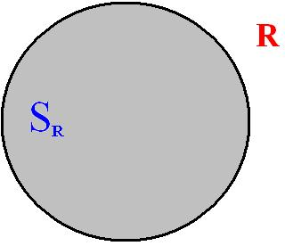
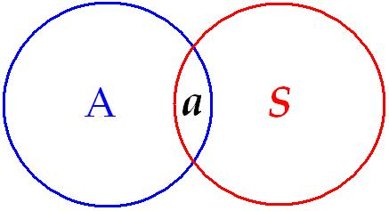
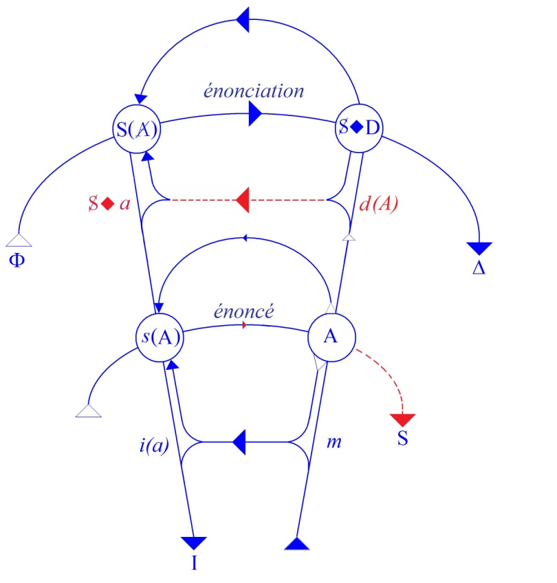

# Leçon 18 | 30 Avril 1969

  

    <label><input type="checkbox" data-lacan-toggle="original" checked> 原文</label>
    <label><input type="checkbox" data-lacan-toggle="notes" checked> 注释</label>
    <label><input type="checkbox" data-lacan-toggle="commentary" checked> 个人解读评论</label>
  

  <form class="lacan-tool-search" role="search">
    <input class="lacan-tool-search-input" type="search" placeholder="搜索全文" aria-label="搜索全文">
    <button class="lacan-tool-button" type="submit" title="搜索">搜索</button>
  </form>
  <button class="lacan-tool-button lacan-back-to-top" type="button" title="回到页面最上方" aria-label="回到页面最上方">↑</button>

<section class="parallel-paragraph" data-paragraph-ids="s16-18-0001">

s16-18-0001

原文 · s16-18-0001

Peut-être certains d’entre vous, qui par hasard seraient philosophes, entrevoient-ils qu’une question…

[无对应译文]

</section>

<section class="parallel-paragraph" data-paragraph-ids="s16-18-0002">

s16-18-0002

原文 · s16-18-0002

> un peu dépassée par un effet de la lassitude plutôt que d’avoir reçu une effective solution …celle qui s’ouvre entre les termes d’*idéalisme* et de *réalisme*, se trouve ici renouvelée.

[无对应译文]

</section>

<section class="parallel-paragraph" data-paragraph-ids="s16-18-0003">

s16-18-0003

原文 · s16-18-0003

Comme nous allons le voir tout à l’heure, l’idéalisme c’est assez simple à cuber, il n’y a qu’à le recueillir de la plume de ceux qui se sont faits ses doctrinaires. Vous verrez que jusqu’à un certain point je prendrai appui sur ceci qu’il n’a pas été réfuté.

[无对应译文]

</section>

<section class="parallel-paragraph" data-paragraph-ids="s16-18-0004">

s16-18-0004

原文 · s16-18-0004

Il n’a pas été réfuté philosophiquement. Cela veut dire que *le sens commun* qui est réaliste, bien sûr…

[无对应译文]

</section>

<section class="parallel-paragraph" data-paragraph-ids="s16-18-0005">

s16-18-0005

原文 · s16-18-0005

> réaliste dans les termes où l’idéalisme pose la question
>
> à savoir que nous ne connaîtrions, à l’entendre, du réel que les représentations …il est clair que cette position qui, à partir d’un certain schéma est irréfutable, l’est quand même - réfutable - à partir du moment où on ne fait pas de la représentation le reflet pur et simple du réel. Je vais y revenir.

[无对应译文]

</section>

<section class="parallel-paragraph" data-paragraph-ids="s16-18-0006">

s16-18-0006

原文 · s16-18-0006

Il est notable que ce soit de *l’intérieur même de la philosophie* qu’aient été portés des coups décisifs à l’idéalisme, c’est à savoir que ce qui s’était promu d’abord dans la mythologie de la représentation a pu être déplacé dans une autre mythologie, celle qui met en question non pas la représentation mais la fonction de la pensée en tant qu’idéologie.

[无对应译文]

</section>

<section class="parallel-paragraph" data-paragraph-ids="s16-18-0007">

s16-18-0007

原文 · s16-18-0007

L’idéalisme ne se tenait qu’à confondre *l’ordre de la pensée* avec *celui de la représentation*. La chose s’articule, vous le voyez, très simplement, et l’on peut se croire réaliste à faire de la pensée ce qu’elle est : quelque chose de dépendant de ce qu’on appelle en l’occasion le réel. Est-ce suffisant ?

[无对应译文]

</section>

<section class="parallel-paragraph" data-paragraph-ids="s16-18-0008">

s16-18-0008

原文 · s16-18-0008

Il est difficile de ne pas s’apercevoir que même *à l’intérieur de la mythologie* - *c’est ainsi que je l’appelle* - *de l’idéologie*…

[无对应译文]

</section>

<section class="parallel-paragraph" data-paragraph-ids="s16-18-0009">

s16-18-0009

原文 · s16-18-0009

> comme dépendant d’un certain nombre de conditions et nommément sociales, c’est à savoir celles de la production …est-ce position de réalisme que de se référer à un réel qui en tant que tel…

[无对应译文]

</section>

<section class="parallel-paragraph" data-paragraph-ids="s16-18-0010">

s16-18-0010

原文 · s16-18-0010

> *à savoir en ceci que la pensée en est toujours dépendante* …ne peut de ce fait être pleinement appréhendée, et ceci d’autant plus, que ce réel, nous considérons que nous sommes en état de le transformer à proprement parler. Ces réflexions sont massives. Ce que j’entends faire observer, c’est que ce réel par rapport auquel nous devons considérer - c’est là le sens de la critique dite de l’idéologie - notre savoir comme en progrès, est partie intégrante d’*une subversion que nous introduisons dans le réel*.

[无对应译文]

</section>

<section class="parallel-paragraph" data-paragraph-ids="s16-18-0011">

s16-18-0011

原文 · s16-18-0011

*La question est celle-ci* « *Ce savoir en progrès, est-il quelque part déjà là ? ».*

[无对应译文]

</section>

<section class="parallel-paragraph" data-paragraph-ids="s16-18-0012">

s16-18-0012

原文 · s16-18-0012

C’est la question que j’ai posée sous les termes du *sujet supposé savoir.*

[无对应译文]

</section>

<section class="parallel-paragraph" data-paragraph-ids="s16-18-0013">

s16-18-0013

原文 · s16-18-0013

C’est toujours comme un présupposé, et pour tout dire, un préjugé d’autant moins critiqué qu’il n’était pas aperçu que

[无对应译文]

</section>

<section class="parallel-paragraph" data-paragraph-ids="s16-18-0014">

s16-18-0014

原文 · s16-18-0014

- même à exclure ce qu’indique de mystique *l’idée de la connaissance*,

[无对应译文]

</section>

<section class="parallel-paragraph" data-paragraph-ids="s16-18-0015">

s16-18-0015

原文 · s16-18-0015

- même à avoir compris que le pas de la science consiste à proprement parler à y avoir renoncé…

[无对应译文]

</section>

<section class="parallel-paragraph" data-paragraph-ids="s16-18-0016">

s16-18-0016

原文 · s16-18-0016

> à constituer un savoir qui est appareil se développant à partir du présupposé radical que nous n’avons affaire à rien d’autre qu’aux appareils de ce que non seulement manie le sujet mais où il peut se purifier en tant que tel, n’étant plus rien que le support de ce qui s’articule comme savoir ordonné dans un certain discours, un discours séparé de celui de l’opinion et qui comme tel s’en distingue comme discours de la science, …il reste que, ce pas fait, rien n’a été porté d’une question sérieuse sur les implications qui - malgré nous - persistent de ce préjugé en tant qu’il est non critiqué. C’est à savoir que ce savoir, à le découvrir, devons-nous, oui ou non, le penser « *fait de pensée* », qu’il est une place où ce savoir, que nous le voulions ou pas, nous le concevons comme ordonné déjà.

[无对应译文]

</section>

<section class="parallel-paragraph" data-paragraph-ids="s16-18-0017">

s16-18-0017

原文 · s16-18-0017

Tant que ne sont pas *essayées* à proprement parler les conséquences d’une radicale mise en suspens de cette question, celle du *sujet supposé savoir,* nous restons dans *l’idéalisme* et pour tout dire, sous sa forme la plus arriérée, sous celle en fin de compte inébranlée dans une certaine structure et qui s’appelle, ni plus ni moins, *théologie*.

[无对应译文]

</section>

<section class="parallel-paragraph" data-paragraph-ids="s16-18-0018">

s16-18-0018

原文 · s16-18-0018

*Le sujet supposé savoir c’est Dieu, un point c’est tout*.

[无对应译文]

</section>

<section class="parallel-paragraph" data-paragraph-ids="s16-18-0019">

s16-18-0019

原文 · s16-18-0019

Et l’on peut être un savant de génie - et pas, que je sache, pour autant un obscurantiste - on peut être EINSTEIN pour tout dire, et faire recours de la façon la plus articulée à ce Dieu.

[无对应译文]

</section>

<section class="parallel-paragraph" data-paragraph-ids="s16-18-0020">

s16-18-0020

原文 · s16-18-0020

Il faut bien qu’il soit *là déjà supposé savoir* puisque EINSTEIN, argumentant contre une restructuration de la science sur des fondements probabilistes, argue que le savoir que suppose quelque part ce que lui dans sa théorie articule, se recommande par quelque chose qui est homogène à ce qui est bien *un supposé* concernant ce sujet.

[无对应译文]

</section>

<section class="parallel-paragraph" data-paragraph-ids="s16-18-0021">

s16-18-0021

原文 · s16-18-0021

Il le nomme *dans les termes traditionnels* « *le bon vieux Dieu* »[^69], peut-être difficile à pénétrer dans ce qu’il soutient de l’ordre du monde, mais il n’est pas menteur, il est loyal, il ne change pas en cours les données du jeu.

[无对应译文]

</section>

<section class="parallel-paragraph" data-paragraph-ids="s16-18-0022">

s16-18-0022

原文 · s16-18-0022

Et c’est sur cette admission que « *les règles déjà existent* », que quelque part le jeu… celui qui préside à ce déchiffrement qui s’appelle *savoir* …les règles en sont instituées, en ceci seul que le savoir en Dieu existe déjà.

[无对应译文]

</section>

<section class="parallel-paragraph" data-paragraph-ids="s16-18-0023">

s16-18-0023

原文 · s16-18-0023

C’est à ce niveau qu’on peut interroger ceci de ce qui résulte d’un athéisme véritable, le seul, comme vous le voyez, qui mériterait ce nom, qui est celui-ci, s’il est possible à la pensée de soutenir l’affrontement de la mise en question du *sujet supposé savoir.* Ceci, il faut bien le dire, est une mise en question qui, si je la reformule, ce n’est nullement dire qu’encore cette formule y constitue même *un pas* en quoi que ce soit.

[无对应译文]

</section>

<section class="parallel-paragraph" data-paragraph-ids="s16-18-0024">

s16-18-0024

原文 · s16-18-0024

Non pas certes que ce ne soit un pas qui m’occupe essentiellement, c’est que, dans ce que j’ai à articuler qui en est solidaire, à savoir *la psychanalyse*, je ne puis faire que d’avoir à faire passer d’abord ce dont j’ai à solliciter les analystes, d’avoir au moins un discours à la page de ce qu’ils manient effectivement. Appelez ça comme vous voudrez : « *traitement », « expérience analytique »*, c’est tout un.

[无对应译文]

</section>

<section class="parallel-paragraph" data-paragraph-ids="s16-18-0025">

s16-18-0025

原文 · s16-18-0025

Et à cet endroit leur pensée reste retardataire au point qu’il est facile de faire toucher du doigt que c’est à une des formes en fin de compte sommaires à résumer du sujet que se rattachent telles des notions non pas inoffensives, pour autant qu’à se rendre compte de ce que fait dans le traitement le sujet, à en rendre compte par des termes qui de se rattacher à des préjugés, eux, sommaires, véritable dégradation de ce qu’a pu toucher à tel de ses tournants une pensée critique, n’est pas sans conséquences multiples :

[无对应译文]

</section>

<section class="parallel-paragraph" data-paragraph-ids="s16-18-0026">

s16-18-0026

原文 · s16-18-0026

- d’abord de renforcer tout ce qui, dans la pensée, nous est signalé comme constitué essentiellement d’une résistance,

[无对应译文]

</section>

<section class="parallel-paragraph" data-paragraph-ids="s16-18-0027">

s16-18-0027

原文 · s16-18-0027

- ensuite modes d’intervention qui ne peuvent que renforcer chez le sujet…

[无对应译文]

</section>

<section class="parallel-paragraph" data-paragraph-ids="s16-18-0028">

s16-18-0028

原文 · s16-18-0028

> dit « patient » à plus ou moins juste titre, mais en tout cas,
>
> quoi qu’il en soit, traité, tressé dans *l’acte même de l’expérience psychanalytique* …renforcer chez ce sujet les mêmes préjugés.

[无对应译文]

</section>

<section class="parallel-paragraph" data-paragraph-ids="s16-18-0029">

s16-18-0029

原文 · s16-18-0029

Et pour dire ce dont il s’agit de véritablement *manifeste*, je le centrerai sur ces termes qu’on évoque : du *dedans* et du *dehors*.

[无对应译文]

</section>

<section class="parallel-paragraph" data-paragraph-ids="s16-18-0030">

s16-18-0030

原文 · s16-18-0030

Que ces termes soient - bien sûr - depuis l’origine dans le discours de FREUD, ce n’est pas une raison pour que nous ne les interrogions pas de la façon la plus serrée, faute de quoi nous risquons de voir se produire ces sortes de déviations qui entravent ce qui pourrait être aperçu dans l’expérience analytique qui soit de nature à nourrir ou tout au moins à confluer avec la question essentielle, celle du *sujet supposé savoir.*

[无对应译文]

</section>

<section class="parallel-paragraph" data-paragraph-ids="s16-18-0031">

s16-18-0031

原文 · s16-18-0031

Tant que *le sujet supposé savoir avant que nous sachions* n’aura pas été mis en question de la façon la plus sérieuse, on pourra dire que toute notre démarche restera accrochée à ce qui, dans une pensée qui ne s’en détache pas, est facteur de résistance puisqu’une conception vicieuse du terrain sur lequel nous posons les questions, amène inévitablement leur distorsion principielle.

[无对应译文]

</section>

<section class="parallel-paragraph" data-paragraph-ids="s16-18-0032">

s16-18-0032

原文 · s16-18-0032

Comment, avec l’usage qui est fait couramment, non seulement jour après jour mais de chaque minute, qui est fait par l’*analyste* des termes *de projection et d’introjection*…

[无对应译文]

</section>

<section class="parallel-paragraph" data-paragraph-ids="s16-18-0033">

s16-18-0033

原文 · s16-18-0033

> s’ils ne sont pas en eux-mêmes critiqués d’une façon correcte …comment ne pouvons-nous pas voir leur effet inhibant sur la pensée de l’analyste lui-même, et bien plus : *leur effet suggestif* dans l’intervention interprétative et sous le mode dont il n’y a aucun excès à dire qu’il ne peut être que crétinisant.

[无对应译文]

</section>

<section class="parallel-paragraph" data-paragraph-ids="s16-18-0034">

s16-18-0034

原文 · s16-18-0034

Est-ce qu’*un dedans* et *un dehors*…

[无对应译文]

</section>

<section class="parallel-paragraph" data-paragraph-ids="s16-18-0035">

s16-18-0035

原文 · s16-18-0035

> ce qui a l’air d’aller de soi si nous considérons l’organisme, à savoir un individu qui en effet est bien là,
>
> ce qui est dedans c’est ce qui est dans son *sac de peau*, et ce qui est dehors, c’est tout le reste …que de là le pas se fasse que ce qu’il se représente de ce dehors doit être aussi à l’intérieur du sac de peau est quelque chose qui, d’un premier abord, paraît un pas modeste et comme allant de soi.

[无对应译文]

</section>

<section class="parallel-paragraph" data-paragraph-ids="s16-18-0036">

s16-18-0036

原文 · s16-18-0036

C’est exactement là-dessus qu’après tout repose l’articulation de l’évêque BERKELEY de ce qui est *à l’extérieur* : après tout, vous ne savez que ce qu’il y a dans votre tête et ce qui par conséquent - à quelque titre - sera toujours représentation.

[无对应译文]

</section>

<section class="parallel-paragraph" data-paragraph-ids="s16-18-0037">

s16-18-0037

原文 · s16-18-0037

Quoique vous avanciez concernant ce monde, je pourrai toujours remarquer que c’est de ce que vous vous le représentiez.

[无对应译文]

</section>

<section class="parallel-paragraph" data-paragraph-ids="s16-18-0038">

s16-18-0038

原文 · s16-18-0038

Il est vraiment très singulier qu’une telle image ait pu prendre à un moment de l’histoire le caractère de prévalence au point qu’un discours ait pu s’y appuyer qui effectivement ne pouvait, dans un certain contexte, celui *d’une représentation* *qui est faite pour soutenir cette idée de la représentation,* être réfuté. Je voudrais l’imaginer *cette représentation qui permet de donner* *à la représentation cet avantage* en quoi consiste, en fin de compte, le nœud secret de ce *qui s’appelle idéalisme*.

[无对应译文]

</section>

<section class="parallel-paragraph" data-paragraph-ids="s16-18-0039">

s16-18-0039

原文 · s16-18-0039

Il est certainement tout à fait frappant qu’à seulement l’approcher de la façon que je fais, la toile si l’on peut dire en vacille.

[无对应译文]

</section>

<section class="parallel-paragraph" data-paragraph-ids="s16-18-0040">

s16-18-0040

原文 · s16-18-0040

Si c’est si simple, comment a-t-on pu même s’y arrêter ? Et pour nourrir cette vacillation, je vais faire ceci qui s’impose bien sûr, à savoir montrer comment est construite cette représentation de mirage. Elle est tout ce qu’il y a de plus simple.

[无对应译文]

</section>

<section class="parallel-paragraph" data-paragraph-ids="s16-18-0041">

s16-18-0041

原文 · s16-18-0041

Il n’y a même pas besoin de recourir à quelque chose qui est tout de même assez frappant, au texte d’ARISTOTE dans son petit *Traité de la Sensation* [^70], pour s’apercevoir du style avec lequel il aborde ce qu’il en est de *la vue*, de *l’œil*.

[无对应译文]

</section>

<section class="parallel-paragraph" data-paragraph-ids="s16-18-0042">

s16-18-0042

原文 · s16-18-0042

### Ce qu’il en dit…

[无对应译文]

</section>

<section class="parallel-paragraph" data-paragraph-ids="s16-18-0043">

s16-18-0043

原文 · s16-18-0043

> ce par quoi il l’aborde, ce où il entend rendre compte du fait de la vision …a quelque chose qui nous fait à soi tout seul apercevoir qu’il lui manque de façon frappante ce qui pour nous ne fait pas question, à savoir l’appareil le plus *élémentaire* de l’optique dont après tout c’est bien là l’occasion de dire quel avantage il y aurait à ce qu’on fasse une étude du point où en était - concernant l’optique à proprement parler - la science antique, cette science qui a été fort loin, beaucoup plus loin même qu’on ne le croit, dans toutes sortes de vues mécaniques, mais dont il semble en effet que, sur le point propre de l’optique, elle ait présenté un remarquable blanc.

[无对应译文]

</section>

<section class="parallel-paragraph" data-paragraph-ids="s16-18-0044">

s16-18-0044

原文 · s16-18-0044

Dans ce modèle qui donne son statut à ce temps de *la représentation* où s’est cristallisé le noyau de *l’idéalisme*, le modèle, simple comme tout, est celui de la *chambre noire* [^71], à savoir un espace clos à l’abri de toute lumière, dans lequel seul *un petit trou* s’ouvre au monde extérieur. Si ce monde extérieur est éclairé, son image se peint et s’agite à mesure de ce qui se passe au­-dehors sur la paroi intérieure de la chambre noire.

[无对应译文]

</section>

<section class="parallel-paragraph" data-paragraph-ids="s16-18-0045">

s16-18-0045

原文 · s16-18-0045

Il est extrêmement frappant de voir qu’un certain détour de la science, qui n’est pas pour rien celui de NEWTON…

[无对应译文]

</section>

<section class="parallel-paragraph" data-paragraph-ids="s16-18-0046">

s16-18-0046

原文 · s16-18-0046

> lequel, vous le savez, a été aussi inaugurant et génial quant à l’optique qu’il l’a été quant à la loi de la gravitation …dont ce n’est pas pour rien à ce tournant que je rappellerai que ce dont lui fit louange son temps, c’est très exactement d’avoir été à la hauteur - ceci fut articulé, et par les meilleurs esprits - des desseins de Dieu qu’il s’est trouvé *déchiffrer*.

[无对应译文]

</section>

<section class="parallel-paragraph" data-paragraph-ids="s16-18-0047">

s16-18-0047

原文 · s16-18-0047

Ceci pour confirmer la remarque que je faisais tout à l’heure de *l’enveloppe théologique des premiers pas de notre science*.

[无对应译文]

</section>

<section class="parallel-paragraph" data-paragraph-ids="s16-18-0048">

s16-18-0048

原文 · s16-18-0048

L’optique est donc essentielle à cette imagination du *sujet* comme de « *quelque chose qui est dans un dedans »*. Chose singulière, il semble admis que la place du petit trou d’où dépend le site de l’image - il suffit, ce petit trou, cette place est indifférente.

[无对应译文]

</section>

<section class="parallel-paragraph" data-paragraph-ids="s16-18-0049">

s16-18-0049

原文 · s16-18-0049

Il se reproduira toujours en effet dans la chambre noire une image quelque part, à l’opposé du petit trou. La différence de la place du petit trou ne semble pas faire question sur ceci : c’est qu’*on ne voit le monde que du côté où est tourné ce petit trou*.

[无对应译文]

</section>

<section class="parallel-paragraph" data-paragraph-ids="s16-18-0050">

s16-18-0050

原文 · s16-18-0050

Il semble impliqué dans cette fonction du sujet modelé sur la chambre noire que, dans la chambre, cet appareil du petit trou soit compatible avec ceci que de ce qui est au dehors…

[无对应译文]

</section>

<section class="parallel-paragraph" data-paragraph-ids="s16-18-0051">

s16-18-0051

原文 · s16-18-0051

> et qui n’est plus qu’*image*, pour ne plus se traduire que comme *image au-dedans* …au-dehors dans un espace que rien ne limite en principe, tout peut venir à prendre place à l’intérieur de la chambre.

[无对应译文]

</section>

<section class="parallel-paragraph" data-paragraph-ids="s16-18-0052">

s16-18-0052

原文 · s16-18-0052

Il est pourtant manifeste que si les petits trous se multipliaient, il n’y aurait plus nulle part aucune image. Néanmoins nous n’allons pas insister lourdement sur cette question, ce n’est pas elle qui nous importe, c’est simplement de remarquer que là et là seulement prend son appui ceci : que ce qui concerne le psychisme est à situer dans un *en-dedans* limité par une surface.

[无对应译文]

</section>

<section class="parallel-paragraph" data-paragraph-ids="s16-18-0053">

s16-18-0053

原文 · s16-18-0053

Une surface, bien sûr, nous dit-on, c’est déjà quelque chose dans le texte de FREUD : qu’elle est *surface tournée vers le dehors* et que dès lors que c’est sur cette surface que nous localisons le sujet, il est - comme on dit - sans défense au regard de ce qu’il y a en-dedans et qui n’est pas bien sûr simplement les représentations mais que du même coup…

[无对应译文]

</section>

<section class="parallel-paragraph" data-paragraph-ids="s16-18-0054">

s16-18-0054

原文 · s16-18-0054

> parce que les représentations ne peuvent être mises ailleurs …que du même coup on y met tout le reste, à savoir ce qu’on appelle diversement, confusément, *affects, instincts, pulsions*. Tout cela est dans le dedans.

[无对应译文]

</section>

<section class="parallel-paragraph" data-paragraph-ids="s16-18-0055">

s16-18-0055

原文 · s16-18-0055

Quelle raison - pour savoir *le rapport d’une réalité avec son lieu* - qu’il soit *dedans* ou bien *dehors *? Il conviendrait d’abord de s’interroger sur ce qu’elle devient en tant que réalité et pour cela peut-être de se détacher de cette vertu fascinante qu’il y a en ceci que nous ne pouvons concevoir la représentation d’un être vivant qu’à l’intérieur de son corps.

[无对应译文]

</section>

<section class="parallel-paragraph" data-paragraph-ids="s16-18-0056">

s16-18-0056

原文 · s16-18-0056

Sortons-en un instant et posons la question de savoir ce qui arrive dans *le dedans* et *le dehors* quand il s’agit d’une marchandise par exemple. On nous a assez communément éclairé la nature de *la marchandise* pour que nous sachions qu’elle se distingue entre *valeur d’usage* et *valeur d’échange*. La *valeur d’échange*, c’est quand même bien ce qui fonctionne au-dehors.

[无对应译文]

</section>

<section class="parallel-paragraph" data-paragraph-ids="s16-18-0057">

s16-18-0057

原文 · s16-18-0057

Mais, cette marchandise mettons-la dans un entrepôt - c’est forcé aussi que ça existe.

[无对应译文]

</section>

<section class="parallel-paragraph" data-paragraph-ids="s16-18-0058">

s16-18-0058

原文 · s16-18-0058

C’est un en-dedans, un entrepôt, c’est là qu’on la garde, qu’on la conserve.

[无对应译文]

</section>

<section class="parallel-paragraph" data-paragraph-ids="s16-18-0059">

s16-18-0059

原文 · s16-18-0059

Les fûts d’huile, quand ils sont dehors, ils s’échangent, et puis on les consomme, *valeur d’usage*.

[无对应译文]

</section>

<section class="parallel-paragraph" data-paragraph-ids="s16-18-0060">

s16-18-0060

原文 · s16-18-0060

C’est assez curieux que c’est quand ils sont au-dedans qu’ils sont réduits à leur *valeur d’échange*.

[无对应译文]

</section>

<section class="parallel-paragraph" data-paragraph-ids="s16-18-0061">

s16-18-0061

原文 · s16-18-0061

Dans un entrepôt, par définition, on n’est pas là pour les mettre en pièces ni pour les consommer, on les garde.

[无对应译文]

</section>

<section class="parallel-paragraph" data-paragraph-ids="s16-18-0062">

s16-18-0062

原文 · s16-18-0062

*La valeur d’usage à l’intérieur,* là où on l’attendrait, est précisément interdite, et n’y subsiste que par sa *valeur d’échange*.

[无对应译文]

</section>

<section class="parallel-paragraph" data-paragraph-ids="s16-18-0063">

s16-18-0063

原文 · s16-18-0063

Là où c’est plus énigmatique, c’est quand il ne s’agit plus de la marchandise mais du fétiche par excellence, de la monnaie.

[无对应译文]

</section>

<section class="parallel-paragraph" data-paragraph-ids="s16-18-0064">

s16-18-0064

原文 · s16-18-0064

Alors là, cette chose qui n’a pas de *valeur d’usage*, qui n’a que *valeur d’échange*, quelle valeur conserve-t-elle quand elle est dans un coffre ? Il est pourtant bien clair qu’on l’y met et qu’on l’y garde.

[无对应译文]

</section>

<section class="parallel-paragraph" data-paragraph-ids="s16-18-0065">

s16-18-0065

原文 · s16-18-0065

Qu’est-ce que c’est que ce *dedans* qui semble rendre complètement énigmatique ce qu’on y enferme ?

[无对应译文]

</section>

<section class="parallel-paragraph" data-paragraph-ids="s16-18-0066">

s16-18-0066

原文 · s16-18-0066

Est-ce qu’à sa façon, par rapport à ce qui fait l’essence de la monnaie, ça n’est pas *un dedans* tout à fait *en-dehors*, en-dehors de ce qui fait l’essence de la monnaie ?

[无对应译文]

</section>

<section class="parallel-paragraph" data-paragraph-ids="s16-18-0067">

s16-18-0067

原文 · s16-18-0067

Ces remarques n’ont d’intérêt que d’introduire *ce qu’il en est de la pensée* qui a aussi quelque chose à faire avec *la valeur d’échange*, en d’autres termes : qui circule. Cette simple remarque devant suffire à marquer l’opportunité de la question pour ceux qui n’ont pas encore compris qu’une pensée ça ne se conçoit à proprement parler *qu’à être articulée, qu’à s’inscrire dans le langage*, qu’à pouvoir être soutenue dans des conditions qu’on appelle *la dialectique*, ce qui veut dire un certain jeu de la logique, avec des règles, et de savoir donc si nous pouvons d’aucune façon ne pas nous interroger exactement de la même façon que nous le faisions il y a un instant pour la monnaie mise dans un coffre : *qu’est-ce que ça veut dire, une pensée, quand on se la garde ?*

[无对应译文]

</section>

<section class="parallel-paragraph" data-paragraph-ids="s16-18-0068">

s16-18-0068

原文 · s16-18-0068

Et si on ne sait pas ce qu’elle est quand on se la garde, c’est tout de même bien que *son essence* doit être ailleurs, c’est-à­-dire déjà *au-dehors*, sans qu’on ait besoin de faire *de la projection* pour dire que la pensée s’y promène.

[无对应译文]

</section>

<section class="parallel-paragraph" data-paragraph-ids="s16-18-0069">

s16-18-0069

原文 · s16-18-0069

En d’autres termes, il faut remarquer ce qui n’est peut-être pas apparu de prime abord à tous, c’est que quel que soit le convaincant de l’argument de BERKELEY, ce qui fait sa force c’est peut-être bien cette intuition fondée sur un modèle : la représentation je ne peux pas l’avoir ailleurs.

[无对应译文]

</section>

<section class="parallel-paragraph" data-paragraph-ids="s16-18-0070">

s16-18-0070

原文 · s16-18-0070

Mais l’important, dans l’histoire, ce n’est pas ça…

[无对应译文]

</section>

<section class="parallel-paragraph" data-paragraph-ids="s16-18-0071">

s16-18-0071

原文 · s16-18-0071

> à savoir que nous nous laissions piper à une image de plus, et spécialement *dépendante d’un certain état de la technique* …c’est qu’effectivement, son argumentation soit *irréfutable*.

[无对应译文]

</section>

<section class="parallel-paragraph" data-paragraph-ids="s16-18-0072">

s16-18-0072

原文 · s16-18-0072

Pour que l’idéalisme tienne, il faut qu’il y ait non seulement l’évêque BERKELEY mais quelques autres personnes avec lesquelles, sur ce sujet de savoir si *du monde nous n’avons qu’une appré­hension qui définit les limites philo­sophiques de l’idéalisme* c’est dans la mesure où on ne peut en sortir, où dans le discours, on n’a rien à lui rétorquer, qu’il est *irréfutable*.

[无对应译文]

</section>

<section class="parallel-paragraph" data-paragraph-ids="s16-18-0073">

s16-18-0073

原文 · s16-18-0073

Alors, sur le sujet idéalisme-réalisme, il y a bien évidemment ceux qui ont raison et ceux qui ont tort :

[无对应译文]

</section>

<section class="parallel-paragraph" data-paragraph-ids="s16-18-0074">

s16-18-0074

原文 · s16-18-0074

- ceux qui ont raison sont dans le réel, je parle du point de vue des réalistes,

[无对应译文]

</section>

<section class="parallel-paragraph" data-paragraph-ids="s16-18-0075">

s16-18-0075

原文 · s16-18-0075

- et ceux qui ont tort, où sont-ils ? Cela nécessiterait d’être inscrit dans le schéma aussi.

[无对应译文]

</section>

<section class="parallel-paragraph" data-paragraph-ids="s16-18-0076">

s16-18-0076

原文 · s16-18-0076

L’important est ceci, c’est qu’au niveau du débat, de la discussion articulable, BERKELEY, au point où il en est de la discussion philosophique à son époque, est dans le vrai, bien que - bien sûr - il est manifeste qu’il ait tort.

[无对应译文]

</section>

<section class="parallel-paragraph" data-paragraph-ids="s16-18-0077">

s16-18-0077

原文 · s16-18-0077

C’est justement en ceci que se démontre que le premier dessin du champ de l’objectivité fondé sur la chambre noire est faux.

[无对应译文]

</section>

<section class="parallel-paragraph" data-paragraph-ids="s16-18-0078">

s16-18-0078

原文 · s16-18-0078

Mais alors faut-il ou non lui en substituer un autre ?

[无对应译文]

</section>

<section class="parallel-paragraph" data-paragraph-ids="s16-18-0079">

s16-18-0079

原文 · s16-18-0079

Et comment faire ?

[无对应译文]

</section>

<section class="parallel-paragraph" data-paragraph-ids="s16-18-0080">

s16-18-0080

原文 · s16-18-0080

Que deviennent *le dedans* et *le dehors* ?

[无对应译文]

</section>

<section class="parallel-paragraph" data-paragraph-ids="s16-18-0081">

s16-18-0081

原文 · s16-18-0081

Et si ce que nous sommes forcés de redessiner pour nous trouver sur cette limite, sur ce medium entre *symbolique* et *imaginaire* qui demande *un minimum de support à nos cogitations*, de support intuitif, est-ce que ceci ne comporte pas que nous devions, dans l’intervention analytique, abandonner radicalement ces termes de *projection* et *d’introjection*, comme nous nous en servons sans cesse, sans apporter la moindre critique au schéma que nous appellerons, pour le désigner, « *berkeleyen* ».

[无对应译文]

</section>

<section class="parallel-paragraph" data-paragraph-ids="s16-18-0082">

s16-18-0082

原文 · s16-18-0082

[无对应译文]

</section>

<section class="parallel-paragraph" data-paragraph-ids="s16-18-0083">

s16-18-0083

原文 · s16-18-0083

Celui où se marque de ce petit rond mis en haut, qui est la chambre noire, dans lequel j’ai mis *le sujet de la représentation,* avec *un réel à l’extérieur* qui se distingue d’être simplement ceci - comme si ça allait de soi - *tout ce qu’il y a là dehors, c’est le réel*.

[无对应译文]

</section>

<section class="parallel-paragraph" data-paragraph-ids="s16-18-0084">

s16-18-0084

原文 · s16-18-0084

Autre probablement très fâcheuse appréhension des choses, ne pas distinguer dans tout ce qui est là construit au-dehors *différents ordres de réel*.

[无对应译文]

</section>

<section class="parallel-paragraph" data-paragraph-ids="s16-18-0085">

s16-18-0085

原文 · s16-18-0085

Poser la question simplement de ce que cette bâtisse, cette maison doit à un ordre qui n’est pas du tout forcément le réel, puisque c’est notre fabrication, c’est ce qu’il conviendrait de pouvoir mettre en place si nous avons à intervenir dans un champ qui n’est pas du tout celui qu’on a dit être celui de *faits élémentaires, organiques, charnels, de poussées biologiques,* mais de quelque chose qui s’appelle l’inconscient et qui, pour être simplement articulable comme étant *de l’ordre de la pensée*, n’échappe pas à ceci : c’est qu’il s’articule en termes langagiers.

[无对应译文]

</section>

<section class="parallel-paragraph" data-paragraph-ids="s16-18-0086">

s16-18-0086

原文 · s16-18-0086

Le caractère radical de ce qui est au fondement non pas de ce que j’*enseigne* mais de ce que je n’ai qu’à reconnaître dans notre pratique quotidienne et dans les textes de FREUD, voilà qui pose la question de ce qu’il en est *du dedans* et *du dehors*, et de la façon dont nous pouvons et devons concevoir ce qui répond à ces faits toujours si maladroitement maniés dans les termes d’« *introjection* » et de « *projection* », au point que FREUD *- il faut bien le dire -* ose, à l’origine de la définition du *moi*, articuler les choses en ces termes, à savoir que d’un certain état de confusion avec le monde le psychisme se sépare en *un dedans* et *un dehors*, et qu’ici, là dans son discours, rien n’est distingué de ce qu’il en est de ce *dehors*, à savoir s’il est identifiable à ce que dans cette représentation commune dans l’opinion :

[无对应译文]

</section>

<section class="parallel-paragraph" data-paragraph-ids="s16-18-0087">

s16-18-0087

原文 · s16-18-0087

- à ce qu’il est identifiable, ce *dehors*, à cet espace indéterminé,

[无对应译文]

</section>

<section class="parallel-paragraph" data-paragraph-ids="s16-18-0088">

s16-18-0088

原文 · s16-18-0088

- et ce *dedans* à ce quelque chose que nous tiendrons désormais pour fonder une règle de l’organisme dont nous allons chercher *toutes les composantes au-dedans*.

[无对应译文]

</section>

<section class="parallel-paragraph" data-paragraph-ids="s16-18-0089">

s16-18-0089

原文 · s16-18-0089

Il est très clair qu’on peut faire un pas déjà, à démontrer ce qu’a d’impensable le schéma de *la chambre noire*.

[无对应译文]

</section>

<section class="parallel-paragraph" data-paragraph-ids="s16-18-0090">

s16-18-0090

原文 · s16-18-0090

Il n’est pas besoin de remonter à ARISTOTE pour nous apercevoir que les questions… du fait qu’il ne se réfère pas à *la chambre noire* …sont pour lui complètement différentes de celles qui se posent à nous et rendent à proprement parler *impensable* toute une conception, disons, du système nerveux.

[无对应译文]

</section>

<section class="parallel-paragraph" data-paragraph-ids="s16-18-0091">

s16-18-0091

原文 · s16-18-0091

Lisez ce texte - *il est piquant -* ce texte par où débutent quelques chapitres d’un petit traité qu’il intitule *De la sensation.*

[无对应译文]

</section>

<section class="parallel-paragraph" data-paragraph-ids="s16-18-0092">

s16-18-0092

原文 · s16-18-0092

Il - *déjà* - effleure le problème :

[无对应译文]

</section>

<section class="parallel-paragraph" data-paragraph-ids="s16-18-0093">

s16-18-0093

原文 · s16-18-0093

- à savoir ce *quelque chose* qui va donner tellement de développements par la suite,

[无对应译文]

</section>

<section class="parallel-paragraph" data-paragraph-ids="s16-18-0094">

s16-18-0094

原文 · s16-18-0094

- à savoir qu’il y a quelque chose dans la vision qui ouvre à la *réflexion*.

[无对应译文]

</section>

<section class="parallel-paragraph" data-paragraph-ids="s16-18-0095">

s16-18-0095

原文 · s16-18-0095

Le « *se voyant se voir* » de VALÉRY[^72], il l’approche - et de la façon la plus drôle - dans ce fait que quand on appuie sur un œil, ça fait quelque chose, ça fait des phosphènes, c’est-à-dire quelque chose qui ressemble à de la lumière. C’est là seulement qu’il trouve à appréhender que *cet œil qui voit, il se voit aussi en quelque façon, puisqu’il produit de la lumière si vous appuyez dessus*.

[无对应译文]

</section>

<section class="parallel-paragraph" data-paragraph-ids="s16-18-0096">

s16-18-0096

原文 · s16-18-0096

Bien d’autres choses sont piquantes, et les formules - dans lesquelles il aboutit, au terme - qui donnent pour *essentielle* *aux choses* la dimension du *diaphane*, ce par quoi il est rendu compte que l’œil voit de ceci - et de ceci uniquement - que dans cet ordre du *diaphane*, il représente un appareil particulièrement qualifié, c’est-à-dire qu’aussi bien, loin que nous ayons *quelque chose* qui d’aucune façon ressemble à un *dedans* et à un *dehors*, c’est en tant, si l’on peut dire, que l’œil participe d’une qualité, nous dirions « *visionnaire* », que l’œil voit.

[无对应译文]

</section>

<section class="parallel-paragraph" data-paragraph-ids="s16-18-0097">

s16-18-0097

原文 · s16-18-0097

Ce n’est pas si bête, c’est une certaine façon, pour le coup, de bien *plonger le sujet dans le monde*. La question est devenue un petit peu différente et, à la vérité, les gens avec qui ARISTOTE a à combattre, c’est à savoir *mille autres théories* énoncées de son temps dont toutes d’ailleurs, par quelque côté, participent de quelque chose que nous n’avons aucune peine à retrouver dans nos images, y compris celle de la *projection*.

[无对应译文]

</section>

<section class="parallel-paragraph" data-paragraph-ids="s16-18-0098">

s16-18-0098

原文 · s16-18-0098

Car je vous le demande : *qu’est-ce que suppose ce terme de projection*…

[无对应译文]

</section>

<section class="parallel-paragraph" data-paragraph-ids="s16-18-0099">

s16-18-0099

原文 · s16-18-0099

> quand il s’agit non plus de ce qui se voit mais de l’*imaginaire*, si ce n’est que nous supposons,
>
> au regard d’une certaine configuration affective qui est celle autour de quoi, à tel moment, à telle date, nous supposons que le sujet « *patient* » modifie le monde …*qu’est–ce que c’est que cette projection, sinon la supposition de ceci* : *que c’est du dedans que le faisceau lumineux part qui va peindre le monde*, tout comme dans les temps antiques, il en était certains pour imaginer ces rayons qui partant de l’œil, allaient en effet nous éclairer le monde et les objets, quelque énigmatique que fût ce rayonnement de la vision.

[无对应译文]

</section>

<section class="parallel-paragraph" data-paragraph-ids="s16-18-0100">

s16-18-0100

原文 · s16-18-0100

Mais nous pouvons - nous le prouvons dans nos métaphores - en être encore là. Et quand on se réfère à ce texte aristotélicien, ce n’est pas le moins brillant de ce qu’il nous montre qu’on touche en quelque sorte du doigt non pas tellement de ce qu’il échafaude lui-même que de tout ce auquel il se réfère, EMPÉDOCLE notamment qui fait participer la fonction de l’œil du feu, à quoi lui-même rétorque par un appel à l’élément de l’eau.

[无对应译文]

</section>

<section class="parallel-paragraph" data-paragraph-ids="s16-18-0101">

s16-18-0101

原文 · s16-18-0101

Incidemment, ce qui l’embête c’est qu’il n’y a que quatre éléments, et comme il y a cinq sens, on voit mal comment le raccord se fera, il le dit en toutes lettres. Il arrive à la fin à s’en tirer en unifiant le goût et le toucher comme se rapportant également à la terre, mais ne nous amusons pas plus longtemps, aussi bien ces choses n’ont rien en elles-mêmes de tellement spécialement comique, mais plutôt exemplaire.

[无对应译文]

</section>

<section class="parallel-paragraph" data-paragraph-ids="s16-18-0102">

s16-18-0102

原文 · s16-18-0102

Ce qui apparaît en quelque sorte, à lire ces textes, c’est ce quelque chose qui pour nous, localise ce champ de la vision, de le réanimer si je puis dire, de ce que nous y avons mis - *grâce à la perversion* - d’inséré dans le désir.

[无对应译文]

</section>

<section class="parallel-paragraph" data-paragraph-ids="s16-18-0103">

s16-18-0103

原文 · s16-18-0103

On voit ceci, à simplement se laisser, si on peut dire, *imprégner* de ce qui anime ces textes qui, si futiles qu’ils nous paraissent, n’étaient pourtant pas dits par des gens sots, quoi qu’il se soit pu dire ainsi le ressort nous est en quelque sorte suggéré, pour peu que quelque exercice ait été par nous pris de ce qu’il en est dans le champ visuel de la fonction de *l’objet(a)*.

[无对应译文]

</section>

<section class="parallel-paragraph" data-paragraph-ids="s16-18-0104">

s16-18-0104

原文 · s16-18-0104

*L’objet(a)* dans le champ visuel, ressortit - au regard de la structure objective - à la fonction de *ce tiers terme* dont il est frappant que littéralement les anciens ne sachent pas qu’en faire, le ratent alors que c’est quand même la chose la plus grosse qui soit.

[无对应译文]

</section>

<section class="parallel-paragraph" data-paragraph-ids="s16-18-0105">

s16-18-0105

原文 · s16-18-0105

[无对应译文]

</section>

<section class="parallel-paragraph" data-paragraph-ids="s16-18-0106">

s16-18-0106

原文 · s16-18-0106

Eux aussi se trouvent entre deux :

[无对应译文]

</section>

<section class="parallel-paragraph" data-paragraph-ids="s16-18-0107">

s16-18-0107

原文 · s16-18-0107

- la sensation, c’est-à-dire le sujet,

[无对应译文]

</section>

<section class="parallel-paragraph" data-paragraph-ids="s16-18-0108">

s16-18-0108

原文 · s16-18-0108

- et puis le monde qui est senti.

[无对应译文]

</section>

<section class="parallel-paragraph" data-paragraph-ids="s16-18-0109">

s16-18-0109

原文 · s16-18-0109

Qu’il faille qu’ils se secouent, si l’on peut dire, pour faire intervenir comme *troisième terme la lumière*, tout simplement, le foyer lumineux en tant que ce sont ses rayons qui se réfléchissent sur les objets et qui, pour nous-mêmes, qui viennent à l’intérieur de *la chambre noire* former une image. Et après ?

[无对应译文]

</section>

<section class="parallel-paragraph" data-paragraph-ids="s16-18-0110">

s16-18-0110

原文 · s16-18-0110

Après nous avons cette *merveilleuse stupidité* de la synthèse conscientielle qui est quelque part, et paraît-il particulièrement bien pensable uniquement de ce fait que nous pouvons la loger dans une circonvolution.

[无对应译文]

</section>

<section class="parallel-paragraph" data-paragraph-ids="s16-18-0111">

s16-18-0111

原文 · s16-18-0111

Et en quoi dans *la circonvolution* l’image deviendra-t-elle tout d’un coup…

[无对应译文]

</section>

<section class="parallel-paragraph" data-paragraph-ids="s16-18-0112">

s16-18-0112

原文 · s16-18-0112

> parce qu’elle est dans une circonvolution plutôt que d’être sur la rétine …quelque chose de synthétique ?

[无对应译文]

</section>

<section class="parallel-paragraph" data-paragraph-ids="s16-18-0113">

s16-18-0113

原文 · s16-18-0113

Le concept de *l’objet(a)* nous est suffisamment indiqué par les tâtonnements mêmes qui se sont dessinés tout au cours de la tradition et qui ont fait en effet qu’ils s’apercevaient fort bien que la solution du problème de la vision n’est pas du tout simplement la lumière. La lumière est une condition, bien sûr : pour qu’on voie quelque chose, il faut qu’il fasse jour, mais en quoi est-ce que cela explique qu’on voit ?

[无对应译文]

</section>

<section class="parallel-paragraph" data-paragraph-ids="s16-18-0114">

s16-18-0114

原文 · s16-18-0114

*L’objet(a)*, dans ce qui concerne le champ scoptophilique, si nous essayons de le traduire au niveau de l’esthésie, c’est très exactement ce que vous voudrez*, ce blanc, ou ce noir, ce quelque chose qui manque derrière l’image*, si l’on peut dire, et que nous mettons si aisément, par un effet purement logomachique de la synthèse, quelque part dans une circonvolution.

[无对应译文]

</section>

<section class="parallel-paragraph" data-paragraph-ids="s16-18-0115">

s16-18-0115

原文 · s16-18-0115

C’est très précisément en tant que *quelque chose manque* dans ce qui s’en donne comme image, qu’est le point ressort dont il n’y a qu’une solution, c’est que, comme *objet(a)*, c’est-à-dire précisément :

[无对应译文]

</section>

<section class="parallel-paragraph" data-paragraph-ids="s16-18-0116">

s16-18-0116

原文 · s16-18-0116

- *en tant que manque*, et si vous voulez,

[无对应译文]

</section>

<section class="parallel-paragraph" data-paragraph-ids="s16-18-0117">

s16-18-0117

原文 · s16-18-0117

- *en tant que tache*.

[无对应译文]

</section>

<section class="parallel-paragraph" data-paragraph-ids="s16-18-0118">

s16-18-0118

原文 · s16-18-0118

La définition de *la tache*, c’est justement de ce qui, dans le champ, se distingue comme *le trou*, comme *une absence*, et nous savons justement par la zoologie que la première apparition de cette chose qui nous émerveille, qui est si bien construite comme *un petit appareil optique*, et qui s’appelle un œil, au niveau d’êtres lamelleux, c’est par une tache que ça commence.

[无对应译文]

</section>

<section class="parallel-paragraph" data-paragraph-ids="s16-18-0119">

s16-18-0119

原文 · s16-18-0119

Cette *tache*, en ferons-nous purement et simplement *un effet*, car la lumière produit des taches, c’est une chose certaine, nous n’en sommes point là.

[无对应译文]

</section>

<section class="parallel-paragraph" data-paragraph-ids="s16-18-0120">

s16-18-0120

原文 · s16-18-0120

- Mettre la *tache* comme essentielle et structurante à titre de place de *manque* dans toute vision,

[无对应译文]

</section>

<section class="parallel-paragraph" data-paragraph-ids="s16-18-0121">

s16-18-0121

原文 · s16-18-0121

- mettre la *tache* à la place du troisième terme du champ objectivé,

[无对应译文]

</section>

<section class="parallel-paragraph" data-paragraph-ids="s16-18-0122">

s16-18-0122

原文 · s16-18-0122

- mettre la *tache* à la place de la lumière, *comme les Anciens ne pouvaient s’empêcher de le faire, et c’était là leur bafouillage.*

[无对应译文]

</section>

<section class="parallel-paragraph" data-paragraph-ids="s16-18-0123">

s16-18-0123

原文 · s16-18-0123

Voilà quelque chose qui n’est plus bafouillage, si nous nous apercevons que cet effet de métaphore…

[无对应译文]

</section>

<section class="parallel-paragraph" data-paragraph-ids="s16-18-0124">

s16-18-0124

原文 · s16-18-0124

> de métaphore du point nié dans le champ de la vision, comme mise au principe de ce qui fait non pas
>
> son déploiement plus ou moins de mirage, mais ce qui attache le sujet en tant que ce sujet est quelque chose
>
> dont le savoir est tout entier déterminé par un autre manque plus radical, plus essentiel, qui est celui de ce qui
>
> le concerne en tant qu’être sexué …c’est là ce qui fait apparaître comment le champ de la vision s’insère dans le désir.

[无对应译文]

</section>

<section class="parallel-paragraph" data-paragraph-ids="s16-18-0125">

s16-18-0125

原文 · s16-18-0125

Et après tout pourquoi n’y a-t-il pas moyen d’admettre que ce qui fait qu’il y ait *vue*, *contemplation*, tous ces rapports qui retiennent l’être parlant, que tout ceci ne prenne vraiment son attache, sa racine, qu’au niveau même de ce qui - d’être tache dans ce champ - peut servir à *boucher*, à *combler* ce qu’il en est du *manque*…

[无对应译文]

</section>

<section class="parallel-paragraph" data-paragraph-ids="s16-18-0126">

s16-18-0126

原文 · s16-18-0126

> du *manque* lui-même parfaitement articulé et articulé comme *manque* …à savoir ceci qui est le seul terme grâce à quoi ce qu’il en est de l’être parlant peut se repérer : au regard de ce qu’il en est de son appartenance *sexuelle*.

[无对应译文]

</section>

<section class="parallel-paragraph" data-paragraph-ids="s16-18-0127">

s16-18-0127

原文 · s16-18-0127

C’est au niveau de cet *objet(a)* que peut se concevoir cette division articulable du sujet :

[无对应译文]

</section>

<section class="parallel-paragraph" data-paragraph-ids="s16-18-0128">

s16-18-0128

原文 · s16-18-0128

- en un sujet qui a tort parce qu’il est dans le vrai : c’est l’évêque BERKELEY,

[无对应译文]

</section>

<section class="parallel-paragraph" data-paragraph-ids="s16-18-0129">

s16-18-0129

原文 · s16-18-0129

- et un autre sujet qui, mettant en doute que la pensée vaille quelque chose, en réalité fait la preuve de ceci : que la pensée est de soi censure et que ce qui importe, c’est de situer le regard en tant que subjectif, par ce qu’il ne voit pas et que c’est cela qui rend pensable que *la pensée* elle­ même s’assoit de ceci et de ceci seulement *qu’elle est censure*, *c’est ce qui permet* de l’articuler elle-même *métaphoriquement* comme faisant *tache dans le discours logique*.

[无对应译文]

</section>

<section class="parallel-paragraph" data-paragraph-ids="s16-18-0130">

s16-18-0130

原文 · s16-18-0130

Ce que aujourd’hui, à la suite de cette bien longue articulation je veux dire - tout au moins pourrai-je l’amorcer - c’est ceci : nous en étions restés au niveau de *la perversion* fondée dans une autre façon d’inscrire ce *dehors*. Ce dehors, pour nous n’est pas « *un espace ouvert à l’infini* » où nous mettons n’importe quoi sous le nom de *réel*. Ce à quoi nous avons affaire, c’est cet Autre qui a comme tel son statut.

[无对应译文]

</section>

<section class="parallel-paragraph" data-paragraph-ids="s16-18-0131">

s16-18-0131

原文 · s16-18-0131

Ce statut, ce n’est certes pas du seul effort des *psychanalystes* que nous pouvons actuellement l’articuler :

[无对应译文]

</section>

<section class="parallel-paragraph" data-paragraph-ids="s16-18-0132">

s16-18-0132

原文 · s16-18-0132

- comme se présentant à l’explorer d’une interrogation seulement logique,

<!-- -->

[无对应译文]

</section>

<section class="parallel-paragraph" data-paragraph-ids="s16-18-0133">

s16-18-0133

原文 · s16-18-0133

- comme marqué d’une faille, ce qui dans le schéma qui est ici donne le grand Autre (A), le signe S(A) comme donnant le terme de ce qui se pose au niveau de l’*énonciation*, de l’*énonciation désirante *: c’est que la réponse qu’il donne est très exactement *la faille* qui représente ce désir.

[无对应译文]

</section>

<section class="parallel-paragraph" data-paragraph-ids="s16-18-0134">

s16-18-0134

原文 · s16-18-0134

Après tout, ce n’est pas pour rien que ces termes sont ici manifestés par des petites lettres, par une algèbre.

[无对应译文]

</section>

<section class="parallel-paragraph" data-paragraph-ids="s16-18-0135">

s16-18-0135

原文 · s16-18-0135

Le propre d’une algèbre, c’est de pouvoir avoir diverses interprétations.

[无对应译文]

</section>

<section class="parallel-paragraph" data-paragraph-ids="s16-18-0136">

s16-18-0136

原文 · s16-18-0136

[无对应译文]

</section>

<section class="parallel-paragraph" data-paragraph-ids="s16-18-0137">

s16-18-0137

原文 · s16-18-0137

S(A), ça peut vouloir dire toutes sortes de choses, jusques et y compris la fonction de la mort du père.

[无对应译文]

</section>

<section class="parallel-paragraph" data-paragraph-ids="s16-18-0138">

s16-18-0138

原文 · s16-18-0138

Mais à un niveau radical, au niveau de la logification de notre expérience, S(A) c’est exactement - si elle est quelque part et pleinement articulable - ce qui s’appelle « *la structure* », si on peut en quelque terme qualifier de structuralisme…

[无对应译文]

</section>

<section class="parallel-paragraph" data-paragraph-ids="s16-18-0139">

s16-18-0139

原文 · s16-18-0139

> et vous savez quelles réserves je fais sur ces épinglages philosophiques …c’est en tant que le rapport entre ce que permet d’édifier une logique rigoureuse avec ce que d’autre part dans l’inconscient nous est montré de *certains défauts d’articulation irréductibles* d’où procède cet effort même qui témoigne du désir de savoir.

[无对应译文]

</section>

<section class="parallel-paragraph" data-paragraph-ids="s16-18-0140">

s16-18-0140

原文 · s16-18-0140

Je vous l’ai dit, ce que je définis comme perversion c’est *la restauration en quelque sorte première, la restitution* à ce champ du A, du *a*, en ceci que la chose est rendue possible de ce que ce *a* soit un effet de *la prise de quelque chose de primitif, de primordial* et pourquoi ne l’admettrions-nous pas, à condition de n’en pas faire un sujet, c’est dans la mesure où *cet être animal*, que nous prenions tout à l’heure au niveau de son sac de peau, est pris dans le langage que quelque chose en lui, se détermine comme *a*, ce *a rendu à l’Autre* si l’on peut dire.

[无对应译文]

</section>

<section class="parallel-paragraph" data-paragraph-ids="s16-18-0141">

s16-18-0141

原文 · s16-18-0141

C’est bien pourquoi l’autre jour, en introduisant devant vous le pervers, je le comparais à l’homme de foi, voire au « *Croisé* » ironiquement : lui, donne à Dieu sa plénitude véritable.

[无对应译文]

</section>

<section class="parallel-paragraph" data-paragraph-ids="s16-18-0142">

s16-18-0142

原文 · s16-18-0142

Et si vous me permettez de terminer sur quelques jeux de mots en quelque sorte humoristiques, s’il est vrai que le pervers est la structure du sujet pour qui la référence castrationnelle…

[无对应译文]

</section>

<section class="parallel-paragraph" data-paragraph-ids="s16-18-0143">

s16-18-0143

原文 · s16-18-0143

> le fait que la femme est distinguée de ceci qu’elle n’a pas *le phallus* …que ceci par cette opération mystérieuse de *l’objet(a)* est bouché, et est masqué, et est comblé, est-ce que ce n’est pas là que s’articule cette formule que déjà une fois j’ai poussée en avant…

[无对应译文]

</section>

<section class="parallel-paragraph" data-paragraph-ids="s16-18-0144">

s16-18-0144

原文 · s16-18-0144

> que cette façon de parer à la béance radicale dans l’ordre du signifiant que représente le recours à la castration, *d’y parer* - ce qui est la base et le principe de la structure perverse - *en pourvoyant de quelque chose qui comble*,
>
> qui remplace le manque phallique, en pourvoyant cet Autre et en tant qu’il est asexué …est-ce que ce n’est pas cela qu’un jour, devant vous, j’avais désigné du terme de « *l’hommelle* ».

[无对应译文]

</section>

<section class="parallel-paragraph" data-paragraph-ids="s16-18-0145">

s16-18-0145

原文 · s16-18-0145

Voilà une référence qui…

[无对应译文]

</section>

<section class="parallel-paragraph" data-paragraph-ids="s16-18-0146">

s16-18-0146

原文 · s16-18-0146

> quant à l’assiette d’un certain dehors au regard du jeu de l’inconscient …vous rendra dans son épinglage, paraît-il seulement pittoresque, quelques services.

[无对应译文]

</section>

<section class="parallel-paragraph" data-paragraph-ids="s16-18-0147">

s16-18-0147

原文 · s16-18-0147

Mais pour vous quitter et aussi bien parce qu’aujourd’hui je n’ai pas pu parcourir comme d’habitude aussi loin le champ que je voulais pour vous, ouvrir, car c’est celui qui, de la perversion, conduit à *la phobie*, en y voyant l’intermédiaire qui va vous permettre enfin de situer authentiquement le névrosé… et à son niveau ce qu’il en est du dedans et du dehors …si cet *hommelle* nous l’écrivons, à modifier le terme qui est ici S(A), à le modifier en ce sens que c’est d’un A non défaillant que ce A d’un signifiant du A, qu’il s’agit, et qui donne la clé de la perversion.

[无对应译文]

</section>

<section class="parallel-paragraph" data-paragraph-ids="s16-18-0148">

s16-18-0148

原文 · s16-18-0148

Est-ce que - je vous le montrerai davantage dans notre prochaine réunion - ce n’est pas inversement que ce soit au niveau *du signifié* *de la faille*, que la division de ce A se porte chez le névrosé : *s*(A) ?

[无对应译文]

</section>

<section class="parallel-paragraph" data-paragraph-ids="s16-18-0149">

s16-18-0149

原文 · s16-18-0149

Ceci a un grand intérêt d’ordonnance topologique car c’est aussi montrer que c’est au niveau de l’énoncé que le texte du *symptôme névrotique* s’articule, c’est-à-dire que c’est ainsi que s’explique que ce soit entre :

[无对应译文]

</section>

<section class="parallel-paragraph" data-paragraph-ids="s16-18-0150">

s16-18-0150

原文 · s16-18-0150

- le champ du *moi* \[*m* → *i(a)*\] tel qu’il s’ordonne *spéculairement,*

[无对应译文]

</section>

<section class="parallel-paragraph" data-paragraph-ids="s16-18-0151">

s16-18-0151

原文 · s16-18-0151

- et celui du *désir* \[*d* → S ◊ *a*\] en tant qu’il s’articule par rapport au champ dominé par *l’objet(a),* …que le sort de la névrose se joue.

[无对应译文]

</section>

<section class="parallel-paragraph" data-paragraph-ids="s16-18-0152">

s16-18-0152

原文 · s16-18-0152

C’est ce que nous verrons mieux la prochaine fois où c’est, fondé sur ces graphes anciens, que je pourrai vous montrer la place qu’il tient dans le jeu de *la névrose*, et je le reprendrai dans *la phobie* d’abord, reprenant tout ce que j’ai déjà articulé à propos du *petit Hans* *et qui a été*, je m’en suis aperçu, *assez insuffisamment transmis dans les comptes rendus qui en ont été donnés*.

[无对应译文]

</section>

<section class="parallel-paragraph" data-paragraph-ids="s16-18-0153">

s16-18-0153

原文 · s16-18-0153

Alors, mais si ce *signifié* du A en tant que barré : *s*(A), en tant que marqué de sa défaillance logique, s’il vient dans le névrosé à pleinement se signifier, c’est bien aussi cela qui nous éclaire de ce qu’a eu d’inaugural l’expérience du névrosé : lui ne masque pas ce qu’il en est de l’articulation conflictuelle au niveau de la logique même.

[无对应译文]

</section>

<section class="parallel-paragraph" data-paragraph-ids="s16-18-0154">

s16-18-0154

原文 · s16-18-0154

Que de ce que la pensée défaille en son lieu même de jeu réglé, voilà qui donne sa véritable portée de la distance qu’en prend dans son expérience le névrosé lui-même, et pour tout dire, et pour terminer sur ce jeu de mots que je vous ai annoncé, quoi d’étonnant, si nous nous amusons du mot *hommelle*, à l’étage au-dessous de le transformer en *famil*.

[无对应译文]

</section>

<section class="parallel-paragraph" data-paragraph-ids="s16-18-0155">

s16-18-0155

原文 · s16-18-0155

Les jeux et les rencontres que permet l’état de la langue, ce *famil*, ne le voilà-t-il pas vraiment qui paraît nous montrer… comme une espèce d’éclair entre deux portes …ce qu’il en est de *la fonction métaphorique* de la famille elle-même ?

[无对应译文]

</section>

<section class="parallel-paragraph" data-paragraph-ids="s16-18-0156">

s16-18-0156

原文 · s16-18-0156

Si pour le pervers, il faut qu’il y ait une femme « *non châtrée* », ou plus exactement s’il la fait telle et *hommelle*, est-ce qu’il n’est pas notable à l’horizon du champ de la névrose que ce quelque chose qui est un « *Il* » quelque part…

[无对应译文]

</section>

<section class="parallel-paragraph" data-paragraph-ids="s16-18-0157">

s16-18-0157

原文 · s16-18-0157

> dont le « *je* » est véritablement l’enjeu de ce dont il s’agit dans le drame familial …c’est cet *objet(a)* en tant que libéré.

[无对应译文]

</section>

<section class="parallel-paragraph" data-paragraph-ids="s16-18-0158">

s16-18-0158

原文 · s16-18-0158

C’est lui qui pose tous les problèmes de l’*identification*, c’est lui avec lequel il faut, au niveau de la névrose, en finir, pour que la structure se révèle de ce qu’il s’agit de résoudre, à savoir la structure tout court, le *signifiant* du A : S(A).

[无对应译文]

</section>

<section class="note-block original-notes">

## Notes

[^69]: Cf. Albert Einstein, Max Born : *Correspondance 1916-1955*, Seuil, 1972. Lettre du 04-12-1926 d’Albert Einstein à Max Born, p. 107 :

    « *La théorie nous apporte beaucoup de choses, mais elle nous rapproche à peine du secret du Vieux. De toute façon, je suis convaincu que lui, au moins, ne joue pas aux dés.* »

[^70]: Aristote : *Parva naturalia, [De la sensation et des sensibles](http://remacle.org/bloodwolf/philosophes/Aristote/sensation.htm)*, trad. Tricot, Vrin, 1951.

[^71]: Camera obscura : en observant l'image du soleil projetée sur le sol à travers le feuillage d'un arbre, Aristote aurait eu l’idée du sténopé

    (du grec *stenos,* étroit et *ope*, trou) en perçant un trou dans une chambre noire. Cf. Aristote : Problèmes, T. 1 et 2, Les Belles Lettres, 2003.

[^72]: Paul Valéry : - Monsieur Teste : «  *Je suis étant, et me voyant ; me voyant me voir et ainsi de suite*… » in Œuvres, Gallimard, Pléiade, 1960.

    \- La jeune Parque, Gallimard, Coll. Poésie Gallimard, p.18 :

    > « *Toute ? Mais toute à moi, maîtresse de mes chairs,*
    >
    > *Durcissant d'un frisson leur étrange étendue,*
    >
    > *Et dans mes doux liens, à mon sang suspendue,*
    >
    > *Je me voyais me voir , sinueuse, et dorais*

    *De regards en regards, mes profondes forêts.* »

    Cf. Séminaire1964 : « *Les fondements de la Psychanalyse* », séance du 19-02-1964 sur la tache, le visible et l’invisible.

</section>
