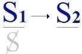
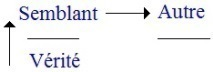

# Leçon 20 | 14 Mai 1969

  <label><input type="checkbox" data-lacan-toggle="original" checked> 原文</label>
  <label><input type="checkbox" data-lacan-toggle="notes" checked> 注释</label>
  <label><input type="checkbox" data-lacan-toggle="commentary" checked> 个人解读评论</label>

<section class="parallel-paragraph" data-paragraph-ids="s16-20-0001">

s16-20-0001

[无对应译文]

原文 · s16-20-0001

Il est impossible de ne pas considérer comme première l’incidence du *sujet* dans la pratique psychanalytique.

</section>

<section class="parallel-paragraph" data-paragraph-ids="s16-20-0002">

s16-20-0002

[无对应译文]

原文 · s16-20-0002

Elle est sans cesse au premier plan dans la façon dont, à l’entendre, pense le psychanalyste, du moins si nous nous en tenons à ce qui s’énonce dans ses comptes-rendus. C’est de tel point défini par ce qu’on appelle *une identification* que le sujet se trouve agir, par exemple manifester telle intention.

</section>

<section class="parallel-paragraph" data-paragraph-ids="s16-20-0003">

s16-20-0003

[无对应译文]

原文 · s16-20-0003

On énoncera telle paradoxale de ses conduites du fait qu’*il se retourne*, par exemple à lui-même… et de quel point sinon d’un autre qu’il a été occuper …*il se retourne*, ce qui fut - à l’endroit de ce « quelqu’un » à qui il va s’identifier - son agression première.

</section>

<section class="parallel-paragraph" data-paragraph-ids="s16-20-0004">

s16-20-0004

[无对应译文]

原文 · s16-20-0004

Bref, à tout instant le sujet se présente pourvu d’une *- pour le moins -* singulière autonomie, d’une mobilité surtout, à nulle autre égale, puisqu’il n’est à peu près aucun point dans le monde de ses partenaires, qu’ils soient ou non considérés comme ses semblables, qu’il ne puisse occuper, du moins, je le répète, au niveau d’une pensée qui tend à rendre compte de tel paradoxe de ses comportements.

</section>

<section class="parallel-paragraph" data-paragraph-ids="s16-20-0005">

s16-20-0005

[无对应译文]

原文 · s16-20-0005

Disons que *le sujet* - et ici nul lieu, au niveau de cette littérature, de contester la légitimité de ce terme - *le sujet* absolument non critiqué d’ailleurs, puisque aussi bien au terme il se produit ces énoncés singuliers qui vont jusqu’à parler du « *choix de la névrose* », comme si à un moment c’était à je ne sais quel point privilégié de ce sujet en poudre, qu’avait été réservé *l’aiguillage*.

</section>

<section class="parallel-paragraph" data-paragraph-ids="s16-20-0006">

s16-20-0006

[无对应译文]

原文 · s16-20-0006

Bien sûr, il peut s’admettre que, dans un premier temps de la recherche analytique, nous n’en ayons point été du tout au temps où d’aucune façon pouvait s’articuler d’une façon logique ce qu’il pouvait en être, en effet, de ce qui se présente comme tout à fait déterminant en apparence au début d’une anamnèse, dans une certaine façon de réagir au trauma.

</section>

<section class="parallel-paragraph" data-paragraph-ids="s16-20-0007">

s16-20-0007

[无对应译文]

原文 · s16-20-0007

Il suffirait peut-être de s’apercevoir que ce point considéré comme originel, aiguillant de l’anamnèse, est un point qui a été bel et bien *produit rétroactivement* par la somme des *interprétation*s, je parle des *interprétations* non seulement que le psychanalyste se fait, comme on dit, « *dans sa tête* » ou au moment où il écrit son observation, mais où il est intervenu dans ce qui le lie au patient et qui est loin, dans ce registre, dans ce registre d’interrogation, de suspension de ce qu’il en est du sujet, de pouvoir d’aucune façon être purement et simplement décrit comme un rapport de puissance à puissance, même soumis à tout ce qui peut s’y imaginer de transfert.

</section>

<section class="parallel-paragraph" data-paragraph-ids="s16-20-0008">

s16-20-0008

[无对应译文]

原文 · s16-20-0008

C’est pourquoi la reprise, au niveau du sujet, de *la question de la structure* en psychanalyse est toujours *essentielle*.

</section>

<section class="parallel-paragraph" data-paragraph-ids="s16-20-0009">

s16-20-0009

[无对应译文]

原文 · s16-20-0009

C’est elle qui constitue le véritable progrès. C’est elle, bien sûr, qui ne peut que seule faire progresser ce qu’on appelle improprement « *la clinique* ». J’espère que personne ne s’y trompe et que si, la dernière fois, vous avez pu avoir quelque plaisir à voir s’éclairer à mon discours, à la fin d’une évocation d’un cas, ce n’est pas spécifiquement qu’un cas ait été évoqué qui fait le caractère clinique de ce qui s’énonce au niveau de cet enseignement.

</section>

<section class="parallel-paragraph" data-paragraph-ids="s16-20-0010">

s16-20-0010

[无对应译文]

原文 · s16-20-0010

Reprenons donc les choses au point où nous pouvons les formuler après avoir à plusieurs reprises, à plusieurs reprises marqué comment se forme, à partir d’une première et très simple définition, c’est à savoir *qu’un signifiant*… c’est de là qu’on part, parce qu’après tout c’est le seul élément dont l’analyse nous donne la certitude, et je dois dire qu’elle met en son plein relief, auquel elle donne son poids, c’est le signifiant …si l’on définit le signifiant : « *le signifiant est ce qui représente un sujet pour un autre signifiant* ».

</section>

<section class="parallel-paragraph" data-paragraph-ids="s16-20-0011">

s16-20-0011

[无对应译文]

原文 · s16-20-0011

Ici est la formule, *la formule « œuf »* si je puis dire, qui nous permet de situer justement ce qu’il peut en être d’un sujet que de toute façon nous ne saurions manier selon des formules qui, pour être en apparence celles *du bon sens, du sens commun*…

</section>

<section class="parallel-paragraph" data-paragraph-ids="s16-20-0012">

s16-20-0012

[无对应译文]

原文 · s16-20-0012

> *à savoir qu’il y a bien quelque chose qui constitue cette identité qui différencie ce monsieur-là de son voisin* …qu’à se contenter de ceci, nous nous trouvons en fait recouvrir tout énoncé, tout énoncé simplement descriptif de ce qui se passe effectivement dans la *relation analytique* comme d’un jeu de marionnettes où - je le répète - le sujet est aussi mobile que la parole même, la parole même du montreur des dites marionnettes, à savoir que, quand il parle *au nom de l’un* qu’il tient dans sa main droite, il ne peut pas en même temps parler *au nom de l’autre*, mais qu’il est aussi bien capable de passer de l’un à l’autre avec la rapidité que l’on sait.

</section>

<section class="parallel-paragraph" data-paragraph-ids="s16-20-0013">

s16-20-0013

[无对应译文]

原文 · s16-20-0013

> 

</section>

<section class="parallel-paragraph" data-paragraph-ids="s16-20-0014">

s16-20-0014

[无对应译文]

原文 · s16-20-0014

Voici donc, ce qui déjà a été suffisamment écrit ici pour que je n’aie pas à en refaire *toute la construction et le commentaire*.

</section>

<section class="parallel-paragraph" data-paragraph-ids="s16-20-0015">

s16-20-0015

[无对应译文]

原文 · s16-20-0015

Ce *rapport premier*, qui aussi bien est gros de tous les autres, de S1 à S2, de *ce signifiant qui représente le sujet pour un autre signifiant*, et dans l’essai que nous faisons de serrer ce dont il s’agit quant à l’*autre* de ces *signifiants*, nous essayons - nous l’avons déjà inscrit - d’ouvrir le champ où tout ce qui est *signifiant second* - *c’est-à-dire le corps : ce au niveau de quoi par un signifiant va être représenté le sujet - de l’inscrire au lieu du* A.

</section>

<section class="parallel-paragraph" data-paragraph-ids="s16-20-0016">

s16-20-0016

[无对应译文]

原文 · s16-20-0016

 

</section>

<section class="parallel-paragraph" data-paragraph-ids="s16-20-0017">

s16-20-0017

[无对应译文]

原文 · s16-20-0017

*Ce lieu qui est le grand Autre* et dont je pense vous vous souvenez assez qu’à inscrire ainsi ce dont il s’agit, nous ne pourrons faire, au niveau de l’inscription même de S2, que de répéter que pour tout ce qui suit, à savoir tout ce qui peut s’inscrire à la suite, nous devons remettre *la marque du A comme lieu d’inscription*, c’est-à-dire de voir en somme se creuser de ce que j’ai appelé la dernière fois « *l’en­-forme de ce A* » - c’est un nom nouveau que nous ferons à notre usage - « *l’en­-forme du A* », à savoir le *a* qui le troue.

</section>

<section class="parallel-paragraph" data-paragraph-ids="s16-20-0018">

s16-20-0018

[无对应译文]

原文 · s16-20-0018

### Arrêtons-nous un instant…

</section>

<section class="parallel-paragraph" data-paragraph-ids="s16-20-0019">

s16-20-0019

[无对应译文]

原文 · s16-20-0019

> sur ceci que je considère comme assez acquis pour avoir été, j’en ai recueilli témoignage,
>
> sensible à certains qui ont trouvé quelque évidence, j’entends de maniement clinique …à cet *en-­forme du* A, formule destinée à montrer ce qu’il en est vraiment du *a*, à savoir de la structure topologique du A lui-même, de ce qui fait que le A *n’est pas complet*, n’est pas identifiable à un *Un*, en aucun cas à un tout.

</section>

<section class="parallel-paragraph" data-paragraph-ids="s16-20-0020">

s16-20-0020

[无对应译文]

原文 · s16-20-0020

Et pour tout dire que ce A est absolument à sentir, à représenter comme il en est au niveau *du paradoxe*…

</section>

<section class="parallel-paragraph" data-paragraph-ids="s16-20-0021">

s16-20-0021

[无对应译文]

原文 · s16-20-0021

> *du paradoxe* dont ce n’est pas pour rien que ce sont des logiciens qui l’ont formé …*du paradoxe de* *l’ensemble dit de tous les ensembles qui ne se contiennent pas eux-mêmes*.

</section>

<section class="parallel-paragraph" data-paragraph-ids="s16-20-0022">

s16-20-0022

[无对应译文]

原文 · s16-20-0022

Je pense que vous avez déjà assez le maniement *de ce paradoxe*.

</section>

<section class="parallel-paragraph" data-paragraph-ids="s16-20-0023">

s16-20-0023

[无对应译文]

原文 · s16-20-0023

Il est bien clair que cet *ensemble de tous les ensembles qui ne se contiennent pas eux-mêmes*, de deux choses l’une :

</section>

<section class="parallel-paragraph" data-paragraph-ids="s16-20-0024">

s16-20-0024

[无对应译文]

原文 · s16-20-0024

- ou il va se contenir lui-même et c’est une *contradiction*,

</section>

<section class="parallel-paragraph" data-paragraph-ids="s16-20-0025">

s16-20-0025

[无对应译文]

原文 · s16-20-0025

- ou il ne se contient pas lui-même, alors n’étant pas de ceux qui ne se contiennent pas eux-mêmes, il se contient lui-même, et nous nous trouvons devant *une seconde contradiction*.

</section>

<section class="parallel-paragraph" data-paragraph-ids="s16-20-0026">

s16-20-0026

[无对应译文]

原文 · s16-20-0026

Ceci est tout à fait simple à résoudre : *l’ensemble de tous les ensembles qui ne se contiennent pas eux-mêmes ne peut en effet comme fonction s’inscrire que sous la forme suivante*, c’est à savoir E ayant pour caractéristique ce X en tant que différent de X : E (X ≠ X).

</section>

<section class="parallel-paragraph" data-paragraph-ids="s16-20-0027">

s16-20-0027

[无对应译文]

原文 · s16-20-0027

Or c’est là qu’il recouvre notre difficulté *avec le grand Autre*. Si le grand Autre présente ce caractère topologique qui fait que son *en-forme* c’est le *a*, et nous allons pouvoir toucher très directement ce que cela signifie, c’est qu’il est vrai, c’est qu’il faut poser que, quel que soit l’usage conventionnel qu’il en est fait dans la mathématique, *le signifiant ne peut en aucun cas être tenu pour pouvoir se désigner lui-même*.

</section>

<section class="parallel-paragraph" data-paragraph-ids="s16-20-0028">

s16-20-0028

[无对应译文]

原文 · s16-20-0028

S1 *ou* S2 *en eux-mêmes ne sont pas chacun - d’aucune façon, ne peuvent être - le représentant d’eux-mêmes sinon à s’en distinguer d’eux-mêmes.*

</section>

<section class="parallel-paragraph" data-paragraph-ids="s16-20-0029">

s16-20-0029

[无对应译文]

原文 · s16-20-0029

Cette altérité du signifiant à lui-même, c’est proprement ce que désigne le terme du grand Autre marqué d’un A.

</section>

<section class="parallel-paragraph" data-paragraph-ids="s16-20-0030">

s16-20-0030

[无对应译文]

原文 · s16-20-0030

Si nous l’inscrivons, ce grand Autre, marqué du A, si nous en faisons un signifiant, ce qu’il désigne c’est le signifiant comme Autre. Le premier Autre qui soit, le premier rencontré dans le champ du signifiant, est autre radicalement, c’est-à-dire autre que lui-même, c’est-à­-dire qu’il introduit l’Autre comme tel dans son inscription, comme séparé de cette inscription même.

</section>

<section class="parallel-paragraph" data-paragraph-ids="s16-20-0031">

s16-20-0031

[无对应译文]

原文 · s16-20-0031

Ce A, en tant qu’extérieur à S2 qui l’inscrit, c’est l’*en-forme de* A, c’est-à-dire *la même chose que le a*.

</section>

<section class="parallel-paragraph" data-paragraph-ids="s16-20-0032">

s16-20-0032

[无对应译文]

原文 · s16-20-0032

Or ce *a*, nous le savons, c’est le sujet lui­-même en tant qu’il ne peut être représenté que par un *représentant* qui est S1 dans l’occasion : *l’altérité première c’est celle du signifiant* qui ne peut exprimer *le sujet* que sous la forme de ce que nous avons appris à cerner dans la pratique analytique d’une étrangeté particulière. Et c’est cela que je voudrais, je dirai non pas aujourd’hui frayer, puisque aussi bien dans un séminaire que j’ai fait dans un temps, c’était l’année 1961-62, sur *L’Identification*, j’en ai posé les bases. Ce sont ces bases-mêmes que je rappelle, simplement résumées et rassemblées aujourd’hui, pour vous faire sentir ceci qui n’est pas à prendre comme donné, sinon par l’expérience analytique, à tout analyste : bien sûr ce *a*, comme *essentiel au sujet* et comme marqué de cette étrangeté, il sait ce dont il s’agit.

</section>

<section class="parallel-paragraph" data-paragraph-ids="s16-20-0033">

s16-20-0033

[无对应译文]

原文 · s16-20-0033

Ces *a,* au reste je les ai déjà assez, depuis longtemps, énumérés pour qu’on sache bien, du *sein* à *l’excrément*, de *la voix* au *regard* ce que signifie dans son ambiguïté le mot « *étrangeté* », avec sa note affective et aussi son indication de marge topologique.

</section>

<section class="parallel-paragraph" data-paragraph-ids="s16-20-0034">

s16-20-0034

[无对应译文]

原文 · s16-20-0034

Ce dont il s’agit, c’est de faire sentir à ceux qui n’ont pas à prendre ceci comme un donné de l’expérience, je ne sais quoi qui peut évoquer sa place raisonnée au niveau des repères de ce qu’on considère comme l’expérience pratique à tort, elle n’est pas plus pratique que l’expérience analytique. Allons-y !

</section>

<section class="parallel-paragraph" data-paragraph-ids="s16-20-0035">

s16-20-0035

[无对应译文]

原文 · s16-20-0035

Ce qu’il y aurait de moins étranger en apparence, pourrait y représenter *le sujet* : prenez-le au départ aussi indéterminé que vous l’entendrez, ce qui distingue celui qui est ici, de celui qui est là et qui n’est que son voisin, bien sûr nous pouvons le saisir, en prendre le départ, de ceci qui serait le moins étranger, d’un type de matérialité tout à fait vulgaire, c’est ce que j’ai fait quand je parlais d’identification, j’ai désigné *la trace*.

</section>

<section class="parallel-paragraph" data-paragraph-ids="s16-20-0036">

s16-20-0036

[无对应译文]

原文 · s16-20-0036

*La trace* ça veut dire quelque chose : *la trace* d’une main, *la trace* d’un pied, une empreinte. Observez bien ici, à ce niveau, que « *trace* » se distingue du signifiant autrement que dans nos définitions nous n’en avons déjà distingué *le signe* : « *Le signe* *- ai-je dit -* *c’est ce qui représente quelque chose pour quelqu’un.* » *Ici, nul besoin de quelqu’un.* Une *trace* se suffit en elle-même. Et à partir de là pouvons-nous situer ce qu’il en est de ce que j’ai appelé tout à l’heure *l’essence du sujet* ?

</section>

<section class="parallel-paragraph" data-paragraph-ids="s16-20-0037">

s16-20-0037

[无对应译文]

原文 · s16-20-0037

Nous pouvons poser d’ores et déjà poser que ce que devient *la trace* par métaphore…

</section>

<section class="parallel-paragraph" data-paragraph-ids="s16-20-0038">

s16-20-0038

[无对应译文]

原文 · s16-20-0038

> le signe si vous voulez, par métaphore aussi, ces mots ne sont point à leur place puisque je viens de les écarter …ce qui signifie un sujet en tant que cette trace, ce signe, contrairement à la trace naturelle, n’a plus d’autre support que l’*en-forme A*. Qu’est-ce à dire ? *La trace passe à l’en-forme de A des façons par où elle est effacée*.

</section>

<section class="parallel-paragraph" data-paragraph-ids="s16-20-0039">

s16-20-0039

[无对应译文]

原文 · s16-20-0039

Le sujet, ce sont *ces façons* mêmes par quoi, comme empreinte, la trace se trouve effacée.

</section>

<section class="parallel-paragraph" data-paragraph-ids="s16-20-0040">

s16-20-0040

[无对应译文]

原文 · s16-20-0040

Un bon mot dont déjà j’avais épinglé cette remarque, intitulant ce qui pouvait s’en dire :  *les quatre effaçons du sujet *.

</section>

<section class="parallel-paragraph" data-paragraph-ids="s16-20-0041">

s16-20-0041

[无对应译文]

原文 · s16-20-0041

Le sujet, c’est lui qui *efface* la trace, en la transformant en *regard*, *regard* à entendre « *fente* », entr’aperçu.

</section>

<section class="parallel-paragraph" data-paragraph-ids="s16-20-0042">

s16-20-0042

[无对应译文]

原文 · s16-20-0042

C’est par là qu’il aborde ce qu’il en est de l’autre qui a laissé la trace : il est passé par là, il est au-delà.

</section>

<section class="parallel-paragraph" data-paragraph-ids="s16-20-0043">

s16-20-0043

[无对应译文]

原文 · s16-20-0043

Un sujet, bien sûr, en tant que tel, ce n’est pas assez de dire qu’il ne laisse pas de trace. Ce qui le définit et ce qui le livre en même temps, c’est d’abord ceci, par quoi se distingue effectivement, au regard de tout organisme vivant ce qu’il en est de l’animal qui parle, *c’est qu’il peut les effacer*. Et de les effacer comme telles, comme étant ses traces, ceci suffit à ce *qu’il puisse en faire quelque chose d’autre que des traces, des rendez-vous qu’il se donne à lui-même, par exemple*. Le Petit Poucet, quand il sème des cailloux blancs, c’est autre chose que des traces.

</section>

<section class="parallel-paragraph" data-paragraph-ids="s16-20-0044">

s16-20-0044

[无对应译文]

原文 · s16-20-0044

Sentez ici la différence qui s’ébauche déjà dans la meute qui - à poursuivre quelque chose - a une conduite - c’est bien le cas de le dire - mais conduite qui s’inscrit dans l’ordre *de l’odorat, du flair* comme on dit, et la chose n’est pas forcément étrangère à l’animal humain lui–même. Mais autre chose est cette conduite *et la scansion d’une trace repérée comme telle sur un support de voix*. Vous touchez ici la limite. Au niveau de la meute, cet aboiement, qui osera soutenir qu’il recouvre les traces ?

</section>

<section class="parallel-paragraph" data-paragraph-ids="s16-20-0045">

s16-20-0045

[无对应译文]

原文 · s16-20-0045

Il est quand même déjà ce qu’on peut appeler ébauche de parole. Mais distinct, distinct est ce support de la voix, du donné de la voix, là où il y a langage, là où c’est ce *support* qui caractérise d’une façon autonome un certain type de trace.

</section>

<section class="parallel-paragraph" data-paragraph-ids="s16-20-0046">

s16-20-0046

[无对应译文]

原文 · s16-20-0046

Un être qui peut lire sa trace, cela suffit à ce qu’il puisse se réinscrire ailleurs que là d’où il l’a portée.

</section>

<section class="parallel-paragraph" data-paragraph-ids="s16-20-0047">

s16-20-0047

[无对应译文]

原文 · s16-20-0047

Cette réinscription, c’est là le lien qui le fait dès lors dépendant d’un Autre, dont la structure ne dépend pas de lui.

</section>

<section class="parallel-paragraph" data-paragraph-ids="s16-20-0048">

s16-20-0048

[无对应译文]

原文 · s16-20-0048

Tout s’ouvre à ce qui est du registre du sujet défini comme : « *c’est ce qui efface ses traces* ».

</section>

<section class="parallel-paragraph" data-paragraph-ids="s16-20-0049">

s16-20-0049

[无对应译文]

原文 · s16-20-0049

Le sujet, à la limite et pour faire sentir la dimension originale de ce dont il s’agit, je l’appellerai : « *celui qui remplace ses traces par sa signature* ». Et vous savez qu’une *signature*, il n’en est pas demandé beaucoup pour constituer quelqu’un en sujet, un illettré à la mairie qui ne sait pas écrire, il suffit qu’il fasse une croix, symbole de la barre barrée, de *la trace effacée*, forme la plus claire de ce dont il s’agit.

</section>

<section class="parallel-paragraph" data-paragraph-ids="s16-20-0050">

s16-20-0050

[无对应译文]

原文 · s16-20-0050

Quand d’abord on laisse un signe et puis que quelque chose l’annule, ça suffit comme *signature*. Et qu’elle soit la même pour quiconque à qui elle sera demandée ne change rien au fait que ceci sera reçu pour authentifiant l’acte en question de la présence de bel et bien quelqu’un qui juridiquement est retenu pour un sujet, et rien de plus ni rien de moins, mais cela dont j’essaie de définir le niveau, non certes pour en faire un absolu mais justement pour marquer ses liens de dépendance.

</section>

<section class="parallel-paragraph" data-paragraph-ids="s16-20-0051">

s16-20-0051

[无对应译文]

原文 · s16-20-0051

Car la remarque ici commence. *Le signifiant naît de ses traces effacées*.

</section>

<section class="parallel-paragraph" data-paragraph-ids="s16-20-0052">

s16-20-0052

[无对应译文]

原文 · s16-20-0052

Quelle en est donc la conséquence ?

</section>

<section class="parallel-paragraph" data-paragraph-ids="s16-20-0053">

s16-20-0053

[无对应译文]

原文 · s16-20-0053

C’est que ces *traces effacées* ne valent que par le système des autres \[traces effacées\], qu’elles soient *semblables* ou *les mêmes*.

</section>

<section class="parallel-paragraph" data-paragraph-ids="s16-20-0054">

s16-20-0054

[无对应译文]

原文 · s16-20-0054

Que ces autres \[traces effacées\] instituées en *système* \[cf. *séminaie sur La lettre volée* : α, β, γ, δ\] , c’est seulement là que commence la portée type du *langage*, ces autres traces effacées ce sont les seules admises. Admises par qui ?

</section>

<section class="parallel-paragraph" data-paragraph-ids="s16-20-0055">

s16-20-0055

[无对应译文]

原文 · s16-20-0055

Eh bien, là nous retombons sur nos pieds de la même façon qu’au niveau de la définition du *sujet qu’un signifiant représente pour un autre signifiant*, ce sont les seules admises par qui ? Réponse : *par les autres traces*.

</section>

<section class="parallel-paragraph" data-paragraph-ids="s16-20-0056">

s16-20-0056

[无对应译文]

原文 · s16-20-0056

« *Un pa-âté* - comme dit BRIDOISON dans « *Le Mariage* » [^79] - *ça ne compte pas*. »

</section>

<section class="parallel-paragraph" data-paragraph-ids="s16-20-0057">

s16-20-0057

[无对应译文]

原文 · s16-20-0057

C’est bien pour ça qu’il y porte tant d’intérêt, car pour lui BRIDOISON qui prend au sérieux les traces, il se pourrait que ça comptât : c’est un « *pas hâté* ».

</section>

<section class="parallel-paragraph" data-paragraph-ids="s16-20-0058">

s16-20-0058

[无对应译文]

原文 · s16-20-0058

### Dès lors si nous savons que ces traces…

</section>

<section class="parallel-paragraph" data-paragraph-ids="s16-20-0059">

s16-20-0059

[无对应译文]

原文 · s16-20-0059

> ces traces qui ne sont effacées que d’être là - en repoussoir - effacées …ces traces qui ont un autre support qui est proprement l’*en-forme du* A…

</section>

<section class="parallel-paragraph" data-paragraph-ids="s16-20-0060">

s16-20-0060

[无对应译文]

原文 · s16-20-0060

> en tant qu’il est nécessité de ceci qu’il fasse un A, un A qui fonctionne au niveau du sujet …nous avons alors à les considérer du niveau de leur substance.

</section>

<section class="parallel-paragraph" data-paragraph-ids="s16-20-0061">

s16-20-0061

[无对应译文]

原文 · s16-20-0061

C’est bien ce qui fait la portée d’un élément par exemple comme *un regard* dans l’érotisme et que la question se pose *- parce qu’elle est sensible -* du rapport de ce qui s’inscrit au niveau du regard, à la trace.

</section>

<section class="parallel-paragraph" data-paragraph-ids="s16-20-0062">

s16-20-0062

[无对应译文]

原文 · s16-20-0062

Un regard érotique laisse-t-il des traces là où il vient s’inscrire au niveau de l’autre, c’est-à-dire chez quelque autre ?

</section>

<section class="parallel-paragraph" data-paragraph-ids="s16-20-0063">

s16-20-0063

[无对应译文]

原文 · s16-20-0063

C’est à ce niveau que se pose la dimension de *la pudeur* et qu’elle s’insère, elle le démontre ici *d’une façon sensible*.

</section>

<section class="parallel-paragraph" data-paragraph-ids="s16-20-0064">

s16-20-0064

[无对应译文]

原文 · s16-20-0064

La pudeur est une dimension seulement propre au sujet comme tel.

</section>

<section class="parallel-paragraph" data-paragraph-ids="s16-20-0065">

s16-20-0065

[无对应译文]

原文 · s16-20-0065

Est-ce que nous allons brièvement, à ce détour, ordonner d’une façon qui soit un peu différente de sa litanie habituelle, cette relation du signifiant à l’ *en-forme de A* ? Certainement oui - quoique rapidement - pour rappeler que ce n’est pas hasard si, à la pointe de notre actualité, l’écriture s’affirme *rapport de l’écriture au regard comme objet(a)* : c’est là seul ce qui peut donner son statut correct à une grammatologie.

</section>

<section class="parallel-paragraph" data-paragraph-ids="s16-20-0066">

s16-20-0066

[无对应译文]

原文 · s16-20-0066

Le *regard*, dans toute son ambiguïté que j’ai déjà tout à l’heure marquée à propos du rapport à la trace, l’*entrevu,* et pour tout dire, la coupure dans le *vu*, la chose qui ouvre au-delà du *vu*.

</section>

<section class="parallel-paragraph" data-paragraph-ids="s16-20-0067">

s16-20-0067

[无对应译文]

原文 · s16-20-0067

Assurément l’accent à mettre sur l’écriture est capital pour la juste évaluation de ce qu’il en est du langage.

</section>

<section class="parallel-paragraph" data-paragraph-ids="s16-20-0068">

s16-20-0068

[无对应译文]

原文 · s16-20-0068

Et que l’*écriture* soit première, et doive être considérée comme telle, au regard de ce qui est *la parole*, c’est ce qui après tout peut être considéré comme non seulement licite mais rendu évident par la seule existence d’une écriture comme la chinoise, où il est clair que ce qui est de *l’ordre de l’appréhension du regard n’est pas sans rapport à ce qui s’en traduit au niveau de la voix*, à savoir qu’il y a des éléments phonétiques, mais qu’il y en a aussi beaucoup qui ne le sont pas, ceci étant d’autant plus frappant que, du point de vue de la structure, de la structure stricte de ce qu’il en est d’un langage, *nulle langue ne se tient d’une façon plus pure que cette langue chinoise où chaque élément morphologique se réduit à un phonème.*

</section>

<section class="parallel-paragraph" data-paragraph-ids="s16-20-0069">

s16-20-0069

[无对应译文]

原文 · s16-20-0069

C’est donc bien là où ç’aurait été le plus simple *- si l’on peut dire -* que l’écriture ne soit que transcription de ce qui s’énonce en paroles, qu’il est frappant de voir que tout au contraire l’écriture, loin d’être transcription, est un autre système, un système auquel éventuellement s’accroche ce qui est découpé dans un autre support, celui de la voix.

</section>

<section class="parallel-paragraph" data-paragraph-ids="s16-20-0070">

s16-20-0070

[无对应译文]

原文 · s16-20-0070

Assurément, le terme de la coupure est ce qui prédestine ces supports - aussi bien définissables matériellement comme *regard* et *voix -* ce qui les prédestine à cette fonction d’être ce qui, remplaçant la trace, *institue cette sorte d’ensemble* *d’où une topologie se construit comme définissant l’Autre, à son terme*.

</section>

<section class="parallel-paragraph" data-paragraph-ids="s16-20-0071">

s16-20-0071

[无对应译文]

原文 · s16-20-0071

Vous le voyez, il ne s’agit ici que de considérations substructurales, non pas du tout bien sûr originelles car après tout ceci ne dit pas comment cet Autre a commencé, cela dit comment ça se tient quand il est là, d’où il a pris origine, c’est bien ce qui jusqu’à présent est laissé entre parenthèses.

</section>

<section class="parallel-paragraph" data-paragraph-ids="s16-20-0072">

s16-20-0072

[无对应译文]

原文 · s16-20-0072

Remarque marginale, car je continue - après cet 1 et 2 concernant *regard* et *voix -* à dire ce qui pourrait venir à la suite dans un apport pris par ce biais. Ce n’est pas - vous le voyez immédiatement - dans le rapport du sujet à l’Autre en tant que structuré que vient ce qui s’annonce maintenant comme étant *la demande*. Chose singulière : alors que dans l’ordre de *l’objet(a)*, *le sein* et *le déchet* semblent venir au 1er plan, au point presque de laisser dans une certaine ombre, dans le maniement le plus fréquent de ce dont il s’agit dans la régression analytique, les termes du *regard* et de *la voix,* vous voyez ici que nous sommes forcés au contraire de supposer construits sur support, *regard* et *voix*.

</section>

<section class="parallel-paragraph" data-paragraph-ids="s16-20-0073">

s16-20-0073

[无对应译文]

原文 · s16-20-0073

Ce qui va faire bien sûr élément dans *la demande* et que si nous retrouvons ici un *objet(a)*, c’est pour autant l’occasion de pointer que ce qui est *demandé* n’est jamais qu’une *place*, et que ce n’est pas pour rien que *place* évoque ce *placage* qui est l’essence dont nous définissons *le sein* analogue du *placenta*, pour autant qu’il définit le rapport subjectif fondé, tel qu’il convient de l’instituer, dans les rapports de l’enfant et de la mère.

</section>

<section class="parallel-paragraph" data-paragraph-ids="s16-20-0074">

s16-20-0074

[无对应译文]

原文 · s16-20-0074

Le rôle *ambocepteur* du sein entre l’enfant et la mère est en réalité rôle prévalent. C’est en tant qu’*objet(a)*, en tant qu’*être plaqué* *à sa paroi* que l’enfant sujet s’articule, que *son message est reçu de la mère* et qu’il lui est répondu.

</section>

<section class="parallel-paragraph" data-paragraph-ids="s16-20-0075">

s16-20-0075

[无对应译文]

原文 · s16-20-0075

Ce qu’on *demande* avec ces signifiants, voici quel est le troisième terme, et vous voyez son lien à cet autre élément *a*, \[la voix\].

</section>

<section class="parallel-paragraph" data-paragraph-ids="s16-20-0076">

s16-20-0076

[无对应译文]

原文 · s16-20-0076

Enfin, à articuler les choses par ce biais, nous verrons, nous toucherons du doigt que ce qui s’engendre, à savoir tout ce qui est *sens*, à proprement parler : *le signifié*, c’est en tant qu’effet de chute de ce jeu qu’il est ici à situer. Ce qu’il y a dans le sens…

</section>

<section class="parallel-paragraph" data-paragraph-ids="s16-20-0077">

s16-20-0077

[无对应译文]

原文 · s16-20-0077

> qui est non seulement effet, mais effet rejeté, mais effet qui s’emporte, et aussi bien effet qui s’accumule …la culture - pour tout dire - participe de ce quelque chose qui découle d’une économie fondée sur la structure de *l’objet(a)*.

</section>

<section class="parallel-paragraph" data-paragraph-ids="s16-20-0078">

s16-20-0078

[无对应译文]

原文 · s16-20-0078

À savoir que c’est bien comme déchet, comme excrément de la relation subjective comme telle que ce qui fait la matière des dictionnaires, de ce qu’on dit être l’amas des sens qui se sont concentrés au cours d’une certaine pratique enregistrable pour être devenue commune, autour d’un signifiant, c’est bien du registre du *second objet* comme *objet(a)*, de *l’objet anal* qu’il faut ici l’inscrire dans cette perspective.

</section>

<section class="parallel-paragraph" data-paragraph-ids="s16-20-0079">

s16-20-0079

[无对应译文]

原文 · s16-20-0079

Tels sont les quatre *effaçons* dont peut s’inscrire *le sujet*.

</section>

<section class="parallel-paragraph" data-paragraph-ids="s16-20-0080">

s16-20-0080

[无对应译文]

原文 · s16-20-0080

Le sujet qui, au milieu de ceci, est bien sûr à proprement parler insaisissable de ne pouvoir qu’être *représenté par un représentant*. C’est en tant qu’il s’inscrit dans le champ de l’Autre qu’il subsiste, et c’est à ceci que nous avons affaire si nous voulons d’une façon correcte rendre compte de ce qui est l’enjeu dans la psychanalyse.

</section>

<section class="parallel-paragraph" data-paragraph-ids="s16-20-0081">

s16-20-0081

[无对应译文]

原文 · s16-20-0081

La distance se mesure de ce qui se définit comme *un sujet* à ce qui tient comme *une personne*.

</section>

<section class="parallel-paragraph" data-paragraph-ids="s16-20-0082">

s16-20-0082

[无对应译文]

原文 · s16-20-0082

La distance se mesure, c’est-à-dire qu’il faut très sévèrement les distinguer, que toute espèce de *personnalisme* en psychanalyse est propice à toutes les déviations, à toutes les confusions.

</section>

<section class="parallel-paragraph" data-paragraph-ids="s16-20-0083">

s16-20-0083

[无对应译文]

原文 · s16-20-0083

Dans la perspective psychanalytique, ce qui se définit, se marque, dans d’autres registres dits *moraux*, comme étant *la personne*, nous ne pouvons le situer à un autre niveau que celui *du symptôme*. La personne commence là où - bien sûr - ce sujet tel que je vous l’ai situé est *ancré autrement*, est *ancré* d’une façon bien plus large, celle qui fait entrer en jeu ce qui sans doute se place à son origine, à savoir *la jouissance*. C’est parce que l’expérience analytique nous apprend à dessiner ici autrement… ce qui fut fait de l’atlas - si je puis dire - cartographiquement …ce qu’il en est des jeux qui se rapportent au sujet, c’est en cela qu’elle a son importance.

</section>

<section class="parallel-paragraph" data-paragraph-ids="s16-20-0084">

s16-20-0084

[无对应译文]

原文 · s16-20-0084

C’est en cela qu’elle inaugure une méthode, qu’elle ne prétend reconstituer nul nouveau « tout », mais assurément que d’ores et déjà elle bouleverse les anciens *systèmes de projection* qui constituaient un tout.

</section>

<section class="parallel-paragraph" data-paragraph-ids="s16-20-0085">

s16-20-0085

[无对应译文]

原文 · s16-20-0085

Il y aurait évidemment ici à pointer en marge toutes sortes d’indications qui sont *suggestions*, *index tendu*…

</section>

<section class="parallel-paragraph" data-paragraph-ids="s16-20-0086">

s16-20-0086

[无对应译文]

原文 · s16-20-0086

> point important dans cette *signification de l’index*, dans une découverte en progrès, c’est assurément quelque chose de tout autre que ce en quoi nous pouvons le distinguer pour, par exemple, dans la langue, en faire le distinctif d’une certaine sorte de *signifiant* …*index* donc, que je propose à ceux qui peuvent avoir ici un penchant à revenir sur ce que FREUD a énoncé au niveau de *Psychologie collective et analyse du moi *: à considérer que le chef, le leader, l’élément clé de l’*identification* tel qu’il l’énonce, combien il devient plus clair dans cette perspective à ce qu’on y montre la solution qui rend possible ce par quoi le sujet s’identifie strictement au *a*, autrement dit qu’il devient ce qu’il est vraiment, c’est-à-dire un sujet en tant que lui-même barré.

</section>

<section class="parallel-paragraph" data-paragraph-ids="s16-20-0087">

s16-20-0087

[无对应译文]

原文 · s16-20-0087

Ce que nous avons vu, et qui dès lors doit être considéré pour nous comme pouvant toujours se reproduire, le passage de toute une masse à la fonction de regard univoque si je puis dire, c’est quelque chose dont seule peut rendre compte la perception des possibilités offertes dans ce registre au signifiant privilégié d’être le plus sommaire, d’être réduit à ce que FREUD désigne comme étant purement et simplement *la marque*, la fonction comme unique du 1.

</section>

<section class="parallel-paragraph" data-paragraph-ids="s16-20-0088">

s16-20-0088

[无对应译文]

原文 · s16-20-0088

Or voici donc ici le système dont la pensée est entièrement sujette et dont - *sentez-le bien* - il n’est question en aucun cas que sorte tout ce qui peut s’articuler et nommément comme savoir.

</section>

<section class="parallel-paragraph" data-paragraph-ids="s16-20-0089">

s16-20-0089

[无对应译文]

原文 · s16-20-0089

La conséquence sur quelque chose de vivant, que le langage l’enveloppe, le système des signifiants, c’est très précisément qu’à partir de lui, l’image est toujours plus ou moins marquée d’être assumée dans le système, et comme signifiante : c’est l’obligée de la fonction du type, et de ce qu’on appelle « *l’universel* ».

</section>

<section class="parallel-paragraph" data-paragraph-ids="s16-20-0090">

s16-20-0090

[无对应译文]

原文 · s16-20-0090

Comment n’est-il pas sensible, comment n’est-il pas rendu commun, et comment n’est-il pas encore dans quelque forme effective de renouvellement des institutions, que ce fait que les images soient prises dans le jeu du signifiant est là pour nous rendre sensible - toute l’expérience psychanalytique en témoigne - que ce qui s’y perd c’est *la fonction imaginaire* en tant qu’elle répond de l’accord du mâle et de la femelle ?

</section>

<section class="parallel-paragraph" data-paragraph-ids="s16-20-0091">

s16-20-0091

[无对应译文]

原文 · s16-20-0091

S’il y a quelque chose que l’analyse nous démontre, c’est que c’est en raison de la prise dans le sujet non seulement que tout ce qui est désignable comme mâle est aussi bien ambigu, voire révocable à une plus proche critique, que c’est aussi vrai pour l’autre part, et que ceci est sanctionné dans le fait d’expérience très précise :

</section>

<section class="parallel-paragraph" data-paragraph-ids="s16-20-0092">

s16-20-0092

[无对应译文]

原文 · s16-20-0092

- qu’au niveau du sujet, il n’y a point de *reconnaissance* comme telle *du mâle par la femelle* ni *de la femelle par le mâle*,

</section>

<section class="parallel-paragraph" data-paragraph-ids="s16-20-0093">

s16-20-0093

[无对应译文]

原文 · s16-20-0093

- que tout ce qu’une exploration un peu approfondie nous démontre de l’histoire d’un couple,

</section>

<section class="parallel-paragraph" data-paragraph-ids="s16-20-0094">

s16-20-0094

[无对应译文]

原文 · s16-20-0094

> c’est que les identifications y ont été multiples, se recouvrant et toujours à la fin formant un ensemble composite.

</section>

<section class="parallel-paragraph" data-paragraph-ids="s16-20-0095">

s16-20-0095

[无对应译文]

原文 · s16-20-0095

L’ambiguïté qui reste sur tout ce qui pourrait inscrire au niveau du signifiant ce qu’il en est de ce qui distingue *- nous le savons pourtant -* au niveau biologique, radicalement…

</section>

<section class="parallel-paragraph" data-paragraph-ids="s16-20-0096">

s16-20-0096

[无对应译文]

原文 · s16-20-0096

> quand je dis radicalement, j’omets bien sûr au niveau des mammifères les caractères dits sexuels secondaires et la distinction possible du sexe tissulaire en rapport au sexe phanérogamique, mais laissons de côté ce qu’il peut en être …constatons que ce que désigne l’expérience analytique, c’est très précisément qu’à ce niveau il n’y a pas couplage signifiant : c’est au point que dans la théorie, s’il est fait les oppositions *actif-passif*, *voyeur-vu*, etc. nulle opposition n’est jamais promue comme fondamentale qui désigne le *mâle-femelle*.

</section>

<section class="parallel-paragraph" data-paragraph-ids="s16-20-0097">

s16-20-0097

[无对应译文]

原文 · s16-20-0097

### L’important, et l’important en quelque sorte préalable par rapport à la question qui est soulevée, de ce qu’il en est

</section>

<section class="parallel-paragraph" data-paragraph-ids="s16-20-0098">

s16-20-0098

[无对应译文]

原文 · s16-20-0098

### dans le système signifiant, de la fonction dite du *phallus*, pour autant que c’est celle qui se trouve effectivement intervenir,

</section>

<section class="parallel-paragraph" data-paragraph-ids="s16-20-0099">

s16-20-0099

[无对应译文]

原文 · s16-20-0099

### et d’une façon dont il est bien sûr qu’elle n’est en aucun cas « *qu’une fonction tierce* » qu’elle représente :

</section>

<section class="parallel-paragraph" data-paragraph-ids="s16-20-0100">

s16-20-0100

[无对应译文]

原文 · s16-20-0100

- soit ce qui se définit d’abord comme *ce qui manque*, c’est-à-dire fondant le type de la castration comme instituant celui de la femme,

</section>

<section class="parallel-paragraph" data-paragraph-ids="s16-20-0101">

s16-20-0101

[无对应译文]

原文 · s16-20-0101

- soit ce qui au contraire, du côté du mâle, indique d’une façon qui est combien problématique, ce qu’on pourrait appeler l’énigme de la jouissance absolue.

</section>

<section class="parallel-paragraph" data-paragraph-ids="s16-20-0102">

s16-20-0102

[无对应译文]

原文 · s16-20-0102

De toute façon, il ne s’agit pas là de *repères corrélatifs*, de *repères distinctifs*. *Un seul et même repère* domine tout le registre de ce qu’il en est de la relation du sexué. *Ce signifiant privilégié*, j’entends ici ponctuer *en quoi se justifie que* dans une construction longue, qui a été faite tout au contact de l’analyse articulée, de ce qui s’est écrit, de ce qui est resté témoignage de notre expérience des névroses, *j’ai pu le qualifier de signifiant manquant* ?

</section>

<section class="parallel-paragraph" data-paragraph-ids="s16-20-0103">

s16-20-0103

[无对应译文]

原文 · s16-20-0103

La question est d’importance car si assurément pour ce qu’il en est de l’articulation de la fonction du sujet, vous voyez bien que, aussi loin que puisse être poussée l’articulation du savoir, le sujet y montre la faille.

</section>

<section class="parallel-paragraph" data-paragraph-ids="s16-20-0104">

s16-20-0104

[无对应译文]

原文 · s16-20-0104

Dire que *le phallus* est le *signifiant manquant* au niveau où j’ai pu l’énoncer, au point de mon discours où j’en ai risqué, disons, la première avancée, je crois que quelque chose qui est *contexte* n’était pas encore assez articulé pour que puisse se dire ce que je précise maintenant.

</section>

<section class="parallel-paragraph" data-paragraph-ids="s16-20-0105">

s16-20-0105

[无对应译文]

原文 · s16-20-0105

### Repartons - et c’est là l’intérêt de notre référence d’aujourd’hui - de notre départ de *la trace*, repartons de ce point d’appui

</section>

<section class="parallel-paragraph" data-paragraph-ids="s16-20-0106">

s16-20-0106

[无对应译文]

原文 · s16-20-0106

### et souvenons-nous du proverbe arabe que dans mes *Écrits* [^80], j’ai cité quelque part il y a bien longtemps.

</section>

<section class="parallel-paragraph" data-paragraph-ids="s16-20-0107">

s16-20-0107

[无对应译文]

原文 · s16-20-0107

Il y a quatre choses - je ne sais plus lesquelles, je dois dire que j’ai oublié la 4ème ou que je ne cherche pas à m’en souvenir immédiatement - qui ne laissent aucune trace :

</section>

<section class="parallel-paragraph" data-paragraph-ids="s16-20-0108">

s16-20-0108

[无对应译文]

原文 · s16-20-0108

- celle que j’évoquais à ce tournant : *le pied de la gazelle sur le rocher*,

</section>

<section class="parallel-paragraph" data-paragraph-ids="s16-20-0109">

s16-20-0109

[无对应译文]

原文 · s16-20-0109

- il y a aussi *le poisson dans l’eau*,

</section>

<section class="parallel-paragraph" data-paragraph-ids="s16-20-0110">

s16-20-0110

[无对应译文]

原文 · s16-20-0110

- et ce qui nous intéresse plus : *l’homme dans la femme*, dit le proverbe, *ne laissent pas de trace*.

</section>

<section class="parallel-paragraph" data-paragraph-ids="s16-20-0111">

s16-20-0111

[无对应译文]

原文 · s16-20-0111

Ça peut à l’occasion s’objecter sous la forme suivante, dont on sait l’importance dans *les fantasmes des névrosés* : une petite maladie de temps en temps. Mais justement ça, c’est ce qui est instructif : le rôle des maladies vénériennes n’est point du tout un hasard dans la structure. Nous ne pouvons partir d’aucune *trace* pour fonder - du rapport sexuel - *le signifiant.*

</section>

<section class="parallel-paragraph" data-paragraph-ids="s16-20-0112">

s16-20-0112

[无对应译文]

原文 · s16-20-0112

Tout est réduit à ce signifiant : *le phallus*, Justement qui n’est pas dans le système du sujet puisque ce n’est pas le sujet qu’il représente mais, si l’on peut dire, la jouissance sexuelle en tant qu’hors système, c’est-à-dire absolue. La jouissance sexuelle pour autant qu’elle a ce privilège par rapport à toutes les autres, c’est que quelque chose dans *le principe du plaisir* \- *dont on sait qu’il constitue la barrière à la jouissance -* c’est que quelque chose dans *le principe du plaisir* lui laisse quand même accès.

</section>

<section class="parallel-paragraph" data-paragraph-ids="s16-20-0113">

s16-20-0113

[无对应译文]

原文 · s16-20-0113

Avouez que même sous la plume de FREUD, qu’on lise que c’est là la jouissance par excellence - et que c’est vrai, en plus - mais qu’on le lise sous la plume d’un savant qui mérite autant ce titre que l’est notre FREUD, ça a tout de même quelque chose qui puisse nous faire rêver. Mais ce n’est pas dans le système du sujet, il n’y a pas de sujet de la jouissance sexuelle.

</section>

<section class="parallel-paragraph" data-paragraph-ids="s16-20-0114">

s16-20-0114

[无对应译文]

原文 · s16-20-0114

Et ces remarques n’ont d’autre intérêt que de nous permettre de préciser le sens du *phallus* comme *signifiant manquant*.

</section>

<section class="parallel-paragraph" data-paragraph-ids="s16-20-0115">

s16-20-0115

[无对应译文]

原文 · s16-20-0115

Il est le signifiant hors système, et pour tout dire celui conventionnel à désigner ce qui est - de la jouissance sexuelle - radicalement forclos. Si j’ai parlé de forclusion à juste titre pour désigner certains effets de la relation symbolique, c’est ici qu’il faut voir, qu’il faut désigner le point où elle n’est pas révisible.

</section>

<section class="parallel-paragraph" data-paragraph-ids="s16-20-0116">

s16-20-0116

[无对应译文]

原文 · s16-20-0116

Et si j’ajoute que *tout ce qui est refoulé dans le symbolique reparaît dans le réel*, c’est bien en ça que *la jouissance* est tout à fait réelle.

</section>

<section class="parallel-paragraph" data-paragraph-ids="s16-20-0117">

s16-20-0117

[无对应译文]

原文 · s16-20-0117

C’est que, dans le système du sujet, elle n’est nulle part symbolisée, ni symbolisable non plus.

</section>

<section class="parallel-paragraph" data-paragraph-ids="s16-20-0118">

s16-20-0118

[无对应译文]

原文 · s16-20-0118

C’est bien pour ça qu’est nécessaire, dans l’énoncé au niveau des propos de FREUD, cette énormité dont personne ne semble s’inquiéter, que c’est un mythe qui ne ressemble strictement à aucun mythe connu de la mythologie, sauf bien sûr quelques personnes : le vieux KRŒBER, LÉVI-STRAUSS, s’aperçoivent très bien que ça ne fait pas partie de *leur univers* et ils le disent, mais c’est exactement comme s’ils ne disaient rien, puisque tout le monde continue à croire que *le complexe d’Œdipe*, c’est un mythe recevable. Ça l’est, en effet, en un certain sens, mais observez que ça ne veut rien dire d’autre que la place où il faut situer cette *jouissance* que je viens de définir comme *absolue*.

</section>

<section class="parallel-paragraph" data-paragraph-ids="s16-20-0119">

s16-20-0119

[无对应译文]

原文 · s16-20-0119

Le mythe du père primordial, c’est celui en effet qui confond dans sa jouissance *toutes les femmes*. La seule forme du mythe en dit assez, c’est dire qu’on ne sait pas de quelle jouissance il s’agit, est–ce de la sienne ou de celle de *toutes les femmes* ?

</section>

<section class="parallel-paragraph" data-paragraph-ids="s16-20-0120">

s16-20-0120

[无对应译文]

原文 · s16-20-0120

À ceci près que la jouissance féminine est restée - comme je vous l’ai fait remarquer - toujours aussi à l’état d’énigme dans *la théorie analytique*. Que veut donc dire cette fonction phallique qui semble - à ne pas représenter le sujet - marquer pourtant un point de sa détermination comme *champ* limité d’un rapport à ce qui se structure comme *l’Autre*.

</section>

<section class="parallel-paragraph" data-paragraph-ids="s16-20-0121">

s16-20-0121

[无对应译文]

原文 · s16-20-0121

C’est à ausculter de plus près, à revenir de ces perspectives radicales vers notre expérience, que nous allons tout de suite voir comment *les choses se traduisent*. Le détour d’où ressortit *l’éclosion d’une névrose*, c’est quoi ?

</section>

<section class="parallel-paragraph" data-paragraph-ids="s16-20-0122">

s16-20-0122

[无对应译文]

原文 · s16-20-0122

C’est *l’intrusion positive d’une jouissance auto-érotique* qui est parfaitement typifiée, dans ce qu’on appelle les premières sensations plus ou moins liées à l’onanisme - qu’on appelle ça comme on voudra - chez l’enfant.

</section>

<section class="parallel-paragraph" data-paragraph-ids="s16-20-0123">

s16-20-0123

[无对应译文]

原文 · s16-20-0123

L’important, c’est que c’est en ce point…

</section>

<section class="parallel-paragraph" data-paragraph-ids="s16-20-0124">

s16-20-0124

[无对应译文]

原文 · s16-20-0124

> pour les cas qui tombent sous notre juridiction, c’est-à-dire ceux qui engendrent une névrose …c’est en ce point précis au moment même où cette positivation de la jouissance érotique se produit que, corrélativement se produit aussi la positivation du sujet en tant que dépendance - *anaclitisme* ai-je énoncé la dernière fois - du désir de l’Autre.

</section>

<section class="parallel-paragraph" data-paragraph-ids="s16-20-0125">

s16-20-0125

[无对应译文]

原文 · s16-20-0125

C’est là que se désigne le point d’entrée par où fait drame ce qui est structure du sujet.

</section>

<section class="parallel-paragraph" data-paragraph-ids="s16-20-0126">

s16-20-0126

[无对应译文]

原文 · s16-20-0126

Toute l’expérience mérite d’être articulée qui va confirmer à quelles frontières, à quelles jonctions ce drame va éclater.

</section>

<section class="parallel-paragraph" data-paragraph-ids="s16-20-0127">

s16-20-0127

[无对应译文]

原文 · s16-20-0127

Je pense avoir déjà suffisamment la dernière fois marqué le poids qu’y prend *l’objet(a)*, non tant en tant qu’il est présentifié mais en démontrant rétroactivement que c’est lui qui auparavant faisait *toute la structure du sujet*.

</section>

<section class="parallel-paragraph" data-paragraph-ids="s16-20-0128">

s16-20-0128

[无对应译文]

原文 · s16-20-0128

Nous allons voir à quelles autres *frontières* le drame éclate. Mais d’ores et déjà nous pouvons savoir du retour de ces effets, que c’est *grâce à la relation positive à la jouissance dite sexuelle*…

</section>

<section class="parallel-paragraph" data-paragraph-ids="s16-20-0129">

s16-20-0129

[无对应译文]

原文 · s16-20-0129

> mais sans que pour autant soit assurée d’aucune façon la conjonction sexuée …que quelque chose se désigne comme essentiel à la position du sujet, c’est le désir de savoir.

</section>

<section class="parallel-paragraph" data-paragraph-ids="s16-20-0130">

s16-20-0130

[无对应译文]

原文 · s16-20-0130

Le pas décisif fait par FREUD de *la relation de la curiosité sexuelle avec tout l’ordre du savoir*, c’est là le point essentiel de la découverte psychanalytique et c’est de la jonction :

</section>

<section class="parallel-paragraph" data-paragraph-ids="s16-20-0131">

s16-20-0131

[无对应译文]

原文 · s16-20-0131

- de ce qu’il en est du *a*, à savoir ce où le sujet peut retrouver son essence réelle comme *manque à jouir* essentiellement, et rien de plus, quelque représentant dont il ait à se désigner par la suite,

</section>

<section class="parallel-paragraph" data-paragraph-ids="s16-20-0132">

s16-20-0132

[无对应译文]

原文 · s16-20-0132

- le champ de l’Autre, d’autre part, en tant que s’y ordonne le savoir est à l’horizon ce domaine interdit de sa nature qu’est celui de la jouissance et avec lequel la question de la jouissance sexuelle introduit ce minimum de relations diplomatiques dont je dirai qu’elles sont si difficiles à soutenir.

</section>

<section class="parallel-paragraph" data-paragraph-ids="s16-20-0133">

s16-20-0133

[无对应译文]

原文 · s16-20-0133

C’est pour autant que quelque chose se produit que j’ai appelé « *le drame* », que la signifiance de l’Autre, en tant que structuré et troué est autre chose que ce que nous pouvons métaphoriquement appeler le signifiant qui le troue, c’est-à-dire *le phallus*.

</section>

<section class="parallel-paragraph" data-paragraph-ids="s16-20-0134">

s16-20-0134

[无对应译文]

原文 · s16-20-0134

C’est en tant que c’est autre chose, que nous voyons ce qui se passe quand il faut que le jeune sujet réponde à ce qui se produit de l’intrusion de la fonction sexuelle dans son champ subjectif.

</section>

<section class="parallel-paragraph" data-paragraph-ids="s16-20-0135">

s16-20-0135

[无对应译文]

原文 · s16-20-0135

J’ai fait grand état… et ceux qui y ont assisté s’en souviennent encore …à propos du petit Hans, du petit Hans qui est l’observation exemplaire d’une première exploration absolument désordonnée, tournant en rond, jusqu’à un certain point non dirigée, avec pourtant la direction impérialiste de la référence au père d’abord qui joue un rôle dont j’ai marqué les carences et que FREUD ne dissimule pas, mais FREUD lui-même comme étant lui aussi la référence dernière, celle d’un savoir présumé absolu.

</section>

<section class="parallel-paragraph" data-paragraph-ids="s16-20-0136">

s16-20-0136

[无对应译文]

原文 · s16-20-0136

Tout ce qui peut se dessiner dans ce désordre, j’ai pris soin, *comme je l’ai dit*, de le *longuement* reprendre pour en montrer les strates mais l’une d’elles n’est autre que celle de ce jeu auquel se livre le petit Hans, qui est celui de la confrontation de « *la grande girafe* » et de « *la petite girafe* ». J’ai pu en souligner l’importance en montrant ce que révèle dans son fond la phobie, à savoir l’impossibilité de faire cœxister l’*hommelle*, à savoir cette *mère phallicisée* qui est le rapport qu’exprime Hans dans la grande girafe, avec d’autre part quoi que ce soit qui en soit la réduction.

</section>

<section class="parallel-paragraph" data-paragraph-ids="s16-20-0137">

s16-20-0137

[无对应译文]

原文 · s16-20-0137

S’il dessine la petite girafe, c’est bien pour montrer non pas que c’est une image comparable à l’autre, mais que c’est une écriture sur un papier, et pour ça, il la *zerwurzelt,* comme on s’exprime dans le texte, il la chiffonne et il s’assoit dessus.

</section>

<section class="parallel-paragraph" data-paragraph-ids="s16-20-0138">

s16-20-0138

[无对应译文]

原文 · s16-20-0138

L’important n’est pas ici la fonction imaginaire ou identificatoire de Hans à ce *complément* de sa mère qui est au fond son grand rival : *le phallus*, c’est qu’il le fasse passer - ce *phallus* - dans le *symbolique* parce que c’est là qu’il va avoir son efficace, et chacun sait quel est l’ordre de l’efficace des *phobies*.

</section>

<section class="parallel-paragraph" data-paragraph-ids="s16-20-0139">

s16-20-0139

[无对应译文]

原文 · s16-20-0139

S’il y a quelque chose qui sert dans le vocabulaire politique - et non sans raison - au joint du pouvoir et du savoir, c’est celui de lancer en un point du monde…

</section>

<section class="parallel-paragraph" data-paragraph-ids="s16-20-0140">

s16-20-0140

[无对应译文]

原文 · s16-20-0140

> auquel j’ai déjà fait tout à l’heure allusion avec le langage \[紙老虎 zhǐ lǎohǔ, « *tigre de papier* » repris par Mao Zedong en 1956 \] …celui de « *tigre de papier* ».

</section>

<section class="parallel-paragraph" data-paragraph-ids="s16-20-0141">

s16-20-0141

[无对应译文]

原文 · s16-20-0141

Qu’est-ce qu’il y a de plus « *tigre de papier* » qu’une phobie, puisque très souvent la phobie, c’est une phobie qu’un enfant a des tigres qui sont dans son album, des tigres *réellement* en papier.

</section>

<section class="parallel-paragraph" data-paragraph-ids="s16-20-0142">

s16-20-0142

[无对应译文]

原文 · s16-20-0142

Seulement, si les politiques ont toutes les peines du monde à persuader les foules de mettre à leur place *les tigres de papier*, ici la fonction, ou plus exactement *l’indication* à donner est exactement inverse : donner toute son importance au fait que pour combler quelque chose, quelque chose qui ne peut pas se résoudre au niveau du sujet, au niveau de *l’angoisse intolérable*, le sujet n’a d’autre ressource que de se fomenter la peur d’un « *tigre de papier* ».

</section>

<section class="parallel-paragraph" data-paragraph-ids="s16-20-0143">

s16-20-0143

[无对应译文]

原文 · s16-20-0143

C’est tout de même ça qui est instructif, parce qu’en plus, bien sûr, ce n’est pas un sujet du type dont les imaginent *les psychanalystes*, à savoir que, *comme ils s’expriment*, c’est une facilité de style. Il fait tout ça en l’arrangeant de son mieux.

</section>

<section class="parallel-paragraph" data-paragraph-ids="s16-20-0144">

s16-20-0144

[无对应译文]

原文 · s16-20-0144

Le « *tigre de papier* », c’est à un moment, au moment où il s’agit de quelque chose qui est justement *la personne du petit Hans*, elle est tout entière un symptôme… à ce moment-là, tout seul, le monde, ou tout au moins ce qui en est le fondement : *l’hommelle* en face de laquelle il est, toute seule se transforme en tigre de papier.

</section>

<section class="parallel-paragraph" data-paragraph-ids="s16-20-0145">

s16-20-0145

[无对应译文]

原文 · s16-20-0145

Il y a le lien le plus étroit entre la structure du sujet et le fait que la question se pose ainsi : que *l’hommelle* c’est *ce quelque chose*, tout d’un coup *de grimaçant qui fait peur*. Et qu’il s’agisse d’un tigre ou d’un animal plus petit, d’un chat, ça n’a aucune espèce d’importance, aucun analyste ne se trompe sur sa vraie fonction.

</section>

<section class="parallel-paragraph" data-paragraph-ids="s16-20-0146">

s16-20-0146

[无对应译文]

原文 · s16-20-0146

Si donc nous avons été amenés, au terme, à voir l’importance du *manque* quant à l’objet tout à fait réel qu’est le pénis dans tout ce qui est détermination de ce qu’on peut appeler rapport sexué, c’est parce que la voie nous a été ouverte par le névrosé, et *le complexe de castration*, en tant qu’effectivement il *réalise dans le champ du signifiant la place d’un manque*, ce n’est que le résultat du discours par quoi il nous faut parer aux questions posées par *le névrosé*.

</section>

<section class="parallel-paragraph" data-paragraph-ids="s16-20-0147">

s16-20-0147

[无对应译文]

原文 · s16-20-0147

C’est seulement au terme d’une psychanalyse qu’il faut que ce qui est, et ce qui reste bel et bien, comme dit le petit Hans, enraciné, *angewachsen -* et Dieu merci, *on le souhaite au moins à la plupart,* en état de servir - il faut qu’au niveau d’un certain plan, il ait été *zerwurzelt,* qu’on montre bien *qu’il ne s’agit que d’un symbole*.

</section>

<section class="parallel-paragraph" data-paragraph-ids="s16-20-0148">

s16-20-0148

[无对应译文]

原文 · s16-20-0148

D’où bien sûr ce dont j’ai déjà dit qui faisait problème à la fin de la cure du petit Hans.

</section>

<section class="parallel-paragraph" data-paragraph-ids="s16-20-0149">

s16-20-0149

[无对应译文]

原文 · s16-20-0149

S’il faut, bien sûr, que lui comme tout névrosé, aboutisse à la fin à la formule que « *pour devenir un homme je n’ai pas le pénis* *à titre de symbole* » car c’est cela *le complexe de castration*. Mais il faut observer que ceci *peut se couper de deux façons* :

</section>

<section class="parallel-paragraph" data-paragraph-ids="s16-20-0150">

s16-20-0150

[无对应译文]

原文 · s16-20-0150

- le « *je n’ai pas le pénis* » qui est précisément ce qu’on veut dire en disant que la fin de l’analyse, c’est la réalisation du *complexe de castration*, ceci bien sûr rejetant ailleurs cette fonction qui est celle pure et simple du pénis tel qu’il fonctionne, c’est-à-dire en dehors du registre symbolisé.

</section>

<section class="parallel-paragraph" data-paragraph-ids="s16-20-0151">

s16-20-0151

[无对应译文]

原文 · s16-20-0151

- Mais ça peut se couper aussi autrement, à savoir : « *Je n’ai pas à titre de symbole le pénis, ce n’est pas le pénis qui me qualifie comme signifiant de ma virilité* », et ça on ne l’a pas obtenu du petit Hans car *c’est ce qui passe au travers des mailles du filet*.

</section>

<section class="parallel-paragraph" data-paragraph-ids="s16-20-0152">

s16-20-0152

[无对应译文]

原文 · s16-20-0152

Le petit Hans *qui n’a pas cessé pendant tout ce temps de jouer avec les petites filles son rôle de* « *celui qui l’a* », conserve…

</section>

<section class="parallel-paragraph" data-paragraph-ids="s16-20-0153">

s16-20-0153

[无对应译文]

原文 · s16-20-0153

> comme j’en ai fait dans son temps bel et bien la réserve …conserve, des rapports sexuels, ce quelque chose qui met au premier plan *le pénis comme fonction imaginaire *:

</section>

<section class="parallel-paragraph" data-paragraph-ids="s16-20-0154">

s16-20-0154

[无对应译文]

原文 · s16-20-0154

- c’est-à-dire que c’est ce qu’il définit comme viril,

</section>

<section class="parallel-paragraph" data-paragraph-ids="s16-20-0155">

s16-20-0155

[无对应译文]

原文 · s16-20-0155

- c’est-à-dire que tout hétérosexuel qu’il pourra bien se manifester, il en est très exactement au même point où sont les *homosexuels*, j’entends ceux qui se reconnaissent comme tels, car on ne saurait trop étendre dans le champ des apparences de relations normales quand il s’agit des rapports du sexe, le champ de ce qui structuralement répond proprement à l’homosexualité.

</section>

<section class="parallel-paragraph" data-paragraph-ids="s16-20-0156">

s16-20-0156

[无对应译文]

原文 · s16-20-0156

D’où l’importance du *sondage* et de l’énoncé de ce joint qui, *entre l’imaginaire et le symbolique*, est à sa juste place *la fonction*, ou plus exactement les versants de *la fonction* que nous définissons comme « *complexe de castration* ».

</section>

<section class="parallel-paragraph" data-paragraph-ids="s16-20-0157">

s16-20-0157

[无对应译文]

原文 · s16-20-0157

Comment ceci est encore plus nourri par l’expérience que nous avons du joint de l’Autre à *la jouissance* dans les autres formes de névrose, c’est ce par quoi je continuerai par après.

</section>

<section class="note-block original-notes">

## Notes

[^79]: Cf. Beaumarchais : « *La Folle Journée ou [Le Mariage de Figaro](http://fr.wikisource.org/wiki/Le_Mariage_de_Figaro)* » (1784).

[^80]: *Écrits* p. 193 : «  *Plus inaccessible à nos yeux faits pour les signes du changeur que ce dont le chasseur du désert sait voir la trace imperceptible :*

    *le pas de la gazelle sur le rocher, un jour se révéleront les aspects de l'imago* ».

</section>
