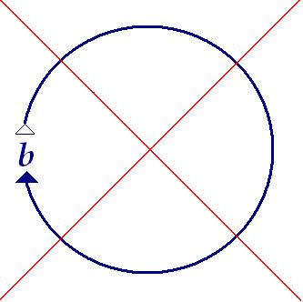
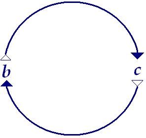

# Leçon 21 | 21 Mai 1969

  

    <label><input type="checkbox" data-lacan-toggle="original" checked> 原文</label>
    <label><input type="checkbox" data-lacan-toggle="notes" checked> 注释</label>
    <label><input type="checkbox" data-lacan-toggle="commentary" checked> 个人解读评论</label>
  

  <form class="lacan-tool-search" role="search">
    <input class="lacan-tool-search-input" type="search" placeholder="搜索全文" aria-label="搜索全文">
    <button class="lacan-tool-button" type="submit" title="搜索">搜索</button>
  </form>
  <button class="lacan-tool-button lacan-back-to-top" type="button" title="回到页面最上方" aria-label="回到页面最上方">↑</button>

<section class="parallel-paragraph" data-paragraph-ids="s16-21-0001">

s16-21-0001

原文 · s16-21-0001

*Le système de nulle part*, voilà - pourrait-on dire - ce qu’il nous faut exposer. C’est bien là que prendrait son sens enfin, le terme d’*utopie*, mais cette fois réalisée du bon bout, si je puis dire. La vieille « *nullibiété* » à laquelle, dans les temps anciens, j’avais redonné le lustre qu’elle mérite pour avoir été inventée par l’évêque WILKINS [^81] : ça n’est « *nulle part* », qu’est-ce que c’est ? Il s’agit de *la jouissance*.

[无对应译文]

</section>

<section class="parallel-paragraph" data-paragraph-ids="s16-21-0002">

s16-21-0002

原文 · s16-21-0002

Ce que l’expérience analytique démontre - encore faut-il le dire - c’est que : *par un lien à quelque chose qui n’est rien d’autre que ce qui permet l’émergence du savoir, la jouissance est exclue, le cercle se ferme*.

[无对应译文]

</section>

<section class="parallel-paragraph" data-paragraph-ids="s16-21-0003">

s16-21-0003

原文 · s16-21-0003

Cette exclusion ne s’énonce que du système lui-même en tant que c’est *le symbolique*.

[无对应译文]

</section>

<section class="parallel-paragraph" data-paragraph-ids="s16-21-0004">

s16-21-0004

原文 · s16-21-0004

Or, c’est par là qu’elle s’affirme comme *réel*, *réel* dernier du fonctionnement du système même qui l’exclut.

[无对应译文]

</section>

<section class="parallel-paragraph" data-paragraph-ids="s16-21-0005">

s16-21-0005

原文 · s16-21-0005

« *Nulle part* », la voici redevenue « *partout* », de cette *exclusion* même qui est tout ce par quoi elle se réalise.

[无对应译文]

</section>

<section class="parallel-paragraph" data-paragraph-ids="s16-21-0006">

s16-21-0006

原文 · s16-21-0006

Et c’est bien là, on le sait, à quoi s’attache notre pratique : démasquer, dévoiler ce qui - là où nous avons affaire : dans le *symptôme -* démasque cette relation à la *jouissance*, notre *réel*, mais pour autant qu’elle est exclue.

[无对应译文]

</section>

<section class="parallel-paragraph" data-paragraph-ids="s16-21-0007">

s16-21-0007

原文 · s16-21-0007

C’est à ce titre que nous avançons ces trois termes comme support :

[无对应译文]

</section>

<section class="parallel-paragraph" data-paragraph-ids="s16-21-0008">

s16-21-0008

原文 · s16-21-0008

- de *la jouissance* en tant qu’elle est exclue,

[无对应译文]

</section>

<section class="parallel-paragraph" data-paragraph-ids="s16-21-0009">

s16-21-0009

原文 · s16-21-0009

- de *l’Autre* comme lieu où ça se sait,

[无对应译文]

</section>

<section class="parallel-paragraph" data-paragraph-ids="s16-21-0010">

s16-21-0010

原文 · s16-21-0010

- du *(a)* comme de l’effet de chute qui résulte.

[无对应译文]

</section>

<section class="parallel-paragraph" data-paragraph-ids="s16-21-0011">

s16-21-0011

原文 · s16-21-0011

Car c’est l’enjeu de l’affaire, qui résulte de ceci :

[无对应译文]

</section>

<section class="parallel-paragraph" data-paragraph-ids="s16-21-0012">

s16-21-0012

原文 · s16-21-0012

- que dans le jeu du signifiant, c’est *la jouissance* qui est visée pourtant,

[无对应译文]

</section>

<section class="parallel-paragraph" data-paragraph-ids="s16-21-0013">

s16-21-0013

原文 · s16-21-0013

- que le signifiant surgit du rapport indicible de ce *quelque chose* qui, d’avoir reçu - d’où ? - ce moyen : le signifiant, en est frappé d’une *relation* à ce « *quelque chose » qui* de là se développe et *va prendre forme comme « Autre »*.

[无对应译文]

</section>

<section class="parallel-paragraph" data-paragraph-ids="s16-21-0014">

s16-21-0014

原文 · s16-21-0014

Ce lien du sujet à l’Autre…

[无对应译文]

</section>

<section class="parallel-paragraph" data-paragraph-ids="s16-21-0015">

s16-21-0015

原文 · s16-21-0015

> Autre à qui il advient des *avatars*, qui n’a pas dit son dernier mot, et c’est bien cela qui nous accroche …voilà au niveau de quels termes nous avons à situer cette *Psychanalyse* qui en est, *si je puis dire*, depuis son moment d’origine, *l’expérience sauvage*, née sans doute, dans un éclair exceptionnel par la voie de FREUD et qui depuis ne cesse d’être à la merci des versants qui s’offrent à elle et qui sont identiques à ceux-là même dans le réseau desquels le sujet qu’elle traite est pris.

[无对应译文]

</section>

<section class="parallel-paragraph" data-paragraph-ids="s16-21-0016">

s16-21-0016

原文 · s16-21-0016

Je voudrais partir de quelque chose d’aussi proche qu’il est possible. Tenez…

[无对应译文]

</section>

<section class="parallel-paragraph" data-paragraph-ids="s16-21-0017">

s16-21-0017

原文 · s16-21-0017

> vous m’en ferez la morale que vous voudrez, *analytique* s’il vous plaît ou autre, peu importe, …bon, voilà un objet pour lequel j’ai une préférence, une préférence à titre d’appareil.

[无对应译文]

</section>

<section class="parallel-paragraph" data-paragraph-ids="s16-21-0018">

s16-21-0018

原文 · s16-21-0018

C’est un stylo…

[无对应译文]

</section>

<section class="parallel-paragraph" data-paragraph-ids="s16-21-0019">

s16-21-0019

原文 · s16-21-0019

> qui est aussi proche qu’il est possible d’un porte-plume par sa minceur,
>
> porte-plume au sens antique, antédiluvien, il n’y a plus que très peu de personnes qui s’en servent …il est comme tel d’un très faible contenu puisque vous le voyez, son réservoir…

[无对应译文]

</section>

<section class="parallel-paragraph" data-paragraph-ids="s16-21-0020">

s16-21-0020

原文 · s16-21-0020

> puisqu’il peut rentrer pour finir par devenir réduit à quelque chose qui tient dans le creux de la main …son réservoir est d’un très faible contenu.

[无对应译文]

</section>

<section class="parallel-paragraph" data-paragraph-ids="s16-21-0021">

s16-21-0021

原文 · s16-21-0021

Il en résulte qu’il est très difficile à charger parce qu’il se produit des effets osmotiques, ce qui fait que quand on verse la goutte, la goutte est juste à la taille de son entrée. Il est donc fort incommode. Et pourtant, j’y tiens.

[无对应译文]

</section>

<section class="parallel-paragraph" data-paragraph-ids="s16-21-0022">

s16-21-0022

原文 · s16-21-0022

J’y tiens d’une préférence spéciale, pour la raison qu’il réalise un certain type de *porte-plume* avec une plume, une vraie plume et en effet il date, il date d’une époque où c’était vraiment une plume et pas quelque chose de rigide comme il se fait maintenant. Ce porte-plume donc, m’a été donné par quelqu’un qui savait que je cherchais ça.

[无对应译文]

</section>

<section class="parallel-paragraph" data-paragraph-ids="s16-21-0023">

s16-21-0023

原文 · s16-21-0023

C’était un cadeau qui venait d’être fait très peu de minutes avant, ou d’heures ou de jours peu importe, par quelqu’un qui en faisait certainement un hommage d’un ordre assez précis, pour tout dire « *fétichiste* ».

[无对应译文]

</section>

<section class="parallel-paragraph" data-paragraph-ids="s16-21-0024">

s16-21-0024

原文 · s16-21-0024

C’était d’ailleurs un objet qui, de la personne donatrice à celle qui me l’a transmis, se signalait de venir de sa grand-mère. C’est bien pour ça qu’il n’est pas facile à retrouver. Il y a des échoppes tout à fait particulières, paraît-il, à New-York, où on vend les stylos de la Belle Époque. Par une autre voie, comme vous voyez, j’en ai un.

[无对应译文]

</section>

<section class="parallel-paragraph" data-paragraph-ids="s16-21-0025">

s16-21-0025

原文 · s16-21-0025

J’ai donc un aperçu de l’histoire de cet objet, qui par ailleurs me tient à cœur pour lui-même, indépendamment tout à fait de cette histoire, car à la vérité je ne sais pas spécial gré à la personne qui me l’a donné de m’avoir fait ce don.

[无对应译文]

</section>

<section class="parallel-paragraph" data-paragraph-ids="s16-21-0026">

s16-21-0026

原文 · s16-21-0026

Mon rapport à lui est indépendant, il est certainement très près de ce qui pour moi est *l’objet(a)*.

[无对应译文]

</section>

<section class="parallel-paragraph" data-paragraph-ids="s16-21-0027">

s16-21-0027

原文 · s16-21-0027

J’ai un aperçu de son histoire mais, *pour tout objet*, est-ce que vous ne voyez pas - de la sorte dont je viens d’animer celui-là - que cette question de son histoire se pose autant que pour un quelconque sujet. Cette histoire, comment imaginer qui la sait, qui peut en répondre, sinon à instituer cet Autre comme le lieu où « *ça se sait* ». Et qui est-ce qui ne voit pas, si on lui ouvre cette dimension, qu’au moins pour certains - *et j’ose dire, pour chacun* - elle existe, que pour certains elle est tout à fait prévalente mais que pour tous elle fait un fond. Il y a *quelque part où ça se sait*, tout ce qui est arrivé.

[无对应译文]

</section>

<section class="parallel-paragraph" data-paragraph-ids="s16-21-0028">

s16-21-0028

原文 · s16-21-0028

Le signifiant de A en tant qu’*entier*, dès qu’on s’interroge dans cette voie, on reconnaît qu’il est implicite, et que pour *le névrosé obsessionnel* il l’est beaucoup plus que pour d’autres. C’est par là, au niveau de l’histoire, en tant que \- c’est pour ça que j’ai pris ce biais - elle est suggérée pas du tout directement du *sujet* mais aussi bien du sort des objets, c’est par cette voie qu’il est sensible ce qu’a de fou cette présupposition *d’un lieu quelconque où ça se sait*.

[无对应译文]

</section>

<section class="parallel-paragraph" data-paragraph-ids="s16-21-0029">

s16-21-0029

原文 · s16-21-0029

Ceci est important parce qu’il est clair que le « *ça se sait* » verse aussitôt dans l’intérêt que prend la question.

[无对应译文]

</section>

<section class="parallel-paragraph" data-paragraph-ids="s16-21-0030">

s16-21-0030

原文 · s16-21-0030

Là où « *ça se sait* », au *sens neutre* où nous l’avons introduit, c’est là que se pose la question si « *ça se sait soi-même *? »

[无对应译文]

</section>

<section class="parallel-paragraph" data-paragraph-ids="s16-21-0031">

s16-21-0031

原文 · s16-21-0031

### La réflexibilité ne surgit pas de la conscience sinon par ce détour qu’il faut vérifier :

[无对应译文]

</section>

<section class="parallel-paragraph" data-paragraph-ids="s16-21-0032">

s16-21-0032

原文 · s16-21-0032

c’est que là où l’on suppose que « *ça se sait* » - continu[^82] et tout - « *est-ce qu’il se sait que ça se sache* » ?

[无对应译文]

</section>

<section class="parallel-paragraph" data-paragraph-ids="s16-21-0033">

s16-21-0033

原文 · s16-21-0033

Si l’on s’interroge sur ce qu’il en est de l’activité mathématique, dont il est humoristique de constater que tout spécialement le mathématicien est toujours aussi incapable de rien dire en son fond si ce n’est qu’il sait très bien ce que c’est quand il fait des mathématiques. Quand à vous dire à quoi il le discerne, jusqu’à présent *motus*. Il peut dire que ça n’en est pas, mais ce que « ça » est n’est pas encore trouvé.

[无对应译文]

</section>

<section class="parallel-paragraph" data-paragraph-ids="s16-21-0034">

s16-21-0034

原文 · s16-21-0034

Nous émettons un énoncé qui peut-être commencerait dans cette voie : organiser des choses, des choses qui se disent d’une façon telle que *ça se sait soi-même*, assurément à tout instant, et que ça peut en témoigner.

[无对应译文]

</section>

<section class="parallel-paragraph" data-paragraph-ids="s16-21-0035">

s16-21-0035

原文 · s16-21-0035

Comme me le disait tout récemment quelqu’un, *mathématicien,* avec qui j’en parlais, ce qui caractérise un énoncé *mathématique*, c’est sa liberté du *contexte*. Un théorème peut s’énoncer tout seul et se défendre. Il porte en lui cette dose suffisante de recouverture à soi-même qui le rend libre du discours qui l’introduit. La chose est à revoir de près.

[无对应译文]

</section>

<section class="parallel-paragraph" data-paragraph-ids="s16-21-0036">

s16-21-0036

原文 · s16-21-0036

Ce côté de différence avec les autres discours où toute citation risque d’être abusive au regard de ce qui l’enserre et qu’on appelle *contexte* est important à marquer.

[无对应译文]

</section>

<section class="parallel-paragraph" data-paragraph-ids="s16-21-0037">

s16-21-0037

原文 · s16-21-0037

Cette substance du « *ça se sait* » instantané comme tel, s’accompagne de ceci qu’elle suppose que tout ce qui y attient, ça se sait, au sens de « *ça se recouvre soi-même* », ça se sait *dans son ensemble*, c’est-à-dire que ce qui est révélateur, c’est que le supposé d’un discours qui aspire à pouvoir entièrement se recouvrir soi-même rencontre des limites.

[无对应译文]

</section>

<section class="parallel-paragraph" data-paragraph-ids="s16-21-0038">

s16-21-0038

原文 · s16-21-0038

Il rencontre des limites en ceci précisément qu’il y existe des points qui n’y sont pas posables, dont la première image sera aussi bien donnée par *la suite des nombres entiers*, et par ceci qui s’articule que « *celui défini comme étant plus grand qu’un quelconque* » n’y est justement pas posable, entendons dans cette série infinie, dit-on, des nombres entiers.

[无对应译文]

</section>

<section class="parallel-paragraph" data-paragraph-ids="s16-21-0039">

s16-21-0039

原文 · s16-21-0039

C’est précisément que ce nombre soit exclu, et proprement en tant que symbole - nulle part ne peut être écrit ce nombre plus grand qu’aucun autre - c’est très précisément de cette *impossibilité de l’écrire* que toute la série des nombres entiers tire ce qu’elle a, non pas d’être une *simple graphie* d’une chose qui peut *s’écrire*, mais d’être quelque chose qui est dans *le réel*.

[无对应译文]

</section>

<section class="parallel-paragraph" data-paragraph-ids="s16-21-0040">

s16-21-0040

原文 · s16-21-0040

*Cet impossible même est d’où surgit ce réel*.

[无对应译文]

</section>

<section class="parallel-paragraph" data-paragraph-ids="s16-21-0041">

s16-21-0041

原文 · s16-21-0041

Ce mécanisme est très précisément ce qui permet de le reprendre, au niveau du symbole א  et d’inscrire au titre du transfini ce signe א même non posable au niveau de la série des entiers, et de commencer à interroger sur ce qu’on peut opérer à partir de ce signe א posé comme non posable au niveau de la série des entiers, et de s’apercevoir qu’effectivement ce signe א, symbole repris au niveau de ce qui fait la réalité de toute la série des entiers, permet un nouveau traitement symbolique où les relations recevables au terme de *la série des entiers* peuvent être reprises, non pas toutes, mais très certainement une part d’entre elles.

[无对应译文]

</section>

<section class="parallel-paragraph" data-paragraph-ids="s16-21-0042">

s16-21-0042

原文 · s16-21-0042

Et c’est *le progrès* qui se poursuit d’un discours tel que, pour se savoir à chaque instant, jamais il ne se trouve sans rencontrer cette combinaison des *limites* avec ces *trous* qu’on appelle infini, c’est-à-dire non saisissable, jusqu’à ce que justement il soit \- d’être repris dans une structure différente - réductible à être cette limite. L’aporie en aucun cas n’étant *<u>que</u>* l’introduction à une structure de l’Autre.

[无对应译文]

</section>

<section class="parallel-paragraph" data-paragraph-ids="s16-21-0043">

s16-21-0043

原文 · s16-21-0043

C’est ce qu’on voit fort bien dans *la théorie des ensembles*, dans laquelle on peut un certain temps en effet s’avancer innocemment, et *qui nous intéresse d’une façon particulière* parce qu’après tout, au niveau plus radical où nous avons affaire, à savoir de *cette incidence du signifiant dans la répétition*, en apparence rien n’objecte - rien n’objecte *d’abord* - à ce que A ne soit que l’inscription entière de toutes les histoires possibles.

[无对应译文]

</section>

<section class="parallel-paragraph" data-paragraph-ids="s16-21-0044">

s16-21-0044

原文 · s16-21-0044

Chaque signifiant renvoie d’autant plus à l’Autre qu’il ne peut renvoyer à lui-même qu’en tant qu’autre.

[无对应译文]

</section>

<section class="parallel-paragraph" data-paragraph-ids="s16-21-0045">

s16-21-0045

原文 · s16-21-0045

Rien ne fait donc obstacle à ce que les signifiants se répartissent d’une façon circulaire, ce qui, à ce titre, permettra fort bien d’énoncer qu’il y a « *ensemble* » de tout ce qui de soi ne s’identifie pas à soi­-même. *À tourner en rond*, il est parfaitement concevable que *tout s’ordonne*, même « *le catalogue de tous les catalogues qui ne se contiennent pas eux-mêmes* ».

[无对应译文]

</section>

<section class="parallel-paragraph" data-paragraph-ids="s16-21-0046">

s16-21-0046

原文 · s16-21-0046

Il est parfaitement admissible, à cette seule condition qu’on sache, *et c’est certain*, qu’aucun catalogue ne se contient lui-même, sinon par son titre. Ça n’empêche pas que l’ensemble de tous les catalogues auront ce caractère clos que chaque catalogue, en tant qu’il ne se contient pas lui-même, peut toujours être inscrit dans un autre que lui-même contient. La seule chose exclue, si nous traçons le réseau de ces choses, c’est le tracé qui s’écrirait ainsi : celui qui admet d’un point à un autre d’un réseau quelconque et d’un réseau orienté, qui exclut - si *b* renvoie à un certain nombre d’autres points : *d*, *e*, - qui exclut ceci : que *b* renvoie à lui-même :

[无对应译文]

</section>

<section class="parallel-paragraph" data-paragraph-ids="s16-21-0047">

s16-21-0047

原文 · s16-21-0047

[无对应译文]

</section>

<section class="parallel-paragraph" data-paragraph-ids="s16-21-0048">

s16-21-0048

原文 · s16-21-0048

Il suffit dans cette occasion que *b* renvoie à *c*, et que *c* lui-même renvoie à *b* pour qu’il n’y ait plus aucun obstacle à la subsistance corrélative de *b* et *c* et qu’une totalité les enveloppe :

[无对应译文]

</section>

<section class="parallel-paragraph" data-paragraph-ids="s16-21-0049">

s16-21-0049

原文 · s16-21-0049

[无对应译文]

</section>

<section class="parallel-paragraph" data-paragraph-ids="s16-21-0050">

s16-21-0050

原文 · s16-21-0050

Si quelque chose nous interroge, c’est justement de l’expérience analytique, comme repérant quelque part ce *point à l’infini* de tout ce qui s’ordonne dans l’ordre des combinaisons signifiantes, ce *point à l’infini* *irréductible* en tant qu’il concerne une certaine *jouissance*, laissée *problématique*, et qui pour nous instaure la question de la jouissance sous un aspect qui n’est plus externe au *système du savoir*.

[无对应译文]

</section>

<section class="parallel-paragraph" data-paragraph-ids="s16-21-0051">

s16-21-0051

原文 · s16-21-0051

*Ce signifiant de la jouissance, ce signifiant exclu* pour autant qu’il est celui que nous promouvons sous le terme du *signifiant phallique*, *voilà ce autour de quoi s’ordonnent* toutes ces biographies à quoi la littérature analytique tend à réduire *ce qu’il en est des névroses*.

[无对应译文]

</section>

<section class="parallel-paragraph" data-paragraph-ids="s16-21-0052">

s16-21-0052

原文 · s16-21-0052

Mais ce n’est pas parce que nous pouvons recouvrir d’une homologie aussi complète qu’il est possible les relations dites interpersonnelles de ce que nous appelons un adulte - *adulte*, faut-il le dire, foncièrement *adultéré -* puisque ce que nous retrouvons à travers ces relations, nous le cherchons dans cette biographie seconde que nous disons originelle, qui est celle de ses *relations infantiles*.

[无对应译文]

</section>

<section class="parallel-paragraph" data-paragraph-ids="s16-21-0053">

s16-21-0053

原文 · s16-21-0053

Et que là, au bout d’un certain temps d’accoutumance de l’analyste, nous tenons pour reçues les relations tensionnelles qui s’établissent à l’endroit d’un certain nombre de termes : *le père*, *la mère*, la naissance d’*un frère* ou d’*une petite sœur*, que nous considérons comme primitifs mais qui bien sûr ne prennent ce sens, ne prennent ce poids qu’en raison de la place qu’ils tiennent dans cette articulation telle par exemple - il y en aura peut-être de plus élaborées, je le souhaite - mais telle en fait que celle que je vous articule *au regard du savoir, de la jouissance et d’un certain objet en tant que primordialement* c’est par rapport à eux que vont se situer toutes ces relations primordiales dont il ne suffit pas de faire surgir la simple homologie dans un recul au regard de celui qui vient nous confier ses relations actuelles, mais dont - que nous le *voulions* ou pas, que nous le *sachions* ou pas - nous faisons sentir le poids, la présence et l’instance dans toute la façon dont *nous*, nous comprenons cette seconde biographie première, dite infantile, et qui n’est là que pour nous masquer bien souvent la question, celle sur laquelle nous aurions *nous*, à nous interroger vraiment - *j’entends :* *nous* *analystes* - à savoir ce qui détermine de cette façon la biographie infantile, et dont le ressort n’est toujours bien évidemment que dans la façon dont se sont présentés ce que nous appelons désirs chez le père, chez la mère, et qui par conséquent nous incitent à explorer non pas seulement l’histoire mais le mode de présence sous lequel chacun de ces trois termes, *savoir, jouissance et l’objet(a)* ont été au *sujet* offerts *effectivement*.

[无对应译文]

</section>

<section class="parallel-paragraph" data-paragraph-ids="s16-21-0054">

s16-21-0054

原文 · s16-21-0054

C’est ce qui fait, et c’est là que gît ce que nous appelons improprement *le choix de la névrose*, voire *le choix entre psychose et névrose*. Il n’y a pas eu de « *choix* », *le choix était déjà fait* au niveau de ce qui s’est au sujet présenté *mais n’est perceptible, repérable, qu’en fonction des trois termes* tels que nous venons ici d’essayer de les dégager.La chose a plus d’une *portée*, elle en a une *historique*.

[无对应译文]

</section>

<section class="parallel-paragraph" data-paragraph-ids="s16-21-0055">

s16-21-0055

原文 · s16-21-0055

### Qui ne conçoit que, s’il faut poser ce que signifie la psychanalyse dans l’histoire, et si certains choix lui sont aussi à elle offerts, c’est pour autant que nous vivons dans un temps où, à la dimension de la communauté, les rapports *du savoir*

[无对应译文]

</section>

<section class="parallel-paragraph" data-paragraph-ids="s16-21-0056">

s16-21-0056

原文 · s16-21-0056

### et *de la jouissance* ne sont pas les mêmes qu’ils pouvaient l’être par exemple dans *les temps antiques* et qu’assurément nous

[无对应译文]

</section>

<section class="parallel-paragraph" data-paragraph-ids="s16-21-0057">

s16-21-0057

原文 · s16-21-0057

### ne pouvons tenir pour rapprochable notre position de celle par exemple des *Épicuriens* ou d’une école telle : il y avait

[无对应译文]

</section>

<section class="parallel-paragraph" data-paragraph-ids="s16-21-0058">

s16-21-0058

原文 · s16-21-0058

### une certaine position de retrait au regard de la jouissance qui était possible pour eux, d’une façon en quelque sorte *innocente*.

[无对应译文]

</section>

<section class="parallel-paragraph" data-paragraph-ids="s16-21-0059">

s16-21-0059

原文 · s16-21-0059

Dans un temps où, de par la mise en jeu de ce que nous appelons *le capitalisme*, une certaine position nous inclut tous dans *la relation à la jouissance* d’une façon caractéristique, si l’on peut dire, par l’arête de sa pureté, que ce qu’on appelle *exploitation du travailleur* ne consiste très précisément en ceci : *que la jouissance soit exclue du travail* et que, du même coup, elle ne lui donne tout son *réel*.

[无对应译文]

</section>

<section class="parallel-paragraph" data-paragraph-ids="s16-21-0060">

s16-21-0060

原文 · s16-21-0060

De la même sorte que nous avons évoqué tout à l’heure l’effet du point à l’infini, c’est par là que se suscite cette sorte d’aporie qui est proprement ce qui suggère le sens nouveau - au regard de *l’empire de la société* - le sens nouveau, sans précédent dans le contexte *antique*, que prend le mot *révolution* et c’est en quoi nous avons à y dire notre mot pour rappeler que ce terme est, comme MARX l’a parfaitement vu…

[无对应译文]

</section>

<section class="parallel-paragraph" data-paragraph-ids="s16-21-0061">

s16-21-0061

原文 · s16-21-0061

> et c’est en quoi il articule la seule chose qui se soit trouvée efficace jusqu’à présent …*c’est la solidarité étroite de ce terme qui s’appelle révolution avec le système même qui le porte, qui est le système capitaliste*.

[无对应译文]

</section>

<section class="parallel-paragraph" data-paragraph-ids="s16-21-0062">

s16-21-0062

原文 · s16-21-0062

Que nous ayons là-dessus quelque chose qui peut - peut-être - offrir l’ouverture par une série d’exemples à ce qu’il peut en être d’un joint où s’ouvrirait ce cercle, c’est l’intérêt de *la psychanalyse*, je veux dire son intérêt dans l’histoire.

[无对应译文]

</section>

<section class="parallel-paragraph" data-paragraph-ids="s16-21-0063">

s16-21-0063

原文 · s16-21-0063

C’est aussi bien ce à quoi elle peut défaillir aussi intégralement qu’il se peut. Car, *à prendre les choses au niveau de la biographie*, ce que nous voyons s’offrir, *au tournant qui constitue biographiquement le moment d’éclosion de la névrose*, c’est le choix qui s’offre…

[无对应译文]

</section>

<section class="parallel-paragraph" data-paragraph-ids="s16-21-0064">

s16-21-0064

原文 · s16-21-0064

> et qui s’offre d’une façon d’autant plus instante que c’est lui-même qui est déterminant de ce tournant …le choix entre ce qui est présentifié…

[无对应译文]

</section>

<section class="parallel-paragraph" data-paragraph-ids="s16-21-0065">

s16-21-0065

原文 · s16-21-0065

> *à savoir l’approche de ce point d’impossibilité, de ce point à l’infini, qui est toujours introduit par l’approche de la conjonction sexuelle* …et la face corrélative qui s’annonce du fait qu’au niveau du sujet, en raison du temps pré-mature…

[无对应译文]

</section>

<section class="parallel-paragraph" data-paragraph-ids="s16-21-0066">

s16-21-0066

原文 · s16-21-0066

> mais comment ne serait-il pas toujours pré-mature au regard de l’impossibilité …en raison du temps pré-mature où il vient à jouer dans l’enfance, ce qui, cette impossibilité, la projette, la masque, la détourne de devoir s’exercer en termes d’insuffisance, de n’être en tant que vivant - vivant et réduit à ses propres forces - forcément pas à la hauteur.

[无对应译文]

</section>

<section class="parallel-paragraph" data-paragraph-ids="s16-21-0067">

s16-21-0067

原文 · s16-21-0067

*L’alibi pris de l’impossibilité dans l’insuffisance est aussi bien la pente que peut prendre la direction, comme je l’ai appelée, de la psychanalyse*, et qui après tout n’est pas non plus *humainement parlant* quelque chose où en effet nous ne puissions pas nous sentir les ministres d’un secours, qui sur tel ou tel point, à propos de telle ou telle personne, peut être l’occasion d’un bienfait.

[无对应译文]

</section>

<section class="parallel-paragraph" data-paragraph-ids="s16-21-0068">

s16-21-0068

原文 · s16-21-0068

Néanmoins ce n’est pas là ce qui justifie *la psychanalyse*. Ce n’est pas là d’où elle est sortie. Ce n’est pas là qu’il y a son sens.

[无对应译文]

</section>

<section class="parallel-paragraph" data-paragraph-ids="s16-21-0069">

s16-21-0069

原文 · s16-21-0069

Et pour une simple raison : c’est que ce n’est pas là ce dont *le névrosé* nous témoigne. Car ce dont *le névrosé* nous témoigne, si nous voulons entendre ce que par tous ses *symptômes* il nous dit, c’est que là où se place son discours, il est clair que *ce qu’il cherche est autre chose que de s’égaler à la question qu’il pose*.

[无对应译文]

</section>

<section class="parallel-paragraph" data-paragraph-ids="s16-21-0070">

s16-21-0070

原文 · s16-21-0070

*Le névrosé*, qu’il s’agisse de *l’hystérique* ou de *l’obsessionnel*… nous ferons ultérieurement *le lien des deux versants avec cet objet(a)* que nous avons produit dans l’efficace de la phobie …*le névrosé* met en question ce qu’il en est de *la vérité du savoir*, et très précisément en ceci qu’il [*append*](http://www.cnrtl.fr/definition/appendre) à la jouissance.

[无对应译文]

</section>

<section class="parallel-paragraph" data-paragraph-ids="s16-21-0071">

s16-21-0071

原文 · s16-21-0071

Et en reposant la question, *a-t-il raison* ? Oui, certes, puisque nous savons que ce n’est que de cette dépendance que le savoir a son statut originel, et que *dans son développement, il en articule la distance*. *A-t-il raison* ?

[无对应译文]

</section>

<section class="parallel-paragraph" data-paragraph-ids="s16-21-0072">

s16-21-0072

原文 · s16-21-0072

Son discours, certes, est dépendant de ce qu’il en est de la *la vérité du savoir*, mais comme déjà devant vous je l’ai articulé, ce n’est point parce que ce discours relève de cette vérité. Pour qu’il soit dans le vrai, la cohérence de la suspension du savoir à l’interdit de la jouissance ne rend pas pour autant lisible ce qui, à un certain niveau, dénonce ce nœud constitutif.

[无对应译文]

</section>

<section class="parallel-paragraph" data-paragraph-ids="s16-21-0073">

s16-21-0073

原文 · s16-21-0073

Et aussi bien pourquoi ne traduirait-il pas, lui aussi, au dernier terme, une certaine forme d’aporie ?

[无对应译文]

</section>

<section class="parallel-paragraph" data-paragraph-ids="s16-21-0074">

s16-21-0074

原文 · s16-21-0074

Si je l’ai dit tout à l’heure, dans ce qui s’offre comme position prise *au niveau des impasses qui se formulent comme loi de l’*A*utre*, quand il s’agit du sexuel, je dirai qu’au dernier terme…

[无对应译文]

</section>

<section class="parallel-paragraph" data-paragraph-ids="s16-21-0075">

s16-21-0075

原文 · s16-21-0075

> après avoir criblé autant que je l’ai pu les faces sous lesquelles se distinguent *l’obsessionnel* et *l’hystérique* …la meilleure formule que je pourrais donner procède précisément de ce qui s’offre au niveau de la nature, au naturel comme solution de l’impasse à cette loi de l’Autre.

[无对应译文]

</section>

<section class="parallel-paragraph" data-paragraph-ids="s16-21-0076">

s16-21-0076

原文 · s16-21-0076

Pour l’homme qui a à remplir l’*identification* à cette fonction dite du *père symbolique*…

[无对应译文]

</section>

<section class="parallel-paragraph" data-paragraph-ids="s16-21-0077">

s16-21-0077

原文 · s16-21-0077

> *la seule à satisfaire - et c’est en cela qu’elle est mythique - la position de la jouissance virile dans ce qu’il en est de la conjonction sexuelle* …pour l’homme ce qui s’offre au niveau du naturel est très précisément ce qui s’appelle *savoir être le maître*, et en effet, ça a été - ça l’est probablement encore - ça a été et ça reste encore très suffisamment à la portée de quelqu’un.

[无对应译文]

</section>

<section class="parallel-paragraph" data-paragraph-ids="s16-21-0078">

s16-21-0078

原文 · s16-21-0078

Je dirai que *l’obsessionnel* est celui qui *refuse de se prendre pour un maître* car au regard de ce dont il s’agit : *la vérité du savoir*, ce qui lui importe c’est *le rapport de ce savoir à la jouissance*, et de ce *savoir,* ce qu’il sait c’est qu’il n’a rien, rien d’autre de ce qui reste de l’incidence première de son interdiction, à savoir *l’objet(a)*.

[无对应译文]

</section>

<section class="parallel-paragraph" data-paragraph-ids="s16-21-0079">

s16-21-0079

原文 · s16-21-0079

Toute jouissance n’est pour lui pensable que comme un traité avec celui - l’Autre comme entier par lui toujours imaginé fondamental - avec lequel, avec lequel il traite. La jouissance pour lui ne s’autorise que d’un paiement, d’un paiement toujours renouvelé, dans un insatiable tonneau des DANAÏDES, dans ce quelque chose qui ne s’égale jamais et qui fait des modalités de la dette le cérémonial où seulement il rencontre sa jouissance.

[无对应译文]

</section>

<section class="parallel-paragraph" data-paragraph-ids="s16-21-0080">

s16-21-0080

原文 · s16-21-0080

À l’inverse, à l’opposé, *l’hystérique*…

[无对应译文]

</section>

<section class="parallel-paragraph" data-paragraph-ids="s16-21-0081">

s16-21-0081

原文 · s16-21-0081

> dont ce n’est pas pour rien qu’elle se rencontre, \[chez l’hystérique\] cette forme de *la réponse aux impasses de la jouissance*, …à l’opposé, *l’hystérique*…

[无对应译文]

</section>

<section class="parallel-paragraph" data-paragraph-ids="s16-21-0082">

s16-21-0082

原文 · s16-21-0082

> et c’est précisément pour cela que ce mode se rencontre plus spécialement chez les femmes …*l’hystérique* se caractérise de ne pas se prendre pour « *la femme* », car dans cette impasse, dans cette aporie, aussi naturellement que pour « *le maître* », les choses s’offrent assez uniment à la femme de remplir un rôle dans la conjonction sexuelle où naturellement elle a une assez bonne part.

[无对应译文]

</section>

<section class="parallel-paragraph" data-paragraph-ids="s16-21-0083">

s16-21-0083

原文 · s16-21-0083

*Ce que l’l’hystérique* - dit-on - *refoule*, mais qu’en réalité elle *promeut, c’est ce point à l’infini de la jouissance comme absolue*.

[无对应译文]

</section>

<section class="parallel-paragraph" data-paragraph-ids="s16-21-0084">

s16-21-0084

原文 · s16-21-0084

Elle promeut *la castration* au niveau de ce *Nom du Père symbolique* à l’endroit duquel elle se pose, ou comme voulant être, au dernier temps, *sa jouissance*. Et c’est parce que cette *jouissance* ne peut être atteinte, qu’elle refuse toute autre, qui pour elle aurait ce caractère de diminution, de n’avoir - ce qui est vrai en plus - rien à faire que d’externe, que d’être du niveau de la suffisance ou de l’insuffisance, au regard de ce rapport absolu qu’il s’agit de poser.

[无对应译文]

</section>

<section class="parallel-paragraph" data-paragraph-ids="s16-21-0085">

s16-21-0085

原文 · s16-21-0085

Lisez et relisez les observations d’*hystériques* à la lumière de ces termes, et vous les verrez bien autrement que d’anecdote d’un « *tournage en rond biographique* » que le transfert à répéter, sans doute résout pour le rendre plus maniable, mais ne fait que tempérer. Pour comprendre le ressort de ce qui nous vient comme ouverture, comme béance \- de quelque façon que par ailleurs nous nous employons à la calmer - n’est-il pas essentiel de repérer ce ressort d’où il surgit, et qui n’est rien d’autre que ce en quoi le névrosé réinterroge cette frontière que rien ne peut, en fait, suturer : celle qui s’ouvre entre *savoir* et *jouissance*.

[无对应译文]

</section>

<section class="parallel-paragraph" data-paragraph-ids="s16-21-0086">

s16-21-0086

原文 · s16-21-0086

Si dans l’articulation que j’ai donnée du 1 et du *a*, qui n’est certes pas promue ici par hasard ni d’une façon qui soit caduque qui n’est rien d’autre - je vous l’ai dit - que ce en quoi, dans un *modèle mathématique*, s’inscrit - et il n’y a pas à s’en surprendre car c’est la première chose qu’on ait à rencontrer - s’inscrit dans une série ce qui se conjoint à la simple répétition du 1, à cette seule condition que nous en inscrivions la relation sous la forme d’une addition…

[无对应译文]

</section>

<section class="parallel-paragraph" data-paragraph-ids="s16-21-0087">

s16-21-0087

原文 · s16-21-0087

> après deux 1, un 2 - et de continuer indéfiniment - le dernier 1 joint au 2, un 3, 5 et après ça un 8,
>
> et après ça un 13, et ainsi de suite \[*série de Fibonacci* : 1, 1, 2, 3, 5, 8, 13, 21, 34, 55, 89, 144, 233, 377, 610, 987...\] …c’est ceci - je vous l’ai dit - *qui par la proportion qu’il engendre* - de plus en plus serrée à mesure que les nombres croissent - *définit strictement la fonction du a*.

[无对应译文]

</section>

<section class="parallel-paragraph" data-paragraph-ids="s16-21-0088">

s16-21-0088

原文 · s16-21-0088

La série a cette propriété d’énoncer - à être reprise dans le sens inverse, en procédant par soustraction – d’aboutir à une limite dans le sens négatif : ce qui, marqué de cette proportion du *a*, ira toujours en diminuant, arrive \- à ce qu’on en fasse dans ce sens la somme - *à une limite* parfaitement finie *qui*, donc, *reprise est un départ*.

[无对应译文]

</section>

<section class="parallel-paragraph" data-paragraph-ids="s16-21-0089">

s16-21-0089

原文 · s16-21-0089

Ce que fait *l’hystérique* peut s’inscrire dans ce sens. À savoir qu’*il* ou *elle* soustrait ce *a* comme tel au 1 *absolu* de l’Autre de l’interroger, de l’interroger s’il livre ou non ce 1 dernier, qui soit en sorte *son assurance*. Dans ce procès il est facile, à l’aide du modèle que je viens de rappeler, de démontrer qu’au mieux tout son effort - je dis : l’effort de *l’hystérique -* après avoir mis en question ce *a*, ne sera rien que de se retrouver tel, strictement égal à ce *a* et à rien d’autre.

[无对应译文]

</section>

<section class="parallel-paragraph" data-paragraph-ids="s16-21-0090">

s16-21-0090

原文 · s16-21-0090

Tel est ici le drame qui se traduit - à être transposé du niveau où il est, où il s’énonce d’une façon parfaitement correcte, dans un autre - se traduit par l’irréductible béance d’une *castration réalisée*. Il y a d’autres issues de l’impasse ouverte par *l’hystérique* - à ce qu’il soit résolu au niveau des énoncés, à ce niveau que j’ai caractérisé de l’épinglage « *famil* » - que la rencontre à la castration.

[无对应译文]

</section>

<section class="parallel-paragraph" data-paragraph-ids="s16-21-0091">

s16-21-0091

原文 · s16-21-0091

Mais à l’autre niveau, à celui de l’énonciation, à celui qui promeut la relation de *la jouissance* et *du savoir*, qui ne sait que des exemples historiques illustres ne fassent apercevoir qu’au niveau d’un savoir qui serait *savoir se recouvrant*, d’un *savoir* expérimenté de la relation telle qu’elle se présente de *la relation sexuelle*, telle qu’elle ne s’aperçoit que de *l’appréhension de ce point à l’infini* - qui est impasse et aporie, certes, mais qui est aussi limite - la solution peut être trouvée d’un équilibre subjectif, *à cette seule condition que le tribut juste soit payé de l’édifice d’un savoir*.

[无对应译文]

</section>

<section class="parallel-paragraph" data-paragraph-ids="s16-21-0092">

s16-21-0092

原文 · s16-21-0092

Pour *l’obsessionnel*, chacun sait qu’il en est de même. *De la productivité de l’obsessionnel*, chacun sait que tout un secteur dépend : même les plus aveugles, les plus fermés à la réalité historique se sont aperçus de sa contribution à ce qu’on appelle la pensée.

[无对应译文]

</section>

<section class="parallel-paragraph" data-paragraph-ids="s16-21-0093">

s16-21-0093

原文 · s16-21-0093

Est-ce que ce n’est pas, là aussi, ce qui exprime sa limite, ce qui nécessite au plus haut point d’être désexorcisé ?

[无对应译文]

</section>

<section class="parallel-paragraph" data-paragraph-ids="s16-21-0094">

s16-21-0094

原文 · s16-21-0094

C’est bien là que FREUD porte la question quand il nous parle des *rapports du rituel obsessionnel avec la religion*.

[无对应译文]

</section>

<section class="parallel-paragraph" data-paragraph-ids="s16-21-0095">

s16-21-0095

原文 · s16-21-0095

Assurément toute religion ne s’exténue pas dans ce qu’il est de ces pratiques, et c’est bien l’angoissant du *pari de Pascal* que de nous faire apercevoir qu’à prendre les choses même au niveau de la promesse, à s’avérer partisan du

[无对应译文]

</section>

<section class="parallel-paragraph" data-paragraph-ids="s16-21-0096">

s16-21-0096

原文 · s16-21-0096

*Dieu d’Abraham, d’Isaac et de Jacob*, *et à rejeter l’Autre, à le rejeter au point de dire qu’on ne sait ni s’il est, ni bien sûr encore plus ce qu’il est*, c’est pourtant bien celui-là - au niveau de « *s’il est ou pas* », « *de pair ou impair* » - qu’il interroge dans le pari, parce qu’il est pris, vu son époque, dans cette interrogation du savoir.

[无对应译文]

</section>

<section class="parallel-paragraph" data-paragraph-ids="s16-21-0097">

s16-21-0097

原文 · s16-21-0097

C’est là-dessus que je vous laisserai aujourd’hui.

[无对应译文]

</section>

<section class="note-block original-notes">

## Notes

[^81]: « Nullibiété », Cf. *Le Séminaire sur « La lettre volée »*, *Écrits p. 23*. « nullibiété » (nulle part, *atopia*, interroge le statut de « la lettre volée » : introuvable mais pourtant là) est ici utilisé pour qualifier la jouissance exclue du fait du symbolique. De la lettre à la jouissance, la fonction du manque dans l’Autre porte l’accent sur le réel du lieu vide de la Chose… Cf. aussi Patrick Brient : « *nullibiété* », Erès, Essaim, 2007/1 - n° 18, p. 129 à 132.

    John Wilkins (1614, 1672) ecclésiastique et scientifique anglais, évêque de Chester de 1668 à 1672. Il imagina un système d’écriture basé non sur un alphabet, mais sur un système idéographique compréhensible internationalement. Il présente ce projet dans « *An Essay towards a Real Character and*

    *a Philosophical Language »*. Cf. Jorge Luis Borges « *La langue analytique de John Wilkins* », in *Enquêtes, suivi de Entretiens*, Gallimard, 1986 (Folio), p. 138-143.

[^82]: Cf. fonctions caractéristiques des ensembles numériques : continu ou discret, ouvert ou clos etc.

</section>
