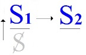
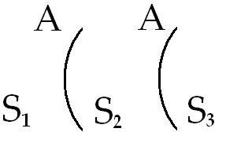
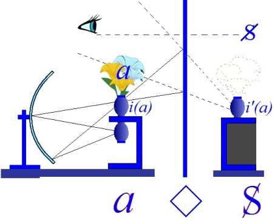

# Leçon 23 | 11 Juin 1969

  <label><input type="checkbox" data-lacan-toggle="original" checked> 原文</label>
  <label><input type="checkbox" data-lacan-toggle="notes" checked> 注释</label>
  <label><input type="checkbox" data-lacan-toggle="commentary" checked> 个人解读评论</label>

<section class="parallel-paragraph" data-paragraph-ids="s16-23-0001">

s16-23-0001

[无对应译文]

原文 · s16-23-0001

Ce petit festival hebdomadaire n’étant pas destiné à continuer pendant l’éternité, aujourd’hui nous allons nous essayer à vous donner l’idée de la façon dont, dans un contexte plus favorable, mieux structuré, nous pourrions nous employer à mettre dans la théorie un peu de rigueur.

</section>

<section class="parallel-paragraph" data-paragraph-ids="s16-23-0002">

s16-23-0002

[无对应译文]

原文 · s16-23-0002

Quand j’ai choisi cette année pour titre de mon séminaire : « *D’un Autre à l’autre »,* une des personnes qui, je dois dire, s’était le plus distinguée - par une prompte oreille - à m’entendre dans cette enceinte, mais enfin qui, comme Saint PAUL avait été terrassé au détour par cette chose qui nous est arrivée l’année dernière, vous le savez tous, la mémoire en dure encore, comme Saint PAUL au chemin de Damas, s’était vu précipité en bas de sa monture théorisante par l’illumination maoïste, ce quelqu’un a écouté ce titre et m’a dit : « *Oui… ça fait banal* ».

</section>

<section class="parallel-paragraph" data-paragraph-ids="s16-23-0003">

s16-23-0003

[无对应译文]

原文 · s16-23-0003

Je voudrais quand même - si vous ne le soupçonnez pas déjà - bien pointer que ça veut dire quelque chose, quelque chose qui nécessite le choix très exprès de ces mots qui - comme j’ose l’espérer, vous les écrivez dans votre tête - s’écrivent : *D’un Autre à l’autre.*

</section>

<section class="parallel-paragraph" data-paragraph-ids="s16-23-0004">

s16-23-0004

[无对应译文]

原文 · s16-23-0004

- Le grand A, il m’arrive, il m’est arrivé cette année plusieurs fois de le réinscrire sur ces feuilles \[au « tableau »\] où de temps en temps je rappelle l’existence d’un certain nombre de graphes.

</section>

<section class="parallel-paragraph" data-paragraph-ids="s16-23-0005">

s16-23-0005

[无对应译文]

原文 · s16-23-0005

- Et *l’autre* concerne ce que j’écris d’un *a*.

</section>

<section class="parallel-paragraph" data-paragraph-ids="s16-23-0006">

s16-23-0006

[无对应译文]

原文 · s16-23-0006

Si évidemment ce terme ne résonnait plus à l’oreille, étourdie par un autre bruitage, que d’un petit air de ballade, dans le genre « *de l’un à l’autre* », de l’un à l’autre aller en promenade. C’est tout de même pas rien, de dire ça, « *de l’un à l’autre* », ça marque les points de scansion d’un déplacement : de là à là.

</section>

<section class="parallel-paragraph" data-paragraph-ids="s16-23-0007">

s16-23-0007

[无对应译文]

原文 · s16-23-0007

Mais enfin évidemment, *pour nous autres qui ne sommes pas à tous les moments mordus par la démangeaison de l’acte*, nous pouvons nous demander quel intérêt, *si c’est de deux Un qu’il s’agit*, pourquoi l’un plus que l’autre, si l’autre en est encore *Un*.

</section>

<section class="parallel-paragraph" data-paragraph-ids="s16-23-0008">

s16-23-0008

[无对应译文]

原文 · s16-23-0008

Il est un certain usage prépositionnel de ces termes « *Un et autre* » c’est­-à-dire de les insérer entre un « *de* » et puis un « *à* » qui a pour effet d’établir entre eux ce que j’ai appelé dans d’autres temps « *un rapport* »… vous vous en souvenez peut-être, enfin j’imagine …*un rapport métonymique*. C’est ce que je viens de désigner en disant qu’« *à quoi bon* », si c’est toujours un « *Un* ».

</section>

<section class="parallel-paragraph" data-paragraph-ids="s16-23-0009">

s16-23-0009

[无对应译文]

原文 · s16-23-0009

Néanmoins, si vous écrivez les choses ainsi : de « l’*un* /1 » à « *l’autre* /1 », *le rapport métonymique est dans chaque cas* 1.

</section>

<section class="parallel-paragraph" data-paragraph-ids="s16-23-0010">

s16-23-0010

[无对应译文]

原文 · s16-23-0010

C’est important de l’écrire comme ça, parce que 1, écrit comme ça, c’est un effet de signifié privilégié que l’on connaît généralement sous le terme du nombre. C’est à savoir que ce 1 se caractérise par ce qu’on appelle l’*identité numérique*.

</section>

<section class="parallel-paragraph" data-paragraph-ids="s16-23-0011">

s16-23-0011

[无对应译文]

原文 · s16-23-0011

Comme rien ici par ces termes n’est désigné, que nous ne sommes au niveau d’aucune identification unaire…

</section>

<section class="parallel-paragraph" data-paragraph-ids="s16-23-0012">

s16-23-0012

[无对应译文]

原文 · s16-23-0012

> d’un 1 placé par exemple sur votre paume, à l’occasion en manière de tatouage,
>
> ce qui vous identifie dans un certain contexte, c’est arrivé …comme nous ne sommes pas à ce niveau-là…

</section>

<section class="parallel-paragraph" data-paragraph-ids="s16-23-0013">

s16-23-0013

[无对应译文]

原文 · s16-23-0013

> que c’est un trait qui ne marque rien dont il s’agit dans chaque cas …nous sommes strictement au niveau de ce qu’on appelle l’identité numérique, c’est-à-dire de *quelque chose* qui marque *la pure différence* en tant que rien ne la spécifie, l’autre n’est l’autre en rien, et c’est justement pour ça qu’il est l’autre. Voilà.

</section>

<section class="parallel-paragraph" data-paragraph-ids="s16-23-0014">

s16-23-0014

[无对应译文]

原文 · s16-23-0014

Alors on peut se demander pourquoi, de « l’un à l’autre », pourquoi il y a ces espèces de choses qui traînent, qu’on appelle des articles définis, en français « le » ça ne se voit pas bien tout de suite au niveau du premier.

</section>

<section class="parallel-paragraph" data-paragraph-ids="s16-23-0015">

s16-23-0015

[无对应译文]

原文 · s16-23-0015

L’un, pourquoi l’un ? Nous serions bien près de qualifier cet 1 du « *l’ Un*  » pour *euphonique* si nous ne nous méfiions pas par expérience de ces sortes d’explications. Nous avons été là-dessus suffisamment avertis par des rencontres précédentes.

</section>

<section class="parallel-paragraph" data-paragraph-ids="s16-23-0016">

s16-23-0016

[无对应译文]

原文 · s16-23-0016

Essayons mieux de voir si ce « L apostrophe », ce « le » article défini, se justifie mieux devant l’Autre. *L’article défini* en français se distingue de son usage en anglais par exemple, où l’accent démonstratif reste si fortement appuyé.

</section>

<section class="parallel-paragraph" data-paragraph-ids="s16-23-0017">

s16-23-0017

[无对应译文]

原文 · s16-23-0017

Il y a une valeur privilégiée de *l’article défini* en français - c’est ce qu’on appelle sa « valeur » - de fonctionner pour le notoire.

</section>

<section class="parallel-paragraph" data-paragraph-ids="s16-23-0018">

s16-23-0018

[无对应译文]

原文 · s16-23-0018

De *l’un à l’autre* dont nous sommes partis, est-ce qu’il s’agit de « *l’autre* *entre tous* », dans le sens où nous allons tout doucement le pousser ? Entre tous, est-ce qu’il y en aurait donc d’autres ?

</section>

<section class="parallel-paragraph" data-paragraph-ids="s16-23-0019">

s16-23-0019

[无对应译文]

原文 · s16-23-0019

Il est bon de s’aviser ici, de se remémorer si l’on peut, que nous avons posé qu’au niveau de l’Autre… tout au moins quand nous l’avons écrit avec un A …nous avons formulé aussi qu’« *il n’y a pas d’Autre de l’Autre* ». Et ceci est très essentiel à toute notre articulation.

</section>

<section class="parallel-paragraph" data-paragraph-ids="s16-23-0020">

s16-23-0020

[无对应译文]

原文 · s16-23-0020

Alors on va chercher une autre notoriété.

</section>

<section class="parallel-paragraph" data-paragraph-ids="s16-23-0021">

s16-23-0021

[无对应译文]

原文 · s16-23-0021

Est-ce que, s’il n’y en a pas d’Autre de l’Autre, est-ce que c’est à dire qu’il n’y en a qu’un ?

</section>

<section class="parallel-paragraph" data-paragraph-ids="s16-23-0022">

s16-23-0022

[无对应译文]

原文 · s16-23-0022

Mais ça aussi, c’est impossible, parce que sans ça, il ne serait pas l’Autre.

</section>

<section class="parallel-paragraph" data-paragraph-ids="s16-23-0023">

s16-23-0023

[无对应译文]

原文 · s16-23-0023

Ça peut vous sembler, tout ceci, un tant soit peu *rhétorique*. Ça l’est !

</section>

<section class="parallel-paragraph" data-paragraph-ids="s16-23-0024">

s16-23-0024

[无对应译文]

原文 · s16-23-0024

On a beaucoup spéculé dans des temps très antiques sur ces thèmes qui se disposaient *d’une façon un peu différente*.

</section>

<section class="parallel-paragraph" data-paragraph-ids="s16-23-0025">

s16-23-0025

[无对应译文]

原文 · s16-23-0025

On parlait de « *l’autre et du même* », et Dieu sait où ça a conduit toute une lignée qui s’appelle à proprement parler *platonicienne*.

</section>

<section class="parallel-paragraph" data-paragraph-ids="s16-23-0026">

s16-23-0026

[无对应译文]

原文 · s16-23-0026

Ce n’est pas la même chose que de parler de *l’un et de l’autre*, non pas que la lignée platonicienne n’ait pu faire autrement que d’en venir à poser la question de l’*Un*, mais très précisément d’une façon qui est celle qu’en fin de compte nous allons interroger dans le sens d’une mise en question.

</section>

<section class="parallel-paragraph" data-paragraph-ids="s16-23-0027">

s16-23-0027

[无对应译文]

原文 · s16-23-0027

### L’1 tel que nous le prenons ici est d’un autre ordre que cet *Un* élaboré par la méditation platonicienne. Il est clair que…

</section>

<section class="parallel-paragraph" data-paragraph-ids="s16-23-0028">

s16-23-0028

[无对应译文]

原文 · s16-23-0028

pour ceux qui déjà m’ont entendu cette année …ce rapport de « l’un à l’Autre » ne va à rien de moins qu’à rappeler, qu’à faire sentir, la fonction de la paire ordonnée dont vous avez vu au passage quel est le rôle majeur dans l’introduction de ce qu’on appelle bizarrement *la théorie <u>des</u> ensembles*.

</section>

<section class="parallel-paragraph" data-paragraph-ids="s16-23-0029">

s16-23-0029

[无对应译文]

原文 · s16-23-0029

Car tout le monde semble s’accommoder fort aisément de *<u>ces</u>* ensembles, au pluriel, alors que c’est justement une question… et très vive quoique non totalement tranchée encore …si l’on peut les mettre au pluriel. En tout cas ce n’est pas si aisé si la question reste ouverte de savoir si l’on peut considérer d’aucune façon qu’un élément peut appartenir à deux ensembles différents en restant *le même*.

</section>

<section class="parallel-paragraph" data-paragraph-ids="s16-23-0030">

s16-23-0030

[无对应译文]

原文 · s16-23-0030

C’est une petite parenthèse destinée à vous rappeler que ça n’est pas sans constituer *une très forte innovation logique* que tout ce qui se rapporte à ce que j’appellerai « *l’ensemblissement* »…

</section>

<section class="parallel-paragraph" data-paragraph-ids="s16-23-0031">

s16-23-0031

[无对应译文]

原文 · s16-23-0031

> pour des raisons de consonance, j’aime mieux ça que *ensemblement*, quoiqu’il arrive que *la théorie des ensembles* *s’ensable* de temps en temps, mais elle se *réensemblit* fort allègrement …ce n’est évidemment qu’en marge d’une telle référence que je voudrais vous rappeler cette innovation tout à fait radicale que *la théorie des ensembles* constitue d’introduire ce pas - et littéralement à son principe - que *ce qu’il s’agit de ne pas confondre :* *c’est en aucun cas un élément quelconque avec l’ensemble qui* - *pourtant* - *ne l’aurait que pour seul élément. Ce n’est pas du tout pareil.*

</section>

<section class="parallel-paragraph" data-paragraph-ids="s16-23-0032">

s16-23-0032

[无对应译文]

原文 · s16-23-0032

Et c’est là le *pas* d’innovation logique qui doit nous servir exactement à introduire comme il convient cet « Autre » problématique dont je viens d’interroger pourquoi nous lui donnerions cette valeur notoire : l’Autre.

</section>

<section class="parallel-paragraph" data-paragraph-ids="s16-23-0033">

s16-23-0033

[无对应译文]

原文 · s16-23-0033

En ce sens, qui est celui dont nous l’introduisons, pourvu de ce A, *il prend cette valeur notoire*

</section>

<section class="parallel-paragraph" data-paragraph-ids="s16-23-0034">

s16-23-0034

[无对应译文]

原文 · s16-23-0034

- non pas d’être « *l’Autre entre tous* »,

</section>

<section class="parallel-paragraph" data-paragraph-ids="s16-23-0035">

s16-23-0035

[无对应译文]

原文 · s16-23-0035

- ni aussi bien d’être « *le seul* »,

</section>

<section class="parallel-paragraph" data-paragraph-ids="s16-23-0036">

s16-23-0036

[无对应译文]

原文 · s16-23-0036

- *mais seulement de ce qu’il pourrait n’y en pas avoir, et qu’à sa place il n’y ait qu’un ensemble vide.*

</section>

<section class="parallel-paragraph" data-paragraph-ids="s16-23-0037">

s16-23-0037

[无对应译文]

原文 · s16-23-0037

Voilà ce qui le désigne comme Autre.

</section>

<section class="parallel-paragraph" data-paragraph-ids="s16-23-0038">

s16-23-0038

[无对应译文]

原文 · s16-23-0038

Peut-être à cette occasion vous rappelez-vous du *schéma* que j’ai inscrit à plusieurs reprises cette année sur ces feuilles blanches, le *schéma du* S1 hors d’un cercle désignant précisément la limite de l’Autre comme *ensemble vide*.

</section>

<section class="parallel-paragraph" data-paragraph-ids="s16-23-0039">

s16-23-0039

[无对应译文]

原文 · s16-23-0039

Ceci est le grand A : l’*Autre*, ceci pour désigner le rapport de ce S1 à un S2, lequel s’inscrit au champ de l’Autre et qui est proprement cet *autre signifiant* dont je parle comme étant celui sur lequel repose la constitution du sujet, en ceci que le S1 le représente, ce sujet, auprès d’un autre signifiant \[S2\].

</section>

<section class="parallel-paragraph" data-paragraph-ids="s16-23-0040">

s16-23-0040

[无对应译文]

原文 · s16-23-0040

>  

</section>

<section class="parallel-paragraph" data-paragraph-ids="s16-23-0041">

s16-23-0041

[无对应译文]

原文 · s16-23-0041

J’ai aussi insisté sur ceci qu’à avoir cette position, se renouvellera la limite du A - *redit ensemble vide* - avec le S3 et tant d’autres qui pourront ici prendre la place d’un certain relais. C’est ce relais que nous allons explorer aujourd’hui et je n’ai fait ce rappel que pour ceux qui, d’être absents, ne verraient pas ce que je désigne, d’avoir été absents\[*sic*\] quand déjà j’ai écrit ces formules de cette façon.

</section>

<section class="parallel-paragraph" data-paragraph-ids="s16-23-0042">

s16-23-0042

[无对应译文]

原文 · s16-23-0042

Remarquez bien qu’il n’y a rien d’arbitraire à identifier du même « A » cette limite ici tracée de la ligne.

</section>

<section class="parallel-paragraph" data-paragraph-ids="s16-23-0043">

s16-23-0043

[无对应译文]

原文 · s16-23-0043

Car ce n’est pas le point le moins singulier de la *théorie des ensembles* qu’à quelque niveau que se produise l’ensemble vide, quand vous interrogez un ensemble… et ceci, vous allez tout de suite très facilement l’imaginer : supposez l’ensemble fait de l’élément 1 et de l’ensemble qui a pour seul élément l’élément 1.

</section>

<section class="parallel-paragraph" data-paragraph-ids="s16-23-0044">

s16-23-0044

[无对应译文]

原文 · s16-23-0044

Voilà un ensemble à deux éléments distincts : { 1,{1} } puisqu’on ne saurait confondre d’aucune façon un élément avec l’ensemble qui ne comporte que cet élément pour élément de cet ensemble.

</section>

<section class="parallel-paragraph" data-paragraph-ids="s16-23-0045">

s16-23-0045

[无对应译文]

原文 · s16-23-0045

Or l’ensemble vide \[Ø\], nous pouvons *toujours à tout instant* le faire surgir au titre de ce qu’on appelle *sous-ensemble*. Ce n’est pas le moindre intérêt, c’est peut-être même le principal de la théorie des ensembles, que ce jeu dit des « *sous-ensembles* ».

</section>

<section class="parallel-paragraph" data-paragraph-ids="s16-23-0046">

s16-23-0046

[无对应译文]

原文 · s16-23-0046

Je regrette de devoir le rappeler - mais c’est l’extension de mon auditoire qui m’y force - de rappeler que : faire de *x, y, z, n* les éléments d’un ensemble : { *x, y, z, n* }, si l’on appelle « *sous-ensemble »* un autre ensemble qui est inclus dans cet ensemble sous la forme de ce type-ci, que x, y, z en constituent un *sous-ensemble* { *x, y, z* } vous voyez vite *que le nombre* - {*x, y, n*}, par exemple, et puis {*y, z, n*} et ainsi de suite - *que le nombre*… je pense que je n’ai pas besoin d’insister pour que ça vous apparaisse évident, qu’il est clair que numériquement, *rassembler les éléments des sous-ensembles* - autrement dit ce qui ici d’un *premier jet* - pourrait *faire figure* de *parties*, *n’est évidemment en aucun cas égal numériquement aux éléments de l’ensemble* d’où nous sommes partis pour articuler ces *sous-ensembles*, et que même, il est facile d’imaginer la formule exponentielle qui nous montrera qu’à mesure que grandissent *le nombre des éléments d’un ensemble, la somme numérique des sous-ensembles* *que l’on peut en édifier dépasse très largement le nombre de ces éléments*.

</section>

<section class="parallel-paragraph" data-paragraph-ids="s16-23-0047">

s16-23-0047

[无对应译文]

原文 · s16-23-0047

Ce qui est fort important à rappeler pour ébranler cette sorte d’adhésion à une géométrie prétendue *naturelle*, et spécialement à un postulat dont…

</section>

<section class="parallel-paragraph" data-paragraph-ids="s16-23-0048">

s16-23-0048

[无对应译文]

原文 · s16-23-0048

> si mon souvenir est bon, quelque part du côté d’un Xème livre d’EUCLIDE, j’espère ne pas me tromper …un certain EUDOXE fait un grand état.

</section>

<section class="parallel-paragraph" data-paragraph-ids="s16-23-0049">

s16-23-0049

[无对应译文]

原文 · s16-23-0049

Or ceci est capital car nous allons le toucher immédiatement du doigt sous la forme suivante, c’est qu’à énumérer les *sous-ensembles* de notre Autre…

</section>

<section class="parallel-paragraph" data-paragraph-ids="s16-23-0050">

s16-23-0050

[无对应译文]

原文 · s16-23-0050

> ici réduit à sa fonction la plus simple, à savoir d’être un ensemble portant le 1,
>
> ce signifiant nécessaire comme étant celui auprès duquel va se représenter, de l’un à l’Autre, le *Un* du sujet …vous verrez tout à l’heure dans quelles limites il est légitime de réduire ces deux S : S1 et S2, à un même 1.

</section>

<section class="parallel-paragraph" data-paragraph-ids="s16-23-0051">

s16-23-0051

[无对应译文]

原文 · s16-23-0051

C’est bien ce qui est l’objet de nos remarques d’aujourd’hui : 1,{1}

</section>

<section class="parallel-paragraph" data-paragraph-ids="s16-23-0052">

s16-23-0052

[无对应译文]

原文 · s16-23-0052

Il est clair qu’à interroger le 1 inscrit dans le champ défini comme Autre, comme ensemble comme tel, nous aurons comme *sous-ensemble* 1, et ceci qui est la façon d’écrire l’ensemble vide : {1, Ø }. Illustration la plus simple de ceci que j’ai rappelé : que les *sous-ensembles* constituent une collection numériquement supérieure à celle des éléments qui définissent un *ensemble*.

</section>

<section class="parallel-paragraph" data-paragraph-ids="s16-23-0053">

s16-23-0053

[无对应译文]

原文 · s16-23-0053

Est-ce qu’il est nécessaire d’insister : que vous voyez ici se reproduire sous la forme de cette double parenthèse : { 1,{} } qui est bien effectivement la même que celle de la ligne qui désigne ici A…

</section>

<section class="parallel-paragraph" data-paragraph-ids="s16-23-0054">

s16-23-0054

[无对应译文]

原文 · s16-23-0054

> exactement l’identité de ce A comme ensemble vide : { 1,{Ø} } …en ces deux points du schéma qui le reproduisent :

</section>

<section class="parallel-paragraph" data-paragraph-ids="s16-23-0055">

s16-23-0055

[无对应译文]

原文 · s16-23-0055

</section>

<section class="parallel-paragraph" data-paragraph-ids="s16-23-0056">

s16-23-0056

[无对应译文]

原文 · s16-23-0056

Voici donc évoqué, dès que « au champ de l’Autre » quelque chose peut s’inscrire d’aussi simple que *le trait unaire*, dès que ceci est conçu, du même mouvement surgit *- par la vertu de l’ensemble -* la fonction de la paire ordonnée.

</section>

<section class="parallel-paragraph" data-paragraph-ids="s16-23-0057">

s16-23-0057

[无对应译文]

原文 · s16-23-0057

Car il suffit de voir que dès lors les deux 1 qui peuvent s’inscrire :

</section>

<section class="parallel-paragraph" data-paragraph-ids="s16-23-0058">

s16-23-0058

[无对应译文]

原文 · s16-23-0058

- l’un ici comme premier élément de l’ensemble

</section>

<section class="parallel-paragraph" data-paragraph-ids="s16-23-0059">

s16-23-0059

[无对应译文]

原文 · s16-23-0059

- et l’autre à remplir le second ensemble vide, s’il est possible de s’exprimer ainsi , car comme ensemble vide c’est le même, …ces deux 1 se distingueront d’une *appartenance différente* : { 1,{1} }

</section>

<section class="parallel-paragraph" data-paragraph-ids="s16-23-0060">

s16-23-0060

[无对应译文]

原文 · s16-23-0060

C’est bien là où gît *la vertu non rencontrée jusqu’alors de ce* « *de l’un à l’Autre* » mine de rien, d’où nous sommes partis tout à l’heure pour y rappeler ce qu’a de spécifique la relation qui nous intéresse et qui motive cette année notre titre *D’un Autre à l’autre*.

</section>

<section class="parallel-paragraph" data-paragraph-ids="s16-23-0061">

s16-23-0061

[无对应译文]

原文 · s16-23-0061

C’est pour autant que tout ce qui est de ce qui fait notre expérience, ne peut que tourner, retourner et toujours revenir se pointer, autour de la question de la subsistance du sujet - *toujours *- axe, axiomatique indispensable à ne jamais perdre ce à quoi nous avons affaire dans le concret de la façon la plus efficace.

</section>

<section class="parallel-paragraph" data-paragraph-ids="s16-23-0062">

s16-23-0062

[无对应译文]

原文 · s16-23-0062

À savoir que si cet axe et cet axiome n’est pas conservé nous entrons dans la confusion, celle qui s’étale aux derniers temps dans tout ce qui se fait de l’énoncé de l’expérience analytique et spécialement à l’intégration de plus en plus envahissante de cette fonction dite « *The Self*  » qui fait prime dans les articulations présentes de l’analyse anglo-américaine.

</section>

<section class="parallel-paragraph" data-paragraph-ids="s16-23-0063">

s16-23-0063

[无对应译文]

原文 · s16-23-0063

Qu’en est-il en effet des premiers pas que nous permet cette distinction, cette dissymétrie sur quoi - vous le voyez – se fonde la différence qu’il y a :

</section>

<section class="parallel-paragraph" data-paragraph-ids="s16-23-0064">

s16-23-0064

[无对应译文]

原文 · s16-23-0064

- du *signifiant qui représente le sujet* \[S1\],

</section>

<section class="parallel-paragraph" data-paragraph-ids="s16-23-0065">

s16-23-0065

[无对应译文]

原文 · s16-23-0065

- à *celui auprès duquel il va s’inscrire* au champ de l’Autre \[S2\], pour que surgisse le sujet de cette représentation même.

</section>

<section class="parallel-paragraph" data-paragraph-ids="s16-23-0066">

s16-23-0066

[无对应译文]

原文 · s16-23-0066

</section>

<section class="parallel-paragraph" data-paragraph-ids="s16-23-0067">

s16-23-0067

[无对应译文]

原文 · s16-23-0067

Cette dissymétrie fondamentale est celle qui nous permet de poser la question :

</section>

<section class="parallel-paragraph" data-paragraph-ids="s16-23-0068">

s16-23-0068

[无对应译文]

原文 · s16-23-0068

- qu’en est-il de l’Autre ?

</section>

<section class="parallel-paragraph" data-paragraph-ids="s16-23-0069">

s16-23-0069

[无对应译文]

原文 · s16-23-0069

- Est-ce qu’il sait ?

</section>

<section class="parallel-paragraph" data-paragraph-ids="s16-23-0070">

s16-23-0070

[无对应译文]

原文 · s16-23-0070

Je ne vous demande pas de répondre d’une seule voix !

</section>

<section class="parallel-paragraph" data-paragraph-ids="s16-23-0071">

s16-23-0071

[无对应译文]

原文 · s16-23-0071

*Si j’avais une brochette de deux rangées devant moi qui soient des élèves d’un certain type*, heureusement je n’ai pas à les considérer comme typiques, je peux quand même les évoquer comme amusants, et après tout, *pourquoi ne me dirait-on pas* : « *Mais non, il ne sait pas. Tout le monde sait ça ! Le sujet supposé savoir : pan ! pan ! il n’y en a plus !* »

</section>

<section class="parallel-paragraph" data-paragraph-ids="s16-23-0072">

s16-23-0072

[无对应译文]

原文 · s16-23-0072

Il y a encore des gens qui croient ça, qui l’enseignent même, certes dans des endroits inattendus encore que récemment surgis. *Mais ce n’est pas ça du tout que j’ai dit*. Je n’ai pas dit que l’Autre ne sait pas… C’est ceux qui disent ça qui ne savent pas grand-chose, malgré tous mes efforts pour le leur apprendre !

</section>

<section class="parallel-paragraph" data-paragraph-ids="s16-23-0073">

s16-23-0073

[无对应译文]

原文 · s16-23-0073

J’ai dit que « *l’Autre* - comme c’est évident puisque c’est la place de l’inconscient *- sait, seulement il n’est pas un sujet* ».

</section>

<section class="parallel-paragraph" data-paragraph-ids="s16-23-0074">

s16-23-0074

[无对应译文]

原文 · s16-23-0074

*La négation* « *il n’y a pas de <u>suje</u>t supposé savoir* », *si tant est que j’ai jamais dit ça sous cette forme négative, ça porte sur <u>le sujet</u>, pas sur le savoir*.

</section>

<section class="parallel-paragraph" data-paragraph-ids="s16-23-0075">

s16-23-0075

[无对应译文]

原文 · s16-23-0075

C’est facile d’ailleurs à saisir pour peu qu’on ait une expérience de l’inconscient. Ça se distingue en ceci justement qu’on ne sait pas là-dedans : « *qui c’est qui sait* ». Ça peut s’écrire de deux façons :

</section>

<section class="parallel-paragraph" data-paragraph-ids="s16-23-0076">

s16-23-0076

[无对应译文]

原文 · s16-23-0076

- « *qui c’est qui sait* »,

</section>

<section class="parallel-paragraph" data-paragraph-ids="s16-23-0077">

s16-23-0077

[无对应译文]

原文 · s16-23-0077

- « *qui sait qui c’est* ».

</section>

<section class="parallel-paragraph" data-paragraph-ids="s16-23-0078">

s16-23-0078

[无对应译文]

原文 · s16-23-0078

Le français est une belle langue, surtout quand on sait s’en servir. *Comme toutes les langues, aucun calembour ne s’y produit au hasard*.

</section>

<section class="parallel-paragraph" data-paragraph-ids="s16-23-0079">

s16-23-0079

[无对应译文]

原文 · s16-23-0079

Alors ce rappel du statut de l’Autre…

</section>

<section class="parallel-paragraph" data-paragraph-ids="s16-23-0080">

s16-23-0080

[无对应译文]

原文 · s16-23-0080

> c’est cela qui *dans mon symbolisme s’écrit comme ça* S(A) :
>
> – S, ce qui veut dire *signifiant*,
>
> – et A, *auquel j’ai donné aujourd’hui la figure de l’ensemble vide* …je mets là ça parce que, du même style emporté qui tout à l’heure imaginairement…

</section>

<section class="parallel-paragraph" data-paragraph-ids="s16-23-0081">

s16-23-0081

[无对应译文]

原文 · s16-23-0081

> puisque bien sûr je suis forcé d’imaginer les demandes et les réponses ici …tout à l’heure imaginairement je supposais qu’on me disait que *l’Autre ne savait pas*.

</section>

<section class="parallel-paragraph" data-paragraph-ids="s16-23-0082">

s16-23-0082

[无对应译文]

原文 · s16-23-0082

Je ne voudrais pas qu’à la suite de ça, vous preniez l’idée que ce que je suis en train d’expliquer, c’est ce qui est en haut à gauche de mon graphe, à savoir S(A) : S *signifiant de* A, ça, c’est autre chose.

</section>

<section class="parallel-paragraph" data-paragraph-ids="s16-23-0083">

s16-23-0083

[无对应译文]

原文 · s16-23-0083

Comme je vous ferai encore deux séminaires, j’ai le temps de vous expliquer la différence !

</section>

<section class="parallel-paragraph" data-paragraph-ids="s16-23-0084">

s16-23-0084

[无对应译文]

原文 · s16-23-0084

Pour l’instant, ce que je déduis aujourd’hui…

</section>

<section class="parallel-paragraph" data-paragraph-ids="s16-23-0085">

s16-23-0085

[无对应译文]

原文 · s16-23-0085

> avec quelque lenteur, mais de très important à parcourir, pour des raisons
>
> que je vous laisserai peut-être à la fin de cette séance entrevoir …c’est qu’il n’y a pas de confusion sur un certain nombre de notations.

</section>

<section class="parallel-paragraph" data-paragraph-ids="s16-23-0086">

s16-23-0086

[无对应译文]

原文 · s16-23-0086

S(A), voilà ce qui vient ici d’être énoncé de ce qu’il en est de *l’Autre* au titre de *l’ensemble vide*.

</section>

<section class="parallel-paragraph" data-paragraph-ids="s16-23-0087">

s16-23-0087

[无对应译文]

原文 · s16-23-0087

Est-ce qu’il faut que j’en revienne une fois de plus…

</section>

<section class="parallel-paragraph" data-paragraph-ids="s16-23-0088">

s16-23-0088

[无对应译文]

原文 · s16-23-0088

> parce que je ne parle que de ça depuis le début mais ce n’est pas encore prouvé qu’il ne faille pas que j’y revienne …que ça veut dire… qu’en aucun cas ça ne veut dire qu’il est *Un* : *ce n’est pas parce qu’il n’y en a pas d’autre qu’il est Un.*

</section>

<section class="parallel-paragraph" data-paragraph-ids="s16-23-0089">

s16-23-0089

[无对应译文]

原文 · s16-23-0089

Or, pour que le sujet s’y fasse représenter, du dehors, il faut qu’un signifiant, il en trouve un autre.

</section>

<section class="parallel-paragraph" data-paragraph-ids="s16-23-0090">

s16-23-0090

[无对应译文]

原文 · s16-23-0090

Il ne peut pas le trouver ailleurs que là. C’est ça la source de la confusion.

</section>

<section class="parallel-paragraph" data-paragraph-ids="s16-23-0091">

s16-23-0091

[无对应译文]

原文 · s16-23-0091

C’est que c’est à partir de cette nécessité pénible qu’il part d’ailleurs, naturellement pas sans raison.

</section>

<section class="parallel-paragraph" data-paragraph-ids="s16-23-0092">

s16-23-0092

[无对应译文]

原文 · s16-23-0092

Mais je ne peux pas tout de même tout le temps vous refaire *l’histoire de ceci *: à savoir *comment cet animal avec « le feu au derrière » en vient à devoir se promouvoir comme sujet*. Il est bien certain que c’est *ce* « *feu au derrière* » *qui l’y pousse*.

</section>

<section class="parallel-paragraph" data-paragraph-ids="s16-23-0093">

s16-23-0093

[无对应译文]

原文 · s16-23-0093

Seulement si je parle du « *feu au derrière* », il n’y a que ça qui vous intéresse.

</section>

<section class="parallel-paragraph" data-paragraph-ids="s16-23-0094">

s16-23-0094

[无对应译文]

原文 · s16-23-0094

Alors il faut tout de même bien que de temps en temps je me mette à parler…

</section>

<section class="parallel-paragraph" data-paragraph-ids="s16-23-0095">

s16-23-0095

[无对应译文]

原文 · s16-23-0095

> à proprement parler de ce qui se passe, en négligeant « *le feu au derrière* » qui est pourtant la seule chose
>
> bien sûr qui puisse le motiver à se faire représenter ainsi, à ce dont en effet il faut bien partir …c’est-à-dire, non pas de l’Autre, mais de cet « 1 *Autre* », c’est-à-dire de cet 1 inscrit dans l’Autre, *condition nécessaire à ce que* *le sujet s’y accroche*, belle occasion aussi de ne pas se souvenir de ce qui - de cet 1 - est la condition, c’est-à-dire l’Autre. Voilà.

</section>

<section class="parallel-paragraph" data-paragraph-ids="s16-23-0096">

s16-23-0096

[无对应译文]

原文 · s16-23-0096

Alors je ne sais pas si vous voyez ça venir, mais enfin il est clair que si je vous ai parlé de PASCAL et de son pari comme ça, au début de l’année, ce n’est pas uniquement pour faire preuve d’une érudition que d’ailleurs j’ai complètement cachée comme d’habitude concernant mes affinités jansénistes et autres conneries pour les journalistes.

</section>

<section class="parallel-paragraph" data-paragraph-ids="s16-23-0097">

s16-23-0097

[无对应译文]

原文 · s16-23-0097

*Ce n’est pas tout à fait de ça qu’il s’agit*.

</section>

<section class="parallel-paragraph" data-paragraph-ids="s16-23-0098">

s16-23-0098

[无对应译文]

原文 · s16-23-0098

Il s’agit de ceci : étudier ce qui se passe de ce que je viens déjà *d’écrire* au tableau et sur lequel vous devriez déjà me devancer d’au moins 3/4 d’heure. C’est que donc quelque chose va annoncer le sujet au titre le plus simple de ce même 1 *unaire* à quoi nous réduisons - dans l’hypothèse stricte - ce qu’il en est de ce à quoi il peut s’accrocher au champ de l’Autre, et qu’il y a de ça un mode - qui est celui le plus simple que j’ai écrit là aujourd’hui - c’est de se compter 1 lui-même.

</section>

<section class="parallel-paragraph" data-paragraph-ids="s16-23-0099">

s16-23-0099

[无对应译文]

原文 · s16-23-0099

Il faut avouer que c’est tentant. C’est même si tentant qu’il n’y a pas un seul d’entre vous qui ne le fasse, toute psychanalyse ayant été déversée sur vos têtes, on n’y peut rien. Vous vous croyez *Un* pour longtemps.

</section>

<section class="parallel-paragraph" data-paragraph-ids="s16-23-0100">

s16-23-0100

[无对应译文]

原文 · s16-23-0100

Il faut dire que vous avez de fortes raisons pour ça.

</section>

<section class="parallel-paragraph" data-paragraph-ids="s16-23-0101">

s16-23-0101

[无对应译文]

原文 · s16-23-0101

Je ne suis pas pour l’instant en train de parler de « mentalité » ni de « contexte culturel », ni de ces autres bafouillages, et après tout ça me donne plutôt une vacillation, à savoir de tomber dans la lamentable faiblesse d’évoquer ici ce que de toute façon vous êtes incapables de comprendre, parce que moi aussi.

</section>

<section class="parallel-paragraph" data-paragraph-ids="s16-23-0102">

s16-23-0102

[无对应译文]

原文 · s16-23-0102

C’est qu’il y a quand même des zones dans le monde où c’est le but de *la religion* que de l’éviter, cet *Un* Autre.

</section>

<section class="parallel-paragraph" data-paragraph-ids="s16-23-0103">

s16-23-0103

[无对应译文]

原文 · s16-23-0103

Seulement ça comporte une telle façon de se conduire avec la divinité, non pas simplement comme PASCAL de dire : « *qu’on ne sait pas ce qu’il est ni même qu’on ne sait pas s’il est * ».

</section>

<section class="parallel-paragraph" data-paragraph-ids="s16-23-0104">

s16-23-0104

[无对应译文]

原文 · s16-23-0104

Mais non, on ne peut pas dire ça, car déjà dire ça c’est en dire trop pour *un bouddhiste* ça suppose une discipline qui évidemment s’impose à partir de là, des conséquences qui vont en résulter dans les rapports… mais ça, vous le soupçonnez quand même …entre *la vérité* et *la jouissance*. Et l’on fait passer je ne sais quel « [DDT](http://fr.wikipedia.org/wiki/Dichlorodiph%C3%A9nyltrichloro%C3%A9thane) » là, sur ce champ de l’Autre, qui évidemment leur permet des choses qui ne nous sont pas permises.

</section>

<section class="parallel-paragraph" data-paragraph-ids="s16-23-0105">

s16-23-0105

[无对应译文]

原文 · s16-23-0105

Ce qui serait bien, ce qui serait amusant, c’est de voir le rapport que ça a, ce que je suis là en train de vous dire, avec le fait que la logique, comme ça, qui s’est produite à un certain moment de l’histoire, en parallèle à ce que nous a mijoté…

</section>

<section class="parallel-paragraph" data-paragraph-ids="s16-23-0106">

s16-23-0106

[无对应译文]

原文 · s16-23-0106

> qui n’est pas si mal, qui est plein de choses tout à fait inexploitées encore …ARISTOTE, ça doit tout de même avoir un rapport avec ça que chez eux, la cuisine au niveau de ce plat, prend une forme différente : *au lieu qu’il y ait simplement une majeure, une mineure et une conclusion, il y a forcément au minimum cinq termes*.

</section>

<section class="parallel-paragraph" data-paragraph-ids="s16-23-0107">

s16-23-0107

[无对应译文]

原文 · s16-23-0107

Seulement pour le saisir bien, il faudrait commencer d’abord par faire ces quelques exercices qui doivent permettre de faire *un autre rapport entre la vérité et la jouissance* qu’il n’est d’usage dans une civilisation fortement centrée sur ses névrosés. Voilà.

</section>

<section class="parallel-paragraph" data-paragraph-ids="s16-23-0108">

s16-23-0108

[无对应译文]

原文 · s16-23-0108

Alors moyennant quoi ce dont il s’agit est ceci que *Un* le sujet s’annonce à cet 1 Autre, cet un Autre qui est là comme inscrit d’abord comme *signifiant unaire*, par rapport à quoi il a à se poser comme *Un*.

</section>

<section class="parallel-paragraph" data-paragraph-ids="s16-23-0109">

s16-23-0109

[无对应译文]

原文 · s16-23-0109

Et vous voyez là la portée de mon *pari de Pascal* : il s’agit d’un « *quitte ou double* ». Un « *quitte ou double* » qui, comme je vous l’ai fait remarquer dans le *pari de Pascal*, se joue à un seul joueur, *puisque l’Autre*…

</section>

<section class="parallel-paragraph" data-paragraph-ids="s16-23-0110">

s16-23-0110

[无对应译文]

原文 · s16-23-0110

> *comme j’y ai insisté au moment où je parlais du pari de Pascal* …*c’est l’ensemble vide*, ce n’est pas un joueur. Il sait des choses mais comme il n’est pas un sujet, il ne peut pas jouer.

</section>

<section class="parallel-paragraph" data-paragraph-ids="s16-23-0111">

s16-23-0111

[无对应译文]

原文 · s16-23-0111

« *Quitte ou double* », PASCAL là, *nous articule* bien la chose. Il dit même que : « *il ne s’agirait que de ça, d’avoir une seconde vie après la première, mais ça vaudrait tout !* ». Ça fait une certaine impression.

</section>

<section class="parallel-paragraph" data-paragraph-ids="s16-23-0112">

s16-23-0112

[无对应译文]

原文 · s16-23-0112

Comme justement nous sommes une civilisation dont l’axe est constitué par *les névrosés*, comme je le disais *à l’instant*, on marche, on y croit. On y croit de tout son cœur. J’y crois comme vous y croyez.

</section>

<section class="parallel-paragraph" data-paragraph-ids="s16-23-0113">

s16-23-0113

[无对应译文]

原文 · s16-23-0113

Ça vaudrait la peine de balancer celle-ci pour en avoir une autre. Pourquoi ?

</section>

<section class="parallel-paragraph" data-paragraph-ids="s16-23-0114">

s16-23-0114

[无对应译文]

原文 · s16-23-0114

Parce que ça permettrait de faire une addition, d’en faire 2.

</section>

<section class="parallel-paragraph" data-paragraph-ids="s16-23-0115">

s16-23-0115

[无对应译文]

原文 · s16-23-0115

C’est d’autant plus vraisemblable qu’on est sûr de gagner puisqu’*il n’y a pas d’autre choix*.

</section>

<section class="parallel-paragraph" data-paragraph-ids="s16-23-0116">

s16-23-0116

[无对应译文]

原文 · s16-23-0116

Je ne sais pas si vous saisissez très bien en quoi ce que je suis en train d’énoncer recouvre un certain petit schéma qui se trouve quelque part dans des *Remarques*... faites à propos du rapport de monsieur « *Je-ne-sais-qui* ».

</section>

<section class="parallel-paragraph" data-paragraph-ids="s16-23-0117">

s16-23-0117

[无对应译文]

原文 · s16-23-0117

</section>

<section class="parallel-paragraph" data-paragraph-ids="s16-23-0118">

s16-23-0118

[无对应译文]

原文 · s16-23-0118

C’est un rapport *en miroir* avec le champ de l’Autre, et constitué exactement par ceci : du rapport à l’*Idéal* dont il suffit parfaitement pour l’établir, de lui donner pour support *le trait unaire*.

</section>

<section class="parallel-paragraph" data-paragraph-ids="s16-23-0119">

s16-23-0119

[无对应译文]

原文 · s16-23-0119

Le reste du schéma nous montre que ceci va avoir une valeur décisive sur la façon dont va s’accointer *quelque chose* que là, au niveau de cette figure, je suis bien forcé d’instituer comme tout donné, à savoir ce *a*…

</section>

<section class="parallel-paragraph" data-paragraph-ids="s16-23-0120">

s16-23-0120

[无对应译文]

原文 · s16-23-0120

> que j’ai mis quelque part, pour qu’il vienne aussi dans le miroir se refléter de la bonne façon.
>
> Mais enfin c’était une étape de l’explication \[*car a n’est pas « spéculaire »*\] …il s’agit de savoir, ce *a*, d’où il surgit. Et ça a le rapport le plus étroit avec ce *trait unaire* dans l’Autre en tant qu’il est le fondement de ce qui, dans ce schéma, prend sa portée d’être l’*idéal du moi* \[I\].

</section>

<section class="parallel-paragraph" data-paragraph-ids="s16-23-0121">

s16-23-0121

[无对应译文]

原文 · s16-23-0121

Est-ce que vous n’avez pas déjà vu que dans ce dont il s’agit dans ce « *quitte ou double* », c’est de quelque chose qui est un tout petit peu trop chargé dans *un certain texte*…

</section>

<section class="parallel-paragraph" data-paragraph-ids="s16-23-0122">

s16-23-0122

[无对应译文]

原文 · s16-23-0122

> dont je parle depuis très longtemps de sorte que quand même quelques-uns d’entre vous ont dû l’entrouvrir …qui est celui de la *Phénoménologie de l’Esprit* de HEGEL.

</section>

<section class="parallel-paragraph" data-paragraph-ids="s16-23-0123">

s16-23-0123

[无对应译文]

原文 · s16-23-0123

Le réintrodure ainsi a l’intérêt d’y dégager ce qui est, si je puis dire, le nerf de la preuve, parce que ce petit apologue « *du maître et de l’esclave* », avec son *dramatisme*… vous comprenez, il parlait dans une Allemagne, là, comme ça, qui était toute remuée par les sillons de gens qui heureusement représentaient autre chose.

</section>

<section class="parallel-paragraph" data-paragraph-ids="s16-23-0124">

s16-23-0124

[无对应译文]

原文 · s16-23-0124

Il s’agissait des soldats entraînés par *quelqu’un d’assez malin*…

</section>

<section class="parallel-paragraph" data-paragraph-ids="s16-23-0125">

s16-23-0125

[无对应译文]

原文 · s16-23-0125

> qui n’avait pas eu besoin de venir à mon séminaire pour savoir *comment il fallait opérer en politique en Europe* …alors le « *maître et l’esclave* », « *la lutte à mort de pur prestige* », qu’est-ce que ça vous en fout plein la vue !

</section>

<section class="parallel-paragraph" data-paragraph-ids="s16-23-0126">

s16-23-0126

[无对应译文]

原文 · s16-23-0126

« *La lutte à mort* » : il n’y a pas la moindre lutte à mort, puisque l’esclave n’est pas mort, sans ça il ne ferait pas un esclave !

</section>

<section class="parallel-paragraph" data-paragraph-ids="s16-23-0127">

s16-23-0127

[无对应译文]

原文 · s16-23-0127

Il n’y a pas le moindre besoin de lutte, à mort ou pas. Il y a simplement besoin d’y penser, et avec cette lutte, penser, ça veut dire que oui, en effet, s’il faut y aller, on y va !

</section>

<section class="parallel-paragraph" data-paragraph-ids="s16-23-0128">

s16-23-0128

[无对应译文]

原文 · s16-23-0128

On a fait un *trait unaire* avec la seule chose après tout, réfléchissez-y bien, avec quoi un être vivant peut le faire, avec une vie. En effet, ça, on est tranquille, dans tous les cas : on n’en aura qu’une.

</section>

<section class="parallel-paragraph" data-paragraph-ids="s16-23-0129">

s16-23-0129

[无对应译文]

原文 · s16-23-0129

Tout le monde le sait, dans le fond, mais ça n’empêche pas qu’il n’y a qu’une seule chose d’intéressante, c’est de croire qu’on en a une infinité, et par-dessus le marché, qu’il leur est promis, à ces vies…

</section>

<section class="parallel-paragraph" data-paragraph-ids="s16-23-0130">

s16-23-0130

[无对应译文]

原文 · s16-23-0130

> Dieu sait par quoi et au nom de quoi, c’est ce que nous allons tâcher d’élucider …d’être « *infiniment heureuses* ». C’est quelque chose d’être PASCAL !

</section>

<section class="parallel-paragraph" data-paragraph-ids="s16-23-0131">

s16-23-0131

[无对应译文]

原文 · s16-23-0131

Quand il écrit sur des petits papiers pas faits pour la publication, ça a *une certaine structure*.

</section>

<section class="parallel-paragraph" data-paragraph-ids="s16-23-0132">

s16-23-0132

[无对应译文]

原文 · s16-23-0132

Avec la lutte qui n’est « *à mort* » que de transformer sa vie en un signifiant limité au *trait unaire*, c’est avec ça qu’on constitue le « *pur prestige* ». Et d’ailleurs c’est plein d’effet parce que ça vient prendre sa place au niveau de choses existantes, qui ne sont pas plus mortelles chez l’animal qu’elles ne le sont chez l’homme, puisque chez l’animal, c’est ce qui se produit au niveau de la lutte des mâles que nous décrit si bien le cher LORENZ, dont les hebdomadaires se régalent, vingt ans après que j’en aie montré l’importance à mes séminaires de Sainte Anne.

</section>

<section class="parallel-paragraph" data-paragraph-ids="s16-23-0133">

s16-23-0133

[无对应译文]

原文 · s16-23-0133

C’était le temps du « * stade du miroir* » et je ne sais pas quoi, du *criquet pèlerin*, de *l’épinoche*, et des gens qui demandaient ce que c’était : « *qu’est-ce que c’est que ça, une épinoche ?* » On leur a fait un dessin.

</section>

<section class="parallel-paragraph" data-paragraph-ids="s16-23-0134">

s16-23-0134

[无对应译文]

原文 · s16-23-0134

*Épinoche* - ou n’importe quoi des autres - ils ne s’entretuent pas forcément : *ils s’intimident*. LORENZ a montré là-dessus des choses bouleversantes, ce qui se passe au niveau des loups : celui qui effectivement est intimidé, qui offre sa gorge, le geste suffit, il n’y a pas besoin que l’autre l’*égorge*. Seulement à la suite de ça, le loup vainqueur ne se croit pas deux loups.

</section>

<section class="parallel-paragraph" data-paragraph-ids="s16-23-0135">

s16-23-0135

[无对应译文]

原文 · s16-23-0135

L’être parlant se croit deux, à savoir que, comme on dit, il est *maître* de *lui-même*. C’est bien ça le « *pur prestige* » créé.

</section>

<section class="parallel-paragraph" data-paragraph-ids="s16-23-0136">

s16-23-0136

[无对应译文]

原文 · s16-23-0136

S’il n’y avait pas de signifiant, un truc pareil, vous pourriez toujours courir pour l’imaginer.

</section>

<section class="parallel-paragraph" data-paragraph-ids="s16-23-0137">

s16-23-0137

[无对应译文]

原文 · s16-23-0137

Seulement il suffit de voir n’importe qui pour savoir qu’au minimum il se croit deux, parce que le premier truc qu’il vous raconte toujours, c’est que si ça avait été « *pas comme ça* », ç’aurait été « *autrement* » et que ça aurait été tellement mieux parce que ça correspondait à sa véritable nature, à son idéal.

</section>

<section class="parallel-paragraph" data-paragraph-ids="s16-23-0138">

s16-23-0138

[无对应译文]

原文 · s16-23-0138

*L’exploitation de l’homme par l’homme* commence au niveau de *l’éthique*, à ceci près qu’on voit mieux au niveau de *l’éthique* de quoi il s’agit, c’est-à-dire que *c’est l’esclave qui est l’idéal du maître*. C’est *celui-là* qui lui apporte ce qu’il lui faut, *le* 1 *en plus*.

</section>

<section class="parallel-paragraph" data-paragraph-ids="s16-23-0139">

s16-23-0139

[无对应译文]

原文 · s16-23-0139

L’Idéal, c’est « *service­-service* », oui, il est là.

</section>

<section class="parallel-paragraph" data-paragraph-ids="s16-23-0140">

s16-23-0140

[无对应译文]

原文 · s16-23-0140

Ça rend beaucoup moins étonnant ceci : que ce qui arrive au maître chez HEGEL - c’est évident, il n’y a qu’à regarder - ce qui arrive à « *la fin de l’Histoire* », à savoir que le maître est aussi parfaitement *esclavagé* qu’il est possible. D’où la formule…

</section>

<section class="parallel-paragraph" data-paragraph-ids="s16-23-0141">

s16-23-0141

[无对应译文]

原文 · s16-23-0141

> dont je l’affectais à un tournant, à Sainte ­Anne, puisque je m’évoque …d’être *le cocu de l’Histoire*. Mais *cocu*, il l’est de départ, c’est le *cocu magnifique*. L’*Idéal* et l’*Idéal du moi* c’est ça : *un corps qui obéit*. Alors il va le chercher chez l’esclave. Naturellement il ne sait pas quelle est sa position, à lui, l’esclave.

</section>

<section class="parallel-paragraph" data-paragraph-ids="s16-23-0142">

s16-23-0142

[无对应译文]

原文 · s16-23-0142

Car enfin dans tout ça, absolument rien ne démontre que l’esclave ne sache pas très bien ce qu’il veut depuis le départ… comme je l’ai maintes fois fait remarquer …que la question de ses rapports avec *la jouissance* soit quelque chose qui n’est pas du tout élucidée.

</section>

<section class="parallel-paragraph" data-paragraph-ids="s16-23-0143">

s16-23-0143

[无对应译文]

原文 · s16-23-0143

Quoi qu’il en soit, ça suffit à laisser tout à fait dans l’ombre son choix, à lui, dans l’affaire.

</section>

<section class="parallel-paragraph" data-paragraph-ids="s16-23-0144">

s16-23-0144

[无对应译文]

原文 · s16-23-0144

Car rien ne dit après tout que la lutte, il l’a refusée, ni même qu’il a été intimidé.

</section>

<section class="parallel-paragraph" data-paragraph-ids="s16-23-0145">

s16-23-0145

[无对应译文]

原文 · s16-23-0145

Parce que si cette affaire de rapport « *quitte ou double* » entre le « 1 » et le « *Un* » ça coûte, rien ne dit que ça ne peut pas mordre sur de toutes autres situations que celle - animale - où l’on en trouve le point d’accrochage éventuel mais qui n’est pas du tout forcément unique.

</section>

<section class="parallel-paragraph" data-paragraph-ids="s16-23-0146">

s16-23-0146

[无对应译文]

原文 · s16-23-0146

On peut supposer l’esclave qui prend les choses tout à fait autrement. Il y a même des gens qui s’appellent les Stoïciens qui avaient justement essayé de faire quelque chose dans ce genre-là, mais enfin on les a… comme ça, comme le homard dans l’histoire \[cf. André Breton : « *les champs magnétiques* »\] …l’Église les a peints en vert et les a accrochés au mur.

</section>

<section class="parallel-paragraph" data-paragraph-ids="s16-23-0147">

s16-23-0147

[无对应译文]

原文 · s16-23-0147

Alors on ne se rend plus très bien compte de quoi il s’agissait, ils ne sont pas plus reconnaissables… accrochés au mur et peints en vert …que ne l’est le homard. Le Stoïcien avait une certaine solution qu’il avait donnée à ça : *la position de l’esclave*, pour faire que les autres pouvaient continuer leur lutte comme ils voulaient, lui s’occupait d’autre chose.

</section>

<section class="parallel-paragraph" data-paragraph-ids="s16-23-0148">

s16-23-0148

[无对应译文]

原文 · s16-23-0148

Tout ça, c’est pour vous répéter ce que je viens de vous dire tout à l’heure, que « *l’exploitation de l’homme par l’homme* », elle est aussi, disons à considérer au niveau de *l’éthique,* et que le jeu dont il s’agit pour mon droit de me figurer être deux, pour la constitution de mon « *pur prestige* », c’est quelque chose qui mérite de prendre sa portée du rappel de toutes ces coordonnées parce que ça a le plus grand rapport avec ce qu’on appelle *le malaise dans la civilisation*.

</section>

<section class="parallel-paragraph" data-paragraph-ids="s16-23-0149">

s16-23-0149

[无对应译文]

原文 · s16-23-0149

Là où ça va « *la lutte à mort* »…

</section>

<section class="parallel-paragraph" data-paragraph-ids="s16-23-0150">

s16-23-0150

[无对应译文]

原文 · s16-23-0150

> *qui, elle, est peut-être un peu plus compliquée que son départ* …nous en avons la constatation dans une civilisation qui justement se caractérise d’avoir pris ce départ-là.

</section>

<section class="parallel-paragraph" data-paragraph-ids="s16-23-0151">

s16-23-0151

[无对应译文]

原文 · s16-23-0151

Parce que, pour reprendre le sujet, *le maître* idéal de HEGEL représenté par 1, *et qui bien entendu puisqu’il joue tout seul gagne*, il est clair que puisque c’est exactement pour ça, *pour se signifier par* 2, ayant gagné, *qu’il va y avoir un rapport* qui va s’établir entre ce 2 et ce 1 maintenant, auquel il peut s’accrocher puisque ce 1, il l’a mis en balance sur la table, *au champ de l’Autre*.

</section>

<section class="parallel-paragraph" data-paragraph-ids="s16-23-0152">

s16-23-0152

[无对应译文]

原文 · s16-23-0152

</section>

<section class="parallel-paragraph" data-paragraph-ids="s16-23-0153">

s16-23-0153

[无对应译文]

原文 · s16-23-0153

Et il n’y a pas de raison qu’il s’arrête, contre ce 1, il va jouer 2 : 1) 1) 2) 3)… En d’autres termes, contre quiconque va être piqué de la même mouche que lui et se croire maître, il va entrer en action, aidé de son esclave.

</section>

<section class="parallel-paragraph" data-paragraph-ids="s16-23-0154">

s16-23-0154

[无对应译文]

原文 · s16-23-0154

Ça se continue ainsi selon la série dont je vous ai déjà parlé en son temps…

</section>

<section class="parallel-paragraph" data-paragraph-ids="s16-23-0155">

s16-23-0155

[无对应译文]

原文 · s16-23-0155

> parce qu’on ne peut pas dire que je ne vous mâche pas les choses …1,2,3,5,8,13,21… et ça continue jusqu’à 89 ou quelque chiffre remarquable de cette espèce. \[1, 1, 2, 3, 5, 8, 13, 21, 34, 55, 89, 144, 233, 377, 610, 987, 1597, 2584, 4181, 6 765, 10 946…\]

</section>

<section class="parallel-paragraph" data-paragraph-ids="s16-23-0156">

s16-23-0156

[无对应译文]

原文 · s16-23-0156

### Et chacun de ces chiffres considérés, étant - c’est *la série de Fibonacci* - la somme des deux chiffres précédents.

</section>

<section class="parallel-paragraph" data-paragraph-ids="s16-23-0157">

s16-23-0157

[无对应译文]

原文 · s16-23-0157

*La série de Fibonacci* étant caractérisée par ceci :

</section>

<section class="parallel-paragraph" data-paragraph-ids="s16-23-0158">

s16-23-0158

[无对应译文]

原文 · s16-23-0158

- que Uo = 1,

</section>

<section class="parallel-paragraph" data-paragraph-ids="s16-23-0159">

s16-23-0159

[无对应译文]

原文 · s16-23-0159

- que U1 = 1

</section>

<section class="parallel-paragraph" data-paragraph-ids="s16-23-0160">

s16-23-0160

[无对应译文]

原文 · s16-23-0160

- et que Un = Un–1 + Un–2.

</section>

<section class="parallel-paragraph" data-paragraph-ids="s16-23-0161">

s16-23-0161

[无对应译文]

原文 · s16-23-0161

Vous voyez que ce dont il s’agit n’est pas très loin de ce à quoi notre civilisation entraîne, à savoir qu’il y en a toujours pour prendre le relais de la maîtrise, et que ce n’est pas étonnant que maintenant, au dernier terme, nous ayons un Un d’environ 900 *millions* de personnes \[Population mondiale en 1807(Hegel)\] sur les bras devenu maître de l’étape précédente.

</section>

<section class="parallel-paragraph" data-paragraph-ids="s16-23-0162">

s16-23-0162

[无对应译文]

原文 · s16-23-0162

L’intérêt de ceci bien sûr n’est pas du tout de faire des rappels comme ça d’actualité aussi grossiers.

</section>

<section class="parallel-paragraph" data-paragraph-ids="s16-23-0163">

s16-23-0163

[无对应译文]

原文 · s16-23-0163

Si je vous parle de *la série de Fibonacci*, c’est en raison de ceci : c’est qu’à mesure que les chiffres qui la représentent croissent, c’est de plus en plus près, de plus en plus rigoureusement, que le rapport Un–1 / Un est strictement égal à ce que nous avons appelé - et pas par hasard, quoique dans un autre contexte - du même *signe* dont nous désignons *l’objet(a)*.

</section>

<section class="parallel-paragraph" data-paragraph-ids="s16-23-0164">

s16-23-0164

[无对应译文]

原文 · s16-23-0164

Ce *petit(a)* irrationnel qui est égal à :(–1)/2 , est quelque chose qui se stabilise parfaitement comme rapport, à mesure que ce qui s’engendre de *la représentation du sujet* par *un signifiant numérique* auprès d’*un autre signifiant numérique*, ceci s’obtient très vite[^86], il n’y a pas besoin de monter à des *millions* : quand vous êtes déjà à peu près au niveau de 21 ou après ça 34 et ainsi de suite, déjà vous obtenez une valeur fort approchée de ce *a*. \[1,1,2,3,5,8,13,21,34,55,89,144,233, 377,610,987,597,2584…\]

</section>

<section class="parallel-paragraph" data-paragraph-ids="s16-23-0165">

s16-23-0165

[无对应译文]

原文 · s16-23-0165

Alors c’est de ça qu’il s’agit. Il s’agit de comprendre…

</section>

<section class="parallel-paragraph" data-paragraph-ids="s16-23-0166">

s16-23-0166

[无对应译文]

原文 · s16-23-0166

> d’essayer de comprendre par autre chose que par la référence au « *feu au derrière* » dont je parlais tout à l’heure …à savoir par le processus lui-même de ce qui se passe quand se joue le jeu de la représentation du sujet.

</section>

<section class="parallel-paragraph" data-paragraph-ids="s16-23-0167">

s16-23-0167

[无对应译文]

原文 · s16-23-0167

Si nous cherchions à motiver ce départ incroyable du « *quitte ou double* », du 1 contre 1, pour que ça fasse 2, et puis que ça ne s’arrête plus comme ça jusqu’au bout, jusqu’à enfin avoir pour résultat seulement - mais qui n’est pas mince - de définir d’une façon stricte une certaine proportion, une certaine différence qui fonctionne au niveau de cet appareil, celle que j’ai désignée de *a* en chiffres.

</section>

<section class="parallel-paragraph" data-paragraph-ids="s16-23-0168">

s16-23-0168

[无对应译文]

原文 · s16-23-0168

Il a donné, en somme, ce maître, son petit doigt, puisque dans le fond ça ne coûte pas cher le « *pur prestige* » pour faire un 1 : c’était sa vie. Mais comme à ce niveau-là après tout il n’est pas sûr qu’on sache bien la portée de ce qu’on fait…

</section>

<section class="parallel-paragraph" data-paragraph-ids="s16-23-0169">

s16-23-0169

[无对应译文]

原文 · s16-23-0169

> comme le démontre le fait qu’il faut en savoir beaucoup en effet pour y regarder à deux fois …voilà : il a donné son petit doigt, une fois, et puis y passe toute la mécanique.

</section>

<section class="parallel-paragraph" data-paragraph-ids="s16-23-0170">

s16-23-0170

[无对应译文]

原文 · s16-23-0170

Je veux dire que le maître, avec son esclave, *il va lui arriver de passer à la casserole à son tour*. Les Troyennes en ont su un bout.

</section>

<section class="parallel-paragraph" data-paragraph-ids="s16-23-0171">

s16-23-0171

[无对应译文]

原文 · s16-23-0171

Est-ce que vous ne croyez pas que *cet Autre, cet ensemble vide*, on pourrait y voir quelque chose comme *une représentation*, la vraie, de ce qu’il en est du cheval de Troie.

</section>

<section class="parallel-paragraph" data-paragraph-ids="s16-23-0172">

s16-23-0172

[无对应译文]

原文 · s16-23-0172

À ceci près qu’il n’a pas tout à fait la même fonction que nous montre l’image…

</section>

<section class="parallel-paragraph" data-paragraph-ids="s16-23-0173">

s16-23-0173

[无对应译文]

原文 · s16-23-0173

> à savoir de déverser ces guerriers au cœur d’une assemblée humaine qui « *n’en peut mais *» …mais que par cet appel, ce procédé du 1 qui *s’égale* au *Un* du jeu de la maîtrise, il en absorbe, le cheval de Troie, de plus en plus dans son ventre, et que ça coûte de plus en plus cher.

</section>

<section class="parallel-paragraph" data-paragraph-ids="s16-23-0174">

s16-23-0174

[无对应译文]

原文 · s16-23-0174

C’est ça le *malaise de la civilisation*.

</section>

<section class="parallel-paragraph" data-paragraph-ids="s16-23-0175">

s16-23-0175

[无对应译文]

原文 · s16-23-0175

Mais il faut bien que j’aille plus loin…

</section>

<section class="parallel-paragraph" data-paragraph-ids="s16-23-0176">

s16-23-0176

[无对应译文]

原文 · s16-23-0176

> sans faire de petite poésie et que laissant toute cette population qui le fête ce cheval de Troie,
>
> faire la queue devant le château de la puissance, château kafkaïen …que je précise que la chose ne prend son sens qu’à tenir compte de ce *a* : c’est à savoir que le *a* - *le a seul* – nous rend raison de ceci que *le pari* s’établit d’abord du 1 au *Un* qui est « *quitte ou double* ». « *Quitte ou double* » pour quoi faire puisque ce qu’il s’agit de gagner, on l’a déjà… comme le remarque fort bien quelqu’un dans le dialogue de PASCAL.

</section>

<section class="parallel-paragraph" data-paragraph-ids="s16-23-0177">

s16-23-0177

[无对应译文]

原文 · s16-23-0177

Seulement il faut croire que ce *a* qui se dégage de la poussée du processus jusqu’au bout, il fallait qu’il soit déjà là, et quand on met 1 contre *Un*, il y a une différence (1 + *a*) – 1 = *a*.

</section>

<section class="parallel-paragraph" data-paragraph-ids="s16-23-0178">

s16-23-0178

[无对应译文]

原文 · s16-23-0178

*Si le maître met en jeu le* 1 *contre le Un* *théorique* qu’est une autre vie que la sienne, *c’est en raison de ceci : que* (1 + *a*) et 1, *entre les deux il y a une différence* qui se voit par la suite et qui fait que, de quelque façon que vous vous y preniez pour la suite… à savoir que vous commenciez votre série par 1 …si la loi qui forme le troisième terme de l’addition des deux qui précèdent est observée, vous avez cette série dont le remarquable est très exactement ceci :

</section>

<section class="parallel-paragraph" data-paragraph-ids="s16-23-0179">

s16-23-0179

[无对应译文]

原文 · s16-23-0179

- que le nombre de *a* , le cœfficient du *a*, reproduira ce qu’il en est d’entiers dans la série précédente, à savoir, si vous voulez, le nombre des esclaves en jeu,

<!-- -->

</section>

<section class="parallel-paragraph" data-paragraph-ids="s16-23-0180">

s16-23-0180

[无对应译文]

原文 · s16-23-0180

- que c’est dans ce rapport de la croissance de la série avec une croissance en retard - puisque c’est elle qui est esclavagée - une croissance en retard d’un cran pour les cœfficients :

</section>

<section class="parallel-paragraph" data-paragraph-ids="s16-23-0181">

s16-23-0181

[无对应译文]

原文 · s16-23-0181

</section>

<section class="parallel-paragraph" data-paragraph-ids="s16-23-0182">

s16-23-0182

[无对应译文]

原文 · s16-23-0182

- c’est du *a* que j’ai appelé le « *plus-de-jouir »* en tant que *c’est ça qui est cherché dans l’esclavage de l’autre comme tel*…

</section>

<section class="parallel-paragraph" data-paragraph-ids="s16-23-0183">

s16-23-0183

[无对应译文]

原文 · s16-23-0183

> sans que rien soit pointé que d’obscur au regard de sa jouissance propre à l’autre …c’est dans ce rapport de *risque* et de *jeu* que réside la fonction du *a*.

</section>

<section class="parallel-paragraph" data-paragraph-ids="s16-23-0184">

s16-23-0184

[无对应译文]

原文 · s16-23-0184

C’est dans le fait d’avoir disposition du *corps de l’autre,* sans rien pouvoir plus sur ce qu’il en est de sa *jouissance*, que réside la fonction du *plus-de-jouir*.

</section>

<section class="parallel-paragraph" data-paragraph-ids="s16-23-0185">

s16-23-0185

[无对应译文]

原文 · s16-23-0185

Et il est important de le souligner pour en illustrer non pas ce qu’il en est toujours de la fonction du *a ,* car c’est du *a* privilégié par la fonction inaugurale de l’*idéal* dont il s’agit, mais de démontrer que nous pouvons, à ce niveau, en assumer *une genèse purement logique*. C’est là la seule valeur à proprement parler de ce que nous avançons aujourd’hui.

</section>

<section class="parallel-paragraph" data-paragraph-ids="s16-23-0186">

s16-23-0186

[无对应译文]

原文 · s16-23-0186

Mais de son caractère illustratif et du lien fait avec ce que j’ai appelé « *la disposition du corps* ».

</section>

<section class="parallel-paragraph" data-paragraph-ids="s16-23-0187">

s16-23-0187

[无对应译文]

原文 · s16-23-0187

Ce n’est pas au hasard que notre civilisation dite libérale, dont ce n’est pas du tout d’un mauvais ton qu’un LÉVI-STRAUSS l’ait épinglée, pour les ravages qu’elle véhicule avec elle, au niveau strict de la civilisation des Aztèques. Chez eux simplement c’était plus voyant : on vous sortait le *(a)* de la poitrine de la victime sur les autels, au moins ça avait là une valeur dont il était concevable qu’elle pût servir à un culte qui fut celui proprement de la jouissance.

</section>

<section class="parallel-paragraph" data-paragraph-ids="s16-23-0188">

s16-23-0188

[无对应译文]

原文 · s16-23-0188

Nous ne sommes pas en train de dire que dans *notre culture*, tout se résume à cette « *dialectique du maître et de l’esclave* ». N’oublions pas que dans la genèse judéo-chrétienne, le meurtre premier est celui que je n’ai pas besoin de vous rappeler, mais dont personne ne semble avoir remarqué que si CAÏN tue ABEL, *c’est pour faire la même chose que lui*.

</section>

<section class="parallel-paragraph" data-paragraph-ids="s16-23-0189">

s16-23-0189

[无对应译文]

原文 · s16-23-0189

Ça plaît tellement à Dieu, *ces agneaux qu’il lui sacrifie*, *ça chatouille* d’une façon si manifestement visible *ses narines*…

</section>

<section class="parallel-paragraph" data-paragraph-ids="s16-23-0190">

s16-23-0190

[无对应译文]

原文 · s16-23-0190

> car enfin, *le Dieu des Juifs* a un corps : *qu’est-ce que la colonne de fumée qui précède la migration israélienne sinon un corps ?* …CAÏN voit ABEL favoriser à ce point *la jouissance* de Dieu par son sacrifice, que comment ne ferait-il pas ce pas de sacrifier le sacrificateur à son tour ?

</section>

<section class="parallel-paragraph" data-paragraph-ids="s16-23-0191">

s16-23-0191

[无对应译文]

原文 · s16-23-0191

Nous sommes là à un niveau où se touche ce que le *a* peut avoir de ce rapport qui est masqué par tout cet espoir *fumeux* dans ce que seront nos vies au-delà, et nous laissons complètement de côté ce qu’il peut être comme question de *la jouissance* qui est derrière cet *ensemble vide*, *ce champ nettoyé de l’Autre*. Voilà les questions qui assurément permettent de donner dans ce que j’appelais tout à l’heure *notre civilisation générale*, la valeur d’un mot d’ordre comme celui dit de l’*habeas corpus.*

</section>

<section class="parallel-paragraph" data-paragraph-ids="s16-23-0192">

s16-23-0192

[无对应译文]

原文 · s16-23-0192

Tu as ton corps, celui-là t’appartient, il n’y a que toi qui peut en disposer pour le faire passer à la friture.

</section>

<section class="parallel-paragraph" data-paragraph-ids="s16-23-0193">

s16-23-0193

[无对应译文]

原文 · s16-23-0193

Ceci sans doute nous permettra de voir *ceci qui n’est pas vain* :

</section>

<section class="parallel-paragraph" data-paragraph-ids="s16-23-0194">

s16-23-0194

[无对应译文]

原文 · s16-23-0194

- que le taux de corps - *si je puis m’exprimer ainsi* - de ce qui, dans cette dialectique, passe à l’exploitation, participe comme on dit - *ce taux de corps* - sous le même mode, du taux antérieur logiquement du *plus-de-jouir*,

</section>

<section class="parallel-paragraph" data-paragraph-ids="s16-23-0195">

s16-23-0195

[无对应译文]

原文 · s16-23-0195

- que 5+3*a* peut en venir ou ne pas en venir à posséder - comme on dit - 3+2*a*, il n’en reste pas moins que 3 avait quand même ses 2*a*, ces 2*a* qui sont *hérités* du 2 du stade encore antérieur.

</section>

<section class="parallel-paragraph" data-paragraph-ids="s16-23-0196">

s16-23-0196

[无对应译文]

原文 · s16-23-0196

Le corps, le corps idéalisé et purifié de la jouissance, réclame du sacrifice de corps.

</section>

<section class="parallel-paragraph" data-paragraph-ids="s16-23-0197">

s16-23-0197

[无对应译文]

原文 · s16-23-0197

C’est là un point très important pour comprendre ce que je vous ai annoncé la dernière fois et que je ne dois faire que télescoper, c’est à savoir la structure de *l’obsessionnel*.

</section>

<section class="parallel-paragraph" data-paragraph-ids="s16-23-0198">

s16-23-0198

[无对应译文]

原文 · s16-23-0198

*L’obsessionnel* comme *l’hystérique* dont nous parlerons la prochaine fois, puisque aussi bien cette fois-ci je n’ai pu vous décrire la série que dans le sens de la montée, à savoir du « *quitte ou double* », mais il y a un autre sens, il y a le sens du sujet qui - pourquoi pas ? - pourrait au *Un* qui est dans l’Autre se faire représenter comme l’ensemble vide \[ø\], c’est ce qu’on appelle généralement la castration.

</section>

<section class="parallel-paragraph" data-paragraph-ids="s16-23-0199">

s16-23-0199

[无对应译文]

原文 · s16-23-0199

Et la psychanalyse est faite pour éclairer cette autre direction de l’expérience d’où vous verrez qu’elle aboutit à des résultats tout différents et que - pour l’annoncer dès maintenant - c’est là que s’inscrira la structure de *l’hystérique*.

</section>

<section class="parallel-paragraph" data-paragraph-ids="s16-23-0200">

s16-23-0200

[无对应译文]

原文 · s16-23-0200

Mais aujourd’hui tenons-nous en à pointer que *l’obsessionnel* se situe tout entier par rapport à ce que j’ai cru aujourd’hui devoir vous articuler de ces rapports numériques, en tant qu’ils se fondent sur une série bien spécifiée dont, je vous le répète, ce n’est qu’à titre de valeur d’exemple et d’une façon conforme à ce qu’il en est de *l’essence du névrosé* qui lui-même pour nous est exemple et seulement exemple de la façon dont il convient que soit traité ce qu’il en est de la structure du sujet, *l’obsessionnel donc ne veut pas se prendre pour le maître.*

</section>

<section class="parallel-paragraph" data-paragraph-ids="s16-23-0201">

s16-23-0201

[无对应译文]

原文 · s16-23-0201

Il ne le prend en exemple que de sa façon d’échapper - à quoi ? Est-ce à la mort ? - bien sûr !

</section>

<section class="parallel-paragraph" data-paragraph-ids="s16-23-0202">

s16-23-0202

[无对应译文]

原文 · s16-23-0202

À un certain niveau de surface, je l’ai articulé, *l’obsessionnel* qui est bien malin peut prendre la place de ce *a* lui-même, qui en tout cas surnage toujours dans le bénéfice de la lutte. Quoi qu’il arrive, le *plus-de-jouir* est toujours là.

</section>

<section class="parallel-paragraph" data-paragraph-ids="s16-23-0203">

s16-23-0203

[无对应译文]

原文 · s16-23-0203

Il s’agit de savoir pour qui. Le *plus-de-jouir* qui est le véritable enjeu du pari…

</section>

<section class="parallel-paragraph" data-paragraph-ids="s16-23-0204">

s16-23-0204

[无对应译文]

原文 · s16-23-0204

> et il n’est pas besoin que je rappelle ce que j’en ai articulé pour que ceci ait son plein sens …voilà où *l’obsessionnel* cherche sa place, en l’Autre, et la trouve puisque c’est au niveau de l’Autre que dans cette genèse éthique, le *a* se place, et comme cela se forge.

</section>

<section class="parallel-paragraph" data-paragraph-ids="s16-23-0205">

s16-23-0205

[无对应译文]

原文 · s16-23-0205

Qu’est-ce qu’il en est ainsi, quelle est *la fin de l’obsessionnel* ?

</section>

<section class="parallel-paragraph" data-paragraph-ids="s16-23-0206">

s16-23-0206

[无对应译文]

原文 · s16-23-0206

Ce n’est pas tant d’échapper à la mort qui, dans tout ceci, est présente mais n’est jamais, comme telle, saisissable dans aucune articulation logique. Comme je vous l’ai tout à l’heure présenté la « *lutte à mort* » est fonction de l’*idéal*, non pas de la mort…

</section>

<section class="parallel-paragraph" data-paragraph-ids="s16-23-0207">

s16-23-0207

[无对应译文]

原文 · s16-23-0207

> jamais perçue, sinon écrite d’une limite qui est bien au-delà du jeu, du champ logique …par contre ce dont il s’agit, et tout aussi inaccessible dans cette dialectique, *c’est de la jouissance et c’est à cela que l’obsessionnel entend échapper*.

</section>

<section class="parallel-paragraph" data-paragraph-ids="s16-23-0208">

s16-23-0208

[无对应译文]

原文 · s16-23-0208

Ceci j’espère pouvoir l’articuler cliniquement assez pour vous montrer que c’en est le centre et puisque je n’ai pas pu pousser aujourd’hui les choses plus loin, même pas au point d’avoir à vous faire une certaine communication que j’avais aujourd’hui à illustrer d’une lettre, je m’arrêterai là aujourd’hui, vous indiquant simplement que si vous venez la prochaine fois vous saurez pourquoi de toute façon ce ne sera pas dans cette salle que l’année prochaine j’espère pouvoir poursuivre, pour vous et avec vous, mes propos.

</section>

<section class="note-block original-notes">

## Notes

[^86]: 1, 1, 2, 3, 5, 8, 13, 21, 34, 55, 89, 144, 233, 377, 610, 987, 1597, 2584, 4181, 6 765, 10 946 … On obtient 2/3 = 0.666, puis : 0.625, 0.615, 0.6190, 0.61764, 0.61818, 0.61797, 0.618055, 0.618025, 0.618037, 0.618032, 0.618034, 0.6180338, 0.618034, 0.6180339, 0.618033998, il faut arriver à 6765/10946 (20ème/21ème termes) pour que les six premières décimales soient stables, (*a* ≈ 0.618034). Cf. note 39.

</section>
