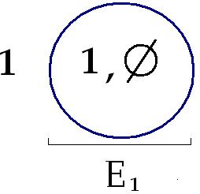
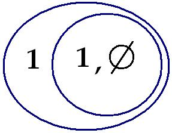

# Leçon 24 | 18 Juin 1969

  

    <label><input type="checkbox" data-lacan-toggle="original" checked> 原文</label>
    <label><input type="checkbox" data-lacan-toggle="notes" checked> 注释</label>
    <label><input type="checkbox" data-lacan-toggle="commentary" checked> 个人解读评论</label>
  

  <form class="lacan-tool-search" role="search">
    <input class="lacan-tool-search-input" type="search" placeholder="搜索全文" aria-label="搜索全文">
    <button class="lacan-tool-button" type="submit" title="搜索">搜索</button>
  </form>
  <button class="lacan-tool-button lacan-back-to-top" type="button" title="回到页面最上方" aria-label="回到页面最上方">↑</button>

<section class="parallel-paragraph" data-paragraph-ids="s16-24-0001">

s16-24-0001

原文 · s16-24-0001

Je serais d’une *humeur plus excellente* si je n’avais pas envie de bailler comme vous venez de me le voir faire, du fait que j’ai eu, je ne sais pourquoi, par pur hasard, une nuit courte. Mon *humeur excellente* se fonde sur ces choses qu’on a entre deux portes et qui s’appellent un espoir, en l’occasion de ce qu’il serait possible, si les choses tournaient d’une certaine façon, que je sois libéré de cette sublimation hebdomadaire qui consiste dans mes relations avec vous.

[无对应译文]

</section>

<section class="parallel-paragraph" data-paragraph-ids="s16-24-0002">

s16-24-0002

原文 · s16-24-0002

« *Tu ne me vois pas d’où je te regarde* » avais-je énoncé au cours d’un de ces séminaires des années précédentes, pour caractériser ce qu’il en est d’un type de *l’objet(a)* en tant qu’il est fondé dans le regard, qu’il n’est rien d’autre que le regard.

[无对应译文]

</section>

<section class="parallel-paragraph" data-paragraph-ids="s16-24-0003">

s16-24-0003

原文 · s16-24-0003

« *Tu ne me dois rien d’où je te dévore* », tel est le message que je pourrais bien recevoir de vous sous la forme que j’ai définie : sous sa forme inversée, en tant qu’il est le mien lui-même, et que je n’aurai plus chaque semaine à faire ici l’aller et retour autour d’un *objet(a)* qui est proprement ce que je désigne ainsi d’une formule qui, vous le sentez - devoir, dévoration - s’inscrit dans ce qu’on appelle à proprement parler la pulsion orale qu’on ferait mieux de rapporter à ce qu’elle est, la chose placentaire, ce en quoi je me plaque comme je peux sur ce grand corps que vous constituez pour constituer de ma substance quelque chose qui pourrait faire pour vous l’objet d’une satisfaction.

[无对应译文]

</section>

<section class="parallel-paragraph" data-paragraph-ids="s16-24-0004">

s16-24-0004

原文 · s16-24-0004

« *O ma mère Intelligence* » comme disait *je ne sais plus qui* [^87].

[无对应译文]

</section>

<section class="parallel-paragraph" data-paragraph-ids="s16-24-0005">

s16-24-0005

原文 · s16-24-0005

Je vais donc aujourd’hui ne tenir qu’à moitié parole par rapport à ce que je vous avais dit la dernière fois, puisque c’est seulement sous forme de devinette que je vous interroge rapidement sur ce qui peut s’ébaucher dans votre esprit sur ceci d’où peut se justifier que je ne dispose plus, à partir de l’année prochaine, de cet endroit où vous me faites l’honneur \- *au titre de ce que j’y produis* - d’affluer.

[无对应译文]

</section>

<section class="parallel-paragraph" data-paragraph-ids="s16-24-0006">

s16-24-0006

原文 · s16-24-0006

J’étais « *Chargé de conférences* » par une *École* assez noble, celle dite *des Hautes Études*.

[无对应译文]

</section>

<section class="parallel-paragraph" data-paragraph-ids="s16-24-0007">

s16-24-0007

原文 · s16-24-0007

Abri m’a été offert par cette *École* dans cette *École* ici *Normale Supérieure*, qui est un lieu préservé, qui se distingue par toutes sortes de privilèges à l’intérieur de l’Université.

[无对应译文]

</section>

<section class="parallel-paragraph" data-paragraph-ids="s16-24-0008">

s16-24-0008

原文 · s16-24-0008

C’est *un philosophe éminent* - que je désigne, je pense, suffisamment en ces termes - *un philosophe éminent* - *il n’y en a pas des tas* - qui professe ici, qui s’est fait mon intercesseur auprès de l’administration d’ici pour que j’occupe cette salle.

[无对应译文]

</section>

<section class="parallel-paragraph" data-paragraph-ids="s16-24-0009">

s16-24-0009

原文 · s16-24-0009

Est-ce cette occupation même qui peut servir de raison à ce que je n’en dispose plus ?

[无对应译文]

</section>

<section class="parallel-paragraph" data-paragraph-ids="s16-24-0010">

s16-24-0010

原文 · s16-24-0010

Je ne pense pas que je l’occupe à une heure où elle puisse être de quiconque enviable ?

[无对应译文]

</section>

<section class="parallel-paragraph" data-paragraph-ids="s16-24-0011">

s16-24-0011

原文 · s16-24-0011

Est-ce que ce soit de ma présence qui ici engendre une sorte de confusion que mon enseignement s’autorise de l’*École Normale Supérieure*, que je viens de caractériser ainsi par l’éminence dont elle bénéficie dans l’Université ou plus exactement exclue d’elle d’une certaine façon.

[无对应译文]

</section>

<section class="parallel-paragraph" data-paragraph-ids="s16-24-0012">

s16-24-0012

原文 · s16-24-0012

Il faut ici remarquer que je ne me suis jamais autorisé ici que du champ dont j’essaie de maintenir dans son authenticité la structure et qu’à la vérité je ne me suis jamais autorisé de rien d’autre, et tout spécialement pas que ces énoncés se produisent au niveau de l’*École Normale*.

[无对应译文]

</section>

<section class="parallel-paragraph" data-paragraph-ids="s16-24-0013">

s16-24-0013

原文 · s16-24-0013

Peut-être mon voisinage a-t-il induit un certain mouvement dans l’*École Normale*, limité d’ailleurs, court, et qui en aucun cas ne semble pouvoir s’inscrire à l’étage du déficit. Les *Cahiers pour l’Analyse* qui sont parus, en quelque sorte induits par le champ de mon enseignement, ne peuvent pas passer pour un effet de déficit, même si on peut dire que ce n’est pas moi du tout qui y ai fait le travail.

[无对应译文]

</section>

<section class="parallel-paragraph" data-paragraph-ids="s16-24-0014">

s16-24-0014

原文 · s16-24-0014

Donc beaucoup de raisons ici pour qu’il n’y ait aucune urgence qu’on me distingue de l’*École Normale*.

[无对应译文]

</section>

<section class="parallel-paragraph" data-paragraph-ids="s16-24-0015">

s16-24-0015

原文 · s16-24-0015

Certainement il y a eu quelque part, en un endroit unique, une confusion faite à cet endroit.

[无对应译文]

</section>

<section class="parallel-paragraph" data-paragraph-ids="s16-24-0016">

s16-24-0016

原文 · s16-24-0016

C’est à savoir une personne dont je vous avais signalé, au niveau du 8 Janvier dernier, que dans un article, je dois dire assez comique, qui était paru dans une revue qui l’abritait fort bien, la *Nouvelle Revue Française*, quelqu’un faisait état de *je ne sais quoi* qu’on appelait extrait, voire *exercice de mon style*, et à ce propos j’étais qualifié, intitulé de ce qu’on appelait ma qualité de *Professeur*, que je n’ai certainement pas, et à l’*École Normale* encore moins.

[无对应译文]

</section>

<section class="parallel-paragraph" data-paragraph-ids="s16-24-0017">

s16-24-0017

原文 · s16-24-0017

Que si c’était en raison de cette confusion *dans un article* qui par ailleurs en marquait bien d’autres, confusions… je veux dire qui articulait mon enseignement en fonction de je ne sais quoi qui en aurait fait un commentaire de SAUSSURE, ce qu’il n’a jamais été, j’ai pris de SAUSSURE comme on s’empare d’un instrument, d’un appareil, et à l’usage de bien d’autres fins, du champ que je désignais tout à l’heure …qu’à ce propos il ait été fait état de *je ne sais quoi* qui se serait articulé de rien d’autre que du fait que je l’aurais lu, comme on dit, en diagonale… Ceci montre simplement chez la personne qui avait écrit cet article une surprenante ignorance des usages que peut avoir ce mot de diagonale, puisqu’il est tout à fait clair que je n’ai pas lu de SAUSSURE en diagonale au sens où je lis les articles du *Monde* en diagonale…

[无对应译文]

</section>

<section class="parallel-paragraph" data-paragraph-ids="s16-24-0018">

s16-24-0018

原文 · s16-24-0018

> ils sont faits pour ça, les cours de SAUSSURE certainement pas …et que d’autre part *la méthode* dite *diagonale* est bien connue pour sa fécondité en mathématiques, à savoir pour révéler que, de toute sériation qui se prétend exhaustive on peut, par la méthode diagonale, extraire quelque autre entité qu’elle n’enserre pas dans sa série \[Cf. Cantor et les א\]. En ce sens, j’accepterai assez volontiers d’avoir fait de SAUSSURE un usage diagonal.

[无对应译文]

</section>

<section class="parallel-paragraph" data-paragraph-ids="s16-24-0019">

s16-24-0019

原文 · s16-24-0019

### Mais qu’à partir de là - c’est-à-dire de ce qui procède d’un manque de critique - qu’on fasse état d’une « *inadvertance* »

[无对应译文]

</section>

<section class="parallel-paragraph" data-paragraph-ids="s16-24-0020">

s16-24-0020

原文 · s16-24-0020

### - pour être bienveillant - qui aille tout à fait au-delà de ce manque de critique encore, pour y trouver matière à considérer

[无对应译文]

</section>

<section class="parallel-paragraph" data-paragraph-ids="s16-24-0021">

s16-24-0021

原文 · s16-24-0021

### que quelque tierce instance puisse y voir la *justification* d’une mesure de précaution. Alors qu’il suffirait très simplement,

[无对应译文]

</section>

<section class="parallel-paragraph" data-paragraph-ids="s16-24-0022">

s16-24-0022

原文 · s16-24-0022

### cette *inadvertance*, de faire remarquer que ce n’est rien d’autre.

[无对应译文]

</section>

<section class="parallel-paragraph" data-paragraph-ids="s16-24-0023">

s16-24-0023

原文 · s16-24-0023

Et de la part de quelqu’un qui en fait preuve assez dans le reste de son texte, il y a là quelque chose évidemment d’assez singulier et qui suggère ceci en fin de compte : que l’on pourrait énoncer que la discussion sur le savoir est exclue de l’Université, puisqu’on peut admettre que si quelqu’un qui manifestement se trompe sur un point peut sur un autre avancer une qualification inexacte, ceci à soi tout seul justifie qu’on ait à rectifier par une mesure autre que de faire remarquer à la personne qu’il ne saurait y avoir de confusion, c’est bien la conclusion qu’à l’instant j’indique et qui mérite qu’on l’en tire.

[无对应译文]

</section>

<section class="parallel-paragraph" data-paragraph-ids="s16-24-0024">

s16-24-0024

原文 · s16-24-0024

Je laisserai là - donc - les choses, vous laissant en suspens sur le fait de pouvoir en dire plus aujourd’hui.

[无对应译文]

</section>

<section class="parallel-paragraph" data-paragraph-ids="s16-24-0025">

s16-24-0025

原文 · s16-24-0025

Je vous donne expressément rendez-vous, donc, à la prochaine fois qui sera mon prochain séminaire où, en admettant qu’il est en tout cas pour cette année le dernier, je crois pouvoir en tout cas vous promettre que je vous distribuerai un certain nombre de petits papiers que j’ai dans cette serviette, déjà préparés à votre intention, qui au cas où cet accent dernier se trouverait se renforcer de la suite, marqueront au moins quelque chose qui ne sera bien entendu pas un diplôme mais un petit signe qui vous restera de votre présence ici cette année.

[无对应译文]

</section>

<section class="parallel-paragraph" data-paragraph-ids="s16-24-0026">

s16-24-0026

原文 · s16-24-0026

Là-dessus, je reprends ce que j’avais donc énoncé la dernière fois, c’est à savoir ce sur quoi pointe ce que cette année j’ai entendu articuler des termes de *D’un Autre à l’autre* et à quoi j’ai pu la dernière fois donner une certaine forme structurale.

[无对应译文]

</section>

<section class="parallel-paragraph" data-paragraph-ids="s16-24-0027">

s16-24-0027

原文 · s16-24-0027

Je rappelle qu’en somme ce dont il s’agit est ceci : que tout ce qui se laisse prendre dans la fonction du signifiant ne peut plus jamais être 2 sans que se creuse au lieu dit de l’Autre ce *quelque chose* auquel j’ai donné la dernière fois le statut de l’ensemble vide \[Ø\], pour indiquer de quelle façon, au point présent de la logique, peut s’écrire ce qui…

[无对应译文]

</section>

<section class="parallel-paragraph" data-paragraph-ids="s16-24-0028">

s16-24-0028

原文 · s16-24-0028

> en l’occasion et sans exclure que cela puisse s’écrire autrement …ce qui, dis-je, change *le relief du réel*.

[无对应译文]

</section>

<section class="parallel-paragraph" data-paragraph-ids="s16-24-0029">

s16-24-0029

原文 · s16-24-0029

[无对应译文]

</section>

<section class="parallel-paragraph" data-paragraph-ids="s16-24-0030">

s16-24-0030

原文 · s16-24-0030

Je récris le 1, ce cercle qui nous a servi d’abord à inscrire l’*Autre* et dans ce cercle, pris ici en fonction d’ensemble, deux éléments, le 1, et puis ceci qui, s’il est l’Autre encore, est à prendre ici au titre d’ensemble, ensemble dont pour des raisons liées à l’usage mathématique il serait abusif d’y mettre un 0 pour en désigner *l’ensemble vide*, il est donc plus correct de le représenter selon le mode classique de la théorie des ensembles ainsi, à savoir y marquer cette barre oblique dont vous savez que par ailleurs je fais usage.

[无对应译文]

</section>

<section class="parallel-paragraph" data-paragraph-ids="s16-24-0031">

s16-24-0031

原文 · s16-24-0031

Tout ce qui se laisse prendre dans la fonction du signifiant ne saurait plus être 2 sans que se creuse, et d’une façon qui ordonne le champ de cette relation duelle, d’une façon telle que rien ne puisse plus y passer sans s’obliger à faire le tour de ceci \[Ø\] ici à l’extrême droite que j’ai appelé ensemble vide, et qui est proprement… ceci pour ceux qui ont mis du temps à l’entendre …ce que toujours, dans mes *Écrits* comme aussi bien dans mes propositions, j’ai désigné de l’*Un-en-plus*.

[无对应译文]

</section>

<section class="parallel-paragraph" data-paragraph-ids="s16-24-0032">

s16-24-0032

原文 · s16-24-0032

Ceci donc veut dire, indique, qu’à mesure que mon discours - si je puis dire - avançait, s’il m’a fallu dans la fonction et dans *le champ de la parole et du langage*, introduire ce qu’il en était de la fonction de l’inconscient en recourant à ce terme fragile et combien problématique de l’intersubjectivité, pour mettre l’accent de plus en plus sur ce qui bien entendu s’impose de la seconde topique de FREUD… à savoir que rien ne s’y joue ni fonctionne ni ne s’y règle, que de ces corrélats intrasubjectifs …ici vient l’accent mis sur cette fonction comme décisive de l’*Un-en-plus* comme extérieure au subjectif.

[无对应译文]

</section>

<section class="parallel-paragraph" data-paragraph-ids="s16-24-0033">

s16-24-0033

原文 · s16-24-0033

Considérons le dessin sur lequel déjà la dernière fois j’ai fait jouer ce que j’ai voulu vous articuler de ce propos que je reprends aujourd’hui. *Un sujet*, ai-je dit, en l’impliquant dans la formule qu’*un signifiant le représente pour un autre signifiant*, qui ne voit comment « *d’un Autre…* » s’inscrit déjà dans cette formule.

[无对应译文]

</section>

<section class="parallel-paragraph" data-paragraph-ids="s16-24-0034">

s16-24-0034

原文 · s16-24-0034

Ce signifiant auprès de quoi le sujet se représente est proprement cet « *un Autre* » dont il s’agit dans mon titre, cet « *un Autre* » qu’ici vous voyez inscrit en ceci qu’il est la ressource auprès de quoi - dans ce champ de l’Autre - ce qui a à fonctionner de sujet se représente. Cet « *un » dans l’Autre*  comme tel ne saurait aller sans comporter l’*Un-en-plus.*

[无对应译文]

</section>

<section class="parallel-paragraph" data-paragraph-ids="s16-24-0035">

s16-24-0035

原文 · s16-24-0035

C’est pourquoi c’est seulement au moment que s’inscrivent ces trois signifiants de base, en tant qu’ils portent déjà par eux effet de signifiant et qu’ils suffisent à devoir être inscrits ainsi…

[无对应译文]

</section>

<section class="parallel-paragraph" data-paragraph-ids="s16-24-0036">

s16-24-0036

原文 · s16-24-0036

> comme vous le voyez d’une façon qui ne va pas de soi, qui a demandé des mois et des années d’explication *pour ceux-là même* dont la pratique ne saurait un instant se soutenir sans se référer à *cette structure*, j’entends *les psychanalystes* …à soi tout seul ces trois termes inscrits sous ce mode d’inscription, ces trois termes constituent bien…

[无对应译文]

</section>

<section class="parallel-paragraph" data-paragraph-ids="s16-24-0037">

s16-24-0037

原文 · s16-24-0037

> au titre de ce qu’ils impliquent déjà, avant qu’il soit question d’en faire surgir l’apparition du sujet, une structure …déjà ils constituent par leur articulation *un savoir*.

[无对应译文]

</section>

<section class="parallel-paragraph" data-paragraph-ids="s16-24-0038">

s16-24-0038

原文 · s16-24-0038

[无对应译文]

</section>

<section class="parallel-paragraph" data-paragraph-ids="s16-24-0039">

s16-24-0039

原文 · s16-24-0039

Cet « *un Autre* » ici inscrit du 1 à gauche dans le cercle, se démontre pour ce qu’il est, à savoir 1 dans l’Autre, celui auprès de quoi le sujet trouve à se représenter de l’1. Qu’est­-ce à dire ?

[无对应译文]

</section>

<section class="parallel-paragraph" data-paragraph-ids="s16-24-0040">

s16-24-0040

原文 · s16-24-0040

D’où vient-il cet 1, cet 1 auprès de quoi le sujet va être représenté par l’1 ?

[无对应译文]

</section>

<section class="parallel-paragraph" data-paragraph-ids="s16-24-0041">

s16-24-0041

原文 · s16-24-0041

Il est clair qu’il vient de la même place que cet 1 qui représente, que là est le premier temps dont se constitue l’Autre, et que si la dernière fois j’ai - ce lieu de l’Autre - je l’ai comparé à *un cheval de Troie* qui fonctionnerait en sens inverse, à savoir qui engloutirait chaque fois une nouvelle unité dans son ventre au lieu de les laisser dégorger sur la ville nocturne, c’est bien qu’en effet *cette entrée du premier* 1 *est fondatrice*, fondatrice en ceci qui est très simple, c’est que c’est le minimum nécessaire pour que ceci soit, que l’Autre ne saurait d’aucune façon se contenir lui-même sauf à l’état de sous-ensemble.

[无对应译文]

</section>

<section class="parallel-paragraph" data-paragraph-ids="s16-24-0042">

s16-24-0042

原文 · s16-24-0042

Entendons-nous bien. Peut-on dire qu’ici cet Autre se contient lui-même, si cet *ensemble vide*, je le meuble de ceci qui répète ces éléments : un 1 d’abord, et l’ensemble vide ?

[无对应译文]

</section>

<section class="parallel-paragraph" data-paragraph-ids="s16-24-0043">

s16-24-0043

原文 · s16-24-0043

Il n’est pas vrai qu’on puisse dire que c’est là se contenir soi-même, car cet ensemble ainsi transformé, il s’inscrit des éléments que nous venons de dire, et la totalité de ces éléments n’est pas ce qui ici se reproduit du couple d’abord inscrit comme celui du premier ensemble E1, à savoir l’élément 1, puis l’ensemble vide, l’ensemble vide où maintenant est reproduit l’élément 1, l’ensemble vide :

[无对应译文]

</section>

<section class="parallel-paragraph" data-paragraph-ids="s16-24-0044">

s16-24-0044

原文 · s16-24-0044

[无对应译文]

</section>

<section class="parallel-paragraph" data-paragraph-ids="s16-24-0045">

s16-24-0045

原文 · s16-24-0045

Il n’y a donc pas de question de « *l’ensemble de tous les ensembles qui ne se contiendraient pas eux-mêmes* » pour la simple raison qu’au niveau de l’ensemble, il n’y a jamais d’ensembles qui se contiennent eux-mêmes.

[无对应译文]

</section>

<section class="parallel-paragraph" data-paragraph-ids="s16-24-0046">

s16-24-0046

原文 · s16-24-0046

Ce n’est pas constituer un ensemble que de parler de « *l’ensemble de tous les ensembles qui ne se contiennent pas eux-mêmes* ».

[无对应译文]

</section>

<section class="parallel-paragraph" data-paragraph-ids="s16-24-0047">

s16-24-0047

原文 · s16-24-0047

Mais il est clair que la question de savoir si l’ensemble peut, oui ou non, se contenir lui-même ne se pose, ne peut se poser qu’à avoir absorbé cet « *un Autre* » pour qu’en son inclusion apparaisse comme l’*un-en-plus l’ensemble vide*, pour la raison qui fonde *l’ensemble vide* comme ne pouvant en aucun cas être 2.

[无对应译文]

</section>

<section class="parallel-paragraph" data-paragraph-ids="s16-24-0048">

s16-24-0048

原文 · s16-24-0048

Il n’y a pas d’*ensemble vide* qui contienne un *ensemble vide*. Il n’y a pas deux ensembles vides.

[无对应译文]

</section>

<section class="parallel-paragraph" data-paragraph-ids="s16-24-0049">

s16-24-0049

原文 · s16-24-0049

L’inclusion donc du premier 1 est ce qui nécessite ceci qu’au champ de l’Autre, la formule la plus simple à ce que s’inscrive 2 est l’1, élément, et l’ensemble vide, pour autant qu’il n’est rien que ce qui se produit dans un ensemble à un élément, à en distinguer *les sous-ensembles*.

[无对应译文]

</section>

<section class="parallel-paragraph" data-paragraph-ids="s16-24-0050">

s16-24-0050

原文 · s16-24-0050

Le 1 à soi tout seul a longtemps suffi, qui a fait dire que l’Autre, c’était l’1, confusion en ceci qu’était méconnue la structure de l’ensemble, et que même dans l’ensemble à un élément posé comme tel, il sort à titre de sous-ensemble cet *Un-en-plus* qu’est *l’ensemble vide*. En d’autres termes l’Autre a besoin *d’un autre* pour devenir l’*Un-en-plus,* c’est-à-dire ce qu’il est lui-même.

[无对应译文]

</section>

<section class="parallel-paragraph" data-paragraph-ids="s16-24-0051">

s16-24-0051

原文 · s16-24-0051

Ce qui se produit donc *de l’un à l’autre*, en tant que c’est *un deuxième, c’est un autre signifiant, et dans l’Autre*, c’est proprement ceci qui fait que ce n’est qu’au niveau du *second* 1, de S2 si vous voulez ainsi l’écrire, que le sujet vient à être représenté.

[无对应译文]

</section>

<section class="parallel-paragraph" data-paragraph-ids="s16-24-0052">

s16-24-0052

原文 · s16-24-0052

*L’intervention du premier* 1*, du* S1 *comme représentation de sujet n’implique l’apparition du sujet comme tel qu’au niveau de* S2, *du second* 1.

[无对应译文]

</section>

<section class="parallel-paragraph" data-paragraph-ids="s16-24-0053">

s16-24-0053

原文 · s16-24-0053

Et dès lors, ce que j’ai fait remarquer l’autre jour, c’est à savoir que l’*Un-en-plus ,* l’ensemble vide, c’est S(A) c’est-à-dire le signifiant de l’Autre, A inaugural.

[无对应译文]

</section>

<section class="parallel-paragraph" data-paragraph-ids="s16-24-0054">

s16-24-0054

原文 · s16-24-0054

Ce que ceci nous montre, c’est, dans la structure ainsi définie, que le rapport du 1 inscrit dans le premier cercle de l’Autre à ce second cercle de l’*Un-en-plus* qui peut lui–même contenir l’1 + *l’Un-en-plus* qui se distingue de ce rapport à cet 1 \- *et seulement par là* - de n’être pas le même ensemble vide, mais qui peut répéter la même structure indéfiniment.

[无对应译文]

</section>

<section class="parallel-paragraph" data-paragraph-ids="s16-24-0055">

s16-24-0055

原文 · s16-24-0055

Cette même structure indéfiniment répétée du 1 : *cercle,* 1*, cercle,* 1*… et ainsi de suite*, c’est cela qui définit l’Autre, à savoir c’est cela même qui constitue l’instance comme telle de *l’objet(a).* C’est indispensable qu’il y ait au moins un élément réduit à l’élément 1 dans l’Autre, c’est ce qui longtemps a fait prendre l’Autre pour 1.

[无对应译文]

</section>

<section class="parallel-paragraph" data-paragraph-ids="s16-24-0056">

s16-24-0056

原文 · s16-24-0056

Je vous l’ai dit, il y a une structure psychique qui restaure, si je peux dire, l’intégrité apparente du A, qui fonde dans une relation effective le S(A) comme non marqué de ce que désigne la barre du haut à gauche de notre graphe : S(A) qui n’est rien d’autre que l’identification de cette structure indéfiniment répétée que désigne *l’objet(a)*.

[无对应译文]

</section>

<section class="parallel-paragraph" data-paragraph-ids="s16-24-0057">

s16-24-0057

原文 · s16-24-0057

À la vérité, l’apparente restauration de l’intégrité de l’Autre en tant qu’il est *l’objet(a),* emploierai-je cette métaphore pour la désigner comme *structure perverse*, qu’elle est en quelque sorte *le moulage imaginaire de la structure signifiante*.

[无对应译文]

</section>

<section class="parallel-paragraph" data-paragraph-ids="s16-24-0058">

s16-24-0058

原文 · s16-24-0058

Nous allons voir tout à l’heure en effet ce qui, dans le jeu de l’*identification* psychique, remplit la place de ce A.

[无对应译文]

</section>

<section class="parallel-paragraph" data-paragraph-ids="s16-24-0059">

s16-24-0059

原文 · s16-24-0059

Pour tout dire, voyons-le tout de suite, épelons les textes, prenant le premier cas à se présenter sous la figure de l’*hystérique*, à celui dont nous allons voir comment celui - FREUD - qui donne à cette économie sa première raison, lui emboîte le pas.

[无对应译文]

</section>

<section class="parallel-paragraph" data-paragraph-ids="s16-24-0060">

s16-24-0060

原文 · s16-24-0060

Comment, à propos de Anna O., ne pas s’interroger sur ce qu’il en est du rapport de ces récits, de cette *talking cure*… comme c’est elle-même qui l’énonce, qui en invente le terme …avec ce dont il s’agit au regard de ce *symptôme* particulièrement clair à désigner dans le cas de *l’hystérique*, quelque chose au niveau du corps qui se vide, un champ où la sensibilité disparaît, un *autre -* connexe ou pas - dont la motricité devient absente sans que rien d’autre qu’une unité signifiante puisse en rendre raison.

[无对应译文]

</section>

<section class="parallel-paragraph" data-paragraph-ids="s16-24-0061">

s16-24-0061

原文 · s16-24-0061

L’anti-anatomisme du *symptôme hystérique* a été suffisamment mis en relief par FREUD lui-même, c’est à savoir que si un bras hystérique est paralysé, c’est au titre de ce qu’il s’appelle « bras » et de rien d’autre, car rien dans une distribution réelle quelconque des influx ne rend raison de la limite qui en désigne le champ.

[无对应译文]

</section>

<section class="parallel-paragraph" data-paragraph-ids="s16-24-0062">

s16-24-0062

原文 · s16-24-0062

C’est bien le corps ici qui vient à servir de support dans un *symptôme* originel, le plus typique à ce que, pour qu’il soit à l’origine de l’expérience analytique elle-même, nous l’interrogions. Où en est-on ?

[无对应译文]

</section>

<section class="parallel-paragraph" data-paragraph-ids="s16-24-0063">

s16-24-0063

原文 · s16-24-0063

Au regard *du progrès* opéré par la cure parlante, la *talking cure,* comment à rester au plus près du texte et sans même en savoir plus long - ce qui n’est plus le cas car nous en savons beaucoup plus, je veux dire qu’il s’impose d’ordonner autrement cette structure - comment ne pas voir :

[无对应译文]

</section>

<section class="parallel-paragraph" data-paragraph-ids="s16-24-0064">

s16-24-0064

原文 · s16-24-0064

- que FREUD ici *est à la place du* 1, ici placé comme intérieur,

[无对应译文]

</section>

<section class="parallel-paragraph" data-paragraph-ids="s16-24-0065">

s16-24-0065

原文 · s16-24-0065

- que *c’est au niveau de FREUD que s’instaure un certain sujet*,

[无对应译文]

</section>

<section class="parallel-paragraph" data-paragraph-ids="s16-24-0066">

s16-24-0066

原文 · s16-24-0066

- que sans l’auditeur FREUD…

[无对应译文]

</section>

<section class="parallel-paragraph" data-paragraph-ids="s16-24-0067">

s16-24-0067

原文 · s16-24-0067

> la question est de savoir comment il put se soumettre à cette fonction : pendant un an, deux ans, écouter tous les soirs, au moment qu’un état second marquait la coupe, la coupure, dont une Dora, dont une Anna symptomatique se séparait de son propre sujet …comment ne pas s’interroger sur la relation cachée qui fait que, simplement à prendre les choses comme elles se présentent, c’est de ce qu’un sujet vienne à savoir quelque chose qui est un trait – *rappelez-vous de cette observation* -

[无对应译文]

</section>

<section class="parallel-paragraph" data-paragraph-ids="s16-24-0068">

s16-24-0068

原文 · s16-24-0068

> un trait d’ailleurs suivi à la façon d’une *reprise historique*, non pas perdu dans les ténèbres de je ne sais quoi d’oublié, simplement de coupé de l’année juste avant, et qui - à mesure qu’avec ce retard qui à lui tout seul doit pour nous avoir un sens - fait que FREUD en étant informé, *le symptôme*…
>
> dont le rapport n’est que lointain, n’est que forcé au regard de ce qui s’articule … *le symptôme* se lève.

[无对应译文]

</section>

<section class="parallel-paragraph" data-paragraph-ids="s16-24-0069">

s16-24-0069

原文 · s16-24-0069

Cette assise d’un sujet fait « *savoir* » dans un champ qui est celui de l’Autre.

[无对应译文]

</section>

<section class="parallel-paragraph" data-paragraph-ids="s16-24-0070">

s16-24-0070

原文 · s16-24-0070

Et son rapport avec ce *quelque chose* fait *creux* au niveau du corps.

[无对应译文]

</section>

<section class="parallel-paragraph" data-paragraph-ids="s16-24-0071">

s16-24-0071

原文 · s16-24-0071

Telle est la première ébauche qui, quand nous l’avons après des décades élaborée assez pour pouvoir, de cette structure en son unicité faire le rassemblement, au titre de ce qui fonctionne comme *objet* dit *a* - qui est cette structure même - nous puissions dire qu’au regard de ce corps vidé pour faire fonction de signifiant, il y a ce *quelque chose* qui peut s’y mouler et cette métaphore nous aidera à concevoir comme « *statue* » - *à proprement parler* - ce qui au niveau du *pervers*, vient à fonctionner comme ce qui restitue *comme plénitude*, comme A sans barre, ce A.

[无对应译文]

</section>

<section class="parallel-paragraph" data-paragraph-ids="s16-24-0072">

s16-24-0072

原文 · s16-24-0072

Pour apprécier la relation *imaginaire* de ce dont il s’agit dans la perversion, il suffit - cette « statue » dont je parle - de la saisir au niveau de la contorsion baroque qui n’est sensible à ce qu’elle représente d’incitation au voyeurisme qu’en tant même que celui-ci représente *l’exhibition phallique*.

[无对应译文]

</section>

<section class="parallel-paragraph" data-paragraph-ids="s16-24-0073">

s16-24-0073

原文 · s16-24-0073

Comment ne pas voir *qu’utilisée par une religion* soucieuse de reprendre son empire sur les âmes au moment où il est contesté, la statue baroque…

[无对应译文]

</section>

<section class="parallel-paragraph" data-paragraph-ids="s16-24-0074">

s16-24-0074

原文 · s16-24-0074

> quelle qu’elle soit, quelque saint ou sainte qu’elle représente, voire la Vierge Marie …est proprement ce regard qui est fait pour que devant, l’âme s’ouvre. Le rapprochement que j’ai fait d’un seul trait de *la structure perverse* avec je ne sais quelle capture qu’il faut bien appeler idolâtre de la foi, *si elle nous met au cœur de ce qui* *s’est présentifié en notre Occident d’une querelle des images*, est quelque chose d’exemplaire et dont nous avons à faire notre profit.

[无对应译文]

</section>

<section class="parallel-paragraph" data-paragraph-ids="s16-24-0075">

s16-24-0075

原文 · s16-24-0075

J’ai dit que j’aborderai aujourd’hui ce qu’il en est de *la névrose* et, vous l’avez entendu, je l’ai amorcé au niveau de *l’obsessionnel*, en articulant que rien de *l’obsessionnel* ne se conçoit que référé à une structure qui est celle dans laquelle, pour le maître, en tant qu’il fonctionne comme 1, un signifiant qui ne subsiste que d’être représenté auprès du *second* 1 qui est dans l’Autre, en tant que celui-ci figure l’esclave où seule réside la fonction subjective du maître, entre l’un et l’autre, rien de commun sinon ce que j’ai dit avoir été d’abord articulé par HEGEL comme la mise en jeu au niveau du maître, de sa vie, à lui.

[无对应译文]

</section>

<section class="parallel-paragraph" data-paragraph-ids="s16-24-0076">

s16-24-0076

原文 · s16-24-0076

En ceci consiste l’acte de maîtrise, *le risque de vie*.

[无对应译文]

</section>

<section class="parallel-paragraph" data-paragraph-ids="s16-24-0077">

s16-24-0077

原文 · s16-24-0077

J’ai quelque part, dans ce livret qui est sorti au titre du premier numéro de *Scilicet,* cru devoir relever dans *les propos miraculeux d’un enfant* ce que, de la bouche de son père, j’avais recueilli au titre de ceci qu’il lui avait dit qu’il était un « *tricheur de vie* ».

[无对应译文]

</section>

<section class="parallel-paragraph" data-paragraph-ids="s16-24-0078">

s16-24-0078

原文 · s16-24-0078

Prodigieuse formule, comme celles qu’assurément on ne saurait voir fleurir que de la bouche de ceux pour qui encore personne n’a brouillé les traces.

[无对应译文]

</section>

<section class="parallel-paragraph" data-paragraph-ids="s16-24-0079">

s16-24-0079

原文 · s16-24-0079

*Le risque de vie*, voici où est l’essentiel de ce qu’on peut appeler *l’acte de maîtrise*, et son garant n’est autre que ce qui est, dans l’Autre, *l’esclave* au titre de signifiant auprès de quoi seulement se supporte *le maître* comme sujet.

[无对应译文]

</section>

<section class="parallel-paragraph" data-paragraph-ids="s16-24-0080">

s16-24-0080

原文 · s16-24-0080

Son appui n’étant rien d’autre que le corps de l’esclave en tant qu’il est…

[无对应译文]

</section>

<section class="parallel-paragraph" data-paragraph-ids="s16-24-0081">

s16-24-0081

原文 · s16-24-0081

> pour employer une formule dont ce n’est pas pour rien qu’elle est venue au premier plan de la vie spirituelle …*perinde ac cadaver*[^88]. Mais il n’est ainsi que dans le champ dont se supporte le maître comme sujet.

[无对应译文]

</section>

<section class="parallel-paragraph" data-paragraph-ids="s16-24-0082">

s16-24-0082

原文 · s16-24-0082

Il reste quelque chose hors des limites de tout cet appareil, et qui est justement ce que HEGEL, *à tort,* y fait rentrer : *la mort*.

[无对应译文]

</section>

<section class="parallel-paragraph" data-paragraph-ids="s16-24-0083">

s16-24-0083

原文 · s16-24-0083

La mort, l’a-t-on assez remarqué, ici ne se profile que de ce qu’elle ne conteste l’ensemble de cette structure qu’au niveau de l’esclave. Dans toute la *Phénoménologie*, du maître et de l’esclave il n’y a que l’esclave de *réel*. Et c’est bien ce que HEGEL a aperçu et qui suffirait à ce que rien n’aille plus loin dans cette dialectique. La situation est parfaitement stable.

[无对应译文]

</section>

<section class="parallel-paragraph" data-paragraph-ids="s16-24-0084">

s16-24-0084

原文 · s16-24-0084

Si l’esclave meurt, il n’y a plus rien. Si le maître meurt, chacun sait que l’esclave est toujours esclave.

[无对应译文]

</section>

<section class="parallel-paragraph" data-paragraph-ids="s16-24-0085">

s16-24-0085

原文 · s16-24-0085

De mémoire d’esclave, ça n’est jamais la mort du maître qui a libéré quiconque de l’esclavage.

[无对应译文]

</section>

<section class="parallel-paragraph" data-paragraph-ids="s16-24-0086">

s16-24-0086

原文 · s16-24-0086

Telle est, je vous prie de le noter, la situation où c’est le névrosé qui introduit la dialectique.

[无对应译文]

</section>

<section class="parallel-paragraph" data-paragraph-ids="s16-24-0087">

s16-24-0087

原文 · s16-24-0087

Car ce n’est qu’à partir du moment où nous supposons quelque part *le sujet supposé savoir* qu’en effet, avec cet horizon \- et pour cause : tel le lapin dans le chapeau, il est mis au départ - nous pouvons voir progresser alors dans une dialectique ce qui s’énonce des rapports du maître et de l’esclave. Et où ? Au niveau de *l’esclave* lui-même : vers un *savoir absolu*.

[无对应译文]

</section>

<section class="parallel-paragraph" data-paragraph-ids="s16-24-0088">

s16-24-0088

原文 · s16-24-0088

### Le sujet, c’est en tant que le maître est représenté au niveau de l’esclave que toute la dialectique se poursuit et aboutit à cette fin qui n’est rien d’autre que ce qui y est déjà mis sous la fonction du savoir, fonction précisément en tant qu’elle n’est pas critiquée, qu’il n’est nulle part interrogé *l’ordre de sous-jacence du sujet dans le savoir*. Cette chose qui saute pourtant aux yeux,

[无对应译文]

</section>

<section class="parallel-paragraph" data-paragraph-ids="s16-24-0089">

s16-24-0089

原文 · s16-24-0089

c’est que le maître lui-même ne sait rien : chacun sait que le maître est un con.

[无对应译文]

</section>

<section class="parallel-paragraph" data-paragraph-ids="s16-24-0090">

s16-24-0090

原文 · s16-24-0090

Il ne serait jamais entré dans toute cette aventure, avec ce que l’avenir lui désigne comme résolution de sa fonction, s’il avait un instant été pour lui, le sujet que par cette sorte de *facilité de l’énonciation* HEGEL lui impute.

[无对应译文]

</section>

<section class="parallel-paragraph" data-paragraph-ids="s16-24-0091">

s16-24-0091

原文 · s16-24-0091

Comme si pouvait s’instaurer cette fonction de « *la lutte* dite *à mort* », de « *la lutte de  pur prestige* », pour autant qu’elle le fait *dépendre* aussi substantiellement de son partenaire, *si le maître n’était pas autre chose que* proprement *ce que nous appelons l’inconscient*, à savoir « *l’insu du sujet* » comme tel, je veux dire : *cet insu dont le sujet est absent et dont le sujet n’est représenté qu’ailleurs*.

[无对应译文]

</section>

<section class="parallel-paragraph" data-paragraph-ids="s16-24-0092">

s16-24-0092

原文 · s16-24-0092

Tout ceci n’est fait que pour introduire le pas suivant de ce que j’ai aujourd’hui à articuler. Précédemment, j’ai parlé, à propos de *l’hystérique*, de l’analogue qu’elle prenait de sa référence à la femme, de même que j’ai dit que *l’obsessionnel*, rien de ce qui s’articule de lui ne le fait qu’à - dans la dialectique du sujet-maître - introduire ce que nécessite ceci qui l’appelle, à savoir *la vérité* de ce processus et, sur la voie de cette vérité, la *susception* [^89], la mise en jeu du *sujet supposé savoir*.

[无对应译文]

</section>

<section class="parallel-paragraph" data-paragraph-ids="s16-24-0093">

s16-24-0093

原文 · s16-24-0093

Je reprends ceci au niveau de *l’autre névrose*, de *l’hystérique*.

[无对应译文]

</section>

<section class="parallel-paragraph" data-paragraph-ids="s16-24-0094">

s16-24-0094

原文 · s16-24-0094

Et pour mettre en son cœur *l’appareil analogue, le modèle* dont il s’agit, à quoi *l’obsessionnel* se réfère, je l’ai dit déjà *l’hystérique*…

[无对应译文]

</section>

<section class="parallel-paragraph" data-paragraph-ids="s16-24-0095">

s16-24-0095

原文 · s16-24-0095

> de même qu’on peut dire que *l’obsessionnel* ne se prend pas pour le maître, mais *suppose que le maître sait ce qu’il veut* …de même *l’hystérique* pour la femme…

[无对应译文]

</section>

<section class="parallel-paragraph" data-paragraph-ids="s16-24-0096">

s16-24-0096

原文 · s16-24-0096

> non pas que *l’hystérique* soit pour autant *obligatoirement* une femme, pas plus que *l’obsessionne*l est *obligatoirement* un homme, il s’agit de la référence au modèle du maître …de même *l’hystérique*, son modèle, c’est ce que je vais maintenant énoncer de ce qu’il en est du modèle où la femme instaure ce *quelque chose* de combien plus central, vous allez le voir, à notre expérience analytique.

[无对应译文]

</section>

<section class="parallel-paragraph" data-paragraph-ids="s16-24-0097">

s16-24-0097

原文 · s16-24-0097

Quand je l’ai - quelque part du côté d’un 21 Mai - avancé, quelqu’un ici s’est trouvé pour me poser la question : mais sait-on ce que c’est que *la femme* ? Bien sûr, pas plus qu’on ne sait ce qu’est le maître. Mais ce qu’on peut dessiner, c’est l’articulation dans le champ de l’Autre de ce qu’il en est de « *La femme*  ». *C’est aussi con que* « *le maître*  », c’est bien le cas de le dire.

[无对应译文]

</section>

<section class="parallel-paragraph" data-paragraph-ids="s16-24-0098">

s16-24-0098

原文 · s16-24-0098

Je ne parle pas *des femmes* pour l’instant, je parle du sujet « *La femme* ».

[无对应译文]

</section>

<section class="parallel-paragraph" data-paragraph-ids="s16-24-0099">

s16-24-0099

原文 · s16-24-0099

Est-ce que l’on ne voit pas ce qu’il en est de ces deux 1 \[*le* S1 *et le* S2\] quand il s’agit de la femme ?

[无对应译文]

</section>

<section class="parallel-paragraph" data-paragraph-ids="s16-24-0100">

s16-24-0100

原文 · s16-24-0100

Le 1 intérieur, le S2, c’est le cas de le dire \[*est-ce deux ?*\], ce qu’il s’agit de voir s’ériger ne me paraît pas douteux et il devient dès lors tout à fait clair, c’est de savoir pourquoi le 1 dont se supporte le sujet femme est si ordinairement le *Phallus*, avec un grand *P*.

[无对应译文]

</section>

<section class="parallel-paragraph" data-paragraph-ids="s16-24-0101">

s16-24-0101

原文 · s16-24-0101

C’est au niveau de l’1 qu’il s’agit de susciter, que l’identification de la femme dans le mirage duel pour autant qu’à son horizon est cet Autre, l’ensemble vide, c’est à savoir un corps, un corps ici vidé - de quoi ? - de *la jouissance*.

[无对应译文]

</section>

<section class="parallel-paragraph" data-paragraph-ids="s16-24-0102">

s16-24-0102

原文 · s16-24-0102

Là où le sujet-maître engage un risque de vie, dans le pari inaugural de cette dialectique, *la femme* …

[无对应译文]

</section>

<section class="parallel-paragraph" data-paragraph-ids="s16-24-0103">

s16-24-0103

原文 · s16-24-0103

> je n’ai pas dit *l’hystérique*, j’ai dit *la femme* car *l’hystérique*, tel que fait *l’obsessionnel* tout à l’heure,
>
> ne s’explique qu’en raison de ces références …*elle risque, elle parie, cette jouissance* dont chacun sait qu’elle est pour *la femme* inaugurale et existante, et telle que sans aucun de ces efforts, de ces détours qui caractérisent l’*auto-érotisme* chez l’homme, non seulement elle l’obtient mais que toujours elle subsiste distincte et parallèle de celle qu’elle prend à être *la femme de l’homme*, celle qui se satisfait de la « *jouissance de l’homme* ».

[无对应译文]

</section>

<section class="parallel-paragraph" data-paragraph-ids="s16-24-0104">

s16-24-0104

原文 · s16-24-0104

Cette « *jouissance de l’homme* » à quoi la femme se prend, se captive, comme le maître le fait à l’esclave, voilà qui est l’enjeu de la partie et qui donne l’origine radicale de ce qu’il en est de ce qui ici joue le même rôle que la mort pour l’obsessionnel et est aussi inaccessible, c’est à savoir que *La femme* s’y identifie - j’ai dit *La femme* - est aussi *faux*, est aussi vain que le maître s’identifie à la mort, et que par contre, comme l’esclave y est noué et de la même façon…

[无对应译文]

</section>

<section class="parallel-paragraph" data-paragraph-ids="s16-24-0105">

s16-24-0105

原文 · s16-24-0105

> je veux dire ne subsiste que de sa relation à la mort et fasse avec cette relation subsister tout le système …le rapport de l’homme à la castration est aussi ce qui, ici, fait tenir tout l’appareil.

[无对应译文]

</section>

<section class="parallel-paragraph" data-paragraph-ids="s16-24-0106">

s16-24-0106

原文 · s16-24-0106

Et aussi bien, si tout à l’heure j’ai parlé du *perinde ac cadaver,* évoquerai-je ici ceci d’assez remarquable que cette dimension existe de *l’être pris dans le champ du signifiant, qui s’appelle nécrophilie, autrement dit l’érotisme et très proprement appliqué à un corps mort*. Évoquerai-je ici à l’horizon la figure de [*Jeanne la Folle*](http://fr.wikipedia.org/wiki/Jeanne_Ire_de_Castille) et des quinze jours de *trimballage* du cadavre de [*Philippe le Beau*](http://fr.wikipedia.org/wiki/Philippe_Ier_de_Castille) ?

[无对应译文]

</section>

<section class="parallel-paragraph" data-paragraph-ids="s16-24-0107">

s16-24-0107

原文 · s16-24-0107

Ce n’est qu’au regard de ces structures, de ces fonctions inaugurantes en tant que seules elles répondent de l’introduction de ce qui est proprement les dépendances du signifiant tel que l’expérience analytique nous a permis de l’articuler, que nous pouvons voir qu’ici, comme pour *l’obsessionnel*, *l’hystérique s’introduit de ne pas se prendre pour la femme*.

[无对应译文]

</section>

<section class="parallel-paragraph" data-paragraph-ids="s16-24-0108">

s16-24-0108

原文 · s16-24-0108

En quoi ne se prend-elle pas pour la femme ? Précisément de ceci qu’elle suppose que dans cette structure, ce que je viens d’articuler comme étant celle du *sujet* *femme,* ce *sujet* - au niveau de S1 du départ - elle le fait *supposé savoir*.

[无对应译文]

</section>

<section class="parallel-paragraph" data-paragraph-ids="s16-24-0109">

s16-24-0109

原文 · s16-24-0109

En d’autres termes, elle est captivée, intéressée – souvenez-vous de Dora - par *La femme* en tant qu’elle croit que *La femme* est celle qui sait ce qu’il faut pour la jouissance de l’homme.

[无对应译文]

</section>

<section class="parallel-paragraph" data-paragraph-ids="s16-24-0110">

s16-24-0110

原文 · s16-24-0110

Or, ce qui résulte de ceci, qui est absent dans le modèle : la fonction *sujet femme* - Dieu soit loué, c’est le cas de le dire – ne sait pas que ce qu’elle soutient aboutit à la castration de l’homme, *mais par contre, l’hystérique n’en ignore rien.*

[无对应译文]

</section>

<section class="parallel-paragraph" data-paragraph-ids="s16-24-0111">

s16-24-0111

原文 · s16-24-0111

Et c’est pour cela qu’elle s’interroge au-delà…

[无对应译文]

</section>

<section class="parallel-paragraph" data-paragraph-ids="s16-24-0112">

s16-24-0112

原文 · s16-24-0112

> de ce que déjà j’ai articulé à propos de Dora, centré sur un premier abord que j’ai fait du *transfert* …au-delà - relisez l’observation, et aussi bien n’omettez pas tout ce qui, dans les observations antérieures, celles des *Études sur l’Hystérie,* nous permet simplement ceci : de voir la corrélation qu’il y a entre ceci :

[无对应译文]

</section>

<section class="parallel-paragraph" data-paragraph-ids="s16-24-0113">

s16-24-0113

原文 · s16-24-0113

- que pour l’hystérique, *La femme* *est* *supposée savoir,*

[无对应译文]

</section>

<section class="parallel-paragraph" data-paragraph-ids="s16-24-0114">

s16-24-0114

原文 · s16-24-0114

- alors que dans le modèle, c’est *inconsciemment qu’elle sait*.

[无对应译文]

</section>

<section class="parallel-paragraph" data-paragraph-ids="s16-24-0115">

s16-24-0115

原文 · s16-24-0115

### C’est pour cela que…

[无对应译文]

</section>

<section class="parallel-paragraph" data-paragraph-ids="s16-24-0116">

s16-24-0116

原文 · s16-24-0116

> les deux modèles ne pouvant se distinguer de ce facteur introduit,
>
> qui réunit sous le chef de *la névrose* aussi bien un type que l’autre …vous pouvez constater que le corrélat de *la mort est en jeu dans ce que l’hystérique aborde de ce qu’il en est de la femme.*

[无对应译文]

</section>

<section class="parallel-paragraph" data-paragraph-ids="s16-24-0117">

s16-24-0117

原文 · s16-24-0117

*L’hystérique fait l’homme qui supposerait la femme savoir.* C’est bien pourquoi elle est introduite dans ce jeu par quelque biais où la mort de l’homme est toujours intéressée :

[无对应译文]

</section>

<section class="parallel-paragraph" data-paragraph-ids="s16-24-0118">

s16-24-0118

原文 · s16-24-0118

- est-il besoin de dire que toute l’introduction d’Anna O. au champ de son hystérie n’est rien d’autre que tournant autour de la mort de son père ?

[无对应译文]

</section>

<section class="parallel-paragraph" data-paragraph-ids="s16-24-0119">

s16-24-0119

原文 · s16-24-0119

- Faut-il rappeler le corrélat, *dans les deux rêves de* DORA, *de la mort en tant qu’impliquée par la boîte à bijoux de la mère* : « *Je ne veux pas -* dit le père *- que moi et mes enfants nous périssions dans les flammes à cause de cette boîte.* » Et dans le second rêve de ceci : qu’il s’agit de la mise en terre du père.

[无对应译文]

</section>

<section class="parallel-paragraph" data-paragraph-ids="s16-24-0120">

s16-24-0120

原文 · s16-24-0120

Des vérités cachées, les névrosés les supposent sues. Il faut les dégager de cette supposition pour que eux, les névrosés, cessent de « *représenter en chair* » cette vérité. C’est pour autant que *l’hystérique*, si l’on peut dire, est déjà psychanalysante, c’est-à-dire déjà sur le chemin d’une solution, d’une solution qu’elle cherche à partir de ceci : que ce à quoi elle se réfère, elle y implique *le sujet supposé savoir*, et c’est pour cela qu’elle rencontre la contradiction.

[无对应译文]

</section>

<section class="parallel-paragraph" data-paragraph-ids="s16-24-0121">

s16-24-0121

原文 · s16-24-0121

C’est que, tant que l’analyste ne pratique pas la coupure entre ceci qui est la structure inconsciente…

[无对应译文]

</section>

<section class="parallel-paragraph" data-paragraph-ids="s16-24-0122">

s16-24-0122

原文 · s16-24-0122

> à savoir les modèles que j’ai proprement ici articulés du 1, (1, *ensemble vide*) :

[无对应译文]

</section>

<section class="parallel-paragraph" data-paragraph-ids="s16-24-0123">

s16-24-0123

原文 · s16-24-0123

 

[无对应译文]

</section>

<section class="parallel-paragraph" data-paragraph-ids="s16-24-0124">

s16-24-0124

原文 · s16-24-0124

> tant au niveau du maître qu’au niveau de la femme …tant que ceci n’est pas coupé de la supposition du *sujet supposé savoir…*

[无对应译文]

</section>

<section class="parallel-paragraph" data-paragraph-ids="s16-24-0125">

s16-24-0125

原文 · s16-24-0125

> *c’est-à-dire de ce qui a fait naturellement le névrosé psychanalysant*
>
> *parce que d’ores et déjà constituant en soi-même et avant toute analyse le transfert* …*la coalescence de la structure avec le sujet supposé savoir,* voilà ce qui témoigne chez le névrosé ceci : *qu’il interroge la vérité de ses structures et qu’il devient lui-même en chair cette interrogation*, et que si quelque chose peut faire tomber ceci : *qu’il est lui-même symptôme*.

[无对应译文]

</section>

<section class="parallel-paragraph" data-paragraph-ids="s16-24-0126">

s16-24-0126

原文 · s16-24-0126

C’est précisément par cette opération qui est celle de l’analyste de pratiquer la coupure grâce à quoi d’un côté cette supposition du *sujet supposé savoir* est détachée, est séparée de ce dont il s’agit, à savoir la structure qu’elle repère juste, à ceci près que ni *le maître*, ni *la femme*, ne peuvent être supposés savoir ce qu’ils font.

[无对应译文]

</section>

<section class="parallel-paragraph" data-paragraph-ids="s16-24-0127">

s16-24-0127

原文 · s16-24-0127

Le jeu de la cure analytique tourne autour de cette coupure qui est coupure subjective, car assurément, tout ce que nous disons d’un désir inconscient, c’est toujours, bien entendu, supposer qu’un sujet finit par savoir ce qu’il veut.

[无对应译文]

</section>

<section class="parallel-paragraph" data-paragraph-ids="s16-24-0128">

s16-24-0128

原文 · s16-24-0128

Et qu’est-ce à dire ? Est-ce que là encore, nous ne conservons pas toujours, à énoncer de telles formules, ce *quelque chose* qui voudrait dire qu’il y a « *savoir* » et « *ce qu’on veut* ». Assurément il y a un lieu où les deux termes se *distinguent*.

[无对应译文]

</section>

<section class="parallel-paragraph" data-paragraph-ids="s16-24-0129">

s16-24-0129

原文 · s16-24-0129

C’est quand il s’agit de dire *oui* ou de dire *non* à ce que j’ai appelé « *ce qu’on veut* ». C’est cela qu’on appelle la volonté.

[无对应译文]

</section>

<section class="parallel-paragraph" data-paragraph-ids="s16-24-0130">

s16-24-0130

原文 · s16-24-0130

Mais savoir « *ce qu’il veut* », c’est pour le maître, comme pour la femme, le désir même. De même que tout à l’heure j’unissais les trois mots de l’*Un-en-­plus* , le « *savoir-ce-qu’il-veut* » qu’ici j’entends : c’est le désir lui-même. Ce que *l’hystérique* suppose, c’est que *la femme sait ce qu’elle veut*, au sens où elle le désirerait, et c’est bien pourquoi *l’hystérique* ne parvient à s’identifier à la femme qu’au prix d’un désir insatisfait.

[无对应译文]

</section>

<section class="parallel-paragraph" data-paragraph-ids="s16-24-0131">

s16-24-0131

原文 · s16-24-0131

De même, au regard du maître, qui lui sert au jeu de cache-cache de prétendre que la mort ne peut atteindre que l’esclave, l’obsessionnel est celui qui, du maître, n’identifie que ceci qui est le réel, que son désir est impossible.

[无对应译文]

</section>

<section class="note-block original-notes">

## Notes

[^87]: Cf. poème de Paul Valéry, « Poésie », Charmes, Paris, Coll. Poésies-Gallimard, 1958, p.56. Ce vers est déjà cité dans le séminaire

    « *La logique du fantasme* », séance du 16-11-1966.  

    Par la surprise saisie,  
    Une bouche qui buvait  
    Au sein de la Poésie  
    En sépare son duvet :

    \- O ma mère Intelligence,  
    De qui la douceur coulait,  
    Quelle est cette négligence  
    Qui laisse tarir son lait ! …

[^88]: *Perinde ac cadaver* (à la manière d'un cadavre) : soumission extrème, obéissance passive, servitude totale.

[^89]: Susception : Fait de recevoir en soi et d'assimiler. Religion catholique : fait de prendre, de recevoir (les ordres sacrés, un sacrement…)

</section>
