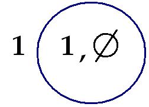
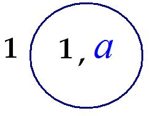
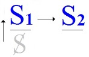
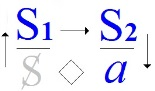
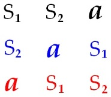
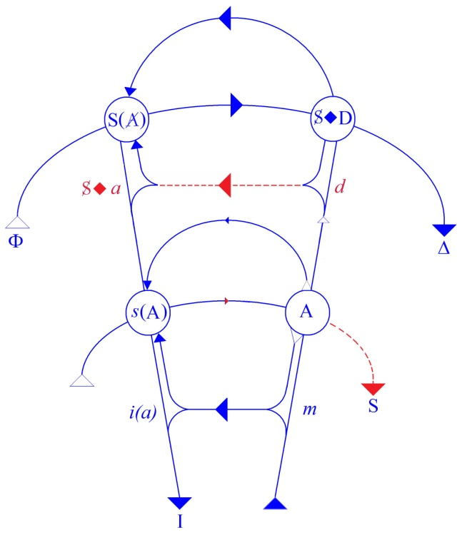

# Leçon 25 | 25 Juin 1969

  <label><input type="checkbox" data-lacan-toggle="original" checked> 原文</label>
  <label><input type="checkbox" data-lacan-toggle="notes" checked> 注释</label>
  <label><input type="checkbox" data-lacan-toggle="commentary" checked> 个人解读评论</label>

<section class="parallel-paragraph" data-paragraph-ids="s16-25-0001">

s16-25-0001

[无对应译文]

原文 · s16-25-0001

Tâchez de ne pas perdre la corde sur ce qu’on est comme effet du savoir. On est éclaté dans le fantasme S ◊ *a*.

</section>

<section class="parallel-paragraph" data-paragraph-ids="s16-25-0002">

s16-25-0002

[无对应译文]

原文 · s16-25-0002

On est - si étrange que cela paraisse - cause de soi. Seulement il n’y a pas de soi. Plutôt il y a un soi divisé.

</section>

<section class="parallel-paragraph" data-paragraph-ids="s16-25-0003">

s16-25-0003

[无对应译文]

原文 · s16-25-0003

Entrer dans cette voie, voilà d’où peut découler la seule vraie révolution politique.

</section>

<section class="parallel-paragraph" data-paragraph-ids="s16-25-0004">

s16-25-0004

[无对应译文]

原文 · s16-25-0004

*Le savoir sert le maître*. J’y reviens aujourd’hui pour souligner qu’il naît de l’esclave, le savoir.

</section>

<section class="parallel-paragraph" data-paragraph-ids="s16-25-0005">

s16-25-0005

[无对应译文]

原文 · s16-25-0005

Si vous vous souvenez des formules que j’ai alignées la dernière fois, vous comprendrez que parallèlement j’énonce : *le savoir sert la femme, parce qu’il la fait cause du désir*.

</section>

<section class="parallel-paragraph" data-paragraph-ids="s16-25-0006">

s16-25-0006

[无对应译文]

原文 · s16-25-0006

Voilà ce que je vous ai indiqué la dernière fois, dans un commentaire du schème que je réécris. Je crois devoir le reprendre, même pour ceux qui pouvaient être occupés ailleurs par des soucis qui leur paraissaient prévalents \[*sic*\].Voici ce schème :

</section>

<section class="parallel-paragraph" data-paragraph-ids="s16-25-0007">

s16-25-0007

[无对应译文]

原文 · s16-25-0007

</section>

<section class="parallel-paragraph" data-paragraph-ids="s16-25-0008">

s16-25-0008

[无对应译文]

原文 · s16-25-0008

Ce schème sort de la définition logique que j’ai donnée à notre avant-dernière rencontre de *l’Autre comme ensemble vide* et *de son indispensable absorption d’un trait unaire* - celui de droite - *pour que le sujet puisse y être représenté auprès de ce trait unaire*, sous l’espèce d’un signifiant. D’où vient ce signifiant, celui qui *représente le sujet auprès d’un autre signifiant* ?

</section>

<section class="parallel-paragraph" data-paragraph-ids="s16-25-0009">

s16-25-0009

[无对应译文]

原文 · s16-25-0009

De *nulle part*, parce qu’il n’apparaît à cette place qu’en vertu de la rétroefficience de *la répétition*.

</section>

<section class="parallel-paragraph" data-paragraph-ids="s16-25-0010">

s16-25-0010

[无对应译文]

原文 · s16-25-0010

*C’est parce que le trait unaire vise à la répétition d’une jouissance qu’un autre trait unaire* \[S2\] *surgit après coup, nachträglich, comme écrit* *Freud*…

</section>

<section class="parallel-paragraph" data-paragraph-ids="s16-25-0011">

s16-25-0011

[无对应译文]

原文 · s16-25-0011

> terme que j’ai été le premier à extraire de son texte et à mettre en valeur comme tel, ceci pour quiconque ayant à s’amuser à traduire un certain *Vocabulaire*…, pourra voir qu’à cette rubrique de *l’après-coup*, qui n’existerait même pas sans mon discours, je ne suis pas mentionné …que *le trait unaire surgit après coup* - *à la place* donc du S1 - *du signifiant en tant qu’il représente un sujet auprès d’un autre signifiant*.

</section>

<section class="parallel-paragraph" data-paragraph-ids="s16-25-0012">

s16-25-0012

[无对应译文]

原文 · s16-25-0012

Là-dessus, je dis : tout ce qui va surgir de cette répétition, qui se répète de la reproduction de « *l’en-forme de (a)* » :

</section>

<section class="parallel-paragraph" data-paragraph-ids="s16-25-0013">

s16-25-0013

[无对应译文]

原文 · s16-25-0013

 

</section>

<section class="parallel-paragraph" data-paragraph-ids="s16-25-0014">

s16-25-0014

[无对应译文]

原文 · s16-25-0014

ici le signe de l’ensemble vide, c’est d’abord cet *en-forme* lui-même, et ceci, c’est *l’objet(a)*.

</section>

<section class="parallel-paragraph" data-paragraph-ids="s16-25-0015">

s16-25-0015

[无对应译文]

原文 · s16-25-0015

Là–dessus on s’alarme, on me dit : « *vous donnez donc une définition purement formelle de l’objet(a)* ».

</section>

<section class="parallel-paragraph" data-paragraph-ids="s16-25-0016">

s16-25-0016

[无对应译文]

原文 · s16-25-0016

Non, car tout ceci ne se produit que de ce qu’à la place du 1 de gauche, du S1, il y ait ce qu’il y a, à savoir cette jouissance énigmatique attestée de ce qu’on ne sait rien d’elle que ceci - à tous les étages, que je vais reproduire, où elle se distingue - que l’on ne sait rien d’elle que ceci : *qu’elle en veut une autre, jouissance*. C’est vrai partout.

</section>

<section class="parallel-paragraph" data-paragraph-ids="s16-25-0017">

s16-25-0017

[无对应译文]

原文 · s16-25-0017

« 4, 2, 3 » la petite fable[^90] - à laquelle on donne la réponse ridicule que l’on sait - a la réponse : « *en avoir une autre* ».

</section>

<section class="parallel-paragraph" data-paragraph-ids="s16-25-0018">

s16-25-0018

[无对应译文]

原文 · s16-25-0018

Dans cet Œdipe, *l’hystérique* qui a répondu, répondu en tant qu’il faut bien qu’il y ait dit *la vérité* sur la femme pour que la SPHYNGE en disparaisse. C’est pourquoi, conformément à la destinée de *l’hystérique*, il a fait l’homme par la suite.

</section>

<section class="parallel-paragraph" data-paragraph-ids="s16-25-0019">

s16-25-0019

[无对应译文]

原文 · s16-25-0019

### *L’hystérique*, je vous le dirai - puisqu’il va y avoir un petit temps avant qu’on ne se rencontre - *l’hystérique* fait ma joie.

</section>

<section class="parallel-paragraph" data-paragraph-ids="s16-25-0020">

s16-25-0020

[无对应译文]

原文 · s16-25-0020

Elle m’assure mieux qu’à FREUD *qui n’a pas su l’entendre* *que la jouissance de la femme se suffit parfaitement à elle-même*.

</section>

<section class="parallel-paragraph" data-paragraph-ids="s16-25-0021">

s16-25-0021

[无对应译文]

原文 · s16-25-0021

Elle érige cette *femme mythique* qu’est *la Sphynge*, elle articule que le jeu d’origine est celui-ci : c’est qu’il lui faut quelque chose d’autre, à savoir jouir de l’homme - qui n’est pour elle que le pénis érigé - moyennant quoi elle se sait elle-même comme *autre*, c’est-à-dire comme *phallus*, dont elle est privée, autrement dit comme châtrée.

</section>

<section class="parallel-paragraph" data-paragraph-ids="s16-25-0022">

s16-25-0022

[无对应译文]

原文 · s16-25-0022

Voilà la vérité qui permet de dissiper quelques *leurres* et de se rappeler que le *a*, c’est cette année que je l’ai posé comme *plus-de-jouir,* autrement dit l’enjeu qui constitue le pari pour le gain de *l’autre jouissance*.

</section>

<section class="parallel-paragraph" data-paragraph-ids="s16-25-0023">

s16-25-0023

[无对应译文]

原文 · s16-25-0023

C’est pourquoi, la dernière fois, j’ai récrit autrement la dialectique du maître et de l’esclave, en bien marquant :

</section>

<section class="parallel-paragraph" data-paragraph-ids="s16-25-0024">

s16-25-0024

[无对应译文]

原文 · s16-25-0024

- que *l’esclave c’est l’idéal du maître*,

</section>

<section class="parallel-paragraph" data-paragraph-ids="s16-25-0025">

s16-25-0025

[无对应译文]

原文 · s16-25-0025

- que c’est aussi *le signifiant* \[S2\] *auprès duquel le sujet-maître* \[S\] *est représenté par un autre signifiant* \[S1\], puisqu’il s’agit du 3ème terme de données-représentations, autres que formelles.

</section>

<section class="parallel-paragraph" data-paragraph-ids="s16-25-0026">

s16-25-0026

[无对应译文]

原文 · s16-25-0026

</section>

<section class="parallel-paragraph" data-paragraph-ids="s16-25-0027">

s16-25-0027

[无对应译文]

原文 · s16-25-0027

Le voici donc sous la forme de *l’enjeu* qu’est ici le *a*.

</section>

<section class="parallel-paragraph" data-paragraph-ids="s16-25-0028">

s16-25-0028

[无对应译文]

原文 · s16-25-0028

</section>

<section class="parallel-paragraph" data-paragraph-ids="s16-25-0029">

s16-25-0029

[无对应译文]

原文 · s16-25-0029

Dans cette dialectique, comme s’en est aperçu un philosophe nommé HEGEL, l’enjeu est bien ce qui peut se tenir dans un *en-­forme* signifiant comme 1 : une vie.

</section>

<section class="parallel-paragraph" data-paragraph-ids="s16-25-0030">

s16-25-0030

[无对应译文]

原文 · s16-25-0030

C’est vrai qu’on n’en a qu’une. Également, c’est une formulation idiote parce qu’on ne peut le formuler - *qu’on n’en a qu’une* - que sur le principe qu’on pourrait en avoir *d’autres*, ce qui est manifestement hors de jeu.

</section>

<section class="parallel-paragraph" data-paragraph-ids="s16-25-0031">

s16-25-0031

[无对应译文]

原文 · s16-25-0031

Une vie, c’est bien ce qu’a dit HEGEL, mais il s’est trompé sur *laquelle *: *l’enjeu n’est pas la vie du maître, c’est celle de l’esclave*.

</section>

<section class="parallel-paragraph" data-paragraph-ids="s16-25-0032">

s16-25-0032

[无对应译文]

原文 · s16-25-0032

Son *autre jouissance*, c’est celle de la vie de l’esclave. *Voilà ce qu’enveloppe cette formule de* *la lutte à mort*, *si complètement fermée.*

</section>

<section class="parallel-paragraph" data-paragraph-ids="s16-25-0033">

s16-25-0033

[无对应译文]

原文 · s16-25-0033

*Ce qu’on trouve dans la boîte « la lutte à mort » : un signifiant* \[S2\]*, voilà ce que c’est.*

</section>

<section class="parallel-paragraph" data-paragraph-ids="s16-25-0034">

s16-25-0034

[无对应译文]

原文 · s16-25-0034

C’est d’autant plus sûr que ce n’est très probablement rien d’autre que *le signifiant* lui-même.

</section>

<section class="parallel-paragraph" data-paragraph-ids="s16-25-0035">

s16-25-0035

[无对应译文]

原文 · s16-25-0035

Chacun sait que la mort est hors de jeu : on ne sait pas ce que c’est.

</section>

<section class="parallel-paragraph" data-paragraph-ids="s16-25-0036">

s16-25-0036

[无对应译文]

原文 · s16-25-0036

Mais le verdict de la mort, voilà ce qu’est le maître comme sujet : *verdict signifiant*, peut-être le seul véritable.

</section>

<section class="parallel-paragraph" data-paragraph-ids="s16-25-0037">

s16-25-0037

[无对应译文]

原文 · s16-25-0037

Ce dont il vit, c’est d’une vie, mais *pas de la sienne*, de la vie de l’esclave. C’est pourquoi chaque fois qu’il s’agit de *pari sur la vie*, c’est *le Maître* qui parle. PASCAL est un *Maître* et *comme chacun sait* un pionnier du capitalisme. Références : « *la machine à calculer* » et puis « *les autobus* ». Vous avez entendu parler de ça dans un coin, je ne vais pas vous faire de la bibliographie.

</section>

<section class="parallel-paragraph" data-paragraph-ids="s16-25-0038">

s16-25-0038

[无对应译文]

原文 · s16-25-0038

*Ça a l’air dramatique*. Jusqu’à un certain point *ça l’est devenu*. Au début ça ne l’était pas, pour la raison que le premier maître ne sait rien de ce qu’il fait. Et le sujet-maître\[S\], c’est l’inconscient.

</section>

<section class="parallel-paragraph" data-paragraph-ids="s16-25-0039">

s16-25-0039

[无对应译文]

原文 · s16-25-0039

Dans la comédie antique, dont on ne saurait exagérer pour nous la valeur d’indication, c’est l’esclave qui apporte au *maître* *ou au fils du maître* - c’est encore mieux que le *fils de l’Homme*, cet imbécile - qui lui apporte ce qu’on dit dans la ville par exemple où il vient d’arriver comme un *hurluberlu*. Il lui dit aussi ce qu’il faut dire, les *mots de passe*.

</section>

<section class="parallel-paragraph" data-paragraph-ids="s16-25-0040">

s16-25-0040

[无对应译文]

原文 · s16-25-0040

L’esclave antique - lisez PLAUTE mieux encore que TERENCE, c’est un juriste, c’est aussi un « *public-relations* » - l’esclave n’était pas le dernier venu dans *l’antiquité*. Est-ce que j’ai besoin d’épingler au passage deux ou trois petites notes qui seront peut-être entendues par une oreille ou deux ici ? À savoir que, bien sûr il y a des maîtres qui se sont essayés au savoir, mais pourquoi après tout le savoir de PLATON, ce ne serait pas *une philosophie inconsciente* ?

</section>

<section class="parallel-paragraph" data-paragraph-ids="s16-25-0041">

s16-25-0041

[无对应译文]

原文 · s16-25-0041

C’est peut-être bien pour ça qu’elle nous profite tellement.

</section>

<section class="parallel-paragraph" data-paragraph-ids="s16-25-0042">

s16-25-0042

[无对应译文]

原文 · s16-25-0042

Avec ARISTOTE, nous passons sur un autre plan. Lui, il sert un maître : ALEXANDRE, qui lui assurément ne savait absolument pas ce qu’il faisait. Il l’a fait quand même, très bien. Comme ARISTOTE était à son service, il a fait après tout la meilleure *histoire naturelle* qu’il y ait jamais eu, et il a commencé *la logique*, ce qui n’est pas rien.

</section>

<section class="parallel-paragraph" data-paragraph-ids="s16-25-0043">

s16-25-0043

[无对应译文]

原文 · s16-25-0043

Par quelle voie donc le maître est-il parvenu à savoir ce qu’il faisait ? Selon le schéma que je vous ai donné tout à l’heure, par la voie *hystérique  *: *en faisant l’esclave*, le damné de la terre. Il a bien travaillé. Il a substitué à l’esclave *la plus-value*, qui n’était pas une chose facile à trouver, mais qui est l’éveil du maître à sa propre essence.

</section>

<section class="parallel-paragraph" data-paragraph-ids="s16-25-0044">

s16-25-0044

[无对应译文]

原文 · s16-25-0044

*Naturellement le sujet « maître » ne pouvait s’articuler qu’au niveau du signifiant « esclave »*. Seulement cette élévation du maître au savoir a permis la réalisation des *maîtres les plus absolus* qu’on n’ait jamais connus depuis les débuts de l’histoire.

</section>

<section class="parallel-paragraph" data-paragraph-ids="s16-25-0045">

s16-25-0045

[无对应译文]

原文 · s16-25-0045

À l’esclave, il reste la conscience de classe. Ça veut dire qu’il n’a qu’à la boucler.

</section>

<section class="parallel-paragraph" data-paragraph-ids="s16-25-0046">

s16-25-0046

[无对应译文]

原文 · s16-25-0046

Chacun sait que je dis vrai et que le problème des rapports de la conscience de classe avec le parti sont des rapports d’éduqué à éducateur, que si quelque chose donne un sens à ce qu’on appelle « *le maoïsme* » c’est d’une reprise de ces rapports entre l’esclave et le savoir. Mais attendons pour y voir plus clair.

</section>

<section class="parallel-paragraph" data-paragraph-ids="s16-25-0047">

s16-25-0047

[无对应译文]

原文 · s16-25-0047

Jusque-là le prolétaire - comme cette philosophie de maître, la première, a eu le front de l’appeler - a droit à ce que vous savez, à l’abstention. Vous voyez que si l’on ose dire dans des endroits de fourvoiement forgés tout exprès à cette fin que la psychanalyse ne fait qu’ignorer *la lutte des classes*, ce n’est peut-être pas tout à fait sûr, et qu’elle peut même lui redonner son véritable sens.

</section>

<section class="parallel-paragraph" data-paragraph-ids="s16-25-0048">

s16-25-0048

[无对应译文]

原文 · s16-25-0048

Vous ne vous imaginez pas que *la prise de parole*, où l’on s’exprime, *vous libère en quoi que ce soit*, sous prétexte que *le Maître*, lui, parle, et même *beaucoup*. Mais ce fantasme, il suffit de le prendre à sa place pour que l’affaire soit résolue : c’est une *puérilité*.

</section>

<section class="parallel-paragraph" data-paragraph-ids="s16-25-0049">

s16-25-0049

[无对应译文]

原文 · s16-25-0049

Ai-je besoin de dire que j’ai commencé cette année mon discours sur la psychanalyse en disant que :

</section>

<section class="parallel-paragraph" data-paragraph-ids="s16-25-0050">

s16-25-0050

[无对应译文]

原文 · s16-25-0050

> « *la psychanalyse, c’est un discours sans parole* ».

</section>

<section class="parallel-paragraph" data-paragraph-ids="s16-25-0051">

s16-25-0051

[无对应译文]

原文 · s16-25-0051

Le *savoir* déplace les choses, pas forcément *au profit de celui pour qui il prétend travailler*. Il « *prétend* » d’ailleurs car - je vous l’ai dit - le savoir n’a rien d’un travail. *La seule solution, c’est d’entrer dans le défilé sans perdre la corde, c’est de travailler à être la vérité du savoir.*

</section>

<section class="parallel-paragraph" data-paragraph-ids="s16-25-0052">

s16-25-0052

[无对应译文]

原文 · s16-25-0052

</section>

<section class="parallel-paragraph" data-paragraph-ids="s16-25-0053">

s16-25-0053

[无对应译文]

原文 · s16-25-0053

Si donc, pour reprendre aux deux niveaux du ***maître*** et de ***l’esclave*** ce qu’il en est de ces trois termes, je récris ici S1, S2, *a*, je pense suffisamment *commentés*, et je vous *rappelle* en même temps que je le *complète* : ceci que j’ai écrit la dernière fois, sous une autre forme, ce qui concerne ce rapport de ***la femme*** à son *Autre jouissance*, telle que tout à l’heure je l’ai articulé.

</section>

<section class="parallel-paragraph" data-paragraph-ids="s16-25-0054">

s16-25-0054

[无对应译文]

原文 · s16-25-0054

La femme qui se fait *cause du désir* est le sujet dont il faut dire - *relisez un tout petit peu la Bible* ! Qui dirait jamais *« lisez la* ! » ? - que l’homme ne mordrait jamais à cette histoire si on ne lui offrait pas d’abord *la pomme*, à savoir *l’objet(a)*.

</section>

<section class="parallel-paragraph" data-paragraph-ids="s16-25-0055">

s16-25-0055

[无对应译文]

原文 · s16-25-0055

C’est pourquoi, quel est le signifiant qui est au bout, ce Φ, le signe de ce qui manque assurément à *la femme* dans l’affaire, et ce pourquoi il faut qu’il le fournisse. C’est amusant qu’après 70 ans de *psychanalyse*, on n’ait encore rien *formulé* sur ce que c’est que *l’homme*. Je parle du « *vir* », du sexe masculin. Il ne s’agit pas ici de l’humain et des autres balivernes sur l’anti­humanisme et tout ce foirage structuraliste, il s’agit de ce que c’est qu’*un homme*.

</section>

<section class="parallel-paragraph" data-paragraph-ids="s16-25-0056">

s16-25-0056

[无对应译文]

原文 · s16-25-0056

Il est *actif* nous dit FREUD. En effet il y a de quoi. Il faut même qu’il en foute un coup pour ne pas disparaître dans le trou.

</section>

<section class="parallel-paragraph" data-paragraph-ids="s16-25-0057">

s16-25-0057

[无对应译文]

原文 · s16-25-0057

Enfin grâce à l’analyse, maintenant - à la fin - il sait qu’il est châtré. Enfin, il le sait enfin… il l’était depuis toujours.

</section>

<section class="parallel-paragraph" data-paragraph-ids="s16-25-0058">

s16-25-0058

[无对应译文]

原文 · s16-25-0058

Maintenant il peut l’apprendre : modification introduite par le savoir.

</section>

<section class="parallel-paragraph" data-paragraph-ids="s16-25-0059">

s16-25-0059

[无对应译文]

原文 · s16-25-0059

Vous avez vu, là il y a quelque chose de drôle, c’est cette espèce de décalage : les choses se sont décrochées de « 2 », on a sauté de S1 à *a*.Pourquoi est-ce que ce ne serait pas fait un par un, que d’abord il y aurait eu ça : S2, *a*, puis S1.

</section>

<section class="parallel-paragraph" data-paragraph-ids="s16-25-0060">

s16-25-0060

[无对应译文]

原文 · s16-25-0060

*On devrait pouvoir se repérer sur ce que ça veut dire*. Je vais tout de suite vous dire le mot, surtout que vous devez être préparés.

</section>

<section class="parallel-paragraph" data-paragraph-ids="s16-25-0061">

s16-25-0061

[无对应译文]

原文 · s16-25-0061

</section>

<section class="parallel-paragraph" data-paragraph-ids="s16-25-0062">

s16-25-0062

[无对应译文]

原文 · s16-25-0062

Tout à l’heure je vous ai montré le passage du *Maître* au *maître d’école*, *puisque le* S2, *partout où il est, c’est le repérage du savoir*.

</section>

<section class="parallel-paragraph" data-paragraph-ids="s16-25-0063">

s16-25-0063

[无对应译文]

原文 · s16-25-0063

Alors c’est peut-être bien de ça qu’il s’agit dans la ligne du milieu.

</section>

<section class="parallel-paragraph" data-paragraph-ids="s16-25-0064">

s16-25-0064

[无对应译文]

原文 · s16-25-0064

*L’hystérique* marque ce qui est resté au S2 du haut, de la première ligne. Mais enfin, là où le S2 est à sa place, à savoir *le savoir*, à une place de maître - enfin voyons ! - reconnaissez la place de *l’énonciation*. Je vous ai parlé de « *l’hommelle* ».

</section>

<section class="parallel-paragraph" data-paragraph-ids="s16-25-0065">

s16-25-0065

[无对应译文]

原文 · s16-25-0065

Est-ce que tout ne converge pas vers elle, « *l’hommelle* » celle qui est à la fois *le Maître* et *le Savoir* ? Elle parle, elle profère.

</section>

<section class="parallel-paragraph" data-paragraph-ids="s16-25-0066">

s16-25-0066

[无对应译文]

原文 · s16-25-0066

Si vous voulez avoir une image d’elle, allez voir un truc, mais entrez au bon moment, comme j’ai fait.

</section>

<section class="parallel-paragraph" data-paragraph-ids="s16-25-0067">

s16-25-0067

[无对应译文]

原文 · s16-25-0067

C’est un film détestable, qui s’appelle « *If* », ma parole, Dieu sait pourquoi. C’est l’Université anglaise étalée sous ses formes les plus séductrices, celles qui conviennent bien à tout ce qu’a su *- en effet, rien de plus ­-* articuler la psychanalyse sur ce qu’il en est de la société des hommes, une société au sens de tout à l’heure : société d’homosexuels.

</section>

<section class="parallel-paragraph" data-paragraph-ids="s16-25-0068">

s16-25-0068

[无对应译文]

原文 · s16-25-0068

Là vous la verrez « *l’hommelle* », c’est la femme du recteur, elle est d’une ignominie ravissante, vraiment exemplaire.

</section>

<section class="parallel-paragraph" data-paragraph-ids="s16-25-0069">

s16-25-0069

[无对应译文]

原文 · s16-25-0069

Mais la trouvaille, c’est le moment - *je dois dire que c’est le seul trait de génie qu’a eu l’auteur de ce film -* de la faire venir se promener, toute seule et nue, parmi les bassines du savoir à la cuisine - et Dieu sait s’il y en a -, bien sure qu’elle est, d’être la reine chez elle, pendant que tout le petit bordel homosexuel est dans la cour en train de défiler pour la préparation militaire.

</section>

<section class="parallel-paragraph" data-paragraph-ids="s16-25-0070">

s16-25-0070

[无对应译文]

原文 · s16-25-0070

Alors vous commencez peut-être à voir ce que je veux dire. « *L’hommelle* », l’*alma mater*, l’Université : autrement dit l’endroit où d’avoir pratiqué un certain nombre de manigances autour du savoir vous donne une institution stable, sous la houlette d’une épouse. Voilà la vraie figure de l’Université.

</section>

<section class="parallel-paragraph" data-paragraph-ids="s16-25-0071">

s16-25-0071

[无对应译文]

原文 · s16-25-0071

Alors nous pourrons peut-être identifier assez aisément ce qu’ici représente le *a*, *les pupilles, les chers mignons* pris en charge, eux-mêmes création des désirs des parents. Enfin c’est ce qu’on leur demande de mettre en jeu, la façon dont ils sont sortis des désirs des parents. Et la mise, c’est ce S1 qu’il conviendrait d’identifier à ce *quelque chose* qui arrive autour de ce qu’on appelle l’*insurrection étudiante*.

</section>

<section class="parallel-paragraph" data-paragraph-ids="s16-25-0072">

s16-25-0072

[无对应译文]

原文 · s16-25-0072

Il semblerait que c’est très important qu’ils *acceptent* d’entrer dans le jeu, à la façon dont ils disputent sur le sujet de ce qui se débite à la fin, à savoir un parchemin, disons, ça a peut-être bien quelque rapport avec ce S1.

</section>

<section class="parallel-paragraph" data-paragraph-ids="s16-25-0073">

s16-25-0073

[无对应译文]

原文 · s16-25-0073

Si vous ne rentrez pas dans le jeu, vous n’aurez pas de diplôme cette année. Voilà, mon Dieu, un petit système qui permet en tout cas une approximation du sens de ces choses où on ne se retrouve guère, concernant ce qui se passe maintenant *dans certains lieux*. Je ne prétends en apporter nulle clé historique. Ce que j’énonce, c’est ceci, c’est que *le refus du jeu*, ça n’a de sens que si la question est centrée autour des rapports qui sont ceux-là justement, autour de quoi l’analyse porte la question, c’est à savoir ce qui s’appelle *rapport du savoir et du sujet*.

</section>

<section class="parallel-paragraph" data-paragraph-ids="s16-25-0074">

s16-25-0074

[无对应译文]

原文 · s16-25-0074

Quels sont *les effets de sujet ou de sujétion* du *savoir* ?

</section>

<section class="parallel-paragraph" data-paragraph-ids="s16-25-0075">

s16-25-0075

[无对应译文]

原文 · s16-25-0075

*L’étudiant* n’a aucune vocation pour la révolte. Vous pouvez en croire quelqu’un qui, pour être entré pour des raisons historiques dans le champ de l’Université, très précisément pour ceci *qu’avec les psychanalystes il n’y avait rien à faire* pour leur faire savoir quoi que ce soit, alors petit espoir que par effet de réflexion, le champ de l’Université aurait pu les faire raisonner autrement. En somme une caisse de résonance pour *le tambour* quand lui-même il ne résonne pas, c’est le cas de le dire.

</section>

<section class="parallel-paragraph" data-paragraph-ids="s16-25-0076">

s16-25-0076

[无对应译文]

原文 · s16-25-0076

*Alors des étudiants*, vous comprenez, moi j’en ai vu pendant des années : *les étudiants, c’est une position tout à fait normalement servile*. Et puis ne vous imaginez pas que parce que *vous avez pris la parole* dans des petits coins, l’affaire est résolue. Les *étudiants*, pour tout dire, continuent de croire aux professeurs sur ce qu’il faut penser dans tel ou tel cas de ce qu’ils disent.

</section>

<section class="parallel-paragraph" data-paragraph-ids="s16-25-0077">

s16-25-0077

[无对应译文]

原文 · s16-25-0077

Il n’y a aucun doute, au niveau de l’étudiant, l’opinion est établie dans tel ou tel cas que ça ne vaut pas cher, mais c’est quand même le professeur, c’est-à-dire qu’on attend de lui quand même ce qui est au niveau de S1, ce qui va faire de vous un maître sur le papier, un « *tigre de papier* » !

</section>

<section class="parallel-paragraph" data-paragraph-ids="s16-25-0078">

s16-25-0078

[无对应译文]

原文 · s16-25-0078

Moi, *des étudiants* j’en ai vus qui *sont venus me dire* : « *Vous savez, Untel, c’est scandaleux, son bouquin, c’est copié sur votre séminaire.* ».

</section>

<section class="parallel-paragraph" data-paragraph-ids="s16-25-0079">

s16-25-0079

[无对应译文]

原文 · s16-25-0079

Ça, c’est les *étudiants*. Moi - je vais vous le dire - *ce bouquin-là je ne l’ai même pas ouvert*, parce que je savais d’avance qu’il y avait dedans que ça ! Ils sont venus me le dire, à moi. Mais de l’écrire, c’est une autre affaire. Ça, c’est parce qu’ils étaient étudiants.

</section>

<section class="parallel-paragraph" data-paragraph-ids="s16-25-0080">

s16-25-0080

[无对应译文]

原文 · s16-25-0080

Bon, alors qu’est-ce qui a bien pu arriver pour que tout d’un coup il y ait ce mouvement d’insurrection.

</section>

<section class="parallel-paragraph" data-paragraph-ids="s16-25-0081">

s16-25-0081

[无对应译文]

原文 · s16-25-0081

Qu’est-ce qu’on appelle une révolte, Sire ? Pour que ça devienne *une révolution*, qu’est-ce qu’il *faudrait* ?

</section>

<section class="parallel-paragraph" data-paragraph-ids="s16-25-0082">

s16-25-0082

[无对应译文]

原文 · s16-25-0082

Il faudrait que la question soit attaquée non pas au niveau de quelques chatouillages faits aux professeurs mais au niveau des rapports de l’étudiant comme sujet au *savoir*.

</section>

<section class="parallel-paragraph" data-paragraph-ids="s16-25-0083">

s16-25-0083

[无对应译文]

原文 · s16-25-0083

C’est parce que la psychanalyse… Ce point longtemps conjoint : « *tout savoir implique sujet »*, moyennant quoi se glisse tout doucement par-dessus le marché *la substance*. Eh bien non ! Ça ne peut pas marcher comme ça.

</section>

<section class="parallel-paragraph" data-paragraph-ids="s16-25-0084">

s16-25-0084

[无对应译文]

原文 · s16-25-0084

Même l’ὑποχείμενον \[upokeimenon\] peut être *disjoint* du *savoir,* un savoir à l’insu du sujet. Voilà non pas un concept…

</section>

<section class="parallel-paragraph" data-paragraph-ids="s16-25-0085">

s16-25-0085

[无对应译文]

原文 · s16-25-0085

> comme j’ai eu la tristesse de le lire dans un compte rendu de ce qui, dans un certain lieu, où on met la *psychanalyse* à l’épreuve, naturellement ça n’est pas pour rien. La psychanalyse dans des conditions semblables ferait mieux de ne pas faire du charme et de ne pas dire qu’il n’y a en somme qu’« *un seul concept freudien* » et de l’appeler *l’inconscient*, même pas ce que je viens de dire : « *un savoir à l’insu du sujet* » …ce n’est pas un concept, à aucun des deux niveaux, *c’est un paradigme*. C’est à partir de là que les concepts qui - Dieu merci - existent pour baliser le champ freudien, et FREUD en a sorti d’autres qui, recevables ou non, sont des concepts, à partir de ce premier temps d’expérience, de cet exemple qu’était l’inconscient par lui découvert.

</section>

<section class="parallel-paragraph" data-paragraph-ids="s16-25-0086">

s16-25-0086

[无对应译文]

原文 · s16-25-0086

Le névrosé, c’est S(A). Ceci veut dire qu’il nous enseigne *que le sujet est toujours un Autre, mais qu’en plus cet Autre n’est pas le bon*.

</section>

<section class="parallel-paragraph" data-paragraph-ids="s16-25-0087">

s16-25-0087

[无对应译文]

原文 · s16-25-0087

Il n’est pas le bon pour savoir ce qu’il en est de ce qui le cause, de ce qui le - lui, le sujet - cause. Alors on essaie, tant qu’on peut de réunifier cet A dans la mesure de ce qu’il en est de tout énoncé significatif, c’est-à-dire de le réécrire *s*(A) : ce qu’il y a à gauche et dans la ligne du bas de mon *graphe*.

</section>

<section class="parallel-paragraph" data-paragraph-ids="s16-25-0088">

s16-25-0088

[无对应译文]

原文 · s16-25-0088

</section>

<section class="parallel-paragraph" data-paragraph-ids="s16-25-0089">

s16-25-0089

[无对应译文]

原文 · s16-25-0089

Il faudrait l’énoncer, autrement dit : « *où l’on sait ce qu’on dit, c’est là que s’arrête la psychanalyse* », alors que ce qu’il faudrait faire, c’est rejoindre ce qui est en haut et à gauche S(A) le grand S, signifiant du A.

</section>

<section class="parallel-paragraph" data-paragraph-ids="s16-25-0090">

s16-25-0090

[无对应译文]

原文 · s16-25-0090

C’est la même chose pour *le pervers* qui lui, est justement *le signifiant du* A *intact :* S(A), comme je vous l’ai dit, et on s’efforce de le réduire au petit *s* du même A : *s*(A). Toujours le même truc, pour que ça veuille dire quelque chose. Voilà.

</section>

<section class="parallel-paragraph" data-paragraph-ids="s16-25-0091">

s16-25-0091

[无对应译文]

原文 · s16-25-0091

Est-ce que vous croyez que je vais continuer longtemps comme ça, hein ?

</section>

<section class="parallel-paragraph" data-paragraph-ids="s16-25-0092">

s16-25-0092

[无对应译文]

原文 · s16-25-0092

Et sous prétexte que c’est aujourd’hui ma dernière classe, continuer à vous raconter ces trucs pour qu’à la fin vous applaudissiez, pour une fois, parce que vous savez qu’après ça - *là, gare ! hein* - je m’en vais!

</section>

<section class="parallel-paragraph" data-paragraph-ids="s16-25-0093">

s16-25-0093

[无对应译文]

原文 · s16-25-0093

Le discours dont je parle n’a pas besoin de ces sortes de terminaisons glorieuses.

</section>

<section class="parallel-paragraph" data-paragraph-ids="s16-25-0094">

s16-25-0094

[无对应译文]

原文 · s16-25-0094

Ce n’est pas une *oratio* classique. Et en effet, il déplaît, ce discours à l’oraison classique.

</section>

<section class="parallel-paragraph" data-paragraph-ids="s16-25-0095">

s16-25-0095

[无对应译文]

原文 · s16-25-0095

Un monsieur, qui est ici le *Directeur administratif* de cet établissement privilégié à l’endroit de l’Université…

</section>

<section class="parallel-paragraph" data-paragraph-ids="s16-25-0096">

s16-25-0096

[无对应译文]

原文 · s16-25-0096

> il semblerait que de ce fait le dit établissement devrait répondre à quelque contrôle sur ce qui
>
> se passe à l’intérieur, il ne semble pas qu’il en soit rien …puisqu’il est paraît-il « *en droit *»…

</section>

<section class="parallel-paragraph" data-paragraph-ids="s16-25-0097">

s16-25-0097

[无对应译文]

原文 · s16-25-0097

> après m’avoir accueilli sur la demande d’un des « *en droit  *» de l’école, comme ça, à titre *hospitalier* …il est « *en droit *» de me dire que « *ça suffit comme ça* ! »

</section>

<section class="parallel-paragraph" data-paragraph-ids="s16-25-0098">

s16-25-0098

[无对应译文]

原文 · s16-25-0098

Moi je suis d’accord, je suis tout à fait d’accord, parce que d’abord c’est vrai, je ne suis ici qu’à titre hospitalier, et qu’en plus, *il a de très bonnes raisons*, que je connais depuis longtemps. C’est que mon enseignement lui paraît très exactement ce qu’il est, à savoir : *anti-universitaire*, au sens où je viens de le définir. Il a pourtant mis très longtemps à me le dire.

</section>

<section class="parallel-paragraph" data-paragraph-ids="s16-25-0099">

s16-25-0099

[无对应译文]

原文 · s16-25-0099

Il ne me l’a dit que tout récemment, à l’occasion d’un dernier petit coup de téléphone que j’ai cru devoir lui donner, parce qu’il y avait, je pense, une espèce de malentendu que je voulais absolument dissiper avant de lui dire : « *bien sûr, il n’est pas question que… etc.* » C’est très curieux que là, il ait lâché le morceau, autrement dit qu’il m’ait dit que c’était pour ça. « *Vous avez, vous, me dit-il, un enseignement très dans le vent* ».

</section>

<section class="parallel-paragraph" data-paragraph-ids="s16-25-0100">

s16-25-0100

[无对应译文]

原文 · s16-25-0100

Vous voyez ça, « *le vent* »… J’aurais crû que j’allais contre le vent ici, mais qu’importe !

</section>

<section class="parallel-paragraph" data-paragraph-ids="s16-25-0101">

s16-25-0101

[无对应译文]

原文 · s16-25-0101

Bon, alors qu’il soit « *en droit *», je n’ai absolument pas, moi, à en douter vis-à-vis de moi.

</section>

<section class="parallel-paragraph" data-paragraph-ids="s16-25-0102">

s16-25-0102

[无对应译文]

原文 · s16-25-0102

Vis-à-vis de vous, cela pourrait être autre chose. Mais vous, ça, ça vous regarde.

</section>

<section class="parallel-paragraph" data-paragraph-ids="s16-25-0103">

s16-25-0103

[无对应译文]

原文 · s16-25-0103

Que depuis six ans il y en ait un certain nombre qui aient l’habitude de venir justement ici, voilà, ça ne compte pas, on vous évacue ! C’est même très expressément de cela dont il s’agit.

</section>

<section class="parallel-paragraph" data-paragraph-ids="s16-25-0104">

s16-25-0104

[无对应译文]

原文 · s16-25-0104

À cet égard vous comprenez, *moi j’ai des excuses à vous faire* - *non pas parce qu’on vous évacue, je n’y suis pour rien -* j’aurais pu vous avertir plus tôt ! J’ai un petit papier, là, que j’ai reçu « *exprès* », depuis le 19 Mars. Le 19 Mars, c’est absolument marrant, parce que le 19 Mars, je ne vous ai pas fait de séminaire.

</section>

<section class="parallel-paragraph" data-paragraph-ids="s16-25-0105">

s16-25-0105

[无对应译文]

原文 · s16-25-0105

J’ai essayé par tous les moyens depuis, parce que j’avais la flemme. Et puis vous comprenez, moi ça ne m’émeut pas de vous faire un discours pour la dernière fois, parce que chaque fois que je viens ici, je vous le dis, je me dis que peut-être - *enfin !* - ça va être la dernière fois.

</section>

<section class="parallel-paragraph" data-paragraph-ids="s16-25-0106">

s16-25-0106

[无对应译文]

原文 · s16-25-0106

Alors un jour où je m’interrogeais, où je vous interrogeais sur cette affluence qui est la vôtre, je ne peux même pas dire que c’est en rentrant chez moi, c’est le lendemain matin que j’ai reçu le petit papier que je vais vous lire.

</section>

<section class="parallel-paragraph" data-paragraph-ids="s16-25-0107">

s16-25-0107

[无对应译文]

原文 · s16-25-0107

Je ne vous en ai pas fait part parce que je me suis dit, si par hasard, ça les agitait, alors quelle complication !

</section>

<section class="parallel-paragraph" data-paragraph-ids="s16-25-0108">

s16-25-0108

[无对应译文]

原文 · s16-25-0108

Moi, vous comprenez, j’ai déjà été une fois dans un état pareil pendant deux ans.

</section>

<section class="parallel-paragraph" data-paragraph-ids="s16-25-0109">

s16-25-0109

[无对应译文]

原文 · s16-25-0109

Il y avait des gens qui s’employaient à me liquider. Je les laissais continuer leur petit travail pour que mon séminaire continue, je veux dire que je sois entendu au niveau où j’avais à dire certaines choses. C’est la même chose pour cette année, *moyennant quoi* donc j’ai reçu ça le 20 mars, et il est daté du 18 mars. Il n’y a donc pas de rapport. J’ai même conservé l’enveloppe. Je l’avais d’abord déchirée, je l’ai ramassée, et elle est bien tamponnée du 18. Vous voyez, la confiance règne !

</section>

<section class="parallel-paragraph" data-paragraph-ids="s16-25-0110">

s16-25-0110

[无对应译文]

原文 · s16-25-0110

Dr. LACAN, 5, rue de Lille - comme certains savent... - Paris 7ème.

</section>

<section class="parallel-paragraph" data-paragraph-ids="s16-25-0111">

s16-25-0111

[无对应译文]

原文 · s16-25-0111

«* Docteur,* *À la demande de la 6ème section de l’École Pratique des Hautes Etudes, l’École Normale a mis une salle à votre disposition pour y* *faire cours pendant plus de cinq ans.La réorganisation des études de l’École, qui est une conséquence de la réforme générale des Universités* \[Rires\] *et de la récente loi d’orientation de l’enseignement supérieur, ainsi que le développement des enseignements dans plusieurs disciplines,* *vont nous rendre impossible à partir d’octobre 1969 le prêt de la salle Dussane ou de toute autre salle de l’École* \[Rires\] *pour votre cours.*

</section>

<section class="parallel-paragraph" data-paragraph-ids="s16-25-0112">

s16-25-0112

[无对应译文]

原文 · s16-25-0112

*Je vous préviens suffisamment à temps -* ça c’est vrai ! - *pour que vous puissiez envisager dès maintenant le transfert de votre cours* *dans un autre établissement à la rentrée de la prochaine année scolaire* 1969-70*. *»

</section>

<section class="parallel-paragraph" data-paragraph-ids="s16-25-0113">

s16-25-0113

[无对应译文]

原文 · s16-25-0113

### Moi, ça me plaît beaucoup, ce truc-là ! Ça me plaît beaucoup. Tout ça est correct historiquement, tout à fait vrai.

</section>

<section class="parallel-paragraph" data-paragraph-ids="s16-25-0114">

s16-25-0114

[无对应译文]

原文 · s16-25-0114

C’était en effet ici à la demande de la *6ème section de l’École Pratique des Hautes Études*, comme ça, à la suite d’une transmission de dette personnelle qu’on avait… Enfin il y avait un homme éminent qui s’appelait Lucien FÈBVRE qui a eu, on ne peut pas dire l’idée - il n’y est pour rien - fâcheuse de mourir avant d’avoir pu me donner ce qu’il m’avait à moi, promis, à savoir une place dans cette École. D’autres avaient recueilli cette dette, comme ça, personnelle. C’est très féodal, l’Université.

</section>

<section class="parallel-paragraph" data-paragraph-ids="s16-25-0115">

s16-25-0115

[无对应译文]

原文 · s16-25-0115

Ça se passe encore comme ça, dans… On est bien, vous savez, dans l’Université, du côté comme ça « *homme lige* ».

</section>

<section class="parallel-paragraph" data-paragraph-ids="s16-25-0116">

s16-25-0116

[无对应译文]

原文 · s16-25-0116

L’*homme lige*, l’*hommelle*, tout ça, ça se tient !

</section>

<section class="parallel-paragraph" data-paragraph-ids="s16-25-0117">

s16-25-0117

[无对应译文]

原文 · s16-25-0117

Donc c’est à ce titre, c’est « *à la demande*… » comme on dit, que j’étais là. Bon. Alors ça me plaît bien que ce soit pointé là.

</section>

<section class="parallel-paragraph" data-paragraph-ids="s16-25-0118">

s16-25-0118

[无对应译文]

原文 · s16-25-0118

Ça ne me déplait pas, vous comprenez, que *la réforme* \[Rires\] soit là la raison mise en avant. Vous comprenez, je ne suis pas complètement un bébé, je sais bien qu’à midi et demi le mercredi, la salle Dussane, qui est-ce qui en voudrait ?

</section>

<section class="parallel-paragraph" data-paragraph-ids="s16-25-0119">

s16-25-0119

[无对应译文]

原文 · s16-25-0119

On s’est donné une peine pour faire fonctionner l’acoustique dans cette salle ! À propos, il y a des personnes là…

</section>

<section class="parallel-paragraph" data-paragraph-ids="s16-25-0120">

s16-25-0120

[无对应译文]

原文 · s16-25-0120

> je vais vous dire, quand même, ce que vous venez d’entendre, j’ai trouvé que ça valait la peine
>
> de le photocopier en un nombre d’exemplaires j’espère suffisant pour mes auditeurs d’aujourd’hui …les personnes à qui j’ai confié ces dossiers vont vous les distribuer. Je vous en prie, n’en prenez chacun qu’un.

</section>

<section class="parallel-paragraph" data-paragraph-ids="s16-25-0121">

s16-25-0121

[无对应译文]

原文 · s16-25-0121

En plus, ça sera on ne sait pas quoi. C’est - si vous comprenez - vous serez tous liés par quelque chose : vous saurez que vous avez été là le 25 juin 1969 et qu’il y avait même une chance pour que le fait que vous soyez là ce jour-là témoigne que vous y étiez toute cette année-­là. C’est un diplôme ! \[*Applaudissements*\] On ne sait pas, ça peut nous servir à nous retrouver parce que - qui sait ? - si moi je disparais dans la nature, et qu’un jour je revienne, ce sera un signe de reconnaissance, un symbole ! \[*Rires*\]

</section>

<section class="parallel-paragraph" data-paragraph-ids="s16-25-0122">

s16-25-0122

[无对应译文]

原文 · s16-25-0122

Je peux très bien dire un jour que toute personne pourra entrer dans telle salle pour une communication confidentielle sur le sujet des *fonctions de la psychanalyse dans le registre politique*, car on s’interroge là-dessus… vous n’imaginez pas *à quel point* !

</section>

<section class="parallel-paragraph" data-paragraph-ids="s16-25-0123">

s16-25-0123

[无对应译文]

原文 · s16-25-0123

C’est vrai dans le fond qu’il y a là une véritable question dont un jour - qui sait ? - *les psychanalystes*, voire *l’Université*, pourraient avoir avantage à prendre quelque idée !

</section>

<section class="parallel-paragraph" data-paragraph-ids="s16-25-0124">

s16-25-0124

[无对应译文]

原文 · s16-25-0124

Je serais assez porté à dire que si jamais c’était à moi qu’on demande d’en avancer quelque chose, je vous donnerai rendez–vous dans cette salle \[Rires\], pour que vous ayez un dernier cours de cette année, celui que vous n’avez pas, en somme, parce que tout à l’heure je me suis arrêté, je me suis arrêté pour ne pas faire *une dernière classe* : ça ne m’amuse pas.

</section>

<section class="parallel-paragraph" data-paragraph-ids="s16-25-0125">

s16-25-0125

[无对应译文]

原文 · s16-25-0125

Alors vous avez donc ce petit objet en main. Ça fait 300 quand même, 300 évacués ! Puisqu’on est maintenant comme ça, il faut que je vous quitte quand même, pour vous laisser un petit temps entre vous, ça ne serait pas mal.

</section>

<section class="parallel-paragraph" data-paragraph-ids="s16-25-0126">

s16-25-0126

[无对应译文]

原文 · s16-25-0126

Parce que quand je suis là, malgré tout, *rien ne sort*. Qui sait, vous pourriez bien avoir des choses à vous dire.

</section>

<section class="parallel-paragraph" data-paragraph-ids="s16-25-0127">

s16-25-0127

[无对应译文]

原文 · s16-25-0127

Mais enfin, on croirait à peine que… vos habitudes de fumer par exemple, on sait bien, vous voyez, ça joue un rôle, tout ça !

</section>

<section class="parallel-paragraph" data-paragraph-ids="s16-25-0128">

s16-25-0128

[无对应译文]

原文 · s16-25-0128

Et puis il y a les agents de l’intendance aussi - parce que vous savez, dans une affaire comme ça, personne n’y manque - les agents de l’intendance ont dit que je recevais ici un drôle de monde \[Rires\]. Tel quel !

</section>

<section class="parallel-paragraph" data-paragraph-ids="s16-25-0129">

s16-25-0129

[无对应译文]

原文 · s16-25-0129

Il paraît même qu’on aurait dû réparer des fauteuils. Il est arrivé quelque chose !

</section>

<section class="parallel-paragraph" data-paragraph-ids="s16-25-0130">

s16-25-0130

[无对应译文]

原文 · s16-25-0130

[Jean-Jacques LEBEL](http://fr.wikipedia.org/wiki/Jean-Jacques_Lebel), ce n’est pas vous qui étiez ici avec une scie à ruban ?

</section>

<section class="parallel-paragraph" data-paragraph-ids="s16-25-0131">

s16-25-0131

[无对应译文]

原文 · s16-25-0131

De temps en temps, on entend un *petit bruit*, vous devez scier les bras du fauteuil !

</section>

<section class="parallel-paragraph" data-paragraph-ids="s16-25-0132">

s16-25-0132

[无对应译文]

原文 · s16-25-0132

On en apprend tous les jours !

</section>

<section class="parallel-paragraph" data-paragraph-ids="s16-25-0133">

s16-25-0133

[无对应译文]

原文 · s16-25-0133

Avec ce truc-là, quand je vais vous dire bonsoir, à l’instant, vous allez pouvoir vous éventer ! L’odeur de ce qu’il y a dessus se substituera à celle de la fumée. Ce qui serait bien, voyez-vous, c’est que vous donniez à ça le seul sort que ça puisse avoir, véritablement digne de ce que c’est : un sort signifiant.

</section>

<section class="parallel-paragraph" data-paragraph-ids="s16-25-0134">

s16-25-0134

[无对应译文]

原文 · s16-25-0134

Vous allez trouver un sens à ce mot : « *la Flacelière* ». Moi, je mets ça au féminin, comme ça. Je ne dirai pas que c’est *un penchant*, mais enfin ça sonne *plutôt féminin*, « *la cordelière* », ou « *la flatulencelière* » ! Si ça passait dans l’usage courant : « *Est-ce que tu me prends pour une flacelière ?* » \[Rires\].

</section>

<section class="parallel-paragraph" data-paragraph-ids="s16-25-0135">

s16-25-0135

[无对应译文]

原文 · s16-25-0135

### Ça peut servir par les temps qui courent ! Ne tire pas trop sur *la flacelière* ! Je vous laisse à trouver ça.

</section>

<section class="parallel-paragraph" data-paragraph-ids="s16-25-0136">

s16-25-0136

[无对应译文]

原文 · s16-25-0136

Moi, je vous ai toujours enseigné que c’est les signifiants qui créent les signifiés. Ça m’a fait un peu rêver.

</section>

<section class="parallel-paragraph" data-paragraph-ids="s16-25-0137">

s16-25-0137

[无对应译文]

原文 · s16-25-0137

Je me suis aperçu d’un tas de choses, en particulier de la complète ignorance d’un certain usage du *papier*, qui évidemment n’a pu se produire qu’à partir du moment où il y en avait, du papier.

</section>

<section class="parallel-paragraph" data-paragraph-ids="s16-25-0138">

s16-25-0138

[无对应译文]

原文 · s16-25-0138

Avant, on ne faisait pas ça avec un parchemin ni avec un papyrus ! On ne sait pas à quelle date.

</section>

<section class="parallel-paragraph" data-paragraph-ids="s16-25-0139">

s16-25-0139

[无对应译文]

原文 · s16-25-0139

J’ai téléphoné aux « maisons-mères » si j’ose dire, on ne sait pas, cet usage du papier, quand il a commencé.

</section>

<section class="parallel-paragraph" data-paragraph-ids="s16-25-0140">

s16-25-0140

[无对应译文]

原文 · s16-25-0140

En moins de deux, puisque c’est une question que je ne me suis posée qu’à propos du *chapitre XIII* de *Gargantua*.

</section>

<section class="parallel-paragraph" data-paragraph-ids="s16-25-0141">

s16-25-0141

[无对应译文]

原文 · s16-25-0141

Quelqu’un pourra peut-être m’informer sur ce sujet.

</section>

<section class="parallel-paragraph" data-paragraph-ids="s16-25-0142">

s16-25-0142

[无对应译文]

原文 · s16-25-0142

Enfin, ne vous en servez pas pour ça, je vous en donne pas un paquet, je ne vous en donne qu’un à chacun.

</section>

<section class="parallel-paragraph" data-paragraph-ids="s16-25-0143">

s16-25-0143

[无对应译文]

原文 · s16-25-0143

Mes chers amis, là-dessus je vais vous laisser. Je vous fais remarquer que ces papiers sont signés.

</section>

<section class="parallel-paragraph" data-paragraph-ids="s16-25-0144">

s16-25-0144

[无对应译文]

原文 · s16-25-0144

Signés… actuellement je n’allais pas mettre ma *signature* sur le dos de ce papier, mais j’ai mis la date.

</section>

<section class="parallel-paragraph" data-paragraph-ids="s16-25-0145">

s16-25-0145

[无对应译文]

原文 · s16-25-0145

Sur 191 exemplaires, cette date est de ma main. Sur les 150 autres, elle est de la main de ma fidèle secrétaire, Gloria, qui a bien voulu se substituer à moi dans ce… vous savez, ça donne une crampe.

</section>

<section class="parallel-paragraph" data-paragraph-ids="s16-25-0146">

s16-25-0146

[无对应译文]

原文 · s16-25-0146

Écrire cent cinquante et une fois 25. 6. 69, ça a beau être très graphique, j’en ai quand même pris la peine.

</section>

<section class="parallel-paragraph" data-paragraph-ids="s16-25-0147">

s16-25-0147

[无对应译文]

原文 · s16-25-0147

Là-dessus, si vous avez quelques réflexions à vous faire entre vous ou quelque message à me faire parvenir, je vous laisse aux mains de la fidèle Gloria qui va recueillir à l’occasion ces messages.

</section>

<section class="parallel-paragraph" data-paragraph-ids="s16-25-0148">

s16-25-0148

[无对应译文]

原文 · s16-25-0148

Toute personne qui voudra opiner de quelque façon qui pourra lui paraître opportune, a encore très largement vingt minutes pour le faire. Quant à moi, je vous dis « *adieu* » en vous remerciant de votre fidélité.

</section>

<section class="parallel-paragraph" data-paragraph-ids="s16-25-0149">

s16-25-0149

[无对应译文]

原文 · s16-25-0149

\[Vifs applaudissements\]

</section>

<section class="note-block original-notes">

## Notes

[^90]: À titre d’énigme, la Sphynge pose à Œdipe la question : « *Quel est l’animal qui marche à 4 pattes le matin, à 2 pattes le midi, à 3 pattes le soir ?* »

    Œdipe répondit : « *L’homme* » et la Sphynge pérît… Cf. la réponse de Lacan (4,2,3) dans « *L’étourdit* » à la question : *Qu’est-ce qu’une femme ?*

</section>
