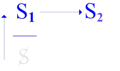
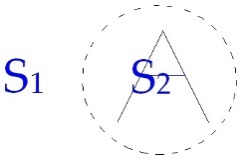
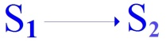
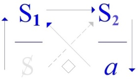
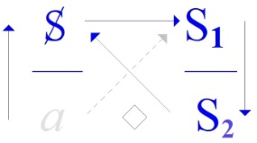
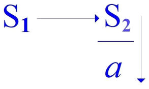

# Leçon 01 | 26 Novembre 1969 Université Paris I, Panthéon-Sorbonne

  

    <label><input type="checkbox" data-lacan-toggle="original" checked> 原文</label>
    <label><input type="checkbox" data-lacan-toggle="notes" checked> 注释</label>
    <label><input type="checkbox" data-lacan-toggle="commentary" checked> 个人解读评论</label>
  

  <form class="lacan-tool-search" role="search">
    <input class="lacan-tool-search-input" type="search" placeholder="搜索全文" aria-label="搜索全文">
    <button class="lacan-tool-button" type="submit" title="搜索">搜索</button>
  </form>
  <button class="lacan-tool-button lacan-back-to-top" type="button" title="回到页面最上方" aria-label="回到页面最上方">↑</button>

<section class="parallel-paragraph" data-paragraph-ids="s17-01-0001">

s17-01-0001

原文 · s17-01-0001

Permettez-moi, mes chers amis, une fois de plus, d’interroger cette *assistance*, en tous les sens du terme, que vous m’apportez, et notam­ment aujourd’hui, en me suivant tous dans un 3ème - pour certains d’entre vous - dans un 3ème de mes déplacements.

请允许我，亲爱的朋友们，再一次地，

<strong>就你们给予我的“在场”（assistance），从这个词的所有含义上</strong>，向你们提出提问。

尤其是今天，你们所有人都来到了我<strong>“第三次迁移”（troisième déplacement）</strong>的现场

</section>

<section class="parallel-paragraph" data-paragraph-ids="s17-01-0002">

s17-01-0002

原文 · s17-01-0002

Avant de reprendre cette interrogation, tout de même, je ne puis moins faire que de préciser - pour en remercier qui de droit - comment je suis ici. C’est au titre d’un prêt, que la *Faculté de Droit* veut bien faire à un certain nombre de mes collègues des *Hautes Études* auxquels elle a bien voulu m’adjoindre. Que la *Faculté de Droit*, et particulièrement ses plus hautes autorités, notam­ment M. le Doyen, en soient ici par moi - et, je pense, avec votre assenti­ment - remerciées.

对你们当中的某些人而言，这已是你们第三次跟随我迁移了。

在重新开始这次提问之前，我至少要做一件事那就是<strong>说明我为何在此，</strong>

并<strong>向相关人士致谢。</strong>我之所以能在这里，是由于一项“<strong>借调安排（prêt）</strong>”，法学院出于好意，

<strong>将我“借给”我在高等研究学院的一些同仁，</strong>而他们也欣然接纳了我加入他们的行列。

在此，我要向法学院，尤其是其最高领导层，特别是院长先生，表达我的感谢。

<strong>既是我个人的谢意，也是在你们默许之下的集体谢意。</strong>

也许你们已经从公告上得知，

</section>

<section class="parallel-paragraph" data-paragraph-ids="s17-01-0003 s17-01-0004 s17-01-0005">

s17-01-0003, s17-01-0004, s17-01-0005

原文 · s17-01-0003, s17-01-0004, s17-01-0005

Comme peut-être l’affiche vous l’a appris, je ne parlerai ici...

> non certes que le lieu ne me soit offert tous les mercredis ...je ne parlerai ici que le 2ème et le 3ème mercredi de chaque mois, me libérant par là, aux fins d’autres offices sans doute, les autres mercredis.

Et notamment je crois pouvoir annoncer que le premier de ces mercredis du mois, au moins pour une part...

<strong>我不会在这里每个星期三都发言……</strong>当然，并不是因为这个场地在其他星期三不提供给我，

而是：

<strong>我只会在每个月的第二和第三个星期三在此发言，</strong>

这样我就能将其余的星期三<strong>空出来，以从事其他事务（d’autres offices），很可能是其他职责。</strong>

特别是，我想我可以宣布，在这些每月的星期三中，第一个星期三——至少在某种程度上……

也就是说，每两个月一次，因此我将从下个月，也就是十二月开始——

</section>

<section class="parallel-paragraph" data-paragraph-ids="s17-01-0006 s17-01-0007">

s17-01-0006, s17-01-0007

原文 · s17-01-0006, s17-01-0007

> c’est-à-dire un mois sur deux, et donc je commencerai le mois prochain, le mois de Décembre ...les premiers mercredis de Décembre, de Février, d’Avril et de Juin, c’est à Vincennes que j’irai porter...

> non pas mon séminaire, comme il fut annoncé d’une façon erronée ...mais ce qu’en contraste et pour bien souligner qu’il s’agit d’autre chose, j’ai pris soin de nommer « *quatre impromptus »,* auxquels j’ai donné un titre humoristique dont vous prendrez connaissance sur les lieux où il est déjà affiché.

在十二月、二月、四月和六月的第一个星期三，我将前往万森（Vincennes）去发表……

不是我的研讨课，正如之前被错误地宣布的那样，

……而是我为了形成对比、并明确强调这完全是另一回事，特意命名为“即兴四讲（quatre impromptus）”的内容，

我还给它们取了一个幽默的标题，你们会在已经张贴出来的地方看到它。

既然，正如你们所见，我乐于将某些提示悬而不决，我就趁此机会迅速释放心头的一个顾虑。

一个一直萦绕心头的顾虑，源自我某种“接待”的方式。事后反思，那种方式其实不够亲切，

</section>

<section class="parallel-paragraph" data-paragraph-ids="s17-01-0008 s17-01-0009 s17-01-0010 s17-01-0011 s17-01-0012 s17-01-0013">

s17-01-0008, s17-01-0009, s17-01-0010, s17-01-0011, s17-01-0012, s17-01-0013

原文 · s17-01-0008, s17-01-0009, s17-01-0010, s17-01-0011, s17-01-0012, s17-01-0013

Puisque, comme vous le voyez, il me plaît de laisser en suspens telle ou telle indication, j’en profite très vite pour libérer ici un scrupule qui m’est resté d’une sorte d’accueil que j’ai fait, en somme à la réflexion, peu aimable, non pas que je l’aie voulu tel, mais il se trouva ainsi de fait : un jour, une personne...

> qui est peut-être ici et sans doute ne se signa­lera pas ...m’abordait dans la rue au moment que je montais, que je prenais pied dans un taxi.

Elle arrêta pour ça son vélomoteur, pour me dire :

- *Est-ce que c’est vous, le docteur Lacan ?*

- *Que oui,* lui dis-je, *et pourquoi ?*

- *Est-ce que vous reprenez votre séminaire ?*

并不是说我有意如此，而是事实最终成了那样：

某天，一个人——她或他可能就在这里，尽管多半不会出声表明——

在街上拦住我，当时我正要上出租车、刚刚踏上车门。

她为此停下了她的轻便摩托车，对我说：

— 您是拉康医生吗？
— 是的，正是我，我回答她，说：怎么了？
— 您会重新开设您的研讨课吗？
— 会的，很快就会。
— 那是在哪里呢？

在那一刻，毫无疑问，我之所以那样回应，自有我的理由，她应该愿意相信我。于是我回答她：

事实上，这确实是一个值得指出的契机：

> — 你会看到的。
> —紧接着，她骑上了她那辆小轻便摩托车离开了，动作之迅捷，让我一时间又愣住又满怀愧疚（笑声）。
> 正是这份愧疚，我今天想表达出来，向她致以我的歉意——
> ——如果她在场的话，希望她能原谅我。

</section>

<section class="parallel-paragraph" data-paragraph-ids="s17-01-0014 s17-01-0015 s17-01-0016 s17-01-0017 s17-01-0018 s17-01-0019 s17-01-0020 s17-01-0021 s17-01-0022 s17-01-0023 s17-01-0024 s17-01-0025 s17-01-0026 s17-01-0027 s17-01-0028">

s17-01-0014, s17-01-0015, s17-01-0016, s17-01-0017, s17-01-0018, s17-01-0019, s17-01-0020, s17-01-0021, s17-01-0022, s17-01-0023, s17-01-0024, s17-01-0025, s17-01-0026, s17-01-0027, s17-01-0028

原文 · s17-01-0014, s17-01-0015, s17-01-0016, s17-01-0017, s17-01-0018, s17-01-0019, s17-01-0020, s17-01-0021, s17-01-0022, s17-01-0023, s17-01-0024, s17-01-0025, s17-01-0026, s17-01-0027, s17-01-0028

- *Mais oui, bientôt.*

- *Et où ?*

Et là, sans doute que j’avais pour cela mes raisons, elle voudra bien m’en croire, je lui répondis :

- *Vous le verrez.*

<!-- -->

-

- À la suite de quoi elle partit sur son petit vélomoteur, qu’elle avait décroché avec une telle prestesse que j’en restais à la fois interdit et chargé de remords \[Rires\]. C’est ce remords que j’ai voulu aujourd’hui exprimer en lui présentant mes excuses,

- si elle est là, pour qu’elle me pardonne.

À la vérité, c’est assurément une occasion de remarquer que ce n’est jamais un excès, en quelque façon que ce soit, par l’excès de quelqu’un d’autre qu’on se montre, au moins apparemment, excédé.

C’est toujours parce que cet excès vient coïncider avec un excès à vous.

C’est parce que moi, j’étais déjà sur ce point dans un certain état qui représentait un excès de préoccupation, que sans doute je me suis manifesté ainsi d’une façon que j’ai trouvée très vite intempestive.

Eh bien entrons - sur ce - dans ce qu’il va en être de ce que nous apportons cette année.

« *La Psychanalyse à l’envers »,* ai-je cru devoir intituler ce séminaire.

Ne croyez pas que ce titre doive quoi que ce soit à l’actualité qui se croirait en passe de *mettre un certain nombre de lieux à l’envers*.

Je n’en donnerai pour preuve que ceci : c’est que dans un texte qui est daté de 1966, et nommé­ment dans une de *ces introductions*...

> que j’ai faites, au moment du recueil de mes « *Écrits »* ...une de ces introductions qui scandent ce recueil, qui s’appelle « *De nos antécédents »*... ça se trouve, si mon souvenir est bon et si je l’ai bien noté, à la page 68 ...je fais très précisément allusion, ou plus exactement je caractérise, ce qu’il en a été du « *discours »*, comme je m’exprime, d’une reprise - dis-je - du projet freudien à l’envers. C’est écrit donc bien avant les événe­ments.

人之所以显得（至少表面上）被激怒，从来都不是因为他人的某种“过度”本身，

而总是因为那个“过度”恰好与我们自身内部的某种“过度”产生了重合。

<strong>正是因为我自己在那一刻，已经处于某种过度担忧的状态之中，</strong>

所以我无疑才会以一种我很快就意识到是“不合时宜”的方式做出反应。

那么现在，让我们由此进入今年我们将要带来的内容。
“精神分析的反面”——我自认为有必要将本次研讨课命名为这个标题。
请不要以为，这个标题与当下那些自以为能够将若干场所颠倒过来的现实局势有什么关系。

我仅以这一点作为证明：在一篇写于1966年的文本中，确切地说，是我在整理《Écrits（书写）》时撰写的几篇导言之一……

那几篇为该文集设定节奏的导言之一，标题是《论我们的前提》（De nos antécédents）……

如果我没记错的话，如果我当时标注得准确，那段话出现在第68页，

我在其中非常明确地提及，或更确切地说，是界定了我所谓的“话语”（discours）——

是对弗洛伊德计划的一种“反面重启”（reprise à l’envers），正是我当时的说法。

</section>

<section class="parallel-paragraph" data-paragraph-ids="s17-01-0029 s17-01-0030 s17-01-0031 s17-01-0032 s17-01-0033">

s17-01-0029, s17-01-0030, s17-01-0031, s17-01-0032, s17-01-0033

原文 · s17-01-0029, s17-01-0030, s17-01-0031, s17-01-0032, s17-01-0033

Qu’est-ce à dire ?

Il m’est arrivé l’année dernière, en tout cas avec beaucoup d’insistance, de distinguer ce qu’il en est du *discours*, comme une struc­ture nécessaire de quelque chose qui dépasse de beaucoup la parole, toujours plus ou moins occasionnelle.

« *Ce que je préfère* - ai-je dit, et même affiché un jour - *c’est un discours sans parole »* [^1].

C’est qu’à la vérité, sans paroles, il peut fort bien subsister.

Il subsiste dans certaines relations fondamentales qui littéralement ne sauraient subsister sans *le langage*, sans l’instauration par l’instrument du langage d’un certain nombre de relations stables, à l’intérieur desquelles peut certes s’inscrire quelque chose qui va bien plus loin, qui est bien plus large, que ce qu’il en est des énonciations effectives.

因此，这段文字是在“事件”发生之前很久就写下的。

去年，我曾非常强调地点明“话语”的实质，

即它作为一种结构的必然性，远远超越于语言（la parole）这种总带偶发性的表达方式。

我曾说过——而且在某天还公开张贴过——我所偏好的，是“无言的话语”（un discours sans parole）

事实上，即使没有言语，它依然完全可以持续存在。

它存在于某些根本性的关系之中，而这些关系本身则是绝不可能在没有语言的条件下存在的。

正是通过语言这一工具的建立，才得以确立出若干稳定的关系，

在这些关系的内部，确实可以被书写入一些东西，

而这些东西远远超出了实际表达（énonciations effectives）所能涵盖的范围。

我们完全不需要那些“言语的表达”（énonciations），

> 注：【参见1968-69年度研讨课《从一个他者到另一个》（D’un Autre à l’autre），1968年11月13日一讲：“精神分析理论的本质，是一种无言的话语。”】

> 这意味着什么呢？

</section>

<section class="parallel-paragraph" data-paragraph-ids="s17-01-0034 s17-01-0035">

s17-01-0034, s17-01-0035

原文 · s17-01-0034, s17-01-0035

Nul besoin de ces *énonciations* pour que notre conduite, pour que nos actes éventuellement, s’inscrivent du cadre de certains énoncés primordiaux.

S’il n’en était pas ainsi, qu’en serait-il de ce que nous retrouvons dans *l’expérience,* et spécialement *analytique*...

我们的行为，乃至我们的行动，其实也都写定在某些原初命题的框架之中。

如果不是如此，那么在经验中——尤其是在分析经验中（我之所以在此提及它，正是因为它指明了这一点）——我们所能重新发现的那些东西，会是什么呢？

</section>

<section class="parallel-paragraph" data-paragraph-ids="s17-01-0036 s17-01-0037 s17-01-0039 s17-01-0040">

s17-01-0036, s17-01-0037, s17-01-0039, s17-01-0040

原文 · s17-01-0036, s17-01-0037, s17-01-0039, s17-01-0040

> celle-ci ne s’évoquant en ce joint que pour l’avoir précisément désignée *...*qu’en serait-il de ce qui se retrouve pour nous sous l’aspect du *surmoi* ?

Il est *des structures*, nous ne saurions les désigner autrement pour caractériser ce qui est dégageable de cet « *en forme de*… » sur lequel l’année dernière je me suis permis de mettre l’accent d’un emploi parti­culier, ce qu’il en était de ce qui se passe de par *la relation fondamentale*, celle que je définis : *d’un signifiant à un autre signifiant*.

Voilà la relation fondamentale, celle que je désigne pour être d’*<u>où</u>* résulte l’émer­gence de ceci, que nous appelons le *sujet*, ceci de par *le signifiant* qui en l’occasion fonctionne comme le *représentant* - *ce sujet* - *auprès d’un autre signifiant*.

Qu’en est-il, comment situer cette *forme fondamentale*, cette *forme* que si vous voulez bien, sans plus attendre, nous allons cette année écrire, non plus - comme je le disais l’année dernière - *comme l’extériorité du signi­fiant* **S1**, celui d’où part notre définition du discours tel que nous allons l’accentuer en ce premier pas.

我们所重新发现的、以“超我”（surmoi）面貌出现的那些东西，又该如何理解呢？

有一些结构，我们无法用别的方式来命名它们，以指称从那种“……的形式”（*en forme de…*）中所能提炼出的东西。

去年我曾特意强调了这个表达在一种特殊用法中的意义——

即在那个根本性关系中所发生的事情，我所定义的那个关系是：一个能指指向另一个能指的关系。

这就是那一根本性关系，我所指出的，正是从这关系中产生出我们所称之为“主体”的这个东西。
它的发生，是因为某个能指在特定时刻起到了“代表”这个主体的功能——在另一个能指面前。
这是什么？我们该如何定位这一根本形式？这个形式，如果你们愿意，我们就不再拖延，
今年我们将这样来书写它：不再——如我去年所说的那样——将其写作能指S₁的外在性。

也就是那个出发点——从那里出发，我们将重新强调我们对“话语”所作的定义，就从这一第一步开始。

因此，我以能指 S₁ 来表示：它与这个圆圈之间的关系所带来的结果，而这个圆圈我在此仅仅标出一个痕迹。
我原本在这里标记了符号 A，即“大他者”的领域，但我们现在简化一下。
我们以符号 S₂ 来指称一组能指，也就是那些已经在那里、预先存在的一整套能指系统。

</section>

<section class="parallel-paragraph" data-paragraph-ids="s17-01-0038">

s17-01-0038

原文 · s17-01-0038

[无对应译文]

</section>

<section class="parallel-paragraph" data-paragraph-ids="s17-01-0041">

s17-01-0041

原文 · s17-01-0041

[无对应译文]

</section>

<section class="parallel-paragraph" data-paragraph-ids="s17-01-0042 s17-01-0043 s17-01-0044 s17-01-0045 s17-01-0046 s17-01-0047">

s17-01-0042, s17-01-0043, s17-01-0044, s17-01-0045, s17-01-0046, s17-01-0047

原文 · s17-01-0042, s17-01-0043, s17-01-0044, s17-01-0045, s17-01-0046, s17-01-0047

Je mets donc *le signifiant* **S1** pour manifester ce qui résulte de son rapport avec ce cercle dont je ne mets ici que *la trace*.

J’avais marqué ici le sigle du A, le champ du grand Autre, mais simplifions.

Nous considérons, désignée par le signe **S2**, la batterie des signifiants, de ceux qui sont déjà là.

Car au point d’origine où nous nous plaçons pour fixer ce qu’il en est du discours, du discours conçu comme statut de l’énoncé, S1 est celui qui est à voir comme intervenant, intervenant sur ce qu’il en est d’une batterie de signifiants que nous n’avons aucun droit, jamais, de tenir pour dispersée, pour ne formant pas déjà le réseau de ce qui s’appelle *un savoir*.

Ce qui se pose d’abord...

de ce moment où S1 *vient représenter quelque chose*, par son intervention dans le champ défini, au point où nous sommes ...comme le champ déjà structuré d’un savoir, ce qui est son *supposé* - ὑποχείμενον \[upokeimenon\] - c’est *le sujet* en tant qu’il représente ce trait spécifique, à distinguer de ce qu’il en est de l’individu vivant, et qui assurément en est le lieu, le point de marque, mais qui bien sûr n’est pas de l’ordre, de l’ordre de ce que le sujet fait entrer de par le statut du *savoir*.

因为在我们所处的那个起点上——我们从这个起点出发，来界定话语的本质，

这个“话语”是被理解为一个“命题（énoncé）地位”的结构，

在这里，S₁ 就应被看作是一个介入者——它介入于那一整组能指之中，

而这组能指，我们绝对没有任何权利将其视为是散乱无序的，

因为它们早已构成了一个网络，即我们所称之为“知识”（savoir）的那个网络。

首先所设立的，是这样一个时刻……
在这个时刻，S₁ 前来代表某种东西，
通过它在这个既定场域中的介入——这个场域，在我们所处的位置上，
已被界定为一个知识的结构化场域——在此背景下，它的“所-被-假定之物”（ὑποχείμενον / hypokeimenon），即是“主体”；
主体之为主体，是因为它代表了某个特定的特征（trait spécifique），
这一特征必须与“现实中的活生生个体”加以区分，
后者当然是这个特征的承载场所，是那个被标记的点，
但当然，它并不属于那一秩序——也就是主体因“知识地位”而进入的话语秩序。

毫无疑问，正是在“知识”（*savoir*）这个词的周围，存在一个我们今天必须重点强调的<strong>歧义点</strong>。

这个歧义点，早就已经——通过多条路径、小径、照亮时机、闪电般的片段——

成为我认为已经让你们的耳朵变得敏感的东西。

去年的某个时刻……

> <strong>réseau de ce qui s’appelle un savoir（知识的网络）</strong>：S₂ 的本体论定义。知识在拉康这里不是经验积累，而是<strong>能指链条构成的结构网络</strong>。所以“话语”的作用是：S₁介入S₂，组织或激活知识系统中的结构排列
>
> - <strong>S₁ 是话语的启动点，是介入行为</strong>：
>
> 它不是经验主体发话，而是在语言结构中承担“统摄—命名—决定”功能的结构性能指。拉康强调我们要从结构起点上来理解“话语”的构成，而非从心理学意义上谈主体说了什么。
>
> - <strong>S₂ 是知识的网络，而非能指的堆积</strong>：
>
> 所谓“知识”，不是内容集合，而是能指如何被安排、关联、命名、互为指涉。这是一种纯粹结构性的认识：能指只有在结构网络中，才构成知识；一旦被视为离散，则误入歧途。
>
> - <strong>伦理化的语言观</strong>：
>
> 拉康在此不是单纯描述结构，还施加了一个“禁止”：“我们没有权利将这些能指视为散乱的。”——这实际上是一个分析伦理原则，意味着：精神分析师必须承认<strong>无意识的结构性</strong>与语言网络的整体性，不能把分析简化为片段内容的解读。
>
> - <strong>推进“话语四式”的理论基座</strong>：
>
> 这一段奠定了“话语就是结构化的命题网络”这一根本前提。S₁ 的作用，就是<strong>在知识网络中设定主位/主导链条</strong>，决定了话语的类型与其主体的生产方式——这为后续“主人话语”“大学话语”等公式展开铺平道路。

</section>

<section class="parallel-paragraph" data-paragraph-ids="s17-01-0048 s17-01-0049 s17-01-0050">

s17-01-0048, s17-01-0049, s17-01-0050

原文 · s17-01-0048, s17-01-0049, s17-01-0050

Sans doute est-ce là, autour du mot *savoir,* *le point d’ambiguïté* sur lequel nous avons aujourd’hui *à bien accentuer* ce qui d’ores et déjà, par plusieurs chemins, sentiers, occasions de lumière, traits de flash, ce à quoi je pense avoir rendu vos oreilles sensibles.

Il m’est arrivé l’année dernière...

> noterai-je pour ceux qui en ont pris note, pour ceux à qui peut-­être ça trotte encore dans la tête ...il m’est arrivé l’année dernière d’appeler *ce savoir *: « *La jouissance de l’Autre *».

我在此为那些记了笔记、或者脑中还在回响的听众特别指出——

……我曾称这种“知识”为：“大他者的享乐”（*la jouissance de l’Autre*）。

这真是一件奇怪的事，是一种从未真正被说出的表述。

虽然它不再是“新的”了，因为我去年已经在你们面前给予了它足够的可信度，

因为我能够围绕它展开论述，而没有引起特别的反对。

这正是我去年预告过的，今年我们要“赴约”的一个关键点。

让我们先来补全最初只有“两条腿”的那个东西。

接着变为“三条腿”：

那就给它加上“第四条腿”吧：

</section>

<section class="parallel-paragraph" data-paragraph-ids="s17-01-0051 s17-01-0052 s17-01-0053 s17-01-0054 s17-01-0055 s17-01-0056 s17-01-0058 s17-01-0060 s17-01-0062 s17-01-0063 s17-01-0064 s17-01-0065 s17-01-0066">

s17-01-0051, s17-01-0052, s17-01-0053, s17-01-0054, s17-01-0055, s17-01-0056, s17-01-0058, s17-01-0060, s17-01-0062, s17-01-0063, s17-01-0064, s17-01-0065, s17-01-0066

原文 · s17-01-0051, s17-01-0052, s17-01-0053, s17-01-0054, s17-01-0055, s17-01-0056, s17-01-0058, s17-01-0060, s17-01-0062, s17-01-0063, s17-01-0064, s17-01-0065, s17-01-0066

C’est une drôle d’affaire, une formulation qui à vrai dire n’a jamais encore été proférée.

Elle n’est plus neuve,

- puisque j’ai pu, déjà l’année dernière, lui donner devant vous sa vraisemblance suffisante,

- puisque j’ai pu en tenir le propos sans soulever de spéciales contestations.

C’est là un des points de rendez-vous que j’annonçais pour cette année.

Complétons d’abord ce qui fut d’abord à 2 pieds :

puis à 3 :

don­nons-lui son 4ème :

Celui-là, j’y ai depuis, je pense, assez insisté, et spécialement l’an dernier, puisque l’année dernière le séminaire était fait pour ça : « *D’un Autre à L’autre »,* l’intitulais-je. Cet *autre*, le petit, avec son grand L, son L de notoriété, c’était ce que nous désignions...

> à ce niveau qui est d’algèbre, qui est de structure signifiante ...c’est ce que nous désignons comme *l’objet(a).*

À ce niveau de structure signifiante, nous n’avons à connaître que de la façon dont ça opère.

À ce niveau de structure signifiante nous avons liberté de *voir ce que ça fait*...

si nous écrivons ces choses, ...*à donner à tout le système* « *un quart de tour »*.

这个位置，我从那以后，我想，已经反复强调了，特别是去年，因为去年的研讨课就是为此而设的：我将它命名为《从一个他者到另一个》（*D’un Autre à l’Autre*）。

这个“他者”——小写的他者，带着一个大写的 L，一个名声显赫的大写字母——

这就是我们在那个属于代数层面、属于能指结构的层面上所指称的东西：

它就是我们所称之为“小对象 a”（*objet petit a*）的那个东西。

在这个能指结构的层面上，我们所要理解的，只是它如何运作。
在这个能指结构的层面上，我们有自由去观察：如果我们以某种方式书写这些东西，
那么整个系统就可以被“旋转四分之一圈”。

这个著名的“四分之一圈旋转”（*quart de tour*），我已经讲了相当长的一段时间……

在许多其他场合，尤其是自从我写下《康德与萨德》（*Kant avec Sade*）那篇文章以来，

……是为了让人能够想到，也许有一天，我们会认识到，它并不只是所谓“Z形图式”的一个现象，

而是这个“旋转四分之一圈”的动作，其背后还有其他更深的理由，不仅仅是某种想象性再现的偶然产物。

这就是一个例子：

> 拉康提醒听众：他所说的“a”不是经验对象，而是一个<strong>结构性符号</strong>，在一个能指代数系统中起作用。
>
>
> 这是“语义去魅”：拉康的对象 a 是“欲望的剩余因”，不是可以感知的客体，而是话语中主体被吸引但永远得不到的点。

> “给整个系统来一个四分之一圈的旋转”；
>
> - 在拉康话语结构中，这是<strong>至关重要的操作语</strong>，它意味着：
>
> <strong>将话语结构中的四个元素（S₁, S₂, $, a）位置按顺时针移动90°，从而生成另一种话语形式。</strong>
>
> - 这个旋转构成了“四种话语公式”的基础机制。它们是：
> 1. <strong>主人话语</strong>（Discours du maître）
> 2. <strong>大学话语</strong>（Discours de l’universitaire）
> 3. <strong>分析师话语</strong>（Discours de l’analyste）
> 4. <strong>癔症者话语</strong>（Discours de l’hystérique）

</section>

<section class="parallel-paragraph" data-paragraph-ids="s17-01-0057">

s17-01-0057

原文 · s17-01-0057

[无对应译文]

</section>

<section class="parallel-paragraph" data-paragraph-ids="s17-01-0059">

s17-01-0059

原文 · s17-01-0059

[无对应译文]

</section>

<section class="parallel-paragraph" data-paragraph-ids="s17-01-0061">

s17-01-0061

原文 · s17-01-0061

[无对应译文]

</section>

<section class="parallel-paragraph" data-paragraph-ids="s17-01-0067 s17-01-0068 s17-01-0069 s17-01-0071">

s17-01-0067, s17-01-0068, s17-01-0069, s17-01-0071

原文 · s17-01-0067, s17-01-0068, s17-01-0069, s17-01-0071

Ce fameux « *quart de tour »* dont je parle depuis assez longtemps...

> en bien d’autres occasions, notamment depuis la parution de ce que j’ai écrit sous le titre de *Kant avec Sade...*pour qu’on puisse penser que peut-être un jour, on verrait que ça ne se limite pas au fait du schéma dit « Z », mais qu’il y a à ce « *quart de tour »* d’autres raisons que ce pur accident de représenta­tion imaginaire.

Voilà un exemple :

À bien prendre les choses, s’il apparaît fondé que la chaîne, la succession de ce qu’il en est des lettres de cet algèbre, ne peut pas être dérangée, si vous vous livrez à cette opération que j’ai appelée « *quart de tour »* nous n’obtiendrons pas plus de 4 structures, dont celle qui est ici écrite à gauche nous montre en quelque sorte *le départ*.

若我们仔细把握这些事物，如果确立了这样的前提——

即这条链条，也就是这个代数系统中各个字母的排列顺序，是不可被随意打乱的，

那么如果你进行我称之为“旋转四分之一圈”（*quart de tour*）的那个操作，

我们将最多只能得到四种结构；

其中，在左侧所写出的这个，就是某种意义上的起点。

其余的两个结构，在纸面上迅速地写出来也是非常容易的。

这并不仅仅是为了构造出一个没有任何强制性的机制，
就像某些观点所说的那样，它不是某种抽象而脱离现实的东西。
恰恰相反，它已经明确地铭刻在某种我们称之为“现实”的运作之中——
正是我刚才所说的那个“话语”：一个已经在世界中存在、并支撑着这个世界的东西，
至少，是支撑着我们所知世界的那个话语。

正是在那里——不仅是“已经被铭刻”，而是构成其“结构拱顶”一部分的地方——

这条象征链条……

> 拉康反对将他的“四种话语结构”理解为一种<strong>主观设定</strong>或<strong>理论游戏</strong>；
>
>
> 他强调，这些结构<strong>不是投射性的，而是现实中已经在起作用的机制</strong>
>
> 这是拉康关于“话语现实论”的核心句式：
>
> - <strong>话语不是描述现实，而是现实的组成条件</strong>；
> - 我们的社会、主观性、权力、知识、享乐，都通过某种话语结构被组织、维系。
> - 这正是 S17 的理论出发点：“精神分析的反面”不是分析的对立面，而是<strong>分析话语之外、但却主导社会的各种现实性话语形式</strong>（主人话语、大学话语等）。

</section>

<section class="parallel-paragraph" data-paragraph-ids="s17-01-0070">

s17-01-0070

原文 · s17-01-0070

 

[无对应译文]

</section>

<section class="parallel-paragraph" data-paragraph-ids="s17-01-0072 s17-01-0074 s17-01-0075 s17-01-0076">

s17-01-0072, s17-01-0074, s17-01-0075, s17-01-0076

原文 · s17-01-0072, s17-01-0074, s17-01-0075, s17-01-0076

Il est très facile de produire vite, sur le papier, les deux qui restent.

Cela n’est pas *<u>que</u>* pour spécifier un appareil qui n’a absolument rien d’*imposé*, comme on dirait de certaines perspectives, rien d’abstrait d’aucune réalité. Bien au contraire, c’est d’ores et déjà inscrit dans ce qui fonctionne comme cette *réalité* dont je parlais tout à l’heure, du dis­cours qui est déjà au monde et qui le soutient, à tout le moins celui que nous connaissons.

*C’est là* - pas seulement déjà inscrit : faisant partie de ses arches - *que cette chaîne symbolique*…­ peu importe bien sûr, la forme des lettres où nous l’inscrivons pour peu qu’elles soient distinctes ...*que quelque chose y manifeste une relation constante*.

*Telle est cette for­me*, en tant qu’elle dit que c’est au point, à l’instant même où le **S1**...

当然，用我们书写它的字母形式无关紧要，只要它们是彼此可区分的，

……在这链条中，有某种东西呈现出一种<strong>恒定的关系</strong>。

这正是这种形式，它所表达的是：正是在那个点上——也就是在 S₁ 的介入之刻……

（我们接下来的讲述将进一步展开这一结构，并告诉我们应当如何理解那个时刻的意义）

……正是在 S₁ 介入一个已然构成的能指系统之场时，

——一个其内部各能指已经彼此以“能指之为能指”的方式互相连结的场域——

……正是在它介入另一个能指之际，有一个东西浮现出来：<strong>S</strong>，

而这正是我们所称之为“被分裂的主体”（*le sujet comme divisé*）的那个东西。

但我们始终强调的是：在这条路径中，有某种东西显现出来，被明确定义为一种<strong>损失</strong>。

而正是这一点，被那个字母所指称——那个被读作“小对象 a”（*objet petit a*）的字母。

> S₁ 的“代表行为”是面向另一个能指进行；
>
>
> 这正是拉康著名公式的展开：
>
> > “Le signifiant représente le sujet pour un autre signifiant.”
> >
> >
> > 一个能指为另一个能指代表主体。
> >
>
> 结构性的“主体”就是这样浮现出来的：
>
> 它不是本体，也不是经验自我；
>
> 它是<strong>能指间代表性关系中的裂缝产物</strong>；
>
> “divisé”即“被分裂”：主体在此不是完整者，而是处于<strong>被代表与未被说出之间的断裂处</strong>；
>
> 通常在拉康图式中标记为 <strong>$</strong>（划掉的 S），指代被语言宰制而裂开的主体。

</section>

<section class="parallel-paragraph" data-paragraph-ids="s17-01-0073">

s17-01-0073

原文 · s17-01-0073

   

[无对应译文]

</section>

<section class="parallel-paragraph" data-paragraph-ids="s17-01-0077 s17-01-0078 s17-01-0079 s17-01-0080 s17-01-0081 s17-01-0082">

s17-01-0077, s17-01-0078, s17-01-0079, s17-01-0080, s17-01-0081, s17-01-0082

原文 · s17-01-0077, s17-01-0078, s17-01-0079, s17-01-0080, s17-01-0081, s17-01-0082

c’est la suite de ce que développera ici notre discours, qui nous dira quel sens il convient de donner à ce moment là ...c’est au moment où ce **S1** intervient dans le champ déjà constitué des autres signifiants...

en tant qu’ils s’articulent déjà entre eux comme tels ...qu’à intervenir auprès d’un autre \[signifiant\] de ce système, surgit ceci : **S**, qui est ce que nous avons appelé *le sujet* comme *divisé*.

Mais nous avons accentué de toujours que de ce trajet sort quelque chose de défini comme *une perte*, et que c’est cela que désigne *<u>la lettre</u>* qui se lit comme étant *l’objet(<u>a</u>).*

Bien sûr nous n’avons pas été sans désigner le point d’où nous extrayons cette fonction de *l’objet perdu* : du discours de Freud, sur le sens spéci­fique de *la répétition* chez l’être parlant.

Car ce n’est point de n’importe quel effet biologique de mémoire qu’il s’agit dans *la répétition*.

*La répétition* a un certain rapport avec ce qui, de ce sujet et de ce savoir, est la limite qui s’appelle *la jouissance*.

当然，我们并没有忽略指出这样一个起点：我们正是从那里提取出“丧失之客体”这一功能的——这个起点，正是弗洛伊德关于“说话之存在者”身上<strong>重复这一特殊现象</strong>的论述。

因为在“重复”这个问题上，根本无关任何生物性的记忆效应。

重复与某种东西相关联，这个东西正是从“主体”与“知识”中所界定出的那个界限——我们称之为“享乐”的那个界限。

因此，这句公式——“知识是大他者的享乐”——所涉及的，是一种<strong>逻辑性的结合</strong>。

所谓“大他者”，当然，我们必须加以限定——因为根本就没有任何实体性的大他者——

它只是在能指的介入之下，<strong>作为一个场域</strong>被唤现出来的东西。

正是在这里，“享乐”这一术语让我们得以指出

<strong>这一机制的插入点</strong>，而且毫无疑问地使我们从那种可被确认为“知识”的正统领域中脱离出来，将我们引向那个边界地带，<strong>引向场外</strong>，而这正是弗洛伊德的言说所敢于面对的地方。

当他的所有论述得出的结果并非“知识”，而是<strong>混乱</strong>时，正是从这混乱之中，弗洛伊德的言说促使我们思考，也正因为它触及了边界，它也促使我们<strong>走出整个系统</strong>。

> 对象a，它驱动欲望，是话语产出路径上的“剩余产物”；
>
>
> 它与“损失”或“缺口”不可分割，是<strong>话语导致享乐不可能完成的标志</strong>。
>
> <strong>这个“损失”不是意外，而是结构性的产物</strong>：
>
> - 语言永远不能将享乐完全编码；结构性的“余数”成了“享乐的原因”；
> - 对象 a 就是这一点的名称：既是缺口，也是驱动。

> - 享乐是语言系统中无法被完全编码、符号化的剩余；
> - 它是语言结构的极限点，是话语无法穿透之处，同时又是欲望结构的盲点；
> - 主体与知识之间，总存在着一个越不过的“享乐边界”。
>
> ”知识是大他者的享乐”
> - 并非将“大他者”理解为某种经验存在，而是象征秩序本身所设定的话语位置；
> - “知识”在话语结构中不断积累、运作，而剩余的未尽之处即构成享乐；
> - 此句表达出：知识不仅不是中立的，而且本身就是享乐机制的一种显现。
>
> 不是说大他者在享乐，而是说：<strong>知识系统本身组织了一个让享乐无法彻底消除的剩余空间</strong>；这个剩余空间即是分析的核心关注点。
> “说出来可以如何享乐，不说出来可以如何享乐”

</section>

<section class="parallel-paragraph" data-paragraph-ids="s17-01-0083 s17-01-0084 s17-01-0085 s17-01-0086 s17-01-0087 s17-01-0088 s17-01-0089">

s17-01-0083, s17-01-0084, s17-01-0085, s17-01-0086, s17-01-0087, s17-01-0088, s17-01-0089

原文 · s17-01-0083, s17-01-0084, s17-01-0085, s17-01-0086, s17-01-0087, s17-01-0088, s17-01-0089

C’est pourquoi c’est d’une articulation logique qu’il s’agit dans la for­mule : « *Le savoir est la jouissance de l’Autre* ».

De l’Autre, bien entendu pour autant...

> car il n’est nul Autre ...pour autant que *l’a fait surgir* *comme <u>champ</u>* *l’intervention du signifiant*.

Sans doute me direz-vous que là, en somme, nous tournons toujours en rond :

- *le signifiant, l’Autre, le savoir,*

- *le signifiant, l’Autre, le savoir*...

Et c’est bien là que le terme de *jouissance* nous permet de mon­trer *le point d’insertion* de l’appareil, et sans doute...

那么，我们是因为什么理由走出这个系统的呢？是出于对意义的渴望吗？

仿佛这个系统本身还需要意义似的！<strong>系统根本不需要任何意义！</strong>

是我们这些软弱的存在——正如在这一年中，我们将在每一个转折点都再次面对自己那样——

<strong>我们才是需要意义的那一方。</strong>

好吧，这就是一个例子。

它也许并不是真正的“真”，但可以肯定的是，我们还会看到很多这种“也许并不是真”的情况，而这些“不是”的持续出现，恰恰向我们<strong>揭示出一个滑出[lapsus]……或更确切地说，一个关于‘真理的维度’”。</strong>

</section>

<section class="parallel-paragraph" data-paragraph-ids="s17-01-0090 s17-01-0091 s17-01-0092 s17-01-0093 s17-01-0094 s17-01-0095 s17-01-0096 s17-01-0097 s17-01-0098">

s17-01-0090, s17-01-0091, s17-01-0092, s17-01-0093, s17-01-0094, s17-01-0095, s17-01-0096, s17-01-0097, s17-01-0098

原文 · s17-01-0090, s17-01-0091, s17-01-0092, s17-01-0093, s17-01-0094, s17-01-0095, s17-01-0096, s17-01-0097, s17-01-0098

sortant de ce qu’il en est authentiquement de ce qui est reconnaissable comme *savoir* ...de nous rapporter aux limites, à l’hors-champ, celui que la parole de Freud ose affronter, quand de tout ce que celle-ci articule résulte - résulte quoi ? - non le savoir, mais la *confusion*, car de la *confusion,* elle \[*la parole de Freud*\] nous a porté à tirer réflexion et, puisqu’il s’agit des *limites,* à sortir du système.

En sortir en vertu de quoi ? D’une soif de sens ?

Comme si le système en avait besoin ! Il n’a aucun besoin, le système !

Et nous, *êtres de faiblesse*, tels que nous nous retrouverons dans le cours de cette année à tous les tournants, *nous avons besoin de sens*.

Eh bien, en voilà un.

*C’est peut-être pas le vrai*, mais ce qu’il y a de certain c’est que nous allons voir aussi qu’il y a beaucoup de « *c’est peut-être pas le vrai* », dont l’insis­tance nous suggère proprement *la démission* \[*lapsus*\]... *la dimension de la vérité*.

Eh bien, remarquons l’ambiguïté même qu’a prise, dans la stupidité psychana­lytique, le mot *Trieb*, pour autant qu’au lieu de s’appliquer à saisir comment s’arti­cule cette catégorie...

sans doute qui n’est pas sans ancêtre, je veux dire qui n’est pas sans « déjà emploi », et qui remonte loin, jusqu’à Kant ...du mot *Trieb*.

Mais tout de même, ce à quoi ça sert dans le discours analytique mériterait bien que l’on ne se pré­cipite pas pour le traduire trop vite, trop vite par le mot « *instinct* ».

那么，就让我们来注意一下这个词——<strong>Trieb（驱力）</strong>——在精神分析的愚蠢话语中所承载的<strong>歧义性</strong>。

因为人们没有努力去弄清楚这个范畴究竟是如何被结构化的……

一个当然不是没有祖先的范畴，我的意思是，它并非没有“已有用法”的历史，它可以一直追溯回康德那里……这个词：<strong>Trieb（驱力）</strong>。

然而，*Trieb* 这个词在分析话语中的作用，理应让人不要急于将其翻译为“本能”（*instinct*）——太快、太仓促地这样翻译。

但即便如此，这些词义滑动的发生也不是毫无缘由的。毕竟，尽管我们早已反复强调这种翻译的荒谬性，我们仍然有理由从这种误译中获益，当然不是为了认可——尤其是在这个问题上——“本能”这一概念，而是为了提醒人们：是什么使得弗洛伊德的话语变得可居、可居住，并且我们只是试图——以不同的方式——<strong>去栖居这一话语</strong>。

在通俗层面上，“本能”这个概念确实被视为一种“知识”的概念，一种我们说不清它到底意味着什么的知识，但它被设想为——而且并非毫无道理——其结果就是：生命得以延续。

如果我们赋予弗洛伊德所提出的“快感原则”以某种意义，认为它是生命运作的核心机制，

即：它是维持最低紧张状态的那个机制，那么，这是否正是他话语后续部分所<strong>被迫显现</strong>的东西，——这种被迫，是由某种发展过程所带来的，发展过程是……什么的？——是一种经验的、一种<strong>分析经验的</strong>发展过程，正因为它作为一种话语结构而存在。

因为我们切不可忘记：<strong>死亡驱力</strong>并不是通过观察人们的行为而被“发明”出来的。

<strong>死亡驱力</strong>就在这里——<strong>在你们与我所说的话之间发生的某些东西之中。</strong>

</section>

<section class="parallel-paragraph" data-paragraph-ids="s17-01-0099 s17-01-0100">

s17-01-0099, s17-01-0100

原文 · s17-01-0099, s17-01-0100

Mais quand même, ce n’est pas sans raison que se produisent ces glissements.

Et après tout, quoique depuis long­temps nous insistions sur le caractère aberrant de cette traduction, nous sommes en droit pourtant d’en tirer profit, non certes pour consacrer - et surtout à ce propos - la notion d’*instinct*, mais pour rappeler ce qui du discours de Freud la rend habitable, et pour tâcher simplement - ce discours - de le faire habiter autrement.

我说的是“我所说的话”，而不是“我是谁”；说我是谁又有什么意义，反正，通过你们的在场，也就一目了然了。

无论如何，使我在此能够说点什么的理由，正是我愿意称之为<strong>“这一现象的本质”</strong>——

也就是说：<strong>那些我曾在不同场域吸引来的听众群体</strong>所构成的连续显现。

2）巴黎第五区于尔姆街的高等师范学院

3）以及目前的巴黎第一大学，先贤祠-索邦校区】

我一直非常希望能够在某个点上<strong>连接（embrancher）</strong>某些东西……

> 并不是说你们是在为我说话（笑声）你们的确有时在说话，而且多数时候是<strong>替我说话</strong>。

> 【1）巴黎第十四区圣安娜医院

</section>

<section class="parallel-paragraph" data-paragraph-ids="s17-01-0101 s17-01-0102 s17-01-0103 s17-01-0104 s17-01-0105 s17-01-0106 s17-01-0107 s17-01-0108">

s17-01-0101, s17-01-0102, s17-01-0103, s17-01-0104, s17-01-0105, s17-01-0106, s17-01-0107, s17-01-0108

原文 · s17-01-0101, s17-01-0102, s17-01-0103, s17-01-0104, s17-01-0105, s17-01-0106, s17-01-0107, s17-01-0108

Populairement, l’idée de l’instinct est bien l’idée d’un savoir, d’un savoir dont on n’est pas capable de dire ce que ça veut dire, mais qui est censé - et non sans titre - avoir pour résultat que la vie subsiste.

Si nous donnons un sens à ce que Freud énonce du *principe du plaisir* comme essentiel au fonctionnement de *la vie*, d’être celui où se maintient *la tension la plus basse*, est-ce que ce n’est pas dire ce que la suite de son discours démontre comme lui être imposé, imposée par le développement - de quoi ? - d’une expérience, de l’expérience analytique, en tant qu’elle est structure de discours.

Car n’oublions pas que ce n’est pas à considérer le comportement des gens qu’on invente *la pulsion de mort*.

*La pulsion de mort*, nous l’avons ici, là où il se passe quelque chose entre vous et ce que je dis.

Je dis : « *ce que je dis »*, je ne parle pas de ce que je suis. À quoi bon, puis­qu’en somme ça se voit grâce à votre assistance.

Ce n’est pas qu’elle parle en ma faveur \[*Rires*\]... Elle parle quelquefois, et le plus souvent, *à ma place*.

Ce qui justifie, quoi qu’il en soit, qu’ici je dise quelque chose, c’est ce que j’appellerai « *l’essence de cette manifestation* » qu’ont été - successives - les diverses assistances que j’ai attirées selon les lieux d’où je parlais.

> \[1) Hôpital Sainte-Anne, Paris XIVème ,
>
> 2\) École Normale Supérieure, rue d’Ulm, Paris Vème,
>
> 3\) et actuellement Université Paris I, Panthéon-Sorbonne, Paris Vème\]

因为今天对我来说似乎正是那样的一个时刻，今天，我正身处一个<strong>“更佳之处”（即“多一点之处”）</strong>——

——在这里，我要指出：这个“地点”始终具有某种分量，它深刻地塑造了我所称之为“这一显现”（*manifestation*）的风格。

“显现”这个词，我在此也不想错失机会指出，它与“解释”（*interprétation*）这个词的通用意义有关。

我所通过你们的在场、为你们、在你们中间所说的那些话，

始终是在我先前界定的那些“地理性场所”中——<strong>已经被解释的</strong>。

我会回到这个问题上的，因为它将在我今天开始使用的那些**小型可旋转的四脚支架（*petits quadripodes tournants*）中占有一席之地。
但为了不让你们完全处于悬空状态，我先指出：如果我要进行一次“解释”，
我的意思是：将某事钉住**，当作一种“解释”（*épingler comme interprétation*）……
那就将是指向一种与精神分析式解释<strong>背道而驰</strong>的方向，
一种能真正让人感受到：精神分析的“解释”
本身是与“解释”一词在日常意义中的理解<strong>完全相反的东西</strong>。
——那么，如果我要“钉住”我在圣安娜（Sainte-Anne）所说内容的“解释”的话，
——我会说，最为敏感的、真正引起共鸣的那根弦，就是：<strong>笑声（la rigolade）</strong>。

那是一群医学出身的听众，当然也有一些不是医学背景的助手……

我将此视为在我这十年间“显现”（manifestation）<strong>本质中最具特征性的一点</strong>。

我不能在这个方向上讲得太久，这是一个巨大的插入式插话，

但我还是必须在其中加入一点关于“解释”的特征，

> 最具代表性的，是那位不断以一种<strong>连珠炮式的笑话</strong>来“缀接我讲话”的人。

> 而直到那一天——这本身也可以作为又一证明——也就是我<strong>用一个学期专门分析“笑话”时</strong>，

> 事情才开始变得有点刺耳（<strong>aigrir</strong>）。[听众笑声]

</section>

<section class="parallel-paragraph" data-paragraph-ids="s17-01-0109 s17-01-0110">

s17-01-0109, s17-01-0110

原文 · s17-01-0109, s17-01-0110

Je tenais beaucoup à embrancher quelque part...

> parce que aujourd’hui m’en semblait le jour, aujourd’hui où je suis dans un lieu de mieux \[*i.e. un lieu de plus*\] ...de faire remarquer que ce *lieu* a toujours eu son poids pour *faire le style* de ce que j’ai appelé « *cette manifestation* ».

正是在你们上次离开我时的那个位置上——

这样看，这个地点的缩写真是妙不可言：[<strong>E.N.S.</strong>]（即“高等师范学院” École Normale Supérieure），它围绕着“存在者”（*ens*，拉丁语）这个词旋转。

我们必须总是懂得利用<strong>文字的歧义</strong>，特别是在这种非常重要的地方，

</section>

<section class="parallel-paragraph" data-paragraph-ids="s17-01-0111 s17-01-0112">

s17-01-0111, s17-01-0112

原文 · s17-01-0111, s17-01-0112

*Manifestation*, c’est dire quelque chose, dont aussi je ne veux pas laisser passer l’occasion de dire qu’elle a rapport avec le sens courant du terme « *interprétation »*. Ce que j’ai dit par, pour, et dans, votre assistance, est à chacun des temps que je vous avais définis comme lieux géographiques, toujours déjà interprété.

J’y reviendrai, parce que ça aura à prendre place dans « *les petits quadripodes* *tournants* dont je commence aujourd’hui de faire usage. Mais pour ne pas vous laisser complètement dans le vide, j’indique que si j’avais à interpréter, je veux dire à épingler comme interprétation...

因为这三个字母也是法语单词 *enseigner*（“教学”）的前三个字母。

正是在那里，人们开始意识到我所说的东西是<strong>一种“教学”</strong>。

在此之前，它显然还不是“教学”，甚至根本不被承认为教学；

教授们，尤其是那些医生，非常焦虑不安。

当时，由于我的讲述<strong>一点也不属于医学范畴</strong>，

这就让它是否配得上被称为“教学”这一头衔，产生了很大的疑问——

直到有一天，人们看到了那些年轻人……

你们知道的，那些搞《分析笔记》（*Cahiers pour l’analyse*）的家伙们……

<strong>那是一个通过训练的效果而形成的角落，在那里，人们一无所知，却教得无比出色。</strong>

他们像那样<strong>解释</strong>我说的内容，是有其意义的：

> 人们看到这些年轻人是在某个角落里接受训练的，正如我在很早以前——就在那个满是笑话的时期——曾经说过的，

</section>

<section class="parallel-paragraph" data-paragraph-ids="s17-01-0113">

s17-01-0113

原文 · s17-01-0113

> ceci qui va dans le sens contraire à *l’interprétation analytique*,
>
> ceci qui fait bien sentir combien *l’interprétation analytique* est elle-même à rebours du sens commun du terme interpréter,

<strong>那是一种“不同的解释”。</strong>

而**“分析式的解释”（*l’interprétation analytique*）……**

当然了，我们无法预知在这里会发生什么——

</section>

<section class="parallel-paragraph" data-paragraph-ids="s17-01-0114 s17-01-0115 s17-01-0116 s17-01-0117 s17-01-0118 s17-01-0119">

s17-01-0114, s17-01-0115, s17-01-0116, s17-01-0117, s17-01-0118, s17-01-0119

原文 · s17-01-0114, s17-01-0115, s17-01-0116, s17-01-0117, s17-01-0118, s17-01-0119

- ...qu’à épingler donc *l’interprétation* de ce que je disais à Sainte-Anne par exemple,

- je dirais que le plus sensible, la corde qui vibrait vraiment, c’était *la rigolade*.

Le personnage le plus exemplaire de cette audience...

> qui était médicale sans doute, mais enfin il y avait aussi quelques assistants qui ne l’étaient pas ...était celui qui brochait mon discours d’une sorte de jet continu de *gags*.

C’est cela que je prendrai pour le plus caractéristique de ce qui fut pendant dix ans l’essence de ma manifestation.

*Les choses n’ont commencé à s’aigrir que du jour* - et c’est une preuve de plus - *où j’ai consacré un tri­mestre à* *l’analyse du* *mot d’esprit*. \[*Rires*\]

[地点：巴黎第一大学，先贤祠–索邦校区（巴黎第五区）]。

我不知道是否会有法学院的学生前来，

但说实话，那将是<strong>至关重要的，真的非常关键</strong>。

这很可能是这三个阶段中<strong>最为重要的时期</strong>，因为今年我们所要做的，是要将精神分析<strong>彻底颠倒过来</strong>来看待。

或许，这正是<strong>赋予它“地位”</strong>——用那个我们称之为<strong>“法律性”（juridique）</strong>的词义来理解。

无论如何，这件事总是与“话语的结构”有着深刻的关联，尤其是在最深层面上。

如果法律不是这个（即话语结构），如果不是在法律那里我们触及到“话语是如何构造现实世界”的，那又能在何处去触及呢？

正因为如此，我们在这里并不比别处更糟，所以我之所以接受这次“好运”（*l’aubaine*

> - 世界并非先验存在，而是通过话语结构被组织成“现实”；
> - 现实＝语言网络所界定之场域；
> - 法律最直接地体现了这一点：它不是“反映”现实，而是通过规范、命名、分类，<strong>建构“现实可被经验的方式”</strong>。

</section>

<section class="parallel-paragraph" data-paragraph-ids="s17-01-0120 s17-01-0121">

s17-01-0120, s17-01-0121

原文 · s17-01-0120, s17-01-0121

Je ne peux pas longtemps aller dans ce sens, c’est une grande parenthèse, mais il faut bien que j’y ajoute les caractéristiques de *l’interprétation*, là, de l’endroit où vous m’avez quitté la dernière fois, comme ça, c’est absolument magnifique en lettres initiales \[E. N. S.\], ça tourne autour de *l’étant* \[« *ens* » latin\].

Il faut toujours savoir profiter des *équivoques litté­rales*, surtout que c’est très important, c’est les 3 *premières lettres* du mot *enseigner*. C’est là qu’on s’est aperçu que ce que je disais était un enseignement.

），并不仅仅是出于便利的考虑，而是尽管对你们中的一些人——尤其是那些习惯于彼岸的人——来说，这可能会在你们的“行程”中带来一些小小的不便。

有一点我不太确定：就是这里停车可能不太方便，但反正，你们<strong>还有于尔姆街（rue d’Ulm）</strong>可用。好了，<strong>我们继续。</strong>

我们已经谈到了“本能”与“知识”的位置，

可以说，是从比沙（Bichat）对“生命”的定义出发：

再读一读弗洛伊德所说的——他关于生命如何抵抗那种“走向涅槃的倾斜”（*pente vers le Nirvâna*）的说法，

> “生命……
>
>
> ……他说，这是一条极其深刻的定义，如果你细细去看，它一点也不庸俗（prudhommesque）——
>
> ……是<strong>一整套对抗死亡的力量的总体</strong>。”

</section>

<section class="parallel-paragraph" data-paragraph-ids="s17-01-0122 s17-01-0123 s17-01-0124">

s17-01-0122, s17-01-0123, s17-01-0124

原文 · s17-01-0122, s17-01-0123, s17-01-0124

*Avant ça n’en était pas un*, *de toute évidence* c’était même pas admis, les professeurs et spécialement les médecins étaient fort inquiets.

Le fait que ce n’était pas du tout médical laissait un fort doute sur le fait que ce fût digne du titre d’enseignement, jusqu’au jour où on a vu des petits gars...

> vous savez, là, ceux des « *Cahiers pour l’analyse »* ...où on a vu des petits gars formés dans *un coin*, comme je l’avais dit depuis bien longtemps avant, justement au temps des *gags*, *ce coin* où par effet de formation on ne sait rien, mais on l’enseigne admirablement.

这个“涅槃倾斜”正是他在提出“死亡驱力”时所用的另一种表述方式。

确实，在精神分析经验之中，更确切地说，是在一种<strong>话语经验</strong>之中会呈现出那种<strong>趋向于回归无生状态（inanimé）的倾斜</strong>。弗洛伊德正是走到了这一步。

但弗洛伊德说，使得这个“泡泡”（bulle）得以维持存在的，——读那几页的时候，这个意象简直会自动浮现在耳边——是：<strong>生命并不是随便地回到无生状态的，它总是沿着那些已经走过并清晰刻画过的路径返回。</strong>

这又是什么呢？不正是我们在“本能”这个概念中——也即它所<strong>预设的一种知识</strong>——所要理解的真正意义吗？

</section>

<section class="parallel-paragraph" data-paragraph-ids="s17-01-0125 s17-01-0126 s17-01-0127 s17-01-0128 s17-01-0129 s17-01-0130">

s17-01-0125, s17-01-0126, s17-01-0127, s17-01-0128, s17-01-0129, s17-01-0130

原文 · s17-01-0125, s17-01-0126, s17-01-0127, s17-01-0128, s17-01-0129, s17-01-0130

Qu’ils aient interprété ce que je disais comme ça, a bien un sens : c’est une autre interprétation.

L’interprétation analytique...

Naturellement, on ne sait pas ce qui va arriver ici \[Université Paris I, Panthéon-Sorbonne, Paris Vème\].

Je ne sais pas s’il viendra des étudiants en droit, mais à la vérité ce serait capital, mais vraiment capital.

C’est probablement le temps de beaucoup le plus important des trois, puisque ce dont il s’agit cette année, c’est de prendre la psychana­lyse *à l’envers*.

C’est peut-être justement lui donner *son statut*, au sens du terme qu’on appelle *juridique*, ça en tout cas ça a sûrement toujours eu affaire, et au dernier point, avec la structure du discours.

那条路径、那个轨迹，我们是知道的——它就是所谓的<strong>祖传知识（savoir ancestral）</strong>。

而这种知识，<strong>到底是什么</strong>呢？

如果我们不忘记弗洛伊德所到达的那个点……

在超越快感原则、现实原则的地方，

他引入了他自己称之为《<strong>超越快感原则</strong>》的东西，然而这并不意味着快感原则就此被

**推翻（renversé）了。
证据正是：“知识”恰恰是那使得生命在通往享乐的某一点上停下来的东西**。

通向死亡的道路,我们所讨论的正是这个问题，这是一个关于受虐狂（masochisme）的话语。

——而这条通向死亡的道路，<strong>并不是别的，正是我们所称之为“享乐（jouissance）”的东西。</strong>

<strong>知识与享乐之间那原初的关系</strong>，正是在那里，插入了某种<strong>突发之物（ce qui surgit）</strong>……

</section>

<section class="parallel-paragraph" data-paragraph-ids="s17-01-0131">

s17-01-0131

原文 · s17-01-0131

Si le droit c’est pas ça, si c’est pas là qu’on touche comment *le discours* struc­ture le monde réel, où ça sera ?

——也就是<strong>当“装置”（l’appareil）出现之时</strong>所涌现出来的这个突发之物，正是与<strong>能指的结构</strong>相关之物。

</section>

<section class="parallel-paragraph" data-paragraph-ids="s17-01-0132 s17-01-0133 s17-01-0134 s17-01-0135 s17-01-0136">

s17-01-0132, s17-01-0133, s17-01-0134, s17-01-0135, s17-01-0136

原文 · s17-01-0132, s17-01-0133, s17-01-0134, s17-01-0135, s17-01-0136

C’est pour ça que nous ne sommes pas plus mal ici qu’ailleurs, ce n’est donc pas simplement pour des raisons de commodité que j’en ai accepté l’aubaine, que ça vous fait *dans vos périples le moindre dérangement*, au moins pour ceux qui étaient habitués à *l’autre côté.*

\[L’Université Paris I : place du Panthéon, et l’E.N.S. : rue d’Ulm, sont proches\].

Il y a une chose : je ne suis pas très sûr que pour le parking ce soit très commode, mais enfin vous avez tout de même encore la rue d’Ulm. Reprenons.

Nous étions arrivés à notre « *instinct* » et à notre savoir comme situés en somme, de ce que Bichat définit de la vie : «* La vie*...

...dit-il, et c’est la définition la plus profonde, elle n’est pas du tout « *prudhommesque* » si vous voyez de près - ...*est l’ensemble des forces qui résistent à la mort. »*

因此我们可以设想，这一能指的突现，其功能<strong>必须被重新关联起来</strong>。

够了！我们何必什么都要解释呢？甚至还要解释语言的起源？为什么不顺便连这个也一块解释了呢！

人人都知道，要想<strong>正确地建构一个知识体系</strong>，就必须<strong>放弃对“起源”问题的执念</strong>。

我已经对你们说过，我们在这里所做的事情，是相对于我们今年所要展开的内容而言，

——也就是说，<strong>是关于“结构”的工作</strong>。

我们现在所进行的这些论述，其实是<strong>多余的，是一种徒劳的意义追寻</strong>，早已如此。

我们必须顾及我们是什么（即我们的位置）。这正是在一种<strong>享乐的接缝之处（au joint d’une jouissance）</strong>……而且不是任意哪一种享乐，毫无疑问，它必须仍然保持某种<strong>晦暗性（opaque）</strong>。

这是所有享乐之中<strong>一种特权的享乐</strong>所处的接缝，但它并不是“性享乐（jouissance sexuelle）”本身。

</section>

<section class="parallel-paragraph" data-paragraph-ids="s17-01-0137 s17-01-0138 s17-01-0139 s17-01-0140 s17-01-0141">

s17-01-0137, s17-01-0138, s17-01-0139, s17-01-0140, s17-01-0141

原文 · s17-01-0137, s17-01-0138, s17-01-0139, s17-01-0140, s17-01-0141

Lisez ce que dit Freud de ce qu’il en est de la résistance de la vie, à « *la pente vers le Nir­vâna* », comme on a désigné autrement *la pulsion de mort* au moment où il l’introduit.

Sans doute se présentifie-t-il au sein de l’expérience analy­tique...

d’une expérience de *discours* ...cette pente au retour à l’ina­nimé. Freud va jusque-là.

Mais ce qu’il en est, dit-il, qui fait la subsistance de cette bulle...

vraiment l’image s’impose à l’audition de ces pages ...c’est que la vie n’y retourne que par des chemins, toujours les mêmes, qu’elle a une fois bien tracés.

因为，这种“在接缝处”的享乐所指向的，正如我刚才所说的，乃是对性享乐的丧失，即所谓的<strong>阉割（la castration）</strong>。

正是**在与性享乐的接缝（au joint avec la jouissance sexuelle）之处，
在弗洛伊德关于重复的寓言中，那种根本性的东西（*ceci qui est radical*）得以发生，
它赋予了一个结构图式以具象的形式（donne corps à un schéma）**，而这个图式可以被逐字逐句地组织起来（*articulé littéralement*）：

</section>

<section class="parallel-paragraph" data-paragraph-ids="s17-01-0142 s17-01-0143 s17-01-0144 s17-01-0145 s17-01-0146 s17-01-0147 s17-01-0148 s17-01-0149 s17-01-0150 s17-01-0151 s17-01-0152">

s17-01-0142, s17-01-0143, s17-01-0144, s17-01-0145, s17-01-0146, s17-01-0147, s17-01-0148, s17-01-0149, s17-01-0150, s17-01-0151, s17-01-0152

原文 · s17-01-0142, s17-01-0143, s17-01-0144, s17-01-0145, s17-01-0146, s17-01-0147, s17-01-0148, s17-01-0149, s17-01-0150, s17-01-0151, s17-01-0152

Qu’est-ce, sinon le vrai sens donné à ce que nous trouvons dans la notion *d’instinct*, d’implication d’un *savoir* ?

Ce sentier-là, ce chemin-là, on le connaît, c’est le savoir ancestral.

Et ce savoir, qu’est-ce que c’est ?

Si nous n’oublions pas le point où Freud...

> au-delà du *principe de plaisir*, du *principe de réalité* ...introduit ce qu’il appelle lui-même « *Au-delà du principe du plaisir »* qui n’en est pas pour autant renversé.

La preuve c’est très précisément que *le savoir* c’est ce qui fait que la vie s’arrête *à une certaine limite vers la jouissance*.

Le chemin vers la mort...

c’est de cela qu’il s’agit, c’est un discours sur le masochisme ...le chemin vers la mort n’est rien d’autre que ce qu’on appelle *la jouissance*.

Ce rapport primitif du *savoir* à *la jouissance*, c’est là que vient s’insérer ce qui surgit...

au moment où l’appareil apparaît ...de ce qu’il en est du *signifiant*.

Il est concevable dès lors que ce surgissement du signifiant, nous en relions la fonction.

– 第一时间，<strong>S₁（主导能指）浮现出来</strong>，

– 然后，它在 <strong>S₂（知识体系）那里被重复</strong>，

<strong>– 正是在 S₁ 与 S₂ 的关系建立的过程中，</strong>

– <strong>主体（le sujet）得以浮现（surgit）</strong>，

也正是在此过程中，有某种东西代表着一个<strong>特定的“失落”（perte）</strong>，——而理解这种丧失的<strong>歧义性（ambiguïté）</strong>，正是我们做出努力走向“意义”的原因所在。

并非偶然，这个<strong>相同的客体（objet）</strong>，我曾在其他地方指出，它是分析中<strong>整个“挫折的辩证法”得以组织的核心</strong>；

这个相同的客体，我在去年也称之为：**“剩余享乐”（*plus-de-jouir*）**。

这个“缺失”属于**知识的进程（procès du savoir）中，但此处它具有一种全然不同的调性，
那就是，它是被能指节奏化（scandé）之后的知识**。——它还是“同一个”东西吗？

与享乐的关系，突然因为那一仍处于<strong>潜在状态的功能</strong>而被强调了出来——那就是<strong>欲望的功能</strong>。也正是因为这个缘故，我才在这里将“剩余享乐”（*plus-de-jouir*）这样表达出来，

> 这意味着：<strong>对象的丧失</strong>，也就是<strong>一个裂口（béance）</strong>，一个被打开的洞，通向某种我们无从知晓的东西那是否是某种“享乐之缺”的表征（*représentation du manque à jouir*）？

</section>

<section class="parallel-paragraph" data-paragraph-ids="s17-01-0153">

s17-01-0153

原文 · s17-01-0153

Ça suffit ! Qu’avons-nous besoin de tout expliquer ? Et l’ori­gine du langage, pourquoi pas !

它的出现**并不是由于某种强迫（*forçage*）或越界（*transgression*）**。

</section>

<section class="parallel-paragraph" data-paragraph-ids="s17-01-0154">

s17-01-0154

原文 · s17-01-0154

Chacun sait que pour structurer correc­tement un *savoir*, il est besoin de renoncer à la question des origines, et que ce que nous faisons ici, je vous l’ai dit, *est au regard de ce que nous avons à développer cette année*, c’est-à-dire *une structure*.

——拜托，请大家少点围绕这个混乱话题的胡言乱语！

如果精神分析能显示出什么的话,我在此呼唤那些<strong>在分析中有着另一种灵魂</strong>的人，

而不是那种灵魂——正如巴雷斯（Barrès）对尸体所说——“在结结巴巴地胡言乱语”的人……

那么它所明确指出的，正是以下这一点：

> 分析中什么都没有被越界！

</section>

<section class="parallel-paragraph" data-paragraph-ids="s17-01-0155 s17-01-0156 s17-01-0157 s17-01-0158 s17-01-0159 s17-01-0160 s17-01-0161 s17-01-0162 s17-01-0163">

s17-01-0155, s17-01-0156, s17-01-0157, s17-01-0158, s17-01-0159, s17-01-0160, s17-01-0161, s17-01-0162, s17-01-0163

原文 · s17-01-0155, s17-01-0156, s17-01-0157, s17-01-0158, s17-01-0159, s17-01-0160, s17-01-0161, s17-01-0162, s17-01-0163

Ce que nous faisons en articulant ceci est superflu, vaine recherche de sens, déjà. Tenons compte de ce que nous sommes.

C’est au joint d’une *jouissance* ...

> et non pas de n’importe laquelle, sans doute doit-elle rester opaque ...c’est au joint d’une *jouissance* privilégiée entre toutes, non pas d’être la jouissance sexuelle puisque *ce que cette jouissance désigne* d’être au joint, je le disais à l’instant, c’est *la perte de la jouissance sexuelle*, c’est *la castration*.

C’est en rapport au joint avec la jouissance sexuelle que surgit dans la fable, la fable freudienne de la répétition, l’engendrement de ceci qui est radical, et donne corps à un schéma articulé littéralement : c’est pour autant

- que **S1** ayant surgi, premier temps,

- se répète auprès de **S2**,

- d’où surgit - dans l’entrée en rapport \[*i.e. le « rapport »* S1→ S2 \] - *le sujet*, que *quelque chose représente une certaine perte*, dont il vaut d’avoir fait cet effort vers le sens pour comprendre *l’ambiguïté*.

Ce n’est pas pour rien que ce même « *objet »*...

> que d’autre part j’avais désigné comme celui autour de quoi en somme
>
> s’organise dans l’analyse toute la dialec­tique de la frustration ...ce même « *objet »* l’année dernière aussi, je l’ai appelé le « *plus-de-jouir ».*

偷偷溜进去，并不等于越界；看到一扇半开的门，也并不意味着你已经跨越了它。

我们之后会有机会回到我正在引入的这个问题。

在这里，<strong>不是越界（transgression）</strong>，而是<strong>突然闯入（irruption）</strong>，

是<strong>坠入（chute）某个领域，那是属于享乐（jouissance）秩序</strong>的领域：

一个<strong>额外的红利（boni）</strong>。而即便是这个——也许<strong>连这个红利都得付出代价</strong>。

正因为如此，去年我谈论这个**剩余享乐（plus-de-jouir）时对你们说过：
在马克思**那里，那个被称为 *(a)* 的东西，
被明确地视为在<strong>分析话语（discours analytique）</strong>结构层面上起作用，
——而不是其他话语中——
它被辨识为：<strong>剩余享乐（plus-de-jouir）</strong>。

这正是<strong>马克思所揭示的</strong>即真正发生在**剩余价值（*plus-value*）层面上的那个东西**。

当然，并不是马克思“发明”了“剩余价值”，而是，在他之前，<strong>没有人知道它究竟在结构中占据什么位置</strong>：

——它所处的位置，正如我刚才所说的，是一个<strong>歧义的位置</strong>，即所谓的“多余劳动”（*travail en trop*）<strong>，或称为</strong>“剩余劳动”（*plus-de-travail*）。

“那又是在<strong>为谁付账</strong>呢？——他说不正是为了那<strong>必须得有个去处的享乐（jouissance）</strong>吗？”

> 注：<strong>剩余价值＝经济话语中的对象a</strong>：
>
> - 正如对象a在分析话语中是享乐残余，
>
> 剩余价值在经济话语中则是劳动残余；
>
> - 两者都不属于“主体”（无论是工人还是说话者），
>
> 都是结构关系运行中所遗落的“不归还物”。
>
> <strong>享乐≠获得，而是剩余丧失的形态显现</strong>：
>
> - *plus-de-jouir* 不是“你额外获得的快感”，
>
> 而是你“因语言结构运作而不可拥有之物的影子”；
>
> - 精神分析围绕这个“不归还的对象”组织结构、话语、欲望。

</section>

<section class="parallel-paragraph" data-paragraph-ids="s17-01-0164 s17-01-0165 s17-01-0166">

s17-01-0164, s17-01-0165, s17-01-0166

原文 · s17-01-0164, s17-01-0165, s17-01-0166

Ceci veut dire que *la perte de l’objet,* c’est aussi la béance, le trou ouvert *à* quelque chose, dont on ne sait s’il est la représentation *du manque à jouir*, qui se situe du *procès du savoir,* en tant que là, il prend un tout autre accent, *d’être dès lors savoir scandé du signifiant*.

Est-ce même le même ?

Le rapport à *la jouissance* *s’accentue* soudain de cette fonction encore virtuelle qui s’appelle celle du *désir*.

真正令人困惑的是：<strong>如果我们为它付出了代价，我们就得到了它</strong>；

于是，从那一刻起，就<strong>不再那么急于去挥霍它</strong>了；

但如果你<strong>挥霍了它</strong>，那就会引发<strong>各种各样的后果</strong>。

——我们暂且先把这个问题搁置一下。

我正在做什么？

我正在让你们逐渐接受这样一个事实，仅仅是通过我<strong>将它的位置设定出来</strong>：

这个<strong>四脚架式的装置（appareil à 4 pattes）</strong>，有<strong>四个位置（positions）</strong>，

</section>

<section class="parallel-paragraph" data-paragraph-ids="s17-01-0167 s17-01-0168 s17-01-0169">

s17-01-0167, s17-01-0168, s17-01-0169

原文 · s17-01-0167, s17-01-0168, s17-01-0169

Aussi bien est-ce pour cela-même que j’articule « *plus-de-jouir »* ce qui ici apparaît, non pas d’un forçage ou d’une transgression...

Qu’on tarisse un petit peu, je vous en prie, autour de ce cafouillage !

Si l’analyse montre quelque chose...

可以用来定义<strong>四种根本性的话语（4 discours radicaux）</strong>。

并非偶然，我正是将它的这个<strong>形式（forme）</strong>作为我最先呈现给你们的。

但并没有什么东西规定我

<strong>不能从别的形式出发</strong>，例如，<strong>从这左边这个图式</strong>开始也完全可以。

</section>

<section class="parallel-paragraph" data-paragraph-ids="s17-01-0170 s17-01-0171 s17-01-0172 s17-01-0173 s17-01-0174 s17-01-0176 s17-01-0177 s17-01-0178">

s17-01-0170, s17-01-0171, s17-01-0172, s17-01-0173, s17-01-0174, s17-01-0176, s17-01-0177, s17-01-0178

原文 · s17-01-0170, s17-01-0171, s17-01-0172, s17-01-0173, s17-01-0174, s17-01-0176, s17-01-0177, s17-01-0178

j’invoque ici ceux qui y ont un peu d’autre âme que celle dont on pourrait dire, comme Barrès le dit du cadavre, qu’elle bafouille ...c’est très précisé­ment ceci : qu’on ne transgresse rien :

- se faufiler n’est pas transgresser,

- voir une porte entrouverte, ce n’est pas la franchir.

Nous aurons l’occa­sion de retrouver ce que je suis en train d’introduire.

Ce n’est pas ici *transgression* mais bien plutôt *irruption*, *chute dans le champ* de quelque chose qui est de l’ordre *de la jouissance* : un *boni*.

Eh bien, même ça, c’est peut-être ça qu’il faut *payer*.

C’est pour ça que l’année dernière, c’est à propos de ce *plus-de-jouir* que je vous ai dit : dans Marx, le *(a)* qui est là, est reconnu comme fonctionnant...

> au niveau qui s’articule du discours analytique, pas d’un autre ...reconnu comme *plus-de-jouir*.

这是一个事实，而且是由<strong>历史原因</strong>所决定的，即：这个<strong>第一种形式</strong>（[主人的话语，discours du Maître]），它是从一个<strong>代表主体的能指</strong>相对于另一个能指的关系出发来表达的，

它之所以重要，是因为——<strong>正是它……</strong>

在我们<strong>今年将要陈述的内容之中</strong>，在我们<strong>今年即将展开的论述中</strong>……

将会在这四种话语之中，被特别标注出来（<strong>s’épingler</strong>），作为其中最为核心的那一种结构：

也就是<strong>主人的话语（le discours du Maître）的结构衔接方式（articulation）</strong>。

至于<strong>主人的话语（le discours du Maître）</strong>，

我想<strong>不必再向你们陈述它的历史重要性</strong>了，毕竟，你们大体上都是通过那个被称作<strong>“大学筛网（tamis universitaire）”</strong>招募进来的，因此，你们肯定也知道，<strong>哲学谈论的无非就是这回事。</strong>

</section>

<section class="parallel-paragraph" data-paragraph-ids="s17-01-0175">

s17-01-0175

原文 · s17-01-0175

[无对应译文]

</section>

<section class="parallel-paragraph" data-paragraph-ids="s17-01-0179 s17-01-0180 s17-01-0181 s17-01-0182 s17-01-0183 s17-01-0184 s17-01-0185">

s17-01-0179, s17-01-0180, s17-01-0181, s17-01-0182, s17-01-0183, s17-01-0184, s17-01-0185

原文 · s17-01-0179, s17-01-0180, s17-01-0181, s17-01-0182, s17-01-0183, s17-01-0184, s17-01-0185

C’est ça que Marx découvre comme ce qui passe véritablement au niveau de *la plus-value*.

Car bien entendu, ce n’est pas Marx qui a inventé* la plus-value*, mais seule­ment, avant lui, personne ne savait quelle place ça avait : la même place ambiguë qui est celle que je viens de dire, du travail en trop, du *plus-de-travail*.

*Qu’est-ce que ça paye* - dit-il - *sinon justement de la jouis­sance* dont il faut bien qu’elle aille quelque part ?

Ce qu’il y a de troublant, c’est que si on la paye, on l’a, et qu’à partir de là, il n’est plus très urgent de la gaspiller, mais que si on la gaspille, alors ça a toutes sortes de conséquences.

Laissons pour l’instant la chose en suspens.

Que suis-je en train de faire ?

Je commence à vous faire admettre, sim­plement à l’avoir situé, que cet *appareil à* 4 *pattes*, avec 4 posi­tions, peut servir à définir 4 *discours radicaux*.

甚至<strong>早在哲学明确开始谈论这些内容</strong>，也就是说，在它<strong>用这个名字来称呼它</strong>之前……

——在黑格尔那里，这一点尤其突出，他是这一点的鲜明例证——

就已经清楚可见：正是在<strong>主人的话语（discours du Maître）</strong>这个领域、这个层次上，

出现了一种东西，这个东西<strong>确实与我们有关</strong>，——是<strong>与我们所说之“话语”（discours）有关</strong>，无论它本身多么含混不清——这个东西，就叫做：<strong>哲学（la philosophie）</strong>。

那么，<strong>我也不知道</strong>，今天我所要<strong>为你们标出、指出的内容</strong>，我究竟能推进到什么程度；

我提醒你们，<strong>我们可不能拖拉</strong>，如果我们真的想<strong>把这四种话语结构完整地讲一遍</strong>的话。

其他几种话语叫什么？

我马上就告诉你们——<strong>为什么不呢？</strong>——<strong>就算只是为了吊吊你们的胃口。</strong>

</section>

<section class="parallel-paragraph" data-paragraph-ids="s17-01-0186 s17-01-0188 s17-01-0189 s17-01-0191 s17-01-0192">

s17-01-0186, s17-01-0188, s17-01-0189, s17-01-0191, s17-01-0192

原文 · s17-01-0186, s17-01-0188, s17-01-0189, s17-01-0191, s17-01-0192

Il n’est pas de hasard que ce soit sa forme que je vous ai donnée comme 1ère :

\[*disc*ours M\]

Mais rien ne dit que je n’aurais pu partir de toute autre, de celle-ci qui est à gauche par exemple :

Il est un fait, déterminé par des raisons his­toriques, qui fait que cette première forme \[*disc*. M\], celle qui s’énonce à partir de *ce signi­fiant qui représente un sujet auprès d’un autre signifiant,* elle a de l’impor­tance parce que c’est elle qui...

> dans ce que nous allons énoncer cette année ...va s’épingler entre toutes, entre les 4, comme étant l’arti­culation du *discours du Maître*.

H

？

M

A

好吧，那么我们重新来谈谈<strong>主人的话语（le discours du Maître）</strong>。

因为现在有必要，我要<strong>确立清楚</strong>，这个<strong>当前所用的代数装置（appareil algébrique présent）</strong>的命名究竟指涉的是什么，——它所给出的，就是<strong>主人的话语的结构（la structure du discours du Maître）</strong>。

这里的 [S1]，我们可以为了简便起见，称之为<strong>能指（le signifiant）</strong>，

——是作为<strong>主人的本质（l’essence du Maître）所依托的能指功能（la fonction de signifiant）</strong>。

</section>

<section class="parallel-paragraph" data-paragraph-ids="s17-01-0187">

s17-01-0187

原文 · s17-01-0187

[无对应译文]

</section>

<section class="parallel-paragraph" data-paragraph-ids="s17-01-0190">

s17-01-0190

原文 · s17-01-0190

[无对应译文]

</section>

<section class="parallel-paragraph" data-paragraph-ids="s17-01-0193">

s17-01-0193

原文 · s17-01-0193

Le *discours du Maître*, je pense qu’il est inutile de vous rapporter son importance historique, puisque quand même, dans l’ensemble vous êtes recrutés sur ce tamis qu’on appelle universitaire, et que de ce fait vous n’êtes pas sans savoir que la philosophie ne parle que de ça.

也许你们还记得，去年我多次强调过另一点：

就是——<strong>奴隶（l’esclave）所固有的领域，就是知识（le savoir）[S2]。</strong>

毫无疑问，从我们所掌握的古代世界的诸多文献来看，

——至少在当时关于这种生活状态的话语中……

（你们可以去读亚里士多德的《政治学》）——

</section>

<section class="parallel-paragraph" data-paragraph-ids="s17-01-0194 s17-01-0195">

s17-01-0194, s17-01-0195

原文 · s17-01-0194, s17-01-0195

Avant même qu’elle ne parle que de ça, c’est-à-dire qu’elle l’appelle par son nom...

> point saillant chez Hegel, tout spécialement illustré par lui ...il était déjà manifeste que c’était dans le champ, au niveau du *discours du Maître,* qu’était apparu quelque chose qui quand même nous concerne, nous concerne quant au discours, quelle que soit son ambiguïté, et qui s’appelle *la philosophie*.

我提出的关于**奴隶（l’esclave）的观点，
即他被刻画为那个承载知识之人（le support du savoir）<strong>，</strong>这一点是毫无疑问的。**

定义<strong>奴隶的位置</strong>的，在于在古代世界中，他并不像我们现代意义上的奴隶，

仅仅是一个<strong>社会阶级（une classe）</strong>，他是一种<strong>嵌入家庭中的功能（fonction inscrite dans la famille）</strong>。

> - 主人并不“拥有”知识，他只启动能指；
> - 知识在奴隶的执行中被产出——这个位置就是S₂；
> - 所以“知识”并不赋予解放，而是在主人的话语中被“工具化”。

</section>

<section class="parallel-paragraph" data-paragraph-ids="s17-01-0196">

s17-01-0196

原文 · s17-01-0196

Alors je ne sais pas jusqu’où je vais pouvoir porter ce que j’ai aujourd’hui à vous épingler, à vous pointer, je vous rappelle qu’il ne faut pas traîner si nous voulons faire le tour des *quatre discours* en question.

当亚里士多德谈论奴隶时，他所谈论的奴隶，既存在于<strong>家庭内部</strong>，

甚至更加存在于<strong>国家（l’État）</strong>结构之中；

这是因为——<strong>奴隶是那个掌握“技艺”（savoir-faire）的人</strong>。

</section>

<section class="parallel-paragraph" data-paragraph-ids="s17-01-0197 s17-01-0198 s17-01-0200 s17-01-0201 s17-01-0202 s17-01-0203 s17-01-0204 s17-01-0205 s17-01-0206 s17-01-0207 s17-01-0209 s17-01-0210">

s17-01-0197, s17-01-0198, s17-01-0200, s17-01-0201, s17-01-0202, s17-01-0203, s17-01-0204, s17-01-0205, s17-01-0206, s17-01-0207, s17-01-0209, s17-01-0210

原文 · s17-01-0197, s17-01-0198, s17-01-0200, s17-01-0201, s17-01-0202, s17-01-0203, s17-01-0204, s17-01-0205, s17-01-0206, s17-01-0207, s17-01-0209, s17-01-0210

Comment s’appellent les autres ?

Je vous le dirai tout de suite - pour­quoi pas ? - ne serait-ce que pour vous allécher.

*Discours de l’Hystérique ? Discours Analytique*

Celui-là de gauche c’est *le discours de l’hystérique*. Ça se voit pas tout de suite hein ?\[*Rires*\]

Ça se voit pas tout de suite, mais je l’expliquerai.

Et puis les deux autres :

- il y en a un qui est *le discours de l’analyste*,

- et puis l’autre, non décidément je vous dirai pas qui c’est... \[*Rires*\] je vous le dirai pas parce que cela prêterait simplement, à être dit aujourd’hui comme ça, à trop de malentendus. Mais enfin vous verrez, c’est un discours tout à fait d’actualité.

Bon, eh bien reprenons le *discours du Maître*.

Pour autant qu’il faut que j’assoie ce qu’il en est de la désignation de l’appareil algébrique présent, comme donnant la structure du *discours du Maître*.

*Là* \[**S1**\], disons pour aller plus vite, *le signifiant,* la fonction de signifiant sur quoi s’appuie l’essence du maître.

Vous vous sou­venez peut-être d’un autre côté, sur quoi j’ai mis l’accent l’année dernière à plu­sieurs reprises : que le champ propre de l’esclave *c’est le savoir* \[**S2**\].

这一点<strong>非常重要</strong>，因为，在我们知道<strong>“知识是否能被自己所知”（si le savoir se sait）</strong>之前，或者说，在我们去设想能否在<strong>一个完全透明的知识视角</strong>上建立“主体”之前，

我们必须先能处理、<strong>清理出（éponger）</strong>那个<strong>最初就是“技艺性知识”（savoir-faire）</strong>的层面。

而此刻正发生着的事情，<strong>就在我们眼前发生着</strong>的，这正是赋予“哲学”其意义的东西——

（<strong>一个初步的意义</strong>，你们今后还会看到其他意义）——我们<strong>很幸运地</strong>，在<strong>柏拉图（Platon）</strong>那里保留了一丝痕迹。

记住这一点是<strong>极其重要的</strong>，为了我们能够定位、为了我们能够<strong>把事物放回它们的位置（mettre à sa place）</strong>。

毕竟，如果我们今日所苦苦追寻的一切有某种意义的话，那意义只能是：<strong>把事物放在它该在的位置上</strong>。

哲学在它整个发展过程中所指涉的，实际上是这样的事情：

那就是——<strong>主人的操作，是对奴隶的知识的窃取、抢夺、抽离</strong>。

只要稍微有一点实践经验……（天知道，我这16年来多么努力想让听众们获得这种实践经验……）<strong>稍微读一读柏拉图的对话篇</strong>，你就能看出这一点。

那么，这两种我在此刻称为<strong>“知识的两个面向（les deux faces du savoir）”</strong>的东西，究竟在寻求什么呢：

> 注：【参见对“实在界”的第一种定义：“<strong>实在界是总是回到相同位置的那个东西</strong>。”】

</section>

<section class="parallel-paragraph" data-paragraph-ids="s17-01-0199">

s17-01-0199

原文 · s17-01-0199

  

[无对应译文]

</section>

<section class="parallel-paragraph" data-paragraph-ids="s17-01-0208">

s17-01-0208

原文 · s17-01-0208

[无对应译文]

</section>

<section class="parallel-paragraph" data-paragraph-ids="s17-01-0211 s17-01-0212">

s17-01-0211, s17-01-0212

原文 · s17-01-0211, s17-01-0212

Il ne fait aucun doute, à lire les témoignages que nous avons de l’ère antique, en tout cas du discours qui se tenait sur cette vie...

> lisez là-dessus « *La* *Politique »* d’Aristote ...ce que j’avance de l’esclave, comme caractérisé par être celui qui est *le sup­port du savoir*, ne fait aucun doute.

– 一方面，是那种<strong>技艺性的知识（savoir-faire）</strong>，它与<strong>动物性的知识（savoir animal）</strong>有着极其亲近的关系；

– 但另一方面，在<strong>奴隶（l’esclave）那里，这种技艺性知识显然并不缺乏</strong>——

</section>

<section class="parallel-paragraph" data-paragraph-ids="s17-01-0213 s17-01-0214 s17-01-0215">

s17-01-0213, s17-01-0214, s17-01-0215

原文 · s17-01-0213, s17-01-0214, s17-01-0215

Ce qui définit la position de l’esclave pour autant que dans l’ère antique il n’est pas, comme notre moderne esclave, *une classe* simplement, il est *une fonction* inscrite dans la famille. Quand Aristote parle de l’esclave, il est tout autant dans la famille, et plus encore dans l’État, et il l’est parce qu’il est celui qui a un *savoir-faire*.

C’est très important, parce qu’avant de savoir *si le savoir <u>se</u> sait*, si l’on peut fonder un sujet sur la perspective d’un savoir totalement transparent en lui-même, il faut savoir éponger le registre de ce qui d’origine est *savoir-faire*.

Or ce qui se passe, ce qui se passe sous nos yeux, et qui donne son sens...

当然了——<strong>那一整套使其构成一个高度组织的语言网络（réseau langagier des plus articulés）的装置（appareil）</strong>。

因为我们要谈的正是<strong>这一点</strong>——

即那<strong>第二层面（la seconde couche）</strong>，也就是那个<strong>有组织的语言装置（l’appareil articulé）</strong>——

要意识到的是，这东西是<strong>可以被传递的（se transmettre）</strong>，

也就是说：

<strong>可以从奴隶的口袋里，传递到主人的口袋里</strong>，

——如果说那个时代还有“口袋”的话！【调侃语气】

“<strong>ἐπιστήμη（epistémè）</strong>”的功能，作为一种<strong>可被传授的知识（savoir transmissible）</strong>，

</section>

<section class="parallel-paragraph" data-paragraph-ids="s17-01-0216">

s17-01-0216

原文 · s17-01-0216

> un pre­mier sens, vous en aurez d’autres ...à la philosophie, nous en avons tout à fait heureusement, grâce à Platon, une trace.

它正是这样被界定出来的……——你们可以去参考柏拉图的对话篇。

</section>

<section class="parallel-paragraph" data-paragraph-ids="s17-01-0217 s17-01-0218">

s17-01-0217, s17-01-0218

原文 · s17-01-0217, s17-01-0218

Et il est très essentiel de s’en souvenir pour situer, pour mettre à sa place, qu’après tout si quelque chose a un sens dans ce qui nous travaille, ça ne peut être que de *mettre les choses à leur place* \[*Cf.* 1ère *déf. du Réel* : « *ce qui revient toujours à la même place* »\].

Ce que la philosophie désigne dans toute son évolution c’est ceci : le vol, le rapt, la soustraction à l’esclave de son savoir, par l’opération du *Maître*.

这种知识，<strong>完全都借用了</strong>——而且总是借用——<strong>那些出自手工技艺（techniques artisanales）</strong>的资源，也就是说，<strong>出自“奴性”的技艺（techniques serves）</strong>。

问题就在于，要<strong>从这些技艺中提取出“本质”</strong>，好让它能成为<strong>“主人的知识”（savoir de Maître）</strong>。

而这一过程自然地会<strong>发生一种回冲效应（choc en retour）</strong>，这正是，怎么说呢……

</section>

<section class="parallel-paragraph" data-paragraph-ids="s17-01-0219 s17-01-0220 s17-01-0221 s17-01-0222 s17-01-0223">

s17-01-0219, s17-01-0220, s17-01-0221, s17-01-0222, s17-01-0223

原文 · s17-01-0219, s17-01-0220, s17-01-0221, s17-01-0222, s17-01-0223

Il suffit d’avoir un petit peu de pratique...

> et Dieu sait si depuis 16 ans je fais effort pour que ceux qui m’écoutent la prennent, cette pratique ...un peu de pratique des dialo­gues de Platon pour s’en apercevoir.

Qu’est-ce que cherchent ce que j’appellerai à cette occasion *les deux faces du savoir* :

- ce savoir-faire si parent du savoir animal,

- mais qui chez l’esclave n’est absolument pas dépourvu - bien sûr - de cet appareil qui en fait un réseau langagier - bien sûr - des plus articulés.

我们所称的<strong>“失言（lapsus）”</strong>，也就是<strong>“被压抑之物的回返（retour du refoulé）”</strong>，不是吗？

但是——正如某人所说……无论是卡利马科斯（Callimaque）或别人……唉，我这都在说些什么，你们还是去**参考一下柏拉图的《米农篇》（*Ménon*）<strong>吧，——就在讲到</strong>√2 以及它的不可通约性（incommensurable）**的那个片段。

……当时就有一个人说：

“来看哪，那奴隶，让他上来吧，<strong>这个可爱的家伙，他是知道的（il sait）</strong>。”

</section>

<section class="parallel-paragraph" data-paragraph-ids="s17-01-0224 s17-01-0225 s17-01-0226 s17-01-0227 s17-01-0228">

s17-01-0224, s17-01-0225, s17-01-0226, s17-01-0227, s17-01-0228

原文 · s17-01-0224, s17-01-0225, s17-01-0226, s17-01-0227, s17-01-0228

Parce qu’il s’agit de cela - la seconde couche, l’appareil articulé - de s’apercevoir que ça, ça peut se trans­mettre, ce qui veut dire se transmettre de la poche de l’esclave à celle du Maître, si tant est qu’à cette époque on eût des poches !

Et tout l’effort de dégagement de ce qui s’appelle l’επιστήμη \[épistémè\] ...

c’est un drôle de mot, je ne sais si vous y avez jamais bien réfléchi : « *se mettre en bonne position »,* comme « *Vorstellung »*, c’est le même ...il s’agit de trouver la position pour que le savoir devienne savoir de Maître.

La fonction de l’επιστήμη \[épistémè\] en tant que savoir transmissible elle est spécifiée comme telle...

> reportez-vous aux dialogues de Platon ...elle est tout entière empruntée toujours aux recours aux techniques artisanales, c’est-à-dire *serves*.

人们对他提问，当然，是一些<strong>主人的问题（questions de Maître）</strong>。

而由于<strong>奴隶“自然而然地”回答了这些问题</strong>——

实际上，这些问题本身就<strong>已经规定好了答案</strong>——

我们看到，在这种带有<strong>屈从（démission）</strong>、**嘲讽（dérision）的形式下，
通过一种方式，把这个奴隶角色当成是在锅上翻面的肉排那样戏弄一番（bafouer）**，

此中<strong>真正严肃的目标、真正的意图（la visée）</strong>其实是这个：

——<strong>是奴隶知道（l’esclave sait）</strong>，

——但这种“他知道”的承认，只能以<strong>嘲讽的弯路</strong>说出口，

要把“在知识层面上奴隶所占据的功能”从他那里夺走（ravir sa fonction au niveau du savoir）。

而要赋予我刚才所讲内容以其真正的意义，

当然必须要——不过这会是我们<strong>下次的进展</strong>——

> ——这种“笑谈”背后真正隐藏的是：

> 柏拉图式对话不是为了尊重奴隶的知识，而是<strong>用提问—回应的结构形式，夺取他在“话语结构中作为知识持有者”的位置</strong>；

</section>

<section class="parallel-paragraph" data-paragraph-ids="s17-01-0229 s17-01-0230">

s17-01-0229, s17-01-0230

原文 · s17-01-0229, s17-01-0230

Ce dont il s’agit, c’est d’en extraire l’essence pour qu’il devienne savoir de Maître.

Et puis ça se redouble naturellement d’un petit choc en retour, qui est tout à fait, comment dirais-je...

去看一看：<strong>奴隶的位置是如何与享乐相关联的（comment s’articule... au regard de la jouissance）</strong>。

这是我去年就已经开始提出的一个话题。

</section>

<section class="parallel-paragraph" data-paragraph-ids="s17-01-0231 s17-01-0232 s17-01-0233 s17-01-0234">

s17-01-0231, s17-01-0232, s17-01-0233, s17-01-0234

原文 · s17-01-0231, s17-01-0232, s17-01-0233, s17-01-0234

ce qu’on appelle un *lapsus*, n’est-ce pas, un *retour du refoulé*.

Mais - dit tel ou tel...

> enfin que ce soit Callimaque ou un autre... enfin qu’est-ce que je dis là, reportez-vous au *Ménon,*
>
> là au moment où il s’agit de la √2 - n’est-ce pas - et de son incommensurable. ...il y en a un qui dit : « *Voyons, l’esclave, mais qu’il vienne, le cher petit, il sait*. »

On lui pose des questions, des questions de Maître bien sûr, et comme l’esclave répond naturel­lement aux questions ce que les questions déjà dictent comme réponses, on trouve là sous cette espèce de forme de démission, de dérision, de mode de bafouer le person­nage qui est là retourné sur la poêle, on montre bien que le sérieux, la visée, c’est ceci : c’est que l’esclave sait, et qu’à ne l’avouer que dans ce biais de dérision, se cache ce dont il s’agit là : c’est de *ravir à l’esclave sa fonction au niveau du savoir*.

我们说的不过是一个神话，一个生动的神话，

但大家都知道：真正有趣的，

是其中<strong>驳斥了通常人们所说的话</strong>——

即那句常识：<strong>享乐是主人的特权</strong>。简言之，这里谈论的，正是<strong>主人的地位（statut du Maître）</strong>的问题。

我在引言中想做的，仅仅是想告诉你们，<strong>这个“地位（statut）”对我们来说是多么深刻地具有吸引力</strong>，这地位，<strong>值得我们将它的表述（l'énonciation）留待下一步再谈</strong>。

它之所以如此引人注目，是因为我们看到，它揭示了什么，而与此同时它也被<strong>缩减成风景的一角</strong>，——<strong>这，正是哲学的功能。</strong>

哲学，在其<strong>历史功能（fonction historique）中，正是这样一种提取（extraction）</strong>

、一种<strong>背叛（trahison）</strong>，它从奴隶那里<strong>榨取知识（presse le savoir de l’esclave）</strong>

，以便将其<strong>转化为主人的知识（transmutation comme savoir de Maître）</strong>。

> 拉康指出：我们太过熟悉“哲学”，以至于把它<strong>当作背景的一部分——一种早已融入风景的陈设</strong>。
>
> 但正是这个“风景化”的功能，使得哲学把握了什么、揭示了什么、却又<strong>最终抹除了裂口本身</strong>，成为一个<strong>概念景观化的暴力工具</strong>。
>
> 这与前文对柏拉图《米农篇》的批判相呼应——
>
> 哲学在给予奴隶“知道”之地位的同时，也将他的能指位置掠夺并美学化。
>
> 没有一种哲学是生活中没有的，但总有人不喜欢生活，而向往哲学。

</section>

<section class="parallel-paragraph" data-paragraph-ids="s17-01-0235 s17-01-0236 s17-01-0237 s17-01-0238 s17-01-0239 s17-01-0240 s17-01-0241">

s17-01-0235, s17-01-0236, s17-01-0237, s17-01-0238, s17-01-0239, s17-01-0240, s17-01-0241

原文 · s17-01-0235, s17-01-0236, s17-01-0237, s17-01-0238, s17-01-0239, s17-01-0240, s17-01-0241

Et cela, pour donner son sens à ce que je viens d’énoncer, il faudrait bien sûr...

mais ce sera notre pas de la prochaine fois ...voir comment s’articule *la position de l’esclave*...

et c’est ce que j’ai déjà amorcé de dire l’année dernière ...*au regard de la jouissance*.

Ce n’était qu’un mythe, un mythe pittoresque, mais chacun sait que ce qui est intéressant, c’est ce qui là dedans dément ce qui se dit ordi­nairement, à savoir que *la jouissance* c’est le privilège du Maître.

Bref, c’est du *statut du Maître* qu’il s’agit en l’occasion.

Ce que je voulais dans mon introduction, c’est seulement vous dire à quel point profondément nous intéresse ce statut...

dont il vaut, il vaut de garder l’énoncia­tion pour un prochain pas ...combien il nous intéresse quand ce qui se voit, ce qui dévoile, ce qui du même coup se réduit à un coin du paysage, c’est *la fonction de la philoso­phie*.

<strong>这是否意味着</strong>：我们今天所看到的、<strong>作为主宰我们的力量而浮现出来的“科学”</strong>，

是那种“哲学—主人的知识抽取操作”的产物？

<strong>对此我们不能急于下结论</strong>，相反，我们恰恰看到：<strong>事实并非如此</strong>。

我们所需要知道的是：

<strong>所有这些“智慧”（sagesse），</strong>这个由<strong>种种二分法（dichotomies）构建而成的ἐπιστήμη（epistémè，知识）</strong>——<strong>最终所产生的，不过是一种知识</strong>，

一种我们可以严格意义上称之为——<strong>亚里士多德本人用来界定“主人的知识”时所使用的那个词</strong>：

也就是，<strong>“理论性知识（savoir théorique）”。</strong>

当然，这里说的<strong>可不是我们今天所赋予这个词的那种“弱义”</strong>，

而是指它在<strong>亚里士多德那里所具有的那种加强意义（sens accentué）——θεωρία（theôria）</strong>，并且，还有一个很特别的地方：

<strong>直到某一天</strong>我之所以要<strong>回到这个问题</strong>，

> - 在拉康“四话语结构”中，主人话语（Discours du Maître）由 S₁→S₂ 启动；
> - “主人的知识”并不意味着他是知识的拥有者，而是<strong>他占据了“命名”与“格式化”的能指位置</strong>；
> - 主人的知识是命题性、抽象化、理论化的，也就是所谓“<strong>理论性知识（savoir théorique）</strong>”。
>
> 而二分结构是主人话语的象征化机制。

</section>

<section class="parallel-paragraph" data-paragraph-ids="s17-01-0242 s17-01-0243 s17-01-0244 s17-01-0245 s17-01-0246 s17-01-0247 s17-01-0248 s17-01-0249 s17-01-0250">

s17-01-0242, s17-01-0243, s17-01-0244, s17-01-0245, s17-01-0246, s17-01-0247, s17-01-0248, s17-01-0249, s17-01-0250

原文 · s17-01-0242, s17-01-0243, s17-01-0244, s17-01-0245, s17-01-0246, s17-01-0247, s17-01-0248, s17-01-0249, s17-01-0250

Ceci étant, vu l’espace, et l’espace plus court cette année que d’autres, que je me suis donné, sans doute ne puis-je le développer. Ça n’a aucune importance : que quelqu’un reprenne ce thème et en fasse ce qu’il voudra.

La philosophie dans sa fonction historique est cette extraction, cette trahison, qui presse le savoir de l’esclave pour en obtenir sa transmutation comme *savoir de Maître*.

Est-ce à dire que ce que nous voyons surgir comme *science* pour nous dominer soit le fruit de l’opération ?

Là encore aussi, loin qu’il faille se préci­piter, nous constatons au contraire qu’il n’en est rien.

C’est à savoir que toute cette sagesse, cette επιστήμη \[épistémè\] faite de tous les recours à toutes les dichotomies, n’ont abouti qu’à un *savoir* qu’on peut à proprement parler désigner du terme qui servait à Aristote lui-­même à caractériser le savoir de Maître : *un savoir théorique*.

Non pas bien sûr au sens faible que nous donnons à ce mot, mais au sens accentué que le mot θεωρία \[théôria\] a dans Aristote, et que, chose singulière, ce n’est que du jour...

> j’y reviens car pour mon discours c’est le point vif, un point-pivot, un point essentiel ...c’est du jour où, d’un mouvement de renonciation à ce savoir, si je puis dire mal acquis, quelqu’un, du rapport strict de **S1** à **S2**, a extrait pour la première fois comme telle, *la fonction du sujet*.

J’ai nommé Descartes, tel que bien entendu je crois pouvoir vous l’articuler - non sans accord - avec au moins une part importante de ceux qui s’en sont occupés.

La distinction du temps où surgit le virage de cette tentative de passation *du savoir de l’esclave au Maître*, et de son redépart, que ne motive qu’une certaine façon de poser dans la structure toute fonction possible de *l’énoncé*, en tant que seule l’articulation du signifiant la sup­porte, voilà un petit exemple des aperçus, des éclairs, que le type de travail que je vous propose cette année, peut vous apporter.

是因为对我所提出的话语结构而言，它是<strong>一个关键之点</strong>，

是<strong>一个枢纽点、一个核心点。</strong>

就是<strong>从那一天开始</strong>，

也即，从<strong>一个对这种“知识”的放弃运动</strong>开始——

（如果我可以这么说，这种知识原本就<strong>“得来不正”（mal acquis）</strong>）——有人，从<strong>S₁ 与 S₂ 之间的严格关系</strong>中，<strong>首次明确地提出了“主体的功能”这一概念</strong>。

<strong>我已经点出了笛卡尔（Descartes）</strong>，

并且我相信，<strong>我能够将这一点与诸位清楚地结构起来</strong>（*articuler*：不是简单“表达”，而是<strong>结构连接</strong>），——当然，这并非只是我一人的看法，它得到了<strong>至少一部分重要研究笛卡尔的人士的认可与支持</strong>。

<strong>关于那个时刻的区分</strong>，即出现转折的时刻

一场企图将<strong>奴隶的知识传递给主人的尝试</strong>发生了转向，

并且从那里开始了一种<strong>重新出发的进程</strong>，而这一重新出发，<strong>仅仅是由一种新的结构方式所激发的</strong>，这种方式使得<strong>所有言说中可能的功能</strong>，<strong>唯有通过能指的结构性连接（articulation）才能得以承载</strong>——

</section>

<section class="parallel-paragraph" data-paragraph-ids="s17-01-0251 s17-01-0252 s17-01-0253 s17-01-0254">

s17-01-0251, s17-01-0252, s17-01-0253, s17-01-0254

原文 · s17-01-0251, s17-01-0252, s17-01-0253, s17-01-0254

Ne croyez pas que cela s’arrête là, bien sûr.

Car ce que je dis, ce que j’ai avancé qui, je pense, à partir du moment où on le montre, présente au moins son caractère de dessillement d’une évidence : *qui peut nier que la philosophie ait jamais été autre chose qu’une entreprise fascina­toire au bénéfice du Maître*, à partir du moment où on le dit ?

Nous y reviendrons bien sûr.

À l’autre terme nous avons le discours de Hegel, et son énormité dite du «* savoir absolu »*.

这便是一个<strong>小小的例子</strong>，说明了我<strong>今年要与你们共同进行的这类工作</strong>，将能为你们带来怎样的<strong>洞见与闪光时刻（aperçus, éclairs）</strong>。

<strong>当然，不要以为事情到此就结束了。</strong>

因为<strong>我所说的、我所提出的东西</strong>——我认为，<strong>一旦将其揭示出来</strong>，它至少展现出一种<strong>“揭去幻象”式的震撼效应（dessillement）</strong>：

<strong>谁还能否认哲学历来都不过是一种服务于主人的魅惑性工程？只要你一说出来</strong>，它的本质就显现了。

我们<strong>当然还会回到这个问题上来</strong>。

</section>

<section class="parallel-paragraph" data-paragraph-ids="s17-01-0255 s17-01-0256 s17-01-0257">

s17-01-0255, s17-01-0256, s17-01-0257

原文 · s17-01-0255, s17-01-0256, s17-01-0257

Que peut bien vouloir dire le *savoir absolu*, si nous partons de la définition que je me suis permis de rappeler comme principielle, pour ce qui est de notre démarche, concer­nant *le savoir* ?

C’est peut-être de là que nous partirons la prochaine fois, ça sera au moins un de nos départs.

L’autre est ceci, il n’est pas moindre, il est énorme et tout spécialement salubre à cause des énormités, des énormités véritablement accablantes qu’on entend des psychanalystes concernant ce qu’il en est du *désir* : s’il y a quelque chose que la psychanalyse devrait nous forcer de main­tenir *mordicus*, c’est que *le désir de savoir* ça n’a aucun rapport avec le savoir.

在另一个极端，我们面对的是<strong>黑格尔的话语（discours de Hegel）</strong>，

以及他所提出的那个庞然大物：所谓的“绝对知识（savoir absolu）”。

但如果我们以我此前提出的、在我们的知识路径中被视为<strong>基本原则的那个定义</strong>为出发点，

那我们不禁要问：

<strong>“绝对知识”到底意味着什么？</strong>

<strong>也许我们下次就从这里出发</strong>，——至少这将是我们的一条出发路径。

<strong>另一条出发点是这样一个事实</strong>，它并不次要，<strong>反而极为重要</strong>，而且正因为其中包含了许多<strong>令人咋舌的荒谬之词</strong>，才显得<strong>格外有益</strong>。

——这些<strong>真正令人难以承受的荒唐言论</strong>，出自那些<strong>自称是精神分析师的人</strong>之口，

内容关于“欲望到底是怎么一回事”：

如果有一件事是<strong>精神分析必须让我们死守到底的</strong>，

</section>

<section class="parallel-paragraph" data-paragraph-ids="s17-01-0258 s17-01-0259 s17-01-0260 s17-01-0261">

s17-01-0258, s17-01-0259, s17-01-0260, s17-01-0261

原文 · s17-01-0258, s17-01-0259, s17-01-0260, s17-01-0261

Nous nous payions du mot lubrique de « *la transgression* ».

La distinction radicale, qui a les dernières conséquences du point de vue de la pédagogie, que *le désir de savoir* ce n’est pas ce qui conduit au *savoir*.

C’est une chose qui - enfin je pense - permettra de motiver à plus ou moins long délai, *le discours* lui-même.

Mais en fin de compte il y a une question à se poser : *le Maître*...

那就是：

<strong>“求知欲（le désir de savoir）与知识（le savoir）之间没有任何关系。”</strong>

<strong>我们曾经沉迷于那个淫荡的词语：“越界（transgression）”。</strong>

<strong>必须做出一种根本性的区分</strong>，——这一区分在<strong>教育（pédagogie）层面上将带来最深远的后果</strong>：

那就是：

<strong>“求知欲”并不是通向“知识”的路径。</strong>

我认为，

这是某种将会——无论短期或长期——

</section>

<section class="parallel-paragraph" data-paragraph-ids="s17-01-0262 s17-01-0263">

s17-01-0262, s17-01-0263

原文 · s17-01-0262, s17-01-0263

le Maître qui opère cette opéra­tion là de déplacement, appelez ça comme vous voudrez, le virage bancaire du savoir de l’esclave ...est-ce qu’il a envie de savoir, est-ce qu’il a le désir de savoir ?

Parce que nous avons vu en général, jusqu’à une époque récente...

<strong>赋予话语本身以动力的东西。</strong>

<strong>但归根结底，有一个问题值得我们提出：</strong>

<strong>这个“主人”（le Maître）……</strong>

这个<strong>将知识从奴隶那里转移过来的主人</strong>，

（<strong>你想怎么称呼都行</strong>，）

比如我们可以叫它“对奴隶知识的一次‘银行转账’式的转向”——

<strong>他真的有“想知道的欲望”吗？</strong>

</section>

<section class="parallel-paragraph" data-paragraph-ids="s17-01-0264 s17-01-0265 s17-01-0266 s17-01-0267 s17-01-0268">

s17-01-0264, s17-01-0265, s17-01-0266, s17-01-0267, s17-01-0268

原文 · s17-01-0264, s17-01-0265, s17-01-0266, s17-01-0267, s17-01-0268

> cela se voit de moins en moins, un vrai Maître ...qu’il ne désire rien savoir du tout, il désire que ça marche.

Et pourquoi est-ce qu’il voudrait-il savoir ?

Il y a des choses plus amusantes que ça.

Alors la question est de savoir comment le philosophe est arrivé à lui inspirer le désir de savoir.

C’est là-dessus que je vous laisse.

<strong>他真的有“求知的欲望”吗？</strong>

因为我们通常所见，直到<strong>最近的某个时期之前</strong>……

我们看到的——现在是越来越少见了——是<strong>一个真正的“主人”</strong>，

<strong>他根本无意知道任何东西</strong>，<strong>他只希望一件事：它运行得顺利就好。</strong>

<strong>那他为什么会想知道呢？</strong>

<strong>世上还有比“知道”更好玩的事。</strong>

<strong>于是问题就变成了这样：哲学家究竟是如何让主人生出“求知欲”的？</strong>

</section>

<section class="parallel-paragraph" data-paragraph-ids="s17-01-0269">

s17-01-0269

原文 · s17-01-0269

C’est une petite provocation.

<strong>我就在这里停下，把这个问题留给你们。算是一个小小的挑衅。</strong>

</section>

<section class="parallel-paragraph" data-paragraph-ids="s17-01-0270">

s17-01-0270

原文 · s17-01-0270

S’il y en a qui le trouvent d’ici la prochaine fois, ils me le diront.

<strong>如果有人在下次上课前找到了答案，就告诉我。</strong>

</section>

<section class="note-block original-notes">

## Notes

[^1]: Cf. Séminaire 1968-69 : *D’un Autre à l’autre*, séance du 13-11 : « *L’essence de la théorie psychanalytique est un discours sans parole* ».

</section>
