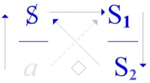
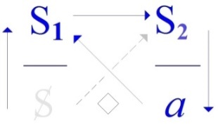
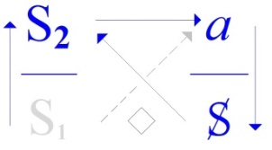

# Leçon 02 | 17 Décembre 1969

  

    <label><input type="checkbox" data-lacan-toggle="original" checked> 原文</label>
    <label><input type="checkbox" data-lacan-toggle="notes" checked> 注释</label>
    <label><input type="checkbox" data-lacan-toggle="commentary" checked> 个人解读评论</label>
  

  <form class="lacan-tool-search" role="search">
    <input class="lacan-tool-search-input" type="search" placeholder="搜索全文" aria-label="搜索全文">
    <button class="lacan-tool-button" type="submit" title="搜索">搜索</button>
  </form>
  <button class="lacan-tool-button lacan-back-to-top" type="button" title="回到页面最上方" aria-label="回到页面最上方">↑</button>

<section class="parallel-paragraph" data-paragraph-ids="s17-02-0001">

s17-02-0001

原文 · s17-02-0001

   

[无对应译文]

</section>

<section class="parallel-paragraph" data-paragraph-ids="s17-02-0002 s17-02-0003">

s17-02-0002, s17-02-0003

原文 · s17-02-0002, s17-02-0003

Alors, ces 4 formules sont utile à avoir ici comme référence.

Ceux qui ont assisté à mon premier séminaire ont pu y entendre le rappel de la formule que *le signifiant*, à la différence du *signe*, *est ce* *qui représente*...

这四个公式在这里作为参考是非常有用的。

那些参加过我第一次研讨课的人应该听过我重申这样一个公式：

“能指（signifiant），有别于符号（signe），是这样一种东西——

</section>

<section class="parallel-paragraph" data-paragraph-ids="s17-02-0004 s17-02-0005">

s17-02-0004, s17-02-0005

原文 · s17-02-0004, s17-02-0005

le terme « *représente* » étant bien sûr accentué du mot *représentant* et du mot *représentation*, c’est pourquoi : ...*qui représente un sujet pour un autre signifiant*.

Comme rien ne dit que l’autre signifiant ne sache rien de l’affaire, c’est pour cela qu’il est clair qu’il ne s’agit pas de *représentation,* mais de *représentant*.

它代表（représente）……（此处‘代表’一词必须强调它同时具有‘代表者’（représentant）和‘表征’（représentation）的双重含义）——

它是：

为另一个能指代表一个主体的东西。”

而既然我们无法断定“另一个能指”对这回事毫无所知，

</section>

<section class="parallel-paragraph" data-paragraph-ids="s17-02-0006 s17-02-0007 s17-02-0008 s17-02-0009 s17-02-0010 s17-02-0011 s17-02-0012">

s17-02-0006, s17-02-0007, s17-02-0008, s17-02-0009, s17-02-0010, s17-02-0011, s17-02-0012

原文 · s17-02-0006, s17-02-0007, s17-02-0008, s17-02-0009, s17-02-0010, s17-02-0011, s17-02-0012

Moyennant quoi, à cette même date, j’ai cru pouvoir en illustrer ce que j’ai appelé *le discours du Maître*.

*Le discours du Maître* en tant que justement si nous pouvons le voir réduit à un seul signi­fiant, cela implique qu’il représente *quelque chose*...

que c’est déjà trop d’appeler *quelque chose...*qu’il représente *x*, qui est justement ce qui est à élu­cider dans l’affaire.

Car rien n’indique en quoi le Maître imposerait sa volonté.

Qu’il y faille un consentement, c’est hors de doute !

Et que Hegel à cette occasion ne puisse se référer, comme au *signifiant du Maître absolu *: qu’à la mort, est pour le coup un signe, un signe que rien n’est résolu par cette pseudo-origine, puiqu’aussi bien pour que ça continue, personne n’est mort :

- ni le maître, dont il ne serait après tout démontré qu’il en est le Maître, que s’il était *ressuscité*, à savoir s’il avait passé effectivement par l’épreuve,

因此我们必须明确：这里谈的不是“表象”，而是“代表者”。

正因为如此，在那个时间点，我认为自己可以以此来说明我所谓的“主人的话语”。

所谓“主人的话语”，正是因为我们可以将它还原为一个单一的能指，

这就意味着它代表了某个东西，虽然说它是“某个东西”已经太多了，

它所代表的是一个 x，而这个 x 正是此间需要被阐明的东西。

因为，没有任何迹象表明“主人”是如何施加他的意志的。若说这中间需要一个“同意”，那是毫无疑问的！

而黑格尔在这个节点上，所能诉诸于所谓“绝对主人”的能指，也只能是“死亡”本身——这反倒成了一个迹象，表明这所谓的“起源”并未解决任何问题，因为要让这个结构继续运作下去，事实上谁都没死：

“主人”并没有死；而他若真的是主人，那得是他死后又复活，也就是说，他必须实际经历过那场生死的考验；

</section>

<section class="parallel-paragraph" data-paragraph-ids="s17-02-0013 s17-02-0014 s17-02-0015 s17-02-0016">

s17-02-0013, s17-02-0014, s17-02-0015, s17-02-0016

原文 · s17-02-0013, s17-02-0014, s17-02-0015, s17-02-0016

- quant à l’esclave, c’est la même chose : il a précisément renoncé à s’y affronter.

L’énigme de la fonction du maître ne se livre donc pas immédiate­ment.

J’ai amorcé, j’indique, j’indique parce que c’est déjà sur la voie que nous n’avons pas à feindre de découvrir, sur la voie qui est celle par où - non pas la théorie de l’inconscient, mais la découverte de *quelque chose* qui nous assure que *ça ne va pas de soi que tout savoir, d’être savoir, se sache* *comme tel*.

Puisque ce que nous découvrons dans l’expérience de la moindre psychanalyse, c’est que c’est bien quelque chose de l’ordre, le plus précisément, du savoir...

至于“奴隶”，情况也一样：他其实是主动放弃了面对这场考验。

“主人的功能”这一谜题，并不会立即显现其真貌。

我已经开始了这条道路，我指出这一点，是因为我们不必假装自己是刚刚在这条路上做出发现的。

这是一条通向某种发现的路径——不是“无意识的理论”，而是对某种东西的发现，

这种发现使我们确信：知识并不因为它是知识，就必然能被自身所知道。

因为，即使在最基础的一场精神分析经验中，我们所发现的也确实是这样一种东西，

它归属于某种秩序，更准确地说，归属于“知识”的秩序……

</section>

<section class="parallel-paragraph" data-paragraph-ids="s17-02-0017 s17-02-0018 s17-02-0019 s17-02-0020">

s17-02-0017, s17-02-0018, s17-02-0019, s17-02-0020

原文 · s17-02-0017, s17-02-0018, s17-02-0019, s17-02-0020

> non pas de *la connaissance*, non pas de *la représen­tation,* ...mais très précisément de ce *quelque chose* *qui lie*, dans une relation de réseau, *un signifiant* **S**1, si vous voulez, *à un autre signifiant* **S2**.

C’est dans des termes aussi pulvérulents que je puis ainsi faire entendre - en usant de *métaphore* – l’accent qu’il convient de mettre, dans l’occasion, au terme « *savoir »*.

C’est dans un tel rapport...

et pour autant justement qu’*il ne se sait pas* ...que réside que *l’assiette de ce qui se sait*, *de ce qui s’articule* *tran­quillement comme petit Maître*, *comme « moi »,* *comme celui qui en sait un bout,* qu’on voit tout de même, de temps en temps, que cela se détraque, et c’est là l’éruption de toute la face *de lapsus, d’achoppements*, où se révèle *l’inconscient*.

不是“认知”，不是“表象”，而是非常明确地——某种将一个能指 S₁ 与另一个能指 S₂ 连接起来的网络关系中的东西。

也正是在如此粉末化（pulvérulents）的表达之中，我才得以——借助比喻——传达出，在这里我们应当如何强调“知识”这个词的特殊语气。

它是在这样一种关系中……恰恰因为它自己并不知道自己是知识……

才奠定了那种“看似自知”的基础：也就是那个自以为是的小主人、所谓的‘自我’，那个以为自己知道一二的人。

然而我们也常常看到，它有时会崩塌、出错——这正是口误（lapsus）、阻碍（achoppement）等现象浮现之处——而这些，便是无意识的爆发面。

</section>

<section class="parallel-paragraph" data-paragraph-ids="s17-02-0021 s17-02-0022 s17-02-0023 s17-02-0024 s17-02-0025 s17-02-0026 s17-02-0027">

s17-02-0021, s17-02-0022, s17-02-0023, s17-02-0024, s17-02-0025, s17-02-0026, s17-02-0027

原文 · s17-02-0021, s17-02-0022, s17-02-0023, s17-02-0024, s17-02-0025, s17-02-0026, s17-02-0027

Mais c’est bien mieux et bien plus loin, qu’à la lumière de l’expérience analytique nous nous permettons de lire une biographie :

- quand nous en avons les moyens, quand nous avons suffisamment de documents pour que s’atteste ce qu’elle croit,

- ce qu’elle a cru avoir été comme destinée, de pas en pas, voire même à l’occasion comment cette destinée elle a cru la clore.

Néanmoins il apparaît, à la lumière de cette notion, «* qu’il n’est pas sûr qu’un savoir se sache* », que nous puissions lire au niveau de quel savoir inconscient s’est fait le travail qui livre ce qui est *effectivement la vérité* de tout ce qui *s’est cru être*, que...

> pour opérer sur le schème du discours du Maître, du grand M ...c’est invisiblement le travail esclave...

> celui qui constitue un inconscient non révélé ...qui livre de cette vie qui vaut qu’on en parle, ce qui de vérités, de vérités vraies, a fait surgir tant *de détours*, *de fictions*, et *d’erreurs.*

Le *savoir* donc, est mis au centre, sur la sellette, par l’expérience psy­chanalytique.

不过，在精神分析经验的照亮之下，我们所能进行的“传记阅读”，既更深入，也更根本。

——当我们具备手段，当我们掌握足够的资料，使得一个人所“自以为信”的东西得以被确证，——她曾以为那就是自己的命运，一步一步地建构出来的，乃至有时她还以为自己已经将那命运“终结”了。

然而，在“并不确定一种知识能够自知”这一概念的照耀下，我们会发现，

我们其实能够读出——在某种无意识的知识层面上——发生了一项工作，

正是这项工作揭示了所有“曾被信以为真之物”的真实真理。

若要借“主人话语”的图式来表达的话，

那么实际上，是“奴隶的工作”在暗中进行着这一切，

是那个仍未被揭示的无意识构成了这一工作。

也正是它，让那值得我们言说的一生，从种种迂回、虚构与谬误中，唤出了真实的真理。

因此，知识被精神分析经验置于中心位置，被置于质询之座（sur la sellette）。

> 拉康在《S17》中试图提出四种话语中的“分析师话语”作为打断“主人话语”的方式。
>
> 在“主人话语”结构中，主体被S₁代表，继而被强加一个知识链S₂，最终构成“自传体结构”（即“我是谁，我怎么成为我”）。
> 但是分析师话语：
>
> - 分析师保持沉默（占据下方a位）；
> - 让主体暴露其主导能指S₁，并使能指之间的联系断裂；
> - 正是在这种断裂中，传记不再被当作真理，而暴露出其幻想性的命运构型。

> - 精神分析不是替“主人”解释一切；
> - 而是让“奴隶之工”发声——也就是：让无意识以自己的话语显现出来；
> - 真正的“真理”不是一开始就被知道的，而是在反复的虚构、失败与误解中浮现出来的“真实的真理”。

</section>

<section class="parallel-paragraph" data-paragraph-ids="s17-02-0028 s17-02-0029 s17-02-0030 s17-02-0031 s17-02-0032 s17-02-0033">

s17-02-0028, s17-02-0029, s17-02-0030, s17-02-0031, s17-02-0032, s17-02-0033

原文 · s17-02-0028, s17-02-0029, s17-02-0030, s17-02-0031, s17-02-0032, s17-02-0033

Ceci, à soi tout seul, nous impose un devoir d’interroga­tion, qui n’a nulle raison de restreindre son champ.

Pour tout dire, l’idée que le savoir puisse faire...

> d’aucune façon, ni à aucun moment, fût-il d’espoir dans l’avenir ...totalité close, voilà ce qui bien sûr, n’avait point attendu la psychanalyse pour pouvoir paraître douteux.

Mais enfin il est clair que cette mise en doute était peut-être abordée d’un peu bas, quand il s’agit des *Sceptiques*.

Je parle de ceux qui se sont intitulés de ce nom au temps où ça constituait *une école*, chose dont nous n’avons plus qu’une fort maigre idée, de ce que ça peut constituer, *une école*.

Mais après tout qu’en savons-nous ?

这单凭其本身，就要求我们承担起一种质询的责任，而这种质询并不应当被限制在任何特定范围之内。

说到底，那种“知识可以构成一个封闭整体”的观念——无论是任何形式，任何时刻，即便是未来抱有的希望——其实早在精神分析出现之前就已是可疑之物。

但说到底，这种质疑在怀疑论者那里，或许是从一个相对较低的层面切入的。

我说的是那些在那个“这还构成了一个学派”的时代，曾以此名自称的人。

如今我们对“什么是一个学派”也只剩下一个非常贫乏的观念了。

但归根结底，我们又真的知道什么吗？

我们如今所拥有的关于怀疑主义者的资料，也许，或许更应该这样来看：

> 怀疑论者的层次还是太低了

</section>

<section class="parallel-paragraph" data-paragraph-ids="s17-02-0034 s17-02-0035 s17-02-0036">

s17-02-0034, s17-02-0035, s17-02-0036

原文 · s17-02-0034, s17-02-0035, s17-02-0036

De ce qui nous reste des *Sceptiques* peut-être, peut-être vaut-il mieux juger, à savoir que nous n’en avons peut-être que ce qu’ont été capables de recueillir d’eux les autres : ceux qui ne savaient pas d’où partent leurs formules de radicale mise en question de tout savoir, *a fortiori* de sa totalisation.

C’est une idée qui montre combien *peu,* porte l’incidence des écoles, c’est une idée...

> que le savoir puisse faire totalité ...qui si je puis dire est immanente, immanente au politique en tant que tel. On le sait depuis longtemps.

我们所掌握的，或许仅仅是

其他人——那些不了解这些怀疑者的“彻底质疑一切知识、尤其是知识总体化”的公式之来处的人们——

从他们那里所能收集到的一些残余。也许，对于我们今天所保留下来的那些关于怀疑论者的内容，我们最好这样来看待：我们之所以拥有它们，或许只是因为有“别人”从他们那里采撷了一些东西。而这些人其实并不真正知道，那些怀疑论者对一切知识——更不用说对知识的总体化——所作出激烈质疑的“表述”，究竟是从何而来的。

</section>

<section class="parallel-paragraph" data-paragraph-ids="s17-02-0037 s17-02-0038 s17-02-0039">

s17-02-0037, s17-02-0038, s17-02-0039

原文 · s17-02-0037, s17-02-0038, s17-02-0039

L’idée imaginaire du tout, telle qu’elle est donnée par le corps, fait partie de la prê­cherie politique comme s’appuyant sur *la bonne forme* de la satisfaction : *ce qui fait sphère*, à la limite quoi de plus beau, mais aussi quoi de moins ouvert, quoi qui ressemble plus à la clôture de la satisfaction ?

La collusion de cette image avec l’idée de la satisfaction : c’est le *quelque chose* contre quoi nous abordons chaque fois que nous rencontrons quelque chose qui fait nœud, dans ce travail dont il s’agit, de la mise au jour de quelque chose par les voies de *l’inconscient,* c’est l’obstacle, c’est la limite, c’est plutôt le coton dans lequel nous perdons sens, et où nous nous voyons obstrués.

Il est important de savoir qu’elle a toujours été utilisé dans le politique, et qu’il est étrange, qu’il est singulier de voir qu’une doctrine, celle de Marx, qui en a instauré l’articulation sur la fonction de la lutte, de la lutte de classes, n’a pas empêché qu’il en naisse ce *quelque chose* qui est bien pour l’instant le problème qui nous est à tous présenté, à savoir le maintien d’un *discours du Maître*.

这是一个观念，它显示出各种“学派”其实影响甚微，就是说“知识可以构成一个总体”的这个观念，这个观念，如果我可以这样说，是内在的，内在于“政治本身”之中的。对此，人们早已心知肚明。

那个关于“整体”的想象性观念，它是由身体给予的，

而它构成了政治布道的一部分，就像政治依托于一种关于“良好满足形式”的想法——一种形成球体（sphère）的东西。

在极端情况下，还有什么比它更美的呢？但同时，也有什么比它更封闭的呢？

还有什么东西比它更像“满足的封闭”呢？

这种图像（整体性形象）与“满足”观念之间的勾结，

就是每当我们在工作中遇到某个“打结之处”时，我们所撞上的那个东西，

这个工作，是指那种借由无意识之路来揭示某物的工作，

而这种勾结，就是那个障碍，就是那个限制，更确切地说，

它是我们失去意义的那团棉絮，是我们发现自己被阻塞其中的地方。

> 美，整体，政治  让我想到会饮里面那个球形人的神话。

</section>

<section class="parallel-paragraph" data-paragraph-ids="s17-02-0040 s17-02-0042 s17-02-0043 s17-02-0044 s17-02-0045 s17-02-0046 s17-02-0047">

s17-02-0040, s17-02-0042, s17-02-0043, s17-02-0044, s17-02-0045, s17-02-0046, s17-02-0047

原文 · s17-02-0040, s17-02-0042, s17-02-0043, s17-02-0044, s17-02-0045, s17-02-0046, s17-02-0047

> U M

Certes, non pas de la structure de l’ancien, au sens où il s’installe de la place indiquée sous ce grand M, mais de celui qu’à gauche, je chapeaute de l’U - je vous dirai pourquoi – et où ce qui y occupe la place que provisoirement nous appellerons « *dominante »,* c’est justement ceci \[**S2**\] qui se spécifie d’être, non pas « *savoir de tout »*...

nous n’y sommes pas ...mais d’être « *tout-savoir »*, entendez ce qui s’affirme de n’être rien d’autre que *savoir*...

et que l’on appelle dans le langage courant « *la bureaucratie »* ...et on ne peut pas dire qu’il n’y ait pas là quelque chose qui fasse problème.

Si aussi bien nous sommes partis de ce que dans ma première énonciation, celle d’il y a trois semaines, j’étais parti, c’est que dans le premier statut du *discours du Maître*, le savoir, c’est la part de l’esclave.

C’est pourquoi j’ai cru pouvoir indiquer...

> je regrette qu’un mince contretemps m’ait empêché la dernière fois
>
> peut-être d’y revenir pour donner telles indication supplémentaires ...j’ai cru pouvoir indiquer que ce qui s’opère du *discours du Maître antique* à celui *du Maître moderne* qu’on appelle *capitaliste*, c’est quelque chose qui s’est modifié dans la place du savoir.

我们必须清楚地知道：它（指前文的“满足的幻想”或“整体性的观念”）

一直以来都在政治中被使用。

而奇怪的是，令人感到特殊的是，有一套理论——也就是马克思的理论——它明确地将自身的组织建立在“斗争的功能”，即“阶级斗争”的功能之上，然而，它却并没有阻止这样一种东西的诞生，这种东西恰恰构成了我们当下每个人所面对的问题：

也就是“主人话语”（discours du Maître）的维持。

诚然，并非指那种“旧有结构”，即那种落座于这个大写字母 M（代表主人话语）之下的位置，

而是指另一种结构，在左边我标注为 U 的那个话语（我会解释原因）。

在这个结构中，占据我们暂时称为“主导位置”的，正是这个 [S₂]——这个“知识”的结构。它的特征不是“万事皆知”（savoir de tout），我们还没到那一步，而是“全是知识”（tout-savoir），意即它只承认自身为“知识”本身，除此之外别无他物。

在日常语言中，这就是所谓的“官僚体制（la bureaucratie）”，而这其中，的确是有严重问题的。

> 马克思主义以“斗争”为组织原则，却未能阻止新主话语的诞生。
> 政治话语总会回到“谁说了算”，S1的位置总要填上，哪怕换了名字。
>
> 幻想没有被推翻，只是换了一个说法继续运行。
> 另外来说，已经见过不知道多少个说着马克思的资本主义话语了。
> 麻了属于是

> 官僚体制与大学话语用来管奴隶，不管是在大企业上过班还是经常看卡夫卡的小说。

</section>

<section class="parallel-paragraph" data-paragraph-ids="s17-02-0041">

s17-02-0041

原文 · s17-02-0041

 

[无对应译文]

</section>

<section class="parallel-paragraph" data-paragraph-ids="s17-02-0048 s17-02-0049 s17-02-0050 s17-02-0051 s17-02-0052 s17-02-0053">

s17-02-0048, s17-02-0049, s17-02-0050, s17-02-0051, s17-02-0052, s17-02-0053

原文 · s17-02-0048, s17-02-0049, s17-02-0050, s17-02-0051, s17-02-0052, s17-02-0053

J’ai même cru pouvoir aller jusqu’à dire que la tradition philosophique avait sa responsabilité dans cette transmutation.

De sorte que si c’est pour avoir été dépossédé de quelque chose, c’est avant tout bien sûr de la propriété communale que *le prolétaire* se trouve quali­fiable de ce terme de « *dépossédé* », qui justifie l’entreprise aussi bien que le succès de la révolution, est-ce qu’il n’est pas sensible que ce qui lui est restitué, ce n’est pas forcément sa part ?

Si ce savoir dont effectivement l’exploitation capitaliste le frustre en le rendant inutile, celui-là lui est rendu dans un type de subver­sion, c’est autre chose qui lui est rendu : *un savoir de Maître*.

Et c’est pourquoi il n’a fait que changer de Maître.

Ce qui reste, c’est bien en effet *l’essence du Maître*, à savoir qu’il ne sait pas ce qu’il veut.

Car c’est cela qui constitue la vraie structure du *discours du Maître*.

在处理一件公务这个问题上，连敲哪扇门，怎么进去都是“学问”。

如果说我们从我三周前第一次表述时所出发的那个地方出发，那是因为，在“主人话语”的最初结构中，“知识”（le savoir）是属于“奴隶”的那一部分。

因此，我认为我可以指出……

我很遗憾上次因为一点小小的意外，

没能回来就此给出一些进一步的说明……

我当时认为可以指出的是，从“古典主人的话语”到我们所谓“资本主义主人的话语”之间，

发生了一种变迁，这种变迁正是在“知识的位置”上的转变。

我甚至认为可以说，是哲学传统对这种转化负有某种责任。

因此，如果说“被剥夺”这个词能够用来形容无产者，

那是首先因为他被剥夺的是公共的财产（la propriété communale）。

</section>

<section class="parallel-paragraph" data-paragraph-ids="s17-02-0054 s17-02-0055 s17-02-0056 s17-02-0057 s17-02-0058 s17-02-0059">

s17-02-0054, s17-02-0055, s17-02-0056, s17-02-0057, s17-02-0058, s17-02-0059

原文 · s17-02-0054, s17-02-0055, s17-02-0056, s17-02-0057, s17-02-0058, s17-02-0059

L’esclave sait beaucoup de choses, mais ce qu’il sait bien plus encore, c’est ce que le Maître veut, même si celui-ci ne le sait pas, ce qui est le cas ordinaire, car sans cela il ne serait pas un Maître.

L’esclave le sait, c’est cela *sa fonction d’esclave*.

C’est aussi pour ça que ça marche, car tout de même, ça a marché assez longtemps.

Le fait que le *tout-savoir* soit passé à la place du *Maître*, voilà ce qui, loin d’éclairer, opacifie un peu plus ce qui est en question, à savoir, *la vérité*.

D’où ça sort, qu’il y ait un *signifiant de Maître* ?

Là il est bel et bien lové le **S1** du Maître, montrant *l’os* de ce qu’il en est de *la nouvelle tyrannie du savoir*, et rendant impossible qu’à cette place, qui est la place où nous avions peut-être l’espoir qu’apparaisse, au cours du mouvement historique, ce qu’il en est de *la vérité*, *ce signe* est maintenant ailleurs.

正是基于这种“被剥夺”的身份，才赋予了革命的事业及其成功以正当性。

但我们是否察觉到：

所谓“归还”给他的东西，并不一定是他真正应得(原本)的那一份？

如果那个知识，即资本主义剥削确实通过使其无用而使他（无产者）丧失的那个知识，

以一种“颠覆”的形式被归还给他的话，那么他所被归还的，
是另一种东西：一种“主人的知识”。

这也就是为什么——他不过是换了一个主人而已。

这正是它之所以“行得通”的原因之一，毕竟它确实也运作了相当长的一段时间。

“全知”（tout-savoir）占据了“主人的位置”这一事实，

不仅没有带来澄清，反而让那个真正被提问之物——也就是“真理”——更加晦暗了。

这“主人的能指”究竟是从哪里冒出来的？

> 当革命试图归还一些东西，
>
> 我们应当质疑：
>
> ——归还的真的是他被剥夺的“那部分”吗？

</section>

<section class="parallel-paragraph" data-paragraph-ids="s17-02-0060 s17-02-0061 s17-02-0062 s17-02-0063 s17-02-0064 s17-02-0065">

s17-02-0060, s17-02-0061, s17-02-0062, s17-02-0063, s17-02-0064, s17-02-0065

原文 · s17-02-0060, s17-02-0061, s17-02-0062, s17-02-0063, s17-02-0064, s17-02-0065

Il est à produire par ceux-là qui se trouvent substitués à l’esclave antique, comme étant eux-mêmes des *produits*, comme on dit...

> et consommables tout autant que les autres ...d’une *société* dite « *de consommation* »: le *« matériel humain »,* comme on l’a énoncé dans un temps, aux applaudissements de certains qui y ont vu de la tendresse... Ceci mérite d’être pointé, puisque aussi bien ça nous concerne.

Ce qui nous concerne maintenant c’est d’interroger, d’interroger ce dont il s’agit dans l’*acte psychanaly­tique*.

Je ne le prendrai pas au niveau dont j’ai espéré que je pourrai boucler la boucle, il y a deux ans[^2], et qui resta interrompue de *l’acte* où s’assoit, où s’ins­titue comme tel le psychanalyste.

Je le prendrai au niveau de l’expérience, et de ses interven­tions une fois l’expérience instituée dans ses limites précises.

S’il y a *un savoir qui ne se sait pas*, je l’ai déjà dit, il est à situer au niveau de **S2**, soit celui que j’appelle « *l’autre signifiant* ».

主人的 S₁ 的确就蜷伏在那里，它暴露了“知识的新暴政”的骨架所在，

并使得，在那个我们或许曾寄希望于其上、指望在历史进程中显现出真理的那个位置，

如今这个符号（指向真理的能指）已然不在那里，而是转移到了别处。

它（S₁ / 主人能指的产出）应由那些如今替代了古典奴隶的人来生产，

他们（奴隶）自身也成了产品——如人们常说的那样——

和其他商品一样，可以被消费，

在一个被称为“消费社会”的体制中；他们便是所谓的“人力资源”（*matériel humain*），

这一说法曾在某个时期被提出，竟然还赢得了某些人的掌声，因为他们从中看出了某种“温情”。

这点必须指出，因为它也正是我们每一个人的处境。

我们此刻关心的，正是要提出问题：究竟所谓“精神分析的行动”（l’acte psychanalytique）是关于什么的？

</section>

<section class="parallel-paragraph" data-paragraph-ids="s17-02-0066 s17-02-0067 s17-02-0068 s17-02-0069 s17-02-0070 s17-02-0071 s17-02-0072">

s17-02-0066, s17-02-0067, s17-02-0068, s17-02-0069, s17-02-0070, s17-02-0071, s17-02-0072

原文 · s17-02-0066, s17-02-0067, s17-02-0068, s17-02-0069, s17-02-0070, s17-02-0071, s17-02-0072

J’ai déjà assez insisté là-dessus l’année dernière : cet *autre signifiant* n’est pas seul, le ventre de *l’Autre,* du grand A, en est plein.

Ce ventre est celui qui donne - tel un cheval de Troie monstrueux - l’assise de ce fantasme d’un « *savoir-totalité* ».

I l est bien clair pourtant que sa fonction implique que quelque chose y vienne frapper du dehors, sans ça jamais rien n’en sortira, et Troie ne sera jamais prise.

Qu’est-ce qu’institue l’analyste ?

J’entends beaucoup parler de « *discours de la psychanalyse »*, comme si cela voulait dire quelque chose !

Il y a - si nous caractérisons un discours de le centrer sur ce qui est sa *dominante -* il y a *le discours de l’analyste*, et ça ne se confond pas avec le discours du psychanalysant, avec le discours tenu effectivement dans l’expérience analytique.

Ce que l’analyste institue comme expérience analytique, ça peut se dire simplement : c’est *l’hystéri­sation du discours*, autrement dit c’est l’introduction *structurale*, par des conditions d’artifice, du *discours de l’hystérique*, celui ici indiqué d’un grand H : H

我并不打算回到两年前的层次——当时我曾希望能“闭合这个环”，也就是在我讲授《精神分析的行动》那一年的层次，在那里我试图论述分析师的位置如何确立、如何作为分析师坐定于其位，但那一轮讨论终究未能完成。

这一次，我将从另一个角度切入：不再从“行动”本身的设立出发，而是从经验本身出发，<strong>从分析经验一旦被界定清楚其边界之后，</strong>其间干预（intervention）的方式与结构来探讨问题。

如果存在某种“自己并不知道自己”的知识，我早就说过了，它必须被定位在 S2 的层级，也就是我所称的“另一个能指”。

我去年已经在这一点上反复强调过：这个“另一个能指”并不是单独存在的，大他者（以大写字母 A 表示）的腹中充满了这样的能指。

这个腹部，就如同一匹怪诞的特洛伊木马，

构成了那种“全知幻想”（fantasme d’un savoir-totalité）赖以成立的基础。

然而非常清楚的是，它的功能前提，是必须有某样东西从外部来敲击它，

</section>

<section class="parallel-paragraph" data-paragraph-ids="s17-02-0073">

s17-02-0073

原文 · s17-02-0073

[无对应译文]

</section>

<section class="parallel-paragraph" data-paragraph-ids="s17-02-0074 s17-02-0075">

s17-02-0074, s17-02-0075

原文 · s17-02-0074, s17-02-0075

Celui que j’ai essayé de pointer l’année dernière en disant que c’est ce discours qui exis­tait...

et qui existerait de toute façon, que la psychanalyse soit là ou non, ...que c’était un discours...

否则，它内部永远不会产出任何东西，特洛伊也将永不陷落。

分析师建立的是什么？

我经常听人谈论“精神分析的话语”，好像这词真有什么意义似的！

> 入关学魅力时刻，没大清入关，要这些大儒有什么用呢

</section>

<section class="parallel-paragraph" data-paragraph-ids="s17-02-0076">

s17-02-0076

原文 · s17-02-0076

je l’ai dit d’une façon imagée parce que je lui ai donné son support le plus commun ...celui d’où est sortie pour nous l’expérience majeure, c’est à savoir le détour, le tracé en chicanes, sur lequel repose ce malentendu de l’espèce humaine que, dans l’espèce humaine, constitue *le* *rapport sexuel*.

如果我们要用其“主导项”（dominante）来界定一个话语，

那么我们应当说，有“分析师的话语”，这并不等同于“受分析者的话语”——也就是实际分析经验中被说出的那部分话语。

分析师所建立为“分析经验”的东西，可以简洁地说成：

</section>

<section class="parallel-paragraph" data-paragraph-ids="s17-02-0077 s17-02-0078 s17-02-0079 s17-02-0080 s17-02-0081">

s17-02-0077, s17-02-0078, s17-02-0079, s17-02-0080, s17-02-0081

原文 · s17-02-0077, s17-02-0078, s17-02-0079, s17-02-0080, s17-02-0081

Comme on a le signifiant, il faut qu’on s’entende, et c’est justement pour cela qu’on ne s’entend pas : le signifiant n’est justement pas fait pour le rap­port sexuel.

Dès lors que l’être humain est parlant, fichu, fini, ce quelque chose, d’ailleurs impossible à repérer nulle part dans la nature, qui serait le caractère parfait, harmonieux, de la copulation.

La nature en présente des espèces infi­nies, et qui pour la plupart d’ailleurs ne comportent aucune copulation, ce qui évidemment montre à quel point c’est peu dans les intentions de la nature que ça fasse, comme je le rappelais tout à l’heure, un tout, *une sphère*.

Il y a en tout cas une chose qui est certaine : si pour l’homme cela va cahin-caha, c’est grâce à un truc qui le permet, mais qui d’abord le rend insoluble.

Voilà ce que veut dire *le discours de l’hystérique*, qui industrieuse comme elle est, si nous la faisons femme...

它就是对话语的“癔症化”（hystérisation）。

换句话说，就是通过某种人工设置的条件，将“癔症话语”结构性地引入进来，

这里所指的癔症话语，标注为一个大写的 H。

我去年曾尝试指出，这是一种话语，它已经存在，也无论如何都会存在，

不论精神分析是否出现，这种话语本就存在……

我以形象化的方式说过这一点，因为我赋予了它最普遍的支撑形式，

也就是说，那一条弯弯绕绕的路径，充满障碍与偏离的轨迹，

正是在人类这个物种中，所谓“性关系”所构成的结构性误解之上的路径。

既然我们拥有了“能指”，我们就必须“彼此理解”（s’entendre），但正是因为这一点，我们才无法彼此理解：

因为“能指”恰恰不是为性关系而设的。

> 这段话继续接在“分析师通过结构性设置使癔症话语得以建立”之后，进一步强调：
>
> 癔症话语并不是精神分析制造的东西，而是一种始终存在的人类结构性话语。
>
> 具体语境上，拉康正在铺陈“癔症话语”并非“异常者专属”的表达方式，而是人类的性别结构本身就已经决定了这一话语会形成。

</section>

<section class="parallel-paragraph" data-paragraph-ids="s17-02-0082 s17-02-0083 s17-02-0084 s17-02-0085 s17-02-0086">

s17-02-0082, s17-02-0083, s17-02-0084, s17-02-0085, s17-02-0086

原文 · s17-02-0082, s17-02-0083, s17-02-0084, s17-02-0085, s17-02-0086

> ça n’est pas son privilège : beaucoup d’hommes se font analyser,
>
> et qui de ce seul fait sont bien forcés aussi d’en passer par le *discours de l’hystérique*,
>
> puisque c’est la loi, la règle du jeu ...il s’agit de savoir ce qu’on en tire pour ce qui est du rapport entre hommes et femmes.

Nous voyons donc l’hystérique fabriquer - comme elle peut - un homme, un homme qui serait animé du désir de savoir.

J’ai posé la question à mon dernier séminaire, la question qui ressort de ceci, que si nous constatons qu’historiquement le Maître a lentement frustré l’esclave de son savoir, pour en faire un savoir de Maître, il restait mystérieux comment le désir...

car du désir, si vous m’en croyez, il s’en passait si bien, puisque l’esclave le comblait avant que même il sache ce qu’il pouvait désirer ...comment le désir a pu lui en venir.

C’est là-dessus qu’auraient porté mes réflexions de la dernière fois si cette charmante chose surgie du *réel* \[*Rires*\] ...

一旦人是说话者，那么这一点就注定了：完了，彻底完了。

那种“完美、和谐的交配”之特性，根本无法在自然界的任何地方被确认。

自然界展现出无数物种，其中大多数事实上根本不存在交配行为，

这显然说明：自然的意图中，几乎没有什么愿望是要构成一个

“整体”或一个“球体”（sphère），正如我刚才提醒各位的。

这里整体，球体，这里说的是 两性之间“互补”，“使对方完整”的想象仅仅是想象，结构上是不存在的。
就像一个凹与一个凸，这两个能指之间“可以互补使对方完整吗？”
如果回答是是的话，那么想必你也相信凹凸曼存在的吧。

我在上一期的研讨班中提出了这样一个问题，正是从这样一个现象中浮现出来的：

如果我们从历史上看，主人是如何一点一点地剥夺奴隶的知识，

将其转化为属于主人的知识，

那么其中仍有一个谜团没有解开：欲望是如何进入主人的？

> 这还是说会饮嘛。

</section>

<section class="parallel-paragraph" data-paragraph-ids="s17-02-0087 s17-02-0088 s17-02-0089">

s17-02-0087, s17-02-0088, s17-02-0089

原文 · s17-02-0087, s17-02-0088, s17-02-0089

> on m’affirme que c’est du réel de la décolonisation : un hospitalisé, de soutien pour nous dans l’Algérie ancienne, et casé ici, et comme vous le voyez, une char­mante folâtrerie \[*Rires*\] ...grâce à ça vous ne saurez pas... comme ça, au moins jusqu’à un certain temps, car il faut bien que j’avance, ...quelle parenté je mets entre *le discours philosophique* et *le discours de l’hystérique*, précisément en ceci justement, qu’il semble que ce soit le discours philosophique qui ait animé le Maître, du désir de savoir.

Qu’est ce que peut bien être l’hystérie en question ?

Il y a là quand même un domaine à ne pas déflorer.

因为如果你愿意相信我，主人原本并不需要欲望，

他完全可以不依赖于欲望而存在，

因为奴隶在他尚未知道自己欲望为何物之前，就已满足了他的欲望。

所以问题就在于，欲望究竟是如何来临于主人的？

我原本在上次的研讨班中，是要围绕这个问题展开我的思考的。

有人告诉我，那是“去殖民化现实”的一个回声：

一个病人，以前是我们在“旧阿尔及利亚”那里的支援人员，如今被安置在这里——

因此，至少在一段时间里你们还不知道，

我原本打算讲的内容，即我在哲学话语与癔症话语之间建立的一种亲缘性。

> 如果不是现实中出现了这样一桩迷人的插曲（笑）的话。

> 你们也看到了，真是一场可爱的嬉戏（笑）。

</section>

<section class="parallel-paragraph" data-paragraph-ids="s17-02-0090 s17-02-0091">

s17-02-0090, s17-02-0091

原文 · s17-02-0090, s17-02-0091

S’il y en a dont la pensée aime à filer un tout petit peu en avant de ce que raconte l’orateur, qu’ils trouvent là une occasion d’exercer leur talent, je leur assure que la voie au moins est - il me semble - prometteuse.

Quoi qu’il en soit, pour donner une formule plus ample qu’à la loca­liser sur le plan du rapport homme-femme, disons qu’à seulement lire ce que j’inscris là du *discours de l’hystérique*, bien sûr nous savons toujours pas ce que c’est que cet **S** là, mais si c’est de son discours dont il s’agit, et dont je dis qu’il passe - quand il s’agit de l’homme - à ce qu’il y ait un homme animé du désir de savoir, c’est qu’il s’agit de savoir - quoi ? - de *quel prix* elle est elle-même, cette personne qui parle.

正是在这一点上——看起来正是哲学的话语唤起了主人的“求知欲”。

那么，这里所说的“癔症”到底指的是什么？

这的确是一个尚未充分探明的领域，不应轻率地揭示它的秘密。

如果在座有人喜欢在演讲者话语的前方稍微“滑行思考”一下，

我鼓励你们将此作为一次施展才智的契机。至少我确信，这是一条颇为有前景的路径。

无论如何，为了给出一个超越“男女关系层面”的更宽广表述，

我们姑且只看看我这里所书写的“癔症话语”结构。

当然，我们依然不知道这个“S”究竟是什么（指癔症话语中的“主体”S），

但如果我们说这是关于她的“话语”——而我也说过，当癔症结构出现在男人那里，它表现为一个“渴望知识的男人”

> 这里拉康在说癔症让大他者欲望，癔症是一种“结构位置”——它发问、它制造空缺、它激发大他者欲望。

</section>

<section class="parallel-paragraph" data-paragraph-ids="s17-02-0092 s17-02-0093">

s17-02-0092, s17-02-0093

原文 · s17-02-0092, s17-02-0093

En tant qu’*objet(a)*, *elle est* chute, *chute de cet effet de discours*, au contour toujours cassé quelque part.

Ce qu’à la limite *l’hystérique* veut que l’homme sache, c’est en quoi de par le langage, de par ce langage qui dérape sur l’ampleur de ce que, comme femme, elle peut ouvrir sur la jouissance : ce n’est pas là ce qui importe à *l’hystérique*.

那这就意味着，其实所欲知的是——什么？——她自己值多少钱，她这个说话者自身的价格是多少。

作为对象（a），她是一个“坠落物”——话语效应的坠落，其边界总是某处裂开。

癔症者最终所想让男人知道的是：

通过语言，尤其是语言在她作为女人所能开启的“享乐”广度上滑脱（dérape）时，

> 性关系如果存在的话，必然超越两性关系，男女关系。

</section>

<section class="parallel-paragraph" data-paragraph-ids="s17-02-0094 s17-02-0095 s17-02-0096">

s17-02-0094, s17-02-0095, s17-02-0096

原文 · s17-02-0094, s17-02-0095, s17-02-0096

Ce qui importe à *l’hystérique* c’est que l’autre...

> l’autre qui s’appelle l’homme ...sache quel *objet pré­cieux* elle devient dans ce contexte de discours.

Et après tout, n’est-ce pas là le fond même de l’expérience analytique, si je dis qu’à l’autre

其实她并不关心这一切。

癔症者真正关心的是：那个“他者”——那个被称作“男人”的他者——能否知道，在这话语结构中，她成了多么珍贵的一个对象。

其实她并不关心这一切。

> 通过语言，尤其是语言在她作为女人所能开启的“享乐”广度上滑脱（dérape）时，

</section>

<section class="parallel-paragraph" data-paragraph-ids="s17-02-0097 s17-02-0098">

s17-02-0097, s17-02-0098

原文 · s17-02-0097, s17-02-0098

- il donne la place dominante dans *le discours de l’hystérique*, il hystérise son discours,

- il en fait ce sujet qui est prié d’abandonner toute référence autre que celle des quatre murs qui le cernent, et de produire des signifiants qui font cette *associa­tion libre*, maîtresse pour tout dire, du champ.

癔症的话语可能有时候前后矛盾，前言不搭后语，但是她不在乎自己怎么前言不搭后语。癔症关心的是，在话语面前的那个男人是否知道自己“多么珍贵”。

语言本身虽然起作用，但是癔症好像又不在乎其完备性。主人

说到底，这不正是分析经验的根本所在吗？

</section>

<section class="parallel-paragraph" data-paragraph-ids="s17-02-0099 s17-02-0100 s17-02-0101 s17-02-0102 s17-02-0103 s17-02-0104 s17-02-0105 s17-02-0106">

s17-02-0099, s17-02-0100, s17-02-0101, s17-02-0102, s17-02-0103, s17-02-0104, s17-02-0105, s17-02-0106

原文 · s17-02-0099, s17-02-0100, s17-02-0101, s17-02-0102, s17-02-0103, s17-02-0104, s17-02-0105, s17-02-0106

*Dire n’importe quoi*, comment cela peut-il conduire à quelque chose, s’il n’était pas déterminé qu’il n’y a rien dans ce qui...

peut-être là sorti au hasard ...justement d’être signifiants, ne se rapporte à *ce savoir qui ne se sait pas*, et qui est vraiment ce qui travaille ?

Seulement, il n’y a aucune raison qu’il en sache par là un peu plus.

Si l’analyste ne prend pas la parole, que peut-il advenir de cette *produc­tion foisonnante de* **S1** ?

Beaucoup de choses assurément.

L’analyste qui écoute peut en enregistrer beaucoup de choses.

Avec ce qu’un « contemporain moyen » peut énoncer s’il ne prend garde à rien, on peut faire l’équivalent d’une petite encyclopédie, ça fera énormément de clés.

Si c’était enregistré, on pourrait même, après, le construire, faire faire une petite machine électronique.

如果说，分析师在癔症话语中给予了大他者（仅仅是语言）以主导地位，

那他就“癔症化”了分析对象的言说；

他使这个人变成了这样的主体：被要求抛弃一切外在的参照，

只依托那四面墙所构成的空间，并从中说出那些构成自由联想的能指——

这些能指，主宰了整个分析场域。

社会背景这里应该被悬置起来吗？

随便说些什么，怎么可能通向某种结果？

除非我们早已认定：只要是能指，即便看似偶然、随口而出，也必然关联着那个“无意识的知识”。 这个“不自知的知识”，才是真正在起作用的东西。

只是，并没有任何理由让我们以为，说出这些，就能让他（主体）因此知道得更多了。

如果分析师不开口，这种大量产生的 S1 会发生什么呢？可以发生很多事情，确实如此。

> 仅仅作用于语言，多的什么也没有。

</section>

<section class="parallel-paragraph" data-paragraph-ids="s17-02-0107 s17-02-0108 s17-02-0109 s17-02-0110">

s17-02-0107, s17-02-0108, s17-02-0109, s17-02-0110

原文 · s17-02-0107, s17-02-0108, s17-02-0109, s17-02-0110

C’est d’ailleurs l’idée que peu­vent avoir certains : c’est qu’ils construisent la machine électronique, grâce à quoi l’analyste n’a en queque sorte qu’à tirer le ticket pour leur donner la réponse. \[*Rires*\]

C’est que, ce qui est en jeu, ici dans *le discours de l’analyste*... car dans *l’expérience* \[*analytique*\] c’est lui qui est le Maître.

Sous quelle forme, c’est ce qu’il faudra, bien entendu, que je réserve à nos prochains entretiens.

Pourquoi sous la forme du (*a*) - ici seulement je le marque - je l’ai déjà souligné ailleurs ?

倾听的分析师可以记录下很多东西。

一个普通当代人若毫无顾忌地表达他所能说出的东西，

我们就可以由此编纂出一本小型百科全书，那将是一大堆“钥匙”。

问题在于，在分析师的话语中真正被牵涉的东西……因为在[分析]经验中，是分析师是那个“主人”。

以何种形式——这一点，当然，我得留待我们接下来的讲座中再做说明。

为什么是以（a）的形式——我仅在这里指出这一点——我在其他地方已经强调过了。

> 不知道的知识，就是所谓的被剥夺的知识，也就是无意识中的知识

> 如果把这些话都记录下来，人们甚至可以据此加以构造，制造出一台自动机。
> 事实上，有些人还真有这种想法：他们构造出一台AI自动机，
> 通过它，分析师在某种意义上只需要抽个号，就能给他们一个答案了。（笑声）

> 拉康怕不是要被现在的人工智能整乐了。

</section>

<section class="parallel-paragraph" data-paragraph-ids="s17-02-0111 s17-02-0112 s17-02-0113 s17-02-0114 s17-02-0115 s17-02-0116 s17-02-0117 s17-02-0118">

s17-02-0111, s17-02-0112, s17-02-0113, s17-02-0114, s17-02-0115, s17-02-0116, s17-02-0117, s17-02-0118

原文 · s17-02-0111, s17-02-0112, s17-02-0113, s17-02-0114, s17-02-0115, s17-02-0116, s17-02-0117, s17-02-0118

Mais ce qui est remarquable, c’est que de son coté, c’est de son côté qu’il y a **S2**, qu’il y a « *savoir ».*

Que ce « *savoir »*

- il l’acquiert d’entendre son analysant,

- ou que ça soit *savoir déjà acquis*, repérag*e* de ce qu’à un certain niveau on peut limiter au *savoir-faire ana­lytique*.

Seulement ce qu’il faut comprendre de ces *schémas*, comme déjà ce fut indiqué...

- de mettre **S2**, dans le *discours du Maître*, à la place de l’esclave,

- et de le mettre ensuite, dans *le discours du « Maître modernisé »* \[*Disc.* U\], à la place du Maître ...*c’est pas le même savoir.*

> M M *« modernisé »* → U

但值得注意的是，S2、知识，是在他那一边，是在分析师那一边。
这个知识，
——要么是他通过倾听分析对象所获得的，
——要么是他原本就已拥有的知识，也就是在某种程度上可以限定为“分析操作知识”（savoir-faire analytique）的那类知识。

只是我们必须从这些图式中理解的是，正如之前已经指出过的那样……
——将 S2 安置在“主人话语”中奴隶的位置，
——而后又将 S2 安置在“现代主人的话语”（大学话语）中主导的位置，
这可不是同一种知识。

> 主人话语中的知识，是被奴隶生产出来的

</section>

<section class="parallel-paragraph" data-paragraph-ids="s17-02-0119">

s17-02-0119

原文 · s17-02-0119

 

[无对应译文]

</section>

<section class="parallel-paragraph" data-paragraph-ids="s17-02-0120 s17-02-0121 s17-02-0122 s17-02-0123 s17-02-0124 s17-02-0125 s17-02-0126 s17-02-0127 s17-02-0128 s17-02-0129 s17-02-0130">

s17-02-0120, s17-02-0121, s17-02-0122, s17-02-0123, s17-02-0124, s17-02-0125, s17-02-0126, s17-02-0127, s17-02-0128, s17-02-0129, s17-02-0130

原文 · s17-02-0120, s17-02-0121, s17-02-0122, s17-02-0123, s17-02-0124, s17-02-0125, s17-02-0126, s17-02-0127, s17-02-0128, s17-02-0129, s17-02-0130

Là, à quelle place est-il ? À la place que dans le *discours du Maître*, Hegel...

> le plus sublime des hystériques \[*Rires*\]

...Hegel nous désigne comme étant celle de *la vérité*.

Car on ne peut pas dire, que la « *Phénoménologie de l’esprit »* ça consiste à partir du *Selbstbewusstsein* soi-disant saisi au niveau le plus immédiat de la sensation, et impliquant que tout savoir se sait depuis le départ.

À quoi bon toute cette phénoménologie s’il ne s’agissait pas d’autre chose ?

Seulement il faut bien le dire, ce que j’appelle « *l’hystérie »* de ce *discours* tient précisément à ce qui élude cette distinction minimale qui permettrait de s’apercevoir que, si même jamais cette marche historique...

> qui est en fait la marche des écoles et rien de plus ...aboutissait au « *savoir absolu »*, ce ne serait que pour mar­quer l’annulation, l’échec, l’évanouissement au terme de ce qui seul motive *la fonction du savoir* : c’est sa dialectique d’avec *la jouissance*, de ce qui ferait que le « *savoir absolu »* ce serait purement et simplement l’abolition de ce terme.

Quiconque étudie de près le texte de la *Phénoménologie* ne peut en avoir aucun doute.

Qu’est-ce donc maintenant que nous apporte cette position de **S2** à la place de *la vérité* ?

Qu’est-ce que *la vérité comme savoir* ?

C’est le cas de le dire : *comment le savoir, sans savoir* ?

大学话语中，S2在主导位置，大儒们的话语
而分析师话语中的S2，是从来访者那边获得的，要不就是分析操作的知识，比如设置，时间，位置等等。

即便分析师掌握某种操作性知识（savoir-faire），他在话语结构中仍是将自己置于“对象 a”这一非主体性、非权威性的位置。他不以 S2 操控患者，而是让能指结构在分析中自行运行。

那么，他处于哪个位置？

处于“主人话语”中，黑格尔所指出的位置……*最崇高的癔症者*

……黑格尔指出，这正是“真理”的位置。

主体以自身的匮乏不断质询他者的知识或身份,黑格尔哲学中那种永不停歇的否定辩证法，那种将意识推进到“绝对知识”的运动，正是拉康意义上的“癔症化结构”。
分析师并不站在真理的位置上发话，而是让真理从分析对象的主位中浮现出来。

因为我们不能说，《精神现象学》是从“自我意识”（*Selbstbewusstsein*）出发，

据称是从感觉最直接的层级上被把握的，并意味着所有的知识从一开始就已被意识所知。如果并非另有所指，那整部《精神现象学》又有什么意义呢？

不过，必须明确说，我所称之为这种话语的“癔症性”，正是源于它逃避了那一最基本的区分，一个足以让人意识到，即使这段历史进程。

> 不同话语结构中的 S2 虽名为“知识”，但其结构位置决定其性质。
>
> 知识并不等于真理，它是话语位置的产物。

> 癔症者（hystérique）在拉康结构中是不断质询大他者、拒绝认同于他者期待的主体结构。

</section>

<section class="parallel-paragraph" data-paragraph-ids="s17-02-0131 s17-02-0132 s17-02-0133 s17-02-0134 s17-02-0135 s17-02-0136 s17-02-0137">

s17-02-0131, s17-02-0132, s17-02-0133, s17-02-0134, s17-02-0135, s17-02-0136, s17-02-0137

原文 · s17-02-0131, s17-02-0132, s17-02-0133, s17-02-0134, s17-02-0135, s17-02-0136, s17-02-0137

C’est une énigme.

Eh ben, c’est la réponse : « *c’est une énigme* » entre autres.

Je vais vous en donner un autre exemple de ce que ça peut être aussi.

Les deux ont la même caractéristique, qui est le propre de *la vérité* : c’est qu’on on ne peut jamais la dire qu’à moitié.

Si notre chère « *vérité* - de l’imagerie d’Épinal - *qui sort du puits* », ce n’est jamais *qu’à mi-corps*.

J’ai fait état en Italie...

> dans une des conférences qu’on m’avait demandées - je ne sais pourquoi –
>
> et à laquelle j’ai fait face assez médiocrement - pourquoi ? ...j’ai fait état de *la Chimère* \[*la Sphynge*\], où s’incarne précisément le caractère originel du *discours de l’hystérique*.

实际上也不过是诸学派之进程而已，即使它最终导向所谓“绝对知识”，那也不过只是为了标示一种取消、失败、消散，

作为唯一真正驱动知识功能的那一件事的终点：

即它与享乐之间的辩证法，而这也意味着，“绝对知识”不过是对这一辩证性的彻底废除。凡是认真研读《精神现象学》文本的人，对此都不会有任何怀疑。

所谓“绝对知识”如果真存在，其意义只能是：知识对享乐的抵抗终于失败，整个结构宣告终止。这就是拉康所说的：
“绝对知识，就纯粹而简单地意味着这一结构张力的终结。”

那么现在，把 S2 放在真理的位置，会带来什么？

> 这里要注意哦，知识不是为达成真理而生，而是为了绕开享乐的核心而构造的替代机制。

</section>

<section class="parallel-paragraph" data-paragraph-ids="s17-02-0138 s17-02-0139 s17-02-0140 s17-02-0141 s17-02-0142 s17-02-0143 s17-02-0144 s17-02-0145 s17-02-0146 s17-02-0147 s17-02-0148 s17-02-0149 s17-02-0150">

s17-02-0138, s17-02-0139, s17-02-0140, s17-02-0141, s17-02-0142, s17-02-0143, s17-02-0144, s17-02-0145, s17-02-0146, s17-02-0147, s17-02-0148, s17-02-0149, s17-02-0150

原文 · s17-02-0138, s17-02-0139, s17-02-0140, s17-02-0141, s17-02-0142, s17-02-0143, s17-02-0144, s17-02-0145, s17-02-0146, s17-02-0147, s17-02-0148, s17-02-0149, s17-02-0150

Elle pose une énigme à l’homme Œdipe...

> qui avait peut-être déjà un complexe mais pas forcément,
>
> certainement pas celui auquel il devait donner son nom ...il lui répond d’une certaine façon, et c’est comme cela qu’il devient Œdipe.

Ce que lui a demandé *la Chimère*, il aurait pu y avoir beaucoup d’autres réponses : 4 pattes, 2 pattes, 3 pattes.

Il aurait pu dire : c’est le schéma de Lacan !

Ç’aurait donné un tout autre résultat !

Il dit : « *C’est un homme* » et encore il précise « *un homme en tant que nourrisson* » :

- nourrisson, il a commencé sur 4 pattes,

- s’éleva-t-il sur deux ?

- ou en reprit-il une 3ème ?

C’est le nourisson, et du même coup, il file droit comme une balle dans le ventre de sa mère !

C’est ce qu’on appelle, en effet à juste titre *le complexe d’Œdipe*.

Mais je pense que vous voyez ce que veut dire ici la fonction de l’énigme : un *mi-dire*, comme *la Chimère* apparaît à mi-corps, quitte à disparaître tout à fait quand on a donné la solution.

*Un savoir en tant que vérité*, ceci définit ce que doit être la structure de ce qu’on appelle *une interprétation*.

把真理视作知识，究竟意味着什么？

这话说得正好：如何在“并不知晓”的情况下去“知道”知识？

这是一个谜。好吧，这就是答案之一：“这是一个谜”。我来给你们另一个例子，说明它也可以是什么。这两个例子有着同样的特征——这是“真理”所独有的特性：

就是真理从来只能被说出一半。就像我们亲爱的“真理形象”——那来自埃皮纳尔图像中的“从井里爬出来的真理”——她永远只露出半个身子。

我曾在意大利提到过，在一次有人邀请我去做的讲座上——我不知道为什么被邀请。

那场讲座我应对得也很一般——为什么呢？

我在那次讲座中提到了“奇美拉”（la Chimère），正是在那里体现出了癔症话语的原初特性。

她向那个人——俄狄浦斯——提出了一个谜题……

他也许那时已经有一个情结，但未必如此，并且肯定不是那个后来以他命名的情结；

……他以某种方式作出了回答，正是通过这种方式，他成为了“俄狄浦斯”。

> 真理只能半说

</section>

<section class="parallel-paragraph" data-paragraph-ids="s17-02-0151 s17-02-0152 s17-02-0153 s17-02-0154 s17-02-0155">

s17-02-0151, s17-02-0152, s17-02-0153, s17-02-0154, s17-02-0155

原文 · s17-02-0151, s17-02-0152, s17-02-0153, s17-02-0154, s17-02-0155

Si j’ai longuement insisté sur la différence de niveau de l’énonciation à l’énoncé, c’est bien pour que prenne sens *la fonction de l’énigme*, mais d’une autre que je vais maintenant dire.

L’énigme c’est proprement ça : *une énonciation*, je vous charge de la faire devenir *un énoncé*.

Débrouillez-vous avec comme vous pouvez, comme fit Œdipe : vous en subirez les conséquences.

Voilà ce dont il s’agit dans l’énigme.

Mais il y a autre chose, à quoi on ne pense guère, que j’ai comme ça effleuré, cha­touillé de temps en temps, parce qu’à vrai dire cela me concernait, à ce titre, assez souvent pour que ça ne soit pas commode, pour que j’en parle aisément.

奇美拉向他提出的问题，

本来可以有许多别的回答：四条腿，两条腿，三条腿。

他本可以说：“这是拉康的图式！”

那么结果就会完全不同了！

他说：“这是一个人”，甚至还特别指出：“是一个作为婴儿的人”：

——婴儿，是从四肢着地开始的，

——后来他是否站了起来，用两条腿走路？

——还是又重新多出一条“第三条腿”？

正是这个婴儿，就这样一下子像子弹一样直奔他母亲的子宫！

这就是我们确实可以合理称之为“俄狄浦斯情结”的东西。

</section>

<section class="parallel-paragraph" data-paragraph-ids="s17-02-0156 s17-02-0157 s17-02-0158 s17-02-0159 s17-02-0160">

s17-02-0156, s17-02-0157, s17-02-0158, s17-02-0159, s17-02-0160

原文 · s17-02-0156, s17-02-0157, s17-02-0158, s17-02-0159, s17-02-0160

Et ça s’appelle « *la citation* ».

La citation ça consiste, au cours d’un texte où vous vous avancez plus ou moins bien, si vous êtes comme cela dans les bons endroits de la lutte sociale, tout d’un coup vous citez Marx, et vous ajoutez : *« *Marx a dit...* »*

- si vous êtes analyste vous citez Freud à ce moment là. C’est *capital* ! \[*Rires*\]

<!-- -->

- *L’énigme* c’est *l’énonciation*... et débrouillez-vous pour *l’énoncé *!

- *La citation* c’est : je pose l’énoncé, et pour le reste c’est le solide appui que vous trouvez dans le nom de l’auteur dont je vous remets la charge.

但我想你们能明白，这里“谜题”的功能意味着什么：

一种“半说”（*mi-dire*），就像奇美拉只露出半个身子那样，

一旦谜底被说出，她就完全消失了。

“作为真理的知识”——这正是所谓“阐释”应当具备的结构。

如果我一直反复强调“言说”（énonciation）与“陈述内容”（énoncé）之间的层次差异，那确实是为了让“谜题”的功能变得具有意义，不过这一次我要讲的是它的

另一种功能。

谜题，其本质正是这个：

</section>

<section class="parallel-paragraph" data-paragraph-ids="s17-02-0161 s17-02-0162 s17-02-0163 s17-02-0164 s17-02-0165 s17-02-0166 s17-02-0167 s17-02-0168 s17-02-0169">

s17-02-0161, s17-02-0162, s17-02-0163, s17-02-0164, s17-02-0165, s17-02-0166, s17-02-0167, s17-02-0168, s17-02-0169

原文 · s17-02-0161, s17-02-0162, s17-02-0163, s17-02-0164, s17-02-0165, s17-02-0166, s17-02-0167, s17-02-0168, s17-02-0169

Et c’est très bien ainsi, ça n’a rien du tout à faire avec le statut plus ou moins branlant de *la fonction de l’auteur*.

Quand on cite Marx ou Freud...

> ce n’est pas au hasard que j’ai choisi ces deux noms ...c’est en fonction de la part prise à un discours par le lecteur supposé, qu’on les cite.

C’est là l’importance de la fonction de la citation : c’est qu’à sa façon c’est aussi un *mi-dire*.

C’est *un énoncé* dont on vous indique qu’il n’est recevable que pour autant que vous participez déjà à un certain discours, et un discours structuré, du niveau des struc­tures tout à fait fondamentales qui sont là au tableau.

Vous remarquerez que c’est là le seul point vif...

> mais pouvais-je l’expliquer jusqu’à présent ? ...qui fait que la citation...

> le fait que l’on cite ou non un auteur ...peut avoir tout à fait, au second degré, une importance.

Je vais vous le faire comprendre...

一个“言说行为”，而我把任务交给你，让它变成一个“陈述内容”。

尽你所能去应对它吧，就像俄狄浦斯所做的那样：

你将因此承担后果。这，正是谜题所关涉之事。

但还有另一件事，人们几乎从未想到，我也只是偶尔轻轻触及，偶尔拨弄一下，因为说实话，这件事以某种方式与我太常发生联系了，以至于并不容易谈论它，也让我很难轻松地说出口。

——而引用则是：我把“陈述”摆出来，至于其余的，全靠你从作者名字中找到的那个坚固依托，我把这份责任一并转交给你了。

而且这很好，这完全与“作者功能”那摇摇欲坠的地位毫无关系。当我们引用马克思或弗洛伊德时……我之所以选择这两个名字并非偶然,是根据被预设的读者在话语中所扮演的角色，我们才去引用他们。

引用的功能之所以重要，就在于它以自己的方式，也是一种“半说”（*mi-dire*）。

> 这就叫做“引用”。所谓引用，是在你写一篇稿子、行文尚可的时候，如果你刚好处在某个社会斗争的好位置，忽然你引用马克思，然后加上一句：“马克思说过……”——如果你是分析师，你在那一刻就引用弗洛伊德。这太关键了！【笑声】——谜题是“言说”，而“陈述”你自己想办法！

</section>

<section class="parallel-paragraph" data-paragraph-ids="s17-02-0170 s17-02-0171 s17-02-0172 s17-02-0173 s17-02-0174 s17-02-0175 s17-02-0176 s17-02-0177 s17-02-0178 s17-02-0179 s17-02-0180 s17-02-0181">

s17-02-0170, s17-02-0171, s17-02-0172, s17-02-0173, s17-02-0174, s17-02-0175, s17-02-0176, s17-02-0177, s17-02-0178, s17-02-0179, s17-02-0180, s17-02-0181

原文 · s17-02-0170, s17-02-0171, s17-02-0172, s17-02-0173, s17-02-0174, s17-02-0175, s17-02-0176, s17-02-0177, s17-02-0178, s17-02-0179, s17-02-0180, s17-02-0181

j’espère que vous ne prendrez pas ça mal ...par quelque chose de tout à fait familier.

Supposez qu’au second temps, on cite une phrase en indiquant de là où elle est, du nom de l’auteur, M. Ricœur par exemple. Supposez qu’on cite *la même*, et qu’on la mette *sous mon nom*.

Cela ne peut abso­lument pas dans les 2 cas avoir le même sens \[*Rires*\].

J’espère par là vous faire sentir ce qu’il en est de ce que j’appelle la *citation*.

Eh bien, ces deux registres, en tant précisément qu’ils participent du *mi-dire*, voilà qui donne *le médium,* et si l’on peut dire « *l’éthique »*, sous laquelle intervient l’interprétation.

L’interprétation...

ici ceux qui en usent s’en aperçoivent - ...l’interprétation est autant, et à mi-part, énigme :

- *énigme* autant que possible cueillie dans la trame du discours du psychanalysant, énigme que vous ne pouvez nulle­ment compléter de vous-même l’interprète, que vous ne pouvez pas considérer comme « aveu » sans mentir,

- et *citation* d’autre part, à savoir prise dans le même texte que tel énoncé, tel énoncé - lui - qui peut passer pour aveu, à seule­ment que vous le joigniez à tout le contexte, vous faites appel là à celui qui en est l’auteur.

Car ce qui frappe de ce qu’il en est de cette institution *du discours analytique* et ce qui est le ressort du *transfert,* ce n’est pas...

comme certains ont cru l’entendre, et de moi !

...que l’analyste ce soit lui qui soit placé en fonction du *sujet supposé savoir*.

它是一个陈述，其被指出的前提是：

只有当你已经参与到某种话语中时，它才是可接受的，而且是一个被结构化的话语，

是那种在图表上所显示的、最基本的结构层级的话语。

请注意，这正是唯一的关键点……——可我此前能把它解释清楚吗？……正是这个点使得“引用”——也就是你是否引用一个作者这件事——……在第二层意义上，具有完全不同的重要性。

我要让你们明白这一点——希望你们不要介意——通过一个你们非常熟悉的例子。假设第二步中，我们引用一句话，标明出处，并署上作者名字，比如李克尔先生（M. Ricœur）。

半说的一种形式，同样的话语，被分析师重复了一次。
即便什么都不变动，也已经产生了意义。 其中意义的变化则是位置带来的。

那么，这两个话语层面，正因为它们都属于“半说”（*mi-dire*）的形式，正是它们构成了阐释所依赖的媒介，并且——如果可以这么说——构成了阐释所必须遵循的伦理。

阐释……在座那些实际运用过它的人会注意到……它总是处于“两者各半”的状态：是谜题，——谜题，最好是从被分析者的话语编织中捕捉而来，——这个谜题，解释者你自己是绝对无法将其补完的，——你也无法把它当作坦白来处理而不撒谎，同时，它又是“引用”：

——也就是说，它是从同一段文本中提取出来的某一陈述，

——这句话可能看起来像是“坦白”，

> 然后再假设我们引用完全相同的一句话，但这次是署上我的名字。在这两种情况下，这句话的意义绝对不可能相同。（笑声）我希望借此让你们体会到我所说的“引用”究竟是什么。

> 引用，重复

> ——但只有当你把它放入完整语境之中时，

</section>

<section class="parallel-paragraph" data-paragraph-ids="s17-02-0182 s17-02-0183 s17-02-0184">

s17-02-0182, s17-02-0183, s17-02-0184

原文 · s17-02-0182, s17-02-0183, s17-02-0184

Si la parole est donnée si librement au *psychanaly­sant*...

> c’est justement ainsi qu’il reçoit cette liberté ...c’est qu’il lui est reconnu qu’il peut parler comme un Maître, c’est-à-dire comme un sansonnet, et que ça donnera d’aussi bons résultats que dans le cas d’un vrai Maître, que c’est supposé conduire à un savoir, un savoir dont se fait le gage, l’otage, celui qui accepte d’avance d’être « *le produit »* des cogitations du *psychanalysant*, c’est à savoir très précisément *le psychanalyste*, *en tant que, comme ce produit, il est destiné à la fin à la perte*, à l’élimina­tion du processus, je veux dire qu’il puisse assumer cette place.

Si, au niveau du *discours du Maître*, il est clair déjà dans le simple fonctionnement des rapports du Maître et de l’esclave, que *le désir du Maître c’est le désir de l’Autre* puisque c’est le désir que l’esclave prévient, la question est autre de savoir ce qu’il en est, de ce de quoi l’analyste prend la place, pour déchaîner ce *mouvement d’investissement* du *sujet supposé savoir*, sujet qui d’être reconnu comme tel, est à son endroit d’avance fer­tile de ce quelque chose qu’on appelle *transfert*.

——你才是真正地呼唤出这句话的“作者”。

因为在精神分析话语的建制之中，以及在“转移”这一机制的驱动核心上，令人震惊的并不是……（尽管有些人误以为我是这么说的！）

不是“分析师”被安置在“被假定为知道的主体”（*sujet supposé savoir*）的位置上。

如果来访者被如此自由地给予话语权,恰恰是借此他才获得了这种自由。

因为他被认可：“像一位主人”那样说话，也就是说，像一只八哥鸟那样说话。

并且这种说话将会和真正的“主人”那样带来同样有效的结果，因为这是被假定能通向“知识”的，而为这种知识充当抵押品、人质的，是那个预先接受成为被分析者思维活动产物的人，即正是“精神分析师”，他作为这种产物，终将被抛弃、被排除在整个过程之外，我要说的是：他必须能承担这个位置。

他被结构性地授权以“主人的方式”说话，哪怕他不过是一只学舌的八哥。

如果说，在主人的话语层面，在主人与奴隶之间的基本关系运作中已然清晰地显现，

主人的欲望就是大他者的欲望，因为那正是奴隶所预先回应的欲望，

> 这个“知道者的位置”不是分析师的“知识”或“能力”，而是话语结构中的一个空位。
>
> 分析师真正的职责不是“承担”这个位置，而是：
>
> - 设置一个能让转移结构发生的位置；
> - 同时不占据这个“知道者”的位置；
> - 让这个“假定的知道”在言说中自行瓦解。

> 来访者的话语句具备主导地位，

</section>

<section class="parallel-paragraph" data-paragraph-ids="s17-02-0185 s17-02-0186 s17-02-0187 s17-02-0188 s17-02-0189 s17-02-0190">

s17-02-0185, s17-02-0186, s17-02-0187, s17-02-0188, s17-02-0189, s17-02-0190

原文 · s17-02-0185, s17-02-0186, s17-02-0187, s17-02-0188, s17-02-0189, s17-02-0190

Assurément, il n’est que trop facile de voir ici passer l’ombre d’une satisfaction d’être reconnu.

Mais ce n’est pas là l’essentiel : à le supposer - *le sujet* - savoir ce qu’il sait...

> plus encore que l’hystérique dont c’est la vérité de la conduite mais non point l’être même ...lui, *l’analyste, se fait la cause du désir de l’analysant*.

Que veut dire cette étrangeté ?

Devons-nous la considérer comme un accident, une émergence historique, qui serait de la première fois apparue dans le monde, anticipant sur la suite ?

C’est une voie qui peut, peut-être, nous entraîner à un long détour.

那么问题就转向另一方向，即：

分析师到底占据了什么样的位置，以致他能触发这样一种对“被假定为知道的主体”的投注运动，这一主体正因为被承认为“知道者”，才在他所处的位置上预先成为那种被称为“转移”的结构性肥沃土壤。

毫无疑问，看到这一幕时，人们太容易联想到那种“被承认的满足感”的影子。

但这不是关键所在：

当我们假设——某个主体——知道他所知道的东西时……

更甚于癔症者（对她而言，这种“知道”是她行为的真理，但并非其本质存在）……

分析师本人成了被分析者的欲望之因。

> 癔症会觉得，你好像了解我，你真的了解我吗？

</section>

<section class="parallel-paragraph" data-paragraph-ids="s17-02-0191 s17-02-0192">

s17-02-0191, s17-02-0192

原文 · s17-02-0191, s17-02-0192

Vous remarquez pourtant que c’est là fonction déjà apparue, et que ce n’est pas pour rien que Freud recourait de préférence à tant de présocratiques, à Empédocle entre autres, vous le savez.

Pour des raisons qui tiennent au fait que je sais qu’à 2 heures il y a ici quelque chose dans cet amphithéâtre, je finirai désormais comme je le fais aujourd’hui à deux heures moins le quart, et je vous donne rendez-vous le deuxième mercredi de Janvier.

不断的通过话语试探，试图找到这个“被假设知道的位置”上的裂缝

分析师能做的就是沉默，退场
将来访者的话语“癔症化”则是将

这份奇特之处究竟意味着什么？我们是否应将它视为一种偶然，一种历史性的突现，一种首次出现在世界中的事件，预示着其后的发展？

鉴于我知道在两点钟，这个阶梯教室里还有别的安排，今后我将像今天这样，在一点四十五分结束，并约定我们下一次见面是在一月的第二个星期三。

</section>

<section class="note-block original-notes">

## Notes

[^2]: Cf. Séminaire 1967-68 : « *L’Acte psychanalytique* ».

</section>
