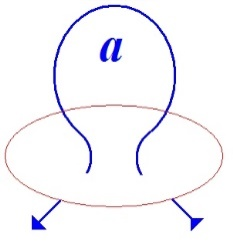
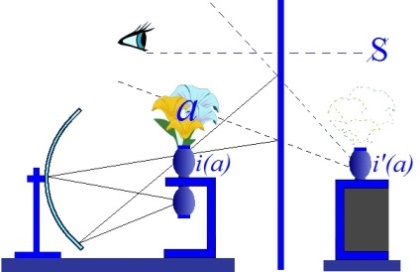

# Leçon 03 | 14 Janvier 1970

  

    <label><input type="checkbox" data-lacan-toggle="original" checked> 原文</label>
    <label><input type="checkbox" data-lacan-toggle="notes" checked> 注释</label>
    <label><input type="checkbox" data-lacan-toggle="commentary" checked> 个人解读评论</label>
  

  <form class="lacan-tool-search" role="search">
    <input class="lacan-tool-search-input" type="search" placeholder="搜索全文" aria-label="搜索全文">
    <button class="lacan-tool-button" type="submit" title="搜索">搜索</button>
  </form>
  <button class="lacan-tool-button lacan-back-to-top" type="button" title="回到页面最上方" aria-label="回到页面最上方">↑</button>

<section class="parallel-paragraph" data-paragraph-ids="s17-03-0001">

s17-03-0001

原文 · s17-03-0001

   

[无对应译文]

</section>

<section class="parallel-paragraph" data-paragraph-ids="s17-03-0002">

s17-03-0002

原文 · s17-03-0002

[无对应译文]

</section>

<section class="parallel-paragraph" data-paragraph-ids="s17-03-0003 s17-03-0004 s17-03-0005 s17-03-0006 s17-03-0007 s17-03-0008 s17-03-0009">

s17-03-0003, s17-03-0004, s17-03-0005, s17-03-0006, s17-03-0007, s17-03-0008, s17-03-0009

原文 · s17-03-0003, s17-03-0004, s17-03-0005, s17-03-0006, s17-03-0007, s17-03-0008, s17-03-0009

On m’a mis de la craie rouge, fortement rouge.

Du rouge sur du noir ça ne… \[*Rires*\], ça ne paraît pas évident que ce soit lisible.

Je vais faire quelques lorgnettes, comme ça vous pourrez voir.

En tous les cas ce ne sont pas des formules nouvelles, ce sont des formules que j’ai déjà écrites au tableau la dernière fois, ça ne semble pas avoir soulevé les mêmes protestations.

Elles sont utiles à être là présentées, parce qu’aussi bien, si simples soient-elles et si simples à déduire l’une de l’autre, puisqu’il s’agit simplement d’une permu­tation circulaire, encore les choses restant dans le même ordre, eh bien il s’avère que nos capacités de représentation mentale ne sont pas telles qu’elles sup­pléent au fait que ce soit ou non écrit au tableau.

Nous allons donc continuer, continuer ce que je fais ici depuis...

ici ou ailleurs, enfin un « *ici* » qui est toujours au même temps, le mercredi à midi trente ...depuis dix-sept ans.

有人给我配了红色粉笔，非常红的那种。

我来画几个“小眼镜”吧，这样你们就能看见了。

无论如何，这些不是新公式，是我上次已经写在黑板上的那些公式，上次好像并没有引发这么多抗议声。

将它们呈现在黑板上是有必要的，即便它们本身非常简单，而且彼此之间也非常容易推导出来，因为这只是一次简单的循环置换而已，各要素的顺序其实也并未改变，然而事实证明，我们的心智再现能力，并不足以弥补这些内容是否被实际写在黑板上的差异。

---

那么我们就继续，继续我自从……以来一直在这里所做的事情，无论是在这里或别处，总之是一个“这里”，始终是在同一个时间——每周三中午十二点半，……已经持续了十七年。

在这个人人都欢庆即将迈入新十年的时刻，我想重新提起这件事倒也值得。

对我而言，这更像是一个回顾过去十年、思索其所赐予我的契机。

> 红色写在黑板上……（笑声），看起来不太像是能读清楚的样子。

</section>

<section class="parallel-paragraph" data-paragraph-ids="s17-03-0010 s17-03-0011 s17-03-0012 s17-03-0013 s17-03-0014 s17-03-0015 s17-03-0016 s17-03-0017">

s17-03-0010, s17-03-0011, s17-03-0012, s17-03-0013, s17-03-0014, s17-03-0015, s17-03-0016, s17-03-0017

原文 · s17-03-0010, s17-03-0011, s17-03-0012, s17-03-0013, s17-03-0014, s17-03-0015, s17-03-0016, s17-03-0017

Il vaut bien que je le réévoque, au moment où tout le monde se réjouit d’entrer dans une nouvelle décennie, ce serait, pour moi, plutôt l’occasion de me retourner vers ce que m’a donné la précédente.

Il y a dix ans, deux de mes élèves présentaient quelque chose qui res­sortait des thèses lacaniennes sous le titre « *L’Inconscient, étude psychana­lytique »* [^3].

Cela se passait - mon Dieu - par ce qu’on peut appeler *le fait du prince*, le seul capable d’un acte libéral, étant entendu qu’un acte libéral ça veut dire un acte arbitraire, étant admis aussi que « arbitraire » ça veut dire com­mandé par aucune nécessité, en raison de ceci qu’aucune nécessité ne pressait sur ce point, ni dans un sens ni dans un autre, le prince...

le prince, mon ami Henri Ey ...mit à l’ordre du jour à certain congrès - congrès de Bonneval - *L’Inconscient,* en en confiant le rapport, au moins pour une part, la rédaction de ce rapport, à deux de mes élèves.

Depuis, ce travail fait foi en quelque sorte, et à la vérité, non sans raison, il fait bien foi de quelque chose : de la façon dont ceux-ci - mes élèves - ont pensé pouvoir atteindre, pouvoir faire entendre quelque chose au sein d’un groupe, qui s’était distingué par une sorte de consigne concernant ce que je pouvais avancer sur ce sujet intéressant, puis­qu’il s’agissait de rien de moins que « *L’inconscient* », que c’est de là qu’au départ mon enseignement a « *pris son vol* », disons...

Eh bien, la réponse, l’intérêt pris par ce groupe à ce que j’énonçais, s’était manifesté par quelque chose, que quelque part récemment - je ne sais plus où... - dans une petite préface, je signalais comme un *interdit aux moins de 50 ans.*

Nous étions en 60, ne l’oublions pas. Nous étions loin...

sommes-nous plus près, c’est la question ...loin de toute contestation à proprement parler, d’une autorité, entre autres celle du savoir.

十年前，我的两位学生提出了一些与拉康理论相关的内容，标题是《无意识，一项精神分析研究》。

这件事的发生——天啊——可说是由于所谓的“王权之举”（*fait du prince*），

也就是只有“君主”才有能力做出某种“自由行动”，所谓“自由行动”，也就是一种任意的行动，而“任意”，意思是不受任何必要性的驱使，因为在这个议题上（指“无意识”）当时并没有什么必要性逼迫，不论从哪个方向看都如此，那位“君主”——我的朋友，昂利·艾（Henri Ey）——在某次会议上将“无意识”列为正式议题——那正是博讷瓦尔会议，

并将其中的报告任务（至少部分内容）交托给我的两位学生来撰写。

自从那篇文章发表以来，在某种意义上它便成了一种“凭证”，而说实话，这并非毫无根据：它确实见证了一些事情——即，我那两位学生试图以某种方式接近、并在一个群体中发出某种声音的方式，这个群体有着某种特定的指导方针（consigne），是关于我在这个极其“有趣”的议题上所能表达的内容的指导，毕竟，谈论的不是别的，正是“无意识”，而这正是我教学之所以得以展开的起点。

嗯，他们对我当时所讲内容的“回应”，或者说“兴趣”，实际表现为一种我在不久前的某篇小序言中指出的东西，具体在哪儿我已记不清了……我当时称之为“50岁以下者禁入”的禁令。那是1960年，别忘了。我们当时距离——（现在是否更近了？这是个问题）——

还很遥远，遥远于任何真正意义上对“权威”的质疑，尤其是对知识权威的质疑。

因此，这一禁令——“50岁以下者不得入内”——一旦被说出，它确实具有某些颇为奇特的特征。至少有一点，使它堪比某种“知识的垄断”，而且这个禁令被确确实实地执行了，毫无折扣。

</section>

<section class="parallel-paragraph" data-paragraph-ids="s17-03-0018 s17-03-0019 s17-03-0020 s17-03-0021 s17-03-0022 s17-03-0023 s17-03-0024 s17-03-0025">

s17-03-0018, s17-03-0019, s17-03-0020, s17-03-0021, s17-03-0022, s17-03-0023, s17-03-0024, s17-03-0025

原文 · s17-03-0018, s17-03-0019, s17-03-0020, s17-03-0021, s17-03-0022, s17-03-0023, s17-03-0024, s17-03-0025

De sorte que cet interdit - *interdit aux moins de 50 ans -* proféré, a quelque chose qui a de curieux caractères.

En tous cas l’un d’entre eux le rendant comparable à une sorte de mono­pole de savoir, cet interdit fut observé, purement et simplement.

C’est dire quel était le travail qui se proposait à ceux qui avaient bien voulu s’en charger : de devoir faire entendre quelque chose d’à proprement parler inouï aux oreilles en question.

Le « *comment ils le firent* » est quelque chose dont après tout il n’est pas trop tard pour que je fasse le point, puisqu’aussi bien sur le moment il n’était pas question, pas question que je le fasse, pour la raison que c’était déjà beaucoup de voir entrer en jeu, pour des oreilles absolument non averties, qui n’avaient rien reçu du moindre de ce que j’avais pu articuler alors depuis sept ans, ce n’était évidemment pas le moment, vis-à-vis de ceux-là mêmes qui se livraient à ce travail de défrichage, d’y apporter *quoi que ce soit* qui pût sembler y trouver à redire.

Aussi bien, d’ailleurs, y avait-il là beaucoup d’éléments excellents.

Ce point donc, et à propos d’une... d’une *thèse* récente[^4], qui ma foi se produit quelque part à la frontière de l’*aire francophone*...

et je dirais là où - pour en main­tenir les droits - on lutte vaillamment : à Louvain pour l’appeler par son nom ...on a fait une thèse, une thèse mon Dieu sur ce qu’on appelle peut-être improprement mon « *œuvre* ».

Dans cette thèse bien sûr, qui est une thèse - ne l’oublions pas - universitaire, il faut bien avancer des choses qui prennent *forme universitaire*, et la moindre des choses qui apparaisse, est que mon œuvre s’y prête mal.

这就说明，那些愿意承担这个任务的人所面对的工作是怎样的：他们必须设法让那双耳朵听见某种，严格来说是从未被听过的东西。

至于“他们是如何完成这项工作”这件事，说到底，我现在来对此进行一下梳理也并不算太晚，毕竟在当时，我根本没有去评论这件事的打算，也的确不能评论，

理由在于，光是看到有这样的表达能够登上舞台，面对那些全然未被预告的耳朵

——

这些人此前对我那七年来所讲的一切<strong>毫无接收</strong>，在面对那些正投身于这项<strong>开垦性工作（défrichage）</strong>的人时，显然不是提出任何可能被视为批评的话语的时候。

更何况，其中的确包含了不少相当出色的内容。

因此，关于这一点——顺便说说——是围绕一篇最近完成的博士论文，[安妮卡·勒梅尔：《雅克·拉康作品研究》，答辩于鲁汶大学，后以《雅克·拉康》为题出版，查尔斯·德萨出版社，1970年，后由布鲁塞尔皮埃尔·马尔达加出版社于1977年再版（第八版1997年），该书由拉康本人作序。]——这篇论文产生于某个……说实话，在法语区边缘的地方，我愿称之为一个“奋力捍卫语言权利的地方”：——就是鲁汶大学（Louvain），直说了吧，——有人写了一篇论文，一篇——天啊！——是关于所谓我的“作品”的论文。

在这篇论文中，当然，毕竟这是一篇——别忘了——大学里的论文，自然必须提出一些能够采取“大学形式”的表述，而最基本也最显而易见的事实就是：

</section>

<section class="parallel-paragraph" data-paragraph-ids="s17-03-0026 s17-03-0027">

s17-03-0026, s17-03-0027

原文 · s17-03-0026, s17-03-0027

C’est bien pourquoi il n’est pas défavorable à l’avancée d’un tel propos - de thèse universitaire – que soit situé ce qui déjà d’*universitaire* a pu contribuer à être le véhicule de la dite « *œuvre* », toujours entre guillemets.

C’est bien pourquoi aussi l’un des auteurs de ce *Rapport de Bonneval* est là aussi mis en avant, et bien sûr d’une façon alors qu’à ce titre je ne peux manquer dans ma préface de marquer que le point, le point doit être fait de ce qui est éven­tuellement « *traduction* » de ce que j’énonce, et de ce que j’ai, à proprement parler, dit.

我的“作品”根本不适合这种形式。

正因如此，若要推进这样一项大学论文的构思，那么去指出那些早已具备大学特征、且有助于成为所谓“作品”载体的部分，——“作品”这个词，我仍要加上引号。

很明显，我为那篇即将在布鲁塞尔出版的博士论文所写的那篇小小序言，——毕竟很显然，一篇由我写的序言能为它……“减轻翅膀的负担”（暗讽：让它飞得起来）——

好吧，我的天，在这篇序言里，我不得不明确指出一点，——那恐怕也是这序言唯一的价值——就是：

</section>

<section class="parallel-paragraph" data-paragraph-ids="s17-03-0028 s17-03-0029 s17-03-0030">

s17-03-0028, s17-03-0029, s17-03-0030

原文 · s17-03-0028, s17-03-0029, s17-03-0030

Il est clair que cette petite préface que j’ai donnée à cette thèse qui va paraître à Bruxelles*...*

puisque il est évident qu’une préface de moi lui... lui allège les ailes ...et bien, mon Dieu, dans cette préface je suis forcé par exemple de bien marquer \- c’est là sa seule utilité - que ce n’est pas la même chose

- de dire que « *l’inconscient est la condition du langage »*,

“无意识是语言的前提条件”，——和说“语言是无意识的前提条件”
这两种说法根本不是一回事！

以那种方式——其具体理由当然可能完全出于大学体制的严格要求……

这确实是个很复杂的问题，可能我们今年就要深入讨论它，

——正是出于“大学要求”这一动因，

才导致了那个“翻译”我话语的人，

</section>

<section class="parallel-paragraph" data-paragraph-ids="s17-03-0031 s17-03-0032 s17-03-0033">

s17-03-0031, s17-03-0032, s17-03-0033

原文 · s17-03-0031, s17-03-0032, s17-03-0033

- ou de dire que « *le langage est la condition de l’inconscient »*.

« *Le langage est la condition de l’inconscient* » c’est ce que je dis.

De la façon dont, pour des raisons qui certes pourraient dans leur détail être tout à fait motivées du strict motif universitaire… et ceci certainement mènerait loin, nous mènera peut-être assez loin pour cette année …du strict motif universitaire, dis-je, découle que la personne qui me « *traduit* », d’être formée de ce style, de cette forme d’imposition du *dis­cours universitaire*, ne peut faire autre chose...

因为她的言说方式受到大学话语风格与话语强加形式的规训，

无论她是否自以为是在评论我，

她都只能把我的表述<strong>彻底颠倒</strong>，

换句话说，就是赋予我的话语一种必须指出的、<strong>完全相反的含义</strong>，

实际上甚至与我所提出的内容<strong>毫无结构上的同构性</strong>。

因此，确实存在这样的困难，

即要将我所说的内容“翻译”成大学语言所固有的困难，

这一点也同样会击中所有——无论出于何种动机或立场的人……

而事实上，我说的这位（勒梅尔）本人确实是出于极大的善意。

</section>

<section class="parallel-paragraph" data-paragraph-ids="s17-03-0034 s17-03-0035 s17-03-0036">

s17-03-0034, s17-03-0035, s17-03-0036

原文 · s17-03-0034, s17-03-0035, s17-03-0036

qu’elle croie ou non me commenter ...que de renverser ma formule, c’est-à-dire de lui donner une portée - il faut bien le dire - strictement contraire, et à la vérité sans même aucune homologie, avec ce que j’avance.

D’où assurément la difficulté, la difficulté propre à me traduire en langage universitaire, qui est aussi bien ce qui frappera tous ceux qui, à quelque titre que ce soit, et à la vérité, celle dont je parle qui était animée par ailleurs d’une immense bonne volonté.

Cette thèse donc, qui va donc paraître à Bruxelles n’en garde pas moins tout son prix, son prix d’exemple en elle-même, son prix d’exemple aussi par ce qu’elle promeut, ce qu’elle promeut de la distorsion en quelque sorte obligatoire, d’une traduction en *discours universitaire* de ce qui est quelque chose ayant ses lois propres, ces lois - dont je dois le dire : il me faut les frayer - celles qui prétendent donner au moins les conditions d’un *discours* proprement *analytique*.

因而，这篇即将在布鲁塞尔出版的论文，毕竟仍然保有其价值，

她自身作为“例子”的价值，也作为一种<strong>“学术翻译不可避免地造成扭曲”的实例</strong>，

——将某种<strong>具有自身规律的话语</strong>转译为大学话语，所必然伴随的那种“变形”。

这些法则……我必须说：我<strong>需要为它们开辟道路</strong>，它们试图<strong>至少</strong>为一个<strong>真正属于分析的言说</strong>，确立其发生的条件。

不过，当然，还必须承认这样一个事实：

正如我去年已经强调过的，我在这里——从这样一个讲坛之上——进行言说的这个事实，的确包含着一种出错的风险，一种“折射性”的成分，使得从某些方面来看，

我的言说不可避免地落入了“大学话语”的辖域之中。

</section>

<section class="parallel-paragraph" data-paragraph-ids="s17-03-0037 s17-03-0038">

s17-03-0037, s17-03-0038

原文 · s17-03-0037, s17-03-0038

Ceci étant, bien entendu, soumis au fait que tout de même, comme je vous l’ai souligné l’année dernière, le fait qu’ici je l’énonce du haut d’une tribune comporte en effet ce risque d’erreur, cet élément de réfraction qui fait que par quelque côté il tombe sous le coup du *discours universitaire*.

Il y a là quelque chose qui ressortit d’une sorte de foncier porte-à-faux, celui qui fait que d’une certaine position, d’une position, *certes*, à laquelle, *certes*, je ne m’identifie nullement : je vous assure que chaque fois que je viens ici porter la parole, ça n’est certes pas de quoi que ce soit que *j’aie à vous dire* ou « *qu’est-ce que je vais leur dire cette fois là ?* » qu’il s’agit pour moi.

在这里，有一种结构上的根本<strong>错位状态</strong>（porte-à-faux）显现出来，

正是这种错位，使得从某种特定的位置上——一个我明确<strong>完全不自我认同的位置</strong>

——我向你们发言的每一次，对我而言<strong>绝非是要传达某些内容、或是“这次我该跟他们说些什么？”这种问题。</strong>

就这方面来说，<strong>我并不扮演任何角色，</strong>——尤其不是那种“教师的角色”，那种结构上属于“角色范畴”的东西，那种意味着要<strong>维持某种话语位置</strong>，并不可否认地、具有某种“威望位置”的地位。

我在此并不是要向你们提出什么要求，而是向自己强加的一种<strong>秩序化的整理任务</strong>，

</section>

<section class="parallel-paragraph" data-paragraph-ids="s17-03-0039 s17-03-0040 s17-03-0041 s17-03-0042 s17-03-0043 s17-03-0044 s17-03-0045 s17-03-0046 s17-03-0047 s17-03-0048 s17-03-0049 s17-03-0050 s17-03-0051">

s17-03-0039, s17-03-0040, s17-03-0041, s17-03-0042, s17-03-0043, s17-03-0044, s17-03-0045, s17-03-0046, s17-03-0047, s17-03-0048, s17-03-0049, s17-03-0050, s17-03-0051

原文 · s17-03-0039, s17-03-0040, s17-03-0041, s17-03-0042, s17-03-0043, s17-03-0044, s17-03-0045, s17-03-0046, s17-03-0047, s17-03-0048, s17-03-0049, s17-03-0050, s17-03-0051

Je n’ai à cet égard nul rôle à jouer, au sens où la fonction de celui qui enseigne est de l’ordre du rôle, de la place à tenir, et d’une certaine place de prestige, incontestablement.

Ce n’est pas là ce que je vous demande, mais plutôt quelque chose qui est d’une *mise en ordre* que je m’impose, de devoir la soumettre à cette épreuve.

D’une *mise en ordre* à laquelle sans doute, comme tout un chacun, j’échapperais si je n’avais pas, devant cette *mer d’oreilles* \[*Rires*\]...

parmi lesquelles il en est peut-être bien une paire de critiques ...de devoir devant elles...

avec cette redoutable possibilité ...rendre compte de ce qui est le cheminement de mes actions, au regard de ceci : *qu’il y a <u>du</u> psychanalyste*.

Que c’est même la situation qui est la mienne, et que c’est une situation dont jusqu’à présent le statut n’a été réglé d’aucune façon qui lui convienne, si ce n’est à l’imitation, à la sem­blance, de nombreuses autres situations établies, et dans le cas, aboutissant à des pratiques frileuses de sélection :

- à une certaine identification à une figure,

- à une façon de se comporter, voire à un type humain dont rien ne semble rendre la forme obligatoire,

- à un rituel encore, voire à quelques autres mesures que dans un meilleur temps, un temps ancien, j’ai com­parées à celles de l’« *auto-école* », sans provoquer d’ailleurs de quiconque aucune protestation, il y a eu même quelqu’un de très proche parmi mes élèves d’alors, qui m’a fait remarquer que c’était là, à la vérité, à proprement parler, ce qui était désiré par quiconque s’engageait dans la carrière analytique : recevoir, comme à l’« *auto-école* », le *permis de conduire*, selon des voies bien prévues et comportant le même type d’examen.

Il est certes notable*...*

je veux dire, digne d’être noté ...qu’après dix ans, cette position du psychanalyste j’arrive tout de même à l’articuler, à l’articuler d’une façon qui est celle que j’appelle son *« discours »*, disons *son discours* hypothétique, puisque aussi bien cette année c’est ce qui est proposé à votre « *examen* », à savoir de ce qu’il en est de la structure de ce *discours*.

J’arrive à l’articuler de la façon suivante : qu’elle est faite, substantiellement, de *l’objet(a)* ...

de *l’objet(a)* en tant qu’ici dans l’articulation que je donne de ce qui est *structure de discours*, *structure de discours* en tant qu’elle nous intéresse, disons : prise au niveau radical où elle a porté pour *le discours psychanalytique* ...elle est sub­stantiellement celle de *l’objet(a)* en tant que *cet objet(a) désigne précisé­ment ce qui des effets du discours*, se présente comme le plus opaque, et à la vérité depuis très longtemps méconnu, pourtant essentiel.

要把这一过程置于某种考验之下。

这正是我当前所处的处境，

而且这种处境到目前为止，

从来没有一种<strong>真正适当的制度性地位</strong>来加以安置，

充其量只是<strong>模仿、仿效其他既定的制度情境</strong>，

最终往往导致的是一种<strong>谨小慎微、畏缩防御式的甄别实践：</strong>

- 某种对“人物形象”的认同，
- 某种特定的行为方式，甚至是某种“人类类型”，而这种类型的存在其实并没有任何必要性，
- 某种仪式化的过程，甚至还有一些其他制度化措施，

我在更早的时代曾将这些措施比作“<strong>驾校训练</strong>”，而且没有人对此提出抗议，事实上，当时我的一位非常亲近的学生还指出：这其实<strong>恰恰就是那些进入分析行业的人所真正渴望的东西</strong>：——像在驾校那样，<strong>通过一套明确规定的路径与考试流程</strong>，最终拿到所谓的“驾驶执照”。

这确实值得注意——我是说，值得被记下的是：

在经过十年之后，我终于还是得以将<strong>精神分析师的位置</strong>加以表述，以一种我称之为<strong>他的“话语”（discours）的方式来表述，当然，我们可以说它仍是一个假设性的话语结构</strong>，因为在今年，我就是将此作为你们“考试”的对象提出的，——也就是说：去探究这一话语结构究竟是如何构成的。

> 这是一种我本可以像所有人一样逃避的整理工作，若不是因为面对着这样一<strong>片耳海</strong>[笑声]，其中或许还真有一双挑剔的耳朵，我就不必带着这令人畏惧的可能性，去“交代清楚”我行动的整个进路，来面对这样一个事实：<strong>精神分析师是确实存在的。</strong>

</section>

<section class="parallel-paragraph" data-paragraph-ids="s17-03-0052 s17-03-0053 s17-03-0054 s17-03-0055 s17-03-0056 s17-03-0057 s17-03-0058 s17-03-0059">

s17-03-0052, s17-03-0053, s17-03-0054, s17-03-0055, s17-03-0056, s17-03-0057, s17-03-0058, s17-03-0059

原文 · s17-03-0052, s17-03-0053, s17-03-0054, s17-03-0055, s17-03-0056, s17-03-0057, s17-03-0058, s17-03-0059

Il s’agit de *l’effet de discours qui est effet de rejet*, effet de rejet dont je vais tout à l’heure essayer de *pointer la place et la fonction*.

Voici donc ce qu’il est substantiellement, ce qu’il en est substantiellement de cette position du psycha­nalyste.

*Et cet* *objet* se distingue d’une autre façon : de ceci qu’il *vient ici à la place d’où s’ordonne le discours*, parce que c’est de là que s’en émet, si je puis dire, « *la dominante* ».

Vous sentez bien la réserve qu’il y a dans cet emploi : dire « *la dominante* » ça veut dire exactement ce dont finalement je désigne, pour les distinguer, chacune de *ces structures de discours*, les désignant différemment

- de l’Universitaire,

- du Maître,

- de l’Hystérique,

- et de l’Analyste par des posi­tions diverses de ces termes radicaux.

我得以用以下方式来加以表述：

分析师的位置——<strong>在本质上</strong>是由客体 a 构成的。

这个客体 a，正是在我所提出的话语结构的联结中所处的位置，

——是我们感兴趣的话语结构，或者说，是在其最根本层面上，

在它对于精神分析话语具有决定性作用的那个层面上——

它在本质上就是客体 a，就是说，这个 a，<strong>恰恰指代了</strong>话语效果中

<strong>最为晦暗不明、长期以来遭到忽视，</strong>但事实上却是<strong>至关重要</strong>的那个东西。

如果真的把自己放在对象a的位置，那又成了某种倒错。

此处所涉及的是话语效应，即排斥效应，我将即刻尝试阐明这一效应的位置与功能。

这便是精神分析师立场的实质所在，其本质内涵即体现于此。

> 反过来说，如果分析师把自己放在假设知道的位置，那么就成了一种“类似于大学话语”的结构。

</section>

<section class="parallel-paragraph" data-paragraph-ids="s17-03-0060">

s17-03-0060

原文 · s17-03-0060

   

[无对应译文]

</section>

<section class="parallel-paragraph" data-paragraph-ids="s17-03-0061 s17-03-0062 s17-03-0063 s17-03-0065">

s17-03-0061, s17-03-0062, s17-03-0063, s17-03-0065

原文 · s17-03-0061, s17-03-0062, s17-03-0063, s17-03-0065

*Discours du Maître Discours de l’Hystérique Discours Universitaire Discours analytique*

Disons que j’appelle « *dominante* », faute tout de suite de pouvoir donner à ce terme autre chose que ceci : que c’est ce qui me sert en quelque sorte à *les dénommer*.

« *Dominante* » n’implique pas la dominance, au sens où cette dominance spécifierait - ce qui n’est pas sûr - *le discours du Maître*.

Disons que par exemple on peut donner des substances dif­férentes à cette *dominante* selon les discours, que si nous appelions par exemple *la dominante* du *discours du Maître* en ceci que **S1** en occupe la place, la *Loi,* nous ferions quelque chose qui a toute sa valeur suggestive, et qui ne manquerait pas de pouvoir ouvrir la porte à un certain nombre d’aperçus intéressants.

该对象以另一种方式区别于其他，它在此处取代了话语得以组织的源头位置，

因为——若允许我如此表述——正是由此处发出了“主导性”要素。

您能明显感受到这一用法中的保留意味：所谓“主导结构”，实则正是我为了区分这些话语结构而采用的精确指称——通过赋予这些根本性术语以不同位置，来分别标示：

- 大学话语
- 主人话语
- 癔症话语
- 分析家话语

假设我暂且将之称为“主导项”，尽管目前无法赋予该术语更确切的定义：

它仅作为我用以指称这些要素的临时工具。

“主导项”并不必然蕴含支配性意涵——若将这种支配性特指为（尚未确证的）主人话语的特征。

例如，我们可以根据不同话语类型为该主导项赋予不同实质：

</section>

<section class="parallel-paragraph" data-paragraph-ids="s17-03-0064">

s17-03-0064

原文 · s17-03-0064

[无对应译文]

</section>

<section class="parallel-paragraph" data-paragraph-ids="s17-03-0066 s17-03-0067 s17-03-0068 s17-03-0069">

s17-03-0066, s17-03-0067, s17-03-0068, s17-03-0069

原文 · s17-03-0066, s17-03-0067, s17-03-0068, s17-03-0069

Est-ce que la *Loi -* entendons *la Loi en tant qu’articulée -* cette *Loi* même dans les murs de laquelle nous recevons abri, et cette *Loi* qui constitue le droit et qui n’est certes pas quelque chose dont il doit être tenue que c’est là l’homonyme de ce qui peut s’énoncer ailleurs au titre de la justice.

Et que certes l’ambiguïté, l’habillement que cette *Loi* reçoit de s’autoriser de la justice, est là très précisément un point dont *notre discours* peut, peut-être, faire mieux sentir où sont les vérita­bles ressorts :

- j’entends ceux qui permettent l’ambiguïté,

- j’entends ceux qui font que la loi reste quelque chose qui est d’abord et avant tout, inscrit dans la structure.

若将主人话语的主导项界定为S1占据法则之位，

这种界定不仅具有充分的启发性价值，

更能为诸多富有洞见的理论阐释开启通路。

法律——此处指作为成文法的法律——这法律即便在其庇护我们的围墙之内，

也构成权利的法律，绝非可被简单等同于他处所谓正义之物的同音词。

而该法律借正义之名自我合法化的暧昧性外衣，

恰恰是我们话语或许能更清晰揭示其真实运作机制的关键所在：

——我指的是那些允许暧昧性存在的机制，

——我指的是使法律始终首要且根本地铭刻在结构之中的机制。

立法之道别无他途：无论是否受正义善意或灵感的驱使，

</section>

<section class="parallel-paragraph" data-paragraph-ids="s17-03-0070 s17-03-0071">

s17-03-0070, s17-03-0071

原文 · s17-03-0070, s17-03-0071

Et qu’il n’y a pas trente-six façons de faire des lois, que la bonne intention, l’inspiration de la justice les animent ou pas, il y a peut-être des lois de structure qui font que la loi sera toujours la *Loi*, située à cette place que j’appelle « *dominante* » dans le *discours du Maître*.

Au niveau du *discours de l’hystérique*, il est bien clair que cette *dominante*, nous la voyons apparaître sous la forme du *symptôme*, que c’est autour du *symptôme* que se situe, que s’ordonne ce qu’il en est du *discours* *de l’hysté­rique*.

或许存在某些结构性法则，使得法律永远作为"主人话语"中

我称之为"主导位"的"大他者之 Law（律法）"。

在癔症话语层面，显然可见该主导位以症状形态显现，

癔症话语正是围绕症状得以定位与组织。

这让我们意识到：若此位置具有同一性，或许正因如此

——即便仅以时代精神为名尚不足以解释——

该主导位在此情境中可能...

正是症状之位，或是某种促使我们质疑其症状性质的存在

...当它服务于另一种话语时仍占据相同位置。

</section>

<section class="parallel-paragraph" data-paragraph-ids="s17-03-0072">

s17-03-0072

原文 · s17-03-0072

[无对应译文]

</section>

<section class="parallel-paragraph" data-paragraph-ids="s17-03-0073 s17-03-0074 s17-03-0075 s17-03-0077 s17-03-0078 s17-03-0080 s17-03-0081 s17-03-0082">

s17-03-0073, s17-03-0074, s17-03-0075, s17-03-0077, s17-03-0078, s17-03-0080, s17-03-0081, s17-03-0082

原文 · s17-03-0073, s17-03-0074, s17-03-0075, s17-03-0077, s17-03-0078, s17-03-0080, s17-03-0081, s17-03-0082

Et certes c’est là occasion de nous apercevoir que si cette place est la même, c’est peut-être pour ça qu’à une lumière dont il ne suffit pas de dire que ce soit celle de l’époque pour en rendre raison, il se peut que cette *place dominante* soit en ce cas...

> celle du *symptôme*, ou *quelque chose* de portée à nous faire questionner comme étant celle du *symptôme* ...la même place quand elle sert dans *un autre discours*. C’est bien en effet ce que nous voyons à notre époque : *la Loi mise en question comme symptôme*.

J’ai dit tout à l’heure que cette même place, cette même *place dominante*, peut être occupée, quand il s’agit de l’analyste, en ce que l’analyste lui-même, ici de quelque façon a à repré­senter l’effet de rejet du discours, soit *l’objet(a)*.

Est-ce à dire qu’il nous sera aussi aisé de caractériser cette place, la place dite *domi­nante* quand il s’agit du *discours universitaire*, pour lui donner un autre nom, un nom qui de quelque façon nous permettrait cette sorte d’équivalence...

que nous venons de poser comme existant au moins au niveau de la question ...cette sorte d’équivalence *entre la loi et le symptôme*, voire *le rejet* à l’occasion, en tant que dans *l’acte psychanalytique* c’est bien la place à quoi est destiné l’analyste ?

Eh bien justement, notre embarras à répondre sur ce qui fait *l’essence, la domi­nante, du discours universitaire* est là quelque chose qui doit nous avertir que notre recherche...

> car ce que je trace devant vous, ce sont les voies mêmes autour desquelles,
>
> quand je m’interroge, vague, erre, ma pensée, avant de trouver les points sûrs ...c’est là qu’en quelque sorte l’idée pourrait nous venir de chercher ce qui, dans chacun de ces discours, pour désigner au moins une place, nous paraîtrait tout à fait sûr, aussi sûr que le *symptôme* quand il s’agit de *l’hystérique*.

# Est-ce que...

> puisque déjà je vous ai déjà laissé voir que dans *le discours du Maître,* le *(a)*,
>
> il est préci­sément identifiable au terme, à ce qu’enfin une pensée travailleuse - celle de Marx - a sorti, à savoir ce qu’il en était, symboliquement et réellement, de la fonction de *la plus-value* ...nous serions donc déjà en présence de deux termes, d’où il me resterait peut-être simplement à modifier légèrement, à donner une traduction plus aisée, à transposer des autres registres.

这正是我们时代所见：法律作为症状被质询。

前文已指出，当涉及分析师时，该同一主导位可由

分析师自身以某种方式代表话语拒斥效应——即对象a——所占据。

这是否意味着我们同样能轻易界定大学话语中的所谓主导位？

或许需赋予其另一名称，某种能实现范畴对等的命名。

事实上，我们在回答何谓学术话语的本质与核心时所面临的困境，恰恰警示着我们的研究路径——因为此刻向诸位勾勒的，正是当我的思想在探寻可靠支点前徘徊不定时所围绕的轴线……正是在此意义上，我们或许能获得某种启示：要在每种话语中寻找那些至少能标定某个位置的绝对确证之物，其确定性犹如癔症患者的症状表征。

既然我已向诸位揭示：在主人话语中，（a）这一要素可明确对应于马克思的辛勤思想最终揭示的那个术语——即<strong>剩余价值这一功能</strong>在象征界与实在界的双重运作……那么我们已然面对两个术语，或许只需稍作调整，提供更明晰的转译，便可实现其他场域的转换。

此处形成的建议是：鉴于共有四个位置需要界定，或许四种置换形式各自都会在其内部呈现出最显著的特征，这将成为发现序列中的关键步骤——而该序列正是所谓"结构"本身的展开过程。

那么，这一构想将导致您通过任何检验方式都能切身感受到——尽管初看或许并不明显——即：请暂且抛开我所提出的、可能引发我们共同关注的那个终极目标，仅尝试在每一个（姑且称之为“图形”的）结构中，强制自己遵循以下原则：在每个由“位置”这一术语界定的空间（上、下、左或右）中，确保各位置均不相同。然而您终将发现……无论采用何种方法……都无法使每个位置被不同字母所占据。

相反地，若尝试设定游戏规则，要求在这四个公式中每次选取不同字母，您将发现无法使每个字母占据不同位置。不妨动手验证：只需在纸片上简单排列，或借助称为矩阵的网格工具，便能立即看出——在如此有限的组合中，示例图示足以清晰呈现这一必然现象。

</section>

<section class="parallel-paragraph" data-paragraph-ids="s17-03-0076">

s17-03-0076

原文 · s17-03-0076

[无对应译文]

</section>

<section class="parallel-paragraph" data-paragraph-ids="s17-03-0079">

s17-03-0079

原文 · s17-03-0079

[无对应译文]

</section>

<section class="parallel-paragraph" data-paragraph-ids="s17-03-0083">

s17-03-0083

原文 · s17-03-0083

La suggestion ici se forme, que puisqu’il y a en somme 4 *places* à caracté­riser, peut-être que chacune des 4 de ces permutations nous livrerait, au sein d’elle-même, celle qui est la plus saillante, disons à constituer un pas, dans un ordre de découverte qui n’est rien d’autre que celui qui s’appelle « *la structure »*.

但若我们意识到此处存在某种本质性的意义关联，便可借此阐明结构的本质：当以特定方式对言说进行形式化时，若在该形式化体系内部设定若干检验性规则，便会遭遇这种不可能性要素。这正是构成结构基础的根本所在，也是精神分析经验层面所关注的结构性内核。

</section>

<section class="parallel-paragraph" data-paragraph-ids="s17-03-0084 s17-03-0085">

s17-03-0084, s17-03-0085

原文 · s17-03-0084, s17-03-0085

Eh bien une telle idée aura pour conséquence de vous faire toucher du doigt, de quelque façon que vous la mettiez à l’épreuve, ceci qui ne vous apparaît peut-être pas au premier abord, c’est à savoir : qu’essayez simplement...

> indépendamment de toute cette fin que je vous suggérais pouvoir être celle qui nous intéresse ...essayez dans chacune... disons, appelons-les « *figures* » ...dans chacune de ces *figures,* de vous obliger simplement à ceci, que dans chacune *la place* définie en fonction du terme « *place »*... *en haut, en bas, à droite* ou *à gauche...*que dans chacune la place soit différente, eh bien vous n’arriverez pas à ce que...

之所以如此，绝非因为此处我们已处于一个高度——至少在其主张上——精密的阐释层面，

这从一开始便是如此。既然我们正致力于能指运作及其潜在表达的探讨，

恰恰是因为这是精神分析学的基本前提。

我指的是：对于一个如弗洛伊德这般——容我直言——几乎未曾接触此类理论构建的学者而言……

考虑到我们所知的他的学术背景，那是一种“准物理科学”式的训练：

以生理学为基础，辅以早期物理学特别是热力学的知识……

倘若弗洛伊德被迫追随其经验脉络，在某个虽属表述的次要阶段、

却更具决定性的时刻进行理论阐述……

</section>

<section class="parallel-paragraph" data-paragraph-ids="s17-03-0086 s17-03-0088 s17-03-0089">

s17-03-0086, s17-03-0088, s17-03-0089

原文 · s17-03-0086, s17-03-0088, s17-03-0089

> quelle que soit la façon dont vous vous y preniez ...à ce qu’elles soient chacune occupées par une lettre différente.

Essayez, dans le sens contraire, de vous donner comme condition du jeu de choisir dans chacune de ces 4 formules une lettre différente, eh bien vous n’arriverez pas à ce que chacune de ces lettres occupe une place différente.

Faites-en l’essai. C’est très aisé à réaliser sur un bout de papier, et aussi si on se sert de cette petite grille qui s’appelle une *matrice,* de voir tout de suite qu’avec un si faible nombre de combinaisons, le dessin exemplaire suffit immédiate­ment à illustrer la chose de façon parfaitement évidente.

毕竟，在最初的无意识表达阶段，似乎并无任何因素强加这一要求……

而当弗洛伊德进入第二阶段——即当他确立"无意识可定位欲望"这一命题时——

这已然完整构成了弗洛伊德理论的第一步，

不仅隐含其中，更在《梦的解析》中得到明确表述与系统发展……

若在这个由《超越快乐原则》开启的第二阶段，弗洛伊德明确提出我们必须考量

这个被称为——称为什么？——重复的功能。

重复究竟是什么？

让我们细读文本，审视其具体表述。

驱使重复的乃是快感，该术语被明确指认。

正是由于对快感的追求呈现为重复，才产生了这个关键理论节点中运作的机制——

</section>

<section class="parallel-paragraph" data-paragraph-ids="s17-03-0087">

s17-03-0087

原文 · s17-03-0087

   

[无对应译文]

</section>

<section class="parallel-paragraph" data-paragraph-ids="s17-03-0090 s17-03-0091 s17-03-0092 s17-03-0093 s17-03-0094 s17-03-0095 s17-03-0096 s17-03-0097">

s17-03-0090, s17-03-0091, s17-03-0092, s17-03-0093, s17-03-0094, s17-03-0095, s17-03-0096, s17-03-0097

原文 · s17-03-0090, s17-03-0091, s17-03-0092, s17-03-0093, s17-03-0094, s17-03-0095, s17-03-0096, s17-03-0097

Mais si nous pensons qu’il y a là une certaine liaison signifiante, et qu’on peut poser comme tout à fait radicale, c’est là aussi occasion d’illustrer, de ce simple fait, ce que c’est que *la structure*.

Qu’à poser d’une certaine façon *la formalisation du discours*...

> et à l’intérieur de cette *formalisation*, de s’accorder à soi-même quelques règles destinées,
>
> cette *formalisation*, à la mettre à l’épreuve, ...se rencontre un tel élément d’*impossibilité* \[◊\].

Voilà ce qui est...

proprement à la base, à la racine ...ce qui est « *fait de structure »*, et dans la structure ce qui nous intéresse au niveau de l’expé­rience analytique.

Ceci...

pas du tout parce qu’ici nous sommes à un degré déjà élevé - au moins dans ses prétentions - élevé d’élaboration, ...ceci dès le départ, puisqu’aussi bien *si nous sommes à nous étreindre avec ce maniement du signi­fiant* et son articulation éventuelle, c’est bien qu’ il est dans les données de la psychanalyse.

Je veux dire : dans ce qui, à un esprit aussi peu, je dirais « introduit » à cette sorte d’élaboration qu’a pu l’être un Freud...

弗洛伊德式的突破——即我们关注的作为重复的现象，

它铭刻于快感的辩证关系中，本质上与生命本能相悖。

正是在重复这一层面上，弗洛伊德在某种程度上被迫……

这实则源于话语结构本身……

……被迫阐明这种夸张的、近乎神话般的推演……

而这一真相对于任何将无意识与本能简单等同的人来说，都堪称惊世骇俗……

……最终必须将"死亡本能"表述为：重复不仅关乎生命固有的周期性规律……

诸如需求与满足的循环……

……更是某种超越循环的存在——它推动着生命本身的消逝，使其回归无机状态：这绝非某种视域、理想或超验图式，但通过严格的结构分析，其意义恰恰在快感的运作机制中得到了清晰昭示。

若我们以快乐原则为出发点来理解以下两点：

</section>

<section class="parallel-paragraph" data-paragraph-ids="s17-03-0098 s17-03-0099 s17-03-0100 s17-03-0101 s17-03-0102">

s17-03-0098, s17-03-0099, s17-03-0100, s17-03-0101, s17-03-0102

原文 · s17-03-0098, s17-03-0099, s17-03-0100, s17-03-0101, s17-03-0102

> étant donné la for­mation que nous lui connaissons, qui est une for­mation du type « *sciences para-physiques* » : physio­logie armée des premiers pas de la physique, et de la ther­modynamique spécialement ...si Freud est amené à suivre la veine, le fil de son expérience, à formuler, dans un temps qui pour être second dans son énonciation, n’en a que plus d’importance... puisqu’après tout, rien ne semblait l’imposer dans le pre­mier temps, celui de *l’articulation de l’inconscient* ...si Freud dans un second temps, celui donc où est pour lui acquis ceci, ceci que l’inconscient permet de situer *le désir*...

> c’est là le sens du premier pas de Freud, déjà tout entier,
>
> non pas impliqué, mais proprement articulé, développé dans la *Traumdeutung* ...si dans ce second temps, celui qu’ouvre l’*Au-delà du principe du plaisir,*

Freud articule que nous devons tenir compte de cette fonction qui s’appelle - qui s’appelle quoi ? *- la répétition*.

*La répétition*, qu’est-ce que c’est ? Lisons son texte, voyons ce qu’il articule.

Ce qui nécessite *la répétition, c’est la jouissance*, le terme est désigné en propre.

——快乐原则本质上不过是维持生命所需的最小张力原则，即保持最低限度的紧张状态。这表明，快感本身已超越了该原则的范畴，而快乐原则所维系的正是对快感设限的边界；

——倘若重复（正如事实、经验及临床实践所示）确以快感的复现为基础，那么弗洛伊德及其本人所明确阐释的核心要义在于：正是在这种重复机制中，存在着某种"缺陷"或"失败"的运作现象。

需要指出的是，在此处我曾强调其与克尔凯郭尔论述的亲缘性[索伦·克尔凯郭尔：《重复》，载《全集》第五卷（蒂索译本）第3-96页，巴黎奥兰特出版社1972年版；《重复》第691-767页（罗贝尔·拉丰出版社1993年修订蒂索译本，"布坎丛书"系列；弗拉马里翁出版社1990年新版（妮莉·维亚拉奈新译本），"GF"丛书第512号]：被重复之物因其明确作为重复之标记的本质......必然只能是相对于所重复内容而言......某种意义上的"损耗"，无论是何种损耗，或是动能衰减！

</section>

<section class="parallel-paragraph" data-paragraph-ids="s17-03-0103 s17-03-0104 s17-03-0105 s17-03-0106 s17-03-0107">

s17-03-0103, s17-03-0104, s17-03-0105, s17-03-0106, s17-03-0107

原文 · s17-03-0103, s17-03-0104, s17-03-0105, s17-03-0106, s17-03-0107

C’est en tant qu’il y a *recherche de la jouissance* en tant que *répétition*,

- que se produit ceci qui est en jeu dans ce pas, le franchisse­ment freudien,

- que ce *quelque chose* qui nous intéresse en tant que *répétition*, et qui s’inscrit d’une dialectique de *la jouissance*, c’est proprement ce qui va contre la vie.

C’est au niveau de la *répétition* que Freud se voit en quelque sorte contraint...

et ceci de par même la structure du discours ...contraint d’articuler cette sorte d’hyperbole, d’extrapolation fabuleuse...

这种本质性的损耗，正是弗洛伊德从最初——从我在此概述的表述结构开始——就着力强调的：即在重复行为本身中，快感必然发生耗散。

弗洛伊德话语中"失落客体"的功能正源于此。这是弗洛伊德的核心贡献。

还需补充说明的是，无需赘言弗洛伊德全部文本都明确围绕着受虐癖展开——该概念仅从追求这种毁灭性快感的维度被构想。

现在，拉康的贡献在此显现。

</section>

<section class="parallel-paragraph" data-paragraph-ids="s17-03-0108 s17-03-0109 s17-03-0110 s17-03-0111 s17-03-0112 s17-03-0113 s17-03-0114 s17-03-0115 s17-03-0116 s17-03-0117 s17-03-0118 s17-03-0119 s17-03-0120 s17-03-0121 s17-03-0122 s17-03-0123 s17-03-0124 s17-03-0125 s17-03-0126">

s17-03-0108, s17-03-0109, s17-03-0110, s17-03-0111, s17-03-0112, s17-03-0113, s17-03-0114, s17-03-0115, s17-03-0116, s17-03-0117, s17-03-0118, s17-03-0119, s17-03-0120, s17-03-0121, s17-03-0122, s17-03-0123, s17-03-0124, s17-03-0125, s17-03-0126

原文 · s17-03-0108, s17-03-0109, s17-03-0110, s17-03-0111, s17-03-0112, s17-03-0113, s17-03-0114, s17-03-0115, s17-03-0116, s17-03-0117, s17-03-0118, s17-03-0119, s17-03-0120, s17-03-0121, s17-03-0122, s17-03-0123, s17-03-0124, s17-03-0125, s17-03-0126

et à la vérité qui reste scandaleuse pour quiconque prendrait au pied de la lettre *l’identification de l’inconscient et de l’instinct* ...va à articuler cet « *instinct de mort* » à savoir ceci : que *la répétition* n’est pas seulement fonction des cycles...

> des cycles que la vie comporte, cycles du besoin et de la satisfac­tion... ...mais quelque chose d’autre qu’un cycle qui aussi bien emporte la dispari­tion de cette vie comme telle, le retour à l’inanimé : certainement point d’horizon, point idéal, point hors de l’épure, mais dont le sens, à l’analyse précisément structurale s’indique, s’indique parfaitement de ce qu’il en est de *la jouissance*.

Si nous partons déjà *du principe du plaisir* pour savoir :

- que ce *principe du plaisir* n’est rien que le principe de moindre tension, de la tension minimale à maintenir pour que la vie se maitienne, ce qui démontre qu’en soi-même, la jouissance le déborde, et que ce que le *principe du plaisir* maintient, c’est la limite quant à la jouis­sance,

- que si la *répétition*...

> comme tout nous l’indique dans les faits, l’expérience, la clinique ...si *la répétition est fondée sur un retour de la jouissance*, et que ce qui proprement à ce propos est dans Freud, et par Freud lui-même articulé, c’est à savoir que dans cette *répétition* même, c’est là, c’est là que se produit ce *quelque chose* qui est *« défaut », « échec »*.

À savoir que, ici, en son temps j’ai pointé la parenté avec les énoncés de Kierkegaard [^5] : *ce qui se répète* ne saurait...

au titre même de ceci qu’il *est* expressément et comme tel *répété*, *qu’il est marqué de la répétition* ...ne saurait être autre chose que ce qui...

> par rapport à ce que cela répète ...*est en quelque sorte* « *en perte* », *en perte* de ce que vous voudrez, *en perte* de vitesse !

*Il y a quelque chose qui est perte, et que sur cette perte, dès l’origine*, *dès l’articulation de ce que ici je résume*, *Freud insiste* : *que dans la répétition même, il y a déperdition de jouissance*. ’est là que prend origine dans le discours freudien la fonction de *l’objet perdu*. Cela c’est Freud.

Ajoutons-y qu’il n’est pas tout de même besoin de rappeler que c’est expressément autour du *masochisme*, conçu seulement sous cette dimension de *la recherche de cette jouissance ruineuse*, que tourne tout le texte de Freud.

Maintenant vient ici ce qu’apporte Lacan.

Cette *répétition*, cette identification de *la jouissance*, et là j’emprunte...

> j’emprunte pour lui donner un sens qui n’est pas pointé dans le texte de Freud ...la fonction du *trait unaire*,

- c’est-à-dire de la forme la plus simple de *marque*,

- c’est-à-dire ce qui est, à pro­prement parler, *l’origine du signifiant*.

Et j’avance ceci qui n’est pas dans le texte de Freud, j’avance ceci qui n’est pas vu dans le texte de Freud...

> et qui ne saurait d’aucune façon être écarté, évité, rejeté, par le psychanalyste ...c’est que *c’est du trait unaire que prend son origine tout ce qui nous intéresse, nous analystes, comme <u>savoir.</u>*

Car la psychanalyse prend son départ d’un tournant qui est celui où *le savoir s’épure*, si je puis dire, *de tout ce qui peut faire* *ambi­guïté*,

这种重复，这种对享乐的认同——此处我借用（并赋予其弗洛伊德文本中未曾明确指出的含义）——即"单划"（trait unaire）的功能，亦即最简形式的标记，严格来说，这正是能指的起源。

我要提出的是（这在弗洛伊德文本中既不存在，也未被察觉，但精神分析师绝不能回避、忽视或拒斥）：我们精神分析师所关注的一切知识，皆源自一元特质。

因为精神分析始于一个转折点，即知识——如果可以这样说的话——从一切可能产生歧义的事物中净化出来，
——摆脱那种被视为天然知识的认知，
——摆脱那些我们不知为何能引导我们在周遭世界前行的内在机制，

凭借某种我们与生俱来、却难以名状的感知能力来指引方向。
当然，这并非意味着此类机制完全不存在。

诚然，当一位博学的心理学家在当代著述时...
（确切地说是不久前，约四五十年前）
...如题为《感觉：生活的向导》[亨利·皮埃隆：《感觉：生活的向导》，伽利玛出版社，1945年]的著作时，其论述自然并非荒谬之谈。
但之所以能如此表述，恰恰是因为科学发展的整体进程使我们认识到：
这种"感觉"与它所要把握的所谓"世界"之间，并不存在任何先天的契合性。

如果通过适当的科学阐述，通过对视觉甚至听觉的审视，向我们展示了某种东西，那么，如果不是我们必须如实接受的东西，就什么也不是、它什么也不是，除非是我们必须如实接受的东西，而其事实性的系数恰恰是它是什么都不是：
在光的振动中，有一种我们无法感知的紫外线--为什么我们不能感知呢？- 在另一端，红外线也是一样、
-耳朵也是一样：有些声音我们听不到了，我们也不知道为什么听不到了。
-而事实上，除了这一点之外，没有任何其他东西可以通过某种方式的照亮而准确把握：毕竟存在着过滤器，而我们可以通过这些过滤器来获得。                                        如果我们相信功能造就了器官，那么我们所能使用的就是器官！

整个传统哲学所试图建立的这种东西与理性--就思维机制而言--之间没有任何共同之处，而理性则试图通过你所知道的方法，在抽象、概括的层面上所做的解释。

</section>

<section class="parallel-paragraph" data-paragraph-ids="s17-03-0127 s17-03-0128 s17-03-0129 s17-03-0130 s17-03-0131 s17-03-0132 s17-03-0133 s17-03-0134 s17-03-0135 s17-03-0136 s17-03-0137 s17-03-0138">

s17-03-0127, s17-03-0128, s17-03-0129, s17-03-0130, s17-03-0131, s17-03-0132, s17-03-0133, s17-03-0134, s17-03-0135, s17-03-0136, s17-03-0137, s17-03-0138

原文 · s17-03-0127, s17-03-0128, s17-03-0129, s17-03-0130, s17-03-0131, s17-03-0132, s17-03-0133, s17-03-0134, s17-03-0135, s17-03-0136, s17-03-0137, s17-03-0138

- être pris d’un savoir naturel,

- de je ne sais quoi qui nous guiderait dans le monde qui nous entoure, à l’aide de je ne sais quelles papilles qui, en nous, sauraient de naissance s’y orienter.

Non certes qu’il n’y ait rien de pareil.

Et bien sûr, quand un savant psychologue écrit de nos jours...

> enfin je veux dire, il n’y a pas si longtemps, 40 ou 50 ans ...quelque chose qui s’appelle « *La Sensation, guide de vie »* [^6], il ne dit bien sûr, rien d’absurde, mais s’il peut l’énoncer ainsi, c’est juste­ment que toute l’évolution d’une science nous fait apercevoir *qu’il n’y a nulle connaturalité de cette « sensation »,* *à ce qui par elle, pénètre d’appréhension d’un prétendu* « *monde* ».

Si l’élaboration proprement scien­tifique, l’interrogation des sens de la vue, voire de l’ouïe, nous démon­trent quelque chose, ce n’est rien, sinon *quelque chose* que nous devons recevoir tel qu’il est, avec exactement le coefficient de facticité sous lequel il se présente :

- que parmi les vibrations lumineuses, il y ait un *ultraviolet* dont nous n’ayons aucune perception - et pourquoi n’en aurions-nous pas ? - à l’autre bout, l’*infrarouge*, c’est la même chose,

- et qu’il en est de même pour l’oreille : qu’il y a des sons que nous cessons d’entendre, et qu’on ne voit pas beaucoup pourquoi cela s’arrête là plutôt que plus loin.

- Et qu’à la vérité, rien d’autre n’est saisissable précisément d’être éclairé d’une certaine façon, que ceci : qu’il y a après tout des filtres, et qu’avec ces filtres on se débrouille. Si on croit que la fonction crée l’organe, c’est bien l’organe dont on se sert comme on peut !

Il n’y a rien de commun entre *ce quelque chose* sur quoi a voulu construire et raisonner, quant aux mécanismes de la pensée, toute une philosophie traditionnelle, qui s’est efforcée d’édifier par les voies que vous savez...

> le compte rendu de ce qui se fait au niveau de l’abstraction, de la généralisation ...cette chose qui s’édifie sur *une sorte de réduction*, *de passage au filtre*, ce qu’il en est d’une « *sensation* » consi­dérée comme basale : « *Nihil fuerit in intellectu quod non prius...* »[^7] etc., vous savez la suite : « ...*in sensu* ».

Est-ce que c’est ce sujet-là...

这种东西是建立在一种还原之上的，是通过过滤器的，是被认为是基本的感觉："Nihil fuerit in intellectu quod non prius......" [Nihil est in intellectu quod non prius fuerit in sensu：思想中没有任何东西不是首先存在于感官之中的（归因于亚里士多德，由托马斯-阿奎那辩护、
洛克......）。剩下的你都知道："......在感官上是这个主体......
这个主体是否可以作为知识的主体来推导，这个主体是否可以以一种现在看来非常人为的方式，从基础（实际上是仪器的基础）来建构、我们很难想象，如果没有这些重要的器官，我们还能做什么。
......当涉及到这种表意的表述时，这就是它的全部内容吗？
我们在这里尝试的第一拼写词，可以开始玩弄最基本的术语，那些如我所说--将一个符号与另一个符号联系在一起的术语，它们已经产生了效果，这种效果已经体现在这个符号只能被处理、
在定义中，这个符号只能这样处理：它是有意义的，它对另一个符号来说是一个主体，一个主体，而不是别的。

我们无法逃避这样一个极度简化却无法规避的命题：

——那就是：

<strong>有某种东西“在下方”</strong>（ὑποχείμενον，*upokeimenon*，即*sub-jectum*，拉丁语“主体”之源），但恰恰是：我们无法用任何“某种东西”来指称它；

——它不可能是一个“*etwas*”（德语：“某物”）；——它只是某种“在下方”的东西，

如果你愿意，可以叫它“主体”，一个*ὑποχείμενον*。

甚至对于一个如此沉浸于对“知识之理念”的要求（而且是<strong>原初的、非构造性的要求</strong>

）的思想体系，——像亚里士多德那样的体系，——在他首次将“逻辑”引入知识系统之中时，他也被迫<strong>严格区分</strong>：——ὑποχείμενον（主体、底下之物）

</section>

<section class="parallel-paragraph" data-paragraph-ids="s17-03-0139">

s17-03-0139

原文 · s17-03-0139

> ce sujet *déductible* au titre de *sujet de la connaissance*, ce sujet *construc­tible* d’une façon qui nous paraît maintenant si *artificielle*, à partir de bases, qui sont bien en effet des bases d’appareils,
>
> d’organes vitaux dont on voit mal en effet ce que nous pourrions faire à nous en passer ...est-ce que c’est cela dont il s’agit, quand il s’agit de cette arti­culation signifiante, celle dont les pre­miers termes d’épellation, qui sont ceux que nous tentons ici, peuvent commencer de jouer des termes les plus élémentaires, ceux qui nouent - comme je l’ai dit - un signifiant à un autre signifiant, et qui déjà portent *effet*, *effet* déjà en ceci que, il n’est maniable ce signifiant, dans sa définition, qu’à ceci : que ça ait *un sens*, qu’il représente pour un autre signifiant *un sujet*, un sujet et rien d’autre.

与 οὐσία（ousia，本质、实体）——与任何可以被视为“本体”的东西。

这使我们能够这样设想：

如果知识在某个层面上，是被一些<strong>纯粹形式性的必然性</strong>所支配和组织的，

——即来自<strong>书写（écriture）的必然性</strong>，

那么这就通向了一种我们今日所见的<strong>逻辑类型</strong>，

——它本质上是一种操作，首先也是一种<strong>书写的操作</strong>；

如果我们所谈论的这种知识，能够以<strong>现代逻辑的经验</strong>作为其支撑，

那么，<strong>当我们在精神分析临床中考察“重复”现象时</strong>，——所真正涉及的知识类型，正是这一种知识。

换句话说，那种在我们看来最为“纯粹的”知识——尽管很清楚，这种知识根本无法通过经验主义的“抽取纯粹性”来获得——

> **ὑποχείμενον / *upokeimenon***（希腊语）原意是“躺在下方之物”，是西方哲学“主体 subject”的词源。到了拉丁语中转化为*sub-jectum*，即“被放置在下之物”。
> <strong>分析中的“主体”不是一个“事物”，而是一个“在下方的位置”</strong>。

</section>

<section class="parallel-paragraph" data-paragraph-ids="s17-03-0140 s17-03-0141 s17-03-0142 s17-03-0143 s17-03-0144">

s17-03-0140, s17-03-0141, s17-03-0142, s17-03-0143, s17-03-0144

原文 · s17-03-0140, s17-03-0141, s17-03-0142, s17-03-0143, s17-03-0144

*Il n’y a pas moyen d’échapper à cette formule extraordinairement réduite* : *qu’il y a* *quelque chose dessous* \[ὑποχείμενον : upokeimenon, *sub-jectum* \], mais justement que nous ne pou­vons pas désigner d’aucun terme de « *quelque chose* » : ça ne saurait être un « *etwas* » \[*quelque chose*\], c’est simplement un *en dessous*, si vous voulez, un sujet, un ὑποχείμενον \[upokeimenon\], ceci que même à une pensée aussi investie de la contemplation des exigences...

celles-là primaires, non pas du tout construites ...de l’idée de connais­sance, que celle d’Aristote, la seule approche de la logique, le seul fait qu’il l’ait introduite dans le circuit du *savoir*, *lui impose de dis­tinguer sévèrement* ὑποχείμενον \[upokeimenon\] *de toute* οὐσἰα \[oussia\] *en soi-même*, *de quoi que ce soit qui soit essence*.

Le signifiant donc s’articule de *représenter un sujet auprès d’un autre signifiant*.

C’est de là que nous partons pour donner sens à cette répétition inaugurale en tant qu’elle est *répétition visant à jouissance.*

Ce qui nous permet de concevoir ceci : que si le savoir à un certain niveau, est dominé, articulé de nécessités pure­ment formelles, des nécessités de l’écriture...

正是这同一种知识，<strong>从一开始就已被引入结构之中</strong>，

它显示出自身的根源，

正是在于“重复”之中，——以“单一特征痕迹”（trait unaire）的形式为起始，

这种知识，便成为<strong>享乐的手段</strong>。

是那种享乐，恰恰是<strong>超越了“快乐”这个词所指涉的生活中常规张力限度的</strong>享乐。

那么就在这里——为了继续沿着拉康的思路——我们可以看到，这种形式化所显现出来的东西是……

如果我们刚才已经指出：存在一个

<strong>享乐的丧失</strong>，——是这种丧失之处，因“重复”而被引入了某种东西，——正是在这一点上，我们看到了那个“丧失客体”**的功能显现出来，也就是我称之为（a）的东西。
那么，这能给我们带来什么样的命题呢？
除了这样一句话：
——知识在最基本层面上运作的时候……
——也就是在那个“单一特征”（trait unaire）被施加的层面上……
——知识在工作、在运作时所产生的东西……
——说来也不足为奇，——它所产生的，正是**熵（entropie）。

这并不令人惊讶，因为你们设想一下，“热力学”根本不是什么别的东西……

> 所谓 <strong>trait unaire（单一痕迹）</strong>：
>
> - 是主体在最初的“经验”（其实是结构性遭遇）中，<strong>对某一能指标记的铭刻</strong>；
> - 它不是经验记忆，而是一个<strong>形式性刻痕</strong>，如“一”；
> - 所有重复都是围绕这个痕迹进行的；
> - 每一次重复的结构，就是试图再现那个享乐的瞬间——哪怕这个享乐是破坏性的、苦痛的。
>
> 例如：一个来访者每次都“无意识地”选择被轻视的关系对象，这并不是他“没吸取教训”，而是他的<strong>jouissance（享乐）围绕某种早期被刻下的“trait unaire”在组织重复。</strong>

> 顺便说一句，“熵”可以拼作 e-n-t-r-o，[笑声]，你当然也可以拼成 a-n-t-h-r-o（人类 anthropo 的词根），这倒也不失为一个有趣的文字游戏。

> 在常规观念中，“知识”意味着对混乱的组织、对未知的掌控、对欲望的抚平。而拉康却提出：
>
> - <strong>知识本身，是“享乐的丧失”结构化后的副产品</strong>；
> - 它不是解决，而是<strong>症状的推进机制</strong>；
> - 它不是给出意义，而是产出剩余（剩余享乐 plus-de-jouir）；
> - 知识越运作，主体越被耗散进结构之中——这正是“熵”的意味。

> ——不管那些工程师的天真之心怎么想（笑声）——它根本就是<strong>将能指的网络覆盖在世界之上的产物</strong>。

</section>

<section class="parallel-paragraph" data-paragraph-ids="s17-03-0145 s17-03-0146 s17-03-0147 s17-03-0148 s17-03-0149 s17-03-0150 s17-03-0151">

s17-03-0145, s17-03-0146, s17-03-0147, s17-03-0148, s17-03-0149, s17-03-0150, s17-03-0151

原文 · s17-03-0145, s17-03-0146, s17-03-0147, s17-03-0148, s17-03-0149, s17-03-0150, s17-03-0151

ce qui aboutit de nos jours à un certain type de logique, qui est en soi maniement - et avant tout - maniement de l’écriture ...que si ce savoir auquel nous pouvons donner le support d’une expérience qui est celle de la logique moderne, que ce type de savoir c’est celui-là qui est en jeu quand il s’agit de mesurer dans la clinique analytique l’incidence de *la répétition*.

En d’autres termes, le savoir qui nous paraît le plus *épuré*...

encore qu’il soit bien clair que nous ne pouvions le tirer d’aucune façon de l’empirisme par épuration ...c’est ce même savoir qui se trouve être dès l’origine introduit, qui montre sa racine en ceci : *que dans la répétition, et sous la forme du trait unaire* pour commencer, *ce savoir se trouve être le moyen de la jouissance,* de *la jouissance* précisément en tant qu’elle dépasse les limites imposées sous le terme de *plaisir*, aux tensions usuelles de la vie.

*Et c’est ici que* - pour continuer de suivre Lacan - ce qui apparaît de ce formalisme \[*formalisation « algèbique » par la lettre* : (*a*) \], si nous avons dit tout à l’heure *qu’il y a perte de jouis­sance*, *que c’est à la place*

- *de cette perte,*

- *de ce quelque chose qu’introduit la répétition,* *que nous voyons surgir la fonction de l’objet perdu, de ce que j’appelle le* (*a*).

Eh bien, qu’est-ce que ça nous impose, sinon cette formule que *le savoir, travail­lant au niveau le plus élémentaire*...

我挑战你们试试看：你们无法从任何角度证明——你们去试试看吧，到时候你们就会得出相反的“证明”————你背着80公斤的重物下行500米，然后又再往上爬500米，

但是，如果你把“能指”强行贴在这上面，——也就是说你进入“热力学”的话语系统，

那么，它就一定会说你<strong>没做任何工作</strong>。

因为你看……当你建造一座工厂，不论在哪里，当然你会从中获取能源，甚至你还能积蓄这些能量。

那么问题在于，一座工厂，——至少是那些被投入运作、为了让涡轮类的装置能够运转、以至于你可以把能量“封装起来”的装置，——这些装置之所以能够被制造出来，

恰恰是因为它们是依据与我现在讲的<strong>同样的逻辑</strong>，——也就是：能指的功能（la fonction du signifiant）而被制造出来的。

当今时代，一台机器跟工具没有任何关系，从铁锹到涡轮之间<strong>根本不存在什么“进化谱系”</strong>。

最有力的证明就是：你完全可以<strong>正当地称一个你在纸上画的图样为“机器”</strong>。

它仅需一点点条件，仅仅是——<strong>你用的墨水具有导电性</strong>，这就足以使它变成一台<strong>非常非常高效的机器</strong>。

那么它为什么不能导电呢？——<strong>因为“标记/痕迹（le trait）本身就已经是一种对“欢愉”（volupté）的导通体”</strong>。

> 然后有人说你“零做工”，什么劳动都没有（笑声）——你去试试看！

> 东北的大哥们对这种，”我给你送回去，不然不得收你钱啊“的逻辑应该非常眼熟。这里东北大哥的那种轴劲之下，可以看作对此种剩余的抵抗。

> 而且别以为我在开玩笑！

> 这里是说那种往复的机械系的运动

> 工具（outil）传统上指人手的延伸，属于人类—自然—技术进化链条的一环；而机器（machine）在拉康这里则被理解为<strong>符号系统内部的结构运作机制</strong>，它不是从“锹”演化来的，而是从“图样、符号、编码”中构造的。

</section>

<section class="parallel-paragraph" data-paragraph-ids="s17-03-0152 s17-03-0153 s17-03-0154 s17-03-0155 s17-03-0156">

s17-03-0152, s17-03-0153, s17-03-0154, s17-03-0155, s17-03-0156

原文 · s17-03-0152, s17-03-0153, s17-03-0154, s17-03-0155, s17-03-0156

*au niveau* de cette imposition *du trait unaire,* ...eh bien *le savoir, travail­lant, produit*...

ça ne va pas être beaucoup pour nous surprendre ...*produit*, disons *une entropie*, ce qui entre nous s’écrit *e,n,t,r,o,* \[*Rires*\], parce que vous pourriez aussi écrire *a,n,t,h,r,o,* ce serait d’ailleurs un joli jeu de mots.

C’est pas pour nous étonner, parce que figurez vous quand même, *que l’énergétique* ça n’est absolument pas autre chose...

> quoi qu’en croient les cœurs ingénus d’ingénieurs \[*Rires*\] ...*ça n’est absolument pas autre chose que le placage sur le monde, du réseau des signifiants*.

Je vous défie de prouver d’aucune façon...

大猩猩拿着一个树枝便可以称之为工具，但是机械，必然是基于符号，图纸，计算，等一系列编码中“设计”出来的。

而符号，编码则可以导通享乐的电路。主体面对一个能指时，ta的享乐系统就已经被“结构性接通了”

如果说分析经验在关于幻想（fantasme）世界的问题上教会了我们什么，要知道，在精神分析之前，人们实际上从未真正接触这个领域，那就是：

我们根本不知道该如何从中脱身，除非诉诸于诸如“怪异”（bizarrerie）、“异常”（anomalie）之类的标签；

</section>

<section class="parallel-paragraph" data-paragraph-ids="s17-03-0157">

s17-03-0157

原文 · s17-03-0157

> en tous cas mettez-vous y à l’ouvrage et vous verrez, vous aurez la preuve du contraire ...que c’est absolument la même chose de descendre un poids de 80 kilos sur votre dos, de 500 mètres, et une fois que vous l’aurez remonté des 500 mètres suivants, qu’il y a eu zéro, aucun travail. \[*Rires*\] Faites l’essai !

正是从这些命名出发，我们才给某些东西贴上专名，——称这个为“施虐主义”（sadisme），那个为“受虐主义”（masochisme）。

然而，当我们加上这些“主义”（-isme）的时候，

我们不过是处在动物学的层次上（zoologie）。

> 打上这些主义的后缀之后，得到的只是一个动物分类学的标签，而掩盖了内在的结构。就好比界门纲目科属种，一层一层，1234 1234 对吧

</section>

<section class="parallel-paragraph" data-paragraph-ids="s17-03-0158 s17-03-0159">

s17-03-0158, s17-03-0159

原文 · s17-03-0158, s17-03-0159

Mais enfin si vous plaquez là-dessus les signifiants, c’est-à-dire si vous entrez dans la voie de l’*énergétique,* il est absolument certain qu’il n’y a eu aucun travail.

Bon, alors nous n’avons donc pas à être surpris de voir quelque chose apparaître...

然而，终究有某些极其根本的东西，那就是在幻想最底层、最根本处，

存在着这样一种联结：

——我姑且称之为“<strong>痕迹的荣耀</strong>”（la gloire de la marque），即<strong>皮肤上的痕迹</strong>——

</section>

<section class="parallel-paragraph" data-paragraph-ids="s17-03-0160 s17-03-0161 s17-03-0162 s17-03-0163 s17-03-0164 s17-03-0165 s17-03-0166 s17-03-0167 s17-03-0168 s17-03-0169 s17-03-0170 s17-03-0171 s17-03-0172">

s17-03-0160, s17-03-0161, s17-03-0162, s17-03-0163, s17-03-0164, s17-03-0165, s17-03-0166, s17-03-0167, s17-03-0168, s17-03-0169, s17-03-0170, s17-03-0171, s17-03-0172

原文 · s17-03-0160, s17-03-0161, s17-03-0162, s17-03-0163, s17-03-0164, s17-03-0165, s17-03-0166, s17-03-0167, s17-03-0168, s17-03-0169, s17-03-0170, s17-03-0171, s17-03-0172

*quand le signifiant s’introduit comme appareil de la jouissance...*de voir apparaître quelque chose qui a rap­port avec l’entropie, puisque là où on a défini *l’entropie* c’est quand on a commencé par plaquer sur le monde physique cet appareil de signifiants.

Et ne croyez pas que je plaisante !

Parce que quand vous... quand vous construisez une usine, n’importe où, naturellement vous en recueillez de l’énergie, même vous pouvez en accumuler. Eh bien c’est quand une usine, et les appareils tout au moins qui sont mis en jeu pour que fonctionnent ces sortes de turbines jusqu’à ce qu’on puisse mettre l’énergie en pot, c’est bien parce que ces appareils sont fabriqués avec *cette même logique* dont je suis en train de parler, *à savoir* *la fonction du signifiant*.

De nos jours, une machine ça n’a rien à faire avec un outil, il n’y a aucune généalogie de la pelle à la turbine, et la preuve c’est que vous pouvez très légitimement appeler machine un petit dessin que vous faites sur ce papier.

Il suffit d’un rien, il suffit simplement que vous ayez une encre qui sera *conductrice* pour que ce soit une très très efficace machine.

Et pourquoi ne serait-elle pas conductrice, puisque *la marque* \[*le trait*\] *est déjà en soi-même conductrice de volupté* ?

S’il y a quelque chose que nous apprend l’expérience analytique sur ce monde du fantasme...

> dont à la vérité, s’il ne semble pas qu’*on* l’ait... plutôt que *l’analyse l’ait* *abordé* ...c’est bien qu’on ne savait absolument pas comment s’en dépêtrer, sinon selon le recours à la « *bizarrerie* », à l’« *anomalie* », d’où partent ces termes, ces épinglages de noms propres, qui nous font appeler « *masochisme »* ceci, « *sadisme »* cela.

Nous sommes au niveau de la zoologie quand nous mettons ces « *ismes* » \[*i.e. nominalisme*\].

Mais enfin, il y a tout de même quelque chose de tout à fait radical, *c’est l’association*...

> dans ce qui est à la base, à la racine même du fantasme \[*cf. Freud* : « *un enfant est battu »*\] ...*de cette « gloire »* - si je puis m’exprimer ainsi - *« de la marque », de la marque sur la peau*, *où s’inspire dans ce fantasme, ceci qui n’est rien d’autre qu’un sujet qui s’identifie comme étant « objet de jouissance »*.

Le mot de « *jouissance »* dans cette pratique érotique qui est celle que j’évoque...

la flagellation pour l’appeler par son nom, et puis au cas où où il y aurait ici des archi-sourds ...le fait que *le jouir* prend ici l’ambiguïté même par quoi *c’est à son niveau* - à son niveau et à nul autre - *que se touche l’équivalence du geste qui marque, et du corps.*

在这样的幻想中，被激发出来的，不是别的，<strong>正是一个把自己认同为“享乐客体”的主体</strong>。

“享乐”这个词，在我所提到的这种性实践中，直说吧：<strong>鞭打（flagellation）</strong>，以防有些人耳朵特别不灵——这个“jouir（享乐）”在此处之所以具有模糊性，

是因为<strong>正是在这个层面——而非任何其他层面</strong>，才能触及一种等价性：

- 一方面是“施加痕迹的动作（geste qui marque）”；
- 另一方面是“身体本身（le corps）”。

那么，“享乐的客体”是谁的享乐客体？是那个拥有“痕迹荣耀”的女人吗？这是否意味着“他者的享乐”？当然，可以这样说；这正是<strong>他者进入主体世界</strong>的路径之一，确实如此，这一点<strong>无法驳斥</strong>。

比如纹身，穿孔，割手腕之类的
不同于“享受者”地位，此处主体不是主动的，而是<strong>被他者享用的对象</strong>，并非“我”享受，而是“我成为了他者享受的媒介”——这正是结构性受虐幻想的根源。
即：<strong>ta jouissance est en moi（你的享乐在我身上）</strong>。

而痕迹与身体本身的享乐之间的亲和性，正是在这一点上指明了：

唯有<strong>通过享乐</strong>（而不是任何其他路径），才建立起那种划分。

将<strong>自恋</strong>与<strong>对客体的关系</strong>区分开来的划分。

这不是一个模糊之事，正是在《超越快乐原则》的层面上，弗洛伊德强有力地指出：

> 标记本身成为主体欲望与享乐的标志，这种“被标记”不是羞辱，而是被<strong>荣耀性地认同为客体</strong>。这表达了幻想中标记（geste）与享乐的高度耦合。

</section>

<section class="parallel-paragraph" data-paragraph-ids="s17-03-0173 s17-03-0174 s17-03-0175 s17-03-0176 s17-03-0177 s17-03-0178 s17-03-0179 s17-03-0180 s17-03-0181 s17-03-0182 s17-03-0183 s17-03-0184">

s17-03-0173, s17-03-0174, s17-03-0175, s17-03-0176, s17-03-0177, s17-03-0178, s17-03-0179, s17-03-0180, s17-03-0181, s17-03-0182, s17-03-0183, s17-03-0184

原文 · s17-03-0173, s17-03-0174, s17-03-0175, s17-03-0176, s17-03-0177, s17-03-0178, s17-03-0179, s17-03-0180, s17-03-0181, s17-03-0182, s17-03-0183, s17-03-0184

*« Objet de jouissance »* de qui ?

*De celle qui porte* ce que j’ai appelé *« la gloire de la marque » ?*

Est-il sûr que cela veuille dire « *jouissance de l’Autre* » ?

Certes, c’est par là, c’est une des voies d’entrée de l’Autre dans son monde, et assurément, elle, non réfutable.

Mais *l’affinité de la marque avec la jouissance du corps même*, *c’est là* précisément *où s’indique que c’est seulement de la jouissance*, et nullement d’autres voies, *que s’établit la division dont se distingue* *le narcissisme de la relation à l’objet.*

La chose n’est pas ambiguë, c’est au niveau de l’*« Au-delà du principe du plaisir »* que Freud marque avec force que *ce qui fait*, au dernier terme, *le vrai soutien, la consistance de l’image spéculaire de l’appareil du moi*, *c’est qu’il est soutenu à l’intérieur, il ne fait qu’habiller cet objet perdu qui est ce par quoi s’introduit, dans la dimension de l’être du sujet*, *ce par quoi s’introduit la jouissance.*

Car il est clair que si la jouissance est interdite, ce n’est que d’un premier hasard, d’une éventualité, d’un accident, que la jouissance entre en jeu. L’être vivant qui tourne, qui tourne normalement, *ronronne* dans le plaisir.

Si *la jouissance est remarquable*, et *si elle s’entérine d’avoir cette sanction* *du trait unaire*, de *la répétition*, *de ce qui l’institue dès lors comme marque*, si ceci se produit, ce ne peut être que d’un très faible écart dans le sens de *la jouissance* que cela s’origine.

Ces écarts, après tout, ne sont jamais extrêmes, même dans les pratiques que j’évoquais tout à l’heure \[*flagellation*\].

Ce dont il s’agit *ce n’est pas d’une transgression, d’une irruption dans un champ interdit* de par les rodages des appareils vitaux régulateurs, c’est qu’en fait, *c’est seulement dans cet effet d’entropie, dans cette déperdition, que la jouissance prend statut*, qu’elle s’indique, et c’est pour cela que je l’ai introduite d’abord du terme de « *Mehrlust »*, de « *plus-de- jouir »*.

C’est justement d’être aperçu dans la dimension de la perte que quelque chose se nécessite à com­penser si je puis dire, ce qui est d’abord *nombre négatif* sur ce *je ne sais quoi* qui est venu frapper, résonner sur les parois de la cloche, qui a fait *jouissance*, et *jouissance à répéter*.

C’est seulement cette dimension de l’entropie qui fait *prendre corps* à ceci, qu’il y a un *plus-de-jouir* à récupérer.

最终构成<strong>自我镜像（image spéculaire）这一表象设备之真正支撑者、其一致性所在，是它在内里有个支撑，它只不过是给那个被丧失的客体</strong>加上了一层外壳，
而正是通过这个<strong>被丧失的客体</strong>，<strong>享乐才得以进入主体的存在维度之中。</strong>

镜像投射的自我不过是丧失的客体加上了一层外壳。

我们所谈论的并不是某种“越轨”（transgression），也不是某种对某个被禁止领域的<strong>闯入</strong>（irruption），——不是那种由于生命调节机制（appareils vitaux régulateurs）的摩擦而导致的突破；实际上，jouissance之所以获得其地位、呈现其效应，正是<strong>在熵的效应（effet d’entropie）之中</strong>，正是在某种耗散（déperdition）之中，因此，我一开始便引入了这个词：

<strong>“Mehrlust”，也就是“plus-de-jouir”（享乐剩余）</strong>。

正是由于某种东西被<strong>察觉为处于“损失的维度”之中，有某样东西不得不被组织起来以“补偿”它</strong>，如果可以这样说的话，这首先是一种<strong>负数的记号</strong>，标记在那个<strong>不可名状之物</strong>上，那东西曾经敲击过、回响在钟形的壁上，它构成了享乐（jouissance），一种值得重复的享乐。正是<strong>熵这一维度</strong>才使得这件事<strong>具象化成“某物”</strong>，使得“<strong>有一个剩余享乐可以被回收</strong>”这件事成为现实。

拉康明确指出jouissance(享乐)不是正向欲望的满足，而是**在缺失处产生的一种震荡效应，撞击，共振以及回音。

享乐的起点，被察觉的缺失，“我可以去享乐”，我可以去‘找到它’。
可以找到它——>绝对知识

就好像一个从没有抽过烟的人，抽了第一支烟。 抽的时候可能感觉并不怎么美妙。但是第二天，这人工作或者其他什么事情感到焦躁的时候，撞击的回响便被经验到，“伙计，来根烟吧” 。 所谓，食髓知味，就是这样。但即便再抽一根，下次焦躁的时候还是会“来根烟吧，来根烟吧”。
主体不是在追求享乐本身，而是在“寻找丢失享乐的地方”打转，回味。撞击造成了某种空洞，类似“钟”一样的空洞，然后产生回响。
因此享乐是负号，说人话就是不是抽了烟你就感到不焦躁了，而是你不抽烟会感到焦躁，再次摄入尼古丁让你感觉好了点。**

> 注：<strong>Mehrlust（德语）/ plus-de-jouir（法语）</strong>：
>
>
> 字面为“多余的享乐”或“剩余享乐”，来源于马克思“剩余价值（Mehrwert）”的结构
> 拉康在这里说，享乐是结构性的副产物，关乎的是剩余，或者说“熵”。跟拉康的好朋友巴塔耶说的那种越界体验不一样。
>
> 聚焦于符号系统（S2）中的剩余上。

> “是享乐（jouissance），而非他物，使得自恋与客体关系之间出现划分。”

> 并不是指享受被重复，而是指<strong>被结构性铭刻的jouissance效应反复回返</strong>——即精神分析中核心的“强迫性重复”。

</section>

<section class="parallel-paragraph" data-paragraph-ids="s17-03-0185">

s17-03-0185

原文 · s17-03-0185

# C’est là la dimension dont se nécessite que *le travail, le savoir travaillant*, et comme tel, en tant que, qu’il le sache ou pas, il relève 

# premièrement du *trait unaire*, 

# et à sa suite, de tout ce qui va pouvoir s’articuler de signifiant. 

# C’est à partir de là que cette dimension de *la jouissance,* si ambiguë chez *l’être parlant*, peut aussi bien théoriser, 

# faire religion de vivre dans l’apathie... 

# car l’apathie c’est l’hédonisme

# ...il peut aussi bien faire religion de cela, et pourtant chacun sait que la masse même... 

# *« Massenpsychologie »* intitule un de ses écrits Freud, à la même époque

# ...dans sa masse même, ce qui l’anime, ce qui le travaille, ce qui le fait d’un autre ordre de savoir que ces savoirs harmonisants 

# qui lient l’*Innenwelt* à l’*Umwelt,* c’est *la fonction du* « *plus-de- jouir »* comme tel. C’est là le creux, la béance que sans doute et d’abord viennent remplir un certain nombre d’« *objets *» qui sont en quelque sorte par avance adaptés, faits pour servir de « *bouchon* » \[*à* *i’a*\].

正是从这个维度出发，“工作（travail）”与“工作的知识（savoir travaillant）”才显得必要，

而这种知识，无论其知或不知，

都从属于以下两点：

——第一，<strong>“单一特征”（trait unaire）</strong>；

——其次，是一切可以由此<strong>组织起来的能指结构</strong>。

正是在这个层面，享乐的维度，对于这个“会说话的存在者”（être parlant）来说始终是模棱两可的，他既可以为此建立理论，甚至可以把“活在冷漠中”当成一种信仰，

——因为“冷漠（apathie）”就是“享乐主义（hédonisme）”；

他可以把这种姿态当作宗教信条，然而，众所周知，弗洛伊德曾以《集体心理学（Massenpsychologie）》为题，明确指出，在群体中，<strong>真正驱动人群、使其躁动、促使其工作运作的，</strong>并不是那些<strong>将内界（Innenwelt）与外界（Umwelt）调和一致的知识，</strong>

</section>

<section class="parallel-paragraph" data-paragraph-ids="s17-03-0186">

s17-03-0186

原文 · s17-03-0186

[无对应译文]

</section>

<section class="parallel-paragraph" data-paragraph-ids="s17-03-0187 s17-03-0188 s17-03-0189 s17-03-0190">

s17-03-0187, s17-03-0188, s17-03-0189, s17-03-0190

原文 · s17-03-0187, s17-03-0188, s17-03-0189, s17-03-0190

C’est là sans doute que toute pratique analy­tique classique s’arrête, à mettre en valeur ces noms, ces termes divers, *oral*, *anal*, *scopique*, voire *vocal*, ces noms divers dont nous pouvons dési­gner comme « *objet »* ce qu’il en est du *(a)*.

Mais le *(a)* est proprement ceci...

qui découle de ce que le savoir *se présente d’abord* et dans son origine, un certain savoir, *se réduit* à l’articulation signifiante.

...ce savoir est moyen de jouissance, et je le répète, quand il travaille ce qu’il produit c’est de *l’entropie*, *et cette entropie c’est le seul point*, le seul point régulier, *ce point de perte, par où nous ayons accès à ce qu’il en est de la jouissance.*

而是：<strong>plus-de-jouir（享乐剩余）的功能本身。</strong>

正是这个<strong>“空洞（creux）”、这个“裂口（béance）”</strong>，最初总是会被一系列“客体”所填补，

这些客体好像是事先就被设计出来的，<strong>它们就是用来当作对小客体a之“堵塞物”（bouchon à [a]）的。</strong>

毫无疑问，所有传统精神分析实践也正是在此止步，

它们仅仅是将这些名称、这些各异的术语标示出来，

——如<strong>口欲的（oral）</strong>，

——肛欲的（anal），

——窥看的（scopique），

——甚至还有声音的（vocal），

</section>

<section class="parallel-paragraph" data-paragraph-ids="s17-03-0191 s17-03-0192 s17-03-0193 s17-03-0194 s17-03-0195 s17-03-0196 s17-03-0197 s17-03-0198 s17-03-0199">

s17-03-0191, s17-03-0192, s17-03-0193, s17-03-0194, s17-03-0195, s17-03-0196, s17-03-0197, s17-03-0198, s17-03-0199

原文 · s17-03-0191, s17-03-0192, s17-03-0193, s17-03-0194, s17-03-0195, s17-03-0196, s17-03-0197, s17-03-0198, s17-03-0199

En ceci se traduit, se boucle et se motive, ce qu’il en est de l’incidence du signifiant dans la destinée de l’être parlant.

Ça a peu affaire avec sa parole, ça a affaire avec la *structure*, laquelle s’appareille du fait que l’être *humain*...

> qu’on appelle ainsi sans doute parce qu’il n’est que l’*humus* du langage \[*Rires*\] \[*cf. discours* H,U,M,A\] ...n’a qu’à *s’apparoler* à cet appareil-là.

Avec quelque chose d’aussi simple que mes 4 petits signes, j’ai pu vous faire toucher tout à l’heure qu’ il suffit que ce *trait unaire* nous lui donnions compagnie, compagnie d’un autre trait, **S2** après **S1**, pour que nous puissions situer de ce signifiant aussi licite :

- ce qu’il en est de son *sens* d’une part,

- de son insertion dans *la jouissance de l’Autre*, de ce par quoi il est le moyen de la jouissance.

À partir de là commence le travail : c’est avec *le savoir* en tant que *moyen de la jouissance* que se produit ce travail qui a *un sens, un sens obscur* qui est celui de *la vérité*.

Sans doute, si déjà ces termes n’avaient pas été par moi abordés sous divers jours qui les éclairent, je n’aurais certainement pas l’audace de les introduire ainsi, mais un travail a été fait, déjà considérable : que quand je vous parle du *savoir* comme ayant son lieu premier dans le *discours du Maître* au niveau de l’esclave, qui, sinon Hegel, nous a montré que *le travail de l’esclave*, ce qu’il *va nous livrer*, c’est *la vérité du Maître*, sans doute *celle qui le réfute* ?

À vrai dire, nous sommes en état peut-être de pouvoir avancer d’autres formes ou schéma de dis­cours, d’apercevoir où bée, où reste béante, clôturée d’une façon forcée, la construction hégélienne.

这些五花八门的命名，

它们都被我们用来作为“客体（objet）”来指称小客体a（objet petit a）之所是。

call back一下“不要在在欲望上止步”，作为对分析师的一个宣言，是不是可以解读成
不要在 “阐释欲望”面前止步。 标记出欲望的成因，结构，关系
顺便扯一下 对象a  欲望的对象，有的地方会强调不是欲望的对象而是欲望的成因。
可能会非常让人困惑。强调不是欲望的对象，是说不是欲望指向的那个某物。
主体经验到的是欲望，而不是对象a

正是在这一点上，得以表达（se traduit）、封闭（se boucle）、并被<strong>赋予动因（se motive）的，是关于能指如何介入说话者之命运（destinée）</strong>这一事实的全部含义。

这里拉康颠覆了人本主义对语言的主宰论（语言是人的表达工具），转而揭示<strong>语言结构先于主体，并将其结构化</strong>。

从此刻起，<strong>分析的工作开始了</strong>：

是在这样的情形中，<strong>知识（savoir）作为享乐（jouissance）的媒介</strong>，分析的工作才得以发生。这个工作具有一种意义（sens），一种<strong>晦暗的意义（sens obscur）</strong>

，那正是真理（vérité）的意义。

这正对应分析中“无意识的知识”之定义：“它知道，但它不愿知道它知道。”
比如我知道自己家有几套房，这样我就可以不用很麻烦很累就找到身材好的女朋友

我知道家里重男亲女，但是还是让我（女）读书读到研究生，他们对我真的太好了。我要如何报答我的家庭。

> “传统精神分析实践”在欲望这个意义上止步了。

> 它关涉的，是结构（structure）本身，而这个结构之所以成立，是因为人类——我们之所以这么称呼他，或许正因为他不过是<strong>语言的腐殖土（humus du langage）</strong> [笑声]，——他只需一接入这个结构装置（appareil），就已被其组织、编制、规训。

> 有点像冬虫夏草，人类不过是被语言寄生了的可怜哺乳动物

> 分析真正的“切口”在于识别出：<strong>哪部分知识不再是用来理解，而是用来逃避、循环、享乐的</strong>。

</section>

<section class="parallel-paragraph" data-paragraph-ids="s17-03-0200 s17-03-0201 s17-03-0202 s17-03-0203 s17-03-0204 s17-03-0205 s17-03-0206">

s17-03-0200, s17-03-0201, s17-03-0202, s17-03-0203, s17-03-0204, s17-03-0205, s17-03-0206

原文 · s17-03-0200, s17-03-0201, s17-03-0202, s17-03-0203, s17-03-0204, s17-03-0205, s17-03-0206

Assurément s’il a quelque chose que toute notre approche délimite...

> et assu­rément elle a été par l’expérience analytique renouvelée ...c’est que nulle évocation de *la vérité* ne peut se faire qu’à indiquer qu’elle ne nous est accessible que d’un *mi-dire*, *qu’elle ne peut se dire tout entière, pour la raison qu’au-delà de sa moitié il n’y a rien à dire*.

Tout ce qui peut se dire est cela, et par conséquent, ici le discours s’abolit.

On ne parle pas de l’*indi­cible*, quelque plaisir que cela semble faire à certains.

Il n’en reste pas moins que ce nœud du *mi-dire*...

- que j’ai la der­nière fois illustré, d’indiquer comment il faut en accentuer ce qu’il en est propre­ment de l’interprétation,

- que j’ai articulé de « *l’énonciation* *sans énoncé »* ou « *l’énoncé, avec réserve de l’énonciation »*,

我们现在或许已能提出其他形式或结构模式的“话语图式”，

从而识别出<strong>黑格尔体系的结构中</strong>有某处<strong>张开着、仍保持裂口状态、被勉强封闭的地方</strong>。

毋庸置疑，如果说我们的整个路径有在划定什么的话，

那么这一路径确实因精神分析经验而不断被更新。

这就是：<strong>对真理的任何召唤，皆必须承认其仅以“半言”（mi-dire）方式对我们可及</strong>，

真理永远不可能被全部说出，因为<strong>在它的一半之外，已无可言说之物</strong>。

一切可被说出的，就止于此，因此，此处话语自身终止（le discours s’abolit）。

至于所谓的“不可言说之物（indicible）”，我们并不谈论它，尽管它似乎能带给某些人莫大的快感。

> （唱）

</section>

<section class="parallel-paragraph" data-paragraph-ids="s17-03-0207 s17-03-0208">

s17-03-0207, s17-03-0208

原文 · s17-03-0207, s17-03-0208

- dont j’ai indiqué que c’était là les points d’axe, les points de balance, les axes de gravité propres de l’interpréta­tion, ...est quelque chose dont notre avancée doit profondément renouveler ce qu’il en est de *la vérité*.

*L’amour de la vérité* est ce quelque chose qui se cause de ce *manque à être* *de* *la vérité*, ce *manque à être* que nous pouvons aussi appeler autrement : *ce manque d’oubli*.

想做神仙，驾鹤飞天
点石成金，妙不可言
反正这里倒是点了挺多人的，比如洛夫克拉夫特。

尽管如此，<strong>“半言”（mi-dire）这一结点（nœud）</strong>，我在上次讲座中已通过例证说明，必须从这个角度强调：它正是<strong>解释（interprétation）所特有的机制</strong>；

</section>

<section class="parallel-paragraph" data-paragraph-ids="s17-03-0209 s17-03-0210 s17-03-0211 s17-03-0212 s17-03-0213 s17-03-0214 s17-03-0215 s17-03-0216 s17-03-0217">

s17-03-0209, s17-03-0210, s17-03-0211, s17-03-0212, s17-03-0213, s17-03-0214, s17-03-0215, s17-03-0216, s17-03-0217

原文 · s17-03-0209, s17-03-0210, s17-03-0211, s17-03-0212, s17-03-0213, s17-03-0214, s17-03-0215, s17-03-0216, s17-03-0217

Ce qui se rappelle à nous dans *les forma­tions de l’inconscient,* ce n’est rien qui soit de l’ordre de *l’être,* d’un *être* plein d’aucune façon.

- Qu’est-ce c’est que ce « *désir indestructible* » dont parle Freud pour conclure les dernières lignes de sa *Traumdeutung ?*

- Qu’est-ce que c’est que ce désir que rien ne peut changer, ni fléchir, quand tout change ?

*Ce manque d’oubli c’est la même chose que le manque à être, car être ce n’est rien d’autre que d’oublier.* \[*cf*. « *L’étourdit* » : « *Qu’on dise reste oublié*... »\]

Cet *amour de la vérité*, c’est cet *amour de cette faiblesse*, cette faiblesse dont nous avons su levé le voile, et ceci que *la vérité* cache et qui s’appelle *la castration*.

Je ne devrais pas avoir besoin de ces rappels, \[*Rires*\] qui sont en quelque sorte tellement livresques.

Il semble que chez les analystes, et particulière­ment chez eux, au nom de ces quelques mots *tabou* dont on bar­bouille *son discours*, ce soit justement là qu’on s’aperçoive jamais de ce que c’est que *la vérité* : l’impuissance, et que c’est là-dessus que s’édifie tout ce qu’il en est de *la vérité*.

Qu’il y ait *amour de la faiblesse,* sans doute est-ce là l’essence de l’amour, et comme je l’ai dit : *l’amour c’est bien donner ce qu’on n’a pas, à savoir ce qui pourrait réparer cette faiblesse originelle.*

Et du même coup se conçoit, s’entrouvre ce rôle...

——我曾将其表述为：“<strong>没有陈述内容的发言行为（énonciation sans énoncé）</strong>”，或“

<strong>带保留的发言行为所附着的陈述内容（énoncé, avec réserve de l’énonciation）</strong>”；

——我指出过：这些正是<strong>解释操作的关键支点、平衡轴线与重心所在</strong>；

<strong>而这也要求我们在前进过程中，彻底革新对于“真理”的理解。</strong>

一个人在纠结自己不受重要是因为自己太有底线了。他的支点就是他幻想没有底线自己便可一展宏图伟业。

对真理的爱（l’amour de la vérité），正是源自这样一个东西：<strong>真理的“存在之缺失（manque à être）”所导致的东西</strong>。

而这种“存在之缺失”，我们也可以用另一个名字来称呼它：<strong>遗忘之不可能（manque d’oubli）</strong>。

在无意识的形成（formations de l’inconscient）中回返于我们的，并不属于某种“存在（être）”的秩序，它从任何角度来说都不是“充实的存在”。

——那么，弗洛伊德在《释梦》最后几行中所说的那个“不可摧毁的欲望（désir indestructible）”到底是什么？这个在万物皆变时仍不动摇、不屈服的欲望，又到底是什么？

> 解释所关注的是话语的“支点”

> 这里又有些点到会饮，如果对会饮篇熟悉的话应该很明显的看出来。

</section>

<section class="parallel-paragraph" data-paragraph-ids="s17-03-0218 s17-03-0219 s17-03-0220 s17-03-0221 s17-03-0222">

s17-03-0218, s17-03-0219, s17-03-0220, s17-03-0221, s17-03-0222

原文 · s17-03-0218, s17-03-0219, s17-03-0220, s17-03-0221, s17-03-0222

> je ne sais si je dois l’appeler plus « *mystique* » ou « *mystificateur* » ...qui a été donné de tout temps, dans une certaine veine, à l’amour même.

Car cet « *amour universel »,* comme on dit...

> dont on nous brandit le chiffon pour nous calmer ...cet « *amour universel »,* c’est précisément ce dont nous faisons *voile*, voire *obstruction*, à ce qui est *la vérité*.

Ce qui est demandé au psychanalyste...

> je l’ai indiqué déjà la dernière fois dans mon discours ...ce n’est certes pas ce qui ressortit à ce *sujet supposé savoir*, dont à m’entendre comme on le fait d’ordinaire, un tout petit peu à côté, j’ai cru pouvoir fonder *le transfert*.

“存在的缺失” 这两个如果从汉字来讲倒挺有意思的，好像是两个反义词放在一起。
主体知道“原本的自己”已经不在了。这里又有点海德格尔的意思，不过就此打住吧

对真理的爱，乃是<strong>对那脆弱之物的爱</strong>是我们已学会揭示其面纱的那种脆弱，而真理正是遮掩着这个东西，这个东西叫作：<strong>阉割（castration）</strong>。

可偏偏在分析师们中间，尤其是他们当中被当作“禁语”的词汇名义下，把话语涂得模糊不清、遮遮掩掩，结果正是在这一点上，<strong>他们永远也意识不到“真理到底是什么”：</strong>

> 我本不该还需要作这些提醒，[笑声]，毕竟它们已经被说得<strong>太书本气、太理论化</strong>了。

</section>

<section class="parallel-paragraph" data-paragraph-ids="s17-03-0223 s17-03-0224 s17-03-0225 s17-03-0226 s17-03-0227 s17-03-0228 s17-03-0229 s17-03-0230 s17-03-0231 s17-03-0232">

s17-03-0223, s17-03-0224, s17-03-0225, s17-03-0226, s17-03-0227, s17-03-0228, s17-03-0229, s17-03-0230, s17-03-0231, s17-03-0232

原文 · s17-03-0223, s17-03-0224, s17-03-0225, s17-03-0226, s17-03-0227, s17-03-0228, s17-03-0229, s17-03-0230, s17-03-0231, s17-03-0232

J’ai souvent insisté sur ceci, que nous sommes *supposés savoir* pas grand-chose.

Ce que l’analyste dresse, ce que l’analyse instaure, institue c’est ceci, qui est tout le contraire, c’est que l’analyste dit à celui qui va commencer : « *Allez-y, dites n’importe quoi, ce sera merveilleux* ». \[*Rires*\]

C’est lui qui est institué comme *sujet supposé savoir*, et après tout ce n’est pas tellement de mauvaise foi, parce que dans le cas présent, il ne peut pas se fier à quelqu’un d’autre. \[*Rires*\]

Et le trans­fert se fonde sur ceci, qu’il y a un type qui, à moi - pauvre con ! – à moi, me dit de me comporter comme si je savais de quoi il s’agissait.

Il peut dire n’importe quoi, ça donnera toujours quelque chose.

Il y a de quoi causer le transfert.\[*Rires*\] Ça n’arrive pas tous les jours.

Ce qui définit l’analyste, c’est comme je l’ai dit, je l’ai toujours dit depuis toujours...

simplement personne n’a jamais rien compris, \[*Rires*\] et puis en plus, c’est naturel, c’est pas ma faute ...j’ai dit depuis toujours :* « l’analyse, c’est ce qu’on attend d’un psychanalyste ».*

« *Ce qu’on attend d’un psychanalyste* »*…*

> il faudrait évi­demment essayer de comprendre ce que ça veut dire, c’est tellement là comme ça,
>
> à portée de la main. J’ai tout de même le sentiment... c’est le travail... le *plus-de-jouir*, c’est pour vous …« *Ce qu’on attend d’un psychanalyste » c’est* - c’est comme je l’ai dit la dernière fois - *de faire fonctionner son savoir en terme de vérité.*

真理就是<strong>无能（impuissance）</strong>，而正是<strong>建立在这一点上</strong>，才有了我们所说的“真理”。

分析师如果意识不到这一点就蠢爆了，分析师不是真的知道什么。
就像其他几种话语结构中，他们有所预期的产品，想达到的效果，分析师说话首先要考虑的不是把自己的话当真理说出来，而是考虑自己要达到什么效果。这个意义上我们再回看四话语。

a          $
S2       S1
分析师话语说出的目的（产物）是S1，让S1可以暴露出来，并且返回到分析师（让分析师知道，成为案主不知道，分析师知道的东西）

精神分析师被要求的是什么？——我在上一次讲座中已经指出过了。

它<strong>当然并不是指向“被设想为知道的主体”（sujet supposé savoir）那一套</strong>，

——虽然人们常常听我说这句话，但<strong>稍稍地听偏了一点</strong>，我才“以为”自己可以在这上面奠定转移（le transfert）的基础。

我经常强调这样一件事：

<strong>我们其实被设想知道的，并没有多少。</strong>而<strong>分析师所建立的、分析所设定和确立的</strong>，恰恰是

当然，我们应该试着去理解这到底是什么意思，因为它似乎太显而易见了，就像唾手可得那样。但我仍然有个感觉……这就是分析的工作，享乐剩余（plus-de-jouir），是你们的事。

“人们对分析师的期待”正如我上次说的是：让他的知识以“真理的形式”运作起来。

> 毕竟大学话语就是遮遮掩掩，支支吾吾，含含糊糊，还有什么叠词词招呼上来。

> <strong>与此（“知道”）相反的东西</strong>，那就是：<strong>分析师对将要开始说话的人说</strong>：——“<strong>请讲，随便说什么都行，那会很奇妙的。</strong>”*[笑]*

> 正是他（分析师）被确立为“被设想为知道的主体”（sujet supposé savoir），但说到底，这也不算太坏，也不完全是恶意之举，因为此刻，来访者确实已经没有别人可以依靠了。 *[笑声]*而“转移”的基础就在于此：

> 有一个人——“像我这样一个可怜的傻瓜（pauvre con）”——被要求表现得好像他知道这事到底是怎么回事。来访者说什么都行，反正总能引出点东西来。这足以引发转移。 *[笑声]* 这可不是天天都有的事。

> 定义分析师的，就像我一直说的，自始至终我都在说……只是从来没人真正听懂过，[笑声]而且这也很正常，不怪我……我从一开始就说过这句话：“分析，就是人们所期待于一个精神分析师的那种东西。”“人们对一个分析师的期待”……

</section>

<section class="parallel-paragraph" data-paragraph-ids="s17-03-0233 s17-03-0235">

s17-03-0233, s17-03-0235

原文 · s17-03-0233, s17-03-0235

C’est bien pour cela qu’il se confine à un *mi-dire*, comme je le disais la dernière fois, et comme j’aurai à y revenir, parce que ça a des conséquences. C’est à lui que s’adresse - et seulement à lui - cette formule que j’ai si souvent commentée du : « *Wo es* *war, soll Ich werden*. »

Si l’analyste peut occuper cette place en haut à gauche qui détermine son discours, c’est justement de n’être absolument pas là pour lui-même.

<strong>正因为如此，他才只能局限于“半言（mi-dire）”。</strong>——正如我上次说的，而且我还将回到这个问题，<strong>因为这一点是有结构后果的。</strong>而正是对他说的——<strong>只对他说</strong>，那句我曾经如此频繁加以评论的句子：

<strong>“我本所是之处，我自应当在此。”</strong>

*（Wo es war, soll Ich werden.）*

> <strong>在无意识之处，主体应当以其裂口性、被分割性、“半言”状态被召唤出场。</strong>

</section>

<section class="parallel-paragraph" data-paragraph-ids="s17-03-0234">

s17-03-0234

原文 · s17-03-0234

[无对应译文]

</section>

<section class="parallel-paragraph" data-paragraph-ids="s17-03-0236">

s17-03-0236

原文 · s17-03-0236

« *Là où c’était* - le plus de jouir, le jouir de l’Autre - *c’est là que moi* - en tant que je profère l’acte psychanalytique - *je dois venir* ».

如果分析师能够占据那个左上方的位置（en haut à gauche），即决定其话语的位置，

那<strong>恰恰是因为他在那个位置上完全不是为了他自己。</strong>

“在那曾经是之处——即‘剩余享乐（plus-de-jouir）’，或‘他者的享乐（le jouir de l’Autre）’之处，<strong>正是那里，作为我——作为说出精神分析行动的‘我’——我必须前往的地方。”</strong>

> 我本所是之处，（剩余享乐，他者享乐）,分析师应该（分析师得伦理）承担这个位置，并且从这里得到一些东西。即主体的S1 那个主人能指是什么。

</section>

<section class="note-block original-notes">

## Notes

[^3]: Jean Laplanche, Serge Leclaire : « *L’Inconscient, une étude psychana­lytique* » in *Les Temps Modernes*, Juillet 1961, pp. 81-129

    (Rapport aux journées de Bonneval de 1960), paru en 1966 dans « *L’Inconscient* » (6ème colloque de Bonneval), Paris, Desclée de Brouwer.

[^4]: Anika Lemaire : *Une étude de l’œuvre de Jacques Lacan* soutenue à l’université de Louvain. Éditée sous le titre « *Jacques Lacan* » aux éd. Charles Dessart , 1970,

    puis aux éd. Pierre Mardaga, Bruxelles, 1977, (8ème édition 1997). Préface de Jacques Lacan.

[^5]: Søren Kierkegaard : « *La répétition* », in *Œuvres complètes*, Vol. 5, (traduction Tisseau) pp. 3-96 Paris, éd. de l’Orante, 1972 .

    Søren Kierkegaard : « *La reprise* », pp. 691-767, éd. Robert Laffont (traduction Tisseau modifiée), Coll. Bouquins, 1993.

    Søren Kierkegaard : « *La reprise* », éd. Flammarion , (nouvelle traduction de Nelly Viallaneix) Coll. GF n° 512, 1990.

[^6]: Henri Piéron : « *La sensation guide de vie* », Gallimard, 1945.

[^7]: « *N*ihil *est in intellectu* quod *non prius fuerit in sensu* » : *Il n’est rien dans la pensée qui n’ait d’abord été dans les sens* (attribué à Aristote, défendu par Thomas d’Aquin,

    repris par Locke...).

</section>
