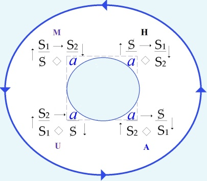
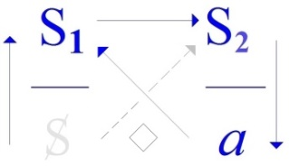
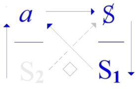
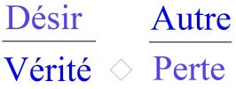

# Leçon 06 | 18 Février 1970

  

    <label><input type="checkbox" data-lacan-toggle="original" checked> 原文</label>
    <label><input type="checkbox" data-lacan-toggle="notes" checked> 注释</label>
    <label><input type="checkbox" data-lacan-toggle="commentary" checked> 个人解读评论</label>
  

  <form class="lacan-tool-search" role="search">
    <input class="lacan-tool-search-input" type="search" placeholder="搜索全文" aria-label="搜索全文">
    <button class="lacan-tool-button" type="submit" title="搜索">搜索</button>
  </form>
  <button class="lacan-tool-button lacan-back-to-top" type="button" title="回到页面最上方" aria-label="回到页面最上方">↑</button>

<section class="parallel-paragraph" data-paragraph-ids="s17-06-0001">

s17-06-0001

原文 · s17-06-0001

Voilà, alors il doit commencer à vous apparaître que « *l’envers de la psychanalyse »* c’est cela même que j’avance cette année sous le titre du *discours du Maître*, bien sûr non pas d’une façon arbitraire, ce *discours du Maître* ayant déjà dans la tradition philosophique, ce que j’appellerai, enfin... ses lettres de crédit.

所以，现在你们应该开始意识到，“精神分析的反面”（l’envers de la psychanalyse），正是我今年所提出的“主人话语”（le discours du Maître）。
当然，我这样命名并非出于任意随意，因为“主人话语”早已在哲学传统中拥有它的——我姑且这样称之吧……“信用凭证”（lettres de crédit）。

> 注：<strong>l’envers de la psychanalyse</strong>：直译为“精神分析的背面”

</section>

<section class="parallel-paragraph" data-paragraph-ids="s17-06-0002 s17-06-0003 s17-06-0004 s17-06-0006 s17-06-0007 s17-06-0008 s17-06-0009">

s17-06-0002, s17-06-0003, s17-06-0004, s17-06-0006, s17-06-0007, s17-06-0008, s17-06-0009

原文 · s17-06-0002, s17-06-0003, s17-06-0004, s17-06-0006, s17-06-0007, s17-06-0008, s17-06-0009

Néanmoins le *discours du Maître* tel que j’essaie de le dégager, prend ici *un accent* de ce fait qu’on peut dire qu’à notre époque, il arrive à pouvoir être dégagé dans une sorte de pureté, par quelque chose que nous éprouvons directement et au niveau de *la politique*.

Ce que je veux dire par là, c’est qu’il enserre tout, même ce qui se croit « *révolution* ».

Plus exactement, par ce qu’on appelle romantiquement « *Révolution* » avec un grand R, *le discours du Maître accomplit sa révolution*, dans l’autre sens de « *tour qui se boucle* ».

À l’horizon de cette mise en valeur...

> un peu aphoristique, j’en conviens, mais qui est faite - comme l’aphorisme s’y destine -
>
> qui est faite pour éclairer d’un *flash* simple ...à l’horizon de ceci, il y a ceci qui nous intéresse, je veux dire vous et moi, il y a que ce *discours du Maître* n’a qu’un contrepoint : le *dis­cours analytique*, encore si inapproprié.

Je l’appelle « *contrepoint »* en ceci que sa symétrie...

> s’il en existe une, et elle existe ...*sa symétrie* n’est pas par rapport à une ligne, ni par rapport à un plan, mais *par rapport à un point*.

或者精神分析的反面。这里解开了反面所意味着的，指主人话语

我在这里想表达的是，它包裹了一切，甚至包括那些自以为是“革命”的东西。

更准确地说，借助那种被浪漫化地称为“革命”（Révolution，带大写R）的事物，

主人话语完成了它自己的“循环”——是在“旋转一圈并闭合”的意义上。

主人话语包裹了一切，包括“革命”，“马克思主义”

在这番强调的远景之中……
我承认，它带有一些格言式的意味，但正如格言本身所旨归的那样，它的作用就是以一道简单的闪光来照亮某物。在这个远景中，有一样东西值得我们关注，我是说你和我——
那就是，这“主人话语”仅有一个对应项（contrepoint）：那就是分析师话语（le discours analytique），尽管它仍是如此不得其所。

我之所以称它为“对位”（contrepoint），是因为它的对称性。如果真存在某种对称性，而确实存在这种对称性并不是相对于一条线，也不是相对于一个平面，而是相对于一个点。
换言之，它是通过某种东西而获得的，这种东西正是我刚才提到的那“主人话语”的闭合（bouclage）。

> 这句话放2015年都不好理解，2025年来说倒是非常合时宜。

</section>

<section class="parallel-paragraph" data-paragraph-ids="s17-06-0005">

s17-06-0005

原文 · s17-06-0005

[无对应译文]

</section>

<section class="parallel-paragraph" data-paragraph-ids="s17-06-0010">

s17-06-0010

原文 · s17-06-0010

[无对应译文]

</section>

<section class="parallel-paragraph" data-paragraph-ids="s17-06-0011 s17-06-0012 s17-06-0013 s17-06-0014 s17-06-0015 s17-06-0016 s17-06-0017 s17-06-0018 s17-06-0019 s17-06-0020 s17-06-0021 s17-06-0022">

s17-06-0011, s17-06-0012, s17-06-0013, s17-06-0014, s17-06-0015, s17-06-0016, s17-06-0017, s17-06-0018, s17-06-0019, s17-06-0020, s17-06-0021, s17-06-0022

原文 · s17-06-0011, s17-06-0012, s17-06-0013, s17-06-0014, s17-06-0015, s17-06-0016, s17-06-0017, s17-06-0018, s17-06-0019, s17-06-0020, s17-06-0021, s17-06-0022

En d’autres termes, il est obtenu par quelque chose qui est *le bou­clage de ce* *discours du Maître* auquel je faisais à l’instant référence.

En d’autres termes ce que je n’ai pas pu...

parce que ça commence à me fatiguer ...réécrire au tableau, à savoir la disposition des S : barré \[S\], numérotés\[S1, S2\], et du *a*, telle que je l’ai réinscrit la dernière fois et dont j’espère que tous, plus ou moins, vous avez encore la transcription sur vos papiers, cette inscription que je n’ai pas eu le temps de faire, partant du fait que je ne peux pas faire toutes les choses, eh bien elle montre assez cette *symétrie par rapport à un point*, qui fait que ce *discours psychanalytique* se trouve très précisément au pôle opposé du *discours du Maître*. Voilà.

 ↔ 

> *Discours du Maître Discours analytique*

Quant au *discours psychanalytique*, il nous arrive de voir certains termes qui servent de *phylum* dans l’explication, celui du père par exemple.

Il nous arrive de voir quelqu’un tenter d’en rassembler les principales don­nées.

C’est un exercice pénible, pénible quand il est fait à l’intérieur de ce qu’on attend, au point où nous en sommes, d’un énoncé et d’une énonciation psycha­nalytiques, c’est à savoir, d’une référence génétique.

On se croit obligé, à propos du père, de partir de l’enfance, des identifi­cations, et alors c’est vraiment quelque chose qui peut aller à un extraor­dinaire bafouillage, à une contradiction étrange.

On nous parlera d’*iden­tification primaire* comme étant celle qui lie l’enfant à sa mère, ça semble en effet aller de soi.

Il est bien curieux que si nous nous reportons à Freud, au discours de 1921 celui qui s’appelle *Psychologie des masses et analyse du moi* c’est très précisément à l’identification au père que nous nous reporterons comme pri­maire.

*Et c’est assurément bien étrange*.

换句话说，那些让我开始感到有些疲惫而没能重新写在黑板上的事情，也就是那些符号的布置：[S]（被抹除的主体）、[S₁, S₂]（编号能指）以及 a（剩余享乐），这是我上次重新写过的，我希望你们多少还有把它抄在你们纸上的版本。

这次我没有时间再写它了，毕竟我也不可能把所有事情都做完。那么，它很清楚地显示出一种相对于一个点的对称性，正是这种对称性使得精神分析话语（[A]）恰好处于与主人话语（[M]）相对的极点上。就是这样。

至于精神分析的话语，我们有时会看到某些术语在解释中被用作“谱系”（phylum），比如“父亲”这个词。我们也会看到有人试图将它的主要资料加以汇总。
这是一项令人疲惫的工作，尤其是在当前我们对精神分析话语及其陈述和发生方式的期待中，这种做法仍被限定在一种“发生学（génétique）参照”的内部时，它就格外令人感到沉重。

但需要注意的是，这可能预设词背后就一定有某个固定的，实际的东西。
拉康会觉得大可不必。

一谈到“父亲”，人们似乎就觉得非得从童年、从各种认同（identifications）开始谈起不可，而这往往真是会导致一种极度的混乱不清，甚至形成奇异的矛盾。

有人会说，“原初认同”（identification primaire）是孩子与母亲之间的联结，这看起来确实是理所当然的。

多扯一句在我看来“原生家庭”是一种非常傲慢的说法。 家庭就是家庭，有重组家庭，有父母在外工作，被寄宿到长辈家长大的，有因为各种原因产生的“不那么原生的家庭”。
这时候可能会有人说“原生家庭指的就是一个人从小生活并成长的家庭，包括父母和兄弟姐妹，以及其他可能参与抚养的亲属。”    那为啥要强调“原生”呢？
仿佛好像某些问题可以被指向“那一个家庭”。
家庭是可数的吗？这“一个”原装家庭，这个原厂原装一手家庭对孩子至关重要，要长期的为这个孩子负责。

> 毕竟主人话语是转回到自身，那么主人话语本身这个位置就是一个闭合点，或者说“缝合点”。而分析师话语正好给这个回路开个裂口。

> 谱系，也就是历时性的追踪术语在解释上的起源，演变。

> 拉康这里在表述：有一些人在术语这方面进行实证化的讨论。觉得父亲就是爹，然后就是童年，原生家庭 ，心理学三件套这不就来了吗。

</section>

<section class="parallel-paragraph" data-paragraph-ids="s17-06-0023 s17-06-0024 s17-06-0025 s17-06-0026">

s17-06-0023, s17-06-0024, s17-06-0025, s17-06-0026

原文 · s17-06-0023, s17-06-0024, s17-06-0025, s17-06-0026

*C’est bien étrange* en effet de voir qu’en somme ce que Freud pointe là, c’est que tout à fait primordialement le père s’avère être celui qui préside à la toute première identification, et en ceci précisément, qu’il est d’une façon élue celui qui mérite l’amour.

*Ceci est bien étrange* assurément, et a à s’opposer, à se mettre - si je puis dire - en contradiction avec tout *ce que le développement* de l’expérience analytique se met assurément à établir de *la primauté du rapport de l’enfant à la mère *! Étranges discordances que celles du *discours freudien* avec le discours des psychanalystes !

Peut-être ces discordances sont-elles le fait de quelque confusion ?

Et l’ordre, que j’essaie de mettre, par référence à des configurations de discours en quelque sorte primordiales, est là pour nous rappeler qu’il est strictement impensable d’énoncer quoi que ce soit d’ordonné dans le discours analy­tique, sinon à se souvenir qu’avant d’extraire de quelque chose dont nous savons tellement que c’est le fait *d’une collaboration reconstructive* avec *celui qui est dans la position de l’analysant*, que nous aidons, auquel nous permettons en quelque sorte d’entrer dans sa carrière, il faut nous souvenir que ce qui fonde toute cette reconstruction, cette possibilité même de l’aide sous la forme de *l’interprétation*, cet effort que nous faisons pour extraire, sous la forme de pensées imputées, ce qui a été en effet vécu par celui qui, en l’occasion mérite bien en effet le titre de « *patient* », c’est quelque chose qui pour être efficace, ne doit pas nous faire oublier que *la configuration subjective* a, par la liaison signifiante, une *objectivité* parfaitement repérable : *<u>là</u>*, en tel point de liaison, celui tout à fait premier, du **S1** au **S2***, <u>là</u> est possible que s’ouvre cette faille qui s’appelle le sujet*.

假设说有个小女孩的家庭关系较为复杂。她出生时，母亲尚未与前夫离婚，因此在法律上，她的父亲被登记为母亲的前夫。
实际上，她的生父是母亲当时的婚外情对象，两人有真实的血缘关系。
在小女孩出生之后，母亲与前夫正式离婚，随后与她的生父结婚。直到这时，小女孩才得以改姓，随其生父的姓氏——此前她一直使用的是母亲前夫的姓。

这确实非常奇特：如果我们回溯到弗洛伊德，回到他1921年的那篇名为《集体心理学与自我分析》的文本，我们会发现他非常明确地将“对父亲的认同”视为原初认同（identification rimaire）。而这的确是相当奇怪的。真正奇怪的是，弗洛伊德在那篇文本中所指出的，实际上是这样的：在最原初的层面上，“父亲”恰恰是那个引导第一种认同结构的人，而原因就在于，他是那个——以某种被选中的方式——值得爱的那一个。
这无疑确实是很奇怪的事情，它必须被放在与……或者说与之矛盾的位置上：
与分析经验的发展所不断确立的那一整套东西相矛盾，也就是确立儿童与母亲关系的优先性的那一套东西！
弗洛伊德的话语与分析家的话语之间的这些差异，确实是奇怪的错位！或许，这些错位是出于某种混淆？

这两个如果都指向的是实际的父母的话，就会起矛盾。
因此这里肯定有哪里是混淆了的。

而我试图通过对某些原初话语结构的指涉建立的秩序，其目的正是为了提醒我们：

在分析话语中，要陈述出任何有序之物，本身就是严格地不可思议的。除非我们时刻记住，在从某种东西中“提取”出某物之前。

这种“东西”我们其实非常清楚，它是分析师与处于“受分析者”（analysant）位置上的人协同重建的产物，是我们所“协助”的那个人、是我们在某种意义上帮助他进入他自身主体生涯（carrière）的那个人，在这之前，我们必须记住：支撑这一重建本身的，是一种更根本的东西；

> 认同是从象征位置开始的，从一个“被指定为值得爱的存在”,即值得被父爱的存在开始的。儿童与母亲关系的优先性的那一套东西。

</section>

<section class="parallel-paragraph" data-paragraph-ids="s17-06-0027 s17-06-0028 s17-06-0029 s17-06-0030 s17-06-0031 s17-06-0032 s17-06-0033 s17-06-0034 s17-06-0035 s17-06-0036 s17-06-0037 s17-06-0038 s17-06-0039 s17-06-0040">

s17-06-0027, s17-06-0028, s17-06-0029, s17-06-0030, s17-06-0031, s17-06-0032, s17-06-0033, s17-06-0034, s17-06-0035, s17-06-0036, s17-06-0037, s17-06-0038, s17-06-0039, s17-06-0040

原文 · s17-06-0027, s17-06-0028, s17-06-0029, s17-06-0030, s17-06-0031, s17-06-0032, s17-06-0033, s17-06-0034, s17-06-0035, s17-06-0036, s17-06-0037, s17-06-0038, s17-06-0039, s17-06-0040

  \[(S1→ S2) → (*a*↓ «+» S)\]

Et là les effets de la liaison - de la liaison en l’occasion signifiante - s’opèrent...

que quelque part ce vécu, qu’on appelle plus ou moins proprement «* pensée *», se produise ou non, ...là se produit quelque chose qui tient à une chaîne, exacte­ment comme si c’était de *la pensée*.

Freud, jamais n’a rien dit d’autre, quand il parle de l’inconscient.

Cette objectivité, non seulement induit, mais détermine, cette position qui s’appelle *position de sujet en tant que foyer des défenses.*

Eh bien ce que j’avance, ce que je vais annoncer de nouveau aujourd’hui, c’est que, en s’émettant vers les moyens de *la jouissance,* qui sont ce qui s’appelle *le savoir*, *le signifiant Maître*...

je vais revenir sur ce qu’il faut entendre par là *...le signifiant Maître non seulement induit, mais détermine la castration*.

Par­tons de ce que nous avons avancé du *signifiant Maître*.

Qu’est-ce que ça peut vouloir dire ?

Assurément au départ il n’y en a pas, tous les signifiants s’équiva­lant en quelque sorte, pour ne jouer que sur la différence de chacun à tous les autres, de n’être pas les autres signifiants.

C’est aussi par là que *chacun* \[*des signifiants*\] *est capable de venir en position de signifiant Maître* , et très précisé­ment en ceci : que c’est sa fonction éventuelle - c’est ainsi que je l’ai défini de toujours - *de représenter un sujet pour tout autre signifiant*.

Seu­lement le sujet, le sujet qu’il représente, n’est pas univoque :

- il est *représenté* sans doute,

- mais aussi n’est *pas représenté*.

也是使得“通过诠释提供帮助”成为可能的那种东西，是我们努力从中提取出某些所谓“归属于主体的思想”的努力之起点；

这些思想确实是那个处在分析之中、这时堪称为“病人”的人所曾经经历的；——这一切之所以有效，不应让我们忘记：
主体的结构配置，借由能指之间的联结（liaison signifiante），拥有一种完全可以定位的客观性：
就在某个联结点上，最原初的联结点——从 S₁ 到 S₂ 的联结之处，在这个位置上，才可能开启出那道被称为“主体”的裂缝。

在某种东西中，提取

借由能指之间的联接，某个“联结点上”，S1—>S2这个位置道出裂缝。
分析师话语中，S1到S2是一道屏障。 分析师话语中的S2知识与S1主人能指无关。
“通过诠释”能帮助到案主什么呢？分析师话语的产物“S1”，
“哦？！最开始我是这么想的！”

而在这里，联结的作用——此处特指能指的联结开始运作。无论某处是否出现了那种被或多或少恰当地称为“思想”（pensée）的体验，在这里，总有某种依附于链条的东西在发生，恰如同那是“思想”一样。弗洛伊德在谈论无意识时，就是说的这个而不是别的。

这种客观性不仅引发，并且决定了那个被称为“主体位置”的东西——即作为防御之中心的主体位置。那么，我今天要提出、要重新宣布的一点是：

当它（指主人能指）朝向那些享乐的途径——而这些途径正是所谓“知识”——发出时，主人能指（signifiant Maître）——我稍后会回到应该如何理解它——主人能指不仅引发，而且决定了阉割（castration）。

> 分析师话语中陈述任何有序之物，

> 思想是依附于能指运作的一种“体验”

> 拉康这里开始定义弗洛伊德了，他要强调一下，弗洛伊德的无意识就是我说的这样，而不是别人说的那样。
> 比如把无意识看作一个什么思想仓库，或者类似于心理原型之类的东西。

> 主人能指运动引发并且决定了主体位置

> 然后拉康这里又开始说主人能指引发并且决定了阉割，
> 这主人能指怎么这么坏呢。（开个玩笑）
> 注意哦，通过知识（S2）朝向享乐的途径发出的。

</section>

<section class="parallel-paragraph" data-paragraph-ids="s17-06-0041 s17-06-0042 s17-06-0043 s17-06-0044 s17-06-0045 s17-06-0046 s17-06-0047 s17-06-0048 s17-06-0049">

s17-06-0041, s17-06-0042, s17-06-0043, s17-06-0044, s17-06-0045, s17-06-0046, s17-06-0047, s17-06-0048, s17-06-0049

原文 · s17-06-0041, s17-06-0042, s17-06-0043, s17-06-0044, s17-06-0045, s17-06-0046, s17-06-0047, s17-06-0048, s17-06-0049

Quelque chose à ce niveau reste caché en relation avec ce même signifiant.

C’est là autour, que se joue le jeu de la découverte psychanalytique, qui n’est pas bien sûr, comme n’importe quoi d’autre, sans avoir été en quelque sorte préparée par cette hésitation, qui est plus qu’une hésitation, qui est cette ambiguïté, soutenue sous le nom de « *dialectique »* par Hegel :

- quand il se trouve poser, en quelque sorte au départ, que « *le sujet s’affirme comme se sachant* »,

- quand il ose partir de la *Selbstbewußtsein* dans son énonciation la plus naïve, à savoir que toute conscience se sait être conscience.

Et pourtant de tresser cette même sorte de départ avec une série de crises, d’*Aufhebung* comme il dit, d’où il résulte que cette *Selbstbewußtsein,* elle-même figure inau­gurale du *Maître*, trouve sa vérité du travail de *l’Autre par excellence*, de celui qui ne se *sait* que d’avoir perdu ce corps, ce corps même dont il se supporte, pour avoir voulu le garder dans son accès à *la jouissance*, l’esclave autre­ment dit.

Comment ne pas essayer de rompre cette ambiguïté hégélienne ?

Comment ne pas y être conduit dans une autre voie de tentative, à partir de ce qui nous est donné d’une expérience où il s’agit, où il s’agit toujours, de revenir pour la mieux serrer : l’expérience psychanalytique, et le plus simplement à partir de ceci, qu’il y a un usage du signifiant qui peut se définir de partir essentiellement du *clivage d’un signifiant Maître avec ce corps* justement dont nous venons de parler, *ce corps perdu par l’esclave, pour qu’il ne devienne rien d’autre que celui où s’inscrivent tous les autres signifiants*.

C’est de cette sorte que nous pourrions imager

- ce *savoir* que Freud définit *de le mettre dans cette parenthèse énigmatique de l’Urverdrängt,* ce qui veut dire justement : ce qui n’a pas eu à être refoulé parce que ça l’est depuis l’origine,

正是通过这一点，每个人都有可能进入主人能指的位置，而确切地说，就是在于它的这一潜在功能——我一直以来都是这样定义它的——即：为任何其他能指来代表一个主体。

然而，这个主体——这个它所代表的主体——并不是单义的（univoque）：

它确实被代表了，但同时也未被代表。在这一层面上，与这个同一能指相关的，还有某些东西始终被隐藏着。

正是在这一核心周围，精神分析的发现之“游戏”得以展开，而这当然——就像任何其他事情一样——并非没有经过某种准备：

这种准备是一种犹豫，甚至说它不仅仅是犹豫，而是一种暧昧性（ambiguïté），这种暧昧性在黑格尔那里，以“辩证法”之名被维持着，当黑格尔在某种意义上的开端提出：“主体以自知的方式肯定自身”时，他敢于从 Selbstbewußtsein（自我意识）最天真的表述出发，也就是说，“一切意识都知道自己是意识”。

然而，黑格尔却将这种同样类型的出发点，编织进一系列危机之中。
正如他所称的那些“扬弃”（Aufhebung）由此得出的结果是：
这种“自我意识”（Selbstbewußtsein），它本身就是主人的开端形象（figure inaugurale du Maître），却在至高无上的他者的劳动中找到了自己的真理——这个“他者”之所以知道自己，只是因为他已经失去了这个身体。他原本正是以这个身体作为支撑。
而这种丧失，是因为他在通向享乐的途径中，想要保有这个身体；换句话说，这个“他者”就是奴隶。
那么，怎么能不试着去打破这种黑格尔式的暧昧性呢？

自我意识｜主人 ，在“至高无上的他者”的劳动中找到自己的真理。 这里有点尬，“他者的劳动”就点明了这里“至高无上的他者”说的是奴隶。主人需要奴隶的认同才得以知道自己。

奴隶失去了自己的身体（的支配权），转而通过通过劳动维持自我。也就是说，奴隶特别知道自己是奴隶，毕竟连身体的支配权都没有了，不需要额外的人告诉他。

> 太好了，每个主体都有自己的专属大爹。

> 自我意识本身是主人的开端形象，自我意识原本背后是主人。

</section>

<section class="parallel-paragraph" data-paragraph-ids="s17-06-0050 s17-06-0051 s17-06-0052 s17-06-0053 s17-06-0054 s17-06-0055 s17-06-0056 s17-06-0057 s17-06-0058 s17-06-0059 s17-06-0060 s17-06-0061 s17-06-0062">

s17-06-0050, s17-06-0051, s17-06-0052, s17-06-0053, s17-06-0054, s17-06-0055, s17-06-0056, s17-06-0057, s17-06-0058, s17-06-0059, s17-06-0060, s17-06-0061, s17-06-0062

原文 · s17-06-0050, s17-06-0051, s17-06-0052, s17-06-0053, s17-06-0054, s17-06-0055, s17-06-0056, s17-06-0057, s17-06-0058, s17-06-0059, s17-06-0060, s17-06-0061, s17-06-0062

- ce *savoir sans tête,* si je puis dire, qui est bien un fait politi­quement définissable en structure.

À partir de là, tout ce qui se *produit*...

j’entends au sens propre, au sens plein du mot *produire* par le travail ...tout ce qui se *produit* concernant la vérité du Maître...

à savoir ce qu’il cache comme sujet, ...va rejoindre ce *savoir,*

- en tant qu’il est *clivé*, *Urverdrängt*,

- en tant *qu’il est,* et que personne n’y comprend rien.

Tel est quelque chose qui, j’espère, n’est point pour vous sans écho...

sans que vous sachiez d’ailleurs si cet écho vient de droite ou de gauche, ...et qui d’abord se structure dans ce qu’on appelle *le support mythique de sociétés* que nous pouvons analyser comme *ethnographiques*, c’est-à-dire comme échappant au *discours du Maître*.

Car *le* *discours du Maître* com­mence avec la prédominance du *sujet*, en tant justement qu’il tend à ne se supporter que de ce *mythe* ultra-réduit : d’être identique à son propre signifiant \[*mythe *: **S** = **S1** \].

C’est en quoi je vous ai indiqué la dernière fois, ce qu’a de nature affine à ce discours, ce qu’on appelle *la mathématique*.

Là « A » s’y représente lui-même, sans avoir besoin d’un discours mythique qui lui donne ses relations partout ailleurs.

C’est par là que la mathématique représente *le savoir du Maître* en tant que constitué sur d’autres lois que le savoir mythique.

*Le savoir du Maître* se produit comme un savoir entièrement autonome du *savoir mythique*, et *c’est ce qu’on appelle la science,* et c’est ce dont je vous ai indiqué la dernière fois la figure, dans une rapide évocation de ce qu’il en est de la thermodynamique, et plus loin : de toute unification du champ phy­sique, laquelle repose sur ceci : la conservation d’une unité, qui n’est rien qu’une constante, toujours retrouvée dans le compte...

我们怎么会不被引向另一条尝试的路径呢？这条路径出发于这样一种经验，一种我们总要不断回到其上、以便更紧密把握的经验，即精神分析的经验。

而且，如果从最简单的角度出发，就是从这样一个事实：

存在着一种能指的用法，它的定义可以说是根本上起始于主人能指与身体之间的分裂，正是这个身体——我们刚才已经谈到了，也就是奴隶所失去的那个身体，它从此再也不成为别的什么，只成为所有其他能指铭刻其上的那个身体。

我们能不能说，这里的分裂引申到，主人能指（S1）与菲勒斯之间的分裂。 苍白的主人能指并不构成意义。
而菲勒斯，如果在这里我们理解成奴隶失去的身体的话，“失去的身体”构成了意义，让奴隶知道自己所处在的位置。

当然如果如果你觉得自己是主人，或者想要成为主人的话，my lord，请原谅我的无理。
总是有想到拿破仑，斯大林的人

正是以这种方式，我们可以对这样一种知识作出形象化的理解：弗洛伊德将它置入那神秘括号之中，称为 *Urverdrängt*（原初被压抑），它的意思恰恰是：不需要被压抑，因为它自一开始就已经处于被压抑状态的东西。这种“无头的知识”（如果我可以这样说），确实是在结构上可以作出一种“政治性”界定的事实。

从这里开始，凡是一切被生产出来的东西——我指的是严格意义上、完全意义上的“通过劳动生产”的东西——一切关于主人的真理的产出，也就是说，他作为主体所隐藏的那部分，都会汇入到这种知识之中——这种被分裂的、原初被压抑的（*Urverdrängt*）知识，它就是它，而没有人能够理解它。

这里的主体是“通过劳动生产”出来的。当然啦，主人话语中的劳动当然不是主人自己的劳动啦。

从这里开始，凡是一切被生产出来的东西——

我指的是严格意义上、完全意义上的“通过劳动生产”的东西——

> 这里的“身体”有菲勒斯的意味。

> 真理的位置是话语中左下的位置，在主人话语中是$(主体)

</section>

<section class="parallel-paragraph" data-paragraph-ids="s17-06-0063 s17-06-0064 s17-06-0065 s17-06-0066 s17-06-0067 s17-06-0068 s17-06-0069 s17-06-0070 s17-06-0071 s17-06-0072 s17-06-0073 s17-06-0074 s17-06-0075 s17-06-0076">

s17-06-0063, s17-06-0064, s17-06-0065, s17-06-0066, s17-06-0067, s17-06-0068, s17-06-0069, s17-06-0070, s17-06-0071, s17-06-0072, s17-06-0073, s17-06-0074, s17-06-0075, s17-06-0076

原文 · s17-06-0063, s17-06-0064, s17-06-0065, s17-06-0066, s17-06-0067, s17-06-0068, s17-06-0069, s17-06-0070, s17-06-0071, s17-06-0072, s17-06-0073, s17-06-0074, s17-06-0075, s17-06-0076

> je ne dis même pas dans la quantification : dans le compte ...la manipulation de chiffres qui soit définie de telle sorte qu’elle fasse apparaître en tout cas cette constante dans le compte, voilà ce qui suffit, ce qui seulement supporte ce qui est appelé le fondement de la science physique, *l’énergie*.

Voilà ce qui lui donne aussi un support qui lui permet de prendre aisément ceci, que la mathématique n’est constructible qu’à partir de ceci :

- « *que le signifiant peut se signifier lui-même* »,

- que le A que vous avez écrit une fois peut être signifié par sa répétition de A \[A = A : *principe d’identité*\].

Posi­tion qui est strictement intenable de ce qu’il en est de la fonction du *signifiant *: *il peut tout signifier, sauf assuré­ment lui-même*.

C’est de cette infraction dans la règle de ce postulat initial \[*le signifiant* *peut tout signifier, sauf lui-même*\], qu’il faut se débarrasser pour que s’inaugure le discours mathématique.

Entre les deux, de cette infraction originelle à la construction du discours de *l’énergétique*, le discours de la science ne se soutient dans la logique,

- qu’à faire de la vérité un jeu de valeurs,

- qu’à éluder radicalement toute sa puissance *dynamique*.

Comme vous le savez, le discours de la logique propositionnelle...

foncièrement - comme on l’a souligné - tautologique ...consiste à ordonner des propositions composées de telle sorte qu’elles soient tou­jours vraies, quelle que soit - vraie ou fausse - la valeur des propositions élémentaires.

Est-ce que ce n’est pas dire que c’est se débarrasser de ce que j’appelais à l’instant *le dynamisme du travail de la vérité* ?

Eh bien la question, la question est proprement de ceci qui spécifie et distingue *le discours analytique* de poser la question d’à quoi sert cette forme de savoir, celle qui rejette, qui exclut *la dynamique de la vérité*.

La première approximation est ceci : c’est qu’elle sert à refouler *ce qui habite le savoir mythique*, mais du même coup, excluant celui-ci, à n’en plus rien connaître

一切关于主人的真理的产出，也就是说，他作为主体所隐藏的那部分，都会汇入到这种知识之中——这种被分裂的、原初被压抑的（*Urverdrängt*）知识，它就是它，而没有人能够理解它。

这正是某种——我希望在你们心中不会毫无回响的东西，只是你们或许并不清楚，这回响究竟来自左方还是右方；而它首先是在这样一种被称为神话支撑（support mythique）的结构中成形的——这些支撑存在于我们可以分析为“民族志型”的社会中，也就是说，那些逃脱主人话语的社会。

因为主人话语的开端，是以主体的优势地位为前提的，正是因为它倾向于只依靠这样一个极度简化的神话：主体与其自身的能指是同一的（神话公式：S = S₁）。

这正是我上次向你们指出的——数学在其本性上与这种话语存在某种相似性。在数学中，“A”可以自我表征，而不需要依赖某个神话性的话语，来为它在其他所有地方建立关系。因此，数学在这一点上体现了主人知识（savoir du Maître），只是这种知识是建立在不同于神话知识的法则之上的。

能做到这一点，就不用划杠了。
比如“要有光。”  仅仅三个字，连主语都不需要，为了这三个字需要展开不知道多少S2.
还是阿西莫夫的小说《最后的问题》里面最后也直接用这句话引申出这种极度简化的神话。

主人的知识的生成方式，是一种完全独立于神话知识的知识，而这正是我们称之为“科学”的东西。

我上次已经简要地举过它的一个例子——热力学——的形象，以及更远一点的例子：物理学领域的一切统一化努力。

这些努力都基于这样一个原理：某种单位的守恒——而这个单位不过是一个常数，它总是在计算中被重新找到……我甚至不说是在“量化”中，而是就在“计算”中。——一种数字的运算方式，其定义就是要无论如何在计算中显现这个常数。这就足够了，这就是唯一支撑起被称为物理科学基础的东西——能量。

正是这一点，也为它（科学/数学）提供了一个支撑，使它能够轻易地采纳这样一个前提：数学的构造只能从这样一个假设出发：

——能指可以指称它自己；

> 被原处压抑的知识无法通达。

> 我《忧郁的热带》都只看了一半，所谓“民族志型”怎么个逃脱主人话语，有点没get到他的意思。

> 主体与其自身的能指是同一的（神话公式：S = S₁）。

> 而拉康这里就说，数学有这种极简神话的相似性。
> A=A

> 又来了，热力学，下一句话不会又说到熵吧。

</section>

<section class="parallel-paragraph" data-paragraph-ids="s17-06-0077 s17-06-0078 s17-06-0079 s17-06-0080 s17-06-0081 s17-06-0082 s17-06-0083">

s17-06-0077, s17-06-0078, s17-06-0079, s17-06-0080, s17-06-0081, s17-06-0082, s17-06-0083

原文 · s17-06-0077, s17-06-0078, s17-06-0079, s17-06-0080, s17-06-0081, s17-06-0082, s17-06-0083

- que sous la forme de ce que nous retrouvons sous les espèces de l’inconscient,

- la forme d’un *savoir disjoint, d’épave de ce savoir*.

Il n’est pas vrai que, d’aucune façon, ce qui va être reconstruit de *ce savoir disjoint,* fasse retour

- au *discours de la science*,

- ni à ses lois structurales.

C’est dire qu’ici, je me distingue de ce qu’en énonce Freud.

À ce *discours de la science*, *ce savoir disjoint*, tel que nous le retrouvons dans l’inconscient, *est étranger* \[*a*\] :

你第一次写下的“A”，可以通过再次写出“A”来指称它（A = A：同一律）。然而，这个立场从能指的功能来看是完全站不住脚的：

能指可以指称任何东西，唯独不能确实地指称它自己。

必须去除对这一初始规则的违背——（即“能指可以指称一切，唯独不能指称自身”）——这样，数学话语才能得以开端。

是阿，波，茨，嘚 还是A，B，C，D，还是a i u e o
光写个A=A  连发音可能都不能确定。
我写成  阿=ア   点解？

> A如果单独拎出来，A=A完全不能构成意义。

</section>

<section class="parallel-paragraph" data-paragraph-ids="s17-06-0084">

s17-06-0084

原文 · s17-06-0084

[无对应译文]

</section>

<section class="parallel-paragraph" data-paragraph-ids="s17-06-0085">

s17-06-0085

原文 · s17-06-0085

> *Discours scientifique* (H)

因此这里就暂且放下这个“不能”，数学话语才可以开端。

</section>

<section class="parallel-paragraph" data-paragraph-ids="s17-06-0086 s17-06-0087 s17-06-0088">

s17-06-0086, s17-06-0087, s17-06-0088

原文 · s17-06-0086, s17-06-0087, s17-06-0088

C’est justement en cela qu’il est frappant qu’il s’impose.

Il s’impose exactement de ceci que j’énonçais l’autre jour sous cette forme, dont il faut croire que, pour l’employer, je n’en trouvais pas de meilleure :  « *qu’il ne déconne pas* », parce que si *con* qu’il soit ce discours de l’inconscient, il *répond* à quelque chose qui tient très précisement à l’institution du *discours du Maître* lui-même.

Et c’est cela qui s’appelle l’inconscient.

在两者之间——从这种最初的违例到“热力学话语”的建构——科学话语在逻辑上之所以能够维持，只是因为它把“真理”化为一个数值的游戏，并且从根本上回避了真理的一切动力性力量。正如你们所知道的，命题逻辑的话语——从根本上（正如我们已经强调过的）是同义反复式的——它的做法是将复合命题安排成这样的形式：无论其中的基本命题（命题元素）是真还是假，复合命题始终为真。

> 好了，又绕回来了

</section>

<section class="parallel-paragraph" data-paragraph-ids="s17-06-0089 s17-06-0090 s17-06-0091">

s17-06-0089, s17-06-0090, s17-06-0091

原文 · s17-06-0089, s17-06-0090, s17-06-0091

Il s’impose à la science comme un fait.

Cette science faite, c’est-à-dire factice, ne peut méconnaître ce qui lui apparaît comme artefact, c’est vrai !

Seulement il lui est interdit juste­ment d’être *science du Maître*, de se poser *la question de l’artisan*, et ceci fera le *fait* d’autant plus *fait*.

聪明的朋友可能已经注意到，”等于号“这里是没有损耗或者说“剩余”的。
但是言语中比较通俗的： “我就是我”这句话两个我肯定不是一样的，肯定是有差异的。 可能维特根斯坦主义者会觉得这句话就同语反复吧。

这难道不是在说——这就是去掉我刚才所称的“真理工作的动力性”吗？

</section>

<section class="parallel-paragraph" data-paragraph-ids="s17-06-0092 s17-06-0093 s17-06-0094 s17-06-0095">

s17-06-0092, s17-06-0093, s17-06-0094, s17-06-0095

原文 · s17-06-0092, s17-06-0093, s17-06-0094, s17-06-0095

J’ai pris en analyse très tôt après la dernière guerre - j’étais déjà né depuis longtemps - trois personnes du haut pays du Togo, qui y avaient passé leur enfance. Je n’ai pu avoir dans leur analyse de trace *des usages et croyances tribales* qu’ils n’avaient pas oubliés, qu’ils connaissaient, mais du point de vue de l’ethnographe...

> ce qui veut dire, étant donné ce qu’ils étaient : de coura­geux petits médecins qui essayaient de se faufiler
>
> dans la hiérarchie médi­cale de la métropole, dont nous n’ignorons pas - nous étions encore au temps colonial - que tout était fait pour les séparer ...ce qu’ils en connaissaient donc du niveau de l’ethnographe était à peu près celui du journalisme.

Mais leur inconscient fonctionnait selon les bonnes règles de l’œdipe...

> c’est-à-dire qu’il était l’inconscient qu’on leur avait vendu en même temps que les lois de la colonisation,
>
> forme exotique du *discours du Maître*, tout à fait régressive *face du capitalisme*
>
> qui est justement ce qu’on appelle *« impérialisme »* ...leur inconscient n’était pas celui de leurs souvenirs d’enfance - là ça se touchait - mais leur enfance rétroactivement vécue dans nos catégories - écrivez le mot comme je vous l’ai appris l’année dernière - « *femme-il-iales *».

那么，确切地说，区别并界定分析话语的那个问题——

就是去提出这样一个问题：

这种形式的知识——那种拒绝、排除真理动力性的知识，究竟有什么用？

你可以觉得这个问题天真，也可以觉得这个问题深刻。

第一个近似的回答是这样的：

这种知识的作用，是用来压抑居于神话知识内部的那些东西；但与此同时，由于它排除了神话知识，它再也不能以别的方式认识这些东西，只能在这样一种形式中认识它——也就是我们在无意识的形态下重新找到的那种形式，一种分裂的知识、这种知识的残片的形式。

绝非如此——无论以何种方式——从这种分裂的知识中所重建出来的东西，都不会回归到科学话语，也不会回归到科学的结构性法则中。

这就是说，在这一点上，我与弗洛伊德的表述有所区别。对于科学话语来说，这种分裂知识——即我们在无意识中重新找到的那种知识——是完全陌生的。

正是在这一点上，它（无意识的话语）之所以令人震撼，是因为它自然而然地确立自身。它之所以能够确立，恰恰是出于我前几天用这样一句我恐怕找不到比这更贴切的说法来表示：

“它不胡来”（qu’il ne déconne pas）。

> 这种问题就类似于，钱有什么用一样。

> 因为，尽管这个无意识的话语再怎么愚蠢可笑（si con qu’il soit），它依然回应着某种与主人话语的制度设立本身极为精确相关的东西。而这，正是所谓的无意识。

</section>

<section class="parallel-paragraph" data-paragraph-ids="s17-06-0096 s17-06-0097 s17-06-0098 s17-06-0099 s17-06-0100 s17-06-0101 s17-06-0102 s17-06-0103">

s17-06-0096, s17-06-0097, s17-06-0098, s17-06-0099, s17-06-0100, s17-06-0101, s17-06-0102, s17-06-0103

原文 · s17-06-0096, s17-06-0097, s17-06-0098, s17-06-0099, s17-06-0100, s17-06-0101, s17-06-0102, s17-06-0103

Et je défie quelque analyste que ce soit - même à aller sur le terrain - de me contredire.

Ce n’est pas la psychanalyse qui peut servir à procéder à une enquête ethnographique, ceci d’ailleurs étant dit que ladite enquête n’a aucune chance de coïncider avec le savoir autochtone, sinon par référence au *discours de la science* dont malheureusement, ladite enquête, elle n’a aucune espèce d’idée de cette réfé­rence, parce qu’il lui faudrait la relativer.

En disant que ce n’est pas par la psychanalyse qu’on peut entrer dans une enquête ethnographique, j’ai sûrement l’accord de tous les ethnographes.

Mais je l’aurai peut-être moins en leur disant que justement, pour avoir une petite idée de la relativation du *discours de la science*, c’est-à-dire pour avoir peut-être une petite chance de faire une juste *enquête ethnographique*, il faut, je le répète, non pas procéder par la psychanalyse, mais il faudrait peut-être - si cela existe - être un psy­chanalyste.

Ici, au carrefour, nous énonçons que ce que la psychanalyse nous permet de concevoir n’est rien d’autre que sur la voie que le marxisme ouvrait, à savoir que le discours est lié aux intérêts du sujet.

C’est ce que Marx appelle à l’occasion *l’économie*, parce que ces inté­rêts sont, dans la société capitaliste, entièrement marchands.

- La marchandise est liée au *signifiant Maître*, de sorte que ça ne résout rien de le dénoncer ainsi.

- La marchandise n’est pas moins liée à ce signifiant après la révolution socialiste.

它（无意识）以一个事实的方式强加于科学。这种已经完成了的科学——也就是说，人为构成的科学——

确实不能不承认那些在它看来是人工制品（artefact）的东西，这是真的！只是，它恰恰被禁止成为主人的科学，被禁止去提出这样的问题：“工匠是谁？”而正是这种禁止，使得这个“事实”变得更加彻底地是一个事实。

在上一次战争结束后不久——那时我早已出生许久——我接收了三位来自多哥高地地区的人进行分析，他们在那里度过了童年。在他们的分析过程中，我没能从中找到任何关于部落习俗和信仰的痕迹——尽管他们并没有忘记这些，也确实知道这些——但他们对这些的了解是从民族志学者的角度出发的……

也就是说，考虑到他们的身份——是几位勇敢的小医生，试图在宗主国的医学等级体系中挤出一席之地，而我们知道——那还是殖民时期——一切制度安排都是为了把他们隔离开来。因此，他们对这些习俗和信仰的了解，从民族志的角度来说，几乎就停留在新闻报道的水平。

无意识并不会直接保留“文化记忆”作为现成材料。即使主体曾在童年生活在另一种文化环境中，如果这种文化经验已经转化为外部知识（如民族志或新闻式的叙述），它可能就不再作为无意识的能指结构而运作。因此，分析师不能简单依赖病人的“文化背景”来推断其无意识内容。

但是，他们的无意识是按照伊底帕斯的“正统规则”运作的……也就是说，这是一个被卖给他们的无意识——它是和殖民法制一并输入给他们的，是一种主人话语的异域形态，是资本主义中完全退行的那一面，而这正是所谓的帝国主义。

> 注：haut pays du Togo：多哥高地地区，西非国家多哥的内陆高原区域。法国在非洲有不少殖民地，现在法国对非洲还有很大的影响力。

</section>

<section class="parallel-paragraph" data-paragraph-ids="s17-06-0104 s17-06-0106 s17-06-0107 s17-06-0108 s17-06-0109 s17-06-0110 s17-06-0111 s17-06-0112 s17-06-0114 s17-06-0115 s17-06-0116 s17-06-0118 s17-06-0119 s17-06-0120 s17-06-0121 s17-06-0123 s17-06-0124">

s17-06-0104, s17-06-0106, s17-06-0107, s17-06-0108, s17-06-0109, s17-06-0110, s17-06-0111, s17-06-0112, s17-06-0114, s17-06-0115, s17-06-0116, s17-06-0118, s17-06-0119, s17-06-0120, s17-06-0121, s17-06-0123, s17-06-0124

原文 · s17-06-0104, s17-06-0106, s17-06-0107, s17-06-0108, s17-06-0109, s17-06-0110, s17-06-0111, s17-06-0112, s17-06-0114, s17-06-0115, s17-06-0116, s17-06-0118, s17-06-0119, s17-06-0120, s17-06-0121, s17-06-0123, s17-06-0124

Alors ce dont il s’agit de s’apercevoir c’est que les fonctions propres du *dis­cours*, telles que je les ai énoncées, nous allons maintenant les écrire en toutes lettres : *le signifiant Maître, le savoir*...

Une mise en fonction du discours est définie par ce clivage, par la distinction du *signifiant Maître* au regard du *savoir*.

Remarquez que c’est la question pour qui voudrait en savoir un peu plus long sur les sociétés entre guillemets « *primitives* » en tant que je les inscris de n’être pas dominées par le *discours du Maître*.

Il est assez probable que le *signifiant Maître* y est repérable d’une plus complexe économie.

C’est bien à quoi confinent les meilleures recherches, dites *sociologiques*, sur le champ de ces sociétés.

Réjouissons-nous d’autant plus de ce que ce n’est pas par hasard

- que le fonctionnement du *signifiant Maître* soit plus simple dans le *discours du Maître*,

- qu’il soit entièrement maniable de ce rapport **S1** à **S2** que vous voyez là écrit :

*Le sujet* est très précisément ce qui dans ce discours se trouve lié, avec toutes les *illusions* qu’il comporte, au *signifiant Maître*, alors que l’insertion dans *la jouis­sance* est le fait du *savoir*.

Eh bien, ce que j’énonce, ce que j’apporte cette année est ceci : que ces fonctions propres du dis­cours peuvent trouver des *sites différents*.

C’est ce que définit leur rota­tion sur ces quatre places, que vous ne voyez ici, en lettres, désignées d’aucune façon, si ce n’est par la place, celle que j’appelle en l’occasion : « *en haut et à gauche* », « *en bas et à droite* », ici comme ça, un peu sur le tard, pour éclairer quand même, ceux qui les auront désignées de l’effet de leur petite jugeote, c’est à savoir, par exemple :

- *le désir*,

- et de l’autre côté, le site de l’*Autre*. Là se figure ce dont, dans un registre ancien, j’ai parlé, en disant que : « *Le désir de l’homme*, au temps où je me contentais d’une pareille approxima­tion, *c’est le désir de l’Autre* ».

- *La place* à figurer sous *le désir*, c’est celle de *la vérité*.

- Sous *l’Autre*, c’est celle où se produit *la perte*, *la perte* proprement de jouissance, dont vous savez que nous extrayons la fonction du *plus de jouir*.

*Discours de l’Hystérique*

C’est là que prend son prix le *discours de l’hystérique* : il a le mérite de maintenir dans l’institution discursive ce qu’il en est du rapport sexuel, à savoir « *comment un sujet peut le tenir* », ou pour mieux dire, *ne peut pas le tenir*.

他们的无意识并不是他们童年的记忆——（在这一点上，两者会有某种接触）——而是他们的童年在回溯中被置入到我们的范畴中去体验的，——请像我去年教你们的那样拼写这个词——“femme-il-iales”。

比如一个住在北方的人，觉得冬天有暖气不是什么了不起的事，家里都有暖气。
大学到其他地方读书，比如武汉吧。然后被武汉宜人的冬冷夏热给震撼了。他会如此感慨，还是家里的气候舒服。虽然他在过去丝毫没有这么觉得过。

同样一个说自己“被保护的很好”的孩子，他如果真的被保护的很好的时候，是不会有这样的想法的。
正是因为目睹或者经历了一些难以言喻的东西，ta可能会产生这样的一种表达。

我向所有分析家下战书——哪怕是亲自去实地的…..请来反驳我。
精神分析并不能用来进行民族志调查，况且，这种调查也不可能与本土知识相吻合，除非它是通过对科学话语的参照才做到的——而遗憾的是，这种调查本身对这种参照毫无概念，因为它必须对这种参照进行相对化。

当我说“不是通过精神分析就能进入民族志调查”的时候，我想我肯定会得到所有民族志学者的赞同。
但当我接着说——如果要对科学话语的相对化有一点概念，也就是说，如果要有一点机会去做一次真正恰当的民族志调查，我必须重复这一点：
不是通过运用精神分析的方法，而是也许需要成为一名精神分析家,如果真的有这种人存在的话，他们可能就不会那么赞同了。

有机会找找这俩人八卦应该挺有意思。

在这里，在这个交汇点上，我们提出：精神分析让我们能够设想的东西，无非是沿着马克思主义所开辟的那条道路，即话语是与主体的利益相联系的。

马克思有时称这种东西为“经济”，因为在资本主义社会中，这些利益完全是商品化的。商品与主人能指紧密相连，因此，单纯这样去揭露它，并不能解决任何问题。在社会主义革命之后，商品与这个能指的联系也并未减少。

资本主义社会中利益商品化可以跟“经济”挂钩。这个经济又作为补充主人能指的工具。
而在晚期资本主义社会，剩余价值跟剩余享乐割裂的很严重。 这里还没想明白，剩余享乐与剩余价值之间转换的S2在这两个时期有什么区别吗？
或者说原本，剩余享乐没有那么多的被转化成剩余价值，工人感到痛苦，不公 引起抗议，罢工等等活动。
S1与S2在这里高速运转，越是这样越是讲不能被捕捉的剩余享乐吃干抹净，变成剩余价值。
运行到某一个点，对古典S1感到不能维持了，于是就有了现代主人话语——资本主义话语。

后面是不是终于要讲到资本主义话语了。

> 这些非洲的来访者，他们的无意识是在被宗主国的意识形态回溯的构建的。

> 拉康这人又懂了，李维斯特劳斯不知道听了咋说。

> 利益与经济 这两个词中加有很多差异。

</section>

<section class="parallel-paragraph" data-paragraph-ids="s17-06-0105">

s17-06-0105

原文 · s17-06-0105

[无对应译文]

</section>

<section class="parallel-paragraph" data-paragraph-ids="s17-06-0113">

s17-06-0113

原文 · s17-06-0113

 

[无对应译文]

</section>

<section class="parallel-paragraph" data-paragraph-ids="s17-06-0117">

s17-06-0117

原文 · s17-06-0117

[无对应译文]

</section>

<section class="parallel-paragraph" data-paragraph-ids="s17-06-0122">

s17-06-0122

原文 · s17-06-0122

[无对应译文]

</section>

<section class="parallel-paragraph" data-paragraph-ids="s17-06-0125 s17-06-0126 s17-06-0127 s17-06-0128 s17-06-0129 s17-06-0130 s17-06-0131 s17-06-0133 s17-06-0134 s17-06-0135">

s17-06-0125, s17-06-0126, s17-06-0127, s17-06-0128, s17-06-0129, s17-06-0130, s17-06-0131, s17-06-0133, s17-06-0134, s17-06-0135

原文 · s17-06-0125, s17-06-0126, s17-06-0127, s17-06-0128, s17-06-0129, s17-06-0130, s17-06-0131, s17-06-0133, s17-06-0134, s17-06-0135

En effet, la réponse à savoir « *comment il peut le tenir* », est celle-ci : en laissant la parole à l’Autre, et précisément en tant que lieu du savoir refoulé.

Ce qu’il y a d’intéressant, c’est cette vérité, que c’est tout entier *étranger à son sujet* que se livre ce qu’il en est du savoir sexuel.

C’est là ce qu’on appelle originellement, dans le discours freudien, le refoulé.

Mais ce qui importe ce n’est pas cela, qui pris tout pur cela n’a d’autre effet, si l’on peut dire, *que d’une justification de l’obscurantisme*. Les vérités qui nous importent - et pas peu ! - sont condamnées à être obscures : il n’en est rien !

Je veux dire que le *discours de l’hystérique* n’est pas le témoignage que l’inférieur est en bas.

Bien au contraire il ne se distingue pas, comme batterie de fonctions, de celles assignées au *discours du Maître*.

Et c’est ce qui permet de le figurer des mêmes lettres qui nous servent, à savoir : le **S**, le **S1**, le **S2**, le *a*.

*Discours de l’Hystérique*

Simplement, il révèle la relation de ce *discours du* *Maître* à *la jouissance*, en ceci : que *le savoir,* dans ce *discours de l’hystérique,* y vient *à la place de la jouissance*.

Le *sujet* lui-même, *hystérique*, s’aliène du *signifiant-Maître* comme étant celui que ce signifiant divise...

因此，我们现在需要认识到的，是话语的固有功能——正如我先前已经表述过的那样——接下来我们要将它们明确地全部写出来：主人能指、知识……

一种话语的运作设定，是由这个分裂来界定的。也就是在知识面前，区分出主人能指。

请注意，这正是一个问题，对于那些想更深入了解所谓“原始”社会的人来说——在我看来，这些社会的特征是不受主人话语支配——很可能在那里，主人能指依然是可以辨认出来的，只是它属于一种更为复杂的结构性经济。这恰好也是在这一领域中，那些最优秀的所谓“社会学”研究所触及到的地方。

让我们更加感到欣慰的是，主人能指在主人话语中的运作之所以更加单纯，并不是偶然的——它完全可以被操控于S₁ 与 S₂ 之间的这种关系之中，正如你们在此看到的那样被写出来的：

这正是由它们在<strong>四个位置</strong>上的<strong>轮换</strong>所界定的——在这里，你们看不到它们用字母明确标出，只能通过<strong>位置</strong>来辨认：比如我在这种情况下称为“左上”“右下”，就这样，在此处稍微晚了一点（才补充说明），好让那些凭着自己一点小聪明已经分辨出来的人，多少也能得到一点解释，也就是说，比如说——

欲望，(左上)

——在另一侧，是大他者的位置。（右上）

在这里呈现的是，我在早期的一个表述中曾经说过的那句话：

> 主人能指这里是分裂的缝合点，还记得吗？

> 拉康的“四种话语”公式由四个位置组成：
>
> - 出发位（左上）：发出命令或驱动话语的主体位置
> - 他者位（右上）：接收命令或承载知识的位置
> - 真理位（左下）：隐藏在结构下方的驱动力
> - 产出位（右下）：话语运作所生成的剩余

</section>

<section class="parallel-paragraph" data-paragraph-ids="s17-06-0132">

s17-06-0132

原文 · s17-06-0132

[无对应译文]

</section>

<section class="parallel-paragraph" data-paragraph-ids="s17-06-0136 s17-06-0137 s17-06-0138 s17-06-0139 s17-06-0140 s17-06-0141 s17-06-0142 s17-06-0143 s17-06-0144 s17-06-0145">

s17-06-0136, s17-06-0137, s17-06-0138, s17-06-0139, s17-06-0140, s17-06-0141, s17-06-0142, s17-06-0143, s17-06-0144, s17-06-0145

原文 · s17-06-0136, s17-06-0137, s17-06-0138, s17-06-0139, s17-06-0140, s17-06-0141, s17-06-0142, s17-06-0143, s17-06-0144, s17-06-0145

> j’ai dit « *celui *» au masculin, « *celui *» repré­sente le sujet ...celui que le *signifiant-Maître* divise, qui se refuse à s’en faire le corps.

Car on parle à propos de *l’hystérique* de « *complaisance somatique »*.

Encore que le terme soit freudien, ne pouvons-nous pas nous apercevoir qu’il est bien étrange, et que c’est plutôt de refus du corps qu’il s’agit, à suivre l’effet du *signifiant-Maître*.

L’hystérique n’est pas esclave. Et donnons-lui maintenant le genre du sexe sous lequel le plus souvent ce sujet s’incarne : « *elle* » :

- « *elle* » fait à sa façon une certaine grève,

- « *elle* » ne livre pas son savoir,

- « *elle* » démasque pourtant la fonction du *Maître* dont « *elle* » reste solidaire, très précisément en mettant en valeur ce qu’il y a de Maître dans ce qui est l’*Un*, avec un grand U, dont elle se soustrait à titre d’objet de son désir.

C’est là la fonction propre que nous avons repérée dès long­temps, au moins dans le champ de mon école, sous le titre du « père idéalisé ». Alors n’y allons pas par 4 chemins, réévoquons *Dora* [^23], qu’il faut bien que je suppose connu par tous ceux qui sont là à m’entendre.

Ceux qui ne l’ont pas encore ouvert, tant pis ! Simplement, qu’ils se dépêchent !

Il faut lire *Dora,* et à travers les interprétations « *contournées* »...

“人的欲望——在我当时满足于这种近似表述的时候——

就是他者的欲望。”

——在“欲望”之下的位置，是<strong>真理</strong>的位置。（左下）

——在“大他者”之下的位置，是<strong>损失</strong>发生的位置（右下）

确切地说，是<strong>享乐的损失</strong>，而你们知道，我们正是从这里提取出剩余享乐（plus-de-jouir）的功能。

正是在这里，癔症话语的价值显现出来：

它的优点在于，能够在话语制度之中维持……
“主体如何能够掌握它”，或者更确切地说，是不能掌握它。
事实上，对“如何能够掌握它”这一问题的回答是：

把话语交给大他者，而且是把大他者当作被压抑知识的所在来对待。

有趣的是，这里有一个真理：关于性的知识，在被呈现出来时，是完全陌生于其主体的。这正是最初在弗洛伊德的话语中被称作“被压抑的东西”（le refoulé）。但重要的并不是这一点——如果将其单纯地拿出来看，那充其量只会起到一种为蒙昧主义辩护的作用。那些对我们重要——而且极为重要——的真理，并不是注定要保持晦暗不明的；情况绝非如此！我的意思是，歇斯底里话语并不是用来证明“卑下者在底层”。恰恰相反，它在一整套功能配置上，与被赋予给主人话语的那些功能并无区别。正因如此，我们可以用同样的字母来表示它——也就是说：S、S₁、S₂、a。

> 拉康首先否定了一个可能的态度：歇斯底里话语并不是用来证明“卑下者在底层”,

</section>

<section class="parallel-paragraph" data-paragraph-ids="s17-06-0146 s17-06-0147 s17-06-0148 s17-06-0149 s17-06-0150">

s17-06-0146, s17-06-0147, s17-06-0148, s17-06-0149, s17-06-0150

原文 · s17-06-0146, s17-06-0147, s17-06-0148, s17-06-0149, s17-06-0150

j’emploie le terme exprès que Freud donne de l’économie de ses maneuvres ...ne pas perdre de vue quelque chose dont j’oserai dire que Freud le couvre de ses préjugés.

Je fais une petite parenthèse. Que vous ayez ou non le texte en tête, reportez-vous-y!

Vous verrez de ces phrases qui semblent à Freud aller de soi :

- qu’une fille, par exemple, s’arrange toute seule de telles *anicro­ches*, à savoir quand un monsieur lui saute dessus. Elle ne va pas en faire des histoires, « *une fille bien* », bien entendu. Et pourquoi ? Parce que Freud le pense comme ça.

- Ou encore, ce qui va plus loin : qu’une « *fille normale* » n’a pas à être dégoûtée quand on lui fait « *une bonne manière* ». Ça semble aller de soi. Il faut bien reconnaître le fonctionnement de ce que j’appelle *préjugé*, dans un certain abord de ce qui est révélé, là, par notre Dora.

癔症话语如果单纯被看作“被压抑的东西”，因此关于性的问题被解决了就万事大吉了。

以至于并不试图在话语中理解这些话语，更有甚者，试图在这些“疯话”中找到某些“神谕”，蒙昧主义可能会喜欢这些吧。

而在如今，这种情况好像换个壳，用一个更“现代”的形式
怎么说，Encore。而走上舞台的是则是男人。
“性压抑”这三个字搭配弗洛伊德或者李安名梗，便能将一切离奇，难以言喻，或者我们干脆说“SB”（毕竟对男性同胞我会更不留口德一点）的行为直接装进这么一个愚蠢的框子里。 但这里不得不说，压抑仅仅就是压抑，而前面放一个什么词都是合适的。

> 在这里“性”被独立于主体拿出来讨论，毕竟在过去“歇斯底里”往往被看作女性的性欲不被满足。
> 接着，则是一些对于“疯女人”的排斥偏见和污蔑。
> 与性有关的知识被“处于被压抑的位置上”，并归于大他者的知识。
> 拉康这里说这些与知识并不是并不是注定要保持晦暗不明的。

</section>

<section class="parallel-paragraph" data-paragraph-ids="s17-06-0151 s17-06-0152 s17-06-0153 s17-06-0154">

s17-06-0151, s17-06-0152, s17-06-0153, s17-06-0154

原文 · s17-06-0151, s17-06-0152, s17-06-0153, s17-06-0154

Et si on lit ce texte, à garder quand même quelques-uns des repères auxquels j’essaie de vous rompre, le mot « *contourné* » dont j’ai parlé tout à l’heure - vous le verrez - vous apparaîtra, je veux dire que, il ne vous paraîtra pas pas illégitime de le prononcer vous-mêmes.

La prodigieuse finesse, astuce, de ces renversements dont Freud explique les plans multiples, qui se réfractent en quelque sorte, à travers trois ou quatre défenses successives, « *la manœuvre* », comme je l’appelle, de Dora en matière amoureuse, peut-être après tout de faire écho à ce dont lui-même a désigné son texte dans la *Traumdeutung,* vous fera-t-elle paraître que c’est d’*un certain mode d’abord* que dépendent ces contours.

Pourquoi ne pas essayer...

conformément à ce que j’ai énoncé au début de mon discours d’aujourd’hui ...que la conjoncture *subjective* de son articula­tion signifiante reçoit une certaine sorte *d’objectivité*, et ne pas partir de ceci : que le père, point-pivot de toute l’aventure ou mésaventure, est proprement *un homme châtré*, j’entends quant à sa puissance sexuelle, qu’il est manifeste qu’il est à bout de course, très malade.

癔症话语只是揭示了主人话语与享乐之间的关系，其方式在于：在癔症话语中，知识取代了享乐的位置。至于歇斯底里主体本身，他（我用阳性词“celui”来指代主体）是这样与主人能指相异化的：作为被这个能指所分裂的那个存在，他拒绝让自己成为这个能指的身体。

主体不认同自己作为主人能指的身体，而是作为被主人能指分裂的存在——划杠的主体。
凭什么要我照你说的做？！
这时主人能指绷不住了，不得不启动S2说点什么。
而在这个主体的真理的位置是“享乐的位置”
从享乐转化成知识

因为在谈到歇斯底里时，人们会说到“躯体的配合”。
尽管这个术语是弗洛伊德提出的，我们难道不能意识到它其实非常奇怪吗？
如果顺着主人能指的效应来看，这里说的更确切应是——拒绝身体。

在拉康看来是癔症拒绝这具身体。“毕竟身体是被主人剥夺的“。
（如瘫痪、失声、感觉丧失）可以被理解为对身体“功能化”的拒绝。身体并不是自动顺从象征秩序，而是通过症状表达一种抗拒。

歇斯底里者不是奴隶。让我们现在赋予她一个在现实中最常出现的性别化称呼——“她”：

——“她”以自己的方式进行某种罢工；

——“她”不交出她的知识；

> 在癔症话语中，知识代替了享乐的位置

> 相对于其他人所说的“躯体化”是身体配合迁就着主体，

</section>

<section class="parallel-paragraph" data-paragraph-ids="s17-06-0155 s17-06-0156 s17-06-0157 s17-06-0158 s17-06-0159 s17-06-0160 s17-06-0161 s17-06-0162">

s17-06-0155, s17-06-0156, s17-06-0157, s17-06-0158, s17-06-0159, s17-06-0160, s17-06-0161, s17-06-0162

原文 · s17-06-0155, s17-06-0156, s17-06-0157, s17-06-0158, s17-06-0159, s17-06-0160, s17-06-0161, s17-06-0162

Dans tous les cas des *Studien über Hysterie,* ce fait \[« *un homme châtré* »\] lui-même d’appréciation symbolique, remarquez, car après tout même un malade ou un mourant est ce qu’il est, le considérer comme déficient par rapport à une fonction à laquelle il n’est pas occupé, *c’est lui donner*, à proprement parler, une affectation symbolique.

*C’est oublier* que le père, ou plus exactement c’est proférer implicitement que « *père* » n’est pas seulement après tout ce qu’il est, ce que ça veut dire : c’est un titre - comme « *ancien combattant »* - c’est « *ancien géniteur ».*

Il est *père*, comme l’*ancien combattant*, jusqu’à la fin de sa vie.

*C’est impliquer* dans le mot « *père* » quelque chose de toujours en puissance en fait de création, et c’est par rapport à cela, dans ce champ symbolique, qu’il faut remarquer que le père en tant qu’il joue ce *rôle-pivot*, *rôle majeur*, ce *rôle-maître* dans le *discours de l’hystérique*, c’est celui qui se trouve précisément sous cet angle de la puissance de création, eh bien il se trouve soutenir sa position par rapport à la femme, tout en étant hors d’état.

C’est là ce qui spécifie la fonction, en quelque sorte la relation au père, de *l’hystérique*.

C’est très précisément ceci que nous désignons comme étant le père idéalisé.

Remarquons encore pour nous en tenir... j’ai dit que je n’y allais pas par quatre chemins : je prends Dora, et je vous prie, après moi de la relire, pour voir si ce que je dis est vrai.

Celui que j’appellerai ici curieusement *le troisième homme*, Monsieur K, eh bien il s’agit de savoir com­ment s’ordonne...

——然而，“她”又揭示出主人功能的真相，

并且与之保持某种连带关系，尤其是在凸显那“一个”（L’Un，大写的U）之中所具有的主人性时，她从其中抽身，作为其欲望的客体。

癔症与主人话语既保持距离又密切相关，她的质询与拒绝并不是在外部完成的，而是在结构内部进行的。比如抽离，罢工，不交出知识，揭示    这些词语可以象征性的理解。
在内部的不合作。

这正是我们早就辨认出来的那一项固有功能，至少在我所在的学派领域内，它的标题是“理想化的父亲”。
那我们就直截了当，不绕弯子，来重新提起多拉的案例[西格蒙德·弗洛伊德：《五篇精神分析》，〈歇斯底里分析片段〉（多拉），巴黎大学出版社，1970年，第1-91页]，我必须假定，在场听我讲话的所有人都已经熟悉它。那些还没翻过的——太遗憾了！赶紧去读！

必须去读《朵拉》，而且要透过那些“迂回的”解释——我这里特意使用弗洛伊德自己用来形容其策略安排的那个词——不要忽略一件事，这件事我斗胆说，弗洛伊德用他自己的偏见将其遮蔽了。

我插一句。不管你是否记得文本，请去翻看！
你会看到一些在弗洛伊德看来似乎理所当然的句子：——比如说，一个姑娘，遇到这种小摩擦，也就是说，当有个男士对她突然动手动脚时，她会自己处理掉，当然，“好女孩”是不会把这事闹大的。
为什么？因为弗洛伊德就是这么认为的。——再或者，更进一步地说：一个“正常的姑娘”，当别人对她做出殷勤的举动时，不应该感到厌恶。这似乎也理所当然。我们必须承认，这正是我所说的偏见的运作方式，它出现在我们对多拉案例的某种解读态度中。

> 大写的那一个整体中，

> 拉康劝学，朵拉的案例之重要，在我看来不亚于巴门尼德篇与会饮篇。

> 19世纪末的老白男的魅力时刻

</section>

<section class="parallel-paragraph" data-paragraph-ids="s17-06-0163 s17-06-0164 s17-06-0165 s17-06-0166 s17-06-0167 s17-06-0168 s17-06-0169 s17-06-0170 s17-06-0171 s17-06-0172 s17-06-0173 s17-06-0174 s17-06-0175">

s17-06-0163, s17-06-0164, s17-06-0165, s17-06-0166, s17-06-0167, s17-06-0168, s17-06-0169, s17-06-0170, s17-06-0171, s17-06-0172, s17-06-0173, s17-06-0174, s17-06-0175

原文 · s17-06-0163, s17-06-0164, s17-06-0165, s17-06-0166, s17-06-0167, s17-06-0168, s17-06-0169, s17-06-0170, s17-06-0171, s17-06-0172, s17-06-0173, s17-06-0174, s17-06-0175

quoique je l’ai dit depuis longtemps ...ce qui, en lui, convient à Dora.

Alors pourquoi, aussi bien, là ne pas s’en tenir à la définition structurale, telle que nous pouvons la donner à l’aide du *discours du Maître* ?

Ce qui convient à Dora c’est l’idée que, *lui,* a l’organe. J’ai dit l’organe, hein !

Ça, Freud le perçoit et l’indique très précisément, que c’est ça qui joue le rôle décisif dans le premier abord, le premier accrochage si je puis dire, de Dora avec lui quand elle a quatorze ans et que l’autre la coince dans une embrasure.

Ça n’altère pas du tout les relations entre les deux familles.

Personne ne songe, au reste, à s’en *étonner*.

Comme dit Freud, une fille s’arrange toujours toute seule avec ces choses-là.

Ce qu’il y a de *curieux*, c’est justement qu’il arrive, qu’il arrive qu’elle ne s’arrange plus toute seule, et qu’elle veuille mettre tout le monde dans le coup, mais plus tard. Alors, pourquoi ?

Certes, c’est *l’organe* qui fait le prix de ce 3ème homme, Monsieur K, mais pas pour que Dora en fasse son bonheur, si je puis dire, pour qu’une autre l’en prive.

Ce qui intéresse Dora, ce n’est pas le bijou...

même indiscret - c’est, comme le premier rêve - souvenez-vous que cette observation, qui dure trois mois, est tout entière faite pour nous servir de cupule à deux rêves ...ce n’est pas le bijou, c’est la boîte. Le rêve dit «* de la boîte à bijoux* », le premier de ces deux rêves en témoigne : l’enveloppe du précieux organe, voilà seulement ce dont elle jouit.

Et elle sait très bien en jouir par elle-même, comme nous en témoigne l’importance décisive chez elle de *la masturbation infantile*, dont rien au reste ne nous indique dans l’observation de Dora, quel était le mode, sinon qu’il est probable qu’il avait quelque rapport avec ce que j’appellerai *le rythme fluide, coulant*, *dont le modèle est dans l’énurésie*, qu’on nous donne très précisément dans son histoire, comme induite sur le tard par celle de son frère, qui, d’un an et demi plus âgé qu’elle, était arrivé jusqu’à l’âge de huit ans, affecté de cette énurésie dont en quelque sorte Dora prend le relais sur le tard.

Ceci est tout à fait caractéristique - je parle de l’énurésie - et comme si l’on peut dire le stigmate, de la substitution imaginaire de l’enfant au père, justement comme impuissant.

如果我们去读这篇文本，同时仍保留一些我一直试图让你们熟悉的参照点，我刚才提到的那个“迂回的”一词——你们会看到——它会显得非常贴切，我意思是，你们自己说出来也会觉得并不不当。为什么不试一试——正如我今天讲话一开始所提出的那样——让主体的能指性关节所在的处境，获得某种客观性，

并从这样一个出发点开始：父亲，作为整个事件或不幸事件的枢纽点，恰恰是一个被阉割的男人——我这里说的阉割，是指他的性能力方面，而且显而易见，他已经到了强弩之末，病得很重。

在《癔症研究》的所有案例中，请注意，这个事实本身就是一种符号化的评定：毕竟，即便是一个病人或临终之人，他也只是他自己，而当我们将他视为在某个他并未实际承担的功能上有缺失，这就等于——严格来说——赋予了他一种符号性的定位。

这等于说赋予了这个人一个符号的位置。（正是因为缺失，但还是把他放上去）

这就是忘记了父亲，或者更确切地说，这就是在含蓄地宣称：“父亲”毕竟不仅仅是他本身、或字面意义上的那个意思，它是一个称号——就像“老兵”一样——它是“曾经的生父”。一个人作为父亲，就像作为老兵那样，贯穿一生直到去世。

“父亲”这个词，隐含着一种在创造方面始终处于潜在状态的意味，而正是在这个符号领域的意义上，我们必须注意到：父亲在扮演这个枢纽性的、主要的、乃至主人般的角色——在歇斯底里话语中——时，恰恰是在这种“创造潜能”的角度下，依然能够维持他相对于女人的位置，即便他实际上已无能力。

这正是界定歇斯底里者与父亲关系的功能性特征。这恰恰就是我们所称的“理想化的父亲”。我再强调一下，为了就事论事……我已经说过，我不打算兜圈子：我直接拿《多拉》来举例，并请你们在听完我之后重新读一遍，看看我所说的是否属实。

这里我要用一种有点特别的方式称他为第三个男人——K先生，那么，问题就在于，要弄清楚——虽然我早就说过——他身上哪些东西“合乎”多拉。那么，为什么在这里我们不直接依循主人话语的结构性定义呢？合乎多拉的，是这样一个想法：他拥有那个器官。我说的是那个器官，对吧！

这一点，弗洛伊德非常敏锐地察觉到，并明确指出，正是这一事件在多拉与他的第一次接触——或者说第一次“钩连”中——发挥了决定性作用：当时多拉十四岁，那个男人在门口的夹缝处将她逼住。这件事丝毫没有改变两家之间的关系，而且，没有人觉得这有什么值得惊讶的。

> 我们将他视为某个他并未实际承担功能的有缺失的位置。

> “相对于女人的位置”，女人这里可以大概和“癔症”划约等号吧…

</section>

<section class="parallel-paragraph" data-paragraph-ids="s17-06-0176 s17-06-0177 s17-06-0178 s17-06-0179 s17-06-0180 s17-06-0181 s17-06-0182 s17-06-0183 s17-06-0184 s17-06-0185 s17-06-0186 s17-06-0187 s17-06-0188 s17-06-0189 s17-06-0190 s17-06-0191">

s17-06-0176, s17-06-0177, s17-06-0178, s17-06-0179, s17-06-0180, s17-06-0181, s17-06-0182, s17-06-0183, s17-06-0184, s17-06-0185, s17-06-0186, s17-06-0187, s17-06-0188, s17-06-0189, s17-06-0190, s17-06-0191

原文 · s17-06-0176, s17-06-0177, s17-06-0178, s17-06-0179, s17-06-0180, s17-06-0181, s17-06-0182, s17-06-0183, s17-06-0184, s17-06-0185, s17-06-0186, s17-06-0187, s17-06-0188, s17-06-0189, s17-06-0190, s17-06-0191

J’invoque ici tous ceux, qui de l’enfant et de cet épisode, pour quoi il est assez fréquent qu’on fasse intervenir l’analyste, et de cet épisode peuvent le recueillir de leur expérience.

Alors, jointe à tout cela, la contemplation théorique

- de Mme K - si je puis m’exprimer ainsi - telle qu’elle s’épanouit dans le séjour de Dora, béante devant la *Madone de Dresde*,

- de celle - Mme K - qui sait soutenir le désir du père idéalisé, mais aussi contenir \[*Lacan s’amuse*\], si je puis dire, et du même coup priver Dora du répondant, si je puis dire, qui se trouve ainsi doublement exclu de sa prise.

Eh bien ce complexe est par là même, la marque de *l’identifica­tion à une jouissance* en tant qu’elle est celle *du Maître*.

Petite parenthèse : il n’est pas rien de rappeler l’analogie qu’on a faite de l’énurésie à l’ambition.

Mais confirmons : la condition imposée aux cadeaux de Monsieur K, c’est d’être la boîte.

Il ne lui donne pas autre chose qu’une *boîte à bijoux*, le bijou, c’est elle.

Son bijou à lui, indis­cret comme je disais tout à l’heure, et ben qu’il aille se nicher ailleurs, et qu’on le sache, d’où la *rupture,* dont depuis longtemps j’ai marqué la *significa­tion,* quand Monsieur K dit : « *Ma femme n’est rien pour moi* ».

C’est vrai qu’à ce moment-là, la *jouissance* de l’Autre s’offre à elle, et c’est elle qui n’en veut pas, parce que *ce qu’elle veut c’est* *le savoir comme moyen de la jouis­sance*, mais *pour le faire servir à la vérité, à la vérité du Maître qu’elle incarne*.

Elle l’incarne en tant que Dora.

*Et cette vérité*, pour la dire enfin, *c’est que le Maître est châtré*.

Et en effet si *la jouis­sance*...

> unique à représenter le bonheur,
>
> *celle* que j’ai définie la dernière fois comme *parfaitement close,*
>
> *celle du phallus* ...le dominait, ce Maître... vous voyez le terme que j’emploie « *le Maître* » justement, elle ne peut le dominer qu’à l’exclure ...comment le Maître établirait-il ce rapport au *savoir*, qui est tenu par l’esclave, ce rapport au *savoir* dont le béné­fice est le forçage du *plus de jouir* ?

Aussi bien le second rêve marque-t-il que le père symbolique est bien le père mort, qu’on n’y accède que d’un lieu vide et sans communica­tion.

Rappelez-vous la structure de ce rêve, et comment après avoir reçu l’annonce par sa mère : « *Viens si tu veux* » dit la mère...

正如弗洛伊德所说，一个女孩总是会自己处理好这类事情。而奇怪的恰恰在于，有时会发生这样一种情况：她不再自己处理，反而想让所有人都卷进来——不过是在更晚的时候。那么，为什么会这样呢？

毫无疑问，使这个“第三个男人”——K先生——有价值的，是他的器官，但这并不是为了让多拉因此获得她的幸福，而是为了让另一个女人将她排除在它之外。
多拉感兴趣的，并不是那颗珠宝——哪怕是无所顾忌地展示出来的珠宝——而是，正如她的第一个梦所呈现的那样——要记住，这个持续三个月的观察过程，完全是为了给我们呈现两个梦的“杯托”——她感兴趣的不是珠宝，而是首饰盒。
所谓“首饰盒之梦”，作为这两个梦中的第一个，就证明了这一点：那珍贵器官的外壳——这才是她唯一获得享乐的地方。

首饰盒重要，但是珠宝不重要。

而且，她非常清楚如何自己获得享乐，这点正如她童年手淫在她身上所具有的决定性重要性所证明的那样。
在《多拉》的观察记录中，并没有任何确切信息表明这种手淫的具体方式，只不过很可能与我所称的那种流动的、顺畅的节律有关——这种节律的原型可以在遗尿中找到。
在她的个人史中，这一点有着非常明确的线索：她是在较晚的时候，受到她哥哥的影响而出现这种情况的。她的哥哥比她大一岁半，一直到八岁仍受这种遗尿困扰，而多拉在某种意义上在较晚时期接替了这一症状。

插一句：不能忘记，人们曾经把遗尿比作野心这一类比。
但我们要明确一点：K 先生送礼物的条件，是它必须是盒子。他给她的，只是一只首饰盒——而真正的珠宝，是她自己。

展示这一珠宝正是展示自己如何被当作“掌上明珠”

不过这里还是多说一句，这是理论讨论，真实案例中这种关联能否被建立起来，完全取决于案主的话语。不要一厢情愿的炫技般的去套公式。
精通各种套公式的首先是B站梗小鬼，作为分析师记得这一点就可以了。

至于他自己的珠宝——正如我刚才所说的，那种毫无遮掩的——好吧，那就让它去别处安放，而且要让人知道这一点：由此便产生了那场我早就强调过其意义的决裂
——那就是当 K 先生说出：“我的妻子对我来说什么都不是”时。

确实，在那个时刻，他者的享乐向她敞开，而她拒绝了它，因为她所要的，是作为享乐手段的知识，但要让这种知识服务于真理——也就是她所体现的主人的真理。她以“多拉”的身份体现着这一点。而这个真理，说到底，就是：主人是被阉割的。

> 这里是想说对象a的某种形式吗？

> 这是非常具有特征性的——我说的是遗尿——它可以说是一种烙印，标志着儿童在想象层面上取代父亲的位置，而这个父亲恰恰是作为无能者被设定的。我在这里要召唤所有曾经处理过这种儿童及其相关事件的人，因为这种情形很常见——人们往往会因此请分析师介入——而从这种事件中，他们完全可以从自身的经验中获得印证。

> 尿床与父亲的无能这之间的的联系在于象征层面上。

> 癔症想要的是作为享乐手段的知识，S2

</section>

<section class="parallel-paragraph" data-paragraph-ids="s17-06-0192 s17-06-0193 s17-06-0194 s17-06-0195 s17-06-0196 s17-06-0197 s17-06-0198 s17-06-0199 s17-06-0200 s17-06-0201 s17-06-0202 s17-06-0203 s17-06-0204 s17-06-0205 s17-06-0206 s17-06-0207 s17-06-0208 s17-06-0209 s17-06-0210">

s17-06-0192, s17-06-0193, s17-06-0194, s17-06-0195, s17-06-0196, s17-06-0197, s17-06-0198, s17-06-0199, s17-06-0200, s17-06-0201, s17-06-0202, s17-06-0203, s17-06-0204, s17-06-0205, s17-06-0206, s17-06-0207, s17-06-0208, s17-06-0209, s17-06-0210

原文 · s17-06-0192, s17-06-0193, s17-06-0194, s17-06-0195, s17-06-0196, s17-06-0197, s17-06-0198, s17-06-0199, s17-06-0200, s17-06-0201, s17-06-0202, s17-06-0203, s17-06-0204, s17-06-0205, s17-06-0206, s17-06-0207, s17-06-0208, s17-06-0209, s17-06-0210

> comme en écho à ce que Dora \[lapsus\]... à ce que Mme K lui a dit autrefois, de venir dans l’endroit
>
> où doi­t se produire la rupture avec le mari de ladite, de tous les drames que nous avons dits

...« *Viens si tu veux, ton père est mort, et on l’enterre* ».

Et la façon dont elle y va...

> sans qu’on sache jamais dans le rêve par quel moyen elle est parvenue ...dont elle y va, pour arriver à un lieu dont il faut qu’elle demande si c’est bien là qu’habite ce *Monsieur*, Monsieur son père...

> comme si elle ne le savait pas ! ...eh bien dans *la boîte vide* de cet appartement *déserté, déserté* par ceux qui sont partis après l’avoir invitée, de leur côté au cimetière,

Dora trouve, à ce père, aisément son substitut dans un gros livre : *le dictionnaire, le dictionnaire où l’on sait, où l’on apprend, ce qui concerne le sexe*, marquant bien là que ce qui lui importe, fût-ce au-delà de la mort de son père, c’est *ce qu’il produit de savoir* - de savoir : pas n’importe lequel - *de savoir sur la vérité*.

C’est ce qui suffira, à faire pour elle, de l’expérience analytique.

Car cette *vérité,* à quoi précieusement...

> et c’est ce qui fait qu’il se l’attache

...Freud l’aide, elle aura cette satisfaction de la faire reconnaître par tout le monde, ainsi que ce qu’il en était vraiment des rapports de son père à Mme K, comme des siens à M. K.

Tout ce que les autres ont voulu enterrer des épisodes, pourtant parfaitement *authentiques*, dont Dora se faisait la représentante, ceci s’impose et lui suffit pour elle à clore dignement ce qu’il en est de l’analyse, même si Freud ne paraît point satisfait de son issue, quant à sa destinée de femme.

Il y aurait là au passage quelques petites remarques à faire qui ne sont pas vaines, étant donné qu’il y a des choses comme ça, qui passent pour une métaphore, quand Freud par exemple, s’arrêtant dans l’analyse du rêve, nous dit qu’il ne faut pas oublier que pour qu’un rêve tienne sur ses 2 pieds, il ne suffit pas qu’il représente une décision, un vif désir du sujet quant au présent dans l’occasion.

Le rêve des bijoux, où il s’agit que Dora s’en aille, quitte les lieux parce que l’incendie menace, il lui faut à Freud, il lui faut quelque chose qui donne son appui au rêve dans un désir de l’enfance.

Et là, ce qui nous importe c’est la référence qu’il prend...

> on la prend, je vous dis d’habitude, comme une élégance ...*de l’entrepreneur, l’entrepreneur* de la décision bien entendu, *au capitaliste* dont les ressources accumulées...

> enfin le capital de libido ...au *capitaliste* qui permettra à cette décision de passer en acte.

Est-ce qu’il n’est pas amu­sant, après ce que je vous ai dit...

- de la relation du *capitaliste* à la fonction du *Maître*,

- du caractère tout à fait distinct de ce qui peut se faire *du processus d’accumulation* à la présence du *plus de jouir,*

并且要让这个S2服务于真理（主人是被阉割的真理）
或者说主人话语之剩余的真理

确实，如果那种唯一可以代表幸福的享乐——我上次将其定义为完全封闭的、阳具式的享乐——支配着这个主人……你们看我用的这个词：“主人”，正是它——这种享乐只能通过将主人排除在外的方式来支配他。
那么，主人又如何能够建立起与知识的关系呢？这种知识的关系，是由奴隶所掌握的，而这种关系的收益，正是对剩余享乐（plus-de-jouir）的逼取。

如果主人完全沉浸在阳具式的封闭享乐中，他就会被这种享乐所“排除”，从而无法依靠奴隶的知识来逼取剩余享乐——这将破坏主人话语的根本运作。
而癔症在这里起了补充作用，打破这种封闭的阳具享乐。
凸显出“主人被阉割”的真理，以逼问出S2，剩余享乐。

同样，第二个梦也清楚地表明：象征性的父亲确实是死去的父亲，人们只能从一个空无、且没有交流的地方去抵达他。

请回忆一下这个梦的结构：

在接到母亲传来的消息之后——母亲说：“如果你愿意，就来吧”——这句话像是在呼应，或者说重现，Mme K 过去曾对多拉说过的话，即邀请她到那个即将与 K夫人 的丈夫发生决裂的地方——所有那些我们已经提到的戏剧性事件的发生地。而这次母亲的话是：“如果你愿意，就来吧，你父亲已经去世，他们正在为他下葬。”

以及她去到那里的方式……在梦中，人们永远不知道她是通过什么途径到达的——她去到的，是一个她必须询问“这里真的是那位先生、也就是我父亲居住的地方吗？”的地点……好像她自己并不清楚似的！……在那空盒子般的房间里——那是一个被遗弃的公寓，那些曾邀请她的人已经离开，去了另一边的墓地——多拉为这位父亲轻易地找到了替代物：一本厚重的书——字典。这本字典，是人们知道、学习有关性的知识的地方。这很清楚地表明，对她而言，即便是在父亲去世之后，重要的仍然是他所产出的知识——一种特定的知识，不是随便哪种——而是关于真理的知识。

这就足以构成她的精神分析经验。因为，正是这份真理——她极其珍视的真理——弗洛伊德在其中给予了帮助，这也使她对他产生了依附。她将会获得这样一种满足：让所有人都承认这份真理，以及承认她父亲与 K夫人 之间的真实关系，还有她自己与  K夫人 之间的真实关系。

那些他人试图掩埋的——然而完全真实的——事件，而多拉正是这些事件的代言者，这些东西的确认，对她来说，已经足以让她体面地为这段分析画上句号，即便在弗洛伊德看来，这段分析的结局，尤其是在她的“女性命运”方面，似乎并不令人满意。

在这里顺便可以提出几条并非无关紧要的小小评论，因为像这样的事情——它们常常被当作一种隐喻——比如，当弗洛伊德在梦的分析中停下来时，他会提醒我们，要记住，一个梦若要“站稳双脚”，不仅仅需要表现出主体在当下情境中的某个决定，或强烈的愿望。以“首饰的梦”为例——梦中多拉要离开，因为大火威胁着这个地方——在弗洛伊德看来，这个梦还必须有一个来自童年的欲望来为它提供支撑。

> 阳具享乐可以自给自足，完全封闭的。

> 梦中父亲的位置被一本性知识字典所取代，显示出多拉关心的不是父亲本身，而是从他那里衍生出的“关于真理的知识”。父亲之死并未消除这种知识的位置，反而凸显了它的独立存在，甚至说更加存粹了。

</section>

<section class="parallel-paragraph" data-paragraph-ids="s17-06-0211 s17-06-0212 s17-06-0213 s17-06-0214 s17-06-0215 s17-06-0216 s17-06-0217 s17-06-0218 s17-06-0219">

s17-06-0211, s17-06-0212, s17-06-0213, s17-06-0214, s17-06-0215, s17-06-0216, s17-06-0217, s17-06-0218, s17-06-0219

原文 · s17-06-0211, s17-06-0212, s17-06-0213, s17-06-0214, s17-06-0215, s17-06-0216, s17-06-0217, s17-06-0218, s17-06-0219

- de *la présence de ce plus de jouir* elle-même à *l’exclusion du bon gros « jouir »*, le *jouir* simple, le *jouir* qui se réalise dans la copulation toute nue, ...est-ce que ce n’est précisément pas de là que le désir infantile prend sa force, sa force d’*accumulation* au regard de cet objet, de cet objet qui fait la cause du désir, de ce qui de *capital de libido* *s’accumule* de par, précisément, la non-maturité infantile, l’exclusion de la jouissance que d’autres appelleront « normale ».

Voilà qui tout d’un coup donne son accent propre à la métaphore freudienne quand il se réfère au *capitaliste*.

Mais d’autre part, si de son courage lucide Freud s’est trouvé porter au terme un certain succès de Dora, par quoi, dirons-nous, s’indique-t-elle sa maladresse à retenir sa patiente ?

Qu’on lise ces quelques lignes où malgré lui en quelque sorte, Freud indique je ne sais quel trouble, qui est, ma foi, bouleversant, pathétique, au fait que peut-être, à lui montrer plus d’intérêt...

> et Dieu sait qu’il lui en porte, toute l’observation en témoigne ...il aurait réussi sans doute, à lui faire pousser plus loin cette exploration, de laquelle on ne peut pas dire, qu’à son aveu même, il ne l’ait pas conduite sans erreur.

Dieu merci, qu’il ne l’a pas fait !

Je veux dire que Freud en lui donnant ces *satisfactions* d’intérêt, à ce qu’il ressent comme sa demande, demande d’amour, n’ait pas pris, comme il est d’usage, la place de la mère.

Car une chose est certaine, si cette expérience a pu infléchir dans la suite de son attitude, est-ce que ce n’est pas à *cela* que nous devons le fait qu’en quelque sorte «* les bras lui tombent *», qu’il se décourage de constater que *ce qu’il a pu faire pour les hystériques n’aboutit à rien d’autre qu’à ce qu’il épingle du « Penisneid ».*

Ce qui veut dire nommé­ment, quand on l’articule : au reproche, par la fille, fait à la mère, de ne l’avoir pas créée garçon, c’est-à-dire au report sur la mère, et sous forme de frustration, de ce qui dans son essence significative, et telle qu’elle donne sa place, sa fonction vive au *discours de l’hystérique* au regard du *discours du Maître* se dédouble en :

而在这里，对我们来说重要的是他所作的这个类比……我们通常把它当作一种修辞的优雅——即，把“决策的企业家”（这里当然是指做出决定的人）比作那个拥有积累资源的资本家——最终，是拥有力比多资本的资本家，正是这个资本家，使得这一决策能够付诸行动。

在我刚才所说的一切之后，难道不觉得颇为有趣吗……

——关于资本家与主人职能之间的关系，

——关于积累过程与“剩余享乐”的存在之间那截然不同的性质，

——关于这种“剩余享乐”本身的存在，是以排除那种粗壮的“享乐”为条件的
——那种简单的享乐，即直接在赤裸交媾中实现的享乐，……难道不是正是在这里，儿童的欲望才获得了它的力量。
一种针对那个客体的积累力量，这个客体正是欲望的原因，而所谓的力比多资本正是由于儿童的未成熟性、由于对他人所谓“正常”享乐的排除而得以积累起来的。

这一下，便为弗洛伊德在提到资本家的时候所用的隐喻，赋予了它独有的意味。

另一方面，即使凭借他那清醒而勇敢的态度，弗洛伊德在多拉的分析中取得了一定的成果，那么，我们该说，他未能留住病人的笨拙之处，又表现在哪里呢？
读一读这些文字——在其中，弗洛伊德几乎是情不自禁地，流露出一种我也说不清的骚动感，那是一种坦率说令人动容、甚至带点悲怆的情绪：或许，如果他对她表现出更多的兴趣——而天知道他确实对她怀有兴趣，整个病例观察都可以作证——
那他无疑本可以让她在这场探索中走得更远。这段探索——按照他自己的承认——并不是没有出现过错误的引导。

谢天谢地，他没有这么做！我的意思是，弗洛伊德在给予她那些“兴趣上的满足”——也就是对他所感受到的她的要求（那是一种爱的要求）——时，并没有像人们常常那样，去占据母亲的位置。

有一点是确定的：如果这段经验在后来多少影响了他的态度，那么我们绝不能将他那种“垂下双臂”、因意识到自己对癔症患者所做的一切最终只落得被他贴上“阴茎嫉妒（Penisneid）”标签而感到气馁的事实，归因于这种未曾发生的“取代母亲”姿态。

> 分析师不应满足爱的要求，而应维持主体与大他者之间的缺口，使无意识的工作得以展开。

</section>

<section class="parallel-paragraph" data-paragraph-ids="s17-06-0220 s17-06-0221 s17-06-0222 s17-06-0223 s17-06-0224 s17-06-0225 s17-06-0227 s17-06-0228 s17-06-0229 s17-06-0230 s17-06-0231 s17-06-0232 s17-06-0233">

s17-06-0220, s17-06-0221, s17-06-0222, s17-06-0223, s17-06-0224, s17-06-0225, s17-06-0227, s17-06-0228, s17-06-0229, s17-06-0230, s17-06-0231, s17-06-0232, s17-06-0233

原文 · s17-06-0220, s17-06-0221, s17-06-0222, s17-06-0223, s17-06-0224, s17-06-0225, s17-06-0227, s17-06-0228, s17-06-0229, s17-06-0230, s17-06-0231, s17-06-0232, s17-06-0233

- d’une part, castration du père idéalisé, qui livre le secret du Maître,

- et d’autre part, *privation*, assomption par le *sujet*, féminin ou pas, de la jouissance d’être « *privé* ».

Mais pourquoi Freud s’est-il trompé à ce point, alors qu’en quelque sorte, si l’on en croit mon analyse d’aujourd’hui, il n’avait littéralement qu’à brouter ce qu’on lui offrait dans la main ?

Pourquoi substitue-t-il, *au savoir* qu’il a recueilli de toutes ces bouches d’or : Anna, Emmy, Dora...

*ce mythe *: *le complexe d’Œdipe* ?

Le « *complexe d’Œdipe* » qui joue le rôle du « *savoir à prétention de vérité »*, il se situe là quelque part dans cette figure, qui justement n’est pas écrite, *qui est celle du* *discours de l’analyste*, à savoir : *un certain savoir* \[**S2**\] *au* *site* de ce que j’ai appelé tout à l’heure celui *de la vérité*.

Oui, il est étrange qu’il ne soit pas devenu plus rapidement tout à fait clair, que si toute l’interprétation s’est engagée du côté

- de la gratifi­cation ou de la non gratification,

- de la réponse ou non à la demande,

- bref vers une élusion toujours croissante vers la demande, de ce qui est de la dialectique du désir, glissement métonymique, dont il s’agit d’assurer l’objet constant, c’est probablement du caractère strictement inutilisable - et en effet : qui l’utilise ? - quelle place tient dans une analyse la référence à ce fameux *complexe d’Œdipe* ?

Je demande ici, à tous ceux qui sont ana­lystes, de répondre :

- ceux qui sont de l’Institut, bien sûr, ne s’en servent jamais \[*Rires*\],

- ceux qui sont de mon École font un petit effort, bien sûr, *ça ne donne rien*, ça revient au même que pour les autres \[*Rires*\].

弗洛伊德虽然保持了这种距离，但他对癔症症状的结构性理解仍局限于性别生理差异化的解释（Penisneid），这在拉康看来是未完成的理论工作。

也就是说，具体来说，当我们把它展开表述时：在女儿对母亲的责备中——责备她没有把自己生为男孩。

也就是说，把这种指责投向母亲，并且以一种“挫折”（frustration）的形式来表达，那么，这种指责在其意义的本质上——正是这种意义赋予癔症话语相对于主人话语的位置与活的功能——
可以被拆分为两方面：
 一方面，是对“被理想化的父亲”的去势，这揭示了主人的秘密；
 另一方面，是“剥夺”，即主体（无论是否为女性）去承担“被剥夺的享乐”这一事实。

主人被阉割的真相。
——你知道他是谁吗？ 当癔症说出这句话的时候，主人已经是无力的了。

同时癔症主体对母亲的责备（“你没让我成为男孩”）是在结构上对主人话语施加作用。它一方面揭露“主人的缺失”，另一方面迫使主体自己承担被剥夺的位置。

主人的缺失——不然为什么会有我呢？
癔症对主人的颠覆，在于指出这种缺失，
对主人的依附在于，癔症需要主人支撑自己的欲望。或者说需要主人欲望自己。

但是，为什么弗洛伊德会如此大错特错呢？按照我今天的分析来看，他几乎只需“啃食”人们递到他手上的东西就行了。为什么，他要把从那些“金口玉言”——安娜、埃米、朵拉——那里收集到的知识，替换成一个神话——“俄狄浦斯情结”呢？

“俄狄浦斯情结”作为一种带有真理主张的知识，

它是在某个位置上出现的——这个位置正属于那幅图式中并未被写出的部分，而那幅图式正是分析师话语的结构：

也就是说，这是一种被安置在我刚才称为“真理的位置”上的特定知识。

> 揭露主人的秘密，S1并不是全能的。

</section>

<section class="parallel-paragraph" data-paragraph-ids="s17-06-0226">

s17-06-0226

原文 · s17-06-0226

 

[无对应译文]

</section>

<section class="parallel-paragraph" data-paragraph-ids="s17-06-0234 s17-06-0235 s17-06-0236 s17-06-0237 s17-06-0238 s17-06-0239 s17-06-0240 s17-06-0241 s17-06-0242 s17-06-0243 s17-06-0244">

s17-06-0234, s17-06-0235, s17-06-0236, s17-06-0237, s17-06-0238, s17-06-0239, s17-06-0240, s17-06-0241, s17-06-0242, s17-06-0243, s17-06-0244

原文 · s17-06-0234, s17-06-0235, s17-06-0236, s17-06-0237, s17-06-0238, s17-06-0239, s17-06-0240, s17-06-0241, s17-06-0242, s17-06-0243, s17-06-0244

*C’est strictement inutilisable !*

Sauf de ce grossier rappel de *la valeur d’obstacle de la mère* devant tout investissement d’un objet comme cause du désir.

Et les extraordinaires élucubrations auxquelles arrivent les ana­lystes concernant le « *parent combiné* » comme ils disent, ne signifie qu’une chose : édifier un grand A receleur de la jouissance, c’est-à-dire ce qu’on appelle généralement Dieu, avec lequel ça vaut la peine de faire le « *quitte ou double* » du *plus de jouir*, c’est-à-dire ce fonctionnement qu’on appelle *le surmoi.*

Ah, je vous gâte aujourd’hui, hein ! \[*Rires*\]

Je n’avais pas encore abordé cette histoire du *surmoi*.

J’avais pour ça mes raisons : il fallait que j’en sois arrivé au moins au point où j’en suis, là, pour que, ce que l’année dernière je vous ai énoncé du « *pari de Pascal »*, puisse devenir opératif, et démontrer que le *surmoi* c’est exactement...

> peut-être certains l’ont-ils deviné ...ce que j’ai commencé d’énoncer quand je vous ai dit *que la vie la vie, la vie, la vie provi­soire, qui se joue en faveur d’une chance de vie éternelle, c’est le (a)*, mais *que ça ne vaut la peine que si le* A *n’est pas barré*, autrement dit, *s’il est tout à la fois*.

Seulement, le « *parent combiné* » ça n’existe pas, il y a le père d’un côté, et la mère de l’autre.

Comme « *le sujet »* aussi, ça n’existe pas : il est également divisé en deux, comme il est barré si on peut dire, et que c’est la réponse que désigne à l’énonciation, mon graphe \[**S**, **A**\], *il en résulte que c’est ça qui met sérieusement en cause qu’on puisse jouer au « quitte ou double » du « plus de jouir », avec « la vie éternelle ».*

Oui, il y a vraiment quelque chose de sen­sationnel dans ce recours au mythe d’Œdipe.

Il est certain que ceci vaut la peine que nous nous y étendions.

确实，很奇怪，这一点没有更早地变得完全清楚：

如果所有的解释都走向了“给予满足”或“不给予满足”、“回应要求”或“不回应要求”这一面，总之，是朝着一种越来越倾向于围绕“要求”的回避——而背离了欲望的辩证法——也就是用一种转喻性的滑移来维持某个恒定的对象，

那么，这就很可能意味着，这个“俄狄浦斯情结”在分析中的作用是严格不可用的——事实上：谁真的用它呢？它在分析中究竟还能占据什么位置？

它是严格不可用的！
唯一的例外，就是那种粗糙的提醒——母亲在一切将某个对象投入为欲望之因时，所具有的障碍作用。

至于分析师们围绕所谓的“复合父母”（他们的说法）的那些荒诞推演，只意味着一件事：他们在构建一个“大他者”，一个藏有享乐的大他者——也就是通常所谓的“上帝”——并且与这个“上帝”玩一场关于“剩余享乐”的孤注一掷，这种运作方式，就是我们所谓的“超我”。

啊，今天我真是对你们“格外照顾”啊！【笑声】
我之前还没有谈到这个<strong>超我</strong>的问题。
我对此有着自己的理由：至少必须达到我目前所处的境地，才能使去年向你们阐述的“帕斯卡赌注”理论具有可操作性，并证明超我正是——或许有些人已经猜到——当我告诉你们有限生命、有限生命、有限生命、那为换取永恒生命机会而进行的有限生命就是小写a时，我所开始阐述的内容。但唯有当大写A未被划除时——换言之，当它同时兼具完整性时——这一切才具有价值。

只是，“组合父母”这种东西并不存在——父亲在一边，母亲在另一边。

同样，“主体”本身也并不存在：它同样是被分成两部分的，可以说是被加上了一道划线（barré）。

而这正是我的图式在表述的那个“对言述的回应”所指的结果。由此得出结论：这正是让人不得不认真质疑——是否还能用“剩余享乐”的<strong>孤注一掷</strong>去押注所谓的“永恒生命”。

> 我在这里请所有身为分析师的人回答：
> ——属于“学院派”的人，当然，他们从来不用它【笑声】；
> ——属于我学校的人呢，会稍微做一点努力，当然，结果也一样，没有任何收获，和其他人没什么两样【笑声】。

> 帕斯卡的赌注：论证认为，理性的个人应该相信上帝存在，并依此生活。因为若相信上帝，而上帝事实上不存在，人蒙受的损失不大；而若不相信上帝，但上帝存在，人就要遭受无限大的痛苦（永远下地狱）。

</section>

<section class="parallel-paragraph" data-paragraph-ids="s17-06-0245 s17-06-0246 s17-06-0247 s17-06-0248 s17-06-0249 s17-06-0250 s17-06-0251 s17-06-0252 s17-06-0253">

s17-06-0245, s17-06-0246, s17-06-0247, s17-06-0248, s17-06-0249, s17-06-0250, s17-06-0251, s17-06-0252, s17-06-0253

原文 · s17-06-0245, s17-06-0246, s17-06-0247, s17-06-0248, s17-06-0249, s17-06-0250, s17-06-0251, s17-06-0252, s17-06-0253

Je pensais aujourd’hui vous faire sentir ce qu’il y a d’énorme dans Freud...

fût-ce dans cette dernière conférence, par exemple, de celles qui s’appellent : « *Les Nouvelles Conférences sur la psychanalyse »* ...à croire tranché ce qu’il en est de la question du rejet de la religion de tout horizon recevable, penser que la psychanalyse joue là un rôle décisif, et de croire en avoir fini, pour nous avoir dit que le support de la religion n’est rien d’autre que ce père auquel l’enfant recourt dans son enfance, dont il sait qu’il est en quelque sorte « *tout amour* », qu’il va au-devant, qu’il prévient ce qui chez lui peut se manifester de malaise.

Est-ce que ce n’est pas là une chose étrange quand on sait ce qu’il en est en fait de cette *fonction du père* ?

Certes, ce n’est pas que par ce bout que Freud nous présente un paradoxe.

L’idée de le référer à je ne sais quelle jouis­sance originelle \[*que le « Père de la horde » aurait*\] de toutes les femmes, quand il est bien connu qu’un père suffit tout juste à une, et encore, il ne faut pas qu’il se vante !

Un père n’a avec le Maître...

> je parle du père tel que nous le connaissons, tel qu’il fonctionne ...un père n’a avec le Maître que le rapport le plus lointain, puisqu’en somme dans la société, au moins celle à laquelle Freud a affaire, c’est lui qui travaille pour tout le monde.

Il a charge de la « *femme-il* » dont je parlais tout à l’heure.

N’est-ce pas là assez d’étrangeté pour nous faire suggérer qu’après tout, ce que Freud *préserve* en fait - sinon en intention – c’est très précisément ce qu’il désigne comme le plus substantiel dans la religion, à savoir l’idée d’un père « *tout amour* ».

这就是“宁可信其有，不可信其无”。老祖宗的智慧还是高！

如果主体本身就是分裂的，那么大他者的位置并不统一。那种“用剩余享乐孤注一掷去换永恒生命”的帕斯卡尔式赌注就失去了结构基础——因为不存在一个完整的赌注对象。

将自己短暂的生命押注给庄家，想赌一个终极享乐，是指一种幻想。 这种幻想不是说幻想上帝存在还是不存在，而是幻想只有一个堂口跟你赌。
就好比你在一家彩票站买彩票，然后跟这个彩票站搞熟了，每次就微信转账给老板，老板让老板帮你下注。万一老板就只收钱没跟你下注呢？

我今天本打算让你们体会一下弗洛伊德的巨大之处……哪怕仅仅是，比如说，在他那些题为《精神分析新讲座》的最后一篇讲座中，他似乎已经果断裁定了关于将宗教从一切可接受的视野中排除的问题，认为精神分析在其中发挥着决定性的作用，并且认为事情已经到此为止——因为他告诉我们，宗教的支撑无非就是那个孩子在童年时期会求助的父亲，这个父亲在孩子心目中是“充满爱”的，会主动靠近、提前消除孩子可能感受到的不安。

当我们真正明白父亲这一功能的实质时，难道这不是一件奇怪的事吗？当然，弗洛伊德呈现给我们的悖论并不只是在这一端。把父亲归结到某种所谓“一切女性的原初享乐”上，这个想法——要知道，人尽皆知，一个父亲也就勉强够一个女人的份，而且，还得是他自己别吹嘘才行！

一个父亲与“主人”之间——我指的是我们所熟知的、按现实运作方式存在的父亲——只有最为遥远的关系。因为总的来说，至少在弗洛伊德所处的社会里，父亲是那个为所有人工作的角色。他肩负着对我刚才提到的“femme-il”的照管责任。

一辈子为着别人工作，耗尽了自己。
这种文字上的划等号父亲=父亲，会有一个问题。
可以回到过去A=A的那个例子

> 一个父亲（这里指的是现实中的父亲），和“主人”的距离非常远。  一个父亲往往在社会中是“劳动者”，或者说是奴隶。 《万尼亚舅舅》里面的万尼亚好像是更极致的这样的角色。

</section>

<section class="parallel-paragraph" data-paragraph-ids="s17-06-0254 s17-06-0255">

s17-06-0254, s17-06-0255

原文 · s17-06-0254, s17-06-0255

Et c’est bien ce que désigne la 1ère forme, parmi les 3 qu’il isole dans l’article que j’évoquais tout à l’heure [^24] de l’identification*, l’identification de pur amour au père *: le père est amour et ce qu’il y a de premier à aimer en ce monde est le père.

Étrange survivance de quelque chose dont Freud croit que cela va évaporer la religion, alors que vraiment c’en est la substance même, qu’il conserve avec ce mythe bizarrement composé du père.

这难道不是足够奇怪，以至于让我们可以提出这样的看法吗：
归根结底，弗洛伊德在事实上——即便并非出于本意——
所保留下来的，正是他所指认为宗教中最本质的东西，
也就是“全然慈爱的父亲”这一观念。
而这正是我刚才提到的那篇关于“认同”的文章中，

弗洛伊德所区分出的三种形式里的第一种：

对父亲的纯粹爱的认同。

父亲就是爱，而在这个世界上最先值得去爱的，便是父亲。

</section>

<section class="parallel-paragraph" data-paragraph-ids="s17-06-0256">

s17-06-0256

原文 · s17-06-0256

Assurément - nous y reviendrons mais déjà vous pouvez en voir le nerf - que tout ceci aboutisse à l’idée du meurtre, à savoir que le père, le père originel, est celui que les fils ont tué, après quoi c’est de l’amour de ce père mort que procède un certain ordre, est-ce qu’il ne semble pas que ceci, dans ses énormes contradictions, dans son baroque, dans sa superfluité, n’est autre chose, n’est autre chose que défense contre ceci, que le foisonnement de tous les mythes articule en clair bien avant que Freud - à faire le choix de celui-ci - les rétrécisse ces vérités, c’est à savoir que *ce qu’il s’agit de dissimuler, c’est que le père*...

这是某种奇异的存续——弗洛伊德以为这样的东西会使宗教消散，然而实际上，他用这种由父亲构成的、奇怪拼合而成的神话，却恰恰保留了宗教的核心实质。

犹太教的上帝可是相当严厉，另外慈父有另外一个用法，倒是非常契合了。

毋庸置疑……我们还会再回到这里，但此刻你们已经可以看到关键之处：
这一切最终导向了“弑父”的观念，也就是说，那位原初之父，就是被儿子们杀死的那一位；
而在那之后，某种秩序便是从对这位死去的父亲的爱中衍生出来的。

> 毫无疑问这是跟基督教符号是强绑定的，这意味着弗洛伊德在这种问题上有自己的局限。

</section>

<section class="parallel-paragraph" data-paragraph-ids="s17-06-0257 s17-06-0258 s17-06-0259">

s17-06-0257, s17-06-0258, s17-06-0259

原文 · s17-06-0257, s17-06-0258, s17-06-0259

> dès lors qu’il entre dans ce champ du *discours du Maître,* où nous sommes en train de nous orienter ...*le père est dès l’origine, castré*. Telle est la forme idéalisée qu’en donne Freud.

Que ceci soit complè­tement *masqué*...

> en quoi pourtant, sinon les dires, du moins les configurations
>
> que lui offrait l’expérience de l’hystérique, eussent dû mieux le guider ici ...que *le complexe d’Œdipe* soit, au niveau de l’analyse elle-même, comme ce qui suggère que tout est à remettre en cause, de ce qu’il faut de savoir, pour que ce savoir puisse être mis en question au site de la vérité, voilà ce qui fait le but de ce que nous essayons de vous dérouler cette année.

难道看起来不正是这样吗——这种说法在其巨大的自相矛盾中、在其繁复怪诞之处、在其多余累赘中，无非是在防御某个事实——这个事实在弗洛伊德作出选择、用这一神话缩窄真理之前，早已在无数神话的繁茂表述中被清楚地陈述过：
那就是——需要被遮掩的，是这样一个事实：父亲，一旦进入我们正在探索的“主人话语”这一领域，从一开始就是被阉割的。
这一点被完全掩盖了……
然而，若非言辞本身，那么至少是癔症者经验所呈现的各种结构性情形，原本本可以在这里更好地引导他。
——即，在分析本身的层面上，让“俄狄浦斯情结”作为一种提示：一切都应被重新置于怀疑之中；
而对于那些必须掌握的知识，也必须能够在“真理之位置”上接受质询。
这正是我们今年试图为你们展开的工作目标。

哪怕在弗洛伊德的弑父神话中同样也是这样。

让俄狄浦斯情结成为一种提示，而不是当作一种真理和公式，这样跟梗小鬼没啥区别。

> 父亲的地位是符号化的、制度化的，他的权威来自符号秩序，而不是原初的自然权力或性能力。强调“父亲已被阉割”就是在指出，这一权威并不基于享乐的占有，而是基于缺失与法则。

</section>

<section class="note-block original-notes">

## Notes

[^23]: Sigmund Freud : « *Cinq psychanalyses : Fragments d’une analyse d’hystérie* » (Dora), Paris, PUF, 1970, pp.1-91.

[^24]: Freud S. , « *Psychologie des masses et analyse du moi* », « *Massenpsychologie und Ich-Analyse* », 1921.

</section>
