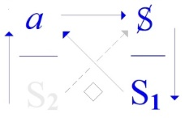
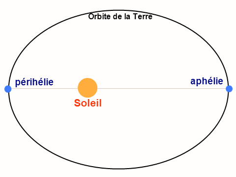

# Leçon 09 | 09 Avril 1970

  

    <label><input type="checkbox" data-lacan-toggle="original" checked> 原文</label>
    <label><input type="checkbox" data-lacan-toggle="notes" checked> 注释</label>
    <label><input type="checkbox" data-lacan-toggle="commentary" checked> 个人解读评论</label>
  

  <form class="lacan-tool-search" role="search">
    <input class="lacan-tool-search-input" type="search" placeholder="搜索全文" aria-label="搜索全文">
    <button class="lacan-tool-button" type="submit" title="搜索">搜索</button>
  </form>
  <button class="lacan-tool-button lacan-back-to-top" type="button" title="回到页面最上方" aria-label="回到页面最上方">↑</button>

<section class="parallel-paragraph" data-paragraph-ids="s17-09-0001 s17-09-0002 s17-09-0003">

s17-09-0001, s17-09-0002, s17-09-0003

原文 · s17-09-0001, s17-09-0002, s17-09-0003

Je ne sais pas ce que vous avez fait pendant ce temps qui nous a séparés, j’espère en tous cas que vous en avez profité d’une façon quelconque.

Pour moi, j’ai fait la trouvaille...

je le signale à la personne qui a si gentiment voulu se signaler à moi d’être une *astudée* de Sorbonne, je lui signale que j’ai trouvé, ...j’ai fait venir de Copenhague le Sellin dont je vous ai parlé : *s.e.l.l.i.n*, c’est à savoir ce petit livre de 1922, qui aussi bien par après a porté de la plume de Sellin quelques rejets, et qui est ce livre autour de quoi Freud fait tourner son assurance que Moïse a été « tudé ».

我不知道在我们分开的这段时间里，你们各自做了些什么；无论如何，我希望你们多少能有所收获。

至于我，我有个新的发现——我要特别告诉那位非常客气地表明自己是索邦大学学生的人：

我找到了，我让人从哥本哈根寄来了那本我曾经提到过的<strong>Sellin</strong>

的著作。拼写是 S.E.L.L.I.N。

这就是 1922 年出版的那本小书，后来 Sellin 也写过一些补充或修正。正是这本书，构成了弗洛伊德在其论证中赖以坚持的依据：<strong>摩西是被“杀死”的</strong>。

当然，拥有这本书的意义就在这里……

> 弗洛伊德之所以敢于提出摩西被杀的假设，不仅是精神分析的推理，也是基于 Sellin 的学术研究,发展出一个激进的假说：摩西被希伯来人杀害，这一原始罪行奠定了宗教律法与内疚感的根基。

</section>

<section class="parallel-paragraph" data-paragraph-ids="s17-09-0004 s17-09-0005 s17-09-0006 s17-09-0007 s17-09-0008">

s17-09-0004, s17-09-0005, s17-09-0006, s17-09-0007, s17-09-0008

原文 · s17-09-0004, s17-09-0005, s17-09-0006, s17-09-0007, s17-09-0008

Bien sûr, l’intérêt de l’avoir...

Je ne sache pas que...

à part Jones et peut-être un ou deux autres ...beaucoup de psychanalystes s’y soient inté­ressés. Il est clair [que ce](file:///C:\Users\ALAIN\LACAN%20séminaires\que.ee) Sellin dans son texte mérite d’être examiné, examiné en ceci que Freud a considéré qu’il faisait le poids, si je puis dire.

C’est bien là-dessus naturellement qu’il convient de me suivre pour mettre à l’épreuve cette considération.

Ceci me semble dans la ligne de ce que j’avance cette année de *l’envers de la psychanalyse*, mais comme il n’y a qu’environ cinq jours que j’ai ce livre, écrit dans un allemand fort corsé, beaucoup moins aéré que ce à quoi nous habituent les textes de Freud, vous concevrez que, malgré l’aide qu’ont bien voulu me donner pour ça un certain nombre de rabbins, grands et petits...

据我所知，除了琼斯（Ernest Jones）以及也许另外一两个分析家之外，并没有多少精神分析学者对它表现出兴趣。

然而很清楚的是，这部 <strong>Sellin 的著作</strong>在其文本上值得被仔细审视，正是在这个层面上，弗洛伊德认为它“分量十足”，可以说是足以支撑他的论点。

自然地，你们应当在这一点上跟随我，以便将这一考量付诸检验。这似乎与我今年在《精神分析的反面》（L’envers de la psychanalyse）中所推进的内容一致。

但是，由于我得到这本书只有大约五天时间，而它的德文写得极为晦涩，远不如我们熟悉的弗洛伊德文本那样通畅，

另一方面，碰巧我受到了一个请求……我得说，这并不是第一次，这种请求是会不断扩展的。

是要我在广播中作答——明确地说，是比利时的电台——而提出这个请求的人，说实话，赢得了我的尊重。

为了直呼其名，就是乔尔金先生（M. Georgin），他之所以赢得我的尊重，是因为他交给我一篇长文，至少证明了一点：他与许多人不同，他确实读过我的《*Écrits*》！

> 你们可以理解，尽管有一些拉比们——不论大拉比还是小拉比（好吧，其实并没有什么所谓大小之分，只有犹太人）——好心地给予了我帮助，我今天仍然还没有准备好为你们做一个足以让我自己满意的书籍汇报。

> 他——天啊——尽其所能地从中提炼出了些什么（笑声），但总的来说，这并不是毫无价值；事实上，我反而感到颇为受宠若惊！
> 当然，这并不足以让我对那个“在广播里被录音”的练习产生更多兴趣。那总是非常耗费时间。然而，既然看来他已安排好让事情以尽可能简短的方式进行，我或许会答应。

</section>

<section class="parallel-paragraph" data-paragraph-ids="s17-09-0009 s17-09-0010 s17-09-0011 s17-09-0012 s17-09-0013 s17-09-0014">

s17-09-0009, s17-09-0010, s17-09-0011, s17-09-0012, s17-09-0013, s17-09-0014

原文 · s17-09-0009, s17-09-0010, s17-09-0011, s17-09-0012, s17-09-0013, s17-09-0014

enfin bon, il n’y a pas de petits rabbins, il y a des juifs ...eh bien je ne sois pas prêt encore aujourd’hui à vous en faire un compte-rendu, au moins qui me satisfasse.

D’autre part, il se trouve que j’ai été sollicité…

> ça, je dois dire que ce n’est pas la première fois, c’est extensible cette sollicitation ...de répondre à la radio - Belge pour la nommer - et ce par un homme qui, à vrai dire, s’est attiré mon estime,

M. Georgin pour le nommer, s’est attiré mon estime de m’avoir remis un long texte, qui au moins donne cette preuve que lui, contrairement à bien d’autres, il a lu mes *Écrits* !

Il en a - mon Dieu - tiré ce qu’il a pu \[*Rires*\], mais ce n’est pas rien à tout prendre, et véritablement, en fait j’en ai été plutôt flatté ! Ça n’est pas certes, pour me donner plus de penchant à cet exercice qui consiste à se faire enregistrer à la radio.

Ça perd toujours beaucoup de temps.

不过，也许不会答应的倒是他，因为为了回答他的问题——我将给你们举出三个例子——我认为，我无法比这样做得更好：与其说任由当下的灵感发挥，不如说依靠我在这里每次面对你们时所开辟出的路径——这种“开路”，以大量笔记为养料，而它之所以能成立，天啊，只是因为你们看见我正在受制于这种开辟。也许，这甚至是唯一能证明你们在场具有正当性的理由。

不过，当你面对的是几万——谁知道呢，甚至几十万——听众时，条件显然就不同了。

在他们面前，文本若是突然呈现出来、而又缺少说话者本人的支撑，可能会造成别的效果。

然而，我无论如何拒绝提供任何其他东西，除了那些已经写下来的文本。在这样的条件下，这当然是一种巨大的信任，因为——你们会看到——向我提出的问题，必然落在这样一个区间：

一端是一个被建构起来的理论关节，另一端是那我所谓的“共同意识”所期待的东西。而“共同意识”也意味着一系列共同的表达方式，那就是一种语言，早在古代——更确切地说，在希腊人那里——就被称作：<strong>κοινή [koïné]</strong>。

是的，我不会立刻用法语来说这个词，而是直接转写：

<strong>“la couinée”</strong>，听起来就像在吱吱叫！

> 注：<strong>koïné (κοινή)</strong>：希腊语“通用语”的意思。历史上指希腊化时代形成的跨地域通用希腊语（Koine Greek），在哲学与宗教（特别是新约圣经）中具有重要地位。拉康借此指一种公共的、共享的语言形式。

> 那是只鸟吗？〔笑声，因外面传来的一声口哨声〕

</section>

<section class="parallel-paragraph" data-paragraph-ids="s17-09-0015 s17-09-0016 s17-09-0017 s17-09-0018 s17-09-0019 s17-09-0020 s17-09-0021 s17-09-0022 s17-09-0023 s17-09-0024 s17-09-0025">

s17-09-0015, s17-09-0016, s17-09-0017, s17-09-0018, s17-09-0019, s17-09-0020, s17-09-0021, s17-09-0022, s17-09-0023, s17-09-0024, s17-09-0025

原文 · s17-09-0015, s17-09-0016, s17-09-0017, s17-09-0018, s17-09-0019, s17-09-0020, s17-09-0021, s17-09-0022, s17-09-0023, s17-09-0024, s17-09-0025

Néanmoins, comme il semble qu’il ait aménagé les choses pour que ça se passe de la façon la plus courte, j’y céderai peut-être.

Celui qui ne va peut-être pas y céder, par contre, c’est lui, étant donné que pour répondre à ses questions, dont je vais vous donner trois exemples, je n’ai cru pouvoir mieux faire que non pas de me livrer à l’inspiration du moment, à *ce frayage* que je fais ici chaque fois que je suis en face de vous en somme, mais nourri d’abondantes notes, et qui passe - mon Dieu - parce que vous me voyez en proie à *ce frayage*.

C’est même peut-être la seule chose qui justifie votre présence ici.

C’est un oiseau ? \[*Rires,* à propos d’un sifflotement que l’on entend à l’extérieur\]

Les conditions quand même sont évidemment différentes quand vous parlez pour *quelques dizaines de mille -* qui sait, voire centaines - *d’auditeurs* et auprès desquels *le texte*, abrupt de se présenter sans le support de la personne, peut causer d’autres effets.

Néanmoins je me refuserai en tout cas à donner autre chose que ces textes déjà écrits.

C’est faire donc à cette condition grande confiance car, vous le verrez, les questions qui me sont posées sont forcément de l’intervalle

- de ce qu’il se produit une articulation construite,

- et ce qu’en attend ce que j’appellerai « *une conscience commune »*, et une *conscience commune* ça veut dire aussi une série de formules communes, ce langage que déjà les Anciens, enfin les Grecs, avaient appelé dans leur langue : la κοινή \[koïné\].

Oui, je vais pas dire ça tout de suite en français, le transcrire directement : « *la couinée* », ça couine !

Je ne méprise pas du tout *la couinée*, simplement je crois qu’elle n’est pas défavorable à ce qu’on y produise quelques effets de précipitation, à y introduire justement *le discours le plus abrupt qu’il soit*. Voilà.

我丝毫不轻视这所谓的“吱吱叫”，只是我认为，它并不妨碍在其中制造一些加速的效果，甚至恰好可以引入最为突兀的话语。就是这样。因此，今天这不仅仅是为了替代我平时的努力……

要知道，对我而言，给你们读这些文本，其实会比像平常那样进行即兴开路要困难得多……我将向你们分享我对其中三个问题的回答。

为了不再耽搁，我将向你们陈述第一个问题，就是：
“在《*Écrits*》中——据说——您断言弗洛伊德在不自觉的情况下，预先触及了索绪尔以及布拉格学派的研究。您能否在这一点上作出解释？”

因此我现在就来回答——不过并非即兴作答，正如我事先已经提醒过你们的，而是要这样说：

“你的问题让我感到惊讶，”我说，“因为它带有一种切实的相关性，这与我常常不得不排除的那些所谓‘访谈要求’完全不同。
而且，它甚至具有双重的相关性，可以说有两个层次。
首先，你向我证明你确实读过我的《*Écrits*》，而显然在很多人看来，想要听我讲话并不需要读过它。
其次，你选取的那条评论，包含着这样一个前提：信息的传递还可能有另一种方式，而不仅仅是依赖大众媒介的中介。
当我说弗洛伊德‘预先触及’了索绪尔，这并不意味着从前者到后者之间有某种流言或噪声传递过去。
因此，当你引用我时，你让我在尚未作出决定之前就已经作出了回答——这正是我所谓的‘让我感到意外’。”

让我们从终点词语开始：

索绪尔与布拉格学派所建立的语言学，与此前打着“语言学”之名的一切毫无共同之处。即便斯多葛派曾经握有某些钥匙，但他们又拿这些做了什么呢！

语言学，随着索绪尔与布拉格学派的工作，是从一次切断中建立起来的——这就是置于能指与所指之间的那一道横杠。

正是为了让差异占据主导，因为能指的构成完全依赖于差异。同时，这种差异的结构也确立了一种自主性，堪比“晶体效应”的纯粹规律性；例如在音位系统中，这就是他们的第一个重大发现与成果。
人们设想要把这一成果推广到整个符号的网络：
意义只在网络对其作出回应时才被承认；作为一种效应的影响——是的；作为某种内容的实体——不。这正是由那最初的切断所支撑的冒险。所指是否能够在科学层面上被思考，取决于这样一个条件：是否有一个能指的场域得以成立。<strong>而这个能指的场域，凭借其自身的材料，与科学已经把握的任何物理场域并无相似之处。</strong>

> 差异和符号网络这个没啥特别强调的，结构主义的老腔老调了。

</section>

<section class="parallel-paragraph" data-paragraph-ids="s17-09-0026 s17-09-0027 s17-09-0028 s17-09-0029 s17-09-0030">

s17-09-0026, s17-09-0027, s17-09-0028, s17-09-0029, s17-09-0030

原文 · s17-09-0026, s17-09-0027, s17-09-0028, s17-09-0029, s17-09-0030

C’est pourquoi aujourd’hui c’est pas seulement pour me suppléer dans l’effort...

ça me sera, croyez-le, un effort beaucoup plus grand de vous lire ces textes que de procéder comme je fais d’habitude ...je vais vous faire part de mes réponses à trois de ces questions.

C’est pour ne pas tarder que je vais vous articuler la première qui est celle-ci : « *Dans les Écrits - dit-on - vous affirmez que Freud anticipe, sans s’en rendre compte,* *les recherches de Saussure et celles du Cercle de Prague. Pouvez-vous vous expliquer sur ce point ?* »

C’est ce que je fais donc, non pas « *à l’improvisade »*, comme je vous en ai prévenu, en répondant que : « *Votre question me surprend -* dis-je *- d’emporter une pertinence qui tranche sur les prétentions à l’entretien que j’ai à écarter,* *c’est même une pertinence redoublée, à deux degrés plutôt.*

*Vous me prouvez avoir lu mes Écrits, ce qu’ap­paremment on ne tient pas pour nécessaire à obtenir de m’entendre.*

不过这里值得关注的一点是，所指能否在科学的层面被思考，取决于：能指场域是否成立。
这还不够，这个能指场域的成立是凭借自身的“材料”，或者说“质料”，或者说“介质”？（怎么称呼这个东西取决于你的话语）而脱离于任何科学把握的数理场域。 翻译成物理感觉太单调了，想想放在大学话语的罗素吧。

这就意味着一种形而上学的排除，必须理解为一种“非存在（désêtre）”的事实。

从此之后，任何意义都不能再被视为理所当然。

比如说，“天亮的时候就会明亮”这种命题——在这里斯多葛派早已先我们一步提出过，

但我已经质问过：这样的命题究竟有何目的？

<strong>qu’il fasse clair quand il fait jour</strong>：直译“当白天到来时天就明亮”。斯多葛派提出的逻辑命题之一，意在强调某种自明的同义反复。

有何目的？
飞机一定要会飞。科学家一定要懂科学。
你觉得没有什么目的吗？ \ O /

即便这会忽略某些词语的反复使用，我也要说：凡是以“符号” (*signe*) 为对象而出发的学科，我都称之为“符号学”（*sémiotique*），而这样命名，正是为了指出：这恰恰阻碍了对“能指”本身的把握。

因为“符号”总是假定有一个“某个人”，符号是向这个人指示某物的。

> 注：<strong>désêtre</strong>：拉康的特殊术语，可译作“非存在”或“去存在”。与 *être*（存在）相对，强调一种“被剥离、缺席、非实有”的维度。这里意在说明：意义的自明性被取消，语言的科学化建立在这种“非存在”之上。

> 首先是：符号——主体 的关系

</section>

<section class="parallel-paragraph" data-paragraph-ids="s17-09-0031 s17-09-0032 s17-09-0033 s17-09-0034 s17-09-0035 s17-09-0036 s17-09-0037 s17-09-0038 s17-09-0039 s17-09-0040 s17-09-0041 s17-09-0042 s17-09-0043 s17-09-0044 s17-09-0045 s17-09-0046 s17-09-0047 s17-09-0048 s17-09-0049 s17-09-0050 s17-09-0051 s17-09-0052 s17-09-0053 s17-09-0054 s17-09-0055 s17-09-0056 s17-09-0057">

s17-09-0031, s17-09-0032, s17-09-0033, s17-09-0034, s17-09-0035, s17-09-0036, s17-09-0037, s17-09-0038, s17-09-0039, s17-09-0040, s17-09-0041, s17-09-0042, s17-09-0043, s17-09-0044, s17-09-0045, s17-09-0046, s17-09-0047, s17-09-0048, s17-09-0049, s17-09-0050, s17-09-0051, s17-09-0052, s17-09-0053, s17-09-0054, s17-09-0055, s17-09-0056, s17-09-0057

原文 · s17-09-0031, s17-09-0032, s17-09-0033, s17-09-0034, s17-09-0035, s17-09-0036, s17-09-0037, s17-09-0038, s17-09-0039, s17-09-0040, s17-09-0041, s17-09-0042, s17-09-0043, s17-09-0044, s17-09-0045, s17-09-0046, s17-09-0047, s17-09-0048, s17-09-0049, s17-09-0050, s17-09-0051, s17-09-0052, s17-09-0053, s17-09-0054, s17-09-0055, s17-09-0056, s17-09-0057

*Vous y choisissez une remarque qui implique l’existence d’un autre mode d’information que la médiation de masses.*

*Que* F*reud* *anticipe* S*aussure* *n’implique pas qu’un bruit soit passé du premier au second.*

*De sorte qu’à me citer, vous me faites répondre avant que j’en décide, c’est ce que j’appelle* *me surprendre* ».

*Partons du terme d’arrivée :* *Saussure et le Cercle de Prague produisent une linguistique qui n’a rien de commun avec ce qui avant s’est couvert de ce nom,* *retrouvât-elle ses clés entre les mains des Stoïciens, mais qu’en fai­saient-ils !*

*La linguistique, avec Saussure et le Cercle de Prague, s’institue d’une coupure, qui est la barre posée entre le signifiant et le signifié,* *pour qu’y prévale la différence dont le signifiant se constitue absolument, mais aussi bien s’ordonne d’une autonomie* *qui n’a rien à envier aux effets de cristal, dans le système du phonème par exemple, qui en est le premier succès de décou­verte.*

*On pense étendre ce succès à tout le réseau du symbolique en n’admettant de sens qu’à ce que le réseau en réponde,*

- *et de l’incidence d’un effet : oui,*

- *d’un contenu : non.*

*C’est la gageure qui se soutient de la coupure inaugurale.*

*Le signifié sera ou ne sera pas, scientifiquement pensable, selon que tiendra ou non, un champ de signifiant,* *qui, de son matériel même, se distingue d’aucun champ physique par la science obtenu.*

*Ceci implique une exclusion métaphysique à prendre comme fait de désêtre.*

*Aucune signification ne sera désormais tenue pour aller de soi, qu’il fasse clair quand il fait jour par exemple, où les Stoïciens nous ont devancés,* *mais j’ai déjà interrogé : à quelle fin ?*

*Dussé-je aller à négliger certaines reprises de mot, je dirai « sémiotique » toute discipline qui part du signe pris pour objet,* *et pour marquer que c’est là ce qui faisait obstacle à la saisie comme telle du signifiant.*

*Le signe suppose le quelqu’un à qui il fait signe de quelque chose.*

*C’est le « quelqu’un » dont l’ombre a occulté l’entrée dans la linguistique.*

*Appelez ce « quelqu’un » comme vous voudrez ce sera toujours une sottise.*

*Le signe suffit à ce que ce quelqu’un se fasse du langage, appropriation comme d’un simple outil.*

*De l’abstraction, le langage n’est plus que support, comme de la discussion : moyen, avec tous les progrès de la critique, que dis-je, de la pensée à la clé.*

*Il me faudrait anticiper -* reprenant le mot de moi à moi *- sur ce que je compte introduire sous la graphie de l’« achose » :* *L apostrophe, a, c, h, o, etc., pour faire sentir en quel effet prend position la linguistique : ce n’est pas un progrès, une régression plutôt.*

*C’est ce dont nous avons besoin contre l’unité d’obscurantisme, qui déjà se soude aux fins de prévenir l’« achose ».*

*Personne ne semble reconnaître autour de quoi l’unité se fait, et qu’au temps du « quelqu’un » qui y recueillait la « signature des choses* [^40] *» :* *« signatura rerum », on ne présumait pas assez de la bêtise cultivée pour oser inscrire le langage au registre de « la communication ».*

*Le retour à « la communication » protège - si j’ose dire - les arrières de ce que périme la linguistique, en y couvrant le ridicule* *qui souvent ne se décèle que de l’a posteriori, c’est à savoir ce qui dans l’occultation du langage, ne faisait figure que de mythe à s’appeler « télépathie ».*

*Enfant perdu, mendigot de la pensée, que ce qui se targuait de la transmission sans discours,* *il arrive pourtant - ce mythe - à captiver Freud qui n’y démasque pas le roi de cette cour des miracles dont il annonce le nettoyage.*

*Miracles, c’est bien le cas de le dire, quand tous remonte à celui, premier à s’opérer de ce que l’on « télépatisse » du même bois dont on pactise.*

*Contrat social, en somme, effusion communicative des promesses du dialogue.*

*Quoi ? « Tout homme -* qui ne sait ce que c’est ? *- est mortel » *: *ah, sympathisons d’être mis dans la même boîte !*

*Parlons de « tout » - c’est le cas de le dire ! - de « tout » ensemble, sauf de ce qui habite la tête du syllogiste à mettre Socrate dans le coup,* *car de là il ressort que sans doute la mort est administrée - comme le reste - et par et pour les hommes,* *mais sans qu’ils soient du même coté, pour ce qui est de la télépathie que véhicule une télégraphie,* *dont le sujet ne cesse pas d’embarrasser chaque fois qu’on vient à ce carrefour.*

进而主体——某物的关系

正是这个“某个人”的阴影，遮蔽了语言学真正的入口。不管你如何去称呼这个“某个人”，那总归是一种愚蠢。只要承认“符号”，语言就会被那个“某个人”视为某种可以占有的东西，像一个单纯的工具一样。于是，在这种抽象化的视角下，语言不过是一个支撑物，一种媒介；就像在讨论中，仅仅是一种手段——伴随着批评乃至所谓思想的所有进步而已。

我必须先行一步——借用我自己对自己说的话——去引入我打算以“achose”这一书写形式来提出的东西：

L加撇号，再接a-c-h-o-s-e，用这种拼写，来让人感受到语言学所处立场所产生的效应：那并非是一种进步，而恰恰更像是一种退却。而我们正需要这一点，用来抵御那已经开始凝聚起来、企图阻止 l’ achose 的蒙昧主义共同体。

似乎没有人认清：这种共同体究竟是围绕着什么而达成的。
在那个有人还在追寻所谓“万物的印记（*signatura rerum*）”的时代〔雅各布·伯麦《万物的印记》〕，人们还没有愚蠢到把语言登记在所谓“交流（communication）”的范畴之下。
回到“交流”的观念，其实——如果我敢这样说——不过是为语言学所废弃的东西护上退路，借此遮掩其中的荒谬——而这种荒谬往往只有事后（*a posteriori*）才能被识破。
换言之，那在语言被遮蔽之时，以“心灵感应（télépathie）”之名出现的神话，就是这种荒谬的例子。

那种自诩为“无须话语的传递”的观念，实在只是思想上的一个迷途孤儿、一个乞丐，然而它——这个神话——却依旧能吸引弗洛伊德，弗洛伊德在其中并没有揭露出这“奇迹之院”的国王——而他本来宣称要将其清理。

“奇迹”这个词用得再合适不过了，因为一切都追溯到那个最初的“奇迹”：

所谓“心灵感应”，与我们达成契约所用的是同一块木头。

换言之，就是社会契约，交流的泛滥，以及对话所许下的承诺。什么？“所有人——谁不知道呢？——都是凡人。”啊，那就让我们为被放进同一个盒子而共鸣一番吧！

既然说到“全体”（*tout*）——这话说得正合适！——那就让我们把“全体”放在一起谈，不过先撇开那个三段论者脑子里的东西，他总要把苏格拉底拉进来。

</section>

<section class="parallel-paragraph" data-paragraph-ids="s17-09-0058 s17-09-0059 s17-09-0060">

s17-09-0058, s17-09-0059, s17-09-0060

原文 · s17-09-0058, s17-09-0059, s17-09-0060

*Que ce sujet soit peu communicable, doit bien déterminer de ce dont la linguistique prend force.*

*Et jusqu’à mettre le poète - oui le poète ! - dans son sac.*

*Car le poète se produit d’être...*

从这里我们可以看出，死亡确实是被管理的——就像其他一切一样——既是由人所施行的，也是为人所施行的。

然而在人类当中，并不存在某种“同一立场”：

尤其在涉及到那种所谓“心灵感应”时，它所借载的“电传”只要一到岔路口，就总让相关的主体陷入尴尬。

</section>

<section class="parallel-paragraph" data-paragraph-ids="s17-09-0061 s17-09-0062 s17-09-0063 s17-09-0064">

s17-09-0061, s17-09-0062, s17-09-0063, s17-09-0064

原文 · s17-09-0061, s17-09-0062, s17-09-0063, s17-09-0064

*qu’on me permette de traduire celui qui le démontre, mon ami Jakobson...mangé des vers, qui trouvent entre eux leur arrangement, sans se soucier - c’est manifeste - de ce que le poète en a su.*

*D’où la constance, chez Platon, de l’ostracisme dont il frappe le poète en sa « République »,* *et de la vive curiosité qu’il montre dans le « Cratyle » pour ces petites bêtes qui paraissent être les mots, à n’en faire qu’à leur tête.*

*On voit combien le formalisme était précieux à soutenir les premiers pas de la linguistique.*

*Mais c’est tout de même de trébuchements dans les pas du langage, dans ce qu’on appelle « la parole », qu’elle a pris son élan.*

这个课题之所以“难以沟通”，恰恰决定了语言学赖以汲取力量的地方。

甚至把诗人——是的，诗人！——也装进了它的口袋。

因为诗人之所以得以生成——请允许我翻译一下我的朋友雅各布森所揭示的——就是被“诗行（vers）所吞噬”，那些诗行之间自己找到排列方式，而根本无须顾及——这点是显而易见的——诗人本人是否知道。

这也正是柏拉图在《理想国》中坚持要放逐诗人的理由所在，以及他在《克拉底鲁篇》中，对这些“小动物”般的词语所表现出的浓厚兴趣：

它们似乎只听从自己，而不听任何人。由此我们可以看到，形式主义在支持语言学的最初步伐时，是多么的重要。

</section>

<section class="parallel-paragraph" data-paragraph-ids="s17-09-0065">

s17-09-0065

原文 · s17-09-0065

*Que le sujet ne soit pas ce qui sache ce qu’il dit, quand bel et bien se dit quelque chose par la bouche où on le loge, certes,* *mais aussi bien dans les balourdises d’une conduite qu’on met à son compte, dans la cervelle dont il ne s’aide qu’à ce qu’elle dorme,* *cet organe s’avérant ne tenir sa portée subjective que de ce qu’il règle le sommeil, voilà ce que Freud dévoile comme l’inconscient.*

然而，语言学真正获得动力的，毕竟还是来自语言的绊脚、来自我们称之为“言说”的东西。

主体并不是那个“知道自己在说什么”的存在，因为某些东西的确通过他的口说了出来；

同样地，这种“不自知”也体现在他行为的笨拙之中——这些笨拙被算在他的“脑子”的账上，可这脑子不过就是个只在睡眠时才“帮得上忙”的器官。这个器官的主观效力，事实上仅仅来自于它能调节睡眠。而这，正是弗洛伊德所揭示的：无意识。

因此，当人们说弗洛伊德预示了语言学时，我要说：真正必须被确立的——而我现在提出的公式是：

</section>

<section class="parallel-paragraph" data-paragraph-ids="s17-09-0066 s17-09-0067 s17-09-0068 s17-09-0069">

s17-09-0066, s17-09-0067, s17-09-0068, s17-09-0069

原文 · s17-09-0066, s17-09-0067, s17-09-0068, s17-09-0069

*Car mon passage en ce monde, au nom de Lacan, aura consisté à articuler que c’est ça et que ce n’est rien d’autre.*

*N’importe-qui peut s’en assurer maintenant, rien qu’à me lire.*

*N’importe-qui, donc, qui opère selon ces règles, à psychanalyser doit s’y tenir, sauf à le payer de choir dans la bêtise.*

*Dès lors, à énoncer que Freud anticipe la linguistique, je ne dis moi que ce qui s’impose, et qui est la formule que je libère maintenant :* *« l’inconscient est la condition de la linguistique ».*

<strong>“无意识是语言学的条件。”</strong>

如果没有无意识的喷发，语言学根本不可能摆脱那种暧昧不明的状态，大学依旧以“人文科学”的名义，将它遮蔽于科学之外。

若不是当年在基辅由鲍杜安·德·库尔特奈的努力使它获得了加冕，它大概会永远停留在那一步。

然而大学从未说出它的最后一句话，它甚至会把这事当作一个“论文题目”来处理：

“论弗洛伊德的天才对雷蒙·德·索绪尔的天才的影响”——去论证前者的风是如何吹到后者那里去的，好像这发生在广播出现之前！这就仿佛在装作：没有这种遮蔽，语言学一直都能如此喧嚣。

> 无意识是语言学的条件,而大学人文科学框架下的语言学把它排除在科学之外。仅仅停留在“文化”和“交流”的层面。

</section>

<section class="parallel-paragraph" data-paragraph-ids="s17-09-0070 s17-09-0071 s17-09-0072 s17-09-0073 s17-09-0074 s17-09-0075 s17-09-0076 s17-09-0077 s17-09-0078 s17-09-0079 s17-09-0080">

s17-09-0070, s17-09-0071, s17-09-0072, s17-09-0073, s17-09-0074, s17-09-0075, s17-09-0076, s17-09-0077, s17-09-0078, s17-09-0079, s17-09-0080

原文 · s17-09-0070, s17-09-0071, s17-09-0072, s17-09-0073, s17-09-0074, s17-09-0075, s17-09-0076, s17-09-0077, s17-09-0078, s17-09-0079, s17-09-0080

*Sans l’éruption de l’inconscient, pas moyen que la linguistique sorte du jour douteux* *dont l’Université, au nom des sciences humaines, fait encore éclipse à la science.*

*Couronnée à Kiev par les soins de [Baudouin de Courtenay](http://fr.wikipedia.org/wiki/Jan_Niecis%C5%82aw_Baudouin_de_Courtenay), elle y fût sans doute restée.*

*Mais l’Université n’a pas dit son dernier mot, elle va de ça, faire sujet de thèse...*

*« Influence sur le génie de Raymond de Saussure* \[*lapsus* : *Ferdinand de Saussure*\] *du génie de Freud »,...démontrer d’où vient au premier, le vent du second, avant qu’existât la radio !*

*C’est faire comme si elle ne s’en était pas passée de toujours pour assourdir autant.*

*Et pourquoi Saussure se serait-il rendu compte - pour emprunter les termes de votre citation,* dis-je à M. Georgin *- mieux que Freud lui-même,* *de ce que Freud anticipait, notamment la métaphore et la métonymie lacaniennes, lieux où Saussure « genuit »* \[*« engendre »*\] *Jakobson ?*

*Si Saussure ne sort pas des  « Anagrammes... »* [^41] *qu’il déchiffre dans la poésie sa­turnienne, c’est qu’il en sait la portée vraie.*

*La canaillerie ne le rend pas bête*... *c’est parce qu’il n’est pas analyste.*

*Dans cette position, par contre, les mauvais procédés dont s’habille l’infatuation universitaire ne vous ratent pas leur homme,* *il y a là comme un espoir, et le jettent droit dans une bourde comme de dire que « l’inconscient est la condition du langage »,* *quand il s’agit de se faire « auteur » aux dépens de ce que j’ai dit, voire seriné aux intéressés,* *à savoir que « le langage est la condition de l’inconscient ».*

*Je ris encore du procédé devenu là stéréotype, au point que deux autres...*

*mais pour l’usage interne d’une Société que sa bâtardise universitaire a tuée...ont osé définir le passage à l’acte et l’acting-out très exactement des termes que je leur avais proposés pour les opposer l’un à l’autre,* *mais simplement à inverser ce que j’attribuais à chacun, façon - pensaient-ils - de s’approprier ce que personne n’avais su en articuler avant.*

而弗洛伊德的无意识理论才是真正使语言学得以建立的契机，因为无意识揭示了能指运作的自主性。

当然哈，这算是拉康事后的“大儒辩经”。弗洛伊德早就在这恭候多时了。
马克思：其实我早就是一个中国人了。

那又为什么——借用你引用中的说法，我对乔尔让先生说——

要认为索绪尔会比弗洛伊德本人更清楚地意识到，弗洛伊德究竟预示了什么呢？尤其是拉康所言的隐喻与换喻——这是索绪尔孕育出雅各布森之处。
如果索绪尔始终没有走出他在萨图尔努斯诗歌中所破译的“变位词”研究〔参见斯塔罗宾斯基《词中之词》，以及弗朗西斯·冈东《危险的建筑》〕，那正是因为他知道那其中的真正分量。这并非因为某种“狡诈”使他变得愚蠢……而仅仅是因为他不是一个分析家。

然而，在这样的立场上，大学式自满所披戴的那些卑劣手段，总是不会放过任何人。它带着一种似乎的希望，却把人直接推入一种荒唐的错误——比如说出“无意识是语言的条件”这样的论断。这种说法不过是想以牺牲我所讲过的内容来标榜自己为“作者”，甚至还不断向那些相关的人喋喋复述，好像我从未明确指出过：<strong>“语言是无意识的条件。”</strong>

我至今仍觉得好笑：这种手法已经成了一种陈词滥调。竟然有另外两个人——但只是在某个因其大学化的庸俗而早已被扼杀的协会内部使用——他们居然胆敢用我当初提出的那一套概念来界定“付诸行动”（*passage à l’acte*）和“表演化”（*acting-out*），而且几乎完全照搬了我为区分二者所提出的术语，只不过把我原本归属给一个的特征简单地倒置到另一个身上。
他们以为这样就能据为己有，好像在此之前从来没人能够把这两者清楚地加以区分。

我只能说，真是太深刻了。

如果我此刻中断，我所留下的“作品”，也不过是我教导中那些被我挑选出来、作为抵挡“资讯化”的残片。
所谓“资讯”，无非就是把它传播出去罢了。而我在一次“保密性的讲话”中所阐述的内容，却足以撼动普通的聆听方式，乃至吸引到一个庞大得惊人的听众群体，他们以自己的稳定出席为我作证。

> 大概是某些人拿这种类似的理论当作大学话语进行装逼，让拉康不爽了。

> 这倒是特别典型，照搬某个术语然后将其归纳的特征简单的放到另外一个什么地方。然后当作是自己的深刻洞见。

</section>

<section class="parallel-paragraph" data-paragraph-ids="s17-09-0081 s17-09-0082 s17-09-0083 s17-09-0084">

s17-09-0081, s17-09-0082, s17-09-0083, s17-09-0084

原文 · s17-09-0081, s17-09-0082, s17-09-0083, s17-09-0084

*Si je défaillais maintenant, je ne laisserais d’œuvre que ces rebuts choisis de mon enseignement dont j’ai fait butée à « l’information »,* *dont c’est tout dire qu’elle le diffuse.*

*Ce que j’ai énoncé, dans un discours confidentiel, n’en a pas moins déplacé l’audition commune,* *au point de m’amener un auditoire qui m’en témoigne d’être stable en son énormité.*

*Je me souviens de la gêne dont m’inter­rogeait un garçon qui avait assisté à la production de ma « Dialectique du désir et subversion du sujet »* *devant un public fait de gens du « Parti », le seul, parmi lesquels il s’était égaré comme marxiste.*

*J’ai gentiment - gentil, gentil comme je suis toujours - pointé, à la suite de ce rebut, dans mes Écrits, l’ahurissement qui y fit réponse :* *« Croyez-vous donc* - me disait-il *- qu’il suffise que vous ayez dit quelque chose,* *inscrit des lettres au tableau noir pour en attendre un résultat ? »*

我记得曾有一个年轻人向我表达过困惑：他曾参加过我那场《欲望的辩证法与主体的颠覆》的发表，而当时的听众几乎全是来自“党”的人。他是唯一一个误入其中的马克思主义者，因此感到格外不自在。

我便温和地——温和的，温和的，就像我一向那样——在我的《书写》中指出了那次插曲之后所引起的惊愕反应：

“难道您真的认为——他对我说——仅仅因为您说了些什么，或者在黑板上写了几个字母，就足以期待会有什么结果吗？”

然而，这样的一次演练确实产生了效果，我也得到了证据：

仅凭那次插曲残留下来的“片段”，就为我的书赢得了一笔意想不到的权益；原本支撑那场会议、需要被清算的“福特基金会”的资金，竟在同一时间不可思议地枯竭了。

这种效应的传播，并不是“言语的交流”（这句话是对你们说的），而是话语的位移。
弗洛伊德未被理解，甚至包括他自己——因为他想要被人听见。而在这一点上，他从弟子们那里得到的支持，还不如这种“传播”带来的效应更大。没有这种传播，历史的动荡便依旧是谜团，就像“五月份”的那些事件一样——那些人试图把它们俘虏在某种意义之下，而在那里，辩证法却只呈现为一种嘲弄。
就是这样！

> 即便弗洛伊德自己也未完全听见自己所说的东西。

</section>

<section class="parallel-paragraph" data-paragraph-ids="s17-09-0085 s17-09-0086 s17-09-0087 s17-09-0088 s17-09-0089 s17-09-0090 s17-09-0091 s17-09-0092 s17-09-0093 s17-09-0094 s17-09-0095 s17-09-0096 s17-09-0097 s17-09-0098">

s17-09-0085, s17-09-0086, s17-09-0087, s17-09-0088, s17-09-0089, s17-09-0090, s17-09-0091, s17-09-0092, s17-09-0093, s17-09-0094, s17-09-0095, s17-09-0096, s17-09-0097, s17-09-0098

原文 · s17-09-0085, s17-09-0086, s17-09-0087, s17-09-0088, s17-09-0089, s17-09-0090, s17-09-0091, s17-09-0092, s17-09-0093, s17-09-0094, s17-09-0095, s17-09-0096, s17-09-0097, s17-09-0098

*Un tel exercice a porté pourtant, j’en ai eu la preuve au titre seul d’un rebut qui lui fit un droit pour mon livre,* *les fonds de la « Fondation Ford » qui motivait cette réunion d’avoir à les éponger s’étant impensablement asséchés du même coup.*

*L’effet, qui se propage n’est pas de « communication » de la parole - c’est à votre adresse ceci - mais de déplacement du discours.*

*Freud incompris, fût-ce de lui-même, d’avoir voulu se faire entendre, est moins servi par ses disciples que par cette propagation.*

*Celle sans quoi les convulsions de l’histoire res­tent énigme,* *comme les mois de mai dont se déroutent ceux qui s’emploient à les prendre serfs d’un « sens » dont la dialectique se présente comme dérision. »*

Voilà !

Si vous n’êtes pas fatigués, je vais vous énoncer ce que j’ai répondu à la 2ème question qui se formule ainsi, \- vous verrez qu’elle est importante - « *La linguistique, la psychologie et l’ethnologie ont en commun la notion de structure. À partir de cette notion* - m’interroge M. Georgin - *ne peut-on imaginer l’énoncé d’un champ commun qui réunira un jour psychanalyse, ethno­logie et linguistique ?* »

Je réponds, et je pense que *cette réponse* a plus d’importance que la 1ère, *impressionniste,* à laquelle je me suis livré. Je réponds ceci : *« Structure » est le mot dont s’indique l’entrée en jeu de l’effet du langage,* *à partir de ceci, que c’est « pétition de principe » que d’en faire une fonction individuelle ou collective,* *soit qui serait l’appui d’un supposé dans l’exis­tence qui...*

*quel qu’il soit, « moi » ou organisme adapté de connaissance...implique le « quelqu’un » dont je parlais tout à l’heure.*

*Fonction par où, donc, quelqu’un se représente, si l’on peut dire, les relations qui font le **réel**, ce dernier terme étant posé d’une catégorie lacanienne.*

*C’est au contraire de la présence déjà dans la réalité...*

*laquelle n’est pas « catégorique », mais « donné »* ...*de la présence,*

- *non des relations au premier plan,*

- *mais des formules de la relation, qui prennent corps dans le langage,* *que nous partons pour en suivre l’effet, qui est proprement la structure.*

*C’est ainsi qu’un discours peut dominer la réalité sans supposer consensus de quiconque,* *car c’est lui qui détermine la différence, à faire barrière entre « sujet des énoncés » et « sujet de l’énonciation ».*

从这个方面来说，传播的意义在于“扩散”。
不将这些讯息扩散出去，就难以知道这些信息到底起到什么作用。

如果你们还不觉得疲倦，我就来陈述我对第二个问题的回答——你们会看到，这个问题十分重要：

“语言学、心理学和民族学有一个共同点：那就是结构的概念。基于这个概念——乔尔让先生向我提问——难道不能设想有朝一日能够提出一个共同的领域，将精神分析、民族学和语言学统一起来吗？”

我这样回答，并且我认为这个回答比我刚才那个带点印象派色彩的回答更为重要。我的回答如下：
“结构”这个词，标示了语言效应介入的方式。从这一点出发，把它当作某种个人或集体的功能，本身就是一种预设（pétition de principe）。好像它依托于某个存在的支点——无论是“我”，还是某种适应性的认识有机体——但这就必然牵扯出我刚才说的那个“某个人”（quelqu’un）。

换句话说，它被当作一个功能，通过它，某个人得以——姑且这样说——把那些构成真实（réel）的关系表象出来。而这里的“真实”正是我所提出的一个拉康式范畴。

恰恰相反，我们所出发的，是现实中已经存在的某种临在……这种现实并非某种范畴性的东西，而是被给予的。
所临在的并非是首要层面的“关系”，而是那些“关系的公式”，它们在语言之中获得了实体化。
正是从这里，我们才去追踪它的效应，而这效应恰恰就是“结构”。

因此，一个话语能够支配现实，而无须假定任何人的共识，因为正是话语规定了那道分隔：区分“命题的主体（sujet des énoncés）”与“言说的主体（sujet de l’énonciation）”。
这一切没有丝毫的唯心主义成分。另一方面，也完全不必去“圈禁”结构主义者，除非你想让他们替存在主义所掩盖——我不说是所导致——的那种腐朽来背锅。

任何人都需要依照“结构”来定位自己——无论如何，他都会因此而获益。你们可以在这里预先感受到我对那个“聚合”的回答……

你们还记得吧：“精神分析、民族学，还有我不知道什么……语言学”，也就是你们向我提议的那个“共同场域的聚合”。

</section>

<section class="parallel-paragraph" data-paragraph-ids="s17-09-0099 s17-09-0100 s17-09-0101 s17-09-0102 s17-09-0103 s17-09-0104 s17-09-0106 s17-09-0107 s17-09-0108 s17-09-0109 s17-09-0110 s17-09-0111 s17-09-0112">

s17-09-0099, s17-09-0100, s17-09-0101, s17-09-0102, s17-09-0103, s17-09-0104, s17-09-0106, s17-09-0107, s17-09-0108, s17-09-0109, s17-09-0110, s17-09-0111, s17-09-0112

原文 · s17-09-0099, s17-09-0100, s17-09-0101, s17-09-0102, s17-09-0103, s17-09-0104, s17-09-0106, s17-09-0107, s17-09-0108, s17-09-0109, s17-09-0110, s17-09-0111, s17-09-0112

*Rien de plus exempt d’idéalisme, nul besoin - d’autre part - de parquer les structuralistes,* *à moins de vouloir leur faire endosser l’héritage du pourrissement couvert - je ne dis pas causé - par l’existentialisme.*

*N’importe qui a à se repérer de la structure, en tout cas s’en trouvera bien.*

*Pressentez ici ma réponse à la réunion*...

> *vous vous rappelez : « psychanalyse, ethnologie et je ne sais pas quoi*... *la linguistique »* ...*à la réunion que vous me proposez.*

*Nota : le particulier de la langue est ce par quoi la structure tombe sous « l’effet de cristal » dit plus haut.*

*Le qualifier, ce particulier, d’« arbitraire » est lapsus que Saussure a commis de ce qu’à contrecœur certes,* *mais par là d’autant plus offert au trébuchement, il l’a pris à partir de ce discours universitaire,* *dont je montre que le recel c’est justement ce signifiant* \[**S1**\] *qui domine le discours du Maître, le si­gnifiant de l’arbitraire.*

*Discours du Maître Discours Universitaire*

*On voit que parler de « corps » n’est pas - quand il s’agit de « symbolique » - une métaphore,* *car ledit corps se trouve, pour le corps pris au sens naïf, une déterminante.*

*Le premier* \[*corps*\] *fait le second* \[*le « symbolique » comme « corps »*\] *de s’y incorporer.*

*D’où l’incorporel qui reste marquer le premier du temps d’après son incorpora­tion.*

*Rendons justice aux Stoïciens d’avoir su de ce terme : l’Incorporel, signer en quoi le symbolique tient au corps.*

*Incorporels sont ce que je vais dire, à savoir : la fonction,*

- *non pas celle du sujet,*

注记：语言的特殊性，正是结构落入我先前所说的“水晶效应”的地方。把这种特殊性称为“任意性”，则是索绪尔所犯的一个“失言”（lapsus）。诚然，他是出于无奈才这么说的，但正因为如此，他也就更容易在此绊倒：
因为他是在大学话语的框架下提出这一点，而我所指出的是，大学话语所隐匿的，恰恰就是那个支配主人话语的能指 [S1] ——“任意性”的能指。

我们看到，当涉及到符号界时，谈论“身体”并<strong>不是</strong>一种比喻，因为所谓的“身体”，对于那个从天真意义上理解的身体来说，构成了一种决定因素。
前者使得后者得以被纳入其中。由此便产生了那个<strong>非身体的（l’incorporel）</strong>，它作为一种标记，保留下来，标示出第一者在被纳入之后的时间性。

我们应当还派公道：正是他们以“无形（l’Incorporel）”这个术语，指出了符号界如何依附于身体。

因此被夺走身体后的“无形的XXX”在符号界成为了一种标记。
<strong>标示出在被纳入符号系统的时间性！这个非常非常重要！</strong>
拉康在‘失窃的信’很大篇幅都是讨论这个，这个先留个坑吧。
一方面言语是在经验时间中被转喻，被理解。同时，每一个符号都标记了其逻辑时间。
如果这里不好理解的话，可以打开一个音乐软件，看看里面歌词与时间轴的关系就好了。当你选中某个字或者某句个字，背后就是其标定的歌曲某个时间点。

那与”无实体性“有什么关系呢？还是拿《失窃的信》举例子。每一次剧情的逻辑时间推进都是以”信“被拿走为契机的。”信“的转移成为了标定时间的符号。
符号系统使”实体“被纳入其中，而留下的”非身体，无实体“便是所谓的符号化的剩余。留下的这个“剩余”标记了时间，指向了身体/实体。
就像偷走了信，留下了自己的信的”大臣“，偷走了信留下了自己伪造的信的侦探，取走了信，留下了5万法郎支票的警长。

大臣如果找侦探追问那封信，
侦探可能会说：我不到啊，交给警长了啊，他还给我五万法郎呢？你看这是支票，还有警长的签名呢！

> 身体并不是一种“比喻”，比如主奴辩证法里，奴隶是被剥夺了身体（的支配权）的。

> 这种“剩余”就类似于收据，五万法郎不等于信，但是却代表了，信在转移的过程中的证明。

> 顺便一说在失窃的信中，拉康提到过在词语中加l，以产生更多的意义。
> l’ 在法语中是定冠词，类似于the 的作用。
> 加了l’的苏格拉底是大写的苏格拉底，还记得苏格拉底三段论的反转吗？
> 在我看来中文语境中，有点类似于“那”或者“那个”（la le l‘  如果忽略中文的“NL”鼻音的话，好像更像了）。
> 当然如果加上一些口音和语用习惯，
> “内个，那个，勒个“

</section>

<section class="parallel-paragraph" data-paragraph-ids="s17-09-0105">

s17-09-0105

原文 · s17-09-0105

 

[无对应译文]

</section>

<section class="parallel-paragraph" data-paragraph-ids="s17-09-0113 s17-09-0114 s17-09-0115 s17-09-0116 s17-09-0117 s17-09-0118 s17-09-0119 s17-09-0120 s17-09-0121 s17-09-0122 s17-09-0123 s17-09-0124 s17-09-0125 s17-09-0126">

s17-09-0113, s17-09-0114, s17-09-0115, s17-09-0116, s17-09-0117, s17-09-0118, s17-09-0119, s17-09-0120, s17-09-0121, s17-09-0122, s17-09-0123, s17-09-0124, s17-09-0125, s17-09-0126

原文 · s17-09-0113, s17-09-0114, s17-09-0115, s17-09-0116, s17-09-0117, s17-09-0118, s17-09-0119, s17-09-0120, s17-09-0121, s17-09-0122, s17-09-0123, s17-09-0124, s17-09-0125, s17-09-0126

- *mais celle qui fait réalité de la mathématique,*

- *l’application de même effet à faire réalité de la topologie,*

- *ou l’analyse en un sens large, pour la logique.*

*Mais c’est incorporée que la struc­ture fait l’affect, ni plus ni moins,* *« affect » seulement à prendre de ce qui de l’être s’articule, n’y ayant qu’être de fait, soit d’être dit quelque part.*

*Par quoi s’avère, que du corps il est second qu’il soit mort ou vif.*

*Qui ne sait le point critique dont nous datons, dans l’homme, l’être parlant* : *la sépulture, soit où d’une espèce s’affirme, qu’au contraire d’aucune autre, le corps mort y garde ce qui au vivant donnait le caractère corps.*

*« Corpse », reste, qui ne devient charogne, le corps qu’habitait la parole, que le langage « corpsifiait ».*

*La zoologie peut partir de la prétention de l’individu à faire l’être du vivant,* *mais c’est pour qu’il en rabatte, à seulement qu’elle le poursuive au niveau du polypier.*

*Le corps - à le prendre au sérieux - est d’abord ce qui peut porter la marque propre à le ranger dans une suite de signifiants.*

*Dès cette marque il est support de la relation, non éventuelle mais nécessaire, car c’est encore la supporter que de s’y soustraire.*

*D’avant toute date, « moins-Un » désigne le lieu dit de l’Autre (avec le sigle du grand A) par Lacan.*

*De « l’Un-en-Moins », le lit est fait à l’intrusion qui avance de l’extrusion, c’est le signifiant même.*

*Ainsi ne va pas toute chair.*

*Des seules qu’empreint le signe à les négativer, montent - de ce que corps s’en séparent - les nuées,* *eaux supérieures de leur jouissance, lourdes de foudre à redistri­buer corps et chair.*

《失窃的信的研讨会》这篇文章的标题就有点在玩这个文字梗的意思。
“Le séminaire sur « La Lettre voile »”

“那个《那个失窃的那封信》的研讨会”

你们还记得<strong>那个</strong>文章吗？
——哪个？
就是<strong>那个</strong>拉康的<strong>那个</strong>文章！
——<strong>那个</strong>拉康的哪个文章？
就是<strong>那个</strong>拉康的<strong>那个</strong>研讨会！
——<strong>那个</strong>拉康的哪个研讨会？
就是<strong>那个</strong>拉康的<strong>那个<那个</strong><失窃的<strong>那</strong>封信>的研讨会>！
——啊！我当然记得，<strong>那个</strong>拉康的<strong>那个《那个</strong>〈失窃的<strong>那</strong>封信〉的研讨会》。

所谓的“非实体（les incorporels）”，我这里指的是：函数——并非主体的函数，而是那个使数学得以成真的函数；

以及具有同样效力的应用，使拓扑得以成为现实；或者，更广义地说，使逻辑得以成立的分析。

但是，<strong>只有被纳入（incorporée）之后</strong>，结构才会生成情感（affect），不多不少。所谓情感，仅仅是取自存在的表述（articulation）中，因为存在只是事实性的存在，或者说，仅仅是某处被言说的存在。
由此可以看出：关于身体而言，它“是生的还是死的”，永远只是第二位的。

这个“剩余”下来的东西，指向了函数，是可以让数学，逻辑成为现实的函数。
这意思就是，数理逻辑是在符号之后的，强调一下符号学的优先性。 生死，10， 对错，黑白都往后靠。

谁不知道这样一个临界点，我们正是从此为人类标记其“言说的存在”——即<strong>坟墓</strong>：在这里，一个物种以一种方式自我确证，这与其他任何物种不同——死去的身体在此仍然保留着，保留了它在活着时作为“身体”的特征。

这就是所谓的 <strong>“corpse（尸体）”</strong>，这个残余，它不会变成“腐肉（charogne）”，而是那个曾经居住着言语的身体，那个曾经被语言“体化（corpsifier）”的身体。

动物学可以从个体自以为自己是“活物”的存在这一假设出发，但结果却只能将这一假设降格，把研究延续在某种“珊瑚虫群（polypier）”的层次上。

> 信的首字母也是le 所以这个套娃类似于套了三层

> 如果你对这种怪话感到困惑的话可以想想——会饮篇，巴门尼德篇都类似这种套娃结构。
> 通过“那”也好la 也好一下子就可以la到某个时刻的语境。
> 从而对某个语境进行进一步的阐释

> 有点类似于黑白棋，如果你们有玩过的话。棋子是黑色还是白色，在下棋的时候其实不那么重要（除了某几个特殊的位置），重要的是整个棋盘面上，哪些位置被棋子占据了，哪些位置没有。

> 珊瑚虫在生长过程中，会分泌碳酸钙，形成坚硬的石灰质骨骼。当一只珊瑚虫死亡后，它的软体部分会腐烂或消失，但留下的石灰质骨骼仍然保留。新的珊瑚虫会在旧骨骼的表面继续生长、繁殖。一代一代的珊瑚虫不断在前一代留下的骨骼之上繁衍，最终形成庞大的珊瑚群体和珊瑚礁。

</section>

<section class="parallel-paragraph" data-paragraph-ids="s17-09-0127 s17-09-0128 s17-09-0129 s17-09-0130 s17-09-0131 s17-09-0132 s17-09-0133 s17-09-0134 s17-09-0135 s17-09-0136 s17-09-0137">

s17-09-0127, s17-09-0128, s17-09-0129, s17-09-0130, s17-09-0131, s17-09-0132, s17-09-0133, s17-09-0134, s17-09-0135, s17-09-0136, s17-09-0137

原文 · s17-09-0127, s17-09-0128, s17-09-0129, s17-09-0130, s17-09-0131, s17-09-0132, s17-09-0133, s17-09-0134, s17-09-0135, s17-09-0136, s17-09-0137

*Répartition peut-être moins comptable,* *mais dont on ne semble pas remarquer que la sépulture antique y figure cet « ensemble » même, dont s’articule notre plus moderne logique.*

*L’ensemble vide des ossements est l’élément irréductible dont s’ordonnent - autres éléments - les instruments de la jouissance, colliers, gobelets, armes : plus de sous-éléments à énumérer la jouissance, qu’à la faire rentrer dans le corps.*

*Ai-je animé la structure ?*

*Assez, je pense, pour - des domaines qu’elle unirait à la psychanalyse - annoncer que rien n’y destine les deux que vous dites, spécialement.*

*La linguistique peut définir le matériel de la psychanalyse, voire l’appa­reil de son opération.*

*Elle laisse en blanc d’où se produit ce qui la rend effective,* *soit ce dont, à l’articuler comme l’acte psychanalytique, je pensais éclairer plus d’un autre acte.*

*Un domaine ne se domine que d’un opérateur.*

*L’inconscient peut être, comme je le disais, la condition de la linguistique, ceci ne donne à la linguistique pas la moindre prise sur lui.*

*J’ai pu l’éprouver de la contribution que j’avais demandée au plus grand des linguistes français pour en illustrer le départ d’une revue de ma façon,* *que de ce fait j’eusse voulu plus spécifiée dans son titre, « La Psychanalyse » qu’elle s’appelait, pour le rappeler à ceux qui en ont fait bon marché.*

*De cette demande au linguiste, j’avais espéré un pas dans le problème des mots antithétiques, dont on pense bien que je ne m’étonne pas que Freud* *l’ait introduit. Si le linguiste ne peut faire mieux - comme il parut - que de formuler que le bon aise du signifié exige un choix dans l’antithèse,* *ceci doit donner aux gens qui, de parler l’Arabe, ont beaucoup à faire avec de tels mots, autant de mal qu’à répondre à une montée de fourmilière.*

*Il n’y a pas moindre barrière du coté de l’ethnologie.*

这个意义上，人类像是符号的珊瑚虫。

身体——如果我们认真对待它——首先是<strong>能够承载一种标记</strong>的东西，正是这种标记使它被纳入到一个能指链之中。
自从承载了这一标记，它就成为关系的支点。这种关系不是偶然的，而是必然的，因为即使它试图逃避这种关系，那仍然意味着在支撑这种关系。

从古至今，“负一（moins-Un）”<strong>指示着那个由拉康称作</strong>大他者（l’Autre, A）的地方。从这个“负一”中，便为一种运动预备了床位：<strong>内侵（intrusion）源自外掷（extrusion）</strong>，这就是能指本身。
因此，并非一切血肉都能随之而行。唯有那些被符号印刻、通过被否定而留下痕迹的，才会升起——正因身体与血肉在此分离——如同云雾，那是他们的享乐的高处之水，沉重如雷电，要重新分配身体与血肉。

不是所有“血肉”或者实体都能进入符号，只有被符号标记过的才能进入符号。反过来说，只有进入符号才能产生标记（符号的刻印，符号化剩余）。

我是否赋予了结构以活力？我想，是足够的——足以就那些她（结构）会与精神分析相结合的领域，宣告：并没有什么东西特别注定要把你们所说的那两者联系在一起。
语言学可以界定精神分析的材料，甚至可以界定它运作的装置。然而，语言学却空白地搁置了——是什么东西使得这一切真正生效。也就是说，正是这一点，当我把它表述为精神分析的行动（acte psychanalytique）时，我原本以为也能由此照亮其他不止一种行动。

这种行为现在也挺典的，跟高中写作文写李白杜甫王安石爱迪生一样。不过这好像有点太老气了，现在高中作文似乎都引用哲学家了。

一个领域，只有凭借某个运算子（opérateur），才能真正被支配。无意识，可以——正如我刚才所说的——被看作是语言学的前提条件。
然而，这一点并没有赋予语言学对无意识丝毫的把握。我曾亲身体会过这一点：我曾请法国最伟大的语言学家为一本由我发起的期刊写一篇文章，以此来阐明该刊创刊的方向。
这本期刊的标题当时叫做《精神分析》（*La Psychanalyse*），在我看来，本应当在标题上做得更为明确，以提醒那些轻率对待它的人。

并且作为语言学的前提条件。

在我向那位语言学家提出的请求中，我原本希望他能在“对立词（mots antithétiques）的问题”上有所推进——要知道，弗洛伊德引入这个问题，我对此并不感到惊讶。

> 大他者是负一，同时别忘了，阳具是√-1

> 语言学只是一种框架，但是并没有触及要做什么，能做什么的层面。相反各种xx学的倒是喜欢拿精神分析的东西给自己的理论当作素材。

> 这么说起来，无意识是那个“剥夺了身体”之后的剩余。

</section>

<section class="parallel-paragraph" data-paragraph-ids="s17-09-0138 s17-09-0139 s17-09-0140 s17-09-0141 s17-09-0142 s17-09-0143 s17-09-0144 s17-09-0145 s17-09-0146 s17-09-0147 s17-09-0148 s17-09-0149 s17-09-0150 s17-09-0151">

s17-09-0138, s17-09-0139, s17-09-0140, s17-09-0141, s17-09-0142, s17-09-0143, s17-09-0144, s17-09-0145, s17-09-0146, s17-09-0147, s17-09-0148, s17-09-0149, s17-09-0150, s17-09-0151

原文 · s17-09-0138, s17-09-0139, s17-09-0140, s17-09-0141, s17-09-0142, s17-09-0143, s17-09-0144, s17-09-0145, s17-09-0146, s17-09-0147, s17-09-0148, s17-09-0149, s17-09-0150, s17-09-0151

*Un enquêteur qui laisserait son informatrice indigène, lui conter fleurette de ses rêves,* *se fera rappeler à l’ordre s’il les met au compte de ce qu’on appelle le terrain.*

*Et le censeur - ce faisant - comme ils l’appellent, ne me paraîtra pas - fût-il Lévi-Strauss lui-même - marquer mépris de mes plates-bandes.*

*Où irait le terrain s’il se détrempait d’inconscient ?*

*Ça lui ferait - quoi qu’on en rêve - nul effet de forage, mais flaque de notre cru.*

*Car une enquête qui se limite - c’est sa définition - au recueil d’un savoir, c’est d’un savoir de notre tonneau que nous la nourririons.*

*D’une psychanalyse elle-même, qu’on n’attende pas de recenser les mythes qui ont conditionné un sujet de ce qu’il ait grandi au Togo ou au Paraguay.*

*Car la psychanalyse - cela je vous l’ai déjà fait remarquer ici - s’opère du discours qui la conditionne,* *et que je définis cette année, à la prendre par son envers.*

*On obtiendra - ce, de cela même - pas d’autre mythe que ce qui en reste en notre discours* : *l’Œdipe freudien.*

*Du matériel dont se fait l’analyse du mythe, écoutons Lévi-Strauss énoncer qu’il est intraduisible, ceci à bien l’enten­dre, car ce qu’il dit littéralement, c’est que peu importe en quelle langue ils sont recueillis : ils seront toujours d’eux-mêmes analysables de se théoriser des « grosses unités »...*

*c’est le terme de Lévi-Strauss...dont une mythologisation définitive les articulera.*

*On saisit là le mirage d’un « niveau commun » avec ce que j’appellerais « l’universalité du discours psychanalytique », mais...*

*et du fait de qui le démontre, Lévi-Strauss en l’occasion...sans que l’illusion s’en pro­duise, car ce n’est pas d’un jeu de mythèmes qu’opère la psychanalyse.*

*Qu’elle ne puisse se passer que dans une langue particulière, qu’on appelle une langue positive...*

> *fût-ce même à jouer en cours d’analyse de la traduction...y fait garantie « qu’il n’y a pas de métalangage », selon ma formule.*

然而，如果语言学家所能做到的（看来确实如此）仅仅是表述说：

<strong>“为了让所指（signifié）安稳，必须在对立中作出一个选择”</strong>，那么，这种说法对那些说阿拉伯语、经常要与这种对立词打交道的人来说，恐怕就跟应付突然冒出的蚁群一样令人头疼。

在民族学这一边，也同样存在障碍。一个调查者，如果任由他的土著女信息人向他讲述梦境的花絮，那么若是他把这些东西算作所谓“田野调查（terrain）”的成果，就一定会被人拉回来提醒规矩。

而这个进行规训的人——所谓的“审查者”（他们就是这么称呼）——即便是列维－斯特劳斯本人，我也不会认为他是在轻蔑我的地盘。

试问：<strong>如果田野调查被“无意识”浸透，它还能往哪里去？</strong> 不管人们对此怀有什么幻想，那并不会产生什么“钻探效应”，只会得到一滩我们自家制造的水洼。因为一项调查若是局限于——而这正是它的定义——只是对某种“知识”的收集，那么我们最终灌注给它的，也只能是我们这酒桶里出来的那一类知识。

对于精神分析本身，人们不要指望它去罗列那些塑造了某个主体的神话，仅仅因为他成长于多哥或巴拉圭。
因为精神分析——我已经在此提醒过你们——是由某种话语所制约而运作的，而今年我正是在从其反面来加以界定。
因此，从这一点出发，我们不会得到别的神话，除了在我们的话语中留下来的那个：弗洛伊德的俄狄浦斯。

关于作为“神话分析”所用的材料，让我们听听列维－斯特劳斯是如何表述的：他说它是“不可翻译的”。
但需要正确理解：他字面上的意思是说，不论神话被收集于哪一种语言之中，它们总是可以自我地被分析出来，能够被理论化为某些“大单位（grosses unités）”——这是列维－斯特劳斯的用语——并由此进入到一种最终的“神话化”联结之中。

在这里，人们似乎会捕捉到一种“共同层面（niveau commun）”的幻象，好像可以与我所谓“精神分析话语的普遍性”相对应——而且正是由于提出这一点的人（在此场合是列维－斯特劳斯），……但不要因此产生错觉，因为精神分析的运作并不是基于一套“神话素（mythèmes）”的游戏。

精神分析只能在某一种特定的语言中发生，这种语言可以称为“实在语言/积极语言（langue positive）”<strong>——即使在分析过程中通过翻译来操作，这一点也仍然得到保证——这正是对我那句公式的印证：</strong>“没有元语言（il n’y a pas de métalangage）”。

语言的效应，只能在这种语言水晶般的结晶体中发生。

> 精神分析立足于语言，而不是某个文化环境的中神话。

> 神话的不可翻译，神话在语言的口口相传中，已经根植于语言。翻译神话，不如直接将语言纳入到整个框架中。

> 精神分析话语的普遍性不是靠神话素来运行的，俄狄浦斯神话

</section>

<section class="parallel-paragraph" data-paragraph-ids="s17-09-0152 s17-09-0153 s17-09-0154 s17-09-0155 s17-09-0156 s17-09-0157 s17-09-0158 s17-09-0159 s17-09-0160 s17-09-0161 s17-09-0162 s17-09-0163 s17-09-0164">

s17-09-0152, s17-09-0153, s17-09-0154, s17-09-0155, s17-09-0156, s17-09-0157, s17-09-0158, s17-09-0159, s17-09-0160, s17-09-0161, s17-09-0162, s17-09-0163, s17-09-0164

原文 · s17-09-0152, s17-09-0153, s17-09-0154, s17-09-0155, s17-09-0156, s17-09-0157, s17-09-0158, s17-09-0159, s17-09-0160, s17-09-0161, s17-09-0162, s17-09-0163, s17-09-0164

*L’effet de langage ne s’y produit que du cristal linguistique.*

*Son universalité n’est que la topologie retrouvée, de ce qu’un discours s’y déplace, ce discours spécifié de ce que la mythologie s’y réduise à l’extrême.*

*Ajouterai-je que le mythe, dans l’articulation de Lévi-Strauss ...*

*soit la seule forme ethnologique à motiver votre question - dis-je à Georgin - la réunion...que le mythe donc, dans cette seule articulation, refuse tout ce que j’ai promu de « L’instance de la lettre dans l’inconscient ».*

*Il n’opère, le mythe, ni de métaphore, ni même d’aucune métonymie *:

- *il ne condense pas : il explique,*

- *il ne déplace pas : il loge, même à changer l’ordre des tentes.*

*Il ne joue qu’à combiner ses unités lourdes, où le complément à assurer la présence du couple, démontre le poids d’un savoir.*

*Ce savoir est justement ce que ruine l’apparition de sa structure.*

*Ainsi dans la psychanalyse - parce qu’aussi bien dans l’inconscient - l’homme, de la femme ne sait rien, ni la femme de l’homme.*

*Au phallus se résume le point de mythe dont le sexuel est impliqué dans la passion du signifiant.*

*Que ce point paraisse ailleurs se multiplier, voilà ce qui fascine spécialement l’universitaire dans le discours duquel ce point fait défaut.*

*D’où procède le recrutement des novices de l’ethnologie.*

它的普遍性，只是某种拓扑学式的再现：即一个话语在其中移动，而这种话语之所以被特化，是因为其中的神话已经被极度地简化到了最低限度。

我是否还要补充说一句：在列维－斯特劳斯的表述方式中，神话——这是民族学唯一能激发你提问的形式（我对Georgin说）——
这种表述方式下的神话，恰恰拒绝了我在《无意识中字母的能指》一文中所推进的一切。神话并不以隐喻来运作，甚至连转喻也不是：它并不凝缩，而是解释；它并不移位，而是安置，哪怕只是变换帐篷的顺序。它只是在组合它那些“沉重的单元（unités lourdes）”，并且通过保证“成双成对”的这种补充，来显示某种知识的重量。然而，正是这种结构的出现，摧毁了这个知识。

转喻，隐喻都是无意识的特点，神话学并不涉及这些。
不凝缩，而是解释
不移位，而是安置。

就像弗洛伊德的那个“弑父神话”一样。
作为某种事后的解释，而不是通过某种神话结构作为预先的框架去假设什么。
这里拉康重点在于在精神分析的实践中，不要想着当一个“民俗学者”或者什么“神话学者”，拿着一些不明所以的神话典故去往来访者身上套。

因此，在精神分析中——就像在无意识中一样——男人对女人一无所知，女人对男人也同样一无所知。
关于性的神话之点，最终浓缩在“阳具（phallus）”之上，因为正是在能指的激情中，性才得以被牵连。

这个点在别处似乎会呈现出繁多的倍增现象，而这正是特别让大学学者（universitaire）着迷的地方——在他们的话语中，这个点恰恰是缺失的。于是便产生了这样一种现象：民族学不断吸收新手学徒。这里显现出一种幽默的效果——当然是“黑色幽默”——因为他们借由各个“领域的恩宠”来装点自己。

> 神话并不以隐喻来运作，甚至连转喻也不是：它并不凝缩，而是解释；它并不移位，而是安置，哪怕只是变换帐篷的顺序。它只是在组合它那些“沉重的单元（unités lourdes）”，并且通过保证“成双成对”的这种补充，来显示某种知识的重量。

> 希腊神话，印度神话，埃及神话，中国女娲造人，日本的创世神话，伊甸园等等，关于男人，女人那点事情总是离不开。

</section>

<section class="parallel-paragraph" data-paragraph-ids="s17-09-0165 s17-09-0166 s17-09-0167 s17-09-0168 s17-09-0169 s17-09-0170 s17-09-0171 s17-09-0172 s17-09-0173 s17-09-0174 s17-09-0175">

s17-09-0165, s17-09-0166, s17-09-0167, s17-09-0168, s17-09-0169, s17-09-0170, s17-09-0171, s17-09-0172, s17-09-0173, s17-09-0174, s17-09-0175

原文 · s17-09-0165, s17-09-0166, s17-09-0167, s17-09-0168, s17-09-0169, s17-09-0170, s17-09-0171, s17-09-0172, s17-09-0173, s17-09-0174, s17-09-0175

*Où se marque un effet d’humour - noir bien sûr - à se peindre de faveurs de secteur.*

*Ah ! Faute d’une université qui serait ethnie, allons d’une ethnie faire une université.*

*D’où la gageure de cette pêche qui définit le terrain comme le lieu où faire « écrit » d’un savoir dont l’essence est de ne pas se transmettre par écrit. Désespérant de voir jamais la dernière classe, recréons la première, l’écho de savoir qu’il y a dans la classification.*

*« Le professeur ne revient qu’à l’aube… » dirai-je en contrepoint de Hegel.*

*Vous savez... l’histoire de la chouette et du crépuscule* [^42]*...*

*Je garderai même distance, à dire la mienne, à la structure : au nom de ce que votre question met en jeu de la psychanalyse.*

*D’abord que, sous prétexte que j’ai défini le signifiant comme ne l’a osé personne, on ne s’imagine pas que « le signe » ne soit pas mon affaire !*

*Bien au contraire c’est la première, ce sera aussi la dernière. Mais il y fallait ce détour.*

*Ce que j’ai dénoncé d’une sémiotique implicite, dont seul le désarroi aurait permis la linguistique,* *n’empêche pas qu’il faille la refaire, et de ce même nom, puisqu’en fait c’est de celle à faire qu’à l’ancienne nous le reportons.*

*Si « le signifiant représente un sujet... » -* dit Lacan, <u>pas un signifié</u> *- et « pour un autre signifiant... » -* insistons : <u>pas pour un autre sujet</u> - *alors comment peut-il tomber au signe qui de mémoire de logicien, représente quelque chose pour quelqu’un ?*

*C’est au bouddhiste que je pense, à vouloir animer ma question cruciale, celle que je viens de poser, la chute du signifiant au signe,* *je l’animerai du : « pas de fumée sans feu ».*

啊！既然我们没有一所“以族群为大学”的大学，那就反过来，让一个“族群”来充当大学吧。

于是出现了这样一种荒诞的赌注：把田野定义为这样一个地方——在那里，人们要把一种本质上无法通过书写传递的知识，硬生生地写出来。既然绝望于能看到那“最后一课”，那么就重建“第一课”吧——即分类本身所回响出来的那一点知识。

“教授只会在拂晓时回来……”我会这样反驳黑格尔。你们知道的，那只猫头鹰和黄昏的故事……

*密涅瓦的猫头鹰*在黄昏时才起飞，但在清晨给你打电话，却是你们课题组的老板。

我依然会保持距离，并且说明我与“结构”的关系：这是因为你的提问牵涉到精神分析。
首先，不要因为我对“能指”的定义前所未有，就以为“符号（le signe）”不是我的事情！
恰恰相反：那是我首先关心的，也是我最终要回到的。但对此，我必须经过这样的迂回。

我所批判的那种“隐含的符号学”（sémiotique implicite），它只是由于一时的困惑才使语言学得以成立——这并不妨碍我们必须重新建构符号学，而且仍然以这个名字来称呼，因为实际上我们所要建立的，正是我们过去一直推迟的那一套。

如果说——正如拉康所提出的——“能指代表一个主体（signifiant représente un sujet）”，而不是代表一个所指；
而且它是“为了另一个能指（pour un autre signifiant）”，而不是为了另一个主体；
那么它怎么会坠落到“符号（signe）”那里呢？——在逻辑学的传统记忆中，符号总是“代表某物，供某人使用”。

而拉康认为：一个能指为了另外一个能指代表代表一个主体

并且这里同时有别于逻辑学传统：能指不是为主体服务，而是在能指链中指向另一个能指。

在这里我想到佛教徒——为了让我的核心问题动起来：也就是刚才提出的这个问题，即能指如何坠落为符号的问题——我会用这样一句格言来使它鲜活：“无烟必无火（pas de fumée sans feu）”。

> **太恶毒了….  拉康，不愧是你。

> 传统符号学认为“符号意味着为某人代表某物

> 烟：我的理解是这里指的是“看”，图像，符号

</section>

<section class="parallel-paragraph" data-paragraph-ids="s17-09-0176 s17-09-0177">

s17-09-0176, s17-09-0177

原文 · s17-09-0176, s17-09-0177

*Psychanalyste, c’est du signe que je suis averti. S’il me signale le quelque chose que j’ai à traiter, je sais...*

> *d’avoir - à la logique du signifiant - trouvé à rompre le leurre du signe,...que ce quelque chose est la division du sujet,* *laquelle division tient à ce que l’Autre soit ce qui fait le signifiant, par quoi il ne saurait représenter un sujet qu’à n’être « Un » que de l’Autre.*

远远望去，山上没有烟，那么就没有失火。

作为精神分析家，我是由符号（signe）来得到提醒的。如果它向我指示了某个必须处理的东西，那么我就知道：通过能指的逻辑，我必须打破符号的幻象。

能指“坠落”为符号是一个很有意思的问题。

而我所要处理的，正是主体的分裂。

这种分裂根源于这样一个事实：大他者（Autre）才是能指的制造者。因此，能指只能代表主体——但只能在这样一个条件下：它作为“一个（Un）”，却只是大他者的“一个”。

> 通过能指的逻辑打破符号的幻象。

</section>

<section class="parallel-paragraph" data-paragraph-ids="s17-09-0178 s17-09-0179 s17-09-0180 s17-09-0181 s17-09-0182 s17-09-0183 s17-09-0184 s17-09-0185">

s17-09-0178, s17-09-0179, s17-09-0180, s17-09-0181, s17-09-0182, s17-09-0183, s17-09-0184, s17-09-0185

原文 · s17-09-0178, s17-09-0179, s17-09-0180, s17-09-0181, s17-09-0182, s17-09-0183, s17-09-0184, s17-09-0185

*Cette division répercute les avatars de l’assaut qui - telle quelle, cette division - l’a affrontée au savoir du sexuel, traumatiquement,* *de ce que cet assaut soit à l’avance condamné à l’échec, pour la raison que j’ai dite *: *que le signifiant n’est pas propre à donner corps à une formule qui soit du rapport sexuel.*

*D’où mon énonciation : « il n’y a pas de rapport sexuel », sous-entendu* : *formulable dans la structure.*

*Ce quelque chose où le psychana­lyste, interprétant, fait intrusion de signifiant,*

- *certes je m’exténue depuis vingt ans à ce qu’il ne le prenne pas pour une « chose », puisque c’est « faille », et de structure.*

- *Mais qu’il veuille en faire « quelqu’un » est la même chose, puisque ça va à la personnalité « en personne totale », comme à l’occasion chante l’ordure.*

*Le moindre souvenir de l’inconscient exige pourtant de maintenir à cette place le « quelque deux »,* *avec ce supplément de Freud *: *qu’il ne saurait satisfaire à aucune autre réunion que celle, logique, qui s’inscrit « ou l’Un, ou l’autre ».*

*Qu’il en soit ainsi du « départ »* \[*départir, départage*\] *dont le signifiant vire au signe, où trouver maintenant le quelqu’un qu’il faut lui procurer d’urgence ?*

*C’est le « hic »* \[*ici*\] *qui ne se fait « nunc »* \[*maintenant*\] *qu’à être psychanalyste, mais aussi lacanien.*

这种分裂回响着一次又一次的遭遇：主体在“性的知识”面前所经受的冲击。

而这种冲击始终是创伤性的，因为它总是注定失败。

原因正如我已经说明过的：<strong>能指本身并不能赋予性关系一个可书写的公式。</strong>

因此，我才会如此表述：<strong>“没有性关系”</strong>——潜台词是：在结构之内没有办法将其写作成公式。

而主体对性的理解或遭遇，总是以“创伤”形式出现，
因此性关系总是不能被打他者赋予一个可被书写的公式。
当然这并不妨碍总有人想在这个问题上区分一些什么。

在分析中，分析师以解释的方式，使一个能指闯入那个“某物”的位置。但我已经辛苦了二十年，反复强调不要把它当作一件“东西”，因为它其实是一道“裂缝（faille）”，而且是结构性的裂缝。
然而，若要把它变成某个“人”，结果也一样——因为这就会回到“人格”、所谓“完整的个人”——而那正是垃圾（ordure）在某些场合里唱颂的东西。

解释并不是为了告诉案主，“你是什么样的人”，而是指出裂缝的存在。

无意识中哪怕最微小的遗迹，也要求我们在这个位置上保持一个“若有其二（quelque deux）”。
再加上弗洛伊德的补充：它不能被满足于任何别的结合，除了那种逻辑上的结合——即“要么是一个，要么是另一个（ou l’Un, ou l’autre）”。

既然如此，从能指转变为符号的这个起点来说，现在必须立刻为它找一个“某个人（quelqu’un）”，那到哪里去找呢？
<strong>这正是那个“hic”，它只会在成为精神分析家——而且是拉康派的精神分析家——时，才会成为“nunc”。</strong>

大家都知道，很快所有人都会如此；我的听众本身就是一个前兆（prodrome），所以精神分析家们也一样。

> 注：<strong>hic → nunc</strong>：拉丁语双关。*hic*（此处/难点）与 *nunc*（现在）。“这个‘此处难点’（hic）只有在成为精神分析家时，才会转化为一个当下的现实（nunc）。”

> 主体只能作为“由大他者划定的一个”,主体的位置是被打他者给定的。

> 完整人格，独立个体，而且这里好像有点像是说所谓的“人本主义心理学”。

</section>

<section class="parallel-paragraph" data-paragraph-ids="s17-09-0186 s17-09-0187 s17-09-0189 s17-09-0190 s17-09-0191 s17-09-0192">

s17-09-0186, s17-09-0187, s17-09-0189, s17-09-0190, s17-09-0191, s17-09-0192

原文 · s17-09-0186, s17-09-0187, s17-09-0189, s17-09-0190, s17-09-0191, s17-09-0192

*Chacun sait que bientôt tout le monde le sera, mon audience en fait prodrome* [^43]*, donc les psychanalystes aussi.*

*Y suffirait la montée au zénith social de l’objet dit, par moi, « petit(a) »,* *par l’effet d’angoisse que provoque l’évidement* \[*du a*\] *dont le produit notre discours, de manquer à sa production* \[ Fig. 1*le disc. A ne « produit » que des* **S**1 \].

> *Fig.* 1 *Fig.* 2

*Que ce soit d’une telle chute que le signifiant tombe au signe,* \[Fig 2 : **S**1 → **S2** → ↓*a* ...\] *l’évidence est faite chez nous, de ce que, quand on n’y sait plus à quel saint se vouer, autrement dit qu’il n’y a plus de signifiant à frire...*

*c’est ce que le saint fournit, vous le savez...on y achète n’importe quoi, une bagnole notamment, à quoi faire signe d’intelligence, si l’on peut dire, de son ennui* \[*anagramme d’« unien »*\], *soit de l’affect du désir d’Autre chose, avec un grand A.*

*Ça ne dit rien du « petit(a) » parce qu’il n’est déductible qu’à la mesure de la psychanalyse de chacun,* *ce qui explique que peu de psychanalystes le manient bien, même à le tenir de mon séminaire.*

这就足以解释：那个我称之为“小客体 a（objet petit a）”的东西，在社会中登上了顶点。因为我们的论述（discours）所产生的“掏空”，带来了焦虑的效果：担心它的生产会中断。
正是在这种坠落之中，能指才会坠落为符号。而这在我们社会中已是显而易见的：当人们不知道该向哪位圣人祈求时，换句话说，当再也没有能指可供“油炸”（<strong>注</strong>：玩笑式双关），——你们知道的，那正是“圣人”本来该供应的——人们就会随便买点什么，譬如一辆汽车，并且以此作为一种“聪明的符号”，如果可以这样说的话，来表达自己的无聊，即：表达那个“大他者的欲望”之为“别的东西（Autre chose）”的情感。

结果便是能指“坠落”为符号。
成功人士——>豪车（请原谅我这么俗），反正他原本就是这么说的

这对“小客体 a（petit a）”本身并没有说明什么，因为它只能按照每个人各自的分析历程来推导出来。
这也解释了，为什么即使他们从我的研讨班里学到了这个概念，依然很少有精神分析家能够真正把握并运用好它。
因此，我将用比喻的方式来说——也就是说，为的是制造偏移与扰动。

不论后面如何追着它，给它一个什么定义，总是围绕着欲望。它的存在本身就是一种扰动。

如果我们仔细看看这个“无烟必无火”的说法（请允许我这么表达），或许就会意识到：其实是<strong>烟的“无”指向了火</strong>。

> 当能指失效、空缺显现时，人们急于寻找替代物。

> 对象a，欲望的剩余，欲望的原因，欲望的客体……

</section>

<section class="parallel-paragraph" data-paragraph-ids="s17-09-0188">

s17-09-0188

原文 · s17-09-0188

  

[无对应译文]

</section>

<section class="parallel-paragraph" data-paragraph-ids="s17-09-0193 s17-09-0194 s17-09-0195 s17-09-0196 s17-09-0197 s17-09-0198 s17-09-0199 s17-09-0200 s17-09-0201 s17-09-0202 s17-09-0203 s17-09-0204 s17-09-0205">

s17-09-0193, s17-09-0194, s17-09-0195, s17-09-0196, s17-09-0197, s17-09-0198, s17-09-0199, s17-09-0200, s17-09-0201, s17-09-0202, s17-09-0203, s17-09-0204, s17-09-0205

原文 · s17-09-0193, s17-09-0194, s17-09-0195, s17-09-0196, s17-09-0197, s17-09-0198, s17-09-0199, s17-09-0200, s17-09-0201, s17-09-0202, s17-09-0203, s17-09-0204, s17-09-0205

*Je parlerai donc en parabole, c’est-à-dire pour dérouter.*

*À regarder de plus près le « pas de fumée... » si j’ose dire, peut-être franchira-t-on celui de s’apercevoir que c’est au feu que ce « pas » fait signe.*

*De quoi il fait signe est conforme à notre structure puisque depuis Prométhée : *

- *une fumée est plutôt le signe* \[*a*\],

- *de ce sujet* \[**S**\],

- *que représente une allumette, premier signifiant* \[**S1**\],

- *pour sa boîte, le second* \[**S2**\], *et qu’à Ulysse abordant un rivage inconnu, une fumée au premier chef laisse présumer que ce n’est pas une île déserte.*

*Notre fumée est donc le signe... pourquoi pas du fumeur ?*

*Mais allons-y du « producteur de feu » : ce sera plus matérialiste et dialectique à souhait.*

*Qu’Ulysse pourtant donne le « quelqu’un » est mis en doute à rappeler qu’aussi bien il n’est « personne »* \[οὔτις : outis\].

*Il est en tout cas personne à ce que s’y trompe une fate polyphémie* [^44].

*Mais l’évidence que ce ne soit pas pour faire signe à Ulysse que les fumeurs campent, nous suggère plus de rigueur au principe du signe.*

*Car elle nous fait sentir, comme au passage, que ce qui pêche à voir le monde comme « phénomène »* \[*le signe* « *fait noumène* »\] , *c’est que le noumène, de ne pouvoir dès lors faire signe qu’au* νούς \[nouss\]*...* \[*le « noumène » nous mène au « nouss »*\]

它所指的，完全符合我们所说的结构，因为自从普罗米修斯以来：

- 一缕烟，更确切地说，是一个 <strong>小客体 a 的符号（signe [a]）</strong>；
- 它指向某个 <strong>主体 [S]</strong>；
- 这个主体是由 火柴（allumette）来代表的——火柴就是第一个能指 <strong>[S1]</strong>；
- 而火柴盒就是第二个能指 <strong>[S2]</strong>；

正如当尤利西斯登陆一片陌生海岸时，看到冒起的烟，他首先就会推测：这地方不是荒岛。

那么，我们的这缕烟就是一个符号……为什么不能说它是“吸烟者”的符号呢？
不过，如果我们说它指向的是“生火的人”，那就更符合我们所说的“唯物主义”和“辩证法”了。

然而，要说奥德修斯（Ulysse）在看到烟时就必然推出“某个人”的存在，这一点却要打上一个问号，因为我们记得，奥德修斯也正是那个自称为“无人”（希腊文 οὔτις, outis）的人。

无论如何，他确实是“无人”，以至于那位倒霉的波吕斐摩斯（Polyphème）因此受了欺骗。

然而，显而易见的是：吸烟者们扎营时冒出的烟，并不是为了给尤利西斯送信号。
这一点提醒我们：在符号的原则上，需要更严格的态度。

它也让我们顺便体会到：把世界看作“现象（phénomène）”的缺陷在哪里？

就在于“物自体（noumène）”因此只能够向 νοῦς（nous，心智、理性）发出信号，也就是说，只能诉诸某个“至高的某人（suprême quelqu’un）”，总是以“智慧”的标志出现。这就显示出你们的贫乏：一旦假定“一切都在发出符号”，就会落到一个“来自某处的某人”——或者“来自无处的某人”——仿佛一切都必须由他在背后操纵。

> 注：<strong>Ulysse = outis（无人）</strong>：出自《奥德赛》，奥德修斯在与独眼巨人波吕斐摩斯的对抗中，为了脱险假称自己叫“Οὖτις”（outis，“无人”）。
>
> - 当波吕斐摩斯被弄瞎时呼救，喊“无人伤害了我！”，于是其他巨人不予理会。
> - 这段典故和拉康的论证呼应：即使看到烟，主体的存在也未必等于“某个人”，因为主体也可能是“无人”。
> 跟逗你玩是一个意思。
>
> 在能指的操作中，烟与火，有与无。
> 看上去作为符号的烟指向了“某人”，但是某人可能是“无人”，也可能是“逗你玩”。

> 我之前写过类似的笔记，玩塞尔达传说的时候，你看到远方山上有一缕烟，你就会感觉那边是不是有什么。探索的欲望油然而生。

> 把一切看作符号，并且由这些现象看作某种信号的话。那么就预设着背后有一个“无处不在的某人”向你发送信号。

</section>

<section class="parallel-paragraph" data-paragraph-ids="s17-09-0206 s17-09-0207 s17-09-0208 s17-09-0209 s17-09-0210">

s17-09-0206, s17-09-0207, s17-09-0208, s17-09-0209, s17-09-0210

原文 · s17-09-0206, s17-09-0207, s17-09-0208, s17-09-0209, s17-09-0210

> *soit au « suprême quelqu’un », signe d’intelligence toujours,...démontre de quelle pau­vreté procède la vôtre, à supposer que tout fait signe* : *c’est « le quelqu’un de quelque part », « de nulle part », qui doit <u>tout</u> manigancer.*

*Que ça nous aide à mettre le « pas de fumée sans feu » au même pas que le « pas de prière sans dieu », pour qu’on entende ce qui change.*

*Il est curieux que les incendies de forêt ne montrent pas le quelqu’un auquel le sommeil imprudent du fumeur s’adresse.*

*Et qu’il faille la joie phallique, l’urination primitive dont l’homme - dit la psychanalyse - répond au feu, pour mettre sur la voie de ce* *« qu’il y ait, Horatio, au ciel et sur la terre, d’autres matières à faire sujet que les objets qu’imagine votre connaissance... ».* \[*Hamlet*\]

*Les produits par exemple à la qualité desquels - dans la perspective marxiste de la plus-value - les producteurs - plutôt qu’au Maître –* *pourraient demander compte de l’exploitation qu’ils su­bissent. Quand on reconnaitra la sorte de plus de jouir qui fait dire « ça, c’est quelqu’un ! »,* *on sera sur la voie d’une matière dialectique peut-être plus propice que la chair à Parti, bien connue à se faire le baby-sitter de l’histoire.*

当然者挺上去有点像某种“妄想”，不过我会倾向在日常的生活中找到这样的比喻——比如姜文的某些电影解读里，一些道具陈设上的细节被执拗的认作是某种暗示。
甚至角色进门先迈左脚还是右脚仿佛都是成为了“符号”，幻想着导演在这个设置的背后有如何的表达。
这种解析可能前后矛盾，对理解整部电影起不到丝毫作用。并且这种执拗的解析建立在一个前提之下：在电影中导演无处不在，一切设置都是他有意为之。

这里有一种“符号泛滥”的危险，烟雾可能是有人在抽了支烟，而并不是为了向你释放某种信息。
当你尝试去这样理解“现象”的时候，是幻想某个无处不在的理性的全能的主体，以填补一切“意义”的裂缝。

这就帮助我们把“无烟必无火”与“无祈祷必无神”放在同一个层面，以便听见其中的差异究竟在哪里。

耐人寻味的是：森林大火并不会呈现出某个“人”，那个被想象成由吸烟者的不慎所指向的人。

而且，还必须诉诸于一种阳具式的快乐——也就是精神分析所说的，人类对火的原初反应：<strong>原始的撒尿（urination primitive）</strong>——才能让我们走上这样一条道路：

在天地之间，霍拉旭（Horatio），确实还有别的东西可以构成“主体”，而不仅仅是你们的知识所想象的那些对象。

能指为另外一个能指，指向一个主体

无烟——>无人放火——>无火
有烟——>有人放火？ 这里就说不通了
起火与有人放火不是一回事

*霍拉旭,天地之间有*许多事情,是你们的哲学里所没有梦想到的呢。——出自 哈姆雷特

关于符号，神话这一段，处处在点列维-斯特劳斯。

> “无烟必无火”与“无祈祷必无神”

> 有祈祷——>有人向神祈祷——>有神
> 无祈祷—>无人祈祷——>?  这里可以推到无神吗？
> 无人祈祷，和无神也不是一回事，不祈祷但是处处皆是“神的指示”——至少在那种将世界一切现象看作无处不在的他者的理性显现的人来说是这样。

</section>

<section class="parallel-paragraph" data-paragraph-ids="s17-09-0211 s17-09-0212 s17-09-0213 s17-09-0214 s17-09-0215 s17-09-0216 s17-09-0217 s17-09-0218">

s17-09-0211, s17-09-0212, s17-09-0213, s17-09-0214, s17-09-0215, s17-09-0216, s17-09-0217, s17-09-0218

原文 · s17-09-0211, s17-09-0212, s17-09-0213, s17-09-0214, s17-09-0215, s17-09-0216, s17-09-0217, s17-09-0218

*Ce pourrait être le psychanalyste si sa passe était éclairée.*

Voilà ce que je réponds à la deuxième question.

Il y en a une troisième qui est celle-ci : «* L’une des articulations possibles entre psychanalyse et linguistique ne serait-elle pas le privilège accordé à la métaphore* *et à la métonymie, par Jakobson sur le plan linguistique, et par vous sur le plan psychanalytique ? *»

Je ne vous lirai pas la réponse que j’ai faite à cette question parce qu’elle est d’autant plus impertinente qu’elle m’emmerde.

Il y a eu assez de bafouillage sur le fait que j’ai emprunté ou non *la métaphore* et *la métonymie* à Jakobson.

Quand je les ai sorties, je croyais quand même que parmi mes auditeurs, il y en avait quelques-uns qui savaient ce que c’était Jakobson !

Ils ne l’ont découvert que dans les quinze jours parce que je l’ai dit au sortir de mon truc.

Seulement, là on m’a dit : « *voilà bien Lacan, il ne cite pas Jakobson* ».

包括关于烟与火，人类对火的原处反应，扯到撒尿上。就是存粹的阴阳他那个曾经的好朋友。
同样包括他是不是要扯一下的，什么知识放在大学话语内讨论，就是一个字——酸。 在多方其他人的佐证下，拉康其实挺介意自己没有一个大学教职的，至少某一段时间是这样。

举个例子：按照马克思主义关于剩余价值的视角，
工人们本可以针对产品的“品质”来向资本家追问他们所遭受的剥削，而不是去向主人（Maître）诉求。

当我们认识到那种令人赞叹“此乃非凡之人！”的“剩余享乐（plus-de-jouir）”时，或许便能发现一种比肉体更适宜于党派的辩证材料，众所周知，这种材料善于充当历史的保姆。

按中国的话翻译一下——*大丈夫当*如是也！

辨认出这种“剩余享乐”——>首先还记得之前我们讨论过的“剩余享乐”吗？ 剩余——>剩余价值——>剩余享乐。

这话又说回来，中国又有句老话——遍身绮罗者 不是养蚕人。这句话用来描述“剩余享乐”再合适不过。

工人向“产品品质”追问剩余价值 → 剥削。

<strong>如果“经过（la passe）”能够被澄清，那么那个‘人物’就可能是精神分析师。</strong>这就是我对第二个问题的回答。

还有第三个问题，它是这样的：

> “高级产品”——高档品质——>这才是个人物啊！

> 社会对“人物”的认可来自剩余享乐。

</section>

<section class="parallel-paragraph" data-paragraph-ids="s17-09-0219 s17-09-0220 s17-09-0221 s17-09-0222 s17-09-0223 s17-09-0224 s17-09-0225 s17-09-0226 s17-09-0227">

s17-09-0219, s17-09-0220, s17-09-0221, s17-09-0222, s17-09-0223, s17-09-0224, s17-09-0225, s17-09-0226, s17-09-0227

原文 · s17-09-0219, s17-09-0220, s17-09-0221, s17-09-0222, s17-09-0223, s17-09-0224, s17-09-0225, s17-09-0226, s17-09-0227

Après quoi, ils ont lu Jakobson et ils se sont aperçus que j’avais d’autant moins de raisons de citer Jakobson que je disais quelque chose de tout à fait différent.

Et là ils ont dit : « *Ah, mais il bouscule Jakobson, il le distord !* »

Bon, enfin tout ça, c’est des anecdotes !

Question IV : « *Vous dites que la découverte de l’inconscient aboutit à une seconde révolution copernicienne*.

Ça - hein ? - ça vous chavire le cœur... \[*Rires*\]

*En quoi l’inconscient est-il une notion-clé qui subvertit toute théorie de la connaissance ?* »

Eh bien on y va, et puis après ça on se quittera.

*Votre question va à chatouiller les espoirs, teintés de « fais-moi peur »* \[*Rires*\]*, qu’inspire le sens dévolu à notre époque au mot « révolution ».*

*On pourrait noter son passage, à ce mot, à une fonction surmoïque dans la politique, à un rôle d’Idéal dans le palmarès de la pensée.*

「精神分析与语言学之间的一种可能的关联，是否正是由雅各布森在语言学层面，以及由您在精神分析层面，共同赋予隐喻（métaphore）与转喻（métonymie）以特权？」

我不会把我当时对这个问题的回答读给你们听，因为它既显得无礼，又实在让我心烦。

关于我是否从雅各布森那里借用了“隐喻”和“转喻”，已经有足够多的胡乱说法了。
当我第一次提出这些概念时，我原以为听众里多少有人知道雅各布森是谁！结果他们只是在十五天后才发现这一点——因为我在讲完之后顺口提到过雅各布森。
可是，当时却有人说：“这就是拉康，他都不引用雅各布森。”

后来，他们去读了雅各布森，才发现我更没有理由去引用他，
因为我说的东西完全是另一回事。

于是他们又说：“啊，但拉康这是在颠覆雅各布森，他把人家歪曲了！”

好吧，总之这些都只是些轶事罢了！

<strong>第四个问题：</strong>

好吧，那我们就来谈谈这个问题，然后就此结束今天的课程。

我们甚至可以注意到，“革命”这个词已经转变了角色：

它在政治中起着一种<strong>超我式的功能</strong>，在思想的清单（palmarès）上则扮演着一种<strong>理想的角色</strong>。

> “您说过，无意识的发现导致了一次第二次的哥白尼式革命。这话，对吧？——足以让人心潮翻腾…… [笑声]无意识究竟是以怎样的方式，作为一个关键性的概念，去颠覆所有的认识论理论呢？”

> 您的这个问题，倒是勾起了一种夹杂着“吓唬我吧（笑声）”色彩的期待，这种期待来自我们这个时代赋予“革命”一词的特殊意义。

</section>

<section class="parallel-paragraph" data-paragraph-ids="s17-09-0228">

s17-09-0228

原文 · s17-09-0228

*Je note que ce n’est pas moi* \[*mais Freud*\] *qui joue ici de ces résonnances dont seule - je le dis - la coupure structurelle peut combattre l’amortissement,* *je parle des résonnances, je dis que la cou­pure structurelle, seule, peut donner plein sens au mot révolution.*

我必须指出，这里并不是我在玩这些“回响”（résonnances），而是弗洛伊德。

而且我说过：<strong>唯有结构性的切割（coupure structurelle）</strong>，才能抵抗这些回响逐渐衰减下去。我指的正是这些回响。我是说，唯有<strong>结构性的切割</strong>，才能赋予“革命”一词以真正的意义。

> 注意当时的时代，以及法国所谓“革命老区”对革命这一词的态度。

</section>

<section class="parallel-paragraph" data-paragraph-ids="s17-09-0229 s17-09-0230">

s17-09-0229, s17-09-0230

原文 · s17-09-0229, s17-09-0230

*Pourquoi ne pas partir de l’ironie qu’il y a à mettre de la révolution au compte des révolutions célestes qui n’en donnent pas tout à fait la note ?*

*Qu’y a-t-il de révolutionnaire dans le recentrement du soleil autour du monde solaire ?*

为什么不先从这里的讽刺意味开始思考：
“革命”一词本是来自天体的“旋转（révolutions célestes）”，
但这种天体的循环并没有真正表达出“革命”的调子。究竟有什么“革命性”，能从“把太阳重新放在太阳系的中心”这一操作中得出呢？

> <strong>révolution（革命）</strong>：原本是指天体的运行（revolutio, rotation）。
>
>
> 在哥白尼之前，revolutio 并不是“颠覆”，而是“周期循环”
>
> 哥白尼革命——>哥白尼将太阳放在中心的位置，颠覆了过往地心说。
> 周期循环——>颠覆——>革命——><strong>révolution</strong>
>
> 拉康这里想说的是，地球是中心还是太阳是中心，这有什么革命性吗？ 是循环还是革命？

</section>

<section class="parallel-paragraph" data-paragraph-ids="s17-09-0231 s17-09-0233 s17-09-0234 s17-09-0235 s17-09-0236 s17-09-0237 s17-09-0238 s17-09-0239">

s17-09-0231, s17-09-0233, s17-09-0234, s17-09-0235, s17-09-0236, s17-09-0237, s17-09-0238, s17-09-0239

原文 · s17-09-0231, s17-09-0233, s17-09-0234, s17-09-0235, s17-09-0236, s17-09-0237, s17-09-0238, s17-09-0239

*Après tout, à entendre ce que j’articule cette année d’un discours du Maître, on peut y trouver que celui-ci y clôt fort bien sa révolution,* *laquelle, par la boucle prise de la science, de l’*επιστήμε \[épistèmé\] *que je démontre être sa visée,* *revient à son départ d’un signifiant-maître absolu qui s’y figure du soleil.*

*Dans la conscience commune, l’idée que ça tourne autour, voilà l’héliocentrisme.*

*Ce que j’adore, c’est que Gloria a fait tout à l’heure une faute de frappe, car elle a tapé ça ce matin, elle a écrit : l’hégocentrisme, h.é.g.o.,* *je trou­ve ça sublime ! Et il implique que ça tourne rond, sans qu’il y ait plus à y regarder.*

*Mettrai-je au compte de Galilée, l’insolence politique du Roi-Soleil ?*

*Les Anciens, par contre, ont trouvé l’usage en quelque sorte dialec­tique,* *à quoi prêtent les apparences qui résultent de la bascule de la terre sur l’écliptique.*

*Les images de lumière et d’ombre sont là propices à un discours articulé.*

*J’en mettrais en opposition, à l’héliocentrisme, un photo­centrisme comme beaucoup moins asservissant.*

*La métaphore que Freud prend de Copernic...*

在常识意识中，所谓“绕着转”——这就是日心说（héliocentrisme）。

它的含义是：一切都在“圆满地转动”，不必再深入探究。难道我要把路易十四（“太阳王”）的政治傲慢，算在伽利略的账上吗？

相反，古人却在某种意义上找到了一个辩证的用法：
他们利用地球倾斜于黄道面所产生的种种现象。
光与影的形象在此为一个可被清晰组织的话语提供了便利。
因此，我愿意拿来与“日心说（héliocentrisme）”对立的，是一种“光心说（photocentrisme）”，因为它远比前者少有奴役性。

弗洛伊德所借用的那个“哥白尼”的隐喻——

如果你们记得他的文本，会发现他赋予它的含义，更接近于一种“坠落”的效果，而不是“颠覆”。

这个隐喻实际上所要击中的，正是<strong>中心主义本身</strong>——也就是心理学的一种自负，这种自负在弗洛伊德的时代尚未被触动，而在我们今天仍然存在：

那就是，<strong>意识自以为能够在“表象的领域”中把自己所拥有的一切一一清点出来</strong>。

很明显，从弗洛伊德的文字中能看出：

这种“全盘包容”的姿态——我们可以说是对拓扑学要求的完全漠视，仅仅因为它对此一无所知——正是这个隐喻所要瞄准的对象。

也正是在深入理解这一点时，人们才能体会它的切中要害之处，这也正是我重新使用这个隐喻的原因。

> 注：<strong>héliocentrisme（日心说）</strong>：地球绕太阳转的理论，被看作“科学革命”的标志。
>
>
> <strong>hégocentrisme（霸权中心主义）</strong>：Gloria 打字时的笔误（把 “helio-” 打成 “hego-”），拉康却把它抓住，用来讽刺“以某个中心为绝对”的思想。
>
> 拉康看来，真正的革命是结构性的切割而不是换个中心。

> 注：<strong>在表象的领域清点一切</strong>：意识自以为能全面掌握、枚举自己的内容，

> 我非常喜欢的是：Gloria 刚才打字时出了个小错误，她今天早上打出的是 <strong>“hégocentrisme（霸权中心主义）”</strong>，拼作 h.é.g.o.，我觉得这真是太妙了！

</section>

<section class="parallel-paragraph" data-paragraph-ids="s17-09-0232">

s17-09-0232

原文 · s17-09-0232

[无对应译文]

</section>

<section class="parallel-paragraph" data-paragraph-ids="s17-09-0240 s17-09-0241 s17-09-0242 s17-09-0243">

s17-09-0240, s17-09-0241, s17-09-0242, s17-09-0243

原文 · s17-09-0240, s17-09-0241, s17-09-0242, s17-09-0243

*et à la connoter lui, si vous vous souvenez de son texte, plutôt d’un effet de chute que de subversion,...vise en fait à atteindre le centrisme lui-même, exactement la prétention reçue d’une psychologie qu’on peut d’autant mieux dire inentamée* *à son époque qu’elle l’est toujours à la nôtre : la prétention de la conscience à vouloir recenser ce dont elle dispose au registre de la représentation.*

*Il est clair à le lire que cette figure d’englobement parfaitement insouciante dirions-nous, des exigences d’une topologie,* *pour simplement qu’elle l’ignore, est ce qui est visé dans la métaphore.*

*C’est à approfondir celle-ci, qu’on rencontre sa pertinence, et c’est en cela que je la reprends.*

*Car l’histoire, prise au texte où la révolution copernicienne, s’inscrit, démontre que ce n’est pas le changement de centre qui fait son nerf,* *au point qu’entre parenthèses, c’était pour Copernic lui-même le cadet de ses soucis.*

事实上这是不可能的。
如果说这是一种“中心主义”的话，那就是“意识中心主义”或者“心理中心主义”。

因为，如果回到哥白尼革命真正写入历史的文本来看，就会发现，它的关键并不在于“中心的改变”。顺便说一句，对哥白尼本人而言，这更是最不重要的一回事。

那知识正在逐渐意识到自己只是“想象界的”，它所“旋转”的东西——（但“旋转”一词恰恰是不能使用的）——它所“引力地环绕”的东西，其实非常清楚……正如我们从科耶雷（Koyré）的研究中读到的，在开普勒的探索历程里，那就是，要摆脱这样一种观念：

<strong>因为圆形是最完美的形状，所以天体运动就只能是圆的。</strong>

确实，引入椭圆轨道，意味着行星的运行既指向那个被“主体之体（corps-maître）”所占据的焦点，同时也指向另一个焦点——那是空的、黑暗的，正是在那里它会减缓。

这正是伽利略的重要性所在：并不在于椭圆（他似乎对它并没有特别在意），也不在于他受审那场轰动的案件——我刚才已经说过，那一事件本身是含糊的，甚至不在于该如何在其中选边站。

因为同样重要的是：在实在界的每一个点——换句话说，在每一个质量的元素中——都存在着那条“吸引力的公式”本身的在场，即一个二次方程。

> 这种“知识”只是一种想象，并且伽利略进一步进行天体观测，进而牛顿提供了万有引力的的数学公式。

> 伽利略的真正重要性，在于他为“物体下落”的研究开创了第一步，而这正是后来使椭圆轨道得到阐明的关键。我想说的是，如果历史上有什么东西能够——虽然以最晦暗的方式——来说明我所定义的“结构”，那就是牛顿最终给出的那个公式：它以“物体下落”为钥匙，最终解释了天体的运行路径。

> 伽利略真正的贡献不是日心说，也不是“审判事件”，而是他关于下落的实验。正是“下落”的研究，让后来的引力与轨道联系起来。
>
>
> <strong>哥白尼</strong>：提出新的宇宙模型，奠定革命框架。
>
> <strong>伽利略</strong>：用望远镜观测与实验方法支撑日心说，把模型转化为科学。
>
> <strong>牛顿</strong>：建立统一的物理学理论，把天体运动与地面运动纳入同一体系。

</section>

<section class="parallel-paragraph" data-paragraph-ids="s17-09-0244 s17-09-0245 s17-09-0246">

s17-09-0244, s17-09-0245, s17-09-0246

原文 · s17-09-0244, s17-09-0245, s17-09-0246

*Ce autour de quoi tourne...*

*mais justement c’est le mot à ne pas employer...autour de quoi gravite l’effet d’une connaissance en voie de se repérer comme imaginaire, c’est nettement...*

*on le lit, à faire avec Koyré, de l’approche de Kepler, le journal...de se dépêtrer de l’idée que la forme circulaire, d’être la plus parfaite, peut seule convenir à l’affection du corps céleste.*

而我们所做的，恰恰是把这一点成功地掩盖掉了：

不再去思考它，把那种震惊和丑闻抛诸脑后——

那种震惊与丑闻，正是牛顿的同时代人所切身体会到的：

即<strong>世界的每一个点在每一瞬间，都被告知要响应并受到所有其他质量的吸引力作用，直至宇宙的尽头。</strong>

此处是否需要提醒大家：

引力场（champ de gravitation）与其他物理场（例如电磁场）相比，正是以其极度的微弱而与众不同。而且，它至今依然抗拒于那个几乎已经实现的理想——即“场的统一”。

> 实在界如果是个大荒漠的话，每一粒沙子尘埃都在与其他所有的沙子产生作用

</section>

<section class="parallel-paragraph" data-paragraph-ids="s17-09-0247 s17-09-0249 s17-09-0250 s17-09-0251 s17-09-0252 s17-09-0253 s17-09-0254 s17-09-0255 s17-09-0256 s17-09-0257 s17-09-0258 s17-09-0259 s17-09-0260">

s17-09-0247, s17-09-0249, s17-09-0250, s17-09-0251, s17-09-0252, s17-09-0253, s17-09-0254, s17-09-0255, s17-09-0256, s17-09-0257, s17-09-0258, s17-09-0259, s17-09-0260

原文 · s17-09-0247, s17-09-0249, s17-09-0250, s17-09-0251, s17-09-0252, s17-09-0253, s17-09-0254, s17-09-0255, s17-09-0256, s17-09-0257, s17-09-0258, s17-09-0259, s17-09-0260

*Introduire en effet la trajectoire elliptique, c’est faire qu’elle vise à rapprocher du foyer* \[**F1**\] *occupé par le corps-maître,* *mais aussi bien de l’autre* \[*foyer* **F2**\]*, vide autant qu’obscur, dont elle se ralentit.*

*Voilà où gît l’importance de Galilée, non pas dans cette ellipse, qui ne semble pas l’avoir tellement retenu,* *mais en tout cas ailleurs que dans l’échauffourée de son procès, dont j’ai indiqué tout à l’heure que l’enjeu est ambigu, sinon pas le parti à y prendre.*

*Son importance est dans les premiers pas qu’il fait faire à la recherche sur « la chute des corps » dont va s’éclairer cette ellipse.*

*Ce que je veux dire, c’est que s’il y a quelque chose dans l’histoire, à illustrer, de la façon la plus opaque d’ailleurs,* *la définition que j’ai donnée de la struc­ture, c’est la formule qu’enfin Newton met à la clé de cette chute des corps,* \[**F = m1. m2/d2**\] *en expliquant par elle définitivement le chemin des astres.*

*Car c’est aussi la présence en tout point du réel, autrement dit en chaque élément de masse,* *de la formule prise en elle-même de l’attraction, soit une équation du second degré.*

*Car c’est ça que nous avons réussi à étouffer, à ne plus y penser, à foutre en l’air la surprise et le scandale qu’attestent les contemporains de Newton,* *de ce que chaque point du monde soit averti à chaque instant des masses en jeu pour l’attirer aussi loin que ce monde s’étend.*

*Faut-il ici rappeler que le champ de gravitation se distingue par sa faiblesse des autres champs, électromagnétique par exemple,* *mis en jeu par la physique, et qu’il résiste en outre à l’idéal, presque réalisé pourtant, de l’unification du champ.*

*Quoi qu’il en soit du retour d’« esthétique transcendantale »...*

*j’entends ces termes au sens de Kant...que constitue la rectification einsteinienne...*

*dans son étoffe *: *courbure de l’espace,* *et dans sa justification *: *nécessité d’une transmission que la vitesse limitée de la lumière ne permet pas d’annuler...il reste que la révolution newtonienne s’est affirmée d’être impensable, c’est ce qu’admet Newton lui-même de l’« hypotheses non fingo »,* *et qu’elle confirme ma formule que « l’impossible, c’est le Réel »*

*Inutile de souligner que dans le LEM alunissant, c’est de la même formule, cette fois réalisée en appareil, qu’il s’agit.*

*D’où je souligne l’acosmisme de la réalité présente.*

*Tout cela, nulle­ment pour dire que Newton soit à mettre au chef du structuralisme, ni même au compte de la structure,* *mais d’abord que notre science se trouve, dans le champ des « exactes », déjà articulée de ce dont le problème se pose dans le champ des « conjecturales ».*

无论如何，爱因斯坦的修正（rectification einsteinienne）——我这里按照康德意义来称之为一种“先验美学（esthétique transcendantale）”的回归。

在它的质料上，表现为空间的弯曲；在它的根据上，表现为一种必然的传递，而光速的有限性并不能取消这种必然性。

但问题在于：牛顿的革命本身就已经确立为一种<strong>不可思议之物</strong>。

正如牛顿自己所承认的那样：<strong>“我不虚构假设”（hypotheses non fingo）</strong>。这正印证了我的公式：<strong>“不可能的，就是实在界。”</strong>

毋庸多说，在登月舱（LEM）成功登月的过程中，所运用的正是同样的公式——这一次是通过装置得以实现的。因此我强调：这也正显示了当下现实的一种“无宇宙性”。
所有这些绝不是为了把牛顿归入“结构主义”，甚至不是为了把他算作“结构”的一部分，而只是为了指出：我们的科学，早已在所谓“精确科学（les exactes）”的领域里，被清楚地组织（articulée）起来——而正是同样的问题，也在所谓“揣测性科学（les conjecturales）”的领域中被提出。

接下来我想强调这样一种形态：我们可以称之为“不可教育的（inéducable）”，它在认识论之中显得与心理学格外不同。

因为如果像人们声称的那样，康德确实是受到一种据称要依牛顿而革新的“宇宙学”动机所驱动，那为什么在他的体系中，却丝毫没有体现出牛顿那条“关系的公式”——也就是那个作为“闯入实在”的东西？<strong>反倒是康德必须引入的“物自体（chose-en-soi）”，实际上不过就是心理学——这与沃尔夫（Wolff），甚至与兰伯特（Lambert）那里所表述的并无二致。</strong>

人教人教不会，事教人一遍就会。
<strong>chose-en-soi（物自体）</strong>：康德的核心概念，本身不可被经验认识。拉康讽刺说，它其实是“心理学”的产物。

众所周知，康德是一个天体学家，拉康在这里说康德的体系丝毫没有像牛顿力学公式那样触及到“实在”的东西。反而设立了一个“物自体”。
牛顿的力学公式则非常大胆而直接的“闯入实在”的东西，把力给公式化。
心理学是咋样的呢？看后面拉康怎么说

> 注：<strong>inéducable（不可教育的/不可驯化的）</strong>：拉康常用来指某种“无法通过教育/经验性知识消化”的东西。这里指的是在认识论里显现的一种“硬核”。

</section>

<section class="parallel-paragraph" data-paragraph-ids="s17-09-0248">

s17-09-0248

原文 · s17-09-0248

 

[无对应译文]

</section>

<section class="parallel-paragraph" data-paragraph-ids="s17-09-0261 s17-09-0262 s17-09-0263 s17-09-0264 s17-09-0265 s17-09-0266">

s17-09-0261, s17-09-0262, s17-09-0263, s17-09-0264, s17-09-0265, s17-09-0266

原文 · s17-09-0261, s17-09-0262, s17-09-0263, s17-09-0264, s17-09-0265, s17-09-0266

*Pour souligner ensuite la forme qu’on peut dire inéducable qui, dans la théorie de la connaissance, se spécifie de la psychologie.*

*Car si comme on le prétend, Kant se motive d’une prétendue cosmologie à rénover d’après Newton,* *comment se fait-il que rien ne s’y articule de ce que Newton produit de la formule de la relation comme intruse dans le réel ?*

*La chose-en-soi, par contre, celle qu’il faut à Kant,* *c’est tout bonnement rien d’autre que la psychologie, qui là s’énonce, tout comme de Wolf, voire de Lambert.*

*Ainsi de même sera le « moi autonome » ramené bille en tête par la clique de New-York, en dépit de la révolution freudienne.*

*Éclairons notre lanterne sur ce moi et cette psychologie : la chose-en-soi, c’est la connaissance que le monde a de soi-même.*

*Il n’est pas étonnant que les formes de cette connaissance, se définissent comme « a priori », puisque ce monde, il est, de ce fait, total.*

同样的情况也出现在所谓的“<strong>自主自我（moi autonome）</strong>”那里，

这是纽约那帮人（自我心理学派的 clique）硬生生又搬回来的，

尽管弗洛伊德的革命早已对此完成了超越。

让我们来点亮一下这盏灯：在这“自我”和这种心理学中，

所谓“物自体（chose-en-soi）”，其实不过是<strong>世界对自身的一种自我认知</strong>。

于是也就不足为奇，这种自我认知的形式被定义为<strong>先验的（a priori）</strong>，

因为在这种设定里，世界本身就是<strong>整体性的（total）</strong>。

这里批判的是自我心理学设想一个“完整的自我”能够认识“完整的世界”。

可是，这些“形式”（康德的先验形式）和牛顿的方程，以及由它推导出来的加速度，有什么关系呢？

一点也不奇怪，“纯粹理性”或“实践理性”在这里根本无力提出超出自身的东西。它们只不过是作为一个“器官”发挥作用而已，就像一切其他的器官一样，内在地被镜像化（spécularisées），正如一个旋转体（solide de révolution）那样，只是从直观几何中得出，完全算不上是什么“革命”。

> 注：<strong>a priori（先验）</strong>：康德术语。拉康在此讽刺，自我心理学把“自我的认知形式”当作先验的，因为他们设定“世界是整体的”。

> 康德的“存粹理性”和“实践理性”只是在康德自己规定的范畴中“内循环”，如果不用旋转这个词的话。周期往复循环的révolution，而不是革命的révolution

> 我在这里要指出，所谓“革命”——即便是法国大革命以那个大写的 <strong>R</strong> 装饰过的那场革命——如今却已经被简化为，在夏多布里昂看来，不过是一次“回归到主人（retour au maître）”。

</section>

<section class="parallel-paragraph" data-paragraph-ids="s17-09-0267 s17-09-0268 s17-09-0269 s17-09-0270 s17-09-0271 s17-09-0272 s17-09-0273">

s17-09-0267, s17-09-0268, s17-09-0269, s17-09-0270, s17-09-0271, s17-09-0272, s17-09-0273

原文 · s17-09-0267, s17-09-0268, s17-09-0269, s17-09-0270, s17-09-0271, s17-09-0272, s17-09-0273

*Mais qu’ont-elles à faire, ces formes, avec l’équation de Newton, et ce qui s’en déduit comme accélération ?*

*Rien d’étonnant à ce que la « Raison pure » ou « pratique », soient hors d’état ici, d’en remontrer plus qu’elles ne sont comme organe,* *à ce titre comme le reste, aussi intrinsèquement spécularisées, que peut l’être un solide quand il est de révolution,* *soit relevant d’une géométrie intuitive et pas révolutionnaire du tout.*

*Je remarque ici que la révolution, de quelque grand R que l’ait pourvue la française,* *serait pourtant à présent réduite à ce qu’elle est pour Chateaubriand : retour au maître, icelle, la grande, la nôtre, ne faisant que précipiter* *pour un historien - Tocqueville - digne de ce nom, les idéologies de l’Ancien Régime,* *voire pour un autre - Taine - une folie bonne pour un internement précautionneux jusqu’à ce qu’elle se calme.*

*Sans parler de la débauche rhétorique censée la disqualifier.*

*Il en serait ainsi si Marx ne lui avait donné ses titres de structure, à la motiver du discours du capitaliste, avec la découverte qu’il comporte,* *de la plus-value comme forclose dans ce discours, mais animant de ce fait la conscience de classe,* *soit permettant l’œuvre politique dont Lénine fait le passage à l’acte.*

*C’est en quoi mon analyse de Freud réitère Copernic d’un autre biais que de métaphore.*

*Freud dans l’inconscient découvre l’incidence d’un savoir, tel qu’à échapper à la conscience, d’être hors prise de son recensement,* *il ne s’en dénote pas moins d’être proprement articulé, structuré - dis-je - comme un langage, impensable autrement en les effets dont il se marque,* *mais aussi bien, n’impliquant pas quoi que ce soit qui s’y connaisse, au double sens :*

而这场伟大的革命、我们自己的革命，在一位真正称得上历史学家的眼里——即托克维尔——不过是加速了旧制度（Ancien Régime）思想形态的延续；
在另一位学者——即泰纳——看来，则是一场疯狂，只适合被小心地关押起来，直到它自行平息。更不用说，那些滥用的修辞狂欢，其唯一目的就是要取消革命的正当性。

正是在这一点上，我对弗洛伊德的解读，重申了哥白尼式的革命，但却不是仅仅在隐喻意义上。

<strong>弗洛伊德在无意识中发现了一种知识的效应：</strong>

它逃逸于意识之外，完全不受意识的清点、统摄。

但它依然明确地显示出：这种知识是被严格地组织起来的，是<strong>被结构化的——就像一种语言</strong>。

它之所以不可思议，正是因为它只能通过其所留下的效应被辨认出来。

同时，它并不意味着这里有某种“懂得”的主体，既不在以下两重意义上：

– 它并不是一种“熟练的懂得”，就像工匠那样，与自然共生、与生俱来地“知其技”；

– 它也不是一种“自我认知”，就像意识让人误以为：所有的知识必然自知它自己正在知道。

这就是所谓“无意识的知识”。似乎可以说——虽然我不会立刻为此盖章——

> 它被夏多布里昂视为“回到主人”，
>
>
> 被托克维尔视为“旧制度的延续”，
>
> 被泰纳视为“一场疯狂”。
>
> 革命被修辞滥用所取消，以至于再谈“革命”，伴随着某种不正确，幼稚，冲动，激情，无用等等。
> 其正当性被这样取消。

</section>

<section class="parallel-paragraph" data-paragraph-ids="s17-09-0274 s17-09-0275">

s17-09-0274, s17-09-0275

原文 · s17-09-0274, s17-09-0275

- *de s’y connaître comme s’y connaît l’artisan, complice d’une nature à quoi il naît en même temps qu’elle,*

- *et de s’y reconnaître à la façon dont la conscience fait croire qu’il n’est pas de savoir qui ne se sache être sachant.*

它再次被“不可能”所驱逐进“实在界”。

一旦承认它存在，就足以使那种“简单知识”的幻觉失去资格；

当然，那幻觉依然会残存，但只是作为一个被不断反驳的海市蜃楼。

所谓“知识”，通常被视为“自然的功能”；

然而在这里，它只以一种“去自然化（dénaturation）”的形式被显现出来：

</section>

<section class="parallel-paragraph" data-paragraph-ids="s17-09-0276">

s17-09-0276

原文 · s17-09-0276

*Tel est ce savoir dit « incons­cient », dont ce semble - sans qu’aussitôt je le sanctionne - qu’une fois de plus, c’est l’impossible qui le rejette dans le réel. S’il existe, il suffit à disqualifier l’illusion d’une connaissance simple, non sans qu’elle subsiste, mais comme mirage contredit.*

这种去自然化，是在与这个无意识的知识相关的地方，通过一连串的“反转（rétorsions）”而产生的。这些反转首先作用于这个知识本身：

在其中生成了对能指的压抑——这是一种<strong>突出的否定性形式</strong>。

此外，还要加上“可表象性（représentabilité）”这一条件；

而恰恰在这一点上，能指——无论它有多么“物质化”——总是抗拒表象化的。

> 无意识的知识因其“不可能”而被驱逐到实在界。

</section>

<section class="parallel-paragraph" data-paragraph-ids="s17-09-0277 s17-09-0278 s17-09-0279 s17-09-0280">

s17-09-0277, s17-09-0278, s17-09-0279, s17-09-0280

原文 · s17-09-0277, s17-09-0278, s17-09-0279, s17-09-0280

*Connaissance est fonction de nature *: *qui ici ne se sait que d’une dénaturation produite en rapport avec ce savoir, par une suite de rétorsions,* *les premières affectant celui-ci - ce savoir - d’y produire des refoulements de signifiants la figure négative - éminemment -* *s’y ajoutant la condition de représentabilité à quoi, tout matériel qu’il soit, le fait de signifiant répugne ?*

*Cependant qu’en revient - rétorsion expressément arti­culée, et c’est ce qui fait sa valeur - le démenti...*

*je souligne le terme, qui y répond dans Freud : Verleugnung...le démenti qu’apporte l’inconscient de ce qui pourrait, de ses effets que je viens de dire, s’interpréter d’un sens.*

*Par quoi l’inconscient ne jubile que du non-sens, du « nonsense »* \[*en anglais* \] *exactement, plus loin il ne prend part à la nature qu’à éviter sa rencontre.*

而传统观念中知识被看作“自然赋予的功能”。 无意识的知识并不是“自然知识”，而是通过扭曲、反转出现的（毕竟无意识伴随着压抑）。

拉康作为精神分析师当然有从S1“夺取”S2的意图。
而在这里S1是所谓的“自然”这并不意味着其他的S1占有无意识的知识就是拉康认同的。
正因为无意识的知识的“不可能性”，没有任何一个S1可以占有它。

顺便一说，拉康如果混了个教职可能也就不是后来的拉康了，没有编制，说话都硬气一些。
某些“有单位”的分析师可能要想想了。

与此同时，作为一种明确被表达出来的<strong>反转（rétorsion）</strong>——这正是它的价值所在——无意识带来了一种<strong>否认（démenti）</strong>……

我特别强调这个词，因为它在弗洛伊德那里正对应着 <strong>Verleugnung</strong>。

这种“否认”，正是无意识所带来的：

它针对那些我刚刚提到的效应，阻止它们被解释为某种明确的意义。

由此可见，无意识所欢腾的，只是<strong>无意义（non-sens / nonsense）</strong>

——确切地说，就是“nonsense”。除此之外，它与“自然”的关系仅仅在于：竭力避免与自然的真正相遇。

> 竭力避免与自然的真正相遇？

</section>

<section class="parallel-paragraph" data-paragraph-ids="s17-09-0281 s17-09-0282 s17-09-0283 s17-09-0284 s17-09-0285 s17-09-0286 s17-09-0287 s17-09-0288">

s17-09-0281, s17-09-0282, s17-09-0283, s17-09-0284, s17-09-0285, s17-09-0286, s17-09-0287, s17-09-0288

原文 · s17-09-0281, s17-09-0282, s17-09-0283, s17-09-0284, s17-09-0285, s17-09-0286, s17-09-0287, s17-09-0288

*Je ne rappelle que pour mémoire et pour les ignorants, ces « bateaux » lacaniens,* *qui me doivent d’être inscrits sous la rubrique des Formations de l’inconscient.*

*Et je le souligne pour dire qu’ici je n’ai pas articulé les névroses.*

*S’il faut que je les complète, ces bateaux, c’est à ce que soit rejeté ce jeu de l’insistance du savoir inconscient à partir d’un sujet concevable,* *d’en prononcer ce que Freud appelle « le verdict »...*

> *rappelez-vous ses termes : jugement qui rejette et condamne,...que comme je le dis : « forclos du symbolique, ce savoir reparaît dans le réel de l’hallucination ».*

*C’est à fixer ces termes correctement que j’ai dû, des années, me rouler aux pieds de ceux dont c’était l’expérience quotidienne,* *sans les arracher à des rêves pour eux assez repré­sentables pour qu’ils continuent à dormir.*

*Il suffisait que, soucieux d’un réveil éventuel, ils crussent à ma réalité pour qu’ils me rejetassent de ces délices symboliques.*

*D’où revenu dans le réel de l’E.N.S.* \[rue d’Ulm, Paris 5ème\]*, « Ens », de l’« étant » donc...*

> *vous pouvez écrire ça avec un « g », si vous voulez...de l’étang de l’École Normale Supérieure, je m’entendis dès le premier jour réellement sommé de déclarer quel « être » j’accordais à tout ça.*

这就是无意识的本质：它在“无意义”中显现
白噪音？白噪音虽然无意义但是也属于某种范式。
收音机白噪音，电视雪花屏，户外雨声白噪音，水流白噪音，咖啡馆白噪音，录音机底噪
白噪音都没有意义，作为声音的记录任何意义都难以说的出来。
但是白噪音的存在即规定了“意义”是如何表达的。

收音机白噪音意味着意义的音色是收音机。
咖啡馆的白噪音可能预示着接下来是一段在咖啡馆的录音，室内，回音，内容可能是一些或私人或商务的交流。
无意识的这些知识或者凸显的背景关乎与主体，并且希望回避“自然的实在”。 比如心跳，血压，体温，肌肉疼痛，饥饿。
（这些更多作用于意识吗？）

我只是顺便提醒一下——也算是为那些无知者补个档案——
这些所谓的“拉康的花招（bateaux lacaniens）”，
其实都应该归入《无意识的形成》（Formations de l’inconscient）这一标题之下。我特别强调这一点，是为了说明：
在这里，我并没有把神经症（névroses）加以系统阐述。

如果我必须补充说明这些所谓“拉康的噱头”，那就要强调：<strong>无意识知识的执拗坚持</strong>，一旦从一个可被设想的主体角度出发被拒绝，便会迎来弗洛伊德所称的“判决（verdict）”——请记住他的说法：那是一种“排斥并且定罪的判断”。而按照我的表述：

这种知识一旦<strong>被符号界排斥（forclos du symbolique）</strong>，就会<strong>在实在界中以幻觉的形式重新出现</strong>。

幻痛？我记得之前看过那个用一个假肢当作手，然后拿个锤子假肢的视频。做实验的人会感觉到幻痛。

这算“骗过了无意识”，无意识直接进入实在？

> 无意识的知识，如果被符号界排斥，就会在实在界中幻觉的方式重新出现。（幻觉？妄想？幻痛？）

</section>

<section class="parallel-paragraph" data-paragraph-ids="s17-09-0289 s17-09-0290 s17-09-0291 s17-09-0292 s17-09-0293 s17-09-0294 s17-09-0295 s17-09-0296">

s17-09-0289, s17-09-0290, s17-09-0291, s17-09-0292, s17-09-0293, s17-09-0294, s17-09-0295, s17-09-0296

原文 · s17-09-0289, s17-09-0290, s17-09-0291, s17-09-0292, s17-09-0293, s17-09-0294, s17-09-0295, s17-09-0296

*Je répondis que la question me paraissait impropre, que je ne me croyais pas redevable à l’endroit de mes auditeurs d’aucune ontologie.*

*C’est qu’à les rompre à ma logie je faisais l’honteux de son onto. J’ai toute onto, toute onto bue depuis longtemps* \[*Rires*\]*, mes réponses ici en témoignent.*

*Je n’irai pas par quatre chemins, ni par forêts à cacher l’arbre :* *« L’être ne naît que de la faille que produit l’étant de se dire. »*

*Formule qui relègue l’auteur à mettre l’acte en son moyen.*

*Il faut alors à cet étant le temps de se dire.*

*Ce « faut du temps » est proprement ce par quoi l’être nous sollicite en l’inconscient.*

### *C’est bien de l’être que répond chaque fois qu’« il faudra le temps ».*

### *Mais entendez *: *je joue décidément du cristal de ma langue pour réfracter le signifiant, pour décomposer le sujet.*

<strong>无意识的坚持无法被取消，只能在不同层面上重返。</strong>

无意识认为自己不应该拥有的东西，即便拥有了还是觉得自己没有。
以至于通过幻想，梦境，或者其他什么方式表达出来。
“不以人的意志为转移”这话放在这里还挺合适。

像是可乐的气泡，放着放着气泡就会浮起来。

为了把这些术语（即前面所讲的“压抑、否认、排斥”等无意识的命运）确立得准确，我不得不花费多年，几乎是“在那些人脚下打滚”——那些每天都在临床上与这些经验打交道的人。

我并没有把他们从他们的“梦”里拉出来；
那些梦对他们来说是足够可表象的，让他们得以继续“安眠”。

只要他们一旦出于对“可能醒来”的担忧，开始怀疑我的“现实性”，他们便会立刻把我逐出他们那份象征性的安逸与享乐。

于是，我回到了高等师范学院（E.N.S.）的“现实”中，
这个 ENS 听起来就像 “Ens（存在）”，也就是“étant（存在者）”——
如果你们愿意，也可以加个“g”写成“étang（池塘）”，就像是“高师的池塘”。

> 分析师要顺着无意识的方向，揭露出无意识。

</section>

<section class="parallel-paragraph" data-paragraph-ids="s17-09-0297 s17-09-0298">

s17-09-0297, s17-09-0298

原文 · s17-09-0297, s17-09-0298

### *« Y faudra le temps » : c’est du français que je vous cause - hein ? - j’espère... pas du chagrin.*

*Ce qui « faudra » du « faut du temps » dit « la faille » dont je suis parti.*

我一到那里，就真的被当场要求：
要声明我究竟赋予这些东西怎样的“存在”。

我不绕弯子，也不去森林里藏树：

<strong>“存在（l’être）只诞生于‘存在者（l’étant）’说出自身时所产生的裂缝。”</strong>

> 我回答说，这个问题并不合适，
> 我并不认为自己欠听众一份“本体论”。因为在把他们引入我的“逻辑（logie）”时，我同时也让他们感到缺乏“本体（onto）”的尴尬。至于我自己嘛，早就已经把所有的“本体论（onto）”喝得一干二净了（笑声），我今天在这里的回答就是明证。

> 听众希望拉康回答“你赋予这些概念怎样的存在地位？”，
>
>
> 拉康拒绝：精神分析不是本体论，也不欠哲学“存在的保证”。

</section>

<section class="parallel-paragraph" data-paragraph-ids="s17-09-0299 s17-09-0300">

s17-09-0299, s17-09-0300

原文 · s17-09-0299, s17-09-0300

*C’est sur le terme « ce qui faudra » que je joue. Et bien que l’usage dans une grammaire...*

> *faite pour prévenir les belges de leurs « belgicismes », c’est un livre que j’estime beaucoup...n’en soit pas recommandé - de ce « faudra » - il y est reconnu.*

这个公式，把“作者”降格为仅仅是在其中运作其行动的人。

因此，这个“存在者”必须要有时间来“说出自己”。

而正是这个“必须要花时间”，才是“存在”在无意识中向我们发出的真正召唤。

每一次说出“<strong>需要时间（il faudra le temps）</strong>”，实际上都是在回应“存在”。

</section>

<section class="parallel-paragraph" data-paragraph-ids="s17-09-0301 s17-09-0302 s17-09-0303 s17-09-0304 s17-09-0305 s17-09-0306 s17-09-0307 s17-09-0308">

s17-09-0301, s17-09-0302, s17-09-0303, s17-09-0304, s17-09-0305, s17-09-0306, s17-09-0307, s17-09-0308

原文 · s17-09-0301, s17-09-0302, s17-09-0303, s17-09-0304, s17-09-0305, s17-09-0306, s17-09-0307, s17-09-0308

*La grammaire autrement faudrait à ses devoirs.*

*Si « peu s’en faut » qu’elle en soit là, vous touchez de ce « peu » la preuve que c’est bien du manque qu’en français le « falloir » passe à la nécessité.*

*Cependant que l’« estuet »...*

*car ça se disait comme ça* : *« est opus », « est opus temporis » dans l’occasion...*

*...que l’« estuet » est parti - si je puis dire - à la dérive de l’estuaire du vieux français.*

*Inversement ce « falloir » retourne à la faille - pas par hasard - de la modalité subjonctive, à la défaillance : « à moins qu’il faille… ».*

*À quel niveau, pour l’articulation de l’inconscient, trouver l’attache du dire à l’être ? Assurément, ce qui du temps lui fait étoffe* *n’est pas d’un cours imaginaire, mais disons qu’elle soit textile, faite de nœuds qui ne veulent « dire » que des trous qui s’y trouvent.*

*Ce niveau n’a pas d’« en-soi », sinon ce qui « en choît » de masochisme. *

不过要听清楚：我这里是借助我语言的“水晶”，来折射能指，来分解主体。

“<strong>Y faudra le temps（得花时间啊）</strong>”——这就是我在跟你们说的法语，

对吧？我希望……不会让你们太伤心。而这里“faudra”的这个“faut du temps”，正是表述出我一开始所说的那条“裂缝（faille）”。

我正在玩弄的，正是这个词——“<strong>ce qui faudra</strong>”（所需的东西 / 将要需要的）。

虽然在一本专门用来提醒比利时人避免“比利时法语”（belgicismes）的语法书里——这是我很看重的一本书——

这种“faudra”的用法并不被推荐，但实际上，它还是被认可的。

否则，这本语法书就没有尽到它的职责。

如果说“差一点就到了（peu s’en faut）”，那么正是这个“差一点”的“peu”，证明了：

在法语中，“falloir”（必须、需要）正是<strong>从“缺失”那里转化为“必然性”的</strong>。

与此同时，这个词 <strong>“estuet”</strong>……（因为在当时，人们就是这么说的：<strong>est opus</strong>，在特定场合说 <strong>est opus temporis</strong> ——“需要时间”）。这个“estuet”，可以说是随着古法语的“河口”漂流而去了。

> 注：<strong>« il faudra le temps » / « faut du temps » / « y faudra le temps »</strong>：
>
> - 拉康在玩法语的时态和口语形式。
> - “faut du temps” = 需要时间。
> - “il faudra le temps” = 将来时，得花时间。
> - “y faudra le temps” = 口语化，更接近日常说法。
> - 他在用这些变化来展示：能指在语音/时态中的折射，会影响主体的构成。

> “peu s’en faut”说明“差一点 / 缺少一点”。
>
> - 拉康说：正是这个“少 / 缺失（manque）”，让“falloir”这个动词表达出“必然”。
> - 换句话说：在法语中，“必须”本身的逻辑就是“源自缺失”。
>
> 必需意味着现在没有

> 现代法语*falloir*的前身是古法语的*estuet*，它源自拉丁语*est opus / est opus temporis*（需要 / 需要时间）。这个词最终“在古法语的河口漂流而去”，被*falloir*取代。

</section>

<section class="parallel-paragraph" data-paragraph-ids="s17-09-0309 s17-09-0310 s17-09-0311 s17-09-0312 s17-09-0313 s17-09-0314">

s17-09-0309, s17-09-0310, s17-09-0311, s17-09-0312, s17-09-0313, s17-09-0314

原文 · s17-09-0309, s17-09-0310, s17-09-0311, s17-09-0312, s17-09-0313, s17-09-0314

*C’est précisément ce que le psychanalyste relaie, de le reléguer d’un « quelqu’un », qui va supporter le « faut du temps »,* *aussi longtemps qu’il faudra pour qu’à se dire, l’étant fasse être quelque chose.*

*On sait que j’ai voulu - quelques mois* [^45] *- introduire l’énormité de l’acte psychanalytique.*

*Ce « quelqu’un » par le psychanalyste relevé, est ce dont l’être à venir se détermine, selon la façon dont « quelqu’un » définit la voie du vrai.*

*Ce fut le fait des Stoïciens, non sans cohérence...*

*Non, je vous demande pardon, j’en ai sauté - je suis fatigué - j’ai sauté un petit paragraphe...*

*Il n’y a qu’un savoir à faire la médiation du vrai, c’est la logique qui n’a démarré du bon pas, qu’à faire du vrai et du faux de purs signifiants,* *des lettres V, F, ou comme on dit encore *: *des valeurs. Ce fut le fait des Stoïciens, non sans cohérence avec la morale d’un masochisme politisé.*

相反地，这个词 *falloir* 又回到了它的“裂缝（faille）”——这绝非偶然——

回到了虚拟式的语气、回到了“失效”：例如在法语里说 <strong>« à moins qu’il faille… »（除非必须……）</strong>。

那么，在什么层面上，才能为无意识的表述找到“言说”与“存在”的连接呢？

可以肯定的是：

赋予它质地的时间，并非某种想象性的流程；我们不如说，它是一种“织物”，由结点构成——而这些结点只意味着：其中有洞。在这个层面上，并不存在什么“自在之物（en-soi）”，除非说，唯一“随之掉落（en choît）”的，只是某种受虐性的东西。

这正是精神分析师所承担、所传递的：

他被安置在那个“某个人（quelqu’un）”的位置上，去支撑那个“<strong>需要时间（faut du temps）</strong>”，一直支撑到足够的时间过去，以便在这言说之中，让存在者（l’étant）得以产出某种“存在（être）”。

大家知道，我曾经试图——就在几个月前 [1967-68 学年，《精神分析行动》研讨班]——提出精神分析行动的巨大分量。

> 注：<strong>étoffe du temps（时间的质地）</strong>：时间赋予无意识运作的“布料感”，但并非想象界的“连续流”，而是一种结构性的编织。
>
>
> <strong>textile / nœuds / trous</strong>：呼应拉康拓扑学：语言/无意识是一张编织物，结点处显露的恰恰是洞。

</section>

<section class="parallel-paragraph" data-paragraph-ids="s17-09-0315 s17-09-0316 s17-09-0317 s17-09-0318 s17-09-0319">

s17-09-0315, s17-09-0316, s17-09-0317, s17-09-0318, s17-09-0319

原文 · s17-09-0315, s17-09-0316, s17-09-0317, s17-09-0318, s17-09-0319

*Les refus de la mécanique grecque ont barré l’accès à la logique mathématique d’où seulement a pu s’édifier un vrai de pure texture.*

*C’est pourquoi les Stoïciens purent être harcelés par les Sceptiques, dont la critique ne se soutient - paradoxa­lement –* *que de la supposition d’un vrai de nature, même s’ils le tiennent pour inaccessible.*

*C’est justement ce que l’expérience psychanalytique réfute :* *chacun en apprenant que le vrai de nature se résume à la jouissance que permet le vrai de texture.*

*L’intervalle dont quelqu’un joue à y intervenir, dans la psychanalyse, n’est figurable que de la distance de l’écrit à la parole.*

*Ce n’est que de l’écrit qu’a pu se sustenter une logique, la logique dite mathématique, dont les Sceptiques auraient la surprise de constater* *qu’elle obtient l’assurance irréfutable du vrai sur des assertions aussi peu vides que, par exemple :*

这个被精神分析师所“担负起来”的“某个人（quelqu’un）”，正是那个<strong>未来的存在</strong>得以被决定的地方，依照“某个人”如何界定“通向真理的道路”。

这是斯多葛学派已经做到的事情，而且并非毫无一致性……不，对不起，我跳过了一小段——我累了——我刚刚跳过了一个小段落……

只有一种“知识”能够在真理之间作中介，那就是逻辑。

但逻辑之所以能够“起步正确”，正是在它把“真”和“假”当作纯粹的能指——

就是那些字母 <strong>V（vrai, 真）</strong> 与 <strong>F（faux, 假）</strong>，或者说，人们称之为“数值（valeurs）”。

这是斯多葛派的创举，并且与他们那种<strong>政治化的受虐主义道德</strong>并非毫无一致性。

希腊人对力学的拒斥，阻断了通向数学逻辑的道路；

而唯有通过数学逻辑，才可能建立起一种<strong>纯粹由织理构成的真理（vrai de pure texture）</strong>。

因此，斯多葛派才会不断遭到怀疑论者的骚扰；

而怀疑论者的批评——悖论地说——其实本身正是依赖于一种“自然的真理（vrai de nature）”的假设，尽管他们宣称这种真理是不可及的。

> 斯多葛学派，把“真”与“假”能指化，给逻辑学设立基础。
>
>
> 这使逻辑成为真理的形式化运作，而不再是形而上学的真理追问。
>
> 不过，这一突破与他们的伦理-政治姿态（顺从、忍耐，即“政治化的受虐主义”）保持着一致性。

</section>

<section class="parallel-paragraph" data-paragraph-ids="s17-09-0320">

s17-09-0320

原文 · s17-09-0320

- *un système défini comme de l’ordre de l’arithmétique n’obtient la consistance d’obtenir toujours départage du vrai et du faux, qu’à se confirmer d’être incomplet, soit d’exiger l’indémontrable de formules qui se vérifient ailleurs…*

恰恰是这一点，被精神分析的经验所驳斥：因为每个人都在学习到：所谓“自然的真理”，不过是被简化为那种由“织理性的真理（vrai de texture）”所允许的享乐。

不是”自然真理“，但是有可能被当成”自然真理“，请见萨德。
真理存在于符号编织“纹理”中。

> 主体体验到的享乐，不是“自然真理”，而是由符号编织出的“真理之织理”所允许的残余享乐。

</section>

<section class="parallel-paragraph" data-paragraph-ids="s17-09-0321 s17-09-0322 s17-09-0323 s17-09-0324 s17-09-0325 s17-09-0326 s17-09-0327 s17-09-0328">

s17-09-0321, s17-09-0322, s17-09-0323, s17-09-0324, s17-09-0325, s17-09-0326, s17-09-0327, s17-09-0328

原文 · s17-09-0321, s17-09-0322, s17-09-0323, s17-09-0324, s17-09-0325, s17-09-0326, s17-09-0327, s17-09-0328

- *ou encore : cet indémontrable relève d’autre part d’une démonstration qui en décide indépendamment de sa vérité,*

- *ou encore : il y a un indécidable qui s’articule de ce que l’indémontra­ble ne saurait être même décidé.*

*Les coupures du texte articulatoire de l’inconscient doivent être reconnues d’une telle structure, à savoir de ce qu’elles le laissent <u>tomber</u>.*

*Car voici qu’une fois de plus je vais du « cristal de la langue » tirer parti, à remarquer que ce « chu »,* *d’être « falsus » du latin, lie le faux...*

*certes, fort distinct en son sens d’opposé au vrai...à notre « faut du temps » et à son « faillir », parce qu’il est le participe passé de « fallere »* *dont les deux verbes « faillir » et « falloir » proviennent chacun de son détour.*

*Et observez que je ne fais inter­venir l’étymologie qu’en soutien de l’effet de cristal homophonique.*

*C’est aussi que la dimension du faux a à se corriger quand il s’agit de l’interpré­tation.*

*C’est justement d’être « falsa », même pas bien tombée, qu’une interprétation opère de ce que l’être soit à côté.*

在精神分析中，“某个人”能够介入的那个间隙，只能用<strong>书写与言说之间的距离</strong>来表象。只有在“书写”中，逻辑才得以维系，这就是所谓的“数学逻辑”。若怀疑论者看到这一点，必然会大吃一惊：

它竟然能对一些完全不虚空的断言提供无可辩驳的真理保证，例如：

——一个被定义为算术体系的系统，只有在确认自身<strong>不完备</strong>的前提下，才能保证始终区分真与假；

换句话说，它必须诉诸不可证明（indémontrable）的公式，而这些公式却在别处可以得到验证……

——再者：这种不可证明的东西，却又可能依赖另一种证明来被判定，而且是<strong>独立于它的真值</strong>来决定的；

——再者：存在一种<strong>不可判定的东西（indécidable）</strong>，它的逻辑就是：某个不可证明的命题，甚至不可能被“判定”。

逻辑的保证是以“不完备”为代价的；
精神分析的实践恰好就是操作这个“不可判定的裂缝”。

无意识的能指文本的切断，必须被认作是一种这样的结构：

它们总是把某些东西“掉落”下去。于是我再次借助“语言的水晶”，指出：

这个“掉落（chu）”，在拉丁语里对应着 <strong>falsus</strong>，它既与“虚假（faux）”相关——当然，这个词在意义上是与“真（vrai）”相对的——但同时又与我们前面说过的“<strong>faut du temps（需要时间）</strong>”和“<strong>faillir（失败，差点）</strong>”相连。

> 真理不是“自然真理”，而是“织理真理”，由书写/逻辑保证；

> <strong>哥德尔与无意识</strong>
>
> 系统只有在承认“不完备”的情况下，才能维持对“真/假”的区分。
>
> 这对应拉康的命题：主体只有在承认裂缝时，才能显现。
>
> <strong>不可证明/不可判定</strong> 正好类比无意识：有些东西不能在系统内部被决定，却在“别处”显效（比如症状、口误）。

</section>

<section class="parallel-paragraph" data-paragraph-ids="s17-09-0329 s17-09-0330 s17-09-0331 s17-09-0332 s17-09-0333 s17-09-0334 s17-09-0335">

s17-09-0329, s17-09-0330, s17-09-0331, s17-09-0332, s17-09-0333, s17-09-0334, s17-09-0335

原文 · s17-09-0329, s17-09-0330, s17-09-0331, s17-09-0332, s17-09-0333, s17-09-0334, s17-09-0335

*Ne pas oublier que dans la psychanalyse le falsus est causal de l’être en procès de vérification.*

*Freud sans doute, à son époque, n’avait pas à connaître plus en ce champ que l’appui de Brentano,* *ce qui est parfaitement repérable, quoique discret, dans un texte comme celui de la Verneinung.*

*Il suffirait à indiquer où le « quelqu’un » fait le poids du coté de l’analyste, même si je ne forçais pas la voie enfin, à sa pureté de ludion logique.*

*Mais s’y ajoute chez Freud ce trait que je crois décisif, la foi unique qu’il faisait à ces Juifs,* *dont par ailleurs il repoussait - ce qu’il faut bien noter de sa désignation « d’aversion » - l’occultisme.*

*Cette foi unique leur était faite de ne pas faillir au séisme de la vérité.*

*Pourquoi eux et pas d’autres, sinon de ce que le Juif - et Freud y a fini comme eux - c’est celui qui, de tous les siècles à partir du retour de Babylone, où qu’il soit allé a su lire, et que le Midrasch est sa voie - le Midrasch, c’est ce que je vais vous dire.*

*Pour avoir le livre du style le plus historique, le plus anti-mythique qui soit : la Bible,* *le peuple hébreu l’interroge du pied de chacune de ses lettres, et de celles-ci seulement...*

为什么？因为 <strong>falsus</strong> 是动词 *fallere* 的过去分词，而 <strong>faillir</strong> 与 <strong>falloir</strong> 这两个动词，都分别从这个词根的不同转折演变出来。

正是因为一种解释总是“虚假地（falsa）”——甚至是“落得并不准确”——它才得以发挥作用：让“存在”偏置在一旁（à côté），产生效应。

不要忘记，在精神分析中，falsus（虚假）恰恰是“存在”处于验证过程中的因果条件。

当然，弗洛伊德在他的时代，不可能在这个领域有更多的认识；

他所倚靠的只是布伦塔诺的哲学支持，这一点在《否定（*Verneinung*）》这篇文本里，虽然隐蔽，却完全可以被辨认出来。

这就足以指出：那个“某个人（quelqu’un）”的分量，正是落在分析师这一边。即使我最终没有把这条路径推到极致——推到它那种纯粹如同一个“逻辑浮子（ludion logique）”的境地。

在弗洛伊德那里，还要加上一个我认为是决定性的特征：

他对那些犹太人抱有一种独特的信任。（另一方面，他明确排斥的——我们必须注意——是“神秘学/玄学（occultisme）”。）

这种独特的信任在于：他们不会在真理的地震面前<strong>退缩或失守（ne pas faillir au séisme de la vérité）</strong>。为什么偏偏是他们，而不是别人？理由无非在于：犹太人——弗洛伊德最终也归属于他们——自从巴比伦被掳归来以来，历经世纪，不管流散到哪里，

都始终<strong>保持着“阅读”的能力</strong>。而他们的道路，正是 <strong>米德拉什（Midrasch）</strong>——米德拉什是什么，我马上就要告诉你们。

> 注：<strong>Midrasch（米德拉什）</strong>：犹太传统中的释经方法，即通过解释经文来不断创造意义。对拉康而言，这与精神分析对“文本（无意识的话语）”的阅读高度呼应。

> <strong>无意识的切断 = 让某物掉落</strong>
>
> - 无意识的语言不是连续的，而是通过切断显现。
> - 这些切断“让某物掉落”——掉落的既是能指，也是意义残余。

> 请注意：我在这里引入词源学，仅仅是为了支撑这种“水晶般的同音效应”。因为，当谈到解释时，“虚假（faux）”这一维度必须得到修正。

</section>

<section class="parallel-paragraph" data-paragraph-ids="s17-09-0336 s17-09-0337">

s17-09-0336, s17-09-0337

原文 · s17-09-0336, s17-09-0337

> *d’une inflexion de désinence, d’un jeu d’interversion, d’un voisinage même pas tenu pour préconçu,...interroge le Livre par exemple sur ce qu’il n’a pu dire de l’enfance de Moïse.*

*Pourquoi dans cet intervalle, où Freud si bien a vu jouer le faux, lui fallut-il pousser la mort du père,* *et ne pas se contenter - autre effet de cristal - seulement de la faux du temps ?*

这便是拉康提到的“阅读”的能力和弗洛伊德的犹太传统。

他们不会在真理的地震面前**退缩或失守
面对真理的地震和断裂，不断的通过解释文本来创造意义。**

就因为他们拥有那本最具历史风格、最反神话化的书——《圣经》，希伯来民族才会以逐字逐句的方式来质询它：

<strong>从每一个字母的“脚注”出发</strong>，仅仅凭借一个词尾的曲折变化、一个字母的互换游戏，甚至是某种并非预设的邻近关系，他们都能据此来发问。例如，他们会质问《圣经》：

它为何<strong>未曾说出摩西的童年</strong>。

</section>

<section class="parallel-paragraph" data-paragraph-ids="s17-09-0338">

s17-09-0338

原文 · s17-09-0338

\[Le texte - lu par Lacan en Juin 1970 à la RTB belge - des réponses (ici 3 seulement sur 7) aux questions de Robert Georgin, a été publié sous le titre Radiophonie dans *Scilicet* 2/3, Seuil, 1970. *[Il est disponible ici au format « mp3](http://www.ubu.com/sound/lacan.html) »* sur UBUWEB\]

为什么，在那个弗洛伊德已经看得如此清楚——在那里“虚假（faux）”在起作用的间隙里——他却必须把问题推到“父亲之死”，

而不能仅仅满足于——这是另一种“水晶折射效应”——<strong>时间之镰(时间的虚假)（faux du temps）</strong>？

<strong>faux du temps（时间之镰）</strong>：同音双关：

神话本身不具备任何担保和真理的意义，反而直接就是那个系统的裂缝。从“哲学上”这样设置的好处是不需要很麻烦很累的设置一个无处不在并且给万物担保的“理性他者”，由这个他者设置某个“自然真理”。

拉康继承自弗洛伊德的神话观，系统在一个不完备的情况下才能维持对“真/假”的区分。假设一个无法被验证的命题
，弗洛伊德采用不断的对“真理的裂缝”进行言说、“释经”，编织真理的纹理，**或者说“不断的给真理打补丁”。

再说回来所谓“哥白尼革命”，在拉康看来，哥白尼革命并不在于日心说和地心说上（康德是这么想的）。
毕竟都是设置了“中心”，想象着围绕着某个中心做着“圆形”的旋转，并没有什么“革命性”。
拉康提到真正的革命在于**摆脱了这样一种观念：
**因为圆形是最完美的形状，所以天体运动就只能是圆的。

伽利略的真正重要性，在于他为“物体下落”的研究开创了第一步，而这正是后来使椭圆轨道得到阐明的关键。

如果历史上有什么东西能够——虽然以最晦暗的方式——来说明我所定义的“结构”，那就是牛顿最终给出的那个公式：它以“物体下落”为钥匙，最终解释了天体的运行路径——也就是万有引力。

> 注：<strong>mort du père（父亲之死）</strong>：弗洛伊德在《图腾与禁忌》《摩西与一神教》等作品中，把集体心理与文化秩序建立归结到“原父被弑”的神话。

> - *faux* = 镰刀（割裂、裁断），同时也是“虚假”。
> - *faux du temps* → “时间的镰刀”，即时间的裁断与消逝。

> 精神分析对待“神话”不同于列维-斯特劳斯那样的“结构主义-康德”式的神话学方法。

> 万有引力所揭示的直接将“地心说/日心说”这种“中性化命题”推翻，而是每一个点在每一瞬间，都被告知要响应并受到所有其他质量的吸引力作用，直至宇宙的尽头。

> 假如说**实在界如果是个大荒漠的话，每一粒沙子尘埃都在与其他所有的沙子产生作用。宇宙中每一个粒子对整个系统中的所有粒子都会起作用，而不是所有物体围绕着某一个中心，仅仅由这个中心对其他所有粒子产生作用。

> 拉康像借此表达符号学中并不应该预设将“神话”安置在某个特殊或者说特权的位置上。
> 不论是俄狄浦斯神话，还是弗洛伊德的“弑父神话”，还是别的什么，神话只是神话。它并不以隐喻来运作，甚至连转喻也不是：它并不凝缩，而是解释；它并不移位，而是安置。
> 哪怕只是变换元素的顺序，它只是在组合它那些“沉重的单元，并且通过保证“成双成对”的这种补充，来显示某种知识的重量。
> 比如
> 二郎神劈山救母打舅舅。
> 沉香劈山救母打舅舅。

> 神话在精神分析中处于“面料的收口缝合的裂缝”的位置，对着真理的裂缝进行言说，阐释。

</section>

<section class="note-block original-notes">

## Notes

[^40]: Jacob Bœhme : « *De la signature des choses* » (*De signatura rerum*), éd. Grasset, 1995, Coll. Les Écritures Sacrées.

[^41]: Cf. Jean Starobinski  : « *Les mots sous les mots* », Gallimard 1971.

    Francis Gandon  : « *De dangereux édifices* », éd. Peeters 2002.

[^42]: G.W.F. Hegel : « *Ce n’est qu’au début du crépuscule que la chouette de Minerve prend son envol* », *Préface* des *Principes de la Philosophie du Droit*, Gallimard, 1989, p. 45.

[^43]: Prodrome : signe avant-coureur d'un malaise, d'une maladie. Fait qui présage un événement, qui en constitue le début.

[^44]: Sur Polyphème Cf. Homère : « *L’Odyssée* ». Ovide : « [*Les Métamorphoses*](http://www.ebooksgratuits.com/pdf/ovide_metamorphoses.pdf) *, Idylle de Théocrite* ». Luis de Gongora : « *Fable de Polyphème et Galatée* », Paris,

    éd. L’escampette, 2005.

[^45]: Séminaire 1967-68 : « *L’acte analytique* ».

</section>
