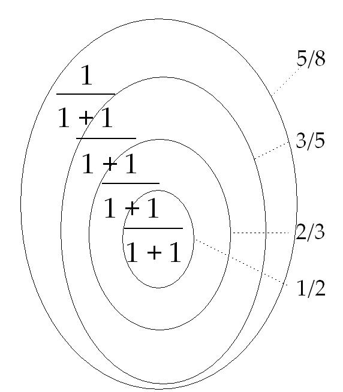
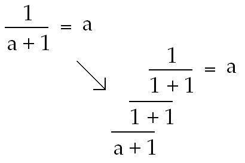
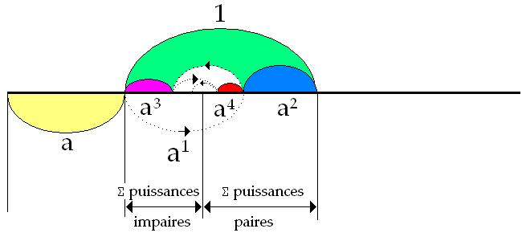

# Leçon 11 | 20 Mai 1970

  <label><input type="checkbox" data-lacan-toggle="original" checked> 原文</label>
  <label><input type="checkbox" data-lacan-toggle="notes" checked> 注释</label>
  <label><input type="checkbox" data-lacan-toggle="commentary" checked> 个人解读评论</label>

<section class="parallel-paragraph" data-paragraph-ids="s17-11-0001 s17-11-0002 s17-11-0003">

s17-11-0001, s17-11-0002, s17-11-0003

自从我们上次见面以来，已经过去了不少时日，我指的是今年四月在这里的那一次。

我并不是说最近那次——那是在别处进行的，至少对你们某些人来说是如此……

我是说，那次我们被带到先贤祠台阶上所进行的那种交流。

> 说实话，事隔八天再回头看，我觉得那次交流所谈到的话题，并不算水平低，毕竟它让我得以重申一些要点，而这些要点确实……

既然有人提出问题，而且这些问题一点也不愚蠢，那它们确实值得澄清。然而，我在交流刚结束、有人陪我回去的那一刻，最直接的感受却是一种<strong>某种不合适感（inadéquation）</strong>。

原文 · s17-11-0001, s17-11-0002, s17-11-0003

Voilà, il a passé beaucoup d’eau sous le pont depuis notre dernière rencontre, je parle de celle qui s’est passée ici en Avril.

Je ne parle pas de la toute dernière qui s’est passée ailleurs, au moins pour certains...

je veux dire cette sorte d’échange que nous avons été amenés à faire sur les marches du Panthéon.

</section>

<section class="parallel-paragraph" data-paragraph-ids="s17-11-0004 s17-11-0005 s17-11-0006 s17-11-0007 s17-11-0008 s17-11-0009">

s17-11-0004, s17-11-0005, s17-11-0006, s17-11-0007, s17-11-0008, s17-11-0009

即便是那些发言得最好的——事实上，他们提出的问题没有一个是不合理的——即便是他们，在最初时刻，在我看来也多少显得有些滞后，落在某种东西的后面，而这种滞后似乎反映在这样一个现象中：
至少在那种尚不构成问题的、略带熟稔的呼唤式插话里，
我被放置在某种参照之中——这些参照并非都应当被拒绝，
毕竟，第一个参照就是戈尔吉亚，据说我在这里重复了他的一些东西。

为什么不可以呢？

问题在于，当那位提及这个人物（戈尔吉亚）发言时——这个人物的效力我们今天已难以衡量——戈尔吉亚毕竟还是被归入了“思想史”的范畴。
正是在这里，若我可以这样说，出现了一种“退后”的姿态，而在我看来这是令人遗憾的：
因为它实际上是把某种采样式的处理方式统一起来，即以“思想的功能”这一笼统的括号，将对这个人或那个人的距离感、切分与归并，都统一收拢到同一个名目之下。

> • <strong>Gorgias</strong>（戈尔吉亚）：古希腊诡辩学家，以修辞学和论辩术著称。此处有人暗示拉康的讲法像是对戈尔吉亚的“复演”或“重复”。

听众提及戈尔吉亚时，是把他当作“思想史”中的一环来看待。

> 这种做法在拉康看来是“退步”的，因为它把具体的修辞实践、当时的效力（efficacité）抹平，抽象化为“思想功能”的例证。
>
> 这里要区分的是：精神分析不应被纳入到那种把哲学人物作为“思想功能”的博物馆式分类，而应该直面其在话语中的效力与结构。 也就是说哪怕是某种“修辞家，智术师”的发言，基于语言难道不能看出什么东西吗？毕竟某种意义上哲学背后都有一个主人能指。
> 把精神分析师与哲学家们放在同一个思想史框架下当作某个历史进程的版本是有问题的。精神分析，分析的是语言的结构，而不是逻辑。

原文 · s17-11-0004, s17-11-0005, s17-11-0006, s17-11-0007, s17-11-0008, s17-11-0009

À la vérité, comme ça avec le recul de huit jours, je trouve que ce qui s’y est échangé de propos, n’était pas d’un mauvais niveau puisqu’en somme ça m’a permis de rappeler un certain nombre de points, qui sans doute...

> puisqu’on me posait la ques­tion et que cette question n’était pas du tout inepte ...méritaient d’être précisés.

Mon premier sentiment tout de suite après, quand j’étais avec quelqu’un qui me raccompagnait, a été pourtant d’une certaine inadéquation.

Même les meilleurs de ceux qui ont parlé...

> et à la vérité aucun n’était sans être justifié dans ses ques­tions ...même les meilleurs, au premier temps, m’ont paru être un peu à la traîne, à la traîne de quelque chose qui me semble se refléter dans ceci que...

> au moins dans cette sorte d’interpellation familière qui n’était pas encore des questions, ...j’étais situé comme ça d’un certain nombre de références qui ne sont certes pas toutes à refuser puisqu’aussi bien la première était celle à Gorgias, dont soi-disant j’o­pérerais ici je ne sais quelle répétition. Pourquoi pas ?

</section>

<section class="parallel-paragraph" data-paragraph-ids="s17-11-0010 s17-11-0011 s17-11-0012 s17-11-0013 s17-11-0014 s17-11-0016 s17-11-0017 s17-11-0018">

s17-11-0010, s17-11-0011, s17-11-0012, s17-11-0013, s17-11-0014, s17-11-0016, s17-11-0017, s17-11-0018

在我看来，没有什么比这更不均质的了……
如果我可以这样表达的话，没有什么能让我们去定义某种“物种”，在那些——无论以何种身份——被设想为“思想的代表”的人之中，他们实际上组织的功能，根本不是同类的一种“种属”。

“思想”并不是一个范畴，我甚至几乎要说，它是一种情感（affect）。
不过这并不是说它是在情感角度上最为根本的。
只有一个（思想），这才真正构成了一种独特的位置——
这种位置是一种新的被引入世界的东西。
而我说，它正是我在黑板上画出的那个图式的产物，当我谈论精神分析的话语时。
其实，把它画在黑板上，与仅仅谈论它，是截然不同的。

我记得，在文森（Vincennes），当我在那里出现的那一次——那是一次没有再现过的，但我说过，它将会再度发生——有人觉得有必要对我喊道：
真正占据大家注意的是“现实的事情”，也就是说，有人提醒我，在离我们聚集的地方不远处，有人正在被揍，他坚持说，应该去想这些才对，黑板上的东西与这种“现实”毫无关系。

这正是错误所在。我甚至要说，如果我们有机会去把握某种被称作“真实（le réel）”的东西，那绝不会在别处，而只能是在黑板上。甚至连我对它所作的评论，那些成形为言语的话语，也仅仅是与黑板上写下的东西相关。

这是一个事实：它由这个事实性（factice）——也就是所谓的科学——所证明。如果仅仅把科学的出现记作是某种哲学熬制的产物，那就完全错了；

它或许更应被称为“形而上学（métaphysique）”而不是“物理学（physique）”。事实上，我们的科学物理学，倒的确值得被称作“形而上学”——这一点有待进一步阐明。

原文 · s17-11-0010, s17-11-0011, s17-11-0012, s17-11-0013, s17-11-0014, s17-11-0016, s17-11-0017, s17-11-0018

L’inconvénient, c’est que dans la bouche de la personne qui évoquait ce personnage, dont nous pouvons maintenant mal mesurer l’efficacité, Gorgias était malgré tout quelqu’un appartenant à *l’histoire de la pensée.* C’est bien là qu’est, si je puis dire, le recul, et qui me paraît fâcheux, celui en somme qui unifie sous ce terme une sorte d’échantillonnage, de prise de distance à l’égard de tel ou tel, qu’on réunit sous cette boucle, sous cette accolade, de « *fonction de la pensée* ».

Il me semble qu’il n’y a rien qui soit moins homogène, si je puis m’exprimer ainsi, rien qui permette de définir une espèce, dans ceux qui, à quelque titre qu’on se les imagine comme repré­sentant la pensée, ont ordonné *une fonction* , qui serait justement d’une espèce.

La pensée n’est pas une catégorie, je dirai presque que *c’est un affect*.

Encore ne serait-ce pas pour dire que c’est le plus fondamental, sous cet angle, de l’affect.

Qu’il n’y en ait qu’un, c’est ce qui constitue à proprement parler une certaine position, nouvelle à être introduite dans le monde, et dont je dis qu’il est le fait de ce *quelque chose* dont je vous donne un schéma porté au tableau noir, quand je parle du *discours psychanalytique*.

À la vérité, porter au tableau noir est quelque chose de distinct, que d’en *parler*.

##### Quelqu’un...

##### je me souviens, à Vincennes, alors que j’y paraissais pour la fois

</section>

<section class="parallel-paragraph" data-paragraph-ids="s17-11-0015">

s17-11-0015

[无对应译文]

原文 · s17-11-0015

</section>

<section class="parallel-paragraph" data-paragraph-ids="s17-11-0019 s17-11-0020 s17-11-0021 s17-11-0022 s17-11-0023 s17-11-0024 s17-11-0025 s17-11-0026 s17-11-0027 s17-11-0028 s17-11-0029 s17-11-0030 s17-11-0031 s17-11-0032 s17-11-0033">

s17-11-0019, s17-11-0020, s17-11-0021, s17-11-0022, s17-11-0023, s17-11-0024, s17-11-0025, s17-11-0026, s17-11-0027, s17-11-0028, s17-11-0029, s17-11-0030, s17-11-0031, s17-11-0032, s17-11-0033

而要对这一点作出明确说明，我认为恰恰可以从精神分析的话语来着手。因为它所表述的是：在这个话语的框架下，情感（affect）只有一种，也就是说，它是<strong>说话存在者</strong>（être parlant）被卷入一个话语时所产生的产物，在其中，这个话语把他界定为一个对象。

毫无疑问，笛卡尔的“我思（cogito）”正是由此获得了它的典范性价值，当然，前提是我们必须对它进行重新的审视和复看。这也许就是我今天将要再一次、并且简要地去做的事情。

> 如何重新审视“我思”主体呢？拉康是放在话语结构中。

你们可以想象，如果不通过语言，人如何思考吗？
毕竟当一个主体思考“我”的时候，也是要通过“我”这个文字作为一个锚定点。锚定点这个词我原本想用“抓手”，但那种互联网大厂黑话的意味太浓了，这也是一个很好的例子，如果不通过语言，我们甚至无法讨论“锚定点”，同样也无法讨论我。

说话的存在者（être parlant）在某个话语中被界定为对象时，由此产生的这种情感效应（affect），必须指出：这个对象本身是不可命名的。

如果我尝试把它称作“剩余享乐（plus-de-jouir）”，那也只是一个命名的装置而已。

由某种话语效应所形成的这个对象，到底是什么？对此我们一无所知，除了这一点：它是欲望的原因。换句话说，严格来讲，它的显现方式就是作为一种“存在的缺失（manque à être）”。

> 命名之后的剩余——>欲望的成因

但是，就我们出发的地方而言，即便“被结构如同一种语言”是首先显现出来的首要事实，我们并不是停留在那个层次。

在语言的效应之中，涉及的并不是任何一个具体的存在者（étant），而只是一个说话的存在者（être parlant）。

我们从一开始所处的并不是“存在者”的层次，而是“存在”的层次。

> 存在: 即构成存在者之所以为存在者的条件

说话的存在者: 被能指所捕获、通过语言被界定的存在。
具体的存在者：指具体的、实有的存在物（如人、动物、生物体）。

原文 · s17-11-0019, s17-11-0020, s17-11-0021, s17-11-0022, s17-11-0023, s17-11-0024, s17-11-0025, s17-11-0026, s17-11-0027, s17-11-0028, s17-11-0029, s17-11-0030, s17-11-0031, s17-11-0032, s17-11-0033

##### qui ne s’est pas reproduite depuis, mais qui, je l’ai dit, se reproduira

##### ...quelqu’un a cru devoir me crier que... y avait des choses réelles qui occupaient vraiment l’assemblée,

##### c’est à savoir tel ou tel point qu’on me rappelait, à savoir qu’on se tabassait à tel endroit,

##### plus ou moins loin du lieu où nous étions réunis, que c’est à ça qu’il fallait penser,

##### le tableau noir ça n’avait rien à faire avec ce *réel*.

##### C’est là qu’est *l’erreur*, et j’irai à dire que s’il y a une chance de *saisir quelque chose* qui s’appelle le *réel*,

##### ce n’est pas ailleurs qu’au tableau noir, et que même ce que je peux avoir à en commenter, ce qui prend forme de parole,

##### n’a rapport qu’à ce qui *s’écrit* au tableau noir.

C’est un fait, qui est démontré de ce fait, de ce factice, qu’est la science, dont on aurait tout à fait tort de n’inscrire l’émergence que d’une coction philosophique : « *métaphysique »* peut-être plus que « *physique » *: que notre physique scientifique mérite d’être qualifiée de métaphysique, c’est ce qui serait à préciser.

Et le préciser me semble possible précisément de ce point qui est le *dis­cours psychanalytique,* en ceci qu’il énonce qu’à partir de ce discours, *d’affect il n’y en a qu’un*, à savoir le produit de la prise de l’être parlant dans un discours, *en tant que ce discours le détermine comme objet*.

C’est très certainement de là que prend *sa valeur exemplaire* *le cogito cartésien,* à condition bien sûr qu’on l’examine qu’on le revoit. C’est ce que peut-être, une fois de plus et rapidement, j’aurai aujourd’hui à faire.

Cet affect par quoi l’être parlant, d’un discours se trouve déterminé comme *objet*, ce qu’il faut dire c’est que *cet objet n’est pas nommable*.

Si j’essaie de le nommer comme « *plus de jouir »*, ce n’est là qu’appareil de nomenclature.

*Quel objet est fait de cet effet* d’un certain discours ?

*Cet objet* nous n’en savons rien, sinon qu’il *est cause du désir*, c’est-à-dire à propre­ment parler que *<u>c’est comme manque à être qu’il se manifeste</u>*.

</section>

<section class="parallel-paragraph" data-paragraph-ids="s17-11-0034">

s17-11-0034

[无对应译文]

原文 · s17-11-0034

</section>

<section class="parallel-paragraph" data-paragraph-ids="s17-11-0035 s17-11-0036 s17-11-0037 s17-11-0038 s17-11-0039 s17-11-0040 s17-11-0041 s17-11-0042 s17-11-0043 s17-11-0044 s17-11-0045">

s17-11-0035, s17-11-0036, s17-11-0037, s17-11-0038, s17-11-0039, s17-11-0040, s17-11-0041, s17-11-0042, s17-11-0043, s17-11-0044, s17-11-0045

依次是这样的顺序。

> <strong>精神分析的的首要问题不是“人是什么”</strong>，而是<strong>主体如何被语言结构化</strong>。
>
> - 在语言的效应中，所涉及的第一个问题则是那个通过语言被界定为“说话存在者”的存在。
>
> 这是拉康与海德格尔的一个交叉点：精神分析以语言为切入点进入“存在”的问题。

然而在这里，我们必须谨防一种幻象：

即把“存在”这样地提出时，陷入到一个错误之中——

这个错误在于将其同一切以“辩证法”方式所安排的东西混同起来，也就是说，把它看作“存在”与“虚无”的最初对立。

> 哲学中“对立统一”的方式看待存在，拉康认为这是需要防范的一种幻想。

辩证法是存在者的范畴，这里所说的“存在”并不与虚无对立，不存在这种对立。

这种效应——让我们此处在“存在”上加上引号——它的首要情感效应只在这样一个层次才显现出来：
即在那个成为欲望之因的地方。
这是我们所界定的，话语装置的第一个效应，
它涉及分析师——更确切地说，是分析师作为一个位置、一个场所，我正试图用黑板上的这些小字母去加以界定。

正是在这里，这个效应被安置下来：它安置为“欲望的原因”。

这是一个极为新颖的、甚至可以说是悖论性的立场，
但毫无疑问，它已在实践中得到了确认。
它的重要性可通过这样一点来衡量：
它与所谓“主人话语”并不是保持距离或居高临下的关系，而是确实以此为开端。也就是说，有某种东西因此得以被显现：

原文 · s17-11-0035, s17-11-0036, s17-11-0037, s17-11-0038, s17-11-0039, s17-11-0040, s17-11-0041, s17-11-0042, s17-11-0043, s17-11-0044, s17-11-0045

*Ce n’est donc rien d’étant qui est ainsi déterminé*.

Ce sur quoi porte *l’effet de tel discours* peut bien être un *étant* qu’on appellera par exemple *l’homme* ou bien *un vivant*, on ajoutera *sexué* et *mortel* et l’on s’avancera hardiment à penser que c’est là ce sur quoi porte le discours de la psychanalyse, sous prétexte qu’il s’y agit tout le temps du sexe et de la mort.

Mais d’où nous partons, s’il est effectif que c’est au niveau de quelque chose qui se révèle d’abord, et comme premier fait, pour « *structuré comme un langage »*, nous n’en sommes pas là.

*Ce n’est de nul étant qu’il s’agit dans l’effet du lan­gage*, dans ceci qu’il ne s’agit que d’un *être parlant *:

- nous ne sommes pas au niveau de *l’étant* au départ,

- mais au niveau de *l’être*.

Encore est-ce là...

pour qu’il nous faille nous garder d’un mirage, à savoir que « *l’être »* ainsi soit posé, ...c’est *là* que l’erreur nous guette d’une assimilation avec tout ce qui s’est ordonné comme dialectique, à savoir d’une première opposition de *l’être et du néant*.

Cet effet - mettons maintenant ici *les guillemets* - «* d’être *», son 1er *affect* n’apparaît qu’au niveau de *ce qui se fait* *cause du désir*, de ce que nous cernons, de ce premier effet d’appareil : *ce qu’il en est de l’analyste*, de *l’analyste* sans doute comme place, comme position que j’essaie de cerner de ces petites lettres au tableau noir.

C’est que *c’est là qu’il se pose* : *il se pose comme cause du désir*.

Position éminemment inédite, sinon paradoxale, et dont il est certain qu’une pratique l’entérine, dont l’importance peut se mesurer d’être repérée à ce qui est son rapport fondamental, non de distance, ni de survol, mais proprement initiée par ce qui se désigne comme *discours du Maître*.

</section>

<section class="parallel-paragraph" data-paragraph-ids="s17-11-0046 s17-11-0047 s17-11-0048 s17-11-0049 s17-11-0050 s17-11-0051">

s17-11-0046, s17-11-0047, s17-11-0048, s17-11-0049, s17-11-0050, s17-11-0051

主体的一切界定——因而思想的一切界定——都依赖于话语。

正是在这种话语中，确实出现了一个时刻……

而若把它理解为一种“风险”的层次，那将是大错特错的——

这种所谓的风险，归根结底仍然是神话的痕迹，依旧停留在黑格尔式的现象学层面。这种痕迹让人以为：主人不过就是那个——什么？——“最强者”？

> 这算是某种常见的误区了

这当然并不是黑格尔真正写下的东西。
那种“以生命为赌注的纯粹荣耀之争”，仍然属于想象界的范畴。
真正构成“主人”的，是这样一种东西：
我曾用别的话称之为“语言的水晶（le cristal de la langue）”。为什么不借用法语中一个同音的表达：“m’apostrophe être”（m’être，意为“我—存在”，或“自我的存在”）呢？

“是我自己，对我自身的存在”。
正是由此，产生了这个“m’être-能指（signifiant-m’être）”。
至于其中第二个词如何书写，就留给你们自行选择。

> <strong>（以生命为赌注的纯粹荣耀之争）</strong>：黑格尔《精神现象学》中主人与奴隶的生死搏斗。拉康这里评论这个“主奴神话“属于想象界，并不是话语的逻辑。

> 想象界关系着镜像阶段，体格大小，力量对比等等。
> ”外强中干，绣花枕头”便是是对这种想象的揭露。并且这种殊死搏斗的想象还涉及到一个误区，便是前面提到的“主人存在，并且主人最强”
> 拉康这里暗示主人身份来源于语言中的一种自我指称，是语言产生的效果，而不是力量对抗。

要开始说明这个独一的能指是如何运作的，就必须从它与那已经存在、已经被组织起来的东西的关系出发。

原文 · s17-11-0046, s17-11-0047, s17-11-0048, s17-11-0049, s17-11-0050, s17-11-0051

C’est à savoir qu’il y a quelque chose qui se présentifie, de par le fait que c’est du *dis­cours* que dépend toute détermination de sujet, donc de pensée.

C’est que dans ce discours surgit en effet... qu’il y a ce moment dont il serait bien faux de croire que c’est au niveau d’un risque...

ce risque malgré tout mythique, trace de mythe encore à rester dans la phéno­ménologie hégélienne ...qui fait que ce Maître ne serait rien que celui - quoi ? - *qui est le plus fort* ?

Ce n’est certes pas cela qu’inscrit Hegel. « *La lutte de pur prestige au risque de la mort* » appartient encore au règne de l’*imaginaire*.

Ce qui fait le Maître c’est ceci : c’est ce que j’ai appelé en d’autres termes « *le cristal de la langue* ».

Pourquoi ne pas utiliser ce qui en français peut se désigner sous l’homonymie de « *m apostrophe être* » : *m’être, m’être à moi-même* ? C’est de là que surgit *le signifiant-m’être,* dont je vous laisse le deuxième terme à écrire comme vous le préférerez.

</section>

<section class="parallel-paragraph" data-paragraph-ids="s17-11-0052 s17-11-0053 s17-11-0054 s17-11-0055">

s17-11-0052, s17-11-0053, s17-11-0054, s17-11-0055

因此，我们只能把它理解为一个“始终已经在场”的能指的存在。

因为如果这个独一的能指——即“主人能指”（你们可以随意书写）——要与某种实践联系起来，而这种实践正是它所规整的实践，

那么，这种实践本身就已经被织就、被编排在某种东西之中，

也就是说，在其中尚未明确分离出来的，正是能指的联结（articulation signifiante），而这种联结正是一切知识的原则，即便它最初只能以“技能（savoir-faire）”的形式被把握。

> 主人能指：即S1，在主体还没有被另外一个能指代表之前，代表了主体，也就是说：强行代表主体。

主人能指将被代表的主体，放在能指链中进行把握——这便是知识（S2）。

这种最初知识的痕迹，我们甚至可以在很远的地方找到——
尽管它早已被深度“加工”，即在所谓哲学传统中，被主人能指与知识之间的结合所反复操作和篡改。

别忘了，当笛卡尔提出他的“我思，故我在”时，他曾在一段时间里支撑着他的“我思”——支撑着什么呢？——正是通过对这种“被加工的知识”的质疑与怀疑。
这种知识，早已在主人（能指）的渗入下被长久地编织与构造。

原文 · s17-11-0052, s17-11-0053, s17-11-0054, s17-11-0055

Pour commencer d’articuler comment ce signifiant unique opère de sa relation avec ce qui est là déjà, déjà articulé, de sorte que nous ne pouvons le concevoir que d’une présence du signifiant déjà là, je dirais, de toujours.

Car si ce signifiant unique...

> le signifiant du *Maître,* à écrire comme vous voulez ...s’articule à quelque chose d’une pratique, qui est celle qu’il ordonne, cette pratique est déjà tissée, tramée, de ce qui, pas encore certes, ne s’en dégage, à savoir l’articula­tion signifiante qui est au principe de tout savoir, ne pût-il d’abord être abordé qu’en savoir-faire.

La trace de cette présence première de ce savoir, nous la trouvons même là où déjà elle est loin, d’avoir été justement longuement trafiquée dans ce qu’on appelle *la tradition philosophique,* justement de l’embrayage du *signi­fiant du Maître* sur ce savoir.

</section>

<section class="parallel-paragraph" data-paragraph-ids="s17-11-0056 s17-11-0057 s17-11-0058 s17-11-0059 s17-11-0060 s17-11-0061 s17-11-0062 s17-11-0063 s17-11-0064 s17-11-0065 s17-11-0066 s17-11-0067">

s17-11-0056, s17-11-0057, s17-11-0058, s17-11-0059, s17-11-0060, s17-11-0061, s17-11-0062, s17-11-0063, s17-11-0064, s17-11-0065, s17-11-0066, s17-11-0067

今年我花了很长时间讨论《何西阿书》（Osée）的文本——
这是关于弗洛伊德根据塞林（Sellin）的研究所引用的部分。
而其中最大的收益，也许并不单纯在于——尽管这一点当然也存在——对精神分析理论中那个我称之为“神话残余”的东西进行质疑，也就是所谓的“俄狄浦斯情结”。

> 第十讲对这一部分进行了深入的讨论，拉康对神话文本的态度则在第九讲表达的非常清楚。

> 精神分析必须将这种“神话残余”置于分裂的无知的被质疑有待被阐释的位置下，而不是把它当作终极解释。
> 荣格不知道作何感想…..（笑）还是看看远方的女神异闻录的吧，家人们。

毫无疑问，假如要在此显现某种神话性知识的汪洋，那种据说支配着人类生活的知识——至于它是否和谐，我们根本无法知道——那么，耶和华所诅咒的，正是我称之为“他那残酷的无知”之物，他用“娼妓（prostitution）”这一词来加以命名。

在我看来，这已经是足够的一个侧面，而且肯定要比那种常见的、对民族志成果的依赖更为可取。
因为后者本身就包含着某种混乱，仿佛自然而然地依附于那些被收集起来的东西。但这些东西是如何被收集的呢？——是通过书写收集的！也就是说，被逐条详细地记载、被抽离出来，从此永远地脱离了所谓的“田野”，被不可逆转地扭曲了。
当然，这并不是要说这些神话性知识能够对“性关系的本质”说得更多，或者更好。

> 又cue了一下列维-斯特劳斯

民族志研究看似是“自然收集”的事实，但实际上，<strong>所有田野资料都是通过书写加工的</strong>，因此不可避免地被扭曲。
所谓“神话知识”或“民族志事实”并不能真正告诉我们关于“性关系本质”的任何东西。

我想到了那个‘常凯申’的出处，倒是一个特别有趣的由于文字和书写不可避免的被扭曲的例子。
在第九讲中，讨论了更多关于书写摩西之死被扭曲的可能性。

精神分析所揭示的，以及它让我们得以显现的，是性，以及作为其依附关系的死亡……

原文 · s17-11-0056, s17-11-0057, s17-11-0058, s17-11-0059, s17-11-0060, s17-11-0061, s17-11-0062, s17-11-0063, s17-11-0064, s17-11-0065, s17-11-0066, s17-11-0067

N’oublions pas que quand Descartes pose son « *Je pense, donc je suis* », c’est d’avoir soutenu un temps son « *Je pense* » - de quoi ? - d’une mise en question, d’une *mise en doute* *de ce savoir* que j’appelle « *trafiqué* », de ce savoir déjà longuement élaboré de l’immixtion du Maître.

Que pouvons-nous dire de l’actuelle science qui nous permette de nous repérer ?

Si vous voulez dans trois étages, trois étages que je n’évoque ici que par faiblesse didactique, de ce que je ne suis pas sûr après tout que vous colliez à mes phrases :

- *la science*,

- derrière : *la philosophie*,

- et au-delà : *quelque chose* dont nous avons la notion ne serait-ce que par les anathèmes bibliques.

Si longuement j’ai fait place au texte d’*Osée* cette année...

à propos de ce que Freud en tire d’après Sellin ...le bénéfice le meilleur n’est peut-être pas...

quoiqu’il existe aussi de ce côté ...de *la mise en question* de ce qu’il en est, dans la théorie psychanalytique, de ce que j’ai appelé ce *résidu de mythe* qui s’appelle *le complexe d’Œdipe*.

Assurément, s’il fallait quelque chose pour ici présentifier je ne sais quel océan d’un savoir mythique réglant...

et comment savoir comment si c’était harmonieux ou pas ...la vie des hommes, ce que Yahvé maudit...

> de ce que j’ai appelé « sa féroce ignorance » ...du terme de « prostitution ».

</section>

<section class="parallel-paragraph" data-paragraph-ids="s17-11-0068 s17-11-0069 s17-11-0070 s17-11-0071 s17-11-0072 s17-11-0073 s17-11-0074 s17-11-0075">

s17-11-0068, s17-11-0069, s17-11-0070, s17-11-0071, s17-11-0072, s17-11-0073, s17-11-0074, s17-11-0075

在这一点上，我们其实无法对任何事有确定的把握，除了那种关于“性差异与死亡之间的联系”的整体性体认。

如果说精神分析让这一点得以显现，那意味着什么？

意味着它以一种方式加以展示——我不会说是“鲜活的”，而是“被表述的”方式——即在话语的卷入中，这个存在者——无论它是谁，甚至说，它根本算不上“存在”——在其中所显现的事实是：<strong>无处可见所谓“性关系”的直接表述</strong>。

它只能以一种复杂的方式被指示或表达，而我们甚至不能说它是“通过媒介的”，好像有什么 *medii* 或 *media*。

在这里出现的，乃是两种东西：

– 一方面，是我称之为“剩余享乐（plus-de-jouir）”的真实效应，即小对象 (a)。

临床经验告诉我们：只有当这个小对象 (a) 取代了“女人”的位置时，男人才会去欲望她。

– 另一方面，反过来说，女人所面对的——如果我们能谈论的话——恰恰是她自己的那种享乐，它某种程度上被表现为男人的“全能”。

而这正是男人在其作为“主人”而加以表述时，却必然落入匮乏之处的那个点。

在精神分析的经验中必须从这一点出发：
所谓“男人”——也就是“雄性”——一旦作为说话的存在者介入话语，便在话语的效应中彻底消失、消散，尤其是在主人话语的效应之下（你们可以随意书写这个“主人”）。

原文 · s17-11-0068, s17-11-0069, s17-11-0070, s17-11-0071, s17-11-0072, s17-11-0073, s17-11-0074, s17-11-0075

C’est là biais suffisant à mes yeux, et sûrement meilleur que la réfé­rence commune aux fruits de l’ethnographie, qui recèle en elle-même je ne sais quelle confusion, d’adhérer en quelque sorte comme naturel à ce qui est recueilli.

Recueilli comment ? *Recueilli par écrit* !

C’est-à-dire détaillé, extrait, faussé à jamais du prétendu *terrain* dont on prétend le dégager.

Ce n’est certes pas pour dire que ces savoirs mythiques pouvaient en dire plus long, ni mieux, de ce qui est l’essence du rapport sexuel.

Ce que la *psychanalyse* démontre et ce en quoi elle nous présentifie le sexe, la mort comme sa dépen­dance...

encore là ne sommes-nous sûrs de rien, si ce n’est de cette appré­hension massive *du lien de la différence sexuelle à la mort* ...si *la psychanalyse* nous le présentifie - c’est quoi ? - c’est de démontrer de façon que je ne dirai pas *vive*, mais seulement articulée, que de la prise dans le discours de cet *être*...

quel qu’il soit, c’est-à-dire qu’il n’est même pas *être* ...en tout cas ce qui se démontre, c’est que nulle part n’apparaît d’articulation qui exprime *le rapport sexuel*, si ce n’est de *façons complexes*, dont on ne peut même pas dire qu’elle soit médiée, qu’il y ait de *medii* ou de *media*, comme vous voudrez, qui sont,

- l’un, cet *effet réel* que j’appelle *le plus de jouir*, qui est le *petit(a)*. Ce que l’expérience nous indique c’est que *ce n’est qu’à ce que ce petit(a) se substitue à la femme, que l’homme la désire*.

</section>

<section class="parallel-paragraph" data-paragraph-ids="s17-11-0076 s17-11-0077 s17-11-0078 s17-11-0079 s17-11-0080">

s17-11-0076, s17-11-0077, s17-11-0078, s17-11-0079, s17-11-0080

他只得以一种方式被铭写：那就是阉割。
而“阉割”实际上正好可以被界定为：对“女人”的剥夺——
这里的“女人”指的是，若她能够在某个相称的能指中得以实现。

“对女人的剥夺”：
这就是所谓阉割的意义，用话语的缺陷来表述时，它正是如此。

正是因为这件事不可思议（ce n’est pas pensable），所以作为媒介，话语秩序建立起一种欲望——这种欲望本身被构造成“不可能的”——并且使得女性特权性的对象成为母亲，恰恰因为她是被禁止的。

这就是对一个根本事实的有序包装：
也就是说，在所谓“神话性的结合”中，不可能有一个位置能被定义为男人与女人之间的“性结合”。

而精神分析的话语所揭示的，恰恰在于：所谓“一”（统一者，整体的“一”），并不是认同所涉及的东西。

作为枢纽的认同、作为主要的认同，就是“一元特征（trait unaire）”，就是那个被标记为<strong>1</strong>的存在。

在任何存在者（étant）被提升之前，由于这个独一无二的“1”、由于承载这一标记的东西，从那一刻起，语言的效应就被确立，

而第一个情感效应（affect）也随之产生。

这正是我在黑板上写下的公式所提醒我们的。

在某处，某个东西被单独隔离出来：

> 笛卡尔的 *cogito* 所标记的，正是这种“一元特征（trait unaire）”，可以理解为在“我思”中被假定出来，以说出“所以我在”。

原文 · s17-11-0076, s17-11-0077, s17-11-0078, s17-11-0079, s17-11-0080

- Qu’inver­sement, ce à quoi la femme a affaire - si tant est que nous puissions en parler - c’est proprement à cette jouissance qui est la sienne, et qui quelque part se représente d’une toute-puissance de l’homme, qui est précisément ce par quoi l’homme s’articulant, s’articulant comme Maître, se trouve être en défaut.

C’est de là qu’il faut partir dans l’expérience analytique, c’est que ce qui pourrait être appelé *l’homme* c’est-à-dire *le mâle*, en tant qu’*être parlant,* ceci proprement disparaît, s’évanouit, de l’effet même du discours et du *discours du Maître...*

> écrivez-le comme vous voudrez ...de ne s’inscrire qu’en castration, qui de fait est proprement à définir comme *privation de la femme*, de la femme en tant qu’elle se réaliserait dans un signifiant congru.

*La privation de la femme* : tel est, exprimé en terme de défaut du discours, ce que veut dire la castration.

C’est bien parce que ce n’est pas pensable que - comme truchement - l’ordre parlant institue ce désir - constitué comme *impossible -* qui fait de l’objet féminin privilégié : la mère, en tant qu’elle est interdite.

</section>

<section class="parallel-paragraph" data-paragraph-ids="s17-11-0081 s17-11-0082 s17-11-0083 s17-11-0084 s17-11-0085 s17-11-0086">

s17-11-0081, s17-11-0082, s17-11-0083, s17-11-0084, s17-11-0085, s17-11-0086

但在这里，已经标记出了一个<strong>分裂的效应</strong>：

“我在（je suis）”同时抹消了“我被标记为一（je suis marqué du 1）”。当然，笛卡尔本身仍属于经院哲学的传统，而他之所以能脱身，是借助于某种“杂技般的转折”，这种转折并不该被轻视，它正是一种新的出现方式。

正是依靠这个最初的“我在（je suis）”的位置，“我思（je pense）”才得以被书写出来。

早在很久以前，你们记得我曾经是这样写的：
“我思：所以我在（Je pense : donc je suis）”。

这个“所以我在（donc je suis）”，本身就是一种思想。

这一点若承载起它的知识特征，就会更清晰，它其实并不超出那个“我在（je suis）”，那个被“一”所标记的、独特的、单一的“我在”——是什么呢？——正是那个效应：“我思（je pense）”。

原文 · s17-11-0081, s17-11-0082, s17-11-0083, s17-11-0084, s17-11-0085, s17-11-0086

C’est l’habillage ordonné du fait fondamental qu’il n’y a pas de place possible dans une *union mythique* qui serait définie comme *sexuelle entre l’homme et la femme.*

C’est bien là que ce que nous appréhendons dans le *discours psychana­lytique*, c’est que *l’Un unifiant*, *l’Un-tout*, n’est pas ce dont il s’agit dans *l’identification*.

*L’identification*-pivot, *l’identification majeure, c’est le trait unaire*, c’est l’être marqué **1**.

En tant qu’avant toute promotion d’aucun étant, du fait d’un **1** singulier, de ce qui porte la marque, et que dès ce moment, l’effet de langage se pose et le pre­mier affect.

C’est ceci que rappellent les formules ici que j’ai inscrites au tableau.

Quelque part s’isole ce quelque chose que *le cogito s*eulement marque, du *trait unaire* lui aussi, qu’on peut supposer au « *Je pense* » pour dire « *donc je suis* ».

</section>

<section class="parallel-paragraph" data-paragraph-ids="s17-11-0087 s17-11-0088 s17-11-0089 s17-11-0090 s17-11-0091 s17-11-0092 s17-11-0093">

s17-11-0087, s17-11-0088, s17-11-0089, s17-11-0090, s17-11-0091, s17-11-0092, s17-11-0093

但在这里依然存在一个<strong>标点上的错误</strong>：这个“所以（ergo）”……

我很早就这样表述过：这个“ergo”并非别的，正是“ego”的在场（en jeu）。

“所以”必须被放在 *cogito* 的一边：即“我思：‘所以我在’”。

如此，这个公式才得到它真正的意义：
“所以（ergo）”是“被思出的（pensée）”。

> 杂技一般的转折——“所以/故”

我思与我在之间的转折，“故”这里有点作弊的嫌疑。
为什么就“故”了，好像没什么道理吧。
因此拉康修改了一下这句话
我思：（冒号）故我在。
关于“我在”是“我思”的陈述，是我思的“思想”，是被“思出来”的，并不是逻辑上推理出的命题。
俺寻思，俺在这。

我们必须从这里出发，去把握这一效应在最简单秩序中的意义：
语言的效应正是在“一元特征（trait unaire）”的出现层面上发挥作用。

然而，这个“一元特征”从来不是孤立的。它之所以构成秩序，正是因为它会重复——但它的重复却从未是“相同的”重复。

这才是秩序本身：
语言的存在，即语言的在场——
它始终已经在那里，已经在起作用。

我们的第一条规则，就是不要去追问语言的起源，哪怕只是因为它早已在其效应中被充分地展示出来。我们越是深入推进这些效应，它的起源就越是浮现出来。

> 丛“我思”转到对“追问语言起源”是挺有启发的一条路径。

因为当我们追问起源时，一切都是“俺寻思”，这可能是福柯跟拉康的区别。

原文 · s17-11-0087, s17-11-0088, s17-11-0089, s17-11-0090, s17-11-0091, s17-11-0092, s17-11-0093

C’est déjà marquer ici *l’effet de division*, d’un « *je suis* » qui élide « *Je suis marqué du* **1** », car bien sûr Descartes s’inscrit bien sûr dans une tradition *scolastique*, il s’en dégage par un tour d’acrobatie, qui n’est pas du tout à dédaigner comme procédé d’émergence.

C’est en fonction de cette *position première* du « *Je suis* », d’ailleurs, que peut seulement s’écrire le « *Je pense* ».

Il y a longtemps, vous vous souvenez comment je l’écris : « *Je pense* : *« donc je suis* ». C’est une pensée ce « *donc je suis.* »

Il se supporte infiniment mieux de porter sa caractéristique de *savoir*, qui ne va pas au-delà du « *je suis* » marqué du 1, du singulier, de l’unique, - de quoi ? - de cet effet qui est « *Je* *pense* ».

Mais là encore, il y a une erreur de ponctuation : l’*ergo...*

> il y a longtemps que j’ai exprimée ainsi l’*ergo* qui n’est rien d’autre que l’*ego* en jeu ...est à mettre *du côté du cogito *: le «* je pense *: *‘donc Je suis’* »» voilà qui donne sa vraie portée à la formule, la cause, l’*ergo* est «* pensée *».

Là est le départ à prendre de *l’effet* de ce dont il s’agit dans l’ordre le plus simple, dont *l’effet de langage* s’exerce au niveau du surgissement du *trait unaire*.

</section>

<section class="parallel-paragraph" data-paragraph-ids="s17-11-0094 s17-11-0095">

s17-11-0094, s17-11-0095

而直接从语言效用介入这个“一元特证”，避免了无止境的逻辑递归和某种“俺寻思”的框架预设。
同时语言重要的是当下被说出来起到的作用，而不是考古。

我在此仅仅顺带指出——今天我们还有更远的地方要推进——

原文 · s17-11-0094, s17-11-0095

Le *trait unaire*, certes n’est jamais seul, donc le fait qu’il se répète...

> qu’il se répète à n’être *jamais le même* ...est proprement l’ordre même, celui dont il s’agit de ce que le langage soit présent, présent et déjà là, déjà efficace.

</section>

<section class="parallel-paragraph" data-paragraph-ids="s17-11-0096 s17-11-0097 s17-11-0098 s17-11-0099 s17-11-0101 s17-11-0102 s17-11-0103">

s17-11-0096, s17-11-0097, s17-11-0098, s17-11-0099, s17-11-0101, s17-11-0102, s17-11-0103

只要把它这样书写出来，

并且在其中以最严格的形式发挥作用的，正是自一开始便以严谨方式运用“符号性”的东西，它在希腊传统中显现出来——

也就是说，在数学的层面上，在欧几里得那里——这是一个根本性的参照——他所给出的那个“第一个定义”，在此之前从未有人提出过，我是指，在我们至今保存下来的书写之中。

当然，谁又能确切知道他（欧几里得）从何处借用了他那极其严格的比例（proportion）的定义呢？

正是这一比例的定义——如果我没记错的话，在《第五卷》中——才为几何学的证明提供了唯一真正的基础。

“证明”这一术语本身是模棱两可的，因为它总是把图形中那些直观性的要素推到前面，从而让我们忽略了这样一个事实：

在欧几里得那里，真正的要求是<strong>符号性的证明</strong>，即通过对不等式与等式的成组排列，才能以一种不近似的、而是严格演绎的方式，确保“比例”这一概念。

而在那个希腊词 <strong>λόγος (logos)</strong> 中，它的意义正是“比例”。

> 欧几里得通过对等式与不等式的组合来严格界定比例，比例的定义不再依赖图像直观，而是依赖严格的符号推理。

> 希腊传统中的“logos”罗格斯 并不仅仅是“理性”，而在数学语境中意味着“比例”。

很奇特，也很有趣，更颇具代表性的是：

人们竟然必须等到斐波那契数列出现，才对这种比例有所把握——这种比例被称为“中项比例（moyenne proportionnelle）”，

原文 · s17-11-0096, s17-11-0097, s17-11-0098, s17-11-0099, s17-11-0101, s17-11-0102, s17-11-0103

La première de nos règles est de ne point interroger sur l’origine du langage, ne serait-ce que parce qu’elle se démontre suffisamment de ses effets.

Plus nous poussons loin *ses effets*, plus cette origine émerge.

L’effet du langage est rétroactif précisément en ceci que c’est à mesure de son développement qu’il manifeste ce qu’il est à proprement parler de *manque à être*.

####### Aussi bien je ne ferai qu’indiquer au passage - nous avons aujourd’hui plus loin à pousser - qu’à seulement l’écrire ainsi :

et à y faire jouer sous sa forme la plus stricte ce qui dès l’origine d’un usage rigoureux du *symbolique* se manifeste dans la tradition grecque, à savoir au niveau des mathématiques, au niveau de ce qui dans Euclide, référence fondamentale, définition première jamais donnée avant lui, je veux dire dans ce qui nous reste d’écrit.

Bien sûr qui sait d’où il emprunte sa très stricte définition de la proportion, celle qui seule donne au niveau du Vème Livre \- si je me souviens bien - le seul vrai fondement de la *démonstration géométrique*, terme ambigu, qui à toujours mettre en avant ces éléments intuitifs qu’il y a dans la figure, nous laisse méconnaître que très formellement dans Euclide, l’exigence est de *démonstration symbolique*, d’ordres groupés des inégalités et des égalités, qui seuls peuvent permettre d’une façon non approximative mais proprement démonstrative, à la proportion de s’assurer, et dans ce terme qui est ce qu’il désigne λόγος \[logos\] c’est le sens de *proportion*.

Il est curieux, il est intéressant, il est représentatif qu’il ait fallu attendre *la série de Fibon­nacci,* pour que ce qui est donné dans une appréhension de cette *proportion* qui s’appelle « *moyenne proportionnelle »,* et qui est celle même que je réécris là, dont vous savez que j’ai fait usage quand j’ai parlé de *D’un Autre à l’autre* [^47].

</section>

<section class="parallel-paragraph" data-paragraph-ids="s17-11-0100">

s17-11-0100

[无对应译文]

原文 · s17-11-0100

</section>

<section class="parallel-paragraph" data-paragraph-ids="s17-11-0104">

s17-11-0104

[无对应译文]

原文 · s17-11-0104

 

</section>

<section class="parallel-paragraph" data-paragraph-ids="s17-11-0105 s17-11-0106 s17-11-0107">

s17-11-0105, s17-11-0106, s17-11-0107

这正是我在此重新写出的那个公式。你们也知道，我曾在讲《从一个他者到另一个他者时使用过它。

> 注：<strong>série de Fibonacci（斐波那契数列）</strong>：数列 1, 1, 2, 3, 5, 8, 13... 其中相邻两项之比逐渐逼近黄金比例。

我曾经使用过这种“中项比例”（moyenne proportionnelle），而浪漫主义者们依旧称之为“黄金比例（nombre d’or）”，并执迷于在历代所有绘画或素描的表面上去重新发现它，仿佛没有意识到这些其实都只是……

要看到这一点，其实只要随便翻开一本谈美学的书，里面都会提到这种“黄金比例”的参照。但如果它真的能被套用在绘画上，
那肯定不是因为画家事先画好了对角线，而确实是因为某种直觉性的契合，让它总是——至少人们会说——最为动听、最为和谐。

> 黄金比例只是数学上的一种构成，并不一定艺术家的有意为之。

不过，除此之外，还有另一件事，即这个东西——你们会很容易把握它的每一个术语：

你们就这样来理解它吧：从下方开始计算，很快你们会看到，首先得到的是 <strong>1/2</strong>；

原文 · s17-11-0105, s17-11-0106, s17-11-0107

Que je me suis servi de cette « *moyenne proportionnelle »,* qu’encore un romantisme continue d’appeler « *le nombre d’or »* et se perd à retrouver à la surface de tout ce qui a pu se peindre ou se crayonner à travers les âges, comme s’il n’était pas certain que tout ceci n’est que...

pour le voir, il n’est que d’ouvrir un ouvrage d’esthétique qui fait état de cette référence ...que si on peut l’y plaquer ce n’est sûrement pas que le peintre en a dessiné par avance les diagonales, et qu’en effet il y a je ne sais quoi d’un accord intuitif qui fait que tou­jours, enfin c’est ce qui chante le mieux.

Il y a tout de même autre chose qui est ceci dont il vous sera facile à prendre chacun de ces termes :

</section>

<section class="parallel-paragraph" data-paragraph-ids="s17-11-0108">

s17-11-0108

[无对应译文]

原文 · s17-11-0108

</section>

<section class="parallel-paragraph" data-paragraph-ids="s17-11-0109 s17-11-0110 s17-11-0111">

s17-11-0109, s17-11-0110, s17-11-0111

接着是 <strong>2/3</strong>；

再接着是 <strong>3/5</strong>；

总之，所涉及的比例正是由斐波那契数列构成的：1, 2, 3, 5……

也就是说，每一项都是前两项的和，正如我早先已经指出过的。

当我们把这个数列推得足够远时，就会出现这样一个关系：

两个项的比值写作 <strong>Uₙ₋₁ / Uₙ</strong>（其中 Uₙ = Uₙ₋₂ + Uₙ₋₁），最终，Uₙ₋₁ / Uₙ 将趋近于那个理想的比例，即所谓的“中项比例（moyenne proportionnelle）”，或者说“黄金比例（nombre d’or）”。

> 斐波那契数列的比值（Uₙ₋₁ / Uₙ）逐渐逼近黄金比例，显示出某种递归逻辑。但不断的的追问这种递归并不能得到“黄精比例”的结果。通过（Uₙ₋₁ / Uₙ）公式则可以整体把握其中的构成。

由此可见……如果我们把这种比例作为一个图像，来说明“情感效应（affect）”在“我是 1（je suis 1）”的重复中如何被读出……

那么就会在回溯的意义上显现出，是什么在引发这种情感效应。

我们可以暂时把这个情感效应写作 <strong>a</strong>，而且我们会知道，这正是我们在“效应层面”再次遇到的那个同样的 <strong>a</strong>。

> “我是1” 所谓一元特证，是S1起到的效果。

原文 · s17-11-0109, s17-11-0110, s17-11-0111

Prenez-les si vous voulez comme ça, commencez de les calculer par le bas, vous verrez vite  que vous avez d’abord à faire à 1/2, que quand vous arrivez là vous avez affaire à 2/3, qu’en­suite vous avez affaire à 3/5, et que pour tout dire la proportion dont il s’agit, sera dans cette *suite* que constitue *la série de Fibonacci* : 1, 2, 3, 5… à savoir, *chacun des termes étant la somme des deux précédents* comme je vous l’ai fait remarquer en son temps, qu’à pousser suffi­samment loin la série, cette relation de deux termes que nous écrirons Un-1 + Un ou plus exactement Un-1/ Un, Un étant constitué de la somme de Un-2 et de Un-1, cet Un-1/ Un sera égal à cette *proportion* en effet *idéale* qui s’appelle la « *moyenne proportionnelle »* ou encore le « *nombre d’or »*.

D’où il résulte...

qu’à prendre cette *proportion* comme image de ce qu’il en est de l’affect en tant qu’il y a répétition de ce «* je suis* 1* *» à la lire ...d’où résulte rétroactivement ce qui le cause l’affect, cet affect nous pouvons l’écrire momentanément égal à *a* et nous saurons que c’est le même *a* que nous retrouvons au niveau de l’effet.

</section>

<section class="parallel-paragraph" data-paragraph-ids="s17-11-0112 s17-11-0114 s17-11-0115">

s17-11-0112, s17-11-0114, s17-11-0115

还记得吗？ 在另一个能指指代主体之前的能指
这里的对象a——>情感效应

“1”的重复所产生的效应，就是这个<strong>a</strong>。

它最终体现为：在这里，被一条横杠（barre）所指示的东西。

所谓“横杠（barre）”，其确切含义正是：

必须要有某种东西被跨越，“1”才能够产生情感效应（affect）。

从根本上说，这条“横杠”本身就等于 <strong>a</strong>。

> 这里拉康借用了刚刚代数的方法。

虽然是代数的方法但是这里的1与数学的1有所区别
是不是“1”看作全集会更好一点。a是在集合之外的剩余

原文 · s17-11-0112, s17-11-0114, s17-11-0115

L’effet de la répétition du **1**, c’est ce *a* en tant qu’en somme au niveau de ce qui ici se désigne d’une barre :

la barre n’étant précisément que ceci : qu’il y a quelque chose à passer pour que le 1 *affecte*, *c’est cette barre en somme qui est égale à* *a*.

Nul étonnement au fait que nous ne puissions légitimement l’écrire au-dessous de la barre comme ce qui est l’effet ici pensé, renversé de faire surgir la cause.

</section>

<section class="parallel-paragraph" data-paragraph-ids="s17-11-0113">

s17-11-0113

[无对应译文]

原文 · s17-11-0113

</section>

<section class="parallel-paragraph" data-paragraph-ids="s17-11-0116 s17-11-0117 s17-11-0118">

s17-11-0116, s17-11-0117, s17-11-0118

毫不奇怪，我们不能合法地把它写在横杠（barre）的下方，
好像它只是一个在此被设想的效应，再反过来“引出”原因。

事实上，正是在最初的效应之中，原因才以“被思出的原因”的形式浮现出来。

这正是促使我们的动机所在：
在数学使用的最初尝试中，去找到某种东西——对我们来说，它的兴趣并不在于别的，而在于它能更可靠地表述出话语效应的结构。

> 所谓的“原因”，或者欲望的成因，也是由于“效果”被回溯归因的。

而不是先于主体经验的。

正是在“原因”的层面上——而这“原因”本身只是作为效应的反思而浮现出来——我们才触及到“欠存（manque à être）”的最初秩序。

因为，“存在”只有通过“1”的标记才得以被确认，而此后的一切都不过是梦境。

尤其是当这个“1”被设想为能够包容、能够统一某些东西时，事实上它所能真正带来的，只是这一对抗：
即在“原因的思想”与“1 的第一次重复”之间所发生的附加与并置。

也就是说，这种重复本身就已经是有代价的，

原文 · s17-11-0116, s17-11-0117, s17-11-0118

C’est dans le premier effet que surgit *la cause comme cause pensée*.

C’est bien ce qui nous motive, à trouver dans ce premier tâtonnement de l’u­sage des mathématiques, quelque chose qui n’a pour nous d’intérêt que d’être arti­culation plus sûre de ce qu’il en est *de l’effet de discours*.

C’est au niveau de *la cause*, en tant qu’elle surgit comme *pensée reflet de l’effet,* c’est au niveau de cette cause que nous touchons l’ordre initial de ce qu’il en est du « *manque à être »,* en ceci que l’être ne s’affirme que de *la marque* d’abord *du* **1,** et que tout le reste est rêve ensuite, et notamment celle du *Un* en tant qu’il englobe, en tant qu’ici il pourrait réunir quoi que ce soit, si ce n’est précisément cette confrontation, cette adjonction de cette pensée de la cause, à quelque chose qui est la première répétition du **1** :

</section>

<section class="parallel-paragraph" data-paragraph-ids="s17-11-0119">

s17-11-0119

[无对应译文]

原文 · s17-11-0119

</section>

<section class="parallel-paragraph" data-paragraph-ids="s17-11-0120">

s17-11-0120

它在 <strong>a</strong> 的层面确立了对语言的“债务”：

某种必须支付给那个引入了其符号者的东西。

而在一种命名法中，人们试图赋予它某种历史的重量，

并且从这里开始——虽然严格地说，并不是今年我才提出，

但就让我们当作是今年给你们的——

原文 · s17-11-0120

À savoir cette *répétition* qui déjà coûte, qui institue au niveau du *a,* la dette au langage, à ce quelque chose qui est à payer à celui qui introduit son signe, à ce quelque chose qui d’une nomenclature qui essaie de lui donner son poids historique, l’intitule d’ici...

</section>

<section class="parallel-paragraph" data-paragraph-ids="s17-11-0121 s17-11-0122 s17-11-0123 s17-11-0124">

s17-11-0121, s17-11-0122, s17-11-0123, s17-11-0124

我将用这个术语来命名它：<strong>Mehrlust（更多的享乐 / 剩余享乐）</strong>。

> 剩余享乐已经讲过很多次了，这次直接从能指层面提到享乐还是有点抽象。不过不妨先记住这个设定，看拉康怎么找补回来。

请注意，如果在这里必须要重现这种无限的表述链条，那么很显然，为了使这个 <strong>a</strong> 在此处与彼处保持一致，公式的重复当然不可能是——不是那种“无限重复”，即现象学家们总是误解的，把“我思”的重复理解为“我思”在“我思”内部的自我重复；

——而只是这样：<strong>“我思”（je pense）——如果它是一个效应——只能被“我在”（je suis）所取代。</strong>

“我思，所以我在”；“我是那个思考的人，所以我在”；

如此无限延伸下去——你们会注意到，在这一连串之中，

<strong>a</strong> 总是不断地被推远，并且这一系列严格地再现了“1”的同样秩序，正如它们在这里（黑板右边）被展开的那样。

原文 · s17-11-0121, s17-11-0122, s17-11-0123, s17-11-0124

ce n’est pas à proprement parler ce cette année, mais disons pour vous de cette année ...du terme de *Mehrlust*.

Remarquez que s’il y a quelque chose à reproduire ici de cette infinie arti­culation, il va de soi qu’à ce que ce *a* soit le même ici et là, *la répétition de la formule* ne peut être, bien entendu,

- non pas de *l’infinie répétition*, comme ne manquent jamais d’en faire la faute les *phénoménologistes*, de *la répétition* du « *je pense* » à* *l’intérieur du « *je pense* »,

- mais seulement ceci : que le «* je pense *» - s’il est effet - ne peut se remplacer que du «* je suis *».

</section>

<section class="parallel-paragraph" data-paragraph-ids="s17-11-0125">

s17-11-0125

只不过，在最后的项里，会出现一个小对象 <strong>(a)</strong>。

请注意，这是一个独特的现象：

无论你将这一序列的“下降”推进得多远，

只要这个小 <strong>(a)</strong> 依旧存在，

等式在这里所写的公式中就依然保持相同，

也就是说，这种多重且重复的比例——在总体上——等于小 <strong>(a)</strong> 的结果。

原文 · s17-11-0125

«* Je pense donc je suis *», «* je suis celui gui pense, donc je suis *» et ceci indéfiniment où vous remarquerez que le *a* s’éloigne toujours dans une série qui reproduit exactement le même ordre des 1 tels qu’ils sont ici déployés à droite :

</section>

<section class="parallel-paragraph" data-paragraph-ids="s17-11-0126">

s17-11-0126

[无对应译文]

原文 · s17-11-0126

</section>

<section class="parallel-paragraph" data-paragraph-ids="s17-11-0127 s17-11-0128 s17-11-0130">

s17-11-0127, s17-11-0128, s17-11-0130

由此可见，这个数列归根结底无非是在标记这样一种秩序：

即一个<strong>收敛级数的秩序</strong>。

它的间隔之所以最大，却又保持恒定，正是因为它始终等于这个小 <strong>(a)</strong>。

其实，从某种意义上说，这只是一种局部性的表述，它当然并不企图去裁定某个固定的比例，也不打算去衡量数的最原初显现——也就是“一元特征（trait unaire）”——的效力究竟是什么。

> 注：<strong>一元特征</strong>：拉康用来说明主体在语言中被标记为“一”的最小认同单位。

它(一元特证)只是为了提醒我们：
当下我们所面对的科学——如果我可以这样说，正压在我们手中——它在当今世界中的存在方式，远远超出了任何可以作为“知识效应”来加以推测的范围。

因为我们无论如何不能忘记这一点：

——我们当下的科学的特征，不在于它引入了一种更好、更广博的关于世界的知识；

——而在于它在世界中引出了某些东西，这些东西在此之前，以任何方式，都不曾在我们的感知层面上存在过。

也就是说，人们常常试图把科学的起源，安排在某种神话式的生成之上，借口说某些哲学的沉思曾长期停留在这样的问题上：
如何确保我们的感知不是虚幻的。
但科学并不是从这里产生的。

原文 · s17-11-0127, s17-11-0128, s17-11-0130

À ceci près qu’au dernier terme il y aura un *petit(a)*, un *petit(a)* - remarquez-le, chose singulière – dont il suffit qu’il subsiste aussi loin que vous le portiez dans la descente, pour que l’égalité soit la même dans la formule ici inscrite, à savoir que la proportion multiple et répétée s’égale - au total – au résultat du *petit(a)*.

En quoi se marque que cette série en somme ne fait rien d’autre, si je ne me trompe, que de marquer l’ordre de séries convergentes dont les inter­valles sont les plus grands d’être constants, à savoir toujours *petit(a)*.

Ceci, à la vérité, n’est d’une certaine façon qu’articulation locale qui elle, certes, ne prétend pas trancher d’une proportion fixe et mesurer ce qu’il en est de l’effectivité de la manifestation la plus primaire du *nombre*, à savoir *du trait unaire*.

</section>

<section class="parallel-paragraph" data-paragraph-ids="s17-11-0129">

s17-11-0129

[无对应译文]

原文 · s17-11-0129

</section>

<section class="parallel-paragraph" data-paragraph-ids="s17-11-0131 s17-11-0132 s17-11-0133">

s17-11-0131, s17-11-0132, s17-11-0133

科学真正萌生于“蛋壳之中”的东西，也就是欧几里得的几何学证明。

不过，即便如此，这些证明依然值得怀疑，因为它们仍旧带有对图形的依附，并且常常借口于图形的“自明性”。

整个希腊数学的发展历程向我们证明：

真正达到顶峰的，正是对“数本身”的操作。

请看“穷竭法”，在阿基米德那里就已经出现了，它预示着最终将通向最关键的东西，而对我们来说，这个关键的结构就是所谓的“calculus”，即<strong>微积分</strong>。

而这一切其实无需等到莱布尼茨：

原文 · s17-11-0131, s17-11-0132, s17-11-0133

Elle est faite seulement pour rappeler ceci que *la science* telle que nous l’avons maintenant, si je puis dire, sur les bras, je veux dire présente en notre monde d’une façon qui dépasse de beaucoup tout ce qui peut se spéculer d’un *effet de connaissance*.

Car il ne faudrait tout de même pas oublier ceci :

- c’est que la caractéristique de notre science n’est pas d’avoir introduit une meilleure, plus étendue, connaissance du monde,

</section>

<section class="parallel-paragraph" data-paragraph-ids="s17-11-0134 s17-11-0135 s17-11-0136 s17-11-0137 s17-11-0138 s17-11-0139 s17-11-0140 s17-11-0141">

s17-11-0134, s17-11-0135, s17-11-0136, s17-11-0137, s17-11-0138, s17-11-0139, s17-11-0140, s17-11-0141

莱布尼茨在最初接触微积分时，还多少显得有些笨拙。

事实上，这一切早在他之前就已经启动了——只要重现阿基米德关于抛物线的那一壮举，在卡瓦列里（Cavalieri）的工作中就已经可以看到。

那是 17 世纪的事情，但仍然远在莱布尼茨之前。那么，从这里能得出什么结论呢？

至于科学，你们或许会说，它正好可以用那句话来概括：

<strong>“Nihil est in intellectu quod non prius fuerit in sensu”</strong> ——

（思维中没有任何东西不是首先在感官中出现的。这句话一般归于亚里士多德）。但这又能证明什么呢？

其实，“感性认识”（<strong>sensus）</strong> 与“感知（perception）”根本没有关系，这一点我们还是应该清楚的。

> 广东人，江西人，湖南人，四川人对微辣的理解是不一样的

能指同样脱离于对图形的依附。
如果你经常做汇报PPT忽悠上司的话，应该很清楚，某些信息直接展示数字难以忽悠过去，就做成图表。

拉康指出，在欧几里得、阿基米德、微积分萌芽中，我们看到的是真正的“符号操作”，而非“感官经验的积累”。

*sensus* 仅仅是作为一种“可以被计数的东西”而存在，而计数的行为却很快就将它消解了。

原文 · s17-11-0134, s17-11-0135, s17-11-0136, s17-11-0137, s17-11-0138, s17-11-0139, s17-11-0140, s17-11-0141

- mais d’avoir fait surgir au monde des choses qui n’y existaient d’aucune façon, au niveau de notre perception.

À savoir de tout ce qu’on essaye d’ordonner autour d’une genèse mythique sous le prétexte que telle ou telle *méditation philosophique* se serait longuement arrêtée autour de ceci : de savoir ce qui garantit la perception de n’être pas illusoire.

Ce n’est pas de là que la science est sortie.

La science est sortie de ce qui était dans l’œuf, dans les démonstrations euclidiennes, encore celles-ci restant très suspectes de comporter encore cet attachement à la *figure* qui prend prétexte de son évidence.

Toute l’évolution de la mathématique grecque nous prouve que c’est précisément à ceux qui montent au zénith la manipulation du nombre comme tel, voyez la méthode d’exhaustion qui est celle qui, dans Archimède déjà, préfigure ce qui va aboutir à l’essentiel, et qui pour nous est la structure en l’occasion, à savoir le « *calculus* », *le calcul infinitésimal* dont il n’y a pas besoin d’attendre Leibniz, qui au reste s’y montre de sa première touche d’une certaine maladresse, et qui déjà s’amorce bien avant, à seulement reproduire l’exploit d’Archimède sur la parabole, au niveau de Cavalieri : nous sommes au XVIIème siècle, mais déjà bien avant Leibniz.

De cela, qu’est-ce qu’il résulte ?

De la science dont vous pouvez dire sans doute que le «* Nihil fuerit in intellectu non prius fuerit in sensu *»[^48], qu’est-ce que ça prouve ?

Le *sensus* n’a rien à faire, comme on le sait tout de même, avec la perception.

</section>

<section class="parallel-paragraph" data-paragraph-ids="s17-11-0142 s17-11-0143">

s17-11-0142, s17-11-0143

因为，如果我们以耳朵或眼睛为例来看待 *sensus*，它最终不过是对振动的一种计数。

而正是由于这种“数字的运作”，我们才真正开始制造出一些全新的振动，这些振动与我们的感官或感知毫无关系。

于是，这个世界——那个一直被认为是“自始便属于我们的世界”——如今却变成了一个全然不同的世界，正如我前几天在先贤祠台阶上所说的：

原文 · s17-11-0142, s17-11-0143

Le *sensus* n’est là qu’en manière de *ce quelque chose qui peut se compter*, et que le fait de compter dissout rapidement, puisque ce qu’il en est de notre *sensus*...

> à le prendre par exemple au niveau de l’oreille ou de l’œil ...aboutit à une numération de vibrations, et que c’est bien pour autant que nous nous sommes...

</section>

<section class="parallel-paragraph" data-paragraph-ids="s17-11-0144 s17-11-0145 s17-11-0146 s17-11-0147 s17-11-0148">

s17-11-0144, s17-11-0145, s17-11-0146, s17-11-0147, s17-11-0148

我们所处的地方，如今充斥着大量的、并且彼此交错却不为我们所觉察的某种东西：

这就是所谓的“波（ondes）”。

这些波无疑是不可忽视的：

它们是某种东西的表现、在场、存在——这个东西就是科学。

而且，若我们要谈论围绕地球的“空气层”或“平流层”，或者无论你们愿意如何继续“造层”，直到我们能够探测粒子的最远处，

我们也必须在我们的时代，考虑到这个远远超越以往的东西：

它的效应究竟是什么？

科学的产生，并不是来自某种知识依靠自身的筛选、或者所谓的“批判”而逐步进展；

而是来自一种大胆的跃进，借助于一个机巧的装置——
在笛卡尔那里，这个装置无疑是这样一种“权宜之计”；
当然，别人也可以选择别的例子。

这个机巧之处就在于：
把“真理的保证”交托给上帝。
如果真理存在，那就由他来负责，而我们则直接按它的“表面价值”来接受它。

原文 · s17-11-0144, s17-11-0145, s17-11-0146, s17-11-0147, s17-11-0148

> grâce à ce jeu, à ce jeu du nombre ...que nous nous sommes mis à produire bel et bien des vibrations qui n’avaient rien à faire *ni avec nos sens ni avec notre perception*, que le monde, le monde qui était présumé être le nôtre de toujours, est maintenant, ce même monde *peuplé*...

> comme je le disais l’autre jour sur les marches du Panthéon ...*peuplé,* à la place même où nous sommes, d’un nombre considérable, et s’entrecroisant sans que vous en ayez le moindre soupçon, de ce *quelque chose* qui s’appelle *des ondes* et qui ne sont tout de même pas à négliger comme manifestation, présence, exis­tence de *quelque chose* qui est la science et qui tout de même nécessiterait qu’à parler autour de notre terre d’atmosphère où de stratosphère...

> ou de tout ce qu’il vous plaira de *sphériser* aussi loin que nous pouvons appréhender des particules ...de tenir compte aussi, et de nos jours, à notre époque allant bien au-delà, de ce *quelque chose* qui est l’effet de quoi ?

Moins *d’un savoir* qui aurait progressé de son propre filtrage, de sa critique, comme on dit, mais de cet élan hardi vers *quelque chose* qui est ce à quoi *par un artifice*, et sans doute *un artifice* au niveau de Descartes...

> d’autres en choisiront d’autres ...l’artifice d’en *remettre à Dieu la garantie de la vérité *: s’il y a une vérité, qu’il s’en charge, nous la prenons à sa valeur faciale.

</section>

<section class="parallel-paragraph" data-paragraph-ids="s17-11-0149 s17-11-0150">

s17-11-0149, s17-11-0150

——正是凭借这样一种真理的运作，它不是抽象的，而是纯粹逻辑的；

——正是凭借这样一种严格的组合运算（combinatoire），并且只服从一个条件：

即其中的规则必须始终以“公理”的名义被指认出来；

——正是凭借这样一种被形式化的真理，

原文 · s17-11-0149, s17-11-0150

Et *par ce seul jeu* d’une vérité, non pas abstraite, mais purement logique,

- *par ce seul jeu* d’une combinatoire stricte et soumise simplement à ceci qu’il faut que toujours en soit pointées sous le nom d’axiome, les règles,

</section>

<section class="parallel-paragraph" data-paragraph-ids="s17-11-0151">

s17-11-0151

……于是便建构起了一门科学，

它与传统以来“知识”的观念再无瓜葛。

这个古老的“知识”观念，始终暗含某些预设：

例如二元的对立、理想的统一，

人们总是想象“知识”就是由这种统一来定义的。

而在这种观念中，我们总能找到——

不管它们被冠以何种名称，例如 <strong>εἶδος（形式）</strong> 与 <strong>ὕλη（质料，hylè）</strong>——那种反射、那种影像
——始终暧昧不清的，所谓两个原则：男性原则与女性原则。

> 在《沉思录》中，笛卡尔把“真理的保证”托付给上帝，保证“清楚明白的观念”不会欺骗。科学不是靠“知识的自我批判”建立，而是靠这种“神的担保”。

科学就可以<strong>跳过怀疑与验证的无限循环</strong>，直接接受真理的“面值”。

毫无疑问，拉康是反对这种观点的。

原文 · s17-11-0151

- *par ce seul jeu* d’une vérité formalisée, ...voilà que se construit une science qui n’a plus rien à faire avec les présupposés de ce que depuis toujours impliquait l’idée de connaissance, à savoir cette polarisation duelle, cette unification idéale, qui serait imaginée de ce qu’est la connaissance, et où on peut toujours trouver... et de quelque nom qu’on les habille, εἶδος, ὔλη \[eidos, oulé\] par exemple ...le reflet, l’image - d’ailleurs toujours ambiguë - de deux principes, *le principe mâle* et *le principe femelle*.

</section>

<section class="parallel-paragraph" data-paragraph-ids="s17-11-0152 s17-11-0153">

s17-11-0152, s17-11-0153

科学展开其创造的那个“空间”，我们此时只能称之为“无实质”（insubstance）、“非物之物”（a-chose, 带撇号的 a）。
正是这一事实，彻底改变了我们所谓“唯物主义”的意义。
而最古老的主人式自负形象，你们可以随意书写：
——就是男人自以为自己“塑造了女人”。

我想你们在生命的某个转折点，都或多或少遇到过这出滑稽的故事！形式、实质——或者你们愿意怎么称呼：内容——<strong>这种神话，正是科学思维必须摆脱的东西。</strong>

原文 · s17-11-0152, s17-11-0153

Que ce dont il s’agit comme espace où se déploient les créations de la science, nous ne puissions dès lors le qualifier que de *l’insubstance*, de *l’a-chose* (*l apostrophe*), c’est bien le fait qui change du tout au tout le sens de notre matérialisme.

C’est la plus vieille figure de l’infatuation du maître - « *écrivez-le comme vous voudrez* » - *que l’homme s’imagine former la femme*.

</section>

<section class="parallel-paragraph" data-paragraph-ids="s17-11-0154 s17-11-0155 s17-11-0156 s17-11-0157 s17-11-0158 s17-11-0159">

s17-11-0154, s17-11-0155, s17-11-0156, s17-11-0157, s17-11-0158, s17-11-0159

如果允许我在这里，以一柄稍显粗糙的犁铧来推进，只是——该怎么说呢——为了更清楚地表达我的想法……

这当然意味着，我若假装自己“有一个思想”，那其实是堕落了，因为事情恰恰并不在于此。

但大家都知道，思想总是通过“误解”来传递的，这一点无可置疑。
……那么，就让我们做一些“交流”吧，并且说清楚，这种“转化”（version, conversion）究竟在于何处：

它正是使科学显现出自己与任何“认识论（théorie de la connaissance）”截然不同之处。
而“认识论”其实根本毫无意义，因为它唯有在某种“装置（appareil）”的光照下才得以出现……

> “我在大理石中看到了被禁锢的天使，只有一直雕刻，才能将他释放。”

——米开朗基罗

“认识论”包装之下的“思想”为什么是假装拥有呢？
如果拿编程语言举例子的话，编程语言已经限制了这个编程语言下的程序特性。
不用特别高深的技术例子，就比如python的多线程吧，相信用过python 的朋友应该多少听说过，python线程锁的特性，以至于如此长久以来原生python无法支持多线程。
好久没有关注过python的新版本，最近为了搭那个精神分析的博客主页，装python环境时才看到，原来python3.13 已经支持无GIL锁的特性，小小的震惊了一下。

> 这里可以稍微再扯远一点，这揭露某个可悲的真相，哪怕是同一个代码，在不同的python运行环境中，得到的结果都是不一样的。这就回到拉康谈到：“认识论”其实毫无意义，哪怕同一句话，同一个<strong>object</strong>，同一个代码，说话的人，语境，环境光线，系统运行环境的不一样，产生的效果都不一样。
> 而我们又如何预设每个人共享一套“语言解释器”呢？毕竟连python都这么多发行版。那些有待被“阐释/解释”的对象只有被“安置”在确定的解释器下，才可以得到对应的意义。
> 还记得那个日本人在上海打车结果打到“嘉定沪太路”的笑话吗？

就我们所能把握的而言，科学使我们能够建立这样一个认识：
在以往被称为“知识”的东西中，确实充满了错误、阻碍与混乱，
而这些混乱总是依赖于这样一种潜在的预设，即必须区分两个原则：
——一个是“给予形式的”；
——另一个是“被给予形式的”。

原文 · s17-11-0154, s17-11-0155, s17-11-0156, s17-11-0157, s17-11-0158, s17-11-0159

Je pense que vous avez tous assez d’expérience pour avoir rencontré cette histoire comique à tel ou tel tournant de votre vie !

La forme, la substance – « *appelez-le comme vous voudrez* » encore - le contenu : ce mythe est très précisément ce dont une pensée scientifique doit se dégager.

Et s’il m’est permis ici d’avancer d’un *soc de charrue* un peu rude, simplement, comment dirai-je, pour bien exprimer ma pensée...

> ce qui veut dire bien sûr que je déchoie à faire comme si j’en avais une, car ce n’est précisément pas de ça
>
> qu’il s’agit, mais comme chacun sait, c’est la pensée qui se communique par le malenten­du, bien entendu ...alors faisons de *la communication* et disons que ce en quoi consiste cette version, cette conversion, par quoi la science à la fois s’avère comme distincte de toute « *théorie de la connaissance* », ce qui ne veut rien dire parce qu’il n’y a justement qu’à la lumière de l’appareil...

> pour autant que nous pouvons l’appréhender ...de la science, que nous pouvons fonder ce qu’il en était des erreurs des butées, des confusions qui ne manquaient pas en effet de se présenter dans ce qui s’articulait comme « connaissance » avec cette sous-jacence qu’il y avait là deux principes à scinder :

- l’un qui forme,

</section>

<section class="parallel-paragraph" data-paragraph-ids="s17-11-0160 s17-11-0161 s17-11-0162 s17-11-0163 s17-11-0164">

s17-11-0160, s17-11-0161, s17-11-0162, s17-11-0163, s17-11-0164

然而，科学让我们清楚地触及到的，并且同样在精神分析经验中得到呼应的，正是这样一点：

如果你们愿意的话——让我用这些粗略而宏大的术语来说——
当我谈到所谓“男性原则”时，话语的效应正是：
作为说话存在者，他被迫要为自己的所谓“本质”（这里是带讽刺意味的引号）作出解释。

反过来说，在那个所谓“自然的原则”的层面上——自古以来，它总是以“雌性参照”来被象征（而且是以这个词的糟糕含义）——恰恰相反，它所指向的其实是<strong>无实质（insubstance）</strong>，是一个空洞。

当然，如果我们愿意，可以非常遥远地、在极其抽象的意义上，把这个“空洞”投向一个“女人的地平线”。

但真正涉及到的，是一种<strong>被指认为享乐的东西</strong>，它无形无状，没有形式，而我们正是在这里找到一个位置，一个科学得以在其“自运作（opère-soi）”中建立起来的位置。

因为那个所谓“原初的我感知（je perçois）”必须被替换为“自运作（opère-soi）”。

正是在科学只依赖于一种能指的联结、只取决于能指秩序的意义上，它才得以从无中建构起一些东西。

> 注：<strong>référence femelle（雌性参照）</strong>：传统观念把“女性”作为物质、质料、被动性的一方，承载“自然原则”。

拉康用指出，”哲学与科学”常把“女人”作为象征性的 “远方的意象”，但女性在逻辑上始终处于“不可被言说的位置”。换句话说就是“女性性不存在”。
而相对的“男性性”意味着——作为说话存在者，男人被迫要为自己的所谓“本质”（这里是带讽刺意味的引号）作出解释。 或者说按照文中说的：给予形式的。
换而言之，“女人”是“被给予形式的”，被规定什么样是女人的。

如果换成日常的用语来说的话，会比较有趣又直观的例子是：“你不是个男人，你算什么男人”——>这类似的话构成了对男人的质疑和侮辱。 如果放在刚刚谈到的框架下呢？作为“给予形式”的性别，质疑其“是不是一个男人”是对其“男性权力”的一种挑战。

原文 · s17-11-0160, s17-11-0161, s17-11-0162, s17-11-0163, s17-11-0164

- et l’autre qui est formé, car précisément s’il y a quelque chose que la science nous fait toucher du doigt... et aussi bien dont se conforte le fait que dans *l’expérience analytique* nous en trouvions l’écho ...c’est que... si vous voulez et pour m’exprimer de *ces grands termes approximatifs*, quand je parle du *principe mâle* par exemple ...l’effet de l’incidence du discours est que c’est en tant qu’être parlant qu’il est sommé d’avoir à rendre raison de son « *essence* », entre *guillemets* ironiques.

C’est très précisément de *l’affect* qu’il en suit, de cet *effet de discours*, c’est à savoir que c’est très proprement en tant qu’il reçoit cet effet féminisant qu’est le *petit(a)* - et seulement par là – qu’il reconnaît ce qui le fait, à savoir *la cause de son désir*.

Inversement, au niveau du principe prétendu « *naturel »* dont ce n’est pas pour rien que depuis toujours il se symbolise

> au mauvais sens du mot ...d’une référence femelle, c’est au contraire de *l’insubstance*, comme je l’ai dit tout à l’heure, que *ce vide*, dont assurément le *quelque chose* dont il s’agit, si nous voulons, très à distance, très lointainement, lui donner *l’horizon de la femme*, c’est dans ce que de jouissance *informée* précisément, *sans forme*, qu’il s’agit, que nous pouvons trouver la place, la place où vient s’édifier dans l’« *opère-soi* » de la science...

> car ce « *je perçois* » prétendu originel doit être remplacé par un *opère-soi* ...c’est en tant que la science ne se réfère qu’à une articula­tion \[*signifiante*\], ne se prend *que de l’ordre signifiant,* qu’elle se construit de *quelque chose* dont il n’y avait rien avant.

</section>

<section class="parallel-paragraph" data-paragraph-ids="s17-11-0165 s17-11-0166 s17-11-0167 s17-11-0168 s17-11-0169 s17-11-0170 s17-11-0171 s17-11-0172 s17-11-0173 s17-11-0174">

s17-11-0165, s17-11-0166, s17-11-0167, s17-11-0168, s17-11-0169, s17-11-0170, s17-11-0171, s17-11-0172, s17-11-0173, s17-11-0174

而“你算什么女人？”就显得莫名其妙。
取而代之的是：“女孩子不可以xxxxx”，这种话就常见多了。
基于语境语气以及说话的背景等诸多原因，这句话可以被当作一种“宠溺”，也可能被当作一种“训诫”。
但如果假如抛开以上这两句话的具体语境，我们就不能得到什么显而易见的吗？
是的，抛开事实(或者说某个具体语境)不谈，难道这两句话中就没有什么显而易见的不平等吗？

这样说的话，”男人“的归类是什么英灵殿一样吗，这个词背后自带某种神圣的光环，不能容忍质疑和污蔑。
在这个意义上，拉康不仅是对”男性性“的嘲讽，而是对一切对”性别“的形而上学的嘲讽。 不论是男人女人，还是武装直升机和沃尔玛购物袋。

这种类似的话可能在拉康看来都可以拿出来嘲讽一下。
同时这也需要点出来的是：传统观念中将“女性”看作“自然原则/质料”，把“男性”看作“本质或者本真的”固然是一种愚蠢。但这并不意味着将女性同样放在“男性”的位置上就意味着解放了，这显得更蠢了。
关于性别这一议题，拉康派的一贯态度是“两性关系不存在”，男人？女人？ 归根结底主体背后都是那个“无实质”。
这个涉及到所谓的“本质”的性别英灵殿，不过是科学话语组织起来的位置与关系。

正是在这里，有一个极其重要的点需要我们把握，如果我们想要理解某件事——是什么呢？
——那就是<strong>对于这一效应本身的遗忘</strong>：

我们所有人，无一例外，随着科学的领域越来越扩展，而科学本身始终是在主人的话语的功能中运作，我们却始终不知道——也从来没有在任何一点上知道过——我们每个人首先就已经被确立为 <strong>对象 (a)</strong>。

为什么不同时也考虑一下这些“制造物”所处的位置呢？
——这里我还是把我的意思说得过于强调了——这些科学的“制造物”，如果它们无非就是<strong>一种被形式化的真理的效应</strong>，那么我们要怎样称呼这个“位置”呢？

原文 · s17-11-0165, s17-11-0166, s17-11-0167, s17-11-0168, s17-11-0169, s17-11-0170, s17-11-0171, s17-11-0172, s17-11-0173, s17-11-0174

C’est très précisément là ce qui est important à saisir, si nous voulons comprendre quelque chose à ce qu’il en est - de quoi ? - de l’oubli de cet effet même, à savoir que tous tant que nous sommes, à mesure que le champ s’étend de ce qui la science fait être fonction du *discours du Maître*, nous ne savons pas jusqu’à quel point, pour la raison que nous n’avons jamais su, à aucun point, que nous étions chacun et d’abord déterminés comme *objet(a).*

Je parlais tout à l’heure, pour le rappeler, de *ces sphères* dont précisément l’extension de la science...

qui, chose curieuse, se trouve aussi très, très, opératoire à déterminer ce qui est l’*étant* ...entoure la terre d’une suite de zones qu’elle qualifie de ce qu’elle peut.

Pourquoi ne pas faire la part aussi du lieu où se situent ces fabrications...

> là encore j’accentue trop ce que je veux dire ...ces fabrications de la science, si elles ne sont rien d’autre que *l’effet d’une vérité formalisée*, comment allons-nous l’appeler ?

Je ne peux pas vous dire que je suis forcément très fier de ce que j’avance en l’occasion.

Je pense qu’il est utile - vous allez voir pourquoi - de poser cette question qui, elle, n’est pas de nomenclature, car il s’agit bien de la place bel et bien occupée, par quoi ?

Soyons grossier, j’ai parlé tout à l’heure des ondes, eh bien c’est de ça qu’il s’agit :

- *ondes hertziennes* ou autres,

- *ondes dont aucune phénoménologie de la perception* [^49] ne nous a jamais donné la moindre idée et où elle ne nous aurait certainement jamais conduits.

</section>

<section class="parallel-paragraph" data-paragraph-ids="s17-11-0175 s17-11-0176 s17-11-0177 s17-11-0178 s17-11-0179">

s17-11-0175, s17-11-0176, s17-11-0177, s17-11-0178, s17-11-0179

我不能说，对此刻所提出的这些见解，我必然感到十分自豪。但我认为，提出这个问题依然是有用的——你们很快就会明白为什么。这个问题并不是关于命名的，而是关于<strong>一个位置</strong>：

一个确实被占据的位置。

——那么，这个位置究竟是由什么所占据的呢？

让我们直白一点：我刚才提到过“波”，那么，说的正是这些东西：

——赫兹波，或其他类型的波；

——这些波，是任何一种“感知现象学”都从未给我们带来过丝毫概念的，而且它也绝对不会把我们引向这一领域。

> 感知现象学不会引导人们进入“电磁波”的领域。

让我们把话说清楚！这绝对不是所谓的“心智圈（noosphère）”，
你们能想象吗——所谓“noosphère”，那里面充斥的将会是“物自体（noumènes）”。

如果说在这里有哪样东西，必须被推到我们所关心的一切之外、
至少是第二十五重背景层之后，那就是这个概念。

如果我们把它称为——当然你们也可以找到更好的词——<strong>“真理圈（aléthosphère）”</strong>，借用希腊语 <strong>ἀλήθεια (alètheia, 真理/显现)</strong> 这个词，这种说法，我承认，并没有什么哲学上的情感色彩。别慌乱，别失控：

所谓“真理圈”，它是<strong>可以被记录的</strong>。如果你们这里有一只麦克风，你们就可以直接接入“真理圈”。

> 现在你有个手机也行，网哲自嗨加AI圆梦。

原文 · s17-11-0175, s17-11-0176, s17-11-0177, s17-11-0178, s17-11-0179

Voyons ça ! Certainement pas *la noosphère*, vous voyez ça - hein ? - *la noosphère*, ça serait peuplé de *noumènes*.

S’il y a bien quelque chose qui dans l’occasion passe au 25ème arrière-plan de tout ce qui peut nous intéresser, c’est bien ça.

Si on appelait ça - mais vous pouvez trouver mieux... - *l’aléthosphère* en nous servant, de l’ἀλήθεια \[alèthéia\], façon qui, j’en conviens, n’a rien d’émotionnellement philosophique.

Ne perdons pas les pédales, *l’aléthosphère* ça s’enregistre : si vous avez ici un micro vous vous branchez sur *l’aléthosphère*.

Ce qu’il y a d’épatant, c’est que si vous êtes dans un petit véhicule qui vous emmène vers Mars, vous pourrez toujours vous brancher sur *l’aléthosphère*. Et même il est absolument clair et manifeste que ce que j’ai déjà désigné comme ce surprenant effet de structure qui fait que ces deux ou trois personnes sont allées se balader sur la lune, croyez bien que pour ce qui est de l’exploit, ça n’est certainement pas pour rien qu’ils restaient toujours dans *l’aléthosphère*.

</section>

<section class="parallel-paragraph" data-paragraph-ids="s17-11-0180 s17-11-0181 s17-11-0182 s17-11-0183 s17-11-0184 s17-11-0185">

s17-11-0180, s17-11-0181, s17-11-0182, s17-11-0183, s17-11-0184, s17-11-0185

还是有科技好呀。

更令人惊叹的是：
即便你们坐在一艘飞往火星的小飞船里，你们仍然可以随时接入“真理圈”。

甚至毋庸置疑、十分明显的是：
正如我已经称之为一个“惊人的结构效应”的那件事——
那两三个人曾经去月球散步——你们要相信，这一壮举之所以可能，绝不是偶然的，他们始终都处在“真理圈”之内。

重要的是，他们始终停留在真理圈（aléthosphère）之中，
正是作为这样一个所在……

而在我们所处的这个时代，我们必须意识到这一切——
意识到充斥在其中的所有这些东西。

> 东北的“出马仙”有一个说法就是出了山海关，出马仙就不灵了。这个“真理圈”还真厉害，到处都好使。

这里拉康想说的是，“科学”依赖于符号的记录，而不是所谓“现象学的直观”。
对于一个开研讨班的人来说，麦克风当然很重要。
并且科学跟出马仙的区别就在于这种普遍性。何止出了山海关，除了地球都好使。
这里比较值得玩味的是拉康对科学与大学两种截然不同的态度。

重要的是，他们始终停留在真理圈（aléthosphère）之中，
正是作为这样一个所在……
而在我们所处的这个时代，我们必须意识到这一切——意识到充斥在其中的所有这些东西。

既然我刚刚和你们谈到“真理圈（aléthosphère）”，这就促使我们引入另一个词。

“真理圈”这个说法之所以动听，是因为我们假设：
我所称之为“被形式化的真理”，在它运作的那个层面，在它“自运作（opère-soi）”的层面，它的确已经足够地具有真理的地位。

原文 · s17-11-0180, s17-11-0181, s17-11-0182, s17-11-0183, s17-11-0184, s17-11-0185

Même ceux auxquels il est arrivé au dernier moment, au dernier temps, quelques menus ennuis, ils s’en seraient peut-être probablement beaucoup moins bien tirés...

> je ne parle même pas de leurs rapports avec leurs petites machines ...ils s’en seraient bien tirés tout seuls peut-être, mais du fait qu’ils étaient tout le temps accompagnés de ce *petit(a)* de la voix humaine simplement : après tout ils pouvaient se permettre de ne dire que des conneries, par exemple que tout allait bien \[*Rires*\] quand tout allait mal ! Mais qu’importe !

Ce qui importe c’est qu’ils restent dans *l’aléthosphère* en tant que ceci...

il faut tout de même - le temps où nous sommes - nous apercevoir de tout ça, toutes ces choses qui la peuplent.

Et puisque je viens de vous parler de *l’aléthosphère*, ça va nous faire introduire un autre mot.

*L’aléthosphère* c’est beau à dire, c’est parce que nous supposons que ce que j’ai appelé *cette vérité formalisée*, elle a déjà suffisamment statut de *vérité* au niveau où elle opère, où elle *opère-soi*, mais au niveau de l’opéré, de ce qui se promène, elle n’est pas du tout dévoilée, la vérité.

</section>

<section class="parallel-paragraph" data-paragraph-ids="s17-11-0186">

s17-11-0186

但是，在另一个层面，也就是在“被运作之物（opéré）”、在那些“游走的产物”那里，真理却丝毫没有被揭示出来。

> 注：<strong>被形式化的真理</strong>：科学的核心是真理的形式化（符号化、公理化）。

> 拉康想避开大学话语，但又想搭上科学的列车。
> 当然，你可以说这是拉康自己在大学没有位置，不得已而为之的修辞术。
> 但同时别忘了，分析师从实践上就是试图讲S2与S1阻断。因此笑归笑，但拉康这里的位置对于分析师来说是没毛病的。

这方面的证据就是：

人类的声音——它带来的效果，好比是支撑着你的会阴（如果我可以这么说的话）——它本身一点也没有揭示出它的真理。

因此，我们将借助同一个动词的不定过去时（aoriste）来命名它。

有一位著名的哲学家曾经提醒过我们：

原文 · s17-11-0186

La preuve, c’est que cette voix humaine avec son effet comme ça de vous soutenir le périnée - si je puis m’exprimer ainsi – elle ne dévoile pas du tout *sa vérité*, elle. Alors, nous appellerons ça à l’aide de l’[*aoriste*](http://fr.wikipedia.org/wiki/Aoriste) du même verbe, dont un célèbre philosophe a rappelé que l’ἀλήθεια \[alèthéia\] ça en venait...

</section>

<section class="parallel-paragraph" data-paragraph-ids="s17-11-0187 s17-11-0188 s17-11-0189">

s17-11-0187, s17-11-0188, s17-11-0189

希腊词 <strong>ἀλήθεια (alètheia, 真理/不遮蔽)</strong> 就源自这个动词。

毕竟，只有哲学家才会去留意这种事情——也许再加上语言学家。

> ……我们就把它叫做 <strong>“lathouses”</strong> 吧。[笑声]

> • <strong>lathouses（拉康自造词）</strong>：来自 *lanthanein*（隐藏、被遮蔽），与 *alètheia*（不遮蔽）对照。拉康借此制造一个笑话：如果真理圈是 *aléthosphère*，那么其产物就是 *lathouses*——被遮蔽的东西。

世界正变得越来越充斥着这些 <strong>lathouses（被遮蔽之物）</strong>。

这似乎让你们觉得很有趣，那我就把它写在黑板上。

你们会注意到，我本来也可以把它叫做 <strong>lathousies</strong>，这样就能和 <strong>οὐσία (ousia, 实体/本质)</strong> 做一个文字上的呼应。

因为它确实参与到 <strong>οὐσία</strong> 的语义领域中，而 <strong>οὐσία</strong> 本身就充满了歧义：

原文 · s17-11-0187, s17-11-0188, s17-11-0189

> parce qu’après tout il n’y a que les philosophes pour s’aviser de choses pareilles,
>
> les philosophes et puis peut-être les linguistes ...on va appeler ça des *« lathouses ».* \[*Rires*\]

Le monde est de plus en plus peuplé de *lathouses*. Ça a l’air de vous amuser, alors je vais vous l’*écrire*.

Vous remarquerez que j’aurai pu appeler ça des *lathousies*, ça aurait fait jeu avec l’οὐσία \[oussia\] car ça participe de l’οὐσία \[oussia\] avec tout ce qu’il y a d’ambigu dans l’οὐσία \[oussia\] :

</section>

<section class="parallel-paragraph" data-paragraph-ids="s17-11-0190 s17-11-0191 s17-11-0192 s17-11-0193 s17-11-0194 s17-11-0195">

s17-11-0190, s17-11-0191, s17-11-0192, s17-11-0193, s17-11-0194, s17-11-0195

– <strong>οὐσία</strong> 不是“大他者 (Autre)**；

– 也不是“存在者 (étant)”；

– 它处在两者之间；

– 它也不完全等同于“存在 (être)”，

但却与之非常接近。

> 科学不代表与本质划等号，科学作用在符号层面，

至于女性的那种<strong>无实质（insubstance）</strong>，我甚至愿意把它推到“临在（parousie）”的层次。

但至于那些小小的 <strong>对象 a</strong> ——当你们走出门去，随处都会遇见它们：

在人行道上，在街角，在橱窗背后，在那无数繁盛的物品中，它们就是为了激起你们的欲望而制造出来的。

既然如今是科学在支配我们，那就请你们把这些东西当作 <strong>“lathouses”（被遮蔽之物）</strong> 来思考吧。

原文 · s17-11-0190, s17-11-0191, s17-11-0192, s17-11-0193, s17-11-0194, s17-11-0195

- l’οὐσία \[oussia\] c’est pas *l’Au­tre*,

- c’est pas *l’étant*,

- c’est entre les deux.

- Ce n’est pas tout à fait *l’être* non plus, mais enfin ça en approche fort.

Pour ce qui est de l’insubstance féminine, j’irais bien jusqu’à la *parousie*.

Mais pour les menus *objets petit(a)* que vous allez rencontrer en sortant, là sur le pavé, à tous les coins de rue, derrière toutes les vitrines, dans ce *foisonnement* de ces objets faits pour causer votre désir, pour autant que c’est la science qui nous gouverne, pensez-les comme « *lathouses* ».

</section>

<section class="parallel-paragraph" data-paragraph-ids="s17-11-0196 s17-11-0197 s17-11-0198">

s17-11-0196, s17-11-0197, s17-11-0198

在结尾处发现这些东西，实在是颇为滑稽。

因为，如果人类当初少一些借助上帝来幻想自己与女人结合的这种媒介，那么，也许早就已经发现这些<strong>“lathouses”（被遮蔽之物）</strong>了！

无论如何，时间已经不早了。

在这一小段穿插之后，我的目的，就是让你们无法对“<strong>lathouse</strong>（被遮蔽之物）”感到安心：

原文 · s17-11-0196, s17-11-0197, s17-11-0198

Je m’aperçois sur le tard...

parce que « *lathouse* » il n’y a pas longtemps que je l’ai inventé que *ça rime avec ventouse*. Il y a du vent dedans, beaucoup de vent, le vent de la voix humaine !

C’est assez comique de trouver ça au bout du rendez-vous, alors que si l’homme avait moins pratiqué le tru­chement de Dieu, pour croire qu’il s’unit avec la femme, il y a peut-être longtemps qu’on aurait trouvé ces « *lathouses* » !

</section>

<section class="parallel-paragraph" data-paragraph-ids="s17-11-0199">

s17-11-0199

你们对它的关系，并不安稳。

事实上，每个人至少都要与两三个这样的东西打交道。

因为真相是：<strong>“lathouse”（被遮蔽之物）在其繁殖上根本没有理由受到限制。</strong>

关键在于，要知道当我们真正与“lathouse”<strong>（被遮蔽之物）</strong>本身建立关系时，究竟会发生什么。

原文 · s17-11-0199

Quoiqu’il en soit, l’heure s’étant avancée, après tout ce petit surgissement fait pour faire que vous ne soyez pas tranquilles, pas tranquilles sur vos rapports avec la « *lathouse* », sur le fait qu’il est bien certain que chacun a affaire avec deux ou trois de cette espèce là, au moins.

</section>

<section class="parallel-paragraph" data-paragraph-ids="s17-11-0200 s17-11-0201 s17-11-0202 s17-11-0203 s17-11-0204">

s17-11-0200, s17-11-0201, s17-11-0202, s17-11-0203, s17-11-0204

理想的精神分析师，将会是那个能够说出：

他正在实施一个<strong>绝对激进的行动</strong>的人。

而对于这个行动，最起码可以说的是：

<strong>仅仅看到它的发生，就足以令人感到焦虑。</strong>

> 分析师必须承担起 *objet a* 的位置，让主体直面自身的分裂与欠存，这就是所谓的激进。
>
>
> 分析师不提供安慰或认同，而是迫使主体面对欲望的原因。
>
> 现实中没有“完美的分析师”，但在理论上，分析师的任务就是实施这个“令人焦虑的激进行动”。
>
> 换句话说：<strong>理想的分析师是那个敢于站在“欲望原因”的位置上，使主体在焦虑中被迫面对自己的分裂的人。</strong>
> 这么说起来的话，确实费力不讨好，还是收点钱吧。

有一次在“给我定价”的场合，我顺便提出了一些小东西——这也是仪式的一部分：

在他们对我“估价”的同时，大家也愿意假装对我关于“精神分析师的培养”有什么话感兴趣。

于是我提出了……当然，在当时那种完全冷漠的氛围里，没人真正关心，大家都忙着走廊里发生的事情。

我提出：<strong>没有理由说一次精神分析会引发焦虑</strong>，因为精神分析正是要处理焦虑的地方。

而且，很明显，如果我们承认有 <strong>“lathouse”（被遮蔽之物）</strong> 的存在，这就表明：<strong>焦虑并非没有对象（angoisse n’est pas sans objet）</strong>——这是我论证的起点。

因此，如果我们能够更好地接近 <strong>lathouse</strong>，它应该多少能让我们平静一些。

原文 · s17-11-0200, s17-11-0201, s17-11-0202, s17-11-0203, s17-11-0204

Car la vérité, c’est que la *lathouse* n’a pas du tout de raison de se limiter dans sa multiplication.

L’important, c’est de savoir ce qui arrive quand on se met vraiment *en rapport* avec la *lathouse* comme telle.

Le psycha­nalyste idéal, ce serait celui qui dirait qu’il commet cet acte absolument radical, et dont le moins qu’on puisse dire c’est qu’à le voir faire c’est angoissant.

Un jour où il s’agissait de me monnayer, j’ai essayé d’avancer quel­ques petites choses, ça faisait partie de la cérémonie : pendant qu’on me monnayait, on voulait bien faire semblant de s’intéresser à ce que je pouvais avoir à dire sur la formation du psychanalyste, j’ai avancé...

> bien sûr dans une indifférence absolue puisqu’on était occupé par ce qui se passait dans les couloirs ...j’ai avancé qu’il n’y a pas de raison qu’une psychanalyse cause de l’angoisse, puisque c’est à ça qu’on a affaire, et qu’ il est bien certain que s’il y a la *lathouse*, ça montre que *l’angoisse* - et c’est de là que je suis parti - *elle n’est pas sans objet*, qu’une meilleure approche de la *lathouse* doit un tout petit peu nous calmer.

</section>

<section class="parallel-paragraph" data-paragraph-ids="s17-11-0205 s17-11-0206 s17-11-0207 s17-11-0208">

s17-11-0205, s17-11-0206, s17-11-0207, s17-11-0208

但是，设想这样一种情况：
有一个你曾经处理过他/她的焦虑的人，最终希望自己来占据与你相同的位置——
这个你现在占据的位置，或者说你根本没有真正占据的位置，又或者你只是在勉强维持的位置。

而要知道：
你是如何占据这个位置的，你又是如何没能占据这个位置的，你为什么占据它，以及你为什么没有占据它——这将成为我们下次会面的主题。

这将成为我们下次会面的主题，我还是先把标题告诉你们：

那就是——在同样这些小小的图式支撑下——<strong>无能（impuissance）与不可能（impossibilité）之间的关系。</strong>

很明显，<strong>占据“lathouse（被遮蔽之物）”的位置是完全不可能的</strong>。

不过，不仅仅只有这一点是不可能的，还有其他一些“不可能”。

原文 · s17-11-0205, s17-11-0206, s17-11-0207, s17-11-0208

Mais se mettre en position telle qu’il y ait quelqu’un dont vous vous êtes occupé, à propos de son an­goisse, qui veuille en venir à occuper cette même position que vous tenez, ou que vous ne tenez pas, ou que vous tenez à peine.

Savoir *comment vous la tenez* et *comment vous ne la tenez pas* et *pourquoi vous la tenez* et *pourquoi vous ne la tenez pas*, ça sera l’objet de notre prochaine rencontre.

Ce sera l’objet de notre prochaine rencontre dont je vais quand même vous dire le titre, ce sera sur les rapports - tou­jours à supporter des mêmes petits schèmes - de *l’impuissance* à *l’impossibilité*.

Il est clair qu’il est tout à fait impossible de tenir la position de la « *lathouse* ».

</section>

<section class="parallel-paragraph" data-paragraph-ids="s17-11-0209 s17-11-0210 s17-11-0211 s17-11-0212 s17-11-0213 s17-11-0214 s17-11-0215 s17-11-0216">

s17-11-0209, s17-11-0210, s17-11-0211, s17-11-0212, s17-11-0213, s17-11-0214, s17-11-0215, s17-11-0216

前提是：我们必须严格地理解“不可可能（impossible）”这个词，即只从“被形式化的真理”的层面来界定它。

也就是说：

在任何一个被形式化的真理领域中，必然存在某些真理是<strong>无法被证明的</strong>。
（参见 <strong>哥德尔的不完备定理</strong>）。

> 科学的产物，也就是那个“被遮蔽之物“在话语中所占的位置， 主体不可能，或者说无法真的站在这一边。

科学建立在能指系统上，本身就被能指系统的特性所约束。
拉康之前也举过哥白尼革命的例子，
哥白尼革命真正有所“革命”的地方是摆脱了这样一种观念：
<strong>因为圆形是最完美的形状，所以天体运动就只能是圆的。</strong>
这样一个观念正是S1与S2之间的缝合点，设置了“中心”，想象着围绕着某个中心做着“圆形”的旋转。如果在这样的设想之下，地心说还是日心说，不过是一个中心换到另外一个中心的周期循环，并没有什么“革命性”。
<strong>révolution</strong>：原本是指天体的周期运行（revolutio, rotation）。

> 在哥白尼之前，revolutio 并不是“颠覆/革命”，而是“周期循环”

在这个“不可能”的层面上——你们知道的——这正是我所界定的“真实（réel）”。
如果说分析师的存在是“真实的”，那恰恰就是因为它是“不可能的”。
这正是“lathouse（被遮蔽之物）”位置的一部分。

麻烦在于：

若要处在 <strong>“lathouse（被遮蔽之物）”</strong> 的位置上，就必须真正把握到——那是<strong>不可能的（impossible）</strong>。

正因为如此，人们才总是更愿意强调“无能（impuissance）”。

原文 · s17-11-0209, s17-11-0210, s17-11-0211, s17-11-0212, s17-11-0213, s17-11-0214, s17-11-0215, s17-11-0216

Seulement il n’y a pas que ça qui est *impossible*, il y a d’autres choses encore, à condition de donner un sens strict au mot « *impossible* », c’est-à-dire de ne le déterminer que du niveau de notre vérité *formalisée*, à savoir, *qu’en tout champ formalisé de la vérité, il y a des vérités qu’on ne peut pas démontrer* \[*Cf. théorèmes d’incertitude de Gödel*\].

Au niveau de cet *impossible* c’est là, vous le savez, que je définis ce qui est *réel*.

S’il est *réel* qu’il y ait l’analyste c’est justement parce que c’est *impossible*.

Ça fait partie de *la position de la « lathouse* ».

L’ennui, c’est que pour être dans la position de la « *lathouse* », il faut vraiment avoir cerné que c’est *impossible*.

C’est pour ça qu’on aime tellement mieux mettre l’accent sur « *l’impuissance »,* qui existe aussi mais qui est autre chose, que je vous montrerai, et qui est à une autre place que l’impossibilité.

C’est pour ça... je sais qu’il y a ici quelques personnes qui *s’affectent* de temps en temps de me voir, comme on dit...

> enfin je ne sais pas comme on dit ...*invectiver*, *interpeler*, *vociférer* contre les analystes.

</section>

<section class="parallel-paragraph" data-paragraph-ids="s17-11-0217 s17-11-0218">

s17-11-0217, s17-11-0218

它的确也存在，但那是另一回事，我会向你们展示，它处在与“不可能”完全不同的位置。

> 不可能的位置，北欧神话里面有类似荒謬之鎖的梗

*猫的脚步声、石头的根、女人的胡须、鱼的眼皮、熊的警觉与鸟的唾液*。

正因为如此……我知道在座有些人有时会对我感到不快，因为他们看到我——怎么说呢——
呵斥、质问、甚至对分析师大声疾呼。

这些人是年轻人，他们自己并不是分析师，他们没有意识到，其实我这样做是一种友善的举动。
这只是我给他们的一点“小小的认可信号”而已。

我的意思是，我并不想让他们经受过于严苛的考验。

原文 · s17-11-0217, s17-11-0218

Ce sont des jeunes personnes, qui ne sont pas analystes, elles ne se rendent pas compte que c’est quelque chose de *gentil* que je fais là, c’est *des petits signes de reconnaissance* que je leur fais.

Je veux dire que tout de même, je ne veux pas les mettre à trop rude épreuve, et quand je fais des allusions à leur impuissance - qui est également la mienne – ça veut dire qu’à ce niveau-là on est tous frères, et qu’on n’a qu’à se dépêtrer comme on peut.

</section>

<section class="parallel-paragraph" data-paragraph-ids="s17-11-0219">

s17-11-0219

当我提到他们的无能（impuissance）时——这同样也是我的无能。
我其实是在说：在这个层面上，我们都是兄弟，大家只能各自尽力挣扎着应付。
这样一来，我先用这种方式安抚他们，然后才谈到<strong>分析师的位置之不可能（impossibilité）</strong>。

原文 · s17-11-0219

Ça les apprivoise, avant que je leur parle de l’impossibilité de la position de l’analyste...

</section>

<section class="note-block original-notes">

## Notes

[^47]: Séminaire 1968-69 : « *D’un Autre à l’autre* », Seuil , Paris, 2006. Spécialement les séances des 22-01 et 29-01-1969.

[^48]: « *N*ihil *est in intellectu* *quod non prius fuerit in sensu »*. Il n’est rien dans la pensée qui n’ait d’abord été dans les sens. (attribué à Aristote).

[^49]: Cf. Maurice Merleau-Ponty : « *Phénoménologie de la perception*  », Gallimard, Paris, 1945.

</section>
