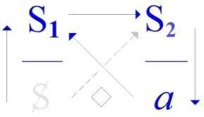
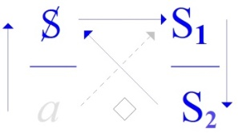

# Leçon 12 | 10 Juin 1970

  

    <label><input type="checkbox" data-lacan-toggle="original" checked> 原文</label>
    <label><input type="checkbox" data-lacan-toggle="notes" checked> 注释</label>
    <label><input type="checkbox" data-lacan-toggle="commentary" checked> 个人解读评论</label>
  

  <form class="lacan-tool-search" role="search">
    <input class="lacan-tool-search-input" type="search" placeholder="搜索全文" aria-label="搜索全文">
    <button class="lacan-tool-button" type="submit" title="搜索">搜索</button>
  </form>
  <button class="lacan-tool-button lacan-back-to-top" type="button" title="回到页面最上方" aria-label="回到页面最上方">↑</button>

<section class="parallel-paragraph" data-paragraph-ids="s17-12-0001 s17-12-0002">

s17-12-0001, s17-12-0002

原文 · s17-12-0001, s17-12-0002

Nous ne sommes pas à un moment de l’année à quoi les longues épreuves convien­nent.

Bon, on va essayer, d’alléger un peu ça.

我们现在并不是在一年中的那个适合冗长考验的时候。

好吧，那我们就试着，把这事儿稍微轻松化一点。

</section>

<section class="parallel-paragraph" data-paragraph-ids="s17-12-0003 s17-12-0004">

s17-12-0003, s17-12-0004

原文 · s17-12-0003, s17-12-0004

J’ai l’impression que *ça se tire*, comme on dit.

J’aurais même une tendance à laisser là les choses, si je ne devais pas vous donner quand même un petit complément, destiné en somme à relever l’essentiel de ce que j’espère avoir fait passer cette année, d’une petite pointe d’avenir.

我感觉这事儿有点拉长了，就像人们常说的那样。

我甚至本来倾向于就此打住，若不是必须还是要给你们一点补充，好让它在某种意义上凸显出我希望今年传达过的要点，并且带上一点未来的指向。

我的意思是：让我稍稍更紧密地揭示出来，

</section>

<section class="parallel-paragraph" data-paragraph-ids="s17-12-0005 s17-12-0006 s17-12-0007 s17-12-0008">

s17-12-0005, s17-12-0006, s17-12-0007, s17-12-0008

原文 · s17-12-0005, s17-12-0006, s17-12-0007, s17-12-0008

Je veux dire : laisser entrevoir, en le serrant d’un peu plus près, à quoi certaines des notions un peu neuves, enfin assurément qui ont cette marque n’est-ce pas...

que je souligne tou­jours et que peuvent *confirmer* ceux qui se trouvent travailler avec moi à *un niveau plus pratique* ...qui ont cette marque d’être au ras d’une expérience.

Que ça puisse servir ailleurs, au niveau de quelque chose qui se passe comme ça pour l’instant...

naturellement quand les choses se passent, au moment où elles se passent, on ne sait jamais bien ce que c’est, surtout quand on recouvre ces choses d’informations ...mais enfin il se fait qu’il se passe quelque chose dans l’Universi­té, que dans divers endroits on est surpris : quelle mouche les pique, ces étudiants, nos petits chéris, nos favoris, les « *chouchous* » de la civilisation, qu’est-ce qui leur arrive ?

某些比较新的概念究竟指向什么，

这些概念无疑带有这样一种印记，不是吗……

这是我总是强调的印记——而且那些和我在更实践层面上工作的人也能予以确认——

这种印记，就是它们是紧贴着经验的。

也许这些（我所说的东西）能在别处发挥作用，就在当下正在发生的一些事情的层面上……

当然，事情在发生之时，人们从来都无法确切地知道它是什么，尤其当这些事情又被层层的信息所覆盖时。

不过，事实上，如今大学里确实在发生一些事，在不同的地方，人们都感到惊讶：

这些学生，他们是怎么了？哪阵风吹到他们了？

他们可是我们的宝贝、宠儿，文明社会的“心头肉”，他们到底发生了什么事？

至于那些装傻充愣的人嘛，那正是他们拿钱干的活……

> 这段话明显呼应 <strong>1968年五月风暴</strong>（学生运动）后的大学局势。拉康在这里以讽刺的语气，指出人们对大学生运动的惊讶：社会把学生当作“文明的宠儿”，却无法理解他们的反叛。

</section>

<section class="parallel-paragraph" data-paragraph-ids="s17-12-0009 s17-12-0010">

s17-12-0009, s17-12-0010

原文 · s17-12-0009, s17-12-0010

Ça, c’est ceux qui font les imbéciles. Ils sont payés pour ça...

Si tout de même quelque chose, dans ce que j’articule, et qui est ce rapport du *discours de l’Analyste* au *discours du Maître,* pouvait montrer la voie où peut d’une certaine façon se justifier, s’entendre ce qui se passe, ce qui se passe pour l’instant, dont chacun rivalise à minimiser le poids, des petites manifestations ratées n’est-ce pas, comprimées, qui se produiront de plus en plus dans un coin, le *motiver*, le faire comprendre donc, au moment même où je me dis qu’en quelque chose je devrais le faire, je voudrais que vous entendiez ceci : c’est que dans toute la mesure où j’y arriverai à vous faire entendre quelque chose, vous pourrez être sûrs que je vous ai foutu le doigt dans l’œil.

大学生产话语、分配知识，把学生塑造成“文明的宠儿”，然而当学生拒绝这种被动位置时，大学话语就失效，转而被贴上“无理取闹”的标签。拉康由此引出对“大学话语”的结构性批判，表明知识的再生产与主体的分裂之间存在着内在张力。

假如在我所阐述的内容中，在那分析师话语与主人话语的关系中，能多少指明一条路径，使得眼下正在发生的事情可以在某种意义上得到解释、被听懂，那些事情——大家都在竞相淡化其分量——

不过是一些失败的小小示威，不是吗，被压制着、被压缩着，而这样的事件今后只会越来越多地在某个角落发生。

如果我要为此提供某种动机，使之被理解，那么在我心里同时也在想着：某种意义上我确实该这么做。

</section>

<section class="parallel-paragraph" data-paragraph-ids="s17-12-0011 s17-12-0012 s17-12-0013 s17-12-0014 s17-12-0015 s17-12-0016 s17-12-0017 s17-12-0018">

s17-12-0011, s17-12-0012, s17-12-0013, s17-12-0014, s17-12-0015, s17-12-0016, s17-12-0017, s17-12-0018

原文 · s17-12-0011, s17-12-0012, s17-12-0013, s17-12-0014, s17-12-0015, s17-12-0016, s17-12-0017, s17-12-0018

Car c’est ça en somme, à ça que ça se limite ce que je voudrais articuler aujourd’hui aussi simplement que je le pourrai.

C’est que le rapport entre des choses que j’ose manipuler depuis un moment...

enfin ce qui, de ce fait, donne une certaine garantie que ce discours se soutient ...que j’ose manipuler d’une façon en fin de compte absolument sauvage, j’hésite pas...

et puis depuis un bout de temps en somme, c’est même par là que j’ai fait le pre­mier pas de cet enseignement ...à parler du *réel* à l’occasion.

Et puis avec les années il y a une petite formule qui sort que : « *L’impossible, c’est le réel* ».

Et puis Dieu sait que je n’en fais pas un abus d’emblée, il m’est arrivé devant vous de sortir je ne sais quelle référence \- enfin ça c’est plus commun bien sûr - à *la Vérité*.

Il y a quand même quelques remarques très importantes à faire...

et c’est pour ça que je me crois obligé d’en faire certaines aujourd’hui ...très importantes à faire avant de laisser tout ça à la portée des innocents pour qu’ils s’en servent à tort et à travers, ce qui est vraiment monnaie courante parfois dans mon entourage.

但我更希望你们听见的是：在我能让你们听见点什么的所有程度上，你们完全可以确定，我已经把你们耍得团团转（字面：我把手指捅进了你们眼睛里）。

归根到底，今天我想要表达的内容，也就限于这一点，并且我会尽量用最简单的方式来说。

那就是：一些我已经冒险操弄了一段时间的东西之间的关系……正因为如此，多少保证了这个话语能够自我支撑。

我确实是以一种最终完全“野蛮”的方式来操弄它们的，我毫不犹豫……而且说实话，自从很久以前，我就是从这里迈出了这段教学的第一步：

也就是说，偶尔去谈论“实在界（le Réel）”。

随着这些年的推移，有一句小小的公式浮现出来：

“<strong>不可能的，就是实在界。</strong>”

而且，上帝作证，我并没有立刻滥用它。

在你们面前，我也曾经引出过某种参照——当然，这更常见——那就是关于“真理”的参照。

这些说明必须在我把这一切任由那些“无辜者”去随意使用之前说清楚，毕竟，他们常常会胡乱使用——在我周围，这简直成了家常便饭。

> 但他随即话锋一转，用一句俗语“我已经把你们耍得团团转”来提醒听众：如果你们以为从我的理论中得到了某种“解释世界的钥匙”，那其实正是误解的效果。拉康一方面提供路径，另一方面又撤回保证，这种“给予—撤回”的姿态正是他的教学风格。它对应于他对真理的看法：真理只能“半说”（*mi-dire*），永远不可能被直接掌握。

> 不过，在这里仍然有一些非常重要的说明必须提出……正因为如此，我觉得今天有义务提出其中几点。

> 他的概念一旦被“无辜者”（其实是未经训练的学生或周边人）掌握，就会被胡乱使用，变成一种时髦的口头禅或权威的借口。

</section>

<section class="parallel-paragraph" data-paragraph-ids="s17-12-0019 s17-12-0020 s17-12-0021 s17-12-0022">

s17-12-0019, s17-12-0020, s17-12-0021, s17-12-0022

原文 · s17-12-0019, s17-12-0020, s17-12-0021, s17-12-0022

À Vincennes, là où j’ai été faire un tour il y a huit jours...

histoire que fût marqué succinctement le fait que j’avais répondu à l’invitation à cet endroit ...j’ai commencé d’avancer ça, et je vous l’avais d’ailleurs aussi annoncé ici la dernière fois pour en quelque sorte vous donner le bon départ, c’est une référence qui, elle, est loin d’être innocente, c’est même bien sûr pour ça qu’il faut lire Freud.

Nous lisons dans « *L’analyse terminable et interminable »*, quelque chose qui concerne ce qu’il en est de l’analyste : on fait remarquer - n’est-ce pas - qu’on aurait bien tort de lui demander un excès de normalité ou de correction psychique, parce que ça le rendrait trop rare et puis brusquement «* Und endlich *» il n’est pas «* ist nicht zu vergessen *», *il n’est pas oublié* que la relation analytique est fondée «* auf Wahrheitsliebe *», sur *l’amour de la Vérité* « *daß heißt auf die Anerkennung der Realität* », sur *l’amour* *de la Vérité*, *ce qui veut dire reconnaissance* « *der Realität* ».

\[*Und endlich ist nicht zu vergessen, daß die analytische Beziehung auf Wahrheitsliebe, d. h. auf die Anerkennung der Realität gegründet ist und jeden Schein und Trug ausschließt.*

这是拉康长期警惕的现象：他自己提出的理论常常在学界和临床实践中被曲解、误用，甚至被包装成空洞的学术术语（正是他在前几节中批判的“大学话语”）。

在万森纳（Vincennes），也就是我八天前去过的那个地方……

只是为了简单地表明，我确实回应了那边的邀请。

我在那里开始提出了这个问题，而其实上次在这里我也已经提前提到过，算是给你们一个良好的开端。

这一参照绝不是无辜的——正是出于这个原因，我们必须去读弗洛伊德。

我们在《分析终结与无尽的分析》（*L’analyse terminable et interminable*）中读到一段涉及分析家的文字：

有人指出，对分析家要求过度的“正常”或心理上的“矫正”是错误的，因为那样会使分析家变得过于稀少。

接着，弗洛伊德突然写道：“<strong>Und endlich</strong>（最后），<strong>ist nicht zu vergessen</strong>（不可忘记）”，

——不可忘记的是：分析关系是建立在<strong>« auf Wahrheitsliebe »（对真理的爱）</strong>之上的，

> 他常常在讲授关键概念时先设立防护栏，提醒听众不要把这些公式当作万金油，以搞出二次元战斗美少女的精神分析这样的笑话。
> 作为二次元和精神分析师，我真的乐不起来。

</section>

<section class="parallel-paragraph" data-paragraph-ids="s17-12-0023 s17-12-0024 s17-12-0025 s17-12-0026 s17-12-0027 s17-12-0028">

s17-12-0023, s17-12-0024, s17-12-0025, s17-12-0026, s17-12-0027, s17-12-0028

原文 · s17-12-0023, s17-12-0024, s17-12-0025, s17-12-0026, s17-12-0027, s17-12-0028

(« *Die endliche und die unendliche Analyse* », Teil VII, 1937)\]

C’est un mot auquel, même si vous ne savez pas l’allemand, vous vous retrouvez puisqu’il est décalqué sur notre latin.

Il est en concurrence, dans les emplois qu’en fait Freud, avec le mot «* Wirklichkeit *» qui lui aussi, à l’occasion, signifie ce que les traducteurs sans chercher plus loin traduisent tout uniment dans les deux cas par «* réalité *».

C’est très curieux, comme ça, à ce propos j’ai un petit souvenir d’une espèce d’état de *rage écumante* qui avait pris un couple, et plus spécialement l’un d’eux...

> il faut tout de même bien l’appeler, c’est pas du tout par hasard, c’est un nommé Laplanche
>
> dont chacun sait qu’il a eu un certain rôle dans les avatars de mes relations avec l’analyse ...à la pensée que devant le fait qu’un autre... que je vais nommer aussi puisque j’ai nommé le premier : un nommé Kaufmann ...avait avancé l’idée qu’il fallait distinguer ce *Wirklichkeit* et ce *Realität*.

L’espèce de passion qu’avait déchainée, chez le premier de ces deux person­nages, le fait d’être devancé par l’autre dans cette remarque qui était en effet tout à fait première, importante, le pseudo-mépris éhonté montré pour ce fignolage est tout de même quelque chose d’assez intéressant.

也就是说，建立在对真理的爱上，亦即建立在<strong>« die Anerkennung der Realität »（对现实的承认）</strong>

之上。

（《有限与无限的分析》，第七部分，1937 年）

这是一个词，即便你们不懂德语，也能认出来，因为它是从我们的拉丁语中直接“翻刻”（décalqué）过来的。

在弗洛伊德的用法中，它和另一个词<strong>“Wirklichkeit”</strong>处于竞争关系，而后者有时也表示相同的意思。然而译者们往往不加深究，把这两个词都一概翻译成“现实（réalité）”。

这很有趣，就此我想起一个小小的回忆：

有一对人（尤其是其中之一）陷入一种几乎怒火中烧的状态……

我还是得点名，因为这绝非偶然——就是那位叫拉普朗什（Laplanche）的，众所周知，他在我与精神分析界的曲折关系中曾扮演过一定角色。

而这种愤怒的起因，竟是因为另一个人——既然我已经点名第一个，那就也把他点出来：名叫考夫曼（Kaufmann）——提出了一个想法：必须区分<strong>Wirklichkeit</strong>和<strong>Realität</strong>。

在这两个人当中，前者因被后者抢先提出这一见解——而这一见解的确是极为首要、重要的——

> 最后，必须不要忘记：分析关系是建立在<strong>对真理的爱（Wahrheitsliebe）</strong>上的，也就是说，建立在<strong>对现实的承认（Anerkennung der Realität）</strong>上，并且排除了任何虚假和欺骗。

> 在拉康语境中，这一段非常关键。他一方面提醒听众不要把分析家理想化为“完全正常的人”；
> 另一方面，他通过对“Vérité（真理）”和“Realität（现实）”的并置，开启了自己的转译工作：弗洛伊德的 *Realität* 并不等同于日常经验中的“现实”，而在拉康的三界理论中，它逐渐被推向“Réel（实在界）”。

> <strong>Laplanche（让·拉普朗什, Jean Laplanche, 1924–2012）</strong>
>
> - 法国精神分析学家，曾与彭塔利斯（Pontalis）合著《精神分析语言辞典》（*Vocabulaire de la psychanalyse*）。曾是拉康的弟子，但后来成为批评者，与拉康派发生决裂。
>
> <strong>Kaufmann（皮埃尔·考夫曼, Pierre Kaufmann, 1928–1996）</strong>
>
> - 法国哲学家，研究康德、现象学及精神分析。曾在 20 世纪 60 年代提出过 *Wirklichkeit* 与 *Realität* 的区分问题。

</section>

<section class="parallel-paragraph" data-paragraph-ids="s17-12-0029 s17-12-0030 s17-12-0031 s17-12-0032 s17-12-0033">

s17-12-0029, s17-12-0030, s17-12-0031, s17-12-0032, s17-12-0033

原文 · s17-12-0029, s17-12-0030, s17-12-0031, s17-12-0032, s17-12-0033

Et la phrase se finit «* und jeden Schein und Trug ausschließt *» et exclut...

*« exclut »* : cette relation analytique ...tout «* Schein *» : tout *faux-semblant*, «* Trug *» : *duperie*.

Eh bien, c’est très riche une phrase comme celle-là, parce que d’un autre côté c’est tout de suite, dans les lignes qui viennent qu’en somme...

c’est ce qui apparaît malgré le petit salut, d’amitié que fait au passage Freud à l’analyste ...c’est qu’en somme il y a «* beinahe den Anscheine *», *on est tout près d’avoir vraiment toute l’apparence* que «* das Analysieren *», *la fonction analytique*, *l’acte analytique*...

à la vérité ça ne veut pas dire autre chose que ce terme que j’ai employé comme titre d’un de mes séminaires [^50]- ...serait le troisième de chacune de ces «* unmöglichen Beruf *» de *ces professions*...

所爆发出的那种激情，以及他对这种“精雕细琢”所表现出的赤裸裸的伪蔑视，倒真是颇耐人寻味的。

而这句话最后的结尾是：

<strong>« und jeden Schein und Trug ausschließt »</strong>——“并且排除一切假象与欺骗”。

也就是说，这种分析关系排除了：

一切<strong>« Schein »</strong>——假象、虚伪的外观；

以及<strong>« Trug »</strong>——欺骗、蒙蔽。

嗯，像这样的一句话实在是非常丰富，因为就在接下来的几行中，几乎立刻就显现出来……

尽管弗洛伊德在文中顺带向分析家致以了一点友好的问候，但归根结底，那里却出现了这样的说法：

<strong>“ beinahe den Anscheine ”：</strong>几乎完全呈现出这样的外观：

</section>

<section class="parallel-paragraph" data-paragraph-ids="s17-12-0034 s17-12-0035">

s17-12-0034, s17-12-0035

原文 · s17-12-0034, s17-12-0035

> et «* unmöglichen *» est mis entre guillemets, je veux dire qu’il cite, il cite enfin une rengaine, une chose d’ailleurs que dans une des œuvres anté­rieures, Freud cite en quelque sorte en faisant référence lui-même au fait
>
> qu’il l’aurait déjà dit, on ne sait pas, on n’a pas retrouvé très bien où il l’aurait dit une première fois. Peut-être
>
> ma recherche est incomplète, c’est peut-être dans les *Lettres à Fliess* qu’il l’aura employé pour la première fois ...enfin ces 3 *professions* dont il s’agit, il les appelle dans ce passage antérieur : le *Regieren*, l’*Erziehen* et le *Kurieren*...

> ce qui est évidemment conforme à *l’usage de lieu commun* qui en est fait, qu’il y ait *Kurieren* car *l’analyse* est nouvelle, et pour que Freud y range l’analyse, c’est évidemment en substitution à ce qu’on dit du fait de guérir ...ce qui est 3 *professions*... si tant est que de *professions* il s’agis­se ...*impossibles*, c’est donc *le « Regieren », l’« Erziehen » et l’« Analysieren »,* c’est-à-dire le « *gouverner »*, l’« *éduquer »* et l’« *analyser »*.

<strong>“ das Analysieren ”：</strong>分析的功能、分析的行动——仿佛本身就是如此。

其实，这无非正是我在某一届研讨班中用作标题的那个词 [1967-68 年的研讨班：《分析行动》（

*L’Acte analytique*）]。它应当被视为三种所谓“<strong>unmöglichen Beruf</strong>”（“不可能的职业”）中的第三种。

“unmöglichen”这个词是加了引号的，我是说弗洛伊德在这里是在引用——引用一句老生常谈。

实际上，在弗洛伊德的早期著作中，他就曾经提到过这一点，他甚至自己还说“我早就说过了”。

只是我们并不确切知道他最初是在何处说的，也许是我研究不够完整，也许他最早是在写给弗利斯的信件里用过这一表述。

总之，这里涉及的三种职业，弗洛伊德称之为：

<strong>统治（Regieren）</strong>、<strong>教育（Erziehen）和治疗（Kurieren）</strong>。

> unmöglichen Beruf（不可能的职业）

</section>

<section class="parallel-paragraph" data-paragraph-ids="s17-12-0036 s17-12-0037 s17-12-0038">

s17-12-0036, s17-12-0037, s17-12-0038

原文 · s17-12-0036, s17-12-0037, s17-12-0038

On ne peut pas manquer de voir le recou­vrement, l’exactitude avec laquelle se collent ces trois termes, avec ce que je distingue cette année comme constituant le radical de 3 et même de 4 *discours.* *Ces discours*...

étant bien entendu que c’est une articulation signifiante, un appareil dont seule la présence, le statut existant, domine en quelque sorte et gouverne tout ce qui peut y surgir à l’occasion de parole ...*les discours* dont il s’agit - je l’ai aussi dit un jour - ce sont des *<u>discours sans parole</u>*, *la parole* vient s’y loger en­suite comme elle peut, et il y a bien longtemps que je peux me dire qu’à propos de ce phénomène enivrant dit de *« la prise de parole »,* il y a un certain repérage du dis­cours dans lequel elle s’insère qui serait peut-être de nature, de temps en temps, à ce qu’on ne la prenne pas sans savoir ce qu’on fait.

Je vous dis ça en note, je vous mets ça en marge, mais enfin il est bien évident que dans un certain style d’usage du genre «* émoi de Mai *» de la parole, il ne peut pas ne pas me venir à l’idée que *l’un des représentants* sûrement *du* (*a*), à un niveau qui, lui, n’est pas à situer dans les temps historiques, mais plutôt préhistoriques, c’est *l’animal domestique*. Voilà !

统治、教育和治疗。它们之所以“不可能”，是因为其任务永远不可能彻底完成
无能与不可能总是相伴的，分析师找好自己的位置。
这三种职业从根本上是无法实现其目的的。
这呼应了拉康一贯的态度，分析师并不是“治病的医生”，而是在一个结构性的“不可能”中操作。

这显然符合当时一种习见的用法，即说“Kurieren（治愈）”，因为精神分析作为新事物，

弗洛伊德要把它归入其中，自然是以此来替代通常所说的“治愈”。

……于是，这三种职业——如果真能称其为“职业”的话——都是不可能的，

也就是 <strong>“Regieren”（统治）</strong>、<strong>“Erziehen”（教育）和“Analysieren”（分析）</strong>：

换言之，就是“统治”、“教育”和“进行分析”。

我们不能不注意到：这三个词之间的重叠关系，以及它们彼此紧密贴合的精确性，与我今年所区分出来的——作为三种甚至四种话语的根基——完全相应。

这些话语……当然必须理解为能指的某种联结方式，是一种装置，它仅仅凭借自身的存在与地位，就在某种意义上主宰并支配了在其中可能偶然出现的一切言说。

这些话语——我曾经有一天也说过——是<strong>没有言语的话语</strong>；

</section>

<section class="parallel-paragraph" data-paragraph-ids="s17-12-0039 s17-12-0040 s17-12-0041 s17-12-0042 s17-12-0043 s17-12-0044 s17-12-0045">

s17-12-0039, s17-12-0040, s17-12-0041, s17-12-0042, s17-12-0043, s17-12-0044, s17-12-0045

原文 · s17-12-0039, s17-12-0040, s17-12-0041, s17-12-0042, s17-12-0043, s17-12-0044, s17-12-0045

Et dans ce cas-là alors, je crois bien que je n’ai plus tout à fait employé les mêmes lettres, mais au niveau de l’animal domestique, il est tout à fait clair que ce qui correspond à notre S...

il a bien fallu un certain savoir pour le *domes­tiquer*, le chien, par exemple ...eh bien *c’est l’aboiement*.

Et alors on ne peut pas quand même ne pas avoir l’idée que si *l’aboiement* c’est bien ça, c’est *donner de la voix*, le **S1** prend un sens qui, vous allez le voir, enfin n’a rien d’anormal à se repé­rer au niveau où nous le situons, à *un niveau de langage*.

Chacun sait que l’animal domestique, il n’est qu’impliqué dans le langage d’un savoir primitif, mais il n’en a pas, lui.

Et alors ce qui lui reste, c’est évidemment à remuer, à remuer *ce qui lui est donné de plus proche du signifiant* **S1** : *c’est la charogne*.

Vous devez savoir quand même, vous avez bien eu un bon chien, qu’il soit de chasse ou de garde ou d’autre, enfin quelqu’un avec qui vous ayez eu de la familiarité, ça c’est irrésistible, ça *la charogne*, ils adorent ça.

Si jamais comme Erzebet Bathory, *la charmante* en Hongrie qui aidait de temps en temps à dépecer ses servantes, ce qui est bien sûr la moindre des choses qu’on puisse s’offrir dans une certaine position, il suffisait qu’elle en mette \- les dits *morceaux* - un tout petit peu trop près de terre, ses chiens les lui rapportaient tout de suite, là tous contents.

言语事后才如其所能地嵌入其中。

而且早在很久以前，我就已经可以对自己说：

在这个令人陶醉的现象——所谓“发言”（prise de parole）——之中，其实完全可以通过辨认它所嵌入的话语，从而让人不至于在发言时不知道自己究竟在做什么。

我这是作为一条旁注，写在边上的。

但是很明显，在某种“五月骚动”（*émoi de Mai*）式的言语使用风格中，我不可能不想到：某个无疑代表<strong>(a)</strong>的存在，它的层次并非属于历史时期，而更像是史前性的，——那就是<strong>家畜</strong>。就是这样！

在这种情况下，我想我已经不再完全使用相同的字母了。但是在家畜的层面上，很明显，对应于我们所说的 <strong>S</strong> 的东西，——毕竟要驯化它们（比如说狗）确实需要某种“知识”——那么，就是<strong>犬吠</strong>。

于是，我们不能不想到：如果犬吠的确就是那样——也就是“发声”，那么 <strong>S1</strong> 在这里便获得了一种意义。你们会看到，这其实丝毫不奇怪，因为我们正是把它定位在语言的层面上。

大家都知道，家畜只是在某种原始知识的语言里被牵涉其中，但它本身并没有语言。

因此，留给它的，无非就是翻动、搅动——搅动那最接近能指 <strong>S1</strong> 的东西：<strong>腐肉（charogne）</strong>。

你们一定都清楚这一点吧，你们总归养过一条好狗——无论是猎犬、看门犬还是别的什么——

> 他强调，<strong>话语并不是简单的发言内容，而是一种能指的结构装置</strong>。它先于个体的言说而存在，并且规定了发言的可能性和限制。
>
>
> 因此，所谓“发言的自由”是一种幻觉。每一次发言（prise de parole）都已经被预先镶嵌在某一种话语结构中（主人话语、大学话语、癔症话语、分析师话语）。拉康在此警告听众：如果不能识别出自己发言所处的话语结构，那么“发言”就只是盲目的、被动的重复。
>
> 统治——>主人话语、癔症话语
> 教育——>大学话语
>
> 分析——>癔症话语

</section>

<section class="parallel-paragraph" data-paragraph-ids="s17-12-0046 s17-12-0047 s17-12-0048 s17-12-0049 s17-12-0050 s17-12-0051 s17-12-0052">

s17-12-0046, s17-12-0047, s17-12-0048, s17-12-0049, s17-12-0050, s17-12-0051, s17-12-0052

原文 · s17-12-0046, s17-12-0047, s17-12-0048, s17-12-0049, s17-12-0050, s17-12-0051, s17-12-0052

C’est la face un peu ignorée du chien. Si vous ne le gâtiez pas tout le temps à l’heure du *déjeuner* ou du *dîner* en lui donnant des choses qu’il n’aime que parce qu’elles viennent de votre assiette, c’est ça qu’il vous apporterait.

Mais il faut faire attention à ceci, c’est que, à un niveau plus élevé qui est *celui d’un objet(a) d’une autre espèce*, que nous essaierons de définir tout à l’heure et qui nous ramènera à ce vieil *« astudé »* que j’ai déjà dit, la parole peut très bien jouer le rôle de *charogne*.

Elle n’est pas beaucoup plus ragoûtante en tout cas.

Et à la vérité c’est évidemment ce qui a beaucoup fait pour qu’on saisisse mal tout ce qui était de *l’importance du langage*.

C’est qu’on a confondu cette sorte de manipulation de cette parole qui n’a pas d’autre valeur symbolique, on l’a confondue avec ce qu’il en était du *discours*. Grâce à quoi, ça n’est jamais n’importe quand, ni n’importe comment, que la parole fonctionne comme *charogne*.

Et il conviendrait bien évidemment de faire attention, parce que, en fin de compte, la pointe, le but de ces remarques vient à ceci, enfin de s’étonner, de se poser tout au moins la question : comment il peut se faire que le *discours du Maître* qui s’entend si merveilleusement bien à avoir maintenu *sa domination*, comme le prouve tout de même ce fait qu’on mesure mal, c’est qu’exploités ou pas les travail­leurs travaillent.

Le travail n’a jamais été autant à l’honneur depuis que l’humanité existe.

总之是一只你们曾经熟悉的狗。那是无法抗拒的：<strong>腐肉</strong>，它们简直爱死了。

如果像匈牙利的那个可爱的伊丽莎白·巴托里（Erzebet Bathory），她时不时会帮着把自己的女仆肢解——在某种权势地位上，这当然算不上什么大不了的事——只要她把那些“碎块”放得离地面稍微近一点，她的狗就会立刻把它们衔回来，满心欢喜。

这是狗的一面，多少有些被忽视了。如果你不总是在午餐或晚餐时宠着它，给它一些它喜欢的东西（但它喜欢的原因仅仅是因为那些东西来自你的餐盘），那它真正会叼给你的，其实就是这些腐肉。

但必须注意这一点：在一个更高的层次上，也就是属于另一类<strong>小客体 (a)</strong>的层次上——

我们一会儿会尝试去界定它，它也会把我们带回到我先前提到过的那个古老的“astudé”——

在这个层次上，<strong>言语本身完全可以扮演“腐肉”的角色</strong>。
无论如何，它（指“言语作为腐肉”）也并不见得更可口。
****

说实话，这显然正是导致人们长期误解语言重要性的一个主要原因。

人们把这种对言语的操弄——而这种言语并没有任何别的象征价值——与“话语”的层面混淆在一起。

正因为如此，<strong>言语作为“腐肉”来发挥作用，绝不会是随便什么时候、随便什么方式发生的</strong>。

而且，显然必须谨慎注意，因为归根到底，这些话的关键、目的在于引出这样一个惊讶，至少要提出这样一个问题：

> <strong>Erzebet Bathory（伊丽莎白·巴托里）</strong>
>
> - 16–17 世纪匈牙利伯爵夫人，因虐杀女仆、传说用处女血沐浴而闻名。

> <strong>astudé</strong>
>
> - 拉康自造的词，源于法语“astuce”（机智、巧妙之处），
>
> 同时谐音拉丁语“studium”（研究）或“astutus”（狡黠）。
>
> - 拉康在不同语境中用它来指一种狡黠的知识/机巧性的装置。
> - 中文：可以暂译为“老狡计 / 老机巧”。
>
> 言语本身完全可以扮演“腐肉”的角色。
> 意味着言语也能作为引出犬吠 （S1）的东西也就是腐肉。
> astudé放在现在的中文语境可以理解成：“诡计多端”——通过话语引出享乐。
>
> 言语一旦沦为“小客体 a”，也就是“腐肉”的替代物，它并不会因此变得高尚或可口。
> 并且事实上，此时这话的人把你当作一条取悦ta的狗。

</section>

<section class="parallel-paragraph" data-paragraph-ids="s17-12-0053 s17-12-0054 s17-12-0055">

s17-12-0053, s17-12-0054, s17-12-0055

原文 · s17-12-0053, s17-12-0054, s17-12-0055

C’est exclu, enfin, qu’on ne travaille pas. C’est un succès !

Ça permet ce que j’appelle le *discours du Maître*.

Il faut dire que pour ça il a bien fallu qu’il dépasse certaines limites, pour tout dire il en arrive à ce quelque chose dont j’ai essayé de vous pointer la mutation...

主人话语究竟是如何做到的——它竟然如此巧妙地维持了自身的统治。

这一点明明从一个常常被忽略的事实就能得到证明：

无论工人是否被剥削，他们仍然在工作。

自人类存在以来，劳动从未像今天这样被推崇过。如今，根本就不可能“不去劳动”。

</section>

<section class="parallel-paragraph" data-paragraph-ids="s17-12-0056 s17-12-0057 s17-12-0058 s17-12-0059 s17-12-0060 s17-12-0061 s17-12-0062">

s17-12-0056, s17-12-0057, s17-12-0058, s17-12-0059, s17-12-0060, s17-12-0061, s17-12-0062

原文 · s17-12-0056, s17-12-0057, s17-12-0058, s17-12-0059, s17-12-0060, s17-12-0061, s17-12-0062

> j’espère que vous vous en souvenez, mais si vous ne vous en souvenez pas,
>
> ce qui est bien possible, je vais vous le rappeler tout de suite ...cette mutation qui donne son style au capitaliste, et au capital aussi.

Alors pourquoi - mon Dieu - est-ce que ceci... qui ne se passe pas par hasard :

- on aurait tort de croire qu’il y a quelque part *de savants politiques qui calculent* bien exactement tout ce qu’il faut faire, on aurait également tort de croire qu’il n’y en a pas, *il y en a !*

C’est pas sûr qu’ils soient toujours à la place d’où l’on peut agir congrûment, mais dans le fond c’est peut-être pas ça qui a tellement d’importance.

Il suffit qu’ils soient, même à une autre place, pour que quand même ce qui est de l’ordre du déplacement du discours, se transmette.

Et alors si on se pose la question : mon Dieu, comment est-ce que cette société du capitaliste, peut s’offrir le luxe de permettre le relâchement de ce *discours uni­versitaire,* qui n’est pourtant qu’une de ces transformations...

tel que je vous l’ex­pose tout au moins ...c’est le quart de tour par rapport au *discours du Maître* ?

这真是个成功！这正是我所谓的“主人话语”得以运作的条件。

必须要说，为了达到这一点，它确实不得不跨越某些界限。

说到底，它最终抵达了这样一个东西——而我曾试着向你们指出过它的变形……

我希望你们还记得，但如果你们不记得——这也很可能——我马上就会提醒你们：

这正是那一变形，它赋予了资本家及资本本身以其独特的风格。

那么，为什么——我的天啊……这一切……并非偶然发生：

我们若是以为，在某个地方根本没有什么精明的政治家在精确地算计一切，那就错了；
但如果以为完全没有这样的人，那同样也是错的：他们确实存在！

并不能确定这些人总是处在一个能够恰当地采取行动的位置上，但归根结底，这或许并不是那么重要。只要他们存在，即便是在别的位置上，话语层面上的那种位移依然会被传递下去。

这绝不是一个无处不在无处不给你担保的主人能做到的。

> <strong>拉康这里指出资本主义话语</strong>是主人话语的一种“突变”。
>
>
> 劳动的普遍化与不可逃避性，意味着话语跨越了某些界限，进而产生了一种新的结构。这种“变形”不仅仅塑造了资本家，也塑造了资本本身的运行逻辑。
>
> 这为他后面画出的“资本主义话语公式”做了铺垫：它看似与主人话语相似，但通过一次“转位”操作，绕过了享乐的障碍，从而实现了更高效的剥削与循环。

> 确实有人在这么计算,但不是政治家，而是“这么计算”本身，也就是某种计算公式，或者语言结构。

> 保证话语能被传递下去，并且运行起来。

</section>

<section class="parallel-paragraph" data-paragraph-ids="s17-12-0063 s17-12-0064 s17-12-0065 s17-12-0066 s17-12-0067 s17-12-0068 s17-12-0069 s17-12-0070 s17-12-0071 s17-12-0072 s17-12-0073 s17-12-0074 s17-12-0076">

s17-12-0063, s17-12-0064, s17-12-0065, s17-12-0066, s17-12-0067, s17-12-0068, s17-12-0069, s17-12-0070, s17-12-0071, s17-12-0072, s17-12-0073, s17-12-0074, s17-12-0076

原文 · s17-12-0063, s17-12-0064, s17-12-0065, s17-12-0066, s17-12-0067, s17-12-0068, s17-12-0069, s17-12-0070, s17-12-0071, s17-12-0072, s17-12-0073, s17-12-0074, s17-12-0076

C’est une question qui vaut tout de même la peine d’être envisagée, d’être envisagée en ceci que la question qu’il faut se poser est celle-ci : est-ce qu’en quel­que sorte, à abonder dans ce relâchement - il faut bien le dire, offert - on ne tombe pas dans un piège ?

C’est pas une idée nouvelle, j’ai déjà écrit ça dans un petit article qu’on m’avait expressément demandé pour être publié dans *un journal* au style singulier de ce que c’est le seul qui ait une réputation d’équilibre et d’honnêteté, et qui s’appelle *Le Monde.*

On avait beaucoup insisté pour que je rédige ces quelques petites pages, c’était à propos de la réorganisation de la psychiatrie, mais enfin j’avais parlé à propos un peu de la réforme, à propos de tout ça. Bon enfin, malgré cette insistance, il est assez frappant que ce petit article, que je vous lirai un jour comme ça à la traine, il n’y est point passé. \[*Rires*\]

##### Évidemment à ce moment là ça s’intitulait* « D’une réforme dans son trou* »,

##### je parlais justement *de ce trou, de ce trou tourbillonnaire,*

##### que manifestement il s’est agi de faire à l’occasion d’un certain nombre de mesures concernant l’univer­sité.

##### Et - mon Dieu - je crois qu’il y a des moments où on peut avoir certains scrupules, disons dans l’agir,

##### pour se rapporter correctement à ce que j’appelle les termes de certains *discours* fondamentaux,

##### on peut y regarder à deux fois avant de se pré­cipiter pour profiter de telle ligne qui s’ouvre,

##### c’est une responsabilité de *vé­hiculer la charogne* dans ces couloirs-là !

Et c’est à ça que les remarques que je vous introduis aujourd’hui doivent en somme d’être articulées.

Parce qu’après tout, elles ne sont pas courantes, elles ne sont pas communes et que c’est comme un appareil : on devrait en avoir au moins la notion que ça pourrait servir de levier, de pince, ou que ça peut se visser, ou que ça peut se construire de telle façon ou telle façon.

*Discours du Maître Discours de l’Hystérique Discours Universitaire Discours analytique*

那么，如果我们提出这个问题：
我的天啊，资本主义社会怎么竟能有这样的“奢侈”，允许大学话语的松弛，而大学话语不过是这些变形之一……

至少就我向你们展示的情况来看，它只不过是相对于主人话语的一次<strong>四分之一转变</strong>而已？

这确实是一个值得认真考虑的问题，考虑的重点在于：我们必须问自己——在顺从这种被“提供出来的松弛”时——必须承认确实存在这样的松弛——我们是否不会因此正好落入某种陷阱？

这并不是一个新的想法，我早已写过一篇小文章，那是别人明确要求我写的，用来发表在一份风格独特的报纸上——它是唯一一份拥有“平衡与诚实”声誉的报纸，它的名字叫《世界报》（*Le Monde*）。

当时人们极力催促我写下几页小文，主题是关于精神病学的重组，但我顺带也谈了一些改革、以及围绕这些的种种。

显然，当时它的标题是《一种改革在它的窟窿里》（*D’une réforme dans son trou*）。

我谈的正是那个“窟窿”，那个旋涡般的窟窿，它显然就是在大学改革的一系列措施中被制造出来的。

而且——我的天啊——我想在某些时刻，人确实会心存一些顾虑，至少在行动之时，如何正确地去关联到我所称为某些基本话语的那些术语，这总要三思而后行，不能贸然急于去利用某条新出现的路径。因为把那块腐肉（charogne）运送到这些话语的走廊里，这可是责任重大啊！

正是围绕这一点，我今天向你们提出的这些评论才得以被组织起来。毕竟，这些评论并不寻常，也并不常见，它们更像是一种<strong>装置（appareil）</strong>：

人们至少应该意识到，它们可以被当作杠杆、钳子来使用，或者可以被拧紧，或以这样或那样的方式被建构起来。

> 不过，尽管有这样的催促，很令人注意的是，那篇小文章——哪天我会在课尾读给你们听——最终却并没有刊出。[笑声]

</section>

<section class="parallel-paragraph" data-paragraph-ids="s17-12-0075">

s17-12-0075

原文 · s17-12-0075

   

[无对应译文]

</section>

<section class="parallel-paragraph" data-paragraph-ids="s17-12-0077 s17-12-0078 s17-12-0079">

s17-12-0077, s17-12-0078, s17-12-0079

原文 · s17-12-0077, s17-12-0078, s17-12-0079

Voilà, eh bien il y a plusieurs termes.

Si je ne vous mets ici que ces petites *lettres,* au tableau, c’est évidemment pas au hasard… c’est parce que je ne veux pas y mettre des choses qui ont une apparence de signifiés, parce que je veux en quelque sorte - ces *signifiés* - aucunement les autoriser.

C’est déjà un peu plus les *autoriser* que de les *écrire*.

那么，很显然这里涉及到若干术语。如果我在黑板上只写下这些小小的字母，那当然不是偶然……

这是因为我不想在这里写出那些看似有“所指”的东西，因为我丝毫不想——哪怕在某种意义上——去授权这些“所指”。事实上，仅仅把它们写出来，就已经多少是在替它们背书了。

</section>

<section class="parallel-paragraph" data-paragraph-ids="s17-12-0080 s17-12-0081 s17-12-0082">

s17-12-0080, s17-12-0081, s17-12-0082

原文 · s17-12-0080, s17-12-0081, s17-12-0082

J’ai déjà parlé de ce qui constitue les places, les places où ces signifiants s’inscrivent.

J’ai déjà fait un sort à ce qu’il en est de l’*agent*, ceci bien pour souligner le sort béni qui fait que pour la langue française, l’*agent* n’est pas du tout forcément celui qui agit : c’est celui qui fait agir.

De sorte que, bien sûr, comme on peut déjà le soupçonner, la place du Maître est bien évidemment de toute probabilité définie par ceci que c’est pas tout clair que le Maître fonctionne et que la meilleure des choses qu’on puisse se demander, *c’est ce que*... seulement *ne m’a pas attendu pour faire*, *un nommé* Hegel *qui s’est employé à ça*, mais il faut y regarder de plus près parce que c’était un... c’est très ennuyeux de penser qu’en fin de compte il n’y a peut-être pas ici cinq personnes qui ont vraiment lu, depuis que j’en parle, la *« Phénoménologie de l’Esprit »*.

我已经谈过是什么构成了这些位置——这些能指铭刻的位置。我也已经特别指出了“代理者（agent）”的位置，并强调了法语里这个幸运的语义：

<strong>agent 并不必然是“行动者”，而是“使他人行动的人”。</strong>

因此，很明显，正如我们已经可以猜到的那样，主人的位置显然很大程度上是由这样一个事实来界定的：

<strong>主人是否真的在运作，这一点并不明晰。</strong>而最值得追问的问题，正是……

其实早就有人在我之前就做过：那就是一个叫黑格尔（Hegel）的人，他专门研究过这个问题。

不过必须更仔细地去看，因为那是个……想一想这点也很令人沮丧：到头来，也许在座的听众里，

自从我谈起这件事以来，真正读过《精神现象学》（*Phénoménologie de l’Esprit*）的人恐怕不会超过五个。

</section>

<section class="parallel-paragraph" data-paragraph-ids="s17-12-0083 s17-12-0084 s17-12-0085 s17-12-0086 s17-12-0087">

s17-12-0083, s17-12-0084, s17-12-0085, s17-12-0086, s17-12-0087

原文 · s17-12-0083, s17-12-0084, s17-12-0085, s17-12-0086, s17-12-0087

Enfin je ne vais pas demander qu’elles lèvent la main !

C’est très emmerdant qu’il n’y ait encore eu jusqu’à présent que deux personnes qui l’aient parfaitement lue...

puisque moi même aussi, je dois vous l’avouer, je n’ai pas été dans tous les coins ...c’est mon maître Alexandre Kojéve, qui évidemment me l’a mille fois démontré, et puis comme ça une autre personne d’un acabit que vous ne croiriez pas, qui a vraiment lu la *Phénoménologie de l’Esprit* *d’une façon lumineuse*, au point que tout ce qu’il peut y avoir dans les notes de Kojéve...

que j’ai lues, elles, et que je lui ai repassées, ...c’était vraiment superflu.

Ce qu’il y a d’inouï, c’est que j’ai beau me tuer à faire remarquer que la « *Critique de la Raison pratique »*, c’est manifestement *un livre d’érotisme* extraordinairement plus drôle que ce qui se publie chez Eric Losfeld.

当然了，我不会要求你们举手来表明谁读过！
可悲的是，到目前为止，真正完整读过《精神现象学》的人恐怕只有两位……我自己也必须承认，我并没有把书的每个角落都读透。
我的导师亚历山大·柯耶夫（Alexandre Kojève）——他当然无数次向我展示过其中的精义；
还有另一位人物，他的层次你们绝对想不到，他真正以一种光辉灿烂的方式读过《精神现象学》，以至于柯耶夫笔记中所包含的一切——那些我倒是读过，还转交给了他——在他那里看来简直完全是多余的。

令人难以置信的是，尽管我再三强调，《实践理性批判》（*Critique de la Raison pratique*）显然是一本<strong>情色书</strong>，而且它要比埃里克·洛斯费尔德（Eric Losfeld）出版社出版的东西有趣得多。

> 康德的“道德律令”与“绝对义务”在拉康眼中，本质上与享乐机制（jouissance）密切相关。

</section>

<section class="parallel-paragraph" data-paragraph-ids="s17-12-0088 s17-12-0089 s17-12-0090">

s17-12-0088, s17-12-0089, s17-12-0090

原文 · s17-12-0088, s17-12-0089, s17-12-0090

Si je vous dis que la *Phénoménologie de l’Esprit*, c’est l’*humour fou*, eh ben ça n’aura pas plus de résultats !

Et pourtant, c’est bien de ça qu’il s’a­git, c’est vraiment la chose la plus extraordinaire qui soit, mais c’est un humour aussi froid, je ne dirais pas « noir ».

Il y a une chose dont on peut être absolument convaincu, c’est qu’il sait absolument bien ce qu’il fait.

如果我告诉你们，《精神现象学》（*Phénoménologie de l’Esprit*）就是一部<strong>疯狂的幽默</strong>，嗯，这恐怕也不会带来更多效果！

然而，事情的确如此——它真的是最非凡的东西，但那也是一种幽默，一种冷峻的幽默，我不会称之为“黑色幽默”。

有一件事我们可以绝对确信：他完全清楚自己在做什么。

</section>

<section class="parallel-paragraph" data-paragraph-ids="s17-12-0091 s17-12-0092 s17-12-0093 s17-12-0094">

s17-12-0091, s17-12-0092, s17-12-0093, s17-12-0094

原文 · s17-12-0091, s17-12-0092, s17-12-0093, s17-12-0094

Ce qu’il fait, c’est de leur faire passer la muscade et de foutre tout le monde dedans, ceci bien sûr à partir du fait que ce qu’il dit c’est *la vérité.*

Il n’y a évidemment pas de meilleure façon d’épingler *le signifiant Maître,* le **S1** qui est là au tableau, que de l’identifier à *la mort*.

Et alors de quoi s’agit-il ?

C’est de montrer dans une « *dialectique »*, comme il s’exprime...

他所做的，就是把“花椒粉”偷偷塞给他们（*faire passer la muscade*），把所有人都耍进去了。
而这一切当然正是基于这样一个事实：他所说的，的确是真理。

显然，没有比把主人能指——就在黑板上的那个<strong>S1</strong>——与<strong>死亡</strong>相认同，更能钉住它的方式了。

那么，这究竟是怎么一回事呢？

</section>

<section class="parallel-paragraph" data-paragraph-ids="s17-12-0095 s17-12-0096 s17-12-0097 s17-12-0098 s17-12-0099 s17-12-0101">

s17-12-0095, s17-12-0096, s17-12-0097, s17-12-0098, s17-12-0099, s17-12-0101

原文 · s17-12-0095, s17-12-0096, s17-12-0097, s17-12-0098, s17-12-0099, s17-12-0101

> c’est le zénith, c’est la montée dans la pensée de la fonction de ce terme ...qu’est-ce que c’est en somme que l’entrée en jeu de cette brute dans la « *Phénoménologie de l’Esprit »*, comme il s’exprime ?

Eh ben, c’est absolument séduisant, sensationnel.

*La vérité* de ce qu’il arti­cule nous pouvons la lire vraiment en face...

> à condition bien sûr de nous lais­ser prendre par ce texte,
>
> parce que moi, ce que j’articule, c’est que justement elle ne peut pas se lire en face, ...*la vérité* donc de ce qu’il articule c’est ceci : c’est le rapport à *ce réel* en tant proprement qu’*impossible*, c’est à savoir qu’on ne voit pas du tout pour qui... *pourquoi* ! - excusez-moi - *pourquoi* il y aurait un Maître qui sortirait de « *la lutte à mort de pur prestige* »... comme on dit, comme il dit, enfin lui ...*et qu’il en résulterait cet étrange agencement de départ*.

Et le comble c’est qu’il trouve le moyen - il est vrai dans une conception de l’histoire qui fait touche de ce qui en émerge, à savoir de la suc­cession enfin des phases de dominance, de composition du jeu de l’esprit, qui se situent le long de ce fil qui n’est pas rien, très précisément jusqu’à lui, de *ce qu’on appelle la pensée philosophique*, et que de cela il retourne qu’en fin de compte *c’est l’esclave par son travail qui donne la vérité du maître* en le repous­sant dans les dessous, par ceci que par la vertu de ce travail, travail forcé comme vous pouvez le noter au départ, l’esclave arrive à la fin de l’histoire, à ce terme qui s’appelle *le Savoir Absolu*.

Rien n’est dit de ce qui arrive alors, parce qu’à la vérité, dans la composition hégélienne, il n’y a pas quatre termes.

正是要在所谓“辩证法”之中展现出来——按照黑格尔的说法……

这是顶点，是思想中这个术语（死亡）功能的登场与高扬。

总之，这就是那头“野兽”在《精神现象学》中登场时的场景——依照他的表述。

嗯，这当然是极具诱惑力的，惊心动魄。
我们的确可以直面地读出他所阐述的真理，当然前提是我们愿意被他的文本所俘获。
而我所要阐述的恰恰是：这份真理<strong>并不能被直面地读出</strong>。
因此，他所阐述的真理其实是这样的：
那就是与<strong>真实界</strong>的关系，而真实界本身正是“不可能的”。
换句话说，我们完全看不出——究竟为了谁……为什么！
——抱歉，为什么会有一个“主人”，会从那场“纯粹为荣誉的殊死搏斗”（如同人们所说的，如他自己所说的）中冒出来，并且由此产生出那奇特的起始结构。

而最令人惊讶的是，他居然找到了这样的方式——当然，这是在一种历史观之中才能成立，这种历史观描绘了精神的发展：

即一系列支配阶段、精神游戏的组合，沿着这条并非无物的线索推进，直到他本人这里，直至所谓“哲学思维”的极点。

而结果是：最终是<strong>奴隶通过他的劳动</strong>赋予了主人的真理，同时把主人压入了下层，正是凭借劳动的效力——注意，起初这是强迫性的劳动——奴隶最终抵达了历史的终点，也就是那个被称为绝对知识（Savoir Absolu）的东西。

至于接下来会发生什么，黑格尔的构造里其实什么也没说，因为说到底，在他的体系里并不存在“四个术语”。

</section>

<section class="parallel-paragraph" data-paragraph-ids="s17-12-0100">

s17-12-0100

原文 · s17-12-0100

 

[无对应译文]

</section>

<section class="parallel-paragraph" data-paragraph-ids="s17-12-0102">

s17-12-0102

原文 · s17-12-0102

Il y avait d’abord *le Maître* et puis *l’esclave*, que j’appelle **S2** ici, mais vous pouvez aussi bien l’identifier du terme d’une jouissance à laquelle il n’a pas voulu renoncer, il a bien fallu justement à cause de ça qu’il renonce.

起初只有主人，以及奴隶——我在这里把奴隶称作<strong>S2</strong>，但你们也同样可以把他视作那个与享乐（jouissance）相关的术语：

奴隶本来不愿放弃这种享乐，但正因为如此，他却不得不放弃。

</section>

<section class="parallel-paragraph" data-paragraph-ids="s17-12-0103 s17-12-0104 s17-12-0105 s17-12-0106">

s17-12-0103, s17-12-0104, s17-12-0105, s17-12-0106

原文 · s17-12-0103, s17-12-0104, s17-12-0105, s17-12-0106

C’est à savoir *le substitut* de ceci qui n’est tout de même pas son équivalent : le travail.

Grace à quoi...

à là sérénité de la *mutation dialectique*, au ballet, au menuet qui s’institue à partir de ce moment et qu’il traverse de bout en bout, fil à fil, et au développement de la culture ... « *la fin de l’histoire* » nous récompense de ce *savoir* qu’on ne qualifie pas d’achevé...

et on a bien ses raisons pour ça ...mais d’*absolu*.

也就是说，奴隶所得到的，是这一切的替代物——<strong>劳动</strong>，虽然这并不等同于他所放弃的东西。

正是凭借这个……凭借辩证法的变形所带来的安宁，凭借那由此刻开始并贯穿始终的芭蕾般的小步舞，以及文化的发展……

“<strong>历史的终结</strong>”就以此来奖赏我们，给予我们这样一种知识——我们并不称之为“完成的”（*achevé*），——理由很充分——而称之为“<strong>绝对的</strong>”（*absolu*）。

</section>

<section class="parallel-paragraph" data-paragraph-ids="s17-12-0107 s17-12-0108 s17-12-0109 s17-12-0110">

s17-12-0107, s17-12-0108, s17-12-0109, s17-12-0110

原文 · s17-12-0107, s17-12-0108, s17-12-0109, s17-12-0110

C’est incontestable : le maître n’apparaît plus que d’avoir été l’instrument, le cocu ma­gnifique.

Ce qu’il y a d’absolument *sublime* dans cette très *remarquable déduction dialectique*, c’est qu’elle ait été entreprise et - si l’on peut dire - réussie, car tout au long...

> prenons l’exemple, enfin de ce qu’il peut dire par exemple de la culture ...tout au long, les remarques les plus pertinentes, quant au jeu des incidences des exercices de l’*esprit*, foisonnent.

Je vous le répète : il n’y a rien de plus drôle.

毫无疑问：此时主人显现出来的，只不过是一个工具，一个<strong>伟大的被戴绿帽者（cocu magnifique）</strong>。

在这段极其出色的辩证推演里，真正<strong>崇高</strong>的地方在于，它竟然被开展出来了——而且——姑且这么说吧——它还<strong>成功了</strong>。因为在整部作品中……就拿他所说的“文化”为例，始终充满了最为恰切的观察，关于精神活动的各种作用与交织，随处可见。

我再重复一遍：<strong>没有什么比这更滑稽的了。</strong>

> 主人是一个效果

</section>

<section class="parallel-paragraph" data-paragraph-ids="s17-12-0111 s17-12-0112 s17-12-0113 s17-12-0114 s17-12-0115">

s17-12-0111, s17-12-0112, s17-12-0113, s17-12-0114, s17-12-0115

原文 · s17-12-0111, s17-12-0112, s17-12-0113, s17-12-0114, s17-12-0115

La *ruse de la raison* - nous dit-il - *est depuis le début ce qui a dirigé tout ce jeu*.

Cette *ruse de la raison* est évidemment un très beau terme, ce qui pour nous analystes, évidemment garde son prix de ceci que nous pouvons le suivre au niveau *d’un certain b-a-ba* , raisonnable ou pas, enfin nous avons affaire à quelque chose de très rusé dans sa parole justement : il s’agit de l’inconscient.

Seulement le comble de cette ruse n’est pas là où on le pense, c’est la *ruse de la raison* sans doute, mais il faut bien reconnaître, et tirer son chapeau à la *ruse du raison­neur*.

S’il eût été possible au début du siècle dernier, au temps de la bataille d’Iéna, que cette extraordinaire entourloupette qui s’appelle la *Phénoménologie de l’Esprit* ait subjugué quiconque, le coup aurait été réussi.

Il est bien évident qu’il ne peut pas tenir un seul instant que nous nous rapprochions en quoi que ce soit de *l’ascension de l’esclave* : rien n’est plus encore esclave que l’esclave. Et cette incroyable façon de mettre à son bénéfice - au bénéfice de son travail – un progrès, comme on dit, quelconque du savoir, est vraiment d’une extraordinaire futilité.

“理性的狡计”——他（黑格尔）告诉我们——自始至终正是支配整个游戏的东西。“理性的狡计”无疑是一个非常美妙的术语。

而对我们分析家而言，它当然仍然有其价值，因为我们可以在某种最基础的层面上去追随它，不管它是否“合理”，毕竟，我们面对的正是话语中某种极为狡黠的东西：

<strong>无意识</strong>。

不过，这种狡计的极致并不在我们通常以为的地方。

诚然，这当然是“理性的狡计”，但我们也必须承认，并向这位“推理者的狡计”脱帽致意。

如果在上个世纪初，也就是耶拿战役的时候，这部名为《精神现象学》的非凡<strong>骗局（entourloupette）</strong>真能征服任何人，那这一手才算真正成功。

很显然，我们根本无法片刻相信：在任何意义上，我们能接近所谓“奴隶的上升”。没有什么比奴隶更彻底地是奴隶的了。而那种难以置信的说法——把某种所谓的知识进步，归入奴隶的利益，归入他劳动的利益——实在是荒唐至极的虚妄。

看着眼熟吗？ 如果还不够眼熟的话，翻译一下就是：
公司让你加班是在培养你，你要珍惜机会，好好把握。

> 奴隶通过劳动与文化的发展获得知识，从而“接近真理”。

</section>

<section class="parallel-paragraph" data-paragraph-ids="s17-12-0116 s17-12-0117 s17-12-0118 s17-12-0119 s17-12-0120 s17-12-0121 s17-12-0122 s17-12-0123 s17-12-0124 s17-12-0125">

s17-12-0116, s17-12-0117, s17-12-0118, s17-12-0119, s17-12-0120, s17-12-0121, s17-12-0122, s17-12-0123, s17-12-0124, s17-12-0125

原文 · s17-12-0116, s17-12-0117, s17-12-0118, s17-12-0119, s17-12-0120, s17-12-0121, s17-12-0122, s17-12-0123, s17-12-0124, s17-12-0125

Mais ce que j’appelle *la ruse du raisonneur* est là pour nous faire voir une dimension tout à fait essentielle, et à laquelle il faut prendre garde, c’est celle-ci : *si donc nous désignons la place de l’Agent* quel qu’il soit...

qui n’est pas toujours celle du *signifiant-Maître,* puisque tous les autres signifiants vont y passer à leur tour, ...si la question est celle-ci : *qu’est-ce qui, cet Agent, le fait agir ?*

Comment *cet extraordinaire cycle*, autour de quoi tourne ce qui à proprement parler *ne mérite que d’être signalé du terme de* *révolution,* comment peut-il se pro­duire ?

##### Ici à un certain niveau donc - retrouvons le terme de Hegel - grâce au Maître naît au monde « *le travail »*.

##### Alors,

##### quelle est donc *la vérité* ? c’est là qu’elle se place avec un point d’interrogation.

##### Qu’est-ce qui inaugure - car enfin ça ne dure pas depuis toujours, c’est là depuis les temps historiques - ce qui met en jeu cet *Agent* ?

##### C’est une bonne chose que de s’apercevoir, à propos d’un cas tellement brillant, tellement éblouissant,

##### que justement à cause de ça on n’y pense pas, on ne le voit pas, comme l’est Hegel :

##### *c’est un représentant*, si je puis dire *sublime, du discours du savoir, du savoir universitaire*.

这么一翻译是不是有内味了。 包装了一层如此的主人话语。

拉康并不认为“知识进步能真正解放奴隶”。

但我所谓“推理者的狡计”正是为了让我们看到一个至关重要的维度——我们必须谨慎对待：

如果我们指定“代理者（Agent）”的位置，不论它是谁……这个位置并不总是由主人能指（S1）来占据，因为所有其他能指也都会轮番通过这里。那么问题就是：<strong>是什么让这个“代理者”行动起来？</strong>

又是如何可能出现这样一个非凡的循环，其核心所围绕的东西，严格来说，只配得上被称为“<strong>革命</strong>”的名词？这一切又是如何发生的呢？

那么，在某个层次上——让我们回到黑格尔的术语——正是<strong>由于主人，世界上才诞生了“劳动”</strong>。

那么——真理究竟是什么？此刻它被摆在这里，并且带着一个问号。

——是什么开端了这一切？

毕竟，这并非自古以来就存在，而只是从历史时期开始才有的：

是什么使这个代理者（Agent）被卷入运作？

> agent 代理者并不必然是“行动者”，而是“使他人行动的人”。

</section>

<section class="parallel-paragraph" data-paragraph-ids="s17-12-0126 s17-12-0127 s17-12-0128 s17-12-0129 s17-12-0130 s17-12-0131 s17-12-0132 s17-12-0133 s17-12-0134">

s17-12-0126, s17-12-0127, s17-12-0128, s17-12-0129, s17-12-0130, s17-12-0131, s17-12-0132, s17-12-0133, s17-12-0134

原文 · s17-12-0126, s17-12-0127, s17-12-0128, s17-12-0129, s17-12-0130, s17-12-0131, s17-12-0132, s17-12-0133, s17-12-0134

Nous autres en France, nous n’avons jamais de *philosophes*,

- que des gens comme ça qui courent les routes,

- de petits sociétaires de petites sociétés provinciales comme Maine de Biran,

- des types comme Descartes qui se baladaient à travers l’Europe. Et puis il faut tout de même savoir le lire lui aussi, bien entendre son ton quand il parle de *ce qu’il peut attendre de sa* *naissance*, on voit quand même quel genre de type c’était. Enfin ça n’empêche pas qu’il n’était pas un con, *bien loin de là* !

Enfin chez nous, c’est pas dans les universités qu’on trouve des philosophes.

On peut mettre ça à notre avantage ! Mais en Allemagne, c’est à l’université.

Et alors ce qu’il faut voir c’est ceci, c’est ce qu’on est capable de penser, à un certain niveau du statut univer­sitaire, de penser : enfin *les pauvres petits, les chers mignons*, ceux qui conti­nuent à ce moment-là et qui ne font qu’entrer dans la grande ère du trimage, de l’exploitation à mort n’est-ce-pas, celle de l’ère industrielle, on va les prendre à la révélation de cette vérité, cette vérité que c’est eux qui font l’Histoire et que le Maître n’est là que le sous-fifre qu’il fallait pour faire partir la musique au départ.

C’est une remarque qui a son prix et que j’entends souligner avec force, ceci en raison de la phrase qu’emploie Freud pour dire que la relation ana­lytique doit être fondée «* gegründet *» sur *l’amour de la Vérité*.

C’était vraiment un type charmant, ce Freud !

****主人如果只是一个虚位的话，代理者是如何运行的这就成了一个问题。

在这样一个极其辉煌、耀眼的案例面前，恰恰因为它太过耀眼，人们往往不会去思考，也看不见——这就是黑格尔。他可以说是一个崇高的代表：

<strong>大学话语、知识话语的代表。</strong>

我们在法国，从来没有什么“大学哲学家”。有的只是那种到处奔走的人，像梅纳·德·比朗（Maine de Biran）这样的小省级学会的会员，或者像笛卡尔（Descartes）这样在整个欧洲游历的人。
当然，我们也必须学会去读他，听懂他在谈论出身时的语气，从中也能看出他是什么样的人。
这并不妨碍他绝不是个傻瓜——远非如此！总之，在我们法国，哲学家并不是出现在大学里。
这也可以算是我们的一个优势！但在德国，哲学家就是出现在大学里的。

因此，我们必须看到的是，在大学体制的某个层次上，人们能够这样去思考：

那些可怜的小家伙们，那些可爱的宝贝们，正是在那个时候进入了辛劳的时代——也就是被彻底剥削的时代，不是吗？工业时代的那个时代。于是，人们把这样一种真理启示给他们：
<strong>历史是他们创造的，主人不过是开场时所需的一个跑龙套的小角色，用来让音乐响起罢了。</strong>

跟职场PUA的套路从谱系上甚至都一脉相承。
而这与德国的教育体制和工业化大背景是匹配的。
德国是现代教育发源地，而现代教育的背景是“现代和工业”。

> 又给自己贴金了

> 工业时代，有知识的劳动力并不普遍的时期，主人话语以这样的方式组织起来。

</section>

<section class="parallel-paragraph" data-paragraph-ids="s17-12-0135 s17-12-0136 s17-12-0137 s17-12-0138 s17-12-0139">

s17-12-0135, s17-12-0136, s17-12-0137, s17-12-0138, s17-12-0139

原文 · s17-12-0135, s17-12-0136, s17-12-0137, s17-12-0138, s17-12-0139

Il était vraiment « tout feu, tout flamme ».

Il avait des faiblesses comme ça, son rapport avec sa femme par exemple, c’est quelque chose d’inimaginable !

Avoir toléré une pareille morue toute son existence, c’est quelque chose !

Enfin dites-vous bien ceci : c’est que s’il y a quelque chose que doit vous inspirer *la Vérité*, si vous voulez soutenir l’«* analytische Beziehung *», c’est certainement pas *l’amour*.

*La Vérité* dans l’occasion, si c’est celle qui fait surgir en fin de compte ce signifiant de « *la mort » -* et il y a toute apparence – et même que s’il y a quelque chose qui donne un tout autre sens à ce qu’avançait, qu’a avancé Hegel, c’est bien justement ce que Freud avait pourtant découvert à cette époque-là, et qu’il a qualifié comme ça, comme il a pu, d’« *instinct de mort »*.

大学话语在资本主义(现代)社会中承担着制造“真理”的角色，这种真理并非揭示真实界，而是灌输性的能指安排。

这是一个值得珍视的评论，我想要特别强调，原因在于弗洛伊德所使用的那句话：

分析关系必须“<strong>gegründet</strong>（奠基）”在对真理的爱之上。这弗洛伊德真是个迷人的人！

他真是满腔火热，充满激情。当然，他也有他的弱点——比如他和他妻子的关系，那真是不可思议！能一辈子容忍那样一个“老鲱鱼婆”（morue），真是件了不起的事！

最后，你们必须牢记这一点：

如果真理必须给予你们某种启发，如果你们要支撑起所谓的“<strong>分析关系（analytische Beziehung）</strong>”，那启发绝对不是“爱”。

> 注：morue 俚语：对女人的侮辱性称呼（“丑女人 / 泼妇”）。

</section>

<section class="parallel-paragraph" data-paragraph-ids="s17-12-0140 s17-12-0141 s17-12-0142 s17-12-0143 s17-12-0144">

s17-12-0140, s17-12-0141, s17-12-0142, s17-12-0143, s17-12-0144

原文 · s17-12-0140, s17-12-0141, s17-12-0142, s17-12-0143, s17-12-0144

À savoir le carac­tère radical et fondamental dans *la répétition*...

dans cette *répétition* qui insiste, qui caractérise ce qu’il en est de la réalité psychique de *l’être inscrit dans le langage* ...eh bien c’est que, du fait que *la Vérité* n’a pas d’autre visage, il n’y a pas de quoi en être fou !

À la vérité ce n’est pas non plus exact : des visages, elle en a plus d’un.

Mais justement ce qui pourrait être la première ligne de conduite à nous tenir, pour ce qui est des analystes, c’est comme ça : à être un peu en méfiance, à ne pas devenir tout d’un coup fou comme ça *d’une vérité,* comme du premier minois rencontré au tournant de la rue.

Et pour tout dire, si c’est justement là que nous rencontrons cette remarque de Freud et accompagnée de ceci : « *das heisst auf die Anerkennung der Realität* » c’est bien en effet de nature à nous faire dire qu’en effet peut-être que, il y a comme ça un *réel* tout naïf - c’est en général comme ça qu’on parle - et qui se fait passer pour *la Vérité*.

在这种情况下，真理——如果它最终唤起的正是这个“死亡”的能指（而且一切迹象都表明如此）——乃至如果有某个东西能赋予黑格尔所提出的论点以全然不同的意义，那无疑正是弗洛伊德当时的发现：

他尽力把它命名为“<strong>死亡本能（Todestrieb, instinct de mort）</strong>”。

黑格尔这里驱使奴隶走向真理的是“死亡”这一能指。
分析关系的伦理核心，也不是爱，而是面对死亡所揭示的真理。

也就是说，<strong>重复</strong>所具有的根本性与彻底性……这种一再坚持的重复，正是表征着：

既然真理没有别的面貌，那我们大可不必因此而发疯！

说到底，这也并不完全准确：

<strong>真理的确有不止一副面孔。</strong>

但正因为如此，对于分析师而言，最基本的行为准则应该是：

始终保持一点警惕，不要突然就为某个“真理”而疯狂，就好像在街角邂逅的第一张俏脸那样。

毕竟说出来的真理，不过也就是背后的能指系统的一种重复演绎。

> 拉康把黑格尔这里的“生死搏斗”与弗洛伊德的死亡本能放在一起讨论。

> 一个被铭刻进语言之中的存在，它的内心现实就是如此。而这意味着：

> 真理只能半说，即便这样，被说出来的一半还是被陷入能指系统的重复之中。

> 黑格尔也好，还是别的什么哲学也好，不要被这种真理所迷惑。

</section>

<section class="parallel-paragraph" data-paragraph-ids="s17-12-0145 s17-12-0146 s17-12-0147 s17-12-0148 s17-12-0149 s17-12-0150">

s17-12-0145, s17-12-0146, s17-12-0147, s17-12-0148, s17-12-0149, s17-12-0150

原文 · s17-12-0145, s17-12-0146, s17-12-0147, s17-12-0148, s17-12-0149, s17-12-0150

Et puis après ça, *la Vérité* ça s’éprouve et ça ne veut pas dire du tout pour autant qu’elle en connaît plus du *réel*, surtout si on parle du connaître.

Peut-être...

si vous vous souvenez des linéaments de ce que j’indique ...l’étape où c’est à se trouver défini comme *l’impossible à démontrer le vrai dans le registre d’une articulation symbo­lique*, que le *réel* se place, nous permettra d’avoir là, disons *une visée*, quelque chose qui serve à mesurer notre *amour pour la vérité*.

À la vérité en effet, si ce *réel* se définit comme *l’impossible*, c’est bien là ce qui est de nature à nous faire toucher du doigt quoi ?

*Gouverner, éduquer, analyser aussi, et pourquoi pas, faire désirer* pour compléter d’une *définition* ce qu’il en serait *du discours* *de l’Hystérique,* eh ben c’est en effet des opérations qui sont à très proprement parler *impossibles,* et c’est pour ça qu’elles sont là.

Qu’elles sont là et qu’elles tiennent le coup rudement bien, en nous posant la question de ce qu’il en est de leur vérité, c’est à savoir comment ça se produit ces *choses folles* qui précisé­ment ne se définissent dans le *réel* que de pouvoir, quand on les approche, être arti­culées comme *impossibles*. Il est clair que leur pleine articulation comme *impos­sible*, c’est justement ce qui nous donne le risque, la chance entrevue, que leur *réel*, si l’on peut dire, éclate.

总而言之，如果我们恰恰在这里遇见弗洛伊德的那条评论，并且伴随着这句话：<strong>« das heisst auf die Anerkennung der Realität »（也就是说建立在对现实的承认之上）</strong>，那确实很容易让我们说：

或许就像这样，有一种“天真无邪的真实”（*réel tout naïf*）——通常人们就是这样说的——而它却冒充成了“真理”。

再者，真理是需要去体验的，但这丝毫不意味着它因此就对真实界（le réel）有更多的“认识”，尤其当我们谈论“认识（connaître）”时，更不能这样理解。

或许……如果你们还记得我所指示过的一些脉络，那就是：当我们处于这样的阶段——在符号性的联结中，<strong>“真理”被界定为不可能被证明</strong>的时候——此时，真实界就被放置在这一位置。

这样我们就有了一种瞄准点，某种可以用来衡量我们对真理之爱的东西。

实际上，如果真实界被定义为“不可能”，那正是能够让我们切身触及到的……究竟是什么呢？

<strong>统治、教育、分析</strong>——而且为什么不再加上“使人欲望”，以此来补全一个关于癔症话语的定义呢？

那么，这些确实都是一些严格来说“不可能”的操作，而它们之所以就在这里、屹立不倒，正是因为它们的不可能性。

</section>

<section class="parallel-paragraph" data-paragraph-ids="s17-12-0151 s17-12-0152">

s17-12-0151, s17-12-0152

原文 · s17-12-0151, s17-12-0152

Si nous sommes forcés de nous amuser comme ça si lon­guement dans les couloirs et labyrinthes de *la vérité*, c’est que justement il y a quelque chose qui fait que l’on n’arrive pas.

Et pourquoi s’en étonner, s’en étonner pour ceux de ses discours qui sont pour nous tout neufs : je ne dis pas bien entendu qu’on n’aurait pas déjà eu un bon 3/4 de siècle pour envisager les choses sous cet angle, mais enfin le séjour dans le fauteuil n’est-il pas la meilleure position pour serrer *l’impossible* ?

它们之所以存在并且顽强支撑着我们，就在于它们不断向我们提出问题：它们的真理究竟是什么？
也就是说，这些疯狂的事物是如何发生的？
它们在真实界里，唯有在被逼近时，才能被表述为“不可能”。

很明显，正是它们被充分表述为“不可能”，才使得我们获得了这样一种风险、乃至隐约可见的机遇：
它们的真实界——如果可以这么说——可能会在此间迸裂。

> <strong>统治、教育、分析</strong>来自弗洛伊德的所谓“三种不可能的职业”，在这里拉康补充了一个“使人欲望”。

</section>

<section class="parallel-paragraph" data-paragraph-ids="s17-12-0153 s17-12-0154 s17-12-0155 s17-12-0156 s17-12-0157">

s17-12-0153, s17-12-0154, s17-12-0155, s17-12-0156, s17-12-0157

原文 · s17-12-0153, s17-12-0154, s17-12-0155, s17-12-0156, s17-12-0157

Quoi qu’il en soit, que nous en soyons toujours à tour­nailler dans cette dimension de *l’amour de la vérité*, dont tout indique justement qu’elle nous fait glisser entre les doigts, tout à fait de *l’impossibilité* de ce qui se maintient comme *réel* très précisément au niveau du *discours du Maître*.

Eh bien c’est cela qui nécessite la référence à ce qu’heureusement le *discours analytique* nous permet d’entrevoir, d’articuler exactement, et c’est en quoi il est important que je l’articule.

Je suis bien persuadé qu’il y a ici 5 ou 6 personnes qui peuvent très bien le déplacer d’une façon qui ait des chances de resurgir.

Je ne vous dis pas que ce soit « *le levier d’Archimède* », je ne vous dis pas que ce que j’énonce ait la moindre prétention à « *renouveler le système du monde* », ni « *la pensée de l’Histoire* », j’indique comment l’analyse nous met au pied de recevoir un certain nombre de choses qui peuvent paraître \- par le hasard des rencontres - être éclairantes pour quelqu’un, qui de cette pratique, a un peu l’habitude.

Après tout j’aurais peut-être bien pu ne jamais rencontrer Kojève !

这样正好对应拉康的四话语。主人能话语，大学话语，分析师话语，癔症话语。

而它们之所以就在这里、屹立不倒，正是因为它们的不可能性。

如果我们被迫在真理的走廊与迷宫里如此长久地兜转，那正是因为有某种东西使得我们始终无法抵达。

而这又有什么值得惊讶的呢？尤其对于那些对我们来说还很新的话语而言。

我当然并不是说，我们没有在过去将近四分之三个世纪里就已经有机会从这个角度来考虑问题。

但归根结底，<strong>坐在那张椅子上（分析的椅子）</strong>，难道不是最恰当的位置，来紧紧逼近那个“不可能”吗？

无论如何，我们始终还在围绕着这“真理之爱”的维度兜转徘徊。而一切迹象恰恰表明：

正是这种真理之爱，使我们从指缝间滑落，无法把握那作为<strong>不可能</strong>而维持自身的东西——它恰好就固守在<strong>主人话语</strong>的层面上，作为真实界而存在。

那么，正因为如此，我们才必须援引到这样一个维度：

<strong>幸好，分析话语使我们得以窥见它，并能将其准确地加以表述。</strong>而这也正是我必须将其加以阐述的重要原因。

> 拉康在这里收束了前面对“真理—真实界—不可能”的讨论。
>
> <strong>主人话语的真实界</strong>就是“不可能”，它无法被真理之爱驯服。精神分析如果要接近它，必须超越对真理的恋慕，转向话语结构本身。
>
> 真理和真相都不过是能指系统中可被重复的效果，这个重复的结构本身是什么呢？

</section>

<section class="parallel-paragraph" data-paragraph-ids="s17-12-0158 s17-12-0159 s17-12-0160 s17-12-0161 s17-12-0162 s17-12-0164">

s17-12-0158, s17-12-0159, s17-12-0160, s17-12-0161, s17-12-0162, s17-12-0164

原文 · s17-12-0158, s17-12-0159, s17-12-0160, s17-12-0161, s17-12-0162, s17-12-0164

Si je n’avais jamais rencontré Kojève, il est très probable que comme tous les français éduqués dans une certaine période, je n’aurais même pas soupçonné que la « *Phénoménologie de l’Esprit »*, c’était quelque chose.

*L’impossibilité*, ce que *l’analyse* nous permet d’en apercevoir, c’est que l’obstacle à son cernage, à son serrage, est ceci qui seul pourrait peut-être au dernier terme y introduire une mutation : le *réel nu* - pas de *vérité* - ça serait pas mal !

Seulement voilà : *entre nous et le réel il y a la vérité*.

*La vérité, je vous ai une fois énoncé* un jour dans une envolée lyrique, *que c’était la chère petite sœur de la Jouissance*.

Ça devrait déjà vous être re­venu à la tête, du moins j’espère que c’est revenu à la tête de certains d’entre vous, au moment où ce que je vais accentuer dans ces quatre formules, dont il y a deux de réécrites ici, est ceci :

c’est que si la première ligne dans cette relation indi­quée d’une flèche, d’un sens, se définit toujours comme *impossible*, c’est à savoir qu’en effet *il est impossible* qu’il y ait un maître qui fasse, comme ça, marcher son monde.

我深信，在这里至少有五六个人，完全能够以某种方式把它移开，并且让它有机会重新浮现出来。

我并不是在告诉你们：这就是“阿基米德的杠杆”；
我也不是说，我所提出的东西有什么妄想，要去“更新世界的体系”，或者“更新历史的思维”。

我只是指出：
分析把我们逼到了这样一个位置，使我们不得不去接收某些东西——这些东西或许只是因机缘的邂逅而显得有启发性，但对于一个对这种实践已有些许经验的人而言，它们确实能带来光亮。

毕竟，我也完全可能从未遇见过柯耶夫！如果我从未遇见柯耶夫，那么极有可能，我就会和那个时期所有受过教育的法国人一样，根本不会觉得《精神现象学》究竟算得上什么。

至于“不可能”，分析让我们得以窥见的，正是：阻碍我们去围拢、去紧逼它的障碍，恰恰就是这样一个东西——它也许是唯一能在最终引入某种变形的：

<strong>赤裸的真实——没有真理——那倒也不错！</strong>

<strong>然而事实却是：在我们与真实之间，总是横亘着真理。</strong>

真理——我曾经有一次，以一种颇为抒情的方式对你们说过：

> 精神分析不作为某种大学话语的支点

</section>

<section class="parallel-paragraph" data-paragraph-ids="s17-12-0163">

s17-12-0163

原文 · s17-12-0163

 

[无对应译文]

</section>

<section class="parallel-paragraph" data-paragraph-ids="s17-12-0165 s17-12-0166 s17-12-0167 s17-12-0168 s17-12-0169 s17-12-0170">

s17-12-0165, s17-12-0166, s17-12-0167, s17-12-0168, s17-12-0169, s17-12-0170

原文 · s17-12-0165, s17-12-0166, s17-12-0167, s17-12-0168, s17-12-0169, s17-12-0170

*Faire travailler* les gens c’est encore plus fatigant que de travailler soi-même si on devait le faire vraiment.

*Le maître ne le fait jamais*.

Il fait un signe de *signifiant-Maître* *et tout le monde cavale* !

C’est de ça dont il faut partir qui est en effet tout à fait précieux et touchable toujours.

Alors *l’impossibi­lité* qui est bien là écrite à la première ligne, il s’agit de voir si...

> comme déjà c’est indiqué par la place donnée au terme de *Vérité...*ça serait peut-être au niveau de la seconde qu’on en aurait une vraiment.

<strong>真理是享乐的亲爱的小妹妹。</strong>

这一点你们本该已经想起来了，

至少我希望在你们当中有些人此刻能记起，

当我现在要强调的，正是这四个公式（其中有两个我已在此重写）的内容时。

也就是说，如果在这个由箭头指示出的关系中，第一条线上总是被界定为“不可能”，

那意思就是：<strong>根本不可能存在这样一个主人，能真的让世界因他而运转。</strong>

让别人去劳动，比自己去劳动还要更加劳累——如果真的要亲自做的话。

而主人从来不会那样做。

</section>

<section class="parallel-paragraph" data-paragraph-ids="s17-12-0171 s17-12-0172 s17-12-0173">

s17-12-0171, s17-12-0172, s17-12-0173

原文 · s17-12-0171, s17-12-0172, s17-12-0173

Seulement voilà, au niveau de la seconde ligne, il n’y a pas la moindre flèche.

Non seulement il n’y a pas de communication, mais il y a à proprement parler quelque chose qui obture et c’est à proprement parler ceci : *c’est que ce qui résulte* - au moins à ce premier niveau - *du travail*, c’est que...

> c’est ça la découverte d’un nommé Marx : c’est d’avoir donné tout son poids à ce terme
>
> qui est ce à quoi s’emploie le travail et dont on le sait déjà que ça s’appelle *la production* ...eh bien *l’essentiel c’est de s’apercevoir* *que cette production*, *quels que soient les signes, les signifiants-Maître qui viennent s’inscrire à cette place*, *ça n’a en tout cas aucun rapport avec la vérité de la chose*.

他只需打出一个“主人能指（S1）”的信号，所有人就都开始奔跑起来了！

我们必须从这里出发——这是的确完全宝贵的，并且始终是可以触及的。

那么，至于那写在第一条线上的“不可能”，我们要看一看……

正如从“真理”所在的位置已经有所暗示的那样，

或许真正的不可能，其实是在第二条线上才显现出来的。

然而问题在于：在第二条线上，根本没有任何箭头。不仅没有沟通，反而可以说有某种堵塞。

而这正是关键所在：至少在第一层次上，由劳动所产生的东西是……这正是那位叫马克思（Marx）的人所发现的：

</section>

<section class="parallel-paragraph" data-paragraph-ids="s17-12-0174 s17-12-0175 s17-12-0176 s17-12-0178">

s17-12-0174, s17-12-0175, s17-12-0176, s17-12-0178

原文 · s17-12-0174, s17-12-0175, s17-12-0176, s17-12-0178

On peut faire tout ce qu’on veut, on peut essayer de conjoindre *cette pro­duction avec des besoins* qui sont des besoins qu’on forme, il n’y a rien à faire avec l’existence humaine et le rapport de la production avec la *Vérité*, il n’y a pas moyen de s’en tirer.

Toute impossibilité, quelle qu’elle soit - et c’est elle que nous mettons ici en jeu - s’articule toujours, aussi sûr que si elle nous laisse en haleine autour de sa vérité, c’est que *quelque chose* la protège que nous appellerons *impuissance*.

Au niveau du *discours Universitaire* par exemple, pour prendre ce premier…

Celui qui s’articule ici, où le terme **S2** est dans cette position - d’une prétention insensée - d’avoir pour *production* un être pensant, *un sujet,* eh ben il n’est pas question que *comme sujet*, dans sa *production*, il puisse se percevoir un seul instant *comme Maître du savoir*.

他赋予这个术语以全部的重量，即劳动所致力的对象，我们已经知道，这个名字叫做<strong>生产</strong>。

然而，最重要的是必须认识到：这种生产，不论在此位置上写入怎样的符号、怎样的主人能指，

它与“事情的真理”无论如何都没有任何关系。

人们可以做任何努力，可以试图把这种<strong>生产</strong>与那些人为形成的“需要”结合起来，但关于人类存在、以及生产与真理的关系，却根本无计可施，没有出路。

一切“不可能”，无论是哪一种——这正是我们在此所要调动起来的——总是以某种方式被表述出来。

而且很明确：如果“不可能”让我们屏息凝神、徘徊在它的真理周围，那是因为总有某种东西在保护它，这个东西我们称之为<strong>无能（impuissance）</strong>。

举例来说，就在<strong>大学话语</strong>的层面上，我们可以首先看到这一点……

> 第二条线:指“四种话语”图式的下方一行：<strong>Vérité → Production</strong>。
>
>
> 拉康指出：在这一层次上，并不存在真正的“箭头”，即没有直接的符号化传递。
>
> <strong>生产并不等于真理</strong>。无论写在这个位置上的主人能指是什么，它都不能把生产与真理直接联结起来。

</section>

<section class="parallel-paragraph" data-paragraph-ids="s17-12-0177">

s17-12-0177

原文 · s17-12-0177

[无对应译文]

</section>

<section class="parallel-paragraph" data-paragraph-ids="s17-12-0179 s17-12-0180 s17-12-0181">

s17-12-0179, s17-12-0180, s17-12-0181

原文 · s17-12-0179, s17-12-0180, s17-12-0181

Ça se touche là d’une façon sensible, mais bien sûr ça remonte plus haut.

Car au niveau du *discours du Maître*, ce *discours du Maître* que, grâce à Hegel, je me permets de présupposer, car comme vous allez le voir, nous ne le connaissons plus maintenant que sous une forme considérablement modifiée.

Malgré tout c’est une construction, c’est une reconstruction même, ce *plus de jouir* que j’ai articulé cette année, mais qui me paraît important, ce *plus de jouir* que je mets au départ comme support plus vrai, mais méfions-nous, c’est bien ça qu’il a de dangereux tout de même, il tient sa force de s’articuler ainsi, dans ce qu’à lire tout de même des gens qui eux n’avaient pas lu Hegel - à lire Aristote principalement – ce que nous pressentons c’est que ce rapport du Maître à l’esclave, qui vraiment lui faisait problème, qu’il en cherchait la vérité, qu’à la vérité c’est vraiment magnifique de voir dans les trois ou quatre passages fascinants où il essaie de s’en sortir, qu’il ne va que dans une voie d’une différence de nature, et une différence de nature d’où sortirait le bien de l’esclave.

在这里所被表述出来的情况，是这样的：S2（知识）被放置在这样一个位置上，怀抱着一种荒谬的自负，仿佛它的产出会是一个“思维的存在者”，一个“主体”。

但大学话语中，知识（S2）假装自己能生产出“主体”，但主体永远处于分裂（$）的位置，不可能成为知识的主人。
$与S1之间被不可能的阻断了。

因为在<strong>主人话语</strong>的层面上——正是凭借黑格尔，我才允许自己去预设它——毕竟，如你们将会看到的，我们如今所认识到的主人话语，已经只是它的一个被大幅度修改过的形式了。

归根结底，这是一种建构，甚至是一种重建：

今年我所提出的“剩余享乐（plus-de-jouir）”就是如此。它在我看来是重要的，我把它放在起点，作为一个更为真实的支撑。

但我们必须小心：正是它以这种方式被组织起来，才具有危险性，它的力量恰恰来自于这种表述。

如果我们去读那些从未读过黑格尔的人——尤其是亚里士多德——我们会察觉到：主人与奴隶之间的关系，确实对他构成了难题，他在寻求其中的真理。

> 然而，事实上，作为主体，在它这种产出的逻辑之中，根本不可能有哪怕片刻把自己视作“知识的主人”。这一点在这里可以很直接地感受到，但它的根源当然要追溯到更高的层面。

> 主体并不是知识的产物，而是结构性的裂缝。

</section>

<section class="parallel-paragraph" data-paragraph-ids="s17-12-0182 s17-12-0183 s17-12-0184 s17-12-0185 s17-12-0186 s17-12-0187 s17-12-0188 s17-12-0189">

s17-12-0182, s17-12-0183, s17-12-0184, s17-12-0185, s17-12-0186, s17-12-0187, s17-12-0188, s17-12-0189

原文 · s17-12-0182, s17-12-0183, s17-12-0184, s17-12-0185, s17-12-0186, s17-12-0187, s17-12-0188, s17-12-0189

Lui n’est pas un professeur d’université, c’est pas un petit rusé comme Hegel : il sent bien que quand il énonce ça, ça dérape, ça glisse de toutes parts. Il est pas très sûr ni très chaud, il n’impose pas son opinion, mais enfin il sent que c’est de ce coté là qu’il pourrait y avoir quelque chose qui motive le rapport du Maître et de l’esclave.

Ah, s’ils n’étaient pas du même sexe, ça, ça serait vraiment sublime !

Si c’était l’homme et la femme, là il laisse entrevoir qu’il y aurait un espoir.

Malheureusement c’est pas comme ça, ils ne sont pas de sexes différents, et les bras lui tombent.

Alors ce qu’on voit bien, dont il s’agit, c’est au nom de quoi ce *plus de jouir*, à savoir ce que le Maître reçoit du travail de l’es­clave, ça semblerait aller tout seul. Ce qu’il y a d’inouï, c’est que personne ne semble s’apercevoir que justement...

> c’est là qu’il y a un enseignement à tirer ...c’est que ça ne va pas tout seul!

À savoir qu’il y a les problèmes de l*’éthique* qui se mettent là tout d’un coup *à foisonner* :

- il y a l’« *[Éthique à Nicomaque ](http://remacle.org/bloodwolf/philosophes/Aristote/tablemorale.htm)»,*

而且，的确极为精彩的是：在那三四处令人着迷的段落里，他试图解决这个问题时，所走的路径总是通向<strong>某种“性质上的差异”</strong>，并且由这种性质差异中，推导出奴隶的某种善。

他可不是大学教授，也不像黑格尔那样精于机巧的小狡猾。
他非常清楚：一旦把那样的论断说出口，它就会处处滑脱、失控。

他自己既不十分肯定，也并不热衷，也没有把这意见强加于人。
但他仍然感觉到：大概就在这一侧，才能找到某种真正能解释主人与奴隶关系的动力。

啊，要是他们不是同一个性别，那可真是崇高至极了！要是换成男人和女人，那还能让人隐约看到一丝希望。

可惜并不是这样，他们并不是异性，于是他（亚里士多德）也就无从着手，只能摊手而已。

那么，问题很清楚：

这个<strong>剩余享乐（plus-de-jouir）</strong>——也就是主人从奴隶的劳动中所获得的——表面上看，好像是理所当然的。

而真正不可思议的是：竟然没有人意识到，恰恰需要从中得到的教训是：

<strong>它根本不是理所当然的！</strong>

也就是说，这里一下子就冒出了许多伦理学的问题：

</section>

<section class="parallel-paragraph" data-paragraph-ids="s17-12-0190 s17-12-0191 s17-12-0192 s17-12-0193 s17-12-0194">

s17-12-0190, s17-12-0191, s17-12-0192, s17-12-0193, s17-12-0194

原文 · s17-12-0190, s17-12-0191, s17-12-0192, s17-12-0193, s17-12-0194

- et puis il y a l’« *[Éthique](http://remacle.org/bloodwolf/philosophes/Aristote/tableeudeme.htm)...* à encore un autre copain[^51],

- et puis [*il y en a plusieurs* comme ça des réflexions de morale](http://remacle.org/bloodwolf/philosophes/Aristote/tablegrandemorale.htm),

- et puis on n’en sort pas : ce *plus de jouir*, on ne sait pas qu’en faire.

Ça veut dire quoi ?

Pour qu’on en vienne, vous comprenez, à mettre au cœur du monde « *un souverain bien »*, il faut vraiment qu’on en soit aussi empêtré qu’un poisson d’une pomme.

有《尼各马可伦理学》（*Éthique à Nicomaque*），还有《欧德谟伦理学》（*Éthique à Eudème*

），以及好几部类似的道德思考。可无论如何，人们始终走不出来：

对于这个<strong>剩余享乐（plus-de-jouir）</strong>，根本不知道该如何处置。

这是什么意思呢？

要让人们居然把“<strong>最高善（souverain bien）</strong>”安放在世界的核心，

那可真得是像鱼被苹果卡住一样地荒唐和窘迫。

</section>

<section class="parallel-paragraph" data-paragraph-ids="s17-12-0195 s17-12-0196 s17-12-0197">

s17-12-0195, s17-12-0196, s17-12-0197

原文 · s17-12-0195, s17-12-0196, s17-12-0197

Et pourtant c’est à la portée de la main ce *plus de jouir* que nous apporte l’esclave.

Seulement ce que démontre, ce qu’atteste toute cette pensée de l’Antiquité...

> par laquelle Hegel nous fait repasser, grâce à ses merveilleux tours de passe,
>
> repasse et autres, jusqu’au masochisme politisé des Stoïciens ...eh bien c’est que ça ne peut pas se faire en tant que *plus de jouir,* quelque chose qui s’installe tranquillement comme *le sujet* du Maître.

然而，奴隶所带来的这个<strong>剩余享乐（plus-de-jouir）</strong>，其实却是近在手边、触手可及的。

然而，整个古代思想所展示、所证明的东西——

黑格尔带着他那些奇妙的戏法，让我们重新经过这一切，

直至斯多亚派那种被政治化的受虐主义——

结论就是：<strong>剩余享乐（plus-de-jouir）绝不可能作为某种东西，安稳地安置为主人的主体。</strong>

</section>

<section class="parallel-paragraph" data-paragraph-ids="s17-12-0198 s17-12-0200">

s17-12-0198, s17-12-0200

原文 · s17-12-0198, s17-12-0200

Et puis, si nous prenons le *discours de l’Hystérique*, tel que je l’articule : mettez le S en haut à gauche, le S1 et le S2 à droite et le *a* à la place de *la vérité*.

Eh bien ça ne peut pas se faire non plus qu’en tant que *production de savoir*, se justifie, se motive la division, le déchirement symptomatique de *l’Hys­térique*, en tant que sa *vérité* c’est qu’il lui faut *être l’objet(a)* pour être désirée.

接下来，如果我们来看<strong>癔症话语</strong>，按照我所构造的：

把 $（分裂主体）放在左上角，把<strong>S1</strong>与<strong>S2</strong>放在右侧，而把 <strong>a（小客体）</strong>放在“真理”的位置上。

那么，同样地，这里也只能是作为<strong>知识的生产</strong>，

癔症者的分裂、她症状性的撕裂，才能得到理由与支撑。

因为她的真理就是：她必须成为 <strong>小客体 a</strong>，才能被渴望。

</section>

<section class="parallel-paragraph" data-paragraph-ids="s17-12-0199">

s17-12-0199

原文 · s17-12-0199

[无对应译文]

</section>

<section class="parallel-paragraph" data-paragraph-ids="s17-12-0201 s17-12-0202 s17-12-0203 s17-12-0205 s17-12-0206 s17-12-0207 s17-12-0208">

s17-12-0201, s17-12-0202, s17-12-0203, s17-12-0205, s17-12-0206, s17-12-0207, s17-12-0208

原文 · s17-12-0201, s17-12-0202, s17-12-0203, s17-12-0205, s17-12-0206, s17-12-0207, s17-12-0208

*L’objet(a)* c’est un peu maigre en fin de compte, quoique bien entendu les hommes en raffolent, et qu’ils n’osent pas même entrevoir de passer par autre chose.

Autre signe de l’impuissance couvrant la plus subtile des *impossibilités*.

Et puis enfin, au niveau du *discours de l’Analyste...*

...qui curieusement...

naturellement personne, tout au moins jusqu’à présent, ne le remarque, ...*c’est qu’à prendre ça pour la production*, c’est assez curieux que ce qui se *produise*, ce ne soit rien d’autre que le *discours du Maître,* puisque c’est **S1** qui vient en avant.

Peut-être que justement tout de même, si on a fait ces trois quarts de tour, et quand même...

comme je le disais la dernière fois quand j’ai quitté Vincennes ...c’est peut-être que *c’est du discours de l’Analyste que peut surgir un autre style de signifiant-Maître*.

可到头来，小客体 a 还是有些贫乏，

尽管男人们当然对此欲罢不能，

而且他们甚至不敢想象自己能通过别的东西来欲望。

这便是另一种“无能”的迹象——

它遮蔽着最为精微的一种“不可能”。

接下来，到了<strong>分析师话语</strong>的层面……

……而奇怪的是——当然直到现在，几乎没人注意到——如果把这个（分析师话语的产出）当作“生产”，那么很奇特的现象就是：它所“生产”的，竟然并不是别的，而正是<strong>主人话语</strong>，因为这里重新被推到前台的，是<strong>S1（主人能指）</strong>。

或许，毕竟，当我们已经完成了这<strong>四分之三圈的旋转</strong>之后——正如我上次在离开万森纳（Vincennes）时所说的——很可能，<strong>正是从分析师话语之中，才可能涌现出一种“另一种风格的主人能指”。</strong>

</section>

<section class="parallel-paragraph" data-paragraph-ids="s17-12-0204">

s17-12-0204

原文 · s17-12-0204

[无对应译文]

</section>

<section class="parallel-paragraph" data-paragraph-ids="s17-12-0209 s17-12-0210 s17-12-0211">

s17-12-0209, s17-12-0210, s17-12-0211

原文 · s17-12-0209, s17-12-0210, s17-12-0211

Quoi qu’il en soit, qu’il soit *d’un autre style ou pas*, d’abord c’est pas demain la veille, le jour où on saura lequel il est, et en tout cas, au moins pour l’instant, nous sommes tout à fait impuissants à le rapporter à ce qui est en jeu dans *la position de l’analyste*, à savoir ce qu’il présente lui aussi comme séduction de *vérité*, de ceci qu’il en saurait un bout sur ce qu’en principe il représente.

C’est ce que j’accentue à axer \[*a* → **S**\] le relief de cette *impossibilité* de sa position \[ : *l’analyste*\], puisqu’il se met en position de représenter, d’être *l’agent*, *la cause du désir*.

Voilà donc définie la relation entre ces termes qui sont quarts, je veux dire qu’il y en a quatre, car celui que je n’ai pas nommé est évidemment celui qui est *innommable,* parce que c’est sur son interdiction que se fonde toute cette structure, c’est à savoir *la jouissance*.

无论如何，不管这种主人能指是否会以另一种风格出现，至少在近期，我们根本无法知道它会是哪一种。

至少目前，我们完全无能把它与分析师的位置所涉及的东西联系起来：

也就是说，分析师所呈现出来的，也是一种“真理的诱惑”，好像他在其中掌握了关于自己所代表之物的一点知识。

这正是我想强调的：

通过把 <strong>[a → $]</strong> 作为轴心，凸显出分析师位置上这种“不可能性”的起伏——

因为他把自己置于这样一个位置：去代表，去成为欲望的原因（cause du désir）的代理者。

于是，这四个术语之间的关系就被界定了。我说“四分之一转”，意思就是它们一共有四个。

而那个我没有点名的，显然正是<strong>无法命名的那个</strong>——因为整个结构正是建立在它的禁令之上：那就是<strong>享乐（jouissance）</strong>。

> 分析师话语可能会产生一种新的主人能指，但它绝不是可以被立即识别或掌控的。
>
>
> 分析师的位置本身就是“不可能的”，因为他必须以“小客体 a”的姿态出现，成为欲望的原因。
>
> 但与此同时，他也冒着被误解为“知道一些真理”的风险，构成一种“真理的诱惑”。
>
> 换句话说：分析师话语的伦理要求是：<strong>承认并维持这种“不可能性”</strong>，而不是去制造新的主人能指的幻觉。

</section>

<section class="parallel-paragraph" data-paragraph-ids="s17-12-0212 s17-12-0213">

s17-12-0212, s17-12-0213

原文 · s17-12-0212, s17-12-0213

C’est autour, c’est là que la vue, la petite lucarne, le regard qu’a apporté l’analyse, nous introduit à quelque chose qui peut être dé­marche féconde, non pas de la pensée mais de l’acte, et c’est en ça que ce pas est révolutionnaire.

C’est que c’est pas autour du sujet...

围绕着它，正是在这里，分析所带来的那一线洞见、那一扇小窗、那一个视角，引导我们进入某种可能是富有成效的路径。

这条路径并非思想的路径，而是行动的路径。正是在这一点上，这一步才称得上是<strong>革命性的</strong>。

</section>

<section class="parallel-paragraph" data-paragraph-ids="s17-12-0214 s17-12-0215 s17-12-0216 s17-12-0217 s17-12-0218 s17-12-0219 s17-12-0220">

s17-12-0214, s17-12-0215, s17-12-0216, s17-12-0217, s17-12-0218, s17-12-0219, s17-12-0220

原文 · s17-12-0214, s17-12-0215, s17-12-0216, s17-12-0217, s17-12-0218, s17-12-0219, s17-12-0220

> quelle que soit la fécondité qu’ait montrée cette interrogation hystérique,
>
> cette interrogation hys­térique dont je vais dire qui l’introduit le premier dans l’Histoire ...c’est pas parce que *l’entrée du sujet* *comme* *agent du discours* a eu des résultats très surpre­nants, dont le premier est celui de *la science*, que c’est là que soit la clé de tout le ressort : la clé est autour du questionnement de ce qu’il en est de *la jouissance*.

*La jouissance*, elle est limitée par des processus naturels.

Pour dire la vérité, nous ne savons rien de ces processus naturels.

Nous savons simplement que nous avons fini par considérer comme naturelle la douilletterie dans laquelle nous entretient une société à peu près ordonnée, à ceci près bien sûr que chacun meurt d’envie de savoir ce que ça ferait *si ça faisait vraiment mal*.

D’où cette hantise sadomasochiste qui caractérise notre aimable ambiance sexuelle.

Ceci est tout à fait futile, voire secondaire.

L’important est ceci : naturel ou pas, c’est bel et bien lié à l’origine même *de l’entrée en jeu du signifiant qu’on peut parler de jouissance.*

享乐，是受到某些自然过程的限制的。但说实话，我们对这些所谓的“自然过程”一无所知。

我们只知道，我们最终把一种状态当作“自然”的：

也就是被一个大致有序的社会所维持的那种<strong>安逸舒适（douilletterie）</strong>。当然，除此之外，每个人又都急切地想要知道：

<strong>如果它真的会带来痛苦，那会是什么样子？</strong>于是，便产生了这种<strong>施虐—受虐的执念（hantise sadomasochiste）</strong>，它几乎成了我们可爱的性氛围的特征。

不过，这一切其实完全是琐屑的，甚至只是次要的。

关键在于：无论是否“自然”，我们之所以能够谈论<strong>享乐（jouissance）</strong>，完全是因为它与能指介入的起源紧密相连。

我们永远不会知道牡蛎或海狸究竟在“享受”什么，没有人会知道，因为它们缺乏能指，因此在它们那里，享乐与身体之间没有任何距离。

在这一层面上，它们和植物是一样的——毕竟，说不定植物也有一种“享乐”呢！

> 能指的介入才会产生享乐，主体的享乐与其他没有语言的生物的“享乐”有所区别。

</section>

<section class="parallel-paragraph" data-paragraph-ids="s17-12-0221 s17-12-0222 s17-12-0223 s17-12-0224 s17-12-0225 s17-12-0226 s17-12-0227 s17-12-0228">

s17-12-0221, s17-12-0222, s17-12-0223, s17-12-0224, s17-12-0225, s17-12-0226, s17-12-0227, s17-12-0228

原文 · s17-12-0221, s17-12-0222, s17-12-0223, s17-12-0224, s17-12-0225, s17-12-0226, s17-12-0227, s17-12-0228

On ne saura jamais ce dont jouit l’huitre ou le castor, personne n’en saura jamais rien parce que faute de signifiant, il n’y a pas de distance entre sa jouissance et son corps.

Ils sont au même niveau que la plante qui après tout en a peut-être une aussi de *jouissance*, sur ce plan là !

Et c’est très exactement de façon corrélative à la forme première de l’entrée en jeu du langage, ce que j’appelle *la marque*, ce *trait unaire* et si vous voulez bien : comme marqué pour la mort, si vous voulez lui donner son sens, observez bien que rien ne prend de sens que quand entre en jeu la mort.

C’est à partir de ce clivage, de cette sé­paration de la jouissance et du corps...

> désormais mortifié, jeu d’inscription, troupeau qu’on marque comme le favori du *trait unaire...*c’est à partir de ce moment-là que la question se pose.

Et il n’y a pas besoin d’attendre que *le sujet* se soit révélé bien caché au niveau de *la vérité du Maître* \[**S**\].

On voit très bien qu’après tout, sa division ce n’est rien d’autre sans doute que cette ambiguïté radicale qui s’attache au terme même de *vérité*.

C’est pour autant que de langage que tout ce qui s’instaure de l’ordre du discours laisse quelque chose dans une béance qui fait qu’en somme nous pouvons être sûrs qu’à suivre son fil,

人类的享乐恰恰来自于语言带来的间隔：身体与享乐之间被能指切开，才有了欲望与症状。

这正是与语言首次介入的形式严格对应的：

我称之为“标记”<strong>，即</strong>一元特征（trait unaire）。

如果你们愿意理解它的含义，可以说：这是“为死亡而被标记”。

请注意：只有当死亡介入时，意义才会出现。

正是从这种裂开、这种分离开始——即享乐与身体的分离……身体因此而被“死亡化”（mortifié），成为铭写的场所，如同一个被烙印的群体，被一元特征标记为“宠儿”。
也正是从这个时刻开始，问题才真正被提出。

我们完全不必等到主体被揭示为深藏在**主人话语的真理位置 [S]之中。
其实很清楚：主体的分裂，毫无疑问不过是与“真理”这个词本身紧密相连的那种根本性的歧义**。

正因为一切属于语言的东西、凡是被建立为话语秩序的东西，总是会在某处留下一个<strong>裂口（béance）</strong>，所以我们可以确信：

沿着话语的脉络，我们所能做的，不过是<strong>不断追随它的“轮廓”</strong>，追随它所带来的一切“剩余”；

但真正我们必须去知道的，却恰恰是<strong>那“缺少的”东西</strong>。

</section>

<section class="parallel-paragraph" data-paragraph-ids="s17-12-0229 s17-12-0230 s17-12-0231 s17-12-0232 s17-12-0233 s17-12-0235 s17-12-0236 s17-12-0237">

s17-12-0229, s17-12-0230, s17-12-0231, s17-12-0232, s17-12-0233, s17-12-0235, s17-12-0236, s17-12-0237

原文 · s17-12-0229, s17-12-0230, s17-12-0231, s17-12-0232, s17-12-0233, s17-12-0235, s17-12-0236, s17-12-0237

- nous ne ferons rien - jamais - que suivre « *un contour* » de tout ce qu’il nous apporte de *plus*,

- mais c’est le « *moins *» qu’il nous faudrait vraiment savoir.

Et pour répondre à la question par laquelle j’ai commencé, c’est à savoir ce qui se passe au niveau actuel.

Actuellement, du *discours universitaire*, ce qu’il faut voir c’est que le *discours du Maître*, s’il est si solidement établi que - semble-t-il – peu d’entre vous mesurent jusqu’à quel point il est stable, c’est ceci : c’est que ce que Marx a démontré...

je dois dire sans en montrer le relief ...c’est que ce qu’il en est de *la production,* s’appelle, non pas *plus de jouir*, mais *plus-value*,

c’est-à-dire quelque chose qui, à partir d’un certain moment de l’Histoire...

> et nous n’allons pas nous casser les pieds à savoir si c’est à cause de Luther ou de Calvin[^52] ou de je ne sais quel trafic de navires autour de Gènes dans la mer Méditerranée ou ailleurs, ...car le point important est ceci : c’est qu’à partir d’un certain jour, le « *plus de jouir »* se cote, se comptabilise, se totalise, et que là commence ce qu’on appelle « *accumulation du capital »*.

Sentez-vous, par rapport à ce que j’ai énoncé tout à l’heure de *l’impuissance* à faire le joint du *plus de jouir* à la *vérité du Maître* \[*a* ◊ S\], le pas gagné...

为了回答我开头提出的问题——也就是目前在大学话语层面究竟发生了什么？
必须要看到：主人话语之所以如此稳固，以至于在你们之中，只有很少人能真正体会它到底有多稳定，原因在于：马克思所揭示的东西——虽然他没有真正凸显出它的张力——就是生产的本质被称作的，不是“剩余享乐（plus-de-jouir）”，而是“剩余价值（plus-value）”。

绕来绕去就是说剩余这件事。

也就是说，从历史上的某个时刻开始……我们没必要在意这是因为路德（Luther）还是加尔文（Calvin），或者是热那亚周边、地中海其他地方的什么航运贸易。
关键在于：从某一天起，<strong>“剩余享乐（plus-de-jouir）”开始被标价、被记账、被累计，</strong>而这正是所谓“资本积累”的开端。

请体会一下：相较于我刚才所提出的那种<strong>无能</strong>——即无法把剩余享乐（plus-de-jouir）<strong>与</strong>主人的真理（a ◊ S）接合起来——我们现在似乎“跨出了一步”。

我并不是说这是最后一步，也不是说它是决定性的，但这种“接合上的无能”在此刻突然被清空了：

从“剩余价值（plus-value）”一旦并入资本的那一刻起，一切都不再成问题，变得完全同质化。

> 主人话语生产出来的“产品”，或者说最终要的就是“剩余”。虽然马克思这里说的是剩余价值，拉康认为剩余价值本身也已经被估价，因此“剩余享乐”是那个剩余的剩余。

</section>

<section class="parallel-paragraph" data-paragraph-ids="s17-12-0234">

s17-12-0234

原文 · s17-12-0234

 

[无对应译文]

</section>

<section class="parallel-paragraph" data-paragraph-ids="s17-12-0238 s17-12-0239 s17-12-0240 s17-12-0241 s17-12-0242 s17-12-0243 s17-12-0244 s17-12-0245 s17-12-0246 s17-12-0247 s17-12-0248">

s17-12-0238, s17-12-0239, s17-12-0240, s17-12-0241, s17-12-0242, s17-12-0243, s17-12-0244, s17-12-0245, s17-12-0246, s17-12-0247, s17-12-0248

原文 · s17-12-0238, s17-12-0239, s17-12-0240, s17-12-0241, s17-12-0242, s17-12-0243, s17-12-0244, s17-12-0245, s17-12-0246, s17-12-0247, s17-12-0248

je ne vous dis pas que c’est le dernier, qu’il est décisif ...l’impuissance de cette jonction est tout d’un coup vidée : à partir du moment où *la plus-value* s’adjoint au capital, il n’y a pas de problème, c’est homogène, nous sommes comme...

*nous nageons tous* - grâce aux temps bénis où nous vivons - *dans les valeurs* !

Mais c’est qu’à partir de ce moment-là, tout ce qu’il y a de frappant et qu’on ne semble pas voir, c’est que le *signifiant-Maître*...

de ce qu’aient été *aérés*, si je puis dire, les nuages de l’impuissance ...n’en apparaît que plus inattaquable, justement dans son *impossibilité*.

Où est-il, comment le nommer, comment le repérer, sinon dans ses effets, bien sûr, meurtriers ?

Dénoncez-en l’impérialisme !

Mais comment l’arrêter, ce petit mécanisme ?

Et alors, pour ce qu’il en est du *discours universitaire*, il faudrait tout de même voir qu’il ne peut pas y avoir ailleurs justement, une chance que la chose tourne un peu. Comment, je me réserve de vous l’indiquer.

Comme vous le voyez, je vais lentement. Car enfin :

- *l’objet(a)*, au niveau du *discours universitaire*, il vient à la place qui est en jeu chaque fois que ça bouge, à la place de *l’exploitation* plus ou moins tolérable.

- *l’objet(a),* mais c’est ce qui nous permet d’introduire un peu d’air dans cette fonction du *plus de jouir*.

于是我们就好像……都在其中畅游一般——感谢我们生活的这个“被祝福的时代”——<strong>我们淹没在价值之中！</strong>

剩余享乐a与主体$ 是被阻断的，或者说主体无法真正抵达那个享乐。剩余享乐作为产品返回到S1。
资本主义似乎消解了“不可能”，让一切同质化为价值。
毕竟剩余价值可以直接被主体利用。

但从那一刻起，真正令人震惊、却似乎无人察觉的是：

<strong>主人能指（signifiant-Maître, S1）</strong>——在“无能的乌云”似乎被驱散之后，反而显得更加牢不可破，恰恰是因为它所处的“不可能性”。它在哪里？怎样命名它？怎样定位它？

除了通过它的效应——当然，那些效应往往是<strong>致命的</strong>——我们又如何能够识别它？

去谴责它的帝国主义吧！但是，这个小小的机制，又怎么可能被阻止呢？

至于<strong>大学话语（discours universitaire）</strong>，必须要看到：除了在这里，几乎没有别的地方还能有一点点机会，让事情稍微发生转动。至于如何发生，我暂且保留，稍后再告诉你们。

正如你们所见，我讲得很慢。毕竟：

— 在<strong>大学话语</strong>的层面上小客体 a总是出现在那个位置：每当结构有所移动时，它就占据那个与“剥削”相关的位置一种或多或少可被容忍的剥削。

> 传统的主人话语中，产品与真理之间有◊的不可能进行隔绝。

</section>

<section class="parallel-paragraph" data-paragraph-ids="s17-12-0249 s17-12-0250 s17-12-0251 s17-12-0252 s17-12-0253 s17-12-0254 s17-12-0255 s17-12-0256 s17-12-0257">

s17-12-0249, s17-12-0250, s17-12-0251, s17-12-0252, s17-12-0253, s17-12-0254, s17-12-0255, s17-12-0256, s17-12-0257

原文 · s17-12-0249, s17-12-0250, s17-12-0251, s17-12-0252, s17-12-0253, s17-12-0254, s17-12-0255, s17-12-0256, s17-12-0257

- *l’objet(a),* c’est ce que vous êtes tous en tant que rangés là : autant de fausses couches de ce qui a été, pour ceux qui vous ont engendrés, de *cause du désir*. C’est là ce que la psychanalyse vous apprend que vous avez à vous y retrouver.

Et qu’on ne me casse pas les pieds à me dire que je ferai bien de faire remarquer à ceux qui s’agitent ici ou ailleurs, qu’il y a un monde entre la fausse-couche de la grande bourgeoisie ou celle du prolétariat !

Parce qu’après tout la fausse-couche de la grande bourgeoisie, en tant que fausse-couche, n’est pas forcée de traîner tout le temps avec elle sa couveuse !

Il y a une certaine prétention à se situer dans un point comme ça qui sera tout d’un coup particulièrement illuminé et illuminable de ce qui pourrait arriver à bouger de ses rapports.

Il ne faut tout de même pas pousser les choses au point de ce petit souvenir que je vous livre, d’une personne qui me tint compagnie au moins pendant deux à trois mois, pendant ce que j’ai coutume d’appeler « *ma folle jeunesse* », une ravissante qui me disait : « *Moi, je suis de pure race prolétarien­ne* ». \[*Rires*\]

On n’en a jamais tout à fait fini avec la *ségrégation*.

Et même, je peux vous dire que ça ne fera jamais qu’à reprendre de plus belle, et que rien ne peut fonctionner sans ça.

Mais c’est une parenthèse.

Quoi qu’il en soit, que ce soit ici en tant que (*a*), le *petit(a)* sous une forme vivante...

— 小客体 a，恰恰是让我们能够在“剩余享乐（plus-de-jouir）”的功能里，引入一点空气的东西。

— 小客体 a，就是你们所有人：在那里被排布出来的，不过是一些“流产物”。这些“流产物”正是，在那些生育了你们的人那里，作为欲望之因（cause du désir）所运作过的东西。

这正是精神分析教给你们的：你们必须学会在这里认出自己。

说我应该提醒那些在这里或别处鼓噪的人，可别来烦我，什么“大资产阶级的流产物”和“无产阶级的流产物”之间隔着一个世界！毕竟，大资产阶级的“流产物”，作为“流产物”，可不必时时刻刻都拖着ta的保温箱走！

关于<strong>隔离（ségrégation）</strong>，我们从来都无法彻底结束。我甚至可以告诉你们，它只会不断地卷土重来，甚至愈演愈烈，而且没有它，任何东西都无法运转。不过，这只是一个插入的括号。

那么，真正需要被追问的，正是在这个层面。如果我们希望某些东西能够“转动”……

当然，转动只可能是转动，我在上次结尾已经强调过了：

这绝不是出于什么“进步主义”，而仅仅是因为它根本不可能停止转动；

一旦它不转动，就会发出刺耳的摩擦声。

因此，如果我们要看清，事情如何在它们真正构成问题的地方发生转动，那就是在 <strong>小客体 a（objet petit a）</strong> 的层面，当它被摆放到一个叫做“教育”的东西面前时，问题是：<strong>这真的曾经存在过吗？</strong>

> 这里“流产物”应该是指对象a，或者说剩余价值。在资本主义的体系中，价值就是价值，资产阶级的剩余和无产阶级的剩余从其位/质（位置还是本质，不如直接写作“位/质”）上没有不同。因为资本主义话语中均是同质化的，不然就不是资本主义了。  这倒是区分资本主义话语非常好的一种方式——同质化。

</section>

<section class="parallel-paragraph" data-paragraph-ids="s17-12-0258 s17-12-0259 s17-12-0260">

s17-12-0258, s17-12-0259, s17-12-0260

原文 · s17-12-0258, s17-12-0259, s17-12-0260

> toute fausse couche qu’elle soit ...manifeste que *les* *effets du langage*, il y a en tout cas un niveau auquel ça ne s’arrange pas : c’est au niveau de ceux qui les ont produits *les effets du langage*, puisqu’aucun enfant n’est né sans avoir eu affaire à ce trafic par l’intermédiaire de *ses aimables dits progéniteurs*, qui étaient pris dans tous les problèmes du discours, avec bien sûr, eux aussi derrière eux la génération précédente.

Eh bien c’est à ce niveau-là qu’il faudrait vraiment savoir interroger.

Et si on veut que quelque chose tourne...

是的，毫无疑问！在古人那里——他们毕竟为我们留下了最好的见证。而在此之后，纵贯各个时代，也始终有一些极为形式化的、经典的东西，某种程度上不过是对古人的模仿与翻版。

但是，就我们而言，就在当下、在事情发生的这个层面，这一切还能有什么可期待的呢？

在这个“密切接触（osculation）”的点上，所有活着的身体所残留下来的——也就是那个婴儿，为什么不呢？那个拉屎的小家伙、那一瞥的眼神、那一声呼喊、那一阵嚎哭，他吠叫般地哭喊，他又能做什么呢？

</section>

<section class="parallel-paragraph" data-paragraph-ids="s17-12-0261 s17-12-0262 s17-12-0263 s17-12-0264">

s17-12-0261, s17-12-0262, s17-12-0263, s17-12-0264

原文 · s17-12-0261, s17-12-0262, s17-12-0263, s17-12-0264

*on ne peut, bien sûr, jamais que tourner*, je l’ai souligné assez au dernier terme, ce n’est certainement pas par progressisme, c’est simplement parce que *ça ne peut pas s’arrêter de tourner* et que si ça ne tourne pas, ça grince ...alors si on veut voir comment les choses peuvent tourner là où en somme elles font question, c’est-à-dire au niveau du *petit(a)*, dans ce qu’il en est de sa mise en face, à quelque chose qui s’appelle «* éduquer *», est-ce que ça a jamais existé ?

Oui sans doute ! Chez les Anciens qui nous en donnent après tout le meilleur témoignage, et puis après ça, tout au long des âges, des choses tout à fait formelles, classiques, et en quelque sorte copiées sur les Anciens.

Mais pour nous pour l’instant, au niveau où les choses se passent, qu’est-ce que peut espérer ceci, à ce point d’*osculation* [^53], tout ce qui reste du corps de vivant, à savoir ce nourrisson - pourquoi pas ? - *ce chieur, ce regard, ce cri, ce braillement*, il aboie, qu’est-ce qu’il peut faire ?

C’est de ça que j’essaierai de vous dire la prochaine fois, ce que peut signi­fier ce que j’appellerai «* la grève de la culture *».

这正是我下次要尝试向你们说明的，
也就是我所谓的“文化罢工（la grève de la culture）”可能意味着什么。

</section>

<section class="parallel-paragraph" data-paragraph-ids="s17-12-0265">

s17-12-0265

原文 · s17-12-0265

\[Applaudissements\]

[无对应译文]

</section>

<section class="note-block original-notes">

## Notes

[^50]: Séminaire 1967-68 : « *L’Acte analytique* ».

[^51]:
    #  Aristote : « *Éthique à Eudème* », Vrin, Paris, 1997.

[^52]: Cf. Max Weber : « [*L’éthique protestante et l’esprit du capitalisme*](http://classiques.uqac.ca/classiques/Weber/ethique_protestante/Ethique_protestante.pdf) », éd. Pocket, 1989.

[^53]: Osculation : terme de géométrie. Contact d’ordre supérieur d’une courbe, d’une surface, en un point d’une autre courbe, d’une autre surface.

</section>
