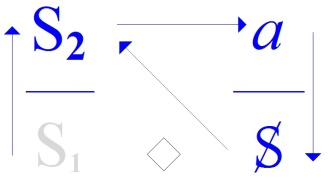

# Leçon 13 | 17 Juin 1970

  <label><input type="checkbox" data-lacan-toggle="original" checked> 原文</label>
  <label><input type="checkbox" data-lacan-toggle="notes" checked> 注释</label>
  <label><input type="checkbox" data-lacan-toggle="commentary" checked> 个人解读评论</label>

<section class="parallel-paragraph" data-paragraph-ids="s17-13-0001 s17-13-0002 s17-13-0003 s17-13-0004 s17-13-0005">

s17-13-0001, s17-13-0002, s17-13-0003, s17-13-0004, s17-13-0005

必须说清楚，「羞愧而死（mourir de honte）」这一效果极为罕见。[笑声]
然而它却是唯一一个标志……我已经和你们谈过一段时间：一个能指如何变成一个符号。
……唯一一个我们能够确证其谱系的标志，也就是说，它确实是从能指那里衍生出来的。
任何其他的符号，毕竟总是会落入这样的怀疑：那仅仅是一个纯粹的符号，也就是说，是猥亵的。
二十个场景，如果可以这样说，都足以为例，并且绝非为了搞笑——因此，「羞愧而死」就是这样一个例子。

> <strong>当能指降格为符号时，它可能变得“淫秽”</strong>，失去结构的合法性。

原文 · s17-13-0001, s17-13-0002, s17-13-0003, s17-13-0004, s17-13-0005

Il faut bien le dire, « *mourir de honte* » est un effet rarement obtenu. \[*Rires*\]

C’est pourtant le seul *signe*...

> je vous ai parlé de ça depuis un moment : *comment un signifiant devient un signe* ...le seul *signe* dont on puisse assurer la généalogie, soit : qu’il descende d’un signifiant.

Un signe quelconque, après tout peut toujours tomber sous le soupçon d’être un pur signe, c’est-à-dire obscène.

*Vingt scènes,* si j’ose dire, en font exemple, et pas montées pour rire, «* mourir de honte *» donc.

</section>

<section class="parallel-paragraph" data-paragraph-ids="s17-13-0006 s17-13-0007 s17-13-0008 s17-13-0009 s17-13-0010">

s17-13-0006, s17-13-0007, s17-13-0008, s17-13-0009, s17-13-0010

在这里，能指的蜕变（dégénérescence）是确定的，它必然是由能指的失败所造成的。

这个失败，一方面是“向死而在”（être pour la mort）<strong>，就主体而言——而这个“向死而在”还能涉及到谁呢？——另一方面则是那张“名片”，也就是我反复提醒过你们的：</strong>

“一个能指为另一个能指代表一个主体”。这张名片永远无法送达到目的地，因为要承载死亡的地址，它必须是一张被撕裂的名片。

人们常说：「真丢脸（C’est une honte）」，这本该导向一种「羞耻学（hontologie）」，终于能拼写得正确。

与此同时，「羞愧而死（mourir de honte）」是死亡唯一的情感——唯一真正值得的情感。值得什么呢？——值得死亡本身。对此，人们长期保持沉默。

原文 · s17-13-0006, s17-13-0007, s17-13-0008, s17-13-0009, s17-13-0010

Ici la dégénérescence du signifiant est sûre, sûre d’être produite par un échec du signifiant, soit l’*être pour la mort* en tant qu’il concerne le sujet...

> et qui pourrait-il concerner d’autre cet *être pour la mort* ? ...soit la carte de visite par quoi «* un signifiant représente un sujet pour un autre signifiant *»...

> vous commencez à savoir ça par cœur, j’espère ...cette carte de visite n’arrive jamais à bon port, pour la raison que, pour porter l’adresse de la mort, il faut qu’elle soit déchirée cette carte.

«* C’est une honte *» comme disent les gens, et qui devrait produire une « *hontologie* », orthographiée enfin correctement.

En attendant, « *mourir de honte* » est le seul *affect* de la mort qui mérite - qui mérite quoi ? - qui *<u>la</u>* mérite.

</section>

<section class="parallel-paragraph" data-paragraph-ids="s17-13-0011 s17-13-0012 s17-13-0013 s17-13-0014 s17-13-0015 s17-13-0016 s17-13-0017 s17-13-0018">

s17-13-0011, s17-13-0012, s17-13-0013, s17-13-0014, s17-13-0015, s17-13-0016, s17-13-0017, s17-13-0018

谈论它，实际上就是开启那个幽闭之处——不是最后的，却是唯一能够支撑起所谓「诚实（honnête）」之说的幽闭。

<strong>诚实（honnête）</strong>：字面上是「依托于荣誉（honneur）」——而这一切都与「羞耻（honte）」纠缠为伴。但「诚实」恰恰有这样的「机缘（heur）」：它避免直接提及「羞耻」。

<strong>正是因为对「诚实」而言，「羞愧而死」乃是不可能之物。你们知道我这里说的「不可能」，意思就是：真实界（le réel）。</strong>

「这不至于要命（Ça ne mérite pas la mort）」——人们随便对任何事都这么说，好像一切都不过是微不足道的小事。
然而，正是以这种说法，这样的语气，遮蔽了一个事实：死亡本身是可以被“值得/至于”的。
然而在此场合，关键不应当是消除这种不可能，而恰恰是要作为它的代理人：
也就是说，死亡确实是“值得/至于”的——至少在那短暂的一刻，哪怕只是「羞愧而死」，虽然实际上并不会真的死去。

> “羞愧”和“死亡”之间隔着“实在”的不可能。

原文 · s17-13-0011, s17-13-0012, s17-13-0013, s17-13-0014, s17-13-0015, s17-13-0016, s17-13-0017, s17-13-0018

On s’en est longtemps tu.

En parler en effet, c’est ouvrir ce réduit, pas le dernier, le seul dont tienne ce qui peut se dire honnêtement de l’«* hon­nête *». Honnête : qui tient à l’honneur - tout ça c’est honte et compagnon - a l’« *heur* » de ne pas faire mention de la honte, justement de ce que « *mourir de honte* » est pour lui - pour l’honnête - *l’impossible*.

Vous savez, de moi, que ça veut dire *le réel*.

«* Ça ne mérite pas la mort* », on dit ça à propos de n’importe quoi, pour ramener tout au futile.

Dit comme c’est dit, à cette fin, ça élide que la mort ça puisse *se mériter*.

Or ce n’est pas d’élider *l’impossible* qu’il devrait s’agir en l’occasion, mais d’en être *l’agent* : c’est dire que la mort ça se mérite, le temps au moins de « *mourir de honte* » qu’il n’en soit rien.

Si ça arrive maintenant, eh bien c’était la seule façon de la mériter : ça c’est votre *chance*.

Si ça n’arrive pas...

</section>

<section class="parallel-paragraph" data-paragraph-ids="s17-13-0019 s17-13-0020 s17-13-0021 s17-13-0022 s17-13-0023">

s17-13-0019, s17-13-0020, s17-13-0021, s17-13-0022, s17-13-0023

即便“羞愧而死”这一句话被说出来，中间依然又着某个不可能。

如果这件事（羞愧而死）此刻真的发生了，那么——嗯——那就是它唯一“值得”的方式。这就是你们的机缘。

如果没有发生——相较于之前的惊讶，这就成了不幸——那么剩下的就是把“生命”当作必须喝下去的羞耻之酒，因为它并不值得你为之而死。

我还有必要继续说下去吗？因为一旦开口谈论这件事，之前我所说的那二十个场景，就只会被人拿来做成滑稽戏。

正好，说到这儿，关于<strong>万森（Vincennes）</strong>：据说那边对我所说的很满意，对我本人也很满意。但我得说，这不是双向的：我本人对万森可不怎么满意。

> 这里提到的二十个场景这里有点摸不着头脑。

不过如果真的发生了“羞愧而死”，那么这便是“唯一” “至于”的方式，某种独特的，不可能的。
比如安提戈涅那种？或者魔法少女小圆那种？

或者是这样：
“就这么一点事，至于要死要活吗？”
——“怎么不至于！！！”

原文 · s17-13-0019, s17-13-0020, s17-13-0021, s17-13-0022, s17-13-0023

ce qui au regard de la surprise précédente fait *malchance...*alors il vous reste la vie comme honte à boire, de ce qu’elle ne mérite pas qu’on en meure.

Ça vaut-il que j’en parle, quand à partir du moment où on en parle, les *vingt scènes* que j’ai dites plus haut ne demandent qu’à le reprendre en bouffonnerie.

Justement : Vincennes, on y a - paraît-il - été content de ce que j’ai dit, content de moi, c’est pas réciproque : moi j’ai pas été très content de Vincennes.

Il y a beau y avoir une personne gentille qui a essayé de meubler au premier rang, de « *faire Vincennes* », il n’y avait manifestement personne de Vincennes, enfin ou très peu, juste les oreilles les plus dignes de me décerner un bon point.

C’est pas tout à fait bien sûr ce que j’attendais, surtout après - paraît-il - qu’on eut propagé mon enseignement à Vincennes.

</section>

<section class="parallel-paragraph" data-paragraph-ids="s17-13-0024 s17-13-0025 s17-13-0026 s17-13-0027 s17-13-0028">

s17-13-0024, s17-13-0025, s17-13-0026, s17-13-0027, s17-13-0028

尽管前排有一位好心人试图「撑场面」，扮演起「万森（Vincennes）」的角色，但显然现场并没有多少真正来自万森的人——几乎没有，只有些耳朵，最多是用来给我打个“优”字分数的。

这当然并不是我所期待的，尤其是在据说我的教导已经在万森被传播开之后。

有些时候，我确实会对这种空洞（creux）感到敏感。

总之……当时场面上还是刚好有那么一点东西，让我们得以想起——这是一个我自己都不知怎么会察觉到的回忆——*《分钟报》（Minute）*和*《现代时报》（Les Temps modernes）*之间竟然可能出现的“汇合点”。[笑声]我之所以提起这件事，只因为——正如你们马上会看到的——它与我们今天的主题相关：如何与“文化”打交道？

原文 · s17-13-0024, s17-13-0025, s17-13-0026, s17-13-0027, s17-13-0028

Il y a des moments comme ça, où je peux être sensible à un certain creux.

Enfin... il y avait tout de même juste ce qu’il fallait comme ça pour nous rappeler...

c’est un souvenir dont je ne sais pas comment j’ai eu moi-même conscience ...le point de concours qu’il peut y avoir entre « *Minute »* et « *Les Temps modernes »* \[*Rires*\].

Je n’en parle que parce que, comme vous allez le voir, ça touche à notre sujet d’aujourd’hui : *comment se comporter avec la culture ?*

Il suffit quelquefois d’une petite chose, comme ça, pour faire trait de lumière. Une fois que vous vous souvenez de la publication d’un certain enregistrement au magnétophone dans *Les Temps modernes*, ce rapport avec *Minute* est éclatant.

</section>

<section class="parallel-paragraph" data-paragraph-ids="s17-13-0029 s17-13-0030 s17-13-0031 s17-13-0032 s17-13-0033 s17-13-0034 s17-13-0035 s17-13-0036 s17-13-0037 s17-13-0038 s17-13-0039 s17-13-0040">

s17-13-0029, s17-13-0030, s17-13-0031, s17-13-0032, s17-13-0033, s17-13-0034, s17-13-0035, s17-13-0036, s17-13-0037, s17-13-0038, s17-13-0039, s17-13-0040

有时候只需要一个小小的契机，就能带来一束光。一旦你们回忆起*《现代时报》*上曾经刊登过的某个磁带录音的发表，那它与*《分钟报》*的关系就会变得格外明显。

就在那一刻，试试看吧，这非常迷人！我真的做过：你把这两份报纸（*Minute* 与 *Les Temps modernes*）里的段落剪下来，随便搅拌一下，再抽出来。我向你们保证，哪怕是纸张上略有差异，你也很难轻易分辨出来源。

这正是让我们能够换一种方式来提出问题：我刚才不是提出过一个反对意见吗？
——就是担心以某种特定的语气、某种特定的词语来触及这些事物时，滑稽戏会把它们卷走。

那么我们不如从这样一个前提出发：滑稽戏本来就已经在那儿了。

也许，只要在这道“酱汁”里稍微掺一点羞耻——谁知道呢？——或许就能把它约束住。

> 注：<strong>Minute / Les Temps modernes</strong>：分别代表极右翼与左翼知识分子阵营。拉康指出，它们的文稿在形式与调性上竟然可以混淆，当然这也不是什么新鲜事了。

总之，我是在玩这样一个游戏：你们听见我，也因为我正在对你们讲话。否则的话，你们听见我的时候反而会产生某种反对，因为很明显，在许多场合，这种“听见”恰恰阻碍了你们真正听清我在说什么。

这很可惜，因为至少在你们当中那些年轻人里，就我所说的内容而言——你们早就完全有能力不靠我就能说出来。你们唯一缺少的，正是<strong>一点羞耻</strong>。这一点羞耻，是可能会到来的。

当然，你不可能从马蹄上得到它，更不用说达达的马蹄了，但正如我所说过的，比如在真理圈层（alèthosphère）的犁沟里——它们早已在治愈你们，甚至活生生地将你们“soyous-er”了——这可能足以让你感到羞愧的。

你们要承认，为什么帕斯卡（Pascal）和康德（Kant）在你们面前会像两个即将变成瓦泰尔（Vatel）的仆人一样战战兢兢。

原文 · s17-13-0029, s17-13-0030, s17-13-0031, s17-13-0032, s17-13-0033, s17-13-0034, s17-13-0035, s17-13-0036, s17-13-0037, s17-13-0038, s17-13-0039, s17-13-0040

À ce moment là, essayez, c’est fascinant !

Je l’ai fait : vous découpez des paragraphes dans les deux journaux, vous les touillez quelque part, et vous tirez.

Je vous assure qu’au papier près, vous vous y retrouverez pas si facilement.

C’est ça qui doit nous permettre de prendre la question autrement, sur l’objection que j’ai faite tout à l’heure, de toucher les choses d’*un certain ton*, d’un certain mot, de crainte que *la bouffonnerie* ne les entraîne.

Partons plutôt de ceci, que *la bouffonnerie* est déjà là, et que peut-être, à mettre un peu de honte dans la sauce - qui sait ? - ça pourra la retenir.

Bref je joue le jeu de ce que *vous m’entendez de ce que je m’adresse à vous*.

Autrement il y aurait plutôt à ce que vous m’entendiez une objection, car il est clair que dans bien des cas ça vous empêche d’*entendre* ce que je dis.

Et c’est dommage, car au moins les jeunes parmi vous, il y a beau temps que vous êtes - pour ce que je dis – aussi bien capables de le dire sans moi. Il ne vous manque pour cela justement qu’un peu de honte.

Ça pourrait vous venir.

Évidemment ça se trouve pas sous le pied d’un cheval, et encore moins d’un *dada*, mais *les sillons de l’alèthosphère* comme j’ai dit *par exemple*, qui vous soignent et même vous « *soyousent »* tout vifs déjà, ça serait peut-être déjà pas mal suffisant comme prise de honte.

Reconnaissez pourquoi Pascal et Kant se trémoussaient, comme deux valets en passe de faire Vatel[^54], à votre endroit.

Ça a manqué de vérité là-haut, pendant trois siècles.

</section>

<section class="parallel-paragraph" data-paragraph-ids="s17-13-0041 s17-13-0042 s17-13-0043 s17-13-0044 s17-13-0045 s17-13-0046">

s17-13-0041, s17-13-0042, s17-13-0043, s17-13-0044, s17-13-0045, s17-13-0046

在上面（哲学的高度），三个世纪以来一直缺少真相。

不过，好歹这份“服务”还是送到了——热气腾腾，甚至有时还带点音乐的，如你们所知。别挑剔了，有人为你服务：你可以说这并不丢人。

> 注：<strong>alèthosphère（真理圈层）</strong>：拉康的自造词，来自希腊语 *alètheia*（真理）。意指围绕“真理”的话语场或层面。

> 注：<strong>soyousent</strong>：拉康式的文字游戏，似乎来自 *soigner*（治疗）和 *soûler*（灌醉），又带上了“vous”，暗示一种话语对主体的操控与改造。
> <strong>Vatel（瓦泰尔）</strong>：17世纪法国著名总管，因为鱼未能准时送达而自杀。

传统哲学面对“实在”的问题的无力，未能准时为“诸位”送上真理服务，真实对不起呀。

你们还记得那些罐子吧？当我说它们空了、没有芥末的时候，你们还在疑惑我究竟在烦恼什么。

那么，现在就请你们赶紧在这些罐子里储备起足够的羞耻，好让那场节日来临时，不至于太寡淡、缺乏辛辣。

你们可能会说：——「羞耻，有什么好处？如果这就是精神分析的反面，那我们可敬谢不敏。」

我会回答你们：——「你们的羞耻多得很，简直有余货可卖。如果你们还没意识到，那就切一片试试吧，如人们常说的那样。」

你们身上那股已经走味的气息，会让你们在每一步都撞上这样一种“镀层式的生存羞耻”，这正是精神分析所揭示的东西。

如果稍微认真一点，你们就会发现，这种羞耻的理由正在于：<strong>并非真的“羞愧而死”，而是竭尽全力去维持一种被歪曲的主人话语——这就是大学话语。</strong>

我会对你们说：“重新黑格尔化（Ré-hégélez-vous）吧”，我稍后会再谈到这一点。

> 日本人那种“耻文化”这里倒是特别贴切了。

原文 · s17-13-0041, s17-13-0042, s17-13-0043, s17-13-0044, s17-13-0045, s17-13-0046

Eh ben, le service est tout de même arrivé, réchauffant à souhait, et musicien même de temps en temps, comme vous le savez. Ne rechignez pas, vous êtes servis : vous pouvez dire qu’il n’y a plus de honte.

Vous savez que ces pots dont, à les dire vides de moutarde, vous vous demandiez ce qui me tracassait, eh bien, faites-y vite provision d’assez de honte pour que la fête, quand elle viendra, ne manque pas trop de piment.

Vous allez me dire : - « *La honte, quel avantage ? Si c’est ça l’envers de la psychanalyse, très peu pour nous.* »

Je vous réponds : - « *Vous en avez à revendre. Si vous ne le savez pas encore, faites une tranche, comme on dit.* »

Cet air éventé qui est le vôtre, vous le verrez buter à chaque pas sur *une honte de vivre* *gratinée,* *c’est ça ce que découvre la psychanalyse*. Avec un peu de sérieux, vous vous apercevrez que cette honte se justifie de ne pas mourir de honte, c’est-à-dire de maintenir de toutes vos forces un *discours du maître* perverti : c’est le *discours universitaire*.

« *Ré-hégélez* » vous, dirai-je, j’y reviens.

</section>

<section class="parallel-paragraph" data-paragraph-ids="s17-13-0047 s17-13-0048 s17-13-0049 s17-13-0050 s17-13-0051 s17-13-0052 s17-13-0053 s17-13-0054 s17-13-0055 s17-13-0056 s17-13-0057">

s17-13-0047, s17-13-0048, s17-13-0049, s17-13-0050, s17-13-0051, s17-13-0052, s17-13-0053, s17-13-0054, s17-13-0055, s17-13-0056, s17-13-0057

切腹谢罪背后有一整套文化甚至美学进行包装。包括“不给别人添麻烦”背后的社会规训。

再比如祥林嫂，被人嚼舌头根，想捐一个牌坊。

人们不是因为羞耻而死，而是反过来用尽力气维持某种“主人话语的伪装版”——也就是大学话语。大学话语把知识（S2）放在显位，却遮掩了其背后主人能指（S1）的支配，从而使主体继续存活在“羞耻的框架”之内。

羞耻意味着某种 “制度下的不合法性”，希望寻找到某一个S1位自己建立“合法性”，或者说合理性。而这正是黑格尔的精神现象学所做的，不断的逼问所谓的合法性，最后还是落入到某个主人能指中。
在羞耻的框架下，S1是最后的结果，而放在显现位置的是S2。

你们会看到：卑贱的意识，其实就是高贵意识的真理。而这一点的呈现，方式就是要让你们感到头晕目眩。你们越是卑劣……当然，我并不是说“猥亵”（obscène），这一点早已不在讨论之列。

……你们越是卑劣，情况反而会越好。

> 即是越是知道自己所处在的位置是：无位置，没有提供合法性的来源，没有担保。

知识与主体的确立不在S1上，算是拉康又callback回黑格尔 主奴的辩证关系上去了。

有一位可爱的人，按照我的推荐，去读了巴尔塔萨·格拉西安（Baltasar Gracián）的《醒悟之人》（

*L’Homme détrompé*）……你们知道的，他是一位耶稣会士，生活在十六世纪与十七世纪之交。他在十七世纪初写下了这部伟大的作品。

原文 · s17-13-0047, s17-13-0048, s17-13-0049, s17-13-0050, s17-13-0051, s17-13-0052, s17-13-0053, s17-13-0054, s17-13-0055, s17-13-0056, s17-13-0057

J’y suis retourné dimanche à ce sacré libelle de la « *Phénoménologie de l’esprit »,* en me demandant si je ne vous avais pas gourés la dernière fois en vous entraînant à mes réminiscences, dont je me serais moi-même fait régal.

Eh ben pas du tout : c’est étourdissant hein !

Vous y verrez que la conscience vile est la vérité de la conscience noble.

Et c’est envoyé de façon à vous faire tourner la tête.

Plus vous serez ignoble...

> je ne dis pas obscène bien sûr, il n’en est plus question depuis longtemps ...plus vous serez ignoble, mieux ça ira.

Ça éclaire vraiment la réforme récente de l’Université par exemple : tous «* unités de valeur *» à avoir dans votre giberne le bâton d’une culture maréchale en diable, fût-ce des médailles, hein, comme dans les comices à bestiaux, qui vous épingleront de ce qu’on ose appeler «* maîtrise *».

Formidable, vous aurez ça à profusion !

*Avoir honte* de ne pas en mourir y mettrait peut-être un autre ton, celui de ce que le *réel* soit concerné.

J’ai dit *le réel* et pas *la vérité*, car comme je vous l’ai déjà expliqué la dernière fois, c’est tentant : sucer le lait de *la vérité,* mais c’est toxique : ça endort et c’est tout ce qu’on attend de vous.

Il y a quelqu’un de charmant qui sur ma recommandation de « *L’Homme Détrompé »* de Baltasar Gracian[^55]...

</section>

<section class="parallel-paragraph" data-paragraph-ids="s17-13-0058 s17-13-0059 s17-13-0060 s17-13-0061 s17-13-0062 s17-13-0063 s17-13-0064 s17-13-0065">

s17-13-0058, s17-13-0059, s17-13-0060, s17-13-0061, s17-13-0062, s17-13-0063, s17-13-0064, s17-13-0065

总而言之，这正是孕育出与我们契合的世界观之处：在科学尚未攀升至顶点之前，人们就已经感觉到它即将到来。奇怪吗？但事实就是如此。

这一点甚至必须被记录下来，作为对历史真正经验性的评估：巴洛克——如此适合我们的巴洛克……应当被同化为现代艺术，无论是具象还是非具象，结果是一样的——它的兴起要么早于，要么恰好与科学最初的步伐同时发生。

在这本《批评家》（*Criticón*）里，这是一种寓言体作品，其中甚至已经包含了后来《鲁滨逊漂流记》的情节雏形。事实上，大多数杰作都只是一些来自未知杰作的碎片。在这本《批评家》中，到了第三部分（讲述“老年倾向”，因为他是按照年龄图谱来展开的），第二章里有一篇叫做《分层的真理》（*La vérité en couches*）的内容。

真理正在临盆，某处在一座只居住着最纯洁之人的城市。可这并不能阻止他们在听说“真理乃是一项孩子的工作”时，吓得掉头逃跑。

原文 · s17-13-0058, s17-13-0059, s17-13-0060, s17-13-0061, s17-13-0062, s17-13-0063, s17-13-0064, s17-13-0065

qui comme vous le savez, était un Jésuite qui vivait au joint du XVIème et du XVIIème siècle ...il a écrit ce grand morceau au début du XVIIème.

Somme toute, c’est là qu’est née la vue du monde qui nous convient : avant même que la science fût montée à notre zénith, on l’avait sentie venir.

C’est curieux, mais c’est comme ça.

C’est même à enregistrer pour toute appréciation vraiment expérimentale de l’histoire : le baroque qui nous convient si bien...

c’est à assimiler à l’art moderne, figuratif ou pas, c’est la même chose ...a commencé avant ou juste en même temps, que les pas initiaux de la science.

\[*chassez l’objet (a) (disc. scientifique), il revient par la fenêtre, des tableaux*...\]

Dans ce « *Criticon »...*

> qui est une sorte d’apologue où se trouve déjà incluse par exemple l’intrigue de « *Robinson Crusoé »*,
>
> la plupart des chefs d’œuvre c’est des miettes d’autres chefs-d’œuvre inconnus, ...dans ce *Criticon*, à la 3ème partie sur le penchant de la vieillesse... puisqu’il prend ce graphe des âges ...au 2ème chapitre il y a quelque chose qui s’apelle *« La vérité en couches ».*

</section>

<section class="parallel-paragraph" data-paragraph-ids="s17-13-0066 s17-13-0067 s17-13-0068 s17-13-0069 s17-13-0070 s17-13-0071 s17-13-0073 s17-13-0074">

s17-13-0066, s17-13-0067, s17-13-0068, s17-13-0069, s17-13-0070, s17-13-0071, s17-13-0073, s17-13-0074

我真纳闷，既然有人已经替我做出了这一发现——说实话并不是我自己最先注意到的——为什么还要让我来解释，除非他们上次没有来听我的研讨班。正是那一次，我已经说过了。

在这里必须坚持住，因为如果你们希望自己的言论真有颠覆性，就要格外小心，别让它们在通往真理的路上陷入泥淖、被黏住。

> 注：<strong>travail d’enfant（孩子的工作 / 分娩的工作）</strong>：双关语，既指“儿童般的工作”也指“分娩之苦（travail de l’accouchement）”。拉康借此强调真理的生成同时是天真与艰难的。

我在上一次真正想要阐明的——在这里写下这些我不可能总是重新画出来的东西——显然就是<strong>S1，即主人能指（signifiant-Maître）</strong>，它在大学体制的位置上构成了知识的秘密。人们非常容易依附于它……于是就被困住其中。
然而我所指出的——也许这一点才是你们中某些人能够从今年留下的唯一收获——就是要把注意力集中在<strong>生产层面</strong>，即大学体制所要求的那种生产。
在这样的情境下，某种特定的生产是被期待的，但也许为了真正产生一种效应，必须用另一种生产来替代它。

在这里，就作为一个阶段、一个过渡，而且毕竟我已经把它们当作上一次我在你们面前所阐述内容的标记，我还是要为你们读三页……

原文 · s17-13-0066, s17-13-0067, s17-13-0068, s17-13-0069, s17-13-0070, s17-13-0071, s17-13-0073, s17-13-0074

Elle est *« en couches »* quelque part dans une ville que n’habitent que les êtres de la plus grande pureté.

Ça ne les empêche pas de prendre la fuite et sous le coup d’une sacrée trouille quand on leur dit que *la vérité est un travail d’enfant*.

Je me demande pourquoi on me demande, quand on a fait pour moi *cette trouvaille* ...

car en vérité ce n’est pas moi qui l’ai repéré ...d’expliquer ça, sauf si on n’est pas venu à mon dernier séminaire.

C’est justement ce que j’y ai dit.

C’est là qu’il faut tenir bon, car vos propos si vous les voulez subver­sifs, prenez bien garde à ce qu’ils s’engluent pas trop sur le chemin de *la vérité*.

Ce que j’ai proprement voulu articuler la dernière fois...

à mettre ici ces choses que je ne peux pas me remettre à dessiner tout le temps, ...c’est évidemment le **S1**, *signifiant-Maître* qui fait le secret du *savoir* dans sa situation *universitaire*, c’est très tentant de coller à... On y reste pris.

</section>

<section class="parallel-paragraph" data-paragraph-ids="s17-13-0072">

s17-13-0072

[无对应译文]

原文 · s17-13-0072

</section>

<section class="parallel-paragraph" data-paragraph-ids="s17-13-0075 s17-13-0076 s17-13-0077 s17-13-0078 s17-13-0079 s17-13-0080 s17-13-0081">

s17-13-0075, s17-13-0076, s17-13-0077, s17-13-0078, s17-13-0079, s17-13-0080, s17-13-0081

我向那些已经听过我试读过这三页的人致歉。

这三页是为了回答“那个奇怪的比利时人”的提问——那个奇怪的比利时人 [参见上文 4 月 8 日的课程，当时拉康所读的文本正是回应罗贝尔·乔尔金（Robert Georgin，即“那个奇怪的比利时人”）的提问。该文本后来以《Radiophonie》为题发表于 *Scilicet* 2/3（Seuil, 1970），录音可在 UBUWEB 上找到。]。

他向我提出的问题对我来说颇有分量——你们也看得出来——甚至让我怀疑，这些问题是不是我在无意识中自己替他写下来的。

无论如何，他至少还有一点功劳，那就是做好了倾听这些问题的准备，如果情况确实如此的话。
那么，这里就是第六个问题，带着一种颇为可爱的天真：

「知识与真理之间究竟如何……
大家都知道，我曾试图展示过这两种德性如何彼此缝合在一起。
……知识与真理为何会不相容呢？」

我对他说：

「让我直言，真理与什么都不相抵触：人们在其中小便、咳嗽、吐痰。
它不过是一个通道，或者更确切地说，是一个排泄之所，不论是知识还是别的东西，都在那里被排出。
人们可以长期停留在那儿，甚至沉迷其中。值得注意的是，我曾经提醒过精神分析师：
千万不要把爱意附着在这个地方，哪怕他本身因其知识而被与它订下‘婚约’。

我立刻就要说明：

原文 · s17-13-0075, s17-13-0076, s17-13-0077, s17-13-0078, s17-13-0079, s17-13-0080, s17-13-0081

Alors que ce que j’indique, c’est peut-être ça seulement que certains d’entre vous, pourraient garder de cette année, c’est de focaliser aussi au niveau de « *la production »* du système universitaire, en tant qu’une cer­taine *production* est attendue, tandis qu’il s’agit peut-être - pour obtenir un effet - d’y substituer une autre *production*.

Là-dessus, simplement comme étape, comme relais, et parce qu’après tout je les ai posées comme une marque de ce que la der­nière fois j’ai énoncé devant vous, je vais tout de même vous lire trois pages...

je m’excuse auprès du peu de personnes auprès de qui j’en ai fait déjà l’épreuve ...trois pages qui répondent à une question de « ce drôle de Belge »[^56] qui en somme m’a posé des questions qui me retien­nent assez - vous le voyez - pour qu’en somme *je me demande si je ne les lui ai pas dictées moi-même sans le savoir.*

Il lui en reste certainement en tout cas le mérite de s’être préparé à les entendre, si c’est comme ça.

Voici donc *la sixième*, comme ça, d’une naïveté charmante : « *En quoi savoir et vérité...*

chacun sait que j’ai essayé de montrer comment elles se cou­saient ensemble, ces deux vertus

...*En quoi savoir et vérité sont-ils incompatibles ?* »

</section>

<section class="parallel-paragraph" data-paragraph-ids="s17-13-0082">

s17-13-0082

「你不能和真理结婚，和她没有契约，更没有自由结合，它受不了这些。真理首先是诱惑，欺骗你。

要想不上当，你就得坚强，而你并不坚强。」

> <strong>真理不是可以结婚的对象</strong>，既没有契约，也没有自由结合。真理并不稳定，它是诱惑性的、欺骗性的，首先是为了“愚弄”人。真理不仅和知识相容，和什么都相容。

原文 · s17-13-0082

Je lui dis : « *Pour m’exprimer comme il me vient, rien n’est incompatible avec la vérité : on pisse, on tousse, on crache dedans.*

</section>

<section class="parallel-paragraph" data-paragraph-ids="s17-13-0083 s17-13-0084 s17-13-0085 s17-13-0086 s17-13-0087 s17-13-0088 s17-13-0089 s17-13-0090 s17-13-0091">

s17-13-0083, s17-13-0084, s17-13-0085, s17-13-0086, s17-13-0087, s17-13-0088, s17-13-0089, s17-13-0090, s17-13-0091

想到这里，忍不住想到那种会自诩“吾更爱真理”的人。
——爱真理并不能显示出你如何特别，真是不好意思。

告诫分析师不要被真理诱惑，拜倒在其石榴裙下。

因此，我就是这样对精神分析师说话的——那个幽灵般的存在，我在呼唤他，甚至在拉扯他，

> 抵抗着你们的喧嚣与嘲笑，好让我能在固定的时刻、固定的日子里坚持下去，承担起这样一种赌注：他能听见我。

所以，我并不是在提醒你们，你们并不会有被“真理咬住”的风险。

但是——谁知道呢？——倘若我的锻造（forgerie）能够活过来，倘若精神分析师真的接过我的位置，在那几乎不可能的希望的边界处，那我所要警告的就是他：

所谓“在真理那里总有东西可以学”，这种陈词滥调只会让任何人迷失其中。

只要每个人懂得其中的一小部分，这就足够了，而且最好牢牢记住这一点。更好的情况是，干脆什么都不去做，因为没有什么工具比它更背叛人的。大家都知道，一个精神分析师——不是“那唯一的”分析师——通常是怎么应付的：
<strong>他把这条关于真理的线索留给那个本来就已经被它困扰的人，</strong>
而正因为如此，那个人才真正成为了他的来访者。至于分析师本人，他则对这件事漠不关心，好像毫不在乎。

> 话语中承担“分析师位置”的人如果相信“在真理那里总有可学之物”，就会落入某个庸俗的陷阱。

真理或者真理的线索对分析师来说没啥用处，也没什么值得探索的。这种话语的真理只有放回到那个“被它困扰的人”那里才有意义。
分析师不要有什么“真理囤积癖”，毕竟在承担分析师位置的时候，连话语都不属于自己，而来自来访者，更何况真理了。
如果哪个分析师对别人的真理那么上心，那你可要注意了。

原文 · s17-13-0083, s17-13-0084, s17-13-0085, s17-13-0086, s17-13-0087, s17-13-0088, s17-13-0089, s17-13-0090, s17-13-0091

*C’est un lieu de passage, ou pour mieux dire, d’évacuation, du savoir comme du reste.*

*On peut s’y tenir en permanence, et même en raffoler.*

*Il est notable que j’ai mis en garde le psychanalyste de connoter d’amour ce lieu à quoi il est fiancé par son savoir, lui. Je lui dis tout de suite :*

> *« On n’épouse pas la vérité, avec elle, pas de contrat, et d’union libre encore moins.*
>
> *Elle ne supporte rien de tout ça.*
>
> *La vérité est séduction d’abord, et pour vous couillonner.*
>
> *Pour ne pas s’y laisser prendre, il faut être fort, ce n’est pas votre cas. »*

*Ainsi parlais-je au psychanalyste, ce fantôme que je hèle, que je hale même, contre l’esbaudissement de vous presser à l’heure, au jour,* *invariables depuis des temps où je soutiens pour vous la gageure qu’il m’entende.*

*Ce n’est donc pas vous que j’avise, vous ne courez pas le risque d’être mordu de la vérité.*

*Mais - qui sait ? - que ma forgerie s’anime, que le psychanalyste prenne mon relais, aux limites de l’espoir que ça ne se rencontre pas,* *c’est lui que j’avertis : que de la vérité on ait tout à apprendre, ce lieu commun voue quiconque à s’y perdre.*

*Que chacun en sache un bout, ça suffira, et il fera bien de s’y tenir.*

*Encore le mieux sera-t-il qu’il n’en fasse rien, il n’y a rien de plus traître comme instrument.*

</section>

<section class="parallel-paragraph" data-paragraph-ids="s17-13-0092 s17-13-0093 s17-13-0094 s17-13-0095 s17-13-0096 s17-13-0097 s17-13-0098 s17-13-0099 s17-13-0100 s17-13-0101 s17-13-0102 s17-13-0103 s17-13-0104 s17-13-0105">

s17-13-0092, s17-13-0093, s17-13-0094, s17-13-0095, s17-13-0096, s17-13-0097, s17-13-0098, s17-13-0099, s17-13-0100, s17-13-0101, s17-13-0102, s17-13-0103, s17-13-0104, s17-13-0105

然而，不可否认的是，近来确实有人把这件事当成了自己的事情，更加投入其中。

这或许是我的影响。我也许在这种“修正”中起了一点作用。正因为如此，我才“有义务”提醒他们不要走得太远，因为如果我真有什么成就，那恰恰是通过“看似毫不触碰”的方式得到的。

但正是这一点才真正严重。再说，当然有人会假装自己因此而感到恐惧。这是一种拒绝，但拒绝并不排除合作。拒绝本身，也可能就是一种合作。

好吧，对于那些在广播里听我的人来说——他们没有像我刚才所说的那样，因“听见我本人”而形成的障碍，也就是说，他们并没有因为“听见我这个人”而阻碍了他们真正“听清我所说的内容”——我现在要在这里走得更远一些。

正因如此，我才决定把这段文字读给你们听：毕竟，如果我可以在某种大众传媒的层面上说出来，那么，为什么不在这里也试试看呢？

还有一点：也许我在最初的四个回答中所采取的原则——这些回答在这里让你们大为震惊，而据说在广播中却比人们所想的更顺畅地传达了出去——它们实际上证实了我所采用的这个原则，而这也正是我今天想要留给你们的东西之一。这毕竟也是可以作用于文化的一种方法。

那就是：当偶然间我们被置于面对一个广泛公众的场合，被某种媒介暴露在一大群人面前时，

——为什么不恰恰反过来，<strong>相对于这个被假定的“无能”——而这种假定纯属臆测——提高我们的水准</strong>？
——为什么，为什么要降低语调？
——你们究竟想要聚拢些什么人？

文化的游戏，恰恰就在于把你们卷入这样一个体系之中，以至于最后的结果就是：<strong>连母猫都找不回自己的小猫了</strong>。

因此，在这里，虽然在这间教室里依然完全可以说出来，我还是要指出，我的公式——“被假定知道的主体（sujet supposé savoir）”，作为转移的原理——其真正的奇特之处，

原文 · s17-13-0092, s17-13-0093, s17-13-0094, s17-13-0095, s17-13-0096, s17-13-0097, s17-13-0098, s17-13-0099, s17-13-0100, s17-13-0101, s17-13-0102, s17-13-0103, s17-13-0104, s17-13-0105

*On sait comment un psychanalyste - pas le - s’en tire d’ordinaire : il en laisse la ficelle, de cette vérité, à celui qui en avait déjà le tracas* *et qui, à ce titre, devient vraiment son patient, moyennant quoi il s’en soucie comme d’une guigne.*

*Tout de même, c’est un fait que certains depuis quelque temps en font affaire à s’y sentir plus concernés.*

*C’est peut-être mon influence. Je suis peut-être pour quelque chose dans cette correction.*

*Et c’est justement ce qui me fait « devoir » de les avertir de ne pas aller trop loin, parce que si je l’ai obtenu, c’est de n’avoir pas l’air d’y toucher.*

*Mais c’est justement ce qu’il y a de grave. D’ailleurs bien sûr on feint d’en ressentir quelque terreur.*

*C’est un refus, mais du refus n’est pas exclue la collaboration. Le refus lui-même peut en être un.* »

Bon, avec ceux qui *m’écoutent à la radio* et qui n’ont pas - comme je le disais tout à l’heure - l’obstacle à entendre ce que je dis, qui est de m’entendre, je vais ici aller plus loin. Et c’est pour ça qu’après tout je vous le lis, puisque, si je peux le dire d’un certain niveau de *mass media*, pourquoi ne pas faire ici l’essai ?

Et puis il est possible que le principe que j’ai pris, lors de ces quatre premières réponses, qui vous ont ici tant ahuris et qui - paraît-il - sont passées beaucoup mieux qu’on ne le croit sur cette radio.

Elles ont confirmé le principe que j’ai adopté, et qui est aussi dans la ligne des choses que je voudrais aujourd’hui vous léguer. C’est une des méthodes après tout dont on pourrait faire l’action sur la culture.

C’est que quand par hasard on est pris au niveau d’un public large, d’une de ces masses qu’un type de *médium* vous livre,

- eh bien pourquoi justement ne pas élever, en quelque sorte proportionnellement à l’inaptitude présumée, qui est pure présomption, de ce champ, élever le niveau proportionnellement à l’inaptitude en question ?

- Pourquoi, pourquoi faire baisser le ton ?

- Qui avez-vous à attrouper ?

C’est précisément le jeu de *la culture* que de vous engager dans ce système grâce à quoi le but est atteint : qu’une chatte n’y retrouvera pas ses petits. Donc ici, et bien que ce soit encore tout à fait *dicible* dans cette salle, je dis ce qu’a de remarquable, de n’être pas remarquée, ma formule du « *sujet supposé savoir »* mis au principe du transfert.

</section>

<section class="parallel-paragraph" data-paragraph-ids="s17-13-0106 s17-13-0107 s17-13-0108">

s17-13-0106, s17-13-0107, s17-13-0108

正在于它并不被人察觉。

「我所说的那个被假定的知识，正是分析者（psychanalysant，受分析者）在转移中所操作的东西。

但我从未说过：因此分析师就更被假定为知道真理。

大家必须想到这一点：如果在其中再附加上这个补充，那对转移而言就是致命的。

但同样，你们也最好别去想，因为如果理解这一点反而会阻碍转移效应保持其真实。

原文 · s17-13-0106, s17-13-0107, s17-13-0108

« *Le savoir supposé dont, à mon dire, le psychanalysant fait transfert, je n’ai pas dit que le psychanalyste en soit plus supposé savoir la vérité.*

*Qu’on y pense pour comprendre qu’y adjoindre ce complément serait mortel pour le transfert.*

*Mais aussi bien, qu’on n’y pense pas, si le comprendre justement empêcherait d’en rester vrai l’effet.*

</section>

<section class="parallel-paragraph" data-paragraph-ids="s17-13-0109">

s17-13-0109

我甚至享受那种愤慨：某些人用转移所运作的那点微不足道的“知识”，来装饰我所揭露的东西。」

原文 · s17-13-0109

*Je déguste l’indignation de ce qu’une personne habille ce que je dénonce du peu de savoir dont le transfert fait l’œuvre.*

</section>

<section class="parallel-paragraph" data-paragraph-ids="s17-13-0110 s17-13-0111 s17-13-0112 s17-13-0113">

s17-13-0110, s17-13-0111, s17-13-0112, s17-13-0113

她完全可以用别的东西来填补这一空缺，而不是那张无关紧要随时可以卖掉的扶手椅——前提是我的判断无误。

她不坚持己见，只会让这个案子变得毫无希望。而精神分析师的立足点，只在于<strong>不与自身的存在纠缠不清。</strong>

> 被假定的知识，不等于分析师“拥有被假定的知识”。

这也是一个“不可能”或者不对称的关系。
来访者假定：分析师知道有关于自己的知识。

但分析师的位置可不是：分析师知道：来访者假定自己知道什么知识。这么简单而已。

原文 · s17-13-0110, s17-13-0111, s17-13-0112, s17-13-0113

*Il ne tient qu’à elle de meubler ça d’autre chose que du fauteuil qu’elle se dit prête à vendre au cas où j’aurais raison.*

*Elle ne rend l’affaire sans issue qu’à ne pas s’en tenir à ses moyens.*

*Le psychanalyste ne tient qu’à n’avoir pas maille à partir dans son être.*

*Le fameux non-savoir dont on nous fait des gorges chaudes ne lui tient à cœur que de ce que, pour lui, il ne soit rien.*

</section>

<section class="parallel-paragraph" data-paragraph-ids="s17-13-0114 s17-13-0115 s17-13-0116 s17-13-0117 s17-13-0118 s17-13-0119 s17-13-0120 s17-13-0121 s17-13-0122 s17-13-0123 s17-13-0124 s17-13-0125 s17-13-0126 s17-13-0127 s17-13-0128 s17-13-0129 s17-13-0130 s17-13-0131">

s17-13-0114, s17-13-0115, s17-13-0116, s17-13-0117, s17-13-0118, s17-13-0119, s17-13-0120, s17-13-0121, s17-13-0122, s17-13-0123, s17-13-0124, s17-13-0125, s17-13-0126, s17-13-0127, s17-13-0128, s17-13-0129, s17-13-0130, s17-13-0131

分析师要假定来访者有一个“知识”（S2），但这个知识不会放在分析师的位置上。
如果恰好来访者将这个“被假定的知识”放在分析师身上，那么也没什么大不了的——这是常态，也是分析的开始。
分析师需要把这个假定的知识当作一个对象处理，并且试图将这种“被假设的知识”从来访者安置的位置移动到会谈的“明处”进行讨论。

我们将这个过程称为——<strong>“转移”</strong>！   进一步来说，转移的对象是<strong>“被假定的知识”</strong>，这跟“情”有什么关系吗？
 分析师善于“谈情说爱”，不过是他人的某种想象，可能恰好“多情”的分析师似乎乐于迎合这样的想象，而不是将它放在明处进行讨论。
我只能祝你好运了。

真正让分析走入死胡同的，而是病人拒绝依靠自己的手段，而不是分析师渊博的知识。
分析师负责维持话语的位置。

那个所谓“无知（non-savoir）”，人们对此大肆渲染，但对他而言，其意义只在于它什么都不是。

他厌恶那种时尚——去掘出一个影子，假装成腐尸，把自己标榜成猎犬般的侦察者。

> 这里吐槽了一下某种“时尚”：将“自己一无所知”大肆渲染，为自己营造“面对真理谦卑”的苏格拉底的样子。

在精神分析中的无知，是针对那个“被假定的知识”的无知。由于这样的“无知”，而不断的想去知道一些什么——这便是分析师的位置。
而不是拿“无知”当作某种维持自己形象的时尚单品。

他的学科让他深刻意识到：真实界（le réel）并非首先是为了被认知而存在的。（顺便说一句：这是抵御唯心主义的唯一堤坝。）
知识（savoir）只是附加在真实之上的，这正是它能够使“虚假”获得存在，甚至在某种程度上“在那里”的原因。

我在这种场合“拼命地来一句又一句存在论（Dasein）”，为此总是需要一点助力。说实话，只有在它是假的地方，知识才会关心真理。任何不是假的知识，都对此漠不关心。

若有验证可言，那只能以一种“意外”的形式出现——尽管这种意外本身带有可疑的味道。
因为，凭借弗洛伊德的恩惠，知识所诉说的，其实就是语言，毕竟它不过是语言的产物。而这里，政治性的关联便出现了。

> 知识与真理的关系并不在于知识本身的正确性，而在于它的虚假性。

原文 · s17-13-0114, s17-13-0115, s17-13-0116, s17-13-0117, s17-13-0118, s17-13-0119, s17-13-0120, s17-13-0121, s17-13-0122, s17-13-0123, s17-13-0124, s17-13-0125, s17-13-0126, s17-13-0127, s17-13-0128, s17-13-0129, s17-13-0130, s17-13-0131

*Il répugne à la mode de déterrer une ombre pour en feindre charogne, à se faire coter comme chien de chasse.*

*Sa discipline le pénètre de ce que le réel n’est pas d’abord pour être su, entre parenthèses : c’est la seule digue à contenir l’idéalisme.*

*Le savoir s’ajoute au réel, c’est bien pour cela qu’il peut porter le faux à être, et même à être un peu là.*

*Je « Dasein » à tour de bras à cette occasion, on a besoin pour ça d’aide.*

*À vrai dire, ce n’est que d’où il est faux que le savoir se préoccupe de vérité.*

*Tout savoir qui n’est pas faux s’en balance.*

*À s’avérer, il n’y a que sa forme en surprise, surprise d’un goût douteux au reste, quand par la grâce de Freud,* *c’est de langage qu’il nous parle, puisqu’il n’en est que le produit. C’est ici qu’a lieu l’incidence politique.*

*Il s’y agit en acte de cette question : de quel savoir on fait la loi ?*

*Quand on le découvre, il peut se faire que ça change.*

*Le savoir tombe au rang de symptôme, vu d’un autre regard.*

*Et là, vient la vérité. Pour la vérité, on se bat. Ce qui tout de même ne se produit que de son rapport au réel.*

*Mais que ça se produise importe beaucoup moins que ce que ça produit.*

*L’effet de vérité n’est qu’une chute de savoir. C’est cette chute qui fait production, bientôt à reprendre.*

*Le réel, lui, ne s’en porte ni moins ni plus mal.*

*En général, il s’ébroue jusqu’à la prochaine crise.*

*Son bénéfice du moment, c’est que il a retrouvé du lustre.*

*Ce serait même le bénéfice qu’on pourrait attendre d’aucune révolution, ce lustre qui brillerait au lieu - longtemps, toujours trouble - de la vérité. Seulement voilà, à ce lustre on voit jamais plus que du feu. *»

Voilà ce que le lendemain du dernier séminaire j’avais jeté dans un coin, pour vous manifestement, puisqu’il n’est plus question de le rajouter à mon petit radeau radiologique.

</section>

<section class="parallel-paragraph" data-paragraph-ids="s17-13-0132 s17-13-0134 s17-13-0135 s17-13-0136 s17-13-0137">

s17-13-0132, s17-13-0134, s17-13-0135, s17-13-0136, s17-13-0137

至于真实界（le réel），它本身既不会因此更糟，也不会因此更好。一般来说，它只是抖落一番，直到下一次危机来临。它当下所得到的唯一好处，就是重新获得了一点光泽。这甚至也是人们对任何革命所能期待的唯一好处：

那份光泽，闪耀在真理的位置上——那个长期以来总是浑浊不清的位置。但问题在于，这份光泽终究不过是<strong>火光一闪</strong>，除此什么也看不见。

这就是在上一次研讨班的次日，我随手写在一角的东西，显然是为你们准备的，因为它已不可能再加进我那艘小小的“无线电木筏”里了。必须好好理解的一点是：在真理之中真正可怖的东西，乃是<strong>它所安置在其位置上的那个东西</strong>。

如果你们看看这个由四个字母构成的小图表：

当然，正如我一直所说的，<strong>大他者（l’Autre）的位置，正是为了在其中铭写真理</strong>。

不过，这是在话语与语言的坦率博弈（franc-jeu）中才能实现的。

的确，真理正是在这里被铭写的——也就是说，一切属于这个层面的东西：虚假，甚至谎言。

原文 · s17-13-0132, s17-13-0134, s17-13-0135, s17-13-0136, s17-13-0137

Ce qu’il faut bien comprendre, ce qu’il y a d’effroyable dans *la vérité,* c’est ce qu’elle met à sa place.

Si vous regardez ce petit schéma-là, à 4 *lettres *: bien sûr *le* *[lieu de l](file:///C:\Users\ALAIN\LACAN%20séminaires\lieu.de)’Autre*, comme je l’ai dit depuis toujours, il est fait pour que là s’y inscrive *la vérité*.

Mais ça, c’est dans le *franc-jeu de la parole* et *du langage*. C’est là bien sûr que *s’inscrit la vérité*, c’est-à-dire tout ce qui est de cet ordre, c’est-à-dire le faux, voire le mensonge, qui n’existe pas sinon sur le fondement de la vérité.

Mais dans ce schéma du quadripode qui suppose *le langage* et tient pour structuré ce qui s’appelle *un discours*, c’est-à-dire ce qui conditionne toute *parole* qui puisse s’y produire, ce qu’elle met à sa place la vérité dont il s’agit, la vérité de ce discours, à savoir *ce qu’il conditionne*.

Comment est-ce que ça tient le *discours du Maître* ?

</section>

<section class="parallel-paragraph" data-paragraph-ids="s17-13-0133">

s17-13-0133

[无对应译文]

原文 · s17-13-0133

</section>

<section class="parallel-paragraph" data-paragraph-ids="s17-13-0138 s17-13-0139 s17-13-0140 s17-13-0141 s17-13-0142">

s17-13-0138, s17-13-0139, s17-13-0140, s17-13-0141, s17-13-0142

因为虚假乃至谎言，唯有在真理的基础上才得以存在。

但是，在这个四足图式（quadripode）之中——它预设了语言，并且把所谓“话语”视为一个结构，也就是说，任何能够在其中发生的言说都受其制约——真理所安置的位置，正是这个话语本身的真理，即它所制约的东西。

<strong>主人话语（discours du Maître）究竟是如何维系的？</strong>这正是“真理”功能的另一面——并不是显而易见的一面，而是那一维度：在其中，真理必然作为某种“隐藏之物”的债务而存在。

我们在“真理圈层”（aléthosphère）里的沟壑，刻画在那片早已被遗弃的天空表面。
但关键在于，有一天我用一个词来指称过这一点，这个词曾让你们当中的不少人觉得被我挠痒似的，
以至于怀疑我到底要说什么：那就是“lathouse”。

并不是我发明了真理的这一维度：真理之所以为真理，就在于它是隐藏的，由“隐匿（Verborgenheit）”这一特征所构成。

> 注：<strong>lathouse</strong>：拉康的文字游戏，来自希腊语 *lanthanein*（隐藏、被遮蔽），与 *alètheia* 相对。若 *alètheia* 意为“不隐藏”，那么 *lathouse* 就是“隐藏的维度”。

原文 · s17-13-0138, s17-13-0139, s17-13-0140, s17-13-0141, s17-13-0142

C’est cela qui est l’autre face de cette fonction de *la vérité*, et non pas la face patente, mais la dimension dans laquelle elle se nécessite comme dette de quelque chose de caché.

Nos *sillons de l’aléthosphère*, ils se tracent sur la surface du ciel longtemps désertée. Mais ce dont il s’agit, c’est de ce qu’un jour j’ai appelé de ce mot sur lequel on a chatouillé assez d’entre vous pour qu’ils se demandent ce qui me prenait : la «* lathouse *».

Ce n’est pas moi qui ai inventé cette dimension de *la vérité* : qu’elle est cachée, que c’est la *Verborgenheit* qui la constitue.

Bref, les choses sont telles qu’elle fait supposer qu’elle a quelque chose dans le ventre.

Vous voyez comme moi qu’il n’est pas inutile de voir que très tôt il y a des petits futés qui se sont aperçus que si ça sortait, ça serait *abominable*. Elle l’est probablement en plus, pour que ça fasse mieux dans le paysage.

</section>

<section class="parallel-paragraph" data-paragraph-ids="s17-13-0143 s17-13-0144 s17-13-0145 s17-13-0146">

s17-13-0143, s17-13-0144, s17-13-0145, s17-13-0146

主人话语维系的方式就在于“<strong>lathouse</strong>”的两面性。

总之，情况就是这样：它让人不得不假定，她肚子里确实有些什么。你们和我一样会看出来：不无必要指出，很早就有一些小聪明人察觉到——如果那东西真出来了，那将是骇人听闻的。而且，她大概确实就是这样的，这样才能在整个景观里显得更“合适”。

现在，也完全可能，整个关键就在于：如果那东西真的出来了，它必然是可怖的。

如果你们只是花时间去等待，那你们就算完了。

总之，不能过度去挑衅这所谓的“lathouse”。因为一旦投入其中，总是意味着要确认——什么呢？——

就是我反复强调的：<strong>去确认那个“不可能”，它实际上借助于你们而成为真实</strong>。

如果你们的追求真的是指向真理，那么你们越是坚持，就越是在支撑那些“不可能的权能”。

而这些不可能，我上次已经为你们枚举过：统治、教育、分析——以及在某些情况下，治愈。

> 真理在于“被假定”，“被遮掩”

无论如何，就精神分析而言，这一点是显而易见的，对吧。

所谓“被假定知道的主体”，一旦我仅仅是接近真理，就足以引发丑闻。

原文 · s17-13-0143, s17-13-0144, s17-13-0145, s17-13-0146

Maintenant, il est également possible que ce soit là tout le truc : que ça doive être *effroyable* si ça sort.

Si vous passez votre temps à attendre, c’est là que vous êtes cuit.

Il faut pas, en somme, trop taquiner la «* lathouse *». Car s’engager là-dedans, c’est toujours assurer - quoi ? - ce que je me tue à vous expliquer : assurer *l’impossible* de ce qu’il est effectivement, grâce à vous, *réel*. Si c’est du côté de *la vérité* que s’attache votre quête, plus vous soutenez le pouvoir *des impossibles* que sont respectivement ceux que je vous ai énumérés la dernière fois : *gouverner, éduquer, analyser* à l’occasion.

En tous les cas pour l’analyse, c’est évident, hein. Le *sujet supposé savoir*, ça scandalise, quand simplement j’approche *la vérité*.

# Enfin, mes petits schémas quadripodes, je vous le dis aujourd’hui pour que vous y preniez bien garde : 

# c’est pas la table tournante de l’histoire, 

# il n’est pas forcé que cela passe toujours par là, 

# et que cela tourne dans le même sens.

</section>

<section class="parallel-paragraph" data-paragraph-ids="s17-13-0147 s17-13-0148 s17-13-0149">

s17-13-0147, s17-13-0148, s17-13-0149

最后，关于我那些小小的“四足图式”，今天我要特别提醒你们注意：

——它可不是历史的转盘；

——也不是说一切必然都要通过它；

——更不是说它必然总是以同一个方向旋转。

这只是一个呼吁，要你们在某种意义上定位自己，相对于那些我们完全可以称之为根本函数（fonctions radicales）的东西——严格意义上说，是数学意义上的“函数”。

原文 · s17-13-0147, s17-13-0148, s17-13-0149

C’est seulement appel à vous repérer par rapport à ce qu’on peut bien appeler *des fonctions radicales, au sens mathématique* du terme, où le pas décisif est fait quelque part du côté de cette époque que j’ai déjà désignée tout à l’heure : autour de ce qu’il y a de commun entre

- le premier pas de Galilée,

- le surgissement des intégrales et des différentielles chez Leibniz,

</section>

<section class="parallel-paragraph" data-paragraph-ids="s17-13-0150 s17-13-0151">

s17-13-0150, s17-13-0151

决定性的一步，正是在我刚才已经提到过的那个时代里完成的：

围绕着以下这些事物的共同之处：

——伽利略（Galilée）的最初一步，

原文 · s17-13-0150, s17-13-0151

- et puis aussi la sortie des logarithmes.

Ce qui est *fonction* est ce quelque chose qui entre dans le *réel*, qui n’y était jamais entré avant, et qui correspond à ceci :

</section>

<section class="parallel-paragraph" data-paragraph-ids="s17-13-0152 s17-13-0153 s17-13-0154 s17-13-0155 s17-13-0156 s17-13-0157 s17-13-0158 s17-13-0159 s17-13-0160">

s17-13-0152, s17-13-0153, s17-13-0154, s17-13-0155, s17-13-0156, s17-13-0157, s17-13-0158, s17-13-0159, s17-13-0160

——莱布尼茨（Leibniz）那里积分与微分的出现，

——以及对数的发明。

> 上面都代表了一种全新的表述模式，改变了语言与符号的功能，使“自然”得以被数学化、被重新组织。

或者说均是在尝试试图用符号描述“自然”或者“真实”。

所谓“函数”，就是某种进入真实界（le réel）的东西——它在此之前从未进入过——而它所对应的，是这样一种操作：
——不是去发现、实验、圈定、分离或抽取，
——而是去书写两种不同层次的关系。

让我们举个例子吧：比如对数的产生。
在一种情形下，第一种关系就是加法。
加法，这一点毕竟是直观的：这里有一些东西，那里也有一些东西，你把它们放在一起，就构成了一个新的整体。

乘法，毕竟不是同一回事。

“饼的增殖（multiplication des pains）”，和“饼的聚集（rassemblement des pains）”完全不同。

关键在于：要让其中一种关系作用在另一种关系之上。

> 圣经中的奇迹故事，指耶稣让少数饼增殖为众多。拉康用此典故强调“乘法”不是单纯的“聚集”，而是一种“生成”。

原文 · s17-13-0152, s17-13-0153, s17-13-0154, s17-13-0155, s17-13-0156, s17-13-0157, s17-13-0158, s17-13-0159, s17-13-0160

- non pas à découvrir, expérimenter, cerner, détacher, dégager,

- <u>à *écrire*</u> deux ordres de relations.

Exemplifions n’est-ce pas, ce dont surgit le *logarithme*.

Dans un cas, la première relation, c’est l’addition.

L’addition, quand même c’est intuitif : il y a des choses ici, des choses là, vous les mettez ensemble, ça fait un nouvel ensemble.

La multiplication quand même c’est pas la même chose.

La multiplication des pains, c’est pas la même chose que le rassemblement des pains.

Il s’agit de faire qu’une de ces relations s’applique sur l’autre.

Vous inventez *le logarithme*, il commence à cavaler vachement dans le monde sur des petites règles qui n’ont l’air de rien, mais dont ne croyez pas que le fait qu’elles existent vous laisse - aucun de ceux qui sont ici - dans le même état qu’avant qu’elles sortent. Leur présence est ce qui importe.

</section>

<section class="parallel-paragraph" data-paragraph-ids="s17-13-0161 s17-13-0162 s17-13-0163 s17-13-0164 s17-13-0165">

s17-13-0161, s17-13-0162, s17-13-0163, s17-13-0164, s17-13-0165

对数的突破在于让乘法关系能够“应用”到加法关系上，即把两个层次的关系联系起来。
乘法与加法不再是独立的两种计算符号，产生了关系。

你们发明了对数，它立刻在世界上飞奔起来，依靠一些看似微不足道的小尺规（règles），但不要以为，它们的存在会让你们——这里在座的任何一个人——依然保持在它出现之前的同样状态。
重要的，正是它们的存在本身。

那么，这些或多或少显得“热心”的小符号：S1、S2、a、S，我要告诉你们，它们在大量的关系之中都能派上用场。只需要熟悉它们就行。

比如说，<strong>一划（trait unaire）</strong>，只要我们满足于它，就可以尝试去质询<strong>主人能指（signifiant-Maître, S1）的运作</strong>——这完全是可用的。只要你们在结构层面把它奠基好，你们就会发现，根本没必要再去重复那一整出大戏：

所谓“纯粹威望的殊死斗争（la lutte à mort de pur prestige）”及其结局。

原文 · s17-13-0161, s17-13-0162, s17-13-0163, s17-13-0164, s17-13-0165

Alors, ces petits termes plus ou moins zélés : S1, S2, *a*, S, je vous dis que ça peut servir dans un très grand nombre de relations. Il faut simplement se familiariser avec ça.

C’est à savoir par exemple que le *trait unaire,* pour autant qu’on peut s’en contenter, on peut essayer de s’interroger sur le fonctionnement du *signifiant-Maître -* eh bien c’est tout à fait utilisable, si seulement de bien le fonder structuralement, vous vous apercevez qu’il n’y a pas besoin d’en remettre : toute *la grande comédie de* «* la lutte à mort de pur prestige *» et de son issue.

Il n’y a pas de *contingence*...

contrairement à ce qu’on en conclut à interroger les choses au niveau du «* vrai de nature *» ...il n’y a pas de *contingence* dans la position de l’esclave.

Il y a la *nécessité* de ceci : que dans le savoir, quelque chose se produise qui fait fonction de *signifiant-Maître*.

</section>

<section class="parallel-paragraph" data-paragraph-ids="s17-13-0166 s17-13-0167 s17-13-0168 s17-13-0169">

s17-13-0166, s17-13-0167, s17-13-0168, s17-13-0169

这里并不存在所谓的偶然性……与人们在“自然真理（vrai de nature）”层面上得出的结论相反，奴隶的位置中根本没有偶然性。

其中存在的，是一种必然：<strong>在知识之中，总会发生某个东西，起到主人能指（signifiant-Maître）的功能。</strong>

当然，我们总是忍不住会去幻想：到底是谁最先做出这一举动？于是，最终我们得到了这样一种美妙的画面：

主人与奴隶之间，像是来回传递着一个球。

但也许事实只是：某个人因为感到羞耻，于是把自己推了出来。

原文 · s17-13-0166, s17-13-0167, s17-13-0168, s17-13-0169

Bien sûr on ne peut pas s’empêcher de rêver de savoir qui a fait ça le premier, et alors, enfin on trouve comme ça, la beauté de la balle qu’on se renvoie du Maître à l’esclave.

Mais c’est peut-être simplement quelqu’un qui avait honte, qui s’est poussé comme ça en avant.

Ce que j’ai apporté aujourd’hui, cette dimension du nœud, c’est pas commode à avancer, parce que c’est pas de cette chose dont on parle le plus aisément.

C’est peut-être bien ça, le trou d’où jaillit le *signifiant-Maître*.

</section>

<section class="parallel-paragraph" data-paragraph-ids="s17-13-0170 s17-13-0171">

s17-13-0170, s17-13-0171

今天我所带来的，是这个<strong>结（nœud）的维度</strong>，这东西并不好提出，因为它并不是最容易谈论的主题。

但这也许正是那个“空洞”，从中喷涌出主人能指（signifiant-Maître）的地方。

> 在知识之中，总会发生某个东西，起到主人能指的功能。

这里拉康再次把“羞耻”作为关键情感。
羞耻或者换成“尴尬”可能更有意思一点。尴尬也算是某种羞耻。
“我不尴尬，尴尬的就是别人”——这何尝不是殊死搏斗的变形。

原文 · s17-13-0170, s17-13-0171

Si c’était ça, ce ne serait peut-être pas quand même inutile, pour mesurer jusqu’à quel point il faut s’en rapprocher, si l’on veut avoir quelque chose à faire avec la subversion, voire seulement le roulement, du *discours du Maître*.

Mais en tout cas une chose est certaine, c’est que cette introduction du S1, du *signifiant-Maître*, vous l’avez à votre portée dans le moindre discours : c’est ce qui définit sa lisibilité.

</section>

<section class="parallel-paragraph" data-paragraph-ids="s17-13-0172 s17-13-0173 s17-13-0174 s17-13-0175 s17-13-0176 s17-13-0177 s17-13-0178 s17-13-0179 s17-13-0180">

s17-13-0172, s17-13-0173, s17-13-0174, s17-13-0175, s17-13-0176, s17-13-0177, s17-13-0178, s17-13-0179, s17-13-0180

我不尴尬，尴尬的是别人——>哪怕“别人”不尴尬，在无声的沉默中，主人能指已经起了作用。

如果事情确实如此，那么要衡量我们需要在多大程度上接近它，

就显得并非无用——尤其是当我们希望对主人话语有所颠覆，甚至仅仅是让它发生转动的时候。

但有一点是确定的：<strong>S1，即主人能指的引入</strong>，在任何最普通的话语中你们都能找到。

这正是界定话语<strong>可读性</strong>的东西。

确实，在新石器时代已经有了语言、言说与知识，而且它们似乎运作得很好。

但我们却没有任何证据表明，当时存在一种名为阅读（lecture）<strong>的维度。那时还不需要“书写（écrit）”或“印刷（impression）”，并不是说这些东西不存在已久，而是说它们的效应只是在某种意义上以</strong>逆向作用（effet rétroactif）的方式显现出来。

关键在于：我们总是可以去追问，当我们阅读任何文本时，究竟是什么使它与其他东西区分开来，从而成为“可读的”。
对此，我们必须从主人能指的生成机制中去寻找。我要提醒你们注意：所谓文学作品，说到底，我们所读到的无非是些“荒唐得让人昏昏欲睡的东西”。

> 阅读是回溯的理解过去的“书写”“言说”。

不论是文本还是文字，能让“它”与其他东西区分的东西，便是主人能指。

原文 · s17-13-0172, s17-13-0173, s17-13-0174, s17-13-0175, s17-13-0176, s17-13-0177, s17-13-0178, s17-13-0179, s17-13-0180

Il y a *le langage* et *la parole* et *le savoir* en effet, et tout ça semble avoir marché au temps du néolithique, mais nous n’avons aucune trace qu’une dimension existât qui s’appelle *lecture*. Pas encore besoin qu’il y ait d’*écrit*, ni d’*impression*, non pas qu’il ne soit pas là depuis longtemps, mais en quelque sorte d’un effet rétroactif.

Le joint qui concerne ce qui fait que nous pouvons toujours nous demander, à lire n’importe quel texte, ce qui le distingue comme lisible. Nous devons le chercher du côté de ce qui fait le *signifiant-Maître*.

Ce que je vous ferai remarquer : comme *œuvres littéraires* on n’a jamais lu que des choses à dormir debout.

Pourquoi est-ce que ça se tient ? Pourquoi est-ce que...

Je ne sais pas, il m’est arrivé dans mon dernier faux pas - je les adore - de lire *L’envers de la vie contemporaine,* de Balzac[^57].

C’est vraiment à dormir debout.

Si vous n’avez pas lu ça, vous pouvez toujours avoir lu tout ce que vous aurez voulu :

- sur l’histoire du début du XIXème siècle et de la fin du XVIIIème,

- enfin de la Révolution française pour l’appeler par son nom,

</section>

<section class="parallel-paragraph" data-paragraph-ids="s17-13-0181 s17-13-0182 s17-13-0183 s17-13-0184 s17-13-0185 s17-13-0186 s17-13-0187 s17-13-0188">

s17-13-0181, s17-13-0182, s17-13-0183, s17-13-0184, s17-13-0185, s17-13-0186, s17-13-0187, s17-13-0188

看，这个是“可读”的。 打游戏，有的游戏为了方便玩家与道具的物品交互更加直观。可交互的物品会用一些边框高亮，或者一些图标做提示。告诉玩家，这个东西可以点击，可以调查，可以探索等等。

将“可读”的与其他的进行区分的时候，主人能指就已经开始运作了。

为什么它能够成立？为什么会这样呢……

我不知道。我最近的一次“失误”（我很喜欢这些失误），是去读了巴尔扎克的《当代生活的背面》[注：即《当代史的背面》（*L’envers de l’histoire contemporaine*），属于《人间喜剧·巴黎生活场景》]。那真是荒唐得让人昏昏欲睡。

如果你们没有读过这部作品，那么即便你们读过任何你们愿意读的东西：

——关于十九世纪初和十八世纪末的历史，

原文 · s17-13-0181, s17-13-0182, s17-13-0183, s17-13-0184, s17-13-0185, s17-13-0186, s17-13-0187, s17-13-0188

- vous pouvez même avoir lu Marx, vous n’y comprendrez rien, et il vous échappera toujours quelque chose qui n’est que là, dans cette histoire à vous faire suer : *L’envers de la vie contemporaine.*

Reportez-vous-y, je vous en prie.

Je suis sûr qu’il n’y en a pas beau­coup d’entre vous à l’avoir lu, c’est un des moins lus de Balzac.

Vous l’avez lu Philippe ? Vous ne l’avez pas lu ?

Vous non plus, vous voyez ! C’est fou ! Lisez ça !

Lisez ça et faites *un devoir*, exactement le même qu’il y a cent ans, ou à peu près, j’avais déjà essayé de donner aux types à qui je parlais à Sainte-Anne à propos de la première scène du premier acte d’« *Athalie »*.

Tout ce qu’ils y ont entendu c’est « *le point de capiton* ».

Je ne dis pas que c’était une excellente métaphore, mais enfin c’était S1 le *signifiant-Maître*.

</section>

<section class="parallel-paragraph" data-paragraph-ids="s17-13-0189 s17-13-0190 s17-13-0191 s17-13-0192 s17-13-0193 s17-13-0194 s17-13-0195">

s17-13-0189, s17-13-0190, s17-13-0191, s17-13-0192, s17-13-0193, s17-13-0194, s17-13-0195

——或者说得更明确一些：关于法国大革命的历史，

——甚至你们读过马克思，

你们仍然无法理解其中的某些东西。因为唯独在那里，在这部让人直冒冷汗的故事里，才有那样的东西：<strong>《当代生活的背面》</strong>。

请你们回去读一读，我恳请你们。我敢肯定，你们当中几乎没人读过——这是巴尔扎克最少有人读的作品之一。
菲利普，你读过吗？没读？你也没读，是吧！真是不可思议！去读吧！

去读它，并把它当作作业，就像几百年前，我在圣安娜医院对那些听我讲课的人提出的作业一样——那时我讲的是《亚他利亚》（*Athalie*）第一幕第一场。结果他们听到的全部，就是“绗缝点（point de capiton）”。<strong>我并不是说这是个多么出色的比喻，但无论如何，那其实就是 S1——主人能指。</strong>

天晓得他们把这个“绗缝点（point de capiton）”做成了什么样！他们甚至把它带到了《现代时报》（*Les Temps modernes*）里。是的，是《现代时报》，可不是《分钟报》（*Minute*）。

这就是<strong>主人能指（signifiant-Maître）</strong>。

这是一种方式，让他们意识到：某个东西在语言里像火药一样迅速传播时，它之所以变得<strong>可读</strong>，

就在于它能够被挂靠、被固定，从而形成话语。我始终坚持：<strong>并不存在什么元语言（métalangage）</strong>。这恰恰才是关键所在。

原文 · s17-13-0189, s17-13-0190, s17-13-0191, s17-13-0192, s17-13-0193, s17-13-0194, s17-13-0195

Dieu sait ce qu’ils en ont fait de ce *point de capiton* !

Ils l’ont porté jusqu’aux *Temps Modernes*.

Oui, c’est les *Temps Modernes *c’est pas *Minute*.

C’était du *signifiant-Maître*. C’était une façon de leur demander de se rendre compte comment quelque chose qui se répand dans le langage comme une traînée de poudre, c’est lisible, c’est-à-dire que ça s’accroche, ça fait discours. Je soutiens toujours qu’*il n’y a pas de métalangage*, c’est justement là l’important, que tout ce qu’on peut croire être de l’ordre d’une recherche du «* méta *» dans le langage, c’est simplement - toujours - une question sur la lecture.

##### Seulement voilà, si jamais enfin - et c’est une pure supposition - si on me demandait mon avis

##### sur quelque chose à quoi je ne suis mêlé, que de ma place...

il faut tout de même le dire, assez particulière à cet endroit, ça m’étonnerait que je la mette comme ça à livre ouvert aujourd’hui ...ma place à l’endroit où il s’agit de l’Université, mais enfin si d’autres comme ça qui y sont, et pour des raisons qui ne sont pas du tout négligeables, mais qui apparaissent d’autant mieux qu’on se reporte à *mes petites lettres* ...se trouvent en position de vouloir subvertir quelque chose dans leur université, bien sûr ils peuvent chercher du coté

</section>

<section class="parallel-paragraph" data-paragraph-ids="s17-13-0196 s17-13-0197 s17-13-0198 s17-13-0199 s17-13-0200 s17-13-0201 s17-13-0202 s17-13-0203 s17-13-0204 s17-13-0205 s17-13-0206 s17-13-0207 s17-13-0208 s17-13-0209 s17-13-0210 s17-13-0211 s17-13-0212 s17-13-0213 s17-13-0214">

s17-13-0196, s17-13-0197, s17-13-0198, s17-13-0199, s17-13-0200, s17-13-0201, s17-13-0202, s17-13-0203, s17-13-0204, s17-13-0205, s17-13-0206, s17-13-0207, s17-13-0208, s17-13-0209, s17-13-0210, s17-13-0211, s17-13-0212, s17-13-0213, s17-13-0214

凡是我们以为属于语言中的“元”的东西，其实都只是——永远只是——一个关于阅读（lecture）的问题。

> 缝合点，这么说起来，跟刚刚我想到的那个“游戏交互”还真就能对应上。

那个高亮可交互道具边框，不正就像是“可交互道具”与背景贴图的缝合点吗？

当然说成是缝合“线”会不会更贴切一点。  游戏中的可交互的像是从背景中凸显出来，类似纹章一样缝在游戏贴图上。

不过呢，假如有一天——这纯粹是假设——有人问我，对某件我并未真正卷入的事怎么看，我会只从我自身的位置出发……
必须说，这个位置在这里相当特别。但我今天未必会“开诚布公”地摆明：
我的位置，涉及到大学这一领域。然而，如果有一些人在大学里，出于一些并不微不足道的理由，
而这些理由在我那些小字母（S1、S2、a、$）那里表现得尤为清楚，他们正处于一个想要在他们的大学里颠覆某些东西的位置，那么当然，他们可以去寻找：
——在那个“一切都穿在一根小棍子上”的地方，——在那个他们可以把自己当作“小客体 a（objet petit a）”的位置，以及，另外那些——在知识进展的性质上——注定处于被支配地位的人。

> 对于大学话语的颠覆取决于自身所占的位置。

人们总是让我们在神话般的幻象中瞥见：好像会有一种所谓的“生活的艺术（savoir-vivre）”。但我不是来向你们传教这个的。我告诉你们的，是“生存的羞耻（la honte de vivre）”。
用我那些小小的图式，人们完全可以找到理由来说明：学生若是觉得自己“有兄弟情谊”，那也并非不合适。不过，他所感到的这种兄弟情谊，并不是与无产阶级，而是与“亚无产阶级（sous-prolétariat）”。无产阶级，其实更像是罗马的平民（plèbe）——而罗马的平民可是非常“体面”的人。

阶级斗争也许从一开始就包含了这样一个小小的误区：
它其实完全没有发生在主人话语的真正辩证法层面上。阶级斗争所处的，其实是认同的层面。“罗马元老院与人民”。他们始终站在同一边。至于整个帝国，只不过是“外加上去的其他人”。

关键在于要明白，为什么学生会感觉自己是“外加上去的那些人”之一。他们似乎完全看不清楚怎样才能摆脱这种处境。
我想提醒他们注意：在这个体系里，一个至关重要的点就是<strong>生产</strong>——羞耻的生产。这可以翻译为：<strong>厚颜无耻（impudence）</strong>。因此，也许不往这个方向走，反倒不是一个坏办法（反倒是个办法）。
因为若要清楚地指出，在这些小字母（S1、S2、$、a）中最容易落下的是什么问题，那就是：<strong>我们生产什么？</strong>
我们生产的是某种文化性的东西；但当这一生产被纳入大学的正轨时，最终所生产出来的，不过就是——一篇论文。

> 这里的生产是指，话语中那个产品的位置，放置的是什么？

原文 · s17-13-0196, s17-13-0197, s17-13-0198, s17-13-0199, s17-13-0200, s17-13-0201, s17-13-0202, s17-13-0203, s17-13-0204, s17-13-0205, s17-13-0206, s17-13-0207, s17-13-0208, s17-13-0209, s17-13-0210, s17-13-0211, s17-13-0212, s17-13-0213, s17-13-0214

- où tout s’enfile sur un petit bâton,

- où on peut mettre le *petit(a)* qu’ils sont, et puis d’autres, d’autres qui sont - dans la nature de la progression du savoir - dominés.

Depuis le temps que c’est comme d’un mythe qu’ils nous laissent entrevoir qu’il pourrait y avoir un savoir-vivre !

Je ne suis pas là pour vous prêcher ça. Moi, je vous ai dit « *la honte de vivre* ».

Ils peuvent trouver à justifier avec mes petits schémas, que l’étudiant n’est pas déplacé à *se sentir* *frère*, comme on dit, non pas avec le prolétariat, mais avec le sous-prolétariat.

Le prolétariat, il est comme la plèbe, la plèbe romaine c’était des gens très distingués.

La lutte de classe contient peut-être cette petite source d’erreur au départ : que ça ne se passe absolument pas sur le plan de la vraie dialectique du *discours du Maître*.

La lutte de classe se place sur le plan de l’*identification*.

*Senatus Populusque Romanus.*

Ils sont du même côté.

Et tout l’Empire, c’est les *autres en plus*.

Il s’agit de savoir pourquoi les étudiants se sentent avec les *autres en plus*.

Ils ne semblent pas du tout voir clairement comment en sortir.

Je voudrais leur faire remarquer qu’un point essentiel dans ce système c’est la production : *la production de la honte*, ça se traduit : c’est l’impudence. C’est pour ça que ça serait peut-être pas un très mauvais moyen que de pas aller dans ce sens-là, puisque pour bien désigner quelque chose qui s’inscrit comme ça très facilement dans ces *petites lettres* : qu’est-ce qu’on *produit* ?

On *produit* quelque chose de culturel, mais quand on le met dans le droit fil de l’Université, ce qu’on *produit* enfin c’est *une thèse*.

Ça a toujours rapport avec le *signifiant-Maître*, non pas simplement parce que ça vous le décerne, tout simplement parce qu’il fait partie des présupposés, que quoi que ce soit de cet ordre de production, ça a rapport avec *un nom d’auteur*. C’est très raffiné au niveau universitaire.

Il y a une espèce de démarche préliminaire qui est au seuil : on aura le droit d’y parler, à cette convention près qu’il est tout à fait strict que vous serez à jamais épinglé par votre thèse...

> c’est ce qui fait le poids de votre nom ...néanmoins que ce qu’il y a dans la thèse, vous n’êtes nullement lié pour la suite.

Ordinairement d’ailleurs, vous vous en contentez.

</section>

<section class="parallel-paragraph" data-paragraph-ids="s17-13-0215 s17-13-0216 s17-13-0217 s17-13-0218 s17-13-0219 s17-13-0220 s17-13-0221 s17-13-0222 s17-13-0223 s17-13-0224 s17-13-0225 s17-13-0226">

s17-13-0215, s17-13-0216, s17-13-0217, s17-13-0218, s17-13-0219, s17-13-0220, s17-13-0221, s17-13-0222, s17-13-0223, s17-13-0224, s17-13-0225, s17-13-0226

分析师话语生产出来的是S1，大学话语生产出来的是主体，主人话语生产出来的是对象a，癔症话语生产出来的是S2

在这个角度重新看一下拉康说的这句话：
我们生产的是某种文化性的东西；但当这一生产被纳入大学的正轨时，最终所生产出来的，不过就是——一篇论文。

厚颜无耻生产羞耻，只要我不尴尬，尴尬的就是别人。
甚至可以说如出一辙。

你们发明了对数，它立刻在世界上飞奔起来，依靠一些看似微不足道的小尺规（règles），
但不要以为，它们的存在会让你们——这里在座的任何一个人——
依然保持在它出现之前的同样状态。
重要的，正是它们的存在本身。

在门槛上有一种预备性的程序：你们将获得发言的权利，但约定是——你们会被永远地和你们的论文绑定在一起——正是它赋予了你们的名字以分量。
然而，论文里的内容本身，并不会约束你们此后的言说。通常情况下，你们对此已经心满意足。但从那以后，你们就可以随意说任何话，条件是：你们必须“成名”，因为你们已经获得了“名字”。而这，正是主人能指所起的作用。

我该怎么说呢？我并不想把我做过的事情看得太重要，但正是由此，我才想到搞一个东西，你们近来已经不太听人提起它了：<strong>《Scilicet》</strong>。

> 这里，拉康提到他创办的期刊《Scilicet》。这个期刊

原文 · s17-13-0215, s17-13-0216, s17-13-0217, s17-13-0218, s17-13-0219, s17-13-0220, s17-13-0221, s17-13-0222, s17-13-0223, s17-13-0224, s17-13-0225, s17-13-0226

Mais après ça vous pouvez dire tout ce que vous voudrez à condition *de vous faire un nom,* puisque déjà vous êtes advenus au *nom*. C’est ça qui joue le rôle du *signifiant-Maître*.

##### Comment puis-je dire ?

##### Je ne voudrais pas, à ce que j’ai fait, accorder trop d’importance,

##### mais c’est comme ça qu’il m’est venu l’idée d’un truc,

##### dont vous n’entendez plus beaucoup parler depuis quelque temps : *Scilicet.*

#####  Ça a quand même frappé certains que j’aie dit que c’était là un lieu où devaient s’écrire des choses non signées.

##### Il ne faut pas croire que les miennes le soient plus, si vous voyez ce que j’y ai écrit.

##### J’y ai écrit *ce qui chante tout seul* d’une expérience pénible qui est celle que j’ai eue précisément avec ce qu’on appelle *une École*.

J’y ai apporté des propositions, comme ça, qui sont enfin... pour que quelque chose s’y inscrive, qui n’a pas manqué de s’y inscrire d’ailleurs, quelques effets de catalepsie.

Le fait que ce soit signé de moi n’aurait d’intérêt que si j’étais un auteur.

Je ne suis pas du tout un auteur.

Personne n’y songe quand on lit mes *Écrits.*

</section>

<section class="parallel-paragraph" data-paragraph-ids="s17-13-0227 s17-13-0228 s17-13-0229 s17-13-0230 s17-13-0231 s17-13-0232 s17-13-0233 s17-13-0234 s17-13-0235 s17-13-0236 s17-13-0237 s17-13-0238 s17-13-0239 s17-13-0240 s17-13-0241">

s17-13-0227, s17-13-0228, s17-13-0229, s17-13-0230, s17-13-0231, s17-13-0232, s17-13-0233, s17-13-0234, s17-13-0235, s17-13-0236, s17-13-0237, s17-13-0238, s17-13-0239, s17-13-0240, s17-13-0241

《Scilicet》创刊于一个制度创新频仍的年代，它采取了布尔巴基学派“匿名写作”、“集体署名”的编辑策略：发表不署名的文章，意在“克服小差异的自恋”，并向那些来自 École Freudienne de Paris（EFP）之外的分析家敞开大门——因为他们的机构隶属关系，原本可能使他们不愿投稿。
然而，在第二、三期合刊中，还是刊出了一份列有二十位在第一期中有贡献的作者名单。后来，其他精神分析期刊也沿用了同样的编辑方针。

拉康在为*《Scilicet*》第1期所写的序言中写道：“这本刊物，是我在自己的学派中（它在原则上与现存的那些协会不同）预期用来克服某个障碍的手段之一——那个在别处阻碍了我的障碍。”

我在那里提出了一些命题，就这样吧——只是为了让某些东西能在其中铭写下来，这些东西的确没有缺席，留下了一些强直状态般的效应。至于署上我的名字，这一点只有在我是个“作者”的情况下才有意义。而我根本不是一个“作者”。

当人们读我的《著作集》（*Écrits*）时，没有人会把我当作一个作者来想。

> 读拉康选集的时候，没有人会把拉康当作一个作者来想。

在文本的“所属权”上，拉康主动从“作者”之位上退下来。
这也是他一贯的姿态，你阅读到的便是其效果。
从这一点来说，拉康派真是不嫌麻烦的不断言说“拉康说了什么”。
因为拉康他只留下了一些文本，他说了什么完全取决于拉康派如何“辩经”。

这一切长期以来都被小心翼翼地局限在一个机关里，而它最终唯一的意义，就是尽可能贴近我所努力界定的某种东西：那就是对知识的一种质询。
具体来说，就是：<strong>分析学的知识究竟会产生怎样的灾难？</strong>
事情讨论的正是这个问题，而且一直是这样，直到大家都忍不住想要当“作者”为止。
很奇怪的是，这种<strong>不署名</strong>的方式竟然会显得像是一个悖论，但其实，几个世纪以来，所有所谓“诚实之人”，至少都表现得像是自己的东西、自己的手稿被人夺走了，好像有人跟他开了个恶劣的玩笑。
他本来也并没指望在出版之后还能收到祝贺的便条。

总之，如果能够真正地对“大学体制中所不断施与、传播的知识”进行一次严肃的质询，那么就完全没有理由，在一个小小的庇护所——就像这里这样的地方——倘若它能立下这样的规则：
让某些东西得以呈现，不是为了凸显某个“先生”的名声，而是为了说出一些<strong>在结构上严谨的东西</strong>，无论其后果如何。这样的举动，可能会产生比最初所能预期的更大效力。

我随手到书架上去翻了一下……说实话这也挺不可思议的，因为我完全不知道自己为什么要去翻，我其实一点必要也没有，但总之，这么做也好让我重新确认一下年代。

……像狄德罗（Diderot）这样的人，当年写出《拉莫的侄儿》（*Le Neveu de Rameau*），就好像是从口袋里掉出来的一样。

有人把这部作品带给了席勒（Schiller），而他对狄德罗几乎一无所知。狄德罗本人从此再也没有管过它。1804 年，席勒把它转交给歌德（Goethe），歌德立即就将其译成德文。

原文 · s17-13-0227, s17-13-0228, s17-13-0229, s17-13-0230, s17-13-0231, s17-13-0232, s17-13-0233, s17-13-0234, s17-13-0235, s17-13-0236, s17-13-0237, s17-13-0238, s17-13-0239, s17-13-0240, s17-13-0241

C’est resté très longtemps soigneusement confiné dans un organe qui en fin de compte n’avait pas d’autre intérêt que d’être le plus près possible de ce que j’essaye de définir comme quelque chose qui s’applique à une mise en question du savoir : qu’est-ce que ça produit, le savoir analytique, comme désastres ?

C’est bien de ça qu’il était question, qu’il a été question aussi longtemps que ça ne les a pas tous démangés de devenir « *auteurs »*. C’est très curieux que ceci - du non signé - paraisse paradoxal alors que tout de même pendant des siècles tout ce qu’il y a eu d’honnêtes gens a toujours fait au moins comme si on lui avait arraché son truc, son manuscrit, enfin on lui avait fait une sale blague.

Il ne s’attendait pas à ce qu’on lui envoie à la sortie des billets de félicitations.

Bref, s’il y a quelque chose qui pouvait sortir d’une sérieuse mise en question de ce que c’est que le savoir qui se prodigue et se propage dans le cadre établi de l’Université, il n’y a vraiment aucune raison que dans un petit abri - genre ce lieu - qui se donnerait cette loi, que ce quelque chose se présente, non pas pour faire valoir un *Monsieur*, mais pour *dire* quelque chose de structuralement rigoureux, quoi qu’il puisse en advenir.

Ça pourrait avoir plus de portée, qu’on ne peut d’abord attendre.

J’ai été rechercher, comme ça, dans ma bibliothèque...

> c’est inouï d’ailleurs parce que je ne vois pas pourquoi j’aurais été le rechercher,
>
> je n’avais aucun besoin de le faire, mais enfin c’est quand même pour bien me réassurer des dates ...un type comme Diderot quand même sortait « *Le* *Neveu de Rameau »*, le laissait tomber de sa poche.

Quelqu’un d’autre le portait à Schiller, qui savait tout juste ce qu’était Diderot.

Diderot ne s’en est jamais plus occupé.

C’est en 1804 que Schiller l’a passé à Goethe qui l’a traduit immédiatement, et nous n’avons eu jusqu’en 1891...

ça, je peux vous le dire parce que j’ai le volume ...jusqu’en 1891 qu’une retraduction française de la traduction allemande de Goethe, qui avait d’ailleurs complètement oublié qu’elle était parue un an après, qui l’a peut-être même jamais su...

on était en pleine bagarre n’est-ce-pas, franco-allemande, enfin la Révolution etc.

...et qui quand même supportait assez mal cette intrusion révolutionnaire.

Bref, complètement inaperçue cette traduction de Goethe, je vous dis : Goethe lui-même ne savait pas qu’elle était parue.

Ça n’a tout de même pas empêché Hegel d’en faire un des nerfs de ce livret plein d’humour auquel je me suis ces temps-ci référé, à savoir la « *Phénoménologie de l’Esprit »*.

</section>

<section class="parallel-paragraph" data-paragraph-ids="s17-13-0242 s17-13-0243 s17-13-0244 s17-13-0245 s17-13-0246 s17-13-0247 s17-13-0248 s17-13-0249 s17-13-0250 s17-13-0251 s17-13-0252 s17-13-0253 s17-13-0254 s17-13-0255 s17-13-0256">

s17-13-0242, s17-13-0243, s17-13-0244, s17-13-0245, s17-13-0246, s17-13-0247, s17-13-0248, s17-13-0249, s17-13-0250, s17-13-0251, s17-13-0252, s17-13-0253, s17-13-0254, s17-13-0255, s17-13-0256

而我们直到 1891 年才——这一点我可以肯定地告诉你们，因为我手头就有那本书——才得到一部法语重译版，而这部重译本竟然是基于歌德的德译，而不是狄德罗的原文。
歌德自己完全忘了他是在出版后一年的时间就完成了这件事，甚至可能根本从来就没知道过……
要知道，那正是法德交锋的年代——革命啊，政治斗争啊——而歌德对这种“革命性的入侵”还是相当难以忍受的。

总之，歌德的这部译作完全没有引起注意，我告诉你们：连歌德本人都不知道它已经出版了。
然而，这并没有阻止黑格尔（Hegel）把它当作<strong>神经中枢之一</strong>，并纳入那本充满幽默的小册子中——我最近时常提到它——也就是《精神现象学》（*Phénoménologie de l’Esprit*）。

> 歌德翻译狄德罗的《拉莫的侄儿》，却无人关注，甚至连他自己都不知道译本出版。

但黑格尔却在《精神现象学》中吸收了这部作品的精神，把它作为“神经中枢”之一来展开自己的哲学论证。

你们看，其实完全没有必要担心你们写出来的东西必须打上某种“与你本人相关的标签”。
我向你们保证：这恰恰是阻碍任何像样之物出现的最大障碍。
即使在你们必须感兴趣的那些领域里，你们也总是自以为有义务，依照论文制度的逻辑，把一切都归结到某个作者名下：
——“他有天才，这是必然的，尤其是如果他没有说出太蠢的话，而且确实提出了一些重要的东西，尽管这些东西本身可能和他个人毫无关系”；
——你们也会觉得自己必须相信，这一定是一个“有思想的头脑”。就凭这种习惯，你们在心理学领域里，恐怕会被彻底困住，长期无法动弹。

> 拉康上面一长段吐槽的是大学的“论文”制度与“作者署名”的问题。

学术体制要求把知识归属到“作者”，并把它看作“个人才华”的产物。但无论从何种意义上，一篇论文都难以“属于”某个人或者某几个人。 真的存在某个“聪明的大脑”能“独立”的产生某种知识吗？
学术体制为何是这样设置的呢？

很明显，在那些能带来启示的东西的层面上，我也不知道该怎么说……

我刚才谈到的“当代生活的反面”，其中没有一点点心理学的影子。那完全就是一个小小的装置，它的价值在于它的<strong>主人能指（signifiant-Maître）</strong>，换句话说，它的价值就在于它是可被阅读的。

原文 · s17-13-0242, s17-13-0243, s17-13-0244, s17-13-0245, s17-13-0246, s17-13-0247, s17-13-0248, s17-13-0249, s17-13-0250, s17-13-0251, s17-13-0252, s17-13-0253, s17-13-0254, s17-13-0255, s17-13-0256

Vous voyez qu’il n’y a pas lieu tellement de se soucier que ce qui sort de vous, ait comme ça le label de ce qui vous concerne, parce que je vous assure : ça fait vachement obstacle à ce qu’il sorte quelque chose de décent.

Ne serait-ce que de ce qu’à l’intérieur de ce à quoi vous pouvez avoir à vous intéresser, naturellement vous vous croyez obligés, au nom des lois de la thèse, de le rapporter à l’auteur :

- *il a du génie*, c’est forcé, surtout s’il n’a pas dit de grosses conneries et s’il a apporté quelque chose d’important qui peut ne le concerner lui-même en rien,

- vous êtes absolument obligés de penser que ça a été une *tête pensante*.

Avec ça, vous êtes foutus pour longtemps pour tout ce qui est de psychologie.

Il est tout à fait patent, que dans l’ordre des choses qui éclairent, je ne sais pas...

*L’envers de la vie contemporaine* dont je vous parlais tout à l’heure, il n’y a pas ombre de psychologie.

C’est entièrement un petit montage qui vaut par son *signifiant-Maître*, enfin qui vaut d’être lisible.

Aucun besoin de la moindre psychologie.

Enfin, pour tout vous dire, pour me dédouaner moi-même, j’ajouterai que ce qui sauve tout de même mes *Écrits* de l’accident qui leur est arrivé, à savoir qu’on les ait lus tout de suite, c’est que c’est quand même un «* worst-seller *». \[*Rires*\]

Bon enfin bref, je ne vais pas aujourd’hui prolonger, par cette chaleur, plus longtemps ce discours qui est le dernier que je vous fais cette année.

Il est bien clair que beaucoup de choses manquent, mais qu’assurément si ceci n’est pas vain à être précisé, à savoir qu’il y ait à votre présence ici, si nombreuse, qui si souvent m’embarrasse, des raisons enfin un peu moins qu’ignobles, pour s’exprimer comme le Hegel.

Évidemment c’est une question de tact comme diraient d’autres.

En fait - semble-t-il - *pas trop, mais juste assez*.

J’espère...

</section>

<section class="parallel-paragraph" data-paragraph-ids="s17-13-0257 s17-13-0258">

s17-13-0257, s17-13-0258

根本没有丝毫心理学的必要。最后，说实话，为了替我自己开脱，我要补充一句：

> 我的《著作集》（*Écrits*）之所以还能被“拯救”于它所遭遇的不幸（也就是它一出版就立刻被人阅读），是因为它毕竟还是一本“最差畅销书（worst-seller）”。[笑声]

好了，总之，今天我不会在这大热天继续把这个讲话拖得更长，这毕竟是我今年给你们做的最后一次演讲。

很清楚，很多东西都还未曾补充，但如果这一切的澄清并非徒然，那么至少可以说，你们今天如此踊跃地到场——这种场面经常让我感到窘迫——其中也许多少还是有一些<strong>不那么卑劣的理由</strong>，用黑格尔的话来说就是如此。

显然，这归根到底是一个“分寸”（tact）的问题，正如别人会说的那样。实际上——似乎——不是太多，但恰到好处。我希望……总之，如果我所带来的东西并非全然不可理解，考虑到我在你们大多数人面前所提出的那些内容的状况，……那就是，“不是太多，而是刚刚好”，我有时确实会让你们感到羞耻。

原文 · s17-13-0257, s17-13-0258

> enfin si ce que j’amène n’est pas incompréhensible, à la vérité,
>
> vu ce qu’il en est de ce que j’avance devant la plupart d’entre vous ..c’est que « *pas trop, mais juste assez* », il m’arrive de vous faire honte.

[Table des séances](#Table)

</section>

<section class="note-block original-notes">

## Notes

[^54]: François Vatel, (1631-1671) intendant, et maître d'hôtel, au service du prince Louis II de Bourbon-Condé, est surtout connu pour s'être suicidé

    pendant une réception parce que la livraison de poisson était en retard.

[^55]:
    #  Baltasar Gracian : « *L’Homme détrompé ou le Criticon* », Paris, Seuil, 2008.

[^56]: Cf. supra, séance du 08 Avril où le texte lu par Lacan fait réponse aux questions de Robert Georgin (le « *drôle de Belge* »).

    Le texte en a été publié sous le titre « *Radiophonie* » dans *Scilicet* 2/3, Seuil, 1970. *[L’enregistrement est ici, au format « mp3](http://www.ubu.com/sound/lacan.html) »* sur [UBUWEB](http://www.ubu.com/).

[^57]:
    #  Honoré de Balzac : « *[L’envers de l’histoire contemporaine](http://gallica.bnf.fr/ark:/12148/bpt6k101347d) *», « *Scènes de la vie parisienne* » de « *La Comédie humaine* ».

</section>
