# Leçon 04 | 17 Février 1971

  

    <label><input type="checkbox" data-lacan-toggle="original" checked> 原文</label>
    <label><input type="checkbox" data-lacan-toggle="notes" checked> 注释</label>
    <label><input type="checkbox" data-lacan-toggle="commentary" checked> 个人解读评论</label>
  

  <form class="lacan-tool-search" role="search">
    <input class="lacan-tool-search-input" type="search" placeholder="搜索全文" aria-label="搜索全文">
    <button class="lacan-tool-button" type="submit" title="搜索">搜索</button>
  </form>
  <button class="lacan-tool-button lacan-back-to-top" type="button" title="回到页面最上方" aria-label="回到页面最上方">↑</button>

<section class="parallel-paragraph" data-paragraph-ids="s18-04-0001">

s18-04-0001

原文 · s18-04-0001

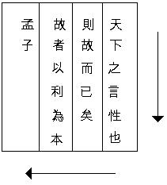

[无对应译文]

</section>

<section class="parallel-paragraph" data-paragraph-ids="s18-04-0002">

s18-04-0002

原文 · s18-04-0002

孟子 \[Meng Tzeu\] Ça, c’est le nom de l’auteur de cette menue formule...

[无对应译文]

</section>

<section class="parallel-paragraph" data-paragraph-ids="s18-04-0003">

s18-04-0003

原文 · s18-04-0003

Cette menue formule, auquel, malgré qu’elle ait été écrite vers 250 avant J.C., en Chine comme vous le voyez, au chapitre 2, au Livre IV, 2ème partie...

[无对应译文]

</section>

<section class="parallel-paragraph" data-paragraph-ids="s18-04-0004">

s18-04-0004

原文 · s18-04-0004

> quelquefois c’est classé autrement, alors dans ce cas-là
>
> ça sera la partie VIII, au Livre IV, 2ème partie paragraphe 26 ...de Meng-Tzeu, que les Jésuites appellent Mencius, puisque ce sont eux qui ont fait... bien avant l’époque où il y a eu des sinologues, c’est-à-dire le début du XIXème siècle, pas avant... j’ai eu le bonheur d’acquérir le premier livre sur lequel se soient trouvées conjointes *une plaque d’impression chinoise*, c’est pas tout à fait la même chose que le premier livre où il y ait eu à la fois des caractères chinois et des caractères européens, c’est le premier livre où il y a eu une plaque d’impression chinoise avec des choses écrites, des choses imprimées, de notre crû. C’est une traduction des fables d’Ésope.

[无对应译文]

</section>

<section class="parallel-paragraph" data-paragraph-ids="s18-04-0005">

s18-04-0005

原文 · s18-04-0005

Ça, c’est paru en 1840, et ça se targue - à juste titre - d’être le premier livre où se soit réalisée cette conjonction.

[无对应译文]

</section>

<section class="parallel-paragraph" data-paragraph-ids="s18-04-0006">

s18-04-0006

原文 · s18-04-0006

1840, dites-vous que c’est à peu près justement la date du moment où il y a eu des sinologues. Les Jésuites étaient depuis bien longtemps en Chine, comme peut-être certains s’en souviennent. Ils ont failli faire la conjonction de la Chine avec ce qu’ils repré­sentaient au titre de missionnaires. Seulement ils se sont laissés un peu impressionner par les rites chinois, et comme vous le savez peut-être, en plein XVIIIème siècle, ça leur a fait quelques ennuis avec Rome, qui n’a pas montré en l’occasion une particulière acuité politique. Ça lui arrive, à Rome...

[无对应译文]

</section>

<section class="parallel-paragraph" data-paragraph-ids="s18-04-0007">

s18-04-0007

原文 · s18-04-0007

Enfin dans Voltaire...

[无对应译文]

</section>

<section class="parallel-paragraph" data-paragraph-ids="s18-04-0008">

s18-04-0008

原文 · s18-04-0008

> si vous lisez Voltaire, mais bien sûr personne ne lit plus Voltaire,
>
> vous avez bien tort, c’est tout plein de choses ...dans Voltaire il y a...

[无对应译文]

</section>

<section class="parallel-paragraph" data-paragraph-ids="s18-04-0009">

s18-04-0009

原文 · s18-04-0009

> très exactement dans « *Le Siècle de Louis* XIV* »* [^24] et en appendice je crois, ça forme un libelle particu­lier ...un grand développement sur cette « *Querelle des Rites »*, dont beaucoup de choses dans l’histoire se trouvent maintenant en position de filiation.

[无对应译文]

</section>

<section class="parallel-paragraph" data-paragraph-ids="s18-04-0010">

s18-04-0010

原文 · s18-04-0010

Quoi qu’il en soit donc, c’est de Mencius qu’il s’agit, et Mencius *écrit ceci*, puisque je l’ai écrit au tableau pour commencer. Ça ne fait pas à proprement parler partie de mon discours d’aujourd’hui, c’est pour ça que je le case avant l’heure pile de midi et demi, je vais vous dire, ou je vais essayer de vous faire sentir ce que ça veut dire.

[无对应译文]

</section>

<section class="parallel-paragraph" data-paragraph-ids="s18-04-0011">

s18-04-0011

原文 · s18-04-0011

Et puis ça nous mettra dans le bain concer­nant ce qui est l’objet à proprement parler de ce que je veux énoncer aujourd’hui, c’est à savoir : dans ce qui nous préoccupe, quelle est *la fonction de l’écriture* ?

[无对应译文]

</section>

<section class="parallel-paragraph" data-paragraph-ids="s18-04-0012">

s18-04-0012

原文 · s18-04-0012

Comme l’écriture, ça existe en Chine depuis un temps immémorial, je veux dire bien avant que nous en ayons à proprement parler des ouvrages, l’écriture existait déjà depuis extrêmement longtemps, on ne peut pas évaluer depuis com­bien de temps elle existait. Cette écriture a en Chine un rôle tout à fait pivot, dans un certain nombre de choses qui se sont passées, et c’est assez éclai­rant sur ce que nous pouvons penser de *la fonction de l’écriture*.

[无对应译文]

</section>

<section class="parallel-paragraph" data-paragraph-ids="s18-04-0013">

s18-04-0013

原文 · s18-04-0013

Il est certain que l’écriture a joué un rôle tout à fait décisif dans le support de quelque chose, de quelque chose auquel nous avons cet accès-là et rien d’autre, à savoir un type de structure sociale qui s’est soutenu très longtemps et d’où, jusqu’à une époque récente, on pouvait conclure qu’il y avait une toute autre filiation quant à ce qui se supportait en Chine, que ce qui s’était engendré chez nous.

[无对应译文]

</section>

<section class="parallel-paragraph" data-paragraph-ids="s18-04-0014">

s18-04-0014

原文 · s18-04-0014

Et nommément par un de ces *phylum* qui se trouvent nous intéresser particulièrement, à savoir le *phylum philosophique* en tant que - je l’ai pointé l’année dernière - il est nodal pour comprendre ce dont il s’agit quant au *discours du Maître*.

[无对应译文]

</section>

<section class="parallel-paragraph" data-paragraph-ids="s18-04-0015">

s18-04-0015

原文 · s18-04-0015

[无对应译文]

</section>

<section class="parallel-paragraph" data-paragraph-ids="s18-04-0016">

s18-04-0016

原文 · s18-04-0016

Alors voilà comment s’énonce cet exergue. Comme je vous l’ai déjà montré au tableau la dernière fois :

[无对应译文]

</section>

<section class="parallel-paragraph" data-paragraph-ids="s18-04-0017">

s18-04-0017

原文 · s18-04-0017

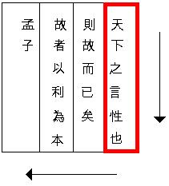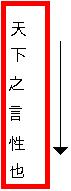

[无对应译文]

</section>

<section class="parallel-paragraph" data-paragraph-ids="s18-04-0018">

s18-04-0018

原文 · s18-04-0018

天 下 之 言 性 也

[无对应译文]

</section>

<section class="parallel-paragraph" data-paragraph-ids="s18-04-0019">

s18-04-0019

原文 · s18-04-0019

> *Tiān xià zhī yán xìng yě*

[无对应译文]

</section>

<section class="parallel-paragraph" data-paragraph-ids="s18-04-0020">

s18-04-0020

原文 · s18-04-0020

- ceci 天 désigne *le ciel*, ça se dit « *tiān* ».

[无对应译文]

</section>

<section class="parallel-paragraph" data-paragraph-ids="s18-04-0021">

s18-04-0021

原文 · s18-04-0021

- 天 下 *tiānxià,* c’est *sous le ciel*, tout ce qui est sous le ciel,

[无对应译文]

</section>

<section class="parallel-paragraph" data-paragraph-ids="s18-04-0022">

s18-04-0022

原文 · s18-04-0022

- ici 之 c’est un déterminatif « *zhī *», il s’agit de *quelque chose qui est dessous le ciel* : 天 下 之. Qu’est-ce qui est *dessous le ciel*, c’est ce qui vient après.

[无对应译文]

</section>

<section class="parallel-paragraph" data-paragraph-ids="s18-04-0023">

s18-04-0023

原文 · s18-04-0023

- Ce que vous voyez là 言 n’est autre chose que *la désignation de la parole*, que dans l’occasion nous énoncerons *yán.*

[无对应译文]

</section>

<section class="parallel-paragraph" data-paragraph-ids="s18-04-0024">

s18-04-0024

原文 · s18-04-0024

- 言 性  « *Yán xìng* », je l’ai déjà mis au tableau la dernière fois, en vous signalant que ce « *xìng *», c’était justement un des éléments qui nous préoccuperont cette année, pour autant que le terme qui en approche le plus c’est celui de la nature.

[无对应译文]

</section>

<section class="parallel-paragraph" data-paragraph-ids="s18-04-0025">

s18-04-0025

原文 · s18-04-0025

- Et 也: « *yě* » est *quelque chose qui conclut une phrase*, sans dire à proprement parler qu’il s’agit de quelque chose de l’ordre de ce que nous énonçons *« est », « être »,* c’est une conclusion, c’est *une conclusion* ou disons *une ponctuation*.

[无对应译文]

</section>

<section class="parallel-paragraph" data-paragraph-ids="s18-04-0026">

s18-04-0026

原文 · s18-04-0026

Car la phrase continue ici, puisque les choses s’écrivent de droite à gauche :

[无对应译文]

</section>

<section class="parallel-paragraph" data-paragraph-ids="s18-04-0027">

s18-04-0027

原文 · s18-04-0027

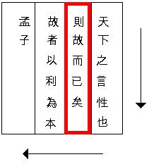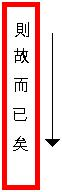

[无对应译文]

</section>

<section class="parallel-paragraph" data-paragraph-ids="s18-04-0028">

s18-04-0028

原文 · s18-04-0028

則 故 而 已 矣

[无对应译文]

</section>

<section class="parallel-paragraph" data-paragraph-ids="s18-04-0029">

s18-04-0029

原文 · s18-04-0029

> *zé gù ér yǐ yǐ*.

[无对应译文]

</section>

<section class="parallel-paragraph" data-paragraph-ids="s18-04-0030">

s18-04-0030

原文 · s18-04-0030

La phrase continue ici par un certain 則 « *zé* » qui veut dire « *par conséquent »,* ou qui en tout cas indique *le consé­quent*.

[无对应译文]

</section>

<section class="parallel-paragraph" data-paragraph-ids="s18-04-0031">

s18-04-0031

原文 · s18-04-0031

Alors, voyons donc ce dont il s’agit : 言 « *yán *» \[*retour à la 1ère colonne*\] ne veut rien dire d’autre que *le langage*, mais comme tous les termes énoncés dans la langue chinoise, c’est susceptible aussi d’être employé au sens d’un verbe.

[无对应译文]

</section>

<section class="parallel-paragraph" data-paragraph-ids="s18-04-0032">

s18-04-0032

原文 · s18-04-0032

Donc ça peut vouloir dire à la fois *la parole* et *ce qui parle*, et qui parle quoi ? Ça serait dans ce cas ce qui suit, à savoir 性 « *xìng* » *la nature* : *ce qui parle de la nature sous le ciel*, et 也 « *yě* » serait une ponctuation.

[无对应译文]

</section>

<section class="parallel-paragraph" data-paragraph-ids="s18-04-0033">

s18-04-0033

原文 · s18-04-0033

Néanmoins, et c’est en cela qu’il est intéressant de s’occuper d’une phrase de la langue écrite, vous voyez que vous pourriez couper les choses autrement et dire : la parole, voire le langage, car s’il s’agissait de préciser la parole, nous aurions un autre caractère légèrement diffé­rent, à ce niveau tel que donc il est ici écrit, ce caractère peut aussi bien vouloir dire parole que langage.

[无对应译文]

</section>

<section class="parallel-paragraph" data-paragraph-ids="s18-04-0034">

s18-04-0034

原文 · s18-04-0034

Ces sortes d’ambiguïtés sont tout à fait fondamentales dans l’usage de ce qui *s’écrit*, très précisément, et c’est ce qui en fait la portée. Puisque comme je vous l’ai fait remar­quer, comme je vous l’ai fait remarquer au départ de mon discours de cette année et plus spécialement la dernière fois : c’est très précisément en tant que la référence...

[无对应译文]

</section>

<section class="parallel-paragraph" data-paragraph-ids="s18-04-0035">

s18-04-0035

原文 · s18-04-0035

> quant à tout ce qui est du langage ...est toujours indirecte, que le langage prend sa portée.

[无对应译文]

</section>

<section class="parallel-paragraph" data-paragraph-ids="s18-04-0036">

s18-04-0036

原文 · s18-04-0036

Nous pourrions donc dire aussi : *le langage*...

[无对应译文]

</section>

<section class="parallel-paragraph" data-paragraph-ids="s18-04-0037">

s18-04-0037

原文 · s18-04-0037

en tant qu’il est dans le monde, qu’il est sous le ciel ...*le langage*, *voilà ce qui fait* 性 « *xìng* » *la nature* car cette nature n’est pas, au moins dans Meng-Tzu, n’importe quelle nature.

[无对应译文]

</section>

<section class="parallel-paragraph" data-paragraph-ids="s18-04-0038">

s18-04-0038

原文 · s18-04-0038

Il s’agit justement de *la nature de l’être parlant*, celle dont, dans un autre passage, il tient à préciser que : « *il y a une dif­férence entre cette nature et la nature de l’animal*...

[无对应译文]

</section>

<section class="parallel-paragraph" data-paragraph-ids="s18-04-0039">

s18-04-0039

原文 · s18-04-0039

une dif­férence, ajoute-t-il, pointe-t-il en deux termes qui veulent bien dire ce qu’ils veulent dire : ...*une différence infinie* ».

[无对应译文]

</section>

<section class="parallel-paragraph" data-paragraph-ids="s18-04-0040">

s18-04-0040

原文 · s18-04-0040

Et qui peut-être est celle qui est définie là.

[无对应译文]

</section>

<section class="parallel-paragraph" data-paragraph-ids="s18-04-0041">

s18-04-0041

原文 · s18-04-0041

Vous le verrez d’ailleurs, que nous prenions l’une ou l’autre de ces inter­prétations, l’axe de ce qui va se dire comme conséquent n’en sera pas changé.

[无对应译文]

</section>

<section class="parallel-paragraph" data-paragraph-ids="s18-04-0042">

s18-04-0042

原文 · s18-04-0042

[无对应译文]

</section>

<section class="parallel-paragraph" data-paragraph-ids="s18-04-0043">

s18-04-0043

原文 · s18-04-0043

則 故 而 已 矣

[无对应译文]

</section>

<section class="parallel-paragraph" data-paragraph-ids="s18-04-0044">

s18-04-0044

原文 · s18-04-0044

> *zé gù ér yǐ yǐ*.

[无对应译文]

</section>

<section class="parallel-paragraph" data-paragraph-ids="s18-04-0045">

s18-04-0045

原文 · s18-04-0045

- 則 « *Zé* » \[retour à la 2ème colonne\] donc, c’est « *la conséquence *», « *en conséquence* »,

[无对应译文]

</section>

<section class="parallel-paragraph" data-paragraph-ids="s18-04-0046">

s18-04-0046

原文 · s18-04-0046

- 故 « *gù* » - c’est ici - *gù,* en conséquence, c’est de *cause*, car *cause* ne veut pas dire autre chose.

[无对应译文]

</section>

<section class="parallel-paragraph" data-paragraph-ids="s18-04-0047">

s18-04-0047

原文 · s18-04-0047

Quelle que soit l’ambiguïté qu’un certain livre, un certain livre qui est celui-ci : « *Mencius on the mind »,* à savoir un livre commis par un nommé Richards...

[无对应译文]

</section>

<section class="parallel-paragraph" data-paragraph-ids="s18-04-0048">

s18-04-0048

原文 · s18-04-0048

> qui n’était certainement pas le dernier venu

[无对应译文]

</section>

<section class="parallel-paragraph" data-paragraph-ids="s18-04-0049">

s18-04-0049

原文 · s18-04-0049

...Richards et Ogden[^25] sont les deux chefs de file d’une position née en Angleterre et tout à fait conforme à la meilleure tradition de la philosophie anglaise, qui ont constitué au début de ce siècle la doctrine appelée *logico-positivisme*, dont le livre majeur s’intitule *The Meaning of Meaning.*

[无对应译文]

</section>

<section class="parallel-paragraph" data-paragraph-ids="s18-04-0050">

s18-04-0050

原文 · s18-04-0050

C’est un livre auquel vous trouverez déjà allusion dans mes *Écrits* [^26] avec une certaine position dépréciative de ma part.

[无对应译文]

</section>

<section class="parallel-paragraph" data-paragraph-ids="s18-04-0051">

s18-04-0051

原文 · s18-04-0051

*The Meaning of Meaning* veut dire *Le sens du sens.*

[无对应译文]

</section>

<section class="parallel-paragraph" data-paragraph-ids="s18-04-0052">

s18-04-0052

原文 · s18-04-0052

Le *logico-positivisme* procède de cette exi­gence *qu’un texte ait un sens saisissable*, ce qui l’amène à une position qui est celle-ci : qu’un certain nombre d’énoncés philosophiques se trouvent en quelque sorte dévalorisés au principe du fait qu’ils ne donnent aucun résultat saisissable quant à la recherche du sens.

[无对应译文]

</section>

<section class="parallel-paragraph" data-paragraph-ids="s18-04-0053">

s18-04-0053

原文 · s18-04-0053

En d’autres termes, pour peu qu’un texte philosophique soit pris en flagrant délit de non-sens, il est mis pour cela même hors de jeu.

[无对应译文]

</section>

<section class="parallel-paragraph" data-paragraph-ids="s18-04-0054">

s18-04-0054

原文 · s18-04-0054

Il n’est que trop clair que c’est là une façon *d’élaguer* les choses qui ne permet guère de s’y retrouver, car si nous partons du principe que quelque chose qui n’a pas de sens ne peut pas être essentiel dans le développe­ment d’un discours, nous perdons le fil tout simplement.

[无对应译文]

</section>

<section class="parallel-paragraph" data-paragraph-ids="s18-04-0055">

s18-04-0055

原文 · s18-04-0055

Je ne dis pas bien sûr qu’une telle exigence ne soit un procédé, mais que ce procédé nous interdise en quelque sorte toute articulation dont le sens n’est pas saisissable, c’est quelque chose qui, par exemple, peut aboutira à ceci que nous ne pourrons plus faire usage du *discours mathématique*, dont, de l’aveu des logiciens les plus qualifiés, ce qui le caractérise c’est qu’il se peut qu’en tel ou tel de ses points, nous ne puissions plus lui donner aucun sens, ce qui ne l’empêche pas précisément d’être, de tous les discours, celui qui se développe avec le plus de rigueur.

[无对应译文]

</section>

<section class="parallel-paragraph" data-paragraph-ids="s18-04-0056">

s18-04-0056

原文 · s18-04-0056

Nous nous trouvons d’ailleurs de ce fait en un point qui est tout à fait essentiel à mettre en relief concer­nant la fonction de l’écrit.

[无对应译文]

</section>

<section class="parallel-paragraph" data-paragraph-ids="s18-04-0057">

s18-04-0057

原文 · s18-04-0057

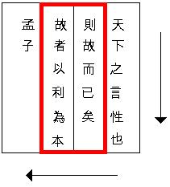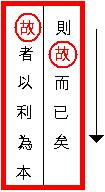

[无对应译文]

</section>

<section class="parallel-paragraph" data-paragraph-ids="s18-04-0058">

s18-04-0058

原文 · s18-04-0058

則 故 而 已 矣

[无对应译文]

</section>

<section class="parallel-paragraph" data-paragraph-ids="s18-04-0059">

s18-04-0059

原文 · s18-04-0059

> *zé gù ér yǐ yǐ*.

[无对应译文]

</section>

<section class="parallel-paragraph" data-paragraph-ids="s18-04-0060">

s18-04-0060

原文 · s18-04-0060

故 者 以 利 為 本

[无对应译文]

</section>

<section class="parallel-paragraph" data-paragraph-ids="s18-04-0061">

s18-04-0061

原文 · s18-04-0061

> *Gù zhě yǐ lì wéi běn*.

[无对应译文]

</section>

<section class="parallel-paragraph" data-paragraph-ids="s18-04-0062">

s18-04-0062

原文 · s18-04-0062

- Donc, c’est de 故 « *gù* » qu’il s’agit. C’est de *gù* qu’il s’agit *et en tant que* 以 為 « *yǐwéi* » car je vous ai déjà dit que ce « *wei* » qui peut dans certains cas vouloir dire « *agir *» voire même quelque chose qui est de l’ordre de « *faire* » encore que ce ne soit pas n’importe lequel.

[无对应译文]

</section>

<section class="parallel-paragraph" data-paragraph-ids="s18-04-0063">

s18-04-0063

原文 · s18-04-0063

- 以 *Yǐ* ici a le sens de quelque chose comme *avec,* c’est *avec* que nous allons procéder - comme quoi ? - comme 利 « *lì* », c’est ici le mot sur lequel je vous pointe, je vous pointe ceci : que 利 « *lì* », je le répète, que ce 利 « *lì* » qui veut dire *gain, intérêt, profit,* et la chose est d’autant plus remarquable que précisément Mencius, Mencius dans son premier chapitre, se présentant à un certain prince...

[无对应译文]

</section>

<section class="parallel-paragraph" data-paragraph-ids="s18-04-0064">

s18-04-0064

原文 · s18-04-0064

> peu importe duquel de ce qui constituait alors les *Royaumes* dits par la suite être les *Royaumes combattants* ...se trouve auprès de ce prince...
>
> qui lui demande ses conseils -
>
> ...auprès de ce prince marquer qu’il n’est pas là pour lui enseigner ce qui fait notre loi présente à tous, à savoir de ce qui convient pour l’accroissement de la richesse du Royaume, et nommément de ce que nous appellerions la *plus-value*.
>
> S’il y a un sens qu’on peut donner *rétroacti­vement* à 利 « *lì* », c’est bien de cela qu’il s’agit.
>
> Or, c’est bien là qu’il est remarquable de voir que ce que marque en l’occasion Mencius, c’est que, à partir donc de cette parole qui est *la nature*, ou si vous voulez de la parole qui concerne *la nature*, ce dont il va s’agir c’est d’arriver à la cause, en tant que ladite cause, c’est 利 « *lì* ».

[无对应译文]

</section>

<section class="parallel-paragraph" data-paragraph-ids="s18-04-0065">

s18-04-0065

原文 · s18-04-0065

則 故 而 已 矣

[无对应译文]

</section>

<section class="parallel-paragraph" data-paragraph-ids="s18-04-0066">

s18-04-0066

原文 · s18-04-0066

> *zé gù ér yǐ yǐ*

[无对应译文]

</section>

<section class="parallel-paragraph" data-paragraph-ids="s18-04-0067">

s18-04-0067

原文 · s18-04-0067

Ce qui veut dire :

[无对应译文]

</section>

<section class="parallel-paragraph" data-paragraph-ids="s18-04-0068">

s18-04-0068

原文 · s18-04-0068

- 故 而 « *gù ér* » est quelque chose qui veut à la fois dire comme «* et *» et* *comme « *mais *»,

[无对应译文]

</section>

<section class="parallel-paragraph" data-paragraph-ids="s18-04-0069">

s18-04-0069

原文 · s18-04-0069

- 而 已 矣 « *ér yǐ yǐ* » : «* c’est seulement ça *», et pour que on n’en doute pas, le « *yǐ* » qui termine, qui est un « *yǐ* » conclusif, ce « *yǐ* » a le même accent que « *seulement* »: « *c’est yǐ* 矣 *et ça suffit* ».

[无对应译文]

</section>

<section class="parallel-paragraph" data-paragraph-ids="s18-04-0070">

s18-04-0070

原文 · s18-04-0070

C’est là que je me permets en somme de reconnaître que, pour ce qui est des effets du discours, pour ce qui est dessous le ciel, ce qui en sort, en ressort, n’est autre que la fonction de *la cause* en tant qu’elle est le « *plus de jouir »*.

[无对应译文]

</section>

<section class="parallel-paragraph" data-paragraph-ids="s18-04-0071">

s18-04-0071

原文 · s18-04-0071

Vous verrez, à vous référer à ce texte de Meng-Tzu, vous avez deux façons de le faire :

[无对应译文]

</section>

<section class="parallel-paragraph" data-paragraph-ids="s18-04-0072">

s18-04-0072

原文 · s18-04-0072

- vous le procurer d’une part dans l’édition en somme très très bonne qui en a été donnée par un jésuite de la fin du XIXème siècle, un nommé Wieger[^27], dans une édition des « *Quatre Livres fondamentaux du Confucianisme »,*

[无对应译文]

</section>

<section class="parallel-paragraph" data-paragraph-ids="s18-04-0073">

s18-04-0073

原文 · s18-04-0073

- une autre façon, c’est de vous emparer de ce « *Mencius on the Mind »* qui est paru chez Kegan Paul à Londres...

[无对应译文]

</section>

<section class="parallel-paragraph" data-paragraph-ids="s18-04-0074">

s18-04-0074

原文 · s18-04-0074

> je ne sais pas s’il en existe actuellement beaucoup d’exemplaires encore « *available »,* comme on dit,
>
> mais après tout ça vaut la peine de - pourquoi pas ? - d’en faire faire
>
> pour ceux qui seraient curieux de se reporter à quelque chose d’aussi fondamental,
>
> pour un certain éclairage d’une réflexion sur le langage, qu’est le travail d’un *néo-positiviste*
>
> et qui n’est certainement pas négligeable, ...le *Mencius on the Mind* donc, de Richards, se procure à Londres chez Kegan Paul.

[无对应译文]

</section>

<section class="parallel-paragraph" data-paragraph-ids="s18-04-0075">

s18-04-0075

原文 · s18-04-0075

Tous ceux qui voudront donc de se donner la peine d’en avoir - *s’ils ne peuvent pas se procurer le volume* - *une pho­tocopie*, peut-être n’en comprendront que mieux un certain nombre de références que j’y prendrai cette année car j’y reviendrai.

[无对应译文]

</section>

<section class="parallel-paragraph" data-paragraph-ids="s18-04-0076">

s18-04-0076

原文 · s18-04-0076

Autre chose donc est de parler de l’*origine du langage*, et autre chose de sa liaison à ce que j’enseigne, à ce que j’enseigne conformément à ce que j’articule, que j’ai l’année dernière articulé comme *le discours de l’analyste*.

[无对应译文]

</section>

<section class="parallel-paragraph" data-paragraph-ids="s18-04-0077">

s18-04-0077

原文 · s18-04-0077

Car vous ne l’ignorez pas, la linguistique a commencé avec Humboldt par cette sorte d’inter­dit : de ne pas se poser la question de l’origine du langage, faute de quoi bien sûr on s’égare.

[无对应译文]

</section>

<section class="parallel-paragraph" data-paragraph-ids="s18-04-0078">

s18-04-0078

原文 · s18-04-0078

Ce n’est pas rien que quelqu’un se soit avisé en pleine période de mythification génétique...

[无对应译文]

</section>

<section class="parallel-paragraph" data-paragraph-ids="s18-04-0079">

s18-04-0079

原文 · s18-04-0079

> c’était le style au début du siècle XIXème ...ait posé que rien à jamais, ne serait situé, fondé, articulé, concernant le langage, si on ne com­mençait pas d’abord par interdire les questions de l’origine.

[无对应译文]

</section>

<section class="parallel-paragraph" data-paragraph-ids="s18-04-0080">

s18-04-0080

原文 · s18-04-0080

C’est un exemple qui aurait bien dû être suivi ailleurs, ça nous aurait évité bien des élucubrations du type de celles qu’on peut appeler « *primitivistes* », il n’y a rien de tel que la réfé­rence au primitif pour *primitiver* la pensée. C’est elle-même qui régresse régu­lièrement à la mesure même de ce qu’elle prétend découvrir comme primitif.

[无对应译文]

</section>

<section class="parallel-paragraph" data-paragraph-ids="s18-04-0081">

s18-04-0081

原文 · s18-04-0081

*Le discours de l’analyste*...

[无对应译文]

</section>

<section class="parallel-paragraph" data-paragraph-ids="s18-04-0082">

s18-04-0082

原文 · s18-04-0082

faut bien que je vous le dise, puisqu’en somme vous ne l’avez pas entendu ...*le discours de l’analyste n’est rien d’autre que* *la logique de l’action*.

[无对应译文]

</section>

<section class="parallel-paragraph" data-paragraph-ids="s18-04-0083">

s18-04-0083

原文 · s18-04-0083

Vous ne l’avez pas entendu - pourquoi ? - parce que dans ce que j’ai articulé l’année dernière avec les petites lettres au tableau sous cette forme :

[无对应译文]

</section>

<section class="parallel-paragraph" data-paragraph-ids="s18-04-0084">

s18-04-0084

原文 · s18-04-0084

- le *a* sur S2,

[无对应译文]

</section>

<section class="parallel-paragraph" data-paragraph-ids="s18-04-0085">

s18-04-0085

原文 · s18-04-0085

- et de ce qui se passe au niveau de l’analysant, à savoir la fonction du sujet en tant que barré \[S\] et en tant que *ce qu’il produit ce sont des signifiants* \[S1\], et pas n’importe lesquels : *des signifiants maîtres*.

[无对应译文]

</section>

<section class="parallel-paragraph" data-paragraph-ids="s18-04-0086">

s18-04-0086

原文 · s18-04-0086

[无对应译文]

</section>

<section class="parallel-paragraph" data-paragraph-ids="s18-04-0087">

s18-04-0087

原文 · s18-04-0087

> « *la logique de l’action.* »

[无对应译文]

</section>

<section class="parallel-paragraph" data-paragraph-ids="s18-04-0088">

s18-04-0088

原文 · s18-04-0088

Ce n’est pas de « *l’action* » de la parole qu’il s’agit, mais de l’action de l’écrit, de ce qui s’écrit quand on parle sur le divan : → « *la logique de l’action* » propre aux 4 petites lettres dont *le discours A* s’écrit.

[无对应译文]

</section>

<section class="parallel-paragraph" data-paragraph-ids="s18-04-0089">

s18-04-0089

原文 · s18-04-0089

*ce qui s’y écrit* n’est pas ce qui s’y dit: l’écrit se différencie de la parole, ce qui s’y écrit, et donc la logique qui s’y constitue (ce n’est que de l’écrit que la logique se constitue) peut ne pas être entendu, *ce qui s’y écrit* creuse, gratte palimpsestement le malentendu sur... le pale inceste. (Bousseyroux 2014)

[无对应译文]

</section>

<section class="parallel-paragraph" data-paragraph-ids="s18-04-0090">

s18-04-0090

原文 · s18-04-0090

C’est parce que c’était écrit, et écrit comme ça...

[无对应译文]

</section>

<section class="parallel-paragraph" data-paragraph-ids="s18-04-0091">

s18-04-0091

原文 · s18-04-0091

> car je l’ai écrit à maintes reprises ...c’est pour cela même que vous ne l’avez pas entendu.

[无对应译文]

</section>

<section class="parallel-paragraph" data-paragraph-ids="s18-04-0092">

s18-04-0092

原文 · s18-04-0092

C’est en ça que l’écrit se différencie de la parole, et il faut y remettre de la parole et l’en beurrer sérieusement...

[无对应译文]

</section>

<section class="parallel-paragraph" data-paragraph-ids="s18-04-0093">

s18-04-0093

原文 · s18-04-0093

> mais naturellement non pas sans inconvénients de principe ...pour qu’il soit entendu.

[无对应译文]

</section>

<section class="parallel-paragraph" data-paragraph-ids="s18-04-0094">

s18-04-0094

原文 · s18-04-0094

On peut *écrire* donc des tas de choses, sans que ça parvienne à aucune oreille, c’est pourtant *écrit*.

[无对应译文]

</section>

<section class="parallel-paragraph" data-paragraph-ids="s18-04-0095">

s18-04-0095

原文 · s18-04-0095

C’est même pour ça que mes « *Écrits »,* je les ai appelés comme ça.

[无对应译文]

</section>

<section class="parallel-paragraph" data-paragraph-ids="s18-04-0096">

s18-04-0096

原文 · s18-04-0096

Ça a scandalisé, comme ça, du monde sensible, et pas n’importe qui.

[无对应译文]

</section>

<section class="parallel-paragraph" data-paragraph-ids="s18-04-0097">

s18-04-0097

原文 · s18-04-0097

Il est très curieux que la personne que ça a littéralement convulsé soit une japonaise. Je commenterai ça plus tard.

[无对应译文]

</section>

<section class="parallel-paragraph" data-paragraph-ids="s18-04-0098">

s18-04-0098

原文 · s18-04-0098

Naturellement ici ça n’a convulsé personne, la japonaise dont je parle n’est pas là. Et n’importe qui, qui est de cette tradition, saurait - je pense - à l’occasion com­prendre pourquoi cette espèce d’effet d’insurrection s’est produit.

[无对应译文]

</section>

<section class="parallel-paragraph" data-paragraph-ids="s18-04-0099">

s18-04-0099

原文 · s18-04-0099

C’est *de la parole* bien sûr que se fraie la voie vers *l’écrit*.

[无对应译文]

</section>

<section class="parallel-paragraph" data-paragraph-ids="s18-04-0100">

s18-04-0100

原文 · s18-04-0100

Mes « *Écrits »,* si je les ai intitulés comme ça, c’est qu’ils représentent une tentative, une tentative d’écrit, comme c’est suffisamment marqué par ceci que ça aboutit à des *graphes*.

[无对应译文]

</section>

<section class="parallel-paragraph" data-paragraph-ids="s18-04-0101">

s18-04-0101

原文 · s18-04-0101

L’ennui, c’est que c’est que les gens qui prétendent me commenter, eux partent tout de suite des « *graphes* ». Ils ont tort !

[无对应译文]

</section>

<section class="parallel-paragraph" data-paragraph-ids="s18-04-0102">

s18-04-0102

原文 · s18-04-0102

Les *graphes* ne sont compréhensibles qu’en fonction, je dirai du moindre effet de style des dits « *Écrits »,* qui en sont en quelque sorte les marches d’accès.

[无对应译文]

</section>

<section class="parallel-paragraph" data-paragraph-ids="s18-04-0103">

s18-04-0103

原文 · s18-04-0103

Moyennant quoi *l’écrit*, *l’écrit* repris à soi tout seul...

[无对应译文]

</section>

<section class="parallel-paragraph" data-paragraph-ids="s18-04-0104">

s18-04-0104

原文 · s18-04-0104

> qu’il s’agisse de tel ou tel *schéma*, celui qu’on appelle « L » ou n’importe quoi,
>
> ou du grand graphe lui-même ...présente l’occasion de toutes sortes de malentendus.

[无对应译文]

</section>

<section class="parallel-paragraph" data-paragraph-ids="s18-04-0105">

s18-04-0105

原文 · s18-04-0105

C’est *d’une parole* qu’il s’agit, en tant bien sûr - et pourquoi ? - qu’elle tend à frayer la voie à ces graphes dont il s’agit, mais il convient de ne pas oublier *cette parole*, pour la raison qu’elle est celle même ce qui se réfléchit de *la règle analytique*, qui est comme vous le savez : « *parlez, parlez, pariez* », il suffit que *vous paroliez*, n’est-ce pas, voilà la boîte d’où sortent tous les dons du langage, une boîte de Pandore.

[无对应译文]

</section>

<section class="parallel-paragraph" data-paragraph-ids="s18-04-0106">

s18-04-0106

原文 · s18-04-0106

Quel rapport donc, avec ces *graphes* ?

[无对应译文]

</section>

<section class="parallel-paragraph" data-paragraph-ids="s18-04-0107">

s18-04-0107

原文 · s18-04-0107

Ces *graphes*...

[无对应译文]

</section>

<section class="parallel-paragraph" data-paragraph-ids="s18-04-0108">

s18-04-0108

原文 · s18-04-0108

> bien sûr, personne n’a encore osé aller jusque-là ...ne vous indiquent en rien quoi que ce soit qui per­mette de faire retour à *l’origine du langage*.

[无对应译文]

</section>

<section class="parallel-paragraph" data-paragraph-ids="s18-04-0109">

s18-04-0109

原文 · s18-04-0109

S’il y a une chose qui y paraît tout de suite, c’est que non seulement ils ne la livrent pas, mais qu’ils ne la promet­tent pas non plus.

[无对应译文]

</section>

<section class="parallel-paragraph" data-paragraph-ids="s18-04-0110">

s18-04-0110

原文 · s18-04-0110

Ce dont il va s’agir aujourd’hui est de la situation par rapport à *la vérité* qui résulte de ce qu’on appelle « *la libre association »*, autrement dit un libre emploi de la parole.

[无对应译文]

</section>

<section class="parallel-paragraph" data-paragraph-ids="s18-04-0111">

s18-04-0111

原文 · s18-04-0111

Je n’en ai jamais parlé qu’avec ironie : il n’y a pas plus de « *libre associa­tion »* qu’on ne pourrait dire qu’est libre *une variable liée dans une fonction mathématique*, et la fonction définie par *le discours analytique* n’est bien évi­demment pas libre, elle est liée.

[无对应译文]

</section>

<section class="parallel-paragraph" data-paragraph-ids="s18-04-0112">

s18-04-0112

原文 · s18-04-0112

Elle est liée par des conditions que je désignerai rapidement comme celles du cabinet analytique.

[无对应译文]

</section>

<section class="parallel-paragraph" data-paragraph-ids="s18-04-0113">

s18-04-0113

原文 · s18-04-0113

À quelle distance est mon dis­cours analytique...

[无对应译文]

</section>

<section class="parallel-paragraph" data-paragraph-ids="s18-04-0114">

s18-04-0114

原文 · s18-04-0114

> tel qu’il est ici défini par cette disposition écrite ...à quelle dis­tance est-il du *cabinet analytique*, c’est précisément ce qui constitue ce que nous appellerons *mon dissentiment* d’avec un certain nombre de *cabinets analytiques*.

[无对应译文]

</section>

<section class="parallel-paragraph" data-paragraph-ids="s18-04-0115">

s18-04-0115

原文 · s18-04-0115

Aussi cette définition du *discours analytique*...

[无对应译文]

</section>

<section class="parallel-paragraph" data-paragraph-ids="s18-04-0116">

s18-04-0116

原文 · s18-04-0116

> pour pointer là où j’en suis ...ne leur paraît pas s’accommoder aux conditions du *cabinet analytique*.

[无对应译文]

</section>

<section class="parallel-paragraph" data-paragraph-ids="s18-04-0117">

s18-04-0117

原文 · s18-04-0117

Or, ce que mon discours *dessine,* disons à tout le moins, livre une partie des conditions qui constituent le *cabinet analytique*.

[无对应译文]

</section>

<section class="parallel-paragraph" data-paragraph-ids="s18-04-0118">

s18-04-0118

原文 · s18-04-0118

Mesurer ce qu’on fait quand on entre dans une psychanalyse, c’est quelque chose qui a bien son importance, mais en tout cas - quant à moi - qui s’indique dans le fait que je procède toujours à de nombreux *entretiens préliminaires*.

[无对应译文]

</section>

<section class="parallel-paragraph" data-paragraph-ids="s18-04-0119">

s18-04-0119

原文 · s18-04-0119

Une personne pieuse... [^28] que je ne désignerai pas autrement ...trouvait - paraît-il - aux derniers échos, enfin à des échos d’il y a trois mois, au moins y avait-il une gageure intenable pour elle à fonder le transfert sur le *sujet supposé savoir,* puisque par ailleurs la méthode implique qu’il se soutienne d’une absence totale de préjugés quant au cas.

[无对应译文]

</section>

<section class="parallel-paragraph" data-paragraph-ids="s18-04-0120">

s18-04-0120

原文 · s18-04-0120

*Le Sujet supposé savoir quoi ?*

[无对应译文]

</section>

<section class="parallel-paragraph" data-paragraph-ids="s18-04-0121">

s18-04-0121

原文 · s18-04-0121

Alors me permettrai-je de demander à cette personne si le psychanalyste doit être supposé savoir ce qu’il fait et s’il le sait effectivement ?

[无对应译文]

</section>

<section class="parallel-paragraph" data-paragraph-ids="s18-04-0122">

s18-04-0122

原文 · s18-04-0122

À partir de là... à partir de là on compren­dra que je pose d’une certaine façon mes questions sur le transfert dans « *La direc­tion de la cure »* [^29] par exemple, qui est un texte auquel je vois avec plaisir que dans mon école...

[无对应译文]

</section>

<section class="parallel-paragraph" data-paragraph-ids="s18-04-0123">

s18-04-0123

原文 · s18-04-0123

> puisqu’il se passe quelque chose de nouveau, c’est que dans mon école on se met à travailler au titre d’une école, c’est là quand même un pas quand même assez nouveau pour être relevé ...j’ai pu constater non sans plaisir qu’on s’était aperçu que dans ce texte, *je ne tranche aucunement de ce qu’est* *le transfert.*

[无对应译文]

</section>

<section class="parallel-paragraph" data-paragraph-ids="s18-04-0124">

s18-04-0124

原文 · s18-04-0124

C’est très précisément en disant « *le sujet supposé savoir » -* tel que je le définis - que la question est... tout à fait reste entière de savoir si l’analyste peut être supposé savoir ce qu’il fait.

[无对应译文]

</section>

<section class="parallel-paragraph" data-paragraph-ids="s18-04-0125">

s18-04-0125

原文 · s18-04-0125

Pour en quelque sorte prendre au départ, départ de ce qui aujourd’hui va être énoncé, et pour lequel ce petit caractère chinois, car c’en est un, c’en est un...

[无对应译文]

</section>

<section class="parallel-paragraph" data-paragraph-ids="s18-04-0126">

s18-04-0126

原文 · s18-04-0126

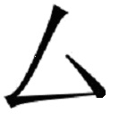

[无对应译文]

</section>

<section class="parallel-paragraph" data-paragraph-ids="s18-04-0127">

s18-04-0127

原文 · s18-04-0127

> je regrette beaucoup que la craie ne me permette pas de mettre les accents que permet le pinceau ...c’en est un qui a un sens, pour satisfaire aux exigences des *logico-positi­vistes*.

[无对应译文]

</section>

<section class="parallel-paragraph" data-paragraph-ids="s18-04-0128">

s18-04-0128

原文 · s18-04-0128

C’est un sens dont vous allez voir qu’il est pleinement ambigu

[无对应译文]

</section>

<section class="parallel-paragraph" data-paragraph-ids="s18-04-0129">

s18-04-0129

原文 · s18-04-0129

- puisqu’il veut à la fois dire « *retors* »,

[无对应译文]

</section>

<section class="parallel-paragraph" data-paragraph-ids="s18-04-0130">

s18-04-0130

原文 · s18-04-0130

- qu’il veut dire aussi « *personnel* », au sens de « *privé* »,

[无对应译文]

</section>

<section class="parallel-paragraph" data-paragraph-ids="s18-04-0131">

s18-04-0131

原文 · s18-04-0131

- et puis il en a encore quelques autres.

[无对应译文]

</section>

<section class="parallel-paragraph" data-paragraph-ids="s18-04-0132">

s18-04-0132

原文 · s18-04-0132

Mais ce qui me paraît remarquable, c’est *sa forme écrite, et sa forme écrite* va me permettre tout de suite de vous dire où se placent les termes autour desquels va tourner mon discours d’aujourd’hui.

[无对应译文]

</section>

<section class="parallel-paragraph" data-paragraph-ids="s18-04-0133">

s18-04-0133

原文 · s18-04-0133

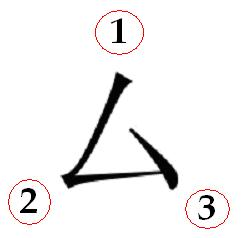

[无对应译文]

</section>

<section class="parallel-paragraph" data-paragraph-ids="s18-04-0134">

s18-04-0134

原文 · s18-04-0134

- Si nous placions quelque part ici \[1\] *ce que j’appelle* *au sens le plus large*... - vous allez voir que c’est large, je dois dire que je n’ai pas besoin, il me semble, de le souli­gner

[无对应译文]

</section>

<section class="parallel-paragraph" data-paragraph-ids="s18-04-0135">

s18-04-0135

原文 · s18-04-0135

> ...*les effets de langage*,

[无对应译文]

</section>

<section class="parallel-paragraph" data-paragraph-ids="s18-04-0136">

s18-04-0136

原文 · s18-04-0136

- c’est ici \[2\] que nous aurions à mettre ce dont il s’agit, à savoir *où ils prennent leur principe*. *Là où ils prennent leur principe*, c’est en cela que *le discours analytique* est révélateur de quelque chose, qu’il est un pas. Je vais essayer de le rappeler, encore qu’il s’agisse pour l’analyse de vérités premières. C’est par là que je vais commencer tout de suite.

[无对应译文]

</section>

<section class="parallel-paragraph" data-paragraph-ids="s18-04-0137">

s18-04-0137

原文 · s18-04-0137

- Nous aurions ici \[3\] alors le fait de *l’écrit*.

[无对应译文]

</section>

<section class="parallel-paragraph" data-paragraph-ids="s18-04-0138">

s18-04-0138

原文 · s18-04-0138

Il est très important à notre époque...

[无对应译文]

</section>

<section class="parallel-paragraph" data-paragraph-ids="s18-04-0139">

s18-04-0139

原文 · s18-04-0139

> et à partir de certains énoncés qui ont été faits et qui tendent à établir de très regrettables confusions ...de rappeler que tout de même *l’écrit* est non pas 1er mais 2nd par rapport à toute *fonction du* *langage*, et que néanmoins sans *l’écrit* il n’est d’aucune façon possible de reve­nir à questionner ce qui résulte au premier chef de *l’effet de langage* comme tel, autrement dit de *l’ordre symbolique*, c’est à savoir « *la dimension »*...

[无对应译文]

</section>

<section class="parallel-paragraph" data-paragraph-ids="s18-04-0140">

s18-04-0140

原文 · s18-04-0140

> pour vous faire plaisir, mais vous savez que j’ai introduit le terme de *demansion,...la demansion*, *la résidence*, *le lieu* [^30] de l’*Autre* de la *vérité*.

[无对应译文]

</section>

<section class="parallel-paragraph" data-paragraph-ids="s18-04-0141">

s18-04-0141

原文 · s18-04-0141

> Je sais que cette « *demansion »* a fait ques­tion pour certains, les échos m’en sont revenus.
>
> Eh bien, si *demansion* est en effet un terme, un terme nouveau que j’ai fabriqué et s’il n’a pas encore de sens,
>
> eh bien, ça veut dire que c’est à vous que ça revient de lui en donner un.

[无对应译文]

</section>

<section class="parallel-paragraph" data-paragraph-ids="s18-04-0142">

s18-04-0142

原文 · s18-04-0142

Interroger *la demansion de la vérité*, de *la vérité dans sa demeure*, c’est quelque chose...

[无对应译文]

</section>

<section class="parallel-paragraph" data-paragraph-ids="s18-04-0143">

s18-04-0143

原文 · s18-04-0143

> là est le terme, la nouveauté de ce que j’introduis aujourd’hui ...*qui ne se fait* *que par l’écrit*, et par l’écrit en tant que ceci : *qu’il n’est* *que de l’écrit que se constitue la logique*.

[无对应译文]

</section>

<section class="parallel-paragraph" data-paragraph-ids="s18-04-0144">

s18-04-0144

原文 · s18-04-0144

Voici ce que j’introduis en ce point de mon discours de cette année : il n’y a de question logique qu’à partir de *l’écrit,* en tant que *l’écrit* n’est justement pas le langage.

[无对应译文]

</section>

<section class="parallel-paragraph" data-paragraph-ids="s18-04-0145">

s18-04-0145

原文 · s18-04-0145

Et c’est en cela que j’ai énoncé qu’*il n’y a pas de métalangage*, que *l’écrit* même en tant qu’il se distingue du *langage* est là pour nous montrer que

[无对应译文]

</section>

<section class="parallel-paragraph" data-paragraph-ids="s18-04-0146">

s18-04-0146

原文 · s18-04-0146

- si c’est de l’écrit que s’interroge le langage, c’est justement en tant que l’écrit ne l’est pas,

[无对应译文]

</section>

<section class="parallel-paragraph" data-paragraph-ids="s18-04-0147">

s18-04-0147

原文 · s18-04-0147

- mais qu’il ne se construit, ne se fabrique, que de sa référence au langage.

[无对应译文]

</section>

<section class="parallel-paragraph" data-paragraph-ids="s18-04-0148">

s18-04-0148

原文 · s18-04-0148

Après avoir posé ceci qui a l’avantage de vous frayer ma visée, mon dessein, je repars de ceci qui concerne ce point \[**1**\] :

[无对应译文]

</section>

<section class="parallel-paragraph" data-paragraph-ids="s18-04-0149">

s18-04-0149

原文 · s18-04-0149

[无对应译文]

</section>

<section class="parallel-paragraph" data-paragraph-ids="s18-04-0150">

s18-04-0150

原文 · s18-04-0150

Ce point \[**1**\] qui est de l’ordre de cette sur­prise par où se signale l’effet de rebroussement dont j’ai essayé de définir la jonc­tion de *la vérité* au *savoir*, et que j’ai énoncé en ces termes : « *qu’il n’y a pas de rapport sexuel chez l’être parlant* ».

[无对应译文]

</section>

<section class="parallel-paragraph" data-paragraph-ids="s18-04-0151">

s18-04-0151

原文 · s18-04-0151

Il y a eu une première condition qui pourrait tout de suite nous le faire voir, c’est que le rapport sexuel, comme tout autre rap­port, au dernier terme ça ne subsiste que de l’écrit.

[无对应译文]

</section>

<section class="parallel-paragraph" data-paragraph-ids="s18-04-0152">

s18-04-0152

原文 · s18-04-0152

L’essentiel du « *rapport* » c’est une application :

[无对应译文]

</section>

<section class="parallel-paragraph" data-paragraph-ids="s18-04-0153">

s18-04-0153

原文 · s18-04-0153

- *a* appliqué sur *b* (*a/b*),

[无对应译文]

</section>

<section class="parallel-paragraph" data-paragraph-ids="s18-04-0154">

s18-04-0154

原文 · s18-04-0154

- et si vous ne l’écrivez pas *a* et *b,* vous ne tenez pas le rapport en tant que tel.

[无对应译文]

</section>

<section class="parallel-paragraph" data-paragraph-ids="s18-04-0155">

s18-04-0155

原文 · s18-04-0155

Ça ne veut pas dire qu’il ne se passe pas des choses dans le *réel*, mais au nom de quoi l’appelleriez-vous *rapport* ?

[无对应译文]

</section>

<section class="parallel-paragraph" data-paragraph-ids="s18-04-0156">

s18-04-0156

原文 · s18-04-0156

Cette chose, grosse comme tout, suffirait déjà à rendre, disons concevable, qu’il n’y ait pas de rapport sexuel, mais ça ne trancherait en rien *le fait qu’on n’arrive pas à l’écrire*.

[无对应译文]

</section>

<section class="parallel-paragraph" data-paragraph-ids="s18-04-0157">

s18-04-0157

原文 · s18-04-0157

Je dirai même plus, il y a quelque chose qu’on a fait déjà depuis un bout de temps, c’est de l’écrire comme ça : ♂/♀, en se servant de petits signes pla­nétaires, à savoir *rapport* de ce qui est *mâle* à ce qui est *femelle*.

[无对应译文]

</section>

<section class="parallel-paragraph" data-paragraph-ids="s18-04-0158">

s18-04-0158

原文 · s18-04-0158

Et je dirai même que depuis un certain temps, grâce au progrès qu’a permis l’usage du micro­scope, car n’oublions pas qu’avant Swammerdam [^31], on ne pouvait en avoir aucune espèce d’idée.

[无对应译文]

</section>

<section class="parallel-paragraph" data-paragraph-ids="s18-04-0159">

s18-04-0159

原文 · s18-04-0159

Ceci peut sembler articuler le fait que *le rapport*...

[无对应译文]

</section>

<section class="parallel-paragraph" data-paragraph-ids="s18-04-0160">

s18-04-0160

原文 · s18-04-0160

- si complexe soit-il, n’est-ce pas,

[无对应译文]

</section>

<section class="parallel-paragraph" data-paragraph-ids="s18-04-0161">

s18-04-0161

原文 · s18-04-0161

- si *méiotique* qu’en soit le procès par où des cellules dites *gonadiques*

[无对应译文]

</section>

<section class="parallel-paragraph" data-paragraph-ids="s18-04-0162">

s18-04-0162

原文 · s18-04-0162

> donnent un modèle de la fécondation d’où procède la reproduction ...eh bien, il semble qu’en effet quelque chose soit là fondé, établi, qui permette de situer à un certain niveau dit « *biologique »* ce qu’il en est *du rapport sexuel*.

[无对应译文]

</section>

<section class="parallel-paragraph" data-paragraph-ids="s18-04-0163">

s18-04-0163

原文 · s18-04-0163

L’étrange assurément...

[无对应译文]

</section>

<section class="parallel-paragraph" data-paragraph-ids="s18-04-0164">

s18-04-0164

原文 · s18-04-0164

> et après tout, mon Dieu, pas tellement tel,
>
> mais je vou­drais évoquer pour vous la dimension d’étrangeté de la chose ...c’est que la dualité et la suffisance de ce rapport ont depuis toujours leur modèle, je vous l’ai évoqué la dernière fois à propos des petits signes chinois.

[无对应译文]

</section>

<section class="parallel-paragraph" data-paragraph-ids="s18-04-0165">

s18-04-0165

原文 · s18-04-0165

Il y en a un là...

[无对应译文]

</section>

<section class="parallel-paragraph" data-paragraph-ids="s18-04-0166">

s18-04-0166

原文 · s18-04-0166

> je me suis tout d’un coup impatienté de vous mon­trer des *signes*, ça avait l’air d’être fait uniquement pour vous épater ...eh ben, le *yīn* que je ne vous ai pas fait la dernière fois, le voilà : *yīn* 陰, et le *yáng* voilà : 陽 je le répète n’est-ce pas, voilà, un autre petit trait ici...

[无对应译文]

</section>

<section class="parallel-paragraph" data-paragraph-ids="s18-04-0167">

s18-04-0167

原文 · s18-04-0167

Le *yīn* et le *yáng,* les principes mâle et femelle, voilà ce qui après tout n’est pas particulier à la tradition chinoise, voilà ce que vous retrouvez dans toute espèce de cogitation

[无对应译文]

</section>

<section class="parallel-paragraph" data-paragraph-ids="s18-04-0168">

s18-04-0168

原文 · s18-04-0168

- concernant « *les rapports de l’action et de la passion* »

<!-- -->

[无对应译文]

</section>

<section class="parallel-paragraph" data-paragraph-ids="s18-04-0169">

s18-04-0169

原文 · s18-04-0169

- concernant le *formel* et le *substantiel*,

[无对应译文]

</section>

<section class="parallel-paragraph" data-paragraph-ids="s18-04-0170">

s18-04-0170

原文 · s18-04-0170

- concernant *Purusha* : *l’esprit*, et *Prakriti *: je ne sais quelle *matière femellisée*.

[无对应译文]

</section>

<section class="parallel-paragraph" data-paragraph-ids="s18-04-0171">

s18-04-0171

原文 · s18-04-0171

Le modèle général de ce rapport du mâle au femelle est bien ce qui hante depuis toujours, depuis longtemps le repérage, le repérage de l’être parlant concernant les forces du monde, celles qui sont *Tiānxià* 天下 : *sous le ciel*.

[无对应译文]

</section>

<section class="parallel-paragraph" data-paragraph-ids="s18-04-0172">

s18-04-0172

原文 · s18-04-0172

Il convient de marquer ceci de tout à fait nouveau, ce que j’ai appelé l’effet de surprise : de comprendre ce qui est sorti - quoi que cela vaille - du *discours analytique*, c’est qu’il est intenable d’en rester d’aucune façon à cette *dua­lité* comme suffisante.

[无对应译文]

</section>

<section class="parallel-paragraph" data-paragraph-ids="s18-04-0173">

s18-04-0173

原文 · s18-04-0173

C’est que la fonction dite du*  « phal­lus »*...

[无对应译文]

</section>

<section class="parallel-paragraph" data-paragraph-ids="s18-04-0174">

s18-04-0174

原文 · s18-04-0174

qui est à vrai dire la plus maladroitement maniée, mais qui est là, qui fonctionne dans ce qu’il en est, non pas seu­lement d’une expérience, liée à ce je ne sais quoi qui serait à considérer comme déviant, comme pathologique, mais qui est essentiel comme tel à *l’institution du discours analytique* ...cette fonction du *phallus* rend désor­mais intenable cette bipolarité sexuelle, et intenable d’une façon qui littérale­ment volatilise ce qu’il en est de ce qui peut s’écrire de ce rapport.

[无对应译文]

</section>

<section class="parallel-paragraph" data-paragraph-ids="s18-04-0175">

s18-04-0175

原文 · s18-04-0175

Il faut distinguer

[无对应译文]

</section>

<section class="parallel-paragraph" data-paragraph-ids="s18-04-0176">

s18-04-0176

原文 · s18-04-0176

- ce qu’il en est de cette intrusion du *phallus*,

[无对应译文]

</section>

<section class="parallel-paragraph" data-paragraph-ids="s18-04-0177">

s18-04-0177

原文 · s18-04-0177

- de ce que cer­tains ont cru pouvoir traduire du terme de « *manque de signifiant* ».

[无对应译文]

</section>

<section class="parallel-paragraph" data-paragraph-ids="s18-04-0178">

s18-04-0178

原文 · s18-04-0178

Ça n’est pas du « *manque de signifiant »* qu’il s’agit, mais de *l’obstacle fait à un rapport*.

[无对应译文]

</section>

<section class="parallel-paragraph" data-paragraph-ids="s18-04-0179">

s18-04-0179

原文 · s18-04-0179

Le *phallus*, en mettant l’accent sur un organe, ne désigne, ne désigne nullement l’organe dit « pénis », avec sa physiologie, ni même la fonction qu’on peut - ma foi - lui attri­buer avec quelque vraisemblance, comme étant celle de la copulation.

[无对应译文]

</section>

<section class="parallel-paragraph" data-paragraph-ids="s18-04-0180">

s18-04-0180

原文 · s18-04-0180

Il vise de la façon la moins ambiguë, si on se rapporte aux textes analytiques, son rapport à *la jouissance*.

[无对应译文]

</section>

<section class="parallel-paragraph" data-paragraph-ids="s18-04-0181">

s18-04-0181

原文 · s18-04-0181

Et c’est en cela qu’ils le distinguent de la fonction physiologique : il y a...

[无对应译文]

</section>

<section class="parallel-paragraph" data-paragraph-ids="s18-04-0182">

s18-04-0182

原文 · s18-04-0182

c’est cela qui se pose comme constituant la fonction du *phallus* ...il y a *une jouissance* qui constitue dans ce rapport - différent du rapport sexuel - quoi ? : ce que nous appellerons sa *condition de verité*.

[无对应译文]

</section>

<section class="parallel-paragraph" data-paragraph-ids="s18-04-0183">

s18-04-0183

原文 · s18-04-0183

L’angle sous lequel est pris l’organe, qui au regard de ce qu’il en est de l’ensemble des vivants n’est nullement lié à cette forme particulière...

[无对应译文]

</section>

<section class="parallel-paragraph" data-paragraph-ids="s18-04-0184">

s18-04-0184

原文 · s18-04-0184

Si vous saviez la variété des organes de copulation qui existe chez les insectes, vous pourriez...

[无对应译文]

</section>

<section class="parallel-paragraph" data-paragraph-ids="s18-04-0185">

s18-04-0185

原文 · s18-04-0185

ce qui est après tout le principe de ce qui est toujours d’un bon usage, à savoir *l’étonnement,* pour interroger *le réel* ...vous pourriez certainement *en effet vous étonner* que ce soit particulièrement comme ça que ça fonctionne *chez les vertébrés*.

[无对应译文]

</section>

<section class="parallel-paragraph" data-paragraph-ids="s18-04-0186">

s18-04-0186

原文 · s18-04-0186

Il s’agit ici de l’organe en tant...

[无对应译文]

</section>

<section class="parallel-paragraph" data-paragraph-ids="s18-04-0187">

s18-04-0187

原文 · s18-04-0187

> il faut bien qu’ici j’aille vite, car je ne vais pas enfin... m’éterniser, tout reprendre, qu’on se reporte
>
> aux textes dont je parlais tout à l’heure : « *La Direction de la Cure et les Principes de son Pouvoir »* ...*le phallus* c’est l’organe en tant qu’il *est - e.s.t* - il s’agit de l’être - en tant qu’il est *la jouissance féminine*.

[无对应译文]

</section>

<section class="parallel-paragraph" data-paragraph-ids="s18-04-0188">

s18-04-0188

原文 · s18-04-0188

Voilà où et en quoi réside l’incompatibilité de l’*être* et de l’*avoir*.

[无对应译文]

</section>

<section class="parallel-paragraph" data-paragraph-ids="s18-04-0189">

s18-04-0189

原文 · s18-04-0189

Dans ce texte, ceci est répété avec une certaine insistance, et en y mettant certains accents de style, dont je répète qu’ils sont aussi importants pour cheminer que les graphes à quoi ils abou­tissent.

[无对应译文]

</section>

<section class="parallel-paragraph" data-paragraph-ids="s18-04-0190">

s18-04-0190

原文 · s18-04-0190

Et voilà, j’avais en face de moi, comme ça au fameux *Congrès de Royaumont*, quelques personnes qui ricanaient : «* Enfin si tout est là, s’il s’agit de l’être et de l’avoir, ça leur paraissait n’avoir pas grande portée, l’être et l’avoir on les choisit hein ! *»

[无对应译文]

</section>

<section class="parallel-paragraph" data-paragraph-ids="s18-04-0191">

s18-04-0191

原文 · s18-04-0191

C’est pourtant ça qui s’appelle la castration.

[无对应译文]

</section>

<section class="parallel-paragraph" data-paragraph-ids="s18-04-0192">

s18-04-0192

原文 · s18-04-0192

[无对应译文]

</section>

<section class="parallel-paragraph" data-paragraph-ids="s18-04-0193">

s18-04-0193

原文 · s18-04-0193

Ce que je propose est ceci, c’est de poser que *le langage*...

[无对应译文]

</section>

<section class="parallel-paragraph" data-paragraph-ids="s18-04-0194">

s18-04-0194

原文 · s18-04-0194

> n’est-ce pas, nous le mettons là \[**1**\] ...a son champ réservé dans cette béance \[**2**\] du rapport sexuel, telle que la laisse ouverte *le phallus*.

[无对应译文]

</section>

<section class="parallel-paragraph" data-paragraph-ids="s18-04-0195">

s18-04-0195

原文 · s18-04-0195

En posant que ce qu’il y intro­duit :

[无对应译文]

</section>

<section class="parallel-paragraph" data-paragraph-ids="s18-04-0196">

s18-04-0196

原文 · s18-04-0196

- ça n’est, non pas deux termes qui se définissent du mâle et du femelle,

[无对应译文]

</section>

<section class="parallel-paragraph" data-paragraph-ids="s18-04-0197">

s18-04-0197

原文 · s18-04-0197

- mais de ce choix qu’il y a entre *des termes d’une nature et* *d’une fonction bien différentes* qui s’appellent l’*être* et l’*avoir*.

[无对应译文]

</section>

<section class="parallel-paragraph" data-paragraph-ids="s18-04-0198">

s18-04-0198

原文 · s18-04-0198

Ce qui le prouve, ce qui le sup­porte, ce qui rend absolument évidente, définitive, cette distance, c’est ceci...

[无对应译文]

</section>

<section class="parallel-paragraph" data-paragraph-ids="s18-04-0199">

s18-04-0199

原文 · s18-04-0199

> ceci dont il ne semble pas qu’on ait remarqué la différence ...c’est la substitution au rapport sexuel de ce qui s’appelle *la loi sexuelle.*

[无对应译文]

</section>

<section class="parallel-paragraph" data-paragraph-ids="s18-04-0200">

s18-04-0200

原文 · s18-04-0200

C’est là qu’est cette distance où s’inscrit qu’il n’y a rien de commun entre

[无对应译文]

</section>

<section class="parallel-paragraph" data-paragraph-ids="s18-04-0201">

s18-04-0201

原文 · s18-04-0201

- ce qu’on peut énoncer *d’un rapport qui ferait loi* en tant qu’il relève, sous une forme quelconque, de l’application telle qu’au plus près la serre *la fonction mathématique*,

[无对应译文]

</section>

<section class="parallel-paragraph" data-paragraph-ids="s18-04-0202">

s18-04-0202

原文 · s18-04-0202

- et une loi qui est cohé­rente à tout le registre de ce qui s’appelle le désir, de ce qui s’appelle interdiction, de ce qui souligne que c’est de la béance même de l’interdiction inscrite, que relève la *conjonction*, voire l’identité - comme j’ai osé l’énoncer - *de ce désir et de cette loi*, et ce qui pose corrélativement pour tout ce qui relève de *l’effet de lan­gage*, de tout ce qui instaure *la demansion de la vérité d’une structure de fiction*.

[无对应译文]

</section>

<section class="parallel-paragraph" data-paragraph-ids="s18-04-0203">

s18-04-0203

原文 · s18-04-0203

La corrélation de toujours du *rite* et du *mythe*, dont c’est faiblesse ridicule de dire que *le mythe* serait simplement le commentaire du *rite*, ce qui est fait pour le soutenir, pour l’expliquer, alors que c’en est...

[无对应译文]

</section>

<section class="parallel-paragraph" data-paragraph-ids="s18-04-0204">

s18-04-0204

原文 · s18-04-0204

> selon une topologie qui est celle à laquelle j’ai fait depuis assez longtemps déjà un sort
>
> pour n’avoir pas besoin de la rappeler *...le rite et le mythe* sont *comme l’endroit et comme l’envers*, à cette condition que cet endroit et cet envers soient *en continuité*.

[无对应译文]

</section>

<section class="parallel-paragraph" data-paragraph-ids="s18-04-0205">

s18-04-0205

原文 · s18-04-0205

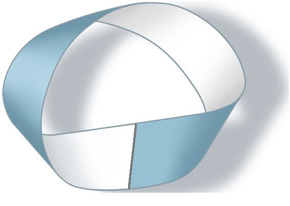

[无对应译文]

</section>

<section class="parallel-paragraph" data-paragraph-ids="s18-04-0206">

s18-04-0206

原文 · s18-04-0206

Le maintien, le maintien dans *le discours analytique* de ce mythe résiduel qui s’appelle celui de l’œdipe...

[无对应译文]

</section>

<section class="parallel-paragraph" data-paragraph-ids="s18-04-0207">

s18-04-0207

原文 · s18-04-0207

> Dieu sait pourquoi, qui est en fait celui de *Totem et Tabou*
>
> où s’inscrit ce mythe tout entier de l’invention de Freud, *du père primordial en tant qu’il jouit de toutes les femmes* ...c’est tout de même là que nous devons interroger d’un peu plus loin, de la logique, de l’écrit, ce qu’il veut dire.

[无对应译文]

</section>

<section class="parallel-paragraph" data-paragraph-ids="s18-04-0208">

s18-04-0208

原文 · s18-04-0208

Il y a bien longtemps que j’ai introduit ici le schéma de Peirce concernant *les proposi­tions* en tant qu’elles se divi­saient en 4: *en universelles, particulières, affirmatives et négatives,* les deux termes, les deux couples de termes s’échangeant.

[无对应译文]

</section>

<section class="parallel-paragraph" data-paragraph-ids="s18-04-0209">

s18-04-0209

原文 · s18-04-0209

Chacun sait que de dire que « *tout x est y* », si le schéma de Peirce - Charles Sanders - a un intérêt, c’est de le montrer, c’est que de définir comme nécessaire que « *tout quelque chose* » soit pourvu de tel attribut, est une position *universelle* parfaitement recevable sans qu’il y ait pour autant aucun *x.*

[无对应译文]

</section>

<section class="parallel-paragraph" data-paragraph-ids="s18-04-0210">

s18-04-0210

原文 · s18-04-0210

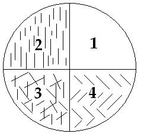

[无对应译文]

</section>

<section class="parallel-paragraph" data-paragraph-ids="s18-04-0211">

s18-04-0211

原文 · s18-04-0211

Dans la petite formule, le petit schéma de Peirce, je vous rappelle :

[无对应译文]

</section>

<section class="parallel-paragraph" data-paragraph-ids="s18-04-0212">

s18-04-0212

原文 · s18-04-0212

- ici \[**2**\] nous avons un certain nombre de *traits verticaux*,

[无对应译文]

</section>

<section class="parallel-paragraph" data-paragraph-ids="s18-04-0213">

s18-04-0213

原文 · s18-04-0213

- ici \[**1** et **4**\] nous n’en avons aucun,

[无对应译文]

</section>

<section class="parallel-paragraph" data-paragraph-ids="s18-04-0214">

s18-04-0214

原文 · s18-04-0214

- ici \[**3**\] nous avons un petit mélange des deux, et que c’est du chevau­chement de deux de ces cases que résulte la spécificité de telle ou telle de ces pro­positions,

[无对应译文]

</section>

<section class="parallel-paragraph" data-paragraph-ids="s18-04-0215">

s18-04-0215

原文 · s18-04-0215

- et que c’est à rassembler ces deux quadrants \[**1** et **2**\] qu’on peut dire : tout trait est vertical, s’il n’est pas vertical, il n’y a pas de trait.

[无对应译文]

</section>

<section class="parallel-paragraph" data-paragraph-ids="s18-04-0216">

s18-04-0216

原文 · s18-04-0216

Pour faire la négative, ce sont ces deux \[**1** et **4**\] là qu’il faut réunir : *ou bien il n’y a pas de trait, ou bien il n’y en a pas de verticaux.*

[无对应译文]

</section>

<section class="parallel-paragraph" data-paragraph-ids="s18-04-0217">

s18-04-0217

原文 · s18-04-0217

Ce que désigne le mythe de « *la jouissance de toutes les femmes »,* c’est que le « *toutes les femmes »,* il n’y en a pas.

[无对应译文]

</section>

<section class="parallel-paragraph" data-paragraph-ids="s18-04-0218">

s18-04-0218

原文 · s18-04-0218

Il n’y a pas d’universel de la femme.

[无对应译文]

</section>

<section class="parallel-paragraph" data-paragraph-ids="s18-04-0219">

s18-04-0219

原文 · s18-04-0219

Voilà ce que pose un questionnement du *phallus*...

[无对应译文]

</section>

<section class="parallel-paragraph" data-paragraph-ids="s18-04-0220">

s18-04-0220

原文 · s18-04-0220

> et non pas du rapport sexuel ...quant à ce qu’il en est de *la jouissance* qu’il constitue, puisque j’ai dit que c’était *la jouissance féminine*.

[无对应译文]

</section>

<section class="parallel-paragraph" data-paragraph-ids="s18-04-0221">

s18-04-0221

原文 · s18-04-0221

C’est à partir de ces énoncés qu’un certain nombre de questions se trouvent radicalement déplacées.

[无对应译文]

</section>

<section class="parallel-paragraph" data-paragraph-ids="s18-04-0222">

s18-04-0222

原文 · s18-04-0222

Après tout il est possible qu’il y ait *un savoir de la jouissance* qu’on appelle *« sexuelle »,* qui soit le fait de cette *certaine femme.*

[无对应译文]

</section>

<section class="parallel-paragraph" data-paragraph-ids="s18-04-0223">

s18-04-0223

原文 · s18-04-0223

La chose n’est pas impensable, il y en a comme ça des traces mythiques dans les coins.

[无对应译文]

</section>

<section class="parallel-paragraph" data-paragraph-ids="s18-04-0224">

s18-04-0224

原文 · s18-04-0224

Les choses qui s’appellent le *Tantra,* on dit que ça se pratique.

[无对应译文]

</section>

<section class="parallel-paragraph" data-paragraph-ids="s18-04-0225">

s18-04-0225

原文 · s18-04-0225

Il est tout de même clair que depuis un bon bout de temps, si vous me permettez d’expri­mer ainsi ma pensée, l’habileté des « *joueuses de flûte* » est beaucoup plus patente.

[无对应译文]

</section>

<section class="parallel-paragraph" data-paragraph-ids="s18-04-0226">

s18-04-0226

原文 · s18-04-0226

Ce n’est pas pour jouer de l’obscénité que j’avance ça en ce point, c’est qu’il y a ici...

[无对应译文]

</section>

<section class="parallel-paragraph" data-paragraph-ids="s18-04-0227">

s18-04-0227

原文 · s18-04-0227

> et je le suppose ...il y a au moins ici une personne qui sait ce que c’est que de jouer de la flûte, c’est la personne qui récemment me faisait remarquer à pro­pos de ce jeu de la flûte...

[无对应译文]

</section>

<section class="parallel-paragraph" data-paragraph-ids="s18-04-0228">

s18-04-0228

原文 · s18-04-0228

> mais on peut le dire aussi à propos de tout usage d’ins­trument ...quelle division du corps l’usage d’un instrument, quel qu’il soit, rend nécessaire.

[无对应译文]

</section>

<section class="parallel-paragraph" data-paragraph-ids="s18-04-0229">

s18-04-0229

原文 · s18-04-0229

Je veux dire rupture de synergie. Il suffit de faire de n’importe quel instrument.

[无对应译文]

</section>

<section class="parallel-paragraph" data-paragraph-ids="s18-04-0230">

s18-04-0230

原文 · s18-04-0230

Mettez-vous sur une paire de skis, vous verrez tout de suite que vos synergies doivent être rompues.

[无对应译文]

</section>

<section class="parallel-paragraph" data-paragraph-ids="s18-04-0231">

s18-04-0231

原文 · s18-04-0231

Prenez une canne de golf...

[无对应译文]

</section>

<section class="parallel-paragraph" data-paragraph-ids="s18-04-0232">

s18-04-0232

原文 · s18-04-0232

> ça m’arrive ces der­niers temps : j’ai recommencé ...c’est pareil, hein : il y a deux types de mouve­ments qu’il faut que vous fassiez en même temps, vous n’y arrivez au début absolument pas, parce que synergiquement ça ne s’arrange pas comme ça.

[无对应译文]

</section>

<section class="parallel-paragraph" data-paragraph-ids="s18-04-0233">

s18-04-0233

原文 · s18-04-0233

La personne qui m’a bien rappelé la chose à propos de la flûte, me faisait également remarquer que pour le chant, où en apparence il n’y a pas d’instrument, c’est en ça que le chant est particulièrement intéressant, c’est que là aussi il faut que *vous divisiez votre corps*, que vous y divisiez deux choses qui sont tout à fait dis­tinctes pour que vous puissiez chanter, mais qui d’habitude sont absolument synergiques, à savoir

[无对应译文]

</section>

<section class="parallel-paragraph" data-paragraph-ids="s18-04-0234">

s18-04-0234

原文 · s18-04-0234

- la pose de la voix,

[无对应译文]

</section>

<section class="parallel-paragraph" data-paragraph-ids="s18-04-0235">

s18-04-0235

原文 · s18-04-0235

- et la respiration.

[无对应译文]

</section>

<section class="parallel-paragraph" data-paragraph-ids="s18-04-0236">

s18-04-0236

原文 · s18-04-0236

Bon, ces vérités pre­mières...

[无对应译文]

</section>

<section class="parallel-paragraph" data-paragraph-ids="s18-04-0237">

s18-04-0237

原文 · s18-04-0237

> qui n’ont pas eu besoin de m’être rappelées,
>
> puisque aussi bien je vous disais que j’en avais ma dernière expérience avec la canne de golf ...c’est ce qui laisse ouverte comme une question s’il y a encore quelque part un savoir de l’instrument *phallus*.

[无对应译文]

</section>

<section class="parallel-paragraph" data-paragraph-ids="s18-04-0238">

s18-04-0238

原文 · s18-04-0238

Seulement l’instrument *phallus*, c’est pas un instrument comme les autres, c’est comme pour le chant, l’instrument *phallus*, je vous ai déjà dit qu’il est pas du tout à confondre avec *le pénis*.

[无对应译文]

</section>

<section class="parallel-paragraph" data-paragraph-ids="s18-04-0239">

s18-04-0239

原文 · s18-04-0239

Le pénis lui, il se règle sur la Loi :

[无对应译文]

</section>

<section class="parallel-paragraph" data-paragraph-ids="s18-04-0240">

s18-04-0240

原文 · s18-04-0240

- c’est-à-dire sur *le désir*,

[无对应译文]

</section>

<section class="parallel-paragraph" data-paragraph-ids="s18-04-0241">

s18-04-0241

原文 · s18-04-0241

- c’est-à-dire sur *le plus de jouir*,

[无对应译文]

</section>

<section class="parallel-paragraph" data-paragraph-ids="s18-04-0242">

s18-04-0242

原文 · s18-04-0242

- c’est-à-dire sur *la cause du désir*,

[无对应译文]

</section>

<section class="parallel-paragraph" data-paragraph-ids="s18-04-0243">

s18-04-0243

原文 · s18-04-0243

- c’est-à-dire sur *le fantasme*.

[无对应译文]

</section>

<section class="parallel-paragraph" data-paragraph-ids="s18-04-0244">

s18-04-0244

原文 · s18-04-0244

Et ça, le savoir supposé de la femme qui saurait, là elle rencontre un os, justement celui qui manque à l’organe, si vous me per­mettez de continuer dans la même veine. Parce que chez certains animaux, il y en a un d’os. Ça oui !

[无对应译文]

</section>

<section class="parallel-paragraph" data-paragraph-ids="s18-04-0245">

s18-04-0245

原文 · s18-04-0245

Là il y a un manque, c’est un os manquant, c’est pas *le phal­lus*, c’est *le désir* et son fonctionnement.

[无对应译文]

</section>

<section class="parallel-paragraph" data-paragraph-ids="s18-04-0246">

s18-04-0246

原文 · s18-04-0246

Il en résulte *qu’une femme n’a* de témoignage de *son insertion dans la loi* de ce qui supplée au rapport, *que par* *le désir de l’homme*. Là il suffit d’avoir une toute petite expérience analytique pour en avoir la certitude : *le désir de l’homme* - je viens de le dire - est lié à sa cause qui est le *plus de jouir*, ou qui est encore...

[无对应译文]

</section>

<section class="parallel-paragraph" data-paragraph-ids="s18-04-0247">

s18-04-0247

原文 · s18-04-0247

> comme je l’ai exprimé maintes fois, s’il prend sa source dans le champ d’où tout part ...*l’effet de langage*, dans le désir de l’Autre donc.

[无对应译文]

</section>

<section class="parallel-paragraph" data-paragraph-ids="s18-04-0248">

s18-04-0248

原文 · s18-04-0248

Et la femme, à cette occasion, on s’aperçoit que c’est elle qui est l’Autre.

[无对应译文]

</section>

<section class="parallel-paragraph" data-paragraph-ids="s18-04-0249">

s18-04-0249

原文 · s18-04-0249

Seulement elle est l’Autre d’un tout autre ressort, d’un tout autre registre que son savoir, quel qu’il soit.

[无对应译文]

</section>

<section class="parallel-paragraph" data-paragraph-ids="s18-04-0250">

s18-04-0250

原文 · s18-04-0250

Voilà donc *« l’instrument phallique »* posé - avec des guillemets - comme *cause du langage*, je n’ai pas dit origine.

[无对应译文]

</section>

<section class="parallel-paragraph" data-paragraph-ids="s18-04-0251">

s18-04-0251

原文 · s18-04-0251

Et là malgré l’heure avancée - mon Dieu - j’irai vite, je signalerai la trace qu’on en peut avoir, à savoir le maintien, quoi qu’on veuille, d’un interdit sur les mots obscènes.

[无对应译文]

</section>

<section class="parallel-paragraph" data-paragraph-ids="s18-04-0252">

s18-04-0252

原文 · s18-04-0252

Et puisque je sais qu’il y a des gens qui m’attendent à ce quelque chose que je leur ai promis : de faire allusion à « *Eden, Eden, Eden »* [^32] et de dire pourquoi je ne signe pas les - comment qu’on appelle ça ? - les machins, les *pétitions* à ce propos.

[无对应译文]

</section>

<section class="parallel-paragraph" data-paragraph-ids="s18-04-0253">

s18-04-0253

原文 · s18-04-0253

C’est que ce n’est pas certes que mon estime soit médiocre pour cette tentative : à sa façon elle est comparable à celle de mes *Écrits.*

[无对应译文]

</section>

<section class="parallel-paragraph" data-paragraph-ids="s18-04-0254">

s18-04-0254

原文 · s18-04-0254

À ceci près que, elle est beaucoup plus désespérée.

[无对应译文]

</section>

<section class="parallel-paragraph" data-paragraph-ids="s18-04-0255">

s18-04-0255

原文 · s18-04-0255

Il est tout à fait désespéré de « *langager* » l’instrument phallique.

[无对应译文]

</section>

<section class="parallel-paragraph" data-paragraph-ids="s18-04-0256">

s18-04-0256

原文 · s18-04-0256

Et c’est parce que je le considère comme, en ce point, sans espoir, que je pense aussi que ne peut se développer autour d’une telle tentative, que des malentendus.

[无对应译文]

</section>

<section class="parallel-paragraph" data-paragraph-ids="s18-04-0257">

s18-04-0257

原文 · s18-04-0257

Vous voyez que c’est à un point hautement théorique que se place, dans l’occasion, mon refus.

[无对应译文]

</section>

<section class="parallel-paragraph" data-paragraph-ids="s18-04-0258">

s18-04-0258

原文 · s18-04-0258

Là où je voudrais en venir est ceci : d’où interroge-t-on *la vérité ?*

[无对应译文]

</section>

<section class="parallel-paragraph" data-paragraph-ids="s18-04-0259">

s18-04-0259

原文 · s18-04-0259

Car *la vérité* elle peut dire tout ce qu’elle veut, *c’est l’oracle*.

[无对应译文]

</section>

<section class="parallel-paragraph" data-paragraph-ids="s18-04-0260">

s18-04-0260

原文 · s18-04-0260

Ça existe depuis toujours, et après ça on n’a plus qu’à se débrouiller.

[无对应译文]

</section>

<section class="parallel-paragraph" data-paragraph-ids="s18-04-0261">

s18-04-0261

原文 · s18-04-0261

Seulement, il y a un fait nouveau, hein ?

[无对应译文]

</section>

<section class="parallel-paragraph" data-paragraph-ids="s18-04-0262">

s18-04-0262

原文 · s18-04-0262

Le premier fait nouveau depuis que fonctionne l’oracle, c’est-à-dire depuis tou­jours, c’est un de mes *écrits,* le fait nouveau qui s’appelle « *La Chose freudienne »* où j’ai indiqué ceci, que personne n’avait jamais dit...

[无对应译文]

</section>

<section class="parallel-paragraph" data-paragraph-ids="s18-04-0263">

s18-04-0263

原文 · s18-04-0263

> seulement comme c’est écrit, naturellement vous ne l’avez pas entendu ...j’ai dit que « *la vérité parle Je* ».

[无对应译文]

</section>

<section class="parallel-paragraph" data-paragraph-ids="s18-04-0264">

s18-04-0264

原文 · s18-04-0264

Si vous aviez donné son poids à cette espèce de luxuriance polémique que j’ai faite, pour présenter *la vérité* comme ça, je ne sais même plus ce que j’ai écrit : « *comme rentrant dans la pièce dans un fracas de miroir »* [^33], ç’aurait peut-être pu vous ouvrir les oreilles.

[无对应译文]

</section>

<section class="parallel-paragraph" data-paragraph-ids="s18-04-0265">

s18-04-0265

原文 · s18-04-0265

Ce bruit des miroirs qui se cassent, dans un écrit, ça ne vous frappe pas ?

[无对应译文]

</section>

<section class="parallel-paragraph" data-paragraph-ids="s18-04-0266">

s18-04-0266

原文 · s18-04-0266

C’est pourtant assez bien écrit, c’est là ce qu’on appelle « *l’effet de style »*.

[无对应译文]

</section>

<section class="parallel-paragraph" data-paragraph-ids="s18-04-0267">

s18-04-0267

原文 · s18-04-0267

Ça vous aurait certainement aidé à comprendre ce que ça veut dire *« la vérité parle Je »,* ça veut dire *qu’on peut lui dire « Tu »*.

[无对应译文]

</section>

<section class="parallel-paragraph" data-paragraph-ids="s18-04-0268">

s18-04-0268

原文 · s18-04-0268

Et je vais vous expliquer à quoi ça sert.

[无对应译文]

</section>

<section class="parallel-paragraph" data-paragraph-ids="s18-04-0269">

s18-04-0269

原文 · s18-04-0269

Vous allez croire bien sûr que je vais vous dire que ça sert au dialogue : il y a long­temps que j’ai dit qu’il n’y en avait pas de dialogue, et avec *la vérité*, bien sûr, encore moins.

[无对应译文]

</section>

<section class="parallel-paragraph" data-paragraph-ids="s18-04-0270">

s18-04-0270

原文 · s18-04-0270

Néanmoins, si vous lisez quelque chose qui s’appelle la « *[Métamathématique](https://ia801204.us.archive.org/21/items/PaulLorenzenMetamathematique/Paul%20Lorenzen%20M%C3%A9tamath%C3%A9matique_text.pdf) »* de Lorenzen...

[无对应译文]

</section>

<section class="parallel-paragraph" data-paragraph-ids="s18-04-0271">

s18-04-0271

原文 · s18-04-0271

> je l’ai apporté, c’est chez Gauthier-Villars et Mouton ...bon, et puis je vais même vous indiquer la page où vous verrez des choses astucieuses.

[无对应译文]

</section>

<section class="parallel-paragraph" data-paragraph-ids="s18-04-0272">

s18-04-0272

原文 · s18-04-0272

C’est des *dialogues*, c’est des *dialogues écrits*, c’est-à-dire que c’est le même qui écrit les deux répliques.

[无对应译文]

</section>

<section class="parallel-paragraph" data-paragraph-ids="s18-04-0273">

s18-04-0273

原文 · s18-04-0273

C’est un dialogue bien particulier, seulement c’est très instructif. Vous vous reporterez à la page 22. C’est très ins­tructif et je pourrais le traduire de plus d’une façon, y compris en me servant de mon «*être»* et de mon «*avoir» *de tout à l’heure.

[无对应译文]

</section>

<section class="parallel-paragraph" data-paragraph-ids="s18-04-0274">

s18-04-0274

原文 · s18-04-0274

Mais j’irai plus simplement pour vous rappeler cette chose sur laquelle j’ai déjà mis l’accent, c’est à savoir qu’aucun des prétendus *paradoxes* auxquels s’arrête la *logique classique*, nommément celui du «* Je mens *», ne tient qu’à partir du moment où c’est écrit. Il est tout à fait clair que de dire «* Je mens *» est une chose qui ne fait aucun obstacle, étant donné qu’on ne fait que ça, alors pourquoi ne le dirait-on pas ?

[无对应译文]

</section>

<section class="parallel-paragraph" data-paragraph-ids="s18-04-0275">

s18-04-0275

原文 · s18-04-0275

Qu’est-ce que ça veut dire ?

[无对应译文]

</section>

<section class="parallel-paragraph" data-paragraph-ids="s18-04-0276">

s18-04-0276

原文 · s18-04-0276

Que c’est seulement quand c’est écrit, que là il y a *paradoxe*, car on dit : « *Là, ben vous mentez ou bien vous dites vrai ?* »

[无对应译文]

</section>

<section class="parallel-paragraph" data-paragraph-ids="s18-04-0277">

s18-04-0277

原文 · s18-04-0277

C’est exactement la même chose que je vous ai fait remarquer dans son temps : que d’écrire « *le plus petit nombre qui s’écrive en plus de quinze mots* », vous ne voyez là *aucun obstacle*, quand je vous le dis.

[无对应译文]

</section>

<section class="parallel-paragraph" data-paragraph-ids="s18-04-0278">

s18-04-0278

原文 · s18-04-0278

Si c’est écrit, vous les comptez, vous vous apercevez qu’il n’y en a que treize, dans ce que je viens de dire.

[无对应译文]

</section>

<section class="parallel-paragraph" data-paragraph-ids="s18-04-0279">

s18-04-0279

原文 · s18-04-0279

Mais ça ne se compte que si c’est écrit.

[无对应译文]

</section>

<section class="parallel-paragraph" data-paragraph-ids="s18-04-0280">

s18-04-0280

原文 · s18-04-0280

Parce que si c’est écrit en japonais, je vous défie de les compter.

[无对应译文]

</section>

<section class="parallel-paragraph" data-paragraph-ids="s18-04-0281">

s18-04-0281

原文 · s18-04-0281

Parce que là vous vous posez quand même la question, il y a des petits bouts, comme ça, de vagissements, des petits *o* et des petits *oua,* dont vous vous demanderez s’il faut le coller au mot, ou s’il faut le détacher et le compter pour un mot, c’est même pas un mot, c’est comme ça.

[无对应译文]

</section>

<section class="parallel-paragraph" data-paragraph-ids="s18-04-0282">

s18-04-0282

原文 · s18-04-0282

Seulement, quand c’est écrit, c’est comptable.

[无对应译文]

</section>

<section class="parallel-paragraph" data-paragraph-ids="s18-04-0283">

s18-04-0283

原文 · s18-04-0283

Alors la vérité, vous vous apercevrez qu’exactement comme dans *La métama­thématique* de Lorenzen, si vous posez qu’on ne peut pas à la fois dire « *oui* et *non* » sur le même point, là vous gagnez...

[无对应译文]

</section>

<section class="parallel-paragraph" data-paragraph-ids="s18-04-0284">

s18-04-0284

原文 · s18-04-0284

> vous verrez tout à l’heure ce que vous gagnez ...mais si vous misez que c’est « *ou oui ou non* », là vous perdez.

[无对应译文]

</section>

<section class="parallel-paragraph" data-paragraph-ids="s18-04-0285">

s18-04-0285

原文 · s18-04-0285

Référez-vous à Lorenzen, mais je vais vous l’illustrer tout de suite. Je pose : « *Il n’est pas vrai* - dis-je à la vérité *- que tu dis vrai et que tu mentes en même temps.* »

[无对应译文]

</section>

<section class="parallel-paragraph" data-paragraph-ids="s18-04-0286">

s18-04-0286

原文 · s18-04-0286

*La vérité* peut répondre bien des choses, puisque c’est vous qui la faites répondre, ça ne vous coûte rien.

[无对应译文]

</section>

<section class="parallel-paragraph" data-paragraph-ids="s18-04-0287">

s18-04-0287

原文 · s18-04-0287

De toute façon, ça va aboutir au même résultat, mais je vous le détaille pour rester collé au Lorenzen :

[无对应译文]

</section>

<section class="parallel-paragraph" data-paragraph-ids="s18-04-0288">

s18-04-0288

原文 · s18-04-0288

- Elle dit : « *Je dis vrai!* ».

[无对应译文]

</section>

<section class="parallel-paragraph" data-paragraph-ids="s18-04-0289">

s18-04-0289

原文 · s18-04-0289

- Vous lui répondez : « *Je te le fais pas dire!* »

[无对应译文]

</section>

<section class="parallel-paragraph" data-paragraph-ids="s18-04-0290">

s18-04-0290

原文 · s18-04-0290

- Alors pour vous emmerder, elle vous dit : « *Je mens* »

[无对应译文]

</section>

<section class="parallel-paragraph" data-paragraph-ids="s18-04-0291">

s18-04-0291

原文 · s18-04-0291

- À quoi vous répondez : « *Maintenant, j’ai gagné, je sais que tu te contredis !* »

[无对应译文]

</section>

<section class="parallel-paragraph" data-paragraph-ids="s18-04-0292">

s18-04-0292

原文 · s18-04-0292

C’est exac­tement ce que vous découvrez avec *l’inconscient*, ça n’a pas plus de portée.

[无对应译文]

</section>

<section class="parallel-paragraph" data-paragraph-ids="s18-04-0293">

s18-04-0293

原文 · s18-04-0293

Que *l’inconscient* dise toujours *la vérité* *<u>et</u> qu’il mente*, c’est, de chez lui, parfaitement soutenable, c’est simplement à vous de le savoir.

[无对应译文]

</section>

<section class="parallel-paragraph" data-paragraph-ids="s18-04-0294">

s18-04-0294

原文 · s18-04-0294

Qu’est-ce que ça vous apprend ?

[无对应译文]

</section>

<section class="parallel-paragraph" data-paragraph-ids="s18-04-0295">

s18-04-0295

原文 · s18-04-0295

Que *la vérité*, vous n’en savez quelque chose que quand elle se déchaîne.

[无对应译文]

</section>

<section class="parallel-paragraph" data-paragraph-ids="s18-04-0296">

s18-04-0296

原文 · s18-04-0296

Car elle s’est déchaînée, elle a brisé votre chaîne : elle vous a dit les deux choses aussi bien, quand vous disiez que la conjonction n’était point *soutenable*.

[无对应译文]

</section>

<section class="parallel-paragraph" data-paragraph-ids="s18-04-0297">

s18-04-0297

原文 · s18-04-0297

Mais supposez le contraire, que vous lui ayez dit : « *Ou tu dis vrai, ou tu mens.* »

[无对应译文]

</section>

<section class="parallel-paragraph" data-paragraph-ids="s18-04-0298">

s18-04-0298

原文 · s18-04-0298

Ben là, vous en êtes pour vos frais. Parce que, qu’est-ce qu’elle vous répond : « *Je te l’accorde, je m’enchaîne. Tu me dis : ou tu dis vrai ou tu mens, et en effet ça c’est bien vrai.* »

[无对应译文]

</section>

<section class="parallel-paragraph" data-paragraph-ids="s18-04-0299">

s18-04-0299

原文 · s18-04-0299

Seulement alors là, vous, vous savez rien, vous savez rien de ce qu’elle vous a dit, puisque ou elle dit vrai ou elle ment, de sorte que vous êtes perdant. Ceci, je ne sais pas si ça vous apparaît dans sa pertinence, mais ça veut dire ceci dont nous avons constamment l’expérience, c’est que : « *Qu’elle se refuse la vérité, alors ça me sert à quelque chose* ».

[无对应译文]

</section>

<section class="parallel-paragraph" data-paragraph-ids="s18-04-0300">

s18-04-0300

原文 · s18-04-0300

C’est à ça que nous avons tout le temps affaire dans l’analyse et que : « *Qu’elle s’abandonne, qu’elle accepte la chaîne, quelle qu’elle soit, eh bien, j’y perds mon latin* ».

[无对应译文]

</section>

<section class="parallel-paragraph" data-paragraph-ids="s18-04-0301">

s18-04-0301

原文 · s18-04-0301

Autrement dit ça... ça me laisse à désirer.

[无对应译文]

</section>

<section class="parallel-paragraph" data-paragraph-ids="s18-04-0302">

s18-04-0302

原文 · s18-04-0302

Ça me laisse à désirer, ça me laisse dans ma position de demandeur, puisque je me trompe de penser que je puis traiter d’une vérité que je ne puis reconnaître qu’au titre de déchaînée.

[无对应译文]

</section>

<section class="parallel-paragraph" data-paragraph-ids="s18-04-0303">

s18-04-0303

原文 · s18-04-0303

Vous montrez de quel déchaî­nement vous participez.

[无对应译文]

</section>

<section class="parallel-paragraph" data-paragraph-ids="s18-04-0304">

s18-04-0304

原文 · s18-04-0304

Il y a quelque chose qui mérite d’être relevé dans ce rapport, c’est la fonction de ce quelque chose dont il y a longtemps que je le mets tout doucement comme ça sur la sellette, et qui se dénomme la liberté.

[无对应译文]

</section>

<section class="parallel-paragraph" data-paragraph-ids="s18-04-0305">

s18-04-0305

原文 · s18-04-0305

Il arrive qu’à travers *le fantasme*, il y en ait qui élucubrent de certaines façons où, sinon *la vérité* elle-même du moins *le phallus,* pourrait être apprivoisé.

[无对应译文]

</section>

<section class="parallel-paragraph" data-paragraph-ids="s18-04-0306">

s18-04-0306

原文 · s18-04-0306

Je ne vous dirai pas dans quelles varié­tés de détails ces sortes d’élucubrations peuvent s’étaler.

[无对应译文]

</section>

<section class="parallel-paragraph" data-paragraph-ids="s18-04-0307">

s18-04-0307

原文 · s18-04-0307

Mais il y a une chose très frappante, c’est que...

[无对应译文]

</section>

<section class="parallel-paragraph" data-paragraph-ids="s18-04-0308">

s18-04-0308

原文 · s18-04-0308

> mis à part une certaine sorte de manque de sérieux
>
> qui est peut-être ce qu’il y a de plus solide pour définir la perversion ...eh ben, ces solutions élégantes, il est clair que les personnes pour qui ça c’est sérieux, toute cette menue affaire, parce que - mon Dieu - le langage, ça compte pour elles, aussi l’écrit, ne serait-ce que parce que ça permet l’interrogation logique, car en fin de compte, qu’est-ce que c’est que la logique si ce n’est ce paradoxe absolu­ment fabuleux que ne permet que l’écrit, de prendre *la vérité comme référent* ?

[无对应译文]

</section>

<section class="parallel-paragraph" data-paragraph-ids="s18-04-0309">

s18-04-0309

原文 · s18-04-0309

C’est évidemment par ça qu’on communie, quand on commence par donner les premières, toutes premières formules de la logique propositionnelle, on prend comme référence qu’il y a

[无对应译文]

</section>

<section class="parallel-paragraph" data-paragraph-ids="s18-04-0310">

s18-04-0310

原文 · s18-04-0310

- des propositions qui peuvent se marquer du *Vrai*

[无对应译文]

</section>

<section class="parallel-paragraph" data-paragraph-ids="s18-04-0311">

s18-04-0311

原文 · s18-04-0311

- et d’autres qui peuvent se marquer du *Faux*.

[无对应译文]

</section>

<section class="parallel-paragraph" data-paragraph-ids="s18-04-0312">

s18-04-0312

原文 · s18-04-0312

C’est avec ça que commence la réfé­rence à *la vérité*.

[无对应译文]

</section>

<section class="parallel-paragraph" data-paragraph-ids="s18-04-0313">

s18-04-0313

原文 · s18-04-0313

Se référer à *la vérité*, c’est poser *le faux absolu*, c’est-à-dire un *faux* auquel on pourrait se référer comme tel.

[无对应译文]

</section>

<section class="parallel-paragraph" data-paragraph-ids="s18-04-0314">

s18-04-0314

原文 · s18-04-0314

Les personnes sérieuses...

[无对应译文]

</section>

<section class="parallel-paragraph" data-paragraph-ids="s18-04-0315">

s18-04-0315

原文 · s18-04-0315

> je reprends ce que je suis en train de dire ...auxquelles se proposent ces solutions élégantes qui seraient « *apprivoisement du phallus »,* ben c’est curieux, c’est elles qui se refusent.

[无对应译文]

</section>

<section class="parallel-paragraph" data-paragraph-ids="s18-04-0316">

s18-04-0316

原文 · s18-04-0316

Et pourquoi, *sinon pour préserver ce qui s’appelle la liberté, en tant qu’elle est précisément identique à cette non-exis­tence du rapport sexuel*.

[无对应译文]

</section>

<section class="parallel-paragraph" data-paragraph-ids="s18-04-0317">

s18-04-0317

原文 · s18-04-0317

Car enfin, est-il besoin d’indiquer que *ce rapport de l’homme et de la femme*, en tant qu’il est de par *la loi* - *la loi dite sexuelle* - radi­calement faussé, c’est *ce quelque chose qui* quand même *laisse à désirer* qu’à cha­cun il y ait sa chacune, pour lui répondre. Si ça arrive, qu’est-ce qu’on dira ?

[无对应译文]

</section>

<section class="parallel-paragraph" data-paragraph-ids="s18-04-0318">

s18-04-0318

原文 · s18-04-0318

Non certes que c’était là chose naturelle, puisqu’il n’y a pas à cet égard de nature puisque *La femme* n’existe pas...

[无对应译文]

</section>

<section class="parallel-paragraph" data-paragraph-ids="s18-04-0319">

s18-04-0319

原文 · s18-04-0319

> qu’elle existe, c’est un rêve de femme, mais c’est le rêve d’où est sorti *Don Juan.*
>
> S’il y avait *Un homme* pour qui *La femme* existe, ce serait une merveille !
>
> On serait sûr de son désir. C’est une élucubra­tion féminine ...pour qu’un homme trouve *sa femme*, quoi d’autre sinon la formule romantique : « *C’était fatal, c’était écrit* ».

[无对应译文]

</section>

<section class="parallel-paragraph" data-paragraph-ids="s18-04-0320">

s18-04-0320

原文 · s18-04-0320

Une fois de plus, nous voilà venus à ce carrefour qui est celui où je vous ai dit que je ferai basculer ce qu’il en est du vrai seigneur, du type qui est...

[无对应译文]

</section>

<section class="parallel-paragraph" data-paragraph-ids="s18-04-0321">

s18-04-0321

原文 · s18-04-0321

> ce qu’on traduit, fort mal ma foi, par l’homme ...comme ça un tout petit peu au­-dessus du commun, c’est cette bascule entre

[无对应译文]

</section>

<section class="parallel-paragraph" data-paragraph-ids="s18-04-0322">

s18-04-0322

原文 · s18-04-0322

- le « *xìng* 姓 », cette nature telle qu’elle est inscrite par l’effet de langage, inscrite dans cette disjonction de l’homme et de la femme,

[无对应译文]

</section>

<section class="parallel-paragraph" data-paragraph-ids="s18-04-0323">

s18-04-0323

原文 · s18-04-0323

- et d’autre part ce « *c’est écrit* », ce « *ming* 命 », cet autre caractère, dont je vous ai déjà une première fois montré ici la forme, qui est celui devant lequel la liberté recule.

[无对应译文]

</section>

<section class="parallel-paragraph" data-paragraph-ids="s18-04-0324">

s18-04-0324

原文 · s18-04-0324

-

[无对应译文]

</section>

<section class="parallel-paragraph" data-paragraph-ids="s18-04-0325">

s18-04-0325

原文 · s18-04-0325

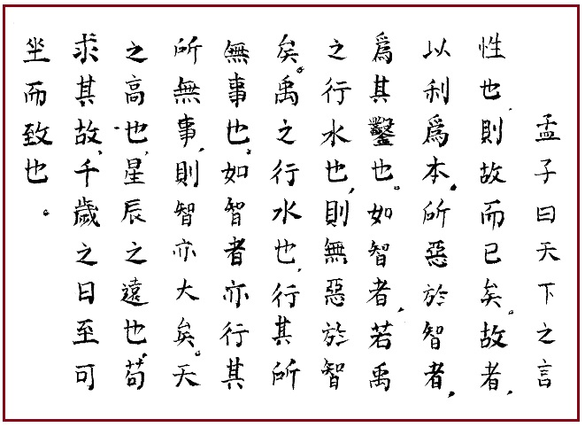

[无对应译文]

</section>

<section class="parallel-paragraph" data-paragraph-ids="s18-04-0326">

s18-04-0326

原文 · s18-04-0326

MENCIUS, *Livre IV, chapitre II, § 26*.

[无对应译文]

</section>

<section class="parallel-paragraph" data-paragraph-ids="s18-04-0327">

s18-04-0327

原文 · s18-04-0327

Traduction de M.G. Pauthier \[1801-1873\] : *Meng Tseu dit :*

[无对应译文]

</section>

<section class="parallel-paragraph" data-paragraph-ids="s18-04-0328">

s18-04-0328

原文 · s18-04-0328

- « *Lorsque dans le monde on disserte sur la nature rationnelle de l’homme, on ne doit parler que de ses effets. Ses effets sont ce qu’il y a de plus important à connaître. C’est ainsi que nous éprouvons de l’aversion pour un* \[*faux*\] *sage, qui use de captieux détours.*

[无对应译文]

</section>

<section class="parallel-paragraph" data-paragraph-ids="s18-04-0329">

s18-04-0329

原文 · s18-04-0329

> *Si ce sage agissait naturellement comme Yu en dirigeant les eaux* \[*de la grande inondation*\]*, nous n’éprouverions point d’aversion pour sa sagesse. Lorsque Yu dirigeait les grandes eaux, il les dirigeait selon leur cours le plus naturel et le plus facile.*
>
> *Si le sage dirige aussi ses actions selon la voie naturelle de la raison et la nature des choses, alors sa sagesse sera grande aussi. Quoique le ciel soit très élevé, que les étoiles soient très éloignées, si on porte son investigation sur les effets naturels qui en procèdent, on peut calculer ainsi, avec la plus grande facilité, le jour où après mille ans le solstice d’hiver aura lieu.* »

[无对应译文]

</section>

<section class="parallel-paragraph" data-paragraph-ids="s18-04-0330">

s18-04-0330

原文 · s18-04-0330

Traduction de Séraphin Couvreur \[1835-1919\] : *Meng tzeu dit :*

[无对应译文]

</section>

<section class="parallel-paragraph" data-paragraph-ids="s18-04-0331">

s18-04-0331

原文 · s18-04-0331

- « *Partout sous le ciel, quand on parle de la nature, on veut parler des effets naturels. Les effets naturels ont d’abord cela de particulier, qu’ils sont spontanés. Ce qui nous déplaît dans les hommes qui sont prudents (mais d’une prudence étroite), c’est qu’ils font violence à la nature. Si les hommes pru­dents imitaient la manière dont Tu fis écouler les eaux, rien ne nous déplairait dans leur prudence. Tu fis écouler les eaux de manière à n’avoir pas de diffi­cultés (il profita de leur tendance naturelle).*

[无对应译文]

</section>

<section class="parallel-paragraph" data-paragraph-ids="s18-04-0332">

s18-04-0332

原文 · s18-04-0332

> *Si les hommes prudents agissaient aussi de manière à n’avoir pas de difficultés, leur prudence serait grande.*
>
> *Bien que le ciel soit très élevé et les astres fort éloignés de la terre, si l’on étudie leurs mouvements, on peut aisément calculer le moment du solstice d’hiver pour chaque année depuis dix siècles.* »

[无对应译文]

</section>

<section class="parallel-paragraph" data-paragraph-ids="s18-04-0333">

s18-04-0333

原文 · s18-04-0333

Traduction d’André Lévy \[1925-2017\] : Mencius dit :

[无对应译文]

</section>

<section class="parallel-paragraph" data-paragraph-ids="s18-04-0334">

s18-04-0334

原文 · s18-04-0334

> « *Toutes les discussions du monde sur la nature humaine se bornent à des « donc » et des « c’est pourquoi »,*
>
> *lesquels ont pour fondement l’intérêt. Ce qu’il y a de détestable dans l’intelligence, c’est cette façon de perforer.*
>
> *Si elle était semblable à l’écoulement des eaux pratiqué par Yu, elle n’aurait rien de rebutant.*
>
> *Le drainage des eaux par Yu consistait à faire en sorte qu’il ny ait pas d’incidents.*
>
> *Si, elle aussi, suivait la pente naturelle, l’intelligence n’en serait que plus grande.*
>
> *Si haut que soit le ciel, si loitaines que soient les étoiles, à en chercher le « pourquoi »,*
>
> *on pourrait parvenir sans bouger à calculer le solstice dans mille ans. »*
>
> \[Andé Lévy, Mencius, éd. You-Feng, Paris, 2003, IV-B26, p. 123-124\]
>
> 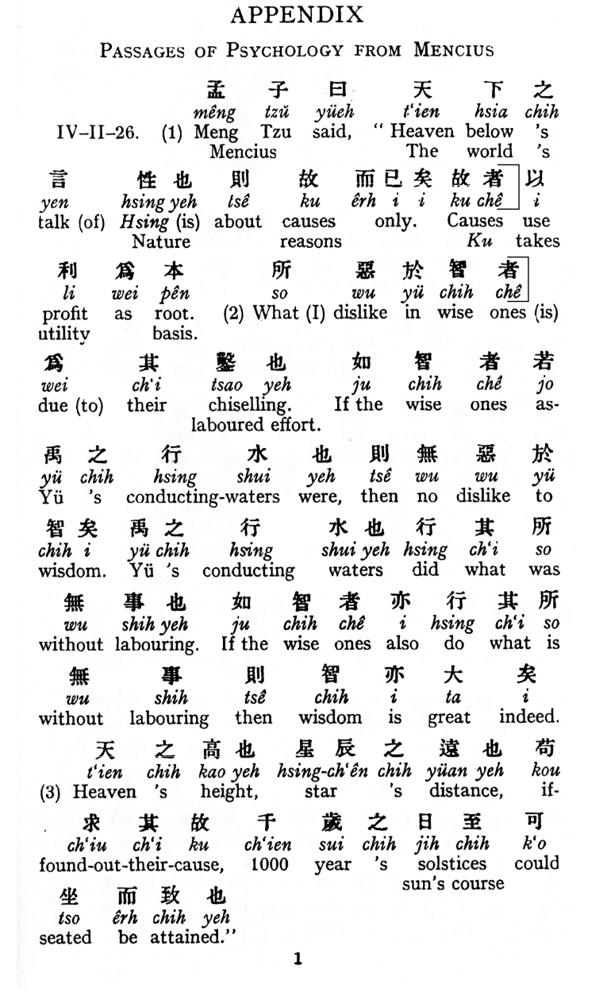

[无对应译文]

</section>

<section class="parallel-paragraph" data-paragraph-ids="s18-04-0335">

s18-04-0335

原文 · s18-04-0335

I.A. Richards \[1893-1979\] : *Mencius said:*

[无对应译文]

</section>

<section class="parallel-paragraph" data-paragraph-ids="s18-04-0336">

s18-04-0336

原文 · s18-04-0336

> « *Heaven below’s, the world talk of nature about causes, reasons, only.*
>
> *Causes use profit, utility, as roots.*
>
> *What I dislike in ones on is due to their chiselling, laboured effort.*
>
> *If the ones as Yüs conducting-waters, did what was without labouring.*
>
> *If the wise ones also do what is Heaven’s height, star’s distance, if found out their causes,*
>
> *1000 year’s solstices could seated be attained. »*

[无对应译文]

</section>

<section class="parallel-paragraph" data-paragraph-ids="s18-04-0337">

s18-04-0337

原文 · s18-04-0337

(I.A. Richards, « Mencius on the Mind », London, KeganPaul, 1932, Appendix, p. 133)

[无对应译文]

</section>

<section class="parallel-paragraph" data-paragraph-ids="s18-04-0338">

s18-04-0338

原文 · s18-04-0338

*  *

[无对应译文]

</section>

<section class="note-block original-notes">

## Notes

[^24]: Voltaire : « *Le Siècle de Louis XIV* », LGF, 2005.

[^25]:
    #  Ivor Armstrong Richards : « *Mencius on the Mind* : *Experiments in Multiple Definition* », Kessinger Publishing (avril 2005).

    #  Charles Kay Ogden, Ivor Armstrong Richards, F G Crookshank, Bronislaw Malinowski : « *The Meaning of meaning : A study of the influence of language* 

    #  *upon thought and of the science of symbolism* », éd. Kegan Paul, Trench, Trubner and Co. (1923).

[^26]: Cf. *Écrits* p. 271.

[^27]: Lapsus de Lacan ? Il s’agirait non pas de Léon Wieger mais de [Séraphin Couvreur](http://classiques.uqac.ca/classiques/chine_ancienne/B_livres_canoniques_Petits_Kings/B_12_les_4_livres_IV/meng_tzeu.pdf) (autre Père Jésuite), dont Lacan utilise la traduction.

    Cf. l’article de [Thierry Florentin](http://www.lacanchine.com/L_Seminaire_Florentin2.html) sur le site « Lacanchine ».

[^28]: Il s’agit de Xavier Audouard et de la position d’*ignorance* de l’analyste, revendiquée et soutenue dans son livre : « *La non psychanalyse ou l’ouverture ».*

[^29]: Écrits p. 585 : « *La direc­tion de la cure et les principes de son pouvoir* ».

[^30]: Mansion : − *Antiquité romaine *: Relais officiel, station d'hébergement et d’approvisionnement sur une grande voie.

    − *Théâtre médiéval *: Chacun des lieux juxtaposés du décor simultané où se déroule tour à tour une scène.

    − *Astrologie *: Synonyme de *maison*.

[^31]: Jan Swammerdam (1637-1680), naturaliste hollandais, considéré comme le fondateur de l’anatomie comparée et de la microscopie.

    Il est un des premiers à avoir utilisé le microscope, comme Galilée (1564-1642) fut un des premiers à utiliser le télescope.

[^32]:
    #  Pierre Guyotat : « *Eden, Eden, Eden* » (roman). Préfaces de Michel Leiris, Roland Barthes et Philippe Sollers, Gallimard, 1970.

[^33]: « ...*quand un fracas de débris de verre*... », « *La chose freudienne* » in *Écrits*, p. 412.

</section>
