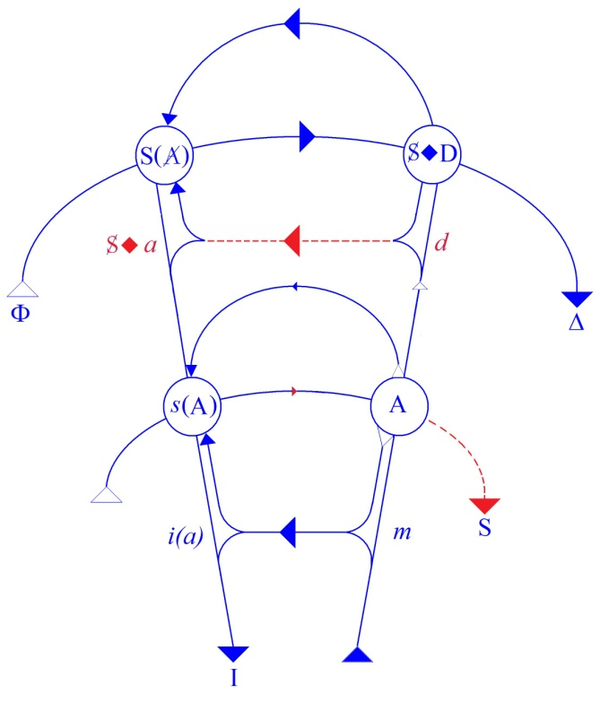

# Leçon 05 | 10 Mars 1971

  

    <label><input type="checkbox" data-lacan-toggle="original" checked> 原文</label>
    <label><input type="checkbox" data-lacan-toggle="notes" checked> 注释</label>
    <label><input type="checkbox" data-lacan-toggle="commentary" checked> 个人解读评论</label>
  

  <form class="lacan-tool-search" role="search">
    <input class="lacan-tool-search-input" type="search" placeholder="搜索全文" aria-label="搜索全文">
    <button class="lacan-tool-button" type="submit" title="搜索">搜索</button>
  </form>
  <button class="lacan-tool-button lacan-back-to-top" type="button" title="回到页面最上方" aria-label="回到页面最上方">↑</button>

<section class="parallel-paragraph" data-paragraph-ids="s18-05-0001">

s18-05-0001

原文 · s18-05-0001

*Lacan écrit au tableau* : « *L’achose* ».

[无对应译文]

</section>

<section class="parallel-paragraph" data-paragraph-ids="s18-05-0002">

s18-05-0002

原文 · s18-05-0002

Suis-je ?

[无对应译文]

</section>

<section class="parallel-paragraph" data-paragraph-ids="s18-05-0003">

s18-05-0003

原文 · s18-05-0003

Suis-je présent quand je vous parle ?

[无对应译文]

</section>

<section class="parallel-paragraph" data-paragraph-ids="s18-05-0004">

s18-05-0004

原文 · s18-05-0004

Faudrait que *la chose,* à propos de quoi je m’adresse à vous, fût là.

[无对应译文]

</section>

<section class="parallel-paragraph" data-paragraph-ids="s18-05-0005">

s18-05-0005

原文 · s18-05-0005

Or c’est assez dire que *la chose* ne puisse s’écrire que « *l’achose* », comme je viens de l’écrire au tableau, ce qui veut dire qu’elle est *absente* là où elle tient sa place.

[无对应译文]

</section>

<section class="parallel-paragraph" data-paragraph-ids="s18-05-0006">

s18-05-0006

原文 · s18-05-0006

Ou plus exactement, que l’*objet(a)* qui tient cette place, ôté – « *ôté* » : cet *objet(a) –* n’y laisse à cette place, n’y laisse que *l’acte sexuel* tel que je l’accentue, c’est-à-dire *la castration*.

[无对应译文]

</section>

<section class="parallel-paragraph" data-paragraph-ids="s18-05-0007">

s18-05-0007

原文 · s18-05-0007

Je ne puis témoigner *de là* - permettez-moi - de *là nalyse* quoi que ce soit, mais seulement *par* *là*, de ce qui « *la* » concerne...

[无对应译文]

</section>

<section class="parallel-paragraph" data-paragraph-ids="s18-05-0008">

s18-05-0008

原文 · s18-05-0008

je dis « *la* *concerne* », « *la* » : la castration ...c’est le cas de le dire : «* Oh! là là ! *» \[*Rires*\]

[无对应译文]

</section>

<section class="parallel-paragraph" data-paragraph-ids="s18-05-0009">

s18-05-0009

原文 · s18-05-0009

Le baratin philosophique c’est pas rien - le baratin ça baratte - je ne dis pas de mal, il a servi longtemps à quelque chose, mais depuis un temps il nous fatigue. Il a abouti à produire « *l’être là »,* qu’on traduit quelquefois en français plus modestement : « *la présence* », qu’on y ajoute ou non vivante, enfin bref ce qui pour les savants s’appelle le « *Dasein ».*

[无对应译文]

</section>

<section class="parallel-paragraph" data-paragraph-ids="s18-05-0010">

s18-05-0010

原文 · s18-05-0010

Je l’ai retrouvé avec plaisir dans un texte...

[无对应译文]

</section>

<section class="parallel-paragraph" data-paragraph-ids="s18-05-0011">

s18-05-0011

原文 · s18-05-0011

> je vous dirai lequel tout à l’heure, ainsi que le moment où je l’ai relu ...un texte de moi, je me suis aperçu avec surprise que ça date d’une paye cette formule que j’avais énoncée en son temps pour des gens comme ça, un peu *durs de la feuille* : « *Mange ton Dasein »* [^34]. Qu’importe ! Nous y reviendrons tout à l’heure.

[无对应译文]

</section>

<section class="parallel-paragraph" data-paragraph-ids="s18-05-0012">

s18-05-0012

原文 · s18-05-0012

Le bara­tin philosophique n’est pas si incohérent.

[无对应译文]

</section>

<section class="parallel-paragraph" data-paragraph-ids="s18-05-0013">

s18-05-0013

原文 · s18-05-0013

Il ne l’incarne cette *présence*, *l’être-là,* que dans un discours qu’il commence par justement *désincarner* par l’ἐποχή \[épokè\][^35].

[无对应译文]

</section>

<section class="parallel-paragraph" data-paragraph-ids="s18-05-0014">

s18-05-0014

原文 · s18-05-0014

Vous savez ça, l’ἐποχή*, la mise entre parenthèses*, c’est tout simple­ment ça que ça veut dire, c’est quand même mieux...

[无对应译文]

</section>

<section class="parallel-paragraph" data-paragraph-ids="s18-05-0015">

s18-05-0015

原文 · s18-05-0015

parce que ça n’a pas tout à fait la même structure ...c’est tout de même mieux en grec.

[无对应译文]

</section>

<section class="parallel-paragraph" data-paragraph-ids="s18-05-0016">

s18-05-0016

原文 · s18-05-0016

De sorte que, il est manifeste que la seule façon *d’être là* n’a lieu qu’à se mettre entre parenthèses.

[无对应译文]

</section>

<section class="parallel-paragraph" data-paragraph-ids="s18-05-0017">

s18-05-0017

原文 · s18-05-0017

Nous approchons de ce que j’ai à vous dire essentiellement aujourd’hui.

[无对应译文]

</section>

<section class="parallel-paragraph" data-paragraph-ids="s18-05-0018">

s18-05-0018

原文 · s18-05-0018

S’il y a *trou* au niveau de l’*achose,* ça vous laisse déjà pressentir que c’est peut-être une façon de le figurer ce *trou,* que ça n’arrive que sous le mode, de quoi ?...

[无对应译文]

</section>

<section class="parallel-paragraph" data-paragraph-ids="s18-05-0019">

s18-05-0019

原文 · s18-05-0019

> prenons une comparaison bien dérisoire ...que sous le mode de cette tache rétinienne dont l’œil n’a pas la moindre envie de s’empêtrer quand, après qu’il ait fixé le soleil, tout d’abord il le promène sur le paysage.

[无对应译文]

</section>

<section class="parallel-paragraph" data-paragraph-ids="s18-05-0020">

s18-05-0020

原文 · s18-05-0020

Il n’y voit pas son *être là*, hein ?, pas fou cet œil.

[无对应译文]

</section>

<section class="parallel-paragraph" data-paragraph-ids="s18-05-0021">

s18-05-0021

原文 · s18-05-0021

Il y a pour vous, toute une *bouteilles de Klein... d’œil*. \[*rires discrets*\]

[无对应译文]

</section>

<section class="parallel-paragraph" data-paragraph-ids="s18-05-0022">

s18-05-0022

原文 · s18-05-0022

Pas de bara­tin philosophique, dont vous sentez bien qu’il ne remplit là que son office uni­versitaire, dont j’ai essayé l’année dernière de vous donner les limites, en même temps d’ailleurs que les limites de ce que vous pouvez faire à l’intérieur, fût-ce la révolution.

[无对应译文]

</section>

<section class="parallel-paragraph" data-paragraph-ids="s18-05-0023">

s18-05-0023

原文 · s18-05-0023

Dénoncer...

[无对应译文]

</section>

<section class="parallel-paragraph" data-paragraph-ids="s18-05-0024">

s18-05-0024

原文 · s18-05-0024

comme ça c’est fait ...dénoncer comme *logocentriste* ladite « *pré­sence* », l’idée, comme on dit, de *la parole inspirée*, au nom de ceci que *la parole ins­pirée*, bien sûr on peut en rire, mettre à la charge de la parole toute la sottise où s’est égaré un certain discours, et nous emmener vers une mythique « *archi-écri­ture »*, uniquement constituée en somme de ce qu’on perçoit - à juste titre - comme un certain point aveugle, qu’on peut dénoncer dans tout ce qui s’est cogité sur l’écriture, ben tout ça n’avance guère...

[无对应译文]

</section>

<section class="parallel-paragraph" data-paragraph-ids="s18-05-0025">

s18-05-0025

原文 · s18-05-0025

On n’y parle jamais que *d’autre chose* pour par­ler *de l’achose.*

[无对应译文]

</section>

<section class="parallel-paragraph" data-paragraph-ids="s18-05-0026">

s18-05-0026

原文 · s18-05-0026

Ce que j’ai dit, moi, en son temps...

[无对应译文]

</section>

<section class="parallel-paragraph" data-paragraph-ids="s18-05-0027">

s18-05-0027

原文 · s18-05-0027

> faut pas abuser, j’en ai pas plein la bouche de *la parole pleine* et je pense même
>
> que la grande majorité d’entre vous ne m’ont entendu d’aucune façon en faire état ...ce que j’ai dit de *la parole pleine*, c’est qu’elle remplit...

[无对应译文]

</section>

<section class="parallel-paragraph" data-paragraph-ids="s18-05-0028">

s18-05-0028

原文 · s18-05-0028

> ça, c’est les trouvailles du langage, elles sont assez jolies toujours ...elle remplit la fonction de *l’achose* qui est au tableau.

[无对应译文]

</section>

<section class="parallel-paragraph" data-paragraph-ids="s18-05-0029">

s18-05-0029

原文 · s18-05-0029

*La parole*, en d’autres termes, *dépasse le parleur toujours, le parleur est un parlé*, *voilà* tout de même *ce que depuis un temps* *j’énonce*. D’où s’en aperçoit-on ? C’est ce que je voudrais, comme ça, indiquer dans le séminaire de cette année.

[无对应译文]

</section>

<section class="parallel-paragraph" data-paragraph-ids="s18-05-0030">

s18-05-0030

原文 · s18-05-0030

Vous vous ren­dez compte, j’en suis à « *je voudrais* », depuis 20 ans que ça dure...

[无对应译文]

</section>

<section class="parallel-paragraph" data-paragraph-ids="s18-05-0031">

s18-05-0031

原文 · s18-05-0031

Naturellement, c’est comme ça parce que, après tout je l’ai pas « *pas dit* » : *il y a long­temps que c’est patent*.

[无对应译文]

</section>

<section class="parallel-paragraph" data-paragraph-ids="s18-05-0032">

s18-05-0032

原文 · s18-05-0032

C’est patent d’abord en ce que vous êtes là, pour que je vous le montre, seulement voilà, si c’est vrai ce que je dis, votre *être-là* n’est pas plus probant que le mien.

[无对应译文]

</section>

<section class="parallel-paragraph" data-paragraph-ids="s18-05-0033">

s18-05-0033

原文 · s18-05-0033

Ce que je vous *montre* depuis un bout de temps ne suffit pas pour que vous le voyiez, il faut que je le *démontre.*

[无对应译文]

</section>

<section class="parallel-paragraph" data-paragraph-ids="s18-05-0034">

s18-05-0034

原文 · s18-05-0034

Démontrer dans l’occasion, c’est *dire* ce que je montrais. Naturellement pas n’importe quoi.

[无对应译文]

</section>

<section class="parallel-paragraph" data-paragraph-ids="s18-05-0035">

s18-05-0035

原文 · s18-05-0035

Mais je vous montrais pas *l’achose* comme ça : *l’achose* justement ça ne se montre pas, ça se démontre.

[无对应译文]

</section>

<section class="parallel-paragraph" data-paragraph-ids="s18-05-0036">

s18-05-0036

原文 · s18-05-0036

Alors je pourrai vous attirer votre attention sur des choses que je montrais, en tant que vous ne les avez pas vues, pour ce qu’elles pourraient démontrer.

[无对应译文]

</section>

<section class="parallel-paragraph" data-paragraph-ids="s18-05-0037">

s18-05-0037

原文 · s18-05-0037

Pour abattre la carte dont il s’agit aujourd’hui, nous l’appellerons, dans toute l’ambiguïté que ça peut représenter, *l’écrit.*

[无对应译文]

</section>

<section class="parallel-paragraph" data-paragraph-ids="s18-05-0038">

s18-05-0038

原文 · s18-05-0038

*L’écrit* quand même on peut pas dire que je vous en ai accablé...

[无对应译文]

</section>

<section class="parallel-paragraph" data-paragraph-ids="s18-05-0039">

s18-05-0039

原文 · s18-05-0039

Je veux dire qu’il a vraiment fallu qu’on me les extraie ceux que j’ai rassemblés un beau jour \[« *Écrits »,* 1966\], dans l’incapacité en somme totale où j’étais de me faire entendre des psychana­lystes, j’entends : même de ceux-là qui étaient restés agrégés \[*sic*\], comme ça, parce qu’ils avaient pas pu s’embarquer ailleurs.

[无对应译文]

</section>

<section class="parallel-paragraph" data-paragraph-ids="s18-05-0040">

s18-05-0040

原文 · s18-05-0040

À la fin des fins, il m’est apparu qu’il y avait tellement d’autres gens qu’eux qui s’intéressaient à ce que je disais, un petit commencement de votre *être-là* absent, que ces « *Écrits »* je les ai lâchés.

[无对应译文]

</section>

<section class="parallel-paragraph" data-paragraph-ids="s18-05-0041">

s18-05-0041

原文 · s18-05-0041

Et puis ma foi, ils se sont consommés dans un beaucoup plus vaste cercle que, en somme, ce que vous représentez, si j’en crois les chiffres que me donne mon éditeur.

[无对应译文]

</section>

<section class="parallel-paragraph" data-paragraph-ids="s18-05-0042">

s18-05-0042

原文 · s18-05-0042

C’est un drôle de phénomène, et qui vaut bien qu’on s’y arrête, si tant est que pour m’en tenir à ce que je fais toujours, c’est très exacte­ment autour d’une expérience parfaitement fixable et qu’en tout cas je me suis efforcé d’articuler, précisément aux derniers temps, l’année dernière, en essayant de *situer dans sa structure ce qui caractérise le* *discours de l’analyste*.

[无对应译文]

</section>

<section class="parallel-paragraph" data-paragraph-ids="s18-05-0043">

s18-05-0043

原文 · s18-05-0043

[无对应译文]

</section>

<section class="parallel-paragraph" data-paragraph-ids="s18-05-0044">

s18-05-0044

原文 · s18-05-0044

C’est donc en raison de cet emploi, le mien, qui n’a aucune prétention à fournir *une concep­tion du monde*, mais seulement de dire ce qu’il me semble qu’il va de soi de pou­voir dire à des analystes.

[无对应译文]

</section>

<section class="parallel-paragraph" data-paragraph-ids="s18-05-0045">

s18-05-0045

原文 · s18-05-0045

Autour de ça, j’ai fait pendant 10 ans, dans un endroit assez connu qui s’appelle *Sainte-Anne,* un discours qui ne prétendait certes d’aucune façon à user de *l’écrit* autrement que d’une façon *très précise*, qui est celle que je vais essayer aujourd’hui de définir.

[无对应译文]

</section>

<section class="parallel-paragraph" data-paragraph-ids="s18-05-0046">

s18-05-0046

原文 · s18-05-0046

Ceux qui en constituent ce qui reste de témoins de cette époque, ne peuvent pas s’élever contre...

[无对应译文]

</section>

<section class="parallel-paragraph" data-paragraph-ids="s18-05-0047">

s18-05-0047

原文 · s18-05-0047

> il n’y en a tout de même plus beaucoup dans cette salle, bien sûr, mais tout de même quelques-uns.
>
> Oh mais ça doit pas se compter sur les doigts de la main ceux qui étaient là les premiers mois ...ils peuvent témoigner que ce que j’y ai fait, avec une patience, un ménagement, une douceur, des ronds de bras, des ronds de jambe, j’ai construit pour eux pièce à pièce, et morceau par morceau, des choses qui s’appellent des *graphes.*

[无对应译文]

</section>

<section class="parallel-paragraph" data-paragraph-ids="s18-05-0048">

s18-05-0048

原文 · s18-05-0048

Il y en a quelques-uns qui voguent, vous pouvez les retrouver très faci­lement grâce au travail de quelqu’un, au dévouement duquel je fais hommage, et auquel j’ai laissé faire, complètement à son gré, un index raisonné, dans le texte duquel vous pouvez trouver aisément à quelles pages on trouve ces *graphes*.

[无对应译文]

</section>

<section class="parallel-paragraph" data-paragraph-ids="s18-05-0049">

s18-05-0049

原文 · s18-05-0049

Ça vous évitera de fouiller. Mais ça se voit, rien qu’en faisant ça on peut déjà remar­quer qu’il y a des choses qui ne sont pas comme le reste du texte imprimé.

[无对应译文]

</section>

<section class="parallel-paragraph" data-paragraph-ids="s18-05-0050">

s18-05-0050

原文 · s18-05-0050

Ces *graphes* que vous voyez là ne sont pas, bien sûr, sans offrir *une petite difficulté* - de quoi ? - mais *d’interprétation*, bien sûr. Sachez que, pour ceux pour qui je les ai construits, ça pouvait pas même faire un pli : avant d’avancer la direction d’une ligne, son croisement avec telle autre, l’indication de la petite lettre que je mettais à ce croisement, je parlais une demi-heure, trois-quarts d’heure, pour justifier ce dont il s’agissait.

[无对应译文]

</section>

<section class="parallel-paragraph" data-paragraph-ids="s18-05-0051">

s18-05-0051

原文 · s18-05-0051

J’insiste, bien sûr non pas pour me faire un mérite de ce que j’ai fait...

[无对应译文]

</section>

<section class="parallel-paragraph" data-paragraph-ids="s18-05-0052">

s18-05-0052

原文 · s18-05-0052

> dans le fond parce que ça m’a plu, personne ne me le demandait, c’est même plutôt le contraire \[*Rires*\] ...mais parce que nous entrons là, avec ça, au vif de ce que sur *l’écrit*, voire sur *l’écriture*... alors figurez-vous que c’est la même chose : on parle de l’écriture comme ça, comme si c’était indépendant de l’écrit, c’est ce qui rend quelquefois le discours très embarrassé.

[无对应译文]

</section>

<section class="parallel-paragraph" data-paragraph-ids="s18-05-0053">

s18-05-0053

原文 · s18-05-0053

D’ailleurs ce terme « *ure* », comme ça, qui s’ajoute, fait bien sentir, enfin de quelle drôle de *biture* il s’agit en l’occasion.

[无对应译文]

</section>

<section class="parallel-paragraph" data-paragraph-ids="s18-05-0054">

s18-05-0054

原文 · s18-05-0054

Ce qu’il y a de certain, c’est que pour parler de *l’achose* comme elle est là, eh ben ça devrait déjà, à soi tout seul, vous éclairer que j’ai dû prendre - ne disons rien de plus - pour *appareil* le support de *l’écrit*, sous la forme du *graphe*.

[无对应译文]

</section>

<section class="parallel-paragraph" data-paragraph-ids="s18-05-0055">

s18-05-0055

原文 · s18-05-0055

La forme du *graphe*, ça vaut la peine de la regarder. Prenons là - je ne sais pas, n’importe lequel, le dernier là, le grand, celui que vous allez trouver - je ne sais plus où, moi, où il est, où il vogue - je crois que c’est dans *« Subversion du sujet et Dialectique du désir ».* [^36]

[无对应译文]

</section>

<section class="parallel-paragraph" data-paragraph-ids="s18-05-0056">

s18-05-0056

原文 · s18-05-0056

[无对应译文]

</section>

<section class="parallel-paragraph" data-paragraph-ids="s18-05-0057">

s18-05-0057

原文 · s18-05-0057

Le machin qui fait comme ça, dans lequel ici il y a les lettres ajoutées entre parenthèses :

[无对应译文]

</section>

<section class="parallel-paragraph" data-paragraph-ids="s18-05-0058">

s18-05-0058

原文 · s18-05-0058

- S *poinçon* ◊ et le *grand* D de *la demande* : S ◊ D,

[无对应译文]

</section>

<section class="parallel-paragraph" data-paragraph-ids="s18-05-0059">

s18-05-0059

原文 · s18-05-0059

- et ici le *grand* S du *signifiant*, le *Signifiant* porteur, fonction de l’A barré : S(A).

[无对应译文]

</section>

<section class="parallel-paragraph" data-paragraph-ids="s18-05-0060">

s18-05-0060

原文 · s18-05-0060

Vous comprenez bien que si l’écriture ça peut servir à quelque chose, c’est justement que c’est différent de la parole, de la parole qui peut «* s’appuyer sur *». La parole ne traduit pas S(A) par exemple.

[无对应译文]

</section>

<section class="parallel-paragraph" data-paragraph-ids="s18-05-0061">

s18-05-0061

原文 · s18-05-0061

Seulement si elle *s’appuie* sur ça, ne serait-ce que cette forme, bien sûr, elle doit se souvenir que cette forme ne va pas sans qu’ici l’autre ligne recoupant la 1ère se marque à ces points d’intersection du *s*(A) et du A lui-même.

[无对应译文]

</section>

<section class="parallel-paragraph" data-paragraph-ids="s18-05-0062">

s18-05-0062

原文 · s18-05-0062

Qu’il y ait ici un grand I...

[无对应译文]

</section>

<section class="parallel-paragraph" data-paragraph-ids="s18-05-0063">

s18-05-0063

原文 · s18-05-0063

> je m’excuse de ces empiétements, mais après tout certains ont assez cette figure dans la tête
>
> pour que ça leur suffise et pour les autres - mon Dieu - qu’ils se reportent à la bonne page ...ce qu’il y a de certain c’est qu’on ne peut pas ne pas au moins - par là, par cette figure - se sentir disons sollicités de répondre à l’exigence de ce qu’elle commande, quand vous commencez de l’interpréter.

[无对应译文]

</section>

<section class="parallel-paragraph" data-paragraph-ids="s18-05-0064">

s18-05-0064

原文 · s18-05-0064

Tout dépend bien sûr du sens que vous allez donner au grand A.

[无对应译文]

</section>

<section class="parallel-paragraph" data-paragraph-ids="s18-05-0065">

s18-05-0065

原文 · s18-05-0065

Il y en a un de proposé dans l’écrit où il se trouve que je l’ai inséré.

[无对应译文]

</section>

<section class="parallel-paragraph" data-paragraph-ids="s18-05-0066">

s18-05-0066

原文 · s18-05-0066

Et alors les sens qui s’imposent pour tous les autres ne sont pas libres d’un grand écart.

[无对应译文]

</section>

<section class="parallel-paragraph" data-paragraph-ids="s18-05-0067">

s18-05-0067

原文 · s18-05-0067

Ce qui est certain c’est que c’est le propre de ce qui - enfin, je pense - vous apparaît certes, depuis, suffisamment précisé, à savoir *que ce graphe*...

[无对应译文]

</section>

<section class="parallel-paragraph" data-paragraph-ids="s18-05-0068">

s18-05-0068

原文 · s18-05-0068

> celui-là comme tous les autres, et pas seulement les miens, je vais vous dire ça dans un instant ...*que ce graphe*, *ce que ça représente* *c’est ce qu’on appelle*...

[无对应译文]

</section>

<section class="parallel-paragraph" data-paragraph-ids="s18-05-0069">

s18-05-0069

原文 · s18-05-0069

> dans le lan­gage évolué que nous a peu à peu donné *le questionnement de la mathématique par* *la logique...*ce qu’on appelle *une topologie.*

[无对应译文]

</section>

<section class="parallel-paragraph" data-paragraph-ids="s18-05-0070">

s18-05-0070

原文 · s18-05-0070

Pas de *topologie* sans écriture.

[无对应译文]

</section>

<section class="parallel-paragraph" data-paragraph-ids="s18-05-0071">

s18-05-0071

原文 · s18-05-0071

Vous avez peut-être même pu remarquer, si jamais vous êtes vraiment allés ouvrir les « *Analytiques »* d’Aristote, que là il y a un petit commencement de la topologie, et que ça consiste précisément à *faire des trous dans l’écrit*.

[无对应译文]

</section>

<section class="parallel-paragraph" data-paragraph-ids="s18-05-0072">

s18-05-0072

原文 · s18-05-0072

« *Tous les animaux sont mortels* » : vous soufflez « *les animaux* » et vous soufflez « *mortels* », et vous mettez à la place *le comble de l’écrit*, ici une lettre toute simple : ∀.

[无对应译文]

</section>

<section class="parallel-paragraph" data-paragraph-ids="s18-05-0073">

s18-05-0073

原文 · s18-05-0073

C’est peut-être ben vrai que ça leur a été facilité par je ne sais quelle affinité particulière qu’ils avaient avec *la lettre*, on ne peut pas bien dire comment.

[无对应译文]

</section>

<section class="parallel-paragraph" data-paragraph-ids="s18-05-0074">

s18-05-0074

原文 · s18-05-0074

Là-dessus vous pouvez vous reporter à des choses très, très attachantes, comme l’a dit M. James Février [^37], sur je ne sais quel artifice, truquage, forçage, que constitue au regard de ce qu’on peut assez sainement appeler *« les normes de l’écriture »*...

[无对应译文]

</section>

<section class="parallel-paragraph" data-paragraph-ids="s18-05-0075">

s18-05-0075

原文 · s18-05-0075

> *les* *normes*, pas l’énorme, quoique les deux soient vrais ...au regard « *des normes de l’écriture »,* l’invention de la logique.

[无对应译文]

</section>

<section class="parallel-paragraph" data-paragraph-ids="s18-05-0076">

s18-05-0076

原文 · s18-05-0076

Je vous suggère en passant, aujourd’hui ceci : c’est que ça a quelque chose à faire avec le fait, disons d’Euclide.

[无对应译文]

</section>

<section class="parallel-paragraph" data-paragraph-ids="s18-05-0077">

s18-05-0077

原文 · s18-05-0077

Voilà, parce que je peux vous jeter ça qu’en passant, puisque après tout c’est à contrôler, je ne vois pas pourquoi moi aussi, pourquoi de temps en temps, je ne ferais pas...

[无对应译文]

</section>

<section class="parallel-paragraph" data-paragraph-ids="s18-05-0078">

s18-05-0078

原文 · s18-05-0078

> même aux gens très calés dans une certaine matière ...comme ça, *une petite suggestion* dont ils riront peut-être parce qu’ils s’en seront aperçus depuis longtemps.

[无对应译文]

</section>

<section class="parallel-paragraph" data-paragraph-ids="s18-05-0079">

s18-05-0079

原文 · s18-05-0079

On ne voit pas pourquoi en effet ils s’en seraient pas aperçus, ils ne se seraient pas aperçus de ceci : qu’un *triangle*...

[无对应译文]

</section>

<section class="parallel-paragraph" data-paragraph-ids="s18-05-0080">

s18-05-0080

原文 · s18-05-0080

> puisque c’est ça le départ ...qu’un *tri­angle,* c’est pas autre chose...

[无对应译文]

</section>

<section class="parallel-paragraph" data-paragraph-ids="s18-05-0081">

s18-05-0081

原文 · s18-05-0081

> mais rien d’autre, hein ...*qu’une écriture*, ou *un écrit* exac­tement.

[无对应译文]

</section>

<section class="parallel-paragraph" data-paragraph-ids="s18-05-0082">

s18-05-0082

原文 · s18-05-0082

Et que c’est pas parce que on y définit « *égal »* comme *« métriquement superposable »* que ça va contre.

[无对应译文]

</section>

<section class="parallel-paragraph" data-paragraph-ids="s18-05-0083">

s18-05-0083

原文 · s18-05-0083

C’est un *écrit,* où le métriquement superposable est jaspinable.

[无对应译文]

</section>

<section class="parallel-paragraph" data-paragraph-ids="s18-05-0084">

s18-05-0084

原文 · s18-05-0084

Ce qui ne dépend absolument pas de l’écrit, ce qui dépend de vous, les jaspineurs.

[无对应译文]

</section>

<section class="parallel-paragraph" data-paragraph-ids="s18-05-0085">

s18-05-0085

原文 · s18-05-0085

De quelque façon que vous écriviez le triangle, même si vous le faites comme ça, vous démontrerez l’histoire du *triangle isocèle*, à savoir que s’il a deux cotés égaux, les deux autres angles sont égaux.

[无对应译文]

</section>

<section class="parallel-paragraph" data-paragraph-ids="s18-05-0086">

s18-05-0086

原文 · s18-05-0086

Il vous suffit de l’avoir fait ce petit écrit, parce que c’est jamais beaucoup meilleur que la façon dont je viens de l’écrire, la figure d’un *triangle isocèle*. C’étaient des gens qui avaient des dons pour l’écrit, hein ! Ça va pas loin ça !

[无对应译文]

</section>

<section class="parallel-paragraph" data-paragraph-ids="s18-05-0087">

s18-05-0087

原文 · s18-05-0087

On pourrait peut-être aller un peu plus loin.

[无对应译文]

</section>

<section class="parallel-paragraph" data-paragraph-ids="s18-05-0088">

s18-05-0088

原文 · s18-05-0088

Enfin pour l’instant enregistrons ceci en tout cas, c’est qu’ils se sont très bien aperçus de ce que ce n’était qu’un *postulat*, et que ça n’a pas d’autre définition que ceci : c’est que c’est dans la demande...

[无对应译文]

</section>

<section class="parallel-paragraph" data-paragraph-ids="s18-05-0089">

s18-05-0089

原文 · s18-05-0089

> dans la demande qu’on fait à l’auditeur : *il ne faut pas tout de suite dire* « *crochet !* » ...dans cette demande, c’est ce qui ne s’impose pas au dis­cours du seul fait du graphe.

[无对应译文]

</section>

<section class="parallel-paragraph" data-paragraph-ids="s18-05-0090">

s18-05-0090

原文 · s18-05-0090

Les Grecs semblent donc avoir eu un maniement très astucieux, une réduc­tion subtile de ce qui déjà courait le monde sous les espèces de *l’écriture*. Ça servait vachement. Il est tout à fait clair qu’il n’est pas question d’empire, et si vous me permettez *le mot,* même du moindre *empirisme,* sans le support de l’écriture.

[无对应译文]

</section>

<section class="parallel-paragraph" data-paragraph-ids="s18-05-0091">

s18-05-0091

原文 · s18-05-0091

Si vous me permettez là *une extrapolation* par rapport à la veine que je suis, je veux dire que je vais vous indiquer *l’horizon*, la visée lointaine, qui guide tout ça. Bien sûr, ça ne se justifie que *si les lignes perspectives s’avèrent converger* *effectivement*.

[无对应译文]

</section>

<section class="parallel-paragraph" data-paragraph-ids="s18-05-0092">

s18-05-0092

原文 · s18-05-0092

C’est la suite qui vous le montrera.

[无对应译文]

</section>

<section class="parallel-paragraph" data-paragraph-ids="s18-05-0093">

s18-05-0093

原文 · s18-05-0093

« *Au commence­ment*, έν αρχῆ \[en archéi\], comme ils disent - ce qui n’a rien à faire avec quelque tem­poralité que ce soit, puisqu’elle en découle

[无对应译文]

</section>

<section class="parallel-paragraph" data-paragraph-ids="s18-05-0094">

s18-05-0094

原文 · s18-05-0094

« *Au commencement est la parole* ».

[无对应译文]

</section>

<section class="parallel-paragraph" data-paragraph-ids="s18-05-0095">

s18-05-0095

原文 · s18-05-0095

Mais *la parole*, il y a tout de même bien des chances que pendant des temps qui n’étaient pas encore des siècles...

[无对应译文]

</section>

<section class="parallel-paragraph" data-paragraph-ids="s18-05-0096">

s18-05-0096

原文 · s18-05-0096

> figurez-vous, ce ne sont des siècles que pour nous, grâce au carbone radiant
>
> et à quelques autres histoires de cette espèce, rétroactives, qui partent de l’écriture ...enfin pendant un bout de quelque chose qu’on peut appeler - pas le temps - l’αἰών \[aiôn\][^38], l’αἰών des αἰών comme ils disent, il y avait un temps où on se gargarisait avec des trucs comme ça.

[无对应译文]

</section>

<section class="parallel-paragraph" data-paragraph-ids="s18-05-0097">

s18-05-0097

原文 · s18-05-0097

Ils avaient bien leurs raisons, ils étaient plus près que nous.

[无对应译文]

</section>

<section class="parallel-paragraph" data-paragraph-ids="s18-05-0098">

s18-05-0098

原文 · s18-05-0098

Enfin *la parole* a fait des choses, des choses qui étaient sûrement de moins en moins discernables d’elle, de ce qu’elles \[*ces choses*\] étaient ses effets.

[无对应译文]

</section>

<section class="parallel-paragraph" data-paragraph-ids="s18-05-0099">

s18-05-0099

原文 · s18-05-0099

Qu’est-ce que ça veut dire l’écriture ? Faut quand même cerner un peu.

[无对应译文]

</section>

<section class="parallel-paragraph" data-paragraph-ids="s18-05-0100">

s18-05-0100

原文 · s18-05-0100

Il est tout à fait clair et certain, quand on voit ce qu’il est courant d’appeler l’*écriture,* que *c’est quelque chose qui* en quelque sorte *se répercute sur la parole*. \[**42’ 10’’**\]

[无对应译文]

</section>

<section class="parallel-paragraph" data-paragraph-ids="s18-05-0101">

s18-05-0101

原文 · s18-05-0101

Sur *l’habitat de la parole*, nous avons, je pense, assez déjà les dernières fois dit des choses, pour voir que notre découverte à tout le moins ça s’articule étroitement avec le fait *qu’il n’y a pas de rapport sexuel*, tel que je l’ai défini.

[无对应译文]

</section>

<section class="parallel-paragraph" data-paragraph-ids="s18-05-0102">

s18-05-0102

原文 · s18-05-0102

Ou, si vous vou­lez, que *le rapport sexuel c’est la parole elle-même*.

[无对应译文]

</section>

<section class="parallel-paragraph" data-paragraph-ids="s18-05-0103">

s18-05-0103

原文 · s18-05-0103

Avouez que quand même ça laisse un peu à désirer, d’ailleurs je pense que vous en savez un bout, hein ?

[无对应译文]

</section>

<section class="parallel-paragraph" data-paragraph-ids="s18-05-0104">

s18-05-0104

原文 · s18-05-0104

Qu’il n’y ait pas de rapport sexuel, je l’ai déjà fixé sous cette forme qu’il n’y a de relation, aucun mode *actuellement*.

[无对应译文]

</section>

<section class="parallel-paragraph" data-paragraph-ids="s18-05-0105">

s18-05-0105

原文 · s18-05-0105

Qui sait, il y a des gens qui rêvent qu’un jour ça s’écrira : pourquoi pas - hein ? - les progrès de la biologie...

[无对应译文]

</section>

<section class="parallel-paragraph" data-paragraph-ids="s18-05-0106">

s18-05-0106

原文 · s18-05-0106

M. Jacob est tout de même là, un peu ?

[无对应译文]

</section>

<section class="parallel-paragraph" data-paragraph-ids="s18-05-0107">

s18-05-0107

原文 · s18-05-0107

Peut-être qu’un jour, il n’y aura plus la moindre question sur *le spermato et l’ovule*, ils sont faits l’un pour l’autre, *ça sera écrit*, comme on dit, c’est là-dessus que j’ai terminé la leçon de la dernière fois.

[无对应译文]

</section>

<section class="parallel-paragraph" data-paragraph-ids="s18-05-0108">

s18-05-0108

原文 · s18-05-0108

À ce moment-là vous m’en direz des nouvelles, n’est-ce pas ?

[无对应译文]

</section>

<section class="parallel-paragraph" data-paragraph-ids="s18-05-0109">

s18-05-0109

原文 · s18-05-0109

On peut faire de la science-fiction, hein ?

[无对应译文]

</section>

<section class="parallel-paragraph" data-paragraph-ids="s18-05-0110">

s18-05-0110

原文 · s18-05-0110

Essayez celle-là, c’est difficile à écrire.

[无对应译文]

</section>

<section class="parallel-paragraph" data-paragraph-ids="s18-05-0111">

s18-05-0111

原文 · s18-05-0111

Pourquoi pas, c’est comme ça qu’on fait avancer les choses.

[无对应译文]

</section>

<section class="parallel-paragraph" data-paragraph-ids="s18-05-0112">

s18-05-0112

原文 · s18-05-0112

Quoi qu’il en soit *actuellement*, c’est ce que je veux dire, c’est que ça ne peut pas s’écrire sans faire entrer en fonction quelque chose d’un peu drôle - parce que justement on ne sait rien de son sexe - ce qui s’appelle le *phallus*.

[无对应译文]

</section>

<section class="parallel-paragraph" data-paragraph-ids="s18-05-0113">

s18-05-0113

原文 · s18-05-0113

Si tout ce qu’on arrive à écrire - je remercie la personne qui m’a donné la page où dans mes « *Écrits »* [^39] il y a ce qu’il en est du désir de l’homme, écrit *grand phi de (a)* : Φ*(a)*, Φ c’est *le signifiant* *phallus*, ceci pour les personnes qui croient que le *phallus*, c’est « *le manque de signifiant* », je sais que ça se discute dans les cartels. Voilà !

[无对应译文]

</section>

<section class="parallel-paragraph" data-paragraph-ids="s18-05-0114">

s18-05-0114

原文 · s18-05-0114

Et le désir de la femme...

[无对应译文]

</section>

<section class="parallel-paragraph" data-paragraph-ids="s18-05-0115">

s18-05-0115

原文 · s18-05-0115

> je m’en fous moi des « *Écrits »,* hein ? ...ça s’écrit A barré parenthèse du phi : A(φ) qui est le phallus là où on s’*imagine* qu’il est : le petit pipi.

[无对应译文]

</section>

<section class="parallel-paragraph" data-paragraph-ids="s18-05-0116">

s18-05-0116

原文 · s18-05-0116

Voilà ce qu’on arrive à écrire de mieux après - mon Dieu ! - quelque chose que nous appellerons simplement au nom de ce ça est, comme ça, le fait d’être parvenu à un certain *« moment scientifique »*. Un *moment scientifique*, ça se caractérise par un certain nombre de coordonnées écrites au premier rang desquelles *la for­mule* que M. Newton a écrite \[F = G(m1 m2/d2\], concernant ce dont il s’agit sous le nom de « *champ de la gravitation »*, qui est un pur écrit.

[无对应译文]

</section>

<section class="parallel-paragraph" data-paragraph-ids="s18-05-0117">

s18-05-0117

原文 · s18-05-0117

Personne n’est encore arrivé à donner un support substantiel quelconque, une ombre de vraisemblance à ce qu’énonce cet écrit, qui semble jusqu’à présent être un peu dur car on n’arrive pas à le résorber dans un schéma d’autres champs où, comme ça, on a des idées plus substantielles. Le *champ électromagnétique* ça fait image, hein ?

[无对应译文]

</section>

<section class="parallel-paragraph" data-paragraph-ids="s18-05-0118">

s18-05-0118

原文 · s18-05-0118

Le magné­tisme, c’est toujours un peu animal, le *champ de la gravitation* lui, l’est pas. C’est un drôle de machin.

[无对应译文]

</section>

<section class="parallel-paragraph" data-paragraph-ids="s18-05-0119">

s18-05-0119

原文 · s18-05-0119

Quand je pense que ces Messieurs-là, et bientôt ces Mes­sieurs-Dames qui se baladaient dans *cet endroit absolument sublime*, qui est cer­tainement une des incarnations de l’objet sexuel, la lune, quand je pense qu’ils y vont simplement portés par un écrit, ça laisse beaucoup d’espoir. Même dans le champ où ça pourrait nous servir, à savoir pour baiser.

[无对应译文]

</section>

<section class="parallel-paragraph" data-paragraph-ids="s18-05-0120">

s18-05-0120

原文 · s18-05-0120

Enfin, c’est pas pour demain, hein ? Malgré la psychanalyse, c’est pas pour demain.

[无对应译文]

</section>

<section class="parallel-paragraph" data-paragraph-ids="s18-05-0121">

s18-05-0121

原文 · s18-05-0121

Voilà donc *l’écrit*, en tant que c’est *quelque chose* dont on peut *parler*. En quoi ?

[无对应译文]

</section>

<section class="parallel-paragraph" data-paragraph-ids="s18-05-0122">

s18-05-0122

原文 · s18-05-0122

Il y a quelque chose dont je m’étonne...

[无对应译文]

</section>

<section class="parallel-paragraph" data-paragraph-ids="s18-05-0123">

s18-05-0123

原文 · s18-05-0123

encore que justement ça vient sous la plume ...il y a un sacré bouquin qui est paru chez Armand Colin, enfin c’est vrai­ment tout ce qu’il y a de plus facile à trouver, c’est dans je ne sais quel com­bientième *Congrès de Synthèse*, et ça s’appelle, tout simplement, tout gentiment « *L’écriture »* [^40].

[无对应译文]

</section>

<section class="parallel-paragraph" data-paragraph-ids="s18-05-0124">

s18-05-0124

原文 · s18-05-0124

C’est une suite de rapports qui commence par un de Métraux[^41]...

[无对应译文]

</section>

<section class="parallel-paragraph" data-paragraph-ids="s18-05-0125">

s18-05-0125

原文 · s18-05-0125

notre cher et défunt Métraux, qui était un homme excellent et vraiment astucieux ...ça com­mence par un truc de Métraux où il parle beaucoup de l’écriture de l’île de Pâques, enfin, c’est ravissant.

[无对应译文]

</section>

<section class="parallel-paragraph" data-paragraph-ids="s18-05-0126">

s18-05-0126

原文 · s18-05-0126

Il part simplement du fait qu’il n’y a vraiment absolument rien compris quant à lui, mais qu’il y en a quelques autres qui ont un peu mieux réussi, que naturellement c’est discutable mais enfin que *ses efforts*...

[无对应译文]

</section>

<section class="parallel-paragraph" data-paragraph-ids="s18-05-0127">

s18-05-0127

原文 · s18-05-0127

> qui manifestement ont été absolument sans succès ...soient là ce qui l’autorise à parler en effet de ce que les autres ont pu en tirer avec un succès dis­cutable, c’est tout à fait une introduction merveilleuse et bien faite pour vous placer sur le plan de la modestie, à la suite de quoi, d’innombrables communi­cations se font sur chacune des écritures.

[无对应译文]

</section>

<section class="parallel-paragraph" data-paragraph-ids="s18-05-0128">

s18-05-0128

原文 · s18-05-0128

Et après tout - mon Dieu - c’est assez sensé.

[无对应译文]

</section>

<section class="parallel-paragraph" data-paragraph-ids="s18-05-0129">

s18-05-0129

原文 · s18-05-0129

C’est assez sensé, c’est certainement... enfin, ça n’est pas venu tout de suite, ça n’est pas venu tout de suite et nous allons voir pourquoi, ça n’est pas venu tout de suite qu’on dise des choses assez sensées sur l’écriture.

[无对应译文]

</section>

<section class="parallel-paragraph" data-paragraph-ids="s18-05-0130">

s18-05-0130

原文 · s18-05-0130

Il a fallu sûrement, pendant ce temps-là, de sérieux effets d’intimidation qui sont de ceux qui résultent de cette sacrée aventure que nous appelons « *la science »*, et il n’y a pas un seul d’entre nous dans cette salle...

[无对应译文]

</section>

<section class="parallel-paragraph" data-paragraph-ids="s18-05-0131">

s18-05-0131

原文 · s18-05-0131

moi y compris bien sûr ...qui peut avoir la moindre espèce d’idée de ce qui va en arri­ver. Bon ! enfin, passons… On va s’agiter un petit peu comme ça autour de la pol­lution, de l’avenir, un certain nombre de foutaises comme ça, et la science joue quelques petites farces, pour lesquelles il ne serait dans le fond pas tout à fait inutile de voir bien par exemple quel est son rapport avec l’écriture, ça pourrait servir.

[无对应译文]

</section>

<section class="parallel-paragraph" data-paragraph-ids="s18-05-0132">

s18-05-0132

原文 · s18-05-0132

Quoi qu’il en soit, la lecture de ce grand recueil, qui date déjà d’une bonne dizaine d’années, sur l’écriture, est quelque chose - au regard de ce qui se pond dans la linguistique - de véritablement aéré, on respire.

[无对应译文]

</section>

<section class="parallel-paragraph" data-paragraph-ids="s18-05-0133">

s18-05-0133

原文 · s18-05-0133

C’est pas la connerie absolue... c’est même très salubre.

[无对应译文]

</section>

<section class="parallel-paragraph" data-paragraph-ids="s18-05-0134">

s18-05-0134

原文 · s18-05-0134

Il n’est même pas question, au sortir de là, qu’il vous vienne à l’idée que *l’affaire de l’écriture* ne consiste pas en ceci...

[无对应译文]

</section>

<section class="parallel-paragraph" data-paragraph-ids="s18-05-0135">

s18-05-0135

原文 · s18-05-0135

> qui n’a l’air de rien comme ça, mais comme c’est écrit partout et que personne ne le lit,
>
> ça vaut quand même la peine d’être dit ...que *l’écriture c’est des représentations de mots*. Ça devrait quand même vous dire quelque chose : « *Wortvorstellung ».*

[无对应译文]

</section>

<section class="parallel-paragraph" data-paragraph-ids="s18-05-0136">

s18-05-0136

原文 · s18-05-0136

Freud écrit ça, et il dit que...

[无对应译文]

</section>

<section class="parallel-paragraph" data-paragraph-ids="s18-05-0137">

s18-05-0137

原文 · s18-05-0137

> mais naturellement tout le monde rigole, et on voit bien que Freud n’est pas d’accord avec Lacan ...c’est « *le processus secondaire* ».

[无对应译文]

</section>

<section class="parallel-paragraph" data-paragraph-ids="s18-05-0138">

s18-05-0138

原文 · s18-05-0138

C’est quand même embêtant que, comme ça, dans la circulation peut-être dans vos pensées...

[无对应译文]

</section>

<section class="parallel-paragraph" data-paragraph-ids="s18-05-0139">

s18-05-0139

原文 · s18-05-0139

- bien sûr vous avez des pensées,

[无对应译文]

</section>

<section class="parallel-paragraph" data-paragraph-ids="s18-05-0140">

s18-05-0140

原文 · s18-05-0140

- vous avez - même certains, un peu arriérés - des *connaissances.* ...alors vous vous imaginez que vous vous représentez des mots, c’est à se tordre ! \[*Rires*\]

[无对应译文]

</section>

<section class="parallel-paragraph" data-paragraph-ids="s18-05-0141">

s18-05-0141

原文 · s18-05-0141

Parce que soyons sérieux : *<u>la représentation de mots, c’est l’écriture</u>* !

[无对应译文]

</section>

<section class="parallel-paragraph" data-paragraph-ids="s18-05-0142">

s18-05-0142

原文 · s18-05-0142

Et cette chose simple comme bonjour, il me semble qu’on n’en a pas tiré les conséquences qui sont pourtant là visibles, c’est que de toutes les langues qui usent de quelque chose qu’on peut prendre pour des figures, et alors qu’on appelle je ne sais comment « *des pictogrammes », « des idéogrammes »*, c’est incroyable...

[无对应译文]

</section>

<section class="parallel-paragraph" data-paragraph-ids="s18-05-0143">

s18-05-0143

原文 · s18-05-0143

Ça a abouti à des conséquences absolument folles : il y a des gens qui se sont imaginé que, avec de *la logique*...

[无对应译文]

</section>

<section class="parallel-paragraph" data-paragraph-ids="s18-05-0144">

s18-05-0144

原文 · s18-05-0144

> c’est-à-dire de la manipulation de l’écri­ture ...on trouverait un moyen pour avoir - quoi ? - « *new ideas* » \[*avec l’ironie d’une voix de fausset*\], de nouvelles idées.

[无对应译文]

</section>

<section class="parallel-paragraph" data-paragraph-ids="s18-05-0145">

s18-05-0145

原文 · s18-05-0145

Comme s’il n’y en avait pas déjà assez comme ça !

[无对应译文]

</section>

<section class="parallel-paragraph" data-paragraph-ids="s18-05-0146">

s18-05-0146

原文 · s18-05-0146

Mais enfin quel qu’il soit, ce *pictogramme*, cet *idéogramme*, si nous étudions une écriture, c’est uniquement en ceci \- il n’y a aucune exception - c’est que *du fait de ce qu’il a l’air de figurer*, il se prononce comme ça.

[无对应译文]

</section>

<section class="parallel-paragraph" data-paragraph-ids="s18-05-0147">

s18-05-0147

原文 · s18-05-0147

Du fait qu’*il a l’air de figurer* votre maman avec deux tétines :母 il se prononce *mǔ*[^42].

[无对应译文]

</section>

<section class="parallel-paragraph" data-paragraph-ids="s18-05-0148">

s18-05-0148

原文 · s18-05-0148

Et après ça, vous en faites tout ce que vous voulez, tout ce qui se prononce *mǔ.*

[无对应译文]

</section>

<section class="parallel-paragraph" data-paragraph-ids="s18-05-0149">

s18-05-0149

原文 · s18-05-0149

Alors qu’est-ce que ça peut foutre qu’il ait deux tétines et qu’il soit votre maman en figure ?

[无对应译文]

</section>

<section class="parallel-paragraph" data-paragraph-ids="s18-05-0150">

s18-05-0150

原文 · s18-05-0150

II y a un nommé je ne sais plus comment, 许慎 Xu-Shen[^43], ça date pas d’hier, vous comprenez, vous trouverez ça à peu près au début de l’ère chrétienne, ça s’appelle le « *Shuowen jiezi* » 说文解字.

[无对应译文]

</section>

<section class="parallel-paragraph" data-paragraph-ids="s18-05-0151">

s18-05-0151

原文 · s18-05-0151

C’est-à-dire, justement, le *« ce qui se dit en tant qu’écit ».*

[无对应译文]

</section>

<section class="parallel-paragraph" data-paragraph-ids="s18-05-0152">

s18-05-0152

原文 · s18-05-0152

Car 文 *wen,* c’est « *écrit* », hein ? Voilà !

[无对应译文]

</section>

<section class="parallel-paragraph" data-paragraph-ids="s18-05-0153">

s18-05-0153

原文 · s18-05-0153

Tâchez quand même de l’écrire, parce que pour les Chinois c’est le signe de la civilisation. Et en plus, c’est vrai !

[无对应译文]

</section>

<section class="parallel-paragraph" data-paragraph-ids="s18-05-0154">

s18-05-0154

原文 · s18-05-0154

Alors « *représentation de mot »* ça veut dire quelque chose, ça veut dire que *le mot* est déjà là, *avant que vous en fassiez* *la représentation écrite*, avec tout ce qu’elle comporte.

[无对应译文]

</section>

<section class="parallel-paragraph" data-paragraph-ids="s18-05-0155">

s18-05-0155

原文 · s18-05-0155

Ce qu’elle comporte, c’est ce que le Monsieur du « *Shuowen* » avait déjà découvert au début de notre âge, c’est que l’un des ressorts les plus essentiels de l’écriture c’est ce qu’il appelle...

[无对应译文]

</section>

<section class="parallel-paragraph" data-paragraph-ids="s18-05-0156">

s18-05-0156

原文 · s18-05-0156

ce qu’il croit devoir appeler, parce qu’il a encore des préjugés *le cher mignon* : il s’imagine qu’il y a des signes écrits qui ressemblent à *la chose* que le mot désigne.

[无对应译文]

</section>

<section class="parallel-paragraph" data-paragraph-ids="s18-05-0157">

s18-05-0157

原文 · s18-05-0157

Ça par exemple : 人 il faudrait que j’ai de la place pour l’écrire.

[无对应译文]

</section>

<section class="parallel-paragraph" data-paragraph-ids="s18-05-0158">

s18-05-0158

原文 · s18-05-0158

Ça, ça hein ? Qu’est-ce que c’est ça ?

[无对应译文]

</section>

<section class="parallel-paragraph" data-paragraph-ids="s18-05-0159">

s18-05-0159

原文 · s18-05-0159

X – *C’est un homme* !

[无对应译文]

</section>

<section class="parallel-paragraph" data-paragraph-ids="s18-05-0160">

s18-05-0160

原文 · s18-05-0160

Ah ! ce qu’ils en savent ! On leur en a appris déjà ! C’est évident : c’est un homme, ça pour vous ?

[无对应译文]

</section>

<section class="parallel-paragraph" data-paragraph-ids="s18-05-0161">

s18-05-0161

原文 · s18-05-0161

Qu’est-ce qu’il y a de représenté ?

[无对应译文]

</section>

<section class="parallel-paragraph" data-paragraph-ids="s18-05-0162">

s18-05-0162

原文 · s18-05-0162

– *C’est mon prof qui l’a dit*… Quoi ?

[无对应译文]

</section>

<section class="parallel-paragraph" data-paragraph-ids="s18-05-0163">

s18-05-0163

原文 · s18-05-0163

– *C’est mon prof qui l’a dit*… C’est votre prof qui l’a dit ! \[*Rires*\] Ce que je veux dire c’est : en quoi c’est une image de l’homme ?

[无对应译文]

</section>

<section class="parallel-paragraph" data-paragraph-ids="s18-05-0164">

s18-05-0164

原文 · s18-05-0164

*– C’est un phallus…* Moi je veux bien - et pourquoi pas ? - il y a des rêveurs... \[*Rires*\]

[无对应译文]

</section>

<section class="parallel-paragraph" data-paragraph-ids="s18-05-0165">

s18-05-0165

原文 · s18-05-0165

Moi j’y vois plutôt une entrejambe. Vous me direz : « *mais c’est ça !* », et pourquoi pas en effet, si vous voulez...

[无对应译文]

</section>

<section class="parallel-paragraph" data-paragraph-ids="s18-05-0166">

s18-05-0166

原文 · s18-05-0166

Il y a une chose marrante - hein ? - C’est que quand même on les a, ces signes depuis... depuis les Yin...

[无对应译文]

</section>

<section class="parallel-paragraph" data-paragraph-ids="s18-05-0167">

s18-05-0167

原文 · s18-05-0167

> les Yin \[Shāng 商\], y’a une paye - hein ? – \[*la dynastie* Shāng 商*avait pour capitale* Yin (殷 *yīn*) : de ≈ 1570 à 1045 av. \] ...ça fait encore, alors là deux mille ans de décro­chés, mais d’avant, hein... et on a encore de ces signes.

[无对应译文]

</section>

<section class="parallel-paragraph" data-paragraph-ids="s18-05-0168">

s18-05-0168

原文 · s18-05-0168

Ce qui prouve que quand même pour l’écriture, ils en savaient un bout.

[无对应译文]

</section>

<section class="parallel-paragraph" data-paragraph-ids="s18-05-0169">

s18-05-0169

原文 · s18-05-0169

On les trouve sur les écailles de tortues, il y avait des gens qui s’appelaient des devins, des gens comme nous \[*Rires*\], qui graphouillaient ça, comme ça, à côté d’autres choses qui s’étaient passées, sur l’écaille de tortue, pour le commenter en écrit. Ça a probablement donné plus d’effet que vous ne croyez. Enfin qu’importe !

[无对应译文]

</section>

<section class="parallel-paragraph" data-paragraph-ids="s18-05-0170">

s18-05-0170

原文 · s18-05-0170

Mais il y a quelque chose en effet qui ressemble vaguement...

[无对应译文]

</section>

<section class="parallel-paragraph" data-paragraph-ids="s18-05-0171">

s18-05-0171

原文 · s18-05-0171

je ne sais pas pourquoi je vous raconte ça, je vous raconte ça parce que je me laisse entraîner, j’ai encore des trucs à vous dire, je me laisse entraîner quand même là... enfin tant pis ! c’est fait, bon !

[无对应译文]

</section>

<section class="parallel-paragraph" data-paragraph-ids="s18-05-0172">

s18-05-0172

原文 · s18-05-0172

...alors il y a quelque chose que vous voyez comme ça, qui pourrait bien passer, hein ? Ah ! *qu’il est mignon* \[*Rires*\]...

[无对应译文]

</section>

<section class="parallel-paragraph" data-paragraph-ids="s18-05-0173">

s18-05-0173

原文 · s18-05-0173

Bon, on le suit parce que vous savez l’écriture ça ne vous lâche pas du jour au lende­main, si vous comptez sur l’audiovisuel, vous pouvez vous accrocher \[*Rires*\], vous en avez pour encore un bout de *l’écriture* puisque je vous dis que c’est *le sup­port de la science *: la science va pas quitter son support comme ça.

[无对应译文]

</section>

<section class="parallel-paragraph" data-paragraph-ids="s18-05-0174">

s18-05-0174

原文 · s18-05-0174

C’est quand même dans des petits graphouillages que va se jouer votre sort, comme au temps des Yin, des petits graphouillages que les types font dans leur coin, des types dans mon genre, il y en a des tas.

[无对应译文]

</section>

<section class="parallel-paragraph" data-paragraph-ids="s18-05-0175">

s18-05-0175

原文 · s18-05-0175

Alors vous me suivez, vous me suivez époque par époque, vous descendez aux Tchou, aux Tchou 1, aux Tchou 2 et puis après ça vous avez les Tsin, l’époque où on brûle les livres. Ça c’était un type ! Il faisait brû­ler les livres...

[无对应译文]

</section>

<section class="parallel-paragraph" data-paragraph-ids="s18-05-0176">

s18-05-0176

原文 · s18-05-0176

Il avait compris des trucs ce Tsin, c’était un empereur, ça a pas duré vingt ans.

[无对应译文]

</section>

<section class="parallel-paragraph" data-paragraph-ids="s18-05-0177">

s18-05-0177

原文 · s18-05-0177

Aussitôt *l’écriture* repartait, et d’autant plus soignée, enfin je vous passe les formes diverses d’écriture chinoise, parce que c’est absolument superbe le rapport essentiel de l’écriture à ce qui sert à inscrire : *le calame* [^44].

[无对应译文]

</section>

<section class="parallel-paragraph" data-paragraph-ids="s18-05-0178">

s18-05-0178

原文 · s18-05-0178

Enfin, je ne veux pas anticiper sur ce que ça nous donne quant à la valeur d’ins­trument, *le calame*.

[无对应译文]

</section>

<section class="parallel-paragraph" data-paragraph-ids="s18-05-0179">

s18-05-0179

原文 · s18-05-0179

Ben on suit ça hein, et puis alors au bout, qu’est-ce qu’on trouve ?

[无对应译文]

</section>

<section class="parallel-paragraph" data-paragraph-ids="s18-05-0180">

s18-05-0180

原文 · s18-05-0180

On trouve pas du tout celui que vous attendiez, le cher petit mignon, là qu’on appelle le « *Wen* » 文.

[无对应译文]

</section>

<section class="parallel-paragraph" data-paragraph-ids="s18-05-0181">

s18-05-0181

原文 · s18-05-0181

Je prononce bien ou je prononce mal, en tout cas je n’ai pas mis le ton, je m’en excuse n’est-ce pas, s’il y a un Chinois ici, ils sont très sensibles à ça : le ton, c’est même ce qui prouve la... une des façons de prouver la pri­mauté de la parole, c’est que sur les quatre façons cou­rantes actuellement...

[无对应译文]

</section>

<section class="parallel-paragraph" data-paragraph-ids="s18-05-0182">

s18-05-0182

原文 · s18-05-0182

> ça veut pas dire *que* dans le passé ...les quatre façons courantes de dire - justement ça tombe bien - de dire « *hi* », ben ça veut dire quatre choses à la fois, et qui ne sont pas du tout sans rapport.

[无对应译文]

</section>

<section class="parallel-paragraph" data-paragraph-ids="s18-05-0183">

s18-05-0183

原文 · s18-05-0183

Enfin je vais pas me laisser entraîner, peut-être que je vous le dirai, j’en ferai souvent état, quand je me serai bien exercé à leurs 4 prononciations de *hi :* il y a *ì, í, î,* il y a *ï,* voilà. Et ça n’a pas du tout le même sens, mais je tiens, d’un homme fort lettré, que ça tient de la place dans la conscience linguistique.

[无对应译文]

</section>

<section class="parallel-paragraph" data-paragraph-ids="s18-05-0184">

s18-05-0184

原文 · s18-05-0184

Je veux dire que le ton lui-même, et c’est en ça qu’il faut regarder ça plus d’une fois avant de parler d’arbitraire...

[无对应译文]

</section>

<section class="parallel-paragraph" data-paragraph-ids="s18-05-0185">

s18-05-0185

原文 · s18-05-0185

\- *Plus fort !*

[无对应译文]

</section>

<section class="parallel-paragraph" data-paragraph-ids="s18-05-0186">

s18-05-0186

原文 · s18-05-0186

...que le ton lui-même...

[无对应译文]

</section>

<section class="parallel-paragraph" data-paragraph-ids="s18-05-0187">

s18-05-0187

原文 · s18-05-0187

\- *Tu m’entends, Jenny ?*

[无对应译文]

</section>

<section class="parallel-paragraph" data-paragraph-ids="s18-05-0188">

s18-05-0188

原文 · s18-05-0188

...que le ton lui-même a pour eux une valeur indicative, substantielle, et pourquoi répugner à ça, quand il y a une langue beaucoup plus à notre portée, l’anglais, dont les effets modulatoires sont évidemment tout à fait séduisants.

[无对应译文]

</section>

<section class="parallel-paragraph" data-paragraph-ids="s18-05-0189">

s18-05-0189

原文 · s18-05-0189

Bien sûr naturellement, ça serait tout à fait abusif de dire que ça a un rapport avec le sens, seulement pour ça faut accorder au mot « *sens* », un poids qu’il n’a pas, puisque *le miracle*, *la merveille*, le *quelque chose* qui prouve que du langage il y a quelque chose à faire...

[无对应译文]

</section>

<section class="parallel-paragraph" data-paragraph-ids="s18-05-0190">

s18-05-0190

原文 · s18-05-0190

> je veux dire *le mot d’esprit* ...ça repose sur le «* nonsense *» précisément.

[无对应译文]

</section>

<section class="parallel-paragraph" data-paragraph-ids="s18-05-0191">

s18-05-0191

原文 · s18-05-0191

Parce qu’enfin si on se réfère à quelques autres *écrits* qui ont été là *poubelliqués*, on aurait peut-être pu se dire que c’est tout de même pas pour rien que j’ai écrit « *L’instance de <u>la lettre</u> dans l’inconscient ».*

[无对应译文]

</section>

<section class="parallel-paragraph" data-paragraph-ids="s18-05-0192">

s18-05-0192

原文 · s18-05-0192

J’ai pas dit : « *l’instance du signifiant *», ce cher « *signifiant* *lacanien »* qu’on dit, *qu’on dit, qu’on dit, qu’on dit,* quand on veut dire que je l’ai ravi indûment à Saussure.

[无对应译文]

</section>

<section class="parallel-paragraph" data-paragraph-ids="s18-05-0193">

s18-05-0193

原文 · s18-05-0193

Oui... que le rêve soit *un rébus*, dit Freud, naturellement c’est pas ça qui me fera démordre un seul instant que *l’inconscient est structuré comme un langage*. Seulement c’est *un langage* au milieu de quoi est apparu son *écrit*.

[无对应译文]

</section>

<section class="parallel-paragraph" data-paragraph-ids="s18-05-0194">

s18-05-0194

原文 · s18-05-0194

Ça veut pas dire bien sûr, qu’il faut faire la moindre foi...

[无对应译文]

</section>

<section class="parallel-paragraph" data-paragraph-ids="s18-05-0195">

s18-05-0195

原文 · s18-05-0195

et quand la ferions-nous, n’est-ce pas ?

[无对应译文]

</section>

<section class="parallel-paragraph" data-paragraph-ids="s18-05-0196">

s18-05-0196

原文 · s18-05-0196

...à ces figures qui se baladent dans les rêves, dès que nous savons que ce sont des « *représentations de mots »*, puisque c’est un « *rébus »*, c’est ainsi que ça se traduit dans ce que Freud appelle les pensées, les pensées : *die Gedanken -* de l’inconscient. Qu’est-ce que ça peut vouloir dire ?

[无对应译文]

</section>

<section class="parallel-paragraph" data-paragraph-ids="s18-05-0197">

s18-05-0197

原文 · s18-05-0197

Et qu’est-ce que ça peut vouloir dire qu’*un lapsus*, *un acte manqué*, ratage de quelque *Psychopathologie de la vie quoti­dienne,* non mais qu’est-ce que ça peut vouloir dire que vous appeliez trois fois dans les mêmes 5 minutes...

[无对应译文]

</section>

<section class="parallel-paragraph" data-paragraph-ids="s18-05-0198">

s18-05-0198

原文 · s18-05-0198

> je vous dis ça, parce que ce n’est quand même pas un exemple où je dévoile un de mes patients,
>
> mais enfin c’est en effet il n’y a pas longtemps, qu’un de mes patients m’a, pen­dant 5 minutes*, à chaque fois*
>
> *en se reprenant et en rigolant, mais ça ne lui fait ni chaud ni froid, hein*, a appelé sa mère : « *ma femme* »,
>
> « *C’est pas ma femme, parce que ma femme, etc*. », et il a continué pendant cinq minutes, il l’a bien répété 20 fois ...mais, enfin, qu’est-ce que ça a de «* manqué *» cette parole ?

[无对应译文]

</section>

<section class="parallel-paragraph" data-paragraph-ids="s18-05-0199">

s18-05-0199

原文 · s18-05-0199

Alors que je me tue à dire que c’est vraiment la parole réussie \[*Rires*\]. Tout de même !

[无对应译文]

</section>

<section class="parallel-paragraph" data-paragraph-ids="s18-05-0200">

s18-05-0200

原文 · s18-05-0200

Il l’a appelée comme ça parce que sa mère était sa femme, quoi ! Il l’appelait comme il fallait !

[无对应译文]

</section>

<section class="parallel-paragraph" data-paragraph-ids="s18-05-0201">

s18-05-0201

原文 · s18-05-0201

Alors il y a de «* manqué *» que par rapport à quoi ?

[无对应译文]

</section>

<section class="parallel-paragraph" data-paragraph-ids="s18-05-0202">

s18-05-0202

原文 · s18-05-0202

*Par rapport* à ce que les menus astucieux \[*soupir de Lacan*\] de « *l’archi-écriture* » ...

[无对应译文]

</section>

<section class="parallel-paragraph" data-paragraph-ids="s18-05-0203">

s18-05-0203

原文 · s18-05-0203

l’écriture qui est là depuis toujours dans le monde ...préfigurent de la parole.

[无对应译文]

</section>

<section class="parallel-paragraph" data-paragraph-ids="s18-05-0204">

s18-05-0204

原文 · s18-05-0204

Drôle d’exercice, hein ? Moi je veux bien !

[无对应译文]

</section>

<section class="parallel-paragraph" data-paragraph-ids="s18-05-0205">

s18-05-0205

原文 · s18-05-0205

C’est une fonction du discours universitaire de brouiller les cartes comme ça.

[无对应译文]

</section>

<section class="parallel-paragraph" data-paragraph-ids="s18-05-0206">

s18-05-0206

原文 · s18-05-0206

Alors chacun remplit sa fonction, moi aussi la mienne, elle a aussi ses effets, je l’espère.

[无对应译文]

</section>

<section class="parallel-paragraph" data-paragraph-ids="s18-05-0207">

s18-05-0207

原文 · s18-05-0207

Bon alors nous avons une nouvelle figure du progrès qui est l’issue dans le monde, l’émergence...

[无对应译文]

</section>

<section class="parallel-paragraph" data-paragraph-ids="s18-05-0208">

s18-05-0208

原文 · s18-05-0208

> c’est un substitut donné à cette idée de l’évolution qui aboutit comme vous le savez, *au haut de l’échelle*
>
> *animale*, à cette *conscience* qui nous caractérise, grâce à quoi nous brillons de l’éclat que vous savez ...alors il apparaît dans le monde de *la programmation*.

[无对应译文]

</section>

<section class="parallel-paragraph" data-paragraph-ids="s18-05-0209">

s18-05-0209

原文 · s18-05-0209

Enfin, je ne m’emparerai de cette remarque qu’en effet il n’y aurait pas de programmation concevable sans écriture, que pour faire remarquer d’un autre côté que *le symptôme, lapsus, acte manqué, psychopathologie de la vie quotidienne*, n’a, *ne se soutient, la pensée n’a de sens,* que si vous partez de l’idée que ce que vous avez à dire est programmé, c’est-à-dire *à écrire.*

[无对应译文]

</section>

<section class="parallel-paragraph" data-paragraph-ids="s18-05-0210">

s18-05-0210

原文 · s18-05-0210

Bien sûr que s’il écrit « *ma femme* » au lieu de « *ma mère* », ça ne fait aucun doute : il y a *lapsus*, mais il n’y a de *lapsus* que *calami,* même quand c’est un *lapsus linguae.*

[无对应译文]

</section>

<section class="parallel-paragraph" data-paragraph-ids="s18-05-0211">

s18-05-0211

原文 · s18-05-0211

Parce que la langue, elle, elle sait très bien ce qu’elle a à faire.

[无对应译文]

</section>

<section class="parallel-paragraph" data-paragraph-ids="s18-05-0212">

s18-05-0212

原文 · s18-05-0212

C’est un petit *phallus* tout à fait gentiment chatouillé.

[无对应译文]

</section>

<section class="parallel-paragraph" data-paragraph-ids="s18-05-0213">

s18-05-0213

原文 · s18-05-0213

Quand elle a à dire quelque chose, ben, elle le dit.

[无对应译文]

</section>

<section class="parallel-paragraph" data-paragraph-ids="s18-05-0214">

s18-05-0214

原文 · s18-05-0214

C’est déjà un nommé Ésope qui avait dit que c’était *à la fois le meilleur et la plus mauvaise*. Ça veut dire bien des choses.

[无对应译文]

</section>

<section class="parallel-paragraph" data-paragraph-ids="s18-05-0215">

s18-05-0215

原文 · s18-05-0215

Quoi qu’il en soit, vous m’en croirez si vous voulez, étant donné l’état de fatigue où vous me sentez certainement, après m’être tapé les machins sur l’écriture, de bout en bout...

[无对应译文]

</section>

<section class="parallel-paragraph" data-paragraph-ids="s18-05-0216">

s18-05-0216

原文 · s18-05-0216

> parce que je fais ça, hein ? Je me crois *obligé de faire ça* - la seule chose dont je n’ai jamais traité,
>
> c’est du *surmoi* \[*Rires*\] - Je me crois obligé de lire ça de bout en bout. C’est comme ça ! ...pour être sûr, sûr de choses que m’a appris, que me démontre mon expérience la plus quotidienne, mais enfin quand même, j’ai du respect pour les savants.

[无对应译文]

</section>

<section class="parallel-paragraph" data-paragraph-ids="s18-05-0217">

s18-05-0217

原文 · s18-05-0217

Il y en a peut-être un qui aurait dégotté quelque chose là, qui irait contre mon expérience.

[无对应译文]

</section>

<section class="parallel-paragraph" data-paragraph-ids="s18-05-0218">

s18-05-0218

原文 · s18-05-0218

Et en effet pourquoi pas ? C’est une expérience si limitée, si étroite, si courte, de se limiter au cabinet analytique en fin de compte, qu’il y a peut-être quand même un certain besoin de s’informer.

[无对应译文]

</section>

<section class="parallel-paragraph" data-paragraph-ids="s18-05-0219">

s18-05-0219

原文 · s18-05-0219

Enfin, ça, je dois dire que je ne peux l’imposer à personne et dans l’ensemble c’est mal vu. \[**1h 18’ 08’’**\]

[无对应译文]

</section>

<section class="parallel-paragraph" data-paragraph-ids="s18-05-0220">

s18-05-0220

原文 · s18-05-0220

Il y a un autre truc : « *Le Débat sur les écritures et les hiéroglyphes au* XVIIème *et au* XVIIIème *siècles ».*

[无对应译文]

</section>

<section class="parallel-paragraph" data-paragraph-ids="s18-05-0221">

s18-05-0221

原文 · s18-05-0221

Vous allez j’espère vous ruer, mais vous n’allez peut-être pas le trouver, parce que moi-même j’ai dû me le faire venir d’une bibliothèque.

[无对应译文]

</section>

<section class="parallel-paragraph" data-paragraph-ids="s18-05-0222">

s18-05-0222

原文 · s18-05-0222

C’est une chose qui est de la « *Bibliothèque générale de l’École pratique des Hautes Études, 6ème section* », et je vois l’indication « S.E.V.P.E.N. », c’est-à-dire ça doit être une organisation d’édition, « *13 rue du Four, Paris* », si tout de même ça existe.

[无对应译文]

</section>

<section class="parallel-paragraph" data-paragraph-ids="s18-05-0223">

s18-05-0223

原文 · s18-05-0223

Eh bien cet ouvrage de Madeleine David[^45]...

[无对应译文]

</section>

<section class="parallel-paragraph" data-paragraph-ids="s18-05-0224">

s18-05-0224

原文 · s18-05-0224

> faudrait aussi que de temps en temps vous vous donniez la peine de lire quelque chose \[*Rires*\], vous pourriez lire ça... enfin passons ...parce que pour ce que je vais achever de vous dire que *l’écriture*...

[无对应译文]

</section>

<section class="parallel-paragraph" data-paragraph-ids="s18-05-0225">

s18-05-0225

原文 · s18-05-0225

> c’est là que nous en resterons pour aujourd’hui ...que *l’écriture* en somme est quelque chose qui se trouve, du fait d’être cette *représentation de la parole* sur laquelle, vous le voyez bien, je n’ai pas insisté, « *représentation »* ça signifie aussi répercussion : parce qu’il n’est pas du tout sûr que sans *l’écriture* il y aurait des mots, c’est peut-être la *représenta­tion* qui les fait en tant que tels, ces mots.

[无对应译文]

</section>

<section class="parallel-paragraph" data-paragraph-ids="s18-05-0226">

s18-05-0226

原文 · s18-05-0226

Quand vous vous serez un peu frottés à une langue comme celle que je suis en train d’apprendre aussi là...

[无对应译文]

</section>

<section class="parallel-paragraph" data-paragraph-ids="s18-05-0227">

s18-05-0227

原文 · s18-05-0227

> et en effet dont je ne suis pas après tout absolu­ment sûr dans ce cas-là que c’est un effet de *surmoi* ...*la langue japonaise*, eh bien vous vous apercevrez alors de ce *qu’une écriture ça peut travailler une langue*.

[无对应译文]

</section>

<section class="parallel-paragraph" data-paragraph-ids="s18-05-0228">

s18-05-0228

原文 · s18-05-0228

Et telle qu’elle est faite, cette langue mélodieuse, qui est merveilleuse de sou­plesse et d’ingéniosité...

[无对应译文]

</section>

<section class="parallel-paragraph" data-paragraph-ids="s18-05-0229">

s18-05-0229

原文 · s18-05-0229

> quand je pense que c’est une langue où les adjectifs se conjuguent, et que j’ai attendu jusqu’à mon âge pour avoir ça à ma disposition, je ne sais vraiment pas ce que j’ai fait jusqu’ici.
>
> Moi, je n’aspirai qu’à ça : que les adjectifs se conjuguent \[*Rires*\] ...et une langue où les flexions ont ceci d’absolument merveilleux qu’elles se promènent toutes seules.

[无对应译文]

</section>

<section class="parallel-paragraph" data-paragraph-ids="s18-05-0230">

s18-05-0230

原文 · s18-05-0230

Ce qu’on appelle le « *monème* », là au milieu, lui vous pouvez le changer.

[无对应译文]

</section>

<section class="parallel-paragraph" data-paragraph-ids="s18-05-0231">

s18-05-0231

原文 · s18-05-0231

Vous lui foutez une prononciation chinoise, tout à fait différente de la prononciation japonaise, de sorte que quand vous êtes en présence d’un caractère chinois, vous avez...

[无对应译文]

</section>

<section class="parallel-paragraph" data-paragraph-ids="s18-05-0232">

s18-05-0232

原文 · s18-05-0232

> si vous êtes initié, mais naturellement il n’y a que les naturels qui le savent ...vous le prononcez « *on-yomi* » ou « *kun-yomi *»[^46] selon les cas, qui sont toujours très précis, et pour le type qui arrive là comme moi, pas question de savoir lequel des deux il faut choisir.

[无对应译文]

</section>

<section class="parallel-paragraph" data-paragraph-ids="s18-05-0233">

s18-05-0233

原文 · s18-05-0233

En plus, vous pouvez avoir deux caractères chinois.

[无对应译文]

</section>

<section class="parallel-paragraph" data-paragraph-ids="s18-05-0234">

s18-05-0234

原文 · s18-05-0234

Si vous les prononcez « *kun-yomi *», c’est-à-dire à la japonaise, vous êtes absolument hors d’état de dire

[无对应译文]

</section>

<section class="parallel-paragraph" data-paragraph-ids="s18-05-0235">

s18-05-0235

原文 · s18-05-0235

- auquel de ces caractères chinois appartient la première syllabe de ce que vous dites,

[无对应译文]

</section>

<section class="parallel-paragraph" data-paragraph-ids="s18-05-0236">

s18-05-0236

原文 · s18-05-0236

- et auquel appartient la dernière,

[无对应译文]

</section>

<section class="parallel-paragraph" data-paragraph-ids="s18-05-0237">

s18-05-0237

原文 · s18-05-0237

- celle du milieu bien sûr encore bien moins, n’est-ce pas, ...c’est l’ensemble des deux caractères chinois qui vous dicte la prononciation japonaise à plusieurs syllabes, qu’on entend elles parfai­tement, prononciation qui répond aux deux caractères à la fois.

[无对应译文]

</section>

<section class="parallel-paragraph" data-paragraph-ids="s18-05-0238">

s18-05-0238

原文 · s18-05-0238

Car ne vous imaginez pas, sous prétexte qu’un caractère chinois ça correspond en principe à une syllabe, quand vous le prononcez à la chinoise : « *on-yomi* », si vous le lisez à la japonaise, on ne voit en effet pas pourquoi cette représentation de mots on se croirait obligé de la décomposer en syllabes.

[无对应译文]

</section>

<section class="parallel-paragraph" data-paragraph-ids="s18-05-0239">

s18-05-0239

原文 · s18-05-0239

Enfin, ça vous en apprend beaucoup sur ceci : que la langue japonaise *elle s’est nourrie de son écriture*.

[无对应译文]

</section>

<section class="parallel-paragraph" data-paragraph-ids="s18-05-0240">

s18-05-0240

原文 · s18-05-0240

Elle s’est nourrie en quoi ?

[无对应译文]

</section>

<section class="parallel-paragraph" data-paragraph-ids="s18-05-0241">

s18-05-0241

原文 · s18-05-0241

Au titre linguistique bien sûr, c’est-à-dire au point où la linguistique atteint la langue, c’est-à-dire toujours *dans l’écrit*.

[无对应译文]

</section>

<section class="parallel-paragraph" data-paragraph-ids="s18-05-0242">

s18-05-0242

原文 · s18-05-0242

Parce qu’il faut bien vous dire que naturellement, que ceci qui saute aux yeux, c’est que si Monsieur de Saussure s’est trouvé relativement en état de qualifier d*’« arbi­traires »* les signifiants, c’est uniquement en raison de ceci : qu’il s’agissait de *figu­rations écrites.*

[无对应译文]

</section>

<section class="parallel-paragraph" data-paragraph-ids="s18-05-0243">

s18-05-0243

原文 · s18-05-0243

Comment est-ce qu’il aurait pu faire sa petite barre avec les trucs du dessous et les trucs du dessus...

[无对应译文]

</section>

<section class="parallel-paragraph" data-paragraph-ids="s18-05-0244">

s18-05-0244

原文 · s18-05-0244

> dont j’ai suffisamment usé et abusé ...s’il n’y avait pas d’écriture ?

[无对应译文]

</section>

<section class="parallel-paragraph" data-paragraph-ids="s18-05-0245">

s18-05-0245

原文 · s18-05-0245

Tout ceci pour vous rappeler que quand je dis qu’*il y a pas de métalangage*, ça saute aux yeux, il suffit que je vous fasse une démonstration mathématique : vous verrez bien que je suis forcé de discourir dessus parce que c’est un écrit, sans ça ça ne passerait pas.

[无对应译文]

</section>

<section class="parallel-paragraph" data-paragraph-ids="s18-05-0246">

s18-05-0246

原文 · s18-05-0246

Si j’en parle, c’est pas du tout du méta­langage.

[无对应译文]

</section>

<section class="parallel-paragraph" data-paragraph-ids="s18-05-0247">

s18-05-0247

原文 · s18-05-0247

Ce qu’on appelle, ce que les mathématiciens eux-mêmes, quand ils expo­sent une théorie logique, appellent *le discours,* *le discours commun, le discours ordinaire, c’est la fonction de la parole*, en tant que bien sûr elle s’applique, non pas d’une façon tout à fait illimitée, indisciplinée...

[无对应译文]

</section>

<section class="parallel-paragraph" data-paragraph-ids="s18-05-0248">

s18-05-0248

原文 · s18-05-0248

> c’est ce que j’ai appelé tout à l’heure « *démontrer* », bien sûr, ...mais le langage c’est là ce dont il s’agit \[*lapsus*\]... *<u>l’écri­ture</u>* est ce dont il s’agit, ce dont on parle.

[无对应译文]

</section>

<section class="parallel-paragraph" data-paragraph-ids="s18-05-0249">

s18-05-0249

原文 · s18-05-0249

Il n’y a aucun métalangage en ce sens où *on ne parle jamais du langage qu’à partir de l’écriture*.

[无对应译文]

</section>

<section class="parallel-paragraph" data-paragraph-ids="s18-05-0250">

s18-05-0250

原文 · s18-05-0250

Alors je vous dis tout ça, tout ça je dois dire que moi ça ne me fatigue pas, quoique si vous voulez, ça me fatigue quand même un peu.

[无对应译文]

</section>

<section class="parallel-paragraph" data-paragraph-ids="s18-05-0251">

s18-05-0251

原文 · s18-05-0251

Vous m’en croirez si vous voulez, ce que je me suis dit ce matin en me réveillant...

[无对应译文]

</section>

<section class="parallel-paragraph" data-paragraph-ids="s18-05-0252">

s18-05-0252

原文 · s18-05-0252

> après avoir lu Madeleine David jusqu’à une heure ...je me suis dit que quand même ce n’était pas absolu­ment pour rien que mes « *Écrits »* commençaient par « *le séminaire sur La Lettre volée ».*

[无对应译文]

</section>

<section class="parallel-paragraph" data-paragraph-ids="s18-05-0253">

s18-05-0253

原文 · s18-05-0253

*La lettre*, c’est pris là dans un autre sens, hein ? que celui de « *L’instance de la lettre dans l’inconscient » *: *la lettre, l’épistole*.

[无对应译文]

</section>

<section class="parallel-paragraph" data-paragraph-ids="s18-05-0254">

s18-05-0254

原文 · s18-05-0254

Je ne suis pas frais, je me suis couché tard, après minuit, enfin Gloria vous témoignera que je me suis tapé de 8 heures à 9 heures et demie la relecture du séminaire sur *La Lettre volée.*

[无对应译文]

</section>

<section class="parallel-paragraph" data-paragraph-ids="s18-05-0255">

s18-05-0255

原文 · s18-05-0255

C’est une chose qui valait la peine, c’est une chose un petit peu astucieuse.

[无对应译文]

</section>

<section class="parallel-paragraph" data-paragraph-ids="s18-05-0256">

s18-05-0256

原文 · s18-05-0256

Je ne me relis jamais, mais quand je me relis, vous pouvez pas savoir ce que je m’admire ! \[*Rires*\]

[无对应译文]

</section>

<section class="parallel-paragraph" data-paragraph-ids="s18-05-0257">

s18-05-0257

原文 · s18-05-0257

Évidemment je me suis donné de la peine, j’avais fait un truc qui était assez chiadé, qui était pas mal, qui est passé, *quand* je l’ai fait, je sais plus il y a la date, c’était tou­jours devant la canaille de Sainte-Anne.

[无对应译文]

</section>

<section class="parallel-paragraph" data-paragraph-ids="s18-05-0258">

s18-05-0258

原文 · s18-05-0258

Enfin j’ai chiadé ça, *dans un endroit* que je mets à la fin, je suis consciencieux : San Casciano, aux environs de Florence, ça m’a bien gâché mes vacances. Enfin vous savez j’ai un penchant à ça, à gâcher mes vacances.

[无对应译文]

</section>

<section class="parallel-paragraph" data-paragraph-ids="s18-05-0259">

s18-05-0259

原文 · s18-05-0259

Écoutez, il est tard n’est-ce pas, et après tout je crois que ça vaut mieux que je vous en parle la prochaine fois.

[无对应译文]

</section>

<section class="parallel-paragraph" data-paragraph-ids="s18-05-0260">

s18-05-0260

原文 · s18-05-0260

Mais enfin peut-être - qui sait ? - ça vous tentera de le lire, et malgré tout, vau­drait mieux pas vous dire où il faut aller tout de suite, je vais le faire quand même.

[无对应译文]

</section>

<section class="parallel-paragraph" data-paragraph-ids="s18-05-0261">

s18-05-0261

原文 · s18-05-0261

Je vais le faire quand même parce que, il y en a qui pourraient ne pas s’en apercevoir qu’à la fin, en parlant de

[无对应译文]

</section>

<section class="parallel-paragraph" data-paragraph-ids="s18-05-0262">

s18-05-0262

原文 · s18-05-0262

*La Lettre volée,* quand je parle de ça, *la fonction de la lettre*, vous vous sou­venez peut-être, *cette lettre que la Reine reçoit*...

[无对应译文]

</section>

<section class="parallel-paragraph" data-paragraph-ids="s18-05-0263">

s18-05-0263

原文 · s18-05-0263

> vous avez peut-être lu le conte de Poe en question,
>
> la Reine reçoit, c’est une lettre un peu drôle quand même ...*on ne saura jamais ce qu’il y a dedans*.

[无对应译文]

</section>

<section class="parallel-paragraph" data-paragraph-ids="s18-05-0264">

s18-05-0264

原文 · s18-05-0264

C’est justement ça qui est essentiel : c’est ce qu’on ne saura jamais ce qu’il y a dedans.

[无对应译文]

</section>

<section class="parallel-paragraph" data-paragraph-ids="s18-05-0265">

s18-05-0265

原文 · s18-05-0265

Et que même, rien ne contredit ceci : qu’il n’y a qu’elle qui le sache en fin de compte.

[无对应译文]

</section>

<section class="parallel-paragraph" data-paragraph-ids="s18-05-0266">

s18-05-0266

原文 · s18-05-0266

D’ailleurs, pour lancer la police là-dessus, vous comprenez, il faut quand même qu’elle ait bien l’idée qu’en aucun cas ça ne peut donner de renseignements à personne.

[无对应译文]

</section>

<section class="parallel-paragraph" data-paragraph-ids="s18-05-0267">

s18-05-0267

原文 · s18-05-0267

Il n’y a qu’un truc, c’est qu’il est certain que ça a un sens.

[无对应译文]

</section>

<section class="parallel-paragraph" data-paragraph-ids="s18-05-0268">

s18-05-0268

原文 · s18-05-0268

Et comme ça vient d’un certain *Duc de je­-ne-sais-pas-quoi* qui s’est adressé à elle, si le Roi - son bon Maître - met la main là­-dessus, même s’il n’y comprend rien lui non plus, il se dira : « Quand même ! il y a quelque chose de louche ! » et Dieu sait où ça peut conduire.

[无对应译文]

</section>

<section class="parallel-paragraph" data-paragraph-ids="s18-05-0269">

s18-05-0269

原文 · s18-05-0269

Je regrette les vieilles histoires que ça faisait autrefois, ça conduisait une Reine à l’échafaud, des machins comme ça.

[无对应译文]

</section>

<section class="parallel-paragraph" data-paragraph-ids="s18-05-0270">

s18-05-0270

原文 · s18-05-0270

Bon alors là-dessus, là-dessus je peux pas vous faire le machin que j’ai fait sur ce qu’a fait Poe, sous le titre *« The purloined letter »,* que j’ai traduit comme ça approximativement : « *La lettre en souffrance ».*

[无对应译文]

</section>

<section class="parallel-paragraph" data-paragraph-ids="s18-05-0271">

s18-05-0271

原文 · s18-05-0271

Eh bien lisez ça d’ici la prochaine fois, hein ? Parce que ça me permettra peut-être de continuer à sortir, à vous appuyer, ce que vous voyez converger dans mon discours d’aujourd’hui, de la page 31 des « *Écrits »,* jusqu’à la fin.

[无对应译文]

</section>

<section class="parallel-paragraph" data-paragraph-ids="s18-05-0272">

s18-05-0272

原文 · s18-05-0272

Ce dont je parle, en parlant de ce dont il s’agit, vous avez peut-être vague­ment entendu parler de *l’effet* des déplacements de cette lettre, de ses change­ments de mains : vous savez, le ministre l’a barbotée à la Reine, après quoi Dupin, Dupin le génie *« poïen »* n’est-ce pas, le futé des futés, qui n’est pas tellement futé que ça, mais Poe, lui, est futé, c’est-à-dire que Poe, c’est le narrateur de l’his­toire.

[无对应译文]

</section>

<section class="parallel-paragraph" data-paragraph-ids="s18-05-0273">

s18-05-0273

原文 · s18-05-0273

Je vous pose une petite question là par parenthèse : « *le narrateur de l’histoire* - ça a une portée très générale - *est-il celui qui l’écrit ?* »

[无对应译文]

</section>

<section class="parallel-paragraph" data-paragraph-ids="s18-05-0274">

s18-05-0274

原文 · s18-05-0274

Posez-vous cette question par exemple en lisant Proust.

[无对应译文]

</section>

<section class="parallel-paragraph" data-paragraph-ids="s18-05-0275">

s18-05-0275

原文 · s18-05-0275

C’est très nécessaire de la poser, sans ça vous êtes foutus : vous croyez que le narrateur de l’histoire est un simple quidam comme ça, un peu asthmatique, et somme toute assez con dans ses aventures - quoi ! Il faut bien le dire, quoi ! Seulement vous n’avez pas du tout l’impression quand vous avez pratiqué Proust, que ce soit con du tout.

[无对应译文]

</section>

<section class="parallel-paragraph" data-paragraph-ids="s18-05-0276">

s18-05-0276

原文 · s18-05-0276

Ce n’est pas ce que Proust dit du narrateur, c’est autre chose qu’il écrit, enfin passons.

[无对应译文]

</section>

<section class="parallel-paragraph" data-paragraph-ids="s18-05-0277">

s18-05-0277

原文 · s18-05-0277

De la page 31 \[des *Écrits*\] à telle page, vous verrez quand je parle de la lettre, de sa véhiculation :

[无对应译文]

</section>

<section class="parallel-paragraph" data-paragraph-ids="s18-05-0278">

s18-05-0278

原文 · s18-05-0278

- de la façon dont le ministre l’a prise à la Reine,

[无对应译文]

</section>

<section class="parallel-paragraph" data-paragraph-ids="s18-05-0279">

s18-05-0279

原文 · s18-05-0279

- ou que Dupin prend le relais du ministre,

[无对应译文]

</section>

<section class="parallel-paragraph" data-paragraph-ids="s18-05-0280">

s18-05-0280

原文 · s18-05-0280

- et de ce qu’il y a comme *conséquence* d’être le « détenteur » de cette lettre.

[无对应译文]

</section>

<section class="parallel-paragraph" data-paragraph-ids="s18-05-0281">

s18-05-0281

原文 · s18-05-0281

C’est un drôle de mot hein ? Ça veut peut-être dire « *avoir la possi­bilité de la détente »* de cette lettre.

[无对应译文]

</section>

<section class="parallel-paragraph" data-paragraph-ids="s18-05-0282">

s18-05-0282

原文 · s18-05-0282

Vous verrez que, de cette page à cette page, ce dont je parle...

[无对应译文]

</section>

<section class="parallel-paragraph" data-paragraph-ids="s18-05-0283">

s18-05-0283

原文 · s18-05-0283

je suis celui qui l’a écrite, est-ce que je savais ce que je faisais ? Ben, je vous le dirai pas ...ce dont je parle*, c’est du phallus*. Et je dirai même mieux : per­sonne n’en a jamais mieux parlé.

[无对应译文]

</section>

<section class="parallel-paragraph" data-paragraph-ids="s18-05-0284">

s18-05-0284

原文 · s18-05-0284

C’est pour ça que je vous prie de vous y repor­ter, ça vous apprendra quelque chose. \[*Rires*\]

[无对应译文]

</section>

<section class="note-block original-notes">

## Notes

[^34]: Cf. *Écrits *: *Le séminaire sur la lettre volée*, p.40.

[^35]: L’*épokè* chez les sceptiques : la suspension du jugement. Car si le vrai est inaccessible ou difficile d’accès, alors tout jugement trop rapide

    sera nécessairement faux.

[^36]: *Écrits*, p. 817.

[^37]: James Février : *Histoire de l’écriture*, Paris, Payot , 1948.

[^38]: Sur le sens du mot αἰών, voir Benvéniste : « *Expression indo-européenne de l’Éternité* », *Bulletin de la société linguistique de Paris*, 1937, p. 103-112,

    et « *Origine de la formation des noms en Indo-européen* », éd. Maisonneuve, Paris, 1993.

[^39]: *Écrits*, p. 683 : « *La fonction* Φ *du signifiant perdu, à quoi le sujet sacrifie son phallus, la forme* Φ(*a*) *du désir mâle*, A(φ) *du désir de la femme*,

    *nous mènent à cette fin de l’analyse dont Freud nous a légué, dans la castration, l’aporie*. »

[^40]: *L'écriture et la psychologie des peuples*. XXIIème semaine de synthèse. Textes de M. Cohen, J. Février, R. Bloch, A. Métraux, H. Lévy-Bruhl...

    Centre international de synthèse, Paris, A. Colin, 1963.

[^41]: Alfred Métraux : « *Les primitifs. Signaux et symboles...* » pp. 9-19 de « *L’écriture et la psychologie des peuples »,* Paris, A. Colin, 1963.

[^42]: C’est bien *mǔ* 母(et non pas 惡 *wu*), rectification due à Simge Zilif (citée par Karim Barkati : [Mensuel EPFCL n° 181, 2024, p. 24, note 22](https://www.champlacanienfrance.net/categorie_publication/mensuel-de-lepfcl-france/)).

[^43]: Le philo­sophe 许慎 Xu Shen, de nom littéraire Shuzhong 叔重 (58-147 après J.C., dynastie Han 漢朝) fut le premier à classer les 9353

    caractères chinois recensés en son temps.

[^44]: Calame : roseau dont se servaient les anciens pour écrire sur le papyrus ou le parchemin.

[^45]:
    #  Madeleine-V. David : « *Le Débat sur les écritures et l’hiéroglyphe aux XVIIème et XVIIIème siècles, et l’application de la notion de déchiffrement aux écritures mortes* », 

    #  S.E.V.P.E.N. (1965)

[^46]: La langue japonaise a pris les caractères chinois (Kanji) pour son écriture, il existe ainsi deux façons différentes de lire le japonais :

    \- l’« On-Yomi », dont la prononciation repose strictement sur le phonème du caractère chinois, et n’évoque en tant que tel rien au japonais,

    car il ne signifie rien dans la langue.

    \- le « Kun-Yomi » : traduction japonaise historiquement fixée, qui est censée dire au japonais ce que ce caractère chinois veut dire.

    Les deux écritures coexistent côte à côte dans un texte. Les caractères chinois sont accompagnés, redoublés, de l’écriture de leur prononciation,

    et donc de leur lecture. C’est pourquoi Lacan écrit dans « *Lituraterre* », qu’au Japon « *le sujet est divisé, comme partout par le langage, mais un de ses registres*

    *peut se satisfaire de la référence à l’écriture, et l’autre de la parole* ». Le « On-Yomi » c’est la référence à la lettre, tandis que le « Kun-Yomi » fait référence

    à l’Autre, l’Autre de la parole, « Yomi » voulant dire « *lecture »* en japonais. Cf. l’article de [Thierry Florentin](http://www.lacanchine.com/L_Seminaire_Florentin2.html).

</section>
