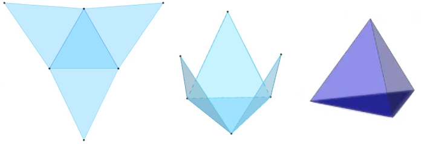
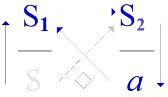
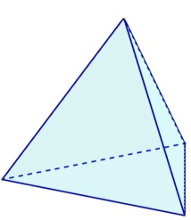
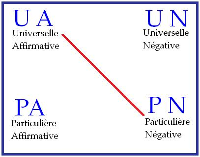
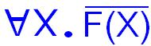
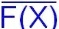
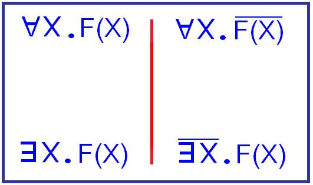

# Leçon 06 | 17 Mars 1971

  <label><input type="checkbox" data-lacan-toggle="original" checked> 原文</label>
  <label><input type="checkbox" data-lacan-toggle="notes" checked> 注释</label>
  <label><input type="checkbox" data-lacan-toggle="commentary" checked> 个人解读评论</label>

<section class="parallel-paragraph" data-paragraph-ids="s18-06-0001">

s18-06-0001

[无对应译文]

原文 · s18-06-0001

*C’est pas encore tout à fait la demi.*

</section>

<section class="parallel-paragraph" data-paragraph-ids="s18-06-0002">

s18-06-0002

[无对应译文]

原文 · s18-06-0002

*Est-ce qu’on m’entend là bas dans le fond, au dernier rang ?*

</section>

<section class="parallel-paragraph" data-paragraph-ids="s18-06-0003">

s18-06-0003

[无对应译文]

原文 · s18-06-0003

*Est-ce qu’on m’entend là, au quatrième rang là ? Formidable ! Au moins on respire, c’est déjà ça !*

</section>

<section class="parallel-paragraph" data-paragraph-ids="s18-06-0004">

s18-06-0004

[无对应译文]

原文 · s18-06-0004

Ça peut permettre des rapports plus efficaces. Par exemple, dans un cas, je pourrai demander à quelqu’un de sortir.

</section>

<section class="parallel-paragraph" data-paragraph-ids="s18-06-0005">

s18-06-0005

[无对应译文]

原文 · s18-06-0005

À la limite je pourrai faire une crise de nerfs, m’en aller moi-même.

</section>

<section class="parallel-paragraph" data-paragraph-ids="s18-06-0006">

s18-06-0006

[无对应译文]

原文 · s18-06-0006

Enfin, dans l’autre...

</section>

<section class="parallel-paragraph" data-paragraph-ids="s18-06-0007">

s18-06-0007

[无对应译文]

原文 · s18-06-0007

dans l’autre amphi ...ça ressemblait un peu trop au plus grand nombre de cas où on croit qu’il existe un rapport sexuel \[*Rires*\].

</section>

<section class="parallel-paragraph" data-paragraph-ids="s18-06-0008">

s18-06-0008

[无对应译文]

原文 · s18-06-0008

Parce qu’on est *coincé* \[*Rires*\] dans une *boi-boîte*.

</section>

<section class="parallel-paragraph" data-paragraph-ids="s18-06-0009">

s18-06-0009

[无对应译文]

原文 · s18-06-0009

Ça va me per­mettre de vous demander de lever le doigt !

</section>

<section class="parallel-paragraph" data-paragraph-ids="s18-06-0010">

s18-06-0010

[无对应译文]

原文 · s18-06-0010

Quelquon... \[Lapsus\] Quels sont ceux \[*Rires*\] qui, sur ma sugges­tion expresse, ont fait l’effort de *relire* les pages 31 à 40 de ce qu’on appelle mes *Écrits* ? Levez le doigt, ici on peut lever le doigt... Il n’y en a pas tellement que ça ! \[*Rires*\]

</section>

<section class="parallel-paragraph" data-paragraph-ids="s18-06-0011">

s18-06-0011

[无对应译文]

原文 · s18-06-0011

Je ne sais pas si je ne vais pas faire la crise de nerfs \[*Rires*\] et m’en aller tout simplement.

</section>

<section class="parallel-paragraph" data-paragraph-ids="s18-06-0012">

s18-06-0012

[无对应译文]

原文 · s18-06-0012

Puisqu’en somme il faut avoir des ressources minimes pour demander à quelqu’un quel rapport...

</section>

<section class="parallel-paragraph" data-paragraph-ids="s18-06-0013">

s18-06-0013

[无对应译文]

原文 · s18-06-0013

quel rapport il a pu éventuellement sentir de ces pages lues, à ce dont j’ai dit que j’y parlais, à savoir du *phallus*.

</section>

<section class="parallel-paragraph" data-paragraph-ids="s18-06-0014">

s18-06-0014

[无对应译文]

原文 · s18-06-0014

Qui est-ce qui se sent d’humeur...

</section>

<section class="parallel-paragraph" data-paragraph-ids="s18-06-0015">

s18-06-0015

[无对应译文]

原文 · s18-06-0015

> voyez je suis gentil, je n’interpelle personne ...qui est-ce qui se sent d’humeur à *en dire quelque chose*, voire ceci - pourquoi pas ? - *qu’il y a guère moyen de s’en apercevoir ?* Est-ce que quelqu’un aurait la gen­tillesse de me communiquer un petit bout de réflexion qu’a pu lui inspirer, je ne dis pas « *ces pages* », mais ce que la dernière fois j’ai dit de ce en quoi elles consis­taient à mon gré.

</section>

<section class="parallel-paragraph" data-paragraph-ids="s18-06-0016">

s18-06-0016

[无对应译文]

原文 · s18-06-0016

Marie, écoutez... Vous, est-ce que vous les avez relues ces pages ?

</section>

<section class="parallel-paragraph" data-paragraph-ids="s18-06-0017">

s18-06-0017

[无对应译文]

原文 · s18-06-0017

*Vous les avez pas relues ! «* *foutez le camp !* ». \[*Rires*\]

</section>

<section class="parallel-paragraph" data-paragraph-ids="s18-06-0018">

s18-06-0018

[无对应译文]

原文 · s18-06-0018

Bon enfin, c’est bien ennuyeux.

</section>

<section class="parallel-paragraph" data-paragraph-ids="s18-06-0019">

s18-06-0019

[无对应译文]

原文 · s18-06-0019

C’est tout de même pas moi qui vais vous en faire la lecture, ça c’est vraiment trop me demander.

</section>

<section class="parallel-paragraph" data-paragraph-ids="s18-06-0020">

s18-06-0020

[无对应译文]

原文 · s18-06-0020

Mais enfin, je prends ça au hasard. Je suis un tout petit peu étonné quand même...

</section>

<section class="parallel-paragraph" data-paragraph-ids="s18-06-0021">

s18-06-0021

[无对应译文]

原文 · s18-06-0021

je suis un tout petit peu étonné de ne pas pouvoir, sauf à entrer dans l’ordre de la taquinerie, obtenir une réponse.

</section>

<section class="parallel-paragraph" data-paragraph-ids="s18-06-0022">

s18-06-0022

[无对应译文]

原文 · s18-06-0022

Ouais! *C’est tout de même très ennuyeux*. *C’est tout de même très ennuyeux...*

</section>

<section class="parallel-paragraph" data-paragraph-ids="s18-06-0023">

s18-06-0023

[无对应译文]

原文 · s18-06-0023

Je ne parle très précisément dans ces pages, que de *la fonc­tion du* *phallus* en tant qu’elle s’articule, qu’elle s’articule dans *un certain dis­cours*, et c’était pourtant pas le temps où j’avais encore même ébauché de construire toute cette variété, cette combinaison tétraédrique, à quatre sommets, que je vous ai présentée l’année dernière.

</section>

<section class="parallel-paragraph" data-paragraph-ids="s18-06-0024">

s18-06-0024

[无对应译文]

原文 · s18-06-0024

Et je constate pourtant que dès ce niveau on ne peut pas dire...

</section>

<section class="parallel-paragraph" data-paragraph-ids="s18-06-0025">

s18-06-0025

[无对应译文]

原文 · s18-06-0025

> « *dès ce niveau* » dis-je : de ma construction ...dès ce temps, si vous voulez aussi, eh bien j’ai dirigé mon coup si je puis dire...

</section>

<section class="parallel-paragraph" data-paragraph-ids="s18-06-0026">

s18-06-0026

[无对应译文]

原文 · s18-06-0026

> *« j’ai dirigé mon coup »* c’est beaucoup dire, pouvoir *tirer* c’est déjà ça \[*rires ostentatoires*\] ...de façon telle qu’il ne me paraisse pas maintenant *porter à faux*, je veux dire dans un stade plus avancé de *cette construction*.

</section>

<section class="parallel-paragraph" data-paragraph-ids="s18-06-0027">

s18-06-0027

[无对应译文]

原文 · s18-06-0027

Bien sûr, quand j’ai dit la dernière fois...

</section>

<section class="parallel-paragraph" data-paragraph-ids="s18-06-0028">

s18-06-0028

[无对应译文]

原文 · s18-06-0028

> je me laisse aller comme ça, surtout quand il faut un peu faire semblant de respirer ...j’ai dit la dernière fois que je m’admirais, j’espère que vous n’avez tout de même pas pris ça au pied de la lettre.

</section>

<section class="parallel-paragraph" data-paragraph-ids="s18-06-0029">

s18-06-0029

[无对应译文]

原文 · s18-06-0029

Ce que j’admirais, c’était en effet plutôt le tracé que j’avais fait dans le temps où je com­mençais seulement à faire un certain sillon en fonction de repères, qui soit pas maintenant nettement à rejeter, enfin qui ne me fasse pas honte.

</section>

<section class="parallel-paragraph" data-paragraph-ids="s18-06-0030">

s18-06-0030

[无对应译文]

原文 · s18-06-0030

C’est là-dessus que j’ai terminé l’année dernière, et c’est assez remarquable, voire même on peut peut-être y prendre un petit quelque chose, une ébauche comme ça d’encou­ragement à continuer.

</section>

<section class="parallel-paragraph" data-paragraph-ids="s18-06-0031">

s18-06-0031

[无对应译文]

原文 · s18-06-0031

Qu’il soit tout à fait frappant que tout ce qui y est pêchable, si je puis dire, de signifiant...

</section>

<section class="parallel-paragraph" data-paragraph-ids="s18-06-0032">

s18-06-0032

[无对应译文]

原文 · s18-06-0032

> et là c’est bien de ça qu’il s’agit : je suis venu à la pêche ...de ce « *séminaire sur La Lettre volée »,* dont je pense qu’après tout, depuis un temps, le fait que je l’aie mis en tête...

</section>

<section class="parallel-paragraph" data-paragraph-ids="s18-06-0033">

s18-06-0033

[无对应译文]

原文 · s18-06-0033

> n’est-ce pas, en dépit de toute chronolo­gie ...montrait peut-être qu’il fallait... que j’avais l’idée que c’était en somme la meilleure façon d’introduire à mes *Écrits.*

</section>

<section class="parallel-paragraph" data-paragraph-ids="s18-06-0034">

s18-06-0034

[无对应译文]

原文 · s18-06-0034

Alors la remarque que je fais, sur ce fameux homme : « *who dares all things, those unbecoming as well as those beco­ming a man* »[^47], il est bien certain que si j’insiste à ce moment là pour dire que de ne pas le traduire littéralement...

</section>

<section class="parallel-paragraph" data-paragraph-ids="s18-06-0035">

s18-06-0035

[无对应译文]

原文 · s18-06-0035

« *ce qui est indigne aussi bien que ce qui est digne d’un homme* » ...montre que c’est dans son bloc que le côté indicible, honteux, qui ne se dit pas, quant à ce qui concerne un homme, enfin est bien là - pour tout dire le *phallus* - et qu’il est clair que ramener ça, en le fragmentant en deux : « *ce qui est digne d’un homme aussi bien que ce qui est indigne de lui* » il est clair que ce que sur quoi j’insiste ici, que c’est pas la même chose de dire : « *the rob­ber’s knowledge of the loser’s knowledge of the robber* », « *la connaissance qu’a le voleur de la connaissance qu’a le volé de son voleur* » ...que cet élément de « *savoir qu’il sait* », à savoir : savoir imposé d’un certain fantasme, que ce soit justement : « *l’homme qui ose tout* », c’est là - comme tout de suite le dit Dupin - la clé de la situation.

</section>

<section class="parallel-paragraph" data-paragraph-ids="s18-06-0036">

s18-06-0036

[无对应译文]

原文 · s18-06-0036

Je dis ça, je dis ça et je ne vais pas y revenir, car à vrai dire ce que je vous indiquais aurait pu...

</section>

<section class="parallel-paragraph" data-paragraph-ids="s18-06-0037">

s18-06-0037

[无对应译文]

原文 · s18-06-0037

> pour quelqu’un qui s’en serait donné la peine ...permettre directement, sur un texte comme ça, d’avancer la plupart des *articulations* que j’aurais peut-être à développer, à dérouler, à construire aujourd’hui...

</section>

<section class="parallel-paragraph" data-paragraph-ids="s18-06-0038">

s18-06-0038

[无对应译文]

原文 · s18-06-0038

> comme vous allez le voir, si vous voulez bien, dans un second temps,
>
> après avoir entendu ce que j’aurai plus ou moins réussi à dire ...se trouvait en somme *déjà bel et bien écrit là*, et non seu­lement écrit là avec *toutes* - et *les mêmes* - *articulations nécessaires*, celles par les­quelles je crois devoir vous promener.

</section>

<section class="parallel-paragraph" data-paragraph-ids="s18-06-0039">

s18-06-0039

[无对应译文]

原文 · s18-06-0039

Donc tout ce qui est là, est non seulement tamisé mais lié, est bien fait de ces signifiants disponibles pour une *signification* plus élaborée, celle en somme d’*un enseignement* que je peux dire *sans précédent*, autre que Freud lui-même.

</section>

<section class="parallel-paragraph" data-paragraph-ids="s18-06-0040">

s18-06-0040

[无对应译文]

原文 · s18-06-0040

Et justement en tant qu’il définit la précédence de façon telle qu’il faut <u>en lire la structure dans ses *impossibilités*</u>.

</section>

<section class="parallel-paragraph" data-paragraph-ids="s18-06-0041">

s18-06-0041

[无对应译文]

原文 · s18-06-0041

Peut-on dire qu’à proprement parler, par exemple Freud formule *cette impossibilité du rapport sexuel,* non pas comme telle, je le fais simplement parce que c’est tout simple à dire, c’est écrit en long et en large, c’est écrit dans ce que Freud écrit, y’a qu’à le lire. Seulement vous allez voir tout à l’heure pourquoi vous ne le lisez pas.

</section>

<section class="parallel-paragraph" data-paragraph-ids="s18-06-0042">

s18-06-0042

[无对应译文]

原文 · s18-06-0042

J’essaie de le dire, de dire pourquoi moi je le lis.

</section>

<section class="parallel-paragraph" data-paragraph-ids="s18-06-0043">

s18-06-0043

[无对应译文]

原文 · s18-06-0043

*La lettre* donc, « *purloined* » non pas « volée » mais comme je l’explique - je commence par là - *qui va faire un détour*, ou comme je le traduis, moi : « *La lettre en souffrance ».*

</section>

<section class="parallel-paragraph" data-paragraph-ids="s18-06-0044">

s18-06-0044

[无对应译文]

原文 · s18-06-0044

Ça commence comme ça et ça se termine - ce petit écrit - par ceci : qu’elle arrive pourtant à destination.

</section>

<section class="parallel-paragraph" data-paragraph-ids="s18-06-0045">

s18-06-0045

[无对应译文]

原文 · s18-06-0045

Et si vous le lisez, j’espère qu’il y en aura un petit peu plus qui le liront d’ici que je vous revoie.

</section>

<section class="parallel-paragraph" data-paragraph-ids="s18-06-0046">

s18-06-0046

[无对应译文]

原文 · s18-06-0046

Ce qui ne sera pas avant une paye, parce que tout ça c’est très bien calculé : 2ème et 3ème mercredi, je les ai choi­sis parce que pour le mois d’avril, ça tombe pendant les vacances de Pâques, alors vous ne me reverrez qu’en mai.

</section>

<section class="parallel-paragraph" data-paragraph-ids="s18-06-0047">

s18-06-0047

[无对应译文]

原文 · s18-06-0047

Ça donnera le temps de lire les 40 pages de « *La Lettre volée ».*

</section>

<section class="parallel-paragraph" data-paragraph-ids="s18-06-0048">

s18-06-0048

[无对应译文]

原文 · s18-06-0048

À la fin je tiens à souligner ce qui en est l’essentiel, et pour­quoi la traduction « *La Lettre volée* » n’est pas la bonne : « *The purloined letter »* ça veut quand même dire, ça veut dire que *quand même elle arrive à destination*.

</section>

<section class="parallel-paragraph" data-paragraph-ids="s18-06-0049">

s18-06-0049

[无对应译文]

原文 · s18-06-0049

La destination je la donne, je la donne comme la destination fondamentale de toute *lettre*, je veux dire *épistole.*

</section>

<section class="parallel-paragraph" data-paragraph-ids="s18-06-0050">

s18-06-0050

[无对应译文]

原文 · s18-06-0050

Elle arrive, disons même pas à *celui* ni à *celle*, à *<u>ceux</u>* qui ne peuvent rien y comprendre : la police en l’occasion, qui bien entendu est tout à fait incapable d’y comprendre quoi que ce soit...

</section>

<section class="parallel-paragraph" data-paragraph-ids="s18-06-0051">

s18-06-0051

[无对应译文]

原文 · s18-06-0051

> comme je le souligne et je l’explique en de nombreuses pages c’est même pour ça qu’elle était même pas capable de la trouver, son substrat matériel de la lettre.

</section>

<section class="parallel-paragraph" data-paragraph-ids="s18-06-0052">

s18-06-0052

[无对应译文]

原文 · s18-06-0052

Tout ça est dit très joliment, cette invention, cette forgerie de Poe, magni­fique.

</section>

<section class="parallel-paragraph" data-paragraph-ids="s18-06-0053">

s18-06-0053

[无对应译文]

原文 · s18-06-0053

*La lettre est* bien entendu *hors* de la portée de l’explication *de l’espace*, puisque c’est de ça qu’il s’agit.

</section>

<section class="parallel-paragraph" data-paragraph-ids="s18-06-0054">

s18-06-0054

[无对应译文]

原文 · s18-06-0054

C’est ça que le préfet vient dire, enfin ce que la police vient dire d’abord, c’est que tout ce qui est chez le ministre, étant donné qu’on est sûr que la lettre y est, qu’elle est là pour qu’il l’ait toujours à portée de la main, on dit pourquoi : que l’espace a été littéralement quadrillé.

</section>

<section class="parallel-paragraph" data-paragraph-ids="s18-06-0055">

s18-06-0055

[无对应译文]

原文 · s18-06-0055

C’est amusant - hein ? - de me livrer là, comme ça, je ne sais pas, à chaque fois que je me laisse - tout de même de temps en temps - un peu aller dans les pentes, pour­quoi pas, à quelques considérations comme ça *sur l’espace, ce fameux espace* qui est bien - pour notre logique - depuis un bon moment, depuis Descartes - la chose la plus encombrante du monde.

</section>

<section class="parallel-paragraph" data-paragraph-ids="s18-06-0056">

s18-06-0056

[无对应译文]

原文 · s18-06-0056

C’est bien tout de même une occasion comme ça d’en parler, si tant est qu’il faille l’ajouter comme une note en marge, c’est ce que j’isole comme la dimension de l’*Imaginaire*. Il y a quand même des gens qui se tracassent, pas forcément sur cet écrit là, sur d’autres, ou même aussi quelquefois qui ont gardé des notes de ce que j’ai pu dire dans un temps, par exemple sur « *L’identification »*.

</section>

<section class="parallel-paragraph" data-paragraph-ids="s18-06-0057">

s18-06-0057

[无对应译文]

原文 · s18-06-0057

C’était les années 61-62, je dois dire que tous mes auditeurs pensaient à autre chose, sauf - je sais pas - un ou deux qui venaient tout à fait du dehors, qui ne savaient pas ce qui se passait exactement.

</section>

<section class="parallel-paragraph" data-paragraph-ids="s18-06-0058">

s18-06-0058

[无对应译文]

原文 · s18-06-0058

J’y ai parlé du *trait unaire*. Alors on se tracasse maintenant - non sans que ce soit légitime - pour savoir : ce *trait unaire* où est-ce qu’il faut le mettre : du côté du *Symbolique* ou de *l’Imaginaire*, et pourquoi pas du *Réel* ?

</section>

<section class="parallel-paragraph" data-paragraph-ids="s18-06-0059">

s18-06-0059

[无对应译文]

原文 · s18-06-0059

Quoiqu’il en soit, tel que, c’est comme ça que ça se marque : un bâton, « *ein einziger Zug »...*

</section>

<section class="parallel-paragraph" data-paragraph-ids="s18-06-0060">

s18-06-0060

[无对应译文]

原文 · s18-06-0060

> car c’est bien sûr dans Freud que j’ai été le pêcher *...*qui pose quelques questions, comme je vous l’ai déjà un peu introduit la dernière fois par cette remarque qu’il était tout à fait impossible de penser quoi que ce soit qui tienne debout sur cette *bipartition* si difficile, si problématique pour les mathé­maticiens, qui est à savoir :

</section>

<section class="parallel-paragraph" data-paragraph-ids="s18-06-0061">

s18-06-0061

[无对应译文]

原文 · s18-06-0061

- *« Est-ce que tout peut être réductible à la logique pure* ? »

</section>

<section class="parallel-paragraph" data-paragraph-ids="s18-06-0062">

s18-06-0062

[无对应译文]

原文 · s18-06-0062

> c’est-à-dire à *un discours* qui se soutient d’une structure bien déterminée.

</section>

<section class="parallel-paragraph" data-paragraph-ids="s18-06-0063">

s18-06-0063

[无对应译文]

原文 · s18-06-0063

- *Est-ce qu’il n’y a pas un élément absolument essentiel qui reste...*

</section>

<section class="parallel-paragraph" data-paragraph-ids="s18-06-0064">

s18-06-0064

[无对应译文]

原文 · s18-06-0064

> quoi que nous fas­sions pour l’enserrer de cette structure, le réduire ...*qui tout de même reste, un dernier noyau, et qu’on appelle* « *intuition* » ?

</section>

<section class="parallel-paragraph" data-paragraph-ids="s18-06-0065">

s18-06-0065

[无对应译文]

原文 · s18-06-0065

Assurément c’est la question dont Descartes est parti, je veux dire que ce qu’il a fait remarquer, c’est que le raisonne­ment mathématique, à son gré, ne tirait rien d’efficace, de créateur, de quoi que ce fût qui fut de l’ordre du raisonnement, mais seulement son départ, à savoir une intuition originale et qui est celle qu’il pose, institue, de sa distinction origi­nelle de « *l’étendue »* et de « *la pensée »*.

</section>

<section class="parallel-paragraph" data-paragraph-ids="s18-06-0066">

s18-06-0066

[无对应译文]

原文 · s18-06-0066

Bien sûr, cette opposition cartésienne, d’être faite plus par un penseur que par un mathématicien*...*

</section>

<section class="parallel-paragraph" data-paragraph-ids="s18-06-0067">

s18-06-0067

[无对应译文]

原文 · s18-06-0067

> non pas certes incapable de produire en mathématiques, comme les effets s’en sont prouvés *...*a été bien sûr bien plus enrichie par les mathématiciens eux-mêmes.

</section>

<section class="parallel-paragraph" data-paragraph-ids="s18-06-0068">

s18-06-0068

[无对应译文]

原文 · s18-06-0068

C’est bien la première fois que quelque chose venait aux mathématiques par la voie de la philosophie.

</section>

<section class="parallel-paragraph" data-paragraph-ids="s18-06-0069">

s18-06-0069

[无对应译文]

原文 · s18-06-0069

Car je vous prierai de remarquer cette chose qui me semble à moi très certaine...

</section>

<section class="parallel-paragraph" data-paragraph-ids="s18-06-0070">

s18-06-0070

[无对应译文]

原文 · s18-06-0070

> qu’on me contredise si on le peut, il serait facile de trouver là-dessus plus compétent que moi ...il est tout de même très frappant que les mathématiciens de l’Antiquité aient, eux, poursuivi leur marche sans avoir le moindre égard à tout ce qui pouvait se passer dans *les écoles de sagesse,* dans *les écoles -* quelles qu’elles fussent *- de philosophie.*

</section>

<section class="parallel-paragraph" data-paragraph-ids="s18-06-0071">

s18-06-0071

[无对应译文]

原文 · s18-06-0071

Il n’en est pas de même de nos jours où assuré­ment l’impulsion cartésienne, concernant la distinction de l’*intuitionné* et du *rai­sonné,* est une chose qui a fortement travaillé la mathématique elle-même.

</section>

<section class="parallel-paragraph" data-paragraph-ids="s18-06-0072">

s18-06-0072

[无对应译文]

原文 · s18-06-0072

C’est bien en cela que je ne peux pas ne pas y trouver une veine, un effet de quelque chose qui a un certain rapport avec ce qu’ici, sur le champ dont il s’agit, je tente.

</section>

<section class="parallel-paragraph" data-paragraph-ids="s18-06-0073">

s18-06-0073

[无对应译文]

原文 · s18-06-0073

C’est qu’il me semble que la remarque, la remarque que je peux faire du point où je suis, sur les rapports entre *la parole* et *l’écrit*, sur ce qu’il y a*...*

</section>

<section class="parallel-paragraph" data-paragraph-ids="s18-06-0074">

s18-06-0074

[无对应译文]

原文 · s18-06-0074

> au moins dans cette première arête, ...de spécial dans la fonction de *l’écrit* au regard de tout *discours*, est de nature peut-être à faire que les mathématiciens s’aperçoivent de ce que par exemple j’ai indiqué la dernière fois : que *l’intuition même de l’espace euclidien* *doit quelque chose à l’écrit*.

</section>

<section class="parallel-paragraph" data-paragraph-ids="s18-06-0075">

s18-06-0075

[无对应译文]

原文 · s18-06-0075

D’autre part, si*...*

</section>

<section class="parallel-paragraph" data-paragraph-ids="s18-06-0076">

s18-06-0076

[无对应译文]

原文 · s18-06-0076

comme je vais essayer de vous le pousser un peu plus loin *...*ce qu’on appelle en mathématique : « *recherche logique* », « *réduction logique* », l’opération mathématicienne c’est quelque chose qui en tout cas ne saurait avoir d’autre support*...*

</section>

<section class="parallel-paragraph" data-paragraph-ids="s18-06-0077">

s18-06-0077

[无对应译文]

原文 · s18-06-0077

> il suffit pour le constater de suivre l’histoire *...*que *la manipulation* *de petites ou de grandes lettres*, *de lots alphabétiques divers*...

</section>

<section class="parallel-paragraph" data-paragraph-ids="s18-06-0078">

s18-06-0078

[无对应译文]

原文 · s18-06-0078

> je veux dire *lettres grecques* ou *lettres ger­maniques*... *plusieurs lots alphabétiques...toute manipulation dont avance dans la réduction logistique dans le raisonnement mathématique nécessite ce support.*

</section>

<section class="parallel-paragraph" data-paragraph-ids="s18-06-0079">

s18-06-0079

[无对应译文]

原文 · s18-06-0079

Comme je vous le répète, je ne vois pas la différence essentielle avec ce qui a fait longtemps*...*

</section>

<section class="parallel-paragraph" data-paragraph-ids="s18-06-0080">

s18-06-0080

[无对应译文]

原文 · s18-06-0080

> pendant toute une époque, XVII et XVIIIème siècles ...la difficulté de la pen­sée mathématicienne, à savoir : *la nécessité du tracé pour la démonstration euclidienne, qu’au moins un de ces triangles soit là tracé*.

</section>

<section class="parallel-paragraph" data-paragraph-ids="s18-06-0081">

s18-06-0081

[无对应译文]

原文 · s18-06-0081

À partir de quoi chacun s’affole : ce triangle qui aura été tracé, est-ce le triangle général, ou un triangle particulier ?

</section>

<section class="parallel-paragraph" data-paragraph-ids="s18-06-0082">

s18-06-0082

[无对应译文]

原文 · s18-06-0082

Car il est bien clair qu’il est toujours particulier, et que ce que vous démontrez pour le triangle en général, à savoir*...*

</section>

<section class="parallel-paragraph" data-paragraph-ids="s18-06-0083">

s18-06-0083

[无对应译文]

原文 · s18-06-0083

> toujours la même histoire *...*à savoir que les trois angles qui font deux droits, ben il est clair que faut pas que vous disiez que ce triangle n’a pas le droit d’être aussi bien rectangle, isocèle à la fois, ou équilatéral.

</section>

<section class="parallel-paragraph" data-paragraph-ids="s18-06-0084">

s18-06-0084

[无对应译文]

原文 · s18-06-0084

Donc il est toujours particulier. Ça a énormément tracassé les mathématiciens.

</section>

<section class="parallel-paragraph" data-paragraph-ids="s18-06-0085">

s18-06-0085

[无对应译文]

原文 · s18-06-0085

Je vous passe bien sûr*...*

</section>

<section class="parallel-paragraph" data-paragraph-ids="s18-06-0086">

s18-06-0086

[无对应译文]

原文 · s18-06-0086

> ce n’est pas l’endroit de le rappeler ici, on n’est pas là pour faire de l’érudition *...*à travers tel et tel ça coule, depuis Descartes, Leibniz ou d’autres, ça va jusqu’à Husserl, ils me semblent n’avoir jamais vu cet os tout de même :

</section>

<section class="parallel-paragraph" data-paragraph-ids="s18-06-0087">

s18-06-0087

[无对应译文]

原文 · s18-06-0087

- *que l’écriture est là des deux côtés*, elle est bien homogénéisant *l’intuitionné* et *le raisonné*,

</section>

<section class="parallel-paragraph" data-paragraph-ids="s18-06-0088">

s18-06-0088

[无对应译文]

原文 · s18-06-0088

- que l’écriture - en d’autres termes : *des petites lettres* - n’a pas de fonction moins intuitive que ce que traçait le bon Euclide.

</section>

<section class="parallel-paragraph" data-paragraph-ids="s18-06-0089">

s18-06-0089

[无对应译文]

原文 · s18-06-0089

Il s’agirait quand même de savoir pourquoi on pense que ça fait une dif­férence.

</section>

<section class="parallel-paragraph" data-paragraph-ids="s18-06-0090">

s18-06-0090

[无对应译文]

原文 · s18-06-0090

Je ne sais pas si je dois vous faire remarquer que la consistance de l’espace, de l’espace euclidien, de l’espace qui se ferme sur ses 3 dimensions, me semble devoir être définie d’une bien autre façon.

</section>

<section class="parallel-paragraph" data-paragraph-ids="s18-06-0091">

s18-06-0091

[无对应译文]

原文 · s18-06-0091

- Si vous prenez 2 points : ils sont à égale distance l’un de l’autre si je puis dire, la distance est la même du 1er au 2nd que du 2nd au 1er. \[*segment de droite *: 1 *dimension*\]

</section>

<section class="parallel-paragraph" data-paragraph-ids="s18-06-0092">

s18-06-0092

[无对应译文]

原文 · s18-06-0092

- Vous pouvez en prendre 3 et faire que ce soit encore vrai, à savoir que chacun est à égale distance de chacun des deux autres. \[*triangle équilatéral dans le plan *: 2 *dimensions*\]

</section>

<section class="parallel-paragraph" data-paragraph-ids="s18-06-0093">

s18-06-0093

[无对应译文]

原文 · s18-06-0093

- Vous pouvez en prendre 4 et faire que ce soit encore vrai. Je ne sais pas, je n’ai jamais entendu pointer ça expressément. \[*pyramide équilatérale de base* 3 : *espace à* 3 *dimensions*\]

</section>

<section class="parallel-paragraph" data-paragraph-ids="s18-06-0094">

s18-06-0094

[无对应译文]

原文 · s18-06-0094

> 

</section>

<section class="parallel-paragraph" data-paragraph-ids="s18-06-0095">

s18-06-0095

[无对应译文]

原文 · s18-06-0095

- *Vous pouvez en prendre* 5, ne vous précipitez pas pour dire que là aussi vous pouvez les mettre à égale distance

</section>

<section class="parallel-paragraph" data-paragraph-ids="s18-06-0096">

s18-06-0096

[无对应译文]

原文 · s18-06-0096

> de chacun des quatre autres, parce que - tout au moins dans notre espace euclidien - vous n’y arriverez pas :
>
> il faut, pour que vous ayez ces cinq points à égale distance - vous m’entendez bien - chacun de tous les autres, que vous fabriquiez une cinquième \[*lapsus*\]... une 4ème dimension. Voilà !

</section>

<section class="parallel-paragraph" data-paragraph-ids="s18-06-0097">

s18-06-0097

[无对应译文]

原文 · s18-06-0097

Bien sûr c’est très aisé à la lettre, et puis ça tient très bien : on peut démontrer qu’un espace à 4 dimen­sions est parfaitement cohérent, dans toute la mesure où on peut montrer le lien de sa cohérence à la cohérence *des nombres réels*. C’est dans cette mesure même qu’il se soutient.

</section>

<section class="parallel-paragraph" data-paragraph-ids="s18-06-0098">

s18-06-0098

[无对应译文]

原文 · s18-06-0098

Mais enfin c’est un fait que, au-delà du tétraèdre, déjà l’intui­tion a à se supporter de *la lettre*.

</section>

<section class="parallel-paragraph" data-paragraph-ids="s18-06-0099">

s18-06-0099

[无对应译文]

原文 · s18-06-0099

Je me suis lancé là-dedans parce que j’ai dit que la lettre qui arrive à destination c’est la lettre qui arrive à la police, qui n’y comprend rien, et que la police, comme vous le savez, elle n’est pas née d’hier n’est-ce pas : 3 piques comme ça sur le sol, 3 piques sur le campus, pour peu que vous connaissiez un petit peu ce qu’a écrit Hegel, vous saurez que c’est l’État.

</section>

<section class="parallel-paragraph" data-paragraph-ids="s18-06-0100">

s18-06-0100

[无对应译文]

原文 · s18-06-0100

L’État et la police, ben pour quelqu’un qui a un tout petit peu réfléchi*...*

</section>

<section class="parallel-paragraph" data-paragraph-ids="s18-06-0101">

s18-06-0101

[无对应译文]

原文 · s18-06-0101

> on ne peut pas dire que Hegel là-dessus soit si mal placé *...*c’est exactement la même chose.

</section>

<section class="parallel-paragraph" data-paragraph-ids="s18-06-0102">

s18-06-0102

[无对应译文]

原文 · s18-06-0102

Ça repose sur *une structure tétraédrique*, en d’autres termes dès que nous mettons en question quelque chose comme *la lettre*, il faut que nous sortions de mes petits schémas de l’année dernière, qui étaient faits comme vous vous en souve­nez, comme ça :

</section>

<section class="parallel-paragraph" data-paragraph-ids="s18-06-0103">

s18-06-0103

[无对应译文]

原文 · s18-06-0103

 

</section>

<section class="parallel-paragraph" data-paragraph-ids="s18-06-0104">

s18-06-0104

[无对应译文]

原文 · s18-06-0104

Voilà le discours du Maître, comme vous vous en souvenez peut-être, carac­térisé par ceci que des 6 arêtes du tétraèdre, une est rompue.

</section>

<section class="parallel-paragraph" data-paragraph-ids="s18-06-0105">

s18-06-0105

[无对应译文]

原文 · s18-06-0105

C’est dans la mesure où on fait tourner ces structures sur les 4 arêtes du circuit...

</section>

<section class="parallel-paragraph" data-paragraph-ids="s18-06-0106">

s18-06-0106

[无对应译文]

原文 · s18-06-0106

> qui dans *le tétraèdre* se suivent - c’est une condition - s’emmanchent dans le même sens,
>
> dans ce sens que tourne en rond une, n’importe laquelle des deux autres, des 3 autres ...que la variation s’établit de ce qu’il en est de la structure du discours, très précisément en tant qu’elle reste à <u>un certain niveau de construction qui est celui *tétraédrique*</u> <u>dont *on ne saurait se contenter dès lors* *qu’on fait surgir l’instance de la lettre.*</u> C’est même parce qu’on ne saurait s’en contenter, qu’à rester à son niveau il y a toujours un de ces côtés qui fait cercle*, qui se rompt.*

</section>

<section class="parallel-paragraph" data-paragraph-ids="s18-06-0107">

s18-06-0107

[无对应译文]

原文 · s18-06-0107

Alors c’est de là qu’il résulte que dans un monde...

</section>

<section class="parallel-paragraph" data-paragraph-ids="s18-06-0108">

s18-06-0108

[无对应译文]

原文 · s18-06-0108

> tel qu’il est structuré par un certain tétraèdre qu’on retrouve à plus d’un bout de champ ...*une lettre n’arrive à destination qu’à trouver* celui que dans mon discours sur *La Lettre volée,* je désigne du terme du « *Sujet »*...

</section>

<section class="parallel-paragraph" data-paragraph-ids="s18-06-0109">

s18-06-0109

[无对应译文]

原文 · s18-06-0109

> qui n’est pas du tout à éliminer d’aucune façon ni à retirer
>
> sous prétexte que nous faisons quelques pas dans la structure, ...et dont il faut tout de même bien partir de ceci : c’est que si ce que nous avons découvert sous le terme d’« *inconscient* » a un sens, le *sujet*...

</section>

<section class="parallel-paragraph" data-paragraph-ids="s18-06-0110">

s18-06-0110

[无对应译文]

原文 · s18-06-0110

> je vous le répète : *irréductible*, nous ne pouvons pas, même à ce niveau, ne pas en tenir compte ...et *le sujet se distingue de sa toute spéciale imbécillité*.

</section>

<section class="parallel-paragraph" data-paragraph-ids="s18-06-0111">

s18-06-0111

[无对应译文]

原文 · s18-06-0111

C’est ce qui compte dans le texte de Poe, du fait que celui sur lequel il badine à cette occasion, ce n’est pas pour rien que c’est *le Roi* qui ici se manifeste en fonction de *sujet *: *il ne comprend absolument rien,* et toute sa structure policière ne fera pas néanmoins que *la lettre n’arrive même pas à sa portée*, étant donné que c’est la police qui la garde et qu’elle ne peut rien en faire.

</section>

<section class="parallel-paragraph" data-paragraph-ids="s18-06-0112">

s18-06-0112

[无对应译文]

原文 · s18-06-0112

Je souligne même que - dût-on la retrouver dans ses dossiers - ça ne peut pas servir à l’histo­rien.

</section>

<section class="parallel-paragraph" data-paragraph-ids="s18-06-0113">

s18-06-0113

[无对应译文]

原文 · s18-06-0113

Dans telle ou telle page de ce que j’écris à propos de *cette lettre*, on peut dire qu’*il n’y a* très probablement *que la Reine qui sait ce qu’elle veut dire*, et que tout ce qui fait son poids, c’est que si la seule personne que ça intéresse, à savoir *le sujet*, *si le Roi* l’avait en main, il n’y comprendrait que ceci : c’est *qu’elle a sûrement un sens et* que c’est en ça qu’est le scandale, *que c’est un sens qui -* à lui, le sujet - *lui échappe* \[S1 *asémantique*\].

</section>

<section class="parallel-paragraph" data-paragraph-ids="s18-06-0114">

s18-06-0114

[无对应译文]

原文 · s18-06-0114

Le terme de « *scandale* », ou encore de « *contradiction* », est à la bonne place dans ces quatre petites dernières pages que je vous avais données à lire, « petites » je le souligne.

</section>

<section class="parallel-paragraph" data-paragraph-ids="s18-06-0115">

s18-06-0115

[无对应译文]

原文 · s18-06-0115

Il est clair que c’est uniquement en fonction de cette circulation de la lettre que le ministre...

</section>

<section class="parallel-paragraph" data-paragraph-ids="s18-06-0116">

s18-06-0116

[无对应译文]

原文 · s18-06-0116

> puisque ici il y en a eu quand même quelques-uns qui ont autrefois lu Poe,
>
> vous devez savoir qu’il y a un ministre dans le coup, celui qui a barboté la lettre ...que le ministre nous montre au cours du *déplacement* de ladite *lettre*, des variations - tel le poisson mourrant - des variations de sa couleur, et à la vérité que sa fonction essentielle, que tout mon texte *joue*...

</section>

<section class="parallel-paragraph" data-paragraph-ids="s18-06-0117">

s18-06-0117

[无对应译文]

原文 · s18-06-0117

> peut-être un petit trop abondamment, mais on ne saurait trop insister pour se faire entendre ...*joue sur le fait que la lettre a <u>un effet féminisant</u>*.

</section>

<section class="parallel-paragraph" data-paragraph-ids="s18-06-0118">

s18-06-0118

[无对应译文]

原文 · s18-06-0118

Mais *dès qu’il ne l’a plus la lettre* il redevient lui-même, dès qu’il ne l’a plus le voici en quelque sorte res­titué à la dimension, justement, que tout son dessein était fait pour se donner à lui-même, celle de *l’homme qui ose n’importe quoi*.

</section>

<section class="parallel-paragraph" data-paragraph-ids="s18-06-0119">

s18-06-0119

[无对应译文]

原文 · s18-06-0119

Et j’insiste sur ce virage de ce qui se passe, c’est ce sur quoi se termine cet énoncé *poesque*, c’est que c’est à ce moment-là que la chose apparaît*, « monstrum horrendum »* comme on dit dans le texte : ce qu’il avait voulu être pour la Reine, qui bien sûr en a tenu compte puisqu’elle a essayé de la ravoir cette lettre, mais enfin avec lui le jeu se tenait.

</section>

<section class="parallel-paragraph" data-paragraph-ids="s18-06-0120">

s18-06-0120

[无对应译文]

原文 · s18-06-0120

C’est pour notre Dupin, à savoir « *le malin des malins »*, celui auquel Poe donne le rôle de nous jeter quelque chose qui s’appellerait assez volontiers - je le souligne dans le texte - quelque *« poudre aux yeux »*

</section>

<section class="parallel-paragraph" data-paragraph-ids="s18-06-0121">

s18-06-0121

[无对应译文]

原文 · s18-06-0121

- à savoir que nous croyions que « *le malin des malins »* ça existe,

</section>

<section class="parallel-paragraph" data-paragraph-ids="s18-06-0122">

s18-06-0122

[无对应译文]

原文 · s18-06-0122

- à savoir que lui vraiment comprend, sait tout, *qu’en étant dans le tétraèdre*, il peut comprendre comment il est fait.

</section>

<section class="parallel-paragraph" data-paragraph-ids="s18-06-0123">

s18-06-0123

[无对应译文]

原文 · s18-06-0123

J’ai assez ironisé sur ces choses certainement très habiles, qui sont les jeux de mots autour d’« *ambitus »,* de « *religio »* ou d’« *honesti hommes »,* pour montrer et dire simplement quant à moi, que je cherchais un peu plus loin la petite bête, n’est-ce pas, et qu’à la vérité elle est quelque part.

</section>

<section class="parallel-paragraph" data-paragraph-ids="s18-06-0124">

s18-06-0124

[无对应译文]

原文 · s18-06-0124

Elle est quelque part : à suivre Poe on peut se poser la question de savoir si Poe s’en est bien aperçu.

</section>

<section class="parallel-paragraph" data-paragraph-ids="s18-06-0125">

s18-06-0125

[无对应译文]

原文 · s18-06-0125

À savoir que le seul fait d’être passée entre les mains de Dupin, la lettre l’a *féminisé* à son tour, assez pour que, à l’endroit du ministre, tel qu’il sait pourtant l’avoir privé de ce qui pourrait lui permettre de continuer à jouer son rôle si jamais il faut en abattre les cartes, c’est précisément à ce moment-là que Dupin ne peut pas se conte­nir et manifeste à l’endroit de celui qui se croit déjà suffisamment avoir mis à sa merci quiconque, pour ne pas laisser plus de trace, qu’il lui envoie ce message dans le billet qu’il a substitué à la lettre dérobée : « *Un destin si funeste* - enfin, vous savez le texte - *s’il n’est digne d’Atrée, est digne de Thyeste* ».

</section>

<section class="parallel-paragraph" data-paragraph-ids="s18-06-0126">

s18-06-0126

[无对应译文]

原文 · s18-06-0126

La question, si je puis dire, est de s’apercevoir si Poe dans l’occasion s’aperçoit bien de la portée de ceci, de ce que Dupin dans ce message au-delà de toutes les possibilités, car qui sait si jamais ça arrivera que le ministre la sorte sa lettre *et se trouve du même coup dégonflé*, pour tout dire : *que la castration soit là - comme la lettre - suspendue – mais parfaitement réalisée*.

</section>

<section class="parallel-paragraph" data-paragraph-ids="s18-06-0127">

s18-06-0127

[无对应译文]

原文 · s18-06-0127

J’indique aussi cette perspective qui ne me paraît pas écrite d’avance.

</section>

<section class="parallel-paragraph" data-paragraph-ids="s18-06-0128">

s18-06-0128

[无对应译文]

原文 · s18-06-0128

Ça ne donne que *plus de prix* à ce que Dupin écrit comme *message* à celui qu’il vient de priver de *ce qu’il croit être son pouvoir,* ce petit « *poulet »*, qu’il jubile à la pensée de ce qui se passera quand l’intéressé - à quelle fin ? - aura à en faire usage, ce qu’on peut dire c’est que Dupin *jouit*.

</section>

<section class="parallel-paragraph" data-paragraph-ids="s18-06-0129">

s18-06-0129

[无对应译文]

原文 · s18-06-0129

Or c’est là qu’est la question, la question que j’amorçais la dernière fois en vous disant : « *Est-ce que c’est la même chose le narrateur et celui qui écrit ?* ».

</section>

<section class="parallel-paragraph" data-paragraph-ids="s18-06-0130">

s18-06-0130

[无对应译文]

原文 · s18-06-0130

Ce qui est incontestable c’est que le narra­teur, le sujet de l’énoncé, celui qui parle, c’est Poe.

</section>

<section class="parallel-paragraph" data-paragraph-ids="s18-06-0131">

s18-06-0131

[无对应译文]

原文 · s18-06-0131

Est-ce que Poe jouit de la jouissance de Dupin, ou d’ailleurs ?

</section>

<section class="parallel-paragraph" data-paragraph-ids="s18-06-0132">

s18-06-0132

[无对应译文]

原文 · s18-06-0132

C’est là ce qu’aujourd’hui je vais m’efforcer de vous montrer.

</section>

<section class="parallel-paragraph" data-paragraph-ids="s18-06-0133">

s18-06-0133

[无对应译文]

原文 · s18-06-0133

Je vous parle de *La Lettre volée* telle que je l’ai articulée moi-même, c’est là une illustration que je peux donner à la *question* que j’ai posée la dernière fois : « *Est-ce que ce n’est pas radicalement différent :* *celui qui écrit, et celui qui parle en son nom au titre du narrateur dans un écrit ?* »

</section>

<section class="parallel-paragraph" data-paragraph-ids="s18-06-0134">

s18-06-0134

[无对应译文]

原文 · s18-06-0134

À ce niveau c’est sensible.

</section>

<section class="parallel-paragraph" data-paragraph-ids="s18-06-0135">

s18-06-0135

[无对应译文]

原文 · s18-06-0135

Car ce qui se passe au niveau du *narrateur*, c’est en fin de compte ce que je pourrais appeler...

</section>

<section class="parallel-paragraph" data-paragraph-ids="s18-06-0136">

s18-06-0136

[无对应译文]

原文 · s18-06-0136

> je m’excuse d’insister sur le caractère démonstratif de ce petit essai ...c’est qu’à la fin du compte, c’est la plus parfaite castration qui est démontrée.

</section>

<section class="parallel-paragraph" data-paragraph-ids="s18-06-0137">

s18-06-0137

[无对应译文]

原文 · s18-06-0137

*Tout le monde est également cocu, et personne n’en sait rien*. C’est ça la merveille :

</section>

<section class="parallel-paragraph" data-paragraph-ids="s18-06-0138">

s18-06-0138

[无对应译文]

原文 · s18-06-0138

- le Roi bien sûr dort depuis le début et dormira jusqu’à la fin de ses jours sur ses deux oreilles,

</section>

<section class="parallel-paragraph" data-paragraph-ids="s18-06-0139">

s18-06-0139

[无对应译文]

原文 · s18-06-0139

- la Reine ne se rend pas compte qu’il est à peu près fatal qu’elle devienne folle de ce ministre, maintenant qu’elle le tient \[*rires*\], qu’elle l’a châtré - hein ? - c’est un amour !

</section>

<section class="parallel-paragraph" data-paragraph-ids="s18-06-0140">

s18-06-0140

[无对应译文]

原文 · s18-06-0140

- Le ministre, ça c’est bien vrai : pour être fait il est fait, mais en fin de compte ça ne lui fait ni chaud ni froid, parce que comme je l’ai très bien expliqué quelque part, de deux choses l’une :

</section>

<section class="parallel-paragraph" data-paragraph-ids="s18-06-0141">

s18-06-0141

[无对应译文]

原文 · s18-06-0141

> \- ou il lui plaît de devenir l’amant de la Reine et ça devrait être agréable,
>
> en principe on dit ça : ça plaît pas à tout le monde,
>
> \- ou si vraiment il a pour elle un de ces sentiments qui sont de l’ordre de ce que j’appelle moi
>
> *le seul sentiment lucide*, à savoir *la haine*, comme je vous l’ai très bien expliqué,
>
> s’il la hait, elle l’en aimera d’autant plus, et ça lui permettra d’aller si loin,
>
> qu’il finira quand même par se douter que la lettre, elle n’est plus là depuis longtemps.

</section>

<section class="parallel-paragraph" data-paragraph-ids="s18-06-0142">

s18-06-0142

[无对应译文]

原文 · s18-06-0142

Parce qu’il se trompera naturellement : il se dira que si on va si loin avec lui, c’est qu’on est sûr des choses, alors il ouvrira son petit papelard à temps, mais en aucun cas il ne reviendra à ce qui est la chose souhaitée, c’est que le ministre qu’on veut ridiculiser, il ne le sera pas.

</section>

<section class="parallel-paragraph" data-paragraph-ids="s18-06-0143">

s18-06-0143

[无对应译文]

原文 · s18-06-0143

Bon, eh bien voilà ! Voilà ce que je réussis à dire à propos de ce que j’ai écrit, et ce que je voudrais vous dire c’est parce que ça prend sa portée de ce que c’est *illisible*.

</section>

<section class="parallel-paragraph" data-paragraph-ids="s18-06-0144">

s18-06-0144

[无对应译文]

原文 · s18-06-0144

C’est là le point, si vous voulez bien encore m’entendre, que je vais essayer de développer.

</section>

<section class="parallel-paragraph" data-paragraph-ids="s18-06-0145">

s18-06-0145

[无对应译文]

原文 · s18-06-0145

Comme beaucoup de gens, je vous le dis tout de suite parce que ce sont des gens du *« Monde »*, les seuls qui soient capables de me dire ce qu’ils pen­sent à propos de ce que je leur refile.

</section>

<section class="parallel-paragraph" data-paragraph-ids="s18-06-0146">

s18-06-0146

[无对应译文]

原文 · s18-06-0146

C’était le moment où mes *Écrits* n’étaient pas encore parus, ils m’ont donné leur point de vue de techniciens : « *On n’y com­prend rien* » qu’ils m’ont dit. Remarquez que c’est beaucoup. \[*rires*\]

</section>

<section class="parallel-paragraph" data-paragraph-ids="s18-06-0147">

s18-06-0147

[无对应译文]

原文 · s18-06-0147

Quelque chose auquel on ne comprend rien, c’est tout l’espoir, c’est le signe qu’on en est affecté.

</section>

<section class="parallel-paragraph" data-paragraph-ids="s18-06-0148">

s18-06-0148

[无对应译文]

原文 · s18-06-0148

Heureusement qu’on n’a rien compris !

</section>

<section class="parallel-paragraph" data-paragraph-ids="s18-06-0149">

s18-06-0149

[无对应译文]

原文 · s18-06-0149

Parce que on ne peut jamais comprendre que ce que bien sûr on a déjà dans la tête.

</section>

<section class="parallel-paragraph" data-paragraph-ids="s18-06-0150">

s18-06-0150

[无对应译文]

原文 · s18-06-0150

Mais enfin, je voudrais essayer d’articuler ça un peu mieux.

</section>

<section class="parallel-paragraph" data-paragraph-ids="s18-06-0151">

s18-06-0151

[无对应译文]

原文 · s18-06-0151

Il suffit pas d’écrire des choses exprès incom­préhensibles, *mais de voir pourquoi l’illisible a un sens*.

</section>

<section class="parallel-paragraph" data-paragraph-ids="s18-06-0152">

s18-06-0152

[无对应译文]

原文 · s18-06-0152

Je vous ferai remarquer d’abord que toute notre affaire...

</section>

<section class="parallel-paragraph" data-paragraph-ids="s18-06-0153">

s18-06-0153

[无对应译文]

原文 · s18-06-0153

> toute notre affaire qui est l’histoire du *rapport sexuel*, n’est-ce pas, ...tourne autour de ceci que vous pourriez croire que *c’est écrit* puisqu’en somme, c’est ce qu’on a trouvé dans *la psychanalyse*, on est tout de même bien référé à un écrit.

</section>

<section class="parallel-paragraph" data-paragraph-ids="s18-06-0154">

s18-06-0154

[无对应译文]

原文 · s18-06-0154

*L’œdipe* c’est un mythe écrit et je dirai même plus, c’est très exactement la seule chose qui le spécifie.

</section>

<section class="parallel-paragraph" data-paragraph-ids="s18-06-0155">

s18-06-0155

[无对应译文]

原文 · s18-06-0155

On aurait pu prendre exactement n’importe lequel, pourvu qu’il soit écrit.

</section>

<section class="parallel-paragraph" data-paragraph-ids="s18-06-0156">

s18-06-0156

[无对应译文]

原文 · s18-06-0156

Le propre d’un mythe qui est écrit...

</section>

<section class="parallel-paragraph" data-paragraph-ids="s18-06-0157">

s18-06-0157

[无对应译文]

原文 · s18-06-0157

> comme l’a fait remarquer déjà Claude Lévi-Strauss, ...c’est que de l’écrire, il n’a qu’une seule forme, alors que le propre du mythe... comme c’est toute l’œuvre de Lévi-Strauss de le démontrer, ...c’est d’en avoir une très très grande quantité, c’est ça qui le constitue comme mythe, et non comme mythe écrit.

</section>

<section class="parallel-paragraph" data-paragraph-ids="s18-06-0158">

s18-06-0158

[无对应译文]

原文 · s18-06-0158

Alors ce mythe écrit pourrait très bien passer pour être en somme *l’inscription* de ce qu’il en est *du rapport sexuel*.

</section>

<section class="parallel-paragraph" data-paragraph-ids="s18-06-0159">

s18-06-0159

[无对应译文]

原文 · s18-06-0159

Je voudrais tout de même vous faire remarquer certaines choses.

</section>

<section class="parallel-paragraph" data-paragraph-ids="s18-06-0160">

s18-06-0160

[无对应译文]

原文 · s18-06-0160

Voilà, c’est que c’est pour ça qu’il n’est pas indifférent que je sois parti de ce texte, c’est que si cette *lettre*...

</section>

<section class="parallel-paragraph" data-paragraph-ids="s18-06-0161">

s18-06-0161

[无对应译文]

原文 · s18-06-0161

> cette lettre qui en l’occasion peut avoir cette fonction, cette fonction féminisante ...c’est que par rapport à ce que je vous ai dit de ceci : que le mythe écrit - l’œdipe - est fait très exactement pour nous pointer que c’est que c’est impensable de dire : *la femme.*

</section>

<section class="parallel-paragraph" data-paragraph-ids="s18-06-0162">

s18-06-0162

[无对应译文]

原文 · s18-06-0162

C’est impensable - pour­quoi ? - parce que on ne peut pas dire « *toutes les femmes »*.

</section>

<section class="parallel-paragraph" data-paragraph-ids="s18-06-0163">

s18-06-0163

[无对应译文]

原文 · s18-06-0163

On peut pas dire « *toutes les femmes »* parce que ce n’est introduit dans ce mythe qu’au nom de ceci : que *le Père possède toutes les femmes,* ce qui est manifestement le signe d’une impos­sibilité.

</section>

<section class="parallel-paragraph" data-paragraph-ids="s18-06-0164">

s18-06-0164

[无对应译文]

原文 · s18-06-0164

D’autre part, ce que je souligne à propos de cette *Lettre volée,* c’est que s’il n’y a qu’une femme, qu’en d’autres termes la fonction de la femme ne se déploie que de ce que le grand mathématicien Brouwer...

</section>

<section class="parallel-paragraph" data-paragraph-ids="s18-06-0165">

s18-06-0165

[无对应译文]

原文 · s18-06-0165

> dans le contexte de ce que je vous ai énoncé, avancé, tout à l’heure sur la discussion mathématique ...appelle la « *multi-unité* », à savoir ceci :

</section>

<section class="parallel-paragraph" data-paragraph-ids="s18-06-0166">

s18-06-0166

[无对应译文]

原文 · s18-06-0166

- qu’il y a une fonction qui serait à très pro­prement parler celle que *le Père est là*, le Père est là *pour s’y faire reconnaître dans sa fonction radicale*, dans celle qu’il a toujours manifestée, et chaque fois qu’il s’est agi du *monothéisme* par exemple, c’est pas pour rien que Freud vient échouer là,

</section>

<section class="parallel-paragraph" data-paragraph-ids="s18-06-0167">

s18-06-0167

[无对应译文]

原文 · s18-06-0167

- c’est qu’il y a une fonction tout à fait essentielle qu’il convient de réserver

</section>

<section class="parallel-paragraph" data-paragraph-ids="s18-06-0168">

s18-06-0168

[无对应译文]

原文 · s18-06-0168

> *comme étant à l’origine*, à très proprement parler, *de l’écrit*, c’est ce que j’appellerai *le papludun*.

</section>

<section class="parallel-paragraph" data-paragraph-ids="s18-06-0169">

s18-06-0169

[无对应译文]

原文 · s18-06-0169

Aristote bien sûr, fait des efforts tout à fait ravis­sants, considérables - comme il en fait d’habitude - pour nous rendre ça accessible par échelon, au nom de son principe qu’on peut qualifier comme ça de « *principe de la remontée de l’échelle » *:

</section>

<section class="parallel-paragraph" data-paragraph-ids="s18-06-0170">

s18-06-0170

[无对应译文]

原文 · s18-06-0170

- *de cause en cause,*

</section>

<section class="parallel-paragraph" data-paragraph-ids="s18-06-0171">

s18-06-0171

[无对应译文]

原文 · s18-06-0171

- *et d’être en être*, il faudra bien que vous vous arrêtiez quelque part... Enfin c’est ce qu’il y a de très gentil chez les philosophes grecs, c’est qu’ils parlaient vraiment pour des imbéciles. D’où le développement de *la fonction du sujet*.

</section>

<section class="parallel-paragraph" data-paragraph-ids="s18-06-0172">

s18-06-0172

[无对应译文]

原文 · s18-06-0172

C’est d’une façon tout à fait originelle que le *papludun* se pose : sans *papludun,* ben vous ne pouvez même pas commencer à écrire la série des *nombres entiers*.

</section>

<section class="parallel-paragraph" data-paragraph-ids="s18-06-0173">

s18-06-0173

[无对应译文]

原文 · s18-06-0173

Je vous montrerai ça au tableau la prochaine fois.

</section>

<section class="parallel-paragraph" data-paragraph-ids="s18-06-0174">

s18-06-0174

[无对应译文]

原文 · s18-06-0174

Pour qu’il y ait un 1 et puis que vous n’ayez plus ensuite qu’à la crever la bouche en rond chaque fois que vous voulez recommencer, pour que, à chaque fois ça fasse un de plus, mais pas le même.

</section>

<section class="parallel-paragraph" data-paragraph-ids="s18-06-0175">

s18-06-0175

[无对应译文]

原文 · s18-06-0175

Par contre, tout ceux qui se répètent ainsi sont les mêmes, ils peuvent s’additionner, on appelle ça la série arithmétique.

</section>

<section class="parallel-paragraph" data-paragraph-ids="s18-06-0176">

s18-06-0176

[无对应译文]

原文 · s18-06-0176

Mais reve­nons à ce qui nous paraît essentiel à ce sujet, concernant la jouissance sexuelle.

</section>

<section class="parallel-paragraph" data-paragraph-ids="s18-06-0177">

s18-06-0177

[无对应译文]

原文 · s18-06-0177

C’est qu’il n’y a...

</section>

<section class="parallel-paragraph" data-paragraph-ids="s18-06-0178">

s18-06-0178

[无对应译文]

原文 · s18-06-0178

expérience faite d’une structure, quels qu’en doivent être les conditionnements particuliers ...c’est que *la jouissance sexuelle se trouve ne pas pouvoir être écrite*, et c’est de cela que résulte la multiplicité structurale, et d’abord la tétrade, dans laquelle quelque chose se dessine qui la situe, mais *insé­parable* d’un certain nombre de fonctions qui n’ont en somme rien à faire avec ce qui peut *spécifier*, spécifier dans le général, le partenaire sexuel.

</section>

<section class="parallel-paragraph" data-paragraph-ids="s18-06-0179">

s18-06-0179

[无对应译文]

原文 · s18-06-0179

La structure est telle que l’homme comme tel - en tant qu’il fonctionne - est châtré, et d’autre part *quelque chose existe* qui est *au niveau du partenaire féminin*, et qu’on pourrait simple­ment tracer de ce trait, sur lequel je pointe la portée, toute la fonction de *cette lettre* en l’occasion, que « *La femme »* n’a rien à faire...

</section>

<section class="parallel-paragraph" data-paragraph-ids="s18-06-0180">

s18-06-0180

[无对应译文]

原文 · s18-06-0180

> si elle existe, et justement c’est pour ça qu’elle n’existe pas ...c’est qu’en tant que « *La femme »,* elle, n’a rien à faire avec la *Loi*.

</section>

<section class="parallel-paragraph" data-paragraph-ids="s18-06-0181">

s18-06-0181

[无对应译文]

原文 · s18-06-0181

Alors comment concevoir ce qui s’est passé ?

</section>

<section class="parallel-paragraph" data-paragraph-ids="s18-06-0182">

s18-06-0182

[无对应译文]

原文 · s18-06-0182

*On fait quand même l’amour*, hein ? On fait quand même l’amour et on s’aperçoit à partir du moment où on s’y intéresse...

</section>

<section class="parallel-paragraph" data-paragraph-ids="s18-06-0183">

s18-06-0183

[无对应译文]

原文 · s18-06-0183

> on y met le temps et à la vérité on s’y est peut-être toujours intéressé,
>
> seule­ment nous avons perdu la clé de la façon dont on s’y est intéressé précédemment ...mais pour nous, au cœur, *dans l’efflorescence de l’ère scientifique*, nous aperce­vons ce qu’il en est par Freud. C’est quoi ?

</section>

<section class="parallel-paragraph" data-paragraph-ids="s18-06-0184">

s18-06-0184

[无对应译文]

原文 · s18-06-0184

Quand il s’agit de structurer, de faire fonctionner au moyen de symboles, le rapport sexuel, qu’est-ce qui y fait obs­tacle ? C’est que la *jouissance* s’en mêle.

</section>

<section class="parallel-paragraph" data-paragraph-ids="s18-06-0185">

s18-06-0185

[无对应译文]

原文 · s18-06-0185

La *jouissance sexuelle* est-elle traitable directement ?

</section>

<section class="parallel-paragraph" data-paragraph-ids="s18-06-0186">

s18-06-0186

[无对应译文]

原文 · s18-06-0186

*Elle ne l’est pas, et c’est en cela* disons - ne disons rien de plus - ...*qu’il y a la parole* : *le discours commence de ce qu’il y ait là, béance*.

</section>

<section class="parallel-paragraph" data-paragraph-ids="s18-06-0187">

s18-06-0187

[无对应译文]

原文 · s18-06-0187

On ne peut pas en rester là, je veux dire que je me refuse à toute position d’origine, et qu’après tout rien ne nous empêche de dire *que c’est parce que le discours commence que la béance se produit*. \[cf. *L’étourdit*\]

</section>

<section class="parallel-paragraph" data-paragraph-ids="s18-06-0188">

s18-06-0188

[无对应译文]

原文 · s18-06-0188

C’est tout à fait indifférent pour le résultat. Ce qu’il y a de certain, c’est que *le discours* est impliqué dans la béance et comme il n’y a pas de métalangage, il ne saurait en sortir.

</section>

<section class="parallel-paragraph" data-paragraph-ids="s18-06-0189">

s18-06-0189

[无对应译文]

原文 · s18-06-0189

La *symbolisation* de la jouissance sexuelle, ce qui rend évident ce que je suis en train d’en articuler, c’est qu’elle emprunte tout son *symbolisme* - à quoi ? - à ce qui ne la concerne pas, à savoir à *la jouissance* en tant qu’elle est interdite par certaines choses confuses - confuses mais pas tellement que ça - car nous sommes arrivés à l’articuler parfaitement sous le nom du *principe du plaisir*.

</section>

<section class="parallel-paragraph" data-paragraph-ids="s18-06-0190">

s18-06-0190

[无对应译文]

原文 · s18-06-0190

Ce qui ne peut avoir qu’un sens : « *pas trop de jouissance ».*

</section>

<section class="parallel-paragraph" data-paragraph-ids="s18-06-0191">

s18-06-0191

[无对应译文]

原文 · s18-06-0191

Parce que l’étoffe de toutes les *jouissances* confine à la *souffrance*, c’est même à ça que nous reconnaissons l’habit.

</section>

<section class="parallel-paragraph" data-paragraph-ids="s18-06-0192">

s18-06-0192

[无对应译文]

原文 · s18-06-0192

Si la plante ne souffrait pas manifestement, nous ne saurions pas qu’elle est vivante.

</section>

<section class="parallel-paragraph" data-paragraph-ids="s18-06-0193">

s18-06-0193

[无对应译文]

原文 · s18-06-0193

Il est donc clair que le fait que la *jouissance sexuelle* n’ait trouvé pour se structurer que la référence à l’*interdit -* en tant que *nommé* - de *la jouissance*, mais d’une *jouissance* qui n’est pas telle, *qui est cette dimension de la* *jouissance* qui est à proprement parler *la jouissance mortelle*.

</section>

<section class="parallel-paragraph" data-paragraph-ids="s18-06-0194">

s18-06-0194

[无对应译文]

原文 · s18-06-0194

En d’autres termes que sa structure, la *jouissance sexuelle,* la prenne de *l’interdit porté sur la jouissance dirigée sur le corps propre*, c’est-à-dire très précisément en ce point d’arête et de frontière où elle confine à la *jouissance mortelle*.

</section>

<section class="parallel-paragraph" data-paragraph-ids="s18-06-0195">

s18-06-0195

[无对应译文]

原文 · s18-06-0195

Et elle ne rejoint la dimension du sexuel qu’à porter l’inter­dit sur le corps dont *le corps propre* sort, à savoir sur le corps de la mère.

</section>

<section class="parallel-paragraph" data-paragraph-ids="s18-06-0196">

s18-06-0196

[无对应译文]

原文 · s18-06-0196

Ce n’est que par là que se structure...

</section>

<section class="parallel-paragraph" data-paragraph-ids="s18-06-0197">

s18-06-0197

[无对应译文]

原文 · s18-06-0197

> qu’est rejoint dans le discours, ce qui seul peut y apporter la Loi ...ce qu’il en est de la jouissance sexuelle.

</section>

<section class="parallel-paragraph" data-paragraph-ids="s18-06-0198">

s18-06-0198

[无对应译文]

原文 · s18-06-0198

*La partenaire* en l’occa­sion est bien en effet réduit à une, mais pas n’importe laquelle : *celle qui t’a pondu*.

</section>

<section class="parallel-paragraph" data-paragraph-ids="s18-06-0199">

s18-06-0199

[无对应译文]

原文 · s18-06-0199

Et c’est autour de ça que se construit tout ce qui peut s’articuler, dès que nous rentrons dans ce champ d’une façon qui soit verbalisable.

</section>

<section class="parallel-paragraph" data-paragraph-ids="s18-06-0200">

s18-06-0200

[无对应译文]

原文 · s18-06-0200

Quand nous nous avancerons plus loin, je reviendrai sur la façon dont *le savoir* vient à fonc­tionner comme un *jouir*.

</section>

<section class="parallel-paragraph" data-paragraph-ids="s18-06-0201">

s18-06-0201

[无对应译文]

原文 · s18-06-0201

Nous pouvons ici passer.

</section>

<section class="parallel-paragraph" data-paragraph-ids="s18-06-0202">

s18-06-0202

[无对应译文]

原文 · s18-06-0202

*La femme* comme telle se trouve dans cette position uniquement rassemblée de ceci qu’elle est, je dirai *sujette à la parole*. Bien sûr, je vous épargne les détours : que *la parole* soit ce qui instaure une *dimension de vérité*...

</section>

<section class="parallel-paragraph" data-paragraph-ids="s18-06-0203">

s18-06-0203

[无对应译文]

原文 · s18-06-0203

> l’impossibilité de ce rapport sexuel ...c’est bien aussi ce qui fait *la portée de la parole,* en ceci bien sûr *qu’elle peut tout*, sauf ser­vir au point où elle est occasionnée.

</section>

<section class="parallel-paragraph" data-paragraph-ids="s18-06-0204">

s18-06-0204

[无对应译文]

原文 · s18-06-0204

*La parole s’efforce de réduire la femme à la* *sujétion*, c’est-à-dire d’en faire quelque chose dont on attend des *signes d’intelligence*, si je puis m’exprimer ainsi.

</section>

<section class="parallel-paragraph" data-paragraph-ids="s18-06-0205">

s18-06-0205

[无对应译文]

原文 · s18-06-0205

Mais bien sûr, ce n’est là d’aucun être réel qu’il s’agit ici, pour dire le mot...

</section>

<section class="parallel-paragraph" data-paragraph-ids="s18-06-0206">

s18-06-0206

[无对应译文]

原文 · s18-06-0206

*La femme* en l’occasion ...comme ce texte est fait pour le démontrer...

</section>

<section class="parallel-paragraph" data-paragraph-ids="s18-06-0207">

s18-06-0207

[无对应译文]

原文 · s18-06-0207

*La femme* ...je veux dire l’en-soi de la femme...

</section>

<section class="parallel-paragraph" data-paragraph-ids="s18-06-0208">

s18-06-0208

[无对应译文]

原文 · s18-06-0208

*La femme* ...comme si on pouvait dire *toutes les femmes*...

</section>

<section class="parallel-paragraph" data-paragraph-ids="s18-06-0209">

s18-06-0209

[无对应译文]

原文 · s18-06-0209

*La femme -* j’insiste - *qui n’existe pas* ...*c’est* *justement* *la lettre*, *la lettre en tant qu’elle est le signi­fiant qu’il n’y a pas d’Autre*. \[S(A)\]

</section>

<section class="parallel-paragraph" data-paragraph-ids="s18-06-0210">

s18-06-0210

[无对应译文]

原文 · s18-06-0210

Et c’est là-dessus que je voudrai, avant de vous quitter, quand même vous énoncer une remarque qui dessine la configuration logique de ce que je suis en train d’avancer.

</section>

<section class="parallel-paragraph" data-paragraph-ids="s18-06-0211">

s18-06-0211

[无对应译文]

原文 · s18-06-0211

Dans la *logique aristotélicienne*, vous avez les « *affirmatives »*...

</section>

<section class="parallel-paragraph" data-paragraph-ids="s18-06-0212">

s18-06-0212

[无对应译文]

原文 · s18-06-0212

> je ne les mets pas avec les lettres qui sont d’usage habituel dans la logique formelle, je ne mets pas A ...j’écris ça « *universelle affirmative »*, et j’écris ça « *universelle négative »*, c’est ce que ça veut dire.

</section>

<section class="parallel-paragraph" data-paragraph-ids="s18-06-0213">

s18-06-0213

[无对应译文]

原文 · s18-06-0213

J’écris ici « *particulière affirmative »* et « *particulière néga­tive »*.

</section>

<section class="parallel-paragraph" data-paragraph-ids="s18-06-0214">

s18-06-0214

[无对应译文]

原文 · s18-06-0214

Je fais remarquer qu’au niveau de l’articulation aristotélicienne c’est entre ces deux pôles...

</section>

<section class="parallel-paragraph" data-paragraph-ids="s18-06-0215">

s18-06-0215

[无对应译文]

原文 · s18-06-0215

> puisque c’est à Aristote que ces catégories propositionnelles sont empruntées ...c’est entre ces deux pôles que se fait la discrimination logique :

</section>

<section class="parallel-paragraph" data-paragraph-ids="s18-06-0216">

s18-06-0216

[无对应译文]

原文 · s18-06-0216

</section>

<section class="parallel-paragraph" data-paragraph-ids="s18-06-0217">

s18-06-0217

[无对应译文]

原文 · s18-06-0217

L’*universelle affirmative* énonce une essence.

</section>

<section class="parallel-paragraph" data-paragraph-ids="s18-06-0218">

s18-06-0218

[无对应译文]

原文 · s18-06-0218

J’ai assez souvent insisté dans le passé sur ce qu’il en est de l’énoncé « *tout trait est vertical »* et qu’il est par­faitement compatible avec ceci : *qu’il n’existe aucun trait*.

</section>

<section class="parallel-paragraph" data-paragraph-ids="s18-06-0219">

s18-06-0219

[无对应译文]

原文 · s18-06-0219

L’*essence* se situe essen­tiellement dans la logique : *elle est pur énoncé de discours*.

</section>

<section class="parallel-paragraph" data-paragraph-ids="s18-06-0220">

s18-06-0220

[无对应译文]

原文 · s18-06-0220

*La discrimination logique*, son axe essentiel dans cette articulation, est très exactement *cet axe oblique* que je viens ici de noter.

</section>

<section class="parallel-paragraph" data-paragraph-ids="s18-06-0221">

s18-06-0221

[无对应译文]

原文 · s18-06-0221

Rien ne va contre un énoncé logique quelconque identifiable si ce n’est la remarque que « *Il y en a qui*... *pas* », *par­ticulière négative *: « *Il y en a des traits qui ne sont pas verticaux* ».

</section>

<section class="parallel-paragraph" data-paragraph-ids="s18-06-0222">

s18-06-0222

[无对应译文]

原文 · s18-06-0222

C’est la seule contradiction qui puisse se faire contre l’affirmation que c’est un fait d’essence.

</section>

<section class="parallel-paragraph" data-paragraph-ids="s18-06-0223">

s18-06-0223

[无对应译文]

原文 · s18-06-0223

Et les deux autres termes sont, dans le fonctionnement de la *logique aristotélicienne*, tout à fait secon­daires. À savoir : « *Il y en a qui*... » : *affirmative particulière*.

</section>

<section class="parallel-paragraph" data-paragraph-ids="s18-06-0224">

s18-06-0224

[无对应译文]

原文 · s18-06-0224

Et après ? Comment savoir si c’est nécessaire ou pas : ça ne prouve rien !

</section>

<section class="parallel-paragraph" data-paragraph-ids="s18-06-0225">

s18-06-0225

[无对应译文]

原文 · s18-06-0225

Et de dire : « *Il y en a pas qui*... »...

</section>

<section class="parallel-paragraph" data-paragraph-ids="s18-06-0226">

s18-06-0226

[无对应译文]

原文 · s18-06-0226

> ce qui n’est pas la même chose que de dire : « *Il y en a qui*... *pas* », ...c’est-à-dire *l’univer­selle négative*. « *Il y en a pas qui*... », ben ça prouve rien non plus, c’est un fait.

</section>

<section class="parallel-paragraph" data-paragraph-ids="s18-06-0227">

s18-06-0227

[无对应译文]

原文 · s18-06-0227

Ce que je peux vous faire remarquer c’est ce qui se passe quand, de *cette logique aristotélicienne* nous passons à leur transposition dans *la logique mathématique*, celle qui s’est faite par la voie de ce qu’on appelle *les quantificateurs*.

</section>

<section class="parallel-paragraph" data-paragraph-ids="s18-06-0228">

s18-06-0228

[无对应译文]

原文 · s18-06-0228

M’engueulez pas parce que vous n’allez plus m’entendre, je vais d’abord écrire, et justement c’est de ça qu’il s’agit.

</section>

<section class="parallel-paragraph" data-paragraph-ids="s18-06-0229">

s18-06-0229

[无对应译文]

原文 · s18-06-0229

L’*universelle*, je disais l’*universelle affirmative* va maintenant *s’écrire de cette notation inverbalisable* :∀, puisque c’est un A renversé. Je dis « A *renversé* », enfin *c’est pas du discours, c’est de l’écrit*. Mais c’est un signal - comme vous allez le voir - pour jaspiner :

</section>

<section class="parallel-paragraph" data-paragraph-ids="s18-06-0230">

s18-06-0230

[无对应译文]

原文 · s18-06-0230

- ;. F(x) : *universelle affirmative*,

</section>

<section class="parallel-paragraph" data-paragraph-ids="s18-06-0231">

s18-06-0231

[无对应译文]

原文 · s18-06-0231

- :. F(x) : *particulière affirmative*.

</section>

<section class="parallel-paragraph" data-paragraph-ids="s18-06-0232">

s18-06-0232

[无对应译文]

原文 · s18-06-0232

 : ça, je veux exprimer que c’est une négative, comment le puis-je ?

</section>

<section class="parallel-paragraph" data-paragraph-ids="s18-06-0233">

s18-06-0233

[无对应译文]

原文 · s18-06-0233

Je suis frappé de ceci que ça n’a jamais été vraiment articulé comme je vais le faire.

</section>

<section class="parallel-paragraph" data-paragraph-ids="s18-06-0234">

s18-06-0234

[无对应译文]

原文 · s18-06-0234

C’est qu’il faut que vous mettiez la barre de la négation au-dessus de F(x) :  et non pas du tout au-dessus - comme il se fait habituellement - des deux.

</section>

<section class="parallel-paragraph" data-paragraph-ids="s18-06-0235">

s18-06-0235

[无对应译文]

原文 · s18-06-0235

Vous allez voir pourquoi.

</section>

<section class="parallel-paragraph" data-paragraph-ids="s18-06-0236">

s18-06-0236

[无对应译文]

原文 · s18-06-0236

Et ici c’est sur : que vous devez mettre la barre : /.

</section>

<section class="parallel-paragraph" data-paragraph-ids="s18-06-0237">

s18-06-0237

[无对应译文]

原文 · s18-06-0237

Je mets ici maintenant moi-même une barre équivalente à celle qui était ici, et comme celle qui était ici séparait en deux zones le groupe des quatre, ici, c’est d’une façon différente qu’elle répartit par deux.

</section>

<section class="parallel-paragraph" data-paragraph-ids="s18-06-0238">

s18-06-0238

[无对应译文]

原文 · s18-06-0238

 

</section>

<section class="parallel-paragraph" data-paragraph-ids="s18-06-0239">

s18-06-0239

[无对应译文]

原文 · s18-06-0239

Ce que j’avance, c’est que dans cette façon d’écrire justement, tout tient à ce qu’on peut le dire à propos de l’écrit, et que la distinction en deux termes unis par un point de ce qui est ainsi écrit ;. F(x), a cette valeur de dire qu’*on peut dire* de *tout* X...

</section>

<section class="parallel-paragraph" data-paragraph-ids="s18-06-0240">

s18-06-0240

[无对应译文]

原文 · s18-06-0240

> c’est le signe de l’A renversé : ∀ ...qu’il satisfait à ce qui est écrit : F(x), qu’il n’y est pas déplacé.

</section>

<section class="parallel-paragraph" data-paragraph-ids="s18-06-0241">

s18-06-0241

[无对应译文]

原文 · s18-06-0241

De même, mais avec un accent différent, c’est qu’il y ait de l’ins­criptible, à savoir que c’est ici que porte l’accent de l’écrit, *il existe des* X que vous pouvez faire fonctionner dans l’« F(x) » dont alors vous parlez, qu’il s’agit, dans ce qu’on appelle ici *la transposition quantificatrice*, au moyen des quantifica­teurs de *la particulière* : :. F(x)

</section>

<section class="parallel-paragraph" data-paragraph-ids="s18-06-0242">

s18-06-0242

[无对应译文]

原文 · s18-06-0242

Par contre, il est si vrai que c’est autour de l’écrit que pivote le déplacement de la répartition, c’est à savoir que pour ce qui est mis au premier plan, recevable, rien n’a changé pour l’universelle, elle est toujours de prix, encore que ce ne soit pas le même prix.

</section>

<section class="parallel-paragraph" data-paragraph-ids="s18-06-0243">

s18-06-0243

[无对应译文]

原文 · s18-06-0243

Par contre ce dont il s’agit ici consiste à s’apercevoir de la non-valeur de l’*universelle négative*, puisque là ce qui tique c’est que, de quelque x que vous parliez, il ne faut pas écrire F(x).

</section>

<section class="parallel-paragraph" data-paragraph-ids="s18-06-0244">

s18-06-0244

[无对应译文]

原文 · s18-06-0244

Et que de même pour la particulière négative, il y a ceci, que de même qu’ici le : pouvait s’écrire, était recevable, inscriptible dans cette formule, ici simplement, ce qui est dit, c’est qu’il n’est pas inscriptible.

</section>

<section class="parallel-paragraph" data-paragraph-ids="s18-06-0245">

s18-06-0245

[无对应译文]

原文 · s18-06-0245

Qu’est-ce à dire ? C’est que, ce qui de ces deux structurations est resté en quelque sorte négligé, sans valeur, à savoir *l’universelle négative* en tant qu’elle est celle qui permet de dire «* il ne faut pas écrire ceci si vous parlez d’un x quelconque *» en d’autres termes que c’est ici que fonctionne une coupure *essentielle*, eh bien, c’est cela même autour de quoi s’articule ce qu’il en est du rapport sexuel.

</section>

<section class="parallel-paragraph" data-paragraph-ids="s18-06-0246">

s18-06-0246

[无对应译文]

原文 · s18-06-0246

La question est de *ce qui ne peut pas s’écrire dans la fonction* F(x), à partir du moment où ceci, *la fonction* F(x), *est elle-même à ne pas écrire*, c’est-à-dire qu’elle est ce que j’ai dit tout à l’heure, énoncé...

</section>

<section class="parallel-paragraph" data-paragraph-ids="s18-06-0247">

s18-06-0247

[无对应译文]

原文 · s18-06-0247

> ce qui est le point autour duquel va tourner ce que nous reprendrons
>
> quand je vous reverrai dans deux mois ...à savoir qu’elle est à proprement parler ce qui s’appelle « *illisible »*.

</section>

<section class="note-block original-notes">

## Notes

[^47]: *Écrits* p. 33.

</section>
