# Leçon 07 | 12 Mai 1971

  

    <label><input type="checkbox" data-lacan-toggle="original" checked> 原文</label>
    <label><input type="checkbox" data-lacan-toggle="notes" checked> 注释</label>
    <label><input type="checkbox" data-lacan-toggle="commentary" checked> 个人解读评论</label>
  

  <form class="lacan-tool-search" role="search">
    <input class="lacan-tool-search-input" type="search" placeholder="搜索全文" aria-label="搜索全文">
    <button class="lacan-tool-button" type="submit" title="搜索">搜索</button>
  </form>
  <button class="lacan-tool-button lacan-back-to-top" type="button" title="回到页面最上方" aria-label="回到页面最上方">↑</button>

<section class="parallel-paragraph" data-paragraph-ids="s18-07-0001">

s18-07-0001

原文 · s18-07-0001

Au tableau : *Lituraterre*

[无对应译文]

</section>

<section class="parallel-paragraph" data-paragraph-ids="s18-07-0002">

s18-07-0002

原文 · s18-07-0002

*Lituraterre* : ce mot que je viens d’écrire intitule ce que je vais vous offrir aujourd’hui.

[无对应译文]

</section>

<section class="parallel-paragraph" data-paragraph-ids="s18-07-0003">

s18-07-0003

原文 · s18-07-0003

Il faut bien, puisque vous êtes convoqués là, que je vous lance quelque chose.

[无对应译文]

</section>

<section class="parallel-paragraph" data-paragraph-ids="s18-07-0004">

s18-07-0004

原文 · s18-07-0004

Il m’est évidemment inspiré par l’actualité.

[无对应译文]

</section>

<section class="parallel-paragraph" data-paragraph-ids="s18-07-0005">

s18-07-0005

原文 · s18-07-0005

C’est le titre dont je me suis efforcé de répondre à une demande qui m’a été faite d’introduire un numéro qui va paraître sur *Littérature et Psychanalyse* [^48].

[无对应译文]

</section>

<section class="parallel-paragraph" data-paragraph-ids="s18-07-0006">

s18-07-0006

原文 · s18-07-0006

Ce mot *« lituraterre »,* que j’ai inventé, se légitime de l’*Ernout et Meillet*, comme il y en a peut-être ici qui savent ce que c’est, c’est un dictionnaire étymologique du latin, qui n’est pas trop bêtement fait.

[无对应译文]

</section>

<section class="parallel-paragraph" data-paragraph-ids="s18-07-0007">

s18-07-0007

原文 · s18-07-0007

Cherchez à

[无对应译文]

</section>

<section class="parallel-paragraph" data-paragraph-ids="s18-07-0008">

s18-07-0008

原文 · s18-07-0008

- *linō* \[*enduire*\],

[无对应译文]

</section>

<section class="parallel-paragraph" data-paragraph-ids="s18-07-0009">

s18-07-0009

原文 · s18-07-0009

- *litūra* \[enduit → rature, correction, tache...\], vous trouverez,

[无对应译文]

</section>

<section class="parallel-paragraph" data-paragraph-ids="s18-07-0010">

s18-07-0010

原文 · s18-07-0010

- et puis *litūrārius* \[*qui a des ratures*\].[^49]

[无对应译文]

</section>

<section class="parallel-paragraph" data-paragraph-ids="s18-07-0011">

s18-07-0011

原文 · s18-07-0011

\[*Ernout et Meillet*, p. 360 : « *À linō se rattachent* \[...\] *litūra* : *enduit, d’où « rature, correction » et « tache » ; litūrārius* : *qui a des ratures*... »

[无对应译文]

</section>

<section class="parallel-paragraph" data-paragraph-ids="s18-07-0012">

s18-07-0012

原文 · s18-07-0012

Il est bien précisé que ça n’a rien à faire avec *littera, la lettre*. \[*Ernout et Meillet, p. 363* : « *Littera* : *lītera est due à un faux rapprochement avec* *linō »*\]

[无对应译文]

</section>

<section class="parallel-paragraph" data-paragraph-ids="s18-07-0013">

s18-07-0013

原文 · s18-07-0013

Que ça n’ait rien à faire, moi je m’en fous.

[无对应译文]

</section>

<section class="parallel-paragraph" data-paragraph-ids="s18-07-0014">

s18-07-0014

原文 · s18-07-0014

Je ne me soumets pas forcément à l’étymologie quand je me laisse aller à ce jeu de mots dont on fait à l’occasion le mot d’esprit. Le *contrepet* - en l’occasion évident - m’en revenant aux lèvres, et le renversement à l’oreille.

[无对应译文]

</section>

<section class="parallel-paragraph" data-paragraph-ids="s18-07-0015">

s18-07-0015

原文 · s18-07-0015

C’est pas pour rien que quand vous apprenez une langue étrangère, vous mettez la première consonne de ce que vous avez entendu, la seconde, et la seconde : la première.

[无对应译文]

</section>

<section class="parallel-paragraph" data-paragraph-ids="s18-07-0016">

s18-07-0016

原文 · s18-07-0016

Donc *ce dictionnaire* - qu’on s’y reporte - *m’apporte auspices* d’être fondé *du même* *départ* que je prenais d’un 1er mouvement...

[无对应译文]

</section>

<section class="parallel-paragraph" data-paragraph-ids="s18-07-0017">

s18-07-0017

原文 · s18-07-0017

> j’entend « *départ* » [^50] au sens de « *réparti* » \[Départ : action de départir, de *répartir,* de séparer une chose d’une autre.\] *...départ d’une équivoque* dont Joyce*...*

[无对应译文]

</section>

<section class="parallel-paragraph" data-paragraph-ids="s18-07-0018">

s18-07-0018

原文 · s18-07-0018

> c’est James Joyce dont je parle *...*dont James Joyce glisse de « *a letter* » à « *a litter* », d’*une lettre* - je traduis - à *une ordure*. \[départ : action de départir, répartir, séparer deux choses hétérogènes (avec l’équivoque sur « départir » comme antonyme de « partir », cf. infra : « voyage ») → séparation\]

[无对应译文]

</section>

<section class="parallel-paragraph" data-paragraph-ids="s18-07-0019">

s18-07-0019

原文 · s18-07-0019

- de « la lettre » (letter) comme bord du « trou »,

[无对应译文]

</section>

<section class="parallel-paragraph" data-paragraph-ids="s18-07-0020">

s18-07-0020

原文 · s18-07-0020

- à « l’ordure » (litter) : (a), déchet, rebut, ordure → ce qui vient obturer, suturer, saturer, le « trou »

[无对应译文]

</section>

<section class="parallel-paragraph" data-paragraph-ids="s18-07-0021">

s18-07-0021

原文 · s18-07-0021

*Il y avait*...

[无对应译文]

</section>

<section class="parallel-paragraph" data-paragraph-ids="s18-07-0022">

s18-07-0022

原文 · s18-07-0022

vous vous en souvenez peut-être, mais très probablement vous n’en avez jamais rien su ...*il y avait* *une mécène* qui lui voulait du bien et *qui lui offrait une psychanalyse*, et même que c’était de Jung qu’elle la lui offrait.

[无对应译文]

</section>

<section class="parallel-paragraph" data-paragraph-ids="s18-07-0023">

s18-07-0023

原文 · s18-07-0023

Au jeu que nous évoquons, il n’y eût rien gagné, puisqu’il allait tout droit...

[无对应译文]

</section>

<section class="parallel-paragraph" data-paragraph-ids="s18-07-0024">

s18-07-0024

原文 · s18-07-0024

> avec ce « *a letter, a litter* », ...tout droit au mieux de ce que l’on peut attendre de la psychanalyse à sa fin.

[无对应译文]

</section>

<section class="parallel-paragraph" data-paragraph-ids="s18-07-0025">

s18-07-0025

原文 · s18-07-0025

À faire *litière* \[litter\] de la *lettre*, est-ce Saint Thomas encore...

[无对应译文]

</section>

<section class="parallel-paragraph" data-paragraph-ids="s18-07-0026">

s18-07-0026

原文 · s18-07-0026

> vous vous souvenez peut-être, si vous l’avez jamais su : « *sicut palea »* [^51] ...est-ce Saint Thomas encore qui revient à Joyce, comme son œuvre en témoigne tout au long ?

[无对应译文]

</section>

<section class="parallel-paragraph" data-paragraph-ids="s18-07-0027">

s18-07-0027

原文 · s18-07-0027

Ou bien est-ce la psychanalyse qui atteste sa convergence avec ce que notre époque *accuse* d’un débridement du lien, du lien *antique* dont se contient la pollution dans la culture ?

[无对应译文]

</section>

<section class="parallel-paragraph" data-paragraph-ids="s18-07-0028">

s18-07-0028

原文 · s18-07-0028

J’avais brodé là-dessus, comme par hasard, un peu avant le Mai de 68, pour ne pas faire défaut, ce jour-là, *au paumé* [^52] de ces affluences que je me trouve maintenant déplacer quand je fais visite quelque part : c’était à Bordeaux, au SCAC. \[*Service de coopération et d’action culturelle*\]

[无对应译文]

</section>

<section class="parallel-paragraph" data-paragraph-ids="s18-07-0029">

s18-07-0029

原文 · s18-07-0029

*« La civilisation* - y rappelais-je en prémisse - *c’est l’égout*. »

[无对应译文]

</section>

<section class="parallel-paragraph" data-paragraph-ids="s18-07-0030">

s18-07-0030

原文 · s18-07-0030

Il faut dire sans doute...

[无对应译文]

</section>

<section class="parallel-paragraph" data-paragraph-ids="s18-07-0031">

s18-07-0031

原文 · s18-07-0031

> c’était peu après que ma « *Proposition d’octobre* 67 » ait été accueillie comme on sait ...il faut dire sans doute que... en jouant de ça, j’étais un peu las de la poubelle à laquelle j’ai rivé mon sort.

[无对应译文]

</section>

<section class="parallel-paragraph" data-paragraph-ids="s18-07-0032">

s18-07-0032

原文 · s18-07-0032

Pourtant on sait que je ne suis pas le seul qui a pour partage l’« *avouère* »*...*

[无对应译文]

</section>

<section class="parallel-paragraph" data-paragraph-ids="s18-07-0033">

s18-07-0033

原文 · s18-07-0033

l’« *avouère* » pour prononcer à l’ancienne l’« *avoir* » dont Beckett fait balance au « *doit* » qui fait déchet de notre être.

[无对应译文]

</section>

<section class="parallel-paragraph" data-paragraph-ids="s18-07-0034">

s18-07-0034

原文 · s18-07-0034

*L« avouère » sauve l’honneur de la littérature* *et*, ce qui m’agrée assez, *me relève du privilège que je pourrais croire tenir de ma place*.

[无对应译文]

</section>

<section class="parallel-paragraph" data-paragraph-ids="s18-07-0035">

s18-07-0035

原文 · s18-07-0035

\[*L’analyste « las de la poubelle » du* *sujet supposé savoir, las d’être auréolé de la position de l’Autre comme lieu du savoir, peut « avouer » n’occuper dans l’analyse que la position d’objet(a) : déchet, rebut, « litter », et être « relevé du privilège » de ceux qui croient occuper la place de l’Autre, de la même façon que - de cette position - s’en sont déclarés relevés *:

[无对应译文]

</section>

<section class="parallel-paragraph" data-paragraph-ids="s18-07-0036">

s18-07-0036

原文 · s18-07-0036

- *Joyce avec « a letter, a litter »,*

[无对应译文]

</section>

<section class="parallel-paragraph" data-paragraph-ids="s18-07-0037">

s18-07-0037

原文 · s18-07-0037

- *Thomas d’Aquin avec « sicut palea »,*

[无对应译文]

</section>

<section class="parallel-paragraph" data-paragraph-ids="s18-07-0038">

s18-07-0038

原文 · s18-07-0038

- *Beckett qui « avoue » la littérature comme « poubelle »* (*cf. « Fin de partie »*) *et en « sauve l’honneur »*\]

[无对应译文]

</section>

<section class="parallel-paragraph" data-paragraph-ids="s18-07-0039">

s18-07-0039

原文 · s18-07-0039

La question est de savoir si ce dont les manuels semblent faire étal depuis qu’ils existent...

[无对应译文]

</section>

<section class="parallel-paragraph" data-paragraph-ids="s18-07-0040">

s18-07-0040

原文 · s18-07-0040

> je parle des *manuels de littérature,* ...soit : que la littérature ne soit qu’accommodation des restes.

[无对应译文]

</section>

<section class="parallel-paragraph" data-paragraph-ids="s18-07-0041">

s18-07-0041

原文 · s18-07-0041

Est-ce affaire de *collocation dans l’écrit* de ce qui d’abord primitivement serait *chant, mythe parlé, procession dramatique ?*

[无对应译文]

</section>

<section class="parallel-paragraph" data-paragraph-ids="s18-07-0042">

s18-07-0042

原文 · s18-07-0042

\[*« restes » d’un festin précédant « l’écriture », de la préhistoire (orale) à l’histoire (écriture) *: *objets partiels chus, fragmentés *: *littérature de « rognures »* (*Rimbaud*) *et de déchets* \]

[无对应译文]

</section>

<section class="parallel-paragraph" data-paragraph-ids="s18-07-0043">

s18-07-0043

原文 · s18-07-0043

Pour la psychanalyse, qu’elle soit appendue à *l’Œdipe, l’Œdipe du mythe*, ne la qualifie en rien pour s’y retrouver dans le texte de Sophocle.

[无对应译文]

</section>

<section class="parallel-paragraph" data-paragraph-ids="s18-07-0044">

s18-07-0044

原文 · s18-07-0044

C’est pas pareil !

[无对应译文]

</section>

<section class="parallel-paragraph" data-paragraph-ids="s18-07-0045">

s18-07-0045

原文 · s18-07-0045

L’évocation par Freud d’un texte de Dostoïevski ne suffit pas pour dire que la critique de texte, jusqu’ici chasse gardée du discours universitaire, ait reçu de la psychanalyse plus d’air.

[无对应译文]

</section>

<section class="parallel-paragraph" data-paragraph-ids="s18-07-0046">

s18-07-0046

原文 · s18-07-0046

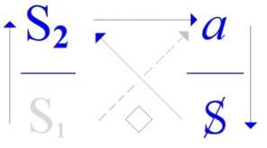 → 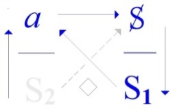

[无对应译文]

</section>

<section class="parallel-paragraph" data-paragraph-ids="s18-07-0047">

s18-07-0047

原文 · s18-07-0047

> Disc. U Disc. A

[无对应译文]

</section>

<section class="parallel-paragraph" data-paragraph-ids="s18-07-0048">

s18-07-0048

原文 · s18-07-0048

Si pourtant mon enseignement a place dans *un changement de configuration* \[*« quart de tour » du disc. U au disc. A*\] qui actuellement...

[无对应译文]

</section>

<section class="parallel-paragraph" data-paragraph-ids="s18-07-0049">

s18-07-0049

原文 · s18-07-0049

> sous couleur d’actualité \[*Cf. le « débat » Lacan-Derrida*\] ...actuellement s’affiche d’un slogan de *promotion* *de l’écrit*. \[*→ slogan de« publicité »*\]

[无对应译文]

</section>

<section class="parallel-paragraph" data-paragraph-ids="s18-07-0050">

s18-07-0050

原文 · s18-07-0050

Mais ce changement, d’autres témoignages...

[无对应译文]

</section>

<section class="parallel-paragraph" data-paragraph-ids="s18-07-0051">

s18-07-0051

原文 · s18-07-0051

> par exemple que ce soit de nos jours qu’enfin Rabelais soit lu ...montrent qu’il repose peut-être sur un déplacement littéraire *à quoi je m’accorde mieux* \[*mieux qu’à un slogan* *« promotion de l’écrit »*\]. \[*cf. « Gargantua », la référence au « Banquet » et à l’*ἄγαλμα (*agalma*) *dans le célèbre prologue : « Buveurs très illustres, et vous vérolés très précieux*... » *cf. aussi « Pantagruel » *: *« science sans conscience ... » et sa référence à venir dans « L’étourdit »*\]

[无对应译文]

</section>

<section class="parallel-paragraph" data-paragraph-ids="s18-07-0052">

s18-07-0052

原文 · s18-07-0052

Je suis, comme « *auteur* », moins impliqué qu’on n’imagine [^53], mes « *Écrits »* un titre plus ironique qu’on ne croit, puisqu’il s’agit en somme

[无对应译文]

</section>

<section class="parallel-paragraph" data-paragraph-ids="s18-07-0053">

s18-07-0053

原文 · s18-07-0053

- soit de *Rapports*, qui sont fonction de congrès,

[无对应译文]

</section>

<section class="parallel-paragraph" data-paragraph-ids="s18-07-0054">

s18-07-0054

原文 · s18-07-0054

- soit - disons, j’aimerais bien qu’on les entende comme ça - des « *lettres ouvertes »* où je fais sans doute question à chaque fois d’un pan de mon enseignement, mais enfin ça en donne le ton.

[无对应译文]

</section>

<section class="parallel-paragraph" data-paragraph-ids="s18-07-0055">

s18-07-0055

原文 · s18-07-0055

Loin en tout cas de me commettre dans ce *frotti-frotta* littéraire dont se dénote le psychanalyste en mal d’invention, j’y dénonce la tentative immanquable à démontrer *l’inégalité de sa pratique* \[*analytique*\] à motiver le moindre *jugement littéraire.*

[无对应译文]

</section>

<section class="parallel-paragraph" data-paragraph-ids="s18-07-0056">

s18-07-0056

原文 · s18-07-0056

Il est pourtant frappant que ce recueil de mes *Écrits,* je l’ai ouvert d’un article que *j’isole* en l’extrayant de sa chronologie...

[无对应译文]

</section>

<section class="parallel-paragraph" data-paragraph-ids="s18-07-0057">

s18-07-0057

原文 · s18-07-0057

> la chronologie y fait règle ...et que là il s’agisse d’un *conte*, lui-même - il faut le dire - bien particulier de ne pouvoir entrer dans la liste ordonnée...

[无对应译文]

</section>

<section class="parallel-paragraph" data-paragraph-ids="s18-07-0058">

s18-07-0058

原文 · s18-07-0058

> vous savez qu’on l’a faite ...des situations dramatiques [^54]. Enfin laissons ça...

[无对应译文]

</section>

<section class="parallel-paragraph" data-paragraph-ids="s18-07-0059">

s18-07-0059

原文 · s18-07-0059

Lui, *le conte,* il se fait de ce qu’il advient de la poste d’une *lettre-missive*, au su de qui se passent ces « *faire suivre* », et *de quels termes s’appuie* *que je puisse*, moi, *dire* cette lettre... dire à propos d’elle : « *qu’une lettre toujours en vient à sa destination* ».

[无对应译文]

</section>

<section class="parallel-paragraph" data-paragraph-ids="s18-07-0060">

s18-07-0060

原文 · s18-07-0060

\[*« toujours » car la lettre reste dans l’espace du « même » *: *elle n’est pas adressée à l’Autre, cf. infra *: *« ce virage que vous puissiez le prendre, le même à tout instant »*\]

[无对应译文]

</section>

<section class="parallel-paragraph" data-paragraph-ids="s18-07-0061">

s18-07-0061

原文 · s18-07-0061

*Et ceci* *après des détours qu’elle y a subis dans le conte*, *le compte* - si je puis dire - *soit rendu* *sans aucun recours à son contenu*, *de la lettre.*

[无对应译文]

</section>

<section class="parallel-paragraph" data-paragraph-ids="s18-07-0062">

s18-07-0062

原文 · s18-07-0062

\[*la « lettre » porte un effet sur son détenteur sans que jamais le message (signification) qu’elle porte ne soit connu ni évoqué, ce qui la distingue des « signifiants » qu’elle contient*\]

[无对应译文]

</section>

<section class="parallel-paragraph" data-paragraph-ids="s18-07-0063">

s18-07-0063

原文 · s18-07-0063

C’est cela qui rend remarquable *l’effet* qu’elle porte sur ceux qui, tour à tour, s’en font les détenteurs...

[无对应译文]

</section>

<section class="parallel-paragraph" data-paragraph-ids="s18-07-0064">

s18-07-0064

原文 · s18-07-0064

> tout ardents qu’ils puissent être du pouvoir qu’elle confère, pour y prétendre ...que cet *effet d’illusion* puisse s’articuler - ce que je fais moi - comme *effet de féminisation*. \[*le pouvoir que confère la lettre met son détenteur en position de « détention » passive, de recel d’un objet précieux...*\]

[无对应译文]

</section>

<section class="parallel-paragraph" data-paragraph-ids="s18-07-0065">

s18-07-0065

原文 · s18-07-0065

C’est là - je m’excuse d’y revenir - bien distinguer...

[无对应译文]

</section>

<section class="parallel-paragraph" data-paragraph-ids="s18-07-0066">

s18-07-0066

原文 · s18-07-0066

> je parle de ce que je fais ...« *la lettre »* du « *signifiant même* », en tant qu’ici *elle l’emporte*, elle l’emporte *dans son enveloppe*, puisqu’il s’agit d’une *lettre* au sens du mot « *épistole »*.

[无对应译文]

</section>

<section class="parallel-paragraph" data-paragraph-ids="s18-07-0067">

s18-07-0067

原文 · s18-07-0067

Or, je prétends que je ne fais pas là du mot « *lettre* » usage métaphorique, puisque justement le conte consiste en ce qu’y passe comme muscade le message dont c’est *l’écrit* \- donc proprement *la lettre* - qui fait seule péripétie. \[*ne compte ici que le trajet, le voyage de la lettre, pas le contenu du message*\]

[无对应译文]

</section>

<section class="parallel-paragraph" data-paragraph-ids="s18-07-0068">

s18-07-0068

原文 · s18-07-0068

Ma critique, si elle a lieu d’être tenue pour « *littéraire »*, ne saurait là donc porter - je m’y essaie - que sur ce que Poe fait - d’être écrivain lui-même - *à former un tel message sur la lettre*.

[无对应译文]

</section>

<section class="parallel-paragraph" data-paragraph-ids="s18-07-0069">

s18-07-0069

原文 · s18-07-0069

Il est clair *qu’à ne pas le dire tel quel,* tel que je le dis moi, ce n’est pas *insuffisamment*, c’est d’autant plus *rigoureusement* qu’il l’avoue.

[无对应译文]

</section>

<section class="parallel-paragraph" data-paragraph-ids="s18-07-0070">

s18-07-0070

原文 · s18-07-0070

\[*En laissant la lettre muette de tout contenu de message dans l’intrigue du conte, en ne portant l’éclairage que sur les étapes du trajet de cette lettre,* *Poe révèle « rigoureusement » le statut de la lettre *: *un « dire » sans signification mais non sans effets*\]

[无对应译文]

</section>

<section class="parallel-paragraph" data-paragraph-ids="s18-07-0071">

s18-07-0071

原文 · s18-07-0071

Néanmoins *l’élision, l’élision de ce message*, *n’en saurait être élucidée* au moyen de quelque trait que ce soit de *sa psycho-biographie*, bouchée plutôt qu’elle en serait, cette élision.

[无对应译文]

</section>

<section class="parallel-paragraph" data-paragraph-ids="s18-07-0072">

s18-07-0072

原文 · s18-07-0072

Une psychanalyste qui - on s’en souvient peut-être - a récuré les autres textes de Poe, ici déclare forfait de sa serpillière.

[无对应译文]

</section>

<section class="parallel-paragraph" data-paragraph-ids="s18-07-0073">

s18-07-0073

原文 · s18-07-0073

Elle y touche pas, la Marie ! [^55]

[无对应译文]

</section>

<section class="parallel-paragraph" data-paragraph-ids="s18-07-0074">

s18-07-0074

原文 · s18-07-0074

Voilà, pour le texte de Poe...

[无对应译文]

</section>

<section class="parallel-paragraph" data-paragraph-ids="s18-07-0075">

s18-07-0075

原文 · s18-07-0075

Mais pour le mien de texte [^56], est-ce qu’il ne pourrait pas se résoudre par ma psycho-biographie à moi ? \[*sur un ton ironique* \]

[无对应译文]

</section>

<section class="parallel-paragraph" data-paragraph-ids="s18-07-0076">

s18-07-0076

原文 · s18-07-0076

Le vœu que je formerais par exemple, d’être lu un jour convenablement \[→ « lire » Lacan comme une (très) longue analyse\].

[无对应译文]

</section>

<section class="parallel-paragraph" data-paragraph-ids="s18-07-0077">

s18-07-0077

原文 · s18-07-0077

Mais pour ça, pour que ça vaille, il faudrait d’abord qu’on développe...

[无对应译文]

</section>

<section class="parallel-paragraph" data-paragraph-ids="s18-07-0078">

s18-07-0078

原文 · s18-07-0078

> que celui qui s’y emploierait, à cette interprétation, ...développe *ce que j’entends que la lettre porte* \[*trace de la jouissance*\]*, pour arriver toujours* - je le dis - *à sa destination*.

[无对应译文]

</section>

<section class="parallel-paragraph" data-paragraph-ids="s18-07-0079">

s18-07-0079

原文 · s18-07-0079

\[*La lettre n’a pas l’Autre du langage pour destination, mais l’Autre du corps* : *elle est déjà dans la place, déjà à son adresse, mais le chemin du bord du trou est à retrouver* *« toujours » car la lettre est déjà à sa destination, mais « en souffrance », « égarée », cf. infra *: *« ce virage que vous puissiez le prendre, le même à tout instant »*\]

[无对应译文]

</section>

<section class="parallel-paragraph" data-paragraph-ids="s18-07-0080">

s18-07-0080

原文 · s18-07-0080

C’est là peut-être que je suis, pour l’instant, en cheville avec les « dévots de l’écriture ». \[*Cf. le « débat » Lacan-Derrida*\]

[无对应译文]

</section>

<section class="parallel-paragraph" data-paragraph-ids="s18-07-0081">

s18-07-0081

原文 · s18-07-0081

Il est certain que comme d’ordinaire la psychanalyse ici *reçoit* de la littérature \[*d’Edgar Poe*\], et elle pourrait d’abord en prendre cette graine qui serait, du *ressort du* *refoulement,* une idée moins psycho-biographique.

[无对应译文]

</section>

<section class="parallel-paragraph" data-paragraph-ids="s18-07-0082">

s18-07-0082

原文 · s18-07-0082

Pour moi, si je propose le texte de Poe - avec ce qu’il y a derrière - à la psychanalyse, c’est justement de ce qu’elle ne puisse l’aborder qu’à y montrer son échec.

[无对应译文]

</section>

<section class="parallel-paragraph" data-paragraph-ids="s18-07-0083">

s18-07-0083

原文 · s18-07-0083

C’est par là que *je l’éclaire* la psychanalyse \[*par son échec, là où ça rate* : *un réel ininterprétable*\], et on le sait...

[无对应译文]

</section>

<section class="parallel-paragraph" data-paragraph-ids="s18-07-0084">

s18-07-0084

原文 · s18-07-0084

> on le sait que je sais que j’invoque ainsi - c’est au dos de mon volume \[*« Écrits », Seuil, Paris, 1966*\] ...j’invoque ainsi « les lumières ».

[无对应译文]

</section>

<section class="parallel-paragraph" data-paragraph-ids="s18-07-0085">

s18-07-0085

原文 · s18-07-0085

Pourtant *je « l’éclaire »* de démontrer où elle fait *trou*, la psychanalyse.

[无对应译文]

</section>

<section class="parallel-paragraph" data-paragraph-ids="s18-07-0086">

s18-07-0086

原文 · s18-07-0086

\[*« Les lumières »/« la lumière » *: *« Les lumières » étant le moment historique de l’émergence de la Raison, de la rationalité classique, de la conscience transparente à elle-même, etc.*

[无对应译文]

</section>

<section class="parallel-paragraph" data-paragraph-ids="s18-07-0087">

s18-07-0087

原文 · s18-07-0087

*Lacan y objecte « la raison depuis Freud »* : *celle qui éclaire les trous de la lumière de la rationalité classique (rêves, lapsus, oublis... et symptômes)*

[无对应译文]

</section>

<section class="parallel-paragraph" data-paragraph-ids="s18-07-0088">

s18-07-0088

原文 · s18-07-0088

*Cf. « L’étourdit »* (Sta 7) : « *Ce qui s’éclaire du « <u>jour rasant</u> » que* *le discours analytique apporte aux autres, y révélant les* *lieux modaux dont leur ronde s’accomplit*. »\]

[无对应译文]

</section>

<section class="parallel-paragraph" data-paragraph-ids="s18-07-0089">

s18-07-0089

原文 · s18-07-0089

Ça n’a rien d’illégitime, ça a déjà porté son fruit, on le sait depuis longtemps en optique, et la plus récente physique, celle *du photon*, s’en arme [^57].

[无对应译文]

</section>

<section class="parallel-paragraph" data-paragraph-ids="s18-07-0090">

s18-07-0090

原文 · s18-07-0090

\[*Cf. le débat sur la nature de la lumière *: *corpusculaire ou ondulatoire* (*Einstein, Bohr, Dirac,* *[Plank..., la physique quantique](http://fr.wikipedia.org/wiki/Physique_quantique), [interférences de Young](http://fr.wikipedia.org/wiki/Fentes_de_Young)...*\]

[无对应译文]

</section>

<section class="parallel-paragraph" data-paragraph-ids="s18-07-0091">

s18-07-0091

原文 · s18-07-0091

C’est par cette méthode \[*→partir des trous : là où faire sens échoue*\] que la psychanalyse pourrait mieux justifier son intrusion dans la critique littéraire.

[无对应译文]

</section>

<section class="parallel-paragraph" data-paragraph-ids="s18-07-0092">

s18-07-0092

原文 · s18-07-0092

Ça voudrait dire que la critique littéraire viendrait effectivement à se renouveler de ce que la psychanalyse soit là, pour que les textes se mesurent à elle, justement de ce que *l’énigme* \[*le hors sens*\] reste de son côté : qu’elle soit coite.

[无对应译文]

</section>

<section class="parallel-paragraph" data-paragraph-ids="s18-07-0093">

s18-07-0093

原文 · s18-07-0093

\[*l’énigme du symptôme, du lapsus, de l’acte manqué... comme hiéroglyphes, mais aussi l’énigme du « *4, 2, 3* » de la Sphynge :*

[无对应译文]

</section>

<section class="parallel-paragraph" data-paragraph-ids="s18-07-0094">

s18-07-0094

原文 · s18-07-0094

> « τί ἐστιν ὃ μίαν ἔχον φωνὴν τετράπουν καὶ δίπουν καὶ τρίπουν γίνεται »
>
> « *Quel être, pourvu d’une seule voix, a d’abord quatre jambes, puis deux jambes, et trois jambes ensuite ? » (Apollodore, Bibliothèque,* III, 5, 8*)*

[无对应译文]

</section>

<section class="parallel-paragraph" data-paragraph-ids="s18-07-0095">

s18-07-0095

原文 · s18-07-0095

*Ou l’énigme de « l’être » *:

[无对应译文]

</section>

<section class="parallel-paragraph" data-paragraph-ids="s18-07-0096">

s18-07-0096

原文 · s18-07-0096

> « Έπάμεροί τί δέ τις ! τί δ'οῠ τις ? σκιᾶς ὄναρ ἄνθρωπος. »
>
> *Ô homme d’un jour : Qu’est-ce que l’être, qu’est-ce que le non-être ? Tu n’es que le rêve d’une ombre.* *(Pindare (Pythiques* VIII, 99*)* *trad. Faustin Colin*\]

[无对应译文]

</section>

<section class="parallel-paragraph" data-paragraph-ids="s18-07-0097">

s18-07-0097

原文 · s18-07-0097

*Et ici, surtout l’énigme de l’oracle* :

[无对应译文]

</section>

<section class="parallel-paragraph" data-paragraph-ids="s18-07-0098">

s18-07-0098

原文 · s18-07-0098

> « ὁ ἄναξ οὗ τὸ µαντεῖόν ἐστι τὸ ἐν ∆ελφοῖς, οὔτε λέγει οὔτε κρύπτει ἀλλὰ σηµαίνει. »
>
> « *Le dieu dont l’oracle est à Delphes ne révèle pas, ne cache pas, mais il indique. »* \[*il fait signe*\] (Héraclite, Fragment 93

[无对应译文]

</section>

<section class="parallel-paragraph" data-paragraph-ids="s18-07-0099">

s18-07-0099

原文 · s18-07-0099

Mais ceux, ceux des psychanalystes...

[无对应译文]

</section>

<section class="parallel-paragraph" data-paragraph-ids="s18-07-0100">

s18-07-0100

原文 · s18-07-0100

> dont ce n’est pas *médire* que d’avancer que plutôt qu’ils l’exercent la psychanalyse, *ils en sont exercés* ...entendent mal mes propos, à tout le moins d’être pris en corps.

[无对应译文]

</section>

<section class="parallel-paragraph" data-paragraph-ids="s18-07-0101">

s18-07-0101

原文 · s18-07-0101

\[*Lacan a souvent comparé ces institutions psychanalytiques à l’Église où on exerce un « office » avec ses rituels « à heures fixes » (« dire la messe »),* *où l’on a des textes sacrés dont le sens est autorisé par les « Docteurs de l’Église », et où l’on doit obéir et reproduire aveuglement la doctrine* (*« Perinde ac cadaver »*).\]

[无对应译文]

</section>

<section class="parallel-paragraph" data-paragraph-ids="s18-07-0102">

s18-07-0102

原文 · s18-07-0102

J’oppose - à leur adresse - *vérité* et *savoir*.

[无对应译文]

</section>

<section class="parallel-paragraph" data-paragraph-ids="s18-07-0103">

s18-07-0103

原文 · s18-07-0103

- C’est la première où aussitôt ils reconnaissent leur office, \[*la vérité comme univers du sens*\]

[无对应译文]

</section>

<section class="parallel-paragraph" data-paragraph-ids="s18-07-0104">

s18-07-0104

原文 · s18-07-0104

- alors que sur la sellette c’est *leur* *vérité* que j’attends. \[*un savoir singulier et hors sens*\]

[无对应译文]

</section>

<section class="parallel-paragraph" data-paragraph-ids="s18-07-0105">

s18-07-0105

原文 · s18-07-0105

J’insiste - à corriger mon tir - de dire «* savoir en échec *» \[*savoir insu, hors sens*\], voilà où la psychanalyse se montre au mieux.

[无对应译文]

</section>

<section class="parallel-paragraph" data-paragraph-ids="s18-07-0106">

s18-07-0106

原文 · s18-07-0106

« *Savoir en échec »*, comme on dit « *figure en abîme* », ça ne veut pas dire échec du savoir.

[无对应译文]

</section>

<section class="parallel-paragraph" data-paragraph-ids="s18-07-0107">

s18-07-0107

原文 · s18-07-0107

\[*Le discours analytique aboutit à la production de* S1, *signifiants asémantiques coupés de tout savoir : « aucun sens »* (S2) : a → S→/ S1◊ S2→ savoir en échec.

[无对应译文]

</section>

<section class="parallel-paragraph" data-paragraph-ids="s18-07-0108">

s18-07-0108

原文 · s18-07-0108

*Mais ce n’est pas échec du savoir si au-delà de « l’effet de sens », on accède (en éclair) à « l’effet de corps »*

[无对应译文]

</section>

<section class="parallel-paragraph" data-paragraph-ids="s18-07-0109">

s18-07-0109

原文 · s18-07-0109

- (*cf. « L’étourdit » *: *« Qu’on dise reste oublié derrière ce qui se dit dans ce qui s’entend. »),*

[无对应译文]

</section>

<section class="parallel-paragraph" data-paragraph-ids="s18-07-0110">

s18-07-0110

原文 · s18-07-0110

> *« ...le dire vient d’où il* \[*le réel* \] *la commande* \[*la vérité* \]. »\]

[无对应译文]

</section>

<section class="parallel-paragraph" data-paragraph-ids="s18-07-0111">

s18-07-0111

原文 · s18-07-0111

Aussitôt j’apprends qu’on s’en croit dispensé de faire preuve d’aucun savoir...

[无对应译文]

</section>

<section class="parallel-paragraph" data-paragraph-ids="s18-07-0112">

s18-07-0112

原文 · s18-07-0112

*Serait-ce lettre morte que j’ai mis au titre d’un de ces morceaux que j’ai dit « Écrits », de la lettre l’instance, comme raison de l’inconscient ?*

[无对应译文]

</section>

<section class="parallel-paragraph" data-paragraph-ids="s18-07-0113">

s18-07-0113

原文 · s18-07-0113

N’est-ce pas désigner assez *dans la lettre ce qui* \[*la jouissance*\], *à devoir insister*, *n’est pas là de plein droit*, *si fort de raison que ça s’avance.*

[无对应译文]

</section>

<section class="parallel-paragraph" data-paragraph-ids="s18-07-0114">

s18-07-0114

原文 · s18-07-0114

\[*« de plein droit »* : *le droit ne dit rien sur la jouissance elle-même, sinon que le « bien » doit être conservé et transmis en l’état d’origine → jouissance « hors la loi »*\]

[无对应译文]

</section>

<section class="parallel-paragraph" data-paragraph-ids="s18-07-0115">

s18-07-0115

原文 · s18-07-0115

Dire cette *raison*, *moyenne* ou *extrême* [^58] c’est bien montrer - je l’ai fait déjà à l’occasion[^59] - *la bifidité* où s’engage *toute mesure*.

[无对应译文]

</section>

<section class="parallel-paragraph" data-paragraph-ids="s18-07-0116">

s18-07-0116

原文 · s18-07-0116

Mais n’y a-t-il rien dans le *réel*, qui se passe de cette médiation ?

[无对应译文]

</section>

<section class="parallel-paragraph" data-paragraph-ids="s18-07-0117">

s18-07-0117

原文 · s18-07-0117

Ça pourrait être la *frontière*... La frontière - à séparer deux territoires - n’a qu’un défaut, mais il est de taille : elle symbolise qu’ils sont *de même tabac*, si je puis dire, en tout cas pour quiconque la franchit.

[无对应译文]

</section>

<section class="parallel-paragraph" data-paragraph-ids="s18-07-0118">

s18-07-0118

原文 · s18-07-0118

Je ne sais pas si vous vous y êtes arrêtés, mais c’est le principe dont un jour un nommé Von Uexküll a fabriqué le terme d’*Umwelt.*

[无对应译文]

</section>

<section class="parallel-paragraph" data-paragraph-ids="s18-07-0119">

s18-07-0119

原文 · s18-07-0119

C’est fait sur le principe qu’il est le *reflet de l’Innenwelt* \[« *monde intérieur »*\], c’est la promotion de *la fron­tière* à l’idéologie.

[无对应译文]

</section>

<section class="parallel-paragraph" data-paragraph-ids="s18-07-0120">

s18-07-0120

原文 · s18-07-0120

C’est évidemment un départ fâcheux qu’une biologie...

[无对应译文]

</section>

<section class="parallel-paragraph" data-paragraph-ids="s18-07-0121">

s18-07-0121

原文 · s18-07-0121

> car c’était une biologie qu’il voulait avec ça fonder, Von Uexküll ...une biologie *qui se donne déjà tout au départ, le fait de l’adaptation notamment*, qui fait le fond de ce couplage *Umwelt-Innenwelt*. Évidemment « *la sélection* », « *la sélection »* ça ne vaut pas mieux au titre de l’idéologie : ce n’est pas parce qu’elle se bénit elle-même d’être « *naturelle* » qu’elle l’est moins \[*idéologique*\].

[无对应译文]

</section>

<section class="parallel-paragraph" data-paragraph-ids="s18-07-0122">

s18-07-0122

原文 · s18-07-0122

Je vais vous proposer quelque chose, comme ça, tout brutalement, pour venir après « *a letter, a litter*  ».

[无对应译文]

</section>

<section class="parallel-paragraph" data-paragraph-ids="s18-07-0123">

s18-07-0123

原文 · s18-07-0123

Moi je vais vous dire : « *La lettre n’est-elle pas le littéral à fonder dans le littoral ?* »

[无对应译文]

</section>

<section class="parallel-paragraph" data-paragraph-ids="s18-07-0124">

s18-07-0124

原文 · s18-07-0124

Car ça c’est *autre chose* qu’une frontière.

[无对应译文]

</section>

<section class="parallel-paragraph" data-paragraph-ids="s18-07-0125">

s18-07-0125

原文 · s18-07-0125

D’ailleurs vous avez pu remarquer que ça ne se confond jamais : *le littoral*, c’est ce qui pose un domaine tout entier comme faisant à un autre, si vous voulez, « *frontière »*, mais justement de ceci qu’ils n’ont absolument rien en commun, même pas une relation réciproque.

[无对应译文]

</section>

<section class="parallel-paragraph" data-paragraph-ids="s18-07-0126">

s18-07-0126

原文 · s18-07-0126

*La lettre n’est-elle pas proprement littorale ?*

[无对应译文]

</section>

<section class="parallel-paragraph" data-paragraph-ids="s18-07-0127">

s18-07-0127

原文 · s18-07-0127

*Le bord du trou dans le savoir*, que la psychanalyse désigne justement quand elle aborde *la lettre,* *voilà-t-il pas ce qu’elle* *dessine* ?

[无对应译文]

</section>

<section class="parallel-paragraph" data-paragraph-ids="s18-07-0128">

s18-07-0128

原文 · s18-07-0128

\[*la lettre est ce littoral, « ce chemin étroit » entre deux espaces radicalement « autres » *: *entre réel et symbolique « elle dessine le bord du trou dans le savoir ». Le savoir est troué *: *la lettre est la trace de bord, de ce réel qui a chu du filet symbolique et fait trou dans le savoir → savoir en échec (et échec du savoir si la psychanalyse ici renonce*\]

[无对应译文]

</section>

<section class="parallel-paragraph" data-paragraph-ids="s18-07-0129">

s18-07-0129

原文 · s18-07-0129

Le drôle, c’est de constater comment la psychanalyse s’oblige...

[无对应译文]

</section>

<section class="parallel-paragraph" data-paragraph-ids="s18-07-0130">

s18-07-0130

原文 · s18-07-0130

> en quelque sorte de son mouvement même, ...à méconnaître le sens de ce que pourtant *la lettre* dit « *à la lettre *» - c’est le cas de le dire - de sa bouche, quand toutes ses interprétations se résument à *la jouissance*.

[无对应译文]

</section>

<section class="parallel-paragraph" data-paragraph-ids="s18-07-0131">

s18-07-0131

原文 · s18-07-0131

*Entre la jouissance et le savoir, la lettre ferait le littoral*.

[无对应译文]

</section>

<section class="parallel-paragraph" data-paragraph-ids="s18-07-0132">

s18-07-0132

原文 · s18-07-0132

Tout ça n’empêche pas que ce que j’ai dit de l’inconscient, restant là, ait quand même la précédence, sans quoi ce que j’avance n’aurait absolument aucun sens...

[无对应译文]

</section>

<section class="parallel-paragraph" data-paragraph-ids="s18-07-0133">

s18-07-0133

原文 · s18-07-0133

Il reste à savoir comment l’inconscient...

[无对应译文]

</section>

<section class="parallel-paragraph" data-paragraph-ids="s18-07-0134">

s18-07-0134

原文 · s18-07-0134

> que je dis être *effet de langage,* puisqu’il en suppose la structure comme nécessaire et suffisante, ...comment il commande cette fonction de la lettre.

[无对应译文]

</section>

<section class="parallel-paragraph" data-paragraph-ids="s18-07-0135">

s18-07-0135

原文 · s18-07-0135

\[L*e dernier enseignement de Lacan précisera cette causalité :*

[无对应译文]

</section>

<section class="parallel-paragraph" data-paragraph-ids="s18-07-0136">

s18-07-0136

原文 · s18-07-0136

- *« le dire vient d’où il* \[*le réel* \] *la commande* \[*la vérité* \] » (*L’étourdit*).

[无对应译文]

</section>

<section class="parallel-paragraph" data-paragraph-ids="s18-07-0137">

s18-07-0137

原文 · s18-07-0137

- « ...*l’inconscient* (*qui n’est ce qu’on croit - je dis* : *l’inconscient - soit réel, qu’à m’en croire...*) (*Préface à l’édition anglaise du séminaire* XI)\]

[无对应译文]

</section>

<section class="parallel-paragraph" data-paragraph-ids="s18-07-0138">

s18-07-0138

原文 · s18-07-0138

Qu’elle soit instrument propre à l’inscription du discours, ne la rend pas du tout impropre à servir à ce que j’en fais, quand dans *L’instance de la lettre* [^60] par exemple, dont je parlais tout à l’heure, je l’emploie à montrer le jeu de ce que l’autre appelle - Jean Tardieu [^61] - «* le mot pris pour un autre *», voire « *le mot pris par un autre* », autrement dit *la métaphore et la métonymie comme effets de la phrase*.

[无对应译文]

</section>

<section class="parallel-paragraph" data-paragraph-ids="s18-07-0139">

s18-07-0139

原文 · s18-07-0139

Ça symbolise donc aisément tous ces effets de signifiants, mais ça n’impose nullement qu’elle soit - elle, la lettre - dans ces *effets* mêmes, pour lesquels elle me sert d’instrument, qu’elle soit primaire.

[无对应译文]

</section>

<section class="parallel-paragraph" data-paragraph-ids="s18-07-0140">

s18-07-0140

原文 · s18-07-0140

L’examen s’impose, *moins de cette primarité* qui n’est même pas à supposer, mais de *ce qui du langage appelle le littoral au littéral*. \[*ce qui du signifiant appelle la jouissance à partir de l’écrit*\]

[无对应译文]

</section>

<section class="parallel-paragraph" data-paragraph-ids="s18-07-0141">

s18-07-0141

原文 · s18-07-0141

Rien de ce que j’ai inscrit à l’aide de *lettres,* des formations de l’inconscient...

[无对应译文]

</section>

<section class="parallel-paragraph" data-paragraph-ids="s18-07-0142">

s18-07-0142

原文 · s18-07-0142

> pour les récupérer de ce dont Freud les formule : des énoncés - plus simplement - d’effets de langage ...rien ne permet de confondre - comme il s’est fait - *la lettre* avec le signifiant.

[无对应译文]

</section>

<section class="parallel-paragraph" data-paragraph-ids="s18-07-0143">

s18-07-0143

原文 · s18-07-0143

Ce que j’ai inscrit à l’aide de *lettres,* des formations de l’inconscient \[*cf.* « *graphe du désir* »\], n’autorise pas à faire de *« la lettre »* un signifiant, et à l’affecter, qui plus est, d’une *primarité* au regard du signifiant.

[无对应译文]

</section>

<section class="parallel-paragraph" data-paragraph-ids="s18-07-0144">

s18-07-0144

原文 · s18-07-0144

Un tel discours *confusionnel* n’a pu surgir que de celui, du discours, qui *m’importe* \[*importation du disc.* A *dans le disc.* U\], et justement *qui m’importe* dans un autre discours que j’épingle au temps venu du *discours universitaire*, soit...

[无对应译文]

</section>

<section class="parallel-paragraph" data-paragraph-ids="s18-07-0145">

s18-07-0145

原文 · s18-07-0145

> comme je l’ai souligné assez depuis un an et demi, je pense ...soit du savoir \[**S2**\] mis en usage à partir du *semblant*.

[无对应译文]

</section>

<section class="parallel-paragraph" data-paragraph-ids="s18-07-0146">

s18-07-0146

原文 · s18-07-0146

[无对应译文]

</section>

<section class="parallel-paragraph" data-paragraph-ids="s18-07-0147">

s18-07-0147

原文 · s18-07-0147

Disc. U

[无对应译文]

</section>

<section class="parallel-paragraph" data-paragraph-ids="s18-07-0148">

s18-07-0148

原文 · s18-07-0148

Le moindre sentiment de l’expérience à quoi je pare, ne peut se situer que d’un autre discours que de celui-là, eut dû le garder de produire ce discours - que je ne désigne pas plus - sans l’avouer de moi.

[无对应译文]

</section>

<section class="parallel-paragraph" data-paragraph-ids="s18-07-0149">

s18-07-0149

原文 · s18-07-0149

On me l’a épargné, Dieu merci !

[无对应译文]

</section>

<section class="parallel-paragraph" data-paragraph-ids="s18-07-0150">

s18-07-0150

原文 · s18-07-0150

N’empêche *qu’à m’importer* - au sens que j’ai dit tout à l’heure - *on m’importune*.

[无对应译文]

</section>

<section class="parallel-paragraph" data-paragraph-ids="s18-07-0151">

s18-07-0151

原文 · s18-07-0151

Si j’avais trouvé recevables les modèles que Freud articule dans une « *Esquisse »* d’où décrire le frayage, le forage, de routes [*impressives*](https://www.cnrtl.fr/definition/impr%C3%A9ssive), je n’en aurais pas pour autant pris la métaphore de l’écriture.

[无对应译文]

</section>

<section class="parallel-paragraph" data-paragraph-ids="s18-07-0152">

s18-07-0152

原文 · s18-07-0152

Et justement, c’est sur ce point précis que je ne la trouve pas recevable : *l’écriture n’est pas l’impression*, n’en déplaise à tout ce qui s’est fait comme *bla-bla* sur le fameux *Wunderblock* [^62].

[无对应译文]

</section>

<section class="parallel-paragraph" data-paragraph-ids="s18-07-0153">

s18-07-0153

原文 · s18-07-0153

Que je tire parti de *la lettre* appelée « *52ème* »,

[无对应译文]

</section>

<section class="parallel-paragraph" data-paragraph-ids="s18-07-0154">

s18-07-0154

原文 · s18-07-0154

- c’est d’y lire ce que Freud ne pouvait qu’énoncer sous le terme qu’il forge du WZ : *Wahrnehmungszeichen,*

[无对应译文]

</section>

<section class="parallel-paragraph" data-paragraph-ids="s18-07-0155">

s18-07-0155

原文 · s18-07-0155

- et de repérer que c’est ce qu’il pouvait trouver de plus proche du *signifiant* à la date où Saussure ne l’avait pas encore remis au jour, ce fameux *signifiant*, qui ne date quand même pas de lui, puisqu’il date des Stoïciens.

[无对应译文]

</section>

<section class="parallel-paragraph" data-paragraph-ids="s18-07-0156">

s18-07-0156

原文 · s18-07-0156

Que Freud l’écrive là de 2 *lettres*, comme moi ailleurs je ne l’écris que d’*une*, ça ne prouve en rien que *la lettre* soit *primaire*.

[无对应译文]

</section>

<section class="parallel-paragraph" data-paragraph-ids="s18-07-0157">

s18-07-0157

原文 · s18-07-0157

Je vais donc essayer pour vous aujourd’hui d’indiquer le vif de ce qui me paraît produire *la lettre* comme conséquence, et du langage, précisément de ce que je dis : que *l’habite qui parle*. \[*celui qui parle habite au lieu de l’Autre, cf. L’étourdit *: *« stabitat »*\]

[无对应译文]

</section>

<section class="parallel-paragraph" data-paragraph-ids="s18-07-0158">

s18-07-0158

原文 · s18-07-0158

J’en emprunterai les traits à ce que d’une économie de langage permet de dessiner ce que promeut, à mon idée, que « *littérature »* peut être en train de virer à « *lituraterre ».* \[*dessiner le trajet de la lettre, le ravinement-ravissement produit par la chute du* (*a*)\]

[无对应译文]

</section>

<section class="parallel-paragraph" data-paragraph-ids="s18-07-0159">

s18-07-0159

原文 · s18-07-0159

N’allez pas vous étonner de m’y voir procéder d’une démonstration littéraire puisque c’est là marcher du même pas dont la question elle-même s’avance.

[无对应译文]

</section>

<section class="parallel-paragraph" data-paragraph-ids="s18-07-0160">

s18-07-0160

原文 · s18-07-0160

On pourra peut-être y voir, y voir s’affirmer, ce que peut être une telle *démonstration* que j’appelle *littéraire*. **\[40’37’’\]** \[*en retirant au littéraire sa signification, on met en évidence la lettre, son trajet et le dispositif pulsionnel (comme Edgar Poe l’a fait dans « La lettre volée »)* « *démonstration* » : Lacan *« <u>dé</u>*<u>-*montre*</u>* » *→ *sens <u>anti-horaire</u> du renversement <u>du disc. U au disc. A</u>, et de la ronde des discours*\]

[无对应译文]

</section>

<section class="parallel-paragraph" data-paragraph-ids="s18-07-0161">

s18-07-0161

原文 · s18-07-0161

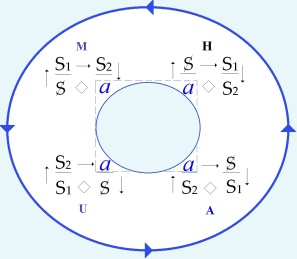

[无对应译文]

</section>

<section class="parallel-paragraph" data-paragraph-ids="s18-07-0162">

s18-07-0162

原文 · s18-07-0162

Je suis toujours un peu au bord, pourquoi pas cette fois-ci, m’y lancer ?

[无对应译文]

</section>

<section class="parallel-paragraph" data-paragraph-ids="s18-07-0163">

s18-07-0163

原文 · s18-07-0163

Je reviens d’un voyage que j’attendais de faire au Japon \[*Avril* 1971\], de ce que d’un 1er voyage \[*Avril* 1963\] j’avais éprouvé de littoral.

[无对应译文]

</section>

<section class="parallel-paragraph" data-paragraph-ids="s18-07-0164">

s18-07-0164

原文 · s18-07-0164

On peut m’entendre de ce que j’ai dit tout à l’heure de l’*Umwelt*, que j’ai répudié justement de ça : de rendre le voyage *impossible*, ce qui - si vous suivez mes formules - serait assurer son *réel*.

[无对应译文]

</section>

<section class="parallel-paragraph" data-paragraph-ids="s18-07-0165">

s18-07-0165

原文 · s18-07-0165

Seulement voilà, c’est prématuré : c’est le départ que ça rend *impossible*, sauf à chanter : « *Partons, partons...* ».

[无对应译文]

</section>

<section class="parallel-paragraph" data-paragraph-ids="s18-07-0166">

s18-07-0166

原文 · s18-07-0166

Ça se fait d’ailleurs beaucoup...

[无对应译文]

</section>

<section class="parallel-paragraph" data-paragraph-ids="s18-07-0167">

s18-07-0167

原文 · s18-07-0167

\[À l’époque du 1er voyage (*Avril* 1963) Lacan continuait de dérouler son enseignement sur la base du primat du symbolique (S.I.R.), Au moment de ce 2nd voyage (*Avril* 1971) Lacan se réoriente (depuis le S11) vers le primat du réel (cf. S22 : RSI). → 2 conceptions du voyage :

[无对应译文]

</section>

<section class="parallel-paragraph" data-paragraph-ids="s18-07-0168">

s18-07-0168

原文 · s18-07-0168

1)  *le voyage analytique comme séjour à l’étranger,* *le voyage dans un espace homogène avec passage par une frontière* (*Umwelt-Inwelt),*

[无对应译文]

</section>

<section class="parallel-paragraph" data-paragraph-ids="s18-07-0169">

s18-07-0169

原文 · s18-07-0169

> *mais départ impossible du symbolique vers le réel, qui ne peut être atteint, sauf en « chanson » *: *« Que me chantez-vous là ? », ou « On connait la chanson... »),*

[无对应译文]

</section>

<section class="parallel-paragraph" data-paragraph-ids="s18-07-0170">

s18-07-0170

原文 · s18-07-0170

2)  *le voyage analytique <u>vers</u> l’espace d’altérité radicale du réel, sur le littoral, au seuil d’un réel qui ne se « montre » qu’à se ressentir (effet de corps) « en éclair »*.

[无对应译文]

</section>

<section class="parallel-paragraph" data-paragraph-ids="s18-07-0171">

s18-07-0171

原文 · s18-07-0171

*Seul le discours* A *en faisant « l’économie » de la signification* (S1◊ S2) *provoque le renversement des discours et <u>le voyage de la lettre</u>,* *permettant la mise en évidence (monstration) de la structure littérale du dispositif pulsionnel (jouissance) et le départ* (*départage, partition...*) du *a* en

[无对应译文]

</section>

<section class="parallel-paragraph" data-paragraph-ids="s18-07-0172">

s18-07-0172

原文 · s18-07-0172

- « *objet cause* »: «* a letter » → comme bord du trou,*

[无对应译文]

</section>

<section class="parallel-paragraph" data-paragraph-ids="s18-07-0173">

s18-07-0173

原文 · s18-07-0173

- *et objet substitutif « plus de jouir », le bouchon du trou *: *« litter *»\]

[无对应译文]

</section>

<section class="parallel-paragraph" data-paragraph-ids="s18-07-0174">

s18-07-0174

原文 · s18-07-0174

Je ne noterai qu’un moment de ce voyage, celui qu’il se trouve que j’ai recueilli - de quoi ? – d’une route nouvelle \[*Paris-Tokyo par le pôle*\], qu’il s’est trouvé que j’ai prise simplement de ceci : que la première fois que j’y suis allé, elle était simplement interdite.

[无对应译文]

</section>

<section class="parallel-paragraph" data-paragraph-ids="s18-07-0175">

s18-07-0175

原文 · s18-07-0175

Il faut que j’avoue que ce ne fut pas à l’aller...

[无对应译文]

</section>

<section class="parallel-paragraph" data-paragraph-ids="s18-07-0176">

s18-07-0176

原文 · s18-07-0176

> le long du cercle arctique qui trace cette route pour l’avion, ...*que je fis lecture* - de quoi ? - *de ce que je voyais de la plaine sibérienne*.

[无对应译文]

</section>

<section class="parallel-paragraph" data-paragraph-ids="s18-07-0177">

s18-07-0177

原文 · s18-07-0177

Je suis en train de vous faire un essai de *sibériéthique.* \[*Rires*\]

[无对应译文]

</section>

<section class="parallel-paragraph" data-paragraph-ids="s18-07-0178">

s18-07-0178

原文 · s18-07-0178

Cet essai n’aurait pas vu le jour, si la méfiance des Soviétiques m’avait...

[无对应译文]

</section>

<section class="parallel-paragraph" data-paragraph-ids="s18-07-0179">

s18-07-0179

原文 · s18-07-0179

> c’était pas pour moi, c’était pour les avions ...m’avait, m’avait laissé voir les industries, les installations militaires qui font le prix de la Sibérie.

[无对应译文]

</section>

<section class="parallel-paragraph" data-paragraph-ids="s18-07-0180">

s18-07-0180

原文 · s18-07-0180

Mais enfin, cette méfiance, c’est là une condition que nous appellerons accidentelle, pourquoi pas même « *occidentelle* », on y met de l’*occire* un peu \[*Rires*\] : l’amoncellement du sud Sibérien c’est ça qui nous pend au nez !

[无对应译文]

</section>

<section class="parallel-paragraph" data-paragraph-ids="s18-07-0181">

s18-07-0181

原文 · s18-07-0181

\[*l’amoncellement de l’occire militaire (occidentel) alors que le Japon semble – dans son rapport spécifique à la lettre (cf. infra : « on Yomi » ↔ « Kun Yomi » et l’Art de la calligraphie)* *minimiser la signification en faveur de la forme (formalisme) mettant ainsi en évidence la structure littérale et sa « condition littorale »*\]

[无对应译文]

</section>

<section class="parallel-paragraph" data-paragraph-ids="s18-07-0182">

s18-07-0182

原文 · s18-07-0182

La seule condition décisive est ici la condition de *littoral,* justement.

[无对应译文]

</section>

<section class="parallel-paragraph" data-paragraph-ids="s18-07-0183">

s18-07-0183

原文 · s18-07-0183

Pour moi, qui suis un peu dur de la feuille, elle n’a joué qu’au retour, d’être *littéralement* ce que le Japon *de sa lettre*, m’ait sans doute fait *ce petit peu trop de chatouillement* \[*de jouissance de sa « condition littorale »* \], qui est juste ce qu’il faut pour que je le ressente.

[无对应译文]

</section>

<section class="parallel-paragraph" data-paragraph-ids="s18-07-0184">

s18-07-0184

原文 · s18-07-0184

\[*la fonction phallique ne permet pas l’accès à l’Autre, ni à sa jouissance *(S1→ S2 *impossible*) *mais seulement au « même », aux objets partiels du corps morcelé (a : oral, anal,* *scopique, vocal) → meurtre de l’Autre → l’amoncellement d’objets(a) substitutifs = amoncellement de l’occire (occidentel) alors que le Japon semble - dans son rapport spécifique* *à la lettre (cf. calligraphie) - minimiser la signification en faveur de la forme (formalisme) mettant ainsi en évidence la structure littérale et sa « condition littorale »*\]

[无对应译文]

</section>

<section class="parallel-paragraph" data-paragraph-ids="s18-07-0185">

s18-07-0185

原文 · s18-07-0185

Je dis « *que je le ressente* »,  parce que bien sûr, pour le repérer, le prévoir, j’avais déjà fait ça ici, quand je vous ai parlé un petit peu de la langue japonaise, de ce qui - cette langue - proprement l’affecte, c’est l’écriture, je vous ai déjà dit ça.

[无对应译文]

</section>

<section class="parallel-paragraph" data-paragraph-ids="s18-07-0186">

s18-07-0186

原文 · s18-07-0186

Il a fallu sans doute pour ça, pour « *ce petit peu trop* », il a fallu que ce qu’on appelle l’*Art,* représente *quelque chose*.

[无对应译文]

</section>

<section class="parallel-paragraph" data-paragraph-ids="s18-07-0187">

s18-07-0187

原文 · s18-07-0187

Ça tient dans le fait *de ce que la peinture japonaise y démontre de son mariage à la lettre, très précisément sous la forme de la calligraphie*.

[无对应译文]

</section>

<section class="parallel-paragraph" data-paragraph-ids="s18-07-0188">

s18-07-0188

原文 · s18-07-0188

Ça me fascine ces choses qui pendent...

[无对应译文]

</section>

<section class="parallel-paragraph" data-paragraph-ids="s18-07-0189">

s18-07-0189

原文 · s18-07-0189

> 掛物 *Kakémono,* c’est comme ça que ça se jaspine

[无对应译文]

</section>

<section class="parallel-paragraph" data-paragraph-ids="s18-07-0190">

s18-07-0190

原文 · s18-07-0190

[无对应译文]

</section>

<section class="parallel-paragraph" data-paragraph-ids="s18-07-0191">

s18-07-0191

原文 · s18-07-0191

...ces choses qui pendent au mur de tout musée là-bas, portant inscrits des caractères, chinois de formation, que je sais un peu, très peu, et qui si peu que je les sache me permettent de mesurer ce qui s’en élide \[*du caractère chinois de formation*\] dans la cursive, où *le singulier* de la main \[*→lettre*\] écrase *l’universel* \[*la forme*\], soit proprement ce que je vous apprends ne valoir que du *signifiant*.

[无对应译文]

</section>

<section class="parallel-paragraph" data-paragraph-ids="s18-07-0192">

s18-07-0192

原文 · s18-07-0192

\[*l’universel de la forme (kanji) est approprié sur le mode d’une écriture manuelle singulière, de la même façon que les signifiants de la langue s’écrivent sur le corps *: *« lalangue »*\]

[无对应译文]

</section>

<section class="parallel-paragraph" data-paragraph-ids="s18-07-0193">

s18-07-0193

原文 · s18-07-0193

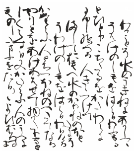

[无对应译文]

</section>

<section class="parallel-paragraph" data-paragraph-ids="s18-07-0194">

s18-07-0194

原文 · s18-07-0194

Écriture cursive : « *style d’herbe* »

[无对应译文]

</section>

<section class="parallel-paragraph" data-paragraph-ids="s18-07-0195">

s18-07-0195

原文 · s18-07-0195

Vous vous rappelez : un trait est toujours vertical, c’est toujours vrai s’il n’y a pas de trait.

[无对应译文]

</section>

<section class="parallel-paragraph" data-paragraph-ids="s18-07-0196">

s18-07-0196

原文 · s18-07-0196

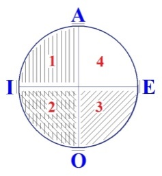

[无对应译文]

</section>

<section class="parallel-paragraph" data-paragraph-ids="s18-07-0197">

s18-07-0197

原文 · s18-07-0197

Donc dans la cursive, le caractère je ne l’y retrouve pas parce que je suis novice.

[无对应译文]

</section>

<section class="parallel-paragraph" data-paragraph-ids="s18-07-0198">

s18-07-0198

原文 · s18-07-0198

Mais ce n’est pas l’important, car ce que j’appelle ce « *singulier »*  peut appuyer une forme plus ferme.

[无对应译文]

</section>

<section class="parallel-paragraph" data-paragraph-ids="s18-07-0199">

s18-07-0199

原文 · s18-07-0199

L’important c’est ce qu’il y ajoute.

[无对应译文]

</section>

<section class="parallel-paragraph" data-paragraph-ids="s18-07-0200">

s18-07-0200

原文 · s18-07-0200

C’est une dimension, ou encore - comme je vous ai appris à jouer de ça - une « *de-mansion* », là où *demeure* ce que je vous ai déjà introduit, je crois, dans quelque avant-avant-dernier séminaire, un mot que j’écris pour m’amuser le « *Papludun* » \[**S1**\].

[无对应译文]

</section>

<section class="parallel-paragraph" data-paragraph-ids="s18-07-0201">

s18-07-0201

原文 · s18-07-0201

C’est la *dit-mansion* dont vous savez qu’elle me permet...

[无对应译文]

</section>

<section class="parallel-paragraph" data-paragraph-ids="s18-07-0202">

s18-07-0202

原文 · s18-07-0202

je vais pas redire tout ça : du petit jeu de mathématique de Peano etc., et de la façon dont il faut que Frege s’y prenne pour réduire la série des «* nombres naturels *» - entre guillemets - à la logique ...celle donc dont j’instaure le sujet dans ce que je vais appeler aujourd’hui encore, puisque je fais de la littérature et que je suis gai, vous allez le reconnaître, je l’avais écrit sous une forme ces derniers temps, celle-ci : le « *Hun-en-peluce* ». \[*Rires*\]

[无对应译文]

</section>

<section class="parallel-paragraph" data-paragraph-ids="s18-07-0203">

s18-07-0203

原文 · s18-07-0203

Ça sert beaucoup hein ?

[无对应译文]

</section>

<section class="parallel-paragraph" data-paragraph-ids="s18-07-0204">

s18-07-0204

原文 · s18-07-0204

Ça se met à la place de ce que j’appelle l’*Achose* avec un grand A \[*Achose* : *A majuscule de l’Autre, et a privatif* : → *<u>désert</u> de jouissance*\], et ça la bouche du *petit (a), dont ce n’est peut-être pas par hasard qu’il peut se réduire* comme ça, comme je le désigne, *à une lettre*.

[无对应译文]

</section>

<section class="parallel-paragraph" data-paragraph-ids="s18-07-0205">

s18-07-0205

原文 · s18-07-0205

Au niveau de la calligraphie, c’est cette lettre qui fait l’enjeu d’un pari - d’un pari mais lequel ? – d’un pari qui se gagne avec de l’encre et du pinceau.

[无对应译文]

</section>

<section class="parallel-paragraph" data-paragraph-ids="s18-07-0206">

s18-07-0206

原文 · s18-07-0206

Voilà, c’est comme ça qu’invinciblement m’apparut...

[无对应译文]

</section>

<section class="parallel-paragraph" data-paragraph-ids="s18-07-0207">

s18-07-0207

原文 · s18-07-0207

> d’une circonstance qui est à y retenir : à savoir d’*<u>entre les nuages</u>...*m’apparut le ruissellement \[*de ce qui a chu *: ↓*a*\] qui est *seule trace à apparaître*, d’y opérer plus encore que d’en indiquer le relief sous cette latitude, dans ce qu’on appelle « *la plaine sibérienne »*, plaine vraiment désolée - au sens propre – d’aucune végétation *que de reflets, reflets de ce ruissellement, lesquels poussent à l’ombre ce qui n’en miroite pas.*

[无对应译文]

</section>

<section class="parallel-paragraph" data-paragraph-ids="s18-07-0208">

s18-07-0208

原文 · s18-07-0208

[无对应译文]

</section>

<section class="parallel-paragraph" data-paragraph-ids="s18-07-0209">

s18-07-0209

原文 · s18-07-0209

Qu’est-ce que c’est que ça, le ruissellement ?

[无对应译文]

</section>

<section class="parallel-paragraph" data-paragraph-ids="s18-07-0210">

s18-07-0210

原文 · s18-07-0210

C’est un « *bouquet* ». \[*cf. Mallarmé* : « *l’absente de tous les bouquets* »\]

[无对应译文]

</section>

<section class="parallel-paragraph" data-paragraph-ids="s18-07-0211">

s18-07-0211

原文 · s18-07-0211

Ça fait *bouquet* [^63] \[**S1***-a*\], de ce qu’ailleurs j’ai distingué *du trait premier* \[**S1**\] *et de ce qui l’efface* \[**S1***→* **S2** *→* ↓*a* : *« spaltung » du sujet *: *a* ◊ S \].

[无对应译文]

</section>

<section class="parallel-paragraph" data-paragraph-ids="s18-07-0212">

s18-07-0212

原文 · s18-07-0212

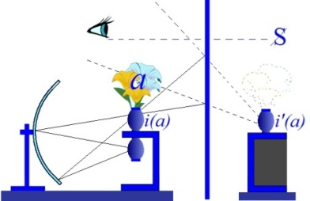

[无对应译文]

</section>

<section class="parallel-paragraph" data-paragraph-ids="s18-07-0213">

s18-07-0213

原文 · s18-07-0213

\[*l’expérience de Bouasse* [^64]*(du bouquet renversé) est remaniée par Lacan en « expérience du vase renversé » : le miroir sphérique produit une image réelle du vase caché : i(a),* *qui semble « contenir » les fleurs et qui, se reflétant dans le miroir plan (l’Autre) en i’(a), devient perceptible pour qui est placé au dessus des fleurs (objets(a) hors champ de vision).*

[无对应译文]

</section>

<section class="parallel-paragraph" data-paragraph-ids="s18-07-0214">

s18-07-0214

原文 · s18-07-0214

*Le a étant de nature « non spéculaire », il ne peut s’inscrire au lieu de l’Autre où n’est reflétée que l’image virtuelle i’(a), il est donc effacé. Ce « schéma optique »* *montre un sujet barré* (S)*radicalement coupé du* *a *: S◊*a*, *et ne pouvant s’en soutenir que sur le mode du fantasme et des objets substitutifs qui vont venir « remplir » i’(a)*\]

[无对应译文]

</section>

<section class="parallel-paragraph" data-paragraph-ids="s18-07-0215">

s18-07-0215

原文 · s18-07-0215

Je l’ai dit en son temps, mais on oublie toujours une partie de la chose, je l’ai dit à propos du *trait unaire* : *c’est de l’effacement du trait* \[*ou de sa rature*\] *que se désigne le sujet*.

[无对应译文]

</section>

<section class="parallel-paragraph" data-paragraph-ids="s18-07-0216">

s18-07-0216

原文 · s18-07-0216

Ça se marque donc en deux temps pour que s’y distingue ce qui est rature : *litura... lituraterre.*

[无对应译文]

</section>

<section class="parallel-paragraph" data-paragraph-ids="s18-07-0217">

s18-07-0217

原文 · s18-07-0217

- *Rature d’aucune trace qui soit d’avant *: *c’est ce qui fait terre du littoral.* \[« *faire terre* » : *faire taire*, *faire père* *→* *évacuation de l’eau*: ↓*a*\]

[无对应译文]

</section>

<section class="parallel-paragraph" data-paragraph-ids="s18-07-0218">

s18-07-0218

原文 · s18-07-0218

- *Litura pure *: *c’est le littéral*.

[无对应译文]

</section>

<section class="parallel-paragraph" data-paragraph-ids="s18-07-0219">

s18-07-0219

原文 · s18-07-0219

\[*Texte, éd. Larousse* : *Le ruissellement est bouquet du trait premier* \[**S1**\], *et de ce qui l’efface* \[*l’Autre du langage* : « S1 → S2 → a↓ » , *(miroir plan dans le schéma du « stade du miroir)*\].

[无对应译文]

</section>

<section class="parallel-paragraph" data-paragraph-ids="s18-07-0220">

s18-07-0220

原文 · s18-07-0220

\[*cf. L’étourdit : « Cet organe, passé au signifiant* \[(S1 - S2)\], *creuse la place* \[S1 → S2→ *a*↓ : → *semblant*\] *d’où prend effet pour le parlant* \[...\] *l’inexistence du rapport sexuel*. »

[无对应译文]

</section>

<section class="parallel-paragraph" data-paragraph-ids="s18-07-0221">

s18-07-0221

原文 · s18-07-0221

*Je l’ai dit : c’est de leur conjonction* \[*bouquet*\] *qu’il se fait sujet* \[S\]*, mais de ce que s’y marquent deux temps* \[**1er** : S1, **2nd** : S1→ S2 → *a↓* ◊ S\]. *Il y faut donc que s’y distingue la rature*

[无对应译文]

</section>

<section class="parallel-paragraph" data-paragraph-ids="s18-07-0222">

s18-07-0222

原文 · s18-07-0222

- *Rature d’aucune trace qui soit d’avant, c’est ce qui fait terre du littoral* \[*il n’y a « monde » que du langage, que de « la plage »*\].

[无对应译文]

</section>

<section class="parallel-paragraph" data-paragraph-ids="s18-07-0223">

s18-07-0223

原文 · s18-07-0223

- *Litura* \[*rature*\] *pure, c’est le littéral.* \[*la lettre comme « reste », comme bord du trou → « a letter, a litter »*\]

[无对应译文]

</section>

<section class="parallel-paragraph" data-paragraph-ids="s18-07-0224">

s18-07-0224

原文 · s18-07-0224

La produire cette *rature*, c’est reproduire cette moitié sans paire, cette moitié dont le sujet subsiste.

[无对应译文]

</section>

<section class="parallel-paragraph" data-paragraph-ids="s18-07-0225">

s18-07-0225

原文 · s18-07-0225

Ceux qui sont là depuis un bout de temps, mais il doit y en avoir de moins en moins, doivent se souvenir de ce qu’un jour j’ai fait récit des aventures d’une moitié de poulet [^65].

[无对应译文]

</section>

<section class="parallel-paragraph" data-paragraph-ids="s18-07-0226">

s18-07-0226

原文 · s18-07-0226

Produire la rature seule, définitive, c’est ça l’exploit de la calligraphie.

[无对应译文]

</section>

<section class="parallel-paragraph" data-paragraph-ids="s18-07-0227">

s18-07-0227

原文 · s18-07-0227

\[*produire, par la calligraphie, la lettre comme « trou », comme reste de ce qui a chu, en touchant au réel singulier de chaque Un par la pure forme,* *→ produire une image de ce qui n’en a pas, relève de l’exploit et atteint à l’art*\]

[无对应译文]

</section>

<section class="parallel-paragraph" data-paragraph-ids="s18-07-0228">

s18-07-0228

原文 · s18-07-0228

Vous pouvez toujours essayer, essayer de faire simplement...

[无对应译文]

</section>

<section class="parallel-paragraph" data-paragraph-ids="s18-07-0229">

s18-07-0229

原文 · s18-07-0229

> ce que je ne vais pas faire... parce que je la raterai, d’abord parce que je n’ai pas de pinceau ...*essayer de faire cette barre horizontale*, qui se trace de gauche à droite, pour figurer d’un trait l’1 *unaire* comme caractère.

[无对应译文]

</section>

<section class="parallel-paragraph" data-paragraph-ids="s18-07-0230">

s18-07-0230

原文 · s18-07-0230

Franchement, vous mettrez très longtemps à trouver de quelle *rature* ça s’attaque, et de quel suspens ça s’arrête, de sorte que ce que vous ferez sera lamentable, c’est sans espoir pour un *occidenté*. \[*Rires*\]

[无对应译文]

</section>

<section class="parallel-paragraph" data-paragraph-ids="s18-07-0231">

s18-07-0231

原文 · s18-07-0231

Il faut un train différent, qui ne s’attrape *qu’à se détacher de quoi que ce soit qui vous raye*.

[无对应译文]

</section>

<section class="parallel-paragraph" data-paragraph-ids="s18-07-0232">

s18-07-0232

原文 · s18-07-0232

\[*l’écriture mobilise le corps par le geste, ce corps imaginaire marquée, pour l’occidenté, par l’effacement du trait unaire* (*cf. supra : «* *c’est de l’effacement du trait* \[*ou de sa rature*\] *que se désigne le sujet »*) *→ par l’origine du signifiant *: « *Il faut un train différent* » (cf. « *rail* », « *indicateur du chemin de fer* », etc.)*, celui du geste qui s’appuie sur la lettre* *- et non sur le signifiant-signifié saussurien – car avec la lettre identique à elle-même (le signifiant -lui- se fonde sur la différence)* *on peut se détacher* « *de quoi que ce soit qui vous raye* » : *la lettre est de l’espace du <u>même</u> (cf. 2 lignes plus loin), et non de l’espace de l’Autre du signifiant*\]

[无对应译文]

</section>

<section class="parallel-paragraph" data-paragraph-ids="s18-07-0233">

s18-07-0233

原文 · s18-07-0233

*Entre centre* \[S1 *comme signifiant* *centre tout le discours*\] *et absence* \[S1 *comme lettre → aucun sens, mais sens* <strong>☞</strong> *du « trou » *: *ab-sens*\], *entre savoir et jouissance,* *il y a un littoral* \[*rivage*\] *qui ne vire* \[*virage*\] *au littéral qu’à ce que ce virage vous puissiez le prendre, <u>le même</u>, à tout instant.*

[无对应译文]

</section>

<section class="parallel-paragraph" data-paragraph-ids="s18-07-0234">

s18-07-0234

原文 · s18-07-0234

C’est de ça seulement que vous pouvez vous tenir *pour <u>agent qui le soutienne</u>*. \[*ie l’analyste en place du (a) dans le disc. analytique*\]

[无对应译文]

</section>

<section class="parallel-paragraph" data-paragraph-ids="s18-07-0235">

s18-07-0235

原文 · s18-07-0235

Ce qui se révèle de ma vision du ruissellement à ce qu’y domine *la rature*, \[*le* (*a*)↓ *qui choit → ravinement-rature*\] c’est qu’à se produire *d’entre* les nuages, *elle se conjugue à sa source*. \[*se ré-unit à sa source *: *mer → nuages → pluie → cours d’eau → mer → nuages, etc.* : *cycle de l’eau*, → *le ravinement du (a) indique* <strong>☞</strong> *le sens de l’écoulement vers le trou, l’origine de la Chose perdue *: *il y a un « chemin » de  ravinement », un « sillon »,* *un « rail » que l’analyse permet de montrer et de « construire »*\]

[无对应译文]

</section>

<section class="parallel-paragraph" data-paragraph-ids="s18-07-0236">

s18-07-0236

原文 · s18-07-0236

C’est bien aux* [Nuées](http://remacle.org/bloodwolf/comediens/Aristophane/nueesgr1.htm)* qu’Aristophane me hèle de trouver ce qu’il en est du *signifiant*, soit le *semblant* par excellence, si c’est de sa rupture \[**S1→ S2**\] qu’en pleut \[*a*\]↓ - effet de ce qu’en précipite - ce qui y était *matière en suspension*.

[无对应译文]

</section>

<section class="parallel-paragraph" data-paragraph-ids="s18-07-0237">

s18-07-0237

原文 · s18-07-0237

Il faut vous dire que la peinture japonaise dont tout à l’heure je vous ai dit qu’elle s’entremêle si bien de calligraphie, elle en regorge, et que là le nuage n’y manque pas.

[无对应译文]

</section>

<section class="parallel-paragraph" data-paragraph-ids="s18-07-0238">

s18-07-0238

原文 · s18-07-0238

C’est de là où j’étais à cette heure, que j’ai vraiment bien compris quelle fonction avaient ces nuages, ces nuages d’or qui littéralement bouchent, cachent, toute une partie des scènes \[*cf. supra* « *poussent à l’ombre ce qui n’en miroite pas* », *cf. L’étourdit : « qu’on dise reste oublié derrière ce qui se dit dans ce qui s’entend »*\] qui dans des lieux, des lieux qui sont des choses qui se déroulent dans un autre sens...

[无对应译文]

</section>

<section class="parallel-paragraph" data-paragraph-ids="s18-07-0239">

s18-07-0239

原文 · s18-07-0239

> celles-là on les appelle 巻物 *Makimono* \[*les Makimono se déroulent horizontalement*, *les Kakémono verticalement*\] ...président à la répartition des petites scènes.

[无对应译文]

</section>

<section class="parallel-paragraph" data-paragraph-ids="s18-07-0240">

s18-07-0240

原文 · s18-07-0240

[无对应译文]

</section>

<section class="parallel-paragraph" data-paragraph-ids="s18-07-0241">

s18-07-0241

原文 · s18-07-0241

Pourquoi, comment se peut-il, que ces gens qui savent dessiner, éprouvent-ils le besoin de *les entremêler de ces amas de nuages*, si ce n’est précisément que *c’est ça* qui introduit la dimension de *signifiant*.

[无对应译文]

</section>

<section class="parallel-paragraph" data-paragraph-ids="s18-07-0242">

s18-07-0242

原文 · s18-07-0242

Et *la lettre qui fait rature* \[*écriture, trace creusée*\] s’y distingue d’être *rupture* donc *du semblant* \[<strong>S1→ S2 ↓</strong>*a*\], qui dissout ce qui faisait forme, phénomène, météore, \[μετέωρος : « *ce qui s’élève », cf. vers 264... de « [Nuées](http://remacle.org/bloodwolf/comediens/Aristophane/nuees.htm) »*\] c’est ça, je vous l’ai déjà dit : la science \[disc. H\] opère au départ, de la façon la plus sensible, sur des *formes perceptibles*.

[无对应译文]

</section>

<section class="parallel-paragraph" data-paragraph-ids="s18-07-0243">

s18-07-0243

原文 · s18-07-0243

Mais du même coup ça doit être aussi que ce soit d’*en congédier* *ce* \[*a*\] *qui de cette rupture ferait* *jouissance*, \[ <strong>S2 ◊ *a*</strong>: *disc. scientifique* (H)\] c’est-à-dire d’en *dissiper* ce qu’elle soutient de cette *« hypothèse »*...

[无对应译文]

</section>

<section class="parallel-paragraph" data-paragraph-ids="s18-07-0244">

s18-07-0244

原文 · s18-07-0244

> pour m’exprimer ainsi ...*de la jouissance,* qui fait le monde en somme, car l’idée de « *monde* » c’est ça: *penser qu’il soit fait de pulsions* *telles* qu’aussi bien s’en figure *le vide* \[S2 ◊ *a *\]. \[*cf.* *texte* *« <u>la vie</u> » *: *sans la vie des pulsions le monde est vide* → *boucher le trou c’est aussi le figurer*\]

[无对应译文]

</section>

<section class="parallel-paragraph" data-paragraph-ids="s18-07-0245">

s18-07-0245

原文 · s18-07-0245

Eh bien, *ce qui de jouissance s’évoque à ce que se rompe un semblant, voilà ce qui « dans le réel »*...

[无对应译文]

</section>

<section class="parallel-paragraph" data-paragraph-ids="s18-07-0246">

s18-07-0246

原文 · s18-07-0246

> c’est là le point important ...« *dans le réel* » *se présente comme ravinement*.

[无对应译文]

</section>

<section class="parallel-paragraph" data-paragraph-ids="s18-07-0247">

s18-07-0247

原文 · s18-07-0247

C’est là vous définir par quoi *l’écriture peut être dite « dans le réel » le ravinement du signifié*, soit *ce qui <u>a plu</u> du semblant* en tant que *c’est ça qui fait le signifié*.

[无对应译文]

</section>

<section class="parallel-paragraph" data-paragraph-ids="s18-07-0248">

s18-07-0248

原文 · s18-07-0248

\[*dans chaque discours la rupture d’un semblant produit un plus-de-jouir impuissant à rejoindre la vérité* (→ *écriture* → *ravinement du signifié-symptome*)\]

[无对应译文]

</section>

<section class="parallel-paragraph" data-paragraph-ids="s18-07-0249">

s18-07-0249

原文 · s18-07-0249

*L’écriture* \[*la trace de ce qui a chu du* *semblant*\] *ne décalque pas le signifiant*, \[*l’écriture comme ravinement, laisse paraître, fait signe* <strong>☞</strong> *du signifié singulier* (*a* ↓ : *ravinement-ravissement *: *effet de langue sur le corps*), *La trace n’est pas « décalque » du signifiant (universel) *: *la lettre écrit <u>autre chose</u> que la forme « universelle » du signifiant*\]

[无对应译文]

</section>

<section class="parallel-paragraph" data-paragraph-ids="s18-07-0250">

s18-07-0250

原文 · s18-07-0250

[无对应译文]

</section>

<section class="parallel-paragraph" data-paragraph-ids="s18-07-0251">

s18-07-0251

原文 · s18-07-0251

*elle n’y remonte* \[*a* → **S1** \] *qu’à prendre nom*, \[*a* → **S1** : *elle y prend un « nom* » : *à sa prochaine occurrence elle sera reconnue comme vrai nom (de jouissance) du sujet car elle aura été*, *indexée *: <strong>☞</strong>, *nommée*\] mais exactement de la même façon que ça arrive à toutes choses que vient à dénommer la batterie signifiante, après qu’elle les a *<u>dénombrées</u>*. \[*décompte du trait unaire *: S1, (S1+ S1), (S1+ S1 + S1), (S1+ S1 + S1+ S1), *etc.* *ad infinitum* → א0 \]

[无对应译文]

</section>

<section class="parallel-paragraph" data-paragraph-ids="s18-07-0252">

s18-07-0252

原文 · s18-07-0252

Comme de bien entendu, je ne suis pas sûr que mon discours s’entende, il va falloir quand même que j’y fasse épingle d’une opposition :

[无对应译文]

</section>

<section class="parallel-paragraph" data-paragraph-ids="s18-07-0253">

s18-07-0253

原文 · s18-07-0253

- *l’écriture, la lettre, c’est dans le réel,*

[无对应译文]

</section>

<section class="parallel-paragraph" data-paragraph-ids="s18-07-0254">

s18-07-0254

原文 · s18-07-0254

- *et le signifiant, dans le symbolique. »*

[无对应译文]

</section>

<section class="parallel-paragraph" data-paragraph-ids="s18-07-0255">

s18-07-0255

原文 · s18-07-0255

Comme ça, ça pourra faire pour vous ritournelle...

[无对应译文]

</section>

<section class="parallel-paragraph" data-paragraph-ids="s18-07-0256">

s18-07-0256

原文 · s18-07-0256

J’en viens à *un moment plus tard dans l’avion*, on va avancer un peu comme ça, je vous ai dit que c’était au voyage de retour.

[无对应译文]

</section>

<section class="parallel-paragraph" data-paragraph-ids="s18-07-0257">

s18-07-0257

原文 · s18-07-0257

Alors là c’est ça qui est frappant, c’est de les voir apparaître.

[无对应译文]

</section>

<section class="parallel-paragraph" data-paragraph-ids="s18-07-0258">

s18-07-0258

原文 · s18-07-0258

Il y a d’autres traces qu’on voit se soutenir en isobares, elles. \[*plutôt en courbes de niveau*\]

[无对应译文]

</section>

<section class="parallel-paragraph" data-paragraph-ids="s18-07-0259">

s18-07-0259

原文 · s18-07-0259

Évidemment des traces qui sont de l’ordre d’un remblai, enfin en gros isobares ça les fait *normales* \[*perpendiculaires*\] à celles dont *la pente* qu’on peut appeler « *suprême » *du relief se marque des courbes.

[无对应译文]

</section>

<section class="parallel-paragraph" data-paragraph-ids="s18-07-0260">

s18-07-0260

原文 · s18-07-0260

\[→ *rature du cours d’eau par des ponts, etc. *: *cf. infra « le pont Mirabeau » et  le « pont-oreille » d’Horus Apollo*\]

[无对应译文]

</section>

<section class="parallel-paragraph" data-paragraph-ids="s18-07-0261">

s18-07-0261

原文 · s18-07-0261

Haut  → bas (*écoulement selon « la pente suprême du relief »*)

[无对应译文]

</section>

<section class="parallel-paragraph" data-paragraph-ids="s18-07-0262">

s18-07-0262

原文 · s18-07-0262

Là où j’étais c’était très clair, j’avais déjà vu à Osaka comment les autoroutes paraissent descendre du ciel, il n’y a que de là qu’elles ont pu se poser comme ça, les unes au-dessus des autres.

[无对应译文]

</section>

<section class="parallel-paragraph" data-paragraph-ids="s18-07-0263">

s18-07-0263

原文 · s18-07-0263

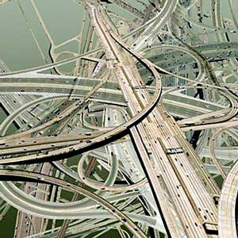

[无对应译文]

</section>

<section class="parallel-paragraph" data-paragraph-ids="s18-07-0264">

s18-07-0264

原文 · s18-07-0264

Il y a une certaine architecture japonaise, la plus moderne, qui sait très bien retrouver l’ancienne.

[无对应译文]

</section>

<section class="parallel-paragraph" data-paragraph-ids="s18-07-0265">

s18-07-0265

原文 · s18-07-0265

L’architecture japonaise ça consiste essentiellement en un battement d’une aile d’oiseau.

[无对应译文]

</section>

<section class="parallel-paragraph" data-paragraph-ids="s18-07-0266">

s18-07-0266

原文 · s18-07-0266

 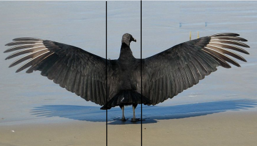

[无对应译文]

</section>

<section class="parallel-paragraph" data-paragraph-ids="s18-07-0267">

s18-07-0267

原文 · s18-07-0267

\[*→du trait unaire (origine du signifiant) *: ***\_\_**, à la rature de ce trait unaire *: */ qui vient raturer le signifiant *: 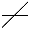 (*→ minimum d’une signature du vrai nom du sujet)* *par l’émergence d’une jouissance (effet de corps) résutat de l’interprétation *(*« Mais aussi bien n’en jouit-on qu’à ce qu’y pleuve la parole d’interprétation.* ») *comme « sens » d’un signifiant sans aucun sens *: *à la fois*

[无对应译文]

</section>

<section class="parallel-paragraph" data-paragraph-ids="s18-07-0268">

s18-07-0268

原文 · s18-07-0268

- *sens-direction* <strong>☞</strong> *qui désigne la « Chose »,*

[无对应译文]

</section>

<section class="parallel-paragraph" data-paragraph-ids="s18-07-0269">

s18-07-0269

原文 · s18-07-0269

- *et l’éveil des sens à un effet de corps, effet de résonance de Lalangue*\]

[无对应译文]

</section>

<section class="parallel-paragraph" data-paragraph-ids="s18-07-0270">

s18-07-0270

原文 · s18-07-0270

Ça m’a aidé à comprendre, de voir tout de suite que le plus court chemin d’un point à un autre ne serait jamais montré à personne, s’il n’y avait pas le nuage.

[无对应译文]

</section>

<section class="parallel-paragraph" data-paragraph-ids="s18-07-0271">

s18-07-0271

原文 · s18-07-0271

Comment ça se fait une route ?

[无对应译文]

</section>

<section class="parallel-paragraph" data-paragraph-ids="s18-07-0272">

s18-07-0272

原文 · s18-07-0272

Jamais personne au monde ne suit la ligne droite, ni l’homme, ni l’amibe, ni la mouche, ni la branche, ni rien du tout. Aux dernières nouvelles, on sait que *le trait de lumière* non plus ne la suit pas, tout à fait *solidaire de la courbure universelle*.

[无对应译文]

</section>

<section class="parallel-paragraph" data-paragraph-ids="s18-07-0273">

s18-07-0273

原文 · s18-07-0273

La droite, là-dedans, ça inscrit tout de même quelque chose.

[无对应译文]

</section>

<section class="parallel-paragraph" data-paragraph-ids="s18-07-0274">

s18-07-0274

原文 · s18-07-0274

Ça inscrit la distance, mais la distance - *confer* les lois de Newton - ça n’est absolument rien qu’un facteur effectif d’une dynamique que nous appellerons « *de cascade »*, celle qui fait que *tout ce qui choit suit une parabole* \[*cf.* « *ça tombe* »\].

[无对应译文]

</section>

<section class="parallel-paragraph" data-paragraph-ids="s18-07-0275">

s18-07-0275

原文 · s18-07-0275

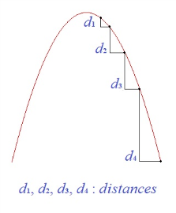

[无对应译文]

</section>

<section class="parallel-paragraph" data-paragraph-ids="s18-07-0276">

s18-07-0276

原文 · s18-07-0276

Donc, *il n’y a de droite que d’écriture, d’arpentage que du ciel*. Mais ce sont...

[无对应译文]

</section>

<section class="parallel-paragraph" data-paragraph-ids="s18-07-0277">

s18-07-0277

原文 · s18-07-0277

> l’un et l’autre *<u>en tant que tels</u>*, pour soutenir la droite ...*ce sont artefacts à n’habiter que le langage*.

[无对应译文]

</section>

<section class="parallel-paragraph" data-paragraph-ids="s18-07-0278">

s18-07-0278

原文 · s18-07-0278

Il ne faudrait quand même pas l’oublier : *notre science n’est opérante* *que d’un ruissellement de petites lettres et de graphiques combinés.*

[无对应译文]

</section>

<section class="parallel-paragraph" data-paragraph-ids="s18-07-0279">

s18-07-0279

原文 · s18-07-0279

\[S20 *Sta* 52 : *« La subversion* \[...\]*c’est d’avoir substitué au « ça tourne », un « ça tombe »* \[...\]

[无对应译文]

</section>

<section class="parallel-paragraph" data-paragraph-ids="s18-07-0280">

s18-07-0280

原文 · s18-07-0280

*Ce vers quoi « ça tombe » est en un point de l’ellipse qui s’appelle le foyer* \[F1\], *et dans le point symétrique* \[F2\], *il n’y a rien*. » :

[无对应译文]

</section>

<section class="parallel-paragraph" data-paragraph-ids="s18-07-0281">

s18-07-0281

原文 · s18-07-0281

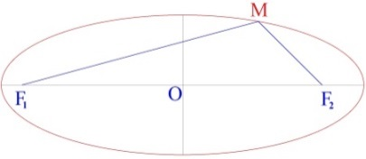 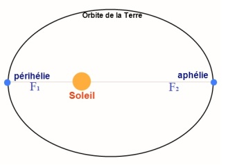

[无对应译文]

</section>

<section class="parallel-paragraph" data-paragraph-ids="s18-07-0282">

s18-07-0282

原文 · s18-07-0282

> → *mise en évidence du réel par une lettre - ici un jeu de lettres - de l’effet d’attraction d’un « corps céleste » (« ça tombe ») et du mouvement perpétuel « elliptique » induit,*
>
> *à mettre en regard avec le « ça choit », « ça tombe » des nuées du semblant *: *a↓, en parabole, puis ça remonte au signifiant pour « prendre Nom »),*
>
> *répétition et retour à la même place *: *élan libératoire fourni par l’attraction, puis déclin d’énergie et retour vers le foyer gravitationnel de la « relance » (phallique)* :

[无对应译文]

</section>

<section class="parallel-paragraph" data-paragraph-ids="s18-07-0283">

s18-07-0283

原文 · s18-07-0283

[无对应译文]

</section>

<section class="parallel-paragraph" data-paragraph-ids="s18-07-0284">

s18-07-0284

原文 · s18-07-0284

(**S1** → **S2** → *a*) → (**S1** → **S2** → *a*) → (**S1** → **S2** → *a*) *etc., comme « mouvement perpétuel », → le nécessaire (« ça ne cesse de s’écrire)*\]

[无对应译文]

</section>

<section class="parallel-paragraph" data-paragraph-ids="s18-07-0285">

s18-07-0285

原文 · s18-07-0285

*Sous le pont Mirabeau*... \[*pont qui fait « rature » sur la Seine, la scène*\]

[无对应译文]

</section>

<section class="parallel-paragraph" data-paragraph-ids="s18-07-0286">

s18-07-0286

原文 · s18-07-0286

> certes, comme sous celui d’une revue [^66] qui fut la mienne,
>
> là où j’avais foutu comme enseigne un pont-oreille emprunté à Horus Apollo ...*sous le pont Mirabeau coule la Seine...* *primitive*.

[无对应译文]

</section>

<section class="parallel-paragraph" data-paragraph-ids="s18-07-0287">

s18-07-0287

原文 · s18-07-0287

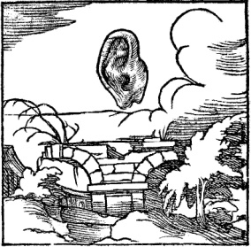 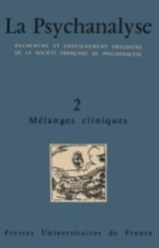

[无对应译文]

</section>

<section class="parallel-paragraph" data-paragraph-ids="s18-07-0288">

s18-07-0288

原文 · s18-07-0288

C’est une scène telle, ne l’oubliez pas, à relire Freud :

[无对应译文]

</section>

<section class="parallel-paragraph" data-paragraph-ids="s18-07-0289">

s18-07-0289

原文 · s18-07-0289

- que peut y battre le V \[Vé : *prononcé comme lettre, cf. infra* « *On Yomi* »\] romain de l’heure 5, (c’est dans *L’Homme aux loups*)

[无对应译文]

</section>

<section class="parallel-paragraph" data-paragraph-ids="s18-07-0290">

s18-07-0290

原文 · s18-07-0290

- mais aussi bien *on n’en jouit pas*... que n’y pleuve l’interprétation.

[无对应译文]

</section>

<section class="parallel-paragraph" data-paragraph-ids="s18-07-0291">

s18-07-0291

原文 · s18-07-0291

Que *le symptôme* institue l’ordre dont s’avère notre politique \[*ordre symbolico-imaginaire du fantasme *: *a* ◊ S , *à exclure le réel*\]...

[无对应译文]

</section>

<section class="parallel-paragraph" data-paragraph-ids="s18-07-0292">

s18-07-0292

原文 · s18-07-0292

> c’est là le pas qu’elle a franchi ...implique d’autre part que *tout ce qui s’articule* de cet ordre soit passible d’*interprétation*. \[le *discours* A *élucide le fantasme, il* *prend son départ (a →* S*)* *de la butée du discours* M : *a* ◊ S, *où* *a représente l’entropie de jouissance de la chaîne signifiante*\]

[无对应译文]

</section>

<section class="parallel-paragraph" data-paragraph-ids="s18-07-0293">

s18-07-0293

原文 · s18-07-0293

C’est pourquoi on a bien raison de mettre la psychanalyse au chef de la politique.

[无对应译文]

</section>

<section class="parallel-paragraph" data-paragraph-ids="s18-07-0294">

s18-07-0294

原文 · s18-07-0294

\[*le disc. M est politique, il aboutit à mettre en place le fantasme *: *a* ◊ S*, le disc. A en est l’élucidation : a →* S\]

[无对应译文]

</section>

<section class="parallel-paragraph" data-paragraph-ids="s18-07-0295">

s18-07-0295

原文 · s18-07-0295

Et ceci pourrait n’être pas de tout repos pour ce qui est de *la politique* avec tout ce qui s’y fait, *si la psychanalyse s’avérait plus avertie*.

[无对应译文]

</section>

<section class="parallel-paragraph" data-paragraph-ids="s18-07-0296">

s18-07-0296

原文 · s18-07-0296

Il suffirait peut-être, pour mettre notre espoir *ailleurs*...

[无对应译文]

</section>

<section class="parallel-paragraph" data-paragraph-ids="s18-07-0297">

s18-07-0297

原文 · s18-07-0297

> ce que font mes littérateurs, si je peux les faire mes compagnons ...il suffirait *que de l’écriture, nous tirions un autre parti* \[*ie <u>s’appuyer</u> sur la lettre hors-sens plutôt que sur le signifiant et son sens*\] *que de* *tribunes* \[*politique*\] ou *tribunal* \[*ordre social*\], pour que s’y jouent *<u>d’autres paroles</u>* à nous en faire - nous-mêmes - à nous en faire le *tribut*. \[*<u>autres</u> que l’entropie du* (*a*)↓ *due au disc. Maître*. *Cf. Mallarmé *: « *Donner un sens plus pur aux mots de la tribu* » (*Tombeau d’Edgar Poe*), →

[无对应译文]

</section>

<section class="parallel-paragraph" data-paragraph-ids="s18-07-0298">

s18-07-0298

原文 · s18-07-0298

- *du sens des mots : interprétaion de l’ics-langage,*

[无对应译文]

</section>

<section class="parallel-paragraph" data-paragraph-ids="s18-07-0299">

s18-07-0299

原文 · s18-07-0299

- *au « sens »* (*direction*) : ☞ « *c’est par là, la jouissance* », → *au « sens » de l’effet de corps « produit », désigné, montré-démontré par l’interprétation de l’ics-réel*\]

[无对应译文]

</section>

<section class="parallel-paragraph" data-paragraph-ids="s18-07-0300">

s18-07-0300

原文 · s18-07-0300

Je l’ai dit et je ne l’oublie jamais « *Il n’y a pas de métalangage* » : *toute logique* est faussée de prendre départ du « *langage-objet* », comme immanquablement elle le fait jusqu’à ce jour.

[无对应译文]

</section>

<section class="parallel-paragraph" data-paragraph-ids="s18-07-0301">

s18-07-0301

原文 · s18-07-0301

Il n’y a donc pas de métalangage, mais *l’écrit qui se fabrique du langage* pourrait - peut-être - être *matériel de force à ce que s’y changent nos propos*.

[无对应译文]

</section>

<section class="parallel-paragraph" data-paragraph-ids="s18-07-0302">

s18-07-0302

原文 · s18-07-0302

\[- *de la jouissance (entropique *: *avec perte) de la chaîne signifiante de l’ordre social, imposée par le disours maître (production des* «* Plus de jouir *»*)* *- à la jouissance « littorale » sans perte de « la lettre » *: *« conservation de l’énergie » (cf. infra *: *« l’effet d’écriture reste attaché à l’écriture »)* → « *pas de tout repos pour* *ce qui de* *la politique... »* (*du Maître*)\]

[无对应译文]

</section>

<section class="parallel-paragraph" data-paragraph-ids="s18-07-0303">

s18-07-0303

原文 · s18-07-0303

Je ne vois pas d’autre espoir pour ce qui actuellement s’aiguise  : est-il possible en somme du *littoral*, de constituer tel discours qui se caracté­rise...

[无对应译文]

</section>

<section class="parallel-paragraph" data-paragraph-ids="s18-07-0304">

s18-07-0304

原文 · s18-07-0304

> comme j’en pose la question cette année ...de ne pas s’émettre du *semblant* ?

[无对应译文]

</section>

<section class="parallel-paragraph" data-paragraph-ids="s18-07-0305">

s18-07-0305

原文 · s18-07-0305

\[*Lacan sera plus précis le* 08-03-1977 (*séminaire* « *L’insu que sait*... ») *en fin de séance* : « ...*en somme le* S1, *ça n’est que le commencement du savoir*. *Mais un savoir qui se contente de toujours commencer, comme on dit, ça n’arrive à rien*. »

[无对应译文]

</section>

<section class="parallel-paragraph" data-paragraph-ids="s18-07-0306">

s18-07-0306

原文 · s18-07-0306

> « *commencement du savoir* » : S1 *comme « produit » du Disc.* A, *<u>mais</u>* S2 *inaccessible *: S1 ◊ S2. « *ça n’arrive à rien* » : S2, *réel de Lalangue, reste inaccessible.*

[无对应译文]

</section>

<section class="parallel-paragraph" data-paragraph-ids="s18-07-0307">

s18-07-0307

原文 · s18-07-0307

*Il le reprendra dans la séance suivante du* 15-03-1977 : « ...*ce* S1 *qui paraît promettre un* S2. » : *mais ça ne fait que le promettre* *ce* S2, → « *dire » de jouissance de Lalangue*\]

[无对应译文]

</section>

<section class="parallel-paragraph" data-paragraph-ids="s18-07-0308">

s18-07-0308

原文 · s18-07-0308

C’est évidemment la question qui ne se propose que de la littérature dite « d’avant-garde », laquelle elle-même est un fait de *littoral*, et donc ne se soutient pas du *semblant*, mais pour autant ne prouve *rien*, sinon à montrer la cassure \[*le trou*\] que seul un discours peut produire.

[无对应译文]

</section>

<section class="parallel-paragraph" data-paragraph-ids="s18-07-0309">

s18-07-0309

原文 · s18-07-0309

\[« *la cassure* », « *la faille* », « *le trou* » : *ce que chaque discours produit, ne retrouve pas ce qui est visé, il y a une perte (entropie)* → *« ce n’est pas ça » *:

[无对应译文]

</section>

<section class="parallel-paragraph" data-paragraph-ids="s18-07-0310">

s18-07-0310

原文 · s18-07-0310

- *disc. Hystérique* : S *→* S1 *→* S2 <u>(◊ *a*)</u>,

[无对应译文]

</section>

<section class="parallel-paragraph" data-paragraph-ids="s18-07-0311">

s18-07-0311

原文 · s18-07-0311

- *disc. Maître* : S1 *→* S2 *→* *a* <u>(**◊ S**)</u>,

[无对应译文]

</section>

<section class="parallel-paragraph" data-paragraph-ids="s18-07-0312">

s18-07-0312

原文 · s18-07-0312

- *disc. Universitaire* : S2 *→* *a* *→* S <u>(**◊ S1**)</u>,

[无对应译文]

</section>

<section class="parallel-paragraph" data-paragraph-ids="s18-07-0313">

s18-07-0313

原文 · s18-07-0313

- *disc. Analytique* : *a* *→* S *→* S1 <u>(**◊ S2**)</u>\]

[无对应译文]

</section>

<section class="parallel-paragraph" data-paragraph-ids="s18-07-0314">

s18-07-0314

原文 · s18-07-0314

Je dis « *produire »*, « *mettre en avant avec* *effet de production »*, c’est le schéma de mes quadripodes de l’année dernière.

[无对应译文]

</section>

<section class="parallel-paragraph" data-paragraph-ids="s18-07-0315">

s18-07-0315

原文 · s18-07-0315

   

[无对应译文]

</section>

<section class="parallel-paragraph" data-paragraph-ids="s18-07-0316">

s18-07-0316

原文 · s18-07-0316

*Discours du Maître Discours de l’Hystérique Discours Universitaire Discours analytique*

[无对应译文]

</section>

<section class="parallel-paragraph" data-paragraph-ids="s18-07-0317">

s18-07-0317

原文 · s18-07-0317

Ce à quoi semble prétendre une littérature en son ambition...

[无对应译文]

</section>

<section class="parallel-paragraph" data-paragraph-ids="s18-07-0318">

s18-07-0318

原文 · s18-07-0318

c’est ce que j’épingle de « *lituraterrir* » \[*littérature = litter + rature (littura +atterir *: *il pleut du a, → des « immondices »)cf. supra : « a letter, a litter » de Joyce*\] ...c’est de s’ordonner d’un mouvement qu’elle appelle « *scientifique »*.

[无对应译文]

</section>

<section class="parallel-paragraph" data-paragraph-ids="s18-07-0319">

s18-07-0319

原文 · s18-07-0319

Il est de fait que dans la science *l’écriture a fait merveille* \[*en excluant le* (*a*)\], et que tout marque que cette merveille n’est pas près de se tarir.

[无对应译文]

</section>

<section class="parallel-paragraph" data-paragraph-ids="s18-07-0320">

s18-07-0320

原文 · s18-07-0320

Cependant la science physique se trouve, va se trouver ramenée à la considération du *symptôme dans les faits par la pollution...*

[无对应译文]

</section>

<section class="parallel-paragraph" data-paragraph-ids="s18-07-0321">

s18-07-0321

原文 · s18-07-0321

> il y a des gens, des scientifiques qui y sont sensibles ...par la pollution de ce que du terrestre, on appelle sans plus de critique : « *environne­ment »*.

[无对应译文]

</section>

<section class="parallel-paragraph" data-paragraph-ids="s18-07-0322">

s18-07-0322

原文 · s18-07-0322

C’est l’idée de Uexküll : *Umwelt,* mais béhaviouriste c’est-à-dire complè­tement crétinisée.

[无对应译文]

</section>

<section class="parallel-paragraph" data-paragraph-ids="s18-07-0323">

s18-07-0323

原文 · s18-07-0323

\[Disc. H (*scientifique*) : S2 ◊ *a* → *où* *la vérité* *(a), d’y être rejetée, y fait retour comme symptôme *: *amoncellement des déchets d’objets substitutifs (litter) → pollution* \]

[无对应译文]

</section>

<section class="parallel-paragraph" data-paragraph-ids="s18-07-0324">

s18-07-0324

原文 · s18-07-0324

Pour ici *litturaterrir* moi-même, je fais remarquer que je n’ai fait dans le « *ravinement* », image certes, mais aucune métaphore : *l’écriture <u>est</u> ce ravinement*.

[无对应译文]

</section>

<section class="parallel-paragraph" data-paragraph-ids="s18-07-0325">

s18-07-0325

原文 · s18-07-0325

Ce que j’ai écrit là y est compris.

[无对应译文]

</section>

<section class="parallel-paragraph" data-paragraph-ids="s18-07-0326">

s18-07-0326

原文 · s18-07-0326

Quand je parle de *jouissance,* j’invoque légitimement ce que j’accumule d’auditoire, et pas moins, naturellement, *ce dont je me prive* : ça m’occupe votre affluence !

[无对应译文]

</section>

<section class="parallel-paragraph" data-paragraph-ids="s18-07-0327">

s18-07-0327

原文 · s18-07-0327

« *Le ravinement »*, je l’ai préparé.

[无对应译文]

</section>

<section class="parallel-paragraph" data-paragraph-ids="s18-07-0328">

s18-07-0328

原文 · s18-07-0328

Qu’il y ait, *inclus dans la langue japonaise* - c’est là que je reprends - *un effet d’écriture *:

[无对应译文]

</section>

<section class="parallel-paragraph" data-paragraph-ids="s18-07-0329">

s18-07-0329

原文 · s18-07-0329

- l’important c’est *<u>ce qui nous y offre ressource de</u>* <u>faire exemple à *lituratterrir*</u>,

[无对应译文]

</section>

<section class="parallel-paragraph" data-paragraph-ids="s18-07-0330">

s18-07-0330

原文 · s18-07-0330

- l’important, c’est que *<u>l’effet d’écriture reste attaché à l’écriture</u>*.

[无对应译文]

</section>

<section class="parallel-paragraph" data-paragraph-ids="s18-07-0331">

s18-07-0331

原文 · s18-07-0331

Que ce qui est porteur de l’effet d’écriture y soit d’*une écriture spécialisée* en ceci qu’en japonais cette *écriture spécialisée* puisse se lire de deux prononciations différentes :

[无对应译文]

</section>

<section class="parallel-paragraph" data-paragraph-ids="s18-07-0332">

s18-07-0332

原文 · s18-07-0332

- en 音読み [*on-yomi*](http://fr.wikipedia.org/wiki/On%E2%80%99yomi)...

[无对应译文]

</section>

<section class="parallel-paragraph" data-paragraph-ids="s18-07-0333">

s18-07-0333

原文 · s18-07-0333

> je ne suis pas là en train de vous jeter de la poudre aux yeux,
>
> je vous dirai le moins de japonais possible ...*on-yomi *: c’est comme ça que ça s’appelle, *c’est sa prononciation en caractères*, *en caractères ça se prononce comme tel distinctement*, \[*lecture « lettre par lettre », phonétique, « musique » du caractère comme syllabe* → *hors-sens*\]

[无对应译文]

</section>

<section class="parallel-paragraph" data-paragraph-ids="s18-07-0334">

s18-07-0334

原文 · s18-07-0334

- en 訓読み [*kun-yomi*](http://fr.wikipedia.org/wiki/Kun%E2%80%99yomi) ...*kun-yomi* : de la façon dont ça se dit en japonais, *ce que le caractère veut dire*. \[*lecture du caractère comme signifiant <u>avec</u> signifié*\]

[无对应译文]

</section>

<section class="parallel-paragraph" data-paragraph-ids="s18-07-0335">

s18-07-0335

原文 · s18-07-0335

Mais naturellement vous allez vous foutre dedans, c’est-à-dire que sous le prétexte que le caractère est *lettre*, vous allez croire que je suis en train de dire que dans le japonais « *les épaves du signifiant courent sur le fleuve du signifié »*.

[无对应译文]

</section>

<section class="parallel-paragraph" data-paragraph-ids="s18-07-0336">

s18-07-0336

原文 · s18-07-0336

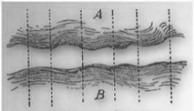 \[« *Signiant/signifié *» = *le « signe saussurien »*\]

[无对应译文]

</section>

<section class="parallel-paragraph" data-paragraph-ids="s18-07-0337">

s18-07-0337

原文 · s18-07-0337

C’est *<u>la lettre</u>,* et non pas le signe \[*saussurien *: *signifiant+signifié*\] <u>*qui ici fait appui au* *signifiant*</u>, \[**S1**-*a *: *pas de chute du a*, *pas de refoulement de la lettre*\] mais *comme n’importe quoi d’autre à suivre* *la loi de métaphore* dont j’ai rappelé ces derniers temps qu’*elle fait l’essence du langage*.

[无对应译文]

</section>

<section class="parallel-paragraph" data-paragraph-ids="s18-07-0338">

s18-07-0338

原文 · s18-07-0338

C’est toujours d’*<u>ailleurs de là où il est</u>* le langage : \[→\]*du discours* , qu’il prend quoi que ce soit au filet du signifiant, donc *l’écriture* elle-même.

[无对应译文]

</section>

<section class="parallel-paragraph" data-paragraph-ids="s18-07-0339">

s18-07-0339

原文 · s18-07-0339

Seulement voilà, elle \[*l’écriture, la lettre*\] est promue de là, à la fonction d’un *référent* aussi essentiel que toutes choses, et *c’est ça qui change le statut du sujet* : c’est par là *qu’il s’appuie sur un ciel <u>constellé</u>*... \[*de lettres*\]

[无对应译文]

</section>

<section class="parallel-paragraph" data-paragraph-ids="s18-07-0340">

s18-07-0340

原文 · s18-07-0340

> et non seulement sur le *trait unaire* \[S1 → S2 ↓*a* etc.\] *...pour son identification fondamentale*.

[无对应译文]

</section>

<section class="parallel-paragraph" data-paragraph-ids="s18-07-0341">

s18-07-0341

原文 · s18-07-0341

Eh bien justement il y en a trop : trop d’appuis c’est la même chose que de n’en pas en avoir.

[无对应译文]

</section>

<section class="parallel-paragraph" data-paragraph-ids="s18-07-0342">

s18-07-0342

原文 · s18-07-0342

C’est pour ça qu’il prend appui *ailleurs *: sur le « *tu* ».

[无对应译文]

</section>

<section class="parallel-paragraph" data-paragraph-ids="s18-07-0343">

s18-07-0343

原文 · s18-07-0343

C’est qu’en japonais, on voit toutes les formes grammaticales pour le moindre énoncé, pour dire quelque chose - comme ça, n’importe quoi - il y a des *manières* plus ou moins polies de le dire, selon la façon dont je l’implique dans le « *tu* »... « *je l’implique* » si je suis japonais, comme je ne suis pas japonais je ne le fais pas.

[无对应译文]

</section>

<section class="parallel-paragraph" data-paragraph-ids="s18-07-0344">

s18-07-0344

原文 · s18-07-0344

Vous pouvez évidemment apprendre comme tout le monde : quand vous saurez, vous verrez que c’est sujet aux variations dans l’énoncé, qui sont des variations de politesse, vous aurez appris quelque chose.

[无对应译文]

</section>

<section class="parallel-paragraph" data-paragraph-ids="s18-07-0345">

s18-07-0345

原文 · s18-07-0345

Vous aurez appris qu’en japonais *la vérité renforce la structure de fiction que j’y dénote, justement d’y ajouter les lois de la politesse.*

[无对应译文]

</section>

<section class="parallel-paragraph" data-paragraph-ids="s18-07-0346">

s18-07-0346

原文 · s18-07-0346

\[*les kanji (On-yomi ) dans leur structure formelle de « littéral littoral », ne font référence à aucune signification, mais à un réel littoral qui a transmis quelque chose de sa forme* *au littéral, ce qui permet de fonder le sujet sur autre chose que le trait unaire, et « la vérité y renforce sa structure de fiction » dans un formalisme hors signification*\]

[无对应译文]

</section>

<section class="parallel-paragraph" data-paragraph-ids="s18-07-0347">

s18-07-0347

原文 · s18-07-0347

Singulièrement, ça semble porter le résultat de ce qu’il n’y ait rien à défendre du refoulé, *puisque <u>le refoulé lui-même trouve à se loger de cette référence à la lettre</u>*. \[*la lettre n’ayant pas de signification, n’appelle à aucun mouvement de refoulement*\]

[无对应译文]

</section>

<section class="parallel-paragraph" data-paragraph-ids="s18-07-0348">

s18-07-0348

原文 · s18-07-0348

En d’autres termes, *le sujet est divisé, comme partout, par le langage*,

[无对应译文]

</section>

<section class="parallel-paragraph" data-paragraph-ids="s18-07-0349">

s18-07-0349

原文 · s18-07-0349

- et *un de ses registres* peut se satisfaire de la référence à l’écriture, \[*formalisme littéral asémantique du « On-yomi »*\]

[无对应译文]

</section>

<section class="parallel-paragraph" data-paragraph-ids="s18-07-0350">

s18-07-0350

原文 · s18-07-0350

- et l’autre de l’exercice de la parole. \[*champ sémantique du « Kun-yomi »*\]

[无对应译文]

</section>

<section class="parallel-paragraph" data-paragraph-ids="s18-07-0351">

s18-07-0351

原文 · s18-07-0351

C’est sans doute ce qui a donné à mon cher ami Roland Barthes ce sentiment énivré que, de toutes ses bonnes manières, le sujet japonais ne fait enveloppe à rien, du moins est-ce ce qu’il dit d’une façon que je vous recommande, car c’est une œuvre sensationnelle : « *L’Empire des signes »,* il intitule ça.

[无对应译文]

</section>

<section class="parallel-paragraph" data-paragraph-ids="s18-07-0352">

s18-07-0352

原文 · s18-07-0352

Dans les titres, on fait des termes souvent un usage impropre, on fait ça pour les éditeurs.

[无对应译文]

</section>

<section class="parallel-paragraph" data-paragraph-ids="s18-07-0353">

s18-07-0353

原文 · s18-07-0353

Ce qu’il veut dire évidemment c’est « *l’empire des semblants »*, il suffit de lire le texte pour s’en apercevoir.

[无对应译文]

</section>

<section class="parallel-paragraph" data-paragraph-ids="s18-07-0354">

s18-07-0354

原文 · s18-07-0354

Le Japonais, le petit Japonais du commun, m’a-t-on dit, la trouve mauvaise, du moins c’est ce que j’ai entendu là-bas.

[无对应译文]

</section>

<section class="parallel-paragraph" data-paragraph-ids="s18-07-0355">

s18-07-0355

原文 · s18-07-0355

Et en effet, quelque excellent qu’est l’écrit de Roland Barthes, j’y opposerai ce que je dis aujourd’hui, à savoir que *rien n’est plus distinct du vide creusé par l’écriture, que le semblant*, en ceci d’abord qu’il est le premier de mes *godets* \[**S1**\], prêt toujours à faire accueil à *la jouissance* \[*a*\], ou tout au moins *à l’invoquer de son artifice* \[« *artifice* » *de la* « *représentation* » : « *Le signifiant représente le sujet...* *etc* »\].

[无对应译文]

</section>

<section class="parallel-paragraph" data-paragraph-ids="s18-07-0356">

s18-07-0356

原文 · s18-07-0356

[无对应译文]

</section>

<section class="parallel-paragraph" data-paragraph-ids="s18-07-0357">

s18-07-0357

原文 · s18-07-0357

D’après nos habitudes, rien ne communique moins de soi qu’un tel *sujet*, qui en fin de compte ne cache rien.

[无对应译文]

</section>

<section class="parallel-paragraph" data-paragraph-ids="s18-07-0358">

s18-07-0358

原文 · s18-07-0358

Il n’a qu’à vous « *manipuler* » \[*cf. la marionnette du Bunraku*\], et je vous assure qu’il ne s’en prive pas.

[无对应译文]

</section>

<section class="parallel-paragraph" data-paragraph-ids="s18-07-0359">

s18-07-0359

原文 · s18-07-0359

C’était pour moi un délice, car en fin de compte j’adore ça : vous êtes un élément entre autres du *cérémonial* où le sujet se compose justement de *pouvoir* se décomposer.

[无对应译文]

</section>

<section class="parallel-paragraph" data-paragraph-ids="s18-07-0360">

s18-07-0360

原文 · s18-07-0360

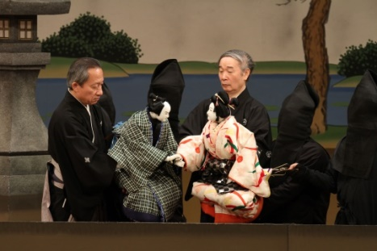

[无对应译文]

</section>

<section class="parallel-paragraph" data-paragraph-ids="s18-07-0361">

s18-07-0361

原文 · s18-07-0361

Le 文楽座 *Bunraku...*

[无对应译文]

</section>

<section class="parallel-paragraph" data-paragraph-ids="s18-07-0362">

s18-07-0362

原文 · s18-07-0362

peut-être que vous avez vu ça certains d’entre vous quand ils sont passés à Paris *...l*e *Bunraku...*

[无对应译文]

</section>

<section class="parallel-paragraph" data-paragraph-ids="s18-07-0363">

s18-07-0363

原文 · s18-07-0363

j’ai été le revoir là-bas, où je l’avais déjà vu la première fois *...*eh bien le *Bunraku,* c’est là son ressort : il fait voir la structure toute ordinaire pour ceux à qui elle donne leurs mœurs elles-mêmes.

[无对应译文]

</section>

<section class="parallel-paragraph" data-paragraph-ids="s18-07-0364">

s18-07-0364

原文 · s18-07-0364

Vous savez qu’on voit à côté de la marionnette, exactement à découvert, les gens qui y opèrent, aussi bien...

[无对应译文]

</section>

<section class="parallel-paragraph" data-paragraph-ids="s18-07-0365">

s18-07-0365

原文 · s18-07-0365

comme au *bunraku...*tout ce qui se dit dans une conversation japonaise pourrait-il aussi bien être lu par un récitant.

[无对应译文]

</section>

<section class="parallel-paragraph" data-paragraph-ids="s18-07-0366">

s18-07-0366

原文 · s18-07-0366

C’est là ce qui a dû soulager Barthes...

[无对应译文]

</section>

<section class="parallel-paragraph" data-paragraph-ids="s18-07-0367">

s18-07-0367

原文 · s18-07-0367

Le Japon est l’endroit où il est le plus naturel de se soutenir...

[无对应译文]

</section>

<section class="parallel-paragraph" data-paragraph-ids="s18-07-0368">

s18-07-0368

原文 · s18-07-0368

> je l’ai fait, je l’ai pratiqué un instant ...d’une interprète - qui aurait aussi bien pu être un - d’une interprète : on est tout à fait à l’aise, on peut se doubler d’une interprète, ça ne nécessite en aucun cas d’interprétation.

[无对应译文]

</section>

<section class="parallel-paragraph" data-paragraph-ids="s18-07-0369">

s18-07-0369

原文 · s18-07-0369

Vous vous rendez compte si j’étais soulagé ! \[*Rires*\]

[无对应译文]

</section>

<section class="parallel-paragraph" data-paragraph-ids="s18-07-0370">

s18-07-0370

原文 · s18-07-0370

Le japonais, c’est la traduction perpétuelle des faits de langage.

[无对应译文]

</section>

<section class="parallel-paragraph" data-paragraph-ids="s18-07-0371">

s18-07-0371

原文 · s18-07-0371

Ce que j’aime – je vais finir là-dessus - c’est que la seule communication que j’y ai eue...

[无对应译文]

</section>

<section class="parallel-paragraph" data-paragraph-ids="s18-07-0372">

s18-07-0372

原文 · s18-07-0372

> hors les Européens bien sûr, avec lesquels je sais m’entendre selon notre *malentendu* culturel ...eh ben la seule que j’ai eue avec un Japonais c’est aussi la seule qui, là-bas comme ailleurs, puisse être « *une communication* » de n’être pas dialogue : c’est *la communication scientifique*.

[无对应译文]

</section>

<section class="parallel-paragraph" data-paragraph-ids="s18-07-0373">

s18-07-0373

原文 · s18-07-0373

J’ai été voir un éminent biologiste que je ne nommerai pas, en raison des règles de la politesse japonaise, ça l’a poussé à me démontrer ses travaux, naturellement là où ça se fait : au tableau noir.

[无对应译文]

</section>

<section class="parallel-paragraph" data-paragraph-ids="s18-07-0374">

s18-07-0374

原文 · s18-07-0374

Le fait que faute d’information, je n’y compris rien, n’empêche nullement ce qu’il a écrit, ses formules, d’être entièrement valables...

[无对应译文]

</section>

<section class="parallel-paragraph" data-paragraph-ids="s18-07-0375">

s18-07-0375

原文 · s18-07-0375

> comme les miennes là où elles sont ...valables pour les molécules dont mes descendants se feront sujet sans que j’aie jamais eu à savoir comment je leur transmettais, ce qui rendait vraisemblable que moi je me classe parmi les êtres vivants.

[无对应译文]

</section>

<section class="parallel-paragraph" data-paragraph-ids="s18-07-0376">

s18-07-0376

原文 · s18-07-0376

Une ascèse de l’écriture...

[无对应译文]

</section>

<section class="parallel-paragraph" data-paragraph-ids="s18-07-0377">

s18-07-0377

原文 · s18-07-0377

ça n’ôte rien aux avantages que nous pouvons prendre de la critique littéraire.

[无对应译文]

</section>

<section class="parallel-paragraph" data-paragraph-ids="s18-07-0378">

s18-07-0378

原文 · s18-07-0378

...ça me semble...

[无对应译文]

</section>

<section class="parallel-paragraph" data-paragraph-ids="s18-07-0379">

s18-07-0379

原文 · s18-07-0379

pour fermer la boucle sur quelque chose de cohérent, en raison de ce que j’ai déjà avancé ...ça me semble ne pouvoir passer qu’à rejoindre ce « *c’est écrit » impossible dont s’instaurera peut-être un jour le rapport sexuel.*

[无对应译文]

</section>

<section class="note-block original-notes">

## Notes

[^48]: *Lituraterre* a été publié dans la revue *Littérature*, N°3, octobre 1971, Larousse, pp. 3-10.

[^49]: Alfred Ernout et Antoine Meillet, *Dictionnaire étymologique de la langue latine*, éd. Klincksieck, Paris, 2001, p. 360

[^50]: Départ : action de départir, de séparer une chose d’une autre → départager...

[^51]: *Sicut palea* : « *de la paille* » ou « *comme du fumier* », réponse de Thomas d’Aquin le 06 décembre 1273 à la fin de sa vie, à ceux qui lui demandaient

    ce que représentait pour lui son œuvre. Cf. Lacan, « *Proposition du* 09-10-1967*sur le psychanalyste de l’École* », dans « *Autres Écrits* », p. 254, Seuil , 2001.

[^52]: Ce qui a été « *paumé* » par ses auditeurs du fait de la mise en défaut du *discours du maître* et du *discours universitaire* par « *les événements de mai 68* »,

    mais aussi les « *paumés* » (égarés) qui placent Lacan dans le *discours du maître* (un Maître retrouvé) ou qui l’entendent comme un *discours universitaire.*

[^53]: Le 22 février 1969 Lacan assiste à la conférence de [Michel Foucault « *Qu'est-ce qu'un auteur ?* »](http://1libertaire.free.fr/MFoucault349.html) à la Société française de philosophie, et participe au débat

    avec Maurice de Gandillac, Jean Wahl...

[^54]: Cf. Georges Polti : « *Les [36 situations dramatiques](http://fr.wikipedia.org/wiki/36_situations_dramatiques) »*, Mercure de France, 1912.

[^55]: *Cf. Marie Bonaparte* : *Edgar Poe, étude psychanalytique*, Denoël et Steele (1933).

[^56]: *Cf. «* *Le séminaire sur « La lettre volée » »* in *Écrits*, Seuil, 1966.

[^57]: *Cf. le débat des physiciens sur la nature de la lumière : corpusculaire( [Planck et la physique quantique](http://fr.wikipedia.org/wiki/Physique_quantique)) ou ondulatoire ([interférences de Young](http://fr.wikipedia.org/wiki/Fentes_de_Young))...*

[^58]: Le découpage d’un segment en deux longueurs a et b telles que (a+b)/a = (a/b) = φ = (1+ √5)/2 (*« nombre d’or »*), est appelé par Euclide

    découpage en « *extrême et moyenne raison »* : « *Une droite est dite coupée en extrême et moyenne raison lorsque la droite entière est au plus grand segment,*

    *comme le plus grand segment est au plus petit. »* (Livre VI, définition 3).

[^59]: Cf. séminaire 1966-67 : « *Logique du fantasme »,* séances du 8 mars au 10 mai..

[^60]: Jacques Lacan : *L’instance de la lettre dans l’inconscient ou la raison depuis Freud*, *Écrits* p. 493.

[^61]: Jean Tardieu : « *Un mot pour un autre* », NRF, Gallimard, 1951.

[^62]:
    #  Sigmund Freud : « *Note sur le « Bloc-notes magique »* » ([*Notiz über den Wunderblock*](http://www.textlog.de/freud-psychoanalyse-notiz-wunderblock.html)) (1925) in *Résultats, idées, problèmes*, t.2 1921-1938, PUF, 2001.

[^63]: Cf. l’expérience d’Henri Bouasse, dite « *du bouquet renversé* », reprise par Lacan (*séminaire *1954-55) en expérience du « *vase renversé* ».

[^64]: Henri Bouasse : *Optique et photométrie dites géométriques,* Paris, Delagrave, 1934, p. 87.

[^65]: Cf. Séminaire 1969-70 : *L’envers de la psychanalyse*, Seuil, 1991, séance du 21-01-1970.

[^66]: Revue « *La Psychanalyse* », PUF, (du n°1 de 1956, au n°8 de1964).

</section>
