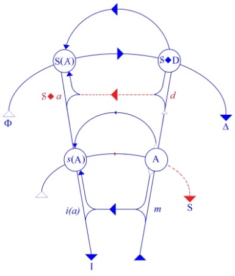
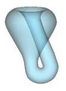

# Leçon 09 | 09 Juin 1971

  <label><input type="checkbox" data-lacan-toggle="original" checked> 原文</label>
  <label><input type="checkbox" data-lacan-toggle="notes" checked> 注释</label>
  <label><input type="checkbox" data-lacan-toggle="commentary" checked> 个人解读评论</label>

<section class="parallel-paragraph" data-paragraph-ids="s18-09-0001">

s18-09-0001

[无对应译文]

原文 · s18-09-0001

Je vais me fonder aujourd’hui sur quelque chose que j’ai pris soin *d’écrire*. Voilà !

</section>

<section class="parallel-paragraph" data-paragraph-ids="s18-09-0002">

s18-09-0002

[无对应译文]

原文 · s18-09-0002

Je ne dis pas ça simplement comme ça, à la cantonade. C’est pas super­flu.

</section>

<section class="parallel-paragraph" data-paragraph-ids="s18-09-0003">

s18-09-0003

[无对应译文]

原文 · s18-09-0003

Je me permettrai, comme ça éventuellement, de ronronner quelque chose à propos de tel terme de *l’écrit*, mais si vous avez suffisamment entendu ce que j’ai abordé cette année de *la fonction de l’écrit*, eh bien, je n’aurai pas besoin de jus­tifier plus si ce n’est dans le fait*, en acte*.

</section>

<section class="parallel-paragraph" data-paragraph-ids="s18-09-0004">

s18-09-0004

[无对应译文]

原文 · s18-09-0004

C’est pas indifférent en effet que ce que je vais dire maintenant soit écrit.

</section>

<section class="parallel-paragraph" data-paragraph-ids="s18-09-0005">

s18-09-0005

[无对应译文]

原文 · s18-09-0005

Ça n’a pas du tout la même portée si sim­plement *je dis* ou si je vous dis que *j’ai écrit  *: « *Un homme et une femme peuvent s’entendre, je ne dis pas non...*

</section>

<section class="parallel-paragraph" data-paragraph-ids="s18-09-0006">

s18-09-0006

[无对应译文]

原文 · s18-09-0006

*Ils peuvent comme tels s’entendre crier.* »

</section>

<section class="parallel-paragraph" data-paragraph-ids="s18-09-0007">

s18-09-0007

[无对应译文]

原文 · s18-09-0007

Ça serait un badinage si je ne l’avais pas *écrit *: « *écrit* » suppose au moins soupçonné de vous...

</section>

<section class="parallel-paragraph" data-paragraph-ids="s18-09-0008">

s18-09-0008

[无对应译文]

原文 · s18-09-0008

enfin de *certains d’entre vous* ...ce qu’en un temps j’ai dit du « *cri »*. Je ne peux pas y revenir.

</section>

<section class="parallel-paragraph" data-paragraph-ids="s18-09-0009">

s18-09-0009

[无对应译文]

原文 · s18-09-0009

Ceci arrive qu’ils crient, dans le cas où ils ne réussissent pas à s’*entendre* autrement.

</section>

<section class="parallel-paragraph" data-paragraph-ids="s18-09-0010">

s18-09-0010

[无对应译文]

原文 · s18-09-0010

Autrement, c’est-à-dire sur une affaire qui est le gage de leur *entente*.

</section>

<section class="parallel-paragraph" data-paragraph-ids="s18-09-0011">

s18-09-0011

[无对应译文]

原文 · s18-09-0011

Ces *affaires* ne manquent pas...

</section>

<section class="parallel-paragraph" data-paragraph-ids="s18-09-0012">

s18-09-0012

[无对应译文]

原文 · s18-09-0012

y est comprise à l’occasion, c’est la meilleure, l’*entente* au lit ...ces *affaires* ne manquent pas, certes donc, mais c’est en cela qu’elles manquent quelque chose, à savoir de s’entendre comme homme, comme femme, ce qui voudrait dire sexuellement.

</section>

<section class="parallel-paragraph" data-paragraph-ids="s18-09-0013">

s18-09-0013

[无对应译文]

原文 · s18-09-0013

L’homme et la femme ne s’entendraient-ils ainsi qu’à se taire ?

</section>

<section class="parallel-paragraph" data-paragraph-ids="s18-09-0014">

s18-09-0014

[无对应译文]

原文 · s18-09-0014

Il n’en est même pas question, car l’homme, la femme, n’ont aucun besoin de parler pour être pris dans un discours.

</section>

<section class="parallel-paragraph" data-paragraph-ids="s18-09-0015">

s18-09-0015

[无对应译文]

原文 · s18-09-0015

Comme tels...

</section>

<section class="parallel-paragraph" data-paragraph-ids="s18-09-0016">

s18-09-0016

[无对应译文]

原文 · s18-09-0016

du même terme que celui que j’ai dit tout à l’heure ...comme tels ils sont des faits de discours.

</section>

<section class="parallel-paragraph" data-paragraph-ids="s18-09-0017">

s18-09-0017

[无对应译文]

原文 · s18-09-0017

Le sourire ici suffirait, me semble-t-il, à avancer qu’ils ne sont pas que ça. Sans doute, qui ne l’accorde ?

</section>

<section class="parallel-paragraph" data-paragraph-ids="s18-09-0018">

s18-09-0018

[无对应译文]

原文 · s18-09-0018

Mais qu’ils soient ça aussi - des faits de discours - fige le sourire.

</section>

<section class="parallel-paragraph" data-paragraph-ids="s18-09-0019">

s18-09-0019

[无对应译文]

原文 · s18-09-0019

Et ce n’est qu’ainsi, figé par cette remarque, qu’il a son sens, le sourire, sur les statues archaïques.

</section>

<section class="parallel-paragraph" data-paragraph-ids="s18-09-0020">

s18-09-0020

[无对应译文]

原文 · s18-09-0020

*L’infatuation*, elle, *ricane*.

</section>

<section class="parallel-paragraph" data-paragraph-ids="s18-09-0021">

s18-09-0021

[无对应译文]

原文 · s18-09-0021

C’est donc *dans un discours que les* « *étant* » - *hommes et femmes* *« naturels »* si l’on peut dire - ont à se faire valoir comme tels.

</section>

<section class="parallel-paragraph" data-paragraph-ids="s18-09-0022">

s18-09-0022

[无对应译文]

原文 · s18-09-0022

*Il n’est discours que de semblant*.

</section>

<section class="parallel-paragraph" data-paragraph-ids="s18-09-0023">

s18-09-0023

[无对应译文]

原文 · s18-09-0023

Si ça ne s’avouait pas de soi, j’ai dénoncé la chose. J’en rappelle l’articulation : *le semblant ne s’énonce qu’à partir de la vérité*.

</section>

<section class="parallel-paragraph" data-paragraph-ids="s18-09-0024">

s18-09-0024

[无对应译文]

原文 · s18-09-0024

Sans doute n’évoque-t-on jamais celle-ci - *la vérité -* dans la science.

</section>

<section class="parallel-paragraph" data-paragraph-ids="s18-09-0025">

s18-09-0025

[无对应译文]

原文 · s18-09-0025

Ça n’est pas là raison de nous en faire plus de *souci*. Elle se passe bien de nous.

</section>

<section class="parallel-paragraph" data-paragraph-ids="s18-09-0026">

s18-09-0026

[无对应译文]

原文 · s18-09-0026

Pour qu’elle se fasse entendre, il lui suffit de dire « *Je parle* [^69] » et on l’en croit, parce que c’est vrai : qui parle... parle.

</section>

<section class="parallel-paragraph" data-paragraph-ids="s18-09-0027">

s18-09-0027

[无对应译文]

原文 · s18-09-0027

Il n’y a d’enjeu...

</section>

<section class="parallel-paragraph" data-paragraph-ids="s18-09-0028">

s18-09-0028

[无对应译文]

原文 · s18-09-0028

je rappelle ce que j’ai dit du pari, en l’illustrant de Pascal ...il n’y a d’enjeu que de ce qu’elle dit.

</section>

<section class="parallel-paragraph" data-paragraph-ids="s18-09-0029">

s18-09-0029

[无对应译文]

原文 · s18-09-0029

*Comme vérité, elle ne peut dire que le semblant sur la jouissance* et c’est sur la *jouissance sexuelle* qu’elle gagne à tous les coups.

</section>

<section class="parallel-paragraph" data-paragraph-ids="s18-09-0030">

s18-09-0030

[无对应译文]

原文 · s18-09-0030

Je vais ici vous mettre au tableau, à l’usage éventuel de ceux qui ne sont pas venus les dernières fois, les figures algébriques dont j’ai cru pouvoir ponctuer ce dont il s’agit concernant le coinçage auquel on est amené, d’écrire ce qui concerne le rapport sexuel :

</section>

<section class="parallel-paragraph" data-paragraph-ids="s18-09-0031">

s18-09-0031

[无对应译文]

原文 · s18-09-0031

- . !

</section>

<section class="parallel-paragraph" data-paragraph-ids="s18-09-0032">

s18-09-0032

[无对应译文]

原文 · s18-09-0032

- / !

</section>

<section class="parallel-paragraph" data-paragraph-ids="s18-09-0033">

s18-09-0033

[无对应译文]

原文 · s18-09-0033

Les deux barres mises sur les symboles qui sont à gauche...

</section>

<section class="parallel-paragraph" data-paragraph-ids="s18-09-0034">

s18-09-0034

[无对应译文]

原文 · s18-09-0034

> et dont se situe respectivement, au regard de ce dont il s’agit,
>
> tout ce qui est capable de répondre au *semblant de la jouissance sexuelle* ...les deux barres dites de négation, sont ici telles que justement elles ne sont pas à écrire puisque de ce qui ne peut pas s’écrire on n’écrit pas, tout simplement.

</section>

<section class="parallel-paragraph" data-paragraph-ids="s18-09-0035">

s18-09-0035

[无对应译文]

原文 · s18-09-0035

On peut *dire* qu’elles ne sont pas à écrire :

</section>

<section class="parallel-paragraph" data-paragraph-ids="s18-09-0036">

s18-09-0036

[无对应译文]

原文 · s18-09-0036

- que ce n’est « *pas de tout x* » que puisse être posée la fonction Φ(X), et que c’est de ce « *ce n’est pas de tout x* » que se pose la femme : . !,

<!-- -->

</section>

<section class="parallel-paragraph" data-paragraph-ids="s18-09-0037">

s18-09-0037

[无对应译文]

原文 · s18-09-0037

- « *Il n’existe pas de x* » tel qu’il satisfasse à la fonction dont se définit la variable d’être la fonction Φ(X) : / !

</section>

<section class="parallel-paragraph" data-paragraph-ids="s18-09-0038">

s18-09-0038

[无对应译文]

原文 · s18-09-0038

> Il n’en existe pas, c’est de cela que se formule ce qu’il en est de l’homme, mâle j’entends,
>
> mais justement ici la négation n’a que la fonction dite de la *Verneinung*,
>
> c’est-à-dire qu’elle ne se pose qu’à avoir d’abord avancé qu’*il existe quelque homme* \[: !\]
>
> et que c’est par rapport à « *toute femme* » qu’une femme se situe \[*comme* . !\]. C’est un rappel.

</section>

<section class="parallel-paragraph" data-paragraph-ids="s18-09-0039">

s18-09-0039

[无对应译文]

原文 · s18-09-0039

Ça ne fait pas partie de l’écrit que je reprends, « *que je reprends* » : ce qui signifie que...

</section>

<section class="parallel-paragraph" data-paragraph-ids="s18-09-0040">

s18-09-0040

[无对应译文]

原文 · s18-09-0040

> puisque je vois que c’est assez répandu : vous faites bien en effet de prendre des notes ...c’est le seul intérêt de *l’écrit*, c’est que *par après* vous ayez à vous situer par rapport à lui.

</section>

<section class="parallel-paragraph" data-paragraph-ids="s18-09-0041">

s18-09-0041

[无对应译文]

原文 · s18-09-0041

Eh bien, on fera bien de me suivre dans ma discipline du *nom* - *n.o.m*. J’aurai à y revenir.

</section>

<section class="parallel-paragraph" data-paragraph-ids="s18-09-0042">

s18-09-0042

[无对应译文]

原文 · s18-09-0042

Spécialement la prochaine fois, ça sera la séance dont nous conclurons cette année.

</section>

<section class="parallel-paragraph" data-paragraph-ids="s18-09-0043">

s18-09-0043

[无对应译文]

原文 · s18-09-0043

Le propre du *nom*, c’est d’être *nom propre*.

</section>

<section class="parallel-paragraph" data-paragraph-ids="s18-09-0044">

s18-09-0044

[无对应译文]

原文 · s18-09-0044

Même pour un *nom* tombé, entre autres, à l’usage de nom commun, ce n’est pas temps perdu que de lui retrouver un emploi propre.

</section>

<section class="parallel-paragraph" data-paragraph-ids="s18-09-0045">

s18-09-0045

[无对应译文]

原文 · s18-09-0045

Et quand *un nom est resté assez propre*, n’hésitez pas, prenez exemple et appelez la chose par son nom : *La chose freudienne* par exemple, comme j’ai fait - vous le savez - j’aime à l’imaginer tout au moins.

</section>

<section class="parallel-paragraph" data-paragraph-ids="s18-09-0046">

s18-09-0046

[无对应译文]

原文 · s18-09-0046

J’y reviendrai la prochaine fois.

</section>

<section class="parallel-paragraph" data-paragraph-ids="s18-09-0047">

s18-09-0047

[无对应译文]

原文 · s18-09-0047

Nommer quelque chose c’est... c’est un appel.

</section>

<section class="parallel-paragraph" data-paragraph-ids="s18-09-0048">

s18-09-0048

[无对应译文]

原文 · s18-09-0048

Si bien que lorsque j’ai écrit, « *La chose » -* en question, freudienne - *se lève et fait son numéro*.

</section>

<section class="parallel-paragraph" data-paragraph-ids="s18-09-0049">

s18-09-0049

[无对应译文]

原文 · s18-09-0049

Ce n’est pas moi qui le lui dicte.

</section>

<section class="parallel-paragraph" data-paragraph-ids="s18-09-0050">

s18-09-0050

[无对应译文]

原文 · s18-09-0050

Ce serait même de tout repos...

</section>

<section class="parallel-paragraph" data-paragraph-ids="s18-09-0051">

s18-09-0051

[无对应译文]

原文 · s18-09-0051

> de ce repos dernier au *semblant* de quoi tant de vies s’astreignent ...si je n’étais pas, comme homme, masculin, exposé là sous le vent de la castration. Relisez mon texte !

</section>

<section class="parallel-paragraph" data-paragraph-ids="s18-09-0052">

s18-09-0052

[无对应译文]

原文 · s18-09-0052

Elle, *la vérité* - mon imbaisable partenaire - elle est certes dans le même vent, elle le porte même : « *être dans le vent »* c’est ça, mais ce vent ne lui fait ni chaud, ni froid.

</section>

<section class="parallel-paragraph" data-paragraph-ids="s18-09-0053">

s18-09-0053

[无对应译文]

原文 · s18-09-0053

Pour la raison que *la jouissance*, « *c’est très peu pour elle* », puisque la vérité, c’est qu’*elle la laisse au semblant*.

</section>

<section class="parallel-paragraph" data-paragraph-ids="s18-09-0054">

s18-09-0054

[无对应译文]

原文 · s18-09-0054

*Ce semblant a un nom*, lui aussi repris du temps mystérieux de ce que s’y jouassent « *les mystères* », rien de plus, où il nommait le savoir supposé à la fécondité, et comme tel offert à l’adoration sous la figure d’*un semblant d’organe*.

</section>

<section class="parallel-paragraph" data-paragraph-ids="s18-09-0055">

s18-09-0055

[无对应译文]

原文 · s18-09-0055

*Le semblant dénoncé par la vérité pure est*, il faut le reconnaître, *assez-phalle*, assez intéressé...

</section>

<section class="parallel-paragraph" data-paragraph-ids="s18-09-0056">

s18-09-0056

[无对应译文]

原文 · s18-09-0056

> dans ce qui pour nous s’amorce par la vertu du coït
>
> à savoir la sélection des génotypes avec la reproduction du phénotype qui s’ensuit, ...assez intéressé donc pour mériter *ce nom antique de phallus*.

</section>

<section class="parallel-paragraph" data-paragraph-ids="s18-09-0057">

s18-09-0057

[无对应译文]

原文 · s18-09-0057

Bien qu’il soit clair que l’héritage qu’il couvre maintenant se réduit à « *l’acéphalie* » de cette sélection, soit *l’impossibilité de subordonner la jouissance dite sexuelle* à ce qui, « *sub rosa »,* spécifierait le choix de l’homme et de la femme, pris comme porteurs chacun d’un lot précis de *génotypes*, puisqu’au meilleur cas c’est *le phénotype* qui guide ce choix.

</section>

<section class="parallel-paragraph" data-paragraph-ids="s18-09-0058">

s18-09-0058

[无对应译文]

原文 · s18-09-0058

À la vérité - c’est le cas de le dire - un *nom propre*...

</section>

<section class="parallel-paragraph" data-paragraph-ids="s18-09-0059">

s18-09-0059

[无对应译文]

原文 · s18-09-0059

> car c’en est encore un, *le phallus* ...n’est tout à fait stable que sur la carte où il désigne *un désert* [^70]: *c’est les seules choses qui sur la carte ne changent pas de nom*.

</section>

<section class="parallel-paragraph" data-paragraph-ids="s18-09-0060">

s18-09-0060

[无对应译文]

原文 · s18-09-0060

Il est remarquable que même les déserts produits au nom d’une religion – ce qui n’est pas rare – ne soient jamais désignés du nom qui fut pour eux dévastateur. Un désert ne se rebaptise qu’à être fécondé.  
Ce n’est pas le cas dans la jouissance sexuelle, que le progrès de la science ne semble pas conquérir au savoir.

</section>

<section class="parallel-paragraph" data-paragraph-ids="s18-09-0061">

s18-09-0061

[无对应译文]

原文 · s18-09-0061

C’est par contre du barrage qu’elle constitue *à l’avènement du rapport sexuel dans le discours* que sa place s’y est *évidée,* jusqu’à devenir, dans la psychanalyse, *évidente*.

</section>

<section class="parallel-paragraph" data-paragraph-ids="s18-09-0062">

s18-09-0062

[无对应译文]

原文 · s18-09-0062

Telle est – au sens que ce mot a dans le « *pas »* logique de Frege – *Die Bedeutung des Phallus* [^71].

</section>

<section class="parallel-paragraph" data-paragraph-ids="s18-09-0063">

s18-09-0063

[无对应译文]

原文 · s18-09-0063

C’est bien pourquoi...

</section>

<section class="parallel-paragraph" data-paragraph-ids="s18-09-0064">

s18-09-0064

[无对应译文]

原文 · s18-09-0064

> j’ai mes malices, hein ! ...c’est en Allemagne – parce qu’en allemand – que j’ai porté le message à quoi répond dans mes « *Écrits »* ce titre, et ce au nom du centenaire de la naissance de Freud.

</section>

<section class="parallel-paragraph" data-paragraph-ids="s18-09-0065">

s18-09-0065

[无对应译文]

原文 · s18-09-0065

Il fut beau de toucher, en ce pays élu pour qu’y résonnât ce message, la sidération qu’il produisit.

</section>

<section class="parallel-paragraph" data-paragraph-ids="s18-09-0066">

s18-09-0066

[无对应译文]

原文 · s18-09-0066

On ne peut pas avoir l’idée maintenant, parce que vous vous baladez tous avec des machins comme ça sous le bras.

</section>

<section class="parallel-paragraph" data-paragraph-ids="s18-09-0067">

s18-09-0067

[无对应译文]

原文 · s18-09-0067

À ce moment-là, ça faisait un effet « *Die Bedeutung des Phallus »* !

</section>

<section class="parallel-paragraph" data-paragraph-ids="s18-09-0068">

s18-09-0068

[无对应译文]

原文 · s18-09-0068

Dire que je m’attendais à ça, ne serait rien dire, du moins dans ma bouche. Ma force est de savoir ce qu’*attendre* signifie.

</section>

<section class="parallel-paragraph" data-paragraph-ids="s18-09-0069">

s18-09-0069

[无对应译文]

原文 · s18-09-0069

Pour la sidération en question, je ne mets pas ici dans le coup les 25 ans de crétinisation ratée, cela serait consacrer que ces 25 ans triomphent partout.

</section>

<section class="parallel-paragraph" data-paragraph-ids="s18-09-0070">

s18-09-0070

[无对应译文]

原文 · s18-09-0070

Plutôt insisterai-je sur ce que « *Die Bedeutung des Phallus »* est en réalité un pléonasme : *il n’y a pas dans le langage d’autre Bedeutung que le phallus*.

</section>

<section class="parallel-paragraph" data-paragraph-ids="s18-09-0071">

s18-09-0071

[无对应译文]

原文 · s18-09-0071

*Le langage,* dans sa fonction d’existant...

</section>

<section class="parallel-paragraph" data-paragraph-ids="s18-09-0072">

s18-09-0072

[无对应译文]

原文 · s18-09-0072

*vous savez que ça s’est fait* \[ ? *peu audible*\] ...*ne connote* en dernière analyse...

</section>

<section class="parallel-paragraph" data-paragraph-ids="s18-09-0073">

s18-09-0073

[无对应译文]

原文 · s18-09-0073

j’ai dit «* connote *», hein !

</section>

<section class="parallel-paragraph" data-paragraph-ids="s18-09-0074">

s18-09-0074

[无对应译文]

原文 · s18-09-0074

...*que l’impossibilité de symboliser le rapport sexuel chez les êtres qui l’habitent* – qui habitent le langage – en raison de ce que *c’est de cet habitat qu’ils tiennent la parole*.

</section>

<section class="parallel-paragraph" data-paragraph-ids="s18-09-0075">

s18-09-0075

[无对应译文]

原文 · s18-09-0075

Et qu’on n’oublie pas ce que j’ai dit de ce que *la parole* dès lors n’est pas leur privilège à ces êtres qui *l’habitent*, qui *l’évoquent*, *la parole*, dans tout ce qu’ils dominent par l’effet du discours.

</section>

<section class="parallel-paragraph" data-paragraph-ids="s18-09-0076">

s18-09-0076

[无对应译文]

原文 · s18-09-0076

Cela commence par ma chienne par exemple, celle dont j’ai longtemps parlé, et ça va très, très loin.

</section>

<section class="parallel-paragraph" data-paragraph-ids="s18-09-0077">

s18-09-0077

[无对应译文]

原文 · s18-09-0077

« *Le silence éternel* - comme disait l’autre - *des espaces infinis*...[^72] » n’aura pas...

</section>

<section class="parallel-paragraph" data-paragraph-ids="s18-09-0078">

s18-09-0078

[无对应译文]

原文 · s18-09-0078

> comme beaucoup d’autres, d’autres éternités ...duré plus qu’un instant : *ça parle vachement dans la zone de la nouvelle astronomie*, celle qui s’est ouverte tout de suite après ce menu propos de Pascal.

</section>

<section class="parallel-paragraph" data-paragraph-ids="s18-09-0079">

s18-09-0079

[无对应译文]

原文 · s18-09-0079

C’est de ce que le langage n’est constitué que *d’une seule Bedeutung,* qu’il tire sa structure, laquelle consiste en ce qu’on ne puisse, de ce qu’on l’habite, en user que :

</section>

<section class="parallel-paragraph" data-paragraph-ids="s18-09-0080">

s18-09-0080

[无对应译文]

原文 · s18-09-0080

- pour la *métaphore* d’où résultent toutes les insanités mythiques dont vivent ses habitants,

</section>

<section class="parallel-paragraph" data-paragraph-ids="s18-09-0081">

s18-09-0081

[无对应译文]

原文 · s18-09-0081

- pour la *métonymie* dont ils prennent « *le peu de réalité* »[^73] qui leur reste, sous la forme du *plus-de-jouir*.

</section>

<section class="parallel-paragraph" data-paragraph-ids="s18-09-0082">

s18-09-0082

[无对应译文]

原文 · s18-09-0082

Or ceci, ceci que je viens de *dire*, ne se signe que dans l’histoire, et à partir de l’apparition de *l’écriture*, laquelle n’est jamais *simple inscription*, fût-ce dans les apparences de ce qui se promeut de « *l’audiovisuel* », *l’écriture n’est jamais*...

</section>

<section class="parallel-paragraph" data-paragraph-ids="s18-09-0083">

s18-09-0083

[无对应译文]

原文 · s18-09-0083

> depuis ses origines jusqu’à ses derniers protéismes techniques ...*que quelque chose qui s’articule comme os dont le langage serait la chair*.

</section>

<section class="parallel-paragraph" data-paragraph-ids="s18-09-0084">

s18-09-0084

[无对应译文]

原文 · s18-09-0084

C’est bien en cela qu’elle démontre que la *jouissance*, que la jouissance sexuelle n’a pas d’os, ce dont on se doutait par les mœurs de l’organe qui en donne chez le mâle parlant une figure comique.

</section>

<section class="parallel-paragraph" data-paragraph-ids="s18-09-0085">

s18-09-0085

[无对应译文]

原文 · s18-09-0085

Mais *l’écriture*, elle...

</section>

<section class="parallel-paragraph" data-paragraph-ids="s18-09-0086">

s18-09-0086

[无对应译文]

原文 · s18-09-0086

pas le langage ...*l’écriture donne os à toutes les jouissances qui, de par le discours, s’avèrent s’ouvrir à l’être parlant.*

</section>

<section class="parallel-paragraph" data-paragraph-ids="s18-09-0087">

s18-09-0087

[无对应译文]

原文 · s18-09-0087

*<u>Leur donnant os, elle souligne ce qui y était</u>* certes accessible, mais *<u>masqué,</u>* à savoir *<u>que le rapport sexuel fait défaut au champ de la vérité</u>* *<u>en ce que le discours qui l’instaure ne procède que du semblant</u>, à ne frayer la voie qu’à des jouissances qui parodient* \- c’est le mot propre - *celle qui y est effective, mais qui lui demeure étrangère*.

</section>

<section class="parallel-paragraph" data-paragraph-ids="s18-09-0088">

s18-09-0088

[无对应译文]

原文 · s18-09-0088

Tel est *l’Autre de* *la jouissance *: à jamais *inter-dit* celui dont le langage ne permet *l’habitation* qu’à le fournir...

</section>

<section class="parallel-paragraph" data-paragraph-ids="s18-09-0089">

s18-09-0089

[无对应译文]

原文 · s18-09-0089

> pourquoi n’emploierais-je pas cette image ? ...de « *scaphandres* ». \[**(***a***)**\]

</section>

<section class="parallel-paragraph" data-paragraph-ids="s18-09-0090">

s18-09-0090

[无对应译文]

原文 · s18-09-0090

Peut-être que ça vous dit quelque chose, cette image, hein ?

</section>

<section class="parallel-paragraph" data-paragraph-ids="s18-09-0091">

s18-09-0091

[无对应译文]

原文 · s18-09-0091

Il y en a tout de même quelques-uns d’entre vous qui ne sont pas assez occupés par leurs fonctions de syndicats pour être tout de même émus de *nos exploits lunaires*.

</section>

<section class="parallel-paragraph" data-paragraph-ids="s18-09-0092">

s18-09-0092

[无对应译文]

原文 · s18-09-0092

Il y a longtemps que l’homme rêve à *la lune*, il y a mis le pied maintenant.

</section>

<section class="parallel-paragraph" data-paragraph-ids="s18-09-0093">

s18-09-0093

[无对应译文]

原文 · s18-09-0093

Pour bien se rendre compte de ce que ça veut dire, il faut faire comme j’ai fait : revenir du Japon.

</section>

<section class="parallel-paragraph" data-paragraph-ids="s18-09-0094">

s18-09-0094

[无对应译文]

原文 · s18-09-0094

C’est là qu’on se rend compte que *rêver à la lune*, c’était vraiment une fonction.

</section>

<section class="parallel-paragraph" data-paragraph-ids="s18-09-0095">

s18-09-0095

[无对应译文]

原文 · s18-09-0095

Il y a un personnage[^74] dont je ne dirai pas le nom - je ne veux pas faire ici d’érudition - qui est encore là enfermé...

</section>

<section class="parallel-paragraph" data-paragraph-ids="s18-09-0096">

s18-09-0096

[无对应译文]

原文 · s18-09-0096

> c’est exactement lui : on se rend bien compte de ce que cela veut dire « *persona* »,
>
> c’est la personne même, c’est son *masque* qui est là enfermé dans une petite armoire japonaise,
>
> on le montre aux touristes. On sait que c’est lui, enfin de l’endroit à dix mètres où il se montre,
>
> cela se trouve dans un endroit qui s’appelle *le Pavillon d’Argent*, à Kyoto ...qui rêvait à la lune.

</section>

<section class="parallel-paragraph" data-paragraph-ids="s18-09-0097">

s18-09-0097

[无对应译文]

原文 · s18-09-0097

</section>

<section class="parallel-paragraph" data-paragraph-ids="s18-09-0098">

s18-09-0098

[无对应译文]

原文 · s18-09-0098

Nous aimons à croire qu’il la contemplait assez *phallique*.

</section>

<section class="parallel-paragraph" data-paragraph-ids="s18-09-0099">

s18-09-0099

[无对应译文]

原文 · s18-09-0099

Nous aimons à le croire, enfin cela nous laisse tout de même dans l’embarras, on ne se rend plus bien compte.

</section>

<section class="parallel-paragraph" data-paragraph-ids="s18-09-0100">

s18-09-0100

[无对应译文]

原文 · s18-09-0100

Le chemin parcouru n’est-ce pas pour l’inscrire \[*traces de pas sur le sol lunaire*\], pour se tirer de cet *embarras*, il faut comprendre que c’est l’accomplissement du *signifiant de A barré* de mon graphe : S(A).

</section>

<section class="parallel-paragraph" data-paragraph-ids="s18-09-0101">

s18-09-0101

[无对应译文]

原文 · s18-09-0101

</section>

<section class="parallel-paragraph" data-paragraph-ids="s18-09-0102">

s18-09-0102

[无对应译文]

原文 · s18-09-0102

Bon, tout cela est un badinage. Je vous demande pardon.

</section>

<section class="parallel-paragraph" data-paragraph-ids="s18-09-0103">

s18-09-0103

[无对应译文]

原文 · s18-09-0103

C’est un badinage-signal - signal pour moi, bien sûr - qui m’avertit que je frôle le *structuralisme*.

</section>

<section class="parallel-paragraph" data-paragraph-ids="s18-09-0104">

s18-09-0104

[无对应译文]

原文 · s18-09-0104

Si je suis forcé de le frôler, comme cela naturellement, c’est pas de ma faute.

</section>

<section class="parallel-paragraph" data-paragraph-ids="s18-09-0105">

s18-09-0105

[无对应译文]

原文 · s18-09-0105

Je m’en déchargerai, ce sera à vous d’en juger, sur la situation que je subis.

</section>

<section class="parallel-paragraph" data-paragraph-ids="s18-09-0106">

s18-09-0106

[无对应译文]

原文 · s18-09-0106

Le temps passe et naturellement je dois me presser un peu, je suis forcé d’abréger un peu, d’autant que cela va devenir plus difficile à suivre, mon écrit.

</section>

<section class="parallel-paragraph" data-paragraph-ids="s18-09-0107">

s18-09-0107

[无对应译文]

原文 · s18-09-0107

Mais cette situation que je subis, je vais l’épingler, je vais l’épingler de quelque chose qui ne va pas vous apparaître tout de suite, mais que j’aurai à dire d’ici qu’on se quitte dans huit jours, c’est que je l’épinglerai du refus de *la performance*.

</section>

<section class="parallel-paragraph" data-paragraph-ids="s18-09-0108">

s18-09-0108

[无对应译文]

原文 · s18-09-0108

C’est une maladie, une maladie d’époque, sous les fourches de laquelle il faut bien passer, puisque ce refus constitue *le culte de la compétence*, c’est-à-dire de la certaine *idéalité* dont je suis réduit, avec d’ailleurs beaucoup de champs de la science, à m’autoriser devant vous.

</section>

<section class="parallel-paragraph" data-paragraph-ids="s18-09-0109">

s18-09-0109

[无对应译文]

原文 · s18-09-0109

Le résultat - ça c’est des anecdotes - mes *Écrits* sont par exemple... on en traduit un en anglais : *Fonction et champ de la parole et du langage*, on le traduit par « *The language of the self »*.

</section>

<section class="parallel-paragraph" data-paragraph-ids="s18-09-0110">

s18-09-0110

[无对应译文]

原文 · s18-09-0110

Je viens d’apprendre qu’en espagnol on a fait aussi quelque chose dans ce genre-là : une traduction d’un certain nombre \[de mes écrits\], c’est intitulé « *Aspects structuralistes de Freud »* [^75], enfin quelque chose comme ça, enfin laissons...

</section>

<section class="parallel-paragraph" data-paragraph-ids="s18-09-0111">

s18-09-0111

[无对应译文]

原文 · s18-09-0111

La compétence n’existe que de ce que c’est dans l’incompétence qu’elle prend assiette à se proposer sous forme d’idéalité à son culte. C’est comme ça qu’elle va aux concessions, et je vais vous en donner un exemple : la phrase par laquelle j’ai commencé : « *L’homme et la femme peuvent s’entendre, je ne dis pas non*... ».

</section>

<section class="parallel-paragraph" data-paragraph-ids="s18-09-0112">

s18-09-0112

[无对应译文]

原文 · s18-09-0112

Eh bien voilà, c’était pour vous dorer la pilule ! Et « *la pilule »,* ça n’arrange rien, hein !

</section>

<section class="parallel-paragraph" data-paragraph-ids="s18-09-0113">

s18-09-0113

[无对应译文]

原文 · s18-09-0113

La notion forgée du terme de « *structuralisme* » tente de prolonger la délégation...

</section>

<section class="parallel-paragraph" data-paragraph-ids="s18-09-0114">

s18-09-0114

[无对应译文]

原文 · s18-09-0114

> faite un temps à certains spécialistes, les spécialistes de la vérité ...la délégation d’un certain vide, qui s’aperçoit dans *la raréfaction de la jouissance*.

</section>

<section class="parallel-paragraph" data-paragraph-ids="s18-09-0115">

s18-09-0115

[无对应译文]

原文 · s18-09-0115

C’est ce vide qu’avait relevé - sans fard - l’existentialisme, après que la phénoménologie...

</section>

<section class="parallel-paragraph" data-paragraph-ids="s18-09-0116">

s18-09-0116

[无对应译文]

原文 · s18-09-0116

> la phénoménologie, hein : bien plus *faux-jeton*... ...eût jeté le gant de ses exercices respiratoires.

</section>

<section class="parallel-paragraph" data-paragraph-ids="s18-09-0117">

s18-09-0117

[无对应译文]

原文 · s18-09-0117

Elle occupait les lieux laissés déserts par la philosophie, parce que ce n’était pas des lieux « *appropriés* »...

</section>

<section class="parallel-paragraph" data-paragraph-ids="s18-09-0118">

s18-09-0118

[无对应译文]

原文 · s18-09-0118

Actuellement, ils sont tout juste bons *au mémorial* de sa contribution - qui n’est pas mince - à la philosophie, au *discours du Maître* qu’elle a définitivement stabilisé de l’appui de la science.

</section>

<section class="parallel-paragraph" data-paragraph-ids="s18-09-0119">

s18-09-0119

[无对应译文]

原文 · s18-09-0119

Marx ou pas - et qu’il l’ait balancée sur les pieds ou sur la tête, la philosophie - il est certain que la philosophie en tout cas, elle, n’était pas « *assez-phalle* ».

</section>

<section class="parallel-paragraph" data-paragraph-ids="s18-09-0120">

s18-09-0120

[无对应译文]

原文 · s18-09-0120

Qu’on ne compte pas sur moi pour structuraliser l’affaire de *la vie impossible*, comme si ce n’était pas de là qu’elle avait chance, la vie, de faire la preuve de son *réel*.

</section>

<section class="parallel-paragraph" data-paragraph-ids="s18-09-0121">

s18-09-0121

[无对应译文]

原文 · s18-09-0121

Ma prosopopée esbaudissante du « *Je parle*... » dans l’écrit cité tout à l’heure : *La chose freudienne* \[*Écrits*, p. 409\], pour être mise au compte rhétorique d’une «* vérité en personne *», ne me fait pas choir là d’où je la tire : du puits.

</section>

<section class="parallel-paragraph" data-paragraph-ids="s18-09-0122">

s18-09-0122

[无对应译文]

原文 · s18-09-0122

Rien n’est dit là de *ce que parler veut dire* : *la division sans remède de la jouissance et du semblant.*

</section>

<section class="parallel-paragraph" data-paragraph-ids="s18-09-0123">

s18-09-0123

[无对应译文]

原文 · s18-09-0123

*La vérité, c’est de jouir à faire semblant*, et de n’avouer en aucun cas que la réalité de chacune de ces deux moitiés ne prédomine qu’à s’affirmer d’être de l’autre, soit à mentir à jets alternés. Tel est *le mi-dit de la vérité*.

</section>

<section class="parallel-paragraph" data-paragraph-ids="s18-09-0124">

s18-09-0124

[无对应译文]

原文 · s18-09-0124

Son astronomie est équatoriale, soit déjà tout à fait périmée quand elle naquit du couple nuit-jour.

</section>

<section class="parallel-paragraph" data-paragraph-ids="s18-09-0125">

s18-09-0125

[无对应译文]

原文 · s18-09-0125

Une astronomie ça s’arraisonne de se soumettre aux saisons, s’assaisonner.

</section>

<section class="parallel-paragraph" data-paragraph-ids="s18-09-0126">

s18-09-0126

[无对应译文]

原文 · s18-09-0126

Ceci est une allusion à l’astronomie chinoise qui, elle, était équatoriale, mais qui n’a rien donné.

</section>

<section class="parallel-paragraph" data-paragraph-ids="s18-09-0127">

s18-09-0127

[无对应译文]

原文 · s18-09-0127

*La chose* dont il s’agit, ce n’est pas sa compétence de linguiste - et pour cause - qui à Freud en a tracé les voies.

</section>

<section class="parallel-paragraph" data-paragraph-ids="s18-09-0128">

s18-09-0128

[无对应译文]

原文 · s18-09-0128

Ce que je rappelle, moi, c’est que ces voies il n’a pu les suivre qu’à y faire preuve, et jusqu’à l’acrobatie, de performances de langage, et que là, seule la linguistique permet de les situer dans une structure en tant qu’elle s’attache, elle, à une compétence qu’on appelle « *une conscience linguistique »* qui est tout de même bien remarquable justement de ne jamais se dérober à son enquête.

</section>

<section class="parallel-paragraph" data-paragraph-ids="s18-09-0129">

s18-09-0129

[无对应译文]

原文 · s18-09-0129

Donc ma formule, que « *l’inconscient est structuré comme un langage »*, implique qu’à *minima* la condition de l’inconscient c’est le langage. Mais ça n’ôte rien à la portée de l’énigme qui consiste en ce que l’inconscient en sache plus long qu’il n’en a l’air, puisque c’est de cette surprise qu’on était parti pour le nommer comme on l’a fait. Il en sait des choses !

</section>

<section class="parallel-paragraph" data-paragraph-ids="s18-09-0130">

s18-09-0130

[无对应译文]

原文 · s18-09-0130

Naturellement tout de suite ça tournait court, si on le coiffait - le petit inconscient - de tous les *instincts,* qui sont d’ailleurs toujours là comme éteignoir : lisez n’importe quoi qui se publie hors de mon école.

</section>

<section class="parallel-paragraph" data-paragraph-ids="s18-09-0131">

s18-09-0131

[无对应译文]

原文 · s18-09-0131

L’affaire était dans le sac, il ne s’agissait plus que d’y mettre l’étiquette à l’adresse de *la vérité* précisément, laquelle la saute assez de notre temps, si je puis dire, pour ne pas dédaigner le marché noir.

</section>

<section class="parallel-paragraph" data-paragraph-ids="s18-09-0132">

s18-09-0132

[无对应译文]

原文 · s18-09-0132

J’ai mis des bâtons dans l’ornière de sa clandestinité, à marteler que *le savoir* en question ne s’analyse que de se formuler comme un langage, soit dans une langue particulière, fût-ce à métisser celle-ci, en quoi d’ailleurs il ne fait rien de plus que ce que les dites langues se permettent couramment de leur propre autorité.

</section>

<section class="parallel-paragraph" data-paragraph-ids="s18-09-0133">

s18-09-0133

[无对应译文]

原文 · s18-09-0133

Personne ne m’a relancé sur ce que sait le langage - « *sait* » : *s.a.i.t* - à savoir : *Die Bedeutung des Phallus*.

</section>

<section class="parallel-paragraph" data-paragraph-ids="s18-09-0134">

s18-09-0134

[无对应译文]

原文 · s18-09-0134

Je l’avais dit, certes, mais personne ne s’en est aperçu parce que c’était *la vérité*.

</section>

<section class="parallel-paragraph" data-paragraph-ids="s18-09-0135">

s18-09-0135

[无对应译文]

原文 · s18-09-0135

Alors qui est-ce qui s’intéresse à *la vérité* ?

</section>

<section class="parallel-paragraph" data-paragraph-ids="s18-09-0136">

s18-09-0136

[无对应译文]

原文 · s18-09-0136

Eh bien, *des gens*, *des gens* dont j’ai dessiné la structure de l’image grossière qu’on trouve dans *la topologie à l’usage des familles*.

</section>

<section class="parallel-paragraph" data-paragraph-ids="s18-09-0137">

s18-09-0137

[无对应译文]

原文 · s18-09-0137

Voilà comment ça se dessine. Dans cette *topologie à l’usage des familles*, c’est comme ça qu’on dessine *la bouteille de Klein*.

</section>

<section class="parallel-paragraph" data-paragraph-ids="s18-09-0138">

s18-09-0138

[无对应译文]

原文 · s18-09-0138

</section>

<section class="parallel-paragraph" data-paragraph-ids="s18-09-0139">

s18-09-0139

[无对应译文]

原文 · s18-09-0139

Il n’y a pas, j’y reviens, un point de sa surface qui ne soit partie topologique du rebroussement qui se figure ici du cercle, ici dessiné du cercle seul propre à donner à cette bouteille le cul dont les autres s’enorgueillissent indûment.

</section>

<section class="parallel-paragraph" data-paragraph-ids="s18-09-0140">

s18-09-0140

[无对应译文]

原文 · s18-09-0140

*Les autres bouteilles* - hein ! - elles ont un cul, Dieu sait pourquoi !

</section>

<section class="parallel-paragraph" data-paragraph-ids="s18-09-0141">

s18-09-0141

[无对应译文]

原文 · s18-09-0141

Ainsi n’est-ce pas là où on le croit, mais en sa structure de sujet que *l’hystérique*...

</section>

<section class="parallel-paragraph" data-paragraph-ids="s18-09-0142">

s18-09-0142

[无对应译文]

原文 · s18-09-0142

> j’en viens à une partie des gens que je désignai à l’instant ...conjugue la vérité de sa jouissance au savoir implacable qu’elle a : que l’Autre propre à la causer c’est *le phallus,* soit un semblant.

</section>

<section class="parallel-paragraph" data-paragraph-ids="s18-09-0143">

s18-09-0143

[无对应译文]

原文 · s18-09-0143

Qui ne comprendrait la déception de Freud, à saisir que le *pas* de guérison à quoi il parvenait avec *l’hystérique*, n’allait à rien de plus qu’à lui faire réclamer ce dit « *semblant* », soudain pourvu de vertus réelles de l’avoir accroché à ce *point de rebroussement*, qui pour n’être pas introuvable sur le corps - c’est évident – est une figuration topologiquement tout à fait incorrecte de la jouissance chez une femme.

</section>

<section class="parallel-paragraph" data-paragraph-ids="s18-09-0144">

s18-09-0144

[无对应译文]

原文 · s18-09-0144

Mais Freud le savait il ? On peut se le demander.

</section>

<section class="parallel-paragraph" data-paragraph-ids="s18-09-0145">

s18-09-0145

[无对应译文]

原文 · s18-09-0145

Dans la solution impossible de son problème, c’est à en mesurer la cause au plus juste, soit à en faire une « juste cause », que *l’hystérique* s’accorde, de ceux qu’*elle feint* être détenteurs de ce semblant « *au moins un* », que j’écris...

</section>

<section class="parallel-paragraph" data-paragraph-ids="s18-09-0146">

s18-09-0146

[无对应译文]

原文 · s18-09-0146

ai-je besoin de le réécrire ?

</section>

<section class="parallel-paragraph" data-paragraph-ids="s18-09-0147">

s18-09-0147

[无对应译文]

原文 · s18-09-0147

...« *l’hommoinzin* », conforme à l’os qu’il faut à sa jouissance pour qu’elle puisse le ronger.

</section>

<section class="parallel-paragraph" data-paragraph-ids="s18-09-0148">

s18-09-0148

[无对应译文]

原文 · s18-09-0148

Cette approche de « *l’hommoinzin* », il y a trois façons de l’écrire, n’est-ce pas :

</section>

<section class="parallel-paragraph" data-paragraph-ids="s18-09-0149">

s18-09-0149

[无对应译文]

原文 · s18-09-0149

- il y a la façon orthographique commune, puisqu’après tout il faut que je vous explique : « *au moins un* »

</section>

<section class="parallel-paragraph" data-paragraph-ids="s18-09-0150">

s18-09-0150

[无对应译文]

原文 · s18-09-0150

- et puis il y a ça : « *l’hommoinzin* » qui a cette valeur expressive que je sais donner toujours aux jeux structurels,

</section>

<section class="parallel-paragraph" data-paragraph-ids="s18-09-0151">

s18-09-0151

[无对应译文]

原文 · s18-09-0151

- et puis, à l’occasion, vous pouvez quand même le rapprocher et l’écrire : *a**moinzin* [*a* -1] comme ça pour ne pas oublier qu’à l’occasion elle peut fonctionner comme *objet(a)*.

</section>

<section class="parallel-paragraph" data-paragraph-ids="s18-09-0152">

s18-09-0152

[无对应译文]

原文 · s18-09-0152

Ses approches de « *l’hommoinzin* » ne pouvant se faire qu’à avouer, au dit *point de mire* qu’il prend au gré de ses *penchants,* la castration délibérée qu’elle lui réserve, ses chances sont limitées.

</section>

<section class="parallel-paragraph" data-paragraph-ids="s18-09-0153">

s18-09-0153

[无对应译文]

原文 · s18-09-0153

Il ne faudrait pas croire que son succès passe par quelqu’un de ces *hommes*, au masculin, que le semblant embarrasse plutôt ou qui le préfèrent plus franc.

</section>

<section class="parallel-paragraph" data-paragraph-ids="s18-09-0154">

s18-09-0154

[无对应译文]

原文 · s18-09-0154

Ceux que je désigne ainsi ce sont *les sages* : les *masochistes*. Ça situe *les sages*, il faut les ramener à leur juste plan.  
Juger ainsi du résultat est méconnaître ce qu’on peut attendre de *l’hystérique* pour peu qu’elle veuille bien s’inscrire dans un discours : *car c’est à mater le maître qu’elle est destinée, et que grâce à elle il se rejette dans le savoir*.

</section>

<section class="parallel-paragraph" data-paragraph-ids="s18-09-0155">

s18-09-0155

[无对应译文]

原文 · s18-09-0155

Voilà, je n’apporte ici rien d’autre, n’est-ce pas...

</section>

<section class="parallel-paragraph" data-paragraph-ids="s18-09-0156">

s18-09-0156

[无对应译文]

原文 · s18-09-0156

> c’est l’intérêt de cet *écrit*, c’est qu’il engendre des tas de choses,
>
> mais il faut bien savoir où sont les points à retenir ...rien d’autre que de marquer que le danger est le même, à ce carrefour, que celui que je viens d’épingler d’en être averti, puisque c’est de là que j’étais parti, tout à l’heure. J’en reviens au même point, hein, je tourne en rond.

</section>

<section class="parallel-paragraph" data-paragraph-ids="s18-09-0157">

s18-09-0157

[无对应译文]

原文 · s18-09-0157

*Aimer la vérité*, même celle *que l’hystérique* *incarne,* si l’on peut dire...

</section>

<section class="parallel-paragraph" data-paragraph-ids="s18-09-0158">

s18-09-0158

[无对应译文]

原文 · s18-09-0158

> soit à lui *donner ce qu’on n’a pas* sous prétexte qu’elle le désigne ...*c’est* très précisément *se vouer à un théâtre dont il est clair qu’il ne peut plus être qu’une fête de charité*. **\[53’ 33’’, Seuil p. 154\]**

</section>

<section class="parallel-paragraph" data-paragraph-ids="s18-09-0159">

s18-09-0159

[无对应译文]

原文 · s18-09-0159

Je ne parle pas seulement de *l’hystérique*, je parle de ce quelque chose qui s’exprime dans - vous dirais-je comme Freud ? - le « *malaise dans le théâtre* ». Pour qu’il tienne encore debout il faut Brecht qui a compris que ça ne pouvait pas tenir sans une certaine distance, un certain refroidissement.

</section>

<section class="parallel-paragraph" data-paragraph-ids="s18-09-0160">

s18-09-0160

[无对应译文]

原文 · s18-09-0160

Cet « *il est clair* » que je viens de dire « *qu’il ne peut plus être*...\[*qu’une fête de charité* \] » est à proprement parler justement un effet d’*Aufklärung* à peine croyable - n’est-ce pas ? – lié à l’entrée en scène, si boiteuse qu’elle se soit faite, du *discours de l’analyste*.

</section>

<section class="parallel-paragraph" data-paragraph-ids="s18-09-0161">

s18-09-0161

[无对应译文]

原文 · s18-09-0161

Ça a suffi à ce que *l’hystérique*...

</section>

<section class="parallel-paragraph" data-paragraph-ids="s18-09-0162">

s18-09-0162

[无对应译文]

原文 · s18-09-0162

> *l’hystérique* *qualifiée* dont je suis en train, vous le sentez bien, d’approcher *la fonction* pour vous, ...*ça a suffi à ce que l’hystérique renonce à la clinique luxuriante dont elle meublait la béance du rapport sexuel*.

</section>

<section class="parallel-paragraph" data-paragraph-ids="s18-09-0163">

s18-09-0163

[无对应译文]

原文 · s18-09-0163

C’est à prendre, c’est à prendre comme le signe...

</section>

<section class="parallel-paragraph" data-paragraph-ids="s18-09-0164">

s18-09-0164

[无对应译文]

原文 · s18-09-0164

c’est un exemple ! \[*Rires*\] ...c’est peut-être à prendre comme le signe fait à quelqu’un \[« *l’hommoinzin »*, « *l’au moins un » : l’exception qui afficherait le symbole phallique*\] je parle de *l’hystérique -* ...qu’elle va faire mieux que cette *clinique* \[*luxuriante*\] ! \[*Rires*\]

</section>

<section class="parallel-paragraph" data-paragraph-ids="s18-09-0165">

s18-09-0165

[无对应译文]

原文 · s18-09-0165

La seule chose importante ici, est ce qui passe inaperçu, à savoir que je parle de l’hystérique comme de *quelque chose* qui supporte *la quantification*, *quelque chose* qui s’inscrirait - à m’entendre - d’un A renversé de X, c’est comme ça que je l’ai écrit au tableau : ;, toujours apte, en son inconnue, à fonctionner dans Φ(X) comme variable : ; !.

</section>

<section class="parallel-paragraph" data-paragraph-ids="s18-09-0166">

s18-09-0166

[无对应译文]

原文 · s18-09-0166

C’est bien en effet ce que j’écris et dont il serait facile, à relire Aristote, de déceler quel rapport à la femme précisément, identifiée par lui à l’hystérique...

</section>

<section class="parallel-paragraph" data-paragraph-ids="s18-09-0167">

s18-09-0167

[无对应译文]

原文 · s18-09-0167

> ce qui met plutôt les femmes de son époque en très bon rang,
>
> à tout le moins elles étaient pour les hommes *stimulantes*, ...déceler quel rapport à la femme identifiée à l’hystérique lui a permis - c’est un saut – d’instaurer sa logique en forme de Παν \[pan : tous\].

</section>

<section class="parallel-paragraph" data-paragraph-ids="s18-09-0168">

s18-09-0168

[无对应译文]

原文 · s18-09-0168

Le choix de Πας \[paz\], Πασα \[passa\], Παν \[pan\], le choix de ce vocable plutôt que celui d’εχαστος \[ekastos, chaque\] pour désigner *la proposition universelle affirmative*, comme *la négative* d’ailleurs, enfin toute cette *pan*-talonnade de la première grande logique formelle, est tout à fait essentiellement lié à l’idée qu’Aristote se fait de la femme.

</section>

<section class="parallel-paragraph" data-paragraph-ids="s18-09-0169">

s18-09-0169

[无对应译文]

原文 · s18-09-0169

Ce qui n’empêche pas que, justement, la seule formule universelle qu’il ne se serait pas permis de prononcer, ça serait « *toutes les femmes* », il n’y en a pas trace : ouvrez les *Premiers Analytiques*.

</section>

<section class="parallel-paragraph" data-paragraph-ids="s18-09-0170">

s18-09-0170

[无对应译文]

原文 · s18-09-0170

Pas plus que, lui,...

</section>

<section class="parallel-paragraph" data-paragraph-ids="s18-09-0171">

s18-09-0171

[无对应译文]

原文 · s18-09-0171

alors que ses successeurs s’y sont rués la tête la première ...ne se serait permis d’écrire cette incroyable énormité dont vit la logique formelle depuis : « *tous les hommes sont mortels* ».

</section>

<section class="parallel-paragraph" data-paragraph-ids="s18-09-0172">

s18-09-0172

[无对应译文]

原文 · s18-09-0172

Ce qui préjuge tout à fait du sort à venir de l’humanité.  
« *Tous les hommes sont mortels* » ça veut dire que « *tous les hommes*...»...

</section>

<section class="parallel-paragraph" data-paragraph-ids="s18-09-0173">

s18-09-0173

[无对应译文]

原文 · s18-09-0173

> puisqu’il s’agit là de quelque chose qui s’énonce en extension ...« *tous les hommes*... » en tant que « *tous* » sont destinés à la mort, c’est-à-dire le genre humain à s’éteindre, ce qui est pour le moins hardi.

</section>

<section class="parallel-paragraph" data-paragraph-ids="s18-09-0174">

s18-09-0174

[无对应译文]

原文 · s18-09-0174

Que A de X \[;\] impose le pas à un être, à un « *toute femme »* \[; !\], qu’un être aussi sensible qu’Aristote ne l’ait jamais commis ce « *toute femme »*, c’est justement ce qui me permet d’avancer que *le « <u>toute femme</u> » est l’énonciation dont se décide l’hystérique comme sujet*.

</section>

<section class="parallel-paragraph" data-paragraph-ids="s18-09-0175">

s18-09-0175

[无对应译文]

原文 · s18-09-0175

C’est pour cela qu’*<u>une femme</u>* est solidaire d’un « *papludun* »...

</section>

<section class="parallel-paragraph" data-paragraph-ids="s18-09-0176">

s18-09-0176

[无对应译文]

原文 · s18-09-0176

qui proprement la loge dans cette *logique du successeur* que Peano nous a donné comme modèle.

</section>

<section class="parallel-paragraph" data-paragraph-ids="s18-09-0177">

s18-09-0177

[无对应译文]

原文 · s18-09-0177

*...mais l’hystérique n’est pas « <u>une femme</u> ».*

</section>

<section class="parallel-paragraph" data-paragraph-ids="s18-09-0178">

s18-09-0178

[无对应译文]

原文 · s18-09-0178

Il s’agit de savoir

</section>

<section class="parallel-paragraph" data-paragraph-ids="s18-09-0179">

s18-09-0179

[无对应译文]

原文 · s18-09-0179

- si la psychanalyse, telle que je la définis, donne accès à « *une femme* »,

</section>

<section class="parallel-paragraph" data-paragraph-ids="s18-09-0180">

s18-09-0180

[无对应译文]

原文 · s18-09-0180

- ou, si qu’« *une femme »* advienne, c’est affaire de δόξα \[doxa\], c’est-à-dire si c’est comme la vertu l’était...

</section>

<section class="parallel-paragraph" data-paragraph-ids="s18-09-0181">

s18-09-0181

[无对应译文]

原文 · s18-09-0181

> au dire des gens qui dialoguaient dans le *Ménon*...vous vous rappelez le *Ménon : mais non, mais non*... ...comme cette vertu l’était...

</section>

<section class="parallel-paragraph" data-paragraph-ids="s18-09-0182">

s18-09-0182

[无对应译文]

原文 · s18-09-0182

> c’est ce qui fait le prix, le sens de ce dialogue ...cette vertu était *ce qui ne s’enseigne pas*.

</section>

<section class="parallel-paragraph" data-paragraph-ids="s18-09-0183">

s18-09-0183

[无对应译文]

原文 · s18-09-0183

Ça se traduit : *ce qui ne peut d’elle*...

</section>

<section class="parallel-paragraph" data-paragraph-ids="s18-09-0184">

s18-09-0184

[无对应译文]

原文 · s18-09-0184

> d’« *une femme »* telle que j’en définis là le « *pas* » \[*le* « *pas* » *du* « *<u>pas-tout</u>* » *de Lacan, après le* « <u>*tout*</u> X » *d’Aristote*\] ...*être su dans l’inconscient, soit de façon articulée*.

</section>

<section class="parallel-paragraph" data-paragraph-ids="s18-09-0185">

s18-09-0185

[无对应译文]

原文 · s18-09-0185

Car enfin, là j’arrête. Quelqu’un [^76] qui justement en remet sur le théâtre...

</section>

<section class="parallel-paragraph" data-paragraph-ids="s18-09-0186">

s18-09-0186

[无对应译文]

原文 · s18-09-0186

> comme si c’était là question digne enfin d’absorber vraiment une grande activité - c’est un livre très bien fait - une grande activité d’analyste,
>
> comme si c’était là vraiment ce dans quoi un analyste devait se spécialiser. ...quelqu’un me fait mérite, dans une note, d’avoir introduit la distinction entre *vérité* et *savoir* : énorme, énorme !

</section>

<section class="parallel-paragraph" data-paragraph-ids="s18-09-0187">

s18-09-0187

[无对应译文]

原文 · s18-09-0187

Je viens de vous parler du *Ménon*...

</section>

<section class="parallel-paragraph" data-paragraph-ids="s18-09-0188">

s18-09-0188

[无对应译文]

原文 · s18-09-0188

> naturellement il ne l’a pas lu, il ne lit que du théâtre \[André Green\] ...mais enfin le *Ménon,* c’est avec ça que j’ai commencé de franchir les premières phases de la crise qui m’a opposé à un certain appareil analytique.

</section>

<section class="parallel-paragraph" data-paragraph-ids="s18-09-0189">

s18-09-0189

[无对应译文]

原文 · s18-09-0189

La distinction entre *la vérité* et *le savoir*, l’opposition entre l’επιστήμη \[épistèmé\] et la δόξα \[doxa\] vraie, celle qui peut fonder la vertu, vous la trouvez écrite comme ça, toute crue, dans le *Ménon*.

</section>

<section class="parallel-paragraph" data-paragraph-ids="s18-09-0190">

s18-09-0190

[无对应译文]

原文 · s18-09-0190

Ce que j’ai mis en valeur c’est justement le contraire : c’est leur jonction, à savoir que l’acte, enfin là où ça se noue, en apparence dans un cercle *culier* [^77], *le savoir* dont il s’agit dans l’inconscient c’est celui qui glisse, qui se prolonge, qui à tout instant s’avère *savoir de la vérité*.

</section>

<section class="parallel-paragraph" data-paragraph-ids="s18-09-0191">

s18-09-0191

[无对应译文]

原文 · s18-09-0191

Et c’est là que je pose à l’instant la question :

</section>

<section class="parallel-paragraph" data-paragraph-ids="s18-09-0192">

s18-09-0192

[无对应译文]

原文 · s18-09-0192

- est-ce que ce savoir effectivement nous permet de progresser sur le *Ménon,*

</section>

<section class="parallel-paragraph" data-paragraph-ids="s18-09-0193">

s18-09-0193

[无对应译文]

原文 · s18-09-0193

- à savoir de dire si cette *vérité*, en tant qu’elle s’incarne dans *l’hystérique,* est susceptible effectivement d’un glissement assez souple pour qu’elle soit l’introduction à *une* femme ? *  *

</section>

<section class="parallel-paragraph" data-paragraph-ids="s18-09-0194">

s18-09-0194

[无对应译文]

原文 · s18-09-0194

Je sais bien, la question s’est élevée d’un degré depuis que j’ai démontré *qu’il y a du langagièrement articulé qui n’est pas pour cela articulable en paroles*.

</section>

<section class="parallel-paragraph" data-paragraph-ids="s18-09-0195">

s18-09-0195

[无对应译文]

原文 · s18-09-0195

C’est là simplement ce dont se pose *le désir*.

</section>

<section class="parallel-paragraph" data-paragraph-ids="s18-09-0196">

s18-09-0196

[无对应译文]

原文 · s18-09-0196

Il est facile pourtant de trancher.

</section>

<section class="parallel-paragraph" data-paragraph-ids="s18-09-0197">

s18-09-0197

[无对应译文]

原文 · s18-09-0197

C’est justement de ce qu’il s’agisse du *désir*, en tant qu’il met l’accent sur *l’invariance de l’inconnue*...

</section>

<section class="parallel-paragraph" data-paragraph-ids="s18-09-0198">

s18-09-0198

[无对应译文]

原文 · s18-09-0198

> de l’inconnue qui est à gauche, celle qui ne se produit que sous le chef d’une *Verneinung* \[. !\], ...c’est justement de ce qu’il met l’accent sur l’invariance de l’inconnue, que *l’évidement du désir par l’analyse ne saurait l’inscrire dans aucune fonction de variable*.

</section>

<section class="parallel-paragraph" data-paragraph-ids="s18-09-0199">

s18-09-0199

[无对应译文]

原文 · s18-09-0199

C’est là la butée dont se sépare comme tel *le désir de l’hystérique* de ce qui pourtant se produit et qui permet à d’innombrables femmes de fonctionner comme telles, c’est-à-dire en faisant fonction du *papludun* de leur être pour toutes leurs variations situationnelles.

</section>

<section class="parallel-paragraph" data-paragraph-ids="s18-09-0200">

s18-09-0200

[无对应译文]

原文 · s18-09-0200

*L’hystérique* là joue le rôle de schéma fonctionnel, si vous savez ce que c’est : c’est la portée de ma formule du désir dit insatisfait.

</section>

<section class="parallel-paragraph" data-paragraph-ids="s18-09-0201">

s18-09-0201

[无对应译文]

原文 · s18-09-0201

Il s’en déduit que l’hystérique se situe d’introduire le « *papludun »,* dont s’institue chacune des femmes, par la voie du : « *Ce n’est <u>pas de toute femme</u>* \[.\] *que se peut dire qu’elle soit fonction du Phallus* » \[. !\].

</section>

<section class="parallel-paragraph" data-paragraph-ids="s18-09-0202">

s18-09-0202

[无对应译文]

原文 · s18-09-0202

Que ce soit de *<u>toute femme</u>* \[;\], c’est là ce qui fait son désir, et c’est pourquoi ce désir se soutient d’être insatisfait : c’est qu’*<u>une femme</u>* en résulte, mais qui ne saurait être *l’hystérique* en personne.

</section>

<section class="parallel-paragraph" data-paragraph-ids="s18-09-0203">

s18-09-0203

[无对应译文]

原文 · s18-09-0203

C’est bien en quoi \[*à vouloir se situer toute dans la parole*\] *elle incarne* ma « *vérité »* de tout à l’heure, celle qu’après l’avoir fait parler \[« *La Chose freudienne* » (É 408) : « *Moi la vérité, je parle.* »\], j’ai rendue à sa fonction structuraliste.

</section>

<section class="parallel-paragraph" data-paragraph-ids="s18-09-0204">

s18-09-0204

[无对应译文]

原文 · s18-09-0204

Le *discours analytique* s’instaure de cette restitution de *la vérité* à *l’hystérique*. Il a suffi à dissiper le théâtre dans *l’hystérie*.

</section>

<section class="parallel-paragraph" data-paragraph-ids="s18-09-0205">

s18-09-0205

[无对应译文]

原文 · s18-09-0205

C’est en ça que je dis qu’il n’est pas sans rapport avec quelque chose qui change la face des choses à notre époque.

</section>

<section class="parallel-paragraph" data-paragraph-ids="s18-09-0206">

s18-09-0206

[无对应译文]

原文 · s18-09-0206

Je pourrais insister sur le fait que quand j’ai commencé à énoncer des choses qui portaient tout ça en puissance, j’ai eu immédiatement comme écho *le splash *d’un article sur le théâtre chez *l’hystérique*.

</section>

<section class="parallel-paragraph" data-paragraph-ids="s18-09-0207">

s18-09-0207

[无对应译文]

原文 · s18-09-0207

« *La psychanalyse d’aujourd’hui* » n’a de recours que de « *l’hystérique pas à la page* ».

</section>

<section class="parallel-paragraph" data-paragraph-ids="s18-09-0208">

s18-09-0208

[无对应译文]

原文 · s18-09-0208

Quand *l’hystérique* prouve que, la page tournée, *elle continue à écrire* *au verso* et même sur la suivante, on ne comprend pas. C’est pourtant facile : elle est *logicienne* ! \[*la « question » hystérique met en paroles* : « *toute femme* » (;) / « *<u>une femme</u>* », « *pas toute* » (.)\]

</section>

<section class="parallel-paragraph" data-paragraph-ids="s18-09-0209">

s18-09-0209

[无对应译文]

原文 · s18-09-0209

Ceci pose la question de la référence faite au théâtre par la théorie freudienne : l’*Œdipe*, pas moins.

</section>

<section class="parallel-paragraph" data-paragraph-ids="s18-09-0210">

s18-09-0210

[无对应译文]

原文 · s18-09-0210

Il est temps d’attaquer ce que du théâtre il a paru nécessaire de maintenir pour le soutien de « *l’autre scène »*, celle dont je parle, dont j’ai parlé le premier.

</section>

<section class="parallel-paragraph" data-paragraph-ids="s18-09-0211">

s18-09-0211

[无对应译文]

原文 · s18-09-0211

Après tout, le sommeil y suffit peut-être.

</section>

<section class="parallel-paragraph" data-paragraph-ids="s18-09-0212">

s18-09-0212

[无对应译文]

原文 · s18-09-0212

Qu’il abrite à l’occasion, ce sommeil, la gésine des fonctions fuchsiennes[^78], comme vous savez que c’est arrivé, peut justifier que fasse désir qu’il se prolonge.

</section>

<section class="parallel-paragraph" data-paragraph-ids="s18-09-0213">

s18-09-0213

[无对应译文]

原文 · s18-09-0213

Il peut se faire que les représentants signifiants du sujet se passent toujours plus aisément d’être empruntés à la représentation imaginaire, on en a des signes à notre époque.

</section>

<section class="parallel-paragraph" data-paragraph-ids="s18-09-0214">

s18-09-0214

[无对应译文]

原文 · s18-09-0214

Il est certain que *la jouissance dont on a à se faire châtrer*, n’a avec *la représentation* que des rapports d’appareil.

</section>

<section class="parallel-paragraph" data-paragraph-ids="s18-09-0215">

s18-09-0215

[无对应译文]

原文 · s18-09-0215

C’est bien en quoi l’*Œdipe* sophocléen...

</section>

<section class="parallel-paragraph" data-paragraph-ids="s18-09-0216">

s18-09-0216

[无对应译文]

原文 · s18-09-0216

> qui n’a ce privilège pour nous
>
> que de ce que les autres *Œdipe* soient incomplets et le plus souvent perdus ...est encore beaucoup trop riche et trop diffus pour nos besoins d’articulation.

</section>

<section class="parallel-paragraph" data-paragraph-ids="s18-09-0217">

s18-09-0217

[无对应译文]

原文 · s18-09-0217

La généalogie du désir, en tant que ce dont il est question c’est de *comment il se* *cause* \[*sic*\], relève d’une combinatoire plus complexe que celle du mythe.

</section>

<section class="parallel-paragraph" data-paragraph-ids="s18-09-0218">

s18-09-0218

[无对应译文]

原文 · s18-09-0218

C’est pourquoi nous n’avons pas à rêver sur « *ce à quoi a servi le mythe dans le temps* », comme on dit.

</section>

<section class="parallel-paragraph" data-paragraph-ids="s18-09-0219">

s18-09-0219

[无对应译文]

原文 · s18-09-0219

C’est *du métalangage* que de s’engager dans cette voie et à cet égard les *Mythologies* de Lévi-Strauss sont d’un apport décisif. Elles manifestent que la combinaison de formes dénommables du mythème - dont beaucoup sont éteintes – s’opère selon des lois de transformation précises mais d’une logique fort courte, ou tout au moins dont il faut dire que le moins qu’on puisse dire c’est que notre mathématique l’enrichit, cette combinatoire.

</section>

<section class="parallel-paragraph" data-paragraph-ids="s18-09-0220">

s18-09-0220

[无对应译文]

原文 · s18-09-0220

Peut-être conviendrait-il de remettre en question si le discours psychanalytique n’a pas mieux à faire que de se vouer à interpréter ces mythes sous un mode qui ne dépasse pas le commentaire courant, au reste parfaitement superflu puisque ce qui intéresse l’ethnologue, c’est *la cueillette du mythe*, sa collation épinglée et sa recollation avec d’autres *fonctions,* de rite ou de production, recensées de même dans une écriture dont les isomorphismes articulés y suffisent.

</section>

<section class="parallel-paragraph" data-paragraph-ids="s18-09-0221">

s18-09-0221

[无对应译文]

原文 · s18-09-0221

Pas de trace de supposition, allais-je dire, sur la jouissance qui y est servie.

</section>

<section class="parallel-paragraph" data-paragraph-ids="s18-09-0222">

s18-09-0222

[无对应译文]

原文 · s18-09-0222

C’est tout à fait vrai, même à tenir compte des efforts faits pour nous suggérer l’opérance éventuelle d’obscurs savoirs qui y seraient gisants.

</section>

<section class="parallel-paragraph" data-paragraph-ids="s18-09-0223">

s18-09-0223

[无对应译文]

原文 · s18-09-0223

La note donnée par Lévi-Strauss dans *Les* *Structures* [^79], de l’action de parade exercée par ces structures à l’endroit de l’amour, ici tranche heureusement.

</section>

<section class="parallel-paragraph" data-paragraph-ids="s18-09-0224">

s18-09-0224

[无对应译文]

原文 · s18-09-0224

Ça n’empêche pas que ça a passé bien au-dessus des têtes, du fait des analystes qui étaient en faveur à l’époque.

</section>

<section class="parallel-paragraph" data-paragraph-ids="s18-09-0225">

s18-09-0225

[无对应译文]

原文 · s18-09-0225

En somme l’*Œdipe* a l’avantage de montrer en quoi l’homme peut répondre à l’exigence du *papludun* qui est dans l’être <u>d’*une femme*</u>. Il n’en aimerait lui-même *papludune*. Malheureusement c’est pas la même, c’est toujours le même rendez-vous, celui où, quand les masques tombent « *Ce n’était ni lui, ni elle* »[^80].

</section>

<section class="parallel-paragraph" data-paragraph-ids="s18-09-0226">

s18-09-0226

[无对应译文]

原文 · s18-09-0226

Pourtant cette fable ne se supporte que de ce que l’homme ne soit jamais qu’un petit garçon.

</section>

<section class="parallel-paragraph" data-paragraph-ids="s18-09-0227">

s18-09-0227

[无对应译文]

原文 · s18-09-0227

Et que *l’hystérique* n’en puisse démordre est de nature à jeter un doute sur la fonction de *dernier mot* de *sa vérité*.

</section>

<section class="parallel-paragraph" data-paragraph-ids="s18-09-0228">

s18-09-0228

[无对应译文]

原文 · s18-09-0228

Un pas dans *le sérieux* pourrait, me semble-t-il, se faire à embrayer ici sur *l’homme*, dont on remarquera que je lui ai fait, jusqu’à ce point de mon exposé, la part modeste, encore que j’en sois un, s’il en est un qui fasse ici parler tout ce beau monde !

</section>

<section class="parallel-paragraph" data-paragraph-ids="s18-09-0229">

s18-09-0229

[无对应译文]

原文 · s18-09-0229

Il me semble impossible...

</section>

<section class="parallel-paragraph" data-paragraph-ids="s18-09-0230">

s18-09-0230

[无对应译文]

原文 · s18-09-0230

> ce n’est pas vain que je bute dès l’entrée sur ce mot ...de ne pas saisir la schize qui sépare *le mythe d’Œdipe* de « *Totem et tabou »*.

</section>

<section class="parallel-paragraph" data-paragraph-ids="s18-09-0231">

s18-09-0231

[无对应译文]

原文 · s18-09-0231

J’abats tout de suite mes cartes :

</section>

<section class="parallel-paragraph" data-paragraph-ids="s18-09-0232">

s18-09-0232

[无对应译文]

原文 · s18-09-0232

- le premier \[*le mythe d’Œdipe*\] est dicté à Freud par l’insatisfaction de l’hystérique,

</section>

<section class="parallel-paragraph" data-paragraph-ids="s18-09-0233">

s18-09-0233

[无对应译文]

原文 · s18-09-0233

- le second \[*Totem et tabou*\] par ses propres impasses.

</section>

<section class="parallel-paragraph" data-paragraph-ids="s18-09-0234">

s18-09-0234

[无对应译文]

原文 · s18-09-0234

Ni du petit garçon, ni de la mère, ni du tragique du passage du père au fils - hein ? - passage de quoi sinon du *phallus*.

</section>

<section class="parallel-paragraph" data-paragraph-ids="s18-09-0235">

s18-09-0235

[无对应译文]

原文 · s18-09-0235

De ce qui a pu faire l’étoffe du premier mythe, pas de trace dans le second.

</section>

<section class="parallel-paragraph" data-paragraph-ids="s18-09-0236">

s18-09-0236

[无对应译文]

原文 · s18-09-0236

Là, dans *Totem et Tabou*, *le père jouit*...

</section>

<section class="parallel-paragraph" data-paragraph-ids="s18-09-0237">

s18-09-0237

[无对应译文]

原文 · s18-09-0237

terme qui est voilé dans le premier mythe par la puissance ... *le père jouit de toutes les femmes* jusqu’à ce que ses fils l’abattent, ne s’y étant pas mis sans une entente préalable, après quoi aucun ne lui succède dans sa gloutonnerie de jouissance.

</section>

<section class="parallel-paragraph" data-paragraph-ids="s18-09-0238">

s18-09-0238

[无对应译文]

原文 · s18-09-0238

Le terme s’impose de ce qui arrive en retour : que les fils le dévorent, chacun nécessairement n’ayant qu’une part, et de ce fait même, le tout faisant *une communion*.

</section>

<section class="parallel-paragraph" data-paragraph-ids="s18-09-0239">

s18-09-0239

[无对应译文]

原文 · s18-09-0239

C’est à partir de là que se produit le *contrat social* : nul ne touchera, non pas à la mère ici...

</section>

<section class="parallel-paragraph" data-paragraph-ids="s18-09-0240">

s18-09-0240

[无对应译文]

原文 · s18-09-0240

il est bien précisé dans le « *Moïse et le Monothéisme »*, de la plume de Freud lui-même, que seuls parmi les fils, les plus jeunes font encore liste dans le harem ...*ce n’est donc plus les mères, mais les femmes du père comme telles, qui sont concernées par l’interdit*.

</section>

<section class="parallel-paragraph" data-paragraph-ids="s18-09-0241">

s18-09-0241

[无对应译文]

原文 · s18-09-0241

La mère n’entre en jeu que pour justement ses bébés, qui sont de la graine de héros.

</section>

<section class="parallel-paragraph" data-paragraph-ids="s18-09-0242">

s18-09-0242

[无对应译文]

原文 · s18-09-0242

Mais si c’est ainsi que se fait, à entendre Freud, l’origine de la Loi, ce n’est pas de la loi dite de l’inceste maternel, pourtant donnée comme inaugurale en psychanalyse. Alors qu’en fait...

</section>

<section class="parallel-paragraph" data-paragraph-ids="s18-09-0243">

s18-09-0243

[无对应译文]

原文 · s18-09-0243

> c’est une remarque, n’est-ce pas ...mise à part une certaine « *[loi de Manou](http://fr.wikipedia.org/wiki/Lois_de_Manu)* » qui la punit de castration réelle : « *il s’en ira vers l’ouest avec ses couilles à la main* », tout ça, bon, cette loi de l’inceste maternel est plutôt élidée partout.

</section>

<section class="parallel-paragraph" data-paragraph-ids="s18-09-0244">

s18-09-0244

[无对应译文]

原文 · s18-09-0244

Je ne conteste pas du tout le bien-fondé prophylactique de l’interdit analytique, je souligne qu’au niveau où Freud articule quelque chose de lui : *Totem et Tabou*...

</section>

<section class="parallel-paragraph" data-paragraph-ids="s18-09-0245">

s18-09-0245

[无对应译文]

原文 · s18-09-0245

et Dieu sait s’il y tenait, n’est-ce pas ?

</section>

<section class="parallel-paragraph" data-paragraph-ids="s18-09-0246">

s18-09-0246

[无对应译文]

原文 · s18-09-0246

...il ne justifie pas mythiquement cet interdit.

</section>

<section class="parallel-paragraph" data-paragraph-ids="s18-09-0247">

s18-09-0247

[无对应译文]

原文 · s18-09-0247

L’étrange commence au fait que Freud, et d’ailleurs personne d’autre non plus, ne semble s’en être aperçu.

</section>

<section class="parallel-paragraph" data-paragraph-ids="s18-09-0248">

s18-09-0248

[无对应译文]

原文 · s18-09-0248

Je continue dans ma foulée...

</section>

<section class="parallel-paragraph" data-paragraph-ids="s18-09-0249">

s18-09-0249

[无对应译文]

原文 · s18-09-0249

*La jouissance* par Freud est promue au rang d’un absolu qui ramène aux soins de *l’homme*...

</section>

<section class="parallel-paragraph" data-paragraph-ids="s18-09-0250">

s18-09-0250

[无对应译文]

原文 · s18-09-0250

je parle de *Totem et tabou* ...de *l’homme originel*. C’est avoué tout ça. C’est du *père* que je parle, *du père de la horde primitive*.

</section>

<section class="parallel-paragraph" data-paragraph-ids="s18-09-0251">

s18-09-0251

[无对应译文]

原文 · s18-09-0251

Il est simple d’y reconnaître *le phallus : la totalité de ce qui fémininement peut être sujet à la jouissance*.

</section>

<section class="parallel-paragraph" data-paragraph-ids="s18-09-0252">

s18-09-0252

[无对应译文]

原文 · s18-09-0252

Cette jouissance, je viens de le remarquer, reste voilée dans le couple royal de l’Œdipe, mais ce n’est pas que du premier mythe elle soit absente.

</section>

<section class="parallel-paragraph" data-paragraph-ids="s18-09-0253">

s18-09-0253

[无对应译文]

原文 · s18-09-0253

Le couple royal n’est même mis en question qu’à partir de ceci qui est énoncé dans le drame : qu’il est le garant de la jouissance du peuple, ce qui colle au reste avec ce que nous savons de toutes les royautés, tant archaïques que modernes.

</section>

<section class="parallel-paragraph" data-paragraph-ids="s18-09-0254">

s18-09-0254

[无对应译文]

原文 · s18-09-0254

Mais la castration d’Œdipe n’a pas d’autre fin que de mettre fin à la peste thébaine, c’est-à-dire de rendre au peuple la jouissance dont d’autres vont être les garants, ce qui bien sûr, vu d’où l’on part, n’ira pas sans quelques péripéties amères pour tous.

</section>

<section class="parallel-paragraph" data-paragraph-ids="s18-09-0255">

s18-09-0255

[无对应译文]

原文 · s18-09-0255

Dois-je souligner que la fonction-clé du mythe s’oppose dans les deux, strictement ?

</section>

<section class="parallel-paragraph" data-paragraph-ids="s18-09-0256">

s18-09-0256

[无对应译文]

原文 · s18-09-0256

- Loi d’abord dans le premier, tellement primordiale qu’elle exerce ses rétorsions même quand les coupables n’y ont contrevenu qu’innocemment, et c’est de la loi d’où ressortit la profusion de la jouissance.

</section>

<section class="parallel-paragraph" data-paragraph-ids="s18-09-0257">

s18-09-0257

[无对应译文]

原文 · s18-09-0257

- Dans le second : jouissance à l’origine, loi ensuite dont on me fera grâce d’avoir à souligner les corrélats de perversion, puisqu’en fin de compte avec la promotion sur laquelle on insiste assez du cannibalisme sacré, c’est bien *toutes les femmes* qui sont interdites de principe à la communauté des mâles

</section>

<section class="parallel-paragraph" data-paragraph-ids="s18-09-0258">

s18-09-0258

[无对应译文]

原文 · s18-09-0258

> qui s’est transcendée comme telle dans cette *communion*.

</section>

<section class="parallel-paragraph" data-paragraph-ids="s18-09-0259">

s18-09-0259

[无对应译文]

原文 · s18-09-0259

C’est bien le sens de cette autre loi primordiale, sans quoi qu’est-ce qui la fonde ?

</section>

<section class="parallel-paragraph" data-paragraph-ids="s18-09-0260">

s18-09-0260

[无对应译文]

原文 · s18-09-0260

Étéocle et Polynice[^81] sont là - je pense - pour montrer qu’il y a d’autres ressources.

</section>

<section class="parallel-paragraph" data-paragraph-ids="s18-09-0261">

s18-09-0261

[无对应译文]

原文 · s18-09-0261

Il est vrai qu’eux procèdent de la généalogie du désir.

</section>

<section class="parallel-paragraph" data-paragraph-ids="s18-09-0262">

s18-09-0262

[无对应译文]

原文 · s18-09-0262

Encore faut-il que le meurtre du père ait constitué - Pour qui ? Pour Freud ? Pour ses lecteurs ? – une fascination suprême pour que personne n’ait même songé à souligner que dans le premier mythe, il se passe - ce meurtre - à l’insu du meurtrier, et qui non seulement ne reconnaît pas qu’il frappe le père, mais qui ne peut pas le reconnaître puisqu’il en a un autre, lequel de toute antiquité est son père puisqu’il l’a adopté.

</section>

<section class="parallel-paragraph" data-paragraph-ids="s18-09-0263">

s18-09-0263

[无对应译文]

原文 · s18-09-0263

C’est même expressément pour ne pas courir le risque qu’il frappe son vrai père, qu’il s’est exilé.

</section>

<section class="parallel-paragraph" data-paragraph-ids="s18-09-0264">

s18-09-0264

[无对应译文]

原文 · s18-09-0264

Ce dont le mythe est suggestif, c’est de manifester la place que le père géniteur a, en une époque dont Freud souligne que tout comme dans la nôtre, le père y est problématique.

</section>

<section class="parallel-paragraph" data-paragraph-ids="s18-09-0265">

s18-09-0265

[无对应译文]

原文 · s18-09-0265

Et aussi bien le serait-il, et Œdipe absous, s’il n’était pas de sang royal, c’est-à-dire si Œdipe n’avait pas à fonctionner comme *le phallus* - *le phallus* de son peuple, pas de sa mère - et qu’un temps, c’est ça le plus étonnant, ça a marché, à savoir que les Thébains étaient très heureux.

</section>

<section class="parallel-paragraph" data-paragraph-ids="s18-09-0266">

s18-09-0266

[无对应译文]

原文 · s18-09-0266

J’ai souvent indiqué que c’est de Jocaste qu’a dû venir le virage.

</section>

<section class="parallel-paragraph" data-paragraph-ids="s18-09-0267">

s18-09-0267

[无对应译文]

原文 · s18-09-0267

Est-ce de ce qu’elle ait su ou de ce qu’elle ait oublié ?  
Quoi de commun en tout cas avec le meurtre du second mythe qu’on laisse entendre être de révolte, ou de besoin à vrai dire impensable, voire impensé, sinon comme procédant d’une conjuration ?

</section>

<section class="parallel-paragraph" data-paragraph-ids="s18-09-0268">

s18-09-0268

[无对应译文]

原文 · s18-09-0268

Il est évident que je n’ai fait là qu’approcher le terrain sur lequel enfin, disons une conjuration aussi m’a empêché d’aborder vraiment le problème, c’est-à-dire au niveau du « *Moïse et le Monothéisme »*, à savoir du point sur lequel tout ce que Freud a articulé devient vraiment significatif.

</section>

<section class="parallel-paragraph" data-paragraph-ids="s18-09-0269">

s18-09-0269

[无对应译文]

原文 · s18-09-0269

Je ne peux même pas en indiquer ce qu’il faut pour vous ramener à Freud, mais je peux dire qu’en nous révélant ici sa contribution au discours analytique il ne procède pas moins de la névrose que ce qu’il a recueilli de l’hystérique sous la forme de l’Œdipe.

</section>

<section class="parallel-paragraph" data-paragraph-ids="s18-09-0270">

s18-09-0270

[无对应译文]

原文 · s18-09-0270

Il est curieux qu’il ait fallu que j’attende ce temps pour qu’une pareille assertion, à savoir que le « *Totem et tabou »* est un produit névrotique, pour que je puisse l’avancer - ce qui est tout à fait incontestable - sans que pour ça je mette en rien en cause la vérité de la construction.

</section>

<section class="parallel-paragraph" data-paragraph-ids="s18-09-0271">

s18-09-0271

[无对应译文]

原文 · s18-09-0271

C’est même en ça qu’elle est témoignage de *la vérité*.

</section>

<section class="parallel-paragraph" data-paragraph-ids="s18-09-0272">

s18-09-0272

[无对应译文]

原文 · s18-09-0272

On ne psychanalyse pas une œuvre, et encore moins celle de Freud qu’une autre, on la critique, et bien loin qu’une névrose rende suspecte sa solidité, c’est cela même qui la soude dans ce cas.

</section>

<section class="parallel-paragraph" data-paragraph-ids="s18-09-0273">

s18-09-0273

[无对应译文]

原文 · s18-09-0273

C’est ce témoignage que *l’obsessionnel* apporte de sa structure à *ce qui du rapport sexuel s’avère comme impossible* *à formuler dans le discours*, que nous devons le mythe de Freud. J’en resterai là aujourd’hui.

</section>

<section class="parallel-paragraph" data-paragraph-ids="s18-09-0274">

s18-09-0274

[无对应译文]

原文 · s18-09-0274

C’est la prochaine fois que je donnerai à ça, exactement sa portée, car je ne voudrais pas qu’il y ait de malentendus.

</section>

<section class="parallel-paragraph" data-paragraph-ids="s18-09-0275">

s18-09-0275

[无对应译文]

原文 · s18-09-0275

Le fait d’articuler d’une certaine façon ce qui est la contribution de Freud au mythe fondamental de la psychanalyse, je le souligne, n’est pas du tout - parce qu’ainsi en est soulignée l’origine - rendue suspecte, bien au contraire.

</section>

<section class="parallel-paragraph" data-paragraph-ids="s18-09-0276">

s18-09-0276

[无对应译文]

原文 · s18-09-0276

Il s’agit seulement de savoir où cela peut nous conduire.

</section>

<section class="note-block original-notes">

## Notes

[^69]: Cf. « *Moi la vérité, je parle* », « *La Chose freudienne »*, in *Écrits*, p. 409.

[^70]: Cf. Lituraterre « ...ce qui de la Sibérie fait plaine désolée d’aucune végétation... ».

[^71]: *La signification du phallus*, conférence de Lacan prononcée le 9 mai 1958 à Munich. in Écrits p. 685.

[^72]: Pascal : « *Le silence éternel de ces espaces infinis m’effraie.* », *Pensées* (1670).

[^73]: Cf. André Breton : « *Introduction au discours sur le peu de réalité* », Gallimard, Pléiade, Œuvres complètes t.2, p. 265.

[^74]: Ashikaga Yoshimasa (義政 足利) (1435-1490) a été le huitième des Shogun Ashikaga de la période Muromachi de l’histoire du Japon.

    Il a régné de 1449 à 1473. En 1489 il fait construire le temple du 銀閣寺 Ginkaku-ji, ou *Pavillon d’Argent* à Kyōto.

[^75]: La première édition des *Écrits* en espagnol avait pour titre : « *Lectura estructuralista de Freud* », trad. Tomas Segovia.* *

[^76]: André Green : « *Un œil en trop* » (*le complexe d’Œdipe dans la tragédie*), Paris, Minuit, p. 264.

[^77]: Culier : Relatif au cul. *Ici référence* *au point de rebroussement de la bouteille de Klein, cf. supra : « Les autres bouteilles elles ont un cul, Dieu sait pourquoi !* »

[^78]: Henri Poincaré (1854-1912) mathématicien français. Publie en 1902 *La Science et l'hypothèse* : « ...*comment j’ai écrit mon premier Mémoire sur*

    *les fonctions fuchsiennes*... *Un soir, je pris du café noir contrairement à mon habitude ; je ne pus m’endormir ; les idées surgissaient en foule ; je les sentais comme se*

    *heurter, jusqu’à ce que deux d’entre elles s’accrochassent pour ainsi dire pour former une combinaison stable. Le matin, j’avais établi l’existence d’une classe de fonctions*

    *fuchsiennes, celles qui dérivent de la série hypergéométrique ; je n’eus plus qu’à rédiger les résultats, ce qui ne me prit que quelques heures*... »

[^79]: Claude Lévi-Strauss : *Les structures élémentaires de la parenté*, Paris, éd. PUF 1949, éd. Mouton 1967, éd. Mouton De Gruyter 2002.

[^80]: Alphonse Allais : « *Un drame bien parisien* », in « [*À se tordre*](http://www.ebooksgratuits.com/pdf/allais_a_se_tordre.pdf) ».

[^81]: Cf. *Antigone* de Sophocle et les dernières séances du séminaire *L’éthique*. Étéocle, fils d’Œdipe, roi de Thèbes, et son frère Polynice s’entretuèrent.

</section>
