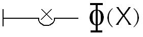

# Leçon 01 | 08 Décembre 1971 Séminaire : Panthéon-Sorbonne

  <label><input type="checkbox" data-lacan-toggle="original" checked> 原文</label>
  <label><input type="checkbox" data-lacan-toggle="notes" checked> 注释</label>
  <label><input type="checkbox" data-lacan-toggle="commentary" checked> 个人解读评论</label>

<section class="parallel-paragraph" data-paragraph-ids="s19-01-0001">

s19-01-0001

[无对应译文]

原文 · s19-01-0001

Je pourrais commencer tout de suite en passant sur mon titre dont après tout, dans un bout de temps, vous verriez bien ce qu’il veut dire.

</section>

<section class="parallel-paragraph" data-paragraph-ids="s19-01-0002">

s19-01-0002

[无对应译文]

原文 · s19-01-0002

Néanmoins par gentillesse, puisqu’aussi bien il est fait pour retenir, je vais l’introduire par un commentaire portant sur lui : « …*Ou pire* ».

</section>

<section class="parallel-paragraph" data-paragraph-ids="s19-01-0003">

s19-01-0003

[无对应译文]

原文 · s19-01-0003

Peut-être tout de même certains d’entre vous l’ont compris, « …*Ou pire* » en somme c’est ce que je peux toujours faire.

</section>

<section class="parallel-paragraph" data-paragraph-ids="s19-01-0004">

s19-01-0004

[无对应译文]

原文 · s19-01-0004

Il suffit que je le montre pour entrer dans le vif du sujet. Je le montre en somme à chaque instant.

</section>

<section class="parallel-paragraph" data-paragraph-ids="s19-01-0005">

s19-01-0005

[无对应译文]

原文 · s19-01-0005

Pour ne pas rester dans ce *sens* qui comme tout *sens*...

</section>

<section class="parallel-paragraph" data-paragraph-ids="s19-01-0006">

s19-01-0006

[无对应译文]

原文 · s19-01-0006

vous le touchez du doigt, je pense ...*est une opacité*, je vais donc le commenter textuellement.

</section>

<section class="parallel-paragraph" data-paragraph-ids="s19-01-0007">

s19-01-0007

[无对应译文]

原文 · s19-01-0007

« …*Ou pire* » : il est arrivé que certains lisent mal, ils ont cru que c’était *ou le pire*.

</section>

<section class="parallel-paragraph" data-paragraph-ids="s19-01-0008">

s19-01-0008

[无对应译文]

原文 · s19-01-0008

C’est pas du tout pareil. *Pire*, c’est tangible, c’est ce qu’on appelle « *un adverbe* » comme « *bien »* ou « *mieux »*.

</section>

<section class="parallel-paragraph" data-paragraph-ids="s19-01-0009">

s19-01-0009

[无对应译文]

原文 · s19-01-0009

On dit : « *je fais bien »*, on dit : « *je fais pire »*.

</section>

<section class="parallel-paragraph" data-paragraph-ids="s19-01-0010">

s19-01-0010

[无对应译文]

原文 · s19-01-0010

C’est un adverbe, mais disjoint, disjoint de quelque chose qui est appelé à quelque place, justement *le verbe*, *le verbe* qui est ici remplacé par les trois points.

</section>

<section class="parallel-paragraph" data-paragraph-ids="s19-01-0011">

s19-01-0011

[无对应译文]

原文 · s19-01-0011

Ces trois points se réfèrent à l’usage, à l’usage ordinaire, pour marquer...

</section>

<section class="parallel-paragraph" data-paragraph-ids="s19-01-0012">

s19-01-0012

[无对应译文]

原文 · s19-01-0012

> c’est curieux, mais ça se voit dans tous les textes imprimés ...pour faire une *place vide*.

</section>

<section class="parallel-paragraph" data-paragraph-ids="s19-01-0013">

s19-01-0013

[无对应译文]

原文 · s19-01-0013

Ça souligne l’importance de cette *place vide.*

</section>

<section class="parallel-paragraph" data-paragraph-ids="s19-01-0014">

s19-01-0014

[无对应译文]

原文 · s19-01-0014

Et ça démontre aussi bien que c’est la seule façon de *dire* quelque chose avec l’aide du langage.

</section>

<section class="parallel-paragraph" data-paragraph-ids="s19-01-0015">

s19-01-0015

[无对应译文]

原文 · s19-01-0015

Et cette remarque, que *le vide* c’est la seule façon d’attraper quelque chose avec le langage, c’est justement ce qui nous permet de pénétrer dans sa nature, au langage.

</section>

<section class="parallel-paragraph" data-paragraph-ids="s19-01-0016">

s19-01-0016

[无对应译文]

原文 · s19-01-0016

Aussi bien, vous le savez, dès que la logique est arrivée à s’affronter à quelque chose, à quelque chose qui supporte une référence de vérité, c’est quand elle a produit la notion de « *variable* ».

</section>

<section class="parallel-paragraph" data-paragraph-ids="s19-01-0017">

s19-01-0017

[无对应译文]

原文 · s19-01-0017

C’est une *variable appa­rente*.

</section>

<section class="parallel-paragraph" data-paragraph-ids="s19-01-0018">

s19-01-0018

[无对应译文]

原文 · s19-01-0018

La variable apparente x est toujours constituée par ceci que l’x, dans ce dont il s’agit, *marque une place vide*.

</section>

<section class="parallel-paragraph" data-paragraph-ids="s19-01-0019">

s19-01-0019

[无对应译文]

原文 · s19-01-0019

La condition que ça marche, c’est qu’on y mette exactement le même signifiant à toutes les places réservées vides.

</section>

<section class="parallel-paragraph" data-paragraph-ids="s19-01-0020">

s19-01-0020

[无对应译文]

原文 · s19-01-0020

C’est la seule façon dont le langage arrive à quelque chose, et c’est pourquoi je me suis exprimé dans cette formule « *qu’il n’y a pas de métalangage* ».

</section>

<section class="parallel-paragraph" data-paragraph-ids="s19-01-0021">

s19-01-0021

[无对应译文]

原文 · s19-01-0021

Qu’est-ce que ça veut dire ?

</section>

<section class="parallel-paragraph" data-paragraph-ids="s19-01-0022">

s19-01-0022

[无对应译文]

原文 · s19-01-0022

II semblerait que ce disant, je ne formule qu’un paradoxe, car d’où est-ce que je le dirais ?

</section>

<section class="parallel-paragraph" data-paragraph-ids="s19-01-0023">

s19-01-0023

[无对应译文]

原文 · s19-01-0023

Puisque je le dis *dans le langage*, ça serait déjà suffisamment affirmer qu’il y en a un d’où je peux le dire.

</section>

<section class="parallel-paragraph" data-paragraph-ids="s19-01-0024">

s19-01-0024

[无对应译文]

原文 · s19-01-0024

Il n’en est évidemment rien pourtant.

</section>

<section class="parallel-paragraph" data-paragraph-ids="s19-01-0025">

s19-01-0025

[无对应译文]

原文 · s19-01-0025

Le métalangage, comme bien sûr il est nécessaire qu’on l’élabore comme une fiction chaque fois qu’il s’agit de logique, c’est à savoir qu’on forge à l’intérieur du discours ce qu’on appelle « *langage-objet »*, moyennant quoi c’est *le langage* qui devient « *méta* », j’entends *le discours commun*, sans lequel il n’y a pas moyen même d’établir cette division.

</section>

<section class="parallel-paragraph" data-paragraph-ids="s19-01-0026">

s19-01-0026

[无对应译文]

原文 · s19-01-0026

*« Il n’y a pas de métalangage »* nie que cette division soit tenable.

</section>

<section class="parallel-paragraph" data-paragraph-ids="s19-01-0027">

s19-01-0027

[无对应译文]

原文 · s19-01-0027

La formule forclot dans le langage qu’il y ait *discordance*.

</section>

<section class="parallel-paragraph" data-paragraph-ids="s19-01-0028">

s19-01-0028

[无对应译文]

原文 · s19-01-0028

Qu’est-ce qui occupe donc cette place vide, dans le titre que j’ai produit pour vous retenir ?

</section>

<section class="parallel-paragraph" data-paragraph-ids="s19-01-0029">

s19-01-0029

[无对应译文]

原文 · s19-01-0029

J’ai dit : forcément *un verbe*, puisqu’un adverbe il y a.

</section>

<section class="parallel-paragraph" data-paragraph-ids="s19-01-0030">

s19-01-0030

[无对应译文]

原文 · s19-01-0030

Seulement c’est un verbe élidé par les trois points.

</section>

<section class="parallel-paragraph" data-paragraph-ids="s19-01-0031">

s19-01-0031

[无对应译文]

原文 · s19-01-0031

Et ça dans le langage, à partir du moment où on l’interroge en logique, c’est la seule chose qu’on ne puisse pas faire.

</section>

<section class="parallel-paragraph" data-paragraph-ids="s19-01-0032">

s19-01-0032

[无对应译文]

原文 · s19-01-0032

*Le verbe* en l’occasion il n’est pas difficile à trouver :

</section>

<section class="parallel-paragraph" data-paragraph-ids="s19-01-0033">

s19-01-0033

[无对应译文]

原文 · s19-01-0033

- il suffit de faire basculer la lettre qui commence le mot *pire*,

</section>

<section class="parallel-paragraph" data-paragraph-ids="s19-01-0034">

s19-01-0034

[无对应译文]

原文 · s19-01-0034

- *ça fait :* *dire*.

</section>

<section class="parallel-paragraph" data-paragraph-ids="s19-01-0035">

s19-01-0035

[无对应译文]

原文 · s19-01-0035

Seulement, comme en logique le verbe c’est précisément le seul terme dont vous ne puissiez pas faire *place vide*, parce que quand une proposition vous essayez d’en faire fonction, c’est le verbe qui fait fonction et c’est de ce qui l’entoure que vous pouvez faire argument.

</section>

<section class="parallel-paragraph" data-paragraph-ids="s19-01-0036">

s19-01-0036

[无对应译文]

原文 · s19-01-0036

À vider ce verbe donc, j’en fait argument, c’est-à-dire quelque *substance*,

</section>

<section class="parallel-paragraph" data-paragraph-ids="s19-01-0037">

s19-01-0037

[无对应译文]

原文 · s19-01-0037

- ce n’est pas « *dire* » \[*verbe*\],

</section>

<section class="parallel-paragraph" data-paragraph-ids="s19-01-0038">

s19-01-0038

[无对应译文]

原文 · s19-01-0038

- c’est « *un dire* » \[*substantif*\].

</section>

<section class="parallel-paragraph" data-paragraph-ids="s19-01-0039">

s19-01-0039

[无对应译文]

原文 · s19-01-0039

Ce *dire*, celui que je reprends de mon séminaire de l’année dernière, s’exprime comme tout *dire* dans une proposition complète : « *il n’y a pas de rapport sexuel »*.

</section>

<section class="parallel-paragraph" data-paragraph-ids="s19-01-0040">

s19-01-0040

[无对应译文]

原文 · s19-01-0040

Ce que mon titre avance c’est qu’il n’y a pas d’ambi­guïté, c’est qu’à sortir de là, vous n’énoncerez, vous ne direz que *pire*.

</section>

<section class="parallel-paragraph" data-paragraph-ids="s19-01-0041">

s19-01-0041

[无对应译文]

原文 · s19-01-0041

« *Il n’y a pas de rapport sexuel* » se propose donc comme *vérité*.

</section>

<section class="parallel-paragraph" data-paragraph-ids="s19-01-0042">

s19-01-0042

[无对应译文]

原文 · s19-01-0042

Mais j’ai déjà dit de *la vérité* qu’elle ne peut que se mi-dire, donc ce que je dis c’est qu’il s’agit, somme toute, *que l’autre moitié dise pire*.

</section>

<section class="parallel-paragraph" data-paragraph-ids="s19-01-0043">

s19-01-0043

[无对应译文]

原文 · s19-01-0043

S’il n’y avait pas *pire*, qu’est-ce que ça simplifierait les choses ! C’est le cas de le dire.

</section>

<section class="parallel-paragraph" data-paragraph-ids="s19-01-0044">

s19-01-0044

[无对应译文]

原文 · s19-01-0044

La question est : est-ce que ça ne les simplifie pas déjà...

</section>

<section class="parallel-paragraph" data-paragraph-ids="s19-01-0045">

s19-01-0045

[无对应译文]

原文 · s19-01-0045

> puisque si ce dont je suis parti c’est de ce que je peux faire
>
> et que ce soit justement ce que je ne fasse pas ...est-ce que ça ne suffit pas à les simpli­fier ?

</section>

<section class="parallel-paragraph" data-paragraph-ids="s19-01-0046">

s19-01-0046

[无对应译文]

原文 · s19-01-0046

Seulement voilà, il ne peut pas se faire que je ne puisse pas le faire ce *pire*.

</section>

<section class="parallel-paragraph" data-paragraph-ids="s19-01-0047">

s19-01-0047

[无对应译文]

原文 · s19-01-0047

Exactement comme tout le monde.

</section>

<section class="parallel-paragraph" data-paragraph-ids="s19-01-0048">

s19-01-0048

[无对应译文]

原文 · s19-01-0048

Quand je dis qu’*il n’y a pas de rapport sexuel*, j’avance très précisément cette vérité chez l’être parlant que le sexe n’y définit nul rapport.

</section>

<section class="parallel-paragraph" data-paragraph-ids="s19-01-0049">

s19-01-0049

[无对应译文]

原文 · s19-01-0049

Ce n’est pas que je nie la différence qu’il y a, dès le plus jeune âge, entre ce qu’on appelle une *petite fille* et un *petit garçon*. C’est même de là que je pars.

</section>

<section class="parallel-paragraph" data-paragraph-ids="s19-01-0050">

s19-01-0050

[无对应译文]

原文 · s19-01-0050

Attrapez tout de suite, comme ça, que vous ne savez pas - quand je pars de là - de quoi je parle.

</section>

<section class="parallel-paragraph" data-paragraph-ids="s19-01-0051">

s19-01-0051

[无对应译文]

原文 · s19-01-0051

Je ne parle pas de la fameuse *petite diffé­rence* qui est celle pour laquelle, à l’un des deux il paraîtra*...*

</section>

<section class="parallel-paragraph" data-paragraph-ids="s19-01-0052">

s19-01-0052

[无对应译文]

原文 · s19-01-0052

> quand il sera sexuellement mûr ...il paraîtra tout à fait de l’ordre d’un bon mot, du mot d’esprit, de pousser : «* Hourra ! Hourra pour la petite différence !* »

</section>

<section class="parallel-paragraph" data-paragraph-ids="s19-01-0053">

s19-01-0053

[无对应译文]

原文 · s19-01-0053

Rien que ça soit drôle suffit à nous indiquer, dénote, fait référence, au rapport complexuel...

</section>

<section class="parallel-paragraph" data-paragraph-ids="s19-01-0054">

s19-01-0054

[无对应译文]

原文 · s19-01-0054

> c’est-à-dire au fait tout inscrit dans l’expérience analytique,
>
> et qui est *ce à quoi* nous a mené l’expérience de l’inconscient, sans lequel il n’y aurait pas de mot d’esprit ...au rapport complexuel avec cet organe, la petite différence, déjà détaché très tôt comme *organe*, ce qui est déjà tout dire : ὄργανον \[organon\], *instrument*.

</section>

<section class="parallel-paragraph" data-paragraph-ids="s19-01-0055">

s19-01-0055

[无对应译文]

原文 · s19-01-0055

Est-ce qu’un animal a l’idée qu’il a des organes ?

</section>

<section class="parallel-paragraph" data-paragraph-ids="s19-01-0056">

s19-01-0056

[无对应译文]

原文 · s19-01-0056

Depuis quand a-t-on vu ça ?

</section>

<section class="parallel-paragraph" data-paragraph-ids="s19-01-0057">

s19-01-0057

[无对应译文]

原文 · s19-01-0057

Et pourquoi faire ?

</section>

<section class="parallel-paragraph" data-paragraph-ids="s19-01-0058">

s19-01-0058

[无对应译文]

原文 · s19-01-0058

Suffira-t-il d’énoncer : « *Tout animal*...

</section>

<section class="parallel-paragraph" data-paragraph-ids="s19-01-0059">

s19-01-0059

[无对应译文]

原文 · s19-01-0059

c’est une façon de reprendre ce que j’ai énoncé récemment à propos de la supposition de la jouissance dite sexuelle comme instrumentale chez l’animal, j’ai raconté ça ailleurs, ici je le dirai autrement

</section>

<section class="parallel-paragraph" data-paragraph-ids="s19-01-0060">

s19-01-0060

[无对应译文]

原文 · s19-01-0060

...« *Tout animal qui a des pinces ne se masturbe pas* ». \[*Rires*\]

</section>

<section class="parallel-paragraph" data-paragraph-ids="s19-01-0061">

s19-01-0061

[无对应译文]

原文 · s19-01-0061

C’est la différence entre l’homme et le homard ! \[*Rires*\]

</section>

<section class="parallel-paragraph" data-paragraph-ids="s19-01-0062">

s19-01-0062

[无对应译文]

原文 · s19-01-0062

Voilà, ça fait toujours son petit effet.

</section>

<section class="parallel-paragraph" data-paragraph-ids="s19-01-0063">

s19-01-0063

[无对应译文]

原文 · s19-01-0063

Moyennant quoi, vous échappe ce que cette phrase a d’historique.

</section>

<section class="parallel-paragraph" data-paragraph-ids="s19-01-0064">

s19-01-0064

[无对应译文]

原文 · s19-01-0064

Ce n’est pas du tout à cause de ce qu’elle asserte...

</section>

<section class="parallel-paragraph" data-paragraph-ids="s19-01-0065">

s19-01-0065

[无对应译文]

原文 · s19-01-0065

> je ne dis rien de plus : elle asserte ...mais de la question qu’elle introduit au niveau de la logique.

</section>

<section class="parallel-paragraph" data-paragraph-ids="s19-01-0066">

s19-01-0066

[无对应译文]

原文 · s19-01-0066

Ça y est caché...

</section>

<section class="parallel-paragraph" data-paragraph-ids="s19-01-0067">

s19-01-0067

[无对应译文]

原文 · s19-01-0067

> mais c’est la seule chose que vous n’y ayez pas vue ...c’est qu’elle contient le « *pas-tout* » qui est très précisément et très curieusement ce qu’élude la logique aristotélicienne pour autant qu’elle a produit, qu’elle a produit et détaché la fonction des *prosdiorismes*...

</section>

<section class="parallel-paragraph" data-paragraph-ids="s19-01-0068">

s19-01-0068

[无对应译文]

原文 · s19-01-0068

> qui ne sont rien d’autre que ce que vous savez, à savoir l’usage de « *tout* », « *pas* », de « *quelques* » ...autour de quoi Aristote fait les premiers pas de la logique formelle.

</section>

<section class="parallel-paragraph" data-paragraph-ids="s19-01-0069">

s19-01-0069

[无对应译文]

原文 · s19-01-0069

Ces pas sont lourds de conséquences, c’est eux qui ont permis d’élaborer ce qu’on appelle la fonction des *quantificateurs*. C’est avec le « *Tout* » que s’établit la place vide dont je parlais tout à l’heure.

</section>

<section class="parallel-paragraph" data-paragraph-ids="s19-01-0070">

s19-01-0070

[无对应译文]

原文 · s19-01-0070

Quelqu’un comme Frege ne manque pas quand il commente la fonction de *l’assertion*, devant laquelle il place l’assertion en rapport à une fonc­tion - vraie ou fausse - Φ de x, il lui faut, pour que x ait existence d’argument...

</section>

<section class="parallel-paragraph" data-paragraph-ids="s19-01-0071">

s19-01-0071

[无对应译文]

原文 · s19-01-0071

> ici placé dans ce petit creux, image de la place vide ...qu’il y ait quelque chose qui s’appelle « *tout* x » \[;\], qui convienne à la fonction.

</section>

<section class="parallel-paragraph" data-paragraph-ids="s19-01-0072">

s19-01-0072

[无对应译文]

原文 · s19-01-0072

> 

</section>

<section class="parallel-paragraph" data-paragraph-ids="s19-01-0073">

s19-01-0073

[无对应译文]

原文 · s19-01-0073

L’introduction du « *Pas-Tout* » est ici essentielle :

</section>

<section class="parallel-paragraph" data-paragraph-ids="s19-01-0074">

s19-01-0074

[无对应译文]

原文 · s19-01-0074

- le « *Pas-Tout* » n’est pas cette universelle négativée,

</section>

<section class="parallel-paragraph" data-paragraph-ids="s19-01-0075">

s19-01-0075

[无对应译文]

原文 · s19-01-0075

- le « *Pas-Tout* » ça n’est pas « *nul...* »,

</section>

<section class="parallel-paragraph" data-paragraph-ids="s19-01-0076">

s19-01-0076

[无对应译文]

原文 · s19-01-0076

- ça n’est pas nommément : « *Nul animal qui ait des pinces se masturbe* »,

</section>

<section class="parallel-paragraph" data-paragraph-ids="s19-01-0077">

s19-01-0077

[无对应译文]

原文 · s19-01-0077

- c’est « *Non, pas tout animal qui a des pinces...* » est par là nécessité à ce qui suit.

</section>

<section class="parallel-paragraph" data-paragraph-ids="s19-01-0078">

s19-01-0078

[无对应译文]

原文 · s19-01-0078

Il y a *organe et organe*, comme il y a *fagot et fagot*, celui qui porte les coups et celui qui les reçoit.

</section>

<section class="parallel-paragraph" data-paragraph-ids="s19-01-0079">

s19-01-0079

[无对应译文]

原文 · s19-01-0079

Et ceci nous porte au cœur de notre problème, car vous voyez qu’à simplement en ébaucher le premier pas, nous glissons ainsi au centre...

</section>

<section class="parallel-paragraph" data-paragraph-ids="s19-01-0080">

s19-01-0080

[无对应译文]

原文 · s19-01-0080

> sans avoir même eu le temps de nous retourner ...au centre de *quelque chose* où il y a bien une machine qui nous porte. C’est la machine que je démonte.

</section>

<section class="parallel-paragraph" data-paragraph-ids="s19-01-0081">

s19-01-0081

[无对应译文]

原文 · s19-01-0081

Mais - j’en fais la remarque à l’usage de *certains* - ce n’est pas

</section>

<section class="parallel-paragraph" data-paragraph-ids="s19-01-0082">

s19-01-0082

[无对应译文]

原文 · s19-01-0082

- pour démontrer que c’est une machine,

</section>

<section class="parallel-paragraph" data-paragraph-ids="s19-01-0083">

s19-01-0083

[无对应译文]

原文 · s19-01-0083

- encore bien moins pour qu’un discours soit pris pour une machine, comme le font certains justement à vouloir s’embrayer sur le mien, de discours. \[*référence à Deleuze et Guattari*\]

</section>

<section class="parallel-paragraph" data-paragraph-ids="s19-01-0084">

s19-01-0084

[无对应译文]

原文 · s19-01-0084

En quoi ce qu’ils démontrent c’est qu’ils n’embrayent pas sur ce qui fait un discours, à savoir *le Réel qui y passe*.

</section>

<section class="parallel-paragraph" data-paragraph-ids="s19-01-0085">

s19-01-0085

[无对应译文]

原文 · s19-01-0085

Démontrer la machine n’est pas du tout la même chose que ce que nous venons de faire, c’est-à-dire d’aller sans plus de façons au *trou* du système, c’est-à-dire à l’endroit où le *Réel* passe par vous.

</section>

<section class="parallel-paragraph" data-paragraph-ids="s19-01-0086">

s19-01-0086

[无对应译文]

原文 · s19-01-0086

Et comment qu’il passe, puisqu’il vous aplatit !

</section>

<section class="parallel-paragraph" data-paragraph-ids="s19-01-0087">

s19-01-0087

[无对应译文]

原文 · s19-01-0087

Naturellement moi j’aimerais, j’aimerais bien, j’aimerais beaucoup mieux, j’aimerais sauver votre canaillerie naturelle qui est bien ce qu’il y a de plus sympathique, mais qui hélas, « *hélas toujours recommençant* » comme dit l’autre \[*Sisyphe ?* \], *en vient à se réduire à* *la bêtise* par l’effet même de ce discours qui est celui que je démontre.

</section>

<section class="parallel-paragraph" data-paragraph-ids="s19-01-0088">

s19-01-0088

[无对应译文]

原文 · s19-01-0088

En quoi vous devez sentir, sur l’instant, qu’il y a au moins 2 façons de le démontrer ce discours.

</section>

<section class="parallel-paragraph" data-paragraph-ids="s19-01-0089">

s19-01-0089

[无对应译文]

原文 · s19-01-0089

Restant ouvert que la mienne, de façon, ça soit encore une 3ème.

</section>

<section class="parallel-paragraph" data-paragraph-ids="s19-01-0090">

s19-01-0090

[无对应译文]

原文 · s19-01-0090

Il ne faut pas me forcer à insister, bien sûr, sur cette énergétique de la canaillerie et de la bêtise, auxquelles je ne fais jamais allusion que lointaine.

</section>

<section class="parallel-paragraph" data-paragraph-ids="s19-01-0091">

s19-01-0091

[无对应译文]

原文 · s19-01-0091

Du point de vue de l’énergétique, bien sûr ça ne tient pas : elle est purement métaphorique.

</section>

<section class="parallel-paragraph" data-paragraph-ids="s19-01-0092">

s19-01-0092

[无对应译文]

原文 · s19-01-0092

Mais elle est de cette veine de métaphore dont l’être parlant subsiste, je veux dire qu’elle fait pour lui le pain et le levain.

</section>

<section class="parallel-paragraph" data-paragraph-ids="s19-01-0093">

s19-01-0093

[无对应译文]

原文 · s19-01-0093

Je vous ai donc demandé grâce, sur le point de *l’insistance*.

</section>

<section class="parallel-paragraph" data-paragraph-ids="s19-01-0094">

s19-01-0094

[无对应译文]

原文 · s19-01-0094

C’est dans l’espoir que la théorie y supplée...

</section>

<section class="parallel-paragraph" data-paragraph-ids="s19-01-0095">

s19-01-0095

[无对应译文]

原文 · s19-01-0095

> vous entendez *l’accent du subjonctif*, je l’ai isolé parce que,
>
> parce que ça en aurait pu être recouvert par *l’accent interrogatif*,
>
> pensez à tout ça, comme ça, au moment *où ça passe* \[*le réel*\],
>
> et spécialement pour ne pas manquer *ce qui vient là* \[*de réel*\], à savoir le rapport de l’inconscient à la vérité ...la bonne théorie, et c’est elle qui fraye la voie, la voie même ou l’inconscient en était réduit à insister : il n’aurait plus à le faire si la voie était bien frayée.

</section>

<section class="parallel-paragraph" data-paragraph-ids="s19-01-0096">

s19-01-0096

[无对应译文]

原文 · s19-01-0096

Mais ça ne veut pas dire que tout serait résolu pour ça, bien au contraire.

</section>

<section class="parallel-paragraph" data-paragraph-ids="s19-01-0097">

s19-01-0097

[无对应译文]

原文 · s19-01-0097

La théorie, puisqu’elle donnerait cette aise, devrait elle-même être légère, légère au point de ne pas avoir l’air d’y toucher, elle devrait avoir *le naturel* que jusqu’à ce jour n’ont que *les erreurs*. Pas toutes ! Une fois de plus : bien sûr !

</section>

<section class="parallel-paragraph" data-paragraph-ids="s19-01-0098">

s19-01-0098

[无对应译文]

原文 · s19-01-0098

Mais ça rend-il plus sûr qu’il y en ait certaines à soutenir *ce naturel* , dont tant d’autres font semblant.

</section>

<section class="parallel-paragraph" data-paragraph-ids="s19-01-0099">

s19-01-0099

[无对应译文]

原文 · s19-01-0099

Voilà ! J’avance que pour que celles-ci - les autres - puissent faire sem­blant, il faut que de *ces erreurs*, à soutenir *le naturel* il y en ait au moins une : *homoinzune*.

</section>

<section class="parallel-paragraph" data-paragraph-ids="s19-01-0100">

s19-01-0100

[无对应译文]

原文 · s19-01-0100

Reconnaissez ce que j’ai déjà écrit l’année dernière, avec une termi­naison différente, très précisément à propos de l’hystérique et de l’« *homoinzun* » qu’elle exige.

</section>

<section class="parallel-paragraph" data-paragraph-ids="s19-01-0101">

s19-01-0101

[无对应译文]

原文 · s19-01-0101

Cette « *homoinzune* », le rôle, c’est évident, ne saurait en être mieux soutenu que par le naturel lui-même.

</section>

<section class="parallel-paragraph" data-paragraph-ids="s19-01-0102">

s19-01-0102

[无对应译文]

原文 · s19-01-0102

C’est en quoi je niais au départ... \[*lapsus*\]

</section>

<section class="parallel-paragraph" data-paragraph-ids="s19-01-0103">

s19-01-0103

[无对应译文]

原文 · s19-01-0103

C’est en quoi - au contraire - c’est en quoi *je ne niais pas* au départ la différence qu’il y a, parfaitement notable et dès le premier âge, entre une petite fille et un petit garçon, et que cette différence qui s’impose comme native est bien en effet *naturelle*, c’est-à-dire répond à ceci : que ce qu’il y a de *réel* dans le fait que dans l’espèce qui se dénomme elle-même...

</section>

<section class="parallel-paragraph" data-paragraph-ids="s19-01-0104">

s19-01-0104

[无对应译文]

原文 · s19-01-0104

> comme ça, fille de ses œuvres en ça comme en beaucoup d’autres choses ...qui se dénomme « *homo sapiens* », les sexes paraissent se répartir en deux nombres à peu près égaux d’individus et qu’assez tôt - plus tôt qu’on ne l’attend - ces individus se distinguent.

</section>

<section class="parallel-paragraph" data-paragraph-ids="s19-01-0105">

s19-01-0105

[无对应译文]

原文 · s19-01-0105

Ils se distinguent, c’est certain. Seulement...

</section>

<section class="parallel-paragraph" data-paragraph-ids="s19-01-0106">

s19-01-0106

[无对应译文]

原文 · s19-01-0106

> je vous le fais remarquer en passant, ça ne fait pas partie d’une logique ...seulement ils ne se reconnaissent, ils ne se reconnaissent comme *êtres parlants* qu’à rejeter cette distinction, par toutes sortes d’identifications dont c’est la monnaie courante de la psychanalyse que de s’apercevoir que c’est le ressort majeur des phases de chaque enfance. Mais ça c’est une simple parenthèse.

</section>

<section class="parallel-paragraph" data-paragraph-ids="s19-01-0107">

s19-01-0107

[无对应译文]

原文 · s19-01-0107

L’important logiquement est ceci : c’est que *ce que je ne niais pas* - c’est justement là le glissement - *c’est qu’ils se distinguent*. C’est un glissement, ce que je ne niais pas ce n’est justement pas cela : ce que je ne niais pas *c’est qu’on les distingue*, ce n’est pas eux qui se distinguent.

</section>

<section class="parallel-paragraph" data-paragraph-ids="s19-01-0108">

s19-01-0108

[无对应译文]

原文 · s19-01-0108

C’est comme ça qu’on dit : « *Oh ! le vrai petit bonhomme, comme on voit déjà qu’il est tout à fait différent d’une petite fille,* *il est inquiet, enquêteur - hein ! - déjà en mal de gloriole* ».

</section>

<section class="parallel-paragraph" data-paragraph-ids="s19-01-0109">

s19-01-0109

[无对应译文]

原文 · s19-01-0109

Alors que la petite fille est loin de lui ressembler : elle ne pense déjà qu’à jouer de cette sorte d’éventail qui consiste à se fourrer sa figure dans un trou et à refuser de dire bonjour.

</section>

<section class="parallel-paragraph" data-paragraph-ids="s19-01-0110">

s19-01-0110

[无对应译文]

原文 · s19-01-0110

Seulement voilà, on ne s’émerveille de ça que parce que c’est comme ça, c’est-à-dire exactement comme ça sera plus tard, soit conforme aux types d’homme et de femme tels qu’ils vont se constituer de tout autre chose, à savoir de la conséquence du *prix* qu’aura pris dans la suite *la petite différence*.

</section>

<section class="parallel-paragraph" data-paragraph-ids="s19-01-0111">

s19-01-0111

[无对应译文]

原文 · s19-01-0111

Inutile d’ajouter que « *la petite différence, hourra!* » était déjà là pour les parents depuis une paye et qu’elle a déjà pu avoir des effets sur la façon dont a été traité « *petit bonhomme »* et « *petite bonne femme »*.

</section>

<section class="parallel-paragraph" data-paragraph-ids="s19-01-0112">

s19-01-0112

[无对应译文]

原文 · s19-01-0112

C’est pas sûr, c’est pas toujours comme ça.

</section>

<section class="parallel-paragraph" data-paragraph-ids="s19-01-0113">

s19-01-0113

[无对应译文]

原文 · s19-01-0113

Mais il n’y a pas besoin de ça pour que *le jugement de reconnaissance* des adultes circonvoisins repose donc sur une erreur, celle qui consiste à les recon­naître, sans doute de ce dont ils se distinguent, mais à ne les reconnaître qu’en fonction des critères formés sous la dépendance du langage, si tant est que comme je l’avance, c’est bien *de ce que l’être soit parlant* qu’il y a complexe de castration.

</section>

<section class="parallel-paragraph" data-paragraph-ids="s19-01-0114">

s19-01-0114

[无对应译文]

原文 · s19-01-0114

Je rajoute ça pour insister, pour que vous compreniez bien ce que je veux dire.

</section>

<section class="parallel-paragraph" data-paragraph-ids="s19-01-0115">

s19-01-0115

[无对应译文]

原文 · s19-01-0115

Donc, c’est en ça que *l’homoinzune* *d’erreur*, rend consistant le naturel d’ailleurs incontestable de cette vocation prématurée, si je puis dire, que chacun éprouve pour son sexe.

</section>

<section class="parallel-paragraph" data-paragraph-ids="s19-01-0116">

s19-01-0116

[无对应译文]

原文 · s19-01-0116

Il faut d’ailleurs ajouter, bien sûr, que dans le cas où cette vocation n’est pas patente, ça n’ébranle pas l’erreur, puisqu’elle peut se compléter avec aisance de s’attribuer à *la nature* comme telle, ceci, bien sûr, non moins naturellement.

</section>

<section class="parallel-paragraph" data-paragraph-ids="s19-01-0117">

s19-01-0117

[无对应译文]

原文 · s19-01-0117

Quand ça ne colle pas, on dit « *c’est un garçon manqué* » n’est-ce pas ?

</section>

<section class="parallel-paragraph" data-paragraph-ids="s19-01-0118">

s19-01-0118

[无对应译文]

原文 · s19-01-0118

Et dans ce cas là, le *manque* a toute facilité pour être considéré comme réussite dans la mesure où rien n’empêche qu’on lui impute, à ce manque, un supplément de féminité.

</section>

<section class="parallel-paragraph" data-paragraph-ids="s19-01-0119">

s19-01-0119

[无对应译文]

原文 · s19-01-0119

La femme, la vraie, *la petite bonne femme*, se cache derrière ce manque même, c’est un raffinement tout à fait d’ailleurs pleinement conforme à ce que nous enseigne l’inconscient, de ne réussir jamais mieux qu’à rater.

</section>

<section class="parallel-paragraph" data-paragraph-ids="s19-01-0120">

s19-01-0120

[无对应译文]

原文 · s19-01-0120

Dans ces conditions, pour accéder à l’autre sexe il faut *réellement* payer le prix, justement celui de *la petite différence*, qui passe trompeu­sement au *réel* par l’intermédiaire de *l’organe*, justement à ce qu’il cesse d’être pris pour tel, et du même coup révèle ce que veut dire d’être organe : *un organe* n’est instrument que par le truchement de ceci dont tout instrument se fonde, c’est que *c’est un* *signifiant*.

</section>

<section class="parallel-paragraph" data-paragraph-ids="s19-01-0121">

s19-01-0121

[无对应译文]

原文 · s19-01-0121

Eh bien, c’est en tant que *signifiant* que le transexualiste n’en veut plus et pas en tant qu’organe.

</section>

<section class="parallel-paragraph" data-paragraph-ids="s19-01-0122">

s19-01-0122

[无对应译文]

原文 · s19-01-0122

En quoi il pâtit d’une erreur, qui est l’erreur justement com­mune.

</section>

<section class="parallel-paragraph" data-paragraph-ids="s19-01-0123">

s19-01-0123

[无对应译文]

原文 · s19-01-0123

Sa passion, au transexualiste, est là folie de vouloir se libérer de cette erreur, l’erreur commune qui ne voit pas que :

</section>

<section class="parallel-paragraph" data-paragraph-ids="s19-01-0124">

s19-01-0124

[无对应译文]

原文 · s19-01-0124

- *le signifiant c’est la jouissance,*

</section>

<section class="parallel-paragraph" data-paragraph-ids="s19-01-0125">

s19-01-0125

[无对应译文]

原文 · s19-01-0125

- *et que le phallus n’en est que le signifié.*

</section>

<section class="parallel-paragraph" data-paragraph-ids="s19-01-0126">

s19-01-0126

[无对应译文]

原文 · s19-01-0126

Le transexualiste ne veut plus être *signifié phallus* par le discours sexuel, qui - je l’énonce - est *impossible*.

</section>

<section class="parallel-paragraph" data-paragraph-ids="s19-01-0127">

s19-01-0127

[无对应译文]

原文 · s19-01-0127

Il n’a qu’un tort, c’est de vouloir le forcer le discours sexuel...

</section>

<section class="parallel-paragraph" data-paragraph-ids="s19-01-0128">

s19-01-0128

[无对应译文]

原文 · s19-01-0128

> qui en tant qu’*impossible* est *le passage du réel* ...à vouloir le forcer par la chirurgie.

</section>

<section class="parallel-paragraph" data-paragraph-ids="s19-01-0129">

s19-01-0129

[无对应译文]

原文 · s19-01-0129

Voilà ! C’est *la même chose* que ce que j’ai énoncé dans *un certain programme* pour *un certain* « *Congrès sur la sexualité féminine* ».

</section>

<section class="parallel-paragraph" data-paragraph-ids="s19-01-0130">

s19-01-0130

[无对应译文]

原文 · s19-01-0130

Seule, disais-je...

</section>

<section class="parallel-paragraph" data-paragraph-ids="s19-01-0131">

s19-01-0131

[无对应译文]

原文 · s19-01-0131

> pour ceux qui savent lire, bien sûr ...*seule* disais-je, *l’homosexuelle* - à écrire là au féminin - *soutient le discours sexuel en toute sécurité*.

</section>

<section class="parallel-paragraph" data-paragraph-ids="s19-01-0132">

s19-01-0132

[无对应译文]

原文 · s19-01-0132

Ce pourquoi j’invoquais le témoignage des *Précieuses*...

</section>

<section class="parallel-paragraph" data-paragraph-ids="s19-01-0133">

s19-01-0133

[无对应译文]

原文 · s19-01-0133

> qui vous le savez, restent pour moi un modèle ...les *Précieuses* qui si je puis dire, définissent si admira­blement l’« *Ecce Homo »*...

</section>

<section class="parallel-paragraph" data-paragraph-ids="s19-01-0134">

s19-01-0134

[无对应译文]

原文 · s19-01-0134

> permettez-moi d’arrêter là le mot : « *l’excès au mot* » ... l’« *Ecce Homo »* de l’amour, parce que - elles - elles ne risquent pas de prendre *le phallus* pour *un signifiant*. « Ф donc ! » signiФ donc : ce n’est qu’à briser le signifiant dans *sa lettre* qu’on en vient à bout au dernier terme.

</section>

<section class="parallel-paragraph" data-paragraph-ids="s19-01-0135">

s19-01-0135

[无对应译文]

原文 · s19-01-0135

Il est fâcheux pourtant que cela ampute pour elle, l’homosexuelle, *le discours psychanalytique*, car ce discours, c’est un fait, les remet, les très chères, *dans un aveuglement total sur ce qu’il en est de la jouissance féminine*.

</section>

<section class="parallel-paragraph" data-paragraph-ids="s19-01-0136">

s19-01-0136

[无对应译文]

原文 · s19-01-0136

Contrairement à ce qu’on peut lire dans un célèbre drame d’Apollinaire[^1], celui qui introduit le mot « *surréaliste* », Thérèse revient à Tirésias...

</section>

<section class="parallel-paragraph" data-paragraph-ids="s19-01-0137">

s19-01-0137

[无对应译文]

原文 · s19-01-0137

> je viens de parler d’aveuglement, n’oubliez pas ...non en lâchant, mais en récupérant les deux oiseaux dits « *sa faiblesse* » ...

</section>

<section class="parallel-paragraph" data-paragraph-ids="s19-01-0138">

s19-01-0138

[无对应译文]

原文 · s19-01-0138

> je cite Apollinaire pour ceux qui ne l’auraient pas lu ...soit les petits et gros ballons qui, sur le théâtre, les représentent et qui sont peut-être...

</section>

<section class="parallel-paragraph" data-paragraph-ids="s19-01-0139">

s19-01-0139

[无对应译文]

原文 · s19-01-0139

> je dis « *peut-être »* parce que je ne veux pas détourner votre attention, je me contente d’un « *peut-être »* ...qui sont peut-être *ce grâce à quoi la femme ne sait jouir que dans une absence*.

</section>

<section class="parallel-paragraph" data-paragraph-ids="s19-01-0140">

s19-01-0140

[无对应译文]

原文 · s19-01-0140

*L’homosexuelle n’est pas du tout absente dans ce qu’il lui reste de jouissance* : je le répète, cela lui rend aisé le *discours de l’amour*, mais il est clair que ça l’exclut du *discours psychanalytique* qu’elle ne peut guère que balbutier.

</section>

<section class="parallel-paragraph" data-paragraph-ids="s19-01-0141">

s19-01-0141

[无对应译文]

原文 · s19-01-0141

Alors essayons d’avancer...

</section>

<section class="parallel-paragraph" data-paragraph-ids="s19-01-0142">

s19-01-0142

[无对应译文]

原文 · s19-01-0142

Vu l’heure je ne pourrai qu’indiquer rapidement ceci : que pour ce qu’il en est de tout ce qui se pose comme ce rapport sexuel, l’incitant, l’instituant, par une sorte de fiction qui s’appelle le mariage, la règle serait bonne que le psychanalyste se dise, sur ce point : « *qu’ils se débrouillent comme ils pourront* ».

</section>

<section class="parallel-paragraph" data-paragraph-ids="s19-01-0143">

s19-01-0143

[无对应译文]

原文 · s19-01-0143

C’est ça qu’il suit dans la pratique.

</section>

<section class="parallel-paragraph" data-paragraph-ids="s19-01-0144">

s19-01-0144

[无对应译文]

原文 · s19-01-0144

Il ne le dit pas, ni même ne se le dit par une sorte de fausse honte, car il se croit en devoir de pallier à tous les drames. C’est un héritage de pure superstition : *il fait le médecin*.

</section>

<section class="parallel-paragraph" data-paragraph-ids="s19-01-0145">

s19-01-0145

[无对应译文]

原文 · s19-01-0145

Jamais le médecin ne s’était mêlé d’assurer le bonheur conjugal et, comme le psychanalyste ne s’est pas encore aperçu *qu’il n’y a pas de rapport sexuel*, naturellement le rôle de « *Providence des ménages* » le hante.

</section>

<section class="parallel-paragraph" data-paragraph-ids="s19-01-0146">

s19-01-0146

[无对应译文]

原文 · s19-01-0146

Tout ça, n’est-ce pas...

</section>

<section class="parallel-paragraph" data-paragraph-ids="s19-01-0147">

s19-01-0147

[无对应译文]

原文 · s19-01-0147

> la fausse honte, la superstition et l’incapacité de formuler une règle précise sur ce point,
>
> celle que je viens d’énoncer là : « *qu’ils se débrouillent* » ...relève de la méconnaissance de ceci  que son expérience lui répète, mais je pourrais même dire lui serine : *qu’il n’y a pas de rapport sexuel*.

</section>

<section class="parallel-paragraph" data-paragraph-ids="s19-01-0148">

s19-01-0148

[无对应译文]

原文 · s19-01-0148

Il faut dire que l’étymologie de « *seriner »* nous conduit tout droit à *sirène*.

</section>

<section class="parallel-paragraph" data-paragraph-ids="s19-01-0149">

s19-01-0149

[无对应译文]

原文 · s19-01-0149

C’est textuel, c’est dans *le diction­naire étymologique* [^2], c’est pas moi qui me livre ici tout d’un coup à un chant analogue.

</section>

<section class="parallel-paragraph" data-paragraph-ids="s19-01-0150">

s19-01-0150

[无对应译文]

原文 · s19-01-0150

C’est sans doute pour ça que le psychanalyste - comme Ulysse le fait en telle conjoncture - reste attaché à un mât.

</section>

<section class="parallel-paragraph" data-paragraph-ids="s19-01-0151">

s19-01-0151

[无对应译文]

原文 · s19-01-0151

Oui, natu­rellement pour que ça dure, ce qu’il entend comme le chant des sirènes, c’est-à-dire en restant enchanté, c’est-à-dire en l’entendant tout de travers.

</section>

<section class="parallel-paragraph" data-paragraph-ids="s19-01-0152">

s19-01-0152

[无对应译文]

原文 · s19-01-0152

Eh bien le mât...

</section>

<section class="parallel-paragraph" data-paragraph-ids="s19-01-0153">

s19-01-0153

[无对应译文]

原文 · s19-01-0153

ce fameux *mât* dans lequel naturellement vous ne pouvez pas ne pas reconnaître *le phallus*, c’est-à-dire le signifié majeur, global ...eh bien, *il y reste attaché* et ça arrange tout le monde.

</section>

<section class="parallel-paragraph" data-paragraph-ids="s19-01-0154">

s19-01-0154

[无对应译文]

原文 · s19-01-0154

Ça n’arrange quand même tout le monde qu’en ceci : que ça n’a aucune conséquence fâcheuse, puisque c’est fait pour ça, pour le navire psychanalytique lui-même, c’est-à-dire pour tous ceux qui sont dans le même bateau.

</section>

<section class="parallel-paragraph" data-paragraph-ids="s19-01-0155">

s19-01-0155

[无对应译文]

原文 · s19-01-0155

Il n’en reste pas moins qu’il l’entend de travers ce serinage de l’expérience, et que c’est pour ça que jusqu’à maintenant, ça reste un domaine privé, « *un domaine privé* » : j’entends pour ceux qui sont sur le même bateau.

</section>

<section class="parallel-paragraph" data-paragraph-ids="s19-01-0156">

s19-01-0156

[无对应译文]

原文 · s19-01-0156

Ce qui se passe sur ce bateau, où il y a aussi des êtres des deux sexes, est pour­tant remarquable : ce qu’il arrive que j’en entende par la bouche de gens qui parfois viennent me visiter, de ces bateaux...

</section>

<section class="parallel-paragraph" data-paragraph-ids="s19-01-0157">

s19-01-0157

[无对应译文]

原文 · s19-01-0157

> moi qui suis - mon Dieu - sur un autre, que ne régissent pas les mêmes règles ...serait pourtant assez exemplaire si la façon dont j’en ai vent n’était pas si particulière.

</section>

<section class="parallel-paragraph" data-paragraph-ids="s19-01-0158">

s19-01-0158

[无对应译文]

原文 · s19-01-0158

À étudier ce qu’il ressort d’un mode de méconnaissance de ce qui fait *le discours psychanalytique*, à savoir les conséquences que ça en a sur ce que j’appellerai « le style » de ce qui se rapporte à « *la liaison »*.

</section>

<section class="parallel-paragraph" data-paragraph-ids="s19-01-0159">

s19-01-0159

[无对应译文]

原文 · s19-01-0159

Puisque enfin *l’absence du rapport sexuel* est très manifestement ce qui n’empêche pas - bien loin de là - « *la liaison* », mais ce qui lui donne ses conditions.

</section>

<section class="parallel-paragraph" data-paragraph-ids="s19-01-0160">

s19-01-0160

[无对应译文]

原文 · s19-01-0160

Ceci permettrait peut-être d’entrevoir ce qui pourrait résulter du fait que *le discours psychanalytique* reste logé sur ces *bateaux* où actuellement il vogue et dont quelque chose laisse craindre qu’il reste le privilège.

</section>

<section class="parallel-paragraph" data-paragraph-ids="s19-01-0161">

s19-01-0161

[无对应译文]

原文 · s19-01-0161

Il se pourrait que quelque chose de ce style vienne à dominer le registre des *liaisons* dans ce qu’on appelle improprement « *le vaste champ du monde »*, et à la vérité ça n’est pas rassurant.

</section>

<section class="parallel-paragraph" data-paragraph-ids="s19-01-0162">

s19-01-0162

[无对应译文]

原文 · s19-01-0162

Ça serait sûrement encore plus fâcheux que l’état présent qui est tel que c’est à *cette mécon­naissance* que je viens de pointer, que c’est d’elle que ressortit ce qui après tout n’est pas injustifié, à savoir ce qu’on voit souvent *à l’entrée de la psychanalyse* : les craintes manifestées, ma foi, par les sujets...

</section>

<section class="parallel-paragraph" data-paragraph-ids="s19-01-0163">

s19-01-0163

[无对应译文]

原文 · s19-01-0163

> qui ne savent que c’est en somme d’en croire le silence psychanalytique institu­tionnalisé
>
> sur le point de ce qu’« *il n’y a pas de rapport sexuel* » ...qui évoque chez ces sujets, ces craintes, à savoir - mon Dieu - de tout ce qui peut rétrécir, affecter les *relations intéressantes*, les actes passionnants, voire les perturbations créatrices que nécessite cette absence de rapport.

</section>

<section class="parallel-paragraph" data-paragraph-ids="s19-01-0164">

s19-01-0164

[无对应译文]

原文 · s19-01-0164

Je voudrais donc avant de vous quitter amorcer ici quelque chose.

</section>

<section class="parallel-paragraph" data-paragraph-ids="s19-01-0165">

s19-01-0165

[无对应译文]

原文 · s19-01-0165

Puisqu’il s’agit d’une exploration de ce que j’ai appelé « *une nouvelle logique »*, celle qui est à construire de ce qui se passe, de ceci à poser en premier : qu’en aucun cas rien de ce qui se passe, du fait de l’instance du langage, ne peut déboucher sur la formulation d’aucune façon satisfaisante du *rapport*.

</section>

<section class="parallel-paragraph" data-paragraph-ids="s19-01-0166">

s19-01-0166

[无对应译文]

原文 · s19-01-0166

*Est-ce qu’il* n’y a pas quelque chose à prendre de ce qui...

</section>

<section class="parallel-paragraph" data-paragraph-ids="s19-01-0167">

s19-01-0167

[无对应译文]

原文 · s19-01-0167

> dans l’exploration logique, c’est-à-dire dans le questionnement ...de ce qui, au langage, non pas seulement impose limite dans son appréhension du *Réel*, mais démontre dans la structure même de cet effort de l’approcher...

</section>

<section class="parallel-paragraph" data-paragraph-ids="s19-01-0168">

s19-01-0168

[无对应译文]

原文 · s19-01-0168

> c’est-à-dire de repérer dans son propre maniement ...ce qu’il peut y avoir de *Réel* à avoir déterminé le langage ?

</section>

<section class="parallel-paragraph" data-paragraph-ids="s19-01-0169">

s19-01-0169

[无对应译文]

原文 · s19-01-0169

*Est-ce qu’il* n’est pas convenable, probable, propre à être induit, que si c’est au point d’une certaine *faille du réel*...

</section>

<section class="parallel-paragraph" data-paragraph-ids="s19-01-0170">

s19-01-0170

[无对应译文]

原文 · s19-01-0170

> à proprement parler indicible, puisque ça serait elle qui déter­minerait tout discours ...que gît, que gisent les lignes de ces champs qui sont celles que nous découvrons dans l’expérience psychanalytique?

</section>

<section class="parallel-paragraph" data-paragraph-ids="s19-01-0171">

s19-01-0171

[无对应译文]

原文 · s19-01-0171

*Est-ce que* tout ce que la logique a dessiné, à rapporter le langage à ce qui est posé de *réel,* ne nous permettrait pas de repérer dans certaines lignes à inventer...

</section>

<section class="parallel-paragraph" data-paragraph-ids="s19-01-0172">

s19-01-0172

[无对应译文]

原文 · s19-01-0172

> et c’est là l’effort théorique que je désigne de cette *aisance* qui trouverait *une insistance* ...est-ce qu’il n’est possible ici de trouver orientation ?

</section>

<section class="parallel-paragraph" data-paragraph-ids="s19-01-0173">

s19-01-0173

[无对应译文]

原文 · s19-01-0173

Je ne ferai, avant de vous quitter, aujourd’hui que pointer qu’il y a 3 registres...

</section>

<section class="parallel-paragraph" data-paragraph-ids="s19-01-0174">

s19-01-0174

[无对应译文]

原文 · s19-01-0174

> à proprement parler déjà émergés de l’élaboration logique ...3 registres autour desquels tournera cette année mon effort de déve­lopper ce qu’il en est des conséquences de ceci, posé comme premier : *qu’il n’y a pas de rapport sexuel*.

</section>

<section class="parallel-paragraph" data-paragraph-ids="s19-01-0175">

s19-01-0175

[无对应译文]

原文 · s19-01-0175

*<u>Premièrement</u>*, ce que vous avez vu déjà dans mon discours pointer : *les prosdiorismes*.

</section>

<section class="parallel-paragraph" data-paragraph-ids="s19-01-0176">

s19-01-0176

[无对应译文]

原文 · s19-01-0176

Je n’ai aujourd’hui, au cours de ce premier abord, rencontré que l’énoncé du « *pas-tous* ».

</section>

<section class="parallel-paragraph" data-paragraph-ids="s19-01-0177">

s19-01-0177

[无对应译文]

原文 · s19-01-0177

Celui-là, déjà l’année dernière j’ai cru vous l’isoler, très précisément : . !, auprès *de* *la fonction* elle-même...

</section>

<section class="parallel-paragraph" data-paragraph-ids="s19-01-0178">

s19-01-0178

[无对应译文]

原文 · s19-01-0178

> que je laisse ici totalement énigmatique ...*de* *la fonction*, non pas du rapport sexuel, mais *de la fonction* qui pro­prement en rend l’accès *impossible*.

</section>

<section class="parallel-paragraph" data-paragraph-ids="s19-01-0179">

s19-01-0179

[无对应译文]

原文 · s19-01-0179

C’est celle-là, à définir en somme, à définir cette année, imaginez-la : *jouissance*.

</section>

<section class="parallel-paragraph" data-paragraph-ids="s19-01-0180">

s19-01-0180

[无对应译文]

原文 · s19-01-0180

Pourquoi ne serait-il pas pos­sible *<u>d’écrire</u> une fonction de la jouissance* ?

</section>

<section class="parallel-paragraph" data-paragraph-ids="s19-01-0181">

s19-01-0181

[无对应译文]

原文 · s19-01-0181

C’est à l’épreuve que nous en verrons la soutenabilité, si je puis dire, ou non.

</section>

<section class="parallel-paragraph" data-paragraph-ids="s19-01-0182">

s19-01-0182

[无对应译文]

原文 · s19-01-0182

La fonction du « *pas-tous* », déjà l’année dernière je n’ai pu avancer...

</section>

<section class="parallel-paragraph" data-paragraph-ids="s19-01-0183">

s19-01-0183

[无对应译文]

原文 · s19-01-0183

> et certainement d’un point beaucoup plus proche quant à ce dont il s’agissait,
>
> je ne fais aujour­d’hui qu’aborder notre terrain ...je l’ai l’année dernière avancée d’une barre négative \[.\], mise au-dessus du terme qui dans la théorie des quanteurs, désigne l’équivalent...

</section>

<section class="parallel-paragraph" data-paragraph-ids="s19-01-0184">

s19-01-0184

[无对应译文]

原文 · s19-01-0184

> c’en est seulement l’équivalent, je dirai même plus :
>
> la purification au regard de l’usage naïf fait dans Aristote ...du *prosdiorisme* « *tout* » \[;\]. L’important, c’est que j’ai aujourd’hui avancé devant vous la fonction du « *pas-tout* ».

</section>

<section class="parallel-paragraph" data-paragraph-ids="s19-01-0185">

s19-01-0185

[无对应译文]

原文 · s19-01-0185

Chacun sait qu’à propos de ce qu’il en est de *la proposition* dite, dans Aristote, « *particulière* », *ce qui en surgit*, si je puis dire *naïvement*, c’est : « *il existe quelque chose* » qui y répondrait.

</section>

<section class="parallel-paragraph" data-paragraph-ids="s19-01-0186">

s19-01-0186

[无对应译文]

原文 · s19-01-0186

Quand vous employez « *quelque* », en effet ça semble aller de soi. Ça semble aller de soi et ça va pas de soi.

</section>

<section class="parallel-paragraph" data-paragraph-ids="s19-01-0187">

s19-01-0187

[无对应译文]

原文 · s19-01-0187

Parce qu’il est tout à fait clair qu’il ne suffit pas de nier le « *pas tout* » pour que de chacun des deux morceaux, si je puis m’exprimer ainsi, l’existence soit affirmée. Bien sûr, si l’existence est affirmée, le « *pas-tout* » se produit.

</section>

<section class="parallel-paragraph" data-paragraph-ids="s19-01-0188">

s19-01-0188

[无对应译文]

原文 · s19-01-0188

C’est autour de cet « *il existe* » \[:\] que doit porter notre avancée.

</section>

<section class="parallel-paragraph" data-paragraph-ids="s19-01-0189">

s19-01-0189

[无对应译文]

原文 · s19-01-0189

Depuis si longtemps là-dessus les ambiguïtés se perpétuent, qu’on est arrivé

</section>

<section class="parallel-paragraph" data-paragraph-ids="s19-01-0190">

s19-01-0190

[无对应译文]

原文 · s19-01-0190

- à confondre l’*essence* et l’*existence,*

</section>

<section class="parallel-paragraph" data-paragraph-ids="s19-01-0191">

s19-01-0191

[无对应译文]

原文 · s19-01-0191

- et d’une façon encore plus étonnante, à croire que c’est *plus* d’exister que d’être.

</section>

<section class="parallel-paragraph" data-paragraph-ids="s19-01-0192">

s19-01-0192

[无对应译文]

原文 · s19-01-0192

C’est peut-être justement qu’« *il existe* » assurément des hommes et des femmes...

</section>

<section class="parallel-paragraph" data-paragraph-ids="s19-01-0193">

s19-01-0193

[无对应译文]

原文 · s19-01-0193

> et pour tout dire qui ne font rien de plus que d’exister ...qu’est tout le problème.

</section>

<section class="parallel-paragraph" data-paragraph-ids="s19-01-0194">

s19-01-0194

[无对应译文]

原文 · s19-01-0194

Parce qu’après tout, dans l’usage correct qui est à faire *à partir du moment où* *la logique se permet de décoller un peu du réel*...

</section>

<section class="parallel-paragraph" data-paragraph-ids="s19-01-0195">

s19-01-0195

[无对应译文]

原文 · s19-01-0195

> seule façon à vrai dire qu’elle ait par rapport à lui de pouvoir se repérer ...*c’est à partir du moment* où elle ne s’assure que de cette part du *réel* où il y ait possible une vérité...

</section>

<section class="parallel-paragraph" data-paragraph-ids="s19-01-0196">

s19-01-0196

[无对应译文]

原文 · s19-01-0196

> c’est-à-dire une mathématique, ...*c’est à partir de ce moment* qu’on voit bien que ce que désigne un « *Il existe »* quel­conque, ce n’est rien d’autre, par exemple, qu’un nombre à satisfaire une équation.

</section>

<section class="parallel-paragraph" data-paragraph-ids="s19-01-0197">

s19-01-0197

[无对应译文]

原文 · s19-01-0197

Je ne tranche pas de savoir si *le nombre* est à considérer ou non comme du *réel*.

</section>

<section class="parallel-paragraph" data-paragraph-ids="s19-01-0198">

s19-01-0198

[无对应译文]

原文 · s19-01-0198

Pour ne pas vous laisser dans l’ambiguïté, je peux vous dire que je tranche : *que le nombre fait partie du réel*.

</section>

<section class="parallel-paragraph" data-paragraph-ids="s19-01-0199">

s19-01-0199

[无对应译文]

原文 · s19-01-0199

Mais c’est ce *réel* privilégié à propos de quoi le maniement de la vérité fait pro­gresser la logique.

</section>

<section class="parallel-paragraph" data-paragraph-ids="s19-01-0200">

s19-01-0200

[无对应译文]

原文 · s19-01-0200

Quoi qu’il en soit, le mode d’existence d’un nombre n’est pas à proprement parler ce qui peut pour nous assurer ce qu’il en est de *l’existence* chaque fois que le *prosdiorisme* « *quelque* » est avancé.

</section>

<section class="parallel-paragraph" data-paragraph-ids="s19-01-0201">

s19-01-0201

[无对应译文]

原文 · s19-01-0201

*<u>Il y a un deuxième plan</u>* sur lequel ce que je ne fais ici qu’épingler comme repère...

</section>

<section class="parallel-paragraph" data-paragraph-ids="s19-01-0202">

s19-01-0202

[无对应译文]

原文 · s19-01-0202

> du champ dans lequel nous aurons à nous avancer ...d’une logique qui nous serait propice, c’est celui de *la modalité*.

</section>

<section class="parallel-paragraph" data-paragraph-ids="s19-01-0203">

s19-01-0203

[无对应译文]

原文 · s19-01-0203

*La modalité*, comme chacun sait aussi, à ouvrir Aristote, c’est ce qu’il en est du *possible,* de ce qui se peut.

</section>

<section class="parallel-paragraph" data-paragraph-ids="s19-01-0204">

s19-01-0204

[无对应译文]

原文 · s19-01-0204

Je ne ferai ici qu’en indiquer aussi l’entrée, le frontispice.

</section>

<section class="parallel-paragraph" data-paragraph-ids="s19-01-0205">

s19-01-0205

[无对应译文]

原文 · s19-01-0205

Aristote joue des quatre catégories :

</section>

<section class="parallel-paragraph" data-paragraph-ids="s19-01-0206">

s19-01-0206

[无对应译文]

原文 · s19-01-0206

- de *l’impossible* qu’il oppose au *pos­sible*,

</section>

<section class="parallel-paragraph" data-paragraph-ids="s19-01-0207">

s19-01-0207

[无对应译文]

原文 · s19-01-0207

- du *nécessaire* qu’il oppose au *contingent*.

</section>

<section class="parallel-paragraph" data-paragraph-ids="s19-01-0208">

s19-01-0208

[无对应译文]

原文 · s19-01-0208

Nous verrons qu’il n’est rien de tenable dans ces oppositions, et aujourd’hui je vous pointe simplement ce qu’il en est d’une formulation du *nécessaire* qui est proprement ceci : « *ne pas pouvoir ne pas* ».

</section>

<section class="parallel-paragraph" data-paragraph-ids="s19-01-0209">

s19-01-0209

[无对应译文]

原文 · s19-01-0209

« *Ne pas pouvoir ne pas* », c’est là proprement ce qui, pour nous, définit la nécessité.

</section>

<section class="parallel-paragraph" data-paragraph-ids="s19-01-0210">

s19-01-0210

[无对应译文]

原文 · s19-01-0210

Ça va où ?

</section>

<section class="parallel-paragraph" data-paragraph-ids="s19-01-0211">

s19-01-0211

[无对应译文]

原文 · s19-01-0211

- De *l’impossible* : « *ne pas pouvoir* »,

</section>

<section class="parallel-paragraph" data-paragraph-ids="s19-01-0212">

s19-01-0212

[无对应译文]

原文 · s19-01-0212

- à « *pouvoir ne pas* » : est-ce *le possible* ou *le contingent* ?

</section>

<section class="parallel-paragraph" data-paragraph-ids="s19-01-0213">

s19-01-0213

[无对应译文]

原文 · s19-01-0213

Mais ce qu’il y a de certain c’est que si vous voulez faire la route contraire, ce que vous trouvez c’est *pouvoir ne pas pou­voir*, c’est-à-dire que ça conjoint l’improbable, le caduc, de ceci qui peut arriver, à savoir :

</section>

<section class="parallel-paragraph" data-paragraph-ids="s19-01-0214">

s19-01-0214

[无对应译文]

原文 · s19-01-0214

- non pas cet *impossible* auquel on retournerait en bouclant la boucle,

</section>

<section class="parallel-paragraph" data-paragraph-ids="s19-01-0215">

s19-01-0215

[无对应译文]

原文 · s19-01-0215

- mais tout simplement *l’impuissance*.

</section>

<section class="parallel-paragraph" data-paragraph-ids="s19-01-0216">

s19-01-0216

[无对应译文]

原文 · s19-01-0216

Ceci simplement pour indiquer, en frontispice, le deuxième champ des questions à ouvrir.

</section>

<section class="parallel-paragraph" data-paragraph-ids="s19-01-0217">

s19-01-0217

[无对应译文]

原文 · s19-01-0217

<u>*Le troisième terme c’est la négation*.</u>

</section>

<section class="parallel-paragraph" data-paragraph-ids="s19-01-0218">

s19-01-0218

[无对应译文]

原文 · s19-01-0218

Est-ce que déjà il ne vous semble pas, bien que ce que j’ai ici écrit de ce qui le complète dans les formules l’année dernière déjà notées au tableau : : !, c’est à savoir qu’il y a 2 *formes tout à fait différentes de négation* possibles, pressenties déjà par les grammairiens. Mais à la vérité, comme c’était dans une grammaire qui prétendait aller « *des mots à la pensée* » [^3], c’est tout dire : l’embarquement dans la sémantique, c’est le naufrage assuré !

</section>

<section class="parallel-paragraph" data-paragraph-ids="s19-01-0219">

s19-01-0219

[无对应译文]

原文 · s19-01-0219

La distinction pourtant faite de *la forclusion* et de *la discordance* est à rappeler à l’entrée de ce que nous ferons cette année.

</section>

<section class="parallel-paragraph" data-paragraph-ids="s19-01-0220">

s19-01-0220

[无对应译文]

原文 · s19-01-0220

### Encore faut-il que je précise...

</section>

<section class="parallel-paragraph" data-paragraph-ids="s19-01-0221">

s19-01-0221

[无对应译文]

原文 · s19-01-0221

### et ce sera l’objet des entretiens qui suivront,

</section>

<section class="parallel-paragraph" data-paragraph-ids="s19-01-0222">

s19-01-0222

[无对应译文]

原文 · s19-01-0222

### de donner à chacun de ces chapitres le développement qui convient

</section>

<section class="parallel-paragraph" data-paragraph-ids="s19-01-0223">

s19-01-0223

[无对应译文]

原文 · s19-01-0223

### ...*la forclusion* ne saurait, comme le disent Damourette et Pichon, être liée en soi-même

</section>

<section class="parallel-paragraph" data-paragraph-ids="s19-01-0224">

s19-01-0224

[无对应译文]

原文 · s19-01-0224

### au « *pas* »,

</section>

<section class="parallel-paragraph" data-paragraph-ids="s19-01-0225">

s19-01-0225

[无对应译文]

原文 · s19-01-0225

### au « *point* »,

</section>

<section class="parallel-paragraph" data-paragraph-ids="s19-01-0226">

s19-01-0226

[无对应译文]

原文 · s19-01-0226

### au « *goutte* »,

</section>

<section class="parallel-paragraph" data-paragraph-ids="s19-01-0227">

s19-01-0227

[无对应译文]

原文 · s19-01-0227

### au « *mie* »,

</section>

<section class="parallel-paragraph" data-paragraph-ids="s19-01-0228">

s19-01-0228

[无对应译文]

原文 · s19-01-0228

### ou à quelques-uns des autres de ces accessoires qui paraissent le supporter dans le français.

</section>

<section class="parallel-paragraph" data-paragraph-ids="s19-01-0229">

s19-01-0229

[无对应译文]

原文 · s19-01-0229

Néanmoins il est à remarquer que ce qui va contre c’est notre préci­sément « *pas tous* » : notre « *pas tous* » c’est *la discordance*.

</section>

<section class="parallel-paragraph" data-paragraph-ids="s19-01-0230">

s19-01-0230

[无对应译文]

原文 · s19-01-0230

Mais qu’est-ce que c’est que *la forclusion* ?

</section>

<section class="parallel-paragraph" data-paragraph-ids="s19-01-0231">

s19-01-0231

[无对应译文]

原文 · s19-01-0231

Assurément, elle est à placer dans un registre différent de celui de *la discordance*.

</section>

<section class="parallel-paragraph" data-paragraph-ids="s19-01-0232">

s19-01-0232

[无对应译文]

原文 · s19-01-0232

### Elle est à placer au point où nous avons écrit le terme dit de « *la fonction* ».

</section>

<section class="parallel-paragraph" data-paragraph-ids="s19-01-0233">

s19-01-0233

[无对应译文]

原文 · s19-01-0233

### Ici se formule l’impor­tance du *dire* : il n’est de forclusion que du *dire*.

</section>

<section class="parallel-paragraph" data-paragraph-ids="s19-01-0234">

s19-01-0234

[无对应译文]

原文 · s19-01-0234

### Que de ce quelque chose qui existe, l’existence étant déjà promue à ce qu’assurément il nous faut lui donner de statut : que quelque chose puisse être *dit ou non,* c’est de cela qu’il s’agit dans *la forclusion*.

</section>

<section class="parallel-paragraph" data-paragraph-ids="s19-01-0235">

s19-01-0235

[无对应译文]

原文 · s19-01-0235

Et de ce que *quelque chose n’en puisse être dit*, assurément, il ne saurait être conclu qu’une question sur le *réel.*

</section>

<section class="parallel-paragraph" data-paragraph-ids="s19-01-0236">

s19-01-0236

[无对应译文]

原文 · s19-01-0236

Pour l’instant la fonction Φx, telle que je l’ai écrite, ne veut dire que ceci : que pour tout ce qu’il en est de *l’être parlant*, *le rapport sexuel fait question*. C’est bien là toute notre expérience, je veux dire le minimum que nous puissions en tirer.

</section>

<section class="parallel-paragraph" data-paragraph-ids="s19-01-0237">

s19-01-0237

[无对应译文]

原文 · s19-01-0237

Qu’à cette question, comme à toute question...

</section>

<section class="parallel-paragraph" data-paragraph-ids="s19-01-0238">

s19-01-0238

[无对应译文]

原文 · s19-01-0238

> il n’y aurait pas de question s’il n’y avait de réponse ...que les modes sous lesquels cette question se pose, c’est-à-dire les réponses ce soit précisément ce qu’il s’agit d’écrire dans *cette fonction*, c’est là ce qui va nous permettre sans aucun doute de faire jonction entre ce qui s’est élaboré de *la logique,* et ce qui peut, sur le principe...

</section>

<section class="parallel-paragraph" data-paragraph-ids="s19-01-0239">

s19-01-0239

[无对应译文]

原文 · s19-01-0239

> considéré comme *effet du réel* ...sur le principe qu’*il n’est pas possible d’écrire le rapport sexuel*, sur ce principe même de fonder ce qu’il en est de *la fonction*, de *la fonction* qui règle tout ce qu’il en est de notre expé­rience, en ceci : qu’à faire question, le rapport sexuel...

</section>

<section class="parallel-paragraph" data-paragraph-ids="s19-01-0240">

s19-01-0240

[无对应译文]

原文 · s19-01-0240

> *qui n’est pas*, en ce sens qu’on ne peut l’écrire ...ce *rapport sexuel* détermine tout ce qui s’éla­bore d’un *discours* dont la nature est d’être *un discours rompu*.

</section>

<section class="note-block original-notes">

## Notes

[^1]: Guillaume Apollinaire : « [*Les mammelles de Tirésias*](http://www.hs-augsburg.de/~Harsch/gallica/Chronologie/20siecle/Apollinaire/apo_ma_0.html) » dans « *L’enchanteur pourrissant* », Poésie Gallimard, 1972.

[^2]: Oscar Bloch et Walther Von Wartburg : *Dictionnaire étymologique de la langue française*, PUF, 7ème éd. 1986 : serin p. 587.

[^3]: [Jacques Damourette et Édouard Pichon](http://fr.wikipedia.org/wiki/%C3%89douard_Pichon) : « *Des mots à la pensée, Essai de grammaire de la langue française* », 1911-1946, Vrin 2001.

</section>
