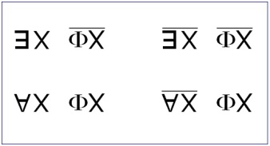
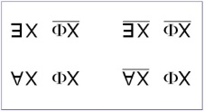

# Leçon 03 | 12 Janvier 1972 Séminaire : Panthéon-Sorbonne

  <label><input type="checkbox" data-lacan-toggle="original" checked> 原文</label>
  <label><input type="checkbox" data-lacan-toggle="notes" checked> 注释</label>
  <label><input type="checkbox" data-lacan-toggle="commentary" checked> 个人解读评论</label>

<section class="parallel-paragraph" data-paragraph-ids="s19-03-0001">

s19-03-0001

[无对应译文]

原文 · s19-03-0001

Si nous trouvions dans la logique, moyen d’articuler ce que l’incons­cient démontre de *valeur sexuelle*, nous n’en serions pas surpris. Nous n’en serions pas surpris, je veux dire *ici même,* à mon séminaire, c’est-à-dire au ras de cette expérience, l’analyse, instituée par Freud, et dont s’instaure une structure de discours que j’ai définie.

</section>

<section class="parallel-paragraph" data-paragraph-ids="s19-03-0002">

s19-03-0002

[无对应译文]

原文 · s19-03-0002

Reprenons ce que j’ai dit dans la densité de ma première phrase.

</section>

<section class="parallel-paragraph" data-paragraph-ids="s19-03-0003">

s19-03-0003

[无对应译文]

原文 · s19-03-0003

J’ai parlé de « *valeur sexuel­le* ». Je ferai remarquer que ces *valeurs* sont des *valeurs reçues*, reçues dans tout langage, l’*homme*, la *femme*, c’est ça qu’on appelle « *valeur sexuel­le* ».

</section>

<section class="parallel-paragraph" data-paragraph-ids="s19-03-0004">

s19-03-0004

[无对应译文]

原文 · s19-03-0004

Au départ qu’il y ait *l’homme* et *la femme*...

</section>

<section class="parallel-paragraph" data-paragraph-ids="s19-03-0005">

s19-03-0005

[无对应译文]

原文 · s19-03-0005

> c’est la thèse dont aujourd’hui je pars ...c’est d’abord affaire de langage.

</section>

<section class="parallel-paragraph" data-paragraph-ids="s19-03-0006">

s19-03-0006

[无对应译文]

原文 · s19-03-0006

Le langage est tel que pour tout sujet parlant :

</section>

<section class="parallel-paragraph" data-paragraph-ids="s19-03-0007">

s19-03-0007

[无对应译文]

原文 · s19-03-0007

- ou bien c’est *lui,*

</section>

<section class="parallel-paragraph" data-paragraph-ids="s19-03-0008">

s19-03-0008

[无对应译文]

原文 · s19-03-0008

- ou bien c’est *elle*.

</section>

<section class="parallel-paragraph" data-paragraph-ids="s19-03-0009">

s19-03-0009

[无对应译文]

原文 · s19-03-0009

Ça existe dans toutes les langues du monde.

</section>

<section class="parallel-paragraph" data-paragraph-ids="s19-03-0010">

s19-03-0010

[无对应译文]

原文 · s19-03-0010

C’est le principe du fonctionnement du *genre *: féminin ou masculin.

</section>

<section class="parallel-paragraph" data-paragraph-ids="s19-03-0011">

s19-03-0011

[无对应译文]

原文 · s19-03-0011

Qu’il y ait l’herma­phrodite, ce sera seulement une occasion de jouer avec plus ou moins d’esprit à faire passer dans la même phrase le *lui* et l’*elle*. On ne l’appel­lera « *ça* », en aucun cas.

</section>

<section class="parallel-paragraph" data-paragraph-ids="s19-03-0012">

s19-03-0012

[无对应译文]

原文 · s19-03-0012

Sauf à manifester par là quelque *horreur* du type « *sacrée »*, on ne le mettra pas au neutre.

</section>

<section class="parallel-paragraph" data-paragraph-ids="s19-03-0013">

s19-03-0013

[无对应译文]

原文 · s19-03-0013

Ceci dit, *l’homme* et *la femme*, nous ne savons pas ce que c’est.

</section>

<section class="parallel-paragraph" data-paragraph-ids="s19-03-0014">

s19-03-0014

[无对应译文]

原文 · s19-03-0014

Pendant un temps, cette bipolarité de valeurs a été prise pour suffisam­ment supporter, suturer ce qu’il en est du sexe.

</section>

<section class="parallel-paragraph" data-paragraph-ids="s19-03-0015">

s19-03-0015

[无对应译文]

原文 · s19-03-0015

C’est de là-même qu’est résultée cette sourde *métaphore* qui pendant des siècles a sous-tendu *la théorie de la connaissance*. Comme je l’ai fait remarquer ailleurs, *le monde était ce qui était perçu*, voire aperçu comme *à la place de l’autre valeur sexuelle*.

</section>

<section class="parallel-paragraph" data-paragraph-ids="s19-03-0016">

s19-03-0016

[无对应译文]

原文 · s19-03-0016

Ce qu’il en était du νοῦς \[nouss\][^8], du pouvoir de connaître, étant placé du côté positif, du côté actif, de ce que j’interrogerai aujourd’hui en demandant quel est son rapport avec l’*Un*.

</section>

<section class="parallel-paragraph" data-paragraph-ids="s19-03-0017">

s19-03-0017

[无对应译文]

原文 · s19-03-0017

J’ai dit que si le pas que nous a fait faire l’analyse nous montre, nous révèle, en tout abord serré de l’approche sexuelle, le détour, la barrière, le cheminement, la chicane, le défilé, de la *castration*, c’est là et propre­ment ce qui ne peut se faire qu’à partir de l’articulation telle que je l’ai donnée du *discours analytique*.

</section>

<section class="parallel-paragraph" data-paragraph-ids="s19-03-0018">

s19-03-0018

[无对应译文]

原文 · s19-03-0018

C’est là ce qui nous conduit à penser que la *castration* ne saurait en aucun cas être réduite à l’anecdote, à l’ac­cident, à l’intervention maladroite d’un propos de menace ni même de censure.

</section>

<section class="parallel-paragraph" data-paragraph-ids="s19-03-0019">

s19-03-0019

[无对应译文]

原文 · s19-03-0019

*La structure est logique*. Quel est *l’objet* de la logique ?

</section>

<section class="parallel-paragraph" data-paragraph-ids="s19-03-0020">

s19-03-0020

[无对应译文]

原文 · s19-03-0020

Vous savez, vous savez d’expérience, d’avoir ouvert seulement un livre qui s’intitu­le « *Traité de Logique »*, combien fragile, incertain, éludé, peut être le pre­mier temps de tout traité qui s’intitule de cet ordre : « *l’art de bien condui­re sa pensée »*...

</section>

<section class="parallel-paragraph" data-paragraph-ids="s19-03-0021">

s19-03-0021

[无对应译文]

原文 · s19-03-0021

> la conduire où, et en la tenant par quel bout ? ...ou bien encore tel recours à une normalité dont se définirait le *rationnel*, indé­pendamment du *réel*.

</section>

<section class="parallel-paragraph" data-paragraph-ids="s19-03-0022">

s19-03-0022

[无对应译文]

原文 · s19-03-0022

Il est clair que, après une telle tentative de le définir \[*le réel*\] comme objet de la logique, ce qui se présente est d’un autre ordre et autrement consistant.

</section>

<section class="parallel-paragraph" data-paragraph-ids="s19-03-0023">

s19-03-0023

[无对应译文]

原文 · s19-03-0023

Je proposerais s’il fallait, si je ne pouvais tout simplement laisser là un blanc - mais je ne le laisse pas - je propose : « *ce qui se produit de la nécessité d’un discours* ». C’est ambigu sans doute mais ce n’est pas idiot puisque cela comporte l’implication que la logique peut complètement changer de sens, selon *d’où prend son sens tout discours*.

</section>

<section class="parallel-paragraph" data-paragraph-ids="s19-03-0024">

s19-03-0024

[无对应译文]

原文 · s19-03-0024

Alors puisque c’est là *ce dont prend son sens tout discours, à savoir à partir d’un autre*, je propose assez clairement depuis longtemps pour qu’il suffise de le rappeler ici : *le réel*...

</section>

<section class="parallel-paragraph" data-paragraph-ids="s19-03-0025">

s19-03-0025

[无对应译文]

原文 · s19-03-0025

> la catégorie que dans la triade dont est parti mon enseignement : *le symbolique, l’imaginaire et le réel* ...*<u>le réel s’affirme</u>*, par un effet qui n’est pas le moindre de s’affirmer *<u>dans les impasses de la logique</u>*.

</section>

<section class="parallel-paragraph" data-paragraph-ids="s19-03-0026">

s19-03-0026

[无对应译文]

原文 · s19-03-0026

Je m’explique. Ce qu’au départ, dans son ambi­tion conquérante, la logique se proposait, ce n’était rien de moins que *le réseau du discours* en tant qu’il *s’articule,* et qu’à *s’articuler* ce réseau devait se fermer en *un univers* supposé enserrer et recouvrir comme d’un filet ce qu’il pouvait en être de *ce qui était à la connaissance offert*.

</section>

<section class="parallel-paragraph" data-paragraph-ids="s19-03-0027">

s19-03-0027

[无对应译文]

原文 · s19-03-0027

L’expérience, l’expérience logicienne, a montré qu’il en était différem­ment.

</section>

<section class="parallel-paragraph" data-paragraph-ids="s19-03-0028">

s19-03-0028

[无对应译文]

原文 · s19-03-0028

Et sans avoir ici aujourd’hui - où par accident je dois m’époumoner - à entrer plus dans le détail...

</section>

<section class="parallel-paragraph" data-paragraph-ids="s19-03-0029">

s19-03-0029

[无对应译文]

原文 · s19-03-0029

> ce public est tout de même suffisamment averti d’où en notre temps a pu reprendre l’effort logique,
>
> pour savoir qu’à aborder quelque chose en principe d’aussi sim­plifié comme *réel* que *l’arithmétique* ...il a pu être démontré que dans *l’arithmétique*, quelque chose peut toujours s’énoncer, offert ou non offert à la déduction logique, qui s’articule comme en avance sur ce dont les pré­misses, les axiomes, les termes fondateurs dont peut s’asseoir ladite arithmétique, permet de présumer comme *démontrable* ou *réfutable*. \[*cf. les deux théorèmes d’incomplètude de Gödel*\]

</section>

<section class="parallel-paragraph" data-paragraph-ids="s19-03-0030">

s19-03-0030

[无对应译文]

原文 · s19-03-0030

Nous touchons là du doigt, en un domaine en apparence le plus sûr \[*l’arithmétique*\] :

</section>

<section class="parallel-paragraph" data-paragraph-ids="s19-03-0031">

s19-03-0031

[无对应译文]

原文 · s19-03-0031

- ce qui s’oppose à l’entière prise du discours, à l’exhaustion logique,

</section>

<section class="parallel-paragraph" data-paragraph-ids="s19-03-0032">

s19-03-0032

[无对应译文]

原文 · s19-03-0032

- ce qui y introduit une béance irréductible, c’est là que nous désignons *le Réel.*

</section>

<section class="parallel-paragraph" data-paragraph-ids="s19-03-0033">

s19-03-0033

[无对应译文]

原文 · s19-03-0033

Bien sûr avant d’en venir à ce terrain d’épreuve qui peut paraître à l’horizon, voire incertain à ceux qui n’ont pas serré de près ses dernières épreuves, il suffira de rappeler ce qu’est « *le discours naïf* ».

</section>

<section class="parallel-paragraph" data-paragraph-ids="s19-03-0034">

s19-03-0034

[无对应译文]

原文 · s19-03-0034

« *Le discours naïf* » se propose d’emblée, s’inscrit comme tel, comme *vérité*.

</section>

<section class="parallel-paragraph" data-paragraph-ids="s19-03-0035">

s19-03-0035

[无对应译文]

原文 · s19-03-0035

Il est depuis tou­jours apparu facile de lui démontrer à ce discours naïf « *qu’il ne sait pas ce qu’il dit* », je ne parle pas du sujet, je parle du discours. C’est l’orée - pourquoi ne pas le dire - de la critique, que le sophiste...

</section>

<section class="parallel-paragraph" data-paragraph-ids="s19-03-0036">

s19-03-0036

[无对应译文]

原文 · s19-03-0036

> à qui­conque énonce ce qui est toujours posé comme *vérité* ...que le sophiste lui démontre qu’« *il ne sait pas ce qu’il dit* ». C’est même là l’origine de toute *dialectique*.

</section>

<section class="parallel-paragraph" data-paragraph-ids="s19-03-0037">

s19-03-0037

[无对应译文]

原文 · s19-03-0037

Et puis c’est toujours prêt à renaître : que quelqu’un vienne témoigner à la barre d’un tribunal, c’est l’enfance de l’art de l’avocat que de lui montrer qu’il ne sait pas ce qu’il dit.

</section>

<section class="parallel-paragraph" data-paragraph-ids="s19-03-0038">

s19-03-0038

[无对应译文]

原文 · s19-03-0038

Mais là nous tombons au niveau du sujet, du témoin, qu’il s’agit d’embrouiller.

</section>

<section class="parallel-paragraph" data-paragraph-ids="s19-03-0039">

s19-03-0039

[无对应译文]

原文 · s19-03-0039

Ce que j’ai dit au niveau de l’action sophistique, c’est au discours lui-même que le sophis­te s’en prend.

</section>

<section class="parallel-paragraph" data-paragraph-ids="s19-03-0040">

s19-03-0040

[无对应译文]

原文 · s19-03-0040

Nous aurons peut-être cette année, puisque j’ai annoncé que j’aurais à faire état du *« Parménide »,* à montrer ce qu’il en est de l’ac­tion sophistique.

</section>

<section class="parallel-paragraph" data-paragraph-ids="s19-03-0041">

s19-03-0041

[无对应译文]

原文 · s19-03-0041

### Le remarquable, dans le développement auquel tout à l’heure je me suis référé, de l’énonciation logicienne,

</section>

<section class="parallel-paragraph" data-paragraph-ids="s19-03-0042">

s19-03-0042

[无对应译文]

原文 · s19-03-0042

### où peut-être d’aucuns se seront aperçu qu’il ne s’agit de rien d’autre que du « [*théorème de Gödel*](http://fr.wikipedia.org/wiki/Th%C3%A9or%C3%A8me_d%27incompl%C3%A9tude_de_G%C3%B6del) » concer­nant l’arithmétique,

</section>

<section class="parallel-paragraph" data-paragraph-ids="s19-03-0043">

s19-03-0043

[无对应译文]

原文 · s19-03-0043

### c’est que ce n’est pas à partir des *valeurs de vérité* que Gödel procède à sa démonstration...

</section>

<section class="parallel-paragraph" data-paragraph-ids="s19-03-0044">

s19-03-0044

[无对应译文]

原文 · s19-03-0044

### qu’il y aura toujours dans le champ de *l’arithmétique* quelque chose d’énonçable

</section>

<section class="parallel-paragraph" data-paragraph-ids="s19-03-0045">

s19-03-0045

[无对应译文]

原文 · s19-03-0045

### dans les termes propres qu’elle comporte, qui ne sera pas à la portée

</section>

<section class="parallel-paragraph" data-paragraph-ids="s19-03-0046">

s19-03-0046

[无对应译文]

原文 · s19-03-0046

### de ce qu’elle se pose à elle-même comme mode à tenir pour reçu de la démonstration

</section>

<section class="parallel-paragraph" data-paragraph-ids="s19-03-0047">

s19-03-0047

[无对应译文]

原文 · s19-03-0047

### ...ce n’est pas à partir de *la vérité,* c’est à partir de la notion de *dérivation*.

</section>

<section class="parallel-paragraph" data-paragraph-ids="s19-03-0048">

s19-03-0048

[无对应译文]

原文 · s19-03-0048

C’est en laissant en suspens la valeur *vrai* ou *faux* comme telle, que le théorème est démontrable.

</section>

<section class="parallel-paragraph" data-paragraph-ids="s19-03-0049">

s19-03-0049

[无对应译文]

原文 · s19-03-0049

Ce qui accentue ce que je dis de la béance logicienne sur ce point là, point vif...

</section>

<section class="parallel-paragraph" data-paragraph-ids="s19-03-0050">

s19-03-0050

[无对应译文]

原文 · s19-03-0050

> point vif en ce qu’il illustre ce que j’entends avancer ...c’est que si *le réel*...

</section>

<section class="parallel-paragraph" data-paragraph-ids="s19-03-0051">

s19-03-0051

[无对应译文]

原文 · s19-03-0051

> assurément d’un accès facile ...peut se définir *comme l’impossible*...

</section>

<section class="parallel-paragraph" data-paragraph-ids="s19-03-0052">

s19-03-0052

[无对应译文]

原文 · s19-03-0052

> cet *impossible* en tant qu’il s’avère de la prise même du discours, du discours logicien ...*cet impossible-là, ce réel-là* doit être par nous privilégié.

</section>

<section class="parallel-paragraph" data-paragraph-ids="s19-03-0053">

s19-03-0053

[无对应译文]

原文 · s19-03-0053

« *Par nous* » : Par qui ? Par les analystes.

</section>

<section class="parallel-paragraph" data-paragraph-ids="s19-03-0054">

s19-03-0054

[无对应译文]

原文 · s19-03-0054

Car il donne d’une façon exem­plaire, qu’il est le paradigme de ce qui met en question ce qui peut sor­tir du langage.

</section>

<section class="parallel-paragraph" data-paragraph-ids="s19-03-0055">

s19-03-0055

[无对应译文]

原文 · s19-03-0055

Il en sort *certains types* - que j’ai définis - *de discours*, comme étant ce qui instaure un type de lien social défini.

</section>

<section class="parallel-paragraph" data-paragraph-ids="s19-03-0056">

s19-03-0056

[无对应译文]

原文 · s19-03-0056

Mais le langa­ge s’interroge sur ce qu’il fonde comme *discours*.

</section>

<section class="parallel-paragraph" data-paragraph-ids="s19-03-0057">

s19-03-0057

[无对应译文]

原文 · s19-03-0057

II est frappant qu’il ne puisse le faire qu’à fomenter l’ombre d’un langage qui se dépasserait, qui serait *métalangage*.

</section>

<section class="parallel-paragraph" data-paragraph-ids="s19-03-0058">

s19-03-0058

[无对应译文]

原文 · s19-03-0058

J’ai souvent fait remarquer qu’il ne peut le faire qu’à se réduire dans sa fonction, c’est-à-dire déjà à engendrer un dis­cours particularisé.

</section>

<section class="parallel-paragraph" data-paragraph-ids="s19-03-0059">

s19-03-0059

[无对应译文]

原文 · s19-03-0059

### Je propose...

</section>

<section class="parallel-paragraph" data-paragraph-ids="s19-03-0060">

s19-03-0060

[无对应译文]

原文 · s19-03-0060

### en nous intéressant à ce *réel* en tant qu’il s’affirme de l’interrogation logicienne du langage

</section>

<section class="parallel-paragraph" data-paragraph-ids="s19-03-0061">

s19-03-0061

[无对应译文]

原文 · s19-03-0061

### ...je propose d’y trou­ver *le modèle* de ce qui nous importe, à savoir *de ce que livre l’explora­tion de l’inconscient* qui loin d’être...

</section>

<section class="parallel-paragraph" data-paragraph-ids="s19-03-0062">

s19-03-0062

[无对应译文]

原文 · s19-03-0062

### comme a pensé pouvoir le reprendre un Jung, à revenir à la plus vieille ornière

</section>

<section class="parallel-paragraph" data-paragraph-ids="s19-03-0063">

s19-03-0063

[无对应译文]

原文 · s19-03-0063

### ...loin d’être un sym­bolisme sexuel universel, est très précisément ce que j’ai tout à l’heure rappelé de *la castration*,

</section>

<section class="parallel-paragraph" data-paragraph-ids="s19-03-0064">

s19-03-0064

[无对应译文]

原文 · s19-03-0064

### à souligner seulement qu’il est exigible qu’elle ne se réduise pas à l’*anecdote* d’une parole entendue.

</section>

<section class="parallel-paragraph" data-paragraph-ids="s19-03-0065">

s19-03-0065

[无对应译文]

原文 · s19-03-0065

Sans quoi, pour­quoi l’isoler, lui donner ce privilège de je ne sais quel traumatisme, voire efficace de *béance* ?

</section>

<section class="parallel-paragraph" data-paragraph-ids="s19-03-0066">

s19-03-0066

[无对应译文]

原文 · s19-03-0066

Alors qu’il n’est trop clair qu’elle n’a rien d’anecdotique, qu’elle est rigoureusement fondamentale dans ce qui, non pas instaure, mais rend *impossible* l’énoncé de la bipolarité sexuelle comme telle, à savoir comme - chose curieuse - nous continuons de l’imaginer au niveau animal.

</section>

<section class="parallel-paragraph" data-paragraph-ids="s19-03-0067">

s19-03-0067

[无对应译文]

原文 · s19-03-0067

Comme si chaque illustration de *ce qui*, dans chaque espèce, *constitue le tropisme d’un sexe pour l’autre* n’était pas aussi variable pour chaque espèce qu’est leur constitution corporelle.

</section>

<section class="parallel-paragraph" data-paragraph-ids="s19-03-0068">

s19-03-0068

[无对应译文]

原文 · s19-03-0068

Comme si, de plus, nous n’avions pas appris - appris déjà depuis un bout de temps - que le sexe...

</section>

<section class="parallel-paragraph" data-paragraph-ids="s19-03-0069">

s19-03-0069

[无对应译文]

原文 · s19-03-0069

> au niveau non pas de ce que je viens de définir comme *le réel,*
>
> mais au niveau de ce qui s’articule à l’intérieur de chaque scien­ce, son objet étant une fois défini ...que le sexe, il y a au moins deux ou trois étages de ce qui le constitue, du génotype au phénotype et qu’après tout, après les derniers pas de la biologie - est-ce que j’ai besoin d’évoquer lesquels ? - il est sûr que le sexe ne fait que prendre place comme un mode particulier dans ce qui permet la reproduction de ce qu’on appelle un corps vivant.

</section>

<section class="parallel-paragraph" data-paragraph-ids="s19-03-0070">

s19-03-0070

[无对应译文]

原文 · s19-03-0070

Loin que le sexe en soit l’instru­ment type, il n’en est qu’une des formes, et ce qu’on confond trop...

</section>

<section class="parallel-paragraph" data-paragraph-ids="s19-03-0071">

s19-03-0071

[无对应译文]

原文 · s19-03-0071

> encore que Freud là-dessus ait donné l’indication, mais approximati­ve ...ce qu’on confond trop c’est très précisément la fonction du sexe et celle de la reproduction.

</section>

<section class="parallel-paragraph" data-paragraph-ids="s19-03-0072">

s19-03-0072

[无对应译文]

原文 · s19-03-0072

Loin que les choses soient telles qu’il y ait la filière de la gonade d’un côté, ce que Weissmann appelait le *germen*, et le branchement du corps, il est clair que le corps, que son génotype véhicule quelque chose qui détermine le sexe et que ça ne suffit pas : de sa production de corps, de sa statique cor­porelle, il détache des hormones qui, dans cette détermination, peuvent interférer.

</section>

<section class="parallel-paragraph" data-paragraph-ids="s19-03-0073">

s19-03-0073

[无对应译文]

原文 · s19-03-0073

Il n’y a donc pas d’un côté

</section>

<section class="parallel-paragraph" data-paragraph-ids="s19-03-0074">

s19-03-0074

[无对应译文]

原文 · s19-03-0074

- d’un côté le sexe, irrésistiblement associé - parce qu’il est dans le corps - à la vie,

</section>

<section class="parallel-paragraph" data-paragraph-ids="s19-03-0075">

s19-03-0075

[无对应译文]

原文 · s19-03-0075

> le sexe imaginé comme l’image de ce qui dans la reproduction de la vie serait l’amour, il n’y a pas cela d’un côté

</section>

<section class="parallel-paragraph" data-paragraph-ids="s19-03-0076">

s19-03-0076

[无对应译文]

原文 · s19-03-0076

- et de l’autre côté le corps, le corps en tant qu’il a à se défendre contre la mort.

</section>

<section class="parallel-paragraph" data-paragraph-ids="s19-03-0077">

s19-03-0077

[无对应译文]

原文 · s19-03-0077

La reproduction de la vie telle que nous arrivons à l’interroger, au niveau de l’apparition de ses premières formes, émerge de quelque chose qui n’est *ni vie, ni mort*, qui est ceci : que très indépendamment du sexe...

</section>

<section class="parallel-paragraph" data-paragraph-ids="s19-03-0078">

s19-03-0078

[无对应译文]

原文 · s19-03-0078

> et même à l’occasion de quelque chose de déjà vivant ...quelque chose inter­vient que nous appellerons « *le programme* » ou « *le codon »* encore, comme ils disent à propos de tel ou tel point repéré des chromosomes.

</section>

<section class="parallel-paragraph" data-paragraph-ids="s19-03-0079">

s19-03-0079

[无对应译文]

原文 · s19-03-0079

Et puis le dialogue « *vie et mort* », ça se produit au niveau de ce qui est reproduit et ça ne prend, à notre connaissance, un caractère de drame qu’à partir du moment où dans l’équilibre *vie et mort*, *la jouissance* intervient.

</section>

<section class="parallel-paragraph" data-paragraph-ids="s19-03-0080">

s19-03-0080

[无对应译文]

原文 · s19-03-0080

Le point vif, le point d’émergence de quelque chose qui est ce dont tous ici nous croyons plus ou moins faire partie, *l’être parlant* pour le dire, c’est *ce rapport dérangé à son propre corps qui s’appelle jouis­sance*.

</section>

<section class="parallel-paragraph" data-paragraph-ids="s19-03-0081">

s19-03-0081

[无对应译文]

原文 · s19-03-0081

Et cela, ça a pour centre, ça a pour point de départ...

</section>

<section class="parallel-paragraph" data-paragraph-ids="s19-03-0082">

s19-03-0082

[无对应译文]

原文 · s19-03-0082

> c’est ce que nous démontre le discours analytique ...ça a pour point de départ un rapport privilégié à *la jouissance sexuelle*.

</section>

<section class="parallel-paragraph" data-paragraph-ids="s19-03-0083">

s19-03-0083

[无对应译文]

原文 · s19-03-0083

C’est en quoi *la valeur du par­tenaire* autre, celle que j’ai commencé de désigner respectivement par *l’homme* et par *la femme,* est inapprochable au langage, très précisément en ceci :

</section>

<section class="parallel-paragraph" data-paragraph-ids="s19-03-0084">

s19-03-0084

[无对应译文]

原文 · s19-03-0084

- que *le langage fonctionne*, d’origine, *en suppléance de la jouis­sance sexuelle*,

</section>

<section class="parallel-paragraph" data-paragraph-ids="s19-03-0085">

s19-03-0085

[无对应译文]

原文 · s19-03-0085

- que *c’est par là qu’il ordonne cette intrusion, dans la répétition corporelle, de la jouissance*.

</section>

<section class="parallel-paragraph" data-paragraph-ids="s19-03-0086">

s19-03-0086

[无对应译文]

原文 · s19-03-0086

C’est en quoi je vais aujourd’hui commencer de vous montrer com­ment, à user de fonctions logiques, il est possible de donner de ce qu’il en est de *la castration* une autre articulation qu’anecdotique.

</section>

<section class="parallel-paragraph" data-paragraph-ids="s19-03-0087">

s19-03-0087

[无对应译文]

原文 · s19-03-0087

Dans la ligne de *l’exploration logique du réel*, le logicien a commencé par *les propositions*.

</section>

<section class="parallel-paragraph" data-paragraph-ids="s19-03-0088">

s19-03-0088

[无对应译文]

原文 · s19-03-0088

La logique n’a commencé qu’à avoir su, *dans le langage*, isoler la fonction de ce qu’on appelle les *prosdiorismes*, qui ne sont rien d’autre que le « *Un* », le « *quelque* », le « *tous *» et *la négation de ces propositions*.

</section>

<section class="parallel-paragraph" data-paragraph-ids="s19-03-0089">

s19-03-0089

[无对应译文]

原文 · s19-03-0089

Vous le savez, Aristote définit pour les opposer,

</section>

<section class="parallel-paragraph" data-paragraph-ids="s19-03-0090">

s19-03-0090

[无对应译文]

原文 · s19-03-0090

- « *les Universelles* »,

</section>

<section class="parallel-paragraph" data-paragraph-ids="s19-03-0091">

s19-03-0091

[无对应译文]

原文 · s19-03-0091

- et « *les Particulières* », et à l’intérieur de chacune :

</section>

<section class="parallel-paragraph" data-paragraph-ids="s19-03-0092">

s19-03-0092

[无对应译文]

原文 · s19-03-0092

- « *affirmative* »,

</section>

<section class="parallel-paragraph" data-paragraph-ids="s19-03-0093">

s19-03-0093

[无对应译文]

原文 · s19-03-0093

- et « *négative* ».

</section>

<section class="parallel-paragraph" data-paragraph-ids="s19-03-0094">

s19-03-0094

[无对应译文]

原文 · s19-03-0094

Ce que je peux marquer, c’est la différence qu’il y a de cet usage des *prosdio­rismes* à ce qui...

</section>

<section class="parallel-paragraph" data-paragraph-ids="s19-03-0095">

s19-03-0095

[无对应译文]

原文 · s19-03-0095

> pour des besoins logiques, à savoir pour un abord qui n’était autre que de *ce réel qui s’appelle le nombre* ...à ce qui s’est passé de complètement différent.

</section>

<section class="parallel-paragraph" data-paragraph-ids="s19-03-0096">

s19-03-0096

[无对应译文]

原文 · s19-03-0096

L’analyse logique de ce qu’on appelle *fonction propositionnelle* s’articule de l’isolement dans la proposition, ou plus exactement *du manque, du vide, du trou, du creux qui est fait*, de ce qui doit fonctionner comme *argument*. Nommément il sera dit que tout argument d’un domaine...

</section>

<section class="parallel-paragraph" data-paragraph-ids="s19-03-0097">

s19-03-0097

[无对应译文]

原文 · s19-03-0097

> que nous appellerons comme vous le voulez X ou un A gothique \[;\] *–* ...tout argument de ce domaine, mis à la place laissée vide dans une proposition, y satisfera, c’est-à-dire lui donnera *valeur de vérité* \[; !\].

</section>

<section class="parallel-paragraph" data-paragraph-ids="s19-03-0098">

s19-03-0098

[无对应译文]

原文 · s19-03-0098

</section>

<section class="parallel-paragraph" data-paragraph-ids="s19-03-0099">

s19-03-0099

[无对应译文]

原文 · s19-03-0099

C’est ce qui s’inscrit de ce qui est là en bas à gauche, ce A renversé X : ; !...

</section>

<section class="parallel-paragraph" data-paragraph-ids="s19-03-0100">

s19-03-0100

[无对应译文]

原文 · s19-03-0100

> peu importe quelle est là la proposition ...la fonction prend une valeur vraie pour tout X du domaine.

</section>

<section class="parallel-paragraph" data-paragraph-ids="s19-03-0101">

s19-03-0101

[无对应译文]

原文 · s19-03-0101

Qu’est-ce que cet X ?

</section>

<section class="parallel-paragraph" data-paragraph-ids="s19-03-0102">

s19-03-0102

[无对应译文]

原文 · s19-03-0102

J’ai dit qu’il se définit comme d’un domaine.

</section>

<section class="parallel-paragraph" data-paragraph-ids="s19-03-0103">

s19-03-0103

[无对应译文]

原文 · s19-03-0103

Est-ce à dire pour autant qu’on sache ce que c’est ?

</section>

<section class="parallel-paragraph" data-paragraph-ids="s19-03-0104">

s19-03-0104

[无对应译文]

原文 · s19-03-0104

Savons-nous ce que c’est qu’un *homme*, à dire que « *tout homme est mortel * » ?

</section>

<section class="parallel-paragraph" data-paragraph-ids="s19-03-0105">

s19-03-0105

[无对应译文]

原文 · s19-03-0105

Nous en apprenons quelque chose du fait de dire qu’il est mortel et justement de savoir que *pour tout* *homme*, c’est vrai. Mais avant d’introduire le « *tout* *homme »* nous n’en savons que les traits les plus approximatifs et qui peuvent se définir de la façon la plus variable.

</section>

<section class="parallel-paragraph" data-paragraph-ids="s19-03-0106">

s19-03-0106

[无对应译文]

原文 · s19-03-0106

Ça, je suppose que vous le savez depuis longtemps, c’est l’histoire que Platon rapporte, n’est-ce pas, du poulet plumé[^9].

</section>

<section class="parallel-paragraph" data-paragraph-ids="s19-03-0107">

s19-03-0107

[无对应译文]

原文 · s19-03-0107

Alors c’est bien dire qu’il faut qu’on s’interroge sur les temps de *l’articulation logique*, à savoir ceci : que ce que détient le *prosdiorisme* n’a, avant de fonctionner comme argument, aucun sens, il n’en prend un que de son entrée *dans la fonction*.

</section>

<section class="parallel-paragraph" data-paragraph-ids="s19-03-0108">

s19-03-0108

[无对应译文]

原文 · s19-03-0108

Il prend le sens de *vrai* ou de *faux*.

</section>

<section class="parallel-paragraph" data-paragraph-ids="s19-03-0109">

s19-03-0109

[无对应译文]

原文 · s19-03-0109

Il me semble que ceci est fait pour nous faire toucher la béance qu’il y a du *signifiant* à sa *dénotation,*

</section>

<section class="parallel-paragraph" data-paragraph-ids="s19-03-0110">

s19-03-0110

[无对应译文]

原文 · s19-03-0110

- puisque *le sens*, s’il est quelque part, *il est dans la fonction*,

</section>

<section class="parallel-paragraph" data-paragraph-ids="s19-03-0111">

s19-03-0111

[无对应译文]

原文 · s19-03-0111

- mais que *la dénotation* ne commence qu’à partir du moment où l’argument vient s’y inscrire.

</section>

<section class="parallel-paragraph" data-paragraph-ids="s19-03-0112">

s19-03-0112

[无对应译文]

原文 · s19-03-0112

C’est du même coup *mettre en question ceci qui est différent*, qui est l’usage de la lettre E également inversée : ∃, « *il existe* ».

</section>

<section class="parallel-paragraph" data-paragraph-ids="s19-03-0113">

s19-03-0113

[无对应译文]

原文 · s19-03-0113

« *Il existe* » quelque chose *qui peut servir dans la fonction comme argument* et en prendre ou n’en pas prendre *valeur de vérité*.

</section>

<section class="parallel-paragraph" data-paragraph-ids="s19-03-0114">

s19-03-0114

[无对应译文]

原文 · s19-03-0114

Je voudrais vous faire sentir la différence qu’il y a de cette introduction de l’« *il existe* » comme problématique :

</section>

<section class="parallel-paragraph" data-paragraph-ids="s19-03-0115">

s19-03-0115

[无对应译文]

原文 · s19-03-0115

- à savoir, mettant en question la fonction même de l’existence par rapport à ce qu’impliquait l’usage des *particulières* dans Aristote,

</section>

<section class="parallel-paragraph" data-paragraph-ids="s19-03-0116">

s19-03-0116

[无对应译文]

原文 · s19-03-0116

- à savoir que l’usage du « *quelque* » semblait avec soi entraîner *l’existence,* de sorte que, comme le « *tous* » était censé comprendre ce « *quelque* », le « *tous* » lui-même pre­nait valeur de ce qu’il n’est pas, à savoir d’une *affirmation d’existence*.

</section>

<section class="parallel-paragraph" data-paragraph-ids="s19-03-0117">

s19-03-0117

[无对应译文]

原文 · s19-03-0117

Nous ne pourrons - vu l’heure - le voir que la prochaine fois : il n’y a de statut du « *tous* », à savoir de *l’Universel*, qu’au niveau du « *possible »*.

</section>

<section class="parallel-paragraph" data-paragraph-ids="s19-03-0118">

s19-03-0118

[无对应译文]

原文 · s19-03-0118

Il est « *possible »* de dire, entre autre, que « *tous les humains sont mortels* ».

</section>

<section class="parallel-paragraph" data-paragraph-ids="s19-03-0119">

s19-03-0119

[无对应译文]

原文 · s19-03-0119

Mais bien loin de trancher *la question de l’existence de l’être humain*, il faut d’abord, chose curieuse, qu’il soit assuré qu’il *existe*.

</section>

<section class="parallel-paragraph" data-paragraph-ids="s19-03-0120">

s19-03-0120

[无对应译文]

原文 · s19-03-0120

Ce que je veux indiquer, c’est la voie où nous allons entrer la pro­chaine fois.

</section>

<section class="parallel-paragraph" data-paragraph-ids="s19-03-0121">

s19-03-0121

[无对应译文]

原文 · s19-03-0121

Je voudrais dire que de l’articulation de ces 4 conjonctions argument-fonction sous le signe des quanteurs :

</section>

<section class="parallel-paragraph" data-paragraph-ids="s19-03-0122">

s19-03-0122

[无对应译文]

原文 · s19-03-0122

</section>

<section class="parallel-paragraph" data-paragraph-ids="s19-03-0123">

s19-03-0123

[无对应译文]

原文 · s19-03-0123

C’est de là et de là seu­lement que peut se définir le domaine dont chacun de ces X prend valeur.

</section>

<section class="parallel-paragraph" data-paragraph-ids="s19-03-0124">

s19-03-0124

[无对应译文]

原文 · s19-03-0124

Il est possible de proposer *la fonction de vérité* qui est celle-ci, à savoir  que *« tout homme » se définit de la fonction phallique*, et *la fonction phal­lique* est proprement ce qui *obture le rapport sexuel*.

</section>

<section class="parallel-paragraph" data-paragraph-ids="s19-03-0125">

s19-03-0125

[无对应译文]

原文 · s19-03-0125

C’est autrement que va se définir cette lettre : « A *renversé* » dite *quan­teur universel*, munie, comme je le fais de la barre qui la nie : ..

</section>

<section class="parallel-paragraph" data-paragraph-ids="s19-03-0126">

s19-03-0126

[无对应译文]

原文 · s19-03-0126

J’ai avan­cé le trait essentiel du « *pas tous* » : . !, comme étant ce dont peut s’ar­ticuler un énoncé fondamental quant à la possibilité de dénotation que prend une variable en fonction d’argument.

</section>

<section class="parallel-paragraph" data-paragraph-ids="s19-03-0127">

s19-03-0127

[无对应译文]

原文 · s19-03-0127

La femme se situe de ceci : que ce n’est *pas toutes* qui peuvent être dites *avec vérité* en fonction d’argument dans ce qui s’énonce *de la fonction phallique*. Qu’est-ce que ce « *pas toutes* » ?

</section>

<section class="parallel-paragraph" data-paragraph-ids="s19-03-0128">

s19-03-0128

[无对应译文]

原文 · s19-03-0128

C’est très précisément ce qui mérite d’être interrogé comme structure, car contrairement, c’est là le point très important, à la fonction de la « *particulière négative* », à savoir qu’il y en a « *quelques* » qui ne le sont pas, il est impossible d’ex­traire du « *pas toutes* » cette affirmation.

</section>

<section class="parallel-paragraph" data-paragraph-ids="s19-03-0129">

s19-03-0129

[无对应译文]

原文 · s19-03-0129

C’est le « *pas toute* » à quoi il est réservé d’indiquer que *quelque part,* et rien de plus, elle a rapport à *la fonction phallique*.

</section>

<section class="parallel-paragraph" data-paragraph-ids="s19-03-0130">

s19-03-0130

[无对应译文]

原文 · s19-03-0130

Or c’est de là que partent les valeurs à donner à mes autres symboles.

</section>

<section class="parallel-paragraph" data-paragraph-ids="s19-03-0131">

s19-03-0131

[无对应译文]

原文 · s19-03-0131

C’est à savoir que rien ne peut approprier ce « *tous* » à ce « *pas toutes* », qu’il reste...

</section>

<section class="parallel-paragraph" data-paragraph-ids="s19-03-0132">

s19-03-0132

[无对应译文]

原文 · s19-03-0132

> entre ce qui fonde symboliquement la fonction argumentaire des termes : *l’homme* et *la femme* ...qu’il reste cette béance d’une indétermi­nation de leur rapport commun à *la jouissance* : *ce n’est pas du même ordre qu’ils se définissent par rapport à elle*.

</section>

<section class="parallel-paragraph" data-paragraph-ids="s19-03-0133">

s19-03-0133

[无对应译文]

原文 · s19-03-0133

### Ce qu’il faut...

</section>

<section class="parallel-paragraph" data-paragraph-ids="s19-03-0134">

s19-03-0134

[无对应译文]

原文 · s19-03-0134

### comme je l’ai déjà dit d’un terme qui jouera un grand rôle dans ce que nous avons à dire par la suite

</section>

<section class="parallel-paragraph" data-paragraph-ids="s19-03-0135">

s19-03-0135

[无对应译文]

原文 · s19-03-0135

### ...ce qu’il faut c’est que malgré ce « *tous* » de la *fonction phallique* en quoi tient la dénotation de l’homme,

</section>

<section class="parallel-paragraph" data-paragraph-ids="s19-03-0136">

s19-03-0136

[无对应译文]

原文 · s19-03-0136

### malgré ce « *tous* », il existe...

</section>

<section class="parallel-paragraph" data-paragraph-ids="s19-03-0137">

s19-03-0137

[无对应译文]

原文 · s19-03-0137

### et « *il existe* » là veut dire *il existe* exactement comme dans la solution d’une équation mathématique

</section>

<section class="parallel-paragraph" data-paragraph-ids="s19-03-0138">

s19-03-0138

[无对应译文]

原文 · s19-03-0138

...il existe « *au moins un* », il existe au moins un pour qui la vérité de sa dénotation *ne tient pas dans la fonction phallique*.

</section>

<section class="parallel-paragraph" data-paragraph-ids="s19-03-0139">

s19-03-0139

[无对应译文]

原文 · s19-03-0139

Est-ce qu’il est besoin de vous mettre les points sur les i et de dire que le mythe d’Œdipe, c’est ce qu’on a pu faire pour donner l’idée de cette condition logique qui est celle de l’approche, de l’approche indirecte que la femme peut faire de l’homme ?

</section>

<section class="parallel-paragraph" data-paragraph-ids="s19-03-0140">

s19-03-0140

[无对应译文]

原文 · s19-03-0140

Si le mythe était nécessaire, ce mythe dont on peut dire qu’il est déjà à soi tout seul extraordinaire que l’énon­cé ne paraisse pas bouffon, à savoir celle de l’homme originel qui joui­rait précisément *de ce qui n’existe pas,* à savoir « *toutes les femmes* », ce qui n’est pas possible, pas simplement parce qu’il est clair que… que l’on a ses limites \[*Rires*\], mais parce qu’il n’y a pas de « *tout* » des femmes.

</section>

<section class="parallel-paragraph" data-paragraph-ids="s19-03-0141">

s19-03-0141

[无对应译文]

原文 · s19-03-0141

Alors ce dont il s’agit c’est bien sûr autre chose, à savoir *qu’au niveau d’«* *au moins un* » il soit possible que soit subvertie, que *ne soit plus vraie*, la prévalence de *la fonction phallique*.

</section>

<section class="parallel-paragraph" data-paragraph-ids="s19-03-0142">

s19-03-0142

[无对应译文]

原文 · s19-03-0142

Et ce n’est pas parce que j’ai dit que *la jouissance sexuelle est le pivot de toute jouissance,* que j’ai pour autant suffisamment défini ce qu’il en est de *la fonction phallique*.

</section>

<section class="parallel-paragraph" data-paragraph-ids="s19-03-0143">

s19-03-0143

[无对应译文]

原文 · s19-03-0143

Provisoire­ment, admettons que ce soit la même chose.

</section>

<section class="parallel-paragraph" data-paragraph-ids="s19-03-0144">

s19-03-0144

[无对应译文]

原文 · s19-03-0144

Ce qui s’introduit au niveau de l’« *au moins un* » du père, c’est cet *au moins un* qui veut dire que ça peut marcher sans.

</section>

<section class="parallel-paragraph" data-paragraph-ids="s19-03-0145">

s19-03-0145

[无对应译文]

原文 · s19-03-0145

Ça veut dire, comme le mythe le démontre, car il est uniquement fait pour assurer ça, c’est à savoir : *que la jouissance sexuelle sera possible mais qu’elle sera limitée*.

</section>

<section class="parallel-paragraph" data-paragraph-ids="s19-03-0146">

s19-03-0146

[无对应译文]

原文 · s19-03-0146

Ce qui suppose pour chaque homme, dans son rapport avec la femme, quelque maîtrise, pour le moins, de *cette jouissance*. Il faut à la femme *au moins ça* : *que ça soit possible la castration*, c’est son abord de l’homme.

</section>

<section class="parallel-paragraph" data-paragraph-ids="s19-03-0147">

s19-03-0147

[无对应译文]

原文 · s19-03-0147

Pour ce qui est de la faire passer à l’acte, ladite *castration*, elle s’en charge.

</section>

<section class="parallel-paragraph" data-paragraph-ids="s19-03-0148">

s19-03-0148

[无对应译文]

原文 · s19-03-0148

Et pour ne pas vous quitter avant d’avoir articulé ce qu’il en est du quatrième terme, nous dirons ce que connaissent bien tous les analystes : c’est ce que veut dire le / §.

</section>

<section class="parallel-paragraph" data-paragraph-ids="s19-03-0149">

s19-03-0149

[无对应译文]

原文 · s19-03-0149

Faudra que j’y revienne bien sûr, puisque au­jourd’hui nous avons été un peu retardés. Je comptais couvrir, comme chaque fois d’ailleurs, un champ beaucoup plus vaste, mais comme vous êtes patients, vous reviendrez la prochaine fois.

</section>

<section class="parallel-paragraph" data-paragraph-ids="s19-03-0150">

s19-03-0150

[无对应译文]

原文 · s19-03-0150

Ça veut dire quoi \[*le* / §\] ?

</section>

<section class="parallel-paragraph" data-paragraph-ids="s19-03-0151">

s19-03-0151

[无对应译文]

原文 · s19-03-0151

Le « *il existe* », nous l’avons dit, est problématique.

</section>

<section class="parallel-paragraph" data-paragraph-ids="s19-03-0152">

s19-03-0152

[无对应译文]

原文 · s19-03-0152

Ce sera une occasion cette année d’interroger ce qu’il en est de l’*exis­tence*.

</section>

<section class="parallel-paragraph" data-paragraph-ids="s19-03-0153">

s19-03-0153

[无对应译文]

原文 · s19-03-0153

Qu’est-ce qui existe après tout ?

</section>

<section class="parallel-paragraph" data-paragraph-ids="s19-03-0154">

s19-03-0154

[无对应译文]

原文 · s19-03-0154

Est-ce qu’on s’est même jamais aperçu qu’à côté du fragile, du futile, de l’inessentiel, que constitue l’« *il existe* », l’« *il n’existe pas* » lui, veut dire quelque chose ?

</section>

<section class="parallel-paragraph" data-paragraph-ids="s19-03-0155">

s19-03-0155

[无对应译文]

原文 · s19-03-0155

Qu’est-ce que veut dire d’affirmer qu’« *il n’existe pas* » d’X qui soit tel qu’il puisse satisfaire à la *fonction* ΦX pourvue de la barre qui l’institue comme n’étant pas vraie : / § ?

</section>

<section class="parallel-paragraph" data-paragraph-ids="s19-03-0156">

s19-03-0156

[无对应译文]

原文 · s19-03-0156

Car c’est très précisément ce que j’ai mis en question tout à l’heure : si « *pas toutes* » les femmes n’ont affaire avec la fonction phallique, est-ce que ça implique qu’il y en a qui ont affaire avec la castration ?

</section>

<section class="parallel-paragraph" data-paragraph-ids="s19-03-0157">

s19-03-0157

[无对应译文]

原文 · s19-03-0157

Ben c’est très précisément le point par où l’homme a accès à la femme.

</section>

<section class="parallel-paragraph" data-paragraph-ids="s19-03-0158">

s19-03-0158

[无对应译文]

原文 · s19-03-0158

Je veux dire, je le dis pour tous les analystes...

</section>

<section class="parallel-paragraph" data-paragraph-ids="s19-03-0159">

s19-03-0159

[无对应译文]

原文 · s19-03-0159

> ceux qui traînent, ceux qui tournent, empê­trés dans les rapports œdipiens du côté du père ...quand ils n’en sortent pas de ce qui se passe du côté du père, ça a une cause très précise, c’est qu’il faudrait que le sujet admette *que l’essence de la femme ça ne soit pas la castration*, et pour tout dire, que ce soit à partir du *réel*, à savoir : mis à part un petit rien insignifiant...

</section>

<section class="parallel-paragraph" data-paragraph-ids="s19-03-0160">

s19-03-0160

[无对应译文]

原文 · s19-03-0160

> je ne dis pas ça au hasard ...ben, *elles sont pas castrables*, parce que *le phallus*...

</section>

<section class="parallel-paragraph" data-paragraph-ids="s19-03-0161">

s19-03-0161

[无对应译文]

原文 · s19-03-0161

> dont je souligne que je n’ai point encore dit ce que c’est *...*eh bien elles ne l’ont pas.

</section>

<section class="parallel-paragraph" data-paragraph-ids="s19-03-0162">

s19-03-0162

[无对应译文]

原文 · s19-03-0162

C’est à partir du moment où c’est de l’*impossible* comme cause, que la femme n’est pas liée essentiellement à la castration, que l’accès à la femme est possible dans son indétermination.

</section>

<section class="parallel-paragraph" data-paragraph-ids="s19-03-0163">

s19-03-0163

[无对应译文]

原文 · s19-03-0163

</section>

<section class="parallel-paragraph" data-paragraph-ids="s19-03-0164">

s19-03-0164

[无对应译文]

原文 · s19-03-0164

Est-ce que ceci ne vous suggère pas...

</section>

<section class="parallel-paragraph" data-paragraph-ids="s19-03-0165">

s19-03-0165

[无对应译文]

原文 · s19-03-0165

> je le sème pour que ça puisse avoir ici la prochaine fois sa résonance ...que ce qui est en haut et à gauche, :§, l’« *au moins un »* en question, résulte d’une nécessité ?

</section>

<section class="parallel-paragraph" data-paragraph-ids="s19-03-0166">

s19-03-0166

[无对应译文]

原文 · s19-03-0166

Et c’est très proprement en quoi c’est *une affaire de discours*.

</section>

<section class="parallel-paragraph" data-paragraph-ids="s19-03-0167">

s19-03-0167

[无对应译文]

原文 · s19-03-0167

Il n’y a de nécessité que *dite,* et cette nécessité est ce qui rend *possible* l’existence de l’homme comme valeur sexuelle.

</section>

<section class="parallel-paragraph" data-paragraph-ids="s19-03-0168">

s19-03-0168

[无对应译文]

原文 · s19-03-0168

Le *possible* - contrairement à ce qu’avance Aristote - c’est le contraire du *nécessaire*.

</section>

<section class="parallel-paragraph" data-paragraph-ids="s19-03-0169">

s19-03-0169

[无对应译文]

原文 · s19-03-0169

C’est en cela - que : s’oppose à ; - qu’est le ressort du *possible*.

</section>

<section class="parallel-paragraph" data-paragraph-ids="s19-03-0170">

s19-03-0170

[无对应译文]

原文 · s19-03-0170

Je vous l’ai dit, le « *il n’existe pas* » \[/\] *s’affirme d’un dire*, d’un dire de l’hom­me, *l’impossible*, c’est à savoir que c’est du *réel* que la femme prend son rapport à *la castration*.

</section>

<section class="parallel-paragraph" data-paragraph-ids="s19-03-0171">

s19-03-0171

[无对应译文]

原文 · s19-03-0171

Et c’est ce qui nous livre le sens du . c’est-à-dire du « *pas toutes* ». Le « *pas toutes* » veut dire...

</section>

<section class="parallel-paragraph" data-paragraph-ids="s19-03-0172">

s19-03-0172

[无对应译文]

原文 · s19-03-0172

> comme il en était tout à l’heu­re dans la colonne de gauche \[« *ce qui est en haut et à gauche *»\] ...veut dire le « *pas impossible » *: il n’est *pas impossible* que la femme connaisse la fonction phallique.

</section>

<section class="parallel-paragraph" data-paragraph-ids="s19-03-0173">

s19-03-0173

[无对应译文]

原文 · s19-03-0173

Le *pas impossible,* qu’est-ce que c’est ?

</section>

<section class="parallel-paragraph" data-paragraph-ids="s19-03-0174">

s19-03-0174

[无对应译文]

原文 · s19-03-0174

Ça a un nom que nous suggère la tétrade aris­totélicienne, mais disposée autrement ici :

</section>

<section class="parallel-paragraph" data-paragraph-ids="s19-03-0175">

s19-03-0175

[无对应译文]

原文 · s19-03-0175

- de même que c’est au *nécessai­re* que s’opposait le *possible,*

</section>

<section class="parallel-paragraph" data-paragraph-ids="s19-03-0176">

s19-03-0176

[无对应译文]

原文 · s19-03-0176

- à *l’impossible*, c’est *le contingent* \[*pas impossible*\].

</section>

<section class="parallel-paragraph" data-paragraph-ids="s19-03-0177">

s19-03-0177

[无对应译文]

原文 · s19-03-0177

C’est en tant que la femme, à la *fonction phallique* se présente en manière d’ar­gument dans *la contingence*, que peut s’articuler ce qu’il en est de la valeur sexuelle « *femme ».*

</section>

<section class="parallel-paragraph" data-paragraph-ids="s19-03-0178">

s19-03-0178

[无对应译文]

原文 · s19-03-0178

Il est 2 heures 16, je ne pousserai pas plus loin aujourd’hui.

</section>

<section class="parallel-paragraph" data-paragraph-ids="s19-03-0179">

s19-03-0179

[无对应译文]

原文 · s19-03-0179

La coupure est faite à un endroit qui n’est pas tout à fait spécialement sou­haitable.

</section>

<section class="parallel-paragraph" data-paragraph-ids="s19-03-0180">

s19-03-0180

[无对应译文]

原文 · s19-03-0180

Je pense avoir assez avancé avec cette introduction du fonc­tionnement de ces termes, pour vous avoir fait sentir que l’usage de la logique n’est pas sans rapport avec le contenu de l’inconscient.

</section>

<section class="parallel-paragraph" data-paragraph-ids="s19-03-0181">

s19-03-0181

[无对应译文]

原文 · s19-03-0181

Ce n’est pas parce que Freud a dit que *l’inconscient ne connaissait pas la contra­diction*, pour qu’il ne soit pas « *terre promise* » à la conquête de la logique.

</section>

<section class="parallel-paragraph" data-paragraph-ids="s19-03-0182">

s19-03-0182

[无对应译文]

原文 · s19-03-0182

Est-ce que nous sommes arrivés en ce siècle sans savoir *qu’une logique peut parfaitement se passer du* *principe de contradiction* ?

</section>

<section class="parallel-paragraph" data-paragraph-ids="s19-03-0183">

s19-03-0183

[无对应译文]

原文 · s19-03-0183

Quant à dire que dans tout ce qu’a écrit Freud sur l’inconscient, la logique n’existe pas, il faudrait n’avoir jamais lu l’usage qu’il a fait de tel ou tel terme...

</section>

<section class="parallel-paragraph" data-paragraph-ids="s19-03-0184">

s19-03-0184

[无对应译文]

原文 · s19-03-0184

> « *je l’aime elle, je ne l’aime pas lui* », toutes les façons qu’il y a de nier le « *je l’ai­me lui *»,
>
> par exemple, c’est-à-dire par des voies grammaticales ...pour dire que l’inconscient n’est pas explorable par les voies d’une logique.

</section>

<section class="note-block original-notes">

## Notes

[^8]: Aristote expose sa théorie de la connaissance dans la « *Métaphysique* » et le « *De anima* ». Il distingue dans le νοῦς deux fonctions distinctes :

    *la fonction réceptive*, liée à l’activité sensorielle, œuvre du νοῦς *passif* (νοῦς παθητιχός) et *la fonction active*, celle du νοῦς *agent* (νοῦς ποιητιχόν)

    sur lequel se fonde la science. Cf. Jeanne Croissant : *Aristote et les mystères*, Droz, Paris, 1932.

[^9]: Platon (*Politique)* définit l’homme comme « *un bipède sans* *plume »*,

    Diogène plume un poulet et lui lance, le contraignant à ajouter « ...*et aux ongles plats »*.

</section>
