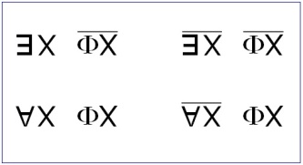
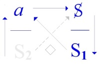
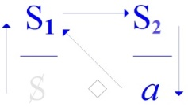

# Leçon 06 | 08 Mars 1972 Séminaire : Panthéon-Sorbonne

  

    <label><input type="checkbox" data-lacan-toggle="original" checked> 原文</label>
    <label><input type="checkbox" data-lacan-toggle="notes" checked> 注释</label>
    <label><input type="checkbox" data-lacan-toggle="commentary" checked> 个人解读评论</label>
  

  <form class="lacan-tool-search" role="search">
    <input class="lacan-tool-search-input" type="search" placeholder="搜索全文" aria-label="搜索全文">
    <button class="lacan-tool-button" type="submit" title="搜索">搜索</button>
  </form>
  <button class="lacan-tool-button lacan-back-to-top" type="button" title="回到页面最上方" aria-label="回到页面最上方">↑</button>

<section class="parallel-paragraph" data-paragraph-ids="s19-06-0001">

s19-06-0001

原文 · s19-06-0001

Les choses sont telles, que puisque je vise cette année à vous parler de l’*Un*, je commencerai aujourd’hui à énoncer ce qu’il en est de l’Autre.

[无对应译文]

</section>

<section class="parallel-paragraph" data-paragraph-ids="s19-06-0002">

s19-06-0002

原文 · s19-06-0002

De cet Autre, avec un grand A, à propos duquel j’ai recueilli, il y a un temps, l’inquiétude...

[无对应译文]

</section>

<section class="parallel-paragraph" data-paragraph-ids="s19-06-0003">

s19-06-0003

原文 · s19-06-0003

> l’inquiétude marquée par *un marxiste* à qui je devais la place d’où j’avais pu reprendre mon travail ...l’inquiétude qui était celle-ci : que cet Autre c’était ce tiers qu’à l’avancer dans le rapport du couple il - il *le marxiste* - lui ne pouvait l’identifier qu’à Dieu.

[无对应译文]

</section>

<section class="parallel-paragraph" data-paragraph-ids="s19-06-0004">

s19-06-0004

原文 · s19-06-0004

Cette inquiétude dans la suite a-t-elle cheminé assez pour lui inspirer méfiance irréductible à l’endroit de *la trace* que je pouvais laisser ?

[无对应译文]

</section>

<section class="parallel-paragraph" data-paragraph-ids="s19-06-0005">

s19-06-0005

原文 · s19-06-0005

C’est une question que je laisserai de côté pour aujourd’hui, parce que je vais commencer par le dévoilement tout simple de ce qu’il en est de cet Autre que j’écris en effet avec un grand A.

[无对应译文]

</section>

<section class="parallel-paragraph" data-paragraph-ids="s19-06-0006">

s19-06-0006

原文 · s19-06-0006

L’Autre dont il s’agit, l’Autre est celui du couple sexuel - celui-là même - et que c’est bien pour cela qu’il va nous être nécessaire de produire le signifiant qui ne peut s’écrire que de ce qu’il le barre, ce grand A : S(**A**).

[无对应译文]

</section>

<section class="parallel-paragraph" data-paragraph-ids="s19-06-0007">

s19-06-0007

原文 · s19-06-0007

« *On...*

[无对应译文]

</section>

<section class="parallel-paragraph" data-paragraph-ids="s19-06-0008">

s19-06-0008

原文 · s19-06-0008

c’est pas facile, hein...

[无对应译文]

</section>

<section class="parallel-paragraph" data-paragraph-ids="s19-06-0009">

s19-06-0009

原文 · s19-06-0009

« *On...*

[无对应译文]

</section>

<section class="parallel-paragraph" data-paragraph-ids="s19-06-0010">

s19-06-0010

原文 · s19-06-0010

je souligne sans m’y arrêter car je ne ferais pas un pas...

[无对应译文]

</section>

<section class="parallel-paragraph" data-paragraph-ids="s19-06-0011">

s19-06-0011

原文 · s19-06-0011

« *On ne jouit que de l’Autre* ».

[无对应译文]

</section>

<section class="parallel-paragraph" data-paragraph-ids="s19-06-0012">

s19-06-0012

原文 · s19-06-0012

Il est plus difficile d’avancer en ceci, qui semblerait s’imposer...

[无对应译文]

</section>

<section class="parallel-paragraph" data-paragraph-ids="s19-06-0013">

s19-06-0013

原文 · s19-06-0013

> parce que ce qui caractérise *la jouissance* - après ce que je viens de dire - se *déroberait* ...avancerai-je que « *on n’est joui que par l’Autre* » ?

[无对应译文]

</section>

<section class="parallel-paragraph" data-paragraph-ids="s19-06-0014">

s19-06-0014

原文 · s19-06-0014

C’est bien l’abîme que nous offre en effet la question de l’existence de Dieu, précisément celle que je laisse à l’horizon comme ineffable.

[无对应译文]

</section>

<section class="parallel-paragraph" data-paragraph-ids="s19-06-0015">

s19-06-0015

原文 · s19-06-0015

Parce que ce qui est important...

[无对应译文]

</section>

<section class="parallel-paragraph" data-paragraph-ids="s19-06-0016">

s19-06-0016

原文 · s19-06-0016

> ce n’est pas le rapport avec ce qui jouit, de ce que nous pourrions croire notre être ...l’important, quand je dis qu’« *on ne jouit que de l’Autre* », est ceci : c’est qu’on n’en jouit pas sexuellement - *il n’y a pas de rapport sexuel* - ni n’en est-on joui...

[无对应译文]

</section>

<section class="parallel-paragraph" data-paragraph-ids="s19-06-0017">

s19-06-0017

原文 · s19-06-0017

> Vous voyez que « *lalangue* » - *lalangue* que j’écris en un seul mot - *lalangue* qui est pourtant «  *bonne fille* »,
>
> ici, résiste. Elle fait la grosse joue. ...on en jouit - il faut bien le dire - *de l’Autre on en jouit « mentalement »*.

[无对应译文]

</section>

<section class="parallel-paragraph" data-paragraph-ids="s19-06-0018">

s19-06-0018

原文 · s19-06-0018

Il y a une remarque dans ce *Parménide*, enfin n’est-ce pas, qui ici prend sa valeur de modèle, c’est pour ça que je vous ai recommandé d’aller vous y décrasser un peu.

[无对应译文]

</section>

<section class="parallel-paragraph" data-paragraph-ids="s19-06-0019">

s19-06-0019

原文 · s19-06-0019

Naturellement, si vous le lisez à travers les commentaires qui en sont faits à l’Université, ben vous le situerez dans la lignée des philosophes, vous y verrez que c’est considéré comme un exercice particulièrement brillant.

[无对应译文]

</section>

<section class="parallel-paragraph" data-paragraph-ids="s19-06-0020">

s19-06-0020

原文 · s19-06-0020

Mais après ce petit *salut*, on vous dit qu’il n’y a pas grandchose à en faire, que Platon a simplement poussé là, jusqu’à son dernier degré d’acuité, ceci qu’on vous déduira de sa théorie *des formes*.

[无对应译文]

</section>

<section class="parallel-paragraph" data-paragraph-ids="s19-06-0021">

s19-06-0021

原文 · s19-06-0021

C’est peut être autrement qu’il vous faut le lire. Il faut le lire avec *innocence*.

[无对应译文]

</section>

<section class="parallel-paragraph" data-paragraph-ids="s19-06-0022">

s19-06-0022

原文 · s19-06-0022

Remarquez que de temps en temps quelque chose peut vous toucher, ne serait-ce par exemple que cette remarque, quand il aborde, comme ça, tout à fait en passant, au début de la 7ème hypothèse qui part de « *si l’Un n’est pas *», tout à fait en marge il dit : « *et si nous disions que le Non-Un n’est pas* ? ».

[无对应译文]

</section>

<section class="parallel-paragraph" data-paragraph-ids="s19-06-0023">

s19-06-0023

原文 · s19-06-0023

Et là il s’applique à montrer que la négation de quoi que ce soit, pas seulement de l’*Un*, du *non-grand*, du *non-petit,* cette négation comme telle se distingue de ne pas nier le même terme.

[无对应译文]

</section>

<section class="parallel-paragraph" data-paragraph-ids="s19-06-0024">

s19-06-0024

原文 · s19-06-0024

### C’est bien à ce dont il s’agit, de la négation de *la jouissance sexuelle,* ce à quoi je vous prie à l’instant de vous arrêter.

[无对应译文]

</section>

<section class="parallel-paragraph" data-paragraph-ids="s19-06-0025">

s19-06-0025

原文 · s19-06-0025

### Que j’écrive ce S *parenthèse du grand* A *barré *: S(**A**), qui est la même chose que ce que je viens de formuler :

[无对应译文]

</section>

<section class="parallel-paragraph" data-paragraph-ids="s19-06-0026">

s19-06-0026

原文 · s19-06-0026

### que « *de l’Autre on en jouit mentalement »*, ceci *écrit* quelque chose sur l’Autre, et comme je l’ai avancé : en tant que terme de la relation qui, de s’évanouir, de ne pas exister, devient *le lieu où elle s’écrit*, où elle s’écrit telle que ces quatre formules sont là écrites, pour transmettre un savoir.

[无对应译文]

</section>

<section class="parallel-paragraph" data-paragraph-ids="s19-06-0027">

s19-06-0027

原文 · s19-06-0027

[无对应译文]

</section>

<section class="parallel-paragraph" data-paragraph-ids="s19-06-0028">

s19-06-0028

原文 · s19-06-0028

Parce que j’y ai déjà fait, il me semble, suffisamment allusion, *le savoir* en la matière, ce savoir *peut-être* s’enseigne, mais ce qui se transmet c’est la formule.

[无对应译文]

</section>

<section class="parallel-paragraph" data-paragraph-ids="s19-06-0029">

s19-06-0029

原文 · s19-06-0029

C’est justement parce qu’un des termes devient *le lieu où la relation s’écrit*, qu’elle ne peut plus être *relation* puisque le terme change de fonction, qu’il devient *le lieu où elle s’écrit* et que la relation n’est que d’être écrite justement au *lieu* de ce terme.

[无对应译文]

</section>

<section class="parallel-paragraph" data-paragraph-ids="s19-06-0030">

s19-06-0030

原文 · s19-06-0030

*Un des termes de la relation doit se vider pour lui permettre, à cette relation, de s’écrire*.

[无对应译文]

</section>

<section class="parallel-paragraph" data-paragraph-ids="s19-06-0031">

s19-06-0031

原文 · s19-06-0031

C’est bien en quoi ce « *mentalement* » que j’ai avancé tout à l’heure entre des guillemets que la parole ne peut pas énoncer, c’est cela qui radicalement soustrait à ce « *mentalement* » toute portée d’idéalisme.

[无对应译文]

</section>

<section class="parallel-paragraph" data-paragraph-ids="s19-06-0032">

s19-06-0032

原文 · s19-06-0032

Cet idéalisme, incontestable à le voir se développer sous la plume de Berkeley *des remarques* que j’espère vous connaissez, qui reposent toutes sur ceci « *que rien de ce qui se pense n’est que pensé par quelqu’un* ».

[无对应译文]

</section>

<section class="parallel-paragraph" data-paragraph-ids="s19-06-0033">

s19-06-0033

原文 · s19-06-0033

C’est bien là argument, ou plus exactement argumentation irréductible et qui aurait plus de mordant s’il s’agissait, s’il avouait ce dont il s’agit, de *la jouissance *: *vous ne jouissez que de vos fantasmes*.

[无对应译文]

</section>

<section class="parallel-paragraph" data-paragraph-ids="s19-06-0034">

s19-06-0034

原文 · s19-06-0034

Voilà ce qui donnerait portée à l’idéalisme que personne, par ailleurs, malgré qu’il soit incontestable, ne prend au sérieux. L’important, c’est que *vos fantasmes vous jouissent* et c’est là que je peux revenir à ce que je disais tout à l’heure, c’est que, comme vous voyez, même « *lalangue* *qui est bonne fille...* » ne lais­se pas sortir cette parole facilement.

[无对应译文]

</section>

<section class="parallel-paragraph" data-paragraph-ids="s19-06-0035">

s19-06-0035

原文 · s19-06-0035

Que l’*idéalisme* avance qu’il ne s’agit *que* de pensées, pour en sortir *lalangue* « *qui est bonne fille* » mais pas si *bonne fille* que ça, peut peut-être vous offrir quelque chose, que je vais quand même pas avoir besoin d’écrire pour vous prier de faire consonner ce « *que* » autrement.

[无对应译文]

</section>

<section class="parallel-paragraph" data-paragraph-ids="s19-06-0036">

s19-06-0036

原文 · s19-06-0036

Enfin... s’il faut vous le faire entendre : *q.u.e.u.e.*, « *queue de pensées* », c’est ce que permet *la bonne fillerie de lalangue en français*...

[无对应译文]

</section>

<section class="parallel-paragraph" data-paragraph-ids="s19-06-0037">

s19-06-0037

原文 · s19-06-0037

> c’est dans cette langue que je m’exprime, je ne vois pas pourquoi je n’en profiterai pas,
>
> si j’en parlais une autre, je trouverais un autre truc ...il ne s’agit là « *queue de pensées* », non, comme le dit l’idéaliste, en tant qu’on les pense, ni même seulement qu’on les pense « *donc je suis* », ce qui est un progrès pourtant, mais *qu’elles se pensent* réellement \[*cf.* « *Je pense donc se jouis* »\].

[无对应译文]

</section>

<section class="parallel-paragraph" data-paragraph-ids="s19-06-0038">

s19-06-0038

原文 · s19-06-0038

### C’est en ça que je me classe...

[无对应译文]

</section>

<section class="parallel-paragraph" data-paragraph-ids="s19-06-0039">

s19-06-0039

原文 · s19-06-0039

> pour autant que ça a le moindre intérêt,
>
> parce que je vois pas pourquoi je me classerai philosophiquement ...moi par qui émerge un discours qui n’est pas le discours philosophique, *le discours psychanalytique* nommément... celui dont le schéme je l’ai reproduit à droite \[*disc.* A\] ...que je qua­lifie de « *discours »* en raison de ceci que j’ai souligné, c’est que : « *rien ne prend de sens que des rapports d’un discours à un autre discours »*.

[无对应译文]

</section>

<section class="parallel-paragraph" data-paragraph-ids="s19-06-0040">

s19-06-0040

原文 · s19-06-0040

   

[无对应译文]

</section>

<section class="parallel-paragraph" data-paragraph-ids="s19-06-0041">

s19-06-0041

原文 · s19-06-0041

*Discours du Maître Discours de l’Hystérique Discours Universitaire Discours analytique*

[无对应译文]

</section>

<section class="parallel-paragraph" data-paragraph-ids="s19-06-0042">

s19-06-0042

原文 · s19-06-0042

&nbsp;

[无对应译文]

</section>

<section class="parallel-paragraph" data-paragraph-ids="s19-06-0043">

s19-06-0043

原文 · s19-06-0043

Ça suppose bien entendu cet exercice, à quoi je peux pas dire, ni espérer, que je vous aie vraiment rompus.

[无对应译文]

</section>

<section class="parallel-paragraph" data-paragraph-ids="s19-06-0044">

s19-06-0044

原文 · s19-06-0044

Tout ça vous passe bien sûr comme l’eau sur les plumes d’un canard puisque...

[无对应译文]

</section>

<section class="parallel-paragraph" data-paragraph-ids="s19-06-0045">

s19-06-0045

原文 · s19-06-0045

> et d’ailleurs c’est ce qui fait votre existence ...vous êtes bien solidement insérés dans des discours qui précèdent, qui sont là depuis un temps, une paye, le discours philosophique y compris, pour autant que vous le transmet *le discours universitaire,* c’est-à-dire dans quel état... vous y êtes bien solidement installés et ça fait votre assiette \[*sic*\].

[无对应译文]

</section>

<section class="parallel-paragraph" data-paragraph-ids="s19-06-0046">

s19-06-0046

原文 · s19-06-0046

Ceux qui occupent la place de cet Autre, de cet Autre que moi je mets au jour, faut pas croire qu’ils soient tellement plus avantagés sur vous, mais quand même, on leur a mis entre les mains un mobilier qui n’est pas facile à manier.

[无对应译文]

</section>

<section class="parallel-paragraph" data-paragraph-ids="s19-06-0047">

s19-06-0047

原文 · s19-06-0047

Dans ce mobilier, il y a le fauteuil dont on n’a pas encore très bien repéré la nature.

[无对应译文]

</section>

<section class="parallel-paragraph" data-paragraph-ids="s19-06-0048">

s19-06-0048

原文 · s19-06-0048

Le fauteuil est pourtant essentiel, parce que le propre de ce *discours*, c’est de permettre à ce *quelque chose* qui est écrit là-bas en haut à droite, sous la forme du S, et qui est comme toute écriture, une forme bien ravissante...

[无对应译文]

</section>

<section class="parallel-paragraph" data-paragraph-ids="s19-06-0049">

s19-06-0049

原文 · s19-06-0049

[无对应译文]

</section>

<section class="parallel-paragraph" data-paragraph-ids="s19-06-0050">

s19-06-0050

原文 · s19-06-0050

> que le S soit ce que Hogarth donne pour la trace de la beauté, c’est pas tout à fait un hasard,
>
> ça doit avoir quelque part un sens, et puis qu’il faille le barrer, ça en a sûrement un aussi ...mais quoiqu’il en soit, ce qui *se produit* à partir de ce sujet barré \[**S1**\] , c’est quelque chose dont il est curieux de voir que je l’écris de la même façon \[**S1**\] que ce qui tient dans *le discours du Maître* une autre place, la place dominante.

[无对应译文]

</section>

<section class="parallel-paragraph" data-paragraph-ids="s19-06-0051">

s19-06-0051

原文 · s19-06-0051

[无对应译文]

</section>

<section class="parallel-paragraph" data-paragraph-ids="s19-06-0052">

s19-06-0052

原文 · s19-06-0052

Ce S de 1 \[**S1**\] c’est justement ce que j’essaie pour vous, en tant qu’ici je parle, c’est ce que j’essaie pour vous de produire. En quoi - je l’ai déjà dit maintes fois - je suis à la place, la même...

[无对应译文]

</section>

<section class="parallel-paragraph" data-paragraph-ids="s19-06-0053">

s19-06-0053

原文 · s19-06-0053

> et c’est en cela qu’elle est enseignante ...je suis à la place de *l’analysant*.

[无对应译文]

</section>

<section class="parallel-paragraph" data-paragraph-ids="s19-06-0054">

s19-06-0054

原文 · s19-06-0054

Ce qui est écrit, s’est-il pensé ? Voilà la question.

[无对应译文]

</section>

<section class="parallel-paragraph" data-paragraph-ids="s19-06-0055">

s19-06-0055

原文 · s19-06-0055

On peut ne plus pouvoir dire *par qui* ça s’est pensé, et c’est même, en tout ce qui est écrit, ce à quoi vous avez affaire.

[无对应译文]

</section>

<section class="parallel-paragraph" data-paragraph-ids="s19-06-0056">

s19-06-0056

原文 · s19-06-0056

La « *queue de pensées* » dont je parlais, c’est le sujet lui-même, le sujet en tant que *hypothétique* de ces pensées...

[无对应译文]

</section>

<section class="parallel-paragraph" data-paragraph-ids="s19-06-0057">

s19-06-0057

原文 · s19-06-0057

> cet *hypothétique*, on vous en a tellement rebattu les oreilles depuis Aristote,
>
> de l’ὑποχείμενον \[upokeimenon\] qui était pourtant bien clair,
>
> on en a fait une telle chose, n’est-ce pas, qu’une chatte n’y retrouverait plus ses petits ...je vais l’appeler « *la traîne »*, *la traîne* justement, *cette queue de pensées de ce quelque chose de réel* qui fait cet « *effet de comète* » que j’ai appelé la « *queue de pensées »* et qui est peut-être bien *le phallus*.

[无对应译文]

</section>

<section class="parallel-paragraph" data-paragraph-ids="s19-06-0058">

s19-06-0058

原文 · s19-06-0058

Si ce qui se passe là, n’est pas capable d’être reconquis par ce que je viens d’appeler *la traîne*...

[无对应译文]

</section>

<section class="parallel-paragraph" data-paragraph-ids="s19-06-0059">

s19-06-0059

原文 · s19-06-0059

> ce qui n’est concevable que parce que l’effet qu’elle est, est de même saillie que son avènement,
>
> à savoir *le désarroi* \[*dés - [arroi](https://www.cnrtl.fr/definition/arroi)*\] , si vous me permettez d’appeler ainsi *la disjonction du rapport sexuel* ...si ce qui se passe là n’est pas capable d’être reconquis *nachträglich* \[*après-coup*\], si ce qui s’est pensé est ouvert, à portée des moyens d’une *re-pensée*, ce qui consiste justement à s’apercevoir *à l’écrire* que c’étaient des pensées...

[无对应译文]

</section>

<section class="parallel-paragraph" data-paragraph-ids="s19-06-0060">

s19-06-0060

原文 · s19-06-0060

> parce que l’*écrit* quoiqu’on en dise, vient *après* que ces pensées, ces pensées réelles, se soient produites ...c’est dans cet effort de repenser, ce *nachträglich,* qu’est cette *répétition* qui est le fondement de ce que nous découvre *l’expérience analytique*.

[无对应译文]

</section>

<section class="parallel-paragraph" data-paragraph-ids="s19-06-0061">

s19-06-0061

原文 · s19-06-0061

Que ça s’écrive c’est la preuve, mais preuve seulement de l’effet de reprise, *nachträglich,* c’est ce qui fonde la psychanalyse.

[无对应译文]

</section>

<section class="parallel-paragraph" data-paragraph-ids="s19-06-0062">

s19-06-0062

原文 · s19-06-0062

Combien de fois *dans les dialogues philosophiques* voyez-vous l’argument « *si tu ne me suis pas jusque là, il n’y a pas de philosophie* ». Ce que je vais vous dire c’est exactement la même chose, de deux choses l’une :

[无对应译文]

</section>

<section class="parallel-paragraph" data-paragraph-ids="s19-06-0063">

s19-06-0063

原文 · s19-06-0063

- ou ce qui est encore reçu dans le commun, dans tout ce qui s’écrit sur la psychanalyse, dans tout ce qui

[无对应译文]

</section>

<section class="parallel-paragraph" data-paragraph-ids="s19-06-0064">

s19-06-0064

原文 · s19-06-0064

> *coule de la plume* des psychanalystes, à savoir que ce qui pense n’est pas pensable, et alors *il n’y a pas de psychanalyse*,

[无对应译文]

</section>

<section class="parallel-paragraph" data-paragraph-ids="s19-06-0065">

s19-06-0065

原文 · s19-06-0065

- \[ou\] pour qu’il puisse y avoir psychanalyse, et pour tout dire « interprétation », il faut que ce dont part la « *queue de pensées* » ait été pensé - pensé en tant que pensée réelle.

[无对应译文]

</section>

<section class="parallel-paragraph" data-paragraph-ids="s19-06-0066">

s19-06-0066

原文 · s19-06-0066

C’est bien pour ça que je vous ai fait des tartines avec ce Descartes, le *« Je pense donc je suis »* ne veut rien dire *s’il n’est vrai*.

[无对应译文]

</section>

<section class="parallel-paragraph" data-paragraph-ids="s19-06-0067">

s19-06-0067

原文 · s19-06-0067

Il est vrai parce que « *donc je suis *» c’est ce que je pense avant de le savoir et - que je le veuille ou non - *c’est la même chose*.

[无对应译文]

</section>

<section class="parallel-paragraph" data-paragraph-ids="s19-06-0068">

s19-06-0068

原文 · s19-06-0068

La même « *chose »*, c’est ce que j’ai appelé justement « *La Chose freudienne »*.

[无对应译文]

</section>

<section class="parallel-paragraph" data-paragraph-ids="s19-06-0069">

s19-06-0069

原文 · s19-06-0069

C’est justement parce que c’est la même chose...

[无对应译文]

</section>

<section class="parallel-paragraph" data-paragraph-ids="s19-06-0070">

s19-06-0070

原文 · s19-06-0070

> ce « *je pense *» et *<u>ce que</u> je pense*, c’est-à-dire : « *donc je suis *» ...c’est justement parce que c’est la même *chose,* que ça n’est pas équivalent.

[无对应译文]

</section>

<section class="parallel-paragraph" data-paragraph-ids="s19-06-0071">

s19-06-0071

原文 · s19-06-0071

Parce que c’est pour ça que j’ai parlé de *La Chose freudienne*, c’est parce que dans *une Chose*, deux faces...

[无对应译文]

</section>

<section class="parallel-paragraph" data-paragraph-ids="s19-06-0072">

s19-06-0072

原文 · s19-06-0072

> et écrivez ça comme vous voudrez : « face » ou « fasse » ...deux faces c’est non seulement pas équivalent, c’est-à-dire remplaçable l’un par l’autre dans *le dire*, c’est pas *équivalent*, c’est même pas pareil.

[无对应译文]

</section>

<section class="parallel-paragraph" data-paragraph-ids="s19-06-0073">

s19-06-0073

原文 · s19-06-0073

C’est pour ça que je n’ai parlé de *La Chose freudienne* que d’une certaine façon.

[无对应译文]

</section>

<section class="parallel-paragraph" data-paragraph-ids="s19-06-0074">

s19-06-0074

原文 · s19-06-0074

Ce que j’ai écrit, ça se lit. C’est même curieux que ce soit une des choses qui forcent à le relire.

[无对应译文]

</section>

<section class="parallel-paragraph" data-paragraph-ids="s19-06-0075">

s19-06-0075

原文 · s19-06-0075

C’est même pour ça que c’est fait.

[无对应译文]

</section>

<section class="parallel-paragraph" data-paragraph-ids="s19-06-0076">

s19-06-0076

原文 · s19-06-0076

Et quand on le relit, on s’aperçoit que *je ne parle pas de La Chose*...

[无对应译文]

</section>

<section class="parallel-paragraph" data-paragraph-ids="s19-06-0077">

s19-06-0077

原文 · s19-06-0077

> parce qu’on peut pas en parler, *en* parler ...je la fais parler elle-même, *La Chose* dont il s’agit énonce :

[无对应译文]

</section>

<section class="parallel-paragraph" data-paragraph-ids="s19-06-0078">

s19-06-0078

原文 · s19-06-0078

> « *Moi la vérité, je parle.* [^16] »

[无对应译文]

</section>

<section class="parallel-paragraph" data-paragraph-ids="s19-06-0079">

s19-06-0079

原文 · s19-06-0079

Et elle ne le dit pas, bien sûr, comme ça...

[无对应译文]

</section>

<section class="parallel-paragraph" data-paragraph-ids="s19-06-0080">

s19-06-0080

原文 · s19-06-0080

> mais ça doit se voir, c’est même pour ça que je l’ai écrit ...elle le dit de toutes les manières, et j’oserais dire que ce n’est pas un mauvais morceau* :*

[无对应译文]

</section>

<section class="parallel-paragraph" data-paragraph-ids="s19-06-0081">

s19-06-0081

原文 · s19-06-0081

> « *je ne suis appréhendable que dans mes cachotteries* ».

[无对应译文]

</section>

<section class="parallel-paragraph" data-paragraph-ids="s19-06-0082">

s19-06-0082

原文 · s19-06-0082

*Ce qu’on en écrit de la Chose* il faut le considérer comme *ce qui s’en écrit* venant d’elle, non pas de *qui écrit*.

[无对应译文]

</section>

<section class="parallel-paragraph" data-paragraph-ids="s19-06-0083">

s19-06-0083

原文 · s19-06-0083

C’est bien ce qui fait que l’ontologie, autrement dit la considération du sujet comme être, l’ontologie est une honte si vous me le permettez \[« *honto-logie* »\].

[无对应译文]

</section>

<section class="parallel-paragraph" data-paragraph-ids="s19-06-0084">

s19-06-0084

原文 · s19-06-0084

Vous l’avez donc bien entendu - n’est-ce pas ? - il faut savoir de quoi on parle:

[无对应译文]

</section>

<section class="parallel-paragraph" data-paragraph-ids="s19-06-0085">

s19-06-0085

原文 · s19-06-0085

- Ou le « *donc je suis* » n’est qu’une pensée, à démontrer que c’est l’impensable qui pense.

[无对应译文]

</section>

<section class="parallel-paragraph" data-paragraph-ids="s19-06-0086">

s19-06-0086

原文 · s19-06-0086

- Ou c’est le fait de le *dire* qui peut agir sur *la Chose*, assez pour qu’elle tourne autrement.

[无对应译文]

</section>

<section class="parallel-paragraph" data-paragraph-ids="s19-06-0087">

s19-06-0087

原文 · s19-06-0087

Et c’est en cela que toute pensée se pense de ses rapports à ce qui s’en écrit.

[无对应译文]

</section>

<section class="parallel-paragraph" data-paragraph-ids="s19-06-0088">

s19-06-0088

原文 · s19-06-0088

Autrement, je le répète : pas de psychanalyse.

[无对应译文]

</section>

<section class="parallel-paragraph" data-paragraph-ids="s19-06-0089">

s19-06-0089

原文 · s19-06-0089

Nous sommes dans l’« *i.n.a.n...* » qui est actuellement ce qu’il y a de plus répandu, l’*inanalysable*.

[无对应译文]

</section>

<section class="parallel-paragraph" data-paragraph-ids="s19-06-0090">

s19-06-0090

原文 · s19-06-0090

Il ne suffit pas de dire qu’elle est *impossible*, parce que ça n’exclut pas qu’elle se pratique.

[无对应译文]

</section>

<section class="parallel-paragraph" data-paragraph-ids="s19-06-0091">

s19-06-0091

原文 · s19-06-0091

Pour qu’elle se pratique sans être « *inan...* », c’est pas la qualification d’« *impossible* » qui importe, c’est *son rapport* à l’*impossible* qui est en cause, et le rapport à l’*impossible* est un rapport de *pensée*.

[无对应译文]

</section>

<section class="parallel-paragraph" data-paragraph-ids="s19-06-0092">

s19-06-0092

原文 · s19-06-0092

Ce rapport ne saurait avoir aucun sens si l’*impossibilité* démontrée n’est pas strictement une *impossibilité* de pensée parce que c’est la seule démontrable.

[无对应译文]

</section>

<section class="parallel-paragraph" data-paragraph-ids="s19-06-0093">

s19-06-0093

原文 · s19-06-0093

Si nous fondons l’*impossible* dans son rapport au *réel*, il nous reste à dire ceci que je vous donne en cadeau...

[无对应译文]

</section>

<section class="parallel-paragraph" data-paragraph-ids="s19-06-0094">

s19-06-0094

原文 · s19-06-0094

> je le tiens d’une charmante femme, lointaine dans mon passé, restée pourtant marquée d’une charmante odeur de savon \[*Rires*\], avec l’accent vaudois qu’elle savait prendre pour - tout en s’en étant purifiée - savoir le rattraper « *rien n’est impossible à l’homme*...

[无对应译文]

</section>

<section class="parallel-paragraph" data-paragraph-ids="s19-06-0095">

s19-06-0095

原文 · s19-06-0095

> qu’elle disait - je peux pas vous imiter l’accent vaudois, moi je ne suis pas né là-bas ...*ce qu’il peut pas faire, il le laisse* » \[*Rires*\].

[无对应译文]

</section>

<section class="parallel-paragraph" data-paragraph-ids="s19-06-0096">

s19-06-0096

原文 · s19-06-0096

Ceci pour vous centrer ce qu’il en est de l’*impossible* en tant que ce terme est recevable pour quelqu’un de sensé.

[无对应译文]

</section>

<section class="parallel-paragraph" data-paragraph-ids="s19-06-0097">

s19-06-0097

原文 · s19-06-0097

Eh bien, cette annulation de l’Autre ne se produit qu’à ce niveau où s’inscrit de la seule façon qu’il se peut inscrire, à savoir comme je l’inscris : Φ de X, et la barre dessus \[§\]. Ce qui veut dire qu’on ne peut pas écrire que ce qui y fait obstacle, à savoir que la fonction phallique ne soit pas *vrai*. Alors, qu’est-ce que veut dire ?

[无对应译文]

</section>

<section class="parallel-paragraph" data-paragraph-ids="s19-06-0098">

s19-06-0098

原文 · s19-06-0098

À savoir *il existe* x, tel qu’il pourrait s’inscri­re dans cette négation de la vérité de la fonction phallique \[:§\].

[无对应译文]

</section>

<section class="parallel-paragraph" data-paragraph-ids="s19-06-0099">

s19-06-0099

原文 · s19-06-0099

C’est ce qui mérite que nous l’articulions selon des temps, et vous voyez bien que ce que nous allons mettre en cause est très précisément *ce statut de l’existence*, en tant qu’il n’est pas clair. Je pense qu’il y a assez longtemps que vous avez les oreilles, la comprenoire, rebattues de la dis­tinction de *l’essence* et de *l’existence*, pour ne pas en être satisfaits.

[无对应译文]

</section>

<section class="parallel-paragraph" data-paragraph-ids="s19-06-0100">

s19-06-0100

原文 · s19-06-0100

Qu’il y ait là dans ce que le *discours analytique* nous permet d’apporter de sens *aux discours précédents* \[*disc.* H,U,M\], ce n’est quelque chose que je pourrai en fin de compte, de la connexion de ces formules, épingler que du terme d’une motivation dont l’inaperçu est ce qui engendre par exemple la dialec­tique hégélienne, qui en raison de cet *inaperçu*, ne s’en passe - si je puis dire - qu’à considérer que *le discours* comme tel régente le monde.

[无对应译文]

</section>

<section class="parallel-paragraph" data-paragraph-ids="s19-06-0101">

s19-06-0101

原文 · s19-06-0101

Me voilà rencontrant une petite note latérale.

[无对应译文]

</section>

<section class="parallel-paragraph" data-paragraph-ids="s19-06-0102">

s19-06-0102

原文 · s19-06-0102

Je ne vois pas pourquoi je ne la reprendrai pas, cette digression, d’autant plus que vous ne deman­dez que ça, Vous ne demandez que ça, parce que si je vais tout droit, ça vous fatigue.

[无对应译文]

</section>

<section class="parallel-paragraph" data-paragraph-ids="s19-06-0103">

s19-06-0103

原文 · s19-06-0103

Ce qui laisse une ombre de sens au discours de Hegel, c’est *une absence*, et très précisément *cette absence de la plus-value* telle qu’elle est tirée de *la jouissance* *dans le réel* du *discours du Maître*.

[无对应译文]

</section>

<section class="parallel-paragraph" data-paragraph-ids="s19-06-0104">

s19-06-0104

原文 · s19-06-0104

Mais *cette absence* quand même note quelque chose : elle note réellement l’Autre non pas comme aboli, mais justement, comme *impossibilité de corrélat,* et c’est en présentifiant cette *impossibilité* qu’elle colore le dis­cours de Hegel.

[无对应译文]

</section>

<section class="parallel-paragraph" data-paragraph-ids="s19-06-0105">

s19-06-0105

原文 · s19-06-0105

Parce que vous ne perdrez rien à relire, je ne sais pas, simplement la préface de la « *Phénoménologie de l’Esprit »* en corrélation avec ce que j’avance ici...

[无对应译文]

</section>

<section class="parallel-paragraph" data-paragraph-ids="s19-06-0106">

s19-06-0106

原文 · s19-06-0106

> vous voyez tous les devoirs de vacances que je vous donne : « *Parménide »* et la « *Phénoménologie »,*
>
> la *« Préface »* au moins parce que la *Phénoménologie,* naturellement vous ne lisez jamais.
>
> Mais *la préface* est foutrement bien. Elle vaut à elle seule le boulot de la relire

[无对应译文]

</section>

<section class="parallel-paragraph" data-paragraph-ids="s19-06-0107">

s19-06-0107

原文 · s19-06-0107

Et vous verrez que ça confirme, que ça prend sens de ce que je vous dis.

[无对应译文]

</section>

<section class="parallel-paragraph" data-paragraph-ids="s19-06-0108">

s19-06-0108

原文 · s19-06-0108

J’ose pas encore vous promettre que le *Parménide* en fera autant : prendra sens, mais je l’espère.

[无对应译文]

</section>

<section class="parallel-paragraph" data-paragraph-ids="s19-06-0109">

s19-06-0109

原文 · s19-06-0109

Parce que c’est le propre d’un *nouveau discours* que de renouveler ce qui se perd dans le tournoiement des *discours* anciens : justement le sens.

[无对应译文]

</section>

<section class="parallel-paragraph" data-paragraph-ids="s19-06-0110">

s19-06-0110

原文 · s19-06-0110

Si je vous ai dit qu’*il y a quelque chose qui le colore ce discours de Hegel*, c’est que là le mot *couleur* veut dire autre chose que *sens*.

[无对应译文]

</section>

<section class="parallel-paragraph" data-paragraph-ids="s19-06-0111">

s19-06-0111

原文 · s19-06-0111

La promotion de ce que j’avance, justement *le décolore*, achève l’effet du discours de Marx, où il y a quelque chose que je voudrais souligner et qui fait sa limite.

[无对应译文]

</section>

<section class="parallel-paragraph" data-paragraph-ids="s19-06-0112">

s19-06-0112

原文 · s19-06-0112

C’est qu’il comporte *une protestation*, dont il se trouve qu’il consolide *le discours du Maître* en le complétant, et pas seulement de la plus-value, en incitant...

[无对应译文]

</section>

<section class="parallel-paragraph" data-paragraph-ids="s19-06-0113">

s19-06-0113

原文 · s19-06-0113

> je sens que ça va provoquer des remous ...en incitant la femme à exister comme *égale*.

[无对应译文]

</section>

<section class="parallel-paragraph" data-paragraph-ids="s19-06-0114">

s19-06-0114

原文 · s19-06-0114

Égale à quoi ? Personne ne le sait, puisqu’on peut très bien dire aussi que *l’homme égale zéro, puisqu’il lui faut l’existence de quelque chose qui le nie pour qu’il existe comme « tous »*. \[:§ → ;! \]

[无对应译文]

</section>

<section class="parallel-paragraph" data-paragraph-ids="s19-06-0115">

s19-06-0115

原文 · s19-06-0115

En d’autres termes, la sorte de « *confusion* » \[*i.e. le* « *tous* » *qui les* « *confond* »\] qui n’est pas inhabituelle, nous vivons dans la confusion et on aurait tort de croire que *nous en vivons*, ça ne va pas de soi, je vois pas pourquoi le manque de confusion empêcherait de vivre.

[无对应译文]

</section>

<section class="parallel-paragraph" data-paragraph-ids="s19-06-0116">

s19-06-0116

原文 · s19-06-0116

C’est même très curieux qu’on s’y précipite, c’est bien le cas de le dire : on s’y rue.

[无对应译文]

</section>

<section class="parallel-paragraph" data-paragraph-ids="s19-06-0117">

s19-06-0117

原文 · s19-06-0117

Quand un dis­cours, tel que le *discours analytique*, émerge, ce qu’il vous propose c’est d’avoir les reins assez fermes pour soutenir le complot de *la vérité*. Chacun sait que les complots - hein ? - ça tourne court.

[无对应译文]

</section>

<section class="parallel-paragraph" data-paragraph-ids="s19-06-0118">

s19-06-0118

原文 · s19-06-0118

C’est plus facile de faire tant de *bla-bla-bla* qu’on finit par très bien repérer tous les conjurés.

[无对应译文]

</section>

<section class="parallel-paragraph" data-paragraph-ids="s19-06-0119">

s19-06-0119

原文 · s19-06-0119

On confond, on se précipite dans la négation de la division sexuelle, de la différence si vous voulez :

[无对应译文]

</section>

<section class="parallel-paragraph" data-paragraph-ids="s19-06-0120">

s19-06-0120

原文 · s19-06-0120

- Si j’ai dit « *division* », c’est que c’est opération­nel.

[无对应译文]

</section>

<section class="parallel-paragraph" data-paragraph-ids="s19-06-0121">

s19-06-0121

原文 · s19-06-0121

- Si je dis « *différence* » c’est parce que c’est précisément ce que prétend effacer cet usage du signe « *égal* » : *la femme = l’homme.*

[无对应译文]

</section>

<section class="parallel-paragraph" data-paragraph-ids="s19-06-0122">

s19-06-0122

原文 · s19-06-0122

Ce qu’il y a de formidable, n’est-ce pas, ce qui est formidable je vais vous le dire - c’est pas toutes ces conneries - ce qui est formidable c’est l’obstacle qu’elles prétendent, de ce mot grotesque : transgresser.

[无对应译文]

</section>

<section class="parallel-paragraph" data-paragraph-ids="s19-06-0123">

s19-06-0123

原文 · s19-06-0123

J’ai enseigné des choses qui ne prétendaient rien *transgresser*, mais *cerner un certain nombre de points-nœuds, points d’impossible*. Moyennant quoi bien sûr il y a des gens que ça dérangeait, parce qu’ils étaient *les représentants,* *les* « *assis »* *du discours psychanalytique* en exercice, qui m’ont fait comme ça un de ces coups qui vous affaiblissent la voix.

[无对应译文]

</section>

<section class="parallel-paragraph" data-paragraph-ids="s19-06-0124">

s19-06-0124

原文 · s19-06-0124

Il m’est arrivé par un charmant gars, physiquement, comme ça...

[无对应译文]

</section>

<section class="parallel-paragraph" data-paragraph-ids="s19-06-0125">

s19-06-0125

原文 · s19-06-0125

> il m’a fait ça un jour, c’est un amour ! ...il y a mis un courage ! Il l’a fait « *malgré que* » j’étais en même temps sous la menace...

[无对应译文]

</section>

<section class="parallel-paragraph" data-paragraph-ids="s19-06-0126">

s19-06-0126

原文 · s19-06-0126

> d’un truc auquel je croyais pas spécialement, mais enfin je faisais comme si ...d’un revolver.

[无对应译文]

</section>

<section class="parallel-paragraph" data-paragraph-ids="s19-06-0127">

s19-06-0127

原文 · s19-06-0127

Mais les types qui m’ont coupé la voix dans un certain moment, ils l’ont pas fait « *malgré que »*, ils l’ont fait « *parce que »* j’étais sous la menace d’un flingue, celui-là, d’un vrai, pas d’un joujou, comme l’autre.

[无对应译文]

</section>

<section class="parallel-paragraph" data-paragraph-ids="s19-06-0128">

s19-06-0128

原文 · s19-06-0128

Ça consistait à me soumettre à l’examen, c’est-à-dire au *standard* précisément des gens qui voulaient rien entendre du *discours analytique* encore qu’ils en occupassent la position « *assise* ».

[无对应译文]

</section>

<section class="parallel-paragraph" data-paragraph-ids="s19-06-0129">

s19-06-0129

原文 · s19-06-0129

Alors, « *que vouliez-vous que je fisse ?* » \[*Rires*\].

[无对应译文]

</section>

<section class="parallel-paragraph" data-paragraph-ids="s19-06-0130">

s19-06-0130

原文 · s19-06-0130

Du moment que je me soumettais pas à cet examen, *j’étais d’avance condamné*, n’est-ce pas, ce qui naturellement rendait beaucoup plus facile de me couper la voix...

[无对应译文]

</section>

<section class="parallel-paragraph" data-paragraph-ids="s19-06-0131">

s19-06-0131

原文 · s19-06-0131

Ha ! Parce que ça existe une voix. Ça a duré comme ça plusieurs années je dois dire, j’avais si peu de voix.

[无对应译文]

</section>

<section class="parallel-paragraph" data-paragraph-ids="s19-06-0132">

s19-06-0132

原文 · s19-06-0132

J’ai tout de même une voix dont sont nés les « *Cahiers pour la psychanalyse »*, une *très, très, très bonne littérature*, je vous les recommande décidément, parce que j’étais tellement tout entier occupé à ma voix que moi, ces *Cahiers pour la psychanalyse,* pour tout vous dire je peux pas tout faire, je peux pas lire le *Parménide,* relire la *Phénoménologie* et autres trucs \[*Rires*\] et puis lire aussi les *Cahiers pour la psychanalyse*.

[无对应译文]

</section>

<section class="parallel-paragraph" data-paragraph-ids="s19-06-0133">

s19-06-0133

原文 · s19-06-0133

Il fallait que j’aie repris du poil de la bête !

[无对应译文]

</section>

<section class="parallel-paragraph" data-paragraph-ids="s19-06-0134">

s19-06-0134

原文 · s19-06-0134

J’en ai maintenant, je les ai lus, de bout en bout, c’est formidable ! \[*Rires*\]

[无对应译文]

</section>

<section class="parallel-paragraph" data-paragraph-ids="s19-06-0135">

s19-06-0135

原文 · s19-06-0135

C’est formidable mais c’est marginal parce que c’était pas fait par des psychanalystes.

[无对应译文]

</section>

<section class="parallel-paragraph" data-paragraph-ids="s19-06-0136">

s19-06-0136

原文 · s19-06-0136

Pendant ce temps-là les psychanalystes bavardaient, on n’a jamais autant parlé de la transgression autour de moi que pendant le temps où j’avais la \[geste du doigt indiquant la gorge coupée\] Pfuit ! Voilà ! Ouais… Parce que figurez-vous,quand il s’agit *du véritable impossible*, de l’*impossible* qui se démontre, de l’*impossible* tel qu’il s’articule, et ça bien sûr on y met le temps.

[无对应译文]

</section>

<section class="parallel-paragraph" data-paragraph-ids="s19-06-0137">

s19-06-0137

原文 · s19-06-0137

Entre les premiers scribouillages qui ont permis la naissance d’une logique à l’aide du questionnement de la langue, puis le fait qu’on s’est aperçu que ces scribouillages rencontraient quelque chose qui existait...

[无对应译文]

</section>

<section class="parallel-paragraph" data-paragraph-ids="s19-06-0138">

s19-06-0138

原文 · s19-06-0138

> mais pas à la façon dont on croyait jusqu’alors, à la façon de l’être,
>
> c’est-à-dire de ce que chacun d’entre vous se croit,
>
> se croit *être*, sous prétexte que vous êtes des individus ...on s’est aperçu qu’il y avait des choses qui existaient en ce sens qu’elles constituent la limite de ce qui peut tenir de l’avancée de l’articulation d’un discours.

[无对应译文]

</section>

<section class="parallel-paragraph" data-paragraph-ids="s19-06-0139">

s19-06-0139

原文 · s19-06-0139

C’est ça *le réel* !

[无对应译文]

</section>

<section class="parallel-paragraph" data-paragraph-ids="s19-06-0140">

s19-06-0140

原文 · s19-06-0140

Son approche par la voie de ce que j’appelle *le symbolique* et qui veut dire les modes de ce qui s’énonce par ce champ, ce champ qui existe du langage, cet *impossible* en tant qu’il se démontre, ne se transgresse pas.

[无对应译文]

</section>

<section class="parallel-paragraph" data-paragraph-ids="s19-06-0141">

s19-06-0141

原文 · s19-06-0141

Il y a des choses qui depuis longtemps ont fait repérage, repérage mythique peut-être, mais repérage très bien.

[无对应译文]

</section>

<section class="parallel-paragraph" data-paragraph-ids="s19-06-0142">

s19-06-0142

原文 · s19-06-0142

Pas seulement de ce qu’il en est de cet *impossible* mais de sa motivation.

[无对应译文]

</section>

<section class="parallel-paragraph" data-paragraph-ids="s19-06-0143">

s19-06-0143

原文 · s19-06-0143

Très précisément à savoir que *ne s’écrit pas le rapport sexuel*.

[无对应译文]

</section>

<section class="parallel-paragraph" data-paragraph-ids="s19-06-0144">

s19-06-0144

原文 · s19-06-0144

Dans le genre on n’a jamais rien fait de mieux que, je ne dirai pas *la religion*...

[无对应译文]

</section>

<section class="parallel-paragraph" data-paragraph-ids="s19-06-0145">

s19-06-0145

原文 · s19-06-0145

> parce que comme je vous le dirai, je vous l’expliquerai en long et en large,
>
> on ne fait pas d’*ethnologie* quand on est *psychanalyste*,
>
> et noyer la religion comme ça dans un terme général, c’est la même chose que de faire de l’*ethnologie* ...je peux pas dire non plus qu’il y en ait qu’une, mais il y a celle dans laquelle nous baignons, la religion chrétienne.

[无对应译文]

</section>

<section class="parallel-paragraph" data-paragraph-ids="s19-06-0146">

s19-06-0146

原文 · s19-06-0146

Eh bien croyez-moi, la religion chrétienne, elle s’en arrange foutrement bien, de vos transgressions.

[无对应译文]

</section>

<section class="parallel-paragraph" data-paragraph-ids="s19-06-0147">

s19-06-0147

原文 · s19-06-0147

C’est même tout ce qu’elle souhaite, c’est ce qui la consolide : plus il y a de transgressions, plus ça l’arrange.

[无对应译文]

</section>

<section class="parallel-paragraph" data-paragraph-ids="s19-06-0148">

s19-06-0148

原文 · s19-06-0148

Et c’est bien de ça qu’il est question, il s’agit de démontrer où est *le vrai* de ce qui fait tenir debout un certain nombre de discours qui vous empêtrent.

[无对应译文]

</section>

<section class="parallel-paragraph" data-paragraph-ids="s19-06-0149">

s19-06-0149

原文 · s19-06-0149

Je finirai aujourd’hui...

[无对应译文]

</section>

<section class="parallel-paragraph" data-paragraph-ids="s19-06-0150">

s19-06-0150

原文 · s19-06-0150

> j’espère que j’ai pas abîmé ma bague... \[*Rires*\] ...je finirai aujourd’hui sur le même point par lequel j’ai commencé.

[无对应译文]

</section>

<section class="parallel-paragraph" data-paragraph-ids="s19-06-0151">

s19-06-0151

原文 · s19-06-0151

Je suis parti de l’Autre, j’en suis pas sorti, parce que le temps passe et puis qu’après tout faut pas croire qu’au moment où la séance finit, moi j’en ai pas ma claque.

[无对应译文]

</section>

<section class="parallel-paragraph" data-paragraph-ids="s19-06-0152">

s19-06-0152

原文 · s19-06-0152

Je rebouclerai donc ce que j’ai dit, trait local, concernant l’Autre, laissant ce qu’il pourra en être de ce que j’ai à vous avancer, de ce qui est le point pivot, le point que je vise cette année, à savoir *l’Un.*

[无对应译文]

</section>

<section class="parallel-paragraph" data-paragraph-ids="s19-06-0153">

s19-06-0153

原文 · s19-06-0153

Ce n’est pas pour rien que je ne l’ai pas abordé aujourd’hui, parce que vous verrez, il y a rien qui soit aussi glissant que cet *Un.*

[无对应译文]

</section>

<section class="parallel-paragraph" data-paragraph-ids="s19-06-0154">

s19-06-0154

原文 · s19-06-0154

C’est très curieux, en fait de chose qui a des faces à ce qu’elles se fassent *non point innombrables mais singulièrement divergentes*, vous le verrez c’est bien *l’Un.*

[无对应译文]

</section>

<section class="parallel-paragraph" data-paragraph-ids="s19-06-0155">

s19-06-0155

原文 · s19-06-0155

L’Autre, ce n’est pas pour rien qu’il faut d’abord que j’en prenne l’appui.

[无对应译文]

</section>

<section class="parallel-paragraph" data-paragraph-ids="s19-06-0156">

s19-06-0156

原文 · s19-06-0156

L’Autre - entendez-le bien... - c’est donc un « Entre » : l’Entre dont il s’agirait dans *le rapport sexuel*, mais déplacé et justement de s’*Autreposer.*

[无对应译文]

</section>

<section class="parallel-paragraph" data-paragraph-ids="s19-06-0157">

s19-06-0157

原文 · s19-06-0157

De s’*Autreposer,* il est curieux qu’à poser cet Autre, ce que j’ai eu à avancer aujourd’hui ne concerne que la femme, et c’est bien elle qui, de cette figure de l’Autre, nous donne l’illustration à notre portée, d’être comme l’a écrit un poète, « *entre centre et absence* [^17] »,

[无对应译文]

</section>

<section class="parallel-paragraph" data-paragraph-ids="s19-06-0158">

s19-06-0158

原文 · s19-06-0158

- Entre le sens qu’elle prend dans ce que j’ai appelé cet « *au moins un* » où elle ne le trouve qu’à l’état de ce que je vous ai annoncé - annoncé, pas plus ! - de n’être que pure existence.

[无对应译文]

</section>

<section class="parallel-paragraph" data-paragraph-ids="s19-06-0159">

s19-06-0159

原文 · s19-06-0159

- Entre centre*, et l’absence* que devient - quoi ? - pour elle justement cette seconde barre que je n’ai pu écrire qu’à la définir comme «* pas toute* » \[.\] : celle qui n’est pas contenue dans la fonction phallique sans pourtant être sa négation.

[无对应译文]

</section>

<section class="parallel-paragraph" data-paragraph-ids="s19-06-0160">

s19-06-0160

原文 · s19-06-0160

Son mode de présence est *entre centre et absence*,

[无对应译文]

</section>

<section class="parallel-paragraph" data-paragraph-ids="s19-06-0161">

s19-06-0161

原文 · s19-06-0161

- entre la fonction phallique dont elle participe, singulièrement,

[无对应译文]

</section>

<section class="parallel-paragraph" data-paragraph-ids="s19-06-0162">

s19-06-0162

原文 · s19-06-0162

> de ce que l’«* au moins un *» qui est son partenaire dans l’amour, y renonce pour elle,

[无对应译文]

</section>

<section class="parallel-paragraph" data-paragraph-ids="s19-06-0163">

s19-06-0163

原文 · s19-06-0163

- ce qui lui permet à elle de laisser ce par quoi elle n’en participe pas, dans l’*absence,*

[无对应译文]

</section>

<section class="parallel-paragraph" data-paragraph-ids="s19-06-0164">

s19-06-0164

原文 · s19-06-0164

> qui n’est pas moins *jouissance*, d’être « *jouissabsence* ».

[无对应译文]

</section>

<section class="parallel-paragraph" data-paragraph-ids="s19-06-0165">

s19-06-0165

原文 · s19-06-0165

Et je pense que personne ne dira que ce que j’énonce de la fonction phallique relève d’une méconnaissance de ce qu’il en est de la jouissance féminine.

[无对应译文]

</section>

<section class="parallel-paragraph" data-paragraph-ids="s19-06-0166">

s19-06-0166

原文 · s19-06-0166

C’est au contraire de ce que la « *jouisseprésence* » - si je puis ainsi m’exprimer - de la femme...

[无对应译文]

</section>

<section class="parallel-paragraph" data-paragraph-ids="s19-06-0167">

s19-06-0167

原文 · s19-06-0167

> dans cette partie qui ne la fait « *pas toute* » ouverte à la fonction phallique ...c’est de ce que cette *« jouisseprésence », « l’au moins un »* soit pressé de l’habiter, dans un contresens radical sur ce qui exige son existence.

[无对应译文]

</section>

<section class="parallel-paragraph" data-paragraph-ids="s19-06-0168">

s19-06-0168

原文 · s19-06-0168

C’est en raison de ce contresens qui fait

[无对应译文]

</section>

<section class="parallel-paragraph" data-paragraph-ids="s19-06-0169">

s19-06-0169

原文 · s19-06-0169

- qu’il ne peut même plus exister,

[无对应译文]

</section>

<section class="parallel-paragraph" data-paragraph-ids="s19-06-0170">

s19-06-0170

原文 · s19-06-0170

- que l’*exception* de son existence même est exclue, qu’alors ce statut de l’Autre - fait de n’être pas universel - s’évanouit et que *la méconnaissance* de l’homme en est *nécessitée*. Ce qui est la définition de *l’hystérique*.

[无对应译文]

</section>

<section class="parallel-paragraph" data-paragraph-ids="s19-06-0171">

s19-06-0171

原文 · s19-06-0171

C’est là-dessus que je vous laisserai aujourd’hui.

[无对应译文]

</section>

<section class="parallel-paragraph" data-paragraph-ids="s19-06-0172">

s19-06-0172

原文 · s19-06-0172

Je mets un point, et je vous donne rendez-vous dans huit jours.

[无对应译文]

</section>

<section class="parallel-paragraph" data-paragraph-ids="s19-06-0173">

s19-06-0173

原文 · s19-06-0173

La séance de Sainte-Anne tombe un jour tel - le premier jeudi d’Avril - que j’en avertis ceux qui sont ici pour qu’ils le fassent savoir aux autres qui fréquentent Sainte-Anne : elle n’aura pas lieu.

[无对应译文]

</section>

<section class="note-block original-notes">

## Notes

[^16]: « *La chose freudienne* » in *Écrits*, Seuil, 1966, p. 409.

[^17]: Henri Michaux : « *Entre centre et absence* », éd. Matarasso, 1936.

</section>
