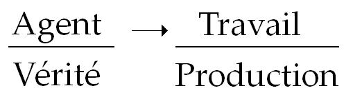
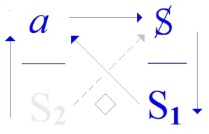
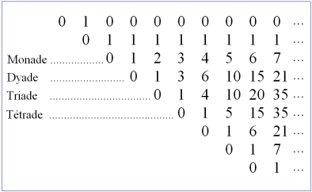

# Leçon 08 | 19 Avril 1972 Séminaire : Panthéon-Sorbonne

  

    <label><input type="checkbox" data-lacan-toggle="original" checked> 原文</label>
    <label><input type="checkbox" data-lacan-toggle="notes" checked> 注释</label>
    <label><input type="checkbox" data-lacan-toggle="commentary" checked> 个人解读评论</label>
  

  <form class="lacan-tool-search" role="search">
    <input class="lacan-tool-search-input" type="search" placeholder="搜索全文" aria-label="搜索全文">
    <button class="lacan-tool-button" type="submit" title="搜索">搜索</button>
  </form>
  <button class="lacan-tool-button lacan-back-to-top" type="button" title="回到页面最上方" aria-label="回到页面最上方">↑</button>

<section class="parallel-paragraph" data-paragraph-ids="s19-08-0001">

s19-08-0001

原文 · s19-08-0001

Je commence dès maintenant parce qu’on m’a demandé...

[无对应译文]

</section>

<section class="parallel-paragraph" data-paragraph-ids="s19-08-0002">

s19-08-0002

原文 · s19-08-0002

> on m’a demandé en raison de choses prévalentes dans le fonctionnement de cet endroit... on m’a demandé de finir plus tôt, beaucoup plus tôt que d’habitude. Voilà !

[无对应译文]

</section>

<section class="parallel-paragraph" data-paragraph-ids="s19-08-0003">

s19-08-0003

原文 · s19-08-0003

Alors, pour aborder ce qui vient, comme ça, dans une trame dont j’espère que le souvenir ne vous est pas trop lointain, je le reprends du « *Yad’lun »*, que j’ai déjà proféré pour ceux qui sont là, qui se parachutent d’une contrée lointaine, je répète ce que ça veut dire, parce que ça n’est pas d’une sonorité très habituelle.

[无对应译文]

</section>

<section class="parallel-paragraph" data-paragraph-ids="s19-08-0004">

s19-08-0004

原文 · s19-08-0004

« *Yad’lun* », ça a l’air de venir de je ne sais où. De *l’Un,* de *l’Un,* hein ?

[无对应译文]

</section>

<section class="parallel-paragraph" data-paragraph-ids="s19-08-0005">

s19-08-0005

原文 · s19-08-0005

On ne s’exprime pas comme ça habituellement.

[无对应译文]

</section>

<section class="parallel-paragraph" data-paragraph-ids="s19-08-0006">

s19-08-0006

原文 · s19-08-0006

Enfin, c’est pourtant de ça que je parle. De *l’Un *: *L, apostrophe, U, N*, « *y en a* ».

[无对应译文]

</section>

<section class="parallel-paragraph" data-paragraph-ids="s19-08-0007">

s19-08-0007

原文 · s19-08-0007

C’est une façon de s’exprimer qui va se trouver, je l’espère du moins pour vous, en accord avec quelque chose, qui j’espère n’est pas nouvelle pour tout le monde ici. Et Dieu merci, je sais que j’ai des oreilles, cer­taines averties des champs qu’il se trouve que je dois toucher pour faire face à ce dont il s’agit dans le *discours psychanalytique*.

[无对应译文]

</section>

<section class="parallel-paragraph" data-paragraph-ids="s19-08-0008">

s19-08-0008

原文 · s19-08-0008

Ça va se mon­trer *d’accord*...

[无对应译文]

</section>

<section class="parallel-paragraph" data-paragraph-ids="s19-08-0009">

s19-08-0009

原文 · s19-08-0009

je vous expliquerai en quoi ...cette façon de s’exprimer, avec ce qui historiquement s’est produit dans la *théorie des ensembles*.

[无对应译文]

</section>

<section class="parallel-paragraph" data-paragraph-ids="s19-08-0010">

s19-08-0010

原文 · s19-08-0010

Vous avez entendu parler de ça ! Vous avez entendu parler de ça parce que c’est comme ça qu’on enseigne maintenant les mathé­matiques à partir de la classe de 11ème. Il n’est pas sûr, bien sûr, que ça en amé­liore beaucoup la compréhension.

[无对应译文]

</section>

<section class="parallel-paragraph" data-paragraph-ids="s19-08-0011">

s19-08-0011

原文 · s19-08-0011

Mais enfin, par rapport à ce qu’il en est d’une théorie, dont un des ressorts c’est *l’écriture*...

[无对应译文]

</section>

<section class="parallel-paragraph" data-paragraph-ids="s19-08-0012">

s19-08-0012

原文 · s19-08-0012

> non pas bien sûr que *la théorie des ensembles* implique une écriture univoque,
>
> mais que, comme bien des choses en mathématiques, elle ne s’énonce pas sans écriture ...la différence donc avec cette formule, ce « *Yad’lun* » que j’essaie de faire passer, c’est justement toute la différence qu’il y a de *l’écrit* à *la parole*.

[无对应译文]

</section>

<section class="parallel-paragraph" data-paragraph-ids="s19-08-0013">

s19-08-0013

原文 · s19-08-0013

C’est *une faille* qui n’est pas toujours, toujours facile à combler.

[无对应译文]

</section>

<section class="parallel-paragraph" data-paragraph-ids="s19-08-0014">

s19-08-0014

原文 · s19-08-0014

[无对应译文]

</section>

<section class="parallel-paragraph" data-paragraph-ids="s19-08-0015">

s19-08-0015

原文 · s19-08-0015

C’est bien pourtant à quoi je m’essaie en l’occasion, et vous devez tout de suite pouvoir com­prendre pourquoi, s’il est vrai que, comme je les ai réécrites au tableau, les deux supérieures de ces quatre formules où j’essaie de fixer ce qui supplée à ce que j’ai appelé « *l’impossibilité d’écrire* » justement ce qu’il en est du rapport sexuel, c’est bien dans la mesure où, au niveau supé­rieur, deux termes s’affrontent dont l’un est *il existe* et l’autre *il n’exis­te pas,* que j’apporte - je tente d’apporter - la contribution qui peut affairer utilement à partir de *la théorie des ensembles*.

[无对应译文]

</section>

<section class="parallel-paragraph" data-paragraph-ids="s19-08-0016">

s19-08-0016

原文 · s19-08-0016

Il est remarquable déjà, n’est-ce pas, il est frappant que « *y ait de l’Un* » n’ait jamais fait aucun sujet d’étonnement.

[无对应译文]

</section>

<section class="parallel-paragraph" data-paragraph-ids="s19-08-0017">

s19-08-0017

原文 · s19-08-0017

C’est tout de même peut-être aller un peu vite que de le formuler ainsi, car enfin on peut mettre à l’actif de ce que j’appelle comme étonne­ment...

[无对应译文]

</section>

<section class="parallel-paragraph" data-paragraph-ids="s19-08-0018">

s19-08-0018

原文 · s19-08-0018

> ce en quoi je vous interpelle de vous étonner ...on peut y mettre à l’actif justement ce dont j’ai parlé, dont je vous ai vraiment invité de la façon la plus vive à prendre connaissance, c’est ce fameux *Parménide* n’est-ce pas, du cher Platon, qui est toujours si mal lu, enfin en tout cas - moi - que je m’exerce à lire d’une façon qui n’est pas tout à fait celle reçue.

[无对应译文]

</section>

<section class="parallel-paragraph" data-paragraph-ids="s19-08-0019">

s19-08-0019

原文 · s19-08-0019

Pour le Parménide, c’est tout à fait frappant de voir à quel point, à un cer­tain niveau, qui est celui proprement du *discours universitaire*, il met dans l’embarras.

[无对应译文]

</section>

<section class="parallel-paragraph" data-paragraph-ids="s19-08-0020">

s19-08-0020

原文 · s19-08-0020

La façon qu’ont tous ceux qui profèrent des choses sages au titre de *l’Université* est toujours prodigieusement *embarrassée.* Comme s’il s’agissait là d’une gageure, n’est-ce pas, d’une sorte d’exercice en quelque sorte purement gratuit, de ballet.

[无对应译文]

</section>

<section class="parallel-paragraph" data-paragraph-ids="s19-08-0021">

s19-08-0021

原文 · s19-08-0021

Et le déroule­ment des 8 hypothèses concernant les rapports de *l’Un* et de *l’Être,* reste en quelque sorte problématique, un objet de scandale.

[无对应译文]

</section>

<section class="parallel-paragraph" data-paragraph-ids="s19-08-0022">

s19-08-0022

原文 · s19-08-0022

Certains bien sûr se distinguent en en montrant la cohérence, mais cette cohéren­ce apparaît dans l’ensemble gratuite et la confrontation des interlocu­teurs elle-même, paraît confirmer le caractère anhistorique, si on peut dire, de l’ensemble.

[无对应译文]

</section>

<section class="parallel-paragraph" data-paragraph-ids="s19-08-0023">

s19-08-0023

原文 · s19-08-0023

Je dirais...

[无对应译文]

</section>

<section class="parallel-paragraph" data-paragraph-ids="s19-08-0024">

s19-08-0024

原文 · s19-08-0024

si tant est que je puisse avancer quelque chose sur ce point ...je dirais que ce qui me frappe, c’est vraiment tout à fait le contraire, et que si quelque chose me donnait l’idée qu’il y a dans le dialogue platonicien je ne sais quelle 1ère assise d’un *discours* proprement *ana­lytique*, je dirais que c’est bien celui-là, le *Parménide*, qui me le confir­merait.

[无对应译文]

</section>

<section class="parallel-paragraph" data-paragraph-ids="s19-08-0025">

s19-08-0025

原文 · s19-08-0025

Il est tout à fait clair en effet que si vous vous rappelez ce que j’ai donné, ce que j’ai inscrit comme structure...

[无对应译文]

</section>

<section class="parallel-paragraph" data-paragraph-ids="s19-08-0026">

s19-08-0026

原文 · s19-08-0026

> pardon de me taire pendant que j’écris, parce que sinon ça va faire des complications \[*i.e.* *pb. de micro*...\] ...ce que j’ai donné comme structure est bien que quelque chose dont ce n’est pas par hasard que ça s’inscrit comme *le signifiant indexé* **1** \[S1\] qui se trouve au niveau de *la production* dans *le discours analytique*.

[无对应译文]

</section>

<section class="parallel-paragraph" data-paragraph-ids="s19-08-0027">

s19-08-0027

原文 · s19-08-0027

 

[无对应译文]

</section>

<section class="parallel-paragraph" data-paragraph-ids="s19-08-0028">

s19-08-0028

原文 · s19-08-0028

Et c’est déjà quelque chose qui, encore que j’en conviens, ça ne puisse pas vous appa­raître tout de suite, je ne vous demande pas de le prendre comme une évi­dence, c’est une indication de l’opportunité de centrer très précisément sur - non pas le chiffre - mais le signifiant *Un*, notre interrogation dans sa suite.

[无对应译文]

</section>

<section class="parallel-paragraph" data-paragraph-ids="s19-08-0029">

s19-08-0029

原文 · s19-08-0029

Ça ne va pas de soi, qu’*il y ait d’l’Un*.

[无对应译文]

</section>

<section class="parallel-paragraph" data-paragraph-ids="s19-08-0030">

s19-08-0030

原文 · s19-08-0030

Ça a l’air *d’aller de soi* comme ça, parce que par exemple il y a des êtres vivants et que vous avez bien toute l’apparence, tout un chacun, enfin, qui êtes là si bien rangés, n’est­-ce pas, d’être tout à fait indépendants les uns des autres et de constituer chacun ce qu’on appelle de nos jours une réalité organique, de tenir comme *individu*.

[无对应译文]

</section>

<section class="parallel-paragraph" data-paragraph-ids="s19-08-0031">

s19-08-0031

原文 · s19-08-0031

C’est bien de là bien sûr que toute une première philosophie a pris un appui certain.

[无对应译文]

</section>

<section class="parallel-paragraph" data-paragraph-ids="s19-08-0032">

s19-08-0032

原文 · s19-08-0032

[无对应译文]

</section>

<section class="parallel-paragraph" data-paragraph-ids="s19-08-0033">

s19-08-0033

原文 · s19-08-0033

Ce qu’il y a par exemple de frappant, c’est qu’au niveau de *la logique aristotélicienne*, le fait de mettre sur la même colonne,

[无对应译文]

</section>

<section class="parallel-paragraph" data-paragraph-ids="s19-08-0034">

s19-08-0034

原文 · s19-08-0034

- c’est-à-dire - dans l’occasion je vous le rappelle - de mettre au principe de la même spécification de l’X,

[无对应译文]

</section>

<section class="parallel-paragraph" data-paragraph-ids="s19-08-0035">

s19-08-0035

原文 · s19-08-0035

- à savoir - je l’ai dit, je l’ai déjà énoncé - de l’*homme*, de l’être qui se qualifie chez le parlant comme *mas­culin*, si nous prenons le « *il existe* » : *il existe au moins un pour qui* ΦX *n’est pas recevable comme assertion* : : §, eh bien de ce point de vue, du point de vue de *l’individu*, nous nous trouvons placés devant une position qui est nettement contradictoire, à savoir que la logique aristotélicienne, laquelle est fondée sur cette intuition de *l’individu* qu’il pose comme réel : Aristote nous dit que, après tout *ce n’est pas l’idée du cheval qui est réelle, c’est le cheval bel et bien vivant*, sur lequel nous sommes forcés de nous demander précisément comment, comment vient l’idée, d’où nous la retirons.

[无对应译文]

</section>

<section class="parallel-paragraph" data-paragraph-ids="s19-08-0036">

s19-08-0036

原文 · s19-08-0036

Il renverse, non sans arguments péremptoires, ce dont parlait Platon, qui est à savoir : que c’est de participer à l*’idée* du cheval que le cheval se *soutient*, que ce qu’il y a de plus réel, c’est *l’idée* du cheval.

[无对应译文]

</section>

<section class="parallel-paragraph" data-paragraph-ids="s19-08-0037">

s19-08-0037

原文 · s19-08-0037

Si nous nous plaçons sous l’angle, sous le biais aristotélicien, il est clair qu’il y a contradiction entre l’énoncé que :

[无对应译文]

</section>

<section class="parallel-paragraph" data-paragraph-ids="s19-08-0038">

s19-08-0038

原文 · s19-08-0038

- « *pour tout x, x remplit dans* ΦX *la fonction d’argument* »,

[无对应译文]

</section>

<section class="parallel-paragraph" data-paragraph-ids="s19-08-0039">

s19-08-0039

原文 · s19-08-0039

- et le fait que « *il y a quelque* X *qui ne peut remplir la place d’argument que dans l’énonciation* » : exacte négation de la 1ère.

[无对应译文]

</section>

<section class="parallel-paragraph" data-paragraph-ids="s19-08-0040">

s19-08-0040

原文 · s19-08-0040

Si on nous dit que : « *tout cheval* - ce que vous voudrez enfin - *est fougueux* » et si on y ajoute que « *il y a quelque cheval - au moins un - qui ne l’est pas* » : dans la logique aristotélicienne, c’est une contradiction.

[无对应译文]

</section>

<section class="parallel-paragraph" data-paragraph-ids="s19-08-0041">

s19-08-0041

原文 · s19-08-0041

Ce que j’avance est fait pour vous faire saisir que juste­ment si je peux, si j’ose avancer 2 termes, ceux qui sont à droite dans mon groupe à 4 termes...

[无对应译文]

</section>

<section class="parallel-paragraph" data-paragraph-ids="s19-08-0042">

s19-08-0042

原文 · s19-08-0042

c’est pas par hasard qu’ils sont 4 ...si je peux avancer quelque chose qui manifestement fait défaut à ladi­te logique, c’est bien certainement dans la mesure où le terme d’« *existen­ce »* a changé de sens dans l’intervalle, et où il ne s’agit pas de la même *exis­tence* quand il s’agit de l’existence d’un terme qui est capable de prendre, dans une *fonction* mathématiquement articulée, la place de l’argument.

[无对应译文]

</section>

<section class="parallel-paragraph" data-paragraph-ids="s19-08-0043">

s19-08-0043

原文 · s19-08-0043

Rien encore ici ne fait le joint

[无对应译文]

</section>

<section class="parallel-paragraph" data-paragraph-ids="s19-08-0044">

s19-08-0044

原文 · s19-08-0044

- de ce « *Yad’l’Un* » comme tel,

[无对应译文]

</section>

<section class="parallel-paragraph" data-paragraph-ids="s19-08-0045">

s19-08-0045

原文 · s19-08-0045

- avec cet « *au moins un* » qui est très précisément ce qui est formulé par la notion E inversé x :

[无对应译文]

</section>

<section class="parallel-paragraph" data-paragraph-ids="s19-08-0046">

s19-08-0046

原文 · s19-08-0046

- :, *il existe un x, au moins un,* qui donne, à ce qui se pose comme fonction, une valeur qualifiable du vrai.

[无对应译文]

</section>

<section class="parallel-paragraph" data-paragraph-ids="s19-08-0047">

s19-08-0047

原文 · s19-08-0047

Cette distance qui se pose de « *l’existence »*, si l’on peut dire...

[无对应译文]

</section>

<section class="parallel-paragraph" data-paragraph-ids="s19-08-0048">

s19-08-0048

原文 · s19-08-0048

> je ne l’appellerai pas autrement aujour­d’hui faute d’un meilleur mot ...« *l’existence naturelle »*, qui n’est pas limi­tée aux organismes vivants.

[无对应译文]

</section>

<section class="parallel-paragraph" data-paragraph-ids="s19-08-0049">

s19-08-0049

原文 · s19-08-0049

Ces *Uns* par exemple, nous pouvons les voir dans *les corps célestes* dont ce n’est pas pour rien qu’ils sont parmi les premiers à avoir retenu une attention proprement scientifique, c’est très précisément dans cette affinité qu’ils ont avec *l’Un.*

[无对应译文]

</section>

<section class="parallel-paragraph" data-paragraph-ids="s19-08-0050">

s19-08-0050

原文 · s19-08-0050

Ils appa­raissent comme s’*inscrivant au ciel* comme des éléments d’autant plus aisément marquables de *l’Un* qu’ils sont punctiformes et il est certain qu’ils ont beaucoup fait pour mettre l’accent...

[无对应译文]

</section>

<section class="parallel-paragraph" data-paragraph-ids="s19-08-0051">

s19-08-0051

原文 · s19-08-0051

> comme forme de passage ...pour mettre l’accent sur le point.

[无对应译文]

</section>

<section class="parallel-paragraph" data-paragraph-ids="s19-08-0052">

s19-08-0052

原文 · s19-08-0052

Si entre *l’individu* et ce qu’il en est de ce que j’appellerai « *l’Un réel* » dans l’intervalle, les éléments qui se signifient comme punctiformes ont joué un rôle éminent pour ce qui est de leur transition, est-ce qu’il ne vous est pas sensible, et certainement est-ce que ça n’a pas retenu votre oreille au passage, que je parle de *l’Un* comme d’un *Réel*, d’un *Réel* qui aussi bien peut n’avoir rien à faire avec aucune réalité ?

[无对应译文]

</section>

<section class="parallel-paragraph" data-paragraph-ids="s19-08-0053">

s19-08-0053

原文 · s19-08-0053

J’appelle « *réa­lité »* ce qui est la réalité, à savoir par exemple votre existence propre, mode de soutien qui est assurément matériel, et d’abord parce qu’il est *corporel*.

[无对应译文]

</section>

<section class="parallel-paragraph" data-paragraph-ids="s19-08-0054">

s19-08-0054

原文 · s19-08-0054

Mais il s’agit de savoir de quoi l’on parle quand on dit *Yad’l’Un,* d’une certaine façon dans la voie dans laquelle s’engage la scien­ce.

[无对应译文]

</section>

<section class="parallel-paragraph" data-paragraph-ids="s19-08-0055">

s19-08-0055

原文 · s19-08-0055

Je veux dire à partir de *ce tournant* où décidément c’est au « *nombre* » comme tel, qu’elle s’est fiée pour ce qui est son grand tournant, *le tour­nant galiléen*, pour le nommer.

[无对应译文]

</section>

<section class="parallel-paragraph" data-paragraph-ids="s19-08-0056">

s19-08-0056

原文 · s19-08-0056

Il est clair que de cette perspective scien­tifique le *Un* que nous pouvons qualifier d’*individuel*, *Un* et puis *quelque chose* qui s’énonce dans le registre de *la logique du nombre*, il n’y a pas tellement lieu de s’interroger sur l’existence, sur le soutien logique qu’on peut donner à une licorne tant qu’aucun animal n’est pas conçu d’une façon plus appropriée que la licorne elle-même.

[无对应译文]

</section>

<section class="parallel-paragraph" data-paragraph-ids="s19-08-0057">

s19-08-0057

原文 · s19-08-0057

C’est bien dans cette perspective qu’on peut dire que ce que nous appelons « *la réa­lité »*, la réalité naturelle, nous pouvons la prendre au niveau d’un certain *discours*...

[无对应译文]

</section>

<section class="parallel-paragraph" data-paragraph-ids="s19-08-0058">

s19-08-0058

原文 · s19-08-0058

> et je ne recule pas à prétendre que *le discours analytique* ne soit celui-là ...*la réalité* nous pouvons toujours la prendre au niveau *du fantasme*.

[无对应译文]

</section>

<section class="parallel-paragraph" data-paragraph-ids="s19-08-0059">

s19-08-0059

原文 · s19-08-0059

Ce *Réel* dont je parle, et dont *le discours analytique* est fait pour rappeler *que son accès c’est le symbolique*.

[无对应译文]

</section>

<section class="parallel-paragraph" data-paragraph-ids="s19-08-0060">

s19-08-0060

原文 · s19-08-0060

Le dit « *Réel* » c’est dans et par cet *impossible que ne définit* *que le symbolique*, que nous y accédons.

[无对应译文]

</section>

<section class="parallel-paragraph" data-paragraph-ids="s19-08-0061">

s19-08-0061

原文 · s19-08-0061

J’y reviens au niveau de l’histoire naturelle d’un Pline.

[无对应译文]

</section>

<section class="parallel-paragraph" data-paragraph-ids="s19-08-0062">

s19-08-0062

原文 · s19-08-0062

Je ne vois pas ce qui différencie la licorne d’aucun autre animal, lui parfaitement existant dans l’ordre naturel.

[无对应译文]

</section>

<section class="parallel-paragraph" data-paragraph-ids="s19-08-0063">

s19-08-0063

原文 · s19-08-0063

La perspective qui interroge *le réel* dans une cer­taine direction nous commande d’énoncer ainsi les choses.

[无对应译文]

</section>

<section class="parallel-paragraph" data-paragraph-ids="s19-08-0064">

s19-08-0064

原文 · s19-08-0064

Je ne suis pas du tout pour autant en train de vous parler de quoi que ce soit qui ressemble à un *progrès*.

[无对应译文]

</section>

<section class="parallel-paragraph" data-paragraph-ids="s19-08-0065">

s19-08-0065

原文 · s19-08-0065

Ce que nous gagnons sur le plan scientifique qui est incontestable, n’accroît absolument pas pour autant par exemple notre sens critique en matière de vie poli­tique par exemple.

[无对应译文]

</section>

<section class="parallel-paragraph" data-paragraph-ids="s19-08-0066">

s19-08-0066

原文 · s19-08-0066

J’ai toujours souligné que ce que nous gagnons d’un côté est perdu de l’autre, pour autant qu’il y a une certaine limitation inhérente à ce qu’on peut appeler « *le champ de l’adéquation »* chez l’être parlant.

[无对应译文]

</section>

<section class="parallel-paragraph" data-paragraph-ids="s19-08-0067">

s19-08-0067

原文 · s19-08-0067

Ce n’est pas parce que nous avons fait, concernant la vie, la biologie, des progrès depuis Pline, que c’est un *progrès absolu.*

[无对应译文]

</section>

<section class="parallel-paragraph" data-paragraph-ids="s19-08-0068">

s19-08-0068

原文 · s19-08-0068

Si un citoyen romain voyait comment nous vivons...

[无对应译文]

</section>

<section class="parallel-paragraph" data-paragraph-ids="s19-08-0069">

s19-08-0069

原文 · s19-08-0069

> il est malheureusement hors de cause de l’évoquer à cette occasion en personne ...mais enfin il serait pro­bablement bouleversé d’horreur.

[无对应译文]

</section>

<section class="parallel-paragraph" data-paragraph-ids="s19-08-0070">

s19-08-0070

原文 · s19-08-0070

Comme nous ne pouvons en préjuger que d’après les ruines qu’a laissées cette civilisation, l’idée que nous pou­vons nous en faire, c’est de voir, ou d’imaginer ce que seront les restes de la nôtre dans un temps, s’il est supposable, équivalent.

[无对应译文]

</section>

<section class="parallel-paragraph" data-paragraph-ids="s19-08-0071">

s19-08-0071

原文 · s19-08-0071

Ceci, n’est-ce pas, pour ne pas que vous vous montiez le bourrichon, si je puis dire, sur le sujet d’une confiance que je ferais particulièrement à la *science*.

[无对应译文]

</section>

<section class="parallel-paragraph" data-paragraph-ids="s19-08-0072">

s19-08-0072

原文 · s19-08-0072

Il ne s’agit pas dans *le discours analytique*, d’un discours scientifique, mais d’un discours dont la science nous fournit le matériel, ce qui est bien différent.

[无对应译文]

</section>

<section class="parallel-paragraph" data-paragraph-ids="s19-08-0073">

s19-08-0073

原文 · s19-08-0073

Donc il est clair que la prise de l’être parlant sur le monde où il se conçoit comme plongé...

[无对应译文]

</section>

<section class="parallel-paragraph" data-paragraph-ids="s19-08-0074">

s19-08-0074

原文 · s19-08-0074

> schéma déjà qui sent son fan­tasme, n’est-ce pas ? ...que cette prise tout de même ne va en augmen­tant...

[无对应译文]

</section>

<section class="parallel-paragraph" data-paragraph-ids="s19-08-0075">

s19-08-0075

原文 · s19-08-0075

> ça c’est certain ...cette prise ne va en augmentant que dans la mesu­re où quelque chose s’élabore, et c’est l’usage du *nombre*.

[无对应译文]

</section>

<section class="parallel-paragraph" data-paragraph-ids="s19-08-0076">

s19-08-0076

原文 · s19-08-0076

Je prétends vous montrer que ce *nombre* se réduit tout simplement à ce « *Yad’l’Un* ».

[无对应译文]

</section>

<section class="parallel-paragraph" data-paragraph-ids="s19-08-0077">

s19-08-0077

原文 · s19-08-0077

Alors, il faut voir ce qui, historiquement nous permet d’en savoir sur ce *Yad’l’Un* un petit peu plus que ce que Platon en fait, si je puis dire, en le mettant tout à plat avec ce qu’il en est de l’Être.

[无对应译文]

</section>

<section class="parallel-paragraph" data-paragraph-ids="s19-08-0078">

s19-08-0078

原文 · s19-08-0078

Il est cer­tain que ce dialogue est extraordinairement suggestif et fécond, et que si vous voulez bien y regarder de près vous y trouverez déjà préfiguration de ce que je peux...

[无对应译文]

</section>

<section class="parallel-paragraph" data-paragraph-ids="s19-08-0079">

s19-08-0079

原文 · s19-08-0079

> sur la base, sur le thème *de la théorie des ensembles* ...énoncer ce « *Yad’l’Un* ».

[无对应译文]

</section>

<section class="parallel-paragraph" data-paragraph-ids="s19-08-0080">

s19-08-0080

原文 · s19-08-0080

Commencez seulement l’énoncé de la 1ère hypothèse : *si l’Un...*

[无对应译文]

</section>

<section class="parallel-paragraph" data-paragraph-ids="s19-08-0081">

s19-08-0081

原文 · s19-08-0081

> il est à prendre pour sa signification ...*si l’Un est Un,* qu’est-ce que nous allons pouvoir en faire ?

[无对应译文]

</section>

<section class="parallel-paragraph" data-paragraph-ids="s19-08-0082">

s19-08-0082

原文 · s19-08-0082

La première chose qu’il y met comme *objection* est ceci : c’est que *cet Un ne sera nulle part*, parce que s’il était quelque part, il serait dans une enveloppe, dans une limite, et que ceci est bien contradictoire avec son existence d’*Un*.

[无对应译文]

</section>

<section class="parallel-paragraph" data-paragraph-ids="s19-08-0083">

s19-08-0083

原文 · s19-08-0083

*Qu’est-ce qu’y a ? Ben voilà ! Je parle doucement.*

[无对应译文]

</section>

<section class="parallel-paragraph" data-paragraph-ids="s19-08-0084">

s19-08-0084

原文 · s19-08-0084

*C’est comme ça, tant pis, c’est comme ça que je parle aujourd’hui, c’est sans doute que je peux pas faire mieux.*

[无对应译文]

</section>

<section class="parallel-paragraph" data-paragraph-ids="s19-08-0085">

s19-08-0085

原文 · s19-08-0085

Pour que l’*Un* ait pu être élaboré dans son existence d’*Un* de la façon que fonde la « *Mengenlehre », la théorie des ensembles*, pour le traduire comme on l’a traduit, non sans bonheur, en français, mais certainement avec un accent qui ne répond pas tout à fait avec le sens du terme original en allemand qui, du point de vue de ce qu’on vise, n’est pas meilleur.

[无对应译文]

</section>

<section class="parallel-paragraph" data-paragraph-ids="s19-08-0086">

s19-08-0086

原文 · s19-08-0086

Eh bien ceci n’est venu que tard, et n’est venu qu’en fonction de toute l’histoire des mathématiques elles-mêmes, dont bien entendu il n’est pas question que je retrace même le plus bref des abrégés, mais dans lequel il faut tenir compte de ceci, qui a pris tout son accent, toute sa portée, à savoir de ce que je pourrais appeler « *les extravagances du nombre »*.

[无对应译文]

</section>

<section class="parallel-paragraph" data-paragraph-ids="s19-08-0087">

s19-08-0087

原文 · s19-08-0087

Ça a commencé évidemment très tôt puisque déjà au temps de Platon *le nombre irrationnel* faisait problème et qu’il se trouvait hériter...

[无对应译文]

</section>

<section class="parallel-paragraph" data-paragraph-ids="s19-08-0088">

s19-08-0088

原文 · s19-08-0088

> il nous en donne l’énoncé avec tous les développements dans le « *Théétète »* n’est-ce pas ...le scandale pythagoricien du caractère irrationnel de la diagonale du carré, du fait qu’on ne finira jamais... ceci est *démontrable* sur une figure.

[无对应译文]

</section>

<section class="parallel-paragraph" data-paragraph-ids="s19-08-0089">

s19-08-0089

原文 · s19-08-0089

Et c’est bien ce qu’il y avait de plus heureux pour leur faire apparaître à cette époque l’existence de ce que j’appelle *« l’extravagance numérique *», je veux dire quelque chose qui sort *du champ de l’Un*.

[无对应译文]

</section>

<section class="parallel-paragraph" data-paragraph-ids="s19-08-0090">

s19-08-0090

原文 · s19-08-0090

Après ça, quoi ? Quelque chose que nous pouvons, dans la méthode dite d’exhaustion d’Archiméde, considérer comme l’évitement de ce qui vient tellement de siècles après,

[无对应译文]

</section>

<section class="parallel-paragraph" data-paragraph-ids="s19-08-0091">

s19-08-0091

原文 · s19-08-0091

- sous la forme des paradoxes du calcul infinitésimal,

[无对应译文]

</section>

<section class="parallel-paragraph" data-paragraph-ids="s19-08-0092">

s19-08-0092

原文 · s19-08-0092

- sous la forme de l’énoncé de ce qu’on appelle l’infiniment petit, chose qui met très longtemps à être élaboré en posant, en posant quelque quantité finie dont on dit que de toute façon, un certain mode d’opérer aboutira à être plus petit que ladite quantité, c’est-à-dire en fin de compte à se servir du fini pour définir *un transfini*.

[无对应译文]

</section>

<section class="parallel-paragraph" data-paragraph-ids="s19-08-0093">

s19-08-0093

原文 · s19-08-0093

Et puis l’apparition...

[无对应译文]

</section>

<section class="parallel-paragraph" data-paragraph-ids="s19-08-0094">

s19-08-0094

原文 · s19-08-0094

> ma foi, on ne peut pas ne pas la mentionner ...l’apparition de *la série trigonométrique de Fourier* qui n’est pas certainement sans poser toutes sortes de problèmes de fondement théorique. Tout ceci conjugué avec la réduction à des principes parfaitement finitistes du calcul dit infinitésimal qui se poursuit à la même époque et dont Cauchy est le grand représentant.

[无对应译文]

</section>

<section class="parallel-paragraph" data-paragraph-ids="s19-08-0095">

s19-08-0095

原文 · s19-08-0095

Je ne fais cette évocation ultra rapide que pour dater ce que veut dire *la reprise, sous la plume de Cantor, de ce qui est le statut de* *l’Un.*

[无对应译文]

</section>

<section class="parallel-paragraph" data-paragraph-ids="s19-08-0096">

s19-08-0096

原文 · s19-08-0096

Le statut de *l’Un,* à partir du moment où il s’agit de le fonder, ne peut partir que de son ambiguïté.

[无对应译文]

</section>

<section class="parallel-paragraph" data-paragraph-ids="s19-08-0097">

s19-08-0097

原文 · s19-08-0097

À savoir que le ressort de la théorie des ensembles tient tout entier à ce que

[无对应译文]

</section>

<section class="parallel-paragraph" data-paragraph-ids="s19-08-0098">

s19-08-0098

原文 · s19-08-0098

- le *Un* qu’il y a *de l’ensemble,*

[无对应译文]

</section>

<section class="parallel-paragraph" data-paragraph-ids="s19-08-0099">

s19-08-0099

原文 · s19-08-0099

- est distinct de *l’Un de l’élément*.

[无对应译文]

</section>

<section class="parallel-paragraph" data-paragraph-ids="s19-08-0100">

s19-08-0100

原文 · s19-08-0100

La notion de l’ensemble repose sur ceci : *qu’il y a ensemble même avec un seul élément*.

[无对应译文]

</section>

<section class="parallel-paragraph" data-paragraph-ids="s19-08-0101">

s19-08-0101

原文 · s19-08-0101

Ça ne se dit pas comme ça d’habitude, mais le propre de la parole est justement d’avancer avec des gros sabots.

[无对应译文]

</section>

<section class="parallel-paragraph" data-paragraph-ids="s19-08-0102">

s19-08-0102

原文 · s19-08-0102

Il suffit d’ailleurs d’ouvrir n’importe quel exposé de *la théorie des ensembles*, pour toucher du doigt ce que ceci implique.

[无对应译文]

</section>

<section class="parallel-paragraph" data-paragraph-ids="s19-08-0103">

s19-08-0103

原文 · s19-08-0103

À savoir que si *l’élément* posé comme fondamental d’un ensemble est ce quelque chose que la notion même de *l’ensemble* permet de poser comme *un ensemble vide*, eh bien ceci fait, l’élément est parfaitement *recevable*.

[无对应译文]

</section>

<section class="parallel-paragraph" data-paragraph-ids="s19-08-0104">

s19-08-0104

原文 · s19-08-0104

À savoir *qu’un ensemble peut avoir l’ensemble vide comme constituant son élément*, qu’il est à ce titre absolument équivalent à ce qu’on appelle com­munément un « *singleton* », pour ne pas justement annoncer tout de suite la carte du chiffre **1**.

[无对应译文]

</section>

<section class="parallel-paragraph" data-paragraph-ids="s19-08-0105">

s19-08-0105

原文 · s19-08-0105

Et ceci de la façon la plus fondée pour la bonne raison que nous ne pouvons définir le chiffre **1** qu’à prendre la classe de tous les ensembles qui sont à un seul élément et à en mettre en valeur l’équivalence comme étant proprement ce qui constitue le fondement de *l’Un*.

[无对应译文]

</section>

<section class="parallel-paragraph" data-paragraph-ids="s19-08-0106">

s19-08-0106

原文 · s19-08-0106

La théorie des ensembles est donc faite pour restaurer le statut du nombre.

[无对应译文]

</section>

<section class="parallel-paragraph" data-paragraph-ids="s19-08-0107">

s19-08-0107

原文 · s19-08-0107

Et ce qui prouve qu’elle le restaure effectivement...

[无对应译文]

</section>

<section class="parallel-paragraph" data-paragraph-ids="s19-08-0108">

s19-08-0108

原文 · s19-08-0108

> ceci dans la perspective de ce que j’énonce ...c’est que très précisément, à énoncer comme elle le fait le fondement de *l’Un,* et à y faire reposer *le nombre comme classe d’équivalence,* elle aboutit à la mise en valeur de ce qu’elle appelle *le non-dénombrable,* qui est très simple et, vous allez le voir, d’un accès immédiat, mais qu’à le traduire dans mon vocabulaire j’ap­pelle, non pas « *le non-dénombrable »,* objet que je n’hésiterai pas à qualifier de *mythique,* mais « *l’impossibilité à dénombrer* ».

[无对应译文]

</section>

<section class="parallel-paragraph" data-paragraph-ids="s19-08-0109">

s19-08-0109

原文 · s19-08-0109

### Ce qui se démontre par la méthode...

[无对应译文]

</section>

<section class="parallel-paragraph" data-paragraph-ids="s19-08-0110">

s19-08-0110

原文 · s19-08-0110

> ici je m’excuse de ne pas pouvoir en illustrer immédiate­ment au tableau la facture,
>
> mais vraiment après tout, qu’est-ce qui empêche ceux d’entre vous que ce discours intéresse
>
> d’ouvrir le moindre traité dit *Théorie naïve des ensembles* pour s’apercevoir que : ...*par la méthode* dite « *diagonale »*, on peut faire toucher du doigt qu’il y a moyen à énoncer...

[无对应译文]

</section>

<section class="parallel-paragraph" data-paragraph-ids="s19-08-0111">

s19-08-0111

原文 · s19-08-0111

> d’une série de façons différentes ...la suite des nombres entiers, car à la vérité on peut l’énoncer de trente six mille façons, qu’il sera immédiatement accessible de montrer que, quelle que soit la façon dont vous l’ayez ordonnée, il y en aura...

[无对应译文]

</section>

<section class="parallel-paragraph" data-paragraph-ids="s19-08-0112">

s19-08-0112

原文 · s19-08-0112

> à prendre simplement *la diagonale*, et dans *cette diagonale*
>
> à en changer à chaque fois selon une règle à l’avance déterminée les valeurs ...une autre façon encore de les dénombrer.

[无对应译文]

</section>

<section class="parallel-paragraph" data-paragraph-ids="s19-08-0113">

s19-08-0113

原文 · s19-08-0113

C’est très précisément en ceci que consiste le *Réel* attaché à *l’Un*.

[无对应译文]

</section>

<section class="parallel-paragraph" data-paragraph-ids="s19-08-0114">

s19-08-0114

原文 · s19-08-0114

Et si tant est qu’aujourd’hui je ne peux en pousser assez loin...

[无对应译文]

</section>

<section class="parallel-paragraph" data-paragraph-ids="s19-08-0115">

s19-08-0115

原文 · s19-08-0115

> dans le temps auquel j’ai promis que je me limiterai, ...la démonstration, je vais tout de même dès maintenant mettre l’accent sur ce que comporte cette ambiguïté mise au fondement de *l’Un* comme tel.

[无对应译文]

</section>

<section class="parallel-paragraph" data-paragraph-ids="s19-08-0116">

s19-08-0116

原文 · s19-08-0116

C’est très exactement ceci :

[无对应译文]

</section>

<section class="parallel-paragraph" data-paragraph-ids="s19-08-0117">

s19-08-0117

原文 · s19-08-0117

- que contrairement à l’apparence, *l’Un* ne saurait être fondé sur la « *mêmeté* »,

[无对应译文]

</section>

<section class="parallel-paragraph" data-paragraph-ids="s19-08-0118">

s19-08-0118

原文 · s19-08-0118

- *mais qu’il est* très précisément, au contraire, par la théorie des ensembles, marqué comme devant être *fondé sur la pure et simple différence*.

[无对应译文]

</section>

<section class="parallel-paragraph" data-paragraph-ids="s19-08-0119">

s19-08-0119

原文 · s19-08-0119

### Ce qui règle le fondement de la théorie des ensembles consiste en ceci, que quand vous en notez,

[无对应译文]

</section>

<section class="parallel-paragraph" data-paragraph-ids="s19-08-0120">

s19-08-0120

原文 · s19-08-0120

### disons pour aller au plus simple, 3 éléments, chacun séparé par une virgule, donc par deux virgules,

[无对应译文]

</section>

<section class="parallel-paragraph" data-paragraph-ids="s19-08-0121">

s19-08-0121

原文 · s19-08-0121

### si un de ces éléments d’aucune façon apparaît être le même qu’un autre,

[无对应译文]

</section>

<section class="parallel-paragraph" data-paragraph-ids="s19-08-0122">

s19-08-0122

原文 · s19-08-0122

### ou s’il peut lui être uni par quelque signe que ce soit d’égalité, il est purement et simplement « tout-un » avec celui-ci.

[无对应译文]

</section>

<section class="parallel-paragraph" data-paragraph-ids="s19-08-0123">

s19-08-0123

原文 · s19-08-0123

Au 1er niveau de bâti qui constitue *la théorie des ensembles* est « *l’axiome d’extentionnalité »* qui signifie très précisément ceci : qu’au départ il ne saurait s’agir de *même*.

[无对应译文]

</section>

<section class="parallel-paragraph" data-paragraph-ids="s19-08-0124">

s19-08-0124

原文 · s19-08-0124

Il s’agit très précisément de savoir à quel moment dans cette construction surgit la « *mêmeté* ».

[无对应译文]

</section>

<section class="parallel-paragraph" data-paragraph-ids="s19-08-0125">

s19-08-0125

原文 · s19-08-0125

La « *mêmeté* » non seulement surgit sur le tard dans la construction, et si je puis dire, sur un de ses bords, mais en plus je puis avancer que cette « *mêmeté* » comme telle se compte dans le nombre, et que donc *le surgisse­ment de l’Un,* en tant qu’il est qualifiable du *même,* ne surgit, si je puis dire, que *d’une façon* *exponentielle*.

[无对应译文]

</section>

<section class="parallel-paragraph" data-paragraph-ids="s19-08-0126">

s19-08-0126

原文 · s19-08-0126

Je veux dire que c’est à partir du moment où *l’Un* dont il s’agit n’est rien d’autre que cet *aleph zéro* \[אּ0\] où se symbolise *le cardinal* de l’infini, *de l’infini numérique*, cet infini que Cantor appelle « *impropre »* et qui est fait des éléments de ce qui constitue le premier infini propre, à savoir l’אּ0 en question, c’est au cours de la construction de cet אּ0 qu’apparaît la construction du *même* lui-même, et que ce *même,* dans la construction est compté lui-même comme *élément*.

[无对应译文]

</section>

<section class="parallel-paragraph" data-paragraph-ids="s19-08-0127">

s19-08-0127

原文 · s19-08-0127

C’est en quoi, disons il est *inadéquat* dans le dialogue platonicien de faire participation de quoi que ce soit d’existant à l’ordre du *semblable*.

[无对应译文]

</section>

<section class="parallel-paragraph" data-paragraph-ids="s19-08-0128">

s19-08-0128

原文 · s19-08-0128

Sans le franchissement dont se constitue *l’Un* d’abord, la notion du *semblable* ne saurait apparaître d’aucune façon.

[无对应译文]

</section>

<section class="parallel-paragraph" data-paragraph-ids="s19-08-0129">

s19-08-0129

原文 · s19-08-0129

C’est ce que nous allons, j’espère, voir.

[无对应译文]

</section>

<section class="parallel-paragraph" data-paragraph-ids="s19-08-0130">

s19-08-0130

原文 · s19-08-0130

Si nous ne le voyons pas ici aujourd’hui, puisque je suis limité à un quart d’heure de moins que ce que j’ai d’habitude, je le poursuivrai ailleurs. Et pourquoi pas la prochaine fois, au jeudi de Sainte-Anne, puisqu’un certain nombre d’entre vous en connaîssent le chemin.

[无对应译文]

</section>

<section class="parallel-paragraph" data-paragraph-ids="s19-08-0131">

s19-08-0131

原文 · s19-08-0131

Néanmoins ce que je veux marquer, c’est ce qui résulte de ce départ même de la théorie des ensembles et de ce que j’appellerai - pourquoi pas ? - *la cantorisation,* à condition de l’écrire *c.a.n,* *du nombre*.

[无对应译文]

</section>

<section class="parallel-paragraph" data-paragraph-ids="s19-08-0132">

s19-08-0132

原文 · s19-08-0132

Voici ce dont il s’agit.

[无对应译文]

</section>

<section class="parallel-paragraph" data-paragraph-ids="s19-08-0133">

s19-08-0133

原文 · s19-08-0133

Pour y fonder d’aucune façon *« le cardinal »* \[*d’un ensemble*\], il n’y a d’autres voies que celles de ce qu’on appelle : « *l’application bi-univoque d’un ensemble sur un autre* ».

[无对应译文]

</section>

<section class="parallel-paragraph" data-paragraph-ids="s19-08-0134">

s19-08-0134

原文 · s19-08-0134

Quand on veut l’illustrer, on ne trouve rien de mieux, on ne trouve rien d’autre que d’évoquer alternativement je ne sais quel rite primitif de *potlatch* pour la prévalence d’où sortira l’instauration d’un chef au moins provisoire, ou plus simplement la manipulation dite « du maître d’hôtel », celui qui confronte un par un chacun des éléments d’*un ensemble de couteaux* avec *un ensemble de fourchettes*.

[无对应译文]

</section>

<section class="parallel-paragraph" data-paragraph-ids="s19-08-0135">

s19-08-0135

原文 · s19-08-0135

C’est à partir du moment où il y en aura encore *Un* d’un côté et plus rien de l’autre...

[无对应译文]

</section>

<section class="parallel-paragraph" data-paragraph-ids="s19-08-0136">

s19-08-0136

原文 · s19-08-0136

> *qu’il s’agisse des troupeaux* que font franchir un certain seuil, chacun des deux concurrents au titre de *chef*,
>
> *ou qu’il s’agisse du maître d’hôtel* qui est en train de faire ses comptes ...il apparaîtra quoi ?

[无对应译文]

</section>

<section class="parallel-paragraph" data-paragraph-ids="s19-08-0137">

s19-08-0137

原文 · s19-08-0137

*L’Un commence* au niveau *où il y en a Un qui manque*.

[无对应译文]

</section>

<section class="parallel-paragraph" data-paragraph-ids="s19-08-0138">

s19-08-0138

原文 · s19-08-0138

*L’ensemble vide* est donc proprement légitimé de ceci qu’il *est*, si je puis dire *la porte* *dont le franchissement constitue la naissance de l’Un, le premier Un* qui se désigne à une expérience recevable, je veux dire recevable mathématiquement, d’une façon qui puisse s’enseigner, car c’est cela que veut dire « *mathème »*, et non pas qui fasse appel à cette sorte de figuration grossière qui est celle...

[无对应译文]

</section>

<section class="parallel-paragraph" data-paragraph-ids="s19-08-0139">

s19-08-0139

原文 · s19-08-0139

c’est à peu près la même chose *ce qui constitue l’Un* et très précisément qui le justifie, qui ne se désigne que comme distinct, et non d’aucun autre repérage qualificatif, *c’est qu’il ne commence que de son manque*.

[无对应译文]

</section>

<section class="parallel-paragraph" data-paragraph-ids="s19-08-0140">

s19-08-0140

原文 · s19-08-0140

Et c’est bien en quoi nous apparaît, dans la reproduction que je vous ai faite ici du *triangle de Pascal*, la nécessité de distinguer chacune de ces lignes dont vous savez...

[无对应译文]

</section>

<section class="parallel-paragraph" data-paragraph-ids="s19-08-0141">

s19-08-0141

原文 · s19-08-0141

> je pense depuis un bout de temps, je l’ai assez souligné ...comment elles se constituent, chacune étant faite de l’addition

[无对应译文]

</section>

<section class="parallel-paragraph" data-paragraph-ids="s19-08-0142">

s19-08-0142

原文 · s19-08-0142

- de ce qui est en haut,

[无对应译文]

</section>

<section class="parallel-paragraph" data-paragraph-ids="s19-08-0143">

s19-08-0143

原文 · s19-08-0143

- et, sur la même ligne, de ce qui est noté sur la droite, chacune de ces lignes est donc constituée ainsi :

[无对应译文]

</section>

<section class="parallel-paragraph" data-paragraph-ids="s19-08-0144">

s19-08-0144

原文 · s19-08-0144

[无对应译文]

</section>

<section class="parallel-paragraph" data-paragraph-ids="s19-08-0145">

s19-08-0145

原文 · s19-08-0145

Il importe de s’apercevoir de ce que désigne chacune de ces lignes.

[无对应译文]

</section>

<section class="parallel-paragraph" data-paragraph-ids="s19-08-0146">

s19-08-0146

原文 · s19-08-0146

L’erreur, le manque de fondement qui s’énonce de la définition d’Euclide, qui est très précisément celle-ci : « <u>Μονάς</u> ἐστι Χαθ’ ἣν ἕκαστον τῶν ὄντων ἓν λέγεται <u>Ἀριθμὸς</u> δὲ τὸ ἐκ μονάδων συγκείμενον πλῆθος »

[无对应译文]

</section>

<section class="parallel-paragraph" data-paragraph-ids="s19-08-0147">

s19-08-0147

原文 · s19-08-0147

« *La <u>monade</u> est ce selon quoi chacun des étants peut être dit Un, et le nombre, <u>arithmos</u>, est très précisément cette multiplicité qui est faite de monades* ». (*Euclide*, *Éléments, VII, 1-2*)

[无对应译文]

</section>

<section class="parallel-paragraph" data-paragraph-ids="s19-08-0148">

s19-08-0148

原文 · s19-08-0148

Le triangle de Pascal n’est pas ici pour rien.

[无对应译文]

</section>

<section class="parallel-paragraph" data-paragraph-ids="s19-08-0149">

s19-08-0149

原文 · s19-08-0149

Il est là pour figurer ce qu’on appelle dans la théorie des ensembles, non pas les éléments, mais *les parties de ces ensembles*.

[无对应译文]

</section>

<section class="parallel-paragraph" data-paragraph-ids="s19-08-0150">

s19-08-0150

原文 · s19-08-0150

Au niveau des *parties*, *les parties* *énoncées* *monadiquement* *d’un ensemble quelconque* sont de la seconde ligne : la monade est 2nde.

[无对应译文]

</section>

<section class="parallel-paragraph" data-paragraph-ids="s19-08-0151">

s19-08-0151

原文 · s19-08-0151

Comment appellerons-nous la 1ère, celle qui est en somme constituée de *cet ensemble vide dont le franchissement est justement ce dont l’Un se constitue* ?

[无对应译文]

</section>

<section class="parallel-paragraph" data-paragraph-ids="s19-08-0152">

s19-08-0152

原文 · s19-08-0152

Pourquoi ne pas user de l’écho que nous donne la langue espagnole et ne pas l’appeler la « *nade* » ?

[无对应译文]

</section>

<section class="parallel-paragraph" data-paragraph-ids="s19-08-0153">

s19-08-0153

原文 · s19-08-0153

Ce dont il s’agit dans ce *Un* répété de la première ligne, c’est très proprement *la nade, à savoir la porte d’entrée qui se désigne du manque*.

[无对应译文]

</section>

<section class="parallel-paragraph" data-paragraph-ids="s19-08-0154">

s19-08-0154

原文 · s19-08-0154

*C’est à partir* de ce qu’il en est *de la place où se fait un trou*, de ce *quelque chose* que, si vous en voulez une figure, je représenterais comme étant le fondement du « *Yad’lun* », il ne peut y avoir de *l’Un* que dans *la figure d’un sac*, qui est un sac troué. Rien n’est *Un* qui ne sorte, ou qui - du sac, ou qui dans le sac - ne rentre : c’est là le fondement originel - à le prendre intuitivement - de *l’Un*.

[无对应译文]

</section>

<section class="parallel-paragraph" data-paragraph-ids="s19-08-0155">

s19-08-0155

原文 · s19-08-0155

Je ne puis, en raison de mes promesses, et je le regrette, pousser donc ici plus loin aujourd’hui ce que j’ai apporté.

[无对应译文]

</section>

<section class="parallel-paragraph" data-paragraph-ids="s19-08-0156">

s19-08-0156

原文 · s19-08-0156

Sachez simplement que nous interrogerons...

[无对应译文]

</section>

<section class="parallel-paragraph" data-paragraph-ids="s19-08-0157">

s19-08-0157

原文 · s19-08-0157

> comme j’en avais ici déjà désigné la figure ...que nous inter­rogerons, à partir de la *triade*, la forme la plus simple où les parties...

[无对应译文]

</section>

<section class="parallel-paragraph" data-paragraph-ids="s19-08-0158">

s19-08-0158

原文 · s19-08-0158

> les sous-ensembles faits des parties de l’ensemble ...où ces parties sont figu­rables d’une façon qui nous satisfasse, pour remonter à ce qui se passe au niveau de la *dyade* et au niveau de la *monade*.

[无对应译文]

</section>

<section class="parallel-paragraph" data-paragraph-ids="s19-08-0159">

s19-08-0159

原文 · s19-08-0159

Vous verrez qu’à interroger, non pas ces nombres premiers, mais ces premiers nombres, sera soulevée une difficulté dont le fait qu’elle soit une difficulté figurative, j’espère, ne nous empêchera pas de comprendre quelle est l’essence, et de voir ce qu’il en est du fondement de *l’Un*.

[无对应译文]

</section>

