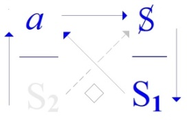

# Leçon 10 | 17 Mai 1972 Séminaire : Panthéon-Sorbonne

  

    <label><input type="checkbox" data-lacan-toggle="original" checked> 原文</label>
    <label><input type="checkbox" data-lacan-toggle="notes" checked> 注释</label>
    <label><input type="checkbox" data-lacan-toggle="commentary" checked> 个人解读评论</label>
  

  <form class="lacan-tool-search" role="search">
    <input class="lacan-tool-search-input" type="search" placeholder="搜索全文" aria-label="搜索全文">
    <button class="lacan-tool-button" type="submit" title="搜索">搜索</button>
  </form>
  <button class="lacan-tool-button lacan-back-to-top" type="button" title="回到页面最上方" aria-label="回到页面最上方">↑</button>

<section class="parallel-paragraph" data-paragraph-ids="s19-10-0001">

s19-10-0001

原文 · s19-10-0001

\[Au tableau \]

[无对应译文]

</section>

<section class="parallel-paragraph" data-paragraph-ids="s19-10-0002">

s19-10-0002

原文 · s19-10-0002

*Il n’y a pas d’autre existence de l’Un que l’existence mathématique*

[无对应译文]

</section>

<section class="parallel-paragraph" data-paragraph-ids="s19-10-0003">

s19-10-0003

原文 · s19-10-0003

Voilà ! Ça tourne autour de ce que l’analyse nous conduit à for­muler cette *fonction* !, de ce par rapport à quoi il s’agit de savoir s’il existe, s’*il existe un* X *qui satisfasse à la fonction* \[:!\].

[无对应译文]

</section>

<section class="parallel-paragraph" data-paragraph-ids="s19-10-0004">

s19-10-0004

原文 · s19-10-0004

Alors, naturellement, ça suppose d’articuler ce que ça peut être que *l’existence*.

[无对应译文]

</section>

<section class="parallel-paragraph" data-paragraph-ids="s19-10-0005">

s19-10-0005

原文 · s19-10-0005

Il est à peu près certain que, historiquement, ça n’a surgi, cette notion de *l’existence*, qu’avec l’intrusion du *réel mathéma­tique* comme tel.

[无对应译文]

</section>

<section class="parallel-paragraph" data-paragraph-ids="s19-10-0006">

s19-10-0006

原文 · s19-10-0006

Mais c’est une preuve de rien parce que nous ne sommes pas ici pour faire l’histoire de la pensée, il ne peut y avoir aucune histoire de la pensée, la pensée est une fuite en elle-même.

[无对应译文]

</section>

<section class="parallel-paragraph" data-paragraph-ids="s19-10-0007">

s19-10-0007

原文 · s19-10-0007

Elle projette sous le nom de *mé-moire*, n’est-ce pas, *la méconnaissance de sa moire*.

[无对应译文]

</section>

<section class="parallel-paragraph" data-paragraph-ids="s19-10-0008">

s19-10-0008

原文 · s19-10-0008

Tout ça n’empêche pas que nous pouvons essayer de faire certain repérage et...

[无对应译文]

</section>

<section class="parallel-paragraph" data-paragraph-ids="s19-10-0009">

s19-10-0009

原文 · s19-10-0009

> pour partir de ce qui n’est pas par hasard que j’ai écrit en forme de fonctions ...j’ai commencé d’énoncer quelque chose qui j’espè­re vous rendra service, un dire que, si je l’écris, c’est dans un sens : dans le sens que c’est une fonction sans rapport avec quoi que ce soit qui fonde *d’eux* - *d, apostrophe, e, u, x* - *Un*.

[无对应译文]

</section>

<section class="parallel-paragraph" data-paragraph-ids="s19-10-0010">

s19-10-0010

原文 · s19-10-0010

Alors vous voyez que toute l’astuce est sur le subjonctif qui appartient à la fois au verbe *« fonder »* et au verbe *« fondre » *:

[无对应译文]

</section>

<section class="parallel-paragraph" data-paragraph-ids="s19-10-0011">

s19-10-0011

原文 · s19-10-0011

- « d’eux » n’est pas fondu en *Un,*

[无对应译文]

</section>

<section class="parallel-paragraph" data-paragraph-ids="s19-10-0012">

s19-10-0012

原文 · s19-10-0012

- ni 1 fondé par 2.

[无对应译文]

</section>

<section class="parallel-paragraph" data-paragraph-ids="s19-10-0013">

s19-10-0013

原文 · s19-10-0013

C’est ce que dit Aristophane dans une très jolie petite fabulette du *Banquet* : *Ils ont été séparés en deux, ils étaient d’abord en forme de « bête à deux dos », ou de bête à dos d’eux*.

[无对应译文]

</section>

<section class="parallel-paragraph" data-paragraph-ids="s19-10-0014">

s19-10-0014

原文 · s19-10-0014

Ce qui bien sûr...

[无对应译文]

</section>

<section class="parallel-paragraph" data-paragraph-ids="s19-10-0015">

s19-10-0015

原文 · s19-10-0015

> si la fable songeait le moins du monde un ins­tant à être autre chose qu’une fable, c’est-à-dire à être consistante ...n’im­pliquerait nullement qu’ils ne refassent pas *des petits à deux dos*, à dos d’eux, ce dont personne ne fait la remarque, et heureusement, parce qu’*un mythe est un mythe et celui-là* en dit assez, *c’est celui que j’ai d’abord projeté* sous une forme plus moderne, *sous la forme de *!.

[无对应译文]

</section>

<section class="parallel-paragraph" data-paragraph-ids="s19-10-0016">

s19-10-0016

原文 · s19-10-0016

C’est en somme ce qui, concernant *les rapports sexuels*, se présente à nous comme l’espèce de discours...

[无对应译文]

</section>

<section class="parallel-paragraph" data-paragraph-ids="s19-10-0017">

s19-10-0017

原文 · s19-10-0017

> je parle de la fonction mathématique ...l’espèce de discours...

[无对应译文]

</section>

<section class="parallel-paragraph" data-paragraph-ids="s19-10-0018">

s19-10-0018

原文 · s19-10-0018

> tout au moins je vous le propose comme modèle ...qui sur ce point nous permettrait de fonder autre chose : du *semblant*, …*ou pire*.

[无对应译文]

</section>

<section class="parallel-paragraph" data-paragraph-ids="s19-10-0019">

s19-10-0019

原文 · s19-10-0019

Bon ! Ce matin moi, j’ai commencé dans le pire et malgré tout, je trou­ve pas superflu de vous en faire part, ne serait-ce que pour voir où ça peut aller.

[无对应译文]

</section>

<section class="parallel-paragraph" data-paragraph-ids="s19-10-0020">

s19-10-0020

原文 · s19-10-0020

C’était à propos de cette petite coupure de courant dont je ne sais pas jusqu’où vous l’avez eue, mais moi je l’ai eue jusqu’à dix heures. Elle m’a énormément emmerdé, parce que c’est l’heure où d’habitude je rassemble, je repense à ces petites notes, et que ça ne me le facilitait pas.

[无对应译文]

</section>

<section class="parallel-paragraph" data-paragraph-ids="s19-10-0021">

s19-10-0021

原文 · s19-10-0021

En plus, à cause de la même coupure, on m’a cassé un verre à dents auquel je tenais beaucoup.

[无对应译文]

</section>

<section class="parallel-paragraph" data-paragraph-ids="s19-10-0022">

s19-10-0022

原文 · s19-10-0022

S’il y a des gens qui m’aiment ici, ils peuvent m’en envoyer un autre.

[无对应译文]

</section>

<section class="parallel-paragraph" data-paragraph-ids="s19-10-0023">

s19-10-0023

原文 · s19-10-0023

J’en aurais peut-être comme ça plusieurs, ce qui me permettra de les casser tous sauf celui que je préférerai.

[无对应译文]

</section>

<section class="parallel-paragraph" data-paragraph-ids="s19-10-0024">

s19-10-0024

原文 · s19-10-0024

J’ai une peti­te cour qui est faite exprès pour ça.

[无对应译文]

</section>

<section class="parallel-paragraph" data-paragraph-ids="s19-10-0025">

s19-10-0025

原文 · s19-10-0025

Alors, je me disais, en pensant que bien sûr cette coupure, ça ne nous venait pas de personne, ça nous venait d’une décision des travailleurs...

[无对应译文]

</section>

<section class="parallel-paragraph" data-paragraph-ids="s19-10-0026">

s19-10-0026

原文 · s19-10-0026

Moi j’ai un respect que l’on ne peut même pas imaginer pour *la gentillesse de cette chose* qui s’appelle une coupure, une grève.

[无对应译文]

</section>

<section class="parallel-paragraph" data-paragraph-ids="s19-10-0027">

s19-10-0027

原文 · s19-10-0027

Quelle délicatesse de s’en tenir là !

[无对应译文]

</section>

<section class="parallel-paragraph" data-paragraph-ids="s19-10-0028">

s19-10-0028

原文 · s19-10-0028

Mais là il me sem­blait que, vu l’heure...

[无对应译文]

</section>

<section class="parallel-paragraph" data-paragraph-ids="s19-10-0029">

s19-10-0029

原文 · s19-10-0029

*Quoi ?!*

[无对应译文]

</section>

<section class="parallel-paragraph" data-paragraph-ids="s19-10-0030">

s19-10-0030

原文 · s19-10-0030

*X dans salle* - *On n’entend rien*.

[无对应译文]

</section>

<section class="parallel-paragraph" data-paragraph-ids="s19-10-0031">

s19-10-0031

原文 · s19-10-0031

On n’entend pas ? On n’entend pas !

[无对应译文]

</section>

<section class="parallel-paragraph" data-paragraph-ids="s19-10-0032">

s19-10-0032

原文 · s19-10-0032

J’étais en train de dire qu’*une grève* c’était la chose du monde la plus sociale qui soit, qui repré­sente un respect du lien social qui est quelque chose de fabuleux.

[无对应译文]

</section>

<section class="parallel-paragraph" data-paragraph-ids="s19-10-0033">

s19-10-0033

原文 · s19-10-0033

Mais là il y avait *une pointe*, dans cette coupure de courant qui avait une signifi­cation d’une grève, c’est que c’était justement l’heure où, tout comme à moi, qui préparais ma *cuisine*, pour vous parler maintenant, qu’est-ce que ça devait pouvoir enquiquiner celle qui...

[无对应译文]

</section>

<section class="parallel-paragraph" data-paragraph-ids="s19-10-0034">

s19-10-0034

原文 · s19-10-0034

> malgré tout, étant à l’occasion la femme du travailleur ...s’appelle, de la bouche même du tra­vailleur, qui - quand même, j’en fréquente ! - s’appelle « *la bourgeoise »* !

[无对应译文]

</section>

<section class="parallel-paragraph" data-paragraph-ids="s19-10-0035">

s19-10-0035

原文 · s19-10-0035

C’est vrai qu’ils les appellent comme ça !

[无对应译文]

</section>

<section class="parallel-paragraph" data-paragraph-ids="s19-10-0036">

s19-10-0036

原文 · s19-10-0036

Et alors je me mettais quand même à rêver. Parce que tout ça se tient. Ce sont des travailleurs, des exploités.

[无对应译文]

</section>

<section class="parallel-paragraph" data-paragraph-ids="s19-10-0037">

s19-10-0037

原文 · s19-10-0037

C’est tout de même bien parce qu’ils préfèrent encore ça à l’exploitation sexuelle de *la bourgeoise* !

[无对应译文]

</section>

<section class="parallel-paragraph" data-paragraph-ids="s19-10-0038">

s19-10-0038

原文 · s19-10-0038

Voilà, ça c’est *pire*, c’est le …*ou pire*.

[无对应译文]

</section>

<section class="parallel-paragraph" data-paragraph-ids="s19-10-0039">

s19-10-0039

原文 · s19-10-0039

Vous comprenez ? Parce que, à quoi ça mène de prononcer des articulations sur des choses à quoi on ne peut rien ?

[无对应译文]

</section>

<section class="parallel-paragraph" data-paragraph-ids="s19-10-0040">

s19-10-0040

原文 · s19-10-0040

Le rapport sexuel ne se présente, on ne peut pas dire que sous la forme de *l’exploitation*, c’est d’avant : c’est à cause de ça que *l’exploitation* s’organise parce que, il n’y a même pas cette exploitation-là.

[无对应译文]

</section>

<section class="parallel-paragraph" data-paragraph-ids="s19-10-0041">

s19-10-0041

原文 · s19-10-0041

Voilà, ça c’est *pire*, c’est le ...*ou pire*.

[无对应译文]

</section>

<section class="parallel-paragraph" data-paragraph-ids="s19-10-0042">

s19-10-0042

原文 · s19-10-0042

C’est pas sérieux, *c’est pas sérieux* quoiqu’on voit bien que c’est là que devrait aller « *un discours qui ne serait pas du semblant* », mais c’est un discours qui finirait mal. Ça serait pas du tout un *lien social*, comme c’est ce qu’il faut que soit un dis­cours.

[无对应译文]

</section>

<section class="parallel-paragraph" data-paragraph-ids="s19-10-0043">

s19-10-0043

原文 · s19-10-0043

Bon, alors il s’agit maintenant du *discours psychanalytique,* et il s’agit de faire que *celui qui y fait fonction de* (*a*) *tienne une position...*

[无对应译文]

</section>

<section class="parallel-paragraph" data-paragraph-ids="s19-10-0044">

s19-10-0044

原文 · s19-10-0044

> je vous ai déjà expliqué ça la dernière fois, bien sûr naturellement ça vous est passé comme l’eau
>
> sur les plumes d’un canard, mais enfin cer­tains quand même en ont paru un peu comme ça mouillés *...tienne la position du semblant*.

[无对应译文]

</section>

<section class="parallel-paragraph" data-paragraph-ids="s19-10-0045">

s19-10-0045

原文 · s19-10-0045

[无对应译文]

</section>

<section class="parallel-paragraph" data-paragraph-ids="s19-10-0046">

s19-10-0046

原文 · s19-10-0046

Ceux qui sont vraiment intéressés là-dedans, j’en ai eu quand même des échos, ça les a émus.

[无对应译文]

</section>

<section class="parallel-paragraph" data-paragraph-ids="s19-10-0047">

s19-10-0047

原文 · s19-10-0047

Il y a certains psychanalystes qui ont quelque chose qui les tourmente, qui les angoisse de temps en temps.

[无对应译文]

</section>

<section class="parallel-paragraph" data-paragraph-ids="s19-10-0048">

s19-10-0048

原文 · s19-10-0048

C’est pas pour ça que je dis ça, que j’insiste sur le fait que *l’objet(a)* doive tenir la position du *semblant*, c’est pas pour leur foutre de l’an­goisse, je préférerais même qu’ils n’en aient pas.

[无对应译文]

</section>

<section class="parallel-paragraph" data-paragraph-ids="s19-10-0049">

s19-10-0049

原文 · s19-10-0049

Enfin, c’est pas un mau­vais signe que ça la leur donne, parce que ça veut dire que mon discours n’est pas complètement superflu, qu’il peut prendre un sens.

[无对应译文]

</section>

<section class="parallel-paragraph" data-paragraph-ids="s19-10-0050">

s19-10-0050

原文 · s19-10-0050

Mais ça ne suffit pas, ça n’assure absolument rien qu’un discours ait un sens, parce qu’il faut au moins que ce sens, on puisse le repérer, n’est-ce pas...

[无对应译文]

</section>

<section class="parallel-paragraph" data-paragraph-ids="s19-10-0051">

s19-10-0051

原文 · s19-10-0051

Si vous faites ça, enfin, le mouvement brownien, à chaque instant, ça a un sens.

[无对应译文]

</section>

<section class="parallel-paragraph" data-paragraph-ids="s19-10-0052">

s19-10-0052

原文 · s19-10-0052

C’est bien ce qui rend la position du psychanalyste difficile, c’est parce que *l’objet (a)*, sa fonction c’est le déplacement.

[无对应译文]

</section>

<section class="parallel-paragraph" data-paragraph-ids="s19-10-0053">

s19-10-0053

原文 · s19-10-0053

### Et comme ce n’est pas à propos du psychanalyste que j’ai fait descendre du ciel pour la première fois *l’objet (a),*

[无对应译文]

</section>

<section class="parallel-paragraph" data-paragraph-ids="s19-10-0054">

s19-10-0054

原文 · s19-10-0054

### j’ai commencé *dans un petit graphe...*

[无对应译文]

</section>

<section class="parallel-paragraph" data-paragraph-ids="s19-10-0055">

s19-10-0055

原文 · s19-10-0055

### qui était fait pour donner os, ou repère, aux *formations de l’in­conscient*

[无对应译文]

</section>

<section class="parallel-paragraph" data-paragraph-ids="s19-10-0056">

s19-10-0056

原文 · s19-10-0056

### *...à le cerner dans un point d’où il ne pouvait pas bouger*.

[无对应译文]

</section>

<section class="parallel-paragraph" data-paragraph-ids="s19-10-0057">

s19-10-0057

原文 · s19-10-0057

Dans la position du *semblant* c’est beaucoup moins facile d’y rester, parce que *l’objet(a)* il vous fout le camp en moins de deux entre les pattes puisque c’est*...*

[无对应译文]

</section>

<section class="parallel-paragraph" data-paragraph-ids="s19-10-0058">

s19-10-0058

原文 · s19-10-0058

> comme je l’ai déjà expliqué quand j’ai commencé - à propos du langage - à en parler *...*c’est *« il court, il court, le furet... *» : dans tout ce que vous dites, il est à chaque instant ailleurs.

[无对应译文]

</section>

<section class="parallel-paragraph" data-paragraph-ids="s19-10-0059">

s19-10-0059

原文 · s19-10-0059

Alors c’est pour ça que nous essayons d’appréhender d’où pourrait se situer quelque chose qui serait *au-delà du sens*, de ce sens qui fait qu’aussi bien je ne peux pas obtenir d’autre effet que l’angoisse, là où c’est pas du tout ma visée.

[无对应译文]

</section>

<section class="parallel-paragraph" data-paragraph-ids="s19-10-0060">

s19-10-0060

原文 · s19-10-0060

C’est en ça que nous intéresse que soit ancré ce *réel*, ce *réel* que je dis, pas pour rien, être mathématique, parce que, somme toute...

[无对应译文]

</section>

<section class="parallel-paragraph" data-paragraph-ids="s19-10-0061">

s19-10-0061

原文 · s19-10-0061

> à l’expérience de ce qu’il s’agit, de ce qui *se formule*, de ce qui *s’écrit* à l’occasion, ...nous voyons, nous pouvons tou­cher du doigt que là, *il y a quelque chose qui résiste*, je veux dire dont on ne peut pas dire n’importe quoi : on ne peut pas donner au *réel mathé­matique* n’importe quel sens.

[无对应译文]

</section>

<section class="parallel-paragraph" data-paragraph-ids="s19-10-0062">

s19-10-0062

原文 · s19-10-0062

Il est même tout à fait frappant que ceux qui se sont en somme, dans une époque récente, approchés de ce *réel* avec l’idée préconçue de lui faire rendre compte de son sens à partir du vrai*...*

[无对应译文]

</section>

<section class="parallel-paragraph" data-paragraph-ids="s19-10-0063">

s19-10-0063

原文 · s19-10-0063

Il y avait comme ça un immense farfelu, que vous connais­sez bien sûr de réputation, parce qu’il a fait son petit bruit dans le monde, qui s’appelait Bertrand Russell, qui est au cœur de cette aventu­re, et c’est quand même lui qui a formulé quelque chose comme ceci :

[无对应译文]

</section>

<section class="parallel-paragraph" data-paragraph-ids="s19-10-0064">

s19-10-0064

原文 · s19-10-0064

> « *que la mathématique, c’est quelque chose qui s’articule d’une façon telle*
>
> *qu’en fin de compte on ne sait même pas si c’est vrai ce qui s’articule, ni si ça a un sens* ».[^23]

[无对应译文]

</section>

<section class="parallel-paragraph" data-paragraph-ids="s19-10-0065">

s19-10-0065

原文 · s19-10-0065

Ça n’empêche pas que, justement ça prouve ceci : c’est qu’on ne peut lui en donner n’importe lequel,

[无对应译文]

</section>

<section class="parallel-paragraph" data-paragraph-ids="s19-10-0066">

s19-10-0066

原文 · s19-10-0066

- ni dans l’ordre de *la vérité*,

[无对应译文]

</section>

<section class="parallel-paragraph" data-paragraph-ids="s19-10-0067">

s19-10-0067

原文 · s19-10-0067

- ni dans l’ordre du *sens,* et que ça résiste au point que, pour aboutir à ce résultat que moi je considère comme un succès*...*

[无对应译文]

</section>

<section class="parallel-paragraph" data-paragraph-ids="s19-10-0068">

s19-10-0068

原文 · s19-10-0068

> le succès même, n’est-ce pas le mode sous lequel ça s’impose, que c’est *réel...*c’est que justement ni « *le vrai »* ni « *le sens »* n’y dominent, ils sont secondaires.

[无对应译文]

</section>

<section class="parallel-paragraph" data-paragraph-ids="s19-10-0069">

s19-10-0069

原文 · s19-10-0069

Et que de là, la position*...*

[无对应译文]

</section>

<section class="parallel-paragraph" data-paragraph-ids="s19-10-0070">

s19-10-0070

原文 · s19-10-0070

> cette position seconde, à ces deux machins qui s’appellent *le vrai* et *le sens...*leur restait inhabituelle à eux, enfin que ça donne un peu le tournis aux gens quand ils prennent la peine de penser.

[无对应译文]

</section>

<section class="parallel-paragraph" data-paragraph-ids="s19-10-0071">

s19-10-0071

原文 · s19-10-0071

C’était le cas de Bertrand Russell, il pensait. C’était... c’est une manie d’aristocrate, n’est-ce pas, et il n’y a vraiment aucune raison de trouver que ce soit là une fonction essentielle.

[无对应译文]

</section>

<section class="parallel-paragraph" data-paragraph-ids="s19-10-0072">

s19-10-0072

原文 · s19-10-0072

Mais ceux qui édifient - je ne suis pas en train de faire de l’iro­nie - *la théorie des ensembles* ont bien assez à faire dans ce *réel* pour trouver le temps de penser à côté.

[无对应译文]

</section>

<section class="parallel-paragraph" data-paragraph-ids="s19-10-0073">

s19-10-0073

原文 · s19-10-0073

La façon dont on s’est engagé dans une voie non seulement dont on ne peut pas en sortir, mais dont ça mène quelque part, avec une nécessité et puis en plus une fécondité, fait qu’on touche, qu’on a affaire à tout autre chose \[*le réel*\] que ce qui est pourtant employé \[*les « petites lettres »*\].

[无对应译文]

</section>

<section class="parallel-paragraph" data-paragraph-ids="s19-10-0074">

s19-10-0074

原文 · s19-10-0074

Ce qui a été la démarche dans l’*initium* de cette théorie, c’était d’interroger tout ce qu’il en était de ce *réel*, car c’est de là qu’on est parti parce qu’on ne pouvait pas ne pas voir que *le nombre c’était réel*, et que depuis quelque temps, enfin il y avait du *rififi* avec l’1.

[无对应译文]

</section>

<section class="parallel-paragraph" data-paragraph-ids="s19-10-0075">

s19-10-0075

原文 · s19-10-0075

C’était pas quand même une mince affaire de s’apercevoir que *le nombre réel*, on pouvait mettre en question si ça avait à faire quelque chose avec l’1, l’1 comme ça, le premier des nombres entiers, des nombres dits naturels.

[无对应译文]

</section>

<section class="parallel-paragraph" data-paragraph-ids="s19-10-0076">

s19-10-0076

原文 · s19-10-0076

C’est qu’on avait eu le temps, depuis le XVIIème siècle jusqu’au début du XIXème siècle, d’approcher *le nombre* un tout petit peu autrement que les Anciens ne l’avaient fait.

[无对应译文]

</section>

<section class="parallel-paragraph" data-paragraph-ids="s19-10-0077">

s19-10-0077

原文 · s19-10-0077

Si je pars de ça, c’est bien parce que c’est ça l’essentiel.

[无对应译文]

</section>

<section class="parallel-paragraph" data-paragraph-ids="s19-10-0078">

s19-10-0078

原文 · s19-10-0078

Non seulement *« Yad’lun »,* mais ça se voit à ça : que *l’Un,* lui, il ne pense pas.

[无对应译文]

</section>

<section class="parallel-paragraph" data-paragraph-ids="s19-10-0079">

s19-10-0079

原文 · s19-10-0079

Il pense pas : « *donc je suis* », en par­ticulier. Quand je dis : il pense pas : « *donc je suis* », j’espère que vous vous souvenez que même Descartes, c’est pas ce qu’il dit. Il dit : ça se pense « *donc je suis* » entre guillemets.

[无对应译文]

</section>

<section class="parallel-paragraph" data-paragraph-ids="s19-10-0080">

s19-10-0080

原文 · s19-10-0080

*L’Un,* ça se pense pas, même tout seul, *mais ça dit quelque chose*, c’est même ça qui le distingue, et il n’a pas attendu que des gens se posent à son propos, à propos de ses rapports, la question de ce que ça veut dire du point de vue *de la vérité*.

[无对应译文]

</section>

<section class="parallel-paragraph" data-paragraph-ids="s19-10-0081">

s19-10-0081

原文 · s19-10-0081

Il n’a pas attendu même *la logique*.

[无对应译文]

</section>

<section class="parallel-paragraph" data-paragraph-ids="s19-10-0082">

s19-10-0082

原文 · s19-10-0082

Car c’est ça *la logique *: *la logique* c’est de repérer dans la grammaire

[无对应译文]

</section>

<section class="parallel-paragraph" data-paragraph-ids="s19-10-0083">

s19-10-0083

原文 · s19-10-0083

- ce qui prend forme de la position de vérité,

[无对应译文]

</section>

<section class="parallel-paragraph" data-paragraph-ids="s19-10-0084">

s19-10-0084

原文 · s19-10-0084

- ce qui dans le langage le rend *adéquat à faire vérité*.

[无对应译文]

</section>

<section class="parallel-paragraph" data-paragraph-ids="s19-10-0085">

s19-10-0085

原文 · s19-10-0085

*Adéquat*, ça veut pas dire qu’il réussira toujours : alors à bien rechercher ses formes on croit approcher ce qu’il en est de *la vérité*.

[无对应译文]

</section>

<section class="parallel-paragraph" data-paragraph-ids="s19-10-0086">

s19-10-0086

原文 · s19-10-0086

Mais avant qu’Aristote s’avise de ça, à savoir du rapport à la gram­maire, *l’Un avait déjà parlé*, et pas pour rien dire.

[无对应译文]

</section>

<section class="parallel-paragraph" data-paragraph-ids="s19-10-0087">

s19-10-0087

原文 · s19-10-0087

Il dit ce qu’il a à dire : le « *Parménide »* c’est *l’Un* qui se dit.

[无对应译文]

</section>

<section class="parallel-paragraph" data-paragraph-ids="s19-10-0088">

s19-10-0088

原文 · s19-10-0088

Il se dit - il faut bien le dire - en visant à *être vrai*, d’où naturellement l’affolement qui en résulte.

[无对应译文]

</section>

<section class="parallel-paragraph" data-paragraph-ids="s19-10-0089">

s19-10-0089

原文 · s19-10-0089

Il n’y a personne, *parmi les personnes qui font la cuisine du savoir*, qui ne se sente pas à chaque fois en prendre un bon coup. Ça casse le verre à dents !

[无对应译文]

</section>

<section class="parallel-paragraph" data-paragraph-ids="s19-10-0090">

s19-10-0090

原文 · s19-10-0090

C’est bien pour ça qu’après tout...

[无对应译文]

</section>

<section class="parallel-paragraph" data-paragraph-ids="s19-10-0091">

s19-10-0091

原文 · s19-10-0091

> encore que cer­tains aient mis une certaine bonne volonté, un certain courage à dire :
>
> « *qu’après tout ça peut s’admettre quoique ce soit un peu tiré par les che­veux* » ...on n’en est pas encore venu à bout de cette chose qui était pour­tant simple : de s’apercevoir que *l’Un...*

[无对应译文]

</section>

<section class="parallel-paragraph" data-paragraph-ids="s19-10-0092">

s19-10-0092

原文 · s19-10-0092

> quand il est véridique, quand il dit ce qu’il a à dire, *...*on voit où ça va, en tout cas à la totale récusation d’aucun rapport à « *l’être »*.

[无对应译文]

</section>

<section class="parallel-paragraph" data-paragraph-ids="s19-10-0093">

s19-10-0093

原文 · s19-10-0093

Il n’y a qu’une chose qui en ressorte quand il s’articule, c’est très exac­tement ceci : *il y en a pas deux*.

[无对应译文]

</section>

<section class="parallel-paragraph" data-paragraph-ids="s19-10-0094">

s19-10-0094

原文 · s19-10-0094

Je vous l’ai dit, *c’est un dire*.

[无对应译文]

</section>

<section class="parallel-paragraph" data-paragraph-ids="s19-10-0095">

s19-10-0095

原文 · s19-10-0095

Et *même vous*, pouvez y trouver, comme ça, à la portée de la main, la confirmation de ce que moi je dis, quand je dis que « *la vérité ne peut que se mi-dire* ».

[无对应译文]

</section>

<section class="parallel-paragraph" data-paragraph-ids="s19-10-0096">

s19-10-0096

原文 · s19-10-0096

Parce que, vous n’avez qu’à casser la formule : pour dire ça il ne peut que dire

[无对应译文]

</section>

<section class="parallel-paragraph" data-paragraph-ids="s19-10-0097">

s19-10-0097

原文 · s19-10-0097

- ou bien « *y en a* », et comme je le dis : « *Yad’lun* »,

[无对应译文]

</section>

<section class="parallel-paragraph" data-paragraph-ids="s19-10-0098">

s19-10-0098

原文 · s19-10-0098

- ou bien « *pas deux* », ce qui s’interprète tout de suite pour nous : « *il n’y a pas de rapport sexuel* ».

[无对应译文]

</section>

<section class="parallel-paragraph" data-paragraph-ids="s19-10-0099">

s19-10-0099

原文 · s19-10-0099

C’est donc déjà, vous voyez bien, à la portée de notre main*...*

[无对应译文]

</section>

<section class="parallel-paragraph" data-paragraph-ids="s19-10-0100">

s19-10-0100

原文 · s19-10-0100

> bien sûr, *pas à la portée de la main unienne de l’Un...*d’en faire quelque chose dans le sens du *sens*.

[无对应译文]

</section>

<section class="parallel-paragraph" data-paragraph-ids="s19-10-0101">

s19-10-0101

原文 · s19-10-0101

C’est bien pour ça que je recommande à ceux qui veulent tenir la position de l’analyste*...*

[无对应译文]

</section>

<section class="parallel-paragraph" data-paragraph-ids="s19-10-0102">

s19-10-0102

原文 · s19-10-0102

> avec ce que ça comporte de savoir ne pas en glisser *...*de se mettre à la page de ce qui, bien sûr, pourrait pour eux se lire à seulement travailler le *Parménide*, mais ça serait quand même un peu court, on se casse les dents là-dessus.

[无对应译文]

</section>

<section class="parallel-paragraph" data-paragraph-ids="s19-10-0103">

s19-10-0103

原文 · s19-10-0103

Au lieu qu’il est arri­vé autre chose qui rend tout à fait clair*...*

[无对应译文]

</section>

<section class="parallel-paragraph" data-paragraph-ids="s19-10-0104">

s19-10-0104

原文 · s19-10-0104

> si bien sûr on s’obstine un peu, si on s’y rompt, si on s’y brise, même *...*qui rend tout à fait clai­re la distinction qu’il y a

[无对应译文]

</section>

<section class="parallel-paragraph" data-paragraph-ids="s19-10-0105">

s19-10-0105

原文 · s19-10-0105

- d’un *réel* qui est un réel mathématique,

[无对应译文]

</section>

<section class="parallel-paragraph" data-paragraph-ids="s19-10-0106">

s19-10-0106

原文 · s19-10-0106

- avec quoi que ce soit de ces badinages qui partent de ce « *je ne sais quoi* »[^24], qui est notre position nauséeuse qui s’appelle « *le vrai »* ou « *le sens »*.

[无对应译文]

</section>

<section class="parallel-paragraph" data-paragraph-ids="s19-10-0107">

s19-10-0107

原文 · s19-10-0107

Bien sûr, naturellement, ça ne veut pas dire que ça n’aura pas d’effet*...*

[无对应译文]

</section>

<section class="parallel-paragraph" data-paragraph-ids="s19-10-0108">

s19-10-0108

原文 · s19-10-0108

> d’ef­fet de massage, d’effet de revigoration, d’effet de soufflage, d’effet de nettoiement *...*sur ce qui nous paraîtra exigible au regard du *vrai* ou bien du *sens*.

[无对应译文]

</section>

<section class="parallel-paragraph" data-paragraph-ids="s19-10-0109">

s19-10-0109

原文 · s19-10-0109

Mais justement, c’est bien ce que j’en attends :

[无对应译文]

</section>

<section class="parallel-paragraph" data-paragraph-ids="s19-10-0110">

s19-10-0110

原文 · s19-10-0110

- c’est qu’à se for­mer à distinguer ce qu’il en est de *l’Un,*

[无对应译文]

</section>

<section class="parallel-paragraph" data-paragraph-ids="s19-10-0111">

s19-10-0111

原文 · s19-10-0111

- simplement à s’approcher de ce *réel* dont il s’agit, en ce qu’il supporte *le nombre*, déjà ça permettra beaucoup à l’analyste.

[无对应译文]

</section>

<section class="parallel-paragraph" data-paragraph-ids="s19-10-0112">

s19-10-0112

原文 · s19-10-0112

Je veux dire qu’il peut lui venir*...*

[无对应译文]

</section>

<section class="parallel-paragraph" data-paragraph-ids="s19-10-0113">

s19-10-0113

原文 · s19-10-0113

> dans ce biais où il s’agit d’interpréter, de rénover le sens *...*de dire des choses de ce fait un peu moins court-circuitées, un peu moins « *chatoiement* », que toutes les conne­ries qui peuvent nous venir et dont tout à l’heure - ...*ou pire,* comme ça - je vous ai donné l’échantillon à partir simplement de ce qui pour moi n’était que la contrariété du matin.

[无对应译文]

</section>

<section class="parallel-paragraph" data-paragraph-ids="s19-10-0114">

s19-10-0114

原文 · s19-10-0114

J’aurais pu broder comme ça sur le travailleur et sa bourgeoise et en tirer une mythologie.

[无对应译文]

</section>

<section class="parallel-paragraph" data-paragraph-ids="s19-10-0115">

s19-10-0115

原文 · s19-10-0115

Ça vous a fait rire d’ailleurs, parce que dans ce genre il y a*...*

[无对应译文]

</section>

<section class="parallel-paragraph" data-paragraph-ids="s19-10-0116">

s19-10-0116

原文 · s19-10-0116

> le champ est vaste, *le sens* et *le vrai*, ça ne manque pas,
>
> c’est même devenu la mangeoire universitaire justement *...*il y en a tellement, il y a un tel éventail qu’il s’en trouvera bien un, un jour pour faire avec ce que je vous dis, *une ontologie*, pour dire que j’ai dit que : « *la parole, c’était un effet de comblement de cette béance, qui est ce que j’articule *: *il n’y a pas de rapport sexuel* ».

[无对应译文]

</section>

<section class="parallel-paragraph" data-paragraph-ids="s19-10-0117">

s19-10-0117

原文 · s19-10-0117

Ça va tout seul comme ça. Interprétation subjectiviste, n’est-ce pas ?

[无对应译文]

</section>

<section class="parallel-paragraph" data-paragraph-ids="s19-10-0118">

s19-10-0118

原文 · s19-10-0118

C’est parce qu’il ne peut pas la chatouiller qu’il lui fait du baratin.

[无对应译文]

</section>

<section class="parallel-paragraph" data-paragraph-ids="s19-10-0119">

s19-10-0119

原文 · s19-10-0119

C’est simple ça, c’est simple !

[无对应译文]

</section>

<section class="parallel-paragraph" data-paragraph-ids="s19-10-0120">

s19-10-0120

原文 · s19-10-0120

Moi ce que j’essaie, c’est autre chose.

[无对应译文]

</section>

<section class="parallel-paragraph" data-paragraph-ids="s19-10-0121">

s19-10-0121

原文 · s19-10-0121

C’est de faire que dans votre discours, vous mettiez moins de conneries - je parle des ana­lystes.

[无对应译文]

</section>

<section class="parallel-paragraph" data-paragraph-ids="s19-10-0122">

s19-10-0122

原文 · s19-10-0122

Pour ça, que vous essayiez d’aérer un peu *« le sens »* avec des élé­ments qui seraient un peu nouveaux.

[无对应译文]

</section>

<section class="parallel-paragraph" data-paragraph-ids="s19-10-0123">

s19-10-0123

原文 · s19-10-0123

Alors c’est pourtant pas une exigence qui ne s’im­pose pas, parce qu’il est bien clair qu’il n’y a aucun moyen de répartir 2 *séries quelconques -* quelconques, je dis - d’attributs qui fassent

[无对应译文]

</section>

<section class="parallel-paragraph" data-paragraph-ids="s19-10-0124">

s19-10-0124

原文 · s19-10-0124

- une série *mâle* d’un côté,

[无对应译文]

</section>

<section class="parallel-paragraph" data-paragraph-ids="s19-10-0125">

s19-10-0125

原文 · s19-10-0125

- et de l’autre côté la série *femme*.

[无对应译文]

</section>

<section class="parallel-paragraph" data-paragraph-ids="s19-10-0126">

s19-10-0126

原文 · s19-10-0126

Je n’ai d’abord pas dit *« homme »* pour ne pas faire de confusion, parce que je vais broder là­ dessus encore pour rester dans *le pire*.

[无对应译文]

</section>

<section class="parallel-paragraph" data-paragraph-ids="s19-10-0127">

s19-10-0127

原文 · s19-10-0127

Évidemment c’est tentant, même pour moi. Moi, je m’amuse.

[无对应译文]

</section>

<section class="parallel-paragraph" data-paragraph-ids="s19-10-0128">

s19-10-0128

原文 · s19-10-0128

Et puis je suis sûr de vous amuser à montrer que ce qu’on appelle « *l’actif* »*...*

[无对应译文]

</section>

<section class="parallel-paragraph" data-paragraph-ids="s19-10-0129">

s19-10-0129

原文 · s19-10-0129

> si c’est là-dessus que vous vous fon­dez parce que, naturellement, c’est la monnaie courante *...*que c’est ça « *l’homme »* : il est actif le cher mignon !

[无对应译文]

</section>

<section class="parallel-paragraph" data-paragraph-ids="s19-10-0130">

s19-10-0130

原文 · s19-10-0130

Dans le rapport sexuel alors, il me semble que c’est, c’est plutôt la femme qui, elle, en met un coup. Bon*...*

[无对应译文]

</section>

<section class="parallel-paragraph" data-paragraph-ids="s19-10-0131">

s19-10-0131

原文 · s19-10-0131

Puis il y a qu’à le voir quand même dans des positions que nous appel­lerons nullement primitives, mais c’est pas parce qu’on en rencontre dans le tiers monde*...*

[无对应译文]

</section>

<section class="parallel-paragraph" data-paragraph-ids="s19-10-0132">

s19-10-0132

原文 · s19-10-0132

> qui est « *le monde de Monsieur Thiers* », n’est-ce pas ? *...*que c’est pas évident que dans la vie normale*...*

[无对应译文]

</section>

<section class="parallel-paragraph" data-paragraph-ids="s19-10-0133">

s19-10-0133

原文 · s19-10-0133

> je parle pas bien sûr naturellement des types du « *Gaz et de l’Électricité de France* »
>
> qui eux ont pris leur distance, qui se sont rués dans le travail *...*mais dans une vie comme ça, appelons-la simplement ce qu’elle est, ce qu’elle est partout*...*

[无对应译文]

</section>

<section class="parallel-paragraph" data-paragraph-ids="s19-10-0134">

s19-10-0134

原文 · s19-10-0134

> sauf quand il y a eu une grande subversion chrétienne, *notre* grande subversion chrétienne *...*l’homme il se les roule, la femme elle moud, elle broie, elle coud, elle fait les courses et elle trouve le moyen encore...

[无对应译文]

</section>

<section class="parallel-paragraph" data-paragraph-ids="s19-10-0135">

s19-10-0135

原文 · s19-10-0135

> dans ces solides civilisations qui ne sont pas perdues ...elle trouve encore le moyen de tortiller du derrière, après pour*...*

[无对应译文]

</section>

<section class="parallel-paragraph" data-paragraph-ids="s19-10-0136">

s19-10-0136

原文 · s19-10-0136

> je parle d’une danse bien sûr, hein ! *...*pour la satisfaction jubilatoire du type qui est là !

[无对应译文]

</section>

<section class="parallel-paragraph" data-paragraph-ids="s19-10-0137">

s19-10-0137

原文 · s19-10-0137

Alors pour ce qu’il en est de *l’actif* et du *passif* permettez-moi de...

[无对应译文]

</section>

<section class="parallel-paragraph" data-paragraph-ids="s19-10-0138">

s19-10-0138

原文 · s19-10-0138

*C’est vrai qu’il chasse*... \[*Rires*\]

[无对应译文]

</section>

<section class="parallel-paragraph" data-paragraph-ids="s19-10-0139">

s19-10-0139

原文 · s19-10-0139

Et il y a pas de quoi rigoler mes petites, c’est très important !

[无对应译文]

</section>

<section class="parallel-paragraph" data-paragraph-ids="s19-10-0140">

s19-10-0140

原文 · s19-10-0140

Puisque vous me provoquez, alors je continuerai à m’amuser.

[无对应译文]

</section>

<section class="parallel-paragraph" data-paragraph-ids="s19-10-0141">

s19-10-0141

原文 · s19-10-0141

*C’est malheureux* parce que comme ça, je n’arriverai pas au bout de ce que j’avais à vous dire aujourd’hui concernant *l’Un*. Il est deux heures !

[无对应译文]

</section>

<section class="parallel-paragraph" data-paragraph-ids="s19-10-0142">

s19-10-0142

原文 · s19-10-0142

Mais quand même puisque ça fait rigoler, la chasse*...*

[无对应译文]

</section>

<section class="parallel-paragraph" data-paragraph-ids="s19-10-0143">

s19-10-0143

原文 · s19-10-0143

Je sais pas, je sais pas si tout de même, malgré tout, c’est pas absolument superflu d’y voir justement la vertu de *l’homme*, la vertu justement par laquelle il se montre, il se montre ce qu’il a de mieux : être passif.

[无对应译文]

</section>

<section class="parallel-paragraph" data-paragraph-ids="s19-10-0144">

s19-10-0144

原文 · s19-10-0144

Parce que, d’après tout ce qu’on sait, quand même, je sais pas si vous vous rendez bien compte, parce que bien sûr vous êtes tous ici des « *[jean foutre](http://www.cnrtl.fr/definition/jean-foutre) »*, et s’il y a pas ici de paysans, personne ne chas­se, mais s’il y avait aussi ici des paysans : ils chassent mal.

[无对应译文]

</section>

<section class="parallel-paragraph" data-paragraph-ids="s19-10-0145">

s19-10-0145

原文 · s19-10-0145

Pour le pay­san*...*

[无对应译文]

</section>

<section class="parallel-paragraph" data-paragraph-ids="s19-10-0146">

s19-10-0146

原文 · s19-10-0146

> c’est pas forcément un homme, hein, le paysan, quoiqu’on en dise *...*pour le paysan, le gibier ça se rabat : *pan ! pan !* On lui ramène tout ça. C’est pas ça du tout la chasse !

[无对应译文]

</section>

<section class="parallel-paragraph" data-paragraph-ids="s19-10-0147">

s19-10-0147

原文 · s19-10-0147

La chasse quand elle existe, il y a qu’à voir dans quelles transes ça les mettait, ça, parce qu’on le sait, enfin on en a eu des petites traces de *tout ce qu’ils offraient de propi­tiatoire* à la chose - quoi ! -qui pourtant n’était plus là.

[无对应译文]

</section>

<section class="parallel-paragraph" data-paragraph-ids="s19-10-0148">

s19-10-0148

原文 · s19-10-0148

Vous comprenez, ils étaient quand même pas plus dingues que nous, une bête tuée est une bête tuée.

[无对应译文]

</section>

<section class="parallel-paragraph" data-paragraph-ids="s19-10-0149">

s19-10-0149

原文 · s19-10-0149

Seulement, s’ils avaient pas pu tuer la bête, c’est parce qu’ils s’étaient si bien soumis à tout ce qui est de sa démarche, de sa trace, de ses limites, de son territoire, de ses préoccupations sexuelles, pour s’être juste­ment, eux, *substitués* à ce qui n’est pas tout ça, à la non-défense, à la non-­clôture, aux non-limites de la bête, *à la vie* il faut dire le mot.

[无对应译文]

</section>

<section class="parallel-paragraph" data-paragraph-ids="s19-10-0150">

s19-10-0150

原文 · s19-10-0150

Et que quand cette *vie,* ils avaient dû la soustraire, après y être devenus telle­ment, eux, cette vie même, que ça se comprend, bien sûr, qu’ils aient trouvé que non seulement ça faisait moche mais que c’était dangereux.

[无对应译文]

</section>

<section class="parallel-paragraph" data-paragraph-ids="s19-10-0151">

s19-10-0151

原文 · s19-10-0151

Que ça pouvait bien, à eux, leur arriver aussi.

[无对应译文]

</section>

<section class="parallel-paragraph" data-paragraph-ids="s19-10-0152">

s19-10-0152

原文 · s19-10-0152

Ça pourrait être de ces choses qui ont même fait penser, comme ça, quelques-uns, parce que ces choses-là quand même, ça continue à se sen­tir, et j’ai entendu ça, moi, formulé d’une façon curieuse par quelqu’un d’excessivement intelligent, un mathématicien : que*...*

[无对应译文]

</section>

<section class="parallel-paragraph" data-paragraph-ids="s19-10-0153">

s19-10-0153

原文 · s19-10-0153

> mais alors là il extrapole le gars quand même, mais enfin je vous le fournis parce que c’est excitant *...*que *le système nerveux dans un organis­me*, *c’était peut-être bien pas autre chose que ce qui résulte d’une iden­tification à la proie*, hein ?

[无对应译文]

</section>

<section class="parallel-paragraph" data-paragraph-ids="s19-10-0154">

s19-10-0154

原文 · s19-10-0154

Bon, je vous lâche l’idée comme ça, je vous la donne, vous en ferez ce que vous voudrez, bien sûr, mais on peut décon­ner là-dessus *une nouvelle théorie de l’évolution* qui sera un tout petit peu plus drôle que les précédentes.

[无对应译文]

</section>

<section class="parallel-paragraph" data-paragraph-ids="s19-10-0155">

s19-10-0155

原文 · s19-10-0155

Je vous la donne d’autant plus volon­tiers :

[无对应译文]

</section>

<section class="parallel-paragraph" data-paragraph-ids="s19-10-0156">

s19-10-0156

原文 · s19-10-0156

- d’abord, qu’elle n’est pas à moi, à moi aussi on me l’a refilée,

[无对应译文]

</section>

<section class="parallel-paragraph" data-paragraph-ids="s19-10-0157">

s19-10-0157

原文 · s19-10-0157

- mais je suis sûr que ça excitera les cervelles *ontologiques*.

[无对应译文]

</section>

<section class="parallel-paragraph" data-paragraph-ids="s19-10-0158">

s19-10-0158

原文 · s19-10-0158

C’est vrai bien sûr aussi pour le pêcheur. Enfin dans tout ce par quoi l’homme est femme.

[无对应译文]

</section>

<section class="parallel-paragraph" data-paragraph-ids="s19-10-0159">

s19-10-0159

原文 · s19-10-0159

Parce que la façon dont un pêcheur passe la main sous le ventre de la truite qui est sous son rocher...

[无对应译文]

</section>

<section class="parallel-paragraph" data-paragraph-ids="s19-10-0160">

s19-10-0160

原文 · s19-10-0160

> faut qu’il y ait ici un pêcheur de truite, quand même il y a des chances, il doit savoir ce que je dis là ...ça, c’est quelque chose !

[无对应译文]

</section>

<section class="parallel-paragraph" data-paragraph-ids="s19-10-0161">

s19-10-0161

原文 · s19-10-0161

Enfin tout ça ne nous met pas sur le sujet de l’*actif* et du *passif*, dans une répartition bien claire.

[无对应译文]

</section>

<section class="parallel-paragraph" data-paragraph-ids="s19-10-0162">

s19-10-0162

原文 · s19-10-0162

Alors je ne vais pas m’étendre parce qu’il suffit que je confronte chacun de ces couples habituels, avec un essai de répartition bisexuelle quelconque pour arriver à des résultats aussi bouffons.

[无对应译文]

</section>

<section class="parallel-paragraph" data-paragraph-ids="s19-10-0163">

s19-10-0163

原文 · s19-10-0163

Alors qu’est-ce que ça pour­rait bien être ?

[无对应译文]

</section>

<section class="parallel-paragraph" data-paragraph-ids="s19-10-0164">

s19-10-0164

原文 · s19-10-0164

Quand je dis « *Yad’l’Un* »*...*

[无对应译文]

</section>

<section class="parallel-paragraph" data-paragraph-ids="s19-10-0165">

s19-10-0165

原文 · s19-10-0165

> il faut quand même que je balaie le pas de ma porte et puis je vois pas pourquoi je n’en resterai pas là puisque je vous parlerai donc le jeudi, le jeudi 1er Juin je crois, quelque chose comme ça.
>
> Vous vous rendez compte, le 1er jeudi de Juin je suis forcé de revenir des quelques jours de vacances pour ne pas manquer à Sainte Anne ! *...*alors je vais quand même là, tout de même faire la remarque que « *Yad’l’Un* », ça ne veut pas dire*...*

[无对应译文]

</section>

<section class="parallel-paragraph" data-paragraph-ids="s19-10-0166">

s19-10-0166

原文 · s19-10-0166

> il me semble que quand même pour beau­coup ça doit être déjà su, mais pourquoi pas ? *...*ça ne veut pas dire qu’il *y a de l’individu*.

[无对应译文]

</section>

<section class="parallel-paragraph" data-paragraph-ids="s19-10-0167">

s19-10-0167

原文 · s19-10-0167

C’est bien pour ça, vous comprenez, que je vous demande d’enraciner cet « *Yad’l’Un* » de là où il vient, c’est-à-dire « *qu’il n’y a pas d’autre existence de l’Un que l’existence mathématique »*.

[无对应译文]

</section>

<section class="parallel-paragraph" data-paragraph-ids="s19-10-0168">

s19-10-0168

原文 · s19-10-0168

Il y a *Un* quelque chose, *Un* argument qui satisfait à *Une* formule.

[无对应译文]

</section>

<section class="parallel-paragraph" data-paragraph-ids="s19-10-0169">

s19-10-0169

原文 · s19-10-0169

Et un argument c’est quelque chose de complètement vidé de sens, c’est simplement *l’Un* comme *Un*.

[无对应译文]

</section>

<section class="parallel-paragraph" data-paragraph-ids="s19-10-0170">

s19-10-0170

原文 · s19-10-0170

C’est ça que j’avais, au départ, l’intention de vous bien marquer dans *la théorie des ensembles*.

[无对应译文]

</section>

<section class="parallel-paragraph" data-paragraph-ids="s19-10-0171">

s19-10-0171

原文 · s19-10-0171

Je vais peut-être quand même pouvoir vous l’indiquer tout au moins avant de vous quitter.

[无对应译文]

</section>

<section class="parallel-paragraph" data-paragraph-ids="s19-10-0172">

s19-10-0172

原文 · s19-10-0172

Mais il faut liquider aussi ceci d’abord : que même pas l’idée de l’individu, ça ne constitue en aucun cas *l’Un*.

[无对应译文]

</section>

<section class="parallel-paragraph" data-paragraph-ids="s19-10-0173">

s19-10-0173

原文 · s19-10-0173

Parce que, on voit bien quand même, que ça pourrait être à la portée, pour ce qui est du rapport sexuel, sur lequel en somme, pas mal de gens s’imagi­nent que ça se fonde : il y a autant d’individus d’un côté que de l’autre*...*

[无对应译文]

</section>

<section class="parallel-paragraph" data-paragraph-ids="s19-10-0174">

s19-10-0174

原文 · s19-10-0174

> en principe, au moins chez l’être qui parle, le nombre des hommes et des femmes sauf exception, n’est-ce pas, je veux dire des petites exceptions :

[无对应译文]

</section>

<section class="parallel-paragraph" data-paragraph-ids="s19-10-0175">

s19-10-0175

原文 · s19-10-0175

- dans les Iles Britanniques, il y a un peu moins d’hommes que de femmes,

[无对应译文]

</section>

<section class="parallel-paragraph" data-paragraph-ids="s19-10-0176">

s19-10-0176

原文 · s19-10-0176

- il y a les grands massacres, naturellement des hommes, bon !

[无对应译文]

</section>

<section class="parallel-paragraph" data-paragraph-ids="s19-10-0177">

s19-10-0177

原文 · s19-10-0177

> Mais enfin *ça n’empêche pas que chacune a eu son chacun...*ça ne suffit pas du tout à motiver le rapport sexuel, qu’ils aillent un par un.

[无对应译文]

</section>

<section class="parallel-paragraph" data-paragraph-ids="s19-10-0178">

s19-10-0178

原文 · s19-10-0178

C’est quand même drôle que vous l’ayez vu, qu’il y ait là une espèce d’impureté de *la théorie des ensembles* autour de cette idée de la corres­pondance biunivoque, on voit bien en quoi là *l’ensemble* se rattache à *la classe* et que *la classe*, comme tout ce qui s’épingle d’un attribut, c’est quelque chose qui a affaire avec *le rapport sexuel*.

[无对应译文]

</section>

<section class="parallel-paragraph" data-paragraph-ids="s19-10-0179">

s19-10-0179

原文 · s19-10-0179

Seulement c’est justement ça que je vous demande de pouvoir appréhen­der grâce à la fonction de l’ensemble.

[无对应译文]

</section>

<section class="parallel-paragraph" data-paragraph-ids="s19-10-0180">

s19-10-0180

原文 · s19-10-0180

C’est qu’il y a un 1 distinct de ce \[*Un*\] qui unifie, comme attribut, une classe.

[无对应译文]

</section>

<section class="parallel-paragraph" data-paragraph-ids="s19-10-0181">

s19-10-0181

原文 · s19-10-0181

Il y a une transition par l’inter­médiaire de cette correspondance biunivoque.

[无对应译文]

</section>

<section class="parallel-paragraph" data-paragraph-ids="s19-10-0182">

s19-10-0182

原文 · s19-10-0182

Il y en a autant d’un côté que de l’autre et que certains fondent là-dessus l’idée de la monogamie.

[无对应译文]

</section>

<section class="parallel-paragraph" data-paragraph-ids="s19-10-0183">

s19-10-0183

原文 · s19-10-0183

On se demande en quoi c’est soutenable, mais enfin c’est dans l’Évangi­le.

[无对应译文]

</section>

<section class="parallel-paragraph" data-paragraph-ids="s19-10-0184">

s19-10-0184

原文 · s19-10-0184

Comme il y en a autant, jusqu’au moment où il y aura une catas­trophe sociale, ça, c’est arrivé parait-il au milieu du Moyen-Âge en Allemagne, on a pu statuer, parait-il à ce moment là, que *le rapport sexuel* pouvait être autre chose que *bi-univoque*.

[无对应译文]

</section>

<section class="parallel-paragraph" data-paragraph-ids="s19-10-0185">

s19-10-0185

原文 · s19-10-0185

Mais c’est assez amusant ceci, c’est que le *sex-ratio*, il y a des gens qui se sont posé le problème en tant que tel : y a-t-il autant de mâles que de femelles ?

[无对应译文]

</section>

<section class="parallel-paragraph" data-paragraph-ids="s19-10-0186">

s19-10-0186

原文 · s19-10-0186

Et il y a eu une littérature là-dessus, qui est vraiment très piquante, très amusante, parce que ce problème est en somme un pro­blème qui est résolu le plus fréquemment par ce que nous appellerons *la sélection chromosomique*.

[无对应译文]

</section>

<section class="parallel-paragraph" data-paragraph-ids="s19-10-0187">

s19-10-0187

原文 · s19-10-0187

Le cas le plus fréquent est évidemment la répartition des deux sexes en une quantité d’individus reproduits égaux dans chaque sexe, égaux en nombre.

[无对应译文]

</section>

<section class="parallel-paragraph" data-paragraph-ids="s19-10-0188">

s19-10-0188

原文 · s19-10-0188

Mais c’est vraiment très joli qu’on se soit posé la question de ce qui arrive si un déséquilibre commence à se produire.

[无对应译文]

</section>

<section class="parallel-paragraph" data-paragraph-ids="s19-10-0189">

s19-10-0189

原文 · s19-10-0189

On peut très facilement démontrer que *dans certains cas de ce déséquilibre*, ça ne peut aller qu’en s’accroissant ce déséquilibre, si on s’en tient à la sélection chromosomique, que nous n’appellerons pas de hasard puisqu’il s’agit d’une répartition.

[无对应译文]

</section>

<section class="parallel-paragraph" data-paragraph-ids="s19-10-0190">

s19-10-0190

原文 · s19-10-0190

Mais alors *la solution tellement élégante* qu’on y a donnée, c’est que dans ce cas ça doit être compensé *par la sélection naturelle*. La « *sélection naturelle* » on la voit, là, se montrer à nu.

[无对应译文]

</section>

<section class="parallel-paragraph" data-paragraph-ids="s19-10-0191">

s19-10-0191

原文 · s19-10-0191

Je veux dire que ça se résume à dire ceci : que les plus forts sont for­cément les moins nombreux et que comme ils sont les plus forts, ils prospèrent et que donc ils vont rejoindre les autres en nombre.

[无对应译文]

</section>

<section class="parallel-paragraph" data-paragraph-ids="s19-10-0192">

s19-10-0192

原文 · s19-10-0192

La connexion de cette idée de la sélection naturelle avec justement le rap­port sexuel, est un des cas où se montre bien que ce qu’on risque à tout abord du rapport sexuel, c’est de rester dans *le mot d’esprit*.

[无对应译文]

</section>

<section class="parallel-paragraph" data-paragraph-ids="s19-10-0193">

s19-10-0193

原文 · s19-10-0193

Et en effet, tout ce qui s’en est dit est de cet ordre.

[无对应译文]

</section>

<section class="parallel-paragraph" data-paragraph-ids="s19-10-0194">

s19-10-0194

原文 · s19-10-0194

S’il est important qu’on puisse articuler autre chose que quelque chose qui fasse rire, c’est bien juste­ment ce que nous cherchons, pour assurer la position de l’analyste *d’autre chose* que de ce qu’elle paraît être, dans beaucoup de cas : un *gag*.

[无对应译文]

</section>

<section class="parallel-paragraph" data-paragraph-ids="s19-10-0195">

s19-10-0195

原文 · s19-10-0195

Le départ se lit en ceci dans *la théorie des ensembles* : qu’il y a fonc­tion d’élément.

[无对应译文]

</section>

<section class="parallel-paragraph" data-paragraph-ids="s19-10-0196">

s19-10-0196

原文 · s19-10-0196

Être *un élément dans un ensemble*, *c’est* être *quelque chose qui n’a rien à faire à appartenir à un registre* qualifiable d’*univer­sel*, c’est-à-dire à *quelque chose qui tombe sous le coup de l’attribut*.

[无对应译文]

</section>

<section class="parallel-paragraph" data-paragraph-ids="s19-10-0197">

s19-10-0197

原文 · s19-10-0197

*C’est la tentative de la théorie des ensembles de dissocier*, de désarticu­ler d’une façon définitive *le prédicat de l’attribut*.

[无对应译文]

</section>

<section class="parallel-paragraph" data-paragraph-ids="s19-10-0198">

s19-10-0198

原文 · s19-10-0198

Ce qui, jusqu’à cette théorie, caractérise la notion justement en cause dans ce qu’il en est du *type sexuel*…

[无对应译文]

</section>

<section class="parallel-paragraph" data-paragraph-ids="s19-10-0199">

s19-10-0199

原文 · s19-10-0199

> pour autant qu’il amorcerait quelque chose *d’un rapport* …c’est très précisément ceci : que *l’universel* se fonde sur un commun attri­but.

[无对应译文]

</section>

<section class="parallel-paragraph" data-paragraph-ids="s19-10-0200">

s19-10-0200

原文 · s19-10-0200

Il y a là en outre l’amorce de la distinction logique de l’attribut au sujet, et *le sujet*, de là, se fonde : c’est à quoi quelque chose qui se dis­tingue peut être appelé attribut.

[无对应译文]

</section>

<section class="parallel-paragraph" data-paragraph-ids="s19-10-0201">

s19-10-0201

原文 · s19-10-0201

De cette distinction de l’attribut, ce qui résulte, c’est tout naturelle­ment ceci : qu’on ne met pas sous un même ensemble les torchons et les serviettes par exemple.

[无对应译文]

</section>

<section class="parallel-paragraph" data-paragraph-ids="s19-10-0202">

s19-10-0202

原文 · s19-10-0202

À l’opposé de cette catégorie qui s’appelle « *la clas­se »*, il y a celle de « *l’ensemble »* dans laquelle non seulement le torchon et la serviette sont compatibles, mais qu’il ne peut, dans un ensemble comme tel de chacune de ces deux espèces, y en avoir qu’un.

[无对应译文]

</section>

<section class="parallel-paragraph" data-paragraph-ids="s19-10-0203">

s19-10-0203

原文 · s19-10-0203

Dans un ensemble il ne peut y avoir...

[无对应译文]

</section>

<section class="parallel-paragraph" data-paragraph-ids="s19-10-0204">

s19-10-0204

原文 · s19-10-0204

> si rien ne distingue un torchon d’un autre ...il ne peut y avoir qu’un torchon, de même qu’il ne peut y avoir qu’une serviette.

[无对应译文]

</section>

<section class="parallel-paragraph" data-paragraph-ids="s19-10-0205">

s19-10-0205

原文 · s19-10-0205

- L’1 en tant que *différence pure* est ce qui distingue la notion de l’élé­ment.

[无对应译文]

</section>

<section class="parallel-paragraph" data-paragraph-ids="s19-10-0206">

s19-10-0206

原文 · s19-10-0206

- L’*Un* \[*unifiant*\] en tant qu’attribut en est donc distinct.

[无对应译文]

</section>

<section class="parallel-paragraph" data-paragraph-ids="s19-10-0207">

s19-10-0207

原文 · s19-10-0207

La différence entre l’« 1 *de différence* » et l’«* Un attribut* » est celle-ci : c’est que quand vous vous servez, pour définir une classe, d’un énoncé attributif quelconque, l’attri­but ne viendra pas, dans cette définition, *en surnombre*.

[无对应译文]

</section>

<section class="parallel-paragraph" data-paragraph-ids="s19-10-0208">

s19-10-0208

原文 · s19-10-0208

C’est-à-dire que si vous dites : *l’homme est bon*, et si à ce propos...

[无对应译文]

</section>

<section class="parallel-paragraph" data-paragraph-ids="s19-10-0209">

s19-10-0209

原文 · s19-10-0209

> ce qui peut se dire, car qui n’est obligé de le dire ? ...poser que *l’homme est bon* n’exclut pas qu’on ait à rendre compte de ce qu’il ne réponde pas toujours à cette *appellation*.

[无对应译文]

</section>

<section class="parallel-paragraph" data-paragraph-ids="s19-10-0210">

s19-10-0210

原文 · s19-10-0210

On trouve d’ailleurs toujours suffisamment de raisons pour montrer qu’à cet *attribut* il est capable de ne pas répondre, d’éprouver une défaillance à le remplir.

[无对应译文]

</section>

<section class="parallel-paragraph" data-paragraph-ids="s19-10-0211">

s19-10-0211

原文 · s19-10-0211

C’est la théorie qu’on fait et où on se livre...

[无对应译文]

</section>

<section class="parallel-paragraph" data-paragraph-ids="s19-10-0212">

s19-10-0212

原文 · s19-10-0212

> on n’a que vraiment... on a tout le sens à sa disposition pour, pour y faire face, à expliquer
>
> que de temps en temps quand même, il est mauvais mais ça change rien à son attribut ...que si on en venait alors à devoir faire la balance du point de vue du nombre...

[无对应译文]

</section>

<section class="parallel-paragraph" data-paragraph-ids="s19-10-0213">

s19-10-0213

原文 · s19-10-0213

- combien y en a qui y tiennent ?

[无对应译文]

</section>

<section class="parallel-paragraph" data-paragraph-ids="s19-10-0214">

s19-10-0214

原文 · s19-10-0214

- et combien y a qui n’y répondent pas ? ...l’attribut « *bon* » ne viendrait pas dans la balance *en plus,* en plus de chacun des hommes bons.

[无对应译文]

</section>

<section class="parallel-paragraph" data-paragraph-ids="s19-10-0215">

s19-10-0215

原文 · s19-10-0215

C’est très précisément la différence avec le « 1 *de différence* », c’est que quand il s’agit d’articuler sa conséquence, ce « 1 *de différence* » a, comme tel, à être compté dans ce qui s’énonce de ce qu’il fonde, *qui est ensemble et qui a des parties*.

[无对应译文]

</section>

<section class="parallel-paragraph" data-paragraph-ids="s19-10-0216">

s19-10-0216

原文 · s19-10-0216

Le « 1 *de différence* », non seulement est comptable, mais doit être compté dans *les parties de l’ensemble*.

[无对应译文]

</section>

<section class="parallel-paragraph" data-paragraph-ids="s19-10-0217">

s19-10-0217

原文 · s19-10-0217

J’arrive à l’heure, Deux précisément.

[无对应译文]

</section>

<section class="parallel-paragraph" data-paragraph-ids="s19-10-0218">

s19-10-0218

原文 · s19-10-0218

Je ne peux donc que vous indi­quer ce qui sera la suite de ce pour quoi, comme d’habitude, je suis amené à couper,

[无对应译文]

</section>

<section class="parallel-paragraph" data-paragraph-ids="s19-10-0219">

s19-10-0219

原文 · s19-10-0219

- c’est-à-dire très souvent à peu près n’importe comment,

[无对应译文]

</section>

<section class="parallel-paragraph" data-paragraph-ids="s19-10-0220">

s19-10-0220

原文 · s19-10-0220

- et aujourd’hui, sans doute en raison justement d’une autre coupure, qui est celle de mon courant de ce matin, avec ses conséquences, je suis donc amené à ne pouvoir que vous donner l’indication de ce qui, sur cette affirmation, affirmation-pivot, sera là repris.

[无对应译文]

</section>

<section class="parallel-paragraph" data-paragraph-ids="s19-10-0221">

s19-10-0221

原文 · s19-10-0221

C’est ceci, le rapport de cet **1** qui a à se compter « *en plus* » avec ce qui, dans ce que j’énonce comme,

[无对应译文]

</section>

<section class="parallel-paragraph" data-paragraph-ids="s19-10-0222">

s19-10-0222

原文 · s19-10-0222

- non pas suppléant,

[无对应译文]

</section>

<section class="parallel-paragraph" data-paragraph-ids="s19-10-0223">

s19-10-0223

原文 · s19-10-0223

- mais se déployant en un lieu « *d’à la place du rapport sexuel* », se spécifie de « *il existe* » \[:\],

[无对应译文]

</section>

<section class="parallel-paragraph" data-paragraph-ids="s19-10-0224">

s19-10-0224

原文 · s19-10-0224

- non pas !,

[无对应译文]

</section>

<section class="parallel-paragraph" data-paragraph-ids="s19-10-0225">

s19-10-0225

原文 · s19-10-0225

- mais *le dire* *que ce* !*n’est pas la vérité  *: :§,

[无对应译文]

</section>

<section class="parallel-paragraph" data-paragraph-ids="s19-10-0226">

s19-10-0226

原文 · s19-10-0226

> que c’est de là que surgit *l’Un* qui fait que cet :§doit être mis, et c’est le seul élément caractéristique, doit être mis du côté *de ce qui fonde l’homme comme tel*.

[无对应译文]

</section>

<section class="parallel-paragraph" data-paragraph-ids="s19-10-0227">

s19-10-0227

原文 · s19-10-0227

Est-ce à dire que ce fondement le *spécifie sexuellement* ?

[无对应译文]

</section>

<section class="parallel-paragraph" data-paragraph-ids="s19-10-0228">

s19-10-0228

原文 · s19-10-0228

C’est très précisément ce qui sera dans la suite à mettre en cause, car bien entendu il n’en reste pas moins que la relation ; ! *est ce qui définit l’homme*, là attributivement, *comme « tout homme »*.

[无对应译文]

</section>

<section class="parallel-paragraph" data-paragraph-ids="s19-10-0229">

s19-10-0229

原文 · s19-10-0229

Qu’est-ce que c’est que ce « *tout* » ou ce « *tous* » ?

[无对应译文]

</section>

<section class="parallel-paragraph" data-paragraph-ids="s19-10-0230">

s19-10-0230

原文 · s19-10-0230

Qu’est-ce que c’est que « *tous les hommes* » en tant qu’ils fondent un côté de cette articulation de suppléance ?

[无对应译文]

</section>

<section class="parallel-paragraph" data-paragraph-ids="s19-10-0231">

s19-10-0231

原文 · s19-10-0231

C’est où nous reprendrons à nous revoir la prochaine fois que je vous rencontrerai.

[无对应译文]

</section>

<section class="parallel-paragraph" data-paragraph-ids="s19-10-0232">

s19-10-0232

原文 · s19-10-0232

La question « *tous* » : « qu’est-ce qu’un *tous* », est entièrement à reposer à partir de la fonction qui s’articule « *Yad’l’Un* ».

[无对应译文]

</section>

<section class="note-block original-notes">

## Notes

[^23]: Bertrand Russell, *Mysticisme et logique* (1918) : « *Les mathématiques peuvent être définies comme le domaine dans lequel on ne sait jamais de quoi l’on parle ni si ce que l’on dit est vrai.* »

[^24]: Vladimir Jankélévitch, « *Le je-ne-sais-quoi et le presque-rien* », éd. Seuil.

</section>
