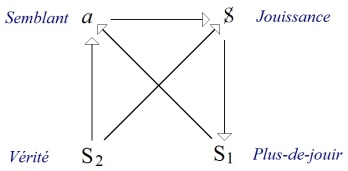
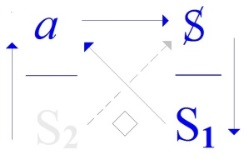
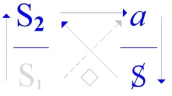
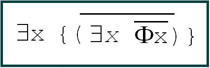

# Leçon 11 | 14 Juin 1972 Séminaire : Panthéon-Sorbonne

  <label><input type="checkbox" data-lacan-toggle="original" checked> 原文</label>
  <label><input type="checkbox" data-lacan-toggle="notes" checked> 注释</label>
  <label><input type="checkbox" data-lacan-toggle="commentary" checked> 个人解读评论</label>

<section class="parallel-paragraph" data-paragraph-ids="s19-11-0001">

s19-11-0001

[无对应译文]

原文 · s19-11-0001

[Recanati](#Recanati)

</section>

<section class="parallel-paragraph" data-paragraph-ids="s19-11-0002">

s19-11-0002

[无对应译文]

原文 · s19-11-0002

\[Au tableau\]

</section>

<section class="parallel-paragraph" data-paragraph-ids="s19-11-0003">

s19-11-0003

[无对应译文]

原文 · s19-11-0003

« *Qu’on dise, comme fait, reste oublié derrière ce qui se dit, dans ce qui s’entend.* »

</section>

<section class="parallel-paragraph" data-paragraph-ids="s19-11-0004">

s19-11-0004

[无对应译文]

原文 · s19-11-0004

Lacan

</section>

<section class="parallel-paragraph" data-paragraph-ids="s19-11-0005">

s19-11-0005

[无对应译文]

原文 · s19-11-0005

Naturellement cet énoncé, qui est assertif dans sa forme d’*Universel*, relève du *modal* pour ce qu’il émet d’existence.

</section>

<section class="parallel-paragraph" data-paragraph-ids="s19-11-0006">

s19-11-0006

[无对应译文]

原文 · s19-11-0006

lors, mettez-y du vôtre, puisque ça semble, comme la dernière fois, marcher assez mal.

</section>

<section class="parallel-paragraph" data-paragraph-ids="s19-11-0007">

s19-11-0007

[无对应译文]

原文 · s19-11-0007

Est-ce que cette fois-ci j’arrive à me faire entendre ? Un peu plus ? Bon ! Je vais faire de mon mieux.

</section>

<section class="parallel-paragraph" data-paragraph-ids="s19-11-0008">

s19-11-0008

[无对应译文]

原文 · s19-11-0008

Bonjour, Sibony, venez donc un peu plus près.

</section>

<section class="parallel-paragraph" data-paragraph-ids="s19-11-0009">

s19-11-0009

[无对应译文]

原文 · s19-11-0009

Venez un peu plus près, on ne sait pas, ça peut servir à quelque chose tout à l’heure.

</section>

<section class="parallel-paragraph" data-paragraph-ids="s19-11-0010">

s19-11-0010

[无对应译文]

原文 · s19-11-0010

Alors, en tenant compte de ce que j’appelais tout à l’heure « *le mixage* », les communications qui ont pu se faire entre mon public d’ici et celui de Sainte-Anne, je suppose que maintenant ils se sont unifiés, c’est le cas de le dire.

</section>

<section class="parallel-paragraph" data-paragraph-ids="s19-11-0011">

s19-11-0011

[无对应译文]

原文 · s19-11-0011

Vous avez pu voir que nous sommes passés de ce que j’ai appelé un jour ici...

</section>

<section class="parallel-paragraph" data-paragraph-ids="s19-11-0012">

s19-11-0012

[无对应译文]

原文 · s19-11-0012

> d’un prédicat formé à votre usage, nommément « *l’unien »...*nous sommes passés la dernière fois à Sainte-Anne au terme d’une autre facture qui se promouverait du terme, de la forme « *unier »*.

</section>

<section class="parallel-paragraph" data-paragraph-ids="s19-11-0013">

s19-11-0013

[无对应译文]

原文 · s19-11-0013

Ce dont je vous ai parlé, ce que j’ai avancé la dernière fois, à Sainte-Anne, c’est le pivot qui se prend dans cet ordre qui se *fonde*, mettez *fonde, fondez*-le enfin, que ça soit, que ça soit du *fondé-fondu*.

</section>

<section class="parallel-paragraph" data-paragraph-ids="s19-11-0014">

s19-11-0014

[无对应译文]

原文 · s19-11-0014

Lacan - *Qu’est-ce qu’il y a ?*

</section>

<section class="parallel-paragraph" data-paragraph-ids="s19-11-0015">

s19-11-0015

[无对应译文]

原文 · s19-11-0015

*X Dans le public : On n’entend rien !*

</section>

<section class="parallel-paragraph" data-paragraph-ids="s19-11-0016">

s19-11-0016

[无对应译文]

原文 · s19-11-0016

Je dis donc que cet « *unier »* qui se fonde...

</section>

<section class="parallel-paragraph" data-paragraph-ids="s19-11-0017">

s19-11-0017

[无对应译文]

原文 · s19-11-0017

> et je vous priais que ce « *fondé* » ne vous paraisse pas trop fondamental,
>
> c’est ce que j’appelais le laisser dans le fondu ...cet « *unier »* qui se fonde, il *y en a Un, il en existe Un* qui dit que non.

</section>

<section class="parallel-paragraph" data-paragraph-ids="s19-11-0018">

s19-11-0018

[无对应译文]

原文 · s19-11-0018

Ça n’est pas tout à fait pareil que de nier, mais cette forgerie du terme « *unier »*, comme un verbe qui se conjugue et d’où nous pourrions avancer en somme pour ce qu’il en est de la fonction, de la fonction représentée dans l’analyse par le mythe du père, *p.e.r.e. *: il *unie*, c’est ça que ceux qui ont pu réussir à entendre à travers les pétards, le point sur lequel j’aimerais justement aujourd’hui, enfin, vous permettre, disons d’accommoder.

</section>

<section class="parallel-paragraph" data-paragraph-ids="s19-11-0019">

s19-11-0019

[无对应译文]

原文 · s19-11-0019

Le père *unie* donc.

</section>

<section class="parallel-paragraph" data-paragraph-ids="s19-11-0020">

s19-11-0020

[无对应译文]

原文 · s19-11-0020

Dans *le mythe*, il a ce corrélat des *toutes*, «* toutes les femmes* ».

</section>

<section class="parallel-paragraph" data-paragraph-ids="s19-11-0021">

s19-11-0021

[无对应译文]

原文 · s19-11-0021

C’est là, si l’on suit mes inscriptions *quantiques*, (*q.u.a.n.t.i.q.u.e.*), qu’il y a lieu d’introduire une modification : il les *unie* certes, mais « *pas toutes* » juste­ment.

</section>

<section class="parallel-paragraph" data-paragraph-ids="s19-11-0022">

s19-11-0022

[无对应译文]

原文 · s19-11-0022

Ici se touche à la fois ce qui n’est pas de mon cru, à dire, à savoir la parenté

</section>

<section class="parallel-paragraph" data-paragraph-ids="s19-11-0023">

s19-11-0023

[无对应译文]

原文 · s19-11-0023

- de la logique

</section>

<section class="parallel-paragraph" data-paragraph-ids="s19-11-0024">

s19-11-0024

[无对应译文]

原文 · s19-11-0024

- et du mythe, ça marque seulement que l’une puisse corriger l’autre.

</section>

<section class="parallel-paragraph" data-paragraph-ids="s19-11-0025">

s19-11-0025

[无对应译文]

原文 · s19-11-0025

Ça, c’est du travail qui reste devant nous.

</section>

<section class="parallel-paragraph" data-paragraph-ids="s19-11-0026">

s19-11-0026

[无对应译文]

原文 · s19-11-0026

Pour l’instant je rappelle qu’avec ce que je me suis permis, enfin d’*approximations du père*, avec ce que j’ai inscrit de *l’é-pater*, vous voyez que la voie qui conjoint à l’occasion le mythe avec la dérision, ne nous est pas étrangère.

</section>

<section class="parallel-paragraph" data-paragraph-ids="s19-11-0027">

s19-11-0027

[无对应译文]

原文 · s19-11-0027

Ça ne touche en rien au statut fondamental des structures intéressées.

</section>

<section class="parallel-paragraph" data-paragraph-ids="s19-11-0028">

s19-11-0028

[无对应译文]

原文 · s19-11-0028

C’est amusant que, comme ça, il y a des gens qui découvrent, qui découvrent sur le tard, ce dont je peux bien dire, de ma place, que c’est un peu général pour l’instant toute cette effervescence, cette turbulence qui se produit autour de termes comme *le signifiant, le signe, la signification, la sémiotique*, tout ce qui occupe pour l’instant le devant de la scène, c’est curieux, les singuliers retards qui s’y montrent.

</section>

<section class="parallel-paragraph" data-paragraph-ids="s19-11-0029">

s19-11-0029

[无对应译文]

原文 · s19-11-0029

Il y a une très bonne petite revue, enfin pas plus mauvaise qu’une autre, dans laquelle je vois surgir sous le titre de *L’Atelier d’écriture* un article, mon Dieu, pas plus mauvais qu’un autre qui s’appelle « *L’Agonie du Signe »...*

</section>

<section class="parallel-paragraph" data-paragraph-ids="s19-11-0030">

s19-11-0030

[无对应译文]

原文 · s19-11-0030

> *Vous entendez ?...*qui s’appelle « *L’Agonie du Signe »*.

</section>

<section class="parallel-paragraph" data-paragraph-ids="s19-11-0031">

s19-11-0031

[无对应译文]

原文 · s19-11-0031

C’est toujours très touchant l’agonie. Agonie veut dire lutte.

</section>

<section class="parallel-paragraph" data-paragraph-ids="s19-11-0032">

s19-11-0032

[无对应译文]

原文 · s19-11-0032

Mais aussi agonie veut dire qu’on est en train de tourner de l’œil, et alors *L’agonie du signe* ça fait, ça fait pathétique.

</section>

<section class="parallel-paragraph" data-paragraph-ids="s19-11-0033">

s19-11-0033

[无对应译文]

原文 · s19-11-0033

J’eusse préféré enfin que ce ne fût pas au pathétique que tout cela tournât.

</section>

<section class="parallel-paragraph" data-paragraph-ids="s19-11-0034">

s19-11-0034

[无对应译文]

原文 · s19-11-0034

Ça part d’une invention charmante, de la possibilité de forger *un nouveau signifiant* qui serait celui de « *fourmi, fourmidable* ». En effet c’est *fourmidable* tout cet article, et on commence par poser la question de *quel peut bien être* *le statut* *de* *fourmidable* ?

</section>

<section class="parallel-paragraph" data-paragraph-ids="s19-11-0035">

s19-11-0035

[无对应译文]

原文 · s19-11-0035

Moi j’aime bien ça.

</section>

<section class="parallel-paragraph" data-paragraph-ids="s19-11-0036">

s19-11-0036

[无对应译文]

原文 · s19-11-0036

D’autant plus que c’est quelqu’un qui quand même est très averti depuis longtemps d’un certain nombre de choses que j’avance et qui pour, en somme, au début de cet article, se croire obligé de faire l’innocent, à savoir d’hésiter, à propos de *fourmidable*, à le ranger soit dans *la métaphore*, soit dans *la métonymie* et de dire qu’il y a quelque chose qui est négligé donc, dans la théorie jakobsonienne, c’est celle qui consisterait à *emboutir des mots les uns avec les autres.*

</section>

<section class="parallel-paragraph" data-paragraph-ids="s19-11-0037">

s19-11-0037

[无对应译文]

原文 · s19-11-0037

Mais il y a longtemps que j’ai expliqué ça !

</section>

<section class="parallel-paragraph" data-paragraph-ids="s19-11-0038">

s19-11-0038

[无对应译文]

原文 · s19-11-0038

J’ai écrit *L’Instance de la lettre* exprès pour ça, S sur petit s avec le résultat, un, parenthèse, effet de *signi­fication*, \[long soupir de Lacan, rires dans le public\] *c’est le déplacement, c’est la condensation*.

</section>

<section class="parallel-paragraph" data-paragraph-ids="s19-11-0039">

s19-11-0039

[无对应译文]

原文 · s19-11-0039

C’est très exactement la voie par où en effet on peut créer*...*

</section>

<section class="parallel-paragraph" data-paragraph-ids="s19-11-0040">

s19-11-0040

[无对应译文]

原文 · s19-11-0040

> ce qui est quand même un petit peu plus amusant et utile que « *fourmidable »...*on peut créer « *unier* » \[*Rires*\].

</section>

<section class="parallel-paragraph" data-paragraph-ids="s19-11-0041">

s19-11-0041

[无对应译文]

原文 · s19-11-0041

Et puis ça sert à quelque chose.

</section>

<section class="parallel-paragraph" data-paragraph-ids="s19-11-0042">

s19-11-0042

[无对应译文]

原文 · s19-11-0042

Ça sert à vous expliquer par une autre voie, ce que j’ai tout à fait renoncé à aborder par celle du *Nom-du-père*.

</section>

<section class="parallel-paragraph" data-paragraph-ids="s19-11-0043">

s19-11-0043

[无对应译文]

原文 · s19-11-0043

J’y ai renoncé parce qu’on m’en a empêché à un moment, et puis que c’était justement les gens à qui ça aurait pu rendre service qui m’en ont empêché.

</section>

<section class="parallel-paragraph" data-paragraph-ids="s19-11-0044">

s19-11-0044

[无对应译文]

原文 · s19-11-0044

Ça aurait pu leur rendre service dans leur... dans leur *intimité personnelle*.

</section>

<section class="parallel-paragraph" data-paragraph-ids="s19-11-0045">

s19-11-0045

[无对应译文]

原文 · s19-11-0045

C’est des gens particulièrement impliqués du côté du *Nom-du-père*.

</section>

<section class="parallel-paragraph" data-paragraph-ids="s19-11-0046">

s19-11-0046

[无对应译文]

原文 · s19-11-0046

Il y a une clique très spéciale dans le monde, comme ça, qu’on peut épingler d’une tradition religieuse, c’est eux que ça aurait aéré, mais je vois pas pourquoi je me dévouerais spécialement à ceux-là.

</section>

<section class="parallel-paragraph" data-paragraph-ids="s19-11-0047">

s19-11-0047

[无对应译文]

原文 · s19-11-0047

Alors j’explique l’histoire de ce que Freud a abordé comme il a pu, jus­tement, pour éviter sa propre histoire*...*

</section>

<section class="parallel-paragraph" data-paragraph-ids="s19-11-0048">

s19-11-0048

[无对应译文]

原文 · s19-11-0048

> « *El shaddaï* » en particulier, c’est le nom dont il désigne « *celui dont le nom ne se dit pas* » *...*il s’est reporté sur les mythes, puis il a fait quelque chose de très propre en somme, d’un peu aseptique, il ne l’a pas poussé plus loin, mais c’est bien là ce dont il s’agit, c’est qu’on laisse passer les occasions de reprendre ce qui le dirigeait, et ce qui devrait faire maintenant que le psychanalyste soit à sa place dans son discours.

</section>

<section class="parallel-paragraph" data-paragraph-ids="s19-11-0049">

s19-11-0049

[无对应译文]

原文 · s19-11-0049

Sa chance est passée. Je l’ai déjà dit.

</section>

<section class="parallel-paragraph" data-paragraph-ids="s19-11-0050">

s19-11-0050

[无对应译文]

原文 · s19-11-0050

De sorte que dans l’avion là, qui me ramenait de je ne sais où, qui me ramenait de Milan d’où je reviens hier soir...

</section>

<section class="parallel-paragraph" data-paragraph-ids="s19-11-0051">

s19-11-0051

[无对应译文]

原文 · s19-11-0051

> bon ! j’ai pas apporté le truc ...c’est vraiment très bien, c’est dans l’avion, dans un truc qui s’appelle *Atlas* et qui est distribué à tous les voyageurs par la Compagnie *Air France *: il y a un très très joli petit article...

</section>

<section class="parallel-paragraph" data-paragraph-ids="s19-11-0052">

s19-11-0052

[无对应译文]

原文 · s19-11-0052

> heureusement que je ne l’ai pas, je l’ai oublié chez moi, heureusement parce que ça m’aurait entraîné
>
> à vous lire des passages et il n’y a rien d’ennuyeux comme d’entendre lire,
>
> il n’y a rien d’ennuyeux comme ça ! ...enfin, il y a des *psychologues*...

</section>

<section class="parallel-paragraph" data-paragraph-ids="s19-11-0053">

s19-11-0053

[无对应译文]

原文 · s19-11-0053

> des psychologues de la plus haute volée, n’est-ce pas, ...qui s’emploient aux Amériques à faire des enquêtes sur les rêves. Parce que sur les rêves on enquête, n’est-ce pas.

</section>

<section class="parallel-paragraph" data-paragraph-ids="s19-11-0054">

s19-11-0054

[无对应译文]

原文 · s19-11-0054

On enquête et on s’aperçoit, enfin, que c’est très rare les rêves sexuels. \[*Rires*\]

</section>

<section class="parallel-paragraph" data-paragraph-ids="s19-11-0055">

s19-11-0055

[无对应译文]

原文 · s19-11-0055

Ils rêvent de tout, ces gens-là :

</section>

<section class="parallel-paragraph" data-paragraph-ids="s19-11-0056">

s19-11-0056

[无对应译文]

原文 · s19-11-0056

- ils rêvent *de sport*,

</section>

<section class="parallel-paragraph" data-paragraph-ids="s19-11-0057">

s19-11-0057

[无对应译文]

原文 · s19-11-0057

- ils rêvent de tas *de blagues*,

</section>

<section class="parallel-paragraph" data-paragraph-ids="s19-11-0058">

s19-11-0058

[无对应译文]

原文 · s19-11-0058

- ils rêvent *de chutes*, enfin, il n’y a pas une majorité écra­sante de *rêves sexuels*. \[*Rires*\]

</section>

<section class="parallel-paragraph" data-paragraph-ids="s19-11-0059">

s19-11-0059

[无对应译文]

原文 · s19-11-0059

D’où il résulte, n’est-ce pas, que comme ce qui est la conception générale - nous dit-on dans ce texte - de *la psychanalyse*, c’est de croire que les rêves sont sexuels, eh bien le grand public...

</section>

<section class="parallel-paragraph" data-paragraph-ids="s19-11-0060">

s19-11-0060

[无对应译文]

原文 · s19-11-0060

> le grand public qui justement est fait de la diffusion psychanalytique,
>
> vous aussi vous êtes un grand public ...ben le grand public naturellement va être défrisé, n’est-ce pas, et tout le soufflé va tomber comme ça, s’aplatir dans le fond de la casserole.

</section>

<section class="parallel-paragraph" data-paragraph-ids="s19-11-0061">

s19-11-0061

[无对应译文]

原文 · s19-11-0061

C’est quand même curieux que personne, en somme, dans ce grand public supposé, car tout ça c’est de la supposition, enfin c’est vrai que dans une certaine résonance tous les rêves, c’est ce qu’aurait dit Freud, qu’ils étaient tous sexuels.

</section>

<section class="parallel-paragraph" data-paragraph-ids="s19-11-0062">

s19-11-0062

[无对应译文]

原文 · s19-11-0062

Il n’a jamais dit ça justement... jamais, jamais dit ça !

</section>

<section class="parallel-paragraph" data-paragraph-ids="s19-11-0063">

s19-11-0063

[无对应译文]

原文 · s19-11-0063

*Il a dit que les rêves étaient « des rêves de désir », il n’a jamais dit que c’était du désir sexuel !*

</section>

<section class="parallel-paragraph" data-paragraph-ids="s19-11-0064">

s19-11-0064

[无对应译文]

原文 · s19-11-0064

Seulement, comprendre le rapport qu’il y a entre le fait que les rêves soient « *des rêves de désir* » et cet ordre du sexuel qui se caractérise par ce que je suis en train d’avancer, parce qu’il m’a fallu le temps pour l’aborder et ne pas jeter le désordre dans l’esprit de *ces charmantes personnes*, n’est-ce pas, qui ont fait qu’au bout de 10 ans que je leur racontais des trucs, n’est-ce pas, ils songeaient qu’à une chose, rentrer dans le sein de l’*Internationale Psychanalytique*.

</section>

<section class="parallel-paragraph" data-paragraph-ids="s19-11-0065">

s19-11-0065

[无对应译文]

原文 · s19-11-0065

Tout ce que j’avais pu raconter, c’était bien sûr des beaux exercices, des exercices de style.

</section>

<section class="parallel-paragraph" data-paragraph-ids="s19-11-0066">

s19-11-0066

[无对应译文]

原文 · s19-11-0066

Eux étaient dans le sérieux : le sérieux, c’est *l’Internationale Psychanalytique*.

</section>

<section class="parallel-paragraph" data-paragraph-ids="s19-11-0067">

s19-11-0067

[无对应译文]

原文 · s19-11-0067

Ce qui fait que maintenant je peux avancer - et qu’on l’entende - *qu’il n’y a pas de rapport sexuel*, et que c’est pour ça qu’il y a tout un ordre qui fonctionne à la place où il y aurait ce rapport.

</section>

<section class="parallel-paragraph" data-paragraph-ids="s19-11-0068">

s19-11-0068

[无对应译文]

原文 · s19-11-0068

Et que c’est là, dans cet ordre, que quelque chose est conséquent comme *effet de langa­ge*, à savoir *le désir*.

</section>

<section class="parallel-paragraph" data-paragraph-ids="s19-11-0069">

s19-11-0069

[无对应译文]

原文 · s19-11-0069

Et qu’on pourrait peut-être avancer un tout petit peu, et penser que quand Freud disait que « *le rêve, c’est la satisfaction d’un désir » *: « *satisfaction* » dans quel sens ?

</section>

<section class="parallel-paragraph" data-paragraph-ids="s19-11-0070">

s19-11-0070

[无对应译文]

原文 · s19-11-0070

Quand je pense que j’en suis encore là, n’est-ce pas, que *personne*...

</section>

<section class="parallel-paragraph" data-paragraph-ids="s19-11-0071">

s19-11-0071

[无对应译文]

原文 · s19-11-0071

> de tous ces gens qui s’occupent à embrouiller ce que je dis, à en faire du bruit ...*personne* ne s’est encore jamais avisé d’avancer cette chose qui est pourtant *la stricte conséquence* de tout ce que j’ai avancé, que j’ai articulé de la façon la plus précise...

</section>

<section class="parallel-paragraph" data-paragraph-ids="s19-11-0072">

s19-11-0072

[无对应译文]

原文 · s19-11-0072

> si mon souvenir est bon, en 57... attendez, même pas : en 55 ! ...à propos du « *rêve de l’injection d’Irma » *: j’ai pris, pour montrer comment on traite un texte de Freud, je leur ai bien expliqué ce qu’il avait d’ambigu, que ce soit là justement...

</section>

<section class="parallel-paragraph" data-paragraph-ids="s19-11-0073">

s19-11-0073

[无对应译文]

原文 · s19-11-0073

> mais pas du tout dans l’inconscient : au niveau de ses préoccupations présentes ...que Freud interprète ce rêve, ce rêve de désir qui n’a rien à faire avec le désir sexuel, même s’il y a toutes les implications de transfert qui nous conviennent.

</section>

<section class="parallel-paragraph" data-paragraph-ids="s19-11-0074">

s19-11-0074

[无对应译文]

原文 · s19-11-0074

Le terme d’« *immixtion des sujets* », je l’ai avancé en 55, vous vous rendez compte : 17 ans, hein...

</section>

<section class="parallel-paragraph" data-paragraph-ids="s19-11-0075">

s19-11-0075

[无对应译文]

原文 · s19-11-0075

Et puis il est clair qu’il faudra que je le publie comme ça, parce que si je l’ai pas publié c’est que *j’étais absolument écœuré* de la façon dont ça avait été repris dans un certain livre sorti sous le titre d’« *Auto-analyse »* [^25], c’était mon texte, mais en y remettant de façon à ce que personne n’y comprenne rien.

</section>

<section class="parallel-paragraph" data-paragraph-ids="s19-11-0076">

s19-11-0076

[无对应译文]

原文 · s19-11-0076

Qu’est-ce que ça fait un rêve ? Ça ne satisfait pas le désir !

</section>

<section class="parallel-paragraph" data-paragraph-ids="s19-11-0077">

s19-11-0077

[无对应译文]

原文 · s19-11-0077

Pour des raisons fondamentales...

</section>

<section class="parallel-paragraph" data-paragraph-ids="s19-11-0078">

s19-11-0078

[无对应译文]

原文 · s19-11-0078

> que je ne vais pas me mettre à développer aujourd’hui parce que, parce que ça vaut 4 ou 5 séminaires ...pour la raison qui est simplement celle-ci et qui est touchable, et que Freud dit : que le seul désir fondamental dans le sommeil, c’est le désir de dormir. \[*Rires*\]

</section>

<section class="parallel-paragraph" data-paragraph-ids="s19-11-0079">

s19-11-0079

[无对应译文]

原文 · s19-11-0079

Ça vous fait rigoler, parce que vous n’avez jamais entendu ça.

</section>

<section class="parallel-paragraph" data-paragraph-ids="s19-11-0080">

s19-11-0080

[无对应译文]

原文 · s19-11-0080

Très bien !

</section>

<section class="parallel-paragraph" data-paragraph-ids="s19-11-0081">

s19-11-0081

[无对应译文]

原文 · s19-11-0081

Pourtant, c’est dans Freud...

</section>

<section class="parallel-paragraph" data-paragraph-ids="s19-11-0082">

s19-11-0082

[无对应译文]

原文 · s19-11-0082

Comment est-ce que ça ne vient pas tout de suite à votre jugeote, en quoi ça consiste de dormir ?

</section>

<section class="parallel-paragraph" data-paragraph-ids="s19-11-0083">

s19-11-0083

[无对应译文]

原文 · s19-11-0083

Ça consiste en ceci que ce qui dans ma tétrade, là, *le semblant, la vérité et la jouissance, et le plus de jouir*...

</section>

<section class="parallel-paragraph" data-paragraph-ids="s19-11-0084">

s19-11-0084

[无对应译文]

原文 · s19-11-0084

> faut pas que je le récrive au tableau, non ? ...ce qu’il s’agit de suspendre...

</section>

<section class="parallel-paragraph" data-paragraph-ids="s19-11-0085">

s19-11-0085

[无对应译文]

原文 · s19-11-0085

> c’est pour ça que c’est fait le sommeil,
>
> n’importe qui n’a qu’à regarder un animal dormir pour s’en apercevoir ...ce qu’il s’agit de suspendre justement, c’est cet *ambigu* qu’il y a dans le rapport au corps avec lui-même : le *jouir*.

</section>

<section class="parallel-paragraph" data-paragraph-ids="s19-11-0086">

s19-11-0086

[无对应译文]

原文 · s19-11-0086

S’il y a possibilité que ce corps accède au *jouir de soi*, c’est bien évidemment partout :

</section>

<section class="parallel-paragraph" data-paragraph-ids="s19-11-0087">

s19-11-0087

[无对应译文]

原文 · s19-11-0087

- c’est quand il se cogne,

</section>

<section class="parallel-paragraph" data-paragraph-ids="s19-11-0088">

s19-11-0088

[无对应译文]

原文 · s19-11-0088

- qu’il se fait mal,

</section>

<section class="parallel-paragraph" data-paragraph-ids="s19-11-0089">

s19-11-0089

[无对应译文]

原文 · s19-11-0089

- c’est ça *la jouissance*.

</section>

<section class="parallel-paragraph" data-paragraph-ids="s19-11-0090">

s19-11-0090

[无对应译文]

原文 · s19-11-0090

Alors l’homme a là de petites portes d’entrée que n’ont pas les autres, il peut en faire un but.

</section>

<section class="parallel-paragraph" data-paragraph-ids="s19-11-0091">

s19-11-0091

[无对应译文]

原文 · s19-11-0091

En tout cas quand il dort, c’est fini.

</section>

<section class="parallel-paragraph" data-paragraph-ids="s19-11-0092">

s19-11-0092

[无对应译文]

原文 · s19-11-0092

Il s’agit justement de faire que ce corps, il s’enroule, il se mette en boule.

</section>

<section class="parallel-paragraph" data-paragraph-ids="s19-11-0093">

s19-11-0093

[无对应译文]

原文 · s19-11-0093

Dormir, c’est ne pas être dérangé.

</section>

<section class="parallel-paragraph" data-paragraph-ids="s19-11-0094">

s19-11-0094

[无对应译文]

原文 · s19-11-0094

La jouissance, quand même, c’est dérangeant.

</section>

<section class="parallel-paragraph" data-paragraph-ids="s19-11-0095">

s19-11-0095

[无对应译文]

原文 · s19-11-0095

Naturellement on le dérange, mais enfin tant qu’il dort, il peut espérer ne pas être dérangé.

</section>

<section class="parallel-paragraph" data-paragraph-ids="s19-11-0096">

s19-11-0096

[无对应译文]

原文 · s19-11-0096

</section>

<section class="parallel-paragraph" data-paragraph-ids="s19-11-0097">

s19-11-0097

[无对应译文]

原文 · s19-11-0097

C’est pour ça qu’à partir de là tout le reste s’évanouit : il n’est plus question

</section>

<section class="parallel-paragraph" data-paragraph-ids="s19-11-0098">

s19-11-0098

[无对应译文]

原文 · s19-11-0098

- non plus de *semblant*,

</section>

<section class="parallel-paragraph" data-paragraph-ids="s19-11-0099">

s19-11-0099

[无对应译文]

原文 · s19-11-0099

- ni de *véri­té* puisque tout ça, ça se tient, c’est la même chose,

</section>

<section class="parallel-paragraph" data-paragraph-ids="s19-11-0100">

s19-11-0100

[无对应译文]

原文 · s19-11-0100

- ni de *plus-de-jouir*.

</section>

<section class="parallel-paragraph" data-paragraph-ids="s19-11-0101">

s19-11-0101

[无对应译文]

原文 · s19-11-0101

Seulement voilà... ce que Freud dit, c’est que *le signifiant*, lui, continue pendant ce temps-là à cavaler.

</section>

<section class="parallel-paragraph" data-paragraph-ids="s19-11-0102">

s19-11-0102

[无对应译文]

原文 · s19-11-0102

C’est bien pour ça que, même quand je dors, je prépare mes séminaires.

</section>

<section class="parallel-paragraph" data-paragraph-ids="s19-11-0103">

s19-11-0103

[无对应译文]

原文 · s19-11-0103

Monsieur Poincaré découvrait les fonctions fuchsiennes...

</section>

<section class="parallel-paragraph" data-paragraph-ids="s19-11-0104">

s19-11-0104

[无对应译文]

原文 · s19-11-0104

Qu’est-ce qu’il y a ?

</section>

<section class="parallel-paragraph" data-paragraph-ids="s19-11-0105">

s19-11-0105

[无对应译文]

原文 · s19-11-0105

*X dans la salle – Cest une pollution !*

</section>

<section class="parallel-paragraph" data-paragraph-ids="s19-11-0106">

s19-11-0106

[无对应译文]

原文 · s19-11-0106

Qui vient de dire ce terme précis ?

</section>

<section class="parallel-paragraph" data-paragraph-ids="s19-11-0107">

s19-11-0107

[无对应译文]

原文 · s19-11-0107

*X dans la salle – C’est moi.*

</section>

<section class="parallel-paragraph" data-paragraph-ids="s19-11-0108">

s19-11-0108

[无对应译文]

原文 · s19-11-0108

Oui c’est ça, mais *je suis particulièrement satisfait de vous voir choisir ce terme*, vous devez être particulièrement intelligent \[*Rires*\].

</section>

<section class="parallel-paragraph" data-paragraph-ids="s19-11-0109">

s19-11-0109

[无对应译文]

原文 · s19-11-0109

Je me suis déjà réjoui publiquement de ce qu’une de mes analysées...

</section>

<section class="parallel-paragraph" data-paragraph-ids="s19-11-0110">

s19-11-0110

[无对应译文]

原文 · s19-11-0110

> qui est quelque part donc par là,
>
> qui est une personne particulièrement sensible ...ait parlé en effet à propos de mon discours de « *pollution intellectuelle* ».

</section>

<section class="parallel-paragraph" data-paragraph-ids="s19-11-0111">

s19-11-0111

[无对应译文]

原文 · s19-11-0111

C’est une dimension très *fondamentale*, voyez-vous la pollution.

</section>

<section class="parallel-paragraph" data-paragraph-ids="s19-11-0112">

s19-11-0112

[无对应译文]

原文 · s19-11-0112

J’aurais pas probablement poussé les choses jusque-là aujourd’hui, mais vous avez l’air tellement fier d’avoir fait surgir ce terme de « *pollution* » que je soupçonne que vous ne devez rien y comprendre.

</section>

<section class="parallel-paragraph" data-paragraph-ids="s19-11-0113">

s19-11-0113

[无对应译文]

原文 · s19-11-0113

Néanmoins vous allez voir que je vais tout de suite, non seulement en faire usage, mais me réjouir une seconde fois que quelqu’un l’ai fait surgir, car c’est précisément ça la difficulté du *discours analytique*.

</section>

<section class="parallel-paragraph" data-paragraph-ids="s19-11-0114">

s19-11-0114

[无对应译文]

原文 · s19-11-0114

Je relève cette interruption, je saute là-dessus, j’embarque une chose que dans l’urgence d’une fin d’année, je me trouverai donc avoir l’occasion de dire.

</section>

<section class="parallel-paragraph" data-paragraph-ids="s19-11-0115">

s19-11-0115

[无对应译文]

原文 · s19-11-0115

</section>

<section class="parallel-paragraph" data-paragraph-ids="s19-11-0116">

s19-11-0116

[无对应译文]

原文 · s19-11-0116

C’est ceci : puisque c’est à la place du *semblant* que le *discours analytique* se caractérise de situer *l’objet petit(a),* figurez-vous, Monsieur, qui croyez avoir fait là un coup d’éclat, que vous abondez précisément dans le sens de ce que j’ai à avancer.

</section>

<section class="parallel-paragraph" data-paragraph-ids="s19-11-0117">

s19-11-0117

[无对应译文]

原文 · s19-11-0117

C’est à savoir que *la pollution* la plus caractéristique dans ce monde, c’est très exactement *l’objet petit(a)* dont l’homme prend, et vous aussi vous prenez votre substance, et que c’est de devoir...

</section>

<section class="parallel-paragraph" data-paragraph-ids="s19-11-0118">

s19-11-0118

[无对应译文]

原文 · s19-11-0118

> de cette pollution qui est l’effet le plus certain sur la surface du globe ...de devoir en faire - en son corps, en son existence d’analyste - représentation, qu’il y regarde à plus d’une fois.

</section>

<section class="parallel-paragraph" data-paragraph-ids="s19-11-0119">

s19-11-0119

[无对应译文]

原文 · s19-11-0119

Les chers petits *en sont malades*, et je dois vous dire que je ne suis pas non plus moi-même dans cette situation plus à l’aise.

</section>

<section class="parallel-paragraph" data-paragraph-ids="s19-11-0120">

s19-11-0120

[无对应译文]

原文 · s19-11-0120

Ce que j’essaie de leur démontrer, c’est que ce n’est pas tout à fait impossible de le faire un peu décemment.

</section>

<section class="parallel-paragraph" data-paragraph-ids="s19-11-0121">

s19-11-0121

[无对应译文]

原文 · s19-11-0121

Grâce à la logique, j’arrive à leur...

</section>

<section class="parallel-paragraph" data-paragraph-ids="s19-11-0122">

s19-11-0122

[无对应译文]

原文 · s19-11-0122

> s’ils voulaient bien se laisser tenter ...leur rendre supportable cette position qu’ils occupent en tant que *petit(a)* dans *le discours analytique*, pour se permettre de concevoir que *ce n’est évidemment pas peu de choses* que d’élever cette fonction à *une position de semblant* qui est la *position-clé* dans tout discours.

</section>

<section class="parallel-paragraph" data-paragraph-ids="s19-11-0123">

s19-11-0123

[无对应译文]

原文 · s19-11-0123

C’est là qu’est le ressort de ce que j’ai toujours essayé de faire sentir comme la résistance...

</section>

<section class="parallel-paragraph" data-paragraph-ids="s19-11-0124">

s19-11-0124

[无对应译文]

原文 · s19-11-0124

> et elle n’est que trop compréhensible ...de l’analyste, à vraiment remplir sa fonction.

</section>

<section class="parallel-paragraph" data-paragraph-ids="s19-11-0125">

s19-11-0125

[无对应译文]

原文 · s19-11-0125

Il ne faut pas croire que *la position du semblant* elle soit aisée pour qui que ce soit, elle n’est vraiment tenable qu’au niveau du *discours scientifique* et pour une simple raison, c’est que là, ce qui est porté à la position de commandement est quelque chose de tout à fait de l’ordre du *réel*, en tant que tout ce que nous touchons du *réel*,

</section>

<section class="parallel-paragraph" data-paragraph-ids="s19-11-0126">

s19-11-0126

[无对应译文]

原文 · s19-11-0126

- c’est la *Spaltung*,

</section>

<section class="parallel-paragraph" data-paragraph-ids="s19-11-0127">

s19-11-0127

[无对应译文]

原文 · s19-11-0127

- c’est *la fente*,

</section>

<section class="parallel-paragraph" data-paragraph-ids="s19-11-0128">

s19-11-0128

[无对应译文]

原文 · s19-11-0128

- autrement dit c’est la façon dont je définis le sujet.

</section>

<section class="parallel-paragraph" data-paragraph-ids="s19-11-0129">

s19-11-0129

[无对应译文]

原文 · s19-11-0129

C’est parce que dans *le discours scientifique*, c’est le grand S, le S *barré* \[S\] qui est là, à la position-clé, que ça tient.

</section>

<section class="parallel-paragraph" data-paragraph-ids="s19-11-0130">

s19-11-0130

[无对应译文]

原文 · s19-11-0130

</section>

<section class="parallel-paragraph" data-paragraph-ids="s19-11-0131">

s19-11-0131

[无对应译文]

原文 · s19-11-0131

Pour *le discours universitaire*, c’est le savoir :

</section>

<section class="parallel-paragraph" data-paragraph-ids="s19-11-0132">

s19-11-0132

[无对应译文]

原文 · s19-11-0132

</section>

<section class="parallel-paragraph" data-paragraph-ids="s19-11-0133">

s19-11-0133

[无对应译文]

原文 · s19-11-0133

Là, la difficulté est encore bien plus grande, à cause d’une espèce de court-circuit : parce que pour faire *semblant de savoir*, il faut savoir *faire semblant*, et ça s’use vite.

</section>

<section class="parallel-paragraph" data-paragraph-ids="s19-11-0134">

s19-11-0134

[无对应译文]

原文 · s19-11-0134

C’est bien pour ça que quand j’étais là...

</section>

<section class="parallel-paragraph" data-paragraph-ids="s19-11-0135">

s19-11-0135

[无对应译文]

原文 · s19-11-0135

> là d’où je reviens comme je vous l’ai dit tout à l’heure, à savoir à Milan, ...j’avais une assistance évidemment beaucoup moins nombreuse que la vôtre, mettons le quart, mais qu’il y avait là beaucoup de jeunes, beaucoup ces jeunes qui sont ceux qu’on appelle « *dans le mouvement* », il y avait même *un personnage* tout à fait respectable et d’une assez haute stature qui se trouve en être là-bas *le représentant*, sait-il ou ne sait-il pas...

</section>

<section class="parallel-paragraph" data-paragraph-ids="s19-11-0136">

s19-11-0136

[无对应译文]

原文 · s19-11-0136

> on m’a dit qu’il n’était là *qu’après*, je n’ai pas voulu l’interroger ...sait-il ou ne sait-il pas qu’en étant là dans cette pointe, ce qu’il veut c’est comme tous ceux qui sont ici intéressés un peu par *le mouvement*, c’est redonner au *dis­cours universitaire* sa valeur.

</section>

<section class="parallel-paragraph" data-paragraph-ids="s19-11-0137">

s19-11-0137

[无对应译文]

原文 · s19-11-0137

Comme le nom l’indique, elle aboutit aux « *unités de valeurs »*.

</section>

<section class="parallel-paragraph" data-paragraph-ids="s19-11-0138">

s19-11-0138

[无对应译文]

原文 · s19-11-0138

Ils voudraient qu’on sache un peu mieux comment faire *semblant de savoir*.

</section>

<section class="parallel-paragraph" data-paragraph-ids="s19-11-0139">

s19-11-0139

[无对应译文]

原文 · s19-11-0139

C’est cela qui les guide. Ben en effet, c’est respectable et pourquoi pas ?

</section>

<section class="parallel-paragraph" data-paragraph-ids="s19-11-0140">

s19-11-0140

[无对应译文]

原文 · s19-11-0140

*Le discours universitaire* est d’un statut aussi fondamental qu’un autre.

</section>

<section class="parallel-paragraph" data-paragraph-ids="s19-11-0141">

s19-11-0141

[无对应译文]

原文 · s19-11-0141

Simplement ce que je marque *c’est que c’est pas le même*, parce que c’est vrai : *ça n’est pas le même que* *le discours psychanalytique*. La place du *semblant* y est tenue différemment.

</section>

<section class="parallel-paragraph" data-paragraph-ids="s19-11-0142">

s19-11-0142

[无对应译文]

原文 · s19-11-0142

Et alors c’est comme ça que j’ai été amené là-bas...

</section>

<section class="parallel-paragraph" data-paragraph-ids="s19-11-0143">

s19-11-0143

[无对应译文]

原文 · s19-11-0143

Mon Dieu, comment faire avec un auditoire nouveau et surtout s’il peut confondre ?

</section>

<section class="parallel-paragraph" data-paragraph-ids="s19-11-0144">

s19-11-0144

[无对应译文]

原文 · s19-11-0144

J’ai essayé de leur expliquer un tout petit peu quelle était ma place dans l’histoire.

</section>

<section class="parallel-paragraph" data-paragraph-ids="s19-11-0145">

s19-11-0145

[无对应译文]

原文 · s19-11-0145

J’ai commencé par dire

</section>

<section class="parallel-paragraph" data-paragraph-ids="s19-11-0146">

s19-11-0146

[无对应译文]

原文 · s19-11-0146

- que mes *Écrits* c’était *la poubellication*,

</section>

<section class="parallel-paragraph" data-paragraph-ids="s19-11-0147">

s19-11-0147

[无对应译文]

原文 · s19-11-0147

- qu’il fallait pas qu’ils croient qu’ils pouvaient là-dessus se repérer.

</section>

<section class="parallel-paragraph" data-paragraph-ids="s19-11-0148">

s19-11-0148

[无对应译文]

原文 · s19-11-0148

Il y avait quand même, et alors là, le mot « *séminaire »*. Bien sûr comment leur faire comprendre que...

</section>

<section class="parallel-paragraph" data-paragraph-ids="s19-11-0149">

s19-11-0149

[无对应译文]

原文 · s19-11-0149

> ce que j’ai été forcé d’expliquer, d’avouer ...que le séminaire, ce n’est pas un séminaire, c’est un truc que je dégoise tout seul, mes bons amis, depuis des années, mais qu’il y avait autrefois un temps où ça méritait son nom, où il y avait des gens qui intervenaient ?

</section>

<section class="parallel-paragraph" data-paragraph-ids="s19-11-0150">

s19-11-0150

[无对应译文]

原文 · s19-11-0150

Alors c’est ça qui m’a mis hors de moi, d’en être forcé d’en venir là.

</section>

<section class="parallel-paragraph" data-paragraph-ids="s19-11-0151">

s19-11-0151

[无对应译文]

原文 · s19-11-0151

Et comme sur la route du retour quelqu’un me pressait pour me dire : « *ah ben, comment est-ce que c’était au temps où c’était comme un séminai­re ?* », je me suis dit, aujourd’hui je vais leur dire...

</section>

<section class="parallel-paragraph" data-paragraph-ids="s19-11-0152">

s19-11-0152

[无对应译文]

原文 · s19-11-0152

> pour l’avant-dernière fois que je vous vois, parce que je vous verrai encore une fois ...bon Dieu, que quelqu’un vienne dire quelque chose !

</section>

<section class="parallel-paragraph" data-paragraph-ids="s19-11-0153">

s19-11-0153

[无对应译文]

原文 · s19-11-0153

Là-dessus je reçois une lettre de Monsieur Recanati...

</section>

<section class="parallel-paragraph" data-paragraph-ids="s19-11-0154">

s19-11-0154

[无对应译文]

原文 · s19-11-0154

> je vous raconte pas d’*histoire* pour l’instant, je fais pas semblant de faire surgir du *floor* une intervention, je dis simplement que j’ai reçu une lettre, qui était d’ailleurs une réponse à une des miennes ...de Monsieur Recanati qui est là, qui m’a prouvé, à ma grande surprise - n’est-ce pas ? – qu’il avait entendu *quelque chose* de ce que j’ai dit cette année.

</section>

<section class="parallel-paragraph" data-paragraph-ids="s19-11-0155">

s19-11-0155

[无对应译文]

原文 · s19-11-0155

Alors je vais lui passer la parole parce qu’il a à vous parler de quelque chose qui a les plus étroits rapports avec ce que j’essaie de frayer, avec *la théorie des ensembles* notamment, n’est-ce pas, et avec la logique mathématique, il va vous dire laquelle.

</section>

<section class="parallel-paragraph" data-paragraph-ids="s19-11-0156">

s19-11-0156

[无对应译文]

原文 · s19-11-0156

###  [François Recanati](#Recanati_R)

</section>

<section class="parallel-paragraph" data-paragraph-ids="s19-11-0157">

s19-11-0157

[无对应译文]

原文 · s19-11-0157

\[*Cf. Scilicet* 4 : « *Intervention au séminaire du Docteur Lacan* », pp. 55-73\]

</section>

<section class="parallel-paragraph" data-paragraph-ids="s19-11-0158">

s19-11-0158

[无对应译文]

原文 · s19-11-0158

La lettre à laquelle le Dr Lacan vient de faire allusion était en fait quelques remarques et commentaires, sur trois textes de Peirce que je lui ai remis, non pas tant qu’il ne les connût pas, c’est évident, mais parce que ces textes, justement, différaient de ce à quoi il avait pu, par ailleurs, faire référence.

</section>

<section class="parallel-paragraph" data-paragraph-ids="s19-11-0159">

s19-11-0159

[无对应译文]

原文 · s19-11-0159

Il s’agissait d’une part de textes de cosmologie, et d’autre part de textes ayant rapport à la mathématique.

</section>

<section class="parallel-paragraph" data-paragraph-ids="s19-11-0160">

s19-11-0160

[无对应译文]

原文 · s19-11-0160

Je vais tout d’abord préciser un peu la teneur de ces trois textes avant d’en venir à la manière dont je pourrai en parler.

</section>

<section class="parallel-paragraph" data-paragraph-ids="s19-11-0161">

s19-11-0161

[无对应译文]

原文 · s19-11-0161

Quant à la mathématique, Peirce donne une critique des définitions qu’il connaît des *ensembles continus*.

</section>

<section class="parallel-paragraph" data-paragraph-ids="s19-11-0162">

s19-11-0162

[无对应译文]

原文 · s19-11-0162

Il examine trois définitions, nommément celle d’Aristote, celle de Kant, celle de Cantor, qu’il critique toutes, et en fonction d’un critère unique.

</section>

<section class="parallel-paragraph" data-paragraph-ids="s19-11-0163">

s19-11-0163

[无对应译文]

原文 · s19-11-0163

Le critère, c’est qu’il voudrait que dans chaque définition soit marqué le fait même de la définition, puisque, dit-il, à définir *un ensemble conti­nu*, on n’est pas sans le déterminer d’une certaine manière et ceci est important pour le résultat de la définition.

</section>

<section class="parallel-paragraph" data-paragraph-ids="s19-11-0164">

s19-11-0164

[无对应译文]

原文 · s19-11-0164

Le processus même de la défi­nition doit être marqué quelque part, comme tel.

</section>

<section class="parallel-paragraph" data-paragraph-ids="s19-11-0165">

s19-11-0165

[无对应译文]

原文 · s19-11-0165

Quant à la cosmologie, Peirce parle d’un problème à peu près similaire, d’une préoccupation similaire à propos du problème de la genèse de l’univers. Son problème c’est celui de l’avant et de l’après. On ne peut accéder à ce qu’il y avait avant en faisant la simple opération analytique qui consiste à retirer à ce qu’il y a eu après, tout ce qui fait le caractère de cet *après*, puisque on n’aboutirait par là qu’à un *après* raturé et que précisément c’est sur le mode de cette rature que se constitue l’après, qui ne diffère que par une inscription précise, ici sur le mode de la rature, de l’avant.

</section>

<section class="parallel-paragraph" data-paragraph-ids="s19-11-0166">

s19-11-0166

[无对应译文]

原文 · s19-11-0166

Autrement dit l’*avant* est en quelque sorte un *après*... ou plutôt l’*après* est un *avant* inscrit et l’on ne pourra absolument pas déduire l’*avant* de l’*après* puisque l’*avant* qui est inscrit dans l’*après*, c’est précisément l’*après* qui dans ce sens n’a plus rien à voir avec l’*avant* dont le propre est justement de n’être pas inscrit.

</section>

<section class="parallel-paragraph" data-paragraph-ids="s19-11-0167">

s19-11-0167

[无对应译文]

原文 · s19-11-0167

Autrement dit c’est l’inscription qui compte, je veux dire que l’*avant* ça n’est rien.

</section>

<section class="parallel-paragraph" data-paragraph-ids="s19-11-0168">

s19-11-0168

[无对应译文]

原文 · s19-11-0168

C’est ce que dit Peirce, quand il parle de la genèse de l’univers : *avant* il n’y avait rien, mais ce rien c’est quand même un rien spécifique, ou plutôt justement il n’est pas spécifique, parce que de toute façon il n’est pas inscrit, et on peut dire que tout ce qu’il y a eu *après*, c’est rien non plus, mais comme rien c’est inscrit.

</section>

<section class="parallel-paragraph" data-paragraph-ids="s19-11-0169">

s19-11-0169

[无对应译文]

原文 · s19-11-0169

Ce *non-inscrit* en général qu’il va retrouver un peu partout, et pas seulement dans la cosmologie, Peirce l’appelle le *potentiel* et c’est de ça que je vais dire quelques mots maintenant.

</section>

<section class="parallel-paragraph" data-paragraph-ids="s19-11-0170">

s19-11-0170

[无对应译文]

原文 · s19-11-0170

Mais avant de ce faire, je voudrais dire quelques mots sur ma position ici qui est évidemment paradoxale, puisque je ne suis spécialiste évidemment de rien et pas plus de Peirce que d’un autre, et que tout ce que je vais dire sur cet auteur et sur d’autres, puisque je vais parler d’autres, sera ce que je peux reprendre au discours que tient le Docteur Lacan. Dans ma parole même, je conserve mon statut d’auditeur.

</section>

<section class="parallel-paragraph" data-paragraph-ids="s19-11-0171">

s19-11-0171

[无对应译文]

原文 · s19-11-0171

Et comment cela est-il possible ? Justement à ne signifier dans mon discours à moi, que le fait d’avoir écouté.

</section>

<section class="parallel-paragraph" data-paragraph-ids="s19-11-0172">

s19-11-0172

[无对应译文]

原文 · s19-11-0172

Ceci pose le problème d’à qui m’adresser. Car à l’évidence si je m’adresse à ceux qui comme moi ont écouté, ça ne leur servira à rien, et si je m’adresse à ceux qui n’ont pas écouté, je ne pourrai qu’inscrire le rien de leur non-écoute et permettre par là une élaboration qui évidemment s’en servira dans sa suite et qui n’aura plus rien à voir avec le rien pur qui était au début. En l’occurrence donc, ça ne changera rien, \[*Rires*\] et c’est en tant que mon intervention d’auditeur ne dérange rien, que je peux effectivement représenter l’auditoire.

</section>

<section class="parallel-paragraph" data-paragraph-ids="s19-11-0173">

s19-11-0173

[无对应译文]

原文 · s19-11-0173

Puisque somme toute, toutes les interventions d’Aristote ne sont que supposées dans le discours de Parménide, et que justement le plus vite c’est terminé le mieux c’est généralement, quant aux interventions d’Aristote, plutôt pour qu’il puisse lui-même tenir un véritable discours, il faut qu’à son tour, il ait un auditeur muet à qui, à quoi il puisse s’identifier, ce qui explique que l’autre Aristote dans la *Métaphysique* dit « *Nous platoniciens…* », car c’est après que Platon a parlé, ou si on veut après que Parménide a parlé pour l’autre, qu’il peut lui-même commencer à le faire. D’où ici le paradoxe, mais comme ce paradoxe n’est pas de mon fait, je laisse au Dr Lacan le commenter après, parce que je n’en puis rien dire quant à moi.

</section>

<section class="parallel-paragraph" data-paragraph-ids="s19-11-0174">

s19-11-0174

[无对应译文]

原文 · s19-11-0174

On ne peut pas, dit Peirce, opposer *le vide*, le 0, au *quelque chose*, car le 0 est *quelque chose*, c’est bien connu.

</section>

<section class="parallel-paragraph" data-paragraph-ids="s19-11-0175">

s19-11-0175

[无对应译文]

原文 · s19-11-0175

*Le vide* représente quelque chose et Peirce dit qu’il fait partie de ces concepts *secondants,* concepts importants chez Peirce et que je reverrai un peu dans la suite. Il n’est pas *une monade*, comme *vide inscrit*, mais il est *relatif*.

</section>

<section class="parallel-paragraph" data-paragraph-ids="s19-11-0176">

s19-11-0176

[无对应译文]

原文 · s19-11-0176

En effet, si l’on pose ce *vide*, on l’inscrit. En l’occurrence *l’inscription de l’ensemble vide* peut donner ceci {Ø}.

</section>

<section class="parallel-paragraph" data-paragraph-ids="s19-11-0177">

s19-11-0177

[无对应译文]

原文 · s19-11-0177

Ceci se reconnaît pour être *l’ensemble vide* considéré comme un élément de l’ensemble des parties de *l’ensemble vide*.

</section>

<section class="parallel-paragraph" data-paragraph-ids="s19-11-0178">

s19-11-0178

[无对应译文]

原文 · s19-11-0178

Donc, si le vide se constitue comme 1 et si l’on voulait répéter un peu l’opération et faire *l’ensemble des parties de l’ensemble des parties de l’ensemble vide*, on aurait vite quelque chose comme ça : {Ø, {Ø}}, ce qui donne à peu près ça : {{Ø}}, et ceci se reconnaît pour pouvoir très bien *représenter* le 2. Aussi bien ceci peut-il représenter le 1.

</section>

<section class="parallel-paragraph" data-paragraph-ids="s19-11-0179">

s19-11-0179

[无对应译文]

原文 · s19-11-0179

C’est par là qu’on est amené à refaire cette remarque, que bien sûr c’est la *répétition d’une inexistence* qui peut fonder bien des choses, et notamment *la suite des nombres entiers* en l’occurrence, mais ce qui intéresse Peirce dans cette remarque, c’est que ce qui se répète, ce n’est pas l’*inexistence* comme telle, ou plutôt pas exactement, c’est l’*inscription* de l’inexistence, en tant que l’inexistence se marque de cette inscription.

</section>

<section class="parallel-paragraph" data-paragraph-ids="s19-11-0180">

s19-11-0180

[无对应译文]

原文 · s19-11-0180

Et c’est ce qu’il développera à bien des reprises, dans plusieurs textes, et je vais en parler. On rejoint là son propos mathématique. Quant on veut, dit-il, définir un système où cette inexistence est répétée, il faut préciser qu’elle est répétée comme inscrite. C’est au départ qu’il y a une *inscription* d’une *inexistence*. Et ceci est très important pour la logique.

</section>

<section class="parallel-paragraph" data-paragraph-ids="s19-11-0181">

s19-11-0181

[无对应译文]

原文 · s19-11-0181

Le *quanteur universel*, tout seul, ne saurait rien définir. Le quanteur universel, pour Peirce, est quelque chose de *secondant,* aussi paradoxal que cela paraisse, comme il le dit, il est relatif à quelque chose.

</section>

<section class="parallel-paragraph" data-paragraph-ids="s19-11-0182">

s19-11-0182

[无对应译文]

原文 · s19-11-0182

Ce qui fonde ce quanteur, c’est la « *néantisation préalable et inscrite des variables* » qui le contredisent.

</section>

<section class="parallel-paragraph" data-paragraph-ids="s19-11-0183">

s19-11-0183

[无对应译文]

原文 · s19-11-0183

Ainsi, d’un point de vue purement *méthodologique*, Peirce s’attaque à Cantor.

</section>

<section class="parallel-paragraph" data-paragraph-ids="s19-11-0184">

s19-11-0184

[无对应译文]

原文 · s19-11-0184

Cantor a tort parce que sa définition du continu renvoie nommément à tous les points de l’ensemble.

</section>

<section class="parallel-paragraph" data-paragraph-ids="s19-11-0185">

s19-11-0185

[无对应译文]

原文 · s19-11-0185

Peirce précise qu’il faut faire varier la définition d’un point de vue logique. Une ligne ovale n’est continue, que parce qu’il est impossible de nier qu’au moins un de ses points doit être vrai pour une fonction qui ne caractérise absolument pas l’ensemble. Par exemple, quand il s’agit de passer de l’extérieur à l’intérieur, il faut nécessairement passer par l’un des points du bord. Ceci est, en quelque sorte, une approche latérale. On ne peut pas poser comme ça le *quanteur universel*, il faut passer par une néantisation préalable, et qui passe, elle-même, par une fonction préalable.

</section>

<section class="parallel-paragraph" data-paragraph-ids="s19-11-0186">

s19-11-0186

[无对应译文]

原文 · s19-11-0186

La néga­tion ici, est elle-même érigée en fonction, et l’ensemble des ensembles pertinents pour cette fonction...

</section>

<section class="parallel-paragraph" data-paragraph-ids="s19-11-0187">

s19-11-0187

[无对应译文]

原文 · s19-11-0187

> en l’occurrence dans la mesure où il est impossible de nier etc. ...est *l’ensemble vide qui inscrit la négation comme impossible*. Le même type d’exemple pourrait être pris en topologie éventuellement. Si l’on écoutait Peirce, *le théorème des points fixes* devrait s’énoncer comme suit, je vais l’écrire :

</section>

<section class="parallel-paragraph" data-paragraph-ids="s19-11-0188">

s19-11-0188

[无对应译文]

原文 · s19-11-0188

</section>

<section class="parallel-paragraph" data-paragraph-ids="s19-11-0189">

s19-11-0189

[无对应译文]

原文 · s19-11-0189

Il est impossible de nier que dans une déformation d’un disque sur son bord, au moins un point échappe à la déformation qui l’autorise, par le fait même d’y échapper.

</section>

<section class="parallel-paragraph" data-paragraph-ids="s19-11-0190">

s19-11-0190

[无对应译文]

原文 · s19-11-0190

Lacan - Recommencez bien ça.

</section>

<section class="parallel-paragraph" data-paragraph-ids="s19-11-0191">

s19-11-0191

[无对应译文]

原文 · s19-11-0191

### François Recanati

</section>

<section class="parallel-paragraph" data-paragraph-ids="s19-11-0192">

s19-11-0192

[无对应译文]

原文 · s19-11-0192

*Le théorème des points fixes*, si on prend par exemple quelque chose comme un disque, il s’agit, en quelque sorte, il s’agit de déformer de manière continue un disque sur son bord. Il est certain - et c’est donné comme théorème - qu’au moins un point du disque échappe à *la déformation*, c’est-à-dire reste fixe, et que c’est par ce fait qu’il y a ce point qui reste fixe qu’on peut effectuer *la déformation générale*. Sans quoi ce ne serait pas possible, et ici il y a évidemment contradiction. Disons qu’il y a une liaison très nette entre ce point qui échappe à la fonction qu’il autorise.

</section>

<section class="parallel-paragraph" data-paragraph-ids="s19-11-0193">

s19-11-0193

[无对应译文]

原文 · s19-11-0193

Lacan

</section>

<section class="parallel-paragraph" data-paragraph-ids="s19-11-0194">

s19-11-0194

[无对应译文]

原文 · s19-11-0194

Ça, c’est un théorème démontré. Il n’est pas seulement démontrable, il est démontré.

</section>

<section class="parallel-paragraph" data-paragraph-ids="s19-11-0195">

s19-11-0195

[无对应译文]

原文 · s19-11-0195

D’autre part, ce théorème se symbolise, vous pouvez peut-être le commenter, comment il est symbolisé par ce :...

</section>

<section class="parallel-paragraph" data-paragraph-ids="s19-11-0196">

s19-11-0196

[无对应译文]

原文 · s19-11-0196

> car c’est une formule qui est très près, en somme, de celle que j’ai l’habitude d’inscrire ...: tel qu’il faille nier - qu’il n’y a pas de :, qu’il faille nier qu’il n’y a pas d’existence de X - tel que ΦX soit nié.

</section>

<section class="parallel-paragraph" data-paragraph-ids="s19-11-0197">

s19-11-0197

[无对应译文]

原文 · s19-11-0197

### François Recanati

</section>

<section class="parallel-paragraph" data-paragraph-ids="s19-11-0198">

s19-11-0198

[无对应译文]

原文 · s19-11-0198

Il y a bien une double négation, certes, mais les deux négations ne sont pas équivalentes, c’est pas exactement les mêmes. Et d’autre part, surtout cette double négation, dans la mesure où elle est inscrite, c’est pas la même chose que de *l’affirmer* simplement. On aurait pu *affirmer*. Là, c’est pour ça que j’ai cité au début la critique du quanteur universel en quelque sorte comme donné comme ça. S’il est le produit d’une double négation, cette première négation non inscrite, elle porte sur une négation érigée comme fonction.

</section>

<section class="parallel-paragraph" data-paragraph-ids="s19-11-0199">

s19-11-0199

[无对应译文]

原文 · s19-11-0199

Par exemple : les points ne restent pas fixes. Eh bien il y a un point qui jus­tement échappe à cette fonction, et à ce titre là, la nécessité est avant tout de les inscrire. C’est pourquoi je l’ai fait là. Et il faudrait marquer, peut-être d’une manière spécifique ce que j’ai dit être une impossibilité. Mais en même temps, ici, c’est simplement ici l’ensemble vide posé comme seul ensemble fonctionnant pour la fonction de la négation.

</section>

<section class="parallel-paragraph" data-paragraph-ids="s19-11-0200">

s19-11-0200

[无对应译文]

原文 · s19-11-0200

Lacan

</section>

<section class="parallel-paragraph" data-paragraph-ids="s19-11-0201">

s19-11-0201

[无对应译文]

原文 · s19-11-0201

Je crois que ce qu’il faut ici souligner c’est ceci que la barre portée ici sur les deux termes chacun comme nié est un « *il n’est pas vrai que* », un « *il n’est pas vrai que* » fréquemment utilisé en *mathématiques*, puisque c’est le point-clé, c’est ce à quoi fait aboutir la démonstration dite de *la contradiction*. Il s’agit en somme, de savoir pourquoi en mathématiques, il est reçu qu’on puisse fonder, mais seulement en mathématiques, parce que partout ailleurs, comment pourriez-vous fonder quoi que ce soit d’affirmable sur un « *il n’est pas vrai que* » ?

</section>

<section class="parallel-paragraph" data-paragraph-ids="s19-11-0202">

s19-11-0202

[无对应译文]

原文 · s19-11-0202

C’est bien là que l’objection vient dans l’intérieur des mathématiques à l’usage de la démonstration par l’absurde.

</section>

<section class="parallel-paragraph" data-paragraph-ids="s19-11-0203">

s19-11-0203

[无对应译文]

原文 · s19-11-0203

La question est de savoir comment, en mathématiques, la démonstration par l’absurde peut fonder quelque chose, qui se démontre en effet comme tel de ne pas mener à la contradiction.

</section>

<section class="parallel-paragraph" data-paragraph-ids="s19-11-0204">

s19-11-0204

[无对应译文]

原文 · s19-11-0204

C’est là que se spécifie le domaine propre des mathématiques. Alors sous cet « *il n’est pas vrai que* » - il s’agit de donner le statut à la barre négative qui est celle dont j’use en un point de mon schéma, pour dire que ça c’est une négation, / § : *il n’existe pas de x qui satisfasse à ceci  :* Φx *nié.*

</section>

<section class="parallel-paragraph" data-paragraph-ids="s19-11-0205">

s19-11-0205

[无对应译文]

原文 · s19-11-0205

François Recanati

</section>

<section class="parallel-paragraph" data-paragraph-ids="s19-11-0206">

s19-11-0206

[无对应译文]

原文 · s19-11-0206

Dans les termes de Peirce, cette barre-là est ce qui vient en premier, qui est la première inscription.

</section>

<section class="parallel-paragraph" data-paragraph-ids="s19-11-0207">

s19-11-0207

[无对应译文]

原文 · s19-11-0207

Parce qu’il dit, le potentiel...

</section>

<section class="parallel-paragraph" data-paragraph-ids="s19-11-0208">

s19-11-0208

[无对应译文]

原文 · s19-11-0208

> et ça j’allais y revenir dans le cours parce que c’est un concept qui est finalement assez élaboré ...c’est le champ d’inscription des *impossibilités*, mais avant que des *impossibilités*, des *impossibilités* non-inscrites encore, c’est le champ des *impossibilités* possibles.

</section>

<section class="parallel-paragraph" data-paragraph-ids="s19-11-0209">

s19-11-0209

[无对应译文]

原文 · s19-11-0209

Et dans ce champ, quelque chose vient le subvertir par ce trait, en quelque sorte, qui est ici *impossibilité*, qui est une espèce de coupure, coupure qui est faite à l’intérieur d’un domaine qui, auparavant, est en quelque sorte unique, et c’est pour ça que, dit Peirce, il faut inscrire la première impossibilité d’abord. Ça, ça détermine tout.

</section>

<section class="parallel-paragraph" data-paragraph-ids="s19-11-0210">

s19-11-0210

[无对应译文]

原文 · s19-11-0210

Et ensuite, éventuellement, la négation et toutes ces spécifications-là continuent à déterminer, mais c’est déjà là à l’intérieur, de l’impossible. Autrement dit, il dit qu’il y a deux champs :

</section>

<section class="parallel-paragraph" data-paragraph-ids="s19-11-0211">

s19-11-0211

[无对应译文]

原文 · s19-11-0211

- il y a d’une part *le champ du potentiel*, qui est l’élément du pur 0, on pourrait dire du pur vide, ça j’y reviendrai,

</section>

<section class="parallel-paragraph" data-paragraph-ids="s19-11-0212">

s19-11-0212

[无对应译文]

原文 · s19-11-0212

- et d’autre part les impossibles qui sont ceux qui naissent du potentiel, mais pour s’y opposer très nettement,

</section>

<section class="parallel-paragraph" data-paragraph-ids="s19-11-0213">

s19-11-0213

[无对应译文]

原文 · s19-11-0213

> et à l’intérieur des impossibles on peut dire des choses comme ça, c’est-à-dire :
>
> *il n’existe pas* x *tel que non* Φx*, ou il existe x tel que non* Φx. \[/ §, ou : §\]

</section>

<section class="parallel-paragraph" data-paragraph-ids="s19-11-0214">

s19-11-0214

[无对应译文]

原文 · s19-11-0214

Mais il fait une opposition de ces deux champs comme, fondamentalement opposés, l’un étant l’élément du pur 0, l’autre étant l’élément que je dirai du 0 *de répétition*, et c’est là-dessus que je voudrais arriver.

</section>

<section class="parallel-paragraph" data-paragraph-ids="s19-11-0215">

s19-11-0215

[无对应译文]

原文 · s19-11-0215

### Lacan

</section>

<section class="parallel-paragraph" data-paragraph-ids="s19-11-0216">

s19-11-0216

[无对应译文]

原文 · s19-11-0216

Vous admettez, par exemple, que je transcrive tout ce que vous avez dit en disant que le potentiel égale le champ des possibilités comme déterminant *l’impossible*.

</section>

<section class="parallel-paragraph" data-paragraph-ids="s19-11-0217">

s19-11-0217

[无对应译文]

原文 · s19-11-0217

### François Recanati

</section>

<section class="parallel-paragraph" data-paragraph-ids="s19-11-0218">

s19-11-0218

[无对应译文]

原文 · s19-11-0218

Comme *déterminant*, mais je précise tout de suite qu’il a dit, c’est ce champ des possibilités qui détermine l’impossible mais pas au sens de Hegel, il faut faire attention, dit-il lui-même, *ça le détermine non pas nécessairement, mais potentiellement*, c’est-à-dire qu’on ne peut pas dire : « *nécessairement ça devait arriver* », on remarque que c’est arrivé.

</section>

<section class="parallel-paragraph" data-paragraph-ids="s19-11-0219">

s19-11-0219

[无对应译文]

原文 · s19-11-0219

On sait que c’est ce potentiel qui a déterminé cet impossible, mais non pas nécessairement, on est d’accord.

</section>

<section class="parallel-paragraph" data-paragraph-ids="s19-11-0220">

s19-11-0220

[无对应译文]

原文 · s19-11-0220

Donc c’est exactement ce que je voulais dire, le potentiel...

</section>

<section class="parallel-paragraph" data-paragraph-ids="s19-11-0221">

s19-11-0221

[无对应译文]

原文 · s19-11-0221

Lacan

</section>

<section class="parallel-paragraph" data-paragraph-ids="s19-11-0222">

s19-11-0222

[无对应译文]

原文 · s19-11-0222

On pourrait peut-être le transcrire comme ça : potentiel = champ des possibilités comme déterminant l’impossible.

</section>

<section class="parallel-paragraph" data-paragraph-ids="s19-11-0223">

s19-11-0223

[无对应译文]

原文 · s19-11-0223

François Recanati

</section>

<section class="parallel-paragraph" data-paragraph-ids="s19-11-0224">

s19-11-0224

[无对应译文]

原文 · s19-11-0224

Donc, c’est avec cette sorte de considération que Peirce construit le concept de potentiel. C’est donc le lieu où s’inscrivent les *impossibilités*, c’est la *possibilité* générale des *impossibilités* non effectuées, c’est-à-dire non-inscrites.

</section>

<section class="parallel-paragraph" data-paragraph-ids="s19-11-0225">

s19-11-0225

[无对应译文]

原文 · s19-11-0225

C’est le champ des possibilités comme déterminant l’impossible. Mais il ne comporte, on vient de le dire, par rapport aux inscriptions qui s’y *produisent*, aucune nécessité, ce qui signifie notamment, pour un problème *mathématique*, que du 2 on ne peut pas rendre compte *rationnellement*, au sens de Hegel, c’est-à-dire nécessairement.

</section>

<section class="parallel-paragraph" data-paragraph-ids="s19-11-0226">

s19-11-0226

[无对应译文]

原文 · s19-11-0226

Le 2 est venu, on ne peut dire d’où il est venu, on peut simplement le mettre en rapport avec le 0, avec ce qui se passe entre le 0 et le 1, mais de dire pourquoi il est venu, impossible.

</section>

<section class="parallel-paragraph" data-paragraph-ids="s19-11-0227">

s19-11-0227

[无对应译文]

原文 · s19-11-0227

Le potentiel permet ça, de définir le paradoxe du continu, et ça, c’est dans un texte de Peirce...

</section>

<section class="parallel-paragraph" data-paragraph-ids="s19-11-0228">

s19-11-0228

[无对应译文]

原文 · s19-11-0228

> je cite ça, mais en fait, je l’ai pas regardé de bien près donc je ne le développerai pas ...si un point d’un ensemble continu potentiel se voit conférer une détermination précise, une ins­cription, une existence réelle, alors la continuité, elle-même, est rompue.

</section>

<section class="parallel-paragraph" data-paragraph-ids="s19-11-0229">

s19-11-0229

[无对应译文]

原文 · s19-11-0229

Et ceci c’était intéressant non pas du point de vue du continu, mais du point de vue du potentiel.

</section>

<section class="parallel-paragraph" data-paragraph-ids="s19-11-0230">

s19-11-0230

[无对应译文]

原文 · s19-11-0230

C’est que le potentiel existe vraiment comme potentiel et que dès lors, qu’il s’inscrive d’une manière ou d’une autre, il n’y a évidemment plus de potentiel, c’est-à-dire qu’il est lui-même produit d’un impossible qui est issu de lui-même.

</section>

<section class="parallel-paragraph" data-paragraph-ids="s19-11-0231">

s19-11-0231

[无对应译文]

原文 · s19-11-0231

*X - Là, Cantor a tort !*

</section>

<section class="parallel-paragraph" data-paragraph-ids="s19-11-0232">

s19-11-0232

[无对应译文]

原文 · s19-11-0232

François Recanati

</section>

<section class="parallel-paragraph" data-paragraph-ids="s19-11-0233">

s19-11-0233

[无对应译文]

原文 · s19-11-0233

Pour ce qui est de *la cosmologie*, le 0 *absolu*, *le pur néant*, comme dit Peirce, *est différent du 0 qui se répète dans la suite des entiers*. Il n’est autre, ce 0 qui se répète dans la suite des entiers, que l’ordre en général du temps, et j’y reviendrai, tandis que le 0 *absolu*, c’est l’ordre en général du potentiel. Ainsi le 0 *absolu* a une dimension propre, et Peirce essaie d’insister pour que cette dimension soit inscrite quelque part, soit au moins marquée, soit présentée dans les définitions mathématiques. Le problème est évidemment… Lacan - Là, Cantor n’est pas contre.

</section>

<section class="parallel-paragraph" data-paragraph-ids="s19-11-0234">

s19-11-0234

[无对应译文]

原文 · s19-11-0234

François Recanati

</section>

<section class="parallel-paragraph" data-paragraph-ids="s19-11-0235">

s19-11-0235

[无对应译文]

原文 · s19-11-0235

Le problème est évidemment : comment peut-on passer d’une dimension, celle du potentiel par exemple, à l’autre que je dirai celle de l’*impossible* ou celle du temps, ou ce qu’on voudra.

</section>

<section class="parallel-paragraph" data-paragraph-ids="s19-11-0236">

s19-11-0236

[无对应译文]

原文 · s19-11-0236

Peirce présente ainsi ce problème : comment penser non temporellement ce qu’il y avait *avant le temps* ?

</section>

<section class="parallel-paragraph" data-paragraph-ids="s19-11-0237">

s19-11-0237

[无对应译文]

原文 · s19-11-0237

Ça rappelle certes Spinoza et Saint Augustin mais ça rappelle surtout les empiristes.

</section>

<section class="parallel-paragraph" data-paragraph-ids="s19-11-0238">

s19-11-0238

[无对应译文]

原文 · s19-11-0238

Et ici je dois dire qu’on a souvent remarqué que Peirce a repris le style des empiristes et leurs préoccupations.

</section>

<section class="parallel-paragraph" data-paragraph-ids="s19-11-0239">

s19-11-0239

[无对应译文]

原文 · s19-11-0239

Mais pour situer véritablement l’originalité de Peirce, on n’a jamais rapporté ça aux empiristes, on n’a jamais cherché ce qui chez eux a pu préparer tout ça. Or pourtant ces deux dimensions...

</section>

<section class="parallel-paragraph" data-paragraph-ids="s19-11-0240">

s19-11-0240

[无对应译文]

原文 · s19-11-0240

> *l’une potentielle et l’autre, si l’on veut, temporelle, ou plutôt une dimension du 0 absolu, et une dimension du 0 de répétition* ...c’est présent dès le début de l’épopée empiriste.

</section>

<section class="parallel-paragraph" data-paragraph-ids="s19-11-0241">

s19-11-0241

[无对应译文]

原文 · s19-11-0241

Et c’est là-dessus que je voudrais dire un petit mot pour montrer comment on peut le dégager.

</section>

<section class="parallel-paragraph" data-paragraph-ids="s19-11-0242">

s19-11-0242

[无对应译文]

原文 · s19-11-0242

Lacan - Dites-le bien, tonitruez-le !

</section>

<section class="parallel-paragraph" data-paragraph-ids="s19-11-0243">

s19-11-0243

[无对应译文]

原文 · s19-11-0243

François Recanati

</section>

<section class="parallel-paragraph" data-paragraph-ids="s19-11-0244">

s19-11-0244

[无对应译文]

原文 · s19-11-0244

Je ferai cela, et après je reviendrai à la sémiotique de Peirce en rapport avec tout ça.

</section>

<section class="parallel-paragraph" data-paragraph-ids="s19-11-0245">

s19-11-0245

[无对应译文]

原文 · s19-11-0245

Oui, l’objet de la psychologie empirique - c’est un premier point qu’on a fait exprès, à chaque fois, d’évacuer – c’est *les signes* et rien d’autre, c’est *le système des signes*. Il s’agit d’une extension, on peut le dire, du système quaternaire de Port Royal, telle que, somme toute, Saussure aussi n’en est qu’une extension à la limite :

</section>

<section class="parallel-paragraph" data-paragraph-ids="s19-11-0246">

s19-11-0246

[无对应译文]

原文 · s19-11-0246

- *la chose comme chose et comme représentation,*

</section>

<section class="parallel-paragraph" data-paragraph-ids="s19-11-0247">

s19-11-0247

[无对应译文]

原文 · s19-11-0247

- *le signe comme chose et comme signe,*

</section>

<section class="parallel-paragraph" data-paragraph-ids="s19-11-0248">

s19-11-0248

[无对应译文]

原文 · s19-11-0248

- *l’objet du signe comme signe étant la chose comme représentation.*

</section>

<section class="parallel-paragraph" data-paragraph-ids="s19-11-0249">

s19-11-0249

[无对应译文]

原文 · s19-11-0249

*C’est la même chose que dit* Saussure - je le disais mais je ne le développerai pas - *le signe comme concept et comme image acoustique*. Seulement, on a évacué avec la scolastique le problème en général de « *la chose en soi* », et on a même été jusqu’à voir dans le monde - et ça, avec toutes les théories du *Grand livre du monde -* le signe de la pensée.

</section>

<section class="parallel-paragraph" data-paragraph-ids="s19-11-0250">

s19-11-0250

[无对应译文]

原文 · s19-11-0250

Dès lors, on aboutit à quelque chose comme ça : *le monde comme représentation* - en tant que le monde, on ne peut le connaître que comme *représentation -* remplace la chose, dans le système quaternaire du signe, et la pensée du monde en général remplace la représentation, ce qui équivaut à mettre face à face *pensée du monde* - *monde de pensée*.

</section>

<section class="parallel-paragraph" data-paragraph-ids="s19-11-0251">

s19-11-0251

[无对应译文]

原文 · s19-11-0251

Or il est évident que *la pensée du monde* et *le monde de pensée* qui diffèrent peut-être par certains côtés, c’est la même chose. Alors il y a un problème pour le système quaternaire parce qu’il y a une dualité irréductible dans le système quaternaire, il faut soit l’abandonner, soit le changer, on sait que Berkeley l’abandonne, en - justement - établissant un système d’identité entre la pensée du monde et le monde de pensée.

</section>

<section class="parallel-paragraph" data-paragraph-ids="s19-11-0252">

s19-11-0252

[无对应译文]

原文 · s19-11-0252

Quant à Locke, il le change. Quand il dit, c’est...

</section>

<section class="parallel-paragraph" data-paragraph-ids="s19-11-0253">

s19-11-0253

[无对应译文]

原文 · s19-11-0253

> et je m’excuse de m’appesantir un peu sur cette introduction ...ce qu’il dit c’est  les représentations, les idées, ne représentent pas les choses, elles se représentent entre elles.

</section>

<section class="parallel-paragraph" data-paragraph-ids="s19-11-0254">

s19-11-0254

[无对应译文]

原文 · s19-11-0254

Ainsi les idées les plus complexes représentent les plus simples. Il y a des facultés par exemple, de représentation des idées entre elles, et c’est très développé, il y a toute une topique qui est à peu près ce qu’on en a dit, une hiérarchie des idées et des facultés.

</section>

<section class="parallel-paragraph" data-paragraph-ids="s19-11-0255">

s19-11-0255

[无对应译文]

原文 · s19-11-0255

Mais ce sur quoi je voudrais justement appuyer un peu, et qui est ce qui n’a pas été remarqué chez Locke, et qui est précisément le plus inté­ressant, puisque ça permet Condillac et que Condillac par là précède en quelque sorte Peirce, c’est qu’il y a une autre faculté pour Locke, qui permet tout ça. Parce que comment ça se passe ?

</section>

<section class="parallel-paragraph" data-paragraph-ids="s19-11-0256">

s19-11-0256

[无对应译文]

原文 · s19-11-0256

Ça fonctionne tout seul apparemment, il faut quelque chose pour que ça fonctionne le système.

</section>

<section class="parallel-paragraph" data-paragraph-ids="s19-11-0257">

s19-11-0257

[无对应译文]

原文 · s19-11-0257

Et il y a une nouvelle faculté, une nouvelle opération qu’il appelle - et qu’on n’a jamais repérée parce qu’elle n’est pas dans ses classifications, elle est toujours dans les notes - « *observation* » l’observation, qui est quelque chose qui fonctionne tout seul, qui marche à tous les niveaux, qui se retrouve partout et qui est aussi *intrinsèque* à tous les éléments, quelque chose d’assez *incompréhensible*, et qui est à la fois *le processus de la transformation* et *le milieu, l’élément en général du transformé*.

</section>

<section class="parallel-paragraph" data-paragraph-ids="s19-11-0258">

s19-11-0258

[无对应译文]

原文 · s19-11-0258

C’est à la fois le milieu... par cette observation, en quelque sorte, une idée simple se transforme en image d’elle-même, c’est-à-dire en idée complexe puisque son objectivité est placée à ses côtés dans l’idée, et dans cette idée générale par où elle est transformée, il y a une inscription, il y a connotation de l’inscription de sa transformation. C’est-à-dire l’idée, une fois qu’elle est transformée, c’est en quelque sorte qu’elle est inscrite, c’est en ça qu’elle devient une idée complexe et non plus une idée simple.

</section>

<section class="parallel-paragraph" data-paragraph-ids="s19-11-0259">

s19-11-0259

[无对应译文]

原文 · s19-11-0259

Alors, tout le problème à cet endroit, c’est : qu’est-ce qui rend ça possible ? Soit :

</section>

<section class="parallel-paragraph" data-paragraph-ids="s19-11-0260">

s19-11-0260

[无对应译文]

原文 · s19-11-0260

- qu’est-ce qu’il y avait au départ,

</section>

<section class="parallel-paragraph" data-paragraph-ids="s19-11-0261">

s19-11-0261

[无对应译文]

原文 · s19-11-0261

- qu’est-ce qui se transforme au départ,

</section>

<section class="parallel-paragraph" data-paragraph-ids="s19-11-0262">

s19-11-0262

[无对应译文]

原文 · s19-11-0262

- *à partir de quoi* on transforme pour obtenir *la première cause* ?

</section>

<section class="parallel-paragraph" data-paragraph-ids="s19-11-0263">

s19-11-0263

[无对应译文]

原文 · s19-11-0263

- Qu’est-ce qui est *l’avant premier*, en quelque sorte?

</section>

<section class="parallel-paragraph" data-paragraph-ids="s19-11-0264">

s19-11-0264

[无对应译文]

原文 · s19-11-0264

Et Locke le pose en ces termes quand il parle de sensation irréductible d’une réflexion originaire. Si une réflexion est originaire, qu’est-ce qui est réfléchi qui soit pré-originaire. Soit quel est le pré-originaire, soit qu’est-ce qui permet, à proprement parler, qu’est-ce qui *permet* cette faculté ?

</section>

<section class="parallel-paragraph" data-paragraph-ids="s19-11-0265">

s19-11-0265

[无对应译文]

原文 · s19-11-0265

Et là il y a Condillac qui prend la relève. Sa méthode était absolument exemplaire : il va cerner ce *quelque chose* qu’il a vu chez Locke, ce quelque chose d’inatteignable, en lui donnant un nom, en le faisant fonctionner comme une inconnue dans une équation. Et par la suite, quand les auteurs ont voulu critiquer Condillac, ils ont dit que son système, c’était pas du tout uniquement de la psychologie, c’était de la logique profondément, qu’il en avait fait *un système logique*, ce système où il n’y avait pas de contenu etc., vous voyez, justement c’est là l’intérêt de Condillac.

</section>

<section class="parallel-paragraph" data-paragraph-ids="s19-11-0266">

s19-11-0266

[无对应译文]

原文 · s19-11-0266

Et notamment cette sensation, dont il dit que tout dérive, au moins dans un de ses traités majeurs, cette sensation là, finalement, n’est rien, à aucun moment il ne la définit précisément, au contraire tout *le développement* qu’il en donne, tout ce qu’il montre en dériver, est une espèce de contribution à sa définition.

</section>

<section class="parallel-paragraph" data-paragraph-ids="s19-11-0267">

s19-11-0267

[无对应译文]

原文 · s19-11-0267

Mais ce qui permet à proprement parler - et tout le reste en dérive, tout ce qui est à proprement parler les attributs de la sensation - tout ce qui permet cette attribution, c’est ce qu’il indique comme l’élément 0 qui est toujours donné au départ, toujours donné dans la sensation, et dont il se demande *ce que c’est*, et on va s’interroger avec lui.

</section>

<section class="parallel-paragraph" data-paragraph-ids="s19-11-0268">

s19-11-0268

[无对应译文]

原文 · s19-11-0268

Il va caractériser, pour essayer d’atteindre cet élément *irréductible*, tout ce qui se passe avec l’aide de cet élément, mais avec plus que cet élément, c’est-à-dire en un mot, comme il dit, tout ce qui se passe dans l’entendement.

</section>

<section class="parallel-paragraph" data-paragraph-ids="s19-11-0269">

s19-11-0269

[无对应译文]

原文 · s19-11-0269

Avec ça, on va pouvoir arriver à voir ce qui fonde véritablement l’originalité de la sensation, si tant est que c’est de la sensation que dérive tout ce qui se passe dans l’entendement.

</section>

<section class="parallel-paragraph" data-paragraph-ids="s19-11-0270">

s19-11-0270

[无对应译文]

原文 · s19-11-0270

Or le propre de l’entendement dit-il, et ce dans son premier essai - j’insiste parce qu’il y a eu une petite divergence après, il s’est éloigné de cette idée qui est évidemment son originalité la plus grande - le propre de l’entendement, c’est l’ordre, c’est la liaison en général, liaison comme liaison des idées, liaison des signes, liaison des besoins, en fait c’est toujours une liaison des signes, c’est toujours la même chose.

</section>

<section class="parallel-paragraph" data-paragraph-ids="s19-11-0271">

s19-11-0271

[无对应译文]

原文 · s19-11-0271

Chez l’homme, l’ordre fonctionne tout seul, dit-il, et il s’en explique un peu, tandis que chez les bêtes, il faut, pour mettre l’ordre en branle, *une impulsion extérieure ponctuelle*, et Condillac précise : « *entre les hommes et les bêtes* - et c’est une assez belle phrase qu’il dit - *entre les hommes et les bêtes, il y a les imbéciles et les fous* » :

</section>

<section class="parallel-paragraph" data-paragraph-ids="s19-11-0272">

s19-11-0272

[无对应译文]

原文 · s19-11-0272

- *les uns n’arrivent pas à accrocher l’ordre* - il s’agit des imbéciles - systématiquement *ils n’arrivent pas à accrocher l’ordre*,

</section>

<section class="parallel-paragraph" data-paragraph-ids="s19-11-0273">

s19-11-0273

[无对应译文]

原文 · s19-11-0273

- et les autres n’arrivent plus à s’en détacher. Eux, ils sont complètement noyés dans l’ordre, ils n’arrivent plus à prendre de distance, ils n’arrivent plus à s’en détacher.

</section>

<section class="parallel-paragraph" data-paragraph-ids="s19-11-0274">

s19-11-0274

[无对应译文]

原文 · s19-11-0274

L’ordre en général, c’est ce qui permet de passer d’un signe à un autre. C’est la possibilité d’avoir une idée de la frontière entre deux signes. Et Condillac a une conception du signe, mais comme toujours impropre, toujours *une métaphore*, et il le dit, cette fois nommément, dans une courte étude où il fait l’apologie des tropes, reprenant peut-être, je n’en suis pas sûr, des termes de Quintilien.

</section>

<section class="parallel-paragraph" data-paragraph-ids="s19-11-0275">

s19-11-0275

[无对应译文]

原文 · s19-11-0275

Toujours est-il que pour lui, *un signe*, c’est ce qui vient remplir l’intervalle entre deux autres *signes*. Dans ce sens, *dans un signe*, qu’est-ce qui est considéré ? Ce sont les deux autres signes limitrophes, au moins deux qui sont considérés, mais pas comme signes en tant qu’ils pourraient entraîner une représentation, du point de vue de leurs bords à eux, c’est-à-dire du point de vue formel. Et il précise bien que ça ne peut pas être, à proprement parler, des *représentations*, mais uniquement des *signes*, puisqu’il dit :

</section>

<section class="parallel-paragraph" data-paragraph-ids="s19-11-0276">

s19-11-0276

[无对应译文]

原文 · s19-11-0276

- il n’y a pas de représentation formelle,

</section>

<section class="parallel-paragraph" data-paragraph-ids="s19-11-0277">

s19-11-0277

[无对应译文]

原文 · s19-11-0277

- il n’y a pas de représentation abstraite,

</section>

<section class="parallel-paragraph" data-paragraph-ids="s19-11-0278">

s19-11-0278

[无对应译文]

原文 · s19-11-0278

- il y a toujours *une représentation qui représente une représentation*, c’est-à-dire qu’il y a toujours une médiatisation de la représentation du signe, mais jamais une immédia­tisation du contenu, par exemple.

</section>

<section class="parallel-paragraph" data-paragraph-ids="s19-11-0279">

s19-11-0279

[无对应译文]

原文 · s19-11-0279

Comme il dit lui-même, l’image d’une perception, *sa répétition* n’est que *sa répétition hallucinatoire*. Il dit que c’est *la même chose*. On ne peut pas différencier une perception et son image, et par là il fait la critique de toutes les théories antérieures. Donc l’ordre, c’est ce que le signe représente, en tant que le signe substantifie un intervalle entre deux signes. Seulement, les signes en général sont censés, par toutes les théories dont lui hérite, Condillac, représenter quelque chose.

</section>

<section class="parallel-paragraph" data-paragraph-ids="s19-11-0280">

s19-11-0280

[无对应译文]

原文 · s19-11-0280

Et ça, ça lui fait évidemment problème, il n’arrive à s’en dépatouiller, comment se fait la liaison entre le signe formel et sa référence en général ? Cette liaison elle-même - dit Condillac pour s’en débarrasser - elle dérive de l’inconnu, elle dérive de la sensation. Alors, l’inconnu est déjà une relation entre *le signe comme événement* et *le signe comme inscription de l’événement*. Et ça je précise, c’est pas Condillac qui le dit, mais il le laisse entendre, c’est Destutt de Tracy, son exégète, qui affirme ça, et je trouve que c’est pas mal. Et Maine de Biran qui lui, était élève...

</section>

<section class="parallel-paragraph" data-paragraph-ids="s19-11-0281">

s19-11-0281

[无对应译文]

原文 · s19-11-0281

Lacan

</section>

<section class="parallel-paragraph" data-paragraph-ids="s19-11-0282">

s19-11-0282

[无对应译文]

原文 · s19-11-0282

Les deux phrases que j’avais commencé à écrire tout au long du truc, que certains ont peut-être copiées sont directement l’énoncé que reproduit Recanati ici... \[« *Qu’on dise, comme fait, reste oublié derrière ce qui se dit, dans ce qui s’entend.* »\]

</section>

<section class="parallel-paragraph" data-paragraph-ids="s19-11-0283">

s19-11-0283

[无对应译文]

原文 · s19-11-0283

### François Recanati

</section>

<section class="parallel-paragraph" data-paragraph-ids="s19-11-0284">

s19-11-0284

[无对应译文]

原文 · s19-11-0284

Maine de Biran, lui-même disciple de Destutt de Tracy, est d’abord nourri à cette différence entre *l’événement* et *l’ins­cription de l’événement*. Et on voit comme elle est le pivot de toute la théorie.

</section>

<section class="parallel-paragraph" data-paragraph-ids="s19-11-0285">

s19-11-0285

[无对应译文]

原文 · s19-11-0285

Il y a, dit-il, un perpétuel décalage entre l’inscription et l’événement. Ce décalage, dit Maine de Biran, vient du décalage chez l’être parlant - et je ne plaisante pas - entre le *sujet de l’énoncé* et *le sujet de l’énonciation*.

</section>

<section class="parallel-paragraph" data-paragraph-ids="s19-11-0286">

s19-11-0286

[无对应译文]

原文 · s19-11-0286

C’est dans les fondements de la psychologie de Maine de Biran, où il montre à peu près que, à se représenter le *moi*, dans la mesure où dans toute représentation, il y a déjà un *moi*, c’est-à-dire qu’à ce moment-là, il y en a deux.

</section>

<section class="parallel-paragraph" data-paragraph-ids="s19-11-0287">

s19-11-0287

[无对应译文]

原文 · s19-11-0287

Dès qu’on essaie de se représenter le « *je* », ça veut dire qu’automatiquement, il y en a deux, ça veut dire qu’immédia­tement il y en a deux, ça veut dire que médiatement il n’y en a jamais... qu’il n’y en a jamais un que médiatement.

</section>

<section class="parallel-paragraph" data-paragraph-ids="s19-11-0288">

s19-11-0288

[无对应译文]

原文 · s19-11-0288

Pour Condillac, l’ordre des signes, en tant que l’ordre des signes est l’ordre de ce décalage, a comme modèle l’espace qu’il dit pluridimensionnel du temps, et je ne m’étale pas là-dessus.

</section>

<section class="parallel-paragraph" data-paragraph-ids="s19-11-0289">

s19-11-0289

[无对应译文]

原文 · s19-11-0289

Le temps, on peut dire que ce n’est que la répétition infinie des ponctualités.

</section>

<section class="parallel-paragraph" data-paragraph-ids="s19-11-0290">

s19-11-0290

[无对应译文]

原文 · s19-11-0290

La *ponctualité* comme *temps-zéro* est le même problème qui plus haut se pose.

</section>

<section class="parallel-paragraph" data-paragraph-ids="s19-11-0291">

s19-11-0291

[无对应译文]

原文 · s19-11-0291

Ce n’est pas la même *ponctualité* :

</section>

<section class="parallel-paragraph" data-paragraph-ids="s19-11-0292">

s19-11-0292

[无对应译文]

原文 · s19-11-0292

- celle qui se répète dans le temps,

</section>

<section class="parallel-paragraph" data-paragraph-ids="s19-11-0293">

s19-11-0293

[无对应译文]

原文 · s19-11-0293

- et celle dont le temps est issu : *la ponctualité-zéro* - celle dont le temps est issu - *la ponctualité-zéro* comme transparence, précisément, entre l’inscription et l’événement.

</section>

<section class="parallel-paragraph" data-paragraph-ids="s19-11-0294">

s19-11-0294

[无对应译文]

原文 · s19-11-0294

La ponctualité qui se répète dans le temps, toujours pour Condillac, est relativisée à être considérée *dans le temps* comme cette ponctualité-là, présente, passée ou à venir. Elle aussi est considérée du point de vue de ses bords, du point de vue de sa frontière. Le temps, plutôt qu’une série de ponctualités est donc *la série des frontières interponctuelles*, en tant que la frontière est justement le pointage des *bords respectifs de deux ponctualités ou aussi bien de deux signes*.

</section>

<section class="parallel-paragraph" data-paragraph-ids="s19-11-0295">

s19-11-0295

[无对应译文]

原文 · s19-11-0295

Il y a donc la même différence entre la ponctualité absolue et le temps, qu’entre l’ensemble vide et l’ensemble de ses parties. C’est l’inscription du 0 qui est élément de celui-ci, de même que c’est l’inscription de la ponctualité qui est l’élément du temps. Ainsi il y a une faille qui est donnée au départ de toute cette théorie et que Maine de Biran essayait peut-être de mieux discerner. Le système des signes n’est que la répétition infinie de cette faille, en tant que telle, pure faille, et cela se répète dans tous les écrits des *Empiristes*, elle sort de l’expérience et de l’investigation de leur école, c’est-à-dire : on n’en parle pas.

</section>

<section class="parallel-paragraph" data-paragraph-ids="s19-11-0296">

s19-11-0296

[无对应译文]

原文 · s19-11-0296

Condillac lui aussi, ça lui arrive rarement, parle de *la nature humaine* à un moment en disant qu’il se demanderait bien comment, au début, ça se fait cette relation et cet ordre, pourquoi puisque justement, il est raté, l’ordre entre l’inscription et l’événement, pourquoi puisque c’est raté, puisque ça colle pas, pourquoi quand même ça existe ?

</section>

<section class="parallel-paragraph" data-paragraph-ids="s19-11-0297">

s19-11-0297

[无对应译文]

原文 · s19-11-0297

Pourquoi il y a une inscription que de ce qui n’est que du 0 ? C’est évidemment son problème, et à ce moment-là il répond, après avoir fait un petit morceau de bravoure : je n’en sais rien, c’est la nature humaine.

</section>

<section class="parallel-paragraph" data-paragraph-ids="s19-11-0298">

s19-11-0298

[无对应译文]

原文 · s19-11-0298

C’est cette *faille* en général qui permet l’auto-motricité du système des signes, selon Condillac, dont il a dit, le système des signes, là ça marche tout seul, tandis que dans son *Traité des Animaux* il raconte des tas de trucs pour montrer comment chez les bêtes, il y a également un système des signes et comment il est sous la dépendance de tous les objets extérieurs, sous la dépendance de tous les \[?\]. \[*inaudible, et ne figure pas dans le texte de « Scilicet 4 », p. 61, ligne 13*\]

</section>

<section class="parallel-paragraph" data-paragraph-ids="s19-11-0299">

s19-11-0299

[无对应译文]

原文 · s19-11-0299

On rejoint par là la sémiotique de Peirce dont on était parti. Peirce appelle *phanéron -* du mot grec φανερόν - l’ensemble de tout ce qui est présent à l’esprit, c’est d’ailleurs à peu près le sens de *phanéron,* réel ou pas, l’immédiatement observable. Et il part de là, il décompose les éléments de *phanéron*. Il y a trois éléments dans le *phanéron,* indissociables, qu’il appelle :

</section>

<section class="parallel-paragraph" data-paragraph-ids="s19-11-0300">

s19-11-0300

[无对应译文]

原文 · s19-11-0300

- d’une part ce qu’on pourrait traduire par le *primant,* la monade en général, je crois qu’il emploie le mot *monade,* élément complet en lui-même,

</section>

<section class="parallel-paragraph" data-paragraph-ids="s19-11-0301">

s19-11-0301

[无对应译文]

原文 · s19-11-0301

- d’autre part le *secondant,* force statique, opposition, tension statique entre deux éléments, c’est-à-dire que chaque élément, immédiatement, évoque cet autre avec quoi il est en relation et c’est en quelque sorte un ensemble, un ensemble absolument indissociable,

</section>

<section class="parallel-paragraph" data-paragraph-ids="s19-11-0302">

s19-11-0302

[无对应译文]

原文 · s19-11-0302

- et le plus important, c’est le *tertiant,* élément immédiatement relatif à la fois à un premier et à un troisième et Peirce précise, toute continuité, tout procès en général, relève de la ternarité. À partir de là, à partir de cette conception de la ternarité, qu’on peut montrer dériver de ses théories astronomiques, qu’il a produit au début de sa vie, mais enfin ça je n’en dis mot.

</section>

<section class="parallel-paragraph" data-paragraph-ids="s19-11-0303">

s19-11-0303

[无对应译文]

原文 · s19-11-0303

Lacan - Peirce *as astronomer…* François Recanati

</section>

<section class="parallel-paragraph" data-paragraph-ids="s19-11-0304">

s19-11-0304

[无对应译文]

原文 · s19-11-0304

Donc à partir de cette ternarité il construit une logique qui se spécifie en sémiotique, *Logic of semiotic*, la sémiotique elle-même se spécifiant à certains niveaux comme rhétorique. Et ça c’est important pour Peirce.

</section>

<section class="parallel-paragraph" data-paragraph-ids="s19-11-0305">

s19-11-0305

[无对应译文]

原文 · s19-11-0305

Tout tient dans *sa définition du signe* en général, le *signe*, il l’appelle *representamen,* je suis désolé de citer : « *C’est quelque chose le representamen, qui, pour quelqu’un, tient lieu d’une autre chose,* *d’un certain point de vue ou d’une certaine manière.* »

</section>

<section class="parallel-paragraph" data-paragraph-ids="s19-11-0306">

s19-11-0306

[无对应译文]

原文 · s19-11-0306

Là-dedans, il y a quatre éléments, *pour quelqu’un* est le premier, et je re-cite Peirce :

</section>

<section class="parallel-paragraph" data-paragraph-ids="s19-11-0307">

s19-11-0307

[无对应译文]

原文 · s19-11-0307

> « *Cela signi­fie que le signe crée dans l’esprit du destinataire un signe plus équivalent, ou même plus développé.* »

</section>

<section class="parallel-paragraph" data-paragraph-ids="s19-11-0308">

s19-11-0308

[无对应译文]

原文 · s19-11-0308

Le deuxième point découle de celui-là, *la réception du signe est donc un deuxième signe fonctionnant comme interprétant.*

</section>

<section class="parallel-paragraph" data-paragraph-ids="s19-11-0309">

s19-11-0309

[无对应译文]

原文 · s19-11-0309

</section>

<section class="parallel-paragraph" data-paragraph-ids="s19-11-0310">

s19-11-0310

[无对应译文]

原文 · s19-11-0310

*X dans la salle - C’est* de la connerie !

</section>

<section class="parallel-paragraph" data-paragraph-ids="s19-11-0311">

s19-11-0311

[无对应译文]

原文 · s19-11-0311

Troisièmement, la chose dont le signe tient lieu est dite « *son objet* ». C’est ces trois éléments-là qui feront les trois sommets du triangle sémiotique. Le quatrième terme qui vient est plus discret mais non moins intéressant.

</section>

<section class="parallel-paragraph" data-paragraph-ids="s19-11-0312">

s19-11-0312

[无对应译文]

原文 · s19-11-0312

### Lacan - Vous croyez que Peirce a tort, vous aussi ?

</section>

<section class="parallel-paragraph" data-paragraph-ids="s19-11-0313">

s19-11-0313

[无对应译文]

原文 · s19-11-0313

*X dans la salle - Je pense qu’il s’allonge.*

</section>

<section class="parallel-paragraph" data-paragraph-ids="s19-11-0314">

s19-11-0314

[无对应译文]

原文 · s19-11-0314

Lacan - Ça veut dire quoi, ça ?

</section>

<section class="parallel-paragraph" data-paragraph-ids="s19-11-0315">

s19-11-0315

[无对应译文]

原文 · s19-11-0315

François Recanati

</section>

<section class="parallel-paragraph" data-paragraph-ids="s19-11-0316">

s19-11-0316

[无对应译文]

原文 · s19-11-0316

Le quatrième terme, plus discret, c’est ce que Peirce appelle le *ground*. Le signe tient lieu de l’objet, non absolument mais en référence à une espèce d’idée appelée le *ground,* c’est-à-dire le sol, le fond de la relation du signe et de l’objet.

</section>

<section class="parallel-paragraph" data-paragraph-ids="s19-11-0317">

s19-11-0317

[无对应译文]

原文 · s19-11-0317

Ces quatre termes, dans leur ensemble définissent trois relations. Et ces trois relations sont les objets respectifs des trois branches de la *sémiotique*. *Première relation*, la relation *signe-fond*, *sign-ground*. C’est *la grammaire pure* ou *spéculative*, dit Peirce.

</section>

<section class="parallel-paragraph" data-paragraph-ids="s19-11-0318">

s19-11-0318

[无对应译文]

原文 · s19-11-0318

II s’agit de reconnaître...

</section>

<section class="parallel-paragraph" data-paragraph-ids="s19-11-0319">

s19-11-0319

[无对应译文]

原文 · s19-11-0319

### Lacan

</section>

<section class="parallel-paragraph" data-paragraph-ids="s19-11-0320">

s19-11-0320

[无对应译文]

原文 · s19-11-0320

Parce qu’on n’a pas inventé *la grammaire spéculative* il y a quelques années, comme Monsieur voudrait nous le faire croire et...

</section>

<section class="parallel-paragraph" data-paragraph-ids="s19-11-0321">

s19-11-0321

[无对应译文]

原文 · s19-11-0321

François Recanati

</section>

<section class="parallel-paragraph" data-paragraph-ids="s19-11-0322">

s19-11-0322

[无对应译文]

原文 · s19-11-0322

Il s’agit de reconnaître ce qui doit être vrai du signe pour avoir du sens, l’idée en général est la focalisation du *representamen* sur un objet déterminé selon le *ground* ou le point de vue.

</section>

<section class="parallel-paragraph" data-paragraph-ids="s19-11-0323">

s19-11-0323

[无对应译文]

原文 · s19-11-0323

On voit donc que la signification s’enlève, en quelque sorte, sur un fond différencié et que le *ground,* la détermination du *ground* c’est presque la détermination du premier point de vue qui détermine l’inscription, tout ceci sur du potentiel. C’est-à-dire que le *ground* en général, c’est déjà le potentiel. De même, le *representamen* est, par rapport à son fond, la détermination d’un certain point de vue qui commande le rapport à l’objet.

</section>

<section class="parallel-paragraph" data-paragraph-ids="s19-11-0324">

s19-11-0324

[无对应译文]

原文 · s19-11-0324

Le *ground* est donc l’espace préliminaire de l’inscription.

</section>

<section class="parallel-paragraph" data-paragraph-ids="s19-11-0325">

s19-11-0325

[无对应译文]

原文 · s19-11-0325

*La deuxième relation*, *representamen-objet,* c’est le domaine de la logique pure, pour Peirce.

</section>

<section class="parallel-paragraph" data-paragraph-ids="s19-11-0326">

s19-11-0326

[无对应译文]

原文 · s19-11-0326

C’est la science de ce qui doit être vrai du *representamen,* pour qu’il puisse tenir lieu d’un objet.

</section>

<section class="parallel-paragraph" data-paragraph-ids="s19-11-0327">

s19-11-0327

[无对应译文]

原文 · s19-11-0327

*La troisième*, qui est la plus importante pour ce que nous nous proposons ici, c’est *la relation entre le representamen* *et l’interprétant* que Peirce appelle avec génie la rhétorique pure, qui reconnaît les lois - ça fonctionne au niveau des lois - selon lesquelles un signe donne naissance à un autre signe qui le développe selon le cursus de l’*interprétant* qu’on va voir. Et cette question de la rhétorique pure, Peirce l’aborde à l’aide de son triangle sémiotique : *representamen, interprétant, objet.*

</section>

<section class="parallel-paragraph" data-paragraph-ids="s19-11-0328">

s19-11-0328

[无对应译文]

原文 · s19-11-0328

</section>

<section class="parallel-paragraph" data-paragraph-ids="s19-11-0329">

s19-11-0329

[无对应译文]

原文 · s19-11-0329

Je vais préciser chacun de ses termes pour qu’on saisisse mieux. Je suis Peirce pour ce qui est de cette relation.

</section>

<section class="parallel-paragraph" data-paragraph-ids="s19-11-0330">

s19-11-0330

[无对应译文]

原文 · s19-11-0330

« *Le representamen, premier, a une relation primitive à un deuxième, l’objet*. »

</section>

<section class="parallel-paragraph" data-paragraph-ids="s19-11-0331">

s19-11-0331

[无对应译文]

原文 · s19-11-0331

L’objet dont le deuxième, le signe, est donné *d’abord*.

</section>

<section class="parallel-paragraph" data-paragraph-ids="s19-11-0332">

s19-11-0332

[无对应译文]

原文 · s19-11-0332

« *Mais cette rela­tion peut déterminer un troisième, l’interprétant à avoir la même relation à son objet que lui-même entretient.* »

</section>

<section class="parallel-paragraph" data-paragraph-ids="s19-11-0333">

s19-11-0333

[无对应译文]

原文 · s19-11-0333

Autrement dit, la relation de l’*interprétant* avec *l’objet* est commandée à être, par la relation du *representamen* avec *l’objet,* à être la même relation. La même au point de vue de l’ordre, mais différente cependant, différente, c’est-à-dire plus spécifiée, c’est-à-dire d’une certaine manière on a un peu réduit le champ des possibilités de ce signe qui vient, et comme ça, ça continue à l’infini, on le réduit de plus en plus, on va voir ça.

</section>

<section class="parallel-paragraph" data-paragraph-ids="s19-11-0334">

s19-11-0334

[无对应译文]

原文 · s19-11-0334

Le *ground* est absent ici, détermine la relation du *representamen* à *l’objet* lui-même. Et la représentation du *representamen* à *l’objet* détermine comme répétition la relation du représentant à *l’objet* qui détermine comme répétition elle-même...

</section>

<section class="parallel-paragraph" data-paragraph-ids="s19-11-0335">

s19-11-0335

[无对应译文]

原文 · s19-11-0335

> qu’est-ce que je disais ? J’ai dit du représentant ?

</section>

<section class="parallel-paragraph" data-paragraph-ids="s19-11-0336">

s19-11-0336

[无对应译文]

原文 · s19-11-0336

...Oui donc le *representamen-objet* détermine l’*interprétant-objet*.

</section>

<section class="parallel-paragraph" data-paragraph-ids="s19-11-0337">

s19-11-0337

[无对应译文]

原文 · s19-11-0337

Et d’une certaine manière on peut dire, et Peirce le dit, que *l’objet* de la relation entre *l’interprétant* et *l’objet*, ce n’est pas exactement *l’objet*, qui est *l’objet* de *l’interprétant*, mais c’est l’ensemble de cette relation, c’est-à-dire :

</section>

<section class="parallel-paragraph" data-paragraph-ids="s19-11-0338">

s19-11-0338

[无对应译文]

原文 · s19-11-0338

- d’une part, tout ça c’est l’objet de ça,

</section>

<section class="parallel-paragraph" data-paragraph-ids="s19-11-0339">

s19-11-0339

[无对应译文]

原文 · s19-11-0339

- et que, d’autre part ça, ça doit répéter ça, ça doit le répéter en général dans la forme et l’avoir pour objet.

</section>

<section class="parallel-paragraph" data-paragraph-ids="s19-11-0340">

s19-11-0340

[无对应译文]

原文 · s19-11-0340

Et on pourra prendre un exemple, Peirce prend un exemple.

</section>

<section class="parallel-paragraph" data-paragraph-ids="s19-11-0341">

s19-11-0341

[无对应译文]

原文 · s19-11-0341

### Lacan - C’est ce que je traduis en disant que l’existence, c’est l’insistance.

</section>

<section class="parallel-paragraph" data-paragraph-ids="s19-11-0342">

s19-11-0342

[无对应译文]

原文 · s19-11-0342

François Recanati

</section>

<section class="parallel-paragraph" data-paragraph-ids="s19-11-0343">

s19-11-0343

[无对应译文]

原文 · s19-11-0343

On voit que tout le problème, c’est le début. C’est ce qui se passe entre le *representamen* et l’objet.

</section>

<section class="parallel-paragraph" data-paragraph-ids="s19-11-0344">

s19-11-0344

[无对应译文]

原文 · s19-11-0344

Or justement il est impossible de rien dire de ce qui se passe là-dessus, impossible de revenir de ce qui se passe là-dessus. Tout ce qu’on sait, c’est que ça, ce qui se passe là-dedans, entre les deux, ça entraîne tout le reste. Je vais finir par inscrire le reste parce que ça, ça se continue à l’infini.

</section>

<section class="parallel-paragraph" data-paragraph-ids="s19-11-0345">

s19-11-0345

[无对应译文]

原文 · s19-11-0345

Dès qu’on veut savoir, dès que... pour que ça, ça ait du sens \[R-O\], dit Peirce...

</section>

<section class="parallel-paragraph" data-paragraph-ids="s19-11-0346">

s19-11-0346

[无对应译文]

原文 · s19-11-0346

le procès de *signification* il se fait à partir de là... pour que ça, ça ait du sens, d’une manière ou d’une autre,

</section>

<section class="parallel-paragraph" data-paragraph-ids="s19-11-0347">

s19-11-0347

[无对应译文]

原文 · s19-11-0347

> il faut nécessairement que du rapport... si on prend l’objet en tant que « *justice* »,
>
> et si on prend le *representamen* comme étant « *balance* » ...il faut justement que cette relation-là, qui en soi n’est rien, elle soit *interprétée* par ses *interprétants*.

</section>

<section class="parallel-paragraph" data-paragraph-ids="s19-11-0348">

s19-11-0348

[无对应译文]

原文 · s19-11-0348

Ces *interprétants*, ça pourra être n’importe quoi, ça pourra être « *égalité* », et à ce titre là, la relation générale, c’est-à-dire de l’interprétant à ici va être elle-même interprétée par un deuxième *interprétant*. On pourra mettre « *communisme *», on pourra mettre ce qu’on voudra, et ça continue sans arrêt. Si bien qu’au départ, il y a toutes les données, il y a une espèce de *ground,* un fond qui est choisi à l’intérieur d’un fond indifférencié, et à partir de là il y a une tentative d’exhaustion absolument impossible de ce fond à partir de la première étape qui est donnée dans le tout.

</section>

<section class="parallel-paragraph" data-paragraph-ids="s19-11-0349">

s19-11-0349

[无对应译文]

原文 · s19-11-0349

Le triangle sémiotique, on le voit, c’est très clair, reproduit la même relation ternaire que vous aviez citée à propos des armoiries des Borromée. C’est-à-dire, et Peirce le dit, enfin il ne dit pas les armoiries des Borromée mais il emploie les mêmes termes, les trois pôles sont liés par cette relation d’une manière qui n’admet pas de relations duelles multiples, mais une triade irréductible. Je le cite :

</section>

<section class="parallel-paragraph" data-paragraph-ids="s19-11-0350">

s19-11-0350

[无对应译文]

原文 · s19-11-0350

> « *L’interprétant ne peut avoir de relation duelle à l’objet, mais à la relation que lui commande celle du signe-objet qu’il ne peut avoir sous forme cependant identique mais dégénérée. La relation signe-objet sera le propre objet de l’interprétant comme signe* ».

</section>

<section class="parallel-paragraph" data-paragraph-ids="s19-11-0351">

s19-11-0351

[无对应译文]

原文 · s19-11-0351

Donc le triangle se développe en chaîne comme *interprétation interminable*...

</section>

<section class="parallel-paragraph" data-paragraph-ids="s19-11-0352">

s19-11-0352

[无对应译文]

原文 · s19-11-0352

> et le mot est de Peirce, c’est quand même fantastique *interprétation interminable* comme expression ...c’est-à-dire qu’à chaque fois c’est ce que vous tracez comme nouvelle hypothénuse qui est pris comme objet du *nouvel interprétant* à chaque fois.

</section>

<section class="parallel-paragraph" data-paragraph-ids="s19-11-0353">

s19-11-0353

[无对应译文]

原文 · s19-11-0353

</section>

<section class="parallel-paragraph" data-paragraph-ids="s19-11-0354">

s19-11-0354

[无对应译文]

原文 · s19-11-0354

Ceci qui n’est là qu’en pointillés, en quelque sorte se voit affirmé comme objet ensuite pour le nouvel interprétant, et ce triangle continue à l’infini. Dans l’exemple que j’ai pris, *la relation égalité-justice* est de même ordre que *la relation balance-justice*, mais ce n’est pourtant pas la même. Égalité vise non seulement justice, mais aussi le rapport balance-justice.

</section>

<section class="parallel-paragraph" data-paragraph-ids="s19-11-0355">

s19-11-0355

[无对应译文]

原文 · s19-11-0355

Alors, pour revenir à Locke par exemple, on voit que justement c’est, ceci est pris comme objet d’une *interprétation*, mais ce qui est nouveau, en quelque sorte, dans le point de vue terminal, dans le résultat de l’interprétation, c’est que l’inscription de l’objet y est marquée comme telle, parce que justement, le rapport en général balance-justice est mis à côté de l’objet lui-même, à savoir la justice.

</section>

<section class="parallel-paragraph" data-paragraph-ids="s19-11-0356">

s19-11-0356

[无对应译文]

原文 · s19-11-0356

Tel est le modèle du procès de la signification en tant qu’il est interminable.

</section>

<section class="parallel-paragraph" data-paragraph-ids="s19-11-0357">

s19-11-0357

[无对应译文]

原文 · s19-11-0357

D’un premier écart - celui qui est donné par un premier trait à l’intérieur du *ground, representamen-objet –* d’un premier écart naissent une série d’autres et l’élément pur de ce premier écart était ce *ground* analogue au *pur* 0.

</section>

<section class="parallel-paragraph" data-paragraph-ids="s19-11-0358">

s19-11-0358

[无对应译文]

原文 · s19-11-0358

Ici encore surgit la double fonction du vide. Vu l’heure, je ne vais pas continuer parce qu’il y aurait peut-être des tas d’exemples à prendre, et ce, aussi bien un peu partout dans Peirce, qu’un peu partout dans toutes les théories, là j’ai pris *l’empirisme*, on aurait pu prendre un peu n’importe quoi. Vous avez notamment cherché du côté de Berkeley, c’est une bonne idée parce que c’est très riche. On pourrait multiplier ces exemples, mais ce ne serait que s’en tenir au commentaire.

</section>

<section class="parallel-paragraph" data-paragraph-ids="s19-11-0359">

s19-11-0359

[无对应译文]

原文 · s19-11-0359

Lacan a dit que son discours permettait de redonner sens aux discours plus anciens.

</section>

<section class="parallel-paragraph" data-paragraph-ids="s19-11-0360">

s19-11-0360

[无对应译文]

原文 · s19-11-0360

C’est certainement le premier fruit qu’on peut en tirer.

</section>

<section class="parallel-paragraph" data-paragraph-ids="s19-11-0361">

s19-11-0361

[无对应译文]

原文 · s19-11-0361

Mais le repérage de ce qui s’est produit en général comme frayage, sous la plume de Peirce par exemple, n’est encore qu’une inscription dans ce qui comptait jusque là pour du beurre, jusque là, jusqu’à Peirce, jusqu’à Lacan, comme on voudra.

</section>

<section class="parallel-paragraph" data-paragraph-ids="s19-11-0362">

s19-11-0362

[无对应译文]

原文 · s19-11-0362

Dorénavant, de cette inscription de ce qui était jusque là du zéro, doit naître une énorme suite infinie et c’est à cette suite qu’il s’agit de faire place.

</section>

<section class="parallel-paragraph" data-paragraph-ids="s19-11-0363">

s19-11-0363

[无对应译文]

原文 · s19-11-0363

\[Applaudissements\]

</section>

<section class="parallel-paragraph" data-paragraph-ids="s19-11-0364">

s19-11-0364

[无对应译文]

原文 · s19-11-0364

Lacan

</section>

<section class="parallel-paragraph" data-paragraph-ids="s19-11-0365">

s19-11-0365

[无对应译文]

原文 · s19-11-0365

Il a fallu que j’aille à Milan pour éprouver le besoin d’obtenir une réponse.

</section>

<section class="parallel-paragraph" data-paragraph-ids="s19-11-0366">

s19-11-0366

[无对应译文]

原文 · s19-11-0366

Je trouve que celle que je viens d’obtenir est très suffisamment satisfaisante pour que vous puissiez, pour aujourd’hui, vous en satisfaire aussi.

</section>

<section class="note-block original-notes">

## Notes

[^25]: Didier Anzieu : « *L’auto-analyse* », PUF, 1959.

</section>
