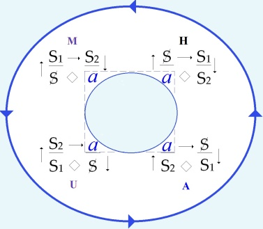
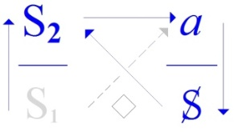
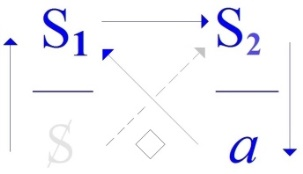
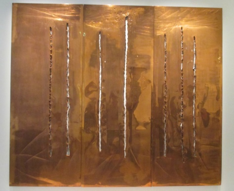
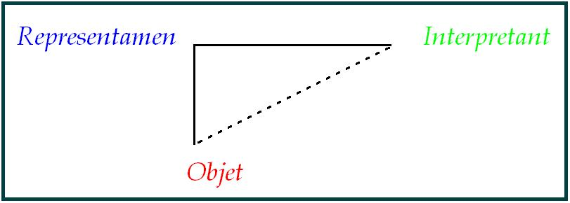
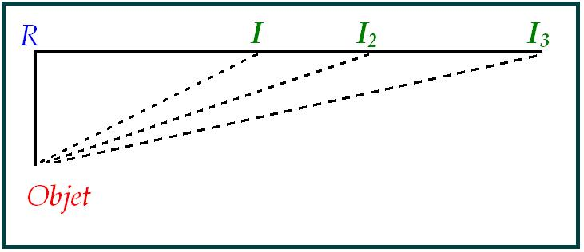
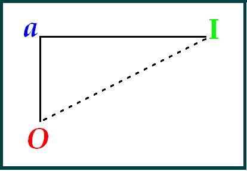
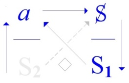

# Leçon 12 | 21 Juin 1972 Séminaire : Panthéon-Sorbonne

  

    <label><input type="checkbox" data-lacan-toggle="original" checked> 原文</label>
    <label><input type="checkbox" data-lacan-toggle="notes" checked> 注释</label>
    <label><input type="checkbox" data-lacan-toggle="commentary" checked> 个人解读评论</label>
  

  <form class="lacan-tool-search" role="search">
    <input class="lacan-tool-search-input" type="search" placeholder="搜索全文" aria-label="搜索全文">
    <button class="lacan-tool-button" type="submit" title="搜索">搜索</button>
  </form>
  <button class="lacan-tool-button lacan-back-to-top" type="button" title="回到页面最上方" aria-label="回到页面最上方">↑</button>

<section class="parallel-paragraph" data-paragraph-ids="s19-12-0001">

s19-12-0001

原文 · s19-12-0001

\[Au tableau\]

[无对应译文]

</section>

<section class="parallel-paragraph" data-paragraph-ids="s19-12-0002">

s19-12-0002

原文 · s19-12-0002

« *Qu’on dise comme fait reste oublié derrière ce qui est dit, dans ce qui s’entend.* »

[无对应译文]

</section>

<section class="parallel-paragraph" data-paragraph-ids="s19-12-0003">

s19-12-0003

原文 · s19-12-0003

Aujourd’hui, je prends congé de vous.

[无对应译文]

</section>

<section class="parallel-paragraph" data-paragraph-ids="s19-12-0004">

s19-12-0004

原文 · s19-12-0004

De ceux qui sont venus et puis de ceux qui ne sont pas venus et qui viennent pour ce congé.

[无对应译文]

</section>

<section class="parallel-paragraph" data-paragraph-ids="s19-12-0005">

s19-12-0005

原文 · s19-12-0005

Voilà ! Il n’y a pas de quoi pavoiser, hein ?

[无对应译文]

</section>

<section class="parallel-paragraph" data-paragraph-ids="s19-12-0006">

s19-12-0006

原文 · s19-12-0006

Bon ! Qu’est-ce que je peux faire ?

[无对应译文]

</section>

<section class="parallel-paragraph" data-paragraph-ids="s19-12-0007">

s19-12-0007

原文 · s19-12-0007

Que je me *résume* comme on dit, c’est absolument exclu.

[无对应译文]

</section>

<section class="parallel-paragraph" data-paragraph-ids="s19-12-0008">

s19-12-0008

原文 · s19-12-0008

Que je marque quelque chose, un point, un point de suspension.

[无对应译文]

</section>

<section class="parallel-paragraph" data-paragraph-ids="s19-12-0009">

s19-12-0009

原文 · s19-12-0009

Bien sûr, je pourrais dire que j’ai continué de serrer cet *impossible* dans lequel se rassemble ce qui est pour nous, pour nous dans *le discours analytique*, fondable comme *réel*. Voilà !

[无对应译文]

</section>

<section class="parallel-paragraph" data-paragraph-ids="s19-12-0010">

s19-12-0010

原文 · s19-12-0010

Au dernier moment, et ma foi en raison d’une chance, j’ai eu le témoignage que ce que je dis s’entend.

[无对应译文]

</section>

<section class="parallel-paragraph" data-paragraph-ids="s19-12-0011">

s19-12-0011

原文 · s19-12-0011

Je l’ai eu en raison de celui qui a bien voulu - et c’est un grand mérite - parler dans le dernier moment, comme ça, de cette année, qui a bien voulu me prouver qu’en effet pour certains, pour plus d’un, pour des veines dont je ne peux pas du tout prévoir dans quel biais elles se produisent, trouver en somme intérêt à ce que j’essaie d’énoncer.

[无对应译文]

</section>

<section class="parallel-paragraph" data-paragraph-ids="s19-12-0012">

s19-12-0012

原文 · s19-12-0012

Bon. Je remercie donc la personne qui m’a donné, pas seulement à moi, qui a donné à tous une espèce de...

[无对应译文]

</section>

<section class="parallel-paragraph" data-paragraph-ids="s19-12-0013">

s19-12-0013

原文 · s19-12-0013

j’espère qu’il y en a assez pour qui ça a fait écho, qui se sont aperçus que ça peut rendre.

[无对应译文]

</section>

<section class="parallel-paragraph" data-paragraph-ids="s19-12-0014">

s19-12-0014

原文 · s19-12-0014

Il est toujours difficile naturellement de savoir, de savoir jusqu’où ça s’étend.

[无对应译文]

</section>

<section class="parallel-paragraph" data-paragraph-ids="s19-12-0015">

s19-12-0015

原文 · s19-12-0015

### En Italie, j’y fais un peu allusion parce qu’après tout ça ne me paraît pas superflu,

[无对应译文]

</section>

<section class="parallel-paragraph" data-paragraph-ids="s19-12-0016">

s19-12-0016

原文 · s19-12-0016

### j’ai fait la rencontre de quelqu’un que je trouve très gentil, qui est dans… je ne sais pas, *l’histoire de l’art, l’idée de l’œuvre*.

[无对应译文]

</section>

<section class="parallel-paragraph" data-paragraph-ids="s19-12-0017">

s19-12-0017

原文 · s19-12-0017

### On ne sait pas pourquoi, mais on peut arriver à le comprendre, ce qui s’énonce sous le titre de *la structure*,

[无对应译文]

</section>

<section class="parallel-paragraph" data-paragraph-ids="s19-12-0018">

s19-12-0018

原文 · s19-12-0018

### et nommément ce que j’ai pu moi-même en produire, l’intéresse.

[无对应译文]

</section>

<section class="parallel-paragraph" data-paragraph-ids="s19-12-0019">

s19-12-0019

原文 · s19-12-0019

### Ça l’intéresse en raison de problèmes personnels.

[无对应译文]

</section>

<section class="parallel-paragraph" data-paragraph-ids="s19-12-0020">

s19-12-0020

原文 · s19-12-0020

### Cette *idée de l’œuvre*, cette *histoire de l’art*, cette veine, ça rend esclave, c’est certain.

[无对应译文]

</section>

<section class="parallel-paragraph" data-paragraph-ids="s19-12-0021">

s19-12-0021

原文 · s19-12-0021

Ça se voit bien quand on voit ce que quelqu’un qui n’est ni un critique ni un historien, mais qui était un créateur, a formé comme image, comme image de cette veine : l’esclave, le prisonnier.

[无对应译文]

</section>

<section class="parallel-paragraph" data-paragraph-ids="s19-12-0022">

s19-12-0022

原文 · s19-12-0022

Il y a un nommé Michel-Ange qui nous a montré ça.

[无对应译文]

</section>

<section class="parallel-paragraph" data-paragraph-ids="s19-12-0023">

s19-12-0023

原文 · s19-12-0023

Alors en marge, il y a l’ historien et critique qui prie pour l’esclave.

[无对应译文]

</section>

<section class="parallel-paragraph" data-paragraph-ids="s19-12-0024">

s19-12-0024

原文 · s19-12-0024

C’est une mômerie comme une autre, c’est une espèce de service divin qui peut se pratiquer. Oui !

[无对应译文]

</section>

<section class="parallel-paragraph" data-paragraph-ids="s19-12-0025">

s19-12-0025

原文 · s19-12-0025

Ça cherche à faire oublier qui commande, parce que l’œuvre, ça vient toujours à la commande, même pour Michel-Ange.

[无对应译文]

</section>

<section class="parallel-paragraph" data-paragraph-ids="s19-12-0026">

s19-12-0026

原文 · s19-12-0026

Ben celui *qui commande*, c’est ça que j’ai d’abord essayé de vous produire cette année sous le titre « *Yad’lun* », n’est-ce pas ?

[无对应译文]

</section>

<section class="parallel-paragraph" data-paragraph-ids="s19-12-0027">

s19-12-0027

原文 · s19-12-0027

Ce qui commande c’est l’*Un* : l’*Un* fait l’*Être*...

[无对应译文]

</section>

<section class="parallel-paragraph" data-paragraph-ids="s19-12-0028">

s19-12-0028

原文 · s19-12-0028

> Je vous ai prié d’aller chercher ça dans le « *Parménide ».* Vous avez peut-être, pour certains, obtempéré. ... l’*Un* fait l’*Être* comme l’hystérique fait l’homme.

[无对应译文]

</section>

<section class="parallel-paragraph" data-paragraph-ids="s19-12-0029">

s19-12-0029

原文 · s19-12-0029

Oui ! Évidemment, cet *Être* que fait l’*Un*, il n’est pas l’*Être,* il fait l’*Être*.

[无对应译文]

</section>

<section class="parallel-paragraph" data-paragraph-ids="s19-12-0030">

s19-12-0030

原文 · s19-12-0030

Évidemment c’est ça qui insupporte, une certaine infatuation créativiste, et dans le cas de la personne dont je parle, qui a été vraiment très gentil avec moi et qui m’a bien expliqué comment il s’était accroché à ce qu’il appelle, lui, *« mon système* », pour y dénoncer ses piquants, et c’est pour ça aussi que je le mets aujourd’hui en épingle pour éviter une certaine confusion : il s’est accroché à ce qu’il trouve que je fais trop d’ontologie.

[无对应译文]

</section>

<section class="parallel-paragraph" data-paragraph-ids="s19-12-0031">

s19-12-0031

原文 · s19-12-0031

C’est tout de même drôle, enfin je ne pense pas qu’ici, bien sûr, il n’y ait que des oreilles ouvertes.

[无对应译文]

</section>

<section class="parallel-paragraph" data-paragraph-ids="s19-12-0032">

s19-12-0032

原文 · s19-12-0032

Je pense qu’il y a comme partout une quantité de sourds.

[无对应译文]

</section>

<section class="parallel-paragraph" data-paragraph-ids="s19-12-0033">

s19-12-0033

原文 · s19-12-0033

Mais dire que je fais de l’ontologie, quand même c’est assez drôle !

[无对应译文]

</section>

<section class="parallel-paragraph" data-paragraph-ids="s19-12-0034">

s19-12-0034

原文 · s19-12-0034

Et la placer dans ce grand Autre...

[无对应译文]

</section>

<section class="parallel-paragraph" data-paragraph-ids="s19-12-0035">

s19-12-0035

原文 · s19-12-0035

que très précisément je montre comme devant être barré : **A**, et épinglé très précisément du signifiant de ce barrage lui-même : S(**A**) , ...c’est curieux !

[无对应译文]

</section>

<section class="parallel-paragraph" data-paragraph-ids="s19-12-0036">

s19-12-0036

原文 · s19-12-0036

Parce que ce qu’il faut voir dans le retentissement, la réponse qu’on obtient, c’est quand même qu’après tout les gens vous répondent avec *leurs* problèmes.

[无对应译文]

</section>

<section class="parallel-paragraph" data-paragraph-ids="s19-12-0037">

s19-12-0037

原文 · s19-12-0037

Et comme son problème à lui, c’est que l’ontologie et même l’Être déjà, lui restent en travers de la gorge à cause de ceci : c’est que si l’ontologie c’est simplement la grimace de l’*Un*, c’est évidemment que tout ce qui se fait à la commande devient, à l’*Un,* suspendu, et - mon Dieu - ça l’embête...

[无对应译文]

</section>

<section class="parallel-paragraph" data-paragraph-ids="s19-12-0038">

s19-12-0038

原文 · s19-12-0038

Alors ce qu’il voudrait bien en somme, c’est que la structure fût absente.

[无对应译文]

</section>

<section class="parallel-paragraph" data-paragraph-ids="s19-12-0039">

s19-12-0039

原文 · s19-12-0039

Ça serait plus commode pour le « *passez-muscade* ».

[无对应译文]

</section>

<section class="parallel-paragraph" data-paragraph-ids="s19-12-0040">

s19-12-0040

原文 · s19-12-0040

Ce qu’on voudrait c’est que *l’escamotage*...

[无对应译文]

</section>

<section class="parallel-paragraph" data-paragraph-ids="s19-12-0041">

s19-12-0041

原文 · s19-12-0041

> l’escamotage qui a lieu n’est-ce pas et qui est l’œuvre d’art ...c’est que *l’escamotage* n’ait pas besoin de gobelets.

[无对应译文]

</section>

<section class="parallel-paragraph" data-paragraph-ids="s19-12-0042">

s19-12-0042

原文 · s19-12-0042

Vous n’avez qu’à regarder ça, il y a un tableau de Breughel...

[无对应译文]

</section>

<section class="parallel-paragraph" data-paragraph-ids="s19-12-0043">

s19-12-0043

原文 · s19-12-0043

> qui était un artiste qui était très au-dessus de ça ...il ne dissimule pas comment, comment que ça se fait la captivation des badauds. Bon !

[无对应译文]

</section>

<section class="parallel-paragraph" data-paragraph-ids="s19-12-0044">

s19-12-0044

原文 · s19-12-0044

Alors ici évidemment, c’est pas à ça que nous nous occupons.

[无对应译文]

</section>

<section class="parallel-paragraph" data-paragraph-ids="s19-12-0045">

s19-12-0045

原文 · s19-12-0045

Nous nous occupons du *discours analytique*.

[无对应译文]

</section>

<section class="parallel-paragraph" data-paragraph-ids="s19-12-0046">

s19-12-0046

原文 · s19-12-0046

Et du *discours analytique*, j’ai pensé quand même qu’il ne serait pas mal de ponctuer quelque chose avant de vous quitter, qui vous donne l’idée justement que

[无对应译文]

</section>

<section class="parallel-paragraph" data-paragraph-ids="s19-12-0047">

s19-12-0047

原文 · s19-12-0047

- non seulement c’est pas ontologique,

[无对应译文]

</section>

<section class="parallel-paragraph" data-paragraph-ids="s19-12-0048">

s19-12-0048

原文 · s19-12-0048

- c’est pas philosophique,

[无对应译文]

</section>

<section class="parallel-paragraph" data-paragraph-ids="s19-12-0049">

s19-12-0049

原文 · s19-12-0049

- mais c’est seulement nécessité par une certaine position.

[无对应译文]

</section>

<section class="parallel-paragraph" data-paragraph-ids="s19-12-0050">

s19-12-0050

原文 · s19-12-0050

Une certaine position que je rappelle, qui est celle où j’ai cru pouvoir condenser l’articulation d’un discours, et vous montrer quand même quel rapport ça a, avec ce fait que les *analystes* ont quand même rapport...

[无对应译文]

</section>

<section class="parallel-paragraph" data-paragraph-ids="s19-12-0051">

s19-12-0051

原文 · s19-12-0051

> et vous auriez tort de croire que je le méconnais ...avec quelque chose qu’on appelle comme ça « *l’être humain* », oui bien sûr, mais moi je ne l’appelle pas comme ça.

[无对应译文]

</section>

<section class="parallel-paragraph" data-paragraph-ids="s19-12-0052">

s19-12-0052

原文 · s19-12-0052

Je ne l’appelle pas comme ça, pour ne pas que vous vous montiez la tête, pour que vous restiez bien là où il faut, pour autant, bien sûr, que vous êtes capables de percevoir quelles sont les difficultés qui s’offrent à l’analyste.

[无对应译文]

</section>

<section class="parallel-paragraph" data-paragraph-ids="s19-12-0053">

s19-12-0053

原文 · s19-12-0053

Ne parlons plus bien sûr de « connaissance », parce que le rapport de l’homme à un « *monde sien* », il est évident que nous avons démarré de là depuis longtemps, que d’ailleurs, de toujours, ça n’a jamais été qu’une simagrée au service du *discours du Maître*.

[无对应译文]

</section>

<section class="parallel-paragraph" data-paragraph-ids="s19-12-0054">

s19-12-0054

原文 · s19-12-0054

Il n’y a de monde comme sien que le monde que le maître fait marcher au doigt et à l’œil.

[无对应译文]

</section>

<section class="parallel-paragraph" data-paragraph-ids="s19-12-0055">

s19-12-0055

原文 · s19-12-0055

Et quant à la fameuse « *connaissance de soi-même* » : γνῶθι σἑαυτῶ \[gnôthi séauton\], supposée faire l’homme, partons de ceci, qui est tout de même simple et touchable, n’est-ce pas, que oui si on veut, elle a lieu, elle a lieu *du corps* : la connaissance de soi-même c’est l’hygiène.

[无对应译文]

</section>

<section class="parallel-paragraph" data-paragraph-ids="s19-12-0056">

s19-12-0056

原文 · s19-12-0056

Partons bien de là, n’est-ce pas.

[无对应译文]

</section>

<section class="parallel-paragraph" data-paragraph-ids="s19-12-0057">

s19-12-0057

原文 · s19-12-0057

Alors pendant des siècles il restait *la maladie* bien sûr.

[无对应译文]

</section>

<section class="parallel-paragraph" data-paragraph-ids="s19-12-0058">

s19-12-0058

原文 · s19-12-0058

Parce que chacun sait que ça se règle pas par l’hygiène.

[无对应译文]

</section>

<section class="parallel-paragraph" data-paragraph-ids="s19-12-0059">

s19-12-0059

原文 · s19-12-0059

Il y a la maladie, et ça c’est bien quelque chose d’accroché au corps.

[无对应译文]

</section>

<section class="parallel-paragraph" data-paragraph-ids="s19-12-0060">

s19-12-0060

原文 · s19-12-0060

Et la maladie ça a duré pendant des siècles, c’est le médecin qui était supposé la connaître.

[无对应译文]

</section>

<section class="parallel-paragraph" data-paragraph-ids="s19-12-0061">

s19-12-0061

原文 · s19-12-0061

Connaître, j’entends « *connaissance* » et je pense avoir assez souligné rapidement lors d’un de nos derniers entretiens...

[无对应译文]

</section>

<section class="parallel-paragraph" data-paragraph-ids="s19-12-0062">

s19-12-0062

原文 · s19-12-0062

je ne sais même plus où \[*séminaire Panthéon-Sorbonne, ou Sainte-Anne ?*\] ...l’échec de ces deux biais, n’est-ce pas.

[无对应译文]

</section>

<section class="parallel-paragraph" data-paragraph-ids="s19-12-0063">

s19-12-0063

原文 · s19-12-0063

Tout ça est patent dans l’histoire, ça s’y étale en toutes sortes d’aberrations.

[无对应译文]

</section>

<section class="parallel-paragraph" data-paragraph-ids="s19-12-0064">

s19-12-0064

原文 · s19-12-0064

Alors, tout de même, la question que je voudrais vous faire sentir aujourd’hui c’est ça, c’est *l’analyste* qui est là et qui a l’air de prendre un relais.

[无对应译文]

</section>

<section class="parallel-paragraph" data-paragraph-ids="s19-12-0065">

s19-12-0065

原文 · s19-12-0065

On parle de maladie, on sait pas : en même temps on dit qu’il n’y en a pas...

[无对应译文]

</section>

<section class="parallel-paragraph" data-paragraph-ids="s19-12-0066">

s19-12-0066

原文 · s19-12-0066

> qu’il n’y a pas de *maladie mentale* par exemple, ...à juste titre au sens où c’est « *une entité nosologique »* comme on disait autrefois, c’est pas du tout entitaire la maladie mentale.

[无对应译文]

</section>

<section class="parallel-paragraph" data-paragraph-ids="s19-12-0067">

s19-12-0067

原文 · s19-12-0067

C’est plutôt la mentalité qui a des failles, exprimons-nous comme ça rapidement.

[无对应译文]

</section>

<section class="parallel-paragraph" data-paragraph-ids="s19-12-0068">

s19-12-0068

原文 · s19-12-0068

[无对应译文]

</section>

<section class="parallel-paragraph" data-paragraph-ids="s19-12-0069">

s19-12-0069

原文 · s19-12-0069

Alors, tâchons de voir ce que suppose par exemple ça, qui est écrit là , et *qui est supposé énoncer où se place une certaine chaîne* qui est très certainement et sans aucun espèce d’ambiguïté, *la structure *:

[无对应译文]

</section>

<section class="parallel-paragraph" data-paragraph-ids="s19-12-0070">

s19-12-0070

原文 · s19-12-0070

- on y voit se succéder deux *signifiants*,

[无对应译文]

</section>

<section class="parallel-paragraph" data-paragraph-ids="s19-12-0071">

s19-12-0071

原文 · s19-12-0071

- et *le sujet* n’est là que pour autant « *qu’un signifiant le représente pour l’autre signifiant* »,

[无对应译文]

</section>

<section class="parallel-paragraph" data-paragraph-ids="s19-12-0072">

s19-12-0072

原文 · s19-12-0072

- et puis ça a quelque chose qui *en résulte* et que nous avons largement, au cours des années, développé assez de raisons pour motiver que nous le notions de *l’objet(a)*.

[无对应译文]

</section>

<section class="parallel-paragraph" data-paragraph-ids="s19-12-0073">

s19-12-0073

原文 · s19-12-0073

Évidemment si c’est là *dans* *cette forme*, *dans cette forme de tétrade*, c’est pas une topologie qui soit sans aucune espèce de sens.

[无对应译文]

</section>

<section class="parallel-paragraph" data-paragraph-ids="s19-12-0074">

s19-12-0074

原文 · s19-12-0074

C’est ça la nouveauté qui est apportée par Freud. La nouveauté qui est apportée par Freud, c’est pas rien.

[无对应译文]

</section>

<section class="parallel-paragraph" data-paragraph-ids="s19-12-0075">

s19-12-0075

原文 · s19-12-0075

Il y avait quelqu’un qui avait fait quelque chose de très bien, en situant, en cristallisant *le discours du maître*,

[无对应译文]

</section>

<section class="parallel-paragraph" data-paragraph-ids="s19-12-0076">

s19-12-0076

原文 · s19-12-0076

### en raison d’un éclairage historique qu’il avait pu attraper, c’est Marx.

[无对应译文]

</section>

<section class="parallel-paragraph" data-paragraph-ids="s19-12-0077">

s19-12-0077

原文 · s19-12-0077

### C’est quand même un pas, un pas qu’il n’y a pas lieu du tout de réduire au premier \[Freud\],

[无对应译文]

</section>

<section class="parallel-paragraph" data-paragraph-ids="s19-12-0078">

s19-12-0078

原文 · s19-12-0078

### il n’y a pas non plus lieu de faire entre les deux un mixage \[Freudo-Marxisme\],

[无对应译文]

</section>

<section class="parallel-paragraph" data-paragraph-ids="s19-12-0079">

s19-12-0079

原文 · s19-12-0079

### on se demande au nom de quoi il faudrait absolument qu’ils s’accordent.

[无对应译文]

</section>

<section class="parallel-paragraph" data-paragraph-ids="s19-12-0080">

s19-12-0080

原文 · s19-12-0080

### Ils ne s’accordent pas, ils sont parfaitement compatibles : ils s’emboîtent.

[无对应译文]

</section>

<section class="parallel-paragraph" data-paragraph-ids="s19-12-0081">

s19-12-0081

原文 · s19-12-0081

### Ils s’emboîtent et puis il y en a certainement un qui a sa place avec toutes ses aises, c’est celui de Freud.

[无对应译文]

</section>

<section class="parallel-paragraph" data-paragraph-ids="s19-12-0082">

s19-12-0082

原文 · s19-12-0082

### Qu’est-ce qu’il a apporté en somme d’essentiel ? Il a apporté la dimension de la *surdétermination*.

[无对应译文]

</section>

<section class="parallel-paragraph" data-paragraph-ids="s19-12-0083">

s19-12-0083

原文 · s19-12-0083

### La surdétermination, c’est exactement *ça que j’image avec ma façon de formaliser* de la façon la plus radicale *l’essence du discours*,

[无对应译文]

</section>

<section class="parallel-paragraph" data-paragraph-ids="s19-12-0084">

s19-12-0084

原文 · s19-12-0084

### en tant qu’il est en position tournante par rapport à ce que je viens d’appeler un support.

[无对应译文]

</section>

<section class="parallel-paragraph" data-paragraph-ids="s19-12-0085">

s19-12-0085

原文 · s19-12-0085

C’est quand même *du* *discours*, que Freud a fait surgir ceci : que ce qui se produisait au niveau du *support* avait affaire avec ce qui s’articulait du *discours *: *le support c’est le corps*.

[无对应译文]

</section>

<section class="parallel-paragraph" data-paragraph-ids="s19-12-0086">

s19-12-0086

原文 · s19-12-0086

C’est le corps, et encore faut faire attention quand on dit « *c’est le corps* » : c’est pas forcément *un* corps.

[无对应译文]

</section>

<section class="parallel-paragraph" data-paragraph-ids="s19-12-0087">

s19-12-0087

原文 · s19-12-0087

Parce qu’à partir du moment où on part de *la jouissance*, ça veut très exactement dire que le corps n’est pas tout seul, qu’il y en a un autre.

[无对应译文]

</section>

<section class="parallel-paragraph" data-paragraph-ids="s19-12-0088">

s19-12-0088

原文 · s19-12-0088

Ce n’est pas pour ça que *la jouissance* est *sexuelle*, puisque ce que je viens de vous expliquer cette année, c’est que le moins qu’on puisse dire c’est qu’elle n’est pas rapportée cette jouissance, c’est la jouissance de corps à corps.

[无对应译文]

</section>

<section class="parallel-paragraph" data-paragraph-ids="s19-12-0089">

s19-12-0089

原文 · s19-12-0089

Le propre de *la jouissance*, c’est que quand il y a deux corps...

[无对应译文]

</section>

<section class="parallel-paragraph" data-paragraph-ids="s19-12-0090">

s19-12-0090

原文 · s19-12-0090

> encore bien plus quand il y en a plus, naturellement, ...on ne sait pas, on ne peut pas dire *lequel* jouit.

[无对应译文]

</section>

<section class="parallel-paragraph" data-paragraph-ids="s19-12-0091">

s19-12-0091

原文 · s19-12-0091

C’est ce qui fait qu’il peut y avoir, dans cette affaire, pris plusieurs corps et même des séries de corps.

[无对应译文]

</section>

<section class="parallel-paragraph" data-paragraph-ids="s19-12-0092">

s19-12-0092

原文 · s19-12-0092

Alors la surdétermination, elle consiste en ceci, c’est que les choses qui sont pas le sens, où le sens ça serait supporté par un signifiant, justement le propre du signifiant...

[无对应译文]

</section>

<section class="parallel-paragraph" data-paragraph-ids="s19-12-0093">

s19-12-0093

原文 · s19-12-0093

Et je ne sais pas, je me suis mis comme ça de fil en aiguille, Dieu sait pourquoi, puis un peu plus...

[无对应译文]

</section>

<section class="parallel-paragraph" data-paragraph-ids="s19-12-0094">

s19-12-0094

原文 · s19-12-0094

Peu importe... J’ai retrouvé quelque chose, un séminaire que j’ai fait au début d’un trimestre, juste le trimestre qui était la fin de l’année sur ce qu’on appelle le cas du Président Schreber, c’était le 11 avril 1956.

[无对应译文]

</section>

<section class="parallel-paragraph" data-paragraph-ids="s19-12-0095">

s19-12-0095

原文 · s19-12-0095

C’est très précisément juste en deçà : c’est les deux premiers trimestres qui sont résumés dans ce que j’ai écrit : *« D’une question préalable à tout traitement possible de la psychose »*.

[无对应译文]

</section>

<section class="parallel-paragraph" data-paragraph-ids="s19-12-0096">

s19-12-0096

原文 · s19-12-0096

À la fin, le 11 avril 1956, j’ai posé ce que c’était que...

[无对应译文]

</section>

<section class="parallel-paragraph" data-paragraph-ids="s19-12-0097">

s19-12-0097

原文 · s19-12-0097

puis comme ça je l’appelle par son nom, le nom que ça a dans mon discours ...*la structure*.

[无对应译文]

</section>

<section class="parallel-paragraph" data-paragraph-ids="s19-12-0098">

s19-12-0098

原文 · s19-12-0098

C’est pas toujours ce qu’un vain peuple pense, mais c’est parfaitement dit à ce niveau-là.

[无对应译文]

</section>

<section class="parallel-paragraph" data-paragraph-ids="s19-12-0099">

s19-12-0099

原文 · s19-12-0099

Ça m’amusera de le republier, ce séminaire...

[无对应译文]

</section>

<section class="parallel-paragraph" data-paragraph-ids="s19-12-0100">

s19-12-0100

原文 · s19-12-0100

> si la « *tapeuse* » n’avait pas fait un grand nombre de petits trous, faute d’avoir bien entendu.
>
> Si elle avait seulement reproduit correctement la phrase latine que j’avais écrite au tableau,
>
> dont je ne sais plus maintenant à quel auteur elle appartient.
>
> \[*Cicéron : « Ad usum autem orationis, incredibile est, nisi diligenter attenteris quanta opera machinata natura est ».*\] ...je le ferai, je ne sais pas, dans le prochain numéro de *Scilicet*.

[无对应译文]

</section>

<section class="parallel-paragraph" data-paragraph-ids="s19-12-0101">

s19-12-0101

原文 · s19-12-0101

Le temps qu’il va me falloir pour retrouver de qui est cette phrase latine, va certainement me faire perdre du temps, enfin peu importe, tout ce que j’ai dit à ce moment-là du signifiant...

[无对应译文]

</section>

<section class="parallel-paragraph" data-paragraph-ids="s19-12-0102">

s19-12-0102

原文 · s19-12-0102

> du signifiant à un moment où vraiment on ne peut pas dire que ce fût à la mode : en 56 ...ça reste frappé d’un métal où je n’ai rien à retoucher.

[无对应译文]

</section>

<section class="parallel-paragraph" data-paragraph-ids="s19-12-0103">

s19-12-0103

原文 · s19-12-0103

Oui ! Ce que j’en dis très précisément, c’est qu’il se distingue en ceci que, qu’il n’a *aucune signification*.

[无对应译文]

</section>

<section class="parallel-paragraph" data-paragraph-ids="s19-12-0104">

s19-12-0104

原文 · s19-12-0104

Je le dis d’une façon tranchante parce qu’à ce moment-là il faut que je me fasse entendre de...

[无对应译文]

</section>

<section class="parallel-paragraph" data-paragraph-ids="s19-12-0105">

s19-12-0105

原文 · s19-12-0105

Vous vous rendez compte, qu’en plus c’étaient des médecins qui m’écoutaient !

[无对应译文]

</section>

<section class="parallel-paragraph" data-paragraph-ids="s19-12-0106">

s19-12-0106

原文 · s19-12-0106

Qu’est-ce que ça pouvait leur foutre ? Simplement que c’était de... enfin, ils entendaient du Lacan.

[无对应译文]

</section>

<section class="parallel-paragraph" data-paragraph-ids="s19-12-0107">

s19-12-0107

原文 · s19-12-0107

Enfin, du Lacan : c’est-à-dire cet espèce de clown, n’est-ce pas, que...

[无对应译文]

</section>

<section class="parallel-paragraph" data-paragraph-ids="s19-12-0108">

s19-12-0108

原文 · s19-12-0108

Bon, il faisait merveilleusement son trapèze bien entendu.

[无对应译文]

</section>

<section class="parallel-paragraph" data-paragraph-ids="s19-12-0109">

s19-12-0109

原文 · s19-12-0109

Pendant ce temps-là, ils lorgnaient déjà à la façon dont ils pourraient retourner à leur digestion, parce qu’on peut pas dire qu’ils rêvent. Ça serait très beau. Ils rêvent pas, ils digèrent !

[无对应译文]

</section>

<section class="parallel-paragraph" data-paragraph-ids="s19-12-0110">

s19-12-0110

原文 · s19-12-0110

C’est une occupation après tout comme une autre.

[无对应译文]

</section>

<section class="parallel-paragraph" data-paragraph-ids="s19-12-0111">

s19-12-0111

原文 · s19-12-0111

Ce qu’il faut tout de même bien essayer de voir, c’est que, ce que Freud introduit, c’est quelque chose qui...

[无对应译文]

</section>

<section class="parallel-paragraph" data-paragraph-ids="s19-12-0112">

s19-12-0112

原文 · s19-12-0112

> on s’imagine que je le méconnais parce que je parle du signifiant ...c’est le retour à ce fondement qui est dans le corps, et qui fait que...

[无对应译文]

</section>

<section class="parallel-paragraph" data-paragraph-ids="s19-12-0113">

s19-12-0113

原文 · s19-12-0113

> tout à fait indépendamment des signifiants dont on les articule ...ces 4 pôles \[1 *dans chaque discours*\] qui se déterminent de l’émergence comme telle *de la jouissance* justement *comme insaisissable*, eh bien *c’est ça* qui fait surgir les 3 autres \[*dans chacun des discours*\], et en réponse !

[无对应译文]

</section>

<section class="parallel-paragraph" data-paragraph-ids="s19-12-0114">

s19-12-0114

原文 · s19-12-0114

Le 1er \[*pôle*\]qui est *la vérité*, ça *- la vérité -* implique déjà *le discours*.

[无对应译文]

</section>

<section class="parallel-paragraph" data-paragraph-ids="s19-12-0115">

s19-12-0115

原文 · s19-12-0115

   

[无对应译文]

</section>

<section class="parallel-paragraph" data-paragraph-ids="s19-12-0116">

s19-12-0116

原文 · s19-12-0116

*Discours du Maître Discours de l’Hystérique Discours Universitaire Discours analytique*

[无对应译文]

</section>

<section class="parallel-paragraph" data-paragraph-ids="s19-12-0117">

s19-12-0117

原文 · s19-12-0117

Ça ne veut pas dire que ça puisse se dire, je me tue à dire que ça ne peut pas se dire, ou *que ça ne peut que se* *mi-dire*.

[无对应译文]

</section>

<section class="parallel-paragraph" data-paragraph-ids="s19-12-0118">

s19-12-0118

原文 · s19-12-0118

Mais enfin pour *la jouissance*, enfin ça, ça existe. Il faut qu’on puisse en parler.

[无对应译文]

</section>

<section class="parallel-paragraph" data-paragraph-ids="s19-12-0119">

s19-12-0119

原文 · s19-12-0119

Moyennant quoi il y a quelque chose qui est autre et qui s’appelle « *le dire* ».

[无对应译文]

</section>

<section class="parallel-paragraph" data-paragraph-ids="s19-12-0120">

s19-12-0120

原文 · s19-12-0120

Eh bien je vous ai en somme expliqué pendant une année, j’ai mis assez de temps à l’articuler, parce que pour l’articuler...

[无对应译文]

</section>

<section class="parallel-paragraph" data-paragraph-ids="s19-12-0121">

s19-12-0121

原文 · s19-12-0121

> c’est en ça qu’il faut que vous voyiez que la nécessité qui est la mienne, la façon dont je procède ...justement je ne peux jamais l’articuler comme une *vérité*.

[无对应译文]

</section>

<section class="parallel-paragraph" data-paragraph-ids="s19-12-0122">

s19-12-0122

原文 · s19-12-0122

Il faut, selon ce qui est votre destin à tous, il faut en faire le tour.

[无对应译文]

</section>

<section class="parallel-paragraph" data-paragraph-ids="s19-12-0123">

s19-12-0123

原文 · s19-12-0123

Plus exactement voir comment ça tourne, comment ça bascule, comment ça bascule dés qu’on le touche et comment même jusqu’à un certain point, c’est assez instable pour prêter à toutes sortes d’erreurs.

[无对应译文]

</section>

<section class="parallel-paragraph" data-paragraph-ids="s19-12-0124">

s19-12-0124

原文 · s19-12-0124

[无对应译文]

</section>

<section class="parallel-paragraph" data-paragraph-ids="s19-12-0125">

s19-12-0125

原文 · s19-12-0125

Quoiqu’il en soit si j’ai émis...

[无对应译文]

</section>

<section class="parallel-paragraph" data-paragraph-ids="s19-12-0126">

s19-12-0126

原文 · s19-12-0126

> ce qui est tout de même d’un certain culot ...le titre « *D’un discours qui ne serait pas du semblant* ».

[无对应译文]

</section>

<section class="parallel-paragraph" data-paragraph-ids="s19-12-0127">

s19-12-0127

原文 · s19-12-0127

Je pense que c’était pour vous faire sentir, et que vous avez senti que le discours comme tel est toujours discours du *semblant,* et que si il y a quelque part quelque chose qui s’autorise de *la jouissance*, justement c’est de faire semblant.

[无对应译文]

</section>

<section class="parallel-paragraph" data-paragraph-ids="s19-12-0128">

s19-12-0128

原文 · s19-12-0128

Et c’est de ce départ qu’on peut arriver à concevoir ce quelque chose que nous ne pouvons qu’attraper là, mais d’une façon déjà tellement assurée, tellement assurée par quelqu’un dont il faut saluer la mémoire, la mémoire telle que je l’écris \[*mé-moire*\], en donnant au « *mé* » le même sens que le « *mé* » de méconnaissance, celui qu’on a si bien *mémorisé* \[*mes mots risée*\] que c’est *faire risée de ses mots* dont il s’agit plutôt, à savoir Platon.

[无对应译文]

</section>

<section class="parallel-paragraph" data-paragraph-ids="s19-12-0129">

s19-12-0129

原文 · s19-12-0129

Quand même, s’il y a quelqu’un qui a attrapé ce qu’il en est du *plus de jouir*, quelque chose qui fait penser que Platon c’est pas seulement « *les Idées* » et « *la Forme* » mais tout ce que on a...

[无对应译文]

</section>

<section class="parallel-paragraph" data-paragraph-ids="s19-12-0130">

s19-12-0130

原文 · s19-12-0130

> avec une certaine grille - une grille qui, j’en conviens, est vraisemblable ...traduit de ces énoncés.

[无对应译文]

</section>

<section class="parallel-paragraph" data-paragraph-ids="s19-12-0131">

s19-12-0131

原文 · s19-12-0131

Platon c’est celui quand même qui a avancé la fonction de *la dyade* comme étant ce point de chute, là où tout passe, là où tout fuit : pas de « *plus grand* » sans « *plus petit* », de « *plus vieux* » sans « *plus jeune* », et le fait que *la dyade* soit

[无对应译文]

</section>

<section class="parallel-paragraph" data-paragraph-ids="s19-12-0132">

s19-12-0132

原文 · s19-12-0132

- le lieu de notre perte,

[无对应译文]

</section>

<section class="parallel-paragraph" data-paragraph-ids="s19-12-0133">

s19-12-0133

原文 · s19-12-0133

- le lieu de la fuite,

[无对应译文]

</section>

<section class="parallel-paragraph" data-paragraph-ids="s19-12-0134">

s19-12-0134

原文 · s19-12-0134

- le lieu grâce à quoi il est forcé de forger cet *Un* de *l’Idée*, de *la Forme*, cet *Un* qui d’ailleurs aussitôt se démultiplie, « s’*Un*-saisit » ...oui c’est bien parce qu’il est là comme nous tous plongé dans ce seul supplément...

[无对应译文]

</section>

<section class="parallel-paragraph" data-paragraph-ids="s19-12-0135">

s19-12-0135

原文 · s19-12-0135

> je parle de tout ça dans le 11 avril 1956 ...le supplément, la différence qu’il y a entre le supplément et le complément.

[无对应译文]

</section>

<section class="parallel-paragraph" data-paragraph-ids="s19-12-0136">

s19-12-0136

原文 · s19-12-0136

Enfin j’avais dit très très bien tout ça depuis l’année 56, ça aurait pu servir, me semble-t-il, à cristalliser quelque chose du côté de cette *fonction* qui est à remplir, celle *de l’analyste,* et dont il semble qu’elle soit si impossible - plus que d’autres \[*éduquer, gouverner*\] - qu’on ne songe qu’à la camoufler.

[无对应译文]

</section>

<section class="parallel-paragraph" data-paragraph-ids="s19-12-0137">

s19-12-0137

原文 · s19-12-0137

Oui ! Alors, c’est là-dessus que ça tourne et que, et qu’il faut bien voir certaines choses.

[无对应译文]

</section>

<section class="parallel-paragraph" data-paragraph-ids="s19-12-0138">

s19-12-0138

原文 · s19-12-0138

C’est qu’entre *ce support*, ce qui arrive au niveau *du corps*, et d’où surgit tout sens, mais inconstitué, parce qu’après ce que je viens d’énoncer de *la jouissance*, de *la vérité*, du *semblant* et *du plus de jouir* comme faisant là le fond, le *ground*, comme s’exprimait l’autre jour la personne qui a bien voulu ici venir nous parler de Peirce, pour autant que c’est dans la *note* de Peirce qu’il avait entendu ce que je disais.

[无对应译文]

</section>

<section class="parallel-paragraph" data-paragraph-ids="s19-12-0139">

s19-12-0139

原文 · s19-12-0139

[无对应译文]

</section>

<section class="parallel-paragraph" data-paragraph-ids="s19-12-0140">

s19-12-0140

原文 · s19-12-0140

Inutile de vous dire que c’est à peu près vers la même époque que j’ai sorti les quadrants de Peirce auxquels...

[无对应译文]

</section>

<section class="parallel-paragraph" data-paragraph-ids="s19-12-0141">

s19-12-0141

原文 · s19-12-0141

ça a bien sûr du tout servi à rien, parce que qu’est-ce que vous pouvez bien penser...

[无对应译文]

</section>

<section class="parallel-paragraph" data-paragraph-ids="s19-12-0142">

s19-12-0142

原文 · s19-12-0142

> que les remarques sur l’ambiguïté totale de l’*Universel*, qu’il soit *Affirmatif* ou *Négatif*,
>
> et du *Particulier* de même ...qu’est-ce que ça pouvait bien faire à ceux qui ne songeaient dans tout ça qu’à retrouver leur ritournelle ?

[无对应译文]

</section>

<section class="parallel-paragraph" data-paragraph-ids="s19-12-0143">

s19-12-0143

原文 · s19-12-0143

Oui ! Le *ground* donc est là. Il s’agit en effet du corps avec ses sens radicaux sur lesquels il y a aucune prise.

[无对应译文]

</section>

<section class="parallel-paragraph" data-paragraph-ids="s19-12-0144">

s19-12-0144

原文 · s19-12-0144

Parce que c’est pas avec *la vérité*, *le semblant*, *la jouissance* ni *le plus de jouir* qu’on fait de la philosophie.

[无对应译文]

</section>

<section class="parallel-paragraph" data-paragraph-ids="s19-12-0145">

s19-12-0145

原文 · s19-12-0145

On fait de la philosophie, à partir du moment où il y a quelque chose qui bourre, qui bourre le support, qui n’est articulable qu’à partir du *discours*, qui le bourre de quoi ?

[无对应译文]

</section>

<section class="parallel-paragraph" data-paragraph-ids="s19-12-0146">

s19-12-0146

原文 · s19-12-0146

Il faut bien le dire, hein, que ce dont vous êtes tous faits, et encore d’autant mieux que vous êtes un peu philosophes, ça arrive quelquefois, mais enfin c’est rare, vous êtes surtout « *astudés* » comme je l’ai dit un jour, vous êtes à la place où *le discours universitaire* vous situe. Vous êtes pris comme *a*-formés \[*comme « sujets » *: S\].

[无对应译文]

</section>

<section class="parallel-paragraph" data-paragraph-ids="s19-12-0147">

s19-12-0147

原文 · s19-12-0147

[无对应译文]

</section>

<section class="parallel-paragraph" data-paragraph-ids="s19-12-0148">

s19-12-0148

原文 · s19-12-0148

Depuis quelque temps, il se produit une crise, mais on en parlera tout à l’heure. C’est secondaire.

[无对应译文]

</section>

<section class="parallel-paragraph" data-paragraph-ids="s19-12-0149">

s19-12-0149

原文 · s19-12-0149

La question donc est différente.

[无对应译文]

</section>

<section class="parallel-paragraph" data-paragraph-ids="s19-12-0150">

s19-12-0150

原文 · s19-12-0150

Il faut bien que vous vous rendiez compte que ce dont vous dépendez le plus fondamentalement...

[无对应译文]

</section>

<section class="parallel-paragraph" data-paragraph-ids="s19-12-0151">

s19-12-0151

原文 · s19-12-0151

> parce qu’enfin l’université n’est pas née d’hier ...c’est *le discours du maître* quand même, qui est le 1er surgi, et puis c’est lui qui dure et qui a peu de chance de s’ébranler.

[无对应译文]

</section>

<section class="parallel-paragraph" data-paragraph-ids="s19-12-0152">

s19-12-0152

原文 · s19-12-0152

Il pourrait se compenser, s’équilibrer, avec quelque chose qui serait - enfin, le jour où ça sera... - *le discours analytique*.

[无对应译文]

</section>

<section class="parallel-paragraph" data-paragraph-ids="s19-12-0153">

s19-12-0153

原文 · s19-12-0153

[无对应译文]

</section>

<section class="parallel-paragraph" data-paragraph-ids="s19-12-0154">

s19-12-0154

原文 · s19-12-0154

Au niveau du *discours du maître*, on peut parfaitement dire ce qu’il y a entre

[无对应译文]

</section>

<section class="parallel-paragraph" data-paragraph-ids="s19-12-0155">

s19-12-0155

原文 · s19-12-0155

- *le champ du discours*, entre *les fonctions du discours* telles qu’elles s’articulent de ce S1, S2, le S et le *a*...

<!-- -->

[无对应译文]

</section>

<section class="parallel-paragraph" data-paragraph-ids="s19-12-0156">

s19-12-0156

原文 · s19-12-0156

- et puis ce corps, ce corps qui vous représente ici, et à qui - en tant qu’*analyste* - je m’adresse.

[无对应译文]

</section>

<section class="parallel-paragraph" data-paragraph-ids="s19-12-0157">

s19-12-0157

原文 · s19-12-0157

Parce que quand quelqu’un vient me voir dans mon cabinet pour la 1ère fois, et que je scande notre entrée dans l’*affaire* de quelques entretiens préliminaires, ce qui est important c’est ça, c’est la confrontation de corps.

[无对应译文]

</section>

<section class="parallel-paragraph" data-paragraph-ids="s19-12-0158">

s19-12-0158

原文 · s19-12-0158

C’est justement parce que c’est de là que ça part, cette rencontre de corps, qu’à partir du moment où on entre dans *le discours analytique*, il n’en sera plus question.

[无对应译文]

</section>

<section class="parallel-paragraph" data-paragraph-ids="s19-12-0159">

s19-12-0159

原文 · s19-12-0159

Mais il reste qu’au niveau où le dis­cours fonctionne...

[无对应译文]

</section>

<section class="parallel-paragraph" data-paragraph-ids="s19-12-0160">

s19-12-0160

原文 · s19-12-0160

> qui n’est pas *le discours analytique* ...la question se pose de comment ça a réussi, ce discours, à attraper des corps.

[无对应译文]

</section>

<section class="parallel-paragraph" data-paragraph-ids="s19-12-0161">

s19-12-0161

原文 · s19-12-0161

Au niveau du *discours du maître*, c’est clair.

[无对应译文]

</section>

<section class="parallel-paragraph" data-paragraph-ids="s19-12-0162">

s19-12-0162

原文 · s19-12-0162

Au niveau du *discours du maître* dont vous êtes, comme corps, pétris, ne vous le dissimulez pas, quelles que soient vos gambades, c’est ce que j’appellerai « *les* *sentiments »* et très précisément les « *bons sentiments »*.

[无对应译文]

</section>

<section class="parallel-paragraph" data-paragraph-ids="s19-12-0163">

s19-12-0163

原文 · s19-12-0163

Entre le corps et le discours, il y a ce dont les analystes se gargarisent en appelant ça prétencieusement les « *affects* ».

[无对应译文]

</section>

<section class="parallel-paragraph" data-paragraph-ids="s19-12-0164">

s19-12-0164

原文 · s19-12-0164

C’est bien évident que vous êtes affectés dans une analyse, c’est ça qui fait une analyse, c’est ce qu’ils prétendent évidemment, faut bien qu’ils tiennent la corde quelque part pour être sûrs de ne pas glisser.

[无对应译文]

</section>

<section class="parallel-paragraph" data-paragraph-ids="s19-12-0165">

s19-12-0165

原文 · s19-12-0165

Les bons sentiments, avec quoi ça se fait ?

[无对应译文]

</section>

<section class="parallel-paragraph" data-paragraph-ids="s19-12-0166">

s19-12-0166

原文 · s19-12-0166

Ben on est bien forcé d’en venir là, au niveau du *discours du maître* c’est clair : ça se fait avec de la jurisprudence.

[无对应译文]

</section>

<section class="parallel-paragraph" data-paragraph-ids="s19-12-0167">

s19-12-0167

原文 · s19-12-0167

Il est quand même bon de ne pas l’oublier au moment où je parle, où je suis l’hôte de la *Faculté de Droit*, de ne pas méconnaître que les bons sentiments, c’est la *jurisprudence* et rien d’autre, qui les fonde.

[无对应译文]

</section>

<section class="parallel-paragraph" data-paragraph-ids="s19-12-0168">

s19-12-0168

原文 · s19-12-0168

Et quand quelque chose comme ça vient tout d’un coup vous tourner le cœur parce que vous savez pas très bien si vous n’êtes pas un peu responsifs de la façon dont une analyse a mal tourné.

[无对应译文]

</section>

<section class="parallel-paragraph" data-paragraph-ids="s19-12-0169">

s19-12-0169

原文 · s19-12-0169

Écoutez ! hein ? soyons clairs quand même !

[无对应译文]

</section>

<section class="parallel-paragraph" data-paragraph-ids="s19-12-0170">

s19-12-0170

原文 · s19-12-0170

S’il n’y avait pas de déontologie, s’il n’y avait pas de jurisprudence, où serait ce mal au cœur, cet *affect* comme on dit ?

[无对应译文]

</section>

<section class="parallel-paragraph" data-paragraph-ids="s19-12-0171">

s19-12-0171

原文 · s19-12-0171

Faudrait même essayer de temps en temps de *dire un peu la vérité*.

[无对应译文]

</section>

<section class="parallel-paragraph" data-paragraph-ids="s19-12-0172">

s19-12-0172

原文 · s19-12-0172

Un peu, ça veut dire que ça n’est pas exhaustif ce que je viens de dire.

[无对应译文]

</section>

<section class="parallel-paragraph" data-paragraph-ids="s19-12-0173">

s19-12-0173

原文 · s19-12-0173

Je pourrais aussi dire autre chose d’incompatible avec ce que je viens de dire, ça serait aussi la vérité.

[无对应译文]

</section>

<section class="parallel-paragraph" data-paragraph-ids="s19-12-0174">

s19-12-0174

原文 · s19-12-0174

Et c’est bien ce qui se passe quand simplement, par le fait non pas d’1/4 de tour, mais d’une moitié de tour complet, de 2/4 quarts de tour de glissement de ces éléments fonction du discours, il se trouve... il se trouve parce qu’il y a quand même dans cette tétrade des vecteurs, des vecteurs dont on peut très bien établir la nécessité, ils ne tiennent pas

[无对应译文]

</section>

<section class="parallel-paragraph" data-paragraph-ids="s19-12-0175">

s19-12-0175

原文 · s19-12-0175

- à la tétrade,

[无对应译文]

</section>

<section class="parallel-paragraph" data-paragraph-ids="s19-12-0176">

s19-12-0176

原文 · s19-12-0176

- ni à la vérité,

[无对应译文]

</section>

<section class="parallel-paragraph" data-paragraph-ids="s19-12-0177">

s19-12-0177

原文 · s19-12-0177

- ni au sem­blant,

[无对应译文]

</section>

<section class="parallel-paragraph" data-paragraph-ids="s19-12-0178">

s19-12-0178

原文 · s19-12-0178

- ni à quoi que ce soit de cette espèce, ils tiennent au fait que la tétrade c’est 4.

[无对应译文]

</section>

<section class="parallel-paragraph" data-paragraph-ids="s19-12-0179">

s19-12-0179

原文 · s19-12-0179

À cette seule condition d’exiger qu’il y ait des vecteurs dans les deux sens, à savoir que ça soit 2 qui arrivent ou 2 qui partent, ou 1 qui arrive ou 1 qui parte, vous êtes absolument nécessités à trou­ver la façon dont ici ils sont accrochés : ça tient au nombre 4, à rien d’autre.

[无对应译文]

</section>

<section class="parallel-paragraph" data-paragraph-ids="s19-12-0180">

s19-12-0180

原文 · s19-12-0180

Naturellement, *le semblant, la vérité, la jouissance* et *le plus de jouir* ne s’additionnent pas.

[无对应译文]

</section>

<section class="parallel-paragraph" data-paragraph-ids="s19-12-0181">

s19-12-0181

原文 · s19-12-0181

Alors ils peuvent pas faire 4 à eux tout seuls, c’est justement en ça que consiste le *réel*, c’est que le nombre 4, lui, existe tout seul. C’est aussi une chose que je dis le 11 *avril* 1956, mais très précisément j’avais pas encore sorti tout ça. D’ailleurs j’avais même pas construit tout ça.

[无对应译文]

</section>

<section class="parallel-paragraph" data-paragraph-ids="s19-12-0182">

s19-12-0182

原文 · s19-12-0182

Seulement c’est ce qui me prouve que je suis dans la bonne veine, puisque le fait que j’ai dit à ce moment-là que le nombre 4 était là un nombre essentiel à ce qu’on s’en souvint, prouve que j’étais quand même dans le bon fil, puisque maintenant, je ne trouve pas de superflu autour de ça.

[无对应译文]

</section>

<section class="parallel-paragraph" data-paragraph-ids="s19-12-0183">

s19-12-0183

原文 · s19-12-0183

Je l’ai dit au moment où il fallait, au moment où il est question de la psychose. Bon !

[无对应译文]

</section>

<section class="parallel-paragraph" data-paragraph-ids="s19-12-0184">

s19-12-0184

原文 · s19-12-0184

Alors, la question est celle-ci : si les sentiments, si...

[无对应译文]

</section>

<section class="parallel-paragraph" data-paragraph-ids="s19-12-0185">

s19-12-0185

原文 · s19-12-0185

> *Ne vous agi­tez pas pour les personnes qui s’en vont, elles ont à faire à cette heure, elles ont à aller aux obsèques*
>
> *de quelqu’un dont je salue ici la mémoire, et qui était quelqu’un de notre École, que je chérissais vraiment.*
>
> *Je suis au regret, vu mes engagements, de ne pouvoir m’y joindre moi-même* ...oui, qu’est-ce qu’il y a dans *le discours analytique*, entre les fonctions de discours et ce support, qui n’est pas la signification du discours, qui ne tient à rien de ce qui est « *dit* » ?

[无对应译文]

</section>

<section class="parallel-paragraph" data-paragraph-ids="s19-12-0186">

s19-12-0186

原文 · s19-12-0186

- Tout ce qui est « *dit* » *est semblant*.

[无对应译文]

</section>

<section class="parallel-paragraph" data-paragraph-ids="s19-12-0187">

s19-12-0187

原文 · s19-12-0187

- Tout ce qui est « *dit* » *est vrai* par dessus le marché.

[无对应译文]

</section>

<section class="parallel-paragraph" data-paragraph-ids="s19-12-0188">

s19-12-0188

原文 · s19-12-0188

- Tout ce qui est « *dit* » *fait jouir*.

[无对应译文]

</section>

<section class="parallel-paragraph" data-paragraph-ids="s19-12-0189">

s19-12-0189

原文 · s19-12-0189

« *Ce qui est dit* », et comme je le répète, comme je l’ai récrit au tableau aujourd’hui : « *Qu’on dise comme fait - le dire - reste oublié derrière ce qui est dit.* »

[无对应译文]

</section>

<section class="parallel-paragraph" data-paragraph-ids="s19-12-0190">

s19-12-0190

原文 · s19-12-0190

*« Ce qui est dit » n’est pas ailleurs que dans ce qui s’entend, et c’est ça la parole*.

[无对应译文]

</section>

<section class="parallel-paragraph" data-paragraph-ids="s19-12-0191">

s19-12-0191

原文 · s19-12-0191

Seulement « *le dire* », c’est un autre truc, c’est un autre plan, c’est *le discours*.

[无对应译文]

</section>

<section class="parallel-paragraph" data-paragraph-ids="s19-12-0192">

s19-12-0192

原文 · s19-12-0192

C’est ce qui de relations, de relations qui vous tiennent tous et chacun ensemble, avec des personnes qui sont pas forcément celles qui sont là, ce qu’on appelle la relation, la *religio,* l’accrochage social, ça se passe au niveau d’un certain nombre de « *prises* » qui ne se font pas au hasard, qui nécessitent - à très peu d’errance près - ce certain ordre dans l’articulation signifiante.

[无对应译文]

</section>

<section class="parallel-paragraph" data-paragraph-ids="s19-12-0193">

s19-12-0193

原文 · s19-12-0193

Et pour que quelque chose y soit dit, il y faut *autre chose* que ce que vous imaginez sous le nom de *réalité*.

[无对应译文]

</section>

<section class="parallel-paragraph" data-paragraph-ids="s19-12-0194">

s19-12-0194

原文 · s19-12-0194

Parce que « *la réalité* » découle très précisément du *dire*.

[无对应译文]

</section>

<section class="parallel-paragraph" data-paragraph-ids="s19-12-0195">

s19-12-0195

原文 · s19-12-0195

Le *dire* a ses effets dont se constitue ce qu’on appelle *le fantasme*, c’est-à-dire ce rapport entre *l’objet petit(a)*...

[无对应译文]

</section>

<section class="parallel-paragraph" data-paragraph-ids="s19-12-0196">

s19-12-0196

原文 · s19-12-0196

> qui est ce qui se concentre de *l’effet du discours* pour causer le désir ...et ce *quelque chose* qui autour et comme une fente, *se condense*, et qui s’appelle *le sujet*.

[无对应译文]

</section>

<section class="parallel-paragraph" data-paragraph-ids="s19-12-0197">

s19-12-0197

原文 · s19-12-0197

C’est une fente parce que *l’objet petit(a)*, lui, il est toujours *entre* chacun des signifiants et celui qui suit, et c’est pour ça que *le sujet*, lui, était toujours non pas entre, mais au contraire béant.

[无对应译文]

</section>

<section class="parallel-paragraph" data-paragraph-ids="s19-12-0198">

s19-12-0198

原文 · s19-12-0198

Oui ! Enfin pour revenir à Rome, j’ai pu saisir, toucher du doigt l’effet, l’effet assez saisissant, l’effet où je me reconnaissais très bien, des plaques de cuivre qu’un nommé Fontana, défunt paraît-il, et qui après avoir montré de grandes capacités de constructeur, de sculpteur, etc., consacrait ses dernières années à faire...

[无对应译文]

</section>

<section class="parallel-paragraph" data-paragraph-ids="s19-12-0199">

s19-12-0199

原文 · s19-12-0199

> en italien ça se dit « *squarcio* » paraît-il, mais je sais pas l’italien, je me le suis fait expliquer ...c’est une fente, comme ça, il faisait une fente dans une plaque de cuivre.

[无对应译文]

</section>

<section class="parallel-paragraph" data-paragraph-ids="s19-12-0200">

s19-12-0200

原文 · s19-12-0200

[无对应译文]

</section>

<section class="parallel-paragraph" data-paragraph-ids="s19-12-0201">

s19-12-0201

原文 · s19-12-0201

Ça fait un certain effet.

[无对应译文]

</section>

<section class="parallel-paragraph" data-paragraph-ids="s19-12-0202">

s19-12-0202

原文 · s19-12-0202

Ça fait un certain effet pour ceux qui sont un peu sensibles, mais il n’y a pas besoin d’avoir entendu mon discours sur *la Spaltung du sujet* pour y être sensible.

[无对应译文]

</section>

<section class="parallel-paragraph" data-paragraph-ids="s19-12-0203">

s19-12-0203

原文 · s19-12-0203

La première personne venue, surtout si elle est du sexe féminin, peut avoir une petite vacillation comme ça.

[无对应译文]

</section>

<section class="parallel-paragraph" data-paragraph-ids="s19-12-0204">

s19-12-0204

原文 · s19-12-0204

Faut croire que Fontana n’était pas de ceux

[无对应译文]

</section>

<section class="parallel-paragraph" data-paragraph-ids="s19-12-0205">

s19-12-0205

原文 · s19-12-0205

- qui méconnaissaient totalement la structure,

[无对应译文]

</section>

<section class="parallel-paragraph" data-paragraph-ids="s19-12-0206">

s19-12-0206

原文 · s19-12-0206

- qui croyaient que c’était trop ontologique.

[无对应译文]

</section>

<section class="parallel-paragraph" data-paragraph-ids="s19-12-0207">

s19-12-0207

原文 · s19-12-0207

Alors de quoi s’agit-il dans l’analyse ?

[无对应译文]

</section>

<section class="parallel-paragraph" data-paragraph-ids="s19-12-0208">

s19-12-0208

原文 · s19-12-0208

Parce que si on m’en croit, on doit penser que c’est bien comme je l’énonce, que c’est au titre de ce que « *en corps* »...

[无对应译文]

</section>

<section class="parallel-paragraph" data-paragraph-ids="s19-12-0209">

s19-12-0209

原文 · s19-12-0209

> avec toute l’*ambiguïté* de ce terme qui est motivé ...c’est parce que l’analyste *« en corps »* installe *l’objet petit(a) à la place du semblant*, qu’il y a quelque chose qui existe et qui s’appelle *le discours analytique*.

[无对应译文]

</section>

<section class="parallel-paragraph" data-paragraph-ids="s19-12-0210">

s19-12-0210

原文 · s19-12-0210

Qu’est-ce que ça veut dire ?

[无对应译文]

</section>

<section class="parallel-paragraph" data-paragraph-ids="s19-12-0211">

s19-12-0211

原文 · s19-12-0211

Au point où nous en sommes, c’est-à-dire à avoir commencé de voir prendre forme ce discours, nous voyons que comme discours, et pas dans ce qui est dit, dans son *dire*, il nous permet d’appréhender ce qui en est du *semblant*.

[无对应译文]

</section>

<section class="parallel-paragraph" data-paragraph-ids="s19-12-0212">

s19-12-0212

原文 · s19-12-0212

C’est là qu’il est frappant de voir qu’au terme d’une tradition...

[无对应译文]

</section>

<section class="parallel-paragraph" data-paragraph-ids="s19-12-0213">

s19-12-0213

原文 · s19-12-0213

> comme on nous l’a bien fait sentir la dernière fois ...cosmologique, comment est-ce que l’univers a pu naître ?

[无对应译文]

</section>

<section class="parallel-paragraph" data-paragraph-ids="s19-12-0214">

s19-12-0214

原文 · s19-12-0214

Est-ce que ça ne vous semble pas un peu dater ?

[无对应译文]

</section>

<section class="parallel-paragraph" data-paragraph-ids="s19-12-0215">

s19-12-0215

原文 · s19-12-0215

Mais dater *du fond des âges*, ça n’en reste pas moins daté.

[无对应译文]

</section>

<section class="parallel-paragraph" data-paragraph-ids="s19-12-0216">

s19-12-0216

原文 · s19-12-0216

Ce qui est frappant, c’est que ça amène Peirce à une articulation purement logique voire logicienne.

[无对应译文]

</section>

<section class="parallel-paragraph" data-paragraph-ids="s19-12-0217">

s19-12-0217

原文 · s19-12-0217

C’est un *point de détachement du fruit sur l’arbre* d’une certaine articulation - *illusoire*, je l’appellerai – qui du fond des âges avait abouti à cette cosmologie jointe à une psychologie, à une théologie, à tout ce qui s’ensuit.

[无对应译文]

</section>

<section class="parallel-paragraph" data-paragraph-ids="s19-12-0218">

s19-12-0218

原文 · s19-12-0218

Nous voilà là, touchant du doigt...

[无对应译文]

</section>

<section class="parallel-paragraph" data-paragraph-ids="s19-12-0219">

s19-12-0219

原文 · s19-12-0219

> tel qu’on vous l’a énoncé la dernière fois ...touchant du doigt qu’*il n’y a discours sur l’origine qu’à traiter de l’origine d’un discours*.

[无对应译文]

</section>

<section class="parallel-paragraph" data-paragraph-ids="s19-12-0220">

s19-12-0220

原文 · s19-12-0220

Qu’il n’y a pas d’autre origine attrapable que l’origine d’un discours, et que c’est ça qui nous importe quand il s’agit de l’émergence d’un autre discours \[*disc.* A\], d’un discours qui, par rapport au *discours du maître* \[*disc.* M\]...

[无对应译文]

</section>

<section class="parallel-paragraph" data-paragraph-ids="s19-12-0221">

s19-12-0221

原文 · s19-12-0221

> dont je vais vite là retracer les termes et leur disposition ...comporte la double inversion précisément des vecteurs obliques.

[无对应译文]

</section>

<section class="parallel-paragraph" data-paragraph-ids="s19-12-0222">

s19-12-0222

原文 · s19-12-0222

Et ceci a toute son importance.

[无对应译文]

</section>

<section class="parallel-paragraph" data-paragraph-ids="s19-12-0223">

s19-12-0223

原文 · s19-12-0223

 

[无对应译文]

</section>

<section class="parallel-paragraph" data-paragraph-ids="s19-12-0224">

s19-12-0224

原文 · s19-12-0224

> **M A**

[无对应译文]

</section>

<section class="parallel-paragraph" data-paragraph-ids="s19-12-0225">

s19-12-0225

原文 · s19-12-0225

Ce que Peirce ose nous articuler est là au joint d’une antique cosmologie, c’est la plénitude de ce dont il s’agit dans le semblant de corps, c’est le discours dans son rapport, dit-il, au « *rien* ».

[无对应译文]

</section>

<section class="parallel-paragraph" data-paragraph-ids="s19-12-0226">

s19-12-0226

原文 · s19-12-0226

Ça veut dire ce autour de quoi nécessairement tourne tout discours.

[无对应译文]

</section>

<section class="parallel-paragraph" data-paragraph-ids="s19-12-0227">

s19-12-0227

原文 · s19-12-0227

Par cette voie, ce qu’à promouvoir cette année *la théorie des ensembles*, j’essaie...

[无对应译文]

</section>

<section class="parallel-paragraph" data-paragraph-ids="s19-12-0228">

s19-12-0228

原文 · s19-12-0228

> à ceux qui tiennent la fonction de l’analyste ...de suggérer, c’est que ce soit dans cette veine...

[无对应译文]

</section>

<section class="parallel-paragraph" data-paragraph-ids="s19-12-0229">

s19-12-0229

原文 · s19-12-0229

> celle qu’exploitent ces énoncés qui se formalisent de la logique ...c’est que ce soit à cette veine qu’ils se rompent pour se former.

[无对应译文]

</section>

<section class="parallel-paragraph" data-paragraph-ids="s19-12-0230">

s19-12-0230

原文 · s19-12-0230

Se former à quoi ?

[无对应译文]

</section>

<section class="parallel-paragraph" data-paragraph-ids="s19-12-0231">

s19-12-0231

原文 · s19-12-0231

À ce qui doit distinguer ce que j’ai appelé tout à l’heure *la bourre*, *l’intervalle*, *le tam­ponnement*, *la béance* qu’il y a entre :

[无对应译文]

</section>

<section class="parallel-paragraph" data-paragraph-ids="s19-12-0232">

s19-12-0232

原文 · s19-12-0232

- le niveau du corps, de *la jouissance* et du *semblant*,

[无对应译文]

</section>

<section class="parallel-paragraph" data-paragraph-ids="s19-12-0233">

s19-12-0233

原文 · s19-12-0233

- et le discours, pour s’apercevoir que c’est là qu’ils se posent la question de ce qui est à mettre, et qui n’est pas les bons sentiments, ni la jurisprudence, qui a affaire à autre chose, qui a un nom, qui s’appelle *l’interprétation*.

[无对应译文]

</section>

<section class="parallel-paragraph" data-paragraph-ids="s19-12-0234">

s19-12-0234

原文 · s19-12-0234

Ce qui l’autre jour vous a été mis au tableau sous la forme du triangle dit *sémiotique*, sous la forme du *representamen,* de l’*interprétant* et ici de l’*objet* :

[无对应译文]

</section>

<section class="parallel-paragraph" data-paragraph-ids="s19-12-0235">

s19-12-0235

原文 · s19-12-0235

[无对应译文]

</section>

<section class="parallel-paragraph" data-paragraph-ids="s19-12-0236">

s19-12-0236

原文 · s19-12-0236

pour montrer que *la relation est toujours* *ternaire*, à savoir que le couple *représentamen-objet* qui est toujours à réinterpréter, c’est cela dont il s’agit dans l’analyse. *L’interprétant, c’est l’analysant*.

[无对应译文]

</section>

<section class="parallel-paragraph" data-paragraph-ids="s19-12-0237">

s19-12-0237

原文 · s19-12-0237

Ça veut pas dire que l’analyste soit pas là pour l’aider, pour le pousser un peu dans le sens de l’interprété.

[无对应译文]

</section>

<section class="parallel-paragraph" data-paragraph-ids="s19-12-0238">

s19-12-0238

原文 · s19-12-0238

Il faut bien le dire, *ça ne peut pas se faire au niveau d’un seul analyste*, pour la simple raison

[无对应译文]

</section>

<section class="parallel-paragraph" data-paragraph-ids="s19-12-0239">

s19-12-0239

原文 · s19-12-0239

- que si ce que je dis est vrai, à savoir que ce n’est que de la veine de la *logique*, de l’extraction des articulations de ce qui est « *dit* », et pas du « *dire* »,

[无对应译文]

</section>

<section class="parallel-paragraph" data-paragraph-ids="s19-12-0240">

s19-12-0240

原文 · s19-12-0240

- que si pour tout dire l’analyste dans sa fonction ne sait pas, je veux dire *en corps,* en *recueillir* assez de ce qu’il entend de *l’interprétant* qu’est celui à qui, sous le nom d’*analysant*, il donne la parole, eh bien ce *discours analytique* en reste à ce qui en effet, a été dit par Freud sans bouger d’une ligne.

[无对应译文]

</section>

<section class="parallel-paragraph" data-paragraph-ids="s19-12-0241">

s19-12-0241

原文 · s19-12-0241

Mais à partir du moment où ça fait partie du discours commun, ce qui est le cas maintenant, ça rentre dans l’armature des *bons sentiments*.

[无对应译文]

</section>

<section class="parallel-paragraph" data-paragraph-ids="s19-12-0242">

s19-12-0242

原文 · s19-12-0242

Pour que l’interprétation progresse, soit possible, selon le schéma de Peirce qui vous a été avancé la dernière fois, c’est en tant que cette relation *interprétation* et *objet*...

[无对应译文]

</section>

<section class="parallel-paragraph" data-paragraph-ids="s19-12-0243">

s19-12-0243

原文 · s19-12-0243

> remarquez, de quoi s’agit-il ?
>
> Quel est cet objet dans Peirce ? ...c’est de là que la *nouvelle interprétation*, il n’y a pas de fin à ce à quoi elle peut venir, sauf à ce qu’il y ait une limite précisément :

[无对应译文]

</section>

<section class="parallel-paragraph" data-paragraph-ids="s19-12-0244">

s19-12-0244

原文 · s19-12-0244

[无对应译文]

</section>

<section class="parallel-paragraph" data-paragraph-ids="s19-12-0245">

s19-12-0245

原文 · s19-12-0245

...qui est bien ce à quoi *le discours analytique* doit advenir, à condition qu’il ne croupisse pas dans son piétinement actuel.

[无对应译文]

</section>

<section class="parallel-paragraph" data-paragraph-ids="s19-12-0246">

s19-12-0246

原文 · s19-12-0246

Qu’est-ce qu’il faut, au schéma de Peirce, substituer pour que ça colle avec mon articulation du *discours analytique* ?

[无对应译文]

</section>

<section class="parallel-paragraph" data-paragraph-ids="s19-12-0247">

s19-12-0247

原文 · s19-12-0247

*C’est simple comme bonjour* : à l’effet de ce dont il s’agit dans la cure analytique, il n’y a pas d’autre *representamen* que *l’objet(a)*.

[无对应译文]

</section>

<section class="parallel-paragraph" data-paragraph-ids="s19-12-0248">

s19-12-0248

原文 · s19-12-0248

*L’objet(a)* dont l’analyste se fait le *representamen* justement, lui-même, à la place du *semblant*.

[无对应译文]

</section>

<section class="parallel-paragraph" data-paragraph-ids="s19-12-0249">

s19-12-0249

原文 · s19-12-0249

[无对应译文]

</section>

<section class="parallel-paragraph" data-paragraph-ids="s19-12-0250">

s19-12-0250

原文 · s19-12-0250

L’objet dont il s’agit, ce n’est rien d’autre que ce que j’ai interrogé ici de mes deux formules, ce n’est rien d’autre que ceci, *comme oublié* : *le fait du dire*. \[*cf. début du séminaire*\]

[无对应译文]

</section>

<section class="parallel-paragraph" data-paragraph-ids="s19-12-0251">

s19-12-0251

原文 · s19-12-0251

C’est ça qui est l’objet de ce qui pour chacun est *la* question : où suis-je dans le *dire* ?

[无对应译文]

</section>

<section class="parallel-paragraph" data-paragraph-ids="s19-12-0252">

s19-12-0252

原文 · s19-12-0252

Parce que s’il est bien clair que la névrose s’étale, c’est très précisément en ceci qui nous explique le flottement de ce que Freud a avancé concernant le désir, et spécialement le désir dans le rêve.

[无对应译文]

</section>

<section class="parallel-paragraph" data-paragraph-ids="s19-12-0253">

s19-12-0253

原文 · s19-12-0253

C’est bien vrai qu’il y a des rêves de désir, mais quand Freud analyse un de ses rêves, on voit bien de quel désir il s’agit, c’est du désir de poser l’équation du désir avec « *= zéro* ».

[无对应译文]

</section>

<section class="parallel-paragraph" data-paragraph-ids="s19-12-0254">

s19-12-0254

原文 · s19-12-0254

À une époque qui n’était pas de beaucoup postérieure à celle du 11 avril 1956, en 1957 précisément, j’ai analysé le rêve « *de l’injection d’Irma* ». Ça a été transcrit comme vous pouvez l’imaginer d’un universitaire, dans une thèse où ça se ballade actuellement.

[无对应译文]

</section>

<section class="parallel-paragraph" data-paragraph-ids="s19-12-0255">

s19-12-0255

原文 · s19-12-0255

La façon dont ça a été, je ne dirai pas « *entendu* », car la personne n’était pas là, elle a travaillé sur des notes, elle a travaillé sur des notes et elle a cru possible d’en rajouter de son cru.

[无对应译文]

</section>

<section class="parallel-paragraph" data-paragraph-ids="s19-12-0256">

s19-12-0256

原文 · s19-12-0256

Mais il est tout de même clair que s’il y a une chose que *le rêve de cette injection d’Irma,* sublime, divin, permet de montrer, c’est ce qui est évident, qui devrait être...

[无对应译文]

</section>

<section class="parallel-paragraph" data-paragraph-ids="s19-12-0257">

s19-12-0257

原文 · s19-12-0257

> depuis le temps que j’ai annoncé cette chose ...qui devrait avoir été exploitée par n’importe qui dans l’analy­se.

[无对应译文]

</section>

<section class="parallel-paragraph" data-paragraph-ids="s19-12-0258">

s19-12-0258

原文 · s19-12-0258

J’ai laissé ça traîner, parce qu’après tout comme vous allez le voir, la chose n’a pas tellement de conséquences.

[无对应译文]

</section>

<section class="parallel-paragraph" data-paragraph-ids="s19-12-0259">

s19-12-0259

原文 · s19-12-0259

Si, comme je le rappelais récemment, l’essence du sommeil c’est justement *la suspension du rapport du corps à la jouissance*, il est bien évident que *le désir*, qui lui se suspend au *plus de jouir*, ne va pas pour autant être là mis entre parenthèses.

[无对应译文]

</section>

<section class="parallel-paragraph" data-paragraph-ids="s19-12-0260">

s19-12-0260

原文 · s19-12-0260

Ce que le rêve travaille, ce sur quoi il tricote, et l’on voit bien comment et avec quoi : avec les éléments de la veille comme dit Freud, c’est-à-dire avec ce qui est là encore tout à fait à la surface de la mémoire, pas dans la profondeur.

[无对应译文]

</section>

<section class="parallel-paragraph" data-paragraph-ids="s19-12-0261">

s19-12-0261

原文 · s19-12-0261

La seule chose qui relie le désir du rêve à *l’inconscient*, c’est la façon dont il faut travailler

[无对应译文]

</section>

<section class="parallel-paragraph" data-paragraph-ids="s19-12-0262">

s19-12-0262

原文 · s19-12-0262

- pour *résoudre la solution*,

[无对应译文]

</section>

<section class="parallel-paragraph" data-paragraph-ids="s19-12-0263">

s19-12-0263

原文 · s19-12-0263

- pour *résoudre* le problème *d’une formule avec* « *= zéro* »,

[无对应译文]

</section>

<section class="parallel-paragraph" data-paragraph-ids="s19-12-0264">

s19-12-0264

原文 · s19-12-0264

- pour trouver *la racine* grâce à quoi la façon dont ça fonctionne, ça s’annule.

[无对应译文]

</section>

<section class="parallel-paragraph" data-paragraph-ids="s19-12-0265">

s19-12-0265

原文 · s19-12-0265

Si ça ne s’annule pas, comme on dit, il y a le réveil.

[无对应译文]

</section>

<section class="parallel-paragraph" data-paragraph-ids="s19-12-0266">

s19-12-0266

原文 · s19-12-0266

Moyennant quoi bien sûr *le sujet continue à rêver dans sa vie*.

[无对应译文]

</section>

<section class="parallel-paragraph" data-paragraph-ids="s19-12-0267">

s19-12-0267

原文 · s19-12-0267

*Si le désir a de l’intérêt dans le rêve*, Freud le souligne, c’est pour autant qu’*il y a des cas où le fantasme*, *on ne peut pas le résoudre*, c’est-à-dire de s’apercevoir que le désir...

[无对应译文]

</section>

<section class="parallel-paragraph" data-paragraph-ids="s19-12-0268">

s19-12-0268

原文 · s19-12-0268

> permettez-moi de m’exprimer - puisque je suis à la fin - ainsi ...n’a pas de raison d’être, c’est que quelque chose s’est produit qui est *la rencontre*, *la rencontre* d’où procède la névrose, *la tête de Méduse*, *la fente* de tout à l’heure, *directement vue*, c’est en tant qu’elle, elle n’a pas de solution.

[无对应译文]

</section>

<section class="parallel-paragraph" data-paragraph-ids="s19-12-0269">

s19-12-0269

原文 · s19-12-0269

C’est bien pour ça que, dans les rêves de la plupart, il s’agit en effet de la question du désir.

[无对应译文]

</section>

<section class="parallel-paragraph" data-paragraph-ids="s19-12-0270">

s19-12-0270

原文 · s19-12-0270

La question du désir pour autant qu’elle se reporte à bien plus loin, à la structure, à la structure grâce à quoi c’est le *(a)* qui est la cause de la *Spaltung* du sujet.

[无对应译文]

</section>

<section class="parallel-paragraph" data-paragraph-ids="s19-12-0271">

s19-12-0271

原文 · s19-12-0271

Oui ! Alors, qu’est-ce qui nous lie à celui avec qui nous nous embarquons, franchie la première *appréhension* du corps ?

[无对应译文]

</section>

<section class="parallel-paragraph" data-paragraph-ids="s19-12-0272">

s19-12-0272

原文 · s19-12-0272

Et est-ce que l’analyste est là pour lui faire grief de ne pas être assez sexué, de jouir assez bien ? Et quoi encore ?

[无对应译文]

</section>

<section class="parallel-paragraph" data-paragraph-ids="s19-12-0273">

s19-12-0273

原文 · s19-12-0273

Qu’est-ce qui nous lie à celui qui, avec nous s’embarque dans la position qu’on appelle celle du patient?

[无对应译文]

</section>

<section class="parallel-paragraph" data-paragraph-ids="s19-12-0274">

s19-12-0274

原文 · s19-12-0274

Est-ce qu’il ne vous semble pas, que si on le conjoint à ce lieu, le terme « *frère* »...

[无对应译文]

</section>

<section class="parallel-paragraph" data-paragraph-ids="s19-12-0275">

s19-12-0275

原文 · s19-12-0275

> qui est sur tous les murs : « *Liberté, Égalité, Fraternité* » ...je vous le demande, au point de culture où nous en sommes, de qui sommes-nous frères ?

[无对应译文]

</section>

<section class="parallel-paragraph" data-paragraph-ids="s19-12-0276">

s19-12-0276

原文 · s19-12-0276

De qui sommes-nous frères dans tout autre discours que dans *le discours analytique* ?

[无对应译文]

</section>

<section class="parallel-paragraph" data-paragraph-ids="s19-12-0277">

s19-12-0277

原文 · s19-12-0277

[无对应译文]

</section>

<section class="parallel-paragraph" data-paragraph-ids="s19-12-0278">

s19-12-0278

原文 · s19-12-0278

Est-ce que le patron est le frère du prolétaire ?

[无对应译文]

</section>

<section class="parallel-paragraph" data-paragraph-ids="s19-12-0279">

s19-12-0279

原文 · s19-12-0279

Est-ce qu’il ne vous semble pas que ce mot « *frère* », c’est justement celui auquel *le discours analytique* donne sa présence, ne serait-ce que de ce qu’il ramène ce qu’on appelle ce *barda* familial ?

[无对应译文]

</section>

<section class="parallel-paragraph" data-paragraph-ids="s19-12-0280">

s19-12-0280

原文 · s19-12-0280

Vous croyez que c’est simplement pour éviter la lutte des classes ?

[无对应译文]

</section>

<section class="parallel-paragraph" data-paragraph-ids="s19-12-0281">

s19-12-0281

原文 · s19-12-0281

Vous vous trompez, ça tient à bien d’autres choses que le bastringue familial.

[无对应译文]

</section>

<section class="parallel-paragraph" data-paragraph-ids="s19-12-0282">

s19-12-0282

原文 · s19-12-0282

*Nous sommes frères de notre patient en tant que comme lui, nous sommes les fils du discours*.

[无对应译文]

</section>

<section class="parallel-paragraph" data-paragraph-ids="s19-12-0283">

s19-12-0283

原文 · s19-12-0283

### Pour représenter cet effet que je désigne de *l’objet(a)*, pour nous faire à ce désêtre d’être le support, le déchet, l’abjection

[无对应译文]

</section>

<section class="parallel-paragraph" data-paragraph-ids="s19-12-0284">

s19-12-0284

原文 · s19-12-0284

### à quoi peut s’accrocher ce qui va, grâce à nous, naître de *dire*, de *dire* qui soit *interprétant*,

[无对应译文]

</section>

<section class="parallel-paragraph" data-paragraph-ids="s19-12-0285">

s19-12-0285

原文 · s19-12-0285

### bien sûr, avec l’aide de ceci, qui est ce à quoi j’invite l’analyste à se supporter de façon à être digne du transfert,

[无对应译文]

</section>

<section class="parallel-paragraph" data-paragraph-ids="s19-12-0286">

s19-12-0286

原文 · s19-12-0286

### à se supporter de *ce savoir* qui peut, d’être à la place de *la vérité* \[**S2**\], s’interroger comme tel

[无对应译文]

</section>

<section class="parallel-paragraph" data-paragraph-ids="s19-12-0287">

s19-12-0287

原文 · s19-12-0287

### sur ce qu’il en est depuis toujours de la structure des savoirs, depuis les savoir-faire jusqu’au savoir de la science.

[无对应译文]

</section>

<section class="parallel-paragraph" data-paragraph-ids="s19-12-0288">

s19-12-0288

原文 · s19-12-0288

De là bien sûr nous interprétons.

[无对应译文]

</section>

<section class="parallel-paragraph" data-paragraph-ids="s19-12-0289">

s19-12-0289

原文 · s19-12-0289

Mais qui peut le faire si ce n’est celui-là lui-même qui s’engage dans le *dire* et qui, du frère, certes, que nous sommes, va nous donner l’exaltation ?

[无对应译文]

</section>

<section class="parallel-paragraph" data-paragraph-ids="s19-12-0290">

s19-12-0290

原文 · s19-12-0290

Je veux dire que ce qui naît d’une analyse, ce qui naît au niveau du sujet, du sujet qui parle, de l’analysant, c’est quelque chose qui, « *avec »*, « *au moyen* »...

[无对应译文]

</section>

<section class="parallel-paragraph" data-paragraph-ids="s19-12-0291">

s19-12-0291

原文 · s19-12-0291

> *« L’homme pense* - disait Aristote - *avec son âme »* ...l’analysant analyse *avec* cette merde que lui propose, en la figure de son analyste, *l’objet(a)*.

[无对应译文]

</section>

<section class="parallel-paragraph" data-paragraph-ids="s19-12-0292">

s19-12-0292

原文 · s19-12-0292

C’est *avec* cela que *quelque chose*, cette chose fendue \[**S**\], doit naître qui n’est rien d’autre en fin de compte...

[无对应译文]

</section>

<section class="parallel-paragraph" data-paragraph-ids="s19-12-0293">

s19-12-0293

原文 · s19-12-0293

> pour reprendre quelque chose qui vous a été avancé l’autre jour à propos de Peirce ...que le fléau dont une balance peut s’établir et qui s’appelle justice.

[无对应译文]

</section>

<section class="parallel-paragraph" data-paragraph-ids="s19-12-0294">

s19-12-0294

原文 · s19-12-0294

*Notre frère transfiguré*, c’est cela qui naît de la conjuration analytique et c’est ce qui nous lie à celui qu’improprement on appelle notre *patient.*

[无对应译文]

</section>

<section class="parallel-paragraph" data-paragraph-ids="s19-12-0295">

s19-12-0295

原文 · s19-12-0295

Ce discours « *parasexal* » - hein ? - il faut bien dire, comme ça, qu’il peut avoir de ces retours de bâton.

[无对应译文]

</section>

<section class="parallel-paragraph" data-paragraph-ids="s19-12-0296">

s19-12-0296

原文 · s19-12-0296

Je voudrais pas vous laisser uniquement sur du *susucre*.

[无对应译文]

</section>

<section class="parallel-paragraph" data-paragraph-ids="s19-12-0297">

s19-12-0297

原文 · s19-12-0297

La notion de « *frère* », si solidement tamponnée grâce à toutes sortes de jurisprudences pendant des âges, de revenir à ce niveau, au niveau d’un discours, elle aura ce que j’appelai à l’instant « *ces retours* » au niveau du support.

[无对应译文]

</section>

<section class="parallel-paragraph" data-paragraph-ids="s19-12-0298">

s19-12-0298

原文 · s19-12-0298

Je vous ai pas du tout parlé dans tout ça du « *père* » parce que j’ai considéré qu’on vous en a déjà assez dit, assez expliqué à vous montrer que c’est autour de celui qui « *unie* », de celui qui *dit non*,

[无对应译文]

</section>

<section class="parallel-paragraph" data-paragraph-ids="s19-12-0299">

s19-12-0299

原文 · s19-12-0299

- que peut se fonder,

[无对应译文]

</section>

<section class="parallel-paragraph" data-paragraph-ids="s19-12-0300">

s19-12-0300

原文 · s19-12-0300

- que doit se fonder,

[无对应译文]

</section>

<section class="parallel-paragraph" data-paragraph-ids="s19-12-0301">

s19-12-0301

原文 · s19-12-0301

- que ne peut que se fonder, ...tout ce qu’il y a d’*universel*.

[无对应译文]

</section>

<section class="parallel-paragraph" data-paragraph-ids="s19-12-0302">

s19-12-0302

原文 · s19-12-0302

Et quand nous revenons à la racine du corps, si nous revalorisons le mot « *frère* », il va rentrer à pleine voile au niveau des *bons sentiments*.

[无对应译文]

</section>

<section class="parallel-paragraph" data-paragraph-ids="s19-12-0303">

s19-12-0303

原文 · s19-12-0303

Puisqu’il faut bien quand même ne pas vous peindre uniquement l’avenir en rose, sachez que celui qui monte, qu’on n’a pas encore vu jusqu’à ses dernières conséquences, et qui lui s’enracine dans le corps, *dans la fraternité de corps*, c’est *le racisme*, dont vous n’avez pas fini d’entendre parler.

[无对应译文]

</section>

<section class="parallel-paragraph" data-paragraph-ids="s19-12-0304">

s19-12-0304

原文 · s19-12-0304

Voilà !

[无对应译文]

</section>

<section class="parallel-paragraph" data-paragraph-ids="s19-12-0305">

s19-12-0305

原文 · s19-12-0305

\[Applaudissements\]

[无对应译文]

</section>

<section class="parallel-paragraph" data-paragraph-ids="s19-12-0306">

s19-12-0306

原文 · s19-12-0306

[Table des matières](#Table)

[无对应译文]

</section>

