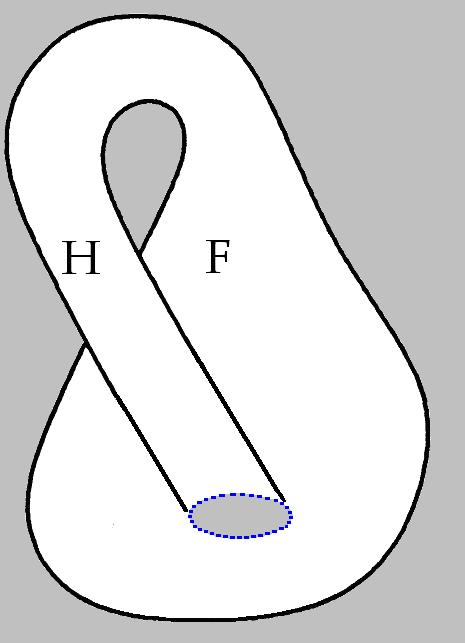
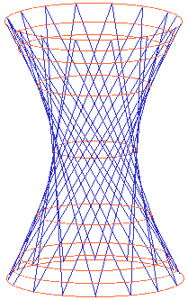
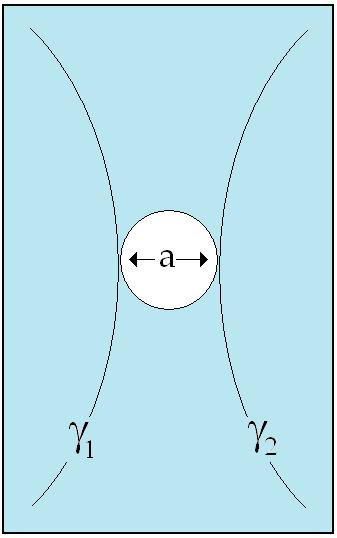

# Leçon 03 | 06 Janvier 1972

  <label><input type="checkbox" data-lacan-toggle="original" checked> 原文</label>
  <label><input type="checkbox" data-lacan-toggle="notes" checked> 注释</label>
  <label><input type="checkbox" data-lacan-toggle="commentary" checked> 个人解读评论</label>

<section class="parallel-paragraph" data-paragraph-ids="s19b-03-0001 s19b-03-0002 s19b-03-0003 s19b-03-0004 s19b-03-0005 s19b-03-0006 s19b-03-0007 s19b-03-0008 s19b-03-0009 s19b-03-0010 s19b-03-0011 s19b-03-0012 s19b-03-0013 s19b-03-0014 s19b-03-0015 s19b-03-0016 s19b-03-0017 s19b-03-0018 s19b-03-0019 s19b-03-0020 s19b-03-0021">

s19b-03-0001, s19b-03-0002, s19b-03-0003, s19b-03-0004, s19b-03-0005, s19b-03-0006, s19b-03-0007, s19b-03-0008, s19b-03-0009, s19b-03-0010, s19b-03-0011, s19b-03-0012, s19b-03-0013, s19b-03-0014, s19b-03-0015, s19b-03-0016, s19b-03-0017, s19b-03-0018, s19b-03-0019, s19b-03-0020, s19b-03-0021

我们并不知道，“系列（série）”是否是“严肃（sérieux）”的原则。然而，我现在面临着这样一个问题：显然，我不能在这里继续那在别处构成我“教学”的东西——也就是人们所谓的“我的研讨课”。
哪怕仅仅是出于这一点考虑——并非所有人都知道，我每个月都会在这里进行一次小型的谈话。再者，也有一些人偶尔会从相当远的地方赶来，去听我在别处所讲的、以“研讨课（séminaire）”之名进行的内容。那么，在这里继续那套内容，对他们而言就不太“合适”——我指的是，对他们不够公允。
总而言之，现在要弄清楚的是：我在这里究竟在做什么。显然，这并非完全如我所预期的那样。我被这种到场的“人潮”所影响——以至于那些我原本召唤来参与某个名为《精神分析家的知识》（Le savoir du psychanalyste）之事的人，虽不必说他们并不缺席，但他们多少被淹没在这众人之中了。
对于此刻在场的各位，我并不确定，当我提及这个“研讨课”时，我是在谈论一个他们所熟悉的东西，还是完全陌生的事物。他们还应当考虑到，例如自上一次以来——那些我在这里见到的人也都在场——我确实已经“开讲”了那个研讨课。
我说“开讲了”，如果我们稍加注意并保持一点严谨，就会知道，这种“开讲”不可能“一次完成”。事实上，已经有过两次；正因为如此，我才可以说它已经“开启”了——因为要是没有第二次，那么第一场也就根本不能称为“第一”。这一点之所以有趣，在于它让我们想起我早先提出过的一个概念：所谓“重复（répétition）”。
显而易见，重复只能从“第二次”开始——因为如果没有第二次，那么也就根本不会有第一次。正因如此，第二次才成为真正开启“重复”的那一次：这正是“零与一”的故事。
然而，仅凭“一个”（1），并不可能出现“重复”。因此，若要真正存在“重复”，若要使其不再停留于“开放未闭合”的状态，就必须有“第三个”（3）。——人们似乎早已在“上帝”问题上察觉到了这一点：
上帝并不是在“一”时开始的；我们花了很长时间才发现，或许其实自始就知道，只是无人记下。毕竟，谁也无法对此发誓。总之，我那位亲爱的朋友亚历山大·科耶夫（Kojève）在这个问题上——关于基督教的“三位一体（Trinité chrétienne）”——曾多有强调。

3确实是一个非常奇妙的数字。 不仅是1，2，3,而且1+2=3 即体现顺序，又体现综合。 3这个数字本身同时展现出这两面。 1=1，1+1=2，1+2=3。

显然，这些问题我不会在这里重提——只有在我的研讨课上我才会回到它们，今年我会设法回到这些话题。
这点很重要，因为正是在此，精神分析所带来的，与某种哲学传统（当然，该传统并非无足轻重）之间，存在着一个“天壤之别”。
尤其是当我们谈到柏拉图时，他曾非常明确地强调过“二元（dyade）”的价值。我的意思是：一旦从那“二元”出发，一切便开始滑落。究竟是什么滑落了？——他大概心知肚明，只是他并未说出。
不论如何，这与分析意义上的Nachträg（事后性）——也就是第二时刻——毫不相干。至于我刚才强调其重要性的“第三时刻”，它并非只对我们成立，而且对于上帝他自己也同样成立。

原文 · s19b-03-0001, s19b-03-0002, s19b-03-0003, s19b-03-0004, s19b-03-0005, s19b-03-0006, s19b-03-0007, s19b-03-0008, s19b-03-0009, s19b-03-0010, s19b-03-0011, s19b-03-0012, s19b-03-0013, s19b-03-0014, s19b-03-0015, s19b-03-0016, s19b-03-0017, s19b-03-0018, s19b-03-0019, s19b-03-0020, s19b-03-0021

On ne sait pas si *la série* est le principe du *sérieux*.

Néanmoins je me trouve devant cette question de ce qu'évidemment je ne peux pas ici continuer ce qui ailleurs se définit de mon enseignement, de ce qu'on appelle *mon séminaire*.

Ne serait-ce que parce que tout le monde n'est pas averti que je fais une petite conversation par mois ici, et comme il y a des gens qui se dérangent, quelquefois d'assez loin, pour suivre ce que je dis ailleurs sous ce nom de « *séminaire* », et bien ça ne serait pas\... ça ne serait pas correct, je veux dire avec eux, de continuer ici.

Alors en somme il s'agit de savoir *ce que je fais ici*.

Il est certain que ce n'est pas tout à fait ce que j'attendais.

Je suis infléchi par cette affluence qui fait que ceux qu'en fait je convoquais à quelque chose qui s'appelait « *Le savoir du psychanalyste »*, ne sont pas du tout forcément absents d'ici, mais sont un peu noyés.

À ceux qui sont ici même, je ne sais pas si en faisant allusion à ce séminaire, je parle de quelque chose qu'ils connaissent. Il faut aussi qu'ils tiennnent compte que, par exemple depuis la dernière fois, ceux que je rencontre ici s'y sont trouvés, justement, je l'ai ouvert ce séminaire.

Je l'ai ouvert, si on est un peu attentif et rigoureux, on ne peut pas dire que ça puisse se faire en une seule fois. Effectivement, il y en a eu 2, et c'est pour ça que je peux dire que je l'ai ouvert, parce que s'il n'y avait pas eu de 2^ème^ fois, ben il n'y aurait pas de 1^ère^.

Ça a son intérêt *pour rappeler quelque chose* que j'ai introduit il y a un certain temps à propos de ce qu'on appelle *la répétition*.

*La répétition* ne peut évidemment commencer qu'à la 2^ème^ fois, qui se trouve\...

> du fait que si il n'y en avait pas de 2^ème^, il n'y aurait pas de 1^ère^ \...qui se trouve donc être celle qui inaugure la *répétition *: c'est l'histoire du 0 et du 1.

Seulement avec le 1, il ne peut pas y avoir de *répétition*, de sorte que pour qu'il y ait *répétition*, pas pour que ça soit ouvert, il faut qu'il y en ait une 3^ème^.

C'est ce dont on semble s'être aperçu à propos de Dieu \[*la « Trinité »*\] : il ne commence\... on a mis le temps à s'en apercevoir, ou bien on le savait depuis toujours, mais ça n'a pas été noté, parce que après tout, on ne peut jurer de rien dans ce sens, mais enfin mon cher ami Kojève insistait beaucoup sur cette question de *la Trinité chrétienne*.

Quoi qu'il en soit il y a évidemment un monde, du point de vue de ce qui nous intéresse\...

> et ce qui nous intéresse est analytique \...entre la 2^ème^ fois qui est ce que j'ai cru devoir souligner du terme de « *nachträg* » : *l'après-coup*\...

> c'est évidemment des choses que je ne reprendrai - pas ici - qu'à mon séminaire,
>
> j'essaierai d'y revenir cette année.

C'est important \[*la « Trinité », le 3^ème^ temps*\] parce que c'est en ça qu'il y a un monde entre

- ce qu'apporte la psychanalyse,

- et ce qu'a apporté une certaine tradition philosophique qui n'est certes pas négligeable, surtout quand il s'agit de Platon, qui a bien souligné la valeur de la *dyade*.

Je veux dire qu'à partir d'elle, tout dégringole. Qu'est-ce qui dégringole, il devait le savoir, mais il ne l'a pas dit

Quoi qu'il en soit, ça n'a rien à faire avec le *nachträg* analytique, le 2^nd^ temps.

</section>

<section class="parallel-paragraph" data-paragraph-ids="s19b-03-0022 s19b-03-0023 s19b-03-0024 s19b-03-0027 s19b-03-0028 s19b-03-0029 s19b-03-0030 s19b-03-0031 s19b-03-0032 s19b-03-0033 s19b-03-0034 s19b-03-0035 s19b-03-0036 s19b-03-0037 s19b-03-0038 s19b-03-0039 s19b-03-0040">

s19b-03-0022, s19b-03-0023, s19b-03-0024, s19b-03-0027, s19b-03-0028, s19b-03-0029, s19b-03-0030, s19b-03-0031, s19b-03-0032, s19b-03-0033, s19b-03-0034, s19b-03-0035, s19b-03-0036, s19b-03-0037, s19b-03-0038, s19b-03-0039, s19b-03-0040

数字本身似乎是没有时间的，但1，2，3确非常特别。 就想之前拉康说的，如果没有1，就不会有2。有了2，反过来确认了1。 1，2这里的时间顺序非常明确，而后3的出现必然是在1，2在符号的确认之后，以一种“开放”而“整合”的姿态介入进1，2。 三生万物…

事后性更多指向了可能是2，或者说第二时刻。“第二次”中事后形成、回溯确立“第一次”的逻辑时间。 1不能自足，就连上帝他老人家都需要3来维持自身的封闭。那么“三”便是语言与存在的最小充分条件。
当时，有一幅陈列在装饰艺术博物馆的挂毯，十分美丽——我强烈鼓励大家去看。其上可以看到圣父、圣子与圣灵，全都以完全相同的一种形象出现：一个颇为高贵、留着胡须的人物。他们三者彼此相望——这比一个人对着自己的镜像更让人震撼。自“三”开始，确实就会产生一种独特的效应。

从我们这些主体的立场看，对于上帝自身，究竟有什么是要到“3”才开始的呢？这是我在刚开始教学时就很快提出的一个老问题。我当时很快就提出过，但此后未再重复——我马上就会告诉你们原因：
很显然，只有从“三”开始，他（上帝）才可能相信他自己。
因为这事相当奇特：据我所知，从未有人提出过这样一个问题：
“上帝会相信他自己吗？”
然而，这本来本可以成为一个对我们颇有启发的例子。令人尤为惊讶的是，这个问题——我在相当早的时候就提出过，而且我并不认为它是徒然的——居然没有引起任何波澜，至少表面上如此；至少在我的“同道者”当中是这样，我是说那些在“三位一体”的荫庇之下受过教养的人。
我可以理解，对其他人来说，这个问题或许没有什么触动。
但对那些人而言——他们真是“incorreligionigibles”（拉康自造词），简直毫无可救之处。要知道，当时在场的，还有几位所谓“基督教层级”中颇有名望的人物。
问题在于：是否因为他们身在其中……对此我颇难以置信——以至于什么也听不见；抑或更可能的是——他们抱有一种相当彻底的无神论，以至于这个问题对他们丝毫不起作用？我倾向于后一种解释。

> <strong>【incorreligionigibles】</strong>​：拉康自造词（néologisme），明显拼接/扭曲自 incorrigible（不可教化） 与 corréligionnaires（同教之人）/religion​。大意：“（在宗教—或同教—意义上）不可纠正/不可教化的人” 可译作“宗教上不可救药的”“在信仰上无可教化的”。这一词带有讽刺意味：既指他们“信得太死”，又暗示他们“信而不知其信的结构”。

> <strong>【身在其中】</strong>直译“在里面”。此处指那些受“三位一体”传统熏习的人“在宗教话语之内”的境况。
> 这可称不上我刚才所说的“严肃性的保障”，因为那充其量不过是一种无神论，一种类似打盹的状态——而且相当普遍。换句话说，他们对那必须在其中游泳的介质（milieu）的维度，毫无概念​：他们只是浮在水面上——这可不完全一样——他们之所以还能浮着，是因为彼此手拉着手。
> 于是事情就变成了人们所谓的一个“网络”，大家就这样手拉着手。保罗·福尔有一首这个路数的诗：
> “如果全世界的姑娘——诗是这样开头的——……都手牵着手，她们就能绕世界一圈……”
> 这是一个疯狂的主意，因为实际上天下的姑娘从来没想过要这么做；倒是男孩们……
> ——诗里也说到他们——……男孩们在这一点上可很在行：他们啊，个个手拉着手。之所以要这样，是因为倘若不手拉手，每个人就得独自去面对一个女孩——而这正是他们不情愿的。所以他们非手拉手不可。

保罗·福尔〈环绕世界的圆舞〉
“如果全世界的姑娘都愿意携起手来，
围绕大海，她们就能跳起一圈圆舞。
如果全世界的小伙子都愿意当水手，
他们就能用小船在波涛上搭起一座美丽的桥。
那么，我们便能围绕世界共舞成环——
只要全世界的小伙子都肯牵起手来。”

原文 · s19b-03-0022, s19b-03-0023, s19b-03-0024, s19b-03-0027, s19b-03-0028, s19b-03-0029, s19b-03-0030, s19b-03-0031, s19b-03-0032, s19b-03-0033, s19b-03-0034, s19b-03-0035, s19b-03-0036, s19b-03-0037, s19b-03-0038, s19b-03-0039, s19b-03-0040

Quant au 3^ème^ \[*temps*\] dont je viens de souligner l'importance, ça n'est pas seulement pour nous qu'il le prend, c'est pour Dieu lui-même.

Dans un temps, et à propos d'une certaine tapisserie[^4] qui étaient étalée au *Musée des Arts Décoratifs*, qui était bie belle, que j'ai vivement incité tout le monde à aller voir, on y voit « *Le Père et Le Fils et Le Saint Esprit »* qui étaient représentés strictement sous la même figure, la figure d'un personnage assez noble et barbu, ils étaient 3 à s'entre-regarder, ça fait beaucoup plus d'impression que de voir quelqu'un en face de son image.

À partir de 3 ça commence à faire un certain effet.

De notre point de vue de sujets, qu'est-ce qui peut bien commencer à 3 pour Dieu lui-même ?

C'est une vieille question que j'ai posée très vite du temps que j'ai commencé mon enseignement.

Je l'ai posée très vite et puis je ne l'ai pas renouvelée, je vous dirai tout de suite pourquoi : c'est que ça n'est évidemment qu'à partir de 3 qu'il peut croire en lui-même.

Parce que c'est assez curieux, c'est une question qui n'a jamais été posée à ma connaissance « *Est-ce que Dieu croit en lui ?* ».

Ça serait pourtant un bon exemple pour nous.

C'est tout à fait frappant que cette question\...

> que j'ai posée assez tôt et que je ne crois pas vaine \...n'ait soulevé, apparemment au moins, aucun remou, au moins parmi mes corréligionnaires, je veux dire ceux qui se sont instruits à l'ombre de la Trinité.

Je comprends que pour les autres, ça ne les ait pas frappés, mais pour ceux-là, vraiment, ils sont « *incorreligionigibles* », il n'y a rien à en faire. Pourtant j'avais là quelques personnes notoires de la hiérarchie qu'on appelle « *chrétienne* ».

La question se pose de savoir si c'est parce qu'ils y sont ci-dedans\...

> ce que j'ai peine à croire \...qu'ils n'entendent rien, ou\...

> ce qui est de beaucoup plus probable \...qu'ils sont d'un athéisme assez intégral pour que cette question ne leur fasse aucun effet.

C'est la solution pour laquelle je penche.

On ne peut pas dire que ce soit ce que j'appelais tout à l'heure *une garantie de* *sérieux* puisque ça ne peut être qu'un athéisme, en quelque sorte une somnolence, ce qui est assez répandu.

En d'autres termes, ils n'ont pas la moindre idée de la dimension du milieu dans lequel il y a à nager : ils surnagent - ce qui n'est pas tout à fait pareil - ils surnagent grâce au fait qu'ils se tiennent la main.

</section>

<section class="parallel-paragraph" data-paragraph-ids="s19b-03-0025">

s19b-03-0025

[无对应译文]

原文 · s19b-03-0025

{width="3.237270341207349in" height="2.1527985564304464in"}

</section>

<section class="parallel-paragraph" data-paragraph-ids="s19b-03-0026">

s19b-03-0026

[无对应译文]

原文 · s19b-03-0026

{width="6.29375in" height="3.1930555555555555in"}

</section>

<section class="parallel-paragraph" data-paragraph-ids="s19b-03-0041 s19b-03-0042 s19b-03-0043 s19b-03-0044 s19b-03-0045 s19b-03-0046 s19b-03-0047 s19b-03-0048">

s19b-03-0041, s19b-03-0042, s19b-03-0043, s19b-03-0044, s19b-03-0045, s19b-03-0046, s19b-03-0047, s19b-03-0048

姑娘们，那可又是另一回事。她们在某些社会仪式的语境中被卷入其中。请参见《中国古代的舞蹈与传说（Les danses et légendes de la Chine ancienne）》，那真是优雅得很，甚至可以说是“书经（Chou King）”——不是“shocking（震惊）”，而是“周经”。
这部“周经”是由一位名叫格拉内（Granet）的人所写，他有一种完全与
——民族学无关（尽管他无疑是一位民族学家），
——汉学也无关（尽管他无疑是一位汉学家）——的天才。
这位格拉内就提出，在古代中国，男女在节仪中是以同样的数量相互对抗的：
为什么不信呢？

> <strong>Chou King（书经）</strong>​：即《尚书》（Shu Jing），此处拉康故作谐音笑话——“Chou King”听起来近似 shocking（令人震惊的），借此玩笑方式强调格拉内研究的“优雅/古典”而非“刺激/惊世骇俗”。

原文 · s19b-03-0041, s19b-03-0042, s19b-03-0043, s19b-03-0044, s19b-03-0045, s19b-03-0046, s19b-03-0047, s19b-03-0048

Alors comme ça, ça finit par faire ce qu'on appelle un réseau, et à se tenir tous comme ça par la main.

Il y a un poème de Paul Fort dans ce genre là [^5] : « *Si toutes les filles du monde -* ça commence comme ça - \...*se tenaient par la main, elles pourraient faire le tour du monde*\... ».

C'est une idée folle parce qu'en réalité *les filles du monde* n'ont jamais songé à ça, les garçons par contre\...

> il en parle aussi \...les garçons pour ça s'y entendent : ils se tiennent tous par la main.

Ils se tiennent tous par la main d'autant plus que s'ils ne se tenaient pas par la main, il faudrait que chacun affronte la fille tout seul, et ça ils aiment pas.

Il faut qu'ils se tiennent par la main.

Les filles, c'est une autre affaire.

Elles y sont entraînées dans le contexte de certains rites sociaux, conférez [*Les danses et légendes de la Chine ancienne*](http://classiques.uqac.ca/classiques/granet_marcel/A10_danses_et_legendes/danses_legendes.pdf), ça c'est *chic*, c'est même *Chou King* - pas *schoking* - *Chou King*.

</section>

<section class="parallel-paragraph" data-paragraph-ids="s19b-03-0049 s19b-03-0050 s19b-03-0051 s19b-03-0052 s19b-03-0053 s19b-03-0054 s19b-03-0055 s19b-03-0056 s19b-03-0057 s19b-03-0058 s19b-03-0059 s19b-03-0060 s19b-03-0061 s19b-03-0062 s19b-03-0063 s19b-03-0064 s19b-03-0065 s19b-03-0066 s19b-03-0067 s19b-03-0068 s19b-03-0069 s19b-03-0070 s19b-03-0071 s19b-03-0072 s19b-03-0073 s19b-03-0074 s19b-03-0075 s19b-03-0076 s19b-03-0077 s19b-03-0078 s19b-03-0079 s19b-03-0080 s19b-03-0081 s19b-03-0082 s19b-03-0083 s19b-03-0084 s19b-03-0085 s19b-03-0086">

s19b-03-0049, s19b-03-0050, s19b-03-0051, s19b-03-0052, s19b-03-0053, s19b-03-0054, s19b-03-0055, s19b-03-0056, s19b-03-0057, s19b-03-0058, s19b-03-0059, s19b-03-0060, s19b-03-0061, s19b-03-0062, s19b-03-0063, s19b-03-0064, s19b-03-0065, s19b-03-0066, s19b-03-0067, s19b-03-0068, s19b-03-0069, s19b-03-0070, s19b-03-0071, s19b-03-0072, s19b-03-0073, s19b-03-0074, s19b-03-0075, s19b-03-0076, s19b-03-0077, s19b-03-0078, s19b-03-0079, s19b-03-0080, s19b-03-0081, s19b-03-0082, s19b-03-0083, s19b-03-0084, s19b-03-0085, s19b-03-0086

<strong>Granet, Marcel (1884–1940)</strong>​：法国社会学家、人类学家、汉学家，涂尔干学派成员，著有 Les danses et légendes de la Chine ancienne（1926）及 La pensée chinoise（1934）。他以社会学方法研究中国古代宗教与仪式，被拉康视为在结构主义前已触及“关系逻辑”的思想家。
在实际情形里、就我们当下所见： ——男孩们总是会扎成一撮，人数常常超过十个。缘由我刚才已经说过了（笑）：要是让每个人孤零零地、各自对着自己的那一位女生——我也解释过了——这当中“风险太多”。 ——而对女孩们来说，事情就完全不同了。既然我们已不身处《周书/书经》（他戏称“Chou King”，而非“shocking”）的年代，她们往往两两结伴，跟闺蜜结成“好姐妹”，一直到——当然了——把一个男生从他那个“团伙/连队”里“拽”出来为止。是的，先生！（笑）
不论你们怎么想，哪怕这些话在你们看来有些浮浅，它们都有根据——以我作为分析家之经验为依据。
当她们把一个男生从他的“团伙/队列”里拽出来之后，顺理成章地就把闺蜜放下了；
而且顺带一说，那位闺蜜并不因此就更糟，反倒也能自己应付得不错。
是啊！总之这些话，我方才有点儿说嗨了。我以为我身在何处呢！【笑】
事情就是这么顺着线头一路牵出来的：因为格拉内，也因为《​书经​》诗歌里那种奇异的交替——男声合唱与女声合唱相对而立。就这样我被带着谈起自己的分析经验——我只是打了个“闪回”的亮点——可那并不是问题的根本。
可就是这样——正是谈起我的研讨课，把我带着走了。毕竟你们也许和他们是同一拨人，于是我便像对他们说话那样说了，这又把我带得像是在谈论你们——谁知道呢？——结果又带得我好像是在对你们说话。可这无论如何都不在我的本意之内。（笑）
这完全不在我的本意之内。因为我来圣安娜发言，是为了对精神科医生讲话，
而显然，你们并不都是精神科医生。于是可以确定的一点是：这是一桩失误行动​。
而且这桩失误行动在任何时刻都有“成功”的风险——也就是说，很可能我无论如何还是在对某个人说话​。
我怎么能知道，我究竟在对谁说话呢？尤其是，归根结底——你们在这件事里确实“算数”……虽然我尽力让自己不受影响——但至少在这一点上，你们确实起了作用：
我现在说话的地方，并不是我原本打算说话的地方。我原打算在马尼昂讲堂（amphithéâtre Magnan）发言，可现在，却是在礼拜堂（chapelle）里说话。
真是离奇的故事！你们听见了吗？听见了吗？——我是在礼拜堂里说话！ 这就是答案。我是在对教堂说话，也就是说——对墙说话！〔笑声〕这桩失误行动是愈发“成功”了！我现在知道我来这里究竟是要对谁说话：就是我在圣安娜一直说话的对象——墙​！
我没必要再回头说这事——那都已经很久了。
我不时会回到这里，做些小题目的演讲，比如《我教的是什么……》，
还有别的一些题目——我就不逐一列了。可我在这里始终都是对墙说话​。
X——……
拉康——谁有话要说？
X——如果您是对墙说话，那我们都该出去。
拉康——谁……谁在和我说话？（笑）
X——是墙​。
拉康——现在我可以就此评论一下：对墙说话
这回事，居然还真让一些人感兴趣。这就是为什么我刚才要问，究竟是谁在说话。
可以肯定的是：在所谓、在过去诚实点儿的时代称作“疯人院（asīle）”、也叫“
临床收容所”的地方里，这些墙可不是无足轻重的。
但我还要再多说一点：这座<strong>教堂（chapelle）</strong>​，在我看来，真是一个极为合适的地方，
让我们能切实体会到——当我谈论“墙（murs）”时，我所指的究竟是什么。这是一种奇特的景象：
是世俗化（laïcité）对被收容者所作的某种“让步”——一座教堂，当然配备着它那一整套牧师随员（aumôniers）。倒也不是说这座教堂在建筑上有多么了不起——是不是？——但毕竟，它是一座教堂，而且具备一切人们对教堂所预期的那种布局与格局。

原文 · s19b-03-0049, s19b-03-0050, s19b-03-0051, s19b-03-0052, s19b-03-0053, s19b-03-0054, s19b-03-0055, s19b-03-0056, s19b-03-0057, s19b-03-0058, s19b-03-0059, s19b-03-0060, s19b-03-0061, s19b-03-0062, s19b-03-0063, s19b-03-0064, s19b-03-0065, s19b-03-0066, s19b-03-0067, s19b-03-0068, s19b-03-0069, s19b-03-0070, s19b-03-0071, s19b-03-0072, s19b-03-0073, s19b-03-0074, s19b-03-0075, s19b-03-0076, s19b-03-0077, s19b-03-0078, s19b-03-0079, s19b-03-0080, s19b-03-0081, s19b-03-0082, s19b-03-0083, s19b-03-0084, s19b-03-0085, s19b-03-0086

Ce *Chou King* ça été écrit par un nommé Granet, qui avait une espèce de génie qui n'a abso­lument rien à faire

- ni avec l'ethnologie, il était incontestablement ethnologue,

- ni avec la sinologie, il était incontestablement sinologue, alors le nommé Granet donc, avançait que dans la chine antique, les filles et les garçons s'affron­taient à nombre égal : pourquoi ne pas le croire ?

Dans la pratique, dans ce que nous connaissons de nos jours :

- les garçons se mettent toujours un certain nombre, au­ delà de la dizaine, pour la raison que je vous ai exposée tout à l'heure \[*Rires*\], parce que, être tout seul, chacun à chacun en face de sa *chacune*, je vous l'ai expliqué : c'est trop plein de risques.

<!-- -->

- Pour les filles, c'est tout autre chose. Comme nous ne sommes plus au temps du *Chou King*, elles se groupent deux par deux, elles font amie­-amie avec une amie, jusqu'à ce qu'elles aient, bien entendu, arraché un gars à son régiment. Oui, monsieur ! \[*Rires*\]

Quoi que vous en pensiez et même si superficiels que vous paraissent ces propos, ils sont fondés, fondés sur mon expérience d'analyste. Quand elles ont détourné un gars de son régiment, naturellement elles laissent tomber l'amie, qui d'ailleurs ne s'en débrouille pas plus mal pour autant.

Oui ! Enfin tout ça, je me suis laissé un peu *entraîner*. Où est-ce que je me crois ! \[*Rires*\]

C'est venu comme ça de fil en aiguille, à cause de Granet et de cette histoire étonnante de ce qui alterne d ans les poèmes du *Chou King *: ce chœur de garçons opposé au chœur des filles.

Je me suis laissé entraîner comme ça à parler de mon expérience analytique, sur laquelle j'ai fait un *flash*, ça n'est pas le fond des choses.

C'est pas ici que j'expose le fond des choses.

Mais où est-ce que je suis, que je me crois, pour parler en somme, pour parler du fond des choses.

Je me croirais presque avec des êtres humains, ou cousus main, même !

C'est comme ça, c'est pourtant comme ça que je m'adresse à eux.

Mais c'est ça, c'est de parler de mon séminaire qui m'a entraîné.

Comme après tout vous êtes peut-être les mêmes, j'ai parlé comme si je parlais à eux, ce qui m'a entraîné à parler comme si je parlais *de vous* et - qui sait ? - ça entraîne à parler comme si je parlais *à vous*.

Ce qui n'était quand même pas dans mes intentions. \[*Rires*\]

C'était pas du tout dans mes intentions parce que, si je suis venu parler à Sainte-Anne, c'était pour parler aux psychiatres, et très évidemment vous n'êtes pas tous psychiatres.

Alors, enfin ce qu'il y a de certain *c'est que c'est un acte manqué*\... *c'est un acte manqué* qui donc à tout instant risque de réussir, c'est-à-dire qu'il se pourrait bien que je parle quand même à quelqu'un.

Comment savoir à qui je parle ?

Surtout qu'en fin de compte vous comptez dans l'affaire\...

> quoique je m'efforce \...vous comptez au moins pour ceci que je ne parle pas de là où je comptais parler puisque je comptais parler à l'amphithéâtre Magnan et que je parle à la chapelle.

Quelle histoire ! Vous avez entendu ? Vous avez entendu ? J*e parle à la chapelle* !

C'est la réponse. Je parle à la chapelle, c'est à dire *aux murs* ! \[*Rires*\]

De plus en plus réussi, l'acte manqué !

Je sais maintenant à qui je suis venu parler : à ce à quoi j'ai toujours parlé à Sainte-Anne, aux murs !

J'ai pas besoin d'y revenir, ça fait une paye.

De temps en temps, je suis revenu avec un petit titre de conférence sur « *Ce que j'enseigne*\... » par exemple, et puis quelques autres, je vais pas faire la liste. J'y ai toujours parlé aux murs.

X - \...

Lacan - Qui a quelque chose à dire ?

X - *On devrait tous sortir si vous parlez aux murs.*

Lacan - Qui\... qui me parle là ? \[*Rires*\]

X - *Les murs.*

Lacan

C'est maintenant que je vais pouvoir faire commentaire de ceci qu'à parler aux murs, ça intéresse quelques personnes.

C'est pourquoi je demandais à l'instant *qui* parlait.

Il est certain que *les murs* dans ce qu'on appelle, dans ce qu'on appelait au temps où on était honnête « *un asile »*, « *l'asile clinique »* comme on disait, les murs tout de même, c'est pas rien.

Mais je dirais plus : cette *chapelle* ça me paraît bien un lieu extrêmement bien fait pour que nous touchions de quoi il s'agit quand je parle des murs.

</section>

<section class="parallel-paragraph" data-paragraph-ids="s19b-03-0087 s19b-03-0088">

s19b-03-0087, s19b-03-0088

aumônier（复数 : aumôniers​）是法语名词，意思是随军神父、教区牧师、宗教辅导员​，即在某个特定机构（军队、医院、监狱、学校等）中负责宗教事务的人。 JOJO第七部里面的神父就是干这个的。

原文 · s19b-03-0087, s19b-03-0088

Cette sorte de concession de la laïcité aux internés : une chapelle avec sa garniture d'aumôniers, bien sûr.

C'est pas qu'elle soit formidable - hein ? - du point de vue architectural, mais enfin c'est une chapelle, une chapelle avec la disposition qu'on en attend.

</section>

<section class="parallel-paragraph" data-paragraph-ids="s19b-03-0089 s19b-03-0090 s19b-03-0091 s19b-03-0092 s19b-03-0093">

s19b-03-0089, s19b-03-0090, s19b-03-0091, s19b-03-0092, s19b-03-0093

人们过于容易忽略这样一个事实：建筑师啊——不管他怎样努力想摆脱——归根结底就是为此而生的：造墙。 而墙，老实说…… 有件事相当引人注目：自从——也就是我刚才所说的——基督教以来，它或许在这方面过度地偏向黑格尔主义； ……可这一切终究都是为了把一个空无围起来。

造墙是为了把空无围起来。 围起来又能如何呢？ 把空无掩盖起来？ 划定空无的边界？

仅仅只是把它围起来，而不把它填满。
要想象——到底是什么曾经充盈过帕台农神庙的那些墙，以及其他一些同类的“小玩意儿”（babioles）——如今只剩下一些坍塌的墙壁，这真是难以想象、无从得知。可以肯定的是：我们对此绝对没有任何见证。

原文 · s19b-03-0089, s19b-03-0090, s19b-03-0091, s19b-03-0092, s19b-03-0093

On omet trop que l'architecte, quelque effort qu'il fasse pour en sortir, il est fait pour ça, pour faire des murs.

*Et que les murs*, ma foi\...

> c'est quand même très frappant que depuis, ce dont je parlais tout à l'heure,
>
> à savoir *le christianisme*, penche peut-être par là un peu trop vers *l'hégélianisme* \...mais *c'est fait pour entourer un vide*.

Comment imaginer qu'est-ce qui remplissait les murs du Parthénon et de quelques autres babioles de cette espèce dont il nous reste quelques murs écroulés, c'est très difficiles à savoir.

Ce qu'il y a de certain, c'est que nous n'en avons absolument aucun témoignage.

</section>

<section class="parallel-paragraph" data-paragraph-ids="s19b-03-0094 s19b-03-0095 s19b-03-0096 s19b-03-0097 s19b-03-0098 s19b-03-0099 s19b-03-0100 s19b-03-0101 s19b-03-0102 s19b-03-0103 s19b-03-0104">

s19b-03-0094, s19b-03-0095, s19b-03-0096, s19b-03-0097, s19b-03-0098, s19b-03-0099, s19b-03-0100, s19b-03-0101, s19b-03-0102, s19b-03-0103, s19b-03-0104

只剩下墙壁，而墙壁内的东西无从得知。

我们仅仅怀有一种感觉：在那整段如今被我们贴上“异教（paganisme）”标签的年代，各种被称作“异教节庆”的活动中，曾经有些什么在发生。
我们之所以还保留着它们的名称​，只是因为有某些编年史（Annales）将事件如此记载： “正是在大帕纳辛尼亚节上，阿狄曼托斯（Adymante）与格劳孔（Glaucon）——你们都知道接下来的故事——遇见了那位名叫刻法洛斯（Céphale）的人。”
在那里（那些祭仪或神庙中）究竟发生了什么？——真是不可思议，我们竟然对此连最模糊的概念都没有！相反，关于“空”​，我们倒是有一个极为宏大的观念——因为留给我们的遗产，是由那被称为“哲学”的传统所传承下来的，而那一传统，正是给“空无”留出了极大的位置的。

我们对曾经的充实之物一无所知，但对“空”却拥有传统赋予的“知识”。 将“空”组织成了可被思的空间。 因此我们可以说 ：正是因为有了空，才有了围绕它所建立的墙吗？

还有一位叫柏拉图（Platon）的家伙，他就把整个关于“世界的理念（Idée du monde）”都围绕这一点转了起来——真是名副其实的“旋转”啊。正是他发明了“洞穴（la caverne）”​。他把它变成了一间暗室（chambre noire）​： 外面确实有什么在发生，而这一切经过一个小孔投射进来，便在里面造出了<strong>那些影像（ombres）</strong>​。

原文 · s19b-03-0094, s19b-03-0095, s19b-03-0096, s19b-03-0097, s19b-03-0098, s19b-03-0099, s19b-03-0100, s19b-03-0101, s19b-03-0102, s19b-03-0103, s19b-03-0104

Nous avons le sentiment que pendant toute cette période que nous épinglons de cette étiquette moderne du *paganisme*, il y avait des choses qui se passaient dans diverses fêtes qu'on appelle \[païennes\], on a conservé les noms de ce que c'était parce qu'il y a des Annales qui dataient les choses comme ça :

> « *C'est aux grandes Panathénées qu'Adymante et Glaucon* - vous savez la suite - *ont rencontré le nommé Céphale* ».

Qu'est-ce qui s'y passait ? C'est absolument incroyable que nous n'en n'ayons pas la moindre espèce d'idée !

Par contre pour ce qui est du vide, nous en avons une grande, parce que tout ce qui nous est resté légué, légué par une tradition qu'on appelle philo­sophique, ça fait une grande place au vide.

Il y a même un nommé Platon qui a fait pivoter autour de là toute son *Idée du monde*, c'est le cas de le dire, c'est lui qui a inventé « *la caverne »*. Il en a fait une *chambre noire *: il y avait quelque chose qui se passait à l'extérieur, et tout ça en passant par un petit trou faisait toutes les ombres.

C'est curieux, c'est là que peut-être on aurait un petit fil, un petit bout de trace.

C'est manifestement une théorie qui nous fait toucher du doigt ce qu'il en est de *l'objet(a)*.

Supposez que la caverne de Platon, ça soit ces murs où se fait entendre ma voix.

Il est manifeste que les murs, ça me fait *jouir* !

Et c'est en ça que vous jouissez tous, et tout un chacun, par participation.

Me voir parler aux murs est quelque chose qui ne peut pas vous laisser indifférents.

</section>

<section class="parallel-paragraph" data-paragraph-ids="s19b-03-0105 s19b-03-0106 s19b-03-0107 s19b-03-0108 s19b-03-0109 s19b-03-0110 s19b-03-0111 s19b-03-0112">

s19b-03-0105, s19b-03-0106, s19b-03-0107, s19b-03-0108, s19b-03-0109, s19b-03-0110, s19b-03-0111, s19b-03-0112

硬要说的话，人的眼睛本身也是小孔成像。 外面确实有一些事情发生，但这一切都通过小孔（一双也好一对也好），便造出这些影像。

真奇怪——也许正是在这里，我们能找到一根细线，一点痕迹。显然，这是一种理论，使我们得以用手触到（toucher du doigt）——那关于小对象a（objet a）的“真实之所在”。请设想一下：
柏拉图的洞穴，就是这些响着我声音的墙壁。

对着墙壁说话，墙壁响着回音。

很明显——这些墙让我感到快感（ça me fait jouir）！
而正是在这点上，你们每一个人也都在享受（jouissez），都在以一种“参与式的方式”分享这快感。
看到我在对墙说话，这件事，不可能让你们无动于衷。
请各位想一想：假如柏拉图是个结构主义者，他就会真正觉察到“洞穴”是怎么回事——也就是说，很可能语言正是诞生于此​。
我们必须把事情翻过来​：当然，人类早就会啼哭，就像任何一种小动物那样；总之，它们都是为了索取母乳而发出叫声。

原文 · s19b-03-0105, s19b-03-0106, s19b-03-0107, s19b-03-0108, s19b-03-0109, s19b-03-0110, s19b-03-0111, s19b-03-0112

Et réfléchissez, sup­posez que Platon ait été structuraliste: il se serait aperçu de ce qu'il en est de la caverne vraiment, à savoir que c'est sans doute là qu'est né le langage.

Il faut retourner l'affaire, parce que bien sûr, il y a longtemps que l'homme vagit, comme n'importe lequel des petits animaux, enfin ils piaillent pour avoir le lait maternel.

Mais pour s'apercevoir qu'il est capable de faire quelque chose que bien entendu il entend depuis longtemps, dans le babillage, le bafouillage, tout se produit, mais pour choisir, il a dû s'apercevoir

- que les « K » ça résonne mieux du fond, le fond de la caverne, du dernier mur,

- et que les « B » et les « P » ça jaillit mieux à l'entrée, c'est là qu'il en a entendu la résonance.

Je me laisse entraîner ce soir, puisque *je parle aux murs*.

Il ne faut pas croire que ce que je vous dis, ça veut dire que j'ai rien tiré d'autre de Sainte-Anne.

À Sainte-Anne je ne suis arrivé à parler que très tard, je veux dire que ça ne m'était pas venu à l'idée sauf à accomplir quelques devoirs de broutille.

</section>

<section class="parallel-paragraph" data-paragraph-ids="s19b-03-0113 s19b-03-0114 s19b-03-0115 s19b-03-0116 s19b-03-0117 s19b-03-0118 s19b-03-0119 s19b-03-0120 s19b-03-0121 s19b-03-0122 s19b-03-0123 s19b-03-0124 s19b-03-0125 s19b-03-0126 s19b-03-0127 s19b-03-0128 s19b-03-0129 s19b-03-0130">

s19b-03-0113, s19b-03-0114, s19b-03-0115, s19b-03-0116, s19b-03-0117, s19b-03-0118, s19b-03-0119, s19b-03-0120, s19b-03-0121, s19b-03-0122, s19b-03-0123, s19b-03-0124, s19b-03-0125, s19b-03-0126, s19b-03-0127, s19b-03-0128, s19b-03-0129, s19b-03-0130

把事情翻过来，而不是事情反过来。

翻过来，内外的方向翻过来。 事实上，如果一个东西可以说得上“翻过来”，那么它便没有真正的内外，从拓扑上只是一个洞。 正是这个这个装置让发声成为语言。 其他的生物之间传递信息的方式不仅仅是发声。还有信息素，气味，“跳舞”，动作等等。
那柏拉图的洞穴呢。
然而，要让他意识到：自己能够做点什么——尽管这些他早就“听”过了。在咿呀学语（babillage）与结结巴巴（bafouillage）之中，一切都在发生；但要“做出选择”，他必须已经察觉到：
——像“K”这样的音，更能从洞穴的深处，从最后那面墙的深处，产生回响；
——而“B”“P”这样的音，更像是在入口处迸发出来；他正是在那里听见了它们的回声。
今晚我就顺势被带走了，因为我在“对墙说话”。可别以为我说这些，就意味着我从圣安娜（Sainte-Anne）什么也没得到。在圣安娜，我其实很晚才开始“说话”的——我的意思是，在此之前我也没想到要开口，除非为了履行一些无关紧要的小义务。

如果口腔，身体，主体本身就是一个“洞”，那么对着墙壁说话，意味着将自身看作某个装置，然后将声音投射到墙壁上。使之成为一个洞穴。

对于声音来说，成为墙壁，使它成为一个洞穴装置。 相比于镜子来说，墙壁和洞穴是一个更有趣的解释。 洞穴隐喻脱离了图像，光线之外还能有什么呢？
在发声这件事情上，洞穴这种装置依然有它对应的意义。
当我还是临床主任（chef de clinique）的时候，我常常给实习医生们讲一些小故事。也正是在那个时候，我学会了——<strong>在讲故事这件事上要格外小心（me tenir à carreau）</strong>​。
有一次我讲到一位病人的母亲——这位病人是个可爱的同性恋者，我当时正为他做分析——而我又实在避免不了见到那位母亲本人（说的就是那个“扭曲的”女士）。她竟然喊出这么一句话：“而我还以为他是阳痿呢！”我把这件事一说出来，在场的人里——不只是实习生——居然有十来个立刻就认出她是谁​！那当然只能是她！你们能想象所谓“社交界人物”是怎么一回事吧！
这事儿自然闹成了风波，因为人们指责了我，尽管我除了转述那句耸人的喊话之外，根本什么也没说。自那以后，这件事总令我在病例交流上格外谨慎。不过，这还是个小小的岔题——我们把线索接回来吧。

原文 · s19b-03-0113, s19b-03-0114, s19b-03-0115, s19b-03-0116, s19b-03-0117, s19b-03-0118, s19b-03-0119, s19b-03-0120, s19b-03-0121, s19b-03-0122, s19b-03-0123, s19b-03-0124, s19b-03-0125, s19b-03-0126, s19b-03-0127, s19b-03-0128, s19b-03-0129, s19b-03-0130

Quand j'étais chef de clinique, je racontais quelques petites histoires aux stagiaires, c'est même là que j'ai appris à me tenir à carreau sur les histoires que je raconte.

Je racontais un jour l'histoire d'une mère de patient, un charmant homosexuel que j'analysais, et n'ayant pas pu faire autrement que de la voir arriver - la tordue en question - elle avait eu ce cri : « *Et moi qui croyait qu'il était impuissant !* ».

Je raconte l'histoire, dix personnes parmi les - il n'y avait pas que des stagiaires - ils la reconnaissent tout de suite !

Ça ne pouvait être qu'elle ! Vous vous rendez compte de ce que c'est qu'une personne mondaine !

Ça a fait une histoire naturellement, parce qu'on me l'a reproché, alors que je n'avais absolument rien dit d'autre que ce cri sensa­tionnel.

Ça m'inspire depuis beaucoup de prudence pour la communication des cas.

Mais enfin, c'est encore une petite digression, reprenons le fil.

Avant de parler à Sainte-Anne, enfin j'y ai fait bien d'autres choses, ne serait-ce que d'y venir et d'y remplir ma fonction, et bien entendu, pour moi, pour mon discours, tout part de là.

Parce qu'il est évident que si *je parle aux murs*, je m'y suis mis tard, à savoir qu'avant d'entendre ce qu'ils me renvoient, c'est-à-dire ma propre voix prêchant dans le désert\...

> *c'est une réponse à* *la personne* -- \[*cf. supra,* *la personne* X : « *On devrait tous sortir si vous parlez aux murs »*\] \...bien avant ça j'ai entendu, j'ai entendu des choses tout à fait décisives, enfin qui l'on été pour moi.

Mais ça c'est mon affaire personnelle.

Je veux dire que les gens qui sont ici au titre d'être entre les murs, sont tout à fait capables de se faire entendre, à condition qu'on ait les esgourdes appropriées !

Pour tout dire, et lui rendre hommage de quelque chose où en somme elle n'est personnellement pour rien, c'est, comme chacun sait, autour de cette malade que j'ai épinglée du nom d'Aimée\...

> qui n'était pas le sien bien sûr \...que j'ai été aspiré vers la psychanalyse. Il n'y a pas qu'elle bien sûr.

Il y en a eu quelque autres avant et puis il y en a encore pas mal à qui je laisse la parole.

C'est en ça que consiste ce qu'on appelle mes « *présentations de malades* ».

Il m'arrive après d'en parler avec quelques personnes qui ont assisté à cette sorte d'exercice\...

> enfin cette présentation qui consiste à les écouter,
>
> ce qui évidemment ne leur arrive pas à tous les coins de rue \...il arrive qu'en en parlant après\...

</section>

<section class="parallel-paragraph" data-paragraph-ids="s19b-03-0131 s19b-03-0132 s19b-03-0133 s19b-03-0134 s19b-03-0135 s19b-03-0136 s19b-03-0137 s19b-03-0138 s19b-03-0139 s19b-03-0140 s19b-03-0141 s19b-03-0142 s19b-03-0143 s19b-03-0144 s19b-03-0145 s19b-03-0146 s19b-03-0147 s19b-03-0148 s19b-03-0149 s19b-03-0150 s19b-03-0151 s19b-03-0152 s19b-03-0153 s19b-03-0154 s19b-03-0155 s19b-03-0156 s19b-03-0157 s19b-03-0158 s19b-03-0159 s19b-03-0160">

s19b-03-0131, s19b-03-0132, s19b-03-0133, s19b-03-0134, s19b-03-0135, s19b-03-0136, s19b-03-0137, s19b-03-0138, s19b-03-0139, s19b-03-0140, s19b-03-0141, s19b-03-0142, s19b-03-0143, s19b-03-0144, s19b-03-0145, s19b-03-0146, s19b-03-0147, s19b-03-0148, s19b-03-0149, s19b-03-0150, s19b-03-0151, s19b-03-0152, s19b-03-0153, s19b-03-0154, s19b-03-0155, s19b-03-0156, s19b-03-0157, s19b-03-0158, s19b-03-0159, s19b-03-0160

这就是所谓的回声，即便这句话单独拿出来并不能“真的”指向任何一个确定的人。但是，不妨碍它在墙壁的回响中起作用。

在我开始在圣安娜医院（Sainte-Anne）讲话之前，我当然早已在那里做了许多别的事情——哪怕只是去那里、履行我的职务这一点。而且理所当然地，对我来说、对我的话语来说，一切都从那里出发。
因为很明显——如果说我是在对墙说话，那也是很晚才开始的；也就是说，在我听见“墙回送给我什么”之前，——也就是听见我自己的声音在荒漠中布道……
这也是对那位听众的回应（见前文X：“如果您是对墙说话，那我们都该出去”）。在那之前很久，我就已经听见过——我确实听见过——一些对我而言极其决定性的东西。
不过，那是我个人的事​。我想说的是：那些身处这些墙之内的人​，其实完全有能力让自己被听见——只要，当然啦，我们有合适的耳朵（esgourdes）去听！ 老实说——也算就某件事向她致意，尽管从根本上说那并非她（本人/本身）的功劳：众所周知，正是围绕那位病人——我给她钉上了“艾梅（Aimée）”这个名字……当然，那并不是她的真名——……我就是由此被吸引/卷入到了精神分析之中。
当然，并不只有她一个。在她之前也有一些病人，而之后，也还有相当多的人——那些我让他们开口说话的人。这正是所谓“我的病人呈现（présentations de malades）”所构成的东西。

让案主自己说话，而分析师充当一个“墙壁”，引起回音的职责。

后来我时常会和几位参加了这种练习的人谈谈——说到底，这种“呈现”就是去倾听他们；而这显然并不是他们在街头巷尾就能遇到的事。……有时在事后谈论时，会与几位当时在场、陪同我的人交流——她们（/他们）尽其所能去抓取到点什么。……我也常常在这种事后的谈论里有所收获，因为理解并不可能立刻到来；显然，我们得把自己的声音加以调准，好让它再度抛向墙面（得到回响）。
正是围绕这一点——我今年或许要尝试提出质疑的东西——那就是某种我极为重视的关系：逻辑（la logique）。
我很早就体会到，逻辑是怎样能让一个人变得“为世人所厌”（odieux au monde）的。那是在我研读某位名叫阿贝拉尔（Abélard）的时期——天晓得，是被哪股“苍蝇的气味”所吸引过去的！ 至于我自己——我不能说逻辑让我变得令人讨厌，除了在一些精神分析师眼中也许是如此； 因为，说到底，也许正是由于我能够认真地‘抹去’（tamponner）它的意义。而我之所以能轻松做到这一点，是因为我根本不相信所谓的“常识（sens commun）”。
意义当然是有的，但没有任何“共同的意义”。大概你们当中没有一个人，是以同样的意义来听我说话的。而且我也刻意让这种意义不那么容易被接近——这样你们就不得不加上你们自己的那一份，这是一种有益的分泌（sécrétion salubre），甚至是治疗性的：——请尽情地分泌意义吧！你们会发现，生活因此变得轻松多了！
也正因此，我才察觉到小对象 a（objet a）的存在——你们每个人都在潜势之中带有它的“胚芽”。使它强有力的，也就同时使你们每一个人各自变得强有力的，正在于：<strong>对象 a 与“意义”的问题全然无涉。所谓“意义”，不过是后来涂抹在这个对象 a 之上的一层小小的彩漆（peinturlure）</strong>​，而你们每个人都与这个对象 a 有着各自特定的系连。它与“意义”或“理性”毫无关系​。
今天要讨论的问题，是：<strong>理性（raison）究竟与什么有关系？</strong>不过我得说，很多人倾向于把它
<strong>缩减为“共鸣”（réson）</strong>​。请写下来：r.é.s.o.n.
——写下吧，给我个面子。这是弗朗西斯·蓬日（Francis Ponge）的一种拼法；他是诗人——而且是他那样的诗人，一个伟大的诗人——所以在这个问题上，我们不能不考虑他所“诉说”的东西。当然，他并不是唯一一个这样做的人。

原文 · s19b-03-0131, s19b-03-0132, s19b-03-0133, s19b-03-0134, s19b-03-0135, s19b-03-0136, s19b-03-0137, s19b-03-0138, s19b-03-0139, s19b-03-0140, s19b-03-0141, s19b-03-0142, s19b-03-0143, s19b-03-0144, s19b-03-0145, s19b-03-0146, s19b-03-0147, s19b-03-0148, s19b-03-0149, s19b-03-0150, s19b-03-0151, s19b-03-0152, s19b-03-0153, s19b-03-0154, s19b-03-0155, s19b-03-0156, s19b-03-0157, s19b-03-0158, s19b-03-0159, s19b-03-0160

> avec quelques personnes qui étaient là pour m'accompagner, pour en attraper ce qu'elles pouvaient \...il m'arrive en en parlant après, d'en apprendre, parce que c'est pas tout de suite, il faut évidemment qu'on accorde sa voix à la renvoyer sur les murs.

C'est bien autour de ça que va tourner ce que je vais essayer peut-être cette année, de mettre en question, c'est le rapport de quelque chose à quoi je donne beaucoup d'importance, c'est à savoir *la logique*.

J'ai appris très tôt ce que la logique pouvait rendre « *odieux au monde* ».

C'était dans un temps où je pratiquais un certain Abélard [^6], Dieu sait attiré par je ne sais quelle odeur de mouche !

Moi, la logique, je peux pas dire qu'elle m'ait rendu absolument odieux à quiconque sauf à quelques psychanalystes, parce que malgré tout, c'est peut-être parce que j'arrive à sérieusement en « *tamponner* » le sens.

J'y arrive d'autant plus facilement, que je ne crois absolument pas au *sens commun*.

Il y a du sens, mais il n'y en a pas de *commun*.

Il n'y a probablement pas un seul d'entre vous qui m'entendiez *dans le même sens*.

D'ailleurs je m'efforce que de *ce sens*, l'accès ne soit pas trop aisé, *de sorte que vous deviez en mettre du vôtre*, ce qui est *une secrétion* salubre, et même thérapeutique: *secrétez* le sens avec vigueur et vous verrez combien la vie devient plus aisée !

C'est bien pour ça que je me suis aperçu de l'existence de *l'objet(a)* dont chacun de vous a le germe en puissance.

Ce qui fait sa force, et du même coup la force de chacun de vous en particulier, c'est que *l'objet(a)* est tout à fait étranger à la question du *sens*.

Le sens est une petite peinturlure rajoutée sur cet *objet(a)* avec lequel vous avez chacun votre attache particulière.

Ça n'a rien à faire, ni avec *le sens* ni avec *la raison*.

La question à l'ordre du jour c'est ce que la raison a à faire avec ce à quoi\...

enfin je dois dire que *beaucoup penchent à la réduire à la* « *réson* ». Écrivez : *r.é.s.o.n.* Écrivez, faites moi plaisir.

C'est une orthographe de Francis Ponge qui, étant poète et étant ce qu'il est, un grand poète, n'est pas tout à fait sans qu'on doive en cette ques­tion tenir compte de ce qu'il nous raconte. Il n'est pas le seul.

C'est une très grave question, que je n'ai vu sérieusement formulée que - outre ce poète - au niveau des mathématiciens, c'est à savoir ce que la raison\...

> dont nous nous contenterons pour l'instant de saisir qu'elle part de l'appareil grammatical \...a à faire avec quelque chose qui s'imposerait, je veux pas dire d'*intuitif*\...

> car ce serait retomber sur la pente de l'intuition, c'est-à-dire de quelque chose de *visuel* \...mais avec quelque chose justement de *résonnant*.

Est-ce que ce qui *résonne*, c'est l'origine de la « *res* », de ce qu'on fait la réalité ?

*C'est une question qui touche* à très proprement parler *à tout ce* qu'il en est *qu'on puisse extraire du langage au titre de la logique.*

Cha­cun sait qu'elle ne suffit pas et qu'il lui a fallu depuis quelques temps\...

> on aurait pu le voir venir depuis un bout de temps, depuis Platon précisément \...mettre en jeu la mathématique.

Et c'est là, c'est là que la question se pose d'où centrer ce *réel* à quoi l'interrogation logique nous fait recourir, et qui se trouve être au niveau mathématique.

Il y a des mathématiciens pour dire

- qu'on ne peut point s'axer sur cette jonction dite formaliste, ce point de jonction mathético-logique,

- qu'il y a quelque chose au-delà, auquel après tout ne fait que rendre hommage toutes les références intuitives dont on a cru pouvoir, cette mathématique, la purifier, \...et qui cherchent au-delà, à quelle *réson* - *r.é.s.o.n* - recourir pour ce dont il s'agit, à savoir du *Réel*.

Ce n'est pas ce soir, bien sûr, que je vais pouvoir aborder la chose.

Ce que je peux dire, c'est que par un certain biais qui est celui d'une logique, que j'ai pu\...

> dans *un parcours* qui pour partir de ma malade Aimée, a abouti à - l'avant-dernière année de séminaire -
>
> énoncer sous le titre de « *quatre discours* », vers quoi converge le crible d'une certaine *actualité* \...que j'ai pu, par cette voie - quoi faire ? - donner au moins la raison des murs.

</section>

<section class="parallel-paragraph" data-paragraph-ids="s19b-03-0161 s19b-03-0162">

s19b-03-0161, s19b-03-0162

raison / réson​：

raison = 理性、理由、理智；
réson（蓬日式拼写） = 出自 résonnance（共鸣、回响），蓬日有意改写为“r.é.s.o.n.”以示声音游戏。 拉康借此展开双关：把“理性”缩减成“共鸣”，暗示理性并非掌握真理的逻辑，而是一种“回声机制”。

原文 · s19b-03-0161, s19b-03-0162

Car quiconque y habite dans ces murs, ces murs-ci, les murs de l'a­sile clinique, il convient de savoir que ce qui situe et définit *le psychiatre* en tant que tel, c'est sa situation par rapport à ces murs, ces murs par quoi la laïcité a fait en elle exclusion de la folie et de ce que ça veut dire.

Ce qui ne s'aborde que par la voie d'une analyse du discours.

</section>

<section class="parallel-paragraph" data-paragraph-ids="s19b-03-0163 s19b-03-0164 s19b-03-0165 s19b-03-0166 s19b-03-0167 s19b-03-0168 s19b-03-0169 s19b-03-0170 s19b-03-0171 s19b-03-0172 s19b-03-0173 s19b-03-0174 s19b-03-0175 s19b-03-0176 s19b-03-0177 s19b-03-0178">

s19b-03-0163, s19b-03-0164, s19b-03-0165, s19b-03-0166, s19b-03-0167, s19b-03-0168, s19b-03-0169, s19b-03-0170, s19b-03-0171, s19b-03-0172, s19b-03-0173, s19b-03-0174, s19b-03-0175, s19b-03-0176, s19b-03-0177, s19b-03-0178

这是一个极其严肃的问题；据我所见，除那位诗人之外，能认真提出它的，惟有数学家这一级的人。问题在于：理性（raison）——我们暂且只把它把握为出自语法装置（appareil grammatical）的东西——与某种会强行呈现自身的东西之间究竟有什么关系。我并不想称它为直观性的（intuitif）——那就会重新滑回“直观”的斜坡，也就是可见性的东西——而我要说的，恰恰是与某种回响性的（résonnant）东西有关。

不在于“看”，而在于语音。

“回响（ce qui résonne）”，是否正是“事物（res）”的起源？——也就是说，是否正是从这里，人们才造出了所谓“现实（réalité）”？
这确实是一个极其精确的问题，涉及到——我们能够以“逻辑”的名义，从语言中抽取出的全部内容。
众所周知，这还远远不够；而且，早在很久以前——其实从柏拉图起就已经可以看出来——人们就不得不让数学（la mathématique）介入其中。正是在这里，问题才真正被提出：我们该如何定位那个“逻辑探问迫使我们诉诸其中”的真实（Réel）？而这个真实，恰恰是位于数学层面（niveau mathématique）上的。
有一些数学家主张：
——我们无法把重心安在所谓“形式主义的”接合点上，也就是那一处“数学—逻辑的接缝”；
——在这接缝之外还有某种东西，而所有关于“直观”的诉诸，归根到底不过是在向那“某种东西”致意，人们以为可以把数学净化到没有直观参照；
……于是这些数学家就去更远的地方寻找：就此所涉之事——也就是真实界（Réel）。应该诉诸哪一种“回响（réson，写作 r.é.s.o.n）”？当然，这件事我今晚并不能展开。
我能说的是：通过某种路径——这是逻辑的那条路径——我得以沿着一条从我的病人“艾梅（Aimée）”出发的轨迹，终于在——倒数第二个年度的研讨课里——以“四种话语（quatre discours）”为题加以陈述；某种现实时势（actualité）的筛滤（crible）也汇聚于此。 ……借由这条路径——能做什么呢？——起码给出了“墙”的根据/理由（raison des murs）。 因为，凡是居于这些墙里的——就在此，临床“收容所”的墙之内——都应该知道：界定并定位精神科医师之为精神科医师的，正是他相对于这些墙的处境。 正是藉由这些墙，世俗体制（laïcité）在其内部完成了对“疯狂”及其所指之物的排除。

在墙的这一边还是墙的那一边。 墙所包围的内部，还是墙体的外部。医师被这道“墙”结构化：他代表理性的一方，被设置来监视/解释“墙另一侧”的疯癫。 在建制把‘疯狂’隔离成不可听的他者——这正是“墙”的另一功能。

原文 · s19b-03-0163, s19b-03-0164, s19b-03-0165, s19b-03-0166, s19b-03-0167, s19b-03-0168, s19b-03-0169, s19b-03-0170, s19b-03-0171, s19b-03-0172, s19b-03-0173, s19b-03-0174, s19b-03-0175, s19b-03-0176, s19b-03-0177, s19b-03-0178

À vrai dire, l'analyse a été si peu faite avant moi, qu'il est vrai de dire qu'il n'y a jamais eu, de la part des psychanalystes, la moindre discordance qui s'élevât à l'endroit de la position du psychiatre.

Et que pourtant dans mes « *Écrits »* on voit recueilli quelque chose que j'ai fait entendre dès avant 1950 sous le titre de « *Propos sur la causalité psychique »*, je m'y élevais contre toute définition de la maladie mentale qui s'abritât de cette construction faite d'un semblant qui, pour s'épingler de l'*« organodynamisme »*, ne laissait pas moins entièrement à côté ce dont il s'agit dans la ségrégation de la maladie mentale, à savoir quelque chose qui est Autre, qui est lié à un certain discours, celui que j'é­pingle du *discours du Maître*.

Encore l'histoire montre-t-elle qu'il a vécu pendant des siècles, ce discours, d'une façon profitable pour tout le monde, jusqu'à un certain détour où il est devenu, en raison *d'un infime glissement* qui est passé inaperçu des intéressés eux-mêmes, ce qui le spécifie dès lors comme « *le discours du capitaliste »*, dont nous n'aurions aucune espèce d'idée si Marx ne s'était pas employé à le compléter, à lui donner *son sujet* : *le prolétaire*.

Grâce à quoi *le dis­cours du capitalisme*, s'épanouit partout où règne la forme d'État marxiste\...

Ce qui distingue *le discours du capitalisme* est ceci : la *Verwerfung*, le *rejet*, *le rejet en dehors de tous les champs du symbolique* avec ce que j'ai déjà dit que ça a comme conséquence. Le *rejet* de quoi ? De la *castration*.

Tout ordre, tout discours, qui s'apparente du capitalisme, laisse de côté ce que nous appellerons simplement *les choses de l'amour*, mes bons amis.

Vous voyez ça, hein, c'est un rien !

C'est bien pour ça que deux siècles après ce glissement\...

> appelons-­le « *calviniste* », après tout pourquoi pas ? \...la castration a fait enfin son entrée irrup­tive sous la forme du *discours analytique*.

Naturellement *le discours analytique* n'a pas encore été foutu d'en donner même une ébauche d'articulation, mais enfin il en a multiplié la métaphore et il s'est aperçu que toutes les métonymies en sortaient.

Voilà au nom de quoi\...

> porté par une sorte, une espèce de *brouhaha* qui s'était produit quelque part du côté des psychanalystes \...j'ai été amené à introduire ce qu'il y avait d'évident dans la nouveauté psychanalytique, à savoir qu'il s'agissait de *langage* et que c'était un nouveau *discours*.

Comme je vous l'ai dit, enfin *l'objet(a) en personne*, c'est-à-dire cette position dans laquelle on ne peut même pas dire que se porte le psychanalyste : il y est porté, il y est porté par son analysant.

La question que je pose c'est : com­ment est-ce qu'un analysant peut jamais avoir envie de devenir psychanalyste ?

C'est impensable !

Ils y arrivent\...

</section>

<section class="parallel-paragraph" data-paragraph-ids="s19b-03-0179 s19b-03-0180 s19b-03-0181 s19b-03-0182 s19b-03-0183 s19b-03-0184 s19b-03-0185 s19b-03-0186 s19b-03-0187 s19b-03-0188 s19b-03-0189 s19b-03-0190 s19b-03-0191 s19b-03-0192 s19b-03-0193 s19b-03-0194 s19b-03-0195 s19b-03-0196 s19b-03-0197 s19b-03-0198 s19b-03-0199 s19b-03-0200 s19b-03-0201 s19b-03-0203 s19b-03-0204 s19b-03-0205">

s19b-03-0179, s19b-03-0180, s19b-03-0181, s19b-03-0182, s19b-03-0183, s19b-03-0184, s19b-03-0185, s19b-03-0186, s19b-03-0187, s19b-03-0188, s19b-03-0189, s19b-03-0190, s19b-03-0191, s19b-03-0192, s19b-03-0193, s19b-03-0194, s19b-03-0195, s19b-03-0196, s19b-03-0197, s19b-03-0198, s19b-03-0199, s19b-03-0200, s19b-03-0201, s19b-03-0203, s19b-03-0204, s19b-03-0205

精神分析家的位置必须不同：分析家应当意识到自己也是“墙”的产物——同时，只有通过话语的逻辑（而非制度的墙）才能讲述“疯狂”。 “墙”为何必在、如何起效，以及分析话语如何可能在这堵“世俗之墙”内侧为被排除的声音腾出位置。
这一切只能通过对话语（discours）的分析来加以接近。坦率地说，在我之前几乎没人真正做过这种分析；因此我们可以说，从未有哪位精神分析家对精神科医生的立场提出过丝毫的分歧。然而，在我的《文集（Écrits）》中，可以看到我早在1950年以前就已经提出的一点，即在那篇题为《论心理因果性（Propos sur la causalité psychique）》的文章里，我反对一切以某种似象（semblant）为庇护的精神病定义——这种定义借助所谓的“器官动力论（organodynamisme）”来为自己钉上标签，但却完全绕过了真正的问题：也就是精神疾病的区隔（ségrégation）究竟涉及什么——它涉及的是某种他者性的东西（quelque chose qui est Autre），而这种他者性是与某种特定的话语相关的，我称之为主人的话语（discours du Maître）。
历史再次向我们显示，这种话语曾经在数个世纪里以一种对所有人都颇为有利的方式存在，直到某个转折点——由于一个极其细微的滑移，而这个滑移甚至连相关者自己都没有察觉——它才变成了如今所特有的“资本家的话语（le discours du capitaliste）”。
倘若没有马克思为它补充完整、并赋予它其主体——<strong>无产者（le prolétaire）​，我们对这种话语便不会有任何概念。正因如此，资本主义的话语得以在凡是以马克思主义国家形式存在的地方盛行开来。资本主义话语的特征在于这一点：它实行的是一种排斥（Verwerfung）​，——一种把某物从一切符号化领域中驱逐出去的排斥。而被排斥的，正是阉割（castration）</strong>​。

这在我的工作中已经非常熟悉了，花钱可以“买”到任何东西。

而“任何”东西在资本主义话语中都想要被“卖”。因此花钱买它们并没有什么不妥。
正因为如此，资本主义的话语得以在凡是实行马克思主义国家形式的地方蓬勃发展。资本主义话语之所以独特，正在于这一点：
它以一种排斥（Verwerfung）为特征——一种将某物逐出一切符号领域之外的排斥。而它所排斥的是什么呢？——是阉割（castration）。
一切与资本主义相近的秩序与话语，都把我们称之为“爱的事务（les choses de l’amour）”的东西弃之不顾，我的好朋友们，你们看，这可真是“微不足道”的一件小事啊！也正因为如此，经过两个世纪的滑移——
姑且称之为“加尔文式（calviniste）”的滑移——阉割终于以分析话语（le discours analytique）的形式猛烈地闯入历史的舞台。

原文 · s19b-03-0179, s19b-03-0180, s19b-03-0181, s19b-03-0182, s19b-03-0183, s19b-03-0184, s19b-03-0185, s19b-03-0186, s19b-03-0187, s19b-03-0188, s19b-03-0189, s19b-03-0190, s19b-03-0191, s19b-03-0192, s19b-03-0193, s19b-03-0194, s19b-03-0195, s19b-03-0196, s19b-03-0197, s19b-03-0198, s19b-03-0199, s19b-03-0200, s19b-03-0201, s19b-03-0203, s19b-03-0204, s19b-03-0205

> comme les billes de certains jeux de *tric-trac*
>
> comme ça que vous connaissez bien, qui finissent par tomber dans le machin \...ils y arrivent sans avoir la moindre idée de ce qui leur arrive.

Enfin, une fois qu'ils sont là, ils y sont, et il y a à ce moment-là, tout de même quelque chose qui s'éveille, c'est pour ça que j'en ai proposé l'étude.

Quoi qu'il en soit, à l'époque où s'est produit ce tourbillon parmi les billes, on peut pas dire dans quelle gaîté j'ai écrit ce « *Fonction et champ de la parole et du langage »*.

Comment se fait-il que j'ai accueilli comme ça\...

> parmi toutes sortes d'autres choses sensées \...une sorte d'exergue du genre ritournelle, que vous trouverez dans\... vous n'avez qu'à regarder au niveau de la partie IV, pour autant que je me souvienne, un truc que j'avais trouvé dans un almanach, ça s'appelait : *Paris en l'an 2000*.

C'est pas sans talent !

C'est pas sans talent encore qu'on ait jamais plus entendu parler du nom du type, dont je cite le nom - je suis honnête - et qui raconte cette chose qui n'a\...

enfin qui vient là dans cette histoire de « *Fonction et champ*\... » comme des cheveux sur la soupe, ça commence comme ça :

> « *Entre l'homme et la femme, il y a l'amour,*
>
> *Entre l'homme et l'amour,*\...

Vous l'avez jamais remarqué, hein, ce truc-là, dans son machin !

> \...*il y a un monde.*
>
> *Entre l'homme et le monde, il y a un mur.* » \[Antoine Tudal in « *Paris en l'an 2000* »\]

Vous voyez, j'avais prévu ce que je vous dirai ce soir : « *je parle aux murs *! ».

Vous verrez, ça n'a aucun rapport avec le chapitre qui suit \[*Rires*\], mais j'ai pas pu y résister.

Comme ici je parle aux murs, je fais pas de cours, alors je vais pas vous dire ce qui dans Jakobson suffit à justifier que ces six vers de mirliton soient quand même de la poésie, de la poésie proverbiale, parce que ça ronronne :

> « *Entre l'homme et la femme, il y a l'amour*\...

\- Mais bien sûr ! Il n'y a que ça, même, !

> \...*Entre l'homme et l'amour, il y a un monde*\...

C'est toujours ce qu'on dit : « *il y a un monde* », comme ça « *il y a un monde* » ça veut dire : *Vous ! vous y arriverez jamais !*

Mine de rien, au début : « *Entre l'homme et la femme, il y a l'amour* », ça veut dire que \[Lacan frappe dans ses mains\] ça colle, un monde ça flotte, hein !

Mais avec « *il y a un mur* » alors là vous avez compris que « *entre* » veut dire « *interposition* ».

Parce que c'est très ambigu, le « *entre* ».

Ailleurs, à mon séminaire, nous parlerons de la *mésologie*, qu'est-ce qui a fonction d'*entre*, mais là nous sommes dans *l'ambiguité poétique* et il faut le dire, ça vaut le coup.

*Réson ! Effacez réson !* \[du tableau\] *Amour.*

L'amour il est là : là le petit rond \[*en bleu*\]. Bon !

Ce que je viens de vous tracer là au tableau, ce tableau qui tourne, c'est une façon comme une autre, de représenter la *bouteille de Klein*.

C'est une surface qui a certaines propriétés topologiques sur lesquelles ceux qui n'en sont pas informés se renseigneront, *ça ressemble beaucoup* *à une bande de Mœbius*, c'est-à-dire à simplement ce qu'on fait en tordant une petite bande de papier, et en collant la chose après un demi-tour.

</section>

<section class="parallel-paragraph" data-paragraph-ids="s19b-03-0202">

s19b-03-0202

[无对应译文]

原文 · s19b-03-0202

{width="1.1083300524934383in" height="1.4067268153980752in"} {width="1.015599300087489in" height="1.4070286526684164in"}

</section>

<section class="parallel-paragraph" data-paragraph-ids="s19b-03-0206 s19b-03-0207 s19b-03-0208 s19b-03-0209 s19b-03-0210 s19b-03-0211 s19b-03-0212 s19b-03-0213 s19b-03-0214 s19b-03-0215 s19b-03-0216 s19b-03-0217 s19b-03-0218 s19b-03-0219 s19b-03-0220 s19b-03-0221 s19b-03-0222 s19b-03-0223 s19b-03-0224 s19b-03-0225 s19b-03-0226 s19b-03-0228 s19b-03-0229 s19b-03-0230 s19b-03-0231 s19b-03-0232 s19b-03-0233 s19b-03-0234 s19b-03-0235">

s19b-03-0206, s19b-03-0207, s19b-03-0208, s19b-03-0209, s19b-03-0210, s19b-03-0211, s19b-03-0212, s19b-03-0213, s19b-03-0214, s19b-03-0215, s19b-03-0216, s19b-03-0217, s19b-03-0218, s19b-03-0219, s19b-03-0220, s19b-03-0221, s19b-03-0222, s19b-03-0223, s19b-03-0224, s19b-03-0225, s19b-03-0226, s19b-03-0228, s19b-03-0229, s19b-03-0230, s19b-03-0231, s19b-03-0232, s19b-03-0233, s19b-03-0234, s19b-03-0235

它们共享同一逻辑，即“通过知识（S₂）来支撑主导能指（S₁）”，
从而把“享乐”封闭在体制的自我维持机制中。
因此，拉康才说：“资本主义话语在马克思主义国家形式之下开花。”
（即意识形态对立的两极，其实共用同一个话语结构。）

凡是与资本主义相似的秩序与话语，都会把我们姑且称之为“爱的那些事物（les choses de l’amour）”搁置一旁，我的好朋友们，你们看，这真算得上是“一点微不足道的小事”啊！
正是因为这个缘故，经过两个世纪的滑移——我们不妨称之为“加尔文式（calviniste）”的滑移吧，何妨？——阉割（castration）终于以一种猛烈闯入（entrée irruptive）的方式，以分析话语（le discours analytique）的形式进入了历史的舞台。
当然，分析话语至今还未能真正建立起关于它的哪怕一个初步的结构性阐释，但它确实不断繁衍出各种隐喻（métaphore），并且已经察觉到所有的转喻（métonymie）都由此而出。
当然啦，分析话语（le discours analytique）至今仍未能给出哪怕是它的一个结构性雏形（ébauche d’articulation），但无论如何，它已经不断增殖出各种隐喻（métaphore），并且察觉到，所有的转喻（métonymie）都从中生出。
正是在这样的名义之下——在那种从精神分析家群体中某个地方传来的一阵混乱喧嚣（brouhaha）的推动下——我被迫引入了精神分析新颖之处中最显而易见的东西： 那就是，它所关涉的乃是语言（langage），而它本身，正是一种新的话语（nouveau discours）。
正如我已经对你们说过的那样：“对象a（objet a）”本身​，也就是说，那种位置——在其中我们甚至不能说分析家“自己去占据”的位置，他是被带到那里去的，他是被自己的来访者（​被分析者，analysant​）带到那里的。我提出的问题是：
一个被分析者怎么可能会想要成为一名分析家呢？——这是不可思议的（impensable）！
他们“到达那里”的方式……就像某些西洋双陆棋（tric-trac）的游戏中那些小球，你们都熟悉的那种，最后总是莫名其妙地滚进机器的槽里。
他们就是这样“到达”那里的，对自己身上发生了什么一无所知。然而，一旦他们到了那里——他们确实“在那儿”了。而就在此刻，<strong>某种东西苏醒了。</strong>正因为如此，我才提出要对这一点进行研究。

对发生在自己身上的事情一无所知。 这像是说是被动的，被推到了这个位置上。

这可不是没有才气的作品！的确不缺才气——尽管从此以后，人们再也没听说过这个家伙的名字。我还是得说出他的名字——我这个人还算诚实——他讲述了这样一件事情……这东西出现在我的那篇《言语与语言的功能与领域（Fonction et champ...）》的故事里，简直就像是汤里的头发一样突兀。它是这样开头的：
“在男人与女人之间，有爱。
在人与爱之间，有一个世界。
在人与世界之间，有一堵墙。”
——安托万·蒂达尔（Antoine Tudal），《二千年的巴黎（Paris en l’an 2000）》
既然我现在是在<strong>对着墙说话（je parle aux murs）</strong>​，我当然不算是在上课，
所以我也就不准备向你们讲解，在雅各布森（Jakobson）那里，是什么让这六句“廉价韵文（vers de mirliton）”依然可以算作诗——某种格言式的诗（poésie proverbiale）——因为它有那种“嗡嗡作响的节奏（ça ronronne）”。
“在人与女人之间，有爱。”
——“当然啦！事实上也就只有这个而已！”
“在人与爱之间，有一个世界。”
——人们总是这么说：“隔着一个世界”，这句话的意思其实是：“你们啊，永远也到不了那边！”
表面上看来无关紧要，但其实从一开始，“在人与女人之间，有爱”，意思就是——（拉康拍了拍手）——那是“黏合”的。而“一个世界”呢？那是漂浮的（ça flotte），懂吧！
可是一旦说到“有一堵墙（il y a un mur）”，你们就该明白，“之间（entre）”这个词，其实意味着“介入、隔置（interposition）”。因为“entre”是一个极其含混的词。在别的场合，在我的研讨班上，我会谈到“介学（mésologie）”——也就是说，那种具有“之间之功能”的东西。但此刻，我们身处的是一种诗性的含混之中——必须说，这种含混值得存在。“Réson！——擦掉‘réson’！[他在黑板上指示]——留下‘Amour（爱）’。”

原文 · s19b-03-0206, s19b-03-0207, s19b-03-0208, s19b-03-0209, s19b-03-0210, s19b-03-0211, s19b-03-0212, s19b-03-0213, s19b-03-0214, s19b-03-0215, s19b-03-0216, s19b-03-0217, s19b-03-0218, s19b-03-0219, s19b-03-0220, s19b-03-0221, s19b-03-0222, s19b-03-0223, s19b-03-0224, s19b-03-0225, s19b-03-0226, s19b-03-0228, s19b-03-0229, s19b-03-0230, s19b-03-0231, s19b-03-0232, s19b-03-0233, s19b-03-0234, s19b-03-0235

Seulement-là ça fait tube, c'est un tube qui à un certain endroit, se rebrousse.

Je veux pas vous dire que ce soit la définition topologique de la chose, c'est une façon de l'imager dont j'ai fait déjà assez d'usage pour qu'une partie des personnes qui sont ici sachent de quoi je parle.

Alors voyez-vous, comme tout de même l'hypothèse c'est que, entre *l'homme* et *la femme* ça devrait faire là, comme disait Paul Fort tout à l'heure, *un rond*, alors j'ai mis *l'homme* à gauche, pure convention, *la femme* à droite, j'aurais pu le faire inversement.

Essayons de voir topologiquement ce qui m'a plu dans ces six petits vers d'Antoine Tudal pour le nommer.

« *Entre l'homme et la femme, il y a l'amour* ».

Ça communique à plein tube. Là, vous voyez, ça cir­cule !

C'est mis en commun, le flux, l'influx et tout ce qu'on y rajoute quand on est obsessionnel, par exemple l'oblativité, cette sensationnelle invention d'obsessionnel.

Bon ! Alors l'amour il est là : le petit rond, le petit rond *qui est là partout,* à part qu'il y a un endroit où ça va se rebrousser, et vachement !

Mais restons-en au premier temps : entre l'homme (à gauche), la femme (à droite), il y a *l'amour*, c'est le petit rond.

Ce personnage dont je vous ai dit qu'il s'appelait Antoine, ne croyez pas du tout que je dise jamais un mot de trop, c'est pour vous dire qu'il était du sexe masculin, de sorte qu'il voit les choses de son côté.

Il s'agit de voir ce qu'il va y avoir maintenant\...

> comment on peut l'écrire \...ce qu'il va y avoir entre l'homme, c'est-à-dire lui, le « *pouète* »\...

> le « *pouète de Pouasie* », comme disait le cher Léon-Paul Fargue \...qu'est-ce qu'il y a entre lui et l'amour ?

Est-ce que je vais être forcé de remonter au tableau ?

Vous avez vu que c'était un exercice un peu vacillant.

Bon ! eh ben, pas du tout, pas du tout\... parce que quand même, à gauche, il occupe toute la place.

Donc *ce qu'il y a entre lui et l'amour*, c'est justement ce qui est de l'autre côté, c'est-à-dire que *c'est la partie droite du schéma.*

« *Entre l'homme et l'amour, il y a un monde* »

C'est-à­-dire que ça recouvre le territoire d'abord occupé par *la femme*, là où j'ai écrit F dans la partie droite.

C'est pour ça que celui que nous appellerons *l'homme* dans l'occasion, il s'imagine qu'il « *connaît* » le monde \- au sens biblique comme ça - qu'il « *connaît* » le monde, c'est-à-dire tout simplement cette sorte de *rêve de savoir* qui vient là à la place de ce qui était là dans ce petit schéma, marquée de l'F de la femme.

> Ce qui nous permet de voir topologiquement tout à fait ce dont il s'agit, c'est que ensuite quand on nous dit :
>
> « *entre l'homme et le monde* » ce monde substitué à la volatilisation du partenaire sexuel\...
>
> comment est-ce que c'est arrivé, c'est ce que nous verrons après
>
> \...ben « *il y a un mur* », c'est-à-dire l'endroit où se produit ce *rebroussement*,
>
> ce *rebroussement* que j'ai introduit un jour comme signifiant la jonction entre *vérité* et *savoir*.
>
> J'ai pas dit, moi, que c'était coupé, c'est *un poète de Papouasie* qui dit que c'est un mur.
>
> *C'est pas un mur : c'est simplement le lieu de la castration.*
>
> *Ce qui fait que le savoir laisse intact le champ de la vérité, et réciproquement*.
>
> Seulement ce qu'il faut voir c'est que *ce mur il est partout*, car c'est ce qui définit cette surface,
>
> c'est que *le cercle ou le point de rebroussement,* disons le cercle puisque là je l'ai représenté par un cercle,
>
> il est homogène sur toute la surface.

C'est même ce qui fait que vous auriez tort de vous la représenter comme une surface intuitivement représentable.

Si je vous montrais tout de suite la sorte de coupure qui suffit à *la volatiliser* cette surface\...

> en tant que spécifique, topologiquement définie \...*la volatiliser* instantanément, vous verriez que c'est pas une surface qu'on se représente, mais que c'est quelque chose qui se définit par certaines *coordonnées*\...

> appelons-les si vous voulez, *vectorielles* \...telles qu'en cha­cun des points de la surface *le rebroussement* soit toujours là, en chacun de ses points.

De sorte que, quant au rapport entre *l'homme* et *la femme* et tout ce qui en résulte au regard de chacun des partenaires, à savoir sa position comme aussi bien son savoir, *la castration* elle est partout.

L'*amour*, l'*amour*, que ça communique, que ça flue, que ça fuse, que c'est l'*amour*, quoi !

L'*amour*, *le bien* que veut la mère pour son fils, l'« *(a)mur* », il suffit de mettre entre parenthèses le *(a)* pour retrouver ce que nous trouvons du doigt tous les jours : c'est que même *entre* la mère et le fils, le rapport que la mère a avec *la castration*, ça compte pour un bout !

Peut-être, pour se faire une saine idée de ce qu'il en est de l'amour, il faudrait peut-être partir de ce que, quand ça se joue, mais sérieusement entre un homme et une femme, c'est toujours avec l'enjeu de la castration.

</section>

<section class="parallel-paragraph" data-paragraph-ids="s19b-03-0227">

s19b-03-0227

[无对应译文]

原文 · s19b-03-0227

{width="0.9760968941382328in" height="1.2388932633420822in"} {width="1.2412281277340333in" height="1.244811898512686in"}

</section>

<section class="parallel-paragraph" data-paragraph-ids="s19b-03-0236 s19b-03-0237 s19b-03-0238 s19b-03-0239 s19b-03-0240 s19b-03-0241 s19b-03-0242 s19b-03-0243 s19b-03-0244 s19b-03-0245 s19b-03-0246 s19b-03-0247 s19b-03-0248 s19b-03-0250 s19b-03-0251 s19b-03-0252 s19b-03-0253 s19b-03-0254 s19b-03-0255 s19b-03-0256 s19b-03-0257 s19b-03-0258 s19b-03-0259 s19b-03-0260 s19b-03-0261 s19b-03-0262 s19b-03-0263">

s19b-03-0236, s19b-03-0237, s19b-03-0238, s19b-03-0239, s19b-03-0240, s19b-03-0241, s19b-03-0242, s19b-03-0243, s19b-03-0244, s19b-03-0245, s19b-03-0246, s19b-03-0247, s19b-03-0248, s19b-03-0250, s19b-03-0251, s19b-03-0252, s19b-03-0253, s19b-03-0254, s19b-03-0255, s19b-03-0256, s19b-03-0257, s19b-03-0258, s19b-03-0259, s19b-03-0260, s19b-03-0261, s19b-03-0262, s19b-03-0263

爱在那里——在那里，那只小圆圈（蓝色的那个）。我刚才在黑板上给你们画的这个图，这个<strong>旋转着的图形（ce tableau qui tourne）​，其实不过是另一种方式来表示克莱因瓶（la bouteille de Klein）</strong>​。
“这是一个具有某些拓扑性质的曲面——不明白的人可以自己去查。它看起来很像一条莫比乌斯带，也就是说，就是那种把纸带扭半圈然后再粘合起来的玩意儿。”
不过在这里，它形成的是一个管状的东西（tube）——而且在某个地方，这个管子会<strong>回折（se rebrousse）</strong>​。我并不是说这是该物体（克莱因瓶）的严格拓扑定义；这只是我用来形象化的一种方式。我已经多次使用过这种比喻，所以在座的部分人应该知道我在说什么。
那么你们看——既然假设是这样的：
在男人与女人之间，<strong>那里应该形成一个环（un rond）</strong>​。就像保尔·福尔（Paul Fort）刚才说的那样。
所以我把“男人”放在左边，纯属约定；“女人”放在右边——当然我完全可以反过来画。
现在让我们试着从拓扑的角度看看，安托万·蒂达尔（Antoine Tudal）那六行小诗里到底有什么打动了我。
我们不妨试着从拓扑学的角度来看，究竟是什么让我在安托万·蒂达尔（Antoine Tudal）的这六行小诗中产生了兴趣。
“在人与女人之间，有爱。”
——这句话看起来通畅极了（ça communique à plein tube）。你们瞧，它流通着、循环着！一切都被“共同化”了——流（flux）、传流（influx），以及强迫者（obsessionnel）所喜欢附加上去的一切，例如那项了不起的发明：“施爱倾向（oblativité）”——这确实是强迫者的一项惊人的发明。

Entre l’homme et la femme, il y a l’amour 在人和女人之间，有爱。

这句话“人”，“女人”，“爱”都是 大写的。 并且amour让我想到一个之前没有发现的梗。虽然跟拉康没太大关系。
电影《末代皇帝》中有个挺出名的配乐叫《where Is Armo》。 阿嬷是溥仪的乳母，这听上去有点像法语中的amour。导演是意大利人，意大利语中被表达为amore。 这个词来自拉丁语amor, amoris（爱），动词是 amare（去爱）。
好吧！那么，爱就在这里：那个小圆圈（le petit rond）——到处都是它。不过，有一个地方，这个圆圈会回折（se rebrousser），而且是非常剧烈地回折（vachement）。
但我们先停在第一时刻（le premier temps）：在“男人（左边）”与“女人（右边）”之间，有“爱”，——这就是那个小圆圈。
至于我刚才提到的那位——他叫安托万（Antoine）——请千万别以为我说“他是个男人”只是随口一提。我之所以这么强调，是为了说明：他是从男性那一侧来看待这一切的。
接下来，我们要看看现在将会出现的是什么——或者更确切地说：该如何把它写出来（comment on peut l’écrire）。——也就是说，要看看“男人”与“爱”之间会有什么；
这个“男人”，指的就是那位“诗人（pouète）”，那位“普瓦西的诗人（pouète de Pouasie）”，——正如亲爱的莱昂-保罗·法尔格（Léon-Paul Fargue）所戏称的那样。
那么，问题就是：在他（即诗人）与“爱”之间，到底有什么？
难道我又得重新爬上黑板去吗？你们也看到了，那可是一个有点摇摇晃晃的练习（笑）。
好吧——其实完全不需要，因为，左边这个<strong>人（H）</strong>（l’homme）已经占据了所有的空间。因此，在他与“爱（amour）”之间的，恰恰就是在另一边的东西——也就是说，是图右侧的部分。
“在人与爱之间，有一个世界（il y a un monde）。”
也就是说，这个“世界”正好覆盖了最初由“女人（F）”占据的那一块区域，也就是我在右侧写下“F”的地方。正因如此，我们称之为“男人”的这个<strong>人（H）</strong>​，便幻想自己“认识（connaître）”世界——（就像《圣经》中的用法那样，意为“性交”）。
他“认识”世界，也就是说：他以为自己掌握了一种“对知识的梦（rêve de savoir）”，而这个“梦”恰恰取代了原本属于女人（F）的那个位置。

原文 · s19b-03-0236, s19b-03-0237, s19b-03-0238, s19b-03-0239, s19b-03-0240, s19b-03-0241, s19b-03-0242, s19b-03-0243, s19b-03-0244, s19b-03-0245, s19b-03-0246, s19b-03-0247, s19b-03-0248, s19b-03-0250, s19b-03-0251, s19b-03-0252, s19b-03-0253, s19b-03-0254, s19b-03-0255, s19b-03-0256, s19b-03-0257, s19b-03-0258, s19b-03-0259, s19b-03-0260, s19b-03-0261, s19b-03-0262, s19b-03-0263

C'est ce qui est *châtrant*.

Et qu'est-ce qui passe par ce défilé de la *castration*, c'est quelque chose que nous essaierons d'approcher par des voies qui soient un peu rigoureuses : elles ne peuvent l'être que *logiques*, et même *topologiques*.

> Ici je parle aux murs voire aux « *(a)murs* » et aux *(a)murs-sements,* ailleurs j'essaie d'en rendre compte.
>
> Et quelque que puisse être l'usage des murs pour le maintien en forme de la voix, il est clair que les murs,
>
> pas plus que le reste, ne peuvent avoir de support intuitif, même avec tout l'art de l'architecte à la clé.

Chose curieuse, quand j'ai défini ces 4 *discours*, dont je parlais tout à l'heure et qui sont si essentiels pour repérer ce dont, quoi que vous fas­siez, vous êtes toujours en quelque façon *les sujets*, et *des sujets*, je veux dire des « *supposés* », supposés à ce qui se passe *d'un signifiant* dont il est clair que c'est lui *le maître du jeu,* et que vous n'en êtes\...

> au regard de quelque chose qui est autre, pour ne pas dire l'Autre \...que vous n'en êtes que le *supposé*.

Vous ne lui donnez pas de *sens*, vous n'en avez pas assez vous-mêmes pour ça, mais vous lui donnez *un corps* à ce signifiant qui vous représente, *le signifiant-Maître* !

Eh bien ce que vous êtes là-dedans, *ombres d'ombre*, ne vous imaginez pas que *la substance*, qu'il est du rêve de toujours de vous attri­buer, soit autre chose que cette jouissance dont vous êtes coupés.

Comment ne pas voir ce qu'il y a de semblable dans cette invocation *« substantielle »* et cet incroyable mythe, dont Freud lui-même s'est fait le reflet, de *la jouissance sexuelle* qui est bien cet *objet* qui court, qui court comme dans le jeu du furet, mais dont personne n'est capable d'énoncer le statut, si ce n'est comme le statut suprême, précisément : il est *le suprême* d'une courbe à laquelle il donne son sens, et très précisément aussi dont *le suprême* échappe.

Et c'est de pouvoir articuler l'éventail *des jouissances* entre guillemets « *sexuelles* » que la psychanalyse fait son pas décisif.

Ce qu'elle démontre, c'est justement que *la jouissance* qu'on pourrait dire *sexuelle*\...

> qui ne serait pas du sem­blant du sexuel \...celle-là se marque de l'indice\...

> rien de plus jusqu'à nouvel ordre \...de ce qui ne s'énonce, de ce qui ne s'annonce, que de l'indice de *la castration*.

Les *murs*, avant de prendre statut, de prendre forme, c'est *logique­ment* que je les reconstruis :

*Discours du Maître Discours de l'Hystérique Discours Universitaire Discours analytique*

Ces S, S~1~, S~2~ et ce *a* dont j'ai fait\...

> pour vous pendant quelques mois \...*joujou*, c'est tout de même ça le mur.

Derrière lequel bien sûr, vous pouvez mettre le sens de ce qui nous concerne, de ce dont nous croyons que nous savons ce que ça veut dire : *la vérité et le semblant, la jouissance, le plus de jouir*.

Mais tout de même, par rapport à ce qui aussi bien n'a pas besoin de murs pour s'écrire, ces termes comme 4 points cardinaux par rapport auxquels vous avez à situer ce que vous êtes, il pourrait bien après tout, le psychiatre, s'aper­cevoir que les murs auxquels il est lié par une définition de discours\...

Car ce dont il a à s'occuper c'est quoi ?

Ça n'est pas d'autre maladie que celle qui se définit par la loi du 30 Juin 1838, à savoir : « *quelqu'un de dangereux pour soi-­même et pour les autres* ».

> C'est très curieux, cette introduction du danger dans le discours dont s'assied l'ordre social.
>
> Qu'est-ce que ce danger ?

- « *Dangereux pour eux-mêmes* », enfin, la société ne vit que de ça,

- et « *dangereux pour les autres* » Dieu sait que toute liberté est laissée à chacun dans ce sens.

> Quand je vois s'élever de nos jours des protestations contre l'usage qu'on fait\...
>
> pour appeler les choses par leur nom et aller vite, il est tard
>
> \...en U.R.S.S. des asiles, ou de quelque chose qui doit avoir un nom plus prétentieux, pour y mettre à l'abri,
>
> disons les opposants, mais il est bien évident qu'ils sont dangereux pour l'ordre social où ils s'insèrent.

Qu'est ce qui sépare, quelle distance, entre la façon d'ouvrir les portes de l'hôpital psychiatrique dans un endroit où *le discours capitaliste* est parfaitement cohérent avec lui-même, et dans un endroit comme le nôtre où il en est encore aux balbutiements ?

La première chose que peut être les psychia­tres\...

> s'il en est quelques uns ici \...pourraient recevoir, je ne dis pas de *ma parole*, qui n'a rien à voir en l'affaire, mais de *la réflexion* de ma voix sur ces murs, c'est de savoir d'abord ce qui les spécifie comme psychiatres.

</section>

<section class="parallel-paragraph" data-paragraph-ids="s19b-03-0249">

s19b-03-0249

[无对应译文]

原文 · s19b-03-0249

{width="1.5665266841644794in" height="0.9018897637795276in"} {width="1.5694444444444444in" height="0.8742497812773403in"} {width="1.5601848206474191in" height="0.8680063429571303in"} {width="1.3518514873140857in" height="0.8663626421697288in"}

</section>

<section class="parallel-paragraph" data-paragraph-ids="s19b-03-0264 s19b-03-0265 s19b-03-0266 s19b-03-0267 s19b-03-0268 s19b-03-0269 s19b-03-0270 s19b-03-0271">

s19b-03-0264, s19b-03-0265, s19b-03-0266, s19b-03-0267, s19b-03-0268, s19b-03-0269, s19b-03-0270, s19b-03-0271

“圣经意义上的 connaître”
在《旧约·创世纪》中，法语 connaître（英语 know，希伯来文 ידע yada）常用来指性行为​。
例如：“Adam connut Ève sa femme, et elle conçut…”（亚当认识了他的妻子夏娃，她便怀孕……）
→ 所以 connaître 在“圣经意义上”= “与……同房”。
当拉康说:
男人幻想自己“认识”世界（在圣经意义上）＝他幻想自己“与世界发生关系”。
“世界”此处并非地球，而是他在图中右侧标出的 <strong>F（女性）</strong>​。
也就是说：男人幻想自己“与女人有关系”。
在希伯来语中原文是 ידע (yada)，最初意思是：
“经历、感受、亲身体会到某物。”
在古代希伯来语里，“知道”不是抽象的理性概念，而是“与……发生实际接触”的经验。
因此，《创世纪》4:1 说：
“亚当认识（yada）了夏娃，她便怀孕生子。”
这里的“认识”其实是：“通过身体的结合，他经验到了她。”
认识”=“在肉身中认识”，不是脑中的知识，而是经验性的“参与”。

原文 · s19b-03-0264, s19b-03-0265, s19b-03-0266, s19b-03-0267, s19b-03-0268, s19b-03-0269, s19b-03-0270, s19b-03-0271

Ça ne les empêche pas, dans les limites de ces murs, d'entendre autre chose que ma voix.

La voix par exemple, de ceux qui y sont internés puis­que après tout ça peut conduire quelque part, jusqu'à se faire une idée juste de ce qu'il en est de *l'objet(a)*. Pourquoi pas ?

Je vous ai fait part, ce soir, en somme de quelques réflexions, et bien sûr ce sont des réflexions auxquelles ma personne comme telle ne peut pas être étrangère. C'est ce que je déteste le plus chez les autres. Parce qu'après tout, parmi les gens qui m'écoutent de temps en temps et qu'on appelle pour ça - Dieu sait pour­quoi - « mes élèves », on peut pas dire qu'ils se privent de se réfléchir.

Le mur ça peut toujours faire « *muroir* ».

C'est sans doute pour ça que je suis revenu comme ça, raconter des trucs à Saite-Anne.

C'est pas à proprement parler pour délirer, mais quand même que ces murs, j'en gardais quelque chose sur le cœur.

Si je peux, avec le temps, avoir réussi *à édifier*\...

> avec mon S *barré* \[**S**\], mon S *indice* 1 \[**S~1~**\], mon S *indice* 2 \[**S~2~**\], et *l'objet(a)*, \...*la « réson » d'être*\...

</section>

<section class="parallel-paragraph" data-paragraph-ids="s19b-03-0272">

s19b-03-0272

…这事是如何发生的，我们稍后再看————<strong>“有一堵墙”</strong>​，也就是说，<strong>在那里发生了回折（rebroussement）</strong>​；
我曾经提出过，这个回折<strong>意味着“真理与知识的接合（jonction entre vérité et savoir）”</strong>​。我可没说它被切断了——<strong>说那是“墙”的，是一位“巴布亚的诗人”</strong>​。
从拓扑学的角度看，使我们得以完全看清所涉之物的，是接下来出现的这句话：“在人与世界之间”——这个“世界”，是性伴侣挥发之后所取代其位的东西。至于这种替代是怎样发生的，我们稍后再看。
——“有一堵墙”，也就是说，那里正是发生回折之处；我曾提出过，这个回折标示着真理与知识的接合。我可没说那是切断——说那是“墙”的，是一位巴布亚的诗人。

> 拉康借用诗人墙的比喻，引申成为“回折之处”。真理与知识的接缝。 B站有教学如何制作一个玻璃的克莱因瓶，其中比较有趣的就是拉康这里画出的“圆”的接缝。 从拉康这里用的克莱因瓶的拓扑中，并没有什么是阻断的“墙”。严格的来说，图中他画的这个蓝色的圆圈并不是固定的位置，而是无处不在的一个位置，可以移动到克莱因瓶的每一处。

> 甚至仅仅在瓶身上任意一处画出一个“面”，从拓扑上与这个接缝可以等同。
> 这并不是一堵“墙”​：它仅仅是阉割（castration）的位置​。正因为如此，知识（savoir）才得以让真理（vérité）的场保持完整，而反之亦然——真理也保留了知识的领域。
> 然而必须看到的是：这“墙”，其实无处不在​；正是它定义了这整块曲面。也就是说，那个圆环（cercle）——或者说回折点（point de rebroussement）——好吧，我们就称它为“圆”，因为我在图上是用圆画的——它在整块曲面上都是<strong>同质的（homogène sur toute la surface）</strong>​。

> 正是因为如此，你们不该把它想象成一块可直观再现的曲面。如果我立刻给你们展示一种切口（coupure）​，它足以使这块曲面挥发（volatiliser）——就其为一种特定的、在拓扑上被界定的东西而言—— —瞬间挥发无存——你们就会看到：我们面前根本不是那种可以被“想象地呈现”的曲面，而是某种以若干坐标来界定的东西……
> ——如果你们愿意，我们就称之为向量式（vectorielles）的坐标——
> ——以致在这块曲面的每一个点上，那回折（rebroussement）总是存在，在其每一个点上都在场。

> 就像上面我说的，仅仅在瓶身上任意一处画出一个“面”，从拓扑上与这个接缝可以等同。 这个面不是我们肉眼看到的那个玻璃瓶身的曲面，曲面不过是吹玻璃吹出来的某种形式而已。

> 克莱因瓶只有一面，并且这一面上可以建立起一个坐标系。阉割所圈定的就是这个坐标系中每一个点，都被一个个圈中。
> 因此，就男人与女人之间的关系而言，以及就这一关系在每一方眼中所产生的一切——他们各自的位置，以及同样地，他们各自的知识——而言，阉割无处不在。
> 至于爱——爱啊，爱！多么沟通畅达、多么流动、多么喷涌！——这不就是爱嘛！

> 至于爱——爱啊，爱！多么沟通畅达、多么流动、多么喷涌！——这不就是爱嘛！

> 这大概可能是拉康阴阳怪气，主体对爱的幻想。阉割无处不在，而爱则是受到无处不在的阉割的支配。
> 能这么说吗？现有阉割后有爱？
> 爱——也即母亲为其儿子所愿的“好处”——以及这个“(a)mur”的把戏：
> 只要把那个 (a) 括起来拿掉，你立刻就会看到我们每天都能触手可及的事实：
> 即便在母与子之间，母亲与阉割之间的关系，也实实在在地起作用（“算上一段”）！

> amur是爱，对象a+mur(墙)——>阉割。

> 或许，要对“爱”究竟是什么形成一种清醒的理解，我们必须从这样一个事实出发：
> 当“爱”真正上演——也就是说，当它在一男一女之间认真地展开时——它无一例外都以“阉割”为赌注（avec l’enjeu de la castration）。
> 这正是“具有阉割性（châtrant）”的东西。究竟是什么能够通过这一“阉割的隘口（défilé de la castration）”？ ——这是我们要努力探究的东西，我们将以一些更严谨的路径去接近它：这些路径只能是逻辑的，甚至必须是拓扑的。（topologiques）。
> 在这里，我是在<strong>对着墙说话（je parle aux murs）</strong>​，甚至是对着那些“(a)murs”​，以及“(a)murs-sements”（amusement 娱乐、取乐 的谐音）。而在别的地方，我则试着对此加以说明。无论墙壁（murs）在维持声音的形状（le maintien en forme de la voix）方面如何起作用，有一点是明确的：
> 这些“墙”，就像其他一切一样，都无法拥有任何“直观的支撑”——即便动用建筑师全部的技艺，也不例外。

> amusement（娱乐、取乐） → (a)murs-sements。
> 这里玩的是“对墙自语”的幽默：
> 他一边“对着墙说话”，一边也在制造“对小客体 (a) 的娱乐、言语游戏”。
> 这既是嘲讽听众的沉默，也是<strong>强调言语本身的快感性（jouissance du signifiant）</strong>​。

> 有趣的是——当我界定那四种话语（les quatre discours）时，我曾指出它们之所以关键，是因为它们用来定位这样一件事：不论你做什么，你总是在某种意义上成为这些话语的主体。而我说的“主体”，其实是指“被假定的主体”（sujets « supposés »）——**被假定于那正在发生的能指的运作之中，很显然，正是这个能指才是游戏的主宰
> 而你们相对于它、相对于那“他者（autre）”，——或者更确切地说，那个“大他者（l’Autre）”——仅仅是被假定于其之下的存在（le supposé）而已。
> 你们并不赋予它意义，你们自己也并没有足够的“意义”可供赋予。但你们给予了那个能指一个躯体（vous lui donnez un corps）——那个代表你们的能指，也就是那主导能指（le signifiant-Maître）——以具身化的承载。
> 那么，你们在其中是什么呢？——<strong>影之影（ombres d’ombre）</strong>​。别以为那种你们千百年来总梦寐以求、想要归属于自身的“实体（substance）”，会是别的什么东西——它不过就是那种你们被切断的“享乐（jouissance）”罢了。

> 柏拉图的洞穴隐喻，看到的认识到的经验到的是影子。一个平面的“相”。

> 甚至可以说是将立体“投影”成平面的某种片面的意味。
> 而克莱因瓶的结构好像表现出了某种奇异的结构。通过认同阉割，立体可以被如何投影成一个平面。
> 我们怎能看不出——那种关于“实体（substantielle）”的呼唤，与那一个令人难以置信的神话之间的相似之处？这个神话，连弗洛伊德本人都在某种程度上成了它的回声：
> 那就是“性的享乐（jouissance sexuelle）”的神话。它确实就是那个奔跑着的对象（objet qui court），像在“报数游戏（jeu du furet）”中那样不停传递、追逐的对象，——然而，没有人能够说明它的地位（statut）究竟是什么；
> 除了以最高的方式去命名它——“至高的地位（statut suprême）”。它是那条曲线（courbe）的“至高点（suprême）”，正是它赋予那条曲线以意义；但也同样准确地说，它的‘至高点’又总是逃脱（échappe）。

> 注：【报数游戏】Jeu du furet 该游戏的大致规则是：

> 孩子们轮流用口头报数，按照一定的数列（例如从 1 开始，或从一个任意数开始、按照 1 ／ 2 ／5 ／10 的步数）依次说下一个数。
> 游戏者之间可采用随机指定谁报数，以保证学生注意力。
> 也可设定变体：报数倒序、报数时跳过某些数字、报数按 2 ／5 ／10 的增量、或报数同时落下一物件统计。
> 其目的通常是：帮助学生熟练掌握口头数列​、理解“在数列中找位置、接着说下一个”的逻辑。

> 正是由于能够把一切所谓“性”的享乐（« jouissances sexuelles »）的范围加以结构化地阐明（articuler l’éventail），精神分析才迈出了它那决定性的一步。
> 它所揭示的，恰恰是这样一个事实：
> 那种我们可以称之为“性”的享乐（jouissance sexuelle）——也就是说，并非仅仅是“性的似象（semblant du sexuel）”的那种假性享乐——这种真正的享乐，其唯一的标志，——至少目前为止，仅此而已（rien de plus jusqu’à nouvel ordre）——就是：它只能通过一个“阉割的指征（indice de la castration）”来被言说、被指示。
> 这些“墙”（murs）——在它们获得地位、获得形态之前——我首先是从逻辑上（logiquement）重新构建它们的。

> 这些 S —— S₁、S₂​，以及那个 a ——我这几个月来和你们一起拿它们当“玩具（joujou）”玩的那些符号，—— 它们其实就是那堵“墙（mur）”本身。
> 当然，在这堵墙的背后​，你们大可以放入那些与我们息息相关、并且我们自以为知道其意义的东西：
> 比如“真理（vérité）”与“似象<strong>（semblant）</strong>”，
> “享乐（jouissance）”，以及“剩余享乐（plus-de-jouir）”。
> 不过话说回来，就那些根本无需“墙”也能被书写的东西而言，诸如四个方位点这样的术语——你们必须据此来定位你们自身所在之处——
> 也许啊，精神科医师终究会意识到：他所被拘系其上的那些“墙”，是由一种话语的定义把他拴住的……毕竟他要处理的是什么？并非别种“疾病”，而正是由1838年6月30日的法律所界定的那种：
> 也就是说——“对其自身与他人具有危险性的人”。
> 这真是非常奇特：
> 在那奠定社会秩序的话语中，引入“危险（danger）”这一要素。但这“危险”究竟是什么？ ——“对自己有危险的人（dangereux pour eux-mêmes）”？
> 呵，社会简直正是靠这个而活着的​！
> ——“对他人有危险的人（dangereux pour les autres）”？
> 天知道，在这一方面，社会却又给予每个人无限的自由！
> 当我看到如今有人起来抗议这样一种用法——直截了当地说，为了不绕弯子也为了快点，因为时间已不早了——在苏联，用“收容所（asiles）”，或某种听起来更体面的名称，把人安置到安全处（不妨就说反对者​）时；可显而易见的是：在他们所处的那个社会秩序之中，这些人被视为危险的​。
> 是什么在其中起了区分？——有什么样的距离（distance），将两种“打开精神病院大门的方式”分隔开？
> ——一种是在一个地方，资本主义的话语（discours capitaliste）已经达到了完全自洽、圆满一致的程度； ——另一种是在像我们这样的地方，这个话语仍然处于咿呀学语（balbutiements）的阶段。
> 也许——如果今晚这里真有几位精神科医生的话——他们首先能领会到的，不是我这番话本身（因为这与他们的事务并无直接关联），而是<strong>我这声音在这些墙壁上的回响（la réflexion de ma voix sur ces murs）</strong>​：
> 那就是——<strong>首先要弄清楚是什么使他们成为“精神科医师”</strong>​。不过，这并不妨碍他们在这些墙的范围内，听见除我之外的其他声音。比如——那些被关在其中的人的声音。毕竟，这也许能带领他们走向某个方向，——甚至，获得一个更恰当的理解，关于那所谓“a客体（objet a）”究竟是什么。为什么不可以呢？

> 对着墙说话，听见这些话的人会去思考 “自己”与“墙”的关系。是什么让自己站在这里作为一个“精神科医生”。

> 有点像指桑骂槐，对着墙说一些与这些墙面有关的话，然后让回音被听到。
> 今晚我只是向你们提出了一些思考。当然，这些思考不可能与我本人全然无关。 ——这恰恰是我在别人身上最讨厌的一点。毕竟，在那些偶尔听我讲话、并因此——天知道为什么——被称作“我的学生”的人当中，我们可不能说，他们在“反思自己”这件事上有什么节制。
> 今晚，我算是向你们表达了一些思考（réflexions）。当然，这些思考并非与我这个人毫不相干；然而，这恰恰是我在别人身上最讨厌的东西。毕竟，在那些偶尔听我讲话、——而因此被称作“我的学生（mes élèves）”（天知道这称呼是怎么来的）——
> 这些人当中，我们可不能说，他们在“反思自己”这件事上有什么节制。

> “自我反思”，或者说自嗨。表达思考说一些什么，总是与自己有关，并且伴随着享乐。

> 这“墙（mur）”，啊，它总是能变成一面“墙镜（muroir）”。也许正因为如此，我才又回到圣安娜，像这样来讲些“东西”（raconter des trucs）。倒也说不上是“发疯（délirer）”，但这些墙——我心里确实一直压着点什么​。

> mur / muroir​：

> mur（墙）
> miroir（镜子）

> 创造出一种混合体：既是墙又是镜的界面​。
> 意思是：墙不仅阻隔，也反射——声音、言语在其上折返。
> 这呼应他整场讲座的核心比喻——《我对着墙说话（Je parle aux murs）》：
> “墙”不只是封闭，而是语言的回声面。

> 如果我在时间的作用下，真的能成功地建立起……
> 凭借我的<strong>被划线的S（S̷，被分裂的主体）</strong>​、
> 我的<strong>S₁（主导能指）</strong>​、
> 我的<strong>S₂（知识的能指）</strong>​、
> 以及那个<strong>a客体（objet a）</strong>​，
> ……一个“存在的 réson”——无论你愿意怎样拼写它（réson / raison / résonance / ré-son），……也许最终，你们就不会把我这声音在墙上的反响仅仅当作一场个人的反思（réflexion personnelle）了。

> 在最后拉康自己防了自己一手。虽然这样的思想不能与自己毫不相干，固然是一种“自嗨”。不过在这个墙上所建立起的体系

> [理性中那出错之处的回响]

原文 · s19b-03-0272

> de quelque façon que vous l'écriviez \...peut-être qu'après tout vous ne prendrez pas la *réflexion* de ma voix sur ces murs pour une simple *réflexion* personnelle. \[la réson de ce qui cloche dans la raison\]

</section>

<section class="parallel-paragraph" data-paragraph-ids="s19b-03-0273">

s19b-03-0273

[无对应译文]

原文 · s19b-03-0273

{width="0.5305555555555556in" height="0.8506944444444444in"} {width="0.7202580927384077in" height="1.1498578302712161in"}

</section>

<section class="note-block original-notes">

## Notes

[^4]: «  *La création du monde* », exposition « Le XVI^e^ siècle européen, Tapisseries ». Paris, Mobilier National, d\'Octobre 1965 à Janvier 1966.

[^5]: Paul Fort : « *La Ronde autour du monde* ».

    « *Si toutes les filles du monde voulaient s'donner la main,*

    *tout autour de la mer, elles pourraient faire une ronde.*

    *Si tous les gars du monde voulaient bien êtr'marins,*

    *ils f'raient avec leurs barques un joli pont sur l\'onde.*

    *Alors on pourrait faire une ronde autour du monde,*

    *si tous les gars du monde voulaient s'donner la main.* »

[^6]: Abélard : *« Odium mundo me fecit logica : la logique m'a valu la haine du monde »,* cf. *« Pierre Abélard, Correspondance »,* par R. Oberson, Hermann, 2007.

</section>
