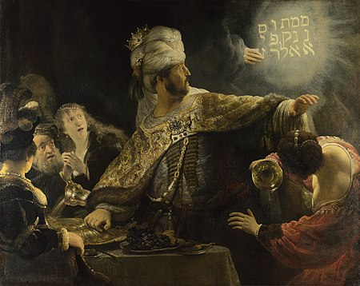
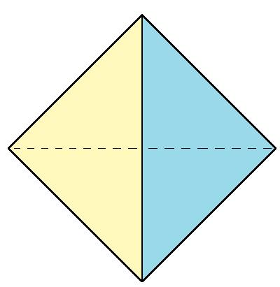
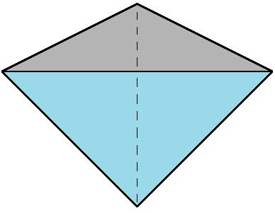
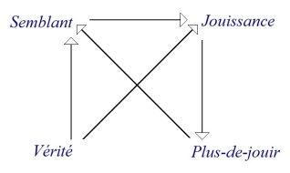
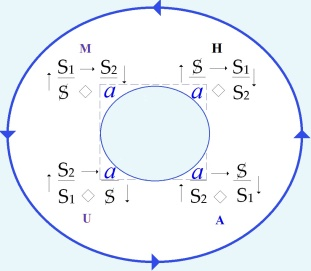
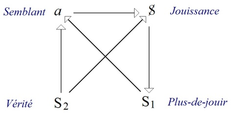

# Leçon 04 | 03 Février 1972

  <label><input type="checkbox" data-lacan-toggle="original" checked> 原文</label>
  <label><input type="checkbox" data-lacan-toggle="notes" checked> 注释</label>
  <label><input type="checkbox" data-lacan-toggle="commentary" checked> 个人解读评论</label>

<section class="parallel-paragraph" data-paragraph-ids="s19b-04-0001 s19b-04-0002 s19b-04-0003 s19b-04-0004">

s19b-04-0001, s19b-04-0002, s19b-04-0003, s19b-04-0004

我就继续谈一谈“精神分析家的知识”这个主题。 不过我在这里谈，只是在我之前两次已经打开的那个“括号”里继续下去而已。
我已经跟各位说过：正是在这里，我答应了——应一位学生的请求——今年再次开口谈论；而这是自 63 年以来我第一次重新讨论这一主题。

原文 · s19b-04-0001, s19b-04-0002, s19b-04-0003, s19b-04-0004

Je vais donc continuer un peu sur le thème du *Savoir du Psychanalyste*.

Je ne le fais ici que dans la parenthèse que j'ai déjà, les deux premières fois, ouverte.

Je vous ai dit que c'est ici que j'avais accepté\...

> à la prière d'un de mes élèves \...de reparler cette année pour la première fois depuis 63.

</section>

<section class="parallel-paragraph" data-paragraph-ids="s19b-04-0005 s19b-04-0006 s19b-04-0007 s19b-04-0008 s19b-04-0009 s19b-04-0010 s19b-04-0011">

s19b-04-0005, s19b-04-0006, s19b-04-0007, s19b-04-0008, s19b-04-0009, s19b-04-0010, s19b-04-0011

距离当时已经十年了。拉康1901年出生这时已经72岁了。 十年对于青年来说可能是整个“经验”的1/2或者1/3。而对于一个七十多岁的老头来说，好像是另外一种分量。

对于小孩来说，好像时间过的比较慢。小学的一个学期与大学的一个学期从体验来说有着很大的差别。
上次我对各位说过一句话，这句话与包围着我们的东西极其契合： ——“我是在对着墙说话！”
确实，关于这句话，我给过一个评注：画了个小小的示意图——取自克莱因瓶——用来安抚那些因为这句「我对着墙说话」而可能感觉被排除在外的人。
正如我长期以来反复说明的那样，人们向墙所发出的东西，具有一种会回响、会反弹的性质。我以这种间接的方式对你们说话，当然并无意冒犯任何人，因为归根结底可以说，这种情形并非我的话语所独有。

原文 · s19b-04-0005, s19b-04-0006, s19b-04-0007, s19b-04-0008, s19b-04-0009, s19b-04-0010, s19b-04-0011

Je vous ai dit la dernière fois quelque chose qui s'articulait en harmonie avec ce qui nous enserre : « *je parle aux murs* ! ».

Il est vrai que de ce propos, j'ai donné un commentaire : un certain petit schéma, celui repris *de la bou­teille de Klein*, qui devait rassurer ceux qui, de par cette formule \[« *je parle aux murs »* \], pouvaient se sentir exclus.

Comme je l'ai longtemps expliqué, ce qu'on adresse aux murs a pour pro­priété de se répercuter.

Que je vous parle ainsi indirectement n'était fait certes pour offenser personne, puisque après tout, on peut dire que ce n'est pas là un privilège de mon discours !

Je voudrais aujourd'hui éclairer à propos de ce mur\...

> qui n'est pas du tout une métaphore \...éclairer ce que je peux dire ailleurs.

Car évidemment, ça se justifiera, pour parler de *Savoir*, que ça ne soit pas à mon séminaire que je le fasse.

</section>

<section class="parallel-paragraph" data-paragraph-ids="s19b-04-0012 s19b-04-0013 s19b-04-0014 s19b-04-0015 s19b-04-0016 s19b-04-0017 s19b-04-0018 s19b-04-0019 s19b-04-0020 s19b-04-0021 s19b-04-0022 s19b-04-0023 s19b-04-0024 s19b-04-0025 s19b-04-0027 s19b-04-0028 s19b-04-0029 s19b-04-0030 s19b-04-0031 s19b-04-0032 s19b-04-0033 s19b-04-0034 s19b-04-0035">

s19b-04-0012, s19b-04-0013, s19b-04-0014, s19b-04-0015, s19b-04-0016, s19b-04-0017, s19b-04-0018, s19b-04-0019, s19b-04-0020, s19b-04-0021, s19b-04-0022, s19b-04-0023, s19b-04-0024, s19b-04-0025, s19b-04-0027, s19b-04-0028, s19b-04-0029, s19b-04-0030, s19b-04-0031, s19b-04-0032, s19b-04-0033, s19b-04-0034, s19b-04-0035

克莱因瓶的“墙”并没有被区分内外，它仅仅只有一面。 而对着墙说话更多的是在于“回声”。墙话语返回给当场的其他人。

甚至可以进一步解释：墙对于拉康的言说来说是“既定”的，既然无法避免某种“墙”的出现，那么为什么不直接对着墙说一些什么呢？ 还是说对面前的墙视而不见，一厢情愿的相信某种“言说的可能性”。
毕竟在言说的时候，最开始需要理解自己所处的位置，而这个位置可以在“墙”上找到投影。 圣安娜医院的墙里关着的是过去被认定的“疯人”，而墙外则是代表着理性社会的“精神科医生”。
另外，对着（写有文字的）墙说话。 对着”情书“说话 墙本身作为一个平面，是可以用来书写的，而说话则是语音。
知识可以作为一种中介，讲语音转文字。又或者文字转语音。 因此“墙”不再是简单的阻隔面，话语并未因为“对着墙”而停止运行。
我们可以说“墙的结构“是一种知识吗？
另外我们看一下这一句话：

人们向墙所发出的东西，具有一种会回响、会反弹的性质。我以这种间接的方式对你们说话，当然并无意冒犯任何人，因为归根结底可以说，这种情形并非只属于我的话语所独有。
我从没见过有人把指桑骂槐说的这么清新脱俗。

我今天想就这个“墙”作一点说明——这个“墙”绝不是隐喻——我要藉此澄清我在别处所说的那些话。
显然，如果要谈“知识”，倒确实不该在我的研讨课上谈，——这再合适不过了。因为这里所说的，并非什么一般意义上的知识，而是——精神分析家的知识​。就这样！
为了稍微引入问题、也许给某些人一个提示，我要说：“关于爱情”，不能照人们常说的那样“谈论”；除非以一种愚蠢的方式或卑劣的方式，这只会更糟。“卑劣”，这正是精神分析中的那种意义。……所以，“关于爱情”不能“谈论”，却可以把它写出来：这点应当让人警醒。
字母——那个“d’(a)mur”的字母（“a-mur／d’amour”的文字游戏）为接续我上次在这里评论过的那首六行小歌谣，显然，它得首尾相咬；如果它是这样开头的： “在男人与……（这个没人知道究竟是什么的东西）之间，在男人与爱情之间，有一个女人。”
接着——如你们所知——那首小诗还往下继续……今天我就不再从头念起了。它的结尾理应是这样的：在最后，在那终点处——有一面墙：
“在男人与墙之间，有……”——正是那 a-mur，那封“情书（lettre d’amour）”。在那某处坠落的东西里——在那种被称作“爱情”的奇异冲动之中——最值得注意的，乃是“字母（la lettre）”。正是这封“字母／信件”，可以呈现出种种奇异的形态。

> 拉康的谐音梗：

原文 · s19b-04-0012, s19b-04-0013, s19b-04-0014, s19b-04-0015, s19b-04-0016, s19b-04-0017, s19b-04-0018, s19b-04-0019, s19b-04-0020, s19b-04-0021, s19b-04-0022, s19b-04-0023, s19b-04-0024, s19b-04-0025, s19b-04-0027, s19b-04-0028, s19b-04-0029, s19b-04-0030, s19b-04-0031, s19b-04-0032, s19b-04-0033, s19b-04-0034, s19b-04-0035

Il ne s'agit pas en effet de n'importe lequel, mais du *Savoir du psycha­nalyste*. Voilà !

Pour introduire un peu les choses, suggérer une dimension à certains, j'espère, je dirai : qu'on ne puisse pas « *parler d'amour* »\...

> comme on dit, sinon de manière imbécile ou abjecte, ce qui est une aggravation :
>
> « *abjecte* » c'est comme on en parle dans la psychanalyse \...qu'on ne puisse donc « *parler d'amour* » mais qu'on puisse en *écrire *: ça devrait frapper.

La lettre, *la lettre* « *d'(a)mur* »\...

> pour donner suite à cette petite ballade en six vers que j'ai commentée ici la der­nière fois \...il est clair qu'il faudrait que ça se morde la queue, et que si ça commence :

« *Entre l'homme*\...

> dont personne ne sait ce que c'est

*Entre l'homme et l'amour, il y a la femme* » et puis comme vous le savez ça continue\...

> je ne vais pas recommen­cer aujourd'hui \...et ça devrait se terminer à la fin, à la fin il y a le mur : « *entre l'hom­me et le mur, il y a*\... » \[*lapsus*\] \...justement l'*(a)mur*, *la lettre d'amour*.

Ce qu'il y a de mieux dans ce qui s'écrase quelque part, ce curieux élan qu'on appelle *l'amour*, c'est *la lettre*.

C'est *la lettre* qui peut prendre d'étranges formes.

Il y a un type, comme ça, il y a 3000 ans, qui était certainement à l'acmé de ses succès, de ses succès d'*amour,* qui a vu apparaître sur le mur quelque chose que j'ai déjà commenté\...

> je m'en vais pas reprendre

\...« *Mené*, *Mené\... »* - que ça se disait - « \...*Tékel*, *Upharsîn.* » \[מנא מנא תקל ופרסין\], ce que d'habitude - je ne sais pas pourquoi - on articule : « *Mené,Thécel,Pharès* ».[^7]

Quand *la lettre d'amour* nous parvient\...

Car, comme je l'ai expliqué quelquefois, les lettres viennent toujours à destination, heureusement elles arri­vent trop tard, outre qu'elles sont rares.

Il arrive aussi qu'elles arrivent à temps : c'est les cas rares où les rendez-vous ne sont pas ratés.

Il n'y a pas beaucoup de cas dans l'histoire où ça soit arrivé, comme à ce Nabuchodonosor quelconque.

Comme entrée en matière, je ne pousserai pas la chose plus loin, quitte à la reprendre.

Car cet *(a)mur*, tel que je vous le présente, ça n'a rien de très amusant.

Or moi je ne peux pas me soutenir autrement que d'amuser, amuse­ment sérieux ou comique : ce que j'avais expliqué la dernière fois, c'est que les amusements sérieux ça se passerait ailleurs, dans un endroit où l'on m'abrite, et que pour ici je réservais les amusements comiques.

Je ne sais si je serai ce soir tout à fait à la hauteur, en raison peut-être de cette entrée sur *la lettre d'(a)mur*.

Néanmoins, j'essaierai.

</section>

<section class="parallel-paragraph" data-paragraph-ids="s19b-04-0026">

s19b-04-0026

[无对应译文]

原文 · s19b-04-0026

{width="2.2805982064741905in" height="1.8131299212598426in"}

</section>

<section class="parallel-paragraph" data-paragraph-ids="s19b-04-0036 s19b-04-0037 s19b-04-0038">

s19b-04-0036, s19b-04-0037, s19b-04-0038

lettre d’amour（情书）
lettre d’a-mur（墙上的字）
a-mur 融合了 a（objet a，剩余快感对象）与 mur（墙）——即“爱之信”亦是“在墙上的字”。

> 墙上的字：古巴比伦最后一任国王伯沙撒（Belshazzar）覆灭前的预兆。这个故事成为了英语与法语中“灾祸即将临头”的象征。
> 故事中所有人都能“看见”文字，却只有但以理能“读懂”。
> 书写爱情的信——>灾祸即将临头的预兆
> 中文我发现了一个谐音梗，当我打“被爱”的时候，输入法首先出来的是“悲哀”。
> 谈论爱，也就在“对话的形式”交谈着关于爱的话题的时候。言辞总是伴随着某种“不确定性”。不论是语音的不确定，还是转瞬即逝，难以捕捉的语气，情绪。还是虚无缥缈的承诺誓言。 毕竟“被爱”都能在语音的基础上谐音成“悲哀”。
> 而情书则摆脱了谈话中的“不确定性”。一旦变成“写出”的文字，那么作为第一个读者——也就是写下它的那个人将不得不面对其在象征上的凝视。这是在谈话，或者说话时不会存在的。

大约三千年前，有这么一位人物，显然正处在他声望顶点——就连“爱情上的得意”也正当其时。他在墙上看见了某样东西出现——这件事我先前已经评注过了，我就不再重述——那东西写着：“Mene, Mene… Tekel, Upharsîn”（[ ופרסיןמנא מנא תקל ]，阿拉姆语写法）。
通常——我也不知道为什么人们把它念成：“Mené, Thécel, Pharès”。

原文 · s19b-04-0036, s19b-04-0037, s19b-04-0038

J'ai expliqué il y a 2 ans quelque chose qui, *une fois passé comme ça dans la grande voie poubellique*, a pris le nom de *quadripode*. C'est moi qui avait choisi ce nom et vous ne pourrez que vous demander pourquoi je lui ai donné un nom aussi étrange : pourquoi pas *« quadripède » ou « tétrapode »*, ça aurait eu l'avantage de ne pas être bâtard.

Mais en vérité je me le suis demandé moi-même en l'écrivant, je l'ai maintenu, je ne sais pas pourquoi, puis je me suis demandé ensuite comment on appelait dans mon enfance *ces termes bâtards*  comme ça : *mi-latins, mi-grecs*.

Je suis sûr d'avoir su comment les puristes appellent ça, et puis je l'ai oublié [^8].

</section>

<section class="parallel-paragraph" data-paragraph-ids="s19b-04-0039 s19b-04-0040 s19b-04-0041 s19b-04-0043 s19b-04-0044 s19b-04-0045">

s19b-04-0039, s19b-04-0040, s19b-04-0041, s19b-04-0043, s19b-04-0044, s19b-04-0045

你的日子被数算，你被称在天平上显出不足，你的国将被分裂

在他王宫的墙上，巴比伦的末代君王伯沙撒（Balsazar）看到火焰般的文字显现，写下三条警告： “Mené – Thécel – Pharès”， 即希伯来文“Mené – Tekel – Parsîn”， 意思是：“被称量、被审判、被定罪”。先知但以理将其解释为：“你的日子已经被数算，你被放在天平上称量，显出不足；你的国度将被分裂。” ——《圣经·但以理书》第五章，第 25 至 28 节。
通常——我也不知道为什么人们把它念成：“Mené, Thécel, Pharès”。
拉康这里点到一个我在想的事情。也就是分析师的知识，是否是指的语音与文字之间的中介。

字是：מנא מנא תקל ופרסין
在但以理介入之前，这串字同时满足以下条件：

✔ 字母可识
✔ 词根可识
✔ 每个词在词典里都成立
✘ 不构成一句话
✘ 不构成时间态
✘ 不构成主体—谓词关系

原文 · s19b-04-0039, s19b-04-0040, s19b-04-0041, s19b-04-0043, s19b-04-0044, s19b-04-0045

Est-ce qu'il y a ici une personne qui sait comment on désigne les termes faits par exemple comme le mot « *sociologie* » ou « *quadripode* », d'un élément latin et d'un élément grec ? Je l'en supplie, que celui qui le sait l'émette !

Eh bien, c'est pas encourageant !

> Parce que depuis hier - hier, c'est-à-dire que c'était avant-hier - que j'ai commencé à le chercher
>
> et comme je ne trouvais pas toujours, depuis hier j'ai téléphoné à une dizaine de personnes
>
> qui me paraissaient les plus propices à me donner cette réponse. Bon, eh bien tant pis !

*Discours du Maître Discours de l'Hystérique Discours Universitaire Discours analytique*

Mes « *quadripode* » en question, je les appelés ainsi pour vous donner l'idée *qu'on peut s'asseoir dessus*\...

> histoire, puisque j'étais dans les mass-média [^9], de rassurer un peu les personnes \...mais en réalité, j'explique à l'intérieur ceci à propos de ce que j'ai isolé des 4 *discours* : ces 4 *discours* résultent de l'émer­gence du dernier venu, du *discours de l'analyste*.

</section>

<section class="parallel-paragraph" data-paragraph-ids="s19b-04-0042">

s19b-04-0042

[无对应译文]

原文 · s19b-04-0042

{width="1.5665266841644794in" height="0.9018897637795276in"} {width="1.5694444444444444in" height="0.8742497812773403in"} {width="1.5601848206474191in" height="0.8680063429571303in"} {width="1.3518514873140857in" height="0.8663626421697288in"}

</section>

<section class="parallel-paragraph" data-paragraph-ids="s19b-04-0046 s19b-04-0047 s19b-04-0048">

s19b-04-0046, s19b-04-0047, s19b-04-0048

这些词本来可以读成重量单位​：

mena（弥拿）
shekel（舍客勒）
peres（半弥拿）

但以理拒绝了这个读法​。
他选择把它们读成<strong>动词的完成式（被动或结果态）</strong>​：

原文 · s19b-04-0046, s19b-04-0047, s19b-04-0048

*Le discours de l'analyste* apporte en effet\...

> dans un certain état actuel des pensées \...un ordre dont s'éclairent d'autres *discours* qui ont émergé bien plus tôt.

Je les ai disposés selon ce qu'on appelle une topologie.

</section>

<section class="parallel-paragraph" data-paragraph-ids="s19b-04-0049">

s19b-04-0049

Mené → 已被数过
Thécel → 已被称量
Pharès → 已被分割

原文 · s19b-04-0049

Une topologie des plus simples mais qui n'en est pas moins une topologie, en ce sens qu'elle est mathématisable.

</section>

<section class="parallel-paragraph" data-paragraph-ids="s19b-04-0050 s19b-04-0051 s19b-04-0052 s19b-04-0053 s19b-04-0054">

s19b-04-0050, s19b-04-0051, s19b-04-0052, s19b-04-0053, s19b-04-0054

但以理在这里决定的是时态——完成时。
原文里没有主语，但以理把这句话指向了国王和他的王国。
因此与其说时“先知”，不如说是“宣读判决者”。 或者我们能说——先知就是“宣读判决者”吗？

当那封“情书”（la lettre d’amour）抵达我们手中时……正如我多次解释过的——信件总是会抵达其目的地​；
幸而，它们往往来得太晚，而且极其稀罕。也有极少数情况，它们恰好及时到达——那是那些“约会”没有错过的罕见时刻。历史上这种例子并不多见——譬如那个“某个尼布甲尼撒（Nabuchodonosor）”就是一例。

原文 · s19b-04-0050, s19b-04-0051, s19b-04-0052, s19b-04-0053, s19b-04-0054

Et elle l'est de la façon la plus rudimentaire, à savoir qu'elle repose sur le groupement de pas plus de 4 points que nous appellerons « *monades* ».

Ça n'a l'air de rien, néanmoins c'est si fortement inscrit dans la structure de notre monde qu'il n'y a pas d'autre fondement au fait de l'espace que nous vivons.

Remarquez bien ceci : *que mettre 4 points à égale distance l'un de l'autre c'est le maximum de ce que vous pouvez faire dans notre espace*.

*Vous ne mettrez jamais cinq points à égale distance l'un de l'autre*.

Cette menue forme que je viens de rappeler là, est là pour faire sentir de quoi il s'agit :

</section>

<section class="parallel-paragraph" data-paragraph-ids="s19b-04-0055 s19b-04-0056 s19b-04-0057 s19b-04-0058 s19b-04-0060 s19b-04-0061 s19b-04-0062 s19b-04-0063 s19b-04-0064 s19b-04-0065 s19b-04-0066">

s19b-04-0055, s19b-04-0056, s19b-04-0057, s19b-04-0058, s19b-04-0060, s19b-04-0061, s19b-04-0062, s19b-04-0063, s19b-04-0064, s19b-04-0065, s19b-04-0066

尼布甲尼撒梦见一棵高大的树，被天使命砍倒，只留树根。
但以理解释：这是对王的警告：

因他的傲慢，神将使他疯癫七年，像兽一样在野地吃草；
最终恢复理智并承认“天上的主掌权”。

七年打碎中二魂，称颂上帝主仆人。
这里有一层浓厚的接受阉割的意味。
他的儿子伯沙撒继位，宴会上使用圣殿的金杯，墙上出现神秘文字（Mene Mene Tekel Upharsin）。 但以理解读为“国度终结”的预兆，当夜巴比伦亡。 → “墙上的字”成了王权覆灭的象征。
尼布甲尼撒听劝，听懂了敲打，于是服了。
而他的儿子没有看懂，于是王权覆灭。

作为开场，我暂且不把这件事推得更远，之后有机会再回来谈。
因为这个我向你们所呈现的“(a)mur”（a-墙／爱-墙），说实话，一点也不怎么有趣。
至于我，我只能以“逗乐”为支撑——要么是严肃的逗乐，要么是滑稽的逗乐。上次我已经说明过：那些“严肃的逗乐”将会在别处进行，在一个有人为我提供庇护的地点；而在这里，我保留下“滑稽的逗乐”。
我不知道今晚自己是否还能完全“站得住脚”，或许是因为刚才那一段关于“d’(a)mur（爱-墙）”的开场，不过——我还是会试一试。
两年前我解释过某个东西，它在被丢进那条“垃圾大道”（大规模传播）后，被冠上了“四足架（quadripode）”的名字。这个名字是我自己选的，你们自然会问：我为何给它取了这么古怪的名字？为何不叫“quadripède（四足兽）”或“tétrapode（四足体）”，那样起码不算“杂种词（bâtard）”。

原文 · s19b-04-0055, s19b-04-0056, s19b-04-0057, s19b-04-0058, s19b-04-0060, s19b-04-0061, s19b-04-0062, s19b-04-0063, s19b-04-0064, s19b-04-0065, s19b-04-0066

- si les *quadripodes* sont, non pas *tétraèdre*, mais *tétrade*,

- que le nombre des sommets soit égal à celui des surfaces est lié à ce même « *triangle arithmétique* »

> que j'ai tracé à mon dernier séminaire \[19-01-1972\].

Comme vous le voyez, pour s'asseoir ça n'est pas de tout repos : ni l'un, ni l'autre.

La position de gauche vous y êtes habitués, de sorte que vous ne la sentez même plus, mais celle de droite n'est pas plus confortable : imaginez-vous assis sur un tétraèdre posé sur la pointe.

C'est pourtant de là qu'il faut partir pour tout ce qu'il en est de ce qui constitue ce type d'assiette sociale qui repose sur ce qu'on appelle *un discours*. Et c'est cela que j'ai proprement avancé dans mon avant-avant-dernier séminaire.

Le tétraèdre, pour l'appeler par son aspect présent, a de curieuses propriétés : c'est que s'il n'est pas comme celui-là, régulier\...

> l'égale distance n'est là que pour vous rappeler les propriétés du nombre 4, eu égard à l'espace \...s'il est quelconque, il vous est proprement impossible d'y définir une symétrie.

Néanmoins il a ceci de particulier que si ses côtés, à savoir ces petits traits que vous voyez qui joignent ce qu'on appelle en géométrie des *sommets*, si ces petits traits vous les vectorisez, c'est-à-dire que vous y marquiez un sens, il suffit que vous posiez comme principe qu'aucun des sommets ne sera privilégié de ceci\...

> qui serait forcément un privilège, puis­que si ça se passait,
>
> il y en aurait au moins deux qui ne pourraient pas en bénéficier \...si donc vous posez :

- *que nulle part il ne peut y avoir convergence de trois vecteurs,*

</section>

<section class="parallel-paragraph" data-paragraph-ids="s19b-04-0059">

s19b-04-0059

[无对应译文]

原文 · s19b-04-0059

{width="1.2424956255468067in" height="1.2758956692913386in"} {width="1.5438232720909886in" height="1.203772965879265in"}{width="3.1488013998250217in" height="1.0655719597550306in"}

</section>

<section class="parallel-paragraph" data-paragraph-ids="s19b-04-0067 s19b-04-0068 s19b-04-0069 s19b-04-0070 s19b-04-0071 s19b-04-0072 s19b-04-0074 s19b-04-0075 s19b-04-0077 s19b-04-0078 s19b-04-0079 s19b-04-0080 s19b-04-0081">

s19b-04-0067, s19b-04-0068, s19b-04-0069, s19b-04-0070, s19b-04-0071, s19b-04-0072, s19b-04-0074, s19b-04-0075, s19b-04-0077, s19b-04-0078, s19b-04-0079, s19b-04-0080, s19b-04-0081

quadripode quadri- → 拉丁语前缀（四）
pode → 希腊语后缀（足）
拉丁 + 希腊的混血拼接
伊西多尔把希腊语—拉丁语的混合词称作 notha​，这个词来自希腊语，其原义是：“在母系意义上的杂种”。不过，在这里所涉及的，是一种拉丁语—希腊语的混合。参见：路易·巴塞特《希腊—拉丁语法术语中的双语性》，Peeters 出版社，2007 年。

这里有没有哪一位知道：像“sociologie（社会学）”或“quadripode”这样， 由一个拉丁语成分和一个希腊语成分拼合而成的词，在术语上是怎样被称呼的？我恳请知道的人把答案说出来！嗯……这可真不太鼓舞人。
因为从昨天开始——所谓“昨天”，也就是说其实是前天——我就开始寻找这个答案；而且由于并不总是能找到，从昨天起，我给大约十来个人打了电话，他们在我看来，是最有可能给我这个答案的人。好吧，那就算了！
其实，当我写下这个词时，我自己也问过自己同样的问题——我还是保留了它，也说不清为什么。接着我又想起，在我小时候，这类杂种词——半拉丁、半希腊的——有个特定的叫法。我很确定我曾知道那些语言纯粹主义者是怎么称呼这种词的，但后来我忘了。
因为从昨天开始——所谓“昨天”，也就是说其实是前天——我就开始寻找这个答案；而且由于并不总是能找到，从昨天起，我给大约十来个人打了电话，他们在我看来，是最有可能给我这个答案的人。好吧，那就算了！

> <strong>Isidore（伊西多尔）</strong>​：指西班牙主教
> Isidore de Séville（塞维利亚的伊西多尔，约560–636）
> ，著有《词源学》（Etymologiae），是中世纪词汇学与百科知识的关键来源。他将混合语源的词称为notha，该词在古希腊语中指非婚生子​，语义引申为“混种”“杂交”。

我之所以把我说的那些“quadripode”称作这个名字，是为了让你们产生一种印象：它们是可以坐上去的……这也算是一种做法——既然当时我是在大众媒体的场合中，就稍微安抚一下人们。但实际上，在内部，我所要说明的是这样一件事，关于我从“四种话语”中所抽取出来的那个点：这四种话语，是从最后出现的那个话语——分析家的话语——的显现中产生出来的。

就如同1是被2认同之后才确认了1一样。四话语是被分析师话语的出现所确认。分析的知识建立在重新组织过去的全部话语经验中。

原文 · s19b-04-0067, s19b-04-0068, s19b-04-0069, s19b-04-0070, s19b-04-0071, s19b-04-0072, s19b-04-0074, s19b-04-0075, s19b-04-0077, s19b-04-0078, s19b-04-0079, s19b-04-0080, s19b-04-0081

- *ni nulle part divergence de trois vecteurs du même sommet,* vous obte­nez alors nécessairement la répartition :

- *deux arrivants, un partant,*

- *deux arrivants, un partant,*

- *un arrivant, deux partants,*

- *un arrivant, deux partants.*

C'est-à-dire que tous les dits *tétraèdres* seront strictement équivalents, et que dans tous les cas vous pourrez par suppression d'un des côtés, obtenir la formule par laquelle j'ai schématisé mes 4 *discours* :

*Discours du Maître Discours de l'Hystérique Discours Universitaire Discours analytique*

Selon ceci qui a une propriété, d'un des *sommets* : la divergence, mais sans aucun vecteur qui arrive pour le nourrir, mais qu'inversement, à l'opposé vous avez ce trajet triangulaire. Ceci suffit à permettre de distinguer en tous les cas, par un carac­tère qui est absolument spécial, ces quatre pôles que j'énonce des termes de *la Vérité*, du *Semblant*, de *la jouissance* et du *Plus-de-jouir*.

Ceci est la topologie fondamentale d'où ressort toute fonction de *la parole* et mérite d'être commenté.

C'est en effet une *question que le discours de l'analyste* *est bien fait pour faire surgir*, que de savoir quelle est *la fonction de la parole.*

*« Fonction et champ de la parole et du langage*\... », c'est ainsi que j'ai introduit ce qui devait nous mener jusqu'à ce point présent de la définition d'un nouveau *discours*. Non pas certes que ce *discours* soit le mien : à l'heure où je vous parle, ce *discours* est bel et bien, depuis près de trois quarts de siècle, installé.

Ce n'est pas une raison parce que l'analyste lui-même est capable, dans certaines zones, de se refuser à ce que j'en dis, qu'il n'est pas support de ce *discours.* Et à la vérité « *être support* » ça veut dire seulement dans l'occasion « *être supposé* ».

Mais que ce *discours* puisse prendre sens de la voix même de *quelqu'un qui y est* - c'est mon cas - *tout autant sujet qu'un autre*, c'est justement ce qui mérite qu'on s'y arrête, afin de savoir d'*où* se prend ce sens.

</section>

<section class="parallel-paragraph" data-paragraph-ids="s19b-04-0073">

s19b-04-0073

[无对应译文]

原文 · s19b-04-0073

{width="1.5665266841644794in" height="0.9018897637795276in"} {width="1.5694444444444444in" height="0.8742497812773403in"} {width="1.5601848206474191in" height="0.8680063429571303in"} {width="1.3518514873140857in" height="0.8663626421697288in"}

</section>

<section class="parallel-paragraph" data-paragraph-ids="s19b-04-0076">

s19b-04-0076

[无对应译文]

原文 · s19b-04-0076

{width="1.4458333333333333in" height="0.8621117672790901in"}

</section>

<section class="parallel-paragraph" data-paragraph-ids="s19b-04-0082 s19b-04-0083 s19b-04-0084">

s19b-04-0082, s19b-04-0083, s19b-04-0084

确实，分析家话语（le discours de l’analyste）带来了某种秩序，在当下思想的某种状态之中，正是借助这一秩序，那些出现得更早的其他话语才得以被照亮。
我把它们布置成一种我们称之为拓扑（topologie）的形式。一种极其简单的拓扑——但毕竟仍然是拓扑——因为它是可被数学化的（mathématisable）。而这种数学化以最原始的方式实现：它仅仅依靠四个点的组合（groupement de quatre points），我们将这四个点称作“单子（monades）”。

原文 · s19b-04-0082, s19b-04-0083, s19b-04-0084

À entendre ce que je viens d'avancer, la question du sens bien sûr peut vous sembler ne pas poser de problèmes, je veux dire qu'il semble que *le discours de l'analyste* fait assez appel à l'interprétation pour que la question ne se pose pas.

Effectivement, sur un certain gribouillage analytique, il semble qu'on peut lire\...

> et ce n'est pas surprenant, vous allez voir pourquoi \...tous les « *sens* » que l'on veut jusqu'au plus archaïque, je veux dire y avoir comme l'écho, la sempiternelle répétition de ce qui, du fond des âges nous est venu sous ce terme de « *sens* », sous des formes dont il faut bien dire qu'il n'y a que leur superposition qui fasse sens.

</section>

<section class="parallel-paragraph" data-paragraph-ids="s19b-04-0085 s19b-04-0086">

s19b-04-0085, s19b-04-0086

莱布尼茨单子论里的“单子（monade）” 单子有三个特征：

不与外界发生因果交换
不可分割
内部表象整个世界，世界的变化，在每一个单子内部，都有一个“对应的变化序列”。

原文 · s19b-04-0085, s19b-04-0086

Car à quoi doit-on que nous comprenons quoi que ce soit du symbolisme usité dans l'Écriture sainte par exemple ?

Le rapprocher d'une mythologie, quelle qu'elle soit, chacun sait

</section>

<section class="parallel-paragraph" data-paragraph-ids="s19b-04-0087 s19b-04-0088 s19b-04-0089 s19b-04-0090 s19b-04-0091 s19b-04-0092 s19b-04-0093 s19b-04-0094 s19b-04-0095 s19b-04-0096 s19b-04-0097">

s19b-04-0087, s19b-04-0088, s19b-04-0089, s19b-04-0090, s19b-04-0091, s19b-04-0092, s19b-04-0093, s19b-04-0094, s19b-04-0095, s19b-04-0096, s19b-04-0097

这看上去似乎微不足道，但它却深深铭刻在我们这个世界的结构之中——我们所处空间之所以成为“空间”，并不存在别的基础。请注意这一点：在我们的空间中，能彼此等距排列的点，最多只能有四个。你永远无法在这个空间中放置五个互相等距的点。

这是指三维的空间中，四个等距点组成的正四面体结构。

这里看到拉康从图像进入到拓扑，并且进一步到数学。 这样的一种路径。
我方才提醒过的那个小小“形体”，目的在于让各位把握我所指之物：倘若这些“四足架”并非四面体，而是四元组，那么“顶点数与表面数相等”这一点，正与我在上一次研讨课上画出的那个“算术三角形”有关联〔1972-01-19〕。如你们所见，想“坐稳”在其上并不轻松：两者都不轻松。

左边那个位置，你们已经习惯了，以至于都不再感觉到它的存在。但右边的那个位置也并不更舒服：
想象一下，你坐在一个尖端朝下的四面体（tétraèdre posé sur la pointe）上。然而，一切关于社会支座（assiette sociale）——也就是那种建立在所谓“话语（discours）”之上的社会根基——都必须从那里出发去思考。而这，正是我在前前一次研讨课（mon avant-avant-dernier séminaire）中所明确提出的。

原文 · s19b-04-0087, s19b-04-0088, s19b-04-0089, s19b-04-0090, s19b-04-0091, s19b-04-0092, s19b-04-0093, s19b-04-0094, s19b-04-0095, s19b-04-0096, s19b-04-0097

- que c'est là une sorte de glissement des plus trompeurs, personne, depuis un temps, ne s'y arrête,

- que quand on étudie d'une façon sérieuse ce qu'il en est des mythologies, ce n'est pas à leur sens qu'on se réfère, c'est à la combinatoire des mythèmes.

> Référez vous là-dessus à des travaux dont je n'ai pas, je pense, à vous évoquer une fois de plus l'auteur.

La question est donc bien de savoir *d'où ça vient, le* « *sens* ».

Je me suis servi\...

> parce que c'était bien nécessaire \...je me suis servi\...

> pour introduire ce qu'il en est du *discours analytique,* \...je me suis servi sans scrupule du frayage dit *linguistique*.

Et *pour tempérer des ardeurs* qui autour de moi auraient pu s'éveiller trop tôt, vous faire retourner dans la fange ordinaire, j'ai rappelé que ne s'est soutenu quelque chose\...

> digne de ce titre « *linguistique* » comme science \...que ne s'est soutenu quelque chose qui semble avoir la langue comme telle, voire la parole, pour objet, que ça ne s'est soutenu qu'à condition de se jurer entre soi, entre linguistes, de ne jamais plus jamais\...

> parce qu'on n'avait fait que ça pendant des siècles \...plus jamais, même de loin, faire allusion à *l'origine du langage*.

C'était, entre autres, un des mots d'ordre que j'avais donné à cette forme d'introduction qui s'est articulée de ma formule « *L'inconscient est structuré comme un langage* ».

</section>

<section class="parallel-paragraph" data-paragraph-ids="s19b-04-0098 s19b-04-0099">

s19b-04-0098, s19b-04-0099

前前一次应该是指精神分析的反面。

这个四面体（tétraèdre）——姑且以它目前的外观来称呼它——有着一些奇特的性质：
如果它不是那种规则的四面体（régulier），——那种“等距性（égale distance）”只是为了提醒你们“四”这个数在空间中的特性——那么，一旦它成为任意的不规则形（s’il est quelconque），你就会发现，在其中根本无法定义任何对称性（symétrie）。

原文 · s19b-04-0098, s19b-04-0099

> Quand je dis que c'était pour éviter à mon audience le retour à une certaine équivoque fangeuse, ce n'est pas moi
>
> qui me sers de ce terme, c'est Freud lui-même, et nommément justement à propos des archétypes dits « *jungiens* »,
>
> ça n'est certainement pas pour lever maintenant cet interdit :
>
> il n'est nullement question de spéculer sur quelque *origine du langage*, *j'ai dit qu'il est question de formuler* *la fonction de la parole*.

*La fonction de la parole*\...

</section>

<section class="parallel-paragraph" data-paragraph-ids="s19b-04-0100 s19b-04-0101 s19b-04-0102 s19b-04-0103 s19b-04-0104 s19b-04-0105">

s19b-04-0100, s19b-04-0101, s19b-04-0102, s19b-04-0103, s19b-04-0104, s19b-04-0105

等距性，或者说等边的特性只是提醒了“四”。而四并不意味着“均等”。 也就是这里有一种单向推导，因此这里的四，更加是一种拓扑结构的构成要素，而不是数学意义上的。

然而，这个四面体有一个独特之处：
如果它的边——也就是你们所看到的那些连接各个顶点（sommets）的小线条（petits traits）——被<strong>向量化（vectoriser）​，也就是说，你们在每一条边上标定一个方向（marquer un sens）</strong>​，那么，只要你们确立这样一个原则：
<strong>——任何一个顶点都不享有特殊的“特权”。</strong>因为如果有某个顶点被赋予这种特权，那必然意味着至少还有两个顶点无法享受同样的分配；所以，如果你们这样设定：

原文 · s19b-04-0100, s19b-04-0101, s19b-04-0102, s19b-04-0103, s19b-04-0104, s19b-04-0105

> il y a très longtemps que j'ai avancé ça \...*c'est d'être la seule forme d'action qui se pose comme vérité*.

Qu'est-ce que c'est, non pas que *la parole*, c'est une question superflue, non seulement je parle, vous parlez et même ça parle comme je l'ai dit ça va tout seul, c'est un fait, je dirai même que c'est l'origine de tous les faits, parce que quoi que ce soit ne prend rang de fait que *quand c'est* *dit*.

Il faut dire que je n'ai pas dit « *quand c'est parlé* », il y a quelque chose de distinct entre *parler* et *dire *:

- une parole qui fonde le fait, *ça c'est un dire*,

- mais la parole fonctionne même quand elle ne fonde aucun fait :

> quand elle commande,
>
> quand elle prie,
>
> quand elle injurie,
>
> quand elle émet un vœu, elle ne fonde aucun fait.

</section>

<section class="parallel-paragraph" data-paragraph-ids="s19b-04-0106 s19b-04-0107 s19b-04-0108 s19b-04-0109 s19b-04-0110 s19b-04-0111 s19b-04-0112 s19b-04-0113 s19b-04-0114 s19b-04-0115 s19b-04-0116 s19b-04-0117 s19b-04-0118 s19b-04-0119 s19b-04-0120 s19b-04-0121 s19b-04-0123 s19b-04-0124">

s19b-04-0106, s19b-04-0107, s19b-04-0108, s19b-04-0109, s19b-04-0110, s19b-04-0111, s19b-04-0112, s19b-04-0113, s19b-04-0114, s19b-04-0115, s19b-04-0116, s19b-04-0117, s19b-04-0118, s19b-04-0119, s19b-04-0120, s19b-04-0121, s19b-04-0123, s19b-04-0124

在任何地方，都不能出现三条向量的汇聚（convergence）于同一点；
在任何地方，也不能出现三条向量从同一顶点发散（divergence）；

那么，你们将必然得到如下分布​：
— 两入一出；
— 两入一出；
— 一入两出；
— 一入两出。
也就是说，所有这些所谓的“四面体”在结构上都是严格等价的​；
而且，在任何情况下，只要去掉其中一条边​，你们就能得到我用来示意“四种话语”的那个公式。

依照这一点，可以看到有一个顶点具有这样的特性：发散，且没有任何向量汇入以“供养”它；而与之相对，在对面的顶点上则存在一个三角形的路径。
仅此就足以在任何情形下，凭借一个完全特殊的标记，区分出四个极点，我把它们命名为：真理（Vérité）、假象（Semblant）、享乐~~（~~jouissance）与剩余享乐（Plus-de-jouir）。
这正是一切言说功能所由发出的基本拓扑结构​，也正因此，它理应被加以阐释。确实，<strong>分析家话语（discours de l’analyste）</strong>天生就是为了让这样一个问题浮现出来：
——“言语（parole）的功能究竟是什么？”
《言语与语言的功能和领域……》——正是以这样的标题，我引入了那条原本要把我们带到当下这个位置的路径，也就是：对一种新的话语所作的界定。当然，并不是说这种话语是“我的”；在我此刻对你们说话的时候，这种话语事实上已经确立、已经安置在那里，将近有四分之三个世纪之久了。
并不能因为分析家本人在某些领域里可能拒绝我所说的这些东西，就认为他不是这一话语的承载者（support）。事实上，“作为承载者”在这里仅仅意味着“被假定如此”。但是，这一话语竟然能够从某个人的声音中获得意义——而这个人恰恰身处其中，这里说的正是我——而且这个人作为主体，与任何其他人并无二致，这一点本身，正是值得我们停下来加以考察的：以便弄清楚，这个意义究竟是从哪里被把握到的。
依照我刚才所提出的这些论述，，“意义（sens）”的问题，当然在你们听来似乎并不是什么难题。我的意思是——似乎“分析家话语”已经足够依赖于“阐释（interprétation）”本身​，以至于关于“意义”的问题似乎不需要再被提出​。

已经足够依赖于“阐释（interprétation）”本身 这里拉康像是有说反话的意思，因为从工作中分析师确实会“阐释”来访者所说的话。 但“意义”并不应该被分析师“阐释”出来。阐释也不是再一次对“意义”进行增改。——阐释要指向“意义”的空缺，话语组织的形式。

原文 · s19b-04-0106, s19b-04-0107, s19b-04-0108, s19b-04-0109, s19b-04-0110, s19b-04-0111, s19b-04-0112, s19b-04-0113, s19b-04-0114, s19b-04-0115, s19b-04-0116, s19b-04-0117, s19b-04-0118, s19b-04-0119, s19b-04-0120, s19b-04-0121, s19b-04-0123, s19b-04-0124

Nous pouvons aujourd'hui ici\...

> c'est pas des choses que j'irais produire là-bas, à l'autre place,
>
> où heureusement je dis des choses plus sérieuses \...ici parce que c'est impliqué dans ce sérieux, je développe toujours plus en pointe, et en restant toujours à la-dite pointe comme à mon dernier séminaire\...

> j'espère qu'il se fera qu'au prochain il y aura moins de monde : ce n'était pas rigolo \...mais enfin ici on peut rigoler un peu, c'est des amusements comiques.

Dans l'ordre de l'amusement comique, la parole, c'est pas pour rien que dans les dessins animés on vous la chiffre sur des banderoles : la parole c'est comme là où ça bande\... rôle ou pas !

C'est pas pour rien que ça instaure la dimension de *la vérité*, parce que *la vérité,* la vraie, la vraie *vérité,* *la vérité* telle qu'il se fait qu'on a commencé à l'entrevoir seulement avec *le discours analytique,* c'est que ce que révèle ce discours à tout un chacun, qui simplement s'y engage d'une façon *axante* comme analysant, c'est que\...

> excusez-moi de reprendre ce terme, mais puisque j'ai commencé, je ne l'abandonne pas \...c'est que de *bander*\... c'est ce que là-bas, place du Panthéon, j'appelle ! \...c'est que de *bander*, ça n'a aucun rapport avec *le sexe*, pas avec l'*autre* en tout cas !

*Bander* - on est ici entre des murs - « *bander pour une femme* », il faut tout de même appeler ça par son nom, ça veut dire lui donner la fonction, ça veut dire la prendre comme *phallus*.

*C'est pas rien le phallus !*

Je vous ai déjà expliqué, là-bas où c'est sérieux, je vous ai expliqué ce que ça fait.

Je vous ai dit que « *la signification du phallus* » c'est le seul cas de génitif pleinement équilibré, ça veut dire que le *phallus*\...

> c'est que ce que vous expliquait ce matin, je dis ça pour ceux qui sont un peu avertis
>
> c'est que ce que vous expliquait ce matin Jakobson : *\...le phallus c'est la signification, c'est ce par quoi le langage signifie. Il n'y a qu'une seule Bedeutung, c'est le phallus*.

Partons de cette hypothèse, ça nous expliquera très largement l'ensemble de la fonction de *la parole*.

Car elle n'est pas toujours appliquée à dénoter des faits\...

> c'est tout ce qu'elle peut faire, on ne dénote pas des choses, on dénote des faits \...mais c'est tout à fait par hasard, de temps en temps.

La plupart du temps elle supplée à ceci que *la fonction phallique* est justement ce qui fait qu'il n'y a chez l'Homme que les relations que vous savez, mauvaises, entre les sexes.

Alors que partout ailleurs, au moins pour nous, ça semble aller « *à la coule* ».

Alors c'est pour ça que dans mon petit quadripode, vous voyez au niveau de *la vérité* 2 choses, 2 vecteurs qui divergent :

- ce qui exprime que *la jouissance*, qui est tout au bout de la branche de droite, c'est une jouissance certes *phallique*, mais qu'on ne peut dire *jouissance sexuelle*,

</section>

<section class="parallel-paragraph" data-paragraph-ids="s19b-04-0122">

s19b-04-0122

[无对应译文]

原文 · s19b-04-0122

{width="1.4458333333333333in" height="0.8621117672790901in"}

</section>

<section class="parallel-paragraph" data-paragraph-ids="s19b-04-0125 s19b-04-0126 s19b-04-0127 s19b-04-0128 s19b-04-0129 s19b-04-0130 s19b-04-0131 s19b-04-0132">

s19b-04-0125, s19b-04-0126, s19b-04-0127, s19b-04-0128, s19b-04-0129, s19b-04-0130, s19b-04-0131, s19b-04-0132

确实，面对某种分析的涂鸦，人们似乎想读出——这并不奇怪，原因马上就会明白——各种的“意义”，甚至可以追溯到最古老的层次：也就是说，在那里仿佛听得到回声，听到一种亘古不息的重复——自远古以来就以“意义（sens）”之名传到我们这里的东西；而且不得不说，只有这些形式叠加起来，才会“成其为意义”。
例如，我们凭什么能够理解《圣经》中所使用的象征体系呢？若是把它与某种神话体系相提并论——无论哪一种——人人都知道，那是一种极具误导性的滑移。从前一段时间起，严肃的研究者早已不再那样做了。因为只要是严肃研究神话的人都知道，研究的参照点<strong>并不是它们的“意义”​，而是神话素（mythème）的组合结构（combinatoire）</strong>​。对此，你们不妨参考一些相关的研究成果——我想我已不必再一次提及那位作者的名字了。问题确实就在于：“意义”究竟从何而来？

那么能不能放过这位你不想提及名字的列维-斯特劳斯，还是说这时候他还是你的好朋友。

原文 · s19b-04-0125, s19b-04-0126, s19b-04-0127, s19b-04-0128, s19b-04-0129, s19b-04-0130, s19b-04-0131, s19b-04-0132

- et que pour que se maintienne quiconque de ces drôles d'animaux, ceux qui sont proie de la parole, il faut qu'il y ait ce pôle là, qui est corrélatif du pôle de la *jouissance* en tant qu'obstacle au rapport sexuel : c'est ce pôle que je désigne du *semblant*.

C'est aussi clair pour un partenaire, enfin si nous osons, comme ça se fait tous les jours, les épingler de leur sexe, il est éclatant que l'homme comme la femme, ils font *semblant*, chacun, dans ce rôle.

Mais enfin, c'est des histoires qu'ils se donnent.

Mais l'important au moins quand il s'agit de *la fonction de la parole*, c'est que les pôles soient définis :

- celui du *semblant*,

- et celui de la *jouissance*.

S'il y avait chez l'homme, ce que nous imaginons de façon purement gratuite, qu'il y ait une jouissance spécifiée de la polarité sexuelle, ça se saurait!

Ça s'est peut-être su, des âges entiers s'en sont vantés et après tout nous avons de nombreux témoignages, malheureusement purement ésotériques, qu'il y a eu des temps où on croyait vraiment savoir comment tenir ça.

</section>

<section class="parallel-paragraph" data-paragraph-ids="s19b-04-0133 s19b-04-0134 s19b-04-0135 s19b-04-0136 s19b-04-0137 s19b-04-0138 s19b-04-0139 s19b-04-0140 s19b-04-0141 s19b-04-0142 s19b-04-0143 s19b-04-0144 s19b-04-0145 s19b-04-0146 s19b-04-0147 s19b-04-0148 s19b-04-0149 s19b-04-0150 s19b-04-0151 s19b-04-0152">

s19b-04-0133, s19b-04-0134, s19b-04-0135, s19b-04-0136, s19b-04-0137, s19b-04-0138, s19b-04-0139, s19b-04-0140, s19b-04-0141, s19b-04-0142, s19b-04-0143, s19b-04-0144, s19b-04-0145, s19b-04-0146, s19b-04-0147, s19b-04-0148, s19b-04-0149, s19b-04-0150, s19b-04-0151, s19b-04-0152

为了引入“分析话语（discours analytique）”这一主题，我毫无顾忌地借用了所谓的“语言学之开辟路径（frayage linguistique）”。
为了压一压那些可能过早在我周围被点燃的热情，免得大家又掉回到寻常的污泥里去，我曾提醒过：
任何真正配得上“语言学”这一科学称号的东西，任何看起来是以语言本身——甚至以言语——作为对象的研究，之所以能够站得住脚，都是以这样一个条件为前提的：语言学家们在彼此之间立下誓言，永远、永远不再——因为他们在此前的几个世纪里只做了这一件事——哪怕只是远远地，也不再去提及语言的起源问题。
而这，正是我在那种引入方式中所给出的诸多“口号”之一，那种引入方式，最终被概括在我这句话里：“无意识是像语言一样被结构起来的。”
当我说要避免听众重陷入某种泥沼式的歧义时，这并非我自创的说法，而是弗洛伊德本人用过的词，正是他在谈到所谓荣格式原型时所使用的。我现在当然不是要解除那道禁令——绝非要重新去猜想“语言的起源”；我已经说过，我们要做的，是阐明“言语（parole）的功能”。
言语的功能——这点我早就提出过——在于：它是唯一一种以真理之姿安置自身的行动形式。至于“什么是言语”，并非在问“什么是言语”，这是一个多余的问题。我在说，你在说，甚至“它在说”，就如我所言，“它在说”，这一切是自动发生的，这是一个事实。我甚至要说：它是一切事实的起源，因为任何东西只有在被说出时，才取得“事实”的地位。

言语在说。言语是一个行动，而“意义”则是在这个行动之后。事实并不是被给定的，而是要通过言说才能进入到“事实”。某物通过言说进入到可以被承担的事实的维度。

不过这里需要注意的是这里讨论的是“言语”，或者指向的是“说”这一动作，而不是写
必须说明：我并没有说“当某事被说出（quand c’est parlé）时”。“说话（parler）”与“说出（dire）”之间有明确的区别。那种奠立事实的言语——那才是一个“说出（dire）”；
而“话语（parole）”，即便在并不奠立任何事实的时候，也依然在运作：——当它命令、祈祷、辱骂或许愿时，它都并未奠立任何事实。

奠定事实的——是言说。 没有奠定任何事实的时候话语依然在运作。 祈祷，命令等 但祈祷命令不一定就没有奠定任何事实。比如祈祷隐含着某种担忧，命令表现出某种顺从关系以及要求。 那么运作的方式，则并非如同奠定事实的言语一样。

> 我们今天在这里可以这样说……那些内容我不会拿到“那边”、另一个地方去讲；
> 在那里，我幸好会讲更“严肃”的东西。……而在这里，正因为与那份严肃牵连，我总是把话题推进到更尖锐的位置，并且还要一直待在这所谓的“尖端”，就像我上一次研讨班那样……我倒希望下一次能少点人：那次课一点都不好玩……不过在这里可以稍微笑一笑，这里是“滑稽的消遣”。
> 在这种“滑稽的消遣”层面上，说话——可不是没有道理的。在漫画中，总要把“言语”画在飘带上：
> 言说，就像“蹦起（勃起 ça bande）”的地方……无论有没有“角色（rôle）”！
> 这并非偶然，因为正是由此建立起了真理的维度。因为真正的、真正的真理，那种我们恰恰只是随着分析话语才开始得以窥见的真理——就在于：这一话语向任何一个人所揭示的东西，只要这个人以一种轴向的方式投入其中，作为分析中的主体，就在于……请原谅我再次使用这个词；既然我已经开始了，我就不把它丢下——就在于“勃起（bander）”……这正是我在那边——先贤祠广场——所称呼的东西！就在于：“勃起”，与性毫无关系，至少，与他者毫无关系。
> “勃起”——我们现在可是“在墙之内”啊——“为一个女人而勃起（bander pour une femme）”，必须直呼其名：这意味着赋予她一个功能，意味着把她当作阳具（phallus）来对待。——阳具，可不是无关紧要的东西！

> 注：【绷起 ——原词指勃起（ça bande）】一方面指“绷紧、鼓起、张力出现”；另一方面带有明显的性隐喻。

原文 · s19b-04-0133, s19b-04-0134, s19b-04-0135, s19b-04-0136, s19b-04-0137, s19b-04-0138, s19b-04-0139, s19b-04-0140, s19b-04-0141, s19b-04-0142, s19b-04-0143, s19b-04-0144, s19b-04-0145, s19b-04-0146, s19b-04-0147, s19b-04-0148, s19b-04-0149, s19b-04-0150, s19b-04-0151, s19b-04-0152

Un nommé Van Gulik [^10] dont le livre m'a paru excellent, qui pique par-ci par-là\...

> bien sûr il fait comme tout le monde, il pique plus près de ce qu'il y a de la tradition écrite chinoise \...dont le sujet est « *le savoir sexuel* », ce qui n'est pas très étendu, je vous assure, ni non plus très éclairé !

Mais enfin, regardez ça si ça vous amuse : « *La vie sexuelle dans la Chine ancienne »*.

Je vous défie d'en tirer rien qui puisse vous servir \[*Rires*\] dans ce que j'appelais tout à l'heure l'état actuel des pensées !

L'intérêt de ce que je pointe, ce n'est pas de dire que depuis toujours les choses en sont de même que le point où nous en sommes venus. Il y a peut-être eu, il y a peut-être encore même quelque part\...

> mais c'est curieux, c'est toujours dans des endroits
>
> où il faut vraiment sérieusement montrer patte blanche pour entrer, \...des endroits où il se passe entre l'*homme* et la *femme* cette conjonction harmonieuse qui les ferait être au septième ciel, mais c'est tout de même très cu­rieux qu'on n'en entende jamais parler que du dehors.

Par contre, il est bien clair qu'à travers une des façons que j'ai de définir que c'est plutôt avec grand Φ que chacun a rapport qu'avec l'autre, ça devient pleinement confirmé dès qu'on regarde ce qu'on appelle\...

d'un terme qui tombe si bien, comme ça, grâce à l'ambiguïté du latin ou du grec \...ce qu'on appelle des « *homos* »\...

*ecce homo* comme je disais \[*Rires*\] \...il est tout à fait certain que les « *homos »*, ça bande bien mieux et plus souvent, et plus ferme.

C'est curieux mais enfin c'est tout de même un fait auquel, pour une personne qui depuis un certain temps a un peu entendu parler, ça ne fait pas de doute.

Ne vous y trompez pas quand même : il y a *homo* et « *homo »*, hein ! \[*Rires*\]

Je ne parle pas d'André Gide ! Faut pas croire qu'André Gide était un *homo* !

Ça nous introduit à la suite. Ne perdons pas la corde, il s'agit du « *sens* ».

Pour que quelque chose ait du *sens* dans l'état actuel des pensées, c'est triste à dire, mais il faut que ça se pose comme « normal ».

C'est bien pour ça qu'André Gide voulait que l'homosexualité fût normale.

Et comme vous pouvez peut-être en avoir des échos, dans ce sens il y a foule : en moins de deux ça va tomber comme ça sous la cloche du normal, à tel point qu'on aura de nouveaux clients en psychanalyse qui viendront nous dire : « *je viens vous trouver parce que je ne pédale pas normalement* ! » \[*Rires*\] Ça va devenir un embouteillage ! \[*Rires*\]

Et l'analyse est partie de là!

Si la notion de *normal* n'avait pas pris, *à la suite des accidents de l'histoire*, une pareille extension, elle n'aurait jamais vu le jour.

Tous les patients, non seulement qu'a pris Freud mais c'est très clair à le lire que c'est une condition : pour entrer en analyse, au début le minimum c'était d'avoir une bonne formation universitaire.

C'est dit dans Freud en clair. Je dois le souligner, parce que *le discours universitaire* dont j'ai dit beaucoup de mal, et pour les meilleures raisons, mais quand même c'est lui qui abreuve *le discours analytique*.

</section>

<section class="parallel-paragraph" data-paragraph-ids="s19b-04-0153 s19b-04-0154 s19b-04-0155">

s19b-04-0153, s19b-04-0154, s19b-04-0155

我早已在那边——那个比较“严肃”的场合——向你们解释过它的作用。我曾说过：“阳具的意义（la signification du phallus）”是唯一一个完全平衡的属格结构​；
这就是说：阳具——正如今天早上雅各布森（Jakobson）为各位稍微熟悉一点的人所讲的那样——阳具就是意义本身（la signification），是语言得以产生意义的东西。——只有一个“意义（Bedeutung）”，那就是阳具。

génitif pleinement équilibré（完全平衡的属格）

原文 · s19b-04-0153, s19b-04-0154, s19b-04-0155

Vous comprenez, vous ne pouvez plus vous imaginer\...

> c'est pour vous faire imaginer quelque chose si vous en êtes capables,
>
> mais qui sait, à l'entraînement de ma voix \...vous pouvez même pas imaginer ce que c'était une zone du temps qu'on appelle à cause de ça « *antique »,* où la δοχα \[doxa\], vous savez la célèbre δοχα dont on parle dans le « *Ménon »,* « *mais non, mais non* » \[*Rires*\], *il y avait de la* δοχα *qui n'était pas universitaire*.

Actuellement, mais il n'y a pas une δοχα, si futile, si boiteuse cahin-caha voire conne, soit-elle qui ne soit rangée quelque part dans un enseignement universitaire !

</section>

<section class="parallel-paragraph" data-paragraph-ids="s19b-04-0156 s19b-04-0157 s19b-04-0158 s19b-04-0159 s19b-04-0160 s19b-04-0161 s19b-04-0162 s19b-04-0163 s19b-04-0164 s19b-04-0165 s19b-04-0166 s19b-04-0167 s19b-04-0168 s19b-04-0169 s19b-04-0170 s19b-04-0171 s19b-04-0172 s19b-04-0173 s19b-04-0174 s19b-04-0175 s19b-04-0176 s19b-04-0177 s19b-04-0178 s19b-04-0179 s19b-04-0180 s19b-04-0181 s19b-04-0182 s19b-04-0183 s19b-04-0184 s19b-04-0185">

s19b-04-0156, s19b-04-0157, s19b-04-0158, s19b-04-0159, s19b-04-0160, s19b-04-0161, s19b-04-0162, s19b-04-0163, s19b-04-0164, s19b-04-0165, s19b-04-0166, s19b-04-0167, s19b-04-0168, s19b-04-0169, s19b-04-0170, s19b-04-0171, s19b-04-0172, s19b-04-0173, s19b-04-0174, s19b-04-0175, s19b-04-0176, s19b-04-0177, s19b-04-0178, s19b-04-0179, s19b-04-0180, s19b-04-0181, s19b-04-0182, s19b-04-0183, s19b-04-0184, s19b-04-0185

语法学中，“X 的 Y（le Y de X）”可有两种方向： 主格属（subjectif）：X 赋予 Y； 宾格属（objectif）：Y 指向 X。
“la signification du phallus（阳具的意义）”恰好双向可读​： “阳具的意义”（阳具作为被指意义的对象）； “使之成其为意义的阳具”（阳具作为意义的来源）。
拉康称此结构“平衡”，因为能指与所指在此互为彼此的界限​，——这正是语言的发生点。

阳具就是阳具。——“我的兄长就是我的兄长”。
有一个能指标记着能指的差异起源。这个东西被称为“阳具”，或者菲勒斯。

让我们从这个假设出发，它将相当充分地为我们说明言语的整体功能​。因为言语并非总是用于“指称事实（dénoter des faits）”——这是它所能做到的全部范围：我们指称的并不是“事物”，而是“事实”；不过这种情况纯属偶然，只是偶尔发生而已。
大多数时候，<strong>言说（parole）起着一种补偿作用（supplée à ceci）</strong>​：正是由于阳具功能（fonction phallique），正是阳具功能，使得人类这里只存在着你们所熟知的那种糟糕的两性关系。而在其他一切地方至少在我们看来，事情似乎都“顺理成章地进行着”。

这也正是为什么，在我那个小小的“四足架（quadripode）”上，在“真理”这一层面上呈现出两样东西，也就是两条彼此发散的向量：
— 其一表明：位于右侧末端的那种“享乐（jouissance）”，虽然确实是<strong>阳具式的享乐（jouissance phallique）​，但不能称之为“性的享乐（jouissance sexuelle）”</strong>​；
— 其二表明：为了让这些奇特的动物——那些被言语所俘获的存在者得以维持，必须存在一个与“享乐之极”相对应的极点，它正是“以享乐作为性关系之障碍（obstacle au rapport sexuel）”的那一极；我把这一极称作<strong>“假像（semblant）”</strong>。
对于“伴侣”这一方而言，情况同样明晰。如果我们——就像人们每天都那么干的那样——按照他们的性别去钉定标签，那就一目了然：无论男人还是女人，他们各自在自己的角色中，都在“装样子（font semblant）”。归根结底，这不过是他们互相讲给自己听的“故事（histoires qu’ils se donnent）”。
然而，至少就言说的功能（fonction de la parole）而言，关键在于必须明确界定这两个极点（pôles）​： ——一个是假象（semblant）之极​，
——一个是享乐（jouissance）之极​。
如果在人类那里——按我们那种纯属凭空想象（de façon purement gratuite）的方式——真有一种由性之两极性（polarité sexuelle）所特指、所界定的享乐（jouissance），那早就人尽皆知了！
也许曾经“被知道过”，整个时代都为此自夸；毕竟，我们确有不少见证，遗憾只是一些纯粹秘传式（ésotériques）的见证：有些时代确实以为自己真知道如何“握住”这回事。

原文 · s19b-04-0156, s19b-04-0157, s19b-04-0158, s19b-04-0159, s19b-04-0160, s19b-04-0161, s19b-04-0162, s19b-04-0163, s19b-04-0164, s19b-04-0165, s19b-04-0166, s19b-04-0167, s19b-04-0168, s19b-04-0169, s19b-04-0170, s19b-04-0171, s19b-04-0172, s19b-04-0173, s19b-04-0174, s19b-04-0175, s19b-04-0176, s19b-04-0177, s19b-04-0178, s19b-04-0179, s19b-04-0180, s19b-04-0181, s19b-04-0182, s19b-04-0183, s19b-04-0184, s19b-04-0185

Il n'y a pas d'exemple d'une opinion, aussi stupide soit-elle, qui ne soit repérée, voire\...

> à l'occasion de ce qu'elle est repérée \...enseignée. Ben ça fausse tout !

Parce que quand Platon parle de δοχα \[doxa\]\...

> comme de quelque chose dont il ne sait littéralement que faire,
>
> lui, philosophe qui cherche à fonder une science, \...il s'aperçoit que la δοχα, la δοχα qu'il rencontre à tous les coins de rue, *il y en a de vraies*.

Naturellement, il n'est pas foutu de dire pourquoi, non plus qu'aucun philosophe, mais personne ne doute qu'elles soient vraies, parce que *la vérité* ça s'impose.

Cela faisait un contexte, mais complètement différent à quoi que ce soit qui s'appelle *philosophie,* que la δοχα ne soit pas normée : il n'y a pas trace du mot « *norme* » nulle part dans le discours antique.

C'est nous qui avons inventé ça, et naturellement en allant chercher un nom grec d'usage rarissime !

Il faut quand même partir de là pour voir que *le discours de l'analyste*, c'est pas apparu par hasard !

Il fallait qu'on soit au dernier état d'extrême urgence pour que ça sorte.

Bien entendu puisque c'est un *discours de l'analyste*, ça prend\...

> comme tous mes discours, les quatre que j'ai nommés \...le sens du génitif objectif :

- *le discours du Maître* c'est le discours *sur le Maître*, on l'a bien vu à l'acmé de l'épopée philosophique dans Hegel.

- *Le discours de l'analyste* c'est la même chose : on parle *de l'analyste*, *c'est lui* *l'objet(a)*, comme je l'ai souvent souligné. Ça ne lui rend pas facile, naturellement, de bien saisir quelle est sa position, mais d'un autre côté, elle est de tout repos puisque c'est celle du *semblant*.

Alors notre Gide\...

> pour continuer la tresse : je prends le Gide,
>
> puis je le relaisserai, puis on le reprendra ensemble, et ainsi de suite \...notre Gide là, parce qu'il est quand même exemplaire, il ne nous sort pas de notre petite affaire, bien loin de là !

Son affaire c'est une affaire *d'être désiré*, comme nous trouvons ça couramment dans l'exploration analytique.

Il y a des gens à qui ça a manqué dans leur petite enfance, d'être désiré.

Ça les pousse à faire des trucs pour que ça leur arrive sur le tard. C'est même très répandu.

Mais il faut tout de même bien cliver les choses.

C'est pas sans rapport, pas du tout, avec *le discours*.

C'est pas de ces paroles comme il en sort un peu partout quand on est au Carnaval.

*Le discours* et *le désir*, là ça a le plus étroit rapport.

C'est même pour ça que je suis arrivé à isoler - enfin, du moins je le pense - la fonction de *l'objet(a)*.

C'est un point-clé dont on n'a pas encore beaucoup tiré parti je dois dire, ça viendra tout doucement.

*L'objet(a)* c'est ce par quoi *l'être parlant*, quand il est pris dans un discours, se détermine.

Il ne sait pas du tout que ce qui le détermine, c'est *l'objet(a)*.

En quoi il est déterminé ?

Il est déterminé comme *sujet*, c'est-à-dire qu'*il est divisé comme sujet* : *il est la proie du désir*.

Ça a l'air de se passer au même endroit que les paroles subvertissantes, mais c'est pas du tout pareil, c'est tout à fait régulier, ça *produit*\...

> c'est une production ! - ça produit *mathématiquement*, c'est le cas de le dire, \...cet *objet(a)* en tant que *cause du désir*.

</section>

<section class="parallel-paragraph" data-paragraph-ids="s19b-04-0186">

s19b-04-0186

[无对应译文]

原文 · s19b-04-0186

{width="1.1842104111986003in" height="0.6817793088363955in"} {width="1.2587718722659667in" height="0.3260400262467192in"}

</section>

<section class="parallel-paragraph" data-paragraph-ids="s19b-04-0187 s19b-04-0188 s19b-04-0189 s19b-04-0190 s19b-04-0191 s19b-04-0192 s19b-04-0193 s19b-04-0194 s19b-04-0195 s19b-04-0196 s19b-04-0197">

s19b-04-0187, s19b-04-0188, s19b-04-0189, s19b-04-0190, s19b-04-0191, s19b-04-0192, s19b-04-0193, s19b-04-0194, s19b-04-0195, s19b-04-0196, s19b-04-0197

若真存在一种被性别二元直接规定的“性享乐”，人类不至于在两性关系的问题上进行着千百年的讨论；“互补”的设想站不住脚。 并且男女互补的设想必然伴随着对“阉割”的否认。 不然呢？会饮篇里面讲的那个——两头，四手四角的“圆人”大战奥林匹斯神？

> 有一位叫范古力克（Van Gulik）的人——他的书我觉得相当不错，到处摘引了一些资料……当然啦，和所有人一样，他也主要取材于中国文字传统中现存的那些内容。他的主题是“性的知识（le savoir sexuel）”，我向你们保证，这个主题的范围并不广，也谈不上多么明晰！不过呢，如果你们觉得有趣，可以去看看——书名是《中国古代的性生活（La vie sexuelle dans la Chine ancienne）》。但我打赌：你们从那里面绝对找不出任何能对“当今思想状态”有用的东西。[笑声]

拉康这次为啥提到好几个汉学家。这听上去有点像什么印度神油，江户四十八手之类的某种对遥远异国的性想象。

我所指出的重点，并不是要说：事情自古以来一直都是如今这副样子。或许曾经存在过，甚至也许在某个地方仍然存在——只是奇怪得很：那些地方总是必须非常严格地“证明自己清白”才能进入的地方。 据说在那里，男女之间会发生那种“完美和谐的结合”，足以让他们“升上第七重天（au septième ciel）”。——但奇怪的是，我们从来只能从外面听到这样的传说。

只能从外部听到这样的传说。——>这里进入的地方是死亡。 真正的性关系被描述成只有跨过了死亡之后才可以得到。 比如进入英灵殿的勇士可以如此这般。

原文 · s19b-04-0187, s19b-04-0188, s19b-04-0189, s19b-04-0190, s19b-04-0191, s19b-04-0192, s19b-04-0193, s19b-04-0194, s19b-04-0195, s19b-04-0196, s19b-04-0197

C'est encore celui que j'ai appelé, comme vous le savez, *l'objet métonymique* : ce qui court tout au long de ce qui se déroule comme *discours*, discours plus ou moins cohérent, jusqu'à ce que ça bute, et que toute l'affaire se termine en eau de boudin.

Il n'en reste pas moins que *c'est de là*, et c'est ça l'intérêt, *que nous prenons l'idée de la cause*.

Nous croyons que dans la nature, il faut que tout ait une cause, sous prétexte que nous sommes causés par notre propre *bla-bla-bla*. Ouais !

Il y a tous les traits chez André Gide que les choses sont bien telle que je vous l'ai dit.

C'est d'abord sa relation avec l'Autre suprême : il ne faut pas croire du tout, du tout, comme ça, malgré tout ce qu'il a pu dire, que ça n'avait pas d'incidence, le grand Autre.

Là où ça prend forme, le (*a*) il en avait même une notion tout à fait spécifiée, c'est à savoir que le plaisir de ce grand Autre, c'était de déranger celui de tous les petits \[*autres*\] !

Moyennant quoi il pigeait très bien qu'il y avait là un point de tracas *qui le sauvait évidemment du délaissement de son enfance*. Toutes ses taquineries avec Dieu, c'était quelque chose de fortement compensatoire pour quelqu'un qui avait si mal commencé. C'est pas son privilège \[*sic*\]. Ouais\...

J'avais commencé autrefois\...

> j'en ai fait qu'une leçon, un « *séminaire* » ce qu'on appelle \...quelque chose sur *le Nom du Père*.

Naturellement, j'ai commencé par le *Père* même.

J'ai parlé pendant une heure, une heure et demie, de *la jouissance* de Dieu.

</section>

<section class="parallel-paragraph" data-paragraph-ids="s19b-04-0198 s19b-04-0199 s19b-04-0200 s19b-04-0201 s19b-04-0202 s19b-04-0203 s19b-04-0204 s19b-04-0205 s19b-04-0206 s19b-04-0207 s19b-04-0208">

s19b-04-0198, s19b-04-0199, s19b-04-0200, s19b-04-0201, s19b-04-0202, s19b-04-0203, s19b-04-0204, s19b-04-0205, s19b-04-0206, s19b-04-0207, s19b-04-0208

但更奇怪的是，这个信息如何被传到外面的？ 如果进不能出，那么这一信息如何被传出去的？ 如果不是只能进不能出，那么为何又只能“从外部听见”这种传说。 这里的“外部性”是一个非常值得思考的点。你不会只在考虑性享乐的时候才想着如何翻入这堵高墙吧。
相反地，有一点十分清楚：按照我所界定的其中一种方式，即每个人与他者的关系，其实更多是与那个大Φ（grand Phi）发生关系，而非直接与“他者”。这一点在我们观察所谓的“同（homos）”时，就得到了完全的印证。 这词真巧，得益于拉丁语或希腊语的双关：homo（人，相同，同性恋者）——*<strong>ecce homo(瞧，这个人)</strong>*​，如我常说的那样（笑）。毫无疑问，“这些 homos”，他们勃起得更好、更频繁，也更坚挺。

> 注：【ecce homo】拉丁语，意为“看哪，这个人！”。是源自《圣经》的一句著名拉丁文，由罗马总督本丢·彼拉多在鞭打耶稣后向人群展示受苦的耶稣时所说。 尼采以《Ecce Homo》为书名，即——《瞧，这个人》。

这件事确实有些耐人寻味，但毕竟是个事实；对一个有点耳濡目染、听过一段时间的人来说，这点毫无疑问。不过你们可别搞错了：homo和“homo”，还是有区别的，对吧！［笑声］我说的可不是安德烈·纪德！千万别以为安德烈·纪德就是一个homo！
这便引出了接下来的问题。别松开那条线索——我们现在要谈的，是“意义（sens）”。要让某件事情在当今思想的状态（l’état actuel des pensées）中显得“有意义”，说来遗憾，前提是：它必须被摆成“正常”的样子。

原文 · s19b-04-0198, s19b-04-0199, s19b-04-0200, s19b-04-0201, s19b-04-0202, s19b-04-0203, s19b-04-0204, s19b-04-0205, s19b-04-0206, s19b-04-0207, s19b-04-0208

Si j'ai dit que c'était un « *badinage mystique* » c'était pour ne plus jamais en parler.

Il est certain que depuis qu'il y a un Dieu, seul et unique, enfin le Dieu qu'a fait émerger une certaine ère historique, c'est justement celui-là celui qui dérange le plaisir des autres.

*Il n'y a même que ça qui compte*.

- Il y a bien les *Épicuriens* qui ont tout fait pour enseigner la mé­thode pour ne pas se laisser déranger dans le plaisir de chacun : et ben ça a foiré !

- Il y en avait d'autres qui s'appelaient les *Stoïciens* et qui ont dit : « *Mais il faut au contraire se ruer dans le plaisir divin* ». Mais ça rate aussi vous savez, ça ne joue qu'entre les deux.

*C'est la tracasserie qui compte !*

Avec ça vous êtes tous dans votre aire naturelle.

Vous jouissez pas bien sûr, ça serait exagéré de le dire, d'autant plus que de tou­te façon c'est trop dangereux, mais enfin, on peut pas dire que vous n'avez pas du *plaisir*, hein ! C'est même là-dessus qu'est fondé *le processus primaire*.

Tout ça nous remet au pied du mur : *qu'est-ce que c'est que le* « *sens* » ?

Eh ben, il vaut mieux repartir au niveau du *plaisir,* du plaisir que l'autre vous fait, c'est courant, on appelle ça même - dans une zone plus noble - de *l'art *: *l, apostrophe\...* \[*Rires*\].

C'est là qu'il faut attentivement considérer *le mur*, parce qu'il y a une zone du « *sens* » bien éclairée.

</section>

<section class="parallel-paragraph" data-paragraph-ids="s19b-04-0209 s19b-04-0210">

s19b-04-0209, s19b-04-0210

意义,总是在后面出现，并且要make sense。或者说要在当前社会中找到位置。 当前，当下找到位置。就比如homo。

> 拉康这里在说homo的时候，是在研讨班上。因此homo这个发音此时被拉康一口气展开了好几个意义。 我们看看这个“homo”如何转移的。 【人】，【相同】，【同性恋者】，【瞧，那个人（圣经与尼采）】，【纪德】。
> 千万别以为安德烈·纪德就是一个homo！ 这个玩笑之所以能说出来就在于此时的话已经落在 纪德之余【人】与【同性恋者】之间。
> 正因为如此，安德烈·纪德才希望“同性恋”被视为正常。而且，你们或许也有所耳闻：沿着这条路，拥趸成群——没多久，这一切就会被罩到“正常”的钟罩之下；甚至会出现新的来访者跑来对我们说：“我来找你们，是因为我骑得不够正常！”【笑】这下可要堵车了！【笑】

<strong>« je ne pédale pas normalement »（我骑得不够正常）</strong>​：俚语双关。pédaler 为“骑车”，也可隐指性行为。 而拉康前面也提到过了，性就没有和谐，正常的。

原文 · s19b-04-0209, s19b-04-0210

Bien éclairée par exemple par le nommé Léonard De Vinci, comme vous le savez, qui a laissé quelques manuscrits et menues babioles, pas tellement - il n'a pas peuplé les musées - mais il a dit de profondes vérités, dont tout le monde devrait toujours se souvenir.

Il a dit : « *Regardez le mur* » - comme moi\...

</section>

<section class="parallel-paragraph" data-paragraph-ids="s19b-04-0211 s19b-04-0212 s19b-04-0213 s19b-04-0214 s19b-04-0215 s19b-04-0216 s19b-04-0217 s19b-04-0218 s19b-04-0219 s19b-04-0220 s19b-04-0221 s19b-04-0222 s19b-04-0223 s19b-04-0224 s19b-04-0225">

s19b-04-0211, s19b-04-0212, s19b-04-0213, s19b-04-0214, s19b-04-0215, s19b-04-0216, s19b-04-0217, s19b-04-0218, s19b-04-0219, s19b-04-0220, s19b-04-0221, s19b-04-0222, s19b-04-0223, s19b-04-0224, s19b-04-0225

精神分析就是从这里出发的！如果“正常（normal）”这一概念没有在历史的种种偶然事件之后获得如此广泛的延伸，它根本就不会诞生。弗洛伊德所接收的所有病人——不但如此，仔细读他就会很清楚地发现：当时进入分析的一个基本条件​，至少在一开始，是必须受过良好的大学教育​。弗洛伊德在文中就明白写过这一点。我得特别强调这一点：尽管我对所谓的大学话语（discours universitaire）说过不少坏话，而且理由充足；但不管怎样，正是大学话语，滋养了分析家话语（discours analytique）。

这里隐含了一层意思——只有被视为正常的东西才能被认为有意义。而大学话语规定了这个所谓“正常”的区间。关于“大学话语”与“正常”的关系这里不再赘述。

关于这些没有被纳入“正常”，产生意义的内容，在网上好像被统一称为“抽象”——不make sense。能建构起“抽象”这个概念正是由于大学话语的确立。
你们已经无法再去想象了……我这是想让你们去想象某样东西——如果你们还有这个能力的话，也许，在我声音的牵引与训练之下，你们还能做到一点点——你们甚至无法想象，那种正因为这个缘故而被称作“古代”的时间区域，在那里存在着 δόξα（doxa）——你们知道的，就是《美诺篇》里谈到的那种著名的 δόξα​，“不是吧，不是吧”［笑声］——在那里，确实存在着一种并非大学性的 δόξα​。
在当下，已经不存在任何一种 δόξα——无论它多么琐碎、多么跛脚、踉踉跄跄，甚至愚蠢到近乎可笑——不被安置到某个大学教学体系中的情况！不存在这样一个例子：某种意见，不管它多么愚蠢，没有被标记出来，甚至——正因为它被标记出来了——反倒被拿来教授。结果呢？这一下，全都乱套了！

意见失去了意见的位置，要不被归为“不正常”，要不直接被大学话语吸收，被当作知识在教学体系中传播。

原文 · s19b-04-0211, s19b-04-0212, s19b-04-0213, s19b-04-0214, s19b-04-0215, s19b-04-0216, s19b-04-0217, s19b-04-0218, s19b-04-0219, s19b-04-0220, s19b-04-0221, s19b-04-0222, s19b-04-0223, s19b-04-0224, s19b-04-0225

> puis, depuis ce temps, il est devenu « *le Léonard des familles* », on fait cadeau de ses manuscrits.
>
> Il y a un ouvrage de luxe - même à moi, on m'en a donnée une paire,
>
> vous vous rendez compte, mais ça ne veut pas dire que c'est pas lisible \[*Rires*\] \...alors il vous explique : « *Regardez bien le mur* » comme ici, c'est un peu sale.

Si c'était mieux entretenu il y aurait des tâches d'humidité et peut-être même des moisissures.

Eh bien si vous en croyez Léonard : s'il y a une tache de moi­sissure, c'est une belle occasion pour la transformer en *madone* ou bien en athlète musculeux\...

> ça, ça se prête encore mieux, parce que dans la moisissure, il y a toujours des ombres, des creux \...c'est très important ça : s'apercevoir qu'il y a une classe de choses sur les murs, qui prête à la figure, à la création d'art, comme on dit. C'est le figuratif même, la tache en question.

Il faut tout de même savoir le rapport qu'il y a entre ça et quelque chose d'autre qui peut venir sur le mur, c'est à savoir les *ravinements*, non pas seulement de *la parole*\...

> encore que ça arrive, c'est bien comme ça que ça commence toujours \...mais du *discours*.

Autrement dit : si c'est du même ordre la *moisissure* sur le mur ou l'*écriture *?

Ça devrait intéresser ici un certain nombre de personnes qui, je pense\...

> il n'y a pas très longtemps, ça commence à vieillir \...se sont beaucoup occupés d'écrire des choses, *des lettres d'amour sur les murs*. <u>[</u>[Dàzìbào : 大字報](https://fr.wikipedia.org/wiki/Dazibao)<u>]</u>

C'était un vachement beau temps.

Il y en a qui ne s'en sont jamais consolés du temps où on pouvait écrire sur les murs, et où d'un truc dans *Publicis* on déduisait que « *les murs avaient la parole* ».

Comme si ça pouvait arriver !

Je voudrais simplement faire remarquer qu'il vaudrait mieux qu'il n'y ait jamais rien d'écrit sur les murs.

Ce qui y est déjà écrit, il faudrait même l'en retirer.

- « *Liberté - Égalité - Fraternité* » par exemple, c'est indécent !

</section>

<section class="parallel-paragraph" data-paragraph-ids="s19b-04-0226 s19b-04-0227 s19b-04-0228 s19b-04-0229 s19b-04-0230 s19b-04-0231 s19b-04-0232 s19b-04-0233 s19b-04-0234 s19b-04-0235 s19b-04-0236 s19b-04-0237 s19b-04-0238 s19b-04-0239 s19b-04-0240 s19b-04-0241 s19b-04-0242 s19b-04-0243 s19b-04-0244 s19b-04-0245 s19b-04-0246 s19b-04-0247 s19b-04-0248 s19b-04-0249 s19b-04-0250 s19b-04-0251">

s19b-04-0226, s19b-04-0227, s19b-04-0228, s19b-04-0229, s19b-04-0230, s19b-04-0231, s19b-04-0232, s19b-04-0233, s19b-04-0234, s19b-04-0235, s19b-04-0236, s19b-04-0237, s19b-04-0238, s19b-04-0239, s19b-04-0240, s19b-04-0241, s19b-04-0242, s19b-04-0243, s19b-04-0244, s19b-04-0245, s19b-04-0246, s19b-04-0247, s19b-04-0248, s19b-04-0249, s19b-04-0250, s19b-04-0251

因为，当柏拉图谈到“δόξα（doxa，见解／舆论）”时，他实际上完全不知道该如何处置它——作为一个试图奠定“科学（science）”基础的哲学家，他发现：这世上随处可见的“见解（doxa）”，其中确实存在一些真的。
当然，他根本说不出为什么——任何一位哲学家也都说不出——但没有人怀疑这些 δόξαι 是真的，因为真理这东西，就是会自行强加出来。这就构成了一种语境，一种与任何被称作“哲学”的东西都完全不同的语境：在那样的语境中，δόξα 并未被规范化​。在古代话语中，根本找不到“规范（norme）”这个词的任何痕迹。这是我们发明出来的东西，而且理所当然，还特地跑去找了一个使用频率极低的希腊词来给它命名！

> <strong>【δόξα】希腊语，意为“意见”“看法”“信念”Doxa 属于感性与意见的层次，并不是真理。 而拉康这里指出柏拉图自己也察觉到，某些 doxa 竟然是真的。</strong>拉康这么察觉的依据便是，柏拉图对于“见解”不知如何处置。

我们必须从这一点出发，才能看清：分析师话语并非偶然出现！它的出现，是因为人类已经到了一种极端紧急的状态​，只有在那样的边缘境地，它才被“逼出来”。

分析师话语是在这一点上被迫出现的，不是为了补充大学体系下的知识，也不是厚古薄今的试图在现代社会的问题中找到一种“古人的智慧”。

正如拉康所讲的，大学话语威胁到<strong>【δόξα】</strong>的位置。
理所当然——既然这里说的是“分析家的话语（discours de l’analyste）”，它就如我所命名的那四种话语一样，应当以宾格属格（génitif objectif）的意义被理解。
——“主人的话语（discours du Maître）”，就是“关于主人的话语”；我们早在哲学史的顶峰——黑格尔那里——已经看到它的全部展开。
——“分析家的话语（discours de l’analyste）”也是如此：这是“关于分析家的话语”；分析家本人就是那个对象 a​，正如我常强调的那样。
这当然使他很难清楚把握自己的位置；但另一方面，也轻松得很，因为那正是“假象（semblant）”的位置。
那么，我们这位纪德（Gide）……为了继续这条编辫子（tresse）的线索：我先拿他来讲，一会儿再放下，之后我们还会再回过头来谈，如此反复。——这位纪德，因为他毕竟是个典型，可他一点也没有把我们带出这桩小事，恰恰相反，他让我们更陷进去！
他的那桩“事”，其实是一桩“被欲望”的事（affaire d’être désiré）——这在分析工作中是常见得不能再常见的。有些人，在他们的幼年时期，缺乏“被欲望”的经验。正因为如此，他们后来的人生中，会不断去做些事情，好让这种事终于发生在自己身上。这种情形——极为普遍。

原文 · s19b-04-0226, s19b-04-0227, s19b-04-0228, s19b-04-0229, s19b-04-0230, s19b-04-0231, s19b-04-0232, s19b-04-0233, s19b-04-0234, s19b-04-0235, s19b-04-0236, s19b-04-0237, s19b-04-0238, s19b-04-0239, s19b-04-0240, s19b-04-0241, s19b-04-0242, s19b-04-0243, s19b-04-0244, s19b-04-0245, s19b-04-0246, s19b-04-0247, s19b-04-0248, s19b-04-0249, s19b-04-0250, s19b-04-0251

- « *Défense de fumer* », c'est pas possible, d'autant plus que tout le monde fume, il y a là une erreur de tactique.

Je l'ai déjà dit tout à l'heure pour *la lettre d'(a)mur* : *tout ce qui s'écrit renforce le mur*.

C'est pas forcément *une objection*, mais ce qu'il y a de certain, c'est qu'il ne faut pas croire que ce soit *absolument nécessaire.*

Mais ça sert quand même parce que si on n'avait jamais rien écrit sur un mur\...

> quel qu'il soit, celui-là ou les autres \...eh bien, c'est un fait : on n'aurait pas fait un pas dans le sens de ce qui peut-être est à regarder *au-delà du mur*.

Voyez-vous, il y a quelque chose dont je serai amené un peu à vous parler cette année : c'est les rapports de *la logique* et de *la mathématique*.

*Au-delà du mur*\...

> pour vous le dire tout de suite \...il n'y a, à notre connaissance, que ce *Réel* qui se signale justement *de l'impossible, de l'impossible de l'atteindre au-delà du mur*.

Il n'en reste pas moins que c'est le *Réel*.

Comment est-ce qu'on a pu faire pour en avoir l'idée ? Il est certain que le langage y a servi pour un bout.

C'est même pour ça que j'essaie de faire ce petit pont dont vous avez pu voir dans mes derniers séminaires l'amorce, à savoir : comment est-ce que l'*Un* fait son entrée ?

C'est ce que j'ai exprimé déjà depuis trois ans avec des symboles : **S~1~** et **S~2~**~ ~,

- le premier, je l'ai désigné comme ça pour que vous y entendiez un petit quelque chose du *signifiant-Maître*

- et le second, du *savoir*.

Mais est-ce qu'il y aurait **S~1~** s'il n'y avait pas **S~2~** ?

C'est un problème, parce qu'il faut qu'ils soient 2 d'abord pour qu'il y ait **S~1~**.

J'ai abordé la chose, là au dernier séminaire, en vous montrant que *de toutes façons* ils sont au moins 2 : même pour qu'un seul surgisse : 0 et 1, comme on dit : ça fait 2.

Mais ça c'est au sens où l'on dit que c'est *infranchissable*.

Néanmoins ça se franchit quand on est logicien, comme je vous l'ai déjà indiqué à me référer à Frege.

Mais enfin, il vous en est, j'espère, pas moins apparu que c'était franchi d'un pied allègre, et que je vous indiquais à ce moment - j'y reviendrai - qu'il y avait peut-être plus d'un petit pas.

L'important n'est pas là.

Il est très clair que quelqu'un\...

> dont vous avez entendu - sans doute, certains - parler pour la première fois ce matin

\...René Thom, qui est mathématicien, il n'est pas *pour* ceci : *que la logique*\...

> *c'est-à-dire le discours qui se tient sur le mur* \...*soit quelque chose qui suffise même à rendre compte du nombre*, premier pas de la mathématique.

Par contre, il lui semble pouvoir rendre compte, non seulement de ce qui se trace sur le mur\...

</section>

<section class="parallel-paragraph" data-paragraph-ids="s19b-04-0252 s19b-04-0253 s19b-04-0254 s19b-04-0255 s19b-04-0256 s19b-04-0257 s19b-04-0258 s19b-04-0259 s19b-04-0260 s19b-04-0261 s19b-04-0262 s19b-04-0263 s19b-04-0264 s19b-04-0265 s19b-04-0266 s19b-04-0267 s19b-04-0268">

s19b-04-0252, s19b-04-0253, s19b-04-0254, s19b-04-0255, s19b-04-0256, s19b-04-0257, s19b-04-0258, s19b-04-0259, s19b-04-0260, s19b-04-0261, s19b-04-0262, s19b-04-0263, s19b-04-0264, s19b-04-0265, s19b-04-0266, s19b-04-0267, s19b-04-0268

纪德的哪桩事，拉康这么说让我很着急。

不过，我们仍得好好划分清楚这些东西（cliver les choses）。这些事和“话语（discours）”息息相关。它可不同于那种在狂欢节上随处喷涌的闲言碎语。话语与欲望之间，存在着最紧密的关系。
也正因为这一点，我才得以——至少我自己是这么认为——孤立出“objet a”的功能。
这是一个关键点，说真的，至今人们还没有真正发挥出它的作用——不过，这事会慢慢来的。借由对象a说话的存在者在被卷入某种话语时，获得自身的规定。
他完全不知道​，真正规定他的，正是那个a 对象（objet a）​。——他被怎样决定呢？他被规定为“主体（sujet）”，也就是说：他被规定为一个被分裂的主体（sujet divisé）——一个被欲望所猎获（proie du désir）的主体。

> 说话的存在者，这个表述确实很有意思，每次看到这个表述都有点想笑。这个词让人感受到一种“极致”的装外宾。

我们可以想象——即便外星人来到地球，也不过把地球上的使用语言的优势族群成为“地球人”或者类似的称呼，也就是“地球上的存在者”。
“说话的存在者”，能这么称呼听上去这个词的使用者已经将自己放置在“说话”的另外一边。或者说将自己放置在话语的另外一边。 也就是此处“孤立出来的对象a”的功能。 这正是分析师的位置。 这种极致的装外宾意味着对于来自于“话语一侧”的信息都并不比案主更多的理解。初来乍到，并不理解这里的“风土人情”。因此如果说话的存在者不进行解释，这些信息则无法被得知。
对于话语的另外一边虽然有时候会对着一个人甚至“AI”。但归根结底，话语的另一头永远是那个对象a，或者说引发“话语”的“根因”。
这似乎发生在与那些颠覆性的言语相同的位置，但其实完全不同。它是完全有规律的；它在产生——这是一种生产！而且是以严格的方式在产生，可以说，是以数学的方式在产生：即，对象 a​，作为欲望之因​。

原文 · s19b-04-0252, s19b-04-0253, s19b-04-0254, s19b-04-0255, s19b-04-0256, s19b-04-0257, s19b-04-0258, s19b-04-0259, s19b-04-0260, s19b-04-0261, s19b-04-0262, s19b-04-0263, s19b-04-0264, s19b-04-0265, s19b-04-0266, s19b-04-0267, s19b-04-0268

> ça n'est rien d'autre que la vie même, ça commence à la moisissure comme vous savez \...rendre compte par *le nombre, l'algèbre, les fonctions, la topologie*, rendre compte de ce qui se passe dans le champ de la vie.

J'y reviendrai !

Je vous expliquerai :

- que le fait qu'il retrouve dans telle fonction mathématique le tracé même de ces courbes

> que fait la prime moisissure avant de s'élever jusqu'à l'homme,

- que ce fait le pousse jusqu'à cette extrapolation de penser

> que la topologie peut fournir une typologie des langues naturelles.

Je ne sais pas si la question est actuellement tranchable.

J'essaierai de vous donner une idée d'où est son incidence actuelle, rien de plus.

Ce que je peux dire c'est qu'en tout cas *le clivage du mur *:

- le fait qu'il y ait quelque chose d'installé devant, que j'ai appelé : *parole* et *langage,*

- et que c'est d'un autre côté que ça travaille, peut-être mathématiquement, \...il est certain que nous ne pouvons pas en avoir d'autre idée.

Que la science repose, non comme on le dit sur la quantité, mais sur *le nombre*, *la fonction,* et *la topologie*, c'est ce qui ne fait pas de doute.

*Un discours,* qui s'appelle « *la Science* », *a trouvé le moyen de se construire derrière le mur* \[*du côté du **Réel***\].

Seulement ce que je crois devoir nette­ment formuler, et ce en quoi je crois être d'accord avec tout ce qu'il y a de plus sérieux dans la construction scientifique, c'est qu'il est strictement impossible de donner à quoi que ce soit qui s'articule en termes algébriques ou topologiques, *l'ombre de sens*.

Il y a *du sens* pour ceux qui, devant le mur, se complaisent de taches de moisissures qui se trouvent si propices à être transformées en *madone* ou en *dos d'athlète*, mais il est évident que nous ne pouvons pas nous contenter de ces sens confusionnels.

Cela ne sert en fin de compte qu'à retentir sur *la lyre du désir*, sur l'*érotisme* pour appeler les choses par leur nom.

</section>

<section class="parallel-paragraph" data-paragraph-ids="s19b-04-0269 s19b-04-0270 s19b-04-0271 s19b-04-0272 s19b-04-0273 s19b-04-0274 s19b-04-0275 s19b-04-0277 s19b-04-0279 s19b-04-0280 s19b-04-0281 s19b-04-0282 s19b-04-0283 s19b-04-0284 s19b-04-0285 s19b-04-0286 s19b-04-0287 s19b-04-0288 s19b-04-0289 s19b-04-0290 s19b-04-0291 s19b-04-0292 s19b-04-0293 s19b-04-0294 s19b-04-0295 s19b-04-0296 s19b-04-0297 s19b-04-0298">

s19b-04-0269, s19b-04-0270, s19b-04-0271, s19b-04-0272, s19b-04-0273, s19b-04-0274, s19b-04-0275, s19b-04-0277, s19b-04-0279, s19b-04-0280, s19b-04-0281, s19b-04-0282, s19b-04-0283, s19b-04-0284, s19b-04-0285, s19b-04-0286, s19b-04-0287, s19b-04-0288, s19b-04-0289, s19b-04-0290, s19b-04-0291, s19b-04-0292, s19b-04-0293, s19b-04-0294, s19b-04-0295, s19b-04-0296, s19b-04-0297, s19b-04-0298

颠覆性言说，嗯，某种意义上倒错的话语也可以被表述成和分析师话语一样的写法。分析师话语立足建立在符号的基础上进行的。分析师话语是在生产追问出S1，而倒错话语在“明知”S1的情况下依然重复这个话语。

这正是我曾经称之为——你们都知道——“转喻对象（objet métonymique）”的那个东西：它贯穿于整个话语的展开过程中，在那条或多或少连贯的言说链上奔流不息，直到某个地方卡住，整件事以一场彻底的失败收场。
然而，事情依然是这样，也正是在这里（这才有趣）我们才得出了“原因（cause）”这个观念。我们之所以相信：在自然界中，一切都必须有一个原因，是因为我们自己正是被我们那套没完没了的自言自语所造成的。——对，就是这么回事！
在安德烈·纪德（André Gide）身上，一切迹象都表明事情确实如我刚才所说。首先，是他与那个“至高他者（Autre suprême）”的关系：千万别以为——绝对别以为——尽管他自己说过那么多，那位“大他者（grand Autre）”对他就没有任何影响。
在这一点上，当那东西（a）开始成形时，纪德其实对它已有一种明确的概念化：他所理解的那个“大他者（grand Autre）”的快感（plaisir），恰恰在于——搅乱所有“小他者”的快感！
由此可见，他其实心里非常明白——在那当中确实存在一个<strong>令他烦扰的点（point de tracas）</strong>​，而这个烦扰，显然也拯救了他脱离童年的被遗弃感（délaissement）​。他与上帝之间那些种种调侃、挑逗、戏弄（taquineries）​，其实构成了一种强烈的补偿机制（fortement compensatoire）——对于一个在起步阶段就如此艰难的人来说，那是一种弥补。这可并不是他一个人的特权——是啊……【带着意味深长的叹息】

不论他怎么说这事，或者用这事怎么说他自己的种种。 上帝这个位置对于他来说总是有一些什么意义。

我曾经开始过——只讲过一节课，一个所谓的“研讨班（séminaire）”——
内容是关于“父之名（Nom-du-Père）”的东西。
理所当然，我是从天父他自身（le Père même）谈起的。我曾讲了一小时、甚至一个半小时，讨论的是——上帝的享乐（la jouissance de Dieu）。而我之所以称那是一次“神秘的戏谑（badinage mystique）”，正是为了此后再也不谈这件事。
毫无疑问，自从出现了那位唯一的上帝——总之，就是那位在特定历史时代中出现的“独一之神”——他，正是那个搅乱他人快感（plaisir des autres）的存在。事实上，除此之外，也再无别的意义可言。——当然啦，也曾有伊壁鸠鲁学派（Épicuriens），他们竭尽全力去教授一种方法，教人如何不让自己的享乐受到干扰；结果呢？彻底失败了！——还有另一群人，叫作斯多葛派（Stoïciens），他们主张：“相反，应当全然投入于神圣的快感（plaisir divin）。”可那也同样失败——你知道的，它始终只能在两者之间摇摆（ça ne joue qu’entre les deux）。

原文 · s19b-04-0269, s19b-04-0270, s19b-04-0271, s19b-04-0272, s19b-04-0273, s19b-04-0274, s19b-04-0275, s19b-04-0277, s19b-04-0279, s19b-04-0280, s19b-04-0281, s19b-04-0282, s19b-04-0283, s19b-04-0284, s19b-04-0285, s19b-04-0286, s19b-04-0287, s19b-04-0288, s19b-04-0289, s19b-04-0290, s19b-04-0291, s19b-04-0292, s19b-04-0293, s19b-04-0294, s19b-04-0295, s19b-04-0296, s19b-04-0297, s19b-04-0298

Mais devant le mur il se passe d'autres choses, et c'est ce que j'appelle *des discours*.

Il y en a eu d'autres que ces *miens quatre*, que j'ai énumérés, et qui ne se spécifient d'ailleurs qu'à devoir vous faire apercevoir tout de suite qu'ils se spécifient comme tels : comme *n'étant que* 4.

Il est bien sûr qu'il y en a eu d'autres, dont nous ne connaissons plus rien que ce qui *se converge* dans ceux-là, qui sont les 4 qui nous restent, ceux qui s'articulent de la ronde

- du *a*,

- du **S~1~**,

- et du **S~2~**,

- et même du *sujet* \[S\], qui paye les pots cassés, *et qui de cette ronde*, à se déplacer selon ces 4 sommets à la suite, *nous ont permis de détacher quelque chose* pour nous repérer.

*Discours du Maître Discours de l'Hystérique Discours Universitaire Discours analytique*

C'est *quelque chose* qui nous donne l'état actuel de *ce qui de lien social se fonde du discours*, c'est-à-dire *quelque chose* où, quelque place qu'on y occupe\...

> du *maître*, de l'*esclave*, du *produit*, ou de ce qui supporte toute l'affaire \...quelque soit la place qu'on y occupe, on n'y entrave jamais que *pouic*.

Le sens, d'où surgit-il ?

C'est en ça qu'il est très important d'avoir fait ce clivage, maladroit sans doute, qu'a fait Saussure\...

comme le rappelait ce matin Jakobson \...du *signifiant* et du *signifié*.

Chose d'ailleurs qu'il héritait - c'est pas pour rien - des *Stoïciens,* dont tout à l'heure, je vous ai dit la position bien particulière dans ces sortes de manipulations.

*Ce qu'il y a d'important*, bien sûr,

- c'est pas que le signifiant et le signifié s'unissent, et que ce soit le signifié qui nous permet­te de distinguer ce qu'il y a de spécifique dans le signifiant, bien au contraire,

- c'est que *le signifié d'un signifiant\...*

> ce que j'articule des petites lettres que je vous ai dit tout à l'heure \[S~2,~ S~1~\]
>
> *\...le signifié* \[S~2~\] *d'un signifiant* \[S~1~\]*\...*
>
> là où on accroche quelque chose qui peut ressembler à un sens
>
> *\...ça vient toujours de la place que le même signifiant occupe dans un autre discours*.

C'est bien ça qui leur est à tous monté à la tête quand *le discours analytique* s'est introduit : il leur a semblé qu'ils comprenaient tout, les pauvres !

Heureusement que grâce à mes soins, ce n'est pas votre cas\...

Si vous compreniez ce que je raconte ailleurs - là où je suis sérieux - vous n'en croiriez pas vos oreilles.

C'est même pour ça que vous n'en croyez pas vos oreilles.

C'est parce qu'en réalité vous le comprenez, mais enfin vous vous tenez à distance.

Et c'est bien compréhensible puisque, dans la grande majorité, *le discours analytique* ne vous a pas encore attrapé.

Ça viendra malheureusement, car il a de plus en plus d'importance.

Je voudrais quand même dire quelque chose sur *le savoir de l'analyste*, à condition que vous ne vous en teniez pas là.

Si mon ami René Thom arrive si aisément à trouver par des coupes de surfaces mathématiques compliquées, quel­que chose comme un dessin, une zébrure, enfin quelque chose qu'il appelle aussi bien une pointe, une écaille, une fronce, un pli, et à en faire un usage véritablement captivant\...

- si, en d'autres termes, il y a entre telle tranche d'une chose qui n'existe qu'à ce qu'on puisse écrire : *il existe* X : :, qui satisfait à la fonction F(X),

</section>

<section class="parallel-paragraph" data-paragraph-ids="s19b-04-0276">

s19b-04-0276

[无对应译文]

原文 · s19b-04-0276

{width="1.5665266841644794in" height="0.9018897637795276in"} {width="1.5694444444444444in" height="0.8742497812773403in"} {width="1.5601848206474191in" height="0.8680063429571303in"} {width="1.3518514873140857in" height="0.8663626421697288in"}

</section>

<section class="parallel-paragraph" data-paragraph-ids="s19b-04-0278">

s19b-04-0278

[无对应译文]

原文 · s19b-04-0278

{width="1.4131364829396325in" height="1.2324562554680665in"}{width="1.2587718722659667in" height="0.3260400262467192in"}

</section>

<section class="parallel-paragraph" data-paragraph-ids="s19b-04-0299 s19b-04-0300 s19b-04-0301 s19b-04-0302 s19b-04-0303 s19b-04-0304 s19b-04-0305 s19b-04-0306 s19b-04-0307 s19b-04-0308 s19b-04-0309 s19b-04-0310 s19b-04-0311 s19b-04-0312 s19b-04-0313 s19b-04-0314 s19b-04-0315 s19b-04-0316 s19b-04-0317">

s19b-04-0299, s19b-04-0300, s19b-04-0301, s19b-04-0302, s19b-04-0303, s19b-04-0304, s19b-04-0305, s19b-04-0306, s19b-04-0307, s19b-04-0308, s19b-04-0309, s19b-04-0310, s19b-04-0311, s19b-04-0312, s19b-04-0313, s19b-04-0314, s19b-04-0315, s19b-04-0316, s19b-04-0317

斯多葛学派认为享乐不重要，不能成为主体的目的，应该追求良善，德性。 伊壁鸠鲁学派认为享乐是自然，是应该追求的东西。

真正起作用的，是烦扰​！有了这个，你们所有人都处在自己的自然栖居区之中。你们当然谈不上在享乐，那样说就太夸张了，何况无论如何，那都是过于危险的；不过嘛，也不能说你们一点快感都没有​，对吧？而且，原初过程正是建立在这一点之上。
这一切又把我们逼回了墙角：——到底什么是“意义（sens）”？嗯，倒不如重新从“快感（plaisir）”的层面出发——从那种“他者给予你的快感（le plaisir que l’autre vous fait）”出发。这种情况很常见，而在一个更高雅的领域里，人们甚至给它起了个名字——叫作“艺术（l’art）”。【笑声】
正是在这里，我们必须<strong>认真地重新审视那面“墙（mur）”​，因为在“意义（sens）”之中，有一个被照亮的区域（zone bien éclairée）​。例如，那位大家熟知的列奥纳多·达·芬奇（Léonard de Vinci）​，就让这一带区域照得分外明亮。他留下了一些手稿与小玩意儿，并没有在博物馆里堆满多少作品——但他确实说出过一些深刻的真理（profondes vérités）</strong>​，是所有人都应该时常记起的。
他曾说过一句话：“看那堵墙（Regardez le mur）”——就像我说的那样……而从那以后，他便成了家喻户晓的“家庭版达·芬奇（Léonard des familles）”，他的手稿如今成了逢年过节的礼品。出了那种豪华版的文集（ouvrage de luxe）——连我都被送了一套，你想想看！不过这可不代表它就“读不懂”啊（笑声）。于是，他（达·芬奇）在那里面解释道：“仔细看看那堵墙吧。”——就像这儿一样，只是这堵墙有点脏罢了。
如果这堵墙保养得更糟一点，上面就会出现<strong>水渍（tâches d’humidité）​，甚至霉斑（moisissures）​。而按照列奥纳多（Léonard）的说法：要是墙上真的有一块霉斑，那正是一个极好的契机（belle occasion）</strong>​，可以把它变成一位圣母，或者一个肌肉健壮的运动员……
这甚至更合适，因为在霉斑里，总会有阴影与凹陷（ombres, creux）。——这点极其重要：要意识到，在墙上存在着一种特殊的“事物之类（classe de choses）”，它自然而然地诱发“形象（figure）”的出现、艺术的生成（création d’art）。换句话说：那块斑点本身，就是“具象（le figuratif même）”的原型。
不过，我们还是得弄清楚，刚才所说的那些“墙上的污迹”，与另一种也会出现在墙上的东西之间，有什么关系。那就是：侵蚀的痕迹（ravinements）——这并不仅仅来自“言语（parole）”，虽然确实是从那里开始的，总是那样开始的——而是来自话语（discours）。换句话说：我们该问——墙上的霉斑与书写（écriture），是不是同一种东西？

原文 · s19b-04-0299, s19b-04-0300, s19b-04-0301, s19b-04-0302, s19b-04-0303, s19b-04-0304, s19b-04-0305, s19b-04-0306, s19b-04-0307, s19b-04-0308, s19b-04-0309, s19b-04-0310, s19b-04-0311, s19b-04-0312, s19b-04-0313, s19b-04-0314, s19b-04-0315, s19b-04-0316, s19b-04-0317

- s'il fait ça avec tellement d'aisance, \...il n'en reste pas moins que tant que ça n'aura pas rendu raison d'une façon exhaustive de ce avec quoi, malgré tout, il est bien forcé de vous l'expliquer, à savoir le langage commun et la grammaire autour, il restera là une zone que j'appelle « *zone du discours* » et qui est celle sur laquelle *l'analytique des discours* jette un vif jour.

Qu'est-ce qui là-dessus peut se transmettre d'un savoir ? Enfin, il faut choisir !

Ce sont les nombres qui savent, qui savent parce qu'ils ont fait s'émouvoir cette matière organisée en un point, bien sûr immémorial, et qui continuent de savoir ce qu'ils font.

Il y a une chose bien certaine, c'est que c'est de la façon la plus abusive que nous mettons là-dedans un « *sens* ».

Que toute idée d'évolution, de perfectionnement, alors que dans la chaîne animale supposée nous ne voyons absolument rien qui atteste cette adaptation soi-disant continue, à tel point qu'il a bien fallu tout de même qu'on y renonce et qu'on dise qu'a­près tout, ceux qui passent, alors là ce sont ceux qui ont pu passer.

On appelle ça « la *sélection naturelle »*. Ça ne veut strictement rien dire.

Ça a comme ça un petit sens emprunté à un discours de pirate, et puis pourquoi pas celui-là ou un autre ?

La chose la plus claire qui nous apparaît, c'est qu'un être vivant ne sait pas toujours très bien quoi faire *d'un de ses organes*. Et après tout c'est peut-être un cas particulier de la mise en évidence par *le discours analytique, du côté embarrassant du phallus*.

Qu'il y ait un corrélat entre ça\...

> comme je l'ai souligné au début de ce discours \...un *corrélat* entre ça et ce qui se fomente de *la* *parole*, nous ne pouvons rien dire de plus.

Qu'au point où nous en sommes de *l'état actuel des pensées*\...

> ça fait la 6^ème^ fois que je viens d'employer cette formule, il est bien clair que *ça n'a pas l'air de tracasser personne*, c'est pourtant bien quelque chose qui vaudrait qu'on y revienne, parce que « *l'état actuel des pensées »*,
>
> j'en fais un meuble, c'est pourtant vrai, hein ?
>
> C'est pas de l'idéalisme de dire que les pensées sont aussi strictement déterminées que le dernier gadget \...enfin, dans *l'état actuel des pensées*, on a *le discours hystérique* qui, quand on veut bien l'entendre pour ce qu'il est, se montre lié à une curieuse adaption.

Parce qu'enfin, si c'est vrai cette histoire de *castration*, ça veut dire que chez l'homme *la castration* c'est le moyen d'adaptation à la survie. C'est impensable mais c'est vrai.

Tout cela n'est peut-être qu'un artifice, un artefact de discours. Que *ce discours*\...

si savant à compléter les autres \...que *ce discours* se soutienne, c'est peut-être seulement une phase historique.

La vie sexuelle de la Chine ancienne va peut-être refleurir, elle aura un certain nombre de sales ruines à engloutir avant que ça se passe.

Mais pour l'instant, qu'est-ce que ça veut dire, ce sens que nous apportons ?

*Ce sens*, en fin de compte *est énigme*, et justement parce qu'il est sens.

Il y a quelque part, dans la 2^nde^ *édition* d'un volume, de ce volume là que j'ai laissé dans un temps sortir, qui s'appelle *Écrits* il y a un petit ajout qui s'appelle « *La métaphore* *du sujet »*.

</section>

<section class="parallel-paragraph" data-paragraph-ids="s19b-04-0318 s19b-04-0319 s19b-04-0320 s19b-04-0321 s19b-04-0323 s19b-04-0324 s19b-04-0325 s19b-04-0326 s19b-04-0327 s19b-04-0328 s19b-04-0329">

s19b-04-0318, s19b-04-0319, s19b-04-0320, s19b-04-0321, s19b-04-0323, s19b-04-0324, s19b-04-0325, s19b-04-0326, s19b-04-0327, s19b-04-0328, s19b-04-0329

墙上的字迹与墙上的霉斑是不是同一种东西？

字迹好像会指向某种意义，而墙上的霉斑就没有意义了吗？ 似乎并不是这样。后面我会提到“黏菌”留下的痕迹具备某种“意义”。或者说“符合某种理性”。
反过来说，字迹之所以可以被看作是字迹，必然是基于某种“形状”经由“知识”的辨认，从而转变成可以被识别的文字。
霉斑的形状与文字的形状是同一个层面的东西吗？
而另外是否有这种可能，字迹被错认成为一种“痕迹”，或者痕迹被错认成“字迹”呢？ 其中的区别不在于这些“印记”是划痕，侵蚀的痕迹还是别的什么。而是看到这些痕迹的人是否认同这些痕迹背后是否还存在着一个“说话的存在者”。
进一步延伸，伯沙撒竟然认出这是字迹，但不理解其中意义——他认出了自己背后的存在着什么，但是他拒绝理解其中的意义，或者试图否认其中的那个“绝对的他者”。
即便是“霉斑”，也并不影响主体在其中认同某种“意义”。或者说当其意义展现的时候，似乎其背后那个若隐若现的“存在者”就要呼之欲出了。
这段话，想必在场有不少人会感兴趣。因为——我想——离现在也没多久（虽说这事也开始显得“陈旧”了），那时有很多人热衷于<strong>在墙上写东西——写情书（lettres d’amour sur les murs）</strong>​。
那真是个非常美妙的时代（un vachement beau temps）​。有些人至今仍未能从那段时光中走出来——那个还能在墙上写字的时代​。当时甚至还有一家叫“Publicis”的广告公司搞了个噱头，从中得出一句口号：“<strong>墙也会说话（les murs avaient la parole）</strong>​。”——仿佛这真的会发生一样！（讽刺语气）

墙上书写的口号标语似乎总是带有某种反叛的意味。

我只是想指出一点：最好墙上什么都不要写。那些已经写在上面的东西，甚至也该把它们抹掉。——比如说，“自由、平等、博爱（Liberté – Égalité – Fraternité）”，这实在是下流（indécent）！——还有那句“禁止吸烟（Défense de fumer）”，也完全不成，尤其是因为大家都在抽烟——这简直是战术上的错误（erreur de tactique）。

> 贴上之后反而更加提醒了“抽烟这件事”。反而更加让“抽烟”成了享乐，“禁止抽烟”则被看作“享乐”的标志。毕竟禁止总是会唤起享乐。

> 好几年之前不论是学校还是“单位”都被要求背诵墙上的字。 这些被写在墙上的字，我是说被特意写在墙上，并且要求背诵的字，一旦被写在墙上会有什么样的效果。 这些被书写的字“并没有被辨认成字”。反而成为了“自然”的一部分，失去了“字”的作用。 同时这折射出那个“书写的他者”同样受到语言的阉割。否则为何还需要通过“书写”广而告之。
> 有个古早的笑话，招牌上写着“鱼翅炒饭”——老板外号叫鱼翅。
> 这些字迹所展现的东西与这些词在字典中所给定的意义并没有什么太大的关系，而是“老板的外号”。 正如同伯沙撒所面对的字迹一样，“墙上留下字迹”向这个傲慢的国王代表了他僭越的那个“他者”，或者说那个“鱼翅”。
> 我刚才已经说过，在谈到那封“墙上的字/情书<strong>（lettre d’(a)mur）</strong>”时就提到过：凡是被写下的东西，都会强化那堵墙。这并不一定是坏事。不过有一点是肯定的：我们不该以为书写是绝对必要的。
> 尽管如此，它依然有其作用的，因为如果从未有人在任何一堵墙上写下过任何东西的话，不论是这堵，还是别的。那么我们就不可能朝“墙的彼岸”迈出哪怕一步。

> 话题推到这里，我们可以想到，拉康在“墙”这个意象上添加了好多种意象。 在圣安娜医院，墙是阻隔了“医生”与“病人”的代表着理性、建制。是被理性社会所建造。

> 与此同时，从拓扑学上拉康试图用莫比乌斯环，克莱因瓶重新阐释苏格拉底的洞穴隐喻——毕竟总有什么投影到那堵墙上去。
> 从而继续推进，投影到墙上的东西，是否具备可解读的意义。而墙上的字这个故事则是对这一问题的绝妙注解——书写的功能先于意义。而意义则回溯的确立了什么是”书写“。因为书写需要make sense。
> 你们看，今年我将不得不稍微和你们谈到一件事情：那就是逻辑与数学之间的关系。我现在就直接告诉你们，在我们现有的认知中，墙之外只有一个东西，那就是真实界（le Réel），而它正是通过不可能性来显现自身的，通过那种无法在墙之外被抵达的不可能性。尽管如此，它仍然是真实的。
> 我们究竟是怎样才会想到这一点（真实界）的呢？可以肯定的是——<strong>语言在其中起了部分作用（le langage y a servi pour un bout）</strong>​。也正因为如此，我才试图搭起一座小桥，这座桥的开端，你们在我前几年的研讨课中已经看到过，它的目标是：弄清“‘一（Un）’是如何登场的（comment est-ce que l’Un fait son entrée）”。
> 我在三年前就已经用两个符号表达过这一点：S₁ 与 S₂​。 ——第一个符号，我这样命名，是为了让你们从中听出一点“主导能指（signifiant-maître）”的意味； ——第二个符号，则指向“知识（savoir）”。
> 不过，<strong>如果没有 S₂，S₁ 会存在吗？</strong>这是一个问题，因为要有 S₁，首先必须已经有“两个”（ils soient 2）。
> 我在上一次研讨课中已经谈过这个问题，并指出：无论如何，即便只是为了让“一个”得以出现，也至少必须有两个：0 与 1。——人们常这么说：“零与一——那就是两个。”但这“两个”的关系，正是在那种意义上被称为“不可跨越的（infranchissable）”。

> 前面讲过1需要被2回溯性的确认才有作为1的作用。 而1实际上已经是“第二个”数字了。必须要有0，1。这个区分，1才可以成立。 且不说二进制，仅仅在数字层面，1绝对不能被单独拿出来。因为1去掉之后还有什么？ 或者1-1=？ 这里从1到0的

> 不过，当人站在逻辑学家的位置上时，这道界限是可以被跨越的，正如我已经向你们指出过的，我是通过援引弗雷格来说明这一点的。但我仍然希望你们已经清楚地看到：这“跨越”其实是轻飘飘地一脚迈过去的​。而我当时就提醒过你们，而且我之后还会再谈——这里面<strong>可不止一步那么简单（plus d’un petit pas）</strong>​。不过，重要的并不在这里。
> 很清楚的是——你们当中或许有人今天早上才第一次听说过那位数学家<strong>勒内·托姆（René Thom）</strong>​。他并不赞成这样一种看法：认为逻辑——也就是说，在墙上运行的那个话语（le discours qui se tient sur le mur）——足以奠定“数（nombre）”，也就是说数学的起点。
> 相反，在他看来，可以通过数​，通过代数、函数、拓扑​，来说明、来交代——不仅是那些被描绘在墙上的东西；而这些东西本身，正是生命本身​，正如你们所知道的，它从霉菌那里开始；也就是说，可以用数学的这些形式，来说明生命场域中所发生的事情​。

> René Thom（勒内·托姆）法国数学家，破裂理论 / 突变理论（catastrophe theory）的创立者。 托姆坚持：数学的结构含有空间性与拓扑性的维度，不可简化为逻辑。

> 我还会再回到这一点向你们解释：正是因为他在某些数学函数中，重新找到了那些曲线的描迹。这些曲线，正是最初的霉菌在向上生长、最终上升到人类之前所呈现的轨迹——正是这一事实，把他推向了一种外推：即认为拓扑学或许能够为自然语言提供一种类型学​。我并不知道这个问题在当下是否已经可以被裁断。我会尽力向你们说明，它在当前所产生的影响处在什么位置，仅此而已​。

> 其实搜一下bilibili UP主拽尾菌的视频。 其实在霉菌这个话题上可以稍微引申一下，比如黏菌。 https://www.bilibili.com/video/BV1fe4y1d7er?spm_id_from=333.788.recommend_more_video.-1&vd_source=6e7fb0b5624912671fa671d11d41e3f1

> 黏菌获取食物的方式与运动的轨迹，在墙上留下“字迹”。或者说他们的轨迹看上去符合某种“意义”，“符合逻辑”。 为了寻找食物，并且保持营养运输的“效率”，他们的管道形成了类似“高速公路”一样的脉络。 也就是——“合理”。甚至这个up主用黏菌试图做正态分布的演示。进一步在这种拓扑的“合理”之上，进一步被推演出某种符合数学的现象。
> 下图同样出自UP主拽尾菌 的视频

> 我所能说的是，无论如何，墙的分裂这一点是确定的：——在墙的这一侧，确实安置着某种东西，我把它称为：言语与语言​；——而在墙的另一侧，有什么在运作着，也许是以一种数学的方式在运作；……可以肯定的是，我们不可能对这一点有别的理解方式​。科学并非如人们通常所说的那样，建立在“量”之上，而是建立在数、函数与拓扑之上，这一点是毫无疑问的。有一种话语，它被称为“科学”​，它已经设法在墙的背后把自身建构了起来。

> 言说在墙的一边，而墙的另一边是“数”，“函数”，“拓扑”。 这些在墙另一边运行，然后“print”到墙上。形成了某些“字迹”。 并且这些东西看上去好像符合某些“可以被解释的逻辑”。 比如如果你看到数显屏幕一串数字，在”这堵墙“背后运行的并不是1、2、3、4这样数学意义上的数字。而是—— [0xC0,0xF9,0xA4,0xB0,0x99,0x92,0x82,0xF8,0x80,0x90] 这些“七段码”被转化成二进制，并且通过0、控制某些灯管点亮，某些灯管熄灭。 这些led灯管的“拓扑”被“print”到墙上。 如下图所示，我们日常看到的七段数字显示便是如此被“写在墙上”。

> 不过，我必须明确说出一点——而且在这一点上，我自信与科学建构中最严肃的部分完全一致：
> 那就是，凡是以代数或拓扑术语所构成的任何东西，都严格地、绝对不可能被赋予哪怕一丝一毫的“意义”。

> 结合七段码的话其实并不难理解，不论是0Xc0还是其二进制11000000 都与我们刚刚聊到的阿拉伯数字“0”，或者数学意义上的“零”（为了凸显数学0个的意义，用汉字加以区别）之间存在巨大的跨度。 甚至编写显示程序的人都不会多看一眼0Xc0，只需要像我上面写的那样，依次将这一串七段码复制粘贴到某段申明或者函数里它们就可以起作用。 它并不“make sense”，也不需要“make sense”。这些代码只是描述了这个有七根led的数字显示屏上的一种拓扑。

> 对于那些站在墙前的人来说，他们沉迷于那些霉斑，因为斑迹如此适合被转化成一位圣母，或一个运动员的背影——对这些人来说，那里面确实“有意义（du sens）”。

> 这里的意义是某种图像认同的意义。或者说停留在想象，而并不能触及到墙的另外那一面。

> 但很明显，我们不能满足于这种<strong>混沌的意义（sens confusionnels）</strong>​。归根结底，这些东西只不过是在欲望的琴弦（lyre du désir）上激起回响，——直截了当地说：在情色（érotisme）上。

> 这里呼应了前面拉康举的达·芬奇的例子，其实他的好朋友，或者说曾经的好朋友达利在这方面可以是行家。比如我非常喜欢的《水仙变形（​Metamorphosis of Narcissus​）》 图像认同在这幅画中非常直接的体现出来。当然这幅画的精彩之处也包括其中部分对整体的认同。

> 但是，在墙前还发生着别的事情，而这正是我称之为话语的东西。在我所列举、所命名的这四种话语之外，曾经还存在过其他的话语；不过，这四种话语之所以被规定为四，正是因为它们一开始就必须让你们立刻看出：它们之所以如此被规定， 正是作为“只有四个”的那四个。当然，可以肯定的是，曾经还存在过其他话语，只是我们如今对它们已经一无所知，除了这样一点：它们的效应、它们的痕迹，最终都汇聚到了这仅存的四种话语之中。这四种话语，正是围绕着 a、S1、S2 的轮转而被结构起来的，甚至还包括那个主体 [S]——那个为此“付出代价”、为这场运作收拾残局的主体​。正是通过这一轮转，通过这些要素依次在这四个顶点之间的移动，我们才得以从中分离出某些东西，用来为我们自己定位、辨认方向。

> 这是一种东西，它向我们呈现出当下这样一种状态：社会联结是如何以话语为基础而被建立起来的。也就是说，在这样一种结构中，无论你占据的是哪一个位置。——是主人的位置，是奴隶的位置，是产出物的位置，还是那个支撑整个运作的位置。无论你身处其中的哪一处，你都永远只是一无所知​。
> 意义是从哪里涌现出来的？正是在这一点上，索绪尔所作出的那一道区分也许并不精致——才显得格外重要：
> 能指与所指的区分。正如雅各布森今天早上所提醒的那样。而且这并非偶然，索绪尔在这里所继承的，正是斯多亚派在这类操作中所采取的那种非常特殊的立场。这里真正重要的：并不在于能指与所指结合起来，也不在于由所指来帮助我们辨认能指自身的特殊性；而在于一个能指的所指——也就是我刚才用那些小字母来标示的东西 [S2, S1]。
> 一个能指 [S1] 的所指 [S2]，也就是我们在其上挂接某种看起来像“意义”的东西的地方，它永远来自于同一个能指在另一种话语中所占据的位置​。
> 正是这一点，在分析话语引入之初，让他们所有人都昏了头​：他们觉得自己什么都懂了​，可怜的人啊！幸好，在我的“照料”之下，你们并不处在这种状况之中……
> 如果你们真的理解我在别的地方——也就是在我严肃发言的地方所讲的那些东西，你们简直会不敢相信自己的耳朵。这是因为，实际上你们是理解的​，只是，你们仍然与之保持着距离​。
> 而这完全可以理解，因为在绝大多数情况下，分析话语还没有真正抓住你们​。这终究会到来，可惜的是，因为它的重要性正在不断增加​。
> 不过，我还是想说一点关于分析师的知识的事情，前提是：你们不要就停留在这里。如果我的朋友勒内·托姆，能够如此轻而易举地通过对复杂数学曲面的切割，找到某种类似于图样、条纹的东西，或者说，他同样把这些称为尖点、鳞片、褶皱、折叠，并且能够把它们用于一种真正引人入胜的用途……
> ——如果换句话说，在某种“切片”之间，存在着这样一种东西：它只在能够被写成“存在一个 X，使其满足函数 F(X)”这一形式时才存在； ——如果他能够如此轻松地做到这一点，那么依然有一点不可回避：只要这种操作还不能穷尽性地说明他无论如何都不得不向你们解释的那个东西，也就是日常语言以及围绕着它的语法，那么，就仍然会留下这样一个区域，我称之为“话语的区域”，而正是在这一点上，话语分析投射出了一道非常强烈的光。

> “∃X，使 F(X)”
> 只要它无法穷尽性地说明日常语言与语法的运作，就必然留下一个不可消除的剩余。
> 这个剩余，是话语的区域。而话语的分析则将“聚光灯”打向这个位置。

> 那么，在这一切之中，究竟有什么能够作为知识被传递​？总得做出选择。
> 是数在知道​：它们之所以知道，因为正是它们使这种被组织起来的物质在某一个点上发生了激发、运动——当然，这是一个无法追溯的点——并且它们持续地知道自己在做什么。有一件事可以肯定：我们把“意义”安插进这里，所采取的方式极其滥用。
> 至于那种关于进化、完善的整套观念，在那条被假定出来的所谓动物链条之中，我们根本看不到任何东西能够证明那种被宣称为连续的适应过程。以至于，人们最终还是不得不放弃这一点，转而说：反正，能够通过的，就是那些确实通过了的。人们把这称作“自然选择”。
> 这在严格意义上什么也没有说清楚，它只是从某种强词夺理中借来了一点点意义而已，那么，为什么非得是这一套说法，而不能是别的什么呢？
> 对我们来说，最清楚不过的一点是：一个生命体并不总是很清楚，该如何对待自身的某一个器官。而归根结底，这或许只是分析话语所揭示出来之事的一个特例​：也就是阳具所具有的令人尴尬的一面。
> 至于是否存在某种对应关系。正如我在本次发言一开始就已经强调过的那样。存在于这一点与在言语之中被酝酿出来的东西之间的对应关系，对此，我们无法再多说什么​。
> 在我们所处的思想的当下状态这一点上……这是我第六次刚刚使用这个说法了；显然，这似乎并没有让任何人感到困扰，但这确实是一个值得我们回头再谈的问题​，因为这个所谓的“思想的当下状态”，我把它当成一件家具来看待——而这确实是真的，对吧？说思想像最新的小玩意儿一样受到严格规定​，这并不是一种唯心主义。……总之，在思想的当下状态中，我们看到歇斯底里话语​；而当我们真正按其本来面目去倾听它时，就会发现它与一种奇怪的适应紧密相连。因为，如果所谓的阉割这一套说法是真的，那就意味着：在人的情形中，阉割成了通向生存的适应方式​。这件事难以想象​，但它却是真的。
> 也许这一切不过只是一个人为的装置，一个话语的人工产物。至于这个话语——它如此擅长于补全其他话语——这个话语之所以能够站得住，也许只不过是一段历史阶段而已。
> 中国古代的性生活或许还会再次繁盛，在那之前，它还得吞没相当数量的肮脏废墟​，事情才会发生。但就当下而言，我们所带来的这个意义​，究竟意味着什么？归根结底，这个意义本身就是一个谜​，而且，正因为它是意义，它才成为谜。
> 在某个地方，就在我曾经让其出版过的那一卷书里，也就是那本叫作《文集》的书的第二版中，有一段小小的补充，标题叫作《主体的隐喻》。我曾经很长时间里反复玩味这样一句话，这是我那位亲爱的朋友佩雷尔曼非常喜欢的一种说法：“一片伪科学的海洋”……
> 人从来都无法完全确定，我建议你们就从这一点出发，去揣摩我在“开玩笑”的时候心里究竟在想些什么！“一片伪科学的海洋”​，这也许正是分析师的知识​，为什么不呢？
> 为什么不呢？如果恰恰正是从它的这个视角中，才沉淀出这样一件事：科学没有意义​；而且，任何一种话语的意义，只要它只是由另一种话语来支撑，就只能是局部的意义​。如果真理永远只能被“半说”​，那么，这正是核心所在，这正是分析师之知识的本质所在​。

> 这是因为在那个位置上——在我称之为四足架或四足体的结构中——在真理的位置上所站立的，是 S2。这个知识，本身就是一种始终必须被置于质疑之中的知识。不过，就分析而言，有一件事必须被坚持：确实存在一种知识，它是从主体自身之中被引出、被抽取出来的。在享乐的位置、极点上，分析话语放置的是 S（被划杠的主体）。正是在绊倒之处、在失败的行动中、在梦中、在被分析者的工作之中，这种知识才得以产生。这种知识，并不是被假定的知识；它是一种失效的知识、残余的知识、替代性的知识：这就是无意识。而正是这种知识，我在这里加以承担、加以界定，以表明它不能被安置在别的地方——这是一个新的特征，出现在这一结构的浮现之中——它只能被安置为主体的享乐。

原文 · s19b-04-0318, s19b-04-0319, s19b-04-0320, s19b-04-0321, s19b-04-0323, s19b-04-0324, s19b-04-0325, s19b-04-0326, s19b-04-0327, s19b-04-0328, s19b-04-0329

J'ai joué longtemps sur la formule dont se régalait mon cher ami Perelman : « *un océan de fausse science* »\...

> On n'est jamais bien sûr, et je vous conseille de partir de là,
>
> de ce que j'ai derrière la tête quand je m'amuse justement ! \...« *un océan de fausse science* », c'est peut-être *le savoir de l'analyste*, pourquoi pas ?

Pourquoi pas, si justement c'est seulement de sa perspective que se décante ceci : que la science n'a pas de sens, mais *qu'aucun sens de discours, à ne se soutenir que d'un autre, n'est que sens partiel*.

Si *la vérité* ne peut jamais que se *mi-dire*, c'est là le noyau, c'est là l'essentiel du *savoir de l'analyste.*

C'est qu'à cette place là\...

> dans ce que j'ai appelée *tétrapode* ou *quadripède* \...à la place de *la* *vérité* se tient S~2~. *Ce savoir*, c'est un savoir lui-même qui est donc toujours à mettre en question.

De l'analyse, il y a une chose par contre à prévaloir : c'est qu'il y a *un savoir* qui se tire du sujet lui-même.

À la place, pôle, de *la jouissance*, *le discours analytique* met S : c'est dans le trébuchement, dans l'action ratée, dans le rêve, dans le travail de l'analysant que résulte ce *savoir*.

*Ce savoir* qui, lui, n'est pas supposé, *il est savoir caduque, rogaton de savoir, surrogaton de savoir* : c'est cela l'inconscient.

Ce *savoir-là* c'est ce que j'assume, je définis pour ne pouvoir se poser\...

> trait nouveau dans l'émergence \...*que de la jouissance du sujet*.

</section>

<section class="parallel-paragraph" data-paragraph-ids="s19b-04-0322">

s19b-04-0322

[无对应译文]

原文 · s19b-04-0322

{width="2.144737532808399in" height="1.054478346456693in"}

</section>

<section class="note-block original-notes">

## Notes

[^7]: Sur le mur de son palais, Balsazar, le dernier roi de Babylone vit s'inscrire en lettres de feu, trois avertissements « Mené - Thécel -- Pharès »,

    « *Mené* - *Tekel* - *Parsîn* » en hébreu, soit : « *pesé, jugé et condamné* ». Le prophète Daniel traduisit : « *Tes jours sont comptés, tu as été trouvé trop léger*

    *dans la balance, ton royaume sera partagé* ». *La Bible* : *Le Livre de Daniel*, V, 25 à 28.

[^8]: Isidore nomme les hybrides gréco-latins νόθα « *notha* », d'un terme grec qui signifiait : « *bâtard par la mère* ». Mais ici il s'agit d'un hybride latino-grec.

    Cf. « *Bilinguisme et terminologie grammaticale gréco-latine* » par Louis Basset\..., éd. Peeters, 2007.

[^9]: Cf. « *Radiophonie* », in *Scilicet* N°2-3, pp. 55-99, Seuil 1970.

[^10]: Robert Hans Van Gulik : « *La Vie sexuelle dans la Chine ancienne* », Gallimard 1971.

</section>
