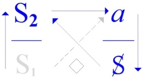
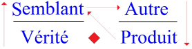
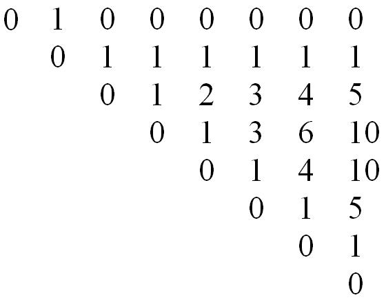
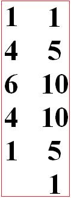
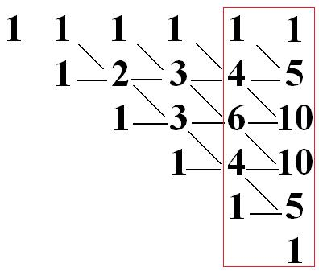
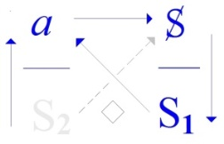
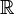

# Leçon 06 | 04 Mai 1972

  

    <label><input type="checkbox" data-lacan-toggle="original" checked> 原文</label>
    <label><input type="checkbox" data-lacan-toggle="notes" checked> 注释</label>
    <label><input type="checkbox" data-lacan-toggle="commentary" checked> 个人解读评论</label>
  

  <form class="lacan-tool-search" role="search">
    <input class="lacan-tool-search-input" type="search" placeholder="搜索全文" aria-label="搜索全文">
    <button class="lacan-tool-button" type="submit" title="搜索">搜索</button>
  </form>
  <button class="lacan-tool-button lacan-back-to-top" type="button" title="回到页面最上方" aria-label="回到页面最上方">↑</button>

<section class="parallel-paragraph" data-paragraph-ids="s19b-06-0001 s19b-06-0002 s19b-06-0003 s19b-06-0004 s19b-06-0005 s19b-06-0006 s19b-06-0007 s19b-06-0008">

s19b-06-0001, s19b-06-0002, s19b-06-0003, s19b-06-0004, s19b-06-0005, s19b-06-0006, s19b-06-0007, s19b-06-0008

原文 · s19b-06-0001, s19b-06-0002, s19b-06-0003, s19b-06-0004, s19b-06-0005, s19b-06-0006, s19b-06-0007, s19b-06-0008

C'est un drôle d'emploi du temps, mais enfin pourquoi pas : pen­dant le week-end il m'arrive de vous écrire.

C'est une façon de parler, j'écris parce que je sais que dans la semaine on se verra.

Enfin le week-end dernier, je vous ai écrit. Naturellement, dans l'intervalle, j'ai eu tout à fait le temps d'oublier cette écriture et je viens de la relire pendant le dîner hâtif que je fais pour être là à l'heure. Je vais commencer par là.

Naturellement c'est un peu difficile, mais peut-être que vous prendrez des notes.

Puis après ça, je dirai les choses que j'ai pensées depuis, en pensant plus réellement à vous.

> J'avais écrit ceci, que bien sûr je ne livrerai jamais à la *poubel­lication,*
>
> je ne vois pas pourquoi j'augmenterai le contenu des bibliothèques :
>
> \...il y a *deux horizons du signifiant*.
>
> Là-dessus écrit, je fais une accolade\...
>
> comme c'est écrit, il faut que vous fassiez attention, je veux dire que vous ne croyiez pas com­prendre
>
> \...alors dans l'accolade :

- il y a *le maternel,* qui est aussi *le matériel,*

- et puis il y a écrit le *mathématique*.

这是个有点奇怪的时间安排，不过也未尝不可：在周末，我有时会给你们写点东西。 这只是个说法；我写，是因为我知道工作日里我们会见面。 总之，上个周末，我给你们写了。自然地，在这段间隔里，我完全有足够的时间把 这份写下的东西忘掉；而我刚刚在匆匆吃的晚餐间隙把它重读了一遍，为的是按时到这里。我要从这里开始。 自然这有点困难，不过也许你们会做笔记。 然后在这之后，我会说说我从那以后想到的东西——在更切实地想着你们的时候。
我曾写下这样一句……当然，我绝不会把它交给“poubellication（垃圾化的出版）”，我看不出我为什么要增加图书馆的藏书量……有两个能指的地平线。
在这上面写着（或：就此写下），我画上一道大括号……就像它写在那儿一样，你们得留神：我的意思是，你们别以为自己理解了……那么，在这道大括号里：
——有“母性的（maternel）”，它也就是“材料性的（matériel）”，
——然后还写着“数学性的（mathématique）”。

</section>

<section class="parallel-paragraph" data-paragraph-ids="s19b-06-0009 s19b-06-0010 s19b-06-0011 s19b-06-0012 s19b-06-0013 s19b-06-0014 s19b-06-0015 s19b-06-0016 s19b-06-0017 s19b-06-0018 s19b-06-0019 s19b-06-0020 s19b-06-0021 s19b-06-0022 s19b-06-0023 s19b-06-0024 s19b-06-0025 s19b-06-0026 s19b-06-0027 s19b-06-0028 s19b-06-0029 s19b-06-0030 s19b-06-0031 s19b-06-0032 s19b-06-0033 s19b-06-0034 s19b-06-0035 s19b-06-0036 s19b-06-0037 s19b-06-0038 s19b-06-0039 s19b-06-0040 s19b-06-0041 s19b-06-0042 s19b-06-0043 s19b-06-0044 s19b-06-0045">

s19b-06-0009, s19b-06-0010, s19b-06-0011, s19b-06-0012, s19b-06-0013, s19b-06-0014, s19b-06-0015, s19b-06-0016, s19b-06-0017, s19b-06-0018, s19b-06-0019, s19b-06-0020, s19b-06-0021, s19b-06-0022, s19b-06-0023, s19b-06-0024, s19b-06-0025, s19b-06-0026, s19b-06-0027, s19b-06-0028, s19b-06-0029, s19b-06-0030, s19b-06-0031, s19b-06-0032, s19b-06-0033, s19b-06-0034, s19b-06-0035, s19b-06-0036, s19b-06-0037, s19b-06-0038, s19b-06-0039, s19b-06-0040, s19b-06-0041, s19b-06-0042, s19b-06-0043, s19b-06-0044, s19b-06-0045

原文 · s19b-06-0009, s19b-06-0010, s19b-06-0011, s19b-06-0012, s19b-06-0013, s19b-06-0014, s19b-06-0015, s19b-06-0016, s19b-06-0017, s19b-06-0018, s19b-06-0019, s19b-06-0020, s19b-06-0021, s19b-06-0022, s19b-06-0023, s19b-06-0024, s19b-06-0025, s19b-06-0026, s19b-06-0027, s19b-06-0028, s19b-06-0029, s19b-06-0030, s19b-06-0031, s19b-06-0032, s19b-06-0033, s19b-06-0034, s19b-06-0035, s19b-06-0036, s19b-06-0037, s19b-06-0038, s19b-06-0039, s19b-06-0040, s19b-06-0041, s19b-06-0042, s19b-06-0043, s19b-06-0044, s19b-06-0045

J'y serai forcé, je le sais, mais enfin je ne peux pas me mettre tout de suite à parler, sans ça je ne vous lirai jamais ce que j'ai écrit.

Peut-être que dans la suite, j'aurai à revenir sur cette distinction dont je souligne qu'elle est d'horizon.

Les articuler, je veux dire comme tels\...

> ça c'est une parenthèse, je l'ai pas écrit \...je veux dire les articuler dans chacun de ces deux horizons, c'est donc\...

> ça, je l'ai écrit \...c'est donc procéder selon ces horizons eux-mêmes, puisque la mention de leur « *au-delà* » - au-delà de l'horizon -- ne se soutient que de leur position\...

> quand ça vous ennuiera vous me le direz
>
> et je vous raconterai les choses que j'ai à vous raconter ce soir \...de leur position - écris-je - en *un discours* de fait.

Pour *le discours analytique* ce « *de fait* » m'implique assez dans ses effets pour qu'on le dise être de mon fait, qu'on le désigne par mon nom.

L'*a-mur*\...

ce que j'ai désigné ici pour tel \...le répercute diversement avec les moyens de ce qu'on appelle justement « *le bord* », de ce « *bord-homme* ».

Le « *bord-homme* » ça m'a inspiré - je l'ai écrit ça - : « *brrom 'brrom -ouap - ouap* ».

C'était une trouvaille d'une personne qui dans l'ancien temps m'a donné des enfants.

C'est une indication concernant :

- la voix - *l'(a)-voix* - qui comme chacun sait *aboie*,

- et *l'(a)-regard* aussi, qui n'y «*(a)regarde pas de si près* »,

- et *l'(a)stuce* qui fait l'*a*stuce,

- et puis *l'(a)merde* aussi, qui fait de temps en temps *graffito* d'intentions plutôt injurieuses dans les pages journalistiques, à mon nom.

Bref, c'est *l'(a)vie*, comme dit une personne qui se divertit pour l'instant, c'est gai ! C'est vrai, en somme.

Ces effets n'ont rien à faire avec la dimension qui se mesure de mon fait, c'est à savoir que c'est *d'un discours* qui n'est pas le mien propre que je fais la dimension nécessaire.

C'est du *discours analytique* qui pour n'être pas encore - et pour cause ! - proprement institué, se trouve avoir besoin de quelques frayages à quoi je m'emploie.

Á partir de quoi ? Seulement de ceci en fait que ma position en est déter­minée.

Bon. Alors maintenant, parlons de *ce discours* et du fait qu'y est essentielle *la position* comme telle du *signifiant*.

Je voudrais quand même, vu ce public que vous constituez, vous faire une remarque : c'est que cette *position du signifiant* se dessine d'une expé­rience qu'il est à la portée de chacun de vous, de faire, pour vous apercevoir de quoi il s'agit et combien c'est essentiel.

Quand vous connaissez imparfaitement une langue et que vous li­sez un texte, eh bien vous comprenez, vous comprenez toujours. Ça devrait vous mettre un peu en éveil.

Vous comprenez dans le sens où - d'avance - vous savez ce qui s'y dit.

Bien sûr, il en résulte que le texte peut se contredire.

Quand vous lisez par exemple un texte sur *la Théorie des Ensembles*, on vous explique ce qui constitue l'ensemble infini des nombres entiers.

> À la ligne suivante on vous dit quelque chose que vous comprenez, parce que vous continuez de lire :

« *Ne croyez pas que c'est parce que ça continue toujours qu'il est infini* ».

Comme on vient de vous expliquer que c'est pour ça qu'il l'est, vous sursautez.

Mais quand vous y regardez de près, vous trouvez le *terme* qui désigne qu'il s'agit de « *deem* » \[*juger, estimer*\], c'est­-à-dire que ce n'est pas sur ça que vous devez juger, parce qu'ils savent qu'elle ne s'arrête pas cette série des nombres entiers, qu'elle est infinie, c'est pas parce qu'elle est indéfinie.

De sorte que vous vous apercevez que c'est parce que,

- soit vous avez sauté « *deem* »,

- soit vous n'êtes pas assez familier avec l'anglais, que vous avez compris trop vite,

> c'est-à-dire que vous avez sauté cet élément essentiel qui est celui d'un *signifiant* qui rend possible *ce changement de niveau*, grâce auquel vous avez eu un instant le sentiment d'une contradiction.

II ne faut jamais sauter un *signifiant*.

C'est dans la mesure où le *signifiant* ne vous arrête pas que vous comprenez.

Or comprendre, c'est être toujours compris soi-même dans les effets du discours, lequel discours en tant que tel ordon­ne les effets du savoir déjà précipités par le seul formalisme du signifiant.

maternel / matériel｜译：母性的／材料性的｜备选：母体性的／物质性的
同音近形制造等值的滑动：maternel（母性的）在能指层面滑到 matériel（材料/物质/材料性的）。

mathématique｜译：数学性的／数学的｜备选：可数学化的／数学书写的

与“材料/母性”相对并置，指向拉康在这一时期持续推进的形式化写作（mathème/数理化书写）的方向：可写、可操作、可传递的符号装置，用以避免理解的幻觉。此处只点名“写着：数学性的”，并未说明具体形式。

我将被迫这么做，我知道；不过，我终究没法立刻就开始说话，否则你们就永远读不到我写下的东西。也许在后面，我还得回到这个区分上来；我强调，这个区分属于“地平线/视域”的层级。
把它们加以“铰接/ articuler”，我是说就它们作为那样的东西而言……这是一句插话，我没把它写下来……我是说：在这两个视域中的每一个里，把它们加以铰接，那么就……
这个，我写下来了……那么就是：依照这些地平线自身来推进（procéder），因为提到它们的“彼岸/au-delà”——在地平线之外——只能由它们的位置来支撑……等你们听烦了就告诉我，我就给你们讲我今晚要讲给你们听的事。……由它们的位置——我写道——在一种“事实的话语（discours de fait）”之中。
就分析话语而言，这个“de fait（就事实而言/在事实层面）”在它的效应里把我牵连得足够深，以至于人们会说：它是“de mon fait（出自我/由我造成）”，并且用我的名字来指称它。
L’a-mur——我在此就以此名指称之物——借助人们恰恰称为“边缘/边界”（le bord）的那些手段，把它以不同方式折返、反射：凭的是这个“bord-homme（边-人/边界之人）”的“边”。这“bord-homme”启发了我——我把这句写下来了——：“brrom brrom — ouap ouap”。
这个灵感（trouvaille）：出自一位在久远以前给我生过孩子的人。
这是一条关于下列事项的指示：
——声音——l’(a)-voix——众所周知，它会吠叫，
——还有 l’(a)-regard（(a)-凝视/目光）也一样，它并不在那儿“(a)regarde（仔细看/贴近地看）”，
——还有 l’(a)stuce，这个让“astuce（机巧/小聪明）”成其为玩笑的东西，
——再还有 l’(a)merde 也一样，它会不时地以“涂写/刻写（graffito）”的方式，
带着相当侮辱性的意图，出现在新闻报刊的版面里，署到我的名字名下。
总之，这是 l’(a)vie（(a)-生命）——正如某个此刻自得其乐的人所说：这很欢乐！归根结底，确实如此。
这些效应与那种可按“由我之故（de mon fait）”来度量的维度毫无干系——也就是说：我之所以把某个维度做成必不可少，所凭借的是一个并非我个人自有的话语。
这正是分析话语：由于它迄今尚未——而且理当如此！——真正完成制度性确立，于是它需要若干“开路/导通”（frayages），而我正在为此劳作。从什么出发？只从这一点出发：我的位置由它所决定。
好。那么现在，我们来谈这个话语，以及：能指作为这样的东西，其位置在其中是本质性的这一点。不过，鉴于你们这个听众群体的构成，我还是想对你们说一句：那就是，这个能指的位置，是从一种经验中勾勒出来的；而这种经验，对你们每一个人来说，都是力所能及的，借此你们可以觉察到它究竟是什么，以及它有多么根本。
当你对一门语言掌握得并不充分，却去阅读一段文本时，那么你是“理解”的，你总是在理解。对此你本该稍微警觉一些。你之所以能够理解，是因为——事先你已经知道那里“说的是什么”。当然，其结果便是：文本可能会自相矛盾。
当你们比如阅读一篇关于集合论的文本时，它会向你们解释：是什么构成了整数的无限集合。紧接下一行，人家会告诉你们一句你能“理解”的东西——因为你们继续往下读：“别以为它之所以是无限的，是因为它总是一直继续下去。”

</section>

<section class="parallel-paragraph" data-paragraph-ids="s19b-06-0046 s19b-06-0047 s19b-06-0048 s19b-06-0049 s19b-06-0050 s19b-06-0051 s19b-06-0052 s19b-06-0053">

s19b-06-0046, s19b-06-0047, s19b-06-0048, s19b-06-0049, s19b-06-0050, s19b-06-0051, s19b-06-0052, s19b-06-0053

原文 · s19b-06-0046, s19b-06-0047, s19b-06-0048, s19b-06-0049, s19b-06-0050, s19b-06-0051, s19b-06-0052, s19b-06-0053

Ce que la psychanalyse nous apprend, c'est que : tout savoir naïf\...

> ça c'est écrit, et c'est pour ça que *je le lis* \...est associé à un voilement de *la jouissance* qui s'y réalise, et pose la question de ce qui s'y trahit *des limites de la puissance*, c'est-à-dire - quoi ? - du tracé imposé à *la jouissance*.

Dès que nous parlons - c'est un fait ! nous supposons quelque chose à ce qui se parle, ce quelque chose que nous imaginons pré-posé, encore qu'il soit sûr que nous ne le supposions jamais qu'après-coup.

C'est seulement au fait de parler que se rapporte, dans l'état actuel de nos connaissances, que puisse s'apercevoir que *ce qui parle* - quoi que ce soit - *est ce qui jouit de soi comme corps*.

Ce qui jouit d'un corps qu'il vit comme\...

> ce que j'ai déjà énoncé \...du « *tu-able* », c'est-à-dire comme *tutoyable*, d'un corps qu'il *tutoie,* et d'un corps à qui il dit « *tue-toie* » dans la même ligne.

*La psychanalyse*, qu'est-ce ? *C'est le repérage de ce qui se com­prend d'obscurci*, de ce qui s'obscurcit en compréhension, *du fait d'un signifiant qui a marqué un point du corps*.

La psychanalyse, c'est ce qui reproduit\...

此处被放进一个误解：把“无限”当成“继续下去”即可推出的性质。数学家并不是凭“它不停止”来判定无限，而是凭更严格的判据（例如与真子集可建立对应等）来界定无限。

既然它刚刚向你们解释：它之所以如此，正是因为这个缘故，你们就会一惊。但当你们仔细去看时，你们会发现有一个术语，标示这涉及到 “deem”【判断、估计】，也就是说：你们不该在这个点上作判断；因为他们知道：这列整数序列并不会停下来，它是无限的；它之所以是无限，并不取决于“它是不定地延续”。

拉康把“无限”与“可无限延续”拉开：数学家知道序列不会停，但“不会停”并不足以构成“无限”的判据。此区分在哲学史中有传统（如笛卡尔将“无限”与“无定”区分）。

之前看一个数学科普中有类似的讲解，后面再查一下
所以你们会觉察到：这是因为
——要么你们跳过了“deem”，
——要么你们对英语还不够熟悉，于是理解得过快，也就是说：你们跳过了这个关键要素——一个能指。
正是它使这种层级的变换成为可能；凭借它，你们才在一瞬间产生了“出现矛盾”的感觉。

</section>

<section class="parallel-paragraph" data-paragraph-ids="s19b-06-0054 s19b-06-0055 s19b-06-0056 s19b-06-0057 s19b-06-0058 s19b-06-0059 s19b-06-0060 s19b-06-0061 s19b-06-0062 s19b-06-0063 s19b-06-0064 s19b-06-0065 s19b-06-0066 s19b-06-0067 s19b-06-0068 s19b-06-0069 s19b-06-0070 s19b-06-0071 s19b-06-0072 s19b-06-0073 s19b-06-0074 s19b-06-0075 s19b-06-0076 s19b-06-0077 s19b-06-0078 s19b-06-0079 s19b-06-0080 s19b-06-0081">

s19b-06-0054, s19b-06-0055, s19b-06-0056, s19b-06-0057, s19b-06-0058, s19b-06-0059, s19b-06-0060, s19b-06-0061, s19b-06-0062, s19b-06-0063, s19b-06-0064, s19b-06-0065, s19b-06-0066, s19b-06-0067, s19b-06-0068, s19b-06-0069, s19b-06-0070, s19b-06-0071, s19b-06-0072, s19b-06-0073, s19b-06-0074, s19b-06-0075, s19b-06-0076, s19b-06-0077, s19b-06-0078, s19b-06-0079, s19b-06-0080, s19b-06-0081

原文 · s19b-06-0054, s19b-06-0055, s19b-06-0056, s19b-06-0057, s19b-06-0058, s19b-06-0059, s19b-06-0060, s19b-06-0061, s19b-06-0062, s19b-06-0063, s19b-06-0064, s19b-06-0065, s19b-06-0066, s19b-06-0067, s19b-06-0068, s19b-06-0069, s19b-06-0070, s19b-06-0071, s19b-06-0072, s19b-06-0073, s19b-06-0074, s19b-06-0075, s19b-06-0076, s19b-06-0077, s19b-06-0078, s19b-06-0079, s19b-06-0080, s19b-06-0081

> vous allez retrouver les rails ordinaires \...c'est ce qui reproduit une production de la *névrose*.

Là-dessus tout le monde est d'accord.

Il n'y a pas un psychanalyste qui ne s'en soit aperçu.

Cette *névrose* qu'on attribue - non sans raison - à l'action des parents, n'est atteignable que dans toute la mesure où l'action des parents s'*articule* justement\...

> c'est le terme par quoi j'ai commencé la troisième ligne \...de la position du psychanalyste.

C'est dans la mesure où elle converge vers *un signifiant* qui en émerge, que la *névrose* va s'ordonner selon le discours dont les effets ont produit le sujet : tout parent traumatique est en somme dans la même position que le psychanalyste.

La diffé­rence c'est que :

- le psychanalyste, de sa position, reproduit la *névrose*

- et que le pa­rent traumatique, lui, la produit innocemment.

Ce dont il s'agit c'est - ce signifiant - de le *reproduire* à partir de ce qui d'abord a été son *efflorescence*.

Faire un « *modèle* » de la *névrose*, c'est en somme l'opé­ration du *discours analytique*.

Pourquoi ?

Dans la mesure où il y ôte la *« cote »* de *jouissance* !

*La jouissance exige* en effet le privilège : il n'y a pas deux façons d'y faire pour chacun.

*Toute reduplication la tue : elle ne survit qu'à ce que la répé­tition en soit vaine, c'est-à-dire toujours la même.*

C'est l'introduction du « *modèle* » qui, cette répétition vaine, l'achève.

Une répétition achevée la dissout, de ce qu'elle soit une répétition simplifiée.

C'est toujours bien sûr *du signifiant* que je parle quand je parle du « *yadl'Un* ».

Pour étendre *ce « dl'Un »* à la mesure de son empire\...

> puisqu'il *est assurément le signifiant-maître* \...il faut l'approcher là où on l'a laissé à ses talents, pour le mettre lui, au pied du mur.

Voilà ce qui rend utile comme incidence, le point où j'en suis arrivé cette année, n'ayant le choix que de ça « \...*Ou pire* », cette référence mathémati­que, ainsi appelée parce que c'est l'ordre où règne le mathème, c'est-à-dire ce qui produit un *savoir* qui, de n'être que produit, est lié aux normes du *plus-de-jouir*, c'est-à-dire du mesurable.

Un mathème c'est ce qui proprement - et seul - s'enseigne.

Ne s'enseigne que *l'Un*. Encore faut-il savoir de quoi il s'agit.

Et c'est pour ça que cette année, je l'interroge.

Je ne poursuivrai pas plus loin ma lecture, que j'ai lue - je pense - assez lentement - et qui est assez difficile pour que, sur chacun de ses termes que j'ai bien épelés, quelques questions pour vous s'accrochent.

Et c'est pour ça que maintenant, je vais vous parler plus librement.

Il y a quelqu'un, l'autre jour, qui au sortir du dernier truc au Pan­théon\...

> il est peut-être là encore \...est venu m'interpeller sur le sujet de savoir « *si je croyais à la liberté* ».

拉康在这里通过“infini/indéfini”的区分来表达在理解时的“跳过”。 这种跳过导致主体在后面看到了一种矛盾冲突。 冲突又将主体拉回到文本之中，由此才阅读到整个文本所想表达的意思。

值得注意的是，这个场景所描述的情况更多的是在“阅读”中。 通过在一个平面上阅读文字才有可能让主体回到过去某个文字进行辨别。
而在对话中，语音总归是听完就完了的。 即便主体试图回溯或者保留当时录音进行重播，也无法回溯到听那句话的当下。 “当下”的表达的仅仅是一种“声音”。 不论是经过录音的重复，还是当事人或者另外一个他者的复数。 声音总归是脱离其当下性的，也正因为这种永远的失去，才不断的情能牵引主体回溯——ta到底说了什么？那句话到底是什么意思？ta到底是如何想的？
——因此拉康前面玩的谐音梗文字游戏中 l’(a)-voix。即便这只是一个谐音梗，这个梗的形式本身也对这种声音与文字之间的差异与形式作出了某种展示。
<strong>绝不要跳过一个能指。</strong>正是在能指没有把你拦住的程度上，你才会“理解”。然而，所谓理解，始终意味着：你自己被纳入到话语的效应之中，被其所“理解”。而这个话语，就其本身而言，是在安排那些知识的效应——这些效应早已仅凭能指的形式主义而沉淀出来。

“理解”这里并不是作为分析师应该有的姿态。 如果能指没能拦住你，不就意味着你跳过了某个能指吗？

这种理解意味着你基于这个能指在过去的某个形式主义而沉淀而理解。 这里所说的“某个形式主义而沉淀出来”的效应文本中说的非常明确了就是“知识”。
啊，这个我又想笑了，煞有介事的把声音，粪便，玩笑，目光当作对象a。 拉子估计都要被这种知识逗笑了。
或者可以说被过去的划痕而导致跳针的唱片。 理解让主体可以在某个话语中小小的跳过能指。 同样有可能导致重复。基于某个话语的理解跳针到某个固定的路径，并且重复到此。 不过这种重复意味着并不是往前跳，而是往后跳了。
在回溯性的理解某个事情，然后这个理解再一次让主体走到同样的能指链条上。
精神分析教给我们的，是这样一件事：
任何一种未经过反思的知识……
——这句话是写下来的，这也正是我朗读它的原因。
……都与一种对其中发生并得以兑现的享乐的遮蔽相连；并且由此提出这样一个问题：在其中，权能的界限究竟以何种方式被泄露出来——也就是说——是什么？——对享乐所强加的那条划界之线。
一旦我们开口说话——这是一个事实！——我们就会假定那个“被说着的东西”，某个我们想象为预先被安置的东西；尽管可以肯定：我们从来只是在事后才作出这种假定。
而在我们目前的知识状况中，只有就“说话这一事实”而言，人们才可能觉察到：那在说的东西——不管是什么——正是那个以躯体为身而自享的东西。

</section>

<section class="parallel-paragraph" data-paragraph-ids="s19b-06-0082 s19b-06-0083 s19b-06-0084 s19b-06-0085 s19b-06-0086 s19b-06-0087 s19b-06-0088 s19b-06-0089">

s19b-06-0082, s19b-06-0083, s19b-06-0084, s19b-06-0085, s19b-06-0086, s19b-06-0087, s19b-06-0088, s19b-06-0089

原文 · s19b-06-0082, s19b-06-0083, s19b-06-0084, s19b-06-0085, s19b-06-0086, s19b-06-0087, s19b-06-0088, s19b-06-0089

Je lui ai dit qu'il était drôle, et puis comme je suis toujours assez fatigué, j'ai rompu avec lui, mais ça ne veut pas dire que je ne serai pas prêt, là-dessus, à lui faire personnellement quelques confidences.

Il est un fait que j'en parle rarement.

En sorte que cette question est de son initiative.

Je ne déplorerai pas de savoir pourquoi il me l'a posée.

Ce que je voudrais alors plus librement dire, c'est que faisant allu­sion dans cet écrit à ce en quoi, à ce par quoi je me trouve en position, ce *discours analytique*, de le frayer, c'est bien évidemment en tant que je le considère comme constituant, au moins en puissance, cette sorte de *structure* que je désigne du terme de *discours*, c'est-à-dire ce par quoi, par l'effet pur et simple du langage, *se précipite un lien social*.

On s'est aperçu de ça sans avoir besoin pour autant de la psychanalyse.

C'est même ce qu'on appelle couramment « *idéologie* ».

La façon dont un discours s'ordonne, de façon telle qu'*il précipite un lien social,* Comporte -- inversement - que tout ce qui s'y articule s'ordonne de ses effets.

这让我想到上一次研讨班中拉康提出的那四个逻辑公式分别站在四个位置。正是对这种预先假定的推演。

而真正的事实仅仅在于“说话这一事实”。 抛开所讲的这些，仅仅在说话这一事实上，那个正在说话的“东西”正在以自己的身体享乐。
这里提到的享乐不是“一种享乐”，这里的享乐显然不可数。不然仿佛在这里定义了享乐的类型，进而进入到刚刚那四话语的推演体系一样。
那以一个身体为享乐对象的东西，把它体验为……（我已经说过）
……“tu-able（可被‘你’之物）”：也就是，可被直呼为“你”（tutoyable）。它把一个身体当作“你”来直呼（il le tutoie），并且，在同一行书写上，它又对同一个身体说“tue-toie”（“杀—你/去‘你’”）。
精神分析是什么？
它是在晦暗中被理解到的东西之定位，是理解中自行晦暗化的东西之定位——这一切都出于这样一个事实：某个能指在身体上标出了一个点。
精神分析，就是那种可以再生产……——你们将会重新看到那些通常的轨道。
——精神分析，就是再生产神经症的生产。

> 我现在有点理解拉康之后15分钟的高频分析是要做什么了。

</section>

<section class="parallel-paragraph" data-paragraph-ids="s19b-06-0090 s19b-06-0091 s19b-06-0092 s19b-06-0093 s19b-06-0094 s19b-06-0095 s19b-06-0096 s19b-06-0097">

s19b-06-0090, s19b-06-0091, s19b-06-0092, s19b-06-0093, s19b-06-0094, s19b-06-0095, s19b-06-0096, s19b-06-0097

原文 · s19b-06-0090, s19b-06-0091, s19b-06-0092, s19b-06-0093, s19b-06-0094, s19b-06-0095, s19b-06-0096, s19b-06-0097

C'est bien ainsi que j'entends ce que pour vous j'articule du *discours de la psychanalyse* : c'est que s'il n'y avait pas de pratique psychanalytique, rien de ce que je puis en articuler n'aurait d'effets que je puisse attendre.

Je n'ai pas dit « *n'au­rait de sens* ».

*Le propre du sens c'est* d'être toujours confusionnel, c'est-à-dire *de faire le pont,* de croire faire le pont, entre

- *un discours* en tant que s'y précipite un lien social,

- *avec ce qui*, d'un autre ordre, *provient d'un autre discours*.

L'ennuyeux c'est que quand vous procédez, comme je viens de dire dans cet écrit « qu'il est question de procéder », c'est-à-dire de viser d'un discours ce qui y fait fonction de l'*Un*, qu'est-ce que je fais en l'occasion ?

Si vous me per­mettez ce néologisme, *je fais de l'unologie*.

Avec ce que j'articule n'importe qui peut faire *une ontologie*, d'après ce qu'il suppose *au-delà* justement *de ces deux horizons*, que j'ai marqué être définis comme *horizons du signifiant*.

关于这一点，大家都一致。没有一个精神分析家不曾察觉到这一点。这类神经症——人们把它归因于父母的作用，并非没有道理——只有在这样一种程度上才是可触及的：父母的作用能够被恰当地“铰接”起来……
——这正是我在板书第三行开头用的那个词——……相对于精神分析家的位置而言。
正是在他（神经症）趋向于一个从中涌现出来的能指的程度上，神经症才会按照那样一种话语而获得其秩序；而正是这个话语的效应，生产出了主体：所有造成创伤的父母，归根结底，都处在与精神分析家相同的位置上。区别在于：

* 精神分析家，从其位置出发，是在再生产神经症；
* 而造成创伤的父母，则是在无辜地生产神经症。

问题之所在，是——这个能指——从起初曾是其涌现（efflorescence）之处，将它再生产出来。生产神经症的一个「模型」，归根结底，正是分析话语的操作。为什么？

</section>

<section class="parallel-paragraph" data-paragraph-ids="s19b-06-0098 s19b-06-0099 s19b-06-0101 s19b-06-0102 s19b-06-0103 s19b-06-0104 s19b-06-0105 s19b-06-0106 s19b-06-0107 s19b-06-0108 s19b-06-0109 s19b-06-0110 s19b-06-0111 s19b-06-0112 s19b-06-0113 s19b-06-0114 s19b-06-0115 s19b-06-0116 s19b-06-0117 s19b-06-0118 s19b-06-0119 s19b-06-0120 s19b-06-0121 s19b-06-0122 s19b-06-0123 s19b-06-0124 s19b-06-0125 s19b-06-0126">

s19b-06-0098, s19b-06-0099, s19b-06-0101, s19b-06-0102, s19b-06-0103, s19b-06-0104, s19b-06-0105, s19b-06-0106, s19b-06-0107, s19b-06-0108, s19b-06-0109, s19b-06-0110, s19b-06-0111, s19b-06-0112, s19b-06-0113, s19b-06-0114, s19b-06-0115, s19b-06-0116, s19b-06-0117, s19b-06-0118, s19b-06-0119, s19b-06-0120, s19b-06-0121, s19b-06-0122, s19b-06-0123, s19b-06-0124, s19b-06-0125, s19b-06-0126

原文 · s19b-06-0098, s19b-06-0099, s19b-06-0101, s19b-06-0102, s19b-06-0103, s19b-06-0104, s19b-06-0105, s19b-06-0106, s19b-06-0107, s19b-06-0108, s19b-06-0109, s19b-06-0110, s19b-06-0111, s19b-06-0112, s19b-06-0113, s19b-06-0114, s19b-06-0115, s19b-06-0116, s19b-06-0117, s19b-06-0118, s19b-06-0119, s19b-06-0120, s19b-06-0121, s19b-06-0122, s19b-06-0123, s19b-06-0124, s19b-06-0125, s19b-06-0126

On peut se mettre, dans *le discours universitaire,* à reprendre de ma construction le modèle, en y supposant en un point arbitraire je ne sais quelle essence qui deviendrait, on ne sait d'ailleurs pourquoi, la valeur suprême.

C'est tout particulièrement propice à ce qui s'offre au *discours universitaire,* dans lequel ce dont il s'agit c'est, selon le diagramme que j'en ai dessiné, de mettre S~2~ - où ? - à la place du *semblant*.

> *Discours universitaire*

Avant qu'un *signifiant* soit vraiment mis à sa place, c'est-à-dire justement repéré de l'idéologie pour laquelle il est produit, il a toujours des effets de circulation. *La signification précède* dans ses effets *la reconnaissance de sa place*, sa place instituante.

Si *le discours universitaire* se définit de ce que *le savoir* y soit mis en position de *semblant*, c'est ce qui se contrôle, c'est ce qui se confirme de la nature même de l'enseignement où, qu'est-ce que vous voyez ?

C'est une fausse mise en ordre de ce qui a pu « *s'éventailler* », si je puis dire, au cours des siècles, *d'on­tologies diverses*.

Son sommet, *son culmen* c'est ce qui s'appelle glorieusement *L'histoire de la philosophie*, comme si la philosophie n'avait pas\...

> et c'est ample­ment démontré \...son ressort dans les aventures et mésaventures du *discours du Maître*, qu'il faut bien de temps en temps renouveler.

La cause des chatoiements de la philosophie est, comme c'est suffisamment affirmé à partir des points d'où justement est sortie la notion d'idéologie, comme si donc la cause dont il s'agit ne gisait pas ailleurs.

Mais il est difficile que tout procès d'articulation d'un dis­cours, surtout s'il ne s'est pas encore repéré, donne prétexte à un certain nombre de soufflures prématurées de nouveaux « *êtres* ».

Je sais bien que tout ça n'est pas facile et qu'il faut quand même\...

> ce dans la bonne tradition de ce que je fais ici \...que je vous dise des choses plus amusantes.

Alors parlons de « *L'analyste et l'amour* ».

L'*amour* dans l'analyse\...

> et bien entendu c'est du fait de la posi­tion de l'analyste \...*l'amour on en parle*. Toutes proportions gardées, *on n'en parle pas plus qu'ailleurs*, puisqu'après tout *l'amour c'est à ça que ça sert*.

Ce n'est pas ce qu'il y a de plus réjouissant, mais enfin dans le siècle, on en parle beaucoup.

Il est même prodigieux - depuis le temps ! - qu'on continue à en parler, parce qu'enfin depuis le temps, on aurait pu s'apercevoir que ça ne réussit pas mieux pour autant.

Il est donc clair que *c'est en parlant qu'on fait l'amour*.

Alors l'analyste, quel est son rôle là-dedans ?

Est-ce que vraiment une analyse peut faire réussir *un amour* ?

Je dois vous dire, quant à moi\... \[*Rires*\], que je n'en connais pas d'exemple. Et pourtant j'ai essayé ! \[*Rires*\]

C'était pour moi, bien sûr, parce que je ne suis pas complètement né des dernières pluies, une gageure.

J'espère que la personne dont il s'agit n'est pas là, j'en suis quasiment sûr \[*Rires*\] !

J'ai pris quelqu'un, Dieu merci, que je savais d'avan­ce avoir besoin d'une psychanalyse, mais sur la base de cette *demande*\...

> vous vous rendez compte de ce que je peux faire comme saloperies pour vérifier mes affir­mations \...sur la base de ceci : qu'il fallait à tout prix qu'il ait le *conjugo* avec la dame de son cœur.

Naturellement, bien sûr ça a raté - Dieu merci ! - dans les plus brefs délais !

Bon, abrégeons, parce que tout ça ce sont des anecdotes.

C'est une autre histoire, mais comme ça, un jour où je serai en veine et où je me risquerai à faire du La Bruyè­re, je traiterai la question des rapports de l'*amour* avec le *semblant*.

正在于它在那里去掉了享乐的「份额」（cote）！享乐的确要求某种特权：对每个人来说，通往它的方式只有一种。任何加倍（reduplication）都会扼杀它：它只能存活于重复变得徒劳之时——也就是说，始终是同一的。
正是「模型」的引入，完成了这种徒劳的重复。一种被完成的重复会消解它，因为它是一种被简化的重复。当我谈到*存有其一「yadl'un」*时，我谈的当然始终是能指。为了把这个*其一「dl'un」*扩展到其帝国的尺度……
——既然它无疑就是主人能指（signifiant-maître）——那么就必须在人们任其发挥才干之处逼近它，以便将之逼到墙角（au pied du mur）。

这就是为什么，作为某种切入口，我今年所抵达的这一点是有用的——我别无选择，只能选这个「……或更糟」（...Ou pire）：这个数学参照之所以这样称呼，是因为那是数学式（mathème）所统治的秩序，也就是说，那是生产一种知识的东西，而这种知识正因为只是被生产出来的，就与剩余享乐（plus-de-jouir）的规范、亦即与可度量的东西绑在一起。  数学式，就是那真正——并且唯一——可被传授的东西。可被传授的只有「一」。但还得知道这「一」指的是什么。正因如此，今年我在追问它。
我不会再往下读下去了；我读得——我想——已经够慢了，而它又足够难，以至于在我好好拼读过的每一个词上，都能挂住一些向你们提出的问题。所以现在，我要更自由地跟你们谈。
前几天有人在先贤祠最后那场活动散场时……他也许还在场……过来拦住我，问「我相不相信自由」。我对他说他挺逗的，然后因为我一向挺累的，就跟他断了话头；但这不表示我不准备在这一点上跟他私下说几句。事实上我很少谈这个。所以这个问题是他主动提的。我不会去揣测他为什么这么问。

我想更自由地说的是：在那篇文字里，我提到我借以、并由此处于某种位置的东西——即分析话语——去为它开路（le frayer），我显然是把它视为至少潜在地构成了我以「话语」一词所指的那种结构，亦即：纯粹由语言的效果所催生的那种社会联结。这一点人们不需要精神分析也能意识到。人们通常称之为「意识形态」。话语以某种方式被组织起来，从而催生一种社会联结；反过来，其中被铰接的一切都按其效果而被组织。我对你们所铰接的精神分析话语，正是这样理解的：如果没有精神分析实践，我所能从中铰接出来的东西，就不会产生任何我可期待的效应。我没有说「不会有意义」。意义的特性就在于它总是造成混淆，也就是说，它搭桥——或自以为在搭桥——一边是作为催生社会联结的话语，另一边是来自另一种秩序、来自另一种话语的东西。麻烦的是，当你们按我在那篇文字里说的「要去做的」那样去做——亦即从一个话语中瞄准其中发挥「一」之功能的东西——那么在此之际，我到底在做什么？

若你们允许我用这个新词的话，我在搞「一学」（unologie）。用我所铰接的东西，任何人都能搞出一套存在论——只要他在恰恰超出我所标出的、被界定为能指之地平线的那两个视域之外，假定某种东西。在大学话语（discours universitaire）里，人们大可以取用我的建构作为模型，在其中于任意一点上假定某种说不清的、会——也不知为何——变成至高价值的本质。这对大学话语所敞开的东西再合适不过：在其中，问题恰恰在于——依照我所绘制的图式——把 S2 放在——哪儿？——假象（semblant）的位置上。

</section>

<section class="parallel-paragraph" data-paragraph-ids="s19b-06-0100">

s19b-06-0100

原文 · s19b-06-0100

{width="1.3756977252843394in" height="0.7653674540682415in"} {width="1.2587718722659667in" height="0.3260400262467192in"}

[无对应译文]

</section>

<section class="parallel-paragraph" data-paragraph-ids="s19b-06-0127 s19b-06-0128 s19b-06-0129 s19b-06-0130 s19b-06-0131 s19b-06-0132 s19b-06-0133 s19b-06-0134 s19b-06-0135 s19b-06-0136 s19b-06-0137">

s19b-06-0127, s19b-06-0128, s19b-06-0129, s19b-06-0130, s19b-06-0131, s19b-06-0132, s19b-06-0133, s19b-06-0134, s19b-06-0135, s19b-06-0136, s19b-06-0137

原文 · s19b-06-0127, s19b-06-0128, s19b-06-0129, s19b-06-0130, s19b-06-0131, s19b-06-0132, s19b-06-0133, s19b-06-0134, s19b-06-0135, s19b-06-0136, s19b-06-0137

Mais nous ne sommes pas là ce soir pour nous attarder à ces babioles !

Il s'agit de savoir ceci, sur quoi je reviens parce qu'il me semblait avoir frayé la chose, c'est le rapport de tout ça que je suis en train de ré-énoncer, que je vous rappelle d'une brève *touche des vérités d'expérience*, c'est de savoir la fonction dans la psychanalyse, du *sexe*.

Je pense quand même là-dessus avoir frappé les oreilles, même les plus sourdes, par l'énoncé de ceci qui mérite d'être commenté : *qu'il n'y a pas de rapport sexuel*.

Bien sûr cela mérite d'être articulé.

Pourquoi est-ce que le psy­chanalyste s'imagine que ce qui fait le fond de ce à quoi il se réfère, c'est *le sexe* ?

Que le sexe ça soit réel, ceci ne fait pas le moindre doute. Et sa structure même, c'est le duel, le nombre « *deux* ».

Quoi qu'on en pense, il y en a deux : les hommes, les femmes, dit-on, et on s'obstine à y ajouter les auver­gnats ! \[*Rires*\] C'est une erreur ! Au niveau du *réel* il n'y a pas d'auvergnats.

Ce dont il s'a­git quand il s'agit de sexe c'est de *l'autre*, de *l'autre sexe*, même quand on y pré­fère le même.

C'est pas parce que j'ai dit tout à l'heure que pour ce qui est de la réussite d'un amour, l'aide de la psychanalyse est précaire, qu'il faut croire que le psychanalyste s'en foute, si je puis m'exprimer ainsi.

Que le partenaire en question soit *de l'autre sexe* et que ce qui est en jeu ce soit quelque chose qui ait rapport à *sa jouissance*, parle de l'autre, du tiers, à propos duquel il est énoncé ce « *par­lage* » autour de l'amour, le psychanalyste ne saurait y être indifférent, parce que *celui qui n'est pas là, pour lui* \[*pour l'analyste*\] *c'est bien ça le réel*.

> Cette *jouissance-là*, celle qui n'est pas *en analyse*, si vous me permettez de m'exprimer ainsi, *elle fait fonction pour lui de réel*.
>
> Ce qu'il a par contre en analyse - c'est-à-dire le sujet - il le prend pour ce qu'il est, c'est-à-dire pour *effet de discours*.
>
> Je vous prie de remarquer au passage qu'il ne le subjective pas.
>
> Ça ne veut pas dire que tout ça c'est ses petites idées,
>
> mais que comme sujet il est déterminé par un discours dont il provient depuis longtemps, et c'est ça qui est analysable.

在一个能指被真正放到其位置之前——也就是说，在被生产它的那种意识形态（idéologie）所准确识别出来之前——它始终都有流通效应（effets de circulation）。意义（signification）在其效应中先于对其位置的承认，先于其建制性位置（place instituante）。

如果大学话语是这样界定的：知识（savoir）在其中被置于假象（semblant）之位，那么这一点既得到检验，也恰恰在教学本身的性质中得到确认——你们看到的是什么？这就是对若干世纪以来各种存在论所能「铺开」（s'éventailler）的东西的一种虚假的整序——如果我可以这么说的话。其顶峰、其顶点（culmen），就是那个被光荣地称作「哲学史」（L'histoire de la philosophie）的东西——仿佛哲学没有……而且这一点已得到充分证明……其在主人话语（discours du Maître）的种种历险与不幸中的发条，而这一发条总得不时更新。哲学之变幻（chatoiements）的起因，正如从意识形态这一概念恰恰从中诞生的那些点出发已充分指出的那样——仿佛因此问题中的那个起因并不在别处。

但任何话语的铰接过程——尤其当它尚未自我定位时——都很难不让人借机搞出若干早产的、新的「存在」（êtres）的膨胀（soufflures prématurées）。我当然知道这一切并不容易，但还是得……秉承我在这里所做之事的良好传统……跟你们说点更有趣的东西。

那就来谈「分析家与爱」（L'analyste et l'amour）。分析中的爱……而当然这是由于分析家的位置……爱，人们会谈到它。恰当地说，人们在这里谈得并不比别处更多，毕竟爱就是派这个用场的。这并不是最令人开心的事，但总之在这个世纪里人们谈得很多。甚至不可思议的是——这么久了！——人们还在继续谈它，因为说到底这么久了，人们本可以发觉它并没有因此就更成功。因此很明显，正是通过言说人们才做爱（c'est en parlant qu'on fait l'amour）。

> 这里拉康是在引入“分析家与爱”这个话题。他指出，在精神分析中谈论爱，实际上并不比在其他地方更多，爱在这里所扮演的角色和它在别处的角色一样。
> 即便是这样，大家不断地谈论爱，而这么长时间过去了，似乎大家依然没能因此更“成功”地把握爱是怎么回事。
> 爱其实总是和言语、话语密切关联的——拉康用了一句法语“正是通过言说人们才做爱”（c'est en parlant qu'on fait l'amour），强调爱和话语的无法分离，也就是说，爱本身也是在语言中被生产、被实施的行动。在分析中讨论爱，其实是让我们看到：爱并非某种神秘的本真体验，而总是在言语的网络中产生与被处理。

</section>

<section class="parallel-paragraph" data-paragraph-ids="s19b-06-0138 s19b-06-0139 s19b-06-0140 s19b-06-0141 s19b-06-0142 s19b-06-0143 s19b-06-0144 s19b-06-0145 s19b-06-0146 s19b-06-0147 s19b-06-0148 s19b-06-0149 s19b-06-0150">

s19b-06-0138, s19b-06-0139, s19b-06-0140, s19b-06-0141, s19b-06-0142, s19b-06-0143, s19b-06-0144, s19b-06-0145, s19b-06-0146, s19b-06-0147, s19b-06-0148, s19b-06-0149, s19b-06-0150

原文 · s19b-06-0138, s19b-06-0139, s19b-06-0140, s19b-06-0141, s19b-06-0142, s19b-06-0143, s19b-06-0144, s19b-06-0145, s19b-06-0146, s19b-06-0147, s19b-06-0148, s19b-06-0149, s19b-06-0150

L'analyste, je précise, n'est nullement *nominaliste*.

Il ne pense pas aux représentations de son sujet, mais il a à intervenir dans son discours, en lui procurant un supplément de signifiant.

C'est ce qu'on appelle *l'interprétation*.

Pour ce qu'il n'a pas à sa portée, c'est-à-dire ce qui est en question, à savoir *la jouis­sance de celui qui n'est pas là*, en analyse, il la tient pour ce qu'*elle est*, c'est-à­-dire assurément *de l'ordre du réel*, puisqu'il ne peut rien y faire.

Il y a une chose frappante c'est que le sexe comme *réel*\...

> je veux dire *duel*, je veux dire qu'il y en ait *deux* \...jamais personne\...

> même l'évêque Berke­ley \...n'a osé énoncer que c'était une petite idée que chacun avait en tête, que c'était « une représentation ».

Et c'est bien instructif que *dans toute l'histoire de la philosophie, jamais personne* ne se soit avisé d'étendre jusque là *l'idéalisme*.

Ce que je viens de vous définir à ce propos c'est ceci : que surtout depuis quelque temps, le sexe, nous avons vu ce que c'était au microscope\...

> je ne parle pas des organes sexuels, je parle des gamètes \...rendez-vous compte qu'on man­quait de ça jusqu'à Leeuwenhoek et Swammerdam.

Pour ce qui est du sexe, on en était réduit à penser que le sexe c'était partout \[**55'**\] : la *nature*, le νοῦς \[nouss\], tout le bastringue, tout ça c'était le sexe\... et *les vautours femelles faisaient l'amour avec le vent.*[^12]

Le fait que nous sachions d'une façon certaine que le sexe ça se trouve là: dans deux petites cellules qui ne se ressemblent pas, de ceci et sous prétexte du *sexe*\...

> bien sûr, depuis bien avant qu'on ait su qu'il y a deux espèces de gamètes \...au nom de ça, le psychanalyste croit qu'il y a *rapport sexuel*.

那么分析家，他在其中扮演什么角色？一场分析真的能让一段爱情成功吗？我必须告诉你们，就我而言……【笑声】，我不知道有什么例子。可我还是试过！【笑声】这对我来说——当然，因为我并不是昨天才出生的（né des dernières pluies）——是一场赌局（gageure）。我希望当事人不在场，我几乎可以确定！【笑声】我找了个人，谢天谢地，我事先就知道他需要精神分析，但基于这一要求……你们想想我能干出什么烂事（saloperies）来验证我的论断……基于这一点：他不惜一切代价也要和他心仪的那位女士「结合」（conjugo）。自然，当然搞砸了——谢天谢地！——没拖多久！

好了，长话短说，因为这些都是轶事。那是另一回事了，不过这样吧，哪天我兴致来了、敢写点拉布吕耶尔（La Bruyère）式的东西，我会处理爱与假象（semblant）的关系这个问题。但我们今晚不是来纠结这些琐事（babioles）的！

问题在于弄清这一点——我回到这一点是因为我似乎已经为这件事开过路了（avoir frayé la chose）——我正在重新陈述的正是这一切的关系，我用经验的真理给你们简短提一笔；问题在于弄清<strong>性（sexe）在精神分析中的功能</strong>。

我想我在这上面已经敲打过那些耳朵了，哪怕是最聋的，通过这个值得被评注的陈述：<strong>没有性关系（il n'y a pas de rapport sexuel）</strong>。当然这值得被铰接。

</section>

<section class="parallel-paragraph" data-paragraph-ids="s19b-06-0151 s19b-06-0152 s19b-06-0153 s19b-06-0154 s19b-06-0155 s19b-06-0156 s19b-06-0157">

s19b-06-0151, s19b-06-0152, s19b-06-0153, s19b-06-0154, s19b-06-0155, s19b-06-0156, s19b-06-0157

原文 · s19b-06-0151, s19b-06-0152, s19b-06-0153, s19b-06-0154, s19b-06-0155, s19b-06-0156, s19b-06-0157

On a vu des psychanalystes\...

> dans la littérature, dans un domaine dont on ne peut pas dire qu'il soit très filtré \...trouver dans l'intrusion du gamète mâle\...

> du « *spermato* » comme on dit, et « *zoïde* » encore \...dans l'enveloppe de l'ovule, trouver là le modèle de je ne sais quelle effraction redoutable.

Comme s'il y avait le moindre rapport\...

entre cette référence qui n'a pas le moindre rapport, si ce n'est de la plus grossière métaphore, avec ce dont il s'agit dans la copulation \...comme s'il pouvait y avoir là quoi que ce soit qui se réfère avec ce qui entre en jeu dans *les rapports* dits « *de l'amour* », à savoir, comme je l'ai dit et tout d'abord, beaucoup de *paroles*. C'est bien là toute la question.

Et c'est bien là que l'évolution des *formes du discours* est pour vous bien plus indicative dans ce dont il s'agit\...

> c'est d'effets du discours \...bien plus indicative que toute référence à ce qui totalement\...

为什么精神分析家会想象，他所参照的东西的根基，就是性（sexe）？性之为实在（réel），这一点毫无疑义。而其结构本身，就是二元（duel），就是数字「二」。

并不是因为我刚才说，就一段爱情的成功而言，精神分析的帮助是脆弱的，就以为精神分析家对此毫不在乎（s'en foute），如果我可以这样表达的话。那个相关的伴侣是另一个性，而问题所在是某种与其享乐（jouissance）相关的东西，谈到他者、谈到第三者，关于这个第三者，人们会说出围绕爱的那些「话」（parlage），精神分析家不可能对此无动于衷，因为对他来说，那个不在场者，正是实在。

这种享乐——那种不在分析中的享乐，如果你们允许我这样表达——对他来说起着实在的功能。相反，他在分析中拥有的——也就是主体（sujet）——他把它当作它之所是，也就是当作话语的效应（effet de discours）。

> 无论人们怎么想，确实有两个：男人，女人，人们这么说，而且人们还固执地要加上奥弗涅人！【笑声】这是个错误！在实在（réel）的层面上，没有奥弗涅人。当问题涉及性时，问题涉及的是他者（l'autre），是另一个性（l'autre sexe），即使人们更喜欢同一个。

> 实在是「二」，但一和一的关系却缺位，有的只是「存有其一」。
> 「一」和「二」不是数学上的 1+1=2

</section>

<section class="parallel-paragraph" data-paragraph-ids="s19b-06-0158">

s19b-06-0158

原文 · s19b-06-0158

> même s'il est sûr que les sexes soient deux \...*à ce qui totalement reste en sus­pens, c'est à savoir* *si ce que ce discours est capable d'articuler, comprend oui ou non,* *le rapport sexuel*. C'est ça qui est digne d'être mis en question.

我请你们顺便注意，他并不把它主体化（subjective）。这并不意味着这一切都是他的小想法，而是说，作为主体，他是由一个话语所决定的，这个话语他很久以前就来自其中，而这就是可被分析的东西。

</section>

<section class="parallel-paragraph" data-paragraph-ids="s19b-06-0159 s19b-06-0160 s19b-06-0161 s19b-06-0162 s19b-06-0163 s19b-06-0164 s19b-06-0165 s19b-06-0167 s19b-06-0168 s19b-06-0169">

s19b-06-0159, s19b-06-0160, s19b-06-0161, s19b-06-0162, s19b-06-0163, s19b-06-0164, s19b-06-0165, s19b-06-0167, s19b-06-0168, s19b-06-0169

原文 · s19b-06-0159, s19b-06-0160, s19b-06-0161, s19b-06-0162, s19b-06-0163, s19b-06-0164, s19b-06-0165, s19b-06-0167, s19b-06-0168, s19b-06-0169

Les *petites choses* que je vous ai déjà *écrites* au tableau, à savoir :

- l'opposition d'un : et d'un /, d'un « *il existe* » et d'un « *non il existe* » au même niveau,

- celui d'« *il n'est pas vrai que* **Φx** » \[. !\]*\...*

> et d'autre part d'un « *tout x est conforme à la fonction* Φx » \[; !\], \...de « *pas tout* » \[. !\], qui est une formule nouvelle, « *pas tout* » et rien de plus, « *n'est susceptible* », dans la colonne de droite, « *de satisfaire à la fonction dite phallique* ».

C'est cela autour de quoi\...

comme je tâcherai de l'expliquer dans les séminaires qui vont suivre, c'est-à-dire *ailleurs* \...c'est cela\...

c'est-à-dire dans une série de *béances* qui se trouvent *en tous les points,* de présumer qu'en fonction de ces termes - c'est-à-dire *ici, ici, ici, ici* -- des béances diverses, pas toujours les mêmes, \...c'est cela qui mérite d'être pointé pour donner son statut à ce qu'il en est, autour du sujet, du rapport sexuel.

Ceci nous montre assez à quel point le langage trace, dans sa gram­maire même, les *effets* dits *de sujet*, ceci recouvre assez ce qui s'est découvert d'abord de la logique, pour que nous puissions dès maintenant nous attacher comme je le fais depuis quelques-uns de ces appels que je fais, à l'audition d'un signifiant, pour que je puisse tenter d'y donner *sens*, car c'est le seul cas - et pour cause - où ce terme « *sens* » soit justifié, à l'énoncer : « *y a d'l'Un* ».

Parce qu'il y a une chose qui doit quand même vous apparaître, c'est que - s'il n'y a pas de rapport - c'est que des deux chacun reste un.

L'inouï c'est que les psychanalystes, dont à plus ou moins juste titre on dénonce la mytho­logie, il est drôle que justement celle qu'on manque à dénoncer, soit la plus à portée de la main.

分析家，我明确一下，绝不是唯名论者（nominaliste）。他并不思考其主体的表象（représentations），而是必须在其话语中干预，为他提供一个能指（signifiant）的补充（supplément）。这就是人们所说的解释（interprétation）。对于他无法触及的东西——也就是说，问题所在的东西，即那个不在场者的享乐——在分析中，他把它当作它之所是，也就是说，无疑是实在界（réel）的秩序，因为他对此无能为力。

有一件事很引人注目，那就是性作为实在……我是说二元，我是说有两个……从来没有人，哪怕是贝克莱主教（évêque Berkeley），敢于断言那只是每个人头脑中的一个小想法，那是一个表象（représentation）。而这一点很有启发性：在整个哲学史中，从来没有人想到要把唯心主义（idéalisme）扩展到那个地步。

我刚才就此向你们界定的，是这一点：尤其是最近一段时间，性，我们在显微镜下看到了它是什么……我不是在说性器官（organes sexuels），我是在说配子（gamètes）……你们想想，在列文虎克（Leeuwenhoek）和斯瓦默丹（Swammerdam）之前，我们一直缺少这个。

就性而言，人们只能认为性无处不在：自然、努斯（νοῦς [nouss]）、整个乱七八糟的东西，这一切都是性……而雌性秃鹫与风做爱。 我们知道，以一种确定的方式，性就在那里：在两个彼此不相像的小细胞中，就这一点，并以性为借口……当然，早在人们知道有两种配子之前……精神分析家就以性之名相信有性关系（rapport sexuel）。

> 「秃鹫被用来指代母亲，因为根据埃及人的说法，只有雌性秃鹫。他们说，这种鸟是这样繁殖的：当它发情时，它向北方张开生殖器，仿佛被北风受精，持续五天，在这期间它既不吃也不喝，完全专注于自我繁殖的照料。」

</section>

<section class="parallel-paragraph" data-paragraph-ids="s19b-06-0166">

s19b-06-0166

原文 · s19b-06-0166

{width="1.3596489501312337in" height="0.9366568241469816in"}

[无对应译文]

</section>

<section class="parallel-paragraph" data-paragraph-ids="s19b-06-0170 s19b-06-0171 s19b-06-0172 s19b-06-0173 s19b-06-0174 s19b-06-0175 s19b-06-0176 s19b-06-0177">

s19b-06-0170, s19b-06-0171, s19b-06-0172, s19b-06-0173, s19b-06-0174, s19b-06-0175, s19b-06-0176, s19b-06-0177

原文 · s19b-06-0170, s19b-06-0171, s19b-06-0172, s19b-06-0173, s19b-06-0174, s19b-06-0175, s19b-06-0176, s19b-06-0177

Quand les gamètes se conjoignent, ce qui en résulte, c'est pas la fusion des deux.

Avant que ça se réalise il y faut une vache d'évacuation : la *méiose* qu'on appelle ça !

Et ce qui est *Un*, *nouveau*, ça se fait avec ce que nous pouvons appeler assez justement\...

pourquoi pas, je ne veux pas aller trop loin \...je ne dirai pas *des débris de chacun d'eux*, mais enfin un « *chacun d'eux* » qui a lâché un certain nombre *de débris*.

Trouver - et mon Dieu sous la plume de Freud - l'idée que l'*Éros* se *fonde*\...

> au subjonctif \[*donc : fondre*\] : voyez l'équivoque, mais je ne vois pas pourquoi
>
> je ne me servirai pas de la langue française, entre fondation et fusion \...que *l'Éros se fonde* de faire de *l'Un* avec les deux, c'est évidemment une idée étrange, à partir de laquelle, bien sûr, procède cette idée absolument exorbitante qui s'incarne dans la prêcherie à laquelle pourtant le cher Freud répugne de tout son être\...

> il nous la lâche de la façon la plus claire dans « *L'avenir d'une illusion »*,
>
> dans bien d'autres choses encore, dans bien d'autres endroits, dans « *Malaise* *dans la civilisation »* \...sa répugnance à cette idée de « l'amour universel ».

Et pourtant la force fondatrice de la vie, de « *l'instinct de vie* », comme il s'exprime, serait tout entière dans cet *Éros* qui serait principe d'union !

人们看到过精神分析家……在文献中，在一个不能说被很好过滤的领域……在雄性配子（gamète mâle）的闯入中……在人们所说的「精子」（spermato）和「虫」（zoïde）中……在卵子（ovule）的包膜中，在那里找到某种可怕的闯入（effraction redoutable）的模型。

仿佛这种参照与交配（copulation）中所涉及的东西之间真有一丁点关系——而这种参照与之毫无关系，除非是最粗俗的隐喻……仿佛这种参照里真能有什么东西与所谓的「爱」的关系（rapports dits « de l'amour »）中所涉及的东西相关联；而那种关系所涉及的——正如我说过的，而且首先——正是大量的言语（paroles）。这才是问题的全部。

正是在这一点上，话语形式的演变对你们来说才更能说明问题所在——就是话语的效应（effets du discours）。它远比任何对悬而未决的东西的参照更能说明问题：即使性（sexes）确实有两个，这个命题依然完全悬而未决——也就是说：这个话语所能铰接的东西，究竟是否包含（comprend）性关系（rapport sexuel）。值得被质疑的，正是这一点。

我在黑板上已经写给你们看的那几样小东西，即：

> 话语能否包含性关系。
> 下面拉康开始了自己的讨论一通输出了。

</section>

<section class="parallel-paragraph" data-paragraph-ids="s19b-06-0178 s19b-06-0179 s19b-06-0180 s19b-06-0181 s19b-06-0182 s19b-06-0183 s19b-06-0184 s19b-06-0185 s19b-06-0186 s19b-06-0187">

s19b-06-0178, s19b-06-0179, s19b-06-0180, s19b-06-0181, s19b-06-0182, s19b-06-0183, s19b-06-0184, s19b-06-0185, s19b-06-0186, s19b-06-0187

原文 · s19b-06-0178, s19b-06-0179, s19b-06-0180, s19b-06-0181, s19b-06-0182, s19b-06-0183, s19b-06-0184, s19b-06-0185, s19b-06-0186, s19b-06-0187

C'est pas seulement pour des raisons didactiques que je vou­drais produire devant vous, sur le sujet de l'*Un,* ce qui peut être dit pour contre­battre cette mythologie grossière, outre qu'elle nous permettra peut-être, non seule­ment d'exorciser l'Éros*\...*

> j'entends l'Éros de doctrine freudienne \...mais la chèreThanatos aussi, avec laquelle on nous emmerde depuis assez longtemps.

Et il n'est pas vain à cet endroit, de nous servir de quelque chose dont ce n'est pas par hasard que c'est venu au jour depuis quelques temps. J'ai dé­jà introduit la dernière fois une considération sur *ce qui se repère comme la théo­rie des ensembles*. Bien sûr, ne vous précipitez pas comme ça !

Pourquoi pas aussi\... parce qu'on peut aussi un peu rigoler : les hommes et les femmes, ils sont « *ensemble »* eux aussi.

Ça ne les empêche pas d'être chacun de son côté.

Il s'agit de savoir si, sur ce « *y a d'l'Un* » dont il est question, nous ne pourrions pas de « *l'ensemble »*\...

> d'un « *ensemble »* bien sûr, qui n'a jamais été fait pour ça \...tirer quelque lumière.

Alors puisqu'ici je fais des *ballons d'essai*, je propose simplement de tâcher de voir avec vous ce qui là-dedans peut servir, je ne dirai pas d'illustration, il s'agit de bien autre chose : il s'agit de ce que le signifiant a à faire avec *l'Un*.

Par­ce que, bien sûr, *l'Un* c'est pas d'hier qu'il est surgi.

Mais il est surgi quand même à propos de deux choses tout à fait différentes :

一个「$ \exists x $」和一个「$\overline{\exists x}$」（或「non ∃x」）的对立，一个「存在」（il existe）和一个「不存在」（non il existe）在同一层级上的对立，
一方面是「并非为真：Φx」（il n'est pas vrai que Φx），另一方面是「一切 x 都符合函数 Φx」与「非全」（pas tout）。这是一个新公式——「非全」，仅此而已，「在右列中」才「可能满足所谓的阳具函数（fonction phallique）」；正是围绕着这个……正如我将在后续研讨班中尽力解释的，也就是说在别处……正是这个，也就是说在一系列裂口（béances）中——这些裂口存在于人们根据这些项——即这里、这里、这里、这里——而假定其功能的每一点上，各种裂口，并不总是相同的……正是这个才值得被标出，以便给出主体、性关系周围那种东西的身份。

这足以向我们表明，语言在其语法本身中如何勾画出所谓主体的效应，这足以覆盖逻辑最初所发现的东西，以至于我们从现在起就可以——正如我通过这些呼吁中的若干次所做的那样——专注于倾听一个能指（signifiant），以便我尝试赋予它意义（sens），因为这是唯一——而且事出有因——使「意义」这个说法站得住脚的场合，即说出：「有一」（y a d'l'Un）。

> 结合上面的图，我们可以看到一个命题的“辩证推演”过程。
> 1.出现一个命题
> 2.伴随着这个命题所进行的边界的划分
> 3.借由边界而看到“内部”存在或者说运行着那个命题
> 4.既然如此该命题并非涵盖全体
> 拉康这里强调的专注听的则是 有一。 也就是就是 $\forall X {\Phi X }$

</section>

<section class="parallel-paragraph" data-paragraph-ids="s19b-06-0188 s19b-06-0189 s19b-06-0190 s19b-06-0191 s19b-06-0192 s19b-06-0193 s19b-06-0194 s19b-06-0195 s19b-06-0196 s19b-06-0197 s19b-06-0198 s19b-06-0199 s19b-06-0200 s19b-06-0201 s19b-06-0202">

s19b-06-0188, s19b-06-0189, s19b-06-0190, s19b-06-0191, s19b-06-0192, s19b-06-0193, s19b-06-0194, s19b-06-0195, s19b-06-0196, s19b-06-0197, s19b-06-0198, s19b-06-0199, s19b-06-0200, s19b-06-0201, s19b-06-0202

原文 · s19b-06-0188, s19b-06-0189, s19b-06-0190, s19b-06-0191, s19b-06-0192, s19b-06-0193, s19b-06-0194, s19b-06-0195, s19b-06-0196, s19b-06-0197, s19b-06-0198, s19b-06-0199, s19b-06-0200, s19b-06-0201, s19b-06-0202

- à propos d'un certain usage des instruments de mesure,

- et en même temps de quelque chose qui n'avait abso­lument aucun rapport, à savoir de la fonction de *l'individu.*

L'*individu*, c'est Aristote.

Aristote, ces êtres qui se reproduisent, toujours les mêmes, ça le frappait.

Ça en avait frappé déjà un autre, un nommé Platon, dont à la vérité je crois que c'est parce qu'il n'avait rien de mieux à s'of­frir pour nous donner l'idée de *la forme* qu'il en arrivait à énoncer que *la forme* est réelle. Il fallait bien qu'il *illustre* comme il le pouvait, son idée de « *l'Idée* ».

L'autre \[Aristote\] bien sûr, fait remarquer que quand même, « *la forme* » c'est très joli mais que ce en quoi elle se distingue c'est ceci : c'est que c'est simplement elle que nous reconnais­sons dans *« un certain nombre d'individus qui se ressemblent »*.

Nous voilà partis sur *des pentes métaphysiques* diverses. Ceci ne nous intéresse à aucun degré, la façon dont *l'Un* s'illustre :

- que ce soit de l'individu

- ou que ce soit d'un certain usage pratique de la géométrie.

Quels que soient les per­fectionnements que vous puissiez ajouter à la dite *géométrie*\...

> par la considération des proportions, de ce qui se manifeste de différence entre

- la hauteur d'un pieu,

- et celle de *son ombre* \[*sic*\],

\...Il y a beau temps que nous nous sommes aperçus que *l'Un* pose d'autres problèmes, et ceci pour le simple fait que la mathématique a un tant soit peu progressé.

Je ne vais pas revenir sur ce que j'ai énoncé la dernière fois, à savoir sur le calcul différentiel, les séries trigonométriques et, d'une façon géné­rale, la conception du *nombre* comme défini par une séquence.

因为有一件事终究应该对你们显现出来：如果没有性关系，那是因为——就两个而言——每一个都保持为一。有一件事闻所未闻：精神分析家们，人们或多或少正当地指责其神话学，偏偏漏掉没有去指责的那一个，却是最唾手可得的。

当配子（gamètes）结合时，其结果并不是两者的融合（fusion）。在那得以实现之前，需要有一次「好好的排空」（une vache d'évacuation）：那就是人们所说的减数分裂（méiose）！而那个是一的、新的东西，是由我们大可以——为什么不呢，我不想扯太远——称之为……我不会说它们各自的一些残渣（débris），但总之是一个「各自」放下了若干残渣的东西所造就的。

天啊，在弗洛伊德的笔下找到这样一种想法：爱欲（Éros）奠基于……【用虚拟式即：融合（fondre）——你们看这个歧义，但我不明白为什么我不能用法语在奠基（fondation）与融合（fusion）之间玩一把】……爱欲奠基于用两者造出一（faire de l'Un avec les deux），这显然是一个奇怪的想法，由此当然就产生了那种绝对离谱的想法，它体现在那种说教（prêcherie）中——尽管亲爱的弗洛伊德从骨子里厌恶这种说教……他在《一个幻想的未来》（L'avenir d'une illusion）中再清楚不过地把它甩给了我们，在别的东西里、在别的地方也一样，在《文明及其不满》中……他表达了对普遍之爱（amour universel）这一想法的厌恶。

> 每一个都保持为“一”
> 结合前文提供的秃鹫神话：
> 秃鹫 = 母亲；只有雌性秃鹫；靠北风「受精」繁殖，没有雄性、没有性关系。
> 这正是「每一个都保持为一」在神话里的极致版本：连「二」都没有，只有「一」（只有雌性，自我繁殖）。
> 所以拉康的意思是：
> 这个神话——母亲/秃鹫独自繁殖、没有性关系、只有「一」——才是最现成、最该被拿出来批评的「神话」；可人们指责分析家的神话学时，偏偏没有指责这一个。

</section>

<section class="parallel-paragraph" data-paragraph-ids="s19b-06-0203 s19b-06-0204 s19b-06-0205 s19b-06-0206 s19b-06-0207 s19b-06-0208">

s19b-06-0203, s19b-06-0204, s19b-06-0205, s19b-06-0206, s19b-06-0207, s19b-06-0208

原文 · s19b-06-0203, s19b-06-0204, s19b-06-0205, s19b-06-0206, s19b-06-0207, s19b-06-0208

Ce qui apparaît très clairement, c'est que la question est là posée tout autrement de ce qu'il en est de l'*Un*, parce qu'une séquence ça se caractérise de ceci : que c'est foutu comme la suite des nombres entiers.

Il s'agit de rendre compte de ce que c'est que le nombre entier. \[*cf. Frege qui génère* N à partir du **0** comme **1**\...\]

Je ne vais pas bien sûr vous faire d'énoncé de la *théorie des ensem­bles*.

Je veux simplement pointer ceci :

- que premièrement il a fallu attendre assez tard, la fin du dernier siècle, \[*Frege :* 1845- 1925 *, Cantor :* 1845-1918\] ça n'est pas depuis plus de cent ans qu'il a été tenté de rendre compte de la fonction de *l'Un*,

- qu'il est remarquable que « *l'ensemble* » se définisse d'une façon telle que le premier aspect sous lequel il apparaisse soit celui de « *l'ensemble vide* », et que d'autre part ceci constitue un « *ensemble* », à savoir celui dont le dit « *ensemble vide* » \[Ø\] est le seul élément : ça fait un « *ensemble à <u>un</u> élément* ».

然而生命的奠基性力量、「生命本能」（instinct de vie），如他所表述的，竟会完全在于这个爱欲——它竟是统一的原则！

我想在你们面前就「一」（l'Un）这个主题呈现的东西，并不仅仅出于教学上的理由——即可以用来反驳这种粗俗神话的东西。除此之外，它也许还能让我们不仅驱除爱欲（Éros）——我指的是弗洛伊德学说中的爱欲——还有亲爱的塔纳托斯（Thanatos）也一样，人们用塔纳托斯烦我们已经够久了。

而在这里借助某种东西也并非徒劳——这种东西近来浮出水面，并非偶然。我上次已经引入过一项考察：关于那可以被辨认出来的、所谓集合论。当然，别这么急着往上扑！

那么，既然我在这里是在放试探气球，我就干脆提议：和你们一起试着看看，其中有什么是用得上的；我不会说这是“例证”，因为事情完全不是这个层面：问题在于，能指和「一」到底有什么关系。毕竟，「一」并不是昨天才冒出来的。

> 注：【奠基/融合】"se fonde" 在虚拟式下是 "fondre"（融合），与 "fondation"（奠基）形成文字双关。
> 爱 奠基于/融合于 “一”
> 弗洛伊德厌恶普遍之爱这种说法。 却又把爱欲当作统一原则
>
> 生命本能被等同于爱欲这一「统一原则」，但配子结合并非融合，而是各自「放下残渣」后形成新的一。

> 【塔纳托斯】古希腊神话中的死神，弗洛伊德理论中指死本能。
>
> 拉康这里并不沿用「生本能 与 死本能」/「Éros vs Thanatos」这种神话式二元对立来做理论奠基。他更关心的是能指、重复、享乐（jouissance）、死亡在符号与逻辑层面的作用，而不是给「死神」一个本能论里的位置。
> 所以他这里一再回到「一」（l'Un）的主题。克服这对神话角色来支撑理论的做法。

> 为什么不也……因为我们也可以稍微笑一笑：男人和女人，他们也“在一起”（« ensemble »）啊。这并不妨碍他们各在各的一边。问题在于：就这个正在被谈论的「有一」（« y a d’l’Un »）而言，我们能否从「集合」——当然，是一种从来不是为此而造出来的「集合」——那里，抽出一点光来照亮。

</section>

<section class="parallel-paragraph" data-paragraph-ids="s19b-06-0209 s19b-06-0210 s19b-06-0211 s19b-06-0212 s19b-06-0213">

s19b-06-0209, s19b-06-0210, s19b-06-0211, s19b-06-0212, s19b-06-0213

原文 · s19b-06-0209, s19b-06-0210, s19b-06-0211, s19b-06-0212, s19b-06-0213

C'est de là que nous partons\...

> et la dernière fois, je le dis pour ceux qui n'y étaient pas au Panthéon,
>
> là où j'ai commencé d'aborder ce sujet glissant \...*que le fondement de l'Un,* de ce fait-là, *s'avère* être proprement *consti­tué de la place d'un manque*.

Je l'ai illustré grossièrement de l'usage pédagogique dans ce dont il s'agit de faire entendre de la dite *théorie des ensembles*, pour faire sentir que la dite *théorie* n'a d'autre objet direct que de faire apparaître comment peut s'engendrer la notion propre de *nombre cardinal* par la correspondance bi­univoque.

Je l'ai illustré la dernière fois : *c'est au moment où manque*\...

> dans les deux séries comparées \...*un partenaire, que la notion de l'Un surgit : il y en a un qui manque*.

不过，它毕竟还是冒出来了——而且是就两件完全不同的事情而言：

- 一方面，关于某种对测量仪器的使用；
- 另一方面，同时又关于某个完全不相干的东西：也就是个体的功能。

“个体（l’individu）”——那是亚里士多德。
亚里士多德，那些会繁殖、而且总是繁殖出同样之物的存在者，这一点让他很受触动。
这其实也早就触动过另一个人，一个叫柏拉图的家伙；而说实话，我倒觉得，正因为他拿不出更好的东西来给我们一个“形式”的观念，他才会走到那一步：宣称形式是实在的。
他总得尽他所能，去举例说明他那关于“理念（l’Idée）”的想法。
当然，另一个人〔亚里士多德〕会指出：尽管如此，“形式”固然很好看，但它之所以区别于别的，恰恰在于这一点——我们只不过是在“若干彼此相像的个体”之中把它认出来罢了。

</section>

<section class="parallel-paragraph" data-paragraph-ids="s19b-06-0214 s19b-06-0215">

s19b-06-0214, s19b-06-0215

原文 · s19b-06-0214, s19b-06-0215

Tout ce qui s'est dit du *nombre cardinal* ressortit de ceci : c'est que si *la suite des nombres comporte toujours nécessairement un, et un seul, successeur*, si pour autant que ce que, dans *le cardinal* se réalise - de l'ordre du nombre - ce dont il s'agit : c'est proprement *la suite cardinale* en tant que *commençant à* *zéro*, *elle va jusqu'au nombre qui précède* *immédiatement le successeur.*

En vous énonçant ainsi - d'une façon improvisée - j'ai fait dans mon énoncé une petite faute : celle par exemple de parler d'une suite comme si elle était d'ores et déjà ordonnée, retirez ceci que je n'ai point affirmé : c'est simplement *que cha­que nombre - cardinalement - correspond au cardinal qui le précède en y ajoutant l'ensemble vide*.

于是我们就滑到各种形而上学的斜坡上去了。可这在任何程度上都不关我们的事：所谓“一”如何被拿来做说明——

- 不管是靠“个体”，
- 还是靠某种几何学的实际用法。

不论你们能给所谓几何学添上多少改良——
通过考察比例，通过考察那种差异如何显现出来：
在一根木桩的高度与它的影子的高度之间
——都无所谓……
我们早就意识到，“一”提出的是别的问题；原因很简单：数学多少已经进步了一点。
我不打算回头复述我上一次说过的——也就是微积分、三角级数，以及更一般地，把“数”理解为由一个序列来界定的那种观念。
非常清楚地显现出来的是：问题在这里被提出得与“一”的问题完全是另一种方式；因为序列的特征就在于：它就是按整数序列那副样子给“弄出来”的。
我们要说明的，恰恰是：整数到底是什么。

</section>

<section class="parallel-paragraph" data-paragraph-ids="s19b-06-0216 s19b-06-0217 s19b-06-0218 s19b-06-0219 s19b-06-0220 s19b-06-0221 s19b-06-0222 s19b-06-0223 s19b-06-0224 s19b-06-0225 s19b-06-0226 s19b-06-0227 s19b-06-0228 s19b-06-0229">

s19b-06-0216, s19b-06-0217, s19b-06-0218, s19b-06-0219, s19b-06-0220, s19b-06-0221, s19b-06-0222, s19b-06-0223, s19b-06-0224, s19b-06-0225, s19b-06-0226, s19b-06-0227, s19b-06-0228, s19b-06-0229

原文 · s19b-06-0216, s19b-06-0217, s19b-06-0218, s19b-06-0219, s19b-06-0220, s19b-06-0221, s19b-06-0222, s19b-06-0223, s19b-06-0224, s19b-06-0225, s19b-06-0226, s19b-06-0227, s19b-06-0228, s19b-06-0229

L'important de ce que je voudrais ce soir vous faire sentir, c'est que si *l'Un surgit comme de l'effet du manque*, *la considération des ensembles prête à quelque chose*, qui je crois est digne d'être mentionné et que je voudrais mettre en valeur, de la référence à ceci, que la *théorie des ensembles* *a permis de distinguer* dans l'ordre de ce qu'il en est de l'ensemble, *deux types* :

- *l'ensemble fini,*

- et d'admettre *l'ensemble infini*.

Dans cet énoncé ce qui caractérise *l'ensemble infini* est proprement de pouvoir être posé comme *équivalent à l'un quelconque de ses sous-ensembles*.

Comme l'avait déjà remarqué Galilée\...

> qui n'avait pas pour cela attendu Cantor \...la suite de tous les carrés est en correspondance biunivoque avec chacun des nombres entiers.

Il n'y a en effet aucune raison jamais de considérer qu'un de ces carrés serait trop grand pour être dans *la suite des entiers*.

C'est ceci qui constitue *l'ensemble infini,* au moyen de quoi on dit qu'il peut être *réflexif*.

*Par contre*, dans ce qu'il en est de *l'ensemble fini* il est dit, comme étant sa propriété majeure, qu'il *est propice* à ce qui s'exerce dans le raisonnement proprement mathématique\...

> c'est-à-dire dans le raisonnement qui s'en sert \...*à ce qu'on appelle « l'induction » *:  « *l'induction* » est recevable quand un ensemble est fini.

Ce que je voudrais vous faire remarquer, c'est que dans la *théorie des ensembles*, il est un point que quant à moi je considère comme problématique.

C'est celui qui relève de ce qu'on appelle « *la non-dénombrabilité des parties* »\...

> entendez par là *sous-ensembles,* \...telles qu'elles peuvent se définir à partir d'un ensemble.

Il est très facile, si vous partez de ceci pour prendre le nombre cardinal: vous avez un ensemble composé par exemple de cinq éléments.

我当然不会在这里给你们讲集合论。我只想指出两点：

- 第一，人们得等到相当晚——上个世纪末——才开始尝试说明“一”的功能；这事发生还不到一百多年；
- 第二，很值得注意的是，“集合”的定义方式使得它首先呈现出来的面貌就是“空集”，而与此同时，还可以构成另一个“集合”：也就是那个以所谓“空集”〔Ø〕为唯一元素的集合——这就成了一个“单元素集合”。

我们就从这里出发。上一次……我这是对那些没在先贤祠那场活动现场的人说——我是在那里开始触及这个滑溜题目的——
从这个事实出发，“一”的根基就会显明：它恰当地、严格地，是由“一个缺失的位置”所构成的。
我上次用集合论的教学用法很粗略地做了说明，为的是让人感到：所谓集合论并没有别的直接对象，除了让我们看到——基数这一恰当的概念，如何能够通过“一一对应”而生成。
我上次已经示范过：就在两条被拿来比较的序列之中——缺了一个“对应者/配对项”的那一刻——“一”的概念才会浮现：有一个缺了。

关于基数（nombre cardinal）所说的一切，都归结为这一点：如果数的序列必然总是包含一个、而且只有一个“后继”（successeur）；并且，凡是那在基数层面上得以实现的——也就是“数”这个层级里的东西——其所关涉的，严格说来就是那条<strong>以零开始</strong>的基数序列：它一直走到那个<strong>紧挨着后继之前</strong>的数。

</section>

<section class="parallel-paragraph" data-paragraph-ids="s19b-06-0230 s19b-06-0231 s19b-06-0232 s19b-06-0233 s19b-06-0234 s19b-06-0235">

s19b-06-0230, s19b-06-0231, s19b-06-0232, s19b-06-0233, s19b-06-0234, s19b-06-0235

原文 · s19b-06-0230, s19b-06-0231, s19b-06-0232, s19b-06-0233, s19b-06-0234, s19b-06-0235

- Si vous appelez « *sous-ensemble* » la saisie en 1 ensemble de chacun de ces cinq *éléments*,

- puis *des groupes* que forment 2 de ces *éléments* sur cinq, il vous est facile de calculer combien ceci fera de *sous-ensemble * : il y a en a très exactement dix.

- Puis vous les prenez par 3 : *il y en aura encore dix*.

- Puis vous les prenez par 4. Il y en aura cinq.

- Et vous arriverez à la fin à l'ensemble en tant qu'il n'y en a qu'un, là présent, à comprendre 5 éléments. Ce à quoi il convient d'ajouter *l'ensemble vide* qui, en tout cas, *sans être élément de l'ensemble*,

> est manifestable comme une de ses parties. Car les parties, ça n'est pas l'élément.

我这样——以一种即兴的方式——说出来的时候，我在表述里犯了一个小错：比如说，我把“序列”说得仿佛它已经是被排序了似的。
把这个收回去吧：我并没有断言它已经被排序。我要说的仅仅是：就基数而言，每一个数都对应于它前一个基数——通过在其中加上空集（l’ensemble vide）。

我今晚想让你们感觉到的重要一点是：如果“一（l’Un）”是以“缺（manque）的效应”而浮现的，那么对集合的考察确实能把我们引向某件事——我认为值得一提，也想把它凸显出来——即：集合论使我们得以在“集合”这一层面上区分出两种类型：

</section>

<section class="parallel-paragraph" data-paragraph-ids="s19b-06-0236 s19b-06-0237 s19b-06-0238 s19b-06-0239 s19b-06-0240 s19b-06-0241 s19b-06-0242 s19b-06-0243 s19b-06-0244 s19b-06-0245 s19b-06-0246 s19b-06-0247 s19b-06-0248">

s19b-06-0236, s19b-06-0237, s19b-06-0238, s19b-06-0239, s19b-06-0240, s19b-06-0241, s19b-06-0242, s19b-06-0243, s19b-06-0244, s19b-06-0245, s19b-06-0246, s19b-06-0247, s19b-06-0248

原文 · s19b-06-0236, s19b-06-0237, s19b-06-0238, s19b-06-0239, s19b-06-0240, s19b-06-0241, s19b-06-0242, s19b-06-0243, s19b-06-0244, s19b-06-0245, s19b-06-0246, s19b-06-0247, s19b-06-0248

Ce qui s'en ordonne\...

> si quelqu'un voulait écrire à ma place au tableau ça me reposerait \...ceci s'écrit comme ça : 1, 5, 10, 10, 5, 1.

Qu'est-ce qu'il se trouve que nous avons défini comme partie de l'ensemble ?

- L'ensemble vide est là.

- Les 5 éléments α, β, γ, δ, ε, par exemple sont là.

- Ce qui est ensuite, c'est αβ, αγ, αδ , αε. Vous pouvez en faire autant à partir de β,

> vous pouvez le faire à partir de γ, etc. Vous verrez qu'il y en a 10.

- Et ensuite ici vous avez (αβγδ) avec *le manque* d'ε. Et vous pouvez, en faisant manquer chacune de ces lettres, obtenir le nombre nécessaire de 5 pour le regroupement comme *parties* des éléments.

Moyennant quoi vous trouvez, ce qui est certain... il suffirait que je complète cet énoncé d'un ensemble à cardinal 5 par la suite, qu'on va mettre à côté, qui est celle qui se réfère à un ensemble à 4 éléments.

Autrement dit, imagez-le d'un tétraèdre.

Vous verrez que vous avez une tétrade : que vous avez 6 *arêtes*, que vous avez 4 *sommets*, que vous avez 4 *faces*, et que vous avez aussi *l'ensemble vide*.

La remarque que je fais, a ceci qui en résulte : je n'ai fait allusion à l'autre cas que pour montrer que dans les deux cas « *la somme des parties* » est égale à 2^N^, N étant précisément « *le nombre cardinal des éléments de l'ensemble* ».

Il ne s'agit pas ici, en quoi que ce soit, de quelque chose qui ébranle *la théorie des ensembles*.

- 有限集合；
- 以及承认无限集合。

在这个表述里，刻画无限集合的特征，严格说来就在于：它能够被设定为与它的任意某个子集等价（等势）。
正如伽利略早已注意到的那样——他并不需要等到康托尔才知道这一点——所有平方数所构成的序列，与每一个整数之间都可以建立一一对应（correspondance biunivoque）。
确实，从来没有任何理由认为：这些平方数里会有哪一个“大得离谱”，以至于不能落在整数序列之中。
这就构成了无限集合；据此，人们说它可以是“自反的/反身的”（réflexif）。

相反，对于有限集合而言，人们说——作为它的一个主要性质——它适合于那在严格意义上的数学推理中所行使的东西……也就是说，在利用它的那种推理中……即所谓“归纳法”（l’induction）。
当一个集合是有限的时，“归纳”是可被接受的。

我还想提醒你们注意：在集合论里，有一个点，就我而言，我认为是成问题的。那就是所谓<strong>幂集</strong>（parties）的不可数性/不可枚举性（non-dénombrabilité des parties）——请理解为：从一个集合出发所能定义出来的那些子集（sous-ensembles）。

> 注：【幂集（parties）】这里指的是集合论里的概念——幂集。
> 一个集合的幂集 = 由这个集合的所有子集构成的集合。
> 数学记号：𝑃(𝐴)
> 并且接下来的的讨论都围绕着以下两点
> * 无论原集合是有限还是无限，其幂集的“势”都严格大于原集合本身
> * 如果存在A为可数无限集合那么 𝑃(𝐴)是不可数集合

> 这里所说的，是用“与自身的某个子集可以建立一一对应关系”来刻画无限集合的特性。
> 无限集合的一个定义性特征，就是它可以与其任意一个真子集等势（即存在一个一一对应）。
> 拉康举了伽利略很早就观察到的例子：所有的平方数（1, 4, 9, 16, ...）和所有整数（1, 2, 3, 4, ...）之间可以建立完全对应，因为每个整数 n 都有 n² 与之配对。并不存在某个巨大的平方数会大到“超出”整数范围。
> 正因为如此，无限集合在这个意义上被称作是“自反的/反身的”（réflexif），也就是能够与其自身的部分建立一一对应，这一点区分了有限集合和无限集合。
> 有限集合成立的规则是：“去掉一部分，数量就变少”，但无限集合不服从这个规则。
> 原因是：无限集合没有“最后一个元素”，也就不存在通过“耗尽”来判断数量的方式。
> 平方数集合确实是自然数的真子集，但：
> 它仍然可以与整体建立一一对应。
> 它并没有因为“稀疏”而在数量意义上变少
> “稀疏”是序结构或拓扑直觉，不是基数概念。

</section>

<section class="parallel-paragraph" data-paragraph-ids="s19b-06-0249 s19b-06-0250 s19b-06-0251 s19b-06-0252 s19b-06-0253 s19b-06-0254 s19b-06-0255">

s19b-06-0249, s19b-06-0250, s19b-06-0251, s19b-06-0252, s19b-06-0253, s19b-06-0254, s19b-06-0255

原文 · s19b-06-0249, s19b-06-0250, s19b-06-0251, s19b-06-0252, s19b-06-0253, s19b-06-0254, s19b-06-0255

Ce qui est énoncé à ce propos de la dénombrabilité, a toutes ses applications, par exemple dans la remarque que rien ne change à « *la catégorie d'in­fini d'un ensemble* » si en est retirée une « *suite quelconque dénombrable* ».

Néanmoins l'apport qui est fait de la *non-dénombrabilité*, en ceci qu'assurément et en tout cas, on ne saurait appliquer sur un ensemble, un ensemble fini, la somme de ses parties définie telle qu'elle vient de l'être, est-ce - j'interroge - la meilleure façon d'introduire « *la non-dénombrabilité d'un ensemble infini* » ?

Il s'agit d'une introduction didactique.

Je le conteste à partir du mo­ment où *la propriété de réflexivité* telle qu'elle est affectée à *l'ensemble* *infini* et qui comporte que lui manque l'inductivité caractéristique des *ensembles finis*, laisse écrire pourtant, comme j'ai pu le voir en certains lieux, que « la non-dénom­brabilité des parties de l'ensemble fini » ressortirait - je le souligne - par induction, de ceci que ces parties s'écriraient comme s'écrit *l'ensemble infini des nombres entiers* : 2^[א]{dir="rtl"}0^. [^13] \[*soit* 2 *puissance cardinal de* {width="7.916666666666666e-2in" height="7.916666666666666e-2in"}\]

Je le conteste ! Et comment fais-je pour le contester ?

Je le conteste* * à partir de ceci, c'est qu'il y a quelque artifice, quand il s'agit des parties de l'ensemble, à les prendre dans leur échelle dont l'addition donne en effet le 2 puissance N.

Mais il est clair que si vous avez d'un côté : *a, b, c, d, e* - pour fran­ciser les lettres grecques que j'ai écrites au tableau, j'avais une raison pour ça, et si vous y apportez ce qui leur répond :

如果你从这里出发，其实很容易——仍以基数为例：
你有一个由五个元素构成的集合。

- 如果你把“子集”叫作：把这五个元素中的每一个各自“收拢”为一个集合（即单元素子集）；
- 再把这五个元素两两成组，那么你很容易算出这会给出多少个子集：恰好是十个；
- 然后把它们三个一组：还是十个；
- 然后四个一组：会有五个；
- 最后你到达那个集合本身：在场的只有一个，它包含五个元素。
在这一切之上，还要加上空集；空集无论如何都不是这个集合的元素，但显然可以作为它的一个部分而被指示出来——因为“部分”并不是“元素”。

这一切所形成的序列……要是有人愿意代替我在黑板上写，我就轻松多了……写出来就是：1，5，10，10，5，1。

那么，我们究竟把什么定义为集合的“部分”？
- 空集在这里。
- 这五个元素 α、β、γ、δ、ε（比如说）在这里（对应五个单元素子集）。
- 接下来是 αβ、αγ、αδ、αε；你也可以从 β 出发做同样的事，也可以从 γ 出发，等等。你会看到：总共是 10 个（两两成组）。
- 再往下，你有（αβγδ）——这是缺了 ε 的情形。你可以让每一个字母依次“缺席”，于是就得到把元素按“部分”聚成四个一组时所需要的那个数：5。

> 设[X = {A, B, C, D, E}]
> 取 0 个元素（1个）
> * `∅`
> 取 1 个元素（5个）
> * `{A}`
> * `{B}`
> * `{C}`
> * `{D}`
> * `{E}`
> 取 2 个元素（10个）
> * `{A, B}`
> * `{A, C}`
> * `{A, D}`
> * `{A, E}`
> * `{B, C}`
> * `{B, D}`
> * `{B, E}`
> * `{C, D}`
> * `{C, E}`
> * `{D, E}`
> 取 3 个元素（10个）
> * `{A, B, C}`
> * `{A, B, D}`
> * `{A, B, E}`
> * `{A, C, D}`
> * `{A, C, E}`
> * `{A, D, E}`
> * `{B, C, D}`
> * `{B, C, E}`
> * `{B, D, E}`
> * `{C, D, E}`
> 取 4 个元素（5个）
> * `{A, B, C, D}`
> * `{A, B, C, E}`
> * `{A, B, D, E}`
> * `{A, C, D, E}`
> * `{B, C, D, E}`
> 取 5 个元素（1个）
> * `{A, B, C, D, E}`
> 各层数量相加：
> 1 + 5 + 10 + 10 + 5 + 1 = 32
>
> 因此：
> $$[|\mathcal{P}(X)| = 2^5 = 32]$$
> 对于含有 (n) 个元素的有限集合，其幂集大小恒为 (2^n)。

</section>

<section class="parallel-paragraph" data-paragraph-ids="s19b-06-0256 s19b-06-0257 s19b-06-0258 s19b-06-0259">

s19b-06-0256, s19b-06-0257, s19b-06-0258, s19b-06-0259

原文 · s19b-06-0256, s19b-06-0257, s19b-06-0258, s19b-06-0259

- *a, b, c, d*, correspondent à *e*,

- *a, b, d, e*, correspondent à *c*.

Vous voyez que le nombre des parties, si vous y substituez une partition, aboutit à une formule qui est très différente, mais dont vous verrez pourquoi elle m'intéresse : c'est que le nombre, c'est 2^N-1^.

Je ne puis ici, vu l'heure et puis le fait qu'après tout ceci n'intéresse pas ici absolument tout le monde, mais j'aimerais là-dessus, je sollicite\...

于是你得到的——这是确定无疑的……我只要把关于一个基数为 5 的集合的这番说法补全——接着，把旁边那条关于一个四元素集合的序列也写出来就行了。
换句话说，把它想象成一个四面体：你会看到一个“四元组”（tétrade）——你有 6 条棱，有 4 个顶点，有 4 个面，同时也还有空集。

</section>

<section class="parallel-paragraph" data-paragraph-ids="s19b-06-0260 s19b-06-0261 s19b-06-0262 s19b-06-0263 s19b-06-0264 s19b-06-0265 s19b-06-0266 s19b-06-0267">

s19b-06-0260, s19b-06-0261, s19b-06-0262, s19b-06-0263, s19b-06-0264, s19b-06-0265, s19b-06-0266, s19b-06-0267

原文 · s19b-06-0260, s19b-06-0261, s19b-06-0262, s19b-06-0263, s19b-06-0264, s19b-06-0265, s19b-06-0266, s19b-06-0267

> je sollicite je dois dire comme je le fais d'habitude, d'une façon désespérée \...je sollicite des grammairiens de temps en temps de me donner un petit tuyau\...

> ils m'en envoient : c'est toujours les mauvais \...j'ai sollicité des mathématiciens - très nombreux déjà - de me répondre là-dessus, et à la vérité ils font la sourde oreille.

Il faut vous dire que cette « *dénombrabilité des parties de l'ensemble* », ils y tiennent comme la tique à la peau du chien.

Néanmoins, je propose ceci qui a son petit intérêt, je vais droit là à un but qui va laisser de côté un point sur lequel j'aimerais finir après, mais je vais droit à un but qui a son intérêt.

Son intérêt est ceci : c'est que, à substituer à la notion des « *parties* », celle de la « *partition* », il est nécessaire\...

> de la même façon que nous avons admis que *les parties de l'ensemble infini*, *ce serait* 2^[א]{dir="rtl"}0^ c'est-à-dire
>
> le plus petit des *transfinis*, celui constitué par l'ensemble, le cardinal de l'ensemble des entiers\[{width="7.5e-2in" height="7.5e-2in"}\] \...au lieu d'avoir 2^[א]{dir="rtl"}0^, nous avons : 2^[א]{dir="rtl"}0-1^.

Je soupçonne que ceci - à quiconque \[*sic*\] - peut faire sentir ce qu'il y a d'abusif à supposer *la bipartition d'un ensemble infini*.

Si, comme la formule en por­te elle-même la trace, ce qu'on appelle « *ensemble des parties* » aboutit à une formule qui contient *le nombre* 2 *porté à la puissance* \[du cardinal\] *des éléments de l'ensemble*, est-ce qu'il est tout à fait recevable\...

我所作的这个备注，其后果是这样的：我之所以提到另一种情形，不过是为了表明：在这两种情形里，“诸部分的总数”都等于 \(2^N\)，其中 \(N\) 正是“该集合的元素的基数（nombre cardinal）”。

这里丝毫谈不上有什么会动摇集合论的东西。
关于“可数性”在此所说的那一点，有它的一切应用；例如，人们常作的那个备注：从一个集合里拿走“一条任意的可数序列”（也就是拿走一个可数的子集）时，“该集合的无限类别”并不会因此改变。

然而，“不可数性”所带来的东西在于——无论如何、并且在一切情形下——你都不能把我们刚才那样定义出来的“诸部分之和/诸部分的总计”应用到一个集合、一个有限集合之上（我在此发问）：这是不是引入“一个无限集合的不可数性”的最好方式？
这是一种教学式的引入。

> 不可数性在于无法被归纳，并放入一个有限集合。

</section>

<section class="parallel-paragraph" data-paragraph-ids="s19b-06-0268 s19b-06-0269 s19b-06-0270">

s19b-06-0268, s19b-06-0269, s19b-06-0270

原文 · s19b-06-0268, s19b-06-0269, s19b-06-0270

> et surtout à partir du moment où nous mettons en question *l'induction* quand il s'agit de *l'ensemble infini* \...comment est-il rece­vable que nous acceptions *une formule* qui manifeste aussi clairement qu'il s'agit, non pas de *parties de l'ensemble*, mais de *sa partition*.

J'y ajouterai quelque chose qui a bien son intérêt : c'est que [א]{dir="rtl"}~0~, bien sûr n'est qu'un *index*\...

> *index* qui n'est pas pris au hasard, et *index* forgé pour désigner\...
>
> car il y en a toute la série des autres en principe admis, toute la série des nombres entiers peuvent servir d'*index* à ce qu'il en est de l'en­semble en tant qu'il fonde *le* *transfini* \...néanmoins, à partir du moment où ce dont il s'agit c'est *la fonction de la puissance*, et qu'il semble que nous ayons abusé de *l'induction* en nous permettant d'y trouver test de *la non-dénombrabilité des parties de l'ensemble infini*, est-ce que, à y regarder de près, nous ne trouverions pas ici, à ce *zéro*, une autre fonction, celui qu'il a dans *la puissance exponentielle*, c'est à savoir : que quelque *nombre* que ce soit, l'exposant *zéro* quant à ce qui est de la puissance, l'égale à 1, quel que soit ce *nombre*.

我反对它：一旦把“自反性/反身性”（réflexivité）这项性质指派给无限集合——并且它意味着无限集合缺少有限集合所特有的那种“可归纳性/可作归纳推进的性质”（inductivité）——可我却在某些地方看到，有人仍然写道：“有限集合之‘诸部分的不可数性’”竟会——我强调——通过归纳而得出；理由是：这些“部分”会像整数那一无限集那样被写成 $2^{\aleph_0}$。
我反对！我怎么反对？我从这一点来反对：当谈到集合的“部分”时，把它们按层级取出并把它们的总数加总起来，从而确实得到 \(2^N\)——这里面是带着某种人为安排（artifice）的。

但显然，如果你一边有：a、b、c、d、e——为了把我写在黑板上的希腊字母法语化——我这么做是有理由的——并且如果你把与它们相对应的东西也带进来：

- a、b、c、d 与 e 相对应，
- a、b、d、e 与 c 相对应，
你就会看到：如果你用一种“划分/分割”（partition）去替代“幂集”的数目，那么你会得到一个很不相同的公式；而你们会明白为什么我对它感兴趣：其数目是 \(2^{N-1}\)。

> 将幂集写成 (2^N) 只是用“二进制位列举法”建立一个一一对应的谓之。每个位置（自然数）取 0/1 决定该元素是否在子集中。
> 这个表示法不是“逐层累加”得到的，而是一次性定义的对应关系。

> 划分不是“选一些”，而是：把整个集合完整地分成若干个互不重叠、非空的部分，且这些部分的并集等于原集合。
> {a,b,c,d} 与{e}
> {a,b,d,e} 与{c}

> “这一部分 + 它的补集”作为一个整体对象,而不是子集。

</section>

<section class="parallel-paragraph" data-paragraph-ids="s19b-06-0271 s19b-06-0272 s19b-06-0273 s19b-06-0274 s19b-06-0275 s19b-06-0276 s19b-06-0277 s19b-06-0278 s19b-06-0279 s19b-06-0280">

s19b-06-0271, s19b-06-0272, s19b-06-0273, s19b-06-0274, s19b-06-0275, s19b-06-0276, s19b-06-0277, s19b-06-0278, s19b-06-0279, s19b-06-0280

原文 · s19b-06-0271, s19b-06-0272, s19b-06-0273, s19b-06-0274, s19b-06-0275, s19b-06-0276, s19b-06-0277, s19b-06-0278, s19b-06-0279, s19b-06-0280

Je souligne : un nombre quelconque *puissance* 1, c'est lui-même \[n^1^= n\], mais un nombre *puissance zéro* c'est toujours 1, pour la raison très simple, c'est qu'un nombre *puissance* -1, *c'est son inverse*. \[**1/n = n^-1^, n^1^. n^-1^ = n^0^ = 1**\]

C'est donc 1 qui sert ici d'élément pivot.

> À partir de ce moment *la partition de l'ensemble transfini* aboutit à ceci,
>
> à savoir que si nous égalons *l'aleph zéro* dans cette occasion à **1**,
>
> nous avons pour ce qu'il en est de la partition de l'ensemble, ce qui paraît en effet bien rece­vable,
>
> à savoir que *la suite des nombres entiers* n'est supportée par rien d'autre que par la réitération de l'**1**, *le* **1** *sorti de l'ensemble vide*.
>
> C'est de se reproduire qu'il constitue ce que j'ai donné la dernière fois comme étant au principe manifes­té dans
>
> « *le triangle de Pascal* », de ce qu'il en est au niveau du *cardinal des monades*, et que derrière les appuis, ce que j'ai appelé\...
>
> je le dis pour les sourds qui se sont interrogés sur ce que j'avais dit
>
> \...la « *nade* », c'est-à-dire le 1

- *en tant qu'il sort de l'ensemble vide*,

- \[*en tant*\] qu'il est la *réitération du manque*.

Je souligne très précisément ceci que l'**1** dont il s'agit, c'est très proprement ce à quoi *la théorie des ensembles* ne substitue comme *réitération*, que *l'ensemble vide*, ce en quoi elle manifeste - *elle, la théorie des ensembles -* la vraie nature de la « *nade* ».

Ce qui est en effet affirmé *au principe de l'ensemble*, ceci sous *la plume* de Cantor\...

> certes comme on le dit : « *naïve* » au moment où elle a frayé cette voie vraiment sensationnelle \...ce que *la plume* de Cantor affirme, c'est que pour ce qui est des *éléments de l'ensemble*\...

> ceci veut dire qu'il s'agit de quelque chose d'aussi divers qu'on le voudra, à cette seule condition
>
> que nous posions chacune de ces choses, qu'il va jusqu'à dire *objets de l'intuition* ou *de la pensée*,
>
> c'est ainsi qu'il s'exprime, et en effet pourquoi le lui refuser,
>
> ça ne veut rien dire d'autre que *quelque chose d'aussi éternel qu'on voudra* \...il est tout à fait clair qu'à partir du moment où on mêle *l'intuition avec la pensée*, ce dont il s'agit c'est *de signi­fiants*, ce qui est bien entendu manifesté par le fait que ça *s'écrit* *a, b, c, d*.

Mais ce qui est dit, c'est très sûrement proprement ceci : que ce qui est exclu\...

鉴于时间——以及毕竟这并不让所有人都绝对感兴趣——我在此不能展开；但我很希望就此得到回应，我请求……我得说我像往常一样、以一种绝望的方式在请求……
我时不时请求语法学家给我一点“门道/线索”（un petit tuyau）……他们倒是给我寄来一些：可总是些坏的……
我也请求过——已经相当多次了——数学家们回答我这个问题；但事实上他们装聋作哑。
你们得明白：他们对这种“集合之部分的可数性/可数化”执着得像蜱虫紧咬着狗皮一样。

尽管如此，我提出这样一个小东西，它有点意思：我这就直奔一个目标——我先把我本想最后收束的某个点暂时搁开——但我直奔的这个目标确有其意义。
它的意义在于：一旦用“幂集（parties）”这一概念替换为“划分/分割（partition）”这一概念，就有必要……同样地，既然我们已经承认：无限集合的“幂集”会是 $2^{\aleph_0}$，也就是最小的超限基数——由整数集合的基数所构成的那个……
那么，与其得到 $2^{\aleph_0}$，我们得到的是：$2^{\aleph_0-1}$。

我怀疑任何人都感觉到：假定一个无限集合存在“二分/二块划分”（bipartition）是何等的滥用。
如果——正如这个公式自身所留下的痕迹——所谓“幂集”（ensemble des parties）最终导向一个包含“2 的幂”（2 被抬到以该集合元素基数为指数的幂）这样的公式，那么这是否完全可接受……
尤其当我们在处理无限集合时已经把“归纳”置于问题之中……
我们怎么还能接受一个如此清楚地表明：它关涉的不是集合的“部分”，而是它的“划分”的公式呢？

我还要补上一点同样很有意思的东西：$\aleph_0$ 当然不过是一个索引……这个指标并非随便取的，而是被打造出来用以指称……
因为原则上还承认有整套别的索引；整套别的整数都可以用来给那作为超限之根基的“集合之事”作指标……
不过，一旦问题关涉的是“幂”的函数，而我们似乎滥用归纳、从而允许自己在其中找到对“无限集合之部分的不可数性”的检验，那么，如果我们细看这一“0”，我们是否会在此发现它的另一种功能——也就是它在指数幂里的那个功能：无论底数是什么，只要指数为 0，在幂的意义上就等于 1。

> 整数在这里不作为被计数的对象
> 而作为给无限分级的标号系统

</section>

<section class="parallel-paragraph" data-paragraph-ids="s19b-06-0281 s19b-06-0282 s19b-06-0283 s19b-06-0284">

s19b-06-0281, s19b-06-0282, s19b-06-0283, s19b-06-0284

原文 · s19b-06-0281, s19b-06-0282, s19b-06-0283, s19b-06-0284

> donc dans l'appartenance à un *ensemble* comme *élément* \...c'est qu'un élément quelconque soit *répété* comme tel.

*C'est donc en tant que distinct que subsiste quelque élément que ce soit d'un ensemble.*

Et pour ce qu'il en est de *l'ensemble vide,* il est affirmé au principe de *la Théorie des Ensembles,* qu'il ne saurait être qu'**1**.

Cet **1**, « *la nade* », en tant qu'elle est au principe du surgissement

无限集合的有一类，是所谓可数无限集合，即与自然数集合
[𝑁]等势的那些无限集合。另一类无限集合，是与实数集合R 等势的集合，它们被称为连续统集合。于是便提出连续统假设的问题：是否存在这样一个集合，其基数严格介于
$[\aleph_0]$（即N 的基数）与 $[2^{\aleph_0}]$（R 的基数）之间？

</section>

<section class="parallel-paragraph" data-paragraph-ids="s19b-06-0285 s19b-06-0286 s19b-06-0287 s19b-06-0288 s19b-06-0289 s19b-06-0290">

s19b-06-0285, s19b-06-0286, s19b-06-0287, s19b-06-0288, s19b-06-0289, s19b-06-0290

原文 · s19b-06-0285, s19b-06-0286, s19b-06-0287, s19b-06-0288, s19b-06-0289, s19b-06-0290

- de l'*Un numérique*,

- de l'*Un* dont est fait *le nombre entier,* est donc quelque chose qui se pose comme étant d'origine *l'ensemble vide* lui-même.

Cette notion est importante parce que si nous interrogeons cette structure, c'est dans la mesure où pour nous dans *le discours analytique*, l'**1** se suggère comme étant au principe de *la répé­tition,* et que donc, ici il s'agit justement de l'espèce d'**1** qui se trouve marqué de n'être jamais, dans ce qu'il en est de la théorie des nombres,

- que d'un *manque*,

- que d'un *ensemble vide*.

Mais il y a, à partir du moment où j'ai introduit cette fonction de la partition, un point du « *triangle de Pascal* » que vous me permettrez d'interroger.

我强调：任意一个数的1次幂，就是它自身$[n^1=n]$；但任意一个数的0次幂，却总是1——理由很简单：一个数的-1次幂，就是它的倒数。
$[1/n=n^{-1},\; n^1\cdot n^{-1}=n^0=1]$
因此，在这里充当枢轴元素的，正是这个“1”。

从这一刻起，对那超限之集（ensemble transfini）的划分就导向如下结论：也就是说，如果在此我们把阿列夫零$[\aleph_0]$等同为 1，那么就“这个划分”而言——这看起来确实也完全可以接受——整数序列除了对“1”的反复迭代之外并无别的支撑：那个从空集里出来的1。

</section>

<section class="parallel-paragraph" data-paragraph-ids="s19b-06-0291 s19b-06-0292 s19b-06-0294 s19b-06-0295 s19b-06-0296 s19b-06-0297 s19b-06-0299">

s19b-06-0291, s19b-06-0292, s19b-06-0294, s19b-06-0295, s19b-06-0296, s19b-06-0297, s19b-06-0299

原文 · s19b-06-0291, s19b-06-0292, s19b-06-0294, s19b-06-0295, s19b-06-0296, s19b-06-0297, s19b-06-0299

Avec les deux colonnes que je viens de faire, j'en ai assez pour vous montrer où porte mon point d'interrogation.

Voici ce que j'énonce.

S'il est vrai que nous n'avons comme *nombre de partitions* que le nombre qui précédemment était affecté à l'ensemble (n-1), à l'ensemble dont le nombre cardinal est inférieur d'une unité au cardinal d'un ensemble, regardez comment, à engendrer à partir de ce nombre qui correspond aux « *présumées* » *parties de l'ensemble* que nous appellerons plus brièvement « *inférieur*, » inférieur d'1, comme *élément*, pour trouver, comme *le triangle de Pascal* nous l'a déjà appris, les parties qui vont composer\...

> elles se trouve­ront dans une bipartition \...qui vont composer comme partie, selon le premier énoncé, l'ensemble supérieur, nous avons à chaque fois à faire *l'addition* de ce qui correspond dans la colonne de gauche aux 2 nombres qui sont situés :

- \[1)\] *immédia­tement à gauche*,

- et \[2)\] *au-dessus du premier,* pour obtenir dans l'occasion : ici le chiffre 10, ici le chif­fre 4.

Qu'est-ce à dire, si ce n'est que pour obtenir le premier chiffre, celui des *monades,* de l'ensemble des éléments, du *nombre cardinal de l'ensemble*, c'est uniquement du fait d'avoir\...

正是凭借它的自我复制，它才构成了我上次所说的、在“帕斯卡三角”中被显明出来的那个原则——就“单子（monades）的基数”这一层面而言；而在这些支撑的背后，我所称作……我这是对那些因为我说过的话而发问的聋子说的……“nade”：也就是说，作为从空集里出来的 1，作为“缺失的迭代”的那个 1。

我极其精确地强调这一点：这里所说的这个 1，严格说来正是集合论在谈到“迭代”时，除了空集之外不以任何东西来替代的那个 1；而集合论——正是集合论——就在此显露出“nade”的真实本性。

事实上，在集合之原则处，康托尔笔下确曾如此断言……诚然，人们会说：在它开辟出这条真正令人震惊的道路之时，这样的断言还是“朴素的”……康托尔的笔所断言的是：就集合的元素而言……这意味着，它们可以如你所愿地多种多样——只需满足一个条件：我们把其中每一样东西都“置放”为一个东西；他甚至说，它们可以是直观或思想的对象——他就是这么说的。为什么不让他说呢？这无非意味着：你可以把它说得像你愿意的那样永恒。

</section>

<section class="parallel-paragraph" data-paragraph-ids="s19b-06-0293">

s19b-06-0293

原文 · s19b-06-0293

{width="0.2757228783902012in" height="0.7668536745406824in"} {width="1.0097965879265092in" height="0.799057305336833in"}

[无对应译文]

</section>

<section class="parallel-paragraph" data-paragraph-ids="s19b-06-0298">

s19b-06-0298

原文 · s19b-06-0298

{width="0.2544717847769029in" height="0.6989490376202975in"} {width="0.8166666666666667in" height="0.6962817147856518in"}

[无对应译文]

</section>

<section class="parallel-paragraph" data-paragraph-ids="s19b-06-0300 s19b-06-0301 s19b-06-0302">

s19b-06-0300, s19b-06-0301, s19b-06-0302

原文 · s19b-06-0300, s19b-06-0301, s19b-06-0302

> je dirai : par un abus d'office, \...mis *l'ensemble vide* au rang des éléments monadiques.

C'est-à-dire que c'est en additionnant *l'ensemble vide* avec chacune des quatre monades de la colonne précédente que nous obtenons le *nombre cardinal des* *monades*, des éléments, de l'ensemble supérieur.

Essayons maintenant simplement, pour vous rendre la chose figura­ble, de voir ce que ceci donne sur un schéma.

……但很清楚：一旦把直观同思想搅在一起，这里所涉及的就是能指；这一点当然由它们写作 a、b、c、d 这一事实所表明。
然而，所说的极其确切地是这一点：被排除在外的——因此，在作为元素而“隶属于”某个集合这件事上——就是：某个元素作为其自身被重复。
因此，任何元素都只能作为“区分的（distinct）”而存留为集合的元素。

</section>

<section class="parallel-paragraph" data-paragraph-ids="s19b-06-0303 s19b-06-0304 s19b-06-0305">

s19b-06-0303, s19b-06-0304, s19b-06-0305

原文 · s19b-06-0303, s19b-06-0304, s19b-06-0305

Et prenons pour être plus simple la co­lonne encore d'avant, prenons ici 3 monades et non plus 4.

L'ensemble, nous le figurons de ce cercle.

Mais *l'ensemble vide*, je ne tiens pas à ce qu'il soit du tout forcément au centre, mais à seulement le *figurer* nous l'avons là :

至于空集，集合论在其原理处断言：它不可能不是“1”（即：只能是唯一的一个）。
这个“1”——“nade”——作为数的“1”之涌现、作为构成整数的那个“1”的涌现之原则——于是就被置放为：其起源乃是空集本身。

</section>

<section class="parallel-paragraph" data-paragraph-ids="s19b-06-0306">

s19b-06-0306

原文 · s19b-06-0306

{width="1.4624989063867018in" height="1.121917104111986in"}

[无对应译文]

</section>

<section class="parallel-paragraph" data-paragraph-ids="s19b-06-0307 s19b-06-0308 s19b-06-0309 s19b-06-0310 s19b-06-0311 s19b-06-0312 s19b-06-0313 s19b-06-0314 s19b-06-0315 s19b-06-0316 s19b-06-0317 s19b-06-0318 s19b-06-0319 s19b-06-0320 s19b-06-0321 s19b-06-0322 s19b-06-0323 s19b-06-0324 s19b-06-0325 s19b-06-0326 s19b-06-0327 s19b-06-0328 s19b-06-0329 s19b-06-0330 s19b-06-0331 s19b-06-0332 s19b-06-0333 s19b-06-0334 s19b-06-0335">

s19b-06-0307, s19b-06-0308, s19b-06-0309, s19b-06-0310, s19b-06-0311, s19b-06-0312, s19b-06-0313, s19b-06-0314, s19b-06-0315, s19b-06-0316, s19b-06-0317, s19b-06-0318, s19b-06-0319, s19b-06-0320, s19b-06-0321, s19b-06-0322, s19b-06-0323, s19b-06-0324, s19b-06-0325, s19b-06-0326, s19b-06-0327, s19b-06-0328, s19b-06-0329, s19b-06-0330, s19b-06-0331, s19b-06-0332, s19b-06-0333, s19b-06-0334, s19b-06-0335

原文 · s19b-06-0307, s19b-06-0308, s19b-06-0309, s19b-06-0310, s19b-06-0311, s19b-06-0312, s19b-06-0313, s19b-06-0314, s19b-06-0315, s19b-06-0316, s19b-06-0317, s19b-06-0318, s19b-06-0319, s19b-06-0320, s19b-06-0321, s19b-06-0322, s19b-06-0323, s19b-06-0324, s19b-06-0325, s19b-06-0326, s19b-06-0327, s19b-06-0328, s19b-06-0329, s19b-06-0330, s19b-06-0331, s19b-06-0332, s19b-06-0333, s19b-06-0334, s19b-06-0335

Nous avons dit que cet *ensemble vide*, quand il s'agira de faire l'ensemble tétradique, *cet ensemble vide viendra au rang des monades du précédent*, c'est-à-dire que pour le représenter comme ceci, par un tétraèdre\...

> bien entendu, il ne s'agit pas de tétraèdre, il s'agit de nombres \...si c'est désigné par les lettres grec­ques α, β, γ, nous aurons ici\...

> comme 4^ème^ élément à « *un élément* » dans l'ordre de ces *sous-ensembles* \...nous aurons *l'ensemble vide*.

Mais il n'en reste pas moins que *l'ensemble vide*, au niveau de ce nouvel ensemble, il existe toujours, et que c'est au niveau de ce nouvel ensemble que ce qui vient d'être extrait de *l'ensemble vide*, nous l'appellerons autrement, et puisque nous avons déjà α, β, γ, nous l'appellerons δ.

Qu'est-ce que ceci nous conduit à voir ?

C'est qu'au niveau de l'é­lément des *sous-ensembles* antépénultième \[n-1\] c'est-à-dire pour désigner celui-ci, à savoir celui\...

> disons, pour rester dans l'intuition des *cinq quadrangles* \...qu'on peut mettre en évidence dans, disons aussi, un polyèdre à 5 sommets.

Là aussi nous avons à prendre - quoi ? - les 4 *triangles* de la tétrade.

En tant que quoi ? En tant que dans ces 4 *triangles*, nous allons pouvoir faire 3 *soustractions* diffé­rentes, ceci y étant additionné, ce qui le constitue comme ensemble, ou plus exac­tement comme sous-ensemble.

Comment pouvons nous avoir notre compte\...

> sauf à ce même niveau, où nous aurions trois *sous-ensemble* \...d'y ajouter les éléments seuls de l'en­semble, c'est-à-dire α, β, γ, δ, comme non pris en un *ensemble*, c'est-à-dire en tant que définis comme *éléments* ils ne sont pas des *ensembles*, mais qu'isolés de ce qui les inclut dans l'*ensemble* ils doivent être comptés, pour que nous ayons notre compte de quatre, à fournir la partie du *chiffre* 5 au niveau de *l'ensemble à* 5 *éléments*, il nous faut faire intervenir les éléments au nombre de 4 comme simplement *juxtaposés*, mais non pas pris en un ensemble, « *sous-ensemble* » à l'occa­sion, c'est-à-dire quoi ?

Nous apercevoir de ceci, que *dans la théorie des ensembles tout élément se vaut*.

Et c'est bien ainsi que peut en être engendrée « *l'unité »*.

C'est justement en ce qu'il est dit que le concept de « *distinct* » et de « *défini* », en l'occasion représente ceci, c'est que « *distinct* » ne veut dire que « *différence radicale* » puisque *rien ne peut se ressembler,* il n'y a pas *d'espèces*.

*Tout ce qui se distingue de la même façon est le même élément*. C'est ceci que ça veut dire.

Mais qu'est-ce que nous voyons ? Nous voyons ceci : qu'à ne prendre l'élément que de *pure différence*, nous pouvons le voir aussi comme *mêmeté* de cette *différence*, je veux dire pour l'illustrer, qu'un *élément* dans la *théorie des ensembles*\...

> comme c'était déjà démontré à la deuxième ligne \...est tout à fait équi­valent à un *ensemble vide*, puisque *l'ensemble vide* peut aussi jouer comme *élément*.

Tout ce qui se définit comme *élément* est équivalent de *l'ensemble vide*.

Mais à prendre cette équivalence, cette « *mêmeté de la différence absolue* », à la prendre comme isolable\...

> et ceci non prise dans cette *inclusion ensembliste,* si je puis dire, qui la ferait *sous-ensemble* \...ça veut dire que la *mêmeté* comme telle est, en un point, comptée !

Ceci me paraît d'une extrême importance, et très précisément par exemple, au niveau du jeu platonicien qui fait de *la similitude* une idée de *sub­stance*\...

> dans la perspective réaliste \...un *universel* en tant que cet *universel* est *la réalité*.

Ce que nous voyons, c'est qu'il n'est pas du même niveau\...

> et c'est à ça que j'ai fait allusion dans mon dernier discours du Panthéon \...ce n'est pas au même niveau que l'idée de *semblable* s'introduit.

*La mêmeté des éléments de l'en­semble* est comme telle comptée comme jouant son rôle dans *les parties de l'en­semble*.

La chose a certainement pour nous son importance, puisque de quoi s'agit-il au niveau de *la théorie analytique* ?

La *théorie analytique* voit pointer l'*Un* à deux de ses *niveaux.*

L'*Un* est l'*Un* qui se répète.

Il est au fondement de cette incidence majeure dans *le parler* de l'analysant, qu'il dénonce d'une certaine répétition, eu égard - à quoi ? - à une structure signifiante.

这一概念之所以重要，是因为当我们追问这一结构时，是在这样的意义上：对我们而言，在分析话语中，“1”提示自己处在重复的原则位置；因此，这里正是在谈一种“1”——它在数论层面被标记为从不是什么别的：
——只是一种缺失，
——只是一座空集。

但是，从我引入这一“划分”的功能起，在“帕斯卡三角”上有一点，请允许我追问。就我刚才画出的两列而言，我已经足够向你们指出：我的问号落在何处。我要陈述的是如下内容。

如果说，我们关于“划分”的数目，除了先前被赋予那个集合的数——也就是（n−1）——之外别无所有；也就是说，除了那个集合的基数比另一个集合的基数少 1 的集合之数以外别无所有——那么你们看：当我们从这个数出发来生成——这个数对应于我们称之为（更简略些说）“下位集合”（也就是少 1 的那个集合）的那些“所谓的”诸部分——把这个“少 1”的东西作为一个元素纳入其中，以便找出（正如帕斯卡三角已经教给我们的）将要构成……将要依照第一条陈述而作为部分来构成上位集合的那些部分时——

它们将会落在一种二分的划分之中——

</section>

<section class="parallel-paragraph" data-paragraph-ids="s19b-06-0336 s19b-06-0337 s19b-06-0339 s19b-06-0340 s19b-06-0341 s19b-06-0342 s19b-06-0343 s19b-06-0344 s19b-06-0345 s19b-06-0346 s19b-06-0347 s19b-06-0348">

s19b-06-0336, s19b-06-0337, s19b-06-0339, s19b-06-0340, s19b-06-0341, s19b-06-0342, s19b-06-0343, s19b-06-0344, s19b-06-0345, s19b-06-0346, s19b-06-0347, s19b-06-0348

原文 · s19b-06-0336, s19b-06-0337, s19b-06-0339, s19b-06-0340, s19b-06-0341, s19b-06-0342, s19b-06-0343, s19b-06-0344, s19b-06-0345, s19b-06-0346, s19b-06-0347, s19b-06-0348

Quel est d'autre part\...

> à considérer *le schéma* que j'ai donné *du discours analytique* \...ce qui se produit de la mise en place du *sujet* au niveau de « *la jouissance de parler* » ?

Ce qui se produit et ce que je désigne à l'étage dit du *plus-de­-jouir*, c'est **S~1~**, c'est-à-dire une production signifiante que je propose\...

> quitte à me donner le devoir de vous en faire sentir l'incidence \...que je propose de reconnaî­tre dans ce qu'il en est, de quoi ?

- Qu'est-ce que « *la mêmeté de la différence* » ?

- Qu'est-­ce que veut dire que *quelque chose que nous désignons dans le signifiant par des lettres diverses*, c'est *les-mêmes* ?

- Que peut vouloir dire « *les-mêmes* » , si ce n'est *justement* que c'est unique, à partir même de l'hypothèse dont part, dans la *théorie des ensembles*, la fonction de l'*élément *?

L'*Un* dont il s'agit\...

> celui que produit le sujet, disons « *point idéal* » dans l'analyse \...c'est très précisément, au contraire de ce dont il s'agit dans la répétition,

- *l'Un comme un seul*,

- l'*Un* en tant que - quelle que soit quelque différence qui existe - toutes les différences se valent : il n'y en a qu'une, *c'est la différence*.

C'est ceci sur lequel je voulais ce soir achever ce discours, outre que l'heure et ma fatigue m'en pressent incidemment.

于是，每一次我们都要做的，就是把左边这一列里相应的两个数加起来：这两个数分别位于
– [1)] 紧挨着在左边的那个位置，
– 以及 [2)] 在第一个数的上方，
从而在这里得到数字 10，在那里得到数字 4。

现在我们不妨只是试一试：为了让你们能把这件事“画出来”，看看把这一点放到一个图式里会变成什么。
而且，为了更简单，我们再往前取一列：在这里我们取 3 个单子，而不再是 4 个。
这个集合，我们用这个圆来表示。至于空集，我并不坚持它必定要在圆心；只要把它画出来——它就在这里：

我们说过：当要构成一个四联集合（ensemble tétradique）时，这个空集将会上升到前一个集合之单子（monades）的等级上；也就是说，如果把它这样表示成一个“四面体”……
当然，这里并不是在谈四面体，而是在谈数……
……如果用希腊字母 α、β、γ 来标记，那么在这些子集的序列中，作为“一个元素”的第四个元素，我们这里就会得到空集。

但这并不妨碍：在这个新集合的层面上，空集始终存在；而也正是在这个新集合的层面上，那刚刚从空集中被抽出的东西，我们要用另一个名字来称呼它——既然我们已经有了 α、β、γ，我们就把它称为 δ。

> 这意味着什么？不就是说：为了得到第一个数字——也就是那个集合之单子数，亦即元素之数、集合之基数——我们纯粹是因为（我就说吧）以一种“越权的滥用”，把空集抬到了单子式元素的等级上。
> 也就是说：正是通过把空集与前一列里的四个单子逐一相加，我们才得到了上位集合之单子数——也就是上位集合之元素之数、其基数。

</section>

<section class="parallel-paragraph" data-paragraph-ids="s19b-06-0338">

s19b-06-0338

原文 · s19b-06-0338

{width="1.1455643044619424in" height="0.7341590113735783in"} {width="1.179825021872266in" height="0.2664851268591426in"}

[无对应译文]

</section>

<section class="parallel-paragraph" data-paragraph-ids="s19b-06-0349">

s19b-06-0349

原文 · s19b-06-0349

L'illustration de cette fonc­tion du **S~1~** telle que je l'ai mise dans la formule statuante du *discours analytique*, je la donnerai dans les séances qui viendront.

这把我们引向什么去看？
这把我们引向去看：在倒数第三层（antépénultième）子集的元素 \([n-1]\) 的层面上——也就是说，为了指称这个东西，指称那个……
我们不妨说，为了仍然停留在那种“可直观把握”的五个四边形之直观里……
……这些四边形可以在一个具有 5 个顶点的多面体中被凸显出来。

在那里我们同样需要取——取什么？——取“四联”的四个三角形。
取作什么？取作：在这四个三角形之中，我们将能够做三种不同的“减去”（删去/差集）操作；而把这个再加回去，就把它构成了一个集合——或者更准确地说，把它构成了一个子集。

我们如何才能“数得够”……
除非就在同一个层面上——在那里我们本会只有三个子集……
……再把集合的单个元素加进去：也就是 α、β、γ、δ——把它们当作并未被收拢为一个集合的东西；
也就是说：它们作为元素被定义时，并不是集合；
但当它们从“把它们包含进集合之中”的东西里被剥离出来时，它们就必须被计数——这样我们才“数得够”四个。

> 为了在 5 元集合的层面上补足数字 5 的那一部分，我们就必须让这四个元素介入——仅仅作为并置的四个元素，而不是作为一个集合而被取作一个集合；在此一刻，甚至可以说是作为一个“子集”。这意味着什么？
> 这意味着让我们看清这一点：在集合论里，每一个元素都等值（se vaut）。
> 而统一性（l’unité）正可以由此被生成。

> 这恰恰是因为：在这里所说的“distinct（互异）”与“défini（被定义）”这两个概念所代表的就是——“互异”无非意味着“彻底的差异”，因为没有任何东西能够彼此相像：没有“种类”（espèces）。
> 以同一种方式彼此区分的一切，都是同一个元素。这就是它的意思。

> 但我们看到的是什么？我们看到的是：当我们只把元素取作纯粹差异时，我们也能够把它看成这种差异的同一性（mêmeté）——也就是说，为了举例说明：集合论中的一个元素……
> 正如在第二行已经被证明的那样……
> ……完全等价于一个空集，因为空集也可以充当元素。
> 凡是被定义为元素的东西，都等价于空集。

> 但是，如果把这种等价——这种“绝对差异的同一性”——把它当作可以被孤立出来的东西来把握……
> 而且并不是把它放在那种我姑且称之为“集合式的包含”之中——那种包含会使它成为一个子集……
> ……这就意味着：同一性就其自身而言，在某一点上，是被计数的！

> 这在我看来极其重要。尤其例如：在柏拉图式的游戏那里——在那里，相似性（similitude）被做成一种实体性的观念；在现实主义视域里，一个普遍者——而这个普遍者就其为普遍者而言，被当作现实本身——
> 我们所看到的是：它并不处在同一层级上；而这正是我在上一次“万神殿（Panthéon）的讲话”里所暗示的：并不是在同一层级上，“相似者”的观念被引入。

> 集合之元素的同一性，作为同一性，被计数为：在集合的诸部分之中发挥其作用。
> 这件事对我们当然重要，因为在分析理论的层面上，问题是什么？
> 分析理论看到，“一”（l’Un）在它的两个层级上显露出来。“一”是那种重复着的“一”。
> 它奠基了分析者之言说（parler de l’analysant）中的一个重大效应：分析者揭示出某种重复——相对于什么而言？——相对于一种能指结构。

> 另一方面是什么呢……如果你们考虑我给出的分析话语的图式……当主体被安置在“说话的享乐”（la jouissance de parler）的层面上时，会发生什么？

> 在所谓“剩余享乐”（plus-de-jouir）的那一层面上所发生的、而我指认出来的东西，是 S1；
> 也就是说：一种能指性的产出，哪怕这意味着我要承担起让你们感到它的效应之所在的责任——……我提出要在什么之中去承认它呢？

> – “差异之同一性”究竟是什么意思？
> – 我们在能指中用不同字母来指称的某种东西，为什么却是“同一个东西”（les-mêmes）？这究竟是什么意思？
> – “同一个东西”还能是什么意思，若不是恰恰意味着：它是唯一的（unique）——而这正是从集合论出发的那个假设里所含的：元素之功能（fonction de l’élément）？

> 这里所说的“那一个一”（L’Un）……
> 也就是主体所产出的那个“一”——在分析中我们不妨称之为“理想点”（point idéal）……
> 它恰恰与重复中所涉及的东西相反：
> – 这个“一”，是作为“一个单一者”的“一”（l’Un comme un seul），
> – 这个“一”，是这样的“一”：无论存在着怎样的差异，一切差异都等值——只有一种差异：差异本身。

> 这就是我今晚想用以结束这番话的东西——此外，时间与我的疲惫也顺带地催促我收束。至于我如何在我放入“分析话语”的那条规定性公式中的 S1 之功能来作出说明，我将在接下来的几次课里给出。

</section>

<section class="note-block original-notes">

## Notes

[^12]: Cf. « *Dictionnaire de la fable ou mythologie grecque, latine, égyptienne* » par François-Joseph-Michel Noël (1803) :

    « Le vautour est employé pour désigner la mère, parce que selon les Égyptiens, il n'y a que des vautours femelles. Voici, disent-ils, de quelle

    manière cet oiseau est engendré : lorsqu'il est en amour, il ouvre au vent du nord les parties génitales et en est comme fécondé pendant cinq

    jours, durant lesquels il ne mange ni ne boit, tout occupé du soin de se reproduire. »

[^13]: *Une classe des ensembles infinis est la classe des ensembles infinis dits dénombrables (équipotents à* {width="6.25e-2in" height="6.25e-2in"}*). Une autre classe d'ensembles infinis est la classe des ensembles*

    *équipotents à* {width="7.9167760279965e-2in" height="7.9167760279965e-2in"} *qui sont appelés ensembles continus. Se pose alors le problème de l'hypothèse du continu : existe-t-il un ensemble dont le cardinal est strictement compris*

    *entre* [א]{dir="rtl"}~0~*, qui est le cardinal de* {width="6.25e-2in" height="6.25e-2in"}*, et* 2^[א]{dir="rtl"}0^ *qui est le cardinal de* {width="8.333333333333333e-2in" height="8.333333333333333e-2in"}* ?*

</section>
