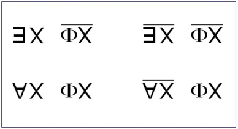
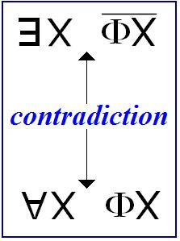
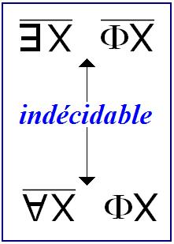
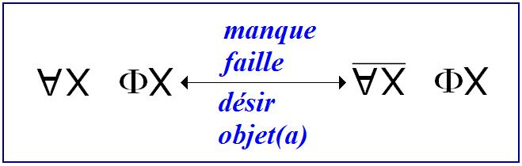
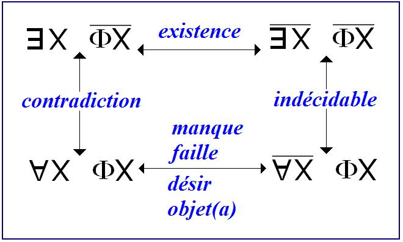
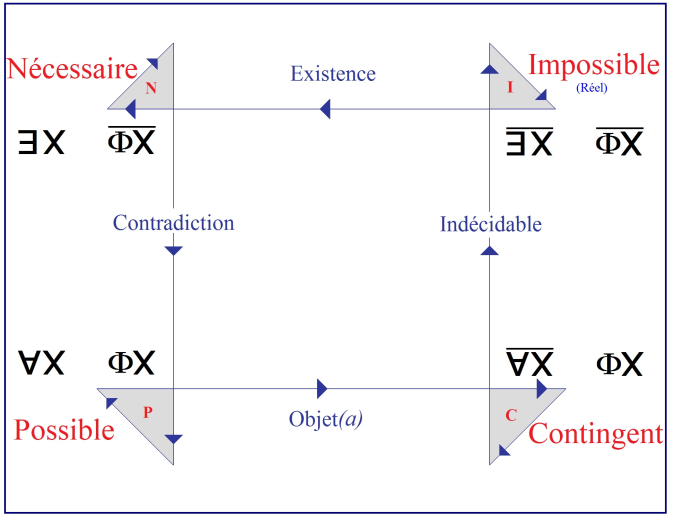

# Leçon 07 | 01 Juin 1972

  

    <label><input type="checkbox" data-lacan-toggle="original" checked> 原文</label>
    <label><input type="checkbox" data-lacan-toggle="notes" checked> 注释</label>
    <label><input type="checkbox" data-lacan-toggle="commentary" checked> 个人解读评论</label>
  

  <form class="lacan-tool-search" role="search">
    <input class="lacan-tool-search-input" type="search" placeholder="搜索全文" aria-label="搜索全文">
    <button class="lacan-tool-button" type="submit" title="搜索">搜索</button>
  </form>
  <button class="lacan-tool-button lacan-back-to-top" type="button" title="回到页面最上方" aria-label="回到页面最上方">↑</button>

<section class="parallel-paragraph" data-paragraph-ids="s19b-07-0001 s19b-07-0002 s19b-07-0003 s19b-07-0004 s19b-07-0005 s19b-07-0006 s19b-07-0007 s19b-07-0008">

s19b-07-0001, s19b-07-0002, s19b-07-0003, s19b-07-0004, s19b-07-0005, s19b-07-0006, s19b-07-0007, s19b-07-0008

原文 · s19b-07-0001, s19b-07-0002, s19b-07-0003, s19b-07-0004, s19b-07-0005, s19b-07-0006, s19b-07-0007, s19b-07-0008

Vous le savez, ici je dis ce que je pense.

C'est une position *féminine*, parce qu'en fin de compte, *penser* c'est très particulier.

Alors comme je vous écris de temps en temps, j'ai\...

> comme ça, pendant un petit voyage que je viens de faire \...inscrit *un certain nombre de propositions*, dont la 1^ère^ c'est qu'il faut reconnaître que le psychanalyste est mis, par *le discours*\...

> c'est un terme à moi \...par *le discours qui le conditionne*\...

> qu'on appelle, depuis moi, *le discours du psychanalyste* \...dans une position, disons difficile, Freud disait *impos­sible* : *unmöglich*, c'est peut-être un peu forcé, il parlait pour lui.

Bon ! D'autre part - 2^ème^ proposition : il sait \[*le psychanalyste*\]\...

> ceci d'expérience, ce qui veut dire que si peu qu'il ait pratiqué la psychanalyse,
>
> il en sait assez pour ce que je vais dire \...il sait dans tous les cas avoir une commune mesure avec ce que je dis.

你们知道，在这里我说的是我所想的。这是一种女性位置，因为说到底，思考是非常特别的事。

就像我时不时给你们写的那样，我……就这样，在我刚做的一趟短途旅行里
……记下了若干命题，其中第一条是：必须承认，精神分析家被——被话语……
这是我自己的说法……被制约着他的那种话语……也就是我们（从我这里起）所说的分析家的话语……置于一种位置，姑且说很难吧，弗洛伊德说的是不可能：unmöglich，也许有点说重了，他是就他自己而言的。

好！另一方面——第二条命题：他明白……这是从经验来的，也就是说，只要他多少做过一点精神分析，就足以懂得我接下来要说的东西……他无论如何都知晓，能与我所说的有一种共同的度量。

> 注：【unmöglich】：德语，因拉康对应弗洛伊德的原词（“不可能”）。

</section>

<section class="parallel-paragraph" data-paragraph-ids="s19b-07-0009 s19b-07-0010 s19b-07-0012 s19b-07-0013 s19b-07-0014 s19b-07-0015 s19b-07-0016">

s19b-07-0009, s19b-07-0010, s19b-07-0012, s19b-07-0013, s19b-07-0014, s19b-07-0015, s19b-07-0016

原文 · s19b-07-0009, s19b-07-0010, s19b-07-0012, s19b-07-0013, s19b-07-0014, s19b-07-0015, s19b-07-0016

C'est tout à fait indépendant du fait qu'il soit - de ce que je dis - informé, puisque ce que je dis aboutit\...

> comme je l'ai, il me semble, démontré cette année \...à situer *son savoir* \[S~2~\].

Ça, c'est l'histoire du *savoir* sur la *vérité* :

- ça, c'est la place de la *vérité* - pour ceux qui viennent pour la 1^ère^ fois.

- ça, celle du *semblant*,

- ça, celle de la *jouissance* \[*de parler*\],

- et ça, du *plus-de-jouir*, ce que j'écris en abrégé ainsi : « *+ de jouir* ». Pour la jouissance, nous mettrons un J.

这完全与他是否——就我所说的而言——被「告知」无关，因为我所说的……正如我今年似乎已经表明的那样……旨在标定他的知识［S₂］。

这就是关于真理的知识这回事：
——这是真理的位置——给第一次来的人说一下。
——这是假象（semblant）的位置，
——这是享乐［言说的享乐］的位置，
——这是剩余享乐（plus-de-jouir）的位置，我简写成：「+ de jouir」。享乐我们用 J 来表示。

</section>

<section class="parallel-paragraph" data-paragraph-ids="s19b-07-0011">

s19b-07-0011

原文 · s19b-07-0011

{width="1.1668547681539807in" height="0.7478040244969378in"} {width="1.5in" height="0.3388013998250219in"}

[无对应译文]

</section>

<section class="parallel-paragraph" data-paragraph-ids="s19b-07-0017 s19b-07-0018 s19b-07-0019 s19b-07-0020 s19b-07-0021 s19b-07-0022 s19b-07-0023 s19b-07-0024 s19b-07-0025 s19b-07-0026 s19b-07-0027 s19b-07-0028 s19b-07-0029 s19b-07-0030 s19b-07-0031">

s19b-07-0017, s19b-07-0018, s19b-07-0019, s19b-07-0020, s19b-07-0021, s19b-07-0022, s19b-07-0023, s19b-07-0024, s19b-07-0025, s19b-07-0026, s19b-07-0027, s19b-07-0028, s19b-07-0029, s19b-07-0030, s19b-07-0031

原文 · s19b-07-0017, s19b-07-0018, s19b-07-0019, s19b-07-0020, s19b-07-0021, s19b-07-0022, s19b-07-0023, s19b-07-0024, s19b-07-0025, s19b-07-0026, s19b-07-0027, s19b-07-0028, s19b-07-0029, s19b-07-0030, s19b-07-0031

C'est *son* *rapport au* *savoir* qui est difficile, non - bien sûr - à ce que je dis, puisque dans l'ensemble du *no man'land* psychanalytique on ne sait pas que je le dis.

Ça ne veut pas dire que de ce que je dis, on n'en sache rien, puisque ça sort de *l'expérience* \[*i.e. analytique*\].

Mais on a, de ce qu'on en sait, *horreur* !

Ce dont je peux dire, comme ça, vraiment simplement, que je les comprends\...

> « *je peux dire* », c'est à dire : « je peux dire, *si on y tient*\... » \...mais je les comprends : je me mets à leur place d'autant plus facilement que j'y suis.

Mais je le comprends d'autant plus facilement que comme tout le monde, j'entends ce que je dis.

Néanmoins ça ne m'arrive pas tous les jours, parce que ce n'est pas tous les jours que je parle.

En réalité je le comprends - c'est-à-dire que j'entends ce que je dis - les quelques jours, mettons un ou deux, qui précèdent immédiatement mon séminaire, parce qu'à ce moment-là je commence à vous écrire.

Les autres jours, la pensée de ceux à qui j'ai eu affaire, me submerge.

Il faut que je vous l'avoue, parce qu'à ce moment-là, l'impatience de ce que j'ai déjà appelé\...

> et donc que je peux encore appeler, parce que c'est rare, comme ça, que je revienne\... \...de ce que j'ai appelé « *mon échec* » dans *Scilicet*, me domine. Voilà\...

*Oui*\... *ils savent !*

Je rappelle ça parce que le titre de ce que j'ai à trai­ter ici c'est *Le savoir du psychanalyste*.

« *Du* » dans ce cas-là, ça évoque le « *le* », article défini en français, enfin c'est ce qu'on appelle « *défini »*.

Oui ! Pourquoi pas « *des psychanalystes* », après ce que je viens de vous dire ?

难的是他与知识的关系，而不是——当然——与我所言说的关系；因为在精神分析这片无人地带里，大家根本不知道我在说这些。这倒不意味着对我所说的东西一无所知，因为它本就来自［分析］经验。
但对所知的那一点，人们感到恐惧！对此我大可以就这么简单地说一句：我理解他们……「我大可以说」，意思是：「要是非要说的话，我可以说……」……但我确实理解他们……我设身处地站在他们的位置，何况我本来就在那个位置上。

但我之所以更容易理解这一点，是因为我和大家一样，听得见自己说的话。不过这种事并不是天天都有，因为我并不是天天都在言说。也就是说实际上，我是在听自己说过的什么——在那几天，比方说一两天，也就是紧挨着我办研讨班之前的那几天，才理解它的，因为那时我才开始给你们写。

其余那些日子，和我打过交道的那些人的思想会把我淹没。我得向你们承认这一点，因为那时，我曾称之为——而且还可以再这么叫，因为我很少这样旧话重提——我在《Scilicet》里所说的「我的失败」所带来的一种不耐烦，会占满我。就是这样……

对……他们是知道的！我提这个，是因为我在这里要处理的标题是《分析家的知识》。
这里的「du」，会让人想到法语里的定冠词「le」——总之就是我们说的那种「定指的」用法。
是啊！照我刚才跟你们说的，为什么不用「一些分析家们」（des psychanalystes）呢？那样会更贴合我今年的主题，也就是「y a d'l'un」——有那个“一”。「存在一些(Y en a des)」——自称分析家的那些人。

> 注：【y a d'l'un】：对应「il y a de l'un」。拉康今年主题围绕「有那个一」（l'un）。「有那个一」；
> 【Y en a des 】存在一些
> 这里拉康是在借用「du」与「des」、定指与不定、一与多在语言中的区分。
> des是不定冠词的复数形式

</section>

<section class="parallel-paragraph" data-paragraph-ids="s19b-07-0032 s19b-07-0033 s19b-07-0034 s19b-07-0035 s19b-07-0036 s19b-07-0037 s19b-07-0038 s19b-07-0039 s19b-07-0040 s19b-07-0041 s19b-07-0042">

s19b-07-0032, s19b-07-0033, s19b-07-0034, s19b-07-0035, s19b-07-0036, s19b-07-0037, s19b-07-0038, s19b-07-0039, s19b-07-0040, s19b-07-0041, s19b-07-0042

原文 · s19b-07-0032, s19b-07-0033, s19b-07-0034, s19b-07-0035, s19b-07-0036, s19b-07-0037, s19b-07-0038, s19b-07-0039, s19b-07-0040, s19b-07-0041, s19b-07-0042

Ça serait plus confor­me à mon thème de cette année, c'est-à-dire « *y* *a d'l'un* ».

« *Y en a des* » qui se disent tels.

Je suis d'autant moins à discuter leur dire qu'il y en a pas d'autres.

Je dis « *du* », pourquoi ?

C'est *parce que c'est à eux que je parle*, malgré la présence d'*un très grand nombre de personnes qui ne sont pas psychanalystes*, ici.

Le psychana­lyste donc sait ce que je dis.

Ils le savent - je vous l'ai dit - d'expérience, si peu qu'ils en aient, même si ça se réduit à la « *didactique* » qui est l'exigence minimale pour que « *psychana­lystes* » ils se disent.

Car même si ce que j'ai appelé « *La passe* » est manquée, eh bien, ça se réduira à ça : qu'ils auront eu une « *psychanalyse didactique* », mais en fin de compte, ça suffit pour qu'ils sachent ce que je dis.

*La passe*\...

c'est toujours dans *Scilicet* que tout ça traîne, c'est plutôt l'endroit indiqué \[*Scilicet : « à savoir »*\] \...quand je dis que « *la passe* » *est manquée*, ça ne veut pas dire qu'ils ne se sont pas offerts à l'expérience de *la passe*.

Comme je l'ai souvent marqué, cette expérience de *« la passe »* est simplement ce que je propose à ceux qui sont assez dévoués pour s'y exposer, à de seules fins d'informa­tion sur un point très délicat, et qui consiste à\... en somme ce qui s'affirme de la façon la plus sûre c'est que : c'est tout à fait *(a)normal - objet(a) normal -* que quel­qu'un qui fait une psychanalyse veuille être psychanalyste.

正因为没有别的人，我就更不会去质疑他们所说的。我为什么用「du」？因为我要对之说话的正是他们，尽管在座有很多人并不是精神分析家。所以，分析家是知道我所说的东西的。
我跟你们说过——他们是从经验里知道的，哪怕这经验再少，哪怕只限于那种他们得以自称「精神分析家」的最低要求也就是教学分析。

因为即便我所称的「通过」没有完成，到头来也只会落到这一点：他们总归做过一场「教学分析」；而说到底，这就足以让他们懂得我所说的。
通过……
这些事总归在《Scilicet》里拖着、写着，那里倒正是该在的地方［Scilicet：即「也就是说」］
……当我说「通过」没有完成时，并不是说他们没有投身于通过这一经验。

正如我常说的，这种「通过」的经验，不过是我向那些足够投入、愿意去经历它的人提议的东西，仅仅是为了在一个很棘手的问题上提供一点信息；
而这个问题说到底……总之，最可以确定的一点是：
这再(a)正常不过——对象 a 的那种正常——某人正在做精神分析而想成为精神分析家，

真要算一种偏离，才值得拿出来，交给我们能收集到的一切见证。正是为此，我才临时设立了这场收集的尝试，好弄明白：一个已经通过教学分析知道精神分析是怎么回事的人，为什么还会想当分析家。

> [这再(a)正常不过——对象 a 的那种正常]原句是：c’est tout à fait (a)normal - objet(a) normal.

</section>

<section class="parallel-paragraph" data-paragraph-ids="s19b-07-0043 s19b-07-0044 s19b-07-0045">

s19b-07-0043, s19b-07-0044, s19b-07-0045

原文 · s19b-07-0043, s19b-07-0044, s19b-07-0045

Il faut vraiment une sorte d'aberration qui vaut, qui valait la peine d'être offerte à tout ce qu'on pouvait recueillir de témoignage.

C'est bien en ça que j'ai institué provisoirement cet essai de recueil pour savoir pourquoi *quelqu'un qui sait ce que c'est que la psychanalyse* par sa didactique, *peut encore vouloir être analyste*.

Alors je n'en dirai pas plus sur ce qu'il en est de leur position, sim­plement parce que j'ai choisi cette année *Le savoir du psychanalyste* comme étant ce que je proposais pour mon retour à Sainte Anne.

所以关于他们位置的种种，我就不多说了，只因为今年我选的是《分析家的知识》，作为我回到圣安娜时要讲的东西。这完全不是为了照顾分析家们——他们用不着我来提醒，就已经对自己位置发晕了；但我也用不着再当面说一遍，给他们加码。

这件事本可以……也许改天我会做……本可以用一种带刺的方式来做，借助某种我只会在「历史」上加引号才肯用的参照……到时候你们自会看到，要是我还在的话……对那些一点就透的人，我会跟他们讲「诱惑」这个词。

</section>

<section class="parallel-paragraph" data-paragraph-ids="s19b-07-0046 s19b-07-0047 s19b-07-0048 s19b-07-0049 s19b-07-0050 s19b-07-0051 s19b-07-0052">

s19b-07-0046, s19b-07-0047, s19b-07-0048, s19b-07-0049, s19b-07-0050, s19b-07-0051, s19b-07-0052

原文 · s19b-07-0046, s19b-07-0047, s19b-07-0048, s19b-07-0049, s19b-07-0050, s19b-07-0051, s19b-07-0052

C'est pas pour ménager du tout les psychanalystes, ils n'ont pas besoin de moi pour avoir *le vertige de leur position*, mais je ne l'augmenterai pas à le leur dire.

Ce qui pourrait être fait\...

> et je le ferai peut-être à un autre moment \...ce qui pourrait être fait d'une manière piquante dans une certaine réfé­rence que je n'appellerai « *historique* » qu'entre guillemets\...

> enfin, vous verrez ça quand ça viendra\... si je subsiste \...pour ceux qui sont des fins finauds je leur parle­rai du mot « *tentation* ».

Là je ne parle que du *savoir,* et je remarque qu'il ne s'agit pas de la « *vérité sur le savoir* », mais du « *savoir* *sur la vérité* », et que ceci « *le savoir sur la vérité »*, ça s'articule de la pointe de ce que j'avance cette année sur le « *Y a d'l'Un !* », « *Y a d'l'Un !* » et rien de plus : c'est *un Un très particulier* celui qui sépare le **1** de **2**, *et que c'est un abîme*.

Je répète : *la vérité* - je l'ai déjà dit - *ça ne peut que se mi-dire*.

Quand *le temps de battement* sera passé, qui fera que je peux en respecter *l'alternance*, je parlerai de l'autre face : du « *mi-vrai* ».

这里我只谈知识，并且要说明：问题不是「关于知识的真理」，而是「关于真理的知识」；而这「关于真理的知识」，正是从我今年提出的「Y a d'l'un !」那一点上明确表达出来的——「有那个一」，仅此而已：那是一个很特别的一，它把一与二分开，而那是一道深渊。

我再重复一遍：真理——我说过了——只能被半说（se mi-dire）。等那一下拍子过去，我才能遵守它的交替，到时我会谈另一面：「半真」（mi-vrai）。永远要把好麦粒和「半真」分开！

大概刚才跟你们提过，我从意大利回来，在那儿无论哪边都对我很客气，连我的分析家同行也不例外。多亏其中一位，我又认识了第三位，他非常「跟得上」——当然是跟得上我这一页。[笑声]
他用戴德金（Dedekind）那一套在干活，而且完全是靠自己搞出来的。我不能说在他开始搞的时候我还没搞，但事实是我是后来才讲的，因为我是到现在才讲，而他早就就这个问题写了一本小书。
他领会到，数学要素总的来说是有价值的，可以用来让某种真正关乎我们分析家经验的东西浮现出来。

> 拉康这里在戏仿「把好麦粒与稗子分开」：le bon grain et l'ivraie → la mi-vraie］

</section>

<section class="parallel-paragraph" data-paragraph-ids="s19b-07-0053 s19b-07-0054 s19b-07-0055 s19b-07-0056 s19b-07-0057 s19b-07-0058 s19b-07-0059">

s19b-07-0053, s19b-07-0054, s19b-07-0055, s19b-07-0056, s19b-07-0057, s19b-07-0058, s19b-07-0059

原文 · s19b-07-0053, s19b-07-0054, s19b-07-0055, s19b-07-0056, s19b-07-0057, s19b-07-0058, s19b-07-0059

Il faut toujours séparer le *bon grain* et la « *­mi-vraie* » !

Comme je vous l'ai dit tout à l'heure peut-être, je reviens d'Italie où je n'ai jamais eu qu'à me louer de l'accueil, même de mes collègues psychana­lystes !

Grâce à l'un d'entre eux, j'en ai rencontré un 3^ème^ qui est tout à fait « à la page », enfin à la mienne, bien entendu. \[*Rires*\]

Il *opère* avec Dedekind, et il a trouvé ça tout à fait sans moi.

*Je peux pas dire*, à la date où il a commencé de s'y mettre, *que je n'y étais pas déjà*, mais enfin c'est un fait que j'en ai parlé plus tard que lui, puisque je n'en parle que maintenant, et que lui avait déjà écrit là-dessus tout un petit ouvrage.

Il s'est aperçu de la valeur en somme des éléments mathématiques, pour faire émerger quelque chose qui vraiment, notre expérience d'analyste, la concerne.

Eh ben, comme il est tout à fait *bien vu,* il a tout fait pour ça, il a réussi à se faire entendre dans des endroits *très bien placés* de ce qu'on appelle l'I.P.A. - *l'Institution Psychanalytique Avouée*, je traduirais - donc il a réussi à se faire entendre.

是啊，既然他那么吃得开，他可是为此用尽了力气，在所谓 I.P.A.——我把它译成「被承认的精神分析机构」——里那些位子很好的地方，总算让人听见了他的声音，所以他确实做到了让人听见。
但非常怪的是：他们就是不发表他！

他们不发表它，理由是：“您明白的，没人会懂！”
我得说我很意外，因为说到底，对加上引号的「拉康」——也就是对某种语言学的无能者们眼中我该代表的那一路东西，大家倒是急着往“国际期刊”里塞。

垃圾桶里的东西越多，自然越分不清。那又何必非要设障呢？在我看，这本身就是一道障碍；至于说读者会看不懂，那是次要的——国际期刊上的文章本来也不必篇篇让人懂。所以，这里头有不讨喜的东西。

回到时间。所以，分析家与他所知的之间有一种复杂的关系。他会否认它，会「压抑」它……用英文里翻译 refoulement、翻译 Verdrängung 的那个词来说……甚至有时根本不想知道。那又有什么不行？这能吓着谁？

> 但显然，就像我刚才——并没有点名的那位……你们根本不知道他的名字，他也还没能发表任何东西……是完全可以对得上号的，我不排除，等我今天说的东西慢慢传出去之后……尤其要是大家知道我没点他的名……他们会给他出。[笑声] 这事对他好像真的很重要，我很乐意帮这个忙。要是最后没出，我再跟你们多讲两句。

</section>

<section class="parallel-paragraph" data-paragraph-ids="s19b-07-0060 s19b-07-0061 s19b-07-0062 s19b-07-0063 s19b-07-0064 s19b-07-0065 s19b-07-0066 s19b-07-0067 s19b-07-0068 s19b-07-0069 s19b-07-0070 s19b-07-0071 s19b-07-0072 s19b-07-0073 s19b-07-0074 s19b-07-0075 s19b-07-0076 s19b-07-0077 s19b-07-0078 s19b-07-0079 s19b-07-0080 s19b-07-0081 s19b-07-0082 s19b-07-0083">

s19b-07-0060, s19b-07-0061, s19b-07-0062, s19b-07-0063, s19b-07-0064, s19b-07-0065, s19b-07-0066, s19b-07-0067, s19b-07-0068, s19b-07-0069, s19b-07-0070, s19b-07-0071, s19b-07-0072, s19b-07-0073, s19b-07-0074, s19b-07-0075, s19b-07-0076, s19b-07-0077, s19b-07-0078, s19b-07-0079, s19b-07-0080, s19b-07-0081, s19b-07-0082, s19b-07-0083

原文 · s19b-07-0060, s19b-07-0061, s19b-07-0062, s19b-07-0063, s19b-07-0064, s19b-07-0065, s19b-07-0066, s19b-07-0067, s19b-07-0068, s19b-07-0069, s19b-07-0070, s19b-07-0071, s19b-07-0072, s19b-07-0073, s19b-07-0074, s19b-07-0075, s19b-07-0076, s19b-07-0077, s19b-07-0078, s19b-07-0079, s19b-07-0080, s19b-07-0081, s19b-07-0082, s19b-07-0083

Mais ce qu'il y a de très curieux, c'est qu'on ne le publie pas !

On ne le publie pas en disant : « *Vous comprenez, personne ne comprendra* ! ».

Je dois dire que je suis surpris parce que, en somme, du « Lacan »\...

> entre guillemets bien sûr, enfin des choses de la veine que je suis censé représenter
>
> auprès des incompé­tents d'une certaine linguistique, \...on est plutôt pressé d'en bourrer l'*International journal*.

Plus il y a des trucs dans la poubelle, naturellement, moins ça se discerne !

Alors pourquoi diable, est-ce que dans ce cas on a cru devoir faire obstacle, puis­que pour moi, il me semble que c'est un obstacle, et que le fait qu'on dise que les lecteurs ne comprendront pas, c'est secondaire : il n'est pas nécessaire que tous les articles de l'*International journal* soient compris.

Il y a donc quelque chose qui là-dedans ne plaît pas.

Mais il est évident que, comme celui que je viens, non pas de nom­mer\...

> parce que vous ignorez profondément son nom, il n'a encore rien réussi à pu­blier \...est parfaitement repérable, je ne désespère pas que, à la suite de ce qui fil­trera de mes propos aujourd'hui\...

> et surtout si on sait que je ne l'ai pas nommé \...on le publiera \[*Rires*\].

Vraiment, ça a l'air de lui tenir assez à cœur pour que je l'aide à ça volontiers.

Si ça ne vient pas, je vous en parlerai un peu plus !

Revenons au temps.

Le psychanalyste a donc un rapport - *à ce qu'il sait* - complexe. Il le renie, il le « *réprime* »\...

> pour employer le terme dont en anglais se traduit le refoulement*, la Verdrängung* \...et même il lui arrive de *n'en rien vouloir savoir*.

Et pourquoi pas ?

Qui est-ce que ça pourrait épater ?

La psychanalyse - me direz-vous - alors quoi ?

J'entends d'ici le *bla-bla-bla* de quiconque n'a pas de la psychanalyse la moindre idée.

Je réponds à ce qui peut surgir de ce *floor*, comme on dit, je réponds : est-ce *le savoir* qui guérit\...

> que ce soit celui du sujet, ou celui \[*du sujet*\] *supposé dans le transfert* \...ou bien est-ce *le transfert,* tel qu'il se produit dans une analyse donnée ?

Pourquoi *le savoir*\...

> celui dont je dis qu'a dimension tout psychana­lyste \[*sujet supposé savoir*\] \...pourquoi *le savoir* serait-il, comme je disais tout à l'heure, « *avoué* » ?

C'est de cette question que Freud a pris en somme la *Verwerfung*, il l'appelle : « *un jugement qui dans le choix rejette* ».

你们会说——精神分析又怎样？我在这儿都听得见那些对精神分析毫无概念的人的 bla-bla-bla。我回应从这个 floor——大家这么叫——里可能冒出来的东西：是知识在治病吗……无论主体自己的知识，还是假定在转移里的那种……还是转移本身，在某一既定的分析里发生的那种转移？

为什么知识……我说过每个分析家都有其维度的那种知识……为什么知识就该像我刚才说的那样被「承认」？弗洛伊德正是从这个问题里取出 Verwerfung【拒斥】 的，他称之为：「在选择中予以拒绝的那种判断」。他还加了「予以谴责」，我把它压成一句。
不能因为 Verwerfung 在无意识里一旦发生就会让主体发疯，就说它不……以弗洛伊德借来的那个同名之物……不会以一种在理性上被正当化的权力的方式在世上统治。

「分析家们」（des psychanalystes）……你们马上会看到，（des）和「le」的区别 ……「分析家们」是自我偏好的，偏好自己，明白吧！不是只有他们，这上头有传统：医学传统。论自我偏好，除了圣人——圣-人（s.a.i.n.t.s）……对，别人被讲得太多［笑声］所以我得说清楚，因为别人……算了不说了……圣人（s.a.i.n.t.s）也一样自我偏好，他们满脑子就这个，为找到最好的自我偏好方式把自己烧干，其实简单的办法多的是，就像「医-圣」（méde-saints）们展示的那样［笑声］。反正那些人可不是圣人。这是不言而喻的……

这并不妨碍医生们想办法……而且是因为他们与科学话语共用的平台越来越窄……把精神分析纳入他们的步调这样的理由。
这事他们很在行！也正是如此，分析家对自己的位置非常为难……我从这一点出发来说的……非常为难，也就越发愿意接受经验（指医学一方）给的建议。

> 考虑到des与le的区别 des psychanalystes毫无疑问是在骂人了。

> 很少有什么东西翻起来像医学史一样卑劣：可以当催吐剂［笑声］也可以当泻药，两样都行。要想知道知识与真理毫不相干，再没有比这更说服人的了。甚至不能说这到头来把医生变成某种挑衅者。

> 吐真剂与泻药倒是挺像的

</section>

<section class="parallel-paragraph" data-paragraph-ids="s19b-07-0084 s19b-07-0085 s19b-07-0086 s19b-07-0087">

s19b-07-0084, s19b-07-0085, s19b-07-0086, s19b-07-0087

原文 · s19b-07-0084, s19b-07-0085, s19b-07-0086, s19b-07-0087

Il ajoute : « *qui condamne* », mais je le condense\...

Ce n'est pas parce que la *Verwerfung* rend fou un sujet, quand elle se produit dans l'incons­cient, qu'elle ne règne pas\...

> la même, et du même nom d'où Freud l'emprunte \...qu'elle ne règne pas sur le monde comme un pouvoir rationnellement justifié.

« *Des psychanalystes* » \...

我很想标出这段与我个人经历有关的历史节点……就其仍有重要性而言……完全是一个关键点：多亏了这场合谋——弗洛伊德那篇专门讨论世俗分析（Laienanalyse）的文章就是讨论它的，就是这种合谋——多亏了这场在战后不久就得以形成的合谋，我在开局之前就已经输掉了这一局。

</section>

<section class="parallel-paragraph" data-paragraph-ids="s19b-07-0088 s19b-07-0089 s19b-07-0090 s19b-07-0091 s19b-07-0092 s19b-07-0093 s19b-07-0094 s19b-07-0095 s19b-07-0096 s19b-07-0097 s19b-07-0098 s19b-07-0099 s19b-07-0100 s19b-07-0101 s19b-07-0102 s19b-07-0103">

s19b-07-0088, s19b-07-0089, s19b-07-0090, s19b-07-0091, s19b-07-0092, s19b-07-0093, s19b-07-0094, s19b-07-0095, s19b-07-0096, s19b-07-0097, s19b-07-0098, s19b-07-0099, s19b-07-0100, s19b-07-0101, s19b-07-0102, s19b-07-0103

原文 · s19b-07-0088, s19b-07-0089, s19b-07-0090, s19b-07-0091, s19b-07-0092, s19b-07-0093, s19b-07-0094, s19b-07-0095, s19b-07-0096, s19b-07-0097, s19b-07-0098, s19b-07-0099, s19b-07-0100, s19b-07-0101, s19b-07-0102, s19b-07-0103

> vous allez le voir, à la différence avec « *le* » \... « *des psychanalystes* » ça se préfère, ça se préfère « *soi* », voyez-vous !

C'est pas les seuls, il y a une tradition là-dessus : la tradition médicale.

Pour *se préférer*, on n'a jamais fait mieux, sauf les saints - les saints (*s.a.i.n.t.s*)\...

> Oui, on vous parle tel­lement des autres \[Rires\] que je précise, parce que les autres\... enfin, passons \...les saints (*s.a.i.n.t.s*) ils se préfèrent eux-aussi, ils ne pensent même qu'à ça, ils se consument de trouver la meilleure façon de se préférer, alors qu'il y en a de si simples, comme le montrent les « *méde-saints* », eux aussi \[*Rires*\].

Enfin, ceux-là ne sont pas des saints. Ça, ça va de soi\...

> Il y a peu de choses aussi abjectes à feuilleter, que l'histoire de la médecine :
>
> ça peut-être conseillé comme vomitif \[*Rires*\] ou comme purgatif, ça fait les deux.
>
> Pour savoir que *le savoir* n'a rien à faire avec *la vérité*, il n'y a vraiment rien de plus convain­cant.
>
> On peut même pas dire que ça va jusqu'à faire du médecin une sorte de pro­vocateur.
>
> Ça n'empêche pas que les médecins se soient arrangés\...
>
> et pour des raisons qui tenaient à ce que leur plate-forme avec *le discours de la science* devenait plus exiguë
>
> \...que les médecins se soient arrangés à mettre la psychanalyse à leur pas.
>
> Et ça, ils s'y connaissaient !
>
> Ceci naturellement d'autant plus que le psychanalyste étant fort embarrassé\...
>
> comme je suis parti là-dessus
>
> \...fort embarrassé de *sa position*, il était d'autant plus disposé à recevoir les conseils de l'expérience.

Je tiens beaucoup à marquer ce point d'histoire qui est dans mon affaire\...

> pour autant qu'elle ait de l'importance\... \...tout à fait un point-clé : grâce à cette conjuration\...

> contre laquelle est dirigé un article *exprès* de Freud sur la *Laïernanalyse* [^14] \...grâce à cette conjuration qui a pu se produire peu après la guerre, j'avais déjà perdu la partie avant de l'avoir engagée.

Simplement je voudrais qu'on me croie là-dessus, parce que - pour­quoi, je le dirai ? - si ce soir je témoigne\...

> et je ne le fais pas par hasard à Sainte Anne puisque je vous dis que c'est là que je dis ce que je pense \...si je déclare que *c'est très précisément à ce titre* *de savoir très bien l'avoir* - à l'époque - *perdue*, que cette partie je l'ai engagée.

Ça n'a rien d'héroïque vous savez !

Il y a un tas de parties qui s'enga­gent dans ces conditions.

C'est même un des fondements de la « *condition humaine* », comme dit l'autre \[Malraux\...\], et ça réussit pas plus mal que n'importe quelle autre entre­prise. La preuve, hein !

Le seul ennui - mais il n'est que pour moi - c'est que ça ne vous laisse pas très libre, je dis ça en passant pour la personne qui m'a\...

> il y a je ne sais pas quoi, le 2^ème^ séminaire avant \...qui m'a interrogé sur le fait si je croyais ou non à la liberté.

我只是希望在这点上大家能相信我，因为——我为什么要说呢？——如果今晚我在这里作证……而且我并非偶然地在圣安娜医院这么做，因为我跟你们说过，我就是在那儿说我心里想说的话……如果我说，我恰恰是以这样一种名义开局：当时就非常清楚，这一局我已经输了。

这根本谈不上英雄气概，你们知道！有无数局都是在这样的条件下开局的。这甚至是「人的境遇」——如那位所说——的根基之一，而且结果也不见得比别的事业更糟。证据就在眼前，是吧！

唯一的麻烦——但那只是对我而言——是：这并不会给你们留下多少自由，
我顺便提一句，是说给那位曾经对我……
有个我也说不清是什么时候，大概在前第二次研讨班之前
……那位曾经就“我是否相信自由”这件事来问过我的人听的。

唯一叫人烦心的地方是这样一来你就不大自由了，不过这只是对我而言；顺带说一句，是说给那位……不知是第几次了，再上一次研讨班……问我相不相信自由的那个人听的。

</section>

<section class="parallel-paragraph" data-paragraph-ids="s19b-07-0104 s19b-07-0105 s19b-07-0106 s19b-07-0107 s19b-07-0108">

s19b-07-0104, s19b-07-0105, s19b-07-0106, s19b-07-0107, s19b-07-0108

原文 · s19b-07-0104, s19b-07-0105, s19b-07-0106, s19b-07-0107, s19b-07-0108

Une autre déclaration que je veux faire\...

> et qui a bien son importance, puisque après tout, je ne sais pas, c'est mon penchant ce soir\... \...*une autre déclaration*\...

> qui celle-là alors est tout à fait prouvée, là je vous demande de me croire, que je m'étais très bien aperçu que la partie était perdue\...

> après tout je n'étais pas si malin, j'ai peut-être cru qu'il fallait foncer
>
> et que je foutrais en l'air l'*Internationale Psychanalytique Avouée* \...et là personne ne peut dire le contraire de ce que je vais dire : *c'est que je n'ai jamais lâché aucune des personnes que je savais devoir me quitter, avant qu'elles s'en aillent elles-mêmes*.

Et c'est vrai aussi du moment où la partie était en somme - pour la France - perdue, qui est celle à laquelle j'ai fait allusion tout à l'heure : ce petit *brouhaha* dans une conjuration médecins-­psychanalystes d'où est sorti en 53 le début de mon enseignement.

我还要作另一番声明……而且这确实重要，毕竟，我也不知道，今晚我就是想讲这个……
另一点声明，这一条可是有凭有据的，这里我请你们相信我：我当时很清楚这一局已经输了……说到底我也没那么精明，我或许以为就该往前冲，以为我会把那个“被承认的精神分析国际”（Internationale Psychanalytique Avouée）搅个底朝天……
而在下面这件事上谁也没法反驳我：凡是我知道迟早会离开我的人，我从来没有先甩开（lâcher）他们中的任何一个，都是等他们自己离开。

而这同样也适用于这样一个时刻：当那一局——总之，就法国而言——已经输了，也就是我刚才提到的那一局：在一场医生—精神分析家合谋里的那点小小喧闹（petit brouhaha），
正是从那里，在53年，我的教学之开端被带了出来。

> 注：【甩开】 lâcher：放弃，甩开。
>
> 详情可见《精神分析中言语与语言的功能及领域——罗马大会报告》

> 详情可见《精神分析中言语与语言的功能及领域——罗马大会报告》

</section>

<section class="parallel-paragraph" data-paragraph-ids="s19b-07-0109 s19b-07-0110">

s19b-07-0109, s19b-07-0110

原文 · s19b-07-0109, s19b-07-0110

Les jours où l'idée de devoir poursuivre le dit enseignement ne m'habite pas\...

> c'est-à- dire un certain nombre \...il est évident que j'ai, comme tous les imbéciles, l'idée de ce que ça aurait pu être pour « *la Psychanalyse Française » ( ! )* si j'avais pu enseigner là où, pour la raison que je viens de dire, je n'étais nullement disposé à lâcher quiconque.

但凡不必被「得把上述讲授继续下去」这个念头缠住的日子——这样的日子还真不少——我显然也会像所有傻瓜一样，忍不住想：要是当初我能在那个地方做这个讲授，对法国精神分析（!）本来可以是什么样的呢；而恰恰出于我刚才说的那个理由，我是绝不会先甩开任何人的。

</section>

<section class="parallel-paragraph" data-paragraph-ids="s19b-07-0111 s19b-07-0112 s19b-07-0113 s19b-07-0114 s19b-07-0115 s19b-07-0116 s19b-07-0117 s19b-07-0118 s19b-07-0119 s19b-07-0120 s19b-07-0121 s19b-07-0122 s19b-07-0123 s19b-07-0124">

s19b-07-0111, s19b-07-0112, s19b-07-0113, s19b-07-0114, s19b-07-0115, s19b-07-0116, s19b-07-0117, s19b-07-0118, s19b-07-0119, s19b-07-0120, s19b-07-0121, s19b-07-0122, s19b-07-0123, s19b-07-0124

原文 · s19b-07-0111, s19b-07-0112, s19b-07-0113, s19b-07-0114, s19b-07-0115, s19b-07-0116, s19b-07-0117, s19b-07-0118, s19b-07-0119, s19b-07-0120, s19b-07-0121, s19b-07-0122, s19b-07-0123, s19b-07-0124

Je veux dire que *si scandaleuses que fussent mes propositions sur* « *Fonction et Champ*\... *et patati et patata*\... *de la parole et du langage »*, j'étais disposé à couvrir le sillon pendant des années pour les gens même les plus durs de la feuil­le, et au point où nous en sommes, personne n'y aurait perdu parmi les psychana­lystes.

Je vous ai dit que j'avais fait un petit tour en Italie.

Dans ces cas-là, je vais aussi - pourquoi pas ? - parce que il y a beaucoup de gens qui m'aiment\...

> À propos : il y a quelqu'un qui m'a envoyé un verre à dents !
>
> Je voudrais savoir qui c'est, pour la remercier cette personne.
>
> Il y a une personne qui m'a envoyé « *un verre à dents »* !
>
> Je dis ça pour ceux qui étaient là au Panthéon la dernière fois.
>
> C'est une personne que je remercie d'autant que ce n'est pas un verre à dents.
>
> C'est un merveilleux petit verre rouge, long et galbé, dans lequel je mettrai une rose,
>
> qui que ce soit qui me l'ait envoyé. Mais je n'en ai reçu qu'un, ça je dois le dire. Enfin pas­sons\... \...il y a des personnes qui m'aiment un peu dans tous les coins, mêmes dans les couloirs du Vatican.

Pourquoi pas, hein ? Il y a des gens très bien.

Il n'y a que là\...

ceci pour la personne qui m'interroge sur la liberté \...il n'y a qu'au Vatican que je connaisse des libres-penseurs.

Moi je suis pas un libre-penseur, je suis forcé de tenir à ce que je dis, mais là-bas : quelle aisance ! \[*Rires*\]

Ah on comprend que la Révolution Française ait été véhiculée par les abbés.

Si vous saviez quelle est leur liberté, mes bons amis, vous auriez froid dans le dos.

Moi j'essaie de les ramener au dur, il n'y a rien à faire, ils débordent : la psychanalyse, pour eux, est dépassée !

Vous voyez à quoi ça sert la *libre-pensée *: ils voient clair\...

C'était pourtant un bon métier, *hein* \[*Rires*\] ?

Ça avait des bons côtés.

我是说，无论我在《言语与语言（parole et langage）的功能与场域》里提出的主张多么招致非议……我当时都愿意长年把这条沟犁到底，哪怕对最不肯买账的人也一样；而——就我们眼下所在之处而言——精神分析家当中谁也不会因此吃亏。

我跟你们说过，我去意大利转了一小圈。在这种时候，我也会去——为什么不呢？——因为有很多人喜欢我……
顺便说一句：有人给我寄来了一只牙刷杯！我想知道是谁寄的，好向这位致谢。有个人给我寄来了一只牙刷杯！我这么说，是对那些上次在先贤祠（Panthéon）在场的人说的。这位我更要感谢，因为那并非一只牙刷杯。那是一只极妙的小红杯，细长而有曲线，我会在里面插上一枝玫瑰，不管究竟是谁寄给我的。不过我只收到了一只，这点我得说。好了，先说到这儿…………有些人在各个角落都对我有点喜欢，甚至在梵蒂冈的走廊里也是。为什么不呢，是吧？有些人确实很不错。

只有在那儿……这话是回给那位问我相不相信自由的人……只有在梵蒂冈，我认识的才是自由思想者（libres-penseurs）。我不是自由思想者，我只能守住自己说的话，被迫要把自己说的话当真、要执着于我所说的；可那边呢：多自在！［笑］哈，难怪法国大革命是由那些教士（abbés）一路传下来的。你们要是知道他们那种自由有多厉害，我的好朋友们，背脊都会发凉。我试着把他们拉回硬东西上来，没辙，他们满得溢出来：精神分析在他们眼里已经过时了！你们看自由思想派什么用场：他们看得透……

我这么说，仍然是为了提醒那些……那些“圈内人”，尤其是那些追随我的人……在把自己的后代也拉进来之前，得再三掂量，因为很可能照事情发展的势头，可能会突然一下子，干脆地，啪地就垮下去。总之，这只针对那些必须让自己的后代投身其中的人听的，我劝他们谨慎。

> 看上去拉康这个牙刷杯这里好像卡了一下。

> 这毕竟曾是一门好行当，是吧？[笑声] 它也有好的一面。当他们说这已经过时，他们知道自己在说什么；他们的意思是：“这完了，因为毕竟我们必须做得稍微更好一点！”

> 毫无疑问这是他的阴阳怪气了。
> ——你们看，罗马的那些人说精神分析已经过时了，这些追随我的人可要小心了，家里孩子填志愿也一定要三思，最要也不要让自己家闺女嫁给干精神分析的。毕竟这个行当可能说垮就垮了呀！

</section>

<section class="parallel-paragraph" data-paragraph-ids="s19b-07-0125 s19b-07-0126 s19b-07-0127 s19b-07-0128 s19b-07-0129 s19b-07-0130 s19b-07-0131 s19b-07-0132 s19b-07-0133 s19b-07-0134 s19b-07-0135 s19b-07-0136">

s19b-07-0125, s19b-07-0126, s19b-07-0127, s19b-07-0128, s19b-07-0129, s19b-07-0130, s19b-07-0131, s19b-07-0132, s19b-07-0133, s19b-07-0134, s19b-07-0135, s19b-07-0136

原文 · s19b-07-0125, s19b-07-0126, s19b-07-0127, s19b-07-0128, s19b-07-0129, s19b-07-0130, s19b-07-0131, s19b-07-0132, s19b-07-0133, s19b-07-0134, s19b-07-0135, s19b-07-0136

Quand ils disent *que c'est dépassé, ils savent ce qu'ils disent,* *ils disent* : « *c'est foutu, parce que quand même on doit faire un peu mieux !* ».

Je dis ça quand même pour avertir les personnes\...

> les personnes qui sont « *dans le coup »*, et particulièrement bien sûr, celles qui me suivent \...qu'il faut *y regarder à deux fois avant d'y engager ses descendants*, parce que c'est très possible qu'au train où vont les choses, ça tombe tout d'un coup sec, comme ça.

Enfin c'est uniquement pour ceux qui ont à y en­gager leur descendance, je leur conseille la prudence.

J'ai déjà parlé, comme ça, de ce qui se passe dans la psychanalyse\...

> il faut quand même bien spécifier certains points que j'ai déjà abordés,
>
> par conséquent que je crois pouvoir traiter brièvement au point où nous en sommes \...c'est que *c'est le seul* *discours*\...

> et rendons-lui hommage \...*c'est le seul* *discours*\...

> au sens où j'ai catalogué 4 *discours,* \...*c'est le seul discours qui soit tel que la canaillerie y aboutisse nécessairement à la bêtise*.

Si on savait tout de suite que quelqu'un qui vient vous demander une psychanalyse didactique est *une canaille*, mais on lui dirait : « *pas de psychanalyse pour vous, mon cher ! Vous en deviendrez bête comme chou* ». Mais on ne le sait pas !

C'est justement soigneusement dissimulé.

On le sait quand même au bout d'un certain temps dans la psychanalyse, la canaillerie étant toujours, non pas héréditaire, c'est pas d'hérédité qu'il s'agit, c'est du *désir*, *désir de l'Autre* d'où l'intéressé a surgi.

Je parle du *désir* : c'est pas toujours le *désir* de ses parents, ça peut être celui de ses grands-parents, mais *si le désir dont il est né est le désir d'une canaille, il est une canaille immanquablement*.

我已经这样谈过精神分析里正在发生的事……但总归还是得把我已经触及过的一些点明确说明，因此，就我们目前所处的地步而言，我认为我可以简短处理它们：
……那就是：这是唯一一种话语……也请让我们向它致意
就我所编目出来的四种话语的意义而言，这是唯一一种话语。在其中，卑劣之举（canaillerie）必然会走向愚蠢（bêtise）。
*如果我们能立刻知道*：某个来找你请求一场教学分析（psychanalyse didactique）的人是个无赖（canaille），那倒好办了。那样我们就会对他说：“您就别干精神分析了，亲爱的！一干你就蠢得跟棵白菜似的。”——*可我们并不知道啊！*

这恰恰是被小心翼翼地遮掩着的。不过在精神分析里，经过一段时间，我们终归还是会知道：无赖行径（canaillerie）并非遗传性的，这里谈的不是遗传，谈的是欲望。是*大他者（l’Autre）*的欲望；正是从那欲望里，当事者被带出来、涌现出来。
我说的是欲望：这并不总是他父母的欲望，它也可能是他祖父母的欲望；可要是他从中诞生的那个欲望是一个无赖的欲望，那他铁定是个无赖。

我从没见过例外，也正因如此，对那些我早知道会离开我的人，我一向格外温和——至少在我亲自做过他们分析的那几例里是这样——因为我心里清楚，他们已经变得要多「蠢」有多「蠢」了。我不能说我是故意的：就像我跟你们说过的，这是必然的。当一场精神分析被推到底的时候，必然如此，而把分析推到底，对教学分析（psychanalyse didactique）来说不过是起码该做的事。

> 这里他甚至还点了一下关于“自由”的问题。

</section>

<section class="parallel-paragraph" data-paragraph-ids="s19b-07-0137 s19b-07-0138 s19b-07-0139 s19b-07-0140 s19b-07-0141 s19b-07-0142 s19b-07-0143 s19b-07-0144 s19b-07-0145 s19b-07-0146 s19b-07-0147 s19b-07-0148 s19b-07-0149 s19b-07-0150">

s19b-07-0137, s19b-07-0138, s19b-07-0139, s19b-07-0140, s19b-07-0141, s19b-07-0142, s19b-07-0143, s19b-07-0144, s19b-07-0145, s19b-07-0146, s19b-07-0147, s19b-07-0148, s19b-07-0149, s19b-07-0150

原文 · s19b-07-0137, s19b-07-0138, s19b-07-0139, s19b-07-0140, s19b-07-0141, s19b-07-0142, s19b-07-0143, s19b-07-0144, s19b-07-0145, s19b-07-0146, s19b-07-0147, s19b-07-0148, s19b-07-0149, s19b-07-0150

Je n'ai jamais vu d'exception, et c'est même pour ça *que j'ai toujours été si tendre* pour les personnes dont je savais qu'elles devaient me quitter, au moins pour les cas où c'était moi qui les avais psychanalysées, parce que je savais bien qu'elles étaient devenues tout à fait *« bêêêtes »*.

Je peux pas dire que je l'avais fait exprès : comme je vous l'ai dit, c'est nécessaire.

C'est nécessaire quand une psychanalyse est poussée jusqu'au bout, ce qui est la moindre des choses pour la psychanalyse didactique.

Si la psychanalyse n'est pas didactique, alors c'est une question de tact : vous devez laisser au type assez de canaillerie pour qu'il se démerde désormais convenablement.

C'est proprement thérapeutique, vous devez le laisser surnager.

Mais pour la psychanalyse *didactique*, vous pouvez pas faire ça, parce que Dieu sait ce que ça donnerait.

Supposez un psychanalyste qui reste une canaille : ça hante la pensée de tout le monde !

Soyez tranquille, la psychanalyse, contrairement à ce qu'on croit, est toujours vraiment *didactique*, même quand c'est quelqu'un de *bête* qui la pratique, et je dirai même : d'autant plus !

Enfin tout ce qu'on risque c'est d'avoir *des psycha­nalystes bêtes*.

Mais c'est, comme je viens de vous le dire, en fin de compte sans inconvénient, parce que quand même, *l'objet(a)* à la place du *semblant*, c'est une position qui peut se tenir.

Voilà ! On peut être *bête* d'origine aussi. C'est très im­portant à distinguer.

Bon ! Alors je n'ai rien trouvé de mieux, quant à moi, je n'ai rien trouvé de mieux que ce que j'appelle *le mathème* pour approcher quelque chose concernant *le savoir sur la vérité*, puisque c'est là en somme, qu'on a réussi à lui donner une portée fonctionnelle.

C'est beaucoup mieux quand c'est Pierce qui s'en occupe, il met les fonctions 0 et 1 qui sont les deux *valeurs de vérité*.

Il ne s'imagine pas, par contre, qu'on peut écrire V ou F pour désigner *la vérité* et *le faux*.

如果精神分析不是教学性的，那就是一个分寸（tact）的问题：你得给这人留下足够的无赖劲儿，好让他往后能体面的把生活凑合应付过去。这才是正儿八经的治疗：你得让他浮在水面上。
但对于教学分析来说，你不能这么干，否则天知道会搞成什么样。
设想一个精神分析家到头来还是个无赖：这念头谁想起来都发怵！放心吧，精神分析——与通常的看法相反——始终确实具有教学性；我甚至要说：越是是由一个蠢人来实践，恰恰更是如此。

说到底，顶多也就是落得一帮蠢精神分析家。不过就像我刚跟你们说的，归根结底没什么不妥，因为对象 a（objet a）占住假象（semblant）的位置，这个位置是站得住的。就这样！人也可以天生就蠢。这一点非常要紧，要分清楚。

好了！反正就我而言，我没找到比我所称的「数学式」（mathème）更好的办法，用来逼近与真理（vérité）相关的知识（savoir）——因为说到底，正是在那里，我们才得以赋予它一种功能性的效力。

换成皮尔士（Peirce）来搞就好多了：他用 0 和 1 这两个真值（valeurs de vérité）当函数。他倒没想到人可以写 V 或 F 来表示真（vérité）与假（faux）。这一点我早就点过，三言两语，在先贤祠就点过——就是说，围绕「有其一」（Y'a d'l'un）有两步：

> 总算要言归正传了吗

</section>

<section class="parallel-paragraph" data-paragraph-ids="s19b-07-0151 s19b-07-0152 s19b-07-0153 s19b-07-0154 s19b-07-0155">

s19b-07-0151, s19b-07-0152, s19b-07-0153, s19b-07-0154, s19b-07-0155

原文 · s19b-07-0151, s19b-07-0152, s19b-07-0153, s19b-07-0154, s19b-07-0155

J'ai déjà indiqué ça,comme ça en quelques phrases, j'ai déjà indiqué ça au Panthéon, c'est à savoir qu'autour du « *Y'a d'l'Un »*, il y a deux étapes :

- ­le « *Parménide »,*

- et puis ensuite il a fallu arriver à la *théorie des ensembles*, pour que la question d'un tel *savoir*,

> qui prend *la vérité* comme simple fonction et qui est loin de s'en contenter :
>
> qui comporte un *réel* qui avec *la vérité* n'a rien à faire : ce sont les mathématiques.

Néanmoins pendant des siècles il faut croire que la mathématique se passait là-dessus de toute question, puisque c'est sur le tard et par l'intermé­diaire d'une interrogation *logique*, qu'elle a fait faire un pas à cette question qui est centrale pour ce qui est de *la vérité*, à savoir : *comment et pourquoi « Y a d'l'Un »*\...

* 一是《巴门尼德》（Parménide），
* 再后来还得走到集合论（théorie des ensembles）
  ……这样才使得这样一种知识的问题得以成形：它把真理当作单纯的函数，却远不止满足于此；它牵涉一个与真理毫不相干的实在（réel），那就是数学——可几个世纪以来，

似乎数学一直把自己安置在对任何问题都不过问的位置上；直到很晚，借助一种逻辑式的追问，它才让这个问题向前迈了一步——而这个问题，就真理而言居于中心：
如何以及为何“*有其一*”（Y’a d’l’un）——请原谅，我并非唯一这么说的人！——“Y’a d’l’un”：围绕着这个“一”，存在的问题在转动。

</section>

<section class="parallel-paragraph" data-paragraph-ids="s19b-07-0156 s19b-07-0157 s19b-07-0158 s19b-07-0159 s19b-07-0160 s19b-07-0161 s19b-07-0162 s19b-07-0163 s19b-07-0164 s19b-07-0165 s19b-07-0166 s19b-07-0167 s19b-07-0168 s19b-07-0169 s19b-07-0170">

s19b-07-0156, s19b-07-0157, s19b-07-0158, s19b-07-0159, s19b-07-0160, s19b-07-0161, s19b-07-0162, s19b-07-0163, s19b-07-0164, s19b-07-0165, s19b-07-0166, s19b-07-0167, s19b-07-0168, s19b-07-0169, s19b-07-0170

原文 · s19b-07-0156, s19b-07-0157, s19b-07-0158, s19b-07-0159, s19b-07-0160, s19b-07-0161, s19b-07-0162, s19b-07-0163, s19b-07-0164, s19b-07-0165, s19b-07-0166, s19b-07-0167, s19b-07-0168, s19b-07-0169, s19b-07-0170

> vous m'excuserez, je suis pas le seul !

\...« *Y a d'l'Un* » : autour de cet *Un* tourne la question de *l'existence*.

J'ai déjà fait là-dessus des remarques, à savoir

- que l'*existence* n'a jamais été abordée comme telle avant un certain âge,

- et qu'on a mis beaucoup de temps à l'extraire de l'*essence*.

J'ai parlé du fait qu'il n'y ait pas en grec, très proprement quelque chose de courant qui veuille dire « *exister* », non pas que j'ignorasse ἐξίστημι \[existémi\], ἐξίσταμαι \[existamai\][^15], mais plutôt que je constatasse qu'aucun philosophe ne s'en était jamais servi.

Pourtant c'est là que commence quelque chose qui puisse nous intéresser : il s'agit de savoir *ce qui existe*.

Il n'existe que de l'*Un*\...

> avec ce qui se presse autour de nous, je suis forcé aussi également de me presser \...*la théorie des ensembles*, c'est l'interrogation : pourquoi «*Y a d'l'Un* » ?

L'*Un* ça ne court pas les rues, quoi que vous en pensiez, y compris cette certitude tout à fait illusoire\...

> et illusoire depuis très longtemps, ça n'empêche pas qu'on y tienne \...que vous en êtes *Un*, vous aussi.

Vous en êtes *Un*, il suffit que vous essayiez même de lever le petit doigt pour vous apercevoir que non seu­lement vous n'êtes pas *Un*, mais que vous êtes, hélas, innombrables, *innombrables* chacun pour vous.

*« Innombrables »\...* jusqu'à ce qu'on vous ait appris\...

> ce qui peut être un des bons résultats de l'affluent psychanalytique \...que vous êtes selon les cas : tout à fait *finis*

> ça, je vous le dis très vite parce que je ne sais pas combien de temps je vais pouvoir continuer \...tout à fait *finis *:

我在这一点上已经做过一些说明，即：
——存在（existence）在很长一段时间里从未被当作存在本身来对待；——以及，人们花了很多时间才把它从本质（essence）里剥离出来。我说过，希腊语里严格讲并没有一个常用词表示「存在／实存」（exister），倒不是说我不知道 ἐξίστημι（出离、站立在外   existémi）、ἐξίσταμαι（出离自身  existamai），而是我注意到没有一个哲学家曾用它们来表示「存在」。

然而恰恰是在这里，才开始了某种与我们有关的东西：要弄清什么存在。存在的唯有一（Un）……身边一切都在挤过来，我也只好跟着挤……集合论（théorie des ensembles）追问的就是：为何「有其一」（Y a d'l'un）？

一（l'Un）可不是满大街都是的，随你怎么想——包括那种十足虚幻的、而且早就虚幻的确信：你也是一，你也是一。你以为自己是其一、是一；只要试着抬一抬小指头，你就会发现：你非但不是一，而且，唉，你是不可数的——你们各自对于自己来说都是不可数的。

你们一直是不可数的（innombrables），直到有人教给你们——这没准是精神分析这一脉（affluent psychanalytique）带来的好结果之一——视情况而定，你们其实是完全是有限的：这话我跟你们说得很快，因为我不知道还能讲多久……完全是有限的：
——男人这边，没得说：有限（finis），有限，有限！——女人这边：可数无限的（dénombrables）！

> 注：【ἐξίστημι】：我不同于……，我偏离于…… 这里指向“出离/偏离”的语义。
> 拉康在这里提到“存在本身被对象化讨论”的历史困难。这一块还是得先看看《巴门尼德篇》。

> 这么说起来，“你就是我的唯一”。 这充满的爱欲告白是关于这个“一”的，或者说借助于这个符号层面“大写的一”这一意向。
>
> 而且说来挺好笑的，唯一这种话一说出来立刻会走到其另外一面。
>
> * “我是不是唯一”。
> * “还会不会有另外几个唯一呢”

> 拉康说“每个人对自己而言都不可数的”。
> 随后讲到精神分析所带来的结果：男人为「有限的」，女人为「可数的」。
> 这样整段在集合论意义上的序列是：一 → 不可数 →（经分析）→ 有限（男）/ 可数（女）。

</section>

<section class="parallel-paragraph" data-paragraph-ids="s19b-07-0171 s19b-07-0172 s19b-07-0173">

s19b-07-0171, s19b-07-0172, s19b-07-0173

原文 · s19b-07-0171, s19b-07-0172, s19b-07-0173

- pour ce qui est des hommes, ça c'est clair : *finis*, *finis*, *finis* ! \[« *ensemble* » *fini,* *qui a une limite*\]

- pour ce qui est des femmes : *dénombrables *! \[« *ensemble* » *infini, sans limite, mais dénombrable au une par une*\]

Je vais tâcher de vous expliquer brièvement quelque chose qui commence à vous frayer là-dessus la voie, puisque bien entendu, ce n'est pas des choses qui sautent aux yeux, surtout quand on ne sait pas ce que ça veut dire « *fini* » et « *dénombrable* » !

我会尽量简短地讲一点东西，好在这上面给你们先开条路——这些当然不是一眼就看得出来的，尤其当你还不清楚「有限」（fini）和「可数」（dénombrable）是什么意思的时候！但只要你们稍微按我的提示来，什么都能读，因为眼下关于集合论的书已经铺天盖地，连反对它的也有。

</section>

<section class="parallel-paragraph" data-paragraph-ids="s19b-07-0174 s19b-07-0175 s19b-07-0176 s19b-07-0177 s19b-07-0178 s19b-07-0179">

s19b-07-0174, s19b-07-0175, s19b-07-0176, s19b-07-0177, s19b-07-0178, s19b-07-0179

原文 · s19b-07-0174, s19b-07-0175, s19b-07-0176, s19b-07-0177, s19b-07-0178, s19b-07-0179

Mais si vous suivez un peu mes indications, vous lirez n'importe quoi, parce que ça pullule les ouvrages maintenant sur *la théorie des ensembles*, même pour aller contre.

Il y a quelqu'un de très gentil, que j'espère bien voir tout à l'heure, pour m'excuser de ne pas lui avoir apporté ce soir un livre que j'ai tout fait pour trouver et qui est épuisé, qu'il m'a passé la dernière fois, et qui s'appelle « *Cantor a tort »* [^16]. C'est un très bon livre.

C'est évident que *Cantor a tort* d'un certain point de vue, mais il a incontestablement raison pour le seul fait *que ce qu'il a avancé a eu une* *innombrable descendance* *dans la mathématique*, et que tout ce dont il s'agit, c'est ça, c'est que ce qui fait avancer la mathématique, ça suffit à ce que ça se défende.

Même si *Cantor a tort* du point de vue de ceux qui décrè­tent - on ne sait pourquoi - que *le nombre* ils savent ce que c'est : toute l'histoire des mathématiques bien avant Cantor a démontré qu'il n'y a pas de lieu où il soit démontrable, qu'il n'y a pas de lieu où il soit plus vrai que : « *l'impossible c'est le réel* ».

Ça a commencé aux Pythagoriciens à qui un jour a été asséné ce fait patent\...

> qu'ils devaient bien savoir, parce qu'il ne faut pas non plus les prendre pour des bébés \...que √2 n'est pas commensurable.

有一位很热心的人，我希望待会儿能见到他，为今晚没把书带来向他道歉：我尽力去找了，那本书已经绝版，上次是他借给我的，书名叫《康托尔错了》（Cantor a tort）。那是本很好的书。

显然，从某个观点看，康托尔（Cantor）确实错了；但他无可争辩地又是对的，这一关键点在于：他提出的东西在数学里产生了数不清(innombrable)的衍生，推动数学前进的东西，足以自我辩护。
即便康托在那些人的观点里是错的——那些人宣称（也不知为什么）他们知道“数”是什么：
数学史在康托之前的全部历史早已表明：找不到任何一个地方能把“数”证明出来，也找不到任何一个地方能让它比「不可能即实在」（l'impossible c'est le réel）更成立。

这件事从毕达哥拉斯学派就开始了——有一天他们被迎面砸来这个明摆着的事实……他们当然应该早就知道这一点，因为也不能把他们当成婴儿...那就是√2 的不可通约（n'est pas commensurable）。

后来哲学家接过了这个问题；不能因为这件事是通过《泰阿泰德篇》传到我们这里的，就以为当时的数学家水平不够、答不上来；恰恰是在意识到不可通约之物存在的时候，人们才开始追问：数究竟是什么。这段历史我就不给你从头讲到尾了！

> Georges Antoniadès Métrios）：《康托错了》（« Cantor a tort »），1968 年。

</section>

<section class="parallel-paragraph" data-paragraph-ids="s19b-07-0180 s19b-07-0181 s19b-07-0182">

s19b-07-0180, s19b-07-0181, s19b-07-0182

原文 · s19b-07-0180, s19b-07-0181, s19b-07-0182

C'est repris par des philo­sophes, et ce n'est pas parce que ça nous est parvenu par le « *Théétète »*, qu'il faut croire que les mathématiciens de l'époque n'étaient pas à la hauteur et incapables de répondre, que justement de s'apercevoir que de ce que l'incommensurable exis­tait, on commençait à se poser la question de ce que c'était que *le nombre*.

Je ne vais pas vous faire toute cette histoire !

Il y a une certaine affaire de √-1 , qu'on a appelé depuis, on ne sait pourquoi, « *imaginaire »*.

还有 √-1 这档子事——不知从何时起、也不知为何，人们管它叫“虚的”（imaginaire）。可再没有什么比 √-1 更不「虚」的了，后来的发展也证明了这一点：正是从它出发，才产生了所谓「复数」，也就是数学里被创造出来的最有用、最富有成果的东西之一。

总之，对那种经由大写的一——也就是经由整数的入口提出的异议越多，就越能表明：在数学里，恰恰是从不可能之中才生成了实在界。

> 注：【虚的】（imaginaire） 与“想象界”是同一个词
> 从 √-1出发，构成了复数，没有比它更不虚的了。

</section>

<section class="parallel-paragraph" data-paragraph-ids="s19b-07-0183 s19b-07-0184 s19b-07-0185 s19b-07-0186 s19b-07-0187 s19b-07-0188 s19b-07-0189 s19b-07-0190 s19b-07-0191 s19b-07-0192 s19b-07-0193 s19b-07-0194 s19b-07-0195 s19b-07-0196">

s19b-07-0183, s19b-07-0184, s19b-07-0185, s19b-07-0186, s19b-07-0187, s19b-07-0188, s19b-07-0189, s19b-07-0190, s19b-07-0191, s19b-07-0192, s19b-07-0193, s19b-07-0194, s19b-07-0195, s19b-07-0196

原文 · s19b-07-0183, s19b-07-0184, s19b-07-0185, s19b-07-0186, s19b-07-0187, s19b-07-0188, s19b-07-0189, s19b-07-0190, s19b-07-0191, s19b-07-0192, s19b-07-0193, s19b-07-0194, s19b-07-0195, s19b-07-0196

Il n'y a rien de moins *imaginaire* que √-1 comme la suite l'a prouvé, puisque c'est de là qu'est sorti ce qu'on peut appeler « *le nombre complexe »*, c'est-à-dire une choses des plus utiles et des plus fécondes qui aient été crées en mathématiques.

Bref, plus se fait d'objections à ce qu'il en est de cette entrée par l'*Un*, c'est-à-dire par *le nombre entier*, plus il se démontre que c'est justement de l'*impossible* qu'en mathématique s'engendre le *Réel*.

C'est justement de ce que, par Cantor, ait pu être engendré quelque chose\...

> qui n'est rien de moins que toute l'œuvre de Russell,
>
> voire infiniment d'autres points qui ont été extrêmement féconds dans la *théorie des fonctions* \...il est certain que, au regard du *Réel*, c'est Cantor qui est dans le droit fil de ce dont il s'agit.

Si je vous suggère - je parle aux psychanalystes - de vous mettre un peu à cette page, c'est justement pour la raison qu'il y a quelque chose à en tirer dans ce qui est, bien sûr, votre péché mignon.

Je dis ça parce que vous avez affaire à des êtres *qui pensent*\...

> qui pensent bien sûr, parce qu'ils ne peuvent pas faire autrement \...*qui pensent comme* Télémaque, comme tout au moins le Téléma­que que décrit Paul-Jean Toulet[^17] : « *ils pensent à la dépense* ».

Eh bien ce dont il s'agit c'est de savoir si vous analystes, et ceux que vous conduisez, *dépensent* ou non en vain leur temps.

Il est clair qu'à cet égard, le *pathos* de pensée qui peut pour vous résulter d'une courte initiation\...

> encore qu'il faut pas non plus qu'elle soit trop brève \...à *la théorie des ensembles*, est quelque chose bien de nature à vous faire réfléchir *sur des notions comme l'existence*, par exemple.

Il est clair qu'il n'y a qu'à partir d'une certaine réflexion sur les mathématiques, que *l'existence* a pris son sens.

Tout ce qu'on a pu dire avant, par une sorte de pressentiment\...

> reli­gieux notamment, à savoir : que Dieu existe \...n'a strictement de sens qu'en ceci : qu'à *mettre l'accent*\...

> je dois y *mettre l'accent* parce qu'il y a des gens qui me prennent pour un « *maître à penser* » \...sur ceci : *que vous y croyiez ou pas*\...

正因为康托尔某种东西得以被生成出来……那东西无异于罗素的全部工作，
甚至还有在函数论中极其富于生成力、数之不尽的其它要点——所以可以确定，就实在界而言，正是康托尔切中了问题要害。

我这话是对分析家们说的:我之所以建议你们在这上面用点功,恰恰是因为在你们的那块心头好中，的确能从中抽出点东西。我这么说，是因为你们打交道的是一些会思考的存在……他们当然会思考，因为他们没法不思考……他们像忒勒马科斯那样想，至少像保罗-让·图莱笔下的那个忒勒马科斯：「他们想到的是花费。」那么，问题就在于：你们分析家，以及你们所带领的人，是否在白白浪费自己的时间。

显然，在这方面，一次对集合论的短暂入门——虽说也不能太短。
这种思想的感染力确实是一种很能促使你们去反思诸如“存在”之类概念的东西。

显然，唯有从对数学的某种反思出发，存在才获得了它的意义。
在此之前，人们所能说的一切，都带着某种预感式的方式……尤其是宗教性的预感：也就是说，“上帝存在”。这句话严格说来只有在这一点上才有意义：在于把重音落在……我必须把重音落在这里，因为有人把我当成“思想导师”（« maître à penser »）……落在这一点上：
*无论你们是否相信……*
把这话记在你耳根里：
我不信，但无所谓，信的人也一样……
不管你们信不信上帝，你们要明白：在所有情况下——有上帝这件事——无论信还是不信，都得把ta计算(考虑)进去。

> 保罗-让·图莱（Paul-Jean Toulet）：《反押韵》（« Contrerimes »）：
> 「像那些把肚皮塞得鼓鼓的诸神，求婚者们也是如此。
> 忒勒马科斯对此满心酸腐：他想着花费。
> 海神在吉布提吃晚饭，
> （靠近咸海）。
> 珀涅罗珀已经离去。人人都走了。
> 有个诗人，无人倾听，
> 歌唱海伦与鸡蛋。
> 家里的狗渐渐老了：
> 这些人让它倒胃口！」

</section>

<section class="parallel-paragraph" data-paragraph-ids="s19b-07-0197 s19b-07-0198 s19b-07-0199 s19b-07-0201 s19b-07-0202 s19b-07-0203">

s19b-07-0197, s19b-07-0198, s19b-07-0199, s19b-07-0201, s19b-07-0202, s19b-07-0203

原文 · s19b-07-0197, s19b-07-0198, s19b-07-0199, s19b-07-0201, s19b-07-0202, s19b-07-0203

> gardez ça dans votre petit creux d'oreille :
>
> moi je n'y crois pas, mais on s'en fout,
>
> ceux qui y croient c'est la même chose \...*que vous y croyiez ou pas* à Dieu, dites-­vous bien qu'*avec Dieu* dans tous les cas, *qu'on y croit ou qu'on n'y croit pas*, *il faut compter*.

C'est absolument inévitable.

C'est pour ça que je réécris au tableau ce autour de quoi j'ai essayé de faire tourner quelque chose sur ce qu'il en est du prétendu *rapport sexuel*.

Je recommence : *il existe un x tel que* ce qu'il y a de sujet déter­minable par une fonction qui est ce qui domine *le rapport sexuel*\...

> à savoir *la fonc­tion phallique* - c'est pour ça que je l'écris ! \...*il existe un x qui se détermine de ceci : qu'il ait dit non à la fonction* \[:§\].

Vous voyez que de là d'où je parle, vous voyez d'ores et déjà *la question de l'existence* liée à quelque chose dont nous ne pouvons pas méconnaître que ce soit *un dire*.

这是完全不可避免的。所以我在黑板上重新写下那个东西——我一直在试着围绕它来转动、来谈所谓性关系究竟是怎么回事。

我再说一遍：*存在一个 x*，使得可由某种函数所规定的主体——该函数支配着性关系，即阳具功能，所以我把它写成 $\Phi X$——存在一个 x，它由下面这一点所规定：
它对这个函数说了不$\exists X \overline{\phi X}$

你们看，从我说话的位置出发，你们已经可以看出：“存在”的问题与某种东西绑在一起，而我们无法否认的是，这东西是一种言说。它是一种「说不」，我甚至要说：它是一种以「不」为内容的言说。

这一点至关重要。这恰恰向我们指出了那个准确的位置：在我们（分析家）的培养中，集合论所表述的东西必须从这里被把握：有「一」，有「至少一」，它「说『不』」。

</section>

<section class="parallel-paragraph" data-paragraph-ids="s19b-07-0200">

s19b-07-0200

原文 · s19b-07-0200

{width="1.7675437445319335in" height="0.9592771216097987in"}

[无对应译文]

</section>

<section class="parallel-paragraph" data-paragraph-ids="s19b-07-0204 s19b-07-0205 s19b-07-0206 s19b-07-0207 s19b-07-0208 s19b-07-0209 s19b-07-0210 s19b-07-0211 s19b-07-0212 s19b-07-0213 s19b-07-0214">

s19b-07-0204, s19b-07-0205, s19b-07-0206, s19b-07-0207, s19b-07-0208, s19b-07-0209, s19b-07-0210, s19b-07-0211, s19b-07-0212, s19b-07-0213, s19b-07-0214

原文 · s19b-07-0204, s19b-07-0205, s19b-07-0206, s19b-07-0207, s19b-07-0208, s19b-07-0209, s19b-07-0210, s19b-07-0211, s19b-07-0212, s19b-07-0213, s19b-07-0214

C'est un *dire non*, je dirai même plus : c'est un *dire que non*.

Ceci est *capital*.

Ceci est justement ce qui nous indique le point juste où doit être prise pour notre formation, formation d'analyste, ce qu'énonce la *théorie des ensembles* : *il y en a Un, « au-moins-Un » qui « dit que non ».*

C'est *un repère* !

C'est *un repère*, bien entendu qui ne tient pas même un instant, qui n'est d'aucune façon enseignant ni enseignable, si nous ne le conjoignons pas à cette inscription quantificatrice des 4 autres termes, à savoir : *le quanteur dit* *universel* : ; !, c'est-à-dire le point d'où il peut être dit\...

comme cela s'énonce dans la doctrine freudienne, \...*qu'il n'y a de désir, de libido*\...

c'est la même chose \...*que masculine*.

C'est à la vérité une erreur.

Il n'en reste pas moins que c'est une erreur qui a tout son prix de *repère*.

Que les trois autres formules, à savoir :

- *il n'existe pas cet* X \[/ §\], pour dire qu'il n'est pas vrai que *la fonction phallique* soit ce qui domine *le rapport sexuel*,

这是一个参照点。当然，若我们不把它与另外四个项的量词式铭写结合起来，这个参照点连一瞬间都站不住，也根本谈不上在教或在学。
这四个项也就是：所谓全称量词 ∀x Φx，也就是说，从这一点可以像弗洛伊德学说所陈述的那样说：欲望、力比多是一回事——唯有男性的。
这实则是一种错误。

尽管如此，这仍是一个具有十足参照价值的错误。至于其余三个公式，即：
——并不存在这样一个 X [$[\overline{\exists X} \; \overline{\Phi X}]$]，用以说明阳具函数支配性关系这一点并不成立；
——以及另一方面，在这三个项的互补层面上，我们应当——我不是说我们能够——写下「非全」的功能 [$[\overline{\forall X}]$]，把它视为对某种与阳具功能的关系而言必不可少的；而阳具功能正在这一层面上奠定性关系。显然，正是上述这些，使这四道铭写构成一个集合。

</section>

<section class="parallel-paragraph" data-paragraph-ids="s19b-07-0215 s19b-07-0216 s19b-07-0217 s19b-07-0218 s19b-07-0219 s19b-07-0220 s19b-07-0221 s19b-07-0222 s19b-07-0223 s19b-07-0224">

s19b-07-0215, s19b-07-0216, s19b-07-0217, s19b-07-0218, s19b-07-0219, s19b-07-0220, s19b-07-0221, s19b-07-0222, s19b-07-0223, s19b-07-0224

原文 · s19b-07-0215, s19b-07-0216, s19b-07-0217, s19b-07-0218, s19b-07-0219, s19b-07-0220, s19b-07-0221, s19b-07-0222, s19b-07-0223, s19b-07-0224

- et que d'autre part nous devions - je ne dis pas *nous puissions* écrire - qu'à un niveau *complémentaire* de ces 3 termes nous devions écrire *la fonc­tion du « pas-tout »* \[.\] *comme étant* *essentielle à un certain type de rapport à la fonction phallique* en tant qu'elle fonde le rapport sexuel, c'est là évidemment ce qui fait de ces quatre inscriptions un *ensemble*.

Sans cet ensemble, il est impossible de s'orienter correctement dans ce qu'il en est de la pratique de l'analyse pour autant qu'elle a affaire avec ce quelque chose qui couramment se définit comme étant

- « *l'homme* » d'une part,

- et d'autre part ce *correspondant* généralement qualifié de « *femme* », qui le laisse seul.

S'il le laisse seul, c'est pas la faute du *correspondant*, c'est la faute de « *l'homme* ».

Mais faute ou pas faute\...

> c'est une affaire que nous n'avons pas à trancher immé­diatement, je le signale au passage \...ce qu'il importe pour l'instant c'est d'interro­ger le sens de ce que peuvent avoir à faire ces 4 fonctions\...

> qui ne sont que deux :

- l'une *négation de la fonction*,

- l'autre : *fonction opposée* \...*ces* 4 fonctions, pour autant que les diversifie leur accouplement « *quanté* ».

没有这个集合，就无法在分析实践所涉之事上正确定向；
就分析实践而言，它所面对的，正是某种通常被界定为——一方面是“男人”，另一方面则是那个通常被称作“女人”的对应者：她把他留在孤独之中。

任他独自一人，不是对应者的过错，而是「男人」的过错。不过有错没错，我们不必马上裁定，我顺带说一句。眼下要紧的是追问：
这四项功能可能承担何种意义——它们其实只是两道：
一是对功能的否定，二是与之相对立的功能——这四个函数之所以呈现出差异，是因为它们的「量词化」配对（accouplement « quanté »）使它们彼此区分开来。

</section>

<section class="parallel-paragraph" data-paragraph-ids="s19b-07-0225 s19b-07-0226 s19b-07-0227 s19b-07-0228 s19b-07-0229 s19b-07-0230 s19b-07-0231">

s19b-07-0225, s19b-07-0226, s19b-07-0227, s19b-07-0228, s19b-07-0229, s19b-07-0230, s19b-07-0231

原文 · s19b-07-0225, s19b-07-0226, s19b-07-0227, s19b-07-0228, s19b-07-0229, s19b-07-0230, s19b-07-0231

Il est clair que ce que veut dire le : §, c'est-à-dire *négation de* !, est quelque chose qui depuis longtemps\...

> et depuis assez à l'origine pour qu'on puisse dire
>
> qu'on est absolument confondu que Freud l'ait ignoré \...:*négation de* ! à savoir cet *au-moins-Un*, cet *Un tout seul qui se détermine d'être l'effet du* *dire que non à la fonction phallique*, c'est très précisément le point sous lequel il faut que nous mettions tout ce qui s'est dit jusqu'à présent de l'*œdipe*, pour que l'*œdipe* soit autre chose qu'un mythe.

Et ceci a d'autant plus d'intérêt qu'il ne s'agit pas là de genèse, ni d'histoire, ni de quoi que ce soit qui ressemble, comme il semble à certains mo­ments dans Freud que ç'ait pu être énoncé par lui, à savoir un événement.

Il ne sau­rait s'agir d'*événement* à ce qui nous est représenté comme étant *avant* toute his­toire.

Il n'y a d'événement que ce qui se connote dans quelque chose qui s'énonce.

Il s'agit de *structure*.

Qu'on puisse parler de « *Tout-homme* » comme étant sujet à la cas­tration \[; !\], c'est ce pourquoi, de la façon la plus patente, le mythe d'Œdipe est fait.

显然,$\exists X \; \overline{\Phi X}$——即对$\Phi X$的否定——所意味的东西，由来已久……久到足以让我们说，我们完全愕然于弗洛伊德竟对此视而不见。

...$\exists X$对 $\Phi X$ 的否定，亦即那个「至少一」、那独自一个由对阳具功能说「不」这一言说之效果所规定的「一」，正是我们必须把迄今为止关于俄狄浦斯所说的一切都归在其下的那个点——这样，俄狄浦斯才不至于仅仅是一个神话。

而这一点之所以更值得关注，是因为这里关涉的既不是发生（genèse），也不是历史，也不是任何类似事件的东西——尽管在弗洛伊德那里，有时似乎曾被他表述成那样，即一个事件。
对我们被呈现为「*先于一切历史*」的东西而言，谈不上什么事件。唯有在某种被陈述的东西中得到标出的，才成其为事件。

关涉的是结构。我们之所以能谈论「全男人」——即从属于阉割 $[\forall x \; \Phi x]$——正在于此；俄狄浦斯神话再明显不过地就是为此而设的。

</section>

<section class="parallel-paragraph" data-paragraph-ids="s19b-07-0232 s19b-07-0233 s19b-07-0234 s19b-07-0235 s19b-07-0236">

s19b-07-0232, s19b-07-0233, s19b-07-0234, s19b-07-0235, s19b-07-0236

原文 · s19b-07-0232, s19b-07-0233, s19b-07-0234, s19b-07-0235, s19b-07-0236

Est-il nécessaire de se mettre à retourner aux fonctions « *mythé­me-atiques* » pour énoncer un fait logique qui est celui-ci : c'est que s'il est vrai que *l'inconscient est structuré comme un langage*, la fonction de la castration y est nécessitée, c'est exactement en effet *ce qui implique quelque chose qui y échappe*.

Et quoi que ce soit qui y échappe, même si ce n'est pas\...

> pourquoi pas, car c'est dans le mythe \...quelque chose d'humain : après tout pourquoi ne pas voir *le père* du meurtre primitif comme un orang-outang, beaucoup de choses qui coïncident dans la tradition\...

> la tradition d'où tout de même il faut dire que la psycha­nalyse surgit : de la tradition judaïque \...dans la tradition judaïque, comme j'ai pu l'é­noncer l'année où je n'ai pas voulu faire plus que mon premier séminaire sur *Les Noms du Père,* j'ai quand même eu le temps d'y accentuer que dans le sacrifice d'Abraham, ce qui est sacrifié c'est effectivement *le père*, lequel n'est autre *qu'un bélier*.

Comme dans toute lignée humaine qui se respecte, sa descendance mythique est animale.

是否有必要回过头去借助「神话素—数学的」函数，才能陈述下面这个逻辑事实：若说无意识像语言一样被结构起来，那么阉割的功能在其中就是被必然要求的，而恰恰是这一点意味着有某种东西从中逃脱。

而无论逃脱的是何物，即便不是——何妨呢，反正在神话里——人的东西：说到底，何不把原始谋杀中的父亲看成一只猩猩；传统中有许多东西是重合的……而精神分析可以说正是从这一传统中浮现的：
在犹太传统中，正如我曾经表述过：那一年我不愿做得更多，只做了我关于《父之名》（Les Noms du Père）的第一次研讨班，我还是有时间在那里强调：在亚伯拉罕的献祭中，被献祭的其实是父亲，而这个父亲无非就是一只公羊（bélier）。

就像任何一条自觉体面的（qui se respecte）人类谱系那样，他在神话里的后裔是动物的。所以归根结底，我那天跟你们讲的、关于狩猎在人类中的功能，说的就是这件事。我当然没有展开多少。

</section>

<section class="parallel-paragraph" data-paragraph-ids="s19b-07-0237 s19b-07-0238 s19b-07-0239 s19b-07-0240 s19b-07-0241 s19b-07-0242 s19b-07-0243 s19b-07-0244 s19b-07-0245">

s19b-07-0237, s19b-07-0238, s19b-07-0239, s19b-07-0240, s19b-07-0241, s19b-07-0242, s19b-07-0243, s19b-07-0244, s19b-07-0245

原文 · s19b-07-0237, s19b-07-0238, s19b-07-0239, s19b-07-0240, s19b-07-0241, s19b-07-0242, s19b-07-0243, s19b-07-0244, s19b-07-0245

De sorte qu'en fin de compte, ce que je vous ai dit l'autre jour [^18] *de la fonction de la chasse chez l'homme*, c'est de ça qu'il s'agit. Je ne vous en ai pas dit bien long bien sûr.

J'aurai pu vous en dire plus sur le fait que le chasseur aime son gi­bier.

Tels les fils, dans l'évènement dit « *primordial »* dans la mythologie freudienne : *ils ont tué le père*\...

> *comme ceux dont vous voyez les traces sur les grottes de Lascaux* \...ils l'ont tué - mon Dieu - parce qu'ils l'aimaient bien sûr, comme la suite l'a prouvé, la suite est triste.

La suite est très précisément que *tous les hommes,* ;, que *l'universalité des hommes est sujette à la castration*.

Qu'il y ait « *Une exception* », nous ne l'appellerons pas, du point d'où nous parlons, *« mythique »*.

Cette *exception* c'est la fonction inclusive : quoi énoncer de l'universel \[; !\], sinon que l'uni­versel soit enclos, enclos précisément par la possibilité négative \[: §\].

Très exactement, l'*existence* \[:*comme ex-sistence*\] ici joue *le rôle du complément*, ou pour parler plus mathématiquement, du *bord*.

Ce qui inclut ceci : qu'il y a quelque part un « *tout x* » : ;, un « *tout x* » qui devient un « *tout a* », je veux dire un ∀*(a),* chaque fois *qu'il s'incarne*, *qu'il s'incarne* dans ce qu'on peut appeler « *Un être* », « *Un être* » au moins qui se pose comme *être,* et à titre d'*homme* nommément.

我本可以再多说一点：猎人爱他的猎物。就像在弗洛伊德神话学里所谓「原初」事件中的那些儿子：他们杀了父亲……就像你们在拉斯科洞窟里看到痕迹的那些人……他们杀了他——天哪——当然是因为他们爱他，后来的事证明了这一点，后来的事是悲惨的。

接下来的事说得再精确不过：所有男人，$\forall X$，即男人的普遍性，都从属于阉割。存在「一项例外」，从我们说话的立场出发，我们不会把它称作“神话性的”。这一例外起的是包容性的函数：对普遍式 $\forall X \; \Phi X$ 还能陈述什么呢？无非是：这个普遍式式是被围住的，而且正是被否定性的可能性 $[\exists X \; \overline{\Phi X}]$  围住的。说得再精确一点：在这里，“存在”扮演的是补集的角色，或者用更数学的说法，是边界（bord）的角色。

这就包含了这一点：在某个地方有一个“全体 x”——$\forall X$，这个“所有 x”会变成一个“全体 a”；我是指 $\forall (a)$，每当它具身化时，每当它在我们可以称作“一个存在者”（« Un être »）的东西中具身化时——也就是至少有“一个存在者”，它把自己确立为存在者，并且明确地以“男人”的身份自居的存在者。

> 用$\exists X$ 去为$\forall X$标定出边界，或者说画出补集。
> 上一讲这块其实已经讲的很细致了，另外《巴门尼德篇》也有很多对此的讨论

</section>

<section class="parallel-paragraph" data-paragraph-ids="s19b-07-0246 s19b-07-0247 s19b-07-0248 s19b-07-0249 s19b-07-0250 s19b-07-0251 s19b-07-0252 s19b-07-0253 s19b-07-0254">

s19b-07-0246, s19b-07-0247, s19b-07-0248, s19b-07-0249, s19b-07-0250, s19b-07-0251, s19b-07-0252, s19b-07-0253, s19b-07-0254

原文 · s19b-07-0246, s19b-07-0247, s19b-07-0248, s19b-07-0249, s19b-07-0250, s19b-07-0251, s19b-07-0252, s19b-07-0253, s19b-07-0254

C'est très précisément ce qui fait que ce soit dans l'autre colonne\...

> et avec un type de rapport qui est fondamental, que puisse s'articuler quelque chose\...

> dans quoi se range, puisse se ranger pour quiconque sache penser avec ces symboles \...au titre de la *femme*.

Rien que de l'articuler ainsi, ceci nous fait sentir qu'il y a quelque chose de remarquable, de remarquable pour vous, que ce qui s'en énonce, c'est qu'il n'y en a *pas une* qui dans l'énoncé\...

> dans l'énoncé qu'il n'est pas vrai que *la fonction phallique* domine ce qu'il en est *du* *rapport sexuel* \...s'inscrive en faux \[/ §\].

Et pour vous permettre de vous y retrouver au moyen de références qui vous sont un petit peu plus familières, *je dirai*\...

> mon Dieu, puisque j'ai parlé tout à l'heure du père \...*je dirai* *que ce que concerne ce* : « *Il n'existe pas de x qui se détermine comme sujet dans l'énoncé du dire que non à la fonction phallique* », c'est à proprement parler « *la vierge* ».

Vous savez que Freud en fait état : *le tabou de la virginité,* *etc*., et d'autres histoires follement folkloriques autour de cette affaire, et le fait qu'autrefois les vierges étaient baisées pas par n'importe qui, il fallait au moins un grand prêtre ou un petit seigneur, enfin qu'importe, l'important n'est pas ça.

L'important en effet, c'est qu'on puisse dire autour de cette fonction du « *vir* »[^19], cette fonction du « *vir* » si frappante en ceci qu'il n'y ait jamais que d'une femme, après tout qu'on dise qu'elle soit *virile*. Si vous avez jamais entendu parler, au moins de nos jours, d'un type qui le soit, vous me le montrerez, ça m'intéressera !

这恰恰正是使得：在另一列——并且以一种根本性的关系类型为前提——某种东西才得以被构成并被说出……而它所归入的、并且对任何懂得用这些符号来思考的人都能够归入的，正是“女人”的名义之下。
仅仅以这种方式把它表述出来，就已经让我们感到：
仅仅这样把它说出来，就已经让我们感觉到这里有某种值得注意的东西——对你们尤其如此：因为由此被陈述出来的是，没有一个女人会在这样的陈述之中提出异议：即「菲勒斯功能并不支配性关系所涉之事」——她会把自己写成反证（s’inscrire en faux）$[\overline{\exists X} ; \overline{\Phi X}]$

为了让你能借助稍微更熟悉一点的参照在其中找到头绪，我会说——天晓得，既然刚才已经谈到父亲——我会说：下面这句话所关涉的：*「不存在这样的 x：它在对菲勒斯功能『说不』的陈述中把自身规定为主体」*，严格说来就是「处女」（la vierge）。

你们知道，弗洛伊德对此有过论述：处女禁忌等等，以及围绕这件事的一堆荒诞的民俗说法，还有从前处女不是随便谁都能为之破身的，至少得是一位大祭司或小领主之类——总之无所谓，重要的不是这个。

真正重要的，确实是：我们能够围绕这个“vir”的功能来说——这个“vir”的功能之所以如此引人注目，就在于，归根到底，人们说某个人「有阳刚之气」，说到最后，从来只会落在一位女人身上。
如果你在当今多少听说过哪怕有一个家伙被这么说过的，你就把他指给我看，那会让我很感兴趣

> Vir：人、男子。词源：来自印欧语系词根 wihrós，意为“人”或“战士”。

</section>

<section class="parallel-paragraph" data-paragraph-ids="s19b-07-0255 s19b-07-0256 s19b-07-0257 s19b-07-0258 s19b-07-0259 s19b-07-0260 s19b-07-0261 s19b-07-0262 s19b-07-0263 s19b-07-0264 s19b-07-0265">

s19b-07-0255, s19b-07-0256, s19b-07-0257, s19b-07-0258, s19b-07-0259, s19b-07-0260, s19b-07-0261, s19b-07-0262, s19b-07-0263, s19b-07-0264, s19b-07-0265

原文 · s19b-07-0255, s19b-07-0256, s19b-07-0257, s19b-07-0258, s19b-07-0259, s19b-07-0260, s19b-07-0261, s19b-07-0262, s19b-07-0263, s19b-07-0264, s19b-07-0265

Là par contre, si l'homme est tout ce que vous voulez dans le genre : *virtuose, vire à bâbord, parer à virer, vire ce que tu veux,* le *viril* c'est du côté de la femme, c'est la seule à y croire!

Elle pense ! C'est même ce qui la caractérise.

Je vous expliquerai tout à l'heure\...

> il faut que je vous le dise tout de suite \...*que c'est pour ça*\...

> je vous expliquerai dans le détail pourquoi \...*que la virgo n'est pas dénombrable*, parce qu'elle se situe\...

> contrairement à l'*Un* qui est du côté du père \...*elle se situe <u>entre</u> l'* **1** *et le* **0**.

Ce qui est entre *l'* **1** *et le* **0**, c'est très connu et ça se démontre, même quand on a tort, ça se démontre dans la théorie de Cantor, ça se démontre d'une façon que je trouve absolument merveilleuse.

Il y en a au moins ici quelques-uns qui savent de quoi je parle, de sorte que je vais l'indiquer brièvement.

Il est tout à fait démontrable que ce qui est entre l'*Un* et le *Zéro*\...

> ça se démontre grâce aux décimales, on se sert de déci­males dans le système du même nom : décimal \...il est très facile de montrer que : « *supposez* » \...

> il faut le supposer \... « *supposez* » que ce soit *dénombrable*, la méthode dite « *de la diagonale* » peut permettre de forger toujours une nouvelle suite décimale telle qu'elle ne soit certainement pas inscrite dans ce qui a été *dénombré*.

反过来说呢，至于男人，在这一类上你要怎么说他都行：什么“行家里手（virtuose）”，“左舷转向（vire à bâbord）”、 “准备转向（parer à virer）”、想怎么“vire”都随你——可「阳刚（le viril ）」这回事，却是在女人这边，只有她才相信真有这么一回事！她是会思考的！这甚至正是她的特征。

我一会儿会给你们解释……但我得立刻先告诉你们这一点——
正是出于这个原因：稍后我会详细说明为什么——virgo（处女）是不可枚举的，因为她所处的位置，不同于站在父亲一边的那个“一”，而是位于“一”与“零”之间。

这里应该只有有几个人知道我在说什么，因此我就简要指出一下。完全可以被证明的是：在“一”和“零”之间的那些东西……
这一点可以通过小数来证明，我们在所谓的“十进制”系统里使用小数非常容易就能展示出这一点：
假设……必须作出这个假设的。
——“假设”它是可数的，那么所谓的“对角线方法”就总是能够构造出一条新的小数序列，使得它肯定不在已经被数过的那些之中。

要构造出这个可数集是严格不可能的，连一种——再微不足道也罢——把它排出来的方式都给不出，而这本来恰恰是最起码该做到的事情，因为“可数”这一概念，正是以与整数序列相对应来加以定义的。

> 这里拉康连续用了好几个 vir- / virer（转向）为词根的词，并且都与航海指令有关。一方面是语音游戏，另外一方面从文化上航海总是与男性以及男子气概有关。

> 而凡是处在“一”与“零”之间的东西，这是众所周知的，而且是可以被证明的——哪怕你在别的地方是错的，这件事也仍然可以在康托的理论中被证明；而且是以一种我觉得绝对精彩的方式被证明出来的。

</section>

<section class="parallel-paragraph" data-paragraph-ids="s19b-07-0266 s19b-07-0267 s19b-07-0268 s19b-07-0269 s19b-07-0270">

s19b-07-0266, s19b-07-0267, s19b-07-0268, s19b-07-0269, s19b-07-0270

原文 · s19b-07-0266, s19b-07-0267, s19b-07-0268, s19b-07-0269, s19b-07-0270

Il est strictement *impossible* de construire ce *dénombrable*, de donner même une fa­çon - si mince soit-elle - de le ranger, ce qui est bien la moindre des choses, parce que le dénombrable se définit de correspondre à *la suite des nombres entiers*.

C'est donc purement et simplement d'un « *supposez\...* » et là-dessus on accusera très volontiers\...

> comme il se fait dans ce livre : « *Cantor a tort »*

\...Cantor d'avoir tout simplement forgé un cercle vicieux.

Un cercle vicieux, mes bon amis, mais pourquoi pas ! Plus un cercle est vicieux, plus il est drôle, surtout si on peut en faire sortir quelque chose comme ce petit oiseau qui s'appelle *le non-dénombrable*, qui est bien une des choses les plus éminentes, les plus astu­cieuses, les plus collant au *Réel du nombre,* qui ait jamais été inventeés. Enfin, laissons !

所以这纯粹只是从一个「假定……」出发，而人们会很乐意据此指责……
就像某本书里说的：「康托尔错了」……指责康托尔不过是造了一个循环论证。

一个恶性循环，朋友们，但有何不可！循环越恶性，就越有意思，尤其要是还能从里头掏出个叫「不可数」的小东西来——它可真是历来被造出来的东西里，最突出、最机巧、最贴紧数的实在界（Réel）的那一类了。好了了，就此打住！

《黄金传说》（La Légende Dorée）里所说的「一万一千名处女」，正是用来表达不可数的方式。
因为一万一千这个数，你懂吧，大得不得了，尤其对「处女」来说是个大得不得了的数——而且何止是眼下才这样！好，这些我们就点到为止。

> 《黄金传说》（La Légende dorée，拉丁文 Legenda aurea），由雅各·德·沃拉日纳于1261年至1266年间撰写的一部作品，内容描述了180位基督教圣徒、圣女及殉道者的生平。

</section>

<section class="parallel-paragraph" data-paragraph-ids="s19b-07-0271 s19b-07-0272 s19b-07-0273 s19b-07-0274 s19b-07-0275 s19b-07-0276 s19b-07-0277">

s19b-07-0271, s19b-07-0272, s19b-07-0273, s19b-07-0274, s19b-07-0275, s19b-07-0276, s19b-07-0277

原文 · s19b-07-0271, s19b-07-0272, s19b-07-0273, s19b-07-0274, s19b-07-0275, s19b-07-0276, s19b-07-0277

Les « *onze mille Vierges* », comme il se dit dans La Légende Dorée [^20], c'est la façon d'exprimer le non-dénombrable.

Parce que les 11000, vous comprenez, c'est un chiffre énorme, c'est surtout un chiffre énor­me pour des *Vierges*, et pas seulement par les temps qui courent ! Donc, nous avons pointé ces faits.

Tâchons maintenant de com­prendre ce qu'il en advient, de ce « *pas toute* » \[.\] qui est vraiment le point vif, le point original de ce que j'ai inscrit au tableau.

Car nulle part jusqu'à présent *dans la logique*, n'a été mise, promue, mise en avant, la fonction du « *Pas-Tous* » comme telle.

Le mode de la pensée, pour autant qu'il est, si je puis dire, « subverti » par le manque du rapport sexuel, pense, et ne pense *<u>qu'au moyen</u> de l'Un*.

*L'Universel*, c'est le quelque chose qui résulte de *l'enveloppement d'un certain champ par quelque chose* qui est de l'ordre de l'*Un*, à ceci près, qui est la véritable signification de la notion de l'*ensemble*, c'est très précisément ceci : c'est que l'*ensemble*, c'est la notation mathématique de ce quelque chose\...

> où hélas, je ne suis pas pour rien \...qui est une certaine définition, celle que je note du **S**, c'est à savoir *du sujet*, *du sujet* *pour autant qu'il n'est rien d'autre que* *l'effet de signifiant*, autrement dit « *ce que représente un signifiant pour un autre ignifiant* ».

现在让我们试着理解，这个「非全」（pas toute）$\overline{\forall x}$ 究竟意味着什么——它才是我写在黑板上的那一套里真正关键、也真正原创的一点。
因为迄今为止在逻辑学里，都还没有把「非全」（Pas-Tous）这种函数本身摆出来、推上去、推到前台过。

思维的模式……就其本身而言，可以说因性关系的缺失而“颠覆”……只能凭借「一」（l’Un）来思考。

全称（l'Universel），是某个属于「一」（l'Un）之序的东西对某个场域进行包裹后所产生的某种存在。只不过——这正是「集合」（ensemble）这一概念的真正意涵——确切来讲是这样的：集合乃是对应这某种存在的数学记法——在这件事上，唉，我不是没有关系——而这某种存在即是某种定义，就是我用 S 来标记的那个东西——即主体（sujet），是那个仅仅作为能指（signifiant）之效果的主体，换言之：「一个能指为另一个能指所代表的东西。」

集合（ensemble），是在历史的某个转折点上，最不适于揭示主体之所是的那些人，可以说被迫不得不走向主体的方式。「集合」不过就是主体。正因如此，不添加空集（ensemble vide），集合就连操作都不可能。

</section>

<section class="parallel-paragraph" data-paragraph-ids="s19b-07-0278 s19b-07-0279 s19b-07-0280 s19b-07-0281 s19b-07-0282 s19b-07-0283 s19b-07-0284">

s19b-07-0278, s19b-07-0279, s19b-07-0280, s19b-07-0281, s19b-07-0282, s19b-07-0283, s19b-07-0284

原文 · s19b-07-0278, s19b-07-0279, s19b-07-0280, s19b-07-0281, s19b-07-0282, s19b-07-0283, s19b-07-0284

L'*ensemble* c'est la façon dont, à un tournant de l'histoire, les gens les moins faits pour mettre au jour ce qu'il en est du sujet, s'y sont trouvés si l'on peut dire *nécessités*.

« *L*'*ensemble* » *n'est rien d'autre que le sujet*. C'est bien pour cela qu'il ne saurait même se manier *sans l'addition de* *l'ensemble vide*.

Jusqu'à un certain point, je dirai que *l'ensemble vide* se démarque dans sa nécessité, de ceci : qu'il peut être pris pour un élément de l'ensemble, à savoir que l'inscription de la parenthèse qui désigne l'ensemble avec comme élément *l'ensemble vide* : {[Ø]{.smallcaps}}, est quelque chose sans quoi est absolument impensable tout maniement de cette fonction qui\...

> je vous le répète, je pense vous l'avoir suffisamment indiqué \...est faite très précisément à un certain tour­nant pour interroger\...

> interroger au niveau du langage *<u>commun</u>*, je souligne commun,
>
> parce que ce n'est nullement ici *aucun* - de quelque sorte que ce soit - *métalangage* qui règne \...pour interroger du point de vue logique, interroger avec le langage de tous, ce qu'il en est de *l'incidence dans le langage lui-même, du <u>nombre</u>*, c'est-à-dire

- de quelque chose qui n'a rien à faire *avec le langage*,

- de quelque chose qui est plus *réel* que n'importe quoi, le discours de la science l'a suffisamment manifesté.

在某种程度上，我会说空集（ensemble vide）的必要性之所以突出，在于：它可以被当作集合的一个元素来对待。也就是说，一对花括号标出一个以空集为元素的集合——{Ø}——的这种写法，乃是缺之不可的东西；少了它，对下面这一功能的一切操作就绝对不可设想。而这一功能——我再说一遍，我想我已经给你们充分指出过了——恰恰是在某个转折点上被造出来，以便追问……
在共通语言（langage commun）的层面上追问。我着重强调「共通的」，因为在这里起支配作用的绝不是什么任何种类的——元语言（métalangage）。
从逻辑的观点出发、以所有人的语言来追问：数在语言自身中的落脚意味着什么，也就是说
——追问某种与语言毫无关系的东西
——追问某种比任何事物都更具实在性（réel）的东西，科学话语已经充分表明了这一点。

</section>

<section class="parallel-paragraph" data-paragraph-ids="s19b-07-0285 s19b-07-0286 s19b-07-0287 s19b-07-0288 s19b-07-0289 s19b-07-0290 s19b-07-0291 s19b-07-0292 s19b-07-0293">

s19b-07-0285, s19b-07-0286, s19b-07-0287, s19b-07-0288, s19b-07-0289, s19b-07-0290, s19b-07-0291, s19b-07-0292, s19b-07-0293

原文 · s19b-07-0285, s19b-07-0286, s19b-07-0287, s19b-07-0288, s19b-07-0289, s19b-07-0290, s19b-07-0291, s19b-07-0292, s19b-07-0293

« *Pas-Tout* » \[.\] c'est très précisément ce qui résulte de ceci :

- non pas que rien ne le limite,

- mais que la limite est autrement située.

*Ce qui fait le « Pas-Tout »* \[.\], si je puis dire, et je le dirai pour aller vite, *c'est ceci, c'est que*\...

> contrairement à l'inclusion dans :§
>
> « *il existe le Père dont le <u>dire-non</u> le situe par rapport à la fonction phallique* » \...*inversement, c'est en tant qu'il y a le vide, le manque, l'absence de quoi que ce soit qui dénie la fonction phallique* \[*pas de* « : § », *pas de* « *<u>La</u> femme* » *non barrée, mais « **L** femme »*\] *au niveau de la femme*, qu'inversement il n'y a rien d'autre que ce *quelque chose* que le « *Pas-Tout* » formule dans la position de la femme \[***L** femme»*\] à l'endroit de la fonction phallique. Elle est en effet pour elle, « *Pas-Toute* ».

Ce qui ne veut pas dire que, sous quelque incidence que ce soit, elle le nie.

Je ne dirai pas qu'elle est autre, parce que très précisément *le mode sous lequel elle n'existe pas dans cette fonction* - de la nier -- ce qui est très précisément ce mode, c'est qu'elle est ce qui dans mon graphe s'inscrit du signifiant de ceci : que l'Autre est barré : **S(A)**.

La femme n'est pas *le lieu de l'Autre*, et plus encore *elle s'inscrit* très précisément *comme n'étant pas l'Autre* dans la fonction que je donne au grand A, à savoir comme étant le lieu de *la vérité*.

Et ce qui s'inscrit dans « *la non-existence de ce qui pourrait nier la fonction phallique* » \...

「非全」（Pas-Tout）$\overline{\forall x}$ 恰恰产生于此：并非说它不受任何东西所限定，而是说限度只是在别处被安置。

构成「非全」（Pas-Tout）$\overline{\forall x}$ 的东西——不妨这么说吧，我长话短说——是这么回事：
与纳入 $\exists x \; \overline{\Phi x}$ 的情况相反——
也就是「有一个父亲存在，他“说-不”（dire-non）将他安置在相对于菲勒斯功能的位置上」。
相反的：在女人这一侧，呈现为一种空无、匮乏：缺少任何足以在这一层面拒认菲勒斯功能的东西；正因为这个空缺，在女人面对菲勒斯功能的位置上，除了「不全」所写出的那点东西，再无他物。就她自身而言，她在这功能之下并不全在：她是「非全的」（Pas-Toute）。

这并不意味着：无论从哪一种发生的角度，她会去否认菲勒斯的功能。我不会说她是「另一个他者」（autre），因为她在那种位置上并不以“否认它”来存在；她在其中“并不存在”的方式，恰恰是这样：在我的图式（graphe）上，她被写作一个能指——这个能指写出的是：大他者被杠划，——$S(\cancel{A})$。

女人并不是大他者的所在；并且她以一种极其精确的方式被铭写为：她并非大他者——
就在我赋予大写 A 的那一功能之中：也就是把它规定为真理之所在。

</section>

<section class="parallel-paragraph" data-paragraph-ids="s19b-07-0294 s19b-07-0295 s19b-07-0296 s19b-07-0297 s19b-07-0299">

s19b-07-0294, s19b-07-0295, s19b-07-0296, s19b-07-0297, s19b-07-0299

原文 · s19b-07-0294, s19b-07-0295, s19b-07-0296, s19b-07-0297, s19b-07-0299

> de même qu'ici j'avais traduit par la fonction de *l'ensemble vide*, l'existence du « *dire que non* »,
>
> de même c'est de s'absenter et même c'est d'être ce « *jouis-centre* »,
>
> ce « *jouis-centre* » qui est conjugué à ce que je n'appellerai pas *une absence*, mais *une dé-sence : s.e.n.c.e.* \...que la femme se pose pour ce fait signifiant, non seulement que le grand Autre n'est pas là - ce n'est pas elle - mais qu'il est tout à fait ailleurs : au lieu où il situe la parole.

Il me reste\...

puisqu'après tout vous avez la patience à une heure qui est déjà onze, de continuer à m'entendre \...à pointer ceci qui est capital\...

> dans ce qu'après tout ici, pour vous,
>
> je force à la fin de l'année, un certain nombre de thèmes qui sont des thèmes *cristallisants* \...c'est de dénoter *la béance* qui sépare chacun de ces termes en tant qu'ils sont *énoncés*.

Il est clair qu'entre le :: « *il existe* », et le / : « *il n'existe pas* », on n'a pas à baragouiner, c'est *l'existence*.

而铭写在“那种能够否认菲勒斯功能之物的不存在”中的东西……
同样地，正如我在这里曾把“说‘不’”（dire que non）的存在，译作空集的功能，
同样地，这关乎于缺席（s’absenter），甚至关乎于成为这个“享乐核心（jouiscentre）”，这个“jouiscentre”，它与某个我不会称之为缺席（absence）的东西相共轭；我称之为一种 dé-sence：s.e.n.c.e.
……女人正是在这个能指事实之上把自己放置出来：不仅大他者并不在那里——那并非她——并且大他者完全在别处：在她安置言说（parole）的那个地方。

我还剩下一些——毕竟你们在十一点的时候仍有耐心，继续听我指出这一点，这一点至关重要……就在我在这里——为你们——在年末强行推进的若干主题之中，那些结晶性的主题之中要做的，是标示出这样一道豁口：把这些术语在其被陈述之时彼此分开的那道裂隙。

</section>

<section class="parallel-paragraph" data-paragraph-ids="s19b-07-0298">

s19b-07-0298

原文 · s19b-07-0298

{width="1.7675437445319335in" height="0.9592771216097987in"}

[无对应译文]

</section>

<section class="parallel-paragraph" data-paragraph-ids="s19b-07-0300">

s19b-07-0300

原文 · s19b-07-0300

{width="1.9695997375328085in" height="0.3420002187226597in"}

[无对应译文]

</section>

<section class="parallel-paragraph" data-paragraph-ids="s19b-07-0301 s19b-07-0303 s19b-07-0304 s19b-07-0306 s19b-07-0307 s19b-07-0308">

s19b-07-0301, s19b-07-0303, s19b-07-0304, s19b-07-0306, s19b-07-0307, s19b-07-0308

原文 · s19b-07-0301, s19b-07-0303, s19b-07-0304, s19b-07-0306, s19b-07-0307, s19b-07-0308

Il est clair qu'entre : § : « *il existe un qui ne*... » et ;! : « *il n'y en a pas Un qui ne soit*... », il y a *<u>la contradiction</u> *:

Quand Aristote fait état des *propositions particulières* pour les opposer *aux uni­verselles*, c'est entre une *particulière positive* par rapport à une *universelle négative* qu'il institue *la contradiction*.

Ici, c'est le contraire : c'est *la particulière qui est négative* et c'est *l'universelle qui est* *positive*.

Ici, ce que nous avons entre ce / §, qui est la négation *d'aucune universalité*, et ce .  !, *ce que nous avons*\...

je ne fais ici que vous l'in­diquer, je le justifierai par la suite \...*c'est <u>l'indécidable</u>*.

Entre les deux\...

显然，在 $[\exists X]$ “存在” 与  $[\overline{\exists X}]$ “不存在” 之间，无需含糊其辞胡言乱语：这里谈的就是*存在*。

显然，在 $\exists x ; \overline{\Phi x}$ “存在一个（有一者）不……” 与 $\forall x ; \Phi x$ “没有哪一个（那一个）不……” 之间，存在矛盾

当亚里士多德提到特称命题，并用它们来同全称命题相对立时，
他是在这样一对之间确立“矛盾”：*一个肯定的特称命题，相对于一个否定的全称命题*。
在这里，情况相反：特称命题是否定的，而全称命题是肯定的

> “有一个” 与 “那一个” 之间存在矛盾
> $\exists x \; \overline{\Phi x}$ 有一个X,不....
> $\forall x \; \Phi x$ 没有哪(那)一个,不...
> 而这里正是在左侧的两个表达式，下面的图拉康示意两者之间的矛盾(contradiction)。

</section>

<section class="parallel-paragraph" data-paragraph-ids="s19b-07-0302">

s19b-07-0302

原文 · s19b-07-0302

{width="0.7322637795275591in" height="0.9853915135608049in"}

[无对应译文]

</section>

<section class="parallel-paragraph" data-paragraph-ids="s19b-07-0305">

s19b-07-0305

原文 · s19b-07-0305

{width="0.7511154855643044in" height="1.0478521434820647in"}

[无对应译文]

</section>

<section class="parallel-paragraph" data-paragraph-ids="s19b-07-0309 s19b-07-0310 s19b-07-0311 s19b-07-0312 s19b-07-0313 s19b-07-0315 s19b-07-0316 s19b-07-0317 s19b-07-0319 s19b-07-0320">

s19b-07-0309, s19b-07-0310, s19b-07-0311, s19b-07-0312, s19b-07-0313, s19b-07-0315, s19b-07-0316, s19b-07-0317, s19b-07-0319, s19b-07-0320

原文 · s19b-07-0309, s19b-07-0310, s19b-07-0311, s19b-07-0312, s19b-07-0313, s19b-07-0315, s19b-07-0316, s19b-07-0317, s19b-07-0319, s19b-07-0320

> dont toute notre expérience nous mon­tre, je pense, assez que la situation n'est pas simple \...ce dont il s'agit, c'est quoi ?

- Nous l'appellerons *le manque*,

- nous l'appellerons *la* *faille*,

- nous l'appellerons si vous voulez, *le désir,*

- et pour être plus rigoureux nous l'appellerons *l'objet(a)*.

Alors il s'agit de savoir comment, au milieu de tout ça\...

j'espère que certains tout au moins, l'auront pris en note \...comment au milieu de tout ça fonctionne quelque chose qui pourrait ressembler à une *circulation*.

Pour ça, il faut s'interroger *sur le mode* dont sont posés ces quatre termes :

Le : en haut et à gauche, c'est littéralement *<u>le nécessaire</u>*.

Rien n'est pensable, c'est surtout pas notre fonction de penser à nous autres hom­mes.

这里，我们在这个 $\overline{\exists X} \; \overline{\Phi X}$（它是否定某种全称性）与这个 $\overline{\forall X} \; \Phi X$ 之间所拥有的东西——我在此只向你们指示一下，日后我会加以论证——是"不可判定的(l’indécidable)"：

在两者之间……我们的全部经验，我认为，已足以向我们显示：情况并不简单：
……所关涉的是什么？
– 我们把它称为缺失(manque)，
– 我们把它称为裂缝(faille)，
– 若你们愿意，我们把它称为欲望(désir)，
– 为了更严谨，我们把它称为对象(a)  objet(a)。

> 顺便提醒一下，从逻辑上$\overline{\exists X} \; \overline{\Phi X}$是等效于， $\forall X \; \Phi X$。
> 从逻辑上的意义是一样的，但却是不同的表达。
> 为什么逻辑表达式能指向一样的东西呢？
> 另外一方面来说$\overline{\exists X} \; \overline{\Phi X}$与$\overline{\forall X} \; \Phi X$ 之间是不可判断的。
> 也就是这两个表达式可以被读作——“不可判断”。

</section>

<section class="parallel-paragraph" data-paragraph-ids="s19b-07-0314">

s19b-07-0314

原文 · s19b-07-0314

{width="1.8975787401574804in" height="0.6053838582677166in"}

[无对应译文]

</section>

<section class="parallel-paragraph" data-paragraph-ids="s19b-07-0318">

s19b-07-0318

原文 · s19b-07-0318

{width="2.0437740594925633in" height="1.2235148731408574in"}

[无对应译文]

</section>

<section class="parallel-paragraph" data-paragraph-ids="s19b-07-0321 s19b-07-0322 s19b-07-0323 s19b-07-0324 s19b-07-0325 s19b-07-0326 s19b-07-0327 s19b-07-0328 s19b-07-0329 s19b-07-0330 s19b-07-0331 s19b-07-0332">

s19b-07-0321, s19b-07-0322, s19b-07-0323, s19b-07-0324, s19b-07-0325, s19b-07-0326, s19b-07-0327, s19b-07-0328, s19b-07-0329, s19b-07-0330, s19b-07-0331, s19b-07-0332

原文 · s19b-07-0321, s19b-07-0322, s19b-07-0323, s19b-07-0324, s19b-07-0325, s19b-07-0326, s19b-07-0327, s19b-07-0328, s19b-07-0329, s19b-07-0330, s19b-07-0331, s19b-07-0332

Enfin, une femme ça pense, ça pense même de temps en temps « *donc je suis* », en quoi bien sûr elle se trompe.

Mais enfin, pour ce qui est du *nécessaire*, il est absolument nécessaire\...

et c'est ça que nous dit Freud avec cette histoire à dor­mir debout de « *Totem et\... Debout* » \...il est absolument nécessaire de penser quoi que ce soit aux rapports\...

qu'on appelle humains, on ne sait pas pourquoi dans l'ex­périence qui s'instaure de *ce discours analytique,* \...il est absolument nécessaire de poser qu'il en existe *Un* \[:\...\] pour qui la castration : \[\...§\] à la gare !

*La castration*, ça veut dire quoi ?

Ça veut dire que « *tout laisse à désirer* », ça ne veut rien dire d'autre. Ben voilà !

*Pour penser ça*, c'est-à-dire *à partir de la femme*, *il faut qu'il y en ait un pour qui rien ne laisse à désirer.*

C'est l'histoire du mythe d'Œdipe, mais c'est ab­solument nécessaire, c'est absolument nécessaire.

Si vous perdez ça, je vois abso­lument pas ce qui peut vous permettre de vous y retrouver d'une façon quelcon­que.

C'est très important de se retrouver.

Alors voilà, *cet* : je vous ai déjà dit que *c'est le nécessaire*.

*Le nécessaire* à partir de quoi ? À partir justement de ce que, ma foi, je vous ai écrit là tout à l'heure : *l'indécidable*.

那么，问题就在于：要知道在这一切之中间……我希望至少有一些人，把它记下来了……
要知道在这一切之中间，某种东西如何运作，它可能看起来像一种“流通”。
为此，必须追问：这四个术语是以何种方式被设定出来的：

左上方的 $\exists X$，从字面上说，就是必然。没有任何东西是可被思考的，尤其更谈不上：我们男人这一边的“思考功能”。总之，一个女人会思考，她甚至时不时会想：“所以我在”，当然她在这一点上弄错了。

总之，说到“必然”的话，它是绝对必然的……而弗洛伊德用那套让人听了直犯困的“《图腾与……站着》（Totem et… Debout）”的故事，讲的就是这个……要对那些所谓“人类的关系”——也不知道为什么要这么叫——思考任何一点什么，都是绝对必然的……
在由这个分析话语所确立的经验之中，绝对必然的是：要设定存在着“一者”（Un），对他而言，阉割：一边去！（à la gare !）

阉割，这是什么意思？意思是：“*一切都有可欲之余*”（tout laisse à désirer），除此之外不意味着别的。好了，就这样！
要去思考这一点——也就是从女人出发去思考——就必须有*一（Un）*，对她而言，没有任何东西留下可被欲望的剩余。

> 注：【一切都有可欲之余】“一切”都有其剩余，都可以被欲望。

> 《图腾与禁忌》（Totem et tabou）：把 Debout 当作对 Tabou 的替换。另外有研究者指出录音不清，曾提出其他听法（如把省略处理解为“Début”等）。
> 对于这个例外的“一者”，阉割不适用。

</section>

<section class="parallel-paragraph" data-paragraph-ids="s19b-07-0333 s19b-07-0334 s19b-07-0335 s19b-07-0336 s19b-07-0337 s19b-07-0338 s19b-07-0339 s19b-07-0340 s19b-07-0341 s19b-07-0342 s19b-07-0343 s19b-07-0344">

s19b-07-0333, s19b-07-0334, s19b-07-0335, s19b-07-0336, s19b-07-0337, s19b-07-0338, s19b-07-0339, s19b-07-0340, s19b-07-0341, s19b-07-0342, s19b-07-0343, s19b-07-0344

原文 · s19b-07-0333, s19b-07-0334, s19b-07-0335, s19b-07-0336, s19b-07-0337, s19b-07-0338, s19b-07-0339, s19b-07-0340, s19b-07-0341, s19b-07-0342, s19b-07-0343, s19b-07-0344

Enfin on ne pourrait absolument rien dire qui ressemble à quoi que ce soit qui puisse faire fonction de *vérité*, si on n'admet pas *ce nécessaire* \[:§\] : *il y en a « au moins Un » qui dit non*\... \[*ce qui en est exclu permet l'homogénéité de l'ensemble*\]

J'insiste un peu. J'insiste parce que je n'ai pas pu ce soir\...

on a été dérangés \...vous raconter toutes les gentillesses que j'aurai voulu vous dire à ce propos.

Mais j'en avais une bien bonne et *puis­qu'on me taquine*, je m'en vais vous la sortir quand même : *c'est la fonction de l'é-Pater*.

On s'est beaucoup interrogé sur la fonction du « *pater familias* ».

Il faudrait mieux centrer ce que nous pouvons exiger de la fonction du père : cette histoire de carence paternelle, qu'est-ce qu'on s'en gargarise !

Il y a une crise, c'est un fait, c'est pas tout à fait faux : l'é-*Pater* ne nous épate plus.

C'est la seule fonc­tion véritablement décisive du père.

J'ai déjà marqué que ce n'était pas l'*œdipe*, que c'était foutu, que si le père était un législateur, ça donnait le Président Schreber comme enfant. Rien de plus.

Sur n'importe quel plan, le père c'est celui qui doit *épater* la famille.

Si le père n'épate plus la famille, naturellement\... mais on trouvera mieux !

C'est pas forcé que ce soit le père charnel, il y en a toujours un qui épatera la famille, dont chacun sait que c'est un troupeau d'esclaves.

这就是俄狄浦斯神话的故事，但这绝对必然，绝对必然。你们一旦丢了这一点，我完全看不出还有什么能让你们以任何方式把自己在其中定位清楚。能把自己定位清楚，这很重要

那么，好吧，这个 $\exists X$ 我已经告诉过你们：它就是“*必然者*”。这个必然者从哪里出发？正是从我刚才在那儿写给你们的东西出发：不可判定者。
总之，若不承认这个必然的 $[\exists X \; \overline{\Phi X}]$——也就是：存在着“至少一个”（au moins Un）说“不”……

我们绝对不可能说出任何一点像样的能够起到真理的功能的东西，我再强调一点。我强调，是因为我今晚没能——我们被打断了——把我本想就此对你们说的那些好话都说完。不过我这儿倒有一个很精彩的；既然有人逗我，我还是要把它抖出来：这就是 é-Pater 的功能。

人们对“一家之父”（pater familias）的功能，已经盘问过太多了。我们更该把我们能够对父亲功能提出的要求集中起来：所谓“父性匮乏”这套说法，我们拿来反复咀嚼得也太多了！确实有一场危机，这是事实；说它并非全无道理：é-Pater 已经不再能让我们“震住/惊艳（épater）”了。这就是父亲唯一真正具有决定性的功能。

> 注：【必然者】 $\exists X$ 这个可以读作 (必然)存在至少一个。
> $[\exists X \; \overline{\Phi X}]$ 可以被读作，（*必然*）存在（*至少一个*）X,*不* 在菲勒斯函数范畴内。

> épater（使人吃惊/震住）与 pater（父，拉丁语词根）压缩在一起

</section>

<section class="parallel-paragraph" data-paragraph-ids="s19b-07-0345 s19b-07-0346 s19b-07-0347 s19b-07-0348 s19b-07-0349 s19b-07-0350 s19b-07-0351 s19b-07-0352">

s19b-07-0345, s19b-07-0346, s19b-07-0347, s19b-07-0348, s19b-07-0349, s19b-07-0350, s19b-07-0351, s19b-07-0352

原文 · s19b-07-0345, s19b-07-0346, s19b-07-0347, s19b-07-0348, s19b-07-0349, s19b-07-0350, s19b-07-0351, s19b-07-0352

Il y en aura d'autres qui l'épa­teront.

Vous voyez comme la langue française peut servir à bien des choses.

Je vous ai déjà expliqué ça la dernière fois, j'avais commencé par un truc : *fondre* ou *fonder d'eux un Un*, au subjonctif c'est le même truc, pour fonder il faut fondre.

Il y a des choses qui ne peuvent s'exprimer que dans la langue française, c'est jus­tement pour ça qu'il y a l'inconscient. Parce que ce sont *les équivoques* qui fondent, dans les deux sens du mot, il n'y a même que ça\...

Si vous vous interrogez sur le « *Tous* » en cherchant comment c'est exprimé en chaque langue, vous trouverez des tas de trucs, des trucs absolument sensationnels.

Personnellement je me suis beaucoup enquis du Chinois parce que je ne peux pas faire un catalogue des langues du monde entier.

J'ai aussi interrogé quelqu'un, grâce à la charmante trésorière de notre École \[Nicole Sels\], qui a fait écrire par son père comme on disait « *Tous* » en Yoruba.

Mais c'est fou, vous comprenez !

我已经指出过：这并非俄狄浦斯；它完蛋了。倘若父亲是一位立法者，那他就会造就“施雷伯大法官”（Président Schreber）这样的孩子，仅此而已。在任何层面上，父亲就是那个必须让家庭“震住/吃惊”的人。

要是父亲不再能让家庭“震住”，那当然……不过人们会找到更好的！未必非得是那个血缘的父亲：总会有一个人让这个家庭“震住”；而众所周知，这个家庭就是一群奴隶的羊群。还会有别的人让他（让它）“震住”。

你们看，法语这门语言能派上多少用场。上一次我已经给你们解释过这个，我当时是从这么一个小把戏开头的：fondre（熔化）或 fonder d’eux un Un（从他们那里“奠基出”一个“大写的一”）；在虚拟式里这是一回事——要“奠基”，就得先“熔化”。有些东西只能在法语里被表达出来；也正因为如此，才有无意识。因为正是这些“歧义/双关”在“奠基/熔铸”——在这个词的两层意义上——甚至就只有这个而已……

> 拉康的意思是：如果父亲仅仅是立法者，那俄狄浦斯情结就"完蛋了"

> fondre / fonder｜译：熔化 / 奠基（建立）｜备选：融化 / 建立（创立）
> 两词在虚拟式现在时一人称单数都是 que je fonde（同形同音），因此“在虚拟式里是一回事”。

</section>

<section class="parallel-paragraph" data-paragraph-ids="s19b-07-0353 s19b-07-0354 s19b-07-0355 s19b-07-0356 s19b-07-0357 s19b-07-0358 s19b-07-0360">

s19b-07-0353, s19b-07-0354, s19b-07-0355, s19b-07-0356, s19b-07-0357, s19b-07-0358, s19b-07-0360

原文 · s19b-07-0353, s19b-07-0354, s19b-07-0355, s19b-07-0356, s19b-07-0357, s19b-07-0358, s19b-07-0360

Je fais ça pour l'amour de l'art, mais je sais bien que de toute façon je trouverai que dans toutes les langues, il y a un moyen pour dire « *Tous* ».

> Moi ce qui m'intéresse c'est le *signifiant* « *comme Un* », c'est de quoi on se sert dans chaque langue.
>
> Et le seul intérêt du signifiant, c'est *les équivoques* qui peuvent en sortir\...
>
> c'est-à-dire quelque chose de l'ordre du « *fonde d'eux un Un* » et d'autres conneries de cette espèce
>
> \...c'est la seule chose intéressante, parce que pour nous ce qui est du « *Tous* »,
>
> vous trouverez toujours ça exprimé, *le* « *Tous* » *est forcément sémantique*.
>
> Le seul fait que je dise que je voudrais interroger « *Toutes* » les langues résout la question,
>
> puisque les langues justement ne sont « *pas toutes* », c'est leur définition,
>
> par contre si je vous interroge sur le « *Tous* », vous comprenez.
>
> Voilà ! Ouais, enfin la sémantique ça revient à la traductibilité.

Qu'est-ce que je pourrais en don­ner d'autre comme définition ?

*La sémantique c'est ce grâce à quoi un homme et une femme ne se comprennent que s'ils ne parlent pas la même langue*.

Enfin, je vous dis tout ça pour vous faire des exercices, et parce que je suis là pour ça, et puis aussi peut-être pour vous ouvrir un petit peu la comprenoire sur l'usage que je fais de la linguistique.

Ouais\... Je veux en finir, n'est-ce-pas ?

Alors pour ce qui est de ce qui nécessite l'*existence*, nous partons justement de ce point que j'ai tout à l'heure inscrit : de la béance de l'*indécidable*, c'est-à-dire entre le « *pas-tout* » et le « *pas-une* », et après ça va là, à l'*existence*.

如果你们就“全体/一切”（« Tous »）发问，去找它在每一种语言里是怎样表达的，你们会发现一大堆东西，绝对精彩的东西。就我个人而言，我曾经很用心地去了解中文，因为我不可能把世界上所有语言都做成一个目录。

我也通过我们学院那位迷人的财务主管Nicole Sels，去问了某个人：她让她父亲写下了，在约鲁巴语里该怎么说“全体/一切”（« Tous »）。不过这简直疯狂，你们明白吧！我做这些是出于对艺术的爱；但我很清楚，不管怎样，我终归会发现：在*所有*语言里，总有一种办法可以说“*全体/一切*”（« Tous »）。

我感兴趣的，是那个“如同一”（« comme Un »）的能指：在每一种语言里，人们用来做这件事的究竟是什么。而能指唯一的兴趣，就在于它可能生出哪些歧义……也就是说，属于“fonde d’eux un Un（由他们那里奠出一个一）”这一类东西的某种层级，以及同类的其他蠢话……这才是唯一有意思的东西。因为对我们来说，关于“全体/都”（« Tous »）这件事，你们总会发现它被表达出来；“全体/都”必然是语义层面的。

仅仅因为我说：我想去询问“所有”（« Toutes »）语言——这一点就把问题解决了，
因为语言恰恰“并非全体”（ne sont « pas toutes »），这就是它们的定义；反过来，如果我问你们“全体/都”（« Tous »）这件事，你们就明白了。好了！嗯，总之，“语义”归根结底就是“可翻译性”。

</section>

<section class="parallel-paragraph" data-paragraph-ids="s19b-07-0359">

s19b-07-0359

原文 · s19b-07-0359

{width="3.0691393263342084in" height="2.3746675415573053in"}

[无对应译文]

</section>

<section class="parallel-paragraph" data-paragraph-ids="s19b-07-0361 s19b-07-0362 s19b-07-0363 s19b-07-0364 s19b-07-0365 s19b-07-0366 s19b-07-0367 s19b-07-0368 s19b-07-0369 s19b-07-0370 s19b-07-0371 s19b-07-0372 s19b-07-0373 s19b-07-0374 s19b-07-0375">

s19b-07-0361, s19b-07-0362, s19b-07-0363, s19b-07-0364, s19b-07-0365, s19b-07-0366, s19b-07-0367, s19b-07-0368, s19b-07-0369, s19b-07-0370, s19b-07-0371, s19b-07-0372, s19b-07-0373, s19b-07-0374, s19b-07-0375

原文 · s19b-07-0361, s19b-07-0362, s19b-07-0363, s19b-07-0364, s19b-07-0365, s19b-07-0366, s19b-07-0367, s19b-07-0368, s19b-07-0369, s19b-07-0370, s19b-07-0371, s19b-07-0372, s19b-07-0373, s19b-07-0374, s19b-07-0375

Puis après ça, ça va là. À quoi ? Au fait que tous les hommes sont *en puissance de castration*, ça va au *possible*, car *l'universel* n'est jamais rien d'autre que ça.

Quand vous dites que « *Tous les hommes sont mam­mifères* », ça veut dire que « *tous les hommes possibles* » peuvent l'être.

Et après ça, où ça va ? Ça va là : à *l'objet(a).* C'est avec ça que nous sommes en rapport.

Et après ça, ça va où ? Ça va là, où *la femme* se distingue de n'être pas unifiante \[. !\] .

Voilà ! Il ne reste plus qu'à compléter ici pour aller vers la *contra­diction,* et à revenir du « *Pas-Toutes* », qui est en somme rien d'autre que l'ex­pression de la *contingence*.

Vous voyez ici\...

comme je l'ai déjà signalé en son temps[^21] \...l'alternance *de la nécessité*, *du contingent*, *du possible* et de *l'impossible* ne sont pas dans l'ordre qu'Aristote donne.

Car ici c'est de *l'impossible* qu'il s'agit, c'est­-à-dire en fin de compte du *réel*.

Alors suivez bien ce petit chemin, parce qu'il nous servira par la suite, vous en verrez quelque chose. Voilà !

Il faudrait indiquer les 4 triangles dans les coins comme ça, la direction des flèches est également indiquée.

Vous y êtes ? Voilà !

Je trouve que j'en ai assez fait pour ce soir.

Je ne désire pas finir sur une péroraison sensationnelle, mais la question que\... oui, c'est assez bien écrit.

*Nécessaire, impossible*\...

*X - On n'entend pas !*

我还能给它什么别的定义呢？语义学，就是凭借它，一个男人和一个女人只有在不说同一种语言时才会“互相理解”的那个东西。总之，我跟你们说这些，是为了让你们做些练习；也因为我在这里就是干这个的；还有，或许也是为了稍微给你们开一开“懂事器”（comprenoire），让你们明白我怎样使用语言学。
嗯……我想该收个尾了，对吧？

那么，至于那种使“存在”成为必需的东西，我们正是从我刚才写下的这个点出发：
从“不可判定者的缝隙”（béance de l’indécidable）出发，也就是在“非全体”（pas-tout）与“不-一”（pas-une）之间。然后它走到那里：走到“存在”。接着它又走到那里。走向什么？走向这样一个事实：所有男人都的处在*可阉割*的状态中；它走向“可能”，因为“普遍”（l’universel）从来就只等于这个。
当你们说“所有男人都是哺乳动物”时，这意思是：“所有可能的男人”都可以是哺乳动物。

然后它又走向哪里？它走到那里：走向对象(a)。我们与之发生关系的，正是这个。

接下来呢，它走到哪里？走到这里：在这里，女人的区分点在于——她不具统一化的作用。好了！剩下的只是在这里补全一步，好让我们走向“矛盾”；然后再从“诸不全”（Pas-Toutes）那里折返——这东西归根结底不过是偶然性的表述。

> 说到这里，我想到一个有个比较能呼应的话
> ——*所有*男人可能都“不是*一个*男人”。

> 说到与之发生关系的正是对象a。 这里有一个挺数学的例子。
> 0.999999 9无限循环这个数作为一个无限不循环“小数”，在数学意义上等价于1。
> 比如𝑥=0.999…则 10𝑥=9.999…相减：
> 10𝑥−𝑥=9𝑥=9.999… − 0.999…=9
> 9𝑥=9⇒x=1
> 但毫无疑问0.999…与1之间，作为小数与整数之间存在着什么东西

</section>

<section class="parallel-paragraph" data-paragraph-ids="s19b-07-0376 s19b-07-0377 s19b-07-0378 s19b-07-0379 s19b-07-0380 s19b-07-0381">

s19b-07-0376, s19b-07-0377, s19b-07-0378, s19b-07-0379, s19b-07-0380, s19b-07-0381

原文 · s19b-07-0376, s19b-07-0377, s19b-07-0378, s19b-07-0379, s19b-07-0380, s19b-07-0381

Lacan - Hein ? *Nécessaire, impossible, possible* et *contingent*.

*X - On n'entend rien !*

Lacan

Je m'en fous ! Voilà ! C'est un frayage.

Vous entendrez la suite dans presque quinze jours, puisque c'est le 14 que je ferai mon prochain séminaire au Panthéon.

Je ne suis pas sûr que ce ne sera pas le dernier.

你们在这里看到……就像我当时已经指出过的那样……必然、偶然、可能与不可能的交替，并不处在亚里士多德给出的那种顺序里。因为在这里，所关涉的是“不可能”，也就是归根结底关涉“实在界”。

那么请把这条小路好好跟住，因为后面它会派上用场，你们会从中看出点东西。
好了！应该像这样在四个角上标出四个三角形，箭头的方向也同样标出来了。
跟上了吗？好了！

我觉得今晚我做得够多了。
我不想以一段耸人听闻的结语来收尾，不过那个问题……是的，这写得还挺不错。
必然，不可能……
某人X：听不见！
拉康——嗯？必然、不可能、可能与偶然。
某人X——什么都听不见！
拉康——我不在乎！好了！这是一条“开路”（frayage）。你们差不多十五天后会听到后续，因为我下一次研讨班将在 14 号在先贤祠（Panthéon）举行。我不确定那会不会就是最后一次。

</section>

<section class="note-block original-notes">

## Notes

[^14]: S. Freud : « *[Psychanalyse et médecine](http://classiques.uqac.ca/classiques/freud_sigmund/psychanalyse_et_medecine/psychanalyse_et_medecine.pdf) »*, ou « *La question de l'analyse profane »* (1925), Gallimard 1985.

[^15]: ἐξίστημι (à la voix moyenne ἐξίσταμαι) : *je suis différent, je m'écarte*\...

[^16]: Georges Antoniadès Métrios : « *Cantor a tort* », éd. Sival-Presse, 1968.

[^17]: Paul-Jean Toulet : « *Contrerimes* » :

    *« Comme les dieux gavant leur panse, Les Prétendants aussi.*

    *Télémaque en est tout ranci : Il pense à la dépense.*

    *Neptune soupe à Djibouti, (Près de la mer salée).*

    *Pénélope s'est en allée. Tout le monde est parti.*

    *Un poète, que nuls n'écoutent, Chante Hélène et les œufs.*

    *Le chien du logis se fait vieux : Ces gens-là le dégoûtent ! »*

[^18]: Cf. « \...*Ou pire* », Séance du 17 mai 1972.

[^19]:
    ###  Vir : homme, mâle. Étymologie : de la racine indo-européenne wihrós « homme » ou « guerrier ».

[^20]: *La Légende dorée* (*Legenda aurea*), œuvre de Jacques De Voragine rédigée de 1261 à 1266 qui décrit la vie de 180 saints, saintes et martyrs chrétiens.

[^21]: Cf. le séminaire 1961-62 : « *L'identification* » séance du 17-01-1962.

</section>
