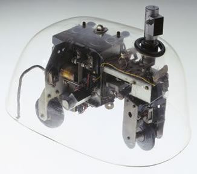
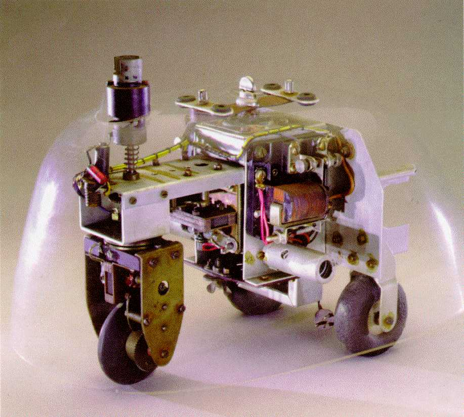

# Leçon 05 | 15 Décembre 1954

  

    <label><input type="checkbox" data-lacan-toggle="original" checked> 原文</label>
    <label><input type="checkbox" data-lacan-toggle="notes" checked> 注释</label>
    <label><input type="checkbox" data-lacan-toggle="commentary" checked> 个人解读评论</label>
  

  <form class="lacan-tool-search" role="search">
    <input class="lacan-tool-search-input" type="search" placeholder="搜索全文" aria-label="搜索全文">
    <button class="lacan-tool-button" type="submit" title="搜索">搜索</button>
  </form>
  <button class="lacan-tool-button lacan-back-to-top" type="button" title="回到页面最上方" aria-label="回到页面最上方">↑</button>

<section class="parallel-paragraph" data-paragraph-ids="s2-05-0001">

s2-05-0001

原文 · s2-05-0001

Je voudrais essayer de situer un peu l’exposé d’hier soir. Si je voulais exprimer d’une façon imagée ce que nous essayons de faire ici, je commencerais par me réjouir que, les œuvres de FREUD étant là à notre por­tée, je ne sois pas forcé... sauf intervention inattendue de la divinité ...d’aller les chercher sur quelque Sinaï, autrement dit de vous laisser trop vite tous seuls.

[无对应译文]

</section>

<section class="parallel-paragraph" data-paragraph-ids="s2-05-0002">

s2-05-0002

原文 · s2-05-0002

Parce qu’à la vérité, ce que nous verrons - et verrons toujours - se reproduire, dans le plus serré du texte de FREUD, c’est quand même quelque chose qui n’est pas tout à fait l’adoration du veau d’or mais tout de même en quelque sorte quelque idolâtrie. Ce que j’essaie de faire ici c’est de vous en arracher une bonne fois pour toutes. Et j’espère qu’un jour ce sera assez réalisé pour que je ne sente plus ce danger vers quelque penchant à des formulations trop ima­gées. C’est ça que ça veut dire en fin de compte idolâtrie.

[无对应译文]

</section>

<section class="parallel-paragraph" data-paragraph-ids="s2-05-0003">

s2-05-0003

原文 · s2-05-0003

Notre cher LECLAIRE ne s’est peut-être pas orienté vers une telle prosterna­tion, mais il y avait quand même - vous l’avez bien d’ailleurs tous senti - c’est bien de là que partaient quelques jets, quelques points où ce que j’ai appelé plus tard dans une conversation avec lui, « *les échafaudages *» dont il faudra se débarrasser à partir d’un certain moment, une certaine façon de centrer son exposé, quelques points où le maintien de certains de ses termes de référence est quelque chose de cet ordre-là.

[无对应译文]

</section>

<section class="parallel-paragraph" data-paragraph-ids="s2-05-0004">

s2-05-0004

原文 · s2-05-0004

Le besoin d’imager...

[无对应译文]

</section>

<section class="parallel-paragraph" data-paragraph-ids="s2-05-0005">

s2-05-0005

原文 · s2-05-0005

> et Dieu sait si c’est légi­time, le terme de *modèle*, *pattern*, est quelque chose qui a sa valeur, sa fonc­tion, et qui exprime bien d’une certaine façon le procédé dans l’exposé scien­tifique aussi bien que dans certains autres domaines,
>
> peut-être pas tellement qu’on le pense d’ailleurs

[无对应译文]

</section>

<section class="parallel-paragraph" data-paragraph-ids="s2-05-0006">

s2-05-0006

原文 · s2-05-0006

...n’est pas sans inconvénient.

[无对应译文]

</section>

<section class="parallel-paragraph" data-paragraph-ids="s2-05-0007">

s2-05-0007

原文 · s2-05-0007

Il n’y a nulle part où ce ne soit une tentation plus insidieuse en ses effets, je veux dire qui recèle plus de pièges, que dans le domaine où nous sommes, qui est celui précisément de la subjectivité et c’est précisément la difficulté quand on parle de la subjectivité de ne pas *entifier* le sujet.

[无对应译文]

</section>

<section class="parallel-paragraph" data-paragraph-ids="s2-05-0008">

s2-05-0008

原文 · s2-05-0008

Je crois que LECLAIRE, dans un certain dessein de faire tenir debout sa construction - et c’est bien précisément le dessein de la faire tenir debout qui fait qu’il nous l’a présentée comme une pyramide, bien sur son derrière, tout à fait solide, et non sur sa pointe - dans ce besoin il nous a fait à un endroit, sous une forme pointillée, évanescente, quelque chose qui est quelque idole du sujet.

[无对应译文]

</section>

<section class="parallel-paragraph" data-paragraph-ids="s2-05-0009">

s2-05-0009

原文 · s2-05-0009

Or, nous ne saisissons que le côté presque en arrière, et le jour où nous l’amenons en face, à ce moment-là, il se dissout, s’évanouit, ne se laisse pas sai­sir. Il n’en reste pas moins qu’il n’a pas pu faire autrement que de nous le repré­senter. Je crois que c’est une remarque qui vient s’insérer à part dans *la chaîne*, *le procès*, de cette démonstration, qui était exactement centrée sur cette ques­tion : « *Qu’est-ce que le sujet ?* », cette question posée à partir à la fois de l’appré­hension naïve et de la formulation scientifique ou philosophique. Je vous ai indiqué que fondamentalement c’était \[rejeté ?\] du *moi*. Et nous nous trouvons, en somme, avec cette remarque, cette question - à propos de ce que nous avons fait hier soir - au même carrefour, au même point où nous pouvons reprendre notre chemin, au point où je l’ai laissé la dernière fois, c’est-à-dire au moment où le sujet saisit son unité.

[无对应译文]

</section>

<section class="parallel-paragraph" data-paragraph-ids="s2-05-0010">

s2-05-0010

原文 · s2-05-0010

Ce corps morcelé trouve son unité dans cette *image de l’autre* qui est sa propre image anticipée. C’est une situation duelle dans laquelle nous voyons s’ébaucher une relation polaire, non symétrique certes, et dont la dissymétrie nous indique déjà en quel sens la théorie du *moi*, telle que la psychanalyse nous la donne, ne permet d’aucune façon de rejoindre la conception dite *scientifique* ou *philosophique* du *moi,* telle qu’elle rejoint une cer­taine appréhension naïve dont je vous ai dit qu’elle était le propre de la psycholo­gie, d’une certaine psychologie qui est datable historiquement, qui est ce que nous appellerons « *la psychologie de l’homme moderne* ».

[无对应译文]

</section>

<section class="parallel-paragraph" data-paragraph-ids="s2-05-0011">

s2-05-0011

原文 · s2-05-0011

Je vous ai arrêté en somme, au moment où vous montrant ce sujet, que j’ai aussi bien appelé la dernière fois \- et non pas simplement hier soir - au moment où nous nous sommes arrêtés sur cette question du sujet de LECLAIRE, que je n’ai pas appelé seulement hier soir, mais aussi à la fin de ma dernière conférence : « *personne* ». Je ne l’ai peut-être pas très bien accentué ni souligné, mais c’était bien le «  *personne* » dont nous parlions hier soir.

[无对应译文]

</section>

<section class="parallel-paragraph" data-paragraph-ids="s2-05-0012">

s2-05-0012

原文 · s2-05-0012

Que ce *sujet*, qui est *personne*, et qui est décomposé, morcelé, se bloque, trouve son unité, est en quelque sorte aspiré d’une façon anticipante, par cette *image* à la fois *trompeuse* et réalisée, qui est cette certaine unité du sujet qui lui est donnée dans *l’image de l’autre*, qui lui est aussi bien donnée dans *son image spéculaire*, la possibilité de la fonction, à cette occasion, de *l’image spéculaire*, aussi bien à la place de *l’image de l’autre*, mon­trant bien *le caractère fondamentalement imaginaire de cette relation*.

[无对应译文]

</section>

<section class="parallel-paragraph" data-paragraph-ids="s2-05-0013">

s2-05-0013

原文 · s2-05-0013

Et, m’emparant d’une référence prise au plus moderne de nos *exercices machinistes*, qui ont tellement d’importance dans le développement, non seulement de la scien­ce, mais de la pensée humaine, je vous représentai, en somme, cette étape du développement du sujet comme quelque chose qui pouvait s’incarner dans un modèle, je vous ai fait un modèle.

[无对应译文]

</section>

<section class="parallel-paragraph" data-paragraph-ids="s2-05-0014">

s2-05-0014

原文 · s2-05-0014

Je vous ai fait un modèle qui a le propre de ne - nulle part - idolifier ce sujet. Je pense que vous l’avez suffisamment vu, c’est qu’au point où je vous ai lais­sé, *le sujet* était bien nulle part, pour une bonne raison : que justement il s’agis­sait de deux petites tortues mécaniques, et l’une bloquée sur l’image de l’autre, non pas tout l’ensemble énergétique, mais pour une partie régulatrice de ces mécanismes, qu’on peut envisager comme prise, captivée par tous les moyens imaginables.

[无对应译文]

</section>

<section class="parallel-paragraph" data-paragraph-ids="s2-05-0015">

s2-05-0015

原文 · s2-05-0015

Je ne suis pas ici pour vous faire de la cybernétique, même imagi­naire : la cellule photo-électrique, et tout ce qui peut servir dans ces occasions à nous faire des machines autrement élaborées que les automates, qui ont été leurs prédécesseurs, et cette machine est en quelque sorte entièrement suspendue au fonctionnement unitaire d’une autre machine, et par conséquent aussi captivée par toute espèce de démarche de l’autre machine.

[无对应译文]

</section>

<section class="parallel-paragraph" data-paragraph-ids="s2-05-0016">

s2-05-0016

原文 · s2-05-0016

Vous voyez bien que ce cercle n’est pas pour autant limité à 2, mais que c’est le 2 qui en forme *la liai­son* essentielle, liaison de 2 machines chacune étant, par l’intermédiaire de l’*image*, à la remorque de l’autre. En somme, c’est un vaste cercle, dont chacun est tenu par une captation dans l’image totalitaire de l’autre.

[无对应译文]

</section>

<section class="parallel-paragraph" data-paragraph-ids="s2-05-0017">

s2-05-0017

原文 · s2-05-0017

Vous vous en représentez les inconvénients extrêmes du point de vue de ce qu’on peut appe­ler *les objets du désir de la machine* : pour une machine, il n’y a guère d’autre désir possible que celui de repuiser aux *sources d’énergie*, une machine ne peut guère que se nourrir, essentiellement, on n’est pas encore arrivé non seulement à réaliser mais même à concevoir des machines qui se reproduiraient. Même le schéma de *sa symbolique* n’a pas encore été donné. Donc, nous en sommes limités à cet *objet de désir* qui serait cette source de réalimentation.

[无对应译文]

</section>

<section class="parallel-paragraph" data-paragraph-ids="s2-05-0018">

s2-05-0018

原文 · s2-05-0018

C’est bien ce qu’elles font, les braves petites machines de M. GREY WALTER, telles que nous les supposons, liées à ce rapport imaginaire l’une à l’autre.

[无对应译文]

</section>

<section class="parallel-paragraph" data-paragraph-ids="s2-05-0019">

s2-05-0019

原文 · s2-05-0019

 

[无对应译文]

</section>

<section class="parallel-paragraph" data-paragraph-ids="s2-05-0020">

s2-05-0020

原文 · s2-05-0020

Cela va entraîner de fâcheuses rencontres : elles sont en quelque sorte essentiellement fixées sur un point pour autant que l’autre lui-même y va, il y aura donc vraiment quelque part *collision*. C’est à ce point que nous étions parvenus. *Ici, je m’arrêtai*. Supposons-les avec quelque appareil d’enregistrement sonore, et supposons là que la Grande Voix…

[无对应译文]

</section>

<section class="parallel-paragraph" data-paragraph-ids="s2-05-0021">

s2-05-0021

原文 · s2-05-0021

> nous pouvons bien penser qu’il y a quelqu’un qui les a conduites et surveille son fonctionnement, le législateur

[无对应译文]

</section>

<section class="parallel-paragraph" data-paragraph-ids="s2-05-0022">

s2-05-0022

原文 · s2-05-0022

…veut intervenir pour régler le ballet qui jusqu’à présent n’était qu’une ronde, pouvant aboutir à des résultats *catastrophiques*. Il peut régler le ballet et introduire la régulation sym­bolique, dont justement vous avez une idée, un modèle, un schéma, dans la sous-jacence mathématique inconsciente des échanges des *structures élémentaires*.

[无对应译文]

</section>

<section class="parallel-paragraph" data-paragraph-ids="s2-05-0023">

s2-05-0023

原文 · s2-05-0023

Il doit y en avoir d’autres exemples dans les régulations humaines, si ce modèle est valable, le modèle qu’avait apporté avec son dernier séminaire M. LÉVI-STRAUSS il est bien évident que la comparaison s’arrête-là, car nous n’allons pas entifier *le législateur* - ce serait une idole de plus - et nous devons nous arrê­ter là.

[无对应译文]

</section>

<section class="parallel-paragraph" data-paragraph-ids="s2-05-0024">

s2-05-0024

原文 · s2-05-0024

Serge LECLAIRE

[无对应译文]

</section>

<section class="parallel-paragraph" data-paragraph-ids="s2-05-0025">

s2-05-0025

原文 · s2-05-0025

Je m’excuse, mais je voudrais faire une réponse, car j’ai le senti­ment, je sais très bien sur quel point j’ai insisté d’une façon arbitraire, peut-être, dans cette entification du sujet. Mais, pour reprendre votre propre expression, si en l’occurrence je l’ai *idolifié*...

[无对应译文]

</section>

<section class="parallel-paragraph" data-paragraph-ids="s2-05-0026">

s2-05-0026

原文 · s2-05-0026

LACAN - J’ai dit que vous « aviez tendance ».

[无对应译文]

</section>

<section class="parallel-paragraph" data-paragraph-ids="s2-05-0027">

s2-05-0027

原文 · s2-05-0027

Serge LECLAIRE

[无对应译文]

</section>

<section class="parallel-paragraph" data-paragraph-ids="s2-05-0028">

s2-05-0028

原文 · s2-05-0028

…si j’ai eu tendance à l’*idolifier*, c’est que je pense que c’est néces­saire, que l’on ne peut pas faire autrement.

[无对应译文]

</section>

<section class="parallel-paragraph" data-paragraph-ids="s2-05-0029">

s2-05-0029

原文 · s2-05-0029

LACAN - Eh bien, vous êtes un petit idolâtre. Je descends du Sinaï et brise les tables de la loi.

[无对应译文]

</section>

<section class="parallel-paragraph" data-paragraph-ids="s2-05-0030">

s2-05-0030

原文 · s2-05-0030

Serge LECLAIRE

[无对应译文]

</section>

<section class="parallel-paragraph" data-paragraph-ids="s2-05-0031">

s2-05-0031

原文 · s2-05-0031

Laissez-moi terminer. J’ai l’impression qu’à refuser cette entifi­cation très consciente du sujet, nous avons tendance \- et vous avez tendance - à reporter cette *idolification* en un autre point. À ce moment-là, ce ne sera plus *le sujet*, ce sera *l’autre, l’image, le miroir*. Je ne sais pas pourquoi on se défend telle­ment, mais on reporte cette *idolification* sur autre chose.

[无对应译文]

</section>

<section class="parallel-paragraph" data-paragraph-ids="s2-05-0032">

s2-05-0032

原文 · s2-05-0032

LACAN

[无对应译文]

</section>

<section class="parallel-paragraph" data-paragraph-ids="s2-05-0033">

s2-05-0033

原文 · s2-05-0033

Je sais bien. Vous n’êtes pas le seul. *Vos préoccupations transcendantalistes*, si vous voulez, se réfèrent plus à *une certaine idée substantialiste de l’inconscient*. Pour d’autres, elle sera plus *ce qu’on appelle idéaliste*, au sens vrai du mot, au sens de *l’idéalisme critique*. Et quel­qu’un qui est là, dont je n’aurai pas de raison de dévoiler la personnalité, me disait après notre dernière conférence :

[无对应译文]

</section>

<section class="parallel-paragraph" data-paragraph-ids="s2-05-0034">

s2-05-0034

原文 · s2-05-0034

« *Votre conscience, là, mais il me semble, qu’après nous l’avoir en somme maltraitée*…

[无对应译文]

</section>

<section class="parallel-paragraph" data-paragraph-ids="s2-05-0035">

s2-05-0035

原文 · s2-05-0035

Car je dois dire aussi qu’il y a plus d’un auditeur ici dont la formation philosophique, disons *traditionnelle* pour autant qu’elle fonde l’idéalisme critique, et que la saisie de la conscience par elle–même en est un des piliers, et que c’est quelque chose qu’on ne peut pas traiter comme ça, *à la légère*, et je dois dire que la dernière fois, je vous ai bien averti que je ne franchissais le pas de le faire - de la traiter *à la légère* - qu’en me rendant bien comp­te du caractère arbitraire, tranchant, du pur *nœud gordien* d’une telle démarche et que cela supposait en effet une sorte de foncière, radicale négligence de tout un point de vue.

[无对应译文]

</section>

<section class="parallel-paragraph" data-paragraph-ids="s2-05-0036">

s2-05-0036

原文 · s2-05-0036

Donc, on me disait :

[无对应译文]

</section>

<section class="parallel-paragraph" data-paragraph-ids="s2-05-0037">

s2-05-0037

原文 · s2-05-0037

« ...*cette conscience vous la faites rentrer* - *comme vous dites vous : votre sujet-idole, vous allez bien nous le remettre quelque part -* *cette conscience, vous la faites déjà rentrer.* »

[无对应译文]

</section>

<section class="parallel-paragraph" data-paragraph-ids="s2-05-0038">

s2-05-0038

原文 · s2-05-0038

En effet au point de l’exposé où je parle de cette voix qui remet de l’ordre et qui permet le ballet réglé des machines, cette voix il faut bien que nous sachions où elle est, cette voix qui est peut-être aussi, dit M. VALÉRY :

[无对应译文]

</section>

<section class="parallel-paragraph" data-paragraph-ids="s2-05-0039">

s2-05-0039

原文 · s2-05-0039

> « ...*cette auguste Voix*
>
> *Qui se connaît quand elle sonne*
>
> *N’être plus la voix de personne*
>
> *Tant que des ondes et des bois !* » \[[Paul Valéry : *Charmes*, *La Pythie*](http://www.poesies.net/paulvalerycharmes.txt)\]

[无对应译文]

</section>

<section class="parallel-paragraph" data-paragraph-ids="s2-05-0040">

s2-05-0040

原文 · s2-05-0040

C’est du langage qu’il parle, quand il s’exprime ainsi. Il est clair que nous avons besoin…

[无对应译文]

</section>

<section class="parallel-paragraph" data-paragraph-ids="s2-05-0041">

s2-05-0041

原文 · s2-05-0041

> jusqu’à ce qu’en effet, au dernier terme, nous reconnaissions que c’est peut-être en effet la voix de *personne*

[无对应译文]

</section>

<section class="parallel-paragraph" data-paragraph-ids="s2-05-0042">

s2-05-0042

原文 · s2-05-0042

…dans notre déduction du sujet de la situer dans le jeu interhumain, et quelque part! Ce n’est donc pas uniquement la voix du législateur, de l’ordonnateur de ballet qui serait en effet une idolifi­cation d’un ordre particulièrement élevé, mais une idolification caractéristique.

[无对应译文]

</section>

<section class="parallel-paragraph" data-paragraph-ids="s2-05-0043">

s2-05-0043

原文 · s2-05-0043

C’est pour cela que j’étais entré la dernière fois dans la voie de vous dire, nous sommes amenés à supposer, à exiger plus exactement, que ce soit la machi­ne qui la prenne, cette parole ordonnatrice. Et allant un peu plus vite, comme il arrive parfois à la fin d’un discours où je suis forcé à la fois de boucler et d’amorcer pour la reprise, je disais ceci : supposons que la machine puisse se compter elle-même, car en fin de compte c’est cela : pour que *les combinaisons mathématiques* \- qui ordonnent les échanges objectaux au point ou au sens où je les ai définis tout à l’heure - fonctionnent, il faut que dans cette *combinatoire* chacune des machines puisse se compter elle-même.

[无对应译文]

</section>

<section class="parallel-paragraph" data-paragraph-ids="s2-05-0044">

s2-05-0044

原文 · s2-05-0044

Là-dessus, c’est bien là que *la personne anonyme* que j’évoquai tout à l’heu­re - *elle-même peut prendre la parole et se révéler* - disait :

[无对应译文]

</section>

<section class="parallel-paragraph" data-paragraph-ids="s2-05-0045">

s2-05-0045

原文 · s2-05-0045

> « *Vous la faites rentrer par là, la conscience. Vous qui venez de nous présenter d’une façon si désinvolte la conscience,*
>
> *cette conscience qui a été en effet pour nous jusqu’à présent, dans notre tradition, une des formes d’idolification du sujet,*
>
> *là où on le saisit vraiment, où on le touche, voilà que tout d’un coup vous en faites cette surface d’eau qu’un simple souffle*
>
> *suffit à troubler, ou plus exactement un petit bout de verre cassé, « ça n’est rien d’autre », me dit-on. *
>
> *Mais, par contre, pour que le sujet se compte lui-même, vous allez être bien forcé de nous réintégrer ici la conscience.* »

[无对应译文]

</section>

<section class="parallel-paragraph" data-paragraph-ids="s2-05-0046">

s2-05-0046

原文 · s2-05-0046

Eh bien, je dois dire que là je suis surpris. Car après tout, comment la personne qui s’adressait à moi ainsi ne s’arrête-elle pas au moins devant ceci, qui est évidemment là où je veux en venir : Comment pressent-elle si peu le point où je veux en venir qu’elle ne voie pas que c’est justement là que, en quelque sorte, j’attends le philosophe traditionnel ?

[无对应译文]

</section>

<section class="parallel-paragraph" data-paragraph-ids="s2-05-0047">

s2-05-0047

原文 · s2-05-0047

Car s’il y a quelque chose que l’expérience analytique nous a montré, et qui est le plus surprenant de cette expérience, c’est que ce phénomène du sujet, en tant que le sujet est structuré comme ça, comme *l’individu*…

[无对应译文]

</section>

<section class="parallel-paragraph" data-paragraph-ids="s2-05-0048">

s2-05-0048

原文 · s2-05-0048

> *individu* que nous nous sommes jusqu’à présent permis de concevoir, d’élaborer comme une pure et simple machine

[无对应译文]

</section>

<section class="parallel-paragraph" data-paragraph-ids="s2-05-0049">

s2-05-0049

原文 · s2-05-0049

…c’est de là que FREUD est parti. Vous n’avez qu’à prendre sa théorie du psychisme, telle qu’il l’a fomentée au temps des *Lettres à Fliess* et des *Ébauches,* *Drafts*, les *Esquisses* qu’il a données - très astucieuses - de la structure psychique : c’est une machine liée simplement aux exigences du principe d’inertie et d’un certain nombre de formules homéostatiques.

[无对应译文]

</section>

<section class="parallel-paragraph" data-paragraph-ids="s2-05-0050">

s2-05-0050

原文 · s2-05-0050

En cet *individu* nous voyons des manifestations dans la caractéristique dont le signe essentiel est non seulement extrêmement d’être *inconscientes*, mais d’être un inconscient forcé, qui ne saurait, sans un traitement spécial, être réintégré dans *la conscience*. Une définition que l’on pourrait donner de l’inconscient freudien, c’est ça : que d’une façon tout à fait inconsciente, l’individu dans ses activités inconscientes - cet individu fier de son *moi -* croit saisir l’être dans *une totale transparence consciente*. C’est dans son inconscient qu’il se compte lui-même. Tout ce que FREUD nous apporte, dans la *Science des rêves*, dans la *Psychopathologie de la vie quotidienne*, c’est cela : ça veut dire l’individu se compte lui-même.

[无对应译文]

</section>

<section class="parallel-paragraph" data-paragraph-ids="s2-05-0051">

s2-05-0051

原文 · s2-05-0051

Dès que fonctionne cette sorte d’épreuve divinatoire qu’est le rêve, nous voyons ceci : l’activité complètement inconsciente du sujet qui tout soudain libère, si on peut dire, sa propre image avec celle de tous les autres. Mais avec toutes ces images, s’instaure cette *relation* proprement *symbolique*, la plus élaborée de toutes *les relations symboliques*, qui est tout un calcul dans lequel lui-même dans son être *imaginaire*, dans ce *double* qui est l’*identique*, qui est à la même place que cette *image de soi*, dont nous parlions hier soir, cette *image spéculaire* dont je parle, cette *image de l’autre*, qui est aussi bien le point où nous sommes parvenus dans les relations entre les deux machines, tout cela se met dans le rêve.

[无对应译文]

</section>

<section class="parallel-paragraph" data-paragraph-ids="s2-05-0052">

s2-05-0052

原文 · s2-05-0052

Et aussi bien dans la *Psychopathologie de la vie quotidienne*, et aussi bien dans ce que nous sommes capables d’aller explorer quand nous nous livrons à un certain nombre de jeux divinatoires aussi, dont FREUD nous montre que les résultats sont surprenants, et qu’on ne saurait trop s’arrêter, encore que l’emploi en ait été un tant soit peu abandonné. Je fais allusion précisément à ce qui est à la fin de la *Psychopathologie de la vie quotidienne* et qui est un très curieux jeu, qui consis­te à dire au sujet : « *Dites des nombres au hasard* ».

[无对应译文]

</section>

<section class="parallel-paragraph" data-paragraph-ids="s2-05-0053">

s2-05-0053

原文 · s2-05-0053

Il dit des nombres au hasard, et quand même ce qu’on arrive à tirer, par la voie des associations de *ces nombres dits complètement au hasard* - et le sujet fait un effort pour prendre des nombres vraiment au hasard, il prend des nombres élevés - comme signi­fications, comme réponses, résonances, dans tout ce qui est vie, remémoration, destin du sujet, est quelque chose qui vraiment du point de vue des probabili­tés va bien loin au-delà de tout ce qu’on peut attendre du pur hasard. S’il y a quelque chose, un des phénomènes des plus manifestes qui nous est donné par l’expérience freudienne c’est précisément ceci : que c’est dans l’in­conscient que l’individu en fonction subjective *se compte lui-même*.

[无对应译文]

</section>

<section class="parallel-paragraph" data-paragraph-ids="s2-05-0054">

s2-05-0054

原文 · s2-05-0054

Pour tout dire, et pour faire en quelque sorte une image, je dirai :

[无对应译文]

</section>

<section class="parallel-paragraph" data-paragraph-ids="s2-05-0055">

s2-05-0055

原文 · s2-05-0055

- est-ce que ça vous semble d’avance une activité où il y a tout de même une part d’intuition dans cette « *conscience qui se saisit dans sa propre transparence* » ?

[无对应译文]

</section>

<section class="parallel-paragraph" data-paragraph-ids="s2-05-0056">

s2-05-0056

原文 · s2-05-0056

- Est-ce que c’est quelque chose qui vous paraît réintroduire sous une autre forme *la même réflexivité* que de, par exemple, vous dire, essayons d’imaginer la machine, dont nous com­mençons un peu d’animer, comme visant quelque part le créateur capable de dire « *am, stram, gram*, *bour et bour et ratatam* », et d’en déduire l’extraction d’un sujet ?

[无对应译文]

</section>

<section class="parallel-paragraph" data-paragraph-ids="s2-05-0057">

s2-05-0057

原文 · s2-05-0057

Nous sommes déjà là dans la machine *se comptant elle-même*.

[无对应译文]

</section>

<section class="parallel-paragraph" data-paragraph-ids="s2-05-0058">

s2-05-0058

原文 · s2-05-0058

Et pour tout dire, si les philosophes me mettent en garde contre certaine façon de matérialiser ce phénomène de *la conscience* et de perdre là un point d’appui précieux pour la saisie de l’originalité radicale du sujet en tant que tel…

[无对应译文]

</section>

<section class="parallel-paragraph" data-paragraph-ids="s2-05-0059">

s2-05-0059

原文 · s2-05-0059

> dans un monde structuré à la KANT, voire à la HEGEL, car HEGEL n’a pas complètement abandonné
>
> la fonction centrale de la conscience, bien qu’il nous permette de nous en libérer

[无对应译文]

</section>

<section class="parallel-paragraph" data-paragraph-ids="s2-05-0060">

s2-05-0060

原文 · s2-05-0060

…je mettrai en garde les philosophes contre une illusion qui est tout à fait en rapport étroit avec notre question, qui n’est peut-être, après tout, pas tellement différente de cette \[illusion ?\] du test combien *significatif, amu­sant, et d’époque*, qui s’appelle le test de BINET et SIMON.

[无对应译文]

</section>

<section class="parallel-paragraph" data-paragraph-ids="s2-05-0061">

s2-05-0061

原文 · s2-05-0061

Nous détectons l’âge mental - à la vérité un âge mental pas tellement éphé­mère, certainement significatif - chez notre sujet, à qui nous proposons, sous le titre de *Phrases absurdes*, et où nous obtenons, ou n’obtenons pas, le consente­ment du jeune sujet à la phrase suivante : « *J’ai trois frères : Paul, Ernest et moi.* »

[无对应译文]

</section>

<section class="parallel-paragraph" data-paragraph-ids="s2-05-0062">

s2-05-0062

原文 · s2-05-0062

Il y a un âge où on peut croire qu’on a « *trois frères, Paul Ernest et moi* ». Il y a certainement une illusion de cet ordre dans le fait de croire que *si le sujet se compte lui-même*, cela veut dire du même coup que c’est là une opération de conscience, autrement dit une opération attachée étroitement à certaine intui­tion de l’objet que nous avons, au niveau de cette saisie de la conscience par elle-même, dont certes on peut évaluer diversement le modèle, qui n’est pas univoque, que tous les philosophes n’ont pas décrit de la même façon.

[无对应译文]

</section>

<section class="parallel-paragraph" data-paragraph-ids="s2-05-0063">

s2-05-0063

原文 · s2-05-0063

Par exemple, je ne prétends pas critiquer la façon dont c’est fait dans DESCARTES, parce que justement, aussi bien, elle est là gouvernée par un certain but qui est tout à fait situable dans une dialectique qui aboutit en fin de comp­te à *une démonstration de l’existence de Dieu*, de sorte qu’en fin de compte c’est uniquement en l’isolant d’une façon arbitraire qu’on lui donne une valeur fon­damentale, existentielle, décisive.

[无对应译文]

</section>

<section class="parallel-paragraph" data-paragraph-ids="s2-05-0064">

s2-05-0064

原文 · s2-05-0064

Mais par contre, il ne serait pas difficile à ceux que cela intéresserait, et qui, je pense, ne sont pas sans le connaître, que du point de vue que l’on peut appeler « *existentialiste* », dans un approfondissement suffisant de cette conscience, dans ses positions *thétiques* et *non-thétiques*, je ne serais pas le seul à penser qu’en fin de compte la saisie de la conscience par elle-même est en quelque sorte à la limite tout à fait désamarrée d’une saisie exis­tentielle quelconque du *moi*.

[无对应译文]

</section>

<section class="parallel-paragraph" data-paragraph-ids="s2-05-0065">

s2-05-0065

原文 · s2-05-0065

Et qu’il apparaît bien, à examiner les choses de près, que le *moi* n’y apparaît pas autrement que comme une expérience parti­culière, liée à des conditions tout à fait objectivables, à l’intérieur de l’inspection qu’on croit être simplement cette *réflexion* de la conscience sur elle-même et que le phénomène de la conscience n’a aucun caractère privilégié dans une telle saisie, qui a par contre un certain nombre d’avantages que vous verrez plus tard.

[无对应译文]

</section>

<section class="parallel-paragraph" data-paragraph-ids="s2-05-0066">

s2-05-0066

原文 · s2-05-0066

À libérer la conscience de toute espèce d’hypothèque dans cette saisie essen­tielle du sujet par lui-même, et à en faire un phénomène, je ne dirais pas *contin­gent* par rapport à toute notre déduction du sujet, mais quelque chose qui se produit à des niveaux extrêmement divers, et c’est pour cela que je me suis amusé à vous en donner un modèle dans le monde physique lui–même, vous la verrez toujours apparaître avec une très grande irrégularité dans la manifesta­tion des phénomènes subjectifs, et liée à des conditions qui sont sans doute très spéciales, mais qui apparaissent à l’expérience, dans le retournement de pers­pectives qui est celui de l’analyse, liée à des conditions qui sont toujours beau­coup plus physiques - et j’entends *matérielles* - que psychiques.

[无对应译文]

</section>

<section class="parallel-paragraph" data-paragraph-ids="s2-05-0067">

s2-05-0067

原文 · s2-05-0067

Et en prenant cette perspective, beaucoup des problèmes qui sont à tout ins­tant posés sur l’intervention de la conscience, l’ambiguïté des phénomènes de conscience, pouvons nous dire que le phénomène du rêve, par exemple, inté­resse \- et par quel biais, par quel moyen ? - ce que nous appellerons *le registre de la conscience* ? Un rêve, ça se passe au niveau de la conscience, c’est conscient : ce chatoiement imaginaire, ces images mouvantes, c’est quelque chose qui est tout à fait sur le même plan, le même ordre, que le côté illusoire de l’image sur lequel nous insistons tant, à propos de la formation du *moi*. C’est du même ordre.

[无对应译文]

</section>

<section class="parallel-paragraph" data-paragraph-ids="s2-05-0068">

s2-05-0068

原文 · s2-05-0068

Il se produit en effet quelque chose qui fait beaucoup ressem­bler le rêve à une lecture dans le miroir. Comme vous le savez, non seulement, c’est un procédé de divination des plus anciens, mais il peut être utilisé dans la technique de l’hypnose, qui donne des résultats dans une certaine technique de l’hypnose. Le sujet peut arriver à *saisir*, *apercevoir* dans un miroir…

[无对应译文]

</section>

<section class="parallel-paragraph" data-paragraph-ids="s2-05-0069">

s2-05-0069

原文 · s2-05-0069

> et de préfé­rence le miroir tel qu’il a toujours été depuis le début de l’humanité jusqu’à une époque relativement récente, c’est-à-dire quelque chose encore plus *obscur* que *clair*, le miroir de métal poli

[无对应译文]

</section>

<section class="parallel-paragraph" data-paragraph-ids="s2-05-0070">

s2-05-0070

原文 · s2-05-0070

…en se fascinant sur cette surface, à se révéler à lui-même beaucoup d’éléments dans ses fixations *imaginaires*.

[无对应译文]

</section>

<section class="parallel-paragraph" data-paragraph-ids="s2-05-0071">

s2-05-0071

原文 · s2-05-0071

Où est la conscien­ce ? Dans quel sens devons-nous la trouver, la chercher ? Où se situe-t-elle ? Cela pose des problèmes qui, s’ils sont posés en terme de *tension psychique*, et c’est bien ce que cherche FREUD à faire, en plus d’un passage de son œuvre, à voir comment *le système conscience*, et selon quels mécanismes, est investi et désinvesti, FREUD arrive - chose curieuse qui doit nous mettre sur la voie - à penser qu’il y a tout à fait intérêt à considérer…

[无对应译文]

</section>

<section class="parallel-paragraph" data-paragraph-ids="s2-05-0072">

s2-05-0072

原文 · s2-05-0072

> si vous voulez, c’est même jusque-là que nous en viendrons, comme FREUD y est amené par sa spéculation

[无对应译文]

</section>

<section class="parallel-paragraph" data-paragraph-ids="s2-05-0073">

s2-05-0073

原文 · s2-05-0073

…qu’il est une nécessité de discours cohérent à considérer, comme il le dit for­mellement.

[无对应译文]

</section>

<section class="parallel-paragraph" data-paragraph-ids="s2-05-0074">

s2-05-0074

原文 · s2-05-0074

Déjà il rencontre ceci dans les ébauches d’un système psychique organisé, qui se trouve dans le livre *Origins of analysis* [^1] \- dont je vous parlais, paru chez *Imago* à Londres et aussi à New-York, dans la *Métapsychologie* il y revient en plus d’un endroit. Il est amené à faire du *système conscience* comme tel une place non seulement privilégiée, mais une place qu’il faut bien, d’une certaine façon, considérer comme exclue de la dynamique des trois systèmes psychiques.

[无对应译文]

</section>

<section class="parallel-paragraph" data-paragraph-ids="s2-05-0075">

s2-05-0075

原文 · s2-05-0075

Il y a là quelque chose qui joue un rôle, mais qui du point de vue dynamique se comporte d’une façon tout à fait particulière. Et il reste toujours devant le problème comme étant *irrésolu*, comme laissant à l’avenir le soin d’ap­porter là-dessus une clarté qui lui échappe, de résoudre une impasse où mani­festement il bute.

[无对应译文]

</section>

<section class="parallel-paragraph" data-paragraph-ids="s2-05-0076">

s2-05-0076

原文 · s2-05-0076

Nous voilà donc au niveau de la nécessité, en somme, d’un tiers pôle, qui est justement celui que notre ami LECLAIRE essayait de maintenir hier soir dans son schéma triangulaire. Il nous faut bien, en effet, *un triangle*. Mais il y a mille façons d’opérer sur *un triangle*. *Un triangle* n’est pas du tout forcément la figu­re solide, reposant sur une intuition selon laquelle elle se donne incontestable­ment.

[无对应译文]

</section>

<section class="parallel-paragraph" data-paragraph-ids="s2-05-0077">

s2-05-0077

原文 · s2-05-0077

Tout d’abord, et c’est ce qui fait sa valeur saisissante, expressive, marquan­te, *un triangle* c’est aussi bien *un système de relations*. Et aussi bien on ne com­mence à manier vraiment *le triangle*, même en géométrie, en mathématique, qu’à partir du moment où, par exemple, *aucun de ses bords n’a un privilège*. Et c’est bien de cela, en effet, qu’il s’agit.

[无对应译文]

</section>

<section class="parallel-paragraph" data-paragraph-ids="s2-05-0078">

s2-05-0078

原文 · s2-05-0078

Nous voilà donc à la recherche de ce sujet et, en tant qu’il se compte lui-même, le problème est de savoir où il est. Qu’il soit manifestement dans l’inconscient, pour nous tout au moins analystes, c’est ce à quoi je pense vous avoir amenés au point où j’arrive maintenant.

[无对应译文]

</section>

<section class="parallel-paragraph" data-paragraph-ids="s2-05-0079">

s2-05-0079

原文 · s2-05-0079

Jean-Bertrand PONTALIS

[无对应译文]

</section>

<section class="parallel-paragraph" data-paragraph-ids="s2-05-0080">

s2-05-0080

原文 · s2-05-0080

Un mot, puisqu’il croit s’être reconnu dans l’interlocuteur ano­nyme qui vous avait fait remarquer que peut-être vous escamotiez la conscience au début pour mieux la retrouver à la fin :

[无对应译文]

</section>

<section class="parallel-paragraph" data-paragraph-ids="s2-05-0081">

s2-05-0081

原文 · s2-05-0081

- Je n’ai jamais dit que le *cogito* était une vérité intouchable et qu’on pouvait définir le sujet par cette expérience, c’est-à-dire une expérience de *transparence totale du soi à soi-même*. Je n’ai jamais dit que la conscience épuisait toute la subjectivité, ce qui d’ailleurs serait vraiment difficile avec la phénoménologie et la psychanalyse, mais simplement que le *cogito* représentait une sorte de modèle de la subjectivité, c’est-à-dire rendait très sen­sible cette idée qu’il faut qu’il y ait quelqu’un pour qui le mot « comme » a un sens.

[无对应译文]

</section>

<section class="parallel-paragraph" data-paragraph-ids="s2-05-0082">

s2-05-0082

原文 · s2-05-0082

Et ceci vous paraissiez l’omettre, car quand vous aviez pris *votre apologue du reflet, de la disparition des hommes*, vous n’oubliiez qu’une chose, c’est qu’il fal­lait que les hommes reviennent pour justement saisir qu’il y avait *un rapport entre le reflet et la chose*. Reflété, autrement si l’on considère l’objet en lui-même et le film enregistré par la caméra, cela n’est rien d’autre qu’un objet, ça n’est même pas un témoin, ça n’est rien.

[无对应译文]

</section>

<section class="parallel-paragraph" data-paragraph-ids="s2-05-0083">

s2-05-0083

原文 · s2-05-0083

De même, l’exemple que vous preniez des nombres dits au hasard, pour que le sujet s’aperçoive que ces nombres qu’il a dits au hasard ne sont pas si au hasard que ça, il faut un phénomène qu’on peut appeler comme vous voudrez, qui me semble bien être cette conscience, et qui ne soit pas simplement le reflet de ce que l’autre lui dit. C’est tout ce que je voulais dire. Et je ne voyais pas très bien pour­quoi c’était tellement important de démolir la conscience, si c’était pour la rame­ner quand même sous la forme d’une visée ou d’une position de rapport, comme vous le faisiez à la fin.

[无对应译文]

</section>

<section class="parallel-paragraph" data-paragraph-ids="s2-05-0084">

s2-05-0084

原文 · s2-05-0084

LACAN

[无对应译文]

</section>

<section class="parallel-paragraph" data-paragraph-ids="s2-05-0085">

s2-05-0085

原文 · s2-05-0085

Ce qui est important c’est, non pas de « *démolir la conscience »*, mon Dieu, mise à part toute métaphore du bout de verre cassé, nous ne cherchons pas ici à faire de grandes dégringolades de vitres, mais après tout pourquoi pas ?

[无对应译文]

</section>

<section class="parallel-paragraph" data-paragraph-ids="s2-05-0086">

s2-05-0086

原文 · s2-05-0086

Il y a à ça des raisons théoriques que je vous ai indiquées actuellement, à savoir l’ex­trême difficulté qu’il y a \[...\] *le système* *de la conscience* lui-même, en tant que tel, et dans l’expérience analytique, et à en donner - je vous le démontrerai par la suite, nous reviendrons au passage de FREUD que j’ai cité - une formula­tion dans l’ordre de ce que FREUD appelle « *la référence énergétique* », jeu, entre-jeu des différents systèmes psychiques.

[无对应译文]

</section>

<section class="parallel-paragraph" data-paragraph-ids="s2-05-0087">

s2-05-0087

原文 · s2-05-0087

Il y a là quelque chose d’important, mais reje­té latéralement en quelque sorte. J’y reviendrai par la suite. Mais ce qui est visé dans ce point où j’ai commencé la démonstration la der­nière fois, c’est ce qui est l’objet central de notre étude cette année, à savoir le *moi*, et très justement c’est de montrer que ce *moi*, de dépouiller ce *moi* de ce privilège que malgré tout il reçoit d’une certaine évidence, dont j’essaie de vous souligner de mille façons qu’elle n’est qu’une contingence historique dont, en somme, la place qu’elle a prise dans la déduction philosophique n’est qu’une des manifestations les plus claires, car nous sommes quand même dans un temps de philosophie et de lumière.

[无对应译文]

</section>

<section class="parallel-paragraph" data-paragraph-ids="s2-05-0088">

s2-05-0088

原文 · s2-05-0088

C’est tout de même de distinguer, comme ça, dans le processus historique, mais c’est de saisir cette évidence que la notion du *moi* tire d’un certain prestige donné à la conscience en tant qu’elle est unique, qu’elle est une expérience individuelle, irréductible, que le *moi* garde malgré tout ce pouvoir d’attraction, mirage, qui me fait parler sans critique et dans des sens \- j’espère vous le montrer - très différents les uns des autres, que prend sa « *fonction synthétique* »... par exemple, j’essaierai de vous le montrer au cours de cette année, quels sens extrêmement divers, non seulement chez les analystes, mais un ou deux passages qui se succèdent presque dans l’œuvre de FREUD, de tel ou tel analyste, le terme « *fonction synthétique* » du *moi* prend …bref du caractère véritablement captivant qu’a cette intuition du *moi* en tant qu’elle est justement centrée dans une expérience de conscience par rapport à notre conception du sujet.

[无对应译文]

</section>

<section class="parallel-paragraph" data-paragraph-ids="s2-05-0089">

s2-05-0089

原文 · s2-05-0089

Et c’est cela qu’en vous donnant, en vous rappelant, en procédant par cette série d’interrogations, dont certaines en effet paraissent démolisseuses et destructives, j’essaie d’écarter, parce que cela me semble une sorte d’étape, de pas, absolument indispensable pour faire saisir enfin, où pour FREUD est la réalité du sujet.

[无对应译文]

</section>

<section class="parallel-paragraph" data-paragraph-ids="s2-05-0090">

s2-05-0090

原文 · s2-05-0090

En fin de compte, si vous voulez, peut-être aussi pour ne pas vous quitter aujourd’hui sans que vous ayez le sentiment d’une autre visée, et à quel point cette situation, qui en effet peut paraître à certain moment aller assez loin du champ de *nos préoccupations concrètes, expérimentales, cliniques*, est tout de même essentielle. Je vais donc tout de même vous l’indiquer.

[无对应译文]

</section>

<section class="parallel-paragraph" data-paragraph-ids="s2-05-0091">

s2-05-0091

原文 · s2-05-0091

Je vais ramener à ce qui est le vice du sujet. Il s’agit de savoir si le *moi*…

[无对应译文]

</section>

<section class="parallel-paragraph" data-paragraph-ids="s2-05-0092">

s2-05-0092

原文 · s2-05-0092

> bien entendu il n’est pas question que nous réduisions *le privilège de la conscience*, de l’inconscient

[无对应译文]

</section>

<section class="parallel-paragraph" data-paragraph-ids="s2-05-0093">

s2-05-0093

原文 · s2-05-0093

…a le sens de ce que nous poursuivons ici. Je vous rappelle des choses comme celle-ci.

[无对应译文]

</section>

<section class="parallel-paragraph" data-paragraph-ids="s2-05-0094">

s2-05-0094

原文 · s2-05-0094

Ce n’est pas seulement pour vous rappeler la fonction de l’inconscient que je vous tire au niveau du tiers pôle dans le sujet. Nous nous trouvons là dans le phénomène de *la conscience*. Je suppo­se que vous devez vous en douter, et que c’est du fait que *dans cet inconscient*…

[无对应译文]

</section>

<section class="parallel-paragraph" data-paragraph-ids="s2-05-0095">

s2-05-0095

原文 · s2-05-0095

> si on peut s’exprimer ainsi, sous cet *aspect inconscient*, et non seulement *inconscient* mais exclu du système du *moi*

[无对应译文]

</section>

<section class="parallel-paragraph" data-paragraph-ids="s2-05-0096">

s2-05-0096

原文 · s2-05-0096

…*le sujet parle*.

[无对应译文]

</section>

<section class="parallel-paragraph" data-paragraph-ids="s2-05-0097">

s2-05-0097

原文 · s2-05-0097

C’est bien de cela qu’il s’agit.La question dont il s’agit maintenant, est de savoir si entre ces deux sys­tèmes…

[无对应译文]

</section>

<section class="parallel-paragraph" data-paragraph-ids="s2-05-0098">

s2-05-0098

原文 · s2-05-0098

- le système du *moi*, dont on ne peut pas dire \[grand-chose\] en cours de route sur la façon dont il faut le concevoir, l’organisation du *moi* dont FREUD *a été à un moment jusqu’à dire que c’était tout ce qu’il y avait d’organisé dans le psychis­me*,

[无对应译文]

</section>

<section class="parallel-paragraph" data-paragraph-ids="s2-05-0099">

s2-05-0099

原文 · s2-05-0099

- et l’autre système, le système de l’inconscient …il y a même équivalence. Car en fin de compte, c’est de cela qu’il s’agit, cette année.

[无对应译文]

</section>

<section class="parallel-paragraph" data-paragraph-ids="s2-05-0100">

s2-05-0100

原文 · s2-05-0100

Quand je vous parle du *moi dans la théorie freudienne et la technique psychanalytique*, il s’agit de savoir si leur opposition est quelque chose qui est simplement de l’ordre :

[无对应译文]

</section>

<section class="parallel-paragraph" data-paragraph-ids="s2-05-0101">

s2-05-0101

原文 · s2-05-0101

- d’un oui ou d’un non,

[无对应译文]

</section>

<section class="parallel-paragraph" data-paragraph-ids="s2-05-0102">

s2-05-0102

原文 · s2-05-0102

- d’un « *il est quelque chose* » ou « *il n’est pas*… »,

[无对应译文]

</section>

<section class="parallel-paragraph" data-paragraph-ids="s2-05-0103">

s2-05-0103

原文 · s2-05-0103

- d’un renversement d’une pure et simple négation.

[无对应译文]

</section>

<section class="parallel-paragraph" data-paragraph-ids="s2-05-0104">

s2-05-0104

原文 · s2-05-0104

Sans aucun doute, le *moi* nous dit beaucoup de choses par la voie de la *Verneinung,* et alors après tout, pourquoi n’irions-nous pas à lire tout simplement l’inconscient en changeant de signe tout ce qu’il raconte, pendant que nous y sommes ? *On n’a pas encore été jusque-là*, puisque l’expérience n’est \[...\] que trop facilement, mais on a été dans quelque chose d’ana­logue. Dites-vous bien que je peux vous montrer des textes - et des meilleurs ana­lystes - où, à partir du moment où FREUD introduit *sa nouvelle topique*, on res­sent quelque chose, dont même ce qu’écrit une dizaine d’années plus tard Anna FREUD, sur les mécanismes de défense, en porte aussi la trace, et c’est le sentiment d’une véritable explosion, libération :

[无对应译文]

</section>

<section class="parallel-paragraph" data-paragraph-ids="s2-05-0105">

s2-05-0105

原文 · s2-05-0105

« *Ah! On retrouve ce bon vieux moi. On va pouvoir s’en réoccuper de nouveau ! Mainte­nant on a le droit*. »

[无对应译文]

</section>

<section class="parallel-paragraph" data-paragraph-ids="s2-05-0106">

s2-05-0106

原文 · s2-05-0106

Comme si c’était défendu, avant ! C’est curieux comme le fait de s’occuper d’autre chose que du *moi* était ressenti par les analystes - tel­lement c’était une expérience étrange - comme une défense de s’occuper du *moi*. C’est ainsi qu’un texte précis, au début des « *Mécanismes de défense... »* de Mlle Anna FREUD l’exprime : « *Maintenant, on a le droit de s’occuper du moi.* » Il n’était évidemment pas question de ne pas avoir droit. FREUD a toujours parlé du *moi*. Et cela l’a toujours extrêmement intéressé*, la fonction du moi extérieur du sujet*. Il s’agit simplement de savoir si, au moment où nous substi­tuons ce qu’on appelle grossièrement, à partir de ce moment-là seulement « ana­lyse du matériel », si nous lui substituons *l’analyse des résistances*.

[无对应译文]

</section>

<section class="parallel-paragraph" data-paragraph-ids="s2-05-0107">

s2-05-0107

原文 · s2-05-0107

Nous avons dans *l’analyse des résistances* quelque chose qui à soi tout seul est l’équivalent de l’analyse du matériel, c’est-à-dire qu’on l’aborde par l’envers, non plus sim­plement le changement de signe, mais quelque chose qu’on pourrait appeler en quelque sorte le moule, ce qui cerne, en quelque sorte, *ce qui contrarie la mani­festation, la révélation des contenus de l’inconscient*. Il est bien clair que si les deux systèmes sont en quelque sorte complémentaires, c’est ce qui est le prin­cipe qu’à partir de ce moment-là un des analystes, ELDORADO, a osé appeler *une égologie, l’avènement d’une égologie* qui, à partir de ce moment-là, règle la technique analytique et en est le secret et le ressort et l’essentiel.

[无对应译文]

</section>

<section class="parallel-paragraph" data-paragraph-ids="s2-05-0108">

s2-05-0108

原文 · s2-05-0108

Il s’agit de savoir s’ils ont raison, dans cette voie, si une certaine façon, renouvelée sans doute, d’opérer sur les démarches du *moi* est quelque chose qui nous donne l’équivalent de ce qui était recherché jusque-là dans l’ordre de ce qu’on appelle exploration de l’inconscient. Autrement dit, si les deux registres, si les deux niveaux du sujet sont du même ordre, si l’un est l’envers ou le com­plémentaire ou le symétrique de l’autre, peu importe, s’ils sont du même ordre.

[无对应译文]

</section>

<section class="parallel-paragraph" data-paragraph-ids="s2-05-0109">

s2-05-0109

原文 · s2-05-0109

Dans cette *égologie* déjà… je fais allusion à un article précis pour avoir une référence dans le *Psychoanalytic Quaterly, volume VIII*, de 1938 ou 1939, c’est un article très joli à lire, et vous verrez il est tout à fait à mettre au premier plan comme le fondement, le ressort, la cheville essentielle de cette *égologie* - *Rid Principle*. C’est un principe nouveau dans la théorie analytique et vous le ver­rez sous mille formes. Il reparaîtra toujours, ce principe qui est celui qui actuel­lement guide authentiquement l’activité de la plupart des analystes. *To rid*, ça veut dire *se débarrasser de quelque* chose, *to rid of*, *éviter*. Voilà à quoi sert une organisation du *moi* que nous arrivons à considérer comme tout à fait objecti­ve !

[无对应译文]

</section>

<section class="parallel-paragraph" data-paragraph-ids="s2-05-0110">

s2-05-0110

原文 · s2-05-0110

Je vous assure que là, les références à la conscience sont aussi tout à fait abandonnées, car c’est en fin de compte à des fins heuristiques que je vous propose de procéder ainsi. Il n’y a en somme aucune différence du haut en bas des manifestations du sujet. Ce même principe préside au processus stimulus-réponse le plus élémentai­re, à la grenouille qui écarte le petit bout d’acide que vous lui mettez sur la patte par un réflexe de caractère spinal, dont le caractère spinal peut être facilement démontré en lui coupant la cabèche.

[无对应译文]

</section>

<section class="parallel-paragraph" data-paragraph-ids="s2-05-0111">

s2-05-0111

原文 · s2-05-0111

Et dans ce principe, tout fonctionne, du haut en bas, la fonction du *moi* est très exactement également déduite. Cette pulsion en tant qu’elle n’est pas intégrée, ce *moi* se sait désormais réduit à quelque chose qui est pure et simple incitation, pur stimulus interne, et dont l’observation rigoureuse, régulière, avertit les réactions du *moi*, doit suffisam­ment nous informer, et de la façon dont il convient de le reconnaître, et de la façon dont il convient de l’intégrer. *C’est une position extrémiste*, et il faut tou­jours être reconnaissant, du moment qu’il exprime de façon cohérente ce qui n’a pas toujours été exprimé. C’est ce qui permet de conserver ici toutes sortes de malentendus, le malentendu est tout à fait dévoilé.

[无对应译文]

</section>

<section class="parallel-paragraph" data-paragraph-ids="s2-05-0112">

s2-05-0112

原文 · s2-05-0112

Or, s’il y a quelque chose que FREUD veut dire au moment où il introduit la nouvelle topique, la nouvelle façon d’ordonner les instances psychiques, en *moi, surmoi, ça*, par exemple, s’il y a quelque chose qu’il veut dire, *c’est jus­tement le contraire de cela*. C’est de nous rappeler que non seulement il y a dis­symétrie absolue, mais qu’entre le sujet de l’inconscient et l’organisation du *moi*, il y a une différence qui est radicale, qui n’est pas simplement la dissymé­trie, et je dirai, pour un peu plus accentuer ce que je veux dire, elles ne sont pas simplement dissymétriques, mais d’un autre degré.

[无对应译文]

</section>

<section class="parallel-paragraph" data-paragraph-ids="s2-05-0113">

s2-05-0113

原文 · s2-05-0113

Lisez, je vous en prie. Vous allez avoir trois semaines. Et tout en adorant le veau d’or, gardez un petit livre de la Loi dans votre main, lisez ce que FREUD a écrit : *Au-delà du principe du plaisir* avec cette simple petite clef, introduction, que je vous donne, lisez-le sous cet angle et voyez :

[无对应译文]

</section>

<section class="parallel-paragraph" data-paragraph-ids="s2-05-0114">

s2-05-0114

原文 · s2-05-0114

- ou bien ça n’a aucune espèce de sens,

[无对应译文]

</section>

<section class="parallel-paragraph" data-paragraph-ids="s2-05-0115">

s2-05-0115

原文 · s2-05-0115

- ou essayez de voir si le sens d’*Au-delà du principe du plaisir* n’est pas exactement celui-ci.

[无对应译文]

</section>

<section class="parallel-paragraph" data-paragraph-ids="s2-05-0116">

s2-05-0116

原文 · s2-05-0116

Il y a un principe dont nous sommes partis jusqu’à présent, dit FREUD, d’une façon indiscutable, c’est cette certaine conception de l’appareil psychique, en tant qu’organisé, qui fait que l’appareil psychique est quelque chose qui est \- nous l’avons admis jusqu’à présent - entre le *principe du plai­sir* et le *principe de réalité*.

[无对应译文]

</section>

<section class="parallel-paragraph" data-paragraph-ids="s2-05-0117">

s2-05-0117

原文 · s2-05-0117

FREUD, bien entendu, n’est pas un esprit borné à l’idolification. Il n’a jamais cru qu’il n’y avait pas de *principe de plaisir* dans le *principe de réalité*. Car si l’on suit la réalité, c’est bien parce que le *principe de réalité* est un *principe de plaisir* à retardement. Inversement, si le *principe de plaisir* existe, c’est conformément à quelque réalité. Cette réalité est *la réalité psychique*. En d’autres termes, la position de ces deux registres est fondée sur cette espèce d’appréhension de l’expérience que si le psychisme a un sens, s’il y a une réalité qui s’appelle *la réalité psychique*, ou en d’autres termes s’il y a des êtres vivants, ils se manifestent en ceci qu’ils ont une organisation interne qui tend jusqu’à un certain point à s’opposer au passage libre et illimité des *forces* et des *décharges énergétiques* telles que nous pouvons les supposer d’une façon purement théorique, comme s’entrecroisant dans une réalité inanimée.

[无对应译文]

</section>

<section class="parallel-paragraph" data-paragraph-ids="s2-05-0118">

s2-05-0118

原文 · s2-05-0118

Il y a quelque chose là, fermé, à l’intérieur de quoi un certain équilibre va être maintenu, un organisme qu’on appelle \- pourvu d’un certain nombre de pouvoirs - qu’on appelle maintenant d’une façon tout à fait claire : « *homéostatiques »* et qui consistent en ce qu’ils amortissent, tempèrent les effets qui peuvent être issus à l’intérieur de cette enceinte de l’organisme, irruption non tempérée des forces, des quantités d’énergie, comme s’exprime tout à fait clairement FREUD, venues du monde extérieur. À l’intérieur de cela, il y a donc une régulation et une régulation que nous appellerons…

[无对应译文]

</section>

<section class="parallel-paragraph" data-paragraph-ids="s2-05-0119">

s2-05-0119

原文 · s2-05-0119

> si vous voulez pour donner son sens aux choses et introduire un mot qui fait la clarté, commence de répondre aux ques­tions que fait subtilement LEFÈVRE-PONTALIS, dans sa participation à notre dia­logue, qui a bien une autre valeur qu’une *simple contradiction*. LEFÈVRE-PONTALIS posait, à propos de ce qu’il appelait l’ambiguïté
>
> de cet *automatisme de répéti­tion*

[无对应译文]

</section>

<section class="parallel-paragraph" data-paragraph-ids="s2-05-0120">

s2-05-0120

原文 · s2-05-0120

…appelons-le « *la fonction restitutive de l’organisation psychique* », à savoir que quelque chose se produit qui s’appelle un stimulus, ou bien il se décharge tout de suite, nous connaissons cette espèce de court-circuit, quelque chose à quoi je faisais allusion tout à l’heure, la patte de grenouille, se décharge et non sans qu’il y ait là, déjà, sous cette forme, quelque chose d’assez organisé, enco­re que de très primitif, cette décharge a une certaine finalité d’éviter, non seule­ment, de décharger le résultat l’excitation, la brûlure provoque un mouvement de retrait. Il y a le *principe de restitution*, d’équilibration de la machine.

[无对应译文]

</section>

<section class="parallel-paragraph" data-paragraph-ids="s2-05-0121">

s2-05-0121

原文 · s2-05-0121

Et en fin de compte, quel que soit le caractère désengrené que nous suppo­sions du fait de l’expérience analytique à la duplicité du système…

[无对应译文]

</section>

<section class="parallel-paragraph" data-paragraph-ids="s2-05-0122">

s2-05-0122

原文 · s2-05-0122

> il ne saurait être désengrené, bien entendu, puisque c’est précisément là tout ce qui est l’ob­jet
>
> de l’investigation de l’expérience analytique

[无对应译文]

</section>

<section class="parallel-paragraph" data-paragraph-ids="s2-05-0123">

s2-05-0123

原文 · s2-05-0123

…comment ces deux systèmes, celui que nous connaissons facilement et celui dont le fait que nous ne le connaissions que très difficilement prouve qu’il y a, sur le seul point de vue objectif, dynamique, quelque chose de particulier au point de leur jonction, qui fait que tout au moins nous pouvons les considérer phénoménologiquement et expérimentalement *comme deux systèmes*. Eh bien, qu’est-ce qui règle leurs relations ? FREUD pose le problème comme je vous le dis.

[无对应译文]

</section>

<section class="parallel-paragraph" data-paragraph-ids="s2-05-0124">

s2-05-0124

原文 · s2-05-0124

Il s’aperçoit fort bien que l’usage qu’il a fait du *principe du plai­sir*, considéré comme cela, à savoir un principe d’homéostasie mais il n’avait pas ce terme, et emploie celui de principe d’inertie, et je pense ne pas me tromper en disant que le terme d’inertie est également employé dans *Au-delà du principe du plaisir*, mais je n’en suis pas sûr, comme il l’est dans les pages dont je vous parle.

[无对应译文]

</section>

<section class="parallel-paragraph" data-paragraph-ids="s2-05-0125">

s2-05-0125

原文 · s2-05-0125

Mais il est bien certain que ce qu’il vise, encore que le principe d’inertie fait une fâcheuse ambiguïté avec l’inertie physique, c’est là une sorte d’écho du *fechnerisme*, nous verrons l’utilisation qu’il fait de FECHNER, car il y a *deux faces de* FECHNER :

[无对应译文]

</section>

<section class="parallel-paragraph" data-paragraph-ids="s2-05-0126">

s2-05-0126

原文 · s2-05-0126

- la face du psycho-physicien, l’affirmation qu’aucune autre formu­lation faisant intervenir un autre principe que les principes physiques, peut ser­vir à indiquer, symboliser les régulations physiques.

[无对应译文]

</section>

<section class="parallel-paragraph" data-paragraph-ids="s2-05-0127">

s2-05-0127

原文 · s2-05-0127

- Il est une autre face de FECHNER qu’on connaît mal, qui est singulière, et dans le genre « *subjectivation universelle* » va fort loin, certainement à donner, par exemple, à la limite, un réa­lisme à mon petit apologue de l’autre jour, qui était très certainement loin de mes intentions. Je n’étais pas en train de vous dire que le reflet de la montagne dans le lac était un rêve du cosmos mais vous trouveriez dans FECHNER quelque chose où vous pourriez trouver ça. N’est-ce pas, ANZIEU ? J’ai un auditoire avec des points sensibles, comme ça, un peu partout.

[无对应译文]

</section>

<section class="parallel-paragraph" data-paragraph-ids="s2-05-0128">

s2-05-0128

原文 · s2-05-0128

Donc, principe d’inertie, disons principe d’homéostase. Alors, FREUD pose la question comme cela, est-ce que le rapport des deux systèmes est simplement ceci : que ce qui est plaisir dans l’un est déplaisir dans l’autre, et inversement ? Car c’est déjà sur le fondement de cette *loi de décharge*, du retour à la position d’équilibre, qu’il a inscrit jusqu’à présent sans plus, sans inquiéter les lois de l’autre système - elles sont d’une structure différente - il les appelle *proces­sus primaires*, par rapport aux *processus secondaires*.

[无对应译文]

</section>

<section class="parallel-paragraph" data-paragraph-ids="s2-05-0129">

s2-05-0129

原文 · s2-05-0129

Mais en fin de compte, le même principe de régulation les gouverne toutes les deux. Il s’en aperçoit à ce tournant, et croyez-moi, ce n’est pas simplement pour le plaisir de jouer avec des abstractions car, à ce moment-là il le souligne, la preuve est que s’il le sou­ligne c’est pour essayer de nous mener plus loin. Et c’est là qu’il s’arrête, dans le caractère en somme surprenant d’une autre phase de la dynamique relationnelle entre un système et l’autre.

[无对应译文]

</section>

<section class="parallel-paragraph" data-paragraph-ids="s2-05-0130">

s2-05-0130

原文 · s2-05-0130

Je l’exprime­rai, cette autre phase d’une façon familière, pour bien faire comprendre, c’est qu’en fin de compte si ces systèmes sont simplement *des systèmes* en quelque sorte *couplés*, ce n’est pas dit tout à fait comme ça, mais vous l’y trouverez comme ça si vous savez lire, il s’expose d’une façon qui inclut au passage bien autre chose. Il avance pas à pas avec une extrême prudence, comme nous pou­vons en dégager non pas des lignes générales, ce n’est pas une généralisation, mais une articulation essentielle.

[无对应译文]

</section>

<section class="parallel-paragraph" data-paragraph-ids="s2-05-0131">

s2-05-0131

原文 · s2-05-0131

Si ces deux systèmes sont dans un rapport tel que ce qui est plaisir dans l’un soit déplaisir dans l’autre, nous obtenons là quelque chose qui est quand même articulé, qui de ce fait doit arriver à une *loi générale d’équilibre*. C’est, si vous voulez, la façon théorique, abstraite, de poser le même problème que je vous disais tout à l’heure, à savoir, est-ce que l’analyse du *moi* n’est pas tout simplement une même façon, mais *à l’envers*, de faire l’analyse que l’on avait commencé de faire sur l’autre plan, le registre de l’inconscient ?

[无对应译文]

</section>

<section class="parallel-paragraph" data-paragraph-ids="s2-05-0132">

s2-05-0132

原文 · s2-05-0132

Eh bien, ici FREUD s’aperçoit qu’il y a quelque chose qui ne satisfait pas au *principe du plaisir* tel qu’il a été jusqu’à ce moment là formulé. Il s’aperçoit que ce qui sort d’un des systèmes, *le système de l’inconscient* disons - c’est là le mot familier que je voulais introduire tout à l’heure - est d’une *insistance* par­ticulière. Cela ne se limite pas, vous le pensez bien, à cette indication. Je vais vous dire là des choses très très simples. Cette *insistance*, quelle est-elle ?

[无对应译文]

</section>

<section class="parallel-paragraph" data-paragraph-ids="s2-05-0133">

s2-05-0133

原文 · s2-05-0133

Je dis « *insistance* » parce que d’une certaine façon familière cela exprime bien le sens. N’oubliez pas qu’on a traduit ça en français par « *automatisme de répétition »*, en allemand : *Wiederholungszwang*. C’est très frappant, et c’est là que reste le per­sonnage, à la limite de notre entretien aujourd’hui. Nous touchons là à quelque chose qui nous montre pourquoi cette homo­nymie, ce *Zwang*, qui est emprunté à l’automatisme, chez nous résonne avec toute une ascendance neurologique.

[无对应译文]

</section>

<section class="parallel-paragraph" data-paragraph-ids="s2-05-0134">

s2-05-0134

原文 · s2-05-0134

En allemand, il y a un \[...\], non pas par hasard, exactement dans le registre de la phénoménologie, c’est une compulsion à la répétition. C’est pour cela que je fais, je crois, du concret en introduisant cette notion familière d’*insistance*. Ce système a quelque chose qui est nettement dérangeant, c’est dissymé­trique, ça ne colle pas, ça pose des questions. Et alors tout l’article « *Au-delà du principe du plaisir »* est une espèce de quête à la trace.

[无对应译文]

</section>

<section class="parallel-paragraph" data-paragraph-ids="s2-05-0135">

s2-05-0135

原文 · s2-05-0135

Tout d’un coup, on s’aper­çoit qu’il y a quelque chose, qui échappe au système des équations, qui est saisi conforme à un certain nombre de choses que j’appellerai non pas catégories, mais évidences empruntées aux formes de la pensée du registre de l’énergétique, telles qu’elles sont instaurées au milieu du XIXème siècle. On ne saurait négliger cela.

[无对应译文]

</section>

<section class="parallel-paragraph" data-paragraph-ids="s2-05-0136">

s2-05-0136

原文 · s2-05-0136

Hier soir, le Professeur LAGACHE vous a sorti - un peu rapidement, nous ne l’avons vu qu’un instant - la statue de CONDILLAC. Je ne saurais trop vous inviter, si jamais cela vous tombe sous la main, à relire le [*Traité des sensations*](http://gallica.bnf.fr/ark:/12148/btv1b8626258v.r=Trait%C3%A9+des+sensations.langFR).

[无对应译文]

</section>

<section class="parallel-paragraph" data-paragraph-ids="s2-05-0137">

s2-05-0137

原文 · s2-05-0137

D’abord, parce que c’est une lecture absolument ravissante, du style d’époque inimitable. Cette statue qui est odeur de rose est quelque chose…

[无对应译文]

</section>

<section class="parallel-paragraph" data-paragraph-ids="s2-05-0138">

s2-05-0138

原文 · s2-05-0138

> vous verrez qu’en fin de compte mon état primitif d’un sujet qui se trouve partout, et qui est en quelque sorte l’image visuelle, a quelque ancêtre

[无对应译文]

</section>

<section class="parallel-paragraph" data-paragraph-ids="s2-05-0139">

s2-05-0139

原文 · s2-05-0139

…vous verrez à quel point CONDILLAC, cela paraît un départ tout à fait solide et évident, *transparent à lui-même* lui aussi, c’est bien le cas de le dire, et dont il semble sans la moindre difficulté pou­voir ensuite sortir, tel le lapin du chapeau, toute la suite d’édifications psy­chiques, en fait, sans un certain nombre de sauts, qui nous laissent absolument *consternés*, dont il faut bien dire qu’ils n’étaient pas si heurtants pour ses contemporains, car CONDILLAC n’était pas un délirant.

[无对应译文]

</section>

<section class="parallel-paragraph" data-paragraph-ids="s2-05-0140">

s2-05-0140

原文 · s2-05-0140

Dans l’intervalle, qu’est-ce qui s’est passé ? Il y a des choses là-dedans, on sent que *le principe du plaisir* devait s’introduire quelque part. Il ne le formule pas. Pourquoi ? Simplement, comme disait LA PALICE, parce qu’il n’en a pas la formule, parce qu’on était avant le temps de la machine à vapeur. Et il a fallu le temps de la machine à vapeur et son exploitation industrielle, et des gens très sérieux avec des projets d’admi­nistration et des bilans, qui se sont demandés : *qu’est-ce que ça rend une machi­ne ?*

[无对应译文]

</section>

<section class="parallel-paragraph" data-paragraph-ids="s2-05-0141">

s2-05-0141

原文 · s2-05-0141

En d’autres termes, il en sort plus qu’on y a mis dedans. C’étaient des méta­physiciens. Le lapin et le chapeau ont leur valeur éternelle, et il faut bien dire que quoi qu’on en pense, et bien que le discours que je vous tiens ne soit pas coloré en général d’une tendance progressiste, quand même il y a des émergences dans l’ordre du *symbole*, à savoir qu’il y a un moment où on s’aperçoit que pour sor­tir un lapin du chapeau, il faut toujours préalablement l’y avoir mis. C’est ça aussi le principe de l’énergétique, c’est pour ça que l’énergétique est aussi une métaphysique.

[无对应译文]

</section>

<section class="parallel-paragraph" data-paragraph-ids="s2-05-0142">

s2-05-0142

原文 · s2-05-0142

Alors FREUD s’aperçoit que le principe d’homéostase qui est inscrit dans ce registre de l’équilibre de *la machine*, qui suppose tout cet arrière plan d’énergé­tique qui lui rend nécessaire d’inscrire en termes d’investissement, de charge, de décharge, de relation énergétique entre les différents systèmes tout ce qu’il nous déduit, pour le remettre finalement sous la rubrique de ce principe d’équilibre, il s’aperçoit qu’*il y a quelque chose qui ne fonctionne pas là-dedans*.

[无对应译文]

</section>

<section class="parallel-paragraph" data-paragraph-ids="s2-05-0143">

s2-05-0143

原文 · s2-05-0143

Dans *Au-delà du principe du plaisir*, c’est ça, ni plus ni moins. Il se le pose à propos de ce qui justement jusque-là n’avait été pour lui-même pas l’objet d’une question. Il se le pose à propos d’un certain nombre de phé­nomènes, dont vous auriez tort de croire que le phénomène bien connu de la répétition des rêves dans le cas des névroses traumatiques...

[无对应译文]

</section>

<section class="parallel-paragraph" data-paragraph-ids="s2-05-0144">

s2-05-0144

原文 · s2-05-0144

> qui porte à lui tout seul, en quelque sorte, une espèce de contradiction à la règle du *principe de plai­sir*,
>
> en tant qu’au niveau du rêve elle s’incarne dans le principe de réalisation *imaginaire* du désir

[无对应译文]

</section>

<section class="parallel-paragraph" data-paragraph-ids="s2-05-0145">

s2-05-0145

原文 · s2-05-0145

...cela n’est qu’un point tout à fait local, c’est une manifesta­tion. Pourquoi, diable, dans ce cas-là y a-t-il une exception ?

[无对应译文]

</section>

<section class="parallel-paragraph" data-paragraph-ids="s2-05-0146">

s2-05-0146

原文 · s2-05-0146

Mais ce n’est pas à cause d’une exception sur ce plan de la fonction ou de la théorie du rêve que peut être mis en cause quelque chose d’aussi fondamental que le *principe du plai­sir* et à propos de quelque chose qui est non pas déduit de sa découverte, mais est le fondement même de sa pensée, c’est-à-dire qu’à l’époque de FREUD on pense dans ce registre-là, c’est tout ce que ça veut dire. Bien entendu, tout ceci est très incarné. En fin de compte le principe dont il s’agit dans l’autre système, FREUD l’a dit concrètement, c’est le plaisir sexuel, c’est entendu.

[无对应译文]

</section>

<section class="parallel-paragraph" data-paragraph-ids="s2-05-0147">

s2-05-0147

原文 · s2-05-0147

Mais il y a deux choses, cette résonance concrète est aussi le *principe du plai­sir* en tant que principe de régulation qui permet d’inscrire dans *un sys­tème de formulations symboliques cohérent*, tout le fonctionnement concret, énergétique de ceci, à savoir de *l’homme considéré comme une machine*. Il se pose la question sur un terrain donc bien plus vaste que quelques exceptions. Aussi bien, si vous lisez ce texte, vous verrez que des différents points qu’il invoque, aucun ne lui paraît en fin de compte tout à fait suffisant pour tout mettre en cause, mais que leur ensemble, à savoir justement quelque chose qui réalise assez bien ce que vous disiez tout à l’heure en réponse à l’écueil que vous m’annonciez, que je finirai tout de même bien par m’y briser, à savoir qu’on finirait bien par le rencontrer quelque part à l’état d’idole*, ce sujet*.

[无对应译文]

</section>

<section class="parallel-paragraph" data-paragraph-ids="s2-05-0148">

s2-05-0148

原文 · s2-05-0148

Est-ce qu’on joue au furet ? Là vous le verrez jouer au furet, FREUD, car ce qui lui paraît essentiel est le phénomène même sur lequel est fondée l’ana­lyse, à savoir que si nous avons visé à la remémoration, ce que nous trouvons, que nous la rencontrions à la fin, ou pas, c’est quelque chose qui est *la repro­duction* sous la forme transfert de quelque chose qui, lui, manifestement appartient à l’autre système.

[无对应译文]

</section>

<section class="parallel-paragraph" data-paragraph-ids="s2-05-0149">

s2-05-0149

原文 · s2-05-0149

Serge LECLAIRE

[无对应译文]

</section>

<section class="parallel-paragraph" data-paragraph-ids="s2-05-0150">

s2-05-0150

原文 · s2-05-0150

Je voudrais répondre, si je puis dire en bloc, parce que quand même, je me sens un tout petit peu visé. Je crois que vous me reprochez beaucoup d’avoir sorti le lapin du chapeau où je l’y avais mis. Mais enfin, je ne suis pas tel­lement sûr que c’est moi qui l’ai mis. Je l’ai sorti, soit ! Mais ce n’est pas moi qui l’ai mis. C’est la première chose que je voulais vous dire, ce n’est pas tout.

[无对应译文]

</section>

<section class="parallel-paragraph" data-paragraph-ids="s2-05-0151">

s2-05-0151

原文 · s2-05-0151

La deuxième est celle-ci, que je crois avoir dit que si ce système du *moi*, que vous considérez par opposition au système de l’inconscient, je l’avais en effet situé comme triangulé et j’avais insisté sur le fait qu’aucun des éléments ne pou­vait en être séparé, et qu’aucun n’était prévalent.

[无对应译文]

</section>

<section class="parallel-paragraph" data-paragraph-ids="s2-05-0152">

s2-05-0152

原文 · s2-05-0152

Quand au système du sujet de l’inconscient, pour lequel vous m’avez accusé d’idolification, je répondrai ceci : que je l’ai présenté de cette manière. Je me demande si ça peut encore s’appeler idolification. Et c’est pourquoi je l’appelle ainsi quand on sait ce que c’est. Autrement dit, j’ai dit que je le *figurais*, alors qu’en toute rigueur, comme JEHOVAH, il ne devait être ni figuré, ni nommé. Je l’ai cependant figuré en sachant ce que je faisais et en n’étant jamais limité. Je pense à ce cercle qu’ensuite effectivement j’ai mis en traits pleins. Mais je pense quand même avoir constamment gardée présente cette idolification abusive. Or, c’est justement sur le point de cette idolification que j’ai le sentiment, non pas que vous repoussez, que vous vous livrez à un jeu de furet, pour rechercher le sujet, mais que cette idolification vous la reportez du côté de l’Autre.

[无对应译文]

</section>

<section class="parallel-paragraph" data-paragraph-ids="s2-05-0153">

s2-05-0153

原文 · s2-05-0153

LACAN

[无对应译文]

</section>

<section class="parallel-paragraph" data-paragraph-ids="s2-05-0154">

s2-05-0154

原文 · s2-05-0154

Cher LECLAIRE, je veux quand même, à la fin de cet entretien, où beaucoup peut-être vous ont senti - peut-être moins que vous-même - mis en cause, je voudrais dire que bien entendu je reconnais, et même rends hommage au fait que vous avez fait les choses comme vous dites, en sachant ce que vous fai­siez. C’est évidemment le grand mérite de ce que vous avez fait hier soir, c’est que c’était quelque chose de très maîtrisé, vous saviez parfaitement ce que vous fai­siez, et cela par exemple vous ne l’avez pas fait d’une façon innocente. Ceci dit, alors ce que vous proposez actuellement nous allons voir si c’est vrai, si je le mets du côté de l’Autre. Peut-être qu’aujourd’hui, dans un dessein de ne pas vous essouffler, et parce que je vais vous quitter, j’ai été un peu trop lentement pour que vous voyiez poindre en quel point ce que vous venez de m’annoncer comme écueil est plus qu’évitable, déjà évité ?

[无对应译文]

</section>

<section class="parallel-paragraph" data-paragraph-ids="s2-05-0155">

s2-05-0155

原文 · s2-05-0155

Serge LECLAIRE

[无对应译文]

</section>

<section class="parallel-paragraph" data-paragraph-ids="s2-05-0156">

s2-05-0156

原文 · s2-05-0156

J’ai simplement le sentiment, justement, que ce phénomène d’évitement se produit chaque fois que l’on parle du sujet. Chaque fois, comme une espèce de réaction, lorsque l’on parle du sujet.

[无对应译文]

</section>

<section class="parallel-paragraph" data-paragraph-ids="s2-05-0157">

s2-05-0157

原文 · s2-05-0157

LACAN - Ce phénomène d’« *évitement »*, vous voulez dire quoi ?

[无对应译文]

</section>

<section class="parallel-paragraph" data-paragraph-ids="s2-05-0158">

s2-05-0158

原文 · s2-05-0158

Serge LECLAIRE - *Ridence*, celui-là même.

[无对应译文]

</section>

<section class="parallel-paragraph" data-paragraph-ids="s2-05-0159">

s2-05-0159

原文 · s2-05-0159

LACAN

[无对应译文]

</section>

<section class="parallel-paragraph" data-paragraph-ids="s2-05-0160">

s2-05-0160

原文 · s2-05-0160

Alors là, je vous en prie : ne nous égarons pas… Ce n’est pas le même évitement. Je veux simplement vous dire, c’est donc là que je vous ai amenés, en quoi se distingue *cette fonction répétitive* de *la fonction restitutive du* *principe du plai­sir*. Qu’est-ce que ça veut dire que le sujet reproduise indéfiniment quelque chose qui est une expérience, par exemple, pourvue de certaines qualités repérables dans la mesure où vous la découvrez ensuite par la remémoration ? Et Dieu sait quelle peine vous avez, je crois, à donner à cette remémoration tous les caractères exi­gibles pour la satisfaction du sujet. C’est toute l’histoire de *L’homme aux loups*. Je vous l’ai commentée il y a déjà quelques années.

[无对应译文]

</section>

<section class="parallel-paragraph" data-paragraph-ids="s2-05-0161">

s2-05-0161

原文 · s2-05-0161

Cette insistance du sujet à reproduire quoi ? Comment ? Est-ce que c’est dans *sa conduite* ? Est-ce que c’est dans *ses fantasmes* ? Est-ce que c’est dans *son caractère* ? Est-ce que c’est même dans *son moi* ? Le fait même que je puisse vous poser la question déjà vous indique tout ce que nous aurons à nous poser comme questions sur le sujet de ce que c’est que la nature de cette reproduc­tion. Qu’est-ce que c’est ?

[无对应译文]

</section>

<section class="parallel-paragraph" data-paragraph-ids="s2-05-0162">

s2-05-0162

原文 · s2-05-0162

Vous voyez bien déjà, à la façon dont je vous le désigne, que nous allons être tout de suite très proches de quelque chose qui s’appellera, si vous voulez, une modulation temporaire, toutes sortes de choses et de registres et de niveaux extrêmement différents peuvent y servir de matériel et d’éléments, à partir du moment où on a adopté ce vocabulaire, c’est-à-dire cette reproduction dans le transfert à l’intérieur du traitement, qui n’est évidemment qu’un cas particulier d’une reproduction beaucoup plus diffuse, qui est toute celle sur la piste de quoi on commence à entrer, et qu’on appelle « *analyse de caractère* », « *analyse de la per­sonnalité totale* », et autres foutreries.

[无对应译文]

</section>

<section class="parallel-paragraph" data-paragraph-ids="s2-05-0163">

s2-05-0163

原文 · s2-05-0163

FREUD pose la question : qu’est-ce que ça veut dire ça ? Que cette reproduction, elle qui dans son caractère inépuisable pose, du point de vue du *principe du plai­sir,* le problème, est-ce qu’il y a quelque chose de déréglé, ou est-ce que ça appartient à un principe différent, à un principe plus fondamental ?

[无对应译文]

</section>

<section class="parallel-paragraph" data-paragraph-ids="s2-05-0164">

s2-05-0164

原文 · s2-05-0164

Je vais laisser les choses sur cette question ouverte, quelle est la nature du principe qui règle ce qui est…

[无对应译文]

</section>

<section class="parallel-paragraph" data-paragraph-ids="s2-05-0165">

s2-05-0165

原文 · s2-05-0165

> vous le voyez bien, et c’est bien pour cela que tout ceci est organisé et dirigé

[无对应译文]

</section>

<section class="parallel-paragraph" data-paragraph-ids="s2-05-0166">

s2-05-0166

原文 · s2-05-0166

…le sujet, celui qui est en cause et dont il est bien aujourd’hui qu’il soit en cause. Aujourd’hui posons la question de savoir s’il est assimilable, réductible, symbolisable, s’il est quelque chose, ou s’il est justement quelque chose qui ne peut être ni nommé, ni saisi, mais qui peut être structuré.

[无对应译文]

</section>

<section class="parallel-paragraph" data-paragraph-ids="s2-05-0167">

s2-05-0167

原文 · s2-05-0167

Ce sera le sujet des leçons de notre prochain trimestre.

[无对应译文]

</section>

<section class="note-block original-notes">

## Notes

[^1]: Sigmund Freud : « *The Origins of Psycho-Analysis : Letters to Wilhelm Fliess, Drafts and Notes* », 1887-1902, Kessinger Publishing 2010.

    « *Lettres à Wilhelm Fliess* », 1887-1904, PUF, 2006.

</section>
