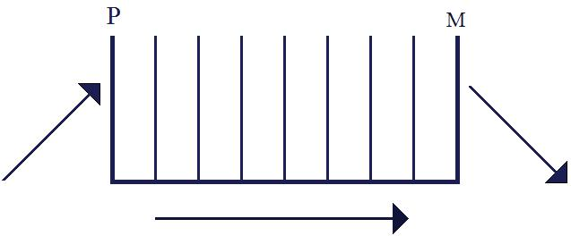
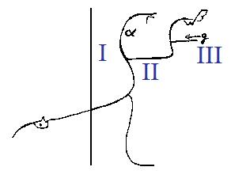
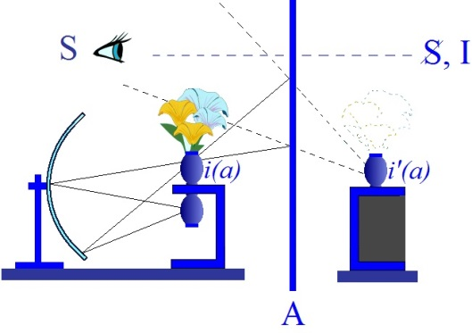
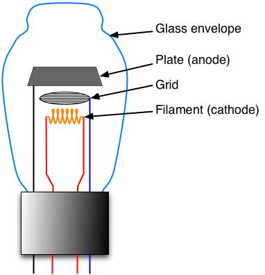
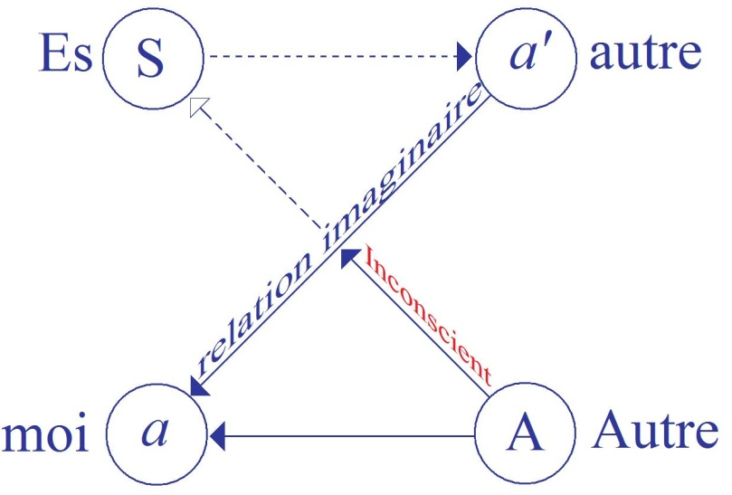
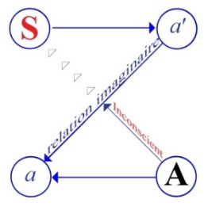

# Leçon 10 | 09 Février 1955

  

    <label><input type="checkbox" data-lacan-toggle="original" checked> 原文</label>
    <label><input type="checkbox" data-lacan-toggle="notes" checked> 注释</label>
    <label><input type="checkbox" data-lacan-toggle="commentary" checked> 个人解读评论</label>
  

  <form class="lacan-tool-search" role="search">
    <input class="lacan-tool-search-input" type="search" placeholder="搜索全文" aria-label="搜索全文">
    <button class="lacan-tool-button" type="submit" title="搜索">搜索</button>
  </form>
  <button class="lacan-tool-button lacan-back-to-top" type="button" title="回到页面最上方" aria-label="回到页面最上方">↑</button>

<section class="parallel-paragraph" data-paragraph-ids="s2-10-0001">

s2-10-0001

原文 · s2-10-0001

[VALABREGA](#VALABREGA09_02)

[无对应译文]

</section>

<section class="parallel-paragraph" data-paragraph-ids="s2-10-0002">

s2-10-0002

原文 · s2-10-0002

LACAN

[无对应译文]

</section>

<section class="parallel-paragraph" data-paragraph-ids="s2-10-0003">

s2-10-0003

原文 · s2-10-0003

C’est une loi fondamentale : apposer à toute saine critique - pour critiquer une œuvre, donc la comprendre - lui appliquer les principes mêmes qu’elle donne elle-même *explicitement* à sa construction, sa facture. Par exemple tâcher de comprendre SPINOZA en prenant dans SPINOZA les lignes mêmes de la pensée que lui-même applique comme les plus valables pour la conduite de la pensée, pour *[la réforme de l’entendement](http://www.spinozaetnous.org/document-d39.html),* une nouvelle appréhension du monde. C’est fécond quand on fait cela et on ne sort pas des principes mêmes posés par l’au­teur comme étant les principes valables, efficaces. Je dis ceci pour faire com­prendre que c’est une loi tout à fait générale.

[无对应译文]

</section>

<section class="parallel-paragraph" data-paragraph-ids="s2-10-0004">

s2-10-0004

原文 · s2-10-0004

Un autre exemple, MAÏMONIDE, c’est un personnage qui nous donne aussi certaines clefs sur le monde, à l’inté­rieur de son œuvre il y a des avertissements très *exprès* sur la façon dont on doit conduire sa recherche. Si on les applique à l’œuvre de MAÏMONIDE même, ça nous mène quelque part, ça nous permet de comprendre ce qu’il a voulu dire.

[无对应译文]

</section>

<section class="parallel-paragraph" data-paragraph-ids="s2-10-0005">

s2-10-0005

原文 · s2-10-0005

C’est donc une loi d’application tout à fait générale et qui nous pousse à lire FREUD en cherchant à comprendre, à lire avec soin sa pensée, à repérer sa pen­sée explicite, explicitée, à appliquer ses règles mêmes de la compréhension et de l’entendement, explicitées dans cette œuvre, à les appliquer à l’œuvre elle-même, c’est-à-dire à comprendre ce qui a conduit sa pensée.

[无对应译文]

</section>

<section class="parallel-paragraph" data-paragraph-ids="s2-10-0006">

s2-10-0006

原文 · s2-10-0006

Je tiens à mettre cela - à le rappeler - en introduction, inauguration, reprise de notre discours aujourd’hui parce que, par exemple quand vous avez vu passer il y a trois séminaires certaine indication que j’ai commencé de vous donner sur la compréhension qu’on peut avoir de l’ « *Au-delà du principe du plaisir »,* de cet *x* que nous appelons selon les cas, « *automatisme de répétition »*, « *principe de nirvana »* ou « *instinct de mort »* pur et simple, vous m’avez entendu, par exemple, parler de l’*entropie* à certains moments de mon discours.

[无对应译文]

</section>

<section class="parallel-paragraph" data-paragraph-ids="s2-10-0007">

s2-10-0007

原文 · s2-10-0007

Ce n’est pas arbitraire. FREUD lui-même indique que ça doit être quelque chose dans ce sens-là. Il est bien entendu qu’il ne s’agit pas de le prendre au pied de la lettre, ce serait parfaitement ridicule. C’est un ridicule, d’ailleurs, dont les analystes - et les meilleurs - ne se sont point privés.

[无对应译文]

</section>

<section class="parallel-paragraph" data-paragraph-ids="s2-10-0008">

s2-10-0008

原文 · s2-10-0008

Comme il s’agissait de donner un sens à cet *instinct de mort*, on a vu un analyste de qualité, BERNFELD, qui a retrouvé *le sou­venir d’enfance de* FREUD sous le voile d’anonymat sous lequel il l’avait com­muniqué sous le titre d’un *souvenir-écran…*

[无对应译文]

</section>

<section class="parallel-paragraph" data-paragraph-ids="s2-10-0009">

s2-10-0009

原文 · s2-10-0009

> il nous a présenté tout cela d’une façon tout à fait camouflée, en l’attribuant à un patient

[无对应译文]

</section>

<section class="parallel-paragraph" data-paragraph-ids="s2-10-0010">

s2-10-0010

原文 · s2-10-0010

…mais le texte même a permis à BERNFELD, non pas par recoupement biographique, car la vie de FREUD reste très voilée, mais par la structure de ce texte, de montrer que ça ne pouvait pas être un vrai dialogue avec un vrai patient, que le rapport même que FREUD en faisait indiquait qu’il s’agissait d’une transposition et que ça ne pou­vait venir que d’une chose empruntée à la vie de FREUD.

[无对应译文]

</section>

<section class="parallel-paragraph" data-paragraph-ids="s2-10-0011">

s2-10-0011

原文 · s2-10-0011

Il l’a rapproché de deux ou trois rêves de la *Science des rêves.* Ceux qui ont assisté à mon commentaire sur *L’homme aux rats* connaissent ce passage, et d’ailleurs il est bien connu maintenant. Son exactitude est incontestable.

[无对应译文]

</section>

<section class="parallel-paragraph" data-paragraph-ids="s2-10-0012">

s2-10-0012

原文 · s2-10-0012

BERNFELD en 1931[^8], donc quelques dizaines d’années après la parution du texte essentiel que nous sommes en train

[无对应译文]

</section>

<section class="parallel-paragraph" data-paragraph-ids="s2-10-0013">

s2-10-0013

原文 · s2-10-0013

de commenter, donne avec FEITELBERG *le rapport de je ne sais quoi*, qui n’a de nom en aucune langue et qui est *une recherche*...

[无对应译文]

</section>

<section class="parallel-paragraph" data-paragraph-ids="s2-10-0014">

s2-10-0014

原文 · s2-10-0014

> quand les psychanalystes se mettent à faire de l’expérience, c’est quelque chose qui n’est pas mal, je vous assure

[无对应译文]

</section>

<section class="parallel-paragraph" data-paragraph-ids="s2-10-0015">

s2-10-0015

原文 · s2-10-0015

…ils ont été chercher là les paradoxes intra-organiques de cette *entropie* - je veux dire la pulsation paradoxale de l’*entropie -* à l’intérieur d’un être vivant, ou plus exac­tement au niveau du système nerveux de l’homme.

[无对应译文]

</section>

<section class="parallel-paragraph" data-paragraph-ids="s2-10-0016">

s2-10-0016

原文 · s2-10-0016

Comme dans l’*entropie*, il s’agit de dégradation de l’énergie, de chute de température, qualité potentielle thermique que donne le rapport d’expérience : en comparant la température cérébrale et la température rectale, il prétendait saisir là les témoignages des variations paradoxales, c’est-à-dire non conformes avec le principe de l’*entro­pie* tel qu’il doit fonctionner en physique, tel qu’on peut s’y attendre dans un système inanimé.

[无对应译文]

</section>

<section class="parallel-paragraph" data-paragraph-ids="s2-10-0017">

s2-10-0017

原文 · s2-10-0017

Pour qu’on puisse tenir compte de ce qu’un physicien peut apporter au point de vue isolation du système, et comparer gravement ce qui se passe dans le rapport entre la température du cerveau et la température soi-disant du corps - je passe *toutes les réserves* qu’on peut faire sur cette façon de la mesurer - dans les diverses phases tant *de la vie* que *de la mort*, c’est-à-dire ce qui se passe aussi, immédiatement après le passage de l’être vivant à l’état *cadavérique*.

[无对应译文]

</section>

<section class="parallel-paragraph" data-paragraph-ids="s2-10-0018">

s2-10-0018

原文 · s2-10-0018

C’est quelque chose de très curieux à lire, ne serait-ce qu’à titre de démonstration des aberrations où peut nous mener la prise au pied de la lettre d’une *métaphore* théorique, d’une interrogation qui se porte bien plus sur *des structures symboliques* à proprement parler, des catégories en tant qu’elles ont été introduites nécessairement en physique, voire si nous trouvons nécessaire­ment *une catégorie analogique* dans le maniement de cet ordre de relations qu’on ne peut pas qualifier de *psychologique* purement et simplement, mais d’*état psychologique* comme il l’a dit, c’est-à-dire l’appréhension du comporte­ment humain, non seulement dans sa signification, en introduisant la dimension de la \[psyché ?\] en tant que telle, mais dans sa signification en tant qu’elle se réa­lise dans un acte original de communication qui est la situation analytique.

[无对应译文]

</section>

<section class="parallel-paragraph" data-paragraph-ids="s2-10-0019">

s2-10-0019

原文 · s2-10-0019

Il faut que toutes ces dimensions soient conservées pour que les propos que FREUD peut être amené à tenir dans la constatation qu’il fait par exemple de la reproduction d’une certaine modulation temporelle, d’une certaine significa­tion dans le comportement du sujet :

[无对应译文]

</section>

<section class="parallel-paragraph" data-paragraph-ids="s2-10-0020">

s2-10-0020

原文 · s2-10-0020

- *out,* en dehors du traitement,

[无对应译文]

</section>

<section class="parallel-paragraph" data-paragraph-ids="s2-10-0021">

s2-10-0021

原文 · s2-10-0021

- et *in,* dans le traitement analytique.

[无对应译文]

</section>

<section class="parallel-paragraph" data-paragraph-ids="s2-10-0022">

s2-10-0022

原文 · s2-10-0022

Cet ordre de question est posé essentiellement à FREUD, vous l’avez vu par ce fait de la reproduction de la vie en tant qu’elle est quelque chose. Si nous oublions un seul instant que cela suppose toutes les dimensions que je viens de dire, à savoir pas seulement l’être vivant objectivable sur le plan psychique, mais la dimension de la signification reconnue comme telle de son comportement, et en plus cette signification entrant en jeu, en action, dans une relation particulière qui est la relation analytique qui ne peut se supposer et se comprendre que comme *une communication* de quelque nature qu’elle soit. Donc, c’est à l’intérieur de cela qu’il faut comprendre la question que va se poser FREUD.

[无对应译文]

</section>

<section class="parallel-paragraph" data-paragraph-ids="s2-10-0023">

s2-10-0023

原文 · s2-10-0023

Il est amené à se servir comme *d’une analogie, d’une comparaison de l’entropie* à propos de son *instinct de mort*. La prendre *à la lettre* et la tra­duire dans les termes qui sont tout à fait précis qu’ils ont dans son usage en phy­sique suppose quelque chose.

[无对应译文]

</section>

<section class="parallel-paragraph" data-paragraph-ids="s2-10-0024">

s2-10-0024

原文 · s2-10-0024

Par exemple essentiellement le rapport se traduit par une formule et un quotient entre :

[无对应译文]

</section>

<section class="parallel-paragraph" data-paragraph-ids="s2-10-0025">

s2-10-0025

原文 · s2-10-0025

- une quantité calorique déterminée par ce qui peut se déplacer à l’intérieur d’une certaine chute de potentiel calorique, dans des conditions déterminées,

[无对应译文]

</section>

<section class="parallel-paragraph" data-paragraph-ids="s2-10-0026">

s2-10-0026

原文 · s2-10-0026

- ceci étant divisé par la température elle-même, …rapport au niveau duquel se passe le phénomène qui, du seul fait du maniement de cette formule, montrera en effet que ce résultat, ce quotient, ne peut - au cours de l’évolution irréversible d’un système, dans un certain sens – qu’aller lui-même en augmentant par exemple, c’est ce qu’on dit : augmentation constante de l’en­tropie. Ceci résulte de certaines définitions tout à fait précises et qu’il est impos­sible de sortir de leur formulation mathématique sans déjà complètement n’être même plus dans *la métaphore* mais dans l’absurdité.

[无对应译文]

</section>

<section class="parallel-paragraph" data-paragraph-ids="s2-10-0027">

s2-10-0027

原文 · s2-10-0027

Par conséquent, toute espèce d’usage direct, de rapprochement - on ne peut même pas dire *forcé* - relève purement et simplement de l’ordre du contresens, aussi absurde que les opérations imaginaires et célèbres de la métaphore de BOREL des singes dactylographes. C’est quelque chose - bien entendu le premier pas que nous ayons à faire ici - qui est de salubrité publique de tout de même le dénoncer chaque fois que nous en rencontrons l’existence.

[无对应译文]

</section>

<section class="parallel-paragraph" data-paragraph-ids="s2-10-0028">

s2-10-0028

原文 · s2-10-0028

Cette opération de singes dac­tylographes, nous n’aurons que trop souvent à la repérer dans le contresens per­manent qui, à l’intérieur de l’analyse, existe sur tellement de notions, celle-là plus que toute autre.

[无对应译文]

</section>

<section class="parallel-paragraph" data-paragraph-ids="s2-10-0029">

s2-10-0029

原文 · s2-10-0029

Ce que nous cherchons, c’est à savoir dans le progrès de la pensée de FREUD, dans ces quatre étapes que je vous ai dites :

[无对应译文]

</section>

<section class="parallel-paragraph" data-paragraph-ids="s2-10-0030">

s2-10-0030

原文 · s2-10-0030

- depuis le manuscrit inédit dont nous sommes en train d’achever le commentaire \[l’*Entwurf*, l’*Esquisse*\],

[无对应译文]

</section>

<section class="parallel-paragraph" data-paragraph-ids="s2-10-0031">

s2-10-0031

原文 · s2-10-0031

- et ensuite au niveau de la « *Science des rêves »,*

[无对应译文]

</section>

<section class="parallel-paragraph" data-paragraph-ids="s2-10-0032">

s2-10-0032

原文 · s2-10-0032

- et ensuite au moment de la constitution de *la théorie du narcissisme*,

[无对应译文]

</section>

<section class="parallel-paragraph" data-paragraph-ids="s2-10-0033">

s2-10-0033

原文 · s2-10-0033

- et enfin : « *Au-delà du principe du plaisir »,*

[无对应译文]

</section>

<section class="parallel-paragraph" data-paragraph-ids="s2-10-0034">

s2-10-0034

原文 · s2-10-0034

Qu’est-ce que veut dire ce que nous trou­vons, ce qui nous intéresse : la suite de difficultés, de contradictions, d’antino­mies, d’impasses où la pensée de FREUD est conduite, à chacune de ses étapes ? Qu’est-ce que ceci, par son existence même, et aussi son mouvement, son pro­grès, cette sorte de dialectique négative impliquée dans la persistance de certai­nes antinomies, leur maintien, leur durée, sous des formes transformées ?

[无对应译文]

</section>

<section class="parallel-paragraph" data-paragraph-ids="s2-10-0035">

s2-10-0035

原文 · s2-10-0035

Car à travers ces quatre étapes vous voyez les difficultés, les impasses, les antinomies se reproduire dans une disposition à chaque fois transformée. C’est ce que nous allons suivre et qui par soi–même, peut nous donner une indication nouvelle, voir surgir l’autonomie, l’ordre propre de ce à quoi FREUD s’affronte de ce qu’il a à formaliser.

[无对应译文]

</section>

<section class="parallel-paragraph" data-paragraph-ids="s2-10-0036">

s2-10-0036

原文 · s2-10-0036

Cet effort de formalisation même, dans son progrès, dans son relatif échec, nous désigne, nous dénonce à la fois l’ordre qui est visé, l’ordre qui est en quelque sorte isolé, et le progrès, les pas faits dans la définition de cet ordre à mesure du progrès de la théorie et de la technique ana­lytiques. Cet ordre…

[无对应译文]

</section>

<section class="parallel-paragraph" data-paragraph-ids="s2-10-0037">

s2-10-0037

原文 · s2-10-0037

> vous le savez déjà en gros, vous ne pouvez pas ne pas savoir de quoi je parle après un an et demi de séminaire ici

[无对应译文]

</section>

<section class="parallel-paragraph" data-paragraph-ids="s2-10-0038">

s2-10-0038

原文 · s2-10-0038

…c’est *l’ordre symbolique* dans ses structures propres, dans son dynamisme autonome, dans le mode particulier sous lequel il intervient pour imposer sa cohérence, son dynamisme propre, son éco­nomie autonome, à l’être humain dans son vécu.

[无对应译文]

</section>

<section class="parallel-paragraph" data-paragraph-ids="s2-10-0039">

s2-10-0039

原文 · s2-10-0039

C’est-à-dire quelque chose qui est justement ce par quoi je vous désigne l’originalité de la découverte freudienne, que tout ce qui détermine l’homme…

[无对应译文]

</section>

<section class="parallel-paragraph" data-paragraph-ids="s2-10-0040">

s2-10-0040

原文 · s2-10-0040

> disons ça en gros, encore que le langage ici va représenter une certaine chute de niveau,
>
> pour imager pour ceux qui ne compren­nent rien

[无对应译文]

</section>

<section class="parallel-paragraph" data-paragraph-ids="s2-10-0041">

s2-10-0041

原文 · s2-10-0041

…que ce qu’il y a de plus haut dans l’homme est justement quelque chose qui n’est pas simplement dans l’homme, qui est ailleurs, qui est justement *cet ordre symbolique*.

[无对应译文]

</section>

<section class="parallel-paragraph" data-paragraph-ids="s2-10-0042">

s2-10-0042

原文 · s2-10-0042

Et que FREUD soit toujours, à mesure même du progrès de sa synthè­se, forcé de restaurer, restituer toujours ce point extérieur, excentrique, c’est ça la signification du progrès sur ces différences, et ces quatre schémas, dont nous allons essayer maintenant de retrouver dans le texte les étapes.

[无对应译文]

</section>

<section class="parallel-paragraph" data-paragraph-ids="s2-10-0043">

s2-10-0043

原文 · s2-10-0043

   

[无对应译文]

</section>

<section class="parallel-paragraph" data-paragraph-ids="s2-10-0044">

s2-10-0044

原文 · s2-10-0044

Voici d’abord ce que je vous ai désigné l’autre jour…

[无对应译文]

</section>

<section class="parallel-paragraph" data-paragraph-ids="s2-10-0045">

s2-10-0045

原文 · s2-10-0045

> bien entendu, si vous ne lisez pas le texte, vous ne verrez pas tout le schéma

[无对应译文]

</section>

<section class="parallel-paragraph" data-paragraph-ids="s2-10-0046">

s2-10-0046

原文 · s2-10-0046

…l’autre jour je vous ai désigné le système ϕ en tant qu’il représente grossièrement l’arc réflexe, c’est-à-dire quelque chose uniquement fondé sur *la notion de quantité et de décharge*, avec le minimum de contenu.

[无对应译文]

</section>

<section class="parallel-paragraph" data-paragraph-ids="s2-10-0047">

s2-10-0047

原文 · s2-10-0047

Le fait que quelqu’un comme FREUD, à cette date - à la fois formé par *les disciplines neurologiques, anatomo-physiologiques, cliniques* - doive construire un schéma, et ne puisse se contenter de cela, et puisse encore bien moins se contenter du schéma qui à ce moment-là est donné par la physiologie positiviste, à savoir une architecture de *réflexes, réflexes supérieurs, réflexes de réflexes, etc.*, jusqu’à ce réflexe d’unité placé au niveau des fonctions supérieures, avec un départ de stimulus archi-élaboré.

[无对应译文]

</section>

<section class="parallel-paragraph" data-paragraph-ids="s2-10-0048">

s2-10-0048

原文 · s2-10-0048

Et au niveau supérieur, il faudrait tout de même bien mettre quelque chose là, que notre ami LECLAIRE appellerait le sujet, dans ses bons jours. J’espère qu’un jour de cela aussi il se débarrassera. Il ne faut jamais le représenter nulle part. Il faut que FREUD fasse autre chose. Il faut bien qu’il nous fasse cette chose, en effet très élaborée, mais qui se trouve justement être, non une architecture, mais un « *tampon* ». Et il est déjà très en avance sur la théorie neuronique, deux ans avant FOSTER et SHERRINGTON.

[无对应译文]

</section>

<section class="parallel-paragraph" data-paragraph-ids="s2-10-0049">

s2-10-0049

原文 · s2-10-0049

Ce texte est intéressant par toutes sortes de côtés. Le côté *génie* de FREUD est en quelque sorte d’avoir vu, avec une finesse qui va jusque dans le détail, *cer­taines propriétés de la conduction*. Il a deviné en gros à peu près ce que l’on connaît actuellement. On n’a pas fait tellement de progrès de ce point de vue. Bien sûr, on en a fait du point de vue de l’expérience, confirmation effective du fonctionnement de ces synapses en tant que barrières de contact, mais c’est déjà ainsi qu’il s’exprime.

[无对应译文]

</section>

<section class="parallel-paragraph" data-paragraph-ids="s2-10-0050">

s2-10-0050

原文 · s2-10-0050

Ceci mériterait qu’on médite : comment est-ce qu’on peut deviner ? Il faut que les résultats s’inscrivent au tableau de sortie. Cela implique qu’à l’intérieur on doive trouver certaines conditions. N’empêche qu’il aurait pu aussi faire des erreurs. Mais il n’en a pas fait de très grosses. Donc, il est purement dans *l’hypothèse*.

[无对应译文]

</section>

<section class="parallel-paragraph" data-paragraph-ids="s2-10-0051">

s2-10-0051

原文 · s2-10-0051

[无对应译文]

</section>

<section class="parallel-paragraph" data-paragraph-ids="s2-10-0052">

s2-10-0052

原文 · s2-10-0052

L’important est que dans le schéma il faut qu’il fasse quelque chose qu’il interpose si on peut dire, à l’intérieur de cet acte de décharge et qui soit ce qu’on peut appeler, c’est dans le texte, *un système tampon*. Ce système y est avant tout *un système tampon* d’équilibre, de filtrage, d’amortissement.

[无对应译文]

</section>

<section class="parallel-paragraph" data-paragraph-ids="s2-10-0053">

s2-10-0053

原文 · s2-10-0053

[无对应译文]

</section>

<section class="parallel-paragraph" data-paragraph-ids="s2-10-0054">

s2-10-0054

原文 · s2-10-0054

D’ailleurs à quoi le compare-t-il ? À quelque chose qui se voit déjà sur ce schéma[^9]. Vous voyez, à l’intérieur d’un arc spinal quelque chose qui fait une boule, c’est un ganglion. Le schéma du psychisme est un ganglion. L’idée qu’il se fait à ce niveau du cerveau est un ganglion différencié, du type ganglion sympathique ou d’une chaîne nerveuse chez les insectes.

[无对应译文]

</section>

<section class="parallel-paragraph" data-paragraph-ids="s2-10-0055">

s2-10-0055

原文 · s2-10-0055

Seulement voilà, le frappant, et c’est là-dessus que j’ai insisté la dernière fois, est qu’on a vu s’établir une espèce de petit flottement dans notre dialogue. \[S’adressant à J.P. Valabrega\] J’ai voulu que vous n’alliez pas trop vite. Vous avez dit des choses qui n’étaient pas fausses, à propos du *système* ω, qu’il faut absolument marquer ici, et qui montrent les premières difficultés de FREUD, c’est-à-dire de quelqu’un qui arrive à un schéma déjà particulièrement *adapté*, particulière­ment *peu schématique*.

[无对应译文]

</section>

<section class="parallel-paragraph" data-paragraph-ids="s2-10-0056">

s2-10-0056

原文 · s2-10-0056

Il ne peut pas s’en tirer sans l’intervention de ce systè­me ω, ou système de la conscience en tant que référence à une réalité dont, quoi qu’on fasse, on n’arrivera jamais à faire sortir le lapin du chapeau sans l’inter­vention de quelque chose qui, il faut bien le dire, vient dans le schéma comme un rajout.

[无对应译文]

</section>

<section class="parallel-paragraph" data-paragraph-ids="s2-10-0057">

s2-10-0057

原文 · s2-10-0057

Car là on ne cherche pas à dénuder les choses et à faire croire qu’il suffira de mettre assez de choses en tas pour que ce qui est *en haut* soit telle­ment plus beau que ce qui était *en dessous*. Là, il faut bien qu’il l’isole. Il est amené à poser les conditions de fonctionnement de ce qui, dans la suite, se révè­le dans son développement comme mené par une autre voie à une saisie parti­culièrement frappante, apparente de *la nécessité de refondre* après l’expérience freudienne et dans l’expérience freudienne, *la structure du sujet humain*, d’une façon qui non seulement décentre par rapport au *moi*, mais rejette littéralement *la conscience* dans une espèce de position sans aucun doute très essentielle dans la dialectique de cette structure de l’être humain, elle-même absolument para­doxale, problématique. Je dirai que l’approfondissement *du caractère insaisis­sable, irréductible,* par rapport au fonctionnement du vivant, *de la conscience* comme telle, c’est dans *l’œuvre de* FREUD quelque chose d’aussi important à sai­sir que ce qu’il nous a apporté sur *la conscience* \[*sic*\].

[无对应译文]

</section>

<section class="parallel-paragraph" data-paragraph-ids="s2-10-0058">

s2-10-0058

原文 · s2-10-0058

Vous avez là les embarras, les antinomies que révèle le maniement de cette référence à *ce système de la conscience* comme telle, qui reparaissent, réagissent, à chacun des niveaux de la théorisation freudienne d’une façon qui, à soi toute seule, pose un problème. Ce n’est pas en référence à *l’existence* de l’inconscient, c’est dans la constitution si vous voulez d’un *modèle*, d’un *pattern*, d’une conception même cohérente de *la conscience* comme telle.

[无对应译文]

</section>

<section class="parallel-paragraph" data-paragraph-ids="s2-10-0059">

s2-10-0059

原文 · s2-10-0059

Il apparaît que dans le registre, dans l’ensemble de concepts où s’inscrit l’expérience freudienne, alors qu’il arrive à donner une conception cohérente et équilibrée de la plupart des autres parties de l’appareil psychique, il rencontre toujours, quand il s’agit de *la conscience*, des conditions incompatibles.

[无对应译文]

</section>

<section class="parallel-paragraph" data-paragraph-ids="s2-10-0060">

s2-10-0060

原文 · s2-10-0060

Je vais vous donner un exemple tout de suite. Il arrivera dans un de ses textes qui s’appelle *Métapsychologie *: « *Compléments métapsychologiques à la théorie des rêves »,* publié dans le recueil français *Métapsychologie,* qui peut expliquer à peu près tout ce qui se passe dans la démence précoce, la paranoïa, dans les rêves, en parlant d’investissement ou de désinvestissement, notions que nous aurons à rencontrer et dont nous allons voir la portée dans la théo­rie de FREUD.

[无对应译文]

</section>

<section class="parallel-paragraph" data-paragraph-ids="s2-10-0061">

s2-10-0061

原文 · s2-10-0061

Chose curieuse, il semblerait qu’il y a quelque chose d’arbitraire, qu’après tout, quand on lit dans l’ordre la construction théorique, on doit pou­voir toujours s’arranger pour que ça marche, que ça colle. Mais non, il appa­raît, quand il faut faire intervenir l’appareil de *la conscience* comme telle, c’est-à-dire la conception du *reflet clair*, qu’il aurait des propriétés tout à fait spé­ciales par rapport aux autres.

[无对应译文]

</section>

<section class="parallel-paragraph" data-paragraph-ids="s2-10-0062">

s2-10-0062

原文 · s2-10-0062

La cohérence même de son système le fait buter devant une difficulté. Il dit qu’il y a quelque chose qu’il ne comprend pas, c’est que cet appareil aurait pour propriété, contrairement aux autres, de fonction­ner, même quand il est désinvesti. La nécessité de la déduction le mène à une proposition comme celle-là. Vous n’avez qu’à lire le texte auquel je viens de vous référer, pour vous apercevoir de la chose. Et en effet, il reste très embar­rassé. Il n’a pas pu théoriser les choses autrement.

[无对应译文]

</section>

<section class="parallel-paragraph" data-paragraph-ids="s2-10-0063">

s2-10-0063

原文 · s2-10-0063

Pour les autres, ça va bien : quand ils sont désinvestis, ça ne marche plus, le jeu d’investissement et désinvestissement marche d’une façon correcte. Mais quand on fait entrer le systè­me conscient, on entre dans le paradoxe. Pourquoi ? Cela reflète certainement quelque chose. Pas seulement parce que FREUD, qui construit des hypothèses, ne sait pas s’y prendre : il avait tout le temps. S’il n’y est pas arrivé, c’est en rai­son de quelque chose.

[无对应译文]

</section>

<section class="parallel-paragraph" data-paragraph-ids="s2-10-0064">

s2-10-0064

原文 · s2-10-0064

Nous voyons apparaître là, pour la première fois, le paradoxe du système ω, dans le système de la conscience en ce sens qu’il faut, comme nous disions l’autre jour, à la fois qu’il soit là et qu’il ne soit pas là. Que si vous le faites entrer dans le système *énergétique*, tel qu’il est constitué au niveau de Ψ il n’en sera plus qu’une partie, et il ne pourra pas jouer son jeu de référence à la réali­té.

[无对应译文]

</section>

<section class="parallel-paragraph" data-paragraph-ids="s2-10-0065">

s2-10-0065

原文 · s2-10-0065

Et d’un autre côté, il faut bien imaginer d’une certaine façon que quelque énergie passe, si minimale soit-elle, que d’autre part ça ne peut absolument pas être quelque chose qui se lie directement à ce côté particulièrement massif de l’apport du *monde extérieur*, tel qu’il est déjà supposé dans le premier système, dit de la décharge, c’est-à-dire *le réflexe élémentaire stimulus-réponse*.

[无对应译文]

</section>

<section class="parallel-paragraph" data-paragraph-ids="s2-10-0066">

s2-10-0066

原文 · s2-10-0066

Bien au contraire, il faut qu’il en soit complètement séparé, qu’il ne puisse recevoir que de faibles investissements d’énergie qui puissent lui permettre de rentrer en vibration, de sorte que la circulation se fasse toujours de ϕ à Ψ. Et c’est seule­ment de Ψ que viendra à ω cette énergie minimale, grâce à laquelle il peut, lui, entrer en vibration.

[无对应译文]

</section>

<section class="parallel-paragraph" data-paragraph-ids="s2-10-0067">

s2-10-0067

原文 · s2-10-0067

D’autre part, à partir de ce qui se passe au niveau d’ω, le système Ψ qui a besoin - comme disait VALABREGA l’autre jour, de façon que j’ai trouvée un peu précipitée, mais non fausse en elle-même - d’*information*. Il ne peut *la* prendre qu’au niveau de ce qui se passe dans la décharge de ce *système perceptif*, en tant que tel. Cela veut dire que dans la conception qu’élabore FREUD, à ce moment là, pour opérer le test de réalité, ce qui se passe au niveau du psychisme procède ainsi.

[无对应译文]

</section>

<section class="parallel-paragraph" data-paragraph-ids="s2-10-0068">

s2-10-0068

原文 · s2-10-0068

Par exemple, prenons l’exemple de \[l’élément ?\] moteur, qui se charge, d’une décharge motrice proprement perceptuelle, les mouvements qui se font dans l’œil, sim­plement du fait de l’accommodation de la vision, de la fixation sur un objet. C’est là théoriquement qu’un effet peut être conçu comme apportant au regard de quelque chose qui est en train de se former dans le psychisme, à savoir l’hal­lucination du désir, ce quelque chose qui, comme on dit met les choses au point :

[无对应译文]

</section>

<section class="parallel-paragraph" data-paragraph-ids="s2-10-0069">

s2-10-0069

原文 · s2-10-0069

> « *En crois-je mes yeux ?*
>
> *Est-ce bien cela que je regarde ?* »

[无对应译文]

</section>

<section class="parallel-paragraph" data-paragraph-ids="s2-10-0070">

s2-10-0070

原文 · s2-10-0070

C’est ça que ça veut dire finalement. Mais c’est assez curieux de penser que justement ce moment de la décharge motrice, à savoir la partie qui dans le fonctionnement des organes perceptifs est proprement motrice, c’est justement celle qui est tout à fait inconsciente, à savoir que l’inconscience ne se réalise là qu’au niveau afférent, comme chacun le sait.

[无对应译文]

</section>

<section class="parallel-paragraph" data-paragraph-ids="s2-10-0071">

s2-10-0071

原文 · s2-10-0071

Nous avons en effet conscience de voir un certain nombre de choses. Rien ne nous paraît même plus homologue de *la transparence de la conscience* que ce fait qu’on voit ce qu’on voit, et *le fait même de voir pose à soi-même sa propre transparence*. Mais par contre nous n’avons pas la moindre *conscience*, sauf d’une façon très mar­ginale, très limitrophe, de ce que nous faisons en effet d’efficace, d’actif, de moteur, dans ce repérage, dans ce centrage, cette palpation à distance que les yeux opèrent quand ils s’exercent à voir.

[无对应译文]

</section>

<section class="parallel-paragraph" data-paragraph-ids="s2-10-0072">

s2-10-0072

原文 · s2-10-0072

Cette suite de paradoxes donc, qui commence ici à s’ébaucher, cette position tout à fait originale du système ω, ce côté très diffi­cile à réduire, à mettre au point avec *le système* ω, qui commence à s’ébaucher au niveau du fameux *manuscrit* que nous sommes en train d’étudier, est quelque chose que j’ai voulu mettre en relief, parce que ça se voit déjà, ça se repère à la lecture, ça prend son intérêt de ce que ça va devenir, par la suite.

[无对应译文]

</section>

<section class="parallel-paragraph" data-paragraph-ids="s2-10-0073">

s2-10-0073

原文 · s2-10-0073

Bien entendu, ce n’est pas simplement d’un point de vue de curiosité historique, de voir les difficultés d’un théoricien plus ou moins philosophe. FREUD, à ce moment, ne fait pas ça pour lui-même, pour ordonner ses idées. Ce ne sont pas les difficultés particulières du monsieur qui nous intéressent.

[无对应译文]

</section>

<section class="parallel-paragraph" data-paragraph-ids="s2-10-0074">

s2-10-0074

原文 · s2-10-0074

Mais voilà l’amorce de quelque chose que nous allons retrouver à tous les niveaux et dont je peux vous donner…

[无对应译文]

</section>

<section class="parallel-paragraph" data-paragraph-ids="s2-10-0075">

s2-10-0075

原文 · s2-10-0075

> pour vous indiquer le mouvement général, pour que vous ne soyez pas perdus à la suite de ces séminaires,
>
> qui vont s’engager, et vont peut-être un peu piétiner

[无对应译文]

</section>

<section class="parallel-paragraph" data-paragraph-ids="s2-10-0076">

s2-10-0076

原文 · s2-10-0076

…je peux vous indiquer de quoi il s’agit.

[无对应译文]

</section>

<section class="parallel-paragraph" data-paragraph-ids="s2-10-0077">

s2-10-0077

原文 · s2-10-0077

Après ça, il y aura le schéma que nous allons voir aujourd’hui dans la *Traumdeutung,* à savoir un schéma qui, lui aussi, m’a semblé...

[无对应译文]

</section>

<section class="parallel-paragraph" data-paragraph-ids="s2-10-0078">

s2-10-0078

原文 · s2-10-0078

Reportez-vous au chapitre VII, « *Les processus du rêve* » à la fin de la *Science des rêves,* dans l’édition française.

[无对应译文]

</section>

<section class="parallel-paragraph" data-paragraph-ids="s2-10-0079">

s2-10-0079

原文 · s2-10-0079

Ce que vous avez c’est autre chose, quelque chose qui va être exprimé comme ça :

[无对应译文]

</section>

<section class="parallel-paragraph" data-paragraph-ids="s2-10-0080">

s2-10-0080

原文 · s2-10-0080

[无对应译文]

</section>

<section class="parallel-paragraph" data-paragraph-ids="s2-10-0081">

s2-10-0081

原文 · s2-10-0081

- Ici un apport, et aussi ici quelque chose qui va s’étayer entre quelque chose que vous allez voir ici, qu’on va appeler le *système* P, *perception*, W en allemand.

[无对应译文]

</section>

<section class="parallel-paragraph" data-paragraph-ids="s2-10-0082">

s2-10-0082

原文 · s2-10-0082

- Ici, les diverses couches qu’il est forcé de supposer qui constituent le niveau de l’*inconscient*.

[无对应译文]

</section>

<section class="parallel-paragraph" data-paragraph-ids="s2-10-0083">

s2-10-0083

原文 · s2-10-0083

- Puis *le préconscient*,

[无对应译文]

</section>

<section class="parallel-paragraph" data-paragraph-ids="s2-10-0084">

s2-10-0084

原文 · s2-10-0084

- puis *la conscience*, dont vous voyez déjà la répartition *paradoxale* : la voilà maintenant des deux côtés.

[无对应译文]

</section>

<section class="parallel-paragraph" data-paragraph-ids="s2-10-0085">

s2-10-0085

原文 · s2-10-0085

Qu’est-ce qu’il y a eu de changé dans ce schéma ? C’est ce que nous allons tâcher de voir aujourd’hui. Je vous indique tout de suite quelque chose. C’est qu’ici vous aviez vraiment la structure d’un appareil, quelque chose qui essayait de se représenter un appa­reil, appareil qu’on essaie ensuite de faire fonctionner, qu’on décrit, on en parle, on se repère à quelque chose qui est là dans l’espace conscient.

[无对应译文]

</section>

<section class="parallel-paragraph" data-paragraph-ids="s2-10-0086">

s2-10-0086

原文 · s2-10-0086

C’est un appa­reil qui est quelque part. Ce sont les organes de perception, le psychisme, c’est le cerveau et le sous-cerveau, donc, qui fonctionnent comme une sorte de gan­glion autonome, réglant la pulsation entre instincts, pulsions internes à l’orga­nisme, et les manifestations de recherche à l’extérieur. Car c’est de cela qu’il s’agit, de l’*économie instinctuelle*. Il va commencer à mettre l’être vivant en quête de ce dont il a besoin, le rapport du *need* avec une activité plus ou moins désordonnée ou ordonnée.

[无对应译文]

</section>

<section class="parallel-paragraph" data-paragraph-ids="s2-10-0087">

s2-10-0087

原文 · s2-10-0087

Là *ce sont les appareils* :

[无对应译文]

</section>

<section class="parallel-paragraph" data-paragraph-ids="s2-10-0088">

s2-10-0088

原文 · s2-10-0088

[无对应译文]

</section>

<section class="parallel-paragraph" data-paragraph-ids="s2-10-0089">

s2-10-0089

原文 · s2-10-0089

Et là *ce n’est déjà plus l’appa­reil*, ce n’est pas moi qui le dis, c’est dans le texte :

[无对应译文]

</section>

<section class="parallel-paragraph" data-paragraph-ids="s2-10-0090">

s2-10-0090

原文 · s2-10-0090

[无对应译文]

</section>

<section class="parallel-paragraph" data-paragraph-ids="s2-10-0091">

s2-10-0091

原文 · s2-10-0091

Ici le schéma commence à se rapporter à quelque chose qui est beaucoup plus immatériel. Lui-même le souligne dés le début et à l’origine : les choses dont nous allons parler, il ne faut pas essayer de les localiser quelque part. Dans le texte il nous dit qu’il y a *quelque chose à quoi ça doit ressembler*. Rappelez-vous ce que l’année derniè­re, au moment des leçons sur *le transfert*, je vous avais indiqué : ce sont ces images qui dans un appareil d’optique ne peuvent pas être dites - surtout quand elles sont virtuelles - être quelque part, à tel endroit dans l’appareil. Elles sont vues à cet endroit, quand on est autre part pour les voir. C’est de cela qu’il s’agit.

[无对应译文]

</section>

<section class="parallel-paragraph" data-paragraph-ids="s2-10-0092">

s2-10-0092

原文 · s2-10-0092

Donc, renforcement, introduction par exemple d’*une dimension imaginaire*, qui est là, dans le schéma. Qu’il faille l’y mettre est déjà une indication que le schéma a changé de sens. Ce qui nous est indiqué dans le texte, c’est qu’il est essentiel à ce schéma qu’il signifie, qu’il mette au tableau noir la dimension temporelle en tant que telle. Ceci est également souligné dans le texte.

[无对应译文]

</section>

<section class="parallel-paragraph" data-paragraph-ids="s2-10-0093">

s2-10-0093

原文 · s2-10-0093

Le schéma, dont vous voyez qu’il conserve la même ordonnance générale, prouve que FREUD est poussé déjà à l’introduction dans le schéma, et du même coup dans les catégories qu’il ordonne logiquement, et du même coup dans ces catégories, des dimensions qui sont des dimensions différentes, qui ne sont plus la construction d’un *appareil psychique* mais déjà de l’introduction d’une certaine dimension logique en tant que telle.

[无对应译文]

</section>

<section class="parallel-paragraph" data-paragraph-ids="s2-10-0094">

s2-10-0094

原文 · s2-10-0094

Nous sommes passés du modèle mécanique à un modèle logique. Ce n’est pas tout à fait pareil, encore que ça puisse s’incarner dans un modèle mécanique. Je vous ai un peu indiqué que nous parlerions aussi de *cybernétique*, parce que cela va nous permettre d’éclairer ce qu’on veut dire quand on parle de *cybernétique*, et en quoi ces machines mécaniques ont quelque chose d’original, par rapport aux anciennes. Peut-être allons nous progresser parallèlement dans les deux voies, c’est-à-dire qu’à voir les difficultés qu’a rencontrées FREUD…

[无对应译文]

</section>

<section class="parallel-paragraph" data-paragraph-ids="s2-10-0095">

s2-10-0095

原文 · s2-10-0095

> en somme, ce que nous sommes en train d’essayer de démontrer à saisir,
>
> quant à la présence, l’actualisation du langage humain

[无对应译文]

</section>

<section class="parallel-paragraph" data-paragraph-ids="s2-10-0096">

s2-10-0096

原文 · s2-10-0096

…nous allons peut-être aussi com­prendre pourquoi on est, en somme si étonné.

[无对应译文]

</section>

<section class="parallel-paragraph" data-paragraph-ids="s2-10-0097">

s2-10-0097

原文 · s2-10-0097

Car *la cybernétique* procède aussi d’une espèce de mouvement d’étonnement de le retrouver - ce langage humain - car c’est de cela en fin de compte qu’il s’agit, fonctionnant tout d’un coup presque tout seul, paraissant un tout petit peu nous damer le pion, nous dépasser, dans des machines où il est bien venu par quelque part.

[无对应译文]

</section>

<section class="parallel-paragraph" data-paragraph-ids="s2-10-0098">

s2-10-0098

原文 · s2-10-0098

Je crois que la seule erreur est ceci : que quand on fait cette critique, qu’il est venu de quelque part, on croit qu’on a tout résolu, en disant que c’est le bonhomme qui l’y a mis. C’est ce que nous rappelle LÉVI-STRAUSS, toujours plein de sagesse devant les choses nouvelles, et qui semble toujours aller à les ramener à des choses anciennes.

[无对应译文]

</section>

<section class="parallel-paragraph" data-paragraph-ids="s2-10-0099">

s2-10-0099

原文 · s2-10-0099

Nous avons là le bouquin de M. RUYER, dont je ne sais plus qui disait récemment que ce n’est pas mal, mais je trouve que d’habitude ce qu’il écrit n’est pas mal, tandis que ce qu’il écrit sur la cybernétique[^10]...

[无对应译文]

</section>

<section class="parallel-paragraph" data-paragraph-ids="s2-10-0100">

s2-10-0100

原文 · s2-10-0100

Toute la question est de s’apercevoir qu’en effet, dans ces machines le langa­ge est certainement sous une certaine forme, il est là, vibrant, il y est venu et ce n’est pas pour rien que tout d’un coup nous le reconnaissons à une chanson­nette dont incontestablement je vais vous dire le plaisir que nous y éprouvons.

[无对应译文]

</section>

<section class="parallel-paragraph" data-paragraph-ids="s2-10-0101">

s2-10-0101

原文 · s2-10-0101

Je l’ai l’autre jour découvert à la *Société de philosophie*. On n’y parlait pas de cybernétique. Mme FAVEZ-BOUTONIER venait de faire une très bonne communi­cation sur la psychanalyse…

[无对应译文]

</section>

<section class="parallel-paragraph" data-paragraph-ids="s2-10-0102">

s2-10-0102

原文 · s2-10-0102

> ce qu’elle espérait pouvoir en être compris par l’assemblée philosophique qui était là,
>
> elle a été trop modeste dans ses préten­tions, ils auraient pu comprendre un peu plus

[无对应译文]

</section>

<section class="parallel-paragraph" data-paragraph-ids="s2-10-0103">

s2-10-0103

原文 · s2-10-0103

…néanmoins, ce qu’elle a dit était très au-dessus du niveau de ce que beaucoup de gens avaient réussi à entendre jusque-là.

[无对应译文]

</section>

<section class="parallel-paragraph" data-paragraph-ids="s2-10-0104">

s2-10-0104

原文 · s2-10-0104

Il y avait là des choses très bonnes. Ce n’est d’ailleurs pas les philosophes que je vise spécialement.

[无对应译文]

</section>

<section class="parallel-paragraph" data-paragraph-ids="s2-10-0105">

s2-10-0105

原文 · s2-10-0105

Là-dessus, quelqu’un - appelons-le par son nom : M. MINKOWSKI - s’est levé et a tenu, sur la psychanalyse, exactement les mêmes propos que je lui entends tenir depuis 30 ans, quel que soit le discours auquel il ait à répondre sur le même sujet, j’entends : *la psychanalyse*. Or, ce que Mme FAVEZ-BOUTONIER venait d’apporter était vraiment quelque chose de très différent de ce qu’il avait pu entendre, il y a 30 ans, sur le même sujet, par exemple de la bouche de M. DALBIEZ. Il y avait un monde entre les deux ! Eh bien, M. MINKOWSKI a répondu exactement la même chose, et là j’ai compris ! D’ailleurs je ne le mets pas personnellement en cause.

[无对应译文]

</section>

<section class="parallel-paragraph" data-paragraph-ids="s2-10-0106">

s2-10-0106

原文 · s2-10-0106

Mais simplement ce qui se passe dans une *société scientifique*, en moyenne…

[无对应译文]

</section>

<section class="parallel-paragraph" data-paragraph-ids="s2-10-0107">

s2-10-0107

原文 · s2-10-0107

> pourquoi a surgi l’expression paradoxale de « *machine à penser* » ?
>
> Moi qui dis déjà que les hommes ne pensent que très rarement, je ne vais pas parler de « *machines à penser* »

[无对应译文]

</section>

<section class="parallel-paragraph" data-paragraph-ids="s2-10-0108">

s2-10-0108

原文 · s2-10-0108

…mais tout de même, ce qui se passe dans une « *machine à penser* » est en moyenne d’un niveau infiniment supérieur à ce qui se passe dans une « *société scientifique »* !

[无对应译文]

</section>

<section class="parallel-paragraph" data-paragraph-ids="s2-10-0109">

s2-10-0109

原文 · s2-10-0109

Quand on lui donne des éléments différents, la « *machine à penser* » répond autre chose ! Et il y a un monde entre ça et les gens qui - quoi qu’on leur dise - répètent toujours la même chose, je parle d’une réponse.

[无对应译文]

</section>

<section class="parallel-paragraph" data-paragraph-ids="s2-10-0110">

s2-10-0110

原文 · s2-10-0110

C’est ce qui nous permet de penser quand même que, du point de vue du *lan­gage*, il doit y avoir quelque chose qui s’est passé et qu’effectivement ces petites machinettes nous ronronnent quelque chose - peut-être un écho, *une approxi­mation*, mettons - il s’agit de savoir ce que c’est. Et je crois qu’en fait le mystè­re justement qui fait qu’on ne peut pas simplement résoudre la question en disant que c’est le constructeur qui l’y a mis. Ce n’est pas le constructeur.

[无对应译文]

</section>

<section class="parallel-paragraph" data-paragraph-ids="s2-10-0111">

s2-10-0111

原文 · s2-10-0111

Partant de là, vous commencez à comprendre que le langage est venu certaine­ment de là où il est. Il n’est certainement pas dans la machine. Il est donc venu du dehors, c’est entendu.

[无对应译文]

</section>

<section class="parallel-paragraph" data-paragraph-ids="s2-10-0112">

s2-10-0112

原文 · s2-10-0112

Mais justement il ne suffit pas de dire que c’est le bonhomme qui l’y a mis. Et s’il y a quelqu’un qui peut ajouter son mot là-dessus, c’est nous autres, psychanalystes, qui savons à tout instant, qui touchons du doigt, que cette affaire ne se résout pas en pensant que c’est le bonhomme, le petit génie, qui a tout fait.

[无对应译文]

</section>

<section class="parallel-paragraph" data-paragraph-ids="s2-10-0113">

s2-10-0113

原文 · s2-10-0113

Il y a un rapport, un certain rapport entre l’homme et le langage. Et c’est de cela qu’il s’agit. C’est la grande question actuelle des sciences humaines, de l’an­thropologie, cette découverte. *Qu’est-ce que le langage* ? D’où vient-il ? Il ne suf­fit pas de savoir d’où il vient, comme ça. Mais qu’est–ce qui s’est passé aux âges géologiques ? Comment est-ce qu’ils ont commencé à vagir ? Ont-ils commen­cé en poussant des cris en faisant l’amour, comme certains l’indiquent ? Est-ce là qu’ils ont trouvé le langage ? Non, il s’agit de voir comment il fonctionne actuellement. Tout est toujours là.

[无对应译文]

</section>

<section class="parallel-paragraph" data-paragraph-ids="s2-10-0114">

s2-10-0114

原文 · s2-10-0114

Et notre rapport avec le langage, c’est de cela qu’il s’agit, de saisir au niveau du plus concret, du plus quotidien, au moins de ce qui est quotidien pour nous, notre expérience analytique.

[无对应译文]

</section>

<section class="parallel-paragraph" data-paragraph-ids="s2-10-0115">

s2-10-0115

原文 · s2-10-0115

C’est de cela qu’il s’agit, que vous verrez se repro­duire au niveau de ce schéma, qui élabore le système dans un sens qui introduit d’une façon tout à fait saisissante l’*imaginaire* comme tel. Car je pense vous avoir fait sentir combien c’est commode : il s’agit d’une métaphore pour a représentation de l’*imaginaire* comme tel, qui fonctionne psychologiquement comme tel, *l’appareil d’optique*, je vous ai montré l’année dernière…

[无对应译文]

</section>

<section class="parallel-paragraph" data-paragraph-ids="s2-10-0116">

s2-10-0116

原文 · s2-10-0116

> avec ce petit schéma que LANG a plus ou moins bien évoqué à côté du stade du miroir

[无对应译文]

</section>

<section class="parallel-paragraph" data-paragraph-ids="s2-10-0117">

s2-10-0117

原文 · s2-10-0117

…je vous ai montré le parti qu’on pouvait en tirer.

[无对应译文]

</section>

<section class="parallel-paragraph" data-paragraph-ids="s2-10-0118">

s2-10-0118

原文 · s2-10-0118

Et c’est bien celui-là que nous retrou­vons dans la *troisième étape du schéma* que nous ferons au niveau de *la théorie du narcissisme*. Nous retrouverons notre schéma de l’année dernière :

[无对应译文]

</section>

<section class="parallel-paragraph" data-paragraph-ids="s2-10-0119">

s2-10-0119

原文 · s2-10-0119

[无对应译文]

</section>

<section class="parallel-paragraph" data-paragraph-ids="s2-10-0120">

s2-10-0120

原文 · s2-10-0120

retourné de 180° :

[无对应译文]

</section>

<section class="parallel-paragraph" data-paragraph-ids="s2-10-0121">

s2-10-0121

原文 · s2-10-0121

[无对应译文]

</section>

<section class="parallel-paragraph" data-paragraph-ids="s2-10-0122">

s2-10-0122

原文 · s2-10-0122

les deux miroirs - *plan* et *concave* - auxquels LANG faisait allusion, sur lesquels nous aurons à revenir, avec à l’intérieur le miroir *plan* qui à ce niveau là, met le système Ψ de *perception-conscience*, avec sa fonction dynamique, là où il doit être.

[无对应译文]

</section>

<section class="parallel-paragraph" data-paragraph-ids="s2-10-0123">

s2-10-0123

原文 · s2-10-0123

C’est-à-dire que ce n’est pas là où nous allons le voir aujourd’hui, avec VALABREGA, séparé aux deux extrémités du système O, avec les impasses, que nous devons le saisir, mais au cœur de la réception de ce *moi* dans *l’autre* qui est la référence *imaginaire* essentielle, qui centre toute la référence *imaginaire* de l’être humain sur *l’image du semblable*. C’est là que nous retrouverons notre schéma de l’année dernière, avec l’image du *moi idéal*, et l’*idéal du moi* se faisant vis à vis, à l’intérieur du *système imaginaire*.

[无对应译文]

</section>

<section class="parallel-paragraph" data-paragraph-ids="s2-10-0124">

s2-10-0124

原文 · s2-10-0124

Et puis le dernier schéma que nous trouverons dans *Au-delà du principe du plaisir,* qui nous permettra de donner un sens à ce qui a rendu nécessaire pour FREUD, au moment où la technique analytique vire et tourne et où on pourrait croire \- là est le point essentiel - qu’en fin de compte *résistance* et *significa­tion inconsciente* se correspondent comme l’endroit et l’envers, que ce qui fonc­tionne selon le *principe du plaisir* dans un des systèmes, le *système* dit *primai­re*, apparaît comme *réalité* dans l’autre, et inversement *que nous retrouverions* simplement *sous la forme du négatif* ce qui est recherché, à savoir la *significa­tion inconsciente*.

[无对应译文]

</section>

<section class="parallel-paragraph" data-paragraph-ids="s2-10-0125">

s2-10-0125

原文 · s2-10-0125

Tout simplement l’étude classique du *moi*, simplement un peu enrichie de la notion de tout ce qu’elle peut comprendre dans ses synthèses, c’est la nécessité, pour FREUD, de dire, de maintenir, de soutenir :

[无对应译文]

</section>

<section class="parallel-paragraph" data-paragraph-ids="s2-10-0126">

s2-10-0126

原文 · s2-10-0126

- que ça n’est pas ça,

[无对应译文]

</section>

<section class="parallel-paragraph" data-paragraph-ids="s2-10-0127">

s2-10-0127

原文 · s2-10-0127

- que ça n’est pas réductible,

[无对应译文]

</section>

<section class="parallel-paragraph" data-paragraph-ids="s2-10-0128">

s2-10-0128

原文 · s2-10-0128

- que tout le système des significations n’est pas dans le bonhomme,

[无对应译文]

</section>

<section class="parallel-paragraph" data-paragraph-ids="s2-10-0129">

s2-10-0129

原文 · s2-10-0129

- que sa structure n’est pas faite comme une synthèse de ces significations, mais bien au contraire.

[无对应译文]

</section>

<section class="parallel-paragraph" data-paragraph-ids="s2-10-0130">

s2-10-0130

原文 · s2-10-0130

Je vous donne ce dernier schéma pour vous mettre sur la voie de ce que nous allons trouver, ce que FREUD peut apporter avec *Au delà du principe du plaisir.* Pour le schéma, je prendrai quelque chose qui a beaucoup affaire avec *nos modes* récents *d’inter-communication*, ou de *transmission* dans les machines, ce qu’on appelle un tube électronique, autrement dit, ce que tous ceux qui sont des gens qui ont manipulé *la radio* connaissent, une ampoule triode.

[无对应译文]

</section>

<section class="parallel-paragraph" data-paragraph-ids="s2-10-0131">

s2-10-0131

原文 · s2-10-0131

[无对应译文]

</section>

<section class="parallel-paragraph" data-paragraph-ids="s2-10-0132">

s2-10-0132

原文 · s2-10-0132

Il y a trois pôles, une anode, une cathode. Quand ça chauffe ici \[filament\] en cathode, les petits élec­trons viennent bombarder l’anode. L’anode est positive, la cathode négative. S’il y a quelque chose dans l’intervalle, le courant électrique passe. Selon que ça se positive ou négative, on peut à volonté, soit réaliser une modulation dans ce passage du courant, soit plus simplement un système de tout ou rien, ou ça passe, ou ça ne passe pas. On s’en sert dans les deux fonctions.

[无对应译文]

</section>

<section class="parallel-paragraph" data-paragraph-ids="s2-10-0133">

s2-10-0133

原文 · s2-10-0133

Ce à quoi nous allons en venir - je vous l’indique là comme une image, un repérage de ce que veut dire la résistance, *la fonction imaginaire du moi*, comme telle - c’est ceci : que c’est à elle qu’est soumis *le passage ou le non-passage de ce quelque chose* qui est à proprement parler dans l’action analytique à trans­mettre comme tel, à mesurer dans son pouvoir de communication.

[无对应译文]

</section>

<section class="parallel-paragraph" data-paragraph-ids="s2-10-0134">

s2-10-0134

原文 · s2-10-0134

 

[无对应译文]

</section>

<section class="parallel-paragraph" data-paragraph-ids="s2-10-0135">

s2-10-0135

原文 · s2-10-0135

Vous voyez bien qu’ici ce schéma a l’avantage de maintenir, de mettre en évidence…

[无对应译文]

</section>

<section class="parallel-paragraph" data-paragraph-ids="s2-10-0136">

s2-10-0136

原文 · s2-10-0136

> enco­re bien entendu que rien n’apparaisse qui ne soit lié à une sorte de frottement à ce niveau du *moi* ou d’effet d’illumination, de chauffage, de tout ce que vous voudrez, au niveau de cette interposition du *moi*, et que bien entendu si nous n’avions pas cette interposition, et du même coup cette résistance, ces effets de la communication au niveau de l’inconscient ne seraient ni saisissables, ni mesu­rables dans leur effet, sur l’individu, le *moi* comme tel

[无对应译文]

</section>

<section class="parallel-paragraph" data-paragraph-ids="s2-10-0137">

s2-10-0137

原文 · s2-10-0137

…mais vous voyez bien, ce schéma aussi vous l’exprime, il n’y a aucune espè­ce de rapport du négatif au positif entre ce *moi* et ce *discours de l’inconscient*, comme je l’appelle à d’autres moments, ce *discours concret*, dans lequel le *moi* baigne et joue sa fonction d’*obstacle*, d’interposition, de *filtre*, de tout ce que vous voudrez.

[无对应译文]

</section>

<section class="parallel-paragraph" data-paragraph-ids="s2-10-0138">

s2-10-0138

原文 · s2-10-0138

Mais l’essence, la quantité, le mouvement, le poids, l’interposi­tion de ce dont il s’agit, au niveau de l’inconscient est quelque chose qui n’en est à aucun degré le parallèle, qui a son dynamisme propre, ses afflux propres, ses voies propres, ce qui peut être exploré dans son rythme, sa modulation, son *message propre*, tout à fait indépendamment de ce qui sert à l’interrompre, le filtrer, enregistrer sa *dynamique propre*. C’est ce que FREUD a voulu dire dans *Au-delà du principe du plaisir :* situer *la fonction imaginaire du moi*. Je ne vous donne aujourd’hui qu’une ligne géné­rale du progrès que nous aurons à poursuivre, dans le détail, à comprendre dans ce qu’il veut dire, théoriquement et cliniquement.

[无对应译文]

</section>

<section class="parallel-paragraph" data-paragraph-ids="s2-10-0139">

s2-10-0139

原文 · s2-10-0139

C’est à l’intérieur de ces *quatre étapes* que se situe *la deuxième*, que je demande à VALABREGA d’aborder aujourd’hui. Très librement, dites-nous les points qui dans cette analyse des *processus du rêve* comme tels, VIIème partie de la *Traumdeutung,* vous a paru notable, digne d’être mis en relief, et, puisque vous voyez un peu le guide géné­ral que je donne à cet exposé, qui soit conforme, ou qui vous paraîtrait par exemple contraire à ce *mouvement général* que je viens d’indiquer aujourd’hui.

[无对应译文]

</section>

<section class="parallel-paragraph" data-paragraph-ids="s2-10-0140">

s2-10-0140

原文 · s2-10-0140

[Jean-Paul VALABREGA](#Fevrier09)

[无对应译文]

</section>

<section class="parallel-paragraph" data-paragraph-ids="s2-10-0141">

s2-10-0141

原文 · s2-10-0141

Il ne me sera pas facile de faire d’emblée un joint entre ce que vient de dire M. LACAN et ce que je croyais avoir à dire aujourd’hui. Reprenons les processus primaires et secondaires. J’ai tiré de ces textes infiniment moins que ce que M. LACAN a exprimé dans des termes très profonds.

[无对应译文]

</section>

<section class="parallel-paragraph" data-paragraph-ids="s2-10-0142">

s2-10-0142

原文 · s2-10-0142

Il s’agit bien, en effet, d’étudier le passage de l’élaboration de la théorie de l’appareil psychique en partant du texte dont nous avons déjà parlé, de 1895, jusqu’à la *Traumdeutung.* Pour ce faire, il faut revenir sur *les processus primaires*. Il faut abréger maintenant, je ne puis pas suivre ligne à ligne ce texte, mais aller à l’essentiel, sau­ter à pieds joints sur les considérations qui tiennent au sommeil.

[无对应译文]

</section>

<section class="parallel-paragraph" data-paragraph-ids="s2-10-0143">

s2-10-0143

原文 · s2-10-0143

Il y a un point qu’il faut retenir, tout de même. Il me semble que dans l’explication du sommeil, FREUD en reste, dans le texte de 1895, à l’explication par le retrait de l’attention. C’est simplement ce que je vais conserver des considérations sur le sommeil. Ensuite, nous revenons au texte de 1895, avant de passer à ce qu’on pourrait appeler évolution. La fin du texte va nous servir de transition, et je vais dire tout à l’heure comment je l’ai vu. Nous y revenons parce que d’abord il est question dans ce texte de l’analyse des rêves et ensuite de considérations sur la conscien­ce du rêve. Ces considérations contiennent la première analyse du premier rêve, de « *L’injection faite à Irma* ».

[无对应译文]

</section>

<section class="parallel-paragraph" data-paragraph-ids="s2-10-0144">

s2-10-0144

原文 · s2-10-0144

Et nous verrons comment il y a là, schématisés dans le texte de 1895, *les caractères principaux* du sommeil :

[无对应译文]

</section>

<section class="parallel-paragraph" data-paragraph-ids="s2-10-0145">

s2-10-0145

原文 · s2-10-0145

1)  Paralysie motrice, qui se produit du fait que l’incitation motrice ne peut pas franchir la barrière. FREUD dit que ce caractère, quoiqu’important, n’est pas essentiel dans la formation du rêve. Mais on peut noter que dans la *Traumdeutung* il va reconsidérer cette question de l’inhibition motrice, et en faire une condition non spécifique mais fondamentale, page 251.

[无对应译文]

</section>

<section class="parallel-paragraph" data-paragraph-ids="s2-10-0146">

s2-10-0146

原文 · s2-10-0146

2)  Caractère absurde et insensé des liaisons entre les éléments du rêve. Ceci serait une conséquence de la compulsion à l’association. La compulsion à associer est dominante. Mais il observe, déjà dans ce texte, que la déchar­ge du *moi* n’est pas complète, il y aurait sommeil sans rêve.

[无对应译文]

</section>

<section class="parallel-paragraph" data-paragraph-ids="s2-10-0147">

s2-10-0147

原文 · s2-10-0147

3)  Troisième caractère, les idées du rêve sont de nature *hallucinatoire*. Ce troi­sième caractère serait le caractère spécifique le plus important que FREUD recherche.

[无对应译文]

</section>

<section class="parallel-paragraph" data-paragraph-ids="s2-10-0148">

s2-10-0148

原文 · s2-10-0148

Et on se souvient ici - on l’a dit la semaine dernière - que ce caractère *hallucinatoire* est également celui du processus primaire. C’est pourquoi FREUD a remarqué que le *souvenir primaire* d’une certaine percep­tion, *primary recollection* dans le texte anglais, est toujours une *hallucination*.Il nous dit aussi que la vivacité de l’*hallucination*, son intensité, est propor­tionnelle à la *quantité* d’investissement de l’idée en cause. C’est-à-dire que c’est la *quantité* qui conditionne l’*hallucination*. C’est le contraire de *la perception*, parce que dans *la perception*, qui provient du *système* ϕ, l’attention, rend *la perception* plus distincte ou moins distincte.

[无对应译文]

</section>

<section class="parallel-paragraph" data-paragraph-ids="s2-10-0149">

s2-10-0149

原文 · s2-10-0149

LACAN - Qui provient du système ω.

[无对应译文]

</section>

<section class="parallel-paragraph" data-paragraph-ids="s2-10-0150">

s2-10-0150

原文 · s2-10-0150

Jean-Paul VALABREGA - Non, du système ϕ.

[无对应译文]

</section>

<section class="parallel-paragraph" data-paragraph-ids="s2-10-0151">

s2-10-0151

原文 · s2-10-0151

LACAN

[无对应译文]

</section>

<section class="parallel-paragraph" data-paragraph-ids="s2-10-0152">

s2-10-0152

原文 · s2-10-0152

Il faut distinguer les apports quantitatifs du monde extérieur, qui viennent du système ϕ. L’équilibre du texte indique que tout ce qui est *percep­tion* est quelque chose qui se passe comme telle, du moment que c’est une *per­ception* et non une *excitation* dans le système ω.

[无对应译文]

</section>

<section class="parallel-paragraph" data-paragraph-ids="s2-10-0153">

s2-10-0153

原文 · s2-10-0153

Jean-Paul VALABREGA - Mais il provient de ϕ.

[无对应译文]

</section>

<section class="parallel-paragraph" data-paragraph-ids="s2-10-0154">

s2-10-0154

原文 · s2-10-0154

LACAN

[无对应译文]

</section>

<section class="parallel-paragraph" data-paragraph-ids="s2-10-0155">

s2-10-0155

原文 · s2-10-0155

Parce que ça vient du *monde extérieur*. Je vous le montre dans un autre passage, ça ne vient de ϕ que par l’intermédiaire de Ψ.

[无对应译文]

</section>

<section class="parallel-paragraph" data-paragraph-ids="s2-10-0156">

s2-10-0156

原文 · s2-10-0156

Jean-Paul VALABREGA

[无对应译文]

</section>

<section class="parallel-paragraph" data-paragraph-ids="s2-10-0157">

s2-10-0157

原文 · s2-10-0157

Bien sûr. Ce n’est d’ailleurs qu’une parenthèse. Car ce qui est au centre de sa recherche actuelle, c’est la distinction de l’*hallucination* et de la *perception*. Ce qu’il veut établir, et a établi, c’est qu’il n’y a pas de modifica­tion quantitative dans la perception, alors que c’est la *quantité* qui motive l’*hal­lucination*.

[无对应译文]

</section>

<section class="parallel-paragraph" data-paragraph-ids="s2-10-0158">

s2-10-0158

原文 · s2-10-0158

4)  Les rêves sont des réalisations de désir. Ils ne sont pas reconnus par la conscience comme des réalisations de désir, mais FREUD, tout de suite après, fait allusion au *rêve d’Irma*. FREUD avance ensuite l’hypothèse que les investissements primaires de désir sont également hallucinatoires.

[无对应译文]

</section>

<section class="parallel-paragraph" data-paragraph-ids="s2-10-0159">

s2-10-0159

原文 · s2-10-0159

5)  La mémoire est mauvaise dans les rêves. Et ceci va prendre encore dans la *Traumdeutung* une importance capitale, dans *le chapitre consacré à L’ou­bli des rêves*, qui est ceci comme une charnière entre les deux. C’est ce que j’ai cru voir. Ce cinquième caractère expliquerait que par la suite de la paralysie motrice, qui était un des caractères précédents, les rêves ne laisseraient pas de traces de décharge. Je passe rapidement sur le cinquième caractère, parce que ça prend une impor­tance décisive et on y revient après les considérations sur l’oubli des rêves.

[无对应译文]

</section>

<section class="parallel-paragraph" data-paragraph-ids="s2-10-0160">

s2-10-0160

原文 · s2-10-0160

6)  Dernier caractère : rôle de *la conscience*. Elle fournit dans ces processus *la qualité*, aussi bien dans les rêves que dans les processus éveillés. *La conscience peut donc accompagner n’importe quel processus* Ψ. D’autre part, elle ne se réduit pas au *moi*, cette *conscience* et par la suite il n’est pas possible d’assimiler les *processus primaires* aux *processus incons­cients*.

[无对应译文]

</section>

<section class="parallel-paragraph" data-paragraph-ids="s2-10-0161">

s2-10-0161

原文 · s2-10-0161

Ces *deux remarques*, FREUD les souligne comme *essentielles *:

[无对应译文]

</section>

<section class="parallel-paragraph" data-paragraph-ids="s2-10-0162">

s2-10-0162

原文 · s2-10-0162

- *la conscien­ce ne se réduit pas au moi,*

[无对应译文]

</section>

<section class="parallel-paragraph" data-paragraph-ids="s2-10-0163">

s2-10-0163

原文 · s2-10-0163

- *on ne peut pas assimiler les processus primaires aux processus inconscients*.

[无对应译文]

</section>

<section class="parallel-paragraph" data-paragraph-ids="s2-10-0164">

s2-10-0164

原文 · s2-10-0164

Il n’est pas indifférent de noter qu’à ce point de son exposé FREUD note un parallèle sur lequel il insiste, à deux reprises, dans le texte, entre *le sens du rêve*, réalisation de désir, et *le symptôme névrotique*. C’est déjà indiqué dans ce texte. On pourrait noter rapidement en passant que les commentaires de ses notes avancent l’hypothèse que cette analogie, qui va jusqu’à être une identité, d’ailleurs, et dès 1895, il faut se souvenir que c’est la date des *Études sur l’hys­térie,* que cette idée n’est pas prête encore, parce que l’analyse de FREUD ne serait pas suffisamment avancée.

[无对应译文]

</section>

<section class="parallel-paragraph" data-paragraph-ids="s2-10-0165">

s2-10-0165

原文 · s2-10-0165

Moi je ne pense pas. D’après ce texte on ne peut pas en tirer cela. Ils disent qu’ils savent que l’analyse de FREUD n’est pas assez avancée. Il a fait l’analyse, assez formelle, du *rêve de l’injection à Irma* mais il dit quand même que c’est cette analogie entre le symptôme névrotique et le sens du rêve qui est fondamentale, et il y reviendra plus loin, il sait déjà que c’est important, il le réserve, il dit, « c’est le plus important » :

[无对应译文]

</section>

<section class="parallel-paragraph" data-paragraph-ids="s2-10-0166">

s2-10-0166

原文 · s2-10-0166

> « *The most momentous conclusions flowed from this comparison…* »
>
> « *Les conclusions les plus importantes découlent de cette comparaison*… »

[无对应译文]

</section>

<section class="parallel-paragraph" data-paragraph-ids="s2-10-0167">

s2-10-0167

原文 · s2-10-0167

qu’il a faite deux fois, texte anglais, pages 398, 402. Il n’y a pas insisté, c’est un fait. Mais comme il les reprendra plus loin, on peut penser que dès cette date il y attache la plus gran­de importance. La comparaison sera approfondie dans la « *Science des rêves »,* et plus tard dans la « *Psychopathologie de la vie quotidienne »,* en 1901, et dans « *Le Mot d’esprit »,* en 1905. Il y a là une synthèse qui va se faire et qui apparaîtra net­tement dans la *Traumdeutung.*

[无对应译文]

</section>

<section class="parallel-paragraph" data-paragraph-ids="s2-10-0168">

s2-10-0168

原文 · s2-10-0168

LACAN

[无对应译文]

</section>

<section class="parallel-paragraph" data-paragraph-ids="s2-10-0169">

s2-10-0169

原文 · s2-10-0169

Les dates sur le progrès de sa propre analyse sont tout à fait sai­sissantes quand on lit les *Lettres.* En 1897, il n’est pas encore loin dans sa propre analyse et il y a quelques remarques que j’ai relevées, à l’usage d’ANZIEU, sur les limites de la *self-analyse,* qui sont très intéressantes.

[无对应译文]

</section>

<section class="parallel-paragraph" data-paragraph-ids="s2-10-0170">

s2-10-0170

原文 · s2-10-0170

Jean-Paul VALABREGA

[无对应译文]

</section>

<section class="parallel-paragraph" data-paragraph-ids="s2-10-0171">

s2-10-0171

原文 · s2-10-0171

*La conscience du rêve*, il faut la reprendre à ce niveau, dans ces dernières considérations sur le *Projet de psychologie scientifique*, on se trouve en présence du rêve d’Irma et voilà le schéma, les 4 éléments retenus, dans la première analyse.

[无对应译文]

</section>

<section class="parallel-paragraph" data-paragraph-ids="s2-10-0172">

s2-10-0172

原文 · s2-10-0172

LACAN \[S’adressant à Anzieu\]

[无对应译文]

</section>

<section class="parallel-paragraph" data-paragraph-ids="s2-10-0173">

s2-10-0173

原文 · s2-10-0173

Vous connaissez la préface à \[...\] ?

[无对应译文]

</section>

<section class="parallel-paragraph" data-paragraph-ids="s2-10-0174">

s2-10-0174

原文 · s2-10-0174

> « *Je ne peux m’analyser que sur mes bases de connaissances objectives, comme je pourrais le faire pour un étranger.*
>
> *La self-analyse est à pro­prement parler impossible. Sans cela, il n’y aurait pas de maladie -* C’est dans la *Lettre 75* –
>
> *C’est dans la mesure où je rencontre quelque énigme dans mes cas, que l’analyse doit s’arrêter.* »

[无对应译文]

</section>

<section class="parallel-paragraph" data-paragraph-ids="s2-10-0175">

s2-10-0175

原文 · s2-10-0175

C’est à cette date de 1897 qu’il définit les limites de sa propre analyse. Il ne comprendra strictement que ce qu’il aura repéré dans ces cas. C’est un témoi­gnage extraordinaire, il pointe lui-même, au moment où il est en train de décou­vrir génialement une voie - et cela a la valeur d’un témoignage extraordinairement précis par sa précocité - que ça n’est pas un processus intuitif, si on peut dire, ça n’est pas un repérage divinatoire, à l’intérieur de soi-même. Ça n’a rien à faire avec une introspection, l’auto-analyse, au sens strict, il ne l’a fait que dans la mesure où il la repère dans les autres cas.

[无对应译文]

</section>

<section class="parallel-paragraph" data-paragraph-ids="s2-10-0176">

s2-10-0176

原文 · s2-10-0176

Didier ANZIEU

[无对应译文]

</section>

<section class="parallel-paragraph" data-paragraph-ids="s2-10-0177">

s2-10-0177

原文 · s2-10-0177

FREUD savait, avant de faire *le rêve d’Irma*, que les rêves avaient un sens. Et c’est parce que ses patients avaient apporté des rêves qui avaient un sens de réalisation de désir, qu’il a voulu se l’appliquer à lui-même. C’est cela son cri­tère de vérification.

[无对应译文]

</section>

<section class="parallel-paragraph" data-paragraph-ids="s2-10-0178">

s2-10-0178

原文 · s2-10-0178

LACAN - C’est ça.

[无对应译文]

</section>

<section class="parallel-paragraph" data-paragraph-ids="s2-10-0179">

s2-10-0179

原文 · s2-10-0179

Jean-Paul VALABREGA

[无对应译文]

</section>

<section class="parallel-paragraph" data-paragraph-ids="s2-10-0180">

s2-10-0180

原文 · s2-10-0180

Ce n’est pas le sens du rêve qui est en cause, naturellement il le sait, il a déjà analysé des rêves, c’est la théorie d’*identité du rêve* et du *besoin névrotique* \[symptôme\]. Il l’a pressenti. Il le dit dans la *Traumdeutung *:

[无对应译文]

</section>

<section class="parallel-paragraph" data-paragraph-ids="s2-10-0181">

s2-10-0181

原文 · s2-10-0181

« *Je suis parti de la psychologie des névroses, et maintenant je veux faire le contraire, partir du rêve pour expliquer la psychologie.* »

[无对应译文]

</section>

<section class="parallel-paragraph" data-paragraph-ids="s2-10-0182">

s2-10-0182

原文 · s2-10-0182

Il y a là un mouvement. Il dit toujours qu’il éprouve beaucoup de difficultés. Il dit même :

[无对应译文]

</section>

<section class="parallel-paragraph" data-paragraph-ids="s2-10-0183">

s2-10-0183

原文 · s2-10-0183

« *Je pourrais analyser les rêves de mes patients, et partir de tout ce que j’ai découvert sur le symptôme hystérique* *mais je ne veux pas le faire, parce que je me propose le but inverse.* »

[无对应译文]

</section>

<section class="parallel-paragraph" data-paragraph-ids="s2-10-0184">

s2-10-0184

原文 · s2-10-0184

Il y a toujours chez lui les 2 mouvements. Ayant trouvé quelque chose, et en ayant trouvé le sens dans *le symptôme névrotique*, il veut le retrouver dans *le symptôme du rêve*.

[无对应译文]

</section>

<section class="parallel-paragraph" data-paragraph-ids="s2-10-0185">

s2-10-0185

原文 · s2-10-0185

Il y a une extrême prudence, volonté de faire une psychologie normale, analyser des rêves de normaux, qui revient dans le dernier chapitre du *Processus du rêve*. Il semble qu’il veuille le faire, qu’il le fait exprès.

[无对应译文]

</section>

<section class="parallel-paragraph" data-paragraph-ids="s2-10-0186">

s2-10-0186

原文 · s2-10-0186

LACAN

[无对应译文]

</section>

<section class="parallel-paragraph" data-paragraph-ids="s2-10-0187">

s2-10-0187

原文 · s2-10-0187

D’ailleurs, dans la *Traumdeutung,* il insistera sur la parenté du rêve avec le symptôme névrotique. Mais aussi - pour bien insister où est la dif­férence - que le processus du rêve est un processus exemplaire pour comprendre le symptôme névrotique, justement en tant qu’il en donne une certaine…

[无对应译文]

</section>

<section class="parallel-paragraph" data-paragraph-ids="s2-10-0188">

s2-10-0188

原文 · s2-10-0188

Jean-Paul VALABREGA - Il ne voudrait pas les identifier tout de suite.

[无对应译文]

</section>

<section class="parallel-paragraph" data-paragraph-ids="s2-10-0189">

s2-10-0189

原文 · s2-10-0189

LACAN

[无对应译文]

</section>

<section class="parallel-paragraph" data-paragraph-ids="s2-10-0190">

s2-10-0190

原文 · s2-10-0190

Il ne les identifie jamais. Et en fin de compte il maintient la diffé­rence économique tout à fait fondamentale qu’il y a entre *le* *symptôme* et *le rêve*. Ils ne sont communs que parce qu’ils ont une commune grammaire. Mais c’est une métaphore.

[无对应译文]

</section>

<section class="parallel-paragraph" data-paragraph-ids="s2-10-0191">

s2-10-0191

原文 · s2-10-0191

Ne prenez pas cela *au pied de la lettre*. Ils sont aussi dif­férents qu’un poème épique l’est d’un ouvrage sur *la thermodynamique*. La seule chose de commune, c’est une grammaire.

[无对应译文]

</section>

<section class="parallel-paragraph" data-paragraph-ids="s2-10-0192">

s2-10-0192

原文 · s2-10-0192

L’importance du rêve est qu’il permet de saisir la fonction *symbolique* comme telle. Et à ce titre c’est capital pour comprendre le *symptôme*. Mais un *symptôme* est toujours un *symptôme* inséré dans un état économique, global, du sujet.

[无对应译文]

</section>

<section class="parallel-paragraph" data-paragraph-ids="s2-10-0193">

s2-10-0193

原文 · s2-10-0193

C’est autre chose que cet état localisé dans le temps, dans des conditions extrêmement particulières, qu’est le rêve. Le rêve est une partie de l’activité du sujet. Le *symptôme* s’étale sur plu­sieurs champs.

[无对应译文]

</section>

<section class="parallel-paragraph" data-paragraph-ids="s2-10-0194">

s2-10-0194

原文 · s2-10-0194

Jean-Paul VALABREGA

[无对应译文]

</section>

<section class="parallel-paragraph" data-paragraph-ids="s2-10-0195">

s2-10-0195

原文 · s2-10-0195

C’est-à-dire que jamais il n’établit d’identité de nature mais quand même une identité de processus, de mécanisme.

[无对应译文]

</section>

<section class="parallel-paragraph" data-paragraph-ids="s2-10-0196">

s2-10-0196

原文 · s2-10-0196

LACAN

[无对应译文]

</section>

<section class="parallel-paragraph" data-paragraph-ids="s2-10-0197">

s2-10-0197

原文 · s2-10-0197

Vous le verrez, en plusieurs points de la *Traumdeutung,* il en impose la distinction très stricte.

[无对应译文]

</section>

<section class="parallel-paragraph" data-paragraph-ids="s2-10-0198">

s2-10-0198

原文 · s2-10-0198

Jean-Paul VALABREGA - Au point de vue processus, ça m’a paru douteux.

[无对应译文]

</section>

<section class="parallel-paragraph" data-paragraph-ids="s2-10-0199">

s2-10-0199

原文 · s2-10-0199

LACAN

[无对应译文]

</section>

<section class="parallel-paragraph" data-paragraph-ids="s2-10-0200">

s2-10-0200

原文 · s2-10-0200

Il trouve *des processus communs*. Mais même encore bien plus *analogues* qu’identiques, modelés les uns sur les autres.

[无对应译文]

</section>

<section class="parallel-paragraph" data-paragraph-ids="s2-10-0201">

s2-10-0201

原文 · s2-10-0201

Jean-Paul VALABREGA

[无对应译文]

</section>

<section class="parallel-paragraph" data-paragraph-ids="s2-10-0202">

s2-10-0202

原文 · s2-10-0202

On revient au rêve d’Irma. Il donne ces 4 éléments : A, B, C, D.

[无对应译文]

</section>

<section class="parallel-paragraph" data-paragraph-ids="s2-10-0203">

s2-10-0203

原文 · s2-10-0203

A, idée du rêve qui est devenue consciente. Les points en noir sont les points conscients ou devenus conscients, et les points en blanc sont les points incons­cients. Il va y avoir des liaisons. Cette idée du rêve devenue consciente conduit à B, mais au lieu de B, c’est C qui apparaît à la conscience. C’est sur le passage de B, un autre investissement qui est simultané et il y a un déplacement, c’est C qui prend la place.

[无对应译文]

</section>

<section class="parallel-paragraph" data-paragraph-ids="s2-10-0204">

s2-10-0204

原文 · s2-10-0204

Voilà ce qu’on peut dire d’après les idées du rêve :

[无对应译文]

</section>

<section class="parallel-paragraph" data-paragraph-ids="s2-10-0205">

s2-10-0205

原文 · s2-10-0205

- A, idée du rêve,

[无对应译文]

</section>

<section class="parallel-paragraph" data-paragraph-ids="s2-10-0206">

s2-10-0206

原文 · s2-10-0206

- C fait une injection de *propylène* à Irma.

[无对应译文]

</section>

<section class="parallel-paragraph" data-paragraph-ids="s2-10-0207">

s2-10-0207

原文 · s2-10-0207

- C, la formule de *trimé­thylamine*, qui est hallucinée en rêve, qu’il voit en caractère gras.

[无对应译文]

</section>

<section class="parallel-paragraph" data-paragraph-ids="s2-10-0208">

s2-10-0208

原文 · s2-10-0208

- D, la maladie d’Irma qui est de nature sexuelle.

[无对应译文]

</section>

<section class="parallel-paragraph" data-paragraph-ids="s2-10-0209">

s2-10-0209

原文 · s2-10-0209

- B, la pensée présente simultanément. B est ce qui est à l’arrière plan, *la conversation avec* FLIESS sur les glandes sexuelles, où FLIESS parle à FREUD de la *triméthylamine*.

[无对应译文]

</section>

<section class="parallel-paragraph" data-paragraph-ids="s2-10-0210">

s2-10-0210

原文 · s2-10-0210

Par conséquent, C s’est trouvé poussé à *la conscience* par un *double inves­tissement*, venu à la fois de B et de D. Quant à B et D, ce sont des chaînons qui restent inconscients. La formule de la *triméthylamine* apparaît ici comme un dérivé de D et de A, lesquels D et A sont aussi intenses l’un que l’autre. C’est une hallucination.

[无对应译文]

</section>

<section class="parallel-paragraph" data-paragraph-ids="s2-10-0211">

s2-10-0211

原文 · s2-10-0211

LACAN

[无对应译文]

</section>

<section class="parallel-paragraph" data-paragraph-ids="s2-10-0212">

s2-10-0212

原文 · s2-10-0212

Le parallélisme entre ce que vous avez détaché du texte et le petit schéma que vous avez laissé subsisté, le *schéma 4*, *ce qui est inconscient*, et qui se poursuit, qui est en cours dans la pensée de FREUD à ce moment-là, c’est-à-dire ce qui est pour lui la parole organisatrice, polarisatrice de toute son existence, *c’est la conversation avec* FLIESS.

[无对应译文]

</section>

<section class="parallel-paragraph" data-paragraph-ids="s2-10-0213">

s2-10-0213

原文 · s2-10-0213

[无对应译文]

</section>

<section class="parallel-paragraph" data-paragraph-ids="s2-10-0214">

s2-10-0214

原文 · s2-10-0214

Cette *conversation* qui se poursuit en filigrane dans toute son existence, comme *la conversation fonda­mentale*, puisqu’en fin de compte c’est là que se réalise cette auto-analyse : dans ce dialogue où FREUD concentre le maximum de son intérêt, puisque c’est par là que FREUD est FREUD, et que nous sommes encore là aujourd’hui à en parler. Et tout le reste est *ce qui s’illumine au passage *: tout *le discours savant*, *le dis­cours quotidien*, *la formule de la triméthylamine*, *ce qu’on sait*, *ce qu’on ne sait pas*, tout le fatras de ce qui est là vraiment imprimé, prêt à se désinvestir, ça n’a pas en soi un énorme intérêt.

[无对应译文]

</section>

<section class="parallel-paragraph" data-paragraph-ids="s2-10-0215">

s2-10-0215

原文 · s2-10-0215

Tout ce qui est là au niveau du *moi*…

[无对应译文]

</section>

<section class="parallel-paragraph" data-paragraph-ids="s2-10-0216">

s2-10-0216

原文 · s2-10-0216

> qui peut aussi bien faire *obstacle* ou être *le signal du passage*, c’est-à-dire *s’illuminer au moment du passage* \[Cf. triode\]
>
> de ce qui est en train de se constituer, *c’est-à-dire* *ce vaste discours à* FLIESS qui sera ensuite toute l’œuvre de FREUD,

[无对应译文]

</section>

<section class="parallel-paragraph" data-paragraph-ids="s2-10-0217">

s2-10-0217

原文 · s2-10-0217

…*ce qui s’illumine au niveau du moi* - du *moi* dans ses rapports avec l’inconscient, déjà avant la *Traumdeutung* qui va expliquer ça d’une façon tellement plus claire - nous le voyons dans ce premier petit *schéma*. Ce qui est *inconscient* est ce qui est le plus fondamental, *la conversation qui se poursuit avec Fliess*.

[无对应译文]

</section>

<section class="parallel-paragraph" data-paragraph-ids="s2-10-0218">

s2-10-0218

原文 · s2-10-0218

Ceci est tout à fait indépendant de ce que nous pouvons nous représenter comme on fait toujours schématiquement, parce qu’on méconnaît le mouve­ment de FREUD, comme quelque chose qui serait dans l’inconscient une impul­sion se résumant à quelque incident d’orientation, que vous pouvez rejoindre par la régression. Vous verrez combien c’est plus subtil, *la régression*, quand vous la voyez se constituer, et combien c’est plus difficile à manier. Dans la *Traumdeutung,* quand on introduit la régression, ce n’est pas ce qu’on croit, ni la façon dont on s’en sert de nos jours.

[无对应译文]

</section>

<section class="parallel-paragraph" data-paragraph-ids="s2-10-0219">

s2-10-0219

原文 · s2-10-0219

En tout cas, le caractère *inconscient* de *la conversation avec Fliess, de la paro­le fondamentale*, qui se poursuit à ce moment-là, c’est la véritable dynamique, non de tout ce qui est dans ce rêve, mais justement de l’apparition de certaines choses et précisément de ces éléments soulignés, contingents, de cette modifi­cation du signifié qui fait que la *triméthylamine* en caractères gras devient un des éléments du rêve.

[无对应译文]

</section>

<section class="parallel-paragraph" data-paragraph-ids="s2-10-0220">

s2-10-0220

原文 · s2-10-0220

C’est-à-dire la conscience, là, au cœur de notre dernier *schéma* *de l’ampoule triode,* le quatrième. Je le laisse pour aujourd’hui. Il est très important qu’il soit là. je vous montrerai la prochaine fois comment nous l’introduisons dans cette dialectique. Il faut qu’il y en ait quatre.

[无对应译文]

</section>

<section class="parallel-paragraph" data-paragraph-ids="s2-10-0221">

s2-10-0221

原文 · s2-10-0221

Jean-Paul VALABREGA

[无对应译文]

</section>

<section class="parallel-paragraph" data-paragraph-ids="s2-10-0222">

s2-10-0222

原文 · s2-10-0222

Dans la *Traumdeutung,* page 80 et suivantes, dans la secon­de analyse de ce rêve d’Irma, il dit :

[无对应译文]

</section>

<section class="parallel-paragraph" data-paragraph-ids="s2-10-0223">

s2-10-0223

原文 · s2-10-0223

> « *Je devine pourquoi la formule de la triméthylamine a pris tant d’impor­tance. Elle ne rappelle pas seulement le rôle dominant*
>
> *de la sexualité, mais aussi l’ami à qui je songe avec bonheur quand je me sens seul de mon avis.*
>
> *Cet ami, qui joue un si grand rôle dans ma vie, vais-je le rencontrer dans la suite des associations du rêve ?* »

[无对应译文]

</section>

<section class="parallel-paragraph" data-paragraph-ids="s2-10-0224">

s2-10-0224

原文 · s2-10-0224

Eh bien oui, il le rencontre encore. Et il explique dans quel ordre d’associa­tions d’idées il va le rencontrer, parce qu’en fait le rêve il n’en présente jamais l’interprétation complète. Il s’est borné à en tirer, dans sa seconde analyse, le fait que c’est une réalisation de désir, et, comme il l’établit à partir de ce rêve princeps, FLIESS se trouve à l’arrière plan, parce que, comme il se propose seulement de ne pas aller plus loin, pour des raisons personnelles…

[无对应译文]

</section>

<section class="parallel-paragraph" data-paragraph-ids="s2-10-0225">

s2-10-0225

原文 · s2-10-0225

LACAN - Nous l’avons vu l’année dernière, ces raisons personnelles sont des difficultés conjugales.

[无对应译文]

</section>

<section class="parallel-paragraph" data-paragraph-ids="s2-10-0226">

s2-10-0226

原文 · s2-10-0226

Jean-Paul VALABREGA

[无对应译文]

</section>

<section class="parallel-paragraph" data-paragraph-ids="s2-10-0227">

s2-10-0227

原文 · s2-10-0227

Peut-être dans le rêve de la monographie botanique, analysé plus profondément. Ici, l’intérêt de son interprétation va porter sur le person­nage de O. Il veut établir, en somme, qu’il n’a pas de responsabilité dans la mala­die d’Irma, que c’est O qui l’a. Et il se limite à ça. Une autre analyse de ce rêve, plus profonde, serait probablement centrée sur ce qu’il indique là, que cela lui rappelle sa relation avec FLIESS, et qu’il la retrou­ve encore en d’autres chaînes d’associations. Cela va jusqu’à mettre en question les travaux de FLIESS. Ce qu’il observe sur la malade est ce que FLIESS a écrit sur les rapports des fosses nasales avec les organes sexuels de la femme. Un passa­ge curieux.

[无对应译文]

</section>

<section class="parallel-paragraph" data-paragraph-ids="s2-10-0228">

s2-10-0228

原文 · s2-10-0228

LACAN

[无对应译文]

</section>

<section class="parallel-paragraph" data-paragraph-ids="s2-10-0229">

s2-10-0229

原文 · s2-10-0229

Il montre au niveau du rêve et dans la *symptomatologie* du rêve, que l’élément dynamique fondamental *au niveau de l’inconscient* est quelque chose par quoi, en somme, FREUD introduit dans le discours scientifique de son temps, c’est-à-dire au niveau de ce qu’il est convenu d’appeler le plus élevé, si nous nous plaçons au niveau de l’individu, et que c’est lui qui fait tout ça. C’est dans cette mesure, strictement, que nous sommes au niveau de la trame incons­ciente, comme telle, fondamentale.

[无对应译文]

</section>

<section class="parallel-paragraph" data-paragraph-ids="s2-10-0230">

s2-10-0230

原文 · s2-10-0230

Ce qui est *la structure de l’inconscient, c’est ça : la conversation avec Fliess*. À ce moment-là elle est inconsciente. Pourquoi ? Pour autant, comme vous le voyez bien, qu’elle déborde de beaucoup et infini­ment ce que tous les deux, en tant qu’individus, peuvent, à ce moment-là, en saisir, en appréhender, consciemment. Car après tout, à ce moment, ce sont deux petits bouts de savants comme les autres, qui échangent des idées plutôt loufoques.

[无对应译文]

</section>

<section class="parallel-paragraph" data-paragraph-ids="s2-10-0231">

s2-10-0231

原文 · s2-10-0231

La découverte comme telle de l’inconscient nous montre déjà ceci…

[无对应译文]

</section>

<section class="parallel-paragraph" data-paragraph-ids="s2-10-0232">

s2-10-0232

原文 · s2-10-0232

> c’est important, parce qu’au moment de son surgissement historique, ça se montre avec sa dimension pleine

[无对应译文]

</section>

<section class="parallel-paragraph" data-paragraph-ids="s2-10-0233">

s2-10-0233

原文 · s2-10-0233

…c’est pour autant que *le sens* déborde infiniment en portée *les signes* qui sont manipulés au niveau de l’individu, ce qu’il pousse comme *signes*. C’est en ce sens qu’il en pousse toujours beaucoup plus qu’il ne croit, du seul fait qu’il les dépasse, *ces signes*, c’est démontré par la suite.

[无对应译文]

</section>

<section class="parallel-paragraph" data-paragraph-ids="s2-10-0234">

s2-10-0234

原文 · s2-10-0234

Là, nous trouvons, à l’origine, un phénomène de surgissement sensationnel de la parole, à savoir une nouvelle dimension, celle qui sera apportée par FREUD, la découverte freudienne, un nouveau sentiment de l’homme. C’est de cela qu’il s’agit. L’homme après FREUD, c’est ça. C’est de cela qu’il s’agit dans l’incons­cient, c’est-à-dire au niveau strictement opposé à celui où on va le chercher d’ordinaire.

[无对应译文]

</section>

<section class="note-block original-notes">

## Notes

[^8]: Siegfried Bernfeld, Sergei Feitelberg : « *The Principle of Entropy and the Death instinct* » (1931), International Journal of Psycho-Analysis, 12 : 61-81.

[^9]: Ce schéma provient de l’[*Esquisse /Entwurf*](http://www.lutecium.fr/Jacques_Lacan/transcriptions/freud_esquisse_fr.pdf) (Document de travail : traduction Suzanne Hommel, avec la participation de André Albert, Éric Laurent,

    Guy Le Gauffey, Erik Porge), Extrait de Palea 6, 7 et 8.

[^10]: Raymond Ruyer : « *La cybernétique et l'origine de l'information* », Flammarion, 1954.

</section>
